Avance 1. Series de Tiempo Univariadas
================
truetruetruetrue
2024-03-17

``` r
# setwd(dirname(rstudioapi::getActiveDocumentContext()$path)); install.packages('readxl')
leche = readxl::read_xlsx('../Datos/Volumen de Acopio Total  (2008 - 2023).xlsx', 
                          sheet = 'VOLUMEN REGIONAL Y DEPTAL. ', 
                          range = 'B29:AF221')

datos <- read.csv(file = '../Datos/Serie histórica diaria por año (1994 - 2024).csv')
datos <- datos %>% rename(Fecha = Fecha..DD.MM.AAAA.)
datos <- datos %>%
  dplyr::filter(Metal == "Oro", Métrica == "Precio de Venta") %>%
  dplyr::arrange(Fecha) %>%
  dplyr::select(Fecha, Valor)
datos$Fecha <- as.Date(datos$Fecha)
datos$Valor <- as.numeric(gsub(',','.',datos$Valor))
# Tomamos los datos desde el año 2004 hasta la última fecha
datos2 <- datos[datos$Fecha >= as.Date('2004-01-01'),]
```

------------------------------------------------------------------------

## **Los datos**

Las dos series escogidas corresponden a:

- [La producción de leche mensual en Colombia (En el período 2008 a
  2023)](http://uspleche.minagricultura.gov.co/documentos.html)
- [El precio de compra o venta diario del oro por gramo (En el período
  2010 a Febrero de
  2024)](https://www.banrep.gov.co/es/estadisticas/precios-del-dia-para-el-gramo-oro-plata-y-platino)

``` r
# Con frecuencia mensual
ts_leche = ts(leche$NACIONAL, start = c(2008,1), frequency = 12)/1000000

# COn frecuencia diaria
tsventa <- ts(data = datos2$Valor, start = c(2004,1),frequency = 365)
```

------------------------------------------------------------------------

<!-- ========================================== Sección 1 ==========================================  -->

## **Visualización de los datos**

### Volumen mensual de leche producido

``` r
plot.ts(ts_leche, col = 'darkblue',
        main = 'Volumen de leche producido en Colombia',
        # sub = 'En millones de litros',
        ylab = 'Volumen',
        xlab = 'Tiempo')

mtext(bquote(bold('En millones de litros')), side = 2, line = 2, adj = 0.5, cex = 0.8, col = 'darkgray')
```

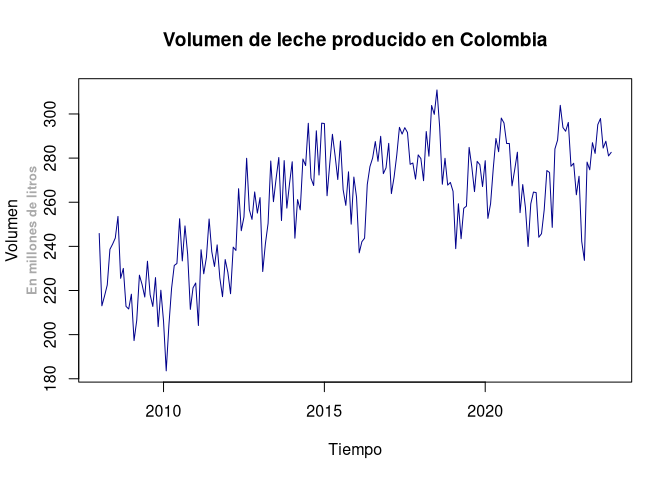

No se observan cambios significativos en la varianza, pero sí se observa
cierto grado de tendencia aunque no del todo lineal. Aunque la varianza
no parece necesitar de una estabilización de todas formas se intenta
estabilizar para ver si la serie cambia en algún aspecto importante
luego de la transformación.

### Precio diario del oro en Colombia

``` r
plot(tsventa/1000, main='Histórico precio de venta gramo de oro',ylab='Precio en miles de pesos', xlab='Año')
```

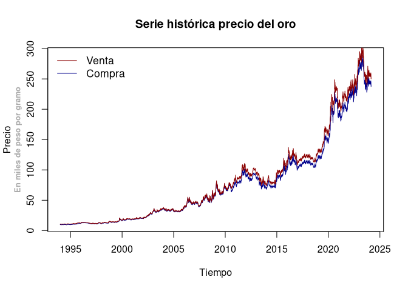

En la gráfica es posible observar que la serie cuenta con componentes de
tendencia y también es posible concluir que la serie cuenta con
heterocedasticidad marginal debido a que el rango de la variable va
aumentando con el tiempo. Sin embargo, a simple vista (Y tal vez debido
a la frecuencia) no es posible observar alguna señal de estacionalidad.

### 

<!-- ========================================== Sección 2 ==========================================  -->

## **Estabilización de la varianza**

### Volumen mensual de leche producido en Colombia

Para estabilizar la varianza, usamos la transformación Box-Cox con el
$\lambda$ calculado en el siguiente código:

``` r
lambda_leche = MASS::boxcox(object = lm(ts_leche ~ 1), seq(0,8, length = 50))
```

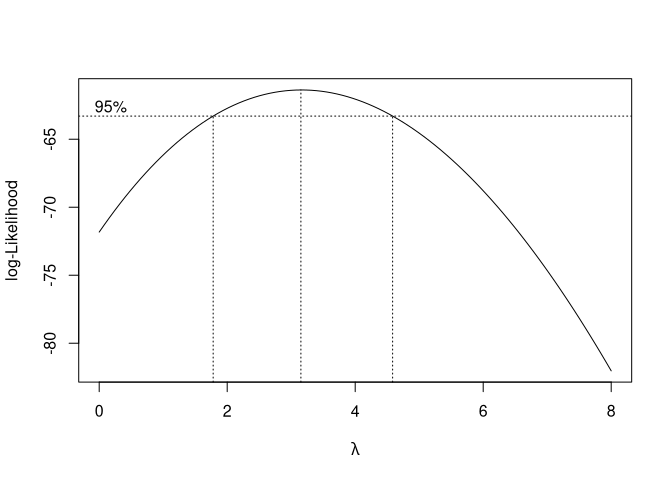

    ## El valor de lambda calculado es:  3.151515

Note que no hay evidencia que nos diga que $\lambda$ pudiese ser 1 por
lo que intentamos aplicar la transformación a la serie obteniendo ahora
sí un $\lambda$ con posible valor de 1:

``` r
# lambda_leche = 2.25
EstTS_leche = 1/(lambda_leche) * ts_leche^(lambda_leche) - 1

MASS::boxcox(lm(EstTS_leche~1), seq(0,2, length = 50))
```

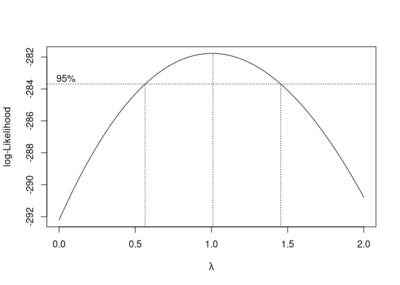

Sin embargo, si se revisan las gráficas de la serie y su transformación:

``` r
default_par = par()
par(mfrow = c(1,2))
plot.ts(ts_leche, xlab = 'Tiempo', ylab = NULL, main = 'Volumen de leche producido en Colombia', col = 'darkblue', cex = 0.5)
mtext(bquote(bold('Datos originales(En millones de litros)')), side = 3, line = 0.5, adj = 0.5, cex = 0.8, col = 'darkgray')
plot.ts(EstTS_leche, xlab = 'Tiempo', ylab = NULL, main = 'Volumen de leche producido en Colombia',
        col = 'darkblue', cex = 0.5)
mtext(bquote(bold('Datos tranformados por Box-Cox')), side = 3, line = 0.5, adj = 0.5, cex = 0.8, col = 'darkgray')
```

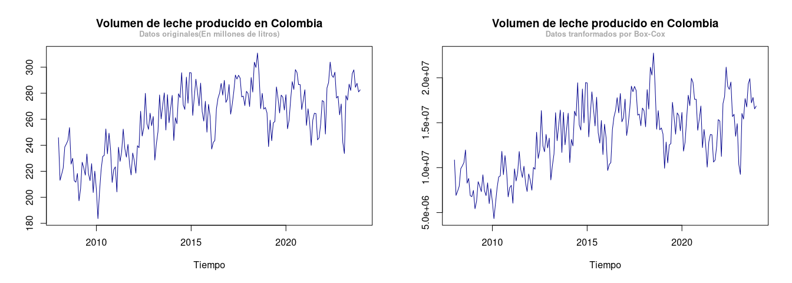

``` r
par(default_par)
```

Es fácil notar de que la serie con la transformación, en esencia, la
misma serie pero con un aumento importante en la escala por lo que se
decide seguir utilizando los datos sin transformaciones para los
procesos subsiguientes a este.

### Precio diario de venta del oro en Colombia

Según el gráfico anterior, no parece existir una mayor fluctación en el
rango del precio a lo largo del tiempo. Sin embargo se realizará la
prueba de Box-Cox para verificar. Vamos a ver si presenta variación
marginal.

``` r
# Método de Guerrero
 # g <- forecast::BoxCox.lambda(tsventa, method = 'guerrero', lower = -3, upper = );g
# 
# g_tsventa <- g^(-1) * (tsventa^g -1)
# 
# plot(g_tsventa)

# Método de LMV
ll<- forecast::BoxCox.lambda(tsventa, method = 'loglik', lower = -2, upper = 1.5);ll
```

    ## Registered S3 method overwritten by 'quantmod':
    ##   method            from
    ##   as.zoo.data.frame zoo

    ## [1] 0

``` r
MASS::boxcox(lm(tsventa ~ 1),seq(-0.2, 0.3, length = 50))
```

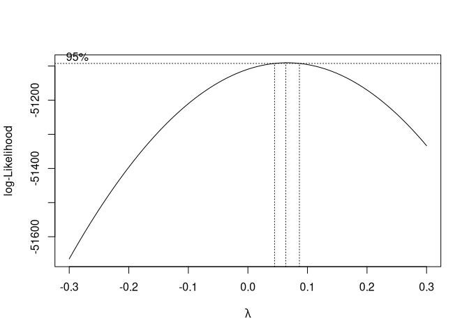

``` r
# ll_tsventa <- ll^(-1) * (tsventa^ll -1)
# ll_tsventa <- BoxCox(ll_tsventa,ll)
ll_tsventa <- log(tsventa)
```

Dado que $\lambda\neq 1$, , entonces si se necesita estabilizar la
varianza. Como el valor de $\lambda = 0$ se realizara la transformación
logaritmo natural.

``` r
# ll_tsventa <- log(tsventa)
plot(ll_tsventa)
```

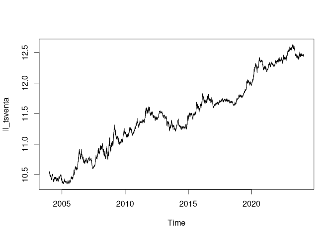

``` r
MASS::boxcox(lm(ll_tsventa ~ 1),seq(-2, 4, length = 50))
```

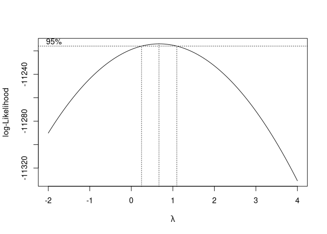

Al realizar una segunda prueba a la serie transformada obtenemos la
confirmación que 1 pertenece al intervalo de confianza para $\lambda$ .
Aunque parece no haber cambios evidentes en la gráfica, procederemos a
trabajar con la serie transformada.

``` r
EstTS_leche = ts_leche
```

### 

------------------------------------------------------------------------

<!-- ========================================== Sección 3 ==========================================  -->

## **Eliminación de la tendencia**

### Volumen mensual de leche producida en Colombia

Usando el filtro de promedios móviles:

``` r
plot(decompose(EstTS_leche))
```

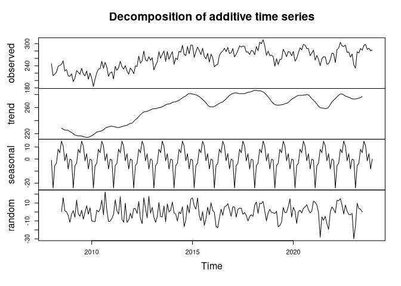

Es posible notar que los datos de esta serie presentan una tendencia no
del todo lineal y que además la estacionalidad estimada por medio de
este filtro parece ser la idonéa puesto que la componente residual no
parece mostrar comportamiento estacional. Ahora bien, busquemos otra
forma de ajustar la tendencia.

Aún si la tendencia del filtro de promedios móviles no es totalmente
lineal, podemos intentar estimar la tendencia de la serie por medio de
una regresión lineal:

``` r
par(mfrow = c(1,2))
ModeloLinealLeche = lm(EstTS_leche ~ time(EstTS_leche))

plot.ts(EstTS_leche, xlab = 'Tiempo', ylab = NULL, main = 'Volumen de leche producido en Colombia',
        col = 'darkblue', cex = 0.5)
mtext(bquote(bold('Ajuste con regresión lineal')), side = 3, line = 0.5, adj = 0.5, cex = 0.8, col = 'darkgray')
abline(ModeloLinealLeche, col = 'red')

# Los residuales
NoTendAjusLinealLeche = EstTS_leche - predict(ModeloLinealLeche)
plot.ts(NoTendAjusLinealLeche,xlab = 'Tiempo', ylab = NULL, main = 'Volumen de leche producido en Colombia',
        col = 'darkblue', cex = 0.5)
mtext(bquote(bold('Datos sin tendencia')), side = 3, line = 0.5, adj = 0.5, cex = 0.8, col = 'darkgray')
```

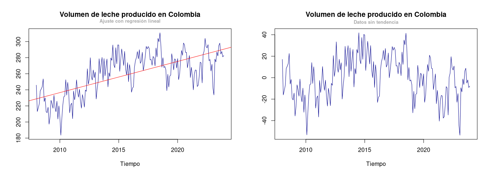

``` r
par(default_par)
```

Si bien por medio de la regresión lineal la serie parece sufrir un
cambio en su “tendencia” general también podría argumentarse que aún
presenta algo de tendencia. Probemos ahora con el método *lowess*
(Regresión del vecino más cercano):

``` r
par(mfrow = c(1,2))
ModeloLowessLeche = lowess(EstTS_leche, f = 0.25)
plot.ts(EstTS_leche, xlab = 'Tiempo', ylab = NULL, main = 'Volumen de leche producido en Colombia',
        col = 'darkblue', cex = 0.5)
mtext(bquote(bold('Ajuste con regresión local o lowess')), side = 3, line = 0.5, 
      adj = 0.5, cex = 0.8, col = 'darkgray')
lines(ModeloLowessLeche, col = 'red')

# Datos sin tendencia
NoTendAjusLowessLeche = EstTS_leche - ModeloLowessLeche$y
plot.ts(NoTendAjusLowessLeche,xlab = 'Tiempo', ylab = NULL, main = 'Volumen de leche producido en Colombia',
        col = 'darkblue', cex = 0.5)
mtext(bquote(bold('Datos sin tendencia')), side = 3, line = 0.5, adj = 0.5, cex = 0.8, col = 'darkgray')
```


``` r
par(default_par)
```

Claramente este método estima mucho mejor al tendencia de nuestros
datos. Sin embargo, probemos con el método de *suavizamiento Kernel*:

``` r
par(mfrow = c(1,2))
ModeloKernelLeche = ksmooth(y = as.numeric(EstTS_leche), x = time(EstTS_leche),kernel = 'normal', bandwidth = 2.5)
plot.ts(EstTS_leche, xlab = 'Tiempo', ylab = NULL, main = 'Volumen de leche producido en Colombia',
        col = 'darkblue', cex = 0.5)
mtext(bquote(bold('Suavizado Kernel')), side = 3, line = 0.5, 
      adj = 0.5, cex = 0.8, col = 'darkgray')
lines(ModeloKernelLeche, col = 'red')

# Datos sin tendencia
NoTendAjusKernelLeche = EstTS_leche - ModeloKernelLeche$y
plot(NoTendAjusKernelLeche,xlab = 'Tiempo', ylab = NULL, main = 'Volumen de leche producido en Colombia',
     col = 'darkblue', cex = 0.5)
mtext(bquote(bold('Datos sin tendencia')), side = 3, line = 0.5, adj = 0.5, cex = 0.8, col = 'darkgray')
```

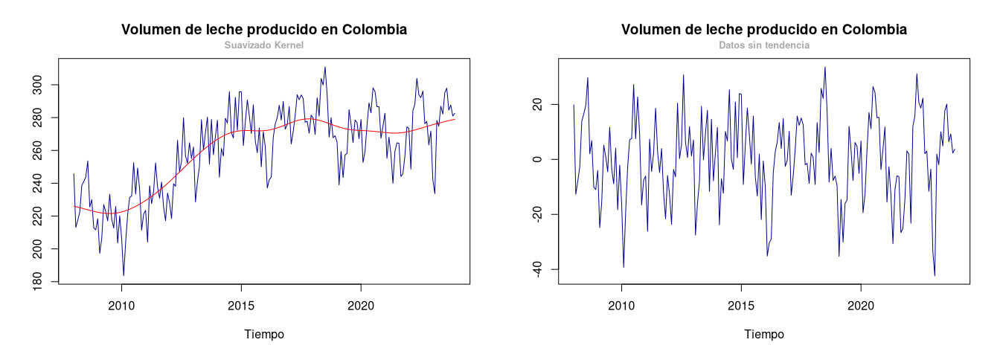

``` r
par(default_par)
```

Donde obtenemos un comportamiento muy similar al presentado con el
método *lowess*. Finalmente, podemos aplicar el método *splines*
solamente para estar seguros de que la tendencia demostrada antes sea la
adecuada:

``` r
par(mfrow = c(1,2))

ModeloSplinesLeche = smooth.spline(time(EstTS_leche), EstTS_leche, spar = 0.8)
plot.ts(EstTS_leche, xlab = 'Tiempo', ylab = NULL, main = 'Volumen de leche producido en Colombia',
        col = 'darkblue', cex = 0.5)
mtext(bquote(bold('Suavizado Splines')), side = 3, line = 0.5, 
      adj = 0.5, cex = 0.8, col = 'darkgray')
lines(ModeloSplinesLeche, col = 'red')

# plot(ModeloSplinesLeche, type = 'l')


# Datos sin tendencia
NoTendAjusSplinesLeche = EstTS_leche - ModeloSplinesLeche$y
plot(NoTendAjusSplinesLeche,xlab = 'Tiempo', ylab = NULL, main = 'Volumen de leche producido en Colombia',
     col = 'darkblue', cex = 0.5)
mtext(bquote(bold('Datos sin tendencia')), side = 3, line = 0.5, adj = 0.5, cex = 0.8, col = 'darkgray')
```

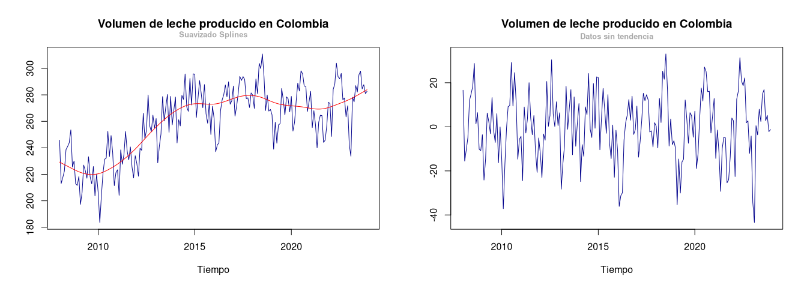

``` r
# for (i in 2008:2023){
#   abline(v = i, col = '#8B8970', lty = 'dashed', pch = 2)
# }


par(default_par)
```

Como todos los tres métodos (*Lowess, Kernel y splines*) nos dan
resultados similares, podemos usar cualquiera de los tres resultados
para continuar con la estimación de la estacionalidad. En el caso
particular de este documento, se estará utilizando la serie residual
asociada al método de suavizamiento *Kernel*.

### Precio diario de venta de oro en Colombia

Exploramos los diferentes métodos para estimar la tendencia, entre
ellos, regresión lineal simple, splines, kernel y LOESS, ninguno resulto
ser efectivo, pues las series resultantes sin tendencias no parecían ser
estacionarias en el sentido débil. Por esta razón se utilizó la serie
diferenciada a 1 rezago.

``` r
fit_lltsventa<- lm(ll_tsventa~time(ll_tsventa), na.action=NULL)
plot.ts(ll_tsventa,
        main = "Estimación de la tendencia modelo lineal normal",
        ylab = 'Log(Precio)',
        xlab = 'Años')
abline(fit_lltsventa, col = "red")
```

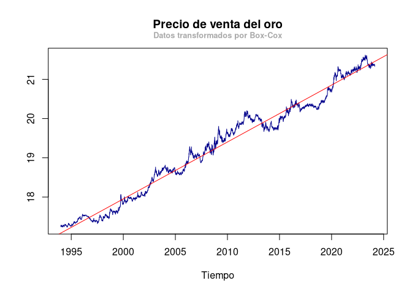

``` r
notenden_lltsventa <- ll_tsventa - predict(fit_lltsventa)
plot(notenden_lltsventa, main='Serie sin tendencia modelo lineal normal',xlab='Año',ylab='Log(precio)')
```

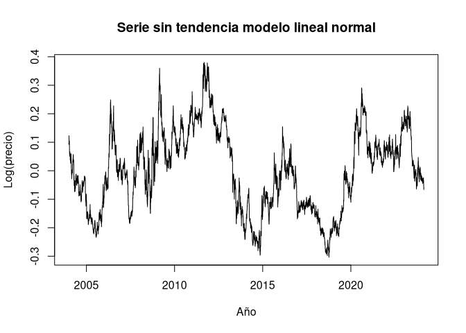
La estimación usando el modelo lineal no fue efectiva para explicar la
tendencia en algunos años,2005 al 2006, 2010 al 2012, 2015 al 2017 .

Se usara regresión LOESS para estimar la tendencia.

``` r
library(tsibble)
```

    ## 
    ## Attaching package: 'tsibble'

    ## The following objects are masked from 'package:base':
    ## 
    ##     intersect, setdiff, union

``` r
library(timetk)
library(tidyverse)
```

    ## ── Attaching core tidyverse packages ──────────────────────── tidyverse 2.0.0 ──
    ## ✔ forcats   1.0.0     ✔ readr     2.1.5
    ## ✔ ggplot2   3.4.4     ✔ stringr   1.5.1
    ## ✔ lubridate 1.9.3     ✔ tibble    3.2.1
    ## ✔ purrr     1.0.2     ✔ tidyr     1.3.1

    ## ── Conflicts ────────────────────────────────────────── tidyverse_conflicts() ──
    ## ✖ dplyr::filter()       masks stats::filter()
    ## ✖ lubridate::interval() masks tsibble::interval()
    ## ✖ dplyr::lag()          masks stats::lag()
    ## ℹ Use the conflicted package (<http://conflicted.r-lib.org/>) to force all conflicts to become errors

``` r
library(feasts)
```

    ## Loading required package: fabletools

``` r
library(fable)

df_ll_tsventa<-data.frame(Fecha=datos2$Fecha,ll_tsventa=as.matrix(ll_tsventa))
df_tsventa=data.frame(Fecha=datos2$Fecha,Precioro=as.matrix(datos2$Valor))

str(df_tsventa)
```

    ## 'data.frame':    7352 obs. of  2 variables:
    ##  $ Fecha   : Date, format: "2004-01-01" "2004-01-02" ...
    ##  $ Precioro: num  37157 37086 37086 37086 37311 ...

``` r
tibble_lltsventa <- tibble(df_ll_tsventa)

tsibble_tsventa <- as_tsibble(df_tsventa)
```

    ## Using `Fecha` as index variable.

``` r
tibble_lltsventa%>%timetk::plot_time_series(Fecha, ll_tsventa, 
                   .interactive = TRUE,
                   .plotly_slider = TRUE)
```

<div class="plotly html-widget html-fill-item" id="htmlwidget-e1a1d4031f7311271ad9" style="width:672px;height:480px;"></div>
<script type="application/json" data-for="htmlwidget-e1a1d4031f7311271ad9">{"x":{"data":[{"x":["2004-01-01","2004-01-02","2004-01-03","2004-01-04","2004-01-05","2004-01-06","2004-01-07","2004-01-08","2004-01-09","2004-01-10","2004-01-11","2004-01-12","2004-01-13","2004-01-14","2004-01-15","2004-01-16","2004-01-17","2004-01-18","2004-01-19","2004-01-20","2004-01-21","2004-01-22","2004-01-23","2004-01-24","2004-01-25","2004-01-26","2004-01-27","2004-01-28","2004-01-29","2004-01-30","2004-01-31","2004-02-01","2004-02-02","2004-02-03","2004-02-04","2004-02-05","2004-02-06","2004-02-07","2004-02-08","2004-02-09","2004-02-10","2004-02-11","2004-02-12","2004-02-13","2004-02-14","2004-02-15","2004-02-16","2004-02-17","2004-02-18","2004-02-19","2004-02-20","2004-02-21","2004-02-22","2004-02-23","2004-02-24","2004-02-25","2004-02-26","2004-02-27","2004-02-28","2004-02-29","2004-03-01","2004-03-02","2004-03-03","2004-03-04","2004-03-05","2004-03-06","2004-03-07","2004-03-08","2004-03-09","2004-03-10","2004-03-11","2004-03-12","2004-03-13","2004-03-14","2004-03-15","2004-03-16","2004-03-17","2004-03-18","2004-03-19","2004-03-20","2004-03-21","2004-03-22","2004-03-23","2004-03-24","2004-03-25","2004-03-26","2004-03-27","2004-03-28","2004-03-29","2004-03-30","2004-03-31","2004-04-01","2004-04-02","2004-04-03","2004-04-04","2004-04-05","2004-04-06","2004-04-07","2004-04-08","2004-04-09","2004-04-10","2004-04-11","2004-04-12","2004-04-13","2004-04-14","2004-04-15","2004-04-16","2004-04-17","2004-04-18","2004-04-19","2004-04-20","2004-04-21","2004-04-22","2004-04-23","2004-04-24","2004-04-25","2004-04-26","2004-04-27","2004-04-28","2004-04-29","2004-04-30","2004-05-01","2004-05-02","2004-05-03","2004-05-04","2004-05-05","2004-05-06","2004-05-07","2004-05-08","2004-05-09","2004-05-10","2004-05-11","2004-05-12","2004-05-13","2004-05-14","2004-05-15","2004-05-16","2004-05-17","2004-05-18","2004-05-19","2004-05-20","2004-05-21","2004-05-22","2004-05-23","2004-05-24","2004-05-25","2004-05-26","2004-05-27","2004-05-28","2004-05-29","2004-05-30","2004-05-31","2004-06-01","2004-06-02","2004-06-03","2004-06-04","2004-06-05","2004-06-06","2004-06-07","2004-06-08","2004-06-09","2004-06-10","2004-06-11","2004-06-12","2004-06-13","2004-06-14","2004-06-15","2004-06-16","2004-06-17","2004-06-18","2004-06-19","2004-06-20","2004-06-21","2004-06-22","2004-06-23","2004-06-24","2004-06-25","2004-06-26","2004-06-27","2004-06-28","2004-06-29","2004-06-30","2004-07-01","2004-07-02","2004-07-03","2004-07-04","2004-07-05","2004-07-06","2004-07-07","2004-07-08","2004-07-09","2004-07-10","2004-07-11","2004-07-12","2004-07-13","2004-07-14","2004-07-15","2004-07-16","2004-07-17","2004-07-18","2004-07-19","2004-07-20","2004-07-21","2004-07-22","2004-07-23","2004-07-24","2004-07-25","2004-07-26","2004-07-27","2004-07-28","2004-07-29","2004-07-30","2004-07-31","2004-08-01","2004-08-02","2004-08-03","2004-08-04","2004-08-05","2004-08-06","2004-08-07","2004-08-08","2004-08-09","2004-08-10","2004-08-11","2004-08-12","2004-08-13","2004-08-14","2004-08-15","2004-08-16","2004-08-17","2004-08-18","2004-08-19","2004-08-20","2004-08-21","2004-08-22","2004-08-23","2004-08-24","2004-08-25","2004-08-26","2004-08-27","2004-08-28","2004-08-29","2004-08-30","2004-08-31","2004-09-01","2004-09-02","2004-09-03","2004-09-04","2004-09-05","2004-09-06","2004-09-07","2004-09-08","2004-09-09","2004-09-10","2004-09-11","2004-09-12","2004-09-13","2004-09-14","2004-09-15","2004-09-16","2004-09-17","2004-09-18","2004-09-19","2004-09-20","2004-09-21","2004-09-22","2004-09-23","2004-09-24","2004-09-25","2004-09-26","2004-09-27","2004-09-28","2004-09-29","2004-09-30","2004-10-01","2004-10-02","2004-10-03","2004-10-04","2004-10-05","2004-10-06","2004-10-07","2004-10-08","2004-10-09","2004-10-10","2004-10-11","2004-10-12","2004-10-13","2004-10-14","2004-10-15","2004-10-16","2004-10-17","2004-10-18","2004-10-19","2004-10-20","2004-10-21","2004-10-22","2004-10-23","2004-10-24","2004-10-25","2004-10-26","2004-10-27","2004-10-28","2004-10-29","2004-10-30","2004-10-31","2004-11-01","2004-11-02","2004-11-03","2004-11-04","2004-11-05","2004-11-06","2004-11-07","2004-11-08","2004-11-09","2004-11-10","2004-11-11","2004-11-12","2004-11-13","2004-11-14","2004-11-15","2004-11-16","2004-11-17","2004-11-18","2004-11-19","2004-11-20","2004-11-21","2004-11-22","2004-11-23","2004-11-24","2004-11-25","2004-11-26","2004-11-27","2004-11-28","2004-11-29","2004-11-30","2004-12-01","2004-12-02","2004-12-03","2004-12-04","2004-12-05","2004-12-06","2004-12-07","2004-12-08","2004-12-09","2004-12-10","2004-12-11","2004-12-12","2004-12-13","2004-12-14","2004-12-15","2004-12-16","2004-12-17","2004-12-18","2004-12-19","2004-12-20","2004-12-21","2004-12-22","2004-12-23","2004-12-24","2004-12-25","2004-12-26","2004-12-27","2004-12-28","2004-12-29","2004-12-30","2004-12-31","2005-01-01","2005-01-02","2005-01-03","2005-01-04","2005-01-05","2005-01-06","2005-01-07","2005-01-08","2005-01-09","2005-01-10","2005-01-11","2005-01-12","2005-01-13","2005-01-14","2005-01-15","2005-01-16","2005-01-17","2005-01-18","2005-01-19","2005-01-20","2005-01-21","2005-01-22","2005-01-23","2005-01-24","2005-01-25","2005-01-26","2005-01-27","2005-01-28","2005-01-29","2005-01-30","2005-01-31","2005-02-01","2005-02-02","2005-02-03","2005-02-04","2005-02-05","2005-02-06","2005-02-07","2005-02-08","2005-02-09","2005-02-10","2005-02-11","2005-02-12","2005-02-13","2005-02-14","2005-02-15","2005-02-16","2005-02-17","2005-02-18","2005-02-19","2005-02-20","2005-02-21","2005-02-22","2005-02-23","2005-02-24","2005-02-25","2005-02-26","2005-02-27","2005-02-28","2005-03-01","2005-03-02","2005-03-03","2005-03-04","2005-03-05","2005-03-06","2005-03-07","2005-03-08","2005-03-09","2005-03-10","2005-03-11","2005-03-12","2005-03-13","2005-03-14","2005-03-15","2005-03-16","2005-03-17","2005-03-18","2005-03-19","2005-03-20","2005-03-21","2005-03-22","2005-03-23","2005-03-24","2005-03-25","2005-03-26","2005-03-27","2005-03-28","2005-03-29","2005-03-30","2005-03-31","2005-04-01","2005-04-02","2005-04-03","2005-04-04","2005-04-05","2005-04-06","2005-04-07","2005-04-08","2005-04-09","2005-04-10","2005-04-11","2005-04-12","2005-04-13","2005-04-14","2005-04-15","2005-04-16","2005-04-17","2005-04-18","2005-04-19","2005-04-20","2005-04-21","2005-04-22","2005-04-23","2005-04-24","2005-04-25","2005-04-26","2005-04-27","2005-04-28","2005-04-29","2005-04-30","2005-05-01","2005-05-02","2005-05-03","2005-05-04","2005-05-05","2005-05-06","2005-05-07","2005-05-08","2005-05-09","2005-05-10","2005-05-11","2005-05-12","2005-05-13","2005-05-14","2005-05-15","2005-05-16","2005-05-17","2005-05-18","2005-05-19","2005-05-20","2005-05-21","2005-05-22","2005-05-23","2005-05-24","2005-05-25","2005-05-26","2005-05-27","2005-05-28","2005-05-29","2005-05-30","2005-05-31","2005-06-01","2005-06-02","2005-06-03","2005-06-04","2005-06-05","2005-06-06","2005-06-07","2005-06-08","2005-06-09","2005-06-10","2005-06-11","2005-06-12","2005-06-13","2005-06-14","2005-06-15","2005-06-16","2005-06-17","2005-06-18","2005-06-19","2005-06-20","2005-06-21","2005-06-22","2005-06-23","2005-06-24","2005-06-25","2005-06-26","2005-06-27","2005-06-28","2005-06-29","2005-06-30","2005-07-01","2005-07-02","2005-07-03","2005-07-04","2005-07-05","2005-07-06","2005-07-07","2005-07-08","2005-07-09","2005-07-10","2005-07-11","2005-07-12","2005-07-13","2005-07-14","2005-07-15","2005-07-16","2005-07-17","2005-07-18","2005-07-19","2005-07-20","2005-07-21","2005-07-22","2005-07-23","2005-07-24","2005-07-25","2005-07-26","2005-07-27","2005-07-28","2005-07-29","2005-07-30","2005-07-31","2005-08-01","2005-08-02","2005-08-03","2005-08-04","2005-08-05","2005-08-06","2005-08-07","2005-08-08","2005-08-09","2005-08-10","2005-08-11","2005-08-12","2005-08-13","2005-08-14","2005-08-15","2005-08-16","2005-08-17","2005-08-18","2005-08-19","2005-08-20","2005-08-21","2005-08-22","2005-08-23","2005-08-24","2005-08-25","2005-08-26","2005-08-27","2005-08-28","2005-08-29","2005-08-30","2005-08-31","2005-09-01","2005-09-02","2005-09-03","2005-09-04","2005-09-05","2005-09-06","2005-09-07","2005-09-08","2005-09-09","2005-09-10","2005-09-11","2005-09-12","2005-09-13","2005-09-14","2005-09-15","2005-09-16","2005-09-17","2005-09-18","2005-09-19","2005-09-20","2005-09-21","2005-09-22","2005-09-23","2005-09-24","2005-09-25","2005-09-26","2005-09-27","2005-09-28","2005-09-29","2005-09-30","2005-10-01","2005-10-02","2005-10-03","2005-10-04","2005-10-05","2005-10-06","2005-10-07","2005-10-08","2005-10-09","2005-10-10","2005-10-11","2005-10-12","2005-10-13","2005-10-14","2005-10-15","2005-10-16","2005-10-17","2005-10-18","2005-10-19","2005-10-20","2005-10-21","2005-10-22","2005-10-23","2005-10-24","2005-10-25","2005-10-26","2005-10-27","2005-10-28","2005-10-29","2005-10-30","2005-10-31","2005-11-01","2005-11-02","2005-11-03","2005-11-04","2005-11-05","2005-11-06","2005-11-07","2005-11-08","2005-11-09","2005-11-10","2005-11-11","2005-11-12","2005-11-13","2005-11-14","2005-11-15","2005-11-16","2005-11-17","2005-11-18","2005-11-19","2005-11-20","2005-11-21","2005-11-22","2005-11-23","2005-11-24","2005-11-25","2005-11-26","2005-11-27","2005-11-28","2005-11-29","2005-11-30","2005-12-01","2005-12-02","2005-12-03","2005-12-04","2005-12-05","2005-12-06","2005-12-07","2005-12-08","2005-12-09","2005-12-10","2005-12-11","2005-12-12","2005-12-13","2005-12-14","2005-12-15","2005-12-16","2005-12-17","2005-12-18","2005-12-19","2005-12-20","2005-12-21","2005-12-22","2005-12-23","2005-12-24","2005-12-25","2005-12-26","2005-12-27","2005-12-28","2005-12-29","2005-12-30","2005-12-31","2006-01-01","2006-01-02","2006-01-03","2006-01-04","2006-01-05","2006-01-06","2006-01-07","2006-01-08","2006-01-09","2006-01-10","2006-01-11","2006-01-12","2006-01-13","2006-01-14","2006-01-15","2006-01-16","2006-01-17","2006-01-18","2006-01-19","2006-01-20","2006-01-21","2006-01-22","2006-01-23","2006-01-24","2006-01-25","2006-01-26","2006-01-27","2006-01-28","2006-01-29","2006-01-30","2006-01-31","2006-02-01","2006-02-02","2006-02-03","2006-02-04","2006-02-05","2006-02-06","2006-02-07","2006-02-08","2006-02-09","2006-02-10","2006-02-11","2006-02-12","2006-02-13","2006-02-14","2006-02-15","2006-02-16","2006-02-17","2006-02-18","2006-02-19","2006-02-20","2006-02-21","2006-02-22","2006-02-23","2006-02-24","2006-02-25","2006-02-26","2006-02-27","2006-02-28","2006-03-01","2006-03-02","2006-03-03","2006-03-04","2006-03-05","2006-03-06","2006-03-07","2006-03-08","2006-03-09","2006-03-10","2006-03-11","2006-03-12","2006-03-13","2006-03-14","2006-03-15","2006-03-16","2006-03-17","2006-03-18","2006-03-19","2006-03-20","2006-03-21","2006-03-22","2006-03-23","2006-03-24","2006-03-25","2006-03-26","2006-03-27","2006-03-28","2006-03-29","2006-03-30","2006-03-31","2006-04-01","2006-04-02","2006-04-03","2006-04-04","2006-04-05","2006-04-06","2006-04-07","2006-04-08","2006-04-09","2006-04-10","2006-04-11","2006-04-12","2006-04-13","2006-04-14","2006-04-15","2006-04-16","2006-04-17","2006-04-18","2006-04-19","2006-04-20","2006-04-21","2006-04-22","2006-04-23","2006-04-24","2006-04-25","2006-04-26","2006-04-27","2006-04-28","2006-04-29","2006-04-30","2006-05-01","2006-05-02","2006-05-03","2006-05-04","2006-05-05","2006-05-06","2006-05-07","2006-05-08","2006-05-09","2006-05-10","2006-05-11","2006-05-12","2006-05-13","2006-05-14","2006-05-15","2006-05-16","2006-05-17","2006-05-18","2006-05-19","2006-05-20","2006-05-21","2006-05-22","2006-05-23","2006-05-24","2006-05-25","2006-05-26","2006-05-27","2006-05-28","2006-05-29","2006-05-30","2006-05-31","2006-06-01","2006-06-02","2006-06-03","2006-06-04","2006-06-05","2006-06-06","2006-06-07","2006-06-08","2006-06-09","2006-06-10","2006-06-11","2006-06-12","2006-06-13","2006-06-14","2006-06-15","2006-06-16","2006-06-17","2006-06-18","2006-06-19","2006-06-20","2006-06-21","2006-06-22","2006-06-23","2006-06-24","2006-06-25","2006-06-26","2006-06-27","2006-06-28","2006-06-29","2006-06-30","2006-07-01","2006-07-02","2006-07-03","2006-07-04","2006-07-05","2006-07-06","2006-07-07","2006-07-08","2006-07-09","2006-07-10","2006-07-11","2006-07-12","2006-07-13","2006-07-14","2006-07-15","2006-07-16","2006-07-17","2006-07-18","2006-07-19","2006-07-20","2006-07-21","2006-07-22","2006-07-23","2006-07-24","2006-07-25","2006-07-26","2006-07-27","2006-07-28","2006-07-29","2006-07-30","2006-07-31","2006-08-01","2006-08-02","2006-08-03","2006-08-04","2006-08-05","2006-08-06","2006-08-07","2006-08-08","2006-08-09","2006-08-10","2006-08-11","2006-08-12","2006-08-13","2006-08-14","2006-08-15","2006-08-16","2006-08-17","2006-08-18","2006-08-19","2006-08-20","2006-08-21","2006-08-22","2006-08-23","2006-08-24","2006-08-25","2006-08-26","2006-08-27","2006-08-28","2006-08-29","2006-08-30","2006-08-31","2006-09-01","2006-09-02","2006-09-03","2006-09-04","2006-09-05","2006-09-06","2006-09-07","2006-09-08","2006-09-09","2006-09-10","2006-09-11","2006-09-12","2006-09-13","2006-09-14","2006-09-15","2006-09-16","2006-09-17","2006-09-18","2006-09-19","2006-09-20","2006-09-21","2006-09-22","2006-09-23","2006-09-24","2006-09-25","2006-09-26","2006-09-27","2006-09-28","2006-09-29","2006-09-30","2006-10-01","2006-10-02","2006-10-03","2006-10-04","2006-10-05","2006-10-06","2006-10-07","2006-10-08","2006-10-09","2006-10-10","2006-10-11","2006-10-12","2006-10-13","2006-10-14","2006-10-15","2006-10-16","2006-10-17","2006-10-18","2006-10-19","2006-10-20","2006-10-21","2006-10-22","2006-10-23","2006-10-24","2006-10-25","2006-10-26","2006-10-27","2006-10-28","2006-10-29","2006-10-30","2006-10-31","2006-11-01","2006-11-02","2006-11-03","2006-11-04","2006-11-05","2006-11-06","2006-11-07","2006-11-08","2006-11-09","2006-11-10","2006-11-11","2006-11-12","2006-11-13","2006-11-14","2006-11-15","2006-11-16","2006-11-17","2006-11-18","2006-11-19","2006-11-20","2006-11-21","2006-11-22","2006-11-23","2006-11-24","2006-11-25","2006-11-26","2006-11-27","2006-11-28","2006-11-29","2006-11-30","2006-12-01","2006-12-02","2006-12-03","2006-12-04","2006-12-05","2006-12-06","2006-12-07","2006-12-08","2006-12-09","2006-12-10","2006-12-11","2006-12-12","2006-12-13","2006-12-14","2006-12-15","2006-12-16","2006-12-17","2006-12-18","2006-12-19","2006-12-20","2006-12-21","2006-12-22","2006-12-23","2006-12-24","2006-12-25","2006-12-26","2006-12-27","2006-12-28","2006-12-29","2006-12-30","2006-12-31","2007-01-01","2007-01-02","2007-01-03","2007-01-04","2007-01-05","2007-01-06","2007-01-07","2007-01-08","2007-01-09","2007-01-10","2007-01-11","2007-01-12","2007-01-13","2007-01-14","2007-01-15","2007-01-16","2007-01-17","2007-01-18","2007-01-19","2007-01-20","2007-01-21","2007-01-22","2007-01-23","2007-01-24","2007-01-25","2007-01-26","2007-01-27","2007-01-28","2007-01-29","2007-01-30","2007-01-31","2007-02-01","2007-02-02","2007-02-03","2007-02-04","2007-02-05","2007-02-06","2007-02-07","2007-02-08","2007-02-09","2007-02-10","2007-02-11","2007-02-12","2007-02-13","2007-02-14","2007-02-15","2007-02-16","2007-02-17","2007-02-18","2007-02-19","2007-02-20","2007-02-21","2007-02-22","2007-02-23","2007-02-24","2007-02-25","2007-02-26","2007-02-27","2007-02-28","2007-03-01","2007-03-02","2007-03-03","2007-03-04","2007-03-05","2007-03-06","2007-03-07","2007-03-08","2007-03-09","2007-03-10","2007-03-11","2007-03-12","2007-03-13","2007-03-14","2007-03-15","2007-03-16","2007-03-17","2007-03-18","2007-03-19","2007-03-20","2007-03-21","2007-03-22","2007-03-23","2007-03-24","2007-03-25","2007-03-26","2007-03-27","2007-03-28","2007-03-29","2007-03-30","2007-03-31","2007-04-01","2007-04-02","2007-04-03","2007-04-04","2007-04-05","2007-04-06","2007-04-07","2007-04-08","2007-04-09","2007-04-10","2007-04-11","2007-04-12","2007-04-13","2007-04-14","2007-04-15","2007-04-16","2007-04-17","2007-04-18","2007-04-19","2007-04-20","2007-04-21","2007-04-22","2007-04-23","2007-04-24","2007-04-25","2007-04-26","2007-04-27","2007-04-28","2007-04-29","2007-04-30","2007-05-01","2007-05-02","2007-05-03","2007-05-04","2007-05-05","2007-05-06","2007-05-07","2007-05-08","2007-05-09","2007-05-10","2007-05-11","2007-05-12","2007-05-13","2007-05-14","2007-05-15","2007-05-16","2007-05-17","2007-05-18","2007-05-19","2007-05-20","2007-05-21","2007-05-22","2007-05-23","2007-05-24","2007-05-25","2007-05-26","2007-05-27","2007-05-28","2007-05-29","2007-05-30","2007-05-31","2007-06-01","2007-06-02","2007-06-03","2007-06-04","2007-06-05","2007-06-06","2007-06-07","2007-06-08","2007-06-09","2007-06-10","2007-06-11","2007-06-12","2007-06-13","2007-06-14","2007-06-15","2007-06-16","2007-06-17","2007-06-18","2007-06-19","2007-06-20","2007-06-21","2007-06-22","2007-06-23","2007-06-24","2007-06-25","2007-06-26","2007-06-27","2007-06-28","2007-06-29","2007-06-30","2007-07-01","2007-07-02","2007-07-03","2007-07-04","2007-07-05","2007-07-06","2007-07-07","2007-07-08","2007-07-09","2007-07-10","2007-07-11","2007-07-12","2007-07-13","2007-07-14","2007-07-15","2007-07-16","2007-07-17","2007-07-18","2007-07-19","2007-07-20","2007-07-21","2007-07-22","2007-07-23","2007-07-24","2007-07-25","2007-07-26","2007-07-27","2007-07-28","2007-07-29","2007-07-30","2007-07-31","2007-08-01","2007-08-02","2007-08-03","2007-08-04","2007-08-05","2007-08-06","2007-08-07","2007-08-08","2007-08-09","2007-08-10","2007-08-11","2007-08-12","2007-08-13","2007-08-14","2007-08-15","2007-08-16","2007-08-17","2007-08-18","2007-08-19","2007-08-20","2007-08-21","2007-08-22","2007-08-23","2007-08-24","2007-08-25","2007-08-26","2007-08-27","2007-08-28","2007-08-29","2007-08-30","2007-08-31","2007-09-01","2007-09-02","2007-09-03","2007-09-04","2007-09-05","2007-09-06","2007-09-07","2007-09-08","2007-09-09","2007-09-10","2007-09-11","2007-09-12","2007-09-13","2007-09-14","2007-09-15","2007-09-16","2007-09-17","2007-09-18","2007-09-19","2007-09-20","2007-09-21","2007-09-22","2007-09-23","2007-09-24","2007-09-25","2007-09-26","2007-09-27","2007-09-28","2007-09-29","2007-09-30","2007-10-01","2007-10-02","2007-10-03","2007-10-04","2007-10-05","2007-10-06","2007-10-07","2007-10-08","2007-10-09","2007-10-10","2007-10-11","2007-10-12","2007-10-13","2007-10-14","2007-10-15","2007-10-16","2007-10-17","2007-10-18","2007-10-19","2007-10-20","2007-10-21","2007-10-22","2007-10-23","2007-10-24","2007-10-25","2007-10-26","2007-10-27","2007-10-28","2007-10-29","2007-10-30","2007-10-31","2007-11-01","2007-11-02","2007-11-03","2007-11-04","2007-11-05","2007-11-06","2007-11-07","2007-11-08","2007-11-09","2007-11-10","2007-11-11","2007-11-12","2007-11-13","2007-11-14","2007-11-15","2007-11-16","2007-11-17","2007-11-18","2007-11-19","2007-11-20","2007-11-21","2007-11-22","2007-11-23","2007-11-24","2007-11-25","2007-11-26","2007-11-27","2007-11-28","2007-11-29","2007-11-30","2007-12-01","2007-12-02","2007-12-03","2007-12-04","2007-12-05","2007-12-06","2007-12-07","2007-12-08","2007-12-09","2007-12-10","2007-12-11","2007-12-12","2007-12-13","2007-12-14","2007-12-15","2007-12-16","2007-12-17","2007-12-18","2007-12-19","2007-12-20","2007-12-21","2007-12-22","2007-12-23","2007-12-24","2007-12-25","2007-12-26","2007-12-27","2007-12-28","2007-12-29","2007-12-30","2007-12-31","2008-01-01","2008-01-02","2008-01-03","2008-01-04","2008-01-05","2008-01-06","2008-01-07","2008-01-08","2008-01-09","2008-01-10","2008-01-11","2008-01-12","2008-01-13","2008-01-14","2008-01-15","2008-01-16","2008-01-17","2008-01-18","2008-01-19","2008-01-20","2008-01-21","2008-01-22","2008-01-23","2008-01-24","2008-01-25","2008-01-26","2008-01-27","2008-01-28","2008-01-29","2008-01-30","2008-01-31","2008-02-01","2008-02-02","2008-02-03","2008-02-04","2008-02-05","2008-02-06","2008-02-07","2008-02-08","2008-02-09","2008-02-10","2008-02-11","2008-02-12","2008-02-13","2008-02-14","2008-02-15","2008-02-16","2008-02-17","2008-02-18","2008-02-19","2008-02-20","2008-02-21","2008-02-22","2008-02-23","2008-02-24","2008-02-25","2008-02-26","2008-02-27","2008-02-28","2008-02-29","2008-03-01","2008-03-02","2008-03-03","2008-03-04","2008-03-05","2008-03-06","2008-03-07","2008-03-08","2008-03-09","2008-03-10","2008-03-11","2008-03-12","2008-03-13","2008-03-14","2008-03-15","2008-03-16","2008-03-17","2008-03-18","2008-03-19","2008-03-20","2008-03-21","2008-03-22","2008-03-23","2008-03-24","2008-03-25","2008-03-26","2008-03-27","2008-03-28","2008-03-29","2008-03-30","2008-03-31","2008-04-01","2008-04-02","2008-04-03","2008-04-04","2008-04-05","2008-04-06","2008-04-07","2008-04-08","2008-04-09","2008-04-10","2008-04-11","2008-04-12","2008-04-13","2008-04-14","2008-04-15","2008-04-16","2008-04-17","2008-04-18","2008-04-19","2008-04-20","2008-04-21","2008-04-22","2008-04-23","2008-04-24","2008-04-25","2008-04-26","2008-04-27","2008-04-28","2008-04-29","2008-04-30","2008-05-01","2008-05-02","2008-05-03","2008-05-04","2008-05-05","2008-05-06","2008-05-07","2008-05-08","2008-05-09","2008-05-10","2008-05-11","2008-05-12","2008-05-13","2008-05-14","2008-05-15","2008-05-16","2008-05-17","2008-05-18","2008-05-19","2008-05-20","2008-05-21","2008-05-22","2008-05-23","2008-05-24","2008-05-25","2008-05-26","2008-05-27","2008-05-28","2008-05-29","2008-05-30","2008-05-31","2008-06-01","2008-06-02","2008-06-03","2008-06-04","2008-06-05","2008-06-06","2008-06-07","2008-06-08","2008-06-09","2008-06-10","2008-06-11","2008-06-12","2008-06-13","2008-06-14","2008-06-15","2008-06-16","2008-06-17","2008-06-18","2008-06-19","2008-06-20","2008-06-21","2008-06-22","2008-06-23","2008-06-24","2008-06-25","2008-06-26","2008-06-27","2008-06-28","2008-06-29","2008-06-30","2008-07-01","2008-07-02","2008-07-03","2008-07-04","2008-07-05","2008-07-06","2008-07-07","2008-07-08","2008-07-09","2008-07-10","2008-07-11","2008-07-12","2008-07-13","2008-07-14","2008-07-15","2008-07-16","2008-07-17","2008-07-18","2008-07-19","2008-07-20","2008-07-21","2008-07-22","2008-07-23","2008-07-24","2008-07-25","2008-07-26","2008-07-27","2008-07-28","2008-07-29","2008-07-30","2008-07-31","2008-08-01","2008-08-02","2008-08-03","2008-08-04","2008-08-05","2008-08-06","2008-08-07","2008-08-08","2008-08-09","2008-08-10","2008-08-11","2008-08-12","2008-08-13","2008-08-14","2008-08-15","2008-08-16","2008-08-17","2008-08-18","2008-08-19","2008-08-20","2008-08-21","2008-08-22","2008-08-23","2008-08-24","2008-08-25","2008-08-26","2008-08-27","2008-08-28","2008-08-29","2008-08-30","2008-08-31","2008-09-01","2008-09-02","2008-09-03","2008-09-04","2008-09-05","2008-09-06","2008-09-07","2008-09-08","2008-09-09","2008-09-10","2008-09-11","2008-09-12","2008-09-13","2008-09-14","2008-09-15","2008-09-16","2008-09-17","2008-09-18","2008-09-19","2008-09-20","2008-09-21","2008-09-22","2008-09-23","2008-09-24","2008-09-25","2008-09-26","2008-09-27","2008-09-28","2008-09-29","2008-09-30","2008-10-01","2008-10-02","2008-10-03","2008-10-04","2008-10-05","2008-10-06","2008-10-07","2008-10-08","2008-10-09","2008-10-10","2008-10-11","2008-10-12","2008-10-13","2008-10-14","2008-10-15","2008-10-16","2008-10-17","2008-10-18","2008-10-19","2008-10-20","2008-10-21","2008-10-22","2008-10-23","2008-10-24","2008-10-25","2008-10-26","2008-10-27","2008-10-28","2008-10-29","2008-10-30","2008-10-31","2008-11-01","2008-11-02","2008-11-03","2008-11-04","2008-11-05","2008-11-06","2008-11-07","2008-11-08","2008-11-09","2008-11-10","2008-11-11","2008-11-12","2008-11-13","2008-11-14","2008-11-15","2008-11-16","2008-11-17","2008-11-18","2008-11-19","2008-11-20","2008-11-21","2008-11-22","2008-11-23","2008-11-24","2008-11-25","2008-11-26","2008-11-27","2008-11-28","2008-11-29","2008-11-30","2008-12-01","2008-12-02","2008-12-03","2008-12-04","2008-12-05","2008-12-06","2008-12-07","2008-12-08","2008-12-09","2008-12-10","2008-12-11","2008-12-12","2008-12-13","2008-12-14","2008-12-15","2008-12-16","2008-12-17","2008-12-18","2008-12-19","2008-12-20","2008-12-21","2008-12-22","2008-12-23","2008-12-24","2008-12-25","2008-12-26","2008-12-27","2008-12-28","2008-12-29","2008-12-30","2008-12-31","2009-01-01","2009-01-02","2009-01-03","2009-01-04","2009-01-05","2009-01-06","2009-01-07","2009-01-08","2009-01-09","2009-01-10","2009-01-11","2009-01-12","2009-01-13","2009-01-14","2009-01-15","2009-01-16","2009-01-17","2009-01-18","2009-01-19","2009-01-20","2009-01-21","2009-01-22","2009-01-23","2009-01-24","2009-01-25","2009-01-26","2009-01-27","2009-01-28","2009-01-29","2009-01-30","2009-01-31","2009-02-01","2009-02-02","2009-02-03","2009-02-04","2009-02-05","2009-02-06","2009-02-07","2009-02-08","2009-02-09","2009-02-10","2009-02-11","2009-02-12","2009-02-13","2009-02-14","2009-02-15","2009-02-16","2009-02-17","2009-02-18","2009-02-19","2009-02-20","2009-02-21","2009-02-22","2009-02-23","2009-02-24","2009-02-25","2009-02-26","2009-02-27","2009-02-28","2009-03-01","2009-03-02","2009-03-03","2009-03-04","2009-03-05","2009-03-06","2009-03-07","2009-03-08","2009-03-09","2009-03-10","2009-03-11","2009-03-12","2009-03-13","2009-03-14","2009-03-15","2009-03-16","2009-03-17","2009-03-18","2009-03-19","2009-03-20","2009-03-21","2009-03-22","2009-03-23","2009-03-24","2009-03-25","2009-03-26","2009-03-27","2009-03-28","2009-03-29","2009-03-30","2009-03-31","2009-04-01","2009-04-02","2009-04-03","2009-04-04","2009-04-05","2009-04-06","2009-04-07","2009-04-08","2009-04-09","2009-04-10","2009-04-11","2009-04-12","2009-04-13","2009-04-14","2009-04-15","2009-04-16","2009-04-17","2009-04-18","2009-04-19","2009-04-20","2009-04-21","2009-04-22","2009-04-23","2009-04-24","2009-04-25","2009-04-26","2009-04-27","2009-04-28","2009-04-29","2009-04-30","2009-05-01","2009-05-02","2009-05-03","2009-05-04","2009-05-05","2009-05-06","2009-05-07","2009-05-08","2009-05-09","2009-05-10","2009-05-11","2009-05-12","2009-05-13","2009-05-14","2009-05-15","2009-05-16","2009-05-17","2009-05-18","2009-05-19","2009-05-20","2009-05-21","2009-05-22","2009-05-23","2009-05-24","2009-05-25","2009-05-26","2009-05-27","2009-05-28","2009-05-29","2009-05-30","2009-05-31","2009-06-01","2009-06-02","2009-06-03","2009-06-04","2009-06-05","2009-06-06","2009-06-07","2009-06-08","2009-06-09","2009-06-10","2009-06-11","2009-06-12","2009-06-13","2009-06-14","2009-06-15","2009-06-16","2009-06-17","2009-06-18","2009-06-19","2009-06-20","2009-06-21","2009-06-22","2009-06-23","2009-06-24","2009-06-25","2009-06-26","2009-06-27","2009-06-28","2009-06-29","2009-06-30","2009-07-01","2009-07-02","2009-07-03","2009-07-04","2009-07-05","2009-07-06","2009-07-07","2009-07-08","2009-07-09","2009-07-10","2009-07-11","2009-07-12","2009-07-13","2009-07-14","2009-07-15","2009-07-16","2009-07-17","2009-07-18","2009-07-19","2009-07-20","2009-07-21","2009-07-22","2009-07-23","2009-07-24","2009-07-25","2009-07-26","2009-07-27","2009-07-28","2009-07-29","2009-07-30","2009-07-31","2009-08-01","2009-08-02","2009-08-03","2009-08-04","2009-08-05","2009-08-06","2009-08-07","2009-08-08","2009-08-09","2009-08-10","2009-08-11","2009-08-12","2009-08-13","2009-08-14","2009-08-15","2009-08-16","2009-08-17","2009-08-18","2009-08-19","2009-08-20","2009-08-21","2009-08-22","2009-08-23","2009-08-24","2009-08-25","2009-08-26","2009-08-27","2009-08-28","2009-08-29","2009-08-30","2009-08-31","2009-09-01","2009-09-02","2009-09-03","2009-09-04","2009-09-05","2009-09-06","2009-09-07","2009-09-08","2009-09-09","2009-09-10","2009-09-11","2009-09-12","2009-09-13","2009-09-14","2009-09-15","2009-09-16","2009-09-17","2009-09-18","2009-09-19","2009-09-20","2009-09-21","2009-09-22","2009-09-23","2009-09-24","2009-09-25","2009-09-26","2009-09-27","2009-09-28","2009-09-29","2009-09-30","2009-10-01","2009-10-02","2009-10-03","2009-10-04","2009-10-05","2009-10-06","2009-10-07","2009-10-08","2009-10-09","2009-10-10","2009-10-11","2009-10-12","2009-10-13","2009-10-14","2009-10-15","2009-10-16","2009-10-17","2009-10-18","2009-10-19","2009-10-20","2009-10-21","2009-10-22","2009-10-23","2009-10-24","2009-10-25","2009-10-26","2009-10-27","2009-10-28","2009-10-29","2009-10-30","2009-10-31","2009-11-01","2009-11-02","2009-11-03","2009-11-04","2009-11-05","2009-11-06","2009-11-07","2009-11-08","2009-11-09","2009-11-10","2009-11-11","2009-11-12","2009-11-13","2009-11-14","2009-11-15","2009-11-16","2009-11-17","2009-11-18","2009-11-19","2009-11-20","2009-11-21","2009-11-22","2009-11-23","2009-11-24","2009-11-25","2009-11-26","2009-11-27","2009-11-28","2009-11-29","2009-11-30","2009-12-01","2009-12-02","2009-12-03","2009-12-04","2009-12-05","2009-12-06","2009-12-07","2009-12-08","2009-12-09","2009-12-10","2009-12-11","2009-12-12","2009-12-13","2009-12-14","2009-12-15","2009-12-16","2009-12-17","2009-12-18","2009-12-19","2009-12-20","2009-12-21","2009-12-22","2009-12-23","2009-12-24","2009-12-25","2009-12-26","2009-12-27","2009-12-28","2009-12-29","2009-12-30","2009-12-31","2010-01-01","2010-01-02","2010-01-03","2010-01-04","2010-01-05","2010-01-06","2010-01-07","2010-01-08","2010-01-09","2010-01-10","2010-01-11","2010-01-12","2010-01-13","2010-01-14","2010-01-15","2010-01-16","2010-01-17","2010-01-18","2010-01-19","2010-01-20","2010-01-21","2010-01-22","2010-01-23","2010-01-24","2010-01-25","2010-01-26","2010-01-27","2010-01-28","2010-01-29","2010-01-30","2010-01-31","2010-02-01","2010-02-02","2010-02-03","2010-02-04","2010-02-05","2010-02-06","2010-02-07","2010-02-08","2010-02-09","2010-02-10","2010-02-11","2010-02-12","2010-02-13","2010-02-14","2010-02-15","2010-02-16","2010-02-17","2010-02-18","2010-02-19","2010-02-20","2010-02-21","2010-02-22","2010-02-23","2010-02-24","2010-02-25","2010-02-26","2010-02-27","2010-02-28","2010-03-01","2010-03-02","2010-03-03","2010-03-04","2010-03-05","2010-03-06","2010-03-07","2010-03-08","2010-03-09","2010-03-10","2010-03-11","2010-03-12","2010-03-13","2010-03-14","2010-03-15","2010-03-16","2010-03-17","2010-03-18","2010-03-19","2010-03-20","2010-03-21","2010-03-22","2010-03-23","2010-03-24","2010-03-25","2010-03-26","2010-03-27","2010-03-28","2010-03-29","2010-03-30","2010-03-31","2010-04-01","2010-04-02","2010-04-03","2010-04-04","2010-04-05","2010-04-06","2010-04-07","2010-04-08","2010-04-09","2010-04-10","2010-04-11","2010-04-12","2010-04-13","2010-04-14","2010-04-15","2010-04-16","2010-04-17","2010-04-18","2010-04-19","2010-04-20","2010-04-21","2010-04-22","2010-04-23","2010-04-24","2010-04-25","2010-04-26","2010-04-27","2010-04-28","2010-04-29","2010-04-30","2010-05-01","2010-05-02","2010-05-03","2010-05-04","2010-05-05","2010-05-06","2010-05-07","2010-05-08","2010-05-09","2010-05-10","2010-05-11","2010-05-12","2010-05-13","2010-05-14","2010-05-15","2010-05-16","2010-05-17","2010-05-18","2010-05-19","2010-05-20","2010-05-21","2010-05-22","2010-05-23","2010-05-24","2010-05-25","2010-05-26","2010-05-27","2010-05-28","2010-05-29","2010-05-30","2010-05-31","2010-06-01","2010-06-02","2010-06-03","2010-06-04","2010-06-05","2010-06-06","2010-06-07","2010-06-08","2010-06-09","2010-06-10","2010-06-11","2010-06-12","2010-06-13","2010-06-14","2010-06-15","2010-06-16","2010-06-17","2010-06-18","2010-06-19","2010-06-20","2010-06-21","2010-06-22","2010-06-23","2010-06-24","2010-06-25","2010-06-26","2010-06-27","2010-06-28","2010-06-29","2010-06-30","2010-07-01","2010-07-02","2010-07-03","2010-07-04","2010-07-05","2010-07-06","2010-07-07","2010-07-08","2010-07-09","2010-07-10","2010-07-11","2010-07-12","2010-07-13","2010-07-14","2010-07-15","2010-07-16","2010-07-17","2010-07-18","2010-07-19","2010-07-20","2010-07-21","2010-07-22","2010-07-23","2010-07-24","2010-07-25","2010-07-26","2010-07-27","2010-07-28","2010-07-29","2010-07-30","2010-07-31","2010-08-01","2010-08-02","2010-08-03","2010-08-04","2010-08-05","2010-08-06","2010-08-07","2010-08-08","2010-08-09","2010-08-10","2010-08-11","2010-08-12","2010-08-13","2010-08-14","2010-08-15","2010-08-16","2010-08-17","2010-08-18","2010-08-19","2010-08-20","2010-08-21","2010-08-22","2010-08-23","2010-08-24","2010-08-25","2010-08-26","2010-08-27","2010-08-28","2010-08-29","2010-08-30","2010-08-31","2010-09-01","2010-09-02","2010-09-03","2010-09-04","2010-09-05","2010-09-06","2010-09-07","2010-09-08","2010-09-09","2010-09-10","2010-09-11","2010-09-12","2010-09-13","2010-09-14","2010-09-15","2010-09-16","2010-09-17","2010-09-18","2010-09-19","2010-09-20","2010-09-21","2010-09-22","2010-09-23","2010-09-24","2010-09-25","2010-09-26","2010-09-27","2010-09-28","2010-09-29","2010-09-30","2010-10-01","2010-10-02","2010-10-03","2010-10-04","2010-10-05","2010-10-06","2010-10-07","2010-10-08","2010-10-09","2010-10-10","2010-10-11","2010-10-12","2010-10-13","2010-10-14","2010-10-15","2010-10-16","2010-10-17","2010-10-18","2010-10-19","2010-10-20","2010-10-21","2010-10-22","2010-10-23","2010-10-24","2010-10-25","2010-10-26","2010-10-27","2010-10-28","2010-10-29","2010-10-30","2010-10-31","2010-11-01","2010-11-02","2010-11-03","2010-11-04","2010-11-05","2010-11-06","2010-11-07","2010-11-08","2010-11-09","2010-11-10","2010-11-11","2010-11-12","2010-11-13","2010-11-14","2010-11-15","2010-11-16","2010-11-17","2010-11-18","2010-11-19","2010-11-20","2010-11-21","2010-11-22","2010-11-23","2010-11-24","2010-11-25","2010-11-26","2010-11-27","2010-11-28","2010-11-29","2010-11-30","2010-12-01","2010-12-02","2010-12-03","2010-12-04","2010-12-05","2010-12-06","2010-12-07","2010-12-08","2010-12-09","2010-12-10","2010-12-11","2010-12-12","2010-12-13","2010-12-14","2010-12-15","2010-12-16","2010-12-17","2010-12-18","2010-12-19","2010-12-20","2010-12-21","2010-12-22","2010-12-23","2010-12-24","2010-12-25","2010-12-26","2010-12-27","2010-12-28","2010-12-29","2010-12-30","2010-12-31","2011-01-01","2011-01-02","2011-01-03","2011-01-04","2011-01-05","2011-01-06","2011-01-07","2011-01-08","2011-01-09","2011-01-10","2011-01-11","2011-01-12","2011-01-13","2011-01-14","2011-01-15","2011-01-16","2011-01-17","2011-01-18","2011-01-19","2011-01-20","2011-01-21","2011-01-22","2011-01-23","2011-01-24","2011-01-25","2011-01-26","2011-01-27","2011-01-28","2011-01-29","2011-01-30","2011-01-31","2011-02-01","2011-02-02","2011-02-03","2011-02-04","2011-02-05","2011-02-06","2011-02-07","2011-02-08","2011-02-09","2011-02-10","2011-02-11","2011-02-12","2011-02-13","2011-02-14","2011-02-15","2011-02-16","2011-02-17","2011-02-18","2011-02-19","2011-02-20","2011-02-21","2011-02-22","2011-02-23","2011-02-24","2011-02-25","2011-02-26","2011-02-27","2011-02-28","2011-03-01","2011-03-02","2011-03-03","2011-03-04","2011-03-05","2011-03-06","2011-03-07","2011-03-08","2011-03-09","2011-03-10","2011-03-11","2011-03-12","2011-03-13","2011-03-14","2011-03-15","2011-03-16","2011-03-17","2011-03-18","2011-03-19","2011-03-20","2011-03-21","2011-03-22","2011-03-23","2011-03-24","2011-03-25","2011-03-26","2011-03-27","2011-03-28","2011-03-29","2011-03-30","2011-03-31","2011-04-01","2011-04-02","2011-04-03","2011-04-04","2011-04-05","2011-04-06","2011-04-07","2011-04-08","2011-04-09","2011-04-10","2011-04-11","2011-04-12","2011-04-13","2011-04-14","2011-04-15","2011-04-16","2011-04-17","2011-04-18","2011-04-19","2011-04-20","2011-04-21","2011-04-22","2011-04-23","2011-04-24","2011-04-25","2011-04-26","2011-04-27","2011-04-28","2011-04-29","2011-04-30","2011-05-01","2011-05-02","2011-05-03","2011-05-04","2011-05-05","2011-05-06","2011-05-07","2011-05-08","2011-05-09","2011-05-10","2011-05-11","2011-05-12","2011-05-13","2011-05-14","2011-05-15","2011-05-16","2011-05-17","2011-05-18","2011-05-19","2011-05-20","2011-05-21","2011-05-22","2011-05-23","2011-05-24","2011-05-25","2011-05-26","2011-05-27","2011-05-28","2011-05-29","2011-05-30","2011-05-31","2011-06-01","2011-06-02","2011-06-03","2011-06-04","2011-06-05","2011-06-06","2011-06-07","2011-06-08","2011-06-09","2011-06-10","2011-06-11","2011-06-12","2011-06-13","2011-06-14","2011-06-15","2011-06-16","2011-06-17","2011-06-18","2011-06-19","2011-06-20","2011-06-21","2011-06-22","2011-06-23","2011-06-24","2011-06-25","2011-06-26","2011-06-27","2011-06-28","2011-06-29","2011-06-30","2011-07-01","2011-07-02","2011-07-03","2011-07-04","2011-07-05","2011-07-06","2011-07-07","2011-07-08","2011-07-09","2011-07-10","2011-07-11","2011-07-12","2011-07-13","2011-07-14","2011-07-15","2011-07-16","2011-07-17","2011-07-18","2011-07-19","2011-07-20","2011-07-21","2011-07-22","2011-07-23","2011-07-24","2011-07-25","2011-07-26","2011-07-27","2011-07-28","2011-07-29","2011-07-30","2011-07-31","2011-08-01","2011-08-02","2011-08-03","2011-08-04","2011-08-05","2011-08-06","2011-08-07","2011-08-08","2011-08-09","2011-08-10","2011-08-11","2011-08-12","2011-08-13","2011-08-14","2011-08-15","2011-08-16","2011-08-17","2011-08-18","2011-08-19","2011-08-20","2011-08-21","2011-08-22","2011-08-23","2011-08-24","2011-08-25","2011-08-26","2011-08-27","2011-08-28","2011-08-29","2011-08-30","2011-08-31","2011-09-01","2011-09-02","2011-09-03","2011-09-04","2011-09-05","2011-09-06","2011-09-07","2011-09-08","2011-09-09","2011-09-10","2011-09-11","2011-09-12","2011-09-13","2011-09-14","2011-09-15","2011-09-16","2011-09-17","2011-09-18","2011-09-19","2011-09-20","2011-09-21","2011-09-22","2011-09-23","2011-09-24","2011-09-25","2011-09-26","2011-09-27","2011-09-28","2011-09-29","2011-09-30","2011-10-01","2011-10-02","2011-10-03","2011-10-04","2011-10-05","2011-10-06","2011-10-07","2011-10-08","2011-10-09","2011-10-10","2011-10-11","2011-10-12","2011-10-13","2011-10-14","2011-10-15","2011-10-16","2011-10-17","2011-10-18","2011-10-19","2011-10-20","2011-10-21","2011-10-22","2011-10-23","2011-10-24","2011-10-25","2011-10-26","2011-10-27","2011-10-28","2011-10-29","2011-10-30","2011-10-31","2011-11-01","2011-11-02","2011-11-03","2011-11-04","2011-11-05","2011-11-06","2011-11-07","2011-11-08","2011-11-09","2011-11-10","2011-11-11","2011-11-12","2011-11-13","2011-11-14","2011-11-15","2011-11-16","2011-11-17","2011-11-18","2011-11-19","2011-11-20","2011-11-21","2011-11-22","2011-11-23","2011-11-24","2011-11-25","2011-11-26","2011-11-27","2011-11-28","2011-11-29","2011-11-30","2011-12-01","2011-12-02","2011-12-03","2011-12-04","2011-12-05","2011-12-06","2011-12-07","2011-12-08","2011-12-09","2011-12-10","2011-12-11","2011-12-12","2011-12-13","2011-12-14","2011-12-15","2011-12-16","2011-12-17","2011-12-18","2011-12-19","2011-12-20","2011-12-21","2011-12-22","2011-12-23","2011-12-24","2011-12-25","2011-12-26","2011-12-27","2011-12-28","2011-12-29","2011-12-30","2011-12-31","2012-01-01","2012-01-02","2012-01-03","2012-01-04","2012-01-05","2012-01-06","2012-01-07","2012-01-08","2012-01-09","2012-01-10","2012-01-11","2012-01-12","2012-01-13","2012-01-14","2012-01-15","2012-01-16","2012-01-17","2012-01-18","2012-01-19","2012-01-20","2012-01-21","2012-01-22","2012-01-23","2012-01-24","2012-01-25","2012-01-26","2012-01-27","2012-01-28","2012-01-29","2012-01-30","2012-01-31","2012-02-01","2012-02-02","2012-02-03","2012-02-04","2012-02-05","2012-02-06","2012-02-07","2012-02-08","2012-02-09","2012-02-10","2012-02-11","2012-02-12","2012-02-13","2012-02-14","2012-02-15","2012-02-16","2012-02-17","2012-02-18","2012-02-19","2012-02-20","2012-02-21","2012-02-22","2012-02-23","2012-02-24","2012-02-25","2012-02-26","2012-02-27","2012-02-28","2012-02-29","2012-03-01","2012-03-02","2012-03-03","2012-03-04","2012-03-05","2012-03-06","2012-03-07","2012-03-08","2012-03-09","2012-03-10","2012-03-11","2012-03-12","2012-03-13","2012-03-14","2012-03-15","2012-03-16","2012-03-17","2012-03-18","2012-03-19","2012-03-20","2012-03-21","2012-03-22","2012-03-23","2012-03-24","2012-03-25","2012-03-26","2012-03-27","2012-03-28","2012-03-29","2012-03-30","2012-03-31","2012-04-01","2012-04-02","2012-04-03","2012-04-04","2012-04-05","2012-04-06","2012-04-07","2012-04-08","2012-04-09","2012-04-10","2012-04-11","2012-04-12","2012-04-13","2012-04-14","2012-04-15","2012-04-16","2012-04-17","2012-04-18","2012-04-19","2012-04-20","2012-04-21","2012-04-22","2012-04-23","2012-04-24","2012-04-25","2012-04-26","2012-04-27","2012-04-28","2012-04-29","2012-04-30","2012-05-01","2012-05-02","2012-05-03","2012-05-04","2012-05-05","2012-05-06","2012-05-07","2012-05-08","2012-05-09","2012-05-10","2012-05-11","2012-05-12","2012-05-13","2012-05-14","2012-05-15","2012-05-16","2012-05-17","2012-05-18","2012-05-19","2012-05-20","2012-05-21","2012-05-22","2012-05-23","2012-05-24","2012-05-25","2012-05-26","2012-05-27","2012-05-28","2012-05-29","2012-05-30","2012-05-31","2012-06-01","2012-06-02","2012-06-03","2012-06-04","2012-06-05","2012-06-06","2012-06-07","2012-06-08","2012-06-09","2012-06-10","2012-06-11","2012-06-12","2012-06-13","2012-06-14","2012-06-15","2012-06-16","2012-06-17","2012-06-18","2012-06-19","2012-06-20","2012-06-21","2012-06-22","2012-06-23","2012-06-24","2012-06-25","2012-06-26","2012-06-27","2012-06-28","2012-06-29","2012-06-30","2012-07-01","2012-07-02","2012-07-03","2012-07-04","2012-07-05","2012-07-06","2012-07-07","2012-07-08","2012-07-09","2012-07-10","2012-07-11","2012-07-12","2012-07-13","2012-07-14","2012-07-15","2012-07-16","2012-07-17","2012-07-18","2012-07-19","2012-07-20","2012-07-21","2012-07-22","2012-07-23","2012-07-24","2012-07-25","2012-07-26","2012-07-27","2012-07-28","2012-07-29","2012-07-30","2012-07-31","2012-08-01","2012-08-02","2012-08-03","2012-08-04","2012-08-05","2012-08-06","2012-08-07","2012-08-08","2012-08-09","2012-08-10","2012-08-11","2012-08-12","2012-08-13","2012-08-14","2012-08-15","2012-08-16","2012-08-17","2012-08-18","2012-08-19","2012-08-20","2012-08-21","2012-08-22","2012-08-23","2012-08-24","2012-08-25","2012-08-26","2012-08-27","2012-08-28","2012-08-29","2012-08-30","2012-08-31","2012-09-01","2012-09-02","2012-09-03","2012-09-04","2012-09-05","2012-09-06","2012-09-07","2012-09-08","2012-09-09","2012-09-10","2012-09-11","2012-09-12","2012-09-13","2012-09-14","2012-09-15","2012-09-16","2012-09-17","2012-09-18","2012-09-19","2012-09-20","2012-09-21","2012-09-22","2012-09-23","2012-09-24","2012-09-25","2012-09-26","2012-09-27","2012-09-28","2012-09-29","2012-09-30","2012-10-01","2012-10-02","2012-10-03","2012-10-04","2012-10-05","2012-10-06","2012-10-07","2012-10-08","2012-10-09","2012-10-10","2012-10-11","2012-10-12","2012-10-13","2012-10-14","2012-10-15","2012-10-16","2012-10-17","2012-10-18","2012-10-19","2012-10-20","2012-10-21","2012-10-22","2012-10-23","2012-10-24","2012-10-25","2012-10-26","2012-10-27","2012-10-28","2012-10-29","2012-10-30","2012-10-31","2012-11-01","2012-11-02","2012-11-03","2012-11-04","2012-11-05","2012-11-06","2012-11-07","2012-11-08","2012-11-09","2012-11-10","2012-11-11","2012-11-12","2012-11-13","2012-11-14","2012-11-15","2012-11-16","2012-11-17","2012-11-18","2012-11-19","2012-11-20","2012-11-21","2012-11-22","2012-11-23","2012-11-24","2012-11-25","2012-11-26","2012-11-27","2012-11-28","2012-11-29","2012-11-30","2012-12-01","2012-12-02","2012-12-03","2012-12-04","2012-12-05","2012-12-06","2012-12-07","2012-12-08","2012-12-09","2012-12-10","2012-12-11","2012-12-12","2012-12-13","2012-12-14","2012-12-15","2012-12-16","2012-12-17","2012-12-18","2012-12-19","2012-12-20","2012-12-21","2012-12-22","2012-12-23","2012-12-24","2012-12-25","2012-12-26","2012-12-27","2012-12-28","2012-12-29","2012-12-30","2012-12-31","2013-01-01","2013-01-02","2013-01-03","2013-01-04","2013-01-05","2013-01-06","2013-01-07","2013-01-08","2013-01-09","2013-01-10","2013-01-11","2013-01-12","2013-01-13","2013-01-14","2013-01-15","2013-01-16","2013-01-17","2013-01-18","2013-01-19","2013-01-20","2013-01-21","2013-01-22","2013-01-23","2013-01-24","2013-01-25","2013-01-26","2013-01-27","2013-01-28","2013-01-29","2013-01-30","2013-01-31","2013-02-01","2013-02-02","2013-02-03","2013-02-04","2013-02-05","2013-02-06","2013-02-07","2013-02-08","2013-02-09","2013-02-10","2013-02-11","2013-02-12","2013-02-13","2013-02-14","2013-02-15","2013-02-16","2013-02-17","2013-02-18","2013-02-19","2013-02-20","2013-02-21","2013-02-22","2013-02-23","2013-02-24","2013-02-25","2013-02-26","2013-02-27","2013-02-28","2013-03-01","2013-03-02","2013-03-03","2013-03-04","2013-03-05","2013-03-06","2013-03-07","2013-03-08","2013-03-09","2013-03-10","2013-03-11","2013-03-12","2013-03-13","2013-03-14","2013-03-15","2013-03-16","2013-03-17","2013-03-18","2013-03-19","2013-03-20","2013-03-21","2013-03-22","2013-03-23","2013-03-24","2013-03-25","2013-03-26","2013-03-27","2013-03-28","2013-03-29","2013-03-30","2013-03-31","2013-04-01","2013-04-02","2013-04-03","2013-04-04","2013-04-05","2013-04-06","2013-04-07","2013-04-08","2013-04-09","2013-04-10","2013-04-11","2013-04-12","2013-04-13","2013-04-14","2013-04-15","2013-04-16","2013-04-17","2013-04-18","2013-04-19","2013-04-20","2013-04-21","2013-04-22","2013-04-23","2013-04-24","2013-04-25","2013-04-26","2013-04-27","2013-04-28","2013-04-29","2013-04-30","2013-05-01","2013-05-02","2013-05-03","2013-05-04","2013-05-05","2013-05-06","2013-05-07","2013-05-08","2013-05-09","2013-05-10","2013-05-11","2013-05-12","2013-05-13","2013-05-14","2013-05-15","2013-05-16","2013-05-17","2013-05-18","2013-05-19","2013-05-20","2013-05-21","2013-05-22","2013-05-23","2013-05-24","2013-05-25","2013-05-26","2013-05-27","2013-05-28","2013-05-29","2013-05-30","2013-05-31","2013-06-01","2013-06-02","2013-06-03","2013-06-04","2013-06-05","2013-06-06","2013-06-07","2013-06-08","2013-06-09","2013-06-10","2013-06-11","2013-06-12","2013-06-13","2013-06-14","2013-06-15","2013-06-16","2013-06-17","2013-06-18","2013-06-19","2013-06-20","2013-06-21","2013-06-22","2013-06-23","2013-06-24","2013-06-25","2013-06-26","2013-06-27","2013-06-28","2013-06-29","2013-06-30","2013-07-01","2013-07-02","2013-07-03","2013-07-04","2013-07-05","2013-07-06","2013-07-07","2013-07-08","2013-07-09","2013-07-10","2013-07-11","2013-07-12","2013-07-13","2013-07-14","2013-07-15","2013-07-16","2013-07-17","2013-07-18","2013-07-19","2013-07-20","2013-07-21","2013-07-22","2013-07-23","2013-07-24","2013-07-25","2013-07-26","2013-07-27","2013-07-28","2013-07-29","2013-07-30","2013-07-31","2013-08-01","2013-08-02","2013-08-03","2013-08-04","2013-08-05","2013-08-06","2013-08-07","2013-08-08","2013-08-09","2013-08-10","2013-08-11","2013-08-12","2013-08-13","2013-08-14","2013-08-15","2013-08-16","2013-08-17","2013-08-18","2013-08-19","2013-08-20","2013-08-21","2013-08-22","2013-08-23","2013-08-24","2013-08-25","2013-08-26","2013-08-27","2013-08-28","2013-08-29","2013-08-30","2013-08-31","2013-09-01","2013-09-02","2013-09-03","2013-09-04","2013-09-05","2013-09-06","2013-09-07","2013-09-08","2013-09-09","2013-09-10","2013-09-11","2013-09-12","2013-09-13","2013-09-14","2013-09-15","2013-09-16","2013-09-17","2013-09-18","2013-09-19","2013-09-20","2013-09-21","2013-09-22","2013-09-23","2013-09-24","2013-09-25","2013-09-26","2013-09-27","2013-09-28","2013-09-29","2013-09-30","2013-10-01","2013-10-02","2013-10-03","2013-10-04","2013-10-05","2013-10-06","2013-10-07","2013-10-08","2013-10-09","2013-10-10","2013-10-11","2013-10-12","2013-10-13","2013-10-14","2013-10-15","2013-10-16","2013-10-17","2013-10-18","2013-10-19","2013-10-20","2013-10-21","2013-10-22","2013-10-23","2013-10-24","2013-10-25","2013-10-26","2013-10-27","2013-10-28","2013-10-29","2013-10-30","2013-10-31","2013-11-01","2013-11-02","2013-11-03","2013-11-04","2013-11-05","2013-11-06","2013-11-07","2013-11-08","2013-11-09","2013-11-10","2013-11-11","2013-11-12","2013-11-13","2013-11-14","2013-11-15","2013-11-16","2013-11-17","2013-11-18","2013-11-19","2013-11-20","2013-11-21","2013-11-22","2013-11-23","2013-11-24","2013-11-25","2013-11-26","2013-11-27","2013-11-28","2013-11-29","2013-11-30","2013-12-01","2013-12-02","2013-12-03","2013-12-04","2013-12-05","2013-12-06","2013-12-07","2013-12-08","2013-12-09","2013-12-10","2013-12-11","2013-12-12","2013-12-13","2013-12-14","2013-12-15","2013-12-16","2013-12-17","2013-12-18","2013-12-19","2013-12-20","2013-12-21","2013-12-22","2013-12-23","2013-12-24","2013-12-25","2013-12-26","2013-12-27","2013-12-28","2013-12-29","2013-12-30","2013-12-31","2014-01-01","2014-01-02","2014-01-03","2014-01-04","2014-01-05","2014-01-06","2014-01-07","2014-01-08","2014-01-09","2014-01-10","2014-01-11","2014-01-12","2014-01-13","2014-01-14","2014-01-15","2014-01-16","2014-01-17","2014-01-18","2014-01-19","2014-01-20","2014-01-21","2014-01-22","2014-01-23","2014-01-24","2014-01-25","2014-01-26","2014-01-27","2014-01-28","2014-01-29","2014-01-30","2014-01-31","2014-02-01","2014-02-02","2014-02-03","2014-02-04","2014-02-05","2014-02-06","2014-02-07","2014-02-08","2014-02-09","2014-02-10","2014-02-11","2014-02-12","2014-02-13","2014-02-14","2014-02-15","2014-02-16","2014-02-17","2014-02-18","2014-02-19","2014-02-20","2014-02-21","2014-02-22","2014-02-23","2014-02-24","2014-02-25","2014-02-26","2014-02-27","2014-02-28","2014-03-01","2014-03-02","2014-03-03","2014-03-04","2014-03-05","2014-03-06","2014-03-07","2014-03-08","2014-03-09","2014-03-10","2014-03-11","2014-03-12","2014-03-13","2014-03-14","2014-03-15","2014-03-16","2014-03-17","2014-03-18","2014-03-19","2014-03-20","2014-03-21","2014-03-22","2014-03-23","2014-03-24","2014-03-25","2014-03-26","2014-03-27","2014-03-28","2014-03-29","2014-03-30","2014-03-31","2014-04-01","2014-04-02","2014-04-03","2014-04-04","2014-04-05","2014-04-06","2014-04-07","2014-04-08","2014-04-09","2014-04-10","2014-04-11","2014-04-12","2014-04-13","2014-04-14","2014-04-15","2014-04-16","2014-04-17","2014-04-18","2014-04-19","2014-04-20","2014-04-21","2014-04-22","2014-04-23","2014-04-24","2014-04-25","2014-04-26","2014-04-27","2014-04-28","2014-04-29","2014-04-30","2014-05-01","2014-05-02","2014-05-03","2014-05-04","2014-05-05","2014-05-06","2014-05-07","2014-05-08","2014-05-09","2014-05-10","2014-05-11","2014-05-12","2014-05-13","2014-05-14","2014-05-15","2014-05-16","2014-05-17","2014-05-18","2014-05-19","2014-05-20","2014-05-21","2014-05-22","2014-05-23","2014-05-24","2014-05-25","2014-05-26","2014-05-27","2014-05-28","2014-05-29","2014-05-30","2014-05-31","2014-06-01","2014-06-02","2014-06-03","2014-06-04","2014-06-05","2014-06-06","2014-06-07","2014-06-08","2014-06-09","2014-06-10","2014-06-11","2014-06-12","2014-06-13","2014-06-14","2014-06-15","2014-06-16","2014-06-17","2014-06-18","2014-06-19","2014-06-20","2014-06-21","2014-06-22","2014-06-23","2014-06-24","2014-06-25","2014-06-26","2014-06-27","2014-06-28","2014-06-29","2014-06-30","2014-07-01","2014-07-02","2014-07-03","2014-07-04","2014-07-05","2014-07-06","2014-07-07","2014-07-08","2014-07-09","2014-07-10","2014-07-11","2014-07-12","2014-07-13","2014-07-14","2014-07-15","2014-07-16","2014-07-17","2014-07-18","2014-07-19","2014-07-20","2014-07-21","2014-07-22","2014-07-23","2014-07-24","2014-07-25","2014-07-26","2014-07-27","2014-07-28","2014-07-29","2014-07-30","2014-07-31","2014-08-01","2014-08-02","2014-08-03","2014-08-04","2014-08-05","2014-08-06","2014-08-07","2014-08-08","2014-08-09","2014-08-10","2014-08-11","2014-08-12","2014-08-13","2014-08-14","2014-08-15","2014-08-16","2014-08-17","2014-08-18","2014-08-19","2014-08-20","2014-08-21","2014-08-22","2014-08-23","2014-08-24","2014-08-25","2014-08-26","2014-08-27","2014-08-28","2014-08-29","2014-08-30","2014-08-31","2014-09-01","2014-09-02","2014-09-03","2014-09-04","2014-09-05","2014-09-06","2014-09-07","2014-09-08","2014-09-09","2014-09-10","2014-09-11","2014-09-12","2014-09-13","2014-09-14","2014-09-15","2014-09-16","2014-09-17","2014-09-18","2014-09-19","2014-09-20","2014-09-21","2014-09-22","2014-09-23","2014-09-24","2014-09-25","2014-09-26","2014-09-27","2014-09-28","2014-09-29","2014-09-30","2014-10-01","2014-10-02","2014-10-03","2014-10-04","2014-10-05","2014-10-06","2014-10-07","2014-10-08","2014-10-09","2014-10-10","2014-10-11","2014-10-12","2014-10-13","2014-10-14","2014-10-15","2014-10-16","2014-10-17","2014-10-18","2014-10-19","2014-10-20","2014-10-21","2014-10-22","2014-10-23","2014-10-24","2014-10-25","2014-10-26","2014-10-27","2014-10-28","2014-10-29","2014-10-30","2014-10-31","2014-11-01","2014-11-02","2014-11-03","2014-11-04","2014-11-05","2014-11-06","2014-11-07","2014-11-08","2014-11-09","2014-11-10","2014-11-11","2014-11-12","2014-11-13","2014-11-14","2014-11-15","2014-11-16","2014-11-17","2014-11-18","2014-11-19","2014-11-20","2014-11-21","2014-11-22","2014-11-23","2014-11-24","2014-11-25","2014-11-26","2014-11-27","2014-11-28","2014-11-29","2014-11-30","2014-12-01","2014-12-02","2014-12-03","2014-12-04","2014-12-05","2014-12-06","2014-12-07","2014-12-08","2014-12-09","2014-12-10","2014-12-11","2014-12-12","2014-12-13","2014-12-14","2014-12-15","2014-12-16","2014-12-17","2014-12-18","2014-12-19","2014-12-20","2014-12-21","2014-12-22","2014-12-23","2014-12-24","2014-12-25","2014-12-26","2014-12-27","2014-12-28","2014-12-29","2014-12-30","2014-12-31","2015-01-01","2015-01-02","2015-01-03","2015-01-04","2015-01-05","2015-01-06","2015-01-07","2015-01-08","2015-01-09","2015-01-10","2015-01-11","2015-01-12","2015-01-13","2015-01-14","2015-01-15","2015-01-16","2015-01-17","2015-01-18","2015-01-19","2015-01-20","2015-01-21","2015-01-22","2015-01-23","2015-01-24","2015-01-25","2015-01-26","2015-01-27","2015-01-28","2015-01-29","2015-01-30","2015-01-31","2015-02-01","2015-02-02","2015-02-03","2015-02-04","2015-02-05","2015-02-06","2015-02-07","2015-02-08","2015-02-09","2015-02-10","2015-02-11","2015-02-12","2015-02-13","2015-02-14","2015-02-15","2015-02-16","2015-02-17","2015-02-18","2015-02-19","2015-02-20","2015-02-21","2015-02-22","2015-02-23","2015-02-24","2015-02-25","2015-02-26","2015-02-27","2015-02-28","2015-03-01","2015-03-02","2015-03-03","2015-03-04","2015-03-05","2015-03-06","2015-03-07","2015-03-08","2015-03-09","2015-03-10","2015-03-11","2015-03-12","2015-03-13","2015-03-14","2015-03-15","2015-03-16","2015-03-17","2015-03-18","2015-03-19","2015-03-20","2015-03-21","2015-03-22","2015-03-23","2015-03-24","2015-03-25","2015-03-26","2015-03-27","2015-03-28","2015-03-29","2015-03-30","2015-03-31","2015-04-01","2015-04-02","2015-04-03","2015-04-04","2015-04-05","2015-04-06","2015-04-07","2015-04-08","2015-04-09","2015-04-10","2015-04-11","2015-04-12","2015-04-13","2015-04-14","2015-04-15","2015-04-16","2015-04-17","2015-04-18","2015-04-19","2015-04-20","2015-04-21","2015-04-22","2015-04-23","2015-04-24","2015-04-25","2015-04-26","2015-04-27","2015-04-28","2015-04-29","2015-04-30","2015-05-01","2015-05-02","2015-05-03","2015-05-04","2015-05-05","2015-05-06","2015-05-07","2015-05-08","2015-05-09","2015-05-10","2015-05-11","2015-05-12","2015-05-13","2015-05-14","2015-05-15","2015-05-16","2015-05-17","2015-05-18","2015-05-19","2015-05-20","2015-05-21","2015-05-22","2015-05-23","2015-05-24","2015-05-25","2015-05-26","2015-05-27","2015-05-28","2015-05-29","2015-05-30","2015-05-31","2015-06-01","2015-06-02","2015-06-03","2015-06-04","2015-06-05","2015-06-06","2015-06-07","2015-06-08","2015-06-09","2015-06-10","2015-06-11","2015-06-12","2015-06-13","2015-06-14","2015-06-15","2015-06-16","2015-06-17","2015-06-18","2015-06-19","2015-06-20","2015-06-21","2015-06-22","2015-06-23","2015-06-24","2015-06-25","2015-06-26","2015-06-27","2015-06-28","2015-06-29","2015-06-30","2015-07-01","2015-07-02","2015-07-03","2015-07-04","2015-07-05","2015-07-06","2015-07-07","2015-07-08","2015-07-09","2015-07-10","2015-07-11","2015-07-12","2015-07-13","2015-07-14","2015-07-15","2015-07-16","2015-07-17","2015-07-18","2015-07-19","2015-07-20","2015-07-21","2015-07-22","2015-07-23","2015-07-24","2015-07-25","2015-07-26","2015-07-27","2015-07-28","2015-07-29","2015-07-30","2015-07-31","2015-08-01","2015-08-02","2015-08-03","2015-08-04","2015-08-05","2015-08-06","2015-08-07","2015-08-08","2015-08-09","2015-08-10","2015-08-11","2015-08-12","2015-08-13","2015-08-14","2015-08-15","2015-08-16","2015-08-17","2015-08-18","2015-08-19","2015-08-20","2015-08-21","2015-08-22","2015-08-23","2015-08-24","2015-08-25","2015-08-26","2015-08-27","2015-08-28","2015-08-29","2015-08-30","2015-08-31","2015-09-01","2015-09-02","2015-09-03","2015-09-04","2015-09-05","2015-09-06","2015-09-07","2015-09-08","2015-09-09","2015-09-10","2015-09-11","2015-09-12","2015-09-13","2015-09-14","2015-09-15","2015-09-16","2015-09-17","2015-09-18","2015-09-19","2015-09-20","2015-09-21","2015-09-22","2015-09-23","2015-09-24","2015-09-25","2015-09-26","2015-09-27","2015-09-28","2015-09-29","2015-09-30","2015-10-01","2015-10-02","2015-10-03","2015-10-04","2015-10-05","2015-10-06","2015-10-07","2015-10-08","2015-10-09","2015-10-10","2015-10-11","2015-10-12","2015-10-13","2015-10-14","2015-10-15","2015-10-16","2015-10-17","2015-10-18","2015-10-19","2015-10-20","2015-10-21","2015-10-22","2015-10-23","2015-10-24","2015-10-25","2015-10-26","2015-10-27","2015-10-28","2015-10-29","2015-10-30","2015-10-31","2015-11-01","2015-11-02","2015-11-03","2015-11-04","2015-11-05","2015-11-06","2015-11-07","2015-11-08","2015-11-09","2015-11-10","2015-11-11","2015-11-12","2015-11-13","2015-11-14","2015-11-15","2015-11-16","2015-11-17","2015-11-18","2015-11-19","2015-11-20","2015-11-21","2015-11-22","2015-11-23","2015-11-24","2015-11-25","2015-11-26","2015-11-27","2015-11-28","2015-11-29","2015-11-30","2015-12-01","2015-12-02","2015-12-03","2015-12-04","2015-12-05","2015-12-06","2015-12-07","2015-12-08","2015-12-09","2015-12-10","2015-12-11","2015-12-12","2015-12-13","2015-12-14","2015-12-15","2015-12-16","2015-12-17","2015-12-18","2015-12-19","2015-12-20","2015-12-21","2015-12-22","2015-12-23","2015-12-24","2015-12-25","2015-12-26","2015-12-27","2015-12-28","2015-12-29","2015-12-30","2015-12-31","2016-01-01","2016-01-02","2016-01-03","2016-01-04","2016-01-05","2016-01-06","2016-01-07","2016-01-08","2016-01-09","2016-01-10","2016-01-11","2016-01-12","2016-01-13","2016-01-14","2016-01-15","2016-01-16","2016-01-17","2016-01-18","2016-01-19","2016-01-20","2016-01-21","2016-01-22","2016-01-23","2016-01-24","2016-01-25","2016-01-26","2016-01-27","2016-01-28","2016-01-29","2016-01-30","2016-01-31","2016-02-01","2016-02-02","2016-02-03","2016-02-04","2016-02-05","2016-02-06","2016-02-07","2016-02-08","2016-02-09","2016-02-10","2016-02-11","2016-02-12","2016-02-13","2016-02-14","2016-02-15","2016-02-16","2016-02-17","2016-02-18","2016-02-19","2016-02-20","2016-02-21","2016-02-22","2016-02-23","2016-02-24","2016-02-25","2016-02-26","2016-02-27","2016-02-28","2016-02-29","2016-03-01","2016-03-02","2016-03-03","2016-03-04","2016-03-05","2016-03-06","2016-03-07","2016-03-08","2016-03-09","2016-03-10","2016-03-11","2016-03-12","2016-03-13","2016-03-14","2016-03-15","2016-03-16","2016-03-17","2016-03-18","2016-03-19","2016-03-20","2016-03-21","2016-03-22","2016-03-23","2016-03-24","2016-03-25","2016-03-26","2016-03-27","2016-03-28","2016-03-29","2016-03-30","2016-03-31","2016-04-01","2016-04-02","2016-04-03","2016-04-04","2016-04-05","2016-04-06","2016-04-07","2016-04-08","2016-04-09","2016-04-10","2016-04-11","2016-04-12","2016-04-13","2016-04-14","2016-04-15","2016-04-16","2016-04-17","2016-04-18","2016-04-19","2016-04-20","2016-04-21","2016-04-22","2016-04-23","2016-04-24","2016-04-25","2016-04-26","2016-04-27","2016-04-28","2016-04-29","2016-04-30","2016-05-01","2016-05-02","2016-05-03","2016-05-04","2016-05-05","2016-05-06","2016-05-07","2016-05-08","2016-05-09","2016-05-10","2016-05-11","2016-05-12","2016-05-13","2016-05-14","2016-05-15","2016-05-16","2016-05-17","2016-05-18","2016-05-19","2016-05-20","2016-05-21","2016-05-22","2016-05-23","2016-05-24","2016-05-25","2016-05-26","2016-05-27","2016-05-28","2016-05-29","2016-05-30","2016-05-31","2016-06-01","2016-06-02","2016-06-03","2016-06-04","2016-06-05","2016-06-06","2016-06-07","2016-06-08","2016-06-09","2016-06-10","2016-06-11","2016-06-12","2016-06-13","2016-06-14","2016-06-15","2016-06-16","2016-06-17","2016-06-18","2016-06-19","2016-06-20","2016-06-21","2016-06-22","2016-06-23","2016-06-24","2016-06-25","2016-06-26","2016-06-27","2016-06-28","2016-06-29","2016-06-30","2016-07-01","2016-07-02","2016-07-03","2016-07-04","2016-07-05","2016-07-06","2016-07-07","2016-07-08","2016-07-09","2016-07-10","2016-07-11","2016-07-12","2016-07-13","2016-07-14","2016-07-15","2016-07-16","2016-07-17","2016-07-18","2016-07-19","2016-07-20","2016-07-21","2016-07-22","2016-07-23","2016-07-24","2016-07-25","2016-07-26","2016-07-27","2016-07-28","2016-07-29","2016-07-30","2016-07-31","2016-08-01","2016-08-02","2016-08-03","2016-08-04","2016-08-05","2016-08-06","2016-08-07","2016-08-08","2016-08-09","2016-08-10","2016-08-11","2016-08-12","2016-08-13","2016-08-14","2016-08-15","2016-08-16","2016-08-17","2016-08-18","2016-08-19","2016-08-20","2016-08-21","2016-08-22","2016-08-23","2016-08-24","2016-08-25","2016-08-26","2016-08-27","2016-08-28","2016-08-29","2016-08-30","2016-08-31","2016-09-01","2016-09-02","2016-09-03","2016-09-04","2016-09-05","2016-09-06","2016-09-07","2016-09-08","2016-09-09","2016-09-10","2016-09-11","2016-09-12","2016-09-13","2016-09-14","2016-09-15","2016-09-16","2016-09-17","2016-09-18","2016-09-19","2016-09-20","2016-09-21","2016-09-22","2016-09-23","2016-09-24","2016-09-25","2016-09-26","2016-09-27","2016-09-28","2016-09-29","2016-09-30","2016-10-01","2016-10-02","2016-10-03","2016-10-04","2016-10-05","2016-10-06","2016-10-07","2016-10-08","2016-10-09","2016-10-10","2016-10-11","2016-10-12","2016-10-13","2016-10-14","2016-10-15","2016-10-16","2016-10-17","2016-10-18","2016-10-19","2016-10-20","2016-10-21","2016-10-22","2016-10-23","2016-10-24","2016-10-25","2016-10-26","2016-10-27","2016-10-28","2016-10-29","2016-10-30","2016-10-31","2016-11-01","2016-11-02","2016-11-03","2016-11-04","2016-11-05","2016-11-06","2016-11-07","2016-11-08","2016-11-09","2016-11-10","2016-11-11","2016-11-12","2016-11-13","2016-11-14","2016-11-15","2016-11-16","2016-11-17","2016-11-18","2016-11-19","2016-11-20","2016-11-21","2016-11-22","2016-11-23","2016-11-24","2016-11-25","2016-11-26","2016-11-27","2016-11-28","2016-11-29","2016-11-30","2016-12-01","2016-12-02","2016-12-03","2016-12-04","2016-12-05","2016-12-06","2016-12-07","2016-12-08","2016-12-09","2016-12-10","2016-12-11","2016-12-12","2016-12-13","2016-12-14","2016-12-15","2016-12-16","2016-12-17","2016-12-18","2016-12-19","2016-12-20","2016-12-21","2016-12-22","2016-12-23","2016-12-24","2016-12-25","2016-12-26","2016-12-27","2016-12-28","2016-12-29","2016-12-30","2016-12-31","2017-01-01","2017-01-02","2017-01-03","2017-01-04","2017-01-05","2017-01-06","2017-01-07","2017-01-08","2017-01-09","2017-01-10","2017-01-11","2017-01-12","2017-01-13","2017-01-14","2017-01-15","2017-01-16","2017-01-17","2017-01-18","2017-01-19","2017-01-20","2017-01-21","2017-01-22","2017-01-23","2017-01-24","2017-01-25","2017-01-26","2017-01-27","2017-01-28","2017-01-29","2017-01-30","2017-01-31","2017-02-01","2017-02-02","2017-02-03","2017-02-04","2017-02-05","2017-02-06","2017-02-07","2017-02-08","2017-02-09","2017-02-10","2017-02-11","2017-02-12","2017-02-13","2017-02-14","2017-02-15","2017-02-16","2017-02-17","2017-02-18","2017-02-19","2017-02-20","2017-02-21","2017-02-22","2017-02-23","2017-02-24","2017-02-25","2017-02-26","2017-02-27","2017-02-28","2017-03-01","2017-03-02","2017-03-03","2017-03-04","2017-03-05","2017-03-06","2017-03-07","2017-03-08","2017-03-09","2017-03-10","2017-03-11","2017-03-12","2017-03-13","2017-03-14","2017-03-15","2017-03-16","2017-03-17","2017-03-18","2017-03-19","2017-03-20","2017-03-21","2017-03-22","2017-03-23","2017-03-24","2017-03-25","2017-03-26","2017-03-27","2017-03-28","2017-03-29","2017-03-30","2017-03-31","2017-04-01","2017-04-02","2017-04-03","2017-04-04","2017-04-05","2017-04-06","2017-04-07","2017-04-08","2017-04-09","2017-04-10","2017-04-11","2017-04-12","2017-04-13","2017-04-14","2017-04-15","2017-04-16","2017-04-17","2017-04-18","2017-04-19","2017-04-20","2017-04-21","2017-04-22","2017-04-23","2017-04-24","2017-04-25","2017-04-26","2017-04-27","2017-04-28","2017-04-29","2017-04-30","2017-05-01","2017-05-02","2017-05-03","2017-05-04","2017-05-05","2017-05-06","2017-05-07","2017-05-08","2017-05-09","2017-05-10","2017-05-11","2017-05-12","2017-05-13","2017-05-14","2017-05-15","2017-05-16","2017-05-17","2017-05-18","2017-05-19","2017-05-20","2017-05-21","2017-05-22","2017-05-23","2017-05-24","2017-05-25","2017-05-26","2017-05-27","2017-05-28","2017-05-29","2017-05-30","2017-05-31","2017-06-01","2017-06-02","2017-06-03","2017-06-04","2017-06-05","2017-06-06","2017-06-07","2017-06-08","2017-06-09","2017-06-10","2017-06-11","2017-06-12","2017-06-13","2017-06-14","2017-06-15","2017-06-16","2017-06-17","2017-06-18","2017-06-19","2017-06-20","2017-06-21","2017-06-22","2017-06-23","2017-06-24","2017-06-25","2017-06-26","2017-06-27","2017-06-28","2017-06-29","2017-06-30","2017-07-01","2017-07-02","2017-07-03","2017-07-04","2017-07-05","2017-07-06","2017-07-07","2017-07-08","2017-07-09","2017-07-10","2017-07-11","2017-07-12","2017-07-13","2017-07-14","2017-07-15","2017-07-16","2017-07-17","2017-07-18","2017-07-19","2017-07-20","2017-07-21","2017-07-22","2017-07-23","2017-07-24","2017-07-25","2017-07-26","2017-07-27","2017-07-28","2017-07-29","2017-07-30","2017-07-31","2017-08-01","2017-08-02","2017-08-03","2017-08-04","2017-08-05","2017-08-06","2017-08-07","2017-08-08","2017-08-09","2017-08-10","2017-08-11","2017-08-12","2017-08-13","2017-08-14","2017-08-15","2017-08-16","2017-08-17","2017-08-18","2017-08-19","2017-08-20","2017-08-21","2017-08-22","2017-08-23","2017-08-24","2017-08-25","2017-08-26","2017-08-27","2017-08-28","2017-08-29","2017-08-30","2017-08-31","2017-09-01","2017-09-02","2017-09-03","2017-09-04","2017-09-05","2017-09-06","2017-09-07","2017-09-08","2017-09-09","2017-09-10","2017-09-11","2017-09-12","2017-09-13","2017-09-14","2017-09-15","2017-09-16","2017-09-17","2017-09-18","2017-09-19","2017-09-20","2017-09-21","2017-09-22","2017-09-23","2017-09-24","2017-09-25","2017-09-26","2017-09-27","2017-09-28","2017-09-29","2017-09-30","2017-10-01","2017-10-02","2017-10-03","2017-10-04","2017-10-05","2017-10-06","2017-10-07","2017-10-08","2017-10-09","2017-10-10","2017-10-11","2017-10-12","2017-10-13","2017-10-14","2017-10-15","2017-10-16","2017-10-17","2017-10-18","2017-10-19","2017-10-20","2017-10-21","2017-10-22","2017-10-23","2017-10-24","2017-10-25","2017-10-26","2017-10-27","2017-10-28","2017-10-29","2017-10-30","2017-10-31","2017-11-01","2017-11-02","2017-11-03","2017-11-04","2017-11-05","2017-11-06","2017-11-07","2017-11-08","2017-11-09","2017-11-10","2017-11-11","2017-11-12","2017-11-13","2017-11-14","2017-11-15","2017-11-16","2017-11-17","2017-11-18","2017-11-19","2017-11-20","2017-11-21","2017-11-22","2017-11-23","2017-11-24","2017-11-25","2017-11-26","2017-11-27","2017-11-28","2017-11-29","2017-11-30","2017-12-01","2017-12-02","2017-12-03","2017-12-04","2017-12-05","2017-12-06","2017-12-07","2017-12-08","2017-12-09","2017-12-10","2017-12-11","2017-12-12","2017-12-13","2017-12-14","2017-12-15","2017-12-16","2017-12-17","2017-12-18","2017-12-19","2017-12-20","2017-12-21","2017-12-22","2017-12-23","2017-12-24","2017-12-25","2017-12-26","2017-12-27","2017-12-28","2017-12-29","2017-12-30","2017-12-31","2018-01-01","2018-01-02","2018-01-03","2018-01-04","2018-01-05","2018-01-06","2018-01-07","2018-01-08","2018-01-09","2018-01-10","2018-01-11","2018-01-12","2018-01-13","2018-01-14","2018-01-15","2018-01-16","2018-01-17","2018-01-18","2018-01-19","2018-01-20","2018-01-21","2018-01-22","2018-01-23","2018-01-24","2018-01-25","2018-01-26","2018-01-27","2018-01-28","2018-01-29","2018-01-30","2018-01-31","2018-02-01","2018-02-02","2018-02-03","2018-02-04","2018-02-05","2018-02-06","2018-02-07","2018-02-08","2018-02-09","2018-02-10","2018-02-11","2018-02-12","2018-02-13","2018-02-14","2018-02-15","2018-02-16","2018-02-17","2018-02-18","2018-02-19","2018-02-20","2018-02-21","2018-02-22","2018-02-23","2018-02-24","2018-02-25","2018-02-26","2018-02-27","2018-02-28","2018-03-01","2018-03-02","2018-03-03","2018-03-04","2018-03-05","2018-03-06","2018-03-07","2018-03-08","2018-03-09","2018-03-10","2018-03-11","2018-03-12","2018-03-13","2018-03-14","2018-03-15","2018-03-16","2018-03-17","2018-03-18","2018-03-19","2018-03-20","2018-03-21","2018-03-22","2018-03-23","2018-03-24","2018-03-25","2018-03-26","2018-03-27","2018-03-28","2018-03-29","2018-03-30","2018-03-31","2018-04-01","2018-04-02","2018-04-03","2018-04-04","2018-04-05","2018-04-06","2018-04-07","2018-04-08","2018-04-09","2018-04-10","2018-04-11","2018-04-12","2018-04-13","2018-04-14","2018-04-15","2018-04-16","2018-04-17","2018-04-18","2018-04-19","2018-04-20","2018-04-21","2018-04-22","2018-04-23","2018-04-24","2018-04-25","2018-04-26","2018-04-27","2018-04-28","2018-04-29","2018-04-30","2018-05-01","2018-05-02","2018-05-03","2018-05-04","2018-05-05","2018-05-06","2018-05-07","2018-05-08","2018-05-09","2018-05-10","2018-05-11","2018-05-12","2018-05-13","2018-05-14","2018-05-15","2018-05-16","2018-05-17","2018-05-18","2018-05-19","2018-05-20","2018-05-21","2018-05-22","2018-05-23","2018-05-24","2018-05-25","2018-05-26","2018-05-27","2018-05-28","2018-05-29","2018-05-30","2018-05-31","2018-06-01","2018-06-02","2018-06-03","2018-06-04","2018-06-05","2018-06-06","2018-06-07","2018-06-08","2018-06-09","2018-06-10","2018-06-11","2018-06-12","2018-06-13","2018-06-14","2018-06-15","2018-06-16","2018-06-17","2018-06-18","2018-06-19","2018-06-20","2018-06-21","2018-06-22","2018-06-23","2018-06-24","2018-06-25","2018-06-26","2018-06-27","2018-06-28","2018-06-29","2018-06-30","2018-07-01","2018-07-02","2018-07-03","2018-07-04","2018-07-05","2018-07-06","2018-07-07","2018-07-08","2018-07-09","2018-07-10","2018-07-11","2018-07-12","2018-07-13","2018-07-14","2018-07-15","2018-07-16","2018-07-17","2018-07-18","2018-07-19","2018-07-20","2018-07-21","2018-07-22","2018-07-23","2018-07-24","2018-07-25","2018-07-26","2018-07-27","2018-07-28","2018-07-29","2018-07-30","2018-07-31","2018-08-01","2018-08-02","2018-08-03","2018-08-04","2018-08-05","2018-08-06","2018-08-07","2018-08-08","2018-08-09","2018-08-10","2018-08-11","2018-08-12","2018-08-13","2018-08-14","2018-08-15","2018-08-16","2018-08-17","2018-08-18","2018-08-19","2018-08-20","2018-08-21","2018-08-22","2018-08-23","2018-08-24","2018-08-25","2018-08-26","2018-08-27","2018-08-28","2018-08-29","2018-08-30","2018-08-31","2018-09-01","2018-09-02","2018-09-03","2018-09-04","2018-09-05","2018-09-06","2018-09-07","2018-09-08","2018-09-09","2018-09-10","2018-09-11","2018-09-12","2018-09-13","2018-09-14","2018-09-15","2018-09-16","2018-09-17","2018-09-18","2018-09-19","2018-09-20","2018-09-21","2018-09-22","2018-09-23","2018-09-24","2018-09-25","2018-09-26","2018-09-27","2018-09-28","2018-09-29","2018-09-30","2018-10-01","2018-10-02","2018-10-03","2018-10-04","2018-10-05","2018-10-06","2018-10-07","2018-10-08","2018-10-09","2018-10-10","2018-10-11","2018-10-12","2018-10-13","2018-10-14","2018-10-15","2018-10-16","2018-10-17","2018-10-18","2018-10-19","2018-10-20","2018-10-21","2018-10-22","2018-10-23","2018-10-24","2018-10-25","2018-10-26","2018-10-27","2018-10-28","2018-10-29","2018-10-30","2018-10-31","2018-11-01","2018-11-02","2018-11-03","2018-11-04","2018-11-05","2018-11-06","2018-11-07","2018-11-08","2018-11-09","2018-11-10","2018-11-11","2018-11-12","2018-11-13","2018-11-14","2018-11-15","2018-11-16","2018-11-17","2018-11-18","2018-11-19","2018-11-20","2018-11-21","2018-11-22","2018-11-23","2018-11-24","2018-11-25","2018-11-26","2018-11-27","2018-11-28","2018-11-29","2018-11-30","2018-12-01","2018-12-02","2018-12-03","2018-12-04","2018-12-05","2018-12-06","2018-12-07","2018-12-08","2018-12-09","2018-12-10","2018-12-11","2018-12-12","2018-12-13","2018-12-14","2018-12-15","2018-12-16","2018-12-17","2018-12-18","2018-12-19","2018-12-20","2018-12-21","2018-12-22","2018-12-23","2018-12-24","2018-12-25","2018-12-26","2018-12-27","2018-12-28","2018-12-29","2018-12-30","2018-12-31","2019-01-01","2019-01-02","2019-01-03","2019-01-04","2019-01-05","2019-01-06","2019-01-07","2019-01-08","2019-01-09","2019-01-10","2019-01-11","2019-01-12","2019-01-13","2019-01-14","2019-01-15","2019-01-16","2019-01-17","2019-01-18","2019-01-19","2019-01-20","2019-01-21","2019-01-22","2019-01-23","2019-01-24","2019-01-25","2019-01-26","2019-01-27","2019-01-28","2019-01-29","2019-01-30","2019-01-31","2019-02-01","2019-02-02","2019-02-03","2019-02-04","2019-02-05","2019-02-06","2019-02-07","2019-02-08","2019-02-09","2019-02-10","2019-02-11","2019-02-12","2019-02-13","2019-02-14","2019-02-15","2019-02-16","2019-02-17","2019-02-18","2019-02-19","2019-02-20","2019-02-21","2019-02-22","2019-02-23","2019-02-24","2019-02-25","2019-02-26","2019-02-27","2019-02-28","2019-03-01","2019-03-02","2019-03-03","2019-03-04","2019-03-05","2019-03-06","2019-03-07","2019-03-08","2019-03-09","2019-03-10","2019-03-11","2019-03-12","2019-03-13","2019-03-14","2019-03-15","2019-03-16","2019-03-17","2019-03-18","2019-03-19","2019-03-20","2019-03-21","2019-03-22","2019-03-23","2019-03-24","2019-03-25","2019-03-26","2019-03-27","2019-03-28","2019-03-29","2019-03-30","2019-03-31","2019-04-01","2019-04-02","2019-04-03","2019-04-04","2019-04-05","2019-04-06","2019-04-07","2019-04-08","2019-04-09","2019-04-10","2019-04-11","2019-04-12","2019-04-13","2019-04-14","2019-04-15","2019-04-16","2019-04-17","2019-04-18","2019-04-19","2019-04-20","2019-04-21","2019-04-22","2019-04-23","2019-04-24","2019-04-25","2019-04-26","2019-04-27","2019-04-28","2019-04-29","2019-04-30","2019-05-01","2019-05-02","2019-05-03","2019-05-04","2019-05-05","2019-05-06","2019-05-07","2019-05-08","2019-05-09","2019-05-10","2019-05-11","2019-05-12","2019-05-13","2019-05-14","2019-05-15","2019-05-16","2019-05-17","2019-05-18","2019-05-19","2019-05-20","2019-05-21","2019-05-22","2019-05-23","2019-05-24","2019-05-25","2019-05-26","2019-05-27","2019-05-28","2019-05-29","2019-05-30","2019-05-31","2019-06-01","2019-06-02","2019-06-03","2019-06-04","2019-06-05","2019-06-06","2019-06-07","2019-06-08","2019-06-09","2019-06-10","2019-06-11","2019-06-12","2019-06-13","2019-06-14","2019-06-15","2019-06-16","2019-06-17","2019-06-18","2019-06-19","2019-06-20","2019-06-21","2019-06-22","2019-06-23","2019-06-24","2019-06-25","2019-06-26","2019-06-27","2019-06-28","2019-06-29","2019-06-30","2019-07-01","2019-07-02","2019-07-03","2019-07-04","2019-07-05","2019-07-06","2019-07-07","2019-07-08","2019-07-09","2019-07-10","2019-07-11","2019-07-12","2019-07-13","2019-07-14","2019-07-15","2019-07-16","2019-07-17","2019-07-18","2019-07-19","2019-07-20","2019-07-21","2019-07-22","2019-07-23","2019-07-24","2019-07-25","2019-07-26","2019-07-27","2019-07-28","2019-07-29","2019-07-30","2019-07-31","2019-08-01","2019-08-02","2019-08-03","2019-08-04","2019-08-05","2019-08-06","2019-08-07","2019-08-08","2019-08-09","2019-08-10","2019-08-11","2019-08-12","2019-08-13","2019-08-14","2019-08-15","2019-08-16","2019-08-17","2019-08-18","2019-08-19","2019-08-20","2019-08-21","2019-08-22","2019-08-23","2019-08-24","2019-08-25","2019-08-26","2019-08-27","2019-08-28","2019-08-29","2019-08-30","2019-08-31","2019-09-01","2019-09-02","2019-09-03","2019-09-04","2019-09-05","2019-09-06","2019-09-07","2019-09-08","2019-09-09","2019-09-10","2019-09-11","2019-09-12","2019-09-13","2019-09-14","2019-09-15","2019-09-16","2019-09-17","2019-09-18","2019-09-19","2019-09-20","2019-09-21","2019-09-22","2019-09-23","2019-09-24","2019-09-25","2019-09-26","2019-09-27","2019-09-28","2019-09-29","2019-09-30","2019-10-01","2019-10-02","2019-10-03","2019-10-04","2019-10-05","2019-10-06","2019-10-07","2019-10-08","2019-10-09","2019-10-10","2019-10-11","2019-10-12","2019-10-13","2019-10-14","2019-10-15","2019-10-16","2019-10-17","2019-10-18","2019-10-19","2019-10-20","2019-10-21","2019-10-22","2019-10-23","2019-10-24","2019-10-25","2019-10-26","2019-10-27","2019-10-28","2019-10-29","2019-10-30","2019-10-31","2019-11-01","2019-11-02","2019-11-03","2019-11-04","2019-11-05","2019-11-06","2019-11-07","2019-11-08","2019-11-09","2019-11-10","2019-11-11","2019-11-12","2019-11-13","2019-11-14","2019-11-15","2019-11-16","2019-11-17","2019-11-18","2019-11-19","2019-11-20","2019-11-21","2019-11-22","2019-11-23","2019-11-24","2019-11-25","2019-11-26","2019-11-27","2019-11-28","2019-11-29","2019-11-30","2019-12-01","2019-12-02","2019-12-03","2019-12-04","2019-12-05","2019-12-06","2019-12-07","2019-12-08","2019-12-09","2019-12-10","2019-12-11","2019-12-12","2019-12-13","2019-12-14","2019-12-15","2019-12-16","2019-12-17","2019-12-18","2019-12-19","2019-12-20","2019-12-21","2019-12-22","2019-12-23","2019-12-24","2019-12-25","2019-12-26","2019-12-27","2019-12-28","2019-12-29","2019-12-30","2019-12-31","2020-01-01","2020-01-02","2020-01-03","2020-01-04","2020-01-05","2020-01-06","2020-01-07","2020-01-08","2020-01-09","2020-01-10","2020-01-11","2020-01-12","2020-01-13","2020-01-14","2020-01-15","2020-01-16","2020-01-17","2020-01-18","2020-01-19","2020-01-20","2020-01-21","2020-01-22","2020-01-23","2020-01-24","2020-01-25","2020-01-26","2020-01-27","2020-01-28","2020-01-29","2020-01-30","2020-01-31","2020-02-01","2020-02-02","2020-02-03","2020-02-04","2020-02-05","2020-02-06","2020-02-07","2020-02-08","2020-02-09","2020-02-10","2020-02-11","2020-02-12","2020-02-13","2020-02-14","2020-02-15","2020-02-16","2020-02-17","2020-02-18","2020-02-19","2020-02-20","2020-02-21","2020-02-22","2020-02-23","2020-02-24","2020-02-25","2020-02-26","2020-02-27","2020-02-28","2020-02-29","2020-03-01","2020-03-02","2020-03-03","2020-03-04","2020-03-05","2020-03-06","2020-03-07","2020-03-08","2020-03-09","2020-03-10","2020-03-11","2020-03-12","2020-03-13","2020-03-14","2020-03-15","2020-03-16","2020-03-17","2020-03-18","2020-03-19","2020-03-20","2020-03-21","2020-03-22","2020-03-23","2020-03-24","2020-03-25","2020-03-26","2020-03-27","2020-03-28","2020-03-29","2020-03-30","2020-03-31","2020-04-01","2020-04-02","2020-04-03","2020-04-04","2020-04-05","2020-04-06","2020-04-07","2020-04-08","2020-04-09","2020-04-10","2020-04-11","2020-04-12","2020-04-13","2020-04-14","2020-04-15","2020-04-16","2020-04-17","2020-04-18","2020-04-19","2020-04-20","2020-04-21","2020-04-22","2020-04-23","2020-04-24","2020-04-25","2020-04-26","2020-04-27","2020-04-28","2020-04-29","2020-04-30","2020-05-01","2020-05-02","2020-05-03","2020-05-04","2020-05-05","2020-05-06","2020-05-07","2020-05-08","2020-05-09","2020-05-10","2020-05-11","2020-05-12","2020-05-13","2020-05-14","2020-05-15","2020-05-16","2020-05-17","2020-05-18","2020-05-19","2020-05-20","2020-05-21","2020-05-22","2020-05-23","2020-05-24","2020-05-25","2020-05-26","2020-05-27","2020-05-28","2020-05-29","2020-05-30","2020-05-31","2020-06-01","2020-06-02","2020-06-03","2020-06-04","2020-06-05","2020-06-06","2020-06-07","2020-06-08","2020-06-09","2020-06-10","2020-06-11","2020-06-12","2020-06-13","2020-06-14","2020-06-15","2020-06-16","2020-06-17","2020-06-18","2020-06-19","2020-06-20","2020-06-21","2020-06-22","2020-06-23","2020-06-24","2020-06-25","2020-06-26","2020-06-27","2020-06-28","2020-06-29","2020-06-30","2020-07-01","2020-07-02","2020-07-03","2020-07-04","2020-07-05","2020-07-06","2020-07-07","2020-07-08","2020-07-09","2020-07-10","2020-07-11","2020-07-12","2020-07-13","2020-07-14","2020-07-15","2020-07-16","2020-07-17","2020-07-18","2020-07-19","2020-07-20","2020-07-21","2020-07-22","2020-07-23","2020-07-24","2020-07-25","2020-07-26","2020-07-27","2020-07-28","2020-07-29","2020-07-30","2020-07-31","2020-08-01","2020-08-02","2020-08-03","2020-08-04","2020-08-05","2020-08-06","2020-08-07","2020-08-08","2020-08-09","2020-08-10","2020-08-11","2020-08-12","2020-08-13","2020-08-14","2020-08-15","2020-08-16","2020-08-17","2020-08-18","2020-08-19","2020-08-20","2020-08-21","2020-08-22","2020-08-23","2020-08-24","2020-08-25","2020-08-26","2020-08-27","2020-08-28","2020-08-29","2020-08-30","2020-08-31","2020-09-01","2020-09-02","2020-09-03","2020-09-04","2020-09-05","2020-09-06","2020-09-07","2020-09-08","2020-09-09","2020-09-10","2020-09-11","2020-09-12","2020-09-13","2020-09-14","2020-09-15","2020-09-16","2020-09-17","2020-09-18","2020-09-19","2020-09-20","2020-09-21","2020-09-22","2020-09-23","2020-09-24","2020-09-25","2020-09-26","2020-09-27","2020-09-28","2020-09-29","2020-09-30","2020-10-01","2020-10-02","2020-10-03","2020-10-04","2020-10-05","2020-10-06","2020-10-07","2020-10-08","2020-10-09","2020-10-10","2020-10-11","2020-10-12","2020-10-13","2020-10-14","2020-10-15","2020-10-16","2020-10-17","2020-10-18","2020-10-19","2020-10-20","2020-10-21","2020-10-22","2020-10-23","2020-10-24","2020-10-25","2020-10-26","2020-10-27","2020-10-28","2020-10-29","2020-10-30","2020-10-31","2020-11-01","2020-11-02","2020-11-03","2020-11-04","2020-11-05","2020-11-06","2020-11-07","2020-11-08","2020-11-09","2020-11-10","2020-11-11","2020-11-12","2020-11-13","2020-11-14","2020-11-15","2020-11-16","2020-11-17","2020-11-18","2020-11-19","2020-11-20","2020-11-21","2020-11-22","2020-11-23","2020-11-24","2020-11-25","2020-11-26","2020-11-27","2020-11-28","2020-11-29","2020-11-30","2020-12-01","2020-12-02","2020-12-03","2020-12-04","2020-12-05","2020-12-06","2020-12-07","2020-12-08","2020-12-09","2020-12-10","2020-12-11","2020-12-12","2020-12-13","2020-12-14","2020-12-15","2020-12-16","2020-12-17","2020-12-18","2020-12-19","2020-12-20","2020-12-21","2020-12-22","2020-12-23","2020-12-24","2020-12-25","2020-12-26","2020-12-27","2020-12-28","2020-12-29","2020-12-30","2020-12-31","2021-01-01","2021-01-02","2021-01-03","2021-01-04","2021-01-05","2021-01-06","2021-01-07","2021-01-08","2021-01-09","2021-01-10","2021-01-11","2021-01-12","2021-01-13","2021-01-14","2021-01-15","2021-01-16","2021-01-17","2021-01-18","2021-01-19","2021-01-20","2021-01-21","2021-01-22","2021-01-23","2021-01-24","2021-01-25","2021-01-26","2021-01-27","2021-01-28","2021-01-29","2021-01-30","2021-01-31","2021-02-01","2021-02-02","2021-02-03","2021-02-04","2021-02-05","2021-02-06","2021-02-07","2021-02-08","2021-02-09","2021-02-10","2021-02-11","2021-02-12","2021-02-13","2021-02-14","2021-02-15","2021-02-16","2021-02-17","2021-02-18","2021-02-19","2021-02-20","2021-02-21","2021-02-22","2021-02-23","2021-02-24","2021-02-25","2021-02-26","2021-02-27","2021-02-28","2021-03-01","2021-03-02","2021-03-03","2021-03-04","2021-03-05","2021-03-06","2021-03-07","2021-03-08","2021-03-09","2021-03-10","2021-03-11","2021-03-12","2021-03-13","2021-03-14","2021-03-15","2021-03-16","2021-03-17","2021-03-18","2021-03-19","2021-03-20","2021-03-21","2021-03-22","2021-03-23","2021-03-24","2021-03-25","2021-03-26","2021-03-27","2021-03-28","2021-03-29","2021-03-30","2021-03-31","2021-04-01","2021-04-02","2021-04-03","2021-04-04","2021-04-05","2021-04-06","2021-04-07","2021-04-08","2021-04-09","2021-04-10","2021-04-11","2021-04-12","2021-04-13","2021-04-14","2021-04-15","2021-04-16","2021-04-17","2021-04-18","2021-04-19","2021-04-20","2021-04-21","2021-04-22","2021-04-23","2021-04-24","2021-04-25","2021-04-26","2021-04-27","2021-04-28","2021-04-29","2021-04-30","2021-05-01","2021-05-02","2021-05-03","2021-05-04","2021-05-05","2021-05-06","2021-05-07","2021-05-08","2021-05-09","2021-05-10","2021-05-11","2021-05-12","2021-05-13","2021-05-14","2021-05-15","2021-05-16","2021-05-17","2021-05-18","2021-05-19","2021-05-20","2021-05-21","2021-05-22","2021-05-23","2021-05-24","2021-05-25","2021-05-26","2021-05-27","2021-05-28","2021-05-29","2021-05-30","2021-05-31","2021-06-01","2021-06-02","2021-06-03","2021-06-04","2021-06-05","2021-06-06","2021-06-07","2021-06-08","2021-06-09","2021-06-10","2021-06-11","2021-06-12","2021-06-13","2021-06-14","2021-06-15","2021-06-16","2021-06-17","2021-06-18","2021-06-19","2021-06-20","2021-06-21","2021-06-22","2021-06-23","2021-06-24","2021-06-25","2021-06-26","2021-06-27","2021-06-28","2021-06-29","2021-06-30","2021-07-01","2021-07-02","2021-07-03","2021-07-04","2021-07-05","2021-07-06","2021-07-07","2021-07-08","2021-07-09","2021-07-10","2021-07-11","2021-07-12","2021-07-13","2021-07-14","2021-07-15","2021-07-16","2021-07-17","2021-07-18","2021-07-19","2021-07-20","2021-07-21","2021-07-22","2021-07-23","2021-07-24","2021-07-25","2021-07-26","2021-07-27","2021-07-28","2021-07-29","2021-07-30","2021-07-31","2021-08-01","2021-08-02","2021-08-03","2021-08-04","2021-08-05","2021-08-06","2021-08-07","2021-08-08","2021-08-09","2021-08-10","2021-08-11","2021-08-12","2021-08-13","2021-08-14","2021-08-15","2021-08-16","2021-08-17","2021-08-18","2021-08-19","2021-08-20","2021-08-21","2021-08-22","2021-08-23","2021-08-24","2021-08-25","2021-08-26","2021-08-27","2021-08-28","2021-08-29","2021-08-30","2021-08-31","2021-09-01","2021-09-02","2021-09-03","2021-09-04","2021-09-05","2021-09-06","2021-09-07","2021-09-08","2021-09-09","2021-09-10","2021-09-11","2021-09-12","2021-09-13","2021-09-14","2021-09-15","2021-09-16","2021-09-17","2021-09-18","2021-09-19","2021-09-20","2021-09-21","2021-09-22","2021-09-23","2021-09-24","2021-09-25","2021-09-26","2021-09-27","2021-09-28","2021-09-29","2021-09-30","2021-10-01","2021-10-02","2021-10-03","2021-10-04","2021-10-05","2021-10-06","2021-10-07","2021-10-08","2021-10-09","2021-10-10","2021-10-11","2021-10-12","2021-10-13","2021-10-14","2021-10-15","2021-10-16","2021-10-17","2021-10-18","2021-10-19","2021-10-20","2021-10-21","2021-10-22","2021-10-23","2021-10-24","2021-10-25","2021-10-26","2021-10-27","2021-10-28","2021-10-29","2021-10-30","2021-10-31","2021-11-01","2021-11-02","2021-11-03","2021-11-04","2021-11-05","2021-11-06","2021-11-07","2021-11-08","2021-11-09","2021-11-10","2021-11-11","2021-11-12","2021-11-13","2021-11-14","2021-11-15","2021-11-16","2021-11-17","2021-11-18","2021-11-19","2021-11-20","2021-11-21","2021-11-22","2021-11-23","2021-11-24","2021-11-25","2021-11-26","2021-11-27","2021-11-28","2021-11-29","2021-11-30","2021-12-01","2021-12-02","2021-12-03","2021-12-04","2021-12-05","2021-12-06","2021-12-07","2021-12-08","2021-12-09","2021-12-10","2021-12-11","2021-12-12","2021-12-13","2021-12-14","2021-12-15","2021-12-16","2021-12-17","2021-12-18","2021-12-19","2021-12-20","2021-12-21","2021-12-22","2021-12-23","2021-12-24","2021-12-25","2021-12-26","2021-12-27","2021-12-28","2021-12-29","2021-12-30","2021-12-31","2022-01-01","2022-01-02","2022-01-03","2022-01-04","2022-01-05","2022-01-06","2022-01-07","2022-01-08","2022-01-09","2022-01-10","2022-01-11","2022-01-12","2022-01-13","2022-01-14","2022-01-15","2022-01-16","2022-01-17","2022-01-18","2022-01-19","2022-01-20","2022-01-21","2022-01-22","2022-01-23","2022-01-24","2022-01-25","2022-01-26","2022-01-27","2022-01-28","2022-01-29","2022-01-30","2022-01-31","2022-02-01","2022-02-02","2022-02-03","2022-02-04","2022-02-05","2022-02-06","2022-02-07","2022-02-08","2022-02-09","2022-02-10","2022-02-11","2022-02-12","2022-02-13","2022-02-14","2022-02-15","2022-02-16","2022-02-17","2022-02-18","2022-02-19","2022-02-20","2022-02-21","2022-02-22","2022-02-23","2022-02-24","2022-02-25","2022-02-26","2022-02-27","2022-02-28","2022-03-01","2022-03-02","2022-03-03","2022-03-04","2022-03-05","2022-03-06","2022-03-07","2022-03-08","2022-03-09","2022-03-10","2022-03-11","2022-03-12","2022-03-13","2022-03-14","2022-03-15","2022-03-16","2022-03-17","2022-03-18","2022-03-19","2022-03-20","2022-03-21","2022-03-22","2022-03-23","2022-03-24","2022-03-25","2022-03-26","2022-03-27","2022-03-28","2022-03-29","2022-03-30","2022-03-31","2022-04-01","2022-04-02","2022-04-03","2022-04-04","2022-04-05","2022-04-06","2022-04-07","2022-04-08","2022-04-09","2022-04-10","2022-04-11","2022-04-12","2022-04-13","2022-04-14","2022-04-15","2022-04-16","2022-04-17","2022-04-18","2022-04-19","2022-04-20","2022-04-21","2022-04-22","2022-04-23","2022-04-24","2022-04-25","2022-04-26","2022-04-27","2022-04-28","2022-04-29","2022-04-30","2022-05-01","2022-05-02","2022-05-03","2022-05-04","2022-05-05","2022-05-06","2022-05-07","2022-05-08","2022-05-09","2022-05-10","2022-05-11","2022-05-12","2022-05-13","2022-05-14","2022-05-15","2022-05-16","2022-05-17","2022-05-18","2022-05-19","2022-05-20","2022-05-21","2022-05-22","2022-05-23","2022-05-24","2022-05-25","2022-05-26","2022-05-27","2022-05-28","2022-05-29","2022-05-30","2022-05-31","2022-06-01","2022-06-02","2022-06-03","2022-06-04","2022-06-05","2022-06-06","2022-06-07","2022-06-08","2022-06-09","2022-06-10","2022-06-11","2022-06-12","2022-06-13","2022-06-14","2022-06-15","2022-06-16","2022-06-17","2022-06-18","2022-06-19","2022-06-20","2022-06-21","2022-06-22","2022-06-23","2022-06-24","2022-06-25","2022-06-26","2022-06-27","2022-06-28","2022-06-29","2022-06-30","2022-07-01","2022-07-02","2022-07-03","2022-07-04","2022-07-05","2022-07-06","2022-07-07","2022-07-08","2022-07-09","2022-07-10","2022-07-11","2022-07-12","2022-07-13","2022-07-14","2022-07-15","2022-07-16","2022-07-17","2022-07-18","2022-07-19","2022-07-20","2022-07-21","2022-07-22","2022-07-23","2022-07-24","2022-07-25","2022-07-26","2022-07-27","2022-07-28","2022-07-29","2022-07-30","2022-07-31","2022-08-01","2022-08-02","2022-08-03","2022-08-04","2022-08-05","2022-08-06","2022-08-07","2022-08-08","2022-08-09","2022-08-10","2022-08-11","2022-08-12","2022-08-13","2022-08-14","2022-08-15","2022-08-16","2022-08-17","2022-08-18","2022-08-19","2022-08-20","2022-08-21","2022-08-22","2022-08-23","2022-08-24","2022-08-25","2022-08-26","2022-08-27","2022-08-28","2022-08-29","2022-08-30","2022-08-31","2022-09-01","2022-09-02","2022-09-03","2022-09-04","2022-09-05","2022-09-06","2022-09-07","2022-09-08","2022-09-09","2022-09-10","2022-09-11","2022-09-12","2022-09-13","2022-09-14","2022-09-15","2022-09-16","2022-09-17","2022-09-18","2022-09-19","2022-09-20","2022-09-21","2022-09-22","2022-09-23","2022-09-24","2022-09-25","2022-09-26","2022-09-27","2022-09-28","2022-09-29","2022-09-30","2022-10-01","2022-10-02","2022-10-03","2022-10-04","2022-10-05","2022-10-06","2022-10-07","2022-10-08","2022-10-09","2022-10-10","2022-10-11","2022-10-12","2022-10-13","2022-10-14","2022-10-15","2022-10-16","2022-10-17","2022-10-18","2022-10-19","2022-10-20","2022-10-21","2022-10-22","2022-10-23","2022-10-24","2022-10-25","2022-10-26","2022-10-27","2022-10-28","2022-10-29","2022-10-30","2022-10-31","2022-11-01","2022-11-02","2022-11-03","2022-11-04","2022-11-05","2022-11-06","2022-11-07","2022-11-08","2022-11-09","2022-11-10","2022-11-11","2022-11-12","2022-11-13","2022-11-14","2022-11-15","2022-11-16","2022-11-17","2022-11-18","2022-11-19","2022-11-20","2022-11-21","2022-11-22","2022-11-23","2022-11-24","2022-11-25","2022-11-26","2022-11-27","2022-11-28","2022-11-29","2022-11-30","2022-12-01","2022-12-02","2022-12-03","2022-12-04","2022-12-05","2022-12-06","2022-12-07","2022-12-08","2022-12-09","2022-12-10","2022-12-11","2022-12-12","2022-12-13","2022-12-14","2022-12-15","2022-12-16","2022-12-17","2022-12-18","2022-12-19","2022-12-20","2022-12-21","2022-12-22","2022-12-23","2022-12-24","2022-12-25","2022-12-26","2022-12-27","2022-12-28","2022-12-29","2022-12-30","2022-12-31","2023-01-01","2023-01-02","2023-01-03","2023-01-04","2023-01-05","2023-01-06","2023-01-07","2023-01-08","2023-01-09","2023-01-10","2023-01-11","2023-01-12","2023-01-13","2023-01-14","2023-01-15","2023-01-16","2023-01-17","2023-01-18","2023-01-19","2023-01-20","2023-01-21","2023-01-22","2023-01-23","2023-01-24","2023-01-25","2023-01-26","2023-01-27","2023-01-28","2023-01-29","2023-01-30","2023-01-31","2023-02-01","2023-02-02","2023-02-03","2023-02-04","2023-02-05","2023-02-06","2023-02-07","2023-02-08","2023-02-09","2023-02-10","2023-02-11","2023-02-12","2023-02-13","2023-02-14","2023-02-15","2023-02-16","2023-02-17","2023-02-18","2023-02-19","2023-02-20","2023-02-21","2023-02-22","2023-02-23","2023-02-24","2023-02-25","2023-02-26","2023-02-27","2023-02-28","2023-03-01","2023-03-02","2023-03-03","2023-03-04","2023-03-05","2023-03-06","2023-03-07","2023-03-08","2023-03-09","2023-03-10","2023-03-11","2023-03-12","2023-03-13","2023-03-14","2023-03-15","2023-03-16","2023-03-17","2023-03-18","2023-03-19","2023-03-20","2023-03-21","2023-03-22","2023-03-23","2023-03-24","2023-03-25","2023-03-26","2023-03-27","2023-03-28","2023-03-29","2023-03-30","2023-03-31","2023-04-01","2023-04-02","2023-04-03","2023-04-04","2023-04-05","2023-04-06","2023-04-07","2023-04-08","2023-04-09","2023-04-10","2023-04-11","2023-04-12","2023-04-13","2023-04-14","2023-04-15","2023-04-16","2023-04-17","2023-04-18","2023-04-19","2023-04-20","2023-04-21","2023-04-22","2023-04-23","2023-04-24","2023-04-25","2023-04-26","2023-04-27","2023-04-28","2023-04-29","2023-04-30","2023-05-01","2023-05-02","2023-05-03","2023-05-04","2023-05-05","2023-05-06","2023-05-07","2023-05-08","2023-05-09","2023-05-10","2023-05-11","2023-05-12","2023-05-13","2023-05-14","2023-05-15","2023-05-16","2023-05-17","2023-05-18","2023-05-19","2023-05-20","2023-05-21","2023-05-22","2023-05-23","2023-05-24","2023-05-25","2023-05-26","2023-05-27","2023-05-28","2023-05-29","2023-05-30","2023-05-31","2023-06-01","2023-06-02","2023-06-03","2023-06-04","2023-06-05","2023-06-06","2023-06-07","2023-06-08","2023-06-09","2023-06-10","2023-06-11","2023-06-12","2023-06-13","2023-06-14","2023-06-15","2023-06-16","2023-06-17","2023-06-18","2023-06-19","2023-06-20","2023-06-21","2023-06-22","2023-06-23","2023-06-24","2023-06-25","2023-06-26","2023-06-27","2023-06-28","2023-06-29","2023-06-30","2023-07-01","2023-07-02","2023-07-03","2023-07-04","2023-07-05","2023-07-06","2023-07-07","2023-07-08","2023-07-09","2023-07-10","2023-07-11","2023-07-12","2023-07-13","2023-07-14","2023-07-15","2023-07-16","2023-07-17","2023-07-18","2023-07-19","2023-07-20","2023-07-21","2023-07-22","2023-07-23","2023-07-24","2023-07-25","2023-07-26","2023-07-27","2023-07-28","2023-07-29","2023-07-30","2023-07-31","2023-08-01","2023-08-02","2023-08-03","2023-08-04","2023-08-05","2023-08-06","2023-08-07","2023-08-08","2023-08-09","2023-08-10","2023-08-11","2023-08-12","2023-08-13","2023-08-14","2023-08-15","2023-08-16","2023-08-17","2023-08-18","2023-08-19","2023-08-20","2023-08-21","2023-08-22","2023-08-23","2023-08-24","2023-08-25","2023-08-26","2023-08-27","2023-08-28","2023-08-29","2023-08-30","2023-08-31","2023-09-01","2023-09-02","2023-09-03","2023-09-04","2023-09-05","2023-09-06","2023-09-07","2023-09-08","2023-09-09","2023-09-10","2023-09-11","2023-09-12","2023-09-13","2023-09-14","2023-09-15","2023-09-16","2023-09-17","2023-09-18","2023-09-19","2023-09-20","2023-09-21","2023-09-22","2023-09-23","2023-09-24","2023-09-25","2023-09-26","2023-09-27","2023-09-28","2023-09-29","2023-09-30","2023-10-01","2023-10-02","2023-10-03","2023-10-04","2023-10-05","2023-10-06","2023-10-07","2023-10-08","2023-10-09","2023-10-10","2023-10-11","2023-10-12","2023-10-13","2023-10-14","2023-10-15","2023-10-16","2023-10-17","2023-10-18","2023-10-19","2023-10-20","2023-10-21","2023-10-22","2023-10-23","2023-10-24","2023-10-25","2023-10-26","2023-10-27","2023-10-28","2023-10-29","2023-10-30","2023-10-31","2023-11-01","2023-11-02","2023-11-03","2023-11-04","2023-11-05","2023-11-06","2023-11-07","2023-11-08","2023-11-09","2023-11-10","2023-11-11","2023-11-12","2023-11-13","2023-11-14","2023-11-15","2023-11-16","2023-11-17","2023-11-18","2023-11-19","2023-11-20","2023-11-21","2023-11-22","2023-11-23","2023-11-24","2023-11-25","2023-11-26","2023-11-27","2023-11-28","2023-11-29","2023-11-30","2023-12-01","2023-12-02","2023-12-03","2023-12-04","2023-12-05","2023-12-06","2023-12-07","2023-12-08","2023-12-09","2023-12-10","2023-12-11","2023-12-12","2023-12-13","2023-12-14","2023-12-15","2023-12-16","2023-12-17","2023-12-18","2023-12-19","2023-12-20","2023-12-21","2023-12-22","2023-12-23","2023-12-24","2023-12-25","2023-12-26","2023-12-27","2023-12-28","2023-12-29","2023-12-30","2023-12-31","2024-01-01","2024-01-02","2024-01-03","2024-01-04","2024-01-05","2024-01-06","2024-01-07","2024-01-08","2024-01-09","2024-01-10","2024-01-11","2024-01-12","2024-01-13","2024-01-14","2024-01-15","2024-01-16","2024-01-17","2024-01-18","2024-01-19","2024-01-20","2024-01-21","2024-01-22","2024-01-23","2024-01-24","2024-01-25","2024-01-26","2024-01-27","2024-01-28","2024-01-29","2024-01-30","2024-01-31","2024-02-01","2024-02-02","2024-02-03","2024-02-04","2024-02-05","2024-02-06","2024-02-07","2024-02-08","2024-02-09","2024-02-10","2024-02-11","2024-02-12","2024-02-13","2024-02-14","2024-02-15","2024-02-16"],"y":[10.522904497283303,10.52100263851916,10.52100263851916,10.52100263851916,10.527035427765282,10.551621153644778,10.529552178648224,10.520962730792291,10.529259124562675,10.529259124562675,10.529259124562675,10.529259124562675,10.534521801170394,10.529135566904284,10.510449469326387,10.489362947680833,10.489362947680833,10.489362947680833,10.483319607697133,10.486263071481959,10.494212950684256,10.499693949579815,10.499009776261373,10.499009776261373,10.499009776261373,10.488052644852441,10.489574162051543,10.494897921662067,10.488163550994749,10.473303427968858,10.473303427968858,10.473303427968858,10.47537346790657,10.473548032842013,10.47151075604174,10.471993137445958,10.464060025559546,10.464060025559546,10.464060025559546,10.492705137627913,10.490944996584341,10.484087622280141,10.49684202174171,10.498351889301,10.498351889301,10.498351889301,10.490531997616806,10.497810034599707,10.499746008044513,10.47946504055634,10.473282782276234,10.473282782276234,10.473282782276234,10.454847065323969,10.44603391172574,10.445655435781624,10.429389061899561,10.43058900350837,10.43058900350837,10.43058900350837,10.4448325849747,10.437775862110833,10.415963214240472,10.42960860258764,10.429992904352847,10.429992904352847,10.429992904352847,10.443708761340964,10.449087866681236,10.449423626964876,10.443122765915126,10.450738640229972,10.450738640229972,10.450738640229972,10.441280662818221,10.43977066703032,10.441058412525804,10.454256032493493,10.47075881951476,10.47075881951476,10.47075881951476,10.47075881951476,10.481045695115643,10.484975812954975,10.48353490160004,10.49028678564345,10.49028678564345,10.49028678564345,10.496286634261784,10.493334870611168,10.50293760162949,10.509826608176615,10.507566332792996,10.507566332792996,10.507566332792996,10.492784465328466,10.484378552450281,10.488375018820456,10.488375018820456,10.488375018820456,10.488375018820456,10.488375018820456,10.493409713420514,10.478706968216921,10.447917183715896,10.424524958122518,10.424292714649535,10.424292714649535,10.424292714649535,10.438309937087672,10.419126672817461,10.409684781790075,10.406333120182298,10.414971659454494,10.414971659454494,10.414971659454494,10.417331018033536,10.415608237348435,10.417286451734654,10.3870648907599,10.403058175737428,10.403058175737428,10.403058175737428,10.406147427135394,10.418363861189558,10.427672738620842,10.419432947876349,10.418266451801129,10.418266451801129,10.418266451801129,10.391176372812874,10.41028678124181,10.417761623567252,10.402632724652726,10.401917060954956,10.401917060954956,10.401917060954956,10.413301264492013,10.406137143450882,10.413766326807185,10.418853453626337,10.431664861315138,10.431664861315138,10.431664861315138,10.431664861315138,10.448111522652313,10.453115917501908,10.453649075128968,10.456517990286684,10.456517990286684,10.456517990286684,10.44884473947887,10.45390978033803,10.458110324659813,10.443616994581705,10.433319015658846,10.433319015658846,10.433319015658846,10.444317704435836,10.445157559597099,10.43024626776829,10.422117939744085,10.427689611549191,10.427689611549191,10.427689611549191,10.427689611549191,10.422750581081365,10.436945912705934,10.429060399490528,10.43132426381537,10.43132426381537,10.43132426381537,10.43132426381537,10.445621999760938,10.446644345572551,10.452728853962803,10.458985158101179,10.458985158101179,10.458985158101179,10.458310731388522,10.445147378467533,10.43924790592126,10.439115051215827,10.435217549394622,10.435217549394622,10.435217549394622,10.435217549394622,10.441504907395245,10.438435577572424,10.451353147981623,10.463119054633797,10.463119054633797,10.463119054633797,10.464690080932806,10.454551160321435,10.453844898779293,10.450751946514906,10.442938824844544,10.442938824844544,10.442938824844544,10.445462945294334,10.445462945294334,10.43263352910146,10.417498198728891,10.406976730273552,10.406976730273552,10.406976730273552,10.407202152798204,10.411718914112059,10.397463718106367,10.402042498524947,10.398558724077308,10.398558724077308,10.398558724077308,10.405165766021939,10.398840286151417,10.401240398681892,10.400303497433018,10.401535792096706,10.401535792096706,10.401535792096706,10.415023823732408,10.414152563404558,10.407599993227755,10.410654190370156,10.404861449125475,10.404861449125475,10.404861449125475,10.404861449125475,10.424837896617516,10.428789289936809,10.436831524452721,10.434733847863706,10.434733847863706,10.434733847863706,10.444505758245397,10.432878273467782,10.426924715472463,10.422713097971073,10.422272119718258,10.422272119718258,10.422272119718258,10.424531491046377,10.418601667564307,10.412491618272176,10.412821263954136,10.413478728247158,10.413478728247158,10.413478728247158,10.407807761904657,10.408305566698481,10.394305858058177,10.390611292777592,10.389003983665331,10.389003983665331,10.389003983665331,10.394081182841479,10.396900654426997,10.398789708330268,10.403585641504193,10.398612665808367,10.398612665808367,10.398612665808367,10.395805663982367,10.410820383597262,10.420952189204174,10.422090256266253,10.428311343205756,10.428311343205756,10.428311343205756,10.440507977115754,10.443081666329219,10.444445503367243,10.445960088186636,10.464974446004138,10.464974446004138,10.464974446004138,10.470453688923023,10.463755984595892,10.464518909509342,10.462472856043723,10.462201505369062,10.462201505369062,10.462201505369062,10.464086285793902,10.455633222773907,10.43179192902161,10.435166721778527,10.441178743389091,10.441178743389091,10.441178743389091,10.441178743389091,10.442728315101132,10.453243462670239,10.464226994649959,10.454542227065964,10.454542227065964,10.454542227065964,10.469169475642076,10.470740956627727,10.473238095618786,10.467445613429383,10.475379112489746,10.475379112489746,10.475379112489746,10.475379112489746,10.468683172783985,10.459073230476648,10.466086030682392,10.467548019663054,10.467548019663054,10.467548019663054,10.476284091458844,10.473548315587591,10.479041085754591,10.474330366610561,10.48248879392809,10.48248879392809,10.48248879392809,10.48248879392809,10.485483595210862,10.497930073558702,10.492546740770219,10.487984088673413,10.487984088673413,10.487984088673413,10.496403263586011,10.497970911114912,10.496877655481562,10.500496285372558,10.500164030145188,10.500164030145188,10.500164030145188,10.490586758970592,10.492013111055778,10.490052360163469,10.494379391391661,10.486828795620436,10.486828795620436,10.486828795620436,10.498713146535245,10.490867190169441,10.490867190169441,10.449344839161535,10.445112761851641,10.445112761851641,10.445112761851641,10.442547217940552,10.436256745440007,10.421438729144681,10.425621297811496,10.41648541528177,10.41648541528177,10.41648541528177,10.420459747371364,10.407184024179278,10.403221085889504,10.430183080570586,10.439498057952095,10.439498057952095,10.439498057952095,10.427612052928747,10.431530995269441,10.446985863232712,10.426623986357649,10.426623986357649,10.426623986357649,10.426623986357649,10.423843220827559,10.376405992091854,10.363304472993633,10.376456156895708,10.38806139383788,10.38806139383788,10.38806139383788,10.38806139383788,10.374785968184055,10.382233481278687,10.379786015180548,10.365060115012344,10.365060115012344,10.365060115012344,10.372391514869776,10.37168173321675,10.384041270862916,10.374953549500784,10.38626394907865,10.38626394907865,10.38626394907865,10.393140917488759,10.388558965415625,10.382384952196329,10.388869514244691,10.389812265335816,10.389812265335816,10.389812265335816,10.381641626484599,10.373673977573695,10.37308547449379,10.370623950199167,10.363133664914722,10.363133664914722,10.363133664914722,10.356983171270656,10.351356443477533,10.354789897784444,10.353165380153856,10.355901447979823,10.355901447979823,10.355901447979823,10.370063438777397,10.370994317208277,10.366656943988888,10.372879744892421,10.370938238293009,10.370938238293009,10.370938238293009,10.368210073746889,10.376719714456989,10.379789741642121,10.381839363542687,10.376471112375116,10.376471112375116,10.376471112375116,10.392529117265967,10.389977654947081,10.377968642975297,10.389183965916798,10.380861454472303,10.380861454472303,10.380861454472303,10.3922515994996,10.389109207991693,10.400999643219274,10.405295337543027,10.409663081349585,10.409663081349585,10.409663081349585,10.410475622301899,10.414759676606021,10.419595002865274,10.433030214559688,10.414337376009303,10.414337376009303,10.414337376009303,10.414337376009303,10.399224411279187,10.387220255274958,10.387220255274958,10.387220255274958,10.387220255274958,10.387220255274958,10.390355673452362,10.401424573954056,10.398729377222159,10.394010157831154,10.388302205058752,10.388302205058752,10.388302205058752,10.385949812239542,10.384235442438849,10.389032906074817,10.385440750450398,10.379224402916178,10.379224402916178,10.379224402916178,10.384122592528644,10.378946897264454,10.379725768791431,10.373015130987662,10.372093330242473,10.372093330242473,10.372093330242473,10.3843909380257,10.387044235325986,10.396599002667617,10.394147305040837,10.390686552843393,10.390686552843393,10.390686552843393,10.389720336234303,10.396937591354449,10.394954806309048,10.389921400955686,10.393865030703823,10.393865030703823,10.393865030703823,10.395335228864008,10.386599269194505,10.384835651757452,10.384285216023152,10.383006702772388,10.383006702772388,10.383006702772388,10.383006702772388,10.376734354507214,10.380428624481938,10.376035442404115,10.365995345565686,10.365995345565686,10.365995345565686,10.364309786471972,10.364767616893531,10.360146283398125,10.364759735911491,10.361219314497117,10.361219314497117,10.361219314497117,10.353827551075211,10.351975112381814,10.352418197924363,10.353298678493916,10.353558527282514,10.353558527282514,10.353558527282514,10.353558527282514,10.350346971360386,10.35103753739299,10.354011108709477,10.366998587935047,10.366998587935047,10.366998587935047,10.366998587935047,10.372549488527918,10.368749645946448,10.372598596045711,10.376475474347812,10.376475474347812,10.376475474347812,10.377997575221423,10.379643467600394,10.374098809638662,10.383249353084459,10.39252727762276,10.39252727762276,10.39252727762276,10.400796232640401,10.385469776099502,10.390874217559276,10.390747678279411,10.405144875583659,10.405144875583659,10.405144875583659,10.397424054623553,10.394453369371215,10.39051820820835,10.39655564038028,10.387325359243993,10.387325359243993,10.387325359243993,10.387325359243993,10.368461365939778,10.369183793289311,10.378871680900819,10.36660565586241,10.36660565586241,10.36660565586241,10.368701919049789,10.370551552803249,10.366711690374697,10.360813660523249,10.355348213988622,10.355348213988622,10.355348213988622,10.361248735412827,10.352369365989034,10.352369365989034,10.357771713285338,10.364163753759438,10.364163753759438,10.364163753759438,10.362194488739743,10.360925690625917,10.357459610109052,10.362138862351834,10.365436958430173,10.365436958430173,10.365436958430173,10.373948889517695,10.375077111030995,10.378050771037881,10.382895571557109,10.387633518344042,10.387633518344042,10.387633518344042,10.386272279459069,10.381602880316786,10.384119500571042,10.384998159342528,10.412323297806445,10.412323297806445,10.412323297806445,10.412323297806445,10.395686165697757,10.400488149500529,10.389234416666572,10.391647233628181,10.391647233628181,10.391647233628181,10.388686089726905,10.391628820812862,10.387259709086262,10.390037286870589,10.389253181235068,10.389253181235068,10.389253181235068,10.389617636207461,10.383567432924561,10.375950031332108,10.381047250159927,10.403835779574132,10.403835779574132,10.403835779574132,10.400725074777259,10.39600123138667,10.394455817508199,10.39221387566962,10.400568752974216,10.400568752974216,10.400568752974216,10.412911995106079,10.412612130343438,10.405635534236895,10.40624148769504,10.430353735887415,10.430353735887415,10.430353735887415,10.439665961174709,10.454149373083409,10.449926042842867,10.458012403615397,10.441079150187807,10.441079150187807,10.441079150187807,10.432506862888266,10.442063548202285,10.434875221050209,10.458460579516863,10.458757625802734,10.458757625802734,10.458757625802734,10.440246969528539,10.446006591838634,10.44147045641971,10.445614149402722,10.461535826849458,10.461535826849458,10.461535826849458,10.473216600059597,10.4690192355772,10.473974604985179,10.458502774075983,10.457126371066702,10.457126371066702,10.457126371066702,10.457126371066702,10.460154711821424,10.447737604172337,10.436230918106881,10.436666958398513,10.436666958398513,10.436666958398513,10.437760623752132,10.443292684571713,10.45241066271852,10.457964444649884,10.459399059515084,10.459399059515084,10.459399059515084,10.457154538526273,10.441118871832547,10.43197174203425,10.438513765429771,10.430424292465185,10.430424292465185,10.430424292465185,10.430424292465185,10.420832380040357,10.432644132986843,10.441352496633348,10.438665145514268,10.438665145514268,10.438665145514268,10.438665145514268,10.442200679789009,10.448914293224963,10.469181686980589,10.483839425517875,10.483839425517875,10.483839425517875,10.483930093032328,10.493645293104214,10.485999776442153,10.493700161344245,10.499669158882165,10.499669158882165,10.499669158882165,10.501784897317176,10.500362515681928,10.494124041717701,10.495633037298809,10.515577323286406,10.515577323286406,10.515577323286406,10.516705852277347,10.522993305939462,10.530969711027851,10.530969711027851,10.554924323218403,10.554924323218403,10.554924323218403,10.57938378748937,10.551821189181169,10.534297254552749,10.512009960444777,10.51275816472829,10.51275816472829,10.51275816472829,10.523065692615662,10.523644597468698,10.50098744647763,10.501121132603163,10.517913984582695,10.517913984582695,10.517913984582695,10.517427821880682,10.517427821880682,10.528716640969664,10.543684013305988,10.543684013305988,10.543684013305988,10.543684013305988,10.536735832255458,10.551730197584494,10.576657000469851,10.57143589239387,10.566539634573383,10.566539634573383,10.566539634573383,10.566539634573383,10.595153386443695,10.58883690893728,10.597659208142261,10.597141104868244,10.597141104868244,10.597141104868244,10.618537115147781,10.616120888751759,10.590929991958856,10.596625483053291,10.616679732978429,10.616679732978429,10.616679732978429,10.615209891674391,10.608639141006595,10.61901589585556,10.623702571383665,10.618079883261725,10.618079883261725,10.618079883261725,10.617215244036815,10.633582673148434,10.629882596163904,10.637941490100008,10.637359362876536,10.637359362876536,10.637359362876536,10.633743602491645,10.62820243846992,10.591742033337413,10.611538123805749,10.61015196232375,10.61015196232375,10.61015196232375,10.586459894542937,10.575649832189793,10.58307724426399,10.57577211420725,10.585351566912383,10.585351566912383,10.585351566912383,10.603861308387673,10.599174255776978,10.595979518489857,10.596609982789786,10.592602113002414,10.592602113002414,10.592602113002414,10.600614553095957,10.601841156123442,10.612026174815043,10.614855963584368,10.62518720391324,10.62518720391324,10.62518720391324,10.626225573659337,10.604829315603988,10.5923332449466,10.588291525128817,10.586288141241884,10.586288141241884,10.586288141241884,10.589320801386576,10.588574587217213,10.599054552968981,10.601402349927941,10.60478790547246,10.60478790547246,10.60478790547246,10.60478790547246,10.599834358829868,10.592628970732127,10.593539196863716,10.59769017592029,10.59769017592029,10.59769017592029,10.623924944612986,10.624099110550754,10.624836790132221,10.657996965164111,10.668879577848188,10.668879577848188,10.668879577848188,10.67292842197258,10.673294108365258,10.668050334069092,10.690565325343316,10.700919520365531,10.700919520365531,10.700919520365531,10.714344432730103,10.722043948712894,10.710485157273679,10.710485157273679,10.710485157273679,10.710485157273679,10.710485157273679,10.71043295101253,10.756163283363392,10.760187502996645,10.791080617285441,10.754267130418695,10.754267130418695,10.754267130418695,10.771532132239487,10.759728234995507,10.771117731840905,10.790970907777789,10.794440783924404,10.794440783924404,10.794440783924404,10.794440783924404,10.824270379825087,10.852749123106976,10.835783514633663,10.863136962825726,10.863136962825726,10.863136962825726,10.858620849151388,10.847026847287184,10.877260656881079,10.877055380096152,10.910378480544464,10.910378480544464,10.910378480544464,10.876824936449559,10.87952817081605,10.919941939751418,10.89438451812538,10.891810346209464,10.891810346209464,10.891810346209464,10.837568692472146,10.879127552131838,10.886281686404521,10.861345856918181,10.873722571808711,10.873722571808711,10.873722571808711,10.873722571808711,10.857406769101866,10.862772637649796,10.832003846742348,10.82754405262529,10.82754405262529,10.82754405262529,10.83532480851154,10.816951893929145,10.810403074143561,10.807665823838333,10.808392714093523,10.808392714093523,10.808392714093523,10.800808490212322,10.781954914518014,10.754791236032741,10.767449085237541,10.777731999085127,10.777731999085127,10.777731999085127,10.777731999085127,10.757456823776792,10.770584888954042,10.800632365433984,10.784958034998969,10.784958034998969,10.784958034998969,10.784958034998969,10.804902181838283,10.80341533862112,10.805002660533079,10.83620108888756,10.83620108888756,10.83620108888756,10.83620108888756,10.84903820704031,10.856819123363266,10.851933712499093,10.858861295775416,10.858861295775416,10.858861295775416,10.833825952276191,10.826397727476209,10.846635576780153,10.866798502195946,10.89313152897163,10.89313152897163,10.89313152897163,10.91595263616499,10.882279544239571,10.838736045103243,10.838736045103243,10.835710293263382,10.835710293263382,10.835710293263382,10.798679257150686,10.794547241892531,10.796095037239199,10.825782423438778,10.811507576200931,10.811507576200931,10.811507576200931,10.813448896025269,10.81130569316192,10.835245842583131,10.829200356947712,10.820820740863697,10.820820740863697,10.820820740863697,10.820820740863697,10.811544681136718,10.803195141009647,10.808455624343981,10.794491450305273,10.794491450305273,10.794491450305273,10.776612086056645,10.771920974996524,10.769413190690127,10.774518331705403,10.753004092689256,10.753004092689256,10.753004092689256,10.753004092689256,10.773680941341517,10.765576554094071,10.7706090484022,10.778010634565609,10.778010634565609,10.778010634565609,10.7894751472202,10.774497196225827,10.767900608778953,10.777037157866983,10.781454416970631,10.781454416970631,10.781454416970631,10.785964384065526,10.79073951093034,10.792648990521835,10.790198071939541,10.75651766640658,10.75651766640658,10.75651766640658,10.733202448922318,10.740273931797653,10.714381990334639,10.731739543499383,10.703515218015134,10.703515218015134,10.703515218015134,10.70761602256686,10.711327443055474,10.700948801418823,10.709568920956333,10.732996117513649,10.732996117513649,10.732996117513649,10.732332340282758,10.736545360069304,10.739488629581141,10.748383459111949,10.744524640841005,10.744524640841005,10.744524640841005,10.743787987949043,10.727094851683198,10.704833317623805,10.689893719732225,10.689868212595693,10.689868212595693,10.689868212595693,10.703921093124602,10.702190204748744,10.693148279473416,10.697273644503412,10.694627448047218,10.694627448047218,10.694627448047218,10.694627448047218,10.716018930652757,10.717828611874538,10.703881119381508,10.716520667221866,10.716520667221866,10.716520667221866,10.698543548484675,10.68149711514927,10.686937624603484,10.703720983816192,10.701572509412214,10.701572509412214,10.701572509412214,10.714556647997178,10.708437925072428,10.722535177705812,10.727332897166367,10.740678149042534,10.740678149042534,10.740678149042534,10.740678149042534,10.742677993579367,10.736721622670172,10.722204043552891,10.73882589643639,10.73882589643639,10.73882589643639,10.73882589643639,10.728772467530009,10.723509205008654,10.72904143098852,10.719910434187101,10.719910434187101,10.719910434187101,10.733236251806797,10.734111021875778,10.73792333561933,10.742900695791896,10.751269010257003,10.751269010257003,10.751269010257003,10.760255218158679,10.770224738939476,10.769589853120859,10.762492333026003,10.769919329287228,10.769919329287228,10.769919329287228,10.769419921259342,10.766279823587338,10.750536239024951,10.741045202136254,10.741045202136254,10.741045202136254,10.741045202136254,10.733381482167264,10.736061401882019,10.735346123835052,10.7351598239291,10.729645021219227,10.729645021219227,10.729645021219227,10.712430239368272,10.707000999054381,10.716233896371655,10.707330491004059,10.70143023916604,10.70143023916604,10.70143023916604,10.70143023916604,10.701196980222338,10.713407925699221,10.718051602817313,10.718051602817313,10.718051602817313,10.718051602817313,10.718051602817313,10.739010430548456,10.729450651079647,10.705242470817005,10.706414270479231,10.706414270479231,10.706414270479231,10.706414270479231,10.688442650770181,10.690938042540155,10.70081252461136,10.693258368122128,10.693258368122128,10.693258368122128,10.711488816891018,10.707261781194097,10.703772867852461,10.719996180441445,10.714799917946374,10.714799917946374,10.714799917946374,10.725901137323921,10.734608555998932,10.747679308256627,10.758486540117124,10.752979931775862,10.752979931775862,10.752979931775862,10.752314742901866,10.751317628414396,10.756088895990796,10.764548621099312,10.763866551963581,10.763866551963581,10.763866551963581,10.751484882523139,10.755077616794349,10.758516096892023,10.752628998189488,10.765531158069171,10.765531158069171,10.765531158069171,10.769681537032648,10.772027340064826,10.774090303490867,10.77586422270697,10.767722594209729,10.767722594209729,10.767722594209729,10.776731942863401,10.773894123719638,10.758401267115346,10.784177634912666,10.783844531280261,10.783844531280261,10.783844531280261,10.795085101819749,10.79277700890734,10.787468086548849,10.785943075361468,10.778260214352319,10.778260214352319,10.778260214352319,10.737358603973975,10.748087204602456,10.740386748012039,10.750190021427272,10.748136837112405,10.748136837112405,10.748136837112405,10.744682470655514,10.739253460537407,10.724427943799524,10.734436494701997,10.735846089143786,10.735846089143786,10.735846089143786,10.735846089143786,10.744450892142895,10.745602002231177,10.744642153112817,10.740170848658844,10.740170848658844,10.740170848658844,10.739044688128166,10.746160807328799,10.746814180866268,10.744647112042637,10.735782791430802,10.735782791430802,10.735782791430802,10.751701350467297,10.751491306578915,10.746979393497236,10.746979393497236,10.746979393497236,10.746979393497236,10.746979393497236,10.754897731453164,10.760097704346176,10.760302340111151,10.757929688843491,10.75480638937981,10.75480638937981,10.75480638937981,10.763350568251632,10.763543114837391,10.769143089217421,10.767884809950701,10.765994100858832,10.765994100858832,10.765994100858832,10.760660988507146,10.756011731894914,10.75272353355359,10.748508035953577,10.728845629248763,10.728845629248763,10.728845629248763,10.736588178872415,10.736588178872415,10.726468642195558,10.721335784007877,10.724686420773249,10.724686420773249,10.724686420773249,10.720774190498066,10.734131285324581,10.73153531295581,10.705008753583735,10.688129917778989,10.688129917778989,10.688129917778989,10.691603945686776,10.667392080313075,10.669784818050873,10.654646296789057,10.652161677925015,10.652161677925015,10.652161677925015,10.652161677925015,10.653749437647452,10.633151071568545,10.639704519438373,10.629335681002065,10.629335681002065,10.629335681002065,10.61494556193955,10.618907102185338,10.607968512483456,10.615362027527093,10.608357255066748,10.608357255066748,10.608357255066748,10.613184034847286,10.612018543156312,10.607558105242463,10.613926858777365,10.599950729099264,10.599950729099264,10.599950729099264,10.599950729099264,10.606393213864022,10.596513975805205,10.615040797416702,10.613638840342194,10.613638840342194,10.613638840342194,10.613638840342194,10.607678772562561,10.60185234764077,10.598857261449171,10.612224331368967,10.612224331368967,10.612224331368967,10.614081892375864,10.619823044060187,10.611996878775484,10.625023190557084,10.617067064048069,10.617067064048069,10.617067064048069,10.617067064048069,10.631755466267871,10.625951515761981,10.628852376126391,10.621649001266816,10.621649001266816,10.621649001266816,10.632364021775714,10.630161381170847,10.641820313313389,10.642611180570013,10.644099018676833,10.644099018676833,10.644099018676833,10.644527351734855,10.63137644007576,10.632407923828794,10.638970061948076,10.638970061948076,10.638970061948076,10.638970061948076,10.650528755157707,10.645184630308474,10.63883561651193,10.64619935919719,10.65185891640653,10.65185891640653,10.65185891640653,10.650110805988362,10.65179740677079,10.635232896736383,10.649391069215939,10.644010564234568,10.644010564234568,10.644010564234568,10.658713356163711,10.658713356163711,10.659834858982165,10.650690059558764,10.65352627799634,10.65352627799634,10.65352627799634,10.674025774361485,10.665586470403692,10.67148660705765,10.686021952203035,10.705501918195546,10.705501918195546,10.705501918195546,10.705501918195546,10.704197946034062,10.726110694815709,10.723626790800726,10.722228077617761,10.722228077617761,10.722228077617761,10.717558830449015,10.721878313991333,10.734076376963788,10.742584664229746,10.750910619370392,10.750910619370392,10.750910619370392,10.752375719144364,10.753489966604382,10.762622788213138,10.774488407083012,10.787506507378398,10.787506507378398,10.787506507378398,10.811571903991174,10.813591384956959,10.820185201608249,10.813363553949422,10.800178456548908,10.800178456548908,10.800178456548908,10.791469957997844,10.802918961341428,10.80835205295144,10.780805204593337,10.785020159083565,10.785020159083565,10.785020159083565,10.774148500972524,10.767842678521701,10.779880237918558,10.761003600403246,10.773756125776405,10.773756125776405,10.773756125776405,10.788830710271309,10.772317216600847,10.767605656153581,10.760971359581273,10.773791726461534,10.773791726461534,10.773791726461534,10.765466966684224,10.754957056648292,10.754845018704659,10.766628741943983,10.762995846941184,10.762995846941184,10.762995846941184,10.762995846941184,10.788630386224318,10.798859402333484,10.791753225383063,10.816930031987706,10.816930031987706,10.816930031987706,10.794708240601709,10.804921872398092,10.796737676508435,10.816226584585028,10.827313423807455,10.827313423807455,10.827313423807455,10.841411587936893,10.825959541020566,10.826435277382572,10.831970061740416,10.840611361003337,10.840611361003337,10.840611361003337,10.840611361003337,10.876929964894229,10.905490000539832,10.89963919094361,10.909038929897871,10.909038929897871,10.909038929897871,10.909038929897871,10.874974363018135,10.884063398442986,10.871559399793821,10.858035841570018,10.858035841570018,10.858035841570018,10.853689156042533,10.861960377576898,10.871247143385469,10.887624205067194,10.897855184225966,10.897855184225966,10.897855184225966,10.935684715901564,10.920433607992717,10.890092096404381,10.890075318440783,10.87137289339803,10.87137289339803,10.87137289339803,10.848998777004388,10.861687495696144,10.878675297122058,10.852166671830153,10.85940526118117,10.85940526118117,10.85940526118117,10.856544449161282,10.861499522489828,10.860431432676812,10.861329740808518,10.852138402019985,10.852138402019985,10.852138402019985,10.836723893136424,10.846730585882018,10.854049654361422,10.850524730637995,10.852227274963006,10.852227274963006,10.852227274963006,10.857459543981959,10.857459543981959,10.855762226405464,10.869817572860946,10.884059084840725,10.884059084840725,10.884059084840725,10.884059084840725,10.884059084840725,10.905229845519388,10.933106255431317,10.925673517081483,10.925673517081483,10.925673517081483,10.925673517081483,10.942770307482402,10.952840441961246,10.939296347369254,10.960877071940068,10.960877071940068,10.960877071940068,10.971322370020591,10.94563107185779,10.918763339943473,10.925254973319737,10.908682535449609,10.908682535449609,10.908682535449609,10.920885628141708,10.906774544618989,10.956027281001786,10.959024789622701,10.974530269131799,10.974530269131799,10.974530269131799,10.964605117673532,10.980784099727961,10.964930369482715,10.961358746189307,10.971410022938468,10.971410022938468,10.971410022938468,10.925609649201256,10.912273050107663,10.9205403031694,10.939319773081531,10.948626628661026,10.948626628661026,10.948626628661026,10.954697738231975,10.943649063209607,10.921778761455457,10.925825164466167,10.922755542364243,10.922755542364243,10.922755542364243,10.923046713179655,10.9356736729146,10.937035315083632,10.967028985469291,10.962080996295194,10.962080996295194,10.962080996295194,10.96189692584826,10.945414139147879,10.966906593579457,10.952053488360088,10.958414898188488,10.958414898188488,10.958414898188488,10.968772090390592,10.974665949739856,10.954498320318395,10.98314074803309,10.987791800979121,10.987791800979121,10.987791800979121,10.993969042331646,10.981641148744364,10.977428320058106,10.98339838739393,10.993615282249051,10.993615282249051,10.993615282249051,11.013328892100137,11.003182754641768,10.973973306111569,10.973973306111569,10.973973306111569,10.973973306111569,10.973973306111569,10.973973306111569,10.902762262304588,10.929463734043551,10.92460972013,10.914793693501263,10.914793693501263,10.914793693501263,10.913100853861572,10.876513942234832,10.868771475587385,10.873197906559822,10.879892281762586,10.879892281762586,10.879892281762586,10.885821984697158,10.889901743209141,10.875202395215755,10.897449443723177,10.883895341744461,10.883895341744461,10.883895341744461,10.875966160764387,10.891217255089115,10.895186453798271,10.915645036572201,10.902523859122441,10.902523859122441,10.902523859122441,10.869692578413714,10.872681122786672,10.864570180433523,10.841983904558061,10.822902199901346,10.822902199901346,10.822902199901346,10.838106099214764,10.826848630501562,10.813070437021249,10.813070437021249,10.790095270454783,10.790095270454783,10.790095270454783,10.790095270454783,10.811262931483638,10.814111055964403,10.822396653488148,10.842525004980198,10.842525004980198,10.842525004980198,10.830812779819858,10.824280334955324,10.807469237973358,10.815510992457247,10.839879886616853,10.839879886616853,10.839879886616853,10.861946380529124,10.856826061524018,10.881097629556454,10.880057811394227,10.873634830858599,10.873634830858599,10.873634830858599,10.873634830858599,10.874354912752848,10.836320701029594,10.834537233325662,10.812798985667069,10.812798985667069,10.812798985667069,10.812798985667069,10.82400474034926,10.795701347252891,10.789775467608862,10.790790982831121,10.790790982831121,10.790790982831121,10.809603900459095,10.778486804699101,10.772540125257766,10.771545564839736,10.765778594193067,10.765778594193067,10.765778594193067,10.776471956487729,10.775241272751304,10.758947228787857,10.767536751112601,10.785839421693726,10.785839421693726,10.785839421693726,10.796737881170033,10.798584065299201,10.817057386121517,10.843006019713586,10.903915000184396,10.903915000184396,10.903915000184396,10.903915000184396,10.958979199874053,10.961998246855678,10.914116355506371,10.865144498308243,10.865144498308243,10.865144498308243,10.854613819787366,10.846835124401492,10.85020137324272,10.853819066392976,10.895744200944495,10.895744200944495,10.895744200944495,10.910961231622613,10.921391648255598,10.926868982438991,10.912193915410887,10.902987358466047,10.902987358466047,10.902987358466047,10.925089918873443,10.939722183718265,10.897072418213037,10.875447779249146,10.883019339202308,10.883019339202308,10.883019339202308,10.884326867997228,10.872131047362757,10.870412271502536,10.869541689113182,10.871417149081545,10.871417149081545,10.871417149081545,10.860476559277577,10.826611882104615,10.827939689356571,10.827939689356571,10.81083925002442,10.81083925002442,10.81083925002442,10.828492802456319,10.765728351879446,10.792331442409857,10.813200900769726,10.752849495524149,10.752849495524149,10.752849495524149,10.752849495524149,10.776126874199308,10.801078528727569,10.812597363199721,10.814725339760505,10.814725339760505,10.814725339760505,10.81890590399712,10.795204199795194,10.833735428739468,10.829632373008552,10.84570174894761,10.84570174894761,10.84570174894761,10.852927139547653,10.81682653227314,10.8287675595379,10.85752213831284,10.852222628207429,10.852222628207429,10.852222628207429,10.876976053031377,10.863321947827339,10.850477795019883,10.813797233532215,10.83400894651199,10.83400894651199,10.83400894651199,10.847362906229675,10.857580491960032,10.883145307111445,10.992701481320395,10.98339210429676,10.98339210429676,10.98339210429676,10.968686963211569,10.980275411442172,10.99117875598815,11.024795176009722,10.988397220976879,10.988397220976879,10.988397220976879,10.990977382010296,11.046345249152088,11.027307605633958,11.007514323072392,10.991938219697438,10.991938219697438,10.991938219697438,10.96980716700461,11.063598590663682,11.103403087263901,11.102324892911041,11.105445678760356,11.105445678760356,11.105445678760356,11.105445678760356,11.056059951475177,11.013185995412634,11.037342942599549,10.991238233597839,10.991238233597839,10.991238233597839,10.979441911408871,10.939043243697455,10.931766786358331,10.910897512614289,10.869833172288942,10.869833172288942,10.869833172288942,10.920200285655223,10.950600736165443,10.957578826235512,10.98436229016955,10.919881323727942,10.919881323727942,10.919881323727942,10.919881323727942,10.941191345766166,10.949911585054345,10.920648433445152,10.931067570126343,10.931067570126343,10.931067570126343,10.933259279546126,10.904166858190022,10.89025184580135,10.889338861388641,10.908585913838792,10.908585913838792,10.908585913838792,10.908585913838792,10.90900764984398,10.919865762006808,10.935237377357973,10.960126315871241,10.960126315871241,10.960126315871241,11.032610617359259,10.99745607559549,11.012182836524413,11.015114284746915,11.015114284746915,11.015114284746915,11.015114284746915,10.990111095861849,10.961686443752386,10.960922054230688,10.960871514142095,10.962076139074918,10.962076139074918,10.962076139074918,10.962076139074918,10.965510197084555,10.975057298857116,11.01514077077122,10.99551386788146,10.99551386788146,10.99551386788146,11.010050649591598,11.008997332061279,11.019066424583167,11.018302532446928,10.974207096983614,10.974207096983614,10.974207096983614,10.984460003391838,10.983236712441069,10.979510444470645,10.979510444470645,10.987549665600929,10.987549665600929,10.987549665600929,11.042197893741719,11.042722455849647,11.042722455849647,11.042722455849647,11.046718618812791,11.046718618812791,11.046718618812791,11.031524006550926,11.009351153443427,11.019428659522616,11.001668748297041,11.018243167036905,11.018243167036905,11.018243167036905,11.018243167036905,10.970044515239042,10.989139382792754,10.975139317179098,10.995679608881666,10.995679608881666,10.995679608881666,11.007769902647704,10.998827827333818,11.036779329097946,11.022158808191611,11.052354171055002,11.052354171055002,11.052354171055002,11.104539545442334,11.092739890480964,11.100667286113653,11.099267990882769,11.16303871473745,11.16303871473745,11.16303871473745,11.171867509996236,11.17145632459415,11.168828090737621,11.192907648808152,11.193556490143921,11.193556490143921,11.193556490143921,11.169820601026025,11.164708791650005,11.210896567231499,11.251867147382775,11.239799864473758,11.239799864473758,11.239799864473758,11.239585254586199,11.259793342827184,11.280121779441732,11.290613692631954,11.29408115864385,11.29408115864385,11.29408115864385,11.316110626129143,11.312688297743353,11.287569217448336,11.2676641084024,11.258368513961283,11.258368513961283,11.258368513961283,11.264771494320433,11.251991257483652,11.236234633581779,11.238902217935273,11.258960269365005,11.258960269365005,11.258960269365005,11.246246997698302,11.225284325014036,11.199095017486599,11.207791998904691,11.203575667007406,11.203575667007406,11.203575667007406,11.192232478589952,11.166504059095173,11.15640722303881,11.181808682271486,11.182374999997817,11.182374999997817,11.182374999997817,11.182374999997817,11.154780584060447,11.151947275336662,11.178591939674634,11.192668408838097,11.192668408838097,11.192668408838097,11.208562639099043,11.233657230038711,11.228097449154687,11.219276023132821,11.171285357879688,11.171285357879688,11.171285357879688,11.134675735819227,11.128475630957762,11.140936282972033,11.140936282972033,11.140936282972033,11.140936282972033,11.140936282972033,11.125111995970352,11.139480980701547,11.137260198012562,11.127923060377643,11.093501787743863,11.093501787743863,11.093501787743863,11.090505939562126,11.125829751688739,11.105575531694576,11.107763061042531,11.116011392326239,11.116011392326239,11.116011392326239,11.111379267889392,11.113219988294656,11.113628097186814,11.088966596625562,11.088966596625562,11.088966596625562,11.088966596625562,11.080018294245656,11.097060566016886,11.090743607343656,11.090467339911671,11.084618864890242,11.084618864890242,11.084618864890242,11.079774362320881,11.092730604749335,11.099177246424244,11.112531476969867,11.11183920569461,11.11183920569461,11.11183920569461,11.117525136611253,11.109685728883946,11.102084985404712,11.103048488869224,11.12097842467705,11.12097842467705,11.12097842467705,11.12097842467705,11.107552502616514,11.121122108695571,11.119124367042547,11.133898274788923,11.133898274788923,11.133898274788923,11.12621964595253,11.097746328087361,11.087901319895352,11.074154575955591,11.084203807638925,11.084203807638925,11.084203807638925,11.047416200917713,11.067215851812662,11.06146327590157,11.04407317268166,11.033044737389758,11.033044737389758,11.033044737389758,11.033044737389758,11.013669652070664,11.010218793135989,11.04102355512941,11.039470446527098,11.039470446527098,11.039470446527098,11.039470446527098,11.040915344065789,11.076695432547634,11.079694940542232,11.102718180496536,11.102718180496536,11.102718180496536,11.102718180496536,11.086870891089665,11.070469140532699,11.059548916501756,11.048445114299815,11.048445114299815,11.048445114299815,11.031859108788156,11.047291474930431,11.032955536743835,11.034920792574988,11.028366498888239,11.028366498888239,11.028366498888239,11.032225634779373,11.031833223675022,11.025501702434177,11.013817091982784,11.016367407029637,11.016367407029637,11.016367407029637,11.016367407029637,11.021077618601334,11.008448147996397,11.013002193988207,10.996062318655985,10.996062318655985,10.996062318655985,11.011282715922096,11.016470257059927,11.011550047015723,11.037208747067769,11.027185384717223,11.027185384717223,11.027185384717223,11.04477659459533,11.028192124205313,11.031676280830695,11.025198338339004,11.025198338339004,11.025198338339004,11.025198338339004,11.022225945587827,11.02704201614727,11.038091146711457,11.039478955809239,11.027898346135236,11.027898346135236,11.027898346135236,11.027898346135236,11.015611973121379,11.021706697704579,11.033917417355019,11.017371959788878,11.017371959788878,11.017371959788878,11.022638308814628,11.016128806803348,11.023111704400158,11.03532698774211,11.042424111880528,11.042424111880528,11.042424111880528,11.038182462617128,11.048276593385518,11.059192901056809,11.08601948537637,11.073271470806365,11.073271470806365,11.073271470806365,11.073377944004399,11.085144346663629,11.064294993797205,11.058855812964124,11.07405144244141,11.07405144244141,11.07405144244141,11.058234555316448,11.068329743649661,11.081603326600492,11.071815562483428,11.066363793401207,11.066363793401207,11.066363793401207,11.045977322965379,11.062042191110431,11.042273785785484,11.040065600565645,11.028812688169003,11.028812688169003,11.028812688169003,11.024396903827794,11.023085591863282,11.032806204810022,11.039104800104074,11.027925145390542,11.027925145390542,11.027925145390542,11.034626726236311,11.053460508322194,11.069436007779812,11.071931671777689,11.050332548436119,11.050332548436119,11.050332548436119,11.050332548436119,11.059771243813316,11.044056551690755,11.033882705601817,11.033655192703527,11.033655192703527,11.033655192703527,11.043091581316894,11.059942085993313,11.079493504795158,11.078618654942613,11.087298465038112,11.087298465038112,11.087298465038112,11.086319811953132,11.077107277766157,11.094787190454319,11.10785797780038,11.117058893169519,11.117058893169519,11.117058893169519,11.117058893169519,11.124613447823007,11.163470394904193,11.137362401160187,11.140991259856008,11.140991259856008,11.140991259856008,11.165108175923738,11.150520133678791,11.164610762336613,11.165731434795006,11.161820835128303,11.161820835128303,11.161820835128303,11.161820835128303,11.180633817495883,11.190581275824435,11.175301044840449,11.185542158600221,11.185542158600221,11.185542158600221,11.212069800535929,11.210859640561166,11.218265503579435,11.22637714957296,11.210615457378736,11.210615457378736,11.210615457378736,11.228783784594436,11.2474527944103,11.258330332488089,11.264142771998312,11.251321451438745,11.251321451438745,11.251321451438745,11.210891697858516,11.210891697858516,11.209051813532415,11.198117592126085,11.210418714647503,11.210418714647503,11.210418714647503,11.184936543065962,11.176234504430683,11.198018673517387,11.1885467658437,11.180379072130066,11.180379072130066,11.180379072130066,11.191463764444265,11.176379425625662,11.17545240769506,11.193015474019871,11.193015474019871,11.193015474019871,11.193015474019871,11.192203538440248,11.188154144844502,11.182643846867627,11.182643846867627,11.182643846867627,11.182643846867627,11.182643846867627,11.200270960782349,11.199892353212773,11.18550442242657,11.179775204471301,11.170647105391584,11.170647105391584,11.170647105391584,11.170647105391584,11.197480889298697,11.175492627119352,11.182928061303558,11.182304575776755,11.182304575776755,11.182304575776755,11.182196842174291,11.18065486908112,11.171354592367214,11.152205493785738,11.146864178250009,11.146864178250009,11.146864178250009,11.160763891861356,11.139005389125622,11.147876557058938,11.153126933421408,11.14643738648077,11.14643738648077,11.14643738648077,11.141254642784981,11.165500323686642,11.163087949593042,11.151782267524244,11.114317194925276,11.114317194925276,11.114317194925276,11.13756051739713,11.139003935703583,11.134780100884525,11.130196178135686,11.118072053123324,11.118072053123324,11.118072053123324,11.134135052607643,11.148358172507825,11.145291980677319,11.135381265089178,11.137851288516032,11.137851288516032,11.137851288516032,11.148225405760948,11.134000676024955,11.121913110836491,11.125521615915082,11.148508485812002,11.148508485812002,11.148508485812002,11.147782482468669,11.137063769759024,11.145596684204591,11.156377798645643,11.161477692677554,11.161477692677554,11.161477692677554,11.147010823333051,11.130442776197929,11.134378637157001,11.114485224598997,11.129510750156047,11.129510750156047,11.129510750156047,11.115288338113878,11.12719665842933,11.141339473286077,11.132356460941759,11.135001202067091,11.135001202067091,11.135001202067091,11.135001202067091,11.119745237759165,11.113594255979445,11.121674012559676,11.12552073202391,11.12552073202391,11.12552073202391,11.142956401657679,11.14202452395965,11.138889399404681,11.138889399404681,11.138889399404681,11.138889399404681,11.138889399404681,11.141245506763322,11.143119253502162,11.150943607097942,11.167505799221749,11.181665659993259,11.181665659993259,11.181665659993259,11.182635916084719,11.172828627412359,11.186485932047072,11.180819362896385,11.188681477626385,11.188681477626385,11.188681477626385,11.162019988457422,11.179772134681299,11.179147096625474,11.179984625619319,11.180038752667231,11.180038752667231,11.180038752667231,11.18971058002553,11.18435153444668,11.204140416134736,11.214775056857285,11.217578223359984,11.217578223359984,11.217578223359984,11.207726598713162,11.227068525948679,11.224267983628497,11.236839628851829,11.258378317077307,11.258378317077307,11.258378317077307,11.258481501942757,11.255274445691512,11.27765897690292,11.265445803136231,11.26504419379833,11.26504419379833,11.26504419379833,11.26504419379833,11.250003384952567,11.249705214251016,11.24152151538585,11.248615198268018,11.248615198268018,11.248615198268018,11.239234919664407,11.232297255427685,11.25876352924247,11.250707739765335,11.248519327297766,11.248519327297766,11.248519327297766,11.25093154191789,11.255656716283848,11.256630296226584,11.25149394536097,11.237118865794885,11.237118865794885,11.237118865794885,11.237118865794885,11.275647618468422,11.262461203766286,11.241485833656897,11.234364997234668,11.234364997234668,11.234364997234668,11.234364997234668,11.23460543155003,11.240855683980095,11.237158261050055,11.239838760049652,11.239838760049652,11.239838760049652,11.254232323676442,11.22578164763317,11.230203205618524,11.227458271196083,11.235521326469536,11.235521326469536,11.235521326469536,11.248166114572937,11.232793088376294,11.244184995644911,11.242053179720155,11.209671849547421,11.209671849547421,11.209671849547421,11.209671849547421,11.202992466583577,11.181361861274217,11.204133334907613,11.193752863025967,11.193752863025967,11.193752863025967,11.193658740962515,11.195695659548973,11.197243426659901,11.198262116267587,11.191448869597743,11.191448869597743,11.191448869597743,11.182971458454821,11.182971458454821,11.180692649291615,11.173990237676172,11.182216329732251,11.182216329732251,11.182216329732251,11.175888008642449,11.167396883171547,11.14676726822325,11.14491552196762,11.143982576585522,11.143982576585522,11.143982576585522,11.153289570311697,11.152743091471285,11.162734029025073,11.158072146578052,11.153930403066688,11.153930403066688,11.153930403066688,11.161838734981185,11.150535794471201,11.152237336109438,11.152484581632098,11.167476417071853,11.167476417071853,11.167476417071853,11.167476417071853,11.189370381551953,11.173238687243431,11.175876241924358,11.183969768251051,11.183969768251051,11.183969768251051,11.182110257146206,11.167030210841725,11.189493927605767,11.192499515306608,11.182989957308969,11.182989957308969,11.182989957308969,11.186417737319495,11.188935776175496,11.203631802034508,11.195667780802291,11.196618926981722,11.196618926981722,11.196618926981722,11.193006110350083,11.191203762344852,11.200294610452811,11.193582363479084,11.189530546266296,11.189530546266296,11.189530546266296,11.184082868481319,11.187977290534214,11.198648187813673,11.209737664314627,11.220404905898176,11.220404905898176,11.220404905898176,11.216781289704366,11.211154610075345,11.224920940536395,11.223840675837911,11.232739890101282,11.232739890101282,11.232739890101282,11.232236351354363,11.221037895131172,11.23634738108492,11.236706505931597,11.238853026548281,11.238853026548281,11.238853026548281,11.238310577104112,11.249116156930004,11.265206394209978,11.271031212891073,11.243836006998549,11.243836006998549,11.243836006998549,11.257369253031756,11.253654481372699,11.264981407745372,11.283904299272619,11.28673264435616,11.28673264435616,11.28673264435616,11.28673264435616,11.283512678000843,11.268667821765964,11.269532904246166,11.251855073088473,11.251855073088473,11.251855073088473,11.275095722548677,11.271213074929605,11.273982761747044,11.273977809102266,11.27814332224264,11.27814332224264,11.27814332224264,11.27814332224264,11.2894154715243,11.29732762304968,11.29645323581744,11.302762426095981,11.302762426095981,11.302762426095981,11.305066506852363,11.329578903037946,11.323826875881249,11.343411894613837,11.324839888083751,11.324839888083751,11.324839888083751,11.324839888083751,11.309573879130655,11.300037890863887,11.312307423677378,11.307536120842117,11.307536120842117,11.307536120842117,11.312652134992399,11.318745514528521,11.335631448887334,11.329472228067829,11.326549259185661,11.326549259185661,11.326549259185661,11.331044171246264,11.347385034154858,11.367454854109463,11.366867715527722,11.36107786435222,11.36107786435222,11.36107786435222,11.362975101450658,11.369508571391034,11.369508571391034,11.333430310136452,11.350778936710739,11.350778936710739,11.350778936710739,11.354316528535961,11.356982396440298,11.348030656482337,11.348091504914688,11.346749267578517,11.346749267578517,11.346749267578517,11.354952656774151,11.361463999296399,11.366861466287901,11.362986486796277,11.357290901398514,11.357290901398514,11.357290901398514,11.363087322770735,11.375909952700869,11.423879474102289,11.410918098994927,11.410918098994927,11.410918098994927,11.410918098994927,11.371142636980585,11.361863011658862,11.344045168342067,11.336495279915656,11.310110138095935,11.310110138095935,11.310110138095935,11.310110138095935,11.321559006098733,11.321656479049006,11.318950227045354,11.315371684655014,11.315371684655014,11.315371684655014,11.311088556412527,11.319341686770878,11.318802949968159,11.299776426701456,11.288804936569285,11.288804936569285,11.288804936569285,11.285631060773408,11.271443029564873,11.284685574351714,11.290671018285332,11.27266487443776,11.27266487443776,11.27266487443776,11.285487706732996,11.293764970741952,11.28560306943616,11.281875490100512,11.298646011206987,11.298646011206987,11.298646011206987,11.303083429940175,11.308159751912378,11.316291289566193,11.322147210896905,11.321040362911916,11.321040362911916,11.321040362911916,11.314751439121993,11.332192365909025,11.339192004678704,11.343991059065113,11.342657649073065,11.342657649073065,11.342657649073065,11.345125320255278,11.34154622209903,11.351968256527517,11.365915065890388,11.359234162946162,11.359234162946162,11.359234162946162,11.361117438985444,11.37069220640722,11.384997202594711,11.386480560911314,11.371778403760729,11.371778403760729,11.371778403760729,11.377446920732954,11.377608250142595,11.373411066953437,11.362836608093179,11.348594541861965,11.348594541861965,11.348594541861965,11.355915919143762,11.348947000280736,11.348934275759204,11.355121988463598,11.355231113749603,11.355231113749603,11.355231113749603,11.355231113749603,11.361210084060598,11.361940236478027,11.368430650203097,11.361978497770913,11.361978497770913,11.361978497770913,11.355518388835032,11.354735504890078,11.363661243601674,11.367554084071164,11.36526628635006,11.36526628635006,11.36526628635006,11.357623722924965,11.352450680078672,11.363406027697854,11.356885852231976,11.365422523220772,11.365422523220772,11.365422523220772,11.360492325991549,11.35400358772786,11.353070396008057,11.353493765071311,11.359086753142559,11.359086753142559,11.359086753142559,11.36140535549025,11.367986972348005,11.369500953570181,11.369500953570181,11.369500953570181,11.369500953570181,11.369500953570181,11.366378999679631,11.364473019325766,11.370005566496452,11.383031562933754,11.373700638322589,11.373700638322589,11.373700638322589,11.374068258198358,11.384243324266752,11.376683888828154,11.360548228329247,11.34613011046989,11.34613011046989,11.34613011046989,11.354068645284771,11.371535042340581,11.383033270993637,11.362833587051156,11.383106259359996,11.383106259359996,11.383106259359996,11.371082483734988,11.3767258300369,11.379949689390536,11.377499364233682,11.381567480211384,11.381567480211384,11.381567480211384,11.388066075878347,11.4006825420099,11.405068279669349,11.403066401557759,11.404364500000435,11.404364500000435,11.404364500000435,11.395906924512907,11.405397156902932,11.391508396708719,11.392346060616804,11.383037142585243,11.383037142585243,11.383037142585243,11.383037142585243,11.394859351751172,11.378099749356695,11.376952923736942,11.383064015572689,11.383064015572689,11.383064015572689,11.373755002636257,11.37152962851682,11.368791895944526,11.377584779419088,11.385407611860996,11.385407611860996,11.385407611860996,11.389009071168077,11.393838842513658,11.390744723565486,11.387054371478367,11.378717958117699,11.378717958117699,11.378717958117699,11.378717958117699,11.366306980139377,11.368035059480048,11.365678267843721,11.351100177200339,11.351100177200339,11.351100177200339,11.351100177200339,11.34960645078416,11.363173861668484,11.370553624772731,11.365802118826238,11.365802118826238,11.365802118826238,11.377221886285414,11.3829774728617,11.398553355485504,11.407814806984263,11.39337260159229,11.39337260159229,11.39337260159229,11.407230004335707,11.414183332748522,11.414183332748522,11.412393495320865,11.403920984797418,11.403920984797418,11.403920984797418,11.423497570552838,11.424285162000746,11.426479600775364,11.427160910374413,11.428380462159586,11.428380462159586,11.428380462159586,11.431984353853146,11.435084564871703,11.457967146791006,11.459967628105451,11.465376100690129,11.465376100690129,11.465376100690129,11.498249599344257,11.543148900662953,11.534201711837904,11.546494661422031,11.524811940087829,11.524811940087829,11.524811940087829,11.524811940087829,11.532735739295992,11.536258226552913,11.532364496761808,11.574115479863046,11.574115479863046,11.574115479863046,11.58434451091428,11.589448725109053,11.571062194547684,11.501592792122459,11.541530997460525,11.541530997460525,11.541530997460525,11.543187903097117,11.541794029052213,11.558986002333873,11.55131111801939,11.571312196341452,11.571312196341452,11.571312196341452,11.596385986795577,11.593481702303297,11.57339882828885,11.562690487144483,11.591356258823817,11.591356258823817,11.591356258823817,11.575470312560755,11.563372066014113,11.577174663007908,11.570419355864789,11.553636605346389,11.553636605346389,11.553636605346389,11.574373371324338,11.573058766108424,11.589518845935046,11.57908195773549,11.576358750559946,11.576358750559946,11.576358750559946,11.500668251307825,11.53520746705531,11.517181395635726,11.506541430316387,11.515926955985973,11.515926955985973,11.515926955985973,11.542015225189925,11.556856126574143,11.527627951769283,11.555457133165199,11.548472515403281,11.548472515403281,11.548472515403281,11.545784446692011,11.544581871526056,11.55012885623576,11.532935227675134,11.541243108943899,11.541243108943899,11.541243108943899,11.541243108943899,11.523195744634316,11.52272499237392,11.508063565065951,11.507447588764778,11.507447588764778,11.507447588764778,11.520082790100805,11.513369366431395,11.545338926655671,11.543774502461346,11.551300339733825,11.551300339733825,11.551300339733825,11.541571909392349,11.536729683055036,11.564196739115335,11.564153132204364,11.585910742852805,11.585910742852805,11.585910742852805,11.585910742852805,11.612732066158127,11.6012317199101,11.598029190215417,11.594787163430324,11.594787163430324,11.594787163430324,11.594787163430324,11.595353847733531,11.600795489882865,11.589483647191823,11.573849900661521,11.573849900661521,11.573849900661521,11.562165337529493,11.56407427392026,11.555678202406241,11.567112373814503,11.553482496390862,11.553482496390862,11.553482496390862,11.584070179581211,11.584689227324215,11.587770194223202,11.604871537961829,11.605981469666157,11.605981469666157,11.605981469666157,11.59645681869697,11.581288818352229,11.587570864112763,11.587570864112763,11.573668291564909,11.573668291564909,11.573668291564909,11.553000812819219,11.546726904968237,11.526840500243164,11.503374903198752,11.502213597221433,11.502213597221433,11.502213597221433,11.504247822905006,11.513687974186173,11.529958574415357,11.514282943179628,11.509203747965202,11.509203747965202,11.509203747965202,11.5056803826304,11.5056803826304,11.490552547306001,11.470273254960246,11.470273254960246,11.470273254960246,11.470273254960246,11.496207291850649,11.506003563791259,11.499795644893934,11.498143244316665,11.494864645845068,11.494864645845068,11.494864645845068,11.494864645845068,11.498575190546534,11.496795168405781,11.497917202318684,11.485212791583665,11.485212791583665,11.485212791583665,11.485496095875749,11.49668967494018,11.490973984542016,11.490221775659995,11.476396844880462,11.476396844880462,11.476396844880462,11.49763658337949,11.484598210062854,11.480259804438781,11.512351600341415,11.510507744638417,11.510507744638417,11.510507744638417,11.514436323049139,11.527055366069947,11.525475483013404,11.522873914633509,11.528531849360737,11.528531849360737,11.528531849360737,11.498058903233359,11.501590364766399,11.512286560914491,11.504040005939755,11.491673227496726,11.491673227496726,11.491673227496726,11.504325490974713,11.496652881730617,11.503260509393662,11.501122786580165,11.511313165914355,11.511313165914355,11.511313165914355,11.502529715933107,11.506856888351237,11.515775699190781,11.530330907588253,11.528386622888169,11.528386622888169,11.528386622888169,11.518687333478397,11.526928759577348,11.529041206007076,11.490294608000287,11.488687176658951,11.488687176658951,11.488687176658951,11.481830901050184,11.473506756217112,11.474702797603518,11.482870196509722,11.476709512997214,11.476709512997214,11.476709512997214,11.478397372231095,11.474499763711227,11.451963686322816,11.442898952317401,11.444252970728435,11.444252970728435,11.444252970728435,11.444252970728435,11.442449458467792,11.447784629144245,11.434638897712384,11.445947704639462,11.445947704639462,11.445947704639462,11.44921316242006,11.470358511394066,11.462174444578185,11.454130312403931,11.464688023021722,11.464688023021722,11.464688023021722,11.470786457736002,11.46997913230731,11.437602277818687,11.437602277818687,11.437602277818687,11.437602277818687,11.437602277818687,11.434594990588273,11.451520269835692,11.465444892910595,11.463201359813652,11.46724146168437,11.46724146168437,11.46724146168437,11.452898989228757,11.454355231452316,11.447296536220966,11.447460968583204,11.447284469664616,11.447284469664616,11.447284469664616,11.439614821019722,11.445609436795376,11.443446975589993,11.445403832109346,11.449328367221232,11.449328367221232,11.449328367221232,11.452508677804676,11.452508677804676,11.448064011695687,11.439792248357158,11.428870150881949,11.428870150881949,11.428870150881949,11.430208417769796,11.429742314597842,11.404745199774897,11.416265875121557,11.404240875138749,11.404240875138749,11.404240875138749,11.392772861604429,11.394118392667249,11.38404563702484,11.398738667590351,11.431182404181996,11.431182404181996,11.431182404181996,11.431182404181996,11.42871003023418,11.421098292447647,11.434485971461799,11.43103144467451,11.43103144467451,11.43103144467451,11.44512295614901,11.441792555234027,11.413826858129653,11.430802194426018,11.424447631440433,11.424447631440433,11.424447631440433,11.424943726422978,11.414440260104058,11.455910252641161,11.439315414986531,11.402312959504661,11.402312959504661,11.402312959504661,11.402312959504661,11.415963030945349,11.430759746970887,11.438549164511995,11.442895520194339,11.442895520194339,11.442895520194339,11.442895520194339,11.445946100730628,11.432619555995602,11.41938855199853,11.403942841838543,11.403942841838543,11.403942841838543,11.409430430442212,11.427327597595925,11.418310893174546,11.413494446159717,11.419840846765418,11.419840846765418,11.419840846765418,11.419840846765418,11.432687171504371,11.430606877779821,11.430452247666363,11.41647017978292,11.41647017978292,11.41647017978292,11.415806780807292,11.42710621348018,11.412849959013203,11.407337034452894,11.417265193891105,11.417265193891105,11.417265193891105,11.414875385065372,11.420789781117605,11.41133361673373,11.411262217097704,11.411262217097704,11.411262217097704,11.411262217097704,11.4044723945127,11.413608870192776,11.42665348728482,11.437565401585028,11.441624718100725,11.441624718100725,11.441624718100725,11.4412951900189,11.443980985169523,11.439999870455564,11.431826574732201,11.427821830718035,11.427821830718035,11.427821830718035,11.432416356882259,11.432416356882259,11.432140698705972,11.437245966307641,11.434635220835066,11.434635220835066,11.434635220835066,11.445119531650533,11.441028201245079,11.433144323085378,11.447665296841425,11.460318992952752,11.460318992952752,11.460318992952752,11.460318992952752,11.463341550864648,11.46971791894995,11.481429947505898,11.481320137022788,11.481320137022788,11.481320137022788,11.484908119074177,11.486741949035588,11.491329236132044,11.489229827734727,11.488241199845017,11.488241199845017,11.488241199845017,11.502244627361961,11.505501475228304,11.504099228086636,11.509373965856556,11.496519622064303,11.496519622064303,11.496519622064303,11.514213834665451,11.515914792475289,11.518882884256433,11.515620330555947,11.538129458977954,11.538129458977954,11.538129458977954,11.529574005713851,11.529315117826696,11.539601669915463,11.528877157514287,11.538506560791234,11.538506560791234,11.538506560791234,11.528631378850173,11.534724627275075,11.531022324546003,11.528338668905864,11.542085158452252,11.542085158452252,11.542085158452252,11.537528219864981,11.540619325404849,11.540411148912456,11.546474644570161,11.546903323734449,11.546903323734449,11.546903323734449,11.533832971858169,11.534821781321991,11.532060516546137,11.535279833802978,11.53397084913586,11.53397084913586,11.53397084913586,11.53397084913586,11.517134992464049,11.523089238389446,11.523632736993905,11.514386297434717,11.514386297434717,11.514386297434717,11.510326290039714,11.508171382205575,11.510773150402086,11.514928158240663,11.50833946533046,11.50833946533046,11.50833946533046,11.516435298292693,11.521290678802803,11.523607409317083,11.527401578604918,11.51551411153172,11.51551411153172,11.51551411153172,11.51551411153172,11.507614285594105,11.522681123410605,11.513595640352532,11.523550617584917,11.523550617584917,11.523550617584917,11.523550617584917,11.520454153140932,11.521579708740534,11.520394899160438,11.514953706696655,11.514953706696655,11.514953706696655,11.523138632565923,11.526177073278834,11.520836787765559,11.522671715594502,11.525558135725074,11.525558135725074,11.525558135725074,11.535169227915844,11.537331597504716,11.533430100702777,11.524751757878018,11.522998560564725,11.522998560564725,11.522998560564725,11.514731533046973,11.508167262658944,11.505879399652148,11.498599638582665,11.496887339038992,11.496887339038992,11.496887339038992,11.500175528876872,11.501991203215773,11.504764655967282,11.491460532810564,11.491790895032144,11.491790895032144,11.491790895032144,11.489800021229005,11.494632361769053,11.478231116355465,11.471688905363076,11.459489033599056,11.459489033599056,11.459489033599056,11.463008591301969,11.463008591301969,11.459434388807592,11.453963790939355,11.456104288377054,11.456104288377054,11.456104288377054,11.456104288377054,11.456104288377054,11.467856025312537,11.464956323669263,11.433935502965465,11.433935502965465,11.433935502965465,11.433935502965465,11.450824929528917,11.458833943404702,11.456640258009454,11.456880689628205,11.456880689628205,11.456880689628205,11.456331303674574,11.462012308847287,11.467747434185016,11.47280208053178,11.47264384525454,11.47264384525454,11.47264384525454,11.471436998406812,11.474099393935502,11.479153766932164,11.47107439947135,11.467625752082027,11.467625752082027,11.467625752082027,11.459240576157139,11.461832992521865,11.463180655271721,11.466513710141589,11.462182440209205,11.462182440209205,11.462182440209205,11.462041560455418,11.475727001690645,11.472721508591716,11.477359736216258,11.475986650305131,11.475986650305131,11.475986650305131,11.469670930889816,11.453209430263486,11.456162714021865,11.450654663943991,11.444714394939719,11.444714394939719,11.444714394939719,11.43484910609844,11.436244616576447,11.434242474129302,11.411268859139371,11.422407364789443,11.422407364789443,11.422407364789443,11.431671373867971,11.437649503289917,11.451526756125721,11.439421002975301,11.424955082827575,11.424955082827575,11.424955082827575,11.431249574379203,11.43357712450131,11.424944381603671,11.428153215625832,11.42352742398071,11.42352742398071,11.42352742398071,11.422068703959294,11.425649762140511,11.431565072865084,11.425761494520627,11.430241112891107,11.430241112891107,11.430241112891107,11.437921491527213,11.442850472487201,11.448589056739801,11.448272590627912,11.45571893232553,11.45571893232553,11.45571893232553,11.45571893232553,11.448486885504989,11.446295585132445,11.446295585132445,11.446295585132445,11.446295585132445,11.446295585132445,11.455273046777279,11.447336472280563,11.425574357551477,11.412174531069555,11.421993138367229,11.421993138367229,11.421993138367229,11.436483201245826,11.42840744969646,11.431608136979909,11.419644145635903,11.416098655664577,11.416098655664577,11.416098655664577,11.329134348902794,11.305792064478156,11.306037817581657,11.325788090719815,11.338186884600447,11.338186884600447,11.338186884600447,11.339717611926844,11.337294118726323,11.340705989890935,11.355357084786267,11.362941990270107,11.362941990270107,11.362941990270107,11.371488159958506,11.368976685010066,11.368976685010066,11.355918376154985,11.375639604572388,11.375639604572388,11.375639604572388,11.375389149050081,11.363771530591752,11.355255583343354,11.367811365319781,11.35522912337354,11.35522912337354,11.35522912337354,11.35522912337354,11.347352228764102,11.332395662026212,11.309899564856369,11.307040498795915,11.307040498795915,11.307040498795915,11.291568317086845,11.310540211604476,11.317504078855535,11.320095528042566,11.326806828384411,11.326806828384411,11.326806828384411,11.332199913881331,11.327677951737641,11.343856187533003,11.357876915511978,11.35931730461933,11.35931730461933,11.35931730461933,11.35931730461933,11.364335777456711,11.351061967688647,11.355675336811665,11.367773095311456,11.367773095311456,11.367773095311456,11.367773095311456,11.33385860589677,11.343873713571606,11.345346106011034,11.339317157327626,11.339317157327626,11.339317157327626,11.337149638066096,11.332355652975057,11.333230575463375,11.285363542012076,11.294301310778701,11.294301310778701,11.294301310778701,11.290820873750016,11.29316717718012,11.241014767971659,11.240123072295782,11.216911041363236,11.216911041363236,11.216911041363236,11.216911041363236,11.266899215307269,11.250152176863972,11.250886837477262,11.237390780021325,11.237390780021325,11.237390780021325,11.237711606946249,11.258814329547128,11.25552038340272,11.278086791539465,11.268653650592876,11.268653650592876,11.268653650592876,11.270640122959227,11.267974731080697,11.258796665774463,11.252530360434093,11.262747633375662,11.262747633375662,11.262747633375662,11.284478877381741,11.292657525119385,11.305350344282134,11.286859773359673,11.29687681024817,11.29687681024817,11.29687681024817,11.298529417442268,11.293546692972601,11.301248297689886,11.298484932285154,11.269622190108562,11.269622190108562,11.269622190108562,11.286440963893423,11.267375887957138,11.267375887957138,11.26342767132326,11.274574108975862,11.274574108975862,11.274574108975862,11.288201540523993,11.29172277895784,11.290807887165158,11.303433061298479,11.3286226267338,11.3286226267338,11.3286226267338,11.3286226267338,11.335457231725261,11.339421478886971,11.350756827054369,11.349641890264628,11.349641890264628,11.349641890264628,11.343991177469354,11.376355059219616,11.394504025577538,11.381728032255335,11.373724775063433,11.373724775063433,11.373724775063433,11.368722937775944,11.368722937775944,11.383257798533192,11.370919867482304,11.360634172077836,11.360634172077836,11.360634172077836,11.371410747381688,11.360995683787504,11.349919828814688,11.325266087324589,11.298815611658339,11.298815611658339,11.298815611658339,11.303922832903723,11.304514109976511,11.289620650653839,11.336029323955636,11.317323877620607,11.317323877620607,11.317323877620607,11.293258488360777,11.291272177660794,11.291604127415635,11.303632302653162,11.298338327914136,11.298338327914136,11.298338327914136,11.317218562810098,11.311267560155015,11.27430526580336,11.281366099829135,11.289337940114351,11.289337940114351,11.289337940114351,11.283852620085682,11.290608446983219,11.283973703613661,11.277738051644976,11.263906257795838,11.263906257795838,11.263906257795838,11.263906257795838,11.238936019170204,11.25692059661071,11.278827886768465,11.284542336011542,11.284542336011542,11.284542336011542,11.283995580070521,11.28375654754128,11.29660731750177,11.300998521649699,11.304558943569985,11.304558943569985,11.304558943569985,11.311551477811994,11.309510396046671,11.311014155820617,11.29961429200851,11.287969522266508,11.287969522266508,11.287969522266508,11.287969522266508,11.291667385037185,11.303901634569272,11.303444651920186,11.302312699398566,11.302312699398566,11.302312699398566,11.302312699398566,11.284785954609552,11.278901940819615,11.286157980133874,11.283543243559913,11.283543243559913,11.283543243559913,11.280049330344134,11.268888534205935,11.270296551026082,11.254118854540119,11.253485470653985,11.253485470653985,11.253485470653985,11.24369582766956,11.25789333459084,11.257763630619646,11.251325218566594,11.254139969064459,11.254139969064459,11.254139969064459,11.24977755353164,11.235894731733243,11.234495790103868,11.255501238397935,11.248636429318575,11.248636429318575,11.248636429318575,11.244779056078405,11.256851614299995,11.264867742148283,11.256543202597777,11.23986030964987,11.23986030964987,11.23986030964987,11.242769050401211,11.251163349174831,11.248540039331909,11.230448223853179,11.220806765226298,11.220806765226298,11.220806765226298,11.215040183027504,11.212751020080265,11.212751020080265,11.211353100869905,11.221151431855136,11.221151431855136,11.221151431855136,11.215419159048004,11.215419159048004,11.215419159048004,11.232712892879215,11.249148182663074,11.249148182663074,11.249148182663074,11.249148182663074,11.25238308985398,11.240108490778434,11.241144956499793,11.247077810538364,11.247077810538364,11.247077810538364,11.253860003464325,11.255150613019701,11.250549020428561,11.254517105582245,11.260475005936385,11.260475005936385,11.260475005936385,11.276979182323792,11.271384718277561,11.276995135135881,11.2815765918885,11.298463494441547,11.298463494441547,11.298463494441547,11.310594814767432,11.296232066621297,11.2985541994013,11.304239768362322,11.29579902448112,11.29579902448112,11.29579902448112,11.302172334373967,11.316607737138156,11.320525087068587,11.325341123989444,11.326908127183252,11.326908127183252,11.326908127183252,11.335875707789613,11.344329164430537,11.343854766489384,11.341924191305271,11.356579794579455,11.356579794579455,11.356579794579455,11.364780961897781,11.355690082335521,11.362191408499156,11.365113850744679,11.375429538241249,11.375429538241249,11.375429538241249,11.380511847402341,11.379692999091226,11.386478177855928,11.383477039963278,11.381903720542581,11.381903720542581,11.381903720542581,11.390280202825551,11.389550548851803,11.382739441780778,11.382026376220548,11.385043796839534,11.385043796839534,11.385043796839534,11.377645458697293,11.391124430456893,11.397253636646472,11.410394608714064,11.408145003270795,11.408145003270795,11.408145003270795,11.414741690344272,11.398086391601227,11.385755055470639,11.362911201697498,11.362187222815727,11.362187222815727,11.362187222815727,11.362187222815727,11.341904732642885,11.334051757506732,11.316271934330482,11.313098335828162,11.313098335828162,11.313098335828162,11.311584011266724,11.307870450188609,11.304182106399649,11.305432551006001,11.311746907234529,11.311746907234529,11.311746907234529,11.308563186213643,11.313282230378222,11.302407376023343,11.31504277939413,11.306546474816857,11.306546474816857,11.306546474816857,11.315335496968121,11.305051611163119,11.298558536180989,11.298558536180989,11.298558536180989,11.298558536180989,11.298558536180989,11.297819153340441,11.286650390551719,11.285125338619533,11.288730861494162,11.296782229172754,11.296782229172754,11.296782229172754,11.306001167547297,11.293330235908094,11.294561846553204,11.294561846553204,11.288260632093783,11.288260632093783,11.288260632093783,11.284550503661478,11.300995060682487,11.300368180872649,11.282458538082455,11.275042317558773,11.275042317558773,11.275042317558773,11.277610769872313,11.279365728059378,11.292916246498841,11.298522478383681,11.292115189449691,11.292115189449691,11.292115189449691,11.296462920941636,11.286924209305726,11.286920824641452,11.284114634925972,11.279284002908341,11.279284002908341,11.279284002908341,11.27914238911343,11.272152041716442,11.264399231772591,11.252051229857436,11.249514973397975,11.249514973397975,11.249514973397975,11.249514973397975,11.238914318119537,11.239846249902381,11.237768096596445,11.242205912092761,11.242205912092761,11.242205912092761,11.239832189957212,11.237400132344616,11.245196596712651,11.244421903525941,11.249337712346254,11.249337712346254,11.249337712346254,11.256288985378976,11.247654379790019,11.258221197671652,11.266316363541465,11.280202174125403,11.280202174125403,11.280202174125403,11.280202174125403,11.291787027071853,11.284652153907446,11.280830847121921,11.286680985744839,11.286680985744839,11.286680985744839,11.286680985744839,11.292073660596767,11.284409382420945,11.276531513559283,11.271554422681033,11.271554422681033,11.271554422681033,11.265291968027311,11.269292175353128,11.275189586640391,11.293826971367706,11.287998574451496,11.287998574451496,11.287998574451496,11.273342905544864,11.269206432785438,11.263434216543578,11.267755989165259,11.275560263693302,11.275560263693302,11.275560263693302,11.277252877047269,11.26718961885323,11.260941755627853,11.2545778330232,11.247855272780239,11.247855272780239,11.247855272780239,11.258800791647101,11.261822928524376,11.255597865185322,11.263938454720959,11.259166895064318,11.259166895064318,11.259166895064318,11.263430879769945,11.265531868743123,11.269488896138206,11.269488896138206,11.289714911411419,11.289714911411419,11.289714911411419,11.284298909423594,11.281114081299965,11.277533077011135,11.285068950070011,11.28104712623051,11.28104712623051,11.28104712623051,11.28104712623051,11.274574362806838,11.275148871001514,11.27381600921662,11.278073638523859,11.278073638523859,11.278073638523859,11.280445969028975,11.288873626287906,11.285780167339194,11.287204219254551,11.289660906334928,11.289660906334928,11.289660906334928,11.282305031305471,11.274897691152631,11.274317579841549,11.27274930381664,11.270743069603142,11.270743069603142,11.270743069603142,11.275276466495056,11.269856591333111,11.279120911585872,11.279914894332348,11.274163579980517,11.274163579980517,11.274163579980517,11.279688268783888,11.279276802690818,11.272602183555607,11.260303925648916,11.259869721479607,11.259869721479607,11.259869721479607,11.24856504951835,11.270612091096682,11.272416631120391,11.266104426276662,11.281862890799118,11.281862890799118,11.281862890799118,11.280217065994657,11.276097837292257,11.271657784393529,11.278463223275828,11.270577687282289,11.270577687282289,11.270577687282289,11.261033484223715,11.273807753418462,11.283549155309194,11.296272057038504,11.292671858739119,11.292671858739119,11.292671858739119,11.292671858739119,11.306923650981215,11.297580302028091,11.31569707131646,11.321359913808747,11.321359913808747,11.321359913808747,11.318962367633855,11.328260524596478,11.315809488446245,11.311496315287712,11.306118738068223,11.306118738068223,11.306118738068223,11.310925553157976,11.311194518751947,11.30406270599654,11.280470193847403,11.25606185413033,11.25606185413033,11.25606185413033,11.25606185413033,11.258190880331016,11.244733421941394,11.246122433737289,11.249255969058661,11.249255969058661,11.249255969058661,11.280386161495656,11.26246107530411,11.272830547648304,11.276806217246099,11.278968407874537,11.278968407874537,11.278968407874537,11.278968407874537,11.332503343107057,11.330587668044403,11.324092998128362,11.323557299039734,11.323557299039734,11.323557299039734,11.318922667362401,11.331622988737244,11.328067454094651,11.330081011489627,11.32000117735652,11.32000117735652,11.32000117735652,11.333912309376666,11.369987684957037,11.393282888939828,11.390656808944312,11.390288681414541,11.390288681414541,11.390288681414541,11.390288681414541,11.400613174958483,11.438200733428761,11.444555399499341,11.465143892001649,11.465143892001649,11.465143892001649,11.447109541635093,11.441333755140706,11.45427570433114,11.450214499501671,11.406430083373364,11.406430083373364,11.406430083373364,11.388210974689892,11.383524387979286,11.392408219767375,11.392408219767375,11.39425487305229,11.39425487305229,11.39425487305229,11.413508584200901,11.415693820334136,11.415693820334136,11.415693820334136,11.419622519322893,11.419622519322893,11.419622519322893,11.422338722152672,11.450433381782736,11.468854343582711,11.455577668492637,11.447405982847719,11.447405982847719,11.447405982847719,11.447405982847719,11.470756000519991,11.477017833495806,11.480966163835269,11.482927079125968,11.482927079125968,11.482927079125968,11.490270978988052,11.503317657449246,11.503355720684803,11.48981864684291,11.498748849946113,11.498748849946113,11.498748849946113,11.49702481704133,11.494004894547482,11.498071488876631,11.481215578805672,11.486440309233931,11.486440309233931,11.486440309233931,11.512997262392732,11.504333358312833,11.481496509080978,11.477153820933761,11.48147411599134,11.48147411599134,11.48147411599134,11.464213467745681,11.454726486401125,11.457098857999322,11.463701396678017,11.45764148152278,11.45764148152278,11.45764148152278,11.453561585583966,11.443990198966906,11.448180735906597,11.462967594296847,11.457535263391751,11.457535263391751,11.457535263391751,11.453427658059356,11.46896166514439,11.482441102529961,11.489087382165259,11.474773964005816,11.474773964005816,11.474773964005816,11.48946009401069,11.492014037181921,11.502131216118418,11.502613276654545,11.491120658650654,11.491120658650654,11.491120658650654,11.480590788552396,11.480233973979171,11.488244992306168,11.496058514355456,11.482969842005755,11.482969842005755,11.482969842005755,11.502918562516918,11.506053909819521,11.502141830015617,11.505174806063875,11.497333540210377,11.497333540210377,11.497333540210377,11.497333540210377,11.505644724587402,11.481234364996832,11.498725724149894,11.49544730799844,11.49544730799844,11.49544730799844,11.488732869850283,11.489326589031799,11.499644461580232,11.499644461580232,11.499644461580232,11.499644461580232,11.499644461580232,11.508158521125734,11.492904373812557,11.493204580333026,11.46981752633614,11.476290940745596,11.476290940745596,11.476290940745596,11.481421175495052,11.484474137252326,11.488436749091509,11.49438596559199,11.478156571745348,11.478156571745348,11.478156571745348,11.477509767554231,11.469699123990841,11.466335723094994,11.461931599433596,11.458657012343171,11.458657012343171,11.458657012343171,11.446669843793147,11.445367349442808,11.437227629653576,11.434570548841553,11.434570548841553,11.434570548841553,11.434570548841553,11.415647530405758,11.428823923028549,11.42311398954328,11.405926607963844,11.410709444645271,11.410709444645271,11.410709444645271,11.40662984557248,11.41521241057365,11.424602865067079,11.438934193699001,11.445084215825926,11.445084215825926,11.445084215825926,11.445084215825926,11.459285946666443,11.472543790161685,11.486118343380584,11.48727508887078,11.48727508887078,11.48727508887078,11.486015929320862,11.471878445133676,11.483495315452567,11.487041548058565,11.488561765781913,11.488561765781913,11.488561765781913,11.479588822668713,11.486907925051153,11.487115843757945,11.4904319725416,11.491326272817419,11.491326272817419,11.491326272817419,11.491326272817419,11.509122543020288,11.49235993673912,11.469577470296155,11.47466248504403,11.47466248504403,11.47466248504403,11.47466248504403,11.476035832735434,11.471332131377796,11.495106241427763,11.486734147382357,11.486734147382357,11.486734147382357,11.490635683268167,11.477790394201898,11.476480543739484,11.481723816996322,11.477473815962476,11.477473815962476,11.477473815962476,11.477473815962476,11.489226960590511,11.491650039639277,11.496077125465282,11.498363248703434,11.498363248703434,11.498363248703434,11.502171144003608,11.51234209484296,11.511238442748125,11.518254341254751,11.5110519109635,11.5110519109635,11.5110519109635,11.503340778261093,11.511587770656007,11.510946407928087,11.511752477289086,11.515133625188973,11.515133625188973,11.515133625188973,11.515133625188973,11.493031689520182,11.487664373326254,11.501134625419562,11.490862559168074,11.490862559168074,11.490862559168074,11.522160490548616,11.518260010944871,11.519768001331895,11.509553586572345,11.508129382129809,11.508129382129809,11.508129382129809,11.518815782935551,11.53248874990082,11.528256738095994,11.54020886491233,11.54020886491233,11.54020886491233,11.54020886491233,11.552365961661646,11.554812332312114,11.568417218480903,11.566753678733116,11.575868150939938,11.575868150939938,11.575868150939938,11.575868150939938,11.583729907903646,11.594100853994899,11.615057233830431,11.633724924420374,11.633724924420374,11.633724924420374,11.65323204161391,11.687404516218942,11.665643805203004,11.67419344235357,11.658152273811236,11.658152273811236,11.658152273811236,11.628174982867989,11.635804118110389,11.638567405047302,11.64542037062767,11.633784387455011,11.633784387455011,11.633784387455011,11.62817542843977,11.628041658874267,11.637303152476028,11.613664246851208,11.604371734934761,11.604371734934761,11.604371734934761,11.583670280905901,11.58790547107751,11.589329128578136,11.584818593310077,11.595991812219534,11.595991812219534,11.595991812219534,11.600018246979714,11.598960857508608,11.615907143437118,11.635508517646137,11.656715371152771,11.656715371152771,11.656715371152771,11.632096070838983,11.626045646398952,11.632203737757761,11.613446137459078,11.598231129726175,11.598231129726175,11.598231129726175,11.614429062271707,11.595445102518658,11.58556244860778,11.574026773153662,11.579546846696884,11.579546846696884,11.579546846696884,11.579546846696884,11.571102482079901,11.599477127974241,11.621095330706085,11.608371908217542,11.608371908217542,11.608371908217542,11.594355855520206,11.607531942688855,11.613674102246785,11.619599197980573,11.609935925749996,11.609935925749996,11.609935925749996,11.602779240182578,11.602525829304648,11.618575728647043,11.599640906508615,11.588029783463192,11.588029783463192,11.588029783463192,11.588029783463192,11.56516671490591,11.528329018750581,11.516721052605313,11.528959726376298,11.528959726376298,11.528959726376298,11.532888961679172,11.538636778021242,11.540083620974782,11.539164588413062,11.560345452781373,11.560345452781373,11.560345452781373,11.560345452781373,11.578621347356817,11.567746549382688,11.582947020513599,11.585500698794753,11.585500698794753,11.585500698794753,11.558565434387111,11.575790680662779,11.570996900767639,11.577638002216119,11.572158342288835,11.572158342288835,11.572158342288835,11.564104297807306,11.59004279018966,11.584603780755076,11.580232743309573,11.586408892136324,11.586408892136324,11.586408892136324,11.614284585714584,11.614284585714584,11.643653594622005,11.639825481039408,11.624821338578336,11.624821338578336,11.624821338578336,11.637706976288616,11.65580445733706,11.644265082409396,11.641241192127922,11.635952239277666,11.635952239277666,11.635952239277666,11.652199549231533,11.656152960590202,11.643364255426562,11.627874176611375,11.627874176611375,11.627874176611375,11.627874176611375,11.601995305203269,11.600430719982027,11.592849427132258,11.592849427132258,11.592849427132258,11.592849427132258,11.592849427132258,11.595603742629812,11.620577981985043,11.623066575353951,11.648725220413411,11.661240550791561,11.661240550791561,11.661240550791561,11.661240550791561,11.653099496338097,11.63439768720173,11.639224315705114,11.631962203301777,11.631962203301777,11.631962203301777,11.656865622954722,11.653696810769773,11.660452399005418,11.681834896642959,11.685826874505517,11.685826874505517,11.685826874505517,11.665232732470827,11.699425114698737,11.705021842166788,11.704538389674367,11.679966872629965,11.679966872629965,11.679966872629965,11.683373138736835,11.69674548184523,11.720556679715262,11.733212861354414,11.724000645567621,11.724000645567621,11.724000645567621,11.738208645644123,11.765247318960737,11.767981473689767,11.799247888518215,11.826883724764057,11.826883724764057,11.826883724764057,11.794188781211648,11.797122120406865,11.788304286873069,11.785553644020121,11.783651213059706,11.783651213059706,11.783651213059706,11.774531518991889,11.774244799072708,11.787762086750883,11.796062248227996,11.783014127008155,11.783014127008155,11.783014127008155,11.784312211846192,11.793206643241675,11.769117644324147,11.759772730319673,11.782485317450263,11.782485317450263,11.782485317450263,11.766916075744843,11.763149254276163,11.75718630844171,11.7599330320247,11.77557092066899,11.77557092066899,11.77557092066899,11.758435569597694,11.743734282920272,11.74330683993081,11.766166391915897,11.732253908004875,11.732253908004875,11.732253908004875,11.732253908004875,11.723078524020167,11.702235131284834,11.702235131284834,11.702235131284834,11.702235131284834,11.702235131284834,11.692150231655624,11.688563989971486,11.707754723319873,11.694162183539925,11.68573307401539,11.68573307401539,11.68573307401539,11.684292236615661,11.707104032098048,11.708561078382216,11.716664765625747,11.723755839307715,11.723755839307715,11.723755839307715,11.722856190076181,11.726415369416223,11.708657119790608,11.694270795410258,11.68387392592742,11.68387392592742,11.68387392592742,11.689851156900509,11.691903521825887,11.668441526525186,11.672118780739627,11.672206192145557,11.672206192145557,11.672206192145557,11.664203279210966,11.67474852240519,11.677359913689092,11.686108054999467,11.680519096359571,11.680519096359571,11.680519096359571,11.668463610393212,11.679470558580961,11.688446450206982,11.700869021996882,11.70785438064606,11.70785438064606,11.70785438064606,11.70785438064606,11.701578270378265,11.710392908220905,11.699982541470643,11.697921109868169,11.697921109868169,11.697921109868169,11.719036136892722,11.718475392143253,11.723467550275998,11.713380773601937,11.723647305285553,11.723647305285553,11.723647305285553,11.716136639771193,11.713279783117628,11.6960449533321,11.701510034755998,11.69471429655797,11.69471429655797,11.69471429655797,11.69471429655797,11.690631386087595,11.70202094353024,11.710483521193099,11.704542848046913,11.704542848046913,11.704542848046913,11.704542848046913,11.698687097911346,11.685379581642151,11.674504628025815,11.693660680857182,11.693660680857182,11.693660680857182,11.716753507126951,11.719972398045462,11.726317140937674,11.741051383652739,11.733525704807937,11.733525704807937,11.733525704807937,11.729829027989259,11.7152370498004,11.703940457444887,11.693645156128875,11.715011167927816,11.715011167927816,11.715011167927816,11.748845922863369,11.755920348276877,11.754453933221676,11.723811397688896,11.735929166505914,11.735929166505914,11.735929166505914,11.735929166505914,11.744055995280528,11.780509008351217,11.790560837925533,11.776902505138633,11.776902505138633,11.776902505138633,11.767087568106932,11.755341777736307,11.739856156009417,11.737360022577079,11.736380007921525,11.736380007921525,11.736380007921525,11.7332386144737,11.739444512880336,11.739444512880336,11.732707452554774,11.732792213425226,11.732792213425226,11.732792213425226,11.731337922287924,11.754464222255157,11.773257049558413,11.794653497251575,11.79399462020325,11.79399462020325,11.79399462020325,11.80294073839047,11.812575954331363,11.815395553723128,11.813907820222207,11.812459820792487,11.812459820792487,11.812459820792487,11.779428920386003,11.761656915790729,11.769676852830054,11.757714963230434,11.736980600665115,11.736980600665115,11.736980600665115,11.736980600665115,11.745324373025765,11.739447143980586,11.74706735224381,11.735144428985302,11.735144428985302,11.735144428985302,11.719992803672749,11.728880440273157,11.736687145203389,11.737050134830197,11.729627353250962,11.729627353250962,11.729627353250962,11.718251625102374,11.728002650454174,11.727914417738475,11.728946350216349,11.743417549554195,11.743417549554195,11.743417549554195,11.746455291703924,11.747771869977903,11.737808542431162,11.720750606240951,11.713568978244766,11.713568978244766,11.713568978244766,11.725954112689919,11.741429423595767,11.748887783692545,11.745352035425753,11.729356135230759,11.729356135230759,11.729356135230759,11.736098615846366,11.72671266179238,11.724053842309223,11.727901593505674,11.71949831747639,11.71949831747639,11.71949831747639,11.738976704857789,11.738513067157406,11.731717160682292,11.726030639955381,11.719562408742375,11.719562408742375,11.719562408742375,11.712617281486674,11.725035813737291,11.706574786358058,11.700511473522422,11.678552439488266,11.678552439488266,11.678552439488266,11.680480700959166,11.67595418950043,11.6772997622083,11.67901668622917,11.681510861192539,11.681510861192539,11.681510861192539,11.681510861192539,11.680710797591042,11.683764263176514,11.686155737658012,11.688809428185619,11.688809428185619,11.688809428185619,11.694696787079506,11.69160071539503,11.699139104441088,11.703594087876997,11.701394006946794,11.701394006946794,11.701394006946794,11.708283016100314,11.726611312870446,11.744823939853633,11.757009270747181,11.76390415912096,11.76390415912096,11.76390415912096,11.76390415912096,11.749978785335198,11.737574921839284,11.728397827811985,11.737284916777742,11.737284916777742,11.737284916777742,11.737284916777742,11.71575103701724,11.72110838199718,11.728217150911657,11.708419219531862,11.708419219531862,11.708419219531862,11.724569550140563,11.72075621143383,11.715639834343886,11.709214849217524,11.709425365656539,11.709425365656539,11.709425365656539,11.705320942339563,11.694795753291213,11.702138305562947,11.660871650957393,11.657740445305473,11.657740445305473,11.657740445305473,11.649580760624801,11.651144739784559,11.640018010136028,11.640018010136028,11.629430261805121,11.629430261805121,11.629430261805121,11.621316623586859,11.617595072005651,11.620120826268771,11.58930281727465,11.603460169412262,11.603460169412262,11.603460169412262,11.604790079261777,11.607910410073298,11.598919015817192,11.595880727036366,11.598581006563643,11.598581006563643,11.598581006563643,11.598771271279524,11.598771271279524,11.605212443138589,11.620330299583381,11.620330299583381,11.620330299583381,11.620330299583381,11.624683542518344,11.615626988640061,11.623963045557204,11.624796391834938,11.620785653840198,11.620785653840198,11.620785653840198,11.620785653840198,11.617657933447706,11.631752666406847,11.658230364560769,11.63253323478615,11.63253323478615,11.63253323478615,11.639835874681882,11.652024840070073,11.644090910948993,11.639864412602305,11.637572798446808,11.637572798446808,11.637572798446808,11.646194373148722,11.639182450636577,11.639112906680516,11.627604755656176,11.624551540945937,11.624551540945937,11.624551540945937,11.627078453303266,11.636784669931179,11.641045203473173,11.647401723568272,11.629882470668894,11.629882470668894,11.629882470668894,11.627908851931602,11.634735581042527,11.643278675018648,11.652325602771571,11.633484466288422,11.633484466288422,11.633484466288422,11.632730455098246,11.641132998472784,11.634743460327979,11.647088632982646,11.650719733614091,11.650719733614091,11.650719733614091,11.655224273733564,11.649826710756251,11.656918443873202,11.65364685996696,11.660498904956786,11.660498904956786,11.660498904956786,11.666373497999032,11.666276825426857,11.669468594890786,11.672922848040207,11.669684824945016,11.669684824945016,11.669684824945016,11.677199982521088,11.667509879292508,11.660917878684325,11.658902402019603,11.657721065032947,11.657721065032947,11.657721065032947,11.659193069127715,11.658047105424965,11.660240894752475,11.671061649255806,11.657127015943596,11.657127015943596,11.657127015943596,11.657127015943596,11.655892352972579,11.664598105564265,11.676980279392676,11.668534395318893,11.668534395318893,11.668534395318893,11.671529129812601,11.673598286458754,11.672488329610275,11.662625168166905,11.652545745137857,11.652545745137857,11.652545745137857,11.658052208422703,11.661451326554474,11.657407381157693,11.65432944975988,11.661115443634445,11.661115443634445,11.661115443634445,11.654332227799303,11.659195488118938,11.672841123897662,11.672841123897662,11.672841123897662,11.672841123897662,11.672841123897662,11.685005253447242,11.677982765077672,11.669715430246061,11.674562820996274,11.67822827088572,11.67822827088572,11.67822827088572,11.672549197426795,11.672602986489036,11.677634070376952,11.687052874584007,11.693572036425797,11.693572036425797,11.693572036425797,11.693572036425797,11.687039683516478,11.684778079788845,11.66501021222763,11.680517743242767,11.680517743242767,11.680517743242767,11.670751439762011,11.666193269463443,11.667088944715568,11.659445735700793,11.65983553761054,11.65983553761054,11.65983553761054,11.657558567435874,11.647625312185729,11.65243833285065,11.672805585873057,11.678552524224488,11.678552524224488,11.678552524224488,11.666591684608456,11.672249681803468,11.668712833263337,11.673531435928977,11.681986234893104,11.681986234893104,11.681986234893104,11.681986234893104,11.680867040312396,11.684041220637921,11.686097542643642,11.673293377689268,11.673293377689268,11.673293377689268,11.688485967258281,11.694443615786678,11.697480525636385,11.69594985805022,11.692070481899282,11.692070481899282,11.692070481899282,11.688056733486828,11.685063006942377,11.691898839519146,11.682709842067453,11.689703015455322,11.689703015455322,11.689703015455322,11.689703015455322,11.684287013024473,11.707378964569852,11.718873130882502,11.716846481502058,11.716846481502058,11.716846481502058,11.716846481502058,11.70382024973077,11.70961710904237,11.705072014729883,11.707204660059432,11.707204660059432,11.707204660059432,11.707204660059432,11.695801701234412,11.693880338277616,11.701888998254393,11.703658462863048,11.703658462863048,11.703658462863048,11.695812611787987,11.691187626891763,11.697487593141746,11.694083928967249,11.689221571812478,11.689221571812478,11.689221571812478,11.690194110616595,11.699721330432913,11.696203730638935,11.696203730638935,11.701071940603478,11.701071940603478,11.701071940603478,11.708199277970946,11.709404332439172,11.705070859468915,11.718242422547338,11.708576784414628,11.708576784414628,11.708576784414628,11.711350495358449,11.712690741573496,11.704148039905037,11.697492415646146,11.699999295137498,11.699999295137498,11.699999295137498,11.699999295137498,11.700491578336891,11.71240948388292,11.726509792139069,11.728408388459426,11.728408388459426,11.728408388459426,11.7195062071052,11.708219431697817,11.70746894551297,11.717308778311686,11.728827822004622,11.728827822004622,11.728827822004622,11.728827822004622,11.725767820685434,11.72428983330024,11.72387893826915,11.720108319313439,11.720108319313439,11.720108319313439,11.706896568198514,11.73484002137949,11.727204401428295,11.722425890649822,11.735767130721577,11.735767130721577,11.735767130721577,11.743894318585705,11.74130591973703,11.743750398782366,11.742608467388461,11.746413566452663,11.746413566452663,11.746413566452663,11.737788017954106,11.730793284050442,11.737680756732715,11.726080739111318,11.726373930453487,11.726373930453487,11.726373930453487,11.715533192265221,11.713832159855052,11.71824706455471,11.700870679318465,11.707757603728792,11.707757603728792,11.707757603728792,11.702049912872235,11.718996099935024,11.709081548527049,11.707038643199612,11.709239255619119,11.709239255619119,11.709239255619119,11.696921868425164,11.699336730825193,11.704664042115752,11.704109219561124,11.689705864536238,11.689705864536238,11.689705864536238,11.705883338397408,11.711677056493484,11.713796085900496,11.7193589780014,11.71755174496422,11.71755174496422,11.71755174496422,11.71755174496422,11.708302181110433,11.705419440165308,11.704635891397132,11.697487094260653,11.697487094260653,11.697487094260653,11.698605874497332,11.704743619332936,11.708586816410941,11.718556483119801,11.717015199759482,11.717015199759482,11.717015199759482,11.721260874952797,11.723084602453104,11.736055736196258,11.733618095229714,11.73794884829258,11.73794884829258,11.73794884829258,11.73794884829258,11.739161350088027,11.734359315578763,11.732692442068505,11.732293658581655,11.732293658581655,11.732293658581655,11.732293658581655,11.720354426365233,11.73365755103789,11.729793124005845,11.731915924123681,11.731915924123681,11.731915924123681,11.734328061702076,11.727429321372634,11.727100922878089,11.725788270050121,11.725012841411097,11.725012841411097,11.725012841411097,11.727180913866835,11.730067603779858,11.736510358878466,11.727369363806917,11.723523691745712,11.723523691745712,11.723523691745712,11.724877908786198,11.718282489690754,11.713520212093831,11.707725754174563,11.707725754174563,11.707725754174563,11.707725754174563,11.706444841506157,11.699305109908362,11.703071745278894,11.709540136787462,11.705419770124967,11.705419770124967,11.705419770124967,11.705712154077737,11.702202112284381,11.703265537368203,11.701071277808584,11.702069032178237,11.702069032178237,11.702069032178237,11.702069032178237,11.701582990388696,11.715213197777045,11.723183148957085,11.723183148957085,11.723183148957085,11.723183148957085,11.723183148957085,11.743617732896123,11.73045247299325,11.718737692799923,11.714018643900943,11.714018643900943,11.714018643900943,11.714018643900943,11.716120643967969,11.726725420530299,11.718932297893208,11.718391851791015,11.718391851791015,11.718391851791015,11.722469683112806,11.716457644297796,11.722506175367045,11.710897084839136,11.710415398076051,11.710415398076051,11.710415398076051,11.714417995360796,11.717485405685402,11.728962625597081,11.722784040477768,11.705088600829502,11.705088600829502,11.705088600829502,11.708555815572723,11.719848817222674,11.718617948304088,11.713740459111733,11.706583520155935,11.706583520155935,11.706583520155935,11.709722905418943,11.719395339911742,11.707744518375792,11.689610248297679,11.704618719895187,11.704618719895187,11.704618719895187,11.724815775412523,11.729107400370044,11.730267017192849,11.744290328493507,11.732574838750141,11.732574838750141,11.732574838750141,11.724794739801903,11.71734529635833,11.713840666901874,11.715545277850106,11.719304310627949,11.719304310627949,11.719304310627949,11.717326303879963,11.712722679058574,11.705447238884926,11.702765602929739,11.710817749675966,11.710817749675966,11.710817749675966,11.718078961286132,11.710068883261663,11.710828251486092,11.71033495757727,11.71011576542344,11.71011576542344,11.71011576542344,11.706978768254222,11.702801580755988,11.706315868759072,11.70418735429187,11.703193365778358,11.703193365778358,11.703193365778358,11.703193365778358,11.698503712983879,11.706291802992936,11.710065763179896,11.722692670538697,11.722692670538697,11.722692670538697,11.724081046855105,11.714211307554223,11.694108957748263,11.694108957748263,11.694108957748263,11.694108957748263,11.694108957748263,11.681392658417018,11.695421756497181,11.695036749658554,11.687753347524252,11.685150809437497,11.685150809437497,11.685150809437497,11.688956444170245,11.690985537859516,11.692793430836936,11.680741405501346,11.668379637738459,11.668379637738459,11.668379637738459,11.669366149305935,11.689184682865308,11.678447106811689,11.672077076410776,11.673246185175321,11.673246185175321,11.673246185175321,11.676356038794008,11.690798223854745,11.684458197807238,11.694100531461936,11.68826965310955,11.68826965310955,11.68826965310955,11.684837277897016,11.684837277897016,11.681946291251634,11.691713452722695,11.69779119926485,11.69779119926485,11.69779119926485,11.692725595639347,11.683999504928956,11.698727707144522,11.702525634940864,11.697029182771448,11.697029182771448,11.697029182771448,11.697029182771448,11.68642808231299,11.695400176702034,11.684638617761703,11.69061120963911,11.69061120963911,11.69061120963911,11.703134252291317,11.699655125118262,11.683746055129854,11.689697233472041,11.695500822887286,11.695500822887286,11.695500822887286,11.703862220801305,11.70240401593863,11.702054961728821,11.700797837442359,11.700922137786955,11.700922137786955,11.700922137786955,11.700922137786955,11.688267303436001,11.689591978773592,11.678964680982219,11.682256509238407,11.682256509238407,11.682256509238407,11.682256509238407,11.688598469037474,11.686048679763179,11.695155017531924,11.69137662476478,11.69137662476478,11.69137662476478,11.687304143795169,11.695558306643351,11.695373180472505,11.682615495550348,11.697019117341579,11.697019117341579,11.697019117341579,11.688023998424526,11.681244864169832,11.67974633782625,11.678411004725152,11.68191360890366,11.68191360890366,11.68191360890366,11.68191360890366,11.673284177879363,11.674933764118514,11.673938771586508,11.665433224514175,11.665433224514175,11.665433224514175,11.659199202986924,11.669096816151042,11.659753686631772,11.660278694389033,11.656540323149457,11.656540323149457,11.656540323149457,11.64608802708514,11.64813846789527,11.644671627519385,11.637447078658921,11.637447078658921,11.637447078658921,11.637447078658921,11.643300443857976,11.645018423544355,11.648007604564883,11.645199617599655,11.643725367971275,11.643725367971275,11.643725367971275,11.638338606083854,11.636454626644797,11.637968659554247,11.638384299497289,11.639704096437345,11.639704096437345,11.639704096437345,11.638366657500162,11.638366657500162,11.635068935652505,11.636214116868983,11.643791521239471,11.643791521239471,11.643791521239471,11.651173566414027,11.654045180805847,11.657507770703832,11.659477433290245,11.649151947574916,11.649151947574916,11.649151947574916,11.649151947574916,11.653971886396675,11.648476292163489,11.644745519089982,11.646254937210202,11.646254937210202,11.646254937210202,11.643259275774611,11.635066103580064,11.657883103699465,11.662475176557372,11.665960665739131,11.665960665739131,11.665960665739131,11.678722490634925,11.676724534738694,11.680533895955076,11.689280004473318,11.692794349755067,11.692794349755067,11.692794349755067,11.681321679343478,11.679186404407631,11.679454219363915,11.67362178953225,11.673697319220413,11.673697319220413,11.673697319220413,11.669394113374247,11.665156732475083,11.661631808400118,11.668061659018779,11.670774326656856,11.670774326656856,11.670774326656856,11.660357999941676,11.658710017573698,11.66133314242631,11.654368081178086,11.643403927141371,11.643403927141371,11.643403927141371,11.639126128337272,11.648121171855111,11.664865302686104,11.664331868427562,11.671338391362783,11.671338391362783,11.671338391362783,11.672668876278456,11.658572577448536,11.666011463940199,11.679235095673219,11.692436492591233,11.692436492591233,11.692436492591233,11.692436492591233,11.712940481885811,11.702857819362517,11.701660163539533,11.707173451652197,11.707173451652197,11.707173451652197,11.708346020718178,11.706312654529299,11.72471771332798,11.732959145645594,11.73869668094782,11.73869668094782,11.73869668094782,11.746864059574509,11.745465292687683,11.745371057835579,11.742228487732675,11.74735089587654,11.74735089587654,11.74735089587654,11.74735089587654,11.743149252154529,11.73535075839899,11.72946670894051,11.726375384481249,11.726375384481249,11.726375384481249,11.726375384481249,11.721029365584991,11.724536208374673,11.724710188364824,11.732955133178699,11.732955133178699,11.732955133178699,11.733870361012377,11.734859164709084,11.739364938759712,11.744010518911386,11.744785080793694,11.744785080793694,11.744785080793694,11.750636237235982,11.755598508243342,11.756852025594183,11.75764951321379,11.757731011922637,11.757731011922637,11.757731011922637,11.749143807458509,11.747395746000603,11.748571335568084,11.741286660673014,11.754706337424077,11.754706337424077,11.754706337424077,11.744406244807138,11.753267707259571,11.755925289200489,11.751458153740973,11.751895356461809,11.751895356461809,11.751895356461809,11.751538977003937,11.754232654112053,11.761036244822934,11.773635669927511,11.786792396301641,11.786792396301641,11.786792396301641,11.797303259302925,11.797303259302925,11.797355028745617,11.79862645136625,11.801952557476858,11.801952557476858,11.801952557476858,11.801952557476858,11.801952557476858,11.80284735216315,11.805971948207409,11.809125407148887,11.809125407148887,11.809125407148887,11.809125407148887,11.800359156578041,11.782151288851086,11.772163308812443,11.777409097374667,11.777409097374667,11.777409097374667,11.779894036406292,11.780210219332307,11.779715306723586,11.774035789737685,11.777658767204308,11.777658767204308,11.777658767204308,11.766339177100951,11.762711648301694,11.769826370897556,11.771070842436098,11.778673843014476,11.778673843014476,11.778673843014476,11.783438209447834,11.795263759841436,11.796132840883503,11.800418494554533,11.79473543029814,11.79473543029814,11.79473543029814,11.787080863069328,11.777834642244471,11.78089980962273,11.784201440380762,11.782988479402288,11.782988479402288,11.782988479402288,11.788444213204324,11.787332538228794,11.789602276075286,11.793160779014363,11.79839819862943,11.79839819862943,11.79839819862943,11.797874004723427,11.80464903455923,11.803792335564248,11.808978378964166,11.801956152631577,11.801956152631577,11.801956152631577,11.797371130903729,11.796015685990325,11.789522575618527,11.780311330835611,11.779247196018924,11.779247196018924,11.779247196018924,11.77835847754849,11.758657563221803,11.7591333771629,11.762997955699189,11.767028700909567,11.767028700909567,11.767028700909567,11.789383103494126,11.788173453606591,11.786700988046377,11.791869294942847,11.78275548352004,11.78275548352004,11.78275548352004,11.782127452680751,11.776981144342544,11.776374525449091,11.772341387345547,11.773637210934675,11.773637210934675,11.773637210934675,11.773637210934675,11.795296559110927,11.799004302928129,11.806889986446972,11.797132807534211,11.797132807534211,11.797132807534211,11.792251749858714,11.78193169956011,11.77835778736182,11.773725814852876,11.769429514950668,11.769429514950668,11.769429514950668,11.771448901353301,11.776854811749516,11.775938211435502,11.774739655097644,11.775510705020817,11.775510705020817,11.775510705020817,11.770564815360153,11.772623254474137,11.773042514031822,11.773042514031822,11.773042514031822,11.773042514031822,11.773042514031822,11.772409740092963,11.769085058679142,11.773047062693385,11.78578271576858,11.800625287264481,11.800625287264481,11.800625287264481,11.800124395727854,11.802613324485522,11.802613324485522,11.801725662087581,11.800348053759036,11.800348053759036,11.800348053759036,11.799626481343829,11.803811623850413,11.816513686237235,11.82002913625371,11.821792370795807,11.821792370795807,11.821792370795807,11.816686475679631,11.830787093557925,11.828732788347853,11.832423378013747,11.825119572733676,11.825119572733676,11.825119572733676,11.823747090981753,11.829219119347341,11.825415045850626,11.826453484666205,11.842443074134803,11.842443074134803,11.842443074134803,11.838597734185052,11.838597734185052,11.836400604054822,11.842820332330872,11.837084706844776,11.837084706844776,11.837084706844776,11.837084706844776,11.870658229219723,11.854887888610069,11.860133014223347,11.857985789595741,11.857985789595741,11.857985789595741,11.857577725215213,11.843141457760716,11.837594387166966,11.848232451522628,11.851582384860713,11.851582384860713,11.851582384860713,11.864224876589221,11.861692735509848,11.855120935456418,11.852197777716759,11.863690570162552,11.863690570162552,11.863690570162552,11.863690570162552,11.879113773018936,11.895970852178284,11.873713657889883,11.87873192938086,11.87873192938086,11.87873192938086,11.87873192938086,11.872487567053915,11.874850721862709,11.889570639805932,11.890560552299339,11.890560552299339,11.890560552299339,11.875027992890592,11.880276090493057,11.879129443108363,11.887751143169032,11.886805783910619,11.886805783910619,11.886805783910619,11.880201221222491,11.88370892410247,11.884737404346218,11.881801897074375,11.884877497660176,11.884877497660176,11.884877497660176,11.896202494855155,11.890467048374745,11.892145360828701,11.895213855937721,11.893330441294449,11.893330441294449,11.893330441294449,11.902620205286008,11.910767188783915,11.925961441591703,11.925581919914821,11.922249451354649,11.922249451354649,11.922249451354649,11.957708140515505,12.001332029164388,12.001332029164388,12.020614434575908,12.003007357540652,12.003007357540652,12.003007357540652,12.000798542851291,12.02116795531793,12.008643806235925,12.030612991936346,12.031759912320918,12.031759912320918,12.031759912320918,12.031759912320918,12.017264999463141,12.016614564214349,12.005256778420017,12.002006397253581,12.002006397253581,12.002006397253581,12.009946684875814,12.019576788454872,12.04604332027669,12.054443093321579,12.052570297157319,12.052570297157319,12.052570297157319,12.034182056540187,12.032577758816043,12.04364341789142,12.03800765916893,12.019973281801153,12.019973281801153,12.019973281801153,12.011779150210582,12.004327078155685,11.998513400619171,11.993051378106143,12.005441038192961,12.005441038192961,12.005441038192961,11.996514887966459,11.995046011967355,12.003202750266563,12.003208139869638,12.001323315958812,12.001323315958812,12.001323315958812,12.009379246793564,12.033107639376407,12.032410507512898,12.041311026612833,12.02213706690347,12.02213706690347,12.02213706690347,12.018749079520523,12.020106796361981,12.016068613952378,12.030712978445997,12.038454087945777,12.038454087945777,12.038454087945777,12.015730933095794,12.021633327862817,12.02666717282715,12.028172619347037,12.020994994194497,12.020994994194497,12.020994994194497,12.020994994194497,12.01035528424994,12.014248905649838,12.014811408603519,12.021557444456972,12.021557444456972,12.021557444456972,12.009127645481998,12.014352903822424,12.006488931312024,12.006453036372115,12.001510326402922,12.001510326402922,12.001510326402922,12.014959959748881,11.997099715025215,11.992925216099914,11.999187519319419,12.009777977942871,12.009777977942871,12.009777977942871,12.009777977942871,11.995664343087528,11.975765748609014,11.974168708846763,11.975177377139239,11.975177377139239,11.975177377139239,11.975177377139239,11.962009548398456,11.970287588523039,11.994632281482682,12.000319500720044,12.000319500720044,12.000319500720044,11.991350967969517,11.999572201166549,11.996266627560862,12.001808562688993,11.997107664048682,11.997107664048682,11.997107664048682,11.986608566647201,11.989238957591377,11.996825342558065,12.006346748050259,12.00655296517369,12.00655296517369,12.00655296517369,12.015895191824223,12.012571812839344,12.023073719373382,12.013537830520681,12.008752530598668,12.008752530598668,12.008752530598668,11.989038083783429,11.98698691262361,11.9892459135372,11.981433977085164,11.977529668517278,11.977529668517278,11.977529668517278,11.977322468924601,11.982014989049109,11.975712303211139,11.969170755846688,11.968682022453445,11.968682022453445,11.968682022453445,11.971167952333676,11.970687407084908,11.970687407084908,11.967341359268053,11.95992092465454,11.95992092465454,11.95992092465454,11.983411103031049,11.983411103031049,11.983411103031049,11.98041224209919,11.982932594209839,11.982932594209839,11.982932594209839,11.982932594209839,12.013594807876805,12.010929097209534,12.010521705060697,11.99678065437846,11.99678065437846,11.99678065437846,12.004356442604404,12.006675832779239,12.00076606538514,12.008734441146325,12.017351716360846,12.017351716360846,12.017351716360846,12.021533631995261,12.023169419599522,12.025620340595893,12.026190311412295,12.034815946787997,12.034815946787997,12.034815946787997,12.039357276223756,12.058983648227869,12.05340747844896,12.053794627842796,12.061644787179437,12.061644787179437,12.061644787179437,12.068857791569458,12.056521446853644,12.036395687777103,12.029155379216238,12.042400816404834,12.042400816404834,12.042400816404834,12.057181145275536,12.067053020069627,12.062987244077961,12.047490427593335,12.051864147364801,12.051864147364801,12.051864147364801,12.053870956851837,12.0534914667249,12.068613090625657,12.074879545538801,12.084803760102842,12.084803760102842,12.084803760102842,12.098098884986985,12.125028519938382,12.110313554980497,12.105790214547913,12.134969745927361,12.134969745927361,12.134969745927361,12.118418935015802,12.104209672998021,12.097819784404344,12.114834931966774,12.143912786464883,12.143912786464883,12.143912786464883,12.175796101773802,12.228458257576602,12.212241826938184,12.225444738983487,12.224634159826888,12.224634159826888,12.224634159826888,12.196337764965925,12.186391944800649,12.204872876094573,12.200340196394327,12.190390216547467,12.190390216547467,12.190390216547467,12.190390216547467,12.206534588817942,12.263963085817817,12.259244529263286,12.254962519014182,12.254962519014182,12.254962519014182,12.255886380909912,12.261933987981052,12.253609786899084,12.239786444581433,12.261176361033613,12.261176361033613,12.261176361033613,12.244835513503729,12.258809914384617,12.24208711841484,12.24208711841484,12.24208711841484,12.24208711841484,12.24208711841484,12.254954995926516,12.250705991613724,12.283370574357715,12.286033211368624,12.297944648846439,12.297944648846439,12.297944648846439,12.283963578257147,12.278869937689443,12.295688049928879,12.310742837969746,12.321434084820737,12.321434084820737,12.321434084820737,12.314341004311302,12.313777286578022,12.301574625121562,12.292895775635804,12.292895775635804,12.292895775635804,12.292895775635804,12.270029169215078,12.29797397635058,12.276193167646767,12.280469568790647,12.278447677724714,12.278447677724714,12.278447677724714,12.267618536965051,12.271755418012408,12.266188620360602,12.275057843654352,12.300392516959169,12.300392516959169,12.300392516959169,12.297036256311243,12.277376278483562,12.272272473433159,12.272919328935535,12.251561509256078,12.251561509256078,12.251561509256078,12.251561509256078,12.258789566080948,12.235877533994874,12.225735949395805,12.233615776894711,12.233615776894711,12.233615776894711,12.238966850001985,12.239400936256525,12.228426867678866,12.189804077085029,12.189079221724409,12.189079221724409,12.189079221724409,12.170216892542872,12.183782403684981,12.209541820976305,12.223207600102377,12.251880987530905,12.251880987530905,12.251880987530905,12.251880987530905,12.238874048931271,12.240015996332259,12.244538073527417,12.244701789510142,12.244701789510142,12.244701789510142,12.244701789510142,12.261839652924092,12.258517931120986,12.261269859696878,12.259539191694433,12.259539191694433,12.259539191694433,12.259539191694433,12.274202865039879,12.271525358042442,12.264473101605113,12.250882852547774,12.250882852547774,12.250882852547774,12.244410613409235,12.249379326658465,12.249811741170769,12.260147677296263,12.262851481784109,12.262851481784109,12.262851481784109,12.252997451953492,12.255841188074214,12.258526945689621,12.252683388867366,12.2588890269316,12.2588890269316,12.2588890269316,12.2588890269316,12.26989009425751,12.278077908539691,12.283155901419997,12.306061997278297,12.306061997278297,12.306061997278297,12.326992533893488,12.341837610623514,12.354714005458009,12.359368846108282,12.3688847495481,12.3688847495481,12.3688847495481,12.370865722193949,12.377043020737579,12.393378427080082,12.423779685761588,12.423779685761588,12.423779685761588,12.423779685761588,12.413780354847876,12.420477364230775,12.362267434741605,12.359945429605126,12.369359265278367,12.369359265278367,12.369359265278367,12.369359265278367,12.388226938336288,12.406524680724274,12.387999749537856,12.367160862046052,12.367160862046052,12.367160862046052,12.374930767323974,12.389345582951359,12.378457664709167,12.384438137408154,12.372814042850209,12.372814042850209,12.372814042850209,12.374302292794939,12.370313349423347,12.361220142655661,12.340246525465515,12.336722371388378,12.336722371388378,12.336722371388378,12.342832477382006,12.343947983298536,12.349467892496602,12.357567358540955,12.362727401825103,12.362727401825103,12.362727401825103,12.355448185359023,12.357993412377068,12.349547425914455,12.361428670066116,12.35122831989276,12.35122831989276,12.35122831989276,12.361622089487746,12.357462116727163,12.361692531259969,12.357545099252384,12.353943577521591,12.353943577521591,12.353943577521591,12.351294395125578,12.351717683295831,12.3671233226728,12.365209289042067,12.367178269281714,12.367178269281714,12.367178269281714,12.377947575836654,12.371533014749421,12.369093638972751,12.356749971670892,12.358819526206595,12.358819526206595,12.358819526206595,12.358819526206595,12.374738807022043,12.3651685205561,12.371726989474759,12.365005899168931,12.365005899168931,12.365005899168931,12.369857453465649,12.369178550224298,12.362273208624668,12.363591475338056,12.349403082812209,12.349403082812209,12.349403082812209,12.352391306439324,12.357597566782955,12.360729711408085,12.34995495707858,12.352240677203442,12.352240677203442,12.352240677203442,12.352240677203442,12.365008714240844,12.3655566919255,12.356999204890876,12.365513848683396,12.365513848683396,12.365513848683396,12.359892527792807,12.296356121692996,12.303634923819516,12.294141991839513,12.300410443633702,12.300410443633702,12.300410443633702,12.300410443633702,12.304406748666338,12.304926176607777,12.30149095585182,12.291273810073443,12.291273810073443,12.291273810073443,12.301872432729962,12.278101729721524,12.258628567467968,12.258209821249693,12.256661857109586,12.256661857109586,12.256661857109586,12.238517376557775,12.223616989528908,12.241290646972161,12.24066159089667,12.231236025341047,12.231236025341047,12.231236025341047,12.233016429648519,12.233016429648519,12.25236755628541,12.231838925435897,12.228370099333526,12.228370099333526,12.228370099333526,12.222608275330217,12.214811401138221,12.224081409913978,12.222961620496209,12.24211706961392,12.24211706961392,12.24211706961392,12.239046096653746,12.245634358228809,12.244813676346583,12.254552714005857,12.254552714005857,12.254552714005857,12.254552714005857,12.25778078635704,12.25824437148372,12.254061584042132,12.254061584042132,12.254061584042132,12.254061584042132,12.254061584042132,12.246785802127796,12.272395448889041,12.279647822202159,12.268709265449679,12.271660272413817,12.271660272413817,12.271660272413817,12.271660272413817,12.238377818671413,12.237863614826324,12.244709678760081,12.232992385985225,12.232992385985225,12.232992385985225,12.230644665483691,12.227403956734666,12.232687166169095,12.24287447400083,12.246203521282862,12.246203521282862,12.246203521282862,12.2547861400939,12.273108015694262,12.275501968425019,12.280719854412492,12.272255579504543,12.272255579504543,12.272255579504543,12.270417022823048,12.270497285183495,12.246909743936365,12.244671290238994,12.227488872235106,12.227488872235106,12.227488872235106,12.232667837312283,12.253628047694665,12.264003524830731,12.258357980183021,12.248018775972819,12.248018775972819,12.248018775972819,12.232244163999944,12.23276705805949,12.220724530498785,12.22097239096688,12.214470385599178,12.214470385599178,12.214470385599178,12.226748763771056,12.251710847481638,12.244038196296614,12.234173443652516,12.232266520905339,12.232266520905339,12.232266520905339,12.22139845308063,12.215833899103419,12.216548877676972,12.217583391964826,12.210087774102456,12.210087774102456,12.210087774102456,12.198649310631586,12.188642977537747,12.199303234682471,12.18860023816149,12.185588725206596,12.185588725206596,12.185588725206596,12.185687625676366,12.196776267803042,12.197134014735871,12.200919390289373,12.196350942539665,12.196350942539665,12.196350942539665,12.196350942539665,12.197748798235201,12.202215265396111,12.217243271124721,12.227499639103339,12.227499639103339,12.227499639103339,12.226292293704196,12.222225532383815,12.217592041785842,12.217592041785842,12.217592041785842,12.217592041785842,12.217592041785842,12.22656400618331,12.217599406431622,12.228139472296911,12.222833838625341,12.231297701713148,12.231297701713148,12.231297701713148,12.227555478137575,12.223662974556959,12.235781921886813,12.228477130156085,12.228496882422572,12.228496882422572,12.228496882422572,12.231383798492319,12.234425040743659,12.244551208358017,12.256718800568217,12.248604361643149,12.248604361643149,12.248604361643149,12.247817765838679,12.248420483359224,12.27017352404118,12.258675010211201,12.256819655731686,12.256819655731686,12.256819655731686,12.266964760978761,12.287214794750144,12.307943845600786,12.303173811470021,12.308344310597009,12.308344310597009,12.308344310597009,12.31191507504886,12.300563398787158,12.291212096559128,12.30039329045176,12.293911804813485,12.293911804813485,12.293911804813485,12.293911804813485,12.299058580915316,12.298688243662445,12.317582445524891,12.322703506577128,12.322703506577128,12.322703506577128,12.325880829189375,12.331474142428563,12.331036592175323,12.340996643030245,12.331679925135012,12.331679925135012,12.331679925135012,12.332472361847392,12.332472361847392,12.320270105129195,12.314103572463862,12.299037805195498,12.299037805195498,12.299037805195498,12.299037805195498,12.297406795028014,12.296583052102983,12.294907679479492,12.292166255667281,12.292166255667281,12.292166255667281,12.292166255667281,12.289909117003575,12.308039348715896,12.304948596772121,12.27060238537919,12.27060238537919,12.27060238537919,12.273680825440753,12.275927525381139,12.282919930196281,12.289199407998622,12.284692957462967,12.284692957462967,12.284692957462967,12.277359330880104,12.266858619034608,12.264448906382205,12.266648513216969,12.28418723403759,12.28418723403759,12.28418723403759,12.28418723403759,12.29013530849927,12.301759072726389,12.307555733672347,12.318438680137637,12.318438680137637,12.318438680137637,12.312028998641603,12.303064183786127,12.31568443171807,12.312750288395003,12.316470656675198,12.316470656675198,12.316470656675198,12.316611997833794,12.316611997833794,12.324947174180183,12.316718538938437,12.31811461051038,12.31811461051038,12.31811461051038,12.32015631362308,12.328133717326834,12.331878214437372,12.32562212011427,12.326801914553307,12.326801914553307,12.326801914553307,12.332888187226992,12.324399089069301,12.337435720301714,12.345899933596343,12.330138524945959,12.330138524945959,12.330138524945959,12.318696886345837,12.314772285103491,12.303692383523305,12.307967146492745,12.293975366821083,12.293975366821083,12.293975366821083,12.293975366821083,12.301295276047625,12.31294261638708,12.307752134514629,12.310779492593227,12.310779492593227,12.310779492593227,12.308803045463954,12.319755687688229,12.32181497814557,12.311651872268987,12.311906888961277,12.311906888961277,12.311906888961277,12.309086304472828,12.301951072942149,12.302329013920499,12.295147013922293,12.302874303436951,12.302874303436951,12.302874303436951,12.311434726186775,12.310282559499681,12.305524464168466,12.297408666087252,12.302219929410549,12.302219929410549,12.302219929410549,12.307624622904429,12.306822593838273,12.305023009997491,12.305934134215573,12.276403048789232,12.276403048789232,12.276403048789232,12.283590244722093,12.290615336152934,12.298134920232751,12.295170111788433,12.282150658022351,12.282150658022351,12.282150658022351,12.282718683354265,12.285758489535445,12.274454910634985,12.274522569647875,12.272039723918768,12.272039723918768,12.272039723918768,12.271908090922791,12.271726435149588,12.273660356908573,12.27518019710778,12.272419031494886,12.272419031494886,12.272419031494886,12.2769650783742,12.268128759919104,12.266577401339436,12.273269411651821,12.288420448275701,12.288420448275701,12.288420448275701,12.288420448275701,12.27569012191087,12.280814281162495,12.280908745391709,12.285007431993296,12.285007431993296,12.285007431993296,12.300374817465226,12.295959555043824,12.286174582218868,12.288075768794268,12.293959934630097,12.293959934630097,12.293959934630097,12.293959934630097,12.293424926905299,12.290035137723875,12.290372570687786,12.311233826322125,12.311233826322125,12.311233826322125,12.323293345327603,12.332711023319387,12.336055756693087,12.353088346108713,12.352281284966883,12.352281284966883,12.352281284966883,12.352281284966883,12.356744681886958,12.359016111253336,12.364411144190443,12.370979399404854,12.370979399404854,12.370979399404854,12.366350217561898,12.339225360215256,12.332220641592405,12.334592765174568,12.338009924480383,12.338009924480383,12.338009924480383,12.354746540829399,12.34717681714729,12.355847594366448,12.334527863653371,12.318836037160239,12.318836037160239,12.318836037160239,12.321077871086416,12.326240834445668,12.326240834445668,12.319476104827247,12.313582065638078,12.313582065638078,12.313582065638078,12.312483933932905,12.316780757274595,12.323330165349518,12.332266213296492,12.350622239225512,12.350622239225512,12.350622239225512,12.356502913198801,12.350743952014936,12.347863094311736,12.347691080946515,12.354428726191529,12.354428726191529,12.354428726191529,12.353692934408917,12.352505505168214,12.356156007881777,12.354974775786753,12.354974775786753,12.354974775786753,12.354974775786753,12.350795393173174,12.375992914912658,12.379394618950641,12.377284130064128,12.356117063334096,12.356117063334096,12.356117063334096,12.356117063334096,12.359850770253111,12.358950715933455,12.356582448258136,12.351036382906321,12.351036382906321,12.351036382906321,12.363352424616044,12.360550814584125,12.370117360425173,12.368120021363994,12.3723425189339,12.3723425189339,12.3723425189339,12.363980430020858,12.364036659633234,12.375035200213048,12.358918874931796,12.341926002807075,12.341926002807075,12.341926002807075,12.34130718073364,12.3352084165495,12.332906245434938,12.336146241861583,12.336125256705067,12.336125256705067,12.336125256705067,12.345505707743223,12.350690258294762,12.356064044672246,12.352309407036625,12.350943471826959,12.350943471826959,12.350943471826959,12.348593734478902,12.372987501270675,12.365517685466473,12.377347073541285,12.391131868161619,12.391131868161619,12.391131868161619,12.384609967798763,12.385058729146383,12.389347206404782,12.387021468889902,12.410201151324239,12.410201151324239,12.410201151324239,12.375713516191063,12.388824443090629,12.39294889726845,12.386364393655649,12.363047846923818,12.363047846923818,12.363047846923818,12.380214632331473,12.400291069788304,12.422296430388469,12.386575841774844,12.400946549285747,12.400946549285747,12.400946549285747,12.402879244067393,12.383319640151901,12.37177931129361,12.369020445549838,12.385156048491782,12.385156048491782,12.385156048491782,12.385156048491782,12.378749718445006,12.353964709587949,12.360142007765532,12.388496322109726,12.388496322109726,12.388496322109726,12.379187197635602,12.370587771301764,12.351296816648034,12.35896599238837,12.365348895721581,12.365348895721581,12.365348895721581,12.363744589850905,12.346075602337281,12.357706145631383,12.356613202412587,12.364513779609915,12.364513779609915,12.364513779609915,12.370638710715111,12.367011973113474,12.369771665946677,12.369771665946677,12.369771665946677,12.369771665946677,12.369771665946677,12.371160806723816,12.369551411737278,12.376488569029119,12.369849176415723,12.367080716756178,12.367080716756178,12.367080716756178,12.381684324693403,12.386491685352551,12.395578169063921,12.390633692792342,12.396453224327587,12.396453224327587,12.396453224327587,12.403800496889344,12.413285738217379,12.394339783938969,12.401026041977584,12.423569846166234,12.423569846166234,12.423569846166234,12.410398529915442,12.406758745419131,12.405081729461992,12.400605300797775,12.399704251905019,12.399704251905019,12.399704251905019,12.385925574434774,12.374945717140735,12.37449201315488,12.371755798588202,12.38906202095029,12.38906202095029,12.38906202095029,12.368550316676835,12.370526309721182,12.38166565802187,12.367865846750876,12.361295878538003,12.361295878538003,12.361295878538003,12.361295878538003,12.360184138875367,12.316052515523474,12.323440839596126,12.321656420139441,12.321656420139441,12.321656420139441,12.318123103538341,12.326731231714289,12.325758314475813,12.325394540978678,12.334325217163409,12.334325217163409,12.334325217163409,12.34668583418804,12.373381955312945,12.357198684310442,12.346186917134448,12.344679399192572,12.344679399192572,12.344679399192572,12.344679399192572,12.348322924209674,12.381093995538079,12.381863716711813,12.392324219679431,12.392324219679431,12.392324219679431,12.392324219679431,12.398728741538029,12.384981636138063,12.393454834033003,12.39877740152248,12.39877740152248,12.39877740152248,12.39877740152248,12.405424853988402,12.399535902422963,12.410133025877421,12.41132876638736,12.41132876638736,12.41132876638736,12.409975924197184,12.439100030437153,12.458724823069851,12.440080802690074,12.417665220441346,12.417665220441346,12.417665220441346,12.393040972678111,12.382154903316467,12.382154903316467,12.373666150064894,12.395720962610589,12.395720962610589,12.395720962610589,12.417334083299952,12.41538948693246,12.41232624119878,12.403359125535042,12.415827608351893,12.415827608351893,12.415827608351893,12.398432318102966,12.396500300622087,12.416366917296923,12.410047648477663,12.407815874713259,12.407815874713259,12.407815874713259,12.418252191196474,12.417339304963727,12.424201001750987,12.415731688135384,12.406687112138785,12.406687112138785,12.406687112138785,12.406687112138785,12.384515941583617,12.391381527488452,12.4100250593502,12.431402604911336,12.431402604911336,12.431402604911336,12.41989638197423,12.409602622076648,12.411613982862184,12.412409837849747,12.423242791529283,12.423242791529283,12.423242791529283,12.417398684291907,12.416967851176597,12.408126443156311,12.40489469238487,12.402184181985124,12.402184181985124,12.402184181985124,12.412801652308289,12.411896106302278,12.409992601876624,12.402462404481707,12.395155915330408,12.395155915330408,12.395155915330408,12.390361931740813,12.393694298633251,12.396424250019138,12.390394159409375,12.385045142144136,12.385045142144136,12.385045142144136,12.377522653947031,12.372838377085117,12.373730886115931,12.374534093239371,12.369124605441993,12.369124605441993,12.369124605441993,12.362651731533779,12.378335869805657,12.385942574539134,12.381439197250343,12.393049682075263,12.393049682075263,12.393049682075263,12.416059384319043,12.404228754796078,12.418196906857926,12.423996316944871,12.449177791896677,12.449177791896677,12.449177791896677,12.433757390000595,12.422134500721421,12.416471243869902,12.419887297662552,12.408160962964036,12.408160962964036,12.408160962964036,12.408160962964036,12.421896674378129,12.437671668377629,12.439567912478436,12.456288648540642,12.456288648540642,12.456288648540642,12.466800340779285,12.481657288260827,12.483568198613474,12.477339891353195,12.458029944902949,12.458029944902949,12.458029944902949,12.450437112012308,12.4612550668051,12.480625062553312,12.491294180841701,12.486978712622452,12.486978712622452,12.486978712622452,12.486978712622452,12.517964933749882,12.508255077775477,12.509982359684189,12.50468174992511,12.50468174992511,12.50468174992511,12.50468174992511,12.518428330391824,12.518769437226993,12.544720941387622,12.556543020880756,12.556543020880756,12.556543020880756,12.547079727038772,12.533392880049005,12.525927285826151,12.516468838060792,12.525194262654097,12.525194262654097,12.525194262654097,12.524297223122318,12.512871853029058,12.50994343325158,12.51166312590626,12.531969769376921,12.531969769376921,12.531969769376921,12.519226136979968,12.52419443065164,12.523740213157703,12.523740213157703,12.534472891112955,12.534472891112955,12.534472891112955,12.535777858837038,12.534642670326944,12.545834038370113,12.534520306911444,12.524791396073413,12.524791396073413,12.524791396073413,12.530962384681521,12.525561477110973,12.535867423176699,12.536272322143333,12.526742029367311,12.526742029367311,12.526742029367311,12.523466105669126,12.523466105669126,12.528045631346535,12.529327378826592,12.544325937986534,12.544325937986534,12.544325937986534,12.544325937986534,12.544325937986534,12.567102607596116,12.59143578954537,12.592041871291116,12.592041871291116,12.592041871291116,12.592041871291116,12.595155019834381,12.578994176050056,12.563222266791797,12.556685431664551,12.556685431664551,12.556685431664551,12.57008368440094,12.575235183893287,12.572946498334892,12.579010877352987,12.573906911969338,12.573906911969338,12.573906911969338,12.565975793207675,12.543181429512121,12.545141009295158,12.54881205944773,12.548087564497036,12.548087564497036,12.548087564497036,12.546900738761529,12.565680987845903,12.569132735964502,12.568091589829001,12.554042918509211,12.554042918509211,12.554042918509211,12.548089446889923,12.569521365558437,12.568104714416865,12.567860157989614,12.565453220944761,12.565453220944761,12.565453220944761,12.5625714689606,12.569128910461682,12.565872661341212,12.567946755352096,12.58461390452339,12.58461390452339,12.58461390452339,12.577755918934225,12.584196600926678,12.585697142349547,12.579949868199126,12.560128417430477,12.560128417430477,12.560128417430477,12.550948862433557,12.546595524354931,12.551102730513602,12.567362574027031,12.566069007448256,12.566069007448256,12.566069007448256,12.553207865655128,12.547721957938476,12.537700596093082,12.534312985729361,12.541123408049895,12.541123408049895,12.541123408049895,12.557192015808148,12.588270389065979,12.57920968752264,12.608271792856414,12.614322206781452,12.614322206781452,12.614322206781452,12.614322206781452,12.629549562690023,12.616810627572537,12.609308971748188,12.619473647634386,12.619473647634386,12.619473647634386,12.624641490115925,12.588851659143446,12.591343991859038,12.585727858787198,12.586057094787728,12.586057094787728,12.586057094787728,12.59715991950844,12.589661129095971,12.599420232123014,12.599420232123014,12.599420232123014,12.599420232123014,12.599420232123014,12.591999791315294,12.590539491856029,12.580481942103981,12.57032491886109,12.582322960552192,12.582322960552192,12.582322960552192,12.568322480844298,12.557837283625116,12.569112877967957,12.577859970028165,12.586903609338663,12.586903609338663,12.586903609338663,12.567392360798172,12.560547851819098,12.566113169545204,12.588533097314563,12.601894203723086,12.601894203723086,12.601894203723086,12.601894203723086,12.603519560337999,12.619376913643377,12.618998254763113,12.623095999024599,12.623095999024599,12.623095999024599,12.587502541579545,12.573794694882531,12.599326971221798,12.60385605815152,12.605587586451836,12.605587586451836,12.605587586451836,12.599534603192076,12.586757339693541,12.586126676347337,12.568801914997314,12.560163017337993,12.560163017337993,12.560163017337993,12.560163017337993,12.566804857613803,12.560297650818548,12.548710230131357,12.542696370676421,12.542696370676421,12.542696370676421,12.54046350329873,12.54046350329873,12.530844267587815,12.542700012975121,12.542415766673486,12.542415766673486,12.542415766673486,12.524300314735003,12.511202884533004,12.49547300338369,12.492136571989601,12.484701687684206,12.484701687684206,12.484701687684206,12.484701687684206,12.476299533784033,12.480091271790373,12.479858587440015,12.473859182869978,12.473859182869978,12.473859182869978,12.473859182869978,12.468686186617974,12.458854607567574,12.458539010077663,12.44503257587397,12.44503257587397,12.44503257587397,12.463720806643956,12.460499840787941,12.453648599973453,12.452276062594636,12.452840258249424,12.452840258249424,12.452840258249424,12.452840258249424,12.464795017118336,12.464276420999775,12.450747290266271,12.45878051363383,12.45878051363383,12.45878051363383,12.464404328520958,12.45605939283262,12.471312463934384,12.465666306186341,12.461646174285629,12.461646174285629,12.461646174285629,12.456289582899299,12.449308076420735,12.442838549841781,12.442838549841781,12.440648043572134,12.440648043572134,12.440648043572134,12.430554940327303,12.424997631195605,12.431459558625603,12.428338371668579,12.412791039469939,12.412791039469939,12.412791039469939,12.415178812153426,12.417140903055827,12.432735835642553,12.443482665107625,12.460486078044344,12.460486078044344,12.460486078044344,12.460486078044344,12.442173329467698,12.439072701513835,12.426122937647188,12.406023350042855,12.406023350042855,12.406023350042855,12.407950720906671,12.415770365441261,12.432099316657311,12.440610039787924,12.427634466568337,12.427634466568337,12.427634466568337,12.427634466568337,12.431521497595543,12.432091698623607,12.436309182044049,12.434315174932205,12.434315174932205,12.434315174932205,12.443483611508601,12.441962220065685,12.449153246478025,12.452165436985204,12.452855415786038,12.452855415786038,12.452855415786038,12.443172394478907,12.441444604177136,12.442100911249216,12.44087105436425,12.427342923362703,12.427342923362703,12.427342923362703,12.423924862392942,12.418819942582148,12.409210082446108,12.401230011392588,12.388736643684393,12.388736643684393,12.388736643684393,12.402720012796367,12.394838228251906,12.399874014739003,12.405427598509963,12.401180812412445,12.401180812412445,12.401180812412445,12.40772314718906,12.432382658309677,12.427079195081783,12.422762778260333,12.413487019374855,12.413487019374855,12.413487019374855,12.404041352999208,12.405213134459615,12.410359358948371,12.423860802283707,12.449059450766271,12.449059450766271,12.449059450766271,12.455375557623766,12.469509104222718,12.43982065034634,12.442853701906364,12.448612113994223,12.448612113994223,12.448612113994223,12.448612113994223,12.476183443365723,12.475107955166974,12.490523728953907,12.494689730721273,12.494689730721273,12.494689730721273,12.50986332489604,12.497910421074016,12.491400937512863,12.498401604461732,12.483057127249655,12.483057127249655,12.483057127249655,12.478754804669498,12.4715245997122,12.484253019478244,12.479786718094347,12.461107190034568,12.461107190034568,12.461107190034568,12.461107190034568,12.443655526159551,12.439050877445963,12.4534115931603,12.450262364349328,12.450262364349328,12.450262364349328,12.450262364349328,12.431855351210798,12.432887090860872,12.430703969561494,12.466807429268595,12.466807429268595,12.466807429268595,12.476842903507157,12.450280459316652,12.475852423908284,12.479226682784896,12.476871011987049,12.476871011987049,12.476871011987049,12.469123251334631,12.461928235997142,12.459762123368888,12.475991761641989,12.486443619414286,12.486443619414286,12.486443619414286,12.475857081537955,12.481838893185449,12.475025388995022,12.468130016756906,12.468130016756906,12.468130016756906,12.468130016756906,12.461301552233611,12.446550328931275,12.445728554389744,12.448701283533802,12.469329357801476,12.469329357801476,12.469329357801476,12.462784426307721,12.452540029179891,12.459364611638046,12.462302711133979,12.463923006879174,12.463923006879174,12.463923006879174,12.463923006879174,12.456898715694775,12.445602642690508,12.452173646373069,12.450576042419126,12.450576042419126,12.450576042419126,12.450576042419126,12.450576042419126,12.464384826770598,12.456882607700557,12.458958671537498,12.458958671537498,12.458958671537498,12.458958671537498,12.448096281081487,12.458327209522757,12.457450199596384,12.454393725990057,12.454393725990057,12.454393725990057,12.46011317129515,12.457312104334273,12.461629716616198,12.455835888010883,12.449069058172931,12.449069058172931,12.449069058172931,12.450682302537967,12.44420718833368,12.452561912532325,12.452214301395856,12.452535300749755,12.452535300749755,12.452535300749755,12.447953236996344,12.448343772815267,12.460153737509533,12.46257302018252,12.45216903348723,12.45216903348723,12.45216903348723,12.456427196609656,12.460508563555534,12.460480417818767,12.468731558892108,12.460460994472335,12.460460994472335,12.460460994472335,12.450660926133187,12.443796032607466,12.437770980116426,12.429086508435205,12.436870110771197],"text":["Fecha: 2004-01-01<br />.value: 10.52290","Fecha: 2004-01-02<br />.value: 10.52100","Fecha: 2004-01-03<br />.value: 10.52100","Fecha: 2004-01-04<br />.value: 10.52100","Fecha: 2004-01-05<br />.value: 10.52704","Fecha: 2004-01-06<br />.value: 10.55162","Fecha: 2004-01-07<br />.value: 10.52955","Fecha: 2004-01-08<br />.value: 10.52096","Fecha: 2004-01-09<br />.value: 10.52926","Fecha: 2004-01-10<br />.value: 10.52926","Fecha: 2004-01-11<br />.value: 10.52926","Fecha: 2004-01-12<br />.value: 10.52926","Fecha: 2004-01-13<br />.value: 10.53452","Fecha: 2004-01-14<br />.value: 10.52914","Fecha: 2004-01-15<br />.value: 10.51045","Fecha: 2004-01-16<br />.value: 10.48936","Fecha: 2004-01-17<br />.value: 10.48936","Fecha: 2004-01-18<br />.value: 10.48936","Fecha: 2004-01-19<br />.value: 10.48332","Fecha: 2004-01-20<br />.value: 10.48626","Fecha: 2004-01-21<br />.value: 10.49421","Fecha: 2004-01-22<br />.value: 10.49969","Fecha: 2004-01-23<br />.value: 10.49901","Fecha: 2004-01-24<br />.value: 10.49901","Fecha: 2004-01-25<br />.value: 10.49901","Fecha: 2004-01-26<br />.value: 10.48805","Fecha: 2004-01-27<br />.value: 10.48957","Fecha: 2004-01-28<br />.value: 10.49490","Fecha: 2004-01-29<br />.value: 10.48816","Fecha: 2004-01-30<br />.value: 10.47330","Fecha: 2004-01-31<br />.value: 10.47330","Fecha: 2004-02-01<br />.value: 10.47330","Fecha: 2004-02-02<br />.value: 10.47537","Fecha: 2004-02-03<br />.value: 10.47355","Fecha: 2004-02-04<br />.value: 10.47151","Fecha: 2004-02-05<br />.value: 10.47199","Fecha: 2004-02-06<br />.value: 10.46406","Fecha: 2004-02-07<br />.value: 10.46406","Fecha: 2004-02-08<br />.value: 10.46406","Fecha: 2004-02-09<br />.value: 10.49271","Fecha: 2004-02-10<br />.value: 10.49094","Fecha: 2004-02-11<br />.value: 10.48409","Fecha: 2004-02-12<br />.value: 10.49684","Fecha: 2004-02-13<br />.value: 10.49835","Fecha: 2004-02-14<br />.value: 10.49835","Fecha: 2004-02-15<br />.value: 10.49835","Fecha: 2004-02-16<br />.value: 10.49053","Fecha: 2004-02-17<br />.value: 10.49781","Fecha: 2004-02-18<br />.value: 10.49975","Fecha: 2004-02-19<br />.value: 10.47947","Fecha: 2004-02-20<br />.value: 10.47328","Fecha: 2004-02-21<br />.value: 10.47328","Fecha: 2004-02-22<br />.value: 10.47328","Fecha: 2004-02-23<br />.value: 10.45485","Fecha: 2004-02-24<br />.value: 10.44603","Fecha: 2004-02-25<br />.value: 10.44566","Fecha: 2004-02-26<br />.value: 10.42939","Fecha: 2004-02-27<br />.value: 10.43059","Fecha: 2004-02-28<br />.value: 10.43059","Fecha: 2004-02-29<br />.value: 10.43059","Fecha: 2004-03-01<br />.value: 10.44483","Fecha: 2004-03-02<br />.value: 10.43778","Fecha: 2004-03-03<br />.value: 10.41596","Fecha: 2004-03-04<br />.value: 10.42961","Fecha: 2004-03-05<br />.value: 10.42999","Fecha: 2004-03-06<br />.value: 10.42999","Fecha: 2004-03-07<br />.value: 10.42999","Fecha: 2004-03-08<br />.value: 10.44371","Fecha: 2004-03-09<br />.value: 10.44909","Fecha: 2004-03-10<br />.value: 10.44942","Fecha: 2004-03-11<br />.value: 10.44312","Fecha: 2004-03-12<br />.value: 10.45074","Fecha: 2004-03-13<br />.value: 10.45074","Fecha: 2004-03-14<br />.value: 10.45074","Fecha: 2004-03-15<br />.value: 10.44128","Fecha: 2004-03-16<br />.value: 10.43977","Fecha: 2004-03-17<br />.value: 10.44106","Fecha: 2004-03-18<br />.value: 10.45426","Fecha: 2004-03-19<br />.value: 10.47076","Fecha: 2004-03-20<br />.value: 10.47076","Fecha: 2004-03-21<br />.value: 10.47076","Fecha: 2004-03-22<br />.value: 10.47076","Fecha: 2004-03-23<br />.value: 10.48105","Fecha: 2004-03-24<br />.value: 10.48498","Fecha: 2004-03-25<br />.value: 10.48353","Fecha: 2004-03-26<br />.value: 10.49029","Fecha: 2004-03-27<br />.value: 10.49029","Fecha: 2004-03-28<br />.value: 10.49029","Fecha: 2004-03-29<br />.value: 10.49629","Fecha: 2004-03-30<br />.value: 10.49333","Fecha: 2004-03-31<br />.value: 10.50294","Fecha: 2004-04-01<br />.value: 10.50983","Fecha: 2004-04-02<br />.value: 10.50757","Fecha: 2004-04-03<br />.value: 10.50757","Fecha: 2004-04-04<br />.value: 10.50757","Fecha: 2004-04-05<br />.value: 10.49278","Fecha: 2004-04-06<br />.value: 10.48438","Fecha: 2004-04-07<br />.value: 10.48838","Fecha: 2004-04-08<br />.value: 10.48838","Fecha: 2004-04-09<br />.value: 10.48838","Fecha: 2004-04-10<br />.value: 10.48838","Fecha: 2004-04-11<br />.value: 10.48838","Fecha: 2004-04-12<br />.value: 10.49341","Fecha: 2004-04-13<br />.value: 10.47871","Fecha: 2004-04-14<br />.value: 10.44792","Fecha: 2004-04-15<br />.value: 10.42452","Fecha: 2004-04-16<br />.value: 10.42429","Fecha: 2004-04-17<br />.value: 10.42429","Fecha: 2004-04-18<br />.value: 10.42429","Fecha: 2004-04-19<br />.value: 10.43831","Fecha: 2004-04-20<br />.value: 10.41913","Fecha: 2004-04-21<br />.value: 10.40968","Fecha: 2004-04-22<br />.value: 10.40633","Fecha: 2004-04-23<br />.value: 10.41497","Fecha: 2004-04-24<br />.value: 10.41497","Fecha: 2004-04-25<br />.value: 10.41497","Fecha: 2004-04-26<br />.value: 10.41733","Fecha: 2004-04-27<br />.value: 10.41561","Fecha: 2004-04-28<br />.value: 10.41729","Fecha: 2004-04-29<br />.value: 10.38706","Fecha: 2004-04-30<br />.value: 10.40306","Fecha: 2004-05-01<br />.value: 10.40306","Fecha: 2004-05-02<br />.value: 10.40306","Fecha: 2004-05-03<br />.value: 10.40615","Fecha: 2004-05-04<br />.value: 10.41836","Fecha: 2004-05-05<br />.value: 10.42767","Fecha: 2004-05-06<br />.value: 10.41943","Fecha: 2004-05-07<br />.value: 10.41827","Fecha: 2004-05-08<br />.value: 10.41827","Fecha: 2004-05-09<br />.value: 10.41827","Fecha: 2004-05-10<br />.value: 10.39118","Fecha: 2004-05-11<br />.value: 10.41029","Fecha: 2004-05-12<br />.value: 10.41776","Fecha: 2004-05-13<br />.value: 10.40263","Fecha: 2004-05-14<br />.value: 10.40192","Fecha: 2004-05-15<br />.value: 10.40192","Fecha: 2004-05-16<br />.value: 10.40192","Fecha: 2004-05-17<br />.value: 10.41330","Fecha: 2004-05-18<br />.value: 10.40614","Fecha: 2004-05-19<br />.value: 10.41377","Fecha: 2004-05-20<br />.value: 10.41885","Fecha: 2004-05-21<br />.value: 10.43166","Fecha: 2004-05-22<br />.value: 10.43166","Fecha: 2004-05-23<br />.value: 10.43166","Fecha: 2004-05-24<br />.value: 10.43166","Fecha: 2004-05-25<br />.value: 10.44811","Fecha: 2004-05-26<br />.value: 10.45312","Fecha: 2004-05-27<br />.value: 10.45365","Fecha: 2004-05-28<br />.value: 10.45652","Fecha: 2004-05-29<br />.value: 10.45652","Fecha: 2004-05-30<br />.value: 10.45652","Fecha: 2004-05-31<br />.value: 10.44884","Fecha: 2004-06-01<br />.value: 10.45391","Fecha: 2004-06-02<br />.value: 10.45811","Fecha: 2004-06-03<br />.value: 10.44362","Fecha: 2004-06-04<br />.value: 10.43332","Fecha: 2004-06-05<br />.value: 10.43332","Fecha: 2004-06-06<br />.value: 10.43332","Fecha: 2004-06-07<br />.value: 10.44432","Fecha: 2004-06-08<br />.value: 10.44516","Fecha: 2004-06-09<br />.value: 10.43025","Fecha: 2004-06-10<br />.value: 10.42212","Fecha: 2004-06-11<br />.value: 10.42769","Fecha: 2004-06-12<br />.value: 10.42769","Fecha: 2004-06-13<br />.value: 10.42769","Fecha: 2004-06-14<br />.value: 10.42769","Fecha: 2004-06-15<br />.value: 10.42275","Fecha: 2004-06-16<br />.value: 10.43695","Fecha: 2004-06-17<br />.value: 10.42906","Fecha: 2004-06-18<br />.value: 10.43132","Fecha: 2004-06-19<br />.value: 10.43132","Fecha: 2004-06-20<br />.value: 10.43132","Fecha: 2004-06-21<br />.value: 10.43132","Fecha: 2004-06-22<br />.value: 10.44562","Fecha: 2004-06-23<br />.value: 10.44664","Fecha: 2004-06-24<br />.value: 10.45273","Fecha: 2004-06-25<br />.value: 10.45899","Fecha: 2004-06-26<br />.value: 10.45899","Fecha: 2004-06-27<br />.value: 10.45899","Fecha: 2004-06-28<br />.value: 10.45831","Fecha: 2004-06-29<br />.value: 10.44515","Fecha: 2004-06-30<br />.value: 10.43925","Fecha: 2004-07-01<br />.value: 10.43912","Fecha: 2004-07-02<br />.value: 10.43522","Fecha: 2004-07-03<br />.value: 10.43522","Fecha: 2004-07-04<br />.value: 10.43522","Fecha: 2004-07-05<br />.value: 10.43522","Fecha: 2004-07-06<br />.value: 10.44150","Fecha: 2004-07-07<br />.value: 10.43844","Fecha: 2004-07-08<br />.value: 10.45135","Fecha: 2004-07-09<br />.value: 10.46312","Fecha: 2004-07-10<br />.value: 10.46312","Fecha: 2004-07-11<br />.value: 10.46312","Fecha: 2004-07-12<br />.value: 10.46469","Fecha: 2004-07-13<br />.value: 10.45455","Fecha: 2004-07-14<br />.value: 10.45384","Fecha: 2004-07-15<br />.value: 10.45075","Fecha: 2004-07-16<br />.value: 10.44294","Fecha: 2004-07-17<br />.value: 10.44294","Fecha: 2004-07-18<br />.value: 10.44294","Fecha: 2004-07-19<br />.value: 10.44546","Fecha: 2004-07-20<br />.value: 10.44546","Fecha: 2004-07-21<br />.value: 10.43263","Fecha: 2004-07-22<br />.value: 10.41750","Fecha: 2004-07-23<br />.value: 10.40698","Fecha: 2004-07-24<br />.value: 10.40698","Fecha: 2004-07-25<br />.value: 10.40698","Fecha: 2004-07-26<br />.value: 10.40720","Fecha: 2004-07-27<br />.value: 10.41172","Fecha: 2004-07-28<br />.value: 10.39746","Fecha: 2004-07-29<br />.value: 10.40204","Fecha: 2004-07-30<br />.value: 10.39856","Fecha: 2004-07-31<br />.value: 10.39856","Fecha: 2004-08-01<br />.value: 10.39856","Fecha: 2004-08-02<br />.value: 10.40517","Fecha: 2004-08-03<br />.value: 10.39884","Fecha: 2004-08-04<br />.value: 10.40124","Fecha: 2004-08-05<br />.value: 10.40030","Fecha: 2004-08-06<br />.value: 10.40154","Fecha: 2004-08-07<br />.value: 10.40154","Fecha: 2004-08-08<br />.value: 10.40154","Fecha: 2004-08-09<br />.value: 10.41502","Fecha: 2004-08-10<br />.value: 10.41415","Fecha: 2004-08-11<br />.value: 10.40760","Fecha: 2004-08-12<br />.value: 10.41065","Fecha: 2004-08-13<br />.value: 10.40486","Fecha: 2004-08-14<br />.value: 10.40486","Fecha: 2004-08-15<br />.value: 10.40486","Fecha: 2004-08-16<br />.value: 10.40486","Fecha: 2004-08-17<br />.value: 10.42484","Fecha: 2004-08-18<br />.value: 10.42879","Fecha: 2004-08-19<br />.value: 10.43683","Fecha: 2004-08-20<br />.value: 10.43473","Fecha: 2004-08-21<br />.value: 10.43473","Fecha: 2004-08-22<br />.value: 10.43473","Fecha: 2004-08-23<br />.value: 10.44451","Fecha: 2004-08-24<br />.value: 10.43288","Fecha: 2004-08-25<br />.value: 10.42692","Fecha: 2004-08-26<br />.value: 10.42271","Fecha: 2004-08-27<br />.value: 10.42227","Fecha: 2004-08-28<br />.value: 10.42227","Fecha: 2004-08-29<br />.value: 10.42227","Fecha: 2004-08-30<br />.value: 10.42453","Fecha: 2004-08-31<br />.value: 10.41860","Fecha: 2004-09-01<br />.value: 10.41249","Fecha: 2004-09-02<br />.value: 10.41282","Fecha: 2004-09-03<br />.value: 10.41348","Fecha: 2004-09-04<br />.value: 10.41348","Fecha: 2004-09-05<br />.value: 10.41348","Fecha: 2004-09-06<br />.value: 10.40781","Fecha: 2004-09-07<br />.value: 10.40831","Fecha: 2004-09-08<br />.value: 10.39431","Fecha: 2004-09-09<br />.value: 10.39061","Fecha: 2004-09-10<br />.value: 10.38900","Fecha: 2004-09-11<br />.value: 10.38900","Fecha: 2004-09-12<br />.value: 10.38900","Fecha: 2004-09-13<br />.value: 10.39408","Fecha: 2004-09-14<br />.value: 10.39690","Fecha: 2004-09-15<br />.value: 10.39879","Fecha: 2004-09-16<br />.value: 10.40359","Fecha: 2004-09-17<br />.value: 10.39861","Fecha: 2004-09-18<br />.value: 10.39861","Fecha: 2004-09-19<br />.value: 10.39861","Fecha: 2004-09-20<br />.value: 10.39581","Fecha: 2004-09-21<br />.value: 10.41082","Fecha: 2004-09-22<br />.value: 10.42095","Fecha: 2004-09-23<br />.value: 10.42209","Fecha: 2004-09-24<br />.value: 10.42831","Fecha: 2004-09-25<br />.value: 10.42831","Fecha: 2004-09-26<br />.value: 10.42831","Fecha: 2004-09-27<br />.value: 10.44051","Fecha: 2004-09-28<br />.value: 10.44308","Fecha: 2004-09-29<br />.value: 10.44445","Fecha: 2004-09-30<br />.value: 10.44596","Fecha: 2004-10-01<br />.value: 10.46497","Fecha: 2004-10-02<br />.value: 10.46497","Fecha: 2004-10-03<br />.value: 10.46497","Fecha: 2004-10-04<br />.value: 10.47045","Fecha: 2004-10-05<br />.value: 10.46376","Fecha: 2004-10-06<br />.value: 10.46452","Fecha: 2004-10-07<br />.value: 10.46247","Fecha: 2004-10-08<br />.value: 10.46220","Fecha: 2004-10-09<br />.value: 10.46220","Fecha: 2004-10-10<br />.value: 10.46220","Fecha: 2004-10-11<br />.value: 10.46409","Fecha: 2004-10-12<br />.value: 10.45563","Fecha: 2004-10-13<br />.value: 10.43179","Fecha: 2004-10-14<br />.value: 10.43517","Fecha: 2004-10-15<br />.value: 10.44118","Fecha: 2004-10-16<br />.value: 10.44118","Fecha: 2004-10-17<br />.value: 10.44118","Fecha: 2004-10-18<br />.value: 10.44118","Fecha: 2004-10-19<br />.value: 10.44273","Fecha: 2004-10-20<br />.value: 10.45324","Fecha: 2004-10-21<br />.value: 10.46423","Fecha: 2004-10-22<br />.value: 10.45454","Fecha: 2004-10-23<br />.value: 10.45454","Fecha: 2004-10-24<br />.value: 10.45454","Fecha: 2004-10-25<br />.value: 10.46917","Fecha: 2004-10-26<br />.value: 10.47074","Fecha: 2004-10-27<br />.value: 10.47324","Fecha: 2004-10-28<br />.value: 10.46745","Fecha: 2004-10-29<br />.value: 10.47538","Fecha: 2004-10-30<br />.value: 10.47538","Fecha: 2004-10-31<br />.value: 10.47538","Fecha: 2004-11-01<br />.value: 10.47538","Fecha: 2004-11-02<br />.value: 10.46868","Fecha: 2004-11-03<br />.value: 10.45907","Fecha: 2004-11-04<br />.value: 10.46609","Fecha: 2004-11-05<br />.value: 10.46755","Fecha: 2004-11-06<br />.value: 10.46755","Fecha: 2004-11-07<br />.value: 10.46755","Fecha: 2004-11-08<br />.value: 10.47628","Fecha: 2004-11-09<br />.value: 10.47355","Fecha: 2004-11-10<br />.value: 10.47904","Fecha: 2004-11-11<br />.value: 10.47433","Fecha: 2004-11-12<br />.value: 10.48249","Fecha: 2004-11-13<br />.value: 10.48249","Fecha: 2004-11-14<br />.value: 10.48249","Fecha: 2004-11-15<br />.value: 10.48249","Fecha: 2004-11-16<br />.value: 10.48548","Fecha: 2004-11-17<br />.value: 10.49793","Fecha: 2004-11-18<br />.value: 10.49255","Fecha: 2004-11-19<br />.value: 10.48798","Fecha: 2004-11-20<br />.value: 10.48798","Fecha: 2004-11-21<br />.value: 10.48798","Fecha: 2004-11-22<br />.value: 10.49640","Fecha: 2004-11-23<br />.value: 10.49797","Fecha: 2004-11-24<br />.value: 10.49688","Fecha: 2004-11-25<br />.value: 10.50050","Fecha: 2004-11-26<br />.value: 10.50016","Fecha: 2004-11-27<br />.value: 10.50016","Fecha: 2004-11-28<br />.value: 10.50016","Fecha: 2004-11-29<br />.value: 10.49059","Fecha: 2004-11-30<br />.value: 10.49201","Fecha: 2004-12-01<br />.value: 10.49005","Fecha: 2004-12-02<br />.value: 10.49438","Fecha: 2004-12-03<br />.value: 10.48683","Fecha: 2004-12-04<br />.value: 10.48683","Fecha: 2004-12-05<br />.value: 10.48683","Fecha: 2004-12-06<br />.value: 10.49871","Fecha: 2004-12-07<br />.value: 10.49087","Fecha: 2004-12-08<br />.value: 10.49087","Fecha: 2004-12-09<br />.value: 10.44934","Fecha: 2004-12-10<br />.value: 10.44511","Fecha: 2004-12-11<br />.value: 10.44511","Fecha: 2004-12-12<br />.value: 10.44511","Fecha: 2004-12-13<br />.value: 10.44255","Fecha: 2004-12-14<br />.value: 10.43626","Fecha: 2004-12-15<br />.value: 10.42144","Fecha: 2004-12-16<br />.value: 10.42562","Fecha: 2004-12-17<br />.value: 10.41649","Fecha: 2004-12-18<br />.value: 10.41649","Fecha: 2004-12-19<br />.value: 10.41649","Fecha: 2004-12-20<br />.value: 10.42046","Fecha: 2004-12-21<br />.value: 10.40718","Fecha: 2004-12-22<br />.value: 10.40322","Fecha: 2004-12-23<br />.value: 10.43018","Fecha: 2004-12-24<br />.value: 10.43950","Fecha: 2004-12-25<br />.value: 10.43950","Fecha: 2004-12-26<br />.value: 10.43950","Fecha: 2004-12-27<br />.value: 10.42761","Fecha: 2004-12-28<br />.value: 10.43153","Fecha: 2004-12-29<br />.value: 10.44699","Fecha: 2004-12-30<br />.value: 10.42662","Fecha: 2004-12-31<br />.value: 10.42662","Fecha: 2005-01-01<br />.value: 10.42662","Fecha: 2005-01-02<br />.value: 10.42662","Fecha: 2005-01-03<br />.value: 10.42384","Fecha: 2005-01-04<br />.value: 10.37641","Fecha: 2005-01-05<br />.value: 10.36330","Fecha: 2005-01-06<br />.value: 10.37646","Fecha: 2005-01-07<br />.value: 10.38806","Fecha: 2005-01-08<br />.value: 10.38806","Fecha: 2005-01-09<br />.value: 10.38806","Fecha: 2005-01-10<br />.value: 10.38806","Fecha: 2005-01-11<br />.value: 10.37479","Fecha: 2005-01-12<br />.value: 10.38223","Fecha: 2005-01-13<br />.value: 10.37979","Fecha: 2005-01-14<br />.value: 10.36506","Fecha: 2005-01-15<br />.value: 10.36506","Fecha: 2005-01-16<br />.value: 10.36506","Fecha: 2005-01-17<br />.value: 10.37239","Fecha: 2005-01-18<br />.value: 10.37168","Fecha: 2005-01-19<br />.value: 10.38404","Fecha: 2005-01-20<br />.value: 10.37495","Fecha: 2005-01-21<br />.value: 10.38626","Fecha: 2005-01-22<br />.value: 10.38626","Fecha: 2005-01-23<br />.value: 10.38626","Fecha: 2005-01-24<br />.value: 10.39314","Fecha: 2005-01-25<br />.value: 10.38856","Fecha: 2005-01-26<br />.value: 10.38238","Fecha: 2005-01-27<br />.value: 10.38887","Fecha: 2005-01-28<br />.value: 10.38981","Fecha: 2005-01-29<br />.value: 10.38981","Fecha: 2005-01-30<br />.value: 10.38981","Fecha: 2005-01-31<br />.value: 10.38164","Fecha: 2005-02-01<br />.value: 10.37367","Fecha: 2005-02-02<br />.value: 10.37309","Fecha: 2005-02-03<br />.value: 10.37062","Fecha: 2005-02-04<br />.value: 10.36313","Fecha: 2005-02-05<br />.value: 10.36313","Fecha: 2005-02-06<br />.value: 10.36313","Fecha: 2005-02-07<br />.value: 10.35698","Fecha: 2005-02-08<br />.value: 10.35136","Fecha: 2005-02-09<br />.value: 10.35479","Fecha: 2005-02-10<br />.value: 10.35317","Fecha: 2005-02-11<br />.value: 10.35590","Fecha: 2005-02-12<br />.value: 10.35590","Fecha: 2005-02-13<br />.value: 10.35590","Fecha: 2005-02-14<br />.value: 10.37006","Fecha: 2005-02-15<br />.value: 10.37099","Fecha: 2005-02-16<br />.value: 10.36666","Fecha: 2005-02-17<br />.value: 10.37288","Fecha: 2005-02-18<br />.value: 10.37094","Fecha: 2005-02-19<br />.value: 10.37094","Fecha: 2005-02-20<br />.value: 10.37094","Fecha: 2005-02-21<br />.value: 10.36821","Fecha: 2005-02-22<br />.value: 10.37672","Fecha: 2005-02-23<br />.value: 10.37979","Fecha: 2005-02-24<br />.value: 10.38184","Fecha: 2005-02-25<br />.value: 10.37647","Fecha: 2005-02-26<br />.value: 10.37647","Fecha: 2005-02-27<br />.value: 10.37647","Fecha: 2005-02-28<br />.value: 10.39253","Fecha: 2005-03-01<br />.value: 10.38998","Fecha: 2005-03-02<br />.value: 10.37797","Fecha: 2005-03-03<br />.value: 10.38918","Fecha: 2005-03-04<br />.value: 10.38086","Fecha: 2005-03-05<br />.value: 10.38086","Fecha: 2005-03-06<br />.value: 10.38086","Fecha: 2005-03-07<br />.value: 10.39225","Fecha: 2005-03-08<br />.value: 10.38911","Fecha: 2005-03-09<br />.value: 10.40100","Fecha: 2005-03-10<br />.value: 10.40530","Fecha: 2005-03-11<br />.value: 10.40966","Fecha: 2005-03-12<br />.value: 10.40966","Fecha: 2005-03-13<br />.value: 10.40966","Fecha: 2005-03-14<br />.value: 10.41048","Fecha: 2005-03-15<br />.value: 10.41476","Fecha: 2005-03-16<br />.value: 10.41960","Fecha: 2005-03-17<br />.value: 10.43303","Fecha: 2005-03-18<br />.value: 10.41434","Fecha: 2005-03-19<br />.value: 10.41434","Fecha: 2005-03-20<br />.value: 10.41434","Fecha: 2005-03-21<br />.value: 10.41434","Fecha: 2005-03-22<br />.value: 10.39922","Fecha: 2005-03-23<br />.value: 10.38722","Fecha: 2005-03-24<br />.value: 10.38722","Fecha: 2005-03-25<br />.value: 10.38722","Fecha: 2005-03-26<br />.value: 10.38722","Fecha: 2005-03-27<br />.value: 10.38722","Fecha: 2005-03-28<br />.value: 10.39036","Fecha: 2005-03-29<br />.value: 10.40142","Fecha: 2005-03-30<br />.value: 10.39873","Fecha: 2005-03-31<br />.value: 10.39401","Fecha: 2005-04-01<br />.value: 10.38830","Fecha: 2005-04-02<br />.value: 10.38830","Fecha: 2005-04-03<br />.value: 10.38830","Fecha: 2005-04-04<br />.value: 10.38595","Fecha: 2005-04-05<br />.value: 10.38424","Fecha: 2005-04-06<br />.value: 10.38903","Fecha: 2005-04-07<br />.value: 10.38544","Fecha: 2005-04-08<br />.value: 10.37922","Fecha: 2005-04-09<br />.value: 10.37922","Fecha: 2005-04-10<br />.value: 10.37922","Fecha: 2005-04-11<br />.value: 10.38412","Fecha: 2005-04-12<br />.value: 10.37895","Fecha: 2005-04-13<br />.value: 10.37973","Fecha: 2005-04-14<br />.value: 10.37302","Fecha: 2005-04-15<br />.value: 10.37209","Fecha: 2005-04-16<br />.value: 10.37209","Fecha: 2005-04-17<br />.value: 10.37209","Fecha: 2005-04-18<br />.value: 10.38439","Fecha: 2005-04-19<br />.value: 10.38704","Fecha: 2005-04-20<br />.value: 10.39660","Fecha: 2005-04-21<br />.value: 10.39415","Fecha: 2005-04-22<br />.value: 10.39069","Fecha: 2005-04-23<br />.value: 10.39069","Fecha: 2005-04-24<br />.value: 10.39069","Fecha: 2005-04-25<br />.value: 10.38972","Fecha: 2005-04-26<br />.value: 10.39694","Fecha: 2005-04-27<br />.value: 10.39495","Fecha: 2005-04-28<br />.value: 10.38992","Fecha: 2005-04-29<br />.value: 10.39387","Fecha: 2005-04-30<br />.value: 10.39387","Fecha: 2005-05-01<br />.value: 10.39387","Fecha: 2005-05-02<br />.value: 10.39534","Fecha: 2005-05-03<br />.value: 10.38660","Fecha: 2005-05-04<br />.value: 10.38484","Fecha: 2005-05-05<br />.value: 10.38429","Fecha: 2005-05-06<br />.value: 10.38301","Fecha: 2005-05-07<br />.value: 10.38301","Fecha: 2005-05-08<br />.value: 10.38301","Fecha: 2005-05-09<br />.value: 10.38301","Fecha: 2005-05-10<br />.value: 10.37673","Fecha: 2005-05-11<br />.value: 10.38043","Fecha: 2005-05-12<br />.value: 10.37604","Fecha: 2005-05-13<br />.value: 10.36600","Fecha: 2005-05-14<br />.value: 10.36600","Fecha: 2005-05-15<br />.value: 10.36600","Fecha: 2005-05-16<br />.value: 10.36431","Fecha: 2005-05-17<br />.value: 10.36477","Fecha: 2005-05-18<br />.value: 10.36015","Fecha: 2005-05-19<br />.value: 10.36476","Fecha: 2005-05-20<br />.value: 10.36122","Fecha: 2005-05-21<br />.value: 10.36122","Fecha: 2005-05-22<br />.value: 10.36122","Fecha: 2005-05-23<br />.value: 10.35383","Fecha: 2005-05-24<br />.value: 10.35198","Fecha: 2005-05-25<br />.value: 10.35242","Fecha: 2005-05-26<br />.value: 10.35330","Fecha: 2005-05-27<br />.value: 10.35356","Fecha: 2005-05-28<br />.value: 10.35356","Fecha: 2005-05-29<br />.value: 10.35356","Fecha: 2005-05-30<br />.value: 10.35356","Fecha: 2005-05-31<br />.value: 10.35035","Fecha: 2005-06-01<br />.value: 10.35104","Fecha: 2005-06-02<br />.value: 10.35401","Fecha: 2005-06-03<br />.value: 10.36700","Fecha: 2005-06-04<br />.value: 10.36700","Fecha: 2005-06-05<br />.value: 10.36700","Fecha: 2005-06-06<br />.value: 10.36700","Fecha: 2005-06-07<br />.value: 10.37255","Fecha: 2005-06-08<br />.value: 10.36875","Fecha: 2005-06-09<br />.value: 10.37260","Fecha: 2005-06-10<br />.value: 10.37648","Fecha: 2005-06-11<br />.value: 10.37648","Fecha: 2005-06-12<br />.value: 10.37648","Fecha: 2005-06-13<br />.value: 10.37800","Fecha: 2005-06-14<br />.value: 10.37964","Fecha: 2005-06-15<br />.value: 10.37410","Fecha: 2005-06-16<br />.value: 10.38325","Fecha: 2005-06-17<br />.value: 10.39253","Fecha: 2005-06-18<br />.value: 10.39253","Fecha: 2005-06-19<br />.value: 10.39253","Fecha: 2005-06-20<br />.value: 10.40080","Fecha: 2005-06-21<br />.value: 10.38547","Fecha: 2005-06-22<br />.value: 10.39087","Fecha: 2005-06-23<br />.value: 10.39075","Fecha: 2005-06-24<br />.value: 10.40514","Fecha: 2005-06-25<br />.value: 10.40514","Fecha: 2005-06-26<br />.value: 10.40514","Fecha: 2005-06-27<br />.value: 10.39742","Fecha: 2005-06-28<br />.value: 10.39445","Fecha: 2005-06-29<br />.value: 10.39052","Fecha: 2005-06-30<br />.value: 10.39656","Fecha: 2005-07-01<br />.value: 10.38733","Fecha: 2005-07-02<br />.value: 10.38733","Fecha: 2005-07-03<br />.value: 10.38733","Fecha: 2005-07-04<br />.value: 10.38733","Fecha: 2005-07-05<br />.value: 10.36846","Fecha: 2005-07-06<br />.value: 10.36918","Fecha: 2005-07-07<br />.value: 10.37887","Fecha: 2005-07-08<br />.value: 10.36661","Fecha: 2005-07-09<br />.value: 10.36661","Fecha: 2005-07-10<br />.value: 10.36661","Fecha: 2005-07-11<br />.value: 10.36870","Fecha: 2005-07-12<br />.value: 10.37055","Fecha: 2005-07-13<br />.value: 10.36671","Fecha: 2005-07-14<br />.value: 10.36081","Fecha: 2005-07-15<br />.value: 10.35535","Fecha: 2005-07-16<br />.value: 10.35535","Fecha: 2005-07-17<br />.value: 10.35535","Fecha: 2005-07-18<br />.value: 10.36125","Fecha: 2005-07-19<br />.value: 10.35237","Fecha: 2005-07-20<br />.value: 10.35237","Fecha: 2005-07-21<br />.value: 10.35777","Fecha: 2005-07-22<br />.value: 10.36416","Fecha: 2005-07-23<br />.value: 10.36416","Fecha: 2005-07-24<br />.value: 10.36416","Fecha: 2005-07-25<br />.value: 10.36219","Fecha: 2005-07-26<br />.value: 10.36093","Fecha: 2005-07-27<br />.value: 10.35746","Fecha: 2005-07-28<br />.value: 10.36214","Fecha: 2005-07-29<br />.value: 10.36544","Fecha: 2005-07-30<br />.value: 10.36544","Fecha: 2005-07-31<br />.value: 10.36544","Fecha: 2005-08-01<br />.value: 10.37395","Fecha: 2005-08-02<br />.value: 10.37508","Fecha: 2005-08-03<br />.value: 10.37805","Fecha: 2005-08-04<br />.value: 10.38290","Fecha: 2005-08-05<br />.value: 10.38763","Fecha: 2005-08-06<br />.value: 10.38763","Fecha: 2005-08-07<br />.value: 10.38763","Fecha: 2005-08-08<br />.value: 10.38627","Fecha: 2005-08-09<br />.value: 10.38160","Fecha: 2005-08-10<br />.value: 10.38412","Fecha: 2005-08-11<br />.value: 10.38500","Fecha: 2005-08-12<br />.value: 10.41232","Fecha: 2005-08-13<br />.value: 10.41232","Fecha: 2005-08-14<br />.value: 10.41232","Fecha: 2005-08-15<br />.value: 10.41232","Fecha: 2005-08-16<br />.value: 10.39569","Fecha: 2005-08-17<br />.value: 10.40049","Fecha: 2005-08-18<br />.value: 10.38923","Fecha: 2005-08-19<br />.value: 10.39165","Fecha: 2005-08-20<br />.value: 10.39165","Fecha: 2005-08-21<br />.value: 10.39165","Fecha: 2005-08-22<br />.value: 10.38869","Fecha: 2005-08-23<br />.value: 10.39163","Fecha: 2005-08-24<br />.value: 10.38726","Fecha: 2005-08-25<br />.value: 10.39004","Fecha: 2005-08-26<br />.value: 10.38925","Fecha: 2005-08-27<br />.value: 10.38925","Fecha: 2005-08-28<br />.value: 10.38925","Fecha: 2005-08-29<br />.value: 10.38962","Fecha: 2005-08-30<br />.value: 10.38357","Fecha: 2005-08-31<br />.value: 10.37595","Fecha: 2005-09-01<br />.value: 10.38105","Fecha: 2005-09-02<br />.value: 10.40384","Fecha: 2005-09-03<br />.value: 10.40384","Fecha: 2005-09-04<br />.value: 10.40384","Fecha: 2005-09-05<br />.value: 10.40073","Fecha: 2005-09-06<br />.value: 10.39600","Fecha: 2005-09-07<br />.value: 10.39446","Fecha: 2005-09-08<br />.value: 10.39221","Fecha: 2005-09-09<br />.value: 10.40057","Fecha: 2005-09-10<br />.value: 10.40057","Fecha: 2005-09-11<br />.value: 10.40057","Fecha: 2005-09-12<br />.value: 10.41291","Fecha: 2005-09-13<br />.value: 10.41261","Fecha: 2005-09-14<br />.value: 10.40564","Fecha: 2005-09-15<br />.value: 10.40624","Fecha: 2005-09-16<br />.value: 10.43035","Fecha: 2005-09-17<br />.value: 10.43035","Fecha: 2005-09-18<br />.value: 10.43035","Fecha: 2005-09-19<br />.value: 10.43967","Fecha: 2005-09-20<br />.value: 10.45415","Fecha: 2005-09-21<br />.value: 10.44993","Fecha: 2005-09-22<br />.value: 10.45801","Fecha: 2005-09-23<br />.value: 10.44108","Fecha: 2005-09-24<br />.value: 10.44108","Fecha: 2005-09-25<br />.value: 10.44108","Fecha: 2005-09-26<br />.value: 10.43251","Fecha: 2005-09-27<br />.value: 10.44206","Fecha: 2005-09-28<br />.value: 10.43488","Fecha: 2005-09-29<br />.value: 10.45846","Fecha: 2005-09-30<br />.value: 10.45876","Fecha: 2005-10-01<br />.value: 10.45876","Fecha: 2005-10-02<br />.value: 10.45876","Fecha: 2005-10-03<br />.value: 10.44025","Fecha: 2005-10-04<br />.value: 10.44601","Fecha: 2005-10-05<br />.value: 10.44147","Fecha: 2005-10-06<br />.value: 10.44561","Fecha: 2005-10-07<br />.value: 10.46154","Fecha: 2005-10-08<br />.value: 10.46154","Fecha: 2005-10-09<br />.value: 10.46154","Fecha: 2005-10-10<br />.value: 10.47322","Fecha: 2005-10-11<br />.value: 10.46902","Fecha: 2005-10-12<br />.value: 10.47397","Fecha: 2005-10-13<br />.value: 10.45850","Fecha: 2005-10-14<br />.value: 10.45713","Fecha: 2005-10-15<br />.value: 10.45713","Fecha: 2005-10-16<br />.value: 10.45713","Fecha: 2005-10-17<br />.value: 10.45713","Fecha: 2005-10-18<br />.value: 10.46015","Fecha: 2005-10-19<br />.value: 10.44774","Fecha: 2005-10-20<br />.value: 10.43623","Fecha: 2005-10-21<br />.value: 10.43667","Fecha: 2005-10-22<br />.value: 10.43667","Fecha: 2005-10-23<br />.value: 10.43667","Fecha: 2005-10-24<br />.value: 10.43776","Fecha: 2005-10-25<br />.value: 10.44329","Fecha: 2005-10-26<br />.value: 10.45241","Fecha: 2005-10-27<br />.value: 10.45796","Fecha: 2005-10-28<br />.value: 10.45940","Fecha: 2005-10-29<br />.value: 10.45940","Fecha: 2005-10-30<br />.value: 10.45940","Fecha: 2005-10-31<br />.value: 10.45715","Fecha: 2005-11-01<br />.value: 10.44112","Fecha: 2005-11-02<br />.value: 10.43197","Fecha: 2005-11-03<br />.value: 10.43851","Fecha: 2005-11-04<br />.value: 10.43042","Fecha: 2005-11-05<br />.value: 10.43042","Fecha: 2005-11-06<br />.value: 10.43042","Fecha: 2005-11-07<br />.value: 10.43042","Fecha: 2005-11-08<br />.value: 10.42083","Fecha: 2005-11-09<br />.value: 10.43264","Fecha: 2005-11-10<br />.value: 10.44135","Fecha: 2005-11-11<br />.value: 10.43867","Fecha: 2005-11-12<br />.value: 10.43867","Fecha: 2005-11-13<br />.value: 10.43867","Fecha: 2005-11-14<br />.value: 10.43867","Fecha: 2005-11-15<br />.value: 10.44220","Fecha: 2005-11-16<br />.value: 10.44891","Fecha: 2005-11-17<br />.value: 10.46918","Fecha: 2005-11-18<br />.value: 10.48384","Fecha: 2005-11-19<br />.value: 10.48384","Fecha: 2005-11-20<br />.value: 10.48384","Fecha: 2005-11-21<br />.value: 10.48393","Fecha: 2005-11-22<br />.value: 10.49365","Fecha: 2005-11-23<br />.value: 10.48600","Fecha: 2005-11-24<br />.value: 10.49370","Fecha: 2005-11-25<br />.value: 10.49967","Fecha: 2005-11-26<br />.value: 10.49967","Fecha: 2005-11-27<br />.value: 10.49967","Fecha: 2005-11-28<br />.value: 10.50178","Fecha: 2005-11-29<br />.value: 10.50036","Fecha: 2005-11-30<br />.value: 10.49412","Fecha: 2005-12-01<br />.value: 10.49563","Fecha: 2005-12-02<br />.value: 10.51558","Fecha: 2005-12-03<br />.value: 10.51558","Fecha: 2005-12-04<br />.value: 10.51558","Fecha: 2005-12-05<br />.value: 10.51671","Fecha: 2005-12-06<br />.value: 10.52299","Fecha: 2005-12-07<br />.value: 10.53097","Fecha: 2005-12-08<br />.value: 10.53097","Fecha: 2005-12-09<br />.value: 10.55492","Fecha: 2005-12-10<br />.value: 10.55492","Fecha: 2005-12-11<br />.value: 10.55492","Fecha: 2005-12-12<br />.value: 10.57938","Fecha: 2005-12-13<br />.value: 10.55182","Fecha: 2005-12-14<br />.value: 10.53430","Fecha: 2005-12-15<br />.value: 10.51201","Fecha: 2005-12-16<br />.value: 10.51276","Fecha: 2005-12-17<br />.value: 10.51276","Fecha: 2005-12-18<br />.value: 10.51276","Fecha: 2005-12-19<br />.value: 10.52307","Fecha: 2005-12-20<br />.value: 10.52364","Fecha: 2005-12-21<br />.value: 10.50099","Fecha: 2005-12-22<br />.value: 10.50112","Fecha: 2005-12-23<br />.value: 10.51791","Fecha: 2005-12-24<br />.value: 10.51791","Fecha: 2005-12-25<br />.value: 10.51791","Fecha: 2005-12-26<br />.value: 10.51743","Fecha: 2005-12-27<br />.value: 10.51743","Fecha: 2005-12-28<br />.value: 10.52872","Fecha: 2005-12-29<br />.value: 10.54368","Fecha: 2005-12-30<br />.value: 10.54368","Fecha: 2005-12-31<br />.value: 10.54368","Fecha: 2006-01-01<br />.value: 10.54368","Fecha: 2006-01-02<br />.value: 10.53674","Fecha: 2006-01-03<br />.value: 10.55173","Fecha: 2006-01-04<br />.value: 10.57666","Fecha: 2006-01-05<br />.value: 10.57144","Fecha: 2006-01-06<br />.value: 10.56654","Fecha: 2006-01-07<br />.value: 10.56654","Fecha: 2006-01-08<br />.value: 10.56654","Fecha: 2006-01-09<br />.value: 10.56654","Fecha: 2006-01-10<br />.value: 10.59515","Fecha: 2006-01-11<br />.value: 10.58884","Fecha: 2006-01-12<br />.value: 10.59766","Fecha: 2006-01-13<br />.value: 10.59714","Fecha: 2006-01-14<br />.value: 10.59714","Fecha: 2006-01-15<br />.value: 10.59714","Fecha: 2006-01-16<br />.value: 10.61854","Fecha: 2006-01-17<br />.value: 10.61612","Fecha: 2006-01-18<br />.value: 10.59093","Fecha: 2006-01-19<br />.value: 10.59663","Fecha: 2006-01-20<br />.value: 10.61668","Fecha: 2006-01-21<br />.value: 10.61668","Fecha: 2006-01-22<br />.value: 10.61668","Fecha: 2006-01-23<br />.value: 10.61521","Fecha: 2006-01-24<br />.value: 10.60864","Fecha: 2006-01-25<br />.value: 10.61902","Fecha: 2006-01-26<br />.value: 10.62370","Fecha: 2006-01-27<br />.value: 10.61808","Fecha: 2006-01-28<br />.value: 10.61808","Fecha: 2006-01-29<br />.value: 10.61808","Fecha: 2006-01-30<br />.value: 10.61722","Fecha: 2006-01-31<br />.value: 10.63358","Fecha: 2006-02-01<br />.value: 10.62988","Fecha: 2006-02-02<br />.value: 10.63794","Fecha: 2006-02-03<br />.value: 10.63736","Fecha: 2006-02-04<br />.value: 10.63736","Fecha: 2006-02-05<br />.value: 10.63736","Fecha: 2006-02-06<br />.value: 10.63374","Fecha: 2006-02-07<br />.value: 10.62820","Fecha: 2006-02-08<br />.value: 10.59174","Fecha: 2006-02-09<br />.value: 10.61154","Fecha: 2006-02-10<br />.value: 10.61015","Fecha: 2006-02-11<br />.value: 10.61015","Fecha: 2006-02-12<br />.value: 10.61015","Fecha: 2006-02-13<br />.value: 10.58646","Fecha: 2006-02-14<br />.value: 10.57565","Fecha: 2006-02-15<br />.value: 10.58308","Fecha: 2006-02-16<br />.value: 10.57577","Fecha: 2006-02-17<br />.value: 10.58535","Fecha: 2006-02-18<br />.value: 10.58535","Fecha: 2006-02-19<br />.value: 10.58535","Fecha: 2006-02-20<br />.value: 10.60386","Fecha: 2006-02-21<br />.value: 10.59917","Fecha: 2006-02-22<br />.value: 10.59598","Fecha: 2006-02-23<br />.value: 10.59661","Fecha: 2006-02-24<br />.value: 10.59260","Fecha: 2006-02-25<br />.value: 10.59260","Fecha: 2006-02-26<br />.value: 10.59260","Fecha: 2006-02-27<br />.value: 10.60061","Fecha: 2006-02-28<br />.value: 10.60184","Fecha: 2006-03-01<br />.value: 10.61203","Fecha: 2006-03-02<br />.value: 10.61486","Fecha: 2006-03-03<br />.value: 10.62519","Fecha: 2006-03-04<br />.value: 10.62519","Fecha: 2006-03-05<br />.value: 10.62519","Fecha: 2006-03-06<br />.value: 10.62623","Fecha: 2006-03-07<br />.value: 10.60483","Fecha: 2006-03-08<br />.value: 10.59233","Fecha: 2006-03-09<br />.value: 10.58829","Fecha: 2006-03-10<br />.value: 10.58629","Fecha: 2006-03-11<br />.value: 10.58629","Fecha: 2006-03-12<br />.value: 10.58629","Fecha: 2006-03-13<br />.value: 10.58932","Fecha: 2006-03-14<br />.value: 10.58857","Fecha: 2006-03-15<br />.value: 10.59905","Fecha: 2006-03-16<br />.value: 10.60140","Fecha: 2006-03-17<br />.value: 10.60479","Fecha: 2006-03-18<br />.value: 10.60479","Fecha: 2006-03-19<br />.value: 10.60479","Fecha: 2006-03-20<br />.value: 10.60479","Fecha: 2006-03-21<br />.value: 10.59983","Fecha: 2006-03-22<br />.value: 10.59263","Fecha: 2006-03-23<br />.value: 10.59354","Fecha: 2006-03-24<br />.value: 10.59769","Fecha: 2006-03-25<br />.value: 10.59769","Fecha: 2006-03-26<br />.value: 10.59769","Fecha: 2006-03-27<br />.value: 10.62392","Fecha: 2006-03-28<br />.value: 10.62410","Fecha: 2006-03-29<br />.value: 10.62484","Fecha: 2006-03-30<br />.value: 10.65800","Fecha: 2006-03-31<br />.value: 10.66888","Fecha: 2006-04-01<br />.value: 10.66888","Fecha: 2006-04-02<br />.value: 10.66888","Fecha: 2006-04-03<br />.value: 10.67293","Fecha: 2006-04-04<br />.value: 10.67329","Fecha: 2006-04-05<br />.value: 10.66805","Fecha: 2006-04-06<br />.value: 10.69057","Fecha: 2006-04-07<br />.value: 10.70092","Fecha: 2006-04-08<br />.value: 10.70092","Fecha: 2006-04-09<br />.value: 10.70092","Fecha: 2006-04-10<br />.value: 10.71434","Fecha: 2006-04-11<br />.value: 10.72204","Fecha: 2006-04-12<br />.value: 10.71049","Fecha: 2006-04-13<br />.value: 10.71049","Fecha: 2006-04-14<br />.value: 10.71049","Fecha: 2006-04-15<br />.value: 10.71049","Fecha: 2006-04-16<br />.value: 10.71049","Fecha: 2006-04-17<br />.value: 10.71043","Fecha: 2006-04-18<br />.value: 10.75616","Fecha: 2006-04-19<br />.value: 10.76019","Fecha: 2006-04-20<br />.value: 10.79108","Fecha: 2006-04-21<br />.value: 10.75427","Fecha: 2006-04-22<br />.value: 10.75427","Fecha: 2006-04-23<br />.value: 10.75427","Fecha: 2006-04-24<br />.value: 10.77153","Fecha: 2006-04-25<br />.value: 10.75973","Fecha: 2006-04-26<br />.value: 10.77112","Fecha: 2006-04-27<br />.value: 10.79097","Fecha: 2006-04-28<br />.value: 10.79444","Fecha: 2006-04-29<br />.value: 10.79444","Fecha: 2006-04-30<br />.value: 10.79444","Fecha: 2006-05-01<br />.value: 10.79444","Fecha: 2006-05-02<br />.value: 10.82427","Fecha: 2006-05-03<br />.value: 10.85275","Fecha: 2006-05-04<br />.value: 10.83578","Fecha: 2006-05-05<br />.value: 10.86314","Fecha: 2006-05-06<br />.value: 10.86314","Fecha: 2006-05-07<br />.value: 10.86314","Fecha: 2006-05-08<br />.value: 10.85862","Fecha: 2006-05-09<br />.value: 10.84703","Fecha: 2006-05-10<br />.value: 10.87726","Fecha: 2006-05-11<br />.value: 10.87706","Fecha: 2006-05-12<br />.value: 10.91038","Fecha: 2006-05-13<br />.value: 10.91038","Fecha: 2006-05-14<br />.value: 10.91038","Fecha: 2006-05-15<br />.value: 10.87682","Fecha: 2006-05-16<br />.value: 10.87953","Fecha: 2006-05-17<br />.value: 10.91994","Fecha: 2006-05-18<br />.value: 10.89438","Fecha: 2006-05-19<br />.value: 10.89181","Fecha: 2006-05-20<br />.value: 10.89181","Fecha: 2006-05-21<br />.value: 10.89181","Fecha: 2006-05-22<br />.value: 10.83757","Fecha: 2006-05-23<br />.value: 10.87913","Fecha: 2006-05-24<br />.value: 10.88628","Fecha: 2006-05-25<br />.value: 10.86135","Fecha: 2006-05-26<br />.value: 10.87372","Fecha: 2006-05-27<br />.value: 10.87372","Fecha: 2006-05-28<br />.value: 10.87372","Fecha: 2006-05-29<br />.value: 10.87372","Fecha: 2006-05-30<br />.value: 10.85741","Fecha: 2006-05-31<br />.value: 10.86277","Fecha: 2006-06-01<br />.value: 10.83200","Fecha: 2006-06-02<br />.value: 10.82754","Fecha: 2006-06-03<br />.value: 10.82754","Fecha: 2006-06-04<br />.value: 10.82754","Fecha: 2006-06-05<br />.value: 10.83532","Fecha: 2006-06-06<br />.value: 10.81695","Fecha: 2006-06-07<br />.value: 10.81040","Fecha: 2006-06-08<br />.value: 10.80767","Fecha: 2006-06-09<br />.value: 10.80839","Fecha: 2006-06-10<br />.value: 10.80839","Fecha: 2006-06-11<br />.value: 10.80839","Fecha: 2006-06-12<br />.value: 10.80081","Fecha: 2006-06-13<br />.value: 10.78195","Fecha: 2006-06-14<br />.value: 10.75479","Fecha: 2006-06-15<br />.value: 10.76745","Fecha: 2006-06-16<br />.value: 10.77773","Fecha: 2006-06-17<br />.value: 10.77773","Fecha: 2006-06-18<br />.value: 10.77773","Fecha: 2006-06-19<br />.value: 10.77773","Fecha: 2006-06-20<br />.value: 10.75746","Fecha: 2006-06-21<br />.value: 10.77058","Fecha: 2006-06-22<br />.value: 10.80063","Fecha: 2006-06-23<br />.value: 10.78496","Fecha: 2006-06-24<br />.value: 10.78496","Fecha: 2006-06-25<br />.value: 10.78496","Fecha: 2006-06-26<br />.value: 10.78496","Fecha: 2006-06-27<br />.value: 10.80490","Fecha: 2006-06-28<br />.value: 10.80342","Fecha: 2006-06-29<br />.value: 10.80500","Fecha: 2006-06-30<br />.value: 10.83620","Fecha: 2006-07-01<br />.value: 10.83620","Fecha: 2006-07-02<br />.value: 10.83620","Fecha: 2006-07-03<br />.value: 10.83620","Fecha: 2006-07-04<br />.value: 10.84904","Fecha: 2006-07-05<br />.value: 10.85682","Fecha: 2006-07-06<br />.value: 10.85193","Fecha: 2006-07-07<br />.value: 10.85886","Fecha: 2006-07-08<br />.value: 10.85886","Fecha: 2006-07-09<br />.value: 10.85886","Fecha: 2006-07-10<br />.value: 10.83383","Fecha: 2006-07-11<br />.value: 10.82640","Fecha: 2006-07-12<br />.value: 10.84664","Fecha: 2006-07-13<br />.value: 10.86680","Fecha: 2006-07-14<br />.value: 10.89313","Fecha: 2006-07-15<br />.value: 10.89313","Fecha: 2006-07-16<br />.value: 10.89313","Fecha: 2006-07-17<br />.value: 10.91595","Fecha: 2006-07-18<br />.value: 10.88228","Fecha: 2006-07-19<br />.value: 10.83874","Fecha: 2006-07-20<br />.value: 10.83874","Fecha: 2006-07-21<br />.value: 10.83571","Fecha: 2006-07-22<br />.value: 10.83571","Fecha: 2006-07-23<br />.value: 10.83571","Fecha: 2006-07-24<br />.value: 10.79868","Fecha: 2006-07-25<br />.value: 10.79455","Fecha: 2006-07-26<br />.value: 10.79610","Fecha: 2006-07-27<br />.value: 10.82578","Fecha: 2006-07-28<br />.value: 10.81151","Fecha: 2006-07-29<br />.value: 10.81151","Fecha: 2006-07-30<br />.value: 10.81151","Fecha: 2006-07-31<br />.value: 10.81345","Fecha: 2006-08-01<br />.value: 10.81131","Fecha: 2006-08-02<br />.value: 10.83525","Fecha: 2006-08-03<br />.value: 10.82920","Fecha: 2006-08-04<br />.value: 10.82082","Fecha: 2006-08-05<br />.value: 10.82082","Fecha: 2006-08-06<br />.value: 10.82082","Fecha: 2006-08-07<br />.value: 10.82082","Fecha: 2006-08-08<br />.value: 10.81154","Fecha: 2006-08-09<br />.value: 10.80320","Fecha: 2006-08-10<br />.value: 10.80846","Fecha: 2006-08-11<br />.value: 10.79449","Fecha: 2006-08-12<br />.value: 10.79449","Fecha: 2006-08-13<br />.value: 10.79449","Fecha: 2006-08-14<br />.value: 10.77661","Fecha: 2006-08-15<br />.value: 10.77192","Fecha: 2006-08-16<br />.value: 10.76941","Fecha: 2006-08-17<br />.value: 10.77452","Fecha: 2006-08-18<br />.value: 10.75300","Fecha: 2006-08-19<br />.value: 10.75300","Fecha: 2006-08-20<br />.value: 10.75300","Fecha: 2006-08-21<br />.value: 10.75300","Fecha: 2006-08-22<br />.value: 10.77368","Fecha: 2006-08-23<br />.value: 10.76558","Fecha: 2006-08-24<br />.value: 10.77061","Fecha: 2006-08-25<br />.value: 10.77801","Fecha: 2006-08-26<br />.value: 10.77801","Fecha: 2006-08-27<br />.value: 10.77801","Fecha: 2006-08-28<br />.value: 10.78948","Fecha: 2006-08-29<br />.value: 10.77450","Fecha: 2006-08-30<br />.value: 10.76790","Fecha: 2006-08-31<br />.value: 10.77704","Fecha: 2006-09-01<br />.value: 10.78145","Fecha: 2006-09-02<br />.value: 10.78145","Fecha: 2006-09-03<br />.value: 10.78145","Fecha: 2006-09-04<br />.value: 10.78596","Fecha: 2006-09-05<br />.value: 10.79074","Fecha: 2006-09-06<br />.value: 10.79265","Fecha: 2006-09-07<br />.value: 10.79020","Fecha: 2006-09-08<br />.value: 10.75652","Fecha: 2006-09-09<br />.value: 10.75652","Fecha: 2006-09-10<br />.value: 10.75652","Fecha: 2006-09-11<br />.value: 10.73320","Fecha: 2006-09-12<br />.value: 10.74027","Fecha: 2006-09-13<br />.value: 10.71438","Fecha: 2006-09-14<br />.value: 10.73174","Fecha: 2006-09-15<br />.value: 10.70352","Fecha: 2006-09-16<br />.value: 10.70352","Fecha: 2006-09-17<br />.value: 10.70352","Fecha: 2006-09-18<br />.value: 10.70762","Fecha: 2006-09-19<br />.value: 10.71133","Fecha: 2006-09-20<br />.value: 10.70095","Fecha: 2006-09-21<br />.value: 10.70957","Fecha: 2006-09-22<br />.value: 10.73300","Fecha: 2006-09-23<br />.value: 10.73300","Fecha: 2006-09-24<br />.value: 10.73300","Fecha: 2006-09-25<br />.value: 10.73233","Fecha: 2006-09-26<br />.value: 10.73655","Fecha: 2006-09-27<br />.value: 10.73949","Fecha: 2006-09-28<br />.value: 10.74838","Fecha: 2006-09-29<br />.value: 10.74452","Fecha: 2006-09-30<br />.value: 10.74452","Fecha: 2006-10-01<br />.value: 10.74452","Fecha: 2006-10-02<br />.value: 10.74379","Fecha: 2006-10-03<br />.value: 10.72709","Fecha: 2006-10-04<br />.value: 10.70483","Fecha: 2006-10-05<br />.value: 10.68989","Fecha: 2006-10-06<br />.value: 10.68987","Fecha: 2006-10-07<br />.value: 10.68987","Fecha: 2006-10-08<br />.value: 10.68987","Fecha: 2006-10-09<br />.value: 10.70392","Fecha: 2006-10-10<br />.value: 10.70219","Fecha: 2006-10-11<br />.value: 10.69315","Fecha: 2006-10-12<br />.value: 10.69727","Fecha: 2006-10-13<br />.value: 10.69463","Fecha: 2006-10-14<br />.value: 10.69463","Fecha: 2006-10-15<br />.value: 10.69463","Fecha: 2006-10-16<br />.value: 10.69463","Fecha: 2006-10-17<br />.value: 10.71602","Fecha: 2006-10-18<br />.value: 10.71783","Fecha: 2006-10-19<br />.value: 10.70388","Fecha: 2006-10-20<br />.value: 10.71652","Fecha: 2006-10-21<br />.value: 10.71652","Fecha: 2006-10-22<br />.value: 10.71652","Fecha: 2006-10-23<br />.value: 10.69854","Fecha: 2006-10-24<br />.value: 10.68150","Fecha: 2006-10-25<br />.value: 10.68694","Fecha: 2006-10-26<br />.value: 10.70372","Fecha: 2006-10-27<br />.value: 10.70157","Fecha: 2006-10-28<br />.value: 10.70157","Fecha: 2006-10-29<br />.value: 10.70157","Fecha: 2006-10-30<br />.value: 10.71456","Fecha: 2006-10-31<br />.value: 10.70844","Fecha: 2006-11-01<br />.value: 10.72254","Fecha: 2006-11-02<br />.value: 10.72733","Fecha: 2006-11-03<br />.value: 10.74068","Fecha: 2006-11-04<br />.value: 10.74068","Fecha: 2006-11-05<br />.value: 10.74068","Fecha: 2006-11-06<br />.value: 10.74068","Fecha: 2006-11-07<br />.value: 10.74268","Fecha: 2006-11-08<br />.value: 10.73672","Fecha: 2006-11-09<br />.value: 10.72220","Fecha: 2006-11-10<br />.value: 10.73883","Fecha: 2006-11-11<br />.value: 10.73883","Fecha: 2006-11-12<br />.value: 10.73883","Fecha: 2006-11-13<br />.value: 10.73883","Fecha: 2006-11-14<br />.value: 10.72877","Fecha: 2006-11-15<br />.value: 10.72351","Fecha: 2006-11-16<br />.value: 10.72904","Fecha: 2006-11-17<br />.value: 10.71991","Fecha: 2006-11-18<br />.value: 10.71991","Fecha: 2006-11-19<br />.value: 10.71991","Fecha: 2006-11-20<br />.value: 10.73324","Fecha: 2006-11-21<br />.value: 10.73411","Fecha: 2006-11-22<br />.value: 10.73792","Fecha: 2006-11-23<br />.value: 10.74290","Fecha: 2006-11-24<br />.value: 10.75127","Fecha: 2006-11-25<br />.value: 10.75127","Fecha: 2006-11-26<br />.value: 10.75127","Fecha: 2006-11-27<br />.value: 10.76026","Fecha: 2006-11-28<br />.value: 10.77022","Fecha: 2006-11-29<br />.value: 10.76959","Fecha: 2006-11-30<br />.value: 10.76249","Fecha: 2006-12-01<br />.value: 10.76992","Fecha: 2006-12-02<br />.value: 10.76992","Fecha: 2006-12-03<br />.value: 10.76992","Fecha: 2006-12-04<br />.value: 10.76942","Fecha: 2006-12-05<br />.value: 10.76628","Fecha: 2006-12-06<br />.value: 10.75054","Fecha: 2006-12-07<br />.value: 10.74105","Fecha: 2006-12-08<br />.value: 10.74105","Fecha: 2006-12-09<br />.value: 10.74105","Fecha: 2006-12-10<br />.value: 10.74105","Fecha: 2006-12-11<br />.value: 10.73338","Fecha: 2006-12-12<br />.value: 10.73606","Fecha: 2006-12-13<br />.value: 10.73535","Fecha: 2006-12-14<br />.value: 10.73516","Fecha: 2006-12-15<br />.value: 10.72965","Fecha: 2006-12-16<br />.value: 10.72965","Fecha: 2006-12-17<br />.value: 10.72965","Fecha: 2006-12-18<br />.value: 10.71243","Fecha: 2006-12-19<br />.value: 10.70700","Fecha: 2006-12-20<br />.value: 10.71623","Fecha: 2006-12-21<br />.value: 10.70733","Fecha: 2006-12-22<br />.value: 10.70143","Fecha: 2006-12-23<br />.value: 10.70143","Fecha: 2006-12-24<br />.value: 10.70143","Fecha: 2006-12-25<br />.value: 10.70143","Fecha: 2006-12-26<br />.value: 10.70120","Fecha: 2006-12-27<br />.value: 10.71341","Fecha: 2006-12-28<br />.value: 10.71805","Fecha: 2006-12-29<br />.value: 10.71805","Fecha: 2006-12-30<br />.value: 10.71805","Fecha: 2006-12-31<br />.value: 10.71805","Fecha: 2007-01-01<br />.value: 10.71805","Fecha: 2007-01-02<br />.value: 10.73901","Fecha: 2007-01-03<br />.value: 10.72945","Fecha: 2007-01-04<br />.value: 10.70524","Fecha: 2007-01-05<br />.value: 10.70641","Fecha: 2007-01-06<br />.value: 10.70641","Fecha: 2007-01-07<br />.value: 10.70641","Fecha: 2007-01-08<br />.value: 10.70641","Fecha: 2007-01-09<br />.value: 10.68844","Fecha: 2007-01-10<br />.value: 10.69094","Fecha: 2007-01-11<br />.value: 10.70081","Fecha: 2007-01-12<br />.value: 10.69326","Fecha: 2007-01-13<br />.value: 10.69326","Fecha: 2007-01-14<br />.value: 10.69326","Fecha: 2007-01-15<br />.value: 10.71149","Fecha: 2007-01-16<br />.value: 10.70726","Fecha: 2007-01-17<br />.value: 10.70377","Fecha: 2007-01-18<br />.value: 10.72000","Fecha: 2007-01-19<br />.value: 10.71480","Fecha: 2007-01-20<br />.value: 10.71480","Fecha: 2007-01-21<br />.value: 10.71480","Fecha: 2007-01-22<br />.value: 10.72590","Fecha: 2007-01-23<br />.value: 10.73461","Fecha: 2007-01-24<br />.value: 10.74768","Fecha: 2007-01-25<br />.value: 10.75849","Fecha: 2007-01-26<br />.value: 10.75298","Fecha: 2007-01-27<br />.value: 10.75298","Fecha: 2007-01-28<br />.value: 10.75298","Fecha: 2007-01-29<br />.value: 10.75231","Fecha: 2007-01-30<br />.value: 10.75132","Fecha: 2007-01-31<br />.value: 10.75609","Fecha: 2007-02-01<br />.value: 10.76455","Fecha: 2007-02-02<br />.value: 10.76387","Fecha: 2007-02-03<br />.value: 10.76387","Fecha: 2007-02-04<br />.value: 10.76387","Fecha: 2007-02-05<br />.value: 10.75148","Fecha: 2007-02-06<br />.value: 10.75508","Fecha: 2007-02-07<br />.value: 10.75852","Fecha: 2007-02-08<br />.value: 10.75263","Fecha: 2007-02-09<br />.value: 10.76553","Fecha: 2007-02-10<br />.value: 10.76553","Fecha: 2007-02-11<br />.value: 10.76553","Fecha: 2007-02-12<br />.value: 10.76968","Fecha: 2007-02-13<br />.value: 10.77203","Fecha: 2007-02-14<br />.value: 10.77409","Fecha: 2007-02-15<br />.value: 10.77586","Fecha: 2007-02-16<br />.value: 10.76772","Fecha: 2007-02-17<br />.value: 10.76772","Fecha: 2007-02-18<br />.value: 10.76772","Fecha: 2007-02-19<br />.value: 10.77673","Fecha: 2007-02-20<br />.value: 10.77389","Fecha: 2007-02-21<br />.value: 10.75840","Fecha: 2007-02-22<br />.value: 10.78418","Fecha: 2007-02-23<br />.value: 10.78384","Fecha: 2007-02-24<br />.value: 10.78384","Fecha: 2007-02-25<br />.value: 10.78384","Fecha: 2007-02-26<br />.value: 10.79509","Fecha: 2007-02-27<br />.value: 10.79278","Fecha: 2007-02-28<br />.value: 10.78747","Fecha: 2007-03-01<br />.value: 10.78594","Fecha: 2007-03-02<br />.value: 10.77826","Fecha: 2007-03-03<br />.value: 10.77826","Fecha: 2007-03-04<br />.value: 10.77826","Fecha: 2007-03-05<br />.value: 10.73736","Fecha: 2007-03-06<br />.value: 10.74809","Fecha: 2007-03-07<br />.value: 10.74039","Fecha: 2007-03-08<br />.value: 10.75019","Fecha: 2007-03-09<br />.value: 10.74814","Fecha: 2007-03-10<br />.value: 10.74814","Fecha: 2007-03-11<br />.value: 10.74814","Fecha: 2007-03-12<br />.value: 10.74468","Fecha: 2007-03-13<br />.value: 10.73925","Fecha: 2007-03-14<br />.value: 10.72443","Fecha: 2007-03-15<br />.value: 10.73444","Fecha: 2007-03-16<br />.value: 10.73585","Fecha: 2007-03-17<br />.value: 10.73585","Fecha: 2007-03-18<br />.value: 10.73585","Fecha: 2007-03-19<br />.value: 10.73585","Fecha: 2007-03-20<br />.value: 10.74445","Fecha: 2007-03-21<br />.value: 10.74560","Fecha: 2007-03-22<br />.value: 10.74464","Fecha: 2007-03-23<br />.value: 10.74017","Fecha: 2007-03-24<br />.value: 10.74017","Fecha: 2007-03-25<br />.value: 10.74017","Fecha: 2007-03-26<br />.value: 10.73904","Fecha: 2007-03-27<br />.value: 10.74616","Fecha: 2007-03-28<br />.value: 10.74681","Fecha: 2007-03-29<br />.value: 10.74465","Fecha: 2007-03-30<br />.value: 10.73578","Fecha: 2007-03-31<br />.value: 10.73578","Fecha: 2007-04-01<br />.value: 10.73578","Fecha: 2007-04-02<br />.value: 10.75170","Fecha: 2007-04-03<br />.value: 10.75149","Fecha: 2007-04-04<br />.value: 10.74698","Fecha: 2007-04-05<br />.value: 10.74698","Fecha: 2007-04-06<br />.value: 10.74698","Fecha: 2007-04-07<br />.value: 10.74698","Fecha: 2007-04-08<br />.value: 10.74698","Fecha: 2007-04-09<br />.value: 10.75490","Fecha: 2007-04-10<br />.value: 10.76010","Fecha: 2007-04-11<br />.value: 10.76030","Fecha: 2007-04-12<br />.value: 10.75793","Fecha: 2007-04-13<br />.value: 10.75481","Fecha: 2007-04-14<br />.value: 10.75481","Fecha: 2007-04-15<br />.value: 10.75481","Fecha: 2007-04-16<br />.value: 10.76335","Fecha: 2007-04-17<br />.value: 10.76354","Fecha: 2007-04-18<br />.value: 10.76914","Fecha: 2007-04-19<br />.value: 10.76788","Fecha: 2007-04-20<br />.value: 10.76599","Fecha: 2007-04-21<br />.value: 10.76599","Fecha: 2007-04-22<br />.value: 10.76599","Fecha: 2007-04-23<br />.value: 10.76066","Fecha: 2007-04-24<br />.value: 10.75601","Fecha: 2007-04-25<br />.value: 10.75272","Fecha: 2007-04-26<br />.value: 10.74851","Fecha: 2007-04-27<br />.value: 10.72885","Fecha: 2007-04-28<br />.value: 10.72885","Fecha: 2007-04-29<br />.value: 10.72885","Fecha: 2007-04-30<br />.value: 10.73659","Fecha: 2007-05-01<br />.value: 10.73659","Fecha: 2007-05-02<br />.value: 10.72647","Fecha: 2007-05-03<br />.value: 10.72134","Fecha: 2007-05-04<br />.value: 10.72469","Fecha: 2007-05-05<br />.value: 10.72469","Fecha: 2007-05-06<br />.value: 10.72469","Fecha: 2007-05-07<br />.value: 10.72077","Fecha: 2007-05-08<br />.value: 10.73413","Fecha: 2007-05-09<br />.value: 10.73154","Fecha: 2007-05-10<br />.value: 10.70501","Fecha: 2007-05-11<br />.value: 10.68813","Fecha: 2007-05-12<br />.value: 10.68813","Fecha: 2007-05-13<br />.value: 10.68813","Fecha: 2007-05-14<br />.value: 10.69160","Fecha: 2007-05-15<br />.value: 10.66739","Fecha: 2007-05-16<br />.value: 10.66978","Fecha: 2007-05-17<br />.value: 10.65465","Fecha: 2007-05-18<br />.value: 10.65216","Fecha: 2007-05-19<br />.value: 10.65216","Fecha: 2007-05-20<br />.value: 10.65216","Fecha: 2007-05-21<br />.value: 10.65216","Fecha: 2007-05-22<br />.value: 10.65375","Fecha: 2007-05-23<br />.value: 10.63315","Fecha: 2007-05-24<br />.value: 10.63970","Fecha: 2007-05-25<br />.value: 10.62934","Fecha: 2007-05-26<br />.value: 10.62934","Fecha: 2007-05-27<br />.value: 10.62934","Fecha: 2007-05-28<br />.value: 10.61495","Fecha: 2007-05-29<br />.value: 10.61891","Fecha: 2007-05-30<br />.value: 10.60797","Fecha: 2007-05-31<br />.value: 10.61536","Fecha: 2007-06-01<br />.value: 10.60836","Fecha: 2007-06-02<br />.value: 10.60836","Fecha: 2007-06-03<br />.value: 10.60836","Fecha: 2007-06-04<br />.value: 10.61318","Fecha: 2007-06-05<br />.value: 10.61202","Fecha: 2007-06-06<br />.value: 10.60756","Fecha: 2007-06-07<br />.value: 10.61393","Fecha: 2007-06-08<br />.value: 10.59995","Fecha: 2007-06-09<br />.value: 10.59995","Fecha: 2007-06-10<br />.value: 10.59995","Fecha: 2007-06-11<br />.value: 10.59995","Fecha: 2007-06-12<br />.value: 10.60639","Fecha: 2007-06-13<br />.value: 10.59651","Fecha: 2007-06-14<br />.value: 10.61504","Fecha: 2007-06-15<br />.value: 10.61364","Fecha: 2007-06-16<br />.value: 10.61364","Fecha: 2007-06-17<br />.value: 10.61364","Fecha: 2007-06-18<br />.value: 10.61364","Fecha: 2007-06-19<br />.value: 10.60768","Fecha: 2007-06-20<br />.value: 10.60185","Fecha: 2007-06-21<br />.value: 10.59886","Fecha: 2007-06-22<br />.value: 10.61222","Fecha: 2007-06-23<br />.value: 10.61222","Fecha: 2007-06-24<br />.value: 10.61222","Fecha: 2007-06-25<br />.value: 10.61408","Fecha: 2007-06-26<br />.value: 10.61982","Fecha: 2007-06-27<br />.value: 10.61200","Fecha: 2007-06-28<br />.value: 10.62502","Fecha: 2007-06-29<br />.value: 10.61707","Fecha: 2007-06-30<br />.value: 10.61707","Fecha: 2007-07-01<br />.value: 10.61707","Fecha: 2007-07-02<br />.value: 10.61707","Fecha: 2007-07-03<br />.value: 10.63176","Fecha: 2007-07-04<br />.value: 10.62595","Fecha: 2007-07-05<br />.value: 10.62885","Fecha: 2007-07-06<br />.value: 10.62165","Fecha: 2007-07-07<br />.value: 10.62165","Fecha: 2007-07-08<br />.value: 10.62165","Fecha: 2007-07-09<br />.value: 10.63236","Fecha: 2007-07-10<br />.value: 10.63016","Fecha: 2007-07-11<br />.value: 10.64182","Fecha: 2007-07-12<br />.value: 10.64261","Fecha: 2007-07-13<br />.value: 10.64410","Fecha: 2007-07-14<br />.value: 10.64410","Fecha: 2007-07-15<br />.value: 10.64410","Fecha: 2007-07-16<br />.value: 10.64453","Fecha: 2007-07-17<br />.value: 10.63138","Fecha: 2007-07-18<br />.value: 10.63241","Fecha: 2007-07-19<br />.value: 10.63897","Fecha: 2007-07-20<br />.value: 10.63897","Fecha: 2007-07-21<br />.value: 10.63897","Fecha: 2007-07-22<br />.value: 10.63897","Fecha: 2007-07-23<br />.value: 10.65053","Fecha: 2007-07-24<br />.value: 10.64518","Fecha: 2007-07-25<br />.value: 10.63884","Fecha: 2007-07-26<br />.value: 10.64620","Fecha: 2007-07-27<br />.value: 10.65186","Fecha: 2007-07-28<br />.value: 10.65186","Fecha: 2007-07-29<br />.value: 10.65186","Fecha: 2007-07-30<br />.value: 10.65011","Fecha: 2007-07-31<br />.value: 10.65180","Fecha: 2007-08-01<br />.value: 10.63523","Fecha: 2007-08-02<br />.value: 10.64939","Fecha: 2007-08-03<br />.value: 10.64401","Fecha: 2007-08-04<br />.value: 10.64401","Fecha: 2007-08-05<br />.value: 10.64401","Fecha: 2007-08-06<br />.value: 10.65871","Fecha: 2007-08-07<br />.value: 10.65871","Fecha: 2007-08-08<br />.value: 10.65983","Fecha: 2007-08-09<br />.value: 10.65069","Fecha: 2007-08-10<br />.value: 10.65353","Fecha: 2007-08-11<br />.value: 10.65353","Fecha: 2007-08-12<br />.value: 10.65353","Fecha: 2007-08-13<br />.value: 10.67403","Fecha: 2007-08-14<br />.value: 10.66559","Fecha: 2007-08-15<br />.value: 10.67149","Fecha: 2007-08-16<br />.value: 10.68602","Fecha: 2007-08-17<br />.value: 10.70550","Fecha: 2007-08-18<br />.value: 10.70550","Fecha: 2007-08-19<br />.value: 10.70550","Fecha: 2007-08-20<br />.value: 10.70550","Fecha: 2007-08-21<br />.value: 10.70420","Fecha: 2007-08-22<br />.value: 10.72611","Fecha: 2007-08-23<br />.value: 10.72363","Fecha: 2007-08-24<br />.value: 10.72223","Fecha: 2007-08-25<br />.value: 10.72223","Fecha: 2007-08-26<br />.value: 10.72223","Fecha: 2007-08-27<br />.value: 10.71756","Fecha: 2007-08-28<br />.value: 10.72188","Fecha: 2007-08-29<br />.value: 10.73408","Fecha: 2007-08-30<br />.value: 10.74258","Fecha: 2007-08-31<br />.value: 10.75091","Fecha: 2007-09-01<br />.value: 10.75091","Fecha: 2007-09-02<br />.value: 10.75091","Fecha: 2007-09-03<br />.value: 10.75238","Fecha: 2007-09-04<br />.value: 10.75349","Fecha: 2007-09-05<br />.value: 10.76262","Fecha: 2007-09-06<br />.value: 10.77449","Fecha: 2007-09-07<br />.value: 10.78751","Fecha: 2007-09-08<br />.value: 10.78751","Fecha: 2007-09-09<br />.value: 10.78751","Fecha: 2007-09-10<br />.value: 10.81157","Fecha: 2007-09-11<br />.value: 10.81359","Fecha: 2007-09-12<br />.value: 10.82019","Fecha: 2007-09-13<br />.value: 10.81336","Fecha: 2007-09-14<br />.value: 10.80018","Fecha: 2007-09-15<br />.value: 10.80018","Fecha: 2007-09-16<br />.value: 10.80018","Fecha: 2007-09-17<br />.value: 10.79147","Fecha: 2007-09-18<br />.value: 10.80292","Fecha: 2007-09-19<br />.value: 10.80835","Fecha: 2007-09-20<br />.value: 10.78081","Fecha: 2007-09-21<br />.value: 10.78502","Fecha: 2007-09-22<br />.value: 10.78502","Fecha: 2007-09-23<br />.value: 10.78502","Fecha: 2007-09-24<br />.value: 10.77415","Fecha: 2007-09-25<br />.value: 10.76784","Fecha: 2007-09-26<br />.value: 10.77988","Fecha: 2007-09-27<br />.value: 10.76100","Fecha: 2007-09-28<br />.value: 10.77376","Fecha: 2007-09-29<br />.value: 10.77376","Fecha: 2007-09-30<br />.value: 10.77376","Fecha: 2007-10-01<br />.value: 10.78883","Fecha: 2007-10-02<br />.value: 10.77232","Fecha: 2007-10-03<br />.value: 10.76761","Fecha: 2007-10-04<br />.value: 10.76097","Fecha: 2007-10-05<br />.value: 10.77379","Fecha: 2007-10-06<br />.value: 10.77379","Fecha: 2007-10-07<br />.value: 10.77379","Fecha: 2007-10-08<br />.value: 10.76547","Fecha: 2007-10-09<br />.value: 10.75496","Fecha: 2007-10-10<br />.value: 10.75485","Fecha: 2007-10-11<br />.value: 10.76663","Fecha: 2007-10-12<br />.value: 10.76300","Fecha: 2007-10-13<br />.value: 10.76300","Fecha: 2007-10-14<br />.value: 10.76300","Fecha: 2007-10-15<br />.value: 10.76300","Fecha: 2007-10-16<br />.value: 10.78863","Fecha: 2007-10-17<br />.value: 10.79886","Fecha: 2007-10-18<br />.value: 10.79175","Fecha: 2007-10-19<br />.value: 10.81693","Fecha: 2007-10-20<br />.value: 10.81693","Fecha: 2007-10-21<br />.value: 10.81693","Fecha: 2007-10-22<br />.value: 10.79471","Fecha: 2007-10-23<br />.value: 10.80492","Fecha: 2007-10-24<br />.value: 10.79674","Fecha: 2007-10-25<br />.value: 10.81623","Fecha: 2007-10-26<br />.value: 10.82731","Fecha: 2007-10-27<br />.value: 10.82731","Fecha: 2007-10-28<br />.value: 10.82731","Fecha: 2007-10-29<br />.value: 10.84141","Fecha: 2007-10-30<br />.value: 10.82596","Fecha: 2007-10-31<br />.value: 10.82644","Fecha: 2007-11-01<br />.value: 10.83197","Fecha: 2007-11-02<br />.value: 10.84061","Fecha: 2007-11-03<br />.value: 10.84061","Fecha: 2007-11-04<br />.value: 10.84061","Fecha: 2007-11-05<br />.value: 10.84061","Fecha: 2007-11-06<br />.value: 10.87693","Fecha: 2007-11-07<br />.value: 10.90549","Fecha: 2007-11-08<br />.value: 10.89964","Fecha: 2007-11-09<br />.value: 10.90904","Fecha: 2007-11-10<br />.value: 10.90904","Fecha: 2007-11-11<br />.value: 10.90904","Fecha: 2007-11-12<br />.value: 10.90904","Fecha: 2007-11-13<br />.value: 10.87497","Fecha: 2007-11-14<br />.value: 10.88406","Fecha: 2007-11-15<br />.value: 10.87156","Fecha: 2007-11-16<br />.value: 10.85804","Fecha: 2007-11-17<br />.value: 10.85804","Fecha: 2007-11-18<br />.value: 10.85804","Fecha: 2007-11-19<br />.value: 10.85369","Fecha: 2007-11-20<br />.value: 10.86196","Fecha: 2007-11-21<br />.value: 10.87125","Fecha: 2007-11-22<br />.value: 10.88762","Fecha: 2007-11-23<br />.value: 10.89786","Fecha: 2007-11-24<br />.value: 10.89786","Fecha: 2007-11-25<br />.value: 10.89786","Fecha: 2007-11-26<br />.value: 10.93568","Fecha: 2007-11-27<br />.value: 10.92043","Fecha: 2007-11-28<br />.value: 10.89009","Fecha: 2007-11-29<br />.value: 10.89008","Fecha: 2007-11-30<br />.value: 10.87137","Fecha: 2007-12-01<br />.value: 10.87137","Fecha: 2007-12-02<br />.value: 10.87137","Fecha: 2007-12-03<br />.value: 10.84900","Fecha: 2007-12-04<br />.value: 10.86169","Fecha: 2007-12-05<br />.value: 10.87868","Fecha: 2007-12-06<br />.value: 10.85217","Fecha: 2007-12-07<br />.value: 10.85941","Fecha: 2007-12-08<br />.value: 10.85941","Fecha: 2007-12-09<br />.value: 10.85941","Fecha: 2007-12-10<br />.value: 10.85654","Fecha: 2007-12-11<br />.value: 10.86150","Fecha: 2007-12-12<br />.value: 10.86043","Fecha: 2007-12-13<br />.value: 10.86133","Fecha: 2007-12-14<br />.value: 10.85214","Fecha: 2007-12-15<br />.value: 10.85214","Fecha: 2007-12-16<br />.value: 10.85214","Fecha: 2007-12-17<br />.value: 10.83672","Fecha: 2007-12-18<br />.value: 10.84673","Fecha: 2007-12-19<br />.value: 10.85405","Fecha: 2007-12-20<br />.value: 10.85052","Fecha: 2007-12-21<br />.value: 10.85223","Fecha: 2007-12-22<br />.value: 10.85223","Fecha: 2007-12-23<br />.value: 10.85223","Fecha: 2007-12-24<br />.value: 10.85746","Fecha: 2007-12-25<br />.value: 10.85746","Fecha: 2007-12-26<br />.value: 10.85576","Fecha: 2007-12-27<br />.value: 10.86982","Fecha: 2007-12-28<br />.value: 10.88406","Fecha: 2007-12-29<br />.value: 10.88406","Fecha: 2007-12-30<br />.value: 10.88406","Fecha: 2007-12-31<br />.value: 10.88406","Fecha: 2008-01-01<br />.value: 10.88406","Fecha: 2008-01-02<br />.value: 10.90523","Fecha: 2008-01-03<br />.value: 10.93311","Fecha: 2008-01-04<br />.value: 10.92567","Fecha: 2008-01-05<br />.value: 10.92567","Fecha: 2008-01-06<br />.value: 10.92567","Fecha: 2008-01-07<br />.value: 10.92567","Fecha: 2008-01-08<br />.value: 10.94277","Fecha: 2008-01-09<br />.value: 10.95284","Fecha: 2008-01-10<br />.value: 10.93930","Fecha: 2008-01-11<br />.value: 10.96088","Fecha: 2008-01-12<br />.value: 10.96088","Fecha: 2008-01-13<br />.value: 10.96088","Fecha: 2008-01-14<br />.value: 10.97132","Fecha: 2008-01-15<br />.value: 10.94563","Fecha: 2008-01-16<br />.value: 10.91876","Fecha: 2008-01-17<br />.value: 10.92525","Fecha: 2008-01-18<br />.value: 10.90868","Fecha: 2008-01-19<br />.value: 10.90868","Fecha: 2008-01-20<br />.value: 10.90868","Fecha: 2008-01-21<br />.value: 10.92089","Fecha: 2008-01-22<br />.value: 10.90677","Fecha: 2008-01-23<br />.value: 10.95603","Fecha: 2008-01-24<br />.value: 10.95902","Fecha: 2008-01-25<br />.value: 10.97453","Fecha: 2008-01-26<br />.value: 10.97453","Fecha: 2008-01-27<br />.value: 10.97453","Fecha: 2008-01-28<br />.value: 10.96461","Fecha: 2008-01-29<br />.value: 10.98078","Fecha: 2008-01-30<br />.value: 10.96493","Fecha: 2008-01-31<br />.value: 10.96136","Fecha: 2008-02-01<br />.value: 10.97141","Fecha: 2008-02-02<br />.value: 10.97141","Fecha: 2008-02-03<br />.value: 10.97141","Fecha: 2008-02-04<br />.value: 10.92561","Fecha: 2008-02-05<br />.value: 10.91227","Fecha: 2008-02-06<br />.value: 10.92054","Fecha: 2008-02-07<br />.value: 10.93932","Fecha: 2008-02-08<br />.value: 10.94863","Fecha: 2008-02-09<br />.value: 10.94863","Fecha: 2008-02-10<br />.value: 10.94863","Fecha: 2008-02-11<br />.value: 10.95470","Fecha: 2008-02-12<br />.value: 10.94365","Fecha: 2008-02-13<br />.value: 10.92178","Fecha: 2008-02-14<br />.value: 10.92583","Fecha: 2008-02-15<br />.value: 10.92276","Fecha: 2008-02-16<br />.value: 10.92276","Fecha: 2008-02-17<br />.value: 10.92276","Fecha: 2008-02-18<br />.value: 10.92305","Fecha: 2008-02-19<br />.value: 10.93567","Fecha: 2008-02-20<br />.value: 10.93704","Fecha: 2008-02-21<br />.value: 10.96703","Fecha: 2008-02-22<br />.value: 10.96208","Fecha: 2008-02-23<br />.value: 10.96208","Fecha: 2008-02-24<br />.value: 10.96208","Fecha: 2008-02-25<br />.value: 10.96190","Fecha: 2008-02-26<br />.value: 10.94541","Fecha: 2008-02-27<br />.value: 10.96691","Fecha: 2008-02-28<br />.value: 10.95205","Fecha: 2008-02-29<br />.value: 10.95841","Fecha: 2008-03-01<br />.value: 10.95841","Fecha: 2008-03-02<br />.value: 10.95841","Fecha: 2008-03-03<br />.value: 10.96877","Fecha: 2008-03-04<br />.value: 10.97467","Fecha: 2008-03-05<br />.value: 10.95450","Fecha: 2008-03-06<br />.value: 10.98314","Fecha: 2008-03-07<br />.value: 10.98779","Fecha: 2008-03-08<br />.value: 10.98779","Fecha: 2008-03-09<br />.value: 10.98779","Fecha: 2008-03-10<br />.value: 10.99397","Fecha: 2008-03-11<br />.value: 10.98164","Fecha: 2008-03-12<br />.value: 10.97743","Fecha: 2008-03-13<br />.value: 10.98340","Fecha: 2008-03-14<br />.value: 10.99362","Fecha: 2008-03-15<br />.value: 10.99362","Fecha: 2008-03-16<br />.value: 10.99362","Fecha: 2008-03-17<br />.value: 11.01333","Fecha: 2008-03-18<br />.value: 11.00318","Fecha: 2008-03-19<br />.value: 10.97397","Fecha: 2008-03-20<br />.value: 10.97397","Fecha: 2008-03-21<br />.value: 10.97397","Fecha: 2008-03-22<br />.value: 10.97397","Fecha: 2008-03-23<br />.value: 10.97397","Fecha: 2008-03-24<br />.value: 10.97397","Fecha: 2008-03-25<br />.value: 10.90276","Fecha: 2008-03-26<br />.value: 10.92946","Fecha: 2008-03-27<br />.value: 10.92461","Fecha: 2008-03-28<br />.value: 10.91479","Fecha: 2008-03-29<br />.value: 10.91479","Fecha: 2008-03-30<br />.value: 10.91479","Fecha: 2008-03-31<br />.value: 10.91310","Fecha: 2008-04-01<br />.value: 10.87651","Fecha: 2008-04-02<br />.value: 10.86877","Fecha: 2008-04-03<br />.value: 10.87320","Fecha: 2008-04-04<br />.value: 10.87989","Fecha: 2008-04-05<br />.value: 10.87989","Fecha: 2008-04-06<br />.value: 10.87989","Fecha: 2008-04-07<br />.value: 10.88582","Fecha: 2008-04-08<br />.value: 10.88990","Fecha: 2008-04-09<br />.value: 10.87520","Fecha: 2008-04-10<br />.value: 10.89745","Fecha: 2008-04-11<br />.value: 10.88390","Fecha: 2008-04-12<br />.value: 10.88390","Fecha: 2008-04-13<br />.value: 10.88390","Fecha: 2008-04-14<br />.value: 10.87597","Fecha: 2008-04-15<br />.value: 10.89122","Fecha: 2008-04-16<br />.value: 10.89519","Fecha: 2008-04-17<br />.value: 10.91565","Fecha: 2008-04-18<br />.value: 10.90252","Fecha: 2008-04-19<br />.value: 10.90252","Fecha: 2008-04-20<br />.value: 10.90252","Fecha: 2008-04-21<br />.value: 10.86969","Fecha: 2008-04-22<br />.value: 10.87268","Fecha: 2008-04-23<br />.value: 10.86457","Fecha: 2008-04-24<br />.value: 10.84198","Fecha: 2008-04-25<br />.value: 10.82290","Fecha: 2008-04-26<br />.value: 10.82290","Fecha: 2008-04-27<br />.value: 10.82290","Fecha: 2008-04-28<br />.value: 10.83811","Fecha: 2008-04-29<br />.value: 10.82685","Fecha: 2008-04-30<br />.value: 10.81307","Fecha: 2008-05-01<br />.value: 10.81307","Fecha: 2008-05-02<br />.value: 10.79010","Fecha: 2008-05-03<br />.value: 10.79010","Fecha: 2008-05-04<br />.value: 10.79010","Fecha: 2008-05-05<br />.value: 10.79010","Fecha: 2008-05-06<br />.value: 10.81126","Fecha: 2008-05-07<br />.value: 10.81411","Fecha: 2008-05-08<br />.value: 10.82240","Fecha: 2008-05-09<br />.value: 10.84253","Fecha: 2008-05-10<br />.value: 10.84253","Fecha: 2008-05-11<br />.value: 10.84253","Fecha: 2008-05-12<br />.value: 10.83081","Fecha: 2008-05-13<br />.value: 10.82428","Fecha: 2008-05-14<br />.value: 10.80747","Fecha: 2008-05-15<br />.value: 10.81551","Fecha: 2008-05-16<br />.value: 10.83988","Fecha: 2008-05-17<br />.value: 10.83988","Fecha: 2008-05-18<br />.value: 10.83988","Fecha: 2008-05-19<br />.value: 10.86195","Fecha: 2008-05-20<br />.value: 10.85683","Fecha: 2008-05-21<br />.value: 10.88110","Fecha: 2008-05-22<br />.value: 10.88006","Fecha: 2008-05-23<br />.value: 10.87363","Fecha: 2008-05-24<br />.value: 10.87363","Fecha: 2008-05-25<br />.value: 10.87363","Fecha: 2008-05-26<br />.value: 10.87363","Fecha: 2008-05-27<br />.value: 10.87435","Fecha: 2008-05-28<br />.value: 10.83632","Fecha: 2008-05-29<br />.value: 10.83454","Fecha: 2008-05-30<br />.value: 10.81280","Fecha: 2008-05-31<br />.value: 10.81280","Fecha: 2008-06-01<br />.value: 10.81280","Fecha: 2008-06-02<br />.value: 10.81280","Fecha: 2008-06-03<br />.value: 10.82400","Fecha: 2008-06-04<br />.value: 10.79570","Fecha: 2008-06-05<br />.value: 10.78978","Fecha: 2008-06-06<br />.value: 10.79079","Fecha: 2008-06-07<br />.value: 10.79079","Fecha: 2008-06-08<br />.value: 10.79079","Fecha: 2008-06-09<br />.value: 10.80960","Fecha: 2008-06-10<br />.value: 10.77849","Fecha: 2008-06-11<br />.value: 10.77254","Fecha: 2008-06-12<br />.value: 10.77155","Fecha: 2008-06-13<br />.value: 10.76578","Fecha: 2008-06-14<br />.value: 10.76578","Fecha: 2008-06-15<br />.value: 10.76578","Fecha: 2008-06-16<br />.value: 10.77647","Fecha: 2008-06-17<br />.value: 10.77524","Fecha: 2008-06-18<br />.value: 10.75895","Fecha: 2008-06-19<br />.value: 10.76754","Fecha: 2008-06-20<br />.value: 10.78584","Fecha: 2008-06-21<br />.value: 10.78584","Fecha: 2008-06-22<br />.value: 10.78584","Fecha: 2008-06-23<br />.value: 10.79674","Fecha: 2008-06-24<br />.value: 10.79858","Fecha: 2008-06-25<br />.value: 10.81706","Fecha: 2008-06-26<br />.value: 10.84301","Fecha: 2008-06-27<br />.value: 10.90392","Fecha: 2008-06-28<br />.value: 10.90392","Fecha: 2008-06-29<br />.value: 10.90392","Fecha: 2008-06-30<br />.value: 10.90392","Fecha: 2008-07-01<br />.value: 10.95898","Fecha: 2008-07-02<br />.value: 10.96200","Fecha: 2008-07-03<br />.value: 10.91412","Fecha: 2008-07-04<br />.value: 10.86514","Fecha: 2008-07-05<br />.value: 10.86514","Fecha: 2008-07-06<br />.value: 10.86514","Fecha: 2008-07-07<br />.value: 10.85461","Fecha: 2008-07-08<br />.value: 10.84684","Fecha: 2008-07-09<br />.value: 10.85020","Fecha: 2008-07-10<br />.value: 10.85382","Fecha: 2008-07-11<br />.value: 10.89574","Fecha: 2008-07-12<br />.value: 10.89574","Fecha: 2008-07-13<br />.value: 10.89574","Fecha: 2008-07-14<br />.value: 10.91096","Fecha: 2008-07-15<br />.value: 10.92139","Fecha: 2008-07-16<br />.value: 10.92687","Fecha: 2008-07-17<br />.value: 10.91219","Fecha: 2008-07-18<br />.value: 10.90299","Fecha: 2008-07-19<br />.value: 10.90299","Fecha: 2008-07-20<br />.value: 10.90299","Fecha: 2008-07-21<br />.value: 10.92509","Fecha: 2008-07-22<br />.value: 10.93972","Fecha: 2008-07-23<br />.value: 10.89707","Fecha: 2008-07-24<br />.value: 10.87545","Fecha: 2008-07-25<br />.value: 10.88302","Fecha: 2008-07-26<br />.value: 10.88302","Fecha: 2008-07-27<br />.value: 10.88302","Fecha: 2008-07-28<br />.value: 10.88433","Fecha: 2008-07-29<br />.value: 10.87213","Fecha: 2008-07-30<br />.value: 10.87041","Fecha: 2008-07-31<br />.value: 10.86954","Fecha: 2008-08-01<br />.value: 10.87142","Fecha: 2008-08-02<br />.value: 10.87142","Fecha: 2008-08-03<br />.value: 10.87142","Fecha: 2008-08-04<br />.value: 10.86048","Fecha: 2008-08-05<br />.value: 10.82661","Fecha: 2008-08-06<br />.value: 10.82794","Fecha: 2008-08-07<br />.value: 10.82794","Fecha: 2008-08-08<br />.value: 10.81084","Fecha: 2008-08-09<br />.value: 10.81084","Fecha: 2008-08-10<br />.value: 10.81084","Fecha: 2008-08-11<br />.value: 10.82849","Fecha: 2008-08-12<br />.value: 10.76573","Fecha: 2008-08-13<br />.value: 10.79233","Fecha: 2008-08-14<br />.value: 10.81320","Fecha: 2008-08-15<br />.value: 10.75285","Fecha: 2008-08-16<br />.value: 10.75285","Fecha: 2008-08-17<br />.value: 10.75285","Fecha: 2008-08-18<br />.value: 10.75285","Fecha: 2008-08-19<br />.value: 10.77613","Fecha: 2008-08-20<br />.value: 10.80108","Fecha: 2008-08-21<br />.value: 10.81260","Fecha: 2008-08-22<br />.value: 10.81473","Fecha: 2008-08-23<br />.value: 10.81473","Fecha: 2008-08-24<br />.value: 10.81473","Fecha: 2008-08-25<br />.value: 10.81891","Fecha: 2008-08-26<br />.value: 10.79520","Fecha: 2008-08-27<br />.value: 10.83374","Fecha: 2008-08-28<br />.value: 10.82963","Fecha: 2008-08-29<br />.value: 10.84570","Fecha: 2008-08-30<br />.value: 10.84570","Fecha: 2008-08-31<br />.value: 10.84570","Fecha: 2008-09-01<br />.value: 10.85293","Fecha: 2008-09-02<br />.value: 10.81683","Fecha: 2008-09-03<br />.value: 10.82877","Fecha: 2008-09-04<br />.value: 10.85752","Fecha: 2008-09-05<br />.value: 10.85222","Fecha: 2008-09-06<br />.value: 10.85222","Fecha: 2008-09-07<br />.value: 10.85222","Fecha: 2008-09-08<br />.value: 10.87698","Fecha: 2008-09-09<br />.value: 10.86332","Fecha: 2008-09-10<br />.value: 10.85048","Fecha: 2008-09-11<br />.value: 10.81380","Fecha: 2008-09-12<br />.value: 10.83401","Fecha: 2008-09-13<br />.value: 10.83401","Fecha: 2008-09-14<br />.value: 10.83401","Fecha: 2008-09-15<br />.value: 10.84736","Fecha: 2008-09-16<br />.value: 10.85758","Fecha: 2008-09-17<br />.value: 10.88315","Fecha: 2008-09-18<br />.value: 10.99270","Fecha: 2008-09-19<br />.value: 10.98339","Fecha: 2008-09-20<br />.value: 10.98339","Fecha: 2008-09-21<br />.value: 10.98339","Fecha: 2008-09-22<br />.value: 10.96869","Fecha: 2008-09-23<br />.value: 10.98028","Fecha: 2008-09-24<br />.value: 10.99118","Fecha: 2008-09-25<br />.value: 11.02480","Fecha: 2008-09-26<br />.value: 10.98840","Fecha: 2008-09-27<br />.value: 10.98840","Fecha: 2008-09-28<br />.value: 10.98840","Fecha: 2008-09-29<br />.value: 10.99098","Fecha: 2008-09-30<br />.value: 11.04635","Fecha: 2008-10-01<br />.value: 11.02731","Fecha: 2008-10-02<br />.value: 11.00751","Fecha: 2008-10-03<br />.value: 10.99194","Fecha: 2008-10-04<br />.value: 10.99194","Fecha: 2008-10-05<br />.value: 10.99194","Fecha: 2008-10-06<br />.value: 10.96981","Fecha: 2008-10-07<br />.value: 11.06360","Fecha: 2008-10-08<br />.value: 11.10340","Fecha: 2008-10-09<br />.value: 11.10232","Fecha: 2008-10-10<br />.value: 11.10545","Fecha: 2008-10-11<br />.value: 11.10545","Fecha: 2008-10-12<br />.value: 11.10545","Fecha: 2008-10-13<br />.value: 11.10545","Fecha: 2008-10-14<br />.value: 11.05606","Fecha: 2008-10-15<br />.value: 11.01319","Fecha: 2008-10-16<br />.value: 11.03734","Fecha: 2008-10-17<br />.value: 10.99124","Fecha: 2008-10-18<br />.value: 10.99124","Fecha: 2008-10-19<br />.value: 10.99124","Fecha: 2008-10-20<br />.value: 10.97944","Fecha: 2008-10-21<br />.value: 10.93904","Fecha: 2008-10-22<br />.value: 10.93177","Fecha: 2008-10-23<br />.value: 10.91090","Fecha: 2008-10-24<br />.value: 10.86983","Fecha: 2008-10-25<br />.value: 10.86983","Fecha: 2008-10-26<br />.value: 10.86983","Fecha: 2008-10-27<br />.value: 10.92020","Fecha: 2008-10-28<br />.value: 10.95060","Fecha: 2008-10-29<br />.value: 10.95758","Fecha: 2008-10-30<br />.value: 10.98436","Fecha: 2008-10-31<br />.value: 10.91988","Fecha: 2008-11-01<br />.value: 10.91988","Fecha: 2008-11-02<br />.value: 10.91988","Fecha: 2008-11-03<br />.value: 10.91988","Fecha: 2008-11-04<br />.value: 10.94119","Fecha: 2008-11-05<br />.value: 10.94991","Fecha: 2008-11-06<br />.value: 10.92065","Fecha: 2008-11-07<br />.value: 10.93107","Fecha: 2008-11-08<br />.value: 10.93107","Fecha: 2008-11-09<br />.value: 10.93107","Fecha: 2008-11-10<br />.value: 10.93326","Fecha: 2008-11-11<br />.value: 10.90417","Fecha: 2008-11-12<br />.value: 10.89025","Fecha: 2008-11-13<br />.value: 10.88934","Fecha: 2008-11-14<br />.value: 10.90859","Fecha: 2008-11-15<br />.value: 10.90859","Fecha: 2008-11-16<br />.value: 10.90859","Fecha: 2008-11-17<br />.value: 10.90859","Fecha: 2008-11-18<br />.value: 10.90901","Fecha: 2008-11-19<br />.value: 10.91987","Fecha: 2008-11-20<br />.value: 10.93524","Fecha: 2008-11-21<br />.value: 10.96013","Fecha: 2008-11-22<br />.value: 10.96013","Fecha: 2008-11-23<br />.value: 10.96013","Fecha: 2008-11-24<br />.value: 11.03261","Fecha: 2008-11-25<br />.value: 10.99746","Fecha: 2008-11-26<br />.value: 11.01218","Fecha: 2008-11-27<br />.value: 11.01511","Fecha: 2008-11-28<br />.value: 11.01511","Fecha: 2008-11-29<br />.value: 11.01511","Fecha: 2008-11-30<br />.value: 11.01511","Fecha: 2008-12-01<br />.value: 10.99011","Fecha: 2008-12-02<br />.value: 10.96169","Fecha: 2008-12-03<br />.value: 10.96092","Fecha: 2008-12-04<br />.value: 10.96087","Fecha: 2008-12-05<br />.value: 10.96208","Fecha: 2008-12-06<br />.value: 10.96208","Fecha: 2008-12-07<br />.value: 10.96208","Fecha: 2008-12-08<br />.value: 10.96208","Fecha: 2008-12-09<br />.value: 10.96551","Fecha: 2008-12-10<br />.value: 10.97506","Fecha: 2008-12-11<br />.value: 11.01514","Fecha: 2008-12-12<br />.value: 10.99551","Fecha: 2008-12-13<br />.value: 10.99551","Fecha: 2008-12-14<br />.value: 10.99551","Fecha: 2008-12-15<br />.value: 11.01005","Fecha: 2008-12-16<br />.value: 11.00900","Fecha: 2008-12-17<br />.value: 11.01907","Fecha: 2008-12-18<br />.value: 11.01830","Fecha: 2008-12-19<br />.value: 10.97421","Fecha: 2008-12-20<br />.value: 10.97421","Fecha: 2008-12-21<br />.value: 10.97421","Fecha: 2008-12-22<br />.value: 10.98446","Fecha: 2008-12-23<br />.value: 10.98324","Fecha: 2008-12-24<br />.value: 10.97951","Fecha: 2008-12-25<br />.value: 10.97951","Fecha: 2008-12-26<br />.value: 10.98755","Fecha: 2008-12-27<br />.value: 10.98755","Fecha: 2008-12-28<br />.value: 10.98755","Fecha: 2008-12-29<br />.value: 11.04220","Fecha: 2008-12-30<br />.value: 11.04272","Fecha: 2008-12-31<br />.value: 11.04272","Fecha: 2009-01-01<br />.value: 11.04272","Fecha: 2009-01-02<br />.value: 11.04672","Fecha: 2009-01-03<br />.value: 11.04672","Fecha: 2009-01-04<br />.value: 11.04672","Fecha: 2009-01-05<br />.value: 11.03152","Fecha: 2009-01-06<br />.value: 11.00935","Fecha: 2009-01-07<br />.value: 11.01943","Fecha: 2009-01-08<br />.value: 11.00167","Fecha: 2009-01-09<br />.value: 11.01824","Fecha: 2009-01-10<br />.value: 11.01824","Fecha: 2009-01-11<br />.value: 11.01824","Fecha: 2009-01-12<br />.value: 11.01824","Fecha: 2009-01-13<br />.value: 10.97004","Fecha: 2009-01-14<br />.value: 10.98914","Fecha: 2009-01-15<br />.value: 10.97514","Fecha: 2009-01-16<br />.value: 10.99568","Fecha: 2009-01-17<br />.value: 10.99568","Fecha: 2009-01-18<br />.value: 10.99568","Fecha: 2009-01-19<br />.value: 11.00777","Fecha: 2009-01-20<br />.value: 10.99883","Fecha: 2009-01-21<br />.value: 11.03678","Fecha: 2009-01-22<br />.value: 11.02216","Fecha: 2009-01-23<br />.value: 11.05235","Fecha: 2009-01-24<br />.value: 11.05235","Fecha: 2009-01-25<br />.value: 11.05235","Fecha: 2009-01-26<br />.value: 11.10454","Fecha: 2009-01-27<br />.value: 11.09274","Fecha: 2009-01-28<br />.value: 11.10067","Fecha: 2009-01-29<br />.value: 11.09927","Fecha: 2009-01-30<br />.value: 11.16304","Fecha: 2009-01-31<br />.value: 11.16304","Fecha: 2009-02-01<br />.value: 11.16304","Fecha: 2009-02-02<br />.value: 11.17187","Fecha: 2009-02-03<br />.value: 11.17146","Fecha: 2009-02-04<br />.value: 11.16883","Fecha: 2009-02-05<br />.value: 11.19291","Fecha: 2009-02-06<br />.value: 11.19356","Fecha: 2009-02-07<br />.value: 11.19356","Fecha: 2009-02-08<br />.value: 11.19356","Fecha: 2009-02-09<br />.value: 11.16982","Fecha: 2009-02-10<br />.value: 11.16471","Fecha: 2009-02-11<br />.value: 11.21090","Fecha: 2009-02-12<br />.value: 11.25187","Fecha: 2009-02-13<br />.value: 11.23980","Fecha: 2009-02-14<br />.value: 11.23980","Fecha: 2009-02-15<br />.value: 11.23980","Fecha: 2009-02-16<br />.value: 11.23959","Fecha: 2009-02-17<br />.value: 11.25979","Fecha: 2009-02-18<br />.value: 11.28012","Fecha: 2009-02-19<br />.value: 11.29061","Fecha: 2009-02-20<br />.value: 11.29408","Fecha: 2009-02-21<br />.value: 11.29408","Fecha: 2009-02-22<br />.value: 11.29408","Fecha: 2009-02-23<br />.value: 11.31611","Fecha: 2009-02-24<br />.value: 11.31269","Fecha: 2009-02-25<br />.value: 11.28757","Fecha: 2009-02-26<br />.value: 11.26766","Fecha: 2009-02-27<br />.value: 11.25837","Fecha: 2009-02-28<br />.value: 11.25837","Fecha: 2009-03-01<br />.value: 11.25837","Fecha: 2009-03-02<br />.value: 11.26477","Fecha: 2009-03-03<br />.value: 11.25199","Fecha: 2009-03-04<br />.value: 11.23623","Fecha: 2009-03-05<br />.value: 11.23890","Fecha: 2009-03-06<br />.value: 11.25896","Fecha: 2009-03-07<br />.value: 11.25896","Fecha: 2009-03-08<br />.value: 11.25896","Fecha: 2009-03-09<br />.value: 11.24625","Fecha: 2009-03-10<br />.value: 11.22528","Fecha: 2009-03-11<br />.value: 11.19910","Fecha: 2009-03-12<br />.value: 11.20779","Fecha: 2009-03-13<br />.value: 11.20358","Fecha: 2009-03-14<br />.value: 11.20358","Fecha: 2009-03-15<br />.value: 11.20358","Fecha: 2009-03-16<br />.value: 11.19223","Fecha: 2009-03-17<br />.value: 11.16650","Fecha: 2009-03-18<br />.value: 11.15641","Fecha: 2009-03-19<br />.value: 11.18181","Fecha: 2009-03-20<br />.value: 11.18237","Fecha: 2009-03-21<br />.value: 11.18237","Fecha: 2009-03-22<br />.value: 11.18237","Fecha: 2009-03-23<br />.value: 11.18237","Fecha: 2009-03-24<br />.value: 11.15478","Fecha: 2009-03-25<br />.value: 11.15195","Fecha: 2009-03-26<br />.value: 11.17859","Fecha: 2009-03-27<br />.value: 11.19267","Fecha: 2009-03-28<br />.value: 11.19267","Fecha: 2009-03-29<br />.value: 11.19267","Fecha: 2009-03-30<br />.value: 11.20856","Fecha: 2009-03-31<br />.value: 11.23366","Fecha: 2009-04-01<br />.value: 11.22810","Fecha: 2009-04-02<br />.value: 11.21928","Fecha: 2009-04-03<br />.value: 11.17129","Fecha: 2009-04-04<br />.value: 11.17129","Fecha: 2009-04-05<br />.value: 11.17129","Fecha: 2009-04-06<br />.value: 11.13468","Fecha: 2009-04-07<br />.value: 11.12848","Fecha: 2009-04-08<br />.value: 11.14094","Fecha: 2009-04-09<br />.value: 11.14094","Fecha: 2009-04-10<br />.value: 11.14094","Fecha: 2009-04-11<br />.value: 11.14094","Fecha: 2009-04-12<br />.value: 11.14094","Fecha: 2009-04-13<br />.value: 11.12511","Fecha: 2009-04-14<br />.value: 11.13948","Fecha: 2009-04-15<br />.value: 11.13726","Fecha: 2009-04-16<br />.value: 11.12792","Fecha: 2009-04-17<br />.value: 11.09350","Fecha: 2009-04-18<br />.value: 11.09350","Fecha: 2009-04-19<br />.value: 11.09350","Fecha: 2009-04-20<br />.value: 11.09051","Fecha: 2009-04-21<br />.value: 11.12583","Fecha: 2009-04-22<br />.value: 11.10558","Fecha: 2009-04-23<br />.value: 11.10776","Fecha: 2009-04-24<br />.value: 11.11601","Fecha: 2009-04-25<br />.value: 11.11601","Fecha: 2009-04-26<br />.value: 11.11601","Fecha: 2009-04-27<br />.value: 11.11138","Fecha: 2009-04-28<br />.value: 11.11322","Fecha: 2009-04-29<br />.value: 11.11363","Fecha: 2009-04-30<br />.value: 11.08897","Fecha: 2009-05-01<br />.value: 11.08897","Fecha: 2009-05-02<br />.value: 11.08897","Fecha: 2009-05-03<br />.value: 11.08897","Fecha: 2009-05-04<br />.value: 11.08002","Fecha: 2009-05-05<br />.value: 11.09706","Fecha: 2009-05-06<br />.value: 11.09074","Fecha: 2009-05-07<br />.value: 11.09047","Fecha: 2009-05-08<br />.value: 11.08462","Fecha: 2009-05-09<br />.value: 11.08462","Fecha: 2009-05-10<br />.value: 11.08462","Fecha: 2009-05-11<br />.value: 11.07977","Fecha: 2009-05-12<br />.value: 11.09273","Fecha: 2009-05-13<br />.value: 11.09918","Fecha: 2009-05-14<br />.value: 11.11253","Fecha: 2009-05-15<br />.value: 11.11184","Fecha: 2009-05-16<br />.value: 11.11184","Fecha: 2009-05-17<br />.value: 11.11184","Fecha: 2009-05-18<br />.value: 11.11753","Fecha: 2009-05-19<br />.value: 11.10969","Fecha: 2009-05-20<br />.value: 11.10208","Fecha: 2009-05-21<br />.value: 11.10305","Fecha: 2009-05-22<br />.value: 11.12098","Fecha: 2009-05-23<br />.value: 11.12098","Fecha: 2009-05-24<br />.value: 11.12098","Fecha: 2009-05-25<br />.value: 11.12098","Fecha: 2009-05-26<br />.value: 11.10755","Fecha: 2009-05-27<br />.value: 11.12112","Fecha: 2009-05-28<br />.value: 11.11912","Fecha: 2009-05-29<br />.value: 11.13390","Fecha: 2009-05-30<br />.value: 11.13390","Fecha: 2009-05-31<br />.value: 11.13390","Fecha: 2009-06-01<br />.value: 11.12622","Fecha: 2009-06-02<br />.value: 11.09775","Fecha: 2009-06-03<br />.value: 11.08790","Fecha: 2009-06-04<br />.value: 11.07415","Fecha: 2009-06-05<br />.value: 11.08420","Fecha: 2009-06-06<br />.value: 11.08420","Fecha: 2009-06-07<br />.value: 11.08420","Fecha: 2009-06-08<br />.value: 11.04742","Fecha: 2009-06-09<br />.value: 11.06722","Fecha: 2009-06-10<br />.value: 11.06146","Fecha: 2009-06-11<br />.value: 11.04407","Fecha: 2009-06-12<br />.value: 11.03304","Fecha: 2009-06-13<br />.value: 11.03304","Fecha: 2009-06-14<br />.value: 11.03304","Fecha: 2009-06-15<br />.value: 11.03304","Fecha: 2009-06-16<br />.value: 11.01367","Fecha: 2009-06-17<br />.value: 11.01022","Fecha: 2009-06-18<br />.value: 11.04102","Fecha: 2009-06-19<br />.value: 11.03947","Fecha: 2009-06-20<br />.value: 11.03947","Fecha: 2009-06-21<br />.value: 11.03947","Fecha: 2009-06-22<br />.value: 11.03947","Fecha: 2009-06-23<br />.value: 11.04092","Fecha: 2009-06-24<br />.value: 11.07670","Fecha: 2009-06-25<br />.value: 11.07969","Fecha: 2009-06-26<br />.value: 11.10272","Fecha: 2009-06-27<br />.value: 11.10272","Fecha: 2009-06-28<br />.value: 11.10272","Fecha: 2009-06-29<br />.value: 11.10272","Fecha: 2009-06-30<br />.value: 11.08687","Fecha: 2009-07-01<br />.value: 11.07047","Fecha: 2009-07-02<br />.value: 11.05955","Fecha: 2009-07-03<br />.value: 11.04845","Fecha: 2009-07-04<br />.value: 11.04845","Fecha: 2009-07-05<br />.value: 11.04845","Fecha: 2009-07-06<br />.value: 11.03186","Fecha: 2009-07-07<br />.value: 11.04729","Fecha: 2009-07-08<br />.value: 11.03296","Fecha: 2009-07-09<br />.value: 11.03492","Fecha: 2009-07-10<br />.value: 11.02837","Fecha: 2009-07-11<br />.value: 11.02837","Fecha: 2009-07-12<br />.value: 11.02837","Fecha: 2009-07-13<br />.value: 11.03223","Fecha: 2009-07-14<br />.value: 11.03183","Fecha: 2009-07-15<br />.value: 11.02550","Fecha: 2009-07-16<br />.value: 11.01382","Fecha: 2009-07-17<br />.value: 11.01637","Fecha: 2009-07-18<br />.value: 11.01637","Fecha: 2009-07-19<br />.value: 11.01637","Fecha: 2009-07-20<br />.value: 11.01637","Fecha: 2009-07-21<br />.value: 11.02108","Fecha: 2009-07-22<br />.value: 11.00845","Fecha: 2009-07-23<br />.value: 11.01300","Fecha: 2009-07-24<br />.value: 10.99606","Fecha: 2009-07-25<br />.value: 10.99606","Fecha: 2009-07-26<br />.value: 10.99606","Fecha: 2009-07-27<br />.value: 11.01128","Fecha: 2009-07-28<br />.value: 11.01647","Fecha: 2009-07-29<br />.value: 11.01155","Fecha: 2009-07-30<br />.value: 11.03721","Fecha: 2009-07-31<br />.value: 11.02719","Fecha: 2009-08-01<br />.value: 11.02719","Fecha: 2009-08-02<br />.value: 11.02719","Fecha: 2009-08-03<br />.value: 11.04478","Fecha: 2009-08-04<br />.value: 11.02819","Fecha: 2009-08-05<br />.value: 11.03168","Fecha: 2009-08-06<br />.value: 11.02520","Fecha: 2009-08-07<br />.value: 11.02520","Fecha: 2009-08-08<br />.value: 11.02520","Fecha: 2009-08-09<br />.value: 11.02520","Fecha: 2009-08-10<br />.value: 11.02223","Fecha: 2009-08-11<br />.value: 11.02704","Fecha: 2009-08-12<br />.value: 11.03809","Fecha: 2009-08-13<br />.value: 11.03948","Fecha: 2009-08-14<br />.value: 11.02790","Fecha: 2009-08-15<br />.value: 11.02790","Fecha: 2009-08-16<br />.value: 11.02790","Fecha: 2009-08-17<br />.value: 11.02790","Fecha: 2009-08-18<br />.value: 11.01561","Fecha: 2009-08-19<br />.value: 11.02171","Fecha: 2009-08-20<br />.value: 11.03392","Fecha: 2009-08-21<br />.value: 11.01737","Fecha: 2009-08-22<br />.value: 11.01737","Fecha: 2009-08-23<br />.value: 11.01737","Fecha: 2009-08-24<br />.value: 11.02264","Fecha: 2009-08-25<br />.value: 11.01613","Fecha: 2009-08-26<br />.value: 11.02311","Fecha: 2009-08-27<br />.value: 11.03533","Fecha: 2009-08-28<br />.value: 11.04242","Fecha: 2009-08-29<br />.value: 11.04242","Fecha: 2009-08-30<br />.value: 11.04242","Fecha: 2009-08-31<br />.value: 11.03818","Fecha: 2009-09-01<br />.value: 11.04828","Fecha: 2009-09-02<br />.value: 11.05919","Fecha: 2009-09-03<br />.value: 11.08602","Fecha: 2009-09-04<br />.value: 11.07327","Fecha: 2009-09-05<br />.value: 11.07327","Fecha: 2009-09-06<br />.value: 11.07327","Fecha: 2009-09-07<br />.value: 11.07338","Fecha: 2009-09-08<br />.value: 11.08514","Fecha: 2009-09-09<br />.value: 11.06429","Fecha: 2009-09-10<br />.value: 11.05886","Fecha: 2009-09-11<br />.value: 11.07405","Fecha: 2009-09-12<br />.value: 11.07405","Fecha: 2009-09-13<br />.value: 11.07405","Fecha: 2009-09-14<br />.value: 11.05823","Fecha: 2009-09-15<br />.value: 11.06833","Fecha: 2009-09-16<br />.value: 11.08160","Fecha: 2009-09-17<br />.value: 11.07182","Fecha: 2009-09-18<br />.value: 11.06636","Fecha: 2009-09-19<br />.value: 11.06636","Fecha: 2009-09-20<br />.value: 11.06636","Fecha: 2009-09-21<br />.value: 11.04598","Fecha: 2009-09-22<br />.value: 11.06204","Fecha: 2009-09-23<br />.value: 11.04227","Fecha: 2009-09-24<br />.value: 11.04007","Fecha: 2009-09-25<br />.value: 11.02881","Fecha: 2009-09-26<br />.value: 11.02881","Fecha: 2009-09-27<br />.value: 11.02881","Fecha: 2009-09-28<br />.value: 11.02440","Fecha: 2009-09-29<br />.value: 11.02309","Fecha: 2009-09-30<br />.value: 11.03281","Fecha: 2009-10-01<br />.value: 11.03910","Fecha: 2009-10-02<br />.value: 11.02793","Fecha: 2009-10-03<br />.value: 11.02793","Fecha: 2009-10-04<br />.value: 11.02793","Fecha: 2009-10-05<br />.value: 11.03463","Fecha: 2009-10-06<br />.value: 11.05346","Fecha: 2009-10-07<br />.value: 11.06944","Fecha: 2009-10-08<br />.value: 11.07193","Fecha: 2009-10-09<br />.value: 11.05033","Fecha: 2009-10-10<br />.value: 11.05033","Fecha: 2009-10-11<br />.value: 11.05033","Fecha: 2009-10-12<br />.value: 11.05033","Fecha: 2009-10-13<br />.value: 11.05977","Fecha: 2009-10-14<br />.value: 11.04406","Fecha: 2009-10-15<br />.value: 11.03388","Fecha: 2009-10-16<br />.value: 11.03366","Fecha: 2009-10-17<br />.value: 11.03366","Fecha: 2009-10-18<br />.value: 11.03366","Fecha: 2009-10-19<br />.value: 11.04309","Fecha: 2009-10-20<br />.value: 11.05994","Fecha: 2009-10-21<br />.value: 11.07949","Fecha: 2009-10-22<br />.value: 11.07862","Fecha: 2009-10-23<br />.value: 11.08730","Fecha: 2009-10-24<br />.value: 11.08730","Fecha: 2009-10-25<br />.value: 11.08730","Fecha: 2009-10-26<br />.value: 11.08632","Fecha: 2009-10-27<br />.value: 11.07711","Fecha: 2009-10-28<br />.value: 11.09479","Fecha: 2009-10-29<br />.value: 11.10786","Fecha: 2009-10-30<br />.value: 11.11706","Fecha: 2009-10-31<br />.value: 11.11706","Fecha: 2009-11-01<br />.value: 11.11706","Fecha: 2009-11-02<br />.value: 11.11706","Fecha: 2009-11-03<br />.value: 11.12461","Fecha: 2009-11-04<br />.value: 11.16347","Fecha: 2009-11-05<br />.value: 11.13736","Fecha: 2009-11-06<br />.value: 11.14099","Fecha: 2009-11-07<br />.value: 11.14099","Fecha: 2009-11-08<br />.value: 11.14099","Fecha: 2009-11-09<br />.value: 11.16511","Fecha: 2009-11-10<br />.value: 11.15052","Fecha: 2009-11-11<br />.value: 11.16461","Fecha: 2009-11-12<br />.value: 11.16573","Fecha: 2009-11-13<br />.value: 11.16182","Fecha: 2009-11-14<br />.value: 11.16182","Fecha: 2009-11-15<br />.value: 11.16182","Fecha: 2009-11-16<br />.value: 11.16182","Fecha: 2009-11-17<br />.value: 11.18063","Fecha: 2009-11-18<br />.value: 11.19058","Fecha: 2009-11-19<br />.value: 11.17530","Fecha: 2009-11-20<br />.value: 11.18554","Fecha: 2009-11-21<br />.value: 11.18554","Fecha: 2009-11-22<br />.value: 11.18554","Fecha: 2009-11-23<br />.value: 11.21207","Fecha: 2009-11-24<br />.value: 11.21086","Fecha: 2009-11-25<br />.value: 11.21827","Fecha: 2009-11-26<br />.value: 11.22638","Fecha: 2009-11-27<br />.value: 11.21062","Fecha: 2009-11-28<br />.value: 11.21062","Fecha: 2009-11-29<br />.value: 11.21062","Fecha: 2009-11-30<br />.value: 11.22878","Fecha: 2009-12-01<br />.value: 11.24745","Fecha: 2009-12-02<br />.value: 11.25833","Fecha: 2009-12-03<br />.value: 11.26414","Fecha: 2009-12-04<br />.value: 11.25132","Fecha: 2009-12-05<br />.value: 11.25132","Fecha: 2009-12-06<br />.value: 11.25132","Fecha: 2009-12-07<br />.value: 11.21089","Fecha: 2009-12-08<br />.value: 11.21089","Fecha: 2009-12-09<br />.value: 11.20905","Fecha: 2009-12-10<br />.value: 11.19812","Fecha: 2009-12-11<br />.value: 11.21042","Fecha: 2009-12-12<br />.value: 11.21042","Fecha: 2009-12-13<br />.value: 11.21042","Fecha: 2009-12-14<br />.value: 11.18494","Fecha: 2009-12-15<br />.value: 11.17623","Fecha: 2009-12-16<br />.value: 11.19802","Fecha: 2009-12-17<br />.value: 11.18855","Fecha: 2009-12-18<br />.value: 11.18038","Fecha: 2009-12-19<br />.value: 11.18038","Fecha: 2009-12-20<br />.value: 11.18038","Fecha: 2009-12-21<br />.value: 11.19146","Fecha: 2009-12-22<br />.value: 11.17638","Fecha: 2009-12-23<br />.value: 11.17545","Fecha: 2009-12-24<br />.value: 11.19302","Fecha: 2009-12-25<br />.value: 11.19302","Fecha: 2009-12-26<br />.value: 11.19302","Fecha: 2009-12-27<br />.value: 11.19302","Fecha: 2009-12-28<br />.value: 11.19220","Fecha: 2009-12-29<br />.value: 11.18815","Fecha: 2009-12-30<br />.value: 11.18264","Fecha: 2009-12-31<br />.value: 11.18264","Fecha: 2010-01-01<br />.value: 11.18264","Fecha: 2010-01-02<br />.value: 11.18264","Fecha: 2010-01-03<br />.value: 11.18264","Fecha: 2010-01-04<br />.value: 11.20027","Fecha: 2010-01-05<br />.value: 11.19989","Fecha: 2010-01-06<br />.value: 11.18550","Fecha: 2010-01-07<br />.value: 11.17978","Fecha: 2010-01-08<br />.value: 11.17065","Fecha: 2010-01-09<br />.value: 11.17065","Fecha: 2010-01-10<br />.value: 11.17065","Fecha: 2010-01-11<br />.value: 11.17065","Fecha: 2010-01-12<br />.value: 11.19748","Fecha: 2010-01-13<br />.value: 11.17549","Fecha: 2010-01-14<br />.value: 11.18293","Fecha: 2010-01-15<br />.value: 11.18230","Fecha: 2010-01-16<br />.value: 11.18230","Fecha: 2010-01-17<br />.value: 11.18230","Fecha: 2010-01-18<br />.value: 11.18220","Fecha: 2010-01-19<br />.value: 11.18065","Fecha: 2010-01-20<br />.value: 11.17135","Fecha: 2010-01-21<br />.value: 11.15221","Fecha: 2010-01-22<br />.value: 11.14686","Fecha: 2010-01-23<br />.value: 11.14686","Fecha: 2010-01-24<br />.value: 11.14686","Fecha: 2010-01-25<br />.value: 11.16076","Fecha: 2010-01-26<br />.value: 11.13901","Fecha: 2010-01-27<br />.value: 11.14788","Fecha: 2010-01-28<br />.value: 11.15313","Fecha: 2010-01-29<br />.value: 11.14644","Fecha: 2010-01-30<br />.value: 11.14644","Fecha: 2010-01-31<br />.value: 11.14644","Fecha: 2010-02-01<br />.value: 11.14125","Fecha: 2010-02-02<br />.value: 11.16550","Fecha: 2010-02-03<br />.value: 11.16309","Fecha: 2010-02-04<br />.value: 11.15178","Fecha: 2010-02-05<br />.value: 11.11432","Fecha: 2010-02-06<br />.value: 11.11432","Fecha: 2010-02-07<br />.value: 11.11432","Fecha: 2010-02-08<br />.value: 11.13756","Fecha: 2010-02-09<br />.value: 11.13900","Fecha: 2010-02-10<br />.value: 11.13478","Fecha: 2010-02-11<br />.value: 11.13020","Fecha: 2010-02-12<br />.value: 11.11807","Fecha: 2010-02-13<br />.value: 11.11807","Fecha: 2010-02-14<br />.value: 11.11807","Fecha: 2010-02-15<br />.value: 11.13414","Fecha: 2010-02-16<br />.value: 11.14836","Fecha: 2010-02-17<br />.value: 11.14529","Fecha: 2010-02-18<br />.value: 11.13538","Fecha: 2010-02-19<br />.value: 11.13785","Fecha: 2010-02-20<br />.value: 11.13785","Fecha: 2010-02-21<br />.value: 11.13785","Fecha: 2010-02-22<br />.value: 11.14823","Fecha: 2010-02-23<br />.value: 11.13400","Fecha: 2010-02-24<br />.value: 11.12191","Fecha: 2010-02-25<br />.value: 11.12552","Fecha: 2010-02-26<br />.value: 11.14851","Fecha: 2010-02-27<br />.value: 11.14851","Fecha: 2010-02-28<br />.value: 11.14851","Fecha: 2010-03-01<br />.value: 11.14778","Fecha: 2010-03-02<br />.value: 11.13706","Fecha: 2010-03-03<br />.value: 11.14560","Fecha: 2010-03-04<br />.value: 11.15638","Fecha: 2010-03-05<br />.value: 11.16148","Fecha: 2010-03-06<br />.value: 11.16148","Fecha: 2010-03-07<br />.value: 11.16148","Fecha: 2010-03-08<br />.value: 11.14701","Fecha: 2010-03-09<br />.value: 11.13044","Fecha: 2010-03-10<br />.value: 11.13438","Fecha: 2010-03-11<br />.value: 11.11449","Fecha: 2010-03-12<br />.value: 11.12951","Fecha: 2010-03-13<br />.value: 11.12951","Fecha: 2010-03-14<br />.value: 11.12951","Fecha: 2010-03-15<br />.value: 11.11529","Fecha: 2010-03-16<br />.value: 11.12720","Fecha: 2010-03-17<br />.value: 11.14134","Fecha: 2010-03-18<br />.value: 11.13236","Fecha: 2010-03-19<br />.value: 11.13500","Fecha: 2010-03-20<br />.value: 11.13500","Fecha: 2010-03-21<br />.value: 11.13500","Fecha: 2010-03-22<br />.value: 11.13500","Fecha: 2010-03-23<br />.value: 11.11975","Fecha: 2010-03-24<br />.value: 11.11359","Fecha: 2010-03-25<br />.value: 11.12167","Fecha: 2010-03-26<br />.value: 11.12552","Fecha: 2010-03-27<br />.value: 11.12552","Fecha: 2010-03-28<br />.value: 11.12552","Fecha: 2010-03-29<br />.value: 11.14296","Fecha: 2010-03-30<br />.value: 11.14202","Fecha: 2010-03-31<br />.value: 11.13889","Fecha: 2010-04-01<br />.value: 11.13889","Fecha: 2010-04-02<br />.value: 11.13889","Fecha: 2010-04-03<br />.value: 11.13889","Fecha: 2010-04-04<br />.value: 11.13889","Fecha: 2010-04-05<br />.value: 11.14125","Fecha: 2010-04-06<br />.value: 11.14312","Fecha: 2010-04-07<br />.value: 11.15094","Fecha: 2010-04-08<br />.value: 11.16751","Fecha: 2010-04-09<br />.value: 11.18167","Fecha: 2010-04-10<br />.value: 11.18167","Fecha: 2010-04-11<br />.value: 11.18167","Fecha: 2010-04-12<br />.value: 11.18264","Fecha: 2010-04-13<br />.value: 11.17283","Fecha: 2010-04-14<br />.value: 11.18649","Fecha: 2010-04-15<br />.value: 11.18082","Fecha: 2010-04-16<br />.value: 11.18868","Fecha: 2010-04-17<br />.value: 11.18868","Fecha: 2010-04-18<br />.value: 11.18868","Fecha: 2010-04-19<br />.value: 11.16202","Fecha: 2010-04-20<br />.value: 11.17977","Fecha: 2010-04-21<br />.value: 11.17915","Fecha: 2010-04-22<br />.value: 11.17998","Fecha: 2010-04-23<br />.value: 11.18004","Fecha: 2010-04-24<br />.value: 11.18004","Fecha: 2010-04-25<br />.value: 11.18004","Fecha: 2010-04-26<br />.value: 11.18971","Fecha: 2010-04-27<br />.value: 11.18435","Fecha: 2010-04-28<br />.value: 11.20414","Fecha: 2010-04-29<br />.value: 11.21478","Fecha: 2010-04-30<br />.value: 11.21758","Fecha: 2010-05-01<br />.value: 11.21758","Fecha: 2010-05-02<br />.value: 11.21758","Fecha: 2010-05-03<br />.value: 11.20773","Fecha: 2010-05-04<br />.value: 11.22707","Fecha: 2010-05-05<br />.value: 11.22427","Fecha: 2010-05-06<br />.value: 11.23684","Fecha: 2010-05-07<br />.value: 11.25838","Fecha: 2010-05-08<br />.value: 11.25838","Fecha: 2010-05-09<br />.value: 11.25838","Fecha: 2010-05-10<br />.value: 11.25848","Fecha: 2010-05-11<br />.value: 11.25527","Fecha: 2010-05-12<br />.value: 11.27766","Fecha: 2010-05-13<br />.value: 11.26545","Fecha: 2010-05-14<br />.value: 11.26504","Fecha: 2010-05-15<br />.value: 11.26504","Fecha: 2010-05-16<br />.value: 11.26504","Fecha: 2010-05-17<br />.value: 11.26504","Fecha: 2010-05-18<br />.value: 11.25000","Fecha: 2010-05-19<br />.value: 11.24971","Fecha: 2010-05-20<br />.value: 11.24152","Fecha: 2010-05-21<br />.value: 11.24862","Fecha: 2010-05-22<br />.value: 11.24862","Fecha: 2010-05-23<br />.value: 11.24862","Fecha: 2010-05-24<br />.value: 11.23923","Fecha: 2010-05-25<br />.value: 11.23230","Fecha: 2010-05-26<br />.value: 11.25876","Fecha: 2010-05-27<br />.value: 11.25071","Fecha: 2010-05-28<br />.value: 11.24852","Fecha: 2010-05-29<br />.value: 11.24852","Fecha: 2010-05-30<br />.value: 11.24852","Fecha: 2010-05-31<br />.value: 11.25093","Fecha: 2010-06-01<br />.value: 11.25566","Fecha: 2010-06-02<br />.value: 11.25663","Fecha: 2010-06-03<br />.value: 11.25149","Fecha: 2010-06-04<br />.value: 11.23712","Fecha: 2010-06-05<br />.value: 11.23712","Fecha: 2010-06-06<br />.value: 11.23712","Fecha: 2010-06-07<br />.value: 11.23712","Fecha: 2010-06-08<br />.value: 11.27565","Fecha: 2010-06-09<br />.value: 11.26246","Fecha: 2010-06-10<br />.value: 11.24149","Fecha: 2010-06-11<br />.value: 11.23436","Fecha: 2010-06-12<br />.value: 11.23436","Fecha: 2010-06-13<br />.value: 11.23436","Fecha: 2010-06-14<br />.value: 11.23436","Fecha: 2010-06-15<br />.value: 11.23461","Fecha: 2010-06-16<br />.value: 11.24086","Fecha: 2010-06-17<br />.value: 11.23716","Fecha: 2010-06-18<br />.value: 11.23984","Fecha: 2010-06-19<br />.value: 11.23984","Fecha: 2010-06-20<br />.value: 11.23984","Fecha: 2010-06-21<br />.value: 11.25423","Fecha: 2010-06-22<br />.value: 11.22578","Fecha: 2010-06-23<br />.value: 11.23020","Fecha: 2010-06-24<br />.value: 11.22746","Fecha: 2010-06-25<br />.value: 11.23552","Fecha: 2010-06-26<br />.value: 11.23552","Fecha: 2010-06-27<br />.value: 11.23552","Fecha: 2010-06-28<br />.value: 11.24817","Fecha: 2010-06-29<br />.value: 11.23279","Fecha: 2010-06-30<br />.value: 11.24418","Fecha: 2010-07-01<br />.value: 11.24205","Fecha: 2010-07-02<br />.value: 11.20967","Fecha: 2010-07-03<br />.value: 11.20967","Fecha: 2010-07-04<br />.value: 11.20967","Fecha: 2010-07-05<br />.value: 11.20967","Fecha: 2010-07-06<br />.value: 11.20299","Fecha: 2010-07-07<br />.value: 11.18136","Fecha: 2010-07-08<br />.value: 11.20413","Fecha: 2010-07-09<br />.value: 11.19375","Fecha: 2010-07-10<br />.value: 11.19375","Fecha: 2010-07-11<br />.value: 11.19375","Fecha: 2010-07-12<br />.value: 11.19366","Fecha: 2010-07-13<br />.value: 11.19570","Fecha: 2010-07-14<br />.value: 11.19724","Fecha: 2010-07-15<br />.value: 11.19826","Fecha: 2010-07-16<br />.value: 11.19145","Fecha: 2010-07-17<br />.value: 11.19145","Fecha: 2010-07-18<br />.value: 11.19145","Fecha: 2010-07-19<br />.value: 11.18297","Fecha: 2010-07-20<br />.value: 11.18297","Fecha: 2010-07-21<br />.value: 11.18069","Fecha: 2010-07-22<br />.value: 11.17399","Fecha: 2010-07-23<br />.value: 11.18222","Fecha: 2010-07-24<br />.value: 11.18222","Fecha: 2010-07-25<br />.value: 11.18222","Fecha: 2010-07-26<br />.value: 11.17589","Fecha: 2010-07-27<br />.value: 11.16740","Fecha: 2010-07-28<br />.value: 11.14677","Fecha: 2010-07-29<br />.value: 11.14492","Fecha: 2010-07-30<br />.value: 11.14398","Fecha: 2010-07-31<br />.value: 11.14398","Fecha: 2010-08-01<br />.value: 11.14398","Fecha: 2010-08-02<br />.value: 11.15329","Fecha: 2010-08-03<br />.value: 11.15274","Fecha: 2010-08-04<br />.value: 11.16273","Fecha: 2010-08-05<br />.value: 11.15807","Fecha: 2010-08-06<br />.value: 11.15393","Fecha: 2010-08-07<br />.value: 11.15393","Fecha: 2010-08-08<br />.value: 11.15393","Fecha: 2010-08-09<br />.value: 11.16184","Fecha: 2010-08-10<br />.value: 11.15054","Fecha: 2010-08-11<br />.value: 11.15224","Fecha: 2010-08-12<br />.value: 11.15248","Fecha: 2010-08-13<br />.value: 11.16748","Fecha: 2010-08-14<br />.value: 11.16748","Fecha: 2010-08-15<br />.value: 11.16748","Fecha: 2010-08-16<br />.value: 11.16748","Fecha: 2010-08-17<br />.value: 11.18937","Fecha: 2010-08-18<br />.value: 11.17324","Fecha: 2010-08-19<br />.value: 11.17588","Fecha: 2010-08-20<br />.value: 11.18397","Fecha: 2010-08-21<br />.value: 11.18397","Fecha: 2010-08-22<br />.value: 11.18397","Fecha: 2010-08-23<br />.value: 11.18211","Fecha: 2010-08-24<br />.value: 11.16703","Fecha: 2010-08-25<br />.value: 11.18949","Fecha: 2010-08-26<br />.value: 11.19250","Fecha: 2010-08-27<br />.value: 11.18299","Fecha: 2010-08-28<br />.value: 11.18299","Fecha: 2010-08-29<br />.value: 11.18299","Fecha: 2010-08-30<br />.value: 11.18642","Fecha: 2010-08-31<br />.value: 11.18894","Fecha: 2010-09-01<br />.value: 11.20363","Fecha: 2010-09-02<br />.value: 11.19567","Fecha: 2010-09-03<br />.value: 11.19662","Fecha: 2010-09-04<br />.value: 11.19662","Fecha: 2010-09-05<br />.value: 11.19662","Fecha: 2010-09-06<br />.value: 11.19301","Fecha: 2010-09-07<br />.value: 11.19120","Fecha: 2010-09-08<br />.value: 11.20029","Fecha: 2010-09-09<br />.value: 11.19358","Fecha: 2010-09-10<br />.value: 11.18953","Fecha: 2010-09-11<br />.value: 11.18953","Fecha: 2010-09-12<br />.value: 11.18953","Fecha: 2010-09-13<br />.value: 11.18408","Fecha: 2010-09-14<br />.value: 11.18798","Fecha: 2010-09-15<br />.value: 11.19865","Fecha: 2010-09-16<br />.value: 11.20974","Fecha: 2010-09-17<br />.value: 11.22040","Fecha: 2010-09-18<br />.value: 11.22040","Fecha: 2010-09-19<br />.value: 11.22040","Fecha: 2010-09-20<br />.value: 11.21678","Fecha: 2010-09-21<br />.value: 11.21115","Fecha: 2010-09-22<br />.value: 11.22492","Fecha: 2010-09-23<br />.value: 11.22384","Fecha: 2010-09-24<br />.value: 11.23274","Fecha: 2010-09-25<br />.value: 11.23274","Fecha: 2010-09-26<br />.value: 11.23274","Fecha: 2010-09-27<br />.value: 11.23224","Fecha: 2010-09-28<br />.value: 11.22104","Fecha: 2010-09-29<br />.value: 11.23635","Fecha: 2010-09-30<br />.value: 11.23671","Fecha: 2010-10-01<br />.value: 11.23885","Fecha: 2010-10-02<br />.value: 11.23885","Fecha: 2010-10-03<br />.value: 11.23885","Fecha: 2010-10-04<br />.value: 11.23831","Fecha: 2010-10-05<br />.value: 11.24912","Fecha: 2010-10-06<br />.value: 11.26521","Fecha: 2010-10-07<br />.value: 11.27103","Fecha: 2010-10-08<br />.value: 11.24384","Fecha: 2010-10-09<br />.value: 11.24384","Fecha: 2010-10-10<br />.value: 11.24384","Fecha: 2010-10-11<br />.value: 11.25737","Fecha: 2010-10-12<br />.value: 11.25365","Fecha: 2010-10-13<br />.value: 11.26498","Fecha: 2010-10-14<br />.value: 11.28390","Fecha: 2010-10-15<br />.value: 11.28673","Fecha: 2010-10-16<br />.value: 11.28673","Fecha: 2010-10-17<br />.value: 11.28673","Fecha: 2010-10-18<br />.value: 11.28673","Fecha: 2010-10-19<br />.value: 11.28351","Fecha: 2010-10-20<br />.value: 11.26867","Fecha: 2010-10-21<br />.value: 11.26953","Fecha: 2010-10-22<br />.value: 11.25186","Fecha: 2010-10-23<br />.value: 11.25186","Fecha: 2010-10-24<br />.value: 11.25186","Fecha: 2010-10-25<br />.value: 11.27510","Fecha: 2010-10-26<br />.value: 11.27121","Fecha: 2010-10-27<br />.value: 11.27398","Fecha: 2010-10-28<br />.value: 11.27398","Fecha: 2010-10-29<br />.value: 11.27814","Fecha: 2010-10-30<br />.value: 11.27814","Fecha: 2010-10-31<br />.value: 11.27814","Fecha: 2010-11-01<br />.value: 11.27814","Fecha: 2010-11-02<br />.value: 11.28942","Fecha: 2010-11-03<br />.value: 11.29733","Fecha: 2010-11-04<br />.value: 11.29645","Fecha: 2010-11-05<br />.value: 11.30276","Fecha: 2010-11-06<br />.value: 11.30276","Fecha: 2010-11-07<br />.value: 11.30276","Fecha: 2010-11-08<br />.value: 11.30507","Fecha: 2010-11-09<br />.value: 11.32958","Fecha: 2010-11-10<br />.value: 11.32383","Fecha: 2010-11-11<br />.value: 11.34341","Fecha: 2010-11-12<br />.value: 11.32484","Fecha: 2010-11-13<br />.value: 11.32484","Fecha: 2010-11-14<br />.value: 11.32484","Fecha: 2010-11-15<br />.value: 11.32484","Fecha: 2010-11-16<br />.value: 11.30957","Fecha: 2010-11-17<br />.value: 11.30004","Fecha: 2010-11-18<br />.value: 11.31231","Fecha: 2010-11-19<br />.value: 11.30754","Fecha: 2010-11-20<br />.value: 11.30754","Fecha: 2010-11-21<br />.value: 11.30754","Fecha: 2010-11-22<br />.value: 11.31265","Fecha: 2010-11-23<br />.value: 11.31875","Fecha: 2010-11-24<br />.value: 11.33563","Fecha: 2010-11-25<br />.value: 11.32947","Fecha: 2010-11-26<br />.value: 11.32655","Fecha: 2010-11-27<br />.value: 11.32655","Fecha: 2010-11-28<br />.value: 11.32655","Fecha: 2010-11-29<br />.value: 11.33104","Fecha: 2010-11-30<br />.value: 11.34739","Fecha: 2010-12-01<br />.value: 11.36745","Fecha: 2010-12-02<br />.value: 11.36687","Fecha: 2010-12-03<br />.value: 11.36108","Fecha: 2010-12-04<br />.value: 11.36108","Fecha: 2010-12-05<br />.value: 11.36108","Fecha: 2010-12-06<br />.value: 11.36298","Fecha: 2010-12-07<br />.value: 11.36951","Fecha: 2010-12-08<br />.value: 11.36951","Fecha: 2010-12-09<br />.value: 11.33343","Fecha: 2010-12-10<br />.value: 11.35078","Fecha: 2010-12-11<br />.value: 11.35078","Fecha: 2010-12-12<br />.value: 11.35078","Fecha: 2010-12-13<br />.value: 11.35432","Fecha: 2010-12-14<br />.value: 11.35698","Fecha: 2010-12-15<br />.value: 11.34803","Fecha: 2010-12-16<br />.value: 11.34809","Fecha: 2010-12-17<br />.value: 11.34675","Fecha: 2010-12-18<br />.value: 11.34675","Fecha: 2010-12-19<br />.value: 11.34675","Fecha: 2010-12-20<br />.value: 11.35495","Fecha: 2010-12-21<br />.value: 11.36146","Fecha: 2010-12-22<br />.value: 11.36686","Fecha: 2010-12-23<br />.value: 11.36299","Fecha: 2010-12-24<br />.value: 11.35729","Fecha: 2010-12-25<br />.value: 11.35729","Fecha: 2010-12-26<br />.value: 11.35729","Fecha: 2010-12-27<br />.value: 11.36309","Fecha: 2010-12-28<br />.value: 11.37591","Fecha: 2010-12-29<br />.value: 11.42388","Fecha: 2010-12-30<br />.value: 11.41092","Fecha: 2010-12-31<br />.value: 11.41092","Fecha: 2011-01-01<br />.value: 11.41092","Fecha: 2011-01-02<br />.value: 11.41092","Fecha: 2011-01-03<br />.value: 11.37114","Fecha: 2011-01-04<br />.value: 11.36186","Fecha: 2011-01-05<br />.value: 11.34405","Fecha: 2011-01-06<br />.value: 11.33650","Fecha: 2011-01-07<br />.value: 11.31011","Fecha: 2011-01-08<br />.value: 11.31011","Fecha: 2011-01-09<br />.value: 11.31011","Fecha: 2011-01-10<br />.value: 11.31011","Fecha: 2011-01-11<br />.value: 11.32156","Fecha: 2011-01-12<br />.value: 11.32166","Fecha: 2011-01-13<br />.value: 11.31895","Fecha: 2011-01-14<br />.value: 11.31537","Fecha: 2011-01-15<br />.value: 11.31537","Fecha: 2011-01-16<br />.value: 11.31537","Fecha: 2011-01-17<br />.value: 11.31109","Fecha: 2011-01-18<br />.value: 11.31934","Fecha: 2011-01-19<br />.value: 11.31880","Fecha: 2011-01-20<br />.value: 11.29978","Fecha: 2011-01-21<br />.value: 11.28880","Fecha: 2011-01-22<br />.value: 11.28880","Fecha: 2011-01-23<br />.value: 11.28880","Fecha: 2011-01-24<br />.value: 11.28563","Fecha: 2011-01-25<br />.value: 11.27144","Fecha: 2011-01-26<br />.value: 11.28469","Fecha: 2011-01-27<br />.value: 11.29067","Fecha: 2011-01-28<br />.value: 11.27266","Fecha: 2011-01-29<br />.value: 11.27266","Fecha: 2011-01-30<br />.value: 11.27266","Fecha: 2011-01-31<br />.value: 11.28549","Fecha: 2011-02-01<br />.value: 11.29376","Fecha: 2011-02-02<br />.value: 11.28560","Fecha: 2011-02-03<br />.value: 11.28188","Fecha: 2011-02-04<br />.value: 11.29865","Fecha: 2011-02-05<br />.value: 11.29865","Fecha: 2011-02-06<br />.value: 11.29865","Fecha: 2011-02-07<br />.value: 11.30308","Fecha: 2011-02-08<br />.value: 11.30816","Fecha: 2011-02-09<br />.value: 11.31629","Fecha: 2011-02-10<br />.value: 11.32215","Fecha: 2011-02-11<br />.value: 11.32104","Fecha: 2011-02-12<br />.value: 11.32104","Fecha: 2011-02-13<br />.value: 11.32104","Fecha: 2011-02-14<br />.value: 11.31475","Fecha: 2011-02-15<br />.value: 11.33219","Fecha: 2011-02-16<br />.value: 11.33919","Fecha: 2011-02-17<br />.value: 11.34399","Fecha: 2011-02-18<br />.value: 11.34266","Fecha: 2011-02-19<br />.value: 11.34266","Fecha: 2011-02-20<br />.value: 11.34266","Fecha: 2011-02-21<br />.value: 11.34513","Fecha: 2011-02-22<br />.value: 11.34155","Fecha: 2011-02-23<br />.value: 11.35197","Fecha: 2011-02-24<br />.value: 11.36592","Fecha: 2011-02-25<br />.value: 11.35923","Fecha: 2011-02-26<br />.value: 11.35923","Fecha: 2011-02-27<br />.value: 11.35923","Fecha: 2011-02-28<br />.value: 11.36112","Fecha: 2011-03-01<br />.value: 11.37069","Fecha: 2011-03-02<br />.value: 11.38500","Fecha: 2011-03-03<br />.value: 11.38648","Fecha: 2011-03-04<br />.value: 11.37178","Fecha: 2011-03-05<br />.value: 11.37178","Fecha: 2011-03-06<br />.value: 11.37178","Fecha: 2011-03-07<br />.value: 11.37745","Fecha: 2011-03-08<br />.value: 11.37761","Fecha: 2011-03-09<br />.value: 11.37341","Fecha: 2011-03-10<br />.value: 11.36284","Fecha: 2011-03-11<br />.value: 11.34859","Fecha: 2011-03-12<br />.value: 11.34859","Fecha: 2011-03-13<br />.value: 11.34859","Fecha: 2011-03-14<br />.value: 11.35592","Fecha: 2011-03-15<br />.value: 11.34895","Fecha: 2011-03-16<br />.value: 11.34893","Fecha: 2011-03-17<br />.value: 11.35512","Fecha: 2011-03-18<br />.value: 11.35523","Fecha: 2011-03-19<br />.value: 11.35523","Fecha: 2011-03-20<br />.value: 11.35523","Fecha: 2011-03-21<br />.value: 11.35523","Fecha: 2011-03-22<br />.value: 11.36121","Fecha: 2011-03-23<br />.value: 11.36194","Fecha: 2011-03-24<br />.value: 11.36843","Fecha: 2011-03-25<br />.value: 11.36198","Fecha: 2011-03-26<br />.value: 11.36198","Fecha: 2011-03-27<br />.value: 11.36198","Fecha: 2011-03-28<br />.value: 11.35552","Fecha: 2011-03-29<br />.value: 11.35474","Fecha: 2011-03-30<br />.value: 11.36366","Fecha: 2011-03-31<br />.value: 11.36755","Fecha: 2011-04-01<br />.value: 11.36527","Fecha: 2011-04-02<br />.value: 11.36527","Fecha: 2011-04-03<br />.value: 11.36527","Fecha: 2011-04-04<br />.value: 11.35762","Fecha: 2011-04-05<br />.value: 11.35245","Fecha: 2011-04-06<br />.value: 11.36341","Fecha: 2011-04-07<br />.value: 11.35689","Fecha: 2011-04-08<br />.value: 11.36542","Fecha: 2011-04-09<br />.value: 11.36542","Fecha: 2011-04-10<br />.value: 11.36542","Fecha: 2011-04-11<br />.value: 11.36049","Fecha: 2011-04-12<br />.value: 11.35400","Fecha: 2011-04-13<br />.value: 11.35307","Fecha: 2011-04-14<br />.value: 11.35349","Fecha: 2011-04-15<br />.value: 11.35909","Fecha: 2011-04-16<br />.value: 11.35909","Fecha: 2011-04-17<br />.value: 11.35909","Fecha: 2011-04-18<br />.value: 11.36141","Fecha: 2011-04-19<br />.value: 11.36799","Fecha: 2011-04-20<br />.value: 11.36950","Fecha: 2011-04-21<br />.value: 11.36950","Fecha: 2011-04-22<br />.value: 11.36950","Fecha: 2011-04-23<br />.value: 11.36950","Fecha: 2011-04-24<br />.value: 11.36950","Fecha: 2011-04-25<br />.value: 11.36638","Fecha: 2011-04-26<br />.value: 11.36447","Fecha: 2011-04-27<br />.value: 11.37001","Fecha: 2011-04-28<br />.value: 11.38303","Fecha: 2011-04-29<br />.value: 11.37370","Fecha: 2011-04-30<br />.value: 11.37370","Fecha: 2011-05-01<br />.value: 11.37370","Fecha: 2011-05-02<br />.value: 11.37407","Fecha: 2011-05-03<br />.value: 11.38424","Fecha: 2011-05-04<br />.value: 11.37668","Fecha: 2011-05-05<br />.value: 11.36055","Fecha: 2011-05-06<br />.value: 11.34613","Fecha: 2011-05-07<br />.value: 11.34613","Fecha: 2011-05-08<br />.value: 11.34613","Fecha: 2011-05-09<br />.value: 11.35407","Fecha: 2011-05-10<br />.value: 11.37154","Fecha: 2011-05-11<br />.value: 11.38303","Fecha: 2011-05-12<br />.value: 11.36283","Fecha: 2011-05-13<br />.value: 11.38311","Fecha: 2011-05-14<br />.value: 11.38311","Fecha: 2011-05-15<br />.value: 11.38311","Fecha: 2011-05-16<br />.value: 11.37108","Fecha: 2011-05-17<br />.value: 11.37673","Fecha: 2011-05-18<br />.value: 11.37995","Fecha: 2011-05-19<br />.value: 11.37750","Fecha: 2011-05-20<br />.value: 11.38157","Fecha: 2011-05-21<br />.value: 11.38157","Fecha: 2011-05-22<br />.value: 11.38157","Fecha: 2011-05-23<br />.value: 11.38807","Fecha: 2011-05-24<br />.value: 11.40068","Fecha: 2011-05-25<br />.value: 11.40507","Fecha: 2011-05-26<br />.value: 11.40307","Fecha: 2011-05-27<br />.value: 11.40436","Fecha: 2011-05-28<br />.value: 11.40436","Fecha: 2011-05-29<br />.value: 11.40436","Fecha: 2011-05-30<br />.value: 11.39591","Fecha: 2011-05-31<br />.value: 11.40540","Fecha: 2011-06-01<br />.value: 11.39151","Fecha: 2011-06-02<br />.value: 11.39235","Fecha: 2011-06-03<br />.value: 11.38304","Fecha: 2011-06-04<br />.value: 11.38304","Fecha: 2011-06-05<br />.value: 11.38304","Fecha: 2011-06-06<br />.value: 11.38304","Fecha: 2011-06-07<br />.value: 11.39486","Fecha: 2011-06-08<br />.value: 11.37810","Fecha: 2011-06-09<br />.value: 11.37695","Fecha: 2011-06-10<br />.value: 11.38306","Fecha: 2011-06-11<br />.value: 11.38306","Fecha: 2011-06-12<br />.value: 11.38306","Fecha: 2011-06-13<br />.value: 11.37376","Fecha: 2011-06-14<br />.value: 11.37153","Fecha: 2011-06-15<br />.value: 11.36879","Fecha: 2011-06-16<br />.value: 11.37758","Fecha: 2011-06-17<br />.value: 11.38541","Fecha: 2011-06-18<br />.value: 11.38541","Fecha: 2011-06-19<br />.value: 11.38541","Fecha: 2011-06-20<br />.value: 11.38901","Fecha: 2011-06-21<br />.value: 11.39384","Fecha: 2011-06-22<br />.value: 11.39074","Fecha: 2011-06-23<br />.value: 11.38705","Fecha: 2011-06-24<br />.value: 11.37872","Fecha: 2011-06-25<br />.value: 11.37872","Fecha: 2011-06-26<br />.value: 11.37872","Fecha: 2011-06-27<br />.value: 11.37872","Fecha: 2011-06-28<br />.value: 11.36631","Fecha: 2011-06-29<br />.value: 11.36804","Fecha: 2011-06-30<br />.value: 11.36568","Fecha: 2011-07-01<br />.value: 11.35110","Fecha: 2011-07-02<br />.value: 11.35110","Fecha: 2011-07-03<br />.value: 11.35110","Fecha: 2011-07-04<br />.value: 11.35110","Fecha: 2011-07-05<br />.value: 11.34961","Fecha: 2011-07-06<br />.value: 11.36317","Fecha: 2011-07-07<br />.value: 11.37055","Fecha: 2011-07-08<br />.value: 11.36580","Fecha: 2011-07-09<br />.value: 11.36580","Fecha: 2011-07-10<br />.value: 11.36580","Fecha: 2011-07-11<br />.value: 11.37722","Fecha: 2011-07-12<br />.value: 11.38298","Fecha: 2011-07-13<br />.value: 11.39855","Fecha: 2011-07-14<br />.value: 11.40781","Fecha: 2011-07-15<br />.value: 11.39337","Fecha: 2011-07-16<br />.value: 11.39337","Fecha: 2011-07-17<br />.value: 11.39337","Fecha: 2011-07-18<br />.value: 11.40723","Fecha: 2011-07-19<br />.value: 11.41418","Fecha: 2011-07-20<br />.value: 11.41418","Fecha: 2011-07-21<br />.value: 11.41239","Fecha: 2011-07-22<br />.value: 11.40392","Fecha: 2011-07-23<br />.value: 11.40392","Fecha: 2011-07-24<br />.value: 11.40392","Fecha: 2011-07-25<br />.value: 11.42350","Fecha: 2011-07-26<br />.value: 11.42429","Fecha: 2011-07-27<br />.value: 11.42648","Fecha: 2011-07-28<br />.value: 11.42716","Fecha: 2011-07-29<br />.value: 11.42838","Fecha: 2011-07-30<br />.value: 11.42838","Fecha: 2011-07-31<br />.value: 11.42838","Fecha: 2011-08-01<br />.value: 11.43198","Fecha: 2011-08-02<br />.value: 11.43508","Fecha: 2011-08-03<br />.value: 11.45797","Fecha: 2011-08-04<br />.value: 11.45997","Fecha: 2011-08-05<br />.value: 11.46538","Fecha: 2011-08-06<br />.value: 11.46538","Fecha: 2011-08-07<br />.value: 11.46538","Fecha: 2011-08-08<br />.value: 11.49825","Fecha: 2011-08-09<br />.value: 11.54315","Fecha: 2011-08-10<br />.value: 11.53420","Fecha: 2011-08-11<br />.value: 11.54649","Fecha: 2011-08-12<br />.value: 11.52481","Fecha: 2011-08-13<br />.value: 11.52481","Fecha: 2011-08-14<br />.value: 11.52481","Fecha: 2011-08-15<br />.value: 11.52481","Fecha: 2011-08-16<br />.value: 11.53274","Fecha: 2011-08-17<br />.value: 11.53626","Fecha: 2011-08-18<br />.value: 11.53236","Fecha: 2011-08-19<br />.value: 11.57412","Fecha: 2011-08-20<br />.value: 11.57412","Fecha: 2011-08-21<br />.value: 11.57412","Fecha: 2011-08-22<br />.value: 11.58434","Fecha: 2011-08-23<br />.value: 11.58945","Fecha: 2011-08-24<br />.value: 11.57106","Fecha: 2011-08-25<br />.value: 11.50159","Fecha: 2011-08-26<br />.value: 11.54153","Fecha: 2011-08-27<br />.value: 11.54153","Fecha: 2011-08-28<br />.value: 11.54153","Fecha: 2011-08-29<br />.value: 11.54319","Fecha: 2011-08-30<br />.value: 11.54179","Fecha: 2011-08-31<br />.value: 11.55899","Fecha: 2011-09-01<br />.value: 11.55131","Fecha: 2011-09-02<br />.value: 11.57131","Fecha: 2011-09-03<br />.value: 11.57131","Fecha: 2011-09-04<br />.value: 11.57131","Fecha: 2011-09-05<br />.value: 11.59639","Fecha: 2011-09-06<br />.value: 11.59348","Fecha: 2011-09-07<br />.value: 11.57340","Fecha: 2011-09-08<br />.value: 11.56269","Fecha: 2011-09-09<br />.value: 11.59136","Fecha: 2011-09-10<br />.value: 11.59136","Fecha: 2011-09-11<br />.value: 11.59136","Fecha: 2011-09-12<br />.value: 11.57547","Fecha: 2011-09-13<br />.value: 11.56337","Fecha: 2011-09-14<br />.value: 11.57717","Fecha: 2011-09-15<br />.value: 11.57042","Fecha: 2011-09-16<br />.value: 11.55364","Fecha: 2011-09-17<br />.value: 11.55364","Fecha: 2011-09-18<br />.value: 11.55364","Fecha: 2011-09-19<br />.value: 11.57437","Fecha: 2011-09-20<br />.value: 11.57306","Fecha: 2011-09-21<br />.value: 11.58952","Fecha: 2011-09-22<br />.value: 11.57908","Fecha: 2011-09-23<br />.value: 11.57636","Fecha: 2011-09-24<br />.value: 11.57636","Fecha: 2011-09-25<br />.value: 11.57636","Fecha: 2011-09-26<br />.value: 11.50067","Fecha: 2011-09-27<br />.value: 11.53521","Fecha: 2011-09-28<br />.value: 11.51718","Fecha: 2011-09-29<br />.value: 11.50654","Fecha: 2011-09-30<br />.value: 11.51593","Fecha: 2011-10-01<br />.value: 11.51593","Fecha: 2011-10-02<br />.value: 11.51593","Fecha: 2011-10-03<br />.value: 11.54202","Fecha: 2011-10-04<br />.value: 11.55686","Fecha: 2011-10-05<br />.value: 11.52763","Fecha: 2011-10-06<br />.value: 11.55546","Fecha: 2011-10-07<br />.value: 11.54847","Fecha: 2011-10-08<br />.value: 11.54847","Fecha: 2011-10-09<br />.value: 11.54847","Fecha: 2011-10-10<br />.value: 11.54578","Fecha: 2011-10-11<br />.value: 11.54458","Fecha: 2011-10-12<br />.value: 11.55013","Fecha: 2011-10-13<br />.value: 11.53294","Fecha: 2011-10-14<br />.value: 11.54124","Fecha: 2011-10-15<br />.value: 11.54124","Fecha: 2011-10-16<br />.value: 11.54124","Fecha: 2011-10-17<br />.value: 11.54124","Fecha: 2011-10-18<br />.value: 11.52320","Fecha: 2011-10-19<br />.value: 11.52272","Fecha: 2011-10-20<br />.value: 11.50806","Fecha: 2011-10-21<br />.value: 11.50745","Fecha: 2011-10-22<br />.value: 11.50745","Fecha: 2011-10-23<br />.value: 11.50745","Fecha: 2011-10-24<br />.value: 11.52008","Fecha: 2011-10-25<br />.value: 11.51337","Fecha: 2011-10-26<br />.value: 11.54534","Fecha: 2011-10-27<br />.value: 11.54377","Fecha: 2011-10-28<br />.value: 11.55130","Fecha: 2011-10-29<br />.value: 11.55130","Fecha: 2011-10-30<br />.value: 11.55130","Fecha: 2011-10-31<br />.value: 11.54157","Fecha: 2011-11-01<br />.value: 11.53673","Fecha: 2011-11-02<br />.value: 11.56420","Fecha: 2011-11-03<br />.value: 11.56415","Fecha: 2011-11-04<br />.value: 11.58591","Fecha: 2011-11-05<br />.value: 11.58591","Fecha: 2011-11-06<br />.value: 11.58591","Fecha: 2011-11-07<br />.value: 11.58591","Fecha: 2011-11-08<br />.value: 11.61273","Fecha: 2011-11-09<br />.value: 11.60123","Fecha: 2011-11-10<br />.value: 11.59803","Fecha: 2011-11-11<br />.value: 11.59479","Fecha: 2011-11-12<br />.value: 11.59479","Fecha: 2011-11-13<br />.value: 11.59479","Fecha: 2011-11-14<br />.value: 11.59479","Fecha: 2011-11-15<br />.value: 11.59535","Fecha: 2011-11-16<br />.value: 11.60080","Fecha: 2011-11-17<br />.value: 11.58948","Fecha: 2011-11-18<br />.value: 11.57385","Fecha: 2011-11-19<br />.value: 11.57385","Fecha: 2011-11-20<br />.value: 11.57385","Fecha: 2011-11-21<br />.value: 11.56217","Fecha: 2011-11-22<br />.value: 11.56407","Fecha: 2011-11-23<br />.value: 11.55568","Fecha: 2011-11-24<br />.value: 11.56711","Fecha: 2011-11-25<br />.value: 11.55348","Fecha: 2011-11-26<br />.value: 11.55348","Fecha: 2011-11-27<br />.value: 11.55348","Fecha: 2011-11-28<br />.value: 11.58407","Fecha: 2011-11-29<br />.value: 11.58469","Fecha: 2011-11-30<br />.value: 11.58777","Fecha: 2011-12-01<br />.value: 11.60487","Fecha: 2011-12-02<br />.value: 11.60598","Fecha: 2011-12-03<br />.value: 11.60598","Fecha: 2011-12-04<br />.value: 11.60598","Fecha: 2011-12-05<br />.value: 11.59646","Fecha: 2011-12-06<br />.value: 11.58129","Fecha: 2011-12-07<br />.value: 11.58757","Fecha: 2011-12-08<br />.value: 11.58757","Fecha: 2011-12-09<br />.value: 11.57367","Fecha: 2011-12-10<br />.value: 11.57367","Fecha: 2011-12-11<br />.value: 11.57367","Fecha: 2011-12-12<br />.value: 11.55300","Fecha: 2011-12-13<br />.value: 11.54673","Fecha: 2011-12-14<br />.value: 11.52684","Fecha: 2011-12-15<br />.value: 11.50337","Fecha: 2011-12-16<br />.value: 11.50221","Fecha: 2011-12-17<br />.value: 11.50221","Fecha: 2011-12-18<br />.value: 11.50221","Fecha: 2011-12-19<br />.value: 11.50425","Fecha: 2011-12-20<br />.value: 11.51369","Fecha: 2011-12-21<br />.value: 11.52996","Fecha: 2011-12-22<br />.value: 11.51428","Fecha: 2011-12-23<br />.value: 11.50920","Fecha: 2011-12-24<br />.value: 11.50920","Fecha: 2011-12-25<br />.value: 11.50920","Fecha: 2011-12-26<br />.value: 11.50568","Fecha: 2011-12-27<br />.value: 11.50568","Fecha: 2011-12-28<br />.value: 11.49055","Fecha: 2011-12-29<br />.value: 11.47027","Fecha: 2011-12-30<br />.value: 11.47027","Fecha: 2011-12-31<br />.value: 11.47027","Fecha: 2012-01-01<br />.value: 11.47027","Fecha: 2012-01-02<br />.value: 11.49621","Fecha: 2012-01-03<br />.value: 11.50600","Fecha: 2012-01-04<br />.value: 11.49980","Fecha: 2012-01-05<br />.value: 11.49814","Fecha: 2012-01-06<br />.value: 11.49486","Fecha: 2012-01-07<br />.value: 11.49486","Fecha: 2012-01-08<br />.value: 11.49486","Fecha: 2012-01-09<br />.value: 11.49486","Fecha: 2012-01-10<br />.value: 11.49858","Fecha: 2012-01-11<br />.value: 11.49680","Fecha: 2012-01-12<br />.value: 11.49792","Fecha: 2012-01-13<br />.value: 11.48521","Fecha: 2012-01-14<br />.value: 11.48521","Fecha: 2012-01-15<br />.value: 11.48521","Fecha: 2012-01-16<br />.value: 11.48550","Fecha: 2012-01-17<br />.value: 11.49669","Fecha: 2012-01-18<br />.value: 11.49097","Fecha: 2012-01-19<br />.value: 11.49022","Fecha: 2012-01-20<br />.value: 11.47640","Fecha: 2012-01-21<br />.value: 11.47640","Fecha: 2012-01-22<br />.value: 11.47640","Fecha: 2012-01-23<br />.value: 11.49764","Fecha: 2012-01-24<br />.value: 11.48460","Fecha: 2012-01-25<br />.value: 11.48026","Fecha: 2012-01-26<br />.value: 11.51235","Fecha: 2012-01-27<br />.value: 11.51051","Fecha: 2012-01-28<br />.value: 11.51051","Fecha: 2012-01-29<br />.value: 11.51051","Fecha: 2012-01-30<br />.value: 11.51444","Fecha: 2012-01-31<br />.value: 11.52706","Fecha: 2012-02-01<br />.value: 11.52548","Fecha: 2012-02-02<br />.value: 11.52287","Fecha: 2012-02-03<br />.value: 11.52853","Fecha: 2012-02-04<br />.value: 11.52853","Fecha: 2012-02-05<br />.value: 11.52853","Fecha: 2012-02-06<br />.value: 11.49806","Fecha: 2012-02-07<br />.value: 11.50159","Fecha: 2012-02-08<br />.value: 11.51229","Fecha: 2012-02-09<br />.value: 11.50404","Fecha: 2012-02-10<br />.value: 11.49167","Fecha: 2012-02-11<br />.value: 11.49167","Fecha: 2012-02-12<br />.value: 11.49167","Fecha: 2012-02-13<br />.value: 11.50433","Fecha: 2012-02-14<br />.value: 11.49665","Fecha: 2012-02-15<br />.value: 11.50326","Fecha: 2012-02-16<br />.value: 11.50112","Fecha: 2012-02-17<br />.value: 11.51131","Fecha: 2012-02-18<br />.value: 11.51131","Fecha: 2012-02-19<br />.value: 11.51131","Fecha: 2012-02-20<br />.value: 11.50253","Fecha: 2012-02-21<br />.value: 11.50686","Fecha: 2012-02-22<br />.value: 11.51578","Fecha: 2012-02-23<br />.value: 11.53033","Fecha: 2012-02-24<br />.value: 11.52839","Fecha: 2012-02-25<br />.value: 11.52839","Fecha: 2012-02-26<br />.value: 11.52839","Fecha: 2012-02-27<br />.value: 11.51869","Fecha: 2012-02-28<br />.value: 11.52693","Fecha: 2012-02-29<br />.value: 11.52904","Fecha: 2012-03-01<br />.value: 11.49029","Fecha: 2012-03-02<br />.value: 11.48869","Fecha: 2012-03-03<br />.value: 11.48869","Fecha: 2012-03-04<br />.value: 11.48869","Fecha: 2012-03-05<br />.value: 11.48183","Fecha: 2012-03-06<br />.value: 11.47351","Fecha: 2012-03-07<br />.value: 11.47470","Fecha: 2012-03-08<br />.value: 11.48287","Fecha: 2012-03-09<br />.value: 11.47671","Fecha: 2012-03-10<br />.value: 11.47671","Fecha: 2012-03-11<br />.value: 11.47671","Fecha: 2012-03-12<br />.value: 11.47840","Fecha: 2012-03-13<br />.value: 11.47450","Fecha: 2012-03-14<br />.value: 11.45196","Fecha: 2012-03-15<br />.value: 11.44290","Fecha: 2012-03-16<br />.value: 11.44425","Fecha: 2012-03-17<br />.value: 11.44425","Fecha: 2012-03-18<br />.value: 11.44425","Fecha: 2012-03-19<br />.value: 11.44425","Fecha: 2012-03-20<br />.value: 11.44245","Fecha: 2012-03-21<br />.value: 11.44778","Fecha: 2012-03-22<br />.value: 11.43464","Fecha: 2012-03-23<br />.value: 11.44595","Fecha: 2012-03-24<br />.value: 11.44595","Fecha: 2012-03-25<br />.value: 11.44595","Fecha: 2012-03-26<br />.value: 11.44921","Fecha: 2012-03-27<br />.value: 11.47036","Fecha: 2012-03-28<br />.value: 11.46217","Fecha: 2012-03-29<br />.value: 11.45413","Fecha: 2012-03-30<br />.value: 11.46469","Fecha: 2012-03-31<br />.value: 11.46469","Fecha: 2012-04-01<br />.value: 11.46469","Fecha: 2012-04-02<br />.value: 11.47079","Fecha: 2012-04-03<br />.value: 11.46998","Fecha: 2012-04-04<br />.value: 11.43760","Fecha: 2012-04-05<br />.value: 11.43760","Fecha: 2012-04-06<br />.value: 11.43760","Fecha: 2012-04-07<br />.value: 11.43760","Fecha: 2012-04-08<br />.value: 11.43760","Fecha: 2012-04-09<br />.value: 11.43459","Fecha: 2012-04-10<br />.value: 11.45152","Fecha: 2012-04-11<br />.value: 11.46544","Fecha: 2012-04-12<br />.value: 11.46320","Fecha: 2012-04-13<br />.value: 11.46724","Fecha: 2012-04-14<br />.value: 11.46724","Fecha: 2012-04-15<br />.value: 11.46724","Fecha: 2012-04-16<br />.value: 11.45290","Fecha: 2012-04-17<br />.value: 11.45436","Fecha: 2012-04-18<br />.value: 11.44730","Fecha: 2012-04-19<br />.value: 11.44746","Fecha: 2012-04-20<br />.value: 11.44728","Fecha: 2012-04-21<br />.value: 11.44728","Fecha: 2012-04-22<br />.value: 11.44728","Fecha: 2012-04-23<br />.value: 11.43961","Fecha: 2012-04-24<br />.value: 11.44561","Fecha: 2012-04-25<br />.value: 11.44345","Fecha: 2012-04-26<br />.value: 11.44540","Fecha: 2012-04-27<br />.value: 11.44933","Fecha: 2012-04-28<br />.value: 11.44933","Fecha: 2012-04-29<br />.value: 11.44933","Fecha: 2012-04-30<br />.value: 11.45251","Fecha: 2012-05-01<br />.value: 11.45251","Fecha: 2012-05-02<br />.value: 11.44806","Fecha: 2012-05-03<br />.value: 11.43979","Fecha: 2012-05-04<br />.value: 11.42887","Fecha: 2012-05-05<br />.value: 11.42887","Fecha: 2012-05-06<br />.value: 11.42887","Fecha: 2012-05-07<br />.value: 11.43021","Fecha: 2012-05-08<br />.value: 11.42974","Fecha: 2012-05-09<br />.value: 11.40475","Fecha: 2012-05-10<br />.value: 11.41627","Fecha: 2012-05-11<br />.value: 11.40424","Fecha: 2012-05-12<br />.value: 11.40424","Fecha: 2012-05-13<br />.value: 11.40424","Fecha: 2012-05-14<br />.value: 11.39277","Fecha: 2012-05-15<br />.value: 11.39412","Fecha: 2012-05-16<br />.value: 11.38405","Fecha: 2012-05-17<br />.value: 11.39874","Fecha: 2012-05-18<br />.value: 11.43118","Fecha: 2012-05-19<br />.value: 11.43118","Fecha: 2012-05-20<br />.value: 11.43118","Fecha: 2012-05-21<br />.value: 11.43118","Fecha: 2012-05-22<br />.value: 11.42871","Fecha: 2012-05-23<br />.value: 11.42110","Fecha: 2012-05-24<br />.value: 11.43449","Fecha: 2012-05-25<br />.value: 11.43103","Fecha: 2012-05-26<br />.value: 11.43103","Fecha: 2012-05-27<br />.value: 11.43103","Fecha: 2012-05-28<br />.value: 11.44512","Fecha: 2012-05-29<br />.value: 11.44179","Fecha: 2012-05-30<br />.value: 11.41383","Fecha: 2012-05-31<br />.value: 11.43080","Fecha: 2012-06-01<br />.value: 11.42445","Fecha: 2012-06-02<br />.value: 11.42445","Fecha: 2012-06-03<br />.value: 11.42445","Fecha: 2012-06-04<br />.value: 11.42494","Fecha: 2012-06-05<br />.value: 11.41444","Fecha: 2012-06-06<br />.value: 11.45591","Fecha: 2012-06-07<br />.value: 11.43932","Fecha: 2012-06-08<br />.value: 11.40231","Fecha: 2012-06-09<br />.value: 11.40231","Fecha: 2012-06-10<br />.value: 11.40231","Fecha: 2012-06-11<br />.value: 11.40231","Fecha: 2012-06-12<br />.value: 11.41596","Fecha: 2012-06-13<br />.value: 11.43076","Fecha: 2012-06-14<br />.value: 11.43855","Fecha: 2012-06-15<br />.value: 11.44290","Fecha: 2012-06-16<br />.value: 11.44290","Fecha: 2012-06-17<br />.value: 11.44290","Fecha: 2012-06-18<br />.value: 11.44290","Fecha: 2012-06-19<br />.value: 11.44595","Fecha: 2012-06-20<br />.value: 11.43262","Fecha: 2012-06-21<br />.value: 11.41939","Fecha: 2012-06-22<br />.value: 11.40394","Fecha: 2012-06-23<br />.value: 11.40394","Fecha: 2012-06-24<br />.value: 11.40394","Fecha: 2012-06-25<br />.value: 11.40943","Fecha: 2012-06-26<br />.value: 11.42733","Fecha: 2012-06-27<br />.value: 11.41831","Fecha: 2012-06-28<br />.value: 11.41349","Fecha: 2012-06-29<br />.value: 11.41984","Fecha: 2012-06-30<br />.value: 11.41984","Fecha: 2012-07-01<br />.value: 11.41984","Fecha: 2012-07-02<br />.value: 11.41984","Fecha: 2012-07-03<br />.value: 11.43269","Fecha: 2012-07-04<br />.value: 11.43061","Fecha: 2012-07-05<br />.value: 11.43045","Fecha: 2012-07-06<br />.value: 11.41647","Fecha: 2012-07-07<br />.value: 11.41647","Fecha: 2012-07-08<br />.value: 11.41647","Fecha: 2012-07-09<br />.value: 11.41581","Fecha: 2012-07-10<br />.value: 11.42711","Fecha: 2012-07-11<br />.value: 11.41285","Fecha: 2012-07-12<br />.value: 11.40734","Fecha: 2012-07-13<br />.value: 11.41727","Fecha: 2012-07-14<br />.value: 11.41727","Fecha: 2012-07-15<br />.value: 11.41727","Fecha: 2012-07-16<br />.value: 11.41488","Fecha: 2012-07-17<br />.value: 11.42079","Fecha: 2012-07-18<br />.value: 11.41133","Fecha: 2012-07-19<br />.value: 11.41126","Fecha: 2012-07-20<br />.value: 11.41126","Fecha: 2012-07-21<br />.value: 11.41126","Fecha: 2012-07-22<br />.value: 11.41126","Fecha: 2012-07-23<br />.value: 11.40447","Fecha: 2012-07-24<br />.value: 11.41361","Fecha: 2012-07-25<br />.value: 11.42665","Fecha: 2012-07-26<br />.value: 11.43757","Fecha: 2012-07-27<br />.value: 11.44162","Fecha: 2012-07-28<br />.value: 11.44162","Fecha: 2012-07-29<br />.value: 11.44162","Fecha: 2012-07-30<br />.value: 11.44130","Fecha: 2012-07-31<br />.value: 11.44398","Fecha: 2012-08-01<br />.value: 11.44000","Fecha: 2012-08-02<br />.value: 11.43183","Fecha: 2012-08-03<br />.value: 11.42782","Fecha: 2012-08-04<br />.value: 11.42782","Fecha: 2012-08-05<br />.value: 11.42782","Fecha: 2012-08-06<br />.value: 11.43242","Fecha: 2012-08-07<br />.value: 11.43242","Fecha: 2012-08-08<br />.value: 11.43214","Fecha: 2012-08-09<br />.value: 11.43725","Fecha: 2012-08-10<br />.value: 11.43464","Fecha: 2012-08-11<br />.value: 11.43464","Fecha: 2012-08-12<br />.value: 11.43464","Fecha: 2012-08-13<br />.value: 11.44512","Fecha: 2012-08-14<br />.value: 11.44103","Fecha: 2012-08-15<br />.value: 11.43314","Fecha: 2012-08-16<br />.value: 11.44767","Fecha: 2012-08-17<br />.value: 11.46032","Fecha: 2012-08-18<br />.value: 11.46032","Fecha: 2012-08-19<br />.value: 11.46032","Fecha: 2012-08-20<br />.value: 11.46032","Fecha: 2012-08-21<br />.value: 11.46334","Fecha: 2012-08-22<br />.value: 11.46972","Fecha: 2012-08-23<br />.value: 11.48143","Fecha: 2012-08-24<br />.value: 11.48132","Fecha: 2012-08-25<br />.value: 11.48132","Fecha: 2012-08-26<br />.value: 11.48132","Fecha: 2012-08-27<br />.value: 11.48491","Fecha: 2012-08-28<br />.value: 11.48674","Fecha: 2012-08-29<br />.value: 11.49133","Fecha: 2012-08-30<br />.value: 11.48923","Fecha: 2012-08-31<br />.value: 11.48824","Fecha: 2012-09-01<br />.value: 11.48824","Fecha: 2012-09-02<br />.value: 11.48824","Fecha: 2012-09-03<br />.value: 11.50224","Fecha: 2012-09-04<br />.value: 11.50550","Fecha: 2012-09-05<br />.value: 11.50410","Fecha: 2012-09-06<br />.value: 11.50937","Fecha: 2012-09-07<br />.value: 11.49652","Fecha: 2012-09-08<br />.value: 11.49652","Fecha: 2012-09-09<br />.value: 11.49652","Fecha: 2012-09-10<br />.value: 11.51421","Fecha: 2012-09-11<br />.value: 11.51591","Fecha: 2012-09-12<br />.value: 11.51888","Fecha: 2012-09-13<br />.value: 11.51562","Fecha: 2012-09-14<br />.value: 11.53813","Fecha: 2012-09-15<br />.value: 11.53813","Fecha: 2012-09-16<br />.value: 11.53813","Fecha: 2012-09-17<br />.value: 11.52957","Fecha: 2012-09-18<br />.value: 11.52932","Fecha: 2012-09-19<br />.value: 11.53960","Fecha: 2012-09-20<br />.value: 11.52888","Fecha: 2012-09-21<br />.value: 11.53851","Fecha: 2012-09-22<br />.value: 11.53851","Fecha: 2012-09-23<br />.value: 11.53851","Fecha: 2012-09-24<br />.value: 11.52863","Fecha: 2012-09-25<br />.value: 11.53472","Fecha: 2012-09-26<br />.value: 11.53102","Fecha: 2012-09-27<br />.value: 11.52834","Fecha: 2012-09-28<br />.value: 11.54209","Fecha: 2012-09-29<br />.value: 11.54209","Fecha: 2012-09-30<br />.value: 11.54209","Fecha: 2012-10-01<br />.value: 11.53753","Fecha: 2012-10-02<br />.value: 11.54062","Fecha: 2012-10-03<br />.value: 11.54041","Fecha: 2012-10-04<br />.value: 11.54647","Fecha: 2012-10-05<br />.value: 11.54690","Fecha: 2012-10-06<br />.value: 11.54690","Fecha: 2012-10-07<br />.value: 11.54690","Fecha: 2012-10-08<br />.value: 11.53383","Fecha: 2012-10-09<br />.value: 11.53482","Fecha: 2012-10-10<br />.value: 11.53206","Fecha: 2012-10-11<br />.value: 11.53528","Fecha: 2012-10-12<br />.value: 11.53397","Fecha: 2012-10-13<br />.value: 11.53397","Fecha: 2012-10-14<br />.value: 11.53397","Fecha: 2012-10-15<br />.value: 11.53397","Fecha: 2012-10-16<br />.value: 11.51713","Fecha: 2012-10-17<br />.value: 11.52309","Fecha: 2012-10-18<br />.value: 11.52363","Fecha: 2012-10-19<br />.value: 11.51439","Fecha: 2012-10-20<br />.value: 11.51439","Fecha: 2012-10-21<br />.value: 11.51439","Fecha: 2012-10-22<br />.value: 11.51033","Fecha: 2012-10-23<br />.value: 11.50817","Fecha: 2012-10-24<br />.value: 11.51077","Fecha: 2012-10-25<br />.value: 11.51493","Fecha: 2012-10-26<br />.value: 11.50834","Fecha: 2012-10-27<br />.value: 11.50834","Fecha: 2012-10-28<br />.value: 11.50834","Fecha: 2012-10-29<br />.value: 11.51644","Fecha: 2012-10-30<br />.value: 11.52129","Fecha: 2012-10-31<br />.value: 11.52361","Fecha: 2012-11-01<br />.value: 11.52740","Fecha: 2012-11-02<br />.value: 11.51551","Fecha: 2012-11-03<br />.value: 11.51551","Fecha: 2012-11-04<br />.value: 11.51551","Fecha: 2012-11-05<br />.value: 11.51551","Fecha: 2012-11-06<br />.value: 11.50761","Fecha: 2012-11-07<br />.value: 11.52268","Fecha: 2012-11-08<br />.value: 11.51360","Fecha: 2012-11-09<br />.value: 11.52355","Fecha: 2012-11-10<br />.value: 11.52355","Fecha: 2012-11-11<br />.value: 11.52355","Fecha: 2012-11-12<br />.value: 11.52355","Fecha: 2012-11-13<br />.value: 11.52045","Fecha: 2012-11-14<br />.value: 11.52158","Fecha: 2012-11-15<br />.value: 11.52039","Fecha: 2012-11-16<br />.value: 11.51495","Fecha: 2012-11-17<br />.value: 11.51495","Fecha: 2012-11-18<br />.value: 11.51495","Fecha: 2012-11-19<br />.value: 11.52314","Fecha: 2012-11-20<br />.value: 11.52618","Fecha: 2012-11-21<br />.value: 11.52084","Fecha: 2012-11-22<br />.value: 11.52267","Fecha: 2012-11-23<br />.value: 11.52556","Fecha: 2012-11-24<br />.value: 11.52556","Fecha: 2012-11-25<br />.value: 11.52556","Fecha: 2012-11-26<br />.value: 11.53517","Fecha: 2012-11-27<br />.value: 11.53733","Fecha: 2012-11-28<br />.value: 11.53343","Fecha: 2012-11-29<br />.value: 11.52475","Fecha: 2012-11-30<br />.value: 11.52300","Fecha: 2012-12-01<br />.value: 11.52300","Fecha: 2012-12-02<br />.value: 11.52300","Fecha: 2012-12-03<br />.value: 11.51473","Fecha: 2012-12-04<br />.value: 11.50817","Fecha: 2012-12-05<br />.value: 11.50588","Fecha: 2012-12-06<br />.value: 11.49860","Fecha: 2012-12-07<br />.value: 11.49689","Fecha: 2012-12-08<br />.value: 11.49689","Fecha: 2012-12-09<br />.value: 11.49689","Fecha: 2012-12-10<br />.value: 11.50018","Fecha: 2012-12-11<br />.value: 11.50199","Fecha: 2012-12-12<br />.value: 11.50476","Fecha: 2012-12-13<br />.value: 11.49146","Fecha: 2012-12-14<br />.value: 11.49179","Fecha: 2012-12-15<br />.value: 11.49179","Fecha: 2012-12-16<br />.value: 11.49179","Fecha: 2012-12-17<br />.value: 11.48980","Fecha: 2012-12-18<br />.value: 11.49463","Fecha: 2012-12-19<br />.value: 11.47823","Fecha: 2012-12-20<br />.value: 11.47169","Fecha: 2012-12-21<br />.value: 11.45949","Fecha: 2012-12-22<br />.value: 11.45949","Fecha: 2012-12-23<br />.value: 11.45949","Fecha: 2012-12-24<br />.value: 11.46301","Fecha: 2012-12-25<br />.value: 11.46301","Fecha: 2012-12-26<br />.value: 11.45943","Fecha: 2012-12-27<br />.value: 11.45396","Fecha: 2012-12-28<br />.value: 11.45610","Fecha: 2012-12-29<br />.value: 11.45610","Fecha: 2012-12-30<br />.value: 11.45610","Fecha: 2012-12-31<br />.value: 11.45610","Fecha: 2013-01-01<br />.value: 11.45610","Fecha: 2013-01-02<br />.value: 11.46786","Fecha: 2013-01-03<br />.value: 11.46496","Fecha: 2013-01-04<br />.value: 11.43394","Fecha: 2013-01-05<br />.value: 11.43394","Fecha: 2013-01-06<br />.value: 11.43394","Fecha: 2013-01-07<br />.value: 11.43394","Fecha: 2013-01-08<br />.value: 11.45082","Fecha: 2013-01-09<br />.value: 11.45883","Fecha: 2013-01-10<br />.value: 11.45664","Fecha: 2013-01-11<br />.value: 11.45688","Fecha: 2013-01-12<br />.value: 11.45688","Fecha: 2013-01-13<br />.value: 11.45688","Fecha: 2013-01-14<br />.value: 11.45633","Fecha: 2013-01-15<br />.value: 11.46201","Fecha: 2013-01-16<br />.value: 11.46775","Fecha: 2013-01-17<br />.value: 11.47280","Fecha: 2013-01-18<br />.value: 11.47264","Fecha: 2013-01-19<br />.value: 11.47264","Fecha: 2013-01-20<br />.value: 11.47264","Fecha: 2013-01-21<br />.value: 11.47144","Fecha: 2013-01-22<br />.value: 11.47410","Fecha: 2013-01-23<br />.value: 11.47915","Fecha: 2013-01-24<br />.value: 11.47107","Fecha: 2013-01-25<br />.value: 11.46763","Fecha: 2013-01-26<br />.value: 11.46763","Fecha: 2013-01-27<br />.value: 11.46763","Fecha: 2013-01-28<br />.value: 11.45924","Fecha: 2013-01-29<br />.value: 11.46183","Fecha: 2013-01-30<br />.value: 11.46318","Fecha: 2013-01-31<br />.value: 11.46651","Fecha: 2013-02-01<br />.value: 11.46218","Fecha: 2013-02-02<br />.value: 11.46218","Fecha: 2013-02-03<br />.value: 11.46218","Fecha: 2013-02-04<br />.value: 11.46204","Fecha: 2013-02-05<br />.value: 11.47573","Fecha: 2013-02-06<br />.value: 11.47272","Fecha: 2013-02-07<br />.value: 11.47736","Fecha: 2013-02-08<br />.value: 11.47599","Fecha: 2013-02-09<br />.value: 11.47599","Fecha: 2013-02-10<br />.value: 11.47599","Fecha: 2013-02-11<br />.value: 11.46967","Fecha: 2013-02-12<br />.value: 11.45321","Fecha: 2013-02-13<br />.value: 11.45616","Fecha: 2013-02-14<br />.value: 11.45065","Fecha: 2013-02-15<br />.value: 11.44471","Fecha: 2013-02-16<br />.value: 11.44471","Fecha: 2013-02-17<br />.value: 11.44471","Fecha: 2013-02-18<br />.value: 11.43485","Fecha: 2013-02-19<br />.value: 11.43624","Fecha: 2013-02-20<br />.value: 11.43424","Fecha: 2013-02-21<br />.value: 11.41127","Fecha: 2013-02-22<br />.value: 11.42241","Fecha: 2013-02-23<br />.value: 11.42241","Fecha: 2013-02-24<br />.value: 11.42241","Fecha: 2013-02-25<br />.value: 11.43167","Fecha: 2013-02-26<br />.value: 11.43765","Fecha: 2013-02-27<br />.value: 11.45153","Fecha: 2013-02-28<br />.value: 11.43942","Fecha: 2013-03-01<br />.value: 11.42496","Fecha: 2013-03-02<br />.value: 11.42496","Fecha: 2013-03-03<br />.value: 11.42496","Fecha: 2013-03-04<br />.value: 11.43125","Fecha: 2013-03-05<br />.value: 11.43358","Fecha: 2013-03-06<br />.value: 11.42494","Fecha: 2013-03-07<br />.value: 11.42815","Fecha: 2013-03-08<br />.value: 11.42353","Fecha: 2013-03-09<br />.value: 11.42353","Fecha: 2013-03-10<br />.value: 11.42353","Fecha: 2013-03-11<br />.value: 11.42207","Fecha: 2013-03-12<br />.value: 11.42565","Fecha: 2013-03-13<br />.value: 11.43157","Fecha: 2013-03-14<br />.value: 11.42576","Fecha: 2013-03-15<br />.value: 11.43024","Fecha: 2013-03-16<br />.value: 11.43024","Fecha: 2013-03-17<br />.value: 11.43024","Fecha: 2013-03-18<br />.value: 11.43792","Fecha: 2013-03-19<br />.value: 11.44285","Fecha: 2013-03-20<br />.value: 11.44859","Fecha: 2013-03-21<br />.value: 11.44827","Fecha: 2013-03-22<br />.value: 11.45572","Fecha: 2013-03-23<br />.value: 11.45572","Fecha: 2013-03-24<br />.value: 11.45572","Fecha: 2013-03-25<br />.value: 11.45572","Fecha: 2013-03-26<br />.value: 11.44849","Fecha: 2013-03-27<br />.value: 11.44630","Fecha: 2013-03-28<br />.value: 11.44630","Fecha: 2013-03-29<br />.value: 11.44630","Fecha: 2013-03-30<br />.value: 11.44630","Fecha: 2013-03-31<br />.value: 11.44630","Fecha: 2013-04-01<br />.value: 11.45527","Fecha: 2013-04-02<br />.value: 11.44734","Fecha: 2013-04-03<br />.value: 11.42557","Fecha: 2013-04-04<br />.value: 11.41217","Fecha: 2013-04-05<br />.value: 11.42199","Fecha: 2013-04-06<br />.value: 11.42199","Fecha: 2013-04-07<br />.value: 11.42199","Fecha: 2013-04-08<br />.value: 11.43648","Fecha: 2013-04-09<br />.value: 11.42841","Fecha: 2013-04-10<br />.value: 11.43161","Fecha: 2013-04-11<br />.value: 11.41964","Fecha: 2013-04-12<br />.value: 11.41610","Fecha: 2013-04-13<br />.value: 11.41610","Fecha: 2013-04-14<br />.value: 11.41610","Fecha: 2013-04-15<br />.value: 11.32913","Fecha: 2013-04-16<br />.value: 11.30579","Fecha: 2013-04-17<br />.value: 11.30604","Fecha: 2013-04-18<br />.value: 11.32579","Fecha: 2013-04-19<br />.value: 11.33819","Fecha: 2013-04-20<br />.value: 11.33819","Fecha: 2013-04-21<br />.value: 11.33819","Fecha: 2013-04-22<br />.value: 11.33972","Fecha: 2013-04-23<br />.value: 11.33729","Fecha: 2013-04-24<br />.value: 11.34071","Fecha: 2013-04-25<br />.value: 11.35536","Fecha: 2013-04-26<br />.value: 11.36294","Fecha: 2013-04-27<br />.value: 11.36294","Fecha: 2013-04-28<br />.value: 11.36294","Fecha: 2013-04-29<br />.value: 11.37149","Fecha: 2013-04-30<br />.value: 11.36898","Fecha: 2013-05-01<br />.value: 11.36898","Fecha: 2013-05-02<br />.value: 11.35592","Fecha: 2013-05-03<br />.value: 11.37564","Fecha: 2013-05-04<br />.value: 11.37564","Fecha: 2013-05-05<br />.value: 11.37564","Fecha: 2013-05-06<br />.value: 11.37539","Fecha: 2013-05-07<br />.value: 11.36377","Fecha: 2013-05-08<br />.value: 11.35526","Fecha: 2013-05-09<br />.value: 11.36781","Fecha: 2013-05-10<br />.value: 11.35523","Fecha: 2013-05-11<br />.value: 11.35523","Fecha: 2013-05-12<br />.value: 11.35523","Fecha: 2013-05-13<br />.value: 11.35523","Fecha: 2013-05-14<br />.value: 11.34735","Fecha: 2013-05-15<br />.value: 11.33240","Fecha: 2013-05-16<br />.value: 11.30990","Fecha: 2013-05-17<br />.value: 11.30704","Fecha: 2013-05-18<br />.value: 11.30704","Fecha: 2013-05-19<br />.value: 11.30704","Fecha: 2013-05-20<br />.value: 11.29157","Fecha: 2013-05-21<br />.value: 11.31054","Fecha: 2013-05-22<br />.value: 11.31750","Fecha: 2013-05-23<br />.value: 11.32010","Fecha: 2013-05-24<br />.value: 11.32681","Fecha: 2013-05-25<br />.value: 11.32681","Fecha: 2013-05-26<br />.value: 11.32681","Fecha: 2013-05-27<br />.value: 11.33220","Fecha: 2013-05-28<br />.value: 11.32768","Fecha: 2013-05-29<br />.value: 11.34386","Fecha: 2013-05-30<br />.value: 11.35788","Fecha: 2013-05-31<br />.value: 11.35932","Fecha: 2013-06-01<br />.value: 11.35932","Fecha: 2013-06-02<br />.value: 11.35932","Fecha: 2013-06-03<br />.value: 11.35932","Fecha: 2013-06-04<br />.value: 11.36434","Fecha: 2013-06-05<br />.value: 11.35106","Fecha: 2013-06-06<br />.value: 11.35568","Fecha: 2013-06-07<br />.value: 11.36777","Fecha: 2013-06-08<br />.value: 11.36777","Fecha: 2013-06-09<br />.value: 11.36777","Fecha: 2013-06-10<br />.value: 11.36777","Fecha: 2013-06-11<br />.value: 11.33386","Fecha: 2013-06-12<br />.value: 11.34387","Fecha: 2013-06-13<br />.value: 11.34535","Fecha: 2013-06-14<br />.value: 11.33932","Fecha: 2013-06-15<br />.value: 11.33932","Fecha: 2013-06-16<br />.value: 11.33932","Fecha: 2013-06-17<br />.value: 11.33715","Fecha: 2013-06-18<br />.value: 11.33236","Fecha: 2013-06-19<br />.value: 11.33323","Fecha: 2013-06-20<br />.value: 11.28536","Fecha: 2013-06-21<br />.value: 11.29430","Fecha: 2013-06-22<br />.value: 11.29430","Fecha: 2013-06-23<br />.value: 11.29430","Fecha: 2013-06-24<br />.value: 11.29082","Fecha: 2013-06-25<br />.value: 11.29317","Fecha: 2013-06-26<br />.value: 11.24101","Fecha: 2013-06-27<br />.value: 11.24012","Fecha: 2013-06-28<br />.value: 11.21691","Fecha: 2013-06-29<br />.value: 11.21691","Fecha: 2013-06-30<br />.value: 11.21691","Fecha: 2013-07-01<br />.value: 11.21691","Fecha: 2013-07-02<br />.value: 11.26690","Fecha: 2013-07-03<br />.value: 11.25015","Fecha: 2013-07-04<br />.value: 11.25089","Fecha: 2013-07-05<br />.value: 11.23739","Fecha: 2013-07-06<br />.value: 11.23739","Fecha: 2013-07-07<br />.value: 11.23739","Fecha: 2013-07-08<br />.value: 11.23771","Fecha: 2013-07-09<br />.value: 11.25881","Fecha: 2013-07-10<br />.value: 11.25552","Fecha: 2013-07-11<br />.value: 11.27809","Fecha: 2013-07-12<br />.value: 11.26865","Fecha: 2013-07-13<br />.value: 11.26865","Fecha: 2013-07-14<br />.value: 11.26865","Fecha: 2013-07-15<br />.value: 11.27064","Fecha: 2013-07-16<br />.value: 11.26797","Fecha: 2013-07-17<br />.value: 11.25880","Fecha: 2013-07-18<br />.value: 11.25253","Fecha: 2013-07-19<br />.value: 11.26275","Fecha: 2013-07-20<br />.value: 11.26275","Fecha: 2013-07-21<br />.value: 11.26275","Fecha: 2013-07-22<br />.value: 11.28448","Fecha: 2013-07-23<br />.value: 11.29266","Fecha: 2013-07-24<br />.value: 11.30535","Fecha: 2013-07-25<br />.value: 11.28686","Fecha: 2013-07-26<br />.value: 11.29688","Fecha: 2013-07-27<br />.value: 11.29688","Fecha: 2013-07-28<br />.value: 11.29688","Fecha: 2013-07-29<br />.value: 11.29853","Fecha: 2013-07-30<br />.value: 11.29355","Fecha: 2013-07-31<br />.value: 11.30125","Fecha: 2013-08-01<br />.value: 11.29848","Fecha: 2013-08-02<br />.value: 11.26962","Fecha: 2013-08-03<br />.value: 11.26962","Fecha: 2013-08-04<br />.value: 11.26962","Fecha: 2013-08-05<br />.value: 11.28644","Fecha: 2013-08-06<br />.value: 11.26738","Fecha: 2013-08-07<br />.value: 11.26738","Fecha: 2013-08-08<br />.value: 11.26343","Fecha: 2013-08-09<br />.value: 11.27457","Fecha: 2013-08-10<br />.value: 11.27457","Fecha: 2013-08-11<br />.value: 11.27457","Fecha: 2013-08-12<br />.value: 11.28820","Fecha: 2013-08-13<br />.value: 11.29172","Fecha: 2013-08-14<br />.value: 11.29081","Fecha: 2013-08-15<br />.value: 11.30343","Fecha: 2013-08-16<br />.value: 11.32862","Fecha: 2013-08-17<br />.value: 11.32862","Fecha: 2013-08-18<br />.value: 11.32862","Fecha: 2013-08-19<br />.value: 11.32862","Fecha: 2013-08-20<br />.value: 11.33546","Fecha: 2013-08-21<br />.value: 11.33942","Fecha: 2013-08-22<br />.value: 11.35076","Fecha: 2013-08-23<br />.value: 11.34964","Fecha: 2013-08-24<br />.value: 11.34964","Fecha: 2013-08-25<br />.value: 11.34964","Fecha: 2013-08-26<br />.value: 11.34399","Fecha: 2013-08-27<br />.value: 11.37636","Fecha: 2013-08-28<br />.value: 11.39450","Fecha: 2013-08-29<br />.value: 11.38173","Fecha: 2013-08-30<br />.value: 11.37372","Fecha: 2013-08-31<br />.value: 11.37372","Fecha: 2013-09-01<br />.value: 11.37372","Fecha: 2013-09-02<br />.value: 11.36872","Fecha: 2013-09-03<br />.value: 11.36872","Fecha: 2013-09-04<br />.value: 11.38326","Fecha: 2013-09-05<br />.value: 11.37092","Fecha: 2013-09-06<br />.value: 11.36063","Fecha: 2013-09-07<br />.value: 11.36063","Fecha: 2013-09-08<br />.value: 11.36063","Fecha: 2013-09-09<br />.value: 11.37141","Fecha: 2013-09-10<br />.value: 11.36100","Fecha: 2013-09-11<br />.value: 11.34992","Fecha: 2013-09-12<br />.value: 11.32527","Fecha: 2013-09-13<br />.value: 11.29882","Fecha: 2013-09-14<br />.value: 11.29882","Fecha: 2013-09-15<br />.value: 11.29882","Fecha: 2013-09-16<br />.value: 11.30392","Fecha: 2013-09-17<br />.value: 11.30451","Fecha: 2013-09-18<br />.value: 11.28962","Fecha: 2013-09-19<br />.value: 11.33603","Fecha: 2013-09-20<br />.value: 11.31732","Fecha: 2013-09-21<br />.value: 11.31732","Fecha: 2013-09-22<br />.value: 11.31732","Fecha: 2013-09-23<br />.value: 11.29326","Fecha: 2013-09-24<br />.value: 11.29127","Fecha: 2013-09-25<br />.value: 11.29160","Fecha: 2013-09-26<br />.value: 11.30363","Fecha: 2013-09-27<br />.value: 11.29834","Fecha: 2013-09-28<br />.value: 11.29834","Fecha: 2013-09-29<br />.value: 11.29834","Fecha: 2013-09-30<br />.value: 11.31722","Fecha: 2013-10-01<br />.value: 11.31127","Fecha: 2013-10-02<br />.value: 11.27431","Fecha: 2013-10-03<br />.value: 11.28137","Fecha: 2013-10-04<br />.value: 11.28934","Fecha: 2013-10-05<br />.value: 11.28934","Fecha: 2013-10-06<br />.value: 11.28934","Fecha: 2013-10-07<br />.value: 11.28385","Fecha: 2013-10-08<br />.value: 11.29061","Fecha: 2013-10-09<br />.value: 11.28397","Fecha: 2013-10-10<br />.value: 11.27774","Fecha: 2013-10-11<br />.value: 11.26391","Fecha: 2013-10-12<br />.value: 11.26391","Fecha: 2013-10-13<br />.value: 11.26391","Fecha: 2013-10-14<br />.value: 11.26391","Fecha: 2013-10-15<br />.value: 11.23894","Fecha: 2013-10-16<br />.value: 11.25692","Fecha: 2013-10-17<br />.value: 11.27883","Fecha: 2013-10-18<br />.value: 11.28454","Fecha: 2013-10-19<br />.value: 11.28454","Fecha: 2013-10-20<br />.value: 11.28454","Fecha: 2013-10-21<br />.value: 11.28400","Fecha: 2013-10-22<br />.value: 11.28376","Fecha: 2013-10-23<br />.value: 11.29661","Fecha: 2013-10-24<br />.value: 11.30100","Fecha: 2013-10-25<br />.value: 11.30456","Fecha: 2013-10-26<br />.value: 11.30456","Fecha: 2013-10-27<br />.value: 11.30456","Fecha: 2013-10-28<br />.value: 11.31155","Fecha: 2013-10-29<br />.value: 11.30951","Fecha: 2013-10-30<br />.value: 11.31101","Fecha: 2013-10-31<br />.value: 11.29961","Fecha: 2013-11-01<br />.value: 11.28797","Fecha: 2013-11-02<br />.value: 11.28797","Fecha: 2013-11-03<br />.value: 11.28797","Fecha: 2013-11-04<br />.value: 11.28797","Fecha: 2013-11-05<br />.value: 11.29167","Fecha: 2013-11-06<br />.value: 11.30390","Fecha: 2013-11-07<br />.value: 11.30344","Fecha: 2013-11-08<br />.value: 11.30231","Fecha: 2013-11-09<br />.value: 11.30231","Fecha: 2013-11-10<br />.value: 11.30231","Fecha: 2013-11-11<br />.value: 11.30231","Fecha: 2013-11-12<br />.value: 11.28479","Fecha: 2013-11-13<br />.value: 11.27890","Fecha: 2013-11-14<br />.value: 11.28616","Fecha: 2013-11-15<br />.value: 11.28354","Fecha: 2013-11-16<br />.value: 11.28354","Fecha: 2013-11-17<br />.value: 11.28354","Fecha: 2013-11-18<br />.value: 11.28005","Fecha: 2013-11-19<br />.value: 11.26889","Fecha: 2013-11-20<br />.value: 11.27030","Fecha: 2013-11-21<br />.value: 11.25412","Fecha: 2013-11-22<br />.value: 11.25349","Fecha: 2013-11-23<br />.value: 11.25349","Fecha: 2013-11-24<br />.value: 11.25349","Fecha: 2013-11-25<br />.value: 11.24370","Fecha: 2013-11-26<br />.value: 11.25789","Fecha: 2013-11-27<br />.value: 11.25776","Fecha: 2013-11-28<br />.value: 11.25133","Fecha: 2013-11-29<br />.value: 11.25414","Fecha: 2013-11-30<br />.value: 11.25414","Fecha: 2013-12-01<br />.value: 11.25414","Fecha: 2013-12-02<br />.value: 11.24978","Fecha: 2013-12-03<br />.value: 11.23589","Fecha: 2013-12-04<br />.value: 11.23450","Fecha: 2013-12-05<br />.value: 11.25550","Fecha: 2013-12-06<br />.value: 11.24864","Fecha: 2013-12-07<br />.value: 11.24864","Fecha: 2013-12-08<br />.value: 11.24864","Fecha: 2013-12-09<br />.value: 11.24478","Fecha: 2013-12-10<br />.value: 11.25685","Fecha: 2013-12-11<br />.value: 11.26487","Fecha: 2013-12-12<br />.value: 11.25654","Fecha: 2013-12-13<br />.value: 11.23986","Fecha: 2013-12-14<br />.value: 11.23986","Fecha: 2013-12-15<br />.value: 11.23986","Fecha: 2013-12-16<br />.value: 11.24277","Fecha: 2013-12-17<br />.value: 11.25116","Fecha: 2013-12-18<br />.value: 11.24854","Fecha: 2013-12-19<br />.value: 11.23045","Fecha: 2013-12-20<br />.value: 11.22081","Fecha: 2013-12-21<br />.value: 11.22081","Fecha: 2013-12-22<br />.value: 11.22081","Fecha: 2013-12-23<br />.value: 11.21504","Fecha: 2013-12-24<br />.value: 11.21275","Fecha: 2013-12-25<br />.value: 11.21275","Fecha: 2013-12-26<br />.value: 11.21135","Fecha: 2013-12-27<br />.value: 11.22115","Fecha: 2013-12-28<br />.value: 11.22115","Fecha: 2013-12-29<br />.value: 11.22115","Fecha: 2013-12-30<br />.value: 11.21542","Fecha: 2013-12-31<br />.value: 11.21542","Fecha: 2014-01-01<br />.value: 11.21542","Fecha: 2014-01-02<br />.value: 11.23271","Fecha: 2014-01-03<br />.value: 11.24915","Fecha: 2014-01-04<br />.value: 11.24915","Fecha: 2014-01-05<br />.value: 11.24915","Fecha: 2014-01-06<br />.value: 11.24915","Fecha: 2014-01-07<br />.value: 11.25238","Fecha: 2014-01-08<br />.value: 11.24011","Fecha: 2014-01-09<br />.value: 11.24114","Fecha: 2014-01-10<br />.value: 11.24708","Fecha: 2014-01-11<br />.value: 11.24708","Fecha: 2014-01-12<br />.value: 11.24708","Fecha: 2014-01-13<br />.value: 11.25386","Fecha: 2014-01-14<br />.value: 11.25515","Fecha: 2014-01-15<br />.value: 11.25055","Fecha: 2014-01-16<br />.value: 11.25452","Fecha: 2014-01-17<br />.value: 11.26048","Fecha: 2014-01-18<br />.value: 11.26048","Fecha: 2014-01-19<br />.value: 11.26048","Fecha: 2014-01-20<br />.value: 11.27698","Fecha: 2014-01-21<br />.value: 11.27138","Fecha: 2014-01-22<br />.value: 11.27700","Fecha: 2014-01-23<br />.value: 11.28158","Fecha: 2014-01-24<br />.value: 11.29846","Fecha: 2014-01-25<br />.value: 11.29846","Fecha: 2014-01-26<br />.value: 11.29846","Fecha: 2014-01-27<br />.value: 11.31059","Fecha: 2014-01-28<br />.value: 11.29623","Fecha: 2014-01-29<br />.value: 11.29855","Fecha: 2014-01-30<br />.value: 11.30424","Fecha: 2014-01-31<br />.value: 11.29580","Fecha: 2014-02-01<br />.value: 11.29580","Fecha: 2014-02-02<br />.value: 11.29580","Fecha: 2014-02-03<br />.value: 11.30217","Fecha: 2014-02-04<br />.value: 11.31661","Fecha: 2014-02-05<br />.value: 11.32053","Fecha: 2014-02-06<br />.value: 11.32534","Fecha: 2014-02-07<br />.value: 11.32691","Fecha: 2014-02-08<br />.value: 11.32691","Fecha: 2014-02-09<br />.value: 11.32691","Fecha: 2014-02-10<br />.value: 11.33588","Fecha: 2014-02-11<br />.value: 11.34433","Fecha: 2014-02-12<br />.value: 11.34385","Fecha: 2014-02-13<br />.value: 11.34192","Fecha: 2014-02-14<br />.value: 11.35658","Fecha: 2014-02-15<br />.value: 11.35658","Fecha: 2014-02-16<br />.value: 11.35658","Fecha: 2014-02-17<br />.value: 11.36478","Fecha: 2014-02-18<br />.value: 11.35569","Fecha: 2014-02-19<br />.value: 11.36219","Fecha: 2014-02-20<br />.value: 11.36511","Fecha: 2014-02-21<br />.value: 11.37543","Fecha: 2014-02-22<br />.value: 11.37543","Fecha: 2014-02-23<br />.value: 11.37543","Fecha: 2014-02-24<br />.value: 11.38051","Fecha: 2014-02-25<br />.value: 11.37969","Fecha: 2014-02-26<br />.value: 11.38648","Fecha: 2014-02-27<br />.value: 11.38348","Fecha: 2014-02-28<br />.value: 11.38190","Fecha: 2014-03-01<br />.value: 11.38190","Fecha: 2014-03-02<br />.value: 11.38190","Fecha: 2014-03-03<br />.value: 11.39028","Fecha: 2014-03-04<br />.value: 11.38955","Fecha: 2014-03-05<br />.value: 11.38274","Fecha: 2014-03-06<br />.value: 11.38203","Fecha: 2014-03-07<br />.value: 11.38504","Fecha: 2014-03-08<br />.value: 11.38504","Fecha: 2014-03-09<br />.value: 11.38504","Fecha: 2014-03-10<br />.value: 11.37765","Fecha: 2014-03-11<br />.value: 11.39112","Fecha: 2014-03-12<br />.value: 11.39725","Fecha: 2014-03-13<br />.value: 11.41039","Fecha: 2014-03-14<br />.value: 11.40815","Fecha: 2014-03-15<br />.value: 11.40815","Fecha: 2014-03-16<br />.value: 11.40815","Fecha: 2014-03-17<br />.value: 11.41474","Fecha: 2014-03-18<br />.value: 11.39809","Fecha: 2014-03-19<br />.value: 11.38576","Fecha: 2014-03-20<br />.value: 11.36291","Fecha: 2014-03-21<br />.value: 11.36219","Fecha: 2014-03-22<br />.value: 11.36219","Fecha: 2014-03-23<br />.value: 11.36219","Fecha: 2014-03-24<br />.value: 11.36219","Fecha: 2014-03-25<br />.value: 11.34190","Fecha: 2014-03-26<br />.value: 11.33405","Fecha: 2014-03-27<br />.value: 11.31627","Fecha: 2014-03-28<br />.value: 11.31310","Fecha: 2014-03-29<br />.value: 11.31310","Fecha: 2014-03-30<br />.value: 11.31310","Fecha: 2014-03-31<br />.value: 11.31158","Fecha: 2014-04-01<br />.value: 11.30787","Fecha: 2014-04-02<br />.value: 11.30418","Fecha: 2014-04-03<br />.value: 11.30543","Fecha: 2014-04-04<br />.value: 11.31175","Fecha: 2014-04-05<br />.value: 11.31175","Fecha: 2014-04-06<br />.value: 11.31175","Fecha: 2014-04-07<br />.value: 11.30856","Fecha: 2014-04-08<br />.value: 11.31328","Fecha: 2014-04-09<br />.value: 11.30241","Fecha: 2014-04-10<br />.value: 11.31504","Fecha: 2014-04-11<br />.value: 11.30655","Fecha: 2014-04-12<br />.value: 11.30655","Fecha: 2014-04-13<br />.value: 11.30655","Fecha: 2014-04-14<br />.value: 11.31534","Fecha: 2014-04-15<br />.value: 11.30505","Fecha: 2014-04-16<br />.value: 11.29856","Fecha: 2014-04-17<br />.value: 11.29856","Fecha: 2014-04-18<br />.value: 11.29856","Fecha: 2014-04-19<br />.value: 11.29856","Fecha: 2014-04-20<br />.value: 11.29856","Fecha: 2014-04-21<br />.value: 11.29782","Fecha: 2014-04-22<br />.value: 11.28665","Fecha: 2014-04-23<br />.value: 11.28513","Fecha: 2014-04-24<br />.value: 11.28873","Fecha: 2014-04-25<br />.value: 11.29678","Fecha: 2014-04-26<br />.value: 11.29678","Fecha: 2014-04-27<br />.value: 11.29678","Fecha: 2014-04-28<br />.value: 11.30600","Fecha: 2014-04-29<br />.value: 11.29333","Fecha: 2014-04-30<br />.value: 11.29456","Fecha: 2014-05-01<br />.value: 11.29456","Fecha: 2014-05-02<br />.value: 11.28826","Fecha: 2014-05-03<br />.value: 11.28826","Fecha: 2014-05-04<br />.value: 11.28826","Fecha: 2014-05-05<br />.value: 11.28455","Fecha: 2014-05-06<br />.value: 11.30100","Fecha: 2014-05-07<br />.value: 11.30037","Fecha: 2014-05-08<br />.value: 11.28246","Fecha: 2014-05-09<br />.value: 11.27504","Fecha: 2014-05-10<br />.value: 11.27504","Fecha: 2014-05-11<br />.value: 11.27504","Fecha: 2014-05-12<br />.value: 11.27761","Fecha: 2014-05-13<br />.value: 11.27937","Fecha: 2014-05-14<br />.value: 11.29292","Fecha: 2014-05-15<br />.value: 11.29852","Fecha: 2014-05-16<br />.value: 11.29212","Fecha: 2014-05-17<br />.value: 11.29212","Fecha: 2014-05-18<br />.value: 11.29212","Fecha: 2014-05-19<br />.value: 11.29646","Fecha: 2014-05-20<br />.value: 11.28692","Fecha: 2014-05-21<br />.value: 11.28692","Fecha: 2014-05-22<br />.value: 11.28411","Fecha: 2014-05-23<br />.value: 11.27928","Fecha: 2014-05-24<br />.value: 11.27928","Fecha: 2014-05-25<br />.value: 11.27928","Fecha: 2014-05-26<br />.value: 11.27914","Fecha: 2014-05-27<br />.value: 11.27215","Fecha: 2014-05-28<br />.value: 11.26440","Fecha: 2014-05-29<br />.value: 11.25205","Fecha: 2014-05-30<br />.value: 11.24951","Fecha: 2014-05-31<br />.value: 11.24951","Fecha: 2014-06-01<br />.value: 11.24951","Fecha: 2014-06-02<br />.value: 11.24951","Fecha: 2014-06-03<br />.value: 11.23891","Fecha: 2014-06-04<br />.value: 11.23985","Fecha: 2014-06-05<br />.value: 11.23777","Fecha: 2014-06-06<br />.value: 11.24221","Fecha: 2014-06-07<br />.value: 11.24221","Fecha: 2014-06-08<br />.value: 11.24221","Fecha: 2014-06-09<br />.value: 11.23983","Fecha: 2014-06-10<br />.value: 11.23740","Fecha: 2014-06-11<br />.value: 11.24520","Fecha: 2014-06-12<br />.value: 11.24442","Fecha: 2014-06-13<br />.value: 11.24934","Fecha: 2014-06-14<br />.value: 11.24934","Fecha: 2014-06-15<br />.value: 11.24934","Fecha: 2014-06-16<br />.value: 11.25629","Fecha: 2014-06-17<br />.value: 11.24765","Fecha: 2014-06-18<br />.value: 11.25822","Fecha: 2014-06-19<br />.value: 11.26632","Fecha: 2014-06-20<br />.value: 11.28020","Fecha: 2014-06-21<br />.value: 11.28020","Fecha: 2014-06-22<br />.value: 11.28020","Fecha: 2014-06-23<br />.value: 11.28020","Fecha: 2014-06-24<br />.value: 11.29179","Fecha: 2014-06-25<br />.value: 11.28465","Fecha: 2014-06-26<br />.value: 11.28083","Fecha: 2014-06-27<br />.value: 11.28668","Fecha: 2014-06-28<br />.value: 11.28668","Fecha: 2014-06-29<br />.value: 11.28668","Fecha: 2014-06-30<br />.value: 11.28668","Fecha: 2014-07-01<br />.value: 11.29207","Fecha: 2014-07-02<br />.value: 11.28441","Fecha: 2014-07-03<br />.value: 11.27653","Fecha: 2014-07-04<br />.value: 11.27155","Fecha: 2014-07-05<br />.value: 11.27155","Fecha: 2014-07-06<br />.value: 11.27155","Fecha: 2014-07-07<br />.value: 11.26529","Fecha: 2014-07-08<br />.value: 11.26929","Fecha: 2014-07-09<br />.value: 11.27519","Fecha: 2014-07-10<br />.value: 11.29383","Fecha: 2014-07-11<br />.value: 11.28800","Fecha: 2014-07-12<br />.value: 11.28800","Fecha: 2014-07-13<br />.value: 11.28800","Fecha: 2014-07-14<br />.value: 11.27334","Fecha: 2014-07-15<br />.value: 11.26921","Fecha: 2014-07-16<br />.value: 11.26343","Fecha: 2014-07-17<br />.value: 11.26776","Fecha: 2014-07-18<br />.value: 11.27556","Fecha: 2014-07-19<br />.value: 11.27556","Fecha: 2014-07-20<br />.value: 11.27556","Fecha: 2014-07-21<br />.value: 11.27725","Fecha: 2014-07-22<br />.value: 11.26719","Fecha: 2014-07-23<br />.value: 11.26094","Fecha: 2014-07-24<br />.value: 11.25458","Fecha: 2014-07-25<br />.value: 11.24786","Fecha: 2014-07-26<br />.value: 11.24786","Fecha: 2014-07-27<br />.value: 11.24786","Fecha: 2014-07-28<br />.value: 11.25880","Fecha: 2014-07-29<br />.value: 11.26182","Fecha: 2014-07-30<br />.value: 11.25560","Fecha: 2014-07-31<br />.value: 11.26394","Fecha: 2014-08-01<br />.value: 11.25917","Fecha: 2014-08-02<br />.value: 11.25917","Fecha: 2014-08-03<br />.value: 11.25917","Fecha: 2014-08-04<br />.value: 11.26343","Fecha: 2014-08-05<br />.value: 11.26553","Fecha: 2014-08-06<br />.value: 11.26949","Fecha: 2014-08-07<br />.value: 11.26949","Fecha: 2014-08-08<br />.value: 11.28971","Fecha: 2014-08-09<br />.value: 11.28971","Fecha: 2014-08-10<br />.value: 11.28971","Fecha: 2014-08-11<br />.value: 11.28430","Fecha: 2014-08-12<br />.value: 11.28111","Fecha: 2014-08-13<br />.value: 11.27753","Fecha: 2014-08-14<br />.value: 11.28507","Fecha: 2014-08-15<br />.value: 11.28105","Fecha: 2014-08-16<br />.value: 11.28105","Fecha: 2014-08-17<br />.value: 11.28105","Fecha: 2014-08-18<br />.value: 11.28105","Fecha: 2014-08-19<br />.value: 11.27457","Fecha: 2014-08-20<br />.value: 11.27515","Fecha: 2014-08-21<br />.value: 11.27382","Fecha: 2014-08-22<br />.value: 11.27807","Fecha: 2014-08-23<br />.value: 11.27807","Fecha: 2014-08-24<br />.value: 11.27807","Fecha: 2014-08-25<br />.value: 11.28045","Fecha: 2014-08-26<br />.value: 11.28887","Fecha: 2014-08-27<br />.value: 11.28578","Fecha: 2014-08-28<br />.value: 11.28720","Fecha: 2014-08-29<br />.value: 11.28966","Fecha: 2014-08-30<br />.value: 11.28966","Fecha: 2014-08-31<br />.value: 11.28966","Fecha: 2014-09-01<br />.value: 11.28231","Fecha: 2014-09-02<br />.value: 11.27490","Fecha: 2014-09-03<br />.value: 11.27432","Fecha: 2014-09-04<br />.value: 11.27275","Fecha: 2014-09-05<br />.value: 11.27074","Fecha: 2014-09-06<br />.value: 11.27074","Fecha: 2014-09-07<br />.value: 11.27074","Fecha: 2014-09-08<br />.value: 11.27528","Fecha: 2014-09-09<br />.value: 11.26986","Fecha: 2014-09-10<br />.value: 11.27912","Fecha: 2014-09-11<br />.value: 11.27991","Fecha: 2014-09-12<br />.value: 11.27416","Fecha: 2014-09-13<br />.value: 11.27416","Fecha: 2014-09-14<br />.value: 11.27416","Fecha: 2014-09-15<br />.value: 11.27969","Fecha: 2014-09-16<br />.value: 11.27928","Fecha: 2014-09-17<br />.value: 11.27260","Fecha: 2014-09-18<br />.value: 11.26030","Fecha: 2014-09-19<br />.value: 11.25987","Fecha: 2014-09-20<br />.value: 11.25987","Fecha: 2014-09-21<br />.value: 11.25987","Fecha: 2014-09-22<br />.value: 11.24857","Fecha: 2014-09-23<br />.value: 11.27061","Fecha: 2014-09-24<br />.value: 11.27242","Fecha: 2014-09-25<br />.value: 11.26610","Fecha: 2014-09-26<br />.value: 11.28186","Fecha: 2014-09-27<br />.value: 11.28186","Fecha: 2014-09-28<br />.value: 11.28186","Fecha: 2014-09-29<br />.value: 11.28022","Fecha: 2014-09-30<br />.value: 11.27610","Fecha: 2014-10-01<br />.value: 11.27166","Fecha: 2014-10-02<br />.value: 11.27846","Fecha: 2014-10-03<br />.value: 11.27058","Fecha: 2014-10-04<br />.value: 11.27058","Fecha: 2014-10-05<br />.value: 11.27058","Fecha: 2014-10-06<br />.value: 11.26103","Fecha: 2014-10-07<br />.value: 11.27381","Fecha: 2014-10-08<br />.value: 11.28355","Fecha: 2014-10-09<br />.value: 11.29627","Fecha: 2014-10-10<br />.value: 11.29267","Fecha: 2014-10-11<br />.value: 11.29267","Fecha: 2014-10-12<br />.value: 11.29267","Fecha: 2014-10-13<br />.value: 11.29267","Fecha: 2014-10-14<br />.value: 11.30692","Fecha: 2014-10-15<br />.value: 11.29758","Fecha: 2014-10-16<br />.value: 11.31570","Fecha: 2014-10-17<br />.value: 11.32136","Fecha: 2014-10-18<br />.value: 11.32136","Fecha: 2014-10-19<br />.value: 11.32136","Fecha: 2014-10-20<br />.value: 11.31896","Fecha: 2014-10-21<br />.value: 11.32826","Fecha: 2014-10-22<br />.value: 11.31581","Fecha: 2014-10-23<br />.value: 11.31150","Fecha: 2014-10-24<br />.value: 11.30612","Fecha: 2014-10-25<br />.value: 11.30612","Fecha: 2014-10-26<br />.value: 11.30612","Fecha: 2014-10-27<br />.value: 11.31093","Fecha: 2014-10-28<br />.value: 11.31119","Fecha: 2014-10-29<br />.value: 11.30406","Fecha: 2014-10-30<br />.value: 11.28047","Fecha: 2014-10-31<br />.value: 11.25606","Fecha: 2014-11-01<br />.value: 11.25606","Fecha: 2014-11-02<br />.value: 11.25606","Fecha: 2014-11-03<br />.value: 11.25606","Fecha: 2014-11-04<br />.value: 11.25819","Fecha: 2014-11-05<br />.value: 11.24473","Fecha: 2014-11-06<br />.value: 11.24612","Fecha: 2014-11-07<br />.value: 11.24926","Fecha: 2014-11-08<br />.value: 11.24926","Fecha: 2014-11-09<br />.value: 11.24926","Fecha: 2014-11-10<br />.value: 11.28039","Fecha: 2014-11-11<br />.value: 11.26246","Fecha: 2014-11-12<br />.value: 11.27283","Fecha: 2014-11-13<br />.value: 11.27681","Fecha: 2014-11-14<br />.value: 11.27897","Fecha: 2014-11-15<br />.value: 11.27897","Fecha: 2014-11-16<br />.value: 11.27897","Fecha: 2014-11-17<br />.value: 11.27897","Fecha: 2014-11-18<br />.value: 11.33250","Fecha: 2014-11-19<br />.value: 11.33059","Fecha: 2014-11-20<br />.value: 11.32409","Fecha: 2014-11-21<br />.value: 11.32356","Fecha: 2014-11-22<br />.value: 11.32356","Fecha: 2014-11-23<br />.value: 11.32356","Fecha: 2014-11-24<br />.value: 11.31892","Fecha: 2014-11-25<br />.value: 11.33162","Fecha: 2014-11-26<br />.value: 11.32807","Fecha: 2014-11-27<br />.value: 11.33008","Fecha: 2014-11-28<br />.value: 11.32000","Fecha: 2014-11-29<br />.value: 11.32000","Fecha: 2014-11-30<br />.value: 11.32000","Fecha: 2014-12-01<br />.value: 11.33391","Fecha: 2014-12-02<br />.value: 11.36999","Fecha: 2014-12-03<br />.value: 11.39328","Fecha: 2014-12-04<br />.value: 11.39066","Fecha: 2014-12-05<br />.value: 11.39029","Fecha: 2014-12-06<br />.value: 11.39029","Fecha: 2014-12-07<br />.value: 11.39029","Fecha: 2014-12-08<br />.value: 11.39029","Fecha: 2014-12-09<br />.value: 11.40061","Fecha: 2014-12-10<br />.value: 11.43820","Fecha: 2014-12-11<br />.value: 11.44456","Fecha: 2014-12-12<br />.value: 11.46514","Fecha: 2014-12-13<br />.value: 11.46514","Fecha: 2014-12-14<br />.value: 11.46514","Fecha: 2014-12-15<br />.value: 11.44711","Fecha: 2014-12-16<br />.value: 11.44133","Fecha: 2014-12-17<br />.value: 11.45428","Fecha: 2014-12-18<br />.value: 11.45021","Fecha: 2014-12-19<br />.value: 11.40643","Fecha: 2014-12-20<br />.value: 11.40643","Fecha: 2014-12-21<br />.value: 11.40643","Fecha: 2014-12-22<br />.value: 11.38821","Fecha: 2014-12-23<br />.value: 11.38352","Fecha: 2014-12-24<br />.value: 11.39241","Fecha: 2014-12-25<br />.value: 11.39241","Fecha: 2014-12-26<br />.value: 11.39425","Fecha: 2014-12-27<br />.value: 11.39425","Fecha: 2014-12-28<br />.value: 11.39425","Fecha: 2014-12-29<br />.value: 11.41351","Fecha: 2014-12-30<br />.value: 11.41569","Fecha: 2014-12-31<br />.value: 11.41569","Fecha: 2015-01-01<br />.value: 11.41569","Fecha: 2015-01-02<br />.value: 11.41962","Fecha: 2015-01-03<br />.value: 11.41962","Fecha: 2015-01-04<br />.value: 11.41962","Fecha: 2015-01-05<br />.value: 11.42234","Fecha: 2015-01-06<br />.value: 11.45043","Fecha: 2015-01-07<br />.value: 11.46885","Fecha: 2015-01-08<br />.value: 11.45558","Fecha: 2015-01-09<br />.value: 11.44741","Fecha: 2015-01-10<br />.value: 11.44741","Fecha: 2015-01-11<br />.value: 11.44741","Fecha: 2015-01-12<br />.value: 11.44741","Fecha: 2015-01-13<br />.value: 11.47076","Fecha: 2015-01-14<br />.value: 11.47702","Fecha: 2015-01-15<br />.value: 11.48097","Fecha: 2015-01-16<br />.value: 11.48293","Fecha: 2015-01-17<br />.value: 11.48293","Fecha: 2015-01-18<br />.value: 11.48293","Fecha: 2015-01-19<br />.value: 11.49027","Fecha: 2015-01-20<br />.value: 11.50332","Fecha: 2015-01-21<br />.value: 11.50336","Fecha: 2015-01-22<br />.value: 11.48982","Fecha: 2015-01-23<br />.value: 11.49875","Fecha: 2015-01-24<br />.value: 11.49875","Fecha: 2015-01-25<br />.value: 11.49875","Fecha: 2015-01-26<br />.value: 11.49702","Fecha: 2015-01-27<br />.value: 11.49400","Fecha: 2015-01-28<br />.value: 11.49807","Fecha: 2015-01-29<br />.value: 11.48122","Fecha: 2015-01-30<br />.value: 11.48644","Fecha: 2015-01-31<br />.value: 11.48644","Fecha: 2015-02-01<br />.value: 11.48644","Fecha: 2015-02-02<br />.value: 11.51300","Fecha: 2015-02-03<br />.value: 11.50433","Fecha: 2015-02-04<br />.value: 11.48150","Fecha: 2015-02-05<br />.value: 11.47715","Fecha: 2015-02-06<br />.value: 11.48147","Fecha: 2015-02-07<br />.value: 11.48147","Fecha: 2015-02-08<br />.value: 11.48147","Fecha: 2015-02-09<br />.value: 11.46421","Fecha: 2015-02-10<br />.value: 11.45473","Fecha: 2015-02-11<br />.value: 11.45710","Fecha: 2015-02-12<br />.value: 11.46370","Fecha: 2015-02-13<br />.value: 11.45764","Fecha: 2015-02-14<br />.value: 11.45764","Fecha: 2015-02-15<br />.value: 11.45764","Fecha: 2015-02-16<br />.value: 11.45356","Fecha: 2015-02-17<br />.value: 11.44399","Fecha: 2015-02-18<br />.value: 11.44818","Fecha: 2015-02-19<br />.value: 11.46297","Fecha: 2015-02-20<br />.value: 11.45754","Fecha: 2015-02-21<br />.value: 11.45754","Fecha: 2015-02-22<br />.value: 11.45754","Fecha: 2015-02-23<br />.value: 11.45343","Fecha: 2015-02-24<br />.value: 11.46896","Fecha: 2015-02-25<br />.value: 11.48244","Fecha: 2015-02-26<br />.value: 11.48909","Fecha: 2015-02-27<br />.value: 11.47477","Fecha: 2015-02-28<br />.value: 11.47477","Fecha: 2015-03-01<br />.value: 11.47477","Fecha: 2015-03-02<br />.value: 11.48946","Fecha: 2015-03-03<br />.value: 11.49201","Fecha: 2015-03-04<br />.value: 11.50213","Fecha: 2015-03-05<br />.value: 11.50261","Fecha: 2015-03-06<br />.value: 11.49112","Fecha: 2015-03-07<br />.value: 11.49112","Fecha: 2015-03-08<br />.value: 11.49112","Fecha: 2015-03-09<br />.value: 11.48059","Fecha: 2015-03-10<br />.value: 11.48023","Fecha: 2015-03-11<br />.value: 11.48824","Fecha: 2015-03-12<br />.value: 11.49606","Fecha: 2015-03-13<br />.value: 11.48297","Fecha: 2015-03-14<br />.value: 11.48297","Fecha: 2015-03-15<br />.value: 11.48297","Fecha: 2015-03-16<br />.value: 11.50292","Fecha: 2015-03-17<br />.value: 11.50605","Fecha: 2015-03-18<br />.value: 11.50214","Fecha: 2015-03-19<br />.value: 11.50517","Fecha: 2015-03-20<br />.value: 11.49733","Fecha: 2015-03-21<br />.value: 11.49733","Fecha: 2015-03-22<br />.value: 11.49733","Fecha: 2015-03-23<br />.value: 11.49733","Fecha: 2015-03-24<br />.value: 11.50564","Fecha: 2015-03-25<br />.value: 11.48123","Fecha: 2015-03-26<br />.value: 11.49873","Fecha: 2015-03-27<br />.value: 11.49545","Fecha: 2015-03-28<br />.value: 11.49545","Fecha: 2015-03-29<br />.value: 11.49545","Fecha: 2015-03-30<br />.value: 11.48873","Fecha: 2015-03-31<br />.value: 11.48933","Fecha: 2015-04-01<br />.value: 11.49964","Fecha: 2015-04-02<br />.value: 11.49964","Fecha: 2015-04-03<br />.value: 11.49964","Fecha: 2015-04-04<br />.value: 11.49964","Fecha: 2015-04-05<br />.value: 11.49964","Fecha: 2015-04-06<br />.value: 11.50816","Fecha: 2015-04-07<br />.value: 11.49290","Fecha: 2015-04-08<br />.value: 11.49320","Fecha: 2015-04-09<br />.value: 11.46982","Fecha: 2015-04-10<br />.value: 11.47629","Fecha: 2015-04-11<br />.value: 11.47629","Fecha: 2015-04-12<br />.value: 11.47629","Fecha: 2015-04-13<br />.value: 11.48142","Fecha: 2015-04-14<br />.value: 11.48447","Fecha: 2015-04-15<br />.value: 11.48844","Fecha: 2015-04-16<br />.value: 11.49439","Fecha: 2015-04-17<br />.value: 11.47816","Fecha: 2015-04-18<br />.value: 11.47816","Fecha: 2015-04-19<br />.value: 11.47816","Fecha: 2015-04-20<br />.value: 11.47751","Fecha: 2015-04-21<br />.value: 11.46970","Fecha: 2015-04-22<br />.value: 11.46634","Fecha: 2015-04-23<br />.value: 11.46193","Fecha: 2015-04-24<br />.value: 11.45866","Fecha: 2015-04-25<br />.value: 11.45866","Fecha: 2015-04-26<br />.value: 11.45866","Fecha: 2015-04-27<br />.value: 11.44667","Fecha: 2015-04-28<br />.value: 11.44537","Fecha: 2015-04-29<br />.value: 11.43723","Fecha: 2015-04-30<br />.value: 11.43457","Fecha: 2015-05-01<br />.value: 11.43457","Fecha: 2015-05-02<br />.value: 11.43457","Fecha: 2015-05-03<br />.value: 11.43457","Fecha: 2015-05-04<br />.value: 11.41565","Fecha: 2015-05-05<br />.value: 11.42882","Fecha: 2015-05-06<br />.value: 11.42311","Fecha: 2015-05-07<br />.value: 11.40593","Fecha: 2015-05-08<br />.value: 11.41071","Fecha: 2015-05-09<br />.value: 11.41071","Fecha: 2015-05-10<br />.value: 11.41071","Fecha: 2015-05-11<br />.value: 11.40663","Fecha: 2015-05-12<br />.value: 11.41521","Fecha: 2015-05-13<br />.value: 11.42460","Fecha: 2015-05-14<br />.value: 11.43893","Fecha: 2015-05-15<br />.value: 11.44508","Fecha: 2015-05-16<br />.value: 11.44508","Fecha: 2015-05-17<br />.value: 11.44508","Fecha: 2015-05-18<br />.value: 11.44508","Fecha: 2015-05-19<br />.value: 11.45929","Fecha: 2015-05-20<br />.value: 11.47254","Fecha: 2015-05-21<br />.value: 11.48612","Fecha: 2015-05-22<br />.value: 11.48728","Fecha: 2015-05-23<br />.value: 11.48728","Fecha: 2015-05-24<br />.value: 11.48728","Fecha: 2015-05-25<br />.value: 11.48602","Fecha: 2015-05-26<br />.value: 11.47188","Fecha: 2015-05-27<br />.value: 11.48350","Fecha: 2015-05-28<br />.value: 11.48704","Fecha: 2015-05-29<br />.value: 11.48856","Fecha: 2015-05-30<br />.value: 11.48856","Fecha: 2015-05-31<br />.value: 11.48856","Fecha: 2015-06-01<br />.value: 11.47959","Fecha: 2015-06-02<br />.value: 11.48691","Fecha: 2015-06-03<br />.value: 11.48712","Fecha: 2015-06-04<br />.value: 11.49043","Fecha: 2015-06-05<br />.value: 11.49133","Fecha: 2015-06-06<br />.value: 11.49133","Fecha: 2015-06-07<br />.value: 11.49133","Fecha: 2015-06-08<br />.value: 11.49133","Fecha: 2015-06-09<br />.value: 11.50912","Fecha: 2015-06-10<br />.value: 11.49236","Fecha: 2015-06-11<br />.value: 11.46958","Fecha: 2015-06-12<br />.value: 11.47466","Fecha: 2015-06-13<br />.value: 11.47466","Fecha: 2015-06-14<br />.value: 11.47466","Fecha: 2015-06-15<br />.value: 11.47466","Fecha: 2015-06-16<br />.value: 11.47604","Fecha: 2015-06-17<br />.value: 11.47133","Fecha: 2015-06-18<br />.value: 11.49511","Fecha: 2015-06-19<br />.value: 11.48673","Fecha: 2015-06-20<br />.value: 11.48673","Fecha: 2015-06-21<br />.value: 11.48673","Fecha: 2015-06-22<br />.value: 11.49064","Fecha: 2015-06-23<br />.value: 11.47779","Fecha: 2015-06-24<br />.value: 11.47648","Fecha: 2015-06-25<br />.value: 11.48172","Fecha: 2015-06-26<br />.value: 11.47747","Fecha: 2015-06-27<br />.value: 11.47747","Fecha: 2015-06-28<br />.value: 11.47747","Fecha: 2015-06-29<br />.value: 11.47747","Fecha: 2015-06-30<br />.value: 11.48923","Fecha: 2015-07-01<br />.value: 11.49165","Fecha: 2015-07-02<br />.value: 11.49608","Fecha: 2015-07-03<br />.value: 11.49836","Fecha: 2015-07-04<br />.value: 11.49836","Fecha: 2015-07-05<br />.value: 11.49836","Fecha: 2015-07-06<br />.value: 11.50217","Fecha: 2015-07-07<br />.value: 11.51234","Fecha: 2015-07-08<br />.value: 11.51124","Fecha: 2015-07-09<br />.value: 11.51825","Fecha: 2015-07-10<br />.value: 11.51105","Fecha: 2015-07-11<br />.value: 11.51105","Fecha: 2015-07-12<br />.value: 11.51105","Fecha: 2015-07-13<br />.value: 11.50334","Fecha: 2015-07-14<br />.value: 11.51159","Fecha: 2015-07-15<br />.value: 11.51095","Fecha: 2015-07-16<br />.value: 11.51175","Fecha: 2015-07-17<br />.value: 11.51513","Fecha: 2015-07-18<br />.value: 11.51513","Fecha: 2015-07-19<br />.value: 11.51513","Fecha: 2015-07-20<br />.value: 11.51513","Fecha: 2015-07-21<br />.value: 11.49303","Fecha: 2015-07-22<br />.value: 11.48766","Fecha: 2015-07-23<br />.value: 11.50113","Fecha: 2015-07-24<br />.value: 11.49086","Fecha: 2015-07-25<br />.value: 11.49086","Fecha: 2015-07-26<br />.value: 11.49086","Fecha: 2015-07-27<br />.value: 11.52216","Fecha: 2015-07-28<br />.value: 11.51826","Fecha: 2015-07-29<br />.value: 11.51977","Fecha: 2015-07-30<br />.value: 11.50955","Fecha: 2015-07-31<br />.value: 11.50813","Fecha: 2015-08-01<br />.value: 11.50813","Fecha: 2015-08-02<br />.value: 11.50813","Fecha: 2015-08-03<br />.value: 11.51882","Fecha: 2015-08-04<br />.value: 11.53249","Fecha: 2015-08-05<br />.value: 11.52826","Fecha: 2015-08-06<br />.value: 11.54021","Fecha: 2015-08-07<br />.value: 11.54021","Fecha: 2015-08-08<br />.value: 11.54021","Fecha: 2015-08-09<br />.value: 11.54021","Fecha: 2015-08-10<br />.value: 11.55237","Fecha: 2015-08-11<br />.value: 11.55481","Fecha: 2015-08-12<br />.value: 11.56842","Fecha: 2015-08-13<br />.value: 11.56675","Fecha: 2015-08-14<br />.value: 11.57587","Fecha: 2015-08-15<br />.value: 11.57587","Fecha: 2015-08-16<br />.value: 11.57587","Fecha: 2015-08-17<br />.value: 11.57587","Fecha: 2015-08-18<br />.value: 11.58373","Fecha: 2015-08-19<br />.value: 11.59410","Fecha: 2015-08-20<br />.value: 11.61506","Fecha: 2015-08-21<br />.value: 11.63372","Fecha: 2015-08-22<br />.value: 11.63372","Fecha: 2015-08-23<br />.value: 11.63372","Fecha: 2015-08-24<br />.value: 11.65323","Fecha: 2015-08-25<br />.value: 11.68740","Fecha: 2015-08-26<br />.value: 11.66564","Fecha: 2015-08-27<br />.value: 11.67419","Fecha: 2015-08-28<br />.value: 11.65815","Fecha: 2015-08-29<br />.value: 11.65815","Fecha: 2015-08-30<br />.value: 11.65815","Fecha: 2015-08-31<br />.value: 11.62817","Fecha: 2015-09-01<br />.value: 11.63580","Fecha: 2015-09-02<br />.value: 11.63857","Fecha: 2015-09-03<br />.value: 11.64542","Fecha: 2015-09-04<br />.value: 11.63378","Fecha: 2015-09-05<br />.value: 11.63378","Fecha: 2015-09-06<br />.value: 11.63378","Fecha: 2015-09-07<br />.value: 11.62818","Fecha: 2015-09-08<br />.value: 11.62804","Fecha: 2015-09-09<br />.value: 11.63730","Fecha: 2015-09-10<br />.value: 11.61366","Fecha: 2015-09-11<br />.value: 11.60437","Fecha: 2015-09-12<br />.value: 11.60437","Fecha: 2015-09-13<br />.value: 11.60437","Fecha: 2015-09-14<br />.value: 11.58367","Fecha: 2015-09-15<br />.value: 11.58791","Fecha: 2015-09-16<br />.value: 11.58933","Fecha: 2015-09-17<br />.value: 11.58482","Fecha: 2015-09-18<br />.value: 11.59599","Fecha: 2015-09-19<br />.value: 11.59599","Fecha: 2015-09-20<br />.value: 11.59599","Fecha: 2015-09-21<br />.value: 11.60002","Fecha: 2015-09-22<br />.value: 11.59896","Fecha: 2015-09-23<br />.value: 11.61591","Fecha: 2015-09-24<br />.value: 11.63551","Fecha: 2015-09-25<br />.value: 11.65672","Fecha: 2015-09-26<br />.value: 11.65672","Fecha: 2015-09-27<br />.value: 11.65672","Fecha: 2015-09-28<br />.value: 11.63210","Fecha: 2015-09-29<br />.value: 11.62605","Fecha: 2015-09-30<br />.value: 11.63220","Fecha: 2015-10-01<br />.value: 11.61345","Fecha: 2015-10-02<br />.value: 11.59823","Fecha: 2015-10-03<br />.value: 11.59823","Fecha: 2015-10-04<br />.value: 11.59823","Fecha: 2015-10-05<br />.value: 11.61443","Fecha: 2015-10-06<br />.value: 11.59545","Fecha: 2015-10-07<br />.value: 11.58556","Fecha: 2015-10-08<br />.value: 11.57403","Fecha: 2015-10-09<br />.value: 11.57955","Fecha: 2015-10-10<br />.value: 11.57955","Fecha: 2015-10-11<br />.value: 11.57955","Fecha: 2015-10-12<br />.value: 11.57955","Fecha: 2015-10-13<br />.value: 11.57110","Fecha: 2015-10-14<br />.value: 11.59948","Fecha: 2015-10-15<br />.value: 11.62110","Fecha: 2015-10-16<br />.value: 11.60837","Fecha: 2015-10-17<br />.value: 11.60837","Fecha: 2015-10-18<br />.value: 11.60837","Fecha: 2015-10-19<br />.value: 11.59436","Fecha: 2015-10-20<br />.value: 11.60753","Fecha: 2015-10-21<br />.value: 11.61367","Fecha: 2015-10-22<br />.value: 11.61960","Fecha: 2015-10-23<br />.value: 11.60994","Fecha: 2015-10-24<br />.value: 11.60994","Fecha: 2015-10-25<br />.value: 11.60994","Fecha: 2015-10-26<br />.value: 11.60278","Fecha: 2015-10-27<br />.value: 11.60253","Fecha: 2015-10-28<br />.value: 11.61858","Fecha: 2015-10-29<br />.value: 11.59964","Fecha: 2015-10-30<br />.value: 11.58803","Fecha: 2015-10-31<br />.value: 11.58803","Fecha: 2015-11-01<br />.value: 11.58803","Fecha: 2015-11-02<br />.value: 11.58803","Fecha: 2015-11-03<br />.value: 11.56517","Fecha: 2015-11-04<br />.value: 11.52833","Fecha: 2015-11-05<br />.value: 11.51672","Fecha: 2015-11-06<br />.value: 11.52896","Fecha: 2015-11-07<br />.value: 11.52896","Fecha: 2015-11-08<br />.value: 11.52896","Fecha: 2015-11-09<br />.value: 11.53289","Fecha: 2015-11-10<br />.value: 11.53864","Fecha: 2015-11-11<br />.value: 11.54008","Fecha: 2015-11-12<br />.value: 11.53916","Fecha: 2015-11-13<br />.value: 11.56035","Fecha: 2015-11-14<br />.value: 11.56035","Fecha: 2015-11-15<br />.value: 11.56035","Fecha: 2015-11-16<br />.value: 11.56035","Fecha: 2015-11-17<br />.value: 11.57862","Fecha: 2015-11-18<br />.value: 11.56775","Fecha: 2015-11-19<br />.value: 11.58295","Fecha: 2015-11-20<br />.value: 11.58550","Fecha: 2015-11-21<br />.value: 11.58550","Fecha: 2015-11-22<br />.value: 11.58550","Fecha: 2015-11-23<br />.value: 11.55857","Fecha: 2015-11-24<br />.value: 11.57579","Fecha: 2015-11-25<br />.value: 11.57100","Fecha: 2015-11-26<br />.value: 11.57764","Fecha: 2015-11-27<br />.value: 11.57216","Fecha: 2015-11-28<br />.value: 11.57216","Fecha: 2015-11-29<br />.value: 11.57216","Fecha: 2015-11-30<br />.value: 11.56410","Fecha: 2015-12-01<br />.value: 11.59004","Fecha: 2015-12-02<br />.value: 11.58460","Fecha: 2015-12-03<br />.value: 11.58023","Fecha: 2015-12-04<br />.value: 11.58641","Fecha: 2015-12-05<br />.value: 11.58641","Fecha: 2015-12-06<br />.value: 11.58641","Fecha: 2015-12-07<br />.value: 11.61428","Fecha: 2015-12-08<br />.value: 11.61428","Fecha: 2015-12-09<br />.value: 11.64365","Fecha: 2015-12-10<br />.value: 11.63983","Fecha: 2015-12-11<br />.value: 11.62482","Fecha: 2015-12-12<br />.value: 11.62482","Fecha: 2015-12-13<br />.value: 11.62482","Fecha: 2015-12-14<br />.value: 11.63771","Fecha: 2015-12-15<br />.value: 11.65580","Fecha: 2015-12-16<br />.value: 11.64427","Fecha: 2015-12-17<br />.value: 11.64124","Fecha: 2015-12-18<br />.value: 11.63595","Fecha: 2015-12-19<br />.value: 11.63595","Fecha: 2015-12-20<br />.value: 11.63595","Fecha: 2015-12-21<br />.value: 11.65220","Fecha: 2015-12-22<br />.value: 11.65615","Fecha: 2015-12-23<br />.value: 11.64336","Fecha: 2015-12-24<br />.value: 11.62787","Fecha: 2015-12-25<br />.value: 11.62787","Fecha: 2015-12-26<br />.value: 11.62787","Fecha: 2015-12-27<br />.value: 11.62787","Fecha: 2015-12-28<br />.value: 11.60200","Fecha: 2015-12-29<br />.value: 11.60043","Fecha: 2015-12-30<br />.value: 11.59285","Fecha: 2015-12-31<br />.value: 11.59285","Fecha: 2016-01-01<br />.value: 11.59285","Fecha: 2016-01-02<br />.value: 11.59285","Fecha: 2016-01-03<br />.value: 11.59285","Fecha: 2016-01-04<br />.value: 11.59560","Fecha: 2016-01-05<br />.value: 11.62058","Fecha: 2016-01-06<br />.value: 11.62307","Fecha: 2016-01-07<br />.value: 11.64873","Fecha: 2016-01-08<br />.value: 11.66124","Fecha: 2016-01-09<br />.value: 11.66124","Fecha: 2016-01-10<br />.value: 11.66124","Fecha: 2016-01-11<br />.value: 11.66124","Fecha: 2016-01-12<br />.value: 11.65310","Fecha: 2016-01-13<br />.value: 11.63440","Fecha: 2016-01-14<br />.value: 11.63922","Fecha: 2016-01-15<br />.value: 11.63196","Fecha: 2016-01-16<br />.value: 11.63196","Fecha: 2016-01-17<br />.value: 11.63196","Fecha: 2016-01-18<br />.value: 11.65687","Fecha: 2016-01-19<br />.value: 11.65370","Fecha: 2016-01-20<br />.value: 11.66045","Fecha: 2016-01-21<br />.value: 11.68183","Fecha: 2016-01-22<br />.value: 11.68583","Fecha: 2016-01-23<br />.value: 11.68583","Fecha: 2016-01-24<br />.value: 11.68583","Fecha: 2016-01-25<br />.value: 11.66523","Fecha: 2016-01-26<br />.value: 11.69943","Fecha: 2016-01-27<br />.value: 11.70502","Fecha: 2016-01-28<br />.value: 11.70454","Fecha: 2016-01-29<br />.value: 11.67997","Fecha: 2016-01-30<br />.value: 11.67997","Fecha: 2016-01-31<br />.value: 11.67997","Fecha: 2016-02-01<br />.value: 11.68337","Fecha: 2016-02-02<br />.value: 11.69675","Fecha: 2016-02-03<br />.value: 11.72056","Fecha: 2016-02-04<br />.value: 11.73321","Fecha: 2016-02-05<br />.value: 11.72400","Fecha: 2016-02-06<br />.value: 11.72400","Fecha: 2016-02-07<br />.value: 11.72400","Fecha: 2016-02-08<br />.value: 11.73821","Fecha: 2016-02-09<br />.value: 11.76525","Fecha: 2016-02-10<br />.value: 11.76798","Fecha: 2016-02-11<br />.value: 11.79925","Fecha: 2016-02-12<br />.value: 11.82688","Fecha: 2016-02-13<br />.value: 11.82688","Fecha: 2016-02-14<br />.value: 11.82688","Fecha: 2016-02-15<br />.value: 11.79419","Fecha: 2016-02-16<br />.value: 11.79712","Fecha: 2016-02-17<br />.value: 11.78830","Fecha: 2016-02-18<br />.value: 11.78555","Fecha: 2016-02-19<br />.value: 11.78365","Fecha: 2016-02-20<br />.value: 11.78365","Fecha: 2016-02-21<br />.value: 11.78365","Fecha: 2016-02-22<br />.value: 11.77453","Fecha: 2016-02-23<br />.value: 11.77424","Fecha: 2016-02-24<br />.value: 11.78776","Fecha: 2016-02-25<br />.value: 11.79606","Fecha: 2016-02-26<br />.value: 11.78301","Fecha: 2016-02-27<br />.value: 11.78301","Fecha: 2016-02-28<br />.value: 11.78301","Fecha: 2016-02-29<br />.value: 11.78431","Fecha: 2016-03-01<br />.value: 11.79321","Fecha: 2016-03-02<br />.value: 11.76912","Fecha: 2016-03-03<br />.value: 11.75977","Fecha: 2016-03-04<br />.value: 11.78249","Fecha: 2016-03-05<br />.value: 11.78249","Fecha: 2016-03-06<br />.value: 11.78249","Fecha: 2016-03-07<br />.value: 11.76692","Fecha: 2016-03-08<br />.value: 11.76315","Fecha: 2016-03-09<br />.value: 11.75719","Fecha: 2016-03-10<br />.value: 11.75993","Fecha: 2016-03-11<br />.value: 11.77557","Fecha: 2016-03-12<br />.value: 11.77557","Fecha: 2016-03-13<br />.value: 11.77557","Fecha: 2016-03-14<br />.value: 11.75844","Fecha: 2016-03-15<br />.value: 11.74373","Fecha: 2016-03-16<br />.value: 11.74331","Fecha: 2016-03-17<br />.value: 11.76617","Fecha: 2016-03-18<br />.value: 11.73225","Fecha: 2016-03-19<br />.value: 11.73225","Fecha: 2016-03-20<br />.value: 11.73225","Fecha: 2016-03-21<br />.value: 11.73225","Fecha: 2016-03-22<br />.value: 11.72308","Fecha: 2016-03-23<br />.value: 11.70224","Fecha: 2016-03-24<br />.value: 11.70224","Fecha: 2016-03-25<br />.value: 11.70224","Fecha: 2016-03-26<br />.value: 11.70224","Fecha: 2016-03-27<br />.value: 11.70224","Fecha: 2016-03-28<br />.value: 11.69215","Fecha: 2016-03-29<br />.value: 11.68856","Fecha: 2016-03-30<br />.value: 11.70775","Fecha: 2016-03-31<br />.value: 11.69416","Fecha: 2016-04-01<br />.value: 11.68573","Fecha: 2016-04-02<br />.value: 11.68573","Fecha: 2016-04-03<br />.value: 11.68573","Fecha: 2016-04-04<br />.value: 11.68429","Fecha: 2016-04-05<br />.value: 11.70710","Fecha: 2016-04-06<br />.value: 11.70856","Fecha: 2016-04-07<br />.value: 11.71666","Fecha: 2016-04-08<br />.value: 11.72376","Fecha: 2016-04-09<br />.value: 11.72376","Fecha: 2016-04-10<br />.value: 11.72376","Fecha: 2016-04-11<br />.value: 11.72286","Fecha: 2016-04-12<br />.value: 11.72642","Fecha: 2016-04-13<br />.value: 11.70866","Fecha: 2016-04-14<br />.value: 11.69427","Fecha: 2016-04-15<br />.value: 11.68387","Fecha: 2016-04-16<br />.value: 11.68387","Fecha: 2016-04-17<br />.value: 11.68387","Fecha: 2016-04-18<br />.value: 11.68985","Fecha: 2016-04-19<br />.value: 11.69190","Fecha: 2016-04-20<br />.value: 11.66844","Fecha: 2016-04-21<br />.value: 11.67212","Fecha: 2016-04-22<br />.value: 11.67221","Fecha: 2016-04-23<br />.value: 11.67221","Fecha: 2016-04-24<br />.value: 11.67221","Fecha: 2016-04-25<br />.value: 11.66420","Fecha: 2016-04-26<br />.value: 11.67475","Fecha: 2016-04-27<br />.value: 11.67736","Fecha: 2016-04-28<br />.value: 11.68611","Fecha: 2016-04-29<br />.value: 11.68052","Fecha: 2016-04-30<br />.value: 11.68052","Fecha: 2016-05-01<br />.value: 11.68052","Fecha: 2016-05-02<br />.value: 11.66846","Fecha: 2016-05-03<br />.value: 11.67947","Fecha: 2016-05-04<br />.value: 11.68845","Fecha: 2016-05-05<br />.value: 11.70087","Fecha: 2016-05-06<br />.value: 11.70785","Fecha: 2016-05-07<br />.value: 11.70785","Fecha: 2016-05-08<br />.value: 11.70785","Fecha: 2016-05-09<br />.value: 11.70785","Fecha: 2016-05-10<br />.value: 11.70158","Fecha: 2016-05-11<br />.value: 11.71039","Fecha: 2016-05-12<br />.value: 11.69998","Fecha: 2016-05-13<br />.value: 11.69792","Fecha: 2016-05-14<br />.value: 11.69792","Fecha: 2016-05-15<br />.value: 11.69792","Fecha: 2016-05-16<br />.value: 11.71904","Fecha: 2016-05-17<br />.value: 11.71848","Fecha: 2016-05-18<br />.value: 11.72347","Fecha: 2016-05-19<br />.value: 11.71338","Fecha: 2016-05-20<br />.value: 11.72365","Fecha: 2016-05-21<br />.value: 11.72365","Fecha: 2016-05-22<br />.value: 11.72365","Fecha: 2016-05-23<br />.value: 11.71614","Fecha: 2016-05-24<br />.value: 11.71328","Fecha: 2016-05-25<br />.value: 11.69604","Fecha: 2016-05-26<br />.value: 11.70151","Fecha: 2016-05-27<br />.value: 11.69471","Fecha: 2016-05-28<br />.value: 11.69471","Fecha: 2016-05-29<br />.value: 11.69471","Fecha: 2016-05-30<br />.value: 11.69471","Fecha: 2016-05-31<br />.value: 11.69063","Fecha: 2016-06-01<br />.value: 11.70202","Fecha: 2016-06-02<br />.value: 11.71048","Fecha: 2016-06-03<br />.value: 11.70454","Fecha: 2016-06-04<br />.value: 11.70454","Fecha: 2016-06-05<br />.value: 11.70454","Fecha: 2016-06-06<br />.value: 11.70454","Fecha: 2016-06-07<br />.value: 11.69869","Fecha: 2016-06-08<br />.value: 11.68538","Fecha: 2016-06-09<br />.value: 11.67450","Fecha: 2016-06-10<br />.value: 11.69366","Fecha: 2016-06-11<br />.value: 11.69366","Fecha: 2016-06-12<br />.value: 11.69366","Fecha: 2016-06-13<br />.value: 11.71675","Fecha: 2016-06-14<br />.value: 11.71997","Fecha: 2016-06-15<br />.value: 11.72632","Fecha: 2016-06-16<br />.value: 11.74105","Fecha: 2016-06-17<br />.value: 11.73353","Fecha: 2016-06-18<br />.value: 11.73353","Fecha: 2016-06-19<br />.value: 11.73353","Fecha: 2016-06-20<br />.value: 11.72983","Fecha: 2016-06-21<br />.value: 11.71524","Fecha: 2016-06-22<br />.value: 11.70394","Fecha: 2016-06-23<br />.value: 11.69365","Fecha: 2016-06-24<br />.value: 11.71501","Fecha: 2016-06-25<br />.value: 11.71501","Fecha: 2016-06-26<br />.value: 11.71501","Fecha: 2016-06-27<br />.value: 11.74885","Fecha: 2016-06-28<br />.value: 11.75592","Fecha: 2016-06-29<br />.value: 11.75445","Fecha: 2016-06-30<br />.value: 11.72381","Fecha: 2016-07-01<br />.value: 11.73593","Fecha: 2016-07-02<br />.value: 11.73593","Fecha: 2016-07-03<br />.value: 11.73593","Fecha: 2016-07-04<br />.value: 11.73593","Fecha: 2016-07-05<br />.value: 11.74406","Fecha: 2016-07-06<br />.value: 11.78051","Fecha: 2016-07-07<br />.value: 11.79056","Fecha: 2016-07-08<br />.value: 11.77690","Fecha: 2016-07-09<br />.value: 11.77690","Fecha: 2016-07-10<br />.value: 11.77690","Fecha: 2016-07-11<br />.value: 11.76709","Fecha: 2016-07-12<br />.value: 11.75534","Fecha: 2016-07-13<br />.value: 11.73986","Fecha: 2016-07-14<br />.value: 11.73736","Fecha: 2016-07-15<br />.value: 11.73638","Fecha: 2016-07-16<br />.value: 11.73638","Fecha: 2016-07-17<br />.value: 11.73638","Fecha: 2016-07-18<br />.value: 11.73324","Fecha: 2016-07-19<br />.value: 11.73944","Fecha: 2016-07-20<br />.value: 11.73944","Fecha: 2016-07-21<br />.value: 11.73271","Fecha: 2016-07-22<br />.value: 11.73279","Fecha: 2016-07-23<br />.value: 11.73279","Fecha: 2016-07-24<br />.value: 11.73279","Fecha: 2016-07-25<br />.value: 11.73134","Fecha: 2016-07-26<br />.value: 11.75446","Fecha: 2016-07-27<br />.value: 11.77326","Fecha: 2016-07-28<br />.value: 11.79465","Fecha: 2016-07-29<br />.value: 11.79399","Fecha: 2016-07-30<br />.value: 11.79399","Fecha: 2016-07-31<br />.value: 11.79399","Fecha: 2016-08-01<br />.value: 11.80294","Fecha: 2016-08-02<br />.value: 11.81258","Fecha: 2016-08-03<br />.value: 11.81540","Fecha: 2016-08-04<br />.value: 11.81391","Fecha: 2016-08-05<br />.value: 11.81246","Fecha: 2016-08-06<br />.value: 11.81246","Fecha: 2016-08-07<br />.value: 11.81246","Fecha: 2016-08-08<br />.value: 11.77943","Fecha: 2016-08-09<br />.value: 11.76166","Fecha: 2016-08-10<br />.value: 11.76968","Fecha: 2016-08-11<br />.value: 11.75771","Fecha: 2016-08-12<br />.value: 11.73698","Fecha: 2016-08-13<br />.value: 11.73698","Fecha: 2016-08-14<br />.value: 11.73698","Fecha: 2016-08-15<br />.value: 11.73698","Fecha: 2016-08-16<br />.value: 11.74532","Fecha: 2016-08-17<br />.value: 11.73945","Fecha: 2016-08-18<br />.value: 11.74707","Fecha: 2016-08-19<br />.value: 11.73514","Fecha: 2016-08-20<br />.value: 11.73514","Fecha: 2016-08-21<br />.value: 11.73514","Fecha: 2016-08-22<br />.value: 11.71999","Fecha: 2016-08-23<br />.value: 11.72888","Fecha: 2016-08-24<br />.value: 11.73669","Fecha: 2016-08-25<br />.value: 11.73705","Fecha: 2016-08-26<br />.value: 11.72963","Fecha: 2016-08-27<br />.value: 11.72963","Fecha: 2016-08-28<br />.value: 11.72963","Fecha: 2016-08-29<br />.value: 11.71825","Fecha: 2016-08-30<br />.value: 11.72800","Fecha: 2016-08-31<br />.value: 11.72791","Fecha: 2016-09-01<br />.value: 11.72895","Fecha: 2016-09-02<br />.value: 11.74342","Fecha: 2016-09-03<br />.value: 11.74342","Fecha: 2016-09-04<br />.value: 11.74342","Fecha: 2016-09-05<br />.value: 11.74646","Fecha: 2016-09-06<br />.value: 11.74777","Fecha: 2016-09-07<br />.value: 11.73781","Fecha: 2016-09-08<br />.value: 11.72075","Fecha: 2016-09-09<br />.value: 11.71357","Fecha: 2016-09-10<br />.value: 11.71357","Fecha: 2016-09-11<br />.value: 11.71357","Fecha: 2016-09-12<br />.value: 11.72595","Fecha: 2016-09-13<br />.value: 11.74143","Fecha: 2016-09-14<br />.value: 11.74889","Fecha: 2016-09-15<br />.value: 11.74535","Fecha: 2016-09-16<br />.value: 11.72936","Fecha: 2016-09-17<br />.value: 11.72936","Fecha: 2016-09-18<br />.value: 11.72936","Fecha: 2016-09-19<br />.value: 11.73610","Fecha: 2016-09-20<br />.value: 11.72671","Fecha: 2016-09-21<br />.value: 11.72405","Fecha: 2016-09-22<br />.value: 11.72790","Fecha: 2016-09-23<br />.value: 11.71950","Fecha: 2016-09-24<br />.value: 11.71950","Fecha: 2016-09-25<br />.value: 11.71950","Fecha: 2016-09-26<br />.value: 11.73898","Fecha: 2016-09-27<br />.value: 11.73851","Fecha: 2016-09-28<br />.value: 11.73172","Fecha: 2016-09-29<br />.value: 11.72603","Fecha: 2016-09-30<br />.value: 11.71956","Fecha: 2016-10-01<br />.value: 11.71956","Fecha: 2016-10-02<br />.value: 11.71956","Fecha: 2016-10-03<br />.value: 11.71262","Fecha: 2016-10-04<br />.value: 11.72504","Fecha: 2016-10-05<br />.value: 11.70657","Fecha: 2016-10-06<br />.value: 11.70051","Fecha: 2016-10-07<br />.value: 11.67855","Fecha: 2016-10-08<br />.value: 11.67855","Fecha: 2016-10-09<br />.value: 11.67855","Fecha: 2016-10-10<br />.value: 11.68048","Fecha: 2016-10-11<br />.value: 11.67595","Fecha: 2016-10-12<br />.value: 11.67730","Fecha: 2016-10-13<br />.value: 11.67902","Fecha: 2016-10-14<br />.value: 11.68151","Fecha: 2016-10-15<br />.value: 11.68151","Fecha: 2016-10-16<br />.value: 11.68151","Fecha: 2016-10-17<br />.value: 11.68151","Fecha: 2016-10-18<br />.value: 11.68071","Fecha: 2016-10-19<br />.value: 11.68376","Fecha: 2016-10-20<br />.value: 11.68616","Fecha: 2016-10-21<br />.value: 11.68881","Fecha: 2016-10-22<br />.value: 11.68881","Fecha: 2016-10-23<br />.value: 11.68881","Fecha: 2016-10-24<br />.value: 11.69470","Fecha: 2016-10-25<br />.value: 11.69160","Fecha: 2016-10-26<br />.value: 11.69914","Fecha: 2016-10-27<br />.value: 11.70359","Fecha: 2016-10-28<br />.value: 11.70139","Fecha: 2016-10-29<br />.value: 11.70139","Fecha: 2016-10-30<br />.value: 11.70139","Fecha: 2016-10-31<br />.value: 11.70828","Fecha: 2016-11-01<br />.value: 11.72661","Fecha: 2016-11-02<br />.value: 11.74482","Fecha: 2016-11-03<br />.value: 11.75701","Fecha: 2016-11-04<br />.value: 11.76390","Fecha: 2016-11-05<br />.value: 11.76390","Fecha: 2016-11-06<br />.value: 11.76390","Fecha: 2016-11-07<br />.value: 11.76390","Fecha: 2016-11-08<br />.value: 11.74998","Fecha: 2016-11-09<br />.value: 11.73757","Fecha: 2016-11-10<br />.value: 11.72840","Fecha: 2016-11-11<br />.value: 11.73728","Fecha: 2016-11-12<br />.value: 11.73728","Fecha: 2016-11-13<br />.value: 11.73728","Fecha: 2016-11-14<br />.value: 11.73728","Fecha: 2016-11-15<br />.value: 11.71575","Fecha: 2016-11-16<br />.value: 11.72111","Fecha: 2016-11-17<br />.value: 11.72822","Fecha: 2016-11-18<br />.value: 11.70842","Fecha: 2016-11-19<br />.value: 11.70842","Fecha: 2016-11-20<br />.value: 11.70842","Fecha: 2016-11-21<br />.value: 11.72457","Fecha: 2016-11-22<br />.value: 11.72076","Fecha: 2016-11-23<br />.value: 11.71564","Fecha: 2016-11-24<br />.value: 11.70921","Fecha: 2016-11-25<br />.value: 11.70943","Fecha: 2016-11-26<br />.value: 11.70943","Fecha: 2016-11-27<br />.value: 11.70943","Fecha: 2016-11-28<br />.value: 11.70532","Fecha: 2016-11-29<br />.value: 11.69480","Fecha: 2016-11-30<br />.value: 11.70214","Fecha: 2016-12-01<br />.value: 11.66087","Fecha: 2016-12-02<br />.value: 11.65774","Fecha: 2016-12-03<br />.value: 11.65774","Fecha: 2016-12-04<br />.value: 11.65774","Fecha: 2016-12-05<br />.value: 11.64958","Fecha: 2016-12-06<br />.value: 11.65114","Fecha: 2016-12-07<br />.value: 11.64002","Fecha: 2016-12-08<br />.value: 11.64002","Fecha: 2016-12-09<br />.value: 11.62943","Fecha: 2016-12-10<br />.value: 11.62943","Fecha: 2016-12-11<br />.value: 11.62943","Fecha: 2016-12-12<br />.value: 11.62132","Fecha: 2016-12-13<br />.value: 11.61760","Fecha: 2016-12-14<br />.value: 11.62012","Fecha: 2016-12-15<br />.value: 11.58930","Fecha: 2016-12-16<br />.value: 11.60346","Fecha: 2016-12-17<br />.value: 11.60346","Fecha: 2016-12-18<br />.value: 11.60346","Fecha: 2016-12-19<br />.value: 11.60479","Fecha: 2016-12-20<br />.value: 11.60791","Fecha: 2016-12-21<br />.value: 11.59892","Fecha: 2016-12-22<br />.value: 11.59588","Fecha: 2016-12-23<br />.value: 11.59858","Fecha: 2016-12-24<br />.value: 11.59858","Fecha: 2016-12-25<br />.value: 11.59858","Fecha: 2016-12-26<br />.value: 11.59877","Fecha: 2016-12-27<br />.value: 11.59877","Fecha: 2016-12-28<br />.value: 11.60521","Fecha: 2016-12-29<br />.value: 11.62033","Fecha: 2016-12-30<br />.value: 11.62033","Fecha: 2016-12-31<br />.value: 11.62033","Fecha: 2017-01-01<br />.value: 11.62033","Fecha: 2017-01-02<br />.value: 11.62468","Fecha: 2017-01-03<br />.value: 11.61563","Fecha: 2017-01-04<br />.value: 11.62396","Fecha: 2017-01-05<br />.value: 11.62480","Fecha: 2017-01-06<br />.value: 11.62079","Fecha: 2017-01-07<br />.value: 11.62079","Fecha: 2017-01-08<br />.value: 11.62079","Fecha: 2017-01-09<br />.value: 11.62079","Fecha: 2017-01-10<br />.value: 11.61766","Fecha: 2017-01-11<br />.value: 11.63175","Fecha: 2017-01-12<br />.value: 11.65823","Fecha: 2017-01-13<br />.value: 11.63253","Fecha: 2017-01-14<br />.value: 11.63253","Fecha: 2017-01-15<br />.value: 11.63253","Fecha: 2017-01-16<br />.value: 11.63984","Fecha: 2017-01-17<br />.value: 11.65202","Fecha: 2017-01-18<br />.value: 11.64409","Fecha: 2017-01-19<br />.value: 11.63986","Fecha: 2017-01-20<br />.value: 11.63757","Fecha: 2017-01-21<br />.value: 11.63757","Fecha: 2017-01-22<br />.value: 11.63757","Fecha: 2017-01-23<br />.value: 11.64619","Fecha: 2017-01-24<br />.value: 11.63918","Fecha: 2017-01-25<br />.value: 11.63911","Fecha: 2017-01-26<br />.value: 11.62760","Fecha: 2017-01-27<br />.value: 11.62455","Fecha: 2017-01-28<br />.value: 11.62455","Fecha: 2017-01-29<br />.value: 11.62455","Fecha: 2017-01-30<br />.value: 11.62708","Fecha: 2017-01-31<br />.value: 11.63678","Fecha: 2017-02-01<br />.value: 11.64105","Fecha: 2017-02-02<br />.value: 11.64740","Fecha: 2017-02-03<br />.value: 11.62988","Fecha: 2017-02-04<br />.value: 11.62988","Fecha: 2017-02-05<br />.value: 11.62988","Fecha: 2017-02-06<br />.value: 11.62791","Fecha: 2017-02-07<br />.value: 11.63474","Fecha: 2017-02-08<br />.value: 11.64328","Fecha: 2017-02-09<br />.value: 11.65233","Fecha: 2017-02-10<br />.value: 11.63348","Fecha: 2017-02-11<br />.value: 11.63348","Fecha: 2017-02-12<br />.value: 11.63348","Fecha: 2017-02-13<br />.value: 11.63273","Fecha: 2017-02-14<br />.value: 11.64113","Fecha: 2017-02-15<br />.value: 11.63474","Fecha: 2017-02-16<br />.value: 11.64709","Fecha: 2017-02-17<br />.value: 11.65072","Fecha: 2017-02-18<br />.value: 11.65072","Fecha: 2017-02-19<br />.value: 11.65072","Fecha: 2017-02-20<br />.value: 11.65522","Fecha: 2017-02-21<br />.value: 11.64983","Fecha: 2017-02-22<br />.value: 11.65692","Fecha: 2017-02-23<br />.value: 11.65365","Fecha: 2017-02-24<br />.value: 11.66050","Fecha: 2017-02-25<br />.value: 11.66050","Fecha: 2017-02-26<br />.value: 11.66050","Fecha: 2017-02-27<br />.value: 11.66637","Fecha: 2017-02-28<br />.value: 11.66628","Fecha: 2017-03-01<br />.value: 11.66947","Fecha: 2017-03-02<br />.value: 11.67292","Fecha: 2017-03-03<br />.value: 11.66968","Fecha: 2017-03-04<br />.value: 11.66968","Fecha: 2017-03-05<br />.value: 11.66968","Fecha: 2017-03-06<br />.value: 11.67720","Fecha: 2017-03-07<br />.value: 11.66751","Fecha: 2017-03-08<br />.value: 11.66092","Fecha: 2017-03-09<br />.value: 11.65890","Fecha: 2017-03-10<br />.value: 11.65772","Fecha: 2017-03-11<br />.value: 11.65772","Fecha: 2017-03-12<br />.value: 11.65772","Fecha: 2017-03-13<br />.value: 11.65919","Fecha: 2017-03-14<br />.value: 11.65805","Fecha: 2017-03-15<br />.value: 11.66024","Fecha: 2017-03-16<br />.value: 11.67106","Fecha: 2017-03-17<br />.value: 11.65713","Fecha: 2017-03-18<br />.value: 11.65713","Fecha: 2017-03-19<br />.value: 11.65713","Fecha: 2017-03-20<br />.value: 11.65713","Fecha: 2017-03-21<br />.value: 11.65589","Fecha: 2017-03-22<br />.value: 11.66460","Fecha: 2017-03-23<br />.value: 11.67698","Fecha: 2017-03-24<br />.value: 11.66853","Fecha: 2017-03-25<br />.value: 11.66853","Fecha: 2017-03-26<br />.value: 11.66853","Fecha: 2017-03-27<br />.value: 11.67153","Fecha: 2017-03-28<br />.value: 11.67360","Fecha: 2017-03-29<br />.value: 11.67249","Fecha: 2017-03-30<br />.value: 11.66263","Fecha: 2017-03-31<br />.value: 11.65255","Fecha: 2017-04-01<br />.value: 11.65255","Fecha: 2017-04-02<br />.value: 11.65255","Fecha: 2017-04-03<br />.value: 11.65805","Fecha: 2017-04-04<br />.value: 11.66145","Fecha: 2017-04-05<br />.value: 11.65741","Fecha: 2017-04-06<br />.value: 11.65433","Fecha: 2017-04-07<br />.value: 11.66112","Fecha: 2017-04-08<br />.value: 11.66112","Fecha: 2017-04-09<br />.value: 11.66112","Fecha: 2017-04-10<br />.value: 11.65433","Fecha: 2017-04-11<br />.value: 11.65920","Fecha: 2017-04-12<br />.value: 11.67284","Fecha: 2017-04-13<br />.value: 11.67284","Fecha: 2017-04-14<br />.value: 11.67284","Fecha: 2017-04-15<br />.value: 11.67284","Fecha: 2017-04-16<br />.value: 11.67284","Fecha: 2017-04-17<br />.value: 11.68501","Fecha: 2017-04-18<br />.value: 11.67798","Fecha: 2017-04-19<br />.value: 11.66972","Fecha: 2017-04-20<br />.value: 11.67456","Fecha: 2017-04-21<br />.value: 11.67823","Fecha: 2017-04-22<br />.value: 11.67823","Fecha: 2017-04-23<br />.value: 11.67823","Fecha: 2017-04-24<br />.value: 11.67255","Fecha: 2017-04-25<br />.value: 11.67260","Fecha: 2017-04-26<br />.value: 11.67763","Fecha: 2017-04-27<br />.value: 11.68705","Fecha: 2017-04-28<br />.value: 11.69357","Fecha: 2017-04-29<br />.value: 11.69357","Fecha: 2017-04-30<br />.value: 11.69357","Fecha: 2017-05-01<br />.value: 11.69357","Fecha: 2017-05-02<br />.value: 11.68704","Fecha: 2017-05-03<br />.value: 11.68478","Fecha: 2017-05-04<br />.value: 11.66501","Fecha: 2017-05-05<br />.value: 11.68052","Fecha: 2017-05-06<br />.value: 11.68052","Fecha: 2017-05-07<br />.value: 11.68052","Fecha: 2017-05-08<br />.value: 11.67075","Fecha: 2017-05-09<br />.value: 11.66619","Fecha: 2017-05-10<br />.value: 11.66709","Fecha: 2017-05-11<br />.value: 11.65945","Fecha: 2017-05-12<br />.value: 11.65984","Fecha: 2017-05-13<br />.value: 11.65984","Fecha: 2017-05-14<br />.value: 11.65984","Fecha: 2017-05-15<br />.value: 11.65756","Fecha: 2017-05-16<br />.value: 11.64763","Fecha: 2017-05-17<br />.value: 11.65244","Fecha: 2017-05-18<br />.value: 11.67281","Fecha: 2017-05-19<br />.value: 11.67855","Fecha: 2017-05-20<br />.value: 11.67855","Fecha: 2017-05-21<br />.value: 11.67855","Fecha: 2017-05-22<br />.value: 11.66659","Fecha: 2017-05-23<br />.value: 11.67225","Fecha: 2017-05-24<br />.value: 11.66871","Fecha: 2017-05-25<br />.value: 11.67353","Fecha: 2017-05-26<br />.value: 11.68199","Fecha: 2017-05-27<br />.value: 11.68199","Fecha: 2017-05-28<br />.value: 11.68199","Fecha: 2017-05-29<br />.value: 11.68199","Fecha: 2017-05-30<br />.value: 11.68087","Fecha: 2017-05-31<br />.value: 11.68404","Fecha: 2017-06-01<br />.value: 11.68610","Fecha: 2017-06-02<br />.value: 11.67329","Fecha: 2017-06-03<br />.value: 11.67329","Fecha: 2017-06-04<br />.value: 11.67329","Fecha: 2017-06-05<br />.value: 11.68849","Fecha: 2017-06-06<br />.value: 11.69444","Fecha: 2017-06-07<br />.value: 11.69748","Fecha: 2017-06-08<br />.value: 11.69595","Fecha: 2017-06-09<br />.value: 11.69207","Fecha: 2017-06-10<br />.value: 11.69207","Fecha: 2017-06-11<br />.value: 11.69207","Fecha: 2017-06-12<br />.value: 11.68806","Fecha: 2017-06-13<br />.value: 11.68506","Fecha: 2017-06-14<br />.value: 11.69190","Fecha: 2017-06-15<br />.value: 11.68271","Fecha: 2017-06-16<br />.value: 11.68970","Fecha: 2017-06-17<br />.value: 11.68970","Fecha: 2017-06-18<br />.value: 11.68970","Fecha: 2017-06-19<br />.value: 11.68970","Fecha: 2017-06-20<br />.value: 11.68429","Fecha: 2017-06-21<br />.value: 11.70738","Fecha: 2017-06-22<br />.value: 11.71887","Fecha: 2017-06-23<br />.value: 11.71685","Fecha: 2017-06-24<br />.value: 11.71685","Fecha: 2017-06-25<br />.value: 11.71685","Fecha: 2017-06-26<br />.value: 11.71685","Fecha: 2017-06-27<br />.value: 11.70382","Fecha: 2017-06-28<br />.value: 11.70962","Fecha: 2017-06-29<br />.value: 11.70507","Fecha: 2017-06-30<br />.value: 11.70720","Fecha: 2017-07-01<br />.value: 11.70720","Fecha: 2017-07-02<br />.value: 11.70720","Fecha: 2017-07-03<br />.value: 11.70720","Fecha: 2017-07-04<br />.value: 11.69580","Fecha: 2017-07-05<br />.value: 11.69388","Fecha: 2017-07-06<br />.value: 11.70189","Fecha: 2017-07-07<br />.value: 11.70366","Fecha: 2017-07-08<br />.value: 11.70366","Fecha: 2017-07-09<br />.value: 11.70366","Fecha: 2017-07-10<br />.value: 11.69581","Fecha: 2017-07-11<br />.value: 11.69119","Fecha: 2017-07-12<br />.value: 11.69749","Fecha: 2017-07-13<br />.value: 11.69408","Fecha: 2017-07-14<br />.value: 11.68922","Fecha: 2017-07-15<br />.value: 11.68922","Fecha: 2017-07-16<br />.value: 11.68922","Fecha: 2017-07-17<br />.value: 11.69019","Fecha: 2017-07-18<br />.value: 11.69972","Fecha: 2017-07-19<br />.value: 11.69620","Fecha: 2017-07-20<br />.value: 11.69620","Fecha: 2017-07-21<br />.value: 11.70107","Fecha: 2017-07-22<br />.value: 11.70107","Fecha: 2017-07-23<br />.value: 11.70107","Fecha: 2017-07-24<br />.value: 11.70820","Fecha: 2017-07-25<br />.value: 11.70940","Fecha: 2017-07-26<br />.value: 11.70507","Fecha: 2017-07-27<br />.value: 11.71824","Fecha: 2017-07-28<br />.value: 11.70858","Fecha: 2017-07-29<br />.value: 11.70858","Fecha: 2017-07-30<br />.value: 11.70858","Fecha: 2017-07-31<br />.value: 11.71135","Fecha: 2017-08-01<br />.value: 11.71269","Fecha: 2017-08-02<br />.value: 11.70415","Fecha: 2017-08-03<br />.value: 11.69749","Fecha: 2017-08-04<br />.value: 11.70000","Fecha: 2017-08-05<br />.value: 11.70000","Fecha: 2017-08-06<br />.value: 11.70000","Fecha: 2017-08-07<br />.value: 11.70000","Fecha: 2017-08-08<br />.value: 11.70049","Fecha: 2017-08-09<br />.value: 11.71241","Fecha: 2017-08-10<br />.value: 11.72651","Fecha: 2017-08-11<br />.value: 11.72841","Fecha: 2017-08-12<br />.value: 11.72841","Fecha: 2017-08-13<br />.value: 11.72841","Fecha: 2017-08-14<br />.value: 11.71951","Fecha: 2017-08-15<br />.value: 11.70822","Fecha: 2017-08-16<br />.value: 11.70747","Fecha: 2017-08-17<br />.value: 11.71731","Fecha: 2017-08-18<br />.value: 11.72883","Fecha: 2017-08-19<br />.value: 11.72883","Fecha: 2017-08-20<br />.value: 11.72883","Fecha: 2017-08-21<br />.value: 11.72883","Fecha: 2017-08-22<br />.value: 11.72577","Fecha: 2017-08-23<br />.value: 11.72429","Fecha: 2017-08-24<br />.value: 11.72388","Fecha: 2017-08-25<br />.value: 11.72011","Fecha: 2017-08-26<br />.value: 11.72011","Fecha: 2017-08-27<br />.value: 11.72011","Fecha: 2017-08-28<br />.value: 11.70690","Fecha: 2017-08-29<br />.value: 11.73484","Fecha: 2017-08-30<br />.value: 11.72720","Fecha: 2017-08-31<br />.value: 11.72243","Fecha: 2017-09-01<br />.value: 11.73577","Fecha: 2017-09-02<br />.value: 11.73577","Fecha: 2017-09-03<br />.value: 11.73577","Fecha: 2017-09-04<br />.value: 11.74389","Fecha: 2017-09-05<br />.value: 11.74131","Fecha: 2017-09-06<br />.value: 11.74375","Fecha: 2017-09-07<br />.value: 11.74261","Fecha: 2017-09-08<br />.value: 11.74641","Fecha: 2017-09-09<br />.value: 11.74641","Fecha: 2017-09-10<br />.value: 11.74641","Fecha: 2017-09-11<br />.value: 11.73779","Fecha: 2017-09-12<br />.value: 11.73079","Fecha: 2017-09-13<br />.value: 11.73768","Fecha: 2017-09-14<br />.value: 11.72608","Fecha: 2017-09-15<br />.value: 11.72637","Fecha: 2017-09-16<br />.value: 11.72637","Fecha: 2017-09-17<br />.value: 11.72637","Fecha: 2017-09-18<br />.value: 11.71553","Fecha: 2017-09-19<br />.value: 11.71383","Fecha: 2017-09-20<br />.value: 11.71825","Fecha: 2017-09-21<br />.value: 11.70087","Fecha: 2017-09-22<br />.value: 11.70776","Fecha: 2017-09-23<br />.value: 11.70776","Fecha: 2017-09-24<br />.value: 11.70776","Fecha: 2017-09-25<br />.value: 11.70205","Fecha: 2017-09-26<br />.value: 11.71900","Fecha: 2017-09-27<br />.value: 11.70908","Fecha: 2017-09-28<br />.value: 11.70704","Fecha: 2017-09-29<br />.value: 11.70924","Fecha: 2017-09-30<br />.value: 11.70924","Fecha: 2017-10-01<br />.value: 11.70924","Fecha: 2017-10-02<br />.value: 11.69692","Fecha: 2017-10-03<br />.value: 11.69934","Fecha: 2017-10-04<br />.value: 11.70466","Fecha: 2017-10-05<br />.value: 11.70411","Fecha: 2017-10-06<br />.value: 11.68971","Fecha: 2017-10-07<br />.value: 11.68971","Fecha: 2017-10-08<br />.value: 11.68971","Fecha: 2017-10-09<br />.value: 11.70588","Fecha: 2017-10-10<br />.value: 11.71168","Fecha: 2017-10-11<br />.value: 11.71380","Fecha: 2017-10-12<br />.value: 11.71936","Fecha: 2017-10-13<br />.value: 11.71755","Fecha: 2017-10-14<br />.value: 11.71755","Fecha: 2017-10-15<br />.value: 11.71755","Fecha: 2017-10-16<br />.value: 11.71755","Fecha: 2017-10-17<br />.value: 11.70830","Fecha: 2017-10-18<br />.value: 11.70542","Fecha: 2017-10-19<br />.value: 11.70464","Fecha: 2017-10-20<br />.value: 11.69749","Fecha: 2017-10-21<br />.value: 11.69749","Fecha: 2017-10-22<br />.value: 11.69749","Fecha: 2017-10-23<br />.value: 11.69861","Fecha: 2017-10-24<br />.value: 11.70474","Fecha: 2017-10-25<br />.value: 11.70859","Fecha: 2017-10-26<br />.value: 11.71856","Fecha: 2017-10-27<br />.value: 11.71702","Fecha: 2017-10-28<br />.value: 11.71702","Fecha: 2017-10-29<br />.value: 11.71702","Fecha: 2017-10-30<br />.value: 11.72126","Fecha: 2017-10-31<br />.value: 11.72308","Fecha: 2017-11-01<br />.value: 11.73606","Fecha: 2017-11-02<br />.value: 11.73362","Fecha: 2017-11-03<br />.value: 11.73795","Fecha: 2017-11-04<br />.value: 11.73795","Fecha: 2017-11-05<br />.value: 11.73795","Fecha: 2017-11-06<br />.value: 11.73795","Fecha: 2017-11-07<br />.value: 11.73916","Fecha: 2017-11-08<br />.value: 11.73436","Fecha: 2017-11-09<br />.value: 11.73269","Fecha: 2017-11-10<br />.value: 11.73229","Fecha: 2017-11-11<br />.value: 11.73229","Fecha: 2017-11-12<br />.value: 11.73229","Fecha: 2017-11-13<br />.value: 11.73229","Fecha: 2017-11-14<br />.value: 11.72035","Fecha: 2017-11-15<br />.value: 11.73366","Fecha: 2017-11-16<br />.value: 11.72979","Fecha: 2017-11-17<br />.value: 11.73192","Fecha: 2017-11-18<br />.value: 11.73192","Fecha: 2017-11-19<br />.value: 11.73192","Fecha: 2017-11-20<br />.value: 11.73433","Fecha: 2017-11-21<br />.value: 11.72743","Fecha: 2017-11-22<br />.value: 11.72710","Fecha: 2017-11-23<br />.value: 11.72579","Fecha: 2017-11-24<br />.value: 11.72501","Fecha: 2017-11-25<br />.value: 11.72501","Fecha: 2017-11-26<br />.value: 11.72501","Fecha: 2017-11-27<br />.value: 11.72718","Fecha: 2017-11-28<br />.value: 11.73007","Fecha: 2017-11-29<br />.value: 11.73651","Fecha: 2017-11-30<br />.value: 11.72737","Fecha: 2017-12-01<br />.value: 11.72352","Fecha: 2017-12-02<br />.value: 11.72352","Fecha: 2017-12-03<br />.value: 11.72352","Fecha: 2017-12-04<br />.value: 11.72488","Fecha: 2017-12-05<br />.value: 11.71828","Fecha: 2017-12-06<br />.value: 11.71352","Fecha: 2017-12-07<br />.value: 11.70773","Fecha: 2017-12-08<br />.value: 11.70773","Fecha: 2017-12-09<br />.value: 11.70773","Fecha: 2017-12-10<br />.value: 11.70773","Fecha: 2017-12-11<br />.value: 11.70644","Fecha: 2017-12-12<br />.value: 11.69931","Fecha: 2017-12-13<br />.value: 11.70307","Fecha: 2017-12-14<br />.value: 11.70954","Fecha: 2017-12-15<br />.value: 11.70542","Fecha: 2017-12-16<br />.value: 11.70542","Fecha: 2017-12-17<br />.value: 11.70542","Fecha: 2017-12-18<br />.value: 11.70571","Fecha: 2017-12-19<br />.value: 11.70220","Fecha: 2017-12-20<br />.value: 11.70327","Fecha: 2017-12-21<br />.value: 11.70107","Fecha: 2017-12-22<br />.value: 11.70207","Fecha: 2017-12-23<br />.value: 11.70207","Fecha: 2017-12-24<br />.value: 11.70207","Fecha: 2017-12-25<br />.value: 11.70207","Fecha: 2017-12-26<br />.value: 11.70158","Fecha: 2017-12-27<br />.value: 11.71521","Fecha: 2017-12-28<br />.value: 11.72318","Fecha: 2017-12-29<br />.value: 11.72318","Fecha: 2017-12-30<br />.value: 11.72318","Fecha: 2017-12-31<br />.value: 11.72318","Fecha: 2018-01-01<br />.value: 11.72318","Fecha: 2018-01-02<br />.value: 11.74362","Fecha: 2018-01-03<br />.value: 11.73045","Fecha: 2018-01-04<br />.value: 11.71874","Fecha: 2018-01-05<br />.value: 11.71402","Fecha: 2018-01-06<br />.value: 11.71402","Fecha: 2018-01-07<br />.value: 11.71402","Fecha: 2018-01-08<br />.value: 11.71402","Fecha: 2018-01-09<br />.value: 11.71612","Fecha: 2018-01-10<br />.value: 11.72673","Fecha: 2018-01-11<br />.value: 11.71893","Fecha: 2018-01-12<br />.value: 11.71839","Fecha: 2018-01-13<br />.value: 11.71839","Fecha: 2018-01-14<br />.value: 11.71839","Fecha: 2018-01-15<br />.value: 11.72247","Fecha: 2018-01-16<br />.value: 11.71646","Fecha: 2018-01-17<br />.value: 11.72251","Fecha: 2018-01-18<br />.value: 11.71090","Fecha: 2018-01-19<br />.value: 11.71042","Fecha: 2018-01-20<br />.value: 11.71042","Fecha: 2018-01-21<br />.value: 11.71042","Fecha: 2018-01-22<br />.value: 11.71442","Fecha: 2018-01-23<br />.value: 11.71749","Fecha: 2018-01-24<br />.value: 11.72896","Fecha: 2018-01-25<br />.value: 11.72278","Fecha: 2018-01-26<br />.value: 11.70509","Fecha: 2018-01-27<br />.value: 11.70509","Fecha: 2018-01-28<br />.value: 11.70509","Fecha: 2018-01-29<br />.value: 11.70856","Fecha: 2018-01-30<br />.value: 11.71985","Fecha: 2018-01-31<br />.value: 11.71862","Fecha: 2018-02-01<br />.value: 11.71374","Fecha: 2018-02-02<br />.value: 11.70658","Fecha: 2018-02-03<br />.value: 11.70658","Fecha: 2018-02-04<br />.value: 11.70658","Fecha: 2018-02-05<br />.value: 11.70972","Fecha: 2018-02-06<br />.value: 11.71940","Fecha: 2018-02-07<br />.value: 11.70774","Fecha: 2018-02-08<br />.value: 11.68961","Fecha: 2018-02-09<br />.value: 11.70462","Fecha: 2018-02-10<br />.value: 11.70462","Fecha: 2018-02-11<br />.value: 11.70462","Fecha: 2018-02-12<br />.value: 11.72482","Fecha: 2018-02-13<br />.value: 11.72911","Fecha: 2018-02-14<br />.value: 11.73027","Fecha: 2018-02-15<br />.value: 11.74429","Fecha: 2018-02-16<br />.value: 11.73257","Fecha: 2018-02-17<br />.value: 11.73257","Fecha: 2018-02-18<br />.value: 11.73257","Fecha: 2018-02-19<br />.value: 11.72479","Fecha: 2018-02-20<br />.value: 11.71735","Fecha: 2018-02-21<br />.value: 11.71384","Fecha: 2018-02-22<br />.value: 11.71555","Fecha: 2018-02-23<br />.value: 11.71930","Fecha: 2018-02-24<br />.value: 11.71930","Fecha: 2018-02-25<br />.value: 11.71930","Fecha: 2018-02-26<br />.value: 11.71733","Fecha: 2018-02-27<br />.value: 11.71272","Fecha: 2018-02-28<br />.value: 11.70545","Fecha: 2018-03-01<br />.value: 11.70277","Fecha: 2018-03-02<br />.value: 11.71082","Fecha: 2018-03-03<br />.value: 11.71082","Fecha: 2018-03-04<br />.value: 11.71082","Fecha: 2018-03-05<br />.value: 11.71808","Fecha: 2018-03-06<br />.value: 11.71007","Fecha: 2018-03-07<br />.value: 11.71083","Fecha: 2018-03-08<br />.value: 11.71033","Fecha: 2018-03-09<br />.value: 11.71012","Fecha: 2018-03-10<br />.value: 11.71012","Fecha: 2018-03-11<br />.value: 11.71012","Fecha: 2018-03-12<br />.value: 11.70698","Fecha: 2018-03-13<br />.value: 11.70280","Fecha: 2018-03-14<br />.value: 11.70632","Fecha: 2018-03-15<br />.value: 11.70419","Fecha: 2018-03-16<br />.value: 11.70319","Fecha: 2018-03-17<br />.value: 11.70319","Fecha: 2018-03-18<br />.value: 11.70319","Fecha: 2018-03-19<br />.value: 11.70319","Fecha: 2018-03-20<br />.value: 11.69850","Fecha: 2018-03-21<br />.value: 11.70629","Fecha: 2018-03-22<br />.value: 11.71007","Fecha: 2018-03-23<br />.value: 11.72269","Fecha: 2018-03-24<br />.value: 11.72269","Fecha: 2018-03-25<br />.value: 11.72269","Fecha: 2018-03-26<br />.value: 11.72408","Fecha: 2018-03-27<br />.value: 11.71421","Fecha: 2018-03-28<br />.value: 11.69411","Fecha: 2018-03-29<br />.value: 11.69411","Fecha: 2018-03-30<br />.value: 11.69411","Fecha: 2018-03-31<br />.value: 11.69411","Fecha: 2018-04-01<br />.value: 11.69411","Fecha: 2018-04-02<br />.value: 11.68139","Fecha: 2018-04-03<br />.value: 11.69542","Fecha: 2018-04-04<br />.value: 11.69504","Fecha: 2018-04-05<br />.value: 11.68775","Fecha: 2018-04-06<br />.value: 11.68515","Fecha: 2018-04-07<br />.value: 11.68515","Fecha: 2018-04-08<br />.value: 11.68515","Fecha: 2018-04-09<br />.value: 11.68896","Fecha: 2018-04-10<br />.value: 11.69099","Fecha: 2018-04-11<br />.value: 11.69279","Fecha: 2018-04-12<br />.value: 11.68074","Fecha: 2018-04-13<br />.value: 11.66838","Fecha: 2018-04-14<br />.value: 11.66838","Fecha: 2018-04-15<br />.value: 11.66838","Fecha: 2018-04-16<br />.value: 11.66937","Fecha: 2018-04-17<br />.value: 11.68918","Fecha: 2018-04-18<br />.value: 11.67845","Fecha: 2018-04-19<br />.value: 11.67208","Fecha: 2018-04-20<br />.value: 11.67325","Fecha: 2018-04-21<br />.value: 11.67325","Fecha: 2018-04-22<br />.value: 11.67325","Fecha: 2018-04-23<br />.value: 11.67636","Fecha: 2018-04-24<br />.value: 11.69080","Fecha: 2018-04-25<br />.value: 11.68446","Fecha: 2018-04-26<br />.value: 11.69410","Fecha: 2018-04-27<br />.value: 11.68827","Fecha: 2018-04-28<br />.value: 11.68827","Fecha: 2018-04-29<br />.value: 11.68827","Fecha: 2018-04-30<br />.value: 11.68484","Fecha: 2018-05-01<br />.value: 11.68484","Fecha: 2018-05-02<br />.value: 11.68195","Fecha: 2018-05-03<br />.value: 11.69171","Fecha: 2018-05-04<br />.value: 11.69779","Fecha: 2018-05-05<br />.value: 11.69779","Fecha: 2018-05-06<br />.value: 11.69779","Fecha: 2018-05-07<br />.value: 11.69273","Fecha: 2018-05-08<br />.value: 11.68400","Fecha: 2018-05-09<br />.value: 11.69873","Fecha: 2018-05-10<br />.value: 11.70253","Fecha: 2018-05-11<br />.value: 11.69703","Fecha: 2018-05-12<br />.value: 11.69703","Fecha: 2018-05-13<br />.value: 11.69703","Fecha: 2018-05-14<br />.value: 11.69703","Fecha: 2018-05-15<br />.value: 11.68643","Fecha: 2018-05-16<br />.value: 11.69540","Fecha: 2018-05-17<br />.value: 11.68464","Fecha: 2018-05-18<br />.value: 11.69061","Fecha: 2018-05-19<br />.value: 11.69061","Fecha: 2018-05-20<br />.value: 11.69061","Fecha: 2018-05-21<br />.value: 11.70313","Fecha: 2018-05-22<br />.value: 11.69966","Fecha: 2018-05-23<br />.value: 11.68375","Fecha: 2018-05-24<br />.value: 11.68970","Fecha: 2018-05-25<br />.value: 11.69550","Fecha: 2018-05-26<br />.value: 11.69550","Fecha: 2018-05-27<br />.value: 11.69550","Fecha: 2018-05-28<br />.value: 11.70386","Fecha: 2018-05-29<br />.value: 11.70240","Fecha: 2018-05-30<br />.value: 11.70205","Fecha: 2018-05-31<br />.value: 11.70080","Fecha: 2018-06-01<br />.value: 11.70092","Fecha: 2018-06-02<br />.value: 11.70092","Fecha: 2018-06-03<br />.value: 11.70092","Fecha: 2018-06-04<br />.value: 11.70092","Fecha: 2018-06-05<br />.value: 11.68827","Fecha: 2018-06-06<br />.value: 11.68959","Fecha: 2018-06-07<br />.value: 11.67896","Fecha: 2018-06-08<br />.value: 11.68226","Fecha: 2018-06-09<br />.value: 11.68226","Fecha: 2018-06-10<br />.value: 11.68226","Fecha: 2018-06-11<br />.value: 11.68226","Fecha: 2018-06-12<br />.value: 11.68860","Fecha: 2018-06-13<br />.value: 11.68605","Fecha: 2018-06-14<br />.value: 11.69516","Fecha: 2018-06-15<br />.value: 11.69138","Fecha: 2018-06-16<br />.value: 11.69138","Fecha: 2018-06-17<br />.value: 11.69138","Fecha: 2018-06-18<br />.value: 11.68730","Fecha: 2018-06-19<br />.value: 11.69556","Fecha: 2018-06-20<br />.value: 11.69537","Fecha: 2018-06-21<br />.value: 11.68262","Fecha: 2018-06-22<br />.value: 11.69702","Fecha: 2018-06-23<br />.value: 11.69702","Fecha: 2018-06-24<br />.value: 11.69702","Fecha: 2018-06-25<br />.value: 11.68802","Fecha: 2018-06-26<br />.value: 11.68124","Fecha: 2018-06-27<br />.value: 11.67975","Fecha: 2018-06-28<br />.value: 11.67841","Fecha: 2018-06-29<br />.value: 11.68191","Fecha: 2018-06-30<br />.value: 11.68191","Fecha: 2018-07-01<br />.value: 11.68191","Fecha: 2018-07-02<br />.value: 11.68191","Fecha: 2018-07-03<br />.value: 11.67328","Fecha: 2018-07-04<br />.value: 11.67493","Fecha: 2018-07-05<br />.value: 11.67394","Fecha: 2018-07-06<br />.value: 11.66543","Fecha: 2018-07-07<br />.value: 11.66543","Fecha: 2018-07-08<br />.value: 11.66543","Fecha: 2018-07-09<br />.value: 11.65920","Fecha: 2018-07-10<br />.value: 11.66910","Fecha: 2018-07-11<br />.value: 11.65975","Fecha: 2018-07-12<br />.value: 11.66028","Fecha: 2018-07-13<br />.value: 11.65654","Fecha: 2018-07-14<br />.value: 11.65654","Fecha: 2018-07-15<br />.value: 11.65654","Fecha: 2018-07-16<br />.value: 11.64609","Fecha: 2018-07-17<br />.value: 11.64814","Fecha: 2018-07-18<br />.value: 11.64467","Fecha: 2018-07-19<br />.value: 11.63745","Fecha: 2018-07-20<br />.value: 11.63745","Fecha: 2018-07-21<br />.value: 11.63745","Fecha: 2018-07-22<br />.value: 11.63745","Fecha: 2018-07-23<br />.value: 11.64330","Fecha: 2018-07-24<br />.value: 11.64502","Fecha: 2018-07-25<br />.value: 11.64801","Fecha: 2018-07-26<br />.value: 11.64520","Fecha: 2018-07-27<br />.value: 11.64373","Fecha: 2018-07-28<br />.value: 11.64373","Fecha: 2018-07-29<br />.value: 11.64373","Fecha: 2018-07-30<br />.value: 11.63834","Fecha: 2018-07-31<br />.value: 11.63645","Fecha: 2018-08-01<br />.value: 11.63797","Fecha: 2018-08-02<br />.value: 11.63838","Fecha: 2018-08-03<br />.value: 11.63970","Fecha: 2018-08-04<br />.value: 11.63970","Fecha: 2018-08-05<br />.value: 11.63970","Fecha: 2018-08-06<br />.value: 11.63837","Fecha: 2018-08-07<br />.value: 11.63837","Fecha: 2018-08-08<br />.value: 11.63507","Fecha: 2018-08-09<br />.value: 11.63621","Fecha: 2018-08-10<br />.value: 11.64379","Fecha: 2018-08-11<br />.value: 11.64379","Fecha: 2018-08-12<br />.value: 11.64379","Fecha: 2018-08-13<br />.value: 11.65117","Fecha: 2018-08-14<br />.value: 11.65405","Fecha: 2018-08-15<br />.value: 11.65751","Fecha: 2018-08-16<br />.value: 11.65948","Fecha: 2018-08-17<br />.value: 11.64915","Fecha: 2018-08-18<br />.value: 11.64915","Fecha: 2018-08-19<br />.value: 11.64915","Fecha: 2018-08-20<br />.value: 11.64915","Fecha: 2018-08-21<br />.value: 11.65397","Fecha: 2018-08-22<br />.value: 11.64848","Fecha: 2018-08-23<br />.value: 11.64475","Fecha: 2018-08-24<br />.value: 11.64625","Fecha: 2018-08-25<br />.value: 11.64625","Fecha: 2018-08-26<br />.value: 11.64625","Fecha: 2018-08-27<br />.value: 11.64326","Fecha: 2018-08-28<br />.value: 11.63507","Fecha: 2018-08-29<br />.value: 11.65788","Fecha: 2018-08-30<br />.value: 11.66248","Fecha: 2018-08-31<br />.value: 11.66596","Fecha: 2018-09-01<br />.value: 11.66596","Fecha: 2018-09-02<br />.value: 11.66596","Fecha: 2018-09-03<br />.value: 11.67872","Fecha: 2018-09-04<br />.value: 11.67672","Fecha: 2018-09-05<br />.value: 11.68053","Fecha: 2018-09-06<br />.value: 11.68928","Fecha: 2018-09-07<br />.value: 11.69279","Fecha: 2018-09-08<br />.value: 11.69279","Fecha: 2018-09-09<br />.value: 11.69279","Fecha: 2018-09-10<br />.value: 11.68132","Fecha: 2018-09-11<br />.value: 11.67919","Fecha: 2018-09-12<br />.value: 11.67945","Fecha: 2018-09-13<br />.value: 11.67362","Fecha: 2018-09-14<br />.value: 11.67370","Fecha: 2018-09-15<br />.value: 11.67370","Fecha: 2018-09-16<br />.value: 11.67370","Fecha: 2018-09-17<br />.value: 11.66939","Fecha: 2018-09-18<br />.value: 11.66516","Fecha: 2018-09-19<br />.value: 11.66163","Fecha: 2018-09-20<br />.value: 11.66806","Fecha: 2018-09-21<br />.value: 11.67077","Fecha: 2018-09-22<br />.value: 11.67077","Fecha: 2018-09-23<br />.value: 11.67077","Fecha: 2018-09-24<br />.value: 11.66036","Fecha: 2018-09-25<br />.value: 11.65871","Fecha: 2018-09-26<br />.value: 11.66133","Fecha: 2018-09-27<br />.value: 11.65437","Fecha: 2018-09-28<br />.value: 11.64340","Fecha: 2018-09-29<br />.value: 11.64340","Fecha: 2018-09-30<br />.value: 11.64340","Fecha: 2018-10-01<br />.value: 11.63913","Fecha: 2018-10-02<br />.value: 11.64812","Fecha: 2018-10-03<br />.value: 11.66487","Fecha: 2018-10-04<br />.value: 11.66433","Fecha: 2018-10-05<br />.value: 11.67134","Fecha: 2018-10-06<br />.value: 11.67134","Fecha: 2018-10-07<br />.value: 11.67134","Fecha: 2018-10-08<br />.value: 11.67267","Fecha: 2018-10-09<br />.value: 11.65857","Fecha: 2018-10-10<br />.value: 11.66601","Fecha: 2018-10-11<br />.value: 11.67924","Fecha: 2018-10-12<br />.value: 11.69244","Fecha: 2018-10-13<br />.value: 11.69244","Fecha: 2018-10-14<br />.value: 11.69244","Fecha: 2018-10-15<br />.value: 11.69244","Fecha: 2018-10-16<br />.value: 11.71294","Fecha: 2018-10-17<br />.value: 11.70286","Fecha: 2018-10-18<br />.value: 11.70166","Fecha: 2018-10-19<br />.value: 11.70717","Fecha: 2018-10-20<br />.value: 11.70717","Fecha: 2018-10-21<br />.value: 11.70717","Fecha: 2018-10-22<br />.value: 11.70835","Fecha: 2018-10-23<br />.value: 11.70631","Fecha: 2018-10-24<br />.value: 11.72472","Fecha: 2018-10-25<br />.value: 11.73296","Fecha: 2018-10-26<br />.value: 11.73870","Fecha: 2018-10-27<br />.value: 11.73870","Fecha: 2018-10-28<br />.value: 11.73870","Fecha: 2018-10-29<br />.value: 11.74686","Fecha: 2018-10-30<br />.value: 11.74547","Fecha: 2018-10-31<br />.value: 11.74537","Fecha: 2018-11-01<br />.value: 11.74223","Fecha: 2018-11-02<br />.value: 11.74735","Fecha: 2018-11-03<br />.value: 11.74735","Fecha: 2018-11-04<br />.value: 11.74735","Fecha: 2018-11-05<br />.value: 11.74735","Fecha: 2018-11-06<br />.value: 11.74315","Fecha: 2018-11-07<br />.value: 11.73535","Fecha: 2018-11-08<br />.value: 11.72947","Fecha: 2018-11-09<br />.value: 11.72638","Fecha: 2018-11-10<br />.value: 11.72638","Fecha: 2018-11-11<br />.value: 11.72638","Fecha: 2018-11-12<br />.value: 11.72638","Fecha: 2018-11-13<br />.value: 11.72103","Fecha: 2018-11-14<br />.value: 11.72454","Fecha: 2018-11-15<br />.value: 11.72471","Fecha: 2018-11-16<br />.value: 11.73296","Fecha: 2018-11-17<br />.value: 11.73296","Fecha: 2018-11-18<br />.value: 11.73296","Fecha: 2018-11-19<br />.value: 11.73387","Fecha: 2018-11-20<br />.value: 11.73486","Fecha: 2018-11-21<br />.value: 11.73936","Fecha: 2018-11-22<br />.value: 11.74401","Fecha: 2018-11-23<br />.value: 11.74479","Fecha: 2018-11-24<br />.value: 11.74479","Fecha: 2018-11-25<br />.value: 11.74479","Fecha: 2018-11-26<br />.value: 11.75064","Fecha: 2018-11-27<br />.value: 11.75560","Fecha: 2018-11-28<br />.value: 11.75685","Fecha: 2018-11-29<br />.value: 11.75765","Fecha: 2018-11-30<br />.value: 11.75773","Fecha: 2018-12-01<br />.value: 11.75773","Fecha: 2018-12-02<br />.value: 11.75773","Fecha: 2018-12-03<br />.value: 11.74914","Fecha: 2018-12-04<br />.value: 11.74740","Fecha: 2018-12-05<br />.value: 11.74857","Fecha: 2018-12-06<br />.value: 11.74129","Fecha: 2018-12-07<br />.value: 11.75471","Fecha: 2018-12-08<br />.value: 11.75471","Fecha: 2018-12-09<br />.value: 11.75471","Fecha: 2018-12-10<br />.value: 11.74441","Fecha: 2018-12-11<br />.value: 11.75327","Fecha: 2018-12-12<br />.value: 11.75593","Fecha: 2018-12-13<br />.value: 11.75146","Fecha: 2018-12-14<br />.value: 11.75190","Fecha: 2018-12-15<br />.value: 11.75190","Fecha: 2018-12-16<br />.value: 11.75190","Fecha: 2018-12-17<br />.value: 11.75154","Fecha: 2018-12-18<br />.value: 11.75423","Fecha: 2018-12-19<br />.value: 11.76104","Fecha: 2018-12-20<br />.value: 11.77364","Fecha: 2018-12-21<br />.value: 11.78679","Fecha: 2018-12-22<br />.value: 11.78679","Fecha: 2018-12-23<br />.value: 11.78679","Fecha: 2018-12-24<br />.value: 11.79730","Fecha: 2018-12-25<br />.value: 11.79730","Fecha: 2018-12-26<br />.value: 11.79736","Fecha: 2018-12-27<br />.value: 11.79863","Fecha: 2018-12-28<br />.value: 11.80195","Fecha: 2018-12-29<br />.value: 11.80195","Fecha: 2018-12-30<br />.value: 11.80195","Fecha: 2018-12-31<br />.value: 11.80195","Fecha: 2019-01-01<br />.value: 11.80195","Fecha: 2019-01-02<br />.value: 11.80285","Fecha: 2019-01-03<br />.value: 11.80597","Fecha: 2019-01-04<br />.value: 11.80913","Fecha: 2019-01-05<br />.value: 11.80913","Fecha: 2019-01-06<br />.value: 11.80913","Fecha: 2019-01-07<br />.value: 11.80913","Fecha: 2019-01-08<br />.value: 11.80036","Fecha: 2019-01-09<br />.value: 11.78215","Fecha: 2019-01-10<br />.value: 11.77216","Fecha: 2019-01-11<br />.value: 11.77741","Fecha: 2019-01-12<br />.value: 11.77741","Fecha: 2019-01-13<br />.value: 11.77741","Fecha: 2019-01-14<br />.value: 11.77989","Fecha: 2019-01-15<br />.value: 11.78021","Fecha: 2019-01-16<br />.value: 11.77972","Fecha: 2019-01-17<br />.value: 11.77404","Fecha: 2019-01-18<br />.value: 11.77766","Fecha: 2019-01-19<br />.value: 11.77766","Fecha: 2019-01-20<br />.value: 11.77766","Fecha: 2019-01-21<br />.value: 11.76634","Fecha: 2019-01-22<br />.value: 11.76271","Fecha: 2019-01-23<br />.value: 11.76983","Fecha: 2019-01-24<br />.value: 11.77107","Fecha: 2019-01-25<br />.value: 11.77867","Fecha: 2019-01-26<br />.value: 11.77867","Fecha: 2019-01-27<br />.value: 11.77867","Fecha: 2019-01-28<br />.value: 11.78344","Fecha: 2019-01-29<br />.value: 11.79526","Fecha: 2019-01-30<br />.value: 11.79613","Fecha: 2019-01-31<br />.value: 11.80042","Fecha: 2019-02-01<br />.value: 11.79474","Fecha: 2019-02-02<br />.value: 11.79474","Fecha: 2019-02-03<br />.value: 11.79474","Fecha: 2019-02-04<br />.value: 11.78708","Fecha: 2019-02-05<br />.value: 11.77783","Fecha: 2019-02-06<br />.value: 11.78090","Fecha: 2019-02-07<br />.value: 11.78420","Fecha: 2019-02-08<br />.value: 11.78299","Fecha: 2019-02-09<br />.value: 11.78299","Fecha: 2019-02-10<br />.value: 11.78299","Fecha: 2019-02-11<br />.value: 11.78844","Fecha: 2019-02-12<br />.value: 11.78733","Fecha: 2019-02-13<br />.value: 11.78960","Fecha: 2019-02-14<br />.value: 11.79316","Fecha: 2019-02-15<br />.value: 11.79840","Fecha: 2019-02-16<br />.value: 11.79840","Fecha: 2019-02-17<br />.value: 11.79840","Fecha: 2019-02-18<br />.value: 11.79787","Fecha: 2019-02-19<br />.value: 11.80465","Fecha: 2019-02-20<br />.value: 11.80379","Fecha: 2019-02-21<br />.value: 11.80898","Fecha: 2019-02-22<br />.value: 11.80196","Fecha: 2019-02-23<br />.value: 11.80196","Fecha: 2019-02-24<br />.value: 11.80196","Fecha: 2019-02-25<br />.value: 11.79737","Fecha: 2019-02-26<br />.value: 11.79602","Fecha: 2019-02-27<br />.value: 11.78952","Fecha: 2019-02-28<br />.value: 11.78031","Fecha: 2019-03-01<br />.value: 11.77925","Fecha: 2019-03-02<br />.value: 11.77925","Fecha: 2019-03-03<br />.value: 11.77925","Fecha: 2019-03-04<br />.value: 11.77836","Fecha: 2019-03-05<br />.value: 11.75866","Fecha: 2019-03-06<br />.value: 11.75913","Fecha: 2019-03-07<br />.value: 11.76300","Fecha: 2019-03-08<br />.value: 11.76703","Fecha: 2019-03-09<br />.value: 11.76703","Fecha: 2019-03-10<br />.value: 11.76703","Fecha: 2019-03-11<br />.value: 11.78938","Fecha: 2019-03-12<br />.value: 11.78817","Fecha: 2019-03-13<br />.value: 11.78670","Fecha: 2019-03-14<br />.value: 11.79187","Fecha: 2019-03-15<br />.value: 11.78276","Fecha: 2019-03-16<br />.value: 11.78276","Fecha: 2019-03-17<br />.value: 11.78276","Fecha: 2019-03-18<br />.value: 11.78213","Fecha: 2019-03-19<br />.value: 11.77698","Fecha: 2019-03-20<br />.value: 11.77637","Fecha: 2019-03-21<br />.value: 11.77234","Fecha: 2019-03-22<br />.value: 11.77364","Fecha: 2019-03-23<br />.value: 11.77364","Fecha: 2019-03-24<br />.value: 11.77364","Fecha: 2019-03-25<br />.value: 11.77364","Fecha: 2019-03-26<br />.value: 11.79530","Fecha: 2019-03-27<br />.value: 11.79900","Fecha: 2019-03-28<br />.value: 11.80689","Fecha: 2019-03-29<br />.value: 11.79713","Fecha: 2019-03-30<br />.value: 11.79713","Fecha: 2019-03-31<br />.value: 11.79713","Fecha: 2019-04-01<br />.value: 11.79225","Fecha: 2019-04-02<br />.value: 11.78193","Fecha: 2019-04-03<br />.value: 11.77836","Fecha: 2019-04-04<br />.value: 11.77373","Fecha: 2019-04-05<br />.value: 11.76943","Fecha: 2019-04-06<br />.value: 11.76943","Fecha: 2019-04-07<br />.value: 11.76943","Fecha: 2019-04-08<br />.value: 11.77145","Fecha: 2019-04-09<br />.value: 11.77685","Fecha: 2019-04-10<br />.value: 11.77594","Fecha: 2019-04-11<br />.value: 11.77474","Fecha: 2019-04-12<br />.value: 11.77551","Fecha: 2019-04-13<br />.value: 11.77551","Fecha: 2019-04-14<br />.value: 11.77551","Fecha: 2019-04-15<br />.value: 11.77056","Fecha: 2019-04-16<br />.value: 11.77262","Fecha: 2019-04-17<br />.value: 11.77304","Fecha: 2019-04-18<br />.value: 11.77304","Fecha: 2019-04-19<br />.value: 11.77304","Fecha: 2019-04-20<br />.value: 11.77304","Fecha: 2019-04-21<br />.value: 11.77304","Fecha: 2019-04-22<br />.value: 11.77241","Fecha: 2019-04-23<br />.value: 11.76909","Fecha: 2019-04-24<br />.value: 11.77305","Fecha: 2019-04-25<br />.value: 11.78578","Fecha: 2019-04-26<br />.value: 11.80063","Fecha: 2019-04-27<br />.value: 11.80063","Fecha: 2019-04-28<br />.value: 11.80063","Fecha: 2019-04-29<br />.value: 11.80012","Fecha: 2019-04-30<br />.value: 11.80261","Fecha: 2019-05-01<br />.value: 11.80261","Fecha: 2019-05-02<br />.value: 11.80173","Fecha: 2019-05-03<br />.value: 11.80035","Fecha: 2019-05-04<br />.value: 11.80035","Fecha: 2019-05-05<br />.value: 11.80035","Fecha: 2019-05-06<br />.value: 11.79963","Fecha: 2019-05-07<br />.value: 11.80381","Fecha: 2019-05-08<br />.value: 11.81651","Fecha: 2019-05-09<br />.value: 11.82003","Fecha: 2019-05-10<br />.value: 11.82179","Fecha: 2019-05-11<br />.value: 11.82179","Fecha: 2019-05-12<br />.value: 11.82179","Fecha: 2019-05-13<br />.value: 11.81669","Fecha: 2019-05-14<br />.value: 11.83079","Fecha: 2019-05-15<br />.value: 11.82873","Fecha: 2019-05-16<br />.value: 11.83242","Fecha: 2019-05-17<br />.value: 11.82512","Fecha: 2019-05-18<br />.value: 11.82512","Fecha: 2019-05-19<br />.value: 11.82512","Fecha: 2019-05-20<br />.value: 11.82375","Fecha: 2019-05-21<br />.value: 11.82922","Fecha: 2019-05-22<br />.value: 11.82542","Fecha: 2019-05-23<br />.value: 11.82645","Fecha: 2019-05-24<br />.value: 11.84244","Fecha: 2019-05-25<br />.value: 11.84244","Fecha: 2019-05-26<br />.value: 11.84244","Fecha: 2019-05-27<br />.value: 11.83860","Fecha: 2019-05-28<br />.value: 11.83860","Fecha: 2019-05-29<br />.value: 11.83640","Fecha: 2019-05-30<br />.value: 11.84282","Fecha: 2019-05-31<br />.value: 11.83708","Fecha: 2019-06-01<br />.value: 11.83708","Fecha: 2019-06-02<br />.value: 11.83708","Fecha: 2019-06-03<br />.value: 11.83708","Fecha: 2019-06-04<br />.value: 11.87066","Fecha: 2019-06-05<br />.value: 11.85489","Fecha: 2019-06-06<br />.value: 11.86013","Fecha: 2019-06-07<br />.value: 11.85799","Fecha: 2019-06-08<br />.value: 11.85799","Fecha: 2019-06-09<br />.value: 11.85799","Fecha: 2019-06-10<br />.value: 11.85758","Fecha: 2019-06-11<br />.value: 11.84314","Fecha: 2019-06-12<br />.value: 11.83759","Fecha: 2019-06-13<br />.value: 11.84823","Fecha: 2019-06-14<br />.value: 11.85158","Fecha: 2019-06-15<br />.value: 11.85158","Fecha: 2019-06-16<br />.value: 11.85158","Fecha: 2019-06-17<br />.value: 11.86422","Fecha: 2019-06-18<br />.value: 11.86169","Fecha: 2019-06-19<br />.value: 11.85512","Fecha: 2019-06-20<br />.value: 11.85220","Fecha: 2019-06-21<br />.value: 11.86369","Fecha: 2019-06-22<br />.value: 11.86369","Fecha: 2019-06-23<br />.value: 11.86369","Fecha: 2019-06-24<br />.value: 11.86369","Fecha: 2019-06-25<br />.value: 11.87911","Fecha: 2019-06-26<br />.value: 11.89597","Fecha: 2019-06-27<br />.value: 11.87371","Fecha: 2019-06-28<br />.value: 11.87873","Fecha: 2019-06-29<br />.value: 11.87873","Fecha: 2019-06-30<br />.value: 11.87873","Fecha: 2019-07-01<br />.value: 11.87873","Fecha: 2019-07-02<br />.value: 11.87249","Fecha: 2019-07-03<br />.value: 11.87485","Fecha: 2019-07-04<br />.value: 11.88957","Fecha: 2019-07-05<br />.value: 11.89056","Fecha: 2019-07-06<br />.value: 11.89056","Fecha: 2019-07-07<br />.value: 11.89056","Fecha: 2019-07-08<br />.value: 11.87503","Fecha: 2019-07-09<br />.value: 11.88028","Fecha: 2019-07-10<br />.value: 11.87913","Fecha: 2019-07-11<br />.value: 11.88775","Fecha: 2019-07-12<br />.value: 11.88681","Fecha: 2019-07-13<br />.value: 11.88681","Fecha: 2019-07-14<br />.value: 11.88681","Fecha: 2019-07-15<br />.value: 11.88020","Fecha: 2019-07-16<br />.value: 11.88371","Fecha: 2019-07-17<br />.value: 11.88474","Fecha: 2019-07-18<br />.value: 11.88180","Fecha: 2019-07-19<br />.value: 11.88488","Fecha: 2019-07-20<br />.value: 11.88488","Fecha: 2019-07-21<br />.value: 11.88488","Fecha: 2019-07-22<br />.value: 11.89620","Fecha: 2019-07-23<br />.value: 11.89047","Fecha: 2019-07-24<br />.value: 11.89215","Fecha: 2019-07-25<br />.value: 11.89521","Fecha: 2019-07-26<br />.value: 11.89333","Fecha: 2019-07-27<br />.value: 11.89333","Fecha: 2019-07-28<br />.value: 11.89333","Fecha: 2019-07-29<br />.value: 11.90262","Fecha: 2019-07-30<br />.value: 11.91077","Fecha: 2019-07-31<br />.value: 11.92596","Fecha: 2019-08-01<br />.value: 11.92558","Fecha: 2019-08-02<br />.value: 11.92225","Fecha: 2019-08-03<br />.value: 11.92225","Fecha: 2019-08-04<br />.value: 11.92225","Fecha: 2019-08-05<br />.value: 11.95771","Fecha: 2019-08-06<br />.value: 12.00133","Fecha: 2019-08-07<br />.value: 12.00133","Fecha: 2019-08-08<br />.value: 12.02061","Fecha: 2019-08-09<br />.value: 12.00301","Fecha: 2019-08-10<br />.value: 12.00301","Fecha: 2019-08-11<br />.value: 12.00301","Fecha: 2019-08-12<br />.value: 12.00080","Fecha: 2019-08-13<br />.value: 12.02117","Fecha: 2019-08-14<br />.value: 12.00864","Fecha: 2019-08-15<br />.value: 12.03061","Fecha: 2019-08-16<br />.value: 12.03176","Fecha: 2019-08-17<br />.value: 12.03176","Fecha: 2019-08-18<br />.value: 12.03176","Fecha: 2019-08-19<br />.value: 12.03176","Fecha: 2019-08-20<br />.value: 12.01726","Fecha: 2019-08-21<br />.value: 12.01661","Fecha: 2019-08-22<br />.value: 12.00526","Fecha: 2019-08-23<br />.value: 12.00201","Fecha: 2019-08-24<br />.value: 12.00201","Fecha: 2019-08-25<br />.value: 12.00201","Fecha: 2019-08-26<br />.value: 12.00995","Fecha: 2019-08-27<br />.value: 12.01958","Fecha: 2019-08-28<br />.value: 12.04604","Fecha: 2019-08-29<br />.value: 12.05444","Fecha: 2019-08-30<br />.value: 12.05257","Fecha: 2019-08-31<br />.value: 12.05257","Fecha: 2019-09-01<br />.value: 12.05257","Fecha: 2019-09-02<br />.value: 12.03418","Fecha: 2019-09-03<br />.value: 12.03258","Fecha: 2019-09-04<br />.value: 12.04364","Fecha: 2019-09-05<br />.value: 12.03801","Fecha: 2019-09-06<br />.value: 12.01997","Fecha: 2019-09-07<br />.value: 12.01997","Fecha: 2019-09-08<br />.value: 12.01997","Fecha: 2019-09-09<br />.value: 12.01178","Fecha: 2019-09-10<br />.value: 12.00433","Fecha: 2019-09-11<br />.value: 11.99851","Fecha: 2019-09-12<br />.value: 11.99305","Fecha: 2019-09-13<br />.value: 12.00544","Fecha: 2019-09-14<br />.value: 12.00544","Fecha: 2019-09-15<br />.value: 12.00544","Fecha: 2019-09-16<br />.value: 11.99651","Fecha: 2019-09-17<br />.value: 11.99505","Fecha: 2019-09-18<br />.value: 12.00320","Fecha: 2019-09-19<br />.value: 12.00321","Fecha: 2019-09-20<br />.value: 12.00132","Fecha: 2019-09-21<br />.value: 12.00132","Fecha: 2019-09-22<br />.value: 12.00132","Fecha: 2019-09-23<br />.value: 12.00938","Fecha: 2019-09-24<br />.value: 12.03311","Fecha: 2019-09-25<br />.value: 12.03241","Fecha: 2019-09-26<br />.value: 12.04131","Fecha: 2019-09-27<br />.value: 12.02214","Fecha: 2019-09-28<br />.value: 12.02214","Fecha: 2019-09-29<br />.value: 12.02214","Fecha: 2019-09-30<br />.value: 12.01875","Fecha: 2019-10-01<br />.value: 12.02011","Fecha: 2019-10-02<br />.value: 12.01607","Fecha: 2019-10-03<br />.value: 12.03071","Fecha: 2019-10-04<br />.value: 12.03845","Fecha: 2019-10-05<br />.value: 12.03845","Fecha: 2019-10-06<br />.value: 12.03845","Fecha: 2019-10-07<br />.value: 12.01573","Fecha: 2019-10-08<br />.value: 12.02163","Fecha: 2019-10-09<br />.value: 12.02667","Fecha: 2019-10-10<br />.value: 12.02817","Fecha: 2019-10-11<br />.value: 12.02099","Fecha: 2019-10-12<br />.value: 12.02099","Fecha: 2019-10-13<br />.value: 12.02099","Fecha: 2019-10-14<br />.value: 12.02099","Fecha: 2019-10-15<br />.value: 12.01036","Fecha: 2019-10-16<br />.value: 12.01425","Fecha: 2019-10-17<br />.value: 12.01481","Fecha: 2019-10-18<br />.value: 12.02156","Fecha: 2019-10-19<br />.value: 12.02156","Fecha: 2019-10-20<br />.value: 12.02156","Fecha: 2019-10-21<br />.value: 12.00913","Fecha: 2019-10-22<br />.value: 12.01435","Fecha: 2019-10-23<br />.value: 12.00649","Fecha: 2019-10-24<br />.value: 12.00645","Fecha: 2019-10-25<br />.value: 12.00151","Fecha: 2019-10-26<br />.value: 12.00151","Fecha: 2019-10-27<br />.value: 12.00151","Fecha: 2019-10-28<br />.value: 12.01496","Fecha: 2019-10-29<br />.value: 11.99710","Fecha: 2019-10-30<br />.value: 11.99293","Fecha: 2019-10-31<br />.value: 11.99919","Fecha: 2019-11-01<br />.value: 12.00978","Fecha: 2019-11-02<br />.value: 12.00978","Fecha: 2019-11-03<br />.value: 12.00978","Fecha: 2019-11-04<br />.value: 12.00978","Fecha: 2019-11-05<br />.value: 11.99566","Fecha: 2019-11-06<br />.value: 11.97577","Fecha: 2019-11-07<br />.value: 11.97417","Fecha: 2019-11-08<br />.value: 11.97518","Fecha: 2019-11-09<br />.value: 11.97518","Fecha: 2019-11-10<br />.value: 11.97518","Fecha: 2019-11-11<br />.value: 11.97518","Fecha: 2019-11-12<br />.value: 11.96201","Fecha: 2019-11-13<br />.value: 11.97029","Fecha: 2019-11-14<br />.value: 11.99463","Fecha: 2019-11-15<br />.value: 12.00032","Fecha: 2019-11-16<br />.value: 12.00032","Fecha: 2019-11-17<br />.value: 12.00032","Fecha: 2019-11-18<br />.value: 11.99135","Fecha: 2019-11-19<br />.value: 11.99957","Fecha: 2019-11-20<br />.value: 11.99627","Fecha: 2019-11-21<br />.value: 12.00181","Fecha: 2019-11-22<br />.value: 11.99711","Fecha: 2019-11-23<br />.value: 11.99711","Fecha: 2019-11-24<br />.value: 11.99711","Fecha: 2019-11-25<br />.value: 11.98661","Fecha: 2019-11-26<br />.value: 11.98924","Fecha: 2019-11-27<br />.value: 11.99683","Fecha: 2019-11-28<br />.value: 12.00635","Fecha: 2019-11-29<br />.value: 12.00655","Fecha: 2019-11-30<br />.value: 12.00655","Fecha: 2019-12-01<br />.value: 12.00655","Fecha: 2019-12-02<br />.value: 12.01590","Fecha: 2019-12-03<br />.value: 12.01257","Fecha: 2019-12-04<br />.value: 12.02307","Fecha: 2019-12-05<br />.value: 12.01354","Fecha: 2019-12-06<br />.value: 12.00875","Fecha: 2019-12-07<br />.value: 12.00875","Fecha: 2019-12-08<br />.value: 12.00875","Fecha: 2019-12-09<br />.value: 11.98904","Fecha: 2019-12-10<br />.value: 11.98699","Fecha: 2019-12-11<br />.value: 11.98925","Fecha: 2019-12-12<br />.value: 11.98143","Fecha: 2019-12-13<br />.value: 11.97753","Fecha: 2019-12-14<br />.value: 11.97753","Fecha: 2019-12-15<br />.value: 11.97753","Fecha: 2019-12-16<br />.value: 11.97732","Fecha: 2019-12-17<br />.value: 11.98201","Fecha: 2019-12-18<br />.value: 11.97571","Fecha: 2019-12-19<br />.value: 11.96917","Fecha: 2019-12-20<br />.value: 11.96868","Fecha: 2019-12-21<br />.value: 11.96868","Fecha: 2019-12-22<br />.value: 11.96868","Fecha: 2019-12-23<br />.value: 11.97117","Fecha: 2019-12-24<br />.value: 11.97069","Fecha: 2019-12-25<br />.value: 11.97069","Fecha: 2019-12-26<br />.value: 11.96734","Fecha: 2019-12-27<br />.value: 11.95992","Fecha: 2019-12-28<br />.value: 11.95992","Fecha: 2019-12-29<br />.value: 11.95992","Fecha: 2019-12-30<br />.value: 11.98341","Fecha: 2019-12-31<br />.value: 11.98341","Fecha: 2020-01-01<br />.value: 11.98341","Fecha: 2020-01-02<br />.value: 11.98041","Fecha: 2020-01-03<br />.value: 11.98293","Fecha: 2020-01-04<br />.value: 11.98293","Fecha: 2020-01-05<br />.value: 11.98293","Fecha: 2020-01-06<br />.value: 11.98293","Fecha: 2020-01-07<br />.value: 12.01359","Fecha: 2020-01-08<br />.value: 12.01093","Fecha: 2020-01-09<br />.value: 12.01052","Fecha: 2020-01-10<br />.value: 11.99678","Fecha: 2020-01-11<br />.value: 11.99678","Fecha: 2020-01-12<br />.value: 11.99678","Fecha: 2020-01-13<br />.value: 12.00436","Fecha: 2020-01-14<br />.value: 12.00668","Fecha: 2020-01-15<br />.value: 12.00077","Fecha: 2020-01-16<br />.value: 12.00873","Fecha: 2020-01-17<br />.value: 12.01735","Fecha: 2020-01-18<br />.value: 12.01735","Fecha: 2020-01-19<br />.value: 12.01735","Fecha: 2020-01-20<br />.value: 12.02153","Fecha: 2020-01-21<br />.value: 12.02317","Fecha: 2020-01-22<br />.value: 12.02562","Fecha: 2020-01-23<br />.value: 12.02619","Fecha: 2020-01-24<br />.value: 12.03482","Fecha: 2020-01-25<br />.value: 12.03482","Fecha: 2020-01-26<br />.value: 12.03482","Fecha: 2020-01-27<br />.value: 12.03936","Fecha: 2020-01-28<br />.value: 12.05898","Fecha: 2020-01-29<br />.value: 12.05341","Fecha: 2020-01-30<br />.value: 12.05379","Fecha: 2020-01-31<br />.value: 12.06164","Fecha: 2020-02-01<br />.value: 12.06164","Fecha: 2020-02-02<br />.value: 12.06164","Fecha: 2020-02-03<br />.value: 12.06886","Fecha: 2020-02-04<br />.value: 12.05652","Fecha: 2020-02-05<br />.value: 12.03640","Fecha: 2020-02-06<br />.value: 12.02916","Fecha: 2020-02-07<br />.value: 12.04240","Fecha: 2020-02-08<br />.value: 12.04240","Fecha: 2020-02-09<br />.value: 12.04240","Fecha: 2020-02-10<br />.value: 12.05718","Fecha: 2020-02-11<br />.value: 12.06705","Fecha: 2020-02-12<br />.value: 12.06299","Fecha: 2020-02-13<br />.value: 12.04749","Fecha: 2020-02-14<br />.value: 12.05186","Fecha: 2020-02-15<br />.value: 12.05186","Fecha: 2020-02-16<br />.value: 12.05186","Fecha: 2020-02-17<br />.value: 12.05387","Fecha: 2020-02-18<br />.value: 12.05349","Fecha: 2020-02-19<br />.value: 12.06861","Fecha: 2020-02-20<br />.value: 12.07488","Fecha: 2020-02-21<br />.value: 12.08480","Fecha: 2020-02-22<br />.value: 12.08480","Fecha: 2020-02-23<br />.value: 12.08480","Fecha: 2020-02-24<br />.value: 12.09810","Fecha: 2020-02-25<br />.value: 12.12503","Fecha: 2020-02-26<br />.value: 12.11031","Fecha: 2020-02-27<br />.value: 12.10579","Fecha: 2020-02-28<br />.value: 12.13497","Fecha: 2020-02-29<br />.value: 12.13497","Fecha: 2020-03-01<br />.value: 12.13497","Fecha: 2020-03-02<br />.value: 12.11842","Fecha: 2020-03-03<br />.value: 12.10421","Fecha: 2020-03-04<br />.value: 12.09782","Fecha: 2020-03-05<br />.value: 12.11483","Fecha: 2020-03-06<br />.value: 12.14391","Fecha: 2020-03-07<br />.value: 12.14391","Fecha: 2020-03-08<br />.value: 12.14391","Fecha: 2020-03-09<br />.value: 12.17580","Fecha: 2020-03-10<br />.value: 12.22846","Fecha: 2020-03-11<br />.value: 12.21224","Fecha: 2020-03-12<br />.value: 12.22544","Fecha: 2020-03-13<br />.value: 12.22463","Fecha: 2020-03-14<br />.value: 12.22463","Fecha: 2020-03-15<br />.value: 12.22463","Fecha: 2020-03-16<br />.value: 12.19634","Fecha: 2020-03-17<br />.value: 12.18639","Fecha: 2020-03-18<br />.value: 12.20487","Fecha: 2020-03-19<br />.value: 12.20034","Fecha: 2020-03-20<br />.value: 12.19039","Fecha: 2020-03-21<br />.value: 12.19039","Fecha: 2020-03-22<br />.value: 12.19039","Fecha: 2020-03-23<br />.value: 12.19039","Fecha: 2020-03-24<br />.value: 12.20653","Fecha: 2020-03-25<br />.value: 12.26396","Fecha: 2020-03-26<br />.value: 12.25924","Fecha: 2020-03-27<br />.value: 12.25496","Fecha: 2020-03-28<br />.value: 12.25496","Fecha: 2020-03-29<br />.value: 12.25496","Fecha: 2020-03-30<br />.value: 12.25589","Fecha: 2020-03-31<br />.value: 12.26193","Fecha: 2020-04-01<br />.value: 12.25361","Fecha: 2020-04-02<br />.value: 12.23979","Fecha: 2020-04-03<br />.value: 12.26118","Fecha: 2020-04-04<br />.value: 12.26118","Fecha: 2020-04-05<br />.value: 12.26118","Fecha: 2020-04-06<br />.value: 12.24484","Fecha: 2020-04-07<br />.value: 12.25881","Fecha: 2020-04-08<br />.value: 12.24209","Fecha: 2020-04-09<br />.value: 12.24209","Fecha: 2020-04-10<br />.value: 12.24209","Fecha: 2020-04-11<br />.value: 12.24209","Fecha: 2020-04-12<br />.value: 12.24209","Fecha: 2020-04-13<br />.value: 12.25495","Fecha: 2020-04-14<br />.value: 12.25071","Fecha: 2020-04-15<br />.value: 12.28337","Fecha: 2020-04-16<br />.value: 12.28603","Fecha: 2020-04-17<br />.value: 12.29794","Fecha: 2020-04-18<br />.value: 12.29794","Fecha: 2020-04-19<br />.value: 12.29794","Fecha: 2020-04-20<br />.value: 12.28396","Fecha: 2020-04-21<br />.value: 12.27887","Fecha: 2020-04-22<br />.value: 12.29569","Fecha: 2020-04-23<br />.value: 12.31074","Fecha: 2020-04-24<br />.value: 12.32143","Fecha: 2020-04-25<br />.value: 12.32143","Fecha: 2020-04-26<br />.value: 12.32143","Fecha: 2020-04-27<br />.value: 12.31434","Fecha: 2020-04-28<br />.value: 12.31378","Fecha: 2020-04-29<br />.value: 12.30157","Fecha: 2020-04-30<br />.value: 12.29290","Fecha: 2020-05-01<br />.value: 12.29290","Fecha: 2020-05-02<br />.value: 12.29290","Fecha: 2020-05-03<br />.value: 12.29290","Fecha: 2020-05-04<br />.value: 12.27003","Fecha: 2020-05-05<br />.value: 12.29797","Fecha: 2020-05-06<br />.value: 12.27619","Fecha: 2020-05-07<br />.value: 12.28047","Fecha: 2020-05-08<br />.value: 12.27845","Fecha: 2020-05-09<br />.value: 12.27845","Fecha: 2020-05-10<br />.value: 12.27845","Fecha: 2020-05-11<br />.value: 12.26762","Fecha: 2020-05-12<br />.value: 12.27176","Fecha: 2020-05-13<br />.value: 12.26619","Fecha: 2020-05-14<br />.value: 12.27506","Fecha: 2020-05-15<br />.value: 12.30039","Fecha: 2020-05-16<br />.value: 12.30039","Fecha: 2020-05-17<br />.value: 12.30039","Fecha: 2020-05-18<br />.value: 12.29704","Fecha: 2020-05-19<br />.value: 12.27738","Fecha: 2020-05-20<br />.value: 12.27227","Fecha: 2020-05-21<br />.value: 12.27292","Fecha: 2020-05-22<br />.value: 12.25156","Fecha: 2020-05-23<br />.value: 12.25156","Fecha: 2020-05-24<br />.value: 12.25156","Fecha: 2020-05-25<br />.value: 12.25156","Fecha: 2020-05-26<br />.value: 12.25879","Fecha: 2020-05-27<br />.value: 12.23588","Fecha: 2020-05-28<br />.value: 12.22574","Fecha: 2020-05-29<br />.value: 12.23362","Fecha: 2020-05-30<br />.value: 12.23362","Fecha: 2020-05-31<br />.value: 12.23362","Fecha: 2020-06-01<br />.value: 12.23897","Fecha: 2020-06-02<br />.value: 12.23940","Fecha: 2020-06-03<br />.value: 12.22843","Fecha: 2020-06-04<br />.value: 12.18980","Fecha: 2020-06-05<br />.value: 12.18908","Fecha: 2020-06-06<br />.value: 12.18908","Fecha: 2020-06-07<br />.value: 12.18908","Fecha: 2020-06-08<br />.value: 12.17022","Fecha: 2020-06-09<br />.value: 12.18378","Fecha: 2020-06-10<br />.value: 12.20954","Fecha: 2020-06-11<br />.value: 12.22321","Fecha: 2020-06-12<br />.value: 12.25188","Fecha: 2020-06-13<br />.value: 12.25188","Fecha: 2020-06-14<br />.value: 12.25188","Fecha: 2020-06-15<br />.value: 12.25188","Fecha: 2020-06-16<br />.value: 12.23887","Fecha: 2020-06-17<br />.value: 12.24002","Fecha: 2020-06-18<br />.value: 12.24454","Fecha: 2020-06-19<br />.value: 12.24470","Fecha: 2020-06-20<br />.value: 12.24470","Fecha: 2020-06-21<br />.value: 12.24470","Fecha: 2020-06-22<br />.value: 12.24470","Fecha: 2020-06-23<br />.value: 12.26184","Fecha: 2020-06-24<br />.value: 12.25852","Fecha: 2020-06-25<br />.value: 12.26127","Fecha: 2020-06-26<br />.value: 12.25954","Fecha: 2020-06-27<br />.value: 12.25954","Fecha: 2020-06-28<br />.value: 12.25954","Fecha: 2020-06-29<br />.value: 12.25954","Fecha: 2020-06-30<br />.value: 12.27420","Fecha: 2020-07-01<br />.value: 12.27153","Fecha: 2020-07-02<br />.value: 12.26447","Fecha: 2020-07-03<br />.value: 12.25088","Fecha: 2020-07-04<br />.value: 12.25088","Fecha: 2020-07-05<br />.value: 12.25088","Fecha: 2020-07-06<br />.value: 12.24441","Fecha: 2020-07-07<br />.value: 12.24938","Fecha: 2020-07-08<br />.value: 12.24981","Fecha: 2020-07-09<br />.value: 12.26015","Fecha: 2020-07-10<br />.value: 12.26285","Fecha: 2020-07-11<br />.value: 12.26285","Fecha: 2020-07-12<br />.value: 12.26285","Fecha: 2020-07-13<br />.value: 12.25300","Fecha: 2020-07-14<br />.value: 12.25584","Fecha: 2020-07-15<br />.value: 12.25853","Fecha: 2020-07-16<br />.value: 12.25268","Fecha: 2020-07-17<br />.value: 12.25889","Fecha: 2020-07-18<br />.value: 12.25889","Fecha: 2020-07-19<br />.value: 12.25889","Fecha: 2020-07-20<br />.value: 12.25889","Fecha: 2020-07-21<br />.value: 12.26989","Fecha: 2020-07-22<br />.value: 12.27808","Fecha: 2020-07-23<br />.value: 12.28316","Fecha: 2020-07-24<br />.value: 12.30606","Fecha: 2020-07-25<br />.value: 12.30606","Fecha: 2020-07-26<br />.value: 12.30606","Fecha: 2020-07-27<br />.value: 12.32699","Fecha: 2020-07-28<br />.value: 12.34184","Fecha: 2020-07-29<br />.value: 12.35471","Fecha: 2020-07-30<br />.value: 12.35937","Fecha: 2020-07-31<br />.value: 12.36888","Fecha: 2020-08-01<br />.value: 12.36888","Fecha: 2020-08-02<br />.value: 12.36888","Fecha: 2020-08-03<br />.value: 12.37087","Fecha: 2020-08-04<br />.value: 12.37704","Fecha: 2020-08-05<br />.value: 12.39338","Fecha: 2020-08-06<br />.value: 12.42378","Fecha: 2020-08-07<br />.value: 12.42378","Fecha: 2020-08-08<br />.value: 12.42378","Fecha: 2020-08-09<br />.value: 12.42378","Fecha: 2020-08-10<br />.value: 12.41378","Fecha: 2020-08-11<br />.value: 12.42048","Fecha: 2020-08-12<br />.value: 12.36227","Fecha: 2020-08-13<br />.value: 12.35995","Fecha: 2020-08-14<br />.value: 12.36936","Fecha: 2020-08-15<br />.value: 12.36936","Fecha: 2020-08-16<br />.value: 12.36936","Fecha: 2020-08-17<br />.value: 12.36936","Fecha: 2020-08-18<br />.value: 12.38823","Fecha: 2020-08-19<br />.value: 12.40652","Fecha: 2020-08-20<br />.value: 12.38800","Fecha: 2020-08-21<br />.value: 12.36716","Fecha: 2020-08-22<br />.value: 12.36716","Fecha: 2020-08-23<br />.value: 12.36716","Fecha: 2020-08-24<br />.value: 12.37493","Fecha: 2020-08-25<br />.value: 12.38935","Fecha: 2020-08-26<br />.value: 12.37846","Fecha: 2020-08-27<br />.value: 12.38444","Fecha: 2020-08-28<br />.value: 12.37281","Fecha: 2020-08-29<br />.value: 12.37281","Fecha: 2020-08-30<br />.value: 12.37281","Fecha: 2020-08-31<br />.value: 12.37430","Fecha: 2020-09-01<br />.value: 12.37031","Fecha: 2020-09-02<br />.value: 12.36122","Fecha: 2020-09-03<br />.value: 12.34025","Fecha: 2020-09-04<br />.value: 12.33672","Fecha: 2020-09-05<br />.value: 12.33672","Fecha: 2020-09-06<br />.value: 12.33672","Fecha: 2020-09-07<br />.value: 12.34283","Fecha: 2020-09-08<br />.value: 12.34395","Fecha: 2020-09-09<br />.value: 12.34947","Fecha: 2020-09-10<br />.value: 12.35757","Fecha: 2020-09-11<br />.value: 12.36273","Fecha: 2020-09-12<br />.value: 12.36273","Fecha: 2020-09-13<br />.value: 12.36273","Fecha: 2020-09-14<br />.value: 12.35545","Fecha: 2020-09-15<br />.value: 12.35799","Fecha: 2020-09-16<br />.value: 12.34955","Fecha: 2020-09-17<br />.value: 12.36143","Fecha: 2020-09-18<br />.value: 12.35123","Fecha: 2020-09-19<br />.value: 12.35123","Fecha: 2020-09-20<br />.value: 12.35123","Fecha: 2020-09-21<br />.value: 12.36162","Fecha: 2020-09-22<br />.value: 12.35746","Fecha: 2020-09-23<br />.value: 12.36169","Fecha: 2020-09-24<br />.value: 12.35755","Fecha: 2020-09-25<br />.value: 12.35394","Fecha: 2020-09-26<br />.value: 12.35394","Fecha: 2020-09-27<br />.value: 12.35394","Fecha: 2020-09-28<br />.value: 12.35129","Fecha: 2020-09-29<br />.value: 12.35172","Fecha: 2020-09-30<br />.value: 12.36712","Fecha: 2020-10-01<br />.value: 12.36521","Fecha: 2020-10-02<br />.value: 12.36718","Fecha: 2020-10-03<br />.value: 12.36718","Fecha: 2020-10-04<br />.value: 12.36718","Fecha: 2020-10-05<br />.value: 12.37795","Fecha: 2020-10-06<br />.value: 12.37153","Fecha: 2020-10-07<br />.value: 12.36909","Fecha: 2020-10-08<br />.value: 12.35675","Fecha: 2020-10-09<br />.value: 12.35882","Fecha: 2020-10-10<br />.value: 12.35882","Fecha: 2020-10-11<br />.value: 12.35882","Fecha: 2020-10-12<br />.value: 12.35882","Fecha: 2020-10-13<br />.value: 12.37474","Fecha: 2020-10-14<br />.value: 12.36517","Fecha: 2020-10-15<br />.value: 12.37173","Fecha: 2020-10-16<br />.value: 12.36501","Fecha: 2020-10-17<br />.value: 12.36501","Fecha: 2020-10-18<br />.value: 12.36501","Fecha: 2020-10-19<br />.value: 12.36986","Fecha: 2020-10-20<br />.value: 12.36918","Fecha: 2020-10-21<br />.value: 12.36227","Fecha: 2020-10-22<br />.value: 12.36359","Fecha: 2020-10-23<br />.value: 12.34940","Fecha: 2020-10-24<br />.value: 12.34940","Fecha: 2020-10-25<br />.value: 12.34940","Fecha: 2020-10-26<br />.value: 12.35239","Fecha: 2020-10-27<br />.value: 12.35760","Fecha: 2020-10-28<br />.value: 12.36073","Fecha: 2020-10-29<br />.value: 12.34995","Fecha: 2020-10-30<br />.value: 12.35224","Fecha: 2020-10-31<br />.value: 12.35224","Fecha: 2020-11-01<br />.value: 12.35224","Fecha: 2020-11-02<br />.value: 12.35224","Fecha: 2020-11-03<br />.value: 12.36501","Fecha: 2020-11-04<br />.value: 12.36556","Fecha: 2020-11-05<br />.value: 12.35700","Fecha: 2020-11-06<br />.value: 12.36551","Fecha: 2020-11-07<br />.value: 12.36551","Fecha: 2020-11-08<br />.value: 12.36551","Fecha: 2020-11-09<br />.value: 12.35989","Fecha: 2020-11-10<br />.value: 12.29636","Fecha: 2020-11-11<br />.value: 12.30363","Fecha: 2020-11-12<br />.value: 12.29414","Fecha: 2020-11-13<br />.value: 12.30041","Fecha: 2020-11-14<br />.value: 12.30041","Fecha: 2020-11-15<br />.value: 12.30041","Fecha: 2020-11-16<br />.value: 12.30041","Fecha: 2020-11-17<br />.value: 12.30441","Fecha: 2020-11-18<br />.value: 12.30493","Fecha: 2020-11-19<br />.value: 12.30149","Fecha: 2020-11-20<br />.value: 12.29127","Fecha: 2020-11-21<br />.value: 12.29127","Fecha: 2020-11-22<br />.value: 12.29127","Fecha: 2020-11-23<br />.value: 12.30187","Fecha: 2020-11-24<br />.value: 12.27810","Fecha: 2020-11-25<br />.value: 12.25863","Fecha: 2020-11-26<br />.value: 12.25821","Fecha: 2020-11-27<br />.value: 12.25666","Fecha: 2020-11-28<br />.value: 12.25666","Fecha: 2020-11-29<br />.value: 12.25666","Fecha: 2020-11-30<br />.value: 12.23852","Fecha: 2020-12-01<br />.value: 12.22362","Fecha: 2020-12-02<br />.value: 12.24129","Fecha: 2020-12-03<br />.value: 12.24066","Fecha: 2020-12-04<br />.value: 12.23124","Fecha: 2020-12-05<br />.value: 12.23124","Fecha: 2020-12-06<br />.value: 12.23124","Fecha: 2020-12-07<br />.value: 12.23302","Fecha: 2020-12-08<br />.value: 12.23302","Fecha: 2020-12-09<br />.value: 12.25237","Fecha: 2020-12-10<br />.value: 12.23184","Fecha: 2020-12-11<br />.value: 12.22837","Fecha: 2020-12-12<br />.value: 12.22837","Fecha: 2020-12-13<br />.value: 12.22837","Fecha: 2020-12-14<br />.value: 12.22261","Fecha: 2020-12-15<br />.value: 12.21481","Fecha: 2020-12-16<br />.value: 12.22408","Fecha: 2020-12-17<br />.value: 12.22296","Fecha: 2020-12-18<br />.value: 12.24212","Fecha: 2020-12-19<br />.value: 12.24212","Fecha: 2020-12-20<br />.value: 12.24212","Fecha: 2020-12-21<br />.value: 12.23905","Fecha: 2020-12-22<br />.value: 12.24563","Fecha: 2020-12-23<br />.value: 12.24481","Fecha: 2020-12-24<br />.value: 12.25455","Fecha: 2020-12-25<br />.value: 12.25455","Fecha: 2020-12-26<br />.value: 12.25455","Fecha: 2020-12-27<br />.value: 12.25455","Fecha: 2020-12-28<br />.value: 12.25778","Fecha: 2020-12-29<br />.value: 12.25824","Fecha: 2020-12-30<br />.value: 12.25406","Fecha: 2020-12-31<br />.value: 12.25406","Fecha: 2021-01-01<br />.value: 12.25406","Fecha: 2021-01-02<br />.value: 12.25406","Fecha: 2021-01-03<br />.value: 12.25406","Fecha: 2021-01-04<br />.value: 12.24679","Fecha: 2021-01-05<br />.value: 12.27240","Fecha: 2021-01-06<br />.value: 12.27965","Fecha: 2021-01-07<br />.value: 12.26871","Fecha: 2021-01-08<br />.value: 12.27166","Fecha: 2021-01-09<br />.value: 12.27166","Fecha: 2021-01-10<br />.value: 12.27166","Fecha: 2021-01-11<br />.value: 12.27166","Fecha: 2021-01-12<br />.value: 12.23838","Fecha: 2021-01-13<br />.value: 12.23786","Fecha: 2021-01-14<br />.value: 12.24471","Fecha: 2021-01-15<br />.value: 12.23299","Fecha: 2021-01-16<br />.value: 12.23299","Fecha: 2021-01-17<br />.value: 12.23299","Fecha: 2021-01-18<br />.value: 12.23064","Fecha: 2021-01-19<br />.value: 12.22740","Fecha: 2021-01-20<br />.value: 12.23269","Fecha: 2021-01-21<br />.value: 12.24287","Fecha: 2021-01-22<br />.value: 12.24620","Fecha: 2021-01-23<br />.value: 12.24620","Fecha: 2021-01-24<br />.value: 12.24620","Fecha: 2021-01-25<br />.value: 12.25479","Fecha: 2021-01-26<br />.value: 12.27311","Fecha: 2021-01-27<br />.value: 12.27550","Fecha: 2021-01-28<br />.value: 12.28072","Fecha: 2021-01-29<br />.value: 12.27226","Fecha: 2021-01-30<br />.value: 12.27226","Fecha: 2021-01-31<br />.value: 12.27226","Fecha: 2021-02-01<br />.value: 12.27042","Fecha: 2021-02-02<br />.value: 12.27050","Fecha: 2021-02-03<br />.value: 12.24691","Fecha: 2021-02-04<br />.value: 12.24467","Fecha: 2021-02-05<br />.value: 12.22749","Fecha: 2021-02-06<br />.value: 12.22749","Fecha: 2021-02-07<br />.value: 12.22749","Fecha: 2021-02-08<br />.value: 12.23267","Fecha: 2021-02-09<br />.value: 12.25363","Fecha: 2021-02-10<br />.value: 12.26400","Fecha: 2021-02-11<br />.value: 12.25836","Fecha: 2021-02-12<br />.value: 12.24802","Fecha: 2021-02-13<br />.value: 12.24802","Fecha: 2021-02-14<br />.value: 12.24802","Fecha: 2021-02-15<br />.value: 12.23224","Fecha: 2021-02-16<br />.value: 12.23277","Fecha: 2021-02-17<br />.value: 12.22072","Fecha: 2021-02-18<br />.value: 12.22097","Fecha: 2021-02-19<br />.value: 12.21447","Fecha: 2021-02-20<br />.value: 12.21447","Fecha: 2021-02-21<br />.value: 12.21447","Fecha: 2021-02-22<br />.value: 12.22675","Fecha: 2021-02-23<br />.value: 12.25171","Fecha: 2021-02-24<br />.value: 12.24404","Fecha: 2021-02-25<br />.value: 12.23417","Fecha: 2021-02-26<br />.value: 12.23227","Fecha: 2021-02-27<br />.value: 12.23227","Fecha: 2021-02-28<br />.value: 12.23227","Fecha: 2021-03-01<br />.value: 12.22140","Fecha: 2021-03-02<br />.value: 12.21583","Fecha: 2021-03-03<br />.value: 12.21655","Fecha: 2021-03-04<br />.value: 12.21758","Fecha: 2021-03-05<br />.value: 12.21009","Fecha: 2021-03-06<br />.value: 12.21009","Fecha: 2021-03-07<br />.value: 12.21009","Fecha: 2021-03-08<br />.value: 12.19865","Fecha: 2021-03-09<br />.value: 12.18864","Fecha: 2021-03-10<br />.value: 12.19930","Fecha: 2021-03-11<br />.value: 12.18860","Fecha: 2021-03-12<br />.value: 12.18559","Fecha: 2021-03-13<br />.value: 12.18559","Fecha: 2021-03-14<br />.value: 12.18559","Fecha: 2021-03-15<br />.value: 12.18569","Fecha: 2021-03-16<br />.value: 12.19678","Fecha: 2021-03-17<br />.value: 12.19713","Fecha: 2021-03-18<br />.value: 12.20092","Fecha: 2021-03-19<br />.value: 12.19635","Fecha: 2021-03-20<br />.value: 12.19635","Fecha: 2021-03-21<br />.value: 12.19635","Fecha: 2021-03-22<br />.value: 12.19635","Fecha: 2021-03-23<br />.value: 12.19775","Fecha: 2021-03-24<br />.value: 12.20222","Fecha: 2021-03-25<br />.value: 12.21724","Fecha: 2021-03-26<br />.value: 12.22750","Fecha: 2021-03-27<br />.value: 12.22750","Fecha: 2021-03-28<br />.value: 12.22750","Fecha: 2021-03-29<br />.value: 12.22629","Fecha: 2021-03-30<br />.value: 12.22223","Fecha: 2021-03-31<br />.value: 12.21759","Fecha: 2021-04-01<br />.value: 12.21759","Fecha: 2021-04-02<br />.value: 12.21759","Fecha: 2021-04-03<br />.value: 12.21759","Fecha: 2021-04-04<br />.value: 12.21759","Fecha: 2021-04-05<br />.value: 12.22656","Fecha: 2021-04-06<br />.value: 12.21760","Fecha: 2021-04-07<br />.value: 12.22814","Fecha: 2021-04-08<br />.value: 12.22283","Fecha: 2021-04-09<br />.value: 12.23130","Fecha: 2021-04-10<br />.value: 12.23130","Fecha: 2021-04-11<br />.value: 12.23130","Fecha: 2021-04-12<br />.value: 12.22756","Fecha: 2021-04-13<br />.value: 12.22366","Fecha: 2021-04-14<br />.value: 12.23578","Fecha: 2021-04-15<br />.value: 12.22848","Fecha: 2021-04-16<br />.value: 12.22850","Fecha: 2021-04-17<br />.value: 12.22850","Fecha: 2021-04-18<br />.value: 12.22850","Fecha: 2021-04-19<br />.value: 12.23138","Fecha: 2021-04-20<br />.value: 12.23443","Fecha: 2021-04-21<br />.value: 12.24455","Fecha: 2021-04-22<br />.value: 12.25672","Fecha: 2021-04-23<br />.value: 12.24860","Fecha: 2021-04-24<br />.value: 12.24860","Fecha: 2021-04-25<br />.value: 12.24860","Fecha: 2021-04-26<br />.value: 12.24782","Fecha: 2021-04-27<br />.value: 12.24842","Fecha: 2021-04-28<br />.value: 12.27017","Fecha: 2021-04-29<br />.value: 12.25868","Fecha: 2021-04-30<br />.value: 12.25682","Fecha: 2021-05-01<br />.value: 12.25682","Fecha: 2021-05-02<br />.value: 12.25682","Fecha: 2021-05-03<br />.value: 12.26696","Fecha: 2021-05-04<br />.value: 12.28721","Fecha: 2021-05-05<br />.value: 12.30794","Fecha: 2021-05-06<br />.value: 12.30317","Fecha: 2021-05-07<br />.value: 12.30834","Fecha: 2021-05-08<br />.value: 12.30834","Fecha: 2021-05-09<br />.value: 12.30834","Fecha: 2021-05-10<br />.value: 12.31192","Fecha: 2021-05-11<br />.value: 12.30056","Fecha: 2021-05-12<br />.value: 12.29121","Fecha: 2021-05-13<br />.value: 12.30039","Fecha: 2021-05-14<br />.value: 12.29391","Fecha: 2021-05-15<br />.value: 12.29391","Fecha: 2021-05-16<br />.value: 12.29391","Fecha: 2021-05-17<br />.value: 12.29391","Fecha: 2021-05-18<br />.value: 12.29906","Fecha: 2021-05-19<br />.value: 12.29869","Fecha: 2021-05-20<br />.value: 12.31758","Fecha: 2021-05-21<br />.value: 12.32270","Fecha: 2021-05-22<br />.value: 12.32270","Fecha: 2021-05-23<br />.value: 12.32270","Fecha: 2021-05-24<br />.value: 12.32588","Fecha: 2021-05-25<br />.value: 12.33147","Fecha: 2021-05-26<br />.value: 12.33104","Fecha: 2021-05-27<br />.value: 12.34100","Fecha: 2021-05-28<br />.value: 12.33168","Fecha: 2021-05-29<br />.value: 12.33168","Fecha: 2021-05-30<br />.value: 12.33168","Fecha: 2021-05-31<br />.value: 12.33247","Fecha: 2021-06-01<br />.value: 12.33247","Fecha: 2021-06-02<br />.value: 12.32027","Fecha: 2021-06-03<br />.value: 12.31410","Fecha: 2021-06-04<br />.value: 12.29904","Fecha: 2021-06-05<br />.value: 12.29904","Fecha: 2021-06-06<br />.value: 12.29904","Fecha: 2021-06-07<br />.value: 12.29904","Fecha: 2021-06-08<br />.value: 12.29741","Fecha: 2021-06-09<br />.value: 12.29658","Fecha: 2021-06-10<br />.value: 12.29491","Fecha: 2021-06-11<br />.value: 12.29217","Fecha: 2021-06-12<br />.value: 12.29217","Fecha: 2021-06-13<br />.value: 12.29217","Fecha: 2021-06-14<br />.value: 12.29217","Fecha: 2021-06-15<br />.value: 12.28991","Fecha: 2021-06-16<br />.value: 12.30804","Fecha: 2021-06-17<br />.value: 12.30495","Fecha: 2021-06-18<br />.value: 12.27060","Fecha: 2021-06-19<br />.value: 12.27060","Fecha: 2021-06-20<br />.value: 12.27060","Fecha: 2021-06-21<br />.value: 12.27368","Fecha: 2021-06-22<br />.value: 12.27593","Fecha: 2021-06-23<br />.value: 12.28292","Fecha: 2021-06-24<br />.value: 12.28920","Fecha: 2021-06-25<br />.value: 12.28469","Fecha: 2021-06-26<br />.value: 12.28469","Fecha: 2021-06-27<br />.value: 12.28469","Fecha: 2021-06-28<br />.value: 12.27736","Fecha: 2021-06-29<br />.value: 12.26686","Fecha: 2021-06-30<br />.value: 12.26445","Fecha: 2021-07-01<br />.value: 12.26665","Fecha: 2021-07-02<br />.value: 12.28419","Fecha: 2021-07-03<br />.value: 12.28419","Fecha: 2021-07-04<br />.value: 12.28419","Fecha: 2021-07-05<br />.value: 12.28419","Fecha: 2021-07-06<br />.value: 12.29014","Fecha: 2021-07-07<br />.value: 12.30176","Fecha: 2021-07-08<br />.value: 12.30756","Fecha: 2021-07-09<br />.value: 12.31844","Fecha: 2021-07-10<br />.value: 12.31844","Fecha: 2021-07-11<br />.value: 12.31844","Fecha: 2021-07-12<br />.value: 12.31203","Fecha: 2021-07-13<br />.value: 12.30306","Fecha: 2021-07-14<br />.value: 12.31568","Fecha: 2021-07-15<br />.value: 12.31275","Fecha: 2021-07-16<br />.value: 12.31647","Fecha: 2021-07-17<br />.value: 12.31647","Fecha: 2021-07-18<br />.value: 12.31647","Fecha: 2021-07-19<br />.value: 12.31661","Fecha: 2021-07-20<br />.value: 12.31661","Fecha: 2021-07-21<br />.value: 12.32495","Fecha: 2021-07-22<br />.value: 12.31672","Fecha: 2021-07-23<br />.value: 12.31811","Fecha: 2021-07-24<br />.value: 12.31811","Fecha: 2021-07-25<br />.value: 12.31811","Fecha: 2021-07-26<br />.value: 12.32016","Fecha: 2021-07-27<br />.value: 12.32813","Fecha: 2021-07-28<br />.value: 12.33188","Fecha: 2021-07-29<br />.value: 12.32562","Fecha: 2021-07-30<br />.value: 12.32680","Fecha: 2021-07-31<br />.value: 12.32680","Fecha: 2021-08-01<br />.value: 12.32680","Fecha: 2021-08-02<br />.value: 12.33289","Fecha: 2021-08-03<br />.value: 12.32440","Fecha: 2021-08-04<br />.value: 12.33744","Fecha: 2021-08-05<br />.value: 12.34590","Fecha: 2021-08-06<br />.value: 12.33014","Fecha: 2021-08-07<br />.value: 12.33014","Fecha: 2021-08-08<br />.value: 12.33014","Fecha: 2021-08-09<br />.value: 12.31870","Fecha: 2021-08-10<br />.value: 12.31477","Fecha: 2021-08-11<br />.value: 12.30369","Fecha: 2021-08-12<br />.value: 12.30797","Fecha: 2021-08-13<br />.value: 12.29398","Fecha: 2021-08-14<br />.value: 12.29398","Fecha: 2021-08-15<br />.value: 12.29398","Fecha: 2021-08-16<br />.value: 12.29398","Fecha: 2021-08-17<br />.value: 12.30130","Fecha: 2021-08-18<br />.value: 12.31294","Fecha: 2021-08-19<br />.value: 12.30775","Fecha: 2021-08-20<br />.value: 12.31078","Fecha: 2021-08-21<br />.value: 12.31078","Fecha: 2021-08-22<br />.value: 12.31078","Fecha: 2021-08-23<br />.value: 12.30880","Fecha: 2021-08-24<br />.value: 12.31976","Fecha: 2021-08-25<br />.value: 12.32181","Fecha: 2021-08-26<br />.value: 12.31165","Fecha: 2021-08-27<br />.value: 12.31191","Fecha: 2021-08-28<br />.value: 12.31191","Fecha: 2021-08-29<br />.value: 12.31191","Fecha: 2021-08-30<br />.value: 12.30909","Fecha: 2021-08-31<br />.value: 12.30195","Fecha: 2021-09-01<br />.value: 12.30233","Fecha: 2021-09-02<br />.value: 12.29515","Fecha: 2021-09-03<br />.value: 12.30287","Fecha: 2021-09-04<br />.value: 12.30287","Fecha: 2021-09-05<br />.value: 12.30287","Fecha: 2021-09-06<br />.value: 12.31143","Fecha: 2021-09-07<br />.value: 12.31028","Fecha: 2021-09-08<br />.value: 12.30552","Fecha: 2021-09-09<br />.value: 12.29741","Fecha: 2021-09-10<br />.value: 12.30222","Fecha: 2021-09-11<br />.value: 12.30222","Fecha: 2021-09-12<br />.value: 12.30222","Fecha: 2021-09-13<br />.value: 12.30762","Fecha: 2021-09-14<br />.value: 12.30682","Fecha: 2021-09-15<br />.value: 12.30502","Fecha: 2021-09-16<br />.value: 12.30593","Fecha: 2021-09-17<br />.value: 12.27640","Fecha: 2021-09-18<br />.value: 12.27640","Fecha: 2021-09-19<br />.value: 12.27640","Fecha: 2021-09-20<br />.value: 12.28359","Fecha: 2021-09-21<br />.value: 12.29062","Fecha: 2021-09-22<br />.value: 12.29813","Fecha: 2021-09-23<br />.value: 12.29517","Fecha: 2021-09-24<br />.value: 12.28215","Fecha: 2021-09-25<br />.value: 12.28215","Fecha: 2021-09-26<br />.value: 12.28215","Fecha: 2021-09-27<br />.value: 12.28272","Fecha: 2021-09-28<br />.value: 12.28576","Fecha: 2021-09-29<br />.value: 12.27445","Fecha: 2021-09-30<br />.value: 12.27452","Fecha: 2021-10-01<br />.value: 12.27204","Fecha: 2021-10-02<br />.value: 12.27204","Fecha: 2021-10-03<br />.value: 12.27204","Fecha: 2021-10-04<br />.value: 12.27191","Fecha: 2021-10-05<br />.value: 12.27173","Fecha: 2021-10-06<br />.value: 12.27366","Fecha: 2021-10-07<br />.value: 12.27518","Fecha: 2021-10-08<br />.value: 12.27242","Fecha: 2021-10-09<br />.value: 12.27242","Fecha: 2021-10-10<br />.value: 12.27242","Fecha: 2021-10-11<br />.value: 12.27697","Fecha: 2021-10-12<br />.value: 12.26813","Fecha: 2021-10-13<br />.value: 12.26658","Fecha: 2021-10-14<br />.value: 12.27327","Fecha: 2021-10-15<br />.value: 12.28842","Fecha: 2021-10-16<br />.value: 12.28842","Fecha: 2021-10-17<br />.value: 12.28842","Fecha: 2021-10-18<br />.value: 12.28842","Fecha: 2021-10-19<br />.value: 12.27569","Fecha: 2021-10-20<br />.value: 12.28081","Fecha: 2021-10-21<br />.value: 12.28091","Fecha: 2021-10-22<br />.value: 12.28501","Fecha: 2021-10-23<br />.value: 12.28501","Fecha: 2021-10-24<br />.value: 12.28501","Fecha: 2021-10-25<br />.value: 12.30037","Fecha: 2021-10-26<br />.value: 12.29596","Fecha: 2021-10-27<br />.value: 12.28617","Fecha: 2021-10-28<br />.value: 12.28808","Fecha: 2021-10-29<br />.value: 12.29396","Fecha: 2021-10-30<br />.value: 12.29396","Fecha: 2021-10-31<br />.value: 12.29396","Fecha: 2021-11-01<br />.value: 12.29396","Fecha: 2021-11-02<br />.value: 12.29342","Fecha: 2021-11-03<br />.value: 12.29004","Fecha: 2021-11-04<br />.value: 12.29037","Fecha: 2021-11-05<br />.value: 12.31123","Fecha: 2021-11-06<br />.value: 12.31123","Fecha: 2021-11-07<br />.value: 12.31123","Fecha: 2021-11-08<br />.value: 12.32329","Fecha: 2021-11-09<br />.value: 12.33271","Fecha: 2021-11-10<br />.value: 12.33606","Fecha: 2021-11-11<br />.value: 12.35309","Fecha: 2021-11-12<br />.value: 12.35228","Fecha: 2021-11-13<br />.value: 12.35228","Fecha: 2021-11-14<br />.value: 12.35228","Fecha: 2021-11-15<br />.value: 12.35228","Fecha: 2021-11-16<br />.value: 12.35674","Fecha: 2021-11-17<br />.value: 12.35902","Fecha: 2021-11-18<br />.value: 12.36441","Fecha: 2021-11-19<br />.value: 12.37098","Fecha: 2021-11-20<br />.value: 12.37098","Fecha: 2021-11-21<br />.value: 12.37098","Fecha: 2021-11-22<br />.value: 12.36635","Fecha: 2021-11-23<br />.value: 12.33923","Fecha: 2021-11-24<br />.value: 12.33222","Fecha: 2021-11-25<br />.value: 12.33459","Fecha: 2021-11-26<br />.value: 12.33801","Fecha: 2021-11-27<br />.value: 12.33801","Fecha: 2021-11-28<br />.value: 12.33801","Fecha: 2021-11-29<br />.value: 12.35475","Fecha: 2021-11-30<br />.value: 12.34718","Fecha: 2021-12-01<br />.value: 12.35585","Fecha: 2021-12-02<br />.value: 12.33453","Fecha: 2021-12-03<br />.value: 12.31884","Fecha: 2021-12-04<br />.value: 12.31884","Fecha: 2021-12-05<br />.value: 12.31884","Fecha: 2021-12-06<br />.value: 12.32108","Fecha: 2021-12-07<br />.value: 12.32624","Fecha: 2021-12-08<br />.value: 12.32624","Fecha: 2021-12-09<br />.value: 12.31948","Fecha: 2021-12-10<br />.value: 12.31358","Fecha: 2021-12-11<br />.value: 12.31358","Fecha: 2021-12-12<br />.value: 12.31358","Fecha: 2021-12-13<br />.value: 12.31248","Fecha: 2021-12-14<br />.value: 12.31678","Fecha: 2021-12-15<br />.value: 12.32333","Fecha: 2021-12-16<br />.value: 12.33227","Fecha: 2021-12-17<br />.value: 12.35062","Fecha: 2021-12-18<br />.value: 12.35062","Fecha: 2021-12-19<br />.value: 12.35062","Fecha: 2021-12-20<br />.value: 12.35650","Fecha: 2021-12-21<br />.value: 12.35074","Fecha: 2021-12-22<br />.value: 12.34786","Fecha: 2021-12-23<br />.value: 12.34769","Fecha: 2021-12-24<br />.value: 12.35443","Fecha: 2021-12-25<br />.value: 12.35443","Fecha: 2021-12-26<br />.value: 12.35443","Fecha: 2021-12-27<br />.value: 12.35369","Fecha: 2021-12-28<br />.value: 12.35251","Fecha: 2021-12-29<br />.value: 12.35616","Fecha: 2021-12-30<br />.value: 12.35497","Fecha: 2021-12-31<br />.value: 12.35497","Fecha: 2022-01-01<br />.value: 12.35497","Fecha: 2022-01-02<br />.value: 12.35497","Fecha: 2022-01-03<br />.value: 12.35080","Fecha: 2022-01-04<br />.value: 12.37599","Fecha: 2022-01-05<br />.value: 12.37939","Fecha: 2022-01-06<br />.value: 12.37728","Fecha: 2022-01-07<br />.value: 12.35612","Fecha: 2022-01-08<br />.value: 12.35612","Fecha: 2022-01-09<br />.value: 12.35612","Fecha: 2022-01-10<br />.value: 12.35612","Fecha: 2022-01-11<br />.value: 12.35985","Fecha: 2022-01-12<br />.value: 12.35895","Fecha: 2022-01-13<br />.value: 12.35658","Fecha: 2022-01-14<br />.value: 12.35104","Fecha: 2022-01-15<br />.value: 12.35104","Fecha: 2022-01-16<br />.value: 12.35104","Fecha: 2022-01-17<br />.value: 12.36335","Fecha: 2022-01-18<br />.value: 12.36055","Fecha: 2022-01-19<br />.value: 12.37012","Fecha: 2022-01-20<br />.value: 12.36812","Fecha: 2022-01-21<br />.value: 12.37234","Fecha: 2022-01-22<br />.value: 12.37234","Fecha: 2022-01-23<br />.value: 12.37234","Fecha: 2022-01-24<br />.value: 12.36398","Fecha: 2022-01-25<br />.value: 12.36404","Fecha: 2022-01-26<br />.value: 12.37504","Fecha: 2022-01-27<br />.value: 12.35892","Fecha: 2022-01-28<br />.value: 12.34193","Fecha: 2022-01-29<br />.value: 12.34193","Fecha: 2022-01-30<br />.value: 12.34193","Fecha: 2022-01-31<br />.value: 12.34131","Fecha: 2022-02-01<br />.value: 12.33521","Fecha: 2022-02-02<br />.value: 12.33291","Fecha: 2022-02-03<br />.value: 12.33615","Fecha: 2022-02-04<br />.value: 12.33613","Fecha: 2022-02-05<br />.value: 12.33613","Fecha: 2022-02-06<br />.value: 12.33613","Fecha: 2022-02-07<br />.value: 12.34551","Fecha: 2022-02-08<br />.value: 12.35069","Fecha: 2022-02-09<br />.value: 12.35606","Fecha: 2022-02-10<br />.value: 12.35231","Fecha: 2022-02-11<br />.value: 12.35094","Fecha: 2022-02-12<br />.value: 12.35094","Fecha: 2022-02-13<br />.value: 12.35094","Fecha: 2022-02-14<br />.value: 12.34859","Fecha: 2022-02-15<br />.value: 12.37299","Fecha: 2022-02-16<br />.value: 12.36552","Fecha: 2022-02-17<br />.value: 12.37735","Fecha: 2022-02-18<br />.value: 12.39113","Fecha: 2022-02-19<br />.value: 12.39113","Fecha: 2022-02-20<br />.value: 12.39113","Fecha: 2022-02-21<br />.value: 12.38461","Fecha: 2022-02-22<br />.value: 12.38506","Fecha: 2022-02-23<br />.value: 12.38935","Fecha: 2022-02-24<br />.value: 12.38702","Fecha: 2022-02-25<br />.value: 12.41020","Fecha: 2022-02-26<br />.value: 12.41020","Fecha: 2022-02-27<br />.value: 12.41020","Fecha: 2022-02-28<br />.value: 12.37571","Fecha: 2022-03-01<br />.value: 12.38882","Fecha: 2022-03-02<br />.value: 12.39295","Fecha: 2022-03-03<br />.value: 12.38636","Fecha: 2022-03-04<br />.value: 12.36305","Fecha: 2022-03-05<br />.value: 12.36305","Fecha: 2022-03-06<br />.value: 12.36305","Fecha: 2022-03-07<br />.value: 12.38021","Fecha: 2022-03-08<br />.value: 12.40029","Fecha: 2022-03-09<br />.value: 12.42230","Fecha: 2022-03-10<br />.value: 12.38658","Fecha: 2022-03-11<br />.value: 12.40095","Fecha: 2022-03-12<br />.value: 12.40095","Fecha: 2022-03-13<br />.value: 12.40095","Fecha: 2022-03-14<br />.value: 12.40288","Fecha: 2022-03-15<br />.value: 12.38332","Fecha: 2022-03-16<br />.value: 12.37178","Fecha: 2022-03-17<br />.value: 12.36902","Fecha: 2022-03-18<br />.value: 12.38516","Fecha: 2022-03-19<br />.value: 12.38516","Fecha: 2022-03-20<br />.value: 12.38516","Fecha: 2022-03-21<br />.value: 12.38516","Fecha: 2022-03-22<br />.value: 12.37875","Fecha: 2022-03-23<br />.value: 12.35396","Fecha: 2022-03-24<br />.value: 12.36014","Fecha: 2022-03-25<br />.value: 12.38850","Fecha: 2022-03-26<br />.value: 12.38850","Fecha: 2022-03-27<br />.value: 12.38850","Fecha: 2022-03-28<br />.value: 12.37919","Fecha: 2022-03-29<br />.value: 12.37059","Fecha: 2022-03-30<br />.value: 12.35130","Fecha: 2022-03-31<br />.value: 12.35897","Fecha: 2022-04-01<br />.value: 12.36535","Fecha: 2022-04-02<br />.value: 12.36535","Fecha: 2022-04-03<br />.value: 12.36535","Fecha: 2022-04-04<br />.value: 12.36374","Fecha: 2022-04-05<br />.value: 12.34608","Fecha: 2022-04-06<br />.value: 12.35771","Fecha: 2022-04-07<br />.value: 12.35661","Fecha: 2022-04-08<br />.value: 12.36451","Fecha: 2022-04-09<br />.value: 12.36451","Fecha: 2022-04-10<br />.value: 12.36451","Fecha: 2022-04-11<br />.value: 12.37064","Fecha: 2022-04-12<br />.value: 12.36701","Fecha: 2022-04-13<br />.value: 12.36977","Fecha: 2022-04-14<br />.value: 12.36977","Fecha: 2022-04-15<br />.value: 12.36977","Fecha: 2022-04-16<br />.value: 12.36977","Fecha: 2022-04-17<br />.value: 12.36977","Fecha: 2022-04-18<br />.value: 12.37116","Fecha: 2022-04-19<br />.value: 12.36955","Fecha: 2022-04-20<br />.value: 12.37649","Fecha: 2022-04-21<br />.value: 12.36985","Fecha: 2022-04-22<br />.value: 12.36708","Fecha: 2022-04-23<br />.value: 12.36708","Fecha: 2022-04-24<br />.value: 12.36708","Fecha: 2022-04-25<br />.value: 12.38168","Fecha: 2022-04-26<br />.value: 12.38649","Fecha: 2022-04-27<br />.value: 12.39558","Fecha: 2022-04-28<br />.value: 12.39063","Fecha: 2022-04-29<br />.value: 12.39645","Fecha: 2022-04-30<br />.value: 12.39645","Fecha: 2022-05-01<br />.value: 12.39645","Fecha: 2022-05-02<br />.value: 12.40380","Fecha: 2022-05-03<br />.value: 12.41329","Fecha: 2022-05-04<br />.value: 12.39434","Fecha: 2022-05-05<br />.value: 12.40103","Fecha: 2022-05-06<br />.value: 12.42357","Fecha: 2022-05-07<br />.value: 12.42357","Fecha: 2022-05-08<br />.value: 12.42357","Fecha: 2022-05-09<br />.value: 12.41040","Fecha: 2022-05-10<br />.value: 12.40676","Fecha: 2022-05-11<br />.value: 12.40508","Fecha: 2022-05-12<br />.value: 12.40061","Fecha: 2022-05-13<br />.value: 12.39970","Fecha: 2022-05-14<br />.value: 12.39970","Fecha: 2022-05-15<br />.value: 12.39970","Fecha: 2022-05-16<br />.value: 12.38593","Fecha: 2022-05-17<br />.value: 12.37495","Fecha: 2022-05-18<br />.value: 12.37449","Fecha: 2022-05-19<br />.value: 12.37176","Fecha: 2022-05-20<br />.value: 12.38906","Fecha: 2022-05-21<br />.value: 12.38906","Fecha: 2022-05-22<br />.value: 12.38906","Fecha: 2022-05-23<br />.value: 12.36855","Fecha: 2022-05-24<br />.value: 12.37053","Fecha: 2022-05-25<br />.value: 12.38167","Fecha: 2022-05-26<br />.value: 12.36787","Fecha: 2022-05-27<br />.value: 12.36130","Fecha: 2022-05-28<br />.value: 12.36130","Fecha: 2022-05-29<br />.value: 12.36130","Fecha: 2022-05-30<br />.value: 12.36130","Fecha: 2022-05-31<br />.value: 12.36018","Fecha: 2022-06-01<br />.value: 12.31605","Fecha: 2022-06-02<br />.value: 12.32344","Fecha: 2022-06-03<br />.value: 12.32166","Fecha: 2022-06-04<br />.value: 12.32166","Fecha: 2022-06-05<br />.value: 12.32166","Fecha: 2022-06-06<br />.value: 12.31812","Fecha: 2022-06-07<br />.value: 12.32673","Fecha: 2022-06-08<br />.value: 12.32576","Fecha: 2022-06-09<br />.value: 12.32539","Fecha: 2022-06-10<br />.value: 12.33433","Fecha: 2022-06-11<br />.value: 12.33433","Fecha: 2022-06-12<br />.value: 12.33433","Fecha: 2022-06-13<br />.value: 12.34669","Fecha: 2022-06-14<br />.value: 12.37338","Fecha: 2022-06-15<br />.value: 12.35720","Fecha: 2022-06-16<br />.value: 12.34619","Fecha: 2022-06-17<br />.value: 12.34468","Fecha: 2022-06-18<br />.value: 12.34468","Fecha: 2022-06-19<br />.value: 12.34468","Fecha: 2022-06-20<br />.value: 12.34468","Fecha: 2022-06-21<br />.value: 12.34832","Fecha: 2022-06-22<br />.value: 12.38109","Fecha: 2022-06-23<br />.value: 12.38186","Fecha: 2022-06-24<br />.value: 12.39232","Fecha: 2022-06-25<br />.value: 12.39232","Fecha: 2022-06-26<br />.value: 12.39232","Fecha: 2022-06-27<br />.value: 12.39232","Fecha: 2022-06-28<br />.value: 12.39873","Fecha: 2022-06-29<br />.value: 12.38498","Fecha: 2022-06-30<br />.value: 12.39345","Fecha: 2022-07-01<br />.value: 12.39878","Fecha: 2022-07-02<br />.value: 12.39878","Fecha: 2022-07-03<br />.value: 12.39878","Fecha: 2022-07-04<br />.value: 12.39878","Fecha: 2022-07-05<br />.value: 12.40542","Fecha: 2022-07-06<br />.value: 12.39954","Fecha: 2022-07-07<br />.value: 12.41013","Fecha: 2022-07-08<br />.value: 12.41133","Fecha: 2022-07-09<br />.value: 12.41133","Fecha: 2022-07-10<br />.value: 12.41133","Fecha: 2022-07-11<br />.value: 12.40998","Fecha: 2022-07-12<br />.value: 12.43910","Fecha: 2022-07-13<br />.value: 12.45872","Fecha: 2022-07-14<br />.value: 12.44008","Fecha: 2022-07-15<br />.value: 12.41767","Fecha: 2022-07-16<br />.value: 12.41767","Fecha: 2022-07-17<br />.value: 12.41767","Fecha: 2022-07-18<br />.value: 12.39304","Fecha: 2022-07-19<br />.value: 12.38215","Fecha: 2022-07-20<br />.value: 12.38215","Fecha: 2022-07-21<br />.value: 12.37367","Fecha: 2022-07-22<br />.value: 12.39572","Fecha: 2022-07-23<br />.value: 12.39572","Fecha: 2022-07-24<br />.value: 12.39572","Fecha: 2022-07-25<br />.value: 12.41733","Fecha: 2022-07-26<br />.value: 12.41539","Fecha: 2022-07-27<br />.value: 12.41233","Fecha: 2022-07-28<br />.value: 12.40336","Fecha: 2022-07-29<br />.value: 12.41583","Fecha: 2022-07-30<br />.value: 12.41583","Fecha: 2022-07-31<br />.value: 12.41583","Fecha: 2022-08-01<br />.value: 12.39843","Fecha: 2022-08-02<br />.value: 12.39650","Fecha: 2022-08-03<br />.value: 12.41637","Fecha: 2022-08-04<br />.value: 12.41005","Fecha: 2022-08-05<br />.value: 12.40782","Fecha: 2022-08-06<br />.value: 12.40782","Fecha: 2022-08-07<br />.value: 12.40782","Fecha: 2022-08-08<br />.value: 12.41825","Fecha: 2022-08-09<br />.value: 12.41734","Fecha: 2022-08-10<br />.value: 12.42420","Fecha: 2022-08-11<br />.value: 12.41573","Fecha: 2022-08-12<br />.value: 12.40669","Fecha: 2022-08-13<br />.value: 12.40669","Fecha: 2022-08-14<br />.value: 12.40669","Fecha: 2022-08-15<br />.value: 12.40669","Fecha: 2022-08-16<br />.value: 12.38452","Fecha: 2022-08-17<br />.value: 12.39138","Fecha: 2022-08-18<br />.value: 12.41003","Fecha: 2022-08-19<br />.value: 12.43140","Fecha: 2022-08-20<br />.value: 12.43140","Fecha: 2022-08-21<br />.value: 12.43140","Fecha: 2022-08-22<br />.value: 12.41990","Fecha: 2022-08-23<br />.value: 12.40960","Fecha: 2022-08-24<br />.value: 12.41161","Fecha: 2022-08-25<br />.value: 12.41241","Fecha: 2022-08-26<br />.value: 12.42324","Fecha: 2022-08-27<br />.value: 12.42324","Fecha: 2022-08-28<br />.value: 12.42324","Fecha: 2022-08-29<br />.value: 12.41740","Fecha: 2022-08-30<br />.value: 12.41697","Fecha: 2022-08-31<br />.value: 12.40813","Fecha: 2022-09-01<br />.value: 12.40489","Fecha: 2022-09-02<br />.value: 12.40218","Fecha: 2022-09-03<br />.value: 12.40218","Fecha: 2022-09-04<br />.value: 12.40218","Fecha: 2022-09-05<br />.value: 12.41280","Fecha: 2022-09-06<br />.value: 12.41190","Fecha: 2022-09-07<br />.value: 12.40999","Fecha: 2022-09-08<br />.value: 12.40246","Fecha: 2022-09-09<br />.value: 12.39516","Fecha: 2022-09-10<br />.value: 12.39516","Fecha: 2022-09-11<br />.value: 12.39516","Fecha: 2022-09-12<br />.value: 12.39036","Fecha: 2022-09-13<br />.value: 12.39369","Fecha: 2022-09-14<br />.value: 12.39642","Fecha: 2022-09-15<br />.value: 12.39039","Fecha: 2022-09-16<br />.value: 12.38505","Fecha: 2022-09-17<br />.value: 12.38505","Fecha: 2022-09-18<br />.value: 12.38505","Fecha: 2022-09-19<br />.value: 12.37752","Fecha: 2022-09-20<br />.value: 12.37284","Fecha: 2022-09-21<br />.value: 12.37373","Fecha: 2022-09-22<br />.value: 12.37453","Fecha: 2022-09-23<br />.value: 12.36912","Fecha: 2022-09-24<br />.value: 12.36912","Fecha: 2022-09-25<br />.value: 12.36912","Fecha: 2022-09-26<br />.value: 12.36265","Fecha: 2022-09-27<br />.value: 12.37834","Fecha: 2022-09-28<br />.value: 12.38594","Fecha: 2022-09-29<br />.value: 12.38144","Fecha: 2022-09-30<br />.value: 12.39305","Fecha: 2022-10-01<br />.value: 12.39305","Fecha: 2022-10-02<br />.value: 12.39305","Fecha: 2022-10-03<br />.value: 12.41606","Fecha: 2022-10-04<br />.value: 12.40423","Fecha: 2022-10-05<br />.value: 12.41820","Fecha: 2022-10-06<br />.value: 12.42400","Fecha: 2022-10-07<br />.value: 12.44918","Fecha: 2022-10-08<br />.value: 12.44918","Fecha: 2022-10-09<br />.value: 12.44918","Fecha: 2022-10-10<br />.value: 12.43376","Fecha: 2022-10-11<br />.value: 12.42213","Fecha: 2022-10-12<br />.value: 12.41647","Fecha: 2022-10-13<br />.value: 12.41989","Fecha: 2022-10-14<br />.value: 12.40816","Fecha: 2022-10-15<br />.value: 12.40816","Fecha: 2022-10-16<br />.value: 12.40816","Fecha: 2022-10-17<br />.value: 12.40816","Fecha: 2022-10-18<br />.value: 12.42190","Fecha: 2022-10-19<br />.value: 12.43767","Fecha: 2022-10-20<br />.value: 12.43957","Fecha: 2022-10-21<br />.value: 12.45629","Fecha: 2022-10-22<br />.value: 12.45629","Fecha: 2022-10-23<br />.value: 12.45629","Fecha: 2022-10-24<br />.value: 12.46680","Fecha: 2022-10-25<br />.value: 12.48166","Fecha: 2022-10-26<br />.value: 12.48357","Fecha: 2022-10-27<br />.value: 12.47734","Fecha: 2022-10-28<br />.value: 12.45803","Fecha: 2022-10-29<br />.value: 12.45803","Fecha: 2022-10-30<br />.value: 12.45803","Fecha: 2022-10-31<br />.value: 12.45044","Fecha: 2022-11-01<br />.value: 12.46126","Fecha: 2022-11-02<br />.value: 12.48063","Fecha: 2022-11-03<br />.value: 12.49129","Fecha: 2022-11-04<br />.value: 12.48698","Fecha: 2022-11-05<br />.value: 12.48698","Fecha: 2022-11-06<br />.value: 12.48698","Fecha: 2022-11-07<br />.value: 12.48698","Fecha: 2022-11-08<br />.value: 12.51796","Fecha: 2022-11-09<br />.value: 12.50826","Fecha: 2022-11-10<br />.value: 12.50998","Fecha: 2022-11-11<br />.value: 12.50468","Fecha: 2022-11-12<br />.value: 12.50468","Fecha: 2022-11-13<br />.value: 12.50468","Fecha: 2022-11-14<br />.value: 12.50468","Fecha: 2022-11-15<br />.value: 12.51843","Fecha: 2022-11-16<br />.value: 12.51877","Fecha: 2022-11-17<br />.value: 12.54472","Fecha: 2022-11-18<br />.value: 12.55654","Fecha: 2022-11-19<br />.value: 12.55654","Fecha: 2022-11-20<br />.value: 12.55654","Fecha: 2022-11-21<br />.value: 12.54708","Fecha: 2022-11-22<br />.value: 12.53339","Fecha: 2022-11-23<br />.value: 12.52593","Fecha: 2022-11-24<br />.value: 12.51647","Fecha: 2022-11-25<br />.value: 12.52519","Fecha: 2022-11-26<br />.value: 12.52519","Fecha: 2022-11-27<br />.value: 12.52519","Fecha: 2022-11-28<br />.value: 12.52430","Fecha: 2022-11-29<br />.value: 12.51287","Fecha: 2022-11-30<br />.value: 12.50994","Fecha: 2022-12-01<br />.value: 12.51166","Fecha: 2022-12-02<br />.value: 12.53197","Fecha: 2022-12-03<br />.value: 12.53197","Fecha: 2022-12-04<br />.value: 12.53197","Fecha: 2022-12-05<br />.value: 12.51923","Fecha: 2022-12-06<br />.value: 12.52419","Fecha: 2022-12-07<br />.value: 12.52374","Fecha: 2022-12-08<br />.value: 12.52374","Fecha: 2022-12-09<br />.value: 12.53447","Fecha: 2022-12-10<br />.value: 12.53447","Fecha: 2022-12-11<br />.value: 12.53447","Fecha: 2022-12-12<br />.value: 12.53578","Fecha: 2022-12-13<br />.value: 12.53464","Fecha: 2022-12-14<br />.value: 12.54583","Fecha: 2022-12-15<br />.value: 12.53452","Fecha: 2022-12-16<br />.value: 12.52479","Fecha: 2022-12-17<br />.value: 12.52479","Fecha: 2022-12-18<br />.value: 12.52479","Fecha: 2022-12-19<br />.value: 12.53096","Fecha: 2022-12-20<br />.value: 12.52556","Fecha: 2022-12-21<br />.value: 12.53587","Fecha: 2022-12-22<br />.value: 12.53627","Fecha: 2022-12-23<br />.value: 12.52674","Fecha: 2022-12-24<br />.value: 12.52674","Fecha: 2022-12-25<br />.value: 12.52674","Fecha: 2022-12-26<br />.value: 12.52347","Fecha: 2022-12-27<br />.value: 12.52347","Fecha: 2022-12-28<br />.value: 12.52805","Fecha: 2022-12-29<br />.value: 12.52933","Fecha: 2022-12-30<br />.value: 12.54433","Fecha: 2022-12-31<br />.value: 12.54433","Fecha: 2023-01-01<br />.value: 12.54433","Fecha: 2023-01-02<br />.value: 12.54433","Fecha: 2023-01-03<br />.value: 12.54433","Fecha: 2023-01-04<br />.value: 12.56710","Fecha: 2023-01-05<br />.value: 12.59144","Fecha: 2023-01-06<br />.value: 12.59204","Fecha: 2023-01-07<br />.value: 12.59204","Fecha: 2023-01-08<br />.value: 12.59204","Fecha: 2023-01-09<br />.value: 12.59204","Fecha: 2023-01-10<br />.value: 12.59516","Fecha: 2023-01-11<br />.value: 12.57899","Fecha: 2023-01-12<br />.value: 12.56322","Fecha: 2023-01-13<br />.value: 12.55669","Fecha: 2023-01-14<br />.value: 12.55669","Fecha: 2023-01-15<br />.value: 12.55669","Fecha: 2023-01-16<br />.value: 12.57008","Fecha: 2023-01-17<br />.value: 12.57524","Fecha: 2023-01-18<br />.value: 12.57295","Fecha: 2023-01-19<br />.value: 12.57901","Fecha: 2023-01-20<br />.value: 12.57391","Fecha: 2023-01-21<br />.value: 12.57391","Fecha: 2023-01-22<br />.value: 12.57391","Fecha: 2023-01-23<br />.value: 12.56598","Fecha: 2023-01-24<br />.value: 12.54318","Fecha: 2023-01-25<br />.value: 12.54514","Fecha: 2023-01-26<br />.value: 12.54881","Fecha: 2023-01-27<br />.value: 12.54809","Fecha: 2023-01-28<br />.value: 12.54809","Fecha: 2023-01-29<br />.value: 12.54809","Fecha: 2023-01-30<br />.value: 12.54690","Fecha: 2023-01-31<br />.value: 12.56568","Fecha: 2023-02-01<br />.value: 12.56913","Fecha: 2023-02-02<br />.value: 12.56809","Fecha: 2023-02-03<br />.value: 12.55404","Fecha: 2023-02-04<br />.value: 12.55404","Fecha: 2023-02-05<br />.value: 12.55404","Fecha: 2023-02-06<br />.value: 12.54809","Fecha: 2023-02-07<br />.value: 12.56952","Fecha: 2023-02-08<br />.value: 12.56810","Fecha: 2023-02-09<br />.value: 12.56786","Fecha: 2023-02-10<br />.value: 12.56545","Fecha: 2023-02-11<br />.value: 12.56545","Fecha: 2023-02-12<br />.value: 12.56545","Fecha: 2023-02-13<br />.value: 12.56257","Fecha: 2023-02-14<br />.value: 12.56913","Fecha: 2023-02-15<br />.value: 12.56587","Fecha: 2023-02-16<br />.value: 12.56795","Fecha: 2023-02-17<br />.value: 12.58461","Fecha: 2023-02-18<br />.value: 12.58461","Fecha: 2023-02-19<br />.value: 12.58461","Fecha: 2023-02-20<br />.value: 12.57776","Fecha: 2023-02-21<br />.value: 12.58420","Fecha: 2023-02-22<br />.value: 12.58570","Fecha: 2023-02-23<br />.value: 12.57995","Fecha: 2023-02-24<br />.value: 12.56013","Fecha: 2023-02-25<br />.value: 12.56013","Fecha: 2023-02-26<br />.value: 12.56013","Fecha: 2023-02-27<br />.value: 12.55095","Fecha: 2023-02-28<br />.value: 12.54660","Fecha: 2023-03-01<br />.value: 12.55110","Fecha: 2023-03-02<br />.value: 12.56736","Fecha: 2023-03-03<br />.value: 12.56607","Fecha: 2023-03-04<br />.value: 12.56607","Fecha: 2023-03-05<br />.value: 12.56607","Fecha: 2023-03-06<br />.value: 12.55321","Fecha: 2023-03-07<br />.value: 12.54772","Fecha: 2023-03-08<br />.value: 12.53770","Fecha: 2023-03-09<br />.value: 12.53431","Fecha: 2023-03-10<br />.value: 12.54112","Fecha: 2023-03-11<br />.value: 12.54112","Fecha: 2023-03-12<br />.value: 12.54112","Fecha: 2023-03-13<br />.value: 12.55719","Fecha: 2023-03-14<br />.value: 12.58827","Fecha: 2023-03-15<br />.value: 12.57921","Fecha: 2023-03-16<br />.value: 12.60827","Fecha: 2023-03-17<br />.value: 12.61432","Fecha: 2023-03-18<br />.value: 12.61432","Fecha: 2023-03-19<br />.value: 12.61432","Fecha: 2023-03-20<br />.value: 12.61432","Fecha: 2023-03-21<br />.value: 12.62955","Fecha: 2023-03-22<br />.value: 12.61681","Fecha: 2023-03-23<br />.value: 12.60931","Fecha: 2023-03-24<br />.value: 12.61947","Fecha: 2023-03-25<br />.value: 12.61947","Fecha: 2023-03-26<br />.value: 12.61947","Fecha: 2023-03-27<br />.value: 12.62464","Fecha: 2023-03-28<br />.value: 12.58885","Fecha: 2023-03-29<br />.value: 12.59134","Fecha: 2023-03-30<br />.value: 12.58573","Fecha: 2023-03-31<br />.value: 12.58606","Fecha: 2023-04-01<br />.value: 12.58606","Fecha: 2023-04-02<br />.value: 12.58606","Fecha: 2023-04-03<br />.value: 12.59716","Fecha: 2023-04-04<br />.value: 12.58966","Fecha: 2023-04-05<br />.value: 12.59942","Fecha: 2023-04-06<br />.value: 12.59942","Fecha: 2023-04-07<br />.value: 12.59942","Fecha: 2023-04-08<br />.value: 12.59942","Fecha: 2023-04-09<br />.value: 12.59942","Fecha: 2023-04-10<br />.value: 12.59200","Fecha: 2023-04-11<br />.value: 12.59054","Fecha: 2023-04-12<br />.value: 12.58048","Fecha: 2023-04-13<br />.value: 12.57032","Fecha: 2023-04-14<br />.value: 12.58232","Fecha: 2023-04-15<br />.value: 12.58232","Fecha: 2023-04-16<br />.value: 12.58232","Fecha: 2023-04-17<br />.value: 12.56832","Fecha: 2023-04-18<br />.value: 12.55784","Fecha: 2023-04-19<br />.value: 12.56911","Fecha: 2023-04-20<br />.value: 12.57786","Fecha: 2023-04-21<br />.value: 12.58690","Fecha: 2023-04-22<br />.value: 12.58690","Fecha: 2023-04-23<br />.value: 12.58690","Fecha: 2023-04-24<br />.value: 12.56739","Fecha: 2023-04-25<br />.value: 12.56055","Fecha: 2023-04-26<br />.value: 12.56611","Fecha: 2023-04-27<br />.value: 12.58853","Fecha: 2023-04-28<br />.value: 12.60189","Fecha: 2023-04-29<br />.value: 12.60189","Fecha: 2023-04-30<br />.value: 12.60189","Fecha: 2023-05-01<br />.value: 12.60189","Fecha: 2023-05-02<br />.value: 12.60352","Fecha: 2023-05-03<br />.value: 12.61938","Fecha: 2023-05-04<br />.value: 12.61900","Fecha: 2023-05-05<br />.value: 12.62310","Fecha: 2023-05-06<br />.value: 12.62310","Fecha: 2023-05-07<br />.value: 12.62310","Fecha: 2023-05-08<br />.value: 12.58750","Fecha: 2023-05-09<br />.value: 12.57379","Fecha: 2023-05-10<br />.value: 12.59933","Fecha: 2023-05-11<br />.value: 12.60386","Fecha: 2023-05-12<br />.value: 12.60559","Fecha: 2023-05-13<br />.value: 12.60559","Fecha: 2023-05-14<br />.value: 12.60559","Fecha: 2023-05-15<br />.value: 12.59953","Fecha: 2023-05-16<br />.value: 12.58676","Fecha: 2023-05-17<br />.value: 12.58613","Fecha: 2023-05-18<br />.value: 12.56880","Fecha: 2023-05-19<br />.value: 12.56016","Fecha: 2023-05-20<br />.value: 12.56016","Fecha: 2023-05-21<br />.value: 12.56016","Fecha: 2023-05-22<br />.value: 12.56016","Fecha: 2023-05-23<br />.value: 12.56680","Fecha: 2023-05-24<br />.value: 12.56030","Fecha: 2023-05-25<br />.value: 12.54871","Fecha: 2023-05-26<br />.value: 12.54270","Fecha: 2023-05-27<br />.value: 12.54270","Fecha: 2023-05-28<br />.value: 12.54270","Fecha: 2023-05-29<br />.value: 12.54046","Fecha: 2023-05-30<br />.value: 12.54046","Fecha: 2023-05-31<br />.value: 12.53084","Fecha: 2023-06-01<br />.value: 12.54270","Fecha: 2023-06-02<br />.value: 12.54242","Fecha: 2023-06-03<br />.value: 12.54242","Fecha: 2023-06-04<br />.value: 12.54242","Fecha: 2023-06-05<br />.value: 12.52430","Fecha: 2023-06-06<br />.value: 12.51120","Fecha: 2023-06-07<br />.value: 12.49547","Fecha: 2023-06-08<br />.value: 12.49214","Fecha: 2023-06-09<br />.value: 12.48470","Fecha: 2023-06-10<br />.value: 12.48470","Fecha: 2023-06-11<br />.value: 12.48470","Fecha: 2023-06-12<br />.value: 12.48470","Fecha: 2023-06-13<br />.value: 12.47630","Fecha: 2023-06-14<br />.value: 12.48009","Fecha: 2023-06-15<br />.value: 12.47986","Fecha: 2023-06-16<br />.value: 12.47386","Fecha: 2023-06-17<br />.value: 12.47386","Fecha: 2023-06-18<br />.value: 12.47386","Fecha: 2023-06-19<br />.value: 12.47386","Fecha: 2023-06-20<br />.value: 12.46869","Fecha: 2023-06-21<br />.value: 12.45885","Fecha: 2023-06-22<br />.value: 12.45854","Fecha: 2023-06-23<br />.value: 12.44503","Fecha: 2023-06-24<br />.value: 12.44503","Fecha: 2023-06-25<br />.value: 12.44503","Fecha: 2023-06-26<br />.value: 12.46372","Fecha: 2023-06-27<br />.value: 12.46050","Fecha: 2023-06-28<br />.value: 12.45365","Fecha: 2023-06-29<br />.value: 12.45228","Fecha: 2023-06-30<br />.value: 12.45284","Fecha: 2023-07-01<br />.value: 12.45284","Fecha: 2023-07-02<br />.value: 12.45284","Fecha: 2023-07-03<br />.value: 12.45284","Fecha: 2023-07-04<br />.value: 12.46480","Fecha: 2023-07-05<br />.value: 12.46428","Fecha: 2023-07-06<br />.value: 12.45075","Fecha: 2023-07-07<br />.value: 12.45878","Fecha: 2023-07-08<br />.value: 12.45878","Fecha: 2023-07-09<br />.value: 12.45878","Fecha: 2023-07-10<br />.value: 12.46440","Fecha: 2023-07-11<br />.value: 12.45606","Fecha: 2023-07-12<br />.value: 12.47131","Fecha: 2023-07-13<br />.value: 12.46567","Fecha: 2023-07-14<br />.value: 12.46165","Fecha: 2023-07-15<br />.value: 12.46165","Fecha: 2023-07-16<br />.value: 12.46165","Fecha: 2023-07-17<br />.value: 12.45629","Fecha: 2023-07-18<br />.value: 12.44931","Fecha: 2023-07-19<br />.value: 12.44284","Fecha: 2023-07-20<br />.value: 12.44284","Fecha: 2023-07-21<br />.value: 12.44065","Fecha: 2023-07-22<br />.value: 12.44065","Fecha: 2023-07-23<br />.value: 12.44065","Fecha: 2023-07-24<br />.value: 12.43055","Fecha: 2023-07-25<br />.value: 12.42500","Fecha: 2023-07-26<br />.value: 12.43146","Fecha: 2023-07-27<br />.value: 12.42834","Fecha: 2023-07-28<br />.value: 12.41279","Fecha: 2023-07-29<br />.value: 12.41279","Fecha: 2023-07-30<br />.value: 12.41279","Fecha: 2023-07-31<br />.value: 12.41518","Fecha: 2023-08-01<br />.value: 12.41714","Fecha: 2023-08-02<br />.value: 12.43274","Fecha: 2023-08-03<br />.value: 12.44348","Fecha: 2023-08-04<br />.value: 12.46049","Fecha: 2023-08-05<br />.value: 12.46049","Fecha: 2023-08-06<br />.value: 12.46049","Fecha: 2023-08-07<br />.value: 12.46049","Fecha: 2023-08-08<br />.value: 12.44217","Fecha: 2023-08-09<br />.value: 12.43907","Fecha: 2023-08-10<br />.value: 12.42612","Fecha: 2023-08-11<br />.value: 12.40602","Fecha: 2023-08-12<br />.value: 12.40602","Fecha: 2023-08-13<br />.value: 12.40602","Fecha: 2023-08-14<br />.value: 12.40795","Fecha: 2023-08-15<br />.value: 12.41577","Fecha: 2023-08-16<br />.value: 12.43210","Fecha: 2023-08-17<br />.value: 12.44061","Fecha: 2023-08-18<br />.value: 12.42763","Fecha: 2023-08-19<br />.value: 12.42763","Fecha: 2023-08-20<br />.value: 12.42763","Fecha: 2023-08-21<br />.value: 12.42763","Fecha: 2023-08-22<br />.value: 12.43152","Fecha: 2023-08-23<br />.value: 12.43209","Fecha: 2023-08-24<br />.value: 12.43631","Fecha: 2023-08-25<br />.value: 12.43432","Fecha: 2023-08-26<br />.value: 12.43432","Fecha: 2023-08-27<br />.value: 12.43432","Fecha: 2023-08-28<br />.value: 12.44348","Fecha: 2023-08-29<br />.value: 12.44196","Fecha: 2023-08-30<br />.value: 12.44915","Fecha: 2023-08-31<br />.value: 12.45217","Fecha: 2023-09-01<br />.value: 12.45286","Fecha: 2023-09-02<br />.value: 12.45286","Fecha: 2023-09-03<br />.value: 12.45286","Fecha: 2023-09-04<br />.value: 12.44317","Fecha: 2023-09-05<br />.value: 12.44144","Fecha: 2023-09-06<br />.value: 12.44210","Fecha: 2023-09-07<br />.value: 12.44087","Fecha: 2023-09-08<br />.value: 12.42734","Fecha: 2023-09-09<br />.value: 12.42734","Fecha: 2023-09-10<br />.value: 12.42734","Fecha: 2023-09-11<br />.value: 12.42392","Fecha: 2023-09-12<br />.value: 12.41882","Fecha: 2023-09-13<br />.value: 12.40921","Fecha: 2023-09-14<br />.value: 12.40123","Fecha: 2023-09-15<br />.value: 12.38874","Fecha: 2023-09-16<br />.value: 12.38874","Fecha: 2023-09-17<br />.value: 12.38874","Fecha: 2023-09-18<br />.value: 12.40272","Fecha: 2023-09-19<br />.value: 12.39484","Fecha: 2023-09-20<br />.value: 12.39987","Fecha: 2023-09-21<br />.value: 12.40543","Fecha: 2023-09-22<br />.value: 12.40118","Fecha: 2023-09-23<br />.value: 12.40118","Fecha: 2023-09-24<br />.value: 12.40118","Fecha: 2023-09-25<br />.value: 12.40772","Fecha: 2023-09-26<br />.value: 12.43238","Fecha: 2023-09-27<br />.value: 12.42708","Fecha: 2023-09-28<br />.value: 12.42276","Fecha: 2023-09-29<br />.value: 12.41349","Fecha: 2023-09-30<br />.value: 12.41349","Fecha: 2023-10-01<br />.value: 12.41349","Fecha: 2023-10-02<br />.value: 12.40404","Fecha: 2023-10-03<br />.value: 12.40521","Fecha: 2023-10-04<br />.value: 12.41036","Fecha: 2023-10-05<br />.value: 12.42386","Fecha: 2023-10-06<br />.value: 12.44906","Fecha: 2023-10-07<br />.value: 12.44906","Fecha: 2023-10-08<br />.value: 12.44906","Fecha: 2023-10-09<br />.value: 12.45538","Fecha: 2023-10-10<br />.value: 12.46951","Fecha: 2023-10-11<br />.value: 12.43982","Fecha: 2023-10-12<br />.value: 12.44285","Fecha: 2023-10-13<br />.value: 12.44861","Fecha: 2023-10-14<br />.value: 12.44861","Fecha: 2023-10-15<br />.value: 12.44861","Fecha: 2023-10-16<br />.value: 12.44861","Fecha: 2023-10-17<br />.value: 12.47618","Fecha: 2023-10-18<br />.value: 12.47511","Fecha: 2023-10-19<br />.value: 12.49052","Fecha: 2023-10-20<br />.value: 12.49469","Fecha: 2023-10-21<br />.value: 12.49469","Fecha: 2023-10-22<br />.value: 12.49469","Fecha: 2023-10-23<br />.value: 12.50986","Fecha: 2023-10-24<br />.value: 12.49791","Fecha: 2023-10-25<br />.value: 12.49140","Fecha: 2023-10-26<br />.value: 12.49840","Fecha: 2023-10-27<br />.value: 12.48306","Fecha: 2023-10-28<br />.value: 12.48306","Fecha: 2023-10-29<br />.value: 12.48306","Fecha: 2023-10-30<br />.value: 12.47875","Fecha: 2023-10-31<br />.value: 12.47152","Fecha: 2023-11-01<br />.value: 12.48425","Fecha: 2023-11-02<br />.value: 12.47979","Fecha: 2023-11-03<br />.value: 12.46111","Fecha: 2023-11-04<br />.value: 12.46111","Fecha: 2023-11-05<br />.value: 12.46111","Fecha: 2023-11-06<br />.value: 12.46111","Fecha: 2023-11-07<br />.value: 12.44366","Fecha: 2023-11-08<br />.value: 12.43905","Fecha: 2023-11-09<br />.value: 12.45341","Fecha: 2023-11-10<br />.value: 12.45026","Fecha: 2023-11-11<br />.value: 12.45026","Fecha: 2023-11-12<br />.value: 12.45026","Fecha: 2023-11-13<br />.value: 12.45026","Fecha: 2023-11-14<br />.value: 12.43186","Fecha: 2023-11-15<br />.value: 12.43289","Fecha: 2023-11-16<br />.value: 12.43070","Fecha: 2023-11-17<br />.value: 12.46681","Fecha: 2023-11-18<br />.value: 12.46681","Fecha: 2023-11-19<br />.value: 12.46681","Fecha: 2023-11-20<br />.value: 12.47684","Fecha: 2023-11-21<br />.value: 12.45028","Fecha: 2023-11-22<br />.value: 12.47585","Fecha: 2023-11-23<br />.value: 12.47923","Fecha: 2023-11-24<br />.value: 12.47687","Fecha: 2023-11-25<br />.value: 12.47687","Fecha: 2023-11-26<br />.value: 12.47687","Fecha: 2023-11-27<br />.value: 12.46912","Fecha: 2023-11-28<br />.value: 12.46193","Fecha: 2023-11-29<br />.value: 12.45976","Fecha: 2023-11-30<br />.value: 12.47599","Fecha: 2023-12-01<br />.value: 12.48644","Fecha: 2023-12-02<br />.value: 12.48644","Fecha: 2023-12-03<br />.value: 12.48644","Fecha: 2023-12-04<br />.value: 12.47586","Fecha: 2023-12-05<br />.value: 12.48184","Fecha: 2023-12-06<br />.value: 12.47503","Fecha: 2023-12-07<br />.value: 12.46813","Fecha: 2023-12-08<br />.value: 12.46813","Fecha: 2023-12-09<br />.value: 12.46813","Fecha: 2023-12-10<br />.value: 12.46813","Fecha: 2023-12-11<br />.value: 12.46130","Fecha: 2023-12-12<br />.value: 12.44655","Fecha: 2023-12-13<br />.value: 12.44573","Fecha: 2023-12-14<br />.value: 12.44870","Fecha: 2023-12-15<br />.value: 12.46933","Fecha: 2023-12-16<br />.value: 12.46933","Fecha: 2023-12-17<br />.value: 12.46933","Fecha: 2023-12-18<br />.value: 12.46278","Fecha: 2023-12-19<br />.value: 12.45254","Fecha: 2023-12-20<br />.value: 12.45936","Fecha: 2023-12-21<br />.value: 12.46230","Fecha: 2023-12-22<br />.value: 12.46392","Fecha: 2023-12-23<br />.value: 12.46392","Fecha: 2023-12-24<br />.value: 12.46392","Fecha: 2023-12-25<br />.value: 12.46392","Fecha: 2023-12-26<br />.value: 12.45690","Fecha: 2023-12-27<br />.value: 12.44560","Fecha: 2023-12-28<br />.value: 12.45217","Fecha: 2023-12-29<br />.value: 12.45058","Fecha: 2023-12-30<br />.value: 12.45058","Fecha: 2023-12-31<br />.value: 12.45058","Fecha: 2024-01-01<br />.value: 12.45058","Fecha: 2024-01-02<br />.value: 12.45058","Fecha: 2024-01-03<br />.value: 12.46438","Fecha: 2024-01-04<br />.value: 12.45688","Fecha: 2024-01-05<br />.value: 12.45896","Fecha: 2024-01-06<br />.value: 12.45896","Fecha: 2024-01-07<br />.value: 12.45896","Fecha: 2024-01-08<br />.value: 12.45896","Fecha: 2024-01-09<br />.value: 12.44810","Fecha: 2024-01-10<br />.value: 12.45833","Fecha: 2024-01-11<br />.value: 12.45745","Fecha: 2024-01-12<br />.value: 12.45439","Fecha: 2024-01-13<br />.value: 12.45439","Fecha: 2024-01-14<br />.value: 12.45439","Fecha: 2024-01-15<br />.value: 12.46011","Fecha: 2024-01-16<br />.value: 12.45731","Fecha: 2024-01-17<br />.value: 12.46163","Fecha: 2024-01-18<br />.value: 12.45584","Fecha: 2024-01-19<br />.value: 12.44907","Fecha: 2024-01-20<br />.value: 12.44907","Fecha: 2024-01-21<br />.value: 12.44907","Fecha: 2024-01-22<br />.value: 12.45068","Fecha: 2024-01-23<br />.value: 12.44421","Fecha: 2024-01-24<br />.value: 12.45256","Fecha: 2024-01-25<br />.value: 12.45221","Fecha: 2024-01-26<br />.value: 12.45254","Fecha: 2024-01-27<br />.value: 12.45254","Fecha: 2024-01-28<br />.value: 12.45254","Fecha: 2024-01-29<br />.value: 12.44795","Fecha: 2024-01-30<br />.value: 12.44834","Fecha: 2024-01-31<br />.value: 12.46015","Fecha: 2024-02-01<br />.value: 12.46257","Fecha: 2024-02-02<br />.value: 12.45217","Fecha: 2024-02-03<br />.value: 12.45217","Fecha: 2024-02-04<br />.value: 12.45217","Fecha: 2024-02-05<br />.value: 12.45643","Fecha: 2024-02-06<br />.value: 12.46051","Fecha: 2024-02-07<br />.value: 12.46048","Fecha: 2024-02-08<br />.value: 12.46873","Fecha: 2024-02-09<br />.value: 12.46046","Fecha: 2024-02-10<br />.value: 12.46046","Fecha: 2024-02-11<br />.value: 12.46046","Fecha: 2024-02-12<br />.value: 12.45066","Fecha: 2024-02-13<br />.value: 12.44380","Fecha: 2024-02-14<br />.value: 12.43777","Fecha: 2024-02-15<br />.value: 12.42909","Fecha: 2024-02-16<br />.value: 12.43687"],"type":"scatter","mode":"lines","line":{"width":1.8897637795275593,"color":"rgba(44,62,80,1)","dash":"solid"},"hoveron":"points","showlegend":false,"xaxis":"x","yaxis":"y","hoverinfo":"text","frame":null},{"x":["2004-01-01","2004-01-02","2004-01-03","2004-01-04","2004-01-05","2004-01-06","2004-01-07","2004-01-08","2004-01-09","2004-01-10","2004-01-11","2004-01-12","2004-01-13","2004-01-14","2004-01-15","2004-01-16","2004-01-17","2004-01-18","2004-01-19","2004-01-20","2004-01-21","2004-01-22","2004-01-23","2004-01-24","2004-01-25","2004-01-26","2004-01-27","2004-01-28","2004-01-29","2004-01-30","2004-01-31","2004-02-01","2004-02-02","2004-02-03","2004-02-04","2004-02-05","2004-02-06","2004-02-07","2004-02-08","2004-02-09","2004-02-10","2004-02-11","2004-02-12","2004-02-13","2004-02-14","2004-02-15","2004-02-16","2004-02-17","2004-02-18","2004-02-19","2004-02-20","2004-02-21","2004-02-22","2004-02-23","2004-02-24","2004-02-25","2004-02-26","2004-02-27","2004-02-28","2004-02-29","2004-03-01","2004-03-02","2004-03-03","2004-03-04","2004-03-05","2004-03-06","2004-03-07","2004-03-08","2004-03-09","2004-03-10","2004-03-11","2004-03-12","2004-03-13","2004-03-14","2004-03-15","2004-03-16","2004-03-17","2004-03-18","2004-03-19","2004-03-20","2004-03-21","2004-03-22","2004-03-23","2004-03-24","2004-03-25","2004-03-26","2004-03-27","2004-03-28","2004-03-29","2004-03-30","2004-03-31","2004-04-01","2004-04-02","2004-04-03","2004-04-04","2004-04-05","2004-04-06","2004-04-07","2004-04-08","2004-04-09","2004-04-10","2004-04-11","2004-04-12","2004-04-13","2004-04-14","2004-04-15","2004-04-16","2004-04-17","2004-04-18","2004-04-19","2004-04-20","2004-04-21","2004-04-22","2004-04-23","2004-04-24","2004-04-25","2004-04-26","2004-04-27","2004-04-28","2004-04-29","2004-04-30","2004-05-01","2004-05-02","2004-05-03","2004-05-04","2004-05-05","2004-05-06","2004-05-07","2004-05-08","2004-05-09","2004-05-10","2004-05-11","2004-05-12","2004-05-13","2004-05-14","2004-05-15","2004-05-16","2004-05-17","2004-05-18","2004-05-19","2004-05-20","2004-05-21","2004-05-22","2004-05-23","2004-05-24","2004-05-25","2004-05-26","2004-05-27","2004-05-28","2004-05-29","2004-05-30","2004-05-31","2004-06-01","2004-06-02","2004-06-03","2004-06-04","2004-06-05","2004-06-06","2004-06-07","2004-06-08","2004-06-09","2004-06-10","2004-06-11","2004-06-12","2004-06-13","2004-06-14","2004-06-15","2004-06-16","2004-06-17","2004-06-18","2004-06-19","2004-06-20","2004-06-21","2004-06-22","2004-06-23","2004-06-24","2004-06-25","2004-06-26","2004-06-27","2004-06-28","2004-06-29","2004-06-30","2004-07-01","2004-07-02","2004-07-03","2004-07-04","2004-07-05","2004-07-06","2004-07-07","2004-07-08","2004-07-09","2004-07-10","2004-07-11","2004-07-12","2004-07-13","2004-07-14","2004-07-15","2004-07-16","2004-07-17","2004-07-18","2004-07-19","2004-07-20","2004-07-21","2004-07-22","2004-07-23","2004-07-24","2004-07-25","2004-07-26","2004-07-27","2004-07-28","2004-07-29","2004-07-30","2004-07-31","2004-08-01","2004-08-02","2004-08-03","2004-08-04","2004-08-05","2004-08-06","2004-08-07","2004-08-08","2004-08-09","2004-08-10","2004-08-11","2004-08-12","2004-08-13","2004-08-14","2004-08-15","2004-08-16","2004-08-17","2004-08-18","2004-08-19","2004-08-20","2004-08-21","2004-08-22","2004-08-23","2004-08-24","2004-08-25","2004-08-26","2004-08-27","2004-08-28","2004-08-29","2004-08-30","2004-08-31","2004-09-01","2004-09-02","2004-09-03","2004-09-04","2004-09-05","2004-09-06","2004-09-07","2004-09-08","2004-09-09","2004-09-10","2004-09-11","2004-09-12","2004-09-13","2004-09-14","2004-09-15","2004-09-16","2004-09-17","2004-09-18","2004-09-19","2004-09-20","2004-09-21","2004-09-22","2004-09-23","2004-09-24","2004-09-25","2004-09-26","2004-09-27","2004-09-28","2004-09-29","2004-09-30","2004-10-01","2004-10-02","2004-10-03","2004-10-04","2004-10-05","2004-10-06","2004-10-07","2004-10-08","2004-10-09","2004-10-10","2004-10-11","2004-10-12","2004-10-13","2004-10-14","2004-10-15","2004-10-16","2004-10-17","2004-10-18","2004-10-19","2004-10-20","2004-10-21","2004-10-22","2004-10-23","2004-10-24","2004-10-25","2004-10-26","2004-10-27","2004-10-28","2004-10-29","2004-10-30","2004-10-31","2004-11-01","2004-11-02","2004-11-03","2004-11-04","2004-11-05","2004-11-06","2004-11-07","2004-11-08","2004-11-09","2004-11-10","2004-11-11","2004-11-12","2004-11-13","2004-11-14","2004-11-15","2004-11-16","2004-11-17","2004-11-18","2004-11-19","2004-11-20","2004-11-21","2004-11-22","2004-11-23","2004-11-24","2004-11-25","2004-11-26","2004-11-27","2004-11-28","2004-11-29","2004-11-30","2004-12-01","2004-12-02","2004-12-03","2004-12-04","2004-12-05","2004-12-06","2004-12-07","2004-12-08","2004-12-09","2004-12-10","2004-12-11","2004-12-12","2004-12-13","2004-12-14","2004-12-15","2004-12-16","2004-12-17","2004-12-18","2004-12-19","2004-12-20","2004-12-21","2004-12-22","2004-12-23","2004-12-24","2004-12-25","2004-12-26","2004-12-27","2004-12-28","2004-12-29","2004-12-30","2004-12-31","2005-01-01","2005-01-02","2005-01-03","2005-01-04","2005-01-05","2005-01-06","2005-01-07","2005-01-08","2005-01-09","2005-01-10","2005-01-11","2005-01-12","2005-01-13","2005-01-14","2005-01-15","2005-01-16","2005-01-17","2005-01-18","2005-01-19","2005-01-20","2005-01-21","2005-01-22","2005-01-23","2005-01-24","2005-01-25","2005-01-26","2005-01-27","2005-01-28","2005-01-29","2005-01-30","2005-01-31","2005-02-01","2005-02-02","2005-02-03","2005-02-04","2005-02-05","2005-02-06","2005-02-07","2005-02-08","2005-02-09","2005-02-10","2005-02-11","2005-02-12","2005-02-13","2005-02-14","2005-02-15","2005-02-16","2005-02-17","2005-02-18","2005-02-19","2005-02-20","2005-02-21","2005-02-22","2005-02-23","2005-02-24","2005-02-25","2005-02-26","2005-02-27","2005-02-28","2005-03-01","2005-03-02","2005-03-03","2005-03-04","2005-03-05","2005-03-06","2005-03-07","2005-03-08","2005-03-09","2005-03-10","2005-03-11","2005-03-12","2005-03-13","2005-03-14","2005-03-15","2005-03-16","2005-03-17","2005-03-18","2005-03-19","2005-03-20","2005-03-21","2005-03-22","2005-03-23","2005-03-24","2005-03-25","2005-03-26","2005-03-27","2005-03-28","2005-03-29","2005-03-30","2005-03-31","2005-04-01","2005-04-02","2005-04-03","2005-04-04","2005-04-05","2005-04-06","2005-04-07","2005-04-08","2005-04-09","2005-04-10","2005-04-11","2005-04-12","2005-04-13","2005-04-14","2005-04-15","2005-04-16","2005-04-17","2005-04-18","2005-04-19","2005-04-20","2005-04-21","2005-04-22","2005-04-23","2005-04-24","2005-04-25","2005-04-26","2005-04-27","2005-04-28","2005-04-29","2005-04-30","2005-05-01","2005-05-02","2005-05-03","2005-05-04","2005-05-05","2005-05-06","2005-05-07","2005-05-08","2005-05-09","2005-05-10","2005-05-11","2005-05-12","2005-05-13","2005-05-14","2005-05-15","2005-05-16","2005-05-17","2005-05-18","2005-05-19","2005-05-20","2005-05-21","2005-05-22","2005-05-23","2005-05-24","2005-05-25","2005-05-26","2005-05-27","2005-05-28","2005-05-29","2005-05-30","2005-05-31","2005-06-01","2005-06-02","2005-06-03","2005-06-04","2005-06-05","2005-06-06","2005-06-07","2005-06-08","2005-06-09","2005-06-10","2005-06-11","2005-06-12","2005-06-13","2005-06-14","2005-06-15","2005-06-16","2005-06-17","2005-06-18","2005-06-19","2005-06-20","2005-06-21","2005-06-22","2005-06-23","2005-06-24","2005-06-25","2005-06-26","2005-06-27","2005-06-28","2005-06-29","2005-06-30","2005-07-01","2005-07-02","2005-07-03","2005-07-04","2005-07-05","2005-07-06","2005-07-07","2005-07-08","2005-07-09","2005-07-10","2005-07-11","2005-07-12","2005-07-13","2005-07-14","2005-07-15","2005-07-16","2005-07-17","2005-07-18","2005-07-19","2005-07-20","2005-07-21","2005-07-22","2005-07-23","2005-07-24","2005-07-25","2005-07-26","2005-07-27","2005-07-28","2005-07-29","2005-07-30","2005-07-31","2005-08-01","2005-08-02","2005-08-03","2005-08-04","2005-08-05","2005-08-06","2005-08-07","2005-08-08","2005-08-09","2005-08-10","2005-08-11","2005-08-12","2005-08-13","2005-08-14","2005-08-15","2005-08-16","2005-08-17","2005-08-18","2005-08-19","2005-08-20","2005-08-21","2005-08-22","2005-08-23","2005-08-24","2005-08-25","2005-08-26","2005-08-27","2005-08-28","2005-08-29","2005-08-30","2005-08-31","2005-09-01","2005-09-02","2005-09-03","2005-09-04","2005-09-05","2005-09-06","2005-09-07","2005-09-08","2005-09-09","2005-09-10","2005-09-11","2005-09-12","2005-09-13","2005-09-14","2005-09-15","2005-09-16","2005-09-17","2005-09-18","2005-09-19","2005-09-20","2005-09-21","2005-09-22","2005-09-23","2005-09-24","2005-09-25","2005-09-26","2005-09-27","2005-09-28","2005-09-29","2005-09-30","2005-10-01","2005-10-02","2005-10-03","2005-10-04","2005-10-05","2005-10-06","2005-10-07","2005-10-08","2005-10-09","2005-10-10","2005-10-11","2005-10-12","2005-10-13","2005-10-14","2005-10-15","2005-10-16","2005-10-17","2005-10-18","2005-10-19","2005-10-20","2005-10-21","2005-10-22","2005-10-23","2005-10-24","2005-10-25","2005-10-26","2005-10-27","2005-10-28","2005-10-29","2005-10-30","2005-10-31","2005-11-01","2005-11-02","2005-11-03","2005-11-04","2005-11-05","2005-11-06","2005-11-07","2005-11-08","2005-11-09","2005-11-10","2005-11-11","2005-11-12","2005-11-13","2005-11-14","2005-11-15","2005-11-16","2005-11-17","2005-11-18","2005-11-19","2005-11-20","2005-11-21","2005-11-22","2005-11-23","2005-11-24","2005-11-25","2005-11-26","2005-11-27","2005-11-28","2005-11-29","2005-11-30","2005-12-01","2005-12-02","2005-12-03","2005-12-04","2005-12-05","2005-12-06","2005-12-07","2005-12-08","2005-12-09","2005-12-10","2005-12-11","2005-12-12","2005-12-13","2005-12-14","2005-12-15","2005-12-16","2005-12-17","2005-12-18","2005-12-19","2005-12-20","2005-12-21","2005-12-22","2005-12-23","2005-12-24","2005-12-25","2005-12-26","2005-12-27","2005-12-28","2005-12-29","2005-12-30","2005-12-31","2006-01-01","2006-01-02","2006-01-03","2006-01-04","2006-01-05","2006-01-06","2006-01-07","2006-01-08","2006-01-09","2006-01-10","2006-01-11","2006-01-12","2006-01-13","2006-01-14","2006-01-15","2006-01-16","2006-01-17","2006-01-18","2006-01-19","2006-01-20","2006-01-21","2006-01-22","2006-01-23","2006-01-24","2006-01-25","2006-01-26","2006-01-27","2006-01-28","2006-01-29","2006-01-30","2006-01-31","2006-02-01","2006-02-02","2006-02-03","2006-02-04","2006-02-05","2006-02-06","2006-02-07","2006-02-08","2006-02-09","2006-02-10","2006-02-11","2006-02-12","2006-02-13","2006-02-14","2006-02-15","2006-02-16","2006-02-17","2006-02-18","2006-02-19","2006-02-20","2006-02-21","2006-02-22","2006-02-23","2006-02-24","2006-02-25","2006-02-26","2006-02-27","2006-02-28","2006-03-01","2006-03-02","2006-03-03","2006-03-04","2006-03-05","2006-03-06","2006-03-07","2006-03-08","2006-03-09","2006-03-10","2006-03-11","2006-03-12","2006-03-13","2006-03-14","2006-03-15","2006-03-16","2006-03-17","2006-03-18","2006-03-19","2006-03-20","2006-03-21","2006-03-22","2006-03-23","2006-03-24","2006-03-25","2006-03-26","2006-03-27","2006-03-28","2006-03-29","2006-03-30","2006-03-31","2006-04-01","2006-04-02","2006-04-03","2006-04-04","2006-04-05","2006-04-06","2006-04-07","2006-04-08","2006-04-09","2006-04-10","2006-04-11","2006-04-12","2006-04-13","2006-04-14","2006-04-15","2006-04-16","2006-04-17","2006-04-18","2006-04-19","2006-04-20","2006-04-21","2006-04-22","2006-04-23","2006-04-24","2006-04-25","2006-04-26","2006-04-27","2006-04-28","2006-04-29","2006-04-30","2006-05-01","2006-05-02","2006-05-03","2006-05-04","2006-05-05","2006-05-06","2006-05-07","2006-05-08","2006-05-09","2006-05-10","2006-05-11","2006-05-12","2006-05-13","2006-05-14","2006-05-15","2006-05-16","2006-05-17","2006-05-18","2006-05-19","2006-05-20","2006-05-21","2006-05-22","2006-05-23","2006-05-24","2006-05-25","2006-05-26","2006-05-27","2006-05-28","2006-05-29","2006-05-30","2006-05-31","2006-06-01","2006-06-02","2006-06-03","2006-06-04","2006-06-05","2006-06-06","2006-06-07","2006-06-08","2006-06-09","2006-06-10","2006-06-11","2006-06-12","2006-06-13","2006-06-14","2006-06-15","2006-06-16","2006-06-17","2006-06-18","2006-06-19","2006-06-20","2006-06-21","2006-06-22","2006-06-23","2006-06-24","2006-06-25","2006-06-26","2006-06-27","2006-06-28","2006-06-29","2006-06-30","2006-07-01","2006-07-02","2006-07-03","2006-07-04","2006-07-05","2006-07-06","2006-07-07","2006-07-08","2006-07-09","2006-07-10","2006-07-11","2006-07-12","2006-07-13","2006-07-14","2006-07-15","2006-07-16","2006-07-17","2006-07-18","2006-07-19","2006-07-20","2006-07-21","2006-07-22","2006-07-23","2006-07-24","2006-07-25","2006-07-26","2006-07-27","2006-07-28","2006-07-29","2006-07-30","2006-07-31","2006-08-01","2006-08-02","2006-08-03","2006-08-04","2006-08-05","2006-08-06","2006-08-07","2006-08-08","2006-08-09","2006-08-10","2006-08-11","2006-08-12","2006-08-13","2006-08-14","2006-08-15","2006-08-16","2006-08-17","2006-08-18","2006-08-19","2006-08-20","2006-08-21","2006-08-22","2006-08-23","2006-08-24","2006-08-25","2006-08-26","2006-08-27","2006-08-28","2006-08-29","2006-08-30","2006-08-31","2006-09-01","2006-09-02","2006-09-03","2006-09-04","2006-09-05","2006-09-06","2006-09-07","2006-09-08","2006-09-09","2006-09-10","2006-09-11","2006-09-12","2006-09-13","2006-09-14","2006-09-15","2006-09-16","2006-09-17","2006-09-18","2006-09-19","2006-09-20","2006-09-21","2006-09-22","2006-09-23","2006-09-24","2006-09-25","2006-09-26","2006-09-27","2006-09-28","2006-09-29","2006-09-30","2006-10-01","2006-10-02","2006-10-03","2006-10-04","2006-10-05","2006-10-06","2006-10-07","2006-10-08","2006-10-09","2006-10-10","2006-10-11","2006-10-12","2006-10-13","2006-10-14","2006-10-15","2006-10-16","2006-10-17","2006-10-18","2006-10-19","2006-10-20","2006-10-21","2006-10-22","2006-10-23","2006-10-24","2006-10-25","2006-10-26","2006-10-27","2006-10-28","2006-10-29","2006-10-30","2006-10-31","2006-11-01","2006-11-02","2006-11-03","2006-11-04","2006-11-05","2006-11-06","2006-11-07","2006-11-08","2006-11-09","2006-11-10","2006-11-11","2006-11-12","2006-11-13","2006-11-14","2006-11-15","2006-11-16","2006-11-17","2006-11-18","2006-11-19","2006-11-20","2006-11-21","2006-11-22","2006-11-23","2006-11-24","2006-11-25","2006-11-26","2006-11-27","2006-11-28","2006-11-29","2006-11-30","2006-12-01","2006-12-02","2006-12-03","2006-12-04","2006-12-05","2006-12-06","2006-12-07","2006-12-08","2006-12-09","2006-12-10","2006-12-11","2006-12-12","2006-12-13","2006-12-14","2006-12-15","2006-12-16","2006-12-17","2006-12-18","2006-12-19","2006-12-20","2006-12-21","2006-12-22","2006-12-23","2006-12-24","2006-12-25","2006-12-26","2006-12-27","2006-12-28","2006-12-29","2006-12-30","2006-12-31","2007-01-01","2007-01-02","2007-01-03","2007-01-04","2007-01-05","2007-01-06","2007-01-07","2007-01-08","2007-01-09","2007-01-10","2007-01-11","2007-01-12","2007-01-13","2007-01-14","2007-01-15","2007-01-16","2007-01-17","2007-01-18","2007-01-19","2007-01-20","2007-01-21","2007-01-22","2007-01-23","2007-01-24","2007-01-25","2007-01-26","2007-01-27","2007-01-28","2007-01-29","2007-01-30","2007-01-31","2007-02-01","2007-02-02","2007-02-03","2007-02-04","2007-02-05","2007-02-06","2007-02-07","2007-02-08","2007-02-09","2007-02-10","2007-02-11","2007-02-12","2007-02-13","2007-02-14","2007-02-15","2007-02-16","2007-02-17","2007-02-18","2007-02-19","2007-02-20","2007-02-21","2007-02-22","2007-02-23","2007-02-24","2007-02-25","2007-02-26","2007-02-27","2007-02-28","2007-03-01","2007-03-02","2007-03-03","2007-03-04","2007-03-05","2007-03-06","2007-03-07","2007-03-08","2007-03-09","2007-03-10","2007-03-11","2007-03-12","2007-03-13","2007-03-14","2007-03-15","2007-03-16","2007-03-17","2007-03-18","2007-03-19","2007-03-20","2007-03-21","2007-03-22","2007-03-23","2007-03-24","2007-03-25","2007-03-26","2007-03-27","2007-03-28","2007-03-29","2007-03-30","2007-03-31","2007-04-01","2007-04-02","2007-04-03","2007-04-04","2007-04-05","2007-04-06","2007-04-07","2007-04-08","2007-04-09","2007-04-10","2007-04-11","2007-04-12","2007-04-13","2007-04-14","2007-04-15","2007-04-16","2007-04-17","2007-04-18","2007-04-19","2007-04-20","2007-04-21","2007-04-22","2007-04-23","2007-04-24","2007-04-25","2007-04-26","2007-04-27","2007-04-28","2007-04-29","2007-04-30","2007-05-01","2007-05-02","2007-05-03","2007-05-04","2007-05-05","2007-05-06","2007-05-07","2007-05-08","2007-05-09","2007-05-10","2007-05-11","2007-05-12","2007-05-13","2007-05-14","2007-05-15","2007-05-16","2007-05-17","2007-05-18","2007-05-19","2007-05-20","2007-05-21","2007-05-22","2007-05-23","2007-05-24","2007-05-25","2007-05-26","2007-05-27","2007-05-28","2007-05-29","2007-05-30","2007-05-31","2007-06-01","2007-06-02","2007-06-03","2007-06-04","2007-06-05","2007-06-06","2007-06-07","2007-06-08","2007-06-09","2007-06-10","2007-06-11","2007-06-12","2007-06-13","2007-06-14","2007-06-15","2007-06-16","2007-06-17","2007-06-18","2007-06-19","2007-06-20","2007-06-21","2007-06-22","2007-06-23","2007-06-24","2007-06-25","2007-06-26","2007-06-27","2007-06-28","2007-06-29","2007-06-30","2007-07-01","2007-07-02","2007-07-03","2007-07-04","2007-07-05","2007-07-06","2007-07-07","2007-07-08","2007-07-09","2007-07-10","2007-07-11","2007-07-12","2007-07-13","2007-07-14","2007-07-15","2007-07-16","2007-07-17","2007-07-18","2007-07-19","2007-07-20","2007-07-21","2007-07-22","2007-07-23","2007-07-24","2007-07-25","2007-07-26","2007-07-27","2007-07-28","2007-07-29","2007-07-30","2007-07-31","2007-08-01","2007-08-02","2007-08-03","2007-08-04","2007-08-05","2007-08-06","2007-08-07","2007-08-08","2007-08-09","2007-08-10","2007-08-11","2007-08-12","2007-08-13","2007-08-14","2007-08-15","2007-08-16","2007-08-17","2007-08-18","2007-08-19","2007-08-20","2007-08-21","2007-08-22","2007-08-23","2007-08-24","2007-08-25","2007-08-26","2007-08-27","2007-08-28","2007-08-29","2007-08-30","2007-08-31","2007-09-01","2007-09-02","2007-09-03","2007-09-04","2007-09-05","2007-09-06","2007-09-07","2007-09-08","2007-09-09","2007-09-10","2007-09-11","2007-09-12","2007-09-13","2007-09-14","2007-09-15","2007-09-16","2007-09-17","2007-09-18","2007-09-19","2007-09-20","2007-09-21","2007-09-22","2007-09-23","2007-09-24","2007-09-25","2007-09-26","2007-09-27","2007-09-28","2007-09-29","2007-09-30","2007-10-01","2007-10-02","2007-10-03","2007-10-04","2007-10-05","2007-10-06","2007-10-07","2007-10-08","2007-10-09","2007-10-10","2007-10-11","2007-10-12","2007-10-13","2007-10-14","2007-10-15","2007-10-16","2007-10-17","2007-10-18","2007-10-19","2007-10-20","2007-10-21","2007-10-22","2007-10-23","2007-10-24","2007-10-25","2007-10-26","2007-10-27","2007-10-28","2007-10-29","2007-10-30","2007-10-31","2007-11-01","2007-11-02","2007-11-03","2007-11-04","2007-11-05","2007-11-06","2007-11-07","2007-11-08","2007-11-09","2007-11-10","2007-11-11","2007-11-12","2007-11-13","2007-11-14","2007-11-15","2007-11-16","2007-11-17","2007-11-18","2007-11-19","2007-11-20","2007-11-21","2007-11-22","2007-11-23","2007-11-24","2007-11-25","2007-11-26","2007-11-27","2007-11-28","2007-11-29","2007-11-30","2007-12-01","2007-12-02","2007-12-03","2007-12-04","2007-12-05","2007-12-06","2007-12-07","2007-12-08","2007-12-09","2007-12-10","2007-12-11","2007-12-12","2007-12-13","2007-12-14","2007-12-15","2007-12-16","2007-12-17","2007-12-18","2007-12-19","2007-12-20","2007-12-21","2007-12-22","2007-12-23","2007-12-24","2007-12-25","2007-12-26","2007-12-27","2007-12-28","2007-12-29","2007-12-30","2007-12-31","2008-01-01","2008-01-02","2008-01-03","2008-01-04","2008-01-05","2008-01-06","2008-01-07","2008-01-08","2008-01-09","2008-01-10","2008-01-11","2008-01-12","2008-01-13","2008-01-14","2008-01-15","2008-01-16","2008-01-17","2008-01-18","2008-01-19","2008-01-20","2008-01-21","2008-01-22","2008-01-23","2008-01-24","2008-01-25","2008-01-26","2008-01-27","2008-01-28","2008-01-29","2008-01-30","2008-01-31","2008-02-01","2008-02-02","2008-02-03","2008-02-04","2008-02-05","2008-02-06","2008-02-07","2008-02-08","2008-02-09","2008-02-10","2008-02-11","2008-02-12","2008-02-13","2008-02-14","2008-02-15","2008-02-16","2008-02-17","2008-02-18","2008-02-19","2008-02-20","2008-02-21","2008-02-22","2008-02-23","2008-02-24","2008-02-25","2008-02-26","2008-02-27","2008-02-28","2008-02-29","2008-03-01","2008-03-02","2008-03-03","2008-03-04","2008-03-05","2008-03-06","2008-03-07","2008-03-08","2008-03-09","2008-03-10","2008-03-11","2008-03-12","2008-03-13","2008-03-14","2008-03-15","2008-03-16","2008-03-17","2008-03-18","2008-03-19","2008-03-20","2008-03-21","2008-03-22","2008-03-23","2008-03-24","2008-03-25","2008-03-26","2008-03-27","2008-03-28","2008-03-29","2008-03-30","2008-03-31","2008-04-01","2008-04-02","2008-04-03","2008-04-04","2008-04-05","2008-04-06","2008-04-07","2008-04-08","2008-04-09","2008-04-10","2008-04-11","2008-04-12","2008-04-13","2008-04-14","2008-04-15","2008-04-16","2008-04-17","2008-04-18","2008-04-19","2008-04-20","2008-04-21","2008-04-22","2008-04-23","2008-04-24","2008-04-25","2008-04-26","2008-04-27","2008-04-28","2008-04-29","2008-04-30","2008-05-01","2008-05-02","2008-05-03","2008-05-04","2008-05-05","2008-05-06","2008-05-07","2008-05-08","2008-05-09","2008-05-10","2008-05-11","2008-05-12","2008-05-13","2008-05-14","2008-05-15","2008-05-16","2008-05-17","2008-05-18","2008-05-19","2008-05-20","2008-05-21","2008-05-22","2008-05-23","2008-05-24","2008-05-25","2008-05-26","2008-05-27","2008-05-28","2008-05-29","2008-05-30","2008-05-31","2008-06-01","2008-06-02","2008-06-03","2008-06-04","2008-06-05","2008-06-06","2008-06-07","2008-06-08","2008-06-09","2008-06-10","2008-06-11","2008-06-12","2008-06-13","2008-06-14","2008-06-15","2008-06-16","2008-06-17","2008-06-18","2008-06-19","2008-06-20","2008-06-21","2008-06-22","2008-06-23","2008-06-24","2008-06-25","2008-06-26","2008-06-27","2008-06-28","2008-06-29","2008-06-30","2008-07-01","2008-07-02","2008-07-03","2008-07-04","2008-07-05","2008-07-06","2008-07-07","2008-07-08","2008-07-09","2008-07-10","2008-07-11","2008-07-12","2008-07-13","2008-07-14","2008-07-15","2008-07-16","2008-07-17","2008-07-18","2008-07-19","2008-07-20","2008-07-21","2008-07-22","2008-07-23","2008-07-24","2008-07-25","2008-07-26","2008-07-27","2008-07-28","2008-07-29","2008-07-30","2008-07-31","2008-08-01","2008-08-02","2008-08-03","2008-08-04","2008-08-05","2008-08-06","2008-08-07","2008-08-08","2008-08-09","2008-08-10","2008-08-11","2008-08-12","2008-08-13","2008-08-14","2008-08-15","2008-08-16","2008-08-17","2008-08-18","2008-08-19","2008-08-20","2008-08-21","2008-08-22","2008-08-23","2008-08-24","2008-08-25","2008-08-26","2008-08-27","2008-08-28","2008-08-29","2008-08-30","2008-08-31","2008-09-01","2008-09-02","2008-09-03","2008-09-04","2008-09-05","2008-09-06","2008-09-07","2008-09-08","2008-09-09","2008-09-10","2008-09-11","2008-09-12","2008-09-13","2008-09-14","2008-09-15","2008-09-16","2008-09-17","2008-09-18","2008-09-19","2008-09-20","2008-09-21","2008-09-22","2008-09-23","2008-09-24","2008-09-25","2008-09-26","2008-09-27","2008-09-28","2008-09-29","2008-09-30","2008-10-01","2008-10-02","2008-10-03","2008-10-04","2008-10-05","2008-10-06","2008-10-07","2008-10-08","2008-10-09","2008-10-10","2008-10-11","2008-10-12","2008-10-13","2008-10-14","2008-10-15","2008-10-16","2008-10-17","2008-10-18","2008-10-19","2008-10-20","2008-10-21","2008-10-22","2008-10-23","2008-10-24","2008-10-25","2008-10-26","2008-10-27","2008-10-28","2008-10-29","2008-10-30","2008-10-31","2008-11-01","2008-11-02","2008-11-03","2008-11-04","2008-11-05","2008-11-06","2008-11-07","2008-11-08","2008-11-09","2008-11-10","2008-11-11","2008-11-12","2008-11-13","2008-11-14","2008-11-15","2008-11-16","2008-11-17","2008-11-18","2008-11-19","2008-11-20","2008-11-21","2008-11-22","2008-11-23","2008-11-24","2008-11-25","2008-11-26","2008-11-27","2008-11-28","2008-11-29","2008-11-30","2008-12-01","2008-12-02","2008-12-03","2008-12-04","2008-12-05","2008-12-06","2008-12-07","2008-12-08","2008-12-09","2008-12-10","2008-12-11","2008-12-12","2008-12-13","2008-12-14","2008-12-15","2008-12-16","2008-12-17","2008-12-18","2008-12-19","2008-12-20","2008-12-21","2008-12-22","2008-12-23","2008-12-24","2008-12-25","2008-12-26","2008-12-27","2008-12-28","2008-12-29","2008-12-30","2008-12-31","2009-01-01","2009-01-02","2009-01-03","2009-01-04","2009-01-05","2009-01-06","2009-01-07","2009-01-08","2009-01-09","2009-01-10","2009-01-11","2009-01-12","2009-01-13","2009-01-14","2009-01-15","2009-01-16","2009-01-17","2009-01-18","2009-01-19","2009-01-20","2009-01-21","2009-01-22","2009-01-23","2009-01-24","2009-01-25","2009-01-26","2009-01-27","2009-01-28","2009-01-29","2009-01-30","2009-01-31","2009-02-01","2009-02-02","2009-02-03","2009-02-04","2009-02-05","2009-02-06","2009-02-07","2009-02-08","2009-02-09","2009-02-10","2009-02-11","2009-02-12","2009-02-13","2009-02-14","2009-02-15","2009-02-16","2009-02-17","2009-02-18","2009-02-19","2009-02-20","2009-02-21","2009-02-22","2009-02-23","2009-02-24","2009-02-25","2009-02-26","2009-02-27","2009-02-28","2009-03-01","2009-03-02","2009-03-03","2009-03-04","2009-03-05","2009-03-06","2009-03-07","2009-03-08","2009-03-09","2009-03-10","2009-03-11","2009-03-12","2009-03-13","2009-03-14","2009-03-15","2009-03-16","2009-03-17","2009-03-18","2009-03-19","2009-03-20","2009-03-21","2009-03-22","2009-03-23","2009-03-24","2009-03-25","2009-03-26","2009-03-27","2009-03-28","2009-03-29","2009-03-30","2009-03-31","2009-04-01","2009-04-02","2009-04-03","2009-04-04","2009-04-05","2009-04-06","2009-04-07","2009-04-08","2009-04-09","2009-04-10","2009-04-11","2009-04-12","2009-04-13","2009-04-14","2009-04-15","2009-04-16","2009-04-17","2009-04-18","2009-04-19","2009-04-20","2009-04-21","2009-04-22","2009-04-23","2009-04-24","2009-04-25","2009-04-26","2009-04-27","2009-04-28","2009-04-29","2009-04-30","2009-05-01","2009-05-02","2009-05-03","2009-05-04","2009-05-05","2009-05-06","2009-05-07","2009-05-08","2009-05-09","2009-05-10","2009-05-11","2009-05-12","2009-05-13","2009-05-14","2009-05-15","2009-05-16","2009-05-17","2009-05-18","2009-05-19","2009-05-20","2009-05-21","2009-05-22","2009-05-23","2009-05-24","2009-05-25","2009-05-26","2009-05-27","2009-05-28","2009-05-29","2009-05-30","2009-05-31","2009-06-01","2009-06-02","2009-06-03","2009-06-04","2009-06-05","2009-06-06","2009-06-07","2009-06-08","2009-06-09","2009-06-10","2009-06-11","2009-06-12","2009-06-13","2009-06-14","2009-06-15","2009-06-16","2009-06-17","2009-06-18","2009-06-19","2009-06-20","2009-06-21","2009-06-22","2009-06-23","2009-06-24","2009-06-25","2009-06-26","2009-06-27","2009-06-28","2009-06-29","2009-06-30","2009-07-01","2009-07-02","2009-07-03","2009-07-04","2009-07-05","2009-07-06","2009-07-07","2009-07-08","2009-07-09","2009-07-10","2009-07-11","2009-07-12","2009-07-13","2009-07-14","2009-07-15","2009-07-16","2009-07-17","2009-07-18","2009-07-19","2009-07-20","2009-07-21","2009-07-22","2009-07-23","2009-07-24","2009-07-25","2009-07-26","2009-07-27","2009-07-28","2009-07-29","2009-07-30","2009-07-31","2009-08-01","2009-08-02","2009-08-03","2009-08-04","2009-08-05","2009-08-06","2009-08-07","2009-08-08","2009-08-09","2009-08-10","2009-08-11","2009-08-12","2009-08-13","2009-08-14","2009-08-15","2009-08-16","2009-08-17","2009-08-18","2009-08-19","2009-08-20","2009-08-21","2009-08-22","2009-08-23","2009-08-24","2009-08-25","2009-08-26","2009-08-27","2009-08-28","2009-08-29","2009-08-30","2009-08-31","2009-09-01","2009-09-02","2009-09-03","2009-09-04","2009-09-05","2009-09-06","2009-09-07","2009-09-08","2009-09-09","2009-09-10","2009-09-11","2009-09-12","2009-09-13","2009-09-14","2009-09-15","2009-09-16","2009-09-17","2009-09-18","2009-09-19","2009-09-20","2009-09-21","2009-09-22","2009-09-23","2009-09-24","2009-09-25","2009-09-26","2009-09-27","2009-09-28","2009-09-29","2009-09-30","2009-10-01","2009-10-02","2009-10-03","2009-10-04","2009-10-05","2009-10-06","2009-10-07","2009-10-08","2009-10-09","2009-10-10","2009-10-11","2009-10-12","2009-10-13","2009-10-14","2009-10-15","2009-10-16","2009-10-17","2009-10-18","2009-10-19","2009-10-20","2009-10-21","2009-10-22","2009-10-23","2009-10-24","2009-10-25","2009-10-26","2009-10-27","2009-10-28","2009-10-29","2009-10-30","2009-10-31","2009-11-01","2009-11-02","2009-11-03","2009-11-04","2009-11-05","2009-11-06","2009-11-07","2009-11-08","2009-11-09","2009-11-10","2009-11-11","2009-11-12","2009-11-13","2009-11-14","2009-11-15","2009-11-16","2009-11-17","2009-11-18","2009-11-19","2009-11-20","2009-11-21","2009-11-22","2009-11-23","2009-11-24","2009-11-25","2009-11-26","2009-11-27","2009-11-28","2009-11-29","2009-11-30","2009-12-01","2009-12-02","2009-12-03","2009-12-04","2009-12-05","2009-12-06","2009-12-07","2009-12-08","2009-12-09","2009-12-10","2009-12-11","2009-12-12","2009-12-13","2009-12-14","2009-12-15","2009-12-16","2009-12-17","2009-12-18","2009-12-19","2009-12-20","2009-12-21","2009-12-22","2009-12-23","2009-12-24","2009-12-25","2009-12-26","2009-12-27","2009-12-28","2009-12-29","2009-12-30","2009-12-31","2010-01-01","2010-01-02","2010-01-03","2010-01-04","2010-01-05","2010-01-06","2010-01-07","2010-01-08","2010-01-09","2010-01-10","2010-01-11","2010-01-12","2010-01-13","2010-01-14","2010-01-15","2010-01-16","2010-01-17","2010-01-18","2010-01-19","2010-01-20","2010-01-21","2010-01-22","2010-01-23","2010-01-24","2010-01-25","2010-01-26","2010-01-27","2010-01-28","2010-01-29","2010-01-30","2010-01-31","2010-02-01","2010-02-02","2010-02-03","2010-02-04","2010-02-05","2010-02-06","2010-02-07","2010-02-08","2010-02-09","2010-02-10","2010-02-11","2010-02-12","2010-02-13","2010-02-14","2010-02-15","2010-02-16","2010-02-17","2010-02-18","2010-02-19","2010-02-20","2010-02-21","2010-02-22","2010-02-23","2010-02-24","2010-02-25","2010-02-26","2010-02-27","2010-02-28","2010-03-01","2010-03-02","2010-03-03","2010-03-04","2010-03-05","2010-03-06","2010-03-07","2010-03-08","2010-03-09","2010-03-10","2010-03-11","2010-03-12","2010-03-13","2010-03-14","2010-03-15","2010-03-16","2010-03-17","2010-03-18","2010-03-19","2010-03-20","2010-03-21","2010-03-22","2010-03-23","2010-03-24","2010-03-25","2010-03-26","2010-03-27","2010-03-28","2010-03-29","2010-03-30","2010-03-31","2010-04-01","2010-04-02","2010-04-03","2010-04-04","2010-04-05","2010-04-06","2010-04-07","2010-04-08","2010-04-09","2010-04-10","2010-04-11","2010-04-12","2010-04-13","2010-04-14","2010-04-15","2010-04-16","2010-04-17","2010-04-18","2010-04-19","2010-04-20","2010-04-21","2010-04-22","2010-04-23","2010-04-24","2010-04-25","2010-04-26","2010-04-27","2010-04-28","2010-04-29","2010-04-30","2010-05-01","2010-05-02","2010-05-03","2010-05-04","2010-05-05","2010-05-06","2010-05-07","2010-05-08","2010-05-09","2010-05-10","2010-05-11","2010-05-12","2010-05-13","2010-05-14","2010-05-15","2010-05-16","2010-05-17","2010-05-18","2010-05-19","2010-05-20","2010-05-21","2010-05-22","2010-05-23","2010-05-24","2010-05-25","2010-05-26","2010-05-27","2010-05-28","2010-05-29","2010-05-30","2010-05-31","2010-06-01","2010-06-02","2010-06-03","2010-06-04","2010-06-05","2010-06-06","2010-06-07","2010-06-08","2010-06-09","2010-06-10","2010-06-11","2010-06-12","2010-06-13","2010-06-14","2010-06-15","2010-06-16","2010-06-17","2010-06-18","2010-06-19","2010-06-20","2010-06-21","2010-06-22","2010-06-23","2010-06-24","2010-06-25","2010-06-26","2010-06-27","2010-06-28","2010-06-29","2010-06-30","2010-07-01","2010-07-02","2010-07-03","2010-07-04","2010-07-05","2010-07-06","2010-07-07","2010-07-08","2010-07-09","2010-07-10","2010-07-11","2010-07-12","2010-07-13","2010-07-14","2010-07-15","2010-07-16","2010-07-17","2010-07-18","2010-07-19","2010-07-20","2010-07-21","2010-07-22","2010-07-23","2010-07-24","2010-07-25","2010-07-26","2010-07-27","2010-07-28","2010-07-29","2010-07-30","2010-07-31","2010-08-01","2010-08-02","2010-08-03","2010-08-04","2010-08-05","2010-08-06","2010-08-07","2010-08-08","2010-08-09","2010-08-10","2010-08-11","2010-08-12","2010-08-13","2010-08-14","2010-08-15","2010-08-16","2010-08-17","2010-08-18","2010-08-19","2010-08-20","2010-08-21","2010-08-22","2010-08-23","2010-08-24","2010-08-25","2010-08-26","2010-08-27","2010-08-28","2010-08-29","2010-08-30","2010-08-31","2010-09-01","2010-09-02","2010-09-03","2010-09-04","2010-09-05","2010-09-06","2010-09-07","2010-09-08","2010-09-09","2010-09-10","2010-09-11","2010-09-12","2010-09-13","2010-09-14","2010-09-15","2010-09-16","2010-09-17","2010-09-18","2010-09-19","2010-09-20","2010-09-21","2010-09-22","2010-09-23","2010-09-24","2010-09-25","2010-09-26","2010-09-27","2010-09-28","2010-09-29","2010-09-30","2010-10-01","2010-10-02","2010-10-03","2010-10-04","2010-10-05","2010-10-06","2010-10-07","2010-10-08","2010-10-09","2010-10-10","2010-10-11","2010-10-12","2010-10-13","2010-10-14","2010-10-15","2010-10-16","2010-10-17","2010-10-18","2010-10-19","2010-10-20","2010-10-21","2010-10-22","2010-10-23","2010-10-24","2010-10-25","2010-10-26","2010-10-27","2010-10-28","2010-10-29","2010-10-30","2010-10-31","2010-11-01","2010-11-02","2010-11-03","2010-11-04","2010-11-05","2010-11-06","2010-11-07","2010-11-08","2010-11-09","2010-11-10","2010-11-11","2010-11-12","2010-11-13","2010-11-14","2010-11-15","2010-11-16","2010-11-17","2010-11-18","2010-11-19","2010-11-20","2010-11-21","2010-11-22","2010-11-23","2010-11-24","2010-11-25","2010-11-26","2010-11-27","2010-11-28","2010-11-29","2010-11-30","2010-12-01","2010-12-02","2010-12-03","2010-12-04","2010-12-05","2010-12-06","2010-12-07","2010-12-08","2010-12-09","2010-12-10","2010-12-11","2010-12-12","2010-12-13","2010-12-14","2010-12-15","2010-12-16","2010-12-17","2010-12-18","2010-12-19","2010-12-20","2010-12-21","2010-12-22","2010-12-23","2010-12-24","2010-12-25","2010-12-26","2010-12-27","2010-12-28","2010-12-29","2010-12-30","2010-12-31","2011-01-01","2011-01-02","2011-01-03","2011-01-04","2011-01-05","2011-01-06","2011-01-07","2011-01-08","2011-01-09","2011-01-10","2011-01-11","2011-01-12","2011-01-13","2011-01-14","2011-01-15","2011-01-16","2011-01-17","2011-01-18","2011-01-19","2011-01-20","2011-01-21","2011-01-22","2011-01-23","2011-01-24","2011-01-25","2011-01-26","2011-01-27","2011-01-28","2011-01-29","2011-01-30","2011-01-31","2011-02-01","2011-02-02","2011-02-03","2011-02-04","2011-02-05","2011-02-06","2011-02-07","2011-02-08","2011-02-09","2011-02-10","2011-02-11","2011-02-12","2011-02-13","2011-02-14","2011-02-15","2011-02-16","2011-02-17","2011-02-18","2011-02-19","2011-02-20","2011-02-21","2011-02-22","2011-02-23","2011-02-24","2011-02-25","2011-02-26","2011-02-27","2011-02-28","2011-03-01","2011-03-02","2011-03-03","2011-03-04","2011-03-05","2011-03-06","2011-03-07","2011-03-08","2011-03-09","2011-03-10","2011-03-11","2011-03-12","2011-03-13","2011-03-14","2011-03-15","2011-03-16","2011-03-17","2011-03-18","2011-03-19","2011-03-20","2011-03-21","2011-03-22","2011-03-23","2011-03-24","2011-03-25","2011-03-26","2011-03-27","2011-03-28","2011-03-29","2011-03-30","2011-03-31","2011-04-01","2011-04-02","2011-04-03","2011-04-04","2011-04-05","2011-04-06","2011-04-07","2011-04-08","2011-04-09","2011-04-10","2011-04-11","2011-04-12","2011-04-13","2011-04-14","2011-04-15","2011-04-16","2011-04-17","2011-04-18","2011-04-19","2011-04-20","2011-04-21","2011-04-22","2011-04-23","2011-04-24","2011-04-25","2011-04-26","2011-04-27","2011-04-28","2011-04-29","2011-04-30","2011-05-01","2011-05-02","2011-05-03","2011-05-04","2011-05-05","2011-05-06","2011-05-07","2011-05-08","2011-05-09","2011-05-10","2011-05-11","2011-05-12","2011-05-13","2011-05-14","2011-05-15","2011-05-16","2011-05-17","2011-05-18","2011-05-19","2011-05-20","2011-05-21","2011-05-22","2011-05-23","2011-05-24","2011-05-25","2011-05-26","2011-05-27","2011-05-28","2011-05-29","2011-05-30","2011-05-31","2011-06-01","2011-06-02","2011-06-03","2011-06-04","2011-06-05","2011-06-06","2011-06-07","2011-06-08","2011-06-09","2011-06-10","2011-06-11","2011-06-12","2011-06-13","2011-06-14","2011-06-15","2011-06-16","2011-06-17","2011-06-18","2011-06-19","2011-06-20","2011-06-21","2011-06-22","2011-06-23","2011-06-24","2011-06-25","2011-06-26","2011-06-27","2011-06-28","2011-06-29","2011-06-30","2011-07-01","2011-07-02","2011-07-03","2011-07-04","2011-07-05","2011-07-06","2011-07-07","2011-07-08","2011-07-09","2011-07-10","2011-07-11","2011-07-12","2011-07-13","2011-07-14","2011-07-15","2011-07-16","2011-07-17","2011-07-18","2011-07-19","2011-07-20","2011-07-21","2011-07-22","2011-07-23","2011-07-24","2011-07-25","2011-07-26","2011-07-27","2011-07-28","2011-07-29","2011-07-30","2011-07-31","2011-08-01","2011-08-02","2011-08-03","2011-08-04","2011-08-05","2011-08-06","2011-08-07","2011-08-08","2011-08-09","2011-08-10","2011-08-11","2011-08-12","2011-08-13","2011-08-14","2011-08-15","2011-08-16","2011-08-17","2011-08-18","2011-08-19","2011-08-20","2011-08-21","2011-08-22","2011-08-23","2011-08-24","2011-08-25","2011-08-26","2011-08-27","2011-08-28","2011-08-29","2011-08-30","2011-08-31","2011-09-01","2011-09-02","2011-09-03","2011-09-04","2011-09-05","2011-09-06","2011-09-07","2011-09-08","2011-09-09","2011-09-10","2011-09-11","2011-09-12","2011-09-13","2011-09-14","2011-09-15","2011-09-16","2011-09-17","2011-09-18","2011-09-19","2011-09-20","2011-09-21","2011-09-22","2011-09-23","2011-09-24","2011-09-25","2011-09-26","2011-09-27","2011-09-28","2011-09-29","2011-09-30","2011-10-01","2011-10-02","2011-10-03","2011-10-04","2011-10-05","2011-10-06","2011-10-07","2011-10-08","2011-10-09","2011-10-10","2011-10-11","2011-10-12","2011-10-13","2011-10-14","2011-10-15","2011-10-16","2011-10-17","2011-10-18","2011-10-19","2011-10-20","2011-10-21","2011-10-22","2011-10-23","2011-10-24","2011-10-25","2011-10-26","2011-10-27","2011-10-28","2011-10-29","2011-10-30","2011-10-31","2011-11-01","2011-11-02","2011-11-03","2011-11-04","2011-11-05","2011-11-06","2011-11-07","2011-11-08","2011-11-09","2011-11-10","2011-11-11","2011-11-12","2011-11-13","2011-11-14","2011-11-15","2011-11-16","2011-11-17","2011-11-18","2011-11-19","2011-11-20","2011-11-21","2011-11-22","2011-11-23","2011-11-24","2011-11-25","2011-11-26","2011-11-27","2011-11-28","2011-11-29","2011-11-30","2011-12-01","2011-12-02","2011-12-03","2011-12-04","2011-12-05","2011-12-06","2011-12-07","2011-12-08","2011-12-09","2011-12-10","2011-12-11","2011-12-12","2011-12-13","2011-12-14","2011-12-15","2011-12-16","2011-12-17","2011-12-18","2011-12-19","2011-12-20","2011-12-21","2011-12-22","2011-12-23","2011-12-24","2011-12-25","2011-12-26","2011-12-27","2011-12-28","2011-12-29","2011-12-30","2011-12-31","2012-01-01","2012-01-02","2012-01-03","2012-01-04","2012-01-05","2012-01-06","2012-01-07","2012-01-08","2012-01-09","2012-01-10","2012-01-11","2012-01-12","2012-01-13","2012-01-14","2012-01-15","2012-01-16","2012-01-17","2012-01-18","2012-01-19","2012-01-20","2012-01-21","2012-01-22","2012-01-23","2012-01-24","2012-01-25","2012-01-26","2012-01-27","2012-01-28","2012-01-29","2012-01-30","2012-01-31","2012-02-01","2012-02-02","2012-02-03","2012-02-04","2012-02-05","2012-02-06","2012-02-07","2012-02-08","2012-02-09","2012-02-10","2012-02-11","2012-02-12","2012-02-13","2012-02-14","2012-02-15","2012-02-16","2012-02-17","2012-02-18","2012-02-19","2012-02-20","2012-02-21","2012-02-22","2012-02-23","2012-02-24","2012-02-25","2012-02-26","2012-02-27","2012-02-28","2012-02-29","2012-03-01","2012-03-02","2012-03-03","2012-03-04","2012-03-05","2012-03-06","2012-03-07","2012-03-08","2012-03-09","2012-03-10","2012-03-11","2012-03-12","2012-03-13","2012-03-14","2012-03-15","2012-03-16","2012-03-17","2012-03-18","2012-03-19","2012-03-20","2012-03-21","2012-03-22","2012-03-23","2012-03-24","2012-03-25","2012-03-26","2012-03-27","2012-03-28","2012-03-29","2012-03-30","2012-03-31","2012-04-01","2012-04-02","2012-04-03","2012-04-04","2012-04-05","2012-04-06","2012-04-07","2012-04-08","2012-04-09","2012-04-10","2012-04-11","2012-04-12","2012-04-13","2012-04-14","2012-04-15","2012-04-16","2012-04-17","2012-04-18","2012-04-19","2012-04-20","2012-04-21","2012-04-22","2012-04-23","2012-04-24","2012-04-25","2012-04-26","2012-04-27","2012-04-28","2012-04-29","2012-04-30","2012-05-01","2012-05-02","2012-05-03","2012-05-04","2012-05-05","2012-05-06","2012-05-07","2012-05-08","2012-05-09","2012-05-10","2012-05-11","2012-05-12","2012-05-13","2012-05-14","2012-05-15","2012-05-16","2012-05-17","2012-05-18","2012-05-19","2012-05-20","2012-05-21","2012-05-22","2012-05-23","2012-05-24","2012-05-25","2012-05-26","2012-05-27","2012-05-28","2012-05-29","2012-05-30","2012-05-31","2012-06-01","2012-06-02","2012-06-03","2012-06-04","2012-06-05","2012-06-06","2012-06-07","2012-06-08","2012-06-09","2012-06-10","2012-06-11","2012-06-12","2012-06-13","2012-06-14","2012-06-15","2012-06-16","2012-06-17","2012-06-18","2012-06-19","2012-06-20","2012-06-21","2012-06-22","2012-06-23","2012-06-24","2012-06-25","2012-06-26","2012-06-27","2012-06-28","2012-06-29","2012-06-30","2012-07-01","2012-07-02","2012-07-03","2012-07-04","2012-07-05","2012-07-06","2012-07-07","2012-07-08","2012-07-09","2012-07-10","2012-07-11","2012-07-12","2012-07-13","2012-07-14","2012-07-15","2012-07-16","2012-07-17","2012-07-18","2012-07-19","2012-07-20","2012-07-21","2012-07-22","2012-07-23","2012-07-24","2012-07-25","2012-07-26","2012-07-27","2012-07-28","2012-07-29","2012-07-30","2012-07-31","2012-08-01","2012-08-02","2012-08-03","2012-08-04","2012-08-05","2012-08-06","2012-08-07","2012-08-08","2012-08-09","2012-08-10","2012-08-11","2012-08-12","2012-08-13","2012-08-14","2012-08-15","2012-08-16","2012-08-17","2012-08-18","2012-08-19","2012-08-20","2012-08-21","2012-08-22","2012-08-23","2012-08-24","2012-08-25","2012-08-26","2012-08-27","2012-08-28","2012-08-29","2012-08-30","2012-08-31","2012-09-01","2012-09-02","2012-09-03","2012-09-04","2012-09-05","2012-09-06","2012-09-07","2012-09-08","2012-09-09","2012-09-10","2012-09-11","2012-09-12","2012-09-13","2012-09-14","2012-09-15","2012-09-16","2012-09-17","2012-09-18","2012-09-19","2012-09-20","2012-09-21","2012-09-22","2012-09-23","2012-09-24","2012-09-25","2012-09-26","2012-09-27","2012-09-28","2012-09-29","2012-09-30","2012-10-01","2012-10-02","2012-10-03","2012-10-04","2012-10-05","2012-10-06","2012-10-07","2012-10-08","2012-10-09","2012-10-10","2012-10-11","2012-10-12","2012-10-13","2012-10-14","2012-10-15","2012-10-16","2012-10-17","2012-10-18","2012-10-19","2012-10-20","2012-10-21","2012-10-22","2012-10-23","2012-10-24","2012-10-25","2012-10-26","2012-10-27","2012-10-28","2012-10-29","2012-10-30","2012-10-31","2012-11-01","2012-11-02","2012-11-03","2012-11-04","2012-11-05","2012-11-06","2012-11-07","2012-11-08","2012-11-09","2012-11-10","2012-11-11","2012-11-12","2012-11-13","2012-11-14","2012-11-15","2012-11-16","2012-11-17","2012-11-18","2012-11-19","2012-11-20","2012-11-21","2012-11-22","2012-11-23","2012-11-24","2012-11-25","2012-11-26","2012-11-27","2012-11-28","2012-11-29","2012-11-30","2012-12-01","2012-12-02","2012-12-03","2012-12-04","2012-12-05","2012-12-06","2012-12-07","2012-12-08","2012-12-09","2012-12-10","2012-12-11","2012-12-12","2012-12-13","2012-12-14","2012-12-15","2012-12-16","2012-12-17","2012-12-18","2012-12-19","2012-12-20","2012-12-21","2012-12-22","2012-12-23","2012-12-24","2012-12-25","2012-12-26","2012-12-27","2012-12-28","2012-12-29","2012-12-30","2012-12-31","2013-01-01","2013-01-02","2013-01-03","2013-01-04","2013-01-05","2013-01-06","2013-01-07","2013-01-08","2013-01-09","2013-01-10","2013-01-11","2013-01-12","2013-01-13","2013-01-14","2013-01-15","2013-01-16","2013-01-17","2013-01-18","2013-01-19","2013-01-20","2013-01-21","2013-01-22","2013-01-23","2013-01-24","2013-01-25","2013-01-26","2013-01-27","2013-01-28","2013-01-29","2013-01-30","2013-01-31","2013-02-01","2013-02-02","2013-02-03","2013-02-04","2013-02-05","2013-02-06","2013-02-07","2013-02-08","2013-02-09","2013-02-10","2013-02-11","2013-02-12","2013-02-13","2013-02-14","2013-02-15","2013-02-16","2013-02-17","2013-02-18","2013-02-19","2013-02-20","2013-02-21","2013-02-22","2013-02-23","2013-02-24","2013-02-25","2013-02-26","2013-02-27","2013-02-28","2013-03-01","2013-03-02","2013-03-03","2013-03-04","2013-03-05","2013-03-06","2013-03-07","2013-03-08","2013-03-09","2013-03-10","2013-03-11","2013-03-12","2013-03-13","2013-03-14","2013-03-15","2013-03-16","2013-03-17","2013-03-18","2013-03-19","2013-03-20","2013-03-21","2013-03-22","2013-03-23","2013-03-24","2013-03-25","2013-03-26","2013-03-27","2013-03-28","2013-03-29","2013-03-30","2013-03-31","2013-04-01","2013-04-02","2013-04-03","2013-04-04","2013-04-05","2013-04-06","2013-04-07","2013-04-08","2013-04-09","2013-04-10","2013-04-11","2013-04-12","2013-04-13","2013-04-14","2013-04-15","2013-04-16","2013-04-17","2013-04-18","2013-04-19","2013-04-20","2013-04-21","2013-04-22","2013-04-23","2013-04-24","2013-04-25","2013-04-26","2013-04-27","2013-04-28","2013-04-29","2013-04-30","2013-05-01","2013-05-02","2013-05-03","2013-05-04","2013-05-05","2013-05-06","2013-05-07","2013-05-08","2013-05-09","2013-05-10","2013-05-11","2013-05-12","2013-05-13","2013-05-14","2013-05-15","2013-05-16","2013-05-17","2013-05-18","2013-05-19","2013-05-20","2013-05-21","2013-05-22","2013-05-23","2013-05-24","2013-05-25","2013-05-26","2013-05-27","2013-05-28","2013-05-29","2013-05-30","2013-05-31","2013-06-01","2013-06-02","2013-06-03","2013-06-04","2013-06-05","2013-06-06","2013-06-07","2013-06-08","2013-06-09","2013-06-10","2013-06-11","2013-06-12","2013-06-13","2013-06-14","2013-06-15","2013-06-16","2013-06-17","2013-06-18","2013-06-19","2013-06-20","2013-06-21","2013-06-22","2013-06-23","2013-06-24","2013-06-25","2013-06-26","2013-06-27","2013-06-28","2013-06-29","2013-06-30","2013-07-01","2013-07-02","2013-07-03","2013-07-04","2013-07-05","2013-07-06","2013-07-07","2013-07-08","2013-07-09","2013-07-10","2013-07-11","2013-07-12","2013-07-13","2013-07-14","2013-07-15","2013-07-16","2013-07-17","2013-07-18","2013-07-19","2013-07-20","2013-07-21","2013-07-22","2013-07-23","2013-07-24","2013-07-25","2013-07-26","2013-07-27","2013-07-28","2013-07-29","2013-07-30","2013-07-31","2013-08-01","2013-08-02","2013-08-03","2013-08-04","2013-08-05","2013-08-06","2013-08-07","2013-08-08","2013-08-09","2013-08-10","2013-08-11","2013-08-12","2013-08-13","2013-08-14","2013-08-15","2013-08-16","2013-08-17","2013-08-18","2013-08-19","2013-08-20","2013-08-21","2013-08-22","2013-08-23","2013-08-24","2013-08-25","2013-08-26","2013-08-27","2013-08-28","2013-08-29","2013-08-30","2013-08-31","2013-09-01","2013-09-02","2013-09-03","2013-09-04","2013-09-05","2013-09-06","2013-09-07","2013-09-08","2013-09-09","2013-09-10","2013-09-11","2013-09-12","2013-09-13","2013-09-14","2013-09-15","2013-09-16","2013-09-17","2013-09-18","2013-09-19","2013-09-20","2013-09-21","2013-09-22","2013-09-23","2013-09-24","2013-09-25","2013-09-26","2013-09-27","2013-09-28","2013-09-29","2013-09-30","2013-10-01","2013-10-02","2013-10-03","2013-10-04","2013-10-05","2013-10-06","2013-10-07","2013-10-08","2013-10-09","2013-10-10","2013-10-11","2013-10-12","2013-10-13","2013-10-14","2013-10-15","2013-10-16","2013-10-17","2013-10-18","2013-10-19","2013-10-20","2013-10-21","2013-10-22","2013-10-23","2013-10-24","2013-10-25","2013-10-26","2013-10-27","2013-10-28","2013-10-29","2013-10-30","2013-10-31","2013-11-01","2013-11-02","2013-11-03","2013-11-04","2013-11-05","2013-11-06","2013-11-07","2013-11-08","2013-11-09","2013-11-10","2013-11-11","2013-11-12","2013-11-13","2013-11-14","2013-11-15","2013-11-16","2013-11-17","2013-11-18","2013-11-19","2013-11-20","2013-11-21","2013-11-22","2013-11-23","2013-11-24","2013-11-25","2013-11-26","2013-11-27","2013-11-28","2013-11-29","2013-11-30","2013-12-01","2013-12-02","2013-12-03","2013-12-04","2013-12-05","2013-12-06","2013-12-07","2013-12-08","2013-12-09","2013-12-10","2013-12-11","2013-12-12","2013-12-13","2013-12-14","2013-12-15","2013-12-16","2013-12-17","2013-12-18","2013-12-19","2013-12-20","2013-12-21","2013-12-22","2013-12-23","2013-12-24","2013-12-25","2013-12-26","2013-12-27","2013-12-28","2013-12-29","2013-12-30","2013-12-31","2014-01-01","2014-01-02","2014-01-03","2014-01-04","2014-01-05","2014-01-06","2014-01-07","2014-01-08","2014-01-09","2014-01-10","2014-01-11","2014-01-12","2014-01-13","2014-01-14","2014-01-15","2014-01-16","2014-01-17","2014-01-18","2014-01-19","2014-01-20","2014-01-21","2014-01-22","2014-01-23","2014-01-24","2014-01-25","2014-01-26","2014-01-27","2014-01-28","2014-01-29","2014-01-30","2014-01-31","2014-02-01","2014-02-02","2014-02-03","2014-02-04","2014-02-05","2014-02-06","2014-02-07","2014-02-08","2014-02-09","2014-02-10","2014-02-11","2014-02-12","2014-02-13","2014-02-14","2014-02-15","2014-02-16","2014-02-17","2014-02-18","2014-02-19","2014-02-20","2014-02-21","2014-02-22","2014-02-23","2014-02-24","2014-02-25","2014-02-26","2014-02-27","2014-02-28","2014-03-01","2014-03-02","2014-03-03","2014-03-04","2014-03-05","2014-03-06","2014-03-07","2014-03-08","2014-03-09","2014-03-10","2014-03-11","2014-03-12","2014-03-13","2014-03-14","2014-03-15","2014-03-16","2014-03-17","2014-03-18","2014-03-19","2014-03-20","2014-03-21","2014-03-22","2014-03-23","2014-03-24","2014-03-25","2014-03-26","2014-03-27","2014-03-28","2014-03-29","2014-03-30","2014-03-31","2014-04-01","2014-04-02","2014-04-03","2014-04-04","2014-04-05","2014-04-06","2014-04-07","2014-04-08","2014-04-09","2014-04-10","2014-04-11","2014-04-12","2014-04-13","2014-04-14","2014-04-15","2014-04-16","2014-04-17","2014-04-18","2014-04-19","2014-04-20","2014-04-21","2014-04-22","2014-04-23","2014-04-24","2014-04-25","2014-04-26","2014-04-27","2014-04-28","2014-04-29","2014-04-30","2014-05-01","2014-05-02","2014-05-03","2014-05-04","2014-05-05","2014-05-06","2014-05-07","2014-05-08","2014-05-09","2014-05-10","2014-05-11","2014-05-12","2014-05-13","2014-05-14","2014-05-15","2014-05-16","2014-05-17","2014-05-18","2014-05-19","2014-05-20","2014-05-21","2014-05-22","2014-05-23","2014-05-24","2014-05-25","2014-05-26","2014-05-27","2014-05-28","2014-05-29","2014-05-30","2014-05-31","2014-06-01","2014-06-02","2014-06-03","2014-06-04","2014-06-05","2014-06-06","2014-06-07","2014-06-08","2014-06-09","2014-06-10","2014-06-11","2014-06-12","2014-06-13","2014-06-14","2014-06-15","2014-06-16","2014-06-17","2014-06-18","2014-06-19","2014-06-20","2014-06-21","2014-06-22","2014-06-23","2014-06-24","2014-06-25","2014-06-26","2014-06-27","2014-06-28","2014-06-29","2014-06-30","2014-07-01","2014-07-02","2014-07-03","2014-07-04","2014-07-05","2014-07-06","2014-07-07","2014-07-08","2014-07-09","2014-07-10","2014-07-11","2014-07-12","2014-07-13","2014-07-14","2014-07-15","2014-07-16","2014-07-17","2014-07-18","2014-07-19","2014-07-20","2014-07-21","2014-07-22","2014-07-23","2014-07-24","2014-07-25","2014-07-26","2014-07-27","2014-07-28","2014-07-29","2014-07-30","2014-07-31","2014-08-01","2014-08-02","2014-08-03","2014-08-04","2014-08-05","2014-08-06","2014-08-07","2014-08-08","2014-08-09","2014-08-10","2014-08-11","2014-08-12","2014-08-13","2014-08-14","2014-08-15","2014-08-16","2014-08-17","2014-08-18","2014-08-19","2014-08-20","2014-08-21","2014-08-22","2014-08-23","2014-08-24","2014-08-25","2014-08-26","2014-08-27","2014-08-28","2014-08-29","2014-08-30","2014-08-31","2014-09-01","2014-09-02","2014-09-03","2014-09-04","2014-09-05","2014-09-06","2014-09-07","2014-09-08","2014-09-09","2014-09-10","2014-09-11","2014-09-12","2014-09-13","2014-09-14","2014-09-15","2014-09-16","2014-09-17","2014-09-18","2014-09-19","2014-09-20","2014-09-21","2014-09-22","2014-09-23","2014-09-24","2014-09-25","2014-09-26","2014-09-27","2014-09-28","2014-09-29","2014-09-30","2014-10-01","2014-10-02","2014-10-03","2014-10-04","2014-10-05","2014-10-06","2014-10-07","2014-10-08","2014-10-09","2014-10-10","2014-10-11","2014-10-12","2014-10-13","2014-10-14","2014-10-15","2014-10-16","2014-10-17","2014-10-18","2014-10-19","2014-10-20","2014-10-21","2014-10-22","2014-10-23","2014-10-24","2014-10-25","2014-10-26","2014-10-27","2014-10-28","2014-10-29","2014-10-30","2014-10-31","2014-11-01","2014-11-02","2014-11-03","2014-11-04","2014-11-05","2014-11-06","2014-11-07","2014-11-08","2014-11-09","2014-11-10","2014-11-11","2014-11-12","2014-11-13","2014-11-14","2014-11-15","2014-11-16","2014-11-17","2014-11-18","2014-11-19","2014-11-20","2014-11-21","2014-11-22","2014-11-23","2014-11-24","2014-11-25","2014-11-26","2014-11-27","2014-11-28","2014-11-29","2014-11-30","2014-12-01","2014-12-02","2014-12-03","2014-12-04","2014-12-05","2014-12-06","2014-12-07","2014-12-08","2014-12-09","2014-12-10","2014-12-11","2014-12-12","2014-12-13","2014-12-14","2014-12-15","2014-12-16","2014-12-17","2014-12-18","2014-12-19","2014-12-20","2014-12-21","2014-12-22","2014-12-23","2014-12-24","2014-12-25","2014-12-26","2014-12-27","2014-12-28","2014-12-29","2014-12-30","2014-12-31","2015-01-01","2015-01-02","2015-01-03","2015-01-04","2015-01-05","2015-01-06","2015-01-07","2015-01-08","2015-01-09","2015-01-10","2015-01-11","2015-01-12","2015-01-13","2015-01-14","2015-01-15","2015-01-16","2015-01-17","2015-01-18","2015-01-19","2015-01-20","2015-01-21","2015-01-22","2015-01-23","2015-01-24","2015-01-25","2015-01-26","2015-01-27","2015-01-28","2015-01-29","2015-01-30","2015-01-31","2015-02-01","2015-02-02","2015-02-03","2015-02-04","2015-02-05","2015-02-06","2015-02-07","2015-02-08","2015-02-09","2015-02-10","2015-02-11","2015-02-12","2015-02-13","2015-02-14","2015-02-15","2015-02-16","2015-02-17","2015-02-18","2015-02-19","2015-02-20","2015-02-21","2015-02-22","2015-02-23","2015-02-24","2015-02-25","2015-02-26","2015-02-27","2015-02-28","2015-03-01","2015-03-02","2015-03-03","2015-03-04","2015-03-05","2015-03-06","2015-03-07","2015-03-08","2015-03-09","2015-03-10","2015-03-11","2015-03-12","2015-03-13","2015-03-14","2015-03-15","2015-03-16","2015-03-17","2015-03-18","2015-03-19","2015-03-20","2015-03-21","2015-03-22","2015-03-23","2015-03-24","2015-03-25","2015-03-26","2015-03-27","2015-03-28","2015-03-29","2015-03-30","2015-03-31","2015-04-01","2015-04-02","2015-04-03","2015-04-04","2015-04-05","2015-04-06","2015-04-07","2015-04-08","2015-04-09","2015-04-10","2015-04-11","2015-04-12","2015-04-13","2015-04-14","2015-04-15","2015-04-16","2015-04-17","2015-04-18","2015-04-19","2015-04-20","2015-04-21","2015-04-22","2015-04-23","2015-04-24","2015-04-25","2015-04-26","2015-04-27","2015-04-28","2015-04-29","2015-04-30","2015-05-01","2015-05-02","2015-05-03","2015-05-04","2015-05-05","2015-05-06","2015-05-07","2015-05-08","2015-05-09","2015-05-10","2015-05-11","2015-05-12","2015-05-13","2015-05-14","2015-05-15","2015-05-16","2015-05-17","2015-05-18","2015-05-19","2015-05-20","2015-05-21","2015-05-22","2015-05-23","2015-05-24","2015-05-25","2015-05-26","2015-05-27","2015-05-28","2015-05-29","2015-05-30","2015-05-31","2015-06-01","2015-06-02","2015-06-03","2015-06-04","2015-06-05","2015-06-06","2015-06-07","2015-06-08","2015-06-09","2015-06-10","2015-06-11","2015-06-12","2015-06-13","2015-06-14","2015-06-15","2015-06-16","2015-06-17","2015-06-18","2015-06-19","2015-06-20","2015-06-21","2015-06-22","2015-06-23","2015-06-24","2015-06-25","2015-06-26","2015-06-27","2015-06-28","2015-06-29","2015-06-30","2015-07-01","2015-07-02","2015-07-03","2015-07-04","2015-07-05","2015-07-06","2015-07-07","2015-07-08","2015-07-09","2015-07-10","2015-07-11","2015-07-12","2015-07-13","2015-07-14","2015-07-15","2015-07-16","2015-07-17","2015-07-18","2015-07-19","2015-07-20","2015-07-21","2015-07-22","2015-07-23","2015-07-24","2015-07-25","2015-07-26","2015-07-27","2015-07-28","2015-07-29","2015-07-30","2015-07-31","2015-08-01","2015-08-02","2015-08-03","2015-08-04","2015-08-05","2015-08-06","2015-08-07","2015-08-08","2015-08-09","2015-08-10","2015-08-11","2015-08-12","2015-08-13","2015-08-14","2015-08-15","2015-08-16","2015-08-17","2015-08-18","2015-08-19","2015-08-20","2015-08-21","2015-08-22","2015-08-23","2015-08-24","2015-08-25","2015-08-26","2015-08-27","2015-08-28","2015-08-29","2015-08-30","2015-08-31","2015-09-01","2015-09-02","2015-09-03","2015-09-04","2015-09-05","2015-09-06","2015-09-07","2015-09-08","2015-09-09","2015-09-10","2015-09-11","2015-09-12","2015-09-13","2015-09-14","2015-09-15","2015-09-16","2015-09-17","2015-09-18","2015-09-19","2015-09-20","2015-09-21","2015-09-22","2015-09-23","2015-09-24","2015-09-25","2015-09-26","2015-09-27","2015-09-28","2015-09-29","2015-09-30","2015-10-01","2015-10-02","2015-10-03","2015-10-04","2015-10-05","2015-10-06","2015-10-07","2015-10-08","2015-10-09","2015-10-10","2015-10-11","2015-10-12","2015-10-13","2015-10-14","2015-10-15","2015-10-16","2015-10-17","2015-10-18","2015-10-19","2015-10-20","2015-10-21","2015-10-22","2015-10-23","2015-10-24","2015-10-25","2015-10-26","2015-10-27","2015-10-28","2015-10-29","2015-10-30","2015-10-31","2015-11-01","2015-11-02","2015-11-03","2015-11-04","2015-11-05","2015-11-06","2015-11-07","2015-11-08","2015-11-09","2015-11-10","2015-11-11","2015-11-12","2015-11-13","2015-11-14","2015-11-15","2015-11-16","2015-11-17","2015-11-18","2015-11-19","2015-11-20","2015-11-21","2015-11-22","2015-11-23","2015-11-24","2015-11-25","2015-11-26","2015-11-27","2015-11-28","2015-11-29","2015-11-30","2015-12-01","2015-12-02","2015-12-03","2015-12-04","2015-12-05","2015-12-06","2015-12-07","2015-12-08","2015-12-09","2015-12-10","2015-12-11","2015-12-12","2015-12-13","2015-12-14","2015-12-15","2015-12-16","2015-12-17","2015-12-18","2015-12-19","2015-12-20","2015-12-21","2015-12-22","2015-12-23","2015-12-24","2015-12-25","2015-12-26","2015-12-27","2015-12-28","2015-12-29","2015-12-30","2015-12-31","2016-01-01","2016-01-02","2016-01-03","2016-01-04","2016-01-05","2016-01-06","2016-01-07","2016-01-08","2016-01-09","2016-01-10","2016-01-11","2016-01-12","2016-01-13","2016-01-14","2016-01-15","2016-01-16","2016-01-17","2016-01-18","2016-01-19","2016-01-20","2016-01-21","2016-01-22","2016-01-23","2016-01-24","2016-01-25","2016-01-26","2016-01-27","2016-01-28","2016-01-29","2016-01-30","2016-01-31","2016-02-01","2016-02-02","2016-02-03","2016-02-04","2016-02-05","2016-02-06","2016-02-07","2016-02-08","2016-02-09","2016-02-10","2016-02-11","2016-02-12","2016-02-13","2016-02-14","2016-02-15","2016-02-16","2016-02-17","2016-02-18","2016-02-19","2016-02-20","2016-02-21","2016-02-22","2016-02-23","2016-02-24","2016-02-25","2016-02-26","2016-02-27","2016-02-28","2016-02-29","2016-03-01","2016-03-02","2016-03-03","2016-03-04","2016-03-05","2016-03-06","2016-03-07","2016-03-08","2016-03-09","2016-03-10","2016-03-11","2016-03-12","2016-03-13","2016-03-14","2016-03-15","2016-03-16","2016-03-17","2016-03-18","2016-03-19","2016-03-20","2016-03-21","2016-03-22","2016-03-23","2016-03-24","2016-03-25","2016-03-26","2016-03-27","2016-03-28","2016-03-29","2016-03-30","2016-03-31","2016-04-01","2016-04-02","2016-04-03","2016-04-04","2016-04-05","2016-04-06","2016-04-07","2016-04-08","2016-04-09","2016-04-10","2016-04-11","2016-04-12","2016-04-13","2016-04-14","2016-04-15","2016-04-16","2016-04-17","2016-04-18","2016-04-19","2016-04-20","2016-04-21","2016-04-22","2016-04-23","2016-04-24","2016-04-25","2016-04-26","2016-04-27","2016-04-28","2016-04-29","2016-04-30","2016-05-01","2016-05-02","2016-05-03","2016-05-04","2016-05-05","2016-05-06","2016-05-07","2016-05-08","2016-05-09","2016-05-10","2016-05-11","2016-05-12","2016-05-13","2016-05-14","2016-05-15","2016-05-16","2016-05-17","2016-05-18","2016-05-19","2016-05-20","2016-05-21","2016-05-22","2016-05-23","2016-05-24","2016-05-25","2016-05-26","2016-05-27","2016-05-28","2016-05-29","2016-05-30","2016-05-31","2016-06-01","2016-06-02","2016-06-03","2016-06-04","2016-06-05","2016-06-06","2016-06-07","2016-06-08","2016-06-09","2016-06-10","2016-06-11","2016-06-12","2016-06-13","2016-06-14","2016-06-15","2016-06-16","2016-06-17","2016-06-18","2016-06-19","2016-06-20","2016-06-21","2016-06-22","2016-06-23","2016-06-24","2016-06-25","2016-06-26","2016-06-27","2016-06-28","2016-06-29","2016-06-30","2016-07-01","2016-07-02","2016-07-03","2016-07-04","2016-07-05","2016-07-06","2016-07-07","2016-07-08","2016-07-09","2016-07-10","2016-07-11","2016-07-12","2016-07-13","2016-07-14","2016-07-15","2016-07-16","2016-07-17","2016-07-18","2016-07-19","2016-07-20","2016-07-21","2016-07-22","2016-07-23","2016-07-24","2016-07-25","2016-07-26","2016-07-27","2016-07-28","2016-07-29","2016-07-30","2016-07-31","2016-08-01","2016-08-02","2016-08-03","2016-08-04","2016-08-05","2016-08-06","2016-08-07","2016-08-08","2016-08-09","2016-08-10","2016-08-11","2016-08-12","2016-08-13","2016-08-14","2016-08-15","2016-08-16","2016-08-17","2016-08-18","2016-08-19","2016-08-20","2016-08-21","2016-08-22","2016-08-23","2016-08-24","2016-08-25","2016-08-26","2016-08-27","2016-08-28","2016-08-29","2016-08-30","2016-08-31","2016-09-01","2016-09-02","2016-09-03","2016-09-04","2016-09-05","2016-09-06","2016-09-07","2016-09-08","2016-09-09","2016-09-10","2016-09-11","2016-09-12","2016-09-13","2016-09-14","2016-09-15","2016-09-16","2016-09-17","2016-09-18","2016-09-19","2016-09-20","2016-09-21","2016-09-22","2016-09-23","2016-09-24","2016-09-25","2016-09-26","2016-09-27","2016-09-28","2016-09-29","2016-09-30","2016-10-01","2016-10-02","2016-10-03","2016-10-04","2016-10-05","2016-10-06","2016-10-07","2016-10-08","2016-10-09","2016-10-10","2016-10-11","2016-10-12","2016-10-13","2016-10-14","2016-10-15","2016-10-16","2016-10-17","2016-10-18","2016-10-19","2016-10-20","2016-10-21","2016-10-22","2016-10-23","2016-10-24","2016-10-25","2016-10-26","2016-10-27","2016-10-28","2016-10-29","2016-10-30","2016-10-31","2016-11-01","2016-11-02","2016-11-03","2016-11-04","2016-11-05","2016-11-06","2016-11-07","2016-11-08","2016-11-09","2016-11-10","2016-11-11","2016-11-12","2016-11-13","2016-11-14","2016-11-15","2016-11-16","2016-11-17","2016-11-18","2016-11-19","2016-11-20","2016-11-21","2016-11-22","2016-11-23","2016-11-24","2016-11-25","2016-11-26","2016-11-27","2016-11-28","2016-11-29","2016-11-30","2016-12-01","2016-12-02","2016-12-03","2016-12-04","2016-12-05","2016-12-06","2016-12-07","2016-12-08","2016-12-09","2016-12-10","2016-12-11","2016-12-12","2016-12-13","2016-12-14","2016-12-15","2016-12-16","2016-12-17","2016-12-18","2016-12-19","2016-12-20","2016-12-21","2016-12-22","2016-12-23","2016-12-24","2016-12-25","2016-12-26","2016-12-27","2016-12-28","2016-12-29","2016-12-30","2016-12-31","2017-01-01","2017-01-02","2017-01-03","2017-01-04","2017-01-05","2017-01-06","2017-01-07","2017-01-08","2017-01-09","2017-01-10","2017-01-11","2017-01-12","2017-01-13","2017-01-14","2017-01-15","2017-01-16","2017-01-17","2017-01-18","2017-01-19","2017-01-20","2017-01-21","2017-01-22","2017-01-23","2017-01-24","2017-01-25","2017-01-26","2017-01-27","2017-01-28","2017-01-29","2017-01-30","2017-01-31","2017-02-01","2017-02-02","2017-02-03","2017-02-04","2017-02-05","2017-02-06","2017-02-07","2017-02-08","2017-02-09","2017-02-10","2017-02-11","2017-02-12","2017-02-13","2017-02-14","2017-02-15","2017-02-16","2017-02-17","2017-02-18","2017-02-19","2017-02-20","2017-02-21","2017-02-22","2017-02-23","2017-02-24","2017-02-25","2017-02-26","2017-02-27","2017-02-28","2017-03-01","2017-03-02","2017-03-03","2017-03-04","2017-03-05","2017-03-06","2017-03-07","2017-03-08","2017-03-09","2017-03-10","2017-03-11","2017-03-12","2017-03-13","2017-03-14","2017-03-15","2017-03-16","2017-03-17","2017-03-18","2017-03-19","2017-03-20","2017-03-21","2017-03-22","2017-03-23","2017-03-24","2017-03-25","2017-03-26","2017-03-27","2017-03-28","2017-03-29","2017-03-30","2017-03-31","2017-04-01","2017-04-02","2017-04-03","2017-04-04","2017-04-05","2017-04-06","2017-04-07","2017-04-08","2017-04-09","2017-04-10","2017-04-11","2017-04-12","2017-04-13","2017-04-14","2017-04-15","2017-04-16","2017-04-17","2017-04-18","2017-04-19","2017-04-20","2017-04-21","2017-04-22","2017-04-23","2017-04-24","2017-04-25","2017-04-26","2017-04-27","2017-04-28","2017-04-29","2017-04-30","2017-05-01","2017-05-02","2017-05-03","2017-05-04","2017-05-05","2017-05-06","2017-05-07","2017-05-08","2017-05-09","2017-05-10","2017-05-11","2017-05-12","2017-05-13","2017-05-14","2017-05-15","2017-05-16","2017-05-17","2017-05-18","2017-05-19","2017-05-20","2017-05-21","2017-05-22","2017-05-23","2017-05-24","2017-05-25","2017-05-26","2017-05-27","2017-05-28","2017-05-29","2017-05-30","2017-05-31","2017-06-01","2017-06-02","2017-06-03","2017-06-04","2017-06-05","2017-06-06","2017-06-07","2017-06-08","2017-06-09","2017-06-10","2017-06-11","2017-06-12","2017-06-13","2017-06-14","2017-06-15","2017-06-16","2017-06-17","2017-06-18","2017-06-19","2017-06-20","2017-06-21","2017-06-22","2017-06-23","2017-06-24","2017-06-25","2017-06-26","2017-06-27","2017-06-28","2017-06-29","2017-06-30","2017-07-01","2017-07-02","2017-07-03","2017-07-04","2017-07-05","2017-07-06","2017-07-07","2017-07-08","2017-07-09","2017-07-10","2017-07-11","2017-07-12","2017-07-13","2017-07-14","2017-07-15","2017-07-16","2017-07-17","2017-07-18","2017-07-19","2017-07-20","2017-07-21","2017-07-22","2017-07-23","2017-07-24","2017-07-25","2017-07-26","2017-07-27","2017-07-28","2017-07-29","2017-07-30","2017-07-31","2017-08-01","2017-08-02","2017-08-03","2017-08-04","2017-08-05","2017-08-06","2017-08-07","2017-08-08","2017-08-09","2017-08-10","2017-08-11","2017-08-12","2017-08-13","2017-08-14","2017-08-15","2017-08-16","2017-08-17","2017-08-18","2017-08-19","2017-08-20","2017-08-21","2017-08-22","2017-08-23","2017-08-24","2017-08-25","2017-08-26","2017-08-27","2017-08-28","2017-08-29","2017-08-30","2017-08-31","2017-09-01","2017-09-02","2017-09-03","2017-09-04","2017-09-05","2017-09-06","2017-09-07","2017-09-08","2017-09-09","2017-09-10","2017-09-11","2017-09-12","2017-09-13","2017-09-14","2017-09-15","2017-09-16","2017-09-17","2017-09-18","2017-09-19","2017-09-20","2017-09-21","2017-09-22","2017-09-23","2017-09-24","2017-09-25","2017-09-26","2017-09-27","2017-09-28","2017-09-29","2017-09-30","2017-10-01","2017-10-02","2017-10-03","2017-10-04","2017-10-05","2017-10-06","2017-10-07","2017-10-08","2017-10-09","2017-10-10","2017-10-11","2017-10-12","2017-10-13","2017-10-14","2017-10-15","2017-10-16","2017-10-17","2017-10-18","2017-10-19","2017-10-20","2017-10-21","2017-10-22","2017-10-23","2017-10-24","2017-10-25","2017-10-26","2017-10-27","2017-10-28","2017-10-29","2017-10-30","2017-10-31","2017-11-01","2017-11-02","2017-11-03","2017-11-04","2017-11-05","2017-11-06","2017-11-07","2017-11-08","2017-11-09","2017-11-10","2017-11-11","2017-11-12","2017-11-13","2017-11-14","2017-11-15","2017-11-16","2017-11-17","2017-11-18","2017-11-19","2017-11-20","2017-11-21","2017-11-22","2017-11-23","2017-11-24","2017-11-25","2017-11-26","2017-11-27","2017-11-28","2017-11-29","2017-11-30","2017-12-01","2017-12-02","2017-12-03","2017-12-04","2017-12-05","2017-12-06","2017-12-07","2017-12-08","2017-12-09","2017-12-10","2017-12-11","2017-12-12","2017-12-13","2017-12-14","2017-12-15","2017-12-16","2017-12-17","2017-12-18","2017-12-19","2017-12-20","2017-12-21","2017-12-22","2017-12-23","2017-12-24","2017-12-25","2017-12-26","2017-12-27","2017-12-28","2017-12-29","2017-12-30","2017-12-31","2018-01-01","2018-01-02","2018-01-03","2018-01-04","2018-01-05","2018-01-06","2018-01-07","2018-01-08","2018-01-09","2018-01-10","2018-01-11","2018-01-12","2018-01-13","2018-01-14","2018-01-15","2018-01-16","2018-01-17","2018-01-18","2018-01-19","2018-01-20","2018-01-21","2018-01-22","2018-01-23","2018-01-24","2018-01-25","2018-01-26","2018-01-27","2018-01-28","2018-01-29","2018-01-30","2018-01-31","2018-02-01","2018-02-02","2018-02-03","2018-02-04","2018-02-05","2018-02-06","2018-02-07","2018-02-08","2018-02-09","2018-02-10","2018-02-11","2018-02-12","2018-02-13","2018-02-14","2018-02-15","2018-02-16","2018-02-17","2018-02-18","2018-02-19","2018-02-20","2018-02-21","2018-02-22","2018-02-23","2018-02-24","2018-02-25","2018-02-26","2018-02-27","2018-02-28","2018-03-01","2018-03-02","2018-03-03","2018-03-04","2018-03-05","2018-03-06","2018-03-07","2018-03-08","2018-03-09","2018-03-10","2018-03-11","2018-03-12","2018-03-13","2018-03-14","2018-03-15","2018-03-16","2018-03-17","2018-03-18","2018-03-19","2018-03-20","2018-03-21","2018-03-22","2018-03-23","2018-03-24","2018-03-25","2018-03-26","2018-03-27","2018-03-28","2018-03-29","2018-03-30","2018-03-31","2018-04-01","2018-04-02","2018-04-03","2018-04-04","2018-04-05","2018-04-06","2018-04-07","2018-04-08","2018-04-09","2018-04-10","2018-04-11","2018-04-12","2018-04-13","2018-04-14","2018-04-15","2018-04-16","2018-04-17","2018-04-18","2018-04-19","2018-04-20","2018-04-21","2018-04-22","2018-04-23","2018-04-24","2018-04-25","2018-04-26","2018-04-27","2018-04-28","2018-04-29","2018-04-30","2018-05-01","2018-05-02","2018-05-03","2018-05-04","2018-05-05","2018-05-06","2018-05-07","2018-05-08","2018-05-09","2018-05-10","2018-05-11","2018-05-12","2018-05-13","2018-05-14","2018-05-15","2018-05-16","2018-05-17","2018-05-18","2018-05-19","2018-05-20","2018-05-21","2018-05-22","2018-05-23","2018-05-24","2018-05-25","2018-05-26","2018-05-27","2018-05-28","2018-05-29","2018-05-30","2018-05-31","2018-06-01","2018-06-02","2018-06-03","2018-06-04","2018-06-05","2018-06-06","2018-06-07","2018-06-08","2018-06-09","2018-06-10","2018-06-11","2018-06-12","2018-06-13","2018-06-14","2018-06-15","2018-06-16","2018-06-17","2018-06-18","2018-06-19","2018-06-20","2018-06-21","2018-06-22","2018-06-23","2018-06-24","2018-06-25","2018-06-26","2018-06-27","2018-06-28","2018-06-29","2018-06-30","2018-07-01","2018-07-02","2018-07-03","2018-07-04","2018-07-05","2018-07-06","2018-07-07","2018-07-08","2018-07-09","2018-07-10","2018-07-11","2018-07-12","2018-07-13","2018-07-14","2018-07-15","2018-07-16","2018-07-17","2018-07-18","2018-07-19","2018-07-20","2018-07-21","2018-07-22","2018-07-23","2018-07-24","2018-07-25","2018-07-26","2018-07-27","2018-07-28","2018-07-29","2018-07-30","2018-07-31","2018-08-01","2018-08-02","2018-08-03","2018-08-04","2018-08-05","2018-08-06","2018-08-07","2018-08-08","2018-08-09","2018-08-10","2018-08-11","2018-08-12","2018-08-13","2018-08-14","2018-08-15","2018-08-16","2018-08-17","2018-08-18","2018-08-19","2018-08-20","2018-08-21","2018-08-22","2018-08-23","2018-08-24","2018-08-25","2018-08-26","2018-08-27","2018-08-28","2018-08-29","2018-08-30","2018-08-31","2018-09-01","2018-09-02","2018-09-03","2018-09-04","2018-09-05","2018-09-06","2018-09-07","2018-09-08","2018-09-09","2018-09-10","2018-09-11","2018-09-12","2018-09-13","2018-09-14","2018-09-15","2018-09-16","2018-09-17","2018-09-18","2018-09-19","2018-09-20","2018-09-21","2018-09-22","2018-09-23","2018-09-24","2018-09-25","2018-09-26","2018-09-27","2018-09-28","2018-09-29","2018-09-30","2018-10-01","2018-10-02","2018-10-03","2018-10-04","2018-10-05","2018-10-06","2018-10-07","2018-10-08","2018-10-09","2018-10-10","2018-10-11","2018-10-12","2018-10-13","2018-10-14","2018-10-15","2018-10-16","2018-10-17","2018-10-18","2018-10-19","2018-10-20","2018-10-21","2018-10-22","2018-10-23","2018-10-24","2018-10-25","2018-10-26","2018-10-27","2018-10-28","2018-10-29","2018-10-30","2018-10-31","2018-11-01","2018-11-02","2018-11-03","2018-11-04","2018-11-05","2018-11-06","2018-11-07","2018-11-08","2018-11-09","2018-11-10","2018-11-11","2018-11-12","2018-11-13","2018-11-14","2018-11-15","2018-11-16","2018-11-17","2018-11-18","2018-11-19","2018-11-20","2018-11-21","2018-11-22","2018-11-23","2018-11-24","2018-11-25","2018-11-26","2018-11-27","2018-11-28","2018-11-29","2018-11-30","2018-12-01","2018-12-02","2018-12-03","2018-12-04","2018-12-05","2018-12-06","2018-12-07","2018-12-08","2018-12-09","2018-12-10","2018-12-11","2018-12-12","2018-12-13","2018-12-14","2018-12-15","2018-12-16","2018-12-17","2018-12-18","2018-12-19","2018-12-20","2018-12-21","2018-12-22","2018-12-23","2018-12-24","2018-12-25","2018-12-26","2018-12-27","2018-12-28","2018-12-29","2018-12-30","2018-12-31","2019-01-01","2019-01-02","2019-01-03","2019-01-04","2019-01-05","2019-01-06","2019-01-07","2019-01-08","2019-01-09","2019-01-10","2019-01-11","2019-01-12","2019-01-13","2019-01-14","2019-01-15","2019-01-16","2019-01-17","2019-01-18","2019-01-19","2019-01-20","2019-01-21","2019-01-22","2019-01-23","2019-01-24","2019-01-25","2019-01-26","2019-01-27","2019-01-28","2019-01-29","2019-01-30","2019-01-31","2019-02-01","2019-02-02","2019-02-03","2019-02-04","2019-02-05","2019-02-06","2019-02-07","2019-02-08","2019-02-09","2019-02-10","2019-02-11","2019-02-12","2019-02-13","2019-02-14","2019-02-15","2019-02-16","2019-02-17","2019-02-18","2019-02-19","2019-02-20","2019-02-21","2019-02-22","2019-02-23","2019-02-24","2019-02-25","2019-02-26","2019-02-27","2019-02-28","2019-03-01","2019-03-02","2019-03-03","2019-03-04","2019-03-05","2019-03-06","2019-03-07","2019-03-08","2019-03-09","2019-03-10","2019-03-11","2019-03-12","2019-03-13","2019-03-14","2019-03-15","2019-03-16","2019-03-17","2019-03-18","2019-03-19","2019-03-20","2019-03-21","2019-03-22","2019-03-23","2019-03-24","2019-03-25","2019-03-26","2019-03-27","2019-03-28","2019-03-29","2019-03-30","2019-03-31","2019-04-01","2019-04-02","2019-04-03","2019-04-04","2019-04-05","2019-04-06","2019-04-07","2019-04-08","2019-04-09","2019-04-10","2019-04-11","2019-04-12","2019-04-13","2019-04-14","2019-04-15","2019-04-16","2019-04-17","2019-04-18","2019-04-19","2019-04-20","2019-04-21","2019-04-22","2019-04-23","2019-04-24","2019-04-25","2019-04-26","2019-04-27","2019-04-28","2019-04-29","2019-04-30","2019-05-01","2019-05-02","2019-05-03","2019-05-04","2019-05-05","2019-05-06","2019-05-07","2019-05-08","2019-05-09","2019-05-10","2019-05-11","2019-05-12","2019-05-13","2019-05-14","2019-05-15","2019-05-16","2019-05-17","2019-05-18","2019-05-19","2019-05-20","2019-05-21","2019-05-22","2019-05-23","2019-05-24","2019-05-25","2019-05-26","2019-05-27","2019-05-28","2019-05-29","2019-05-30","2019-05-31","2019-06-01","2019-06-02","2019-06-03","2019-06-04","2019-06-05","2019-06-06","2019-06-07","2019-06-08","2019-06-09","2019-06-10","2019-06-11","2019-06-12","2019-06-13","2019-06-14","2019-06-15","2019-06-16","2019-06-17","2019-06-18","2019-06-19","2019-06-20","2019-06-21","2019-06-22","2019-06-23","2019-06-24","2019-06-25","2019-06-26","2019-06-27","2019-06-28","2019-06-29","2019-06-30","2019-07-01","2019-07-02","2019-07-03","2019-07-04","2019-07-05","2019-07-06","2019-07-07","2019-07-08","2019-07-09","2019-07-10","2019-07-11","2019-07-12","2019-07-13","2019-07-14","2019-07-15","2019-07-16","2019-07-17","2019-07-18","2019-07-19","2019-07-20","2019-07-21","2019-07-22","2019-07-23","2019-07-24","2019-07-25","2019-07-26","2019-07-27","2019-07-28","2019-07-29","2019-07-30","2019-07-31","2019-08-01","2019-08-02","2019-08-03","2019-08-04","2019-08-05","2019-08-06","2019-08-07","2019-08-08","2019-08-09","2019-08-10","2019-08-11","2019-08-12","2019-08-13","2019-08-14","2019-08-15","2019-08-16","2019-08-17","2019-08-18","2019-08-19","2019-08-20","2019-08-21","2019-08-22","2019-08-23","2019-08-24","2019-08-25","2019-08-26","2019-08-27","2019-08-28","2019-08-29","2019-08-30","2019-08-31","2019-09-01","2019-09-02","2019-09-03","2019-09-04","2019-09-05","2019-09-06","2019-09-07","2019-09-08","2019-09-09","2019-09-10","2019-09-11","2019-09-12","2019-09-13","2019-09-14","2019-09-15","2019-09-16","2019-09-17","2019-09-18","2019-09-19","2019-09-20","2019-09-21","2019-09-22","2019-09-23","2019-09-24","2019-09-25","2019-09-26","2019-09-27","2019-09-28","2019-09-29","2019-09-30","2019-10-01","2019-10-02","2019-10-03","2019-10-04","2019-10-05","2019-10-06","2019-10-07","2019-10-08","2019-10-09","2019-10-10","2019-10-11","2019-10-12","2019-10-13","2019-10-14","2019-10-15","2019-10-16","2019-10-17","2019-10-18","2019-10-19","2019-10-20","2019-10-21","2019-10-22","2019-10-23","2019-10-24","2019-10-25","2019-10-26","2019-10-27","2019-10-28","2019-10-29","2019-10-30","2019-10-31","2019-11-01","2019-11-02","2019-11-03","2019-11-04","2019-11-05","2019-11-06","2019-11-07","2019-11-08","2019-11-09","2019-11-10","2019-11-11","2019-11-12","2019-11-13","2019-11-14","2019-11-15","2019-11-16","2019-11-17","2019-11-18","2019-11-19","2019-11-20","2019-11-21","2019-11-22","2019-11-23","2019-11-24","2019-11-25","2019-11-26","2019-11-27","2019-11-28","2019-11-29","2019-11-30","2019-12-01","2019-12-02","2019-12-03","2019-12-04","2019-12-05","2019-12-06","2019-12-07","2019-12-08","2019-12-09","2019-12-10","2019-12-11","2019-12-12","2019-12-13","2019-12-14","2019-12-15","2019-12-16","2019-12-17","2019-12-18","2019-12-19","2019-12-20","2019-12-21","2019-12-22","2019-12-23","2019-12-24","2019-12-25","2019-12-26","2019-12-27","2019-12-28","2019-12-29","2019-12-30","2019-12-31","2020-01-01","2020-01-02","2020-01-03","2020-01-04","2020-01-05","2020-01-06","2020-01-07","2020-01-08","2020-01-09","2020-01-10","2020-01-11","2020-01-12","2020-01-13","2020-01-14","2020-01-15","2020-01-16","2020-01-17","2020-01-18","2020-01-19","2020-01-20","2020-01-21","2020-01-22","2020-01-23","2020-01-24","2020-01-25","2020-01-26","2020-01-27","2020-01-28","2020-01-29","2020-01-30","2020-01-31","2020-02-01","2020-02-02","2020-02-03","2020-02-04","2020-02-05","2020-02-06","2020-02-07","2020-02-08","2020-02-09","2020-02-10","2020-02-11","2020-02-12","2020-02-13","2020-02-14","2020-02-15","2020-02-16","2020-02-17","2020-02-18","2020-02-19","2020-02-20","2020-02-21","2020-02-22","2020-02-23","2020-02-24","2020-02-25","2020-02-26","2020-02-27","2020-02-28","2020-02-29","2020-03-01","2020-03-02","2020-03-03","2020-03-04","2020-03-05","2020-03-06","2020-03-07","2020-03-08","2020-03-09","2020-03-10","2020-03-11","2020-03-12","2020-03-13","2020-03-14","2020-03-15","2020-03-16","2020-03-17","2020-03-18","2020-03-19","2020-03-20","2020-03-21","2020-03-22","2020-03-23","2020-03-24","2020-03-25","2020-03-26","2020-03-27","2020-03-28","2020-03-29","2020-03-30","2020-03-31","2020-04-01","2020-04-02","2020-04-03","2020-04-04","2020-04-05","2020-04-06","2020-04-07","2020-04-08","2020-04-09","2020-04-10","2020-04-11","2020-04-12","2020-04-13","2020-04-14","2020-04-15","2020-04-16","2020-04-17","2020-04-18","2020-04-19","2020-04-20","2020-04-21","2020-04-22","2020-04-23","2020-04-24","2020-04-25","2020-04-26","2020-04-27","2020-04-28","2020-04-29","2020-04-30","2020-05-01","2020-05-02","2020-05-03","2020-05-04","2020-05-05","2020-05-06","2020-05-07","2020-05-08","2020-05-09","2020-05-10","2020-05-11","2020-05-12","2020-05-13","2020-05-14","2020-05-15","2020-05-16","2020-05-17","2020-05-18","2020-05-19","2020-05-20","2020-05-21","2020-05-22","2020-05-23","2020-05-24","2020-05-25","2020-05-26","2020-05-27","2020-05-28","2020-05-29","2020-05-30","2020-05-31","2020-06-01","2020-06-02","2020-06-03","2020-06-04","2020-06-05","2020-06-06","2020-06-07","2020-06-08","2020-06-09","2020-06-10","2020-06-11","2020-06-12","2020-06-13","2020-06-14","2020-06-15","2020-06-16","2020-06-17","2020-06-18","2020-06-19","2020-06-20","2020-06-21","2020-06-22","2020-06-23","2020-06-24","2020-06-25","2020-06-26","2020-06-27","2020-06-28","2020-06-29","2020-06-30","2020-07-01","2020-07-02","2020-07-03","2020-07-04","2020-07-05","2020-07-06","2020-07-07","2020-07-08","2020-07-09","2020-07-10","2020-07-11","2020-07-12","2020-07-13","2020-07-14","2020-07-15","2020-07-16","2020-07-17","2020-07-18","2020-07-19","2020-07-20","2020-07-21","2020-07-22","2020-07-23","2020-07-24","2020-07-25","2020-07-26","2020-07-27","2020-07-28","2020-07-29","2020-07-30","2020-07-31","2020-08-01","2020-08-02","2020-08-03","2020-08-04","2020-08-05","2020-08-06","2020-08-07","2020-08-08","2020-08-09","2020-08-10","2020-08-11","2020-08-12","2020-08-13","2020-08-14","2020-08-15","2020-08-16","2020-08-17","2020-08-18","2020-08-19","2020-08-20","2020-08-21","2020-08-22","2020-08-23","2020-08-24","2020-08-25","2020-08-26","2020-08-27","2020-08-28","2020-08-29","2020-08-30","2020-08-31","2020-09-01","2020-09-02","2020-09-03","2020-09-04","2020-09-05","2020-09-06","2020-09-07","2020-09-08","2020-09-09","2020-09-10","2020-09-11","2020-09-12","2020-09-13","2020-09-14","2020-09-15","2020-09-16","2020-09-17","2020-09-18","2020-09-19","2020-09-20","2020-09-21","2020-09-22","2020-09-23","2020-09-24","2020-09-25","2020-09-26","2020-09-27","2020-09-28","2020-09-29","2020-09-30","2020-10-01","2020-10-02","2020-10-03","2020-10-04","2020-10-05","2020-10-06","2020-10-07","2020-10-08","2020-10-09","2020-10-10","2020-10-11","2020-10-12","2020-10-13","2020-10-14","2020-10-15","2020-10-16","2020-10-17","2020-10-18","2020-10-19","2020-10-20","2020-10-21","2020-10-22","2020-10-23","2020-10-24","2020-10-25","2020-10-26","2020-10-27","2020-10-28","2020-10-29","2020-10-30","2020-10-31","2020-11-01","2020-11-02","2020-11-03","2020-11-04","2020-11-05","2020-11-06","2020-11-07","2020-11-08","2020-11-09","2020-11-10","2020-11-11","2020-11-12","2020-11-13","2020-11-14","2020-11-15","2020-11-16","2020-11-17","2020-11-18","2020-11-19","2020-11-20","2020-11-21","2020-11-22","2020-11-23","2020-11-24","2020-11-25","2020-11-26","2020-11-27","2020-11-28","2020-11-29","2020-11-30","2020-12-01","2020-12-02","2020-12-03","2020-12-04","2020-12-05","2020-12-06","2020-12-07","2020-12-08","2020-12-09","2020-12-10","2020-12-11","2020-12-12","2020-12-13","2020-12-14","2020-12-15","2020-12-16","2020-12-17","2020-12-18","2020-12-19","2020-12-20","2020-12-21","2020-12-22","2020-12-23","2020-12-24","2020-12-25","2020-12-26","2020-12-27","2020-12-28","2020-12-29","2020-12-30","2020-12-31","2021-01-01","2021-01-02","2021-01-03","2021-01-04","2021-01-05","2021-01-06","2021-01-07","2021-01-08","2021-01-09","2021-01-10","2021-01-11","2021-01-12","2021-01-13","2021-01-14","2021-01-15","2021-01-16","2021-01-17","2021-01-18","2021-01-19","2021-01-20","2021-01-21","2021-01-22","2021-01-23","2021-01-24","2021-01-25","2021-01-26","2021-01-27","2021-01-28","2021-01-29","2021-01-30","2021-01-31","2021-02-01","2021-02-02","2021-02-03","2021-02-04","2021-02-05","2021-02-06","2021-02-07","2021-02-08","2021-02-09","2021-02-10","2021-02-11","2021-02-12","2021-02-13","2021-02-14","2021-02-15","2021-02-16","2021-02-17","2021-02-18","2021-02-19","2021-02-20","2021-02-21","2021-02-22","2021-02-23","2021-02-24","2021-02-25","2021-02-26","2021-02-27","2021-02-28","2021-03-01","2021-03-02","2021-03-03","2021-03-04","2021-03-05","2021-03-06","2021-03-07","2021-03-08","2021-03-09","2021-03-10","2021-03-11","2021-03-12","2021-03-13","2021-03-14","2021-03-15","2021-03-16","2021-03-17","2021-03-18","2021-03-19","2021-03-20","2021-03-21","2021-03-22","2021-03-23","2021-03-24","2021-03-25","2021-03-26","2021-03-27","2021-03-28","2021-03-29","2021-03-30","2021-03-31","2021-04-01","2021-04-02","2021-04-03","2021-04-04","2021-04-05","2021-04-06","2021-04-07","2021-04-08","2021-04-09","2021-04-10","2021-04-11","2021-04-12","2021-04-13","2021-04-14","2021-04-15","2021-04-16","2021-04-17","2021-04-18","2021-04-19","2021-04-20","2021-04-21","2021-04-22","2021-04-23","2021-04-24","2021-04-25","2021-04-26","2021-04-27","2021-04-28","2021-04-29","2021-04-30","2021-05-01","2021-05-02","2021-05-03","2021-05-04","2021-05-05","2021-05-06","2021-05-07","2021-05-08","2021-05-09","2021-05-10","2021-05-11","2021-05-12","2021-05-13","2021-05-14","2021-05-15","2021-05-16","2021-05-17","2021-05-18","2021-05-19","2021-05-20","2021-05-21","2021-05-22","2021-05-23","2021-05-24","2021-05-25","2021-05-26","2021-05-27","2021-05-28","2021-05-29","2021-05-30","2021-05-31","2021-06-01","2021-06-02","2021-06-03","2021-06-04","2021-06-05","2021-06-06","2021-06-07","2021-06-08","2021-06-09","2021-06-10","2021-06-11","2021-06-12","2021-06-13","2021-06-14","2021-06-15","2021-06-16","2021-06-17","2021-06-18","2021-06-19","2021-06-20","2021-06-21","2021-06-22","2021-06-23","2021-06-24","2021-06-25","2021-06-26","2021-06-27","2021-06-28","2021-06-29","2021-06-30","2021-07-01","2021-07-02","2021-07-03","2021-07-04","2021-07-05","2021-07-06","2021-07-07","2021-07-08","2021-07-09","2021-07-10","2021-07-11","2021-07-12","2021-07-13","2021-07-14","2021-07-15","2021-07-16","2021-07-17","2021-07-18","2021-07-19","2021-07-20","2021-07-21","2021-07-22","2021-07-23","2021-07-24","2021-07-25","2021-07-26","2021-07-27","2021-07-28","2021-07-29","2021-07-30","2021-07-31","2021-08-01","2021-08-02","2021-08-03","2021-08-04","2021-08-05","2021-08-06","2021-08-07","2021-08-08","2021-08-09","2021-08-10","2021-08-11","2021-08-12","2021-08-13","2021-08-14","2021-08-15","2021-08-16","2021-08-17","2021-08-18","2021-08-19","2021-08-20","2021-08-21","2021-08-22","2021-08-23","2021-08-24","2021-08-25","2021-08-26","2021-08-27","2021-08-28","2021-08-29","2021-08-30","2021-08-31","2021-09-01","2021-09-02","2021-09-03","2021-09-04","2021-09-05","2021-09-06","2021-09-07","2021-09-08","2021-09-09","2021-09-10","2021-09-11","2021-09-12","2021-09-13","2021-09-14","2021-09-15","2021-09-16","2021-09-17","2021-09-18","2021-09-19","2021-09-20","2021-09-21","2021-09-22","2021-09-23","2021-09-24","2021-09-25","2021-09-26","2021-09-27","2021-09-28","2021-09-29","2021-09-30","2021-10-01","2021-10-02","2021-10-03","2021-10-04","2021-10-05","2021-10-06","2021-10-07","2021-10-08","2021-10-09","2021-10-10","2021-10-11","2021-10-12","2021-10-13","2021-10-14","2021-10-15","2021-10-16","2021-10-17","2021-10-18","2021-10-19","2021-10-20","2021-10-21","2021-10-22","2021-10-23","2021-10-24","2021-10-25","2021-10-26","2021-10-27","2021-10-28","2021-10-29","2021-10-30","2021-10-31","2021-11-01","2021-11-02","2021-11-03","2021-11-04","2021-11-05","2021-11-06","2021-11-07","2021-11-08","2021-11-09","2021-11-10","2021-11-11","2021-11-12","2021-11-13","2021-11-14","2021-11-15","2021-11-16","2021-11-17","2021-11-18","2021-11-19","2021-11-20","2021-11-21","2021-11-22","2021-11-23","2021-11-24","2021-11-25","2021-11-26","2021-11-27","2021-11-28","2021-11-29","2021-11-30","2021-12-01","2021-12-02","2021-12-03","2021-12-04","2021-12-05","2021-12-06","2021-12-07","2021-12-08","2021-12-09","2021-12-10","2021-12-11","2021-12-12","2021-12-13","2021-12-14","2021-12-15","2021-12-16","2021-12-17","2021-12-18","2021-12-19","2021-12-20","2021-12-21","2021-12-22","2021-12-23","2021-12-24","2021-12-25","2021-12-26","2021-12-27","2021-12-28","2021-12-29","2021-12-30","2021-12-31","2022-01-01","2022-01-02","2022-01-03","2022-01-04","2022-01-05","2022-01-06","2022-01-07","2022-01-08","2022-01-09","2022-01-10","2022-01-11","2022-01-12","2022-01-13","2022-01-14","2022-01-15","2022-01-16","2022-01-17","2022-01-18","2022-01-19","2022-01-20","2022-01-21","2022-01-22","2022-01-23","2022-01-24","2022-01-25","2022-01-26","2022-01-27","2022-01-28","2022-01-29","2022-01-30","2022-01-31","2022-02-01","2022-02-02","2022-02-03","2022-02-04","2022-02-05","2022-02-06","2022-02-07","2022-02-08","2022-02-09","2022-02-10","2022-02-11","2022-02-12","2022-02-13","2022-02-14","2022-02-15","2022-02-16","2022-02-17","2022-02-18","2022-02-19","2022-02-20","2022-02-21","2022-02-22","2022-02-23","2022-02-24","2022-02-25","2022-02-26","2022-02-27","2022-02-28","2022-03-01","2022-03-02","2022-03-03","2022-03-04","2022-03-05","2022-03-06","2022-03-07","2022-03-08","2022-03-09","2022-03-10","2022-03-11","2022-03-12","2022-03-13","2022-03-14","2022-03-15","2022-03-16","2022-03-17","2022-03-18","2022-03-19","2022-03-20","2022-03-21","2022-03-22","2022-03-23","2022-03-24","2022-03-25","2022-03-26","2022-03-27","2022-03-28","2022-03-29","2022-03-30","2022-03-31","2022-04-01","2022-04-02","2022-04-03","2022-04-04","2022-04-05","2022-04-06","2022-04-07","2022-04-08","2022-04-09","2022-04-10","2022-04-11","2022-04-12","2022-04-13","2022-04-14","2022-04-15","2022-04-16","2022-04-17","2022-04-18","2022-04-19","2022-04-20","2022-04-21","2022-04-22","2022-04-23","2022-04-24","2022-04-25","2022-04-26","2022-04-27","2022-04-28","2022-04-29","2022-04-30","2022-05-01","2022-05-02","2022-05-03","2022-05-04","2022-05-05","2022-05-06","2022-05-07","2022-05-08","2022-05-09","2022-05-10","2022-05-11","2022-05-12","2022-05-13","2022-05-14","2022-05-15","2022-05-16","2022-05-17","2022-05-18","2022-05-19","2022-05-20","2022-05-21","2022-05-22","2022-05-23","2022-05-24","2022-05-25","2022-05-26","2022-05-27","2022-05-28","2022-05-29","2022-05-30","2022-05-31","2022-06-01","2022-06-02","2022-06-03","2022-06-04","2022-06-05","2022-06-06","2022-06-07","2022-06-08","2022-06-09","2022-06-10","2022-06-11","2022-06-12","2022-06-13","2022-06-14","2022-06-15","2022-06-16","2022-06-17","2022-06-18","2022-06-19","2022-06-20","2022-06-21","2022-06-22","2022-06-23","2022-06-24","2022-06-25","2022-06-26","2022-06-27","2022-06-28","2022-06-29","2022-06-30","2022-07-01","2022-07-02","2022-07-03","2022-07-04","2022-07-05","2022-07-06","2022-07-07","2022-07-08","2022-07-09","2022-07-10","2022-07-11","2022-07-12","2022-07-13","2022-07-14","2022-07-15","2022-07-16","2022-07-17","2022-07-18","2022-07-19","2022-07-20","2022-07-21","2022-07-22","2022-07-23","2022-07-24","2022-07-25","2022-07-26","2022-07-27","2022-07-28","2022-07-29","2022-07-30","2022-07-31","2022-08-01","2022-08-02","2022-08-03","2022-08-04","2022-08-05","2022-08-06","2022-08-07","2022-08-08","2022-08-09","2022-08-10","2022-08-11","2022-08-12","2022-08-13","2022-08-14","2022-08-15","2022-08-16","2022-08-17","2022-08-18","2022-08-19","2022-08-20","2022-08-21","2022-08-22","2022-08-23","2022-08-24","2022-08-25","2022-08-26","2022-08-27","2022-08-28","2022-08-29","2022-08-30","2022-08-31","2022-09-01","2022-09-02","2022-09-03","2022-09-04","2022-09-05","2022-09-06","2022-09-07","2022-09-08","2022-09-09","2022-09-10","2022-09-11","2022-09-12","2022-09-13","2022-09-14","2022-09-15","2022-09-16","2022-09-17","2022-09-18","2022-09-19","2022-09-20","2022-09-21","2022-09-22","2022-09-23","2022-09-24","2022-09-25","2022-09-26","2022-09-27","2022-09-28","2022-09-29","2022-09-30","2022-10-01","2022-10-02","2022-10-03","2022-10-04","2022-10-05","2022-10-06","2022-10-07","2022-10-08","2022-10-09","2022-10-10","2022-10-11","2022-10-12","2022-10-13","2022-10-14","2022-10-15","2022-10-16","2022-10-17","2022-10-18","2022-10-19","2022-10-20","2022-10-21","2022-10-22","2022-10-23","2022-10-24","2022-10-25","2022-10-26","2022-10-27","2022-10-28","2022-10-29","2022-10-30","2022-10-31","2022-11-01","2022-11-02","2022-11-03","2022-11-04","2022-11-05","2022-11-06","2022-11-07","2022-11-08","2022-11-09","2022-11-10","2022-11-11","2022-11-12","2022-11-13","2022-11-14","2022-11-15","2022-11-16","2022-11-17","2022-11-18","2022-11-19","2022-11-20","2022-11-21","2022-11-22","2022-11-23","2022-11-24","2022-11-25","2022-11-26","2022-11-27","2022-11-28","2022-11-29","2022-11-30","2022-12-01","2022-12-02","2022-12-03","2022-12-04","2022-12-05","2022-12-06","2022-12-07","2022-12-08","2022-12-09","2022-12-10","2022-12-11","2022-12-12","2022-12-13","2022-12-14","2022-12-15","2022-12-16","2022-12-17","2022-12-18","2022-12-19","2022-12-20","2022-12-21","2022-12-22","2022-12-23","2022-12-24","2022-12-25","2022-12-26","2022-12-27","2022-12-28","2022-12-29","2022-12-30","2022-12-31","2023-01-01","2023-01-02","2023-01-03","2023-01-04","2023-01-05","2023-01-06","2023-01-07","2023-01-08","2023-01-09","2023-01-10","2023-01-11","2023-01-12","2023-01-13","2023-01-14","2023-01-15","2023-01-16","2023-01-17","2023-01-18","2023-01-19","2023-01-20","2023-01-21","2023-01-22","2023-01-23","2023-01-24","2023-01-25","2023-01-26","2023-01-27","2023-01-28","2023-01-29","2023-01-30","2023-01-31","2023-02-01","2023-02-02","2023-02-03","2023-02-04","2023-02-05","2023-02-06","2023-02-07","2023-02-08","2023-02-09","2023-02-10","2023-02-11","2023-02-12","2023-02-13","2023-02-14","2023-02-15","2023-02-16","2023-02-17","2023-02-18","2023-02-19","2023-02-20","2023-02-21","2023-02-22","2023-02-23","2023-02-24","2023-02-25","2023-02-26","2023-02-27","2023-02-28","2023-03-01","2023-03-02","2023-03-03","2023-03-04","2023-03-05","2023-03-06","2023-03-07","2023-03-08","2023-03-09","2023-03-10","2023-03-11","2023-03-12","2023-03-13","2023-03-14","2023-03-15","2023-03-16","2023-03-17","2023-03-18","2023-03-19","2023-03-20","2023-03-21","2023-03-22","2023-03-23","2023-03-24","2023-03-25","2023-03-26","2023-03-27","2023-03-28","2023-03-29","2023-03-30","2023-03-31","2023-04-01","2023-04-02","2023-04-03","2023-04-04","2023-04-05","2023-04-06","2023-04-07","2023-04-08","2023-04-09","2023-04-10","2023-04-11","2023-04-12","2023-04-13","2023-04-14","2023-04-15","2023-04-16","2023-04-17","2023-04-18","2023-04-19","2023-04-20","2023-04-21","2023-04-22","2023-04-23","2023-04-24","2023-04-25","2023-04-26","2023-04-27","2023-04-28","2023-04-29","2023-04-30","2023-05-01","2023-05-02","2023-05-03","2023-05-04","2023-05-05","2023-05-06","2023-05-07","2023-05-08","2023-05-09","2023-05-10","2023-05-11","2023-05-12","2023-05-13","2023-05-14","2023-05-15","2023-05-16","2023-05-17","2023-05-18","2023-05-19","2023-05-20","2023-05-21","2023-05-22","2023-05-23","2023-05-24","2023-05-25","2023-05-26","2023-05-27","2023-05-28","2023-05-29","2023-05-30","2023-05-31","2023-06-01","2023-06-02","2023-06-03","2023-06-04","2023-06-05","2023-06-06","2023-06-07","2023-06-08","2023-06-09","2023-06-10","2023-06-11","2023-06-12","2023-06-13","2023-06-14","2023-06-15","2023-06-16","2023-06-17","2023-06-18","2023-06-19","2023-06-20","2023-06-21","2023-06-22","2023-06-23","2023-06-24","2023-06-25","2023-06-26","2023-06-27","2023-06-28","2023-06-29","2023-06-30","2023-07-01","2023-07-02","2023-07-03","2023-07-04","2023-07-05","2023-07-06","2023-07-07","2023-07-08","2023-07-09","2023-07-10","2023-07-11","2023-07-12","2023-07-13","2023-07-14","2023-07-15","2023-07-16","2023-07-17","2023-07-18","2023-07-19","2023-07-20","2023-07-21","2023-07-22","2023-07-23","2023-07-24","2023-07-25","2023-07-26","2023-07-27","2023-07-28","2023-07-29","2023-07-30","2023-07-31","2023-08-01","2023-08-02","2023-08-03","2023-08-04","2023-08-05","2023-08-06","2023-08-07","2023-08-08","2023-08-09","2023-08-10","2023-08-11","2023-08-12","2023-08-13","2023-08-14","2023-08-15","2023-08-16","2023-08-17","2023-08-18","2023-08-19","2023-08-20","2023-08-21","2023-08-22","2023-08-23","2023-08-24","2023-08-25","2023-08-26","2023-08-27","2023-08-28","2023-08-29","2023-08-30","2023-08-31","2023-09-01","2023-09-02","2023-09-03","2023-09-04","2023-09-05","2023-09-06","2023-09-07","2023-09-08","2023-09-09","2023-09-10","2023-09-11","2023-09-12","2023-09-13","2023-09-14","2023-09-15","2023-09-16","2023-09-17","2023-09-18","2023-09-19","2023-09-20","2023-09-21","2023-09-22","2023-09-23","2023-09-24","2023-09-25","2023-09-26","2023-09-27","2023-09-28","2023-09-29","2023-09-30","2023-10-01","2023-10-02","2023-10-03","2023-10-04","2023-10-05","2023-10-06","2023-10-07","2023-10-08","2023-10-09","2023-10-10","2023-10-11","2023-10-12","2023-10-13","2023-10-14","2023-10-15","2023-10-16","2023-10-17","2023-10-18","2023-10-19","2023-10-20","2023-10-21","2023-10-22","2023-10-23","2023-10-24","2023-10-25","2023-10-26","2023-10-27","2023-10-28","2023-10-29","2023-10-30","2023-10-31","2023-11-01","2023-11-02","2023-11-03","2023-11-04","2023-11-05","2023-11-06","2023-11-07","2023-11-08","2023-11-09","2023-11-10","2023-11-11","2023-11-12","2023-11-13","2023-11-14","2023-11-15","2023-11-16","2023-11-17","2023-11-18","2023-11-19","2023-11-20","2023-11-21","2023-11-22","2023-11-23","2023-11-24","2023-11-25","2023-11-26","2023-11-27","2023-11-28","2023-11-29","2023-11-30","2023-12-01","2023-12-02","2023-12-03","2023-12-04","2023-12-05","2023-12-06","2023-12-07","2023-12-08","2023-12-09","2023-12-10","2023-12-11","2023-12-12","2023-12-13","2023-12-14","2023-12-15","2023-12-16","2023-12-17","2023-12-18","2023-12-19","2023-12-20","2023-12-21","2023-12-22","2023-12-23","2023-12-24","2023-12-25","2023-12-26","2023-12-27","2023-12-28","2023-12-29","2023-12-30","2023-12-31","2024-01-01","2024-01-02","2024-01-03","2024-01-04","2024-01-05","2024-01-06","2024-01-07","2024-01-08","2024-01-09","2024-01-10","2024-01-11","2024-01-12","2024-01-13","2024-01-14","2024-01-15","2024-01-16","2024-01-17","2024-01-18","2024-01-19","2024-01-20","2024-01-21","2024-01-22","2024-01-23","2024-01-24","2024-01-25","2024-01-26","2024-01-27","2024-01-28","2024-01-29","2024-01-30","2024-01-31","2024-02-01","2024-02-02","2024-02-03","2024-02-04","2024-02-05","2024-02-06","2024-02-07","2024-02-08","2024-02-09","2024-02-10","2024-02-11","2024-02-12","2024-02-13","2024-02-14","2024-02-15","2024-02-16"],"y":[10.265883617096483,10.266382377027314,10.266881043527141,10.26737961661377,10.267878096305012,10.268376482618669,10.268874775572554,10.269372975184474,10.269871081472235,10.270369094453647,10.270867014146516,10.271364840568651,10.271862573737858,10.272360213671949,10.272857760388723,10.273355213905996,10.273852574241573,10.274349841413262,10.274847015438871,10.275344096336207,10.275841084123076,10.276337978817292,10.276834780436655,10.277331488998978,10.277828104522067,10.27832462702373,10.278821056521778,10.27931739303401,10.279813636578242,10.280309787172278,10.280805844833932,10.281301809581,10.2817976814313,10.282293460402633,10.282789146512812,10.283284739779642,10.283780240220931,10.284275647854487,10.284770962698119,10.285266184769634,10.285761314086841,10.286256350667541,10.286751294529552,10.287246145690675,10.28774090416872,10.288235569981493,10.288730143146804,10.289224623682458,10.289719011606268,10.290213306936035,10.290707509689573,10.291201619884685,10.291695637539181,10.292189562670869,10.292683395297557,10.29317713543705,10.293670783107158,10.29416433832569,10.29465780111045,10.295151171479249,10.295644449449897,10.296137635040193,10.296630728267955,10.297123729150984,10.29761663770709,10.298109453954078,10.298602177909762,10.299094809591946,10.299587349018434,10.300079796207044,10.300572151175572,10.301064413941836,10.301556584523635,10.30204866293878,10.302540649205083,10.303032543340347,10.303524345362378,10.304016055288994,10.304507673137989,10.304999198927179,10.30549063267437,10.305981974397371,10.306473224113988,10.306964381842031,10.307455447599303,10.307946421403617,10.308437303272777,10.308928093224592,10.309418791276874,10.309909397447425,10.310399911754052,10.310890334214571,10.311380664846782,10.311870903668494,10.312361050697517,10.312851105951658,10.313341069448722,10.31383094120652,10.31432072124286,10.314810409575548,10.315300006222392,10.315789511201199,10.316278924529779,10.316768246225941,10.317257476307487,10.317746614792231,10.318235661697976,10.318724617042534,10.319213480843709,10.31970225311931,10.320190933887147,10.320679523165023,10.321168020970749,10.321656427322134,10.322144742236981,10.322632965733106,10.323121097828309,10.3236091385404,10.324097087887189,10.32458494588648,10.325072712556082,10.325560387913805,10.326047971977458,10.32653546476484,10.327022866293769,10.327510176582047,10.327997395647484,10.328484523507885,10.328971560181065,10.329458505684823,10.32994536003697,10.330432123255314,10.330918795357663,10.331405376361827,10.331891866285611,10.33237826514682,10.332864572963269,10.333350789752759,10.3338369155331,10.334322950322104,10.334808894137572,10.335294746997317,10.335780508919141,10.336266179920857,10.336751760020272,10.337237249235192,10.337722647583425,10.338207955082781,10.338693171751066,10.339178297606088,10.339663332665655,10.340148276947572,10.340633130469651,10.341117893249697,10.34160256530552,10.342087146654926,10.342571637315723,10.34305603730572,10.343540346642724,10.34402456534454,10.344508693428983,10.344992730913852,10.345476677816961,10.345960534156115,10.346444299949123,10.34692797521379,10.347411559967927,10.347895054229342,10.348378458015841,10.348861771345231,10.349344994235324,10.349828126703921,10.350311168768837,10.350794120447871,10.351276981758842,10.351759752719548,10.352242433347804,10.352725023661412,10.353207523678181,10.353689933415923,10.354172252892443,10.354654482125547,10.355136621133042,10.35561866993274,10.356100628542444,10.35658249697997,10.357064275263117,10.357545963409697,10.358027561437513,10.358509069364381,10.358990487208104,10.359471814986488,10.359953052717344,10.360434200418478,10.360915258107699,10.361396225802816,10.361877103521632,10.36235789128196,10.362838589101605,10.363319196998372,10.363799714990074,10.364280143094517,10.364760481329512,10.365240729712857,10.36572088826237,10.366200956995854,10.366680935931116,10.367160825085968,10.367640624478215,10.368120334125662,10.368599954046122,10.369079484257398,10.369558924777303,10.37003827562364,10.370517536814221,10.370996708366851,10.371475790299336,10.371954782629487,10.372433685375112,10.372912498554017,10.37339122218401,10.373869856282896,10.374348400868488,10.374826855958593,10.375305221571018,10.375783497723571,10.376261684434054,10.376739781720284,10.377217789600062,10.377695708091197,10.378173537211504,10.378651276978776,10.379128927410836,10.379606488525484,10.38008396034053,10.380561342873776,10.381038636143042,10.381515840166122,10.381992954960833,10.382469980544977,10.382946916936367,10.383423764152807,10.383900522212105,10.384377191132074,10.384853770930517,10.385330261625242,10.385806663234055,10.386282975774769,10.386759199265189,10.387235333723121,10.387711379166371,10.388187335612752,10.388663203080071,10.389138981586134,10.389614671148749,10.390090271785725,10.390565783514869,10.391041206353989,10.391516540320893,10.391991785433387,10.392466941709278,10.392942009166378,10.393416987822491,10.393891877695426,10.394366678802994,10.394841391162997,10.395316014793247,10.395790549711549,10.396264995935713,10.396739353483547,10.397213622372856,10.39768780262145,10.398161894247133,10.398635897267718,10.399109811701011,10.39958363756482,10.400057374876951,10.400531023655216,10.401004583917416,10.401478055681364,10.401951438964867,10.402424733785731,10.402897940161763,10.403371058110777,10.403844087650572,10.40431702879896,10.404789881573752,10.40526264599275,10.405735322073767,10.406207909834604,10.406680409293077,10.40715282046699,10.407625143374149,10.408097378032362,10.408569524459439,10.409041582673186,10.409513552691411,10.409985434531924,10.410457228212531,10.410928933751039,10.411400551165258,10.411872080472993,10.412343521692053,10.412814874840246,10.413286139935378,10.413757316995261,10.414228406037699,10.414699407080501,10.415170320141472,10.41564114523843,10.416111882389169,10.416582531611503,10.417053092923242,10.417523566342192,10.417993951886158,10.418464249572953,10.418934459420377,10.419404581446246,10.419874615668361,10.420344562104537,10.420814420772578,10.42128419169029,10.421753874875483,10.422223470345966,10.422692978119542,10.423162398214021,10.423631730647211,10.424100975436923,10.424570132600961,10.425039202157134,10.425508184123251,10.425977078517116,10.426445885356538,10.426914604659329,10.427383236443294,10.42785178072624,10.428320237525973,10.428788606860303,10.429256888747037,10.429725083203984,10.430193190248952,10.430661209899748,10.43112914217418,10.431596987090057,10.432064744665182,10.432532414917366,10.432999997864419,10.433467493524144,10.433934901914354,10.434402223052851,10.434869456957449,10.435336603645951,10.435803663136166,10.436270635445904,10.43673752059297,10.437204318595173,10.437671029470321,10.43813765323622,10.438604189910681,10.439070639511504,10.439537002056509,10.440003277563493,10.440469466050269,10.440935567534645,10.441401582034429,10.441867509567423,10.442333350151442,10.442799103804294,10.443264770543777,10.443730350387709,10.444195843353892,10.444661249460138,10.44512656872425,10.445591801164042,10.446056946797315,10.446522005641885,10.44698697771555,10.447451863036125,10.447916661621415,10.448381373489227,10.448845998657369,10.449310537143651,10.44977498896588,10.450239354141861,10.450703632689402,10.451167824626319,10.451631929970409,10.452095948739487,10.452559880951359,10.453023726623828,10.453487485774705,10.453951158421798,10.454414744582916,10.454878244275866,10.455341657518456,10.455804984328493,10.456268224723788,10.456731378722141,10.457194446341369,10.457657427599274,10.458120322513663,10.458583131102349,10.459045853383135,10.459508489373828,10.459971039092238,10.460433502556176,10.460895879783447,10.461358170791861,10.461820375599215,10.462282494223333,10.462744526682012,10.463206472993061,10.463668333174292,10.464130107243507,10.464591795218519,10.465053397117131,10.465514912957156,10.465976342756399,10.46643768653267,10.466898944303772,10.467360116087512,10.467821201901709,10.468282201764158,10.468743115692671,10.469203943705059,10.469664685819126,10.470125342052681,10.47058591242353,10.471046396949486,10.471506795648352,10.471967108537939,10.472427335636052,10.4728874769605,10.473347532529088,10.473807502359627,10.47426738646992,10.474727184877786,10.47518689760102,10.475646524657439,10.476106066064842,10.476565521841049,10.477024892003856,10.477484176571076,10.477943375560518,10.478402488989985,10.47886151687729,10.479320459240235,10.479779316096634,10.48023808746429,10.480696773361016,10.481155373804613,10.481613888812891,10.482072318403661,10.48253066259473,10.482988921403905,10.483447094848989,10.483905182947801,10.484363185718136,10.484821103177808,10.485278935344626,10.485736682236393,10.486194343870924,10.486651920266018,10.487109411439492,10.487566817409146,10.488024138192792,10.488481373808238,10.488938524273289,10.489395589605753,10.489852569823443,10.49030946494416,10.490766274985713,10.491222999965911,10.491679639902568,10.492136194813479,10.492592664716465,10.49304904962932,10.493505349569864,10.493961564555899,10.494417694605232,10.494873739735675,10.495329699965032,10.49578557531111,10.496241365791722,10.49669707142467,10.497152692227763,10.497608228218814,10.498063679415623,10.498519045836002,10.498974327497763,10.499429524418703,10.499884636616638,10.500339664109374,10.500794606914718,10.50124946505048,10.501704238534463,10.50215892738448,10.502613531618334,10.503068051253837,10.503522486308796,10.503976836801016,10.504431102748306,10.504885284168475,10.505339381079329,10.505793393498676,10.506247321444327,10.506701164934086,10.507154923985764,10.507608598617166,10.508062188846099,10.508515694690372,10.508969116167796,10.509422453296175,10.509875706093313,10.510328874577029,10.51078195876512,10.511234958675399,10.511687874325675,10.512140705733751,10.512593452917438,10.513046115894545,10.513498694682875,10.51395118930024,10.514403599764444,10.514855926093297,10.51530816830461,10.515760326416185,10.516212400445834,10.516664390411362,10.517116296330579,10.517568118221291,10.518019856101306,10.518471509988432,10.51892307990048,10.519374565855252,10.519825967870558,10.520277285964209,10.520728520154007,10.521179670457764,10.521630736893286,10.522081719478383,10.522532618230862,10.522983433168525,10.523434164309188,10.523884811670657,10.524335375270736,10.524785855127234,10.525236251257962,10.525686563680724,10.526136792413327,10.526586937473585,10.5270369988793,10.527486976648282,10.527936870798337,10.528386681347275,10.528836408312902,10.529286051713029,10.52973561156546,10.530185087888004,10.530634480698469,10.531083790014662,10.531533015854391,10.531982158235465,10.532431217175693,10.532880192692877,10.533329084804832,10.53377789352936,10.53422661888427,10.534675260887372,10.535123819556473,10.535572294909379,10.536020686963901,10.536468995737843,10.536917221249015,10.537365363515226,10.537813422554279,10.538261398383987,10.538709291022158,10.539157100486596,10.539604826795109,10.540052469965502,10.540500030015593,10.540947506963182,10.541394900826077,10.54184221162209,10.542289439369023,10.542736584084686,10.543183645786888,10.543630624493437,10.544077520222137,10.544524332990802,10.544971062817234,10.545417709719246,10.54586427371464,10.54631075482123,10.546757153056818,10.547203468439212,10.547649700986227,10.548095850715663,10.548541917645329,10.548987901793037,10.549433803176592,10.549879621813801,10.550325357722475,10.550771010920414,10.551216581425434,10.55166206925534,10.552107474427938,10.55255279696104,10.552998036872451,10.553443194179978,10.55388826890143,10.554333261054612,10.554778170657338,10.555222997727411,10.555667742282639,10.55611240434083,10.556556983919794,10.557001481037332,10.557445895711263,10.557890227959387,10.558334477799514,10.558778645249449,10.559222730327003,10.559666733049982,10.560110653436194,10.560554491503447,10.560998247269552,10.56144192075231,10.561885511969535,10.562329020939032,10.562772447678608,10.563215792206071,10.563659054539231,10.564102234695893,10.56454533269387,10.564988348550962,10.565431282284981,10.565874133913734,10.56631690345503,10.566759590926678,10.567202196346479,10.567644719732249,10.568087161101792,10.568529520472916,10.568971797863428,10.569413993291136,10.569856106773848,10.570298138329372,10.570740087975517,10.571181955730092,10.571623741610898,10.572065445635745,10.572507067822448,10.57294860818881,10.573390066752635,10.573831443531736,10.574272738543918,10.57471395180699,10.575155083338762,10.575596133157033,10.576037101279622,10.576477987724331,10.576918792508968,10.57735951565134,10.577800157169259,10.578240717080527,10.578681195402957,10.579121592154353,10.579561907352524,10.580002141015278,10.580442293160424,10.580882363805769,10.581322352969115,10.581762260668278,10.582202086921065,10.582641831745278,10.583081495158728,10.583521077179226,10.583960577824573,10.584399997112586,10.584839335061064,10.585278591687818,10.585717767010658,10.586156861047384,10.586595873815815,10.587034805333753,10.587473655619002,10.587912424689378,10.58835111256268,10.588789719256722,10.589228244789311,10.589666689178252,10.590105052441359,10.590543334596429,10.59098153566128,10.591419655653715,10.591857694591541,10.592295652492568,10.592733529374605,10.593171325255454,10.593609040152931,10.594046674084836,10.594484227068984,10.594921699123175,10.595359090265223,10.595796400512933,10.596233629884111,10.596670778396568,10.597107846068113,10.597544832916549,10.597981738959687,10.598418564215336,10.598855308701298,10.599291972435388,10.599728555435409,10.600165057719169,10.600601479304478,10.601037820209145,10.601474080450972,10.60191026004777,10.60234635901735,10.602782377377514,10.603218315146071,10.603654172340832,10.604089948979604,10.604525645080194,10.60496126066041,10.605396795738056,10.605832250330945,10.606267624456885,10.606702918133678,10.607138131379138,10.607573264211068,10.608008316647279,10.608443288705574,10.608878180403769,10.609312991759667,10.609747722791075,10.610182373515803,10.610616943951655,10.611051434116444,10.611485844027971,10.611920173704052,10.612354423162488,10.61278859242109,10.613222681497666,10.613656690410021,10.614090619175967,10.614524467813306,10.61495823633985,10.615391924773407,10.615825533131785,10.616259061432789,10.616692509694227,10.61712587793391,10.617559166169643,10.617992374419236,10.618425502700493,10.618858551031224,10.619291519429236,10.619724407912338,10.62015721649834,10.620589945205046,10.621022594050265,10.621455163051804,10.621887652227469,10.622320061595074,10.622752391172421,10.623184640977319,10.623616811027579,10.624048901341006,10.624480911935406,10.624912842828588,10.625344694038361,10.625776465582536,10.626208157478912,10.626639769745303,10.627071302399518,10.627502755459359,10.627934128942639,10.628365422867166,10.628796637250741,10.629227772111182,10.629658827466288,10.630089803333869,10.630520699731738,10.63095151667769,10.63138225418955,10.631812912285111,10.632243490982193,10.632673990298592,10.633104410252121,10.633534750860591,10.633965012141806,10.634395194113575,10.634825296793704,10.635255320200004,10.635685264350281,10.63611512926234,10.636544914953991,10.636974621443045,10.637404248747309,10.637833796884584,10.638263265872684,10.638692655729415,10.639121966472585,10.639551198120001,10.639980350689473,10.640409424198809,10.640838418665812,10.641267334108296,10.641696170544064,10.642124927990924,10.642553606466686,10.642982205989158,10.643410726576146,10.643839168245457,10.644267531014901,10.644695814902285,10.645124019925417,10.645552146102105,10.645980193450157,10.646408161987379,10.646836051731578,10.647263862700566,10.647691594912146,10.64811924838413,10.648546823134327,10.648974319180537,10.649401736540572,10.649829075232244,10.650256335273353,10.650683516681713,10.651110619475128,10.651537643671409,10.65196458928836,10.652391456343791,10.65281824485551,10.653244954841327,10.653671586319042,10.654098139306472,10.654524613821419,10.654951009881691,10.6553773275051,10.655803566709448,10.656229727512548,10.656655809932202,10.657081813986226,10.657507739692418,10.657933587068595,10.658359356132557,10.658785046902119,10.659210659395084,10.659636193629256,10.660061649622453,10.660487027392476,10.660912326957133,10.661337548334233,10.661762691541583,10.662187756596994,10.662612743518268,10.663037652323219,10.663462483029646,10.66388723565537,10.664311910218187,10.66473650673591,10.665161025226345,10.665585465707302,10.666009828196584,10.666434112712006,10.666858319271368,10.667282447892482,10.667706498593159,10.6681304713912,10.668554366304416,10.668978183350616,10.669401922547605,10.669825583913193,10.670249167465187,10.670672673221393,10.671096101199623,10.67151945141768,10.671942723893377,10.672365918644516,10.672789035688908,10.67321207504436,10.67363503672868,10.674057920759676,10.674480727155158,10.674903455932929,10.6753261071108,10.675748680706578,10.676171176738068,10.676593595223082,10.677015936179426,10.677438199624907,10.677860385577336,10.678282494054518,10.678704525074259,10.679126478654373,10.679548354812662,10.679970153566932,10.680391874934998,10.680813518934665,10.681235085583737,10.681656574900025,10.682077986901337,10.682499321605482,10.682920579030263,10.683341759193492,10.683762862112975,10.684183887806521,10.684604836291937,10.685025707587027,10.685446501709608,10.68586721867748,10.686287858508452,10.686708421220333,10.687128904333129,10.687549305338559,10.687969624212005,10.688389860928847,10.688810015464464,10.689230087794231,10.689650077893532,10.690069985737743,10.690489811302252,10.690909554562426,10.691329215493655,10.691748794071312,10.692168290270782,10.692587704067439,10.693007035436665,10.693426284353839,10.693845450794344,10.694264534733552,10.694683536146849,10.695102455009614,10.695521291297222,10.695940044985061,10.696358716048501,10.696777304462925,10.697195810203715,10.697614233246245,10.698032573565902,10.698450831138059,10.698869005938098,10.699287097941401,10.699705107123343,10.700123033459306,10.70054087692467,10.700958637494812,10.701376315145115,10.701793909850958,10.702211421587714,10.70262885033077,10.703046196055505,10.703463458737296,10.703880638351521,10.704297734873563,10.7047147482788,10.70513167854261,10.705548525640376,10.705965289547478,10.706381970239288,10.706798567691196,10.707215081878575,10.707631512776802,10.708047860361264,10.708464124607337,10.708880305490396,10.709296402985828,10.70971241706901,10.710128347715317,10.710544194900136,10.710959958598842,10.711375638786818,10.711791235439435,10.712206748532079,10.712622178040132,10.71303752393897,10.713452786203973,10.713867964810516,10.714283059733985,10.71469807094976,10.715112998433217,10.715527842159736,10.715942602104697,10.716357278243478,10.716771870551462,10.717186379004024,10.717600803576547,10.718015144244408,10.718429400982991,10.718843573767671,10.719257662573828,10.719671667376842,10.720085588152095,10.720499424874962,10.72091317752083,10.721326846065068,10.721740430483063,10.722153930750194,10.722567346841837,10.722980678733371,10.723393926400183,10.723807089817646,10.724220168961139,10.724633163806045,10.725046074327743,10.725458900501611,10.725871642303028,10.726284299707373,10.726696872690033,10.727109361226375,10.727521765291788,10.72793408486165,10.728346319911338,10.728758470416233,10.729170536351711,10.729582517693157,10.729994414415948,10.730406226495466,10.730817953907085,10.731229596626189,10.731641154628155,10.732052627888365,10.732464016382194,10.732875320085029,10.733286538972242,10.733697673019218,10.734108722201331,10.734519686493968,10.734930565872503,10.735341360312315,10.735752069788784,10.736162694277294,10.736573233753221,10.736983688191943,10.737394057568844,10.737804341859297,10.738214541038689,10.738624655082393,10.739034683965794,10.739444627664264,10.739854486153192,10.740264259407949,10.740673947403923,10.741083550116485,10.741493067521022,10.741902499592907,10.742311846307521,10.74272110764025,10.743130283566462,10.743539374061548,10.743948379100878,10.744357298659839,10.744766132713806,10.745174881238162,10.745583544208284,10.745992121599551,10.746400613387342,10.746809019547042,10.747217340054023,10.747625574883667,10.748033724011357,10.748441787412467,10.748849765062383,10.749257656936482,10.749665463010141,10.750073183258737,10.750480817657655,10.750888366182275,10.751295828807978,10.751703205510136,10.752110496264129,10.752517701045345,10.752924819829158,10.753331852590948,10.753738799306094,10.754145659949975,10.754552434497972,10.754959122925465,10.755365725207833,10.755772241320454,10.756178671238709,10.756585014937977,10.756991272393638,10.757397443581072,10.757803528475653,10.758209527052772,10.758615439287798,10.759021265156111,10.759427004633098,10.759832657694135,10.760238224314602,10.760643704469874,10.761049098135333,10.76145440528636,10.761859625898333,10.762264759946632,10.76266980740664,10.763074768253729,10.763479642463286,10.763884430010688,10.76428913087131,10.764693745020537,10.765098272433747,10.765502713086319,10.765907066953632,10.766311334011066,10.766715514234003,10.76711960759782,10.767523614077897,10.767927533649614,10.768331366288345,10.76873511196948,10.769138770668389,10.769542342360458,10.769945827021063,10.770349224625585,10.770752535149402,10.771155758567893,10.771558894856444,10.771961943990423,10.772364905945217,10.772767780696208,10.77317056821877,10.773573268488287,10.773975881480132,10.77437840716969,10.774780845532337,10.775183196543457,10.775585460178426,10.775987636412626,10.776389725221435,10.77679172658023,10.777193640464395,10.777595466849307,10.777997205710346,10.778398857022891,10.778800420762323,10.779201896904022,10.779603285423363,10.780004586295727,10.780405799496499,10.780806925001052,10.781207962784769,10.781608912823032,10.782009775091215,10.782410549564696,10.78281123621886,10.783211835029087,10.783612345970752,10.784012769019236,10.784413104149921,10.784813351338185,10.785213510559407,10.785613581788965,10.786013565002241,10.786413460174613,10.78681326728146,10.787212986298165,10.787612617200104,10.78801215996266,10.788411614561209,10.788810980971132,10.789210259167808,10.789609449126617,10.790008550822934,10.790407564232149,10.790806489329633,10.791205326090767,10.791604074490929,10.792002734505507,10.792401306109872,10.792799789279403,10.793198183989482,10.793596490215492,10.793994707932811,10.79439283711681,10.79479087774288,10.795188829786394,10.795586693222734,10.795984468027282,10.796382154175411,10.796779751642502,10.79717726040394,10.797574680435101,10.797972011711364,10.798369254208108,10.798766407900713,10.799163472764558,10.799560448775027,10.799957335907493,10.80035413413734,10.800750843439944,10.801147463790688,10.80154399516495,10.801940437538109,10.802336790885546,10.802733055182639,10.803129230404767,10.80352531652731,10.803921313525651,10.804317221375165,10.804713040051229,10.805108769529232,10.805504409784549,10.805899960792553,10.806295422528633,10.806690794968164,10.807086078086526,10.807481271859096,10.807876376261259,10.808271391268391,10.808666316855872,10.809061152999083,10.809455899673399,10.809850556854204,10.810245124516877,10.810639602636796,10.811033991189342,10.811428290149891,10.811822499493829,10.81221661919653,10.812610649233374,10.813004589579743,10.813398440211015,10.81379220110257,10.814185872229785,10.814579453568044,10.814972945092723,10.815366346779204,10.815759658602863,10.816152880539086,10.816546012563245,10.816939054650724,10.817332006776901,10.817724868917155,10.818117641046866,10.818510323141416,10.81890291517618,10.819295417126542,10.819687828967878,10.820080150675569,10.820472382224997,10.820864523591533,10.821256574750565,10.82164853567747,10.822040406347627,10.822432186736417,10.822823876819218,10.823215476571411,10.823606985968373,10.823998404985486,10.824389733598126,10.824780971781676,10.825172119511516,10.825563176763021,10.825954143511575,10.826345019732557,10.826735805401347,10.827126500493319,10.82751710498386,10.827907618848341,10.82829804206215,10.828688374600663,10.829078616439256,10.829468767553317,10.829858827918221,10.830248797509343,10.830638676302069,10.831028464271775,10.831418161393842,10.831807767643646,10.832197282996573,10.832586707427998,10.832976040913302,10.833365283427867,10.833754434947064,10.834143495446282,10.834532464900896,10.834921343286284,10.835310130577829,10.835698826750907,10.836087431780904,10.836475945643192,10.836864368313156,10.837252699766172,10.837640939977621,10.838029088922882,10.838417146577333,10.838805112916358,10.839192987915331,10.839580771549635,10.839968463794651,10.840356064625752,10.840743574018328,10.841130991947745,10.841518318389396,10.841905553318648,10.84229269671089,10.842679748541498,10.843066708785852,10.843453577419334,10.843840354417317,10.844227039755188,10.844613633408319,10.845000135352095,10.84538654556189,10.845772864013092,10.846159090681073,10.846545225541218,10.846931268568904,10.847317219739509,10.847703079028417,10.848088846411001,10.84847452186264,10.848860105358725,10.849245596874621,10.84963099638572,10.850016303867392,10.850401519295023,10.850786642643989,10.851171673889672,10.851556613007451,10.8519414599727,10.852326214760806,10.852710877347144,10.853095447707094,10.853479925816037,10.853864311649355,10.854248605182423,10.854632806390622,10.855016915249331,10.855400931733929,10.855784855819795,10.856168687482313,10.856552426696858,10.856936073438812,10.857319627683555,10.857703089406463,10.858086458582923,10.858469735188303,10.858852919197989,10.859236010587361,10.859619009331796,10.860001915406677,10.860384728787382,10.860767449449291,10.861150077367782,10.861532612518234,10.861915054876027,10.862297404416541,10.862679661115157,10.863061824947254,10.863443895888208,10.863825873913404,10.864207758998218,10.86458955111803,10.864971250248217,10.865352856364165,10.865734369441247,10.866115789454847,10.866497116380343,10.866878350193112,10.867259490868538,10.867640538381997,10.868021492708872,10.868402353824539,10.868783121704377,10.86916379632377,10.869544377658091,10.869924865682727,10.870305260373051,10.87068556170445,10.871065769652294,10.871445884191969,10.871825905298852,10.872205832948325,10.872585667115764,10.872965407776553,10.873345054906068,10.873724608479689,10.874104068472795,10.874483434860768,10.874862707618984,10.875241886722826,10.87562097214767,10.875999963868898,10.876378861861891,10.876757666102025,10.877136376564682,10.877514993225237,10.877893516059077,10.878271945041575,10.878650280148115,10.879028521354073,10.879406668634829,10.879784721965764,10.880162681322261,10.88054054667969,10.880918318013441,10.881295995298883,10.881673578511405,10.882051067626383,10.882428462619194,10.882805763465223,10.883182970139838,10.883560082618436,10.883937100876382,10.88431402488906,10.884690854631851,10.885067590080135,10.885444231209288,10.885820777994693,10.88619723041173,10.886573588435773,10.886949852042211,10.887326021206411,10.887702095903762,10.888078076109641,10.888453961799426,10.888829752948499,10.889205449532236,10.889581051526021,10.889956558905229,10.890331971645244,10.890707289721442,10.891082513109206,10.891457641783907,10.891832675720938,10.892207614895666,10.89258245928348,10.892957208859752,10.893331863599865,10.893706423479202,10.894080888473134,10.894455258557048,10.894829533706321,10.895203713896331,10.89557779910246,10.895951789300087,10.896325684464591,10.896699484571347,10.897073189595741,10.897446799513153,10.89782031429896,10.898193733928537,10.898567058377269,10.898940287620537,10.899313421633714,10.899686460392187,10.900059403871332,10.900432252046528,10.900805004893153,10.901177662386589,10.901550224502218,10.901922691215415,10.902295062501558,10.90266733833603,10.903039518694213,10.903411603551481,10.903783592883217,10.9041554866648,10.904527284871609,10.904898987479022,10.90527059446242,10.905642105797183,10.906013521458693,10.906384841422323,10.906756065663457,10.907127194157475,10.907498226879753,10.907869163805673,10.908240004910613,10.908610750169958,10.908981399559078,10.90935195305336,10.909722410628181,10.91009277225892,10.910463037920957,10.910833207589672,10.911203281240445,10.911573258848653,10.911943140389678,10.912312925838899,10.912682615171695,10.913052208363448,10.913421705389531,10.913791106225331,10.914160410846222,10.914529619227585,10.914898731344802,10.915267747173251,10.915636666688309,10.916005489865359,10.916374216679781,10.916742847106951,10.91711138112225,10.917479818701059,10.917848159818757,10.918216404450721,10.918584552572332,10.918952604158971,10.919320559186016,10.919688417628846,10.92005617946284,10.920423844663384,10.920791413205848,10.921158885065617,10.921526260218069,10.921893538638585,10.922260720302543,10.922627805185321,10.922994793262301,10.923361684508864,10.923728478900387,10.924095176412248,10.924461777019829,10.924828280698511,10.925194687423668,10.925560997170685,10.925927209914938,10.926293325631811,10.926659344296676,10.927025265884922,10.92739109037192,10.927756817733055,10.928122447943702,10.928487980979247,10.928853416815059,10.929218755426529,10.929583996789031,10.929949140877946,10.93031418766865,10.930679137136526,10.931043989256951,10.93140874400531,10.931773401356974,10.932137961287332,10.932502423771755,10.932866788785626,10.933231056304328,10.933595226303234,10.933959298757726,10.934323273643187,10.934687150934993,10.93505093060852,10.935414612639157,10.935778197002277,10.936141683673258,10.936505072627485,10.936868363840333,10.937231557287182,10.937594652943414,10.93795765078441,10.938320550785544,10.938683352922199,10.939046057169753,10.939408663503587,10.939771171899078,10.940133582331606,10.940495894776557,10.940858109209302,10.941220225605223,10.941582243939701,10.941944164188117,10.942305986325847,10.942667710328269,10.943029336170769,10.943390863828721,10.943752293277507,10.944113624492505,10.944474857449096,10.944835992122659,10.945197028488572,10.94555796652222,10.945918806198973,10.946279547494218,10.946640190383336,10.947000734841698,10.947361180844688,10.947721528367687,10.948081777386077,10.94844192787523,10.948801979810529,10.949161933167357,10.949521787921086,10.949881544047106,10.950241201520788,10.95060076031751,10.950960220412661,10.951319581781611,10.951678844399746,10.952038008242443,10.952397073285081,10.952756039503038,10.953114906871695,10.953473675366435,10.953832344962635,10.954190915635671,10.954549387360931,10.954907760113784,10.955266033869616,10.955624208603805,10.955982284291728,10.956340260908771,10.956698138430308,10.957055916831722,10.957413596088388,10.957771176175688,10.958128657069002,10.958486038743708,10.958843321175191,10.959200504338824,10.959557588209989,10.959914572764063,10.960271457976429,10.960628243822466,10.960984930277551,10.961341517317065,10.961698004916389,10.962054393050902,10.96241068169598,10.962766870827009,10.963122960419364,10.963478950448421,10.963834840889568,10.964190631718177,10.964546322909632,10.964901914439313,10.965257406282598,10.965612798414863,10.965968090811495,10.966323283447867,10.96667837629936,10.967033369341356,10.96738826254923,10.967743055898366,10.968097749364143,10.968452342921939,10.968806836547133,10.969161230215105,10.969515523901235,10.969869717580904,10.970223811229486,10.970577804822369,10.970931698334926,10.971285491742536,10.971639185020583,10.971992778144447,10.972346271089505,10.972699663831131,10.973052956344713,10.97340614860563,10.973759240589256,10.974112232270972,10.974465123626162,10.974817914630199,10.975170605258469,10.975523195486348,10.975875685289216,10.976228074642451,10.976580363521437,10.976932551901548,10.977284639758167,10.977636627066673,10.977988513802446,10.978340299940863,10.978691985457305,10.97904357032715,10.979395054525781,10.979746438028577,10.980097720810914,10.980448902848174,10.980799984115736,10.981150964588977,10.981501844243285,10.981852623054031,10.982203300996593,10.982553878046359,10.982904354178705,10.983254729369007,10.983605003592647,10.983955176825006,10.984305249041464,10.984655220217398,10.985005090328187,10.985354859349211,10.985704527255848,10.986054094023483,10.986403559627494,10.986752924043255,10.987102187246151,10.987451349211559,10.987800409914861,10.988149369331431,10.988498227436656,10.98884698420591,10.989195639614575,10.989544193638032,10.989892646251656,10.990240997430828,10.990589247150929,10.990937395387338,10.991285442115435,10.991633387310598,10.991981230948207,10.992328973003643,10.992676613452282,10.993024152269506,10.993371589430698,10.993718924911231,10.994066158686488,10.994413290731849,10.994760321022692,10.995107249534394,10.995454076242343,10.995800801121909,10.996147424148477,10.996493945297424,10.996840364544129,10.997186681863976,10.99753289723234,10.997879010624601,10.99822502201614,10.998570931382339,10.99891673869857,10.999262443940218,10.999608047082665,10.999953548101283,11.000298946971457,11.000644243668567,11.000989438167988,11.001334530445101,11.001679520475291,11.002024408233927,11.002369193696401,11.002713876838081,11.003058457634355,11.003402936060596,11.003747312092189,11.004091585704511,11.004435756872942,11.004779825572859,11.005123791779644,11.005467655468678,11.005811416615339,11.006155075195005,11.006498631183055,11.00684208455487,11.007185435285834,11.007528683351318,11.007871828726708,11.008214871387381,11.008557811308716,11.008900648466092,11.009243382834891,11.009586014390491,11.009928543108273,11.010270968963614,11.010613291931895,11.010955511988495,11.011297629108793,11.011639643268172,11.011981554442007,11.012323362605679,11.012665067734568,11.013006669804053,11.013348168789515,11.013689564666333,11.014030857409882,11.01437204699555,11.014713133398708,11.015054116594742,11.01539499655903,11.015735773266947,11.016076446693878,11.016417016815199,11.016757483606291,11.017097847042534,11.017438107099307,11.017778263751987,11.018118316975961,11.018458266746601,11.018798113039287,11.019137855829403,11.019477495092323,11.019817030803432,11.020156462938107,11.020495791471726,11.020835016379671,11.021174137637322,11.021513155220054,11.02185206910325,11.022190879262292,11.022529585672553,11.022868188309417,11.023206687148265,11.023545082164469,11.023883373333417,11.024221560630483,11.024559644031052,11.024897623510499,11.025235499044204,11.025573270607547,11.025910938175908,11.026248501724666,11.0265859612292,11.026923316664892,11.027260568007115,11.027597715231256,11.027934758312695,11.028271697226801,11.028608531948965,11.028945262454565,11.029281888718971,11.029618410717577,11.029954828425748,11.030291141818871,11.030627350872326,11.030963455561491,11.031299455861747,11.031635351748472,11.031971143197044,11.032306830182847,11.032642412681255,11.032977890667652,11.033313264117416,11.033648533005925,11.03398369730856,11.034318757000699,11.034653712057723,11.034988562455016,11.035323308167948,11.035657983704446,11.03599262349452,11.036327227396704,11.036661795269524,11.036996326971499,11.037330822361158,11.037665281297027,11.037999703637633,11.0383340892415,11.038668437967155,11.039002749673127,11.039337024217938,11.039671261460114,11.040005461258181,11.040339623470668,11.040673747956097,11.041007834573,11.041341883179891,11.041675893635309,11.042009865797775,11.042343799525812,11.04267769467795,11.043011551112713,11.043345368688627,11.043679147264218,11.044012886698015,11.044346586848539,11.044680247574318,11.045013868733875,11.045347450185744,11.045680991788444,11.046014493400502,11.046347954880446,11.046681376086799,11.047014756878092,11.047348097112847,11.047681396649587,11.048014655346844,11.048347873063143,11.048681049657008,11.049014184986962,11.049347278911537,11.049680331289256,11.050013341978644,11.050346310838231,11.050679237726536,11.051012122502092,11.051344965023421,11.05167776514905,11.052010522737506,11.052343237647314,11.052675909736996,11.053008538865086,11.053341124890103,11.053673667670576,11.054006167065028,11.054338622931992,11.054671035129989,11.055003403517544,11.055335727953182,11.055668008295433,11.056000244402824,11.056332436133873,11.056664583347114,11.056996685901069,11.057328743654265,11.05766075646523,11.057992724192486,11.058324646694562,11.058656523829983,11.05898835545727,11.059320141434959,11.059651881621569,11.059983575875625,11.060315224055659,11.060646826020189,11.060978381627748,11.061309890736862,11.061641353206051,11.061972768893844,11.062304137658767,11.062635459359347,11.062966733854108,11.063297961001576,11.063629140660279,11.063960272688742,11.064291356945491,11.064622393289049,11.064953381577947,11.06528432167071,11.065615213425861,11.065946056701927,11.066276851357435,11.066607597250908,11.066938294240876,11.067268942185864,11.067599540944398,11.067930090374999,11.068260590336202,11.068591040686524,11.068921441284497,11.069251791988645,11.069582092657491,11.069912343149564,11.070242543323392,11.070572693037498,11.070902792150411,11.071232840520652,11.071562838006749,11.071892784467227,11.072222679760618,11.07255252374544,11.07288231628022,11.07321205722349,11.07354174643377,11.073871383769591,11.074200969089473,11.074530502251944,11.074859983115534,11.075189411538764,11.075518787380163,11.075848110498255,11.076177380751565,11.076506597998623,11.076835762097952,11.077164872908078,11.077493930287527,11.077822934094828,11.0781518841885,11.078480780427075,11.078809622669079,11.079138410773034,11.079467144597469,11.079795824000909,11.080124448841879,11.080453018978906,11.080781534270516,11.081109994575234,11.08143839975159,11.081766749658103,11.082095044153304,11.082423283095718,11.08275146634387,11.083079593756286,11.083407665191492,11.083735680508019,11.084063639564382,11.084391542219116,11.084719388330743,11.08504717775779,11.085374910358784,11.085702585992252,11.086030204516714,11.086357765790702,11.086685269672737,11.087012716021354,11.087340104695066,11.087667435552408,11.087994708451905,11.08832192325208,11.088649079811463,11.088976177988576,11.089303217641943,11.089630198630093,11.089957120811558,11.090283984044854,11.090610788188512,11.090937533101057,11.091264218641014,11.091590844666912,11.091917411037274,11.092243917610626,11.092570364245498,11.09289675080041,11.093223077133887,11.093549343104463,11.093875548570661,11.094201693391005,11.094527777424018,11.094853800528233,11.09517976256217,11.095505663384355,11.095831502853319,11.096157280827585,11.096482997165676,11.096808651726127,11.097134244367455,11.09745977494819,11.097785243326854,11.098110649361979,11.098435992912083,11.098761273835704,11.099086491991354,11.099411647237568,11.099736739432869,11.100061768435785,11.100386734104841,11.100711636298559,11.101036474875468,11.101361249694097,11.101685960612967,11.102010607490605,11.102335190185544,11.102659708556299,11.1029841624614,11.103308551759378,11.103632876308753,11.103957135968049,11.104281330595802,11.104605460050527,11.104929524190757,11.105253522875014,11.105577455961825,11.105901323309718,11.106225124777216,11.106548860222848,11.106872529505138,11.10719613248261,11.107519669013794,11.107843138957215,11.108166542171395,11.108489878514863,11.108813147846147,11.109136350023769,11.10945948490626,11.109782552352142,11.110105552219936,11.11042848436818,11.110751348655391,11.111074144940098,11.111396873080826,11.111719532936101,11.11204212436445,11.112364647224398,11.112687101374471,11.113009486673196,11.113331802979094,11.113654050150702,11.113976228046534,11.114298336525124,11.114620375444993,11.114942344664666,11.115264244042676,11.115586073437541,11.115907832707792,11.116229521711954,11.11655114030855,11.116872688356114,11.117194165713164,11.117515572238228,11.117836907789833,11.118158172226499,11.118479365406763,11.118800487189143,11.11912153743217,11.119442515994363,11.119763422734252,11.120084257510367,11.120405020181225,11.120725710605358,11.121046328641292,11.121366874147553,11.121687346982661,11.122007747005147,11.12232807407354,11.12264832804636,11.122968508782138,11.123288616139396,11.123608649976658,11.123928610152456,11.124248496525313,11.124568308953755,11.124888047296308,11.125207711411496,11.125527301157851,11.125846816393894,11.126166256978147,11.126485622769145,11.126804913625408,11.127124129405463,11.127443269967838,11.127762335171058,11.128081324873648,11.128400238934134,11.128719077211041,11.129037839562896,11.129356525848227,11.129675135925558,11.129993669653413,11.13031212689032,11.130630507494809,11.1309488113254,11.131267038240619,11.131585188098995,11.131903260759051,11.132221256079317,11.132539173918316,11.132857014134574,11.133174776586618,11.133492461132972,11.133810067632169,11.134127595942724,11.134445045923169,11.134762417432027,11.135079710327831,11.135396924469099,11.13571405971436,11.13603111592214,11.136348092950966,11.13666499065936,11.136981808905857,11.137298547548975,11.137615206447235,11.137931785459175,11.138248284443314,11.138564703258181,11.138881041762298,11.139197299814198,11.139513477272398,11.139829573995431,11.140145589841817,11.140461524670087,11.140777378338765,11.141093150706377,11.141408841631449,11.141724450972509,11.142039978588077,11.142355424336685,11.14267078807686,11.142986069667117,11.143301268965994,11.143616385832013,11.143931420123698,11.144246371699579,11.144561240418177,11.14487602613802,11.145190728717637,11.145505348015549,11.145819883890285,11.146134336200367,11.14644870480433,11.146762989560688,11.147077190327977,11.147391306964717,11.147705339329436,11.148019287280663,11.148333150676919,11.148646929376728,11.148960623238622,11.149274232121122,11.149587755882761,11.149901194382059,11.150214547477544,11.150527815027738,11.150840996891173,11.151154092926374,11.151467102991862,11.151780026946167,11.152092864647811,11.152405615955328,11.152718280727237,11.153030858822065,11.153343350098341,11.153655754414586,11.153968071629333,11.154280301601098,11.154592444188413,11.154904499249806,11.1552164666438,11.155528346228921,11.155840137863697,11.156151841406651,11.15646345671631,11.156774983651202,11.157086422069847,11.157397771830778,11.157709032792516,11.158020204813591,11.158331287752526,11.158642281467847,11.158953185818085,11.159264000661759,11.159574725857397,11.159885361263521,11.16019590673867,11.160506362141355,11.160816727330111,11.161127002163461,11.161437186499933,11.16174728019805,11.162057283116338,11.162367195113324,11.162677016047537,11.162986745777498,11.163296384161734,11.163605931058774,11.163915386327139,11.164224749825362,11.164534021411963,11.164843200945468,11.165152288284405,11.165461283287298,11.165770185812677,11.166078995719065,11.166387712864987,11.166696337108974,11.167004868309546,11.167313306325232,11.167621651014557,11.167929902236045,11.168238059848225,11.168546123709623,11.168854093678759,11.169161969614169,11.169469751374374,11.169777438817897,11.170085031803271,11.170392530189014,11.170699933833657,11.171007242595723,11.171314456333738,11.171621574906233,11.171928598171727,11.17223552598875,11.17254235821583,11.172849094711491,11.173155735334259,11.173462279942651,11.173768728395206,11.174075080550445,11.174381336266892,11.174687495403075,11.174993557817524,11.175299523368755,11.175605391915305,11.175911163315693,11.176216837428443,11.176522414112087,11.176827893225148,11.177133274626152,11.177438558173629,11.177743743726095,11.178048831142087,11.178353820280126,11.178658710998736,11.178963503156442,11.17926819661178,11.17957279122326,11.179877286849424,11.18018168334879,11.180485980579883,11.180790178401232,11.181094276671363,11.181398275248796,11.181702173992063,11.18200597275969,11.1823096714102,11.182613269802122,11.182916767793978,11.183220165244297,11.183523462011607,11.183826657954425,11.184129752931288,11.184432746800717,11.184735639421234,11.185038430651371,11.185341120349653,11.185643708374602,11.185946194584751,11.186248578838617,11.186550860994734,11.186853040911624,11.18715511844781,11.187457093461825,11.18775896581219,11.188060735357434,11.188362401956077,11.188663965466654,11.188965425747686,11.189266782657693,11.18956803605521,11.189869185798761,11.190170231746873,11.190471173758068,11.190772011690873,11.191072745403815,11.191373374755418,11.191673899604211,11.191974319808722,11.192274635227468,11.192574845718983,11.192874951141791,11.193174951354415,11.193474846215382,11.193774635583223,11.194074319316458,11.194373897273616,11.194673369313223,11.194972735293801,11.195271995073883,11.195571148511986,11.195870195466645,11.196169135796378,11.19646796935972,11.196766696015185,11.197065315621309,11.197363828036616,11.197662233119628,11.197960530728874,11.198258720722878,11.198556802960168,11.198854777299267,11.199152643598708,11.19945040171701,11.199748051512701,11.200045592844306,11.200343025570353,11.200640349549365,11.200937564639872,11.2012346707004,11.201531667589466,11.201828555165608,11.202125333287347,11.202422001813204,11.202718560601713,11.203015009511395,11.203311348400776,11.203607577128384,11.203903695552746,11.204199703532387,11.20449560092583,11.204791387591603,11.205087063388232,11.205382628174243,11.205678081808161,11.205973424148516,11.206268655053828,11.206563774382628,11.206858781993436,11.207153677744785,11.207448461495195,11.207743133103197,11.208037692427311,11.208332139326068,11.20862647365799,11.208920695281609,11.209214804055447,11.209508799838028,11.209802682487883,11.210096451863532,11.210390107823505,11.210683650226327,11.210977078930524,11.211270393794621,11.211563594677145,11.211856681436622,11.212149653931577,11.212442512020537,11.212735255562027,11.213027884414574,11.213320398436704,11.213612797486942,11.213905081423814,11.214197250105846,11.214489303391561,11.214781241139494,11.215073063208161,11.215364769456093,11.215656359741816,11.215947833923853,11.21623919186073,11.216530433410981,11.216821558433121,11.217112566785682,11.217403458327189,11.217694232916166,11.21798489041114,11.218275430670639,11.218565853553187,11.218856158917308,11.219146346621535,11.219436416524385,11.219726368484389,11.220016202360073,11.220305918009961,11.220595515292581,11.220884994066457,11.221174354190117,11.221463595522085,11.221752717920888,11.22204172124505,11.2223306053531,11.222619370103564,11.222908015354964,11.223196540965828,11.223484946794684,11.223773232700056,11.224061398540471,11.224349444174452,11.224637369460529,11.224925174257226,11.225212858423067,11.22550042181658,11.225787864296295,11.226075185720729,11.226362385948413,11.226649464837877,11.22693642224764,11.227223258036229,11.227509972062174,11.227796564183999,11.228083034260228,11.228369382149388,11.228655607710007,11.228941710800608,11.229227691279716,11.22951354900586,11.229799283837567,11.230084895633361,11.230370384251769,11.23065574955131,11.230940991390524,11.231226109627924,11.231511104122044,11.231795974731401,11.232080721314532,11.232365343729954,11.232649841836199,11.232934215491792,11.233218464555252,11.233502588885115,11.233786588339898,11.234070462778135,11.234354212058347,11.23463783603906,11.234921334578802,11.235204707536097,11.235487954769473,11.235771076137455,11.236054071498568,11.23633694071134,11.236619683634293,11.236902300125958,11.237184790044859,11.23746715324952,11.23774938959847,11.238031498950232,11.238313481163335,11.238595336096299,11.23887706360766,11.239158663555934,11.239440135799654,11.239721480197339,11.240002696607524,11.240283784888726,11.240564744899478,11.2408455764983,11.241126279543723,11.241406853894269,11.241687299408468,11.241967615944843,11.242247803361918,11.242527861518221,11.242807790272284,11.243087589482622,11.243367259007767,11.243646798706246,11.243926208436584,11.244205488057304,11.244484637426932,11.244763656404,11.245042544847029,11.245321302614546,11.245599929565078,11.245878425557146,11.246156790449284,11.246435024100011,11.246713126367855,11.246991097111346,11.247268936189004,11.247546643459357,11.247824218780933,11.248101662012255,11.24837897301185,11.248656151638244,11.248933197749967,11.249210111205535,11.249486891863484,11.249763539582334,11.250040054220614,11.250316435636849,11.250592683689566,11.25086879823729,11.251144779138546,11.251420626251859,11.251696339435757,11.251971918548763,11.25224736344941,11.252522673996218,11.252797850047717,11.253072891462425,11.253347798098876,11.253622569815592,11.253897206471102,11.254171707923927,11.254446074032597,11.254720304655638,11.254994399651576,11.255268358878935,11.25554218219624,11.255815869462021,11.256089420534801,11.256362835273107,11.256636113535462,11.256909255180396,11.257182260066436,11.257455128052102,11.257727858995924,11.258000452756429,11.25827290919214,11.258545228161582,11.258817409523285,11.259089453135774,11.259361358857573,11.259633126547209,11.259904756063209,11.260176247264097,11.260447600008398,11.260718814154639,11.260989889561351,11.261260826087051,11.261531623590272,11.261802281929537,11.262072800963372,11.262343180550307,11.26261342054886,11.262883520817562,11.263153481214939,11.263423301599515,11.263692981829816,11.26396252176437,11.264231921261702,11.264501180180339,11.264770298378805,11.265039275715628,11.265308112049333,11.265576807238443,11.265845361141487,11.266113773616992,11.26638204452348,11.266650173719484,11.26691816106352,11.267186006414123,11.267453709629812,11.267721270569119,11.267988689090567,11.268255965052681,11.268523098313988,11.268790088733013,11.269056936168285,11.269323640478326,11.269590201521668,11.269856619156828,11.270122893242338,11.270389023636723,11.270655010198507,11.270920852786219,11.271186551258383,11.271452105473523,11.271717515290172,11.27198278056685,11.272247901162082,11.272512876934398,11.272777707742321,11.273042393444378,11.273306933899095,11.273571328964998,11.273835578500613,11.274099682364465,11.274363640415084,11.274627452510989,11.274891118510711,11.275154638272774,11.275418011655706,11.275681238518031,11.275944318718274,11.276207252114963,11.276470038566623,11.276732677931781,11.276995170068961,11.277257514836691,11.277519712093495,11.277781761697902,11.278043663508434,11.278305417383621,11.278567023181983,11.278828480762053,11.279089789982352,11.27935095070141,11.279611962777748,11.279872826069894,11.280133540436378,11.280394105735722,11.280654521826449,11.28091478856709,11.281174905816171,11.281434873432211,11.281694691273747,11.281954359199297,11.282213877067386,11.282473244736549,11.282732462065299,11.282991528912175,11.283250445135693,11.283509210594383,11.28376782514677,11.284026288651384,11.284284600966746,11.284542761951382,11.284800771463821,11.285058629362585,11.285316335506204,11.285573889753204,11.285831291962106,11.286088541991441,11.286345639699732,11.286602584945509,11.286859377587291,11.287116017483608,11.287372504492989,11.287628838473955,11.287885019285037,11.288141046784753,11.288396920831635,11.288652641284207,11.288908208000997,11.289163620840528,11.289418879661326,11.289673984321922,11.289928934680836,11.290183730596599,11.290438371927731,11.290692858532761,11.290947190270218,11.291201366998623,11.291455388576503,11.291709254862385,11.291962965714797,11.292216520992261,11.292469920553303,11.292723164256456,11.292976251960237,11.293229183523174,11.293481958803797,11.293734577660629,11.293987039952196,11.294239345537024,11.29449149427364,11.294743486020568,11.294995320636337,11.295246997979469,11.295498517908493,11.295749880281932,11.296001084958318,11.296252131796169,11.296503020654017,11.296753751390387,11.297004323863799,11.297254737932786,11.297504993455874,11.297755090291583,11.298005028298444,11.298254807334981,11.29850442725972,11.298753887931188,11.299003189207909,11.299252330948413,11.29950131301122,11.299750135254861,11.299998797537858,11.300247299718739,11.300495641656031,11.300743823208261,11.300991844233948,11.301239704591623,11.301487404139813,11.301734942737045,11.301982320241841,11.302229536512728,11.302476591408233,11.302723484786881,11.302970216507196,11.30321678642771,11.303463194406945,11.303709440303424,11.303955523975677,11.304201445282231,11.304447204081606,11.304692800232333,11.304938233592939,11.305183504021945,11.305428611377886,11.305673555519274,11.305918336304646,11.306162953592525,11.306407407241435,11.306651697109904,11.306895823056458,11.307139784939622,11.307383582617922,11.307627215949882,11.307870684794034,11.308113989008897,11.308357128453002,11.308600102984871,11.308842912463032,11.309085556746012,11.309328035692339,11.309570349160531,11.309812364179503,11.310053948409262,11.31029510265499,11.310535827721866,11.310776124415067,11.311015993539772,11.311255435901161,11.311494452304414,11.311733043554707,11.311971210457219,11.312208953817132,11.312446274439623,11.312683173129869,11.312919650693052,11.313155707934353,11.313391345658946,11.313626564672012,11.313861365778726,11.314095749784276,11.314329717493832,11.314563269712577,11.314796407245693,11.315029130898351,11.315261441475736,11.315493339783025,11.315724826625395,11.31595590280803,11.316186569136107,11.316416826414802,11.316646675449293,11.316876117044766,11.317105152006393,11.317333781139357,11.317562005248833,11.317789825140007,11.318017241618053,11.318244255488146,11.318470867555471,11.318697078625206,11.318922889502529,11.319148300992618,11.319373313900654,11.319597929031815,11.319822147191278,11.320045969184227,11.320269395815833,11.320492427891283,11.320715066215751,11.320937311594419,11.32115916483246,11.321380626735062,11.321601698107397,11.321822379754646,11.32204267248199,11.322262577094605,11.322482094397669,11.322701225196367,11.322919970295871,11.323138330501362,11.323356306618019,11.323573899451022,11.323791109805551,11.324007938486782,11.324224386299894,11.32444045405007,11.324656142542484,11.32487145258232,11.325086384974751,11.325300940524958,11.325515120038123,11.325728924319423,11.325942354174035,11.326155410407141,11.326368093823918,11.326580405229546,11.326792345429199,11.327003915228067,11.327215115431319,11.327425946844135,11.327636410271701,11.327846506519187,11.328056236391777,11.328265600694651,11.328474600232983,11.328683235811956,11.328891508236744,11.329099418312536,11.329306966844499,11.329514154637819,11.329720982497673,11.32992745122924,11.330133561637703,11.330339314528233,11.330544710706015,11.330749750976223,11.330954436144042,11.331158767014646,11.331362744393216,11.331566369084934,11.33176964189497,11.331972563628511,11.332175135090734,11.332377357086816,11.332579230421937,11.332780755901279,11.332981934330016,11.333182766513328,11.333383253256399,11.333583395364398,11.333783193642514,11.333982648895919,11.334181761929797,11.334380533549323,11.334578964559679,11.334777055766041,11.334974807973591,11.335172221987504,11.33536929861296,11.335566038655143,11.335762442919227,11.335958512210391,11.336154247333816,11.336349649094679,11.33654471829816,11.336739455749438,11.336933862253691,11.337127938616097,11.33732168564184,11.337515104136093,11.337708194904037,11.337900958750852,11.338093396481717,11.33828550890181,11.338477296816309,11.338668761030393,11.338859902349244,11.339050721578037,11.339241219521952,11.33943139698617,11.339621254775867,11.339810793696227,11.340000014552425,11.340188918149638,11.340377505293048,11.340565776787832,11.340753733439172,11.340941376052244,11.341128705432226,11.341315722384302,11.341502427713646,11.341688822225441,11.341874906724863,11.34206068201709,11.342246148907302,11.34243130820068,11.3426161607024,11.342800707217643,11.342984948551587,11.343168885509412,11.343352518896296,11.343535849517416,11.343718878177956,11.343901605683087,11.344084032837996,11.344266160447859,11.344447989317853,11.344629520253161,11.344810754058958,11.344991691540423,11.345172333502738,11.34535268075108,11.345532734090629,11.345712494326561,11.345891962264059,11.346071138708295,11.346250024464458,11.34642862033772,11.34660692713326,11.346784945656266,11.346962676711902,11.347140121105356,11.347317279641807,11.347494153126428,11.347670742364407,11.347847048160915,11.348023071321137,11.348198812650249,11.348374272953427,11.348549453035854,11.348724353702709,11.34889897575917,11.349073320010413,11.34924738726162,11.349421178317971,11.349594693984644,11.349767935066815,11.349940902369669,11.350113596698376,11.350286018858123,11.350458169654088,11.350630049891445,11.350801660375376,11.35097300191106,11.351144075303674,11.351314881358402,11.351485420880419,11.351655694674902,11.351825703547034,11.351995448301993,11.352164929744957,11.352334148681106,11.352503105915616,11.352671802253667,11.352840238500443,11.353008415461119,11.353176333940869,11.353343994744881,11.353511398678327,11.353678546546391,11.353845439154247,11.354012077307079,11.354178461810061,11.354344593468376,11.354510473087201,11.354676101471716,11.354841479427096,11.355006607758522,11.355171487271178,11.355336118770238,11.355500503060881,11.355664640948287,11.355828533237638,11.355992180734104,11.35615558424287,11.356318744569116,11.35648166251802,11.356644338894759,11.356806774504514,11.356968970152462,11.357130926643785,11.35729264478366,11.357454125377261,11.357615369229778,11.357776377146379,11.357937149932249,11.358097688392565,11.35825799333251,11.358418065557258,11.358577905871988,11.358737515081881,11.358896893992116,11.359056043407866,11.359214964134321,11.359373656976651,11.359532122740038,11.359690362229662,11.359848376250703,11.360006165608334,11.360163731107738,11.360321073554093,11.360478193752579,11.360635092508376,11.360791770626658,11.36094822891261,11.361104468171408,11.361260489208229,11.361416292828258,11.361571879836667,11.361727251038637,11.361882407239349,11.36203734924398,11.362192077857712,11.36234659388572,11.362500898133181,11.362654991405282,11.362808874507198,11.362962548244106,11.363116013421184,11.363269270843613,11.363422321316573,11.363575165645242,11.3637278046348,11.363880239090424,11.364032469817294,11.364184497620588,11.364336323305483,11.364487947677164,11.364639371540807,11.364790595701589,11.364941620964689,11.36509244813529,11.365243078018565,11.365393511419699,11.365543749143866,11.365693791996247,11.365843640782019,11.365993296306366,11.36614275937446,11.366292030791488,11.366441111362622,11.366590001893044,11.366738703187933,11.366887216052465,11.367035541291825,11.367183679711186,11.367331632115727,11.36747939931063,11.367626982101074,11.367774381292238,11.367921597689296,11.368068632097435,11.368215485321826,11.368362158167651,11.368508651440093,11.368654965944325,11.368801102485527,11.368947061868884,11.369092844899567,11.36923845238276,11.369383885123638,11.369529143927384,11.369674229599172,11.369819142944184,11.369963884767598,11.370108455874595,11.370252857070355,11.370397089160052,11.370541152948869,11.370685049241981,11.370828778844571,11.370972342561812,11.371115741198892,11.371258975560984,11.371402046453266,11.371544954680921,11.371687701049124,11.371830286363059,11.371972711427899,11.372114977048827,11.372257084031016,11.372399033179654,11.372540825299913,11.372682461196975,11.372823941676021,11.372965267542224,11.373106439600768,11.373247458656829,11.373388325515585,11.373529040982218,11.373669605861906,11.373810020959825,11.373950287081161,11.374090405031088,11.374230375614783,11.374370199637431,11.374509877904204,11.374649411220284,11.374788800390851,11.374928046221083,11.375067149516157,11.375206111081258,11.37534493172156,11.375483612242242,11.375622153448482,11.375760556145464,11.37589882113836,11.376036949232354,11.376174941232621,11.376312797944346,11.376450520172703,11.376588108722874,11.376725564400033,11.376862888009365,11.377000080356042,11.37713714224525,11.377274074482163,11.377410877871958,11.377547553219825,11.377684101330932,11.377820523010461,11.377956819063595,11.378092990295507,11.378229037511378,11.378364961516384,11.37850076311571,11.378636443114534,11.37877200231803,11.378907441531382,11.379042761559765,11.379177963208361,11.379313047282347,11.379448014586904,11.379582865927205,11.379717602108439,11.379852223935774,11.379986732214398,11.380121127749485,11.380255411346218,11.380389583809771,11.380523645945324,11.380657598558056,11.380791442453148,11.380925178435778,11.381058807311124,11.381192329884366,11.381325746960686,11.381459059345254,11.381592267843258,11.381725373259874,11.381858376400276,11.381991278069648,11.382124079073172,11.382256780216016,11.382389382303371,11.382521886140413,11.382654292532314,11.382786602284263,11.382918816201428,11.383050935088994,11.383182959752139,11.383314890996045,11.383446729625886,11.383578476446846,11.383710132264099,11.383841697882831,11.383973174108213,11.384104561745428,11.384235861599649,11.384367074476064,11.384498201179843,11.384629242516175,11.384760199290232,11.384891072307195,11.385021862372241,11.385152570290552,11.385283196867304,11.385413742907675,11.38554420921685,11.385674596600001,11.385804905862312,11.385935137808961,11.386065293245123,11.386195372975981,11.386325377806713,11.386455308542496,11.386585165988514,11.386714950949939,11.386844664231951,11.386974306639736,11.387103878978467,11.387233382053324,11.387362816669489,11.387492183632135,11.387621483746443,11.387750717817593,11.387879886650763,11.388008991051136,11.388138031823885,11.388267009774193,11.388395925707236,11.388524780428195,11.388653574742248,11.388782309454575,11.388910985370353,11.389039603294764,11.389168164032984,11.389296668390193,11.389425117171569,11.389553511182292,11.389681851227543,11.389810138112495,11.389938372642334,11.390066555622232,11.390194687857374,11.390322770152936,11.390450803314097,11.390578788146035,11.390706725453933,11.390834616042964,11.390962460718312,11.391090260285152,11.391218015548663,11.391345727314031,11.391473396386427,11.391601023571031,11.391728609673027,11.391856155497587,11.391983661849896,11.392111129535131,11.392238559358468,11.392365952125088,11.392493308640169,11.392620629708894,11.392747916136434,11.392875168727976,11.393002388288696,11.393129575623774,11.393256731538385,11.393383856837712,11.393510952326933,11.393638018811222,11.39376505709577,11.393892067985743,11.394019052286328,11.394146010802698,11.394272944340038,11.39439985370352,11.394526739698328,11.39465360312964,11.394780444802636,11.394907265522493,11.395034066094391,11.395160847323506,11.395287610015023,11.395414354974118,11.395541083005963,11.395667794915749,11.395794491508646,11.395921173589837,11.396047841964503,11.396174497437816,11.396301140814957,11.396427772901113,11.396554394501452,11.39668100642116,11.396807609465412,11.396934204439388,11.397060792148267,11.397187373397228,11.397313948991453,11.397440519736117,11.397567086436398,11.397693649897478,11.397820210924538,11.397946770322747,11.398073328897297,11.398199887453359,11.398326446796112,11.398453007730735,11.398579571062415,11.398706137596319,11.398832708137634,11.398959283491536,11.399085864463201,11.399212451857812,11.399339046480547,11.399465649136587,11.399592260631108,11.39971888176929,11.399845513356313,11.39997215619735,11.400098811097587,11.400225478862202,11.400352160296372,11.400478856205273,11.400605567394091,11.400732294668,11.400859038832181,11.40098580069181,11.40111258105207,11.401239380718135,11.40136620049519,11.401493041188408,11.401619903602972,11.40174678854406,11.401873696816848,11.402000629226519,11.402127586578251,11.402254569677222,11.402381579328612,11.402508616337595,11.402635681509359,11.402762775649077,11.402889899561927,11.403017054053091,11.403144239927745,11.403271457991073,11.403398709048247,11.40352599390445,11.403653313364863,11.403780668234662,11.403908059319024,11.40403548742313,11.404162953352161,11.404290457911296,11.404418001905707,11.40454558614058,11.404673211421093,11.404800878552422,11.40492858833975,11.405056341588251,11.405184139103108,11.405311981689499,11.405439870152602,11.405567805297595,11.405695787929657,11.405823818853971,11.405951898875713,11.406080028800062,11.406208209432195,11.406336441577295,11.406464726040536,11.406593063627101,11.40672145514217,11.406849901390917,11.406978403178522,11.407106961310168,11.407235576591031,11.407364249826291,11.407492981821125,11.407621773380715,11.407750625310236,11.407879538414868,11.408008513499794,11.408137551370185,11.408266652831228,11.408395818688097,11.408525049745975,11.408654346810037,11.408783710685464,11.408913142177433,11.409042642091125,11.409172211231718,11.409301850404391,11.409431560414326,11.409561342066693,11.409691196166683,11.409821123519466,11.409951124930224,11.410081201204136,11.41021135314638,11.410341581562136,11.410471887256584,11.4106022710349,11.410732733702259,11.410863276063852,11.410993898924849,11.411124603090432,11.411255389365776,11.411386258556066,11.411517211466478,11.411648248902189,11.411779371668379,11.411910580570229,11.412041876412916,11.412173260001621,11.412304732141518,11.412436293637793,11.412567945295619,11.412699687920179,11.412831522316651,11.41296344929021,11.413095469646036,11.413227584189315,11.413359793725219,11.413492099058928,11.413624500995621,11.413757000340478,11.413889597898679,11.414022294475398,11.414155090875822,11.414287987905125,11.414420986368478,11.414554087071078,11.41468729081809,11.414820598414696,11.414954010666074,11.415087528377413,11.415221152353876,11.415354883400651,11.415488722322918,11.415622669925853,11.415756727014637,11.415890894394444,11.416025172870455,11.416159563247854,11.416294066331812,11.416428682927515,11.416563413840141,11.416698259874861,11.416833221836866,11.416968300531327,11.417103496763422,11.417238811338336,11.417374245061241,11.417509798737324,11.417645473171754,11.417781269169717,11.417917187536393,11.418053229076957,11.418189394596588,11.418325684900466,11.418462100793771,11.41859864308168,11.418735312569371,11.418872110062027,11.419009036364821,11.419146092282942,11.41928327862156,11.419420596185855,11.419558045781008,11.419695628212196,11.419833344284601,11.4199711948034,11.420109180573771,11.420247302400893,11.420385561089949,11.420523957446113,11.420662492274566,11.420801166380485,11.420939980569051,11.421078935645445,11.42121803241484,11.421357271682421,11.421496654253364,11.421636180932849,11.42177585252605,11.421915669838153,11.422055633674336,11.422195744839772,11.422336004139645,11.422476412379133,11.422616970363416,11.422757678897668,11.422898538787075,11.423039550836812,11.423180715852055,11.423322034637989,11.423463507999791,11.423605136742637,11.423746921671713,11.423888863592188,11.424030963309248,11.424173221628067,11.42431563935383,11.424458217291711,11.424600956246891,11.42474385702455,11.424886920429865,11.425030147268012,11.425173538344177,11.425317094463534,11.425460816431263,11.425604705052542,11.425748761132551,11.425892985476471,11.426037378889477,11.426181942176752,11.426326676143471,11.426471581594816,11.426616659335963,11.426761910172093,11.426907334908384,11.427052934350018,11.427198709302168,11.427344660570018,11.427490788958746,11.427637095273527,11.427783580319542,11.427930244901974,11.428077089825997,11.428224115896796,11.42837132391954,11.428518714699415,11.428666289041601,11.428814047751272,11.428961991633612,11.429110121493794,11.429258438137001,11.429406942368413,11.429555634993205,11.429704516816559,11.429853588643653,11.430002851279667,11.430152305529777,11.430301952199162,11.430451792093006,11.430601826016483,11.430752054774771,11.430902479173056,11.431053100016507,11.431203918110315,11.431354934259648,11.431506149269689,11.431657563945617,11.431809179092612,11.431960995515853,11.432113014020516,11.432265235411782,11.432417660494828,11.432570290074837,11.432723124956985,11.43287616594645,11.433029413848413,11.433182869468052,11.433336533610547,11.433490407081075,11.433644490684815,11.43379878522695,11.433953291512655,11.434108010347108,11.434262942535494,11.434418088882982,11.43457345019476,11.434729027276003,11.43488482093189,11.435040831967601,11.435197061188312,11.435353509399206,11.43551017740546,11.435667066012254,11.435824176024765,11.435981508248172,11.436139063487655,11.436296842548394,11.436454846235566,11.436613075354353,11.436771530709928,11.436930213107473,11.437089123352171,11.437248262249193,11.437407630603726,11.437567229220942,11.437727058906024,11.437887120464152,11.438047414700502,11.438207942420252,11.438368704428585,11.438529701530676,11.438690934531706,11.438852404236854,11.439014111451302,11.439176056980218,11.439338241628795,11.4395006662022,11.439663331505621,11.43982623834423,11.439989387523211,11.440152779847741,11.440316416122997,11.440480297154162,11.440644423746411,11.440808796704925,11.440973416834884,11.441138284941463,11.441303401829845,11.441468768305208,11.44163438517273,11.441800253237588,11.441966373304966,11.44213274618004,11.442299372667987,11.442466253573986,11.442633389703222,11.442800781860868,11.442968430852105,11.443136337482112,11.443304502556066,11.443472926879148,11.443641611256536,11.443810556493409,11.443979763394948,11.444149232766328,11.444318965412734,11.444488962139337,11.444659223751321,11.444829751053863,11.445000544852146,11.445171605951341,11.445342935156635,11.445514533273203,11.445686401106224,11.445858539460875,11.44603094914234,11.446203630955795,11.446376585706419,11.446549814199392,11.44672331723989,11.446897095633096,11.447071150184184,11.447245481698339,11.447420090980735,11.447594978836554,11.447770146070971,11.447945593489166,11.448121321896323,11.448297332097619,11.448473624898227,11.448650201103334,11.448827061518111,11.449004206947745,11.449181638197409,11.449359356072284,11.449537361377548,11.44971565491838,11.449894237499961,11.450073109927471,11.450252273006083,11.45043172754098,11.45061147433734,11.450791514200342,11.450971847935168,11.451152476346993,11.451333400240996,11.451514620422358,11.451696137696256,11.45187795286787,11.452060066742378,11.452242480124958,11.452425193820796,11.452608208635063,11.452791525372939,11.452975144839606,11.453159067840241,11.453343295180023,11.453527827664129,11.453712666097742,11.453897811286039,11.4540832640342,11.454268649092745,11.454453591431855,11.454638092186213,11.454822152490493,11.455005773479368,11.455188956287511,11.455371702049604,11.455554011900322,11.455735886974336,11.455917328406324,11.456098337330966,11.456278914882931,11.456459062196897,11.456638780407541,11.456818070649536,11.45699693405756,11.457175371766292,11.457353384910398,11.457530974624564,11.457708142043458,11.457884888301759,11.458061214534148,11.458237121875289,11.458412611459865,11.45858768442255,11.458762341898021,11.458936585020952,11.459110414926021,11.4592838327479,11.459456839621268,11.459629436680798,11.45980162506117,11.459973405897056,11.460144780323128,11.460315749474072,11.460486314484557,11.460656476489257,11.460826236622848,11.460995596020009,11.461164555815419,11.461333117143747,11.461501281139668,11.461669048937862,11.461836421673002,11.462003400479768,11.462169986492828,11.462336180846865,11.462501984676553,11.462667399116564,11.462832425301578,11.462997064366267,11.463161317445309,11.463325185673376,11.463488670185153,11.463651772115306,11.463814492598514,11.463976832769452,11.464138793762798,11.464300376713227,11.46446158275541,11.46462241302403,11.464782868653757,11.464942950779271,11.465102660535242,11.46526199905635,11.465420967477272,11.46557956693268,11.465737798557251,11.465895663485661,11.466053162852585,11.466210297792699,11.466367069440679,11.466523478931201,11.466679527398938,11.466835215978572,11.466990545804771,11.467145518012213,11.467300133735577,11.467454394109534,11.467608300268767,11.467761853347945,11.467915054481743,11.46806790480484,11.468220405451911,11.468372557557633,11.468524362256677,11.468675820683725,11.468826933973446,11.468977703260521,11.469128129679623,11.469278214365428,11.469427958452613,11.469577363075853,11.469726429369825,11.469875158469197,11.470023551508657,11.470171609622874,11.47031933394652,11.47046672561428,11.47061378576082,11.470760515520823,11.470906916028961,11.471052988419908,11.471198733828345,11.471344153388941,11.471489248236379,11.471634019505331,11.471778468330472,11.471922595846477,11.472066403188023,11.47220989148979,11.472353061886444,11.47249591551267,11.472638453503135,11.472780676992524,11.472922587115509,11.473064185006761,11.473205471800959,11.47334644863278,11.473487116636901,11.473627476947994,11.473767530700735,11.473907279029804,11.47404672306987,11.474185863955615,11.474324702821709,11.47446324080283,11.474601479033661,11.474739418648863,11.474877060783118,11.475014406571109,11.475151457147506,11.47528821364698,11.475424677204213,11.475560848953879,11.475696730030652,11.475832321569211,11.475967624704227,11.476102640570383,11.476237370302345,11.476371815034799,11.476505975902413,11.476639854039862,11.476773450581829,11.476906766662983,11.477039803418002,11.477172561981561,11.477305043488338,11.477437249073008,11.477569179870244,11.477700837014725,11.477832221641126,11.477963334884118,11.478094177878383,11.478224751758592,11.478355057659424,11.478485096715554,11.478614870061657,11.47874437883241,11.478873624162482,11.479002607186562,11.479131329039314,11.479259790855414,11.479387993769544,11.479515938916377,11.479643627430587,11.479771060446852,11.479898239099848,11.480025164524248,11.480151837854729,11.480278260225967,11.480404432772637,11.480530356629416,11.480656032930979,11.480781462811999,11.480906647407156,11.481031587851126,11.48115628527858,11.481280740824197,11.481404955622649,11.481528930808613,11.481652667516771,11.481776166881788,11.481899430038352,11.482022458121127,11.482145252264798,11.482267813604034,11.482390143273514,11.48251224240791,11.482634112141904,11.482755753610167,11.482877167947375,11.482998356288206,11.483119319767333,11.483240059519431,11.48336057667918,11.483480872381254,11.483600947760324,11.483720803951071,11.483840442088171,11.483959863306294,11.484079068740121,11.484198059524328,11.484316836793585,11.484435401682575,11.484553755325969,11.484671898858442,11.484789833414672,11.484907560129335,11.485025080137106,11.485142394572661,11.485259504570674,11.485376411265818,11.48549311579278,11.485609619286222,11.485725922880828,11.48584202771127,11.485957934912228,11.486073645618372,11.486189160964381,11.486304482084931,11.486419610114694,11.486534546188352,11.486649291440576,11.486763847006044,11.486878214019429,11.486992393615406,11.487106386928655,11.487220195093849,11.487333819245665,11.487447260518774,11.487560520047861,11.487673598967591,11.487786498412646,11.487899219517702,11.488011763417431,11.488124131246513,11.488236324139619,11.488348343231429,11.488460189656617,11.48857186454986,11.488683369045827,11.488794704279202,11.488905871384656,11.489016871496865,11.48912770575051,11.489238375280257,11.489348881220792,11.489459224706783,11.489569406872912,11.489679428853847,11.489789291784266,11.48989899679885,11.490008545032271,11.490117937619203,11.490227175694322,11.490336260392311,11.490445192847837,11.490553974195578,11.490662605570208,11.490771088106406,11.490879422938846,11.490987611202204,11.491095654031158,11.491203552560378,11.491311307924544,11.491418921258335,11.491526393696418,11.491633726373474,11.491740920424178,11.491847976983205,11.491954897185227,11.49206168216493,11.492168333056982,11.492274850996058,11.49238123711684,11.492487492553996,11.492593618442205,11.492699615916143,11.492805486110484,11.492911230159908,11.493016849199085,11.493122344362696,11.493227716785414,11.493332967601914,11.49343809794687,11.493543108954961,11.493648001760864,11.49375277749925,11.493857437304797,11.493961982312182,11.49406641365608,11.494170732471165,11.494274939892113,11.494379037053601,11.494483025090306,11.494586905136899,11.494690678328059,11.494794345798462,11.494897908682782,11.495001368115696,11.495104725231879,11.495207981166006,11.495311137052752,11.495414194026798,11.495517153222812,11.495620015775474,11.495722782819461,11.495825455489447,11.495928034920103,11.496030522246114,11.49613291860215,11.496235225122883,11.496337442942998,11.496439573197163,11.496541617020057,11.496643575546354,11.496745449910737,11.496847241247867,11.496948950692431,11.497050579379104,11.497152128442556,11.497253599017467,11.497354992238511,11.497456309240366,11.497557551157708,11.497658719125209,11.497759814277543,11.497860837749396,11.497961790675431,11.498062674190329,11.498163489428769,11.49826423752542,11.498364919614966,11.498465536832075,11.498566090311426,11.498666581187701,11.498767010595561,11.498867379669692,11.498967689544765,11.49906794135546,11.499168136236451,11.499268275322414,11.499368359748024,11.499468390647957,11.499568369156888,11.499668296409492,11.499768173540444,11.499868001684426,11.499967781976105,11.50006751555016,11.500167203541272,11.500266847084109,11.500366447313352,11.500466005363673,11.500565522369751,11.500664999466254,11.500764437787868,11.500863838469261,11.500963202645114,11.501062531450103,11.501161826018897,11.501261087486176,11.501360316986617,11.501459515654894,11.501558684625682,11.501657825033655,11.501756938013493,11.501856024699874,11.501955086227463,11.502054123730945,11.50215313834499,11.502252131204283,11.502351103443488,11.502450056197285,11.502548990600351,11.50264790778736,11.502746808892992,11.502845695051919,11.502944567398815,11.503043427068359,11.503142275195225,11.50324111291409,11.503339941359625,11.503438761666512,11.503537574969425,11.503636382403037,11.503735185102027,11.503833984201069,11.503932780834838,11.50403157613801,11.504130371245262,11.504229167291266,11.504327965410704,11.504426766738243,11.504525572408566,11.504624383556349,11.504723201316263,11.504822026822987,11.504920861211197,11.505019705615561,11.505118561170764,11.505217429011479,11.505316310272381,11.505415206088143,11.505514117593448,11.505613045922965,11.505711992211372,11.505810957593345,11.505909943203555,11.506008950176685,11.506107979647409,11.506207032750396,11.506306110620329,11.506405214391885,11.506504345199733,11.506603504178553,11.506702692463017,11.506801911187802,11.506901161487587,11.507000444497045,11.507099761350851,11.507199113183681,11.507298501130215,11.507397926325124,11.507497389903087,11.507596892998775,11.507696436746865,11.507796022282033,11.507895650738956,11.507995323252308,11.508095040956769,11.50819480498701,11.508294616477707,11.50839447656354,11.508494386379176,11.508594347059297,11.508694359738579,11.508794425551697,11.508894545633327,11.508994721118142,11.509094953140819,11.509195242836038,11.509295591338466,11.509395999782786,11.509496469303668,11.509597001035793,11.509697596113833,11.509798255672465,11.509898980846367,11.509999772770209,11.510100632578677,11.510201561406435,11.51030256038816,11.510403630658534,11.510504773352229,11.510605989603921,11.510707280548289,11.510808647320005,11.510910091053743,11.511011612884184,11.511113213945999,11.511214895373863,11.511316658302457,11.511418503866453,11.511520433200529,11.511622447439356,11.511724547717613,11.511826735169977,11.511929010931123,11.512031376135724,11.512133831918458,11.512236379413999,11.512339019757023,11.512441754082209,11.51254458352423,11.512647509217757,11.512750532297474,11.512853653898055,11.512956875154169,11.513060197200499,11.513163621171717,11.513267148202502,11.513370779427525,11.513474515981466,11.513578358998998,11.513682309614795,11.51378636896354,11.513890538179899,11.513994818398555,11.51409921075418,11.51420371638145,11.514308336415041,11.514413071989631,11.514517924239891,11.514622894300503,11.514727983306136,11.514833192391469,11.514938522691178,11.515043975339941,11.515149551472426,11.515255252223318,11.515361078727283,11.515467032119005,11.515573113533156,11.51567932410441,11.515785664967449,11.515892137256939,11.515998742107563,11.516105480653996,11.516212354030909,11.516319363372984,11.516426509814893,11.516533794491313,11.516641218536918,11.516748783086383,11.516856489274389,11.516964338235606,11.517072331104712,11.517180469016385,11.517288753105294,11.517397184506121,11.51750576435354,11.517614493782224,11.517723373926852,11.517832405922094,11.517941590902637,11.518050930003144,11.5181604243583,11.518270075102775,11.518379883371249,11.518489850298394,11.518599977018885,11.518710264667403,11.518820714378618,11.518931327287209,11.51904210452785,11.519153047235219,11.519264156543988,11.519375433588834,11.519486879504438,11.519598495425466,11.519710282486603,11.519822241822517,11.519934374567885,11.520046681857387,11.520159164825701,11.520271824607493,11.520384662337445,11.52049767915023,11.520610876180525,11.520724254563008,11.520837815432349,11.520951559923231,11.521065489170324,11.521179604308305,11.521293906471849,11.521408396795634,11.521523076414335,11.521637946462628,11.521753008075184,11.521868262386684,11.521983710531805,11.522099353645213,11.522215192861596,11.522331229315622,11.522447464141967,11.522563898475312,11.522680533450325,11.52279737020169,11.522914409864075,11.523031653572161,11.523149102460621,11.523266757664132,11.523384620317369,11.523502691555006,11.523620972511722,11.52373946432219,11.523858168121087,11.523977085043088,11.524096216222871,11.524215562795105,11.524335125894474,11.524454906655651,11.524574906213308,11.524695125702124,11.524815566256775,11.524936229011935,11.52505711510228,11.525178225662488,11.52529956182723,11.525421124731185,11.52554291550903,11.525664935295437,11.525787185225083,11.525909666432645,11.526032380052797,11.526155327220215,11.526278509069575,11.526401926735554,11.526525581352827,11.526649474056066,11.526773605979951,11.526897978259157,11.527022592028358,11.52714744842223,11.527272548575453,11.527397893622696,11.527523484698637,11.527649322937956,11.527775409475321,11.527901745445414,11.528028331982906,11.528155170222478,11.528282261298802,11.528409606346552,11.528537206500406,11.528665062895042,11.528793176665134,11.528921548945355,11.529050180870383,11.529179073574893,11.529308228193562,11.529437645861066,11.529567327712078,11.529697274881274,11.529827488503331,11.529957969712925,11.530088719644731,11.530219739433425,11.53035103021368,11.530482593120176,11.530614429287589,11.53074653985059,11.530878925943854,11.531011588702063,11.531144529259889,11.531277748752007,11.531411248313093,11.531545029077826,11.531679092180878,11.531813438756926,11.531948069940643,11.532082986866712,11.532218190669798,11.532353682484583,11.532489463445744,11.532625534687956,11.532761897345891,11.532898552554228,11.533035501447642,11.533172745160808,11.533310284828399,11.533448121585099,11.533586256565576,11.533724690904506,11.533863425736568,11.534002462196439,11.534141801418787,11.534281444538296,11.534421392689639,11.534561647007491,11.534702208626523,11.534843078681421,11.534984258306853,11.535125748637496,11.535267550808024,11.535409665953122,11.535552095207452,11.535694839705698,11.535837900582536,11.535981278972637,11.536124976010683,11.536268992831344,11.536413330569296,11.536557990359221,11.536702973335782,11.536848280633668,11.536993913387549,11.5371398727321,11.537286159801997,11.53743277573192,11.53757972165654,11.53772699871053,11.537874608028574,11.538022550745342,11.538170827995506,11.538319440913751,11.538468390634746,11.53861767829317,11.538767305023697,11.538917271961003,11.539067580239763,11.539218230994654,11.539369225360348,11.539520564471529,11.539672249462862,11.539824281469032,11.53997666162471,11.540129391064571,11.540282470923295,11.540435902335549,11.540589686436018,11.540743824359373,11.540898317240291,11.541053166213446,11.541208372413518,11.541363936975179,11.541519861033104,11.541676145721972,11.541832792176452,11.54198980153123,11.542147174920972,11.542304913480359,11.542463018344066,11.542621490646766,11.54278033152314,11.54293954210786,11.543099123535601,11.543259076941036,11.543419403458849,11.543580104223707,11.543741180370294,11.543902633033278,11.544064463347341,11.544226672447154,11.544389261467394,11.544552231542735,11.544715583807861,11.544879319397435,11.545043439446143,11.545207945088654,11.545372837459647,11.545538117693797,11.545703786925781,11.545869846290273,11.546036296921947,11.546203139955482,11.546370376525553,11.546538007766834,11.546706034814001,11.546874458801733,11.547043280864699,11.547212502137581,11.547382123755053,11.547552146851789,11.547722572562465,11.547893402021758,11.548064636364344,11.548236276724896,11.548408324238093,11.548580780038607,11.548753645261119,11.548926921040298,11.549100608510823,11.549274708807371,11.549449223064618,11.549624152417236,11.549799497999903,11.549975260947292,11.550151442394084,11.55032804347495,11.550505065324568,11.550682509077614,11.55086037586876,11.551038666832687,11.551217383104067,11.551396525817577,11.551576096107889,11.551756095109685,11.551936523957639,11.552117383786424,11.552298675730716,11.552480400925191,11.55266256050453,11.5528451556034,11.55302818735648,11.553211656898448,11.553395565363976,11.553579913887745,11.553764703604426,11.553949935648696,11.55413561115523,11.554321731258705,11.554508297093795,11.554695309795177,11.554882770497528,11.555070680335518,11.555259040443831,11.555447851957135,11.555637116010113,11.555826833737433,11.556017006273775,11.556207634753813,11.556398720312226,11.556590264083686,11.556782267202871,11.556974730804454,11.557167656023115,11.557361043993524,11.557554895850359,11.5577492127283,11.557943995762018,11.55813924608619,11.558334964835488,11.558531153144594,11.558727812148181,11.558924942980921,11.559122546777498,11.559320624672578,11.559519177800844,11.559718207296967,11.559917714295628,11.560117699931496,11.560318165339249,11.560519111653567,11.560720540009122,11.56092245154059,11.561124847382644,11.561327728669964,11.561531096537223,11.561734952119098,11.561939296550266,11.562144130965397,11.562349456499176,11.56255527428627,11.562761585461359,11.562968391159117,11.56317569251422,11.563383490661346,11.563591786735167,11.563800581870362,11.564009877201604,11.564219673863567,11.564429972990933,11.564640775718372,11.564852083180561,11.565063896512177,11.565276216847897,11.565489045322392,11.565702383070343,11.565916231226421,11.566130590925303,11.566345463301667,11.566560849490187,11.566776750625538,11.566993167842396,11.567210102275437,11.567427555059336,11.56764552732877,11.567864020218416,11.568083034862944,11.568302572397036,11.568522633955364,11.568743220672605,11.568964333683432,11.569185974122528,11.569408143124559,11.569630841824207,11.569854071356147,11.570077832855052,11.5703021274556,11.570526956292465,11.570752320500324,11.570978221213853,11.571204659567726,11.571431636696619,11.571659153735212,11.571887211818174,11.572115812080185,11.572344955655918,11.572574643680051,11.572804877287258,11.573035657612216,11.5732669857896,11.573498862954084,11.573731290240346,11.573964268783062,11.574197799716906,11.574431884176553,11.574666523296683,11.574901718211967,11.575137470057085,11.575373779966705,11.575610649075509,11.575848078518172,11.576086069429369,11.576324622943778,11.576563740196068,11.576803422320921,11.577043670453014,11.577284485727013,11.577525869277602,11.577767822239457,11.57801034574725,11.578253440935658,11.578497108939358,11.57874135089302,11.578986167931328,11.579231561188951,11.579477531800569,11.579724080900858,11.579971209624489,11.580218919106139,11.580467210480487,11.580716084882205,11.580965543445974,11.581215587306462,11.581466217598347,11.581717435456312,11.581969242015026,11.582221638409163,11.582474625773401,11.582728205242418,11.582982377950886,11.583237145033483,11.583492507624884,11.583748466859767,11.584005023872802,11.584262039207582,11.584519372330453,11.584777022760237,11.585034990015762,11.585293273615846,11.585551873079313,11.585810787924981,11.586070017671673,11.586329561838211,11.586589419943417,11.586849591506116,11.587110076045128,11.587370873079269,11.58763198212737,11.587893402708248,11.588155134340726,11.588417176543627,11.588679528835767,11.588942190735974,11.58920516176307,11.589468441435873,11.589732029273209,11.589995924793897,11.590260127516759,11.590524636960618,11.590789452644294,11.591054574086613,11.591320000806393,11.591585732322454,11.591851768153624,11.592118107818722,11.592384750836569,11.592651696725989,11.592918945005797,11.593186495194825,11.593454346811889,11.593722499375813,11.593990952405415,11.594259705419521,11.594528757936951,11.594798109476528,11.595067759557075,11.595337707697411,11.595607953416359,11.595878496232741,11.596149335665377,11.596420471233092,11.596691902454706,11.596963628849045,11.597235649934921,11.597507965231166,11.597780574256596,11.598053476530039,11.598326671570309,11.598600158896232,11.59887393802663,11.599148008480325,11.599422369776137,11.59969702143289,11.599971962969404,11.600247193904503,11.600522713757007,11.600798522045737,11.60107461828952,11.601351002007172,11.601627672717516,11.601904629939376,11.602181873191572,11.602459401992929,11.602737215862266,11.603015314318407,11.60329369688017,11.603572363066379,11.603851312395857,11.604130544387427,11.604410058559905,11.604689854432117,11.604969931522886,11.605250289351034,11.605530927435378,11.605811845294745,11.606093042447958,11.606374518413832,11.606656272711193,11.606938304858865,11.607220614375663,11.607503200780418,11.607786063591945,11.608069202329069,11.60835261651061,11.608636305655393,11.608920269282237,11.609204506909963,11.609489018057396,11.609773802243355,11.610058858986665,11.610344187806144,11.610629788220617,11.610915659748908,11.61120180190983,11.611488214222216,11.611774896204878,11.612061847376646,11.612349067256334,11.612636555362771,11.612924311214776,11.613212334331172,11.613500624230777,11.613789180432416,11.61407800245491,11.614367089817083,11.614656442037754,11.614946058635745,11.61523593912988,11.615526083038981,11.615816489881867,11.616107159177362,11.616398090444285,11.616689283201463,11.616980736967717,11.617272451261863,11.61756442560273,11.617856659509133,11.6181491524999,11.618441904093851,11.618734913809808,11.619028181166589,11.619321705683022,11.619615486877924,11.619909524270117,11.620203817378428,11.620498365721676,11.620793168818681,11.621088226188267,11.621383537349253,11.621679101820465,11.621974919120721,11.622270988768847,11.622567310283662,11.622863883183985,11.623160706988646,11.623457781216461,11.623755105386254,11.624052679016843,11.624350501627056,11.62464857273571,11.624946891861629,11.625245458523633,11.625544272240544,11.62584333253119,11.626142638914388,11.626442190908959,11.626741988033721,11.627042029807505,11.627342315749129,11.627642845377412,11.627943618211178,11.628244633769251,11.62854589157045,11.628847391133599,11.62914913197752,11.62945111362103,11.629753335582954,11.630055797382118,11.630358498537339,11.63066143856744,11.630964616991241,11.631268033327567,11.631571687095242,11.631875577813082,11.632179704999912,11.63248406817455,11.632788666855824,11.633093500562554,11.633398568813556,11.633703871127661,11.63400940702369,11.634315176020456,11.634621177636788,11.634927411391507,11.635233876803433,11.63554057339139,11.635847500674195,11.636154658170678,11.636462045399654,11.636769661879951,11.637077507130384,11.637385580669783,11.637693882016958,11.638002410690744,11.638311166209952,11.638620148093413,11.638929355859943,11.639238789028365,11.6395484471175,11.639858329646174,11.640168436133207,11.640478766097415,11.640789319057626,11.641100094532664,11.641411092041343,11.641722311102491,11.64203375123493,11.642345411957479,11.642657292788963,11.642969393248201,11.643281712854012,11.643594251125222,11.643907007580658,11.644219981739131,11.644533173119472,11.644846581240495,11.645160205621028,11.645474045779892,11.645788101235908,11.646102371507896,11.64641685611468,11.646731554575082,11.64704646640792,11.647361591132023,11.647676928266206,11.647992477329295,11.64830823784011,11.648624209317473,11.64894039128021,11.649256783247136,11.649573384737074,11.649890195268851,11.650207214361288,11.650524441533202,11.650841876303417,11.651159518190759,11.651477366714044,11.651795421392093,11.652113681743733,11.652432147287787,11.652750817543069,11.653069692028408,11.653388770262625,11.653708051764543,11.654027536052977,11.65434722264675,11.654667111064693,11.654987200825618,11.655307491448351,11.655627982451717,11.65594867335453,11.656269563675622,11.656590652933804,11.656911940647909,11.657233426336749,11.657555109519146,11.657876989713932,11.658199066439918,11.658521339215936,11.658843807560796,11.659166470993332,11.659489329032358,11.659812381196698,11.66013562700517,11.660459065976603,11.660782697629815,11.661106521483628,11.661430537056866,11.661754743868347,11.662079141436896,11.662403729281337,11.662728506920484,11.663053473873166,11.663378629658201,11.663703973794414,11.664029505800624,11.664355225195655,11.664681131498325,11.665007224227463,11.665333502901886,11.665659967040416,11.665986616161875,11.666313449785084,11.666640467428865,11.666967668612047,11.667295052853442,11.667622619671878,11.667950368586173,11.668278299115149,11.668606410777631,11.66893470309244,11.669263175578395,11.669591827754321,11.669920659139038,11.670249669251371,11.670578857610138,11.670908223734164,11.671237767142271,11.671567487353276,11.671897383886003,11.672227456259277,11.672557703991918,11.672888126602745,11.673218723610587,11.673549494534258,11.673880438892583,11.674211556204389,11.674542845988487,11.674874307763709,11.675205941048871,11.675537745362796,11.675869720224307,11.676201865152228,11.676534179665374,11.676866663282576,11.67719931552265,11.677532135904414,11.677865123946699,11.678198279168321,11.678531601088103,11.678865089224869,11.679198743097441,11.679532562224638,11.679866546125281,11.680200694318195,11.680535006322199,11.680869481656117,11.681204119838771,11.681538920388983,11.681873882825574,11.682209006667366,11.68254429143318,11.682879736641842,11.683215341812167,11.68355110646298,11.683887030113105,11.684223112281362,11.684559352486573,11.684895750247561,11.685232305083147,11.685569016512151,11.685905884053398,11.68624290722571,11.686580085547904,11.686917418538807,11.687254905717237,11.687592546602021,11.687930340711977,11.688268287565926,11.688606386682693,11.6889446375811,11.689283039779962,11.689621592798112,11.689960296154362,11.690299149367538,11.690638151956465,11.69097730343996,11.691316603336846,11.691656051165946,11.691995646446083,11.692335388696074,11.692675277434745,11.693015312180913,11.693355492453408,11.693695817771051,11.694036287652656,11.69437690161705,11.694717659183054,11.695058559869494,11.695399603195181,11.695740788678945,11.69608211583961,11.696423584195996,11.696765193266918,11.697106942571207,11.697448831627682,11.697790859955163,11.698133027072471,11.698475332498431,11.698817775751865,11.699160356351589,11.699503073816432,11.699845927665216,11.700188917416757,11.700532042589881,11.700875302703411,11.701218697276163,11.701562225826963,11.701905887874632,11.702249682937996,11.702593610535869,11.702937670187081,11.703281861410446,11.703626183724795,11.70397063664894,11.704315219701709,11.704659932401922,11.705004774268403,11.705349744819967,11.705694843575447,11.706040070053655,11.706385423773419,11.706730904253561,11.707076511012897,11.707422243570251,11.707768101444449,11.708114084154309,11.708460191218656,11.708806422156306,11.709152776486089,11.70949925372682,11.709845853397326,11.710192575016423,11.710539418102936,11.710886382175689,11.711233466753503,11.711580671355195,11.711927995499593,11.712275438705518,11.712623000491789,11.71297068037723,11.71331847788066,11.713666392520903,11.714014423816781,11.714362571287115,11.714710834450731,11.715059212826446,11.715407705933083,11.715756313289466,11.716105034414417,11.716453868826752,11.716802816045298,11.717151875588874,11.717501046976304,11.71785032972641,11.718199723358012,11.718549227389937,11.718898841341,11.719248564730028,11.71959839707584,11.719948337897254,11.720298386713104,11.7206485430422,11.720998806403369,11.721349176315433,11.721699652297213,11.722050233867531,11.722400920545208,11.722751711849067,11.72310260729793,11.723453606410619,11.723804708705948,11.724155913702754,11.72450722091985,11.724858629876058,11.725210140090201,11.725561751081102,11.725913462367577,11.726265273468453,11.726617183902555,11.726969193188697,11.727321300845707,11.727673506392405,11.728025809347614,11.728378209230153,11.728730705558844,11.729083297852512,11.729435985629975,11.72978876841006,11.730141645711585,11.730494617053372,11.730847681954245,11.731200839933024,11.731554090508531,11.731907433199586,11.732260867525016,11.732614393003638,11.732968009154277,11.733321715495753,11.73367551154689,11.734029396826507,11.734383370853429,11.734737433146476,11.735091583224467,11.735445820606229,11.735800144810581,11.736154555356347,11.736509051762349,11.736863633547404,11.737218300230339,11.737573051329973,11.73792788636513,11.738282804854629,11.738637806317298,11.738992890271952,11.739348056237413,11.739703303732508,11.740058632276057,11.740414041386877,11.740769530583798,11.741125099385638,11.741480747311217,11.741836473879358,11.742192278608885,11.742548161018616,11.742904120627379,11.743260156953989,11.743616269517274,11.743972457836048,11.744328721429143,11.744685059815373,11.745041472513561,11.745397959042531,11.745754518921105,11.746111151668103,11.746467856802347,11.746824633842662,11.747181482307868,11.747538401716785,11.747895391588234,11.748252451441044,11.748609580794028,11.748966779166013,11.749324046075822,11.749681381042272,11.75003878358419,11.750396253220394,11.750753789469709,11.751111391850953,11.75146905988295,11.751826793084524,11.752184590974492,11.75254245307168,11.75290037889491,11.753258367963001,11.753616419794774,11.753974533909055,11.754332709824666,11.754690947060425,11.755049245135154,11.755407603567681,11.755766021876822,11.756124499581396,11.756483036200233,11.756841631252152,11.757200284255971,11.757558994730516,11.757917762194609,11.758276586167067,11.758635466166718,11.758994401712382,11.759353392322879,11.759712437517033,11.760071536813662,11.760430689731596,11.760789895789646,11.761149154506644,11.761508465401405,11.761867827992754,11.762227241799511,11.762586706340501,11.762946221134541,11.763305785700458,11.763665399557071,11.764025062223201,11.764384773217675,11.764744532059307,11.765104338266925,11.765464191359349,11.765824090855402,11.7661840362739,11.766544027133675,11.76690406295354,11.767264143252323,11.767624267548841,11.767984435361921,11.768344646210378,11.76870489961304,11.769065195088727,11.769425532156259,11.769785910334459,11.770146329142152,11.770506788098153,11.770867286721289,11.771227824530383,11.771588401044252,11.771949015781724,11.772309668261615,11.772670358002753,11.773031084523952,11.773391847344039,11.773752645981835,11.774113479956162,11.774474348785843,11.774835251989696,11.775196189086545,11.775557159595216,11.775918163034525,11.776279198923296,11.776640266780351,11.777001366124511,11.7773624964746,11.777723657349437,11.778084848267847,11.77844606874865,11.778807318310665,11.779168596472722,11.779529902753634,11.779891236672228,11.780252597747323,11.780613985497745,11.780975399442312,11.781336839099847,11.781698303989174,11.782059793629111,11.782421307538483,11.78278284523611,11.783144406240813,11.783505990071417,11.783867596246743,11.78422922428561,11.784590873706845,11.784952544029263,11.785314234771691,11.785675945452953,11.786037675591865,11.78639942470725,11.786761192317933,11.787122977942733,11.787484781100474,11.787846601309976,11.788208438090063,11.788570290959555,11.788932159437273,11.789294043042041,11.789655941292683,11.790017853708015,11.790379779806862,11.790741719108045,11.791103671130388,11.791465635392711,11.791827611413838,11.792189598712589,11.792551596807785,11.792913605218249,11.793275623462801,11.793637651060269,11.793999687529467,11.794361732389222,11.794723785158354,11.795085845355688,11.795447912500039,11.795809986110234,11.796172065705095,11.796534150803442,11.796896240924099,11.797258335585884,11.797620434307623,11.797982536608133,11.798344642006244,11.798706750020768,11.799068860170536,11.799430971974363,11.799793084951075,11.800155198619494,11.800517312498437,11.800879426106727,11.801241538963195,11.80160365058665,11.801965760495921,11.802327868209828,11.802689973247199,11.803052075126844,11.803414173367591,11.803776267488267,11.804138357007684,11.804500441444675,11.804862520318052,11.805224593146638,11.805586659449261,11.805948718744736,11.806310770551891,11.806672814389547,11.807034849776517,11.807396876231634,11.807758893273718,11.808120900421585,11.808482897194063,11.80884488310997,11.80920685768813,11.809568820447362,11.80993077090649,11.810292708584337,11.810654632999722,11.811016543671469,11.811378440118402,11.811740321859338,11.812102188413101,11.812464039298513,11.812825874034395,11.813187692139568,11.813549493132859,11.813911276533087,11.814273041859073,11.814634788629638,11.814996516363603,11.815358224579795,11.815719912797032,11.816081580534133,11.816443227309929,11.816804852643235,11.817166456052872,11.817528037057667,11.817889595176435,11.818251129928006,11.818612640831196,11.818974127404829,11.819335589167725,11.819697025638707,11.820058436336602,11.820419820780222,11.820781178488396,11.821142508979944,11.821503811773686,11.821865086388446,11.822226332343048,11.822587549156308,11.822948736347051,11.823309893434102,11.823671019936278,11.824032115372404,11.824393179261298,11.824754211121787,11.82511521047269,11.825476176832829,11.825837109721025,11.826198008656101,11.82655887315688,11.826919702742183,11.827280496930832,11.827641255241648,11.828001977193454,11.82836266230507,11.828723310095317,11.829083920083022,11.829444491787005,11.829805024726081,11.830165518419081,11.830525972384825,11.830886386142131,11.831246759209824,11.831607091106724,11.831967381351655,11.832327629463437,11.832687834960895,11.833047997362844,11.833408116188114,11.833768190955523,11.834128221183891,11.834488206392043,11.834848146098802,11.835208039822986,11.835567887083416,11.83592768739892,11.836287440288313,11.836647145270426,11.837006801864069,11.837366409588071,11.837725967961255,11.838085476502441,11.838444934730449,11.838804342164101,11.839163698322221,11.839523002723631,11.839882254887154,11.840241454331608,11.840600600575817,11.840959693138602,11.841318731538786,11.841677715295191,11.842036643926637,11.842395516951948,11.842754333889941,11.843113094259447,11.84347179757928,11.843830443368267,11.844189031145225,11.84454756042898,11.84490603073835,11.845264441592162,11.845622792509234,11.845981083008388,11.846339312608446,11.846697480828231,11.847055587186567,11.847413631202267,11.847771612394164,11.848129530281076,11.848487384381821,11.848845174215224,11.849202899300108,11.849560559155291,11.849918153299599,11.850275681251853,11.850633142530874,11.850990536655486,11.851347863144504,11.851705121516757,11.852062311291062,11.852419431986249,11.852776483121129,11.853133464214535,11.853490374785277,11.853847214352186,11.854203982434081,11.854560678549783,11.854917302218112,11.855273852957897,11.855630330287951,11.855986733727102,11.856343062794171,11.856699317007978,11.857055495887344,11.857411598951096,11.857767625718049,11.85812357570703,11.858479448436862,11.858835243426357,11.859190960194349,11.859546598259655,11.859902157141098,11.860257636357495,11.860613035427672,11.860968353870451,11.861323591204656,11.861678746949101,11.862033820622617,11.862388811744019,11.862743719832132,11.863098544405778,11.863453284983779,11.863807941084954,11.86416251222813,11.864516997932125,11.864871397715762,11.865225711097862,11.865579937597248,11.865934076732744,11.866288128023164,11.866642090987336,11.866995965144087,11.867349750012227,11.867703445110587,11.868057049957985,11.868410564073242,11.868763986975182,11.869117318182628,11.869470557214399,11.869823703589317,11.870176756826206,11.870529716443887,11.87088258196118,11.871235352896909,11.871588028769898,11.871940609098964,11.872293093402931,11.872645481200621,11.872997772010857,11.87334996535246,11.873702060744248,11.874054057705051,11.874405955753684,11.874757754408972,11.875109453189735,11.875461051614797,11.875812549202976,11.876163945473101,11.876515239943988,11.876866432134459,11.877217521563338,11.877568507749448,11.877919390211607,11.87827016846864,11.878620842039364,11.87897141044261,11.879321873197194,11.879672229821933,11.880022479835658,11.880372622757188,11.880722658105343,11.881072585398947,11.881422404156819,11.881772113897783,11.882121714140661,11.882471204404276,11.882820584207444,11.883169853068992,11.883519010507742,11.883868056042516,11.884216989192133,11.884565809475419,11.88491451641119,11.885263109518272,11.885611588315488,11.885959952321656,11.886308201055602,11.886656334036143,11.887004350782105,11.88735225081231,11.887700033645576,11.888047698800728,11.888395245796588,11.888742674151974,11.889089983385714,11.889437173016628,11.889784242563533,11.890131191545255,11.890478019480618,11.890824725888438,11.89117131028754,11.891517772196748,11.891864111134884,11.892210326620763,11.892556534234425,11.892902849833641,11.893249273353861,11.893595804730529,11.893942443899091,11.894289190794986,11.894636045353662,11.894983007510563,11.895330077201132,11.895677254360812,11.896024538925053,11.896371930829297,11.896719430008984,11.897067036399562,11.897414749936475,11.897762570555168,11.898110498191086,11.898458532779669,11.898806674256363,11.899154922556615,11.899503277615867,11.899851739369566,11.900200307753153,11.900548982702075,11.900897764151775,11.901246652037694,11.901595646295284,11.901944746859984,11.902293953667238,11.902643266652493,11.90299268575119,11.903342210898776,11.903691842030698,11.90404157908239,11.90439142198931,11.904741370686894,11.905091425110587,11.905441585195833,11.905791850878078,11.90614222209277,11.906492698775345,11.906843280861253,11.907193968285936,11.907544760984839,11.907895658893407,11.908246661947086,11.908597770081316,11.908948983231545,11.909300301333214,11.909651724321773,11.910003252132658,11.91035488470132,11.910706621963202,11.911058463853745,11.911410410308397,11.911762461262601,11.912114616651802,11.912466876411445,11.912819240476972,11.913171708783825,11.913524281267456,11.913876957863305,11.914229738506815,11.914582623133434,11.914935611678599,11.915288704077765,11.915641900266367,11.915995200179855,11.916348603753672,11.916702110923261,11.917055721624065,11.917409435791532,11.917763253361104,11.918117174268227,11.918471198448346,11.918825325836901,11.91917955636934,11.919533889981107,11.919888326607643,11.920242866184397,11.920597508646809,11.920952253930329,11.921307101970397,11.921662052702457,11.922017106061956,11.922372261984334,11.922727520405042,11.923082881259518,11.923438344483209,11.923793910011561,11.924149577780016,11.924505347724018,11.924861219779013,11.925217193880442,11.925573269963754,11.925929447964394,11.926285727817801,11.92664210945942,11.926998592824701,11.92735517784908,11.92771186446801,11.928068652616929,11.928425542231281,11.928782533246515,11.929139625598076,11.929496819221402,11.929854114051944,11.930211510025138,11.930569007076436,11.930926605141281,11.931284304155117,11.931642104053383,11.932000004771531,11.932358006245,11.932716108409238,11.933074311199688,11.933432614551794,11.933791018400997,11.934149522682748,11.934508127332487,11.934866832285659,11.935225637477711,11.935584542844081,11.935943548320219,11.936302653841569,11.936661859343573,11.937021164761674,11.937380570031326,11.937740075087957,11.938099679867024,11.93845938430397,11.938819188334234,11.939179091893262,11.939539094916501,11.939899197339393,11.940259399097386,11.94061970012592,11.94098010036044,11.941340599736392,11.941701198189218,11.942061895654366,11.942422692067279,11.942783587363399,11.943144581478171,11.94350567434704,11.943866865905452,11.944228156088849,11.944589544832676,11.944951032072376,11.945312617743395,11.945674301781182,11.946036084121173,11.946397964698814,11.946759943449551,11.94712202030883,11.947484195212095,11.947846468094788,11.948208838892354,11.948571307540238,11.948933873973884,11.949296538128737,11.949659299940238,11.950022159343835,11.950385116274974,11.950748170669094,11.951111322461644,11.951474571588063,11.951837917983802,11.952201361584301,11.952564902325005,11.952928540141357,11.953292274968806,11.953656106742793,11.954020035398761,11.954384060872155,11.95474818309842,11.955112402013006,11.955476717551345,11.955841129648894,11.956205638241086,11.956570243263375,11.956934944651199,11.95729974234,11.957664636265235,11.958029626362338,11.958394712566754,11.95875989481393,11.959125173039308,11.959490547178333,11.959856017166452,11.960221582939106,11.960587244431741,11.960953001579799,11.961318854318728,11.961684802583967,11.962050846310968,11.962416985435171,11.962783219892016,11.963149549616954,11.96351597454543,11.963882494612882,11.964249109754757,11.964615819906504,11.964982625003561,11.965349524981374,11.965716519775391,11.966083609321048,11.966450793553799,11.966818072409081,11.967185445822343,11.967552913729028,11.967920476064581,11.968288132764442,11.968655883764061,11.969023728998881,11.969391668404342,11.969759701915892,11.970127829468979,11.970496050999039,11.97086436644152,11.971232775731869,11.971601278805528,11.971969875597944,11.972338566044554,11.97270735008081,11.973076227642155,11.973445198664027,11.973814263081877,11.974183420831151,11.974552671847286,11.974922016065731,11.975291453421931,11.975660983851329,11.976030607289365,11.976400323671491,11.976770132933147,11.977140035009777,11.977510029836827,11.977880117349741,11.978250297483967,11.978620570174941,11.978990935358111,11.979361392968924,11.979731942942822,11.980102585215249,11.98047331972165,11.98084414639747,11.981215065178153,11.981586075999141,11.981957178795886,11.982328373503822,11.982699660058396,11.983071038395057,11.983442508449249,11.983814070156409,11.984185723451986,11.984557468271431,11.984929304550182,11.985301232223676,11.985673251227368,11.9860453614967,11.986417562967112,11.986789855574054,11.987162239252967,11.987534713939299,11.987907279568489,11.988279936075987,11.98865268339723,11.989025521467665,11.989398450222742,11.989771469597903,11.990144579528586,11.99051777995024,11.990891070798313,11.991264452008242,11.991637923515476,11.992011485255457,11.992385137163632,11.992758879175442,11.993132711226334,11.993506633251751,11.993880645187138,11.994254746967941,11.994628938529601,11.995003219807565,11.995377590737272,11.995752051254176,11.99612660129371,11.996501240791327,11.996875969682467,11.997250787902578,11.9976256953871,11.99800069207148,11.998375777891162,11.998750952781588,11.999126216678208,11.999501569516459,11.99987701123179,12.000252541759645,12.00062816103547,12.001003868994705,12.001379665572795,12.001755550705187,12.002131524327321,12.002507586374646,12.002883736782605,12.003259975486641,12.003636302422201,12.004012717524729,12.004389220729662,12.004765811972456,12.005142491188549,12.005519258313379,12.005896113282406,12.006273056031059,12.006650086494792,12.007027204609045,12.007404410309267,12.007781703530895,12.008159084209378,12.008536552280159,12.008914107678685,12.009291750340395,12.009669480200737,12.010047297195156,12.010425201259098,12.010803192327998,12.01118127033731,12.011559435222479,12.011937686918936,12.012316025362139,12.01269445048753,12.013072962230551,12.013451560526645,12.01383024531126,12.014209016519837,12.014587874087823,12.014966817950659,12.015345848043793,12.015724964302665,12.016104166662727,12.016483455059413,12.016862829428176,12.017242289704456,12.017621835823698,12.018001467721348,12.018381185332847,12.018760988593639,12.019140877439176,12.01952085180489,12.019900911626237,12.020281056838657,12.020661287377594,12.021041603178491,12.021422004176793,12.021802490307946,12.022183061507393,12.022563717710577,12.022944458852942,12.023325284869935,12.023706195697006,12.024087191269588,12.024468271523132,12.024849436393078,12.025230685814876,12.025612019723962,12.025993438055787,12.026374940745793,12.026756527729429,12.027138198942133,12.027519954319352,12.027901793796532,12.028283717309115,12.028665724792544,12.029047816182263,12.029429991413723,12.029812250422356,12.030194593143621,12.030577019512956,12.030959529465802,12.031342122937609,12.031724799863815,12.032107560179869,12.03249040382121,12.032873330723291,12.033256340821547,12.033639434051432,12.034022610348384,12.034405869647848,12.03478921188527,12.035172636996093,12.035556144915761,12.035939735579715,12.03632340892341,12.036707164882278,12.037091003391772,12.037474924387332,12.037858927804404,12.038243013578434,12.038627181644861,12.039011431939132,12.039395764396694,12.039780178952988,12.04016467554346,12.040549254103553,12.040933914568715,12.041318656874385,12.041703480956009,12.042088386749036,12.042473374188903,12.042858443211058,12.043243593750946,12.043628825744007,12.044014139125691,12.044399533831443,12.044785009796701,12.045170566956918,12.045556205247529,12.04594192460398,12.046327724961717,12.046713606256187,12.047099568422833,12.0474856113971,12.047871735114432,12.04825793951027,12.048644224520062,12.049030590079253,12.04941703612328,12.049803562587595,12.050190169407637,12.050576856518855,12.050963623856694,12.051350471356596,12.051737398954003,12.052124406584365,12.052511494183118,12.052898661685711,12.053285909027592,12.053673236144199,12.054060642970983,12.054448129443383,12.054835695496843,12.055223341066815,12.055611066088732,12.055998870498046,12.056386754230196,12.05677471722063,12.057162759404793,12.057550880718129,12.057939081096082,12.058327360474093,12.058715718787614,12.059104155972083,12.059492671962941,12.059881266695641,12.060269940105622,12.06065869212833,12.06104752269921,12.061436431753705,12.061825419227258,12.062214485055318,12.062603629173323,12.062992851516723,12.06338215202096,12.06377153062148,12.064160987253722,12.064550521853137,12.064940134355163,12.065329824695249,12.06571959280884,12.066109438631377,12.066499362098305,12.066889363145069,12.067279441707115,12.067669597719883,12.068059831118823,12.068450141839373,12.068840529816983,12.069230994987095,12.069621537285149,12.0700121566466,12.070402853006881,12.070793626301445,12.07118447646573,12.07157540343518,12.071966407145247,12.072357487531368,12.072748644528993,12.073139878073562,12.073531188100519,12.07392257454531,12.074314037343377,12.074705576430169,12.075097191741127,12.075488883211696,12.075880650777322,12.076272494373447,12.076664413935516,12.077056409398972,12.077448480699264,12.077840627771829,12.078232850552121,12.078625148975576,12.07901752297764,12.079409972493758,12.079802497459376,12.080195097809936,12.080587773480882,12.080980524407662,12.08137335052572,12.081766251770494,12.082159228077435,12.082552279381984,12.082945405619586,12.08333860672569,12.083731882635728,12.084125233285159,12.084518658609417,12.084912158543951,12.085305733024203,12.085699381985622,12.086093105363647,12.086486903093723,12.086880775111299,12.087274721351813,12.087668741750713,12.088062836243441,12.088457004765443,12.088851247252165,12.08924556363905,12.089639953861541,12.090034417855081,12.090428955555121,12.090823566897097,12.091218251816457,12.091613010248649,12.092007842129108,12.092402747393292,12.092797725976631,12.093192777814577,12.093587902842575,12.093983100996066,12.094378372210498,12.094773716421312,12.09516913356395,12.095564623573862,12.09596018638649,12.09635582193728,12.096751530161674,12.097147310995117,12.09754316437305,12.097939090230923,12.09833508850418,12.098731159128263,12.099127302038614,12.099523517170681,12.099919804459908,12.10031616384174,12.100712595251618,12.10110909862499,12.101505673897295,12.101902321003985,12.102299039880497,12.102695830462279,12.103092692684775,12.10348962648343,12.10388663179369,12.104283708550994,12.104680856690788,12.105078076148521,12.105475366859633,12.10587272875957,12.106270161783772,12.10666766586769,12.107065240946763,12.107462886956437,12.10786060383216,12.108258391509372,12.108656249923515,12.109054179010041,12.109452178704389,12.109850248942003,12.110248389658331,12.110646600788813,12.111044882268898,12.111443234034024,12.111841656019644,12.112240148161193,12.112638710394121,12.113037342653874,12.113436044875888,12.113834816995617,12.1142336589485,12.114632570669981,12.115031552095509,12.115430603160521,12.115829723800466,12.116228913950788,12.116628173546932,12.117027502524342,12.11742690081846,12.117826368364733,12.118225905098603,12.118625510955518,12.119025185870917,12.119424929780248,12.119824742618958,12.120224624322486,12.120624574826273,12.121024594065775,12.121424681976428,12.121824838493678,12.122225063552969,12.122625357089747,12.123025719039452,12.123426149337536,12.123826647919437,12.1242272147206,12.124627849676472,12.125028552722496,12.125429323794116,12.125830162826773,12.126231069755921,12.126632044516994,12.127033087045442,12.127434197276708,12.127835375146233,12.128236620589469,12.128637933541851,12.129039313938833,12.129440761715852,12.129842276808354,12.130243859151788,12.130645508681591,12.131047225333207,12.131449009042091,12.131850859743674,12.132252777373411,12.132654761866741,12.13305681315911,12.133458931185961,12.133861115882739,12.134263367184886,12.134665685027851,12.135068069347076,12.135470520078007,12.135873037156083,12.136275620516754,12.136678270095461,12.137080985827652,12.137483767648767,12.137886615494253,12.138289529299554,12.138692509000112,12.139095554531373,12.139498665828784,12.139901842827788,12.140305085463824,12.140708393672343,12.141111767388786,12.141515206548599,12.141918711087225,12.142322280940107,12.142725916042696,12.143129616330427,12.143533381738749,12.143937212203108,12.144341107658947,12.144745068041708,12.145149093286836,12.145553183329781,12.145957338105976,12.146361557550881,12.146765841599924,12.147170190188557,12.147574603252229,12.147979080726376,12.148383622546445,12.148788228647886,12.149192898966131,12.149597633436636,12.150002431994842,12.150407294576191,12.150812221116128,12.151217211550097,12.151622265813545,12.152027383841913,12.152432565570649,12.152837810935194,12.153243119870995,12.153648492313494,12.154053928198136,12.154459427460369,12.154864990035628,12.155270615859367,12.155676304867026,12.156082056994046,12.156487872175882,12.156893750347971,12.157299691445754,12.157705695404681,12.158111762160193,12.158517891647737,12.158924083802756,12.159330338560693,12.159736655856996,12.160143035627106,12.16054947780647,12.160955982330529,12.161362549134727,12.161769178154517,12.162175869325333,12.162582622582622,12.16298943786183,12.163396315098403,12.163803254227782,12.164210255185413,12.164617317906737,12.165024442327205,12.165431628382253,12.165838876007331,12.166246185137885,12.166653555709351,12.167060987657184,12.167468480916821,12.167876035423708,12.16828365111329,12.168691327921008,12.169099065782316,12.169506864632647,12.169914724407452,12.170322645042171,12.170730626472251,12.171138668633137,12.171546771460273,12.171954934889101,12.17236315885507,12.17277144329362,12.173179788140194,12.173588193330239,12.173996658799201,12.174405184482524,12.174813770315643,12.175222416234018,12.175631122173085,12.176039888068287,12.176448713855072,12.176857599468882,12.177266544845159,12.177675549919352,12.178084614626904,12.178493738903258,12.178902922683859,12.179312165904154,12.179721468499583,12.18013083040559,12.180540251557627,12.180949731891127,12.181359271341542,12.181768869844316,12.182178527334889,12.182588243748711,12.18299801902122,12.183407853087866,12.18381774588409,12.184227697345339,12.184637707407054,12.185047776004684,12.185457903073665,12.185868088549451,12.186278332367481,12.186688634463199,12.187098994772054,12.187509413229483,12.187919889770937,12.188330424331854,12.188741016847688,12.189151667253872,12.189562375485854,12.189973141479086,12.190383965169003,12.190794846491055,12.191205785380681,12.191616781773329,12.192027835604444,12.192438946809467,12.192850115323846,12.193261341083021,12.19367262402244,12.194083964077548,12.194495361183787,12.194906815276598,12.195318326291433,12.195729894163732,12.19614151882894,12.1965532002225,12.196964938279857,12.197376732936455,12.197788584127743,12.198200491789157,12.198612455856148,12.19902447626416,12.199436552948635,12.199848685845014,12.200260874888748,12.200673120015278,12.201085421160048,12.201497778258505,12.201910191246089,12.202322660058249,12.202735184630424,12.203147764898063,12.203560400796606,12.203973092261506,12.204385839228195,12.204798641632127,12.205211499408744,12.205624412493489,12.206037380821805,12.206450404329138,12.206863482950931,12.207276616622632,12.207689805279683,12.208103048857526,12.208516347291608,12.208929700517377,12.20934310847027,12.209756571085734,12.210170088299215,12.210583660046156,12.210997286262,12.211410966882196,12.211824701842183,12.212238491077407,12.212652334523314,12.213066232115349,12.213480183788951,12.213894189479568,12.214308249122645,12.214722362653628,12.215136530007959,12.215550751121077,12.215965025928435,12.216379354365472,12.216793736367636,12.217208171870366,12.217622660809115,12.218037203119319,12.218451798736426,12.218866447595877,12.219281149633122,12.219695904783604,12.220110712982763,12.220525574166048,12.2209404882689,12.221355455226762,12.221770474975086,12.222185547449307,12.222600672584875,12.223015850317235,12.223431080581827,12.223846363314101,12.224261698449494,12.224677085923455,12.225092525671428,12.225508017628856,12.225923561731186,12.226339157913863,12.226754806112323,12.227170506262022,12.227586258298395,12.228002062156891,12.228417917772951,12.228833825082026,12.229249784019551,12.229665794520979,12.23008185652175,12.230497969957307,12.230914134763095,12.231330350874563,12.231746618227151,12.232162936756305,12.232579306397467,12.232995727086079,12.233412198757593,12.233828721347452,12.234245294791096,12.234661919023969,12.235078593981518,12.235495319599188,12.23591209581242,12.236328922556664,12.236745799767359,12.23716272737995,12.237579705329884,12.237996733552603,12.238413811983552,12.238830940558174,12.239248119211915,12.239665347880221,12.240082626498532,12.240499955002297,12.240917333326955,12.241334761407956,12.241752239180741,12.242169766580755,12.242587343543443,12.243004970004245,12.24342264589861,12.243840371161985,12.244258145729809,12.244675969537528,12.245093842520584,12.245511764614424,12.245929735754494,12.246347755876235,12.246765824915093,12.247183942806512,12.247602109485936,12.248020327370165,12.248438598938968,12.248856924222235,12.249275303249858,12.249693736051732,12.250112222657748,12.250530763097798,12.250949357401776,12.251368005599574,12.251786707721081,12.252205463796194,12.252624273854806,12.253043137926809,12.253462056042089,12.253881028230543,12.254300054522071,12.254719134946551,12.255138269533886,12.255557458313964,12.25597670131668,12.256395998571925,12.256815350109591,12.257234755959573,12.257654216151762,12.258073730716045,12.258493299682323,12.258912923080489,12.259332600940427,12.259752333292033,12.260172120165201,12.260591961589824,12.261011857595793,12.261431808213002,12.261851813471344,12.262271873400708,12.262691988030983,12.263112157392074,12.263532381513865,12.26395266042625,12.264372994159118,12.264793382742365,12.265213826205887,12.265634324579567,12.266054877893309,12.266475486176995,12.266896149460525,12.267316867773788,12.267737641146676,12.268158469609084,12.268579353190903,12.269000291922021,12.269421285832339,12.269842334951743,12.27026343931013,12.27068459893739,12.271105813863414,12.271527084118096,12.27194840973133,12.272369790733009,12.272791227153022,12.273212719021261,12.273634266367623,12.274055869221998,12.27447752761428,12.274899241574357,12.275321011132124,12.275742836317477,12.276164717160301,12.276586653690496,12.277008645937952,12.27743069393256,12.277852797704213,12.278274957282804,12.278697172698225,12.279119443980369,12.279541771159129,12.279964154264393,12.280386593326059,12.280809088374021,12.281231639438165,12.281654246548387,12.282076909734579,12.282499629026633,12.282922404454441,12.283345236047898,12.283768123836895,12.284191067851324,12.284614068121078,12.285037124676048,12.285460237546133,12.285883406761211,12.286306632351188,12.286729914345957,12.287153252775401,12.287576647669418,12.288000099057898,12.288423606970735,12.288847171437826,12.289270792489052,12.28969447015432,12.290118204463511,12.290541995446521,12.290965843133247,12.291389747553573,12.291813708737397,12.29223772671461,12.292661801515104,12.293085933168774,12.293510121705509,12.293934367155206,12.294358669547753,12.294783028913045,12.295207445280971,12.29563191868143,12.296056449144308,12.2964810366995,12.2969056813769,12.297330383206399,12.297755142217888,12.298179958441263,12.298604831906411,12.299029762643229,12.29945475068161,12.299879796051446,12.300304898782626,12.300730058905044,12.301155276448593,12.30158055144317,12.302005883918659,12.302431273904956,12.30285672143196,12.303282226529552,12.303707789227628,12.304133409556089,12.304559087544817,12.304984823223709,12.305410616622659,12.305836467771554,12.306262376700293,12.306688343438765,12.30711436801686,12.307540450464478,12.307966590811501,12.308392789087829,12.308819045323357,12.309245359547969,12.309671731791562,12.310098162084033,12.310524650455264,12.310951196935154,12.311377801553595,12.311804464340479,12.312231185325698,12.312657964539145,12.313084802010716,12.313511697770299,12.313938651847783,12.314365664273069,12.314792735076043,12.3152198642866,12.315647051934631,12.316074298050033,12.316501602662695,12.316928965802507,12.317356387499366,12.317783867783163,12.318211406683787,12.318639004231137,12.3190666604551,12.319494375385572,12.319922149052443,12.320349981485608,12.320777872714954,12.321205822770381,12.321633831681778,12.322061899479035,12.322490026192051,12.322918211850711,12.323346456484909,12.323774760124543,12.324203122799497,12.324631544539674,12.32506002537496,12.325488565335244,12.325917164450425,12.326345822750394,12.326774540265038,12.32720331702426,12.327632153057944,12.328061048395984,12.328490003068273,12.328919017104706,12.329348090535172,12.329777223389565,12.330206415697777,12.330635667489702,12.331064978795231,12.331494349644256,12.331923780066671,12.332353270092366,12.332782819751236,12.333212429073173,12.333642098088067,12.334071826825815,12.334501615316308,12.334931463589438,12.335361371675093,12.335791339603171,12.336221367403564,12.336651455106162,12.337081602740861,12.337511810337547,12.337942077926121,12.33837240553647,12.338802793198488,12.339233240942068,12.339663748797099,12.340094316793476,12.340524944961096,12.340955633329841,12.341386381929617,12.341817190790303,12.342248059941801,12.342678989413997,12.343109979236791,12.343541029440068,12.343972140053719,12.344403311107648,12.344834542631736,12.345265834655883,12.345697187209975,12.34612860032391,12.346560074027577,12.346991608350869,12.347423203323682,12.347854858975905,12.348286575337431,12.34871835243815,12.349150190307959,12.349582088976749,12.35001404847441,12.350446068830841,12.350878150075928,12.351310292239562,12.35174249535164,12.352174759442054,12.352607084540697,12.353039470677462,12.353471917882235,12.353904426184917,12.354336995615396,12.354769626203563,12.355202317979312,12.355635070972541,12.356067885213134,12.35650076073099,12.356933697555995,12.357366695718046,12.357799755247038,12.358232876172854,12.358666058525397,12.359099302334553,12.359532607630216,12.359965974442282,12.360399402800638,12.360832892735177,12.361266444275797,12.361700057452383,12.362133732294833,12.36256746883304,12.363001267096891,12.363435127116281,12.363869048921105,12.364303032541253,12.364737078006618,12.365171185347094,12.365605354592571,12.366039585772942,12.366473878918102,12.366908234057936,12.367342651222346,12.367777130441221,12.368211671744451,12.368646275161931,12.369080940723553,12.369515668459208,12.369950458398792,12.370385310572193,12.370820225009304,12.371255201740022,12.371690240794235,12.372125342201839,12.372560505992727,12.372995732196783,12.373431020843908,12.373866371963993,12.374301785586928,12.374737261742606,12.375172800460923,12.375608401771766,12.376044065705031,12.376479792290615,12.376915581558396,12.377351433538282,12.377787348260158,12.378223325753916,12.378659366049455,12.379095469176658,12.379531635165423,12.379967864045643,12.380404155847209,12.380840510600009,12.381276928333946,12.381713409078904,12.382149952864776,12.382586559721458,12.383023229678839,12.383459962766816,12.383896759015281,12.384333618454118,12.38477054111323,12.385207527022505,12.385644576211833,12.38608168871111,12.386518864550229,12.386956103759079,12.387393406367559,12.387830772405556,12.388268201902958,12.388705694889669,12.389143251395573,12.389580871450567,12.39001855508454,12.390456302327385,12.390894113208995,12.391331987759264,12.391769926008083,12.392207927985345,12.392645993720942,12.393084123244764,12.39352231658671,12.393960573776667,12.394398894844528,12.394837279820191,12.395275728733543,12.395714241614471,12.396152818492885,12.396591459398659,12.397030164361691,12.397468933411879,12.397907766579111,12.398346663893282,12.39878562538428,12.399224651082003,12.39966374101634,12.400102895217188,12.400542113714426,12.400981396537963,12.401420743717685,12.401860155283481,12.402299631265249,12.402739171692879,12.403178776596262,12.403618446005293,12.404058179949862,12.404497978459867,12.404937841565195,12.405377769295738,12.405817761681389,12.406257818752046,12.406697940537592,12.407138127067931,12.407578378372948,12.408018694482532,12.408459075426585,12.408899521234991,12.409340031937647,12.409780607564448,12.410221248145282,12.410661953710038,12.411102724288622,12.411543559910911,12.411984460606803,12.412425426406195,12.412866457338971,12.413307553435031,12.413748714724269,12.41418994123657,12.414631233001829,12.41507259004994,12.415514012410794,12.415955500114286,12.416397053190304,12.416838671668744,12.417280355579502,12.41772210495246,12.41816391981752,12.418605800204574,12.419047746143503,12.419489757664211,12.419931834796595,12.420373977570533,12.420816186015927,12.421258460162665,12.421700800040639,12.422143205679751,12.422585677109881,12.423028214360924,12.42347081746278,12.423913486445338,12.424356221338485,12.424799022172122,12.425241888976133,12.425684821780417,12.426127820614864,12.426570885509365,12.427014016493814,12.427457213598107,12.427900476852132,12.428343806285779,12.428787201928946,12.429230663811525,12.429674191963402,12.430117786414479,12.430561447194641,12.431005174333785,12.431448967861803,12.431892827808582,12.432336754204021,12.432780747078011,12.433224806460442,12.433668932381211,12.434113124870203,12.434557383957319,12.435001709672449,12.435446102045479,12.435890561106309,12.43633508688483,12.436779679410929,12.437224338714506,12.437669064825451,12.438113857773653,12.438558717589011,12.439003644301414,12.439448637940751,12.439893698536917,12.440338826119806,12.440784020719311,12.441229282365324,12.441674611087738,12.44212000691644,12.442565469881329,12.443011000012293,12.443456597339225,12.443902261892026,12.444347993700575,12.444793792794769,12.44523965920451,12.445685592959677,12.446131594090172,12.446577662625881,12.447023798596698,12.447470002032519,12.447916272963235,12.448362611418736,12.448809017428919,12.449255491023671,12.449702032232887,12.450148641086464,12.450595317614281,12.451042061846245,12.451488873812245,12.451935753542166,12.452382701065909,12.452829716413367,12.453276799614423,12.453723950698977,12.454171169696922,12.454618456638146,12.455065811552545,12.455513234470008,12.455960725420432,12.456408284433707,12.456855911539723,12.457303606768379,12.457751370149563,12.458199201713164,12.458647101489081,12.459095069507203,12.459543105797426,12.45999121038964,12.460439383313737,12.460887624599607,12.461335934277148,12.461784312376249,12.462232758926801,12.462681273958703,12.463129857501842,12.46357850958611,12.464027230241403,12.46447601949761,12.464924877384625,12.465373803932344,12.465822799170653,12.466271863129448,12.466720995838619,12.467170197328066,12.467619467627671,12.468068806767333,12.468518214776944,12.468967691686391,12.469417237525576,12.469866852324385,12.470316536112708,12.470766288920444,12.471216110777485,12.471666001713718,12.472115961759041,12.472565990943343,12.473016089296516,12.473466256848456,12.473916493629055,12.474366799668202,12.474817174995794,12.475267619641716,12.475718133635869,12.476168717008139,12.476619369788425,12.477070092006613,12.4775208836926,12.477971744876278,12.478422675587534,12.478873675856269,12.47932474571237,12.479775885185731,12.480227094306242,12.480678373103798,12.481129721608298,12.481581139849618,12.482032627857663,12.482484185662324,12.482935813293489,12.483387510781059,12.483839278154917,12.484291115444959,12.484743022681078,12.485194999893169,12.485647047111121,12.486099164364825,12.486551351684177,12.487003609099069,12.487455936639391,12.487908334335041,12.488360802215901,12.488813340311877,12.489265948652852,12.48971862726872,12.490171376189373,12.490624195444708,12.491077085064614,12.491530045078983,12.491983075517711,12.492436176410685,12.4928893477878,12.493342589678951,12.493795902114028,12.494249285122923,12.494702738735528,12.495156262981739,12.495609857891443,12.49606352349454,12.496517259820918,12.496971066900466,12.497424944763081,12.497878893438655,12.498332912957082,12.498787003348248,12.499241164642054,12.49969539686839,12.50014970005714,12.500604074238209,12.501058519441484,12.501513035696854,12.501967623034217,12.502422281483463,12.502877011074483,12.503331811837175,12.503786683801424,12.504241626997127,12.50469664145418,12.505151727202465,12.505606884271883,12.506062112692325,12.506517412493681,12.506972783705843,12.507428226358709,12.507883740482166,12.508339326106109,12.508794983260428,12.509250711975021,12.509706512279777,12.510162384204587,12.510618327779344,12.51107434303394,12.51153042999827,12.511986588702225,12.5124428191757,12.512899121448584,12.513355495550766,12.513811941512147,12.514268459362615,12.514725049132066,12.515181710850385,12.51563844454747,12.516095250253212,12.516552127997507,12.517009077810242,12.517466099721311,12.517923193760609,12.518380359958025,12.518837598343458,12.519294908946792,12.51975229179792,12.520209746926742,12.520667274363147,12.521124874137023,12.521582546278268,12.52204029081677,12.522498107782429,12.522955997205129,12.523413959114768,12.523871993541235,12.524330100514424,12.524788280064229,12.525246532220537,12.525704857013247,12.52616325447225,12.526621724627434,12.527080267508698,12.52753888314593,12.527997571569024,12.52845633280787,12.528915166892364,12.529374073852397,12.529833053717862,12.530292106518653,12.530751232284658,12.531210431045769,12.53166970283189,12.532129047672896,12.532588465598694,12.533047956639168,12.533507520824214,12.533967158183724,12.534426868747593,12.534886652545708,12.535346509607962,12.535806439964253,12.53626644364447,12.536726520678503,12.537186671096249,12.537646894927599,12.538107192202448,12.538567562950679,12.539028007202196,12.539488524986883,12.539949116334638,12.540409781275352,12.540870519838915,12.541331332055222,12.541792217954166,12.542253177565637,12.542714210919531,12.543175318045735,12.543636498974147,12.544097753734656,12.544559082357157,12.545020484871538,12.545481961307699,12.545943511695526,12.546405136064916,12.546866834445751,12.547328606867939,12.547790453361364,12.548252373955918,12.548714368681495,12.549176437567986,12.549638580645286,12.550100797943289,12.550563089491881,12.551025455320961,12.551487895460419,12.551950409940146,12.552412998790034,12.552875662039979,12.553338399719872,12.553801211859604,12.554264098489067,12.554727059638159,12.555190095336764,12.555653205614782,12.556116390502103,12.556579650028619,12.557042984224221,12.557506393118802,12.557969876742254,12.558433435124476,12.558897068295353,12.559360776284779,12.559824559122646,12.56028841683885,12.560752349463279,12.561216357025831,12.561680439556392,12.562144597084862,12.562608829641121,12.563073137255078,12.56353751995661,12.564001977775623,12.564466510741997,12.564931118885633,12.565395802236422,12.565860560824255,12.566325394679023,12.566790303830622,12.567255288308942,12.567720348143878,12.568185483365317,12.568650694003161,12.56911598008729,12.569581341647606,12.570046778714001,12.57051229131636,12.570977879484584,12.571443543248563,12.571909282638188,12.572375097683349,12.572840988413944,12.573306954859861,12.573772997050995,12.574239115017241,12.574705308788484,12.575171578394624,12.57563792386555,12.576104345231151,12.576570842521329,12.577037415765965,12.577504064994962,12.577970790238204,12.578437591525589,12.578904468887005,12.579371422352349,12.579838451951511,12.580305557714386,12.580772739670861,12.581239997850835,12.581707332284198,12.58217474300084,12.582642230030652,12.583109793403535,12.583577433149374,12.584045149298065,12.584512941879499,12.584980810923566,12.585448756460165,12.585916778519183,12.586384877130516,12.58685305232405,12.587321304129686,12.58778963257731,12.588258037696818,12.588726519518104,12.589195078071054,12.589663713385566,12.590132425491532,12.590601214418843,12.591070080197392,12.591539022857068,12.592008042427771,12.592477138939387,12.592946312421811,12.593415562904937,12.593884890418652,12.594354294992856,12.594823776657435,12.595293335442284,12.595762971377297,12.596232684492364,12.596702474817381,12.597172342382237,12.597642287216823,12.598112309351034,12.598582408814764,12.599052585637905,12.599522839850344,12.599993171481982,12.600463580562707,12.600934067122406,12.601404631190984,12.601875272798324,12.602345991974323,12.60281678874887,12.60328766315186,12.603758615213184,12.604229644962734,12.604700752430404,12.605171937646089,12.605643200639674,12.606114541441059,12.606585960080132,12.607057456586787,12.607529030990916,12.608000683322413,12.608472413611167,12.608944221887075,12.609416108180026,12.609888072519915,12.610360114936633,12.610832235460071,12.611304434120127,12.611776710946684,12.612249065969642,12.612721499218896,12.613194010724328,12.613666600515838,12.614139268623319,12.614612015076659,12.615084839905753,12.615557743140496,12.616030724810775,12.616503784946486,12.616976923577523,12.617450140733775,12.617923436445134,12.618396810741494,12.618870263652751,12.619343795208794,12.619817405439514,12.620291094374799,12.620764862044558,12.621238708478669,12.621712633707029,12.622186637759528,12.622660720666058,12.623134882456521,12.623609123160797,12.624083442808786,12.624557841430375,12.625032319055466,12.625506875713942,12.625981511435697,12.626456226250625,12.626931020188623,12.627405893279576,12.627880845553381,12.628355877039928,12.628830987769113,12.629306177770822,12.629781447074953,12.630256795711398,12.630732223710048,12.631207731100796,12.631683317913533,12.632158984178155,12.632634729924552,12.633110555182613,12.633586459982242,12.634062444353319,12.63453850832574,12.635014651929401,12.63549087519419,12.635967178150004,12.636443560826731,12.636920023254266,12.637396565462504,12.637873187481331,12.638349889340644,12.638826671070335,12.639303532700296,12.639780474260419,12.640257495780597,12.64073459729072,12.641211778820686,12.641689040400387,12.642166382059708,12.642643803828546,12.643121305736795,12.643598887814347,12.644076550091095,12.644554292596927,12.64503211536174,12.645510018415425,12.645988001787872,12.64646606550898,12.646944209608638,12.647422434116734,12.647900739063166,12.648379124477827,12.648857590390605,12.649336136831394,12.64981476383009,12.650293471416582,12.650772259620764,12.651251128472525,12.65173007800176,12.652209108238365,12.652688219212225,12.653167410953241,12.653646683491301,12.654126036856296,12.654605471078119,12.655084986186665,12.655564582211824,12.65604425918349,12.656524017131554,12.657003856085911,12.657483776076448,12.657963777133068,12.658443859285654],"text":["Fecha: 2004-01-01<br />.value_smooth: 10.26588","Fecha: 2004-01-02<br />.value_smooth: 10.26638","Fecha: 2004-01-03<br />.value_smooth: 10.26688","Fecha: 2004-01-04<br />.value_smooth: 10.26738","Fecha: 2004-01-05<br />.value_smooth: 10.26788","Fecha: 2004-01-06<br />.value_smooth: 10.26838","Fecha: 2004-01-07<br />.value_smooth: 10.26887","Fecha: 2004-01-08<br />.value_smooth: 10.26937","Fecha: 2004-01-09<br />.value_smooth: 10.26987","Fecha: 2004-01-10<br />.value_smooth: 10.27037","Fecha: 2004-01-11<br />.value_smooth: 10.27087","Fecha: 2004-01-12<br />.value_smooth: 10.27136","Fecha: 2004-01-13<br />.value_smooth: 10.27186","Fecha: 2004-01-14<br />.value_smooth: 10.27236","Fecha: 2004-01-15<br />.value_smooth: 10.27286","Fecha: 2004-01-16<br />.value_smooth: 10.27336","Fecha: 2004-01-17<br />.value_smooth: 10.27385","Fecha: 2004-01-18<br />.value_smooth: 10.27435","Fecha: 2004-01-19<br />.value_smooth: 10.27485","Fecha: 2004-01-20<br />.value_smooth: 10.27534","Fecha: 2004-01-21<br />.value_smooth: 10.27584","Fecha: 2004-01-22<br />.value_smooth: 10.27634","Fecha: 2004-01-23<br />.value_smooth: 10.27683","Fecha: 2004-01-24<br />.value_smooth: 10.27733","Fecha: 2004-01-25<br />.value_smooth: 10.27783","Fecha: 2004-01-26<br />.value_smooth: 10.27832","Fecha: 2004-01-27<br />.value_smooth: 10.27882","Fecha: 2004-01-28<br />.value_smooth: 10.27932","Fecha: 2004-01-29<br />.value_smooth: 10.27981","Fecha: 2004-01-30<br />.value_smooth: 10.28031","Fecha: 2004-01-31<br />.value_smooth: 10.28081","Fecha: 2004-02-01<br />.value_smooth: 10.28130","Fecha: 2004-02-02<br />.value_smooth: 10.28180","Fecha: 2004-02-03<br />.value_smooth: 10.28229","Fecha: 2004-02-04<br />.value_smooth: 10.28279","Fecha: 2004-02-05<br />.value_smooth: 10.28328","Fecha: 2004-02-06<br />.value_smooth: 10.28378","Fecha: 2004-02-07<br />.value_smooth: 10.28428","Fecha: 2004-02-08<br />.value_smooth: 10.28477","Fecha: 2004-02-09<br />.value_smooth: 10.28527","Fecha: 2004-02-10<br />.value_smooth: 10.28576","Fecha: 2004-02-11<br />.value_smooth: 10.28626","Fecha: 2004-02-12<br />.value_smooth: 10.28675","Fecha: 2004-02-13<br />.value_smooth: 10.28725","Fecha: 2004-02-14<br />.value_smooth: 10.28774","Fecha: 2004-02-15<br />.value_smooth: 10.28824","Fecha: 2004-02-16<br />.value_smooth: 10.28873","Fecha: 2004-02-17<br />.value_smooth: 10.28922","Fecha: 2004-02-18<br />.value_smooth: 10.28972","Fecha: 2004-02-19<br />.value_smooth: 10.29021","Fecha: 2004-02-20<br />.value_smooth: 10.29071","Fecha: 2004-02-21<br />.value_smooth: 10.29120","Fecha: 2004-02-22<br />.value_smooth: 10.29170","Fecha: 2004-02-23<br />.value_smooth: 10.29219","Fecha: 2004-02-24<br />.value_smooth: 10.29268","Fecha: 2004-02-25<br />.value_smooth: 10.29318","Fecha: 2004-02-26<br />.value_smooth: 10.29367","Fecha: 2004-02-27<br />.value_smooth: 10.29416","Fecha: 2004-02-28<br />.value_smooth: 10.29466","Fecha: 2004-02-29<br />.value_smooth: 10.29515","Fecha: 2004-03-01<br />.value_smooth: 10.29564","Fecha: 2004-03-02<br />.value_smooth: 10.29614","Fecha: 2004-03-03<br />.value_smooth: 10.29663","Fecha: 2004-03-04<br />.value_smooth: 10.29712","Fecha: 2004-03-05<br />.value_smooth: 10.29762","Fecha: 2004-03-06<br />.value_smooth: 10.29811","Fecha: 2004-03-07<br />.value_smooth: 10.29860","Fecha: 2004-03-08<br />.value_smooth: 10.29909","Fecha: 2004-03-09<br />.value_smooth: 10.29959","Fecha: 2004-03-10<br />.value_smooth: 10.30008","Fecha: 2004-03-11<br />.value_smooth: 10.30057","Fecha: 2004-03-12<br />.value_smooth: 10.30106","Fecha: 2004-03-13<br />.value_smooth: 10.30156","Fecha: 2004-03-14<br />.value_smooth: 10.30205","Fecha: 2004-03-15<br />.value_smooth: 10.30254","Fecha: 2004-03-16<br />.value_smooth: 10.30303","Fecha: 2004-03-17<br />.value_smooth: 10.30352","Fecha: 2004-03-18<br />.value_smooth: 10.30402","Fecha: 2004-03-19<br />.value_smooth: 10.30451","Fecha: 2004-03-20<br />.value_smooth: 10.30500","Fecha: 2004-03-21<br />.value_smooth: 10.30549","Fecha: 2004-03-22<br />.value_smooth: 10.30598","Fecha: 2004-03-23<br />.value_smooth: 10.30647","Fecha: 2004-03-24<br />.value_smooth: 10.30696","Fecha: 2004-03-25<br />.value_smooth: 10.30746","Fecha: 2004-03-26<br />.value_smooth: 10.30795","Fecha: 2004-03-27<br />.value_smooth: 10.30844","Fecha: 2004-03-28<br />.value_smooth: 10.30893","Fecha: 2004-03-29<br />.value_smooth: 10.30942","Fecha: 2004-03-30<br />.value_smooth: 10.30991","Fecha: 2004-03-31<br />.value_smooth: 10.31040","Fecha: 2004-04-01<br />.value_smooth: 10.31089","Fecha: 2004-04-02<br />.value_smooth: 10.31138","Fecha: 2004-04-03<br />.value_smooth: 10.31187","Fecha: 2004-04-04<br />.value_smooth: 10.31236","Fecha: 2004-04-05<br />.value_smooth: 10.31285","Fecha: 2004-04-06<br />.value_smooth: 10.31334","Fecha: 2004-04-07<br />.value_smooth: 10.31383","Fecha: 2004-04-08<br />.value_smooth: 10.31432","Fecha: 2004-04-09<br />.value_smooth: 10.31481","Fecha: 2004-04-10<br />.value_smooth: 10.31530","Fecha: 2004-04-11<br />.value_smooth: 10.31579","Fecha: 2004-04-12<br />.value_smooth: 10.31628","Fecha: 2004-04-13<br />.value_smooth: 10.31677","Fecha: 2004-04-14<br />.value_smooth: 10.31726","Fecha: 2004-04-15<br />.value_smooth: 10.31775","Fecha: 2004-04-16<br />.value_smooth: 10.31824","Fecha: 2004-04-17<br />.value_smooth: 10.31872","Fecha: 2004-04-18<br />.value_smooth: 10.31921","Fecha: 2004-04-19<br />.value_smooth: 10.31970","Fecha: 2004-04-20<br />.value_smooth: 10.32019","Fecha: 2004-04-21<br />.value_smooth: 10.32068","Fecha: 2004-04-22<br />.value_smooth: 10.32117","Fecha: 2004-04-23<br />.value_smooth: 10.32166","Fecha: 2004-04-24<br />.value_smooth: 10.32214","Fecha: 2004-04-25<br />.value_smooth: 10.32263","Fecha: 2004-04-26<br />.value_smooth: 10.32312","Fecha: 2004-04-27<br />.value_smooth: 10.32361","Fecha: 2004-04-28<br />.value_smooth: 10.32410","Fecha: 2004-04-29<br />.value_smooth: 10.32458","Fecha: 2004-04-30<br />.value_smooth: 10.32507","Fecha: 2004-05-01<br />.value_smooth: 10.32556","Fecha: 2004-05-02<br />.value_smooth: 10.32605","Fecha: 2004-05-03<br />.value_smooth: 10.32654","Fecha: 2004-05-04<br />.value_smooth: 10.32702","Fecha: 2004-05-05<br />.value_smooth: 10.32751","Fecha: 2004-05-06<br />.value_smooth: 10.32800","Fecha: 2004-05-07<br />.value_smooth: 10.32848","Fecha: 2004-05-08<br />.value_smooth: 10.32897","Fecha: 2004-05-09<br />.value_smooth: 10.32946","Fecha: 2004-05-10<br />.value_smooth: 10.32995","Fecha: 2004-05-11<br />.value_smooth: 10.33043","Fecha: 2004-05-12<br />.value_smooth: 10.33092","Fecha: 2004-05-13<br />.value_smooth: 10.33141","Fecha: 2004-05-14<br />.value_smooth: 10.33189","Fecha: 2004-05-15<br />.value_smooth: 10.33238","Fecha: 2004-05-16<br />.value_smooth: 10.33286","Fecha: 2004-05-17<br />.value_smooth: 10.33335","Fecha: 2004-05-18<br />.value_smooth: 10.33384","Fecha: 2004-05-19<br />.value_smooth: 10.33432","Fecha: 2004-05-20<br />.value_smooth: 10.33481","Fecha: 2004-05-21<br />.value_smooth: 10.33529","Fecha: 2004-05-22<br />.value_smooth: 10.33578","Fecha: 2004-05-23<br />.value_smooth: 10.33627","Fecha: 2004-05-24<br />.value_smooth: 10.33675","Fecha: 2004-05-25<br />.value_smooth: 10.33724","Fecha: 2004-05-26<br />.value_smooth: 10.33772","Fecha: 2004-05-27<br />.value_smooth: 10.33821","Fecha: 2004-05-28<br />.value_smooth: 10.33869","Fecha: 2004-05-29<br />.value_smooth: 10.33918","Fecha: 2004-05-30<br />.value_smooth: 10.33966","Fecha: 2004-05-31<br />.value_smooth: 10.34015","Fecha: 2004-06-01<br />.value_smooth: 10.34063","Fecha: 2004-06-02<br />.value_smooth: 10.34112","Fecha: 2004-06-03<br />.value_smooth: 10.34160","Fecha: 2004-06-04<br />.value_smooth: 10.34209","Fecha: 2004-06-05<br />.value_smooth: 10.34257","Fecha: 2004-06-06<br />.value_smooth: 10.34306","Fecha: 2004-06-07<br />.value_smooth: 10.34354","Fecha: 2004-06-08<br />.value_smooth: 10.34402","Fecha: 2004-06-09<br />.value_smooth: 10.34451","Fecha: 2004-06-10<br />.value_smooth: 10.34499","Fecha: 2004-06-11<br />.value_smooth: 10.34548","Fecha: 2004-06-12<br />.value_smooth: 10.34596","Fecha: 2004-06-13<br />.value_smooth: 10.34644","Fecha: 2004-06-14<br />.value_smooth: 10.34693","Fecha: 2004-06-15<br />.value_smooth: 10.34741","Fecha: 2004-06-16<br />.value_smooth: 10.34790","Fecha: 2004-06-17<br />.value_smooth: 10.34838","Fecha: 2004-06-18<br />.value_smooth: 10.34886","Fecha: 2004-06-19<br />.value_smooth: 10.34934","Fecha: 2004-06-20<br />.value_smooth: 10.34983","Fecha: 2004-06-21<br />.value_smooth: 10.35031","Fecha: 2004-06-22<br />.value_smooth: 10.35079","Fecha: 2004-06-23<br />.value_smooth: 10.35128","Fecha: 2004-06-24<br />.value_smooth: 10.35176","Fecha: 2004-06-25<br />.value_smooth: 10.35224","Fecha: 2004-06-26<br />.value_smooth: 10.35273","Fecha: 2004-06-27<br />.value_smooth: 10.35321","Fecha: 2004-06-28<br />.value_smooth: 10.35369","Fecha: 2004-06-29<br />.value_smooth: 10.35417","Fecha: 2004-06-30<br />.value_smooth: 10.35465","Fecha: 2004-07-01<br />.value_smooth: 10.35514","Fecha: 2004-07-02<br />.value_smooth: 10.35562","Fecha: 2004-07-03<br />.value_smooth: 10.35610","Fecha: 2004-07-04<br />.value_smooth: 10.35658","Fecha: 2004-07-05<br />.value_smooth: 10.35706","Fecha: 2004-07-06<br />.value_smooth: 10.35755","Fecha: 2004-07-07<br />.value_smooth: 10.35803","Fecha: 2004-07-08<br />.value_smooth: 10.35851","Fecha: 2004-07-09<br />.value_smooth: 10.35899","Fecha: 2004-07-10<br />.value_smooth: 10.35947","Fecha: 2004-07-11<br />.value_smooth: 10.35995","Fecha: 2004-07-12<br />.value_smooth: 10.36043","Fecha: 2004-07-13<br />.value_smooth: 10.36092","Fecha: 2004-07-14<br />.value_smooth: 10.36140","Fecha: 2004-07-15<br />.value_smooth: 10.36188","Fecha: 2004-07-16<br />.value_smooth: 10.36236","Fecha: 2004-07-17<br />.value_smooth: 10.36284","Fecha: 2004-07-18<br />.value_smooth: 10.36332","Fecha: 2004-07-19<br />.value_smooth: 10.36380","Fecha: 2004-07-20<br />.value_smooth: 10.36428","Fecha: 2004-07-21<br />.value_smooth: 10.36476","Fecha: 2004-07-22<br />.value_smooth: 10.36524","Fecha: 2004-07-23<br />.value_smooth: 10.36572","Fecha: 2004-07-24<br />.value_smooth: 10.36620","Fecha: 2004-07-25<br />.value_smooth: 10.36668","Fecha: 2004-07-26<br />.value_smooth: 10.36716","Fecha: 2004-07-27<br />.value_smooth: 10.36764","Fecha: 2004-07-28<br />.value_smooth: 10.36812","Fecha: 2004-07-29<br />.value_smooth: 10.36860","Fecha: 2004-07-30<br />.value_smooth: 10.36908","Fecha: 2004-07-31<br />.value_smooth: 10.36956","Fecha: 2004-08-01<br />.value_smooth: 10.37004","Fecha: 2004-08-02<br />.value_smooth: 10.37052","Fecha: 2004-08-03<br />.value_smooth: 10.37100","Fecha: 2004-08-04<br />.value_smooth: 10.37148","Fecha: 2004-08-05<br />.value_smooth: 10.37195","Fecha: 2004-08-06<br />.value_smooth: 10.37243","Fecha: 2004-08-07<br />.value_smooth: 10.37291","Fecha: 2004-08-08<br />.value_smooth: 10.37339","Fecha: 2004-08-09<br />.value_smooth: 10.37387","Fecha: 2004-08-10<br />.value_smooth: 10.37435","Fecha: 2004-08-11<br />.value_smooth: 10.37483","Fecha: 2004-08-12<br />.value_smooth: 10.37531","Fecha: 2004-08-13<br />.value_smooth: 10.37578","Fecha: 2004-08-14<br />.value_smooth: 10.37626","Fecha: 2004-08-15<br />.value_smooth: 10.37674","Fecha: 2004-08-16<br />.value_smooth: 10.37722","Fecha: 2004-08-17<br />.value_smooth: 10.37770","Fecha: 2004-08-18<br />.value_smooth: 10.37817","Fecha: 2004-08-19<br />.value_smooth: 10.37865","Fecha: 2004-08-20<br />.value_smooth: 10.37913","Fecha: 2004-08-21<br />.value_smooth: 10.37961","Fecha: 2004-08-22<br />.value_smooth: 10.38008","Fecha: 2004-08-23<br />.value_smooth: 10.38056","Fecha: 2004-08-24<br />.value_smooth: 10.38104","Fecha: 2004-08-25<br />.value_smooth: 10.38152","Fecha: 2004-08-26<br />.value_smooth: 10.38199","Fecha: 2004-08-27<br />.value_smooth: 10.38247","Fecha: 2004-08-28<br />.value_smooth: 10.38295","Fecha: 2004-08-29<br />.value_smooth: 10.38342","Fecha: 2004-08-30<br />.value_smooth: 10.38390","Fecha: 2004-08-31<br />.value_smooth: 10.38438","Fecha: 2004-09-01<br />.value_smooth: 10.38485","Fecha: 2004-09-02<br />.value_smooth: 10.38533","Fecha: 2004-09-03<br />.value_smooth: 10.38581","Fecha: 2004-09-04<br />.value_smooth: 10.38628","Fecha: 2004-09-05<br />.value_smooth: 10.38676","Fecha: 2004-09-06<br />.value_smooth: 10.38724","Fecha: 2004-09-07<br />.value_smooth: 10.38771","Fecha: 2004-09-08<br />.value_smooth: 10.38819","Fecha: 2004-09-09<br />.value_smooth: 10.38866","Fecha: 2004-09-10<br />.value_smooth: 10.38914","Fecha: 2004-09-11<br />.value_smooth: 10.38961","Fecha: 2004-09-12<br />.value_smooth: 10.39009","Fecha: 2004-09-13<br />.value_smooth: 10.39057","Fecha: 2004-09-14<br />.value_smooth: 10.39104","Fecha: 2004-09-15<br />.value_smooth: 10.39152","Fecha: 2004-09-16<br />.value_smooth: 10.39199","Fecha: 2004-09-17<br />.value_smooth: 10.39247","Fecha: 2004-09-18<br />.value_smooth: 10.39294","Fecha: 2004-09-19<br />.value_smooth: 10.39342","Fecha: 2004-09-20<br />.value_smooth: 10.39389","Fecha: 2004-09-21<br />.value_smooth: 10.39437","Fecha: 2004-09-22<br />.value_smooth: 10.39484","Fecha: 2004-09-23<br />.value_smooth: 10.39532","Fecha: 2004-09-24<br />.value_smooth: 10.39579","Fecha: 2004-09-25<br />.value_smooth: 10.39626","Fecha: 2004-09-26<br />.value_smooth: 10.39674","Fecha: 2004-09-27<br />.value_smooth: 10.39721","Fecha: 2004-09-28<br />.value_smooth: 10.39769","Fecha: 2004-09-29<br />.value_smooth: 10.39816","Fecha: 2004-09-30<br />.value_smooth: 10.39864","Fecha: 2004-10-01<br />.value_smooth: 10.39911","Fecha: 2004-10-02<br />.value_smooth: 10.39958","Fecha: 2004-10-03<br />.value_smooth: 10.40006","Fecha: 2004-10-04<br />.value_smooth: 10.40053","Fecha: 2004-10-05<br />.value_smooth: 10.40100","Fecha: 2004-10-06<br />.value_smooth: 10.40148","Fecha: 2004-10-07<br />.value_smooth: 10.40195","Fecha: 2004-10-08<br />.value_smooth: 10.40242","Fecha: 2004-10-09<br />.value_smooth: 10.40290","Fecha: 2004-10-10<br />.value_smooth: 10.40337","Fecha: 2004-10-11<br />.value_smooth: 10.40384","Fecha: 2004-10-12<br />.value_smooth: 10.40432","Fecha: 2004-10-13<br />.value_smooth: 10.40479","Fecha: 2004-10-14<br />.value_smooth: 10.40526","Fecha: 2004-10-15<br />.value_smooth: 10.40574","Fecha: 2004-10-16<br />.value_smooth: 10.40621","Fecha: 2004-10-17<br />.value_smooth: 10.40668","Fecha: 2004-10-18<br />.value_smooth: 10.40715","Fecha: 2004-10-19<br />.value_smooth: 10.40763","Fecha: 2004-10-20<br />.value_smooth: 10.40810","Fecha: 2004-10-21<br />.value_smooth: 10.40857","Fecha: 2004-10-22<br />.value_smooth: 10.40904","Fecha: 2004-10-23<br />.value_smooth: 10.40951","Fecha: 2004-10-24<br />.value_smooth: 10.40999","Fecha: 2004-10-25<br />.value_smooth: 10.41046","Fecha: 2004-10-26<br />.value_smooth: 10.41093","Fecha: 2004-10-27<br />.value_smooth: 10.41140","Fecha: 2004-10-28<br />.value_smooth: 10.41187","Fecha: 2004-10-29<br />.value_smooth: 10.41234","Fecha: 2004-10-30<br />.value_smooth: 10.41281","Fecha: 2004-10-31<br />.value_smooth: 10.41329","Fecha: 2004-11-01<br />.value_smooth: 10.41376","Fecha: 2004-11-02<br />.value_smooth: 10.41423","Fecha: 2004-11-03<br />.value_smooth: 10.41470","Fecha: 2004-11-04<br />.value_smooth: 10.41517","Fecha: 2004-11-05<br />.value_smooth: 10.41564","Fecha: 2004-11-06<br />.value_smooth: 10.41611","Fecha: 2004-11-07<br />.value_smooth: 10.41658","Fecha: 2004-11-08<br />.value_smooth: 10.41705","Fecha: 2004-11-09<br />.value_smooth: 10.41752","Fecha: 2004-11-10<br />.value_smooth: 10.41799","Fecha: 2004-11-11<br />.value_smooth: 10.41846","Fecha: 2004-11-12<br />.value_smooth: 10.41893","Fecha: 2004-11-13<br />.value_smooth: 10.41940","Fecha: 2004-11-14<br />.value_smooth: 10.41987","Fecha: 2004-11-15<br />.value_smooth: 10.42034","Fecha: 2004-11-16<br />.value_smooth: 10.42081","Fecha: 2004-11-17<br />.value_smooth: 10.42128","Fecha: 2004-11-18<br />.value_smooth: 10.42175","Fecha: 2004-11-19<br />.value_smooth: 10.42222","Fecha: 2004-11-20<br />.value_smooth: 10.42269","Fecha: 2004-11-21<br />.value_smooth: 10.42316","Fecha: 2004-11-22<br />.value_smooth: 10.42363","Fecha: 2004-11-23<br />.value_smooth: 10.42410","Fecha: 2004-11-24<br />.value_smooth: 10.42457","Fecha: 2004-11-25<br />.value_smooth: 10.42504","Fecha: 2004-11-26<br />.value_smooth: 10.42551","Fecha: 2004-11-27<br />.value_smooth: 10.42598","Fecha: 2004-11-28<br />.value_smooth: 10.42645","Fecha: 2004-11-29<br />.value_smooth: 10.42691","Fecha: 2004-11-30<br />.value_smooth: 10.42738","Fecha: 2004-12-01<br />.value_smooth: 10.42785","Fecha: 2004-12-02<br />.value_smooth: 10.42832","Fecha: 2004-12-03<br />.value_smooth: 10.42879","Fecha: 2004-12-04<br />.value_smooth: 10.42926","Fecha: 2004-12-05<br />.value_smooth: 10.42973","Fecha: 2004-12-06<br />.value_smooth: 10.43019","Fecha: 2004-12-07<br />.value_smooth: 10.43066","Fecha: 2004-12-08<br />.value_smooth: 10.43113","Fecha: 2004-12-09<br />.value_smooth: 10.43160","Fecha: 2004-12-10<br />.value_smooth: 10.43206","Fecha: 2004-12-11<br />.value_smooth: 10.43253","Fecha: 2004-12-12<br />.value_smooth: 10.43300","Fecha: 2004-12-13<br />.value_smooth: 10.43347","Fecha: 2004-12-14<br />.value_smooth: 10.43393","Fecha: 2004-12-15<br />.value_smooth: 10.43440","Fecha: 2004-12-16<br />.value_smooth: 10.43487","Fecha: 2004-12-17<br />.value_smooth: 10.43534","Fecha: 2004-12-18<br />.value_smooth: 10.43580","Fecha: 2004-12-19<br />.value_smooth: 10.43627","Fecha: 2004-12-20<br />.value_smooth: 10.43674","Fecha: 2004-12-21<br />.value_smooth: 10.43720","Fecha: 2004-12-22<br />.value_smooth: 10.43767","Fecha: 2004-12-23<br />.value_smooth: 10.43814","Fecha: 2004-12-24<br />.value_smooth: 10.43860","Fecha: 2004-12-25<br />.value_smooth: 10.43907","Fecha: 2004-12-26<br />.value_smooth: 10.43954","Fecha: 2004-12-27<br />.value_smooth: 10.44000","Fecha: 2004-12-28<br />.value_smooth: 10.44047","Fecha: 2004-12-29<br />.value_smooth: 10.44094","Fecha: 2004-12-30<br />.value_smooth: 10.44140","Fecha: 2004-12-31<br />.value_smooth: 10.44187","Fecha: 2005-01-01<br />.value_smooth: 10.44233","Fecha: 2005-01-02<br />.value_smooth: 10.44280","Fecha: 2005-01-03<br />.value_smooth: 10.44326","Fecha: 2005-01-04<br />.value_smooth: 10.44373","Fecha: 2005-01-05<br />.value_smooth: 10.44420","Fecha: 2005-01-06<br />.value_smooth: 10.44466","Fecha: 2005-01-07<br />.value_smooth: 10.44513","Fecha: 2005-01-08<br />.value_smooth: 10.44559","Fecha: 2005-01-09<br />.value_smooth: 10.44606","Fecha: 2005-01-10<br />.value_smooth: 10.44652","Fecha: 2005-01-11<br />.value_smooth: 10.44699","Fecha: 2005-01-12<br />.value_smooth: 10.44745","Fecha: 2005-01-13<br />.value_smooth: 10.44792","Fecha: 2005-01-14<br />.value_smooth: 10.44838","Fecha: 2005-01-15<br />.value_smooth: 10.44885","Fecha: 2005-01-16<br />.value_smooth: 10.44931","Fecha: 2005-01-17<br />.value_smooth: 10.44977","Fecha: 2005-01-18<br />.value_smooth: 10.45024","Fecha: 2005-01-19<br />.value_smooth: 10.45070","Fecha: 2005-01-20<br />.value_smooth: 10.45117","Fecha: 2005-01-21<br />.value_smooth: 10.45163","Fecha: 2005-01-22<br />.value_smooth: 10.45210","Fecha: 2005-01-23<br />.value_smooth: 10.45256","Fecha: 2005-01-24<br />.value_smooth: 10.45302","Fecha: 2005-01-25<br />.value_smooth: 10.45349","Fecha: 2005-01-26<br />.value_smooth: 10.45395","Fecha: 2005-01-27<br />.value_smooth: 10.45441","Fecha: 2005-01-28<br />.value_smooth: 10.45488","Fecha: 2005-01-29<br />.value_smooth: 10.45534","Fecha: 2005-01-30<br />.value_smooth: 10.45580","Fecha: 2005-01-31<br />.value_smooth: 10.45627","Fecha: 2005-02-01<br />.value_smooth: 10.45673","Fecha: 2005-02-02<br />.value_smooth: 10.45719","Fecha: 2005-02-03<br />.value_smooth: 10.45766","Fecha: 2005-02-04<br />.value_smooth: 10.45812","Fecha: 2005-02-05<br />.value_smooth: 10.45858","Fecha: 2005-02-06<br />.value_smooth: 10.45905","Fecha: 2005-02-07<br />.value_smooth: 10.45951","Fecha: 2005-02-08<br />.value_smooth: 10.45997","Fecha: 2005-02-09<br />.value_smooth: 10.46043","Fecha: 2005-02-10<br />.value_smooth: 10.46090","Fecha: 2005-02-11<br />.value_smooth: 10.46136","Fecha: 2005-02-12<br />.value_smooth: 10.46182","Fecha: 2005-02-13<br />.value_smooth: 10.46228","Fecha: 2005-02-14<br />.value_smooth: 10.46274","Fecha: 2005-02-15<br />.value_smooth: 10.46321","Fecha: 2005-02-16<br />.value_smooth: 10.46367","Fecha: 2005-02-17<br />.value_smooth: 10.46413","Fecha: 2005-02-18<br />.value_smooth: 10.46459","Fecha: 2005-02-19<br />.value_smooth: 10.46505","Fecha: 2005-02-20<br />.value_smooth: 10.46551","Fecha: 2005-02-21<br />.value_smooth: 10.46598","Fecha: 2005-02-22<br />.value_smooth: 10.46644","Fecha: 2005-02-23<br />.value_smooth: 10.46690","Fecha: 2005-02-24<br />.value_smooth: 10.46736","Fecha: 2005-02-25<br />.value_smooth: 10.46782","Fecha: 2005-02-26<br />.value_smooth: 10.46828","Fecha: 2005-02-27<br />.value_smooth: 10.46874","Fecha: 2005-02-28<br />.value_smooth: 10.46920","Fecha: 2005-03-01<br />.value_smooth: 10.46966","Fecha: 2005-03-02<br />.value_smooth: 10.47013","Fecha: 2005-03-03<br />.value_smooth: 10.47059","Fecha: 2005-03-04<br />.value_smooth: 10.47105","Fecha: 2005-03-05<br />.value_smooth: 10.47151","Fecha: 2005-03-06<br />.value_smooth: 10.47197","Fecha: 2005-03-07<br />.value_smooth: 10.47243","Fecha: 2005-03-08<br />.value_smooth: 10.47289","Fecha: 2005-03-09<br />.value_smooth: 10.47335","Fecha: 2005-03-10<br />.value_smooth: 10.47381","Fecha: 2005-03-11<br />.value_smooth: 10.47427","Fecha: 2005-03-12<br />.value_smooth: 10.47473","Fecha: 2005-03-13<br />.value_smooth: 10.47519","Fecha: 2005-03-14<br />.value_smooth: 10.47565","Fecha: 2005-03-15<br />.value_smooth: 10.47611","Fecha: 2005-03-16<br />.value_smooth: 10.47657","Fecha: 2005-03-17<br />.value_smooth: 10.47702","Fecha: 2005-03-18<br />.value_smooth: 10.47748","Fecha: 2005-03-19<br />.value_smooth: 10.47794","Fecha: 2005-03-20<br />.value_smooth: 10.47840","Fecha: 2005-03-21<br />.value_smooth: 10.47886","Fecha: 2005-03-22<br />.value_smooth: 10.47932","Fecha: 2005-03-23<br />.value_smooth: 10.47978","Fecha: 2005-03-24<br />.value_smooth: 10.48024","Fecha: 2005-03-25<br />.value_smooth: 10.48070","Fecha: 2005-03-26<br />.value_smooth: 10.48116","Fecha: 2005-03-27<br />.value_smooth: 10.48161","Fecha: 2005-03-28<br />.value_smooth: 10.48207","Fecha: 2005-03-29<br />.value_smooth: 10.48253","Fecha: 2005-03-30<br />.value_smooth: 10.48299","Fecha: 2005-03-31<br />.value_smooth: 10.48345","Fecha: 2005-04-01<br />.value_smooth: 10.48391","Fecha: 2005-04-02<br />.value_smooth: 10.48436","Fecha: 2005-04-03<br />.value_smooth: 10.48482","Fecha: 2005-04-04<br />.value_smooth: 10.48528","Fecha: 2005-04-05<br />.value_smooth: 10.48574","Fecha: 2005-04-06<br />.value_smooth: 10.48619","Fecha: 2005-04-07<br />.value_smooth: 10.48665","Fecha: 2005-04-08<br />.value_smooth: 10.48711","Fecha: 2005-04-09<br />.value_smooth: 10.48757","Fecha: 2005-04-10<br />.value_smooth: 10.48802","Fecha: 2005-04-11<br />.value_smooth: 10.48848","Fecha: 2005-04-12<br />.value_smooth: 10.48894","Fecha: 2005-04-13<br />.value_smooth: 10.48940","Fecha: 2005-04-14<br />.value_smooth: 10.48985","Fecha: 2005-04-15<br />.value_smooth: 10.49031","Fecha: 2005-04-16<br />.value_smooth: 10.49077","Fecha: 2005-04-17<br />.value_smooth: 10.49122","Fecha: 2005-04-18<br />.value_smooth: 10.49168","Fecha: 2005-04-19<br />.value_smooth: 10.49214","Fecha: 2005-04-20<br />.value_smooth: 10.49259","Fecha: 2005-04-21<br />.value_smooth: 10.49305","Fecha: 2005-04-22<br />.value_smooth: 10.49351","Fecha: 2005-04-23<br />.value_smooth: 10.49396","Fecha: 2005-04-24<br />.value_smooth: 10.49442","Fecha: 2005-04-25<br />.value_smooth: 10.49487","Fecha: 2005-04-26<br />.value_smooth: 10.49533","Fecha: 2005-04-27<br />.value_smooth: 10.49579","Fecha: 2005-04-28<br />.value_smooth: 10.49624","Fecha: 2005-04-29<br />.value_smooth: 10.49670","Fecha: 2005-04-30<br />.value_smooth: 10.49715","Fecha: 2005-05-01<br />.value_smooth: 10.49761","Fecha: 2005-05-02<br />.value_smooth: 10.49806","Fecha: 2005-05-03<br />.value_smooth: 10.49852","Fecha: 2005-05-04<br />.value_smooth: 10.49897","Fecha: 2005-05-05<br />.value_smooth: 10.49943","Fecha: 2005-05-06<br />.value_smooth: 10.49988","Fecha: 2005-05-07<br />.value_smooth: 10.50034","Fecha: 2005-05-08<br />.value_smooth: 10.50079","Fecha: 2005-05-09<br />.value_smooth: 10.50125","Fecha: 2005-05-10<br />.value_smooth: 10.50170","Fecha: 2005-05-11<br />.value_smooth: 10.50216","Fecha: 2005-05-12<br />.value_smooth: 10.50261","Fecha: 2005-05-13<br />.value_smooth: 10.50307","Fecha: 2005-05-14<br />.value_smooth: 10.50352","Fecha: 2005-05-15<br />.value_smooth: 10.50398","Fecha: 2005-05-16<br />.value_smooth: 10.50443","Fecha: 2005-05-17<br />.value_smooth: 10.50489","Fecha: 2005-05-18<br />.value_smooth: 10.50534","Fecha: 2005-05-19<br />.value_smooth: 10.50579","Fecha: 2005-05-20<br />.value_smooth: 10.50625","Fecha: 2005-05-21<br />.value_smooth: 10.50670","Fecha: 2005-05-22<br />.value_smooth: 10.50715","Fecha: 2005-05-23<br />.value_smooth: 10.50761","Fecha: 2005-05-24<br />.value_smooth: 10.50806","Fecha: 2005-05-25<br />.value_smooth: 10.50852","Fecha: 2005-05-26<br />.value_smooth: 10.50897","Fecha: 2005-05-27<br />.value_smooth: 10.50942","Fecha: 2005-05-28<br />.value_smooth: 10.50988","Fecha: 2005-05-29<br />.value_smooth: 10.51033","Fecha: 2005-05-30<br />.value_smooth: 10.51078","Fecha: 2005-05-31<br />.value_smooth: 10.51123","Fecha: 2005-06-01<br />.value_smooth: 10.51169","Fecha: 2005-06-02<br />.value_smooth: 10.51214","Fecha: 2005-06-03<br />.value_smooth: 10.51259","Fecha: 2005-06-04<br />.value_smooth: 10.51305","Fecha: 2005-06-05<br />.value_smooth: 10.51350","Fecha: 2005-06-06<br />.value_smooth: 10.51395","Fecha: 2005-06-07<br />.value_smooth: 10.51440","Fecha: 2005-06-08<br />.value_smooth: 10.51486","Fecha: 2005-06-09<br />.value_smooth: 10.51531","Fecha: 2005-06-10<br />.value_smooth: 10.51576","Fecha: 2005-06-11<br />.value_smooth: 10.51621","Fecha: 2005-06-12<br />.value_smooth: 10.51666","Fecha: 2005-06-13<br />.value_smooth: 10.51712","Fecha: 2005-06-14<br />.value_smooth: 10.51757","Fecha: 2005-06-15<br />.value_smooth: 10.51802","Fecha: 2005-06-16<br />.value_smooth: 10.51847","Fecha: 2005-06-17<br />.value_smooth: 10.51892","Fecha: 2005-06-18<br />.value_smooth: 10.51937","Fecha: 2005-06-19<br />.value_smooth: 10.51983","Fecha: 2005-06-20<br />.value_smooth: 10.52028","Fecha: 2005-06-21<br />.value_smooth: 10.52073","Fecha: 2005-06-22<br />.value_smooth: 10.52118","Fecha: 2005-06-23<br />.value_smooth: 10.52163","Fecha: 2005-06-24<br />.value_smooth: 10.52208","Fecha: 2005-06-25<br />.value_smooth: 10.52253","Fecha: 2005-06-26<br />.value_smooth: 10.52298","Fecha: 2005-06-27<br />.value_smooth: 10.52343","Fecha: 2005-06-28<br />.value_smooth: 10.52388","Fecha: 2005-06-29<br />.value_smooth: 10.52434","Fecha: 2005-06-30<br />.value_smooth: 10.52479","Fecha: 2005-07-01<br />.value_smooth: 10.52524","Fecha: 2005-07-02<br />.value_smooth: 10.52569","Fecha: 2005-07-03<br />.value_smooth: 10.52614","Fecha: 2005-07-04<br />.value_smooth: 10.52659","Fecha: 2005-07-05<br />.value_smooth: 10.52704","Fecha: 2005-07-06<br />.value_smooth: 10.52749","Fecha: 2005-07-07<br />.value_smooth: 10.52794","Fecha: 2005-07-08<br />.value_smooth: 10.52839","Fecha: 2005-07-09<br />.value_smooth: 10.52884","Fecha: 2005-07-10<br />.value_smooth: 10.52929","Fecha: 2005-07-11<br />.value_smooth: 10.52974","Fecha: 2005-07-12<br />.value_smooth: 10.53019","Fecha: 2005-07-13<br />.value_smooth: 10.53063","Fecha: 2005-07-14<br />.value_smooth: 10.53108","Fecha: 2005-07-15<br />.value_smooth: 10.53153","Fecha: 2005-07-16<br />.value_smooth: 10.53198","Fecha: 2005-07-17<br />.value_smooth: 10.53243","Fecha: 2005-07-18<br />.value_smooth: 10.53288","Fecha: 2005-07-19<br />.value_smooth: 10.53333","Fecha: 2005-07-20<br />.value_smooth: 10.53378","Fecha: 2005-07-21<br />.value_smooth: 10.53423","Fecha: 2005-07-22<br />.value_smooth: 10.53468","Fecha: 2005-07-23<br />.value_smooth: 10.53512","Fecha: 2005-07-24<br />.value_smooth: 10.53557","Fecha: 2005-07-25<br />.value_smooth: 10.53602","Fecha: 2005-07-26<br />.value_smooth: 10.53647","Fecha: 2005-07-27<br />.value_smooth: 10.53692","Fecha: 2005-07-28<br />.value_smooth: 10.53737","Fecha: 2005-07-29<br />.value_smooth: 10.53781","Fecha: 2005-07-30<br />.value_smooth: 10.53826","Fecha: 2005-07-31<br />.value_smooth: 10.53871","Fecha: 2005-08-01<br />.value_smooth: 10.53916","Fecha: 2005-08-02<br />.value_smooth: 10.53960","Fecha: 2005-08-03<br />.value_smooth: 10.54005","Fecha: 2005-08-04<br />.value_smooth: 10.54050","Fecha: 2005-08-05<br />.value_smooth: 10.54095","Fecha: 2005-08-06<br />.value_smooth: 10.54139","Fecha: 2005-08-07<br />.value_smooth: 10.54184","Fecha: 2005-08-08<br />.value_smooth: 10.54229","Fecha: 2005-08-09<br />.value_smooth: 10.54274","Fecha: 2005-08-10<br />.value_smooth: 10.54318","Fecha: 2005-08-11<br />.value_smooth: 10.54363","Fecha: 2005-08-12<br />.value_smooth: 10.54408","Fecha: 2005-08-13<br />.value_smooth: 10.54452","Fecha: 2005-08-14<br />.value_smooth: 10.54497","Fecha: 2005-08-15<br />.value_smooth: 10.54542","Fecha: 2005-08-16<br />.value_smooth: 10.54586","Fecha: 2005-08-17<br />.value_smooth: 10.54631","Fecha: 2005-08-18<br />.value_smooth: 10.54676","Fecha: 2005-08-19<br />.value_smooth: 10.54720","Fecha: 2005-08-20<br />.value_smooth: 10.54765","Fecha: 2005-08-21<br />.value_smooth: 10.54810","Fecha: 2005-08-22<br />.value_smooth: 10.54854","Fecha: 2005-08-23<br />.value_smooth: 10.54899","Fecha: 2005-08-24<br />.value_smooth: 10.54943","Fecha: 2005-08-25<br />.value_smooth: 10.54988","Fecha: 2005-08-26<br />.value_smooth: 10.55033","Fecha: 2005-08-27<br />.value_smooth: 10.55077","Fecha: 2005-08-28<br />.value_smooth: 10.55122","Fecha: 2005-08-29<br />.value_smooth: 10.55166","Fecha: 2005-08-30<br />.value_smooth: 10.55211","Fecha: 2005-08-31<br />.value_smooth: 10.55255","Fecha: 2005-09-01<br />.value_smooth: 10.55300","Fecha: 2005-09-02<br />.value_smooth: 10.55344","Fecha: 2005-09-03<br />.value_smooth: 10.55389","Fecha: 2005-09-04<br />.value_smooth: 10.55433","Fecha: 2005-09-05<br />.value_smooth: 10.55478","Fecha: 2005-09-06<br />.value_smooth: 10.55522","Fecha: 2005-09-07<br />.value_smooth: 10.55567","Fecha: 2005-09-08<br />.value_smooth: 10.55611","Fecha: 2005-09-09<br />.value_smooth: 10.55656","Fecha: 2005-09-10<br />.value_smooth: 10.55700","Fecha: 2005-09-11<br />.value_smooth: 10.55745","Fecha: 2005-09-12<br />.value_smooth: 10.55789","Fecha: 2005-09-13<br />.value_smooth: 10.55833","Fecha: 2005-09-14<br />.value_smooth: 10.55878","Fecha: 2005-09-15<br />.value_smooth: 10.55922","Fecha: 2005-09-16<br />.value_smooth: 10.55967","Fecha: 2005-09-17<br />.value_smooth: 10.56011","Fecha: 2005-09-18<br />.value_smooth: 10.56055","Fecha: 2005-09-19<br />.value_smooth: 10.56100","Fecha: 2005-09-20<br />.value_smooth: 10.56144","Fecha: 2005-09-21<br />.value_smooth: 10.56189","Fecha: 2005-09-22<br />.value_smooth: 10.56233","Fecha: 2005-09-23<br />.value_smooth: 10.56277","Fecha: 2005-09-24<br />.value_smooth: 10.56322","Fecha: 2005-09-25<br />.value_smooth: 10.56366","Fecha: 2005-09-26<br />.value_smooth: 10.56410","Fecha: 2005-09-27<br />.value_smooth: 10.56455","Fecha: 2005-09-28<br />.value_smooth: 10.56499","Fecha: 2005-09-29<br />.value_smooth: 10.56543","Fecha: 2005-09-30<br />.value_smooth: 10.56587","Fecha: 2005-10-01<br />.value_smooth: 10.56632","Fecha: 2005-10-02<br />.value_smooth: 10.56676","Fecha: 2005-10-03<br />.value_smooth: 10.56720","Fecha: 2005-10-04<br />.value_smooth: 10.56764","Fecha: 2005-10-05<br />.value_smooth: 10.56809","Fecha: 2005-10-06<br />.value_smooth: 10.56853","Fecha: 2005-10-07<br />.value_smooth: 10.56897","Fecha: 2005-10-08<br />.value_smooth: 10.56941","Fecha: 2005-10-09<br />.value_smooth: 10.56986","Fecha: 2005-10-10<br />.value_smooth: 10.57030","Fecha: 2005-10-11<br />.value_smooth: 10.57074","Fecha: 2005-10-12<br />.value_smooth: 10.57118","Fecha: 2005-10-13<br />.value_smooth: 10.57162","Fecha: 2005-10-14<br />.value_smooth: 10.57207","Fecha: 2005-10-15<br />.value_smooth: 10.57251","Fecha: 2005-10-16<br />.value_smooth: 10.57295","Fecha: 2005-10-17<br />.value_smooth: 10.57339","Fecha: 2005-10-18<br />.value_smooth: 10.57383","Fecha: 2005-10-19<br />.value_smooth: 10.57427","Fecha: 2005-10-20<br />.value_smooth: 10.57471","Fecha: 2005-10-21<br />.value_smooth: 10.57516","Fecha: 2005-10-22<br />.value_smooth: 10.57560","Fecha: 2005-10-23<br />.value_smooth: 10.57604","Fecha: 2005-10-24<br />.value_smooth: 10.57648","Fecha: 2005-10-25<br />.value_smooth: 10.57692","Fecha: 2005-10-26<br />.value_smooth: 10.57736","Fecha: 2005-10-27<br />.value_smooth: 10.57780","Fecha: 2005-10-28<br />.value_smooth: 10.57824","Fecha: 2005-10-29<br />.value_smooth: 10.57868","Fecha: 2005-10-30<br />.value_smooth: 10.57912","Fecha: 2005-10-31<br />.value_smooth: 10.57956","Fecha: 2005-11-01<br />.value_smooth: 10.58000","Fecha: 2005-11-02<br />.value_smooth: 10.58044","Fecha: 2005-11-03<br />.value_smooth: 10.58088","Fecha: 2005-11-04<br />.value_smooth: 10.58132","Fecha: 2005-11-05<br />.value_smooth: 10.58176","Fecha: 2005-11-06<br />.value_smooth: 10.58220","Fecha: 2005-11-07<br />.value_smooth: 10.58264","Fecha: 2005-11-08<br />.value_smooth: 10.58308","Fecha: 2005-11-09<br />.value_smooth: 10.58352","Fecha: 2005-11-10<br />.value_smooth: 10.58396","Fecha: 2005-11-11<br />.value_smooth: 10.58440","Fecha: 2005-11-12<br />.value_smooth: 10.58484","Fecha: 2005-11-13<br />.value_smooth: 10.58528","Fecha: 2005-11-14<br />.value_smooth: 10.58572","Fecha: 2005-11-15<br />.value_smooth: 10.58616","Fecha: 2005-11-16<br />.value_smooth: 10.58660","Fecha: 2005-11-17<br />.value_smooth: 10.58703","Fecha: 2005-11-18<br />.value_smooth: 10.58747","Fecha: 2005-11-19<br />.value_smooth: 10.58791","Fecha: 2005-11-20<br />.value_smooth: 10.58835","Fecha: 2005-11-21<br />.value_smooth: 10.58879","Fecha: 2005-11-22<br />.value_smooth: 10.58923","Fecha: 2005-11-23<br />.value_smooth: 10.58967","Fecha: 2005-11-24<br />.value_smooth: 10.59011","Fecha: 2005-11-25<br />.value_smooth: 10.59054","Fecha: 2005-11-26<br />.value_smooth: 10.59098","Fecha: 2005-11-27<br />.value_smooth: 10.59142","Fecha: 2005-11-28<br />.value_smooth: 10.59186","Fecha: 2005-11-29<br />.value_smooth: 10.59230","Fecha: 2005-11-30<br />.value_smooth: 10.59273","Fecha: 2005-12-01<br />.value_smooth: 10.59317","Fecha: 2005-12-02<br />.value_smooth: 10.59361","Fecha: 2005-12-03<br />.value_smooth: 10.59405","Fecha: 2005-12-04<br />.value_smooth: 10.59448","Fecha: 2005-12-05<br />.value_smooth: 10.59492","Fecha: 2005-12-06<br />.value_smooth: 10.59536","Fecha: 2005-12-07<br />.value_smooth: 10.59580","Fecha: 2005-12-08<br />.value_smooth: 10.59623","Fecha: 2005-12-09<br />.value_smooth: 10.59667","Fecha: 2005-12-10<br />.value_smooth: 10.59711","Fecha: 2005-12-11<br />.value_smooth: 10.59754","Fecha: 2005-12-12<br />.value_smooth: 10.59798","Fecha: 2005-12-13<br />.value_smooth: 10.59842","Fecha: 2005-12-14<br />.value_smooth: 10.59886","Fecha: 2005-12-15<br />.value_smooth: 10.59929","Fecha: 2005-12-16<br />.value_smooth: 10.59973","Fecha: 2005-12-17<br />.value_smooth: 10.60017","Fecha: 2005-12-18<br />.value_smooth: 10.60060","Fecha: 2005-12-19<br />.value_smooth: 10.60104","Fecha: 2005-12-20<br />.value_smooth: 10.60147","Fecha: 2005-12-21<br />.value_smooth: 10.60191","Fecha: 2005-12-22<br />.value_smooth: 10.60235","Fecha: 2005-12-23<br />.value_smooth: 10.60278","Fecha: 2005-12-24<br />.value_smooth: 10.60322","Fecha: 2005-12-25<br />.value_smooth: 10.60365","Fecha: 2005-12-26<br />.value_smooth: 10.60409","Fecha: 2005-12-27<br />.value_smooth: 10.60453","Fecha: 2005-12-28<br />.value_smooth: 10.60496","Fecha: 2005-12-29<br />.value_smooth: 10.60540","Fecha: 2005-12-30<br />.value_smooth: 10.60583","Fecha: 2005-12-31<br />.value_smooth: 10.60627","Fecha: 2006-01-01<br />.value_smooth: 10.60670","Fecha: 2006-01-02<br />.value_smooth: 10.60714","Fecha: 2006-01-03<br />.value_smooth: 10.60757","Fecha: 2006-01-04<br />.value_smooth: 10.60801","Fecha: 2006-01-05<br />.value_smooth: 10.60844","Fecha: 2006-01-06<br />.value_smooth: 10.60888","Fecha: 2006-01-07<br />.value_smooth: 10.60931","Fecha: 2006-01-08<br />.value_smooth: 10.60975","Fecha: 2006-01-09<br />.value_smooth: 10.61018","Fecha: 2006-01-10<br />.value_smooth: 10.61062","Fecha: 2006-01-11<br />.value_smooth: 10.61105","Fecha: 2006-01-12<br />.value_smooth: 10.61149","Fecha: 2006-01-13<br />.value_smooth: 10.61192","Fecha: 2006-01-14<br />.value_smooth: 10.61235","Fecha: 2006-01-15<br />.value_smooth: 10.61279","Fecha: 2006-01-16<br />.value_smooth: 10.61322","Fecha: 2006-01-17<br />.value_smooth: 10.61366","Fecha: 2006-01-18<br />.value_smooth: 10.61409","Fecha: 2006-01-19<br />.value_smooth: 10.61452","Fecha: 2006-01-20<br />.value_smooth: 10.61496","Fecha: 2006-01-21<br />.value_smooth: 10.61539","Fecha: 2006-01-22<br />.value_smooth: 10.61583","Fecha: 2006-01-23<br />.value_smooth: 10.61626","Fecha: 2006-01-24<br />.value_smooth: 10.61669","Fecha: 2006-01-25<br />.value_smooth: 10.61713","Fecha: 2006-01-26<br />.value_smooth: 10.61756","Fecha: 2006-01-27<br />.value_smooth: 10.61799","Fecha: 2006-01-28<br />.value_smooth: 10.61843","Fecha: 2006-01-29<br />.value_smooth: 10.61886","Fecha: 2006-01-30<br />.value_smooth: 10.61929","Fecha: 2006-01-31<br />.value_smooth: 10.61972","Fecha: 2006-02-01<br />.value_smooth: 10.62016","Fecha: 2006-02-02<br />.value_smooth: 10.62059","Fecha: 2006-02-03<br />.value_smooth: 10.62102","Fecha: 2006-02-04<br />.value_smooth: 10.62146","Fecha: 2006-02-05<br />.value_smooth: 10.62189","Fecha: 2006-02-06<br />.value_smooth: 10.62232","Fecha: 2006-02-07<br />.value_smooth: 10.62275","Fecha: 2006-02-08<br />.value_smooth: 10.62318","Fecha: 2006-02-09<br />.value_smooth: 10.62362","Fecha: 2006-02-10<br />.value_smooth: 10.62405","Fecha: 2006-02-11<br />.value_smooth: 10.62448","Fecha: 2006-02-12<br />.value_smooth: 10.62491","Fecha: 2006-02-13<br />.value_smooth: 10.62534","Fecha: 2006-02-14<br />.value_smooth: 10.62578","Fecha: 2006-02-15<br />.value_smooth: 10.62621","Fecha: 2006-02-16<br />.value_smooth: 10.62664","Fecha: 2006-02-17<br />.value_smooth: 10.62707","Fecha: 2006-02-18<br />.value_smooth: 10.62750","Fecha: 2006-02-19<br />.value_smooth: 10.62793","Fecha: 2006-02-20<br />.value_smooth: 10.62837","Fecha: 2006-02-21<br />.value_smooth: 10.62880","Fecha: 2006-02-22<br />.value_smooth: 10.62923","Fecha: 2006-02-23<br />.value_smooth: 10.62966","Fecha: 2006-02-24<br />.value_smooth: 10.63009","Fecha: 2006-02-25<br />.value_smooth: 10.63052","Fecha: 2006-02-26<br />.value_smooth: 10.63095","Fecha: 2006-02-27<br />.value_smooth: 10.63138","Fecha: 2006-02-28<br />.value_smooth: 10.63181","Fecha: 2006-03-01<br />.value_smooth: 10.63224","Fecha: 2006-03-02<br />.value_smooth: 10.63267","Fecha: 2006-03-03<br />.value_smooth: 10.63310","Fecha: 2006-03-04<br />.value_smooth: 10.63353","Fecha: 2006-03-05<br />.value_smooth: 10.63397","Fecha: 2006-03-06<br />.value_smooth: 10.63440","Fecha: 2006-03-07<br />.value_smooth: 10.63483","Fecha: 2006-03-08<br />.value_smooth: 10.63526","Fecha: 2006-03-09<br />.value_smooth: 10.63569","Fecha: 2006-03-10<br />.value_smooth: 10.63612","Fecha: 2006-03-11<br />.value_smooth: 10.63654","Fecha: 2006-03-12<br />.value_smooth: 10.63697","Fecha: 2006-03-13<br />.value_smooth: 10.63740","Fecha: 2006-03-14<br />.value_smooth: 10.63783","Fecha: 2006-03-15<br />.value_smooth: 10.63826","Fecha: 2006-03-16<br />.value_smooth: 10.63869","Fecha: 2006-03-17<br />.value_smooth: 10.63912","Fecha: 2006-03-18<br />.value_smooth: 10.63955","Fecha: 2006-03-19<br />.value_smooth: 10.63998","Fecha: 2006-03-20<br />.value_smooth: 10.64041","Fecha: 2006-03-21<br />.value_smooth: 10.64084","Fecha: 2006-03-22<br />.value_smooth: 10.64127","Fecha: 2006-03-23<br />.value_smooth: 10.64170","Fecha: 2006-03-24<br />.value_smooth: 10.64212","Fecha: 2006-03-25<br />.value_smooth: 10.64255","Fecha: 2006-03-26<br />.value_smooth: 10.64298","Fecha: 2006-03-27<br />.value_smooth: 10.64341","Fecha: 2006-03-28<br />.value_smooth: 10.64384","Fecha: 2006-03-29<br />.value_smooth: 10.64427","Fecha: 2006-03-30<br />.value_smooth: 10.64470","Fecha: 2006-03-31<br />.value_smooth: 10.64512","Fecha: 2006-04-01<br />.value_smooth: 10.64555","Fecha: 2006-04-02<br />.value_smooth: 10.64598","Fecha: 2006-04-03<br />.value_smooth: 10.64641","Fecha: 2006-04-04<br />.value_smooth: 10.64684","Fecha: 2006-04-05<br />.value_smooth: 10.64726","Fecha: 2006-04-06<br />.value_smooth: 10.64769","Fecha: 2006-04-07<br />.value_smooth: 10.64812","Fecha: 2006-04-08<br />.value_smooth: 10.64855","Fecha: 2006-04-09<br />.value_smooth: 10.64897","Fecha: 2006-04-10<br />.value_smooth: 10.64940","Fecha: 2006-04-11<br />.value_smooth: 10.64983","Fecha: 2006-04-12<br />.value_smooth: 10.65026","Fecha: 2006-04-13<br />.value_smooth: 10.65068","Fecha: 2006-04-14<br />.value_smooth: 10.65111","Fecha: 2006-04-15<br />.value_smooth: 10.65154","Fecha: 2006-04-16<br />.value_smooth: 10.65196","Fecha: 2006-04-17<br />.value_smooth: 10.65239","Fecha: 2006-04-18<br />.value_smooth: 10.65282","Fecha: 2006-04-19<br />.value_smooth: 10.65324","Fecha: 2006-04-20<br />.value_smooth: 10.65367","Fecha: 2006-04-21<br />.value_smooth: 10.65410","Fecha: 2006-04-22<br />.value_smooth: 10.65452","Fecha: 2006-04-23<br />.value_smooth: 10.65495","Fecha: 2006-04-24<br />.value_smooth: 10.65538","Fecha: 2006-04-25<br />.value_smooth: 10.65580","Fecha: 2006-04-26<br />.value_smooth: 10.65623","Fecha: 2006-04-27<br />.value_smooth: 10.65666","Fecha: 2006-04-28<br />.value_smooth: 10.65708","Fecha: 2006-04-29<br />.value_smooth: 10.65751","Fecha: 2006-04-30<br />.value_smooth: 10.65793","Fecha: 2006-05-01<br />.value_smooth: 10.65836","Fecha: 2006-05-02<br />.value_smooth: 10.65879","Fecha: 2006-05-03<br />.value_smooth: 10.65921","Fecha: 2006-05-04<br />.value_smooth: 10.65964","Fecha: 2006-05-05<br />.value_smooth: 10.66006","Fecha: 2006-05-06<br />.value_smooth: 10.66049","Fecha: 2006-05-07<br />.value_smooth: 10.66091","Fecha: 2006-05-08<br />.value_smooth: 10.66134","Fecha: 2006-05-09<br />.value_smooth: 10.66176","Fecha: 2006-05-10<br />.value_smooth: 10.66219","Fecha: 2006-05-11<br />.value_smooth: 10.66261","Fecha: 2006-05-12<br />.value_smooth: 10.66304","Fecha: 2006-05-13<br />.value_smooth: 10.66346","Fecha: 2006-05-14<br />.value_smooth: 10.66389","Fecha: 2006-05-15<br />.value_smooth: 10.66431","Fecha: 2006-05-16<br />.value_smooth: 10.66474","Fecha: 2006-05-17<br />.value_smooth: 10.66516","Fecha: 2006-05-18<br />.value_smooth: 10.66559","Fecha: 2006-05-19<br />.value_smooth: 10.66601","Fecha: 2006-05-20<br />.value_smooth: 10.66643","Fecha: 2006-05-21<br />.value_smooth: 10.66686","Fecha: 2006-05-22<br />.value_smooth: 10.66728","Fecha: 2006-05-23<br />.value_smooth: 10.66771","Fecha: 2006-05-24<br />.value_smooth: 10.66813","Fecha: 2006-05-25<br />.value_smooth: 10.66855","Fecha: 2006-05-26<br />.value_smooth: 10.66898","Fecha: 2006-05-27<br />.value_smooth: 10.66940","Fecha: 2006-05-28<br />.value_smooth: 10.66983","Fecha: 2006-05-29<br />.value_smooth: 10.67025","Fecha: 2006-05-30<br />.value_smooth: 10.67067","Fecha: 2006-05-31<br />.value_smooth: 10.67110","Fecha: 2006-06-01<br />.value_smooth: 10.67152","Fecha: 2006-06-02<br />.value_smooth: 10.67194","Fecha: 2006-06-03<br />.value_smooth: 10.67237","Fecha: 2006-06-04<br />.value_smooth: 10.67279","Fecha: 2006-06-05<br />.value_smooth: 10.67321","Fecha: 2006-06-06<br />.value_smooth: 10.67364","Fecha: 2006-06-07<br />.value_smooth: 10.67406","Fecha: 2006-06-08<br />.value_smooth: 10.67448","Fecha: 2006-06-09<br />.value_smooth: 10.67490","Fecha: 2006-06-10<br />.value_smooth: 10.67533","Fecha: 2006-06-11<br />.value_smooth: 10.67575","Fecha: 2006-06-12<br />.value_smooth: 10.67617","Fecha: 2006-06-13<br />.value_smooth: 10.67659","Fecha: 2006-06-14<br />.value_smooth: 10.67702","Fecha: 2006-06-15<br />.value_smooth: 10.67744","Fecha: 2006-06-16<br />.value_smooth: 10.67786","Fecha: 2006-06-17<br />.value_smooth: 10.67828","Fecha: 2006-06-18<br />.value_smooth: 10.67870","Fecha: 2006-06-19<br />.value_smooth: 10.67913","Fecha: 2006-06-20<br />.value_smooth: 10.67955","Fecha: 2006-06-21<br />.value_smooth: 10.67997","Fecha: 2006-06-22<br />.value_smooth: 10.68039","Fecha: 2006-06-23<br />.value_smooth: 10.68081","Fecha: 2006-06-24<br />.value_smooth: 10.68124","Fecha: 2006-06-25<br />.value_smooth: 10.68166","Fecha: 2006-06-26<br />.value_smooth: 10.68208","Fecha: 2006-06-27<br />.value_smooth: 10.68250","Fecha: 2006-06-28<br />.value_smooth: 10.68292","Fecha: 2006-06-29<br />.value_smooth: 10.68334","Fecha: 2006-06-30<br />.value_smooth: 10.68376","Fecha: 2006-07-01<br />.value_smooth: 10.68418","Fecha: 2006-07-02<br />.value_smooth: 10.68460","Fecha: 2006-07-03<br />.value_smooth: 10.68503","Fecha: 2006-07-04<br />.value_smooth: 10.68545","Fecha: 2006-07-05<br />.value_smooth: 10.68587","Fecha: 2006-07-06<br />.value_smooth: 10.68629","Fecha: 2006-07-07<br />.value_smooth: 10.68671","Fecha: 2006-07-08<br />.value_smooth: 10.68713","Fecha: 2006-07-09<br />.value_smooth: 10.68755","Fecha: 2006-07-10<br />.value_smooth: 10.68797","Fecha: 2006-07-11<br />.value_smooth: 10.68839","Fecha: 2006-07-12<br />.value_smooth: 10.68881","Fecha: 2006-07-13<br />.value_smooth: 10.68923","Fecha: 2006-07-14<br />.value_smooth: 10.68965","Fecha: 2006-07-15<br />.value_smooth: 10.69007","Fecha: 2006-07-16<br />.value_smooth: 10.69049","Fecha: 2006-07-17<br />.value_smooth: 10.69091","Fecha: 2006-07-18<br />.value_smooth: 10.69133","Fecha: 2006-07-19<br />.value_smooth: 10.69175","Fecha: 2006-07-20<br />.value_smooth: 10.69217","Fecha: 2006-07-21<br />.value_smooth: 10.69259","Fecha: 2006-07-22<br />.value_smooth: 10.69301","Fecha: 2006-07-23<br />.value_smooth: 10.69343","Fecha: 2006-07-24<br />.value_smooth: 10.69385","Fecha: 2006-07-25<br />.value_smooth: 10.69426","Fecha: 2006-07-26<br />.value_smooth: 10.69468","Fecha: 2006-07-27<br />.value_smooth: 10.69510","Fecha: 2006-07-28<br />.value_smooth: 10.69552","Fecha: 2006-07-29<br />.value_smooth: 10.69594","Fecha: 2006-07-30<br />.value_smooth: 10.69636","Fecha: 2006-07-31<br />.value_smooth: 10.69678","Fecha: 2006-08-01<br />.value_smooth: 10.69720","Fecha: 2006-08-02<br />.value_smooth: 10.69761","Fecha: 2006-08-03<br />.value_smooth: 10.69803","Fecha: 2006-08-04<br />.value_smooth: 10.69845","Fecha: 2006-08-05<br />.value_smooth: 10.69887","Fecha: 2006-08-06<br />.value_smooth: 10.69929","Fecha: 2006-08-07<br />.value_smooth: 10.69971","Fecha: 2006-08-08<br />.value_smooth: 10.70012","Fecha: 2006-08-09<br />.value_smooth: 10.70054","Fecha: 2006-08-10<br />.value_smooth: 10.70096","Fecha: 2006-08-11<br />.value_smooth: 10.70138","Fecha: 2006-08-12<br />.value_smooth: 10.70179","Fecha: 2006-08-13<br />.value_smooth: 10.70221","Fecha: 2006-08-14<br />.value_smooth: 10.70263","Fecha: 2006-08-15<br />.value_smooth: 10.70305","Fecha: 2006-08-16<br />.value_smooth: 10.70346","Fecha: 2006-08-17<br />.value_smooth: 10.70388","Fecha: 2006-08-18<br />.value_smooth: 10.70430","Fecha: 2006-08-19<br />.value_smooth: 10.70471","Fecha: 2006-08-20<br />.value_smooth: 10.70513","Fecha: 2006-08-21<br />.value_smooth: 10.70555","Fecha: 2006-08-22<br />.value_smooth: 10.70597","Fecha: 2006-08-23<br />.value_smooth: 10.70638","Fecha: 2006-08-24<br />.value_smooth: 10.70680","Fecha: 2006-08-25<br />.value_smooth: 10.70722","Fecha: 2006-08-26<br />.value_smooth: 10.70763","Fecha: 2006-08-27<br />.value_smooth: 10.70805","Fecha: 2006-08-28<br />.value_smooth: 10.70846","Fecha: 2006-08-29<br />.value_smooth: 10.70888","Fecha: 2006-08-30<br />.value_smooth: 10.70930","Fecha: 2006-08-31<br />.value_smooth: 10.70971","Fecha: 2006-09-01<br />.value_smooth: 10.71013","Fecha: 2006-09-02<br />.value_smooth: 10.71054","Fecha: 2006-09-03<br />.value_smooth: 10.71096","Fecha: 2006-09-04<br />.value_smooth: 10.71138","Fecha: 2006-09-05<br />.value_smooth: 10.71179","Fecha: 2006-09-06<br />.value_smooth: 10.71221","Fecha: 2006-09-07<br />.value_smooth: 10.71262","Fecha: 2006-09-08<br />.value_smooth: 10.71304","Fecha: 2006-09-09<br />.value_smooth: 10.71345","Fecha: 2006-09-10<br />.value_smooth: 10.71387","Fecha: 2006-09-11<br />.value_smooth: 10.71428","Fecha: 2006-09-12<br />.value_smooth: 10.71470","Fecha: 2006-09-13<br />.value_smooth: 10.71511","Fecha: 2006-09-14<br />.value_smooth: 10.71553","Fecha: 2006-09-15<br />.value_smooth: 10.71594","Fecha: 2006-09-16<br />.value_smooth: 10.71636","Fecha: 2006-09-17<br />.value_smooth: 10.71677","Fecha: 2006-09-18<br />.value_smooth: 10.71719","Fecha: 2006-09-19<br />.value_smooth: 10.71760","Fecha: 2006-09-20<br />.value_smooth: 10.71802","Fecha: 2006-09-21<br />.value_smooth: 10.71843","Fecha: 2006-09-22<br />.value_smooth: 10.71884","Fecha: 2006-09-23<br />.value_smooth: 10.71926","Fecha: 2006-09-24<br />.value_smooth: 10.71967","Fecha: 2006-09-25<br />.value_smooth: 10.72009","Fecha: 2006-09-26<br />.value_smooth: 10.72050","Fecha: 2006-09-27<br />.value_smooth: 10.72091","Fecha: 2006-09-28<br />.value_smooth: 10.72133","Fecha: 2006-09-29<br />.value_smooth: 10.72174","Fecha: 2006-09-30<br />.value_smooth: 10.72215","Fecha: 2006-10-01<br />.value_smooth: 10.72257","Fecha: 2006-10-02<br />.value_smooth: 10.72298","Fecha: 2006-10-03<br />.value_smooth: 10.72339","Fecha: 2006-10-04<br />.value_smooth: 10.72381","Fecha: 2006-10-05<br />.value_smooth: 10.72422","Fecha: 2006-10-06<br />.value_smooth: 10.72463","Fecha: 2006-10-07<br />.value_smooth: 10.72505","Fecha: 2006-10-08<br />.value_smooth: 10.72546","Fecha: 2006-10-09<br />.value_smooth: 10.72587","Fecha: 2006-10-10<br />.value_smooth: 10.72628","Fecha: 2006-10-11<br />.value_smooth: 10.72670","Fecha: 2006-10-12<br />.value_smooth: 10.72711","Fecha: 2006-10-13<br />.value_smooth: 10.72752","Fecha: 2006-10-14<br />.value_smooth: 10.72793","Fecha: 2006-10-15<br />.value_smooth: 10.72835","Fecha: 2006-10-16<br />.value_smooth: 10.72876","Fecha: 2006-10-17<br />.value_smooth: 10.72917","Fecha: 2006-10-18<br />.value_smooth: 10.72958","Fecha: 2006-10-19<br />.value_smooth: 10.72999","Fecha: 2006-10-20<br />.value_smooth: 10.73041","Fecha: 2006-10-21<br />.value_smooth: 10.73082","Fecha: 2006-10-22<br />.value_smooth: 10.73123","Fecha: 2006-10-23<br />.value_smooth: 10.73164","Fecha: 2006-10-24<br />.value_smooth: 10.73205","Fecha: 2006-10-25<br />.value_smooth: 10.73246","Fecha: 2006-10-26<br />.value_smooth: 10.73288","Fecha: 2006-10-27<br />.value_smooth: 10.73329","Fecha: 2006-10-28<br />.value_smooth: 10.73370","Fecha: 2006-10-29<br />.value_smooth: 10.73411","Fecha: 2006-10-30<br />.value_smooth: 10.73452","Fecha: 2006-10-31<br />.value_smooth: 10.73493","Fecha: 2006-11-01<br />.value_smooth: 10.73534","Fecha: 2006-11-02<br />.value_smooth: 10.73575","Fecha: 2006-11-03<br />.value_smooth: 10.73616","Fecha: 2006-11-04<br />.value_smooth: 10.73657","Fecha: 2006-11-05<br />.value_smooth: 10.73698","Fecha: 2006-11-06<br />.value_smooth: 10.73739","Fecha: 2006-11-07<br />.value_smooth: 10.73780","Fecha: 2006-11-08<br />.value_smooth: 10.73821","Fecha: 2006-11-09<br />.value_smooth: 10.73862","Fecha: 2006-11-10<br />.value_smooth: 10.73903","Fecha: 2006-11-11<br />.value_smooth: 10.73944","Fecha: 2006-11-12<br />.value_smooth: 10.73985","Fecha: 2006-11-13<br />.value_smooth: 10.74026","Fecha: 2006-11-14<br />.value_smooth: 10.74067","Fecha: 2006-11-15<br />.value_smooth: 10.74108","Fecha: 2006-11-16<br />.value_smooth: 10.74149","Fecha: 2006-11-17<br />.value_smooth: 10.74190","Fecha: 2006-11-18<br />.value_smooth: 10.74231","Fecha: 2006-11-19<br />.value_smooth: 10.74272","Fecha: 2006-11-20<br />.value_smooth: 10.74313","Fecha: 2006-11-21<br />.value_smooth: 10.74354","Fecha: 2006-11-22<br />.value_smooth: 10.74395","Fecha: 2006-11-23<br />.value_smooth: 10.74436","Fecha: 2006-11-24<br />.value_smooth: 10.74477","Fecha: 2006-11-25<br />.value_smooth: 10.74517","Fecha: 2006-11-26<br />.value_smooth: 10.74558","Fecha: 2006-11-27<br />.value_smooth: 10.74599","Fecha: 2006-11-28<br />.value_smooth: 10.74640","Fecha: 2006-11-29<br />.value_smooth: 10.74681","Fecha: 2006-11-30<br />.value_smooth: 10.74722","Fecha: 2006-12-01<br />.value_smooth: 10.74763","Fecha: 2006-12-02<br />.value_smooth: 10.74803","Fecha: 2006-12-03<br />.value_smooth: 10.74844","Fecha: 2006-12-04<br />.value_smooth: 10.74885","Fecha: 2006-12-05<br />.value_smooth: 10.74926","Fecha: 2006-12-06<br />.value_smooth: 10.74967","Fecha: 2006-12-07<br />.value_smooth: 10.75007","Fecha: 2006-12-08<br />.value_smooth: 10.75048","Fecha: 2006-12-09<br />.value_smooth: 10.75089","Fecha: 2006-12-10<br />.value_smooth: 10.75130","Fecha: 2006-12-11<br />.value_smooth: 10.75170","Fecha: 2006-12-12<br />.value_smooth: 10.75211","Fecha: 2006-12-13<br />.value_smooth: 10.75252","Fecha: 2006-12-14<br />.value_smooth: 10.75292","Fecha: 2006-12-15<br />.value_smooth: 10.75333","Fecha: 2006-12-16<br />.value_smooth: 10.75374","Fecha: 2006-12-17<br />.value_smooth: 10.75415","Fecha: 2006-12-18<br />.value_smooth: 10.75455","Fecha: 2006-12-19<br />.value_smooth: 10.75496","Fecha: 2006-12-20<br />.value_smooth: 10.75537","Fecha: 2006-12-21<br />.value_smooth: 10.75577","Fecha: 2006-12-22<br />.value_smooth: 10.75618","Fecha: 2006-12-23<br />.value_smooth: 10.75659","Fecha: 2006-12-24<br />.value_smooth: 10.75699","Fecha: 2006-12-25<br />.value_smooth: 10.75740","Fecha: 2006-12-26<br />.value_smooth: 10.75780","Fecha: 2006-12-27<br />.value_smooth: 10.75821","Fecha: 2006-12-28<br />.value_smooth: 10.75862","Fecha: 2006-12-29<br />.value_smooth: 10.75902","Fecha: 2006-12-30<br />.value_smooth: 10.75943","Fecha: 2006-12-31<br />.value_smooth: 10.75983","Fecha: 2007-01-01<br />.value_smooth: 10.76024","Fecha: 2007-01-02<br />.value_smooth: 10.76064","Fecha: 2007-01-03<br />.value_smooth: 10.76105","Fecha: 2007-01-04<br />.value_smooth: 10.76145","Fecha: 2007-01-05<br />.value_smooth: 10.76186","Fecha: 2007-01-06<br />.value_smooth: 10.76226","Fecha: 2007-01-07<br />.value_smooth: 10.76267","Fecha: 2007-01-08<br />.value_smooth: 10.76307","Fecha: 2007-01-09<br />.value_smooth: 10.76348","Fecha: 2007-01-10<br />.value_smooth: 10.76388","Fecha: 2007-01-11<br />.value_smooth: 10.76429","Fecha: 2007-01-12<br />.value_smooth: 10.76469","Fecha: 2007-01-13<br />.value_smooth: 10.76510","Fecha: 2007-01-14<br />.value_smooth: 10.76550","Fecha: 2007-01-15<br />.value_smooth: 10.76591","Fecha: 2007-01-16<br />.value_smooth: 10.76631","Fecha: 2007-01-17<br />.value_smooth: 10.76672","Fecha: 2007-01-18<br />.value_smooth: 10.76712","Fecha: 2007-01-19<br />.value_smooth: 10.76752","Fecha: 2007-01-20<br />.value_smooth: 10.76793","Fecha: 2007-01-21<br />.value_smooth: 10.76833","Fecha: 2007-01-22<br />.value_smooth: 10.76874","Fecha: 2007-01-23<br />.value_smooth: 10.76914","Fecha: 2007-01-24<br />.value_smooth: 10.76954","Fecha: 2007-01-25<br />.value_smooth: 10.76995","Fecha: 2007-01-26<br />.value_smooth: 10.77035","Fecha: 2007-01-27<br />.value_smooth: 10.77075","Fecha: 2007-01-28<br />.value_smooth: 10.77116","Fecha: 2007-01-29<br />.value_smooth: 10.77156","Fecha: 2007-01-30<br />.value_smooth: 10.77196","Fecha: 2007-01-31<br />.value_smooth: 10.77236","Fecha: 2007-02-01<br />.value_smooth: 10.77277","Fecha: 2007-02-02<br />.value_smooth: 10.77317","Fecha: 2007-02-03<br />.value_smooth: 10.77357","Fecha: 2007-02-04<br />.value_smooth: 10.77398","Fecha: 2007-02-05<br />.value_smooth: 10.77438","Fecha: 2007-02-06<br />.value_smooth: 10.77478","Fecha: 2007-02-07<br />.value_smooth: 10.77518","Fecha: 2007-02-08<br />.value_smooth: 10.77559","Fecha: 2007-02-09<br />.value_smooth: 10.77599","Fecha: 2007-02-10<br />.value_smooth: 10.77639","Fecha: 2007-02-11<br />.value_smooth: 10.77679","Fecha: 2007-02-12<br />.value_smooth: 10.77719","Fecha: 2007-02-13<br />.value_smooth: 10.77760","Fecha: 2007-02-14<br />.value_smooth: 10.77800","Fecha: 2007-02-15<br />.value_smooth: 10.77840","Fecha: 2007-02-16<br />.value_smooth: 10.77880","Fecha: 2007-02-17<br />.value_smooth: 10.77920","Fecha: 2007-02-18<br />.value_smooth: 10.77960","Fecha: 2007-02-19<br />.value_smooth: 10.78000","Fecha: 2007-02-20<br />.value_smooth: 10.78041","Fecha: 2007-02-21<br />.value_smooth: 10.78081","Fecha: 2007-02-22<br />.value_smooth: 10.78121","Fecha: 2007-02-23<br />.value_smooth: 10.78161","Fecha: 2007-02-24<br />.value_smooth: 10.78201","Fecha: 2007-02-25<br />.value_smooth: 10.78241","Fecha: 2007-02-26<br />.value_smooth: 10.78281","Fecha: 2007-02-27<br />.value_smooth: 10.78321","Fecha: 2007-02-28<br />.value_smooth: 10.78361","Fecha: 2007-03-01<br />.value_smooth: 10.78401","Fecha: 2007-03-02<br />.value_smooth: 10.78441","Fecha: 2007-03-03<br />.value_smooth: 10.78481","Fecha: 2007-03-04<br />.value_smooth: 10.78521","Fecha: 2007-03-05<br />.value_smooth: 10.78561","Fecha: 2007-03-06<br />.value_smooth: 10.78601","Fecha: 2007-03-07<br />.value_smooth: 10.78641","Fecha: 2007-03-08<br />.value_smooth: 10.78681","Fecha: 2007-03-09<br />.value_smooth: 10.78721","Fecha: 2007-03-10<br />.value_smooth: 10.78761","Fecha: 2007-03-11<br />.value_smooth: 10.78801","Fecha: 2007-03-12<br />.value_smooth: 10.78841","Fecha: 2007-03-13<br />.value_smooth: 10.78881","Fecha: 2007-03-14<br />.value_smooth: 10.78921","Fecha: 2007-03-15<br />.value_smooth: 10.78961","Fecha: 2007-03-16<br />.value_smooth: 10.79001","Fecha: 2007-03-17<br />.value_smooth: 10.79041","Fecha: 2007-03-18<br />.value_smooth: 10.79081","Fecha: 2007-03-19<br />.value_smooth: 10.79121","Fecha: 2007-03-20<br />.value_smooth: 10.79160","Fecha: 2007-03-21<br />.value_smooth: 10.79200","Fecha: 2007-03-22<br />.value_smooth: 10.79240","Fecha: 2007-03-23<br />.value_smooth: 10.79280","Fecha: 2007-03-24<br />.value_smooth: 10.79320","Fecha: 2007-03-25<br />.value_smooth: 10.79360","Fecha: 2007-03-26<br />.value_smooth: 10.79399","Fecha: 2007-03-27<br />.value_smooth: 10.79439","Fecha: 2007-03-28<br />.value_smooth: 10.79479","Fecha: 2007-03-29<br />.value_smooth: 10.79519","Fecha: 2007-03-30<br />.value_smooth: 10.79559","Fecha: 2007-03-31<br />.value_smooth: 10.79598","Fecha: 2007-04-01<br />.value_smooth: 10.79638","Fecha: 2007-04-02<br />.value_smooth: 10.79678","Fecha: 2007-04-03<br />.value_smooth: 10.79718","Fecha: 2007-04-04<br />.value_smooth: 10.79757","Fecha: 2007-04-05<br />.value_smooth: 10.79797","Fecha: 2007-04-06<br />.value_smooth: 10.79837","Fecha: 2007-04-07<br />.value_smooth: 10.79877","Fecha: 2007-04-08<br />.value_smooth: 10.79916","Fecha: 2007-04-09<br />.value_smooth: 10.79956","Fecha: 2007-04-10<br />.value_smooth: 10.79996","Fecha: 2007-04-11<br />.value_smooth: 10.80035","Fecha: 2007-04-12<br />.value_smooth: 10.80075","Fecha: 2007-04-13<br />.value_smooth: 10.80115","Fecha: 2007-04-14<br />.value_smooth: 10.80154","Fecha: 2007-04-15<br />.value_smooth: 10.80194","Fecha: 2007-04-16<br />.value_smooth: 10.80234","Fecha: 2007-04-17<br />.value_smooth: 10.80273","Fecha: 2007-04-18<br />.value_smooth: 10.80313","Fecha: 2007-04-19<br />.value_smooth: 10.80353","Fecha: 2007-04-20<br />.value_smooth: 10.80392","Fecha: 2007-04-21<br />.value_smooth: 10.80432","Fecha: 2007-04-22<br />.value_smooth: 10.80471","Fecha: 2007-04-23<br />.value_smooth: 10.80511","Fecha: 2007-04-24<br />.value_smooth: 10.80550","Fecha: 2007-04-25<br />.value_smooth: 10.80590","Fecha: 2007-04-26<br />.value_smooth: 10.80630","Fecha: 2007-04-27<br />.value_smooth: 10.80669","Fecha: 2007-04-28<br />.value_smooth: 10.80709","Fecha: 2007-04-29<br />.value_smooth: 10.80748","Fecha: 2007-04-30<br />.value_smooth: 10.80788","Fecha: 2007-05-01<br />.value_smooth: 10.80827","Fecha: 2007-05-02<br />.value_smooth: 10.80867","Fecha: 2007-05-03<br />.value_smooth: 10.80906","Fecha: 2007-05-04<br />.value_smooth: 10.80946","Fecha: 2007-05-05<br />.value_smooth: 10.80985","Fecha: 2007-05-06<br />.value_smooth: 10.81025","Fecha: 2007-05-07<br />.value_smooth: 10.81064","Fecha: 2007-05-08<br />.value_smooth: 10.81103","Fecha: 2007-05-09<br />.value_smooth: 10.81143","Fecha: 2007-05-10<br />.value_smooth: 10.81182","Fecha: 2007-05-11<br />.value_smooth: 10.81222","Fecha: 2007-05-12<br />.value_smooth: 10.81261","Fecha: 2007-05-13<br />.value_smooth: 10.81300","Fecha: 2007-05-14<br />.value_smooth: 10.81340","Fecha: 2007-05-15<br />.value_smooth: 10.81379","Fecha: 2007-05-16<br />.value_smooth: 10.81419","Fecha: 2007-05-17<br />.value_smooth: 10.81458","Fecha: 2007-05-18<br />.value_smooth: 10.81497","Fecha: 2007-05-19<br />.value_smooth: 10.81537","Fecha: 2007-05-20<br />.value_smooth: 10.81576","Fecha: 2007-05-21<br />.value_smooth: 10.81615","Fecha: 2007-05-22<br />.value_smooth: 10.81655","Fecha: 2007-05-23<br />.value_smooth: 10.81694","Fecha: 2007-05-24<br />.value_smooth: 10.81733","Fecha: 2007-05-25<br />.value_smooth: 10.81772","Fecha: 2007-05-26<br />.value_smooth: 10.81812","Fecha: 2007-05-27<br />.value_smooth: 10.81851","Fecha: 2007-05-28<br />.value_smooth: 10.81890","Fecha: 2007-05-29<br />.value_smooth: 10.81930","Fecha: 2007-05-30<br />.value_smooth: 10.81969","Fecha: 2007-05-31<br />.value_smooth: 10.82008","Fecha: 2007-06-01<br />.value_smooth: 10.82047","Fecha: 2007-06-02<br />.value_smooth: 10.82086","Fecha: 2007-06-03<br />.value_smooth: 10.82126","Fecha: 2007-06-04<br />.value_smooth: 10.82165","Fecha: 2007-06-05<br />.value_smooth: 10.82204","Fecha: 2007-06-06<br />.value_smooth: 10.82243","Fecha: 2007-06-07<br />.value_smooth: 10.82282","Fecha: 2007-06-08<br />.value_smooth: 10.82322","Fecha: 2007-06-09<br />.value_smooth: 10.82361","Fecha: 2007-06-10<br />.value_smooth: 10.82400","Fecha: 2007-06-11<br />.value_smooth: 10.82439","Fecha: 2007-06-12<br />.value_smooth: 10.82478","Fecha: 2007-06-13<br />.value_smooth: 10.82517","Fecha: 2007-06-14<br />.value_smooth: 10.82556","Fecha: 2007-06-15<br />.value_smooth: 10.82595","Fecha: 2007-06-16<br />.value_smooth: 10.82635","Fecha: 2007-06-17<br />.value_smooth: 10.82674","Fecha: 2007-06-18<br />.value_smooth: 10.82713","Fecha: 2007-06-19<br />.value_smooth: 10.82752","Fecha: 2007-06-20<br />.value_smooth: 10.82791","Fecha: 2007-06-21<br />.value_smooth: 10.82830","Fecha: 2007-06-22<br />.value_smooth: 10.82869","Fecha: 2007-06-23<br />.value_smooth: 10.82908","Fecha: 2007-06-24<br />.value_smooth: 10.82947","Fecha: 2007-06-25<br />.value_smooth: 10.82986","Fecha: 2007-06-26<br />.value_smooth: 10.83025","Fecha: 2007-06-27<br />.value_smooth: 10.83064","Fecha: 2007-06-28<br />.value_smooth: 10.83103","Fecha: 2007-06-29<br />.value_smooth: 10.83142","Fecha: 2007-06-30<br />.value_smooth: 10.83181","Fecha: 2007-07-01<br />.value_smooth: 10.83220","Fecha: 2007-07-02<br />.value_smooth: 10.83259","Fecha: 2007-07-03<br />.value_smooth: 10.83298","Fecha: 2007-07-04<br />.value_smooth: 10.83337","Fecha: 2007-07-05<br />.value_smooth: 10.83375","Fecha: 2007-07-06<br />.value_smooth: 10.83414","Fecha: 2007-07-07<br />.value_smooth: 10.83453","Fecha: 2007-07-08<br />.value_smooth: 10.83492","Fecha: 2007-07-09<br />.value_smooth: 10.83531","Fecha: 2007-07-10<br />.value_smooth: 10.83570","Fecha: 2007-07-11<br />.value_smooth: 10.83609","Fecha: 2007-07-12<br />.value_smooth: 10.83648","Fecha: 2007-07-13<br />.value_smooth: 10.83686","Fecha: 2007-07-14<br />.value_smooth: 10.83725","Fecha: 2007-07-15<br />.value_smooth: 10.83764","Fecha: 2007-07-16<br />.value_smooth: 10.83803","Fecha: 2007-07-17<br />.value_smooth: 10.83842","Fecha: 2007-07-18<br />.value_smooth: 10.83881","Fecha: 2007-07-19<br />.value_smooth: 10.83919","Fecha: 2007-07-20<br />.value_smooth: 10.83958","Fecha: 2007-07-21<br />.value_smooth: 10.83997","Fecha: 2007-07-22<br />.value_smooth: 10.84036","Fecha: 2007-07-23<br />.value_smooth: 10.84074","Fecha: 2007-07-24<br />.value_smooth: 10.84113","Fecha: 2007-07-25<br />.value_smooth: 10.84152","Fecha: 2007-07-26<br />.value_smooth: 10.84191","Fecha: 2007-07-27<br />.value_smooth: 10.84229","Fecha: 2007-07-28<br />.value_smooth: 10.84268","Fecha: 2007-07-29<br />.value_smooth: 10.84307","Fecha: 2007-07-30<br />.value_smooth: 10.84345","Fecha: 2007-07-31<br />.value_smooth: 10.84384","Fecha: 2007-08-01<br />.value_smooth: 10.84423","Fecha: 2007-08-02<br />.value_smooth: 10.84461","Fecha: 2007-08-03<br />.value_smooth: 10.84500","Fecha: 2007-08-04<br />.value_smooth: 10.84539","Fecha: 2007-08-05<br />.value_smooth: 10.84577","Fecha: 2007-08-06<br />.value_smooth: 10.84616","Fecha: 2007-08-07<br />.value_smooth: 10.84655","Fecha: 2007-08-08<br />.value_smooth: 10.84693","Fecha: 2007-08-09<br />.value_smooth: 10.84732","Fecha: 2007-08-10<br />.value_smooth: 10.84770","Fecha: 2007-08-11<br />.value_smooth: 10.84809","Fecha: 2007-08-12<br />.value_smooth: 10.84847","Fecha: 2007-08-13<br />.value_smooth: 10.84886","Fecha: 2007-08-14<br />.value_smooth: 10.84925","Fecha: 2007-08-15<br />.value_smooth: 10.84963","Fecha: 2007-08-16<br />.value_smooth: 10.85002","Fecha: 2007-08-17<br />.value_smooth: 10.85040","Fecha: 2007-08-18<br />.value_smooth: 10.85079","Fecha: 2007-08-19<br />.value_smooth: 10.85117","Fecha: 2007-08-20<br />.value_smooth: 10.85156","Fecha: 2007-08-21<br />.value_smooth: 10.85194","Fecha: 2007-08-22<br />.value_smooth: 10.85233","Fecha: 2007-08-23<br />.value_smooth: 10.85271","Fecha: 2007-08-24<br />.value_smooth: 10.85310","Fecha: 2007-08-25<br />.value_smooth: 10.85348","Fecha: 2007-08-26<br />.value_smooth: 10.85386","Fecha: 2007-08-27<br />.value_smooth: 10.85425","Fecha: 2007-08-28<br />.value_smooth: 10.85463","Fecha: 2007-08-29<br />.value_smooth: 10.85502","Fecha: 2007-08-30<br />.value_smooth: 10.85540","Fecha: 2007-08-31<br />.value_smooth: 10.85578","Fecha: 2007-09-01<br />.value_smooth: 10.85617","Fecha: 2007-09-02<br />.value_smooth: 10.85655","Fecha: 2007-09-03<br />.value_smooth: 10.85694","Fecha: 2007-09-04<br />.value_smooth: 10.85732","Fecha: 2007-09-05<br />.value_smooth: 10.85770","Fecha: 2007-09-06<br />.value_smooth: 10.85809","Fecha: 2007-09-07<br />.value_smooth: 10.85847","Fecha: 2007-09-08<br />.value_smooth: 10.85885","Fecha: 2007-09-09<br />.value_smooth: 10.85924","Fecha: 2007-09-10<br />.value_smooth: 10.85962","Fecha: 2007-09-11<br />.value_smooth: 10.86000","Fecha: 2007-09-12<br />.value_smooth: 10.86038","Fecha: 2007-09-13<br />.value_smooth: 10.86077","Fecha: 2007-09-14<br />.value_smooth: 10.86115","Fecha: 2007-09-15<br />.value_smooth: 10.86153","Fecha: 2007-09-16<br />.value_smooth: 10.86192","Fecha: 2007-09-17<br />.value_smooth: 10.86230","Fecha: 2007-09-18<br />.value_smooth: 10.86268","Fecha: 2007-09-19<br />.value_smooth: 10.86306","Fecha: 2007-09-20<br />.value_smooth: 10.86344","Fecha: 2007-09-21<br />.value_smooth: 10.86383","Fecha: 2007-09-22<br />.value_smooth: 10.86421","Fecha: 2007-09-23<br />.value_smooth: 10.86459","Fecha: 2007-09-24<br />.value_smooth: 10.86497","Fecha: 2007-09-25<br />.value_smooth: 10.86535","Fecha: 2007-09-26<br />.value_smooth: 10.86573","Fecha: 2007-09-27<br />.value_smooth: 10.86612","Fecha: 2007-09-28<br />.value_smooth: 10.86650","Fecha: 2007-09-29<br />.value_smooth: 10.86688","Fecha: 2007-09-30<br />.value_smooth: 10.86726","Fecha: 2007-10-01<br />.value_smooth: 10.86764","Fecha: 2007-10-02<br />.value_smooth: 10.86802","Fecha: 2007-10-03<br />.value_smooth: 10.86840","Fecha: 2007-10-04<br />.value_smooth: 10.86878","Fecha: 2007-10-05<br />.value_smooth: 10.86916","Fecha: 2007-10-06<br />.value_smooth: 10.86954","Fecha: 2007-10-07<br />.value_smooth: 10.86992","Fecha: 2007-10-08<br />.value_smooth: 10.87031","Fecha: 2007-10-09<br />.value_smooth: 10.87069","Fecha: 2007-10-10<br />.value_smooth: 10.87107","Fecha: 2007-10-11<br />.value_smooth: 10.87145","Fecha: 2007-10-12<br />.value_smooth: 10.87183","Fecha: 2007-10-13<br />.value_smooth: 10.87221","Fecha: 2007-10-14<br />.value_smooth: 10.87259","Fecha: 2007-10-15<br />.value_smooth: 10.87297","Fecha: 2007-10-16<br />.value_smooth: 10.87335","Fecha: 2007-10-17<br />.value_smooth: 10.87372","Fecha: 2007-10-18<br />.value_smooth: 10.87410","Fecha: 2007-10-19<br />.value_smooth: 10.87448","Fecha: 2007-10-20<br />.value_smooth: 10.87486","Fecha: 2007-10-21<br />.value_smooth: 10.87524","Fecha: 2007-10-22<br />.value_smooth: 10.87562","Fecha: 2007-10-23<br />.value_smooth: 10.87600","Fecha: 2007-10-24<br />.value_smooth: 10.87638","Fecha: 2007-10-25<br />.value_smooth: 10.87676","Fecha: 2007-10-26<br />.value_smooth: 10.87714","Fecha: 2007-10-27<br />.value_smooth: 10.87751","Fecha: 2007-10-28<br />.value_smooth: 10.87789","Fecha: 2007-10-29<br />.value_smooth: 10.87827","Fecha: 2007-10-30<br />.value_smooth: 10.87865","Fecha: 2007-10-31<br />.value_smooth: 10.87903","Fecha: 2007-11-01<br />.value_smooth: 10.87941","Fecha: 2007-11-02<br />.value_smooth: 10.87978","Fecha: 2007-11-03<br />.value_smooth: 10.88016","Fecha: 2007-11-04<br />.value_smooth: 10.88054","Fecha: 2007-11-05<br />.value_smooth: 10.88092","Fecha: 2007-11-06<br />.value_smooth: 10.88130","Fecha: 2007-11-07<br />.value_smooth: 10.88167","Fecha: 2007-11-08<br />.value_smooth: 10.88205","Fecha: 2007-11-09<br />.value_smooth: 10.88243","Fecha: 2007-11-10<br />.value_smooth: 10.88281","Fecha: 2007-11-11<br />.value_smooth: 10.88318","Fecha: 2007-11-12<br />.value_smooth: 10.88356","Fecha: 2007-11-13<br />.value_smooth: 10.88394","Fecha: 2007-11-14<br />.value_smooth: 10.88431","Fecha: 2007-11-15<br />.value_smooth: 10.88469","Fecha: 2007-11-16<br />.value_smooth: 10.88507","Fecha: 2007-11-17<br />.value_smooth: 10.88544","Fecha: 2007-11-18<br />.value_smooth: 10.88582","Fecha: 2007-11-19<br />.value_smooth: 10.88620","Fecha: 2007-11-20<br />.value_smooth: 10.88657","Fecha: 2007-11-21<br />.value_smooth: 10.88695","Fecha: 2007-11-22<br />.value_smooth: 10.88733","Fecha: 2007-11-23<br />.value_smooth: 10.88770","Fecha: 2007-11-24<br />.value_smooth: 10.88808","Fecha: 2007-11-25<br />.value_smooth: 10.88845","Fecha: 2007-11-26<br />.value_smooth: 10.88883","Fecha: 2007-11-27<br />.value_smooth: 10.88921","Fecha: 2007-11-28<br />.value_smooth: 10.88958","Fecha: 2007-11-29<br />.value_smooth: 10.88996","Fecha: 2007-11-30<br />.value_smooth: 10.89033","Fecha: 2007-12-01<br />.value_smooth: 10.89071","Fecha: 2007-12-02<br />.value_smooth: 10.89108","Fecha: 2007-12-03<br />.value_smooth: 10.89146","Fecha: 2007-12-04<br />.value_smooth: 10.89183","Fecha: 2007-12-05<br />.value_smooth: 10.89221","Fecha: 2007-12-06<br />.value_smooth: 10.89258","Fecha: 2007-12-07<br />.value_smooth: 10.89296","Fecha: 2007-12-08<br />.value_smooth: 10.89333","Fecha: 2007-12-09<br />.value_smooth: 10.89371","Fecha: 2007-12-10<br />.value_smooth: 10.89408","Fecha: 2007-12-11<br />.value_smooth: 10.89446","Fecha: 2007-12-12<br />.value_smooth: 10.89483","Fecha: 2007-12-13<br />.value_smooth: 10.89520","Fecha: 2007-12-14<br />.value_smooth: 10.89558","Fecha: 2007-12-15<br />.value_smooth: 10.89595","Fecha: 2007-12-16<br />.value_smooth: 10.89633","Fecha: 2007-12-17<br />.value_smooth: 10.89670","Fecha: 2007-12-18<br />.value_smooth: 10.89707","Fecha: 2007-12-19<br />.value_smooth: 10.89745","Fecha: 2007-12-20<br />.value_smooth: 10.89782","Fecha: 2007-12-21<br />.value_smooth: 10.89819","Fecha: 2007-12-22<br />.value_smooth: 10.89857","Fecha: 2007-12-23<br />.value_smooth: 10.89894","Fecha: 2007-12-24<br />.value_smooth: 10.89931","Fecha: 2007-12-25<br />.value_smooth: 10.89969","Fecha: 2007-12-26<br />.value_smooth: 10.90006","Fecha: 2007-12-27<br />.value_smooth: 10.90043","Fecha: 2007-12-28<br />.value_smooth: 10.90081","Fecha: 2007-12-29<br />.value_smooth: 10.90118","Fecha: 2007-12-30<br />.value_smooth: 10.90155","Fecha: 2007-12-31<br />.value_smooth: 10.90192","Fecha: 2008-01-01<br />.value_smooth: 10.90230","Fecha: 2008-01-02<br />.value_smooth: 10.90267","Fecha: 2008-01-03<br />.value_smooth: 10.90304","Fecha: 2008-01-04<br />.value_smooth: 10.90341","Fecha: 2008-01-05<br />.value_smooth: 10.90378","Fecha: 2008-01-06<br />.value_smooth: 10.90416","Fecha: 2008-01-07<br />.value_smooth: 10.90453","Fecha: 2008-01-08<br />.value_smooth: 10.90490","Fecha: 2008-01-09<br />.value_smooth: 10.90527","Fecha: 2008-01-10<br />.value_smooth: 10.90564","Fecha: 2008-01-11<br />.value_smooth: 10.90601","Fecha: 2008-01-12<br />.value_smooth: 10.90638","Fecha: 2008-01-13<br />.value_smooth: 10.90676","Fecha: 2008-01-14<br />.value_smooth: 10.90713","Fecha: 2008-01-15<br />.value_smooth: 10.90750","Fecha: 2008-01-16<br />.value_smooth: 10.90787","Fecha: 2008-01-17<br />.value_smooth: 10.90824","Fecha: 2008-01-18<br />.value_smooth: 10.90861","Fecha: 2008-01-19<br />.value_smooth: 10.90898","Fecha: 2008-01-20<br />.value_smooth: 10.90935","Fecha: 2008-01-21<br />.value_smooth: 10.90972","Fecha: 2008-01-22<br />.value_smooth: 10.91009","Fecha: 2008-01-23<br />.value_smooth: 10.91046","Fecha: 2008-01-24<br />.value_smooth: 10.91083","Fecha: 2008-01-25<br />.value_smooth: 10.91120","Fecha: 2008-01-26<br />.value_smooth: 10.91157","Fecha: 2008-01-27<br />.value_smooth: 10.91194","Fecha: 2008-01-28<br />.value_smooth: 10.91231","Fecha: 2008-01-29<br />.value_smooth: 10.91268","Fecha: 2008-01-30<br />.value_smooth: 10.91305","Fecha: 2008-01-31<br />.value_smooth: 10.91342","Fecha: 2008-02-01<br />.value_smooth: 10.91379","Fecha: 2008-02-02<br />.value_smooth: 10.91416","Fecha: 2008-02-03<br />.value_smooth: 10.91453","Fecha: 2008-02-04<br />.value_smooth: 10.91490","Fecha: 2008-02-05<br />.value_smooth: 10.91527","Fecha: 2008-02-06<br />.value_smooth: 10.91564","Fecha: 2008-02-07<br />.value_smooth: 10.91601","Fecha: 2008-02-08<br />.value_smooth: 10.91637","Fecha: 2008-02-09<br />.value_smooth: 10.91674","Fecha: 2008-02-10<br />.value_smooth: 10.91711","Fecha: 2008-02-11<br />.value_smooth: 10.91748","Fecha: 2008-02-12<br />.value_smooth: 10.91785","Fecha: 2008-02-13<br />.value_smooth: 10.91822","Fecha: 2008-02-14<br />.value_smooth: 10.91858","Fecha: 2008-02-15<br />.value_smooth: 10.91895","Fecha: 2008-02-16<br />.value_smooth: 10.91932","Fecha: 2008-02-17<br />.value_smooth: 10.91969","Fecha: 2008-02-18<br />.value_smooth: 10.92006","Fecha: 2008-02-19<br />.value_smooth: 10.92042","Fecha: 2008-02-20<br />.value_smooth: 10.92079","Fecha: 2008-02-21<br />.value_smooth: 10.92116","Fecha: 2008-02-22<br />.value_smooth: 10.92153","Fecha: 2008-02-23<br />.value_smooth: 10.92189","Fecha: 2008-02-24<br />.value_smooth: 10.92226","Fecha: 2008-02-25<br />.value_smooth: 10.92263","Fecha: 2008-02-26<br />.value_smooth: 10.92299","Fecha: 2008-02-27<br />.value_smooth: 10.92336","Fecha: 2008-02-28<br />.value_smooth: 10.92373","Fecha: 2008-02-29<br />.value_smooth: 10.92410","Fecha: 2008-03-01<br />.value_smooth: 10.92446","Fecha: 2008-03-02<br />.value_smooth: 10.92483","Fecha: 2008-03-03<br />.value_smooth: 10.92519","Fecha: 2008-03-04<br />.value_smooth: 10.92556","Fecha: 2008-03-05<br />.value_smooth: 10.92593","Fecha: 2008-03-06<br />.value_smooth: 10.92629","Fecha: 2008-03-07<br />.value_smooth: 10.92666","Fecha: 2008-03-08<br />.value_smooth: 10.92703","Fecha: 2008-03-09<br />.value_smooth: 10.92739","Fecha: 2008-03-10<br />.value_smooth: 10.92776","Fecha: 2008-03-11<br />.value_smooth: 10.92812","Fecha: 2008-03-12<br />.value_smooth: 10.92849","Fecha: 2008-03-13<br />.value_smooth: 10.92885","Fecha: 2008-03-14<br />.value_smooth: 10.92922","Fecha: 2008-03-15<br />.value_smooth: 10.92958","Fecha: 2008-03-16<br />.value_smooth: 10.92995","Fecha: 2008-03-17<br />.value_smooth: 10.93031","Fecha: 2008-03-18<br />.value_smooth: 10.93068","Fecha: 2008-03-19<br />.value_smooth: 10.93104","Fecha: 2008-03-20<br />.value_smooth: 10.93141","Fecha: 2008-03-21<br />.value_smooth: 10.93177","Fecha: 2008-03-22<br />.value_smooth: 10.93214","Fecha: 2008-03-23<br />.value_smooth: 10.93250","Fecha: 2008-03-24<br />.value_smooth: 10.93287","Fecha: 2008-03-25<br />.value_smooth: 10.93323","Fecha: 2008-03-26<br />.value_smooth: 10.93360","Fecha: 2008-03-27<br />.value_smooth: 10.93396","Fecha: 2008-03-28<br />.value_smooth: 10.93432","Fecha: 2008-03-29<br />.value_smooth: 10.93469","Fecha: 2008-03-30<br />.value_smooth: 10.93505","Fecha: 2008-03-31<br />.value_smooth: 10.93541","Fecha: 2008-04-01<br />.value_smooth: 10.93578","Fecha: 2008-04-02<br />.value_smooth: 10.93614","Fecha: 2008-04-03<br />.value_smooth: 10.93651","Fecha: 2008-04-04<br />.value_smooth: 10.93687","Fecha: 2008-04-05<br />.value_smooth: 10.93723","Fecha: 2008-04-06<br />.value_smooth: 10.93759","Fecha: 2008-04-07<br />.value_smooth: 10.93796","Fecha: 2008-04-08<br />.value_smooth: 10.93832","Fecha: 2008-04-09<br />.value_smooth: 10.93868","Fecha: 2008-04-10<br />.value_smooth: 10.93905","Fecha: 2008-04-11<br />.value_smooth: 10.93941","Fecha: 2008-04-12<br />.value_smooth: 10.93977","Fecha: 2008-04-13<br />.value_smooth: 10.94013","Fecha: 2008-04-14<br />.value_smooth: 10.94050","Fecha: 2008-04-15<br />.value_smooth: 10.94086","Fecha: 2008-04-16<br />.value_smooth: 10.94122","Fecha: 2008-04-17<br />.value_smooth: 10.94158","Fecha: 2008-04-18<br />.value_smooth: 10.94194","Fecha: 2008-04-19<br />.value_smooth: 10.94231","Fecha: 2008-04-20<br />.value_smooth: 10.94267","Fecha: 2008-04-21<br />.value_smooth: 10.94303","Fecha: 2008-04-22<br />.value_smooth: 10.94339","Fecha: 2008-04-23<br />.value_smooth: 10.94375","Fecha: 2008-04-24<br />.value_smooth: 10.94411","Fecha: 2008-04-25<br />.value_smooth: 10.94447","Fecha: 2008-04-26<br />.value_smooth: 10.94484","Fecha: 2008-04-27<br />.value_smooth: 10.94520","Fecha: 2008-04-28<br />.value_smooth: 10.94556","Fecha: 2008-04-29<br />.value_smooth: 10.94592","Fecha: 2008-04-30<br />.value_smooth: 10.94628","Fecha: 2008-05-01<br />.value_smooth: 10.94664","Fecha: 2008-05-02<br />.value_smooth: 10.94700","Fecha: 2008-05-03<br />.value_smooth: 10.94736","Fecha: 2008-05-04<br />.value_smooth: 10.94772","Fecha: 2008-05-05<br />.value_smooth: 10.94808","Fecha: 2008-05-06<br />.value_smooth: 10.94844","Fecha: 2008-05-07<br />.value_smooth: 10.94880","Fecha: 2008-05-08<br />.value_smooth: 10.94916","Fecha: 2008-05-09<br />.value_smooth: 10.94952","Fecha: 2008-05-10<br />.value_smooth: 10.94988","Fecha: 2008-05-11<br />.value_smooth: 10.95024","Fecha: 2008-05-12<br />.value_smooth: 10.95060","Fecha: 2008-05-13<br />.value_smooth: 10.95096","Fecha: 2008-05-14<br />.value_smooth: 10.95132","Fecha: 2008-05-15<br />.value_smooth: 10.95168","Fecha: 2008-05-16<br />.value_smooth: 10.95204","Fecha: 2008-05-17<br />.value_smooth: 10.95240","Fecha: 2008-05-18<br />.value_smooth: 10.95276","Fecha: 2008-05-19<br />.value_smooth: 10.95311","Fecha: 2008-05-20<br />.value_smooth: 10.95347","Fecha: 2008-05-21<br />.value_smooth: 10.95383","Fecha: 2008-05-22<br />.value_smooth: 10.95419","Fecha: 2008-05-23<br />.value_smooth: 10.95455","Fecha: 2008-05-24<br />.value_smooth: 10.95491","Fecha: 2008-05-25<br />.value_smooth: 10.95527","Fecha: 2008-05-26<br />.value_smooth: 10.95562","Fecha: 2008-05-27<br />.value_smooth: 10.95598","Fecha: 2008-05-28<br />.value_smooth: 10.95634","Fecha: 2008-05-29<br />.value_smooth: 10.95670","Fecha: 2008-05-30<br />.value_smooth: 10.95706","Fecha: 2008-05-31<br />.value_smooth: 10.95741","Fecha: 2008-06-01<br />.value_smooth: 10.95777","Fecha: 2008-06-02<br />.value_smooth: 10.95813","Fecha: 2008-06-03<br />.value_smooth: 10.95849","Fecha: 2008-06-04<br />.value_smooth: 10.95884","Fecha: 2008-06-05<br />.value_smooth: 10.95920","Fecha: 2008-06-06<br />.value_smooth: 10.95956","Fecha: 2008-06-07<br />.value_smooth: 10.95991","Fecha: 2008-06-08<br />.value_smooth: 10.96027","Fecha: 2008-06-09<br />.value_smooth: 10.96063","Fecha: 2008-06-10<br />.value_smooth: 10.96098","Fecha: 2008-06-11<br />.value_smooth: 10.96134","Fecha: 2008-06-12<br />.value_smooth: 10.96170","Fecha: 2008-06-13<br />.value_smooth: 10.96205","Fecha: 2008-06-14<br />.value_smooth: 10.96241","Fecha: 2008-06-15<br />.value_smooth: 10.96277","Fecha: 2008-06-16<br />.value_smooth: 10.96312","Fecha: 2008-06-17<br />.value_smooth: 10.96348","Fecha: 2008-06-18<br />.value_smooth: 10.96383","Fecha: 2008-06-19<br />.value_smooth: 10.96419","Fecha: 2008-06-20<br />.value_smooth: 10.96455","Fecha: 2008-06-21<br />.value_smooth: 10.96490","Fecha: 2008-06-22<br />.value_smooth: 10.96526","Fecha: 2008-06-23<br />.value_smooth: 10.96561","Fecha: 2008-06-24<br />.value_smooth: 10.96597","Fecha: 2008-06-25<br />.value_smooth: 10.96632","Fecha: 2008-06-26<br />.value_smooth: 10.96668","Fecha: 2008-06-27<br />.value_smooth: 10.96703","Fecha: 2008-06-28<br />.value_smooth: 10.96739","Fecha: 2008-06-29<br />.value_smooth: 10.96774","Fecha: 2008-06-30<br />.value_smooth: 10.96810","Fecha: 2008-07-01<br />.value_smooth: 10.96845","Fecha: 2008-07-02<br />.value_smooth: 10.96881","Fecha: 2008-07-03<br />.value_smooth: 10.96916","Fecha: 2008-07-04<br />.value_smooth: 10.96952","Fecha: 2008-07-05<br />.value_smooth: 10.96987","Fecha: 2008-07-06<br />.value_smooth: 10.97022","Fecha: 2008-07-07<br />.value_smooth: 10.97058","Fecha: 2008-07-08<br />.value_smooth: 10.97093","Fecha: 2008-07-09<br />.value_smooth: 10.97129","Fecha: 2008-07-10<br />.value_smooth: 10.97164","Fecha: 2008-07-11<br />.value_smooth: 10.97199","Fecha: 2008-07-12<br />.value_smooth: 10.97235","Fecha: 2008-07-13<br />.value_smooth: 10.97270","Fecha: 2008-07-14<br />.value_smooth: 10.97305","Fecha: 2008-07-15<br />.value_smooth: 10.97341","Fecha: 2008-07-16<br />.value_smooth: 10.97376","Fecha: 2008-07-17<br />.value_smooth: 10.97411","Fecha: 2008-07-18<br />.value_smooth: 10.97447","Fecha: 2008-07-19<br />.value_smooth: 10.97482","Fecha: 2008-07-20<br />.value_smooth: 10.97517","Fecha: 2008-07-21<br />.value_smooth: 10.97552","Fecha: 2008-07-22<br />.value_smooth: 10.97588","Fecha: 2008-07-23<br />.value_smooth: 10.97623","Fecha: 2008-07-24<br />.value_smooth: 10.97658","Fecha: 2008-07-25<br />.value_smooth: 10.97693","Fecha: 2008-07-26<br />.value_smooth: 10.97728","Fecha: 2008-07-27<br />.value_smooth: 10.97764","Fecha: 2008-07-28<br />.value_smooth: 10.97799","Fecha: 2008-07-29<br />.value_smooth: 10.97834","Fecha: 2008-07-30<br />.value_smooth: 10.97869","Fecha: 2008-07-31<br />.value_smooth: 10.97904","Fecha: 2008-08-01<br />.value_smooth: 10.97940","Fecha: 2008-08-02<br />.value_smooth: 10.97975","Fecha: 2008-08-03<br />.value_smooth: 10.98010","Fecha: 2008-08-04<br />.value_smooth: 10.98045","Fecha: 2008-08-05<br />.value_smooth: 10.98080","Fecha: 2008-08-06<br />.value_smooth: 10.98115","Fecha: 2008-08-07<br />.value_smooth: 10.98150","Fecha: 2008-08-08<br />.value_smooth: 10.98185","Fecha: 2008-08-09<br />.value_smooth: 10.98220","Fecha: 2008-08-10<br />.value_smooth: 10.98255","Fecha: 2008-08-11<br />.value_smooth: 10.98290","Fecha: 2008-08-12<br />.value_smooth: 10.98325","Fecha: 2008-08-13<br />.value_smooth: 10.98361","Fecha: 2008-08-14<br />.value_smooth: 10.98396","Fecha: 2008-08-15<br />.value_smooth: 10.98431","Fecha: 2008-08-16<br />.value_smooth: 10.98466","Fecha: 2008-08-17<br />.value_smooth: 10.98501","Fecha: 2008-08-18<br />.value_smooth: 10.98535","Fecha: 2008-08-19<br />.value_smooth: 10.98570","Fecha: 2008-08-20<br />.value_smooth: 10.98605","Fecha: 2008-08-21<br />.value_smooth: 10.98640","Fecha: 2008-08-22<br />.value_smooth: 10.98675","Fecha: 2008-08-23<br />.value_smooth: 10.98710","Fecha: 2008-08-24<br />.value_smooth: 10.98745","Fecha: 2008-08-25<br />.value_smooth: 10.98780","Fecha: 2008-08-26<br />.value_smooth: 10.98815","Fecha: 2008-08-27<br />.value_smooth: 10.98850","Fecha: 2008-08-28<br />.value_smooth: 10.98885","Fecha: 2008-08-29<br />.value_smooth: 10.98920","Fecha: 2008-08-30<br />.value_smooth: 10.98954","Fecha: 2008-08-31<br />.value_smooth: 10.98989","Fecha: 2008-09-01<br />.value_smooth: 10.99024","Fecha: 2008-09-02<br />.value_smooth: 10.99059","Fecha: 2008-09-03<br />.value_smooth: 10.99094","Fecha: 2008-09-04<br />.value_smooth: 10.99129","Fecha: 2008-09-05<br />.value_smooth: 10.99163","Fecha: 2008-09-06<br />.value_smooth: 10.99198","Fecha: 2008-09-07<br />.value_smooth: 10.99233","Fecha: 2008-09-08<br />.value_smooth: 10.99268","Fecha: 2008-09-09<br />.value_smooth: 10.99302","Fecha: 2008-09-10<br />.value_smooth: 10.99337","Fecha: 2008-09-11<br />.value_smooth: 10.99372","Fecha: 2008-09-12<br />.value_smooth: 10.99407","Fecha: 2008-09-13<br />.value_smooth: 10.99441","Fecha: 2008-09-14<br />.value_smooth: 10.99476","Fecha: 2008-09-15<br />.value_smooth: 10.99511","Fecha: 2008-09-16<br />.value_smooth: 10.99545","Fecha: 2008-09-17<br />.value_smooth: 10.99580","Fecha: 2008-09-18<br />.value_smooth: 10.99615","Fecha: 2008-09-19<br />.value_smooth: 10.99649","Fecha: 2008-09-20<br />.value_smooth: 10.99684","Fecha: 2008-09-21<br />.value_smooth: 10.99719","Fecha: 2008-09-22<br />.value_smooth: 10.99753","Fecha: 2008-09-23<br />.value_smooth: 10.99788","Fecha: 2008-09-24<br />.value_smooth: 10.99823","Fecha: 2008-09-25<br />.value_smooth: 10.99857","Fecha: 2008-09-26<br />.value_smooth: 10.99892","Fecha: 2008-09-27<br />.value_smooth: 10.99926","Fecha: 2008-09-28<br />.value_smooth: 10.99961","Fecha: 2008-09-29<br />.value_smooth: 10.99995","Fecha: 2008-09-30<br />.value_smooth: 11.00030","Fecha: 2008-10-01<br />.value_smooth: 11.00064","Fecha: 2008-10-02<br />.value_smooth: 11.00099","Fecha: 2008-10-03<br />.value_smooth: 11.00133","Fecha: 2008-10-04<br />.value_smooth: 11.00168","Fecha: 2008-10-05<br />.value_smooth: 11.00202","Fecha: 2008-10-06<br />.value_smooth: 11.00237","Fecha: 2008-10-07<br />.value_smooth: 11.00271","Fecha: 2008-10-08<br />.value_smooth: 11.00306","Fecha: 2008-10-09<br />.value_smooth: 11.00340","Fecha: 2008-10-10<br />.value_smooth: 11.00375","Fecha: 2008-10-11<br />.value_smooth: 11.00409","Fecha: 2008-10-12<br />.value_smooth: 11.00444","Fecha: 2008-10-13<br />.value_smooth: 11.00478","Fecha: 2008-10-14<br />.value_smooth: 11.00512","Fecha: 2008-10-15<br />.value_smooth: 11.00547","Fecha: 2008-10-16<br />.value_smooth: 11.00581","Fecha: 2008-10-17<br />.value_smooth: 11.00616","Fecha: 2008-10-18<br />.value_smooth: 11.00650","Fecha: 2008-10-19<br />.value_smooth: 11.00684","Fecha: 2008-10-20<br />.value_smooth: 11.00719","Fecha: 2008-10-21<br />.value_smooth: 11.00753","Fecha: 2008-10-22<br />.value_smooth: 11.00787","Fecha: 2008-10-23<br />.value_smooth: 11.00821","Fecha: 2008-10-24<br />.value_smooth: 11.00856","Fecha: 2008-10-25<br />.value_smooth: 11.00890","Fecha: 2008-10-26<br />.value_smooth: 11.00924","Fecha: 2008-10-27<br />.value_smooth: 11.00959","Fecha: 2008-10-28<br />.value_smooth: 11.00993","Fecha: 2008-10-29<br />.value_smooth: 11.01027","Fecha: 2008-10-30<br />.value_smooth: 11.01061","Fecha: 2008-10-31<br />.value_smooth: 11.01096","Fecha: 2008-11-01<br />.value_smooth: 11.01130","Fecha: 2008-11-02<br />.value_smooth: 11.01164","Fecha: 2008-11-03<br />.value_smooth: 11.01198","Fecha: 2008-11-04<br />.value_smooth: 11.01232","Fecha: 2008-11-05<br />.value_smooth: 11.01267","Fecha: 2008-11-06<br />.value_smooth: 11.01301","Fecha: 2008-11-07<br />.value_smooth: 11.01335","Fecha: 2008-11-08<br />.value_smooth: 11.01369","Fecha: 2008-11-09<br />.value_smooth: 11.01403","Fecha: 2008-11-10<br />.value_smooth: 11.01437","Fecha: 2008-11-11<br />.value_smooth: 11.01471","Fecha: 2008-11-12<br />.value_smooth: 11.01505","Fecha: 2008-11-13<br />.value_smooth: 11.01539","Fecha: 2008-11-14<br />.value_smooth: 11.01574","Fecha: 2008-11-15<br />.value_smooth: 11.01608","Fecha: 2008-11-16<br />.value_smooth: 11.01642","Fecha: 2008-11-17<br />.value_smooth: 11.01676","Fecha: 2008-11-18<br />.value_smooth: 11.01710","Fecha: 2008-11-19<br />.value_smooth: 11.01744","Fecha: 2008-11-20<br />.value_smooth: 11.01778","Fecha: 2008-11-21<br />.value_smooth: 11.01812","Fecha: 2008-11-22<br />.value_smooth: 11.01846","Fecha: 2008-11-23<br />.value_smooth: 11.01880","Fecha: 2008-11-24<br />.value_smooth: 11.01914","Fecha: 2008-11-25<br />.value_smooth: 11.01948","Fecha: 2008-11-26<br />.value_smooth: 11.01982","Fecha: 2008-11-27<br />.value_smooth: 11.02016","Fecha: 2008-11-28<br />.value_smooth: 11.02050","Fecha: 2008-11-29<br />.value_smooth: 11.02084","Fecha: 2008-11-30<br />.value_smooth: 11.02117","Fecha: 2008-12-01<br />.value_smooth: 11.02151","Fecha: 2008-12-02<br />.value_smooth: 11.02185","Fecha: 2008-12-03<br />.value_smooth: 11.02219","Fecha: 2008-12-04<br />.value_smooth: 11.02253","Fecha: 2008-12-05<br />.value_smooth: 11.02287","Fecha: 2008-12-06<br />.value_smooth: 11.02321","Fecha: 2008-12-07<br />.value_smooth: 11.02355","Fecha: 2008-12-08<br />.value_smooth: 11.02388","Fecha: 2008-12-09<br />.value_smooth: 11.02422","Fecha: 2008-12-10<br />.value_smooth: 11.02456","Fecha: 2008-12-11<br />.value_smooth: 11.02490","Fecha: 2008-12-12<br />.value_smooth: 11.02524","Fecha: 2008-12-13<br />.value_smooth: 11.02557","Fecha: 2008-12-14<br />.value_smooth: 11.02591","Fecha: 2008-12-15<br />.value_smooth: 11.02625","Fecha: 2008-12-16<br />.value_smooth: 11.02659","Fecha: 2008-12-17<br />.value_smooth: 11.02692","Fecha: 2008-12-18<br />.value_smooth: 11.02726","Fecha: 2008-12-19<br />.value_smooth: 11.02760","Fecha: 2008-12-20<br />.value_smooth: 11.02793","Fecha: 2008-12-21<br />.value_smooth: 11.02827","Fecha: 2008-12-22<br />.value_smooth: 11.02861","Fecha: 2008-12-23<br />.value_smooth: 11.02895","Fecha: 2008-12-24<br />.value_smooth: 11.02928","Fecha: 2008-12-25<br />.value_smooth: 11.02962","Fecha: 2008-12-26<br />.value_smooth: 11.02995","Fecha: 2008-12-27<br />.value_smooth: 11.03029","Fecha: 2008-12-28<br />.value_smooth: 11.03063","Fecha: 2008-12-29<br />.value_smooth: 11.03096","Fecha: 2008-12-30<br />.value_smooth: 11.03130","Fecha: 2008-12-31<br />.value_smooth: 11.03164","Fecha: 2009-01-01<br />.value_smooth: 11.03197","Fecha: 2009-01-02<br />.value_smooth: 11.03231","Fecha: 2009-01-03<br />.value_smooth: 11.03264","Fecha: 2009-01-04<br />.value_smooth: 11.03298","Fecha: 2009-01-05<br />.value_smooth: 11.03331","Fecha: 2009-01-06<br />.value_smooth: 11.03365","Fecha: 2009-01-07<br />.value_smooth: 11.03398","Fecha: 2009-01-08<br />.value_smooth: 11.03432","Fecha: 2009-01-09<br />.value_smooth: 11.03465","Fecha: 2009-01-10<br />.value_smooth: 11.03499","Fecha: 2009-01-11<br />.value_smooth: 11.03532","Fecha: 2009-01-12<br />.value_smooth: 11.03566","Fecha: 2009-01-13<br />.value_smooth: 11.03599","Fecha: 2009-01-14<br />.value_smooth: 11.03633","Fecha: 2009-01-15<br />.value_smooth: 11.03666","Fecha: 2009-01-16<br />.value_smooth: 11.03700","Fecha: 2009-01-17<br />.value_smooth: 11.03733","Fecha: 2009-01-18<br />.value_smooth: 11.03767","Fecha: 2009-01-19<br />.value_smooth: 11.03800","Fecha: 2009-01-20<br />.value_smooth: 11.03833","Fecha: 2009-01-21<br />.value_smooth: 11.03867","Fecha: 2009-01-22<br />.value_smooth: 11.03900","Fecha: 2009-01-23<br />.value_smooth: 11.03934","Fecha: 2009-01-24<br />.value_smooth: 11.03967","Fecha: 2009-01-25<br />.value_smooth: 11.04001","Fecha: 2009-01-26<br />.value_smooth: 11.04034","Fecha: 2009-01-27<br />.value_smooth: 11.04067","Fecha: 2009-01-28<br />.value_smooth: 11.04101","Fecha: 2009-01-29<br />.value_smooth: 11.04134","Fecha: 2009-01-30<br />.value_smooth: 11.04168","Fecha: 2009-01-31<br />.value_smooth: 11.04201","Fecha: 2009-02-01<br />.value_smooth: 11.04234","Fecha: 2009-02-02<br />.value_smooth: 11.04268","Fecha: 2009-02-03<br />.value_smooth: 11.04301","Fecha: 2009-02-04<br />.value_smooth: 11.04335","Fecha: 2009-02-05<br />.value_smooth: 11.04368","Fecha: 2009-02-06<br />.value_smooth: 11.04401","Fecha: 2009-02-07<br />.value_smooth: 11.04435","Fecha: 2009-02-08<br />.value_smooth: 11.04468","Fecha: 2009-02-09<br />.value_smooth: 11.04501","Fecha: 2009-02-10<br />.value_smooth: 11.04535","Fecha: 2009-02-11<br />.value_smooth: 11.04568","Fecha: 2009-02-12<br />.value_smooth: 11.04601","Fecha: 2009-02-13<br />.value_smooth: 11.04635","Fecha: 2009-02-14<br />.value_smooth: 11.04668","Fecha: 2009-02-15<br />.value_smooth: 11.04701","Fecha: 2009-02-16<br />.value_smooth: 11.04735","Fecha: 2009-02-17<br />.value_smooth: 11.04768","Fecha: 2009-02-18<br />.value_smooth: 11.04801","Fecha: 2009-02-19<br />.value_smooth: 11.04835","Fecha: 2009-02-20<br />.value_smooth: 11.04868","Fecha: 2009-02-21<br />.value_smooth: 11.04901","Fecha: 2009-02-22<br />.value_smooth: 11.04935","Fecha: 2009-02-23<br />.value_smooth: 11.04968","Fecha: 2009-02-24<br />.value_smooth: 11.05001","Fecha: 2009-02-25<br />.value_smooth: 11.05035","Fecha: 2009-02-26<br />.value_smooth: 11.05068","Fecha: 2009-02-27<br />.value_smooth: 11.05101","Fecha: 2009-02-28<br />.value_smooth: 11.05134","Fecha: 2009-03-01<br />.value_smooth: 11.05168","Fecha: 2009-03-02<br />.value_smooth: 11.05201","Fecha: 2009-03-03<br />.value_smooth: 11.05234","Fecha: 2009-03-04<br />.value_smooth: 11.05268","Fecha: 2009-03-05<br />.value_smooth: 11.05301","Fecha: 2009-03-06<br />.value_smooth: 11.05334","Fecha: 2009-03-07<br />.value_smooth: 11.05367","Fecha: 2009-03-08<br />.value_smooth: 11.05401","Fecha: 2009-03-09<br />.value_smooth: 11.05434","Fecha: 2009-03-10<br />.value_smooth: 11.05467","Fecha: 2009-03-11<br />.value_smooth: 11.05500","Fecha: 2009-03-12<br />.value_smooth: 11.05534","Fecha: 2009-03-13<br />.value_smooth: 11.05567","Fecha: 2009-03-14<br />.value_smooth: 11.05600","Fecha: 2009-03-15<br />.value_smooth: 11.05633","Fecha: 2009-03-16<br />.value_smooth: 11.05666","Fecha: 2009-03-17<br />.value_smooth: 11.05700","Fecha: 2009-03-18<br />.value_smooth: 11.05733","Fecha: 2009-03-19<br />.value_smooth: 11.05766","Fecha: 2009-03-20<br />.value_smooth: 11.05799","Fecha: 2009-03-21<br />.value_smooth: 11.05832","Fecha: 2009-03-22<br />.value_smooth: 11.05866","Fecha: 2009-03-23<br />.value_smooth: 11.05899","Fecha: 2009-03-24<br />.value_smooth: 11.05932","Fecha: 2009-03-25<br />.value_smooth: 11.05965","Fecha: 2009-03-26<br />.value_smooth: 11.05998","Fecha: 2009-03-27<br />.value_smooth: 11.06032","Fecha: 2009-03-28<br />.value_smooth: 11.06065","Fecha: 2009-03-29<br />.value_smooth: 11.06098","Fecha: 2009-03-30<br />.value_smooth: 11.06131","Fecha: 2009-03-31<br />.value_smooth: 11.06164","Fecha: 2009-04-01<br />.value_smooth: 11.06197","Fecha: 2009-04-02<br />.value_smooth: 11.06230","Fecha: 2009-04-03<br />.value_smooth: 11.06264","Fecha: 2009-04-04<br />.value_smooth: 11.06297","Fecha: 2009-04-05<br />.value_smooth: 11.06330","Fecha: 2009-04-06<br />.value_smooth: 11.06363","Fecha: 2009-04-07<br />.value_smooth: 11.06396","Fecha: 2009-04-08<br />.value_smooth: 11.06429","Fecha: 2009-04-09<br />.value_smooth: 11.06462","Fecha: 2009-04-10<br />.value_smooth: 11.06495","Fecha: 2009-04-11<br />.value_smooth: 11.06528","Fecha: 2009-04-12<br />.value_smooth: 11.06562","Fecha: 2009-04-13<br />.value_smooth: 11.06595","Fecha: 2009-04-14<br />.value_smooth: 11.06628","Fecha: 2009-04-15<br />.value_smooth: 11.06661","Fecha: 2009-04-16<br />.value_smooth: 11.06694","Fecha: 2009-04-17<br />.value_smooth: 11.06727","Fecha: 2009-04-18<br />.value_smooth: 11.06760","Fecha: 2009-04-19<br />.value_smooth: 11.06793","Fecha: 2009-04-20<br />.value_smooth: 11.06826","Fecha: 2009-04-21<br />.value_smooth: 11.06859","Fecha: 2009-04-22<br />.value_smooth: 11.06892","Fecha: 2009-04-23<br />.value_smooth: 11.06925","Fecha: 2009-04-24<br />.value_smooth: 11.06958","Fecha: 2009-04-25<br />.value_smooth: 11.06991","Fecha: 2009-04-26<br />.value_smooth: 11.07024","Fecha: 2009-04-27<br />.value_smooth: 11.07057","Fecha: 2009-04-28<br />.value_smooth: 11.07090","Fecha: 2009-04-29<br />.value_smooth: 11.07123","Fecha: 2009-04-30<br />.value_smooth: 11.07156","Fecha: 2009-05-01<br />.value_smooth: 11.07189","Fecha: 2009-05-02<br />.value_smooth: 11.07222","Fecha: 2009-05-03<br />.value_smooth: 11.07255","Fecha: 2009-05-04<br />.value_smooth: 11.07288","Fecha: 2009-05-05<br />.value_smooth: 11.07321","Fecha: 2009-05-06<br />.value_smooth: 11.07354","Fecha: 2009-05-07<br />.value_smooth: 11.07387","Fecha: 2009-05-08<br />.value_smooth: 11.07420","Fecha: 2009-05-09<br />.value_smooth: 11.07453","Fecha: 2009-05-10<br />.value_smooth: 11.07486","Fecha: 2009-05-11<br />.value_smooth: 11.07519","Fecha: 2009-05-12<br />.value_smooth: 11.07552","Fecha: 2009-05-13<br />.value_smooth: 11.07585","Fecha: 2009-05-14<br />.value_smooth: 11.07618","Fecha: 2009-05-15<br />.value_smooth: 11.07651","Fecha: 2009-05-16<br />.value_smooth: 11.07684","Fecha: 2009-05-17<br />.value_smooth: 11.07716","Fecha: 2009-05-18<br />.value_smooth: 11.07749","Fecha: 2009-05-19<br />.value_smooth: 11.07782","Fecha: 2009-05-20<br />.value_smooth: 11.07815","Fecha: 2009-05-21<br />.value_smooth: 11.07848","Fecha: 2009-05-22<br />.value_smooth: 11.07881","Fecha: 2009-05-23<br />.value_smooth: 11.07914","Fecha: 2009-05-24<br />.value_smooth: 11.07947","Fecha: 2009-05-25<br />.value_smooth: 11.07980","Fecha: 2009-05-26<br />.value_smooth: 11.08012","Fecha: 2009-05-27<br />.value_smooth: 11.08045","Fecha: 2009-05-28<br />.value_smooth: 11.08078","Fecha: 2009-05-29<br />.value_smooth: 11.08111","Fecha: 2009-05-30<br />.value_smooth: 11.08144","Fecha: 2009-05-31<br />.value_smooth: 11.08177","Fecha: 2009-06-01<br />.value_smooth: 11.08210","Fecha: 2009-06-02<br />.value_smooth: 11.08242","Fecha: 2009-06-03<br />.value_smooth: 11.08275","Fecha: 2009-06-04<br />.value_smooth: 11.08308","Fecha: 2009-06-05<br />.value_smooth: 11.08341","Fecha: 2009-06-06<br />.value_smooth: 11.08374","Fecha: 2009-06-07<br />.value_smooth: 11.08406","Fecha: 2009-06-08<br />.value_smooth: 11.08439","Fecha: 2009-06-09<br />.value_smooth: 11.08472","Fecha: 2009-06-10<br />.value_smooth: 11.08505","Fecha: 2009-06-11<br />.value_smooth: 11.08537","Fecha: 2009-06-12<br />.value_smooth: 11.08570","Fecha: 2009-06-13<br />.value_smooth: 11.08603","Fecha: 2009-06-14<br />.value_smooth: 11.08636","Fecha: 2009-06-15<br />.value_smooth: 11.08669","Fecha: 2009-06-16<br />.value_smooth: 11.08701","Fecha: 2009-06-17<br />.value_smooth: 11.08734","Fecha: 2009-06-18<br />.value_smooth: 11.08767","Fecha: 2009-06-19<br />.value_smooth: 11.08799","Fecha: 2009-06-20<br />.value_smooth: 11.08832","Fecha: 2009-06-21<br />.value_smooth: 11.08865","Fecha: 2009-06-22<br />.value_smooth: 11.08898","Fecha: 2009-06-23<br />.value_smooth: 11.08930","Fecha: 2009-06-24<br />.value_smooth: 11.08963","Fecha: 2009-06-25<br />.value_smooth: 11.08996","Fecha: 2009-06-26<br />.value_smooth: 11.09028","Fecha: 2009-06-27<br />.value_smooth: 11.09061","Fecha: 2009-06-28<br />.value_smooth: 11.09094","Fecha: 2009-06-29<br />.value_smooth: 11.09126","Fecha: 2009-06-30<br />.value_smooth: 11.09159","Fecha: 2009-07-01<br />.value_smooth: 11.09192","Fecha: 2009-07-02<br />.value_smooth: 11.09224","Fecha: 2009-07-03<br />.value_smooth: 11.09257","Fecha: 2009-07-04<br />.value_smooth: 11.09290","Fecha: 2009-07-05<br />.value_smooth: 11.09322","Fecha: 2009-07-06<br />.value_smooth: 11.09355","Fecha: 2009-07-07<br />.value_smooth: 11.09388","Fecha: 2009-07-08<br />.value_smooth: 11.09420","Fecha: 2009-07-09<br />.value_smooth: 11.09453","Fecha: 2009-07-10<br />.value_smooth: 11.09485","Fecha: 2009-07-11<br />.value_smooth: 11.09518","Fecha: 2009-07-12<br />.value_smooth: 11.09551","Fecha: 2009-07-13<br />.value_smooth: 11.09583","Fecha: 2009-07-14<br />.value_smooth: 11.09616","Fecha: 2009-07-15<br />.value_smooth: 11.09648","Fecha: 2009-07-16<br />.value_smooth: 11.09681","Fecha: 2009-07-17<br />.value_smooth: 11.09713","Fecha: 2009-07-18<br />.value_smooth: 11.09746","Fecha: 2009-07-19<br />.value_smooth: 11.09779","Fecha: 2009-07-20<br />.value_smooth: 11.09811","Fecha: 2009-07-21<br />.value_smooth: 11.09844","Fecha: 2009-07-22<br />.value_smooth: 11.09876","Fecha: 2009-07-23<br />.value_smooth: 11.09909","Fecha: 2009-07-24<br />.value_smooth: 11.09941","Fecha: 2009-07-25<br />.value_smooth: 11.09974","Fecha: 2009-07-26<br />.value_smooth: 11.10006","Fecha: 2009-07-27<br />.value_smooth: 11.10039","Fecha: 2009-07-28<br />.value_smooth: 11.10071","Fecha: 2009-07-29<br />.value_smooth: 11.10104","Fecha: 2009-07-30<br />.value_smooth: 11.10136","Fecha: 2009-07-31<br />.value_smooth: 11.10169","Fecha: 2009-08-01<br />.value_smooth: 11.10201","Fecha: 2009-08-02<br />.value_smooth: 11.10234","Fecha: 2009-08-03<br />.value_smooth: 11.10266","Fecha: 2009-08-04<br />.value_smooth: 11.10298","Fecha: 2009-08-05<br />.value_smooth: 11.10331","Fecha: 2009-08-06<br />.value_smooth: 11.10363","Fecha: 2009-08-07<br />.value_smooth: 11.10396","Fecha: 2009-08-08<br />.value_smooth: 11.10428","Fecha: 2009-08-09<br />.value_smooth: 11.10461","Fecha: 2009-08-10<br />.value_smooth: 11.10493","Fecha: 2009-08-11<br />.value_smooth: 11.10525","Fecha: 2009-08-12<br />.value_smooth: 11.10558","Fecha: 2009-08-13<br />.value_smooth: 11.10590","Fecha: 2009-08-14<br />.value_smooth: 11.10623","Fecha: 2009-08-15<br />.value_smooth: 11.10655","Fecha: 2009-08-16<br />.value_smooth: 11.10687","Fecha: 2009-08-17<br />.value_smooth: 11.10720","Fecha: 2009-08-18<br />.value_smooth: 11.10752","Fecha: 2009-08-19<br />.value_smooth: 11.10784","Fecha: 2009-08-20<br />.value_smooth: 11.10817","Fecha: 2009-08-21<br />.value_smooth: 11.10849","Fecha: 2009-08-22<br />.value_smooth: 11.10881","Fecha: 2009-08-23<br />.value_smooth: 11.10914","Fecha: 2009-08-24<br />.value_smooth: 11.10946","Fecha: 2009-08-25<br />.value_smooth: 11.10978","Fecha: 2009-08-26<br />.value_smooth: 11.11011","Fecha: 2009-08-27<br />.value_smooth: 11.11043","Fecha: 2009-08-28<br />.value_smooth: 11.11075","Fecha: 2009-08-29<br />.value_smooth: 11.11107","Fecha: 2009-08-30<br />.value_smooth: 11.11140","Fecha: 2009-08-31<br />.value_smooth: 11.11172","Fecha: 2009-09-01<br />.value_smooth: 11.11204","Fecha: 2009-09-02<br />.value_smooth: 11.11236","Fecha: 2009-09-03<br />.value_smooth: 11.11269","Fecha: 2009-09-04<br />.value_smooth: 11.11301","Fecha: 2009-09-05<br />.value_smooth: 11.11333","Fecha: 2009-09-06<br />.value_smooth: 11.11365","Fecha: 2009-09-07<br />.value_smooth: 11.11398","Fecha: 2009-09-08<br />.value_smooth: 11.11430","Fecha: 2009-09-09<br />.value_smooth: 11.11462","Fecha: 2009-09-10<br />.value_smooth: 11.11494","Fecha: 2009-09-11<br />.value_smooth: 11.11526","Fecha: 2009-09-12<br />.value_smooth: 11.11559","Fecha: 2009-09-13<br />.value_smooth: 11.11591","Fecha: 2009-09-14<br />.value_smooth: 11.11623","Fecha: 2009-09-15<br />.value_smooth: 11.11655","Fecha: 2009-09-16<br />.value_smooth: 11.11687","Fecha: 2009-09-17<br />.value_smooth: 11.11719","Fecha: 2009-09-18<br />.value_smooth: 11.11752","Fecha: 2009-09-19<br />.value_smooth: 11.11784","Fecha: 2009-09-20<br />.value_smooth: 11.11816","Fecha: 2009-09-21<br />.value_smooth: 11.11848","Fecha: 2009-09-22<br />.value_smooth: 11.11880","Fecha: 2009-09-23<br />.value_smooth: 11.11912","Fecha: 2009-09-24<br />.value_smooth: 11.11944","Fecha: 2009-09-25<br />.value_smooth: 11.11976","Fecha: 2009-09-26<br />.value_smooth: 11.12008","Fecha: 2009-09-27<br />.value_smooth: 11.12041","Fecha: 2009-09-28<br />.value_smooth: 11.12073","Fecha: 2009-09-29<br />.value_smooth: 11.12105","Fecha: 2009-09-30<br />.value_smooth: 11.12137","Fecha: 2009-10-01<br />.value_smooth: 11.12169","Fecha: 2009-10-02<br />.value_smooth: 11.12201","Fecha: 2009-10-03<br />.value_smooth: 11.12233","Fecha: 2009-10-04<br />.value_smooth: 11.12265","Fecha: 2009-10-05<br />.value_smooth: 11.12297","Fecha: 2009-10-06<br />.value_smooth: 11.12329","Fecha: 2009-10-07<br />.value_smooth: 11.12361","Fecha: 2009-10-08<br />.value_smooth: 11.12393","Fecha: 2009-10-09<br />.value_smooth: 11.12425","Fecha: 2009-10-10<br />.value_smooth: 11.12457","Fecha: 2009-10-11<br />.value_smooth: 11.12489","Fecha: 2009-10-12<br />.value_smooth: 11.12521","Fecha: 2009-10-13<br />.value_smooth: 11.12553","Fecha: 2009-10-14<br />.value_smooth: 11.12585","Fecha: 2009-10-15<br />.value_smooth: 11.12617","Fecha: 2009-10-16<br />.value_smooth: 11.12649","Fecha: 2009-10-17<br />.value_smooth: 11.12680","Fecha: 2009-10-18<br />.value_smooth: 11.12712","Fecha: 2009-10-19<br />.value_smooth: 11.12744","Fecha: 2009-10-20<br />.value_smooth: 11.12776","Fecha: 2009-10-21<br />.value_smooth: 11.12808","Fecha: 2009-10-22<br />.value_smooth: 11.12840","Fecha: 2009-10-23<br />.value_smooth: 11.12872","Fecha: 2009-10-24<br />.value_smooth: 11.12904","Fecha: 2009-10-25<br />.value_smooth: 11.12936","Fecha: 2009-10-26<br />.value_smooth: 11.12968","Fecha: 2009-10-27<br />.value_smooth: 11.12999","Fecha: 2009-10-28<br />.value_smooth: 11.13031","Fecha: 2009-10-29<br />.value_smooth: 11.13063","Fecha: 2009-10-30<br />.value_smooth: 11.13095","Fecha: 2009-10-31<br />.value_smooth: 11.13127","Fecha: 2009-11-01<br />.value_smooth: 11.13159","Fecha: 2009-11-02<br />.value_smooth: 11.13190","Fecha: 2009-11-03<br />.value_smooth: 11.13222","Fecha: 2009-11-04<br />.value_smooth: 11.13254","Fecha: 2009-11-05<br />.value_smooth: 11.13286","Fecha: 2009-11-06<br />.value_smooth: 11.13317","Fecha: 2009-11-07<br />.value_smooth: 11.13349","Fecha: 2009-11-08<br />.value_smooth: 11.13381","Fecha: 2009-11-09<br />.value_smooth: 11.13413","Fecha: 2009-11-10<br />.value_smooth: 11.13445","Fecha: 2009-11-11<br />.value_smooth: 11.13476","Fecha: 2009-11-12<br />.value_smooth: 11.13508","Fecha: 2009-11-13<br />.value_smooth: 11.13540","Fecha: 2009-11-14<br />.value_smooth: 11.13571","Fecha: 2009-11-15<br />.value_smooth: 11.13603","Fecha: 2009-11-16<br />.value_smooth: 11.13635","Fecha: 2009-11-17<br />.value_smooth: 11.13666","Fecha: 2009-11-18<br />.value_smooth: 11.13698","Fecha: 2009-11-19<br />.value_smooth: 11.13730","Fecha: 2009-11-20<br />.value_smooth: 11.13762","Fecha: 2009-11-21<br />.value_smooth: 11.13793","Fecha: 2009-11-22<br />.value_smooth: 11.13825","Fecha: 2009-11-23<br />.value_smooth: 11.13856","Fecha: 2009-11-24<br />.value_smooth: 11.13888","Fecha: 2009-11-25<br />.value_smooth: 11.13920","Fecha: 2009-11-26<br />.value_smooth: 11.13951","Fecha: 2009-11-27<br />.value_smooth: 11.13983","Fecha: 2009-11-28<br />.value_smooth: 11.14015","Fecha: 2009-11-29<br />.value_smooth: 11.14046","Fecha: 2009-11-30<br />.value_smooth: 11.14078","Fecha: 2009-12-01<br />.value_smooth: 11.14109","Fecha: 2009-12-02<br />.value_smooth: 11.14141","Fecha: 2009-12-03<br />.value_smooth: 11.14172","Fecha: 2009-12-04<br />.value_smooth: 11.14204","Fecha: 2009-12-05<br />.value_smooth: 11.14236","Fecha: 2009-12-06<br />.value_smooth: 11.14267","Fecha: 2009-12-07<br />.value_smooth: 11.14299","Fecha: 2009-12-08<br />.value_smooth: 11.14330","Fecha: 2009-12-09<br />.value_smooth: 11.14362","Fecha: 2009-12-10<br />.value_smooth: 11.14393","Fecha: 2009-12-11<br />.value_smooth: 11.14425","Fecha: 2009-12-12<br />.value_smooth: 11.14456","Fecha: 2009-12-13<br />.value_smooth: 11.14488","Fecha: 2009-12-14<br />.value_smooth: 11.14519","Fecha: 2009-12-15<br />.value_smooth: 11.14551","Fecha: 2009-12-16<br />.value_smooth: 11.14582","Fecha: 2009-12-17<br />.value_smooth: 11.14613","Fecha: 2009-12-18<br />.value_smooth: 11.14645","Fecha: 2009-12-19<br />.value_smooth: 11.14676","Fecha: 2009-12-20<br />.value_smooth: 11.14708","Fecha: 2009-12-21<br />.value_smooth: 11.14739","Fecha: 2009-12-22<br />.value_smooth: 11.14771","Fecha: 2009-12-23<br />.value_smooth: 11.14802","Fecha: 2009-12-24<br />.value_smooth: 11.14833","Fecha: 2009-12-25<br />.value_smooth: 11.14865","Fecha: 2009-12-26<br />.value_smooth: 11.14896","Fecha: 2009-12-27<br />.value_smooth: 11.14927","Fecha: 2009-12-28<br />.value_smooth: 11.14959","Fecha: 2009-12-29<br />.value_smooth: 11.14990","Fecha: 2009-12-30<br />.value_smooth: 11.15021","Fecha: 2009-12-31<br />.value_smooth: 11.15053","Fecha: 2010-01-01<br />.value_smooth: 11.15084","Fecha: 2010-01-02<br />.value_smooth: 11.15115","Fecha: 2010-01-03<br />.value_smooth: 11.15147","Fecha: 2010-01-04<br />.value_smooth: 11.15178","Fecha: 2010-01-05<br />.value_smooth: 11.15209","Fecha: 2010-01-06<br />.value_smooth: 11.15241","Fecha: 2010-01-07<br />.value_smooth: 11.15272","Fecha: 2010-01-08<br />.value_smooth: 11.15303","Fecha: 2010-01-09<br />.value_smooth: 11.15334","Fecha: 2010-01-10<br />.value_smooth: 11.15366","Fecha: 2010-01-11<br />.value_smooth: 11.15397","Fecha: 2010-01-12<br />.value_smooth: 11.15428","Fecha: 2010-01-13<br />.value_smooth: 11.15459","Fecha: 2010-01-14<br />.value_smooth: 11.15490","Fecha: 2010-01-15<br />.value_smooth: 11.15522","Fecha: 2010-01-16<br />.value_smooth: 11.15553","Fecha: 2010-01-17<br />.value_smooth: 11.15584","Fecha: 2010-01-18<br />.value_smooth: 11.15615","Fecha: 2010-01-19<br />.value_smooth: 11.15646","Fecha: 2010-01-20<br />.value_smooth: 11.15677","Fecha: 2010-01-21<br />.value_smooth: 11.15709","Fecha: 2010-01-22<br />.value_smooth: 11.15740","Fecha: 2010-01-23<br />.value_smooth: 11.15771","Fecha: 2010-01-24<br />.value_smooth: 11.15802","Fecha: 2010-01-25<br />.value_smooth: 11.15833","Fecha: 2010-01-26<br />.value_smooth: 11.15864","Fecha: 2010-01-27<br />.value_smooth: 11.15895","Fecha: 2010-01-28<br />.value_smooth: 11.15926","Fecha: 2010-01-29<br />.value_smooth: 11.15957","Fecha: 2010-01-30<br />.value_smooth: 11.15989","Fecha: 2010-01-31<br />.value_smooth: 11.16020","Fecha: 2010-02-01<br />.value_smooth: 11.16051","Fecha: 2010-02-02<br />.value_smooth: 11.16082","Fecha: 2010-02-03<br />.value_smooth: 11.16113","Fecha: 2010-02-04<br />.value_smooth: 11.16144","Fecha: 2010-02-05<br />.value_smooth: 11.16175","Fecha: 2010-02-06<br />.value_smooth: 11.16206","Fecha: 2010-02-07<br />.value_smooth: 11.16237","Fecha: 2010-02-08<br />.value_smooth: 11.16268","Fecha: 2010-02-09<br />.value_smooth: 11.16299","Fecha: 2010-02-10<br />.value_smooth: 11.16330","Fecha: 2010-02-11<br />.value_smooth: 11.16361","Fecha: 2010-02-12<br />.value_smooth: 11.16392","Fecha: 2010-02-13<br />.value_smooth: 11.16422","Fecha: 2010-02-14<br />.value_smooth: 11.16453","Fecha: 2010-02-15<br />.value_smooth: 11.16484","Fecha: 2010-02-16<br />.value_smooth: 11.16515","Fecha: 2010-02-17<br />.value_smooth: 11.16546","Fecha: 2010-02-18<br />.value_smooth: 11.16577","Fecha: 2010-02-19<br />.value_smooth: 11.16608","Fecha: 2010-02-20<br />.value_smooth: 11.16639","Fecha: 2010-02-21<br />.value_smooth: 11.16670","Fecha: 2010-02-22<br />.value_smooth: 11.16700","Fecha: 2010-02-23<br />.value_smooth: 11.16731","Fecha: 2010-02-24<br />.value_smooth: 11.16762","Fecha: 2010-02-25<br />.value_smooth: 11.16793","Fecha: 2010-02-26<br />.value_smooth: 11.16824","Fecha: 2010-02-27<br />.value_smooth: 11.16855","Fecha: 2010-02-28<br />.value_smooth: 11.16885","Fecha: 2010-03-01<br />.value_smooth: 11.16916","Fecha: 2010-03-02<br />.value_smooth: 11.16947","Fecha: 2010-03-03<br />.value_smooth: 11.16978","Fecha: 2010-03-04<br />.value_smooth: 11.17009","Fecha: 2010-03-05<br />.value_smooth: 11.17039","Fecha: 2010-03-06<br />.value_smooth: 11.17070","Fecha: 2010-03-07<br />.value_smooth: 11.17101","Fecha: 2010-03-08<br />.value_smooth: 11.17131","Fecha: 2010-03-09<br />.value_smooth: 11.17162","Fecha: 2010-03-10<br />.value_smooth: 11.17193","Fecha: 2010-03-11<br />.value_smooth: 11.17224","Fecha: 2010-03-12<br />.value_smooth: 11.17254","Fecha: 2010-03-13<br />.value_smooth: 11.17285","Fecha: 2010-03-14<br />.value_smooth: 11.17316","Fecha: 2010-03-15<br />.value_smooth: 11.17346","Fecha: 2010-03-16<br />.value_smooth: 11.17377","Fecha: 2010-03-17<br />.value_smooth: 11.17408","Fecha: 2010-03-18<br />.value_smooth: 11.17438","Fecha: 2010-03-19<br />.value_smooth: 11.17469","Fecha: 2010-03-20<br />.value_smooth: 11.17499","Fecha: 2010-03-21<br />.value_smooth: 11.17530","Fecha: 2010-03-22<br />.value_smooth: 11.17561","Fecha: 2010-03-23<br />.value_smooth: 11.17591","Fecha: 2010-03-24<br />.value_smooth: 11.17622","Fecha: 2010-03-25<br />.value_smooth: 11.17652","Fecha: 2010-03-26<br />.value_smooth: 11.17683","Fecha: 2010-03-27<br />.value_smooth: 11.17713","Fecha: 2010-03-28<br />.value_smooth: 11.17744","Fecha: 2010-03-29<br />.value_smooth: 11.17774","Fecha: 2010-03-30<br />.value_smooth: 11.17805","Fecha: 2010-03-31<br />.value_smooth: 11.17835","Fecha: 2010-04-01<br />.value_smooth: 11.17866","Fecha: 2010-04-02<br />.value_smooth: 11.17896","Fecha: 2010-04-03<br />.value_smooth: 11.17927","Fecha: 2010-04-04<br />.value_smooth: 11.17957","Fecha: 2010-04-05<br />.value_smooth: 11.17988","Fecha: 2010-04-06<br />.value_smooth: 11.18018","Fecha: 2010-04-07<br />.value_smooth: 11.18049","Fecha: 2010-04-08<br />.value_smooth: 11.18079","Fecha: 2010-04-09<br />.value_smooth: 11.18109","Fecha: 2010-04-10<br />.value_smooth: 11.18140","Fecha: 2010-04-11<br />.value_smooth: 11.18170","Fecha: 2010-04-12<br />.value_smooth: 11.18201","Fecha: 2010-04-13<br />.value_smooth: 11.18231","Fecha: 2010-04-14<br />.value_smooth: 11.18261","Fecha: 2010-04-15<br />.value_smooth: 11.18292","Fecha: 2010-04-16<br />.value_smooth: 11.18322","Fecha: 2010-04-17<br />.value_smooth: 11.18352","Fecha: 2010-04-18<br />.value_smooth: 11.18383","Fecha: 2010-04-19<br />.value_smooth: 11.18413","Fecha: 2010-04-20<br />.value_smooth: 11.18443","Fecha: 2010-04-21<br />.value_smooth: 11.18474","Fecha: 2010-04-22<br />.value_smooth: 11.18504","Fecha: 2010-04-23<br />.value_smooth: 11.18534","Fecha: 2010-04-24<br />.value_smooth: 11.18564","Fecha: 2010-04-25<br />.value_smooth: 11.18595","Fecha: 2010-04-26<br />.value_smooth: 11.18625","Fecha: 2010-04-27<br />.value_smooth: 11.18655","Fecha: 2010-04-28<br />.value_smooth: 11.18685","Fecha: 2010-04-29<br />.value_smooth: 11.18716","Fecha: 2010-04-30<br />.value_smooth: 11.18746","Fecha: 2010-05-01<br />.value_smooth: 11.18776","Fecha: 2010-05-02<br />.value_smooth: 11.18806","Fecha: 2010-05-03<br />.value_smooth: 11.18836","Fecha: 2010-05-04<br />.value_smooth: 11.18866","Fecha: 2010-05-05<br />.value_smooth: 11.18897","Fecha: 2010-05-06<br />.value_smooth: 11.18927","Fecha: 2010-05-07<br />.value_smooth: 11.18957","Fecha: 2010-05-08<br />.value_smooth: 11.18987","Fecha: 2010-05-09<br />.value_smooth: 11.19017","Fecha: 2010-05-10<br />.value_smooth: 11.19047","Fecha: 2010-05-11<br />.value_smooth: 11.19077","Fecha: 2010-05-12<br />.value_smooth: 11.19107","Fecha: 2010-05-13<br />.value_smooth: 11.19137","Fecha: 2010-05-14<br />.value_smooth: 11.19167","Fecha: 2010-05-15<br />.value_smooth: 11.19197","Fecha: 2010-05-16<br />.value_smooth: 11.19227","Fecha: 2010-05-17<br />.value_smooth: 11.19257","Fecha: 2010-05-18<br />.value_smooth: 11.19287","Fecha: 2010-05-19<br />.value_smooth: 11.19317","Fecha: 2010-05-20<br />.value_smooth: 11.19347","Fecha: 2010-05-21<br />.value_smooth: 11.19377","Fecha: 2010-05-22<br />.value_smooth: 11.19407","Fecha: 2010-05-23<br />.value_smooth: 11.19437","Fecha: 2010-05-24<br />.value_smooth: 11.19467","Fecha: 2010-05-25<br />.value_smooth: 11.19497","Fecha: 2010-05-26<br />.value_smooth: 11.19527","Fecha: 2010-05-27<br />.value_smooth: 11.19557","Fecha: 2010-05-28<br />.value_smooth: 11.19587","Fecha: 2010-05-29<br />.value_smooth: 11.19617","Fecha: 2010-05-30<br />.value_smooth: 11.19647","Fecha: 2010-05-31<br />.value_smooth: 11.19677","Fecha: 2010-06-01<br />.value_smooth: 11.19707","Fecha: 2010-06-02<br />.value_smooth: 11.19736","Fecha: 2010-06-03<br />.value_smooth: 11.19766","Fecha: 2010-06-04<br />.value_smooth: 11.19796","Fecha: 2010-06-05<br />.value_smooth: 11.19826","Fecha: 2010-06-06<br />.value_smooth: 11.19856","Fecha: 2010-06-07<br />.value_smooth: 11.19885","Fecha: 2010-06-08<br />.value_smooth: 11.19915","Fecha: 2010-06-09<br />.value_smooth: 11.19945","Fecha: 2010-06-10<br />.value_smooth: 11.19975","Fecha: 2010-06-11<br />.value_smooth: 11.20005","Fecha: 2010-06-12<br />.value_smooth: 11.20034","Fecha: 2010-06-13<br />.value_smooth: 11.20064","Fecha: 2010-06-14<br />.value_smooth: 11.20094","Fecha: 2010-06-15<br />.value_smooth: 11.20123","Fecha: 2010-06-16<br />.value_smooth: 11.20153","Fecha: 2010-06-17<br />.value_smooth: 11.20183","Fecha: 2010-06-18<br />.value_smooth: 11.20213","Fecha: 2010-06-19<br />.value_smooth: 11.20242","Fecha: 2010-06-20<br />.value_smooth: 11.20272","Fecha: 2010-06-21<br />.value_smooth: 11.20302","Fecha: 2010-06-22<br />.value_smooth: 11.20331","Fecha: 2010-06-23<br />.value_smooth: 11.20361","Fecha: 2010-06-24<br />.value_smooth: 11.20390","Fecha: 2010-06-25<br />.value_smooth: 11.20420","Fecha: 2010-06-26<br />.value_smooth: 11.20450","Fecha: 2010-06-27<br />.value_smooth: 11.20479","Fecha: 2010-06-28<br />.value_smooth: 11.20509","Fecha: 2010-06-29<br />.value_smooth: 11.20538","Fecha: 2010-06-30<br />.value_smooth: 11.20568","Fecha: 2010-07-01<br />.value_smooth: 11.20597","Fecha: 2010-07-02<br />.value_smooth: 11.20627","Fecha: 2010-07-03<br />.value_smooth: 11.20656","Fecha: 2010-07-04<br />.value_smooth: 11.20686","Fecha: 2010-07-05<br />.value_smooth: 11.20715","Fecha: 2010-07-06<br />.value_smooth: 11.20745","Fecha: 2010-07-07<br />.value_smooth: 11.20774","Fecha: 2010-07-08<br />.value_smooth: 11.20804","Fecha: 2010-07-09<br />.value_smooth: 11.20833","Fecha: 2010-07-10<br />.value_smooth: 11.20863","Fecha: 2010-07-11<br />.value_smooth: 11.20892","Fecha: 2010-07-12<br />.value_smooth: 11.20921","Fecha: 2010-07-13<br />.value_smooth: 11.20951","Fecha: 2010-07-14<br />.value_smooth: 11.20980","Fecha: 2010-07-15<br />.value_smooth: 11.21010","Fecha: 2010-07-16<br />.value_smooth: 11.21039","Fecha: 2010-07-17<br />.value_smooth: 11.21068","Fecha: 2010-07-18<br />.value_smooth: 11.21098","Fecha: 2010-07-19<br />.value_smooth: 11.21127","Fecha: 2010-07-20<br />.value_smooth: 11.21156","Fecha: 2010-07-21<br />.value_smooth: 11.21186","Fecha: 2010-07-22<br />.value_smooth: 11.21215","Fecha: 2010-07-23<br />.value_smooth: 11.21244","Fecha: 2010-07-24<br />.value_smooth: 11.21274","Fecha: 2010-07-25<br />.value_smooth: 11.21303","Fecha: 2010-07-26<br />.value_smooth: 11.21332","Fecha: 2010-07-27<br />.value_smooth: 11.21361","Fecha: 2010-07-28<br />.value_smooth: 11.21391","Fecha: 2010-07-29<br />.value_smooth: 11.21420","Fecha: 2010-07-30<br />.value_smooth: 11.21449","Fecha: 2010-07-31<br />.value_smooth: 11.21478","Fecha: 2010-08-01<br />.value_smooth: 11.21507","Fecha: 2010-08-02<br />.value_smooth: 11.21536","Fecha: 2010-08-03<br />.value_smooth: 11.21566","Fecha: 2010-08-04<br />.value_smooth: 11.21595","Fecha: 2010-08-05<br />.value_smooth: 11.21624","Fecha: 2010-08-06<br />.value_smooth: 11.21653","Fecha: 2010-08-07<br />.value_smooth: 11.21682","Fecha: 2010-08-08<br />.value_smooth: 11.21711","Fecha: 2010-08-09<br />.value_smooth: 11.21740","Fecha: 2010-08-10<br />.value_smooth: 11.21769","Fecha: 2010-08-11<br />.value_smooth: 11.21798","Fecha: 2010-08-12<br />.value_smooth: 11.21828","Fecha: 2010-08-13<br />.value_smooth: 11.21857","Fecha: 2010-08-14<br />.value_smooth: 11.21886","Fecha: 2010-08-15<br />.value_smooth: 11.21915","Fecha: 2010-08-16<br />.value_smooth: 11.21944","Fecha: 2010-08-17<br />.value_smooth: 11.21973","Fecha: 2010-08-18<br />.value_smooth: 11.22002","Fecha: 2010-08-19<br />.value_smooth: 11.22031","Fecha: 2010-08-20<br />.value_smooth: 11.22060","Fecha: 2010-08-21<br />.value_smooth: 11.22088","Fecha: 2010-08-22<br />.value_smooth: 11.22117","Fecha: 2010-08-23<br />.value_smooth: 11.22146","Fecha: 2010-08-24<br />.value_smooth: 11.22175","Fecha: 2010-08-25<br />.value_smooth: 11.22204","Fecha: 2010-08-26<br />.value_smooth: 11.22233","Fecha: 2010-08-27<br />.value_smooth: 11.22262","Fecha: 2010-08-28<br />.value_smooth: 11.22291","Fecha: 2010-08-29<br />.value_smooth: 11.22320","Fecha: 2010-08-30<br />.value_smooth: 11.22348","Fecha: 2010-08-31<br />.value_smooth: 11.22377","Fecha: 2010-09-01<br />.value_smooth: 11.22406","Fecha: 2010-09-02<br />.value_smooth: 11.22435","Fecha: 2010-09-03<br />.value_smooth: 11.22464","Fecha: 2010-09-04<br />.value_smooth: 11.22493","Fecha: 2010-09-05<br />.value_smooth: 11.22521","Fecha: 2010-09-06<br />.value_smooth: 11.22550","Fecha: 2010-09-07<br />.value_smooth: 11.22579","Fecha: 2010-09-08<br />.value_smooth: 11.22608","Fecha: 2010-09-09<br />.value_smooth: 11.22636","Fecha: 2010-09-10<br />.value_smooth: 11.22665","Fecha: 2010-09-11<br />.value_smooth: 11.22694","Fecha: 2010-09-12<br />.value_smooth: 11.22722","Fecha: 2010-09-13<br />.value_smooth: 11.22751","Fecha: 2010-09-14<br />.value_smooth: 11.22780","Fecha: 2010-09-15<br />.value_smooth: 11.22808","Fecha: 2010-09-16<br />.value_smooth: 11.22837","Fecha: 2010-09-17<br />.value_smooth: 11.22866","Fecha: 2010-09-18<br />.value_smooth: 11.22894","Fecha: 2010-09-19<br />.value_smooth: 11.22923","Fecha: 2010-09-20<br />.value_smooth: 11.22951","Fecha: 2010-09-21<br />.value_smooth: 11.22980","Fecha: 2010-09-22<br />.value_smooth: 11.23008","Fecha: 2010-09-23<br />.value_smooth: 11.23037","Fecha: 2010-09-24<br />.value_smooth: 11.23066","Fecha: 2010-09-25<br />.value_smooth: 11.23094","Fecha: 2010-09-26<br />.value_smooth: 11.23123","Fecha: 2010-09-27<br />.value_smooth: 11.23151","Fecha: 2010-09-28<br />.value_smooth: 11.23180","Fecha: 2010-09-29<br />.value_smooth: 11.23208","Fecha: 2010-09-30<br />.value_smooth: 11.23237","Fecha: 2010-10-01<br />.value_smooth: 11.23265","Fecha: 2010-10-02<br />.value_smooth: 11.23293","Fecha: 2010-10-03<br />.value_smooth: 11.23322","Fecha: 2010-10-04<br />.value_smooth: 11.23350","Fecha: 2010-10-05<br />.value_smooth: 11.23379","Fecha: 2010-10-06<br />.value_smooth: 11.23407","Fecha: 2010-10-07<br />.value_smooth: 11.23435","Fecha: 2010-10-08<br />.value_smooth: 11.23464","Fecha: 2010-10-09<br />.value_smooth: 11.23492","Fecha: 2010-10-10<br />.value_smooth: 11.23520","Fecha: 2010-10-11<br />.value_smooth: 11.23549","Fecha: 2010-10-12<br />.value_smooth: 11.23577","Fecha: 2010-10-13<br />.value_smooth: 11.23605","Fecha: 2010-10-14<br />.value_smooth: 11.23634","Fecha: 2010-10-15<br />.value_smooth: 11.23662","Fecha: 2010-10-16<br />.value_smooth: 11.23690","Fecha: 2010-10-17<br />.value_smooth: 11.23718","Fecha: 2010-10-18<br />.value_smooth: 11.23747","Fecha: 2010-10-19<br />.value_smooth: 11.23775","Fecha: 2010-10-20<br />.value_smooth: 11.23803","Fecha: 2010-10-21<br />.value_smooth: 11.23831","Fecha: 2010-10-22<br />.value_smooth: 11.23860","Fecha: 2010-10-23<br />.value_smooth: 11.23888","Fecha: 2010-10-24<br />.value_smooth: 11.23916","Fecha: 2010-10-25<br />.value_smooth: 11.23944","Fecha: 2010-10-26<br />.value_smooth: 11.23972","Fecha: 2010-10-27<br />.value_smooth: 11.24000","Fecha: 2010-10-28<br />.value_smooth: 11.24028","Fecha: 2010-10-29<br />.value_smooth: 11.24056","Fecha: 2010-10-30<br />.value_smooth: 11.24085","Fecha: 2010-10-31<br />.value_smooth: 11.24113","Fecha: 2010-11-01<br />.value_smooth: 11.24141","Fecha: 2010-11-02<br />.value_smooth: 11.24169","Fecha: 2010-11-03<br />.value_smooth: 11.24197","Fecha: 2010-11-04<br />.value_smooth: 11.24225","Fecha: 2010-11-05<br />.value_smooth: 11.24253","Fecha: 2010-11-06<br />.value_smooth: 11.24281","Fecha: 2010-11-07<br />.value_smooth: 11.24309","Fecha: 2010-11-08<br />.value_smooth: 11.24337","Fecha: 2010-11-09<br />.value_smooth: 11.24365","Fecha: 2010-11-10<br />.value_smooth: 11.24393","Fecha: 2010-11-11<br />.value_smooth: 11.24421","Fecha: 2010-11-12<br />.value_smooth: 11.24448","Fecha: 2010-11-13<br />.value_smooth: 11.24476","Fecha: 2010-11-14<br />.value_smooth: 11.24504","Fecha: 2010-11-15<br />.value_smooth: 11.24532","Fecha: 2010-11-16<br />.value_smooth: 11.24560","Fecha: 2010-11-17<br />.value_smooth: 11.24588","Fecha: 2010-11-18<br />.value_smooth: 11.24616","Fecha: 2010-11-19<br />.value_smooth: 11.24644","Fecha: 2010-11-20<br />.value_smooth: 11.24671","Fecha: 2010-11-21<br />.value_smooth: 11.24699","Fecha: 2010-11-22<br />.value_smooth: 11.24727","Fecha: 2010-11-23<br />.value_smooth: 11.24755","Fecha: 2010-11-24<br />.value_smooth: 11.24782","Fecha: 2010-11-25<br />.value_smooth: 11.24810","Fecha: 2010-11-26<br />.value_smooth: 11.24838","Fecha: 2010-11-27<br />.value_smooth: 11.24866","Fecha: 2010-11-28<br />.value_smooth: 11.24893","Fecha: 2010-11-29<br />.value_smooth: 11.24921","Fecha: 2010-11-30<br />.value_smooth: 11.24949","Fecha: 2010-12-01<br />.value_smooth: 11.24976","Fecha: 2010-12-02<br />.value_smooth: 11.25004","Fecha: 2010-12-03<br />.value_smooth: 11.25032","Fecha: 2010-12-04<br />.value_smooth: 11.25059","Fecha: 2010-12-05<br />.value_smooth: 11.25087","Fecha: 2010-12-06<br />.value_smooth: 11.25114","Fecha: 2010-12-07<br />.value_smooth: 11.25142","Fecha: 2010-12-08<br />.value_smooth: 11.25170","Fecha: 2010-12-09<br />.value_smooth: 11.25197","Fecha: 2010-12-10<br />.value_smooth: 11.25225","Fecha: 2010-12-11<br />.value_smooth: 11.25252","Fecha: 2010-12-12<br />.value_smooth: 11.25280","Fecha: 2010-12-13<br />.value_smooth: 11.25307","Fecha: 2010-12-14<br />.value_smooth: 11.25335","Fecha: 2010-12-15<br />.value_smooth: 11.25362","Fecha: 2010-12-16<br />.value_smooth: 11.25390","Fecha: 2010-12-17<br />.value_smooth: 11.25417","Fecha: 2010-12-18<br />.value_smooth: 11.25445","Fecha: 2010-12-19<br />.value_smooth: 11.25472","Fecha: 2010-12-20<br />.value_smooth: 11.25499","Fecha: 2010-12-21<br />.value_smooth: 11.25527","Fecha: 2010-12-22<br />.value_smooth: 11.25554","Fecha: 2010-12-23<br />.value_smooth: 11.25582","Fecha: 2010-12-24<br />.value_smooth: 11.25609","Fecha: 2010-12-25<br />.value_smooth: 11.25636","Fecha: 2010-12-26<br />.value_smooth: 11.25664","Fecha: 2010-12-27<br />.value_smooth: 11.25691","Fecha: 2010-12-28<br />.value_smooth: 11.25718","Fecha: 2010-12-29<br />.value_smooth: 11.25746","Fecha: 2010-12-30<br />.value_smooth: 11.25773","Fecha: 2010-12-31<br />.value_smooth: 11.25800","Fecha: 2011-01-01<br />.value_smooth: 11.25827","Fecha: 2011-01-02<br />.value_smooth: 11.25855","Fecha: 2011-01-03<br />.value_smooth: 11.25882","Fecha: 2011-01-04<br />.value_smooth: 11.25909","Fecha: 2011-01-05<br />.value_smooth: 11.25936","Fecha: 2011-01-06<br />.value_smooth: 11.25963","Fecha: 2011-01-07<br />.value_smooth: 11.25990","Fecha: 2011-01-08<br />.value_smooth: 11.26018","Fecha: 2011-01-09<br />.value_smooth: 11.26045","Fecha: 2011-01-10<br />.value_smooth: 11.26072","Fecha: 2011-01-11<br />.value_smooth: 11.26099","Fecha: 2011-01-12<br />.value_smooth: 11.26126","Fecha: 2011-01-13<br />.value_smooth: 11.26153","Fecha: 2011-01-14<br />.value_smooth: 11.26180","Fecha: 2011-01-15<br />.value_smooth: 11.26207","Fecha: 2011-01-16<br />.value_smooth: 11.26234","Fecha: 2011-01-17<br />.value_smooth: 11.26261","Fecha: 2011-01-18<br />.value_smooth: 11.26288","Fecha: 2011-01-19<br />.value_smooth: 11.26315","Fecha: 2011-01-20<br />.value_smooth: 11.26342","Fecha: 2011-01-21<br />.value_smooth: 11.26369","Fecha: 2011-01-22<br />.value_smooth: 11.26396","Fecha: 2011-01-23<br />.value_smooth: 11.26423","Fecha: 2011-01-24<br />.value_smooth: 11.26450","Fecha: 2011-01-25<br />.value_smooth: 11.26477","Fecha: 2011-01-26<br />.value_smooth: 11.26504","Fecha: 2011-01-27<br />.value_smooth: 11.26531","Fecha: 2011-01-28<br />.value_smooth: 11.26558","Fecha: 2011-01-29<br />.value_smooth: 11.26585","Fecha: 2011-01-30<br />.value_smooth: 11.26611","Fecha: 2011-01-31<br />.value_smooth: 11.26638","Fecha: 2011-02-01<br />.value_smooth: 11.26665","Fecha: 2011-02-02<br />.value_smooth: 11.26692","Fecha: 2011-02-03<br />.value_smooth: 11.26719","Fecha: 2011-02-04<br />.value_smooth: 11.26745","Fecha: 2011-02-05<br />.value_smooth: 11.26772","Fecha: 2011-02-06<br />.value_smooth: 11.26799","Fecha: 2011-02-07<br />.value_smooth: 11.26826","Fecha: 2011-02-08<br />.value_smooth: 11.26852","Fecha: 2011-02-09<br />.value_smooth: 11.26879","Fecha: 2011-02-10<br />.value_smooth: 11.26906","Fecha: 2011-02-11<br />.value_smooth: 11.26932","Fecha: 2011-02-12<br />.value_smooth: 11.26959","Fecha: 2011-02-13<br />.value_smooth: 11.26986","Fecha: 2011-02-14<br />.value_smooth: 11.27012","Fecha: 2011-02-15<br />.value_smooth: 11.27039","Fecha: 2011-02-16<br />.value_smooth: 11.27066","Fecha: 2011-02-17<br />.value_smooth: 11.27092","Fecha: 2011-02-18<br />.value_smooth: 11.27119","Fecha: 2011-02-19<br />.value_smooth: 11.27145","Fecha: 2011-02-20<br />.value_smooth: 11.27172","Fecha: 2011-02-21<br />.value_smooth: 11.27198","Fecha: 2011-02-22<br />.value_smooth: 11.27225","Fecha: 2011-02-23<br />.value_smooth: 11.27251","Fecha: 2011-02-24<br />.value_smooth: 11.27278","Fecha: 2011-02-25<br />.value_smooth: 11.27304","Fecha: 2011-02-26<br />.value_smooth: 11.27331","Fecha: 2011-02-27<br />.value_smooth: 11.27357","Fecha: 2011-02-28<br />.value_smooth: 11.27384","Fecha: 2011-03-01<br />.value_smooth: 11.27410","Fecha: 2011-03-02<br />.value_smooth: 11.27436","Fecha: 2011-03-03<br />.value_smooth: 11.27463","Fecha: 2011-03-04<br />.value_smooth: 11.27489","Fecha: 2011-03-05<br />.value_smooth: 11.27515","Fecha: 2011-03-06<br />.value_smooth: 11.27542","Fecha: 2011-03-07<br />.value_smooth: 11.27568","Fecha: 2011-03-08<br />.value_smooth: 11.27594","Fecha: 2011-03-09<br />.value_smooth: 11.27621","Fecha: 2011-03-10<br />.value_smooth: 11.27647","Fecha: 2011-03-11<br />.value_smooth: 11.27673","Fecha: 2011-03-12<br />.value_smooth: 11.27700","Fecha: 2011-03-13<br />.value_smooth: 11.27726","Fecha: 2011-03-14<br />.value_smooth: 11.27752","Fecha: 2011-03-15<br />.value_smooth: 11.27778","Fecha: 2011-03-16<br />.value_smooth: 11.27804","Fecha: 2011-03-17<br />.value_smooth: 11.27831","Fecha: 2011-03-18<br />.value_smooth: 11.27857","Fecha: 2011-03-19<br />.value_smooth: 11.27883","Fecha: 2011-03-20<br />.value_smooth: 11.27909","Fecha: 2011-03-21<br />.value_smooth: 11.27935","Fecha: 2011-03-22<br />.value_smooth: 11.27961","Fecha: 2011-03-23<br />.value_smooth: 11.27987","Fecha: 2011-03-24<br />.value_smooth: 11.28013","Fecha: 2011-03-25<br />.value_smooth: 11.28039","Fecha: 2011-03-26<br />.value_smooth: 11.28065","Fecha: 2011-03-27<br />.value_smooth: 11.28091","Fecha: 2011-03-28<br />.value_smooth: 11.28117","Fecha: 2011-03-29<br />.value_smooth: 11.28143","Fecha: 2011-03-30<br />.value_smooth: 11.28169","Fecha: 2011-03-31<br />.value_smooth: 11.28195","Fecha: 2011-04-01<br />.value_smooth: 11.28221","Fecha: 2011-04-02<br />.value_smooth: 11.28247","Fecha: 2011-04-03<br />.value_smooth: 11.28273","Fecha: 2011-04-04<br />.value_smooth: 11.28299","Fecha: 2011-04-05<br />.value_smooth: 11.28325","Fecha: 2011-04-06<br />.value_smooth: 11.28351","Fecha: 2011-04-07<br />.value_smooth: 11.28377","Fecha: 2011-04-08<br />.value_smooth: 11.28403","Fecha: 2011-04-09<br />.value_smooth: 11.28428","Fecha: 2011-04-10<br />.value_smooth: 11.28454","Fecha: 2011-04-11<br />.value_smooth: 11.28480","Fecha: 2011-04-12<br />.value_smooth: 11.28506","Fecha: 2011-04-13<br />.value_smooth: 11.28532","Fecha: 2011-04-14<br />.value_smooth: 11.28557","Fecha: 2011-04-15<br />.value_smooth: 11.28583","Fecha: 2011-04-16<br />.value_smooth: 11.28609","Fecha: 2011-04-17<br />.value_smooth: 11.28635","Fecha: 2011-04-18<br />.value_smooth: 11.28660","Fecha: 2011-04-19<br />.value_smooth: 11.28686","Fecha: 2011-04-20<br />.value_smooth: 11.28712","Fecha: 2011-04-21<br />.value_smooth: 11.28737","Fecha: 2011-04-22<br />.value_smooth: 11.28763","Fecha: 2011-04-23<br />.value_smooth: 11.28789","Fecha: 2011-04-24<br />.value_smooth: 11.28814","Fecha: 2011-04-25<br />.value_smooth: 11.28840","Fecha: 2011-04-26<br />.value_smooth: 11.28865","Fecha: 2011-04-27<br />.value_smooth: 11.28891","Fecha: 2011-04-28<br />.value_smooth: 11.28916","Fecha: 2011-04-29<br />.value_smooth: 11.28942","Fecha: 2011-04-30<br />.value_smooth: 11.28967","Fecha: 2011-05-01<br />.value_smooth: 11.28993","Fecha: 2011-05-02<br />.value_smooth: 11.29018","Fecha: 2011-05-03<br />.value_smooth: 11.29044","Fecha: 2011-05-04<br />.value_smooth: 11.29069","Fecha: 2011-05-05<br />.value_smooth: 11.29095","Fecha: 2011-05-06<br />.value_smooth: 11.29120","Fecha: 2011-05-07<br />.value_smooth: 11.29146","Fecha: 2011-05-08<br />.value_smooth: 11.29171","Fecha: 2011-05-09<br />.value_smooth: 11.29196","Fecha: 2011-05-10<br />.value_smooth: 11.29222","Fecha: 2011-05-11<br />.value_smooth: 11.29247","Fecha: 2011-05-12<br />.value_smooth: 11.29272","Fecha: 2011-05-13<br />.value_smooth: 11.29298","Fecha: 2011-05-14<br />.value_smooth: 11.29323","Fecha: 2011-05-15<br />.value_smooth: 11.29348","Fecha: 2011-05-16<br />.value_smooth: 11.29373","Fecha: 2011-05-17<br />.value_smooth: 11.29399","Fecha: 2011-05-18<br />.value_smooth: 11.29424","Fecha: 2011-05-19<br />.value_smooth: 11.29449","Fecha: 2011-05-20<br />.value_smooth: 11.29474","Fecha: 2011-05-21<br />.value_smooth: 11.29500","Fecha: 2011-05-22<br />.value_smooth: 11.29525","Fecha: 2011-05-23<br />.value_smooth: 11.29550","Fecha: 2011-05-24<br />.value_smooth: 11.29575","Fecha: 2011-05-25<br />.value_smooth: 11.29600","Fecha: 2011-05-26<br />.value_smooth: 11.29625","Fecha: 2011-05-27<br />.value_smooth: 11.29650","Fecha: 2011-05-28<br />.value_smooth: 11.29675","Fecha: 2011-05-29<br />.value_smooth: 11.29700","Fecha: 2011-05-30<br />.value_smooth: 11.29725","Fecha: 2011-05-31<br />.value_smooth: 11.29750","Fecha: 2011-06-01<br />.value_smooth: 11.29776","Fecha: 2011-06-02<br />.value_smooth: 11.29801","Fecha: 2011-06-03<br />.value_smooth: 11.29825","Fecha: 2011-06-04<br />.value_smooth: 11.29850","Fecha: 2011-06-05<br />.value_smooth: 11.29875","Fecha: 2011-06-06<br />.value_smooth: 11.29900","Fecha: 2011-06-07<br />.value_smooth: 11.29925","Fecha: 2011-06-08<br />.value_smooth: 11.29950","Fecha: 2011-06-09<br />.value_smooth: 11.29975","Fecha: 2011-06-10<br />.value_smooth: 11.30000","Fecha: 2011-06-11<br />.value_smooth: 11.30025","Fecha: 2011-06-12<br />.value_smooth: 11.30050","Fecha: 2011-06-13<br />.value_smooth: 11.30074","Fecha: 2011-06-14<br />.value_smooth: 11.30099","Fecha: 2011-06-15<br />.value_smooth: 11.30124","Fecha: 2011-06-16<br />.value_smooth: 11.30149","Fecha: 2011-06-17<br />.value_smooth: 11.30173","Fecha: 2011-06-18<br />.value_smooth: 11.30198","Fecha: 2011-06-19<br />.value_smooth: 11.30223","Fecha: 2011-06-20<br />.value_smooth: 11.30248","Fecha: 2011-06-21<br />.value_smooth: 11.30272","Fecha: 2011-06-22<br />.value_smooth: 11.30297","Fecha: 2011-06-23<br />.value_smooth: 11.30322","Fecha: 2011-06-24<br />.value_smooth: 11.30346","Fecha: 2011-06-25<br />.value_smooth: 11.30371","Fecha: 2011-06-26<br />.value_smooth: 11.30396","Fecha: 2011-06-27<br />.value_smooth: 11.30420","Fecha: 2011-06-28<br />.value_smooth: 11.30445","Fecha: 2011-06-29<br />.value_smooth: 11.30469","Fecha: 2011-06-30<br />.value_smooth: 11.30494","Fecha: 2011-07-01<br />.value_smooth: 11.30518","Fecha: 2011-07-02<br />.value_smooth: 11.30543","Fecha: 2011-07-03<br />.value_smooth: 11.30567","Fecha: 2011-07-04<br />.value_smooth: 11.30592","Fecha: 2011-07-05<br />.value_smooth: 11.30616","Fecha: 2011-07-06<br />.value_smooth: 11.30641","Fecha: 2011-07-07<br />.value_smooth: 11.30665","Fecha: 2011-07-08<br />.value_smooth: 11.30690","Fecha: 2011-07-09<br />.value_smooth: 11.30714","Fecha: 2011-07-10<br />.value_smooth: 11.30738","Fecha: 2011-07-11<br />.value_smooth: 11.30763","Fecha: 2011-07-12<br />.value_smooth: 11.30787","Fecha: 2011-07-13<br />.value_smooth: 11.30811","Fecha: 2011-07-14<br />.value_smooth: 11.30836","Fecha: 2011-07-15<br />.value_smooth: 11.30860","Fecha: 2011-07-16<br />.value_smooth: 11.30884","Fecha: 2011-07-17<br />.value_smooth: 11.30909","Fecha: 2011-07-18<br />.value_smooth: 11.30933","Fecha: 2011-07-19<br />.value_smooth: 11.30957","Fecha: 2011-07-20<br />.value_smooth: 11.30981","Fecha: 2011-07-21<br />.value_smooth: 11.31005","Fecha: 2011-07-22<br />.value_smooth: 11.31030","Fecha: 2011-07-23<br />.value_smooth: 11.31054","Fecha: 2011-07-24<br />.value_smooth: 11.31078","Fecha: 2011-07-25<br />.value_smooth: 11.31102","Fecha: 2011-07-26<br />.value_smooth: 11.31126","Fecha: 2011-07-27<br />.value_smooth: 11.31149","Fecha: 2011-07-28<br />.value_smooth: 11.31173","Fecha: 2011-07-29<br />.value_smooth: 11.31197","Fecha: 2011-07-30<br />.value_smooth: 11.31221","Fecha: 2011-07-31<br />.value_smooth: 11.31245","Fecha: 2011-08-01<br />.value_smooth: 11.31268","Fecha: 2011-08-02<br />.value_smooth: 11.31292","Fecha: 2011-08-03<br />.value_smooth: 11.31316","Fecha: 2011-08-04<br />.value_smooth: 11.31339","Fecha: 2011-08-05<br />.value_smooth: 11.31363","Fecha: 2011-08-06<br />.value_smooth: 11.31386","Fecha: 2011-08-07<br />.value_smooth: 11.31410","Fecha: 2011-08-08<br />.value_smooth: 11.31433","Fecha: 2011-08-09<br />.value_smooth: 11.31456","Fecha: 2011-08-10<br />.value_smooth: 11.31480","Fecha: 2011-08-11<br />.value_smooth: 11.31503","Fecha: 2011-08-12<br />.value_smooth: 11.31526","Fecha: 2011-08-13<br />.value_smooth: 11.31549","Fecha: 2011-08-14<br />.value_smooth: 11.31572","Fecha: 2011-08-15<br />.value_smooth: 11.31596","Fecha: 2011-08-16<br />.value_smooth: 11.31619","Fecha: 2011-08-17<br />.value_smooth: 11.31642","Fecha: 2011-08-18<br />.value_smooth: 11.31665","Fecha: 2011-08-19<br />.value_smooth: 11.31688","Fecha: 2011-08-20<br />.value_smooth: 11.31711","Fecha: 2011-08-21<br />.value_smooth: 11.31733","Fecha: 2011-08-22<br />.value_smooth: 11.31756","Fecha: 2011-08-23<br />.value_smooth: 11.31779","Fecha: 2011-08-24<br />.value_smooth: 11.31802","Fecha: 2011-08-25<br />.value_smooth: 11.31824","Fecha: 2011-08-26<br />.value_smooth: 11.31847","Fecha: 2011-08-27<br />.value_smooth: 11.31870","Fecha: 2011-08-28<br />.value_smooth: 11.31892","Fecha: 2011-08-29<br />.value_smooth: 11.31915","Fecha: 2011-08-30<br />.value_smooth: 11.31937","Fecha: 2011-08-31<br />.value_smooth: 11.31960","Fecha: 2011-09-01<br />.value_smooth: 11.31982","Fecha: 2011-09-02<br />.value_smooth: 11.32005","Fecha: 2011-09-03<br />.value_smooth: 11.32027","Fecha: 2011-09-04<br />.value_smooth: 11.32049","Fecha: 2011-09-05<br />.value_smooth: 11.32072","Fecha: 2011-09-06<br />.value_smooth: 11.32094","Fecha: 2011-09-07<br />.value_smooth: 11.32116","Fecha: 2011-09-08<br />.value_smooth: 11.32138","Fecha: 2011-09-09<br />.value_smooth: 11.32160","Fecha: 2011-09-10<br />.value_smooth: 11.32182","Fecha: 2011-09-11<br />.value_smooth: 11.32204","Fecha: 2011-09-12<br />.value_smooth: 11.32226","Fecha: 2011-09-13<br />.value_smooth: 11.32248","Fecha: 2011-09-14<br />.value_smooth: 11.32270","Fecha: 2011-09-15<br />.value_smooth: 11.32292","Fecha: 2011-09-16<br />.value_smooth: 11.32314","Fecha: 2011-09-17<br />.value_smooth: 11.32336","Fecha: 2011-09-18<br />.value_smooth: 11.32357","Fecha: 2011-09-19<br />.value_smooth: 11.32379","Fecha: 2011-09-20<br />.value_smooth: 11.32401","Fecha: 2011-09-21<br />.value_smooth: 11.32422","Fecha: 2011-09-22<br />.value_smooth: 11.32444","Fecha: 2011-09-23<br />.value_smooth: 11.32466","Fecha: 2011-09-24<br />.value_smooth: 11.32487","Fecha: 2011-09-25<br />.value_smooth: 11.32509","Fecha: 2011-09-26<br />.value_smooth: 11.32530","Fecha: 2011-09-27<br />.value_smooth: 11.32552","Fecha: 2011-09-28<br />.value_smooth: 11.32573","Fecha: 2011-09-29<br />.value_smooth: 11.32594","Fecha: 2011-09-30<br />.value_smooth: 11.32616","Fecha: 2011-10-01<br />.value_smooth: 11.32637","Fecha: 2011-10-02<br />.value_smooth: 11.32658","Fecha: 2011-10-03<br />.value_smooth: 11.32679","Fecha: 2011-10-04<br />.value_smooth: 11.32700","Fecha: 2011-10-05<br />.value_smooth: 11.32722","Fecha: 2011-10-06<br />.value_smooth: 11.32743","Fecha: 2011-10-07<br />.value_smooth: 11.32764","Fecha: 2011-10-08<br />.value_smooth: 11.32785","Fecha: 2011-10-09<br />.value_smooth: 11.32806","Fecha: 2011-10-10<br />.value_smooth: 11.32827","Fecha: 2011-10-11<br />.value_smooth: 11.32847","Fecha: 2011-10-12<br />.value_smooth: 11.32868","Fecha: 2011-10-13<br />.value_smooth: 11.32889","Fecha: 2011-10-14<br />.value_smooth: 11.32910","Fecha: 2011-10-15<br />.value_smooth: 11.32931","Fecha: 2011-10-16<br />.value_smooth: 11.32951","Fecha: 2011-10-17<br />.value_smooth: 11.32972","Fecha: 2011-10-18<br />.value_smooth: 11.32993","Fecha: 2011-10-19<br />.value_smooth: 11.33013","Fecha: 2011-10-20<br />.value_smooth: 11.33034","Fecha: 2011-10-21<br />.value_smooth: 11.33054","Fecha: 2011-10-22<br />.value_smooth: 11.33075","Fecha: 2011-10-23<br />.value_smooth: 11.33095","Fecha: 2011-10-24<br />.value_smooth: 11.33116","Fecha: 2011-10-25<br />.value_smooth: 11.33136","Fecha: 2011-10-26<br />.value_smooth: 11.33157","Fecha: 2011-10-27<br />.value_smooth: 11.33177","Fecha: 2011-10-28<br />.value_smooth: 11.33197","Fecha: 2011-10-29<br />.value_smooth: 11.33218","Fecha: 2011-10-30<br />.value_smooth: 11.33238","Fecha: 2011-10-31<br />.value_smooth: 11.33258","Fecha: 2011-11-01<br />.value_smooth: 11.33278","Fecha: 2011-11-02<br />.value_smooth: 11.33298","Fecha: 2011-11-03<br />.value_smooth: 11.33318","Fecha: 2011-11-04<br />.value_smooth: 11.33338","Fecha: 2011-11-05<br />.value_smooth: 11.33358","Fecha: 2011-11-06<br />.value_smooth: 11.33378","Fecha: 2011-11-07<br />.value_smooth: 11.33398","Fecha: 2011-11-08<br />.value_smooth: 11.33418","Fecha: 2011-11-09<br />.value_smooth: 11.33438","Fecha: 2011-11-10<br />.value_smooth: 11.33458","Fecha: 2011-11-11<br />.value_smooth: 11.33478","Fecha: 2011-11-12<br />.value_smooth: 11.33497","Fecha: 2011-11-13<br />.value_smooth: 11.33517","Fecha: 2011-11-14<br />.value_smooth: 11.33537","Fecha: 2011-11-15<br />.value_smooth: 11.33557","Fecha: 2011-11-16<br />.value_smooth: 11.33576","Fecha: 2011-11-17<br />.value_smooth: 11.33596","Fecha: 2011-11-18<br />.value_smooth: 11.33615","Fecha: 2011-11-19<br />.value_smooth: 11.33635","Fecha: 2011-11-20<br />.value_smooth: 11.33654","Fecha: 2011-11-21<br />.value_smooth: 11.33674","Fecha: 2011-11-22<br />.value_smooth: 11.33693","Fecha: 2011-11-23<br />.value_smooth: 11.33713","Fecha: 2011-11-24<br />.value_smooth: 11.33732","Fecha: 2011-11-25<br />.value_smooth: 11.33752","Fecha: 2011-11-26<br />.value_smooth: 11.33771","Fecha: 2011-11-27<br />.value_smooth: 11.33790","Fecha: 2011-11-28<br />.value_smooth: 11.33809","Fecha: 2011-11-29<br />.value_smooth: 11.33829","Fecha: 2011-11-30<br />.value_smooth: 11.33848","Fecha: 2011-12-01<br />.value_smooth: 11.33867","Fecha: 2011-12-02<br />.value_smooth: 11.33886","Fecha: 2011-12-03<br />.value_smooth: 11.33905","Fecha: 2011-12-04<br />.value_smooth: 11.33924","Fecha: 2011-12-05<br />.value_smooth: 11.33943","Fecha: 2011-12-06<br />.value_smooth: 11.33962","Fecha: 2011-12-07<br />.value_smooth: 11.33981","Fecha: 2011-12-08<br />.value_smooth: 11.34000","Fecha: 2011-12-09<br />.value_smooth: 11.34019","Fecha: 2011-12-10<br />.value_smooth: 11.34038","Fecha: 2011-12-11<br />.value_smooth: 11.34057","Fecha: 2011-12-12<br />.value_smooth: 11.34075","Fecha: 2011-12-13<br />.value_smooth: 11.34094","Fecha: 2011-12-14<br />.value_smooth: 11.34113","Fecha: 2011-12-15<br />.value_smooth: 11.34132","Fecha: 2011-12-16<br />.value_smooth: 11.34150","Fecha: 2011-12-17<br />.value_smooth: 11.34169","Fecha: 2011-12-18<br />.value_smooth: 11.34187","Fecha: 2011-12-19<br />.value_smooth: 11.34206","Fecha: 2011-12-20<br />.value_smooth: 11.34225","Fecha: 2011-12-21<br />.value_smooth: 11.34243","Fecha: 2011-12-22<br />.value_smooth: 11.34262","Fecha: 2011-12-23<br />.value_smooth: 11.34280","Fecha: 2011-12-24<br />.value_smooth: 11.34298","Fecha: 2011-12-25<br />.value_smooth: 11.34317","Fecha: 2011-12-26<br />.value_smooth: 11.34335","Fecha: 2011-12-27<br />.value_smooth: 11.34354","Fecha: 2011-12-28<br />.value_smooth: 11.34372","Fecha: 2011-12-29<br />.value_smooth: 11.34390","Fecha: 2011-12-30<br />.value_smooth: 11.34408","Fecha: 2011-12-31<br />.value_smooth: 11.34427","Fecha: 2012-01-01<br />.value_smooth: 11.34445","Fecha: 2012-01-02<br />.value_smooth: 11.34463","Fecha: 2012-01-03<br />.value_smooth: 11.34481","Fecha: 2012-01-04<br />.value_smooth: 11.34499","Fecha: 2012-01-05<br />.value_smooth: 11.34517","Fecha: 2012-01-06<br />.value_smooth: 11.34535","Fecha: 2012-01-07<br />.value_smooth: 11.34553","Fecha: 2012-01-08<br />.value_smooth: 11.34571","Fecha: 2012-01-09<br />.value_smooth: 11.34589","Fecha: 2012-01-10<br />.value_smooth: 11.34607","Fecha: 2012-01-11<br />.value_smooth: 11.34625","Fecha: 2012-01-12<br />.value_smooth: 11.34643","Fecha: 2012-01-13<br />.value_smooth: 11.34661","Fecha: 2012-01-14<br />.value_smooth: 11.34678","Fecha: 2012-01-15<br />.value_smooth: 11.34696","Fecha: 2012-01-16<br />.value_smooth: 11.34714","Fecha: 2012-01-17<br />.value_smooth: 11.34732","Fecha: 2012-01-18<br />.value_smooth: 11.34749","Fecha: 2012-01-19<br />.value_smooth: 11.34767","Fecha: 2012-01-20<br />.value_smooth: 11.34785","Fecha: 2012-01-21<br />.value_smooth: 11.34802","Fecha: 2012-01-22<br />.value_smooth: 11.34820","Fecha: 2012-01-23<br />.value_smooth: 11.34837","Fecha: 2012-01-24<br />.value_smooth: 11.34855","Fecha: 2012-01-25<br />.value_smooth: 11.34872","Fecha: 2012-01-26<br />.value_smooth: 11.34890","Fecha: 2012-01-27<br />.value_smooth: 11.34907","Fecha: 2012-01-28<br />.value_smooth: 11.34925","Fecha: 2012-01-29<br />.value_smooth: 11.34942","Fecha: 2012-01-30<br />.value_smooth: 11.34959","Fecha: 2012-01-31<br />.value_smooth: 11.34977","Fecha: 2012-02-01<br />.value_smooth: 11.34994","Fecha: 2012-02-02<br />.value_smooth: 11.35011","Fecha: 2012-02-03<br />.value_smooth: 11.35029","Fecha: 2012-02-04<br />.value_smooth: 11.35046","Fecha: 2012-02-05<br />.value_smooth: 11.35063","Fecha: 2012-02-06<br />.value_smooth: 11.35080","Fecha: 2012-02-07<br />.value_smooth: 11.35097","Fecha: 2012-02-08<br />.value_smooth: 11.35114","Fecha: 2012-02-09<br />.value_smooth: 11.35131","Fecha: 2012-02-10<br />.value_smooth: 11.35149","Fecha: 2012-02-11<br />.value_smooth: 11.35166","Fecha: 2012-02-12<br />.value_smooth: 11.35183","Fecha: 2012-02-13<br />.value_smooth: 11.35200","Fecha: 2012-02-14<br />.value_smooth: 11.35216","Fecha: 2012-02-15<br />.value_smooth: 11.35233","Fecha: 2012-02-16<br />.value_smooth: 11.35250","Fecha: 2012-02-17<br />.value_smooth: 11.35267","Fecha: 2012-02-18<br />.value_smooth: 11.35284","Fecha: 2012-02-19<br />.value_smooth: 11.35301","Fecha: 2012-02-20<br />.value_smooth: 11.35318","Fecha: 2012-02-21<br />.value_smooth: 11.35334","Fecha: 2012-02-22<br />.value_smooth: 11.35351","Fecha: 2012-02-23<br />.value_smooth: 11.35368","Fecha: 2012-02-24<br />.value_smooth: 11.35385","Fecha: 2012-02-25<br />.value_smooth: 11.35401","Fecha: 2012-02-26<br />.value_smooth: 11.35418","Fecha: 2012-02-27<br />.value_smooth: 11.35434","Fecha: 2012-02-28<br />.value_smooth: 11.35451","Fecha: 2012-02-29<br />.value_smooth: 11.35468","Fecha: 2012-03-01<br />.value_smooth: 11.35484","Fecha: 2012-03-02<br />.value_smooth: 11.35501","Fecha: 2012-03-03<br />.value_smooth: 11.35517","Fecha: 2012-03-04<br />.value_smooth: 11.35534","Fecha: 2012-03-05<br />.value_smooth: 11.35550","Fecha: 2012-03-06<br />.value_smooth: 11.35566","Fecha: 2012-03-07<br />.value_smooth: 11.35583","Fecha: 2012-03-08<br />.value_smooth: 11.35599","Fecha: 2012-03-09<br />.value_smooth: 11.35616","Fecha: 2012-03-10<br />.value_smooth: 11.35632","Fecha: 2012-03-11<br />.value_smooth: 11.35648","Fecha: 2012-03-12<br />.value_smooth: 11.35664","Fecha: 2012-03-13<br />.value_smooth: 11.35681","Fecha: 2012-03-14<br />.value_smooth: 11.35697","Fecha: 2012-03-15<br />.value_smooth: 11.35713","Fecha: 2012-03-16<br />.value_smooth: 11.35729","Fecha: 2012-03-17<br />.value_smooth: 11.35745","Fecha: 2012-03-18<br />.value_smooth: 11.35762","Fecha: 2012-03-19<br />.value_smooth: 11.35778","Fecha: 2012-03-20<br />.value_smooth: 11.35794","Fecha: 2012-03-21<br />.value_smooth: 11.35810","Fecha: 2012-03-22<br />.value_smooth: 11.35826","Fecha: 2012-03-23<br />.value_smooth: 11.35842","Fecha: 2012-03-24<br />.value_smooth: 11.35858","Fecha: 2012-03-25<br />.value_smooth: 11.35874","Fecha: 2012-03-26<br />.value_smooth: 11.35890","Fecha: 2012-03-27<br />.value_smooth: 11.35906","Fecha: 2012-03-28<br />.value_smooth: 11.35921","Fecha: 2012-03-29<br />.value_smooth: 11.35937","Fecha: 2012-03-30<br />.value_smooth: 11.35953","Fecha: 2012-03-31<br />.value_smooth: 11.35969","Fecha: 2012-04-01<br />.value_smooth: 11.35985","Fecha: 2012-04-02<br />.value_smooth: 11.36001","Fecha: 2012-04-03<br />.value_smooth: 11.36016","Fecha: 2012-04-04<br />.value_smooth: 11.36032","Fecha: 2012-04-05<br />.value_smooth: 11.36048","Fecha: 2012-04-06<br />.value_smooth: 11.36064","Fecha: 2012-04-07<br />.value_smooth: 11.36079","Fecha: 2012-04-08<br />.value_smooth: 11.36095","Fecha: 2012-04-09<br />.value_smooth: 11.36110","Fecha: 2012-04-10<br />.value_smooth: 11.36126","Fecha: 2012-04-11<br />.value_smooth: 11.36142","Fecha: 2012-04-12<br />.value_smooth: 11.36157","Fecha: 2012-04-13<br />.value_smooth: 11.36173","Fecha: 2012-04-14<br />.value_smooth: 11.36188","Fecha: 2012-04-15<br />.value_smooth: 11.36204","Fecha: 2012-04-16<br />.value_smooth: 11.36219","Fecha: 2012-04-17<br />.value_smooth: 11.36235","Fecha: 2012-04-18<br />.value_smooth: 11.36250","Fecha: 2012-04-19<br />.value_smooth: 11.36265","Fecha: 2012-04-20<br />.value_smooth: 11.36281","Fecha: 2012-04-21<br />.value_smooth: 11.36296","Fecha: 2012-04-22<br />.value_smooth: 11.36312","Fecha: 2012-04-23<br />.value_smooth: 11.36327","Fecha: 2012-04-24<br />.value_smooth: 11.36342","Fecha: 2012-04-25<br />.value_smooth: 11.36358","Fecha: 2012-04-26<br />.value_smooth: 11.36373","Fecha: 2012-04-27<br />.value_smooth: 11.36388","Fecha: 2012-04-28<br />.value_smooth: 11.36403","Fecha: 2012-04-29<br />.value_smooth: 11.36418","Fecha: 2012-04-30<br />.value_smooth: 11.36434","Fecha: 2012-05-01<br />.value_smooth: 11.36449","Fecha: 2012-05-02<br />.value_smooth: 11.36464","Fecha: 2012-05-03<br />.value_smooth: 11.36479","Fecha: 2012-05-04<br />.value_smooth: 11.36494","Fecha: 2012-05-05<br />.value_smooth: 11.36509","Fecha: 2012-05-06<br />.value_smooth: 11.36524","Fecha: 2012-05-07<br />.value_smooth: 11.36539","Fecha: 2012-05-08<br />.value_smooth: 11.36554","Fecha: 2012-05-09<br />.value_smooth: 11.36569","Fecha: 2012-05-10<br />.value_smooth: 11.36584","Fecha: 2012-05-11<br />.value_smooth: 11.36599","Fecha: 2012-05-12<br />.value_smooth: 11.36614","Fecha: 2012-05-13<br />.value_smooth: 11.36629","Fecha: 2012-05-14<br />.value_smooth: 11.36644","Fecha: 2012-05-15<br />.value_smooth: 11.36659","Fecha: 2012-05-16<br />.value_smooth: 11.36674","Fecha: 2012-05-17<br />.value_smooth: 11.36689","Fecha: 2012-05-18<br />.value_smooth: 11.36704","Fecha: 2012-05-19<br />.value_smooth: 11.36718","Fecha: 2012-05-20<br />.value_smooth: 11.36733","Fecha: 2012-05-21<br />.value_smooth: 11.36748","Fecha: 2012-05-22<br />.value_smooth: 11.36763","Fecha: 2012-05-23<br />.value_smooth: 11.36777","Fecha: 2012-05-24<br />.value_smooth: 11.36792","Fecha: 2012-05-25<br />.value_smooth: 11.36807","Fecha: 2012-05-26<br />.value_smooth: 11.36822","Fecha: 2012-05-27<br />.value_smooth: 11.36836","Fecha: 2012-05-28<br />.value_smooth: 11.36851","Fecha: 2012-05-29<br />.value_smooth: 11.36865","Fecha: 2012-05-30<br />.value_smooth: 11.36880","Fecha: 2012-05-31<br />.value_smooth: 11.36895","Fecha: 2012-06-01<br />.value_smooth: 11.36909","Fecha: 2012-06-02<br />.value_smooth: 11.36924","Fecha: 2012-06-03<br />.value_smooth: 11.36938","Fecha: 2012-06-04<br />.value_smooth: 11.36953","Fecha: 2012-06-05<br />.value_smooth: 11.36967","Fecha: 2012-06-06<br />.value_smooth: 11.36982","Fecha: 2012-06-07<br />.value_smooth: 11.36996","Fecha: 2012-06-08<br />.value_smooth: 11.37011","Fecha: 2012-06-09<br />.value_smooth: 11.37025","Fecha: 2012-06-10<br />.value_smooth: 11.37040","Fecha: 2012-06-11<br />.value_smooth: 11.37054","Fecha: 2012-06-12<br />.value_smooth: 11.37069","Fecha: 2012-06-13<br />.value_smooth: 11.37083","Fecha: 2012-06-14<br />.value_smooth: 11.37097","Fecha: 2012-06-15<br />.value_smooth: 11.37112","Fecha: 2012-06-16<br />.value_smooth: 11.37126","Fecha: 2012-06-17<br />.value_smooth: 11.37140","Fecha: 2012-06-18<br />.value_smooth: 11.37154","Fecha: 2012-06-19<br />.value_smooth: 11.37169","Fecha: 2012-06-20<br />.value_smooth: 11.37183","Fecha: 2012-06-21<br />.value_smooth: 11.37197","Fecha: 2012-06-22<br />.value_smooth: 11.37211","Fecha: 2012-06-23<br />.value_smooth: 11.37226","Fecha: 2012-06-24<br />.value_smooth: 11.37240","Fecha: 2012-06-25<br />.value_smooth: 11.37254","Fecha: 2012-06-26<br />.value_smooth: 11.37268","Fecha: 2012-06-27<br />.value_smooth: 11.37282","Fecha: 2012-06-28<br />.value_smooth: 11.37297","Fecha: 2012-06-29<br />.value_smooth: 11.37311","Fecha: 2012-06-30<br />.value_smooth: 11.37325","Fecha: 2012-07-01<br />.value_smooth: 11.37339","Fecha: 2012-07-02<br />.value_smooth: 11.37353","Fecha: 2012-07-03<br />.value_smooth: 11.37367","Fecha: 2012-07-04<br />.value_smooth: 11.37381","Fecha: 2012-07-05<br />.value_smooth: 11.37395","Fecha: 2012-07-06<br />.value_smooth: 11.37409","Fecha: 2012-07-07<br />.value_smooth: 11.37423","Fecha: 2012-07-08<br />.value_smooth: 11.37437","Fecha: 2012-07-09<br />.value_smooth: 11.37451","Fecha: 2012-07-10<br />.value_smooth: 11.37465","Fecha: 2012-07-11<br />.value_smooth: 11.37479","Fecha: 2012-07-12<br />.value_smooth: 11.37493","Fecha: 2012-07-13<br />.value_smooth: 11.37507","Fecha: 2012-07-14<br />.value_smooth: 11.37521","Fecha: 2012-07-15<br />.value_smooth: 11.37534","Fecha: 2012-07-16<br />.value_smooth: 11.37548","Fecha: 2012-07-17<br />.value_smooth: 11.37562","Fecha: 2012-07-18<br />.value_smooth: 11.37576","Fecha: 2012-07-19<br />.value_smooth: 11.37590","Fecha: 2012-07-20<br />.value_smooth: 11.37604","Fecha: 2012-07-21<br />.value_smooth: 11.37617","Fecha: 2012-07-22<br />.value_smooth: 11.37631","Fecha: 2012-07-23<br />.value_smooth: 11.37645","Fecha: 2012-07-24<br />.value_smooth: 11.37659","Fecha: 2012-07-25<br />.value_smooth: 11.37673","Fecha: 2012-07-26<br />.value_smooth: 11.37686","Fecha: 2012-07-27<br />.value_smooth: 11.37700","Fecha: 2012-07-28<br />.value_smooth: 11.37714","Fecha: 2012-07-29<br />.value_smooth: 11.37727","Fecha: 2012-07-30<br />.value_smooth: 11.37741","Fecha: 2012-07-31<br />.value_smooth: 11.37755","Fecha: 2012-08-01<br />.value_smooth: 11.37768","Fecha: 2012-08-02<br />.value_smooth: 11.37782","Fecha: 2012-08-03<br />.value_smooth: 11.37796","Fecha: 2012-08-04<br />.value_smooth: 11.37809","Fecha: 2012-08-05<br />.value_smooth: 11.37823","Fecha: 2012-08-06<br />.value_smooth: 11.37836","Fecha: 2012-08-07<br />.value_smooth: 11.37850","Fecha: 2012-08-08<br />.value_smooth: 11.37864","Fecha: 2012-08-09<br />.value_smooth: 11.37877","Fecha: 2012-08-10<br />.value_smooth: 11.37891","Fecha: 2012-08-11<br />.value_smooth: 11.37904","Fecha: 2012-08-12<br />.value_smooth: 11.37918","Fecha: 2012-08-13<br />.value_smooth: 11.37931","Fecha: 2012-08-14<br />.value_smooth: 11.37945","Fecha: 2012-08-15<br />.value_smooth: 11.37958","Fecha: 2012-08-16<br />.value_smooth: 11.37972","Fecha: 2012-08-17<br />.value_smooth: 11.37985","Fecha: 2012-08-18<br />.value_smooth: 11.37999","Fecha: 2012-08-19<br />.value_smooth: 11.38012","Fecha: 2012-08-20<br />.value_smooth: 11.38026","Fecha: 2012-08-21<br />.value_smooth: 11.38039","Fecha: 2012-08-22<br />.value_smooth: 11.38052","Fecha: 2012-08-23<br />.value_smooth: 11.38066","Fecha: 2012-08-24<br />.value_smooth: 11.38079","Fecha: 2012-08-25<br />.value_smooth: 11.38093","Fecha: 2012-08-26<br />.value_smooth: 11.38106","Fecha: 2012-08-27<br />.value_smooth: 11.38119","Fecha: 2012-08-28<br />.value_smooth: 11.38133","Fecha: 2012-08-29<br />.value_smooth: 11.38146","Fecha: 2012-08-30<br />.value_smooth: 11.38159","Fecha: 2012-08-31<br />.value_smooth: 11.38173","Fecha: 2012-09-01<br />.value_smooth: 11.38186","Fecha: 2012-09-02<br />.value_smooth: 11.38199","Fecha: 2012-09-03<br />.value_smooth: 11.38212","Fecha: 2012-09-04<br />.value_smooth: 11.38226","Fecha: 2012-09-05<br />.value_smooth: 11.38239","Fecha: 2012-09-06<br />.value_smooth: 11.38252","Fecha: 2012-09-07<br />.value_smooth: 11.38265","Fecha: 2012-09-08<br />.value_smooth: 11.38279","Fecha: 2012-09-09<br />.value_smooth: 11.38292","Fecha: 2012-09-10<br />.value_smooth: 11.38305","Fecha: 2012-09-11<br />.value_smooth: 11.38318","Fecha: 2012-09-12<br />.value_smooth: 11.38331","Fecha: 2012-09-13<br />.value_smooth: 11.38345","Fecha: 2012-09-14<br />.value_smooth: 11.38358","Fecha: 2012-09-15<br />.value_smooth: 11.38371","Fecha: 2012-09-16<br />.value_smooth: 11.38384","Fecha: 2012-09-17<br />.value_smooth: 11.38397","Fecha: 2012-09-18<br />.value_smooth: 11.38410","Fecha: 2012-09-19<br />.value_smooth: 11.38424","Fecha: 2012-09-20<br />.value_smooth: 11.38437","Fecha: 2012-09-21<br />.value_smooth: 11.38450","Fecha: 2012-09-22<br />.value_smooth: 11.38463","Fecha: 2012-09-23<br />.value_smooth: 11.38476","Fecha: 2012-09-24<br />.value_smooth: 11.38489","Fecha: 2012-09-25<br />.value_smooth: 11.38502","Fecha: 2012-09-26<br />.value_smooth: 11.38515","Fecha: 2012-09-27<br />.value_smooth: 11.38528","Fecha: 2012-09-28<br />.value_smooth: 11.38541","Fecha: 2012-09-29<br />.value_smooth: 11.38554","Fecha: 2012-09-30<br />.value_smooth: 11.38567","Fecha: 2012-10-01<br />.value_smooth: 11.38580","Fecha: 2012-10-02<br />.value_smooth: 11.38594","Fecha: 2012-10-03<br />.value_smooth: 11.38607","Fecha: 2012-10-04<br />.value_smooth: 11.38620","Fecha: 2012-10-05<br />.value_smooth: 11.38633","Fecha: 2012-10-06<br />.value_smooth: 11.38646","Fecha: 2012-10-07<br />.value_smooth: 11.38659","Fecha: 2012-10-08<br />.value_smooth: 11.38671","Fecha: 2012-10-09<br />.value_smooth: 11.38684","Fecha: 2012-10-10<br />.value_smooth: 11.38697","Fecha: 2012-10-11<br />.value_smooth: 11.38710","Fecha: 2012-10-12<br />.value_smooth: 11.38723","Fecha: 2012-10-13<br />.value_smooth: 11.38736","Fecha: 2012-10-14<br />.value_smooth: 11.38749","Fecha: 2012-10-15<br />.value_smooth: 11.38762","Fecha: 2012-10-16<br />.value_smooth: 11.38775","Fecha: 2012-10-17<br />.value_smooth: 11.38788","Fecha: 2012-10-18<br />.value_smooth: 11.38801","Fecha: 2012-10-19<br />.value_smooth: 11.38814","Fecha: 2012-10-20<br />.value_smooth: 11.38827","Fecha: 2012-10-21<br />.value_smooth: 11.38840","Fecha: 2012-10-22<br />.value_smooth: 11.38852","Fecha: 2012-10-23<br />.value_smooth: 11.38865","Fecha: 2012-10-24<br />.value_smooth: 11.38878","Fecha: 2012-10-25<br />.value_smooth: 11.38891","Fecha: 2012-10-26<br />.value_smooth: 11.38904","Fecha: 2012-10-27<br />.value_smooth: 11.38917","Fecha: 2012-10-28<br />.value_smooth: 11.38930","Fecha: 2012-10-29<br />.value_smooth: 11.38943","Fecha: 2012-10-30<br />.value_smooth: 11.38955","Fecha: 2012-10-31<br />.value_smooth: 11.38968","Fecha: 2012-11-01<br />.value_smooth: 11.38981","Fecha: 2012-11-02<br />.value_smooth: 11.38994","Fecha: 2012-11-03<br />.value_smooth: 11.39007","Fecha: 2012-11-04<br />.value_smooth: 11.39019","Fecha: 2012-11-05<br />.value_smooth: 11.39032","Fecha: 2012-11-06<br />.value_smooth: 11.39045","Fecha: 2012-11-07<br />.value_smooth: 11.39058","Fecha: 2012-11-08<br />.value_smooth: 11.39071","Fecha: 2012-11-09<br />.value_smooth: 11.39083","Fecha: 2012-11-10<br />.value_smooth: 11.39096","Fecha: 2012-11-11<br />.value_smooth: 11.39109","Fecha: 2012-11-12<br />.value_smooth: 11.39122","Fecha: 2012-11-13<br />.value_smooth: 11.39135","Fecha: 2012-11-14<br />.value_smooth: 11.39147","Fecha: 2012-11-15<br />.value_smooth: 11.39160","Fecha: 2012-11-16<br />.value_smooth: 11.39173","Fecha: 2012-11-17<br />.value_smooth: 11.39186","Fecha: 2012-11-18<br />.value_smooth: 11.39198","Fecha: 2012-11-19<br />.value_smooth: 11.39211","Fecha: 2012-11-20<br />.value_smooth: 11.39224","Fecha: 2012-11-21<br />.value_smooth: 11.39237","Fecha: 2012-11-22<br />.value_smooth: 11.39249","Fecha: 2012-11-23<br />.value_smooth: 11.39262","Fecha: 2012-11-24<br />.value_smooth: 11.39275","Fecha: 2012-11-25<br />.value_smooth: 11.39288","Fecha: 2012-11-26<br />.value_smooth: 11.39300","Fecha: 2012-11-27<br />.value_smooth: 11.39313","Fecha: 2012-11-28<br />.value_smooth: 11.39326","Fecha: 2012-11-29<br />.value_smooth: 11.39338","Fecha: 2012-11-30<br />.value_smooth: 11.39351","Fecha: 2012-12-01<br />.value_smooth: 11.39364","Fecha: 2012-12-02<br />.value_smooth: 11.39377","Fecha: 2012-12-03<br />.value_smooth: 11.39389","Fecha: 2012-12-04<br />.value_smooth: 11.39402","Fecha: 2012-12-05<br />.value_smooth: 11.39415","Fecha: 2012-12-06<br />.value_smooth: 11.39427","Fecha: 2012-12-07<br />.value_smooth: 11.39440","Fecha: 2012-12-08<br />.value_smooth: 11.39453","Fecha: 2012-12-09<br />.value_smooth: 11.39465","Fecha: 2012-12-10<br />.value_smooth: 11.39478","Fecha: 2012-12-11<br />.value_smooth: 11.39491","Fecha: 2012-12-12<br />.value_smooth: 11.39503","Fecha: 2012-12-13<br />.value_smooth: 11.39516","Fecha: 2012-12-14<br />.value_smooth: 11.39529","Fecha: 2012-12-15<br />.value_smooth: 11.39541","Fecha: 2012-12-16<br />.value_smooth: 11.39554","Fecha: 2012-12-17<br />.value_smooth: 11.39567","Fecha: 2012-12-18<br />.value_smooth: 11.39579","Fecha: 2012-12-19<br />.value_smooth: 11.39592","Fecha: 2012-12-20<br />.value_smooth: 11.39605","Fecha: 2012-12-21<br />.value_smooth: 11.39617","Fecha: 2012-12-22<br />.value_smooth: 11.39630","Fecha: 2012-12-23<br />.value_smooth: 11.39643","Fecha: 2012-12-24<br />.value_smooth: 11.39655","Fecha: 2012-12-25<br />.value_smooth: 11.39668","Fecha: 2012-12-26<br />.value_smooth: 11.39681","Fecha: 2012-12-27<br />.value_smooth: 11.39693","Fecha: 2012-12-28<br />.value_smooth: 11.39706","Fecha: 2012-12-29<br />.value_smooth: 11.39719","Fecha: 2012-12-30<br />.value_smooth: 11.39731","Fecha: 2012-12-31<br />.value_smooth: 11.39744","Fecha: 2013-01-01<br />.value_smooth: 11.39757","Fecha: 2013-01-02<br />.value_smooth: 11.39769","Fecha: 2013-01-03<br />.value_smooth: 11.39782","Fecha: 2013-01-04<br />.value_smooth: 11.39795","Fecha: 2013-01-05<br />.value_smooth: 11.39807","Fecha: 2013-01-06<br />.value_smooth: 11.39820","Fecha: 2013-01-07<br />.value_smooth: 11.39833","Fecha: 2013-01-08<br />.value_smooth: 11.39845","Fecha: 2013-01-09<br />.value_smooth: 11.39858","Fecha: 2013-01-10<br />.value_smooth: 11.39871","Fecha: 2013-01-11<br />.value_smooth: 11.39883","Fecha: 2013-01-12<br />.value_smooth: 11.39896","Fecha: 2013-01-13<br />.value_smooth: 11.39909","Fecha: 2013-01-14<br />.value_smooth: 11.39921","Fecha: 2013-01-15<br />.value_smooth: 11.39934","Fecha: 2013-01-16<br />.value_smooth: 11.39947","Fecha: 2013-01-17<br />.value_smooth: 11.39959","Fecha: 2013-01-18<br />.value_smooth: 11.39972","Fecha: 2013-01-19<br />.value_smooth: 11.39985","Fecha: 2013-01-20<br />.value_smooth: 11.39997","Fecha: 2013-01-21<br />.value_smooth: 11.40010","Fecha: 2013-01-22<br />.value_smooth: 11.40023","Fecha: 2013-01-23<br />.value_smooth: 11.40035","Fecha: 2013-01-24<br />.value_smooth: 11.40048","Fecha: 2013-01-25<br />.value_smooth: 11.40061","Fecha: 2013-01-26<br />.value_smooth: 11.40073","Fecha: 2013-01-27<br />.value_smooth: 11.40086","Fecha: 2013-01-28<br />.value_smooth: 11.40099","Fecha: 2013-01-29<br />.value_smooth: 11.40111","Fecha: 2013-01-30<br />.value_smooth: 11.40124","Fecha: 2013-01-31<br />.value_smooth: 11.40137","Fecha: 2013-02-01<br />.value_smooth: 11.40149","Fecha: 2013-02-02<br />.value_smooth: 11.40162","Fecha: 2013-02-03<br />.value_smooth: 11.40175","Fecha: 2013-02-04<br />.value_smooth: 11.40187","Fecha: 2013-02-05<br />.value_smooth: 11.40200","Fecha: 2013-02-06<br />.value_smooth: 11.40213","Fecha: 2013-02-07<br />.value_smooth: 11.40225","Fecha: 2013-02-08<br />.value_smooth: 11.40238","Fecha: 2013-02-09<br />.value_smooth: 11.40251","Fecha: 2013-02-10<br />.value_smooth: 11.40264","Fecha: 2013-02-11<br />.value_smooth: 11.40276","Fecha: 2013-02-12<br />.value_smooth: 11.40289","Fecha: 2013-02-13<br />.value_smooth: 11.40302","Fecha: 2013-02-14<br />.value_smooth: 11.40314","Fecha: 2013-02-15<br />.value_smooth: 11.40327","Fecha: 2013-02-16<br />.value_smooth: 11.40340","Fecha: 2013-02-17<br />.value_smooth: 11.40353","Fecha: 2013-02-18<br />.value_smooth: 11.40365","Fecha: 2013-02-19<br />.value_smooth: 11.40378","Fecha: 2013-02-20<br />.value_smooth: 11.40391","Fecha: 2013-02-21<br />.value_smooth: 11.40404","Fecha: 2013-02-22<br />.value_smooth: 11.40416","Fecha: 2013-02-23<br />.value_smooth: 11.40429","Fecha: 2013-02-24<br />.value_smooth: 11.40442","Fecha: 2013-02-25<br />.value_smooth: 11.40455","Fecha: 2013-02-26<br />.value_smooth: 11.40467","Fecha: 2013-02-27<br />.value_smooth: 11.40480","Fecha: 2013-02-28<br />.value_smooth: 11.40493","Fecha: 2013-03-01<br />.value_smooth: 11.40506","Fecha: 2013-03-02<br />.value_smooth: 11.40518","Fecha: 2013-03-03<br />.value_smooth: 11.40531","Fecha: 2013-03-04<br />.value_smooth: 11.40544","Fecha: 2013-03-05<br />.value_smooth: 11.40557","Fecha: 2013-03-06<br />.value_smooth: 11.40570","Fecha: 2013-03-07<br />.value_smooth: 11.40582","Fecha: 2013-03-08<br />.value_smooth: 11.40595","Fecha: 2013-03-09<br />.value_smooth: 11.40608","Fecha: 2013-03-10<br />.value_smooth: 11.40621","Fecha: 2013-03-11<br />.value_smooth: 11.40634","Fecha: 2013-03-12<br />.value_smooth: 11.40646","Fecha: 2013-03-13<br />.value_smooth: 11.40659","Fecha: 2013-03-14<br />.value_smooth: 11.40672","Fecha: 2013-03-15<br />.value_smooth: 11.40685","Fecha: 2013-03-16<br />.value_smooth: 11.40698","Fecha: 2013-03-17<br />.value_smooth: 11.40711","Fecha: 2013-03-18<br />.value_smooth: 11.40724","Fecha: 2013-03-19<br />.value_smooth: 11.40736","Fecha: 2013-03-20<br />.value_smooth: 11.40749","Fecha: 2013-03-21<br />.value_smooth: 11.40762","Fecha: 2013-03-22<br />.value_smooth: 11.40775","Fecha: 2013-03-23<br />.value_smooth: 11.40788","Fecha: 2013-03-24<br />.value_smooth: 11.40801","Fecha: 2013-03-25<br />.value_smooth: 11.40814","Fecha: 2013-03-26<br />.value_smooth: 11.40827","Fecha: 2013-03-27<br />.value_smooth: 11.40840","Fecha: 2013-03-28<br />.value_smooth: 11.40853","Fecha: 2013-03-29<br />.value_smooth: 11.40865","Fecha: 2013-03-30<br />.value_smooth: 11.40878","Fecha: 2013-03-31<br />.value_smooth: 11.40891","Fecha: 2013-04-01<br />.value_smooth: 11.40904","Fecha: 2013-04-02<br />.value_smooth: 11.40917","Fecha: 2013-04-03<br />.value_smooth: 11.40930","Fecha: 2013-04-04<br />.value_smooth: 11.40943","Fecha: 2013-04-05<br />.value_smooth: 11.40956","Fecha: 2013-04-06<br />.value_smooth: 11.40969","Fecha: 2013-04-07<br />.value_smooth: 11.40982","Fecha: 2013-04-08<br />.value_smooth: 11.40995","Fecha: 2013-04-09<br />.value_smooth: 11.41008","Fecha: 2013-04-10<br />.value_smooth: 11.41021","Fecha: 2013-04-11<br />.value_smooth: 11.41034","Fecha: 2013-04-12<br />.value_smooth: 11.41047","Fecha: 2013-04-13<br />.value_smooth: 11.41060","Fecha: 2013-04-14<br />.value_smooth: 11.41073","Fecha: 2013-04-15<br />.value_smooth: 11.41086","Fecha: 2013-04-16<br />.value_smooth: 11.41099","Fecha: 2013-04-17<br />.value_smooth: 11.41112","Fecha: 2013-04-18<br />.value_smooth: 11.41126","Fecha: 2013-04-19<br />.value_smooth: 11.41139","Fecha: 2013-04-20<br />.value_smooth: 11.41152","Fecha: 2013-04-21<br />.value_smooth: 11.41165","Fecha: 2013-04-22<br />.value_smooth: 11.41178","Fecha: 2013-04-23<br />.value_smooth: 11.41191","Fecha: 2013-04-24<br />.value_smooth: 11.41204","Fecha: 2013-04-25<br />.value_smooth: 11.41217","Fecha: 2013-04-26<br />.value_smooth: 11.41230","Fecha: 2013-04-27<br />.value_smooth: 11.41244","Fecha: 2013-04-28<br />.value_smooth: 11.41257","Fecha: 2013-04-29<br />.value_smooth: 11.41270","Fecha: 2013-04-30<br />.value_smooth: 11.41283","Fecha: 2013-05-01<br />.value_smooth: 11.41296","Fecha: 2013-05-02<br />.value_smooth: 11.41310","Fecha: 2013-05-03<br />.value_smooth: 11.41323","Fecha: 2013-05-04<br />.value_smooth: 11.41336","Fecha: 2013-05-05<br />.value_smooth: 11.41349","Fecha: 2013-05-06<br />.value_smooth: 11.41362","Fecha: 2013-05-07<br />.value_smooth: 11.41376","Fecha: 2013-05-08<br />.value_smooth: 11.41389","Fecha: 2013-05-09<br />.value_smooth: 11.41402","Fecha: 2013-05-10<br />.value_smooth: 11.41416","Fecha: 2013-05-11<br />.value_smooth: 11.41429","Fecha: 2013-05-12<br />.value_smooth: 11.41442","Fecha: 2013-05-13<br />.value_smooth: 11.41455","Fecha: 2013-05-14<br />.value_smooth: 11.41469","Fecha: 2013-05-15<br />.value_smooth: 11.41482","Fecha: 2013-05-16<br />.value_smooth: 11.41495","Fecha: 2013-05-17<br />.value_smooth: 11.41509","Fecha: 2013-05-18<br />.value_smooth: 11.41522","Fecha: 2013-05-19<br />.value_smooth: 11.41535","Fecha: 2013-05-20<br />.value_smooth: 11.41549","Fecha: 2013-05-21<br />.value_smooth: 11.41562","Fecha: 2013-05-22<br />.value_smooth: 11.41576","Fecha: 2013-05-23<br />.value_smooth: 11.41589","Fecha: 2013-05-24<br />.value_smooth: 11.41603","Fecha: 2013-05-25<br />.value_smooth: 11.41616","Fecha: 2013-05-26<br />.value_smooth: 11.41629","Fecha: 2013-05-27<br />.value_smooth: 11.41643","Fecha: 2013-05-28<br />.value_smooth: 11.41656","Fecha: 2013-05-29<br />.value_smooth: 11.41670","Fecha: 2013-05-30<br />.value_smooth: 11.41683","Fecha: 2013-05-31<br />.value_smooth: 11.41697","Fecha: 2013-06-01<br />.value_smooth: 11.41710","Fecha: 2013-06-02<br />.value_smooth: 11.41724","Fecha: 2013-06-03<br />.value_smooth: 11.41737","Fecha: 2013-06-04<br />.value_smooth: 11.41751","Fecha: 2013-06-05<br />.value_smooth: 11.41765","Fecha: 2013-06-06<br />.value_smooth: 11.41778","Fecha: 2013-06-07<br />.value_smooth: 11.41792","Fecha: 2013-06-08<br />.value_smooth: 11.41805","Fecha: 2013-06-09<br />.value_smooth: 11.41819","Fecha: 2013-06-10<br />.value_smooth: 11.41833","Fecha: 2013-06-11<br />.value_smooth: 11.41846","Fecha: 2013-06-12<br />.value_smooth: 11.41860","Fecha: 2013-06-13<br />.value_smooth: 11.41874","Fecha: 2013-06-14<br />.value_smooth: 11.41887","Fecha: 2013-06-15<br />.value_smooth: 11.41901","Fecha: 2013-06-16<br />.value_smooth: 11.41915","Fecha: 2013-06-17<br />.value_smooth: 11.41928","Fecha: 2013-06-18<br />.value_smooth: 11.41942","Fecha: 2013-06-19<br />.value_smooth: 11.41956","Fecha: 2013-06-20<br />.value_smooth: 11.41970","Fecha: 2013-06-21<br />.value_smooth: 11.41983","Fecha: 2013-06-22<br />.value_smooth: 11.41997","Fecha: 2013-06-23<br />.value_smooth: 11.42011","Fecha: 2013-06-24<br />.value_smooth: 11.42025","Fecha: 2013-06-25<br />.value_smooth: 11.42039","Fecha: 2013-06-26<br />.value_smooth: 11.42052","Fecha: 2013-06-27<br />.value_smooth: 11.42066","Fecha: 2013-06-28<br />.value_smooth: 11.42080","Fecha: 2013-06-29<br />.value_smooth: 11.42094","Fecha: 2013-06-30<br />.value_smooth: 11.42108","Fecha: 2013-07-01<br />.value_smooth: 11.42122","Fecha: 2013-07-02<br />.value_smooth: 11.42136","Fecha: 2013-07-03<br />.value_smooth: 11.42150","Fecha: 2013-07-04<br />.value_smooth: 11.42164","Fecha: 2013-07-05<br />.value_smooth: 11.42178","Fecha: 2013-07-06<br />.value_smooth: 11.42192","Fecha: 2013-07-07<br />.value_smooth: 11.42206","Fecha: 2013-07-08<br />.value_smooth: 11.42220","Fecha: 2013-07-09<br />.value_smooth: 11.42234","Fecha: 2013-07-10<br />.value_smooth: 11.42248","Fecha: 2013-07-11<br />.value_smooth: 11.42262","Fecha: 2013-07-12<br />.value_smooth: 11.42276","Fecha: 2013-07-13<br />.value_smooth: 11.42290","Fecha: 2013-07-14<br />.value_smooth: 11.42304","Fecha: 2013-07-15<br />.value_smooth: 11.42318","Fecha: 2013-07-16<br />.value_smooth: 11.42332","Fecha: 2013-07-17<br />.value_smooth: 11.42346","Fecha: 2013-07-18<br />.value_smooth: 11.42361","Fecha: 2013-07-19<br />.value_smooth: 11.42375","Fecha: 2013-07-20<br />.value_smooth: 11.42389","Fecha: 2013-07-21<br />.value_smooth: 11.42403","Fecha: 2013-07-22<br />.value_smooth: 11.42417","Fecha: 2013-07-23<br />.value_smooth: 11.42432","Fecha: 2013-07-24<br />.value_smooth: 11.42446","Fecha: 2013-07-25<br />.value_smooth: 11.42460","Fecha: 2013-07-26<br />.value_smooth: 11.42474","Fecha: 2013-07-27<br />.value_smooth: 11.42489","Fecha: 2013-07-28<br />.value_smooth: 11.42503","Fecha: 2013-07-29<br />.value_smooth: 11.42517","Fecha: 2013-07-30<br />.value_smooth: 11.42532","Fecha: 2013-07-31<br />.value_smooth: 11.42546","Fecha: 2013-08-01<br />.value_smooth: 11.42560","Fecha: 2013-08-02<br />.value_smooth: 11.42575","Fecha: 2013-08-03<br />.value_smooth: 11.42589","Fecha: 2013-08-04<br />.value_smooth: 11.42604","Fecha: 2013-08-05<br />.value_smooth: 11.42618","Fecha: 2013-08-06<br />.value_smooth: 11.42633","Fecha: 2013-08-07<br />.value_smooth: 11.42647","Fecha: 2013-08-08<br />.value_smooth: 11.42662","Fecha: 2013-08-09<br />.value_smooth: 11.42676","Fecha: 2013-08-10<br />.value_smooth: 11.42691","Fecha: 2013-08-11<br />.value_smooth: 11.42705","Fecha: 2013-08-12<br />.value_smooth: 11.42720","Fecha: 2013-08-13<br />.value_smooth: 11.42734","Fecha: 2013-08-14<br />.value_smooth: 11.42749","Fecha: 2013-08-15<br />.value_smooth: 11.42764","Fecha: 2013-08-16<br />.value_smooth: 11.42778","Fecha: 2013-08-17<br />.value_smooth: 11.42793","Fecha: 2013-08-18<br />.value_smooth: 11.42808","Fecha: 2013-08-19<br />.value_smooth: 11.42822","Fecha: 2013-08-20<br />.value_smooth: 11.42837","Fecha: 2013-08-21<br />.value_smooth: 11.42852","Fecha: 2013-08-22<br />.value_smooth: 11.42867","Fecha: 2013-08-23<br />.value_smooth: 11.42881","Fecha: 2013-08-24<br />.value_smooth: 11.42896","Fecha: 2013-08-25<br />.value_smooth: 11.42911","Fecha: 2013-08-26<br />.value_smooth: 11.42926","Fecha: 2013-08-27<br />.value_smooth: 11.42941","Fecha: 2013-08-28<br />.value_smooth: 11.42956","Fecha: 2013-08-29<br />.value_smooth: 11.42970","Fecha: 2013-08-30<br />.value_smooth: 11.42985","Fecha: 2013-08-31<br />.value_smooth: 11.43000","Fecha: 2013-09-01<br />.value_smooth: 11.43015","Fecha: 2013-09-02<br />.value_smooth: 11.43030","Fecha: 2013-09-03<br />.value_smooth: 11.43045","Fecha: 2013-09-04<br />.value_smooth: 11.43060","Fecha: 2013-09-05<br />.value_smooth: 11.43075","Fecha: 2013-09-06<br />.value_smooth: 11.43090","Fecha: 2013-09-07<br />.value_smooth: 11.43105","Fecha: 2013-09-08<br />.value_smooth: 11.43120","Fecha: 2013-09-09<br />.value_smooth: 11.43135","Fecha: 2013-09-10<br />.value_smooth: 11.43151","Fecha: 2013-09-11<br />.value_smooth: 11.43166","Fecha: 2013-09-12<br />.value_smooth: 11.43181","Fecha: 2013-09-13<br />.value_smooth: 11.43196","Fecha: 2013-09-14<br />.value_smooth: 11.43211","Fecha: 2013-09-15<br />.value_smooth: 11.43227","Fecha: 2013-09-16<br />.value_smooth: 11.43242","Fecha: 2013-09-17<br />.value_smooth: 11.43257","Fecha: 2013-09-18<br />.value_smooth: 11.43272","Fecha: 2013-09-19<br />.value_smooth: 11.43288","Fecha: 2013-09-20<br />.value_smooth: 11.43303","Fecha: 2013-09-21<br />.value_smooth: 11.43318","Fecha: 2013-09-22<br />.value_smooth: 11.43334","Fecha: 2013-09-23<br />.value_smooth: 11.43349","Fecha: 2013-09-24<br />.value_smooth: 11.43364","Fecha: 2013-09-25<br />.value_smooth: 11.43380","Fecha: 2013-09-26<br />.value_smooth: 11.43395","Fecha: 2013-09-27<br />.value_smooth: 11.43411","Fecha: 2013-09-28<br />.value_smooth: 11.43426","Fecha: 2013-09-29<br />.value_smooth: 11.43442","Fecha: 2013-09-30<br />.value_smooth: 11.43457","Fecha: 2013-10-01<br />.value_smooth: 11.43473","Fecha: 2013-10-02<br />.value_smooth: 11.43488","Fecha: 2013-10-03<br />.value_smooth: 11.43504","Fecha: 2013-10-04<br />.value_smooth: 11.43520","Fecha: 2013-10-05<br />.value_smooth: 11.43535","Fecha: 2013-10-06<br />.value_smooth: 11.43551","Fecha: 2013-10-07<br />.value_smooth: 11.43567","Fecha: 2013-10-08<br />.value_smooth: 11.43582","Fecha: 2013-10-09<br />.value_smooth: 11.43598","Fecha: 2013-10-10<br />.value_smooth: 11.43614","Fecha: 2013-10-11<br />.value_smooth: 11.43630","Fecha: 2013-10-12<br />.value_smooth: 11.43645","Fecha: 2013-10-13<br />.value_smooth: 11.43661","Fecha: 2013-10-14<br />.value_smooth: 11.43677","Fecha: 2013-10-15<br />.value_smooth: 11.43693","Fecha: 2013-10-16<br />.value_smooth: 11.43709","Fecha: 2013-10-17<br />.value_smooth: 11.43725","Fecha: 2013-10-18<br />.value_smooth: 11.43741","Fecha: 2013-10-19<br />.value_smooth: 11.43757","Fecha: 2013-10-20<br />.value_smooth: 11.43773","Fecha: 2013-10-21<br />.value_smooth: 11.43789","Fecha: 2013-10-22<br />.value_smooth: 11.43805","Fecha: 2013-10-23<br />.value_smooth: 11.43821","Fecha: 2013-10-24<br />.value_smooth: 11.43837","Fecha: 2013-10-25<br />.value_smooth: 11.43853","Fecha: 2013-10-26<br />.value_smooth: 11.43869","Fecha: 2013-10-27<br />.value_smooth: 11.43885","Fecha: 2013-10-28<br />.value_smooth: 11.43901","Fecha: 2013-10-29<br />.value_smooth: 11.43918","Fecha: 2013-10-30<br />.value_smooth: 11.43934","Fecha: 2013-10-31<br />.value_smooth: 11.43950","Fecha: 2013-11-01<br />.value_smooth: 11.43966","Fecha: 2013-11-02<br />.value_smooth: 11.43983","Fecha: 2013-11-03<br />.value_smooth: 11.43999","Fecha: 2013-11-04<br />.value_smooth: 11.44015","Fecha: 2013-11-05<br />.value_smooth: 11.44032","Fecha: 2013-11-06<br />.value_smooth: 11.44048","Fecha: 2013-11-07<br />.value_smooth: 11.44064","Fecha: 2013-11-08<br />.value_smooth: 11.44081","Fecha: 2013-11-09<br />.value_smooth: 11.44097","Fecha: 2013-11-10<br />.value_smooth: 11.44114","Fecha: 2013-11-11<br />.value_smooth: 11.44130","Fecha: 2013-11-12<br />.value_smooth: 11.44147","Fecha: 2013-11-13<br />.value_smooth: 11.44163","Fecha: 2013-11-14<br />.value_smooth: 11.44180","Fecha: 2013-11-15<br />.value_smooth: 11.44197","Fecha: 2013-11-16<br />.value_smooth: 11.44213","Fecha: 2013-11-17<br />.value_smooth: 11.44230","Fecha: 2013-11-18<br />.value_smooth: 11.44247","Fecha: 2013-11-19<br />.value_smooth: 11.44263","Fecha: 2013-11-20<br />.value_smooth: 11.44280","Fecha: 2013-11-21<br />.value_smooth: 11.44297","Fecha: 2013-11-22<br />.value_smooth: 11.44314","Fecha: 2013-11-23<br />.value_smooth: 11.44330","Fecha: 2013-11-24<br />.value_smooth: 11.44347","Fecha: 2013-11-25<br />.value_smooth: 11.44364","Fecha: 2013-11-26<br />.value_smooth: 11.44381","Fecha: 2013-11-27<br />.value_smooth: 11.44398","Fecha: 2013-11-28<br />.value_smooth: 11.44415","Fecha: 2013-11-29<br />.value_smooth: 11.44432","Fecha: 2013-11-30<br />.value_smooth: 11.44449","Fecha: 2013-12-01<br />.value_smooth: 11.44466","Fecha: 2013-12-02<br />.value_smooth: 11.44483","Fecha: 2013-12-03<br />.value_smooth: 11.44500","Fecha: 2013-12-04<br />.value_smooth: 11.44517","Fecha: 2013-12-05<br />.value_smooth: 11.44534","Fecha: 2013-12-06<br />.value_smooth: 11.44551","Fecha: 2013-12-07<br />.value_smooth: 11.44569","Fecha: 2013-12-08<br />.value_smooth: 11.44586","Fecha: 2013-12-09<br />.value_smooth: 11.44603","Fecha: 2013-12-10<br />.value_smooth: 11.44620","Fecha: 2013-12-11<br />.value_smooth: 11.44638","Fecha: 2013-12-12<br />.value_smooth: 11.44655","Fecha: 2013-12-13<br />.value_smooth: 11.44672","Fecha: 2013-12-14<br />.value_smooth: 11.44690","Fecha: 2013-12-15<br />.value_smooth: 11.44707","Fecha: 2013-12-16<br />.value_smooth: 11.44725","Fecha: 2013-12-17<br />.value_smooth: 11.44742","Fecha: 2013-12-18<br />.value_smooth: 11.44759","Fecha: 2013-12-19<br />.value_smooth: 11.44777","Fecha: 2013-12-20<br />.value_smooth: 11.44795","Fecha: 2013-12-21<br />.value_smooth: 11.44812","Fecha: 2013-12-22<br />.value_smooth: 11.44830","Fecha: 2013-12-23<br />.value_smooth: 11.44847","Fecha: 2013-12-24<br />.value_smooth: 11.44865","Fecha: 2013-12-25<br />.value_smooth: 11.44883","Fecha: 2013-12-26<br />.value_smooth: 11.44900","Fecha: 2013-12-27<br />.value_smooth: 11.44918","Fecha: 2013-12-28<br />.value_smooth: 11.44936","Fecha: 2013-12-29<br />.value_smooth: 11.44954","Fecha: 2013-12-30<br />.value_smooth: 11.44972","Fecha: 2013-12-31<br />.value_smooth: 11.44989","Fecha: 2014-01-01<br />.value_smooth: 11.45007","Fecha: 2014-01-02<br />.value_smooth: 11.45025","Fecha: 2014-01-03<br />.value_smooth: 11.45043","Fecha: 2014-01-04<br />.value_smooth: 11.45061","Fecha: 2014-01-05<br />.value_smooth: 11.45079","Fecha: 2014-01-06<br />.value_smooth: 11.45097","Fecha: 2014-01-07<br />.value_smooth: 11.45115","Fecha: 2014-01-08<br />.value_smooth: 11.45133","Fecha: 2014-01-09<br />.value_smooth: 11.45151","Fecha: 2014-01-10<br />.value_smooth: 11.45170","Fecha: 2014-01-11<br />.value_smooth: 11.45188","Fecha: 2014-01-12<br />.value_smooth: 11.45206","Fecha: 2014-01-13<br />.value_smooth: 11.45224","Fecha: 2014-01-14<br />.value_smooth: 11.45243","Fecha: 2014-01-15<br />.value_smooth: 11.45261","Fecha: 2014-01-16<br />.value_smooth: 11.45279","Fecha: 2014-01-17<br />.value_smooth: 11.45298","Fecha: 2014-01-18<br />.value_smooth: 11.45316","Fecha: 2014-01-19<br />.value_smooth: 11.45334","Fecha: 2014-01-20<br />.value_smooth: 11.45353","Fecha: 2014-01-21<br />.value_smooth: 11.45371","Fecha: 2014-01-22<br />.value_smooth: 11.45390","Fecha: 2014-01-23<br />.value_smooth: 11.45408","Fecha: 2014-01-24<br />.value_smooth: 11.45427","Fecha: 2014-01-25<br />.value_smooth: 11.45445","Fecha: 2014-01-26<br />.value_smooth: 11.45464","Fecha: 2014-01-27<br />.value_smooth: 11.45482","Fecha: 2014-01-28<br />.value_smooth: 11.45501","Fecha: 2014-01-29<br />.value_smooth: 11.45519","Fecha: 2014-01-30<br />.value_smooth: 11.45537","Fecha: 2014-01-31<br />.value_smooth: 11.45555","Fecha: 2014-02-01<br />.value_smooth: 11.45574","Fecha: 2014-02-02<br />.value_smooth: 11.45592","Fecha: 2014-02-03<br />.value_smooth: 11.45610","Fecha: 2014-02-04<br />.value_smooth: 11.45628","Fecha: 2014-02-05<br />.value_smooth: 11.45646","Fecha: 2014-02-06<br />.value_smooth: 11.45664","Fecha: 2014-02-07<br />.value_smooth: 11.45682","Fecha: 2014-02-08<br />.value_smooth: 11.45700","Fecha: 2014-02-09<br />.value_smooth: 11.45718","Fecha: 2014-02-10<br />.value_smooth: 11.45735","Fecha: 2014-02-11<br />.value_smooth: 11.45753","Fecha: 2014-02-12<br />.value_smooth: 11.45771","Fecha: 2014-02-13<br />.value_smooth: 11.45788","Fecha: 2014-02-14<br />.value_smooth: 11.45806","Fecha: 2014-02-15<br />.value_smooth: 11.45824","Fecha: 2014-02-16<br />.value_smooth: 11.45841","Fecha: 2014-02-17<br />.value_smooth: 11.45859","Fecha: 2014-02-18<br />.value_smooth: 11.45876","Fecha: 2014-02-19<br />.value_smooth: 11.45894","Fecha: 2014-02-20<br />.value_smooth: 11.45911","Fecha: 2014-02-21<br />.value_smooth: 11.45928","Fecha: 2014-02-22<br />.value_smooth: 11.45946","Fecha: 2014-02-23<br />.value_smooth: 11.45963","Fecha: 2014-02-24<br />.value_smooth: 11.45980","Fecha: 2014-02-25<br />.value_smooth: 11.45997","Fecha: 2014-02-26<br />.value_smooth: 11.46014","Fecha: 2014-02-27<br />.value_smooth: 11.46032","Fecha: 2014-02-28<br />.value_smooth: 11.46049","Fecha: 2014-03-01<br />.value_smooth: 11.46066","Fecha: 2014-03-02<br />.value_smooth: 11.46083","Fecha: 2014-03-03<br />.value_smooth: 11.46100","Fecha: 2014-03-04<br />.value_smooth: 11.46116","Fecha: 2014-03-05<br />.value_smooth: 11.46133","Fecha: 2014-03-06<br />.value_smooth: 11.46150","Fecha: 2014-03-07<br />.value_smooth: 11.46167","Fecha: 2014-03-08<br />.value_smooth: 11.46184","Fecha: 2014-03-09<br />.value_smooth: 11.46200","Fecha: 2014-03-10<br />.value_smooth: 11.46217","Fecha: 2014-03-11<br />.value_smooth: 11.46234","Fecha: 2014-03-12<br />.value_smooth: 11.46250","Fecha: 2014-03-13<br />.value_smooth: 11.46267","Fecha: 2014-03-14<br />.value_smooth: 11.46283","Fecha: 2014-03-15<br />.value_smooth: 11.46300","Fecha: 2014-03-16<br />.value_smooth: 11.46316","Fecha: 2014-03-17<br />.value_smooth: 11.46333","Fecha: 2014-03-18<br />.value_smooth: 11.46349","Fecha: 2014-03-19<br />.value_smooth: 11.46365","Fecha: 2014-03-20<br />.value_smooth: 11.46381","Fecha: 2014-03-21<br />.value_smooth: 11.46398","Fecha: 2014-03-22<br />.value_smooth: 11.46414","Fecha: 2014-03-23<br />.value_smooth: 11.46430","Fecha: 2014-03-24<br />.value_smooth: 11.46446","Fecha: 2014-03-25<br />.value_smooth: 11.46462","Fecha: 2014-03-26<br />.value_smooth: 11.46478","Fecha: 2014-03-27<br />.value_smooth: 11.46494","Fecha: 2014-03-28<br />.value_smooth: 11.46510","Fecha: 2014-03-29<br />.value_smooth: 11.46526","Fecha: 2014-03-30<br />.value_smooth: 11.46542","Fecha: 2014-03-31<br />.value_smooth: 11.46558","Fecha: 2014-04-01<br />.value_smooth: 11.46574","Fecha: 2014-04-02<br />.value_smooth: 11.46590","Fecha: 2014-04-03<br />.value_smooth: 11.46605","Fecha: 2014-04-04<br />.value_smooth: 11.46621","Fecha: 2014-04-05<br />.value_smooth: 11.46637","Fecha: 2014-04-06<br />.value_smooth: 11.46652","Fecha: 2014-04-07<br />.value_smooth: 11.46668","Fecha: 2014-04-08<br />.value_smooth: 11.46684","Fecha: 2014-04-09<br />.value_smooth: 11.46699","Fecha: 2014-04-10<br />.value_smooth: 11.46715","Fecha: 2014-04-11<br />.value_smooth: 11.46730","Fecha: 2014-04-12<br />.value_smooth: 11.46745","Fecha: 2014-04-13<br />.value_smooth: 11.46761","Fecha: 2014-04-14<br />.value_smooth: 11.46776","Fecha: 2014-04-15<br />.value_smooth: 11.46792","Fecha: 2014-04-16<br />.value_smooth: 11.46807","Fecha: 2014-04-17<br />.value_smooth: 11.46822","Fecha: 2014-04-18<br />.value_smooth: 11.46837","Fecha: 2014-04-19<br />.value_smooth: 11.46852","Fecha: 2014-04-20<br />.value_smooth: 11.46868","Fecha: 2014-04-21<br />.value_smooth: 11.46883","Fecha: 2014-04-22<br />.value_smooth: 11.46898","Fecha: 2014-04-23<br />.value_smooth: 11.46913","Fecha: 2014-04-24<br />.value_smooth: 11.46928","Fecha: 2014-04-25<br />.value_smooth: 11.46943","Fecha: 2014-04-26<br />.value_smooth: 11.46958","Fecha: 2014-04-27<br />.value_smooth: 11.46973","Fecha: 2014-04-28<br />.value_smooth: 11.46988","Fecha: 2014-04-29<br />.value_smooth: 11.47002","Fecha: 2014-04-30<br />.value_smooth: 11.47017","Fecha: 2014-05-01<br />.value_smooth: 11.47032","Fecha: 2014-05-02<br />.value_smooth: 11.47047","Fecha: 2014-05-03<br />.value_smooth: 11.47061","Fecha: 2014-05-04<br />.value_smooth: 11.47076","Fecha: 2014-05-05<br />.value_smooth: 11.47091","Fecha: 2014-05-06<br />.value_smooth: 11.47105","Fecha: 2014-05-07<br />.value_smooth: 11.47120","Fecha: 2014-05-08<br />.value_smooth: 11.47134","Fecha: 2014-05-09<br />.value_smooth: 11.47149","Fecha: 2014-05-10<br />.value_smooth: 11.47163","Fecha: 2014-05-11<br />.value_smooth: 11.47178","Fecha: 2014-05-12<br />.value_smooth: 11.47192","Fecha: 2014-05-13<br />.value_smooth: 11.47207","Fecha: 2014-05-14<br />.value_smooth: 11.47221","Fecha: 2014-05-15<br />.value_smooth: 11.47235","Fecha: 2014-05-16<br />.value_smooth: 11.47250","Fecha: 2014-05-17<br />.value_smooth: 11.47264","Fecha: 2014-05-18<br />.value_smooth: 11.47278","Fecha: 2014-05-19<br />.value_smooth: 11.47292","Fecha: 2014-05-20<br />.value_smooth: 11.47306","Fecha: 2014-05-21<br />.value_smooth: 11.47321","Fecha: 2014-05-22<br />.value_smooth: 11.47335","Fecha: 2014-05-23<br />.value_smooth: 11.47349","Fecha: 2014-05-24<br />.value_smooth: 11.47363","Fecha: 2014-05-25<br />.value_smooth: 11.47377","Fecha: 2014-05-26<br />.value_smooth: 11.47391","Fecha: 2014-05-27<br />.value_smooth: 11.47405","Fecha: 2014-05-28<br />.value_smooth: 11.47419","Fecha: 2014-05-29<br />.value_smooth: 11.47432","Fecha: 2014-05-30<br />.value_smooth: 11.47446","Fecha: 2014-05-31<br />.value_smooth: 11.47460","Fecha: 2014-06-01<br />.value_smooth: 11.47474","Fecha: 2014-06-02<br />.value_smooth: 11.47488","Fecha: 2014-06-03<br />.value_smooth: 11.47501","Fecha: 2014-06-04<br />.value_smooth: 11.47515","Fecha: 2014-06-05<br />.value_smooth: 11.47529","Fecha: 2014-06-06<br />.value_smooth: 11.47542","Fecha: 2014-06-07<br />.value_smooth: 11.47556","Fecha: 2014-06-08<br />.value_smooth: 11.47570","Fecha: 2014-06-09<br />.value_smooth: 11.47583","Fecha: 2014-06-10<br />.value_smooth: 11.47597","Fecha: 2014-06-11<br />.value_smooth: 11.47610","Fecha: 2014-06-12<br />.value_smooth: 11.47624","Fecha: 2014-06-13<br />.value_smooth: 11.47637","Fecha: 2014-06-14<br />.value_smooth: 11.47651","Fecha: 2014-06-15<br />.value_smooth: 11.47664","Fecha: 2014-06-16<br />.value_smooth: 11.47677","Fecha: 2014-06-17<br />.value_smooth: 11.47691","Fecha: 2014-06-18<br />.value_smooth: 11.47704","Fecha: 2014-06-19<br />.value_smooth: 11.47717","Fecha: 2014-06-20<br />.value_smooth: 11.47731","Fecha: 2014-06-21<br />.value_smooth: 11.47744","Fecha: 2014-06-22<br />.value_smooth: 11.47757","Fecha: 2014-06-23<br />.value_smooth: 11.47770","Fecha: 2014-06-24<br />.value_smooth: 11.47783","Fecha: 2014-06-25<br />.value_smooth: 11.47796","Fecha: 2014-06-26<br />.value_smooth: 11.47809","Fecha: 2014-06-27<br />.value_smooth: 11.47822","Fecha: 2014-06-28<br />.value_smooth: 11.47836","Fecha: 2014-06-29<br />.value_smooth: 11.47849","Fecha: 2014-06-30<br />.value_smooth: 11.47861","Fecha: 2014-07-01<br />.value_smooth: 11.47874","Fecha: 2014-07-02<br />.value_smooth: 11.47887","Fecha: 2014-07-03<br />.value_smooth: 11.47900","Fecha: 2014-07-04<br />.value_smooth: 11.47913","Fecha: 2014-07-05<br />.value_smooth: 11.47926","Fecha: 2014-07-06<br />.value_smooth: 11.47939","Fecha: 2014-07-07<br />.value_smooth: 11.47952","Fecha: 2014-07-08<br />.value_smooth: 11.47964","Fecha: 2014-07-09<br />.value_smooth: 11.47977","Fecha: 2014-07-10<br />.value_smooth: 11.47990","Fecha: 2014-07-11<br />.value_smooth: 11.48003","Fecha: 2014-07-12<br />.value_smooth: 11.48015","Fecha: 2014-07-13<br />.value_smooth: 11.48028","Fecha: 2014-07-14<br />.value_smooth: 11.48040","Fecha: 2014-07-15<br />.value_smooth: 11.48053","Fecha: 2014-07-16<br />.value_smooth: 11.48066","Fecha: 2014-07-17<br />.value_smooth: 11.48078","Fecha: 2014-07-18<br />.value_smooth: 11.48091","Fecha: 2014-07-19<br />.value_smooth: 11.48103","Fecha: 2014-07-20<br />.value_smooth: 11.48116","Fecha: 2014-07-21<br />.value_smooth: 11.48128","Fecha: 2014-07-22<br />.value_smooth: 11.48140","Fecha: 2014-07-23<br />.value_smooth: 11.48153","Fecha: 2014-07-24<br />.value_smooth: 11.48165","Fecha: 2014-07-25<br />.value_smooth: 11.48178","Fecha: 2014-07-26<br />.value_smooth: 11.48190","Fecha: 2014-07-27<br />.value_smooth: 11.48202","Fecha: 2014-07-28<br />.value_smooth: 11.48215","Fecha: 2014-07-29<br />.value_smooth: 11.48227","Fecha: 2014-07-30<br />.value_smooth: 11.48239","Fecha: 2014-07-31<br />.value_smooth: 11.48251","Fecha: 2014-08-01<br />.value_smooth: 11.48263","Fecha: 2014-08-02<br />.value_smooth: 11.48276","Fecha: 2014-08-03<br />.value_smooth: 11.48288","Fecha: 2014-08-04<br />.value_smooth: 11.48300","Fecha: 2014-08-05<br />.value_smooth: 11.48312","Fecha: 2014-08-06<br />.value_smooth: 11.48324","Fecha: 2014-08-07<br />.value_smooth: 11.48336","Fecha: 2014-08-08<br />.value_smooth: 11.48348","Fecha: 2014-08-09<br />.value_smooth: 11.48360","Fecha: 2014-08-10<br />.value_smooth: 11.48372","Fecha: 2014-08-11<br />.value_smooth: 11.48384","Fecha: 2014-08-12<br />.value_smooth: 11.48396","Fecha: 2014-08-13<br />.value_smooth: 11.48408","Fecha: 2014-08-14<br />.value_smooth: 11.48420","Fecha: 2014-08-15<br />.value_smooth: 11.48432","Fecha: 2014-08-16<br />.value_smooth: 11.48444","Fecha: 2014-08-17<br />.value_smooth: 11.48455","Fecha: 2014-08-18<br />.value_smooth: 11.48467","Fecha: 2014-08-19<br />.value_smooth: 11.48479","Fecha: 2014-08-20<br />.value_smooth: 11.48491","Fecha: 2014-08-21<br />.value_smooth: 11.48503","Fecha: 2014-08-22<br />.value_smooth: 11.48514","Fecha: 2014-08-23<br />.value_smooth: 11.48526","Fecha: 2014-08-24<br />.value_smooth: 11.48538","Fecha: 2014-08-25<br />.value_smooth: 11.48549","Fecha: 2014-08-26<br />.value_smooth: 11.48561","Fecha: 2014-08-27<br />.value_smooth: 11.48573","Fecha: 2014-08-28<br />.value_smooth: 11.48584","Fecha: 2014-08-29<br />.value_smooth: 11.48596","Fecha: 2014-08-30<br />.value_smooth: 11.48607","Fecha: 2014-08-31<br />.value_smooth: 11.48619","Fecha: 2014-09-01<br />.value_smooth: 11.48630","Fecha: 2014-09-02<br />.value_smooth: 11.48642","Fecha: 2014-09-03<br />.value_smooth: 11.48653","Fecha: 2014-09-04<br />.value_smooth: 11.48665","Fecha: 2014-09-05<br />.value_smooth: 11.48676","Fecha: 2014-09-06<br />.value_smooth: 11.48688","Fecha: 2014-09-07<br />.value_smooth: 11.48699","Fecha: 2014-09-08<br />.value_smooth: 11.48711","Fecha: 2014-09-09<br />.value_smooth: 11.48722","Fecha: 2014-09-10<br />.value_smooth: 11.48733","Fecha: 2014-09-11<br />.value_smooth: 11.48745","Fecha: 2014-09-12<br />.value_smooth: 11.48756","Fecha: 2014-09-13<br />.value_smooth: 11.48767","Fecha: 2014-09-14<br />.value_smooth: 11.48779","Fecha: 2014-09-15<br />.value_smooth: 11.48790","Fecha: 2014-09-16<br />.value_smooth: 11.48801","Fecha: 2014-09-17<br />.value_smooth: 11.48812","Fecha: 2014-09-18<br />.value_smooth: 11.48824","Fecha: 2014-09-19<br />.value_smooth: 11.48835","Fecha: 2014-09-20<br />.value_smooth: 11.48846","Fecha: 2014-09-21<br />.value_smooth: 11.48857","Fecha: 2014-09-22<br />.value_smooth: 11.48868","Fecha: 2014-09-23<br />.value_smooth: 11.48879","Fecha: 2014-09-24<br />.value_smooth: 11.48891","Fecha: 2014-09-25<br />.value_smooth: 11.48902","Fecha: 2014-09-26<br />.value_smooth: 11.48913","Fecha: 2014-09-27<br />.value_smooth: 11.48924","Fecha: 2014-09-28<br />.value_smooth: 11.48935","Fecha: 2014-09-29<br />.value_smooth: 11.48946","Fecha: 2014-09-30<br />.value_smooth: 11.48957","Fecha: 2014-10-01<br />.value_smooth: 11.48968","Fecha: 2014-10-02<br />.value_smooth: 11.48979","Fecha: 2014-10-03<br />.value_smooth: 11.48990","Fecha: 2014-10-04<br />.value_smooth: 11.49001","Fecha: 2014-10-05<br />.value_smooth: 11.49012","Fecha: 2014-10-06<br />.value_smooth: 11.49023","Fecha: 2014-10-07<br />.value_smooth: 11.49034","Fecha: 2014-10-08<br />.value_smooth: 11.49045","Fecha: 2014-10-09<br />.value_smooth: 11.49055","Fecha: 2014-10-10<br />.value_smooth: 11.49066","Fecha: 2014-10-11<br />.value_smooth: 11.49077","Fecha: 2014-10-12<br />.value_smooth: 11.49088","Fecha: 2014-10-13<br />.value_smooth: 11.49099","Fecha: 2014-10-14<br />.value_smooth: 11.49110","Fecha: 2014-10-15<br />.value_smooth: 11.49120","Fecha: 2014-10-16<br />.value_smooth: 11.49131","Fecha: 2014-10-17<br />.value_smooth: 11.49142","Fecha: 2014-10-18<br />.value_smooth: 11.49153","Fecha: 2014-10-19<br />.value_smooth: 11.49163","Fecha: 2014-10-20<br />.value_smooth: 11.49174","Fecha: 2014-10-21<br />.value_smooth: 11.49185","Fecha: 2014-10-22<br />.value_smooth: 11.49195","Fecha: 2014-10-23<br />.value_smooth: 11.49206","Fecha: 2014-10-24<br />.value_smooth: 11.49217","Fecha: 2014-10-25<br />.value_smooth: 11.49227","Fecha: 2014-10-26<br />.value_smooth: 11.49238","Fecha: 2014-10-27<br />.value_smooth: 11.49249","Fecha: 2014-10-28<br />.value_smooth: 11.49259","Fecha: 2014-10-29<br />.value_smooth: 11.49270","Fecha: 2014-10-30<br />.value_smooth: 11.49281","Fecha: 2014-10-31<br />.value_smooth: 11.49291","Fecha: 2014-11-01<br />.value_smooth: 11.49302","Fecha: 2014-11-02<br />.value_smooth: 11.49312","Fecha: 2014-11-03<br />.value_smooth: 11.49323","Fecha: 2014-11-04<br />.value_smooth: 11.49333","Fecha: 2014-11-05<br />.value_smooth: 11.49344","Fecha: 2014-11-06<br />.value_smooth: 11.49354","Fecha: 2014-11-07<br />.value_smooth: 11.49365","Fecha: 2014-11-08<br />.value_smooth: 11.49375","Fecha: 2014-11-09<br />.value_smooth: 11.49386","Fecha: 2014-11-10<br />.value_smooth: 11.49396","Fecha: 2014-11-11<br />.value_smooth: 11.49407","Fecha: 2014-11-12<br />.value_smooth: 11.49417","Fecha: 2014-11-13<br />.value_smooth: 11.49427","Fecha: 2014-11-14<br />.value_smooth: 11.49438","Fecha: 2014-11-15<br />.value_smooth: 11.49448","Fecha: 2014-11-16<br />.value_smooth: 11.49459","Fecha: 2014-11-17<br />.value_smooth: 11.49469","Fecha: 2014-11-18<br />.value_smooth: 11.49479","Fecha: 2014-11-19<br />.value_smooth: 11.49490","Fecha: 2014-11-20<br />.value_smooth: 11.49500","Fecha: 2014-11-21<br />.value_smooth: 11.49510","Fecha: 2014-11-22<br />.value_smooth: 11.49521","Fecha: 2014-11-23<br />.value_smooth: 11.49531","Fecha: 2014-11-24<br />.value_smooth: 11.49541","Fecha: 2014-11-25<br />.value_smooth: 11.49552","Fecha: 2014-11-26<br />.value_smooth: 11.49562","Fecha: 2014-11-27<br />.value_smooth: 11.49572","Fecha: 2014-11-28<br />.value_smooth: 11.49583","Fecha: 2014-11-29<br />.value_smooth: 11.49593","Fecha: 2014-11-30<br />.value_smooth: 11.49603","Fecha: 2014-12-01<br />.value_smooth: 11.49613","Fecha: 2014-12-02<br />.value_smooth: 11.49624","Fecha: 2014-12-03<br />.value_smooth: 11.49634","Fecha: 2014-12-04<br />.value_smooth: 11.49644","Fecha: 2014-12-05<br />.value_smooth: 11.49654","Fecha: 2014-12-06<br />.value_smooth: 11.49664","Fecha: 2014-12-07<br />.value_smooth: 11.49675","Fecha: 2014-12-08<br />.value_smooth: 11.49685","Fecha: 2014-12-09<br />.value_smooth: 11.49695","Fecha: 2014-12-10<br />.value_smooth: 11.49705","Fecha: 2014-12-11<br />.value_smooth: 11.49715","Fecha: 2014-12-12<br />.value_smooth: 11.49725","Fecha: 2014-12-13<br />.value_smooth: 11.49735","Fecha: 2014-12-14<br />.value_smooth: 11.49746","Fecha: 2014-12-15<br />.value_smooth: 11.49756","Fecha: 2014-12-16<br />.value_smooth: 11.49766","Fecha: 2014-12-17<br />.value_smooth: 11.49776","Fecha: 2014-12-18<br />.value_smooth: 11.49786","Fecha: 2014-12-19<br />.value_smooth: 11.49796","Fecha: 2014-12-20<br />.value_smooth: 11.49806","Fecha: 2014-12-21<br />.value_smooth: 11.49816","Fecha: 2014-12-22<br />.value_smooth: 11.49826","Fecha: 2014-12-23<br />.value_smooth: 11.49836","Fecha: 2014-12-24<br />.value_smooth: 11.49847","Fecha: 2014-12-25<br />.value_smooth: 11.49857","Fecha: 2014-12-26<br />.value_smooth: 11.49867","Fecha: 2014-12-27<br />.value_smooth: 11.49877","Fecha: 2014-12-28<br />.value_smooth: 11.49887","Fecha: 2014-12-29<br />.value_smooth: 11.49897","Fecha: 2014-12-30<br />.value_smooth: 11.49907","Fecha: 2014-12-31<br />.value_smooth: 11.49917","Fecha: 2015-01-01<br />.value_smooth: 11.49927","Fecha: 2015-01-02<br />.value_smooth: 11.49937","Fecha: 2015-01-03<br />.value_smooth: 11.49947","Fecha: 2015-01-04<br />.value_smooth: 11.49957","Fecha: 2015-01-05<br />.value_smooth: 11.49967","Fecha: 2015-01-06<br />.value_smooth: 11.49977","Fecha: 2015-01-07<br />.value_smooth: 11.49987","Fecha: 2015-01-08<br />.value_smooth: 11.49997","Fecha: 2015-01-09<br />.value_smooth: 11.50007","Fecha: 2015-01-10<br />.value_smooth: 11.50017","Fecha: 2015-01-11<br />.value_smooth: 11.50027","Fecha: 2015-01-12<br />.value_smooth: 11.50037","Fecha: 2015-01-13<br />.value_smooth: 11.50047","Fecha: 2015-01-14<br />.value_smooth: 11.50057","Fecha: 2015-01-15<br />.value_smooth: 11.50066","Fecha: 2015-01-16<br />.value_smooth: 11.50076","Fecha: 2015-01-17<br />.value_smooth: 11.50086","Fecha: 2015-01-18<br />.value_smooth: 11.50096","Fecha: 2015-01-19<br />.value_smooth: 11.50106","Fecha: 2015-01-20<br />.value_smooth: 11.50116","Fecha: 2015-01-21<br />.value_smooth: 11.50126","Fecha: 2015-01-22<br />.value_smooth: 11.50136","Fecha: 2015-01-23<br />.value_smooth: 11.50146","Fecha: 2015-01-24<br />.value_smooth: 11.50156","Fecha: 2015-01-25<br />.value_smooth: 11.50166","Fecha: 2015-01-26<br />.value_smooth: 11.50176","Fecha: 2015-01-27<br />.value_smooth: 11.50186","Fecha: 2015-01-28<br />.value_smooth: 11.50196","Fecha: 2015-01-29<br />.value_smooth: 11.50205","Fecha: 2015-01-30<br />.value_smooth: 11.50215","Fecha: 2015-01-31<br />.value_smooth: 11.50225","Fecha: 2015-02-01<br />.value_smooth: 11.50235","Fecha: 2015-02-02<br />.value_smooth: 11.50245","Fecha: 2015-02-03<br />.value_smooth: 11.50255","Fecha: 2015-02-04<br />.value_smooth: 11.50265","Fecha: 2015-02-05<br />.value_smooth: 11.50275","Fecha: 2015-02-06<br />.value_smooth: 11.50285","Fecha: 2015-02-07<br />.value_smooth: 11.50294","Fecha: 2015-02-08<br />.value_smooth: 11.50304","Fecha: 2015-02-09<br />.value_smooth: 11.50314","Fecha: 2015-02-10<br />.value_smooth: 11.50324","Fecha: 2015-02-11<br />.value_smooth: 11.50334","Fecha: 2015-02-12<br />.value_smooth: 11.50344","Fecha: 2015-02-13<br />.value_smooth: 11.50354","Fecha: 2015-02-14<br />.value_smooth: 11.50364","Fecha: 2015-02-15<br />.value_smooth: 11.50374","Fecha: 2015-02-16<br />.value_smooth: 11.50383","Fecha: 2015-02-17<br />.value_smooth: 11.50393","Fecha: 2015-02-18<br />.value_smooth: 11.50403","Fecha: 2015-02-19<br />.value_smooth: 11.50413","Fecha: 2015-02-20<br />.value_smooth: 11.50423","Fecha: 2015-02-21<br />.value_smooth: 11.50433","Fecha: 2015-02-22<br />.value_smooth: 11.50443","Fecha: 2015-02-23<br />.value_smooth: 11.50453","Fecha: 2015-02-24<br />.value_smooth: 11.50462","Fecha: 2015-02-25<br />.value_smooth: 11.50472","Fecha: 2015-02-26<br />.value_smooth: 11.50482","Fecha: 2015-02-27<br />.value_smooth: 11.50492","Fecha: 2015-02-28<br />.value_smooth: 11.50502","Fecha: 2015-03-01<br />.value_smooth: 11.50512","Fecha: 2015-03-02<br />.value_smooth: 11.50522","Fecha: 2015-03-03<br />.value_smooth: 11.50532","Fecha: 2015-03-04<br />.value_smooth: 11.50542","Fecha: 2015-03-05<br />.value_smooth: 11.50551","Fecha: 2015-03-06<br />.value_smooth: 11.50561","Fecha: 2015-03-07<br />.value_smooth: 11.50571","Fecha: 2015-03-08<br />.value_smooth: 11.50581","Fecha: 2015-03-09<br />.value_smooth: 11.50591","Fecha: 2015-03-10<br />.value_smooth: 11.50601","Fecha: 2015-03-11<br />.value_smooth: 11.50611","Fecha: 2015-03-12<br />.value_smooth: 11.50621","Fecha: 2015-03-13<br />.value_smooth: 11.50631","Fecha: 2015-03-14<br />.value_smooth: 11.50641","Fecha: 2015-03-15<br />.value_smooth: 11.50650","Fecha: 2015-03-16<br />.value_smooth: 11.50660","Fecha: 2015-03-17<br />.value_smooth: 11.50670","Fecha: 2015-03-18<br />.value_smooth: 11.50680","Fecha: 2015-03-19<br />.value_smooth: 11.50690","Fecha: 2015-03-20<br />.value_smooth: 11.50700","Fecha: 2015-03-21<br />.value_smooth: 11.50710","Fecha: 2015-03-22<br />.value_smooth: 11.50720","Fecha: 2015-03-23<br />.value_smooth: 11.50730","Fecha: 2015-03-24<br />.value_smooth: 11.50740","Fecha: 2015-03-25<br />.value_smooth: 11.50750","Fecha: 2015-03-26<br />.value_smooth: 11.50760","Fecha: 2015-03-27<br />.value_smooth: 11.50770","Fecha: 2015-03-28<br />.value_smooth: 11.50780","Fecha: 2015-03-29<br />.value_smooth: 11.50790","Fecha: 2015-03-30<br />.value_smooth: 11.50800","Fecha: 2015-03-31<br />.value_smooth: 11.50810","Fecha: 2015-04-01<br />.value_smooth: 11.50819","Fecha: 2015-04-02<br />.value_smooth: 11.50829","Fecha: 2015-04-03<br />.value_smooth: 11.50839","Fecha: 2015-04-04<br />.value_smooth: 11.50849","Fecha: 2015-04-05<br />.value_smooth: 11.50859","Fecha: 2015-04-06<br />.value_smooth: 11.50869","Fecha: 2015-04-07<br />.value_smooth: 11.50879","Fecha: 2015-04-08<br />.value_smooth: 11.50889","Fecha: 2015-04-09<br />.value_smooth: 11.50899","Fecha: 2015-04-10<br />.value_smooth: 11.50909","Fecha: 2015-04-11<br />.value_smooth: 11.50920","Fecha: 2015-04-12<br />.value_smooth: 11.50930","Fecha: 2015-04-13<br />.value_smooth: 11.50940","Fecha: 2015-04-14<br />.value_smooth: 11.50950","Fecha: 2015-04-15<br />.value_smooth: 11.50960","Fecha: 2015-04-16<br />.value_smooth: 11.50970","Fecha: 2015-04-17<br />.value_smooth: 11.50980","Fecha: 2015-04-18<br />.value_smooth: 11.50990","Fecha: 2015-04-19<br />.value_smooth: 11.51000","Fecha: 2015-04-20<br />.value_smooth: 11.51010","Fecha: 2015-04-21<br />.value_smooth: 11.51020","Fecha: 2015-04-22<br />.value_smooth: 11.51030","Fecha: 2015-04-23<br />.value_smooth: 11.51040","Fecha: 2015-04-24<br />.value_smooth: 11.51050","Fecha: 2015-04-25<br />.value_smooth: 11.51061","Fecha: 2015-04-26<br />.value_smooth: 11.51071","Fecha: 2015-04-27<br />.value_smooth: 11.51081","Fecha: 2015-04-28<br />.value_smooth: 11.51091","Fecha: 2015-04-29<br />.value_smooth: 11.51101","Fecha: 2015-04-30<br />.value_smooth: 11.51111","Fecha: 2015-05-01<br />.value_smooth: 11.51121","Fecha: 2015-05-02<br />.value_smooth: 11.51132","Fecha: 2015-05-03<br />.value_smooth: 11.51142","Fecha: 2015-05-04<br />.value_smooth: 11.51152","Fecha: 2015-05-05<br />.value_smooth: 11.51162","Fecha: 2015-05-06<br />.value_smooth: 11.51172","Fecha: 2015-05-07<br />.value_smooth: 11.51183","Fecha: 2015-05-08<br />.value_smooth: 11.51193","Fecha: 2015-05-09<br />.value_smooth: 11.51203","Fecha: 2015-05-10<br />.value_smooth: 11.51213","Fecha: 2015-05-11<br />.value_smooth: 11.51224","Fecha: 2015-05-12<br />.value_smooth: 11.51234","Fecha: 2015-05-13<br />.value_smooth: 11.51244","Fecha: 2015-05-14<br />.value_smooth: 11.51254","Fecha: 2015-05-15<br />.value_smooth: 11.51265","Fecha: 2015-05-16<br />.value_smooth: 11.51275","Fecha: 2015-05-17<br />.value_smooth: 11.51285","Fecha: 2015-05-18<br />.value_smooth: 11.51296","Fecha: 2015-05-19<br />.value_smooth: 11.51306","Fecha: 2015-05-20<br />.value_smooth: 11.51316","Fecha: 2015-05-21<br />.value_smooth: 11.51327","Fecha: 2015-05-22<br />.value_smooth: 11.51337","Fecha: 2015-05-23<br />.value_smooth: 11.51347","Fecha: 2015-05-24<br />.value_smooth: 11.51358","Fecha: 2015-05-25<br />.value_smooth: 11.51368","Fecha: 2015-05-26<br />.value_smooth: 11.51379","Fecha: 2015-05-27<br />.value_smooth: 11.51389","Fecha: 2015-05-28<br />.value_smooth: 11.51399","Fecha: 2015-05-29<br />.value_smooth: 11.51410","Fecha: 2015-05-30<br />.value_smooth: 11.51420","Fecha: 2015-05-31<br />.value_smooth: 11.51431","Fecha: 2015-06-01<br />.value_smooth: 11.51441","Fecha: 2015-06-02<br />.value_smooth: 11.51452","Fecha: 2015-06-03<br />.value_smooth: 11.51462","Fecha: 2015-06-04<br />.value_smooth: 11.51473","Fecha: 2015-06-05<br />.value_smooth: 11.51483","Fecha: 2015-06-06<br />.value_smooth: 11.51494","Fecha: 2015-06-07<br />.value_smooth: 11.51504","Fecha: 2015-06-08<br />.value_smooth: 11.51515","Fecha: 2015-06-09<br />.value_smooth: 11.51526","Fecha: 2015-06-10<br />.value_smooth: 11.51536","Fecha: 2015-06-11<br />.value_smooth: 11.51547","Fecha: 2015-06-12<br />.value_smooth: 11.51557","Fecha: 2015-06-13<br />.value_smooth: 11.51568","Fecha: 2015-06-14<br />.value_smooth: 11.51579","Fecha: 2015-06-15<br />.value_smooth: 11.51589","Fecha: 2015-06-16<br />.value_smooth: 11.51600","Fecha: 2015-06-17<br />.value_smooth: 11.51611","Fecha: 2015-06-18<br />.value_smooth: 11.51621","Fecha: 2015-06-19<br />.value_smooth: 11.51632","Fecha: 2015-06-20<br />.value_smooth: 11.51643","Fecha: 2015-06-21<br />.value_smooth: 11.51653","Fecha: 2015-06-22<br />.value_smooth: 11.51664","Fecha: 2015-06-23<br />.value_smooth: 11.51675","Fecha: 2015-06-24<br />.value_smooth: 11.51686","Fecha: 2015-06-25<br />.value_smooth: 11.51696","Fecha: 2015-06-26<br />.value_smooth: 11.51707","Fecha: 2015-06-27<br />.value_smooth: 11.51718","Fecha: 2015-06-28<br />.value_smooth: 11.51729","Fecha: 2015-06-29<br />.value_smooth: 11.51740","Fecha: 2015-06-30<br />.value_smooth: 11.51751","Fecha: 2015-07-01<br />.value_smooth: 11.51761","Fecha: 2015-07-02<br />.value_smooth: 11.51772","Fecha: 2015-07-03<br />.value_smooth: 11.51783","Fecha: 2015-07-04<br />.value_smooth: 11.51794","Fecha: 2015-07-05<br />.value_smooth: 11.51805","Fecha: 2015-07-06<br />.value_smooth: 11.51816","Fecha: 2015-07-07<br />.value_smooth: 11.51827","Fecha: 2015-07-08<br />.value_smooth: 11.51838","Fecha: 2015-07-09<br />.value_smooth: 11.51849","Fecha: 2015-07-10<br />.value_smooth: 11.51860","Fecha: 2015-07-11<br />.value_smooth: 11.51871","Fecha: 2015-07-12<br />.value_smooth: 11.51882","Fecha: 2015-07-13<br />.value_smooth: 11.51893","Fecha: 2015-07-14<br />.value_smooth: 11.51904","Fecha: 2015-07-15<br />.value_smooth: 11.51915","Fecha: 2015-07-16<br />.value_smooth: 11.51926","Fecha: 2015-07-17<br />.value_smooth: 11.51938","Fecha: 2015-07-18<br />.value_smooth: 11.51949","Fecha: 2015-07-19<br />.value_smooth: 11.51960","Fecha: 2015-07-20<br />.value_smooth: 11.51971","Fecha: 2015-07-21<br />.value_smooth: 11.51982","Fecha: 2015-07-22<br />.value_smooth: 11.51993","Fecha: 2015-07-23<br />.value_smooth: 11.52005","Fecha: 2015-07-24<br />.value_smooth: 11.52016","Fecha: 2015-07-25<br />.value_smooth: 11.52027","Fecha: 2015-07-26<br />.value_smooth: 11.52038","Fecha: 2015-07-27<br />.value_smooth: 11.52050","Fecha: 2015-07-28<br />.value_smooth: 11.52061","Fecha: 2015-07-29<br />.value_smooth: 11.52072","Fecha: 2015-07-30<br />.value_smooth: 11.52084","Fecha: 2015-07-31<br />.value_smooth: 11.52095","Fecha: 2015-08-01<br />.value_smooth: 11.52107","Fecha: 2015-08-02<br />.value_smooth: 11.52118","Fecha: 2015-08-03<br />.value_smooth: 11.52129","Fecha: 2015-08-04<br />.value_smooth: 11.52141","Fecha: 2015-08-05<br />.value_smooth: 11.52152","Fecha: 2015-08-06<br />.value_smooth: 11.52164","Fecha: 2015-08-07<br />.value_smooth: 11.52175","Fecha: 2015-08-08<br />.value_smooth: 11.52187","Fecha: 2015-08-09<br />.value_smooth: 11.52198","Fecha: 2015-08-10<br />.value_smooth: 11.52210","Fecha: 2015-08-11<br />.value_smooth: 11.52222","Fecha: 2015-08-12<br />.value_smooth: 11.52233","Fecha: 2015-08-13<br />.value_smooth: 11.52245","Fecha: 2015-08-14<br />.value_smooth: 11.52256","Fecha: 2015-08-15<br />.value_smooth: 11.52268","Fecha: 2015-08-16<br />.value_smooth: 11.52280","Fecha: 2015-08-17<br />.value_smooth: 11.52291","Fecha: 2015-08-18<br />.value_smooth: 11.52303","Fecha: 2015-08-19<br />.value_smooth: 11.52315","Fecha: 2015-08-20<br />.value_smooth: 11.52327","Fecha: 2015-08-21<br />.value_smooth: 11.52338","Fecha: 2015-08-22<br />.value_smooth: 11.52350","Fecha: 2015-08-23<br />.value_smooth: 11.52362","Fecha: 2015-08-24<br />.value_smooth: 11.52374","Fecha: 2015-08-25<br />.value_smooth: 11.52386","Fecha: 2015-08-26<br />.value_smooth: 11.52398","Fecha: 2015-08-27<br />.value_smooth: 11.52410","Fecha: 2015-08-28<br />.value_smooth: 11.52422","Fecha: 2015-08-29<br />.value_smooth: 11.52434","Fecha: 2015-08-30<br />.value_smooth: 11.52445","Fecha: 2015-08-31<br />.value_smooth: 11.52457","Fecha: 2015-09-01<br />.value_smooth: 11.52470","Fecha: 2015-09-02<br />.value_smooth: 11.52482","Fecha: 2015-09-03<br />.value_smooth: 11.52494","Fecha: 2015-09-04<br />.value_smooth: 11.52506","Fecha: 2015-09-05<br />.value_smooth: 11.52518","Fecha: 2015-09-06<br />.value_smooth: 11.52530","Fecha: 2015-09-07<br />.value_smooth: 11.52542","Fecha: 2015-09-08<br />.value_smooth: 11.52554","Fecha: 2015-09-09<br />.value_smooth: 11.52566","Fecha: 2015-09-10<br />.value_smooth: 11.52579","Fecha: 2015-09-11<br />.value_smooth: 11.52591","Fecha: 2015-09-12<br />.value_smooth: 11.52603","Fecha: 2015-09-13<br />.value_smooth: 11.52616","Fecha: 2015-09-14<br />.value_smooth: 11.52628","Fecha: 2015-09-15<br />.value_smooth: 11.52640","Fecha: 2015-09-16<br />.value_smooth: 11.52653","Fecha: 2015-09-17<br />.value_smooth: 11.52665","Fecha: 2015-09-18<br />.value_smooth: 11.52677","Fecha: 2015-09-19<br />.value_smooth: 11.52690","Fecha: 2015-09-20<br />.value_smooth: 11.52702","Fecha: 2015-09-21<br />.value_smooth: 11.52715","Fecha: 2015-09-22<br />.value_smooth: 11.52727","Fecha: 2015-09-23<br />.value_smooth: 11.52740","Fecha: 2015-09-24<br />.value_smooth: 11.52752","Fecha: 2015-09-25<br />.value_smooth: 11.52765","Fecha: 2015-09-26<br />.value_smooth: 11.52778","Fecha: 2015-09-27<br />.value_smooth: 11.52790","Fecha: 2015-09-28<br />.value_smooth: 11.52803","Fecha: 2015-09-29<br />.value_smooth: 11.52816","Fecha: 2015-09-30<br />.value_smooth: 11.52828","Fecha: 2015-10-01<br />.value_smooth: 11.52841","Fecha: 2015-10-02<br />.value_smooth: 11.52854","Fecha: 2015-10-03<br />.value_smooth: 11.52867","Fecha: 2015-10-04<br />.value_smooth: 11.52879","Fecha: 2015-10-05<br />.value_smooth: 11.52892","Fecha: 2015-10-06<br />.value_smooth: 11.52905","Fecha: 2015-10-07<br />.value_smooth: 11.52918","Fecha: 2015-10-08<br />.value_smooth: 11.52931","Fecha: 2015-10-09<br />.value_smooth: 11.52944","Fecha: 2015-10-10<br />.value_smooth: 11.52957","Fecha: 2015-10-11<br />.value_smooth: 11.52970","Fecha: 2015-10-12<br />.value_smooth: 11.52983","Fecha: 2015-10-13<br />.value_smooth: 11.52996","Fecha: 2015-10-14<br />.value_smooth: 11.53009","Fecha: 2015-10-15<br />.value_smooth: 11.53022","Fecha: 2015-10-16<br />.value_smooth: 11.53035","Fecha: 2015-10-17<br />.value_smooth: 11.53048","Fecha: 2015-10-18<br />.value_smooth: 11.53061","Fecha: 2015-10-19<br />.value_smooth: 11.53075","Fecha: 2015-10-20<br />.value_smooth: 11.53088","Fecha: 2015-10-21<br />.value_smooth: 11.53101","Fecha: 2015-10-22<br />.value_smooth: 11.53114","Fecha: 2015-10-23<br />.value_smooth: 11.53128","Fecha: 2015-10-24<br />.value_smooth: 11.53141","Fecha: 2015-10-25<br />.value_smooth: 11.53155","Fecha: 2015-10-26<br />.value_smooth: 11.53168","Fecha: 2015-10-27<br />.value_smooth: 11.53181","Fecha: 2015-10-28<br />.value_smooth: 11.53195","Fecha: 2015-10-29<br />.value_smooth: 11.53208","Fecha: 2015-10-30<br />.value_smooth: 11.53222","Fecha: 2015-10-31<br />.value_smooth: 11.53235","Fecha: 2015-11-01<br />.value_smooth: 11.53249","Fecha: 2015-11-02<br />.value_smooth: 11.53263","Fecha: 2015-11-03<br />.value_smooth: 11.53276","Fecha: 2015-11-04<br />.value_smooth: 11.53290","Fecha: 2015-11-05<br />.value_smooth: 11.53304","Fecha: 2015-11-06<br />.value_smooth: 11.53317","Fecha: 2015-11-07<br />.value_smooth: 11.53331","Fecha: 2015-11-08<br />.value_smooth: 11.53345","Fecha: 2015-11-09<br />.value_smooth: 11.53359","Fecha: 2015-11-10<br />.value_smooth: 11.53372","Fecha: 2015-11-11<br />.value_smooth: 11.53386","Fecha: 2015-11-12<br />.value_smooth: 11.53400","Fecha: 2015-11-13<br />.value_smooth: 11.53414","Fecha: 2015-11-14<br />.value_smooth: 11.53428","Fecha: 2015-11-15<br />.value_smooth: 11.53442","Fecha: 2015-11-16<br />.value_smooth: 11.53456","Fecha: 2015-11-17<br />.value_smooth: 11.53470","Fecha: 2015-11-18<br />.value_smooth: 11.53484","Fecha: 2015-11-19<br />.value_smooth: 11.53498","Fecha: 2015-11-20<br />.value_smooth: 11.53513","Fecha: 2015-11-21<br />.value_smooth: 11.53527","Fecha: 2015-11-22<br />.value_smooth: 11.53541","Fecha: 2015-11-23<br />.value_smooth: 11.53555","Fecha: 2015-11-24<br />.value_smooth: 11.53569","Fecha: 2015-11-25<br />.value_smooth: 11.53584","Fecha: 2015-11-26<br />.value_smooth: 11.53598","Fecha: 2015-11-27<br />.value_smooth: 11.53612","Fecha: 2015-11-28<br />.value_smooth: 11.53627","Fecha: 2015-11-29<br />.value_smooth: 11.53641","Fecha: 2015-11-30<br />.value_smooth: 11.53656","Fecha: 2015-12-01<br />.value_smooth: 11.53670","Fecha: 2015-12-02<br />.value_smooth: 11.53685","Fecha: 2015-12-03<br />.value_smooth: 11.53699","Fecha: 2015-12-04<br />.value_smooth: 11.53714","Fecha: 2015-12-05<br />.value_smooth: 11.53729","Fecha: 2015-12-06<br />.value_smooth: 11.53743","Fecha: 2015-12-07<br />.value_smooth: 11.53758","Fecha: 2015-12-08<br />.value_smooth: 11.53773","Fecha: 2015-12-09<br />.value_smooth: 11.53787","Fecha: 2015-12-10<br />.value_smooth: 11.53802","Fecha: 2015-12-11<br />.value_smooth: 11.53817","Fecha: 2015-12-12<br />.value_smooth: 11.53832","Fecha: 2015-12-13<br />.value_smooth: 11.53847","Fecha: 2015-12-14<br />.value_smooth: 11.53862","Fecha: 2015-12-15<br />.value_smooth: 11.53877","Fecha: 2015-12-16<br />.value_smooth: 11.53892","Fecha: 2015-12-17<br />.value_smooth: 11.53907","Fecha: 2015-12-18<br />.value_smooth: 11.53922","Fecha: 2015-12-19<br />.value_smooth: 11.53937","Fecha: 2015-12-20<br />.value_smooth: 11.53952","Fecha: 2015-12-21<br />.value_smooth: 11.53967","Fecha: 2015-12-22<br />.value_smooth: 11.53982","Fecha: 2015-12-23<br />.value_smooth: 11.53998","Fecha: 2015-12-24<br />.value_smooth: 11.54013","Fecha: 2015-12-25<br />.value_smooth: 11.54028","Fecha: 2015-12-26<br />.value_smooth: 11.54044","Fecha: 2015-12-27<br />.value_smooth: 11.54059","Fecha: 2015-12-28<br />.value_smooth: 11.54074","Fecha: 2015-12-29<br />.value_smooth: 11.54090","Fecha: 2015-12-30<br />.value_smooth: 11.54105","Fecha: 2015-12-31<br />.value_smooth: 11.54121","Fecha: 2016-01-01<br />.value_smooth: 11.54136","Fecha: 2016-01-02<br />.value_smooth: 11.54152","Fecha: 2016-01-03<br />.value_smooth: 11.54168","Fecha: 2016-01-04<br />.value_smooth: 11.54183","Fecha: 2016-01-05<br />.value_smooth: 11.54199","Fecha: 2016-01-06<br />.value_smooth: 11.54215","Fecha: 2016-01-07<br />.value_smooth: 11.54230","Fecha: 2016-01-08<br />.value_smooth: 11.54246","Fecha: 2016-01-09<br />.value_smooth: 11.54262","Fecha: 2016-01-10<br />.value_smooth: 11.54278","Fecha: 2016-01-11<br />.value_smooth: 11.54294","Fecha: 2016-01-12<br />.value_smooth: 11.54310","Fecha: 2016-01-13<br />.value_smooth: 11.54326","Fecha: 2016-01-14<br />.value_smooth: 11.54342","Fecha: 2016-01-15<br />.value_smooth: 11.54358","Fecha: 2016-01-16<br />.value_smooth: 11.54374","Fecha: 2016-01-17<br />.value_smooth: 11.54390","Fecha: 2016-01-18<br />.value_smooth: 11.54406","Fecha: 2016-01-19<br />.value_smooth: 11.54423","Fecha: 2016-01-20<br />.value_smooth: 11.54439","Fecha: 2016-01-21<br />.value_smooth: 11.54455","Fecha: 2016-01-22<br />.value_smooth: 11.54472","Fecha: 2016-01-23<br />.value_smooth: 11.54488","Fecha: 2016-01-24<br />.value_smooth: 11.54504","Fecha: 2016-01-25<br />.value_smooth: 11.54521","Fecha: 2016-01-26<br />.value_smooth: 11.54537","Fecha: 2016-01-27<br />.value_smooth: 11.54554","Fecha: 2016-01-28<br />.value_smooth: 11.54570","Fecha: 2016-01-29<br />.value_smooth: 11.54587","Fecha: 2016-01-30<br />.value_smooth: 11.54604","Fecha: 2016-01-31<br />.value_smooth: 11.54620","Fecha: 2016-02-01<br />.value_smooth: 11.54637","Fecha: 2016-02-02<br />.value_smooth: 11.54654","Fecha: 2016-02-03<br />.value_smooth: 11.54671","Fecha: 2016-02-04<br />.value_smooth: 11.54687","Fecha: 2016-02-05<br />.value_smooth: 11.54704","Fecha: 2016-02-06<br />.value_smooth: 11.54721","Fecha: 2016-02-07<br />.value_smooth: 11.54738","Fecha: 2016-02-08<br />.value_smooth: 11.54755","Fecha: 2016-02-09<br />.value_smooth: 11.54772","Fecha: 2016-02-10<br />.value_smooth: 11.54789","Fecha: 2016-02-11<br />.value_smooth: 11.54806","Fecha: 2016-02-12<br />.value_smooth: 11.54824","Fecha: 2016-02-13<br />.value_smooth: 11.54841","Fecha: 2016-02-14<br />.value_smooth: 11.54858","Fecha: 2016-02-15<br />.value_smooth: 11.54875","Fecha: 2016-02-16<br />.value_smooth: 11.54893","Fecha: 2016-02-17<br />.value_smooth: 11.54910","Fecha: 2016-02-18<br />.value_smooth: 11.54927","Fecha: 2016-02-19<br />.value_smooth: 11.54945","Fecha: 2016-02-20<br />.value_smooth: 11.54962","Fecha: 2016-02-21<br />.value_smooth: 11.54980","Fecha: 2016-02-22<br />.value_smooth: 11.54998","Fecha: 2016-02-23<br />.value_smooth: 11.55015","Fecha: 2016-02-24<br />.value_smooth: 11.55033","Fecha: 2016-02-25<br />.value_smooth: 11.55051","Fecha: 2016-02-26<br />.value_smooth: 11.55068","Fecha: 2016-02-27<br />.value_smooth: 11.55086","Fecha: 2016-02-28<br />.value_smooth: 11.55104","Fecha: 2016-02-29<br />.value_smooth: 11.55122","Fecha: 2016-03-01<br />.value_smooth: 11.55140","Fecha: 2016-03-02<br />.value_smooth: 11.55158","Fecha: 2016-03-03<br />.value_smooth: 11.55176","Fecha: 2016-03-04<br />.value_smooth: 11.55194","Fecha: 2016-03-05<br />.value_smooth: 11.55212","Fecha: 2016-03-06<br />.value_smooth: 11.55230","Fecha: 2016-03-07<br />.value_smooth: 11.55248","Fecha: 2016-03-08<br />.value_smooth: 11.55266","Fecha: 2016-03-09<br />.value_smooth: 11.55285","Fecha: 2016-03-10<br />.value_smooth: 11.55303","Fecha: 2016-03-11<br />.value_smooth: 11.55321","Fecha: 2016-03-12<br />.value_smooth: 11.55340","Fecha: 2016-03-13<br />.value_smooth: 11.55358","Fecha: 2016-03-14<br />.value_smooth: 11.55376","Fecha: 2016-03-15<br />.value_smooth: 11.55395","Fecha: 2016-03-16<br />.value_smooth: 11.55414","Fecha: 2016-03-17<br />.value_smooth: 11.55432","Fecha: 2016-03-18<br />.value_smooth: 11.55451","Fecha: 2016-03-19<br />.value_smooth: 11.55470","Fecha: 2016-03-20<br />.value_smooth: 11.55488","Fecha: 2016-03-21<br />.value_smooth: 11.55507","Fecha: 2016-03-22<br />.value_smooth: 11.55526","Fecha: 2016-03-23<br />.value_smooth: 11.55545","Fecha: 2016-03-24<br />.value_smooth: 11.55564","Fecha: 2016-03-25<br />.value_smooth: 11.55583","Fecha: 2016-03-26<br />.value_smooth: 11.55602","Fecha: 2016-03-27<br />.value_smooth: 11.55621","Fecha: 2016-03-28<br />.value_smooth: 11.55640","Fecha: 2016-03-29<br />.value_smooth: 11.55659","Fecha: 2016-03-30<br />.value_smooth: 11.55678","Fecha: 2016-03-31<br />.value_smooth: 11.55697","Fecha: 2016-04-01<br />.value_smooth: 11.55717","Fecha: 2016-04-02<br />.value_smooth: 11.55736","Fecha: 2016-04-03<br />.value_smooth: 11.55755","Fecha: 2016-04-04<br />.value_smooth: 11.55775","Fecha: 2016-04-05<br />.value_smooth: 11.55794","Fecha: 2016-04-06<br />.value_smooth: 11.55814","Fecha: 2016-04-07<br />.value_smooth: 11.55833","Fecha: 2016-04-08<br />.value_smooth: 11.55853","Fecha: 2016-04-09<br />.value_smooth: 11.55873","Fecha: 2016-04-10<br />.value_smooth: 11.55892","Fecha: 2016-04-11<br />.value_smooth: 11.55912","Fecha: 2016-04-12<br />.value_smooth: 11.55932","Fecha: 2016-04-13<br />.value_smooth: 11.55952","Fecha: 2016-04-14<br />.value_smooth: 11.55972","Fecha: 2016-04-15<br />.value_smooth: 11.55992","Fecha: 2016-04-16<br />.value_smooth: 11.56012","Fecha: 2016-04-17<br />.value_smooth: 11.56032","Fecha: 2016-04-18<br />.value_smooth: 11.56052","Fecha: 2016-04-19<br />.value_smooth: 11.56072","Fecha: 2016-04-20<br />.value_smooth: 11.56092","Fecha: 2016-04-21<br />.value_smooth: 11.56112","Fecha: 2016-04-22<br />.value_smooth: 11.56133","Fecha: 2016-04-23<br />.value_smooth: 11.56153","Fecha: 2016-04-24<br />.value_smooth: 11.56173","Fecha: 2016-04-25<br />.value_smooth: 11.56194","Fecha: 2016-04-26<br />.value_smooth: 11.56214","Fecha: 2016-04-27<br />.value_smooth: 11.56235","Fecha: 2016-04-28<br />.value_smooth: 11.56256","Fecha: 2016-04-29<br />.value_smooth: 11.56276","Fecha: 2016-04-30<br />.value_smooth: 11.56297","Fecha: 2016-05-01<br />.value_smooth: 11.56318","Fecha: 2016-05-02<br />.value_smooth: 11.56338","Fecha: 2016-05-03<br />.value_smooth: 11.56359","Fecha: 2016-05-04<br />.value_smooth: 11.56380","Fecha: 2016-05-05<br />.value_smooth: 11.56401","Fecha: 2016-05-06<br />.value_smooth: 11.56422","Fecha: 2016-05-07<br />.value_smooth: 11.56443","Fecha: 2016-05-08<br />.value_smooth: 11.56464","Fecha: 2016-05-09<br />.value_smooth: 11.56485","Fecha: 2016-05-10<br />.value_smooth: 11.56506","Fecha: 2016-05-11<br />.value_smooth: 11.56528","Fecha: 2016-05-12<br />.value_smooth: 11.56549","Fecha: 2016-05-13<br />.value_smooth: 11.56570","Fecha: 2016-05-14<br />.value_smooth: 11.56592","Fecha: 2016-05-15<br />.value_smooth: 11.56613","Fecha: 2016-05-16<br />.value_smooth: 11.56635","Fecha: 2016-05-17<br />.value_smooth: 11.56656","Fecha: 2016-05-18<br />.value_smooth: 11.56678","Fecha: 2016-05-19<br />.value_smooth: 11.56699","Fecha: 2016-05-20<br />.value_smooth: 11.56721","Fecha: 2016-05-21<br />.value_smooth: 11.56743","Fecha: 2016-05-22<br />.value_smooth: 11.56765","Fecha: 2016-05-23<br />.value_smooth: 11.56786","Fecha: 2016-05-24<br />.value_smooth: 11.56808","Fecha: 2016-05-25<br />.value_smooth: 11.56830","Fecha: 2016-05-26<br />.value_smooth: 11.56852","Fecha: 2016-05-27<br />.value_smooth: 11.56874","Fecha: 2016-05-28<br />.value_smooth: 11.56896","Fecha: 2016-05-29<br />.value_smooth: 11.56919","Fecha: 2016-05-30<br />.value_smooth: 11.56941","Fecha: 2016-05-31<br />.value_smooth: 11.56963","Fecha: 2016-06-01<br />.value_smooth: 11.56985","Fecha: 2016-06-02<br />.value_smooth: 11.57008","Fecha: 2016-06-03<br />.value_smooth: 11.57030","Fecha: 2016-06-04<br />.value_smooth: 11.57053","Fecha: 2016-06-05<br />.value_smooth: 11.57075","Fecha: 2016-06-06<br />.value_smooth: 11.57098","Fecha: 2016-06-07<br />.value_smooth: 11.57120","Fecha: 2016-06-08<br />.value_smooth: 11.57143","Fecha: 2016-06-09<br />.value_smooth: 11.57166","Fecha: 2016-06-10<br />.value_smooth: 11.57189","Fecha: 2016-06-11<br />.value_smooth: 11.57212","Fecha: 2016-06-12<br />.value_smooth: 11.57234","Fecha: 2016-06-13<br />.value_smooth: 11.57257","Fecha: 2016-06-14<br />.value_smooth: 11.57280","Fecha: 2016-06-15<br />.value_smooth: 11.57304","Fecha: 2016-06-16<br />.value_smooth: 11.57327","Fecha: 2016-06-17<br />.value_smooth: 11.57350","Fecha: 2016-06-18<br />.value_smooth: 11.57373","Fecha: 2016-06-19<br />.value_smooth: 11.57396","Fecha: 2016-06-20<br />.value_smooth: 11.57420","Fecha: 2016-06-21<br />.value_smooth: 11.57443","Fecha: 2016-06-22<br />.value_smooth: 11.57467","Fecha: 2016-06-23<br />.value_smooth: 11.57490","Fecha: 2016-06-24<br />.value_smooth: 11.57514","Fecha: 2016-06-25<br />.value_smooth: 11.57537","Fecha: 2016-06-26<br />.value_smooth: 11.57561","Fecha: 2016-06-27<br />.value_smooth: 11.57585","Fecha: 2016-06-28<br />.value_smooth: 11.57609","Fecha: 2016-06-29<br />.value_smooth: 11.57632","Fecha: 2016-06-30<br />.value_smooth: 11.57656","Fecha: 2016-07-01<br />.value_smooth: 11.57680","Fecha: 2016-07-02<br />.value_smooth: 11.57704","Fecha: 2016-07-03<br />.value_smooth: 11.57728","Fecha: 2016-07-04<br />.value_smooth: 11.57753","Fecha: 2016-07-05<br />.value_smooth: 11.57777","Fecha: 2016-07-06<br />.value_smooth: 11.57801","Fecha: 2016-07-07<br />.value_smooth: 11.57825","Fecha: 2016-07-08<br />.value_smooth: 11.57850","Fecha: 2016-07-09<br />.value_smooth: 11.57874","Fecha: 2016-07-10<br />.value_smooth: 11.57899","Fecha: 2016-07-11<br />.value_smooth: 11.57923","Fecha: 2016-07-12<br />.value_smooth: 11.57948","Fecha: 2016-07-13<br />.value_smooth: 11.57972","Fecha: 2016-07-14<br />.value_smooth: 11.57997","Fecha: 2016-07-15<br />.value_smooth: 11.58022","Fecha: 2016-07-16<br />.value_smooth: 11.58047","Fecha: 2016-07-17<br />.value_smooth: 11.58072","Fecha: 2016-07-18<br />.value_smooth: 11.58097","Fecha: 2016-07-19<br />.value_smooth: 11.58122","Fecha: 2016-07-20<br />.value_smooth: 11.58147","Fecha: 2016-07-21<br />.value_smooth: 11.58172","Fecha: 2016-07-22<br />.value_smooth: 11.58197","Fecha: 2016-07-23<br />.value_smooth: 11.58222","Fecha: 2016-07-24<br />.value_smooth: 11.58247","Fecha: 2016-07-25<br />.value_smooth: 11.58273","Fecha: 2016-07-26<br />.value_smooth: 11.58298","Fecha: 2016-07-27<br />.value_smooth: 11.58324","Fecha: 2016-07-28<br />.value_smooth: 11.58349","Fecha: 2016-07-29<br />.value_smooth: 11.58375","Fecha: 2016-07-30<br />.value_smooth: 11.58401","Fecha: 2016-07-31<br />.value_smooth: 11.58426","Fecha: 2016-08-01<br />.value_smooth: 11.58452","Fecha: 2016-08-02<br />.value_smooth: 11.58478","Fecha: 2016-08-03<br />.value_smooth: 11.58503","Fecha: 2016-08-04<br />.value_smooth: 11.58529","Fecha: 2016-08-05<br />.value_smooth: 11.58555","Fecha: 2016-08-06<br />.value_smooth: 11.58581","Fecha: 2016-08-07<br />.value_smooth: 11.58607","Fecha: 2016-08-08<br />.value_smooth: 11.58633","Fecha: 2016-08-09<br />.value_smooth: 11.58659","Fecha: 2016-08-10<br />.value_smooth: 11.58685","Fecha: 2016-08-11<br />.value_smooth: 11.58711","Fecha: 2016-08-12<br />.value_smooth: 11.58737","Fecha: 2016-08-13<br />.value_smooth: 11.58763","Fecha: 2016-08-14<br />.value_smooth: 11.58789","Fecha: 2016-08-15<br />.value_smooth: 11.58816","Fecha: 2016-08-16<br />.value_smooth: 11.58842","Fecha: 2016-08-17<br />.value_smooth: 11.58868","Fecha: 2016-08-18<br />.value_smooth: 11.58894","Fecha: 2016-08-19<br />.value_smooth: 11.58921","Fecha: 2016-08-20<br />.value_smooth: 11.58947","Fecha: 2016-08-21<br />.value_smooth: 11.58973","Fecha: 2016-08-22<br />.value_smooth: 11.59000","Fecha: 2016-08-23<br />.value_smooth: 11.59026","Fecha: 2016-08-24<br />.value_smooth: 11.59052","Fecha: 2016-08-25<br />.value_smooth: 11.59079","Fecha: 2016-08-26<br />.value_smooth: 11.59105","Fecha: 2016-08-27<br />.value_smooth: 11.59132","Fecha: 2016-08-28<br />.value_smooth: 11.59159","Fecha: 2016-08-29<br />.value_smooth: 11.59185","Fecha: 2016-08-30<br />.value_smooth: 11.59212","Fecha: 2016-08-31<br />.value_smooth: 11.59238","Fecha: 2016-09-01<br />.value_smooth: 11.59265","Fecha: 2016-09-02<br />.value_smooth: 11.59292","Fecha: 2016-09-03<br />.value_smooth: 11.59319","Fecha: 2016-09-04<br />.value_smooth: 11.59345","Fecha: 2016-09-05<br />.value_smooth: 11.59372","Fecha: 2016-09-06<br />.value_smooth: 11.59399","Fecha: 2016-09-07<br />.value_smooth: 11.59426","Fecha: 2016-09-08<br />.value_smooth: 11.59453","Fecha: 2016-09-09<br />.value_smooth: 11.59480","Fecha: 2016-09-10<br />.value_smooth: 11.59507","Fecha: 2016-09-11<br />.value_smooth: 11.59534","Fecha: 2016-09-12<br />.value_smooth: 11.59561","Fecha: 2016-09-13<br />.value_smooth: 11.59588","Fecha: 2016-09-14<br />.value_smooth: 11.59615","Fecha: 2016-09-15<br />.value_smooth: 11.59642","Fecha: 2016-09-16<br />.value_smooth: 11.59669","Fecha: 2016-09-17<br />.value_smooth: 11.59696","Fecha: 2016-09-18<br />.value_smooth: 11.59724","Fecha: 2016-09-19<br />.value_smooth: 11.59751","Fecha: 2016-09-20<br />.value_smooth: 11.59778","Fecha: 2016-09-21<br />.value_smooth: 11.59805","Fecha: 2016-09-22<br />.value_smooth: 11.59833","Fecha: 2016-09-23<br />.value_smooth: 11.59860","Fecha: 2016-09-24<br />.value_smooth: 11.59887","Fecha: 2016-09-25<br />.value_smooth: 11.59915","Fecha: 2016-09-26<br />.value_smooth: 11.59942","Fecha: 2016-09-27<br />.value_smooth: 11.59970","Fecha: 2016-09-28<br />.value_smooth: 11.59997","Fecha: 2016-09-29<br />.value_smooth: 11.60025","Fecha: 2016-09-30<br />.value_smooth: 11.60052","Fecha: 2016-10-01<br />.value_smooth: 11.60080","Fecha: 2016-10-02<br />.value_smooth: 11.60107","Fecha: 2016-10-03<br />.value_smooth: 11.60135","Fecha: 2016-10-04<br />.value_smooth: 11.60163","Fecha: 2016-10-05<br />.value_smooth: 11.60190","Fecha: 2016-10-06<br />.value_smooth: 11.60218","Fecha: 2016-10-07<br />.value_smooth: 11.60246","Fecha: 2016-10-08<br />.value_smooth: 11.60274","Fecha: 2016-10-09<br />.value_smooth: 11.60302","Fecha: 2016-10-10<br />.value_smooth: 11.60329","Fecha: 2016-10-11<br />.value_smooth: 11.60357","Fecha: 2016-10-12<br />.value_smooth: 11.60385","Fecha: 2016-10-13<br />.value_smooth: 11.60413","Fecha: 2016-10-14<br />.value_smooth: 11.60441","Fecha: 2016-10-15<br />.value_smooth: 11.60469","Fecha: 2016-10-16<br />.value_smooth: 11.60497","Fecha: 2016-10-17<br />.value_smooth: 11.60525","Fecha: 2016-10-18<br />.value_smooth: 11.60553","Fecha: 2016-10-19<br />.value_smooth: 11.60581","Fecha: 2016-10-20<br />.value_smooth: 11.60609","Fecha: 2016-10-21<br />.value_smooth: 11.60637","Fecha: 2016-10-22<br />.value_smooth: 11.60666","Fecha: 2016-10-23<br />.value_smooth: 11.60694","Fecha: 2016-10-24<br />.value_smooth: 11.60722","Fecha: 2016-10-25<br />.value_smooth: 11.60750","Fecha: 2016-10-26<br />.value_smooth: 11.60779","Fecha: 2016-10-27<br />.value_smooth: 11.60807","Fecha: 2016-10-28<br />.value_smooth: 11.60835","Fecha: 2016-10-29<br />.value_smooth: 11.60864","Fecha: 2016-10-30<br />.value_smooth: 11.60892","Fecha: 2016-10-31<br />.value_smooth: 11.60920","Fecha: 2016-11-01<br />.value_smooth: 11.60949","Fecha: 2016-11-02<br />.value_smooth: 11.60977","Fecha: 2016-11-03<br />.value_smooth: 11.61006","Fecha: 2016-11-04<br />.value_smooth: 11.61034","Fecha: 2016-11-05<br />.value_smooth: 11.61063","Fecha: 2016-11-06<br />.value_smooth: 11.61092","Fecha: 2016-11-07<br />.value_smooth: 11.61120","Fecha: 2016-11-08<br />.value_smooth: 11.61149","Fecha: 2016-11-09<br />.value_smooth: 11.61177","Fecha: 2016-11-10<br />.value_smooth: 11.61206","Fecha: 2016-11-11<br />.value_smooth: 11.61235","Fecha: 2016-11-12<br />.value_smooth: 11.61264","Fecha: 2016-11-13<br />.value_smooth: 11.61292","Fecha: 2016-11-14<br />.value_smooth: 11.61321","Fecha: 2016-11-15<br />.value_smooth: 11.61350","Fecha: 2016-11-16<br />.value_smooth: 11.61379","Fecha: 2016-11-17<br />.value_smooth: 11.61408","Fecha: 2016-11-18<br />.value_smooth: 11.61437","Fecha: 2016-11-19<br />.value_smooth: 11.61466","Fecha: 2016-11-20<br />.value_smooth: 11.61495","Fecha: 2016-11-21<br />.value_smooth: 11.61524","Fecha: 2016-11-22<br />.value_smooth: 11.61553","Fecha: 2016-11-23<br />.value_smooth: 11.61582","Fecha: 2016-11-24<br />.value_smooth: 11.61611","Fecha: 2016-11-25<br />.value_smooth: 11.61640","Fecha: 2016-11-26<br />.value_smooth: 11.61669","Fecha: 2016-11-27<br />.value_smooth: 11.61698","Fecha: 2016-11-28<br />.value_smooth: 11.61727","Fecha: 2016-11-29<br />.value_smooth: 11.61756","Fecha: 2016-11-30<br />.value_smooth: 11.61786","Fecha: 2016-12-01<br />.value_smooth: 11.61815","Fecha: 2016-12-02<br />.value_smooth: 11.61844","Fecha: 2016-12-03<br />.value_smooth: 11.61873","Fecha: 2016-12-04<br />.value_smooth: 11.61903","Fecha: 2016-12-05<br />.value_smooth: 11.61932","Fecha: 2016-12-06<br />.value_smooth: 11.61962","Fecha: 2016-12-07<br />.value_smooth: 11.61991","Fecha: 2016-12-08<br />.value_smooth: 11.62020","Fecha: 2016-12-09<br />.value_smooth: 11.62050","Fecha: 2016-12-10<br />.value_smooth: 11.62079","Fecha: 2016-12-11<br />.value_smooth: 11.62109","Fecha: 2016-12-12<br />.value_smooth: 11.62138","Fecha: 2016-12-13<br />.value_smooth: 11.62168","Fecha: 2016-12-14<br />.value_smooth: 11.62197","Fecha: 2016-12-15<br />.value_smooth: 11.62227","Fecha: 2016-12-16<br />.value_smooth: 11.62257","Fecha: 2016-12-17<br />.value_smooth: 11.62286","Fecha: 2016-12-18<br />.value_smooth: 11.62316","Fecha: 2016-12-19<br />.value_smooth: 11.62346","Fecha: 2016-12-20<br />.value_smooth: 11.62376","Fecha: 2016-12-21<br />.value_smooth: 11.62405","Fecha: 2016-12-22<br />.value_smooth: 11.62435","Fecha: 2016-12-23<br />.value_smooth: 11.62465","Fecha: 2016-12-24<br />.value_smooth: 11.62495","Fecha: 2016-12-25<br />.value_smooth: 11.62525","Fecha: 2016-12-26<br />.value_smooth: 11.62554","Fecha: 2016-12-27<br />.value_smooth: 11.62584","Fecha: 2016-12-28<br />.value_smooth: 11.62614","Fecha: 2016-12-29<br />.value_smooth: 11.62644","Fecha: 2016-12-30<br />.value_smooth: 11.62674","Fecha: 2016-12-31<br />.value_smooth: 11.62704","Fecha: 2017-01-01<br />.value_smooth: 11.62734","Fecha: 2017-01-02<br />.value_smooth: 11.62764","Fecha: 2017-01-03<br />.value_smooth: 11.62794","Fecha: 2017-01-04<br />.value_smooth: 11.62824","Fecha: 2017-01-05<br />.value_smooth: 11.62855","Fecha: 2017-01-06<br />.value_smooth: 11.62885","Fecha: 2017-01-07<br />.value_smooth: 11.62915","Fecha: 2017-01-08<br />.value_smooth: 11.62945","Fecha: 2017-01-09<br />.value_smooth: 11.62975","Fecha: 2017-01-10<br />.value_smooth: 11.63006","Fecha: 2017-01-11<br />.value_smooth: 11.63036","Fecha: 2017-01-12<br />.value_smooth: 11.63066","Fecha: 2017-01-13<br />.value_smooth: 11.63096","Fecha: 2017-01-14<br />.value_smooth: 11.63127","Fecha: 2017-01-15<br />.value_smooth: 11.63157","Fecha: 2017-01-16<br />.value_smooth: 11.63188","Fecha: 2017-01-17<br />.value_smooth: 11.63218","Fecha: 2017-01-18<br />.value_smooth: 11.63248","Fecha: 2017-01-19<br />.value_smooth: 11.63279","Fecha: 2017-01-20<br />.value_smooth: 11.63309","Fecha: 2017-01-21<br />.value_smooth: 11.63340","Fecha: 2017-01-22<br />.value_smooth: 11.63370","Fecha: 2017-01-23<br />.value_smooth: 11.63401","Fecha: 2017-01-24<br />.value_smooth: 11.63432","Fecha: 2017-01-25<br />.value_smooth: 11.63462","Fecha: 2017-01-26<br />.value_smooth: 11.63493","Fecha: 2017-01-27<br />.value_smooth: 11.63523","Fecha: 2017-01-28<br />.value_smooth: 11.63554","Fecha: 2017-01-29<br />.value_smooth: 11.63585","Fecha: 2017-01-30<br />.value_smooth: 11.63615","Fecha: 2017-01-31<br />.value_smooth: 11.63646","Fecha: 2017-02-01<br />.value_smooth: 11.63677","Fecha: 2017-02-02<br />.value_smooth: 11.63708","Fecha: 2017-02-03<br />.value_smooth: 11.63739","Fecha: 2017-02-04<br />.value_smooth: 11.63769","Fecha: 2017-02-05<br />.value_smooth: 11.63800","Fecha: 2017-02-06<br />.value_smooth: 11.63831","Fecha: 2017-02-07<br />.value_smooth: 11.63862","Fecha: 2017-02-08<br />.value_smooth: 11.63893","Fecha: 2017-02-09<br />.value_smooth: 11.63924","Fecha: 2017-02-10<br />.value_smooth: 11.63955","Fecha: 2017-02-11<br />.value_smooth: 11.63986","Fecha: 2017-02-12<br />.value_smooth: 11.64017","Fecha: 2017-02-13<br />.value_smooth: 11.64048","Fecha: 2017-02-14<br />.value_smooth: 11.64079","Fecha: 2017-02-15<br />.value_smooth: 11.64110","Fecha: 2017-02-16<br />.value_smooth: 11.64141","Fecha: 2017-02-17<br />.value_smooth: 11.64172","Fecha: 2017-02-18<br />.value_smooth: 11.64203","Fecha: 2017-02-19<br />.value_smooth: 11.64235","Fecha: 2017-02-20<br />.value_smooth: 11.64266","Fecha: 2017-02-21<br />.value_smooth: 11.64297","Fecha: 2017-02-22<br />.value_smooth: 11.64328","Fecha: 2017-02-23<br />.value_smooth: 11.64359","Fecha: 2017-02-24<br />.value_smooth: 11.64391","Fecha: 2017-02-25<br />.value_smooth: 11.64422","Fecha: 2017-02-26<br />.value_smooth: 11.64453","Fecha: 2017-02-27<br />.value_smooth: 11.64485","Fecha: 2017-02-28<br />.value_smooth: 11.64516","Fecha: 2017-03-01<br />.value_smooth: 11.64547","Fecha: 2017-03-02<br />.value_smooth: 11.64579","Fecha: 2017-03-03<br />.value_smooth: 11.64610","Fecha: 2017-03-04<br />.value_smooth: 11.64642","Fecha: 2017-03-05<br />.value_smooth: 11.64673","Fecha: 2017-03-06<br />.value_smooth: 11.64705","Fecha: 2017-03-07<br />.value_smooth: 11.64736","Fecha: 2017-03-08<br />.value_smooth: 11.64768","Fecha: 2017-03-09<br />.value_smooth: 11.64799","Fecha: 2017-03-10<br />.value_smooth: 11.64831","Fecha: 2017-03-11<br />.value_smooth: 11.64862","Fecha: 2017-03-12<br />.value_smooth: 11.64894","Fecha: 2017-03-13<br />.value_smooth: 11.64926","Fecha: 2017-03-14<br />.value_smooth: 11.64957","Fecha: 2017-03-15<br />.value_smooth: 11.64989","Fecha: 2017-03-16<br />.value_smooth: 11.65021","Fecha: 2017-03-17<br />.value_smooth: 11.65052","Fecha: 2017-03-18<br />.value_smooth: 11.65084","Fecha: 2017-03-19<br />.value_smooth: 11.65116","Fecha: 2017-03-20<br />.value_smooth: 11.65148","Fecha: 2017-03-21<br />.value_smooth: 11.65180","Fecha: 2017-03-22<br />.value_smooth: 11.65211","Fecha: 2017-03-23<br />.value_smooth: 11.65243","Fecha: 2017-03-24<br />.value_smooth: 11.65275","Fecha: 2017-03-25<br />.value_smooth: 11.65307","Fecha: 2017-03-26<br />.value_smooth: 11.65339","Fecha: 2017-03-27<br />.value_smooth: 11.65371","Fecha: 2017-03-28<br />.value_smooth: 11.65403","Fecha: 2017-03-29<br />.value_smooth: 11.65435","Fecha: 2017-03-30<br />.value_smooth: 11.65467","Fecha: 2017-03-31<br />.value_smooth: 11.65499","Fecha: 2017-04-01<br />.value_smooth: 11.65531","Fecha: 2017-04-02<br />.value_smooth: 11.65563","Fecha: 2017-04-03<br />.value_smooth: 11.65595","Fecha: 2017-04-04<br />.value_smooth: 11.65627","Fecha: 2017-04-05<br />.value_smooth: 11.65659","Fecha: 2017-04-06<br />.value_smooth: 11.65691","Fecha: 2017-04-07<br />.value_smooth: 11.65723","Fecha: 2017-04-08<br />.value_smooth: 11.65756","Fecha: 2017-04-09<br />.value_smooth: 11.65788","Fecha: 2017-04-10<br />.value_smooth: 11.65820","Fecha: 2017-04-11<br />.value_smooth: 11.65852","Fecha: 2017-04-12<br />.value_smooth: 11.65884","Fecha: 2017-04-13<br />.value_smooth: 11.65917","Fecha: 2017-04-14<br />.value_smooth: 11.65949","Fecha: 2017-04-15<br />.value_smooth: 11.65981","Fecha: 2017-04-16<br />.value_smooth: 11.66014","Fecha: 2017-04-17<br />.value_smooth: 11.66046","Fecha: 2017-04-18<br />.value_smooth: 11.66078","Fecha: 2017-04-19<br />.value_smooth: 11.66111","Fecha: 2017-04-20<br />.value_smooth: 11.66143","Fecha: 2017-04-21<br />.value_smooth: 11.66175","Fecha: 2017-04-22<br />.value_smooth: 11.66208","Fecha: 2017-04-23<br />.value_smooth: 11.66240","Fecha: 2017-04-24<br />.value_smooth: 11.66273","Fecha: 2017-04-25<br />.value_smooth: 11.66305","Fecha: 2017-04-26<br />.value_smooth: 11.66338","Fecha: 2017-04-27<br />.value_smooth: 11.66370","Fecha: 2017-04-28<br />.value_smooth: 11.66403","Fecha: 2017-04-29<br />.value_smooth: 11.66436","Fecha: 2017-04-30<br />.value_smooth: 11.66468","Fecha: 2017-05-01<br />.value_smooth: 11.66501","Fecha: 2017-05-02<br />.value_smooth: 11.66533","Fecha: 2017-05-03<br />.value_smooth: 11.66566","Fecha: 2017-05-04<br />.value_smooth: 11.66599","Fecha: 2017-05-05<br />.value_smooth: 11.66631","Fecha: 2017-05-06<br />.value_smooth: 11.66664","Fecha: 2017-05-07<br />.value_smooth: 11.66697","Fecha: 2017-05-08<br />.value_smooth: 11.66730","Fecha: 2017-05-09<br />.value_smooth: 11.66762","Fecha: 2017-05-10<br />.value_smooth: 11.66795","Fecha: 2017-05-11<br />.value_smooth: 11.66828","Fecha: 2017-05-12<br />.value_smooth: 11.66861","Fecha: 2017-05-13<br />.value_smooth: 11.66893","Fecha: 2017-05-14<br />.value_smooth: 11.66926","Fecha: 2017-05-15<br />.value_smooth: 11.66959","Fecha: 2017-05-16<br />.value_smooth: 11.66992","Fecha: 2017-05-17<br />.value_smooth: 11.67025","Fecha: 2017-05-18<br />.value_smooth: 11.67058","Fecha: 2017-05-19<br />.value_smooth: 11.67091","Fecha: 2017-05-20<br />.value_smooth: 11.67124","Fecha: 2017-05-21<br />.value_smooth: 11.67157","Fecha: 2017-05-22<br />.value_smooth: 11.67190","Fecha: 2017-05-23<br />.value_smooth: 11.67223","Fecha: 2017-05-24<br />.value_smooth: 11.67256","Fecha: 2017-05-25<br />.value_smooth: 11.67289","Fecha: 2017-05-26<br />.value_smooth: 11.67322","Fecha: 2017-05-27<br />.value_smooth: 11.67355","Fecha: 2017-05-28<br />.value_smooth: 11.67388","Fecha: 2017-05-29<br />.value_smooth: 11.67421","Fecha: 2017-05-30<br />.value_smooth: 11.67454","Fecha: 2017-05-31<br />.value_smooth: 11.67487","Fecha: 2017-06-01<br />.value_smooth: 11.67521","Fecha: 2017-06-02<br />.value_smooth: 11.67554","Fecha: 2017-06-03<br />.value_smooth: 11.67587","Fecha: 2017-06-04<br />.value_smooth: 11.67620","Fecha: 2017-06-05<br />.value_smooth: 11.67653","Fecha: 2017-06-06<br />.value_smooth: 11.67687","Fecha: 2017-06-07<br />.value_smooth: 11.67720","Fecha: 2017-06-08<br />.value_smooth: 11.67753","Fecha: 2017-06-09<br />.value_smooth: 11.67787","Fecha: 2017-06-10<br />.value_smooth: 11.67820","Fecha: 2017-06-11<br />.value_smooth: 11.67853","Fecha: 2017-06-12<br />.value_smooth: 11.67887","Fecha: 2017-06-13<br />.value_smooth: 11.67920","Fecha: 2017-06-14<br />.value_smooth: 11.67953","Fecha: 2017-06-15<br />.value_smooth: 11.67987","Fecha: 2017-06-16<br />.value_smooth: 11.68020","Fecha: 2017-06-17<br />.value_smooth: 11.68054","Fecha: 2017-06-18<br />.value_smooth: 11.68087","Fecha: 2017-06-19<br />.value_smooth: 11.68120","Fecha: 2017-06-20<br />.value_smooth: 11.68154","Fecha: 2017-06-21<br />.value_smooth: 11.68187","Fecha: 2017-06-22<br />.value_smooth: 11.68221","Fecha: 2017-06-23<br />.value_smooth: 11.68254","Fecha: 2017-06-24<br />.value_smooth: 11.68288","Fecha: 2017-06-25<br />.value_smooth: 11.68322","Fecha: 2017-06-26<br />.value_smooth: 11.68355","Fecha: 2017-06-27<br />.value_smooth: 11.68389","Fecha: 2017-06-28<br />.value_smooth: 11.68422","Fecha: 2017-06-29<br />.value_smooth: 11.68456","Fecha: 2017-06-30<br />.value_smooth: 11.68490","Fecha: 2017-07-01<br />.value_smooth: 11.68523","Fecha: 2017-07-02<br />.value_smooth: 11.68557","Fecha: 2017-07-03<br />.value_smooth: 11.68591","Fecha: 2017-07-04<br />.value_smooth: 11.68624","Fecha: 2017-07-05<br />.value_smooth: 11.68658","Fecha: 2017-07-06<br />.value_smooth: 11.68692","Fecha: 2017-07-07<br />.value_smooth: 11.68725","Fecha: 2017-07-08<br />.value_smooth: 11.68759","Fecha: 2017-07-09<br />.value_smooth: 11.68793","Fecha: 2017-07-10<br />.value_smooth: 11.68827","Fecha: 2017-07-11<br />.value_smooth: 11.68861","Fecha: 2017-07-12<br />.value_smooth: 11.68894","Fecha: 2017-07-13<br />.value_smooth: 11.68928","Fecha: 2017-07-14<br />.value_smooth: 11.68962","Fecha: 2017-07-15<br />.value_smooth: 11.68996","Fecha: 2017-07-16<br />.value_smooth: 11.69030","Fecha: 2017-07-17<br />.value_smooth: 11.69064","Fecha: 2017-07-18<br />.value_smooth: 11.69098","Fecha: 2017-07-19<br />.value_smooth: 11.69132","Fecha: 2017-07-20<br />.value_smooth: 11.69166","Fecha: 2017-07-21<br />.value_smooth: 11.69200","Fecha: 2017-07-22<br />.value_smooth: 11.69234","Fecha: 2017-07-23<br />.value_smooth: 11.69268","Fecha: 2017-07-24<br />.value_smooth: 11.69302","Fecha: 2017-07-25<br />.value_smooth: 11.69336","Fecha: 2017-07-26<br />.value_smooth: 11.69370","Fecha: 2017-07-27<br />.value_smooth: 11.69404","Fecha: 2017-07-28<br />.value_smooth: 11.69438","Fecha: 2017-07-29<br />.value_smooth: 11.69472","Fecha: 2017-07-30<br />.value_smooth: 11.69506","Fecha: 2017-07-31<br />.value_smooth: 11.69540","Fecha: 2017-08-01<br />.value_smooth: 11.69574","Fecha: 2017-08-02<br />.value_smooth: 11.69608","Fecha: 2017-08-03<br />.value_smooth: 11.69642","Fecha: 2017-08-04<br />.value_smooth: 11.69677","Fecha: 2017-08-05<br />.value_smooth: 11.69711","Fecha: 2017-08-06<br />.value_smooth: 11.69745","Fecha: 2017-08-07<br />.value_smooth: 11.69779","Fecha: 2017-08-08<br />.value_smooth: 11.69813","Fecha: 2017-08-09<br />.value_smooth: 11.69848","Fecha: 2017-08-10<br />.value_smooth: 11.69882","Fecha: 2017-08-11<br />.value_smooth: 11.69916","Fecha: 2017-08-12<br />.value_smooth: 11.69950","Fecha: 2017-08-13<br />.value_smooth: 11.69985","Fecha: 2017-08-14<br />.value_smooth: 11.70019","Fecha: 2017-08-15<br />.value_smooth: 11.70053","Fecha: 2017-08-16<br />.value_smooth: 11.70088","Fecha: 2017-08-17<br />.value_smooth: 11.70122","Fecha: 2017-08-18<br />.value_smooth: 11.70156","Fecha: 2017-08-19<br />.value_smooth: 11.70191","Fecha: 2017-08-20<br />.value_smooth: 11.70225","Fecha: 2017-08-21<br />.value_smooth: 11.70259","Fecha: 2017-08-22<br />.value_smooth: 11.70294","Fecha: 2017-08-23<br />.value_smooth: 11.70328","Fecha: 2017-08-24<br />.value_smooth: 11.70363","Fecha: 2017-08-25<br />.value_smooth: 11.70397","Fecha: 2017-08-26<br />.value_smooth: 11.70432","Fecha: 2017-08-27<br />.value_smooth: 11.70466","Fecha: 2017-08-28<br />.value_smooth: 11.70500","Fecha: 2017-08-29<br />.value_smooth: 11.70535","Fecha: 2017-08-30<br />.value_smooth: 11.70569","Fecha: 2017-08-31<br />.value_smooth: 11.70604","Fecha: 2017-09-01<br />.value_smooth: 11.70639","Fecha: 2017-09-02<br />.value_smooth: 11.70673","Fecha: 2017-09-03<br />.value_smooth: 11.70708","Fecha: 2017-09-04<br />.value_smooth: 11.70742","Fecha: 2017-09-05<br />.value_smooth: 11.70777","Fecha: 2017-09-06<br />.value_smooth: 11.70811","Fecha: 2017-09-07<br />.value_smooth: 11.70846","Fecha: 2017-09-08<br />.value_smooth: 11.70881","Fecha: 2017-09-09<br />.value_smooth: 11.70915","Fecha: 2017-09-10<br />.value_smooth: 11.70950","Fecha: 2017-09-11<br />.value_smooth: 11.70985","Fecha: 2017-09-12<br />.value_smooth: 11.71019","Fecha: 2017-09-13<br />.value_smooth: 11.71054","Fecha: 2017-09-14<br />.value_smooth: 11.71089","Fecha: 2017-09-15<br />.value_smooth: 11.71123","Fecha: 2017-09-16<br />.value_smooth: 11.71158","Fecha: 2017-09-17<br />.value_smooth: 11.71193","Fecha: 2017-09-18<br />.value_smooth: 11.71228","Fecha: 2017-09-19<br />.value_smooth: 11.71262","Fecha: 2017-09-20<br />.value_smooth: 11.71297","Fecha: 2017-09-21<br />.value_smooth: 11.71332","Fecha: 2017-09-22<br />.value_smooth: 11.71367","Fecha: 2017-09-23<br />.value_smooth: 11.71401","Fecha: 2017-09-24<br />.value_smooth: 11.71436","Fecha: 2017-09-25<br />.value_smooth: 11.71471","Fecha: 2017-09-26<br />.value_smooth: 11.71506","Fecha: 2017-09-27<br />.value_smooth: 11.71541","Fecha: 2017-09-28<br />.value_smooth: 11.71576","Fecha: 2017-09-29<br />.value_smooth: 11.71611","Fecha: 2017-09-30<br />.value_smooth: 11.71645","Fecha: 2017-10-01<br />.value_smooth: 11.71680","Fecha: 2017-10-02<br />.value_smooth: 11.71715","Fecha: 2017-10-03<br />.value_smooth: 11.71750","Fecha: 2017-10-04<br />.value_smooth: 11.71785","Fecha: 2017-10-05<br />.value_smooth: 11.71820","Fecha: 2017-10-06<br />.value_smooth: 11.71855","Fecha: 2017-10-07<br />.value_smooth: 11.71890","Fecha: 2017-10-08<br />.value_smooth: 11.71925","Fecha: 2017-10-09<br />.value_smooth: 11.71960","Fecha: 2017-10-10<br />.value_smooth: 11.71995","Fecha: 2017-10-11<br />.value_smooth: 11.72030","Fecha: 2017-10-12<br />.value_smooth: 11.72065","Fecha: 2017-10-13<br />.value_smooth: 11.72100","Fecha: 2017-10-14<br />.value_smooth: 11.72135","Fecha: 2017-10-15<br />.value_smooth: 11.72170","Fecha: 2017-10-16<br />.value_smooth: 11.72205","Fecha: 2017-10-17<br />.value_smooth: 11.72240","Fecha: 2017-10-18<br />.value_smooth: 11.72275","Fecha: 2017-10-19<br />.value_smooth: 11.72310","Fecha: 2017-10-20<br />.value_smooth: 11.72345","Fecha: 2017-10-21<br />.value_smooth: 11.72380","Fecha: 2017-10-22<br />.value_smooth: 11.72416","Fecha: 2017-10-23<br />.value_smooth: 11.72451","Fecha: 2017-10-24<br />.value_smooth: 11.72486","Fecha: 2017-10-25<br />.value_smooth: 11.72521","Fecha: 2017-10-26<br />.value_smooth: 11.72556","Fecha: 2017-10-27<br />.value_smooth: 11.72591","Fecha: 2017-10-28<br />.value_smooth: 11.72627","Fecha: 2017-10-29<br />.value_smooth: 11.72662","Fecha: 2017-10-30<br />.value_smooth: 11.72697","Fecha: 2017-10-31<br />.value_smooth: 11.72732","Fecha: 2017-11-01<br />.value_smooth: 11.72767","Fecha: 2017-11-02<br />.value_smooth: 11.72803","Fecha: 2017-11-03<br />.value_smooth: 11.72838","Fecha: 2017-11-04<br />.value_smooth: 11.72873","Fecha: 2017-11-05<br />.value_smooth: 11.72908","Fecha: 2017-11-06<br />.value_smooth: 11.72944","Fecha: 2017-11-07<br />.value_smooth: 11.72979","Fecha: 2017-11-08<br />.value_smooth: 11.73014","Fecha: 2017-11-09<br />.value_smooth: 11.73049","Fecha: 2017-11-10<br />.value_smooth: 11.73085","Fecha: 2017-11-11<br />.value_smooth: 11.73120","Fecha: 2017-11-12<br />.value_smooth: 11.73155","Fecha: 2017-11-13<br />.value_smooth: 11.73191","Fecha: 2017-11-14<br />.value_smooth: 11.73226","Fecha: 2017-11-15<br />.value_smooth: 11.73261","Fecha: 2017-11-16<br />.value_smooth: 11.73297","Fecha: 2017-11-17<br />.value_smooth: 11.73332","Fecha: 2017-11-18<br />.value_smooth: 11.73368","Fecha: 2017-11-19<br />.value_smooth: 11.73403","Fecha: 2017-11-20<br />.value_smooth: 11.73438","Fecha: 2017-11-21<br />.value_smooth: 11.73474","Fecha: 2017-11-22<br />.value_smooth: 11.73509","Fecha: 2017-11-23<br />.value_smooth: 11.73545","Fecha: 2017-11-24<br />.value_smooth: 11.73580","Fecha: 2017-11-25<br />.value_smooth: 11.73615","Fecha: 2017-11-26<br />.value_smooth: 11.73651","Fecha: 2017-11-27<br />.value_smooth: 11.73686","Fecha: 2017-11-28<br />.value_smooth: 11.73722","Fecha: 2017-11-29<br />.value_smooth: 11.73757","Fecha: 2017-11-30<br />.value_smooth: 11.73793","Fecha: 2017-12-01<br />.value_smooth: 11.73828","Fecha: 2017-12-02<br />.value_smooth: 11.73864","Fecha: 2017-12-03<br />.value_smooth: 11.73899","Fecha: 2017-12-04<br />.value_smooth: 11.73935","Fecha: 2017-12-05<br />.value_smooth: 11.73970","Fecha: 2017-12-06<br />.value_smooth: 11.74006","Fecha: 2017-12-07<br />.value_smooth: 11.74041","Fecha: 2017-12-08<br />.value_smooth: 11.74077","Fecha: 2017-12-09<br />.value_smooth: 11.74113","Fecha: 2017-12-10<br />.value_smooth: 11.74148","Fecha: 2017-12-11<br />.value_smooth: 11.74184","Fecha: 2017-12-12<br />.value_smooth: 11.74219","Fecha: 2017-12-13<br />.value_smooth: 11.74255","Fecha: 2017-12-14<br />.value_smooth: 11.74290","Fecha: 2017-12-15<br />.value_smooth: 11.74326","Fecha: 2017-12-16<br />.value_smooth: 11.74362","Fecha: 2017-12-17<br />.value_smooth: 11.74397","Fecha: 2017-12-18<br />.value_smooth: 11.74433","Fecha: 2017-12-19<br />.value_smooth: 11.74469","Fecha: 2017-12-20<br />.value_smooth: 11.74504","Fecha: 2017-12-21<br />.value_smooth: 11.74540","Fecha: 2017-12-22<br />.value_smooth: 11.74575","Fecha: 2017-12-23<br />.value_smooth: 11.74611","Fecha: 2017-12-24<br />.value_smooth: 11.74647","Fecha: 2017-12-25<br />.value_smooth: 11.74682","Fecha: 2017-12-26<br />.value_smooth: 11.74718","Fecha: 2017-12-27<br />.value_smooth: 11.74754","Fecha: 2017-12-28<br />.value_smooth: 11.74790","Fecha: 2017-12-29<br />.value_smooth: 11.74825","Fecha: 2017-12-30<br />.value_smooth: 11.74861","Fecha: 2017-12-31<br />.value_smooth: 11.74897","Fecha: 2018-01-01<br />.value_smooth: 11.74932","Fecha: 2018-01-02<br />.value_smooth: 11.74968","Fecha: 2018-01-03<br />.value_smooth: 11.75004","Fecha: 2018-01-04<br />.value_smooth: 11.75040","Fecha: 2018-01-05<br />.value_smooth: 11.75075","Fecha: 2018-01-06<br />.value_smooth: 11.75111","Fecha: 2018-01-07<br />.value_smooth: 11.75147","Fecha: 2018-01-08<br />.value_smooth: 11.75183","Fecha: 2018-01-09<br />.value_smooth: 11.75218","Fecha: 2018-01-10<br />.value_smooth: 11.75254","Fecha: 2018-01-11<br />.value_smooth: 11.75290","Fecha: 2018-01-12<br />.value_smooth: 11.75326","Fecha: 2018-01-13<br />.value_smooth: 11.75362","Fecha: 2018-01-14<br />.value_smooth: 11.75397","Fecha: 2018-01-15<br />.value_smooth: 11.75433","Fecha: 2018-01-16<br />.value_smooth: 11.75469","Fecha: 2018-01-17<br />.value_smooth: 11.75505","Fecha: 2018-01-18<br />.value_smooth: 11.75541","Fecha: 2018-01-19<br />.value_smooth: 11.75577","Fecha: 2018-01-20<br />.value_smooth: 11.75612","Fecha: 2018-01-21<br />.value_smooth: 11.75648","Fecha: 2018-01-22<br />.value_smooth: 11.75684","Fecha: 2018-01-23<br />.value_smooth: 11.75720","Fecha: 2018-01-24<br />.value_smooth: 11.75756","Fecha: 2018-01-25<br />.value_smooth: 11.75792","Fecha: 2018-01-26<br />.value_smooth: 11.75828","Fecha: 2018-01-27<br />.value_smooth: 11.75864","Fecha: 2018-01-28<br />.value_smooth: 11.75899","Fecha: 2018-01-29<br />.value_smooth: 11.75935","Fecha: 2018-01-30<br />.value_smooth: 11.75971","Fecha: 2018-01-31<br />.value_smooth: 11.76007","Fecha: 2018-02-01<br />.value_smooth: 11.76043","Fecha: 2018-02-02<br />.value_smooth: 11.76079","Fecha: 2018-02-03<br />.value_smooth: 11.76115","Fecha: 2018-02-04<br />.value_smooth: 11.76151","Fecha: 2018-02-05<br />.value_smooth: 11.76187","Fecha: 2018-02-06<br />.value_smooth: 11.76223","Fecha: 2018-02-07<br />.value_smooth: 11.76259","Fecha: 2018-02-08<br />.value_smooth: 11.76295","Fecha: 2018-02-09<br />.value_smooth: 11.76331","Fecha: 2018-02-10<br />.value_smooth: 11.76367","Fecha: 2018-02-11<br />.value_smooth: 11.76403","Fecha: 2018-02-12<br />.value_smooth: 11.76438","Fecha: 2018-02-13<br />.value_smooth: 11.76474","Fecha: 2018-02-14<br />.value_smooth: 11.76510","Fecha: 2018-02-15<br />.value_smooth: 11.76546","Fecha: 2018-02-16<br />.value_smooth: 11.76582","Fecha: 2018-02-17<br />.value_smooth: 11.76618","Fecha: 2018-02-18<br />.value_smooth: 11.76654","Fecha: 2018-02-19<br />.value_smooth: 11.76690","Fecha: 2018-02-20<br />.value_smooth: 11.76726","Fecha: 2018-02-21<br />.value_smooth: 11.76762","Fecha: 2018-02-22<br />.value_smooth: 11.76798","Fecha: 2018-02-23<br />.value_smooth: 11.76834","Fecha: 2018-02-24<br />.value_smooth: 11.76870","Fecha: 2018-02-25<br />.value_smooth: 11.76907","Fecha: 2018-02-26<br />.value_smooth: 11.76943","Fecha: 2018-02-27<br />.value_smooth: 11.76979","Fecha: 2018-02-28<br />.value_smooth: 11.77015","Fecha: 2018-03-01<br />.value_smooth: 11.77051","Fecha: 2018-03-02<br />.value_smooth: 11.77087","Fecha: 2018-03-03<br />.value_smooth: 11.77123","Fecha: 2018-03-04<br />.value_smooth: 11.77159","Fecha: 2018-03-05<br />.value_smooth: 11.77195","Fecha: 2018-03-06<br />.value_smooth: 11.77231","Fecha: 2018-03-07<br />.value_smooth: 11.77267","Fecha: 2018-03-08<br />.value_smooth: 11.77303","Fecha: 2018-03-09<br />.value_smooth: 11.77339","Fecha: 2018-03-10<br />.value_smooth: 11.77375","Fecha: 2018-03-11<br />.value_smooth: 11.77411","Fecha: 2018-03-12<br />.value_smooth: 11.77447","Fecha: 2018-03-13<br />.value_smooth: 11.77484","Fecha: 2018-03-14<br />.value_smooth: 11.77520","Fecha: 2018-03-15<br />.value_smooth: 11.77556","Fecha: 2018-03-16<br />.value_smooth: 11.77592","Fecha: 2018-03-17<br />.value_smooth: 11.77628","Fecha: 2018-03-18<br />.value_smooth: 11.77664","Fecha: 2018-03-19<br />.value_smooth: 11.77700","Fecha: 2018-03-20<br />.value_smooth: 11.77736","Fecha: 2018-03-21<br />.value_smooth: 11.77772","Fecha: 2018-03-22<br />.value_smooth: 11.77808","Fecha: 2018-03-23<br />.value_smooth: 11.77845","Fecha: 2018-03-24<br />.value_smooth: 11.77881","Fecha: 2018-03-25<br />.value_smooth: 11.77917","Fecha: 2018-03-26<br />.value_smooth: 11.77953","Fecha: 2018-03-27<br />.value_smooth: 11.77989","Fecha: 2018-03-28<br />.value_smooth: 11.78025","Fecha: 2018-03-29<br />.value_smooth: 11.78061","Fecha: 2018-03-30<br />.value_smooth: 11.78098","Fecha: 2018-03-31<br />.value_smooth: 11.78134","Fecha: 2018-04-01<br />.value_smooth: 11.78170","Fecha: 2018-04-02<br />.value_smooth: 11.78206","Fecha: 2018-04-03<br />.value_smooth: 11.78242","Fecha: 2018-04-04<br />.value_smooth: 11.78278","Fecha: 2018-04-05<br />.value_smooth: 11.78314","Fecha: 2018-04-06<br />.value_smooth: 11.78351","Fecha: 2018-04-07<br />.value_smooth: 11.78387","Fecha: 2018-04-08<br />.value_smooth: 11.78423","Fecha: 2018-04-09<br />.value_smooth: 11.78459","Fecha: 2018-04-10<br />.value_smooth: 11.78495","Fecha: 2018-04-11<br />.value_smooth: 11.78531","Fecha: 2018-04-12<br />.value_smooth: 11.78568","Fecha: 2018-04-13<br />.value_smooth: 11.78604","Fecha: 2018-04-14<br />.value_smooth: 11.78640","Fecha: 2018-04-15<br />.value_smooth: 11.78676","Fecha: 2018-04-16<br />.value_smooth: 11.78712","Fecha: 2018-04-17<br />.value_smooth: 11.78748","Fecha: 2018-04-18<br />.value_smooth: 11.78785","Fecha: 2018-04-19<br />.value_smooth: 11.78821","Fecha: 2018-04-20<br />.value_smooth: 11.78857","Fecha: 2018-04-21<br />.value_smooth: 11.78893","Fecha: 2018-04-22<br />.value_smooth: 11.78929","Fecha: 2018-04-23<br />.value_smooth: 11.78966","Fecha: 2018-04-24<br />.value_smooth: 11.79002","Fecha: 2018-04-25<br />.value_smooth: 11.79038","Fecha: 2018-04-26<br />.value_smooth: 11.79074","Fecha: 2018-04-27<br />.value_smooth: 11.79110","Fecha: 2018-04-28<br />.value_smooth: 11.79147","Fecha: 2018-04-29<br />.value_smooth: 11.79183","Fecha: 2018-04-30<br />.value_smooth: 11.79219","Fecha: 2018-05-01<br />.value_smooth: 11.79255","Fecha: 2018-05-02<br />.value_smooth: 11.79291","Fecha: 2018-05-03<br />.value_smooth: 11.79328","Fecha: 2018-05-04<br />.value_smooth: 11.79364","Fecha: 2018-05-05<br />.value_smooth: 11.79400","Fecha: 2018-05-06<br />.value_smooth: 11.79436","Fecha: 2018-05-07<br />.value_smooth: 11.79472","Fecha: 2018-05-08<br />.value_smooth: 11.79509","Fecha: 2018-05-09<br />.value_smooth: 11.79545","Fecha: 2018-05-10<br />.value_smooth: 11.79581","Fecha: 2018-05-11<br />.value_smooth: 11.79617","Fecha: 2018-05-12<br />.value_smooth: 11.79653","Fecha: 2018-05-13<br />.value_smooth: 11.79690","Fecha: 2018-05-14<br />.value_smooth: 11.79726","Fecha: 2018-05-15<br />.value_smooth: 11.79762","Fecha: 2018-05-16<br />.value_smooth: 11.79798","Fecha: 2018-05-17<br />.value_smooth: 11.79834","Fecha: 2018-05-18<br />.value_smooth: 11.79871","Fecha: 2018-05-19<br />.value_smooth: 11.79907","Fecha: 2018-05-20<br />.value_smooth: 11.79943","Fecha: 2018-05-21<br />.value_smooth: 11.79979","Fecha: 2018-05-22<br />.value_smooth: 11.80016","Fecha: 2018-05-23<br />.value_smooth: 11.80052","Fecha: 2018-05-24<br />.value_smooth: 11.80088","Fecha: 2018-05-25<br />.value_smooth: 11.80124","Fecha: 2018-05-26<br />.value_smooth: 11.80160","Fecha: 2018-05-27<br />.value_smooth: 11.80197","Fecha: 2018-05-28<br />.value_smooth: 11.80233","Fecha: 2018-05-29<br />.value_smooth: 11.80269","Fecha: 2018-05-30<br />.value_smooth: 11.80305","Fecha: 2018-05-31<br />.value_smooth: 11.80341","Fecha: 2018-06-01<br />.value_smooth: 11.80378","Fecha: 2018-06-02<br />.value_smooth: 11.80414","Fecha: 2018-06-03<br />.value_smooth: 11.80450","Fecha: 2018-06-04<br />.value_smooth: 11.80486","Fecha: 2018-06-05<br />.value_smooth: 11.80522","Fecha: 2018-06-06<br />.value_smooth: 11.80559","Fecha: 2018-06-07<br />.value_smooth: 11.80595","Fecha: 2018-06-08<br />.value_smooth: 11.80631","Fecha: 2018-06-09<br />.value_smooth: 11.80667","Fecha: 2018-06-10<br />.value_smooth: 11.80703","Fecha: 2018-06-11<br />.value_smooth: 11.80740","Fecha: 2018-06-12<br />.value_smooth: 11.80776","Fecha: 2018-06-13<br />.value_smooth: 11.80812","Fecha: 2018-06-14<br />.value_smooth: 11.80848","Fecha: 2018-06-15<br />.value_smooth: 11.80884","Fecha: 2018-06-16<br />.value_smooth: 11.80921","Fecha: 2018-06-17<br />.value_smooth: 11.80957","Fecha: 2018-06-18<br />.value_smooth: 11.80993","Fecha: 2018-06-19<br />.value_smooth: 11.81029","Fecha: 2018-06-20<br />.value_smooth: 11.81065","Fecha: 2018-06-21<br />.value_smooth: 11.81102","Fecha: 2018-06-22<br />.value_smooth: 11.81138","Fecha: 2018-06-23<br />.value_smooth: 11.81174","Fecha: 2018-06-24<br />.value_smooth: 11.81210","Fecha: 2018-06-25<br />.value_smooth: 11.81246","Fecha: 2018-06-26<br />.value_smooth: 11.81283","Fecha: 2018-06-27<br />.value_smooth: 11.81319","Fecha: 2018-06-28<br />.value_smooth: 11.81355","Fecha: 2018-06-29<br />.value_smooth: 11.81391","Fecha: 2018-06-30<br />.value_smooth: 11.81427","Fecha: 2018-07-01<br />.value_smooth: 11.81463","Fecha: 2018-07-02<br />.value_smooth: 11.81500","Fecha: 2018-07-03<br />.value_smooth: 11.81536","Fecha: 2018-07-04<br />.value_smooth: 11.81572","Fecha: 2018-07-05<br />.value_smooth: 11.81608","Fecha: 2018-07-06<br />.value_smooth: 11.81644","Fecha: 2018-07-07<br />.value_smooth: 11.81680","Fecha: 2018-07-08<br />.value_smooth: 11.81717","Fecha: 2018-07-09<br />.value_smooth: 11.81753","Fecha: 2018-07-10<br />.value_smooth: 11.81789","Fecha: 2018-07-11<br />.value_smooth: 11.81825","Fecha: 2018-07-12<br />.value_smooth: 11.81861","Fecha: 2018-07-13<br />.value_smooth: 11.81897","Fecha: 2018-07-14<br />.value_smooth: 11.81934","Fecha: 2018-07-15<br />.value_smooth: 11.81970","Fecha: 2018-07-16<br />.value_smooth: 11.82006","Fecha: 2018-07-17<br />.value_smooth: 11.82042","Fecha: 2018-07-18<br />.value_smooth: 11.82078","Fecha: 2018-07-19<br />.value_smooth: 11.82114","Fecha: 2018-07-20<br />.value_smooth: 11.82150","Fecha: 2018-07-21<br />.value_smooth: 11.82187","Fecha: 2018-07-22<br />.value_smooth: 11.82223","Fecha: 2018-07-23<br />.value_smooth: 11.82259","Fecha: 2018-07-24<br />.value_smooth: 11.82295","Fecha: 2018-07-25<br />.value_smooth: 11.82331","Fecha: 2018-07-26<br />.value_smooth: 11.82367","Fecha: 2018-07-27<br />.value_smooth: 11.82403","Fecha: 2018-07-28<br />.value_smooth: 11.82439","Fecha: 2018-07-29<br />.value_smooth: 11.82475","Fecha: 2018-07-30<br />.value_smooth: 11.82512","Fecha: 2018-07-31<br />.value_smooth: 11.82548","Fecha: 2018-08-01<br />.value_smooth: 11.82584","Fecha: 2018-08-02<br />.value_smooth: 11.82620","Fecha: 2018-08-03<br />.value_smooth: 11.82656","Fecha: 2018-08-04<br />.value_smooth: 11.82692","Fecha: 2018-08-05<br />.value_smooth: 11.82728","Fecha: 2018-08-06<br />.value_smooth: 11.82764","Fecha: 2018-08-07<br />.value_smooth: 11.82800","Fecha: 2018-08-08<br />.value_smooth: 11.82836","Fecha: 2018-08-09<br />.value_smooth: 11.82872","Fecha: 2018-08-10<br />.value_smooth: 11.82908","Fecha: 2018-08-11<br />.value_smooth: 11.82944","Fecha: 2018-08-12<br />.value_smooth: 11.82981","Fecha: 2018-08-13<br />.value_smooth: 11.83017","Fecha: 2018-08-14<br />.value_smooth: 11.83053","Fecha: 2018-08-15<br />.value_smooth: 11.83089","Fecha: 2018-08-16<br />.value_smooth: 11.83125","Fecha: 2018-08-17<br />.value_smooth: 11.83161","Fecha: 2018-08-18<br />.value_smooth: 11.83197","Fecha: 2018-08-19<br />.value_smooth: 11.83233","Fecha: 2018-08-20<br />.value_smooth: 11.83269","Fecha: 2018-08-21<br />.value_smooth: 11.83305","Fecha: 2018-08-22<br />.value_smooth: 11.83341","Fecha: 2018-08-23<br />.value_smooth: 11.83377","Fecha: 2018-08-24<br />.value_smooth: 11.83413","Fecha: 2018-08-25<br />.value_smooth: 11.83449","Fecha: 2018-08-26<br />.value_smooth: 11.83485","Fecha: 2018-08-27<br />.value_smooth: 11.83521","Fecha: 2018-08-28<br />.value_smooth: 11.83557","Fecha: 2018-08-29<br />.value_smooth: 11.83593","Fecha: 2018-08-30<br />.value_smooth: 11.83629","Fecha: 2018-08-31<br />.value_smooth: 11.83665","Fecha: 2018-09-01<br />.value_smooth: 11.83701","Fecha: 2018-09-02<br />.value_smooth: 11.83737","Fecha: 2018-09-03<br />.value_smooth: 11.83773","Fecha: 2018-09-04<br />.value_smooth: 11.83809","Fecha: 2018-09-05<br />.value_smooth: 11.83844","Fecha: 2018-09-06<br />.value_smooth: 11.83880","Fecha: 2018-09-07<br />.value_smooth: 11.83916","Fecha: 2018-09-08<br />.value_smooth: 11.83952","Fecha: 2018-09-09<br />.value_smooth: 11.83988","Fecha: 2018-09-10<br />.value_smooth: 11.84024","Fecha: 2018-09-11<br />.value_smooth: 11.84060","Fecha: 2018-09-12<br />.value_smooth: 11.84096","Fecha: 2018-09-13<br />.value_smooth: 11.84132","Fecha: 2018-09-14<br />.value_smooth: 11.84168","Fecha: 2018-09-15<br />.value_smooth: 11.84204","Fecha: 2018-09-16<br />.value_smooth: 11.84240","Fecha: 2018-09-17<br />.value_smooth: 11.84275","Fecha: 2018-09-18<br />.value_smooth: 11.84311","Fecha: 2018-09-19<br />.value_smooth: 11.84347","Fecha: 2018-09-20<br />.value_smooth: 11.84383","Fecha: 2018-09-21<br />.value_smooth: 11.84419","Fecha: 2018-09-22<br />.value_smooth: 11.84455","Fecha: 2018-09-23<br />.value_smooth: 11.84491","Fecha: 2018-09-24<br />.value_smooth: 11.84526","Fecha: 2018-09-25<br />.value_smooth: 11.84562","Fecha: 2018-09-26<br />.value_smooth: 11.84598","Fecha: 2018-09-27<br />.value_smooth: 11.84634","Fecha: 2018-09-28<br />.value_smooth: 11.84670","Fecha: 2018-09-29<br />.value_smooth: 11.84706","Fecha: 2018-09-30<br />.value_smooth: 11.84741","Fecha: 2018-10-01<br />.value_smooth: 11.84777","Fecha: 2018-10-02<br />.value_smooth: 11.84813","Fecha: 2018-10-03<br />.value_smooth: 11.84849","Fecha: 2018-10-04<br />.value_smooth: 11.84885","Fecha: 2018-10-05<br />.value_smooth: 11.84920","Fecha: 2018-10-06<br />.value_smooth: 11.84956","Fecha: 2018-10-07<br />.value_smooth: 11.84992","Fecha: 2018-10-08<br />.value_smooth: 11.85028","Fecha: 2018-10-09<br />.value_smooth: 11.85063","Fecha: 2018-10-10<br />.value_smooth: 11.85099","Fecha: 2018-10-11<br />.value_smooth: 11.85135","Fecha: 2018-10-12<br />.value_smooth: 11.85171","Fecha: 2018-10-13<br />.value_smooth: 11.85206","Fecha: 2018-10-14<br />.value_smooth: 11.85242","Fecha: 2018-10-15<br />.value_smooth: 11.85278","Fecha: 2018-10-16<br />.value_smooth: 11.85313","Fecha: 2018-10-17<br />.value_smooth: 11.85349","Fecha: 2018-10-18<br />.value_smooth: 11.85385","Fecha: 2018-10-19<br />.value_smooth: 11.85420","Fecha: 2018-10-20<br />.value_smooth: 11.85456","Fecha: 2018-10-21<br />.value_smooth: 11.85492","Fecha: 2018-10-22<br />.value_smooth: 11.85527","Fecha: 2018-10-23<br />.value_smooth: 11.85563","Fecha: 2018-10-24<br />.value_smooth: 11.85599","Fecha: 2018-10-25<br />.value_smooth: 11.85634","Fecha: 2018-10-26<br />.value_smooth: 11.85670","Fecha: 2018-10-27<br />.value_smooth: 11.85706","Fecha: 2018-10-28<br />.value_smooth: 11.85741","Fecha: 2018-10-29<br />.value_smooth: 11.85777","Fecha: 2018-10-30<br />.value_smooth: 11.85812","Fecha: 2018-10-31<br />.value_smooth: 11.85848","Fecha: 2018-11-01<br />.value_smooth: 11.85884","Fecha: 2018-11-02<br />.value_smooth: 11.85919","Fecha: 2018-11-03<br />.value_smooth: 11.85955","Fecha: 2018-11-04<br />.value_smooth: 11.85990","Fecha: 2018-11-05<br />.value_smooth: 11.86026","Fecha: 2018-11-06<br />.value_smooth: 11.86061","Fecha: 2018-11-07<br />.value_smooth: 11.86097","Fecha: 2018-11-08<br />.value_smooth: 11.86132","Fecha: 2018-11-09<br />.value_smooth: 11.86168","Fecha: 2018-11-10<br />.value_smooth: 11.86203","Fecha: 2018-11-11<br />.value_smooth: 11.86239","Fecha: 2018-11-12<br />.value_smooth: 11.86274","Fecha: 2018-11-13<br />.value_smooth: 11.86310","Fecha: 2018-11-14<br />.value_smooth: 11.86345","Fecha: 2018-11-15<br />.value_smooth: 11.86381","Fecha: 2018-11-16<br />.value_smooth: 11.86416","Fecha: 2018-11-17<br />.value_smooth: 11.86452","Fecha: 2018-11-18<br />.value_smooth: 11.86487","Fecha: 2018-11-19<br />.value_smooth: 11.86523","Fecha: 2018-11-20<br />.value_smooth: 11.86558","Fecha: 2018-11-21<br />.value_smooth: 11.86593","Fecha: 2018-11-22<br />.value_smooth: 11.86629","Fecha: 2018-11-23<br />.value_smooth: 11.86664","Fecha: 2018-11-24<br />.value_smooth: 11.86700","Fecha: 2018-11-25<br />.value_smooth: 11.86735","Fecha: 2018-11-26<br />.value_smooth: 11.86770","Fecha: 2018-11-27<br />.value_smooth: 11.86806","Fecha: 2018-11-28<br />.value_smooth: 11.86841","Fecha: 2018-11-29<br />.value_smooth: 11.86876","Fecha: 2018-11-30<br />.value_smooth: 11.86912","Fecha: 2018-12-01<br />.value_smooth: 11.86947","Fecha: 2018-12-02<br />.value_smooth: 11.86982","Fecha: 2018-12-03<br />.value_smooth: 11.87018","Fecha: 2018-12-04<br />.value_smooth: 11.87053","Fecha: 2018-12-05<br />.value_smooth: 11.87088","Fecha: 2018-12-06<br />.value_smooth: 11.87124","Fecha: 2018-12-07<br />.value_smooth: 11.87159","Fecha: 2018-12-08<br />.value_smooth: 11.87194","Fecha: 2018-12-09<br />.value_smooth: 11.87229","Fecha: 2018-12-10<br />.value_smooth: 11.87265","Fecha: 2018-12-11<br />.value_smooth: 11.87300","Fecha: 2018-12-12<br />.value_smooth: 11.87335","Fecha: 2018-12-13<br />.value_smooth: 11.87370","Fecha: 2018-12-14<br />.value_smooth: 11.87405","Fecha: 2018-12-15<br />.value_smooth: 11.87441","Fecha: 2018-12-16<br />.value_smooth: 11.87476","Fecha: 2018-12-17<br />.value_smooth: 11.87511","Fecha: 2018-12-18<br />.value_smooth: 11.87546","Fecha: 2018-12-19<br />.value_smooth: 11.87581","Fecha: 2018-12-20<br />.value_smooth: 11.87616","Fecha: 2018-12-21<br />.value_smooth: 11.87652","Fecha: 2018-12-22<br />.value_smooth: 11.87687","Fecha: 2018-12-23<br />.value_smooth: 11.87722","Fecha: 2018-12-24<br />.value_smooth: 11.87757","Fecha: 2018-12-25<br />.value_smooth: 11.87792","Fecha: 2018-12-26<br />.value_smooth: 11.87827","Fecha: 2018-12-27<br />.value_smooth: 11.87862","Fecha: 2018-12-28<br />.value_smooth: 11.87897","Fecha: 2018-12-29<br />.value_smooth: 11.87932","Fecha: 2018-12-30<br />.value_smooth: 11.87967","Fecha: 2018-12-31<br />.value_smooth: 11.88002","Fecha: 2019-01-01<br />.value_smooth: 11.88037","Fecha: 2019-01-02<br />.value_smooth: 11.88072","Fecha: 2019-01-03<br />.value_smooth: 11.88107","Fecha: 2019-01-04<br />.value_smooth: 11.88142","Fecha: 2019-01-05<br />.value_smooth: 11.88177","Fecha: 2019-01-06<br />.value_smooth: 11.88212","Fecha: 2019-01-07<br />.value_smooth: 11.88247","Fecha: 2019-01-08<br />.value_smooth: 11.88282","Fecha: 2019-01-09<br />.value_smooth: 11.88317","Fecha: 2019-01-10<br />.value_smooth: 11.88352","Fecha: 2019-01-11<br />.value_smooth: 11.88387","Fecha: 2019-01-12<br />.value_smooth: 11.88422","Fecha: 2019-01-13<br />.value_smooth: 11.88457","Fecha: 2019-01-14<br />.value_smooth: 11.88491","Fecha: 2019-01-15<br />.value_smooth: 11.88526","Fecha: 2019-01-16<br />.value_smooth: 11.88561","Fecha: 2019-01-17<br />.value_smooth: 11.88596","Fecha: 2019-01-18<br />.value_smooth: 11.88631","Fecha: 2019-01-19<br />.value_smooth: 11.88666","Fecha: 2019-01-20<br />.value_smooth: 11.88700","Fecha: 2019-01-21<br />.value_smooth: 11.88735","Fecha: 2019-01-22<br />.value_smooth: 11.88770","Fecha: 2019-01-23<br />.value_smooth: 11.88805","Fecha: 2019-01-24<br />.value_smooth: 11.88840","Fecha: 2019-01-25<br />.value_smooth: 11.88874","Fecha: 2019-01-26<br />.value_smooth: 11.88909","Fecha: 2019-01-27<br />.value_smooth: 11.88944","Fecha: 2019-01-28<br />.value_smooth: 11.88978","Fecha: 2019-01-29<br />.value_smooth: 11.89013","Fecha: 2019-01-30<br />.value_smooth: 11.89048","Fecha: 2019-01-31<br />.value_smooth: 11.89082","Fecha: 2019-02-01<br />.value_smooth: 11.89117","Fecha: 2019-02-02<br />.value_smooth: 11.89152","Fecha: 2019-02-03<br />.value_smooth: 11.89186","Fecha: 2019-02-04<br />.value_smooth: 11.89221","Fecha: 2019-02-05<br />.value_smooth: 11.89256","Fecha: 2019-02-06<br />.value_smooth: 11.89290","Fecha: 2019-02-07<br />.value_smooth: 11.89325","Fecha: 2019-02-08<br />.value_smooth: 11.89360","Fecha: 2019-02-09<br />.value_smooth: 11.89394","Fecha: 2019-02-10<br />.value_smooth: 11.89429","Fecha: 2019-02-11<br />.value_smooth: 11.89464","Fecha: 2019-02-12<br />.value_smooth: 11.89498","Fecha: 2019-02-13<br />.value_smooth: 11.89533","Fecha: 2019-02-14<br />.value_smooth: 11.89568","Fecha: 2019-02-15<br />.value_smooth: 11.89602","Fecha: 2019-02-16<br />.value_smooth: 11.89637","Fecha: 2019-02-17<br />.value_smooth: 11.89672","Fecha: 2019-02-18<br />.value_smooth: 11.89707","Fecha: 2019-02-19<br />.value_smooth: 11.89741","Fecha: 2019-02-20<br />.value_smooth: 11.89776","Fecha: 2019-02-21<br />.value_smooth: 11.89811","Fecha: 2019-02-22<br />.value_smooth: 11.89846","Fecha: 2019-02-23<br />.value_smooth: 11.89881","Fecha: 2019-02-24<br />.value_smooth: 11.89915","Fecha: 2019-02-25<br />.value_smooth: 11.89950","Fecha: 2019-02-26<br />.value_smooth: 11.89985","Fecha: 2019-02-27<br />.value_smooth: 11.90020","Fecha: 2019-02-28<br />.value_smooth: 11.90055","Fecha: 2019-03-01<br />.value_smooth: 11.90090","Fecha: 2019-03-02<br />.value_smooth: 11.90125","Fecha: 2019-03-03<br />.value_smooth: 11.90160","Fecha: 2019-03-04<br />.value_smooth: 11.90194","Fecha: 2019-03-05<br />.value_smooth: 11.90229","Fecha: 2019-03-06<br />.value_smooth: 11.90264","Fecha: 2019-03-07<br />.value_smooth: 11.90299","Fecha: 2019-03-08<br />.value_smooth: 11.90334","Fecha: 2019-03-09<br />.value_smooth: 11.90369","Fecha: 2019-03-10<br />.value_smooth: 11.90404","Fecha: 2019-03-11<br />.value_smooth: 11.90439","Fecha: 2019-03-12<br />.value_smooth: 11.90474","Fecha: 2019-03-13<br />.value_smooth: 11.90509","Fecha: 2019-03-14<br />.value_smooth: 11.90544","Fecha: 2019-03-15<br />.value_smooth: 11.90579","Fecha: 2019-03-16<br />.value_smooth: 11.90614","Fecha: 2019-03-17<br />.value_smooth: 11.90649","Fecha: 2019-03-18<br />.value_smooth: 11.90684","Fecha: 2019-03-19<br />.value_smooth: 11.90719","Fecha: 2019-03-20<br />.value_smooth: 11.90754","Fecha: 2019-03-21<br />.value_smooth: 11.90790","Fecha: 2019-03-22<br />.value_smooth: 11.90825","Fecha: 2019-03-23<br />.value_smooth: 11.90860","Fecha: 2019-03-24<br />.value_smooth: 11.90895","Fecha: 2019-03-25<br />.value_smooth: 11.90930","Fecha: 2019-03-26<br />.value_smooth: 11.90965","Fecha: 2019-03-27<br />.value_smooth: 11.91000","Fecha: 2019-03-28<br />.value_smooth: 11.91035","Fecha: 2019-03-29<br />.value_smooth: 11.91071","Fecha: 2019-03-30<br />.value_smooth: 11.91106","Fecha: 2019-03-31<br />.value_smooth: 11.91141","Fecha: 2019-04-01<br />.value_smooth: 11.91176","Fecha: 2019-04-02<br />.value_smooth: 11.91211","Fecha: 2019-04-03<br />.value_smooth: 11.91247","Fecha: 2019-04-04<br />.value_smooth: 11.91282","Fecha: 2019-04-05<br />.value_smooth: 11.91317","Fecha: 2019-04-06<br />.value_smooth: 11.91352","Fecha: 2019-04-07<br />.value_smooth: 11.91388","Fecha: 2019-04-08<br />.value_smooth: 11.91423","Fecha: 2019-04-09<br />.value_smooth: 11.91458","Fecha: 2019-04-10<br />.value_smooth: 11.91494","Fecha: 2019-04-11<br />.value_smooth: 11.91529","Fecha: 2019-04-12<br />.value_smooth: 11.91564","Fecha: 2019-04-13<br />.value_smooth: 11.91600","Fecha: 2019-04-14<br />.value_smooth: 11.91635","Fecha: 2019-04-15<br />.value_smooth: 11.91670","Fecha: 2019-04-16<br />.value_smooth: 11.91706","Fecha: 2019-04-17<br />.value_smooth: 11.91741","Fecha: 2019-04-18<br />.value_smooth: 11.91776","Fecha: 2019-04-19<br />.value_smooth: 11.91812","Fecha: 2019-04-20<br />.value_smooth: 11.91847","Fecha: 2019-04-21<br />.value_smooth: 11.91883","Fecha: 2019-04-22<br />.value_smooth: 11.91918","Fecha: 2019-04-23<br />.value_smooth: 11.91953","Fecha: 2019-04-24<br />.value_smooth: 11.91989","Fecha: 2019-04-25<br />.value_smooth: 11.92024","Fecha: 2019-04-26<br />.value_smooth: 11.92060","Fecha: 2019-04-27<br />.value_smooth: 11.92095","Fecha: 2019-04-28<br />.value_smooth: 11.92131","Fecha: 2019-04-29<br />.value_smooth: 11.92166","Fecha: 2019-04-30<br />.value_smooth: 11.92202","Fecha: 2019-05-01<br />.value_smooth: 11.92237","Fecha: 2019-05-02<br />.value_smooth: 11.92273","Fecha: 2019-05-03<br />.value_smooth: 11.92308","Fecha: 2019-05-04<br />.value_smooth: 11.92344","Fecha: 2019-05-05<br />.value_smooth: 11.92379","Fecha: 2019-05-06<br />.value_smooth: 11.92415","Fecha: 2019-05-07<br />.value_smooth: 11.92451","Fecha: 2019-05-08<br />.value_smooth: 11.92486","Fecha: 2019-05-09<br />.value_smooth: 11.92522","Fecha: 2019-05-10<br />.value_smooth: 11.92557","Fecha: 2019-05-11<br />.value_smooth: 11.92593","Fecha: 2019-05-12<br />.value_smooth: 11.92629","Fecha: 2019-05-13<br />.value_smooth: 11.92664","Fecha: 2019-05-14<br />.value_smooth: 11.92700","Fecha: 2019-05-15<br />.value_smooth: 11.92736","Fecha: 2019-05-16<br />.value_smooth: 11.92771","Fecha: 2019-05-17<br />.value_smooth: 11.92807","Fecha: 2019-05-18<br />.value_smooth: 11.92843","Fecha: 2019-05-19<br />.value_smooth: 11.92878","Fecha: 2019-05-20<br />.value_smooth: 11.92914","Fecha: 2019-05-21<br />.value_smooth: 11.92950","Fecha: 2019-05-22<br />.value_smooth: 11.92985","Fecha: 2019-05-23<br />.value_smooth: 11.93021","Fecha: 2019-05-24<br />.value_smooth: 11.93057","Fecha: 2019-05-25<br />.value_smooth: 11.93093","Fecha: 2019-05-26<br />.value_smooth: 11.93128","Fecha: 2019-05-27<br />.value_smooth: 11.93164","Fecha: 2019-05-28<br />.value_smooth: 11.93200","Fecha: 2019-05-29<br />.value_smooth: 11.93236","Fecha: 2019-05-30<br />.value_smooth: 11.93272","Fecha: 2019-05-31<br />.value_smooth: 11.93307","Fecha: 2019-06-01<br />.value_smooth: 11.93343","Fecha: 2019-06-02<br />.value_smooth: 11.93379","Fecha: 2019-06-03<br />.value_smooth: 11.93415","Fecha: 2019-06-04<br />.value_smooth: 11.93451","Fecha: 2019-06-05<br />.value_smooth: 11.93487","Fecha: 2019-06-06<br />.value_smooth: 11.93523","Fecha: 2019-06-07<br />.value_smooth: 11.93558","Fecha: 2019-06-08<br />.value_smooth: 11.93594","Fecha: 2019-06-09<br />.value_smooth: 11.93630","Fecha: 2019-06-10<br />.value_smooth: 11.93666","Fecha: 2019-06-11<br />.value_smooth: 11.93702","Fecha: 2019-06-12<br />.value_smooth: 11.93738","Fecha: 2019-06-13<br />.value_smooth: 11.93774","Fecha: 2019-06-14<br />.value_smooth: 11.93810","Fecha: 2019-06-15<br />.value_smooth: 11.93846","Fecha: 2019-06-16<br />.value_smooth: 11.93882","Fecha: 2019-06-17<br />.value_smooth: 11.93918","Fecha: 2019-06-18<br />.value_smooth: 11.93954","Fecha: 2019-06-19<br />.value_smooth: 11.93990","Fecha: 2019-06-20<br />.value_smooth: 11.94026","Fecha: 2019-06-21<br />.value_smooth: 11.94062","Fecha: 2019-06-22<br />.value_smooth: 11.94098","Fecha: 2019-06-23<br />.value_smooth: 11.94134","Fecha: 2019-06-24<br />.value_smooth: 11.94170","Fecha: 2019-06-25<br />.value_smooth: 11.94206","Fecha: 2019-06-26<br />.value_smooth: 11.94242","Fecha: 2019-06-27<br />.value_smooth: 11.94278","Fecha: 2019-06-28<br />.value_smooth: 11.94314","Fecha: 2019-06-29<br />.value_smooth: 11.94351","Fecha: 2019-06-30<br />.value_smooth: 11.94387","Fecha: 2019-07-01<br />.value_smooth: 11.94423","Fecha: 2019-07-02<br />.value_smooth: 11.94459","Fecha: 2019-07-03<br />.value_smooth: 11.94495","Fecha: 2019-07-04<br />.value_smooth: 11.94531","Fecha: 2019-07-05<br />.value_smooth: 11.94567","Fecha: 2019-07-06<br />.value_smooth: 11.94604","Fecha: 2019-07-07<br />.value_smooth: 11.94640","Fecha: 2019-07-08<br />.value_smooth: 11.94676","Fecha: 2019-07-09<br />.value_smooth: 11.94712","Fecha: 2019-07-10<br />.value_smooth: 11.94748","Fecha: 2019-07-11<br />.value_smooth: 11.94785","Fecha: 2019-07-12<br />.value_smooth: 11.94821","Fecha: 2019-07-13<br />.value_smooth: 11.94857","Fecha: 2019-07-14<br />.value_smooth: 11.94893","Fecha: 2019-07-15<br />.value_smooth: 11.94930","Fecha: 2019-07-16<br />.value_smooth: 11.94966","Fecha: 2019-07-17<br />.value_smooth: 11.95002","Fecha: 2019-07-18<br />.value_smooth: 11.95039","Fecha: 2019-07-19<br />.value_smooth: 11.95075","Fecha: 2019-07-20<br />.value_smooth: 11.95111","Fecha: 2019-07-21<br />.value_smooth: 11.95147","Fecha: 2019-07-22<br />.value_smooth: 11.95184","Fecha: 2019-07-23<br />.value_smooth: 11.95220","Fecha: 2019-07-24<br />.value_smooth: 11.95256","Fecha: 2019-07-25<br />.value_smooth: 11.95293","Fecha: 2019-07-26<br />.value_smooth: 11.95329","Fecha: 2019-07-27<br />.value_smooth: 11.95366","Fecha: 2019-07-28<br />.value_smooth: 11.95402","Fecha: 2019-07-29<br />.value_smooth: 11.95438","Fecha: 2019-07-30<br />.value_smooth: 11.95475","Fecha: 2019-07-31<br />.value_smooth: 11.95511","Fecha: 2019-08-01<br />.value_smooth: 11.95548","Fecha: 2019-08-02<br />.value_smooth: 11.95584","Fecha: 2019-08-03<br />.value_smooth: 11.95621","Fecha: 2019-08-04<br />.value_smooth: 11.95657","Fecha: 2019-08-05<br />.value_smooth: 11.95693","Fecha: 2019-08-06<br />.value_smooth: 11.95730","Fecha: 2019-08-07<br />.value_smooth: 11.95766","Fecha: 2019-08-08<br />.value_smooth: 11.95803","Fecha: 2019-08-09<br />.value_smooth: 11.95839","Fecha: 2019-08-10<br />.value_smooth: 11.95876","Fecha: 2019-08-11<br />.value_smooth: 11.95913","Fecha: 2019-08-12<br />.value_smooth: 11.95949","Fecha: 2019-08-13<br />.value_smooth: 11.95986","Fecha: 2019-08-14<br />.value_smooth: 11.96022","Fecha: 2019-08-15<br />.value_smooth: 11.96059","Fecha: 2019-08-16<br />.value_smooth: 11.96095","Fecha: 2019-08-17<br />.value_smooth: 11.96132","Fecha: 2019-08-18<br />.value_smooth: 11.96168","Fecha: 2019-08-19<br />.value_smooth: 11.96205","Fecha: 2019-08-20<br />.value_smooth: 11.96242","Fecha: 2019-08-21<br />.value_smooth: 11.96278","Fecha: 2019-08-22<br />.value_smooth: 11.96315","Fecha: 2019-08-23<br />.value_smooth: 11.96352","Fecha: 2019-08-24<br />.value_smooth: 11.96388","Fecha: 2019-08-25<br />.value_smooth: 11.96425","Fecha: 2019-08-26<br />.value_smooth: 11.96462","Fecha: 2019-08-27<br />.value_smooth: 11.96498","Fecha: 2019-08-28<br />.value_smooth: 11.96535","Fecha: 2019-08-29<br />.value_smooth: 11.96572","Fecha: 2019-08-30<br />.value_smooth: 11.96608","Fecha: 2019-08-31<br />.value_smooth: 11.96645","Fecha: 2019-09-01<br />.value_smooth: 11.96682","Fecha: 2019-09-02<br />.value_smooth: 11.96719","Fecha: 2019-09-03<br />.value_smooth: 11.96755","Fecha: 2019-09-04<br />.value_smooth: 11.96792","Fecha: 2019-09-05<br />.value_smooth: 11.96829","Fecha: 2019-09-06<br />.value_smooth: 11.96866","Fecha: 2019-09-07<br />.value_smooth: 11.96902","Fecha: 2019-09-08<br />.value_smooth: 11.96939","Fecha: 2019-09-09<br />.value_smooth: 11.96976","Fecha: 2019-09-10<br />.value_smooth: 11.97013","Fecha: 2019-09-11<br />.value_smooth: 11.97050","Fecha: 2019-09-12<br />.value_smooth: 11.97086","Fecha: 2019-09-13<br />.value_smooth: 11.97123","Fecha: 2019-09-14<br />.value_smooth: 11.97160","Fecha: 2019-09-15<br />.value_smooth: 11.97197","Fecha: 2019-09-16<br />.value_smooth: 11.97234","Fecha: 2019-09-17<br />.value_smooth: 11.97271","Fecha: 2019-09-18<br />.value_smooth: 11.97308","Fecha: 2019-09-19<br />.value_smooth: 11.97345","Fecha: 2019-09-20<br />.value_smooth: 11.97381","Fecha: 2019-09-21<br />.value_smooth: 11.97418","Fecha: 2019-09-22<br />.value_smooth: 11.97455","Fecha: 2019-09-23<br />.value_smooth: 11.97492","Fecha: 2019-09-24<br />.value_smooth: 11.97529","Fecha: 2019-09-25<br />.value_smooth: 11.97566","Fecha: 2019-09-26<br />.value_smooth: 11.97603","Fecha: 2019-09-27<br />.value_smooth: 11.97640","Fecha: 2019-09-28<br />.value_smooth: 11.97677","Fecha: 2019-09-29<br />.value_smooth: 11.97714","Fecha: 2019-09-30<br />.value_smooth: 11.97751","Fecha: 2019-10-01<br />.value_smooth: 11.97788","Fecha: 2019-10-02<br />.value_smooth: 11.97825","Fecha: 2019-10-03<br />.value_smooth: 11.97862","Fecha: 2019-10-04<br />.value_smooth: 11.97899","Fecha: 2019-10-05<br />.value_smooth: 11.97936","Fecha: 2019-10-06<br />.value_smooth: 11.97973","Fecha: 2019-10-07<br />.value_smooth: 11.98010","Fecha: 2019-10-08<br />.value_smooth: 11.98047","Fecha: 2019-10-09<br />.value_smooth: 11.98084","Fecha: 2019-10-10<br />.value_smooth: 11.98122","Fecha: 2019-10-11<br />.value_smooth: 11.98159","Fecha: 2019-10-12<br />.value_smooth: 11.98196","Fecha: 2019-10-13<br />.value_smooth: 11.98233","Fecha: 2019-10-14<br />.value_smooth: 11.98270","Fecha: 2019-10-15<br />.value_smooth: 11.98307","Fecha: 2019-10-16<br />.value_smooth: 11.98344","Fecha: 2019-10-17<br />.value_smooth: 11.98381","Fecha: 2019-10-18<br />.value_smooth: 11.98419","Fecha: 2019-10-19<br />.value_smooth: 11.98456","Fecha: 2019-10-20<br />.value_smooth: 11.98493","Fecha: 2019-10-21<br />.value_smooth: 11.98530","Fecha: 2019-10-22<br />.value_smooth: 11.98567","Fecha: 2019-10-23<br />.value_smooth: 11.98605","Fecha: 2019-10-24<br />.value_smooth: 11.98642","Fecha: 2019-10-25<br />.value_smooth: 11.98679","Fecha: 2019-10-26<br />.value_smooth: 11.98716","Fecha: 2019-10-27<br />.value_smooth: 11.98753","Fecha: 2019-10-28<br />.value_smooth: 11.98791","Fecha: 2019-10-29<br />.value_smooth: 11.98828","Fecha: 2019-10-30<br />.value_smooth: 11.98865","Fecha: 2019-10-31<br />.value_smooth: 11.98903","Fecha: 2019-11-01<br />.value_smooth: 11.98940","Fecha: 2019-11-02<br />.value_smooth: 11.98977","Fecha: 2019-11-03<br />.value_smooth: 11.99014","Fecha: 2019-11-04<br />.value_smooth: 11.99052","Fecha: 2019-11-05<br />.value_smooth: 11.99089","Fecha: 2019-11-06<br />.value_smooth: 11.99126","Fecha: 2019-11-07<br />.value_smooth: 11.99164","Fecha: 2019-11-08<br />.value_smooth: 11.99201","Fecha: 2019-11-09<br />.value_smooth: 11.99239","Fecha: 2019-11-10<br />.value_smooth: 11.99276","Fecha: 2019-11-11<br />.value_smooth: 11.99313","Fecha: 2019-11-12<br />.value_smooth: 11.99351","Fecha: 2019-11-13<br />.value_smooth: 11.99388","Fecha: 2019-11-14<br />.value_smooth: 11.99425","Fecha: 2019-11-15<br />.value_smooth: 11.99463","Fecha: 2019-11-16<br />.value_smooth: 11.99500","Fecha: 2019-11-17<br />.value_smooth: 11.99538","Fecha: 2019-11-18<br />.value_smooth: 11.99575","Fecha: 2019-11-19<br />.value_smooth: 11.99613","Fecha: 2019-11-20<br />.value_smooth: 11.99650","Fecha: 2019-11-21<br />.value_smooth: 11.99688","Fecha: 2019-11-22<br />.value_smooth: 11.99725","Fecha: 2019-11-23<br />.value_smooth: 11.99763","Fecha: 2019-11-24<br />.value_smooth: 11.99800","Fecha: 2019-11-25<br />.value_smooth: 11.99838","Fecha: 2019-11-26<br />.value_smooth: 11.99875","Fecha: 2019-11-27<br />.value_smooth: 11.99913","Fecha: 2019-11-28<br />.value_smooth: 11.99950","Fecha: 2019-11-29<br />.value_smooth: 11.99988","Fecha: 2019-11-30<br />.value_smooth: 12.00025","Fecha: 2019-12-01<br />.value_smooth: 12.00063","Fecha: 2019-12-02<br />.value_smooth: 12.00100","Fecha: 2019-12-03<br />.value_smooth: 12.00138","Fecha: 2019-12-04<br />.value_smooth: 12.00176","Fecha: 2019-12-05<br />.value_smooth: 12.00213","Fecha: 2019-12-06<br />.value_smooth: 12.00251","Fecha: 2019-12-07<br />.value_smooth: 12.00288","Fecha: 2019-12-08<br />.value_smooth: 12.00326","Fecha: 2019-12-09<br />.value_smooth: 12.00364","Fecha: 2019-12-10<br />.value_smooth: 12.00401","Fecha: 2019-12-11<br />.value_smooth: 12.00439","Fecha: 2019-12-12<br />.value_smooth: 12.00477","Fecha: 2019-12-13<br />.value_smooth: 12.00514","Fecha: 2019-12-14<br />.value_smooth: 12.00552","Fecha: 2019-12-15<br />.value_smooth: 12.00590","Fecha: 2019-12-16<br />.value_smooth: 12.00627","Fecha: 2019-12-17<br />.value_smooth: 12.00665","Fecha: 2019-12-18<br />.value_smooth: 12.00703","Fecha: 2019-12-19<br />.value_smooth: 12.00740","Fecha: 2019-12-20<br />.value_smooth: 12.00778","Fecha: 2019-12-21<br />.value_smooth: 12.00816","Fecha: 2019-12-22<br />.value_smooth: 12.00854","Fecha: 2019-12-23<br />.value_smooth: 12.00891","Fecha: 2019-12-24<br />.value_smooth: 12.00929","Fecha: 2019-12-25<br />.value_smooth: 12.00967","Fecha: 2019-12-26<br />.value_smooth: 12.01005","Fecha: 2019-12-27<br />.value_smooth: 12.01043","Fecha: 2019-12-28<br />.value_smooth: 12.01080","Fecha: 2019-12-29<br />.value_smooth: 12.01118","Fecha: 2019-12-30<br />.value_smooth: 12.01156","Fecha: 2019-12-31<br />.value_smooth: 12.01194","Fecha: 2020-01-01<br />.value_smooth: 12.01232","Fecha: 2020-01-02<br />.value_smooth: 12.01269","Fecha: 2020-01-03<br />.value_smooth: 12.01307","Fecha: 2020-01-04<br />.value_smooth: 12.01345","Fecha: 2020-01-05<br />.value_smooth: 12.01383","Fecha: 2020-01-06<br />.value_smooth: 12.01421","Fecha: 2020-01-07<br />.value_smooth: 12.01459","Fecha: 2020-01-08<br />.value_smooth: 12.01497","Fecha: 2020-01-09<br />.value_smooth: 12.01535","Fecha: 2020-01-10<br />.value_smooth: 12.01572","Fecha: 2020-01-11<br />.value_smooth: 12.01610","Fecha: 2020-01-12<br />.value_smooth: 12.01648","Fecha: 2020-01-13<br />.value_smooth: 12.01686","Fecha: 2020-01-14<br />.value_smooth: 12.01724","Fecha: 2020-01-15<br />.value_smooth: 12.01762","Fecha: 2020-01-16<br />.value_smooth: 12.01800","Fecha: 2020-01-17<br />.value_smooth: 12.01838","Fecha: 2020-01-18<br />.value_smooth: 12.01876","Fecha: 2020-01-19<br />.value_smooth: 12.01914","Fecha: 2020-01-20<br />.value_smooth: 12.01952","Fecha: 2020-01-21<br />.value_smooth: 12.01990","Fecha: 2020-01-22<br />.value_smooth: 12.02028","Fecha: 2020-01-23<br />.value_smooth: 12.02066","Fecha: 2020-01-24<br />.value_smooth: 12.02104","Fecha: 2020-01-25<br />.value_smooth: 12.02142","Fecha: 2020-01-26<br />.value_smooth: 12.02180","Fecha: 2020-01-27<br />.value_smooth: 12.02218","Fecha: 2020-01-28<br />.value_smooth: 12.02256","Fecha: 2020-01-29<br />.value_smooth: 12.02294","Fecha: 2020-01-30<br />.value_smooth: 12.02333","Fecha: 2020-01-31<br />.value_smooth: 12.02371","Fecha: 2020-02-01<br />.value_smooth: 12.02409","Fecha: 2020-02-02<br />.value_smooth: 12.02447","Fecha: 2020-02-03<br />.value_smooth: 12.02485","Fecha: 2020-02-04<br />.value_smooth: 12.02523","Fecha: 2020-02-05<br />.value_smooth: 12.02561","Fecha: 2020-02-06<br />.value_smooth: 12.02599","Fecha: 2020-02-07<br />.value_smooth: 12.02637","Fecha: 2020-02-08<br />.value_smooth: 12.02676","Fecha: 2020-02-09<br />.value_smooth: 12.02714","Fecha: 2020-02-10<br />.value_smooth: 12.02752","Fecha: 2020-02-11<br />.value_smooth: 12.02790","Fecha: 2020-02-12<br />.value_smooth: 12.02828","Fecha: 2020-02-13<br />.value_smooth: 12.02867","Fecha: 2020-02-14<br />.value_smooth: 12.02905","Fecha: 2020-02-15<br />.value_smooth: 12.02943","Fecha: 2020-02-16<br />.value_smooth: 12.02981","Fecha: 2020-02-17<br />.value_smooth: 12.03019","Fecha: 2020-02-18<br />.value_smooth: 12.03058","Fecha: 2020-02-19<br />.value_smooth: 12.03096","Fecha: 2020-02-20<br />.value_smooth: 12.03134","Fecha: 2020-02-21<br />.value_smooth: 12.03172","Fecha: 2020-02-22<br />.value_smooth: 12.03211","Fecha: 2020-02-23<br />.value_smooth: 12.03249","Fecha: 2020-02-24<br />.value_smooth: 12.03287","Fecha: 2020-02-25<br />.value_smooth: 12.03326","Fecha: 2020-02-26<br />.value_smooth: 12.03364","Fecha: 2020-02-27<br />.value_smooth: 12.03402","Fecha: 2020-02-28<br />.value_smooth: 12.03441","Fecha: 2020-02-29<br />.value_smooth: 12.03479","Fecha: 2020-03-01<br />.value_smooth: 12.03517","Fecha: 2020-03-02<br />.value_smooth: 12.03556","Fecha: 2020-03-03<br />.value_smooth: 12.03594","Fecha: 2020-03-04<br />.value_smooth: 12.03632","Fecha: 2020-03-05<br />.value_smooth: 12.03671","Fecha: 2020-03-06<br />.value_smooth: 12.03709","Fecha: 2020-03-07<br />.value_smooth: 12.03747","Fecha: 2020-03-08<br />.value_smooth: 12.03786","Fecha: 2020-03-09<br />.value_smooth: 12.03824","Fecha: 2020-03-10<br />.value_smooth: 12.03863","Fecha: 2020-03-11<br />.value_smooth: 12.03901","Fecha: 2020-03-12<br />.value_smooth: 12.03940","Fecha: 2020-03-13<br />.value_smooth: 12.03978","Fecha: 2020-03-14<br />.value_smooth: 12.04016","Fecha: 2020-03-15<br />.value_smooth: 12.04055","Fecha: 2020-03-16<br />.value_smooth: 12.04093","Fecha: 2020-03-17<br />.value_smooth: 12.04132","Fecha: 2020-03-18<br />.value_smooth: 12.04170","Fecha: 2020-03-19<br />.value_smooth: 12.04209","Fecha: 2020-03-20<br />.value_smooth: 12.04247","Fecha: 2020-03-21<br />.value_smooth: 12.04286","Fecha: 2020-03-22<br />.value_smooth: 12.04324","Fecha: 2020-03-23<br />.value_smooth: 12.04363","Fecha: 2020-03-24<br />.value_smooth: 12.04401","Fecha: 2020-03-25<br />.value_smooth: 12.04440","Fecha: 2020-03-26<br />.value_smooth: 12.04479","Fecha: 2020-03-27<br />.value_smooth: 12.04517","Fecha: 2020-03-28<br />.value_smooth: 12.04556","Fecha: 2020-03-29<br />.value_smooth: 12.04594","Fecha: 2020-03-30<br />.value_smooth: 12.04633","Fecha: 2020-03-31<br />.value_smooth: 12.04671","Fecha: 2020-04-01<br />.value_smooth: 12.04710","Fecha: 2020-04-02<br />.value_smooth: 12.04749","Fecha: 2020-04-03<br />.value_smooth: 12.04787","Fecha: 2020-04-04<br />.value_smooth: 12.04826","Fecha: 2020-04-05<br />.value_smooth: 12.04864","Fecha: 2020-04-06<br />.value_smooth: 12.04903","Fecha: 2020-04-07<br />.value_smooth: 12.04942","Fecha: 2020-04-08<br />.value_smooth: 12.04980","Fecha: 2020-04-09<br />.value_smooth: 12.05019","Fecha: 2020-04-10<br />.value_smooth: 12.05058","Fecha: 2020-04-11<br />.value_smooth: 12.05096","Fecha: 2020-04-12<br />.value_smooth: 12.05135","Fecha: 2020-04-13<br />.value_smooth: 12.05174","Fecha: 2020-04-14<br />.value_smooth: 12.05212","Fecha: 2020-04-15<br />.value_smooth: 12.05251","Fecha: 2020-04-16<br />.value_smooth: 12.05290","Fecha: 2020-04-17<br />.value_smooth: 12.05329","Fecha: 2020-04-18<br />.value_smooth: 12.05367","Fecha: 2020-04-19<br />.value_smooth: 12.05406","Fecha: 2020-04-20<br />.value_smooth: 12.05445","Fecha: 2020-04-21<br />.value_smooth: 12.05484","Fecha: 2020-04-22<br />.value_smooth: 12.05522","Fecha: 2020-04-23<br />.value_smooth: 12.05561","Fecha: 2020-04-24<br />.value_smooth: 12.05600","Fecha: 2020-04-25<br />.value_smooth: 12.05639","Fecha: 2020-04-26<br />.value_smooth: 12.05677","Fecha: 2020-04-27<br />.value_smooth: 12.05716","Fecha: 2020-04-28<br />.value_smooth: 12.05755","Fecha: 2020-04-29<br />.value_smooth: 12.05794","Fecha: 2020-04-30<br />.value_smooth: 12.05833","Fecha: 2020-05-01<br />.value_smooth: 12.05872","Fecha: 2020-05-02<br />.value_smooth: 12.05910","Fecha: 2020-05-03<br />.value_smooth: 12.05949","Fecha: 2020-05-04<br />.value_smooth: 12.05988","Fecha: 2020-05-05<br />.value_smooth: 12.06027","Fecha: 2020-05-06<br />.value_smooth: 12.06066","Fecha: 2020-05-07<br />.value_smooth: 12.06105","Fecha: 2020-05-08<br />.value_smooth: 12.06144","Fecha: 2020-05-09<br />.value_smooth: 12.06183","Fecha: 2020-05-10<br />.value_smooth: 12.06221","Fecha: 2020-05-11<br />.value_smooth: 12.06260","Fecha: 2020-05-12<br />.value_smooth: 12.06299","Fecha: 2020-05-13<br />.value_smooth: 12.06338","Fecha: 2020-05-14<br />.value_smooth: 12.06377","Fecha: 2020-05-15<br />.value_smooth: 12.06416","Fecha: 2020-05-16<br />.value_smooth: 12.06455","Fecha: 2020-05-17<br />.value_smooth: 12.06494","Fecha: 2020-05-18<br />.value_smooth: 12.06533","Fecha: 2020-05-19<br />.value_smooth: 12.06572","Fecha: 2020-05-20<br />.value_smooth: 12.06611","Fecha: 2020-05-21<br />.value_smooth: 12.06650","Fecha: 2020-05-22<br />.value_smooth: 12.06689","Fecha: 2020-05-23<br />.value_smooth: 12.06728","Fecha: 2020-05-24<br />.value_smooth: 12.06767","Fecha: 2020-05-25<br />.value_smooth: 12.06806","Fecha: 2020-05-26<br />.value_smooth: 12.06845","Fecha: 2020-05-27<br />.value_smooth: 12.06884","Fecha: 2020-05-28<br />.value_smooth: 12.06923","Fecha: 2020-05-29<br />.value_smooth: 12.06962","Fecha: 2020-05-30<br />.value_smooth: 12.07001","Fecha: 2020-05-31<br />.value_smooth: 12.07040","Fecha: 2020-06-01<br />.value_smooth: 12.07079","Fecha: 2020-06-02<br />.value_smooth: 12.07118","Fecha: 2020-06-03<br />.value_smooth: 12.07158","Fecha: 2020-06-04<br />.value_smooth: 12.07197","Fecha: 2020-06-05<br />.value_smooth: 12.07236","Fecha: 2020-06-06<br />.value_smooth: 12.07275","Fecha: 2020-06-07<br />.value_smooth: 12.07314","Fecha: 2020-06-08<br />.value_smooth: 12.07353","Fecha: 2020-06-09<br />.value_smooth: 12.07392","Fecha: 2020-06-10<br />.value_smooth: 12.07431","Fecha: 2020-06-11<br />.value_smooth: 12.07471","Fecha: 2020-06-12<br />.value_smooth: 12.07510","Fecha: 2020-06-13<br />.value_smooth: 12.07549","Fecha: 2020-06-14<br />.value_smooth: 12.07588","Fecha: 2020-06-15<br />.value_smooth: 12.07627","Fecha: 2020-06-16<br />.value_smooth: 12.07666","Fecha: 2020-06-17<br />.value_smooth: 12.07706","Fecha: 2020-06-18<br />.value_smooth: 12.07745","Fecha: 2020-06-19<br />.value_smooth: 12.07784","Fecha: 2020-06-20<br />.value_smooth: 12.07823","Fecha: 2020-06-21<br />.value_smooth: 12.07863","Fecha: 2020-06-22<br />.value_smooth: 12.07902","Fecha: 2020-06-23<br />.value_smooth: 12.07941","Fecha: 2020-06-24<br />.value_smooth: 12.07980","Fecha: 2020-06-25<br />.value_smooth: 12.08020","Fecha: 2020-06-26<br />.value_smooth: 12.08059","Fecha: 2020-06-27<br />.value_smooth: 12.08098","Fecha: 2020-06-28<br />.value_smooth: 12.08137","Fecha: 2020-06-29<br />.value_smooth: 12.08177","Fecha: 2020-06-30<br />.value_smooth: 12.08216","Fecha: 2020-07-01<br />.value_smooth: 12.08255","Fecha: 2020-07-02<br />.value_smooth: 12.08295","Fecha: 2020-07-03<br />.value_smooth: 12.08334","Fecha: 2020-07-04<br />.value_smooth: 12.08373","Fecha: 2020-07-05<br />.value_smooth: 12.08413","Fecha: 2020-07-06<br />.value_smooth: 12.08452","Fecha: 2020-07-07<br />.value_smooth: 12.08491","Fecha: 2020-07-08<br />.value_smooth: 12.08531","Fecha: 2020-07-09<br />.value_smooth: 12.08570","Fecha: 2020-07-10<br />.value_smooth: 12.08609","Fecha: 2020-07-11<br />.value_smooth: 12.08649","Fecha: 2020-07-12<br />.value_smooth: 12.08688","Fecha: 2020-07-13<br />.value_smooth: 12.08727","Fecha: 2020-07-14<br />.value_smooth: 12.08767","Fecha: 2020-07-15<br />.value_smooth: 12.08806","Fecha: 2020-07-16<br />.value_smooth: 12.08846","Fecha: 2020-07-17<br />.value_smooth: 12.08885","Fecha: 2020-07-18<br />.value_smooth: 12.08925","Fecha: 2020-07-19<br />.value_smooth: 12.08964","Fecha: 2020-07-20<br />.value_smooth: 12.09003","Fecha: 2020-07-21<br />.value_smooth: 12.09043","Fecha: 2020-07-22<br />.value_smooth: 12.09082","Fecha: 2020-07-23<br />.value_smooth: 12.09122","Fecha: 2020-07-24<br />.value_smooth: 12.09161","Fecha: 2020-07-25<br />.value_smooth: 12.09201","Fecha: 2020-07-26<br />.value_smooth: 12.09240","Fecha: 2020-07-27<br />.value_smooth: 12.09280","Fecha: 2020-07-28<br />.value_smooth: 12.09319","Fecha: 2020-07-29<br />.value_smooth: 12.09359","Fecha: 2020-07-30<br />.value_smooth: 12.09398","Fecha: 2020-07-31<br />.value_smooth: 12.09438","Fecha: 2020-08-01<br />.value_smooth: 12.09477","Fecha: 2020-08-02<br />.value_smooth: 12.09517","Fecha: 2020-08-03<br />.value_smooth: 12.09556","Fecha: 2020-08-04<br />.value_smooth: 12.09596","Fecha: 2020-08-05<br />.value_smooth: 12.09636","Fecha: 2020-08-06<br />.value_smooth: 12.09675","Fecha: 2020-08-07<br />.value_smooth: 12.09715","Fecha: 2020-08-08<br />.value_smooth: 12.09754","Fecha: 2020-08-09<br />.value_smooth: 12.09794","Fecha: 2020-08-10<br />.value_smooth: 12.09834","Fecha: 2020-08-11<br />.value_smooth: 12.09873","Fecha: 2020-08-12<br />.value_smooth: 12.09913","Fecha: 2020-08-13<br />.value_smooth: 12.09952","Fecha: 2020-08-14<br />.value_smooth: 12.09992","Fecha: 2020-08-15<br />.value_smooth: 12.10032","Fecha: 2020-08-16<br />.value_smooth: 12.10071","Fecha: 2020-08-17<br />.value_smooth: 12.10111","Fecha: 2020-08-18<br />.value_smooth: 12.10151","Fecha: 2020-08-19<br />.value_smooth: 12.10190","Fecha: 2020-08-20<br />.value_smooth: 12.10230","Fecha: 2020-08-21<br />.value_smooth: 12.10270","Fecha: 2020-08-22<br />.value_smooth: 12.10309","Fecha: 2020-08-23<br />.value_smooth: 12.10349","Fecha: 2020-08-24<br />.value_smooth: 12.10389","Fecha: 2020-08-25<br />.value_smooth: 12.10428","Fecha: 2020-08-26<br />.value_smooth: 12.10468","Fecha: 2020-08-27<br />.value_smooth: 12.10508","Fecha: 2020-08-28<br />.value_smooth: 12.10548","Fecha: 2020-08-29<br />.value_smooth: 12.10587","Fecha: 2020-08-30<br />.value_smooth: 12.10627","Fecha: 2020-08-31<br />.value_smooth: 12.10667","Fecha: 2020-09-01<br />.value_smooth: 12.10707","Fecha: 2020-09-02<br />.value_smooth: 12.10746","Fecha: 2020-09-03<br />.value_smooth: 12.10786","Fecha: 2020-09-04<br />.value_smooth: 12.10826","Fecha: 2020-09-05<br />.value_smooth: 12.10866","Fecha: 2020-09-06<br />.value_smooth: 12.10905","Fecha: 2020-09-07<br />.value_smooth: 12.10945","Fecha: 2020-09-08<br />.value_smooth: 12.10985","Fecha: 2020-09-09<br />.value_smooth: 12.11025","Fecha: 2020-09-10<br />.value_smooth: 12.11065","Fecha: 2020-09-11<br />.value_smooth: 12.11104","Fecha: 2020-09-12<br />.value_smooth: 12.11144","Fecha: 2020-09-13<br />.value_smooth: 12.11184","Fecha: 2020-09-14<br />.value_smooth: 12.11224","Fecha: 2020-09-15<br />.value_smooth: 12.11264","Fecha: 2020-09-16<br />.value_smooth: 12.11304","Fecha: 2020-09-17<br />.value_smooth: 12.11344","Fecha: 2020-09-18<br />.value_smooth: 12.11383","Fecha: 2020-09-19<br />.value_smooth: 12.11423","Fecha: 2020-09-20<br />.value_smooth: 12.11463","Fecha: 2020-09-21<br />.value_smooth: 12.11503","Fecha: 2020-09-22<br />.value_smooth: 12.11543","Fecha: 2020-09-23<br />.value_smooth: 12.11583","Fecha: 2020-09-24<br />.value_smooth: 12.11623","Fecha: 2020-09-25<br />.value_smooth: 12.11663","Fecha: 2020-09-26<br />.value_smooth: 12.11703","Fecha: 2020-09-27<br />.value_smooth: 12.11743","Fecha: 2020-09-28<br />.value_smooth: 12.11783","Fecha: 2020-09-29<br />.value_smooth: 12.11823","Fecha: 2020-09-30<br />.value_smooth: 12.11863","Fecha: 2020-10-01<br />.value_smooth: 12.11903","Fecha: 2020-10-02<br />.value_smooth: 12.11942","Fecha: 2020-10-03<br />.value_smooth: 12.11982","Fecha: 2020-10-04<br />.value_smooth: 12.12022","Fecha: 2020-10-05<br />.value_smooth: 12.12062","Fecha: 2020-10-06<br />.value_smooth: 12.12102","Fecha: 2020-10-07<br />.value_smooth: 12.12142","Fecha: 2020-10-08<br />.value_smooth: 12.12182","Fecha: 2020-10-09<br />.value_smooth: 12.12223","Fecha: 2020-10-10<br />.value_smooth: 12.12263","Fecha: 2020-10-11<br />.value_smooth: 12.12303","Fecha: 2020-10-12<br />.value_smooth: 12.12343","Fecha: 2020-10-13<br />.value_smooth: 12.12383","Fecha: 2020-10-14<br />.value_smooth: 12.12423","Fecha: 2020-10-15<br />.value_smooth: 12.12463","Fecha: 2020-10-16<br />.value_smooth: 12.12503","Fecha: 2020-10-17<br />.value_smooth: 12.12543","Fecha: 2020-10-18<br />.value_smooth: 12.12583","Fecha: 2020-10-19<br />.value_smooth: 12.12623","Fecha: 2020-10-20<br />.value_smooth: 12.12663","Fecha: 2020-10-21<br />.value_smooth: 12.12703","Fecha: 2020-10-22<br />.value_smooth: 12.12743","Fecha: 2020-10-23<br />.value_smooth: 12.12784","Fecha: 2020-10-24<br />.value_smooth: 12.12824","Fecha: 2020-10-25<br />.value_smooth: 12.12864","Fecha: 2020-10-26<br />.value_smooth: 12.12904","Fecha: 2020-10-27<br />.value_smooth: 12.12944","Fecha: 2020-10-28<br />.value_smooth: 12.12984","Fecha: 2020-10-29<br />.value_smooth: 12.13024","Fecha: 2020-10-30<br />.value_smooth: 12.13065","Fecha: 2020-10-31<br />.value_smooth: 12.13105","Fecha: 2020-11-01<br />.value_smooth: 12.13145","Fecha: 2020-11-02<br />.value_smooth: 12.13185","Fecha: 2020-11-03<br />.value_smooth: 12.13225","Fecha: 2020-11-04<br />.value_smooth: 12.13265","Fecha: 2020-11-05<br />.value_smooth: 12.13306","Fecha: 2020-11-06<br />.value_smooth: 12.13346","Fecha: 2020-11-07<br />.value_smooth: 12.13386","Fecha: 2020-11-08<br />.value_smooth: 12.13426","Fecha: 2020-11-09<br />.value_smooth: 12.13467","Fecha: 2020-11-10<br />.value_smooth: 12.13507","Fecha: 2020-11-11<br />.value_smooth: 12.13547","Fecha: 2020-11-12<br />.value_smooth: 12.13587","Fecha: 2020-11-13<br />.value_smooth: 12.13628","Fecha: 2020-11-14<br />.value_smooth: 12.13668","Fecha: 2020-11-15<br />.value_smooth: 12.13708","Fecha: 2020-11-16<br />.value_smooth: 12.13748","Fecha: 2020-11-17<br />.value_smooth: 12.13789","Fecha: 2020-11-18<br />.value_smooth: 12.13829","Fecha: 2020-11-19<br />.value_smooth: 12.13869","Fecha: 2020-11-20<br />.value_smooth: 12.13910","Fecha: 2020-11-21<br />.value_smooth: 12.13950","Fecha: 2020-11-22<br />.value_smooth: 12.13990","Fecha: 2020-11-23<br />.value_smooth: 12.14031","Fecha: 2020-11-24<br />.value_smooth: 12.14071","Fecha: 2020-11-25<br />.value_smooth: 12.14111","Fecha: 2020-11-26<br />.value_smooth: 12.14152","Fecha: 2020-11-27<br />.value_smooth: 12.14192","Fecha: 2020-11-28<br />.value_smooth: 12.14232","Fecha: 2020-11-29<br />.value_smooth: 12.14273","Fecha: 2020-11-30<br />.value_smooth: 12.14313","Fecha: 2020-12-01<br />.value_smooth: 12.14353","Fecha: 2020-12-02<br />.value_smooth: 12.14394","Fecha: 2020-12-03<br />.value_smooth: 12.14434","Fecha: 2020-12-04<br />.value_smooth: 12.14475","Fecha: 2020-12-05<br />.value_smooth: 12.14515","Fecha: 2020-12-06<br />.value_smooth: 12.14555","Fecha: 2020-12-07<br />.value_smooth: 12.14596","Fecha: 2020-12-08<br />.value_smooth: 12.14636","Fecha: 2020-12-09<br />.value_smooth: 12.14677","Fecha: 2020-12-10<br />.value_smooth: 12.14717","Fecha: 2020-12-11<br />.value_smooth: 12.14757","Fecha: 2020-12-12<br />.value_smooth: 12.14798","Fecha: 2020-12-13<br />.value_smooth: 12.14838","Fecha: 2020-12-14<br />.value_smooth: 12.14879","Fecha: 2020-12-15<br />.value_smooth: 12.14919","Fecha: 2020-12-16<br />.value_smooth: 12.14960","Fecha: 2020-12-17<br />.value_smooth: 12.15000","Fecha: 2020-12-18<br />.value_smooth: 12.15041","Fecha: 2020-12-19<br />.value_smooth: 12.15081","Fecha: 2020-12-20<br />.value_smooth: 12.15122","Fecha: 2020-12-21<br />.value_smooth: 12.15162","Fecha: 2020-12-22<br />.value_smooth: 12.15203","Fecha: 2020-12-23<br />.value_smooth: 12.15243","Fecha: 2020-12-24<br />.value_smooth: 12.15284","Fecha: 2020-12-25<br />.value_smooth: 12.15324","Fecha: 2020-12-26<br />.value_smooth: 12.15365","Fecha: 2020-12-27<br />.value_smooth: 12.15405","Fecha: 2020-12-28<br />.value_smooth: 12.15446","Fecha: 2020-12-29<br />.value_smooth: 12.15486","Fecha: 2020-12-30<br />.value_smooth: 12.15527","Fecha: 2020-12-31<br />.value_smooth: 12.15568","Fecha: 2021-01-01<br />.value_smooth: 12.15608","Fecha: 2021-01-02<br />.value_smooth: 12.15649","Fecha: 2021-01-03<br />.value_smooth: 12.15689","Fecha: 2021-01-04<br />.value_smooth: 12.15730","Fecha: 2021-01-05<br />.value_smooth: 12.15771","Fecha: 2021-01-06<br />.value_smooth: 12.15811","Fecha: 2021-01-07<br />.value_smooth: 12.15852","Fecha: 2021-01-08<br />.value_smooth: 12.15892","Fecha: 2021-01-09<br />.value_smooth: 12.15933","Fecha: 2021-01-10<br />.value_smooth: 12.15974","Fecha: 2021-01-11<br />.value_smooth: 12.16014","Fecha: 2021-01-12<br />.value_smooth: 12.16055","Fecha: 2021-01-13<br />.value_smooth: 12.16096","Fecha: 2021-01-14<br />.value_smooth: 12.16136","Fecha: 2021-01-15<br />.value_smooth: 12.16177","Fecha: 2021-01-16<br />.value_smooth: 12.16218","Fecha: 2021-01-17<br />.value_smooth: 12.16258","Fecha: 2021-01-18<br />.value_smooth: 12.16299","Fecha: 2021-01-19<br />.value_smooth: 12.16340","Fecha: 2021-01-20<br />.value_smooth: 12.16380","Fecha: 2021-01-21<br />.value_smooth: 12.16421","Fecha: 2021-01-22<br />.value_smooth: 12.16462","Fecha: 2021-01-23<br />.value_smooth: 12.16502","Fecha: 2021-01-24<br />.value_smooth: 12.16543","Fecha: 2021-01-25<br />.value_smooth: 12.16584","Fecha: 2021-01-26<br />.value_smooth: 12.16625","Fecha: 2021-01-27<br />.value_smooth: 12.16665","Fecha: 2021-01-28<br />.value_smooth: 12.16706","Fecha: 2021-01-29<br />.value_smooth: 12.16747","Fecha: 2021-01-30<br />.value_smooth: 12.16788","Fecha: 2021-01-31<br />.value_smooth: 12.16828","Fecha: 2021-02-01<br />.value_smooth: 12.16869","Fecha: 2021-02-02<br />.value_smooth: 12.16910","Fecha: 2021-02-03<br />.value_smooth: 12.16951","Fecha: 2021-02-04<br />.value_smooth: 12.16991","Fecha: 2021-02-05<br />.value_smooth: 12.17032","Fecha: 2021-02-06<br />.value_smooth: 12.17073","Fecha: 2021-02-07<br />.value_smooth: 12.17114","Fecha: 2021-02-08<br />.value_smooth: 12.17155","Fecha: 2021-02-09<br />.value_smooth: 12.17195","Fecha: 2021-02-10<br />.value_smooth: 12.17236","Fecha: 2021-02-11<br />.value_smooth: 12.17277","Fecha: 2021-02-12<br />.value_smooth: 12.17318","Fecha: 2021-02-13<br />.value_smooth: 12.17359","Fecha: 2021-02-14<br />.value_smooth: 12.17400","Fecha: 2021-02-15<br />.value_smooth: 12.17441","Fecha: 2021-02-16<br />.value_smooth: 12.17481","Fecha: 2021-02-17<br />.value_smooth: 12.17522","Fecha: 2021-02-18<br />.value_smooth: 12.17563","Fecha: 2021-02-19<br />.value_smooth: 12.17604","Fecha: 2021-02-20<br />.value_smooth: 12.17645","Fecha: 2021-02-21<br />.value_smooth: 12.17686","Fecha: 2021-02-22<br />.value_smooth: 12.17727","Fecha: 2021-02-23<br />.value_smooth: 12.17768","Fecha: 2021-02-24<br />.value_smooth: 12.17808","Fecha: 2021-02-25<br />.value_smooth: 12.17849","Fecha: 2021-02-26<br />.value_smooth: 12.17890","Fecha: 2021-02-27<br />.value_smooth: 12.17931","Fecha: 2021-02-28<br />.value_smooth: 12.17972","Fecha: 2021-03-01<br />.value_smooth: 12.18013","Fecha: 2021-03-02<br />.value_smooth: 12.18054","Fecha: 2021-03-03<br />.value_smooth: 12.18095","Fecha: 2021-03-04<br />.value_smooth: 12.18136","Fecha: 2021-03-05<br />.value_smooth: 12.18177","Fecha: 2021-03-06<br />.value_smooth: 12.18218","Fecha: 2021-03-07<br />.value_smooth: 12.18259","Fecha: 2021-03-08<br />.value_smooth: 12.18300","Fecha: 2021-03-09<br />.value_smooth: 12.18341","Fecha: 2021-03-10<br />.value_smooth: 12.18382","Fecha: 2021-03-11<br />.value_smooth: 12.18423","Fecha: 2021-03-12<br />.value_smooth: 12.18464","Fecha: 2021-03-13<br />.value_smooth: 12.18505","Fecha: 2021-03-14<br />.value_smooth: 12.18546","Fecha: 2021-03-15<br />.value_smooth: 12.18587","Fecha: 2021-03-16<br />.value_smooth: 12.18628","Fecha: 2021-03-17<br />.value_smooth: 12.18669","Fecha: 2021-03-18<br />.value_smooth: 12.18710","Fecha: 2021-03-19<br />.value_smooth: 12.18751","Fecha: 2021-03-20<br />.value_smooth: 12.18792","Fecha: 2021-03-21<br />.value_smooth: 12.18833","Fecha: 2021-03-22<br />.value_smooth: 12.18874","Fecha: 2021-03-23<br />.value_smooth: 12.18915","Fecha: 2021-03-24<br />.value_smooth: 12.18956","Fecha: 2021-03-25<br />.value_smooth: 12.18997","Fecha: 2021-03-26<br />.value_smooth: 12.19038","Fecha: 2021-03-27<br />.value_smooth: 12.19079","Fecha: 2021-03-28<br />.value_smooth: 12.19121","Fecha: 2021-03-29<br />.value_smooth: 12.19162","Fecha: 2021-03-30<br />.value_smooth: 12.19203","Fecha: 2021-03-31<br />.value_smooth: 12.19244","Fecha: 2021-04-01<br />.value_smooth: 12.19285","Fecha: 2021-04-02<br />.value_smooth: 12.19326","Fecha: 2021-04-03<br />.value_smooth: 12.19367","Fecha: 2021-04-04<br />.value_smooth: 12.19408","Fecha: 2021-04-05<br />.value_smooth: 12.19450","Fecha: 2021-04-06<br />.value_smooth: 12.19491","Fecha: 2021-04-07<br />.value_smooth: 12.19532","Fecha: 2021-04-08<br />.value_smooth: 12.19573","Fecha: 2021-04-09<br />.value_smooth: 12.19614","Fecha: 2021-04-10<br />.value_smooth: 12.19655","Fecha: 2021-04-11<br />.value_smooth: 12.19696","Fecha: 2021-04-12<br />.value_smooth: 12.19738","Fecha: 2021-04-13<br />.value_smooth: 12.19779","Fecha: 2021-04-14<br />.value_smooth: 12.19820","Fecha: 2021-04-15<br />.value_smooth: 12.19861","Fecha: 2021-04-16<br />.value_smooth: 12.19902","Fecha: 2021-04-17<br />.value_smooth: 12.19944","Fecha: 2021-04-18<br />.value_smooth: 12.19985","Fecha: 2021-04-19<br />.value_smooth: 12.20026","Fecha: 2021-04-20<br />.value_smooth: 12.20067","Fecha: 2021-04-21<br />.value_smooth: 12.20109","Fecha: 2021-04-22<br />.value_smooth: 12.20150","Fecha: 2021-04-23<br />.value_smooth: 12.20191","Fecha: 2021-04-24<br />.value_smooth: 12.20232","Fecha: 2021-04-25<br />.value_smooth: 12.20274","Fecha: 2021-04-26<br />.value_smooth: 12.20315","Fecha: 2021-04-27<br />.value_smooth: 12.20356","Fecha: 2021-04-28<br />.value_smooth: 12.20397","Fecha: 2021-04-29<br />.value_smooth: 12.20439","Fecha: 2021-04-30<br />.value_smooth: 12.20480","Fecha: 2021-05-01<br />.value_smooth: 12.20521","Fecha: 2021-05-02<br />.value_smooth: 12.20562","Fecha: 2021-05-03<br />.value_smooth: 12.20604","Fecha: 2021-05-04<br />.value_smooth: 12.20645","Fecha: 2021-05-05<br />.value_smooth: 12.20686","Fecha: 2021-05-06<br />.value_smooth: 12.20728","Fecha: 2021-05-07<br />.value_smooth: 12.20769","Fecha: 2021-05-08<br />.value_smooth: 12.20810","Fecha: 2021-05-09<br />.value_smooth: 12.20852","Fecha: 2021-05-10<br />.value_smooth: 12.20893","Fecha: 2021-05-11<br />.value_smooth: 12.20934","Fecha: 2021-05-12<br />.value_smooth: 12.20976","Fecha: 2021-05-13<br />.value_smooth: 12.21017","Fecha: 2021-05-14<br />.value_smooth: 12.21058","Fecha: 2021-05-15<br />.value_smooth: 12.21100","Fecha: 2021-05-16<br />.value_smooth: 12.21141","Fecha: 2021-05-17<br />.value_smooth: 12.21182","Fecha: 2021-05-18<br />.value_smooth: 12.21224","Fecha: 2021-05-19<br />.value_smooth: 12.21265","Fecha: 2021-05-20<br />.value_smooth: 12.21307","Fecha: 2021-05-21<br />.value_smooth: 12.21348","Fecha: 2021-05-22<br />.value_smooth: 12.21389","Fecha: 2021-05-23<br />.value_smooth: 12.21431","Fecha: 2021-05-24<br />.value_smooth: 12.21472","Fecha: 2021-05-25<br />.value_smooth: 12.21514","Fecha: 2021-05-26<br />.value_smooth: 12.21555","Fecha: 2021-05-27<br />.value_smooth: 12.21597","Fecha: 2021-05-28<br />.value_smooth: 12.21638","Fecha: 2021-05-29<br />.value_smooth: 12.21679","Fecha: 2021-05-30<br />.value_smooth: 12.21721","Fecha: 2021-05-31<br />.value_smooth: 12.21762","Fecha: 2021-06-01<br />.value_smooth: 12.21804","Fecha: 2021-06-02<br />.value_smooth: 12.21845","Fecha: 2021-06-03<br />.value_smooth: 12.21887","Fecha: 2021-06-04<br />.value_smooth: 12.21928","Fecha: 2021-06-05<br />.value_smooth: 12.21970","Fecha: 2021-06-06<br />.value_smooth: 12.22011","Fecha: 2021-06-07<br />.value_smooth: 12.22053","Fecha: 2021-06-08<br />.value_smooth: 12.22094","Fecha: 2021-06-09<br />.value_smooth: 12.22136","Fecha: 2021-06-10<br />.value_smooth: 12.22177","Fecha: 2021-06-11<br />.value_smooth: 12.22219","Fecha: 2021-06-12<br />.value_smooth: 12.22260","Fecha: 2021-06-13<br />.value_smooth: 12.22302","Fecha: 2021-06-14<br />.value_smooth: 12.22343","Fecha: 2021-06-15<br />.value_smooth: 12.22385","Fecha: 2021-06-16<br />.value_smooth: 12.22426","Fecha: 2021-06-17<br />.value_smooth: 12.22468","Fecha: 2021-06-18<br />.value_smooth: 12.22509","Fecha: 2021-06-19<br />.value_smooth: 12.22551","Fecha: 2021-06-20<br />.value_smooth: 12.22592","Fecha: 2021-06-21<br />.value_smooth: 12.22634","Fecha: 2021-06-22<br />.value_smooth: 12.22675","Fecha: 2021-06-23<br />.value_smooth: 12.22717","Fecha: 2021-06-24<br />.value_smooth: 12.22759","Fecha: 2021-06-25<br />.value_smooth: 12.22800","Fecha: 2021-06-26<br />.value_smooth: 12.22842","Fecha: 2021-06-27<br />.value_smooth: 12.22883","Fecha: 2021-06-28<br />.value_smooth: 12.22925","Fecha: 2021-06-29<br />.value_smooth: 12.22967","Fecha: 2021-06-30<br />.value_smooth: 12.23008","Fecha: 2021-07-01<br />.value_smooth: 12.23050","Fecha: 2021-07-02<br />.value_smooth: 12.23091","Fecha: 2021-07-03<br />.value_smooth: 12.23133","Fecha: 2021-07-04<br />.value_smooth: 12.23175","Fecha: 2021-07-05<br />.value_smooth: 12.23216","Fecha: 2021-07-06<br />.value_smooth: 12.23258","Fecha: 2021-07-07<br />.value_smooth: 12.23300","Fecha: 2021-07-08<br />.value_smooth: 12.23341","Fecha: 2021-07-09<br />.value_smooth: 12.23383","Fecha: 2021-07-10<br />.value_smooth: 12.23425","Fecha: 2021-07-11<br />.value_smooth: 12.23466","Fecha: 2021-07-12<br />.value_smooth: 12.23508","Fecha: 2021-07-13<br />.value_smooth: 12.23550","Fecha: 2021-07-14<br />.value_smooth: 12.23591","Fecha: 2021-07-15<br />.value_smooth: 12.23633","Fecha: 2021-07-16<br />.value_smooth: 12.23675","Fecha: 2021-07-17<br />.value_smooth: 12.23716","Fecha: 2021-07-18<br />.value_smooth: 12.23758","Fecha: 2021-07-19<br />.value_smooth: 12.23800","Fecha: 2021-07-20<br />.value_smooth: 12.23841","Fecha: 2021-07-21<br />.value_smooth: 12.23883","Fecha: 2021-07-22<br />.value_smooth: 12.23925","Fecha: 2021-07-23<br />.value_smooth: 12.23967","Fecha: 2021-07-24<br />.value_smooth: 12.24008","Fecha: 2021-07-25<br />.value_smooth: 12.24050","Fecha: 2021-07-26<br />.value_smooth: 12.24092","Fecha: 2021-07-27<br />.value_smooth: 12.24133","Fecha: 2021-07-28<br />.value_smooth: 12.24175","Fecha: 2021-07-29<br />.value_smooth: 12.24217","Fecha: 2021-07-30<br />.value_smooth: 12.24259","Fecha: 2021-07-31<br />.value_smooth: 12.24300","Fecha: 2021-08-01<br />.value_smooth: 12.24342","Fecha: 2021-08-02<br />.value_smooth: 12.24384","Fecha: 2021-08-03<br />.value_smooth: 12.24426","Fecha: 2021-08-04<br />.value_smooth: 12.24468","Fecha: 2021-08-05<br />.value_smooth: 12.24509","Fecha: 2021-08-06<br />.value_smooth: 12.24551","Fecha: 2021-08-07<br />.value_smooth: 12.24593","Fecha: 2021-08-08<br />.value_smooth: 12.24635","Fecha: 2021-08-09<br />.value_smooth: 12.24677","Fecha: 2021-08-10<br />.value_smooth: 12.24718","Fecha: 2021-08-11<br />.value_smooth: 12.24760","Fecha: 2021-08-12<br />.value_smooth: 12.24802","Fecha: 2021-08-13<br />.value_smooth: 12.24844","Fecha: 2021-08-14<br />.value_smooth: 12.24886","Fecha: 2021-08-15<br />.value_smooth: 12.24928","Fecha: 2021-08-16<br />.value_smooth: 12.24969","Fecha: 2021-08-17<br />.value_smooth: 12.25011","Fecha: 2021-08-18<br />.value_smooth: 12.25053","Fecha: 2021-08-19<br />.value_smooth: 12.25095","Fecha: 2021-08-20<br />.value_smooth: 12.25137","Fecha: 2021-08-21<br />.value_smooth: 12.25179","Fecha: 2021-08-22<br />.value_smooth: 12.25221","Fecha: 2021-08-23<br />.value_smooth: 12.25262","Fecha: 2021-08-24<br />.value_smooth: 12.25304","Fecha: 2021-08-25<br />.value_smooth: 12.25346","Fecha: 2021-08-26<br />.value_smooth: 12.25388","Fecha: 2021-08-27<br />.value_smooth: 12.25430","Fecha: 2021-08-28<br />.value_smooth: 12.25472","Fecha: 2021-08-29<br />.value_smooth: 12.25514","Fecha: 2021-08-30<br />.value_smooth: 12.25556","Fecha: 2021-08-31<br />.value_smooth: 12.25598","Fecha: 2021-09-01<br />.value_smooth: 12.25640","Fecha: 2021-09-02<br />.value_smooth: 12.25682","Fecha: 2021-09-03<br />.value_smooth: 12.25723","Fecha: 2021-09-04<br />.value_smooth: 12.25765","Fecha: 2021-09-05<br />.value_smooth: 12.25807","Fecha: 2021-09-06<br />.value_smooth: 12.25849","Fecha: 2021-09-07<br />.value_smooth: 12.25891","Fecha: 2021-09-08<br />.value_smooth: 12.25933","Fecha: 2021-09-09<br />.value_smooth: 12.25975","Fecha: 2021-09-10<br />.value_smooth: 12.26017","Fecha: 2021-09-11<br />.value_smooth: 12.26059","Fecha: 2021-09-12<br />.value_smooth: 12.26101","Fecha: 2021-09-13<br />.value_smooth: 12.26143","Fecha: 2021-09-14<br />.value_smooth: 12.26185","Fecha: 2021-09-15<br />.value_smooth: 12.26227","Fecha: 2021-09-16<br />.value_smooth: 12.26269","Fecha: 2021-09-17<br />.value_smooth: 12.26311","Fecha: 2021-09-18<br />.value_smooth: 12.26353","Fecha: 2021-09-19<br />.value_smooth: 12.26395","Fecha: 2021-09-20<br />.value_smooth: 12.26437","Fecha: 2021-09-21<br />.value_smooth: 12.26479","Fecha: 2021-09-22<br />.value_smooth: 12.26521","Fecha: 2021-09-23<br />.value_smooth: 12.26563","Fecha: 2021-09-24<br />.value_smooth: 12.26605","Fecha: 2021-09-25<br />.value_smooth: 12.26648","Fecha: 2021-09-26<br />.value_smooth: 12.26690","Fecha: 2021-09-27<br />.value_smooth: 12.26732","Fecha: 2021-09-28<br />.value_smooth: 12.26774","Fecha: 2021-09-29<br />.value_smooth: 12.26816","Fecha: 2021-09-30<br />.value_smooth: 12.26858","Fecha: 2021-10-01<br />.value_smooth: 12.26900","Fecha: 2021-10-02<br />.value_smooth: 12.26942","Fecha: 2021-10-03<br />.value_smooth: 12.26984","Fecha: 2021-10-04<br />.value_smooth: 12.27026","Fecha: 2021-10-05<br />.value_smooth: 12.27068","Fecha: 2021-10-06<br />.value_smooth: 12.27111","Fecha: 2021-10-07<br />.value_smooth: 12.27153","Fecha: 2021-10-08<br />.value_smooth: 12.27195","Fecha: 2021-10-09<br />.value_smooth: 12.27237","Fecha: 2021-10-10<br />.value_smooth: 12.27279","Fecha: 2021-10-11<br />.value_smooth: 12.27321","Fecha: 2021-10-12<br />.value_smooth: 12.27363","Fecha: 2021-10-13<br />.value_smooth: 12.27406","Fecha: 2021-10-14<br />.value_smooth: 12.27448","Fecha: 2021-10-15<br />.value_smooth: 12.27490","Fecha: 2021-10-16<br />.value_smooth: 12.27532","Fecha: 2021-10-17<br />.value_smooth: 12.27574","Fecha: 2021-10-18<br />.value_smooth: 12.27616","Fecha: 2021-10-19<br />.value_smooth: 12.27659","Fecha: 2021-10-20<br />.value_smooth: 12.27701","Fecha: 2021-10-21<br />.value_smooth: 12.27743","Fecha: 2021-10-22<br />.value_smooth: 12.27785","Fecha: 2021-10-23<br />.value_smooth: 12.27827","Fecha: 2021-10-24<br />.value_smooth: 12.27870","Fecha: 2021-10-25<br />.value_smooth: 12.27912","Fecha: 2021-10-26<br />.value_smooth: 12.27954","Fecha: 2021-10-27<br />.value_smooth: 12.27996","Fecha: 2021-10-28<br />.value_smooth: 12.28039","Fecha: 2021-10-29<br />.value_smooth: 12.28081","Fecha: 2021-10-30<br />.value_smooth: 12.28123","Fecha: 2021-10-31<br />.value_smooth: 12.28165","Fecha: 2021-11-01<br />.value_smooth: 12.28208","Fecha: 2021-11-02<br />.value_smooth: 12.28250","Fecha: 2021-11-03<br />.value_smooth: 12.28292","Fecha: 2021-11-04<br />.value_smooth: 12.28335","Fecha: 2021-11-05<br />.value_smooth: 12.28377","Fecha: 2021-11-06<br />.value_smooth: 12.28419","Fecha: 2021-11-07<br />.value_smooth: 12.28461","Fecha: 2021-11-08<br />.value_smooth: 12.28504","Fecha: 2021-11-09<br />.value_smooth: 12.28546","Fecha: 2021-11-10<br />.value_smooth: 12.28588","Fecha: 2021-11-11<br />.value_smooth: 12.28631","Fecha: 2021-11-12<br />.value_smooth: 12.28673","Fecha: 2021-11-13<br />.value_smooth: 12.28715","Fecha: 2021-11-14<br />.value_smooth: 12.28758","Fecha: 2021-11-15<br />.value_smooth: 12.28800","Fecha: 2021-11-16<br />.value_smooth: 12.28842","Fecha: 2021-11-17<br />.value_smooth: 12.28885","Fecha: 2021-11-18<br />.value_smooth: 12.28927","Fecha: 2021-11-19<br />.value_smooth: 12.28969","Fecha: 2021-11-20<br />.value_smooth: 12.29012","Fecha: 2021-11-21<br />.value_smooth: 12.29054","Fecha: 2021-11-22<br />.value_smooth: 12.29097","Fecha: 2021-11-23<br />.value_smooth: 12.29139","Fecha: 2021-11-24<br />.value_smooth: 12.29181","Fecha: 2021-11-25<br />.value_smooth: 12.29224","Fecha: 2021-11-26<br />.value_smooth: 12.29266","Fecha: 2021-11-27<br />.value_smooth: 12.29309","Fecha: 2021-11-28<br />.value_smooth: 12.29351","Fecha: 2021-11-29<br />.value_smooth: 12.29393","Fecha: 2021-11-30<br />.value_smooth: 12.29436","Fecha: 2021-12-01<br />.value_smooth: 12.29478","Fecha: 2021-12-02<br />.value_smooth: 12.29521","Fecha: 2021-12-03<br />.value_smooth: 12.29563","Fecha: 2021-12-04<br />.value_smooth: 12.29606","Fecha: 2021-12-05<br />.value_smooth: 12.29648","Fecha: 2021-12-06<br />.value_smooth: 12.29691","Fecha: 2021-12-07<br />.value_smooth: 12.29733","Fecha: 2021-12-08<br />.value_smooth: 12.29776","Fecha: 2021-12-09<br />.value_smooth: 12.29818","Fecha: 2021-12-10<br />.value_smooth: 12.29860","Fecha: 2021-12-11<br />.value_smooth: 12.29903","Fecha: 2021-12-12<br />.value_smooth: 12.29945","Fecha: 2021-12-13<br />.value_smooth: 12.29988","Fecha: 2021-12-14<br />.value_smooth: 12.30030","Fecha: 2021-12-15<br />.value_smooth: 12.30073","Fecha: 2021-12-16<br />.value_smooth: 12.30116","Fecha: 2021-12-17<br />.value_smooth: 12.30158","Fecha: 2021-12-18<br />.value_smooth: 12.30201","Fecha: 2021-12-19<br />.value_smooth: 12.30243","Fecha: 2021-12-20<br />.value_smooth: 12.30286","Fecha: 2021-12-21<br />.value_smooth: 12.30328","Fecha: 2021-12-22<br />.value_smooth: 12.30371","Fecha: 2021-12-23<br />.value_smooth: 12.30413","Fecha: 2021-12-24<br />.value_smooth: 12.30456","Fecha: 2021-12-25<br />.value_smooth: 12.30498","Fecha: 2021-12-26<br />.value_smooth: 12.30541","Fecha: 2021-12-27<br />.value_smooth: 12.30584","Fecha: 2021-12-28<br />.value_smooth: 12.30626","Fecha: 2021-12-29<br />.value_smooth: 12.30669","Fecha: 2021-12-30<br />.value_smooth: 12.30711","Fecha: 2021-12-31<br />.value_smooth: 12.30754","Fecha: 2022-01-01<br />.value_smooth: 12.30797","Fecha: 2022-01-02<br />.value_smooth: 12.30839","Fecha: 2022-01-03<br />.value_smooth: 12.30882","Fecha: 2022-01-04<br />.value_smooth: 12.30925","Fecha: 2022-01-05<br />.value_smooth: 12.30967","Fecha: 2022-01-06<br />.value_smooth: 12.31010","Fecha: 2022-01-07<br />.value_smooth: 12.31052","Fecha: 2022-01-08<br />.value_smooth: 12.31095","Fecha: 2022-01-09<br />.value_smooth: 12.31138","Fecha: 2022-01-10<br />.value_smooth: 12.31180","Fecha: 2022-01-11<br />.value_smooth: 12.31223","Fecha: 2022-01-12<br />.value_smooth: 12.31266","Fecha: 2022-01-13<br />.value_smooth: 12.31308","Fecha: 2022-01-14<br />.value_smooth: 12.31351","Fecha: 2022-01-15<br />.value_smooth: 12.31394","Fecha: 2022-01-16<br />.value_smooth: 12.31437","Fecha: 2022-01-17<br />.value_smooth: 12.31479","Fecha: 2022-01-18<br />.value_smooth: 12.31522","Fecha: 2022-01-19<br />.value_smooth: 12.31565","Fecha: 2022-01-20<br />.value_smooth: 12.31607","Fecha: 2022-01-21<br />.value_smooth: 12.31650","Fecha: 2022-01-22<br />.value_smooth: 12.31693","Fecha: 2022-01-23<br />.value_smooth: 12.31736","Fecha: 2022-01-24<br />.value_smooth: 12.31778","Fecha: 2022-01-25<br />.value_smooth: 12.31821","Fecha: 2022-01-26<br />.value_smooth: 12.31864","Fecha: 2022-01-27<br />.value_smooth: 12.31907","Fecha: 2022-01-28<br />.value_smooth: 12.31949","Fecha: 2022-01-29<br />.value_smooth: 12.31992","Fecha: 2022-01-30<br />.value_smooth: 12.32035","Fecha: 2022-01-31<br />.value_smooth: 12.32078","Fecha: 2022-02-01<br />.value_smooth: 12.32121","Fecha: 2022-02-02<br />.value_smooth: 12.32163","Fecha: 2022-02-03<br />.value_smooth: 12.32206","Fecha: 2022-02-04<br />.value_smooth: 12.32249","Fecha: 2022-02-05<br />.value_smooth: 12.32292","Fecha: 2022-02-06<br />.value_smooth: 12.32335","Fecha: 2022-02-07<br />.value_smooth: 12.32377","Fecha: 2022-02-08<br />.value_smooth: 12.32420","Fecha: 2022-02-09<br />.value_smooth: 12.32463","Fecha: 2022-02-10<br />.value_smooth: 12.32506","Fecha: 2022-02-11<br />.value_smooth: 12.32549","Fecha: 2022-02-12<br />.value_smooth: 12.32592","Fecha: 2022-02-13<br />.value_smooth: 12.32635","Fecha: 2022-02-14<br />.value_smooth: 12.32677","Fecha: 2022-02-15<br />.value_smooth: 12.32720","Fecha: 2022-02-16<br />.value_smooth: 12.32763","Fecha: 2022-02-17<br />.value_smooth: 12.32806","Fecha: 2022-02-18<br />.value_smooth: 12.32849","Fecha: 2022-02-19<br />.value_smooth: 12.32892","Fecha: 2022-02-20<br />.value_smooth: 12.32935","Fecha: 2022-02-21<br />.value_smooth: 12.32978","Fecha: 2022-02-22<br />.value_smooth: 12.33021","Fecha: 2022-02-23<br />.value_smooth: 12.33064","Fecha: 2022-02-24<br />.value_smooth: 12.33106","Fecha: 2022-02-25<br />.value_smooth: 12.33149","Fecha: 2022-02-26<br />.value_smooth: 12.33192","Fecha: 2022-02-27<br />.value_smooth: 12.33235","Fecha: 2022-02-28<br />.value_smooth: 12.33278","Fecha: 2022-03-01<br />.value_smooth: 12.33321","Fecha: 2022-03-02<br />.value_smooth: 12.33364","Fecha: 2022-03-03<br />.value_smooth: 12.33407","Fecha: 2022-03-04<br />.value_smooth: 12.33450","Fecha: 2022-03-05<br />.value_smooth: 12.33493","Fecha: 2022-03-06<br />.value_smooth: 12.33536","Fecha: 2022-03-07<br />.value_smooth: 12.33579","Fecha: 2022-03-08<br />.value_smooth: 12.33622","Fecha: 2022-03-09<br />.value_smooth: 12.33665","Fecha: 2022-03-10<br />.value_smooth: 12.33708","Fecha: 2022-03-11<br />.value_smooth: 12.33751","Fecha: 2022-03-12<br />.value_smooth: 12.33794","Fecha: 2022-03-13<br />.value_smooth: 12.33837","Fecha: 2022-03-14<br />.value_smooth: 12.33880","Fecha: 2022-03-15<br />.value_smooth: 12.33923","Fecha: 2022-03-16<br />.value_smooth: 12.33966","Fecha: 2022-03-17<br />.value_smooth: 12.34009","Fecha: 2022-03-18<br />.value_smooth: 12.34052","Fecha: 2022-03-19<br />.value_smooth: 12.34096","Fecha: 2022-03-20<br />.value_smooth: 12.34139","Fecha: 2022-03-21<br />.value_smooth: 12.34182","Fecha: 2022-03-22<br />.value_smooth: 12.34225","Fecha: 2022-03-23<br />.value_smooth: 12.34268","Fecha: 2022-03-24<br />.value_smooth: 12.34311","Fecha: 2022-03-25<br />.value_smooth: 12.34354","Fecha: 2022-03-26<br />.value_smooth: 12.34397","Fecha: 2022-03-27<br />.value_smooth: 12.34440","Fecha: 2022-03-28<br />.value_smooth: 12.34483","Fecha: 2022-03-29<br />.value_smooth: 12.34527","Fecha: 2022-03-30<br />.value_smooth: 12.34570","Fecha: 2022-03-31<br />.value_smooth: 12.34613","Fecha: 2022-04-01<br />.value_smooth: 12.34656","Fecha: 2022-04-02<br />.value_smooth: 12.34699","Fecha: 2022-04-03<br />.value_smooth: 12.34742","Fecha: 2022-04-04<br />.value_smooth: 12.34785","Fecha: 2022-04-05<br />.value_smooth: 12.34829","Fecha: 2022-04-06<br />.value_smooth: 12.34872","Fecha: 2022-04-07<br />.value_smooth: 12.34915","Fecha: 2022-04-08<br />.value_smooth: 12.34958","Fecha: 2022-04-09<br />.value_smooth: 12.35001","Fecha: 2022-04-10<br />.value_smooth: 12.35045","Fecha: 2022-04-11<br />.value_smooth: 12.35088","Fecha: 2022-04-12<br />.value_smooth: 12.35131","Fecha: 2022-04-13<br />.value_smooth: 12.35174","Fecha: 2022-04-14<br />.value_smooth: 12.35217","Fecha: 2022-04-15<br />.value_smooth: 12.35261","Fecha: 2022-04-16<br />.value_smooth: 12.35304","Fecha: 2022-04-17<br />.value_smooth: 12.35347","Fecha: 2022-04-18<br />.value_smooth: 12.35390","Fecha: 2022-04-19<br />.value_smooth: 12.35434","Fecha: 2022-04-20<br />.value_smooth: 12.35477","Fecha: 2022-04-21<br />.value_smooth: 12.35520","Fecha: 2022-04-22<br />.value_smooth: 12.35564","Fecha: 2022-04-23<br />.value_smooth: 12.35607","Fecha: 2022-04-24<br />.value_smooth: 12.35650","Fecha: 2022-04-25<br />.value_smooth: 12.35693","Fecha: 2022-04-26<br />.value_smooth: 12.35737","Fecha: 2022-04-27<br />.value_smooth: 12.35780","Fecha: 2022-04-28<br />.value_smooth: 12.35823","Fecha: 2022-04-29<br />.value_smooth: 12.35867","Fecha: 2022-04-30<br />.value_smooth: 12.35910","Fecha: 2022-05-01<br />.value_smooth: 12.35953","Fecha: 2022-05-02<br />.value_smooth: 12.35997","Fecha: 2022-05-03<br />.value_smooth: 12.36040","Fecha: 2022-05-04<br />.value_smooth: 12.36083","Fecha: 2022-05-05<br />.value_smooth: 12.36127","Fecha: 2022-05-06<br />.value_smooth: 12.36170","Fecha: 2022-05-07<br />.value_smooth: 12.36213","Fecha: 2022-05-08<br />.value_smooth: 12.36257","Fecha: 2022-05-09<br />.value_smooth: 12.36300","Fecha: 2022-05-10<br />.value_smooth: 12.36344","Fecha: 2022-05-11<br />.value_smooth: 12.36387","Fecha: 2022-05-12<br />.value_smooth: 12.36430","Fecha: 2022-05-13<br />.value_smooth: 12.36474","Fecha: 2022-05-14<br />.value_smooth: 12.36517","Fecha: 2022-05-15<br />.value_smooth: 12.36561","Fecha: 2022-05-16<br />.value_smooth: 12.36604","Fecha: 2022-05-17<br />.value_smooth: 12.36647","Fecha: 2022-05-18<br />.value_smooth: 12.36691","Fecha: 2022-05-19<br />.value_smooth: 12.36734","Fecha: 2022-05-20<br />.value_smooth: 12.36778","Fecha: 2022-05-21<br />.value_smooth: 12.36821","Fecha: 2022-05-22<br />.value_smooth: 12.36865","Fecha: 2022-05-23<br />.value_smooth: 12.36908","Fecha: 2022-05-24<br />.value_smooth: 12.36952","Fecha: 2022-05-25<br />.value_smooth: 12.36995","Fecha: 2022-05-26<br />.value_smooth: 12.37039","Fecha: 2022-05-27<br />.value_smooth: 12.37082","Fecha: 2022-05-28<br />.value_smooth: 12.37126","Fecha: 2022-05-29<br />.value_smooth: 12.37169","Fecha: 2022-05-30<br />.value_smooth: 12.37213","Fecha: 2022-05-31<br />.value_smooth: 12.37256","Fecha: 2022-06-01<br />.value_smooth: 12.37300","Fecha: 2022-06-02<br />.value_smooth: 12.37343","Fecha: 2022-06-03<br />.value_smooth: 12.37387","Fecha: 2022-06-04<br />.value_smooth: 12.37430","Fecha: 2022-06-05<br />.value_smooth: 12.37474","Fecha: 2022-06-06<br />.value_smooth: 12.37517","Fecha: 2022-06-07<br />.value_smooth: 12.37561","Fecha: 2022-06-08<br />.value_smooth: 12.37604","Fecha: 2022-06-09<br />.value_smooth: 12.37648","Fecha: 2022-06-10<br />.value_smooth: 12.37692","Fecha: 2022-06-11<br />.value_smooth: 12.37735","Fecha: 2022-06-12<br />.value_smooth: 12.37779","Fecha: 2022-06-13<br />.value_smooth: 12.37822","Fecha: 2022-06-14<br />.value_smooth: 12.37866","Fecha: 2022-06-15<br />.value_smooth: 12.37910","Fecha: 2022-06-16<br />.value_smooth: 12.37953","Fecha: 2022-06-17<br />.value_smooth: 12.37997","Fecha: 2022-06-18<br />.value_smooth: 12.38040","Fecha: 2022-06-19<br />.value_smooth: 12.38084","Fecha: 2022-06-20<br />.value_smooth: 12.38128","Fecha: 2022-06-21<br />.value_smooth: 12.38171","Fecha: 2022-06-22<br />.value_smooth: 12.38215","Fecha: 2022-06-23<br />.value_smooth: 12.38259","Fecha: 2022-06-24<br />.value_smooth: 12.38302","Fecha: 2022-06-25<br />.value_smooth: 12.38346","Fecha: 2022-06-26<br />.value_smooth: 12.38390","Fecha: 2022-06-27<br />.value_smooth: 12.38433","Fecha: 2022-06-28<br />.value_smooth: 12.38477","Fecha: 2022-06-29<br />.value_smooth: 12.38521","Fecha: 2022-06-30<br />.value_smooth: 12.38564","Fecha: 2022-07-01<br />.value_smooth: 12.38608","Fecha: 2022-07-02<br />.value_smooth: 12.38652","Fecha: 2022-07-03<br />.value_smooth: 12.38696","Fecha: 2022-07-04<br />.value_smooth: 12.38739","Fecha: 2022-07-05<br />.value_smooth: 12.38783","Fecha: 2022-07-06<br />.value_smooth: 12.38827","Fecha: 2022-07-07<br />.value_smooth: 12.38871","Fecha: 2022-07-08<br />.value_smooth: 12.38914","Fecha: 2022-07-09<br />.value_smooth: 12.38958","Fecha: 2022-07-10<br />.value_smooth: 12.39002","Fecha: 2022-07-11<br />.value_smooth: 12.39046","Fecha: 2022-07-12<br />.value_smooth: 12.39089","Fecha: 2022-07-13<br />.value_smooth: 12.39133","Fecha: 2022-07-14<br />.value_smooth: 12.39177","Fecha: 2022-07-15<br />.value_smooth: 12.39221","Fecha: 2022-07-16<br />.value_smooth: 12.39265","Fecha: 2022-07-17<br />.value_smooth: 12.39308","Fecha: 2022-07-18<br />.value_smooth: 12.39352","Fecha: 2022-07-19<br />.value_smooth: 12.39396","Fecha: 2022-07-20<br />.value_smooth: 12.39440","Fecha: 2022-07-21<br />.value_smooth: 12.39484","Fecha: 2022-07-22<br />.value_smooth: 12.39528","Fecha: 2022-07-23<br />.value_smooth: 12.39571","Fecha: 2022-07-24<br />.value_smooth: 12.39615","Fecha: 2022-07-25<br />.value_smooth: 12.39659","Fecha: 2022-07-26<br />.value_smooth: 12.39703","Fecha: 2022-07-27<br />.value_smooth: 12.39747","Fecha: 2022-07-28<br />.value_smooth: 12.39791","Fecha: 2022-07-29<br />.value_smooth: 12.39835","Fecha: 2022-07-30<br />.value_smooth: 12.39879","Fecha: 2022-07-31<br />.value_smooth: 12.39922","Fecha: 2022-08-01<br />.value_smooth: 12.39966","Fecha: 2022-08-02<br />.value_smooth: 12.40010","Fecha: 2022-08-03<br />.value_smooth: 12.40054","Fecha: 2022-08-04<br />.value_smooth: 12.40098","Fecha: 2022-08-05<br />.value_smooth: 12.40142","Fecha: 2022-08-06<br />.value_smooth: 12.40186","Fecha: 2022-08-07<br />.value_smooth: 12.40230","Fecha: 2022-08-08<br />.value_smooth: 12.40274","Fecha: 2022-08-09<br />.value_smooth: 12.40318","Fecha: 2022-08-10<br />.value_smooth: 12.40362","Fecha: 2022-08-11<br />.value_smooth: 12.40406","Fecha: 2022-08-12<br />.value_smooth: 12.40450","Fecha: 2022-08-13<br />.value_smooth: 12.40494","Fecha: 2022-08-14<br />.value_smooth: 12.40538","Fecha: 2022-08-15<br />.value_smooth: 12.40582","Fecha: 2022-08-16<br />.value_smooth: 12.40626","Fecha: 2022-08-17<br />.value_smooth: 12.40670","Fecha: 2022-08-18<br />.value_smooth: 12.40714","Fecha: 2022-08-19<br />.value_smooth: 12.40758","Fecha: 2022-08-20<br />.value_smooth: 12.40802","Fecha: 2022-08-21<br />.value_smooth: 12.40846","Fecha: 2022-08-22<br />.value_smooth: 12.40890","Fecha: 2022-08-23<br />.value_smooth: 12.40934","Fecha: 2022-08-24<br />.value_smooth: 12.40978","Fecha: 2022-08-25<br />.value_smooth: 12.41022","Fecha: 2022-08-26<br />.value_smooth: 12.41066","Fecha: 2022-08-27<br />.value_smooth: 12.41110","Fecha: 2022-08-28<br />.value_smooth: 12.41154","Fecha: 2022-08-29<br />.value_smooth: 12.41198","Fecha: 2022-08-30<br />.value_smooth: 12.41243","Fecha: 2022-08-31<br />.value_smooth: 12.41287","Fecha: 2022-09-01<br />.value_smooth: 12.41331","Fecha: 2022-09-02<br />.value_smooth: 12.41375","Fecha: 2022-09-03<br />.value_smooth: 12.41419","Fecha: 2022-09-04<br />.value_smooth: 12.41463","Fecha: 2022-09-05<br />.value_smooth: 12.41507","Fecha: 2022-09-06<br />.value_smooth: 12.41551","Fecha: 2022-09-07<br />.value_smooth: 12.41596","Fecha: 2022-09-08<br />.value_smooth: 12.41640","Fecha: 2022-09-09<br />.value_smooth: 12.41684","Fecha: 2022-09-10<br />.value_smooth: 12.41728","Fecha: 2022-09-11<br />.value_smooth: 12.41772","Fecha: 2022-09-12<br />.value_smooth: 12.41816","Fecha: 2022-09-13<br />.value_smooth: 12.41861","Fecha: 2022-09-14<br />.value_smooth: 12.41905","Fecha: 2022-09-15<br />.value_smooth: 12.41949","Fecha: 2022-09-16<br />.value_smooth: 12.41993","Fecha: 2022-09-17<br />.value_smooth: 12.42037","Fecha: 2022-09-18<br />.value_smooth: 12.42082","Fecha: 2022-09-19<br />.value_smooth: 12.42126","Fecha: 2022-09-20<br />.value_smooth: 12.42170","Fecha: 2022-09-21<br />.value_smooth: 12.42214","Fecha: 2022-09-22<br />.value_smooth: 12.42259","Fecha: 2022-09-23<br />.value_smooth: 12.42303","Fecha: 2022-09-24<br />.value_smooth: 12.42347","Fecha: 2022-09-25<br />.value_smooth: 12.42391","Fecha: 2022-09-26<br />.value_smooth: 12.42436","Fecha: 2022-09-27<br />.value_smooth: 12.42480","Fecha: 2022-09-28<br />.value_smooth: 12.42524","Fecha: 2022-09-29<br />.value_smooth: 12.42568","Fecha: 2022-09-30<br />.value_smooth: 12.42613","Fecha: 2022-10-01<br />.value_smooth: 12.42657","Fecha: 2022-10-02<br />.value_smooth: 12.42701","Fecha: 2022-10-03<br />.value_smooth: 12.42746","Fecha: 2022-10-04<br />.value_smooth: 12.42790","Fecha: 2022-10-05<br />.value_smooth: 12.42834","Fecha: 2022-10-06<br />.value_smooth: 12.42879","Fecha: 2022-10-07<br />.value_smooth: 12.42923","Fecha: 2022-10-08<br />.value_smooth: 12.42967","Fecha: 2022-10-09<br />.value_smooth: 12.43012","Fecha: 2022-10-10<br />.value_smooth: 12.43056","Fecha: 2022-10-11<br />.value_smooth: 12.43101","Fecha: 2022-10-12<br />.value_smooth: 12.43145","Fecha: 2022-10-13<br />.value_smooth: 12.43189","Fecha: 2022-10-14<br />.value_smooth: 12.43234","Fecha: 2022-10-15<br />.value_smooth: 12.43278","Fecha: 2022-10-16<br />.value_smooth: 12.43322","Fecha: 2022-10-17<br />.value_smooth: 12.43367","Fecha: 2022-10-18<br />.value_smooth: 12.43411","Fecha: 2022-10-19<br />.value_smooth: 12.43456","Fecha: 2022-10-20<br />.value_smooth: 12.43500","Fecha: 2022-10-21<br />.value_smooth: 12.43545","Fecha: 2022-10-22<br />.value_smooth: 12.43589","Fecha: 2022-10-23<br />.value_smooth: 12.43634","Fecha: 2022-10-24<br />.value_smooth: 12.43678","Fecha: 2022-10-25<br />.value_smooth: 12.43722","Fecha: 2022-10-26<br />.value_smooth: 12.43767","Fecha: 2022-10-27<br />.value_smooth: 12.43811","Fecha: 2022-10-28<br />.value_smooth: 12.43856","Fecha: 2022-10-29<br />.value_smooth: 12.43900","Fecha: 2022-10-30<br />.value_smooth: 12.43945","Fecha: 2022-10-31<br />.value_smooth: 12.43989","Fecha: 2022-11-01<br />.value_smooth: 12.44034","Fecha: 2022-11-02<br />.value_smooth: 12.44078","Fecha: 2022-11-03<br />.value_smooth: 12.44123","Fecha: 2022-11-04<br />.value_smooth: 12.44167","Fecha: 2022-11-05<br />.value_smooth: 12.44212","Fecha: 2022-11-06<br />.value_smooth: 12.44257","Fecha: 2022-11-07<br />.value_smooth: 12.44301","Fecha: 2022-11-08<br />.value_smooth: 12.44346","Fecha: 2022-11-09<br />.value_smooth: 12.44390","Fecha: 2022-11-10<br />.value_smooth: 12.44435","Fecha: 2022-11-11<br />.value_smooth: 12.44479","Fecha: 2022-11-12<br />.value_smooth: 12.44524","Fecha: 2022-11-13<br />.value_smooth: 12.44569","Fecha: 2022-11-14<br />.value_smooth: 12.44613","Fecha: 2022-11-15<br />.value_smooth: 12.44658","Fecha: 2022-11-16<br />.value_smooth: 12.44702","Fecha: 2022-11-17<br />.value_smooth: 12.44747","Fecha: 2022-11-18<br />.value_smooth: 12.44792","Fecha: 2022-11-19<br />.value_smooth: 12.44836","Fecha: 2022-11-20<br />.value_smooth: 12.44881","Fecha: 2022-11-21<br />.value_smooth: 12.44926","Fecha: 2022-11-22<br />.value_smooth: 12.44970","Fecha: 2022-11-23<br />.value_smooth: 12.45015","Fecha: 2022-11-24<br />.value_smooth: 12.45060","Fecha: 2022-11-25<br />.value_smooth: 12.45104","Fecha: 2022-11-26<br />.value_smooth: 12.45149","Fecha: 2022-11-27<br />.value_smooth: 12.45194","Fecha: 2022-11-28<br />.value_smooth: 12.45238","Fecha: 2022-11-29<br />.value_smooth: 12.45283","Fecha: 2022-11-30<br />.value_smooth: 12.45328","Fecha: 2022-12-01<br />.value_smooth: 12.45372","Fecha: 2022-12-02<br />.value_smooth: 12.45417","Fecha: 2022-12-03<br />.value_smooth: 12.45462","Fecha: 2022-12-04<br />.value_smooth: 12.45507","Fecha: 2022-12-05<br />.value_smooth: 12.45551","Fecha: 2022-12-06<br />.value_smooth: 12.45596","Fecha: 2022-12-07<br />.value_smooth: 12.45641","Fecha: 2022-12-08<br />.value_smooth: 12.45686","Fecha: 2022-12-09<br />.value_smooth: 12.45730","Fecha: 2022-12-10<br />.value_smooth: 12.45775","Fecha: 2022-12-11<br />.value_smooth: 12.45820","Fecha: 2022-12-12<br />.value_smooth: 12.45865","Fecha: 2022-12-13<br />.value_smooth: 12.45910","Fecha: 2022-12-14<br />.value_smooth: 12.45954","Fecha: 2022-12-15<br />.value_smooth: 12.45999","Fecha: 2022-12-16<br />.value_smooth: 12.46044","Fecha: 2022-12-17<br />.value_smooth: 12.46089","Fecha: 2022-12-18<br />.value_smooth: 12.46134","Fecha: 2022-12-19<br />.value_smooth: 12.46178","Fecha: 2022-12-20<br />.value_smooth: 12.46223","Fecha: 2022-12-21<br />.value_smooth: 12.46268","Fecha: 2022-12-22<br />.value_smooth: 12.46313","Fecha: 2022-12-23<br />.value_smooth: 12.46358","Fecha: 2022-12-24<br />.value_smooth: 12.46403","Fecha: 2022-12-25<br />.value_smooth: 12.46448","Fecha: 2022-12-26<br />.value_smooth: 12.46492","Fecha: 2022-12-27<br />.value_smooth: 12.46537","Fecha: 2022-12-28<br />.value_smooth: 12.46582","Fecha: 2022-12-29<br />.value_smooth: 12.46627","Fecha: 2022-12-30<br />.value_smooth: 12.46672","Fecha: 2022-12-31<br />.value_smooth: 12.46717","Fecha: 2023-01-01<br />.value_smooth: 12.46762","Fecha: 2023-01-02<br />.value_smooth: 12.46807","Fecha: 2023-01-03<br />.value_smooth: 12.46852","Fecha: 2023-01-04<br />.value_smooth: 12.46897","Fecha: 2023-01-05<br />.value_smooth: 12.46942","Fecha: 2023-01-06<br />.value_smooth: 12.46987","Fecha: 2023-01-07<br />.value_smooth: 12.47032","Fecha: 2023-01-08<br />.value_smooth: 12.47077","Fecha: 2023-01-09<br />.value_smooth: 12.47122","Fecha: 2023-01-10<br />.value_smooth: 12.47167","Fecha: 2023-01-11<br />.value_smooth: 12.47212","Fecha: 2023-01-12<br />.value_smooth: 12.47257","Fecha: 2023-01-13<br />.value_smooth: 12.47302","Fecha: 2023-01-14<br />.value_smooth: 12.47347","Fecha: 2023-01-15<br />.value_smooth: 12.47392","Fecha: 2023-01-16<br />.value_smooth: 12.47437","Fecha: 2023-01-17<br />.value_smooth: 12.47482","Fecha: 2023-01-18<br />.value_smooth: 12.47527","Fecha: 2023-01-19<br />.value_smooth: 12.47572","Fecha: 2023-01-20<br />.value_smooth: 12.47617","Fecha: 2023-01-21<br />.value_smooth: 12.47662","Fecha: 2023-01-22<br />.value_smooth: 12.47707","Fecha: 2023-01-23<br />.value_smooth: 12.47752","Fecha: 2023-01-24<br />.value_smooth: 12.47797","Fecha: 2023-01-25<br />.value_smooth: 12.47842","Fecha: 2023-01-26<br />.value_smooth: 12.47887","Fecha: 2023-01-27<br />.value_smooth: 12.47932","Fecha: 2023-01-28<br />.value_smooth: 12.47978","Fecha: 2023-01-29<br />.value_smooth: 12.48023","Fecha: 2023-01-30<br />.value_smooth: 12.48068","Fecha: 2023-01-31<br />.value_smooth: 12.48113","Fecha: 2023-02-01<br />.value_smooth: 12.48158","Fecha: 2023-02-02<br />.value_smooth: 12.48203","Fecha: 2023-02-03<br />.value_smooth: 12.48248","Fecha: 2023-02-04<br />.value_smooth: 12.48294","Fecha: 2023-02-05<br />.value_smooth: 12.48339","Fecha: 2023-02-06<br />.value_smooth: 12.48384","Fecha: 2023-02-07<br />.value_smooth: 12.48429","Fecha: 2023-02-08<br />.value_smooth: 12.48474","Fecha: 2023-02-09<br />.value_smooth: 12.48519","Fecha: 2023-02-10<br />.value_smooth: 12.48565","Fecha: 2023-02-11<br />.value_smooth: 12.48610","Fecha: 2023-02-12<br />.value_smooth: 12.48655","Fecha: 2023-02-13<br />.value_smooth: 12.48700","Fecha: 2023-02-14<br />.value_smooth: 12.48746","Fecha: 2023-02-15<br />.value_smooth: 12.48791","Fecha: 2023-02-16<br />.value_smooth: 12.48836","Fecha: 2023-02-17<br />.value_smooth: 12.48881","Fecha: 2023-02-18<br />.value_smooth: 12.48927","Fecha: 2023-02-19<br />.value_smooth: 12.48972","Fecha: 2023-02-20<br />.value_smooth: 12.49017","Fecha: 2023-02-21<br />.value_smooth: 12.49062","Fecha: 2023-02-22<br />.value_smooth: 12.49108","Fecha: 2023-02-23<br />.value_smooth: 12.49153","Fecha: 2023-02-24<br />.value_smooth: 12.49198","Fecha: 2023-02-25<br />.value_smooth: 12.49244","Fecha: 2023-02-26<br />.value_smooth: 12.49289","Fecha: 2023-02-27<br />.value_smooth: 12.49334","Fecha: 2023-02-28<br />.value_smooth: 12.49380","Fecha: 2023-03-01<br />.value_smooth: 12.49425","Fecha: 2023-03-02<br />.value_smooth: 12.49470","Fecha: 2023-03-03<br />.value_smooth: 12.49516","Fecha: 2023-03-04<br />.value_smooth: 12.49561","Fecha: 2023-03-05<br />.value_smooth: 12.49606","Fecha: 2023-03-06<br />.value_smooth: 12.49652","Fecha: 2023-03-07<br />.value_smooth: 12.49697","Fecha: 2023-03-08<br />.value_smooth: 12.49742","Fecha: 2023-03-09<br />.value_smooth: 12.49788","Fecha: 2023-03-10<br />.value_smooth: 12.49833","Fecha: 2023-03-11<br />.value_smooth: 12.49879","Fecha: 2023-03-12<br />.value_smooth: 12.49924","Fecha: 2023-03-13<br />.value_smooth: 12.49970","Fecha: 2023-03-14<br />.value_smooth: 12.50015","Fecha: 2023-03-15<br />.value_smooth: 12.50060","Fecha: 2023-03-16<br />.value_smooth: 12.50106","Fecha: 2023-03-17<br />.value_smooth: 12.50151","Fecha: 2023-03-18<br />.value_smooth: 12.50197","Fecha: 2023-03-19<br />.value_smooth: 12.50242","Fecha: 2023-03-20<br />.value_smooth: 12.50288","Fecha: 2023-03-21<br />.value_smooth: 12.50333","Fecha: 2023-03-22<br />.value_smooth: 12.50379","Fecha: 2023-03-23<br />.value_smooth: 12.50424","Fecha: 2023-03-24<br />.value_smooth: 12.50470","Fecha: 2023-03-25<br />.value_smooth: 12.50515","Fecha: 2023-03-26<br />.value_smooth: 12.50561","Fecha: 2023-03-27<br />.value_smooth: 12.50606","Fecha: 2023-03-28<br />.value_smooth: 12.50652","Fecha: 2023-03-29<br />.value_smooth: 12.50697","Fecha: 2023-03-30<br />.value_smooth: 12.50743","Fecha: 2023-03-31<br />.value_smooth: 12.50788","Fecha: 2023-04-01<br />.value_smooth: 12.50834","Fecha: 2023-04-02<br />.value_smooth: 12.50879","Fecha: 2023-04-03<br />.value_smooth: 12.50925","Fecha: 2023-04-04<br />.value_smooth: 12.50971","Fecha: 2023-04-05<br />.value_smooth: 12.51016","Fecha: 2023-04-06<br />.value_smooth: 12.51062","Fecha: 2023-04-07<br />.value_smooth: 12.51107","Fecha: 2023-04-08<br />.value_smooth: 12.51153","Fecha: 2023-04-09<br />.value_smooth: 12.51199","Fecha: 2023-04-10<br />.value_smooth: 12.51244","Fecha: 2023-04-11<br />.value_smooth: 12.51290","Fecha: 2023-04-12<br />.value_smooth: 12.51336","Fecha: 2023-04-13<br />.value_smooth: 12.51381","Fecha: 2023-04-14<br />.value_smooth: 12.51427","Fecha: 2023-04-15<br />.value_smooth: 12.51473","Fecha: 2023-04-16<br />.value_smooth: 12.51518","Fecha: 2023-04-17<br />.value_smooth: 12.51564","Fecha: 2023-04-18<br />.value_smooth: 12.51610","Fecha: 2023-04-19<br />.value_smooth: 12.51655","Fecha: 2023-04-20<br />.value_smooth: 12.51701","Fecha: 2023-04-21<br />.value_smooth: 12.51747","Fecha: 2023-04-22<br />.value_smooth: 12.51792","Fecha: 2023-04-23<br />.value_smooth: 12.51838","Fecha: 2023-04-24<br />.value_smooth: 12.51884","Fecha: 2023-04-25<br />.value_smooth: 12.51929","Fecha: 2023-04-26<br />.value_smooth: 12.51975","Fecha: 2023-04-27<br />.value_smooth: 12.52021","Fecha: 2023-04-28<br />.value_smooth: 12.52067","Fecha: 2023-04-29<br />.value_smooth: 12.52112","Fecha: 2023-04-30<br />.value_smooth: 12.52158","Fecha: 2023-05-01<br />.value_smooth: 12.52204","Fecha: 2023-05-02<br />.value_smooth: 12.52250","Fecha: 2023-05-03<br />.value_smooth: 12.52296","Fecha: 2023-05-04<br />.value_smooth: 12.52341","Fecha: 2023-05-05<br />.value_smooth: 12.52387","Fecha: 2023-05-06<br />.value_smooth: 12.52433","Fecha: 2023-05-07<br />.value_smooth: 12.52479","Fecha: 2023-05-08<br />.value_smooth: 12.52525","Fecha: 2023-05-09<br />.value_smooth: 12.52570","Fecha: 2023-05-10<br />.value_smooth: 12.52616","Fecha: 2023-05-11<br />.value_smooth: 12.52662","Fecha: 2023-05-12<br />.value_smooth: 12.52708","Fecha: 2023-05-13<br />.value_smooth: 12.52754","Fecha: 2023-05-14<br />.value_smooth: 12.52800","Fecha: 2023-05-15<br />.value_smooth: 12.52846","Fecha: 2023-05-16<br />.value_smooth: 12.52892","Fecha: 2023-05-17<br />.value_smooth: 12.52937","Fecha: 2023-05-18<br />.value_smooth: 12.52983","Fecha: 2023-05-19<br />.value_smooth: 12.53029","Fecha: 2023-05-20<br />.value_smooth: 12.53075","Fecha: 2023-05-21<br />.value_smooth: 12.53121","Fecha: 2023-05-22<br />.value_smooth: 12.53167","Fecha: 2023-05-23<br />.value_smooth: 12.53213","Fecha: 2023-05-24<br />.value_smooth: 12.53259","Fecha: 2023-05-25<br />.value_smooth: 12.53305","Fecha: 2023-05-26<br />.value_smooth: 12.53351","Fecha: 2023-05-27<br />.value_smooth: 12.53397","Fecha: 2023-05-28<br />.value_smooth: 12.53443","Fecha: 2023-05-29<br />.value_smooth: 12.53489","Fecha: 2023-05-30<br />.value_smooth: 12.53535","Fecha: 2023-05-31<br />.value_smooth: 12.53581","Fecha: 2023-06-01<br />.value_smooth: 12.53627","Fecha: 2023-06-02<br />.value_smooth: 12.53673","Fecha: 2023-06-03<br />.value_smooth: 12.53719","Fecha: 2023-06-04<br />.value_smooth: 12.53765","Fecha: 2023-06-05<br />.value_smooth: 12.53811","Fecha: 2023-06-06<br />.value_smooth: 12.53857","Fecha: 2023-06-07<br />.value_smooth: 12.53903","Fecha: 2023-06-08<br />.value_smooth: 12.53949","Fecha: 2023-06-09<br />.value_smooth: 12.53995","Fecha: 2023-06-10<br />.value_smooth: 12.54041","Fecha: 2023-06-11<br />.value_smooth: 12.54087","Fecha: 2023-06-12<br />.value_smooth: 12.54133","Fecha: 2023-06-13<br />.value_smooth: 12.54179","Fecha: 2023-06-14<br />.value_smooth: 12.54225","Fecha: 2023-06-15<br />.value_smooth: 12.54271","Fecha: 2023-06-16<br />.value_smooth: 12.54318","Fecha: 2023-06-17<br />.value_smooth: 12.54364","Fecha: 2023-06-18<br />.value_smooth: 12.54410","Fecha: 2023-06-19<br />.value_smooth: 12.54456","Fecha: 2023-06-20<br />.value_smooth: 12.54502","Fecha: 2023-06-21<br />.value_smooth: 12.54548","Fecha: 2023-06-22<br />.value_smooth: 12.54594","Fecha: 2023-06-23<br />.value_smooth: 12.54641","Fecha: 2023-06-24<br />.value_smooth: 12.54687","Fecha: 2023-06-25<br />.value_smooth: 12.54733","Fecha: 2023-06-26<br />.value_smooth: 12.54779","Fecha: 2023-06-27<br />.value_smooth: 12.54825","Fecha: 2023-06-28<br />.value_smooth: 12.54871","Fecha: 2023-06-29<br />.value_smooth: 12.54918","Fecha: 2023-06-30<br />.value_smooth: 12.54964","Fecha: 2023-07-01<br />.value_smooth: 12.55010","Fecha: 2023-07-02<br />.value_smooth: 12.55056","Fecha: 2023-07-03<br />.value_smooth: 12.55103","Fecha: 2023-07-04<br />.value_smooth: 12.55149","Fecha: 2023-07-05<br />.value_smooth: 12.55195","Fecha: 2023-07-06<br />.value_smooth: 12.55241","Fecha: 2023-07-07<br />.value_smooth: 12.55288","Fecha: 2023-07-08<br />.value_smooth: 12.55334","Fecha: 2023-07-09<br />.value_smooth: 12.55380","Fecha: 2023-07-10<br />.value_smooth: 12.55426","Fecha: 2023-07-11<br />.value_smooth: 12.55473","Fecha: 2023-07-12<br />.value_smooth: 12.55519","Fecha: 2023-07-13<br />.value_smooth: 12.55565","Fecha: 2023-07-14<br />.value_smooth: 12.55612","Fecha: 2023-07-15<br />.value_smooth: 12.55658","Fecha: 2023-07-16<br />.value_smooth: 12.55704","Fecha: 2023-07-17<br />.value_smooth: 12.55751","Fecha: 2023-07-18<br />.value_smooth: 12.55797","Fecha: 2023-07-19<br />.value_smooth: 12.55843","Fecha: 2023-07-20<br />.value_smooth: 12.55890","Fecha: 2023-07-21<br />.value_smooth: 12.55936","Fecha: 2023-07-22<br />.value_smooth: 12.55982","Fecha: 2023-07-23<br />.value_smooth: 12.56029","Fecha: 2023-07-24<br />.value_smooth: 12.56075","Fecha: 2023-07-25<br />.value_smooth: 12.56122","Fecha: 2023-07-26<br />.value_smooth: 12.56168","Fecha: 2023-07-27<br />.value_smooth: 12.56214","Fecha: 2023-07-28<br />.value_smooth: 12.56261","Fecha: 2023-07-29<br />.value_smooth: 12.56307","Fecha: 2023-07-30<br />.value_smooth: 12.56354","Fecha: 2023-07-31<br />.value_smooth: 12.56400","Fecha: 2023-08-01<br />.value_smooth: 12.56447","Fecha: 2023-08-02<br />.value_smooth: 12.56493","Fecha: 2023-08-03<br />.value_smooth: 12.56540","Fecha: 2023-08-04<br />.value_smooth: 12.56586","Fecha: 2023-08-05<br />.value_smooth: 12.56633","Fecha: 2023-08-06<br />.value_smooth: 12.56679","Fecha: 2023-08-07<br />.value_smooth: 12.56726","Fecha: 2023-08-08<br />.value_smooth: 12.56772","Fecha: 2023-08-09<br />.value_smooth: 12.56819","Fecha: 2023-08-10<br />.value_smooth: 12.56865","Fecha: 2023-08-11<br />.value_smooth: 12.56912","Fecha: 2023-08-12<br />.value_smooth: 12.56958","Fecha: 2023-08-13<br />.value_smooth: 12.57005","Fecha: 2023-08-14<br />.value_smooth: 12.57051","Fecha: 2023-08-15<br />.value_smooth: 12.57098","Fecha: 2023-08-16<br />.value_smooth: 12.57144","Fecha: 2023-08-17<br />.value_smooth: 12.57191","Fecha: 2023-08-18<br />.value_smooth: 12.57238","Fecha: 2023-08-19<br />.value_smooth: 12.57284","Fecha: 2023-08-20<br />.value_smooth: 12.57331","Fecha: 2023-08-21<br />.value_smooth: 12.57377","Fecha: 2023-08-22<br />.value_smooth: 12.57424","Fecha: 2023-08-23<br />.value_smooth: 12.57471","Fecha: 2023-08-24<br />.value_smooth: 12.57517","Fecha: 2023-08-25<br />.value_smooth: 12.57564","Fecha: 2023-08-26<br />.value_smooth: 12.57610","Fecha: 2023-08-27<br />.value_smooth: 12.57657","Fecha: 2023-08-28<br />.value_smooth: 12.57704","Fecha: 2023-08-29<br />.value_smooth: 12.57750","Fecha: 2023-08-30<br />.value_smooth: 12.57797","Fecha: 2023-08-31<br />.value_smooth: 12.57844","Fecha: 2023-09-01<br />.value_smooth: 12.57890","Fecha: 2023-09-02<br />.value_smooth: 12.57937","Fecha: 2023-09-03<br />.value_smooth: 12.57984","Fecha: 2023-09-04<br />.value_smooth: 12.58031","Fecha: 2023-09-05<br />.value_smooth: 12.58077","Fecha: 2023-09-06<br />.value_smooth: 12.58124","Fecha: 2023-09-07<br />.value_smooth: 12.58171","Fecha: 2023-09-08<br />.value_smooth: 12.58217","Fecha: 2023-09-09<br />.value_smooth: 12.58264","Fecha: 2023-09-10<br />.value_smooth: 12.58311","Fecha: 2023-09-11<br />.value_smooth: 12.58358","Fecha: 2023-09-12<br />.value_smooth: 12.58405","Fecha: 2023-09-13<br />.value_smooth: 12.58451","Fecha: 2023-09-14<br />.value_smooth: 12.58498","Fecha: 2023-09-15<br />.value_smooth: 12.58545","Fecha: 2023-09-16<br />.value_smooth: 12.58592","Fecha: 2023-09-17<br />.value_smooth: 12.58638","Fecha: 2023-09-18<br />.value_smooth: 12.58685","Fecha: 2023-09-19<br />.value_smooth: 12.58732","Fecha: 2023-09-20<br />.value_smooth: 12.58779","Fecha: 2023-09-21<br />.value_smooth: 12.58826","Fecha: 2023-09-22<br />.value_smooth: 12.58873","Fecha: 2023-09-23<br />.value_smooth: 12.58920","Fecha: 2023-09-24<br />.value_smooth: 12.58966","Fecha: 2023-09-25<br />.value_smooth: 12.59013","Fecha: 2023-09-26<br />.value_smooth: 12.59060","Fecha: 2023-09-27<br />.value_smooth: 12.59107","Fecha: 2023-09-28<br />.value_smooth: 12.59154","Fecha: 2023-09-29<br />.value_smooth: 12.59201","Fecha: 2023-09-30<br />.value_smooth: 12.59248","Fecha: 2023-10-01<br />.value_smooth: 12.59295","Fecha: 2023-10-02<br />.value_smooth: 12.59342","Fecha: 2023-10-03<br />.value_smooth: 12.59388","Fecha: 2023-10-04<br />.value_smooth: 12.59435","Fecha: 2023-10-05<br />.value_smooth: 12.59482","Fecha: 2023-10-06<br />.value_smooth: 12.59529","Fecha: 2023-10-07<br />.value_smooth: 12.59576","Fecha: 2023-10-08<br />.value_smooth: 12.59623","Fecha: 2023-10-09<br />.value_smooth: 12.59670","Fecha: 2023-10-10<br />.value_smooth: 12.59717","Fecha: 2023-10-11<br />.value_smooth: 12.59764","Fecha: 2023-10-12<br />.value_smooth: 12.59811","Fecha: 2023-10-13<br />.value_smooth: 12.59858","Fecha: 2023-10-14<br />.value_smooth: 12.59905","Fecha: 2023-10-15<br />.value_smooth: 12.59952","Fecha: 2023-10-16<br />.value_smooth: 12.59999","Fecha: 2023-10-17<br />.value_smooth: 12.60046","Fecha: 2023-10-18<br />.value_smooth: 12.60093","Fecha: 2023-10-19<br />.value_smooth: 12.60140","Fecha: 2023-10-20<br />.value_smooth: 12.60188","Fecha: 2023-10-21<br />.value_smooth: 12.60235","Fecha: 2023-10-22<br />.value_smooth: 12.60282","Fecha: 2023-10-23<br />.value_smooth: 12.60329","Fecha: 2023-10-24<br />.value_smooth: 12.60376","Fecha: 2023-10-25<br />.value_smooth: 12.60423","Fecha: 2023-10-26<br />.value_smooth: 12.60470","Fecha: 2023-10-27<br />.value_smooth: 12.60517","Fecha: 2023-10-28<br />.value_smooth: 12.60564","Fecha: 2023-10-29<br />.value_smooth: 12.60611","Fecha: 2023-10-30<br />.value_smooth: 12.60659","Fecha: 2023-10-31<br />.value_smooth: 12.60706","Fecha: 2023-11-01<br />.value_smooth: 12.60753","Fecha: 2023-11-02<br />.value_smooth: 12.60800","Fecha: 2023-11-03<br />.value_smooth: 12.60847","Fecha: 2023-11-04<br />.value_smooth: 12.60894","Fecha: 2023-11-05<br />.value_smooth: 12.60942","Fecha: 2023-11-06<br />.value_smooth: 12.60989","Fecha: 2023-11-07<br />.value_smooth: 12.61036","Fecha: 2023-11-08<br />.value_smooth: 12.61083","Fecha: 2023-11-09<br />.value_smooth: 12.61130","Fecha: 2023-11-10<br />.value_smooth: 12.61178","Fecha: 2023-11-11<br />.value_smooth: 12.61225","Fecha: 2023-11-12<br />.value_smooth: 12.61272","Fecha: 2023-11-13<br />.value_smooth: 12.61319","Fecha: 2023-11-14<br />.value_smooth: 12.61367","Fecha: 2023-11-15<br />.value_smooth: 12.61414","Fecha: 2023-11-16<br />.value_smooth: 12.61461","Fecha: 2023-11-17<br />.value_smooth: 12.61508","Fecha: 2023-11-18<br />.value_smooth: 12.61556","Fecha: 2023-11-19<br />.value_smooth: 12.61603","Fecha: 2023-11-20<br />.value_smooth: 12.61650","Fecha: 2023-11-21<br />.value_smooth: 12.61698","Fecha: 2023-11-22<br />.value_smooth: 12.61745","Fecha: 2023-11-23<br />.value_smooth: 12.61792","Fecha: 2023-11-24<br />.value_smooth: 12.61840","Fecha: 2023-11-25<br />.value_smooth: 12.61887","Fecha: 2023-11-26<br />.value_smooth: 12.61934","Fecha: 2023-11-27<br />.value_smooth: 12.61982","Fecha: 2023-11-28<br />.value_smooth: 12.62029","Fecha: 2023-11-29<br />.value_smooth: 12.62076","Fecha: 2023-11-30<br />.value_smooth: 12.62124","Fecha: 2023-12-01<br />.value_smooth: 12.62171","Fecha: 2023-12-02<br />.value_smooth: 12.62219","Fecha: 2023-12-03<br />.value_smooth: 12.62266","Fecha: 2023-12-04<br />.value_smooth: 12.62313","Fecha: 2023-12-05<br />.value_smooth: 12.62361","Fecha: 2023-12-06<br />.value_smooth: 12.62408","Fecha: 2023-12-07<br />.value_smooth: 12.62456","Fecha: 2023-12-08<br />.value_smooth: 12.62503","Fecha: 2023-12-09<br />.value_smooth: 12.62551","Fecha: 2023-12-10<br />.value_smooth: 12.62598","Fecha: 2023-12-11<br />.value_smooth: 12.62646","Fecha: 2023-12-12<br />.value_smooth: 12.62693","Fecha: 2023-12-13<br />.value_smooth: 12.62741","Fecha: 2023-12-14<br />.value_smooth: 12.62788","Fecha: 2023-12-15<br />.value_smooth: 12.62836","Fecha: 2023-12-16<br />.value_smooth: 12.62883","Fecha: 2023-12-17<br />.value_smooth: 12.62931","Fecha: 2023-12-18<br />.value_smooth: 12.62978","Fecha: 2023-12-19<br />.value_smooth: 12.63026","Fecha: 2023-12-20<br />.value_smooth: 12.63073","Fecha: 2023-12-21<br />.value_smooth: 12.63121","Fecha: 2023-12-22<br />.value_smooth: 12.63168","Fecha: 2023-12-23<br />.value_smooth: 12.63216","Fecha: 2023-12-24<br />.value_smooth: 12.63263","Fecha: 2023-12-25<br />.value_smooth: 12.63311","Fecha: 2023-12-26<br />.value_smooth: 12.63359","Fecha: 2023-12-27<br />.value_smooth: 12.63406","Fecha: 2023-12-28<br />.value_smooth: 12.63454","Fecha: 2023-12-29<br />.value_smooth: 12.63501","Fecha: 2023-12-30<br />.value_smooth: 12.63549","Fecha: 2023-12-31<br />.value_smooth: 12.63597","Fecha: 2024-01-01<br />.value_smooth: 12.63644","Fecha: 2024-01-02<br />.value_smooth: 12.63692","Fecha: 2024-01-03<br />.value_smooth: 12.63740","Fecha: 2024-01-04<br />.value_smooth: 12.63787","Fecha: 2024-01-05<br />.value_smooth: 12.63835","Fecha: 2024-01-06<br />.value_smooth: 12.63883","Fecha: 2024-01-07<br />.value_smooth: 12.63930","Fecha: 2024-01-08<br />.value_smooth: 12.63978","Fecha: 2024-01-09<br />.value_smooth: 12.64026","Fecha: 2024-01-10<br />.value_smooth: 12.64073","Fecha: 2024-01-11<br />.value_smooth: 12.64121","Fecha: 2024-01-12<br />.value_smooth: 12.64169","Fecha: 2024-01-13<br />.value_smooth: 12.64217","Fecha: 2024-01-14<br />.value_smooth: 12.64264","Fecha: 2024-01-15<br />.value_smooth: 12.64312","Fecha: 2024-01-16<br />.value_smooth: 12.64360","Fecha: 2024-01-17<br />.value_smooth: 12.64408","Fecha: 2024-01-18<br />.value_smooth: 12.64455","Fecha: 2024-01-19<br />.value_smooth: 12.64503","Fecha: 2024-01-20<br />.value_smooth: 12.64551","Fecha: 2024-01-21<br />.value_smooth: 12.64599","Fecha: 2024-01-22<br />.value_smooth: 12.64647","Fecha: 2024-01-23<br />.value_smooth: 12.64694","Fecha: 2024-01-24<br />.value_smooth: 12.64742","Fecha: 2024-01-25<br />.value_smooth: 12.64790","Fecha: 2024-01-26<br />.value_smooth: 12.64838","Fecha: 2024-01-27<br />.value_smooth: 12.64886","Fecha: 2024-01-28<br />.value_smooth: 12.64934","Fecha: 2024-01-29<br />.value_smooth: 12.64981","Fecha: 2024-01-30<br />.value_smooth: 12.65029","Fecha: 2024-01-31<br />.value_smooth: 12.65077","Fecha: 2024-02-01<br />.value_smooth: 12.65125","Fecha: 2024-02-02<br />.value_smooth: 12.65173","Fecha: 2024-02-03<br />.value_smooth: 12.65221","Fecha: 2024-02-04<br />.value_smooth: 12.65269","Fecha: 2024-02-05<br />.value_smooth: 12.65317","Fecha: 2024-02-06<br />.value_smooth: 12.65365","Fecha: 2024-02-07<br />.value_smooth: 12.65413","Fecha: 2024-02-08<br />.value_smooth: 12.65461","Fecha: 2024-02-09<br />.value_smooth: 12.65508","Fecha: 2024-02-10<br />.value_smooth: 12.65556","Fecha: 2024-02-11<br />.value_smooth: 12.65604","Fecha: 2024-02-12<br />.value_smooth: 12.65652","Fecha: 2024-02-13<br />.value_smooth: 12.65700","Fecha: 2024-02-14<br />.value_smooth: 12.65748","Fecha: 2024-02-15<br />.value_smooth: 12.65796","Fecha: 2024-02-16<br />.value_smooth: 12.65844"],"type":"scatter","mode":"lines","line":{"width":3.7795275590551185,"color":"rgba(51,102,255,1)","dash":"solid"},"hoveron":"points","showlegend":false,"xaxis":"x","yaxis":"y","hoverinfo":"text","frame":null}],"layout":{"margin":{"t":43.762557077625573,"r":7.3059360730593621,"b":25.570776255707766,"l":22.648401826484022},"plot_bgcolor":"rgba(255,255,255,1)","paper_bgcolor":"rgba(255,255,255,1)","font":{"color":"rgba(44,62,80,1)","family":"","size":14.611872146118724},"title":{"text":"Time Series Plot","font":{"color":"rgba(44,62,80,1)","family":"","size":17.534246575342465},"x":0,"xref":"paper"},"xaxis":{"domain":[0,1],"automargin":true,"type":"date","autorange":true,"range":["2002-12-29","2025-02-17"],"tickmode":"auto","ticktext":["2005","2010","2015","2020","2025"],"tickvals":[12784,14610,16436,18262,20089],"categoryorder":"array","categoryarray":["2005","2010","2015","2020","2025"],"nticks":null,"ticks":"outside","tickcolor":"rgba(204,204,204,1)","ticklen":3.6529680365296811,"tickwidth":0.22139200221392005,"showticklabels":true,"tickfont":{"color":"rgba(44,62,80,1)","family":"","size":11.68949771689498},"tickangle":-0,"showline":false,"linecolor":null,"linewidth":0,"showgrid":true,"gridcolor":"rgba(204,204,204,1)","gridwidth":0.22139200221392005,"zeroline":false,"anchor":"y","title":{"text":"","font":{"color":"rgba(44,62,80,1)","family":"","size":14.611872146118724}},"hoverformat":".2f","rangeslider":{"type":"date"}},"yaxis":{"domain":[0,1],"automargin":true,"type":"linear","autorange":true,"range":[10.146255604987024,12.778071871395113],"tickmode":"auto","ticktext":["11","12"],"tickvals":[11,12],"categoryorder":"array","categoryarray":["11","12"],"nticks":null,"ticks":"outside","tickcolor":"rgba(204,204,204,1)","ticklen":3.6529680365296811,"tickwidth":0.22139200221392005,"showticklabels":true,"tickfont":{"color":"rgba(44,62,80,1)","family":"","size":11.68949771689498},"tickangle":-0,"showline":false,"linecolor":null,"linewidth":0,"showgrid":true,"gridcolor":"rgba(204,204,204,1)","gridwidth":0.22139200221392005,"zeroline":false,"anchor":"x","title":{"text":"","font":{"color":"rgba(44,62,80,1)","family":"","size":14.611872146118724}},"hoverformat":".2f"},"shapes":[{"type":"rect","fillcolor":"transparent","line":{"color":"rgba(44,62,80,1)","width":0.33208800332088001,"linetype":"solid"},"yref":"paper","xref":"paper","x0":0,"x1":1,"y0":0,"y1":1}],"showlegend":false,"legend":{"bgcolor":"rgba(255,255,255,1)","bordercolor":"transparent","borderwidth":1.8897637795275593,"font":{"color":"rgba(44,62,80,1)","family":"","size":11.68949771689498}},"hovermode":"closest","barmode":"relative"},"config":{"doubleClick":"reset","modeBarButtonsToAdd":["hoverclosest","hovercompare"],"showSendToCloud":false},"source":"A","attrs":{"1cdf77e45bb73":{"x":{},"y":{},"type":"scatter"},"1cdf71da357a9":{"x":{},"y":{}}},"cur_data":"1cdf77e45bb73","visdat":{"1cdf77e45bb73":["function (y) ","x"],"1cdf71da357a9":["function (y) ","x"]},"highlight":{"on":"plotly_click","persistent":false,"dynamic":false,"selectize":false,"opacityDim":0.20000000000000001,"selected":{"opacity":1},"debounce":0},"shinyEvents":["plotly_hover","plotly_click","plotly_selected","plotly_relayout","plotly_brushed","plotly_brushing","plotly_clickannotation","plotly_doubleclick","plotly_deselect","plotly_afterplot","plotly_sunburstclick"],"base_url":"https://plot.ly"},"evals":[],"jsHooks":[]}</script>

``` r
# Ajuste Loess
tibble_lltsventa%>%
  mutate( lltsventa_ajus = smooth_vec(ll_tsventa,span = 0.60, degree = 2) )
```

    ## # A tibble: 7,352 × 3
    ##    Fecha      ll_tsventa lltsventa_ajus
    ##    <date>          <dbl>          <dbl>
    ##  1 2004-01-01       10.5           10.3
    ##  2 2004-01-02       10.5           10.3
    ##  3 2004-01-03       10.5           10.3
    ##  4 2004-01-04       10.5           10.3
    ##  5 2004-01-05       10.5           10.3
    ##  6 2004-01-06       10.6           10.3
    ##  7 2004-01-07       10.5           10.3
    ##  8 2004-01-08       10.5           10.3
    ##  9 2004-01-09       10.5           10.3
    ## 10 2004-01-10       10.5           10.3
    ## # ℹ 7,342 more rows

``` r
# Gráfico estimación LOESS
g1 <- tibble_lltsventa%>%
  mutate(lltsventa_ajus = smooth_vec(ll_tsventa,span = 0.17 , degree = 2))%>%
  ggplot(aes(Fecha, ll_tsventa)) +
    geom_line() +
    geom_line(aes(y = lltsventa_ajus), color = "red") +
    labs(title = 'Estimación de la tendencia por LOESS',
         x = 'Años',
         y = 'Log(precio)')


# Primera llamada a smooth_vec() y almacenamiento de las estimaciones
tibble_lltsventa <- tibble_lltsventa %>%
  mutate(lltsventa_ajus_1 = smooth_vec(ll_tsventa, span = 0.17, degree = 2))

# Segunda llamada a smooth_vec() y almacenamiento de las estimaciones
# tibble_lltsventa <- tibble_lltsventa %>%
#   mutate(lltsventa_ajus_2 = smooth_vec(ll_tsventa, span = 0.12, degree = 2))

 

NoTendLOESS <- ll_tsventa - as.numeric(tibble_lltsventa$lltsventa_ajus_1)

# NoTendLOESS2 <- ll_tsventa - as.numeric(tibble_lltsventa$lltsventa_ajus_2)

plot.ts(NoTendLOESS, main='Serie sin tendencia LOESS',xlab='Año',ylab='Log(precio)')
```

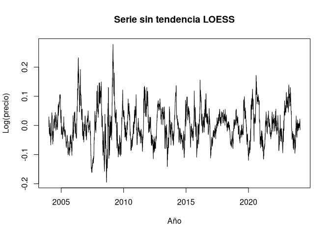

``` r
# plot.ts(NoTendLOESS2, main='Serie sin tendencia LOESS',xlab='Año',ylab='Log(precio)')

acf(NoTendLOESS,lag.max = 60)
```

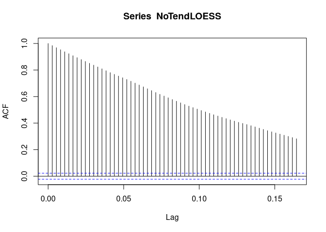

``` r
# STL

tsibble_tsventa %>%
  model(
    STL(log(Precioro) ~ trend() +
                   season(window = "periodic"),
    robust = TRUE)) %>%
  components() %>%
  autoplot()
```

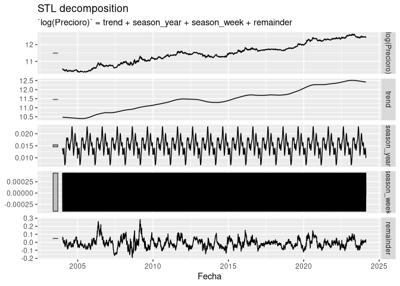

``` r
modelo_stl <- tsibble_tsventa %>%
  model(STL(log(Precioro) ~ trend() + season(window = "periodic"), robust = TRUE))

# Estimación de la tendencia por STL
componentes <- components(modelo_stl)

NoTendSTL <- ll_tsventa - componentes$trend

plot(NoTendSTL, main='Serie sin tendencia STL',xlab='Año',ylab='Log(precio)')
```

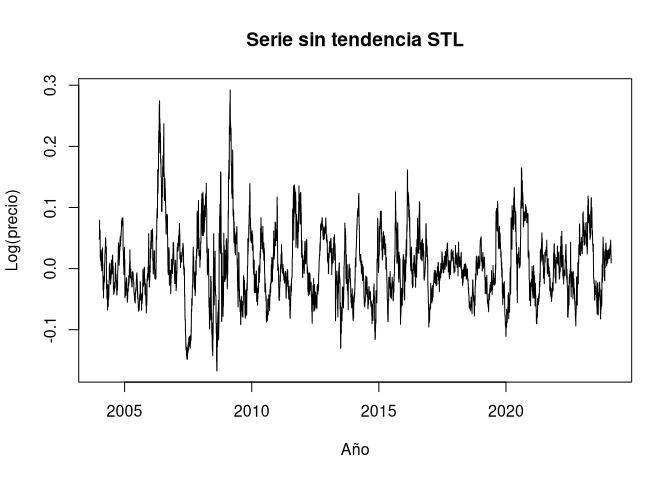
Usando regresión por splines

``` r
# 0.40
Spline_lltsventa <- smooth.spline(x = time(ll_tsventa),y = ll_tsventa,spar = 0.80)

NoTendSPLINE <- ll_tsventa - Spline_lltsventa$y

plot(ll_tsventa, main='Estimación de la tendencia por splines', ylab='log(precio)',xlab='Año')
lines(x = Spline_lltsventa$x, y=Spline_lltsventa$y, col = 'red')
```

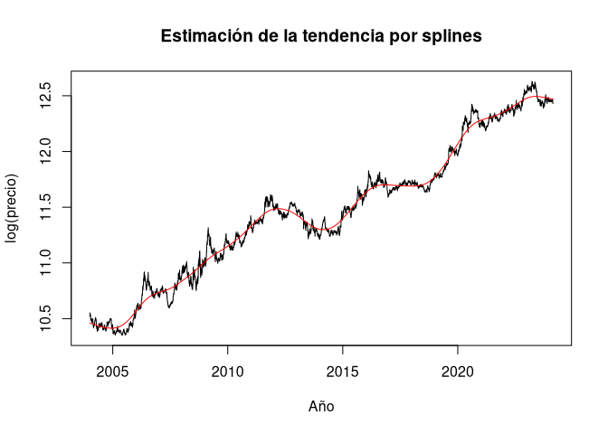

``` r
plot(NoTendSPLINE, main='Serie sin tendencia SPLINES',xlab='Año',ylab='Log(precio)')
```

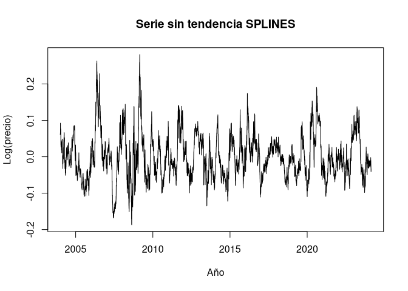

``` r
# acf(NoTendSPLINE,lag.max = 60)
```

Usando regresión Kernel

``` r
ker_lltsventa <- ksmooth(x = time(ll_tsventa),y =ll_tsventa,kernel = 'normal',bandwidth = 0.49 )
plot(ll_tsventa)
lines(x = ker_lltsventa$x,y = ker_lltsventa$y,col='red')
```

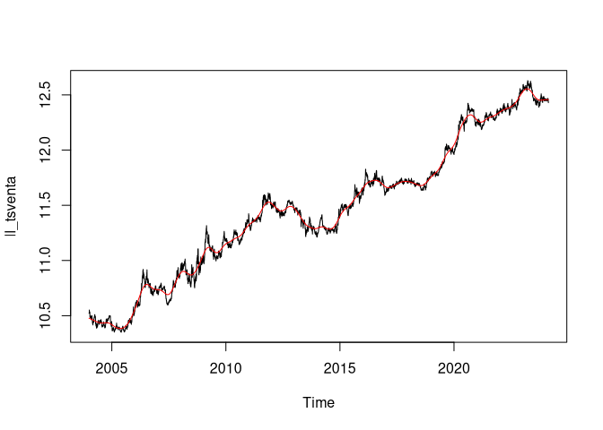

``` r
NoTendKer <- ll_tsventa - ker_lltsventa$y

# acf(NoTendKer,lag.max = 60)

plot(NoTendKer ,main='Serie sin tendencia Kernel',xlab='Año',ylab='Log(precio)')
```

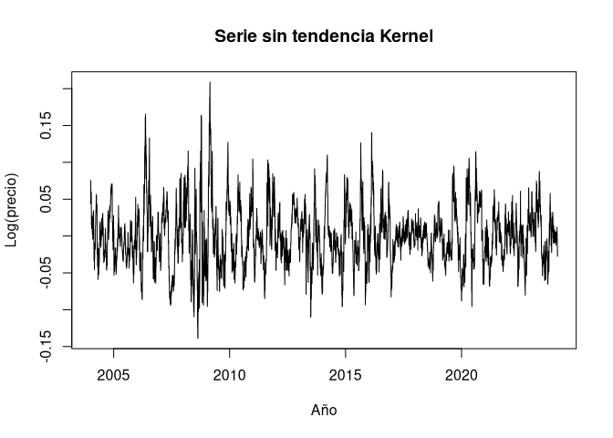

Se realiza el test de Dickey - Fuller para verificar la presencia de
raíces unitarias, lo cual implica que la serie no es estacionaria;
características como la media y varianza pueden cambiar con el tiempo.
La presencia de una raíz unitaria sugiere que la tendencia de la serie
es estocástica y no determinística.

Utilizamos la prueda de Dickey-Fuller aumentada para detectar la
presencia de raíces unitarias

``` r
# Serie diferenciada
dif_ll_tsventa <- diff(ll_tsventa,lag = 1)
# Modelo autoregresivo a 1 rezago
ar(ll_tsventa)
```

    ## 
    ## Call:
    ## ar(x = ll_tsventa)
    ## 
    ## Coefficients:
    ##      1  
    ## 0.9995  
    ## 
    ## Order selected 1  sigma^2 estimated as  0.0003607

``` r
# Prueba de Dickey-Fuller
tseries::adf.test(ll_tsventa,k=3)
```

    ## 
    ##  Augmented Dickey-Fuller Test
    ## 
    ## data:  ll_tsventa
    ## Dickey-Fuller = -3.1866, Lag order = 3, p-value = 0.09012
    ## alternative hypothesis: stationary

``` r
# Modelo autoregresivo y prueba a la serie diferenciada
ar(dif_ll_tsventa)
```

    ## 
    ## Call:
    ## ar(x = dif_ll_tsventa)
    ## 
    ## 
    ## Order selected 0  sigma^2 estimated as  0.0001114

``` r
tseries::adf.test(dif_ll_tsventa)
```

    ## Warning in tseries::adf.test(dif_ll_tsventa): p-value smaller than printed
    ## p-value

    ## 
    ##  Augmented Dickey-Fuller Test
    ## 
    ## data:  dif_ll_tsventa
    ## Dickey-Fuller = -18.839, Lag order = 19, p-value = 0.01
    ## alternative hypothesis: stationary

``` r
plot(dif_ll_tsventa)
```

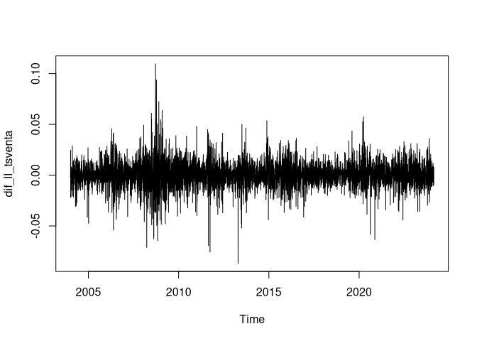

Se ajustó un modelo auto-regresivo a la serie con varianza estabilizada,
como el coeficiente $\phi=0.9995$ para el primer rezago, es
característica de que cada valor de la serie está muy correlacionado con
su valor inmediatamente anterior. Se realiza el test de Dickey - Fuller,
y con una significancia del 5% no se rechaza la hipótesis nula; la serie
no es estacionaria. Por lo tanto se procede a diferenciar la serie a 1
rezago, y se vuelve a aplicar el modelo y la prueba.

### 

------------------------------------------------------------------------

<!-- ========================================== Sección 4 ==========================================  -->

## **Detección de la estacionalidad**

### Volumen mensual de leche producida en Colombia

Note que la serie demuestra cierto comportamiento cíclico con periodo
anual, es decir, todos los mismos meses tiene el mismo comportamiento,
siendo un comportamiento más obvio en el mes de Febrero:

``` r
# par(mfrow = c(2,1))
# Datos sin tendencia

NoTendLeche = NoTendAjusKernelLeche
par(cex.axis = 1, lwd = 1.5, mar = c(4,4,0.5,0.5))
plot.ts(NoTendLeche,xlab = 'Tiempo', ylab = NULL, main = NULL,
        col = 'darkblue', las = 2)#, xlim = c(2008,2016))
#mtext(bquote(bold('Datos sin tendencia')), side = 3, line = 0.5, adj = 0.5, cex = 0.8, col = 'darkgray')
for (i in 2008:2024){
  abline(v = i, col = '#8B8970', lty = 'dashed', pch = 2)
}

axis(1, at = 2008:2024, labels = 2008:2024,las = 2)
# plot(NoTendAjusSplinesLeche,xlab = 'Tiempo', ylab = NULL, main = NULL,
#      col = 'darkblue', cex = 0.5, xlim = c(2016,2023))
# for (i in 2008:2023){
#   abline(v = i, col = '#8B8970', lty = 'dashed', pch = 2)
par(lwd = 1)
for (i in time(NoTendLeche)){
  abline(v = i, col = '#CDC9A5', lty = 4)
}
```

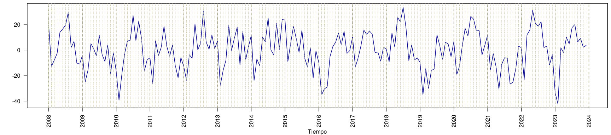

``` r
par(default_par)
```

Si bien no es del todo perceptible a simple vista, podemos notar que,
por ejemplo en los meses de Febrero siempre se registran los picos más
bajos de la serie en ese año mientras que en los meses de Junio o Julio
se presenta los valores más altos de la serie. Es decir, podemos más o
menos intuir que habrá un período anual. Ahora bien, revisemos el acf de
la serie:

``` r
acf(NoTendLeche, lag.max = 56, main = 'Serie volumen de leche mensual')
mtext(bquote(bold('Datos sin tendencia ajustados con kernel')), side = 3, line = 0.5, adj = 0.5, cex = 0.8, col = 'darkgray')
```

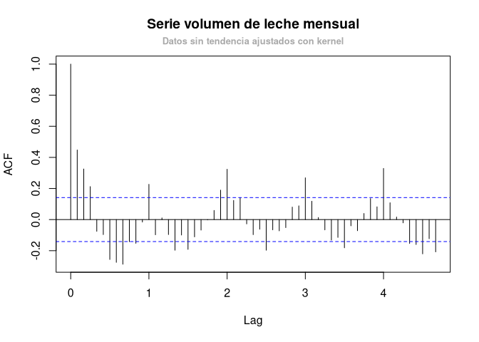
Nuevamente, el acf nos sugiere un componente estacional. Indaguemos más
sobre la estacionalidad anual de la serie:

``` r
df = as.data.frame(NoTendLeche)
colnames(df) = c('Volume')
month = as.numeric(rownames(df)) %% 12
month[month == 0] = 12
df$'Month' = month.name[month]

SerieDataframe = data.frame(row.names = month.name[1:12])
for (i in month.name[1:12]){
  SerieDataframe[i,1:16] = df$Volume[df$Month == i]
}

rm(df)
SerieDataframe = t(SerieDataframe)
rownames(SerieDataframe) = 2008:2023
boxplot(SerieDataframe,las = 2, cex.axis = 0.8, main = 'Boxplot mensual (Volumen de leche)')
mtext(bquote(bold('Diágnostico de estacionalidad')),
      side = 3, line = 0.3, adj = 0.5, cex = 0.8, col = 'darkgray')
```

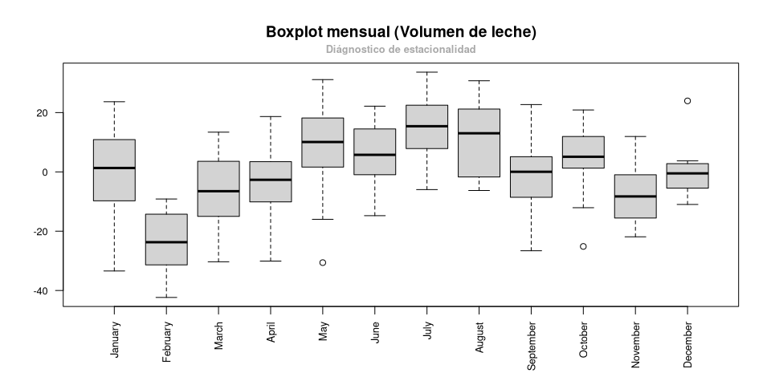

El gráfico *boxplot* mensual nos muestra precisamente que uno de los
meses para los que pudieramos argumentar un cambio importante en la
media es febrero siendo el mes con la media más baja de todos. Además,
vemos que como se mencionó anteriormente el ciclo que se parece cumplir
año a año es una disminución importante en el mes de Febrero y una
recuperación en los meses sucesivos a este hasta llegar a Noviembre que
representa una caída de menor impacto que la del mes de febrero. Si
revisamos el gráfico de coordenadas paralelas para los meses nos
encontraremos con algo muy similar:

``` r
library(forecast)
ggseasonplot(NoTendLeche, main = 'Coordenadas paralelas: Volumen de leche mensual')
```

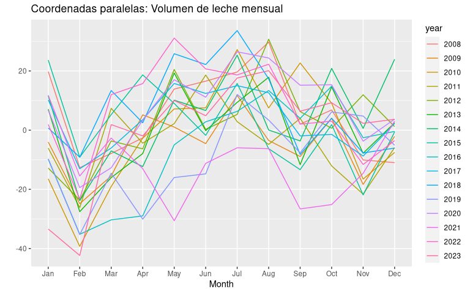

``` r
monthplot(NoTendLeche, ylab = '', main = 'Volumen de leche captada por la industria')
mtext(bquote(bold('Sub series mensuales')),
      side = 3, line = 0.3, adj = 0.5, cex = 0.8, col = 'darkgray')
```

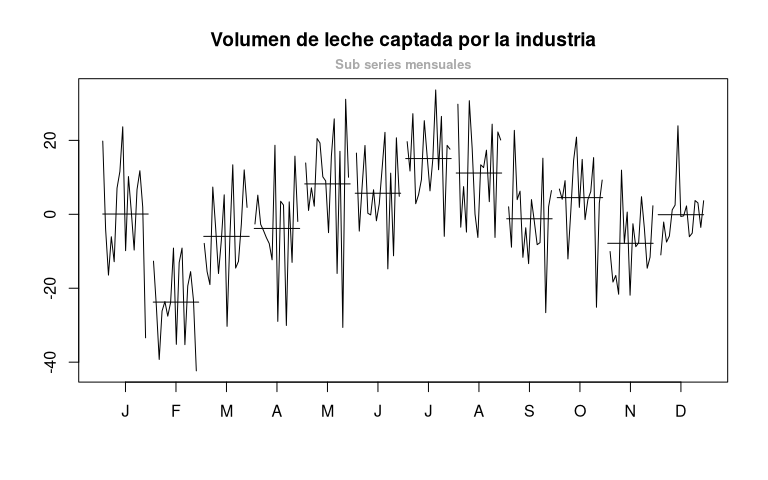

``` r
par(default_par)
```

Sin embargo, no sobra revisar el periodograma para determinar si la
serie cuenta con ciclos de otros períodos:

``` r
library(latex2exp)
SpectrumLeche = spectrum(NoTendLeche, log = 'no', main = 'Periodogram')
mtext(TeX('Frequency $\\times$ 12', bold = T),
      side = 3, line = 0.5, adj = 0.5, cex = 0.8, col = 'darkgray')

frecuencias = SpectrumLeche$freq
Periodograma = SpectrumLeche$spec

for (i in 1:3){
  ind = which.max(Periodograma)
  cat('El valor máximo no.', i, ' en el que se máximiza el periodograma es', Periodograma[ind], '\nen la frecuencia ', frecuencias[ind],'\n')
  abline(v = frecuencias[ind], col = 'darkred', lty = 2)
  Periodograma = Periodograma[-ind]
  frecuencias = frecuencias[-ind]
}
```

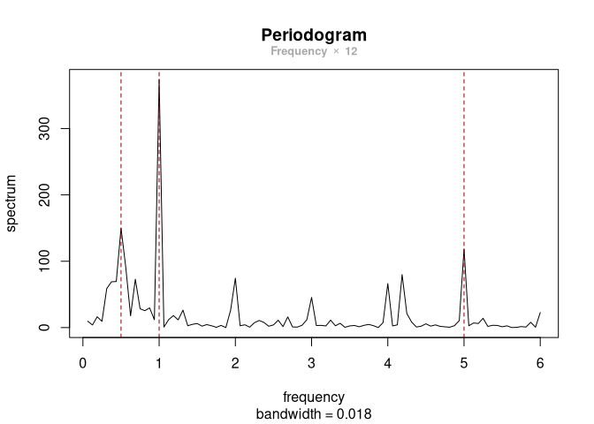

    ## El valor máximo no. 1  en el que se máximiza el periodograma es 374.0577 
    ## en la frecuencia  1 
    ## El valor máximo no. 2  en el que se máximiza el periodograma es 149.8748 
    ## en la frecuencia  0.5 
    ## El valor máximo no. 3  en el que se máximiza el periodograma es 118.3689 
    ## en la frecuencia  5

Note que la frecuencia en que se maximiza el espectograma es aquella que
ya habíamos señalado como probable: la equivalente a un período de un
año ($\omega = 1 \times \frac{1}{12}$). Además de esta, el segundo valor
mayor representa un ciclo de período 24 meses
($\omega = 0.5 \times \frac{1}{12} = \frac{1}{24}$) que es un armónico
del primero por lo que el ciclo principal de la serie se da en períodos
de una año.

``` r
library(TSstudio)
ts_heatmap(NoTendLeche,title = 'Heatmap Volumen de leche captado serie mensual')
```

<div class="plotly html-widget html-fill-item" id="htmlwidget-9759b1ac95862531d949" style="width:768px;height:576px;"></div>
<script type="application/json" data-for="htmlwidget-9759b1ac95862531d949">{"x":{"visdat":{"1cdf72e7b6da":["function () ","plotlyVisDat"]},"cur_data":"1cdf72e7b6da","attrs":{"1cdf72e7b6da":{"z":[[19.79586413318313,-4.0307772796429617,-16.449248337443379,-6.0765504231941918,-12.827711563812187,7.0757656663493265,11.577598028240345,23.661779999645262,-9.8409071837692181,10.205588762146533,0.71540880723665623,-9.6771233325500816,6.6965525262173173,11.787519800696373,1.926387989281352,-33.413477071893141],[-12.682065558264554,-24.838029901301468,-39.27226475267301,-26.161210006593507,-23.614255499575961,-27.557020268422747,-23.820772482468271,-9.1428410457886571,-35.180988499899797,-13.039426090592315,-9.1384523894652716,-35.266951496074739,-19.393493653116053,-15.505334966753225,-23.220806818141654,-42.349878490885374],[-7.8724124156403263,-15.479301959768975,-19.018104503448228,7.3633436970218611,-3.6471339148940842,-16.030605946618834,-7.0149644656597161,5.2612341491540064,-30.313623663993639,-6.0244064803478636,13.388589950166761,-14.55058914119985,-12.705624110445058,-2.6699244596539984,12.010336184600646,1.8718237342886255],[-2.623688470923895,5.1723162293974383,-2.7101187728856644,-4.4010408419568421,-6.3192480524637915,-7.9112940326058379,-12.315628595843805,18.670733529872109,-28.971759206703268,3.5263252699975851,2.4916035163238917,-30.07633569020885,3.3662100958040924,-13.011045481990777,15.725299342376104,-1.9425729876995206],[13.881874489532265,1.0388582430366569,7.1562189664380185,2.1948918974215132,20.495201262530287,19.295610747066917,10.144668886058071,9.020526691240434,-4.9673899833196629,15.770271376058986,25.816623720807286,-16.007748723034695,17.040473347007946,-30.608105389775318,31.115087683459876,10.025542214463712],[16.55511014029625,-4.5482882326878382,7.5419971663586693,18.615726436760724,0.27273045255753914,-0.16355708746885966,6.6319570628310203,-1.7543379182627632,2.8177708356034259,12.397462369980133,22.165841688863452,-14.767920824206612,11.125758393123192,-11.2234660006946,20.696159902155784,4.868121387862459],[19.64775370259585,11.706950671063595,27.218362786874394,2.8601921710262843,5.3031572403925793,9.3862621918217997,25.328813264366715,15.768579605428499,6.3348301230014386,15.026089197198814,33.633770726140312,12.050630890639297,26.47654080996233,-5.9671527782294334,18.647392412708541,17.619143275120678],[29.772215942617777,-3.4891478390737234,7.4896609549113577,-4.8161540661649269,30.729617516223186,17.881098252799802,0.042441967163995287,-6.2749125249566191,13.384677789720456,12.634075309615696,17.344235596366673,3.4116500448543547,24.376394510647742,-6.2628773225790724,22.273917997018998,20.100389214810491],[2.0250852316509338,-8.9006903704265028,22.701570500437896,3.9600683888735659,6.2589993357356661,-11.642055939558645,-3.6471619987633517,-13.347900062508415,3.9700902406531213,-1.9456163304490701,-8.2187836201734967,-7.6679787305957916,15.175782727057367,-26.605490720449097,2.0361309435741646,6.4089107115788693],[6.8309522490933432,4.0630254772121646,9.1005272550824543,-12.078348724833546,0.65883365728751642,14.613493503059658,20.875231255833796,1.8705577681477621,14.843662117256713,-1.4407519827235546,3.9937500314343879,6.1527727336153362,15.337402390789748,-25.148598678080646,3.0402285265753335,9.2595642475118325],[-10.07239384725213,-18.332683795419968,-16.537386500052406,-21.625523896814457,11.942435588828516,-7.7980483086994923,0.59920230769029104,-21.887569281016368,-2.562004183211684,-8.7614971903414585,-7.712944223623083,4.754850036154096,-3.7308661598073058,-14.588545798838425,-11.597112931139918,2.3033144039879971],[-10.98871434912823,-2.096198244489301,-7.5168047970493888,-5.8752151162426856,1.1972456087211754,2.4954891995952266,23.939373154472889,-0.59162917150229077,-0.42958838182227055,2.2645336043488555,-6.0637746270402317,-5.0929829434264775,3.7174696453727165,3.0701701556050125,-3.549743596435178,3.6674896369258931]],"x":["2008","2009","2010","2011","2012","2013","2014","2015","2016","2017","2018","2019","2020","2021","2022","2023"],"y":["Jan","Feb","Mar","Apr","May","Jun","Jul","Aug","Sep","Oct","Nov","Dec"],"colorscale":[[0,"#F7FBFF"],[0.040503631635564585,"#EFF6FC"],[0.093216462591580299,"#E4EFF9"],[0.094347798044151318,"#E4EFF9"],[0.1176095319332182,"#DFECF7"],[0.15453026041922546,"#D8E7F5"],[0.1584058537714291,"#D8E7F5"],[0.16152873581552576,"#D7E6F5"],[0.1760657644379689,"#D4E4F4"],[0.19468475619288875,"#D1E2F3"],[0.20720757600713424,"#CEE0F2"],[0.21305463282045772,"#CDE0F1"],[0.22638133322175885,"#CBDEF1"],[0.23046864384686619,"#CADDF0"],[0.24385649017058894,"#C7DCEF"],[0.24657440362987085,"#C7DBEF"],[0.25175247398433004,"#C5DBEF"],[0.26929884811697102,"#C0D8ED"],[0.2727475556600038,"#BFD8EC"],[0.30212269447866258,"#B6D4E9"],[0.30706308828096118,"#B4D3E9"],[0.31608372252386985,"#B1D2E8"],[0.33971113860439794,"#AACFE5"],[0.34087110082676092,"#A9CFE5"],[0.34638073869146535,"#A7CEE4"],[0.34668155635183928,"#A7CEE4"],[0.3532936862173906,"#A5CDE3"],[0.35363629949343756,"#A5CDE3"],[0.36299859181412492,"#A2CCE2"],[0.3653592974029794,"#A1CBE2"],[0.36585883458011814,"#A1CBE2"],[0.38168709620067148,"#9BC8E0"],[0.38574683767261675,"#9AC8E0"],[0.38612034709068216,"#9AC7E0"],[0.38853315458371196,"#99C7E0"],[0.3901399141250762,"#98C7E0"],[0.39044996177905522,"#98C6E0"],[0.39527253829646003,"#96C5DF"],[0.39839531370215991,"#95C5DF"],[0.40413724357484548,"#93C3DE"],[0.40472872620146111,"#93C3DE"],[0.40964619113366124,"#91C2DE"],[0.41273569333558718,"#8FC1DE"],[0.42479513653578005,"#8BBFDD"],[0.4278416691236232,"#89BEDC"],[0.42999718353898558,"#89BEDC"],[0.43702872640731238,"#86BCDC"],[0.43708648431139585,"#86BCDC"],[0.4402156051352677,"#85BBDB"],[0.44204748846173808,"#84BBDB"],[0.44918999314215763,"#81B9DB"],[0.45323677940125662,"#7FB8DA"],[0.45374848971480652,"#7FB8DA"],[0.45472717536240465,"#7FB8DA"],[0.45584720692121194,"#7EB8DA"],[0.45643898546160372,"#7EB8DA"],[0.45842854420357221,"#7DB7DA"],[0.4650331273811491,"#7AB6D9"],[0.47418926058039584,"#76B4D8"],[0.47477274831708693,"#76B4D8"],[0.47493114031986072,"#76B4D8"],[0.47738333761894924,"#75B3D8"],[0.4775514763736104,"#75B3D8"],[0.47806958977166431,"#75B3D8"],[0.47882309006690416,"#74B3D8"],[0.48003305646012323,"#74B2D8"],[0.49032779988027647,"#6FB0D7"],[0.49198069443589454,"#6FB0D7"],[0.49397106892715875,"#6EAFD7"],[0.49749637780923162,"#6CAFD6"],[0.49943426039645017,"#6BAED6"],[0.50430719774717314,"#6AADD5"],[0.50825424586773715,"#69ACD5"],[0.50935585340970813,"#68ACD5"],[0.50935622301382111,"#68ACD5"],[0.51063795032571602,"#68ACD5"],[0.51143543449482165,"#68ABD5"],[0.52168802270577985,"#65A9D3"],[0.52221700905542023,"#64A9D3"],[0.52282550824184437,"#64A9D3"],[0.5236373182608135,"#64A9D3"],[0.5297676626641461,"#62A7D2"],[0.53174942999951236,"#61A7D2"],[0.53178948260005088,"#61A7D2"],[0.53426679280265932,"#61A6D2"],[0.53839381142798937,"#5FA5D1"],[0.54956888422287431,"#5CA3D0"],[0.55170145868263998,"#5BA2CF"],[0.55520262369767581,"#5AA2CF"],[0.55791372084496438,"#59A1CF"],[0.56094448453908219,"#58A0CE"],[0.56524109122350563,"#579FCE"],[0.56602588308611945,"#579FCE"],[0.56677045314207386,"#569FCD"],[0.57102728259331748,"#559ECD"],[0.57311177534033109,"#549DCD"],[0.58197305229089535,"#519CCC"],[0.58198971332460336,"#519CCC"],[0.58270781854269937,"#519BCB"],[0.58400674592229496,"#519BCB"],[0.5841521155121614,"#519BCB"],[0.58624152495068271,"#509BCB"],[0.58715806038488427,"#509ACB"],[0.58766844386920958,"#4F9ACB"],[0.59014646531561443,"#4F9ACA"],[0.59019760372909391,"#4F9ACA"],[0.5944390640870677,"#4D99CA"],[0.59499735966591905,"#4D99CA"],[0.59736676884018525,"#4C98CA"],[0.597760822420636,"#4C98C9"],[0.60165692300608598,"#4B97C9"],[0.60225494573227112,"#4A97C9"],[0.60376415496774349,"#4A97C9"],[0.6056219805444687,"#4996C8"],[0.60627975374912324,"#4996C8"],[0.60947252937915297,"#4895C8"],[0.60960442422604211,"#4895C8"],[0.60991580425352254,"#4895C8"],[0.61082751942503155,"#4795C8"],[0.61993243299618594,"#4493C7"],[0.62142316623781835,"#4393C6"],[0.62542659124661382,"#4292C6"],[0.62659681563926706,"#4292C6"],[0.62714855396284808,"#4291C6"],[0.63833011081063873,"#3F8EC4"],[0.63972813003207574,"#3F8EC4"],[0.64072611825779502,"#3F8EC4"],[0.64170107259785103,"#3E8EC4"],[0.64463652454771825,"#3E8DC3"],[0.64548664775253828,"#3D8CC3"],[0.64725544570131999,"#3D8CC3"],[0.6504773680461754,"#3C8BC3"],[0.65153619189732914,"#3C8BC2"],[0.65426210375755389,"#3B8AC2"],[0.6559245305979482,"#3B8AC2"],[0.65661331314506999,"#3B8AC2"],[0.676071835341849,"#3684BF"],[0.67712470085523757,"#3684BF"],[0.67921774316194672,"#3683BF"],[0.68088518011207388,"#3583BE"],[0.68929856942976764,"#3381BD"],[0.69086636293300019,"#3380BD"],[0.69166811273991535,"#3280BD"],[0.70377821327415613,"#2F7DBB"],[0.70972475098026966,"#2E7BBA"],[0.7114271256905681,"#2D7BBA"],[0.7124874739426329,"#2D7BBA"],[0.71452627820813575,"#2C7ABA"],[0.715419899355209,"#2C7ABA"],[0.71595020694709055,"#2C7ABA"],[0.72051476107044155,"#2A79B9"],[0.72362875917495151,"#2A78B9"],[0.73350723287079722,"#2775B7"],[0.73355871974312592,"#2775B7"],[0.74005070248478888,"#2474B6"],[0.74967933997543812,"#2171B5"],[0.75270852607756444,"#2170B4"],[0.75510939892089224,"#2070B4"],[0.75707947447531831,"#206FB4"],[0.75920650661180811,"#206FB3"],[0.76431151217002291,"#1F6DB2"],[0.76488111186019803,"#1F6DB2"],[0.76490337679019182,"#1F6DB2"],[0.7752324248462491,"#1D6AB0"],[0.78162015709803134,"#1C69AF"],[0.785617888879656,"#1C68AE"],[0.78923587355908109,"#1B67AD"],[0.79268339128662435,"#1A66AC"],[0.80235163164531864,"#1963AA"],[0.80276837888336416,"#1963AA"],[0.80307556493462773,"#1963AA"],[0.81129940287389302,"#1761A9"],[0.8159338598808622,"#1660A8"],[0.81788310069929471,"#165FA7"],[0.82189087190751309,"#155EA7"],[0.82708688515231166,"#145DA6"],[0.82973164677795452,"#145CA5"],[0.83208835582685192,"#135CA5"],[0.84907372631548683,"#0F58A1"],[0.85049608901153029,"#0F57A1"],[0.85612430650076177,"#0D56A0"],[0.86876136077627841,"#0A539D"],[0.87241468827091817,"#09529D"],[0.87816620666570633,"#08509B"],[0.89070072907326614,"#084D96"],[0.89712066890857567,"#084B93"],[0.90580565700739912,"#094990"],[0.9155685729051769,"#09468C"],[0.94917913494134631,"#093D7F"],[0.96177923487693728,"#093A7A"],[0.96685230219087615,"#093878"],[1,"#08306B"]],"hoverinfo":"text","text":[["Value:  19.7958641331831 <br> Year :  2008 <br> Month  : 1","Value:  -4.03077727964296 <br> Year :  2009 <br> Month  : 1","Value:  -16.4492483374434 <br> Year :  2010 <br> Month  : 1","Value:  -6.07655042319419 <br> Year :  2011 <br> Month  : 1","Value:  -12.8277115638122 <br> Year :  2012 <br> Month  : 1","Value:  7.07576566634933 <br> Year :  2013 <br> Month  : 1","Value:  11.5775980282403 <br> Year :  2014 <br> Month  : 1","Value:  23.6617799996453 <br> Year :  2015 <br> Month  : 1","Value:  -9.84090718376922 <br> Year :  2016 <br> Month  : 1","Value:  10.2055887621465 <br> Year :  2017 <br> Month  : 1","Value:  0.715408807236656 <br> Year :  2018 <br> Month  : 1","Value:  -9.67712333255008 <br> Year :  2019 <br> Month  : 1","Value:  6.69655252621732 <br> Year :  2020 <br> Month  : 1","Value:  11.7875198006964 <br> Year :  2021 <br> Month  : 1","Value:  1.92638798928135 <br> Year :  2022 <br> Month  : 1","Value:  -33.4134770718931 <br> Year :  2023 <br> Month  : 1"],["Value:  -12.6820655582646 <br> Year :  2008 <br> Month  : 2","Value:  -24.8380299013015 <br> Year :  2009 <br> Month  : 2","Value:  -39.272264752673 <br> Year :  2010 <br> Month  : 2","Value:  -26.1612100065935 <br> Year :  2011 <br> Month  : 2","Value:  -23.614255499576 <br> Year :  2012 <br> Month  : 2","Value:  -27.5570202684227 <br> Year :  2013 <br> Month  : 2","Value:  -23.8207724824683 <br> Year :  2014 <br> Month  : 2","Value:  -9.14284104578866 <br> Year :  2015 <br> Month  : 2","Value:  -35.1809884998998 <br> Year :  2016 <br> Month  : 2","Value:  -13.0394260905923 <br> Year :  2017 <br> Month  : 2","Value:  -9.13845238946527 <br> Year :  2018 <br> Month  : 2","Value:  -35.2669514960747 <br> Year :  2019 <br> Month  : 2","Value:  -19.3934936531161 <br> Year :  2020 <br> Month  : 2","Value:  -15.5053349667532 <br> Year :  2021 <br> Month  : 2","Value:  -23.2208068181417 <br> Year :  2022 <br> Month  : 2","Value:  -42.3498784908854 <br> Year :  2023 <br> Month  : 2"],["Value:  -7.87241241564033 <br> Year :  2008 <br> Month  : 3","Value:  -15.479301959769 <br> Year :  2009 <br> Month  : 3","Value:  -19.0181045034482 <br> Year :  2010 <br> Month  : 3","Value:  7.36334369702186 <br> Year :  2011 <br> Month  : 3","Value:  -3.64713391489408 <br> Year :  2012 <br> Month  : 3","Value:  -16.0306059466188 <br> Year :  2013 <br> Month  : 3","Value:  -7.01496446565972 <br> Year :  2014 <br> Month  : 3","Value:  5.26123414915401 <br> Year :  2015 <br> Month  : 3","Value:  -30.3136236639936 <br> Year :  2016 <br> Month  : 3","Value:  -6.02440648034786 <br> Year :  2017 <br> Month  : 3","Value:  13.3885899501668 <br> Year :  2018 <br> Month  : 3","Value:  -14.5505891411999 <br> Year :  2019 <br> Month  : 3","Value:  -12.7056241104451 <br> Year :  2020 <br> Month  : 3","Value:  -2.669924459654 <br> Year :  2021 <br> Month  : 3","Value:  12.0103361846006 <br> Year :  2022 <br> Month  : 3","Value:  1.87182373428863 <br> Year :  2023 <br> Month  : 3"],["Value:  -2.6236884709239 <br> Year :  2008 <br> Month  : 4","Value:  5.17231622939744 <br> Year :  2009 <br> Month  : 4","Value:  -2.71011877288566 <br> Year :  2010 <br> Month  : 4","Value:  -4.40104084195684 <br> Year :  2011 <br> Month  : 4","Value:  -6.31924805246379 <br> Year :  2012 <br> Month  : 4","Value:  -7.91129403260584 <br> Year :  2013 <br> Month  : 4","Value:  -12.3156285958438 <br> Year :  2014 <br> Month  : 4","Value:  18.6707335298721 <br> Year :  2015 <br> Month  : 4","Value:  -28.9717592067033 <br> Year :  2016 <br> Month  : 4","Value:  3.52632526999759 <br> Year :  2017 <br> Month  : 4","Value:  2.49160351632389 <br> Year :  2018 <br> Month  : 4","Value:  -30.0763356902089 <br> Year :  2019 <br> Month  : 4","Value:  3.36621009580409 <br> Year :  2020 <br> Month  : 4","Value:  -13.0110454819908 <br> Year :  2021 <br> Month  : 4","Value:  15.7252993423761 <br> Year :  2022 <br> Month  : 4","Value:  -1.94257298769952 <br> Year :  2023 <br> Month  : 4"],["Value:  13.8818744895323 <br> Year :  2008 <br> Month  : 5","Value:  1.03885824303666 <br> Year :  2009 <br> Month  : 5","Value:  7.15621896643802 <br> Year :  2010 <br> Month  : 5","Value:  2.19489189742151 <br> Year :  2011 <br> Month  : 5","Value:  20.4952012625303 <br> Year :  2012 <br> Month  : 5","Value:  19.2956107470669 <br> Year :  2013 <br> Month  : 5","Value:  10.1446688860581 <br> Year :  2014 <br> Month  : 5","Value:  9.02052669124043 <br> Year :  2015 <br> Month  : 5","Value:  -4.96738998331966 <br> Year :  2016 <br> Month  : 5","Value:  15.770271376059 <br> Year :  2017 <br> Month  : 5","Value:  25.8166237208073 <br> Year :  2018 <br> Month  : 5","Value:  -16.0077487230347 <br> Year :  2019 <br> Month  : 5","Value:  17.0404733470079 <br> Year :  2020 <br> Month  : 5","Value:  -30.6081053897753 <br> Year :  2021 <br> Month  : 5","Value:  31.1150876834599 <br> Year :  2022 <br> Month  : 5","Value:  10.0255422144637 <br> Year :  2023 <br> Month  : 5"],["Value:  16.5551101402963 <br> Year :  2008 <br> Month  : 6","Value:  -4.54828823268784 <br> Year :  2009 <br> Month  : 6","Value:  7.54199716635867 <br> Year :  2010 <br> Month  : 6","Value:  18.6157264367607 <br> Year :  2011 <br> Month  : 6","Value:  0.272730452557539 <br> Year :  2012 <br> Month  : 6","Value:  -0.16355708746886 <br> Year :  2013 <br> Month  : 6","Value:  6.63195706283102 <br> Year :  2014 <br> Month  : 6","Value:  -1.75433791826276 <br> Year :  2015 <br> Month  : 6","Value:  2.81777083560343 <br> Year :  2016 <br> Month  : 6","Value:  12.3974623699801 <br> Year :  2017 <br> Month  : 6","Value:  22.1658416888635 <br> Year :  2018 <br> Month  : 6","Value:  -14.7679208242066 <br> Year :  2019 <br> Month  : 6","Value:  11.1257583931232 <br> Year :  2020 <br> Month  : 6","Value:  -11.2234660006946 <br> Year :  2021 <br> Month  : 6","Value:  20.6961599021558 <br> Year :  2022 <br> Month  : 6","Value:  4.86812138786246 <br> Year :  2023 <br> Month  : 6"],["Value:  19.6477537025958 <br> Year :  2008 <br> Month  : 7","Value:  11.7069506710636 <br> Year :  2009 <br> Month  : 7","Value:  27.2183627868744 <br> Year :  2010 <br> Month  : 7","Value:  2.86019217102628 <br> Year :  2011 <br> Month  : 7","Value:  5.30315724039258 <br> Year :  2012 <br> Month  : 7","Value:  9.3862621918218 <br> Year :  2013 <br> Month  : 7","Value:  25.3288132643667 <br> Year :  2014 <br> Month  : 7","Value:  15.7685796054285 <br> Year :  2015 <br> Month  : 7","Value:  6.33483012300144 <br> Year :  2016 <br> Month  : 7","Value:  15.0260891971988 <br> Year :  2017 <br> Month  : 7","Value:  33.6337707261403 <br> Year :  2018 <br> Month  : 7","Value:  12.0506308906393 <br> Year :  2019 <br> Month  : 7","Value:  26.4765408099623 <br> Year :  2020 <br> Month  : 7","Value:  -5.96715277822943 <br> Year :  2021 <br> Month  : 7","Value:  18.6473924127085 <br> Year :  2022 <br> Month  : 7","Value:  17.6191432751207 <br> Year :  2023 <br> Month  : 7"],["Value:  29.7722159426178 <br> Year :  2008 <br> Month  : 8","Value:  -3.48914783907372 <br> Year :  2009 <br> Month  : 8","Value:  7.48966095491136 <br> Year :  2010 <br> Month  : 8","Value:  -4.81615406616493 <br> Year :  2011 <br> Month  : 8","Value:  30.7296175162232 <br> Year :  2012 <br> Month  : 8","Value:  17.8810982527998 <br> Year :  2013 <br> Month  : 8","Value:  0.0424419671639953 <br> Year :  2014 <br> Month  : 8","Value:  -6.27491252495662 <br> Year :  2015 <br> Month  : 8","Value:  13.3846777897205 <br> Year :  2016 <br> Month  : 8","Value:  12.6340753096157 <br> Year :  2017 <br> Month  : 8","Value:  17.3442355963667 <br> Year :  2018 <br> Month  : 8","Value:  3.41165004485435 <br> Year :  2019 <br> Month  : 8","Value:  24.3763945106477 <br> Year :  2020 <br> Month  : 8","Value:  -6.26287732257907 <br> Year :  2021 <br> Month  : 8","Value:  22.273917997019 <br> Year :  2022 <br> Month  : 8","Value:  20.1003892148105 <br> Year :  2023 <br> Month  : 8"],["Value:  2.02508523165093 <br> Year :  2008 <br> Month  : 9","Value:  -8.9006903704265 <br> Year :  2009 <br> Month  : 9","Value:  22.7015705004379 <br> Year :  2010 <br> Month  : 9","Value:  3.96006838887357 <br> Year :  2011 <br> Month  : 9","Value:  6.25899933573567 <br> Year :  2012 <br> Month  : 9","Value:  -11.6420559395586 <br> Year :  2013 <br> Month  : 9","Value:  -3.64716199876335 <br> Year :  2014 <br> Month  : 9","Value:  -13.3479000625084 <br> Year :  2015 <br> Month  : 9","Value:  3.97009024065312 <br> Year :  2016 <br> Month  : 9","Value:  -1.94561633044907 <br> Year :  2017 <br> Month  : 9","Value:  -8.2187836201735 <br> Year :  2018 <br> Month  : 9","Value:  -7.66797873059579 <br> Year :  2019 <br> Month  : 9","Value:  15.1757827270574 <br> Year :  2020 <br> Month  : 9","Value:  -26.6054907204491 <br> Year :  2021 <br> Month  : 9","Value:  2.03613094357416 <br> Year :  2022 <br> Month  : 9","Value:  6.40891071157887 <br> Year :  2023 <br> Month  : 9"],["Value:  6.83095224909334 <br> Year :  2008 <br> Month  : 10","Value:  4.06302547721216 <br> Year :  2009 <br> Month  : 10","Value:  9.10052725508245 <br> Year :  2010 <br> Month  : 10","Value:  -12.0783487248335 <br> Year :  2011 <br> Month  : 10","Value:  0.658833657287516 <br> Year :  2012 <br> Month  : 10","Value:  14.6134935030597 <br> Year :  2013 <br> Month  : 10","Value:  20.8752312558338 <br> Year :  2014 <br> Month  : 10","Value:  1.87055776814776 <br> Year :  2015 <br> Month  : 10","Value:  14.8436621172567 <br> Year :  2016 <br> Month  : 10","Value:  -1.44075198272355 <br> Year :  2017 <br> Month  : 10","Value:  3.99375003143439 <br> Year :  2018 <br> Month  : 10","Value:  6.15277273361534 <br> Year :  2019 <br> Month  : 10","Value:  15.3374023907897 <br> Year :  2020 <br> Month  : 10","Value:  -25.1485986780806 <br> Year :  2021 <br> Month  : 10","Value:  3.04022852657533 <br> Year :  2022 <br> Month  : 10","Value:  9.25956424751183 <br> Year :  2023 <br> Month  : 10"],["Value:  -10.0723938472521 <br> Year :  2008 <br> Month  : 11","Value:  -18.33268379542 <br> Year :  2009 <br> Month  : 11","Value:  -16.5373865000524 <br> Year :  2010 <br> Month  : 11","Value:  -21.6255238968145 <br> Year :  2011 <br> Month  : 11","Value:  11.9424355888285 <br> Year :  2012 <br> Month  : 11","Value:  -7.79804830869949 <br> Year :  2013 <br> Month  : 11","Value:  0.599202307690291 <br> Year :  2014 <br> Month  : 11","Value:  -21.8875692810164 <br> Year :  2015 <br> Month  : 11","Value:  -2.56200418321168 <br> Year :  2016 <br> Month  : 11","Value:  -8.76149719034146 <br> Year :  2017 <br> Month  : 11","Value:  -7.71294422362308 <br> Year :  2018 <br> Month  : 11","Value:  4.7548500361541 <br> Year :  2019 <br> Month  : 11","Value:  -3.73086615980731 <br> Year :  2020 <br> Month  : 11","Value:  -14.5885457988384 <br> Year :  2021 <br> Month  : 11","Value:  -11.5971129311399 <br> Year :  2022 <br> Month  : 11","Value:  2.303314403988 <br> Year :  2023 <br> Month  : 11"],["Value:  -10.9887143491282 <br> Year :  2008 <br> Month  : 12","Value:  -2.0961982444893 <br> Year :  2009 <br> Month  : 12","Value:  -7.51680479704939 <br> Year :  2010 <br> Month  : 12","Value:  -5.87521511624269 <br> Year :  2011 <br> Month  : 12","Value:  1.19724560872118 <br> Year :  2012 <br> Month  : 12","Value:  2.49548919959523 <br> Year :  2013 <br> Month  : 12","Value:  23.9393731544729 <br> Year :  2014 <br> Month  : 12","Value:  -0.591629171502291 <br> Year :  2015 <br> Month  : 12","Value:  -0.429588381822271 <br> Year :  2016 <br> Month  : 12","Value:  2.26453360434886 <br> Year :  2017 <br> Month  : 12","Value:  -6.06377462704023 <br> Year :  2018 <br> Month  : 12","Value:  -5.09298294342648 <br> Year :  2019 <br> Month  : 12","Value:  3.71746964537272 <br> Year :  2020 <br> Month  : 12","Value:  3.07017015560501 <br> Year :  2021 <br> Month  : 12","Value:  -3.54974359643518 <br> Year :  2022 <br> Month  : 12","Value:  3.66748963692589 <br> Year :  2023 <br> Month  : 12"]],"xgap":3,"ygap":3,"alpha_stroke":1,"sizes":[10,100],"spans":[1,20],"type":"heatmap"}},"layout":{"margin":{"b":40,"l":60,"t":25,"r":10},"title":"Heatmap Volumen de leche captado serie mensual","xaxis":{"domain":[0,1],"automargin":true,"title":"Year"},"yaxis":{"domain":[0,1],"automargin":true,"title":"Month"},"scene":{"zaxis":{"title":[]}},"hovermode":"closest","showlegend":false,"legend":{"yanchor":"top","y":0.5}},"source":"A","config":{"modeBarButtonsToAdd":["hoverclosest","hovercompare"],"showSendToCloud":false},"data":[{"colorbar":{"title":"","ticklen":2,"len":0.5,"lenmode":"fraction","y":1,"yanchor":"top"},"colorscale":[[0,"#F7FBFF"],[0.040503631635564585,"#EFF6FC"],[0.093216462591580299,"#E4EFF9"],[0.094347798044151318,"#E4EFF9"],[0.1176095319332182,"#DFECF7"],[0.15453026041922546,"#D8E7F5"],[0.1584058537714291,"#D8E7F5"],[0.16152873581552576,"#D7E6F5"],[0.1760657644379689,"#D4E4F4"],[0.19468475619288875,"#D1E2F3"],[0.20720757600713424,"#CEE0F2"],[0.21305463282045772,"#CDE0F1"],[0.22638133322175885,"#CBDEF1"],[0.23046864384686619,"#CADDF0"],[0.24385649017058894,"#C7DCEF"],[0.24657440362987085,"#C7DBEF"],[0.25175247398433004,"#C5DBEF"],[0.26929884811697102,"#C0D8ED"],[0.2727475556600038,"#BFD8EC"],[0.30212269447866258,"#B6D4E9"],[0.30706308828096118,"#B4D3E9"],[0.31608372252386985,"#B1D2E8"],[0.33971113860439794,"#AACFE5"],[0.34087110082676092,"#A9CFE5"],[0.34638073869146535,"#A7CEE4"],[0.34668155635183928,"#A7CEE4"],[0.3532936862173906,"#A5CDE3"],[0.35363629949343756,"#A5CDE3"],[0.36299859181412492,"#A2CCE2"],[0.3653592974029794,"#A1CBE2"],[0.36585883458011814,"#A1CBE2"],[0.38168709620067148,"#9BC8E0"],[0.38574683767261675,"#9AC8E0"],[0.38612034709068216,"#9AC7E0"],[0.38853315458371196,"#99C7E0"],[0.3901399141250762,"#98C7E0"],[0.39044996177905522,"#98C6E0"],[0.39527253829646003,"#96C5DF"],[0.39839531370215991,"#95C5DF"],[0.40413724357484548,"#93C3DE"],[0.40472872620146111,"#93C3DE"],[0.40964619113366124,"#91C2DE"],[0.41273569333558718,"#8FC1DE"],[0.42479513653578005,"#8BBFDD"],[0.4278416691236232,"#89BEDC"],[0.42999718353898558,"#89BEDC"],[0.43702872640731238,"#86BCDC"],[0.43708648431139585,"#86BCDC"],[0.4402156051352677,"#85BBDB"],[0.44204748846173808,"#84BBDB"],[0.44918999314215763,"#81B9DB"],[0.45323677940125662,"#7FB8DA"],[0.45374848971480652,"#7FB8DA"],[0.45472717536240465,"#7FB8DA"],[0.45584720692121194,"#7EB8DA"],[0.45643898546160372,"#7EB8DA"],[0.45842854420357221,"#7DB7DA"],[0.4650331273811491,"#7AB6D9"],[0.47418926058039584,"#76B4D8"],[0.47477274831708693,"#76B4D8"],[0.47493114031986072,"#76B4D8"],[0.47738333761894924,"#75B3D8"],[0.4775514763736104,"#75B3D8"],[0.47806958977166431,"#75B3D8"],[0.47882309006690416,"#74B3D8"],[0.48003305646012323,"#74B2D8"],[0.49032779988027647,"#6FB0D7"],[0.49198069443589454,"#6FB0D7"],[0.49397106892715875,"#6EAFD7"],[0.49749637780923162,"#6CAFD6"],[0.49943426039645017,"#6BAED6"],[0.50430719774717314,"#6AADD5"],[0.50825424586773715,"#69ACD5"],[0.50935585340970813,"#68ACD5"],[0.50935622301382111,"#68ACD5"],[0.51063795032571602,"#68ACD5"],[0.51143543449482165,"#68ABD5"],[0.52168802270577985,"#65A9D3"],[0.52221700905542023,"#64A9D3"],[0.52282550824184437,"#64A9D3"],[0.5236373182608135,"#64A9D3"],[0.5297676626641461,"#62A7D2"],[0.53174942999951236,"#61A7D2"],[0.53178948260005088,"#61A7D2"],[0.53426679280265932,"#61A6D2"],[0.53839381142798937,"#5FA5D1"],[0.54956888422287431,"#5CA3D0"],[0.55170145868263998,"#5BA2CF"],[0.55520262369767581,"#5AA2CF"],[0.55791372084496438,"#59A1CF"],[0.56094448453908219,"#58A0CE"],[0.56524109122350563,"#579FCE"],[0.56602588308611945,"#579FCE"],[0.56677045314207386,"#569FCD"],[0.57102728259331748,"#559ECD"],[0.57311177534033109,"#549DCD"],[0.58197305229089535,"#519CCC"],[0.58198971332460336,"#519CCC"],[0.58270781854269937,"#519BCB"],[0.58400674592229496,"#519BCB"],[0.5841521155121614,"#519BCB"],[0.58624152495068271,"#509BCB"],[0.58715806038488427,"#509ACB"],[0.58766844386920958,"#4F9ACB"],[0.59014646531561443,"#4F9ACA"],[0.59019760372909391,"#4F9ACA"],[0.5944390640870677,"#4D99CA"],[0.59499735966591905,"#4D99CA"],[0.59736676884018525,"#4C98CA"],[0.597760822420636,"#4C98C9"],[0.60165692300608598,"#4B97C9"],[0.60225494573227112,"#4A97C9"],[0.60376415496774349,"#4A97C9"],[0.6056219805444687,"#4996C8"],[0.60627975374912324,"#4996C8"],[0.60947252937915297,"#4895C8"],[0.60960442422604211,"#4895C8"],[0.60991580425352254,"#4895C8"],[0.61082751942503155,"#4795C8"],[0.61993243299618594,"#4493C7"],[0.62142316623781835,"#4393C6"],[0.62542659124661382,"#4292C6"],[0.62659681563926706,"#4292C6"],[0.62714855396284808,"#4291C6"],[0.63833011081063873,"#3F8EC4"],[0.63972813003207574,"#3F8EC4"],[0.64072611825779502,"#3F8EC4"],[0.64170107259785103,"#3E8EC4"],[0.64463652454771825,"#3E8DC3"],[0.64548664775253828,"#3D8CC3"],[0.64725544570131999,"#3D8CC3"],[0.6504773680461754,"#3C8BC3"],[0.65153619189732914,"#3C8BC2"],[0.65426210375755389,"#3B8AC2"],[0.6559245305979482,"#3B8AC2"],[0.65661331314506999,"#3B8AC2"],[0.676071835341849,"#3684BF"],[0.67712470085523757,"#3684BF"],[0.67921774316194672,"#3683BF"],[0.68088518011207388,"#3583BE"],[0.68929856942976764,"#3381BD"],[0.69086636293300019,"#3380BD"],[0.69166811273991535,"#3280BD"],[0.70377821327415613,"#2F7DBB"],[0.70972475098026966,"#2E7BBA"],[0.7114271256905681,"#2D7BBA"],[0.7124874739426329,"#2D7BBA"],[0.71452627820813575,"#2C7ABA"],[0.715419899355209,"#2C7ABA"],[0.71595020694709055,"#2C7ABA"],[0.72051476107044155,"#2A79B9"],[0.72362875917495151,"#2A78B9"],[0.73350723287079722,"#2775B7"],[0.73355871974312592,"#2775B7"],[0.74005070248478888,"#2474B6"],[0.74967933997543812,"#2171B5"],[0.75270852607756444,"#2170B4"],[0.75510939892089224,"#2070B4"],[0.75707947447531831,"#206FB4"],[0.75920650661180811,"#206FB3"],[0.76431151217002291,"#1F6DB2"],[0.76488111186019803,"#1F6DB2"],[0.76490337679019182,"#1F6DB2"],[0.7752324248462491,"#1D6AB0"],[0.78162015709803134,"#1C69AF"],[0.785617888879656,"#1C68AE"],[0.78923587355908109,"#1B67AD"],[0.79268339128662435,"#1A66AC"],[0.80235163164531864,"#1963AA"],[0.80276837888336416,"#1963AA"],[0.80307556493462773,"#1963AA"],[0.81129940287389302,"#1761A9"],[0.8159338598808622,"#1660A8"],[0.81788310069929471,"#165FA7"],[0.82189087190751309,"#155EA7"],[0.82708688515231166,"#145DA6"],[0.82973164677795452,"#145CA5"],[0.83208835582685192,"#135CA5"],[0.84907372631548683,"#0F58A1"],[0.85049608901153029,"#0F57A1"],[0.85612430650076177,"#0D56A0"],[0.86876136077627841,"#0A539D"],[0.87241468827091817,"#09529D"],[0.87816620666570633,"#08509B"],[0.89070072907326614,"#084D96"],[0.89712066890857567,"#084B93"],[0.90580565700739912,"#094990"],[0.9155685729051769,"#09468C"],[0.94917913494134631,"#093D7F"],[0.96177923487693728,"#093A7A"],[0.96685230219087615,"#093878"],[1,"#08306B"]],"showscale":true,"z":[[19.79586413318313,-4.0307772796429617,-16.449248337443379,-6.0765504231941918,-12.827711563812187,7.0757656663493265,11.577598028240345,23.661779999645262,-9.8409071837692181,10.205588762146533,0.71540880723665623,-9.6771233325500816,6.6965525262173173,11.787519800696373,1.926387989281352,-33.413477071893141],[-12.682065558264554,-24.838029901301468,-39.27226475267301,-26.161210006593507,-23.614255499575961,-27.557020268422747,-23.820772482468271,-9.1428410457886571,-35.180988499899797,-13.039426090592315,-9.1384523894652716,-35.266951496074739,-19.393493653116053,-15.505334966753225,-23.220806818141654,-42.349878490885374],[-7.8724124156403263,-15.479301959768975,-19.018104503448228,7.3633436970218611,-3.6471339148940842,-16.030605946618834,-7.0149644656597161,5.2612341491540064,-30.313623663993639,-6.0244064803478636,13.388589950166761,-14.55058914119985,-12.705624110445058,-2.6699244596539984,12.010336184600646,1.8718237342886255],[-2.623688470923895,5.1723162293974383,-2.7101187728856644,-4.4010408419568421,-6.3192480524637915,-7.9112940326058379,-12.315628595843805,18.670733529872109,-28.971759206703268,3.5263252699975851,2.4916035163238917,-30.07633569020885,3.3662100958040924,-13.011045481990777,15.725299342376104,-1.9425729876995206],[13.881874489532265,1.0388582430366569,7.1562189664380185,2.1948918974215132,20.495201262530287,19.295610747066917,10.144668886058071,9.020526691240434,-4.9673899833196629,15.770271376058986,25.816623720807286,-16.007748723034695,17.040473347007946,-30.608105389775318,31.115087683459876,10.025542214463712],[16.55511014029625,-4.5482882326878382,7.5419971663586693,18.615726436760724,0.27273045255753914,-0.16355708746885966,6.6319570628310203,-1.7543379182627632,2.8177708356034259,12.397462369980133,22.165841688863452,-14.767920824206612,11.125758393123192,-11.2234660006946,20.696159902155784,4.868121387862459],[19.64775370259585,11.706950671063595,27.218362786874394,2.8601921710262843,5.3031572403925793,9.3862621918217997,25.328813264366715,15.768579605428499,6.3348301230014386,15.026089197198814,33.633770726140312,12.050630890639297,26.47654080996233,-5.9671527782294334,18.647392412708541,17.619143275120678],[29.772215942617777,-3.4891478390737234,7.4896609549113577,-4.8161540661649269,30.729617516223186,17.881098252799802,0.042441967163995287,-6.2749125249566191,13.384677789720456,12.634075309615696,17.344235596366673,3.4116500448543547,24.376394510647742,-6.2628773225790724,22.273917997018998,20.100389214810491],[2.0250852316509338,-8.9006903704265028,22.701570500437896,3.9600683888735659,6.2589993357356661,-11.642055939558645,-3.6471619987633517,-13.347900062508415,3.9700902406531213,-1.9456163304490701,-8.2187836201734967,-7.6679787305957916,15.175782727057367,-26.605490720449097,2.0361309435741646,6.4089107115788693],[6.8309522490933432,4.0630254772121646,9.1005272550824543,-12.078348724833546,0.65883365728751642,14.613493503059658,20.875231255833796,1.8705577681477621,14.843662117256713,-1.4407519827235546,3.9937500314343879,6.1527727336153362,15.337402390789748,-25.148598678080646,3.0402285265753335,9.2595642475118325],[-10.07239384725213,-18.332683795419968,-16.537386500052406,-21.625523896814457,11.942435588828516,-7.7980483086994923,0.59920230769029104,-21.887569281016368,-2.562004183211684,-8.7614971903414585,-7.712944223623083,4.754850036154096,-3.7308661598073058,-14.588545798838425,-11.597112931139918,2.3033144039879971],[-10.98871434912823,-2.096198244489301,-7.5168047970493888,-5.8752151162426856,1.1972456087211754,2.4954891995952266,23.939373154472889,-0.59162917150229077,-0.42958838182227055,2.2645336043488555,-6.0637746270402317,-5.0929829434264775,3.7174696453727165,3.0701701556050125,-3.549743596435178,3.6674896369258931]],"x":["2008","2009","2010","2011","2012","2013","2014","2015","2016","2017","2018","2019","2020","2021","2022","2023"],"y":["Jan","Feb","Mar","Apr","May","Jun","Jul","Aug","Sep","Oct","Nov","Dec"],"hoverinfo":"text","text":[["Value:  19.7958641331831 <br> Year :  2008 <br> Month  : 1","Value:  -4.03077727964296 <br> Year :  2009 <br> Month  : 1","Value:  -16.4492483374434 <br> Year :  2010 <br> Month  : 1","Value:  -6.07655042319419 <br> Year :  2011 <br> Month  : 1","Value:  -12.8277115638122 <br> Year :  2012 <br> Month  : 1","Value:  7.07576566634933 <br> Year :  2013 <br> Month  : 1","Value:  11.5775980282403 <br> Year :  2014 <br> Month  : 1","Value:  23.6617799996453 <br> Year :  2015 <br> Month  : 1","Value:  -9.84090718376922 <br> Year :  2016 <br> Month  : 1","Value:  10.2055887621465 <br> Year :  2017 <br> Month  : 1","Value:  0.715408807236656 <br> Year :  2018 <br> Month  : 1","Value:  -9.67712333255008 <br> Year :  2019 <br> Month  : 1","Value:  6.69655252621732 <br> Year :  2020 <br> Month  : 1","Value:  11.7875198006964 <br> Year :  2021 <br> Month  : 1","Value:  1.92638798928135 <br> Year :  2022 <br> Month  : 1","Value:  -33.4134770718931 <br> Year :  2023 <br> Month  : 1"],["Value:  -12.6820655582646 <br> Year :  2008 <br> Month  : 2","Value:  -24.8380299013015 <br> Year :  2009 <br> Month  : 2","Value:  -39.272264752673 <br> Year :  2010 <br> Month  : 2","Value:  -26.1612100065935 <br> Year :  2011 <br> Month  : 2","Value:  -23.614255499576 <br> Year :  2012 <br> Month  : 2","Value:  -27.5570202684227 <br> Year :  2013 <br> Month  : 2","Value:  -23.8207724824683 <br> Year :  2014 <br> Month  : 2","Value:  -9.14284104578866 <br> Year :  2015 <br> Month  : 2","Value:  -35.1809884998998 <br> Year :  2016 <br> Month  : 2","Value:  -13.0394260905923 <br> Year :  2017 <br> Month  : 2","Value:  -9.13845238946527 <br> Year :  2018 <br> Month  : 2","Value:  -35.2669514960747 <br> Year :  2019 <br> Month  : 2","Value:  -19.3934936531161 <br> Year :  2020 <br> Month  : 2","Value:  -15.5053349667532 <br> Year :  2021 <br> Month  : 2","Value:  -23.2208068181417 <br> Year :  2022 <br> Month  : 2","Value:  -42.3498784908854 <br> Year :  2023 <br> Month  : 2"],["Value:  -7.87241241564033 <br> Year :  2008 <br> Month  : 3","Value:  -15.479301959769 <br> Year :  2009 <br> Month  : 3","Value:  -19.0181045034482 <br> Year :  2010 <br> Month  : 3","Value:  7.36334369702186 <br> Year :  2011 <br> Month  : 3","Value:  -3.64713391489408 <br> Year :  2012 <br> Month  : 3","Value:  -16.0306059466188 <br> Year :  2013 <br> Month  : 3","Value:  -7.01496446565972 <br> Year :  2014 <br> Month  : 3","Value:  5.26123414915401 <br> Year :  2015 <br> Month  : 3","Value:  -30.3136236639936 <br> Year :  2016 <br> Month  : 3","Value:  -6.02440648034786 <br> Year :  2017 <br> Month  : 3","Value:  13.3885899501668 <br> Year :  2018 <br> Month  : 3","Value:  -14.5505891411999 <br> Year :  2019 <br> Month  : 3","Value:  -12.7056241104451 <br> Year :  2020 <br> Month  : 3","Value:  -2.669924459654 <br> Year :  2021 <br> Month  : 3","Value:  12.0103361846006 <br> Year :  2022 <br> Month  : 3","Value:  1.87182373428863 <br> Year :  2023 <br> Month  : 3"],["Value:  -2.6236884709239 <br> Year :  2008 <br> Month  : 4","Value:  5.17231622939744 <br> Year :  2009 <br> Month  : 4","Value:  -2.71011877288566 <br> Year :  2010 <br> Month  : 4","Value:  -4.40104084195684 <br> Year :  2011 <br> Month  : 4","Value:  -6.31924805246379 <br> Year :  2012 <br> Month  : 4","Value:  -7.91129403260584 <br> Year :  2013 <br> Month  : 4","Value:  -12.3156285958438 <br> Year :  2014 <br> Month  : 4","Value:  18.6707335298721 <br> Year :  2015 <br> Month  : 4","Value:  -28.9717592067033 <br> Year :  2016 <br> Month  : 4","Value:  3.52632526999759 <br> Year :  2017 <br> Month  : 4","Value:  2.49160351632389 <br> Year :  2018 <br> Month  : 4","Value:  -30.0763356902089 <br> Year :  2019 <br> Month  : 4","Value:  3.36621009580409 <br> Year :  2020 <br> Month  : 4","Value:  -13.0110454819908 <br> Year :  2021 <br> Month  : 4","Value:  15.7252993423761 <br> Year :  2022 <br> Month  : 4","Value:  -1.94257298769952 <br> Year :  2023 <br> Month  : 4"],["Value:  13.8818744895323 <br> Year :  2008 <br> Month  : 5","Value:  1.03885824303666 <br> Year :  2009 <br> Month  : 5","Value:  7.15621896643802 <br> Year :  2010 <br> Month  : 5","Value:  2.19489189742151 <br> Year :  2011 <br> Month  : 5","Value:  20.4952012625303 <br> Year :  2012 <br> Month  : 5","Value:  19.2956107470669 <br> Year :  2013 <br> Month  : 5","Value:  10.1446688860581 <br> Year :  2014 <br> Month  : 5","Value:  9.02052669124043 <br> Year :  2015 <br> Month  : 5","Value:  -4.96738998331966 <br> Year :  2016 <br> Month  : 5","Value:  15.770271376059 <br> Year :  2017 <br> Month  : 5","Value:  25.8166237208073 <br> Year :  2018 <br> Month  : 5","Value:  -16.0077487230347 <br> Year :  2019 <br> Month  : 5","Value:  17.0404733470079 <br> Year :  2020 <br> Month  : 5","Value:  -30.6081053897753 <br> Year :  2021 <br> Month  : 5","Value:  31.1150876834599 <br> Year :  2022 <br> Month  : 5","Value:  10.0255422144637 <br> Year :  2023 <br> Month  : 5"],["Value:  16.5551101402963 <br> Year :  2008 <br> Month  : 6","Value:  -4.54828823268784 <br> Year :  2009 <br> Month  : 6","Value:  7.54199716635867 <br> Year :  2010 <br> Month  : 6","Value:  18.6157264367607 <br> Year :  2011 <br> Month  : 6","Value:  0.272730452557539 <br> Year :  2012 <br> Month  : 6","Value:  -0.16355708746886 <br> Year :  2013 <br> Month  : 6","Value:  6.63195706283102 <br> Year :  2014 <br> Month  : 6","Value:  -1.75433791826276 <br> Year :  2015 <br> Month  : 6","Value:  2.81777083560343 <br> Year :  2016 <br> Month  : 6","Value:  12.3974623699801 <br> Year :  2017 <br> Month  : 6","Value:  22.1658416888635 <br> Year :  2018 <br> Month  : 6","Value:  -14.7679208242066 <br> Year :  2019 <br> Month  : 6","Value:  11.1257583931232 <br> Year :  2020 <br> Month  : 6","Value:  -11.2234660006946 <br> Year :  2021 <br> Month  : 6","Value:  20.6961599021558 <br> Year :  2022 <br> Month  : 6","Value:  4.86812138786246 <br> Year :  2023 <br> Month  : 6"],["Value:  19.6477537025958 <br> Year :  2008 <br> Month  : 7","Value:  11.7069506710636 <br> Year :  2009 <br> Month  : 7","Value:  27.2183627868744 <br> Year :  2010 <br> Month  : 7","Value:  2.86019217102628 <br> Year :  2011 <br> Month  : 7","Value:  5.30315724039258 <br> Year :  2012 <br> Month  : 7","Value:  9.3862621918218 <br> Year :  2013 <br> Month  : 7","Value:  25.3288132643667 <br> Year :  2014 <br> Month  : 7","Value:  15.7685796054285 <br> Year :  2015 <br> Month  : 7","Value:  6.33483012300144 <br> Year :  2016 <br> Month  : 7","Value:  15.0260891971988 <br> Year :  2017 <br> Month  : 7","Value:  33.6337707261403 <br> Year :  2018 <br> Month  : 7","Value:  12.0506308906393 <br> Year :  2019 <br> Month  : 7","Value:  26.4765408099623 <br> Year :  2020 <br> Month  : 7","Value:  -5.96715277822943 <br> Year :  2021 <br> Month  : 7","Value:  18.6473924127085 <br> Year :  2022 <br> Month  : 7","Value:  17.6191432751207 <br> Year :  2023 <br> Month  : 7"],["Value:  29.7722159426178 <br> Year :  2008 <br> Month  : 8","Value:  -3.48914783907372 <br> Year :  2009 <br> Month  : 8","Value:  7.48966095491136 <br> Year :  2010 <br> Month  : 8","Value:  -4.81615406616493 <br> Year :  2011 <br> Month  : 8","Value:  30.7296175162232 <br> Year :  2012 <br> Month  : 8","Value:  17.8810982527998 <br> Year :  2013 <br> Month  : 8","Value:  0.0424419671639953 <br> Year :  2014 <br> Month  : 8","Value:  -6.27491252495662 <br> Year :  2015 <br> Month  : 8","Value:  13.3846777897205 <br> Year :  2016 <br> Month  : 8","Value:  12.6340753096157 <br> Year :  2017 <br> Month  : 8","Value:  17.3442355963667 <br> Year :  2018 <br> Month  : 8","Value:  3.41165004485435 <br> Year :  2019 <br> Month  : 8","Value:  24.3763945106477 <br> Year :  2020 <br> Month  : 8","Value:  -6.26287732257907 <br> Year :  2021 <br> Month  : 8","Value:  22.273917997019 <br> Year :  2022 <br> Month  : 8","Value:  20.1003892148105 <br> Year :  2023 <br> Month  : 8"],["Value:  2.02508523165093 <br> Year :  2008 <br> Month  : 9","Value:  -8.9006903704265 <br> Year :  2009 <br> Month  : 9","Value:  22.7015705004379 <br> Year :  2010 <br> Month  : 9","Value:  3.96006838887357 <br> Year :  2011 <br> Month  : 9","Value:  6.25899933573567 <br> Year :  2012 <br> Month  : 9","Value:  -11.6420559395586 <br> Year :  2013 <br> Month  : 9","Value:  -3.64716199876335 <br> Year :  2014 <br> Month  : 9","Value:  -13.3479000625084 <br> Year :  2015 <br> Month  : 9","Value:  3.97009024065312 <br> Year :  2016 <br> Month  : 9","Value:  -1.94561633044907 <br> Year :  2017 <br> Month  : 9","Value:  -8.2187836201735 <br> Year :  2018 <br> Month  : 9","Value:  -7.66797873059579 <br> Year :  2019 <br> Month  : 9","Value:  15.1757827270574 <br> Year :  2020 <br> Month  : 9","Value:  -26.6054907204491 <br> Year :  2021 <br> Month  : 9","Value:  2.03613094357416 <br> Year :  2022 <br> Month  : 9","Value:  6.40891071157887 <br> Year :  2023 <br> Month  : 9"],["Value:  6.83095224909334 <br> Year :  2008 <br> Month  : 10","Value:  4.06302547721216 <br> Year :  2009 <br> Month  : 10","Value:  9.10052725508245 <br> Year :  2010 <br> Month  : 10","Value:  -12.0783487248335 <br> Year :  2011 <br> Month  : 10","Value:  0.658833657287516 <br> Year :  2012 <br> Month  : 10","Value:  14.6134935030597 <br> Year :  2013 <br> Month  : 10","Value:  20.8752312558338 <br> Year :  2014 <br> Month  : 10","Value:  1.87055776814776 <br> Year :  2015 <br> Month  : 10","Value:  14.8436621172567 <br> Year :  2016 <br> Month  : 10","Value:  -1.44075198272355 <br> Year :  2017 <br> Month  : 10","Value:  3.99375003143439 <br> Year :  2018 <br> Month  : 10","Value:  6.15277273361534 <br> Year :  2019 <br> Month  : 10","Value:  15.3374023907897 <br> Year :  2020 <br> Month  : 10","Value:  -25.1485986780806 <br> Year :  2021 <br> Month  : 10","Value:  3.04022852657533 <br> Year :  2022 <br> Month  : 10","Value:  9.25956424751183 <br> Year :  2023 <br> Month  : 10"],["Value:  -10.0723938472521 <br> Year :  2008 <br> Month  : 11","Value:  -18.33268379542 <br> Year :  2009 <br> Month  : 11","Value:  -16.5373865000524 <br> Year :  2010 <br> Month  : 11","Value:  -21.6255238968145 <br> Year :  2011 <br> Month  : 11","Value:  11.9424355888285 <br> Year :  2012 <br> Month  : 11","Value:  -7.79804830869949 <br> Year :  2013 <br> Month  : 11","Value:  0.599202307690291 <br> Year :  2014 <br> Month  : 11","Value:  -21.8875692810164 <br> Year :  2015 <br> Month  : 11","Value:  -2.56200418321168 <br> Year :  2016 <br> Month  : 11","Value:  -8.76149719034146 <br> Year :  2017 <br> Month  : 11","Value:  -7.71294422362308 <br> Year :  2018 <br> Month  : 11","Value:  4.7548500361541 <br> Year :  2019 <br> Month  : 11","Value:  -3.73086615980731 <br> Year :  2020 <br> Month  : 11","Value:  -14.5885457988384 <br> Year :  2021 <br> Month  : 11","Value:  -11.5971129311399 <br> Year :  2022 <br> Month  : 11","Value:  2.303314403988 <br> Year :  2023 <br> Month  : 11"],["Value:  -10.9887143491282 <br> Year :  2008 <br> Month  : 12","Value:  -2.0961982444893 <br> Year :  2009 <br> Month  : 12","Value:  -7.51680479704939 <br> Year :  2010 <br> Month  : 12","Value:  -5.87521511624269 <br> Year :  2011 <br> Month  : 12","Value:  1.19724560872118 <br> Year :  2012 <br> Month  : 12","Value:  2.49548919959523 <br> Year :  2013 <br> Month  : 12","Value:  23.9393731544729 <br> Year :  2014 <br> Month  : 12","Value:  -0.591629171502291 <br> Year :  2015 <br> Month  : 12","Value:  -0.429588381822271 <br> Year :  2016 <br> Month  : 12","Value:  2.26453360434886 <br> Year :  2017 <br> Month  : 12","Value:  -6.06377462704023 <br> Year :  2018 <br> Month  : 12","Value:  -5.09298294342648 <br> Year :  2019 <br> Month  : 12","Value:  3.71746964537272 <br> Year :  2020 <br> Month  : 12","Value:  3.07017015560501 <br> Year :  2021 <br> Month  : 12","Value:  -3.54974359643518 <br> Year :  2022 <br> Month  : 12","Value:  3.66748963692589 <br> Year :  2023 <br> Month  : 12"]],"xgap":3,"ygap":3,"type":"heatmap","xaxis":"x","yaxis":"y","frame":null}],"highlight":{"on":"plotly_click","persistent":false,"dynamic":false,"selectize":false,"opacityDim":0.20000000000000001,"selected":{"opacity":1},"debounce":0},"shinyEvents":["plotly_hover","plotly_click","plotly_selected","plotly_relayout","plotly_brushed","plotly_brushing","plotly_clickannotation","plotly_doubleclick","plotly_deselect","plotly_afterplot","plotly_sunburstclick"],"base_url":"https://plot.ly"},"evals":[],"jsHooks":[]}</script>

### Precio diario de venta de oro en Colombia

``` r
# ACF, PACF

acf(dif_ll_tsventa,lag.max = 60, main='Serie diferenciada')
```

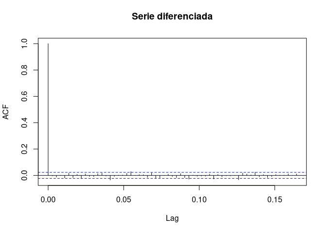

``` r
acf(NoTendKer,lag.max = 60, main='Serie sin tendecia Kernel')
```

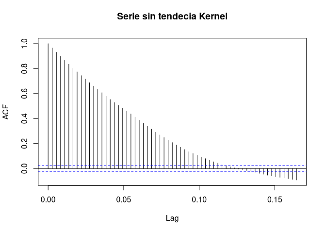

``` r
pacf(dif_ll_tsventa,lag.max = 60 , main='Serie diferenciada')
```

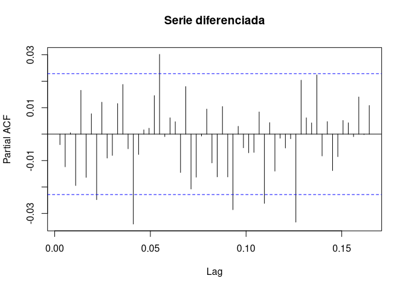

``` r
PeriodogrNoTendDif <- spectrum(dif_ll_tsventa, main = "Periodograma serie diferenciada", log = "no")
```

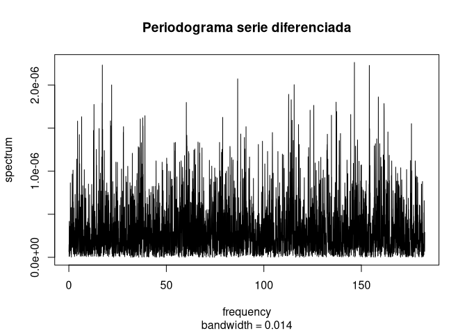

``` r
# Funcion para calcular el periodo
find.freq <- function(x)
    {
        n <- length(x)
        spec <- spec.ar(c(x),plot=FALSE)
        if(max(spec$spec)>10) # Arbitrary threshold chosen by trial and error.
        {
            period <- round(1/spec$freq[which.max(spec$spec)])
            if(period==Inf) # Find next local maximum
            {
                j <- which(diff(spec$spec)>0)
                if(length(j)>0)
                {
                    nextmax <- j[1] + which.max(spec$spec[j[1]:500])
                    period <- round(1/spec$freq[nextmax])
                }
                else
                    period <- 1
            }
        }
        else
            period <- 1
        return(period)
    }

find.freq(dif_ll_tsventa)
```

    ## [1] 1

``` r
# Para la serie sin tendencia diferenciada
PeriodogrNoTendDif <- spectrum(dif_ll_tsventa, main = "Periodograma S.Diferenciada", log = "no")
abline(v = PeriodogrNoTendDif$freq[match(max(PeriodogrNoTendDif$spec),PeriodogrNoTendDif$spec)], col='red')
```

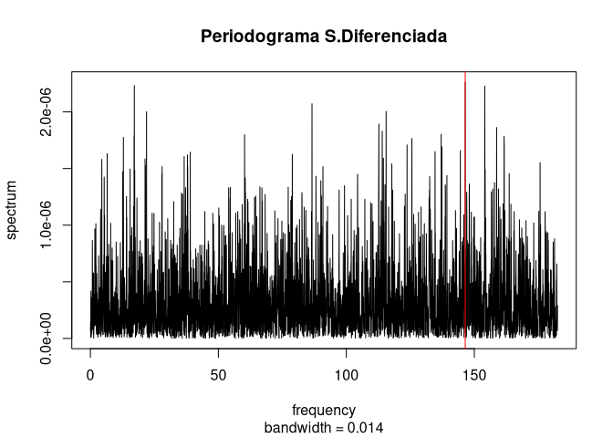

``` r
# periodograma <- PeriodogrNoTendDif
# max(PeriodogrNoTendDif$spec)
# periodograma$freq[match(max(periodograma$spec),periodograma$spec)]
# periodo=1/periodograma$freq[match(max(periodograma$spec),periodograma$spec)]
# periodo
```

Con los motivos mencionados anteriormente y con base en el ACF, los
valores decrecen rápidamente y caen dentro de las bandas de confianza;
sugiriendo que la correlación es significativamente 0, con lo cual la
primera diferenciación fue exitosa para remover la tendencia.

``` r
start_date <- as.Date("2004-01-01")  
dates <- seq.Date(from = start_date, by = "day", length.out = length(NoTendSTL))
years <- as.numeric(format(dates, "%Y"))

# Crear un dataframe para usar en ggplot
data <- data.frame(Year = years, Value = as.numeric(NoTendSTL))

# Crear una variable que indica cada 4 años
data$FourYearPeriod <- (data$Year - min(data$Year)) %/% 4

# Crear el diagrama de cajas
ggplot(data, aes(x = factor(FourYearPeriod), y = Value)) +
  geom_boxplot() +
  xlab("Período de 4 Años") +
  ylab("Valor") +
  ggtitle("Diagrama de Cajas por Período de 4 Años") +
  theme_minimal()
```


Los primero 4 bloques (0 al 3) muestra una variabilidad relativamente
consistente en términos de rango intercuartil.

El bloque 4 parece tener una mayor variabilidad con la caja y los
bigotes más extendidos, lo que sugiere una dispersión más amplia de los
datos en ese período.

El bloque 5 se muestra bastante diferente, con una caja muy pequeña y
pocos datos, lo que podría indicar un bloque incompleto o un período con
menos datos disponibles.

``` r
library(lubridate)
ll_tb<-as_tsibble(dif_ll_tsventa,index=tibble(fecha))
colnames(ll_tb)<-c("Fecha","Dato")

# 
ll_tb$dia <-wday(ll_tb$Fecha, label = TRUE, abbr = TRUE,week_start = 1)
ll_tb$mes <- factor(month.abb[month(ll_tb$Fecha)], levels =   month.abb)

ll_tb$mes <- factor(month.abb[month(ll_tb$Fecha)], levels =   month.abb)

# Boxplot diario
ll_tb%>%mutate(diff_ND=Dato-lag(Dato))%>%plot_seasonal_diagnostics(.date_var = Fecha,.value = diff_ND,.feature_set = c("wday.lbl"),.geom="boxplot")
```

<div class="plotly html-widget html-fill-item" id="htmlwidget-de9e24afdce80ecd1c57" style="width:672px;height:480px;"></div>
<script type="application/json" data-for="htmlwidget-de9e24afdce80ecd1c57">{"x":{"data":[{"x":[6,6,6,6,6,6,6,6,6,6,6,6,6,6,6,6,6,6,6,6,6,6,6,6,6,6,6,6,6,6,6,6,6,6,6,6,6,6,6,6,6,6,6,6,6,6,6,6,6,6,6,6,6,6,6,6,6,6,6,6,6,6,6,6,6,6,6,6,6,6,6,6,6,6,6,6,6,6,6,6,6,6,6,6,6,6,6,6,6,6,6,6,6,6,6,6,6,6,6,6,6,6,6,6,6,6,6,6,6,6,6,6,6,6,6,6,6,6,6,6,6,6,6,6,6,6,6,6,6,6,6,6,6,6,6,6,6,6,6,6,6,6,6,6,6,6,6,6,6,6,6,6,6,6,6,6,6,6,6,6,6,6,6,6,6,6,6,6,6,6,6,6,6,6,6,6,6,6,6,6,6,6,6,6,6,6,6,6,6,6,6,6,6,6,6,6,6,6,6,6,6,6,6,6,6,6,6,6,6,6,6,6,6,6,6,6,6,6,6,6,6,6,6,6,6,6,6,6,6,6,6,6,6,6,6,6,6,6,6,6,6,6,6,6,6,6,6,6,6,6,6,6,6,6,6,6,6,6,6,6,6,6,6,6,6,6,6,6,6,6,6,6,6,6,6,6,6,6,6,6,6,6,6,6,6,6,6,6,6,6,6,6,6,6,6,6,6,6,6,6,6,6,6,6,6,6,6,6,6,6,6,6,6,6,6,6,6,6,6,6,6,6,6,6,6,6,6,6,6,6,6,6,6,6,6,6,6,6,6,6,6,6,6,6,6,6,6,6,6,6,6,6,6,6,6,6,6,6,6,6,6,6,6,6,6,6,6,6,6,6,6,6,6,6,6,6,6,6,6,6,6,6,6,6,6,6,6,6,6,6,6,6,6,6,6,6,6,6,6,6,6,6,6,6,6,6,6,6,6,6,6,6,6,6,6,6,6,6,6,6,6,6,6,6,6,6,6,6,6,6,6,6,6,6,6,6,6,6,6,6,6,6,6,6,6,6,6,6,6,6,6,6,6,6,6,6,6,6,6,6,6,6,6,6,6,6,6,6,6,6,6,6,6,6,6,6,6,6,6,6,6,6,6,6,6,6,6,6,6,6,6,6,6,6,6,6,6,6,6,6,6,6,6,6,6,6,6,6,6,6,6,6,6,6,6,6,6,6,6,6,6,6,6,6,6,6,6,6,6,6,6,6,6,6,6,6,6,6,6,6,6,6,6,6,6,6,6,6,6,6,6,6,6,6,6,6,6,6,6,6,6,6,6,6,6,6,6,6,6,6,6,6,6,6,6,6,6,6,6,6,6,6,6,6,6,6,6,6,6,6,6,6,6,6,6,6,6,6,6,6,6,6,6,6,6,6,6,6,6,6,6,6,6,6,6,6,6,6,6,6,6,6,6,6,6,6,6,6,6,6,6,6,6,6,6,6,6,6,6,6,6,6,6,6,6,6,6,6,6,6,6,6,6,6,6,6,6,6,6,6,6,6,6,6,6,6,6,6,6,6,6,6,6,6,6,6,6,6,6,6,6,6,6,6,6,6,6,6,6,6,6,6,6,6,6,6,6,6,6,6,6,6,6,6,6,6,6,6,6,6,6,6,6,6,6,6,6,6,6,6,6,6,6,6,6,6,6,6,6,6,6,6,6,6,6,6,6,6,6,6,6,6,6,6,6,6,6,6,6,6,6,6,6,6,6,6,6,6,6,6,6,6,6,6,6,6,6,6,6,6,6,6,6,6,6,6,6,6,6,6,6,6,6,6,6,6,6,6,6,6,6,6,6,6,6,6,6,6,6,6,6,6,6,6,6,6,6,6,6,6,6,6,6,6,6,6,6,6,6,6,6,6,6,6,6,6,6,6,6,6,6,6,6,6,6,6,6,6,6,6,6,6,6,6,6,6,6,6,6,6,6,6,6,6,6,6,6,6,6,6,6,6,6,6,6,6,6,6,6,6,6,6,6,6,6,6,6,6,6,6,6,6,6,6,6,6,6,6,6,6,6,6,6,6,6,6,6,6,6,6,6,6,6,6,6,6,6,6,6,6,6,6,6,6,6,6,6,6,6,6,6,6,6,6,6,6,6,6,6,6,6,6,6,6,6,6,6,6,6,6,6,6,6,6,6,6,6,6,6,6,6,6,6,6,6,6,6,6,6,6,6,6,6,6,6,6,6,6,6,6,6,6,6,6,6,6,6,6,6,6,6,6,6,6,6,6,6,6,6,6,6,6,6,6,6,6,6,6,6,6,6,6,6,6,6,6,6,6,6,6,6,6,6,6,6,6,6,6,6,6,6,6,6,6,6,6,6,6,6,6,6,6,6,6,6,6,6,6,6,6,6,6,6,6,6,6,6,6,6,6,6,6,7,7,7,7,7,7,7,7,7,7,7,7,7,7,7,7,7,7,7,7,7,7,7,7,7,7,7,7,7,7,7,7,7,7,7,7,7,7,7,7,7,7,7,7,7,7,7,7,7,7,7,7,7,7,7,7,7,7,7,7,7,7,7,7,7,7,7,7,7,7,7,7,7,7,7,7,7,7,7,7,7,7,7,7,7,7,7,7,7,7,7,7,7,7,7,7,7,7,7,7,7,7,7,7,7,7,7,7,7,7,7,7,7,7,7,7,7,7,7,7,7,7,7,7,7,7,7,7,7,7,7,7,7,7,7,7,7,7,7,7,7,7,7,7,7,7,7,7,7,7,7,7,7,7,7,7,7,7,7,7,7,7,7,7,7,7,7,7,7,7,7,7,7,7,7,7,7,7,7,7,7,7,7,7,7,7,7,7,7,7,7,7,7,7,7,7,7,7,7,7,7,7,7,7,7,7,7,7,7,7,7,7,7,7,7,7,7,7,7,7,7,7,7,7,7,7,7,7,7,7,7,7,7,7,7,7,7,7,7,7,7,7,7,7,7,7,7,7,7,7,7,7,7,7,7,7,7,7,7,7,7,7,7,7,7,7,7,7,7,7,7,7,7,7,7,7,7,7,7,7,7,7,7,7,7,7,7,7,7,7,7,7,7,7,7,7,7,7,7,7,7,7,7,7,7,7,7,7,7,7,7,7,7,7,7,7,7,7,7,7,7,7,7,7,7,7,7,7,7,7,7,7,7,7,7,7,7,7,7,7,7,7,7,7,7,7,7,7,7,7,7,7,7,7,7,7,7,7,7,7,7,7,7,7,7,7,7,7,7,7,7,7,7,7,7,7,7,7,7,7,7,7,7,7,7,7,7,7,7,7,7,7,7,7,7,7,7,7,7,7,7,7,7,7,7,7,7,7,7,7,7,7,7,7,7,7,7,7,7,7,7,7,7,7,7,7,7,7,7,7,7,7,7,7,7,7,7,7,7,7,7,7,7,7,7,7,7,7,7,7,7,7,7,7,7,7,7,7,7,7,7,7,7,7,7,7,7,7,7,7,7,7,7,7,7,7,7,7,7,7,7,7,7,7,7,7,7,7,7,7,7,7,7,7,7,7,7,7,7,7,7,7,7,7,7,7,7,7,7,7,7,7,7,7,7,7,7,7,7,7,7,7,7,7,7,7,7,7,7,7,7,7,7,7,7,7,7,7,7,7,7,7,7,7,7,7,7,7,7,7,7,7,7,7,7,7,7,7,7,7,7,7,7,7,7,7,7,7,7,7,7,7,7,7,7,7,7,7,7,7,7,7,7,7,7,7,7,7,7,7,7,7,7,7,7,7,7,7,7,7,7,7,7,7,7,7,7,7,7,7,7,7,7,7,7,7,7,7,7,7,7,7,7,7,7,7,7,7,7,7,7,7,7,7,7,7,7,7,7,7,7,7,7,7,7,7,7,7,7,7,7,7,7,7,7,7,7,7,7,7,7,7,7,7,7,7,7,7,7,7,7,7,7,7,7,7,7,7,7,7,7,7,7,7,7,7,7,7,7,7,7,7,7,7,7,7,7,7,7,7,7,7,7,7,7,7,7,7,7,7,7,7,7,7,7,7,7,7,7,7,7,7,7,7,7,7,7,7,7,7,7,7,7,7,7,7,7,7,7,7,7,7,7,7,7,7,7,7,7,7,7,7,7,7,7,7,7,7,7,7,7,7,7,7,7,7,7,7,7,7,7,7,7,7,7,7,7,7,7,7,7,7,7,7,7,7,7,7,7,7,7,7,7,7,7,7,7,7,7,7,7,7,7,7,7,7,7,7,7,7,7,7,7,7,7,7,7,7,7,7,7,7,7,7,7,7,7,7,7,7,7,7,7,7,7,7,7,7,7,7,7,7,7,7,7,7,7,7,7,7,7,7,7,7,7,7,7,7,7,7,7,7,7,7,7,7,7,7,7,7,7,7,7,7,7,7,7,7,7,7,7,7,7,7,7,7,7,7,7,7,7,7,7,7,7,7,7,7,7,7,7,7,7,7,7,7,7,7,7,7,7,7,7,7,7,7,7,7,7,7,7,7,7,7,7,7,7,7,7,7,7,7,7,7,7,7,7,7,7,7,7,7,7,7,7,7,7,7,7,7,7,7,7,7,7,7,7,7,7,7,7,7,7,7,7,7,7,7,7,7,7,7,7,7,7,7,7,7,7,7,7,7,7,7,7,7,7,7,7,7,7,7,7,7,7,7,7,7,7,7,7,7,7,7,7,7,7,7,7,7,7,7,7,7,7,7,7,7,7,7,7,7,7,7,7,7,7,7,7,7,7,7,7,7,7,7,7,7,7,7,7,7,7,7,7,7,7,7,7,7,1,1,1,1,1,1,1,1,1,1,1,1,1,1,1,1,1,1,1,1,1,1,1,1,1,1,1,1,1,1,1,1,1,1,1,1,1,1,1,1,1,1,1,1,1,1,1,1,1,1,1,1,1,1,1,1,1,1,1,1,1,1,1,1,1,1,1,1,1,1,1,1,1,1,1,1,1,1,1,1,1,1,1,1,1,1,1,1,1,1,1,1,1,1,1,1,1,1,1,1,1,1,1,1,1,1,1,1,1,1,1,1,1,1,1,1,1,1,1,1,1,1,1,1,1,1,1,1,1,1,1,1,1,1,1,1,1,1,1,1,1,1,1,1,1,1,1,1,1,1,1,1,1,1,1,1,1,1,1,1,1,1,1,1,1,1,1,1,1,1,1,1,1,1,1,1,1,1,1,1,1,1,1,1,1,1,1,1,1,1,1,1,1,1,1,1,1,1,1,1,1,1,1,1,1,1,1,1,1,1,1,1,1,1,1,1,1,1,1,1,1,1,1,1,1,1,1,1,1,1,1,1,1,1,1,1,1,1,1,1,1,1,1,1,1,1,1,1,1,1,1,1,1,1,1,1,1,1,1,1,1,1,1,1,1,1,1,1,1,1,1,1,1,1,1,1,1,1,1,1,1,1,1,1,1,1,1,1,1,1,1,1,1,1,1,1,1,1,1,1,1,1,1,1,1,1,1,1,1,1,1,1,1,1,1,1,1,1,1,1,1,1,1,1,1,1,1,1,1,1,1,1,1,1,1,1,1,1,1,1,1,1,1,1,1,1,1,1,1,1,1,1,1,1,1,1,1,1,1,1,1,1,1,1,1,1,1,1,1,1,1,1,1,1,1,1,1,1,1,1,1,1,1,1,1,1,1,1,1,1,1,1,1,1,1,1,1,1,1,1,1,1,1,1,1,1,1,1,1,1,1,1,1,1,1,1,1,1,1,1,1,1,1,1,1,1,1,1,1,1,1,1,1,1,1,1,1,1,1,1,1,1,1,1,1,1,1,1,1,1,1,1,1,1,1,1,1,1,1,1,1,1,1,1,1,1,1,1,1,1,1,1,1,1,1,1,1,1,1,1,1,1,1,1,1,1,1,1,1,1,1,1,1,1,1,1,1,1,1,1,1,1,1,1,1,1,1,1,1,1,1,1,1,1,1,1,1,1,1,1,1,1,1,1,1,1,1,1,1,1,1,1,1,1,1,1,1,1,1,1,1,1,1,1,1,1,1,1,1,1,1,1,1,1,1,1,1,1,1,1,1,1,1,1,1,1,1,1,1,1,1,1,1,1,1,1,1,1,1,1,1,1,1,1,1,1,1,1,1,1,1,1,1,1,1,1,1,1,1,1,1,1,1,1,1,1,1,1,1,1,1,1,1,1,1,1,1,1,1,1,1,1,1,1,1,1,1,1,1,1,1,1,1,1,1,1,1,1,1,1,1,1,1,1,1,1,1,1,1,1,1,1,1,1,1,1,1,1,1,1,1,1,1,1,1,1,1,1,1,1,1,1,1,1,1,1,1,1,1,1,1,1,1,1,1,1,1,1,1,1,1,1,1,1,1,1,1,1,1,1,1,1,1,1,1,1,1,1,1,1,1,1,1,1,1,1,1,1,1,1,1,1,1,1,1,1,1,1,1,1,1,1,1,1,1,1,1,1,1,1,1,1,1,1,1,1,1,1,1,1,1,1,1,1,1,1,1,1,1,1,1,1,1,1,1,1,1,1,1,1,1,1,1,1,1,1,1,1,1,1,1,1,1,1,1,1,1,1,1,1,1,1,1,1,1,1,1,1,1,1,1,1,1,1,1,1,1,1,1,1,1,1,1,1,1,1,1,1,1,1,1,1,1,1,1,1,1,1,1,1,1,1,1,1,1,1,1,1,1,1,1,1,1,1,1,1,1,1,1,1,1,1,1,1,1,1,1,1,1,1,1,1,1,1,1,1,1,1,1,1,1,1,1,1,1,1,1,1,1,1,1,1,1,1,1,1,1,1,1,1,1,1,1,1,1,1,1,1,1,1,1,1,1,1,1,1,1,1,1,1,1,1,1,1,1,1,1,1,1,1,1,1,1,1,1,1,1,1,1,1,1,1,1,1,1,1,1,1,1,1,1,1,1,1,1,1,1,1,1,1,1,1,1,1,1,1,1,1,1,1,1,1,1,1,1,1,1,1,1,1,1,1,1,1,1,1,1,1,1,1,1,1,1,1,1,1,1,1,1,1,1,1,1,1,1,1,1,1,1,1,1,1,1,1,1,1,1,1,1,1,1,1,1,1,1,1,1,1,1,1,1,1,1,1,1,1,1,1,1,1,1,1,1,1,1,1,1,1,1,1,1,1,1,1,1,1,1,1,1,2,2,2,2,2,2,2,2,2,2,2,2,2,2,2,2,2,2,2,2,2,2,2,2,2,2,2,2,2,2,2,2,2,2,2,2,2,2,2,2,2,2,2,2,2,2,2,2,2,2,2,2,2,2,2,2,2,2,2,2,2,2,2,2,2,2,2,2,2,2,2,2,2,2,2,2,2,2,2,2,2,2,2,2,2,2,2,2,2,2,2,2,2,2,2,2,2,2,2,2,2,2,2,2,2,2,2,2,2,2,2,2,2,2,2,2,2,2,2,2,2,2,2,2,2,2,2,2,2,2,2,2,2,2,2,2,2,2,2,2,2,2,2,2,2,2,2,2,2,2,2,2,2,2,2,2,2,2,2,2,2,2,2,2,2,2,2,2,2,2,2,2,2,2,2,2,2,2,2,2,2,2,2,2,2,2,2,2,2,2,2,2,2,2,2,2,2,2,2,2,2,2,2,2,2,2,2,2,2,2,2,2,2,2,2,2,2,2,2,2,2,2,2,2,2,2,2,2,2,2,2,2,2,2,2,2,2,2,2,2,2,2,2,2,2,2,2,2,2,2,2,2,2,2,2,2,2,2,2,2,2,2,2,2,2,2,2,2,2,2,2,2,2,2,2,2,2,2,2,2,2,2,2,2,2,2,2,2,2,2,2,2,2,2,2,2,2,2,2,2,2,2,2,2,2,2,2,2,2,2,2,2,2,2,2,2,2,2,2,2,2,2,2,2,2,2,2,2,2,2,2,2,2,2,2,2,2,2,2,2,2,2,2,2,2,2,2,2,2,2,2,2,2,2,2,2,2,2,2,2,2,2,2,2,2,2,2,2,2,2,2,2,2,2,2,2,2,2,2,2,2,2,2,2,2,2,2,2,2,2,2,2,2,2,2,2,2,2,2,2,2,2,2,2,2,2,2,2,2,2,2,2,2,2,2,2,2,2,2,2,2,2,2,2,2,2,2,2,2,2,2,2,2,2,2,2,2,2,2,2,2,2,2,2,2,2,2,2,2,2,2,2,2,2,2,2,2,2,2,2,2,2,2,2,2,2,2,2,2,2,2,2,2,2,2,2,2,2,2,2,2,2,2,2,2,2,2,2,2,2,2,2,2,2,2,2,2,2,2,2,2,2,2,2,2,2,2,2,2,2,2,2,2,2,2,2,2,2,2,2,2,2,2,2,2,2,2,2,2,2,2,2,2,2,2,2,2,2,2,2,2,2,2,2,2,2,2,2,2,2,2,2,2,2,2,2,2,2,2,2,2,2,2,2,2,2,2,2,2,2,2,2,2,2,2,2,2,2,2,2,2,2,2,2,2,2,2,2,2,2,2,2,2,2,2,2,2,2,2,2,2,2,2,2,2,2,2,2,2,2,2,2,2,2,2,2,2,2,2,2,2,2,2,2,2,2,2,2,2,2,2,2,2,2,2,2,2,2,2,2,2,2,2,2,2,2,2,2,2,2,2,2,2,2,2,2,2,2,2,2,2,2,2,2,2,2,2,2,2,2,2,2,2,2,2,2,2,2,2,2,2,2,2,2,2,2,2,2,2,2,2,2,2,2,2,2,2,2,2,2,2,2,2,2,2,2,2,2,2,2,2,2,2,2,2,2,2,2,2,2,2,2,2,2,2,2,2,2,2,2,2,2,2,2,2,2,2,2,2,2,2,2,2,2,2,2,2,2,2,2,2,2,2,2,2,2,2,2,2,2,2,2,2,2,2,2,2,2,2,2,2,2,2,2,2,2,2,2,2,2,2,2,2,2,2,2,2,2,2,2,2,2,2,2,2,2,2,2,2,2,2,2,2,2,2,2,2,2,2,2,2,2,2,2,2,2,2,2,2,2,2,2,2,2,2,2,2,2,2,2,2,2,2,2,2,2,2,2,2,2,2,2,2,2,2,2,2,2,2,2,2,2,2,2,2,2,2,2,2,2,2,2,2,2,2,2,2,2,2,2,2,2,2,2,2,2,2,2,2,2,2,2,2,2,2,2,2,2,2,2,2,2,2,2,2,2,2,2,2,2,2,2,2,2,2,2,2,2,2,2,2,2,2,2,2,2,2,2,2,2,2,2,2,2,2,2,2,2,2,2,2,2,2,2,2,2,2,2,2,2,2,2,2,2,2,2,2,2,2,2,2,2,2,2,2,2,2,2,2,2,2,2,2,2,2,2,2,2,2,2,2,2,2,2,2,2,2,2,2,2,2,2,2,2,2,2,2,2,2,2,2,2,2,2,2,2,2,2,2,2,2,2,2,2,2,2,2,2,2,2,2,2,2,2,2,2,2,2,2,2,2,2,2,2,2,2,2,2,2,2,2,2,2,2,2,2,2,2,2,2,2,2,2,2,2,2,2,2,2,2,2,2,3,3,3,3,3,3,3,3,3,3,3,3,3,3,3,3,3,3,3,3,3,3,3,3,3,3,3,3,3,3,3,3,3,3,3,3,3,3,3,3,3,3,3,3,3,3,3,3,3,3,3,3,3,3,3,3,3,3,3,3,3,3,3,3,3,3,3,3,3,3,3,3,3,3,3,3,3,3,3,3,3,3,3,3,3,3,3,3,3,3,3,3,3,3,3,3,3,3,3,3,3,3,3,3,3,3,3,3,3,3,3,3,3,3,3,3,3,3,3,3,3,3,3,3,3,3,3,3,3,3,3,3,3,3,3,3,3,3,3,3,3,3,3,3,3,3,3,3,3,3,3,3,3,3,3,3,3,3,3,3,3,3,3,3,3,3,3,3,3,3,3,3,3,3,3,3,3,3,3,3,3,3,3,3,3,3,3,3,3,3,3,3,3,3,3,3,3,3,3,3,3,3,3,3,3,3,3,3,3,3,3,3,3,3,3,3,3,3,3,3,3,3,3,3,3,3,3,3,3,3,3,3,3,3,3,3,3,3,3,3,3,3,3,3,3,3,3,3,3,3,3,3,3,3,3,3,3,3,3,3,3,3,3,3,3,3,3,3,3,3,3,3,3,3,3,3,3,3,3,3,3,3,3,3,3,3,3,3,3,3,3,3,3,3,3,3,3,3,3,3,3,3,3,3,3,3,3,3,3,3,3,3,3,3,3,3,3,3,3,3,3,3,3,3,3,3,3,3,3,3,3,3,3,3,3,3,3,3,3,3,3,3,3,3,3,3,3,3,3,3,3,3,3,3,3,3,3,3,3,3,3,3,3,3,3,3,3,3,3,3,3,3,3,3,3,3,3,3,3,3,3,3,3,3,3,3,3,3,3,3,3,3,3,3,3,3,3,3,3,3,3,3,3,3,3,3,3,3,3,3,3,3,3,3,3,3,3,3,3,3,3,3,3,3,3,3,3,3,3,3,3,3,3,3,3,3,3,3,3,3,3,3,3,3,3,3,3,3,3,3,3,3,3,3,3,3,3,3,3,3,3,3,3,3,3,3,3,3,3,3,3,3,3,3,3,3,3,3,3,3,3,3,3,3,3,3,3,3,3,3,3,3,3,3,3,3,3,3,3,3,3,3,3,3,3,3,3,3,3,3,3,3,3,3,3,3,3,3,3,3,3,3,3,3,3,3,3,3,3,3,3,3,3,3,3,3,3,3,3,3,3,3,3,3,3,3,3,3,3,3,3,3,3,3,3,3,3,3,3,3,3,3,3,3,3,3,3,3,3,3,3,3,3,3,3,3,3,3,3,3,3,3,3,3,3,3,3,3,3,3,3,3,3,3,3,3,3,3,3,3,3,3,3,3,3,3,3,3,3,3,3,3,3,3,3,3,3,3,3,3,3,3,3,3,3,3,3,3,3,3,3,3,3,3,3,3,3,3,3,3,3,3,3,3,3,3,3,3,3,3,3,3,3,3,3,3,3,3,3,3,3,3,3,3,3,3,3,3,3,3,3,3,3,3,3,3,3,3,3,3,3,3,3,3,3,3,3,3,3,3,3,3,3,3,3,3,3,3,3,3,3,3,3,3,3,3,3,3,3,3,3,3,3,3,3,3,3,3,3,3,3,3,3,3,3,3,3,3,3,3,3,3,3,3,3,3,3,3,3,3,3,3,3,3,3,3,3,3,3,3,3,3,3,3,3,3,3,3,3,3,3,3,3,3,3,3,3,3,3,3,3,3,3,3,3,3,3,3,3,3,3,3,3,3,3,3,3,3,3,3,3,3,3,3,3,3,3,3,3,3,3,3,3,3,3,3,3,3,3,3,3,3,3,3,3,3,3,3,3,3,3,3,3,3,3,3,3,3,3,3,3,3,3,3,3,3,3,3,3,3,3,3,3,3,3,3,3,3,3,3,3,3,3,3,3,3,3,3,3,3,3,3,3,3,3,3,3,3,3,3,3,3,3,3,3,3,3,3,3,3,3,3,3,3,3,3,3,3,3,3,3,3,3,3,3,3,3,3,3,3,3,3,3,3,3,3,3,3,3,3,3,3,3,3,3,3,3,3,3,3,3,3,3,3,3,3,3,3,3,3,3,3,3,3,3,3,3,3,3,3,3,3,3,3,3,3,3,3,3,3,3,3,3,3,3,3,3,3,3,3,3,3,3,3,3,3,3,3,3,3,3,3,3,3,3,3,3,3,3,3,3,3,3,3,3,3,3,3,3,3,3,3,3,3,3,3,3,3,3,3,3,3,3,3,3,3,3,3,3,3,3,3,3,3,3,3,3,3,3,3,3,3,3,3,3,3,3,3,3,3,3,3,3,3,3,3,3,3,3,3,3,3,3,3,3,3,3,3,3,4,4,4,4,4,4,4,4,4,4,4,4,4,4,4,4,4,4,4,4,4,4,4,4,4,4,4,4,4,4,4,4,4,4,4,4,4,4,4,4,4,4,4,4,4,4,4,4,4,4,4,4,4,4,4,4,4,4,4,4,4,4,4,4,4,4,4,4,4,4,4,4,4,4,4,4,4,4,4,4,4,4,4,4,4,4,4,4,4,4,4,4,4,4,4,4,4,4,4,4,4,4,4,4,4,4,4,4,4,4,4,4,4,4,4,4,4,4,4,4,4,4,4,4,4,4,4,4,4,4,4,4,4,4,4,4,4,4,4,4,4,4,4,4,4,4,4,4,4,4,4,4,4,4,4,4,4,4,4,4,4,4,4,4,4,4,4,4,4,4,4,4,4,4,4,4,4,4,4,4,4,4,4,4,4,4,4,4,4,4,4,4,4,4,4,4,4,4,4,4,4,4,4,4,4,4,4,4,4,4,4,4,4,4,4,4,4,4,4,4,4,4,4,4,4,4,4,4,4,4,4,4,4,4,4,4,4,4,4,4,4,4,4,4,4,4,4,4,4,4,4,4,4,4,4,4,4,4,4,4,4,4,4,4,4,4,4,4,4,4,4,4,4,4,4,4,4,4,4,4,4,4,4,4,4,4,4,4,4,4,4,4,4,4,4,4,4,4,4,4,4,4,4,4,4,4,4,4,4,4,4,4,4,4,4,4,4,4,4,4,4,4,4,4,4,4,4,4,4,4,4,4,4,4,4,4,4,4,4,4,4,4,4,4,4,4,4,4,4,4,4,4,4,4,4,4,4,4,4,4,4,4,4,4,4,4,4,4,4,4,4,4,4,4,4,4,4,4,4,4,4,4,4,4,4,4,4,4,4,4,4,4,4,4,4,4,4,4,4,4,4,4,4,4,4,4,4,4,4,4,4,4,4,4,4,4,4,4,4,4,4,4,4,4,4,4,4,4,4,4,4,4,4,4,4,4,4,4,4,4,4,4,4,4,4,4,4,4,4,4,4,4,4,4,4,4,4,4,4,4,4,4,4,4,4,4,4,4,4,4,4,4,4,4,4,4,4,4,4,4,4,4,4,4,4,4,4,4,4,4,4,4,4,4,4,4,4,4,4,4,4,4,4,4,4,4,4,4,4,4,4,4,4,4,4,4,4,4,4,4,4,4,4,4,4,4,4,4,4,4,4,4,4,4,4,4,4,4,4,4,4,4,4,4,4,4,4,4,4,4,4,4,4,4,4,4,4,4,4,4,4,4,4,4,4,4,4,4,4,4,4,4,4,4,4,4,4,4,4,4,4,4,4,4,4,4,4,4,4,4,4,4,4,4,4,4,4,4,4,4,4,4,4,4,4,4,4,4,4,4,4,4,4,4,4,4,4,4,4,4,4,4,4,4,4,4,4,4,4,4,4,4,4,4,4,4,4,4,4,4,4,4,4,4,4,4,4,4,4,4,4,4,4,4,4,4,4,4,4,4,4,4,4,4,4,4,4,4,4,4,4,4,4,4,4,4,4,4,4,4,4,4,4,4,4,4,4,4,4,4,4,4,4,4,4,4,4,4,4,4,4,4,4,4,4,4,4,4,4,4,4,4,4,4,4,4,4,4,4,4,4,4,4,4,4,4,4,4,4,4,4,4,4,4,4,4,4,4,4,4,4,4,4,4,4,4,4,4,4,4,4,4,4,4,4,4,4,4,4,4,4,4,4,4,4,4,4,4,4,4,4,4,4,4,4,4,4,4,4,4,4,4,4,4,4,4,4,4,4,4,4,4,4,4,4,4,4,4,4,4,4,4,4,4,4,4,4,4,4,4,4,4,4,4,4,4,4,4,4,4,4,4,4,4,4,4,4,4,4,4,4,4,4,4,4,4,4,4,4,4,4,4,4,4,4,4,4,4,4,4,4,4,4,4,4,4,4,4,4,4,4,4,4,4,4,4,4,4,4,4,4,4,4,4,4,4,4,4,4,4,4,4,4,4,4,4,4,4,4,4,4,4,4,4,4,4,4,4,4,4,4,4,4,4,4,4,4,4,4,4,4,4,4,4,4,4,4,4,4,4,4,4,4,4,4,4,4,4,4,4,4,4,4,4,4,4,4,4,4,4,4,4,4,4,4,4,4,4,4,4,4,4,4,4,4,4,4,4,4,4,4,4,4,4,4,4,4,4,4,4,4,4,4,4,4,4,4,4,4,4,4,4,4,4,4,4,4,4,4,4,4,4,4,4,4,4,4,4,4,4,4,4,4,4,4,4,4,4,4,4,4,4,4,4,4,4,4,4,4,4,4,4,4,4,4,4,4,4,4,4,4,4,4,4,4,4,4,4,4,4,4,4,4,4,4,4,4,4,4,4,4,5,5,5,5,5,5,5,5,5,5,5,5,5,5,5,5,5,5,5,5,5,5,5,5,5,5,5,5,5,5,5,5,5,5,5,5,5,5,5,5,5,5,5,5,5,5,5,5,5,5,5,5,5,5,5,5,5,5,5,5,5,5,5,5,5,5,5,5,5,5,5,5,5,5,5,5,5,5,5,5,5,5,5,5,5,5,5,5,5,5,5,5,5,5,5,5,5,5,5,5,5,5,5,5,5,5,5,5,5,5,5,5,5,5,5,5,5,5,5,5,5,5,5,5,5,5,5,5,5,5,5,5,5,5,5,5,5,5,5,5,5,5,5,5,5,5,5,5,5,5,5,5,5,5,5,5,5,5,5,5,5,5,5,5,5,5,5,5,5,5,5,5,5,5,5,5,5,5,5,5,5,5,5,5,5,5,5,5,5,5,5,5,5,5,5,5,5,5,5,5,5,5,5,5,5,5,5,5,5,5,5,5,5,5,5,5,5,5,5,5,5,5,5,5,5,5,5,5,5,5,5,5,5,5,5,5,5,5,5,5,5,5,5,5,5,5,5,5,5,5,5,5,5,5,5,5,5,5,5,5,5,5,5,5,5,5,5,5,5,5,5,5,5,5,5,5,5,5,5,5,5,5,5,5,5,5,5,5,5,5,5,5,5,5,5,5,5,5,5,5,5,5,5,5,5,5,5,5,5,5,5,5,5,5,5,5,5,5,5,5,5,5,5,5,5,5,5,5,5,5,5,5,5,5,5,5,5,5,5,5,5,5,5,5,5,5,5,5,5,5,5,5,5,5,5,5,5,5,5,5,5,5,5,5,5,5,5,5,5,5,5,5,5,5,5,5,5,5,5,5,5,5,5,5,5,5,5,5,5,5,5,5,5,5,5,5,5,5,5,5,5,5,5,5,5,5,5,5,5,5,5,5,5,5,5,5,5,5,5,5,5,5,5,5,5,5,5,5,5,5,5,5,5,5,5,5,5,5,5,5,5,5,5,5,5,5,5,5,5,5,5,5,5,5,5,5,5,5,5,5,5,5,5,5,5,5,5,5,5,5,5,5,5,5,5,5,5,5,5,5,5,5,5,5,5,5,5,5,5,5,5,5,5,5,5,5,5,5,5,5,5,5,5,5,5,5,5,5,5,5,5,5,5,5,5,5,5,5,5,5,5,5,5,5,5,5,5,5,5,5,5,5,5,5,5,5,5,5,5,5,5,5,5,5,5,5,5,5,5,5,5,5,5,5,5,5,5,5,5,5,5,5,5,5,5,5,5,5,5,5,5,5,5,5,5,5,5,5,5,5,5,5,5,5,5,5,5,5,5,5,5,5,5,5,5,5,5,5,5,5,5,5,5,5,5,5,5,5,5,5,5,5,5,5,5,5,5,5,5,5,5,5,5,5,5,5,5,5,5,5,5,5,5,5,5,5,5,5,5,5,5,5,5,5,5,5,5,5,5,5,5,5,5,5,5,5,5,5,5,5,5,5,5,5,5,5,5,5,5,5,5,5,5,5,5,5,5,5,5,5,5,5,5,5,5,5,5,5,5,5,5,5,5,5,5,5,5,5,5,5,5,5,5,5,5,5,5,5,5,5,5,5,5,5,5,5,5,5,5,5,5,5,5,5,5,5,5,5,5,5,5,5,5,5,5,5,5,5,5,5,5,5,5,5,5,5,5,5,5,5,5,5,5,5,5,5,5,5,5,5,5,5,5,5,5,5,5,5,5,5,5,5,5,5,5,5,5,5,5,5,5,5,5,5,5,5,5,5,5,5,5,5,5,5,5,5,5,5,5,5,5,5,5,5,5,5,5,5,5,5,5,5,5,5,5,5,5,5,5,5,5,5,5,5,5,5,5,5,5,5,5,5,5,5,5,5,5,5,5,5,5,5,5,5,5,5,5,5,5,5,5,5,5,5,5,5,5,5,5,5,5,5,5,5,5,5,5,5,5,5,5,5,5,5,5,5,5,5,5,5,5,5,5,5,5,5,5,5,5,5,5,5,5,5,5,5,5,5,5,5,5,5,5,5,5,5,5,5,5,5,5,5,5,5,5,5,5,5,5,5,5,5,5,5,5,5,5,5,5,5,5,5,5,5,5,5,5,5,5,5,5,5,5,5,5,5,5,5,5,5,5,5,5,5,5,5,5,5,5,5,5,5,5,5,5,5,5,5,5,5,5,5,5,5,5,5,5,5,5,5,5,5,5,5,5,5,5,5,5,5,5,5,5,5,5,5,5,5,5,5,5,5,5,5,5,5,5,5,5,5,5,5,5,5,5,5,5,5,5,5,5,5,5,5,5,5,5,5,5,5,5,5,5,5,5,5,5,5,5,5,5,5,5,5,5,5,5,5],"y":[null,0.013532521972864586,-0.0035742024943772321,-0.0014609043811280031,0.0061709886081082743,-0.014648400793833005,-0.0029664751289999458,0.016885841626315568,-0.01706847501537645,0,0,0.010267954890384345,0.0073790903012298514,0.0043532429349628643,-0.0024004240676571698,0.0032349071909063554,-0.015509506266452533,0,-0.0041793826135787526,0.033359365290580811,-0.021447259008297692,-0.0061651722140005916,-0.0054915833705848627,5.4120165016158239e-05,-0.008791867161070499,0,-0.046255227761882622,-0.002168756105609404,-0.0081257523585716029,-0.022098640433638295,0.0023919774679725947,0,-0.0036207915708459382,0.012282106951836624,0.0076920613041000507,-0.0084154932906308488,0.010977592289613369,-0.0012447536148698646,0,-0.0088933079751978283,0.0047643664333580915,0.018789258582218693,-0.011244531902278254,0.013826320989013041,-0.016690934334155472,0,-0.00036008792978137194,-0.0076545672288119704,-0.0099155477133425762,0.014098709208067106,-0.010145781211013727,0.019414784384707673,-0.017289311730687373,-0.0068445237576355566,0.0054557338020355672,-0.026109471429725417,0.017466315490871409,0.011260799319286363,-0.0033976529251518173,0.0021371645475287693,0.015696070267054552,0.0037839111711104323,-0.0061578498217684796,-0.013261086581961123,-0.0032858796565822246,-0.0020545696994620499,0.019251627155211892,0.0022481999954848675,0.017503730005650198,-0.0118564577301008,0.013916735364595922,-0.0039669414295211425,0.0075632357652661852,0.020503908094193335,-0.0052266348431704301,0.024834067640355784,-0.0085989564606840929,0.003305167053577307,0.0050397782026330162,0.0083678329002214724,0.0022344945412946515,-0.012861141793127473,-0.002110959206641283,0.0081156142293306033,0.0081927953983456092,-0.016813373208560023,0.004323962612456711,0.009104982528205241,0.01606860775825325,-0.0028204423611004614,0,-0.0091492819307443796,0.0083111843770247162,0.012429515036689764,0,-0.0050328982421063984,0.0045119130816786424,0.0029947344937077958,0,-0.0021992365166774164,2.5217289154610967e-05,0,-0.0093091244741234647,0.036946396500807666,-0.0074895093307461025,0.023159982120395384,0.007902765185464844,0.011276438832815927,0.0055555465438867913,-0.0016043058706767255,0.016489384064774626,0.003386523993581747,0.011990200879973045,-0.01907290795626615,0.023588037528138983,0,0.0014625670496695165,-0.014475333522312894,0.0070043287746486271,0.046214845952281536,-0.0104293799481745,0.005835364365132989,0,-0.009154240965507654,0.01377819348031295,0.0084834949530527837,0.0070732946692739773,-0.011057644636839115,0.0025114749484398402,0,0.015372187543514215,-0.00050089153662646879,0.0096477235673280148,0.014413235216755638,-0.011367162936021913,0.0031016712099312116,0.025591587462653109,-0.034597704978096999,-0.00072157241520720561,0.01265390239777453,0.0077242808696489362,-0.0078768946094385228,-0.0070796721284516195,0.014742638144211284,-0.0078855281636140973,0.027151813948735892,-0.016922286306137124,0.0023357575306555134,0.034444076226700204,-0.0009438873452740637,0.033403938051506543,-0.034522063291920091,0.018332104745518052,-0.014398287503981422,0.0041953511552499378,-0.0099150476406091315,0.025754354506076993,-0.0037515944232229259,0.018628309673159649,0.010829191448751274,-0.020344883213002873,0.013699999829309917,0.005018472837381438,-0.0071111836756472258,-0.051715167375673943,-0.0022328673776907948,0.02840605967031351,0.039821527690072855,0.010149377540248139,0.017796270202868669,0.010228521980630845,0.0060098181147036911,-0.018115451938482963,0.0028313387301910353,-0.0040137484124542766,0.00017179574812331566,0.0013733476914037368,0.019201423470590839,0,-0.00059623313894796581,0.020852477066302555,0,-0.0037646471157728456,0.011584852946450397,-0.018719726110857593,0,0,-0.050900938330933343,0,-0.0011516637570245791,0.0053926748519277368,-0.066735212387330378,0,0,0.00025144430902734882,-0.0062443623269459181,-0.004720169405974417,0.010262661979538734,-0.024396668745287897,0.0098202960475166634,-0.00052907750324138192,-0.020152401211497306,0.0207806570112119,0.004613861917230011,0.01051919614720731,-0.0065126734277036746,0,-0.004423602452236608,0.021025126541337258,0.010112265568107404,-0.0080625548662194291,-0.013552596268434414,0.0045141714251055731,0,0.018777868692666289,0.011324997194979147,-0.01953867746092719,0.0021691959125611504,-0.0066353316637641768,0.012684329186951615,0.01053741639420025,-0.014652820000808475,0.009289763991558786,0.011981017860977161,-0.0088469383870819485,-0.035883849721145111,0.019065075936284259,0.013004482148220475,-0.001454296115577236,0.008635208491426738,0.0049446208471266573,-0.01013991110492718,-0.010106193114282291,0.011158515518321366,-0.038025658788621186,0.018769248989448428,-0.024396652796630391,0.0010851908320184123,0.003770639248575236,0.0068346049914609353,0.0025091891275454969,0.037543763068523361,0.013492399608090011,-0.0036897757064977554,-0.00018233212531093557,0.00032781861106201404,0.038014594545536795,-0.055933185620970605,0.012177987003010315,0,0.0027327972611193019,-0.0043603981737891928,0.0020872561683233926,0.037606426185647024,0.00682722884175746,0.010893196113190839,0.0091684365763953224,-0.013415464310115865,0.008127187864127805,-0.0097689088697521242,0.0054751894497382381,0.01468419541470567,0,-0.020557904136913052,-0.032979939968114991,-0.0086255484985571229,0.0050830198774232116,0.02493664420046926,-0.0062631530421413117,0,-0.0047939835895949301,0.022713075475593314,-0.01084073818826603,0.017499772998109009,0.033351713539589767,0.0023182604548246388,0,-0.007522488197105659,-0.00075563904343489696,0.015672461748090782,0.0017747027909589264,-0.0024734038979392636,-0.03101129169657213,-0.044069076189078515,-0.0064728739082138276,-0.040882690953079504,0.0047457042244047898,0.0026372288536471444,0.022318472253321175,-0.013390570267095114,0,0.0075959651545733919,0.067030903249458262,0.02862554961700603,-0.020668299563714854,-0.024970238625634522,0.042954816066140822,0,0.015709938715080085,0,-0.0084020688541652788,0.013725981249764985,0.00030772341178142426,0.013089802489730573,0.0066523344365112536,-0.0027746394622170101,-0.012429798974974204,0.0031065149050775176,-0.0055508112250830521,-0.0090336160073327676,0.0035448415392700383,-0.0033599977562808192,-0.0087865387576204768,-0.034410845241824362,0.015250548550483245,0.012869146461559566,0.0036978627706769629,-0.013974627598047462,-0.030264423342281077,0.025337045889285648,-0.021593034074017581,-0.0010195595746367303,0.0008206806916764009,-0.017526744789014614,-0.004300973388531304,0.0057300206863288849,-0.0088655240390274059,0.0070902958731533516,-0.0061460825229531224,-0.0039508851183658322,-0.0076668829224200152,-0.02915069254957281,0.010792554822691258,0,0.030324733624738087,-0.018685647079154322,-0.01187762699941608,0.044160510683310505,-0.016255856017437509,0.003728957046011061,0.010035474238561548,-0.043496426717819503,0.0062525476736894348,0.0372902736980123,0.033992536863882705,-0.012780171597579937,0.0042764073812335823,-0.0062820457605337054,0.0019663979447219759,0.0013542170404861054,-0.013318451196541403,-0.027875693578259586,0.0272630649263359,0,-0.012743632396952975,-0.010843992202831387,-0.0012809126684061312,-0.01764701729957352,0.012258563872167727,0.018717735684822046,0,0.0013049677240832835,0.0037262679704248569,0.0036785532473420091,0.0017904209620063227,-0.012293898595197916,0.0022891629472390207,-0.015127835324399541,-0.00052456210792861668,0.0067056492332664419,-0.030147910961337843,-0.0015464469599031361,0.024314286186863043,-0.0021852361332346248,-0.016004190837934473,0.03225035918668695,-0.023614229070837212,0.015138776711395963,-0.012278434070063682,0.02537845680028461,0,-0.0054905668422193799,-0.0028037249539245579,0,0.030886387887338884,0.02039812093999771,0.023350017672271406,-0.005892202146515757,-0.016909269462594523,-0.018487786463984079,0,0.012658575267657568,-0.0055418109572364926,0.0057027785991099478,0.011204880904550407,0.027430575995376572,-0.0072571008532236192,0.012316041709723891,-0.0018730212147168857,-0.0050287609898234109,-0.026494068472020516,0,-0.016439165314748649,0.0044343219701445946,0.010512216850393941,-0.0050579719375001275,0.0043605854565562652,0.0080620928713415196,-0.025552226806041745,0.0030552156816128218,-0.0022756163231036908,0.025916704764860299,0.010560174122922206,0.0065330492297910325,-0.00051412396543781824,0.015924226384418816,-0.010441288017352335,0,0.028632028216627248,-0.0010204052845654843,-0.015905430559815414,0.035628282747625306,0.013761923556749878,0.014001132584734677,0,-0.036345559650948545,0.02322433491328546,0.00033065550466560012,0.0088329741486354862,-0.0040848709769978342,0.0047302287657142728,0,0.048810057136156715,-0.0019780067479864272,0.0020383359308500104,0.0075963465574453437,-0.0061876477800772989,0.0095201862194773668,0,0.010182896022081778,0.0072612116101655744,-0.017205260804653122,0.010173055525033448,-0.0063144311250447061,-0.018638468868543256,0.015631583438416641,0.029209448530199467,0.022354402584559452,-0.0026179677975193272,0.0024340643938742801,-0.0070474271065066318,0.0071386829370965188,0.024761107213585376,-0.031555485652514648,0.032422495450422417,-0.00098873338139782163,-0.0091753839847079632,-0.032721543967594968,-0.029329415789886681,-0.030654371823692017,0.012168897619883268,0.027758765570391475,-0.0026241919098008992,0.0073081573296729374,0,-0.031569529059931156,-0.017475523085060729,0.0051678424815388979,0.011558791439215454,0.0057888370585796878,-0.023768206858679974,-0.015593898519458804,-0.0030006561725155478,0.0013565607830567927,0.011102824720712334,-0.012006464968411734,-0.0010090545706642473,-0.0020772729921834099,0.0037908108228723592,-0.005067635635578327,-0.001513981222176497,0.0061249311051962962,-0.003050620307961438,0.0089770351015001637,-0.0039248660477113617,0.0096437108565368135,0.0074385275245507643,0.0074934492666152153,0.002886916069746448,0.0012131817027523084,-0.00072807751646308816,-0.021889870013746204,0.00082217690290065093,-0.017734501506991407,-0.008576225060309639,0.0054374730429795903,-0.0080874520525480165,0.0034323752125349216,0.020154685453313448,-0.032615755525654322,-0.0059681684027523829,0.043249494627758622,0.024852851465855252,0.0092347860087720335,-0.0036604870848879756,-0.00081349412647391262,0.0031783946176169309,-0.0024194869482769832,0,-0.025311386194662333,0.000437395027002907,-0.010601100458458745,-0.021675771774022579,-0.026896968026179024,-0.0082307284721032659,0,0.036250744019321601,0.012523042652206939,0.026308996790390893,0.0046538088607945838,0.007386106100245371,-0.024635296189391198,0.0086798284019362626,0.022377513452340736,0.0083613979140189088,-0.0011191945807080828,0.016292045495639229,0.057057356200775899,0.051973458856021892,-0.020427200317174155,0.004952119023304391,0,-0.0092349410406153964,-0.0058557501355664954,-0.034558876484036105,0.0011466445848498097,0.00091042158363130454,0.024883566288190551,0.016919411302691145,0.014523736584113323,-0.019873935351258254,-0.0060770490490416051,-0.016377125271315407,0.034335190943153293,0.0074753127697526622,0.0030741651291226191,-0.015267713308215747,-0.016746824952077688,0,-0.026913871575091619,0.015689153193818584,0,-0.012666327187128346,-0.021953912649916418,0.011753144628034562,-0.013056953027749785,-0.014926618463503516,-0.0031033892999801083,0.018688230769985381,-0.0020581674228949964,0.00043258331682061169,0.0063630555391789301,0.0018972039614464364,-0.025555687139863892,0,0,0.0054023472963038444,0.00098969317779662447,-0.0019308533389246207,-0.0016357434824350037,-0.0069533284128144857,-0.0017898374276565931,-0.0064096814960343806,0.0081453327596481273,-0.0013811561644434533,-0.011755871548006169,0.0086160229930314358,0.0014068473267094816,-0.0015131291755690057,0.00084819347086728669,0.0018711405123426061,-0.017060443675388726,-0.0079233819895865309,-0.0077914717380753729,0.01978237090074586,0.010598622656518231,-0.0013278072519558037,-0.0016379614827712885,0.0035027824483631065,-0.0021629957324496019,-0.0018398843261007158,-0.053846490143744319,0,-0.0057336321705427906,-0.016055716636728334,0.0013374389371829665,0.015258895811209428,-0.0035791923193393416,-0.0044013119512413823,0,-0.013432820056108241,0.0073820451745554294,0.0023690918552805584,0.0083437723606500924,-0.0319462314649126,0.0033538101734063019,0,-0.042634284675189704,0,-0.0030600013191879327,0.014665357411496771,0,0.0027534571350447123,-0.00307097296017389,0.016813551510180602,0.0079402876222331997,0.041155204295900916,0.021126753500388062,-0.004865848305486864,-0.0046590950080105387,0.023490178376508908,-0.023836408680210752,0.022219923857676349,0.023506294734231048,-0.0017211638757501646,0.0093952631672635789,0.0012671339713055119,0,0.083991359057538517,0.018998761174159995,-0.025019614200120444,0.0030901764606934279,-0.0028115326709841071,0.010545439975921056,-0.005690079320858743,-0.0034180609697607167,0.0059515600189712359,-0.023288312180783421,-0.0050838242312849502,-0.02024250155462326,-0.0097955511539744577,0.011758970920633161,0.013983369111974397,0.054786524262601333,0.011777984463723357,0.018568875873755886,-0.00032082419632750714,-0.0032992820322608196,0.0045413294357583567,0.006542334776614922,0.0099660770015255196,0.014095427899913915,-0.035181892298581374,-0.0030328673040145304,0.0067495598756597275,-0.022740613270331167,0.023009702243779628,0.012830673240111778,0.011942726357087707,0.014251792242095718,0,0.01757661204918648,-0.014190675047572654,-0.01359281640491794,-0.0035641962154446816,-0.010639709944557652,0.011695703137515778,0,0.038682983893686185,-0.00052419390600277893,0.019805373863968967,0,-0.003205935254859682,-0.0045378494957812876,0,0.032309282397612549,0,-0.037983390897371905,-0.002625618073402336,-0.0095661455135154227,0.011439287616612503,-7.4923888151445794e-05,-0.03832166955334948,0,0.01300202797596306,0.011802420236739053,-0.014663222781285512,-0.013925373785761863,0.043543499136328379,0.0042220200435867383,0,0.0045135031883383192,0,-0.011939232216422013,0.018275894575443985,0.02813959085290918,-0.0083787262261871831,-0.028296394860962693,-0.011795312706421868,0.00091522783367814498,-0.0093108779078363568,-0.019963669315433918,-0.022019026170807976,-0.0060638663908108015,0,0.0007138494331062617,0.0064986579450714288,0.023954612190552282,-0.0064207657313737343,-0.031377501816937325,-0.001142780493651685,0.000923861895730127,0.03053637014154198,0.00052897814101449114,0.023035498391484666,0.009723663840430774,0.029369008907421446,0.00095777841260691332,0.026868894655542874,-0.010832984658128098,-0.018136302684869321,0.016659165853997848,0.0052118433381647122,0,-0.021233585953636336,0.0084636790914860427,-0.006828464523294997,-0.0075672683587892919,-0.014967372336323947,-0.0038024257461266586,0.013570418498696668,0.0013891407771389197,-0.013981070589291988,0,0.018548156128815663,0.00032485025549355839,-0.0001902647158811277,0,-0.00078659580447038024,0,-0.0032759236981849682,0.023062434154107692,-0.0093404024789975892,-0.024531011650990919,0.001488249944729958,0.010145105247074682,0.06729351935157446,0.0049067149217911776,-0.0062761102677946212,0,-0.008141054453464136,0,0.0085642469437452462,0.046893577078014559,0.019206512994468738,0,0.0073026398957320993,-0.028072231837894535,0,0.008699967692562538,0,0,-0.016002169825261703,0.0086215747019142697,-0.00088871847043314744,0.007321936167812737,-0.014198926077350293,0,0.0085826188110385004,-0.0040829104703750119,0.007061183960244577,0.0025269123573288255,0.013167290305323931,0.0071647346150527369,0,-0.0018385566814949073,0.0072130043900209273,-0.0015916535960442957,0.0093472918544605932,-0.015757173714810335,0.014280236907142196,-0.018862329181537518,-0.0098365234243260602,0.014780328870701354,-0.0065674087775651202,0.0045460468793141473,0,0.0045916384214148565,0,0.0052139712490806289,-0.010895301370181798,0.0072992237418052497,-0.015774611972874553,-0.00055446115009516461,-0.0061289796692243215,0,0.018424208255368058,-0.0045850217278484706,0,-0.064964940825191775,-0.029768304328870343,-0.031309878069624375,0.015367385471929396,0.034886288945529031,-0.0022088146893608496,0.0010377585855589899,-0.012969956199428978,0,0,-0.0042016437220109282,0.03549829528903814,0.03188331530891908,0.0032407529249844913,-0.0010401903290162551,0,-0.0013528421901760623,-0.021533879760502472,0.029477973061757368,0.0077699052779216515,-0.022277562347813529,-0.001234662971016931,0,0.00014134115859576468,0,0,0.024580591104534477,-0.012160796252009831,-0.006666909864581072,0,0.0020417031127006879,0.018660756875735984,-0.00088888543492871008,0.00068909775367309578,0.0055064632848456085,0.024252632882115321,0,-0.0096613214664049707,-0.016589767420180479,0.0081651994880260759,0.0060862726736843342,-0.0067832158351421867,0.0044588285715772003,0,-0.0085149374549100543,0.011031924911252489,-0.0099993309137111908,-0.0045104307827354972,0.012164129549580238,-0.0038453399497502261,-0.0057618240033097123,-0.0081570769810372923,0,-0.0047192899843828684,0.024039261912960797,-0.0026919074749613969,-0.0051514570213555544,-0.0065449314937549019,-0.0044446661089896367,0,-0.031229486950666185,-0.0070930805094349125,0.0029898202942941765,0,-0.045721806914956531,0.015410172033343272,-0.013409796813245833,-0.045581878648993879,-0.022866606420725688,0,-0.00080006360149731393,0.029611106442521518,-0.011418286705227487,0.0061101059936277125,0.014807077019806769,-0.0051058951161753185,0,0.0035707644518510051,-0.035833273469997096,-0.0051393638387171592,-0.007279216466079319,-0.015567347732082126,-0.0013724817519236154,-0.00335626064792649,0,0,0.0081268287746141255,0,-0.0039017357477515446,0,0.0034641405604194375,-0.0083620889130422427,-0.002858282628265485,0,0,-0.011637527308817397,0.005351073107274118,-0.002374935357213559,-0.012654834350954047,0.00097253880411685145,0,-0.0053460188962581867,0.03425562092809642,-0.0064547729296347001,0.014524516356081207,0.0010200218680029849,0,0,-0.015420401896081515,0,-0.00092557784755520345,0.0094910368886971241,0.0047566760306505529,0,-0.0031277203924915398,0.0048515542967173531,0.017655057315399958,-0.0089834305783629276,0.011812994140495192,-0.026760329522044657,0.013295124884143306,0.012278378171878046,0.013449633345958389,0.0029882236271152607,0.0017804043074711728,0.0061159950672404761,0.0043920866370541489,-0.0058588189293882209,-0.010868067824709726,0.014157320888001479,0,0,-0.0078458510750607502,0,0,-0.01537056043610896,0,0.0033909542925414371,0.012059519005477526,0.015910276648270383,0,0,0.0039081414119674918,-0.0089685327505275581,0,7.3575863028807476e-05,0.0071273373674678453,0,0,-0.0050650985675666504,0,0,0.020930536615191286,-0.023061347067894644,0.0020068094870353548,0,-0.00027565817628705247,-0.018144480551811171,-0.0053285028039216087,0.035458689160856594,0,-0.013026231771288366,0.030486207721983405,-0.0037925477542462005,0.0091397057780966406,0,0.0041819156344153896,0.022966663754115046,-0.011441638600121706,-0.0057076908565569795,-0.019942025081782333,0,0.0052323857451419542,0,0.0051789650771763007,0,0.0048199388217593508,-0.0056790734589249325,0,-0.0037500742396758824,-0.009854029830616895,0,-0.0051975107589559144,0.016177473861169744,0,0,0,-0.0025386499958290898,0.0019809726458497323,-0.01071558671280215,0.0013883763164077578,-0.010586537876331903,0,-0.0040724809696115472,-0.010300092616938983,-0.0096830213071310567,0.0016308145948933372,-0.010829140759662792,-0.0021073451530746468,0.00757578822594418,-0.0098196027766945804,0.0093804510381563233,-0.012753647801751811,-0.016128434669592906,0.019363659506318243,-0.0056213208905884215,0,0,-0.016550810911558855,-0.011402958825019738,-0.015271289634634755,0,0.0031773226122471243,0.022790102597207706,-0.0079496361359296941,-0.00035637945787136971,-0.012317387193954588,0.0073472725617573786,0.012761824895793694,0,0.00071861745728440951,0.02161312068936283,-0.0054160024308487209,0.00070578297525614175,0.010769306554939462,-0.012716299331245295,0,-0.0064722391385387823,-0.0089951189170527357,-0.0085872044641277512,-0.016340847529884073,-0.0043032058461651701,-0.0026491823960128613,0.0030031535295762524,-0.00061882207343444406,0,0,-0.0090943370802296641,0,0,-0.024624247763235019,0.00029238395276998119,0.022653877919346144,-0.025227689312538715,0,0.0058511564422882856,-0.0031369971692178922,-0.011472670411588837,-0.002995661435591046,-0.0077477606524176679,0.012867877511675729,0.014603607937225149,0.010393769594985613,-0.0089278545820761224,-0.033599843841910726,0.016734619474863877,-0.0099476753601059897,0.020700197939051534,0.00041857922149546312,0.015592205725894814,0.016684880926138845,0.014116249177890339,-0.015993284977527722,0.011859352942753532,0.0070865168229978792,-0.014172945151955219,0.0054084699907690492,-0.010518052833758063,-0.010960293019746103,-0.020656958536346082,0.011795560252396697,-0.023829273517074867,0.012568812958345887,-0.0037087536565181267,0.0078991234138587885,-0.023045155178317955,-0.036078261254582245,-0.015803095081686536,0.036819010511322858,-0.0088883551228349233,0.0053682511675710032,-0.0077889554072516631,-0.00241281696160911,-0.0060814530972770342,0.00080788949225940598,-0.010232610505077844,-0.014377973131962207,-0.0034220176526886803,-0.0061099308083498727,0.0023342525433562855,0.0044472426675437049,-0.01200802726657102,0.01164273099907831,0.017560220105107049,-0.0088917490733635418,0.021805521080258572,-0.014214915392340544,0.0085363867614098865,0.00090965008191012942,-0.022660047091228819,-0.049343862984601472,0.005540846033623481,-0.0060167076285271293,0.014534860757247969,-0.0021961243657724339,0.016836428242759993,-0.017428638560435417,0.010521468455339189,-0.0092472002163290767,-0.022485645986323632,-0.033094933167367557,-0.0068372254388933129,0.029423696363551244,-0.021419575084054898,0.0018560384219057369,-0.017904978770094004,0.0085027764953036211,0.0054815265260224066,-0.0074007783493783563,0.016303310220324718,-0.014327210892473019,-0.0044361302265301106,0.014860123025890459,0.0099244004205942815,0.0058073171126125089,-0.009326690863574072,0.00071245682419984746,-0.00076246254686296311,0.022441749342117845,-0.0028703578297513133,-0.01422100140582927,0.018490084255413208,-0.019458129063201213,0.0095353269716369482,0.011532587061282129,-0.002701373651547101,0.0013861614819994372,-0.032983430313009876,0.013902542284313313,0.009101305842170504,0.043929597089521266,0.0038153949686616784,-0.0081643075029447232,0.0088003478482168163,-0.018886326108059848,-0.023595141195219327,-0.0022005843832708649,-0.0088804126876667056,-0.0096736978300882015,-0.0074178730681371263,-0.007166492407796099,-0.00066079137863184201,-0.021749193112857057,-0.0070339276107187487,-0.012460652014270934,0.0083225114444953618,-0.0084392890190283509,0.0076040270758159778,-0.052572022670464236,-0.00025984878859830474,-0.012821637870887415,-0.013008615225636788,7.2049482804814602e-05,0.0052806079111125115,-0.0059712656144217391,0.016301194017749765,0.0026873511190803612,-0.015586484590308203,-0.0086410211595762121,0.00058212722347228407,0.0094815958682232804,-0.007349765570021205,-0.0056096552183397819,-0.018292282605445465,0.028294558535741032,0.015472467913019372,-0.0035114553356141442,-0.011521116207642734,0.00080960329261081654,-0.0002628156726789399,0.014230738359952255,0.011751736935483592,0.026891224740442254,-0.0066972517882035731,-0.017071436830846665,0.005040746447996014,0.012477742803536529,0.0031351245549693374,0.0056689075793574517,-0.011526806802718781,0,-0.0011999416088084303,0.0097241533669158997,0.022776975032524405,-0.054498712638563873,0.0049559940225112342,0.0087378385280274529,-0.0007506481960213307,-0.00038430176520698467,0.013804007597356005,-0.014414104918790471,-0.010309363650046421,-0.0071163549459338782,0.002923651025387386,-0.00039617616520004617,-0.067706601155542501,-0.0086385392721961551,-0.02131742896565747,-0.011017608616542773,-0.0035616834198481939,-0.0062038805115154361,0.0070472716183473949,-0.016383299790268424,-0.023125827201065263,-0.025514360226079447,0.0015215102898480382,-0.016742116522308947,0.0041099136027646921,0.005510297976874412,-0.0010809316701756444,-0.027353448192062757,-0.0054799421107052382,-0.0082963937703830481,-0.0038270972295393335,0.0086587128309343342,-0.0097962472780768195,-0.0056469147606055259,-0.0065323529093195276,0.041901718743632799,-0.031697912595538114,0.036517790169604325,-0.013825540232369704,0.002137968766277254,-0.0081538739277409178,0.0052081331821884902,0.012483880169021688,-0.017088184696456565,-0.01056075468290274,-0.013171316250792486,-0.015484736395459109,0.0024030898921321153,-0.0076562850754786638,-0.0028689151577161454,0.005552902882214994,-0.0063876157710396342,-0.02012289450927085,0.010013907909083741,0.013398252736388727,0.017618836811044147,0.010297978922858775,-0.0092761018623033209,0.0079331118864125472,-0.028595654759859812,-0.0034698761466156469,0.0042711072205889877,0.0084183185254183002,-0.013479835459740741,-0.0021971301302308177,-0.0015098675592906119,0.010438854761636307,-0.019928778686004733,0.0011664960752195697,-0.0022638643248420465,-0.0074517661336290786,-0.0094456663756474768,0.0061822582801056569,-0.024304518587584312,0.016362156111396686,0.00071566369777009697,-0.0062563041383754125,0.0031258519737011881,0.0091565545647149804,0.028477811407604747,-0.011751172729011827,-0.020982438290614525,-0.012811407688801069,0.011535438603853976,-0.019537834385996433,-0.0099021030967865187,0.0065531237192519853,-0.013523723193372916,-0.010104235223984404,-0.0065219003628556038,-0.0093300655792685205,0.0032295768144443571,0.010511692238642567,-0.007615874314845783,-0.0051376654583936698,-0.0063772756711006906,0.0061701013598902676,-0.011274602934188138,-0.018812195856254377,0.010279017263446377,-0.01650278702126684,0.020176728267784938,-0.01171888906903007,-0.0030257518398606464,0.0030257518398606464,-0.0037398313562650998,-0.0067518840434104277,0.014273843687959697,0.030476948430145256,-0.055450610295173064,-0.043962233437424558,0.014274847237846444,0.0034837744476394761,0.0022602753836196143,-0.011668008750625347,0.017189765947559721,0.013738178401590417,-0.00010685373229435413,-0.0059222828992417931,-0.0012322946636871279,0.033747214642922074,-0.020882100604858067,-0.0023497373480569905,-0.010317872548432305,0.026446479692431524,-0.0014334647287732594,0.0057927412446812099,0.015554353833646672,-0.02135474919821867,-0.017395290248927608,-0.0040564303733017226,-0.01932387378539957,0.00049228319939231824,0.0020976765890150517,0.025791941634599524,-0.007416217048026752,0.0087823754590896641,-0.029636855976109544,-0.0074204408077207518,-0.0023845940531561638,0.00044097825281497194,-0.032893561548643646,-0.051082871863856738,0.0019018587641426166,0.0041193177247365043,-0.0029985357636768128,-0.025069609453408859,-0.00065746429302215859,0.013844477608985883,-0.030924959680124431,-0.007933851910323142,0.0011524814255103877,0.0048962578204871932,0.001607309112261035,-0.0098392580674993013,-0.027837417304763079,0.0040896786434547749,-0.0020310565617283061,-0.0063634497416877878,0.017392610795425867,0.0049729756958267757,-0.011279905820719804,0.0029020560536565654,-0.03290039922658039,0.01509074811043476,-0.0056741845104895106,0.017222453351632083,-0.0062210869395027402,-0.0098488218675694128,0.0049634815161425649,-0.0059341927686844542,-0.014846595159532683,0.031629162888471285,-0.013778677470245526,0.01800367539961556,0.0068445101175118594,0.0057194453050932736,-0.0081167448674381859,-0.014950361107072041,0.014726424102297742,0.014914090755047127,0.012208515798841191,0.0038453399497502261,-0.0079311187616628587,-0.0055716718051055381,-0.01026541859887864,0.01788717889108149,-0.0067715614861896256,-0.0060120216105641333,-0.030879559629850561,0.0029124488905303281,0.0059805820326950254,-0.0071160251126336505,-0.0060198601617980074,0.026587040333387435,-0.012639547840358034,0.0096847675839946135,0.0058720841666044521,-0.0054107473209370482,-0.034941659559756033,0.003797512616907639,-0.0041191670661628876,-0.0092495638537872793,-0.0079334990603623368,0.0038535291869692401,0.0032953858333453212,0.021214515047770277,0.013735711414092577,-0.014631496360108187,0.0050189645989249243,-0.0014619889806617437,0.010634460730534201,-0.0085408404687097317,0.013634510067253913,-0.0002135906858402592,0.044402078942756162,-0.0024219476930085193,-0.0081584273175288047,-0.0001156697869451051,0.028326184296075141,-0.0075928328906407216,0.0087433299066681514,-0.005353089210547779,0.001212501795446741,0.0045626520968067297,-0.0057849596231704936,-0.016753484840375421,0.010924951146208173,0.009384764747849772,-0.013167828740783705,0.0069450558521619854,0.00033225522737012625,0.021445868865367146,-0.017585713306109696,-0.0062058984066357681,-0.0021327027918367492,-0.01088261268407642,0.007550595771224522,-0.0013030383832113301,-0.0032616451378419953,-0.0063087080818586827,-0.0043334726639763232,0.0012551650214156496,-0.0031791134946317356,-0.023557717056855054,0.017867741320083397,0.032376854488623152,0.001067971989080263,-0.0068156165491277676,0.021240138409176268,-0.0074430635285516189,0.0091358825297263024,0.013666549795566141,-0.016168156171845638,-0.033197122490019382,-0.031256076760390883,0.0052274680484387659,0.01043631648321508,0.0072231275935887851,0.022578227155999997,0.0064930749821296985,0.0085154846461907852,-0.0092724464831253073,0.00018616552429762123,-0.0012448464620415933,-0.012111725067628143,-0.01449491285777782,-0.014000479707894087,-0.0018963953738602157,0.0058806739732890634,0.025379979924867513,-0.010510863001284676,-0.0004860417895411473,-0.01305830885508108,-0.019511248540490911,0.0060406912412442892,0.011842753968304365,0.0032280723511828313,0,0.021086521645553802,-0.017282762980356026,0,0.0069075888707139654,0.016327139675716751,-0.007275781914335866,0.014358758830702811,0.0317618028483313,-0.0079442865546219821,-0.03559345744505471,-0.00062063178095428384,-0.0053831623734019729,0,-0.016313840201759078,0.0048863254924587096,-0.00094275109112551547,-0.0060529832597602251,0.0067271345708288521,-0.016303717179754429,-0.0023477205015343117,-0.0091417942442468814,-0.015633497214059489,0.0074902852844456191,0.0069423785560847051,-0.0063322687747309203,0.0072280568248697108,0.026707791927059077,-0.02118225195033574,0.0071793042705845522,-0.0027360678259675808,-0.0054456830859201943,-0.018942751122828838,-0.0011868257355072132,-0.0052171954302178136,0.013979509688544667,0.016884582761871769,0.0019415065994117242,0.0017163648651958852,-0.0087453504765431234,-0.0059534716192874981,0.012380739014995257,0.015674330435015094,-0.0046383340873017431,0.0033814128220210904,-0.032780580487246525,0.0035247749343838564,-0.0028817519841606298,-0.033533984418600227,0.028507953976227185,0.0075014515595466236,-0.0076317288307841125,0.0042002574065502785,0.0030784400615626595,-0.0068579855891659491,-0.02751066297127025,0.018823091082888155,0.0069706617104756674,-0.011395714765585652,0.0019256636110913661,-0.0073336265828629621,-0.034487635133176653,0.0082978165533447168,0.0023415488937779116,-0.0321280502447987,-0.014113634855343449,0.012739973440051955,0,0.017166785407654928,0,-0.023564052472094588,0,0.0076914755013177682,0.0056238148871283755,0.017183516596746884,0.0019326947816455942,-0.0042330371159984281,-0.0045182774989172003,-0.0046896527944788602,-0.0029314482225011318,-0.0053565913863309333,0.030578910096251022,-0.0023341304485970937,0,0.021659348176251925,0,-0.0041921810094045497,-0.010093103244830814,-0.0099620991170716877,-0.01710043933215033,-0.0012073453991430227,0,-0.010089646920238948,-0.0039570273950833013,0.0023877726834875546,-0.012690708808289486,-0.081220863605445004,0.0089719643974675023,-0.00063242982514921664,0.011646476154776764,0.00346075219744435,0,0.0062473058443277552,0.016696340296610046,-0.0037422235755730782,-0.015446909104801065,-0.019186617919149995,-0.003943629748137667,0,0.0045734668771792997,0.018867673057920697,0.017691310586386066,0.044319056665376166,0.0057328625211656714,0.0012785132507637798,0.0049772948256752159,-0.03405408888035133,0.0016898159568246029,0.01059681914317423,0.031010172313948203,0.033528377233238871,0.01004009683842888,0.00427074918168735,0.0026604297609384986,0.016783942892987014,-0.014759780792024557,0.028224325484249135,0.022983249710122777,0.003540421414374606,0.00068417331844194962,-0.00042223491740500663,0.00074205953567307859,-0.0080169508090683905,-0.023427196557316066,0.037312544376870704,-0.016154923088365081,-0.021011064489941944,0.0054046934938796198,0.0074572742273986137,0.036430201526707506,0.0061159371098273851,0.0027988201762063625,0.0070047724603448103,0.0010186470889337329,0.0071871959328611013,-0.020511704273454612,-0.0010216853233515621,-0.026860738470764645,2.7928202838367611e-05,0.001109150652867541,0.0062716721500972739,0.00056802533191380178,0,-0.0047724102286377246,0.033573522374947373,0.00012738109250420848,-0.0016530215432393192,0.0029814998385777614,-0.00013163299597707123,-0.0035333166011000117,0.0063779219296371537,-0.014028203073969792,0.006341959799067709,0.032427840323647317,0.006316106857495285,-0.020426268654389901,-0.018931833616685267,0,-0.015174632807880784,0.0038975018212052959,0.0015532396420656625,0,-0.00460912534210145,-0.091264430375645134,0.0085475324156121246,0.015423202856384322,-0.011765906652174252,-0.016460699393729072,0.015173594174767047,0.0020531843148674511,0.039682288290384449,0.031139432000781397,0.0006969708501962657,0.0078131216703614115,0.0054654465346271053,-0.0043023225801572806,0.0087694462488983049,0.012768037037401925,0.018410787683432517,-0.0065621381192819683,0.0032208661788359905,-0.0063920404741004688,0,0.0014474320889199532,-0.057915085209222283,-0.0017313873641722211,-0.001704185475920994,0.0085546810122014705,-0.0032980960783390856,-0.013044819610296798,0.018350574695686461,0.0039963050326363714,0.018435290406488392,0.0035169703539210673,-0.0041353855126757821,-0.0047379467869337333,-0.0055385274384835981,-0.0052027125937605945,0.013129488345658302,0.0042320773098936115,0,-0.019224657373042575,-0.027325138463917042,0.00023224347298267389,0.053426887828869951,-0.012665605635412192,-0.023687260517355924,0.0055148027098734786,-0.02661938003142339,-0.043623888648882669,0.0090125883903127146,0.0022418339261776055,0.017663275655420918,0.0019866046612975197,0.010906366968326253,-0.011349202715962292,0.0013987131829651389,0.0098590344211988423,-0.0010981317051736994,-0.0046436771180928815,-0.0010407227655520046,0,0.0051305748068148915,-0.010315533054946258,-0.060930896508782695,0,-0.011506222937105903,0.0039961629631442008,-0.0011717996622255811,-0.0012316106451102371,-0.03957459888956727,-0.00073579178261162781,0.0045555183200551852,-0.0058441072373760505,0.02043458393903741,0.00051810327401646816,0.021071729224825475,-0.0054771933163220154,-0.031697636890049452,0,-0.0087662505708454574,0.0021020000670262107,-0.020054249925138379,0.01388220658593653,0.0093373954757414168,0.0085696777448234229,0,0.044815883769727449,-0.010089870136800627,0.0056226881219405556,-0.019014357817502159,-0.019954779954661106,-0.0010289601056996389,0.002655088280508977,-0.023991587781189594,-0.00093518696013816793,0.019454663452568965,0.00027135067466055318,0.0069413948662866432,0.0016132443650356265,-0.024915691657492189,0.02049810044212208,0.0078257869067304142,-0.015416618242122482,0.014732249593983227,0.001376403009281546,-0.0045820637534106368,0.0063616679280080746,-0.0069627693157006121,-0.01954934910583539,0.032282983555063538,-0.010383755765094094,-0.00043604029163191171,-0.0036746886890632879,-0.0084613338362515833,-0.0041959004866178873,-0.0049084540766095586,0.027385390287800959,0.020503989294578417,-0.0014346148652002455,0.0063668229086619732,0.016297506032421083,0.019378364818329885,-0.0023862996139722981,0.026743504139830065,0.0090902614668024739,0.0080894729645866192,-0.040859044436516001,-0.023991374768664642,0.012683705538703904,0.0020040067772395531,-0.01290362358605357,0.0071835775107818023,0.0136857457983659,-0.009179554996919137,0.0042468275192977245,0.0053035138474992749,0.0081195506014619667,-0.0014095944417888973,-0.00053500772479786463,0.013523558223802468,0.0062004372259263363,-0.01143846347087063,0.020778840493880679,-0.024835141506343916,0.0044713044539737012,0.010093988863541625,0.0088528616859395726,0.005760261307640846,9.890046976934741e-05,0,0.019830242922280306,0.0088643206118348417,-0.00011605937927505749,0.0044633969200749135,0,0.011434881343619807,-0.0094632938419838553,-0.011258115617289732,-0.010354195022214796,-0.010464970122017192,-0.018633760069789673,0.0034079912702331683,-0.0060854598851651787,-0.0054389926231070973,0.026745397411408689,0,0.0018331414985208738,0.0068391430062213487,0.023510257725666506,0.0041963258977801843,-0.025084134998861529,-0.001776541043476243,0.036813486866746459,-0.0093149773815088821,-0.0093908579113683999,0.0075170373577755356,0.0054559716457660556,0.0060608019357530907,0.018832021991897818,-0.017116881824467356,0.020361876875062634,0.020172431669973179,0.0073199092265419097,-0.022171170555168374,-0.022356921048466205,0.011332331442050148,-0.035309148261763568,-0.024866857596142822,-0.00197644712927314,0.006644910349463018,0.0089151674116489943,0.0017175426395503735,0.006529362776154457,0.035124819162806631,0.0093745328700798325,-0.0028205844884485742,0.05689227446744205,-0.002764487224503398,0.040472356251321173,0.050811413556226981,0.0085169198802379498,0.010617470323165179,0.0085604227498237151,0.024765786207918694,-0.0075395304319521017,0.015277381747333507,0.014966021807019558,0.0095315317544812928,0.0031131485432656092,0.012507970888183451,0.020999416800684401,6.5824947000692191e-05,0.0051467761018315628,-0.01357513707745106,0.0032999765542669479,-0.0086294310242962524,-0.0025461280301541933,0,0.0087683443472030831,0.0024159906269414222,0.022487697317801647,0.013976129678100691,0.011245491781027184,0.015085042568355078,0.01561277677472539,0.0076437207234700821,-0.0049169868527343397,0.00089868699042661149,0.0014019570745080756,-0.00079243671238060642,0.012311388203114504,0.011530616046856679,-0.0014561772429608766,0.0042581631224258842,0.010617447836054339,-0.013367069919796748,0.027460118241492637,0.002267944230327501,0.012360617024631537,-0.0035788839181112309,0.0056363975579269976,0.012326643817793581,-0.031198428354480612,-0.0084595658125614648,0.0081378629917008283,-0.00089703953177888707,-0.0055304575380681342,-0.0010899658488199293,0.0022159846623583945,-0.0069275832763224798,0.0014774387735538852,-0.016185515467189049,-0.016077575908227004,0.0022180367165152148,-0.0085195495179029024,0.019161555069372227,-0.026333026775683166,0.047598562032742819,0.020160036862860053,0,-0.038157025262673727,0.014234925498247009,0.01613163469136758,0.011440952387768988,0,0.009517323162102187,-0.0026418410136930248,0.030986221127429658,-0.0066826730957902925,0.012502736874447251,-0.0049620127151861482,-0.013968750575466871,0,-0.023873338187748061,0.0032362519373378973,0.00053824218612419372,0.00013993464162709301,0.0075541564892311897,0.014020376839640747,-0.0046291818429562426,-0.034369325664956207,0.014565652874690471,-0.0072385893510169552,-0.02249567550368603,0.0070472693098810879,-0.0022571386637064705,0.016736616349016131,0.0053809257779562358,-0.0039482166338782321,0.014744589917095041,-0.03397567091832876,0.015463272768048597,-0.0043724180640278831,-0.033579760223689803,0.02240485191574848,-0.0062067225600355158,0.0059002518380193436,-0.0017025443250116012,0.04564471289234362,-0.0021575078163866834,0.0035045712187464773,0.0019273708638163356,0.0030500565659874468,-0.002035050188686327,-0.012515145698479557,-0.0083259551406467125,-0.0088838317880899353,0.0088874300215877611,-0.003699465634074528,-0.010230979158771802,0.0096592345352366493,0.019967074819881248,-0.013018100295385082,0,-0.0024889287576677077,-0.0070242911843987343,-0.023490178376508908,-0.0061324643784566035,0.011001067325910441,0.013185097400514323,-0.0043146470422303906,0.0016253566149124765,0,-0.023064071246391649,-0.11886555123258624,0.0045357941131332069,-0.0042149544902283509,-0.0023135026363512168,-0.013089230850825473,-0.025983005986224939,0.017137863413950072,-0.070014375054414657,-0.0052563980511095565,0.003858818270943587,0.0058673770095651889,0.0043452552428995261,0.011841576919799479,0.013622900042570052,-0.017478250007583185,-0.012691232181172296,2.5507136532709751e-05,0.0033634361810186419,-3.9497090410733904e-05,-0.023703656890731395,-0.009472614332635132,-0.02409478733944681,0.00079243671238060642,0.0026461964561939055,0.013854533687158721,0.0035152824887116907,-0.0098000683391479271,0.01269776595133898,0.025501509829391367,0,0.0097131482563810323,0.012666739561417728,-0.032357870595733473,0.0027460423577156945,0.0066769849115875246,0.014045451006795773,9.5540737953925259e-05,0.034960346878740722,-0.020971472542786529,0.013540065926003209,-0.020627712307096147,0.030662213666966309,-0.040957673454018462,-0.035801150486138411,-0.059710374803863431,0.027571329371500752,0.0091913387885327325,-0.0056812204091407636,0.0072033748595750069,-0.018601615133182037,0.021801217559412223,-0.043331543327074229,0.0030724705662663609,0.0069713575197987154,-0.024152320874572197,0.002921129433074654,-0.021865153656435155,0.044941033400739627,0.0048997197171836149,0.0073711010056882742,0.013471343382995826,0.01162775346965006,0.013140053104194749,0.001432130377031271,-0.017040835648751695,0.0013978556955365207,0.0078174397414567665,-0.0066866954937729872,-0.018480902108313657,-0.012568195174509356,0.010989741656906915,-0.017183867642172501,0.018702425042752324,0,-0.001631010167484348,-0.001624915092232726,0.016144372270474605,0,-0.012752525373159074,0.03031524841077271,-0.01300693859963431,0.0079561265090148936,-0.0062306454816294377,-0.0049946000770972887,0.006518441134556241,0.0051237451754104768,-0.0051729962520035144,-0.024306340031126084,0.023235343927748175,-0.0016868588410332563,0.0098244434841241457,-0.022975166566466143,0.004198980202176017,-0.0017804043074711728,0.001304213960052536,-0.0082467532440411162,0.014663673345445716,0.012929089353548306,-0.0092387287004704888,0.0059601413484564603,0.0053356604706458199,-0.017563066324811416,-0.014863244933891906,0.013272842321937262,-0.020195066581305099,0.015919280815447578,-0.039169239231267028,-0.021909196625999883,0.038307441401263631,0.029196198917052385,0.034540357316224402,0.0071752133422187114,-0.0070072984844298247,-0.070261656188625565,0.0032440935229445245,0.034334329965439281,0.020634810310367513,0.016568349523826242,-0.058064830191732142,-0.0090447271768034909,0.018117176344002672,-0.0097125894369174404,0.020023731959705415,-0.0079227587790402509,-0.015426783745592587,-0.00018357817099712292,-0.0049918980626877385,0.034918938115053422,0.005468510083264988,0,0.0042171791866110198,-0.014553742355568389,-0.0047768460228194698,-0.0023103651796976266,0.011954758868911952,0.0080392211302839911,0.0043359950348431653,-0.0085427152354071723,0,0.0087096694174420008,0,-0.00098816471382612292,0.0021913003725444469,0.026075269105039212,-0.0080706377128922924,0,-0.048609206877287647,0.030310348166503687,0.0075812928497693832,0,0,-0.0097863166573510796,-0.010202699271033566,-0.013577886517282423,-0.0096351184003697909,-0.048741955939616943,0,-0.0084703375062851194,0.0054826389772095752,0.00039909140087246442,0,0.061302132624467376,0,-0.0068331577502735996,0.0036435250171020783,-0.0028028050512070024,0,-0.01479208151934408,0.0083622882471630078,0,-0.033151945515042414,0,-0.025921283978306064,0,0.022699911209425494,-0.00019749627770870859,0.010585433744278561,-0.0078319362775314261,-0.0030100850887802011,0.0031082100768635712,0,0.0060980415107945163,0.0045175108640691519,0,0.014744084913052902,0,-0.0045789948533876412,0,0.0024325626528600708,0,0,0.0055690920375699449,0.0039227127172480891,0,0,0.02317005169055264,0,0,0,-0.00068047899096512765,-0.0024023313522967271,0.00070969814028565281,0.023528437639750877,-0.030249514247978837,0,-0.016340667398793585,0,0.00031670972365560601,0,0.003288442036103234,0.011116877347705056,0,-0.0045951919713047573,0.0017873957700071941,0,-0.017003154019903377,0.0070117658780137759,0,0.0066474524659216883,0.0011093857482027403,-0.0023658755152595745,-0.002926979779784844,0,0.005953105475281717,-0.015268425916575623,0.023286994974549557,-0.014651438578757947,-0.01160523694217197,0.017293733831211355,-0.03118339008521076,0.001219653177940927,-0.026872791808136398,0.02084339273533331,0,0,0.0083894998228526418,-0.014046501820880408,0,0,0.051260713532583324,0,0.0049408741384926458,0,-0.015164678627455075,0,0.01474627591506561,0,0,0.0081263504820334731,0.011425622346637354,0.011696225482685563,0,0,-0.0091948457351431756,0.065170019085565301,0.0028382113351916871,-0.0019073699795697507,0.044023128377430609,0.013497437308403804,-0.0063938027464001124,0.022080640499217097,0.0097392567893237469,0.022157012180091584,0,0,-0.0074437153034239145,-0.0085711575547442465,-0.003249033727049877,-0.016094546443705227,-0.0055722075894433232,-0.021323256028749071,0,0.0011201651935728307,0,-0.0067564431624962396,-0.0024716520118204244,0.0095546599480442751,-0.0031320081347150364,0,0.022404389923442736,0,0,0,0.016966432343314963,0.0039448139871165466,0,0.0066466409593637366,0.0099794789618545821,-0.034984721480823211,0,-0.029176120477577783,-0.0026718153522597987,0.006404521858598855,0.011147406242846714,0.014846470185517546,0.025860354281153519,0,-0.026401183496373548,0.003098102620397114,-0.014657738537286136,-0.006014536304711271,0,0,-0.010512517642553121,0.0029117599658636806,-0.006055050364487613,0.014928503671521653,-0.0059689975379200177,-0.021493921324031717,-0.034840331766744725,0,0.018837568287235484,-0.0099268480400969139,-0.0070244471783258433,-0.0034265192100910724,-0.00014134115859576468,-0.0013086080364175245,-0.0064063300467758211,-0.011722405146574744,-0.0070946086434702238,-0.0327832731283344,0.0041779397016412645,0,0.012489296094264191,0,0.016184138621161637,-0.010994108363570732,0.017481699056586919,0,-0.031232892399698287,0.011126729648530898,0,-0.0014030857685227716,0,-0.015468505635807261,-0.00078340194593273793,-0.0097516687068335273,0.0105362892225358,-0.0018206059061398605,-0.0024401562341775929,0.013114725581823805,-0.0013979192103601434,0.02466150056125116,-0.0078314742198486442,-0.022788529414205172,0.00015432618159394451,0.012961375107362727,0,0.0043877203191389214,0,5.1769442691806944e-05,-0.0063012144594214448,0,-0.035682062402592862,-0.0028909866453812327,-0.011477448094167286,0.01331106479690547,0,0.0022298013579664655,-0.0080589197110096933,0.029376904353062727,0.023454292925958242,0,0.0019350205255062036,0,0.0082198876883126104,0,-0.012968418771784229,0.019573194847502862,0,-0.015078934806806998,-0.013133740457476506,0.014626909401895816,-0.015117651741643812,0.0065065706796083589,-0.012429942815353812,0,0.0084098095870732692,0.0019853921200123636,0,-0.023430716734761603,-0.0038768783021012609,0.0042933749062328275,0,-0.012523870568537987,0.0020959865531064992,0,-0.053037863060293233,-0.0092779245383010078,0.0019188190419416884,0.021015466222932488,-0.0095794527051324962,0.0099463331906477492,-0.0033988811244487493,0,0.01658617845829724,0,0.008889196860748072,0.016185134949411761,-0.01338236533440984,0.0060671906808469345,0.014335504100273511,-0.00021706382414166114,0.0033135663788819159,0.0010012910395023056,0.0036486423137720436,-0.012730326364831512,0.0037337069190144234,0,0.0014278184719529463,-0.0043677438065579111,0.029736852439826933,-0.039114273447747649,0,0.00026248368549275369,0,0.025229730010060791,0,0.018692838550384394,-0.0026445787711555369,0,0.0033887645951917733,-0.003596850033527943,0.0032267694686147763,-0.009703630424480636,0,0,0.006640772456684374,-0.0041509790565736893,0.025242356889078721,0.0017514239345377547,-0.021492298697136647,0.0035175997939784764,0,0.0045396894447531366,-0.019944285987596899,0.0065703418348963538,0,0.0012712013341484862,0.017505036048680367,0.0049387883953126988,0.0064779424916903139,-0.013112149192277656,0.0059357005910527505,0.023218433779597092,0.0033980123485068958,0,-0.0052171262010620723,0,-0.001058060310654696,-0.01606468164294661,0.029860468406342378,-0.0032977218476570869,0,-0.019981826638945321,0.019504520034656636,0.0033719252452648618,0.00078410563552111512,-0.033343763257240866,0.00059097550616549199,0,-0.030556109612993154,0.011239223730719061,0,0.005795834393696353,0,0.0015820139339943751,0,-0.020782211108244297,-0.01163963515715416,0.0061367500264744024,0.0026570808120229827,-0.0083548773045958313,0.0013893133250153511,-0.018066758776928538,-0.028121119060523725,-0.017506263833583446,0.0014504797095469257,0.021970218260863206,0.010493422266511843,0.010104928524308221,0,-0.016701417797868601,-0.013826444647921932,-0.01839789919942092,-0.011523016329176627,-0.012013520818831225,-0.0056236387714800884,0,0.00035165502348633026,-0.013072721897511741,-0.065114119636824341,0,-0.0020244423021509306,-0.012987479225570198,0.02246727694509687,-0.0081513486961330983,-0.033935651605631278,0.0083554512057713026,-0.011438607068280149,-0.0060801799604721651,-0.0095881861008351166,0,0.0095976509634443374,-0.033020024573618301,0.0086168584062811249,-0.012902159879683239,-0.011155016230880221,0,0,0.012397714543597615,0.017055748997339748,-0.010282913847586173,0.0030696221019237413,0.028532260099417783,0.012141444777048704,0.0034438626938921857,0.00037135131300125579,-0.034341625220386973,0.0040078697873724423,0.0049479891740968895,0.010807989695894804,-0.030586651817872124,0.002099192176949316,-0.012572558751310581,-0.0038698719769225676,-0.0010644040609566474,-0.0063614098284006104,-0.02232033525666921,0.020438424987560211,0,0.00016319324248392775,0.0020033838869331078,-0.00081582756793707745,-0.0046510529460306316,-0.014230718069226711,0.0013045320347213618,0,-0.0060272960896394778,0,0.0017445235254758273,-0.014218328797877433,0.0091309968014190446,0.0085520409554202814,0,-0.019240742683386713,0,0.012989488294552487,0.0025750785388876096,-0.0043219038392603437,-0.04069607710183476,0,-0.0055172811860160209,-0.01294256615725331,-0.0067370603255625383,-0.023742318344796232,0.028426751459200261,0.0029229688821672539,0.0088475087338171221,0,-0.0061806381905942231,0.020102349805959818,0,-0.023954612190552282,0.0057898511755016813,0,0.013964174038708421,0,-0.0068983952956749306,-0.01052833056148117,0.020226015273212994,-0.0084602644625508816,0,-0.020037795386739887,0.0062836349676604897,-0.0083583533974014301,0,-0.011557696898377046,-0.0071247174004334113,-0.0074015861634091351,-0.010070937365625809,-0.00034093128082623991,0.010590318983563662,0,0.027139249515142794,0.0011295365709731442,0.10940760776329128,-0.00023886152648167069,0.015490078815187047,-0.010707350545539285,-0.0033506367653721725,0,0.006441171859064454,0.00048054524876839366,-0.00095114617943181656,0.0089670430021460135,-0.033323100448312104,-0.02012835149204939,0.0034466801638792788,0.0054132741220662695,0.01472590016820341,-0.024112248192375674,0.011811564428787946,0.0024341170139994261,-0.024368894159605858,-0.01922500459290255,0.0051962624950707692,-0.011310399577865837,-0.0061002447879499044,0.013807783045747257,-0.012376714890530494,0.0064229805356283975,0.0053413155357286968,0.0055066083412622646,0.012060569884258854,0.0099547746936252679,0.0044597941170572142,0.010526153308184405,0.021738247658593224,-0.017322149976552126,0.00068206913573121142,0,-0.017655805030992511,-0.020922504400108011,0.0091633552563408216,-0.026159390530169802,0.0035425925657790458,-0.0080883585693225513,0,-0.0036466202737681641,0.018494161084637639,0.0086629832047950828,-0.0075402022635220334,-0.0041202234682931049,0.0049725995723335359,0,0.021535185321582162,0.0042301670804985037,-0.01266245383393283,0.015781245305205971,0.012193906149214229,-0.00017679617654842161,0.00033310363240524055,0.018734710799472865,0.010596321450559998,-0.00066199110397313632,0,-0.010331240328872227,-0.031863582595974549,0.0076828610091492777,-0.010363317023193375,0.011162847620528993,-0.0030834056101483043,0,0.003839715910778807,0.0073236990930052315,-0.041644599909282931,-0.0021409625878536787,-0.013827437769984741,-0.0078346256672823245,-0.0036676073709553947,-0.0089864727217445761,-0.010216894855121339,-0.0033855555445185814,0.0078193734241036594,0.015441083998519289,0.0031351609990064588,-0.0060785874183881816,-0.002644741125331862,0.0033397530302607947,0,-0.068878586441217138,7.1399636025759605e-05,0.016066652835059259,-0.0056595572093396385,0.0057079527724024359,0.0099404155627027535,-0.025064048831902497,0.0010514923016291533,0.00091880087353146678,0.0083796160840154954,0.0053805049813711037,0.0026036203899053589,-0.0042235531477832211,0.0062163475342202901,-0.017951604359049966,0.00052013893565749925,0,0.01710043933215033,-0.0043073328926865884,0.0031232994636809508,0.00092180074518921629,0.013528683880688064,-0.014575370831375167,0.02151423901614713,0.060351405245576473,-0.0078621147300008687,0.0018907090918691694,-0.0002212007118522763,-0.022178610347122429,0,0.0077745830200068866,-0.0021279765607840062,0.00845035685184925,0.019662406704814117,0,0,-0.014241511979779631,0.029036756460003588,0.0019676785925337725,0.0076110953059362885,-0.00056993066993449304,0,0.015982359702205073,0.027675962636545037,0.0011107805076076005,-0.035579073132170791,0.033680405532960478,-0.025302733869576599,0,0.012658148116441836,0.039374112823701068,0.00089479468629249936,0.0050328778940098573,0.0025741719159153575,-0.0051042633960936001,0.0054538455506918382,-0.0085388842668994158,-0.010027443375282274,-0.0081813065049978206,-0.014922440713553087,0.0016383945183839899,0.021885610748041628,0.010368838436308536,0.015554232357485986,0.020353915678121837,-0.017657621597157558,0,-0.00029704628587090554,-0.0012980984426764763,0.014556172777277609,0.0016054792976145649,0.016430145186527412,-0.012580338871623908,-0.010146581939645571,-0.015921677446735671,-0.0010155152222584007,-0.00072689025519068196,-0.030140088910943774,-0.0056348164934156841,0.0074843893767742031,0.0072579174554991965,0.0071208364222297149,-0.0029207386786911371,0.0057669706466683124,-0.011408154832198036,-0.0045283019239583666,0.00050383377680240926,-0.00097005103265423998,-0.014397197304248266,0.0098295591212202993,0.012328102147687758,0.00080726724245394621,-0.018542913637894287,0.056804802217923722,-0.0046460612735490514,0.0073932452510465652,0.010609514604819736,0.0092302811362863224,-0.0040396589740581135,0.0041704657851511229,-0.013345251876167197,0.064480966441607279,-0.0022945477575984086,0.048971857198127466,0.012266025038409012,0.014702157150585649,-0.019782647893331173,-0.016621852883499599,-0.010419136681191432,0.010380471881646258,-0.001487838106820405,0,0.012356763134429016,0.0088605442372973187,0.019040460290456807,-0.019247052450150903,0.010283196714937048,0,0,0.0098681372765305753,-0.0018134789693569076,-0.0042563828836872375,-0.024888938513267789,0.0077628078095060005,-0.0025551333594417969,0,-0.0037577084845779041,0.0098160266287372622,-0.010730895193846735,0,-0.0074269962612252272,-0.0034768770911970392,0,-0.0057971679857562464,0.0087902103170147683,0.0069251455114649474,0.0035560651855846004,0.0041685517091973878,0.0042975407548819788,-0.0098829478835060769,0.0018870774095667286,-0.013902572547854319,-0.011952126816336062,-0.00074820428351252133,0.013825285518917596,-0.00042568178108659538,-0.019479965992511339,0.0021824027101189358,0.017711926068624706,-0.0138599183130097,0.0013422373361713369,-0.016792851979531065,-0.041750983101238148,-0.064906938872068665,-5.4127047912189141e-05,-0.005657660771630546,0.0043675456527072498,0.005590491092132055,0,-0.016069375939057551,-0.0044172591036470976,0.0058922736707742729,-0.011571896178656615,0.0047727361303007143,0.007432738349834267,-0.0074089434572890411,-0.020001078322062327,-0.0026503341366801436,0.012305120683118176,-0.00045163745809162492,0.0020522356464205416,-0.021580724570814169,-0.018129081562172189,0.0040518172127885776,0.012669956799522097,0.0075131725090287205,0.00069227127525728349,-0.0017967341761515598,0.016572437870127743,-0.0094416171561100271,0.016933253427589889,0.017750706026134822,0.0044044032815353518,-0.0019874150487648734,-0.033282453742403462,-0.015505479509098308,-0.00081109553473623919,-0.011939923303108557,-0.016842205801440358,0.0096256142983115467,0.012146600152330933,-0.00089298824749128869,-0.010051276749161175,-0.0021465206166837447,-0.012820366880260892,-0.023329899281950617,0.0093089180315608644,0.0082595031071228675,0.0066418402758099404,-0.0093068555794957319,0.027195205892523333,0.0036328950027986195,0.0077490873131544902,-0.01727756508953604,-0.0011117396626367793,-0.043019883689256133,0.012067282909017152,-0.0075013411228361804,-0.025176806604642721,0,0.005784745241356859,-0.018302670581125113,0.0021155775321872738,-0.0034674660118962919,0.0021484744039774739,-0.011086839222427258,0,0.0088850067003090061,-0.015588367964365801,-0.020219189295346496,0.0066809029442254086,0.015501114027694385,-0.0098136906215522401,-0.0092009153691385848,0.0061264696308551692,0.037139166665452805,0.0014338763029630996,-0.0049401405695839173,-0.015681636361032147,-0.027126497996791343,-0.009399738954261494,-0.015408774709698037,-0.01432808241871264,0.014242066231213713,-0.012913313315376485,0.0048262169182926584,0.0032420267850934437,-0.012220059352745949,-0.015390577510862258,0.01041875241644874,-0.0098707758882188301,0.002909652049176259,0.0019289231433337051,0.015633746530301806,-0.0083683144651072183,0.070815208226330029,0.024454538358938294,0.015544312599828913,0,0.021585062787419673,0.01362987742364119,-0.0068525977845101949,-0.018407013138530104,0.018601842792044465,0.0092531625509177928,-0.015991412034299657,0.0030686114653732943,-0.0011099317043274937,-0.0012046249328232506,0.020120138723791925,0,-0.027870257373427521,0.013554101978716204,0.0067461381003148801,-0.017348626574287707,-0.0077160130742441879,0.032574044472118757,0.02168272133420146,-0.017936564149154677,0.013121177449759713,-0.0063225107102287126,-0.03069719685066552,-0.0018672776447203887,0.0043101720734082249,0.015212120622782876,-0.018312748576645888,0.019081704656715104,-0.01245028495713818,0.0056955853977633808,-0.011821839039058091,-0.039938205338065913,0.0085093066814589946,0.0022525847332328652,0.022975166566466143,0,0,0.0070849253630171916,0.002878103480664862,0.0052995101054111871,0.0038870310272063335,0.0058484750214287118,0.0091280990797173445,0.0032759236981849682,-0.0046463725682670542,0,-0.023545675329467386,-0.022848569810085095,-0.0084105749049765421,0.00062348552680369096,-0.00087229038668823478,0.025771682122492479,-0.010667241583549369,0.0093093770236354345,-0.0036059286441219029,-0.0040681159777022913,-0.0097036786991626656,0.0080550331345321524,-0.03019536286339175,-0.0088992142633710358,0.036397955032843043,0.0112529123966425,0.016771649399400346,-0.0067242802387745826,-0.0085205122659708366,0.010742251395118529,0,0.015576103374954187,-0.024425524446352043,-0.013149047071065567,0.00049449264897738487,0.0092065569448394058,-0.010956469351535603,0,-0.020407617827240543,-0.0061110918357467625,0.014982351206715094,0.0022328673776907948,-0.0075715599531616107,0.0081416284972402053,-0.0064834485421627619,-0.0034430618587641959,-0.0026804989995969919,0,-0.011638943723179196,-0.0095810454144249491,-0.013937650785758038,-0.006694375202764391,-0.0022147061629151921,-0.0080630552734533012,-0.016499493097555273,0.020387370376028002,0.0094391934852424697,-0.010743700748779617,0.015056846454674755,0.0055674615258105575,0.032381330172734479,0.011103802201940738,-0.00083174012117659402,0.017390467076237925,0.013298667581619128,0.005169619007993731,-0.021757610648441172,0.0037304861792168964,-0.04192513455151925,0.0086075171357400393,-0.017341180342882012,0.0080909991930937508,-0.00015028000504280214,0.019958624723340535,0.0068132466698447303,-0.0080392211302839911,-0.00010912528600570681,-0.004536298736926625,0.0073752340764752233,-0.0031207858493154106,0.012847015161428388,-0.017451663875016621,-0.014343385081639681,-0.0038467194642333169,0.0059589708274128128,-5.0022777225322557e-05,0.0080192750571992377,-0.013405473631545206,0.0050180217364843571,-0.0018754599683621365,0,-0.020211712979774532,0.00051197989960982682,0.041284124729401128,-0.036597918429066567,-0.04972561583931423,0.0062212527669132101,-0.014159860771510324,0.0079552310053596642,-0.0019686818955317875,-0.014371808153109455,0.01962690288975999,0.016240500901268717,0.0084969503157825699,0.010158107798872607,0.0077136810240130416,0.013634485378299033,-0.010991213480657791,0.044095435463313848,-0.0051629633592522595,-0.028756177216580525,0.0098117454556945205,0.020025490988924588,-0.0016391795562995526,0.036913587056782049,-0.0029278823771399232,-0.010995205962476717,-0.0051181592035334234,0.0065159688022511375,0.0056756897654395289,0.007286685428063322,0.0010326351650196131,0.020279292345755096,0.021760791562023485,0.0012124630395238256,0.015009765499577554,0.046104709001710376,0.016878835804746473,0.013746580466714065,-0.001626197894328385,0.0048379319542668497,-0.0097899381636477045,-0.012093391528082975,0.041064340325347004,0.0024846188640417211,-0.060908980470809837,-0.020540291702568325,-0.03332792433423748,0.0029351748134267552,-0.018357273448126321,-0.00099795841964223087,0.016782750518400391,0.039240123036279329,-0.010862390456011894,-0.0082291575689339425,0.004745704874755674,0.013632841684325214,0.034421272633780475,-0.00099755477462615261,-0.012131269050739135,-0.063770723854680966,0.019351126636891536,-0.00016210450202081006,0.011179654713531662,0.023795975623094989,0.0083903872933888124,0.0059480744616795533,-0.0006488413357690348,0.017066882967753827,0.0024717808492660254,-0.0053958992510612092,0.025521344743758334,0.01423199669046582,0.021911752807140417,-0.01532850096577576,0.016939875332221632,-0.0077894143607259991,-0.000868549802691021,-0.018835253393310936,0.0039751853105638446,-0.0062264383582792959,0.0074137589343656884,-0.010689828019311065,0.015227355908571383,0.014533331344456002,-0.003167085262633762,-0.043822000475330469,0.014148886000622696,-0.0028362184375758659,0.012019236561695124,0,-0.0086412992629210095,-0.012221299007055819,0.010596436021302225,-0.020459585217055931,0.013902572547854319,0.032768249897314305,-0.034813799157833003,0,0.022304291067092308,0.0065542936867490909,-0.0024792226362304604,-0.0054225111656087677,0.0085239181834548816,-0.0050312721250964643,0.00022751289828981669,0.0064521524321836665,-0.0063947449871584183,-0.0025503150468537683,0.0053949550468637142,-0.0078228324419082895,-0.018378678810281102,-0.0086798100954990076,-0.0084021539001728485,0,0.032885428675580641,-0.00015797850531562574,0.023598006790102488,-0.0028594159212378401,0.00055274531492877088,-0.00056672927759215952,0,0.0013334099920481179,0.01002336235054635,-0.02520254178302217,-0.00060241550655248943,-0.0020741157185000247,0.0054434202608710791,-0.02548956728139018,-0.042879392127408877,0.00081513339210914637,-0.0082483312837080547,-0.028665771679333929,0.012409826705178872,0.021599123341569992,0.016011450910470515,0.019504665616976169,-0.028646817570249894,0.024753943478591722,-0.0028132530437297021,-0.0077208209601060673,-0.0073514792575259946,-0.0023487085647726502,0.0098763081940251851,-0.014860486960095898,0,-0.0023601669973061234,0.0010383697460962793,0.0030326601446919454,-0.012251027225735456,-0.0027181344111184558,0.010307527887372103,-0.0119519731289639,0.0016792108942187411,0,0.00083413967806578171,0.018119750850228655,-0.018224927261494273,-0.022259921559866669,0.00053722418894430746,-0.0060433399836998802,-0.0056709663425014156,-0.024755387815542207,0.0093122252872941402,0,-0.0095772711745958361,0.0059872271498822016,-0.031999549083334244,0.0050771991761475732,-0.012460151928202379,0.012196633909997701,-0.0085722872995415145,-0.0011178583198034886,0.042760304349796385,-0.013143314681309803,0.0037074307743925061,0.0045938042184623384,0.0054792429188843528,0.038135448953633855,0.0077807558862499349,0,0.004842512312293934,0,0.0045765239434611971,0.0018847804248398603,-0.0070661894114909529,0.0015221008736112651,0.0041198511548135031,0.0031354181774041479,-0.0033597239246212496,-0.0056428024702857016,0.0023593585790422367,-0.0075961418804517677,0.03277953727248395,-0.015895721198520008,0.012343242131862553,-0.014781867464529697,0.009009348653671978,0.01188435091480855,-0.0006744267126563841,-0.012453926796082371,-0.016024830028461778,-0.0028070018259995777,0.005163430255413104,-0.00024043161875120234,-0.0025655439110892075,0.024459464270966791,0.0052953230103440774,0.010123628896067771,0.0052092404046888419,-0.0094932742906834733,0.023212030932546313,0.011864053737381752,-0.010587748330907587,0.0015710262990094037,0.0020962631873793214,-0.0066922762446122164,0.0029007779834131497,0.01349605745593685,0.0036361962984869933,0.044975361131733393,-0.00067496987253434781,-0.039723211298838379,0.011464512654590919,0.005900521424205607,0,0.0012680900234087744,-0.014690974875838592,-0.0075842238812011686,-0.0031107047968728097,0.0010670923541038491,0.0082689550176411331,0.026234768692695809,0,-0.017167551704702078,0,0.002857109172721195,-0.00035863763830867867,-0.0023523928192101806,-0.00098425433342264057,0.014606224673929802,0.00013980610104624702,0.012863694477852405,0.0048963883172117306,-0.0087140720232223856,0.0048981896124669078,-0.054241653737317819,0.03166131311495235,-0.0098186072976744754,0.0096714454084434465,-0.017879364248628349,0.014017222438136301,-0.001012613561563569,-0.014620314670976242,0.0039743320895944123,0.003545489971326532,0.014233826431727437,-0.012201711935791337,0.012564391301999933,-0.013645635778724241,0.021860248330595411,-0.011886005023347579,-0.023710162361215481,0,-0.0014929273115722452,0.034493334782425222,0.0030892513979665637,0.013325817619696423,-0.0027807655300904344,0.016483578281938804,0.0059998486183339139,0.0015161187767844808,0.004509967094895373,0.0021157384350107833,0,0.0086766845857280117,0,-0.00085844404735269109,-0.015117856444792466,-0.0036894149289050659,0,-0.025138023922668395,-0.0075027106394092158,0.0057906447141249373,0.0050346946000576764,-0.0035864104392402396,0.0050639116221748992,0,-0.010957131408931176,0.012382965194781548,-0.0052128816240042397,0.0019898152004564906,-0.018487490303670029,0.017851682599845375,-0.019733653329375045,0,-0.012417807728702712,0.0046307200714910124,0.01230544580042725,-0.018510656274195014,0,0.022070669366184958,0.0052939747390254865,0,-0.0076643248022527644,-0.014126312842224209,-0.00078171048609476657,0.00091100625943951741,0.037465072598967808,-0.0079718402852151371,0.011196250195590451,0.00603278924612205,-0.0060113135356676395,0,-0.0045675774358713284,0.012124125012361375,0.013831793849137242,0.0056905020070221468,0,-0.00043221892639877524,-0.016192840914676765,0,0.00077725094249814219,0.0073313998574313644,0.00040160933790112097,0,0.034112120640003241,-0.010930274419225228,0,0,0.01441595018545172,-0.0041655131403732781,0,-0.020959697794740606,0,0,-0.010341953624086742,0,0,0,-0.00362885869582108,0.0067683940294109846,0,0.0025241204497898906,-0.024465781643524309,0,0.0094331409465890914,0,0.0019144442970588926,0.018301554716263269,0.00022542252465207469,0.0086269651758215105,0,-0.010217272941568822,0.022119874891370017,-0.056772035896109685,0.0089862079016764795,0.028507607810958291,0,0.0036764212367259574,0.001128528990941291,0.00093294538209853783,-0.020828057902194885,-0.00049940802788661642,0.017677831157692836,-0.02609937677186025,-0.0087532045948908177,-0.017642862431603845,0.0041417435113633161,-0.015583750170156563,-0.0076637199689901792,-0.0010983929664067915,0.020499496365145475,0.00096601399896734108,0.008418501372679188,-0.021131707948059741,-0.0010321803223458659,0.0047505889306886928,0.0044429030641346401,0,0.010778011954608147,0,0.0039894548975123456,-0.00048616270201229383,0.003907627884149889,-0.0022650625687816728,0.0096414586268807057,0,0.0044458448039623732,-0.0035898428085108236,0.0057385683081019323,-0.0028031665026997388,-0.0039245351118868399,0.0018466532849146233,-0.027090078988255328,-0.015473212007083958,-0.014337099950271437,-0.0056602562083085672,-0.021538688225477998,0.010922097475209114,-0.023315217484261908,-0.00043795818858960445,0.0034740279077869474,0.011384203537057047,0,2.8862897218928651e-05,0.012024999982807927,0.0041008045517259006,-0.0065452970983077563,0,0.019637031109388303,-0.012088740906721185,0.015233768600866782,0.0068769684101095407,0.00015823527724023734,0.015683754177516107,0.018705446335028242,-0.014390119062515083,0.0020700399377115986,-0.00066518887399524829,0.0034486473893231562,-0.0018902135139011733,0,0,0.012368155872968245,0.028645112068367951,-0.012381669440442167,0.0078716460805381416,-0.028074478809298142,0,-0.00090807007665461015,0,-0.0078198916841945021,0.0041503789634766974,-0.0058821338451870986,-0.016323100028694526,0,0,0.02147498109822088,0.030031006447702069,0.00023646337977467624,0.01462724857611164,-2.2234815006072495e-05,-0.0024700234268539845,0.012393449755224495,0.00018923582594609911,0.016182170839561749,0.011240570539488459,0,-0.00083078222764321197,-0.011597785232728697,0.0092955944411166058,0.003380129794170017,0.0065886929102028091,-0.040901610378343278,-0.010163626481066501,-0.021348282696953547,-0.00024490592989501181,0.027275465779377228,0.0060736503789975416,-0.0063091902785412657,0.010191624525301535,-0.0030483352507992834,-0.011974678540017436,0.02384663991625402,0.00042833305802147947,-0.0043747494398935771,-0.0012526621332504817,0,0.01289116506130128,-0.020902194398988883,0,0.0034825019063617901,0.011558693209630988,0,0.0066337514816741106,-0.0082260920560788264,-0.010874241901756676,0.0066070419446315753,0.0072245488604636421,0.0068218211960147102,0.038122806877112225,0.015761692194223187,-0.0040593165156970201,-0.020769775304517069,0,0.001333737336848273,0.013488031635702669,0,-0.062147053554406639,0.0040047440141659507,-0.00045602973123415325,0.0022579524657437844,0,0.015094654286480491,0.00033567260673628141,-0.005499141235681293,0.012297607783226638,0.011580609674002318,-0.011176028878473687,0,0,-0.0053331123516855428,0.016722795969776882,-0.012398793880631587,0.016545457566140342,0,0,0.006386430434840662,0.0075391391654573425,0.0077425496236518399,-0.0075849054838403873,0.0060528139712072715,0,0.001764821159680352,0,0,0,0.0021069184207060943,-0.0040743867966579472,0,0,0.0036472823923787701,0,-0.00088766239794146884,-0.00048994593060314173,-0.0054372131407216528,0,0.0051049894451562494,-0.0041788359051597723,0,-0.0091866123703461255,0,0.0083489351477883389,-0.0070936828821679399,-0.017929935807826425,-0.0018861639570477706,0,-0.0046337612386704308,-0.0051846043771810457,0.020353308357677236,-0.02179128993590318,-0.01477390774637577,0.020327230614274328,0.0066895469406382801,0.0057506605527795074,0,-0.0020260148826505286,-0.024088064551980537,-0.01004923168333427,-0.0083778465403909763,0.011680773210139606,0.010942310967438473,0,-0.0024218285078365653,-0.021868397425944153,0,-0.017319673007701653,-0.0069032549938405907,0.0037965930695769146,-0.0028283450835413504,0.027867481190840593,-0.018435716952264869,-0.0036305785826051817,0,0.011656127043041309,-0.012093638165252329,0.0092464395591882464,-0.03214620409537261,0.014243581466329758,0.0067109439356496381,0,0,0.00026221604610832117,0,-0.0088551689876137374,0.013715856988117281,0,0.0078280775704904215,-0.02005805142973216,-0.0066550643661127395,0,0.011887467073197655,-0.0094579774117509174,0,0,0.00421633189728432,-0.0052904425197688454,-0.013730005449815508,0.0039105996667032628,0,0,-0.012536404031360249,-0.0042633789968373748,0.022099896930031449,-0.0095670593190817499,-0.010241113759771991,0,-0.0033328627995299343,0,0,0,-0.0040141298220977006,-0.023013610994169653,0,0,-0.0032148609494520031,0,0.014702791929142478,-0.0049519097522914279,-0.02205532474148697,0,0.0014242044425358813,-0.022197705715020888,0,-0.015573774484670011,0,3.9734071201280585e-05,-0.014991835439754908,0,0.018395750901355257,0.0057944579192685808,0.02929953080772485,-0.00028195602384428753,-0.0087724729656990519,0.0027017561380358046,0,-0.039879757486405154,0,0.055887924352690632,-0.00041925955768462586,-0.0022886892455886709,-0.0032576846434420048,-0.0070971241384185646,-0.010389798193527255,-0.0069481810505305219,0.0085465522783785275,-0.0077857712060431794,-0.0039122302751835036,0,-0.0033460478168549912,-0.0099010470990918975,-0.01972122841740287,0.0042791230522212231,0.013439266859972321,-0.018488948753027756,0,0,-0.002998860931858971,0.0049367473018602226,-0.028431195606444248,0.0049470304581067381,0.014346393708372318,0,0,0,0,0.0019627685391725436,0.011893208963567048,0.014436020945556294,-0.0076732508078141137,0,-0.017390519774982849,0,0.0021884124675697336,0,-0.0055171133547027296,0.010998688776989951,0,-0.0058702510573205302,0,0.014375079566084636,-0.0056579347272283087,0.012770447487005399,-0.014403250809046142,0,0.0034165726289625553,0.018682546903223241,0.011028435291901673,0.012366778443029247,-0.027648722016179406,0,0,0.012885450515675245,0,-0.022221791385996781,-0.0086830716724275447,0.0015531086023123919,0,-0.011431040492960065,0.0012887650925854643,0,0.014098164129437762,0.0061835328997723593,-0.022986869896920226,-0.0040244223566983095,0.009663272230577391,0.0060427423949001025,0.0020544218296105754,0.029127546311302766,0,-0.0050998940319111341,-0.03200135015467076,-0.032634734895605533,-0.012946037128894972,0.010733782701413119,0.032057501135064115,0.0099300229335739232,-0.015025525557049946,0,0.023405036156107784,0.018572006530085616,0,-0.0091054647192798654,0.0097683474453624797,-0.00056631772633153332,0,0.029419342683720373,0.0047713028352607267,0,-0.0094993136072716311,-0.026906700294272667,-0.0017481104181680251,0.0060111078576436938,-0.014076469163462946,0.019438752788603963,-0.010017036888497088,0.010886069361644601,0.0066355015653769556,-0.012120761375763678,0,0,0.0052372792931372203,0,-0.0011186493661874408,-0.0019928535425055571,0.01054718627225526,0,0,0,0.0026107454725750046,0.021798634155715035,0,0.014065852339003371,0.0097719103816906738,0,-0.00096621660908979834,0.0019696062610314868,-0.0080935263266930235,-8.1868047688615775e-05,-0.0071553003378390656,0.0022593713281189309,0,0,0,0.0095095579976387512,0,-0.036822673574404163,-0.009798330985230308,-0.024590805692898954,0.0087736490609522377,-0.0039961629631442008,0.01274801457000585,0,0.016868390941178646,0,0,0.003523811970701729,-0.016574418739864427,-0.0048317348085884504,-0.0047828366814268719,-0.01188041042246013,0,0,0.026057209847692775,-0.0092943799657572157,0.0022583185184341659,-0.032443736591645234,0.0025795568462871898,0,0,0.0057448948759653007,0.016734150817738325,0.013878143155285017,0.0093024944525250675,0,-0.0087600419956483933,0.0016297890825196504,0.0018438557029973879,-0.00014758892694111125,-0.012260819621925378,-0.011516854528952791,0,0,0.0043312699323845294,0.014829838402931728,0,-0.0080774335383999585,-0.0022794497634439637,0,0,0.0013730859111262816,0.011419428875342419,-0.023667803607576587,0.025798781584812858,0.018509741475289943,0.033142741675620258,-0.010190379334190425,-0.0099042915251903452,-0.0041095126826444783,-0.0057144492430776239,0.0059596324276540713,0.0080124400935428497,0.00084821189253325713,0,0,0.00083984103468104365,0,0.0020392825854074204,0,0,0.0087360717957896128,0,0.0016074313413358965,0,-0.0072478155732902394,0,-0.020151627258565341,0,0,0.022220303294906429,0.0062795325507636335,0,-0.0099549772323843655,-0.0028547814566266538,0.0084191749125981374,0,0.0099035216131913018,0.020666590238564098,0,0.0054411924637829401,-0.016771734106521663,0,-0.012646792849755784,0,-0.0085293144376610286,0.008781463114519994,0,-0.003954648697396479,0,0,0.001390182655063299,0.0054796599272837199,0.030962307034640091,0.052134408782137598,0.019054416035281463,0.0017531973132935974,0,-0.0082215541842209916,0.00090415699701296148,0.026960130394066084,0,-0.018302713518743019,0.0046481124321573475,0,0.019282405411519932,0.0064322231540110408,-0.012723486512896898,0,0,-0.012653696111327051,0,0.00017649891858795286,-0.012295148301742387,-0.03000194573308157,-0.002759692833203431,0,-0.022505099501838544,0.0043274311129124499,0,0,0.015706853636274332,-0.0017633241985688386,0.010559719541500812,-0.0033168299991430672,0,0,0.03102082070379808,0.026385141819721625,-0.016435289783858664,0.0045795256774088244,0,-0.015195629477286587,0.0056096572488453234,0.00047901707925923631,-0.021795817701500297,0.026450475666250028,0,0,-0.0061500221269241706,-0.005626692969263658,0,0.013824930779533062,0,0.0073602677788464632,-0.0014682133556629395,-0.0011567454901957319,0.0034545267872889696,0,-0.016694098003819491,0.0049040983973061003,0.0055767858927282532,-0.0018809501799683659,0.0063585290398364691,-8.9301907374661482e-05,-0.0060308634924286508,0,-0.0050802138919348039,0.0028239332567174813,0.0059633191727446189,-0.0099687179274230431,-0.012110082022269708,-0.012202256718197191,0,-0.0043202950575782495,0.021349087549758394,0.0013089846671174854,0,0,-0.0049158088203125061,0.00060914374134135585,0,-0.016021021783775069,-0.0089377687666249983,0,-0.0033311184462174737,0.0019442847000838981,0.0051715038265101043,0.0054323309050960944,0.012290388028800336,0.0053303431313551641,0.017854485616457083,0.0082236083130187154,-0.0025038970153890006,0,-0.006346400605700353,0.011611123045423,0.016682892947907035,-0.013906898954635594,0.010436802144804247,0.0082649782467694166,0.0061606835125083137,-0.0030174206189865771,-0.012238673770985642,0.011752637354758733,-0.019543131521732704,-0.0099281594382105709,0.0027927249992192316,0.018064182993056122,0.016486075019896518,-0.021180864368311347,-0.0078182280854370845,-0.0060729446180847191,0,0,-0.0039639875155916826,0.00072397888177100356,-0.0025536782811546033,-0.0028864201305722759,-0.0021919675536974381,0,0,0.0022877977211042122,0.047990665253133002,-0.027966291026057633,0,0.012821320559567084,0,-0.0042329065932147358,-0.010691528319892285,0.0068648090793601568,0,0,0,0.0050289027092347283,0,-0.0040401018707179048,0,-0.015845699536859215,0.001161305977319671,-0.009114472206821489,0.00045421749393703692,-0.00033036222158067119,-0.0098491359127841349,-0.019423739060583145,0.0063545629855852326,0.012326556553263757,-0.01866769058994322,0.00010981048311009545,-0.0042576293072382754,0.013929448760803709,-0.00089430027581904881,0.002041424595843111,0,0.016041168542333395,0.0027088443379792437,-0.0088933517669342876,0.00098862788970954796,0.021150323161410967,-0.033251554511934955,0,-0.0026324509473152347,-0.003297778197351775,0.0020062342134981037,0.0087124178552553388,0,-0.025499084981406739,-0.023023239954303776,0.0035785423903398339,-0.0055121929244972279,0.005451769082220892,0.0023840973738522564,-0.022509128422006697,0.018532496120661435,0.014313418159442648,0.010971490132170914,0.0027232071755438625,-0.0045724179377852892,0,-0.0096294032769463911,0.01398206788344325,0.011492618003890342,0,-0.013746489546388574,-0.001520217723347983,-0.0036302749584731231,0.0025362564594608727,0,0.012917571031557884,-0.015927922869606093,-0.00042867916428868114,-0.0013540184110336639,-0.0096192357109146087,-0.0044378154963151673,0.0370024554818702,-0.029962974348512361,0.0011068479849889457,0,-0.0045145917365072563,-0.0035283984444447469,0.0039744430283494836,0.014418117859356983,0.0060599151552374053,-0.010584733246316702,0,0,-0.025738801044024484,0.010079834133106758,0.012193891906512988,0,-0.012565421620251982,0,-0.0085366709887964021,0.014578090643382779,-0.012301122521417795,-0.0046585827983971484,0.0017122995436729127,0,0,0,0,0.0081676937136343497,0.0046093194871676957,0,0,0,0,-0.017194721149939696,0.013088672349701014,-0.0045354541287423444,0.0022496054432696866,0,0,-0.002162190628437699,0,0.018965364427925735,0,0.0084725105234468856,-0.040139074801169627,0,0.00053569908862804994,-0.0083078812687649162,0,-0.016563811588135025,-0.0031098214018747683,-0.0012195517851729676,-0.010557710617790761,-0.020272672308840001,-0.0059328540385710227,0,-0.010000591433641404,0.0057513143518317378,0.013808784351471814,0,0.0020003740336722586,0,-0.0058501386229181662,0,0.00043420416930928241,-0.0055929880712479729,-0.019273992327590861,0.011686159400356999,-0.012795315837921706,0.018006143847571821,-0.0074401850507435086,0.007118679242802628,-0.010484392524135799,0,0,0,0,0,-0.012473354987472263,0,0.0069846177619172778,0,-0.01357654990523649,-0.0024566870803770513,0.017068979585983968,-0.00041408155977862293,0.0039286989887568069,-0.0050296950224115733,-0.0081687419749023604,0,-0.0042717818198685364,0.0031735985023200186,0.012854343792252365,0.00833641336066826,0.016128755384601234,0.00061597630117304902,0,-0.0054084725846781367,-0.0063143562285272736,0,0,0.00036812752977155583,0.038282163688071691,0,0.021525729390104331,-0.0045049403252459541,0.01137123791334993,-0.01677052110647459,0,0.0047515059464924292,-0.015554391255010458,0,-0.011563884902226818,0,0,-0.0058271032811614276,0,0.012199871764019932,0.021093318897282387,0,0.012704410735018712,0,0,0.015445710159987414,-0.0075258372724782419,-0.038268813012473757,0.0083351763463888062,-0.011308806927077697,0,0.043784416128307413,0.0082433688920531267,0.014442205391972607,0.017257893439513339,0.0093309246111648037,0.022776669609582356,-0.020588492502307432,0.0032785984715975047,-0.0093855256695860589,-0.015758464522455995,0.0050791952144262353,0.0072849598754274325,-0.0043463556823439831,0,0,-0.013885810583937896,-0.0053697104035546062,0.0049770908782491574,-0.0085972502927837979,-0.021206853506633649,0,-0.0048440842724737365,-0.009622944696532798,0,-0.0074463416976175978,0.0078158853484335822,0.024270278584289429,0.01028687560088315,-0.022374116393642396,-0.018548324578187447,-0.0022861232381519159,-0.0034543664568911225,0.037829531675598105,0.0048267797805383594,0,0.046200487417191738,-0.0011065836761474657,-0.011173218909457105,-0.0043466855274854055,0.0052889528502557681,-0.0038710182693666439,-0.0033811478998870825,0.0052401911937263179,0.00081254095231386714,-0.019737439803650503,0,-0.0046692471687457271,0.016058004890851407,0.0060289486834079753,-0.0083367516478460857,0.011390145027297294,0.035275398576352757,0.0084458840737831054,0.012738291666973822,-0.0087084985510639257,-0.00018407044693447006,0.017607118699242363,0.008147109966229138,-0.0040821392641436915,0.013919126047561292,9.06675144527469e-05,0.0042500010338457628,0,0.00027410175499120726,-0.033200486708347299,-0.0064734144094558133,0.0013814246310595024,-0.011709946910380964,0.0061772413525247316,-0.0027002795272768054,0,-0.0089516122689499156,0,-0.0025241204497898906,0.0158049473640407,0.0040488441243926587,0.024065396612776624,0.024753424823948933,0.0091271826561971636,0.010285695404467887,-0.033553544094905519,0.0011345259536899022,0.0089868037685256752,-0.00021626158567755738,0.020157501894647822,-0.010073884876657502,0.008070964823723159,0.01429773594556849,-0.018863993304215398,0.01035719220210396,0.019976447492041416,0,0,0.0066777396420363289,-0.017250055281680332,-0.00024662943391895453,0,-0.021399395159305001,-0.012176947246015146,0,-0.00071598891076085636,0.014951150653018885,0.00048616270201229383,0.0041805642366146145,0.0059079595198276991,-0.01033784344483557,-0.015878137692537209,-0.0049390304678258445,0.0014650997739718008,0.015097928667096028,-0.0021404974376988406,0.0061687711363251907,0.0015495717120401764,0,0,-0.007392350240884582,-0.0027281645461201265,-0.0050850147478751495,0.0063759545863444345,-0.013055767590460121,0.0018575610068971571,-0.012488926208332529,-0.0072881310175780811,-0.0080411815104568518,0.0083720940454057313,0.017821721440894223,0.016446661337175428,0.0080330109245227987,0.0062873580006232999,0,-0.00066377723089061647,-0.021366011798940931,0.018128972613560279,-0.017214781850954708,0,0.0048379372796052422,0.010715020508898832,0.011644769742002126,-0.012117768817017094,0.015074584494904286,0.00036445497239334657,0.002994801282772741,-0.056494199118779065,-0.0147798908479988,0.00016616667408797525,0.013658332786899763,0.0086048029991090402,0.015215007732903629,-0.012155353762146603,0.0042913387892031807,-0.0011261605306778222,0.00094535925841299218,-0.014282118319277615,0.013934633312210565,-0.0055200735432219261,0.011003623259782103,-0.012932521815153919,0.015918559036494528,0.0088529471718405972,0.0053289616926726069,0.0067225602429612508,0.0032784161514545218,-0.019730307280612536,-0.0069931733878689784,-0.014359291963552678,0,-0.0028608120198878595,-0.013520815693093269,0.0084291095245347947,-0.0037249285894560558,0.012837118152750904,0.0091625037502449658,0.0046808640475468621,0.0048767970174363739,-0.011471847667042567,0.020704351646132935,0,0.011785541537063793,-0.0029611439012757756,0.017265001820792492,-0.015956483373882335,-0.010588758171062196,0.0049043381803510755,0.0052322690189523513,0.0072024302912510052,-0.020822265315848298,0.0014701981601845659,0,0.0032745870904253849,0.018552936633373207,-0.0080513676785916033,0.0072253906000430135,0.0081074046278946099,-0.00035085231395370897,0.0078412658534983137,-0.014842571495901069,0.0052626766077192855,0,-0.0079699511800406242,-0.002257727590629699,-0.0016855590937137066,0.011635983172659792,0.021396010279536526,0.018230448768889573,0.0074162205236820711,-0.012515330378150225,0.007918337955928223,-0.0057253963817807119,0.0092925119164473102,-0.0014698413040381553,0.012478648608032827,-0.011458920483244484,0.0072621124033371842,-0.010871658111041071,0.045782538612010981,0.015995900194994306,-0.0038954750022686113,0.00020298994031264783,0.02426330964657275,-0.0037171829805835443,0.0022916141554976122,-0.016886902553046923,0.0084032760292842568,-0.030405253111940311,-0.00023325894370174183,-0.0076030005783778165,-0.0039990927884918648,-0.0083247597773095094,0.018812917627974102,0.0064682312130059927,0.0064424847647579497,-0.013231112366693054,0.0056830642563934219,0,0.0030283407547226915,0.010693362294661668,0.021959034034155778,0.0038793761509374747,0.0002911708154123005,0.0096225633540356625,0.0010936653536184338,0.0044383954659625857,-0.012884730535889233,0.012723422488543079,-0.0056628424922866571,-0.0046936595624931243,-0.0052317632364928812,-0.0073917634219053951,-0.0066959397057608783,0.027161306713388456,-0.0035604219202856058,0.0053775772194892824,-0.0067498658357969532,-0.0037590327778431742,-0.0059579003541401221,-0.011510950069180126,-0.025035343499224538,0,-0.0021921014590748911,-0.012713271666703108,0.0079479816238503531,0.0021917094197831943,0,0.02282110719336039,-0.0075105545403282292,0.019713609851086389,-0.011343188417454186,0.012062706935678236,0.0058283969162093996,0.0026057080547268185,-0.0019692650196958539,0.00070046690587055593,0,0.00098001465555341838,-0.014013491201902539,0.072484301488017877,-0.018657473722280216,0.0085119310875221288,-0.0073837095742224079,-0.001692839639691357,0.010272066251488354,-0.0054173001466146786,-0.025003188885065697,-0.010242833768440818,-0.0013612388849733037,0,0.013424912364571995,0.028862742176592349,0.0047715596566408891,0,-0.0093151883687632164,0,-0.0061761488267517706,-5.2206261148768363e-05,-0.0096443104829404547,-0.011146437652602259,-0.0070910736819680409,-0.015414508883560885,0.0084963045772727952,0.015004142461071623,-0.0075774043704885941,0.0081834717292359471,0.016229393846641571,0.010396869482837801,0,0,-0.014157352137612378,-0.0081891948101890932,-0.010206157829687257,0,0.0005573012695521129,0,0.020958827731142549,0,-0.0018466532849146233,-0.0062723482651740881,-0.0043635411898765852,0.0020546834899750621,0.0063012144594214448,0,-0.010272569209149651,-0.013341240071754967,-0.011712225160339429,0.0021433895152718208,0.012582241946240913,0.0055192130425076869,0.013353959717685271,0.0040107379947400545,-0.003805099064202011,0.022066493912271667,0.015857546150035873,0.011101219377547267,0.0028590660604539408,-0.014705141085190832,0.025697129774618688,0,-0.015662679530906942,-0.0059725918774073961,-0.0081706388512170491,0.0019348841911899228,-0.0039919778625581159,0,0.019264539115317447,-0.0076786288363930311,-0.010158833615726337,0.00052376585094293659,-0.0061504936440659463,0.014052880528909739,0.024571517044401858,-0.015783768904768181,-0.036787606721212285,0.018021412097974476,0.0060711095709482521,0.014161990797573409,0,0.0075399571937637688,-0.013848532470257524,0,0.03789793523321805,-0.0059600677796325385,-0.027888064236071486,0.0059402690042720252,-0.017977118737190878,0.010898459476306854,0,0.015007608302456177,0,0.001678916675990294,-0.00224452098881045,0.012984138584963389,0,0,-0.0043583612124340476,0,-0.012208269732507659,0,0.01304812121984078,0.014824491961398678,-0.010530678520877856,-0.0044825965783363841,-0.013190836713782517,0.033702871812032242,0,-0.022712587130589768,-0.0051224081438654423,0,-0.0062391953681224521,0.0019367330336041988,-0.0017694646086550136,0.0037272221453363841,-0.015637888644290499,-0.006851527383696876,-0.037031036112695759,-0.0076321316376493087,0,0.0048623571547707911,0.0082422797313110863,0.033912483911022306,-0.053080639584445422,0.0019413198243380947,-0.0030756005858005864,0.015894230260945719,-8.4760870452171844e-05,0.0034276286206722517,0,0.00077542863902380077,-0.0028147504978655036,-0.0033081602573101776,0.0059297029345710683,0.00043654630542633299,0.017666331710547212,0.010079423029047518,0.0038456720612050077,0.017653552431898589,0.021435598480589846,0.0085441788718210177,0.035213258769829281,0.014536781710138058,-0.0067859938745655768,0,-0.024225621945012321,-0.036889482446776256,-0.02906889906477339,0,0,0,0.01535466454962453,0.0052663490257494061,0.011735840809720344,0,0.0092488004669064594,-8.7411405930382102e-05,-0.0036654498894463927,0.020275238535480966,-0.0042416492634007597,-0.0023139563053860002,-0.0045161136743381292,0.0074227815792351493,-0.015194612261865359,0,-0.0097390376592745298,0.00010647319803425148,-0.017604567256931603,-0.022045915646991432,0.0086788494857579224,0.010445298080522747,-0.0069853586491781527,0.0069957312943458305,-0.015816887124962875,-0.012398618645285353,0.0081716856449176589,-0.001752215474379426,0.012203092692098849,-0.013333658533399628,-0.052174827928540779,-0.02038647043582742,-0.0029394227602050904,-0.0019609152906987504,-0.010994394945964103,-0.0099251514582672229,-0.0008646392249094248,0.011127403764824351,-0.00073665289196256367,-0.022081594325017662,-0.0045132966546752584,-0.022004675181833022,0,0.0067957381980274789,0.0084549363141022127,0,0.0084407438812021951,0.0042435177469446472,-0.0022006124195073085,0.0078855359935392499,0.0059406731461866258,-0.023875772994477629,0.0092122157867926546,0,-0.0049593420640281494,0.014403355024885656,0.0036001982993845161,-0.019156052831366566,0.011237805256220312,-0.027635836245842427,0.0071776251525399459,-0.00737012513808466,-0.0024941749633686783,-0.0008516296984613092,0.0075256788448019307,-0.021300304330196695,0.0019024309604152023,-0.013791145704916019,-0.0063652483683025451,-0.002653690527607111,-0.0057667202196789447,0.0020266493804435015,0.0019554065455213987,0,0.014465920147726408,0.0015733194206966061,0.0022000809302031854,0.024408339717073346,-0.0021326453295493764,0.007957829896922064,0.0039829792604280101,0.004328155403948486,0.015217030678117638,-0.0065379926200090921,0.0011319525216197945,0,-0.0085301321502235794,0,0.017072130827143539,0.022102560407395444,-0.0088870889657570729,-0.0014586929802735682,0,-0.0078042745280431092,0.026527641935707891,0.015761383774190563,0.00099398851351217843,0.012049194886488479,0.0048682099645436239,0,-0.0082449448138746106,0.018168327215699165,-0.0067819250224196992,-0.010940589803967171,0.017828102977993865,-0.022837201211132196,0.00065887704832512384,0.0018834146432720189,-0.040429753580228933,-0.0011292179218322929,0,-0.0029529468832905081,-0.0079291809800743351,0.0014479994297200705,0.0098639252723788928,-0.025482171581540314,-0.0087965094801312205,0,0.010587748330907587,-0.032831280708727206,-0.00030974242729620016,0,0.010252906408224405,0.017059804747143303,0,0.0041203666624944901,0.015203899313418034,0.011922923258508078,0,0,0.0023866398720517878,0.0031920139292722638,0.021942546379566608,-0.00099775436965288122,0,-0.0028996423652642989,0.0055889586398958357,0,0,0,-0.0039286989887568069,-0.01447119933784613,0.010764007806823628,0,0.0137168116798847,0,-0.023812236675558651,0,0.0071816279961858243,-0.0062982922098129279,0.0020614316024740731,0.0064072889339907846,0.0072526765348985833,-0.0051009093637581771,0,-0.00029319134216976295,0.0035753797714619395,-0.010266531683615909,-0.0067113003418448614,0.009235074131012766,0.0025801610334177383,-0.0089302031032030271,-0.0068869244103275662,-0.013773140810210194,-0.045800373737211686,0.0080556645593006238,-0.02213105269282778,0.00054591027679151694,-0.0052247304282584395,0,-0.019276768750154716,-0.027114865861067372,0.0074630099428052432,0,0.0038830138703804806,-0.0015670031938075368,0,0,-0.014943964306516122,0.020485745749461159,-0.0032609815831605715,0.014413221837562773,-0.014655603274183804,0,0,0.0024676711822131381,0.019870536256092919,0.050367113366281302,-0.013279559224486093,-0.011138505650071906,0,-0.0067460358534532361,0.019299203879013405,0.0036577596508973187,0,-0.0049068150292832513,0,-0.016586005511658897,0,-0.006614214773279059,0,0,-0.0080521467462268959,-0.01308163918996641,-0.0068948883737789401,0,0.00031953571430065608,-0.010708957790622975,0,-0.0049535466425911778,-0.0044796183704800541,-0.0094013829445191988,0,-0.021363253665706239,0.0076914835660879532,0,-0.026060602754927942,0,0.019797931379795131,0,-0.023011691408735047,0,0,-0.0036831577317144593,0.035062835085398092,-0.00021051643901515149,0,-0.036609622060460367,0.010561538567699813,0,0,0.0010450357236528873,0.0031312056519201548,0.0048610627895442349,0.0046334905979730223,-0.020226015273212994,0.005945369072369644,0,-0.029990507932236454,-0.026185885494095729,0.0040874950548559497,0.020734362565319131,-0.025189565435320915,0.0040218238395013373,0.011084692314199174,0.0068953722381159821,0,-0.018266542641100614,0,-0.001181940860766062,0.054648228140790067,-0.0011469203845724252,0,0,0.0082178399510475231,0,-0.0098516246468225432,-0.0099351917426560021,0.0002965472502900468,-0.0013178037507390883,0,0,0.0096431593504640034,0.00010318486545024541,-0.0034854891817595046,0.0013776083285446106,0,0,0.017449463113008434,0.0099405332577529038,-0.00038938406311217477,-0.018190930065598465,-0.004283128242487777,-0.0017632345420963702,0,-0.0033577027499980261,-0.00279941270707873,0.016465450011066807,-0.0031777976764963967,0.00064889945333490573,0.0048306320176312312,0.0073038052800704634,0,-0.0022825105808230717,0,0,-0.0058035894152457246,-0.0036157603848909758,-0.0062126949208174409,0,0.01039760110816168,-0.024939159571681913,0,-0.011269351813107065,-0.023692067780812565,0.016113862113712685,0,0.0060357240528645661,-0.0088992346030316583,0,-0.020275175308334781,-0.0032918282561880119,-0.011847167797435887,0,-0.0040984529113057278,-0.012626907358800565,0,0.019944146839314669,0.0023887024259554579,0.011715489743366447,0,0,-0.021220983656096593,0,0,-0.00072600334333294825,0.051630211006823856,-0.015506659239235887,0.0070222263325891987,0,0.0049427099691925491,0,-0.014466869344502697,0,0.0046257916451217795,-0.0031506304054627066,0.011419767459175389,-0.0031335353213712835,-0.010590458623452648,-0.014222412042169452,0,0.020523822670426739,0.00021919215383015,0.013857402743417069,0.021562354101062553,-0.057725949213789818,0.0034277800105257938,0,-0.0178396505574554,0.0013075287949195769,-0.0037715618689517783,0.0016260258473312916,0.010418122568871979,0,0,0,-0.0084887532515729447,0.0093069937261756053,0.030543565797268357,0,0,-0.0057299296744588446,0.0093768422050128919,0.0074358887621404079,0.010343639683744854,-8.1498708846439172e-05,-0.0049301972292230545,0.0033324685601723303,-0.0057777805008036864,0,0,-0.030401258681505894,0.008993520416122891,0,0,0.017607077035256324,-0.006764729618421228,-0.015331010402862333,0,0,-0.0031219538905506994,0.022155064933993884,0,-0.0035233653348019089,-0.016837822211904552,0.011777945956913172,-0.00087654684346816225,0.00026515976991881018,0.0038709329538502146,-0.0015094181202197632,0,-0.012222396333923413,0,0.028613751870311788,0.030386700359596119,0.011697205147227052,0.0041827874415876209,0,-0.0023222117063461667,-0.0075599409765558789,0,0.025632212317024283,-0.0035143452817489873,0.0015877597224367435,0,-0.012298274116579577,0,0,-7.5529688162490061e-05,-0.0093802786036114583,0.01835165930830307,0,0,-0.075690499252120347,0,0,0.0024122146201239758,0,-0.0014403891073513364,-0.011168344401744079,0.026088269203951242,-0.0098003698684774321,0,0,0.0017114703695355615,-0.012097758499791667,-0.0010086682924761448,-0.0026880687112704749,0,0.05151994742454491,0,0,0.00063338388613409791,-0.011796322188967423,0.019382064864860382,0.004494912060602374,0.0011732222773037648,0,0,0.0037783927671437567,0.0090793106441697802,0.02324064946020421,-0.015142388491165448,-0.0052374196150672958,0,0,-0.0026594191901807562,0.0040042223723730785,-0.013878749898692533,0,0.036318603890892476,0,-0.013419676751063037,0,-0.0081392176129266858,0.013060474454366755,0.0010641348166871012,-0.034064566879736802,0,0,0,-0.0087008774598231753,0,0,0.0030913244592607469,0.0026147365739603856,0.023243322471854455,0,0.013687856041926239,0.011437137883117288,0,0.00098331287911967991,0,-0.0012155057979725825,0,0,0.0079385348148814927,0,-0.0026406896441173444,-0.0007745618823076228,0,0,0,0,0,-0.0059038699300586472,0,-0.028938800322938718,0,0,0,0,-0.0031738757958770236,-0.01110793836764401,-0.0013039721614838129,0.002318602347690657,0,0,0,0.0062198366310841635,-0.0018595111048451685,0.010325485715329208,0.001114936789740284,0.0089887307110636527,0.0037945036855902003,0.017655345123614552,0,-0.00012430034459676165,-0.0025285022826331272,0.0080032571919019801,0,0.0051160141502819556,0.005542167541207732,0.016062999484319107,0,0.0083552188465798594,0.0012129609784743423,0,0.025610397325459999,0,0.010374117244916548,0,-0.01354866345189798,0,0.0015565123396719116,-0.021311003421512709,-0.023727100203508655,0,0,-0.021003189409544376,0,0,0.009515981560490161,-0.0048481031216542902,-0.0044157843412087061,0.0027107080588635313,-0.0019746436612155804,0.0023040807563816657,0.0083530645764913203,0.0054787034356706954,-0.015989589468597742,0,0,0.00051779728386236457,0,0,0,0,0,0.00098704640644520225,0.00036761987576916511,0,-0.020899228849806661,0,0,-0.0062889237899224071,0,0.0031236035707298271,0,-0.0091284240131059846,0,0,0.008279286810108033,-0.010315687496570192,0,0,0,0.0079083319144963582,0,0,0.032873498654128142,-0.00071292701280079029,0,0.00038893452606636458,-0.0087023353351138866,0,-0.0097591030270436363,0,0,0,-0.0059922714715128222,0.012822832295235287,0,0,0,-0.013010534614943836,0,0.017867076686828298,0.0044374187331879256,0,0.032721505436402509,0,0,-0.0038864829622209385,-0.0044928942540991557,0,-0.014030959982948232,0.016854610043253615,0.016491261985681405,0.0064695265789538325,0,0,0,0,-0.016236012185641968,0,-0.012023775625008781,0,-0.0081084657874317401,0,0,0,0,0,0.012617907061850175,0,0,0.013510150510022356,0,0,0,-0.010111440887239809,-9.9473490843493551e-05,0,0,0,0,0,0,0,0,0,0,0,0.019576585755419984,0,0,-0.0093906820212783515,0,0,-0.0097284303414753026,0.0011720947143203375,0,0,0,0,0,0.0036038916935599019,-0.0095831143870217517,0,0,0,0.012635201336026469,0,0.0059038749872328822,0,0.0008105791565995446,0.003904308567886261,-0.0012958235891282754,-0.0090522753471393713,-0.0035381200702584437,-0.029077854498108735,0.004785299922012598,-0.0031534589414778935,-0.014532536535204699,-0.0078798274989058115,-0.0016131385937168119,-0.00021184173571597853,0,-0.016087039297431716,-0.003326106110607796,0,0.00072485536061961398,-0.015112964730116474,-0.034894071987048747,0,-0.0032115559221281842,-0.0029075566228797811,0,0.014793304397432649,0.0097571789127606223,0.0055393247285078218,-0.0018499444225881234,0.021357819679456824,0,-0.01163556610349481,-0.009356687823444787,-0.015847289406870857,-0.0033499333380841989,0.00012379150535934969,0.009741373242825091,0,0.0034715133518083974,-0.029179531379448065,0.0027519831350044655,-0.0035026041785073403,-0.0070065229352209712,0.0074606292405814401,0,-0.006414658255293304,0.011535925622577992,-0.0094138356732411665,-0.0095919124248275978,0.0096245325574333407,-0.015388230732300556,0,0,0,-0.071211043806981067,0,0.0030115129548935471,0,-0.011924046031086988,0,-0.01612860292487639,0.0087255924009976837,0,0.0038835906774252749,0.0018072330371801115,0.00092565800540711507,0.0014448975386915919,0,-0.0031363739873278007,-0.0056813098489527647,-0.00020621712343071863,-0.011492792445793043,-0.01663713210868778,0,-0.012389660086817855,-0.0044633328528398408,0,0.0042962999022080339,0.025421201629153956,0.009432659069229743,0,0.0093127849023115772,0.0055509005928708888,0.012361767762886444,0.0034009950713205228,0,0.0085055470723336413,-0.012829416192873921,0,0.0074956178623697411,0.001181336986656234,0,0,-0.044656463205614116,0,-0.016902818058863289,0,0.007933482324290253,-0.0065191618417905772,0.017269325101699096,0.017096790400918493,0.011624094557944886,-0.0083538233032101061,0.0092003606787223191,0.00063802301851723087,0.010217145778376846,-0.022457484465810751,-0.036136596243323993,0,0,0.030409517198995317,0,0.05506419968965659,-0.002393800702536808,0,0.0045658356602178429,-0.0068520449898255009,0.036451338580878456,-0.0012098521754406732,0,-0.0057469383514305861,0,-0.0021011777906192464,0.0018848239108262277,0.052787706108373911,-0.0027126676380770931,0.0023129597458346751,0,0,0.017695439648266031,-0.0050972332606278314,0,0,0.0093167178952331398,-0.018771957319547283,0.020838887491803959,0.0071569389557986085,-0.0053420635380962977,0.0089655758570668098,-0.0077411094997792418,0.015065767268364283,-0.0048682099645436239,-0.038407530027987136,0.018841136483148446,-0.0060777465421555377,0.0051797802958049033,-0.0010660511887188306,0.022486942789619491,0.018034377367776244,-0.018609467209737218,0.025912075458176531,0.095800513397009013,0.0015479641401068278,-0.0029140026015763709,0.020215975558134147,-0.014403621791231558,0.026293589315793398,0,0,0.00072008189424899172,-0.0050182714909769999,0,0.0082285460382536257,0.027666074103926519,0,0.0035355342747411811,0,-0.013579244717115913,0,-0.0047866140451322536,-0.0098704072109097041,0,-0.0085146437925196494,0,0.0069723422324496909,0,0,0.0056798106048248087,0,-0.0062684517941882234,0,-0.023595411558540391,0,0.0034347112005956859,0.02608335228456049,0,0.012402379248360518,0,0.0047501357077681661,0.0014742496283801643,-0.0027183650629165612,0.00092651959990774913,0,-0.019258307422006737,0.040429753580228933,0.013188253188507915,-0.0050562018297952704,-0.0083516322860610614,0,0.0026025380867551462,-0.015590099240457178,0.016780132946260906,-0.0097286230343360813,0.023277378675158999,-0.0018985963203572709,0,-0.00077104992317345022,-0.01147619735899319,-0.026169031132802445,-0.00043720272083547229,-0.013220535199636174,0.029829595900682904,-0.0011691087645449016,-0.0077425496236518399,0.012804164954374642,0.00048873339324373433,-0.046654700876048949,-0.0030273580785973309,0.0037706189557109582,0,0,0.041827811458098552,-0.013275425653825224,0.0074204346135129384,-0.00025501669228944479,0,-0.00093041768224644272,-0.015507531015137133,0.037710534568876852,0.005006415417470933,0.014909289512864632,0.00073812235528514236,0,-0.027186812917378234,-0.00038980190974768902,0,0.003802242411422796,0,0.0043633335826847031,0,-0.0012697502747087697,0,0.017232068336527462,0.00048168676308435465,0,-0.0086172752145206033,0,-0.0055683977935476747,0,0.0030532147102384499,0,-0.0021851502586223148,0.019173959709362975,0.010964154036715357,-0.0073110368994697694,0,0.017519252899377946,0,0.021391482605539025,0,0,-0.019581801383758091,0,-0.023196794085984962,0,-0.012643106894502765,-0.013201396918013586,0.032435423182379353,0,0,0.0072638803747153702,0,0.0051711866214052549,0,0.014688402219801944,0,0,0.0064029803591498791,-0.013784794620333329,0.0019998445368329953,0,-0.012917661113766243,0,0.005668516972225035,-0.018505134939806211,-0.0055071875625838373,0.003238023095191167,-0.03128413077588732,-0.0043307530628666768,-0.00098991249340762977,0,-0.029859747309455287,0.026130732357621866,-0.0040307452103771624,-0.015266008953096488,0.032899020854539884,0.0037383712395762103,0,0.050091296124527673,-0.015255964307925751,0.012554494668938432,0.00080706114182937938,-0.0021228001178368316,0,0,0.018894468685715538,-0.018367547331799017,-0.0034214632243969589,-0.0065682552144110673,0.0051589246711731818,0.0078459563658039855,0.0096656381327093754,-0.004771637749991342,0,0.0034340580096365869,-0.004995337128036681,-0.052022062579167638,-0.080418003008771777,-0.0025068794913529757,0,-0.016025054172748909,-0.041706112717609045,0.0054074277942692817,0,0,0,0.00068385573945306533,0,0.023193394089378927,0.0013610582709091545,0,0.012444204420583915,0,0.0073245439972158266,0,-0.001350852618793752,-0.011911437477815312,-0.013156726374129235,0,0,-0.0070778881898654333,0.0058308783523859375,-0.017971619709049591,0,0.0099666182398987502,-0.010648910873829465,0,0.036256778461396522,0,0,0,-0.0025203521106487159,0,-0.022774670396881191,-0.004882914007982464,0,0.013889563716617204,-0.011442266487581065,0.012927061404511164,0,0.0064985956669634248,0,0.00090104889275544053,-0.018563356708613199,0,-0.031588078165366795,0,-0.0084575754875277909,0.011205754682190872,0.017947807877552791,0,-0.0019254036368341332,0.015974403711652485,-0.0086256353757026005,0,-0.049930013387967875,0.03852875267353717,0,0.012882005427668375,-0.0018045759312990128,0.025634539283133861,0,-0.0091727435293371684,0.00024043431536213689,-0.013275390133955511,0.012335788919532575,-0.015008471597507622,0.0084346776541135426,0,0.0092944496818656575,-0.042844239670062123,0.022029467485292997,-0.016298716253446699,-0.0036311006314448946,-0.005513288112664938,0.0071487971364785352,-0.031255459449155865,-0.028017814300044463,-0.00016371598272435506,-0.020492352725691276,-0.022434627801445117,0.021310022038223408,0.0015412833603196674,-0.010785928337995188,0.032018371653933286,0.0017306680024447019,0.013861572747408957,0,0,0.0027977412833841697,0,-0.0042515469954835794,-0.017538720820621023,0.014182395412127846,0,-0.0074536929108273142,-0.0063567577615515347,0.0050862855193329892,0.0047102115716963766,-0.0074702955625731704,-0.0027038044878455736,0.0091138114228073164,0,0,-0.0040845226876875529,-0.010032856128280088,-0.013503349429390354,-0.0062056380642339093,0.0099499798468603018,0,0,-0.0092760597269787581,0,-0.022924087368995316,-0.00048236061980233558,0.0042820102491045731,0,0,-0.008527543794780712,0,-0.0013197969400557952,0.030193271732876781,0.0056279042199456342,0,0,0,0.002231773764403755,0.013769496759376665,0.038319660308349768,-0.0052322690189523513,0,0.010229031051233406,-0.027882268438540692,-0.0051248168564601571,-0.011519043692935327,0.0064728448421114138,0,0,0,-0.043325997874555711,-0.00090974115452446824,0.0032503811664366111,0.0080185741487373008,0.021167661028854923,-0.018005721484298576,-0.0036128166316391486,0.010037098691972446,0.0018104686264077685,0.001872796164260393,-0.0058195315352449484,0,0.026833783907113329,-0.0050791639169638358,0.00052124037169498649,0.009342099837871487,0.0035241540771373536,-0.02254380418865054,0.0054964521694156332,-0.0052457885622239075,-0.026314176214818019,0.00022370824361850339,-0.002003063435211061,-0.0051600432841478749,0.018343381847680362,-0.016315802706845517,-0.00033192561347483718,-0.0036229774666232117,-0.030442209644421681,0.0031044723766964211,0.010200350173356298,0.01180193322319667,-0.0084547989641272636,0,-0.015751146990073295,0,0.012132201240113716,0.11592247635189956,0.010397872092298144,0.0057356254860962963,-0.016321722823574802,0.019134362092394497,-0.0078501593366411271,0.0094386953771969928,-0.04938572728517876,-0.0019689802396474221,0.0021472246276061924,0,0,0.00093068540178542492,0.0074141160630531999,-0.028602345522449113,-0.002069554535703233,-0.028673387428527874,0,0,-0.01910286150971352,-0.014755925006493698,-0.019966662856061745,-0.029550211045764385,0.0068885368954294535,0,0,0,-0.0050433450566309546,-0.0057375353022255382,0.0096907817938838292,0.021403665371312997,0,0,0.024116916067729477,0.019309946450245974,0.015339113985856301,0,0.0094516770650674431,0,0,0.00042173600518857768,0.00056668430320705454,0.00039878348684929676,0,-0.0026609031622513157,0,0,-0.1076388432517863,0.00097736538583959032,-0.0056872192373624841,-0.015090403679488773,-0.0033871029774950046,0,0.0018454384935857604,-0.014129424667494561,0.01184595084799156,0.0047008986403103137,-0.00050368067500272673,0,-0.014702791929142478,0.0071860193965402885,0.018183872358664033,0.0046362328419373711,-0.0034171593058154315,-0.012468482816851534,0,-0.0012862724071247555,0.023180275304802933,0.018586950815981496,-0.00087172392088419315,0.0094255655556221285,-0.0026876242661888483,0.02067684865226127,0,0.035819825081684797,0.00087069042925236317,-0.0016920466733854056,0.0034688261023703149,-0.0016973175764949389,0,0,-0.026461368026620136,0.0094199779820449692,-0.0032374580161231847,-0.019155449117711498,-0.030518607199951475,0,-0.025878871408105297,-0.01449751343412764,-0.010691246850990765,-0.001620295745194511,-0.0069782408456333656,0.020467011479023967,0,0,0,-0.02768589328148785,0,-0.048198651797862979,0.0047190488989805601,-0.011468013534319255,0,0,-0.019056577843517886,0.002295524235947255,-0.021032369079923896,0.00054044610219250444,0.016947505516760941,0,0,0,-0.00086449653737652454,0.026104133512696137,0.00068107334452349733,-0.02006750609614727,0,0,-0.0068582605497038429,0.0051039653836486565,-0.010054645321764255,-0.00054244944416836915,0.0090601821000344529,0,0,-0.013682160895422513,0.00063890323901460988,-0.0025505047419969173,0,-0.005268251650269562,0,0,-0.00021460988755883648,2.0985156515607173e-05,-0.013245437188595943,0,-0.0054396135249685784,0,0.0035859173272267952,-0.0021623806176016558,0.0013659352096659916,-0.004373719771466611,-0.019348625005436659,-0.0094575496528985781,0,0.0018832760392815118,0.014593055160409207,0.0076914913824950304,-0.0099242145640410229,-0.016720736062206143,0.015032826735488669,0.014188392525847249,-0.006856275608766893,-0.014074176618228407,0.025505419949217512,-0.023179682434337323,-0.0037788743140545478,-0.010053428906381612,-9.4122063451607119e-05,0.0073213772817961598,-0.017553410092205013,-0.014290296144821468,0.023316546731830812,-0.014213226675883206,0,0,0,0.010198032684254343,0,-0.014370707510902747,-0.0064627456631640712,0,0,0.017435669633769635,-0.0064601089358813368,0.0032654577805981688,0.0045684477497083265,-0.0043018691932967812,0,0,0.0023561073586417791,0.022177016166610386,-0.0076425634250956165,-0.010256367978618286,0,0.0045945261642241775,0,-0.01582428700168137,-0.0095159034398175635,0.021439115911459083,0,-0.021389916452179136,0,0.0062565834716465929,0,-0.026661489168963826,0.0056739267822951689,-0.0073118428125571455,0,0,-0.007149823737686134,-0.0046321244368474623,0.0096718273582983016,-0.00018022581006071903,-0.0015671983095533193,0.0015848206206374726,0.0016569056365920432,0,-0.0089483023799061812,-0.020282031135268497,0.025990574151135704,0.0069096586102350699,0,0.025073790454124278,0,0.0013382668878474391,-0.0048445025693606425,0.0095278622409278313,0.0011812320950248534,0,-0.0054476777849767899,0,0,0.005685930916643045,0.017667121926921325,0.0020218910659330902,0.0095782829069825937,-0.0036236161938099087,0,0,-0.0027975586294051169,0.0061178704645890036,0.013899713611346343,0.0065368351272461211,0.0039021219547326069,-0.063985029348701872,0.014091511474500606,0.0086858636907027886,0.020042436928765284,-0.017306222362087453,-0.026153670468644918,0.032463774643618493,-0.0092399806608725044,0,0.0055735612322536099,0.011822209165929465,0.006569968212872368,0.00066861049036859299,-0.017119784593315757,0.013533246033206936,-0.0093090129364323815,-0.012139991688941976,0,0.0017844194566851712,0.00013364285784156493,0,-0.0042810058120998917,0.014393563626789785,0.0036014593070810008,0,0.0027414238122105417,-0.013567316969025356,0,0,0.012644788103401083,0.0095042492341175233,0,0.034346211392930925,0,0.0080958329622333736,0,0,0,-0.0066793829638438496,0.0045064505356542384,0,0,-0.022345144160945907,0.00055127195513016147,-0.0022857201248616121,-0.00056419565478726952,0.0031780791612128212,0.013590249057338966,0,-0.011998041691102301,0,-0.0084774111429215537,-0.0080332233675584064,-0.017360716733946902,-0.0030507796814962518,0,-0.017509944525309962,0.015220397266110908,0.0066545116032621365,0.0040201319007113767,-0.0048160923289799484,0,0.030587683190349324,0,0.01759120987810725,0.0096247068136889879,-0.0021905062696472299,0.0021905062696472299,-0.022906095858299835,0.0018972370984382536,-0.0095246509691868653,-0.0082670275177516572,-0.0029723927511771109,0.012025802664567209,0,-0.0030072872304138798,0.0035375918252213978,0,0.010484310815467524,0.015691826493132055,0.0079237992081626629,0,0,0.0082033891956339033,0.010732677955251901,0,0.0058940391891688648,-0.00057526238099647742,0.0090445759965991357,0.0042467860975179406,-0.00081193557962322416,0.0057964213722208058,0.0035195577029139002,-0.021486296350198941,0,-0.021377545561135136,0.0092189383745431286,-0.0090436393104980084,-0.039775462014342011,0.025934036890403078,-0.0062114905322854241,0,-0.010832953679535962,0.0045743356855041384,-0.013361106408522616,0,-0.0081686076365041771,-0.015885946263061612,0.017694212601147896,-0.0077272895146585086,-0.0060159117335718548,0,0.00028330429208445196,0,0.020736765977948934,0.013741050682236633,-0.0048112633232975099,0,-0.025334673304817201,0.021239738499028604,-0.00050353874691921874,0.0040264347601794981,-0.010694917476271826,0.029531085426340198,0,0,-0.00097300123263721616,-0.0093507431743411473,0.0067015808457693282,0,0.013019453766082378,0.0036015217307934222,0,-0.030472946127378719,-0.018356025929019637,0.018624079741876187,0.009275758885477714,0.018237474427341027,0.013593499522796648,0,-0.012823269368276158,0.0094363886133663755,0.014048671319789818,-0.025198648482563257,0.0014923153235741893,-0.029968635447344738,-0.008783449981248026,0,-0.00097865308497979697,0.0084590263114954212,0.0027253605278350079,-0.0057584120878590994,0.0067210903058274596,-0.0096992894097720495,0.016468074017213397,0.0092640090785280904,-0.016667149171293971,0.0048862040041619537,-0.011249772019565896,0,-0.0038573732401694372,0.0062944915516283118,0,-0.014342472455613375,0.026821323305322053,0.0038591358911332918,-0.00066339897562706085,0.0039285784107221389,0.0016878592338809284,-0.007669648644894167,-0.026442463648963965,-0.014984586507637232,0.0043154682192483307,-0.012451047550715799,-0.014655668906632613,0.0035879820513891048,-0.011684563132028813,-0.011987168550023242,0,0.005300609759078867,0.0016926133539669763,-0.0063283210898017472,0.01400342751694339,0,0.038286581006479636,0,-0.011822079493134297,0.0042990827341586879,0,0.0060984347142802875,0.010776575303852454,0,0.0044764031417496852,-0.0087254245933046093,-0.0060231631415614828,0.00097025609145973135,0.015547332198639907,-0.0029510069641371928,-0.020667478745689749,0,-0.0017315283003167536,0.013627431548130176,0,-0.0098751819410605179,-0.017003412936718476,0.012885637710279951,0.0020342256835732542,0.015344477212076768,0,-0.0017240329047822911,-0.00455693858727102,-0.030919241110781925,0.0004960949825445482,0.016247309953866917,0.0072298430581216877,-0.0043955451032662296,0,-0.013070351876280029,0.00072449495069371039,0.017627113914722159,0,0,0.023729850576954092,0,-0.0037101284323046713,0,0,0.0027162028297791352,-0.016521705493113714,-0.0060467693384609333,0.0024069370448529526,-0.0067858370660580647,0.0039015358858094373,-0.0040977442614860138,-0.00010773360246396635,-0.0207014540288597,0,0.005082309161091203,-0.015472181709069943,0,-0.0041660017673663674,-0.0021794636799530309,0.0073438998620840579,0,0.0083764822829692775,0.0053930854969195252,0.0088287952587862151,-0.0019908738031393369,-0.0051827436957889716,0.012131320325885042,-0.016732043119029427,-0.00073938284054797521,0,-0.023735889117896036,0.03113019243699533,-0.0077111327024077525,0,0.0076803786361061555,0.0027340136993867503,0.0081849258692674454,0.012652263477987091,0,-0.0034939132157791875,0,0,0,0.0096110921907701652,-0.0021675192615298045,0.010945518866861903,-0.0067144381481565318,-0.0098652888412793516,-0.0040600073950027848,0.0025684523135396375,0,-0.0043624155328192415,0.0042639847056271662,-0.012426145241615671,0.0085140595455026613,0.0048068150897524475,0.027875693578259586,0.00328818983788004,0.052185374387331507,0,-0.0029958481817367044,-0.0054160019878253252,0,0,-0.00014161379491106629,0.0038078953001736693,0.0054875886036693799,0,-0.024619300313787562,-0.00064680419111695642,-0.0023898088257325867,-0.00032952808182429294,-0.0097896429844244182,0.0063733098928473453,0.0031803105834438128,0.026556953158801022,0.0098074461926245249,-0.0067898225850040461,-0.007027891667791053,-0.0090588213608366885,0.0089675806063613805,-0.018923018435794248,0,0.012090293766037874,0.0043477314919453391,-0.0023975461748921845,0.031297931380542821,0.0051072212453835419,-0.0050018372874891526,-0.017260648245658317,-0.014016052697336079,0.016197932545532367,-0.0056507127952745151,-0.013007525184288937,-0.0085554532641030079,-0.0014587200214162266,0.0051302347494566192,0.0082011673183259859,-0.0022518414551502275,0.0057683820638700922,0.013610023461405163,0.0087048108702987292,0.014686130004873732,0.011144944227101661,0.0070836388169954745,-0.018779106505368404,-0.017829811136323315,-0.0023059141796952787,0.0056772249909275985,-0.052045152708030784,0.0059789703109949244,-0.017339682176633175,-0.0023866907222451772,-0.0079562154460273149,-0.055578032120775944,-0.02515338749975804,-0.0010048889473122102,0.0047118855243457602,-0.010529870098258343,-0.010107751182035329,-0.018251110816834171,-0.0059391101364951737,-0.010119536676857166,0.0064396949740910259,0.026604603111499259,-0.04882204608645857,0.019712225930620164,-0.041522351007905911,0.0024695205788027863,0.0017419404939289507,-0.015953067195287218,-0.014009323216626512,-0.032089963759023732,-0.0077583036207364842,0.0076129253216734583,-0.0015585410344662876,-0.018397827686039037,-0.0085612082080874785,0.0060902294196090168,0.011122410052207599,-0.018693874399891897,0.0036884575321156632,0.044413635392841044,-0.0056433493755534414,-0.031899775360972882,-0.00092729925868972884,-0.0025029770196560719,-0.00015425417353576165,-0.0014326115131062522,-0.00068510368462426641,0.019611773765769058,-0.0083101027909648906,0.019948720511163032,0.021170760678662859,0.018833976424271981,-0.0052488178935661267,-0.074405510659921958,-0.022216940932977991,0.00046838441061325398,0,-0.027978074946403808,-0.029985635056629434,-0.015030872937147777,0.0027009141254250579,-0.015887897937947315,-0.06597119056140599,0,0.0037876997164190129,0.013069319299191307,-0.0025772870326346009,-0.034404725387007673,-0.0092995331728289443,-0.012410977978321469,0.026764933465260654,-0.019183217195930524,0.0089001873979608348,-0.02606148877072556,-0.0066366213333903801,-0.0077585682452898652,-0.0014937264161787311,-0.014951222345516157,-0.0043585125987988249,-0.0012591595499173991,0.011226179921131063,0.011909874472205928,-0.0028089783790701262,0.0021310406499086554,-0.00048915147552897054,0.0069561943414928606,-0.0089729431131999604,-0.019063311071830569,-0.045444351755202561,0.0049866784891765548,0.0084774111429215537,-0.010882946465290644,-0.0028656472733192828,-0.015405523173967595,0.097912515545944601,-0.030439086378821756,-0.00051235845285724224,0,0.0062877821205002959,0.0012283120384992685,0,0.028844444979293726,0.011342849758493756,0.032872234028626934,-0.034175680268123898,0.020068627015398022,0.0059506068569401549,0.0089584156641162593,0,0.0059545667911677924,0.0073975589076464843,0.0021833267537232359,-0.01077754476381898,0.089367541107284509,0.023464593307071624,0.014393570894707608,-0.0068582536467491906,0.0038056347327479756,-0.032032712299674415,-0.010868064885917406,0.0016742758531016477,-0.0084638630878064447,-0.011099486726106278,0,0.00098651156747564528,0.015752664031976948,0.0055306543662485552,0.0083813635474996317,-1.9752266487316206e-05,0.027216086509213255,0.019507117193535706,-0.017548668175777493,-0.0018035122606434584,0,0.048041634539272238,-0.0233592304444592,-0.010604406599412641,-0.02997729094324697,-0.022603741239967334,-0.0022032468569399555,-0.013299863311786453,0.00080995239658143703,-0.0065096007535441203,-0.010278652117431619,-0.0056089590152410551,-0.0025420565371501169,0.0011215028184548004,0,0.01534722942105482,-0.022186125801344048,-0.0014342394907060907,0,-0.022051371193862579,-0.0022635203971983486,0.019393010090070106,-0.013425922060536166,0.021681671254775381,-0.038754293617502711,0,0.0022830052838820336,0.11022971499960477,0.026507942176939636,-0.020794689028775792,-0.023378992584238034,0.011824094796811124,0.006782963804605302,0.021603852155330117,0.011348029270060067,0.0052846574540819091,0.0070262085579138045,-0.028581811560407289,0.025170416318658795,-0.00028283960613606496,0.013712756481805144,-0.017248017692264028,0.0024828457291068418,-0.018319536548089488,-0.017335193059587084,-0.01506336022702115,0.017879891193407715,-0.01126531756591298,0,0.0027611656128936346,0.0030505805362892602,0,0.016627136693148969,-0.0040795990727904297,0.0067764752265642159,-0.0082338811019955216,0.026892446875137921,0.015927783278332441,0,0,0.019586420653748604,0.015986900232020318,0,-0.0075947409038281677,-0.01258978275004452,0,-0.0082494010175633292,0,0,0,0.0047901663850264953,0.015177408967431916,0,-0.0049530824495924719,0.0039292353028734794,-0.0062340215272502775,0.0031088087258872577,-0.0053710291942667965,0.0029375436745713301,0,0.02625320300029621,0,-0.010452296064316968,0.013650071440688194,-0.0027137244711976649,0.04988130269269142,-0.0037203682801951743,0.010477044774249933,-0.026935264407642379,-0.0033370137793493626,0.0065118334366616182,-0.0039964663701752556,0.027660262587763995,0.0016889514262743432,-0.007976405088388816,-0.0080540444815291323,0.009606767319203513,0.010686400805742124,-0.0065334699403756247,0.0061130437629248746,0.014339440611751186,0.019000584962141076,0,-0.011281895615573134,0.01215709674931631,-0.011617607862298485,-0.012286373013857599,-0.028781235899707269,0.030924932970856744,0,0.0071466895109271178,0.0074059255975935656,-0.0011138755307467108,-0.011775851037029383,-0.023490744756141879,-0.035816744838333747,0,-0.002520724767110849,0.0035233653348019089,0.035146891471285358,-0.057282030350050306,0.01858584732656432,0.010510863001284676,0.0031784295121184414,0.010305143359719438,0.030495836692619349,-0.0067376452450140789,-0.010746579650600552,-0.017178589522167442,0,-0.0066767313439033416,0.002906879270653917,0.011448868002798207,0,-0.015993254791309752,0,-0.002468880306738086,-0.018706742149241506,0.029391887037542475,0.01253625860083929,0.021167066730031436,0,0,0,-0.030914196912169345,0.00015074778136892064,-0.03565821634708044,0.0055460653518153435,0.019727050594060103,0,0,-0.0019227361250422348,-0.010416326715180446,0,0.0076487926807331519,-0.0022170484544421498,0,-0.053986927058852885,0.011895761182957543,-0.0042777988040985093,-0.007190550340702373,-0.010821626731782885,0.051299584957513744,0,0.0065117712226356872,0.014208000076502358,0.0013304849156732246,-0.012655037460527652,0.0050621625786391178,0.00012034837356367234,0,0.033122210372292571,-0.032694943552408873,-0.0082896211804612818,-0.00096447591052672976,0.0057666178408410929,0.037975241131960047,-0.0030008294460817098,0.035458036217528743,-0.0091196940678166527,0.016622742513082045,-0.0071566855674181085,0.0065020053677020684,-0.0029763870650931779,-0.018429057218897427,0.008454350839604885,0.0012980848380372834,0,-0.001467869224304863,0.0019069227471764094,-0.038704958312676396,0.0085998854351618803,-0.0081321687928088693,-0.015569241705419401,0.013553780319671915,-0.0055854677537485742,-0.014385231077325145,0.018812982367579778,0.0048749578461269039,0.012004156004229216,-0.017135351071296157,0.015345901564153053,-0.0027513976761177616,-0.027594415937370442,-0.013764097233591954,-0.010305007904786834,-0.00062803083928919534,0,0.0077474695453361164,-0.0072320468205404609,-0.016135602941943716,-0.0074487226018984387,0.0024619191559818177,0,-0.010084899629209332,0.0089774616448341504,-0.0069057601429722837,-0.028354314344193554,0.0017027571297223432,0,-0.0048810576754974022,0.010038663679781124,0.014490062878596888,0.019932566477832481,-0.0063829033332112317,-0.0014725154989783107,0,0,-0.023236055844103376,-0.08696430676178224,0.015798714679172932,-0.0079005771973275074,0,0,0,0.011288819088981938,-0.0071638393722732729,0.013664264420548022,0.012714620420272382,0,0,0,0.034335709637483447,0.010684674199683997,0.029193551882340074,0.0081144389250678017,0,0,-0.0070266559220737435,-0.012055485966358859,0.032099411058585048,0.017800744997813922,0.0018553544795150145,0,0,-0.0011764337515156598,0,0.012662164073960369,-0.01352533864394978,-0.0089937385448326523,0.00023866424807295061,0,0.0082965653769484504,0.021115027024553257,-0.012058130277843304,-0.0024723739478158535,0.0064814856382753305,0.026995528139593716,-0.014900129947669427,-0.036134659455377971,-0.007510665514359971,0.002519658204491293,-0.017421912389483651,-0.0051210610522360867,0.029428424597449876,-0.0042224975699056699,0.0038115694803551037,0,0.056256495600843337,-0.010999561301463956,0.056587257616161679,-0.021799904165401784,-0.022080844839974745,0.014695201407528558,0,-0.01473254213093611,-0.033914489414685889,-0.019375085319094154,0.020730898000673292,0.02042269812854336,-0.00040806438052776173,0.023092826269769162,0.003825201587050131,-0.0026264658295094279,-0.008930676184730757,0.013110622399377547,-0.025451795871083149,0.012642491728508176,-0.003696676818677247,-0.0034804370286849462,0.012409578550043321,0.0015075179418762019,0.01794071550872367,0,0,0.03383475493555288,0,0.012846324738953641,-0.010460502967617913,0,0,0.0081150649010233167,-0.0093965066197760905,0.00032082692492352294,0.011962831648514083,-0.0053225674894772368,0,0,0,0,0.015958125097322196,0.0083042048779660149,-0.0011957405099387586,0,0,0,0.00056351364369966461,-0.022101935668791484,-0.0021628043811006137,0.022415582248727972,0,0,0,-0.0056094606888450471,-0.035198410984287776,-0.009853472566588195,-0.0013960715719427697,0.035192484424918291,0,0,0.0089461181872199091,0.0029865661595263049,0.0077884633106197754,-0.0011797944390377069,0.0062330600047442175,0,0,-0.03303090040648371,0.0020193864026332164,-0.014575641220922364,0.015761408650384112,0.018381097597057305,0.023216720943130653,0.013136881555574575,0,-0.0049458896606644487,0.0030225579118958734,0.01399177967166132,0.062232933146200153,0,0.01573313653490338,-0.015151625312553207,0.0031098536186870973,-0.0017541520899779783,0.014335780031791145,0,0,-0.00069652796010721829,-0.011375728148587783,-0.0034323752125349216,0.0050018372874891526,0.011659929461195873,0,-0.032963424338348091,-0.018388240617131402,0.0030377421497291834,-0.0050656036255034564,-0.021191638898036658,0.0027105103997460134,0,-0.0051704991269883038,-0.0081941315905709189,0.012385134445153767,-0.0044712372225337305,-0.0045159441725957095,0.0073064891512988339,0,-0.016745012466094167,-0.0089261502265021164,0.0067424806156068939,-0.024065389259829928,0.015968430365962405,0.0053490172652388424,0,0,-0.03950914777855985,-0.0032949462228746285,0.018880234895961578,0.007648044127138931,0.005409487797377821,0,0,0,0,-0.0054853200286686388,0.014059161340101767,-0.011610484824920775,0,0,0,0.033403240485585073,-0.0084443646169827247,-0.0032199663553171831,-0.025181474951805782,0,0,0,-0.021430990056478194,0.027192139865984899,-0.027123297079276298,-0.015151036623880287,-0.023422360440150669,0,0,0.0058873588938865851,0.0069032746894883701,0.0075545546534883101,-0.004098686601587076,0.031302392427697612,0,-0.010203489311031433,0.006889009153519865,0,-0.0078998259376152902,-0.0058841658358286253,0.028678670902769099,0.043153602304588645,0.010795488501221584,0,-0.015532559408747204,-0.0030964644439848144,-0.020861255634338605,0.010436376157638705,0.0010155442742068033,0.0011650464290138274,0,-0.0066045626881283681,-0.0051464851563558511,-0.027737801910470594,0,0,-0.0064626342762394984,0.016150330608700969,0.005853365199055105,0.023987149905703831,0.00050068260016544741,0,-0.012603486890382598,-0.010499097401481805,-0.0041044233169760247,-0.0053867618874203771,-0.0095204062655778188,0.021450046105274012,0,-0.003395197761721036,0.0093422266505331919,-0.0081596846806721857,0.0040908411966196212,0.015929931461759139,-0.020306643470661356,0,0.01466213763116464,-0.019714446815239484,-0.0081136382182620537,0.0029087407513408436,0.0068232143431874448,-0.010732677955251901,0,0,-0.00020719959267623267,0.0078785794301374779,-0.0057665821987935573,-0.0035195577029139002,0.0097289108380316236,0,0,0.0024859298802315521,0.013479527140621173,-0.005732272807131622,0,0.0095302927760219092,0,0.020722938748457764,0,0.0027543154975546713,0,0.0037105447014660342,-0.014998559159941749,0,0,0,-0.014090062125264424,-0.00054938595363118736,0.010910274772346185,-0.00060608174574561247,0.06336381990551665,0,0.0024849390316248332,0.024903419652945402,-0.0012068468477277605,-0.034278111815664758,-0.011014155412658155,0.030629670669050313,0,-0.011319590103356703,-0.020594142034690677,0.0080559308347520897,0.0086904646100851579,-0.0045455682862787228,-0.026658054995261082,0,-0.0093255788002100104,0.003406266106869893,-0.0033879873829469886,0.034004407660418678,0.016992872124721004,-0.0056672531255106406,0,-0.00028904420993924873,-0.001973618737292071,-0.022723154849982663,-0.020324872722083498,-0.0018398795841374493,0,0,0.041269224401611737,-0.00075401119017648455,0,-0.017292046880585943,-0.024598846980909528,0,0,-0.0073552299222754414,0.0045045401194734325,0.001172569065980511,-0.0059011574722056537,-0.0099927093663119138,0,0,0,0.0058745930422468007,-0.012132186833643033,-0.0091061362567170789,0.019821450768649385,0,0,0,0.0075151575760727951,-0.0073983381422415562,0.020877309901841556,0.0012935665787754402,0,0,0,0.0014720040947686641,0.0065966870734772698,-0.023251985816521881,-0.0068104223205338599,0,0,0,-0.0020240226591070609,0,-0.020282490172842671,-0.006050413925038356,0.0097086226565501477,0,0,-0.0083896192603880593,-0.0015143245614375189,-0.016914036141550071,-0.010164675886198182,0.016128390465475206,0,0,-0.0014408373997287782,-0.0031837210208855993,-0.02256581442796346,-0.00032923600053003099,0,0,0.0069014700413454477,-0.00089964923153473819,0.008789022151264092,0.063622022337144202,0.004263014510064167,-0.018377184279701808,0,-0.0092000401655472075,0.0059772309730892204,0.001530727326397141,-0.003954220526917851,0.0012159735366861213,0.025147927266905512,0,-0.00063277393885918798,-0.0080029129345913219,0.0085461696883992744,-0.0031803105834438128,0.0027684596595456412,-0.022142469555699762,0,-0.023930587003302861,0,-0.00025045552230729129,-0.0018043700598013857,-0.0033102411166954226,0,0,-0.017531258999614607,-0.0097663034807560223,0,0.01281354459713846,-0.015040808845762754,0,0,0,-0.0022769701746661042,0.014201730840516902,-0.013886443127855586,0.0024426143668900835,0,0,0,-0.011960839616032004,-0.01287832463726879,-0.0068487336020766065,0.0086388976593205768,0,0,0,0,0,-0.010600655278437898,0.0060138594549368207,0,0,0,0.015192589569013037,-0.0023737221355482063,-5.8335477048032658e-05,0.00028424630163570441,0,0,0,-0.0055309807396390909,0.0069512730327225825,-0.015585878621680038,0.0074348843053950731,-0.0079238902937515121,0,0,0.0099725933347940554,0,0.0058267404587883931,0.0059994045700371146,0.014139057318992343,0,0,0.0089654602619742008,0,0.049988173944033321,0.013506434203693019,0.015061137300502736,0,-0.0056894961820130874,0,-0.0062624546537222159,0.020781895675956008,-0.0056641808828885587,0,0,0.0088793694237931931,-0.0098149370317006657,0.0019864723663509665,-0.0046518642448809544,-0.0069040743306025831,-0.0022788091632062191,0,-0.0021972824030402904,-0.0031413934478248251,0.021731244006078398,0.015926298265080518,-0.018788994307511686,-0.012138489477393932,0,0.030722682513962596,-0.0014542911373016665,0.001652607194097655,0.0030153232324465762,-0.022054812545695412,0,0,-0.010266302241856096,0.0027737109438206176,0.016818773784860852,-0.0045945261642241775,-0.019211272424479731,0,0,-0.0013374389371829665,0,-0.0097107260988487099,0.0022311738641960233,0.021893964480099726,0,0,0,-0.0089021813542267125,0.0078617569637078333,-0.0064727634236714238,0.02009958760433328,0,0,0,0,0.0023723305051159826,0.0060553267538150379,0.012975573219586423,0,0,0,-0.013211751114925008,-0.0073558750294573372,-5.14651233824992e-05,0.0019940071118433877,0,0,0,0.0075825495646881791,0.0045333968919134549,-0.0099532720538579866,-0.00068997880083365715,0.025900843540437535,0,0,0.012309691013072666,0.0055246888033710917,-0.0059361548964407262,0.013528131001546484,0.017774685042535765,0,0,0.030773685618729729,-0.011304671961257284,0.022079078559846366,0.012493367708195535,-0.05256528716706832,0,-0.010295757729018362,0.019478387381399287,-0.0016458248044610713,-0.024831237551044438,-0.011247367819732901,0,0,0.0091527338903762967,-0.0069451272557010668,-0.0095442030585743964,0.012241146926205815,0.0014854935453154638,0.015041698031730277,0,-0.015445448403809792,0.0019282614708995283,0,-0.0168358566718112,-0.018047364309582647,-0.011624889879561451,0,0.027673103966249002,0,-0.00054675594102171488,0.001905099560863377,0.011726334698515473,0,0,0.0050590479958376733,0.0011187802366787736,0.0069925342420091852,-0.0032404524521236766,0.011272149281660759,0,0,0.00816737862668937,0.0042456751933155346,-0.022863068557281707,0.0021290262006861127,0.022208315429201875,0,0,0,0,0.0018185810391972979,-0.049055278628541643,0.018679528059779571,0,0,0,0,0,0.053534935232519842,0.0031492288109724598,0,0,0,0.0024121375783945354,-0.0046346316773338003,0.017334953052177582,-0.036103459707101493,0,0,0,0.0021680724557384679,0.013911132020146155,0.022164243560224506,0.0023556707978471536,0,0,0,-0.0047633594795524203,0,0.010324493543942381,-0.010451857772297402,-0.013612496874090496,0,0,0.022790837116600571,-0.018034350366555429,0.0054855580222792355,0,0.0068304489480173203,0,0,0.0013299098495149764,-0.018219108683471319,0.0034774192515545366,-0.020628074267673213,-0.054123666032861451,0,0.0099324375563210054,0.0001902647158811277,0.019253711148611075,0.005732272807131622,-0.01613776494979291,-0.0085382179950723724,0,-0.034930229376726629,-0.0098949791927722686,0,0.016889426563452048,0.0015976039539431497,-0.011351395052525248,0,0,0,0.0067821929259608282,0.0062303911263441591,-0.0020760638369416995,0,0,-0.0015920611461606171,0.0040778313217906259,0.016504176387407199,0.0038692423764175032,0.0030564736063265485,0.011717292774855892,0,0.0073791458309990787,0.0040025972847441693,-0.0083851759248876334,-0.0012958895890662347,0.0067668298379519598,-0.0033290472820315387,0,0,0.003467214743221092,-0.0001408797537862938,-0.035220857238700276,-0.00032099935389950929,0.0084642749079488766,0,0,0.0031393852630081653,-0.0063157194153156127,0.0077736669011017057,0.010403986695289191,0.017182418003887534,0,0,0.020197055517336082,-0.004079895938813749,-0.0054914906782457251,0.0082705644197726969,0.010339204210202624,-0.021696751909226819,0,-0.0077800989482383898,-0.0041076053323951811,0.019641612417428789],"hoverinfo":"y","type":"box","fillcolor":"rgba(255,255,255,1)","marker":{"opacity":null,"outliercolor":"rgba(0,0,0,1)","line":{"width":1.8897637795275593,"color":"rgba(0,0,0,1)"},"size":5.6692913385826778},"line":{"color":"rgba(44,62,80,1)","width":1.8897637795275593},"showlegend":false,"xaxis":"x","yaxis":"y","frame":null}],"layout":{"margin":{"t":55.452054794520549,"r":7.3059360730593621,"b":25.570776255707766,"l":40.182648401826491},"plot_bgcolor":"rgba(255,255,255,1)","paper_bgcolor":"rgba(255,255,255,1)","font":{"color":"rgba(44,62,80,1)","family":"","size":14.611872146118724},"title":{"text":"Seasonal Diagnostics","font":{"color":"rgba(44,62,80,1)","family":"","size":17.534246575342465},"x":0,"xref":"paper"},"xaxis":{"domain":[0,1],"automargin":true,"type":"linear","autorange":false,"range":[0.40000000000000002,7.5999999999999996],"tickmode":"array","ticktext":["Sunday","Monday","Tuesday","Wednesday","Thursday","Friday","Saturday"],"tickvals":[1,2,3,4.0000000000000009,5,6,7],"categoryorder":"array","categoryarray":["Sunday","Monday","Tuesday","Wednesday","Thursday","Friday","Saturday"],"nticks":null,"ticks":"outside","tickcolor":"rgba(204,204,204,1)","ticklen":3.6529680365296811,"tickwidth":0.22139200221392005,"showticklabels":true,"tickfont":{"color":"rgba(44,62,80,1)","family":"","size":11.68949771689498},"tickangle":-0,"showline":false,"linecolor":null,"linewidth":0,"showgrid":true,"gridcolor":"rgba(204,204,204,1)","gridwidth":0.22139200221392005,"zeroline":false,"anchor":"y","title":"","hoverformat":".2f"},"yaxis":{"domain":[0,1],"automargin":true,"type":"linear","autorange":false,"range":[-0.13060495261181054,0.12766187773112386],"tickmode":"array","ticktext":["-0.10","-0.05","0.00","0.05","0.10"],"tickvals":[-0.10000000000000002,-0.050000000000000031,0,0.049999999999999989,0.099999999999999978],"categoryorder":"array","categoryarray":["-0.10","-0.05","0.00","0.05","0.10"],"nticks":null,"ticks":"outside","tickcolor":"rgba(204,204,204,1)","ticklen":3.6529680365296811,"tickwidth":0.22139200221392005,"showticklabels":true,"tickfont":{"color":"rgba(44,62,80,1)","family":"","size":11.68949771689498},"tickangle":-0,"showline":false,"linecolor":null,"linewidth":0,"showgrid":true,"gridcolor":"rgba(204,204,204,1)","gridwidth":0.22139200221392005,"zeroline":false,"anchor":"x","title":"","hoverformat":".2f"},"shapes":[{"type":"rect","fillcolor":"transparent","line":{"color":"rgba(44,62,80,1)","width":0.33208800332088001,"linetype":"solid"},"yref":"paper","xref":"paper","x0":0,"x1":1,"y0":0,"y1":1},{"type":"rect","fillcolor":"rgba(44,62,80,1)","line":{"color":"rgba(44,62,80,1)","width":0.66417600664176002,"linetype":"solid"},"yref":"paper","xref":"paper","x0":0,"x1":1,"y0":0,"y1":24.973017849730184,"yanchor":1,"ysizemode":"pixel"}],"annotations":[{"text":"wday.lbl","x":0.5,"y":1,"showarrow":false,"ax":0,"ay":0,"font":{"color":"rgba(255,255,255,1)","family":"","size":11.68949771689498},"xref":"paper","yref":"paper","textangle":-0,"xanchor":"center","yanchor":"bottom"}],"showlegend":false,"legend":{"bgcolor":"rgba(255,255,255,1)","bordercolor":"transparent","borderwidth":1.8897637795275593,"font":{"color":"rgba(44,62,80,1)","family":"","size":11.68949771689498}},"hovermode":"closest","barmode":"relative"},"config":{"doubleClick":"reset","modeBarButtonsToAdd":["hoverclosest","hovercompare"],"showSendToCloud":false},"source":"A","attrs":{"1cdf723dc3f97":{"x":{},"y":{},"type":"box"}},"cur_data":"1cdf723dc3f97","visdat":{"1cdf723dc3f97":["function (y) ","x"]},"highlight":{"on":"plotly_click","persistent":false,"dynamic":false,"selectize":false,"opacityDim":0.20000000000000001,"selected":{"opacity":1},"debounce":0},"shinyEvents":["plotly_hover","plotly_click","plotly_selected","plotly_relayout","plotly_brushed","plotly_brushing","plotly_clickannotation","plotly_doubleclick","plotly_deselect","plotly_afterplot","plotly_sunburstclick"],"base_url":"https://plot.ly"},"evals":[],"jsHooks":[]}</script>

``` r
# Boxplot mensual
ll_tb%>%mutate(diff_ND=Dato-lag(Dato))%>%plot_seasonal_diagnostics(.date_var = Fecha,.value = diff_ND,.feature_set = c("month.lbl"),.geom="boxplot")
```

<div class="plotly html-widget html-fill-item" id="htmlwidget-b895c9a64be8178ddf4e" style="width:672px;height:480px;"></div>
<script type="application/json" data-for="htmlwidget-b895c9a64be8178ddf4e">{"x":{"data":[{"x":[1,1,1,1,1,1,1,1,1,1,1,1,1,1,1,1,1,1,1,1,1,1,1,1,1,1,1,1,1,1,1,1,1,1,1,1,1,1,1,1,1,1,1,1,1,1,1,1,1,1,1,1,1,1,1,1,1,1,1,1,1,1,1,1,1,1,1,1,1,1,1,1,1,1,1,1,1,1,1,1,1,1,1,1,1,1,1,1,1,1,1,1,1,1,1,1,1,1,1,1,1,1,1,1,1,1,1,1,1,1,1,1,1,1,1,1,1,1,1,1,1,1,1,1,1,1,1,1,1,1,1,1,1,1,1,1,1,1,1,1,1,1,1,1,1,1,1,1,1,1,1,1,1,1,1,1,1,1,1,1,1,1,1,1,1,1,1,1,1,1,1,1,1,1,1,1,1,1,1,1,1,1,1,1,1,1,1,1,1,1,1,1,1,1,1,1,1,1,1,1,1,1,1,1,1,1,1,1,1,1,1,1,1,1,1,1,1,1,1,1,1,1,1,1,1,1,1,1,1,1,1,1,1,1,1,1,1,1,1,1,1,1,1,1,1,1,1,1,1,1,1,1,1,1,1,1,1,1,1,1,1,1,1,1,1,1,1,1,1,1,1,1,1,1,1,1,1,1,1,1,1,1,1,1,1,1,1,1,1,1,1,1,1,1,1,1,1,1,1,1,1,1,1,1,1,1,1,1,1,1,1,1,1,1,1,1,1,1,1,1,1,1,1,1,1,1,1,1,1,1,1,1,1,1,1,1,1,1,1,1,1,1,1,1,1,1,1,1,1,1,1,1,1,1,1,1,1,1,1,1,1,1,1,1,1,1,1,1,1,1,1,1,1,1,1,1,1,1,1,1,1,1,1,1,1,1,1,1,1,1,1,1,1,1,1,1,1,1,1,1,1,1,1,1,1,1,1,1,1,1,1,1,1,1,1,1,1,1,1,1,1,1,1,1,1,1,1,1,1,1,1,1,1,1,1,1,1,1,1,1,1,1,1,1,1,1,1,1,1,1,1,1,1,1,1,1,1,1,1,1,1,1,1,1,1,1,1,1,1,1,1,1,1,1,1,1,1,1,1,1,1,1,1,1,1,1,1,1,1,1,1,1,1,1,1,1,1,1,1,1,1,1,1,1,1,1,1,1,1,1,1,1,1,1,1,1,1,1,1,1,1,1,1,1,1,1,1,1,1,1,1,1,1,1,1,1,1,1,1,1,1,1,1,1,1,1,1,1,1,1,1,1,1,1,1,1,1,1,1,1,1,1,1,1,1,1,1,1,1,1,1,1,1,1,1,1,1,1,1,1,1,1,1,1,1,1,1,1,1,1,1,1,1,1,1,1,1,1,1,1,1,1,1,1,1,1,1,1,1,1,1,1,1,1,1,1,1,1,1,1,1,1,1,1,1,1,1,1,1,1,1,1,1,1,1,1,1,1,1,1,1,1,1,1,1,1,1,1,1,1,2,2,2,2,2,2,2,2,2,2,2,2,2,2,2,2,2,2,2,2,2,2,2,2,2,2,2,2,2,2,2,2,2,2,2,2,2,2,2,2,2,2,2,2,2,2,2,2,2,2,2,2,2,2,2,2,2,2,2,2,2,2,2,2,2,2,2,2,2,2,2,2,2,2,2,2,2,2,2,2,2,2,2,2,2,2,2,2,2,2,2,2,2,2,2,2,2,2,2,2,2,2,2,2,2,2,2,2,2,2,2,2,2,2,2,2,2,2,2,2,2,2,2,2,2,2,2,2,2,2,2,2,2,2,2,2,2,2,2,2,2,2,2,2,2,2,2,2,2,2,2,2,2,2,2,2,2,2,2,2,2,2,2,2,2,2,2,2,2,2,2,2,2,2,2,2,2,2,2,2,2,2,2,2,2,2,2,2,2,2,2,2,2,2,2,2,2,2,2,2,2,2,2,2,2,2,2,2,2,2,2,2,2,2,2,2,2,2,2,2,2,2,2,2,2,2,2,2,2,2,2,2,2,2,2,2,2,2,2,2,2,2,2,2,2,2,2,2,2,2,2,2,2,2,2,2,2,2,2,2,2,2,2,2,2,2,2,2,2,2,2,2,2,2,2,2,2,2,2,2,2,2,2,2,2,2,2,2,2,2,2,2,2,2,2,2,2,2,2,2,2,2,2,2,2,2,2,2,2,2,2,2,2,2,2,2,2,2,2,2,2,2,2,2,2,2,2,2,2,2,2,2,2,2,2,2,2,2,2,2,2,2,2,2,2,2,2,2,2,2,2,2,2,2,2,2,2,2,2,2,2,2,2,2,2,2,2,2,2,2,2,2,2,2,2,2,2,2,2,2,2,2,2,2,2,2,2,2,2,2,2,2,2,2,2,2,2,2,2,2,2,2,2,2,2,2,2,2,2,2,2,2,2,2,2,2,2,2,2,2,2,2,2,2,2,2,2,2,2,2,2,2,2,2,2,2,2,2,2,2,2,2,2,2,2,2,2,2,2,2,2,2,2,2,2,2,2,2,2,2,2,2,2,2,2,2,2,2,2,2,2,2,2,2,2,2,2,2,2,2,2,2,2,2,2,2,2,2,2,2,2,2,2,2,2,2,2,2,2,2,2,2,2,2,2,2,2,2,2,2,2,2,2,2,2,2,2,2,2,2,2,2,2,2,2,2,2,2,2,2,2,2,2,2,2,2,2,2,2,2,2,2,2,2,2,2,2,2,2,2,2,2,2,2,2,2,2,2,2,2,2,2,2,2,2,2,2,2,2,2,2,2,2,2,2,2,2,2,2,2,2,2,2,2,2,2,3,3,3,3,3,3,3,3,3,3,3,3,3,3,3,3,3,3,3,3,3,3,3,3,3,3,3,3,3,3,3,3,3,3,3,3,3,3,3,3,3,3,3,3,3,3,3,3,3,3,3,3,3,3,3,3,3,3,3,3,3,3,3,3,3,3,3,3,3,3,3,3,3,3,3,3,3,3,3,3,3,3,3,3,3,3,3,3,3,3,3,3,3,3,3,3,3,3,3,3,3,3,3,3,3,3,3,3,3,3,3,3,3,3,3,3,3,3,3,3,3,3,3,3,3,3,3,3,3,3,3,3,3,3,3,3,3,3,3,3,3,3,3,3,3,3,3,3,3,3,3,3,3,3,3,3,3,3,3,3,3,3,3,3,3,3,3,3,3,3,3,3,3,3,3,3,3,3,3,3,3,3,3,3,3,3,3,3,3,3,3,3,3,3,3,3,3,3,3,3,3,3,3,3,3,3,3,3,3,3,3,3,3,3,3,3,3,3,3,3,3,3,3,3,3,3,3,3,3,3,3,3,3,3,3,3,3,3,3,3,3,3,3,3,3,3,3,3,3,3,3,3,3,3,3,3,3,3,3,3,3,3,3,3,3,3,3,3,3,3,3,3,3,3,3,3,3,3,3,3,3,3,3,3,3,3,3,3,3,3,3,3,3,3,3,3,3,3,3,3,3,3,3,3,3,3,3,3,3,3,3,3,3,3,3,3,3,3,3,3,3,3,3,3,3,3,3,3,3,3,3,3,3,3,3,3,3,3,3,3,3,3,3,3,3,3,3,3,3,3,3,3,3,3,3,3,3,3,3,3,3,3,3,3,3,3,3,3,3,3,3,3,3,3,3,3,3,3,3,3,3,3,3,3,3,3,3,3,3,3,3,3,3,3,3,3,3,3,3,3,3,3,3,3,3,3,3,3,3,3,3,3,3,3,3,3,3,3,3,3,3,3,3,3,3,3,3,3,3,3,3,3,3,3,3,3,3,3,3,3,3,3,3,3,3,3,3,3,3,3,3,3,3,3,3,3,3,3,3,3,3,3,3,3,3,3,3,3,3,3,3,3,3,3,3,3,3,3,3,3,3,3,3,3,3,3,3,3,3,3,3,3,3,3,3,3,3,3,3,3,3,3,3,3,3,3,3,3,3,3,3,3,3,3,3,3,3,3,3,3,3,3,3,3,3,3,3,3,3,3,3,3,3,3,3,3,3,3,3,3,3,3,3,3,3,3,3,3,3,3,3,3,3,3,3,3,3,3,3,3,3,3,3,3,3,3,3,3,3,3,3,3,3,3,3,3,3,3,3,3,3,3,3,3,3,3,3,3,3,3,3,3,3,3,3,3,3,3,3,3,3,3,3,3,3,3,3,3,3,3,3,3,3,3,3,3,3,3,3,3,3,3,3,3,3,3,3,3,3,3,3,3,3,3,3,4,4,4,4,4,4,4,4,4,4,4,4,4,4,4,4,4,4,4,4,4,4,4,4,4,4,4,4,4,4,4,4,4,4,4,4,4,4,4,4,4,4,4,4,4,4,4,4,4,4,4,4,4,4,4,4,4,4,4,4,4,4,4,4,4,4,4,4,4,4,4,4,4,4,4,4,4,4,4,4,4,4,4,4,4,4,4,4,4,4,4,4,4,4,4,4,4,4,4,4,4,4,4,4,4,4,4,4,4,4,4,4,4,4,4,4,4,4,4,4,4,4,4,4,4,4,4,4,4,4,4,4,4,4,4,4,4,4,4,4,4,4,4,4,4,4,4,4,4,4,4,4,4,4,4,4,4,4,4,4,4,4,4,4,4,4,4,4,4,4,4,4,4,4,4,4,4,4,4,4,4,4,4,4,4,4,4,4,4,4,4,4,4,4,4,4,4,4,4,4,4,4,4,4,4,4,4,4,4,4,4,4,4,4,4,4,4,4,4,4,4,4,4,4,4,4,4,4,4,4,4,4,4,4,4,4,4,4,4,4,4,4,4,4,4,4,4,4,4,4,4,4,4,4,4,4,4,4,4,4,4,4,4,4,4,4,4,4,4,4,4,4,4,4,4,4,4,4,4,4,4,4,4,4,4,4,4,4,4,4,4,4,4,4,4,4,4,4,4,4,4,4,4,4,4,4,4,4,4,4,4,4,4,4,4,4,4,4,4,4,4,4,4,4,4,4,4,4,4,4,4,4,4,4,4,4,4,4,4,4,4,4,4,4,4,4,4,4,4,4,4,4,4,4,4,4,4,4,4,4,4,4,4,4,4,4,4,4,4,4,4,4,4,4,4,4,4,4,4,4,4,4,4,4,4,4,4,4,4,4,4,4,4,4,4,4,4,4,4,4,4,4,4,4,4,4,4,4,4,4,4,4,4,4,4,4,4,4,4,4,4,4,4,4,4,4,4,4,4,4,4,4,4,4,4,4,4,4,4,4,4,4,4,4,4,4,4,4,4,4,4,4,4,4,4,4,4,4,4,4,4,4,4,4,4,4,4,4,4,4,4,4,4,4,4,4,4,4,4,4,4,4,4,4,4,4,4,4,4,4,4,4,4,4,4,4,4,4,4,4,4,4,4,4,4,4,4,4,4,4,4,4,4,4,4,4,4,4,4,4,4,4,4,4,4,4,4,4,4,4,4,4,4,4,4,4,4,4,4,4,4,4,4,4,4,4,4,4,4,4,4,4,4,4,4,4,4,4,4,4,4,4,4,4,4,4,4,4,4,4,4,4,4,4,4,4,4,4,4,4,4,4,4,4,4,4,4,4,4,4,4,4,4,4,4,4,4,4,4,4,5,5,5,5,5,5,5,5,5,5,5,5,5,5,5,5,5,5,5,5,5,5,5,5,5,5,5,5,5,5,5,5,5,5,5,5,5,5,5,5,5,5,5,5,5,5,5,5,5,5,5,5,5,5,5,5,5,5,5,5,5,5,5,5,5,5,5,5,5,5,5,5,5,5,5,5,5,5,5,5,5,5,5,5,5,5,5,5,5,5,5,5,5,5,5,5,5,5,5,5,5,5,5,5,5,5,5,5,5,5,5,5,5,5,5,5,5,5,5,5,5,5,5,5,5,5,5,5,5,5,5,5,5,5,5,5,5,5,5,5,5,5,5,5,5,5,5,5,5,5,5,5,5,5,5,5,5,5,5,5,5,5,5,5,5,5,5,5,5,5,5,5,5,5,5,5,5,5,5,5,5,5,5,5,5,5,5,5,5,5,5,5,5,5,5,5,5,5,5,5,5,5,5,5,5,5,5,5,5,5,5,5,5,5,5,5,5,5,5,5,5,5,5,5,5,5,5,5,5,5,5,5,5,5,5,5,5,5,5,5,5,5,5,5,5,5,5,5,5,5,5,5,5,5,5,5,5,5,5,5,5,5,5,5,5,5,5,5,5,5,5,5,5,5,5,5,5,5,5,5,5,5,5,5,5,5,5,5,5,5,5,5,5,5,5,5,5,5,5,5,5,5,5,5,5,5,5,5,5,5,5,5,5,5,5,5,5,5,5,5,5,5,5,5,5,5,5,5,5,5,5,5,5,5,5,5,5,5,5,5,5,5,5,5,5,5,5,5,5,5,5,5,5,5,5,5,5,5,5,5,5,5,5,5,5,5,5,5,5,5,5,5,5,5,5,5,5,5,5,5,5,5,5,5,5,5,5,5,5,5,5,5,5,5,5,5,5,5,5,5,5,5,5,5,5,5,5,5,5,5,5,5,5,5,5,5,5,5,5,5,5,5,5,5,5,5,5,5,5,5,5,5,5,5,5,5,5,5,5,5,5,5,5,5,5,5,5,5,5,5,5,5,5,5,5,5,5,5,5,5,5,5,5,5,5,5,5,5,5,5,5,5,5,5,5,5,5,5,5,5,5,5,5,5,5,5,5,5,5,5,5,5,5,5,5,5,5,5,5,5,5,5,5,5,5,5,5,5,5,5,5,5,5,5,5,5,5,5,5,5,5,5,5,5,5,5,5,5,5,5,5,5,5,5,5,5,5,5,5,5,5,5,5,5,5,5,5,5,5,5,5,5,5,5,5,5,5,5,5,5,5,5,5,5,5,5,5,5,5,5,5,5,5,5,5,5,5,5,5,5,5,5,5,5,5,5,5,5,5,5,5,5,5,5,5,5,5,5,5,5,5,5,5,5,5,6,6,6,6,6,6,6,6,6,6,6,6,6,6,6,6,6,6,6,6,6,6,6,6,6,6,6,6,6,6,6,6,6,6,6,6,6,6,6,6,6,6,6,6,6,6,6,6,6,6,6,6,6,6,6,6,6,6,6,6,6,6,6,6,6,6,6,6,6,6,6,6,6,6,6,6,6,6,6,6,6,6,6,6,6,6,6,6,6,6,6,6,6,6,6,6,6,6,6,6,6,6,6,6,6,6,6,6,6,6,6,6,6,6,6,6,6,6,6,6,6,6,6,6,6,6,6,6,6,6,6,6,6,6,6,6,6,6,6,6,6,6,6,6,6,6,6,6,6,6,6,6,6,6,6,6,6,6,6,6,6,6,6,6,6,6,6,6,6,6,6,6,6,6,6,6,6,6,6,6,6,6,6,6,6,6,6,6,6,6,6,6,6,6,6,6,6,6,6,6,6,6,6,6,6,6,6,6,6,6,6,6,6,6,6,6,6,6,6,6,6,6,6,6,6,6,6,6,6,6,6,6,6,6,6,6,6,6,6,6,6,6,6,6,6,6,6,6,6,6,6,6,6,6,6,6,6,6,6,6,6,6,6,6,6,6,6,6,6,6,6,6,6,6,6,6,6,6,6,6,6,6,6,6,6,6,6,6,6,6,6,6,6,6,6,6,6,6,6,6,6,6,6,6,6,6,6,6,6,6,6,6,6,6,6,6,6,6,6,6,6,6,6,6,6,6,6,6,6,6,6,6,6,6,6,6,6,6,6,6,6,6,6,6,6,6,6,6,6,6,6,6,6,6,6,6,6,6,6,6,6,6,6,6,6,6,6,6,6,6,6,6,6,6,6,6,6,6,6,6,6,6,6,6,6,6,6,6,6,6,6,6,6,6,6,6,6,6,6,6,6,6,6,6,6,6,6,6,6,6,6,6,6,6,6,6,6,6,6,6,6,6,6,6,6,6,6,6,6,6,6,6,6,6,6,6,6,6,6,6,6,6,6,6,6,6,6,6,6,6,6,6,6,6,6,6,6,6,6,6,6,6,6,6,6,6,6,6,6,6,6,6,6,6,6,6,6,6,6,6,6,6,6,6,6,6,6,6,6,6,6,6,6,6,6,6,6,6,6,6,6,6,6,6,6,6,6,6,6,6,6,6,6,6,6,6,6,6,6,6,6,6,6,6,6,6,6,6,6,6,6,6,6,6,6,6,6,6,6,6,6,6,6,6,6,6,6,6,6,6,6,6,6,6,6,6,6,6,6,6,6,6,6,6,6,6,6,6,6,6,6,6,6,6,6,6,6,6,6,6,6,6,6,6,6,6,6,6,6,6,6,6,6,6,6,6,6,6,6,6,6,6,6,6,6,6,6,6,6,6,6,6,6,6,6,7,7,7,7,7,7,7,7,7,7,7,7,7,7,7,7,7,7,7,7,7,7,7,7,7,7,7,7,7,7,7,7,7,7,7,7,7,7,7,7,7,7,7,7,7,7,7,7,7,7,7,7,7,7,7,7,7,7,7,7,7,7,7,7,7,7,7,7,7,7,7,7,7,7,7,7,7,7,7,7,7,7,7,7,7,7,7,7,7,7,7,7,7,7,7,7,7,7,7,7,7,7,7,7,7,7,7,7,7,7,7,7,7,7,7,7,7,7,7,7,7,7,7,7,7,7,7,7,7,7,7,7,7,7,7,7,7,7,7,7,7,7,7,7,7,7,7,7,7,7,7,7,7,7,7,7,7,7,7,7,7,7,7,7,7,7,7,7,7,7,7,7,7,7,7,7,7,7,7,7,7,7,7,7,7,7,7,7,7,7,7,7,7,7,7,7,7,7,7,7,7,7,7,7,7,7,7,7,7,7,7,7,7,7,7,7,7,7,7,7,7,7,7,7,7,7,7,7,7,7,7,7,7,7,7,7,7,7,7,7,7,7,7,7,7,7,7,7,7,7,7,7,7,7,7,7,7,7,7,7,7,7,7,7,7,7,7,7,7,7,7,7,7,7,7,7,7,7,7,7,7,7,7,7,7,7,7,7,7,7,7,7,7,7,7,7,7,7,7,7,7,7,7,7,7,7,7,7,7,7,7,7,7,7,7,7,7,7,7,7,7,7,7,7,7,7,7,7,7,7,7,7,7,7,7,7,7,7,7,7,7,7,7,7,7,7,7,7,7,7,7,7,7,7,7,7,7,7,7,7,7,7,7,7,7,7,7,7,7,7,7,7,7,7,7,7,7,7,7,7,7,7,7,7,7,7,7,7,7,7,7,7,7,7,7,7,7,7,7,7,7,7,7,7,7,7,7,7,7,7,7,7,7,7,7,7,7,7,7,7,7,7,7,7,7,7,7,7,7,7,7,7,7,7,7,7,7,7,7,7,7,7,7,7,7,7,7,7,7,7,7,7,7,7,7,7,7,7,7,7,7,7,7,7,7,7,7,7,7,7,7,7,7,7,7,7,7,7,7,7,7,7,7,7,7,7,7,7,7,7,7,7,7,7,7,7,7,7,7,7,7,7,7,7,7,7,7,7,7,7,7,7,7,7,7,7,7,7,7,7,7,7,7,7,7,7,7,7,7,7,7,7,7,7,7,7,7,7,7,7,7,7,7,7,7,7,7,7,7,7,7,7,7,7,7,7,7,7,7,7,7,7,7,7,7,7,7,7,7,7,7,7,7,7,7,7,7,7,7,7,7,7,7,7,7,7,7,7,7,7,7,7,7,7,7,7,7,7,7,7,7,7,7,7,7,8,8,8,8,8,8,8,8,8,8,8,8,8,8,8,8,8,8,8,8,8,8,8,8,8,8,8,8,8,8,8,8,8,8,8,8,8,8,8,8,8,8,8,8,8,8,8,8,8,8,8,8,8,8,8,8,8,8,8,8,8,8,8,8,8,8,8,8,8,8,8,8,8,8,8,8,8,8,8,8,8,8,8,8,8,8,8,8,8,8,8,8,8,8,8,8,8,8,8,8,8,8,8,8,8,8,8,8,8,8,8,8,8,8,8,8,8,8,8,8,8,8,8,8,8,8,8,8,8,8,8,8,8,8,8,8,8,8,8,8,8,8,8,8,8,8,8,8,8,8,8,8,8,8,8,8,8,8,8,8,8,8,8,8,8,8,8,8,8,8,8,8,8,8,8,8,8,8,8,8,8,8,8,8,8,8,8,8,8,8,8,8,8,8,8,8,8,8,8,8,8,8,8,8,8,8,8,8,8,8,8,8,8,8,8,8,8,8,8,8,8,8,8,8,8,8,8,8,8,8,8,8,8,8,8,8,8,8,8,8,8,8,8,8,8,8,8,8,8,8,8,8,8,8,8,8,8,8,8,8,8,8,8,8,8,8,8,8,8,8,8,8,8,8,8,8,8,8,8,8,8,8,8,8,8,8,8,8,8,8,8,8,8,8,8,8,8,8,8,8,8,8,8,8,8,8,8,8,8,8,8,8,8,8,8,8,8,8,8,8,8,8,8,8,8,8,8,8,8,8,8,8,8,8,8,8,8,8,8,8,8,8,8,8,8,8,8,8,8,8,8,8,8,8,8,8,8,8,8,8,8,8,8,8,8,8,8,8,8,8,8,8,8,8,8,8,8,8,8,8,8,8,8,8,8,8,8,8,8,8,8,8,8,8,8,8,8,8,8,8,8,8,8,8,8,8,8,8,8,8,8,8,8,8,8,8,8,8,8,8,8,8,8,8,8,8,8,8,8,8,8,8,8,8,8,8,8,8,8,8,8,8,8,8,8,8,8,8,8,8,8,8,8,8,8,8,8,8,8,8,8,8,8,8,8,8,8,8,8,8,8,8,8,8,8,8,8,8,8,8,8,8,8,8,8,8,8,8,8,8,8,8,8,8,8,8,8,8,8,8,8,8,8,8,8,8,8,8,8,8,8,8,8,8,8,8,8,8,8,8,8,8,8,8,8,8,8,8,8,8,8,8,8,8,8,8,8,8,8,8,8,8,8,8,8,8,8,8,8,8,8,8,8,8,8,8,8,8,8,8,8,8,8,8,8,8,8,8,8,8,8,8,8,8,8,8,8,8,8,8,8,8,8,8,8,8,8,8,8,8,8,8,8,8,8,8,8,8,8,8,8,8,8,8,8,8,8,8,8,8,8,8,8,8,8,8,8,8,8,8,8,8,8,8,8,8,8,8,8,8,8,8,8,8,8,9,9,9,9,9,9,9,9,9,9,9,9,9,9,9,9,9,9,9,9,9,9,9,9,9,9,9,9,9,9,9,9,9,9,9,9,9,9,9,9,9,9,9,9,9,9,9,9,9,9,9,9,9,9,9,9,9,9,9,9,9,9,9,9,9,9,9,9,9,9,9,9,9,9,9,9,9,9,9,9,9,9,9,9,9,9,9,9,9,9,9,9,9,9,9,9,9,9,9,9,9,9,9,9,9,9,9,9,9,9,9,9,9,9,9,9,9,9,9,9,9,9,9,9,9,9,9,9,9,9,9,9,9,9,9,9,9,9,9,9,9,9,9,9,9,9,9,9,9,9,9,9,9,9,9,9,9,9,9,9,9,9,9,9,9,9,9,9,9,9,9,9,9,9,9,9,9,9,9,9,9,9,9,9,9,9,9,9,9,9,9,9,9,9,9,9,9,9,9,9,9,9,9,9,9,9,9,9,9,9,9,9,9,9,9,9,9,9,9,9,9,9,9,9,9,9,9,9,9,9,9,9,9,9,9,9,9,9,9,9,9,9,9,9,9,9,9,9,9,9,9,9,9,9,9,9,9,9,9,9,9,9,9,9,9,9,9,9,9,9,9,9,9,9,9,9,9,9,9,9,9,9,9,9,9,9,9,9,9,9,9,9,9,9,9,9,9,9,9,9,9,9,9,9,9,9,9,9,9,9,9,9,9,9,9,9,9,9,9,9,9,9,9,9,9,9,9,9,9,9,9,9,9,9,9,9,9,9,9,9,9,9,9,9,9,9,9,9,9,9,9,9,9,9,9,9,9,9,9,9,9,9,9,9,9,9,9,9,9,9,9,9,9,9,9,9,9,9,9,9,9,9,9,9,9,9,9,9,9,9,9,9,9,9,9,9,9,9,9,9,9,9,9,9,9,9,9,9,9,9,9,9,9,9,9,9,9,9,9,9,9,9,9,9,9,9,9,9,9,9,9,9,9,9,9,9,9,9,9,9,9,9,9,9,9,9,9,9,9,9,9,9,9,9,9,9,9,9,9,9,9,9,9,9,9,9,9,9,9,9,9,9,9,9,9,9,9,9,9,9,9,9,9,9,9,9,9,9,9,9,9,9,9,9,9,9,9,9,9,9,9,9,9,9,9,9,9,9,9,9,9,9,9,9,9,9,9,9,9,9,9,9,9,9,9,9,9,9,9,9,9,9,9,9,9,9,9,9,9,9,9,9,9,9,9,9,9,9,9,9,9,9,9,9,9,9,9,9,9,9,9,9,9,9,9,9,9,9,9,9,9,9,9,9,9,9,9,9,9,9,9,9,9,9,9,9,9,9,9,9,9,9,9,9,9,9,9,9,9,9,10,10,10,10,10,10,10,10,10,10,10,10,10,10,10,10,10,10,10,10,10,10,10,10,10,10,10,10,10,10,10,10,10,10,10,10,10,10,10,10,10,10,10,10,10,10,10,10,10,10,10,10,10,10,10,10,10,10,10,10,10,10,10,10,10,10,10,10,10,10,10,10,10,10,10,10,10,10,10,10,10,10,10,10,10,10,10,10,10,10,10,10,10,10,10,10,10,10,10,10,10,10,10,10,10,10,10,10,10,10,10,10,10,10,10,10,10,10,10,10,10,10,10,10,10,10,10,10,10,10,10,10,10,10,10,10,10,10,10,10,10,10,10,10,10,10,10,10,10,10,10,10,10,10,10,10,10,10,10,10,10,10,10,10,10,10,10,10,10,10,10,10,10,10,10,10,10,10,10,10,10,10,10,10,10,10,10,10,10,10,10,10,10,10,10,10,10,10,10,10,10,10,10,10,10,10,10,10,10,10,10,10,10,10,10,10,10,10,10,10,10,10,10,10,10,10,10,10,10,10,10,10,10,10,10,10,10,10,10,10,10,10,10,10,10,10,10,10,10,10,10,10,10,10,10,10,10,10,10,10,10,10,10,10,10,10,10,10,10,10,10,10,10,10,10,10,10,10,10,10,10,10,10,10,10,10,10,10,10,10,10,10,10,10,10,10,10,10,10,10,10,10,10,10,10,10,10,10,10,10,10,10,10,10,10,10,10,10,10,10,10,10,10,10,10,10,10,10,10,10,10,10,10,10,10,10,10,10,10,10,10,10,10,10,10,10,10,10,10,10,10,10,10,10,10,10,10,10,10,10,10,10,10,10,10,10,10,10,10,10,10,10,10,10,10,10,10,10,10,10,10,10,10,10,10,10,10,10,10,10,10,10,10,10,10,10,10,10,10,10,10,10,10,10,10,10,10,10,10,10,10,10,10,10,10,10,10,10,10,10,10,10,10,10,10,10,10,10,10,10,10,10,10,10,10,10,10,10,10,10,10,10,10,10,10,10,10,10,10,10,10,10,10,10,10,10,10,10,10,10,10,10,10,10,10,10,10,10,10,10,10,10,10,10,10,10,10,10,10,10,10,10,10,10,10,10,10,10,10,10,10,10,10,10,10,10,10,10,10,10,10,10,10,10,10,10,10,10,10,10,10,10,10,10,10,10,10,10,10,10,10,10,10,10,10,10,10,10,10,10,10,10,10,10,10,10,10,10,10,10,10,10,10,10,10,10,10,10,10,10,10,10,10,10,10,10,10,10,10,10,10,10,10,10,10,10,10,10,10,10,10,10,10,10,10,10,10,10,10,10,10,10,10,10,10,10,10,10,10,10,10,10,10,10,10,10,10,10,10,10,10,10,10,10,10,11,11,11,11,11,11,11,11,11,11,11,11,11,11,11,11,11,11,11,11,11,11,11,11,11,11,11,11,11,11,11,11,11,11,11,11,11,11,11,11,11,11,11,11,11,11,11,11,11,11,11,11,11,11,11,11,11,11,11,11,11,11,11,11,11,11,11,11,11,11,11,11,11,11,11,11,11,11,11,11,11,11,11,11,11,11,11,11,11,11,11,11,11,11,11,11,11,11,11,11,11,11,11,11,11,11,11,11,11,11,11,11,11,11,11,11,11,11,11,11,11,11,11,11,11,11,11,11,11,11,11,11,11,11,11,11,11,11,11,11,11,11,11,11,11,11,11,11,11,11,11,11,11,11,11,11,11,11,11,11,11,11,11,11,11,11,11,11,11,11,11,11,11,11,11,11,11,11,11,11,11,11,11,11,11,11,11,11,11,11,11,11,11,11,11,11,11,11,11,11,11,11,11,11,11,11,11,11,11,11,11,11,11,11,11,11,11,11,11,11,11,11,11,11,11,11,11,11,11,11,11,11,11,11,11,11,11,11,11,11,11,11,11,11,11,11,11,11,11,11,11,11,11,11,11,11,11,11,11,11,11,11,11,11,11,11,11,11,11,11,11,11,11,11,11,11,11,11,11,11,11,11,11,11,11,11,11,11,11,11,11,11,11,11,11,11,11,11,11,11,11,11,11,11,11,11,11,11,11,11,11,11,11,11,11,11,11,11,11,11,11,11,11,11,11,11,11,11,11,11,11,11,11,11,11,11,11,11,11,11,11,11,11,11,11,11,11,11,11,11,11,11,11,11,11,11,11,11,11,11,11,11,11,11,11,11,11,11,11,11,11,11,11,11,11,11,11,11,11,11,11,11,11,11,11,11,11,11,11,11,11,11,11,11,11,11,11,11,11,11,11,11,11,11,11,11,11,11,11,11,11,11,11,11,11,11,11,11,11,11,11,11,11,11,11,11,11,11,11,11,11,11,11,11,11,11,11,11,11,11,11,11,11,11,11,11,11,11,11,11,11,11,11,11,11,11,11,11,11,11,11,11,11,11,11,11,11,11,11,11,11,11,11,11,11,11,11,11,11,11,11,11,11,11,11,11,11,11,11,11,11,11,11,11,11,11,11,11,11,11,11,11,11,11,11,11,11,11,11,11,11,11,11,11,11,11,11,11,11,11,11,11,11,11,11,11,11,11,11,11,11,11,11,11,11,11,11,11,11,11,11,11,11,11,11,11,11,11,11,11,11,11,11,11,11,11,11,11,11,11,11,11,11,11,11,11,11,11,11,11,11,11,11,11,11,11,11,11,11,11,11,11,11,11,11,11,11,11,11,11,11,11,11,11,11,11,11,11,11,11,11,11,11,11,11,11,11,11,11,11,11,11,11,11,11,12,12,12,12,12,12,12,12,12,12,12,12,12,12,12,12,12,12,12,12,12,12,12,12,12,12,12,12,12,12,12,12,12,12,12,12,12,12,12,12,12,12,12,12,12,12,12,12,12,12,12,12,12,12,12,12,12,12,12,12,12,12,12,12,12,12,12,12,12,12,12,12,12,12,12,12,12,12,12,12,12,12,12,12,12,12,12,12,12,12,12,12,12,12,12,12,12,12,12,12,12,12,12,12,12,12,12,12,12,12,12,12,12,12,12,12,12,12,12,12,12,12,12,12,12,12,12,12,12,12,12,12,12,12,12,12,12,12,12,12,12,12,12,12,12,12,12,12,12,12,12,12,12,12,12,12,12,12,12,12,12,12,12,12,12,12,12,12,12,12,12,12,12,12,12,12,12,12,12,12,12,12,12,12,12,12,12,12,12,12,12,12,12,12,12,12,12,12,12,12,12,12,12,12,12,12,12,12,12,12,12,12,12,12,12,12,12,12,12,12,12,12,12,12,12,12,12,12,12,12,12,12,12,12,12,12,12,12,12,12,12,12,12,12,12,12,12,12,12,12,12,12,12,12,12,12,12,12,12,12,12,12,12,12,12,12,12,12,12,12,12,12,12,12,12,12,12,12,12,12,12,12,12,12,12,12,12,12,12,12,12,12,12,12,12,12,12,12,12,12,12,12,12,12,12,12,12,12,12,12,12,12,12,12,12,12,12,12,12,12,12,12,12,12,12,12,12,12,12,12,12,12,12,12,12,12,12,12,12,12,12,12,12,12,12,12,12,12,12,12,12,12,12,12,12,12,12,12,12,12,12,12,12,12,12,12,12,12,12,12,12,12,12,12,12,12,12,12,12,12,12,12,12,12,12,12,12,12,12,12,12,12,12,12,12,12,12,12,12,12,12,12,12,12,12,12,12,12,12,12,12,12,12,12,12,12,12,12,12,12,12,12,12,12,12,12,12,12,12,12,12,12,12,12,12,12,12,12,12,12,12,12,12,12,12,12,12,12,12,12,12,12,12,12,12,12,12,12,12,12,12,12,12,12,12,12,12,12,12,12,12,12,12,12,12,12,12,12,12,12,12,12,12,12,12,12,12,12,12,12,12,12,12,12,12,12,12,12,12,12,12,12,12,12,12,12,12,12,12,12,12,12,12,12,12,12,12,12,12,12,12,12,12,12,12,12,12,12,12,12,12,12,12,12,12,12,12,12,12,12,12,12,12,12,12,12,12,12,12,12,12,12,12,12,12,12,12,12,12,12,12,12,12,12,12,12,12,12,12,12,12,12,12,12,12,12,12,12,12,12,12,12,12,12,12,12,12,12,12,12,12,12,12,12,12,12,12,12,12,12],"y":[null,0.0019018587641426166,0,0.00603278924612205,0.018552936633373207,-0.046654700876048949,0.013479527140621173,0.016885841626315568,-0.0082963937703830481,0,0,0.0052626766077192855,-0.010648910873829465,-0.013299863311786453,-0.0024004240676571698,0.021086521645553802,0,-0.0060433399836998802,0.0089868037685256752,0.005006415417470933,-0.002468880306738086,-0.0061651722140005916,0.00068417331844194962,0,-0.010957131408931176,0.012478648608032827,0.003802242411422796,-0.012058130277843304,-0.0081257523585716029,0.014860123025890459,-0.00066518887399524829,-0.00033192561347483718,-0.0036207915708459382,-0.011939923303108557,0,-0.0083851759248876334,-0.028595654759859812,-0.0060801799604721651,-0.0076030005783778165,0,0.0084183185254183002,0.010942310967438473,0.0017114703695355615,0.00066861049036859299,0.014829838402931728,-0.0080883585693225513,0.0016132443650356265,0,0.0067668298379519598,-0.00097300123263721616,-0.010111440887239809,0.007118679242802628,-0.0085205122659708366,0.0057194453050932736,0,0.0030564736063265485,-0.012278434070063682,0.01472590016820341,0,0.0073313998574313644,-0.0080411815104568518,0.013069319299191307,-0.021447259008297692,0.02039812093999771,-0.011310399577865837,0,0.0068769684101095407,-0.011458920483244484,-0.0015920611461606171,0.012658575267657568,-0.0055418109572364926,-0.00094275109112551547,0,0.026104133512696137,-0.032032712299674415,-0.023991587781189594,0.018006143847571821,0.012131320325885042,-0.026494068472020516,-0.011438607068280149,0.0084549363141022127,0,0.020361876875062634,0,0,-0.0027807655300904344,-0.044656463205614116,0.034335709637483447,0.02625320300029621,-0.0015464469599031361,-0.01160523694217197,0,0,-0.013275425653825224,0.020722938748457764,-0.0098949791927722686,-0.0021794636799530309,0.015138776711395963,-0.0093404024789975892,0.00051810327401646816,0,0.021396010279536526,-0.023812236675558651,-0.022774670396881191,0.030886387887338884,0.014358758830702811,-0.020054249925138379,0,-0.0014698413040381553,-0.0051009093637581771,0.016947505516760941,-0.005690079320858743,-0.010309363650046421,0.0056226881219405556,0,-0.0008646392249094248,0.019727050594060103,-0.009326690863574072,0.0018438557029973879,0,-0.0012958895890662347,0.0070865168229978792,0.0045413294357583567,0.024753943478591722,-0.0087023353351138866,-0.014863244933891906,0,0,-0.0068582605497038429,-0.011168344401744079,0.0085239181834548816,-0.0074401850507435086,-0.0023477205015343117,0.013398252736388727,0.011717292774855892,0.0065368351272461211,-0.034930229376726629,-0.017971619709049591,0.020467011479023967,0.0073790903012298514,-0.017428638560435417,0.0075541564892311897,0,0.018230448768889573,-0.022457484465810751,0.00073812235528514236,0.019712225930620164,-0.021419575084054898,0.0051962624950707692,0,0.011101219377547267,-0.002393800702536808,0.0043633335826847031,-0.0022635203971983486,-0.016313840201759078,0.0055066083412622646,0,-0.03565821634708044,0.030629670669050313,0.0046307200714910124,0.0034486473893231562,-0.020594142034690677,-0.011516854528952791,0.017695439648266031,0.0085826188110385004,0,0,-0.0069481810505305219,0.021942546379566608,0.0099324375563210054,-0.030147910961337843,0.00032485025549355839,0.0048962578204871932,0,0,0.028613751870311788,0.009235074131012766,-0.01110793836764401,0,0.017096790400918493,-0.0070266559220737435,-0.023614229070837212,0.035124819162806631,-0.021580724570814169,0,0.010445298080522747,-0.036136596243323993,-0.0011764337515156598,0.033359365290580811,-0.023064071246391649,0.016572437870127743,0,0.012203092692098849,-0.026314176214818019,0.06336381990551665,-0.046255227761882622,0.012507970888183451,-0.015505479509098308,0,-0.0099251514582672229,0.027430575995376572,-0.0072571008532236192,0.054786524262601333,-0.0058702510573205302,0.0063585290398364691,0.0097392567893237469,-0.0079311187616628587,-0.0042224975699056699,0.0051039653836486565,-0.011563884902226818,0.0083530645764913203,-0.015117651741643812,-0.0082467532440411162,0,0,-0.0031777976764963967,0,0,-0.0039961629631442008,0,-0.015194612261865359,-0.0069782408456333656,0.03225035918668695,-0.027837417304763079,0.034334329965439281,-0.016574418739864427,0,0,-0.048198651797862979,0.06729351935157446,-0.033094933167367557,0.034540357316224402,-0.020540291702568325,0,0.012090293766037874,-0.021032369079923896,0.046893577078014559,-0.052572022670464236,0.044815883769727449,-0.03019536286339175,0,0.052185374387331507,-0.016886902553046923,0,-0.015633497214059489,0,-0.0083620889130422427,-0.0033290472820315387,0,0,0.020958827731142549,-0.030518607199951475,-0.014648400793833005,0.025379979924867513,-0.0011717996622255811,0,0.00038893452606636458,0.021093318897282387,0.005510297976874412,0,0,0,0.017627113914722159,-0.018005721484298576,-0.014009323216626512,0.0086587128309343342,-0.0033988811244487493,0.0091280990797173445,0,0,0.026833783907113329,-0.04882204608645857,0.029423696363551244,-0.0080589197110096933,0.00062348552680369096,0,-0.00010773360246396635,-0.0014342394907060907,-0.0077583036207364842,-0.0098488218675694128,0.013807783045747257,0.0053413155357286968,-0.063985029348701872,0.036430201526707506,-0.033935651605631278,0.0069423785560847051,0.0080556645593006238,-0.0086256353757026005,-0.0018809501799683659,0.0049040983973061003,-0.0025461280301541933,-0.00089298824749128869,0,0,0.00064889945333490573,-0.018563356708613199,0.007432738349834267,0.0039961629631442008,-0.010862390456011894,0,-0.060930896508782695,0.012961375107362727,0,0,-0.039775462014342011,0.030495836692619349,-0.0085382179950723724,0.010267954890384345,-0.018835253393310936,0.026385141819721625,0,0,0.011448868002798207,-0.011351395052525248,-0.0028037249539245579,-0.00087229038668823478,0.0035785423903398339,0,-0.004283128242487777,0.01253625860083929,-0.008791867161070499,-0.018487786463984079,0,0.013899713611346343,0.0023919774679725947,0,-0.0017240329047822911,0.0084098095870732692,0.0062198366310841635,-0.00093518696013816793,0.012368155872968245,0,0,0.021170760678662859,0.0067056492332664419,-0.035309148261763568,-0.0014682133556629395,-0.019273992327590861,0,-0.0020760638369416995,0.0095782829069825937,0.013808784351471814,0,0.020279292345755096,0,0,0.025934036890403078,-0.01613776494979291,-0.016004190837934473,0.0045555183200551852,-0.001626197894328385,0.0032785984715975047,0,0,0.0037105447014660342,-0.0054905668422193799,0.0029020560536565654,-0.013826444647921932,0.012704410735018712,0,0.00028330429208445196,0.010910274772346185,0.0080550331345321524,0.010971490132170914,0,-0.013133740457476506,-0.0039919778625581159,0,-0.017655805030992511,0.00081513339210914637,-0.011319590103356703,0,0.012316041709723891,0.011127403764824351,0.0055460653518153435,0.0073602677788464632,0,-0.0014609043811280031,0,-0.00060608174574561247,-0.021311003421512709,0,0,0,-0.0088804126876667056,-0.010202699271033566,-0.0021404974376988406,0,0,0,0.011751736935483592,-0.014651438578757947,-0.028121119060523725,0.03102082070379808,0,0,0.016889426563452048,0.0040025972847441693,0.0041819156344153896,0.0024341170139994261,-0.00024043161875120234,0,-0.016909269462594523,0.0049634815161425649,-0.013072721897511741,-0.0031738757958770236,-0.011014155412658155,-0.0010289601056996389,0.0076920613041000507,0.010742251395118529,0,0,-0.0036229774666232117,-0.0086172752145206033,-0.054123666032861451,-0.00052456210792861668,-0.0046337612386704308,0.0031131485432656092,0,-0.023727100203508655,0.0015565123396719116,0,0.0015976039539431497,0,0.0086215747019142697,0.0032349071909063554,-0.015509506266452533,0.01331106479690547,0.0048963883172117306,0,-0.005732272807131622,0.005732272807131622,0,0.017293733831211355,-0.00085844404735269109,-0.016435289783858664,0,0.0039286989887568069,0.0022916141554976122,0.00048168676308435465,0.0037074307743925061,-0.0051846043771810457,-0.00054938595363118736,0.0062303911263441591,5.4120165016158239e-05,0.013824930779533062,0,0.021239738499028604,0.01230544580042725,-0.034278111815664758,0.008699967692562538,-0.0039286989887568069,0,0.0027162028297791352,0.02537845680028461,0.013878143155285017,0.032768249897314305,0.0037337069190144234,0,-0.019056577843517886,0.022776669609582356,0.029376904353062727,0,0.024314286186863043,0.02246727694509687,0,-0.01357513707745106,0.0093024944525250675,-0.0096736978300882015,-0.0059328540385710227,0,0.0067821929259608282,0.019253711148611075,-0.01706847501537645,-0.0021852361332346248,0.0085696777448234229,0,-0.0060167076285271293,0.0075812928497693832,0,0,-0.017657621597157558,-0.0082291575689339425,-0.033282453742403462,0,-0.00068047899096512765,-0.0052128816240042397,0.00015823527724023734,-0.018357273448126321,-0.0081686076365041771,-0.0012068468477277605,0.0038692423764175032,-0.0089302031032030271,0.0019348841911899228,0,0.0027543154975546713,-0.031697636890049452,0.0051049894451562494,0.021167066730031436,-0.0055121929244972279,-0.021795817701500297,0,0.023350017672271406,0.0019898152004564906,-0.0059579003541401221,0,0.006441171859064454,0.0099244004205942815,0.012060569884258854,-0.00081109553473623919,-0.0052563980511095565,0.0081716856449176589,-0.0054915833705848627,-0.005892202146515757,0.0022583185184341659,-0.0041793826135787526,0,-0.017088184696456565,-0.0023135026363512168,0.014626909401895816,0.0086766845857280117,-0.015117856444792466,0,0.022219923857676349,0,-0.0029510069641371928,-0.018190930065598465,-0.013143314681309803,-0.012515330378150225,-0.014998559159941749,-0.0048440842724737365,0,-0.0019874150487648734,-0.017390519774982849,-0.013008615225636788,-0.02012289450927085,-0.002168756105609404,-0.022485645986323632,0.02317005169055264,0,-0.013333658533399628,0.032885428675580641,-0.0075027106394092158,0.017867076686828298,-0.033599843841910726,-0.008141054453464136,0.016504176387407199,-0.022098640433638295,0.011204880904550407,-0.0056602562083085672,0.00757578822594418,0,0.013889563716617204,0,0.017392610795425867,0,0.02043458393903741,0,0.0040107379947400545,-0.01056075468290274,-0.0019609152906987504,0,0.0048863254924587096,0,0.0043532429349628643,-0.013409796813245833,0.013741050682236633,0.015233768600866782,0,0.0137168116798847,-0.0042717818198685364,0,0,0,0.023528437639750877,0.0073438998620840579,-0.010089870136800627,0.0024849390316248332,0,0,0.0020546834899750621,-0.03332792433423748,-0.003326106110607796,0,-0.003297778197351775,0.0014504797095469257,0.0069957312943458305,0.0047190488989805601,-0.012088740906721185,-0.028072231837894535,-0.0079699511800406242,0,0.024903419652945402,-0.0052457885622239075,0.00054044610219250444,-0.007275781914335866,0.030662213666966309,0,0.0074204346135129384,0,0.00089479468629249936,-0.0031277203924915398,0.0072621124033371842,0.0040778313217906259,0,-0.052174827928540779,0,0.0072526765348985833,0.0082198876883126104,0,0,0.0011812320950248534,0.0045795256774088244,0,0.0022298013579664655,0.017222453351632083,0.0057027785991099478,0.0073026398957320993,0,0.025697129774618688,-0.01839789919942092,-0.0094416171561100271,0,0,-0.0048317348085884504,0.0032759236981849682,0,0.023490178376508908,0,0.012382965194781548,-0.0087662505708454574,-0.002998860931858971,0.0085027764953036211,0,0,0.0041827874415876209,-0.00045163745809162492,0.0048379319542668497,-0.0046463725682670542,0.0021020000670262107,0.0032280723511828313,-0.023490178376508908,-0.002764487224503398,-0.0025203521106487159,-0.0031534589414778935,0.0055192130425076869,2.8862897218928651e-05,-0.00073579178261162781,0,0,-0.0072478155732902394,0.003839715910778807,0,0.0069706617104756674,0.010123628896067771,-0.0096992894097720495,-0.0049401405695839173,0.013295124884143306,0.013634510067253913,0.005082309161091203,0,0.013804007597356005,-0.010363317023193375,0,-0.011138505650071906,-0.0059011574722056537,-0.0020545696994620499,0.0020544218296105754,0.034112120640003241,-0.00018407044693447006,0.0092640090785280904,-0.0052171262010620723,-0.021696751909226819,-0.021348282696953547,0.011240570539488459,0.0019442847000838981,0.0021371645475287693,0,0.0094391934852424697,0.014001132584734677,-0.0091196940678166527,0.013298667581619128,0,0,0.0066809029442254086,0.0080124400935428497,0.0052139712490806289,-0.034941659559756033,0.0049479891740968895,-0.0098365234243260602,0.00083984103468104365,-0.0070244471783258433,-0.0034674660118962919,0,-0.0037590327778431742,0.012683705538703904,0,-0.036345559650948545,0,0,0.012290388028800336,0.00012034837356367234,-0.0026594191901807562,-0.0018398795841374493,-0.0098136906215522401,-0.015774611972874553,0.0029351748134267552,0.0088329741486354862,0.0060427423949001025,-0.0068579855891659491,0.037975241131960047,0,0.00033310363240524055,0.028632028216627248,0.014593055160409207,0.016062999484319107,-0.012565421620251982,0,-0.017289311730687373,-0.0068445237576355566,0.0035247749343838564,-0.020627712307096147,0.012278378171878046,-0.013784794620333329,0.019378364818329885,0.016468074017213397,-0.0067498658357969532,0.02042269812854336,0.019299203879013405,0.0011068479849889457,0.0053303431313551641,0.026743504139830065,0.0020068094870353548,0.012380739014995257,0.022029467485292997,0,-0.0065219003628556038,0.0065020053677020684,-0.026109471429725417,-0.01126531756591298,0.0039448139871165466,0,-0.031863582595974549,-0.018942751122828838,-0.0041202234682931049,-0.0062889237899224071,-0.0028817519841606298,0,-0.025451795871083149,-0.012208269732507659,0.0070222263325891987,-0.016667149171293971,-0.0088551689876137374,-0.00021460988755883648,0.00033065550466560012,-0.0069627693157006121,-0.00052419390600277893,-0.0023862996139722981,0.016297506032421083,0.023729850576954092,-0.010441288017352335,0.0024069370448529526,0.0056363975579269976,-0.0099021030967865187,-0.016298716253446699,0.0040078697873724423,0.0019554065455213987,0.012124125012361375,0.015501114027694385,-0.0075402022635220334,-0.0022756163231036908,-0.016690934334155472,0,0,-0.0024700234268539845,0,0.010374117244916548,-0.0099242145640410229,0.0036577596508973187,0.041269224401611737,0.0052092404046888419,0.012067282909017152,-0.0076317288307841125,-0.0077800989482383898,0,0.012366778443029247,0,-0.0098000683391479271,0.0013659352096659916,0.0082705644197726969,0.012489296094264191,0.015696070267054552,-0.0041076053323951811,0.012335788919532575,0.019641612417428789,0.0030696221019237413,-0.053037863060293233,-0.00036008792978137194,0,-0.0023497373480569905,0.012652263477987091,-0.0022005843832708649,-0.0061324643784566035,-0.016499493097555273,0,0,0.0019024309604152023,0,0,0.0072992237418052497,0.0045045401194734325,0.0071647346150527369,0.0076437207234700821,0,0,0.010339204210202624,0.0013334099920481179,-0.024598846980909528,-0.020971472542786529,-0.0046383340873017431,-0.0060467693384609333,0,-0.0071160251126336505,-0.0052171954302178136,-0.0036311006314448946,0.011715489743366447,-0.0060113135356676395,0.0013730859111262816,-0.020324872722083498,-0.016521705493113714,0.008279286810108033,-0.0041095126826444783,0.0024676711822131381,0,0,-0.0035788839181112309,0.0073932452510465652,-0.0056672531255106406,0.0030552156816128218,-0.0052374196150672958,-0.025738801044024484,0.019870536256092919,0.014280236907142196,-0.0087453504765431234,-0.01354866345189798,-0.00017679617654842161,-0.012655037460527652,0.010403986695289191,-0.012823269368276158,-0.0045820637534106368,-0.010315687496570192,0,0.0080620928713415196,-0.010518052833758063,0.00089868699042661149,-0.0046936595624931243,-0.0021623806176016558,0,0.0053682511675710032,-0.010190379334190425,0.0002911708154123005,0,-0.0099155477133425762,0.025916704764860299,0.051299584957513744,0.010596321450559998,0.0060671906808469345,-0.004373719771466611,0,-0.0063157194153156127,0.0011720947143203375,0.012328102147687758,0.0042581631224258842,-0.0084613338362515833,-0.00043221892639877524,-0.008783449981248026,0.013110622399377547,0.0045916384214148565,0.00063890323901460988,0.013826320989013041,0,0.001678916675990294,-0.016021021783775069,-0.010145781211013727,-0.022848569810085095,0.003825201587050131,-0.0059534716192874981,0.014048671319789818,-0.0093906820212783515,-0.0011868257355072132,0,0.0054323309050960944,-0.0087140720232223856,-0.011751172729011827,-0.030472946127378719,-0.003249033727049877,0.0023887024259554579,0,0.019414784384707673,-0.011847167797435887,0.009009348653671978,0.0081416284972402053,-0.00028904420993924873,-0.010821626731782885,0.018624079741876187,-0.021799904165401784,0.034004407660418678,0.018734710799472865,0.0012887650925854643,-0.0015670031938075368,0,0.027385390287800959,0.0089675806063613805,-0.00051412396543781824,-0.0089278545820761224,0.0059402690042720252,0,-0.0098652888412793516,-0.020219189295346496,0.00084821189253325713,0,0.0043312699323845294,-0.011431040492960065,-0.0091284240131059846,-0.0074178730681371263,-0.0041959004866178873,0,-0.013007525184288937,0.011419428875342419,0,-0.00032099935389950929,-0.017119784593315757,0.023243322471854455,0.013761923556749878,-0.01479208151934408,-0.014172945151955219,0.018494161084637639,0.0086629832047950828,0.0014923153235741893,-0.023196794085984962,0.018509741475289943,-0.0095794527051324962,-0.01473254213093611,-0.00028283960613606496,-0.014655603274183804,0.011260799319286363,0,-0.0001408797537862938,0.012863694477852405,-0.013937650785758038,0.00018923582594609911,0.010438854761636307,-0.0043202950575782495,0,-0.017260648245658317,-0.0014561772429608766,0.01658617845829724,-0.0018045759312990128,0.0060711095709482521,-0.0033976529251518173,0.015592205725894814,-0.023430716734761603,0,0.0099660770015255196,-0.010584733246316702,0.0093804510381563233,0,-0.0044928942540991557,0.0049725995723335359,0.0028239332567174813,0.011859352942753532,0.0042301670804985037,-0.023735889117896036,0.0044374187331879256,0.0091565545647149804,-0.0031320081347150364,0.0033814128220210904,-0.0011999416088084303,-0.0054396135249685784,0.011237805256220312,0,0.016884582761871769,0.018237474427341027,-0.005268251650269562,0.012882005427668375,0,0.0082011673183259859,0.037465072598967808,-0.01677052110647459,0.0044343219701445946,0.02049810044212208,0,-0.011155016230880221,-0.021868397425944153,0.0092122157867926546,0.0077736669011017057,0,0.014208000076502358,0.0041503789634766974,0.0013861614819994372,-0.017292046880585943,0.035628282747625306,-0.015905430559815414,-0.0065674087775651202,0.015781245305205971,0.0051789650771763007,2.0985156515607173e-05,-0.01532850096577576,0.019967074819881248,-0.0054799421107052382,-0.013231112366693054,0.012830673240111778,-0.01266245383393283,-0.0093068555794957319,-0.0006488413357690348,0.010512216850393941,0.017466315490871409,-0.0010204052845654843,0.0084346776541135426,-0.0027281645461201265,0,-0.0081643075029447232,0.010560174122922206,-0.023875772994477629,-0.023692067780812565,0,0.0060599151552374053,0,-0.0054914906782457251,-0.0088933079751978283,-0.0092399806608725044,-0.0022170484544421498,0.0063733098928473453,-0.0054456830859201943,0.0020959865531064992,0.026556953158801022,-0.00061882207343444406,0.017519252899377946,0,0,0,0.056256495600843337,0.020197055517336082,0.0054557338020355672,-0.0049084540766095586,0,-0.0032609815831605715,0.0037965930695769146,-0.023667803607576587,-0.022216940932977991,0.015097928667096028,0.014161990797573409,-0.024304518587584312,0.028532260099417783,-0.0036305785826051817,-0.026159390530169802,0.026707791927059077,-0.015887897937947315,0.0096225633540356625,-0.018435716952264869,0.0019415065994117242,0.0061822582801056569,-0.0076643248022527644,-0.035220857238700276,-0.0036466202737681641,0,0.0043605854565562652,0.018789258582218693,-0.004079895938813749,-0.00075401119017648455,0.032463774643618493,-0.0051827436957889716,0.0082595031071228675,-0.0056579347272283087,0.0019853921200123636,0.0019188190419416884,0.00072449495069371039,-0.0078198916841945021,-0.0022794497634439637,-0.001973618737292071,0.0088003478482168163,-0.009472614332635132,-0.00015425417353576165,0,0.014780328870701354,0.017182418003887534,0.005542167541207732,0.021349087549758394,0.014098709208067106,-0.0053420635380962977,0,0,-0.0027360678259675808,-0.012902159879683239,0.0017163648651958852,-0.027635836245842427,-0.0019254036368341332,-0.026658054995261082,0,0,-0.010051276749161175,0,-0.0045455682862787228,-0.015927922869606093,0.003406266106869893,-0.010956469351535603,0.0071569389557986085,-0.02118225195033574,0.0090601821000344529,-0.032694943552408873,0,0,0.029428424597449876,0.020485745749461159,0.012885450515675245,0,-0.0086410211595762121,-0.016439165314748649,0,-0.0015098675592906119,0,0.0031393852630081653,-0.030919241110781925,0.021603852155330117,-0.012381669440442167,-0.014943964306516122,0.0074902852844456191,0.00068206913573121142,0.011758970920633161,-0.0043955451032662296,0.0057683820638700922,-0.014126312842224209,0.0084407438812021951,-0.011244531902278254,-0.0050579719375001275,0.00050383377680240926,0,0,-0.045800373737211686,0.0012129609784743423,-0.0045145917365072563,-0.0077894143607259991,-0.0018730212147168857,0.003467214743221092,0,0.0088287952587862151,0.0034165726289625553,-0.0099687179274230431,-0.0093255788002100104,0.00052376585094293659,-0.0061504936440659463,-0.013245437188595943,0,0,0.00058212722347228407,-0.0018385566814949073,-0.0091417942442468814,0.0073791458309990787,0.0036884575321156632,-0.014198926077350293,0.0025269123573288255,0.0056830642563934219,0.0065330492297910325,-0.027888064236071486,-0.0036157603848909758,-0.0064834485421627619,-0.015008471597507622,0.00023646337977467624,-0.0050287609898234109,0.016992872124721004,0.002519658204491293,-0.00021184173571597853,0.0066895469406382801,0,0.019611773765769058,-0.0050972332606278314,-0.030405253111940311,0.018841136483148446,0.028645112068367951,0,0.0079331118864125472,-0.01954934910583539,-0.0084154932906308488,-0.02520254178302217,0,0.0020700399377115986,0.00020298994031264783,0.0071793042705845522,0.0059633191727446189,0,0.015974403711652485,-0.0076545672288119704,-0.0015916535960442957,0.033142741675620258,0.012311388203114504,0,-0.00087654684346816225,0.015085042568355078,0.022080640499217097,-0.0038954750022686113,-0.0010216853233515621,-0.0052247304282584395,0,-0.021323256028749071,0.0078257869067304142,-0.0078501593366411271,0,-0.013682160895422513,0.0072130043900209273,0.0084642749079488766,-0.027114865861067372,0,-0.020922504400108011,0.012282106951836624,0.010977592289613369,-0.0012447536148698646,0.0074630099428052432,0.012822832295235287,0.024571517044401858,-0.012523870568537987,0.0047643664333580915,0.007061183960244577,0.0030532147102384499,0.0086904646100851579,0.013622900042570052,-0.024088064551980537,0,-0.0081706388512170491,0.016684880926138845,-0.063770723854680966,-0.02006750609614727,0.065170019085565301,0.0033634361810186419,0.0039285784107221389,0,0.017232068336527462,0.0056772249909275985,0,0,0.032422495450422417,-0.010084899629209332,-0.017951604359049966,-0.022277562347813529,0.0097086226565501477,0.017435669633769635,-0.0020240226591070609,-0.018367547331799017,0.0088643206118348417,0.0021913003725444469,0,0,0.0098160266287372622,-0.0064627456631640712,0,0.014606224673929802,0.0082422797313110863,-0.0066972517882035731,-0.013764097233591954,0.026234768692695809,-0.026060602754927942,0,0.00056351364369966461,-0.0011261605306778222,-0.014222412042169452,0.03549829528903814,0,0,-0.0028204423611004614,0.0031735985023200186,0.012554494668938432,0.007933482324290253,0,0.0044713044539737012,0.029209448530199467,0,0.015631583438416641,-0.015025525557049946,0.014242066231213713,0.026130732357621866,-0.024835141506343916,-0.00056631772633153332,0.015894230260945719,0.0041779397016412645,0.0031354181774041479,-0.0041509790565736893,-0.0035114553356141442,-0.019063311071830569,-0.014385231077325145,0,-0.010164675886198182,0.010561538567699813,-0.0036676073709553947,0,0.0022344945412946515,-0.071211043806981067,-0.029329415789886681,0.0029947344937077958,-0.028354314344193554,-0.002110959206641283,-0.029859747309455287,-0.011343188417454186,0,0.00421633189728432,0.034918938115053422,0.017666331710547212,0.0052372792931372203,0.0013978556955365207,-0.023125827201065263,-0.0038467194642333169,0,0.00013993464162709301,0,0.0051678424815388979,0.019713609851086389,-0.010256367978618286,0,0.022177016166610386,-0.012913313315376485,-0.0063772756711006906,-0.01432808241871264,0.015227355908571383,0,0.097912515545944601,-0.031555485652514648,-0.00092557784755520345,-0.0089516122689499156,0.00043654630542633299,0,0,-0.010216894855121339,-0.004771637749991342,0.041284124729401128,-0.018378678810281102,0.0073213772817961598,-0.014290296144821468,0.01162775346965006,0,-0.0072320468205404609,-0.062147053554406639,0,-0.011258115617289732,0,-0.010232610505077844,-0.0014095944417888973,0.0042468275192977245,-0.023829273517074867,-0.027966291026057633,0,0,0,-0.027594415937370442,0.0032784161514545218,0,0.0032407529249844913,-0.0074536929108273142,0,0,0.021659348176251925,0.030962307034640091,0.0069713575197987154,0.0061606835125083137,0,0.0069561943414928606,-0.0083538233032101061,-0.0049620127151861482,0.0059998486183339139,0,-0.0064601089358813368,0.012429515036689764,-0.0033855555445185814,-0.0085989564606840929,0.010182896022081778,0.0030686114653732943,0,0,0,-0.002644741125331862,0,0.005040746447996014,0,-0.040139074801169627,0.0086048029991090402,-0.014076469163462946,-0.0099268480400969139,0.0084458840737831054,0.034886288945529031,0.0095201862194773668,0.011841576919799479,-0.0078346256672823245,-0.016135602941943716,-0.006050413925038356,0.024761107213585376,0,0.0081156142293306033,-0.012568195174509356,0.015009765499577554,0,0.010198032684254343,0,0.0013883763164077578,-0.0064063300467758211,-0.012626907358800565,0.0016878592338809284,0.0062004372259263363,-0.023011691408735047,-0.010730895193846735,0.029477973061757368,-0.021492298697136647,0,0.0010377585855589899,0.024834067640355784,0.0081150649010233167,-0.0052266348431704301,-0.0043585125987988249,-0.010960293019746103,0.0099499798468603018,0.0045684477497083265,-0.0060785874183881816,0,0.038122806877112225,-0.0022518414551502275,0.009104982528205241,0.014230738359952255,0.0032654577805981688,0.017879891193407715,0.041901718743632799,0.016144372270474605,0,-0.0060814530972770342,0.0046257916451217795,-0.023013610994169653,0.008781463114519994,0,-0.015255964307925751,0.010989741656906915,0.01606860775825325,-0.0068104223205338599,0.0066337514816741106,-0.0045354541287423444,-0.012861141793127473,0.0012935665787754402,0,0,-0.0055854677537485742,-0.018638468868543256,-0.00010912528600570681,0.018350574695686461,-0.0049535466425911778,0,-0.0321280502447987,-0.0081321687928088693,-0.0093965066197760905,-0.0082494010175633292,0.020503908094193335,-0.0039669414295211425,-0.0091061362567170789,-0.0040141298220977006,0.018894468685715538,0.0034276286206722517,0,0,0,0.0059789703109949244,-0.0042330371159984281,0,0,-0.020769775304517069,0,-0.020828057902194885,0.0060980415107945163,0,-0.0014587200214162266,0.013471343382995826,0.0080192750571992377,9.890046976934741e-05,0.0019326947816455942,-0.014370707510902747,-0.057725949213789818,0.0073752340764752233,0,-0.017553410092205013,0.011752637354758733,0.0053289616926726069,-0.0054173001466146786,0.0045396894447531366,-0.0046896527944788602,0.012004156004229216,-0.015112964730116474,0,0.0085998854351618803,0.011226179921131063,-0.0019746436612155804,-0.018505134939806211,-0.0021011777906192464,-0.001467869224304863,0,-0.012132186833643033,0.0037304861792168964,-0.0067518840434104277,0.0050397782026330162,0.01041875241644874,-0.0013540184110336639,0,-0.0052488178935661267,0.005760261307640846,-0.01294256615725331,-0.011668008750625347,0.02084339273533331,-0.0012958235891282754,0.0088529471718405972,0.0099404155627027535,-0.0030174206189865771,0.028426751459200261,-0.00062803083928919534,-0.028296394860962693,0,0.050091296124527673,0.0019289231433337051,0.002909652049176259,0,-0.016732043119029427,-0.0055071875625838373,0.0062944915516283118,0.014686130004873732,0.012477742803536529,0.0081927953983456092,0.0031088087258872577,0.01028687560088315,0,0.011909874472205928,0.00055127195513016147,-0.0037788743140545478,0.0061772413525247316,-0.014466869344502697,0,-0.020282490172842671,-0.032721543967594968,0.0075632357652661852,-0.0096351184003697909,0,0.0023342525433562855,-0.01171888906903007,0.010283196714937048,0,-0.0018035122606434584,0.0071386829370965188,0.0064521524321836665,0.0088605442372973187,0.005668516972225035,-0.006856275608766893,-0.0034265192100910724,0,0,0,0,0,0.0076914835660879532,0.020666590238564098,0.017166785407654928,0.023316546731830812,-0.012713271666703108,0.024454538358938294,-0.011308806927077697,0.0016074313413358965,0,-0.0053710291942667965,-0.0063567577615515347,0,0.018692838550384394,0.0027977412833841697,0.0034715133518083974,0.0030326601446919454,-0.0034543664568911225,-0.018480902108313657,0,-0.0046510529460306316,0.0036764212367259574,-0.0091753839847079632,0.0075963465574453437,-0.011974678540017436,-0.0073983381422415562,0.020877309901841556,-0.007349765570021205,-0.0044796183704800541,0,0.0076803786361061555,0.0074956178623697411,-0.0027513976761177616,0.00080960329261081654,0,-0.023991374768664642,-0.001234662971016931,-0.0045182774989172003,0,0,0.0030115129548935471,-0.021363253665706239,0.001432130377031271,-0.01143846347087063,0,-0.010708957790622975,0,-0.006055050364487613,0,0.014465920147726408,-0.016185515467189049,-0.032983430313009876,0,-0.01650278702126684,0.0079479816238503531,0.00081254095231386714,0,0.0022496054432696866,0.0020531843148674511,0,0,0.017390467076237925,0.0083111843770247162,0,0,0.011492618003890342,0,-0.010529870098258343,0.0070117658780137759,-0.015390577510862258,0,-0.00019749627770870859,0.0048262169182926584,0.0065966870734772698,-0.023251985816521881,-0.0050998940319111341,0.0022481999954848675,-0.012821637870887415,0,0.0091138114228073164,0.0008105791565995446,0.029419342683720373,0.020778840493880679,0.0020033838869331078,0,0.0020383359308500104,7.2049482804814602e-05,-0.0118564577301008,0.0077628078095060005,-0.0074463416976175978,0,0.014702157150585649,0.014744084913052902,0.003305167053577307,-0.0094579774117509174,0,0.0083678329002214724,-0.0043677438065579111,0.011802420236739053,-0.020902194398988883,0.013088672349701014,-0.0075947409038281677,-0.0056812204091407636,0.037139166665452805,0,0.013934633312210565,0.032057501135064115,-0.022712587130589768,0.010173055525033448,0.03188331530891908,-0.015569241705419401,-0.0085301321502235794,0.013916735364595922,-0.0066366213333903801,0,0.004323962612456711,-0.010512517642553121,-0.0044633328528398408,-0.040859044436516001,0.00099398851351217843,-0.014013491201902539,-0.068878586441217138,0,0.022354402584559452,-0.007615874314845783,0,-0.0021961243657724339,-0.02005805142973216,0.015032826735488669,-0.018429057218897427,0.022119874891370017,0.0078412658534983137,0.0083764822829692775,0.003288442036103234,0.00026248368549275369,0,-0.0066922762446122164,0.003238023095191167,-0.0089864727217445761,0.010733782701413119,0.0087096694174420008,0.01289116506130128,0.019948720511163032,0.048810057136156715,0.051630211006823856,0.033912483911022306,0.0011345259536899022,-0.014282118319277615,-0.0002628156726789399,-0.023564052472094588,-0.029077854498108735,0.0045938042184623384,-0.009179554996919137,-0.0050433450566309546,0.008454350839604885,0.017503730005650198,-0.016813373208560023,-0.0070474271065066318,-0.0061289796692243215,0.014313418159442648,0,-0.002625618073402336,-0.0023601669973061234,-0.0026718153522597987,0.00031953571430065608,0.0012980848380372834,0.0075151575760727951,-0.017205260804653122,0.003098102620397114,0.018424208255368058,-0.02606148877072556,0.00072397888177100356,-0.056772035896109685,-0.024755387815542207,0.006640772456684374,-0.0056428024702857016,-0.0010401903290162551,0,0.047598562032742819,-0.0051376654583936698,-0.0080521467462268959,0.0089001873979608348,-0.015637888644290499,0,-0.0029763870650931779,0.0064029803591498791,-0.0099927093663119138,0.019251627155211892,0,0.0076914913824950304,0,0.0047302287657142728,0.0014278184719529463,0.0015733194206966061,0,-0.0083367516478460857,-0.022434627801445117,-0.017135351071296157,0.0069450558521619854,-0.010874241901756676,0.0086269651758215105,0.023286994974549557,0.0076914755013177682,0.0075014515595466236,0.012062706935678236,0,0.01794071550872367,-0.0027181344111184558,0.0072612116101655744,0.0045765239434611971,0.011390145027297294,-0.019183217195930524,0.01035719220210396,-0.00072600334333294825,0.0076828610091492777,-0.0063614098284006104,0.0033397530302607947,-0.0073552299222754414,-0.010331240328872227,0.0037839111711104323,-0.0068331577502735996,0.008147109966229138,0.0010641348166871012,0.00083413967806578171,0.001181336986656234,0.0024340643938742801,0.014273843687959697,0.0014720040947686641,-0.0026179677975193272,0.02322433491328546,-0.0031369971692178922,0.0062795325507636335,-0.034487635133176653,-0.022986869896920226,0,-0.0059712656144217391,-0.014532536535204699,0.013715856988117281,0,-0.040901610378343278,0,0.0083225114444953618,0,-0.0061578498217684796,-0.014755925006493698,0.035458036217528743,-0.0030008294460817098,0,-0.020959697794740606,-0.015271289634634755,0.0087694462488983049,-0.0012526621332504817,0,0.00027410175499120726,0.00021919215383015,0,0.00016616667408797525,-0.0040307452103771624,0.023405036156107784,0.019821450768649385,-0.018609467209737218,-0.0094575496528985781,0.010191624525301535,0,0.0010383697460962793,0,0,-0.00038430176520698467,0.0033887645951917733,-0.013261086581961123,-0.019537834385996433,-0.010868067824709726,0.0053035138474992749,-0.021300304330196695,0.014243581466329758,0,-0.0019780067479864272,-0.00088871847043314744,-0.018812195856254377,-0.0021921014590748911,0.020176728267784938,-0.016550810911558855,0.0023415488937779116,0.0078193734241036594,0.025505419949217512,-0.023179682434337323,0,-0.014074176618228407,-0.0032858796565822246,0.0078991234138587885,0.033702871812032242,-0.029179531379448065,0.01304812121984078,0.007957829896922064,0.0032295768144443571,0.0019069227471764094,0,0,0.0058745930422468007,-0.041644599909282931,-0.032634734895605533,0.016058004890851407,0.021214515047770277,-0.025983005986224939,-0.0068520449898255009,0.010609514604819736,-0.0045850217278484706,-0.0097863166573510796,0,-0.006614214773279059,0.0089584156641162593,0.0076040270758159778,0.0092955944411166058,0.0018832760392815118,0,-0.0067858370660580647,-0.026461368026620136,-0.0075849054838403873,0,0.0074934492666152153,-0.022356921048466205,0,-0.003943629748137667,-0.00092729925868972884,-0.0034698761466156469,-0.015446909104801065,0.015203899313418034,0.038319660308349768,0.019662406704814117,-0.011099486726106278,-0.0029958481817367044,0.0089770351015001637,0.025147927266905512,-0.016383299790268424,-0.009154240965507654,-0.032831280708727206,0.034421272633780475,0.035819825081684797,0,0.013528683880688064,-0.0078621147300008687,0,0.018548156128815663,0.0077425496236518399,0,0.0084636790914860427,0.00068385573945306533,0.0013610582709091545,-0.025084134998861529,0.023464593307071624,-0.01932387378539957,-0.0015585410344662876,0,0.0055555465438867913,0.0013565607830567927,0.0064728448421114138,-0.0014326115131062522,-0.007933851910323142,0.023193394089378927,-0.0053331123516855428,0,-0.0071163549459338782,-0.01077754476381898,-0.0049301972292230545,0.00097025609145973135,0,0,-0.0030072872304138798,-0.014475333522312894,0.0035045712187464773,0.0096718273582983016,-0.003050620307961438,-0.02906889906477339,0.013121177449759713,-0.033579760223689803,-0.016589767420180479,0.030193271732876781,-0.01582428700168137,0.014603607937225149,0,-0.0085366709887964021,0.005169619007993731,-0.026661489168963826,-0.055578032120775944,0,0.046214845952281536,0,0.017265001820792492,-0.014842571495901069,-0.011281895615573134,0.0043877203191389214,-0.0079291809800743351,0.010684674199683997,-0.0097962472780768195,0.019932566477832481,-0.0030006561725155478,-0.0055929880712479729,0.022441749342117845,0.0092189383745431286,-0.0092000401655472075,-0.0039245351118868399,0.0018907090918691694,0.0049772948256752159,0.023180275304802933,-0.011987168550023242,0,0,-0.0098186072976744754,0,0.014490062878596888,0,-0.015030872937147777,0.0021069184207060943,-0.031899775360972882,0.011239223730719061,0.016489384064774626,-0.0070661894114909529,-0.0083516322860610614,0.0074385275245507643,0,-0.014159860771510324,0,-0.017475523085060729,-0.016168156171845638,0.044413635392841044,0.0019676785925337725,0,0.0081834717292359471,-0.0082483312837080547,-0.0068582536467491906,0.0012159735366861213,0.0085441788718210177,0,-0.010691246850990765,0,0.012409826705178872,-0.0063143562285272736,0.0062836349676604897,0.019081704656715104,-0.018377184279701808,0.0060608019357530907,0,0.0014625670496695165,0.0054074277942692817,-0.00078340194593273793,0,0.013554101978716204,-0.0024023313522967271,0,0.023218433779597092,-0.02256581442796346,-0.0040401018707179048,-0.015164678627455075,0.0034009950713205228,0.004263014510064167,-0.00063242982514921664,-0.014342472455613375,-0.041706112717609045,-5.2206261148768363e-05,-0.0046321244368474623,-0.0080029129345913219,0.015982359702205073,-0.015473212007083958,-0.031569529059931156,0.011276438832815927,-0.0031837210208855993,0.002318602347690657,-0.00096621660908979834,0,-0.067706601155542501,0.003545489971326532,-0.005067635635578327,0.0031232994636809508,-0.035801150486138411,0,0.015056846454674755,-0.00078659580447038024,0,0,0.007902765185464844,0.008418501372679188,0.036813486866746459,0.023510257725666506,0.026868894655542874,0.045782538612010981,-0.001513981222176497,-5.4127047912189141e-05,0.0044458448039623732,-0.0080513676785916033,0.0059506068569401549,0.016128390465475206,0,0,0,-0.015593898519458804,0.00346075219744435,-0.023768206858679974,0.015554353833646672,0,0,-0.0007506481960213307,-0.012460652014270934,0.007286685428063322,0.012666739561417728,0.0059297029345710683,-0.019511248540490911,0.0081144389250678017,-0.0040821392641436915,0.0085140595455026613,-0.0090436393104980084,0.002041424595843111,0,0.015798714679172932,-0.0085149374549100543,0,-0.018779106505368404,0.032376854488623152,0.0087736490609522377,0.0023561073586417791,-0.013825540232369704,0.0083622882471630078,0.0038709329538502146,-0.0010090545706642473,-0.012006464968411734,-0.0096443104829404547,0,0,-0.0025772870326346009,-0.0081570769810372923,0.0041193177247365043,0.030409517198995317,0,-0.0043635411898765852,0,0,0.0084291095245347947,0,-0.0014408373997287782,-0.021131707948059741,0.0084963045772727952,-0.08696430676178224,0.036946396500807666,0.0087378385280274529,-0.003954220526917851,-0.00048236061980233558,-0.0069057601429722837,-0.006694375202764391,-0.0076425634250956165,-0.020282031135268497,0.021911752807140417,0.0002965472502900468,0.0085465522783785275,-0.0025285022826331272,0.00015432618159394451,0,0,0,-0.0056790734589249325,0.0057328625211656714,0.0027684596595456412,-0.020782211108244297,0,0.011990200879973045,0.0069014700413454477,0.012297607783226638,0.00092180074518921629,0.0057888370585796878,0.011558791439215454,-0.010073884876657502,-0.0027183650629165612,-0.0018499444225881234,0,0,0,-0.039169239231267028,0.0024695205788027863,0.0049387883953126988,0.0050639116221748992,0.024252632882115321,-0.023687260517355924,0.029860468406342378,0.063622022337144202,0.0072231275935887851,-0.00034093128082623991,0.005835364365132989,0.0032745870904253849,0,-0.0017633241985688386,-0.0026919074749613969,-0.01357654990523649,0.0031098536186870973,0.0070849253630171916,-0.013981070589291988,0.021760791562023485,0.0013891407771389197,0.0035152824887116907,-0.014000479707894087,0,0,0.0073245439972158266,0.0023593585790422367,-0.0086385392721961551,0.0060902294196090168,0.009741373242825091,0.014017222438136301,0.00023224347298267389,-0.0074895093307461025,-0.019258307422006737,-0.004995337128036681,0.018660756875735984,0,-0.036609622060460367,0,0,0.002267944230327501,0,0.0060984347142802875,0.0097241533669158997,0,0.0055064632848456085,-0.02135474919821867,0,0.008789022151264092,0.023588037528138983,0,-0.0031219538905506994,-0.0035898428085108236,-8.7411405930382102e-05,0.011332331442050148,0,0.0088874300215877611,0,-0.0029985357636768128,-0.0011691087645449016,0.002886916069746448,-0.011911437477815312,0.0043675456527072498,-1.9752266487316206e-05,-0.03000194573308157,-0.011998041691102301,-0.002759692833203431,0.022155064933993884,-9.9473490843493551e-05,-0.033200486708347299,0,0.023159982120395384,0.0073975589076464843,0.0059545667911677924,0.0050346946000576764,0.013424912364571995,0.007918337955928223,-0.010354195022214796,-0.0026241919098008992,0.047990665253133002,0.0065118334366616182,-0.0043018691932967812,0,0,-0.010317872548432305,0,0,0.0066466409593637366,-0.0064734144094558133,0,0.019504520034656636,0.00017649891858795286,0,0.0096437108565368135,0.0051305748068148915,-0.00063277393885918798,0.0011295365709731442,0,-0.001181940860766062,0,0,0,0.0092488004669064594,-0.0016391795562995526,0,0.016011450910470515,-0.019423739060583145,-0.0085972502927837979,0.0059601413484564603,-0.0023523928192101806,0.028844444979293726,0.0089774616448341504,-0.016087039297431716,-0.019737439803650503,-0.0057253963817807119,0.0048981896124669078,0,0.0062163475342202901,0,0.027758765570391475,0.0045119130816786424,-0.0032616451378419953,0.013664264420548022,-0.0036654498894463927,0.027139249515142794,-0.016914036141550071,-0.0327832731283344,-0.0021073451530746468,-0.0074430635285516189,-0.001012613561563569,-0.01907290795626615,0.0037908108228723592,-0.0073514792575259946,-0.012398793880631587,-0.007669648644894167,0,-0.01612860292487639,0,0,0.0044472426675437049,0.0075391391654573425,-0.0012448464620415933,0.018832021991897818,-0.030556109612993154,-0.017116881824467356,0.036913587056782049,-0.0097516687068335273,0.006386430434840662,-0.0036831577317144593,0,0.001530727326397141,0.012168897619883268,0.0022877977211042122,0,0.005163430255413104,0,0,0,-0.0039964663701752556,-0.0083896192603880593,0.0063759545863444345,0,0,0,-0.0010407227655520046,-0.0104293799481745,0.013114725581823805,-0.0039248660477113617,-0.012716299331245295,0.026745397411408689,-0.0070910736819680409,0.0051302347494566192,-0.0020772729921834099,0.0064930749821296985,-0.0074204408077207518,0.00063802301851723087,0.0019866046612975197,0,0.0092003606787223191,-0.030654371823692017,0.018601842792044465,-0.00041925955768462586,-0.019186617919149995,-0.0049458896606644487,0.0070043287746486271,-0.0037422235755730782,-0.00015028000504280214,-0.0056094606888450471,0.00090965008191012942,0.017257893439513339,0,0,-0.025514360226079447,-0.00064680419111695642,-0.0021992365166774164,2.5217289154610967e-05,0,0.00096601399896734108,-0.012160796252009831,0.012402379248360518,-0.00089964923153473819,0.0061249311051962962,-0.014781867464529697,0.0040488441243926587,0.0022602753836196143,-0.0091492819307443796,0,-0.0071638393722732729,0.012164129549580238,0,0.00098651156747564528,0.0098639252723788928,0,0,-0.0067859938745655768,0,0.0044588285715772003,-0.02131742896565747,-0.022178610347122429,0.016229393846641571,0.015918559036494528,-0.010557710617790761,-0.0067144381481565318,0.0073081573296729374,0,0.012867877511675729,-0.0068983952956749306,0,0,0.011102824720712334,0.0026025380867551462,-0.0067832158351421867,-0.01088261268407642,-0.00073938284054797521,0,0.0059772309730892204,0,-0.0048810576754974022,-0.014414104918790471,-0.0084638630878064447,-0.0054389926231070973,0.0067461381003148801,0.0046808640475468621,-0.00032923600053003099,-0.001058060310654696,0.011646476154776764,-0.0027137244711976649,-0.00098873338139782163,-0.0022032468569399555,0.0031351245549693374,-0.00077104992317345022,0,0.010079423029047518,0,0.008993520416122891,-0.0079005771973275074,0.0051237451754104768,0,0.00033567260673628141,0.0033719252452648618,0.0039894548975123456,0,0,0,-0.00021626158567755738,0,0.020102349805959818,0,0.000923861895730127,-0.0097591030270436363,-0.012723486512896898,-0.0012073453991430227,0,0.0038056347327479756,0.0087823754590896641,0.0057079527724024359,-0.00030974242729620016,0.012361767762886444,0,0.0019696062610314868,-0.015845699536859215,0.013769496759376665,0.022776975032524405,0,-0.0015143245614375189,-0.014371808153109455,-0.005499141235681293,0.0042962999022080339,-0.013645635778724241,-0.001692839639691357,-0.034894071987048747,-0.00028195602384428753,-0.0050328982421063984,-0.0061806381905942231,0.0064986579450714288,0.02929953080772485,0.019504665616976169,-0.018601615133182037,-0.017642862431603845,0.0097571789127606223,-0.0028594159212378401,0,0.010396869482837801,0,0.003386523993581747,-0.0138599183130097,-0.03069719685066552,0.016722795969776882,-0.017936564149154677,0.03031524841077271,-0.0016043058706767255,-0.01606468164294661,0,-0.0031791134946317356,-0.00056672927759215952,-0.001776541043476243,-0.0002212007118522763,0.0020193864026332164,0,-0.016340847529884073,-0.0063225107102287126,0,-0.0012862724071247555,-0.0063829033332112317,0.0089719643974675023,0.005945369072369644,0,-0.0087532045948908177,0.035213258769829281,-0.021389916452179136,0.0046334905979730223,0,0.026960130394066084,0,0.038282163688071691,0.0042820102491045731,0,-0.0081084657874317401,0.00070969814028565281,-0.0093091244741234647,-0.040957673454018462,-0.010691528319892285,-0.0028689151577161454,0,-0.0076732508078141137,-0.014900129947669427,-0.00025984878859830474,0.000437395027002907,0.095800513397009013,-0.034404725387007673,-0.00062063178095428384,0.0015877597224367435,-0.032089963759023732,0.037312544376870704,0,0,0.0055393247285078218,-0.0044712372225337305,0.0023357575306555134,0.002295524235947255,0,0,-0.024368894159605858,0,-0.014046501820880408,0,0.022066493912271667,-0.022186125801344048,0.027151813948735892,0.0058673770095651889,0.016446661337175428,-0.054241653737317819,-0.0073917634219053951,0.0025741719159153575,0.003540421414374606,0.01265390239777453,0.0024846188640417211,0.024852851465855252,0.016327139675716751,-0.034597704978096999,0.00069227127525728349,0,-0.012376714890530494,0.0021884124675697336,0,0,-0.0081538739277409178,-0.0099150476406091315,-0.06597119056140599,0.022983249710122777,0.022699911209425494,-0.012260819621925378,-0.0065096007535441203,0.0069075888707139654,-0.0059681684027523829,-0.027186812917378234,0,-0.038754293617502711,0.036250744019321601,0.0053930854969195252,0.0077242808696489362,-0.019954779954661106,0,0.026604603111499259,-0.017531258999614607,-0.0068487336020766065,-0.00076246254686296311,0.0067957381980274789,0.011811564428787946,0.029391887037542475,-0.016922286306137124,0.010368838436308536,0,-0.016315802706845517,-0.0050791639169638358,0.0092347860087720335,-0.015567347732082126,0.016771649399400346,0.0051797802958049033,-0.010278652117431619,-0.0033102411166954226,-0.0038453399497502261,0.00040160933790112097,0.005685930916643045,-0.01352533864394978,-0.025311386194662333,-0.011442266487581065,0,-0.014390119062515083,0.036256778461396522,0.037710534568876852,0.01835165930830307,-0.034522063291920091,0,0.025591587462653109,-0.0018043700598013857,-0.031697912595538114,0.040472356251321173,0,-0.0053831623734019729,0,0.014793304397432649,0.0064229805356283975,0,0.0034740279077869474,-0.02768589328148785,-0.0048445025693606425,0.014091511474500606,0.0036361962984869933,-0.0084547989641272636,0.0091633552563408216,-0.024939159571681913,0,0.00023866424807295061,0.0085642469437452462,-0.0016855590937137066,0.0021433895152718208,0.016966432343314963,-0.017929935807826425,0,0.017800744997813922,0.0079385348148814927,0.0095278622409278313,-0.00025045552230729129,-0.024531011650990919,0.036517790169604325,-0.020272672308840001,-0.012811407688801069,-0.015040808845762754,0.014742638144211284,0,-0.033553544094905519,0,0.00072008189424899172,-0.0067113003418448614,0,-0.017421912389483651,-0.0080706377128922924,0,0.0055735612322536099,0,-0.013149047071065567,0.011384203537057047,-0.012023775625008781,0.017667121926921325,-0.0078855281636140973,-0.011712225160339429,0,0.00010318486545024541,0,0.0013382668878474391,0.014418117859356983,-0.011367162936021913,-0.0050802138919348039,-0.0025420565371501169,0.012024999982807927,0.0031773226122471243,-0.020511704273454612,0,0.015277381747333507,0,0,-0.0063876157710396342,0.0032999765542669479,0.0046538088607945838,-0.014377973131962207,0.0031016712099312116,-0.023545675329467386,-0.0060308634924286508,0.01004009683842888,0,0.016878835804746473,0,0.0058484750214287118,0,0.011842753968304365,0,0.0089670430021460135,0,0.0072280568248697108,-0.030140088910943774,-0.018548324578187447,0.021071729224825475,-0.025138023922668395,0,-0.011468013534319255,-0.0024194869482769832,-0.0056741845104895106,-0.0070936828821679399,0,-0.013425922060536166,0.026995528139593716,-0.0026503341366801436,-0.0037101284323046713,0.020154685453313448,0.0024159906269414222,0.0066418402758099404,0,0,0.0086388976593205768,-0.013773140810210194,-0.016694098003819491,0.012146600152330933,-0.0067242802387745826,0,-0.0012980984426764763,-0.0058035894152457246,0,0,0.00071566369777009697,0.033528377233238871,-0.033323100448312104,-0.0080874520525480165,-0.02012835149204939,-0.023930587003302861,-0.021538688225477998,0.0060406912412442892,0.010922097475209114,-0.018319536548089488,0.0017175426395503735,-0.022142469555699762,0,-0.018923018435794248,-0.017071436830846665,-0.017282762980356026,0.012582241946240913,0,0.01281354459713846,-0.011418286705227487,0.006518441134556241,-0.0040681159777022913,-0.0093802786036114583,0.0024426143668900835,-0.00014161379491106629,0.014951150653018885,-0.015989589468597742,0.022487697317801647,0,-0.022004675181833022,-0.0051210610522360867,0.0086858636907027886,0.019264539115317447,-0.016303717179754429,0.0051467761018315628,-0.0060529832597602251,0,0,-0.021003189409544376,0.014413235216755638,-0.022603741239967334,-0.0056469147606055259,-0.01163556610349481,0.0096477235673280148,0.041827811458098552,-0.0055722075894433232,-0.0062723482651740881,0.0054374730429795903,0.017269325101699096,0.015372187543514215,0.025990574151135704,-0.0038270972295393335,0,0.03277953727248395,-0.01972122841740287,0.032099411058585048,-0.018886326108059848,0.010493422266511843,0.0074162205236820711,0,-0.0078768946094385228,0.024765786207918694,0.017750706026134822,0,-0.016842205801440358,0.0034545267872889696,-0.0091948457351431756,0,0,-0.017306222362087453,0.021860248330595411,0.020042436928765284,-0.0055171133547027296,0.010526153308184405,0,-0.013778677470245526,0.00090104889275544053,-0.0017315283003167536,-0.00279941270707873,0.039240123036279329,-0.03559345744505471,-0.0040977442614860138,-0.030439086378821756,0.046200487417191738,0.0099666182398987502,-0.027090078988255328,-0.015953067195287218,-0.0045161136743381292,-0.0233592304444592,0,0.021167661028854923,0,0.029193551882340074,0,-0.017734501506991407,-0.008576225060309639,-0.012055485966358859,0.023062434154107692,-0.011477448094167286,0.021970218260863206,0,0.0025684523135396375,-0.0070796721284516195,-0.0075395304319521017,0.0064985956669634248,0.033403938051506543,0.0041198511548135031,0.0083554512057713026,0.021357819679456824,-0.00014758892694111125,-0.012429942815353812,-0.0022825105808230717,0.014556172777277609,0.0027988201762063625,-0.00335626064792649,0.0073038052800704634,0.0064814856382753305,-0.0027975586294051169,0.0019627685391725436,0.021885610748041628,0,0.0044764031417496852,0.01423199669046582,0.0016253566149124765,0.0063012144594214448,-0.0070778881898654333,0,0,0.0011664960752195697,-0.0039122302751835036,-0.027353448192062757,-0.0089483023799061812,-0.00072807751646308816,0,0.0084834949530527837,-0.0031803105834438128,-0.0044446661089896367,0.0057506605527795074,0,-0.0020310565617283061,0.0034466801638792788,-0.0047828366814268719,0,-0.00081349412647391262,-0.032443736591645234,0,0.0061178704645890036,-0.0012591595499173991,-0.01287832463726879,0.025754354506076993,0,0.0068445101175118594,-0.011960839616032004,0.012523042652206939,0,-0.0059725918774073961,-0.025334673304817201,0.0035753797714619395,0.0020003740336722586,0.0095315317544812928,0,-0.016236012185641968,-0.028431195606444248,0,-0.0098516246468225432,0.0026570808120229827,0,-0.0065323529093195276,0,0.0070732946692739773,0.0012785132507637798,-0.017548668175777493,-0.0033506367653721725,-0.045444351755202561,0,0.0069723422324496909,-0.007510665514359971,0.004842512312293934,-0.016002169825261703,0,0,0.00427074918168735,-0.0054372131407216528,-0.0069853586491781527,0.011795560252396697,0.019637031109388303,0.0028590660604539408,-0.0082307284721032659,0,0.002137968766277254,0.029829595900682904,-0.022975166566466143,0.022975166566466143,0.0025114749484398402,0,0.016734150817738325,0.016465450011066807,-0.015662679530906942,-0.014922440713553087,-0.013171316250792486,-0.02254380418865054,0.025632212317024283,0.0049866784891765548,-0.0020244423021509306,-0.0092761018623033209,0.017618836811044147,-0.0013724817519236154,-0.01305830885508108,-0.0034323752125349216,0.0034323752125349216,-0.017506263833583446,0.044319056665376166,-0.0029075566228797811,0.0012131817027523084,0.0091271826561971636,-0.0024723739478158535,0,-0.010206157829687257,0,-0.025069609453408859,-0.012417807728702712,0.020353308357677236,-0.014620314670976242,-0.010994394945964103,-0.0040795990727904297,0.012662164073960369,-0.0079442865546219821,0,-0.025499084981406739,0.0030892513979665637,-0.015472181709069943,0.0048306320176312312,0,0.02466150056125116,0.00036761987576916511,0.0098074461926245249,0.0055889586398958357,0.018532496120661435,0.014966021807019558,0.0035707644518510051,0.015857546150035873,-0.001350852618793752,0,0.0049408741384926458,0.0064072889339907846,0,0,-0.0057469383514305861,-0.015078934806806998,0.015554232357485986,0,0.035275398576352757,0,0,-0.012013520818831225,0.00047901707925923631,0.0073472725617573786,-0.0062761102677946212,-0.0051393638387171592,-0.015993284977527722,-0.0077425496236518399,-0.010119536676857166,0,0.0057448948759653007,0.014436020945556294,-0.010829140759662792,0,0.0099405332577529038,0.00080788949225940598,0,-0.013361106408522616,0.01509074811043476,0.020999416800684401,-0.0011567454901957319,-0.010266531683615909,0.00031670972365560601,0.0031803105834438128,-0.0012316106451102371,-0.0028909866453812327,0.012658148116441836,-0.015507531015137133,-0.0062982922098129279,0.026057209847692775,-0.0036894149289050659,-0.0060777465421555377,0,0.034444076226700204,-0.01200802726657102,0,0.01474627591506561,-0.019733653329375045,-0.0097036786991626656,0,-0.0051704991269883038,-0.0024889287576677077,0,0.010104928524308221,0,-0.0097663034807560223,-0.0081813065049978206,-0.0061500221269241706,-0.0043724180640278831,0.0014701981601845659,-0.0078314742198486442,-0.0028031665026997388,-0.0063012144594214448,0.0029898202942941765,0.0020218910659330902,-0.0017632345420963702,-0.011057644636839115,0,-0.00088766239794146884,-0.00048994593060314173,0.0052081331821884902,0.0043477314919453391,-0.0028028050512070024,0.005552902882214994,0.019573194847502862,-0.016154923088365081,0,0.0054826389772095752,0.0085461696883992744,-0.001752215474379426,0.0093309246111648037,0.0058308783523859375,0,-0.011638943723179196,-0.01922500459290255,-0.013886443127855586,0.0095353269716369482,-0.0009438873452740637,-0.002520724767110849,-0.0068372254388933129,0,0.0054964521694156332,-0.0091866123703461255,-0.04972561583931423,0.010145105247074682,0,0.0061367500264744024,0,0.0083489351477883389,0,0,-0.010601100458458745,0.019206512994468738,0.01377819348031295,0,-0.0022769701746661042,0.050811413556226981,-0.0058195315352449484,-0.0090588213608366885,0,-0.014337099950271437,-0.0050656036255034564,0.0054538455506918382,-0.0085388842668994158,0.014201730840516902,-0.0076562850754786638,-0.0051058951161753185,0.021115027024553257,-0.00038980190974768902,0,-0.0092943799657572157,0.016854610043253615,0.006529362776154457,0.010764007806823628,0.003523811970701729,0.0013776083285446106,0,0.0020614316024740731,0,-0.021675771774022579,0.0049067149217911776,0,-0.010930274419225228,-0.022866606420725688,0.0085169198802379498,0.021150323161410967,-0.0036604870848879756,-0.021889870013746204,0.0013893133250153511,0.0096431593504640034,0.0042791230522212231,0.023454292925958242,0.0080330109245227987,0.0018553544795150145,0.013902542284313313,-0.014030959982948232,-0.0070930805094349125,-0.00072157241520720561,-0.0065191618417905772,0.0086788494857579224,0,-0.00050089153662646879,-0.033251554511934955,-0.0028996423652642989,0,0,0.03383475493555288,0.014139057318992343,0.0096714454084434465,0.0014338763029630996,-0.012410977978321469,-0.028017814300044463,0.051260713532583324,0,-0.02232033525666921,0.0038835906774252749,0.029611106442521518,0,0,-0.039114273447747649,0.0099725933347940554,-0.060908980470809837,-0.021430990056478194,0.012644788103401083,-0.018302670581125113,0,-0.013567316969025356,0.0030741651291226191,-0.0058501386229181662,-0.010460502967617913,0.0079561265090148936,0.020852477066302555,0,-0.013367069919796748,0.019944146839314669,0,0.0018575610068971571,0.009515981560490161,0.03425562092809642,-0.032357870595733473,0.010898459476306854,-0.0080630552734533012,0,-0.013026231771288366,-0.00096447591052672976,0.0047501357077681661,0,0.024883566288190551,-0.019375085319094154,0.0097131482563810323,0.015924226384418816,0.029127546311302766,-0.00083174012117659402,-0.0051729962520035144,-0.0090522753471393713,-0.026913871575091619,0.0042002574065502785,-0.020982438290614525,0.0072638803747153702,0.0045064505356542384,0.016362156111396686,0.013506434203693019,-0.00071292701280079029,-0.013190836713782517,0,0.00024043431536213689,0.0060098181147036911,0,0.016627136693148969,0,0,0.018688230769985381,-0.0077208209601060673,0,-0.01506336022702115,0,0.0071208364222297149,-0.020459585217055931,0.004745704874755674,-0.0046585827983971484,0.0015531086023123919,0,0,0.0042500010338457628,0.0060736503789975416,-0.0044825965783363841,0.015674330435015094,0.0052806079111125115,0.0096907817938838292,-0.010785928337995188,0.013854533687158721,-0.0061110918357467625,0,0,0,0,0.0058267404587883931,-0.054498712638563873,0,0.0022159846623583945,0.0028313387301910353,0,0,0.015423202856384322,-0.03200135015467076,-0.0089951189170527357,-0.0093090129364323815,-0.0099476753601059897,0.0063779219296371537,0.0074753127697526622,0.034960346878740722,0,-0.012488926208332529,-0.021366011798940931,0,0.0033135663788819159,0.011028435291901673,-0.0077889554072516631,0.0072579174554991965,0,0.0030784400615626595,-0.00016371598272435506,-0.0026804989995969919,0.0014448975386915919,0.034335190943153293,0.03166131311495235,0,-0.011924046031086988,0.010693362294661668,0.0054875886036693799,0.0020266493804435015,0,-0.020407617827240543,0.0370024554818702,0.0070836388169954745,0.0015075179418762019,-0.031255459449155865,-0.0057667202196789447,-0.032780580487246525,0,-0.018719726110857593,-0.023023239954303776,0,0.0063616679280080746,-0.011637527308817397,0.017137863413950072,0.0036435250171020783,-0.014403621791231558,-0.00051235845285724224,0.011530616046856679,0,0.014393563626789785,-0.0006744267126563841,-0.045721806914956531,0.00013364285784156493,-0.007166492407796099,0.010807989695894804,0.012409578550043321,0.01561277677472539,-0.058064830191732142,0.01788717889108149,0,0.034346211392930925,0.0059994045700371146,0.0051715038265101043,-0.042844239670062123,0.020023731959705415,0.032872234028626934,-0.0084021539001728485,0.0057669706466683124,-0.0047724102286377246,0.0065531237192519853,-0.0094932742906834733,0,0,0,0.013650071440688194,-0.00097005103265423998,0.020387370376028002,-0.014397197304248266,0.012193891906512988,-0.0059600677796325385,0.0012283120384992685,-0.0079238902937515121,0.004952119023304391,-0.028581811560407289,0.051973458856021892,0,0.01441595018545172,-0.012572558751310581,0.003380129794170017,-0.0078228324419082895,0,0.016919411302691145,0.0036014593070810008,0,0,0,-0.0034804370286849462,0.0032953858333453212,-0.018292282605445465,0.0074843893767742031,-0.012097758499791667,0,-0.021220983656096593,-0.0040244223566983095,-0.0034430618587641959,0.014335504100273511,0,0.0014019570745080756,-0.019928778686004733,0.025170416318658795,-0.051715167375673943,0,-0.013520815693093269,0.027161306713388456,-0.0043583612124340476,0.0011466445848498097,-0.0070072984844298247,-0.01300693859963431,0.033403240485585073,-0.0043463556823439831,0,0,-0.00059623313894796581,-0.0046460612735490514,-0.010999561301463956,0.005018472837381438,0.011532587061282129,-0.0030100850887802011,0.0095042492341175233,0.012326643817793581,0,0.043929597089521266,-0.0022571386637064705,0.012360617024631537,0.0074348843053950731,-0.0040984529113057278,-0.0026324509473152347,0.00833641336066826,0.0010012910395023056,-0.011492792445793043,0.011535438603853976,0.0065159688022511375,0,-0.033914489414685889,-0.042879392127408877,-0.020275175308334781,0,-0.010282913847586173,0.02840605967031351,-0.016321722823574802,-0.025552226806041745,0.011822209165929465,0,0,0.028507953976227185,-0.0040396589740581135,0.014148886000622696,0.014523736584113323,-0.0023737221355482063,-0.0085427152354071723,-0.0075013411228361804,0.0060289486834079753,0.0030505805362892602,-0.016377125271315407,9.5540737953925259e-05,0,0.011584852946450397,0.016292045495639229,-0.0071111836756472258,-0.0062563041383754125,0,0.012642491728508176,0,0,-0.008930676184730757,0.012393449755224495,0.0050180217364843571,-0.018115451938482963,0.00028424630163570441,0.02147498109822088,-0.011597785232728697,0.0036486423137720436,-0.0044378154963151673,0,-0.0055309807396390909,0,0,-0.002374935357213559,0.039821527690072855,0.0064424847647579497,0.056587257616161679,0.03852875267353717,0.0004960949825445482,-0.0010155152222584007,0,-0.0084392890190283509,0.00017179574812331566,-0.0024218285078365653,-0.00089430027581904881,-5.8335477048032658e-05,0.010228521980630845,-0.0085711575547442465,0,-0.0021675192615298045,-0.0026264658295094279,-0.0022147061629151921,0.015445710159987414,0,0,0.0031082100768635712,-0.015174632807880784,-0.0040724809696115472,0,0,0.0092944496818656575,0.00060914374134135585,0.012141444777048704,0,-0.012139991688941976,0,0.0069413948662866432,-0.010895301370181798,0.0039015358858094373,0.0050621625786391178,0.020730898000673292,0.0082689550176411331,0,0.00012738109250420848,-0.0083101027909648906,-0.011269351813107065,-0.049930013387967875,0,0.0056689075793574517,-0.048741955939616943,0.0063545629855852326,-0.0092387287004704888,0,0.015472467913019372,-0.002926979779784844,0,0,0.017796270202868669,0.0056905020070221468,-0.0049158088203125061,0,-0.0091727435293371684,2.7928202838367611e-05,0.056804802217923722,-0.016746824952077688,-0.0054160024308487209,0,0,0,0.0027414238122105417,-0.0010660511887188306,-0.0095810454144249491,-0.0035333166011000117,0,-0.036787606721212285,0.0069512730327225825,0.014375079566084636,-0.0039017357477515446,-0.0032949462228746285,-0.013275390133955511,-0.023595411558540391,0,-0.0092779245383010078,0.014695201407528558,-0.007190550340702373,-0.0075842238812011686,0.018812917627974102,0.027867481190840593,-0.0096192357109146087,-0.015585878621680038,0.019201423470590839,-0.0089377687666249983,-0.010146581939645571,0.0093089180315608644,0,-0.014403250809046142,0.0059406731461866258,0,-0.034558876484036105,-0.0060198601617980074,0.0017844194566851712,0,0.013976129678100691,-0.01004923168333427,0.022377513452340736,0,0,0,0,-0.028673387428527874,-0.0008516296984613092,0.00080726724245394621,0,0,-0.0074517661336290786,-0.0050850147478751495,0,0,-0.0059922714715128222,-0.03950914777855985,0.01429773594556849,0,-0.0022638643248420465,-0.022080844839974745,0.00012379150535934969,0,-0.0058557501355664954,0.015065767268364283,-0.0038768783021012609,-0.020344883213002873,0.023795975623094989,-0.0024716520118204244,-0.003696676818677247,0.044941033400739627,-0.023329899281950617,-0.010600655278437898,-0.0011178583198034886,-0.014860486960095898,0,0,0,0.015192589569013037,0.0024325626528600708,0.030031006447702069,0.010829191448751274,0.018628309673159649,0.0083720940454057313,-0.0069931733878689784,-0.0033499333380841989,0.015007608302456177,-0.012093638165252329,-0.001631010167484348,0,0,0.05151994742454491,0.013699999829309917,0.0034641405604194375,-0.019156052831366566,0.0013733476914037368,0.011205754682190872,-0.020794689028775792,0.0023129597458346751,0.010149377540248139,0.019134362092394497,0.0015221008736112651,0.012804164954374642,0,-0.00072689025519068196,-0.00012430034459676165,-0.0092349410406153964,0.0076487926807331519,-0.010158833615726337,0.0057906447141249373,-0.013885810583937896,0.0075256788448019307,0,-0.0089729431131999604,0.001109150652867541,0.032427840323647317,0,0.0013814246310595024,0.0022328673776907948,0.006782963804605302,-0.0029207386786911371,-0.0045675774358713284,0.0055509005928708888,0,0,0.0037783927671437567,-0.0072881310175780811,0.012193906149214229,0,-0.00090807007665461015,-0.0088992346030316583,-0.0055716718051055381,0.0086168584062811249,0.0038115694803551037,-0.0093507431743411473,0,-0.0060770490490416051,0.028477811407604747,0,-0.0037515944232229259,-0.0049390304678258445,-0.0014403891073513364,-0.018862329181537518,0,-0.0040829104703750119,0.0025362564594608727,0,0,0.011824094796811124,0,0.0048267797805383594,-0.022259921559866669,-0.012884730535889233,-0.0061099308083498727,0.008889196860748072,-0.023378992584238034,-0.00040806438052776173,-0.043019883689256133,-0.0022328673776907948,0,-0.012155353762146603,-0.012654834350954047,-0.0023487085647726502,0.023092826269769162,0.0044597941170572142,0.0070047724603448103,0.016185134949411761,0,-0.014028203073969792,0,0.014726424102297742,-0.0076786288363930311,-0.024635296189391198,-0.0020260148826505286,-0.015751146990073295,-0.026153670468644918,0.010998688776989951,-0.019873935351258254,-0.03214620409537261,0,0.011656127043041309,-0.01477390774637577,0.006341959799067709,0.00072485536061961398,0.0060357240528645661,-0.014398287503981422,0,0.0057356254860962963,0,0.013979509688544667,0.0077807558862499349,-0.012987479225570198,0.016182170839561749,0.010013907909083741,-0.0088917490733635418,-0.036134659455377971,0.018332104745518052,0.012738291666973822,-0.0011117396626367793,-0.0032115559221281842,0,0.0042933749062328275,0.018021412097974476,0.0038793761509374747,0,0.026308996790390893,-0.016024830028461778,-0.018693874399891897,0.0098295591212202993,0,0.03789793523321805,-0.012202256718197191,0,0.0024122146201239758,-0.001520217723347983,0.0083613979140189088,0,0,0.0031258519737011881,0.0041953511552499378,0.0083894998228526418,-0.00086449653737652454,0.021681671254775381,0.0021472246276061924,-0.027648722016179406,0,0.0039021219547326069,0.0022830052838820336,0.020700197939051534,-0.0098196027766945804,-0.0119519731289639,0.010297978922858775,-0.0040137484124542766,-0.0032918282561880119,0.0010200218680029849,0,-0.007392350240884582,-0.011408154832198036,-0.00079243671238060642,0.0060138594549368207,0.012770447487005399,-0.049343862984601472,-0.0021575078163866834,-0.0078798274989058115,0.013919126047561292,0,0.005351073107274118,0.021015466222932488,0,-0.0011191945807080828,0.0072298430581216877,0.00079243671238060642,0,0.033573522374947373,0,0.021738247658593224,-0.012580338871623908,-0.0049169868527343397,0,-0.019276768750154716,0.0093167178952331398,0.006569968212872368,0.01039760110816168,0,0,-0.0084575754875277909,-0.0021971301302308177,0.017947807877552791,-0.0045951919713047573,0.0038453399497502261,0.0098117454556945205,0,0.010945518866861903,0.0026036203899053589,-0.0043334726639763232,0.010477044774249933,0.014274847237846444,0.024580591104534477,0.00053824218612419372,-0.0056595572093396385,-0.0074702955625731704,-0.010107751182035329,0.0018834146432720189,0,-0.012138489477393932,0.018777868692666289,0.0013075287949195769,-0.010032856128280088,-0.013503349429390354,-0.016902818058863289,0,-0.001704185475920994,-0.057282030350050306,-0.0025503150468537683,0.021025126541337258,-0.0068525977845101949,-0.0055385274384835981,0.02161312068936283,-0.0032980960783390856,-0.0013811561644434533,-0.010017036888497088,0.02813959085290918,0.0092065569448394058,0.013712756481805144,-0.0010048889473122102,0.022102560407395444,0.0021905062696472299,0,0,-0.0021628043811006137,-0.0040593165156970201,-0.023557717056855054,-0.0017481104181680251,-0.043962233437424558,0.011558693209630988,0.032899020854539884,0,0.014234925498247009,-0.00048915147552897054,0.011419767459175389,0.0064695265789538325,0.0047102115716963766,0.029196198917052385,-0.0075715599531616107,0.017505036048680367,0.012019236561695124,0.0056798106048248087,0.0081453327596481273,-0.010093103244830814,-0.005353089210547779,0.0021310406499086554,-0.022054812545695412,0.030543565797268357,-0.00052907750324138192,-0.0078319362775314261,0,-0.017339682176633175,-0.03118339008521076,-0.022906095858299835,0.0034837744476394761,-0.0080625548662194291,-0.0021972824030402904,-0.0013960715719427697,0,-0.0042515469954835794,0.0038591358911332918,-0.0021905062696472299,-0.016563811588135025,0.0083351763463888062,-0.001624915092232726,0.017183516596746884,0,0,0.0045357941131332069,0.020930536615191286,0,0.005468510083264988,0,-0.0049519097522914279,-9.4122063451607119e-05,-0.0056641808828885587,0.0098202960475166634,0.0068132466698447303,-0.0053565913863309333,0,-0.035198410984287776,-0.0057971679857562464,0.018833976424271981,0.0020417031127006879,0,-0.0059391101364951737,-0.0049530824495924719,0.0096247068136889879,-0.0028132530437297021,-0.0041353855126757821,0.00051197989960982682,-0.0084774111429215537,0.0084774111429215537,0.028507607810958291,0,-0.0014542911373016665,-0.037031036112695759,0,0.001390182655063299,0.0071273373674678453,0.015217030678117638,0,0,-0.00066339897562706085,-0.00014134115859576468,0,-0.021493921324031717,-0.018788994307511686,0.0014068473267094816,0.001333737336848273,0.0074137589343656884,-0.020152401211497306,0.0056238148871283755,-0.0059222828992417931,0.017828102977993865,-0.0084887532515729447,0.005853365199055105,-0.0063144311250447061,0,0,0.0066545116032621365,-0.0037715618689517783,0.00070046690587055593,0,0.0067225602429612508,0.0055306543662485552,-0.0047866140451322536,0,0,0,0.010886069361644601,0.00014134115859576468,0,-0.0022788091632062191,0.016939875332221632,-0.0015131291755690057,0.015220397266110908,-0.013968750575466871,0.0039081414119674918,-0.0021327027918367492,0.010272066251488354,-0.0031098214018747683,0.0012712013341484862,0.01349605745593685,0.011962831648514083,-0.024624247763235019,0,0.0040201319007113767,0,0.0016260258473312916,-0.0065621381192819683,0.030476948430145256,0,-0.0080332233675584064,-0.013010534614943836,0,0.011001067325910441,0.013738178401590417,-0.023703656890731395,0.014442205391972607,0.013857402743417069,-0.038268813012473757,-0.018771957319547283,-0.0082260920560788264,-0.0030257518398606464,0.014182395412127846,-0.013579244717115913,0,0.0065542936867490909,0.0047515059464924292,0.01398206788344325,0,0,-0.0037203682801951743,-0.004423602452236608,0.014928503671521653,-0.020899228849806661,-0.0017898374276565931,0,-0.0063283210898017472,0.0045141714251055731,0,0.031297931380542821,-0.017060443675388726,0,-0.025555687139863892,0.0087433299066681514,0.022415582248727972,-0.015554391255010458,-0.0019692650196958539,0.023598006790102488,-0.0013528421901760623,0,0.021562354101062553,-0.012473354987472263,0,0,0,-0.0048682099645436239,0,-0.0099281594382105709,-0.0069040743306025831,-0.0069533284128144857,0.0030257518398606464,0.043543499136328379,-0.0098704072109097041,0.00042833305802147947,-0.001487838106820405,-0.04192513455151925,0.010380471881646258,-0.013827437769984741,-0.0061876477800772989,0.00032082692492352294,-0.0062056380642339093,-0.0039639875155916826,-0.0085293144376610286,-0.0023898088257325867,0.0083042048779660149,-0.0066826730957902925,0.0084725105234468856,0,0.0068218211960147102,-8.4760870452171844e-05,0.011324997194979147,0,0.0048682099645436239,0.020781895675956008,0.015441083998519289,0.0042913387892031807,-0.00015797850531562574,-0.0094993136072716311,-0.0064096814960343806,-0.0011957405099387586,-0.0094013829445191988,0.011954758868911952,0,-0.00056419565478726952,-0.012131269050739135,-0.014230718069226711,0.0072245488604636421,0.012049194886488479,0,0,-0.0063920404741004688,0.0054023472963038444,-0.056494199118779065,0.02282110719336039,-0.026333026775683166,0.038307441401263631,-0.033151945515042414,-0.00011605937927505749,0,0.0049770908782491574,0,-0.0037577084845779041,-0.031999549083334244,0.0094331409465890914,0,-0.01537056043610896,0.009384764747849772,7.1399636025759605e-05,0.019576585755419984,0.0038153949686616784,-0.0085195495179029024,0.011144944227101661,-0.0030756005858005864,0.016734619474863877,-0.024396668745287897,-0.0055172811860160209,-0.0024792226362304604,0.021585062787419673,0,-0.010882946465290644,0.016486075019896518,0.0066474524659216883,0.0019367330336041988,0,-0.0067898225850040461,-0.014951222345516157,-0.014926618463503516,0.0060111078576436938,0.00022542252465207469,0,0.00098969317779662447,0.0088793694237931931,-0.0147798908479988,0,0.0061701013598902676,0.0006969708501962657,-0.010868064885917406,0.016301194017749765,-0.00035863763830867867,-0.023742318344796232,-0.0021409625878536787,-0.0062624546537222159,0.025860354281153519,0.012739973440051955,-0.024465781643524309,0.0019864723663509665,-0.0046518642448809544,-0.0065126734277036746,0,0.0029117599658636806,0.016483578281938804,0.044402078942756162,0.0019256636110913661,0.0035175997939784764,-0.0062058984066357681,-0.013044819610296798,0.010112265568107404,-0.0025551333594417969,0,0.0050862855193329892,-0.012536404031360249,0.0059480744616795533,0,-7.4923888151445794e-05,-0.010217272941568822,0.015926298265080518,0.015061137300502736,0,-0.0022861232381519159,0.010521468455339189,0.004613861917230011,-0.012829416192873921,0.005900521424205607,0,0.00043258331682061169,-0.0020581674228949964,0.01051919614720731,0.00025144430902734882,-0.012917661113766243,0.018837568287235484,-0.0067370603255625383,0.0093472918544605932,0.010262661979538734,0.0018972039614464364,-0.011274602934188138,0.0058283969162093996,0,-0.014655668906632613,0.0072024302912510052,-0.0053225674894772368,-0.0016357434824350037,0.010093988863541625,0.032018371653933286,-0.010530678520877856,0.012846324738953641,0.0085546810122014705,0.012502736874447251,0.01269776595133898,-0.0027038044878455736,-0.0058271032811614276,0.0056756897654395289,-0.004536298736926625,-0.0023866907222451772,0.027666074103926519,-0.00024662943391895453,0,0.021731244006078398,-0.013552596268434414,-0.066735212387330378,0,-0.0023059141796952787,-0.0025241204497898906,0.0025241204497898906,0.0054654465346271053,0.0078131216703614115,-0.026401183496373548,0,-0.0077111327024077525,-0.029768304328870343,0.0027519831350044655,-0.0066793829638438496,-0.022101935668791484,0.00097253880411685145,0.0038078953001736693,0.0063630555391789301,0.0081195506014619667,-0.014218328797877433,0.028326184296075141,0.011440952387768988,0.0054787034356706954,-0.0056894961820130874,0.015958125097322196,0.0034825019063617901,-0.0078042745280431092,0,0.048971857198127466,-0.010452296064316968,-0.009854029830616895,-0.0076321316376493087,0.0099035216131913018,0.0097683474453624797,-0.004720169405974417,0.009432659069229743,-0.023710162361215481,0.013861572747408957,-0.025035343499224538,0,0,-0.011755871548006169,0.017481699056586919,-0.012117768817017094,0,0,0,0,-0.011402958825019738,0,0.013658332786899763,0,-0.0088883551228349233,0,0,-0.0031413934478248251,0,-0.0066045626881283681,0.0081268287746141255,-0.0042633789968373748,-0.0063947449871584183,0,-0.0031506304054627066,-0.011709946910380964,0.0015710262990094037,0.0020962631873793214,0.0014474320889199532,0.0025750785388876096,0,0,-0.0014937264161787311,-0.0095670593190817499,0,0.0029007779834131497,0,0.0020040067772395531,0.0094815958682232804,0.0099300229335739232,-0.0062391953681224521,0.010715020508898832,-0.016586005511658897,0.0016926133539669763,0,0,-0.0002135906858402592,0.00094535925841299218,0.0098681372765305753,-0.0064722391385387823,-0.017538720820621023,-0.0035026041785073403,0,0.017607118699242363,-0.0098149370317006657,-0.0019308533389246207,-0.021953912649916418,-0.010104235223984404,-0.00018357817099712292,0,-0.020492352725691276,-0.030249514247978837,-0.0093300655792685205,0.032381330172734479,-0.0036302749584731231,0.049988173944033321,-0.0086294310242962524,0,-0.011765906652174252,-0.0037398313562650998,-0.0033811478998870825,0,0,0.00098001465555341838,0.0037383712395762103,0.0207806570112119,0,0,-0.050900938330933343,0.042760304349796385,0.010279017263446377,-0.0017694646086550136,-0.0069275832763224798,0.0072033748595750069,0.011103802201940738,0,0.019586420653748604,0.0054815265260224066,0,0.014688402219801944,0.022220303294906429,-0.021909196625999883,0.014578090643382779,0,0,0,-0.0078458510750607502,0.012989488294552487,-0.0010899658488199293,0.010924951146208173,-0.009703630424480636,0.0048623571547707911,-0.0014586929802735682,-0.052045152708030784,0,-0.015847289406870857,-0.029176120477577783,-0.013056953027749785,0,0.012266025038409012,0.015986900232020318,0.0015161187767844808,0.0089654602619742008,0.0087048108702987292,0.012837118152750904,-0.018863993304215398,0.015339113985856301,-0.020151627258565341,0,-0.00055446115009516461,0,-0.0026445787711555369,-0.0075105545403282292,0.0085055470723336413,-0.012666327187128346,0,-0.0062340215272502775,0.01613163469136758,0,0,0,0,-0.0037646471157728456,0,0.0066777396420363289,-0.0062443623269459181,-0.0011516637570245791,0.0032208661788359905,0.014663673345445716,-0.009356687823444787,0.0062873580006232999,-0.0050562018297952704,-0.019240742683386713,-0.015532559408747204,0.013590249057338966,0.0038975018212052959,-0.031198428354480612,0.0053926748519277368,0.011753144628034562,0.0086075171357400393,0.011812994140495192,0.0048379372796052422,-0.013730005449815508,-0.00098991249340762977,-0.0043747494398935771,0,0.0080909991930937508,0,0.0046093194871676957,0.006404521858598855,0.011162847620528993,-0.006346400605700353,-0.0021326453295493764,0.012356763134429016,0,0,-0.017341180342882012,-0.0073336265828629621,-0.0065379926200090921,-0.0050182714909769999,0.018823091082888155,-0.010341953624086742,0,0.0057666178408410929,0,0,0,0,-0.026760329522044657,-0.0085408404687097317,0.026764933465260654,-0.003167085262633762,0,0.023212030932546313,-0.012221299007055819,0.00016319324248392775,0.0017306680024447019,0.0092302811362863224,-0.0040848709769978342,0.027275465779377228,-0.015267713308215747,-0.013523723193372916,0.05506419968965659,0.0034277800105257938,0,-0.026442463648963965,-0.016069375939057551,0.011464512654590919,0.00036445497239334657,-0.0015671983095533193,-0.0046692471687457271,0,0.018381097597057305,0.020172431669973179,-0.0036897757064977554,-0.0093908579113683999,-0.00018233212531093557,-0.0081891948101890932,0.0013987131829651389,-0.013432820056108241,-0.012286373013857599,-0.006414658255293304,0.0061159950672404761,0.021893964480099726,-0.014214915392340544,0,0.0022593713281189309,-0.0074015861634091351,0,0.0010851908320184123,0.0016742758531016477,0,-0.014991835439754908,0.021240138409176268,-0.053846490143744319,0,0.02168272133420146,0.0083813635474996317,0.01573313653490338,-0.030924959680124431,0,-0.024396652796630391,0.023277378675158999,0,0.014744589917095041,-0.001454296115577236,0.013004482148220475,-0.019211272424479731,-0.03397567091832876,-0.00027565817628705247,-0.0021279765607840062,0,0.0089887307110636527,0.00078410563552111512,0.0023690918552805584,0.023216720943130653,0,0.011580609674002318,-0.012968418771784229,-0.0096613214664049707,0.0016898159568246029,0.012025802664567209,0.032873498654128142,0,-0.038025658788621186,-0.028756177216580525,0.0016569056365920432,0.013136881555574575,-0.0013039721614838129,0,0.060351405245576473,-0.081220863605445004,0.0010326351650196131,0.0062330600047442175,0.0077884633106197754,0.016836428242759993,0.0053809257779562358,-0.0077160130742441879,0,0.016545457566140342,-0.0030507796814962518,0,-0.0035616834198481939,0,0.0045175108640691519,-0.0057336321705427906,-0.0017541520899779783,0.0027534571350447123,-0.080418003008771777,-0.0045945261642241775,-0.035883849721145111,0.019065075936284259,0.0079237992081626629,0.0078785794301374779,0.0074227815792351493,0,-0.028781235899707269,0,0.0095095579976387512,0.008635208491426738,0.089367541107284509,-0.0056507127952745151,0.0079083319144963582,0.0045945261642241775,0.016818773784860852,0.0026107454725750046,0.018769248989448428,-0.0070971241384185646,-0.027882268438540692,-0.012515145698479557,0.0052663490257494061,0,0.062232933146200153,-0.042634284675189704,0.014339440611751186,0,-0.013211751114925008,0.010037098691972446,0.0042639847056271662,0,0.0041805642366146145,0.0054559716457660556,0.00044097825281497194,0.0071466895109271178,-0.0080935263266930235,-0.019479965992511339,0.0076129253216734583,-0.011775851037029383,0.017653552431898589,-0.0029723927511771109,0,0,-0.0039482166338782321,0.010484310815467524,-0.011146437652602259,0,-0.007416217048026752,0.02067684865226127,-0.0037925477542462005,0,0.0021833267537232359,0.013492399608090011,0.038014594545536795,-0.024590805692898954,0.016041168542333395,-0.0054084725846781367,0.015094654286480491,0.0018560384219057369,-0.0044013119512413823,0.003770639248575236,-0.014575641220922364,0,0.0049446208471266573,0.04564471289234362,-0.028938800322938718,0.020499496365145475,0,0,-0.010832953679535962,-0.0021629957324496019,0,-0.0039570273950833013,0,-0.0073118428125571455,-0.020226015273212994,0.013627431548130176,-0.02661938003142339,-0.041750983101238148,-0.0018595111048451685,-0.039938205338065913,0,0.00052013893565749925,-0.0013278072519558037,0.016868390941178646,0.010686400805742124,0.0029865661595263049,0.020226015273212994,0.0059038749872328822,0,-0.011952126816336062,0.021439115911459083,0.013188253188507915,0,0,-0.0074437153034239145,-0.025302733869576599,0.035192484424918291,0,0.010418122568871979,0.0017419404939289507,-0.017904978770094004,0.016184138621161637,-0.0088933517669342876,-0.010106193114282291,0.02240485191574848,-0.0018672776447203887,-0.013220535199636174,0,0.0040047440141659507,-0.0077857712060431794,0.0041685517091973878,-0.02609937677186025,0.028862742176592349,-0.0012155057979725825,-0.0062114905322854241,0.02151423901614713,0.013666549795566141,-0.01663713210868778,-0.017879364248628349,0,0.0052323857451419542,-0.0051181592035334234,-0.01710043933215033,-0.002995661435591046,-0.0051975107589559144,0.0019940071118433877,0.0056739267822951689,-0.0029611439012757756,0.00068909775367309578,-0.0068156165491277676,0,-0.0054160019878253252,-0.0044361302265301106,0.01710043933215033,0.0041417435113633161,0.037543763068523361,-0.014652820000808475,-0.0041921810094045497,0.01053741639420025,0.01978237090074586,0.0089461181872199091,0.006644910349463018,0.0036472823923787701,0.0012124630395238256,-0.0033168299991430672,-0.00197644712927314,0,0.010229031051233406,-0.0030273580785973309,0.0060553267538150379,-0.011521116207642734,0,0.0079402876222331997,-0.012222396333923413,0,-0.00241281696160911,-0.016055716636728334,0.019976447492041416,0,0.013964174038708421,-0.0028362184375758659,0,0.0071860193965402885,-0.0099620991170716877,-0.034175680268123898,0.014702791929142478,-0.021399395159305001,-0.020882100604858067,0.0034079912702331683,0,-0.0043073328926865884,0,0,0.013540065926003209,-0.012653696111327051,0,-0.019458129063201213,0,0.0035879820513891048,-0.010940589803967171,0.0037706189557109582,0.012305120683118176,0,0.012929089353548306,0,0.0038870310272063335,0,0,0,0.0027340136993867503,0.012975573219586423,-0.016837822211904552,-0.0033597239246212496,0.0097719103816906738,0,0.0020976765890150517,0.0040908411966196212,0,0,-0.019224657373042575,0.011981017860977161,0.0064779424916903139,-0.010266302241856096,0.020068627015398022,-0.022924087368995316,0,0,0.0030153232324465762,-0.006666909864581072,0.0087902103170147683,-0.0014334647287732594,-0.0098829478835060769,3.9734071201280585e-05,0.0022311738641960233,-0.00039617616520004617,0.012564391301999933,-0.0051248168564601571,-0.023490744756141879,0.001114936789740284,0,-0.055933185620970605,0.030310348166503687,0.0077699052779216515,0.0032503811664366111,-0.011506222937105903,0.0052401911937263179,0,-0.0023139563053860002,-0.010315533054946258,0.0082178399510475231,-0.00056993066993449304,-0.021486296350198941,0.029036756460003588,-0.0078182280854370845,0.0073199092265419097,-0.01013991110492718,-0.016025054172748909,0.0019273708638163356,-0.027325138463917042,0.026446479692431524,0.013610023461405163,-0.0016379614827712885,0.0011215028184548004,-0.0033081602573101776,-0.014702791929142478,0.01759120987810725,-0.00010685373229435413,0,0,0.0093069937261756053,0.0014242044425358813,-0.0053867618874203771,0.0035027824483631065,0.0014479994297200705,0.01215709674931631,-0.0097107260988487099,-0.025189565435320915,0,0.0030225579118958734,-0.051082871863856738,0.10940760776329128,0.024039261912960797,-0.0010809316701756444,-0.0015094181202197632,0.0010670923541038491,0.020838887491803959,-0.010707350545539285,-0.021377545561135136,-0.036822673574404163,-0.01449491285777782,0.011777945956913172,0,0.0043274311129124499,0,0.0085093066814589946,0,0.0058922736707742729,0,0.0057927412446812099,-0.0088469383870819485,0.009606767319203513,-0.0056813098489527647,0.00092651959990774913,-0.0013612388849733037,0,0,0.0053805049813711037,-0.0023341304485970937,-0.01953867746092719,0.0027460423577156945,-0.009853472566588195,-0.010464970122017192,0.00065887704832512384,0.0018870774095667286,0.0091625037502449658,0,0.011116877347705056,-0.011557696898377046,0,0,0.0033538101734063019,0.0053356604706458199,0,0.0023723305051159826,0.0081074046278946099,0.014665357411496771,0.001764821159680352,-0.0030600013191879327,0,0.0048199388217593508,0,0.018867673057920697,0,-0.022171170555168374,0,0,0,0.02009958760433328,0.0036038916935599019,-0.00050368067500272673,0,-0.014359291963552678,-0.0092760597269787581,0.013488031635702669,0,-0.0047379467869337333,0.0083796160840154954,-0.029985635056629434,0.030722682513962596,0.0018454384935857604,-0.0018754599683621365,0.00010981048311009545,0.0015820139339943751,-0.015151625312553207,0.0033980123485068958,-0.0010983929664067915,-0.03303090040648371,0.011158515518321366,-0.015268425916575623,0.0040218238395013373,0,0.0068346049914609353,-0.0028703578297513133,-0.011821839039058091,-0.0098491359127841349,-0.035682062402592862,0.01002336235054635,0.013844477608985883,0,0.011922923258508078,0,0.010325485715329208,0,-0.0094138356732411665,0,0.0090445759965991357,0,0.030578910096251022,0.0073711010056882742,-0.01245028495713818,0.014565652874690471,-0.013112149192277656,-0.001142780493651685,-0.0025068794913529757,0,-0.0012322946636871279,0.0021691959125611504,0.0018711405123426061,0.02608335228456049,-0.012932521815153919,-0.0064727634236714238,-0.018312748576645888,0.0034347112005956859,0.019507117193535706,-0.0042576293072382754,-0.0022886892455886709,-0.01866769058994322,0,0.015258895811209428,0.025791941634599524,0.010778011954608147,-0.009114472206821489,0,-0.007149823737686134,-0.0040845226876875529,0,-0.018251110816834171,-0.00032952808182429294,0.0054084699907690492,-0.011722405146574744,0.0016792108942187411,-0.011519043692935327,-0.020822265315848298,-0.0011469203845724252,-0.018266542641100614,0.01399177967166132,0.0066070419446315753,0,0,0.0070472716183473949,-0.0019073699795697507,0,0.005590491092132055,0.0070472693098810879,0.00090415699701296148,-0.0013197969400557952,0,-0.0033370137793493626,0.0087255924009976837,-0.0087724729656990519,-0.00057526238099647742,0.0019413198243380947,0,0,0.00091880087353146678,0.00093294538209853783,0.013497437308403804,-0.019543131521732704,-0.0014929273115722452,-0.012295148301742387,0.00049228319939231824,-0.019981826638945321,-0.015331010402862333,0.011425622346637354,0.0021824027101189358,0.020734362565319131,0,0.0078617569637078333,0.0025091891275454969,0.001652607194097655,0.0047715596566408891,0.0027737109438206176,-0.015573774484670011,0.055887924352690632,0.011735840809720344,-0.0013374389371829665,0.01535466454962453,0.015212120622782876,0.0062565834716465929,-0.0032977218476570869,-0.012201711935791337,0.0085119310875221288,0.0083437723606500924,0.010585433744278561,0.0105362892225358,0.010590318983563662,-0.0029529468832905081,0,-0.0071553003378390656,0.0033324685601723303,0,0.0013374389371829665,0.013632841684325214,0.035458689160856594,-0.0018985963203572709,-0.0073837095742224079,0.00084819347086728669,-0.0066353316637641768,0.0014742496283801643,-0.032893561548643646,0.034493334782425222,-0.0082215541842209916,-0.064906938872068665,-0.011349202715962292,0.0077745830200068866,-0.0095159034398175635,-0.010000591433641404,0.0081651994880260759,0,0,-0.0089021813542267125,-0.01422100140582927,0,-0.0019686818955317875,0.016696340296610046,0.0059357005910527505,-0.0042329065932147358,0.0048610627895442349,0,0.01043631648321508,0.0074358887621404079,0.0044429030641346401,0.0064322231540110408,0.019282405411519932,-0.0012195517851729676,-0.0045104307827354972,0.00059097550616549199,-0.02205532474148697,0.022578227155999997,-0.011441638600121706,0.0075170373577755356,0.009289763991558786,-0.022837201211132196,0.0096656381327093754,0,0.0019809726458497323,-0.043623888648882669,-0.0075774043704885941,0,0.012684329186951615,-0.0022088146893608496,-0.0079233819895865309,-0.0092472002163290767,0,0,0,-0.017003412936718476,-0.0011186493661874408,-0.0059038699300586472,-0.0011797944390377069,0.0041963258977801843,0,-0.0023845940531561638,0.017607077035256324,0.0073820451745554294,0,-0.0099993309137111908,0.015761408650384112,0,0.0040874950548559497,0.002231773764403755,-0.0048481031216542902,0,0,0.010158107798872607,-0.036889482446776256,-0.014575370831375167,0.014065852339003371,-0.030401258681505894,0,-0.0045724179377852892,0.015463272768048597,0.021798634155715035,-0.024225621945012321,-0.00042568178108659538,-0.026185885494095729,-0.0060854598851651787,-0.012468482816851534,0.0060862726736843342,-0.012426145241615671,0,-0.017395290248927608,0.021525729390104331,0,0.0023877726834875546,-0.0095831143870217517,0.021435598480589846,0.015547332198639907,-0.0012098521754406732,0.00015074778136892064,-0.012752525373159074,0,0.016933253427589889,0.012196633909997701,-0.009622944696532798,-0.016745012466094167,-0.0085722872995415145,-0.023427196557316066,0,0.018128972613560279,-0.0042149544902283509,-0.00066377723089061647,0.0048767970174363739,0.030773685618729729,-0.023288312180783421,-0.010694917476271826,-0.0062210869395027402,0.014807077019806769,0,-0.032979939968114991,0.018998761174159995,0.01534722942105482,0.0317618028483313,0.025912075458176531,0.083991359057538517,-0.11886555123258624,0,-0.010871658111041071,-0.0012697502747087697,0.026507942176939636,0.012309691013072666,-0.025019614200120444,-0.014090062125264424,-0.018706742149241506,0.020157501894647822,-0.0060159117335718548,0.013353959717685271,-0.0031363739873278007,-0.0054476777849767899,0.0031783946176169309,-0.023061347067894644,0.0093093770236354345,0.0059515600189712359,0,-0.0089937385448326523,0.0051711866214052549,0.0052939747390254865,0.0041008045517259006,-0.00038938406311217477,0.019478387381399287,-0.019942025081782333,0,-0.015816887124962875,0,0.009342099837871487,0,0.0045658356602178429,0.0025801610334177383,-0.017322149976552126,0.017821721440894223,-0.05256528716706832,0.007386106100245371,0,-0.0087084985510639257,-0.015758464522455995,0,0.0095976509634443374,-0.028074478809298142,0.0067764752265642159,0.0043359950348431653,0.018343381847680362,-0.012753647801751811,0.003858818270943587,0,0.0093122252872941402,-0.0044157843412087061,0.0031044723766964211,-0.020211712979774532,0,0.0040518172127885776,0,0.012854343792252365,-0.015885946263061612,0.005451769082220892,-0.014705141085190832,0,-0.030914196912169345,0.031629162888471285,0.028224325484249135,0,0,-0.00050353874691921874,0.0010186470889337329,0.016430145186527412,0.022653877919346144,0,0.0037876997164190129,0.00041857922149546312,0.026293589315793398,0.0050830198774232116,0,-0.00068510368462426641,0.022713075475593314,-0.0063634497416877878,0.013185097400514323,0.020634810310367513,-0.015195629477286587,0.039374112823701068,-0.028665771679333929,-0.0064728739082138276,0.018117176344002672,-0.00042223491740500663,0,-0.02038647043582742,0.023506294734231048,-0.024112248192375674,0.036451338580878456,-0.035833273469997096,-0.070014375054414657,0.036397955032843043,0.0023182604548246388,0.011696225482685563,0.0020522356464205416,0,0.017694212601147896,0.025900843540437535,-0.004882914007982464,-0.010667241583549369,0,0.043249494627758622,-0.045581878648993879,-0.023836408680210752,0.05689227446744205,-0.015803095081686536,0.0026604297609384986,-0.026860738470764645,0.00054591027679151694,0.0036015217307934222,0,-0.020557904136913052,-0.010054645321764255,-0.0097689088697521242,-0.010027443375282274,0.016782750518400391,-0.0036236161938099087,-0.002003063435211061,0.017560220105107049,-0.0090447271768034909,0.0066769849115875246,-0.018129081562172189,-0.017178589522167442,0.010285695404467887,0,-0.0028070018259995777,0.0012671339713055119,-0.0098003698684774321,0.00049449264897738487,0.012917571031557884,0.0071871959328611013,0.013983369111974397,0.029531085426340198,-0.075690499252120347,0,-0.024619300313787562,0.0042711072205889877,0,-0.015993254791309752,0.0042467860975179406,-0.0066767313439033416,0.0075825495646881791,0.0045743356855041384,-0.013415464310115865,-0.032615755525654322,0.015410172033343272,-0.038407530027987136,0.0093745328700798325,0.0018104686264077685,-0.026872791808136398,0.006542334776614922,0.005409487797377821,0.0049729756958267757,0.010776575303852454,-0.021191638898036658,-0.0062306454816294377,0.025771682122492479,0,0.020736765977948934,0.019393010090070106,-0.014846595159532683,0.11022971499960477,0.0084032760292842568,-0.010746579650600552,-0.00043795818858960445,0.0020062342134981037,-0.0083778465403909763,-8.9301907374661482e-05,0.00051779728386236457,0.0028382113351916871,-0.021865153656435155,0,0,0.012493367708195535,0.0027107080588635313,0.0016297890825196504,0,-0.0095881861008351166,0.013019453766082378,0.002906879270653917,-0.00093041768224644272,0.030386700359596119,-0.032963424338348091,0.012343242131862553,0.00080995239658143703,0.024065396612776624,0.010893196113190839,0.00010647319803425148,-0.0046590950080105387,0,-0.027978074946403808,0,0.0040896786434547749,-0.018488948753027756,0,0.0045333968919134549,-0.00066079137863184201,-0.013577886517282423,-0.022509128422006697,0,-0.022051371193862579,0.0112529123966425,0,-0.0081167448674381859,0.015672461748090782,-0.024425524446352043,-0.0062126949208174409,-0.010484392524135799,-0.014553742355568389,-0.00016210450202081006,0,0,-0.022081594325017662,0.00068107334452349733,-0.0045132966546752584,-0.00060241550655248943,-0.0045049403252459541,-0.0034180609697607167,0.013528131001546484,-0.002257727590629699,0.0050771991761475732,-0.012643106894502765,0,-0.022045915646991432,0,0.011659929461195873,-0.0083548773045958313,0.024753424823948933,-0.013018100295385082,-0.0036128166316391486,0.01274801457000585,0.01400342751694339,-0.03405408888035133,0.0050018372874891526,0.014534860757247969,0.011635983172659792,0,-0.0099532720538579866,0.01468419541470567,-0.0017967341761515598,0.026450475666250028,0.017774685042535765,0.0099794789618545821,-0.0088992142633710358,0.022070669366184958,0,-0.0057076908565569795,0.0087683443472030831,0.0055767858927282532,0,-0.007522488197105659,-0.0037171829805835443,0.0053490172652388424,-0.030442209644421681,-0.010991213480657791,-0.00099755477462615261,-0.0016868588410332563,0,-0.012298274116579577,-0.0018861639570477706,0.0079552310053596642,0,-0.023315217484261908,0.001607309112261035,0,0.0020872561683233926,0,-0.031229486950666185,0,-0.00069652796010721829,0.0052995101054111871,0.0027327972611193019,-0.00095114617943181656,0.015910276648270383,0,0.025073790454124278,0.013439266859972321,-0.01447119933784613,-0.0056089590152410551,0.0054751894497382381,-0.0084703375062851194,-0.0085554532641030079,0.0082965653769484504,-0.026896968026179024,0.015968430365962405,-0.0097955511539744577,0.0016054792976145649,0.0083903872933888124,0.0080559308347520897,0.010393769594985613,0.0018848239108262277,0.010200350173356298,-0.0081513486961330983,0.00071245682419984746,-0.0087600419956483933,-0.0062067225600355158,0.0081263504820334731,0,0.00022370824361850339,0.0023840973738522564,-0.0096830213071310567,-0.00068997880083365715,-0.0023222117063461667,0,0.00682722884175746,0.033680405532960478,0.010305143359719438,0.01059681914317423,-0.01449751343412764,0.0011524814255103877,-0.0028656472733192828,-0.03957459888956727,-0.0016131385937168119,0.016813551510180602,-0.00035085231395370897,0.00098862788970954796,-0.0068869244103275662,-0.0027126676380770931,-0.00098816471382612292,0,0.0030377421497291834,-0.0065452970983077563,0,0.0051072212453835419,0.0077136810240130416,-0.024065389259829928,0.022079078559846366,-0.021206853506633649,-0.010416326715180446,0,-0.022660047091228819,-0.02179128993590318,0.0099547746936252679,0.020327230614274328,0.0074572742273986137,0.0098244434841241457,-0.0047939835895949301,0.0073064891512988339,-0.005626692969263658,-0.00099795841964223087,0.010617470323165179,0.0027105103997460134,-0.012251027225735456,0,0.0089151674116489943,0.037606426185647024,-0.004865848305486864,-0.013341240071754967,-0.0043603981737891928,0.0061687711363251907,0.0031784295121184414,-0.0056709663425014156,0.0080185741487373008,0.004509967094895373,0.00082217690290065093,-0.0041788359051597723,0.0014650997739718008,0.002655088280508977,-0.0018902135139011733,-0.0050838242312849502,0.0091397057780966406,0.0093952631672635789,-0.03290039922658039,0.0057513143518317378,0.010545439975921056,-0.021011064489941944,0.0027232071755438625,0.0065065706796083589,-0.00065746429302215859,0.033351713539589767,-0.0044172591036470976,-0.043325997874555711,0.048041634539272238,0,6.5824947000692191e-05,-0.007279216466079319,0.0054046934938796198,-0.0048112633232975099,-0.0033577027499980261,-0.011523016329176627,0,0,0,-0.02024250155462326,0.02426330964657275,0.0067271345708288521,0.0061159371098273851,-0.0050018372874891526,0,-0.0017211638757501646,-0.011279905820719804,0.00026515976991881018,0,-0.0031107047968728097,0,0.020353915678121837,0.00032781861106201404,-0.022788529414205172,0.0064396949740910259,-0.0042416492634007597,0.0096256142983115467,-0.0043032058461651701,-0.0089261502265021164,0,0,-0.0045159441725957095,-0.015484736395459109,0.0055246888033710917,0.00052124037169498649,-0.0096294032769463911,0,-0.0098751819410605179,0.01800367539961556,0.014335780031791145,0.027675962636545037,-0.0011065836761474657,-0.0034854891817595046,0.012927061404511164,-0.0036059286441219029,-0.0097125894369174404,0.0085604227498237151,0.0098763081940251851,-0.0059361548964407262,0.061302132624467376,-0.065114119636824341,-0.0047192899843828684,-0.011304671961257284,0.0067424806156068939,-0.01084073818826603,0,0.008127187864127805,0.014346393708372318,0.0092925119164473102,-0.0070946086434702238,0.0061101059936277125,0.0087124178552553388,0,-0.0207014540288597,0.018705446335028242,-0.00018022581006071903,-0.0083259551406467125,0,-0.020001078322062327,0,-0.0029394227602050904,0.0044044032815353518,-0.0049946000770972887,0.012761824895793694,0.0050328778940098573,0,-0.0035864104392402396,-0.0062631530421413117,0,-0.016128434669592906,0.0040264347601794981,0,-0.0098392580674993013,0.0011201651935728307,-0.01071558671280215,0,0.00074205953567307859,-0.0077272895146585086,0.0056096572488453234,0.002857109172721195,0.0071816279961858243,-0.0056236387714800884,0.011864053737381752,0.00043420416930928241,0.012714620420272382,0,-0.0051600432841478749,0.0025795568462871898,0.00035165502348633026,-5.14651233824992e-05,0.001872796164260393,-0.02997729094324697,-0.010689828019311065,-0.014759780792024557,0,0.02493664420046926,-0.0028115326709841071,0,-0.0066866954937729872,0.0011107805076076005,-0.0073558750294573372,0.012177987003010315,0.0016383945183839899,0,0.014909289512864632,0.0047727361303007143,0.0080032571919019801,0.0058073171126125089,0.0049470304581067381,-0.003805099064202011,-0.0059341927686844542,0,-7.5529688162490061e-05,-0.012389660086817855,0.017851682599845375,0,0,0.0072253906000430135,-0.0084105749049765421,0.0091684365763953224,0.018119750850228655,-0.018388240617131402,0.016783942892987014,0.012385134445153767,0,0.017691310586386066,-0.00090974115452446824,0.011893208963567048,0.0059079595198276991,0.0024030898921321153,-0.0081941315905709189,0.0035241540771373536,-0.0075599409765558789,0.01858584732656432,0.031010172313948203,-0.018224927261494273,0.0049367473018602226,0.0030901764606934279,0.015995900194994306,-0.00029319134216976295,-0.010994108363570732,-0.012460151928202379,-0.0061002447879499044,-0.018487490303670029,0.0093373954757414168,0,0.0054132741220662695,0.0075131725090287205,-0.024866857596142822,0,-0.0052317632364928812,0.015683754177516107,-0.011173218909457105,-0.0086255484985571229,0.0016308145948933372,0.01388220658593653,-0.011472670411588837,0.018034377367776244,-0.01188041042246013,0.017449463113008434,-0.017604567256931603,0.011624094557944886,-0.011375728148587783,0.001488249944729958,0,-0.0080169508090683905,-0.0054771933163220154,-0.0035143452817489873,0,-0.012398618645285353,-0.0043146470422303906,0,-0.0058441072373760505,0.012669956799522097,-0.016701417797868601,-0.018066758776928538,0.021126753500388062,-0.0051042633960936001,-0.0028205844884485742,-0.035579073132170791,-0.010272569209149651,-0.00025501669228944479,0,0,0.041155204295900916,-0.0024566870803770513,-0.0030834056101483043,-0.0075258372724782419,0.010634460730534201,0.0061264696308551692,-0.0066550643661127395,0,-0.0045378494957812876,0.0041704657851511229,0.026892446875137921,0.0048068150897524475,-0.0027746394622170101,0.019805373863968967,0.012984138584963389,0,0.0069925342420091852,-0.00460912534210145,0.0065886929102028091,-0.011086839222427258,0,-0.029550211045764385,0,-0.019966662856061745,0.0021484744039774739,-0.023422360440150669,0,-0.0084020688541652788,0.033122210372292571,-0.01359281640491794,-0.020195066581305099,0.014098164129437762,0.0043452552428995261,-0.012946037128894972,0.013510150510022356,-0.0014346148652002455,-0.018931833616685267,-0.018397827686039037,0.027673103966249002,-0.028602345522449113,0,0,-0.011249772019565896,0.0074141160630531999,0.0027009141254250579,0,-0.011510950069180126,0,0,0.011342849758493756,0.032435423182379353,-0.011796322188967423,0.00022751289828981669,0,-0.016094546443705227,0.0094363886133663755,0.0040042223723730785,-0.0050296950224115733,0.0066523344365112536,-0.00083078222764321197,0.0080958329622333736,0.0029882236271152607,-0.0041191670661628876,-0.027126497996791343,0,0.015173594174767047,0.0075959651545733919,-0.016720736062206143,-0.0041660017673663674,-0.0028283450835413504,0,0.041064340325347004,0,0.050367113366281302,0.016303310220324718,0.0054434202608710791,0.022486942789619491,0,0.0099463331906477492,0.010511692238642567,0.0014854935453154638,0.0067495598756597275,0.0082236083130187154,0.020438424987560211,0,-0.020426268654389901,0.0095546599480442751,-0.0035604219202856058,-0.0025038970153890006,0.0022180367165152148,-0.019782647893331173,0.015367385471929396,0.015041698031730277,0.0049427099691925491,-0.004098686601587076,-0.013070351876280029,-0.022740613270331167,0.016491261985681405,-0.028646817570249894,0.027571329371500752,-0.0086798100954990076,0.0058873588938865851,-0.0079334990603623368,-0.022221791385996781,0.046104709001710376,-0.0049068150292832513,-0.02515338749975804,-0.017248017692264028,0.014188392525847249,0.014824491961398678,0.025501509829391367,-0.0083078812687649162,-0.0032199663553171831,-0.011624889879561451,0.038682983893686185,-0.0089834305783629276,-0.0057375353022255382,0.0078280775704904215,0.005540846033623481,0.0050189645989249243,-0.0022945477575984086,0.013533246033206936,-0.0026880687112704749,-0.003205935254859682,-0.013878749898692533,0.017854485616457083,0.0048515542967173531,0.015709938715080085,-0.033533984418600227,-0.0035641962154446816,0.00093068540178542492,0,0.067030903249458262,0.0094386953771969928,0,-0.015506659239235887,0.014059161340101767,-0.0037500742396758824,0.0059805820326950254,0,0,0,0.0090902614668024739,-0.0082338811019955216,0,0.0015532396420656625,-0.010743700748779617,-0.04938572728517876,0,-0.010163626481066501,-0.0062264383582792959,0.0020392825854074204,-0.012730326364831512,0,-0.018047364309582647,-0.00097865308497979697,0.013725981249764985,0,-0.070261656188625565,0.0065117712226356872,-0.027123297079276298,-0.0084595658125614648,0,0,-0.0054853200286686388,0.012241146926205815,0.013735711414092577,0,-0.018542913637894287,0.017677831157692836,0.0035859173272267952,0.014045451006795773,0.02324064946020421,-0.015405523173967595,0,-0.0071566855674181085,0.0069032746894883701,-0.013089230850825473,-0.012429798974974204,-0.0045283019239583666,0.0013089846671174854,-0.015151036623880287,0.011726334698515473,-0.014190675047572654,-0.0057584120878590994,0.032282983555063538,0.00061597630117304902,0,0,0,0,-0.034813799157833003,-0.0055304575380681342,0,0,0.01757661204918648,-0.015142388491165448,-0.017977118737190878,0.022790102597207706,-0.043822000475330469,0.0078174397414567665,0.012635201336026469,-0.002653690527607111,0,0.017655057315399958,0,-0.013390570267095114,0,0,-0.0082896211804612818,-0.0168358566718112,0.0027253605278350079,-0.017335193059587084,0.025634539283133861,0,0,0.027195205892523333,-0.00042867916428868114,0.001172569065980511,0,0.00039909140087246442,-0.0075961418804517677,0,0.0084590263114954212,-0.025176806604642721,0,-0.0054107473209370482,-0.0097899381636477045,0.0092464395591882464,-0.019348625005436659,0.0081378629917008283,-0.0079718402852151371,0.0062716721500972739,0,0,0,0.0044383954659625857,0,0.032721505436402509,0.0059596324276540713,0.006316106857495285,0,0.011697205147227052,0.010617447836054339,-0.0010644040609566474,0.0011187802366787736,-0.0095442030585743964,0.022318472253321175,-0.0030328673040145304,0.013831793849137242,-0.013279559224486093,-0.012639547840358034,-0.015757173714810335,0.021391482605539025,0,-0.0031207858493154106,0.021599123341569992,0.0069846177619172778,-0.01026541859887864,0.0071487971364785352,-0.005513288112664938,0.0067210903058274596,0.0061835328997723593,0,-0.016323100028694526,0.0036001982993845161,-0.024970238625634522,0.042954816066140822,0.0039227127172480891,0,-0.0040600073950027848,0.001905099560863377,0.057057356200775899,0.015215007732903629,0,0.00092565800540711507,0.0029814998385777614,0.016128755384601234,0.0090793106441697802,0.003797512616907639,-0.015420401896081515,-0.025198648482563257,0.0083552188465798594,-0.034840331766744725,-0.0094456663756474768,0.0053775772194892824,0,-0.00021706382414166114,0.016197932545532367,0.0067109439356496381,0,0.026587040333387435,-0.019581801383758091,0,0,0.0036328950027986195,-0.02409478733944681,-0.040882690953079504,-0.0056348164934156841,0.11592247635189956,0.011348029270060067,-0.0067460358534532361,0.0010936653536184338,-0.035181892298581374,0.009101305842170504,-0.0016530215432393192,0,0,0.014251792242095718,-0.016192840914676765,-0.0057144492430776239,0,0.0047566760306505529,0.009663272230577391,0.044023128377430609,0.00091100625943951741,0.0088850067003090061,-0.0033311184462174737,0.0082433688920531267,-0.01338236533440984,0,-0.025181474951805782,0.0039744430283494836,0.023009702243779628,0,-0.002858282628265485,0.0052846574540819091,-0.0063652483683025451,-0.00066199110397313632,0.01462724857611164,-0.00043604029163191171,0.011942726357087707,-0.015445448403809792,0,0.0026461964561939055,-0.015416618242122482,0.004198980202176017,-0.033020024573618301,-0.012453926796082371,-0.00054675594102171488,-0.0032992820322608196,0,-0.011247367819732901,0,-0.0069451272557010668,0.019363659506318243,0.017055748997339748,-0.0055200735432219261,0,-0.023595141195219327,0.027460118241492637,0.010397872092298144,-0.053986927058852885,-0.015588367964365801,0.00026221604610832117,0.0038535291869692401,0.002099192176949316,0.014533331344456002,0.0072849598754274325,0.0045460468793141473,0,0.019382064864860382,0.025798781584812858,0.009275758885477714,-0.0084443646169827247,0.036819010511322858,-0.0083247597773095094,0.0067015808457693282,-0.013055767590460121,0,0.0096847675839946135,0.00091042158363130454,0.0030283407547226915,0,0.001376403009281546,-0.0067715614861896256,0.0091527338903762967,0.011895761182957543,-0.013479835459740741,-0.0056628424922866571,0.00030772341178142426,-0.00054244944416836915,0.011179654713531662,-0.044069076189078515,-0.014690974875838592,0.0078855359935392499,-0.030879559629850561,0.012397714543597615,-0.015895721198520008,0,0.021959034034155778,0,0.011680773210139606,0.012132201240113716,0.013089802489730573,-0.0070339276107187487,0.0063668229086619732,-0.030586651817872124,-0.02548956728139018,0,0.0027611656128936346,-0.0081687419749023604,0.0021155775321872738,-5.0022777225322557e-05,-0.01033784344483557,0.0019282614708995283,-0.0067564431624962396,-0.02213105269282778,-0.012820366880260892,0.015576103374954187,-0.020668299563714854,0.00046838441061325398,0.0015495717120401764,0,0.014095427899913915,0.013167290305323931,-0.020427200317174155,-0.0058821338451870986,-0.015783768904768181,-0.0021851502586223148,0,-0.0023975461748921845,-0.021749193112857057,-0.00455693858727102,0.007648044127138931,-0.024915691657492189,-0.012317387193954588,0.014732249593983227,0.0029124488905303281,-0.0042777988040985093,0,-0.013848532470257524,0.014403355024885656,0,-0.015921677446735671,0,-0.0092495638537872793,0.020503989294578417,0.015919280815447578,0,-0.0042810058120998917,-0.00041408155977862293,-0.0099042915251903452,-0.015388230732300556,-0.0073110368994697694,-0.015878137692537209,-0.0064547729296347001,-0.034341625220386973,0.012723422488543079,0.0086798284019362626,-0.0019227361250422348,0.0089655758570668098,0,-0.0060120216105641333,0.0026372288536471444,0.027216086509213255,-0.00078171048609476657,0.013272842321937262,0.0077490873131544902,0,0,0,0.011695703137515778,-0.00080006360149731393,-0.0021465206166837447,0,0.0035425925657790458,0,-0.03101129169657213,0.0039751853105638446,-0.0049593420640281494,0.0064682312130059927,-0.01727756508953604,0,0.0058720841666044521,0.014914090755047127,0.019454663452568965,0,-0.010639709944557652,-0.002069554535703233,0.014413221837562773,-0.0086830716724275447,0,0.026088269203951242,-0.013746489546388574,0.0018847804248398603,0.014052880528909739,0.00027135067466055318,0.00037135131300125579,0,-0.017478250007583185,0.024270278584289429,-0.00075563904343489696,-0.024831237551044438,0.0042171791866110198,-0.0035283984444447469,-0.00013163299597707123,-0.011610484824920775,-0.0033879873829469886,0.0047457042244047898,0.0075399571937637688,0.0017747027909589264,0.011777984463723357,0.027192139865984899,0,0,0.0071776251525399459,-0.013201396918013586,0.011031924911252489,-0.0034220176526886803,0.015074584494904286,-0.00032082419632750714,0.011245491781027184,-0.0022006124195073085,0.016177473861169744,-0.010383755765094094,0.0074606292405814401,-0.0055683977935476747,0.01180193322319667,-0.00073665289196256367,-0.018510656274195014,-2.2234815006072495e-05,-0.017183867642172501,0,-0.031588078165366795,0,0.018568875873755886,-0.0053958992510612092,2.5507136532709751e-05,0.00077725094249814219,-0.014016052697336079,0,0,0,0,-0.019014357817502159,0,0.00098704640644520225,-0.00029704628587090554,-0.014950361107072041,0.012208515798841191,-0.0070065229352209712,-0.0028089783790701262,0.007321936167812737,-0.010295757729018362,0.0054792429188843528,-0.015956483373882335,0,-0.000868549802691021,0.010769306554939462,0.017499772998109009,-0.029962974348512361,-0.0026491823960128613,0.0017873957700071941,0,0,-0.0036746886890632879,-0.0024941749633686783,0,-0.00737012513808466,0.021535185321582162,0.0018072330371801115,0.005784745241356859,0.016113862113712685,-0.012110082022269708,-0.0025505047419969173,0,0,0.018682546903223241,-0.0069032549938405907,0.0013304849156732246,-0.012176947246015146,-0.015426783745592587,0,-0.022723154849982663,-0.0019689802396474221,0.0024828457291068418,0,0.0042435177469446472,-0.0080774335383999585,0.052787706108373911,-0.0039990927884918648,0.0030724705662663609,0.014982351206715094,0.0034438626938921857,-0.017319673007701653,0.0024717808492660254,0.0038830138703804806,-0.014343385081639681,0.02862554961700603,0.022157012180091584,0.018880234895961578,0.010964154036715357,0,-0.074405510659921958,-0.0016458248044610713,0.019173959709362975,-0.0077411094997792418,0.0011093857482027403,0.0078716460805381416,-0.0024734038979392636,0.01137123791334993,-0.0093855256695860589,0.020025490988924588,0.00056802533191380178,0,-0.0063322687747309203,-0.029968635447344738,0.030587683190349324,0.013129488345658302,-0.0064626342762394984,0,0.004494912060602374,-0.0029314482225011318,-0.014327210892473019,-0.00021051643901515149,-0.0063087080818586827,0.037829531675598105,-0.024888938513267789,0.0055690920375699449,-0.015090403679488773,0,0.0049559940225112342,0.015761692194223187,0,-0.0048160923289799484,0.0089862079016764795,0.00098331287911967991,0,-0.010604406599412641,0.0045135031883383192,0.018812982367579778,-0.053080639584445422,0,0.072484301488017877,-0.012093391528082975,0.018183872358664033,-0.018685647079154322,-0.0035381200702584437,0,-0.010230979158771802,0,0.009517323162102187,0,0.052134408782137598,-0.025227689312538715,-0.0088655240390274059,0.025521344743758334,0.0032362519373378973,0,0.030324733624738087,0.0021157384350107833,0,-0.0083683144651072183,-0.0061460825229531224,0.010436376157638705,0.020120138723791925,0.018572006530085616,0,-0.0046291818429562426,0.010035474238561548,-0.010241113759771991,-0.0074487226018984387,0.0021680724557384679,-0.0087254245933046093,0,0.0033909542925414371,0.0070902958731533516,0.00042173600518857768,0,-0.022197705715020888,-0.0042235531477832211,-3.9497090410733904e-05,0,-0.0065682552144110673,-0.1076388432517863,-0.0060638663908108015,-0.012120761375763678,0.0042975407548819788,0.0010450357236528873,0.0010155442742068033,-0.0057299296744588446,-0.0019928535425055571,0.0039105996667032628,-0.038157025262673727,-0.02249567550368603,-0.036597918429066567,0.0057300206863288849,0.021805521080258572,0.0029229688821672539,-0.0097896429844244182,0.023987149905703831,0.011003623259782103,0.0023556707978471536,0,0,0.0093768422050128919,-0.034369325664956207,0.025337045889285648,0.0082978165533447168,0,0,0,0.04988130269269142,-0.011795312706421868,0.019054416035281463,-0.0095772711745958361,-0.00088888543492871008,0,-0.019247052450150903,-0.0050312721250964643,0.0062212527669132101,0,0.0032420267850934437,-0.015266008953096488,-0.036103459707101493,0.0031236035707298271,-0.0032148609494520031,0.0054796599272837199,0.0058511564422882856,-0.0059689975379200177,0.0011650464290138274,-0.016255856017437509,-0.010499097401481805,-0.012969956199428978,-0.030264423342281077,0,0,0.00056668430320705454,-0.017040835648751695,0.026527641935707891,0.01362987742364119,-0.0013086080364175245,0.0066355015653769556,0.017334953052177582,0.012617907061850175,0.020160036862860053,0.00053722418894430746,0.00077542863902380077,-0.03832166955334948,-0.024152320874572197,-0.0067819250224196992,-0.014129424667494561,0.038286581006479636,-0.027737801910470594,0.0086160229930314358,0,0,-0.023873338187748061,0,0.018965364427925735,-0.017451663875016621,0.010598622656518231,-0.0094632938419838553,0,0,0.0048749578461269039,-0.013405473631545206,0.0044633969200749135,0,-0.0017313873641722211,0,0.0031492288109724598,-0.0010195595746367303,0.01300202797596306,0.028678670902769099,0.026821323305322053,-0.0038710182693666439,-0.011822079493134297,0.0011732222773037648,0.0047713028352607267,0,-0.018407013138530104,0.00070578297525614175,0.0029375436745713301,-0.0043466855274854055,-0.023045155178317955,0.0096110921907701652,-0.022019026170807976,0.011434881343619807,0.022966663754115046,0.019040460290456807,-0.0099549772323843655,-0.0034768770911970392,-0.0021919675536974381,0.0051160141502819556,0,0.00097736538583959032,0.010792554822691258,-0.017509944525309962,0.012847015161428388,0,0,0.0047008986403103137,0.010217145778376846,0.0088475087338171221,0,-0.016753484840375421,0.019438752788603963,0.00033225522737012625,0,0,0,-0.014663222781285512,-0.021593034074017581,0.015177408967431916,0.022208315429201875,-0.0078998259376152902,0.0085363867614098865,0.0035169703539210673,0.025610397325459999,-0.0043219038392603437,0.015633746530301806,0.015345901564153053,-0.012451047550715799,-0.011684563132028813,0.013593499522796648,0.00063338388613409791,0,-0.019963669315433918,-0.0007745618823076228,-0.00098425433342264057,-0.012691232181172296,0,0.00091522783367814498,0,-0.0023103651796976266,0,0.005300609759078867,-0.007027891667791053,-0.04069607710183476,0,0.018679528059779571,-0.014213226675883206,0.019958624723340535,0.00013980610104624702,-0.003954648697396479,-0.0030964644439848144,0.0042220200435867383,0.013746580466714065,0,0.013325817619696423,0.013523558223802468,0.010795488501221584,0.043153602304588645,-0.03128413077588732,-0.038704958312676396,0,0.0036978627706769629,0.0021290262006861127,0.017189765947559721,0.0039963050326363714,-0.0039508851183658322,-0.017360716733946902,-0.0042563828836872375,0.0054411924637829401,0,-0.010305007904786834,0.019830242922280306,-0.025064048831902497,-0.0013030383832113301,-0.010242833768440818,0.044160510683310505,-0.00067496987253434781,0,0,-0.017526744789014614,0,0.00080706114182937938,0.011437137883117288,0.030986221127429658,0,0.0043154682192483307,-0.017194721149939696,0,0,-0.0093108779078363568,7.3575863028807476e-05,0,0,0.0096245325574333407,0,0.0091309968014190446,0.013553780319671915,0.0047901663850264953,-0.034064566879736802,0.024116916067729477,0,-0.0046346316773338003,0,-0.015586484590308203,0.0011319525216197945,0.0047118855243457602,0,0.01164273099907831,0.013140053104194749,-0.0098707758882188301,0.0081849258692674454,-0.0051464851563558511,-0.0083787262261871831,-0.0087008774598231753,0.0023040807563816657,0.0065703418348963538,-0.011526806802718781,0,-0.0031335353213712835,0,-0.0062684517941882234,-0.0178396505574554,0.013687856041926239,-0.0026418410136930248,0,-0.014984586507637232,0.0021917094197831943,0.0071752133422187114,-0.0063091902785412657,0.039682288290384449,0,-0.0089685327505275581,-0.0026609031622513157,9.06675144527469e-05,0,-0.014657738537286136,0.0031780791612128212,-0.010053428906381612,0,-0.0034939132157791875,-0.0029278823771399232,0.0010514923016291533,-0.0028864201305722759,0.016150330608700969,0.014846470185517546,0.0017445235254758273,0.02384663991625402,0.03113019243699533,-0.049055278628541643,0.028294558535741032,0.0026147365739603856,0,0.020523822670426739,0,0,0,-0.037983390897371905,0.0024121375783945354,0.019797931379795131,-0.0082449448138746106,-0.0056872192373624841,0.015761383774190563,-0.0060729446180847191,0.012059519005477526,-0.020861255634338605,0,-0.002162190628437699,-0.0076668829224200152,0.012568812958345887,-0.017585713306109696,0.011887467073197655,-0.022863068557281707,-0.006851527383696876,0.0084191749125981374,0,-0.0056096552183397819,0.0094516770650674431,0.0035355342747411811,-0.0018134789693569076,0.0085520409554202814,0,0,-0.010419136681191432,-0.026935264407642379,0.00053569908862804994,-0.013974627598047462,0.025229730010060791,-0.012238673770985642,0,0.0039292353028734794,-0.0063938027464001124,-0.0085146437925196494,0,-0.0023658755152595745,0,0,0.0071835775107818023,-0.015681636361032147,-0.0025536782811546033,-0.0021228001178368316,-0.018657473722280216,-0.016771734106521663,0.070815208226330029,-0.0056213208905884215,0,-0.004300973388531304,-0.0043023225801572806,-0.009399738954261494,-0.00362885869582108,0.053534935232519842,0.015544312599828913,0.011644769742002126,0,0.011439287616612503,0.0045626520968067297,0.0008206806916764009,0.002994801282772741,0.0018185810391972979,0.0037272221453363841,-0.016621852883499599,-0.013925373785761863,0.022099896930031449,-0.0031033892999801083,0.029736852439826933,0,-0.012646792849755784,0.0059872271498822016,-0.0060272960896394778,-0.0052904425197688454,-0.0068948883737789401,0,0,0,0.0026873511190803612,0.031139432000781397,-0.021180864368311347,0,0.031302392427697612,-0.0087865387576204768,-0.02751066297127025,0.008070964823723159,0.016066652835059259,-0.057915085209222283,0,0,0.018410787683432517,-0.0043307530628666768,0,-0.011395714765585652,0.015250548550483245,-0.055450610295173064,-0.0045789948533876412,0.0059589708274128128,0.021801217559412223,-0.0001156697869451051,-0.017829811136323315,-0.015408774709698037,0,0,0,-0.0081584273175288047,0.0015215102898480382,0.0032267694686147763,-0.064964940825191775,-0.01258978275004452,0.036318603890892476,-0.026906700294272667,-0.0033328627995299343,0.011147406242846714,-0.013167828740783705,-0.0095661455135154227,0.0067683940294109846,0.0013045320347213618,-0.0030483352507992834,0.012869146461559566,-0.010203489311031433,0.018064182993056122,0,0.018275894575443985,0.021310022038223408,-0.0025386499958290898,0.021445868865367146,0,0,0.017072130827143539,-0.0028547814566266538,0,0.0082649782467694166,0,-0.034410845241824362,0.021403665371312997,-0.0077585682452898652,-0.02915069254957281,0.0017514239345377547,-0.021757610648441172,0.0088528616859395726,0.011611123045423,0,-0.0033599977562808192,-0.0075928328906407216,0.006889009153519865,0.0136857457983659,0.001212501795446741,-0.006014536304711271,-0.0088870889657570729,0,0,-0.017167551704702078,0.0014774387735538852,-0.0053460188962581867,0,-0.0010086682924761448,0,-0.00024490592989501181,-0.00081582756793707745,0.0082285460382536257,-0.0085612082080874785,-0.0095919124248275978,0,0,0,0.025242356889078721,0,0.011272149281660759,0.064480966441607279,-0.0091054647192798654,0.015344477212076768,0.0048862040041619537,-0.0051224081438654423,0,0,0.0087360717957896128,0.0075545546534883101,0.026075269105039212,-0.013345251876167197,0.026891224740442254,-0.011939232216422013,0,0.015689153193818584,-0.0038698719769225676,0.020215975558134147,0.024408339717073346,0.010436802144804247,-0.0079562154460273149,0.0031351609990064588,0.0012680900234087744,0.0080894729645866192,-0.021533879760502472,0.0085475324156121246,-0.0086412992629210095,0.0031065149050775176,0.0026057080547268185,-0.00053500772479786463,0,0.032309282397612549,-0.034984721480823211,0.004328155403948486,-0.011471847667042567,0.0019998445368329953,0.00039878348684929676,0,0,0,0.0030913244592607469,-0.0092995331728289443,-0.0029140026015763709,-0.0066959397057608783,-0.0092009153691385848,0,0,-0.010590458623452648,-0.0042016437220109282,0,0.0019144442970588926,0,-0.014631496360108187,-0.0055508112250830521,0.018301554716263269,-0.012220059352745949,0,-0.01910286150971352,0.015927783278332441,-0.0032404524521236766,-0.0024219476930085193,-0.013906898954635594,-0.003596850033527943,0,-0.014113634855343449,0.0027927249992192316,-0.0057849596231704936,0,0.016622742513082045,0,-0.022345144160945907,-0.0020741157185000247,0.0050590479958376733,0.0073236990930052315,0,0,0,0,-0.0014619889806617437,0.0039829792604280101,-0.031309878069624375,0.012768037037401925,-0.0081392176129266858,0.019309946450245974,0.0042456751933155346,0,-0.0041655131403732781,-0.0090336160073327676,0,0.013060474454366755,-0.0022857201248616121,0,0.013449633345958389,-0.016460699393729072,-0.0058841658358286253,-0.00224452098881045,-0.01308163918996641,0.00816737862668937,-0.01290362358605357,-0.0053697104035546062,-0.013791145704916019,-0.0074007783493783563,0.0035448415392700383,0.0015412833603196674,0.011686159400356999,0,0,-0.0097284303414753026,0.0022000809302031854,0,0.0068885368954294535,-0.091264430375645134,-0.014241511979779631,-0.0046436771180928815,-0.01147619735899319,0,0.010252906408224405,0.00018616552429762123,-0.0075672683587892919,-0.0025029770196560719,0.0037262679704248569,0,0.015752664031976948,-0.0052322690189523513,-0.0016973175764949389,0.001304213960052536,-0.026169031132802445,0.0090125883903127146,0,0.011084692314199174,0.012444204420583915,0.0052322690189523513,0.044095435463313848,0,-0.00087172392088419315,0.0081676937136343497,-0.020667478745689749,0.014393570894707608,-0.0014030857685227716,0.0013422373361713369,0.0080392211302839911,0.0036785532473420091,-0.014967372336323947,0,-0.043331543327074229,0.030486207721983405,-0.031256076760390883,-0.025482171581540314,-0.011617607862298485,0,0.0017122995436729127,0,-0.013612496874090496,0,-0.0080392211302839911,-0.00023325894370174183,0.011288819088981938,0,-0.0017025443250116012,0.0035375918252213978,0.016780132946260906,0,0,-0.017348626574287707,0.013902572547854319,-0.027870257373427521,-0.0035791923193393416,0.014157320888001479,0,-0.017563066324811416,-0.035816744838333747,0.00048616270201229383,-0.010832984658128098,-0.00081193557962322416,0,-0.0032374580161231847,0.01962690288975999,-0.012301122521417795,-0.013902572547854319,0.00328818983788004,0.022304291067092308,0.018490084255413208,-0.0016920466733854056,0.054648228140790067,0.011535925622577992,0,0.0052274680484387659,-0.015590099240457178,0.014536781710138058,0,0.0057964213722208058,0.0070262085579138045,0.0055674615258105575,-0.0014725154989783107,0.0082033891956339033,0.001161305977319671,-0.0011138755307467108,0,0,-0.0018206059061398605,0.0056955853977633808,-0.0319462314649126,-0.015414508883560885,0.0091913387885327325,0.023235343927748175,0.053426887828869951,0.0068648090793601568,0.00095777841260691332,-0.0038573732401694372,0,0.0020342256835732542,-0.00048616270201229383,0.0059002518380193436,0.011122410052207599,-0.0026876242661888483,0.0068232143431874448,0.010596436021302225,0.0050791952144262353,0,-0.0049918980626877385,0,0.0022579524657437844,-0.016077575908227004,0.013634485378299033,-0.0092724464831253073,0.0074059255975935656,0.0068304489480173203,-0.0019908738031393369,0.025421201629153956,0,-0.010089646920238948,-0.059710374803863431,0.035146891471285358,0.021450046105274012,0.022404389923442736,0.00036812752977155583,0.015929931461759139,-0.00033036222158067119,0.0158049473640407,-0.010843992202831387,-0.018136302684869321,0.016682892947907035,0,-0.021233585953636336,0.0098590344211988423,-0.036078261254582245,-0.0062820457605337054,0.0035233653348019089,0.0017027571297223432,0.001067971989080263,-0.0040564303733017226,-0.016340667398793585,0,-0.0083583533974014301,0.01466213763116464,0.011785541537063793,0,-0.0053285028039216087,-0.005657660771630546,-0.0035233653348019089,0.0034340580096365869,-0.015127835324399541,-0.0051514570213555544,0,0,0,0.0030031535295762524,0.0272630649263359,-0.031232892399698287,0.014233826431727437,0.0029087407513408436,0.03053637014154198,-0.0090943370802296641,0.012199871764019932,0.0046362328419373711,-0.0056433493755534414,0,0.01054718627225526,0.010324493543942381,0,0.016659165853997848,-0.023236055844103376,-0.017214781850954708,0.0055148027098734786,0.0054855580222792355,-0.011017608616542773,-0.0018398843261007158,0,0.0035195577029139002,-0.0035195577029139002,-0.0035742024943772321,-0.0061761488267517706,0.0076110953059362885,0.038135448953633855,0.027875693578259586,-0.027875693578259586,0.029369008907421446,0.00052897814101449114,0.0019663979447219759,-0.018034350366555429,-0.0065334699403756247,0.0042764073812335823,0,-0.0082670275177516572,-0.0018963953738602157,-0.011886005023347579,0.0022891629472390207,-0.0013979192103601434,0.011196250195590451,-0.009798330985230308,-0.020588492502307432,0,0,-0.015468505635807261,0.00845035685184925,0.0096414586268807057,0,-0.0095204062655778188,0.012483880169021688,-0.016792851979531065,0.022790837116600571,-0.0097286230343360813,0.010307527887372103,-0.00074820428351252133,0.001219653177940927,-0.0060231631415614828,0.0061130437629248746,-0.0028608120198878595,-0.040429753580228933,0.0018972370984382536,-0.0057665821987935573,0.0034774192515545366,0,-0.0095246509691868653,0.0031312056519201548,0,-0.0081596846806721857,-0.033197122490019382,-0.011176028878473687,0.015004142461071623,0.012258563872167727,0.018717735684822046,-0.017003154019903377,0.012821320559567084,0.0012551650214156496,0,-0.018219108683471319,0.013532521972864586,0.013570418498696668,-0.0088838317880899353,0.0018466532849146233,-0.0018466532849146233,0.015490078815187047,0,0,-0.025878871408105297,-0.039723211298838379,0.043784416128307413,0,-0.0093149773815088821,0.030924932970856744,-0.017250055281680332,0,0.023035498391484666,-0.0047633594795524203,0.00048054524876839366,-0.0033460478168549912,-0.0040743867966579472,0,-0.0072385893510169552,-0.0012046249328232506,0.0057898511755016813,-0.0050650985675666504,0.0017531973132935974,-0.012780171597579937,-0.025921283978306064,0.0038456720612050077,0.009723663840430774,-0.012690708808289486,0.011126729648530898,0,0.012885637710279951,0.0052118433381647122,-0.029636855976109544,0.0085154846461907852,-0.0022650625687816728,0.0052889528502557681,0,0.016247309953866917,-0.012293898595197916,-0.016742116522308947,-0.002701373651547101,-0.012111725067628143,0.005953105475281717,0.0057385683081019323,-0.0027002795272768054,0,0.0001902647158811277,-0.0001902647158811277,-0.01764701729957352,0.0093127849023115772,0.0039743320895944123,0,-0.013318451196541403,-0.0029664751289999458,-0.003395197761721036,0.024459464270966791,0.040429753580228933,-0.023954612190552282,0,-0.007976405088388816,-0.043496426717819503,0.0007138494331062617,0.035062835085398092,0,0.033992536863882705,-0.031377501816937325,0,0.0013542170404861054,-0.0079496361359296941,-0.010587748330907587,0.010587748330907587,0,-0.0081136382182620537,0.0043920866370541489,0.0062473058443277552,-0.033343763257240866,0.044975361131733393,-0.014157352137612378,0,0.0013299098495149764,0.0017904209620063227,0.00029238395276998119,-0.0038024257461266586,0.0045734668771792997,-0.0032576846434420048,0.0031920139292722638,-0.00099775436965288122,0,0,-0.0004860417895411473,0.014116249177890339,0.0091358825297263024,5.1769442691806944e-05,0.010038663679781124,-0.00307097296017389,0.0096592345352366493,-0.0074089434572890411,0.010559719541500812,-0.0097390376592745298,0,-0.018633760069789673,0.0051589246711731818,-0.0077914717380753729,-0.020656958536346082,-0.0052027125937605945,0,-0.00071598891076085636,-8.1498708846439172e-05,0,0.0018331414985208738,-0.0010321803223458659,0.0057944579192685808,0,0,-0.0012809126684061312,-0.0058588189293882209,0.010906366968326253,0.0027017561380358046,-0.010588758171062196,0.0041203666624944901,0,-0.00043720272083547229,0,-0.00035637945787136971,0.0030500565659874468,0.0041099136027646921,0.005795834393696353,0.0005573012695521129,-0.013156726374129235,0,0.010510863001284676,-0.010510863001284676,0.019000584962141076,0,0.010343639683744854,0.0078158853484335822,0,0,0.0094910368886971241,0.033747214642922074,-0.012603486890382598,0.0042990827341586879,-0.00049940802788661642,0,-0.0034214632243969589,0.027660262587763995,-0.0043624155328192415,0.017867741320083397,-0.048609206877287647,-0.0085872044641277512,0.0068391430062213487,0.002923651025387386,-0.0084602644625508816,0.020704351646132935,-0.013419676751063037,0,-0.010300092616938983,0.019161555069372227,-0.0062038805115154361,-0.0071247174004334113,0.0049043381803510755,-0.010070937365625809,0.003907627884149889,0.003904308567886261,0,-0.00020719959267623267,0.0048997197171836149,-0.010995205962476717,-0.00023886152648167069,0.0060528139712072715,0.00048873339324373433,0,0.0024859298802315521,-0.008527543794780712,-0.018356025929019637,0,0.0058806739732890634,-0.01163963515715416,0.002878103480664862,0.0027088443379792437,0.0069096586102350699,-0.0067376452450140789,0,-0.022374116393642396,-0.0074269962612252272,0.018168327215699165,-0.015991412034299657,-0.0011099317043274937,0.013911132020146155,-0.00020621712343071863,0,0.0093422266505331919,-0.012665605635412192,0.013825285518917596,-0.020037795386739887,0.0047505889306886928,0.004785299922012598,0,-0.019714446815239484,0.017663275655420918,0.0043101720734082249,-0.0017804043074711728,0.019351126636891536,-0.039879757486405154,0.017059804747143303,0.0034688261023703149,0,-0.0057618240033097123,-0.002035050188686327,0.017066882967753827,-0.010389798193527255,0.020275238535480966,-0.019155449117711498,0.0094199779820449692,-0.052022062579167638,0,0,0.0372902736980123,0.023954612190552282,0.0078459563658039855,0.0016889514262743432,0.01188435091480855,0.001128528990941291,0.007550595771224522,-0.019944285987596899,0.0062877821205002959,0.00050068260016544741,-0.0047768460228194698,0.0069251455114649474,0.022164243560224506,-0.015583750170156563,0.0052953230103440774,0,-0.018144480551811171,0.0032440935229445245,0.032574044472118757,-0.018302713518743019,-0.0087965094801312205,0.0094255655556221285,0,0.0017804043074711728,0,0.0022418339261776055,0.002921129433074654,-0.0051629633592522595,-0.006764729618421228,0.00087069042925236317,0.0058940391891688648,0,-0.0010981317051736994,0.0053949550468637142,0.0022525847332328652,0.0023866398720517878,-0.0037249285894560558,-0.022505099501838544,0.0015848206206374726,0.0097289108380316236,0,0.0061709886081082743,-0.011571896178656615,0.015706853636274332,-0.0099010470990918975,-0.0099351917426560021,0.0095302927760219092,0,-0.0032759236981849682,0.018702425042752324,0,0.01184595084799156,0,-0.0080540444815291323,-0.0037087536565181267,-0.00045602973123415325,-0.0034171593058154315,0,0.016736616349016131,-0.024306340031126084,0.016240500901268717,-0.029990507932236454,0.0056279042199456342,0.015691826493132055,0.018586950815981496,-0.020306643470661356,0,-0.012743632396952975,0.017711926068624706,-0.0054225111656087677,0.00045421749393703692,0.010732677955251901,-0.010732677955251901,0,0.0013049677240832835,-0.0024401562341775929,0.012326556553263757,-0.0025655439110892075,-0.0076637199689901792,0.0042320773098936115,0,-0.041522351007905911,0.0062525476736894348,-0.019730307280612536,-0.0026406896441173444,0,0,-0.01187762699941608,0.014524516356081207,-0.0033871029774950046,0.0077474695453361164,0.018435290406488392,0.003728957046011061,0.0092531625509177928,-0.0028147504978655036,-0.0041044233169760247,-0.0064207657313737343,0.0019350205255062036,-0.0093151883687632164,0,-0.00089703953177888707,-0.01052833056148117,0.0084969503157825699,0.0046481124321573475,0.0050289027092347283,0.018395750901355257,-0.0057777805008036864,-0.010451857772297402,0,-0.010586537876331903,0.016568349523826242,-0.012795315837921706,-8.1868047688615775e-05,0.0068953722381159821,0,0,-0.006828464523294997,-0.0079227587790402509,0.013929448760803709,0.0037945036855902003,0.017655345123614552,-0.020628074267673213,0,-0.0065449314937549019,-0.003699465634074528,0.017068979585983968,-0.0038864829622209385,-0.0013178037507390883,-0.001620295745194511,0,0,-0.0070242911843987343,0,-0.025003188885065697,0.0024619191559818177,0.014020376839640747,0.010079834133106758,0,0.00071861745728440951,0.0035560651855846004,-0.0011292179218322929,0.0015479641401068278,-0.0077477606524176679,0.00055274531492877088],"hoverinfo":"y","type":"box","fillcolor":"rgba(255,255,255,1)","marker":{"opacity":null,"outliercolor":"rgba(0,0,0,1)","line":{"width":1.8897637795275593,"color":"rgba(0,0,0,1)"},"size":5.6692913385826778},"line":{"color":"rgba(44,62,80,1)","width":1.8897637795275593},"showlegend":false,"xaxis":"x","yaxis":"y","frame":null}],"layout":{"margin":{"t":55.452054794520549,"r":7.3059360730593621,"b":25.570776255707766,"l":40.182648401826491},"plot_bgcolor":"rgba(255,255,255,1)","paper_bgcolor":"rgba(255,255,255,1)","font":{"color":"rgba(44,62,80,1)","family":"","size":14.611872146118724},"title":{"text":"Seasonal Diagnostics","font":{"color":"rgba(44,62,80,1)","family":"","size":17.534246575342465},"x":0,"xref":"paper"},"xaxis":{"domain":[0,1],"automargin":true,"type":"linear","autorange":false,"range":[0.40000000000000002,12.6],"tickmode":"array","ticktext":["January","February","March","April","May","June","July","August","September","October","November","December"],"tickvals":[1,2,3,4.0000000000000009,5,6,7.0000000000000009,8,9,10,11,12],"categoryorder":"array","categoryarray":["January","February","March","April","May","June","July","August","September","October","November","December"],"nticks":null,"ticks":"outside","tickcolor":"rgba(204,204,204,1)","ticklen":3.6529680365296811,"tickwidth":0.22139200221392005,"showticklabels":true,"tickfont":{"color":"rgba(44,62,80,1)","family":"","size":11.68949771689498},"tickangle":-0,"showline":false,"linecolor":null,"linewidth":0,"showgrid":true,"gridcolor":"rgba(204,204,204,1)","gridwidth":0.22139200221392005,"zeroline":false,"anchor":"y","title":"","hoverformat":".2f"},"yaxis":{"domain":[0,1],"automargin":true,"type":"linear","autorange":false,"range":[-0.13060495261181054,0.12766187773112386],"tickmode":"array","ticktext":["-0.10","-0.05","0.00","0.05","0.10"],"tickvals":[-0.10000000000000002,-0.050000000000000031,0,0.049999999999999989,0.099999999999999978],"categoryorder":"array","categoryarray":["-0.10","-0.05","0.00","0.05","0.10"],"nticks":null,"ticks":"outside","tickcolor":"rgba(204,204,204,1)","ticklen":3.6529680365296811,"tickwidth":0.22139200221392005,"showticklabels":true,"tickfont":{"color":"rgba(44,62,80,1)","family":"","size":11.68949771689498},"tickangle":-0,"showline":false,"linecolor":null,"linewidth":0,"showgrid":true,"gridcolor":"rgba(204,204,204,1)","gridwidth":0.22139200221392005,"zeroline":false,"anchor":"x","title":"","hoverformat":".2f"},"shapes":[{"type":"rect","fillcolor":"transparent","line":{"color":"rgba(44,62,80,1)","width":0.33208800332088001,"linetype":"solid"},"yref":"paper","xref":"paper","x0":0,"x1":1,"y0":0,"y1":1},{"type":"rect","fillcolor":"rgba(44,62,80,1)","line":{"color":"rgba(44,62,80,1)","width":0.66417600664176002,"linetype":"solid"},"yref":"paper","xref":"paper","x0":0,"x1":1,"y0":0,"y1":24.973017849730184,"yanchor":1,"ysizemode":"pixel"}],"annotations":[{"text":"month.lbl","x":0.5,"y":1,"showarrow":false,"ax":0,"ay":0,"font":{"color":"rgba(255,255,255,1)","family":"","size":11.68949771689498},"xref":"paper","yref":"paper","textangle":-0,"xanchor":"center","yanchor":"bottom"}],"showlegend":false,"legend":{"bgcolor":"rgba(255,255,255,1)","bordercolor":"transparent","borderwidth":1.8897637795275593,"font":{"color":"rgba(44,62,80,1)","family":"","size":11.68949771689498}},"hovermode":"closest","barmode":"relative"},"config":{"doubleClick":"reset","modeBarButtonsToAdd":["hoverclosest","hovercompare"],"showSendToCloud":false},"source":"A","attrs":{"1cdf733364595":{"x":{},"y":{},"type":"box"}},"cur_data":"1cdf733364595","visdat":{"1cdf733364595":["function (y) ","x"]},"highlight":{"on":"plotly_click","persistent":false,"dynamic":false,"selectize":false,"opacityDim":0.20000000000000001,"selected":{"opacity":1},"debounce":0},"shinyEvents":["plotly_hover","plotly_click","plotly_selected","plotly_relayout","plotly_brushed","plotly_brushing","plotly_clickannotation","plotly_doubleclick","plotly_deselect","plotly_afterplot","plotly_sunburstclick"],"base_url":"https://plot.ly"},"evals":[],"jsHooks":[]}</script>

``` r
# Boxplot Anual
ll_tb%>%mutate(diff_ND=Dato-lag(Dato))%>%plot_seasonal_diagnostics(.date_var = Fecha,.value = diff_ND,.feature_set = c("year"),.geom="boxplot")
```

<div class="plotly html-widget html-fill-item" id="htmlwidget-fc399e260a90e149a190" style="width:672px;height:480px;"></div>
<script type="application/json" data-for="htmlwidget-fc399e260a90e149a190">{"x":{"data":[{"x":[1,1,1,1,1,1,1,1,1,1,1,1,1,1,1,1,1,1,1,1,1,1,1,1,1,1,1,1,1,1,1,1,1,1,1,1,1,1,1,1,1,1,1,1,1,1,1,1,1,1,1,1,1,1,1,1,1,1,1,1,1,1,1,1,1,1,1,1,1,1,1,1,1,1,1,1,1,1,1,1,1,1,1,1,1,1,1,1,1,1,1,1,1,1,1,1,1,1,1,1,1,1,1,1,1,1,1,1,1,1,1,1,1,1,1,1,1,1,1,1,1,1,1,1,1,1,1,1,1,1,1,1,1,1,1,1,1,1,1,1,1,1,1,1,1,1,1,1,1,1,1,1,1,1,1,1,1,1,1,1,1,1,1,1,1,1,1,1,1,1,1,1,1,1,1,1,1,1,1,1,1,1,1,1,1,1,1,1,1,1,1,1,1,1,1,1,1,1,1,1,1,1,1,1,1,1,1,1,1,1,1,1,1,1,1,1,1,1,1,1,1,1,1,1,1,1,1,1,1,1,1,1,1,1,1,1,1,1,1,1,1,1,1,1,1,1,1,1,1,1,1,1,1,1,1,1,1,1,1,1,1,1,1,1,1,1,1,1,1,1,1,1,1,1,1,1,1,1,1,1,1,1,1,1,1,1,1,1,1,1,1,1,1,1,1,1,1,1,1,1,1,1,1,1,1,1,1,1,1,1,1,1,1,1,1,1,1,1,1,1,1,1,1,1,1,1,1,1,1,1,1,1,1,1,1,1,1,1,1,1,1,1,1,1,1,1,1,1,1,1,1,1,1,1,1,1,1,1,1,1,1,1,1,1,2,2,2,2,2,2,2,2,2,2,2,2,2,2,2,2,2,2,2,2,2,2,2,2,2,2,2,2,2,2,2,2,2,2,2,2,2,2,2,2,2,2,2,2,2,2,2,2,2,2,2,2,2,2,2,2,2,2,2,2,2,2,2,2,2,2,2,2,2,2,2,2,2,2,2,2,2,2,2,2,2,2,2,2,2,2,2,2,2,2,2,2,2,2,2,2,2,2,2,2,2,2,2,2,2,2,2,2,2,2,2,2,2,2,2,2,2,2,2,2,2,2,2,2,2,2,2,2,2,2,2,2,2,2,2,2,2,2,2,2,2,2,2,2,2,2,2,2,2,2,2,2,2,2,2,2,2,2,2,2,2,2,2,2,2,2,2,2,2,2,2,2,2,2,2,2,2,2,2,2,2,2,2,2,2,2,2,2,2,2,2,2,2,2,2,2,2,2,2,2,2,2,2,2,2,2,2,2,2,2,2,2,2,2,2,2,2,2,2,2,2,2,2,2,2,2,2,2,2,2,2,2,2,2,2,2,2,2,2,2,2,2,2,2,2,2,2,2,2,2,2,2,2,2,2,2,2,2,2,2,2,2,2,2,2,2,2,2,2,2,2,2,2,2,2,2,2,2,2,2,2,2,2,2,2,2,2,2,2,2,2,2,2,2,2,2,2,2,2,2,2,2,2,2,2,2,2,2,2,2,2,2,2,2,2,2,2,2,2,2,2,2,2,2,2,2,2,2,2,2,2,2,2,2,2,2,2,2,2,2,2,2,2,2,2,2,2,2,2,2,2,2,2,2,2,2,2,2,2,2,2,2,2,2,2,3,3,3,3,3,3,3,3,3,3,3,3,3,3,3,3,3,3,3,3,3,3,3,3,3,3,3,3,3,3,3,3,3,3,3,3,3,3,3,3,3,3,3,3,3,3,3,3,3,3,3,3,3,3,3,3,3,3,3,3,3,3,3,3,3,3,3,3,3,3,3,3,3,3,3,3,3,3,3,3,3,3,3,3,3,3,3,3,3,3,3,3,3,3,3,3,3,3,3,3,3,3,3,3,3,3,3,3,3,3,3,3,3,3,3,3,3,3,3,3,3,3,3,3,3,3,3,3,3,3,3,3,3,3,3,3,3,3,3,3,3,3,3,3,3,3,3,3,3,3,3,3,3,3,3,3,3,3,3,3,3,3,3,3,3,3,3,3,3,3,3,3,3,3,3,3,3,3,3,3,3,3,3,3,3,3,3,3,3,3,3,3,3,3,3,3,3,3,3,3,3,3,3,3,3,3,3,3,3,3,3,3,3,3,3,3,3,3,3,3,3,3,3,3,3,3,3,3,3,3,3,3,3,3,3,3,3,3,3,3,3,3,3,3,3,3,3,3,3,3,3,3,3,3,3,3,3,3,3,3,3,3,3,3,3,3,3,3,3,3,3,3,3,3,3,3,3,3,3,3,3,3,3,3,3,3,3,3,3,3,3,3,3,3,3,3,3,3,3,3,3,3,3,3,3,3,3,3,3,3,3,3,3,3,3,3,3,3,3,3,3,3,3,3,3,3,3,3,3,3,3,3,3,3,3,3,3,3,3,3,3,3,3,3,3,3,3,3,3,3,3,3,3,3,3,3,3,3,3,3,3,3,3,3,3,4,4,4,4,4,4,4,4,4,4,4,4,4,4,4,4,4,4,4,4,4,4,4,4,4,4,4,4,4,4,4,4,4,4,4,4,4,4,4,4,4,4,4,4,4,4,4,4,4,4,4,4,4,4,4,4,4,4,4,4,4,4,4,4,4,4,4,4,4,4,4,4,4,4,4,4,4,4,4,4,4,4,4,4,4,4,4,4,4,4,4,4,4,4,4,4,4,4,4,4,4,4,4,4,4,4,4,4,4,4,4,4,4,4,4,4,4,4,4,4,4,4,4,4,4,4,4,4,4,4,4,4,4,4,4,4,4,4,4,4,4,4,4,4,4,4,4,4,4,4,4,4,4,4,4,4,4,4,4,4,4,4,4,4,4,4,4,4,4,4,4,4,4,4,4,4,4,4,4,4,4,4,4,4,4,4,4,4,4,4,4,4,4,4,4,4,4,4,4,4,4,4,4,4,4,4,4,4,4,4,4,4,4,4,4,4,4,4,4,4,4,4,4,4,4,4,4,4,4,4,4,4,4,4,4,4,4,4,4,4,4,4,4,4,4,4,4,4,4,4,4,4,4,4,4,4,4,4,4,4,4,4,4,4,4,4,4,4,4,4,4,4,4,4,4,4,4,4,4,4,4,4,4,4,4,4,4,4,4,4,4,4,4,4,4,4,4,4,4,4,4,4,4,4,4,4,4,4,4,4,4,4,4,4,4,4,4,4,4,4,4,4,4,4,4,4,4,4,4,4,4,4,4,4,4,4,4,4,4,4,4,4,4,4,4,4,4,4,4,4,4,4,4,4,4,4,4,4,4,4,4,4,4,4,4,5,5,5,5,5,5,5,5,5,5,5,5,5,5,5,5,5,5,5,5,5,5,5,5,5,5,5,5,5,5,5,5,5,5,5,5,5,5,5,5,5,5,5,5,5,5,5,5,5,5,5,5,5,5,5,5,5,5,5,5,5,5,5,5,5,5,5,5,5,5,5,5,5,5,5,5,5,5,5,5,5,5,5,5,5,5,5,5,5,5,5,5,5,5,5,5,5,5,5,5,5,5,5,5,5,5,5,5,5,5,5,5,5,5,5,5,5,5,5,5,5,5,5,5,5,5,5,5,5,5,5,5,5,5,5,5,5,5,5,5,5,5,5,5,5,5,5,5,5,5,5,5,5,5,5,5,5,5,5,5,5,5,5,5,5,5,5,5,5,5,5,5,5,5,5,5,5,5,5,5,5,5,5,5,5,5,5,5,5,5,5,5,5,5,5,5,5,5,5,5,5,5,5,5,5,5,5,5,5,5,5,5,5,5,5,5,5,5,5,5,5,5,5,5,5,5,5,5,5,5,5,5,5,5,5,5,5,5,5,5,5,5,5,5,5,5,5,5,5,5,5,5,5,5,5,5,5,5,5,5,5,5,5,5,5,5,5,5,5,5,5,5,5,5,5,5,5,5,5,5,5,5,5,5,5,5,5,5,5,5,5,5,5,5,5,5,5,5,5,5,5,5,5,5,5,5,5,5,5,5,5,5,5,5,5,5,5,5,5,5,5,5,5,5,5,5,5,5,5,5,5,5,5,5,5,5,5,5,5,5,5,5,5,5,5,5,5,5,5,5,5,5,5,5,5,5,5,5,5,5,5,5,5,5,5,6,6,6,6,6,6,6,6,6,6,6,6,6,6,6,6,6,6,6,6,6,6,6,6,6,6,6,6,6,6,6,6,6,6,6,6,6,6,6,6,6,6,6,6,6,6,6,6,6,6,6,6,6,6,6,6,6,6,6,6,6,6,6,6,6,6,6,6,6,6,6,6,6,6,6,6,6,6,6,6,6,6,6,6,6,6,6,6,6,6,6,6,6,6,6,6,6,6,6,6,6,6,6,6,6,6,6,6,6,6,6,6,6,6,6,6,6,6,6,6,6,6,6,6,6,6,6,6,6,6,6,6,6,6,6,6,6,6,6,6,6,6,6,6,6,6,6,6,6,6,6,6,6,6,6,6,6,6,6,6,6,6,6,6,6,6,6,6,6,6,6,6,6,6,6,6,6,6,6,6,6,6,6,6,6,6,6,6,6,6,6,6,6,6,6,6,6,6,6,6,6,6,6,6,6,6,6,6,6,6,6,6,6,6,6,6,6,6,6,6,6,6,6,6,6,6,6,6,6,6,6,6,6,6,6,6,6,6,6,6,6,6,6,6,6,6,6,6,6,6,6,6,6,6,6,6,6,6,6,6,6,6,6,6,6,6,6,6,6,6,6,6,6,6,6,6,6,6,6,6,6,6,6,6,6,6,6,6,6,6,6,6,6,6,6,6,6,6,6,6,6,6,6,6,6,6,6,6,6,6,6,6,6,6,6,6,6,6,6,6,6,6,6,6,6,6,6,6,6,6,6,6,6,6,6,6,6,6,6,6,6,6,6,6,6,6,6,6,6,6,6,6,6,6,6,6,6,6,6,6,6,6,6,6,6,7,7,7,7,7,7,7,7,7,7,7,7,7,7,7,7,7,7,7,7,7,7,7,7,7,7,7,7,7,7,7,7,7,7,7,7,7,7,7,7,7,7,7,7,7,7,7,7,7,7,7,7,7,7,7,7,7,7,7,7,7,7,7,7,7,7,7,7,7,7,7,7,7,7,7,7,7,7,7,7,7,7,7,7,7,7,7,7,7,7,7,7,7,7,7,7,7,7,7,7,7,7,7,7,7,7,7,7,7,7,7,7,7,7,7,7,7,7,7,7,7,7,7,7,7,7,7,7,7,7,7,7,7,7,7,7,7,7,7,7,7,7,7,7,7,7,7,7,7,7,7,7,7,7,7,7,7,7,7,7,7,7,7,7,7,7,7,7,7,7,7,7,7,7,7,7,7,7,7,7,7,7,7,7,7,7,7,7,7,7,7,7,7,7,7,7,7,7,7,7,7,7,7,7,7,7,7,7,7,7,7,7,7,7,7,7,7,7,7,7,7,7,7,7,7,7,7,7,7,7,7,7,7,7,7,7,7,7,7,7,7,7,7,7,7,7,7,7,7,7,7,7,7,7,7,7,7,7,7,7,7,7,7,7,7,7,7,7,7,7,7,7,7,7,7,7,7,7,7,7,7,7,7,7,7,7,7,7,7,7,7,7,7,7,7,7,7,7,7,7,7,7,7,7,7,7,7,7,7,7,7,7,7,7,7,7,7,7,7,7,7,7,7,7,7,7,7,7,7,7,7,7,7,7,7,7,7,7,7,7,7,7,7,7,7,7,7,7,7,7,7,7,7,7,7,7,7,7,7,7,7,7,7,7,7,8,8,8,8,8,8,8,8,8,8,8,8,8,8,8,8,8,8,8,8,8,8,8,8,8,8,8,8,8,8,8,8,8,8,8,8,8,8,8,8,8,8,8,8,8,8,8,8,8,8,8,8,8,8,8,8,8,8,8,8,8,8,8,8,8,8,8,8,8,8,8,8,8,8,8,8,8,8,8,8,8,8,8,8,8,8,8,8,8,8,8,8,8,8,8,8,8,8,8,8,8,8,8,8,8,8,8,8,8,8,8,8,8,8,8,8,8,8,8,8,8,8,8,8,8,8,8,8,8,8,8,8,8,8,8,8,8,8,8,8,8,8,8,8,8,8,8,8,8,8,8,8,8,8,8,8,8,8,8,8,8,8,8,8,8,8,8,8,8,8,8,8,8,8,8,8,8,8,8,8,8,8,8,8,8,8,8,8,8,8,8,8,8,8,8,8,8,8,8,8,8,8,8,8,8,8,8,8,8,8,8,8,8,8,8,8,8,8,8,8,8,8,8,8,8,8,8,8,8,8,8,8,8,8,8,8,8,8,8,8,8,8,8,8,8,8,8,8,8,8,8,8,8,8,8,8,8,8,8,8,8,8,8,8,8,8,8,8,8,8,8,8,8,8,8,8,8,8,8,8,8,8,8,8,8,8,8,8,8,8,8,8,8,8,8,8,8,8,8,8,8,8,8,8,8,8,8,8,8,8,8,8,8,8,8,8,8,8,8,8,8,8,8,8,8,8,8,8,8,8,8,8,8,8,8,8,8,8,8,8,8,8,8,8,8,8,8,8,8,8,8,8,8,8,8,8,8,8,8,8,8,8,8,8,8,9,9,9,9,9,9,9,9,9,9,9,9,9,9,9,9,9,9,9,9,9,9,9,9,9,9,9,9,9,9,9,9,9,9,9,9,9,9,9,9,9,9,9,9,9,9,9,9,9,9,9,9,9,9,9,9,9,9,9,9,9,9,9,9,9,9,9,9,9,9,9,9,9,9,9,9,9,9,9,9,9,9,9,9,9,9,9,9,9,9,9,9,9,9,9,9,9,9,9,9,9,9,9,9,9,9,9,9,9,9,9,9,9,9,9,9,9,9,9,9,9,9,9,9,9,9,9,9,9,9,9,9,9,9,9,9,9,9,9,9,9,9,9,9,9,9,9,9,9,9,9,9,9,9,9,9,9,9,9,9,9,9,9,9,9,9,9,9,9,9,9,9,9,9,9,9,9,9,9,9,9,9,9,9,9,9,9,9,9,9,9,9,9,9,9,9,9,9,9,9,9,9,9,9,9,9,9,9,9,9,9,9,9,9,9,9,9,9,9,9,9,9,9,9,9,9,9,9,9,9,9,9,9,9,9,9,9,9,9,9,9,9,9,9,9,9,9,9,9,9,9,9,9,9,9,9,9,9,9,9,9,9,9,9,9,9,9,9,9,9,9,9,9,9,9,9,9,9,9,9,9,9,9,9,9,9,9,9,9,9,9,9,9,9,9,9,9,9,9,9,9,9,9,9,9,9,9,9,9,9,9,9,9,9,9,9,9,9,9,9,9,9,9,9,9,9,9,9,9,9,9,9,9,9,9,9,9,9,9,9,9,9,9,9,9,9,9,9,9,9,9,9,9,9,9,9,9,9,9,9,9,9,9,9,9,10,10,10,10,10,10,10,10,10,10,10,10,10,10,10,10,10,10,10,10,10,10,10,10,10,10,10,10,10,10,10,10,10,10,10,10,10,10,10,10,10,10,10,10,10,10,10,10,10,10,10,10,10,10,10,10,10,10,10,10,10,10,10,10,10,10,10,10,10,10,10,10,10,10,10,10,10,10,10,10,10,10,10,10,10,10,10,10,10,10,10,10,10,10,10,10,10,10,10,10,10,10,10,10,10,10,10,10,10,10,10,10,10,10,10,10,10,10,10,10,10,10,10,10,10,10,10,10,10,10,10,10,10,10,10,10,10,10,10,10,10,10,10,10,10,10,10,10,10,10,10,10,10,10,10,10,10,10,10,10,10,10,10,10,10,10,10,10,10,10,10,10,10,10,10,10,10,10,10,10,10,10,10,10,10,10,10,10,10,10,10,10,10,10,10,10,10,10,10,10,10,10,10,10,10,10,10,10,10,10,10,10,10,10,10,10,10,10,10,10,10,10,10,10,10,10,10,10,10,10,10,10,10,10,10,10,10,10,10,10,10,10,10,10,10,10,10,10,10,10,10,10,10,10,10,10,10,10,10,10,10,10,10,10,10,10,10,10,10,10,10,10,10,10,10,10,10,10,10,10,10,10,10,10,10,10,10,10,10,10,10,10,10,10,10,10,10,10,10,10,10,10,10,10,10,10,10,10,10,10,10,10,10,10,10,10,10,10,10,10,10,10,10,10,10,10,10,10,10,10,10,10,10,10,10,10,10,10,10,10,10,10,10,10,10,10,10,10,10,10,10,10,10,10,10,10,10,10,10,10,10,10,10,10,10,11,11,11,11,11,11,11,11,11,11,11,11,11,11,11,11,11,11,11,11,11,11,11,11,11,11,11,11,11,11,11,11,11,11,11,11,11,11,11,11,11,11,11,11,11,11,11,11,11,11,11,11,11,11,11,11,11,11,11,11,11,11,11,11,11,11,11,11,11,11,11,11,11,11,11,11,11,11,11,11,11,11,11,11,11,11,11,11,11,11,11,11,11,11,11,11,11,11,11,11,11,11,11,11,11,11,11,11,11,11,11,11,11,11,11,11,11,11,11,11,11,11,11,11,11,11,11,11,11,11,11,11,11,11,11,11,11,11,11,11,11,11,11,11,11,11,11,11,11,11,11,11,11,11,11,11,11,11,11,11,11,11,11,11,11,11,11,11,11,11,11,11,11,11,11,11,11,11,11,11,11,11,11,11,11,11,11,11,11,11,11,11,11,11,11,11,11,11,11,11,11,11,11,11,11,11,11,11,11,11,11,11,11,11,11,11,11,11,11,11,11,11,11,11,11,11,11,11,11,11,11,11,11,11,11,11,11,11,11,11,11,11,11,11,11,11,11,11,11,11,11,11,11,11,11,11,11,11,11,11,11,11,11,11,11,11,11,11,11,11,11,11,11,11,11,11,11,11,11,11,11,11,11,11,11,11,11,11,11,11,11,11,11,11,11,11,11,11,11,11,11,11,11,11,11,11,11,11,11,11,11,11,11,11,11,11,11,11,11,11,11,11,11,11,11,11,11,11,11,11,11,11,11,11,11,11,11,11,11,11,11,11,11,11,11,11,11,11,11,11,11,11,11,11,11,11,11,11,11,11,11,11,11,11,11,12,12,12,12,12,12,12,12,12,12,12,12,12,12,12,12,12,12,12,12,12,12,12,12,12,12,12,12,12,12,12,12,12,12,12,12,12,12,12,12,12,12,12,12,12,12,12,12,12,12,12,12,12,12,12,12,12,12,12,12,12,12,12,12,12,12,12,12,12,12,12,12,12,12,12,12,12,12,12,12,12,12,12,12,12,12,12,12,12,12,12,12,12,12,12,12,12,12,12,12,12,12,12,12,12,12,12,12,12,12,12,12,12,12,12,12,12,12,12,12,12,12,12,12,12,12,12,12,12,12,12,12,12,12,12,12,12,12,12,12,12,12,12,12,12,12,12,12,12,12,12,12,12,12,12,12,12,12,12,12,12,12,12,12,12,12,12,12,12,12,12,12,12,12,12,12,12,12,12,12,12,12,12,12,12,12,12,12,12,12,12,12,12,12,12,12,12,12,12,12,12,12,12,12,12,12,12,12,12,12,12,12,12,12,12,12,12,12,12,12,12,12,12,12,12,12,12,12,12,12,12,12,12,12,12,12,12,12,12,12,12,12,12,12,12,12,12,12,12,12,12,12,12,12,12,12,12,12,12,12,12,12,12,12,12,12,12,12,12,12,12,12,12,12,12,12,12,12,12,12,12,12,12,12,12,12,12,12,12,12,12,12,12,12,12,12,12,12,12,12,12,12,12,12,12,12,12,12,12,12,12,12,12,12,12,12,12,12,12,12,12,12,12,12,12,12,12,12,12,12,12,12,12,12,12,12,12,12,12,12,12,12,12,12,12,12,12,12,12,12,12,12,12,12,12,12,12,12,12,12,12,12,12,12,12,13,13,13,13,13,13,13,13,13,13,13,13,13,13,13,13,13,13,13,13,13,13,13,13,13,13,13,13,13,13,13,13,13,13,13,13,13,13,13,13,13,13,13,13,13,13,13,13,13,13,13,13,13,13,13,13,13,13,13,13,13,13,13,13,13,13,13,13,13,13,13,13,13,13,13,13,13,13,13,13,13,13,13,13,13,13,13,13,13,13,13,13,13,13,13,13,13,13,13,13,13,13,13,13,13,13,13,13,13,13,13,13,13,13,13,13,13,13,13,13,13,13,13,13,13,13,13,13,13,13,13,13,13,13,13,13,13,13,13,13,13,13,13,13,13,13,13,13,13,13,13,13,13,13,13,13,13,13,13,13,13,13,13,13,13,13,13,13,13,13,13,13,13,13,13,13,13,13,13,13,13,13,13,13,13,13,13,13,13,13,13,13,13,13,13,13,13,13,13,13,13,13,13,13,13,13,13,13,13,13,13,13,13,13,13,13,13,13,13,13,13,13,13,13,13,13,13,13,13,13,13,13,13,13,13,13,13,13,13,13,13,13,13,13,13,13,13,13,13,13,13,13,13,13,13,13,13,13,13,13,13,13,13,13,13,13,13,13,13,13,13,13,13,13,13,13,13,13,13,13,13,13,13,13,13,13,13,13,13,13,13,13,13,13,13,13,13,13,13,13,13,13,13,13,13,13,13,13,13,13,13,13,13,13,13,13,13,13,13,13,13,13,13,13,13,13,13,13,13,13,13,13,13,13,13,13,13,13,13,13,13,13,13,13,13,13,13,13,13,13,13,13,13,13,13,13,13,13,13,13,13,13,13,13,13,14,14,14,14,14,14,14,14,14,14,14,14,14,14,14,14,14,14,14,14,14,14,14,14,14,14,14,14,14,14,14,14,14,14,14,14,14,14,14,14,14,14,14,14,14,14,14,14,14,14,14,14,14,14,14,14,14,14,14,14,14,14,14,14,14,14,14,14,14,14,14,14,14,14,14,14,14,14,14,14,14,14,14,14,14,14,14,14,14,14,14,14,14,14,14,14,14,14,14,14,14,14,14,14,14,14,14,14,14,14,14,14,14,14,14,14,14,14,14,14,14,14,14,14,14,14,14,14,14,14,14,14,14,14,14,14,14,14,14,14,14,14,14,14,14,14,14,14,14,14,14,14,14,14,14,14,14,14,14,14,14,14,14,14,14,14,14,14,14,14,14,14,14,14,14,14,14,14,14,14,14,14,14,14,14,14,14,14,14,14,14,14,14,14,14,14,14,14,14,14,14,14,14,14,14,14,14,14,14,14,14,14,14,14,14,14,14,14,14,14,14,14,14,14,14,14,14,14,14,14,14,14,14,14,14,14,14,14,14,14,14,14,14,14,14,14,14,14,14,14,14,14,14,14,14,14,14,14,14,14,14,14,14,14,14,14,14,14,14,14,14,14,14,14,14,14,14,14,14,14,14,14,14,14,14,14,14,14,14,14,14,14,14,14,14,14,14,14,14,14,14,14,14,14,14,14,14,14,14,14,14,14,14,14,14,14,14,14,14,14,14,14,14,14,14,14,14,14,14,14,14,14,14,14,14,14,14,14,14,14,14,14,14,14,14,14,14,14,14,14,14,14,14,14,14,14,14,14,14,14,14,14,14,14,14,15,15,15,15,15,15,15,15,15,15,15,15,15,15,15,15,15,15,15,15,15,15,15,15,15,15,15,15,15,15,15,15,15,15,15,15,15,15,15,15,15,15,15,15,15,15,15,15,15,15,15,15,15,15,15,15,15,15,15,15,15,15,15,15,15,15,15,15,15,15,15,15,15,15,15,15,15,15,15,15,15,15,15,15,15,15,15,15,15,15,15,15,15,15,15,15,15,15,15,15,15,15,15,15,15,15,15,15,15,15,15,15,15,15,15,15,15,15,15,15,15,15,15,15,15,15,15,15,15,15,15,15,15,15,15,15,15,15,15,15,15,15,15,15,15,15,15,15,15,15,15,15,15,15,15,15,15,15,15,15,15,15,15,15,15,15,15,15,15,15,15,15,15,15,15,15,15,15,15,15,15,15,15,15,15,15,15,15,15,15,15,15,15,15,15,15,15,15,15,15,15,15,15,15,15,15,15,15,15,15,15,15,15,15,15,15,15,15,15,15,15,15,15,15,15,15,15,15,15,15,15,15,15,15,15,15,15,15,15,15,15,15,15,15,15,15,15,15,15,15,15,15,15,15,15,15,15,15,15,15,15,15,15,15,15,15,15,15,15,15,15,15,15,15,15,15,15,15,15,15,15,15,15,15,15,15,15,15,15,15,15,15,15,15,15,15,15,15,15,15,15,15,15,15,15,15,15,15,15,15,15,15,15,15,15,15,15,15,15,15,15,15,15,15,15,15,15,15,15,15,15,15,15,15,15,15,15,15,15,15,15,15,15,15,15,15,15,15,15,15,15,15,15,15,15,15,15,15,15,15,15,15,15,15,15,16,16,16,16,16,16,16,16,16,16,16,16,16,16,16,16,16,16,16,16,16,16,16,16,16,16,16,16,16,16,16,16,16,16,16,16,16,16,16,16,16,16,16,16,16,16,16,16,16,16,16,16,16,16,16,16,16,16,16,16,16,16,16,16,16,16,16,16,16,16,16,16,16,16,16,16,16,16,16,16,16,16,16,16,16,16,16,16,16,16,16,16,16,16,16,16,16,16,16,16,16,16,16,16,16,16,16,16,16,16,16,16,16,16,16,16,16,16,16,16,16,16,16,16,16,16,16,16,16,16,16,16,16,16,16,16,16,16,16,16,16,16,16,16,16,16,16,16,16,16,16,16,16,16,16,16,16,16,16,16,16,16,16,16,16,16,16,16,16,16,16,16,16,16,16,16,16,16,16,16,16,16,16,16,16,16,16,16,16,16,16,16,16,16,16,16,16,16,16,16,16,16,16,16,16,16,16,16,16,16,16,16,16,16,16,16,16,16,16,16,16,16,16,16,16,16,16,16,16,16,16,16,16,16,16,16,16,16,16,16,16,16,16,16,16,16,16,16,16,16,16,16,16,16,16,16,16,16,16,16,16,16,16,16,16,16,16,16,16,16,16,16,16,16,16,16,16,16,16,16,16,16,16,16,16,16,16,16,16,16,16,16,16,16,16,16,16,16,16,16,16,16,16,16,16,16,16,16,16,16,16,16,16,16,16,16,16,16,16,16,16,16,16,16,16,16,16,16,16,16,16,16,16,16,16,16,16,16,16,16,16,16,16,16,16,16,16,16,16,16,16,16,16,16,16,16,16,16,16,16,16,16,16,16,16,17,17,17,17,17,17,17,17,17,17,17,17,17,17,17,17,17,17,17,17,17,17,17,17,17,17,17,17,17,17,17,17,17,17,17,17,17,17,17,17,17,17,17,17,17,17,17,17,17,17,17,17,17,17,17,17,17,17,17,17,17,17,17,17,17,17,17,17,17,17,17,17,17,17,17,17,17,17,17,17,17,17,17,17,17,17,17,17,17,17,17,17,17,17,17,17,17,17,17,17,17,17,17,17,17,17,17,17,17,17,17,17,17,17,17,17,17,17,17,17,17,17,17,17,17,17,17,17,17,17,17,17,17,17,17,17,17,17,17,17,17,17,17,17,17,17,17,17,17,17,17,17,17,17,17,17,17,17,17,17,17,17,17,17,17,17,17,17,17,17,17,17,17,17,17,17,17,17,17,17,17,17,17,17,17,17,17,17,17,17,17,17,17,17,17,17,17,17,17,17,17,17,17,17,17,17,17,17,17,17,17,17,17,17,17,17,17,17,17,17,17,17,17,17,17,17,17,17,17,17,17,17,17,17,17,17,17,17,17,17,17,17,17,17,17,17,17,17,17,17,17,17,17,17,17,17,17,17,17,17,17,17,17,17,17,17,17,17,17,17,17,17,17,17,17,17,17,17,17,17,17,17,17,17,17,17,17,17,17,17,17,17,17,17,17,17,17,17,17,17,17,17,17,17,17,17,17,17,17,17,17,17,17,17,17,17,17,17,17,17,17,17,17,17,17,17,17,17,17,17,17,17,17,17,17,17,17,17,17,17,17,17,17,17,17,17,17,17,17,17,17,17,17,17,17,17,17,17,17,17,17,17,17,17,17,18,18,18,18,18,18,18,18,18,18,18,18,18,18,18,18,18,18,18,18,18,18,18,18,18,18,18,18,18,18,18,18,18,18,18,18,18,18,18,18,18,18,18,18,18,18,18,18,18,18,18,18,18,18,18,18,18,18,18,18,18,18,18,18,18,18,18,18,18,18,18,18,18,18,18,18,18,18,18,18,18,18,18,18,18,18,18,18,18,18,18,18,18,18,18,18,18,18,18,18,18,18,18,18,18,18,18,18,18,18,18,18,18,18,18,18,18,18,18,18,18,18,18,18,18,18,18,18,18,18,18,18,18,18,18,18,18,18,18,18,18,18,18,18,18,18,18,18,18,18,18,18,18,18,18,18,18,18,18,18,18,18,18,18,18,18,18,18,18,18,18,18,18,18,18,18,18,18,18,18,18,18,18,18,18,18,18,18,18,18,18,18,18,18,18,18,18,18,18,18,18,18,18,18,18,18,18,18,18,18,18,18,18,18,18,18,18,18,18,18,18,18,18,18,18,18,18,18,18,18,18,18,18,18,18,18,18,18,18,18,18,18,18,18,18,18,18,18,18,18,18,18,18,18,18,18,18,18,18,18,18,18,18,18,18,18,18,18,18,18,18,18,18,18,18,18,18,18,18,18,18,18,18,18,18,18,18,18,18,18,18,18,18,18,18,18,18,18,18,18,18,18,18,18,18,18,18,18,18,18,18,18,18,18,18,18,18,18,18,18,18,18,18,18,18,18,18,18,18,18,18,18,18,18,18,18,18,18,18,18,18,18,18,18,18,18,18,18,18,18,18,18,18,18,18,18,18,18,18,18,18,18,18,18,18,19,19,19,19,19,19,19,19,19,19,19,19,19,19,19,19,19,19,19,19,19,19,19,19,19,19,19,19,19,19,19,19,19,19,19,19,19,19,19,19,19,19,19,19,19,19,19,19,19,19,19,19,19,19,19,19,19,19,19,19,19,19,19,19,19,19,19,19,19,19,19,19,19,19,19,19,19,19,19,19,19,19,19,19,19,19,19,19,19,19,19,19,19,19,19,19,19,19,19,19,19,19,19,19,19,19,19,19,19,19,19,19,19,19,19,19,19,19,19,19,19,19,19,19,19,19,19,19,19,19,19,19,19,19,19,19,19,19,19,19,19,19,19,19,19,19,19,19,19,19,19,19,19,19,19,19,19,19,19,19,19,19,19,19,19,19,19,19,19,19,19,19,19,19,19,19,19,19,19,19,19,19,19,19,19,19,19,19,19,19,19,19,19,19,19,19,19,19,19,19,19,19,19,19,19,19,19,19,19,19,19,19,19,19,19,19,19,19,19,19,19,19,19,19,19,19,19,19,19,19,19,19,19,19,19,19,19,19,19,19,19,19,19,19,19,19,19,19,19,19,19,19,19,19,19,19,19,19,19,19,19,19,19,19,19,19,19,19,19,19,19,19,19,19,19,19,19,19,19,19,19,19,19,19,19,19,19,19,19,19,19,19,19,19,19,19,19,19,19,19,19,19,19,19,19,19,19,19,19,19,19,19,19,19,19,19,19,19,19,19,19,19,19,19,19,19,19,19,19,19,19,19,19,19,19,19,19,19,19,19,19,19,19,19,19,19,19,19,19,19,19,19,19,19,19,19,19,19,19,19,19,19,19,19,19,20,20,20,20,20,20,20,20,20,20,20,20,20,20,20,20,20,20,20,20,20,20,20,20,20,20,20,20,20,20,20,20,20,20,20,20,20,20,20,20,20,20,20,20,20,20,20,20,20,20,20,20,20,20,20,20,20,20,20,20,20,20,20,20,20,20,20,20,20,20,20,20,20,20,20,20,20,20,20,20,20,20,20,20,20,20,20,20,20,20,20,20,20,20,20,20,20,20,20,20,20,20,20,20,20,20,20,20,20,20,20,20,20,20,20,20,20,20,20,20,20,20,20,20,20,20,20,20,20,20,20,20,20,20,20,20,20,20,20,20,20,20,20,20,20,20,20,20,20,20,20,20,20,20,20,20,20,20,20,20,20,20,20,20,20,20,20,20,20,20,20,20,20,20,20,20,20,20,20,20,20,20,20,20,20,20,20,20,20,20,20,20,20,20,20,20,20,20,20,20,20,20,20,20,20,20,20,20,20,20,20,20,20,20,20,20,20,20,20,20,20,20,20,20,20,20,20,20,20,20,20,20,20,20,20,20,20,20,20,20,20,20,20,20,20,20,20,20,20,20,20,20,20,20,20,20,20,20,20,20,20,20,20,20,20,20,20,20,20,20,20,20,20,20,20,20,20,20,20,20,20,20,20,20,20,20,20,20,20,20,20,20,20,20,20,20,20,20,20,20,20,20,20,20,20,20,20,20,20,20,20,20,20,20,20,20,20,20,20,20,20,20,20,20,20,20,20,20,20,20,20,20,20,20,20,20,20,20,20,20,20,20,20,20,20,20,20,20,20,20,20,20,20,20,20,20,20,20,20,20,20,20,20,20,20,21,21,21,21,21,21,21,21,21,21,21,21,21,21,21,21,21,21,21,21,21,21,21,21,21,21,21,21,21,21,21,21,21,21,21,21,21,21,21,21,21,21,21,21,21,21,21,21,21,21,21,21],"y":[null,0.0019018587641426166,0,0.00603278924612205,0.018552936633373207,-0.046654700876048949,0.013479527140621173,0.016885841626315568,-0.0082963937703830481,0,0,0.0052626766077192855,-0.010648910873829465,-0.013299863311786453,-0.0024004240676571698,0.021086521645553802,0,-0.0060433399836998802,0.0089868037685256752,0.005006415417470933,-0.002468880306738086,-0.0061651722140005916,0.00068417331844194962,0,-0.010957131408931176,0.012478648608032827,0.003802242411422796,-0.012058130277843304,-0.0081257523585716029,0.014860123025890459,0,0.0020700399377115986,-0.0038954750022686113,-0.00021184173571597853,0.002519658204491293,-0.0084154932906308488,0.0079331118864125472,0,0.028645112068367951,-0.030405253111940311,-0.0050972332606278314,0.019611773765769058,-0.011244531902278254,-0.0015098675592906119,0,-0.0078198916841945021,0.015097928667096028,-0.0053420635380962977,-0.022216940932977991,0.014098709208067106,0.0061822582801056569,0,-0.018435716952264869,0.0096225633540356625,0.0084346776541135426,-0.015887897937947315,0.017466315490871409,-0.0011999416088084303,0,0.014243581466329758,-0.021300304330196695,-0.014755925006493698,0.035458036217528743,-0.013261086581961123,-0.00038430176520698467,0,0.013715856988117281,-0.0083367516478460857,-0.0050433450566309546,-0.0066366213333903801,0.013916735364595922,-0.007615874314845783,0,-0.0094579774117509174,0.0079479816238503531,0.0027977412833841697,0.011909874472205928,0.003305167053577307,-0.01650278702126684,0,0,0.01028687560088315,-0.0063567577615515347,-0.0053710291942667965,0.0081927953983456092,-0.0067518840434104277,0,0.0059998486183339139,-0.0089516122689499156,0.012554494668938432,-0.0027137244711976649,-0.0091492819307443796,0.0022602753836196143,0,-0.014781867464529697,0.0063759545863444345,0.012402379248360518,-0.0039964663701752556,0,0,0,0.0050346946000576764,-0.019737439803650503,-0.016087039297431716,0.0073975589076464843,0.023159982120395384,0.00023224347298267389,0,0.014017222438136301,-0.033200486708347299,0.009741373242825091,0.0060902294196090168,0.011990200879973045,-0.0086385392721961551,0,0.0023593585790422367,-0.0040821392641436915,0.0034009950713205228,-0.031899775360972882,0.046214845952281536,-0.015993284977527722,0,0.0030892513979665637,0.0091271826561971636,-0.0029075566228797811,-0.017548668175777493,0.0070732946692739773,0.0011664960752195697,0,-0.027090078988255328,0.046200487417191738,-0.01163556610349481,-0.022603741239967334,0.014413235216755638,0.00071566369777009697,0,0.011384203537057047,-0.018548324578187447,0.014793304397432649,-0.0025420565371501169,0.0077242808696489362,-0.012811407688801069,0,0,0.016446661337175428,-0.011442266487581065,-0.0044712372225337305,0.0023357575306555134,-0.0028689151577161454,0,-0.0076732508078141137,0.012738291666973822,-0.00086449653737652454,-0.018693874399891897,0.0041953511552499378,0.010297978922858775,0,0.010998688776989951,-0.010158833615726337,-0.015751146990073295,0.006782963804605302,0.013699999829309917,-0.0055716718051055381,0,0,-0.0049390304678258445,0.019134362092394497,-0.022080844839974745,0.010149377540248139,-0.0022638643248420465,0,0,0.01429773594556849,-0.013275390133955511,0.0050621625786391178,0.00017179574812331566,-0.0062563041383754125,0,-0.0006744267126563841,-0.012488926208332529,0.0072638803747153702,0.0057666178408410929,-0.0037646471157728456,0.0038975018212052959,0,0,0.0062873580006232999,-0.009356687823444787,0.015986900232020318,-0.0011516637570245791,-0.011765906652174252,0,0.0015710262990094037,-0.011709946910380964,0.009432659069229743,-0.0023866907222451772,-0.004720169405974417,0.0078131216703614115,0,0.0025241204497898906,-0.0025241204497898906,-0.012829416192873921,-0.0023059141796952787,0.004613861917230011,0.010521468455339189,0,0.00022542252465207469,0.0042913387892031807,-0.018771957319547283,0.018833976424271981,-0.0080625548662194291,0.0034837744476394761,0,0.0066070419446315753,-0.012932521815153919,0.0087255924009976837,-0.0033370137793493626,0.0021691959125611504,-0.0012322946636871279,0,0.013488031635702669,-0.014359291963552678,-0.0056813098489527647,0.009606767319203513,-0.0088469383870819485,0.0057927412446812099,0,0,0.019976447492041416,-0.016025054172748909,0.0040908411966196212,-0.01013991110492718,0.0020976765890150517,0,0.0097719103816906738,-0.021399395159305001,0.0056739267822951689,0.0017419404939289507,0.003770639248575236,0.00044097825281497194,0,0.0022593713281189309,-0.0081891948101890932,-0.00018022581006071903,0.0064396949740910259,0.00032781861106201404,-0.00065746429302215859,0,-0.0056709663425014156,0.0061687711363251907,-0.01449751343412764,0.010305143359719438,0.0020872561683233926,0.001607309112261035,0,0.0050771991761475732,-0.002257727590629699,-0.00093041768224644272,0.002906879270653917,-0.0097689088697521242,0.0049729756958267757,0,-0.0028070018259995777,0.017821721440894223,-0.004882914007982464,-0.0089937385448326523,0.0050830198774232116,-0.0062210869395027402,0,0.012196633909997701,-0.009622944696532798,-0.0012098521754406732,0.00015074778136892064,0.017499772998109009,-0.019014357817502159,0,0.0054792429188843528,-0.012176947246015146,0.0074606292405814401,-0.0028089783790701262,0.0017747027909589264,0.00027135067466055318,0,0.0018847804248398603,-0.01033784344483557,-0.015388230732300556,0.027216086509213255,0.0026372288536471444,-0.0060120216105641333,0,0,0.0015495717120401764,0.0089655758570668098,0.00046838441061325398,-0.020668299563714854,0.0096847675839946135,0,0.01462724857611164,-0.013055767590460121,0.00092565800540711507,-0.0082896211804612818,0.013725981249764985,-0.0079334990603623368,0,0,-0.0066959397057608783,-0.0029140026015763709,0.016622742513082045,-0.0055508112250830521,-0.0014619889806617437,0,0.0087360717957896128,-0.011471847667042567,0.0082285460382536257,-0.010203489311031433,0.012869146461559566,-0.0081584273175288047,0,0,0.002994801282772741,0.0094516770650674431,-0.017829811136323315,0.0008206806916764009,0.0045626520968067297,0,0.0084191749125981374,-0.006851527383696876,-0.0026609031622513157,0.0047118855243457602,-0.0039508851183658322,0.00033225522737012625,0,-0.0095772711745958361,0.011003623259782103,-0.0033871029774950046,0.0062877821205002959,-0.01187762699941608,0.007550595771224522,0,0.01188435091480855,-0.019730307280612536,0.0078459563658039855,-0.041522351007905911,0.0372902736980123,0.0042320773098936115,0,-0.0025655439110892075,-0.0037249285894560558,-0.008527543794780712,0.019000584962141076,-0.013318451196541403,0.0091358825297263024,0,0.0039743320895944123,-0.017250055281680332,0.0093127849023115772,0.030924932970856744,-0.01764701729957352,-0.0093149773815088821,0,-0.011886005023347579,0.0158049473640407,0.011535925622577992,-0.035816744838333747,0.020361876875062634,0,0,-0.0027807655300904344,-0.044656463205614116,0.034335709637483447,0.02625320300029621,-0.0015464469599031361,-0.01160523694217197,0,0,-0.013275425653825224,0.020722938748457764,-0.0098949791927722686,-0.012278434070063682,0.01472590016820341,0,0.0073313998574313644,-0.0080411815104568518,0.013069319299191307,-0.021447259008297692,0.02039812093999771,-0.011310399577865837,0,0.0068769684101095407,-0.011458920483244484,-0.0015920611461606171,0.012658575267657568,-0.0055418109572364926,-0.00094275109112551547,0,-0.0081706388512170491,0.00020298994031264783,0.0073791458309990787,-0.0018730212147168857,-0.0050287609898234109,0.0074902852844456191,0,-0.0061504936440659463,0.00052376585094293659,0.0090601821000344529,-0.0050579719375001275,0.0043605854565562652,-0.0027360678259675808,0,0.014161990797573409,-0.013231112366693054,-0.005268251650269562,0.010560174122922206,-0.0081643075029447232,0.0019415065994117242,0,-0.0027281645461201265,0.011237805256220312,-0.0054396135249685784,-0.0010204052845654843,-0.0074178730681371263,0.0053682511675710032,0,0.016058004890851407,-0.018609467209737218,-0.0094575496528985781,0.02322433491328546,-0.019537834385996433,0.0083225114444953618,0,0.011390145027297294,-0.014532536535204699,0.015032826735488669,-0.0075947409038281677,7.2049482804814602e-05,-0.0043677438065579111,0,0.00081254095231386714,0.0034715133518083974,0.00055127195513016147,0.0085998854351618803,-0.0321280502447987,0.018692838550384394,0,0,-0.015112964730116474,0.0031088087258872577,0.012004156004229216,0,0,0,0.0031354181774041479,0.007933482324290253,-0.013764097233591954,-0.0020240226591070609,-0.00098873338139782163,0.0057079527724024359,0,-0.0023523928192101806,0.00063802301851723087,0.0065118334366616182,-0.0083896192603880593,-0.0026241919098008992,0.0062163475342202901,0,0.0048981896124669078,-0.010073884876657502,0.0059545667911677924,-0.0074895093307461025,0.0057888370585796878,0.00092180074518921629,0,0.012297607783226638,-0.0096443104829404547,0.0069014700413454477,-0.012006464968411734,-0.0010090545706642473,0.00346075219744435,0,-0.00096621660908979834,0.0081834717292359471,-0.0092000401655472075,-0.003050620307961438,0.0089770351015001637,-0.003943629748137667,0,0.0014701981601845659,-0.010206157829687257,0.0069723422324496909,0.0012131817027523084,-0.00072807751646308816,0.0012785132507637798,0,0,-0.0062723482651740881,0.0099666182398987502,-0.0080874520525480165,-0.0056469147606055259,0.01004009683842888,0,-0.0016855590937137066,0.0021433895152718208,-0.0050791639169638358,0.0092347860087720335,-0.0081538739277409178,0.003540421414374606,0,-0.0073917634219053951,0.0055393247285078218,0.002295524235947255,0.000437395027002907,-0.00062063178095428384,-0.00025984878859830474,0,0,-0.0032115559221281842,0.0039021219547326069,0.0022830052838820336,0.010013907909083741,-0.012987479225570198,0,0,0.0055509005928708888,-0.0093507431743411473,0.0076487926807331519,2.7928202838367611e-05,-0.0038768783021012609,0,0.0015221008736112651,0.00012379150535934969,-0.007190550340702373,0.014695201407528558,0.00012738109250420848,-0.0092779245383010078,0,0.0082689550176411331,-0.023595411558540391,0.020730898000673292,-0.0055309807396390909,0.014523736584113323,-0.014397197304248266,0,-0.0077208209601060673,0.0047501357077681661,-0.00096447591052672976,0.0099725933347940554,-0.015267713308215747,0.0092302811362863224,0,0,-0.018863993304215398,0.019586420653748604,0.0089654602619742008,-0.021953912649916418,0.012266025038409012,0,0.0020962631873793214,-0.00024662943391895453,-0.0056894961820130874,-0.0020581674228949964,0.00043258331682061169,0.0054654465346271053,0,0.005900521424205607,-0.0147798908479988,0.0088793694237931931,0.0054023472963038444,0.00098969317779662447,-0.0063920404741004688,0,-0.0019692650196958539,0.00070046690587055593,-0.0021972824030402904,0.0081453327596481273,-0.0013811561644434533,-0.0032980960783390856,0,0.0085119310875221288,-0.0073837095742224079,0.0018454384935857604,0.0018711405123426061,-0.00010685373229435413,-0.0047379467869337333,0,-0.0013612388849733037,-0.0033081602573101776,0.0071860193965402885,-0.0016379614827712885,0.026446479692431524,-0.027325138463917042,0,0,-0.01663713210868778,0.021439115911459083,-0.016055716636728334,0.013666549795566141,-0.00241281696160911,0,-0.0029611439012757756,0.0059038749872328822,-0.0073118428125571455,0.0071466895109271178,-0.0035616834198481939,0.00078410563552111512,0,0.00036445497239334657,-0.006414658255293304,-0.0015671983095533193,0.012714620420272382,0.017691310586386066,-0.022788529414205172,0,-0.0031107047968728097,-0.0016131385937168119,0.0031784295121184414,-0.00069652796010721829,0.01059681914317423,-0.0083548773045958313,0,0.012343242131862553,-0.012643106894502765,-0.0066767313439033416,0.0075825495646881791,0.023506294734231048,-0.024112248192375674,0,0.0093122252872941402,0.0051711866214052549,-0.018706742149241506,0.012309691013072666,-0.025019614200120444,0.016933253427589889,0,-0.0085722872995415145,0.018128972613560279,-0.016745012466094167,0.030773685618729729,-0.023288312180783421,-0.00029704628587090554,0,-0.018510656274195014,0.024270278584289429,-0.010295757729018362,0.0086798284019362626,0.011777984463723357,-0.015921677446735671,0,0.011680773210139606,-0.015878137692537209,0.0091527338903762967,-0.020427200317174155,0.014095427899913915,0.001376403009281546,0,0,0.0030283407547226915,-0.015445448403809792,0.00091042158363130454,0.011942726357087707,-0.00043604029163191171,0,0.0010936653536184338,0.0044383954659625857,0.0035859173272267952,-0.0035641962154446816,-0.0041191670661628876,-0.0014346148652002455,0,-0.00224452098881045,-0.013791145704916019,0.0068885368954294535,0.015689153193818584,-0.014631496360108187,0.0080894729645866192,0,0,-0.0095919124248275978,0.021403665371312997,-0.0031033892999801083,-0.011395714765585652,0.0026873511190803612,0,0,0.0035355342747411811,0.0031780791612128212,0.013553780319671915,-0.0056096552183397819,-0.014657738537286136,0,9.06675144527469e-05,0.0096245325574333407,-0.017360716733946902,0.015345901564153053,-0.0017313873641722211,-0.0059689975379200177,0,0.0021157384350107833,-0.0035381200702584437,-0.0048160923289799484,0.0077474695453361164,0.018435290406488392,-0.019944285987596899,0,0.001128528990941291,0.0051589246711731818,0.0016889514262743432,-0.007976405088388816,0.023954612190552282,-0.023954612190552282,0,0.024459464270966791,-0.052022062579167638,0.010038663679781124,-0.0047633594795524203,0.023035498391484666,-0.00074820428351252133,0,0.010307527887372103,-0.0097286230343360813,-0.023236055844103376,0.022790837116600571,0.016659165853997848,-0.016792851979531065,0,-0.00048616270201229383,0.00048616270201229383,0.011288819088981938,0.0036785532473420091,-0.014967372336323947,0,0,-0.0069481810505305219,0.021942546379566608,0.0099324375563210054,-0.030147910961337843,0.00032485025549355839,0.0048962578204871932,0,0,0.028613751870311788,-0.034930229376726629,0.015138776711395963,-0.0093404024789975892,0.00051810327401646816,0,0.021396010279536526,-0.023812236675558651,-0.022774670396881191,0.030886387887338884,0.014358758830702811,-0.020054249925138379,0,-0.0014698413040381553,-0.0051009093637581771,0.016947505516760941,-0.005690079320858743,-0.010309363650046421,0.0056226881219405556,0,-0.0008646392249094248,0.017232068336527462,-0.02006750609614727,0.011758970920633161,-0.0086410211595762121,0.00058212722347228407,0,-0.0036157603848909758,-0.0019254036368341332,-0.030919241110781925,0.056256495600843337,-0.02118225195033574,0.0013861614819994372,0,-0.023692067780812565,0.012882005427668375,0.018237474427341027,-0.01473254213093611,0.016884582761871769,-0.0095794527051324962,0,0.018509741475289943,-0.023196794085984962,0.0014923153235741893,0.003825201587050131,-0.0046383340873017431,0.0040078697873724423,0,0.0080124400935428497,-0.0067858370660580647,0.0089584156641162593,-0.0073552299222754414,0.0075014515595466236,-0.010331240328872227,0,0.0010383697460962793,-0.022434627801445117,0.0089001873979608348,0.008454350839604885,0.0020383359308500104,0.0020033838869331078,0,0.0030326601446919454,-0.0037788743140545478,0.011226179921131063,-0.0081321687928088693,0.0010377585855589899,-0.0033855555445185814,0,0,-0.0049535466425911778,-0.0022518414551502275,0.0081156142293306033,0.0032407529249844913,-0.0041509790565736893,0,0.026234768692695809,-0.026060602754927942,0.00056351364369966461,0.032422495450422417,-0.022277562347813529,-0.01088261268407642,0,0.0040488441243926587,-0.0036831577317144593,-0.0056094606888450471,0.027758765570391475,-0.012160796252009831,-0.010354195022214796,0,0.013424912364571995,-0.0057253963817807119,-0.019258307422006737,0.011558791439215454,0,0,0,-5.2206261148768363e-05,0.045782538612010981,-0.041706112717609045,0.026868894655542874,-0.067706601155542501,0.036813486866746459,0,0.017265001820792492,-0.02906889906477339,0.023193394089378927,0.0084636790914860427,-0.016383299790268424,-0.0034698761466156469,0,0,0.029829595900682904,-0.001350852618793752,-0.045444351755202561,0.044319056665376166,-0.027353448192062757,0,-0.0045161136743381292,-0.0070778881898654333,0.041827811458098552,-0.030439086378821756,0.033528377233238871,-0.033323100448312104,0,-0.033553544094905519,0.036256778461396522,0.037710534568876852,-0.06597119056140599,0.022983249710122777,0.0025741719159153575,0,-0.054241653737317819,0.095800513397009013,-0.034404725387007673,-0.032089963759023732,0.037312544376870704,-0.012376714890530494,0,0,-0.016315802706845517,0.021681671254775381,-0.036134659455377971,0.026308996790390893,0.0044597941170572142,0,0.0077807558862499349,-0.026153670468644918,0.011824094796811124,0.0038115694803551037,0.0034641405604194375,-0.00072689025519068196,0,-0.0075842238812011686,-0.011269351813107065,-0.0083101027909648906,0.039821527690072855,-0.002374935357213559,-0.010282913847586173,0,0,-0.020275175308334781,0.033403240485585073,0.016919411302691145,-0.045721806914956531,0.015674330435015094,0,0,0.019944146839314669,-0.021430990056478194,0.0030741651291226191,0.029611106442521518,-0.031198428354480612,0,0,0.012837118152750904,-0.0050562018297952704,-0.012666327187128346,0.011812994140495192,-0.0069275832763224798,0,-0.025035343499224538,0.017607118699242363,0.027666074103926519,-7.4923888151445794e-05,0.0061701013598902676,-0.026333026775683166,0,0.02282110719336039,-0.056494199118779065,-0.0098704072109097041,0.043543499136328379,-0.0030257518398606464,0.0030257518398606464,0,-0.037031036112695759,0.032899020854539884,0.0056798106048248087,0.02813959085290918,-0.043962233437424558,0.014274847237846444,0,0.0019413198243380947,-0.0040845226876875529,0.02608335228456049,-0.029985635056629434,-0.0023341304485970937,0.0083796160840154954,0,0,-0.0092760597269787581,0.00092651959990774913,0.013610023461405163,-0.019224657373042575,0.013964174038708421,0,-0.017879364248628349,0.013188253188507915,0.0021833267537232359,0.0076129253216734583,-0.02661938003142339,0.02151423901614713,0,0,0.02067684865226127,-0.028781235899707269,0.013136881555574575,0.0023690918552805584,-0.0074015861634091351,0,0.011464512654590919,-0.026442463648963965,0.0083813635474996317,0.01573313653490338,-0.0047192899843828684,-0.0044172591036470976,0,0.004509967094895373,0.00026515976991881018,-0.0028656472733192828,-0.0043603981737891928,-0.031229486950666185,0.033680405532960478,0,-0.023315217484261908,0.030386700359596119,-0.032963424338348091,0.043249494627758622,-0.045581878648993879,0.028224325484249135,0,0.0041008045517259006,-0.00038938406311217477,-0.014090062125264424,0.018998761174159995,0.014807077019806769,-0.023427196557316066,0,-0.00066377723089061647,0.0048767970174363739,-0.0012697502747087697,0.0059515600189712359,-0.012753647801751811,0.003858818270943587,0,-0.00073665289196256367,-0.015956483373882335,-0.0055683977935476747,0.007321936167812737,0.014914090755047127,2.5507136532709751e-05,0,0.014052880528909739,-0.015783768904768181,-0.0073110368994697694,0.013167290305323931,-0.0067715614861896256,0.0026461964561939055,0,0,0.021391482605539025,-0.019581801383758091,-0.015757173714810335,0.026587040333387435,-0.012639547840358034,0,-0.017977118737190878,0.00093068540178542492,0.022486942789619491,0.011342849758493756,-0.018931833616685267,0.0021484744039774739,0,0.012984138584963389,-0.01910286150971352,0.020215975558134147,-0.0092995331728289443,0.0085475324156121246,-0.013345251876167197,0,0,0.0019998445368329953,-0.0079562154460273149,-0.0085612082080874785,0.031139432000781397,-0.016621852883499599,0,0,-0.010053428906381612,0.0047901663850264953,0.010795488501221584,-0.014663222781285512,0.0091309968014190446,0,0.013325817619696423,-0.012451047550715799,0.0029375436745713301,0.0011650464290138274,0.0033909542925414371,-0.0083683144651072183,0,0.0089862079016764795,0.00098331287911967991,-0.010604406599412641,-0.0064626342762394984,0.014524516356081207,-0.0074269962612252272,0,-0.00049940802788661642,-0.0026406896441173444,-0.012603486890382598,0.0062525476736894348,0.0094910368886971241,0,0,-0.0076637199689901792,0.010343639683744854,-0.003395197761721036,0.00052897814101449114,-0.0053285028039216087,0.0055148027098734786,0,-0.017214781850954708,0.011785541537063793,0.01466213763116464,-0.018136302684869321,0.0030031535295762524,0.0059002518380193436,0,0,-0.00023325894370174183,0.012444204420583915,-0.0075672683587892919,-0.0046436771180928815,0,0,0,0.020958827731142549,-0.030518607199951475,-0.014648400793833005,0.025379979924867513,-0.0011717996622255811,0,0,-0.017971619709049591,0.020467011479023967,0.0073790903012298514,-0.017428638560435417,0.0075541564892311897,0,0.018230448768889573,-0.022457484465810751,0.00073812235528514236,0.019712225930620164,-0.021419575084054898,0.0051962624950707692,0,0.011101219377547267,-0.002393800702536808,0.0043633335826847031,-0.0022635203971983486,-0.016313840201759078,0.0055066083412622646,0,-0.00066518887399524829,-0.00033192561347483718,0.0057683820638700922,0.0036884575321156632,-0.0091417942442468814,0.00068206913573121142,0,-0.012381669440442167,0.015974403711652485,-0.00015425417353576165,-0.0093255788002100104,0.018789258582218693,-0.012902159879683239,0,0.0041503789634766974,-0.0018045759312990128,-0.00028283960613606496,-0.00028904420993924873,-0.0099155477133425762,0.0081416284972402053,0,0.009009348653671978,-0.011847167797435887,-0.012655037460527652,0.041269224401611737,-0.026109471429725417,0.00033310363240524055,0,0.011240570539488459,-0.01354866345189798,-0.0030008294460817098,0.0037839111711104323,-0.0061578498217684796,0.0076828610091492777,0,-0.040901610378343278,0.051630211006823856,-0.018429057218897427,0.017503730005650198,-0.0118564577301008,0.0020531843148674511,0,-0.0034543664568911225,-0.0019746436612155804,-0.0093965066197760905,0.024834067640355784,-0.0085989564606840929,-0.0014095944417888973,0,0,0.0086048029991090402,-0.0074536929108273142,-0.002110959206641283,-0.0035114553356141442,0.0044713044539737012,0,-0.0011261605306778222,0.0082422797313110863,-0.0064627456631640712,-0.0028204423611004614,-0.0066972517882035731,0.0088643206118348417,0,0.015918559036494528,-0.01612860292487639,-0.0043018691932967812,0.0045119130816786424,0,0,0,0.007918337955928223,-0.0027183650629165612,-0.004995337128036681,-0.0025772870326346009,-0.0007506481960213307,0.0031232994636809508,0,0.0085441788718210177,-0.0083516322860610614,0.0054074277942692817,-0.0068582536467491906,-0.00063242982514921664,0.0018907090918691694,0,-0.0053331123516855428,0.00068385573945306533,0.0013610582709091545,-0.00092729925868972884,-0.015446909104801065,0.019662406704814117,0,0.0077425496236518399,-0.0077425496236518399,-0.010119536676857166,0.0049866784891765548,0.0084834949530527837,-0.0033506367653721725,0,-0.0039122302751835036,0.017269325101699096,-0.015953067195287218,-0.023930587003302861,0.0096477235673280148,0.016878835804746473,0,0.0034740279077869474,-0.02768589328148785,0.026604603111499259,-0.017531258999614607,0.01265390239777453,0.0024846188640417211,0,0,0.0015877597224367435,-0.022186125801344048,0.027151813948735892,-0.016922286306137124,0.010368838436308536,0,-0.014390119062515083,0.01835165930830307,-0.014900129947669427,0.018332104745518052,-0.014398287503981422,0.0070047724603448103,0,0.0048267797805383594,-0.0059922714715128222,-0.0032949462228746285,0.010829191448751274,-0.020344883213002873,0.013976129678100691,0,0,0.0064424847647579497,-0.016321722823574802,0.02840605967031351,-0.019928778686004733,0.0014019570745080756,0,0,-0.0059600677796325385,0.00013364285784156493,0.0028313387301910353,0.016362156111396686,-0.013367069919796748,0,0.0018575610068971571,0.0038835906774252749,-0.013567316969025356,0.020852477066302555,-0.020982438290614525,0.0079561265090148936,0,0,0.014688402219801944,-0.020492352725691276,0.0087048108702987292,-0.010104235223984404,0.0072033748595750069,0,0.010715020508898832,-0.012917661113766243,0.013861572747408957,-0.010868064885917406,0.0006969708501962657,-0.001487838106820405,0,0.00042833305802147947,-0.013579244717115913,0.014182395412127846,0.0055306543662485552,-0.0065621381192819683,0,0,0.011558693209630988,-0.016902818058863289,-0.0010048889473122102,0.013712756481805144,-0.001704185475920994,-0.0056595572093396385,0,-0.0017481104181680251,0.0034347112005956859,-0.018251110816834171,0.030722682513962596,-0.01953867746092719,0.0053805049813711037,0,0.014702791929142478,-0.014702791929142478,0.0011215028184548004,-0.010266302241856096,0.011981017860977161,-0.0028362184375758659,0,0.020499496365145475,-0.028938800322938718,0.014339440611751186,0.008635208491426738,0.0049446208471266573,-0.019479965992511339,0,0,-0.0013039721614838129,0.023216720943130653,-0.024396652796630391,0.0010851908320184123,0.0013987131829651389,0,-0.0046692471687457271,0.0089887307110636527,0.0078785794301374779,-0.0036897757064977554,-0.00018233212531093557,-0.0083259551406467125,0,0.0014650997739718008,-0.00035085231395370897,0.0080185741487373008,0.0027327972611193019,0.0011524814255103877,-0.013018100295385082,0,0.024065396612776624,-0.022045915646991432,0.0045743356855041384,-0.013415464310115865,-0.0063634497416877878,0.013185097400514323,0,-0.0087084985510639257,0.020157501894647822,-0.0060159117335718548,-0.032979939968114991,0.0317618028483313,-0.0042149544902283509,0,-0.010871658111041071,0.0045658356602178429,0.018343381847680362,-0.030914196912169345,0.031629162888471285,-0.012752525373159074,0,0.015074584494904286,-0.031588078165366795,0.01180193322319667,-0.0019227361250422348,0.019454663452568965,-0.012820366880260892,0,-0.0083247597773095094,-0.0021851502586223148,0.010397872092298144,0.011895761182957543,-0.015416618242122482,0.0036328950027986195,0,0,0.025634539283133861,-0.015405523173967595,-0.017335193059587084,0.032282983555063538,-0.025176806604642721,0,-0.022221791385996781,0.032435423182379353,-0.018397827686039037,0.027673103966249002,-0.0084020688541652788,-0.011086839222427258,0,0.014098164129437762,-0.029550211045764385,0.015927783278332441,0.0050590479958376733,0.0031065149050775176,-0.0086412992629210095,0,0,0.036318603890892476,-0.0077585682452898652,-0.034410845241824362,0.015250548550483245,-0.009399738954261494,0,0,-0.034064566879736802,0.043153602304588645,-0.021593034074017581,-0.0010195595746367303,0.013523558223802468,0,-0.0043466855274854055,0.012617907061850175,0.0010155442742068033,0.0070902958731533516,-0.0061460825229531224,-0.010230979158771802,0,0.037829531675598105,-0.053080639584445422,-0.015090403679488773,0.030324733624738087,-0.018685647079154322,0.018702425042752324,0,-0.022374116393642396,0.035062835085398092,0.0042990827341586879,-0.043496426717819503,0.033747214642922074,-0.0072385893510169552,0,-0.0028608120198878595,0.0078158853484335822,-0.0060231631415614828,0.0019663979447219759,-0.010089646920238948,0.0091913387885327325,0,-0.015414508883560885,0.025421201629153956,-0.0026876242661888483,-0.010843992202831387,0.0052274680484387659,-0.0017025443250116012,0,0.0052322690189523513,-0.0052322690189523513,-0.0016973175764949389,0.015752664031976948,0.00018616552429762123,-0.014241511979779631,0,0,0,0.021170760678662859,0.0067056492332664419,-0.035309148261763568,0.007432738349834267,0,0,0.017096790400918493,-0.0070266559220737435,-0.023614229070837212,0.035124819162806631,-0.021580724570814169,0,0.010445298080522747,-0.036136596243323993,-0.0011764337515156598,0.033359365290580811,-0.023064071246391649,0.016572437870127743,0,0.012203092692098849,-0.026314176214818019,0.06336381990551665,-0.046255227761882622,0.012507970888183451,-0.015505479509098308,0,-0.0099251514582672229,0.026104133512696137,-0.032032712299674415,0.012282106951836624,0.013622900042570052,-0.010051276749161175,0,-0.045800373737211686,0.032463774643618493,0.021603852155330117,0.010512216850393941,-0.009472614332635132,-0.0093068555794957319,0,0.0060711095709482521,-0.017119784593315757,-0.010821626731782885,0.025916704764860299,-0.0071160251126336505,0.0030696221019237413,0,0.0002911708154123005,0.012335788919532575,-0.01126531756591298,0.028632028216627248,-0.034941659559756033,0.0049479891740968895,0,-0.00018407044693447006,-0.016298716253446699,0.037975241131960047,-0.036345559650948545,0.021214515047770277,-0.0063614098284006104,0,0.01035719220210396,-0.0044633328528398408,-0.02606148877072556,0.048810057136156715,-0.023991374768664642,-0.0046510529460306316,0,0.0061772413525247316,-0.018505134939806211,0.0081150649010233167,0.010182896022081778,0.0042468275192977245,-0.010216894855121339,0,0.019713609851086389,-0.029859747309455287,-0.019063311071830569,0.029209448530199467,0,0,0,0,-0.071211043806981067,0.097912515545944601,-0.031555485652514648,-0.0049620127151861482,0.0098160266287372622,0,-0.001692839639691357,-0.034894071987048747,0.028844444979293726,0.012168897619883268,0.002267944230327501,-0.006694375202764391,0,0.0059297029345710683,-0.0018499444225881234,-0.018779106505368404,0.036946396500807666,-0.035801150486138411,0.013554101978716204,0,-0.0079291809800743351,0.023180275304802933,-0.011281895615573134,0.016489384064774626,-0.033579760223689803,0.013121177449759713,0,-0.032831280708727206,0.035819825081684797,-0.011099486726106278,-0.014475333522312894,0.0035045712187464773,0.019081704656715104,0,0.015203899313418034,-0.026461368026620136,-0.002520724767110849,0.01377819348031295,-0.022975166566466143,0.022975166566466143,0,0,0.021167661028854923,-0.018319536548089488,0.0054374730429795903,0.011842753968304365,-0.02012835149204939,0,-0.011712225160339429,0.0051797802958049033,-0.010278652117431619,0.024852851465855252,0.016327139675716751,-0.024368894159605858,0,0.022066493912271667,-0.027186812917378234,0.029391887037542475,-0.025311386194662333,-0.0053831623734019729,0.0064229805356283975,0,0,0.00072008189424899172,-0.038754293617502711,0.036250744019321601,-0.019954779954661106,0.021738247658593224,0,0,0.011205754682190872,-0.03950914777855985,0.022377513452340736,0.0069413948662866432,-0.0010155152222584007,0,0.018812917627974102,-0.049930013387967875,0.025170416318658795,0.004952119023304391,-0.0047724102286377246,0.0057669706466683124,0,0.010693362294661668,-0.011924046031086988,-0.01506336022702115,0.024883566288190551,0.0097131482563810323,-0.018302670581125113,0,0.010898459476306854,-0.0090522753471393713,0.016627136693148969,0.0074753127697526622,0.034960346878740722,-0.060908980470809837,0,0,0.05506419968965659,-0.052045152708030784,-0.050900938330933343,-0.0010899658488199293,0.048971857198127466,0,-0.010530678520877856,0.0027519831350044655,0.011144944227101661,0.00025144430902734882,0.038307441401263631,-0.04192513455151925,0,0.015217030678117638,-0.0047866140451322536,-0.0049530824495924719,-0.020152401211497306,0.005468510083264988,0.0092065569448394058,0,0.022102560407395444,-0.0074702955625731704,-0.057282030350050306,0.021025126541337258,0.029196198917052385,-0.0075715599531616107,0,0.0013075287949195769,-0.013503349429390354,0.010477044774249933,0.00084819347086728669,0.0027460423577156945,-0.0018754599683621365,0,-0.010940589803967171,-0.022924087368995316,0.035192484424918291,-0.0013278072519558037,-0.01710043933215033,0.01710043933215033,0,0.017653552431898589,-0.080418003008771777,0.089367541107284509,-0.0057336321705427906,-0.081220863605445004,0.060351405245576473,0,0,0.023277378675158999,0.0016742758531016477,-0.013432820056108241,-0.0093908579113683999,-0.0021279765607840062,0,0.0041805642366146145,-0.027882268438540692,0.062232933146200153,-0.042634284675189704,0.020172431669973179,-0.016069375939057551,0,0.0072253906000430135,-0.043325997874555711,0.048041634539272238,0.016813551510180602,-0.03405408888035133,0.0052995101054111871,0,0.024753424823948933,-0.038407530027987136,0.00080995239658143703,-0.023836408680210752,0.05689227446744205,-0.020211712979774532,0,0.013353959717685271,-0.0031363739873278007,0.01534722942105482,0.083991359057538517,-0.11886555123258624,0.0093093770236354345,0,-0.014705141085190832,0.026293589315793398,-0.00068510368462426641,0.022713075475593314,-0.070014375054414657,0.036397955032843043,0,0.0025801610334177383,0.052787706108373911,-0.074405510659921958,-0.00075563904343489696,0.0042171791866110198,0.015576103374954187,0,-0.02213105269282778,0.11592247635189956,-0.053986927058852885,-0.040882690953079504,0.004198980202176017,-0.0031207858493154106,0,0,-0.04938572728517876,0.0065117712226356872,0.067030903249458262,-0.070261656188625565,0.046104709001710376,0,-0.011796322188967423,-0.028602345522449113,0.033122210372292571,-0.01359281640491794,-0.020195066581305099,0.041064340325347004,0,0.050367113366281302,-0.019966662856061745,-0.023422360440150669,0.019805373863968967,-0.091264430375645134,0.064480966441607279,0,0,0.021310022038223408,-0.01258978275004452,-0.037983390897371905,0.039682288290384449,-0.010419136681191432,0,0.0021917094197831943,-0.03128413077588732,0.015177408967431916,0.01300202797596306,0.020160036862860053,-0.019247052450150903,0,0,0.00042173600518857768,0.010436376157638705,0.0045135031883383192,0.009517323162102187,-0.024888938513267789,0,0.072484301488017877,-0.1076388432517863,0.04988130269269142,-0.011795312706421868,-0.0029314482225011318,0,0,-0.025003188885065697,-0.0034214632243969589,0.027660262587763995,0.0007138494331062617,0.0012551650214156496,-0.0012046249328232506,0,0,0.0034340580096365869,0.0061130437629248746,0.03053637014154198,-0.059710374803863431,0.01962690288975999,0,0.014536781710138058,-0.015590099240457178,0.011122410052207599,-0.010832984658128098,-0.043331543327074229,0.044095435463313848,0,0.010252906408224405,-0.01147619735899319,-0.0025029770196560719,0.0037262679704248569,0.0080392211302839911,-0.0080392211302839911,0,0.054648228140790067,-0.054123666032861451,-0.00052456210792861668,0,0.0039961629631442008,-0.0039961629631442008,0,-0.015194612261865359,-0.0069782408456333656,0.03225035918668695,-0.027837417304763079,0.034334329965439281,-0.016574418739864427,0,0,-0.048198651797862979,0.06729351935157446,-0.033094933167367557,0.034540357316224402,-0.020540291702568325,0,0.012090293766037874,-0.021032369079923896,0.046893577078014559,-0.052572022670464236,0.044815883769727449,-0.03019536286339175,0,0.052185374387331507,-0.063985029348701872,0.019727050594060103,-0.009326690863574072,0.065170019085565301,-0.063770723854680966,0,0.0088287952587862151,-0.0092399806608725044,-0.0022170484544421498,0.026707791927059077,-0.023430716734761603,-0.0006488413357690348,0,-0.023735889117896036,0.018624079741876187,0.051299584957513744,-0.0052171954302178136,-0.053037863060293233,0.012067282909017152,0,-0.00021460988755883648,0.02042269812854336,0.00012034837356367234,-0.0098365234243260602,-0.0070244471783258433,-0.0034674660118962919,0,0.022029467485292997,-0.025451795871083149,-0.021696751909226819,0.0052139712490806289,0.010609514604819736,0.0092955944411166058,0,0.0064029803591498791,-0.019183217195930524,-0.0029763870650931779,0.018424208255368058,0.017390467076237925,-0.02005805142973216,0,-0.012713271666703108,-0.0082494010175633292,-0.0052266348431704301,0.034886288945529031,-0.012913313315376485,0.00421633189728432,0,-0.011343188417454186,-0.014385231077325145,0.015631583438416641,0.03549829528903814,-0.024835141506343916,-0.00056631772633153332,0,0,-0.027594415937370442,0.024761107213585376,0.029477973061757368,-0.012568195174509356,-0.014076469163462946,0,0.015894230260945719,0.0092003606787223191,-0.030654371823692017,-0.0032616451378419953,-0.039169239231267028,0.047990665253133002,0,-0.036609622060460367,0.030409517198995317,0.018660756875735984,-0.012460652014270934,0,0,0,-0.01582428700168137,0.030193271732876781,-0.016589767420180479,-0.0071163549459338782,-0.025084134998861529,0.034421272633780475,0,-0.0029958481817367044,0.038319660308349768,-0.055578032120775944,0.022441749342117845,0.0060608019357530907,-0.0082483312837080547,0,-0.0046321244368474623,0.0064728448421114138,-0.0014326115131062522,-0.025069609453408859,0.02466150056125116,0,0,-0.0089483023799061812,0.025990574151135704,-0.0233592304444592,0.0060406912412442892,-0.0055722075894433232,0.0058484750214287118,0,-0.0048445025693606425,0.017800744997813922,-0.0065096007535441203,0.0069075888707139654,-0.014046501820880408,0.00069227127525728349,0,0.005685930916643045,-0.01352533864394978,0.00023866424807295061,0.0085642469437452462,0.016966432343314963,-0.017929935807826425,0,0,-0.013425922060536166,0.026995528139593716,-0.015567347732082126,0.016771649399400346,-0.01477390774637577,0,-0.0076786288363930311,-0.020794689028775792,0.018628309673159649,-0.0039017357477515446,0.023795975623094989,-0.01004923168333427,0,-0.036787606721212285,0.056587257616161679,-0.025552226806041745,-0.011637527308817397,0.0063616679280080746,0.011028435291901673,0,0,-0.019375085319094154,0.015924226384418816,0.03425562092809642,-0.032357870595733473,0.0015531086023123919,0,0,0.0014448975386915919,0.034335190943153293,-0.032780580487246525,0.020023731959705415,-0.023023239954303776,0,0,-0.015847289406870857,-0.00055446115009516461,0.0054815265260224066,-0.00018357817099712292,0.011103802201940738,0,-0.016586005511658897,0.032018371653933286,-0.029768304328870343,0.016301194017749765,-0.0085195495179029024,0.0065542936867490909,0,0.0038591358911332918,-0.0042515469954835794,-0.0059391101364951737,-0.005353089210547779,0.014234925498247009,-0.0025503150468537683,0,0,0.0047102115716963766,-0.017339682176633175,0.017183516596746884,-0.021493921324031717,0.016939875332221632,0,0.015220397266110908,-0.010032856128280088,-0.010107751182035329,0.030578910096251022,-0.035682062402592862,0.01002336235054635,0,0.01759120987810725,-0.034175680268123898,0.020068627015398022,-0.0099620991170716877,0.0064779424916903139,0,0,-0.0029723927511771109,0.0077884633106197754,0.0062330600047442175,-0.0096613214664049707,-0.012968418771784229,0.011580609674002318,0,0,-0.012286373013857599,0.018381097597057305,0.0061159950672404761,-0.028756177216580525,0.016545457566140342,0,0.0052663490257494061,-0.011775851037029383,0.013492399608090011,0.0052323857451419542,-0.0051181592035334234,-0.0070971241384185646,0,-0.0042416492634007597,0.014335780031791145,0.00082217690290065093,0.015910276648270383,-0.03957459888956727,0.01274801457000585,0,0.00010647319803425148,0.011659929461195873,-0.032615755525654322,0.015410172033343272,0.020634810310367513,-0.015195629477286587,0,-0.015816887124962875,0.025912075458176531,0.0031783946176169309,-0.023061347067894644,0.0043359950348431653,0.005451769082220892,0,-0.02038647043582742,0.036451338580878456,-0.035833273469997096,0.017560220105107049,-0.0090447271768034909,0.0112529123966425,0,-0.0044157843412087061,0.0031044723766964211,0.011031924911252489,-0.0034220176526886803,-0.017478250007583185,0.011179654713531662,0,0.0067015808457693282,0.012132201240113716,-0.002858282628265485,-0.013479835459740741,-0.02409478733944681,0.021599123341569992,0,0,0.0094386953771969928,-0.02515338749975804,0.005540846033623481,0.0099463331906477492,0.00022751289828981669,0,0.0094363886133663755,0.0074141160630531999,0.0027009141254250579,-0.020426268654389901,0.0095546599480442751,-0.0086798100954990076,0,-0.00097865308497979697,-0.0082338811019955216,0.026892446875137921,-0.00460912534210145,-0.0038698719769225676,-0.0092009153691385848,0,0,0.0075545546534883101,0.031302392427697612,-0.064964940825191775,0.029736852439826933,-0.00362885869582108,0,0.024116916067729477,-0.038704958312676396,0.028678670902769099,-0.012969956199428978,-0.0050312721250964643,0.0039105996667032628,0,0,0.018812982367579778,-0.0088655240390274059,-0.025227689312538715,0.025521344743758334,-0.010241113759771991,0,0.026527641935707891,-0.027737801910470594,0.0086160229930314358,0.00070578297525614175,-0.023873338187748061,0.015761692194223187,0,0.018168327215699165,0.00050068260016544741,-0.0077914717380753729,-0.0050650985675666504,-0.018633760069789673,0.012821320559567084,0,-0.040429753580228933,0.040429753580228933,-0.0018398843261007158,-0.0090943370802296641,0.023235343927748175,-0.012301122521417795,0,-0.025482171581540314,0.016780132946260906,0.030486207721983405,-0.031256076760390883,0.001304213960052536,0.0081676937136343497,0,0.011084692314199174,-0.026169031132802445,0.014157320888001479,0.018490084255413208,-0.017563066324811416,0,0,-0.00081193557962322416,-0.0032374580161231847,-0.0014609043811280031,0.005510297976874412,0,0,0,0.017627113914722159,-0.018005721484298576,-0.014009323216626512,0.0086587128309343342,-0.0033988811244487493,0.0091280990797173445,0,0,0.026833783907113329,-0.04882204608645857,0.029423696363551244,-0.0080589197110096933,0.00062348552680369096,0,-0.00010773360246396635,-0.0014342394907060907,-0.0077583036207364842,-0.0098488218675694128,0.013807783045747257,0.0053413155357286968,0,0.013899713611346343,-0.03565821634708044,0.030629670669050313,-0.0036207915708459382,-0.011939923303108557,0.0066895469406382801,0,-0.0051827436957889716,0.029428424597449876,-0.026658054995261082,-0.0088933079751978283,-0.026159390530169802,0.037465072598967808,0,0.023243322471854455,-0.021799904165401784,-0.0056672531255106406,-0.00036008792978137194,-0.0075402022635220334,0.012124125012361375,0,0.016062999484319107,-0.0018398795841374493,-0.017289311730687373,-0.0068445237576355566,0.012380739014995257,-0.0024700234268539845,0,0.010374117244916548,-0.024598846980909528,0.0021371645475287693,0.015696070267054552,0.019378364818329885,-0.022986869896920226,0,-0.00072600334333294825,-0.0099927093663119138,0.019251627155211892,0.0022481999954848675,-0.0056812204091407636,-0.0050998940319111341,0,-0.014466869344502697,-0.0021011777906192464,0.020503908094193335,-0.023829273517074867,0.034918938115053422,-0.015025525557049946,0,-0.014222412042169452,0.026130732357621866,0.0022344945412946515,-0.023125827201065263,0.01162775346965006,-0.002644741125331862,0,0,-0.015255964307925751,0.009104982528205241,0.014230738359952255,-0.0042330371159984281,-0.0038467194642333169,0,0.017435669633769635,-0.018367547331799017,-0.0022032468569399555,0.0031351245549693374,0,0,0,0.0023561073586417791,-0.00048236061980233558,0.0059506068569401549,0.0087378385280274529,-0.0024023313522967271,-0.014159860771510324,0,0.00097025609145973135,-0.01077754476381898,0.023464593307071624,-0.01932387378539957,0.013528683880688064,-0.0078621147300008687,0,-0.026661489168963826,0.044413635392841044,-0.018377184279701808,0.0014625670496695165,-0.00078340194593273793,-5.4127047912189141e-05,0,0.0096718273582983016,-0.015030872937147777,0.025147927266905512,-0.009154240965507654,-0.0078314742198486442,-0.0028031665026997388,0,-0.0098516246468225432,0.029193551882340074,-0.022142469555699762,0.015372187543514215,0.0089670430021460135,-0.021538688225477998,0,0.00010318486545024541,-0.0033102411166954226,0.025591587462653109,-0.034597704978096999,0.011811564428787946,0.00040160933790112097,0,0,-0.015040808845762754,0.014742638144211284,-0.0078855281636140973,0.015277381747333507,-0.0070936828821679399,0,-0.0093802786036114583,0.0024426143668900835,0.033403938051506543,-0.034522063291920091,0.0058673770095651889,0.0021884124675697336,0,0.0024122146201239758,0.0023129597458346751,-0.0037515944232229259,-0.0061099308083498727,-0.0092387287004704888,0.014375079566084636,0,0,0.03852875267353717,-0.051715167375673943,-0.0077889554072516631,0.013854533687158721,0.0071208364222297149,0,0,0.00024043431536213689,0.0060098181147036911,-0.0099476753601059897,0.0063779219296371537,-0.0026804989995969919,0,0.014393563626789785,-0.042844239670062123,0.032872234028626934,-0.007166492407796099,0.010807989695894804,-0.0080630552734533012,0,0.012644788103401083,-0.028017814300044463,0.026764933465260654,-0.013523723193372916,-0.030249514247978837,0.032381330172734479,0,0,-0.0066793829638438496,-0.014951222345516157,0.044402078942756162,-0.033151945515042414,0.010380471881646258,0,-9.4122063451607119e-05,0.0021310406499086554,-0.00048915147552897054,-0.00052907750324138192,-0.0078319362775314261,0.0068132466698447303,0,-0.0084774111429215537,0.0084774111429215537,-0.0022788091632062191,-0.004423602452236608,0.014928503671521653,-0.0082260920560788264,0,-0.0063283210898017472,-0.0021628043811006137,-0.012138489477393932,0.018777868692666289,0.00091880087353146678,0.00093294538209853783,0,0.0093069937261756053,-0.009853472566588195,0.01053741639420025,-0.014652820000808475,0.00052013893565749925,0.0041417435113633161,0,0.0079083319144963582,-0.019211272424479731,0.013004482148220475,-0.001454296115577236,0.014744589917095041,-0.014991835439754908,0,0,0.021893964480099726,-0.038025658788621186,0.018769248989448428,0.0054559716457660556,-0.0080935263266930235,0,-0.0018595111048451685,-0.013220535199636174,0.037543763068523361,-0.019458129063201213,-0.012515145698479557,0.0095095579976387512,0,0.0034277800105257938,-0.00090974115452446824,0.012177987003010315,-0.022660047091228819,0.0089151674116489943,-0.00095114617943181656,0,-0.0036128166316391486,0.0018104686264077685,0.010893196113190839,-0.015803095081686536,0.0026604297609384986,0.0040518172127885776,0,-0.0054476777849767899,0.009342099837871487,0.0067764752265642159,0.00041857922149546312,-0.00042223491740500663,-0.010667241583549369,0,-0.0036236161938099087,-0.002003063435211061,0.019393010090070106,-0.014846595159532683,0.0099794789618545821,-0.0088992142633710358,0,-0.00050353874691921874,-0.010694917476271826,0.026507942176939636,-0.014950361107072041,0.0017873957700071941,-0.0021465206166837447,0,-0.00054244944416836915,0.011348029270060067,0.0052846574540819091,-0.01026541859887864,-0.033020024573618301,0.027195205892523333,0,0.013533246033206936,-0.017248017692264028,0.015041698031730277,0.0075959651545733919,-0.016094546443705227,-0.0028283450835413504,0,0,-0.0032199663553171831,-0.011624889879561451,0.015709938715080085,-0.018542913637894287,0.017677831157692836,0,0.02324064946020421,-0.027123297079276298,0.0066523344365112536,-0.0027746394622170101,0.0041704657851511229,-0.0041655131403732781,0,0,0.011272149281660759,-0.0033599977562808192,-0.0087865387576204768,0.0071835775107818023,-0.0063091902785412657,0,0.0023040807563816657,0.022208315429201875,-0.030264423342281077,0.025337045889285648,-0.038157025262673727,0.018572006530085616,0,0,-0.015266008953096488,0.0057300206863288849,0.021805521080258572,-0.017040835648751695,0.0047713028352607267,0,0.0051160141502819556,0.00097736538583959032,0.010792554822691258,-0.023045155178317955,0.0032362519373378973,0.0029229688821672539,0,0.004494912060602374,0.01184595084799156,0.003728957046011061,-0.020656958536346082,-0.0052027125937605945,0.0057898511755016813,0,0.0018972370984382536,0.0046362328419373711,-0.0065334699403756247,-0.036078261254582245,0.053426887828869951,-0.017348626574287707,0,0.0035375918252213978,-0.00087172392088419315,-0.011617607862298485,0.0090125883903127146,-0.0014030857685227716,0.0013422373361713369,0,0.0082033891956339033,-0.0016920466733854056,-0.0011138755307467108,-0.0092724464831253073,-0.0018206059061398605,0.0056955853977633808,0,0.0057964213722208058,0.0070262085579138045,0.035146891471285358,-0.060930896508782695,0.012961375107362727,0,0,-0.039775462014342011,0.030495836692619349,-0.0085382179950723724,0.010267954890384345,-0.018835253393310936,0.026385141819721625,0,0,0.011448868002798207,-0.011351395052525248,-0.0028037249539245579,-0.00087229038668823478,0.0035785423903398339,0,-0.004283128242487777,0.01253625860083929,-0.008791867161070499,-0.018487786463984079,0.0080550331345321524,0.010971490132170914,0,-0.0031738757958770236,-0.011014155412658155,0.027430575995376572,-0.0072571008532236192,-0.023991587781189594,0.018006143847571821,0,0.012822832295235287,-0.0045455682862787228,-0.016439165314748649,0.0044343219701445946,0.02049810044212208,-0.01677052110647459,0,0.0044374187331879256,0.00063890323901460988,0.0030552156816128218,-0.0022756163231036908,-0.0069627693157006121,0.0011068479849889457,0,-0.0062889237899224071,0.023729850576954092,-0.010441288017352335,-0.0022005843832708649,-0.0061324643784566035,0.0013334099920481179,0,0.0024676711822131381,-0.0060467693384609333,0.014001132584734677,0.0035247749343838564,-0.020627712307096147,0.0066809029442254086,0,0.0018832760392815118,0.0076914913824950304,0.0047302287657142728,-0.012821637870887415,-0.016185515467189049,0.014702157150585649,0,0.005668516972225035,-0.0055071875625838373,-0.0043585125987988249,-0.0063772756711006906,-0.0036676073709553947,0.014242066231213713,0,0.0073213772817961598,-0.014290296144821468,0.0069561943414928606,0.0062004372259263363,-0.0060785874183881816,-0.00010912528600570681,0,0,0.0059789703109949244,-0.0052488178935661267,0.005760261307640846,-0.01294256615725331,0.0064521524321836665,0,-0.0064601089358813368,0.0056772249909275985,0.0097086226565501477,-0.0050328982421063984,-0.0061806381905942231,0.0022877977211042122,0,-0.0076425634250956165,0.0024695205788027863,0.016128390465475206,-0.017475523085060729,0.015056846454674755,-0.0085366709887964021,0,-0.0049301972292230545,-0.0015585410344662876,0.0055555465438867913,0.0013565607830567927,0.005169619007993731,-0.0055929880712479729,0,0.002318602347690657,0.004263014510064167,-0.005067635635578327,-0.001513981222176497,0,0,0,-0.0031219538905506994,0.0012159735366861213,0.0074385275245507643,0.0074934492666152153,-0.022356921048466205,0.0093309246111648037,0,0.00036761987576916511,0.0098074461926245249,-0.017734501506991407,-0.008576225060309639,0.0017175426395503735,0.014418117859356983,0,0.0079385348148814927,0.0095278622409278313,-0.0059681684027523829,-0.031697912595538114,0.040472356251321173,-0.020272672308840001,0,-0.012023775625008781,0.017667121926921325,-0.0024194869482769832,-0.0056741845104895106,0.006518441134556241,-0.0040681159777022913,0,0.0064985956669634248,0.0061178704645890036,-0.0082307284721032659,-0.0063876157710396342,0.0032999765542669479,-0.0012980984426764763,0,-0.0084575754875277909,0.017947807877552791,-0.023378992584238034,0.014726424102297742,-0.010146581939645571,0.0093089180315608644,0,0,0.011822209165929465,-0.028581811560407289,0.01561277677472539,0.0072579174554991965,-0.0061110918357467625,0,-0.0093090129364323815,0.0070836388169954745,-0.00051235845285724224,0.011530616046856679,-0.00097005103265423998,-0.0078228324419082895,0,0.0036014593070810008,0.0012283120384992685,-0.0079238902937515121,-0.00059623313894796581,-0.0046460612735490514,0.00833641336066826,0,0,-0.012410977978321469,0.014139057318992343,-0.0040848709769978342,-0.012221299007055819,0.014578090643382779,0,0,-0.0014937264161787311,0.015061137300502736,-0.0061876477800772989,-0.012131269050739135,0.0047515059464924292,0,0.011419767459175389,-0.0056641808828885587,0.0098202960475166634,-0.0063144311250447061,-0.023703656890731395,0.014442205391972607,0,0.013857402743417069,-0.0069040743306025831,-0.0069533284128144857,-0.0017898374276565931,-0.0066826730957902925,0.0084725105234468856,0,0.019576585755419984,-0.018788994307511686,0.0014068473267094816,-0.0015131291755690057,0.00053824218612419372,-0.0012195517851729676,0,0.0036038916935599019,-0.00050368067500272673,0.01978237090074586,-0.020882100604858067,0.0034079912702331683,-0.0054084725846781367,0,0.032873498654128142,0.012025802664567209,-0.053846490143744319,0.021240138409176268,-0.03397567091832876,0.02168272133420146,0,0,0.0079237992081626629,-0.0044013119512413823,-0.007416217048026752,0.04564471289234362,-0.041750983101238148,0,0.010229031051233406,-0.0051248168564601571,-0.023490744756141879,-0.051082871863856738,0.10940760776329128,-0.039938205338065913,0,0.0016569056365920432,-0.0030507796814962518,0.01858584732656432,-0.024866857596142822,0.027675962636545037,-0.020001078322062327,0,0.025073790454124278,-0.027978074946403808,-0.017178589522167442,0.0093745328700798325,0.039374112823701068,-0.028665771679333929,0,-0.015885946263061612,0.0037876997164190129,0.025900843540437535,-0.020557904136913052,-0.010027443375282274,0.016782750518400391,0,0.020736765977948934,-0.022051371193862579,0.017774685042535765,-0.026896968026179024,0.0077136810240130416,0.0027232071755438625,0,-0.075690499252120347,0.11022971499960477,-0.05256528716706832,0.007386106100245371,0.020025490988924588,-0.0093855256695860589,0,0.026088269203951242,-0.011247367819732901,-0.044069076189078515,0.057057356200775899,-0.034813799157833003,0.0069846177619172778,0,-0.0026880687112704749,0.0014854935453154638,0.0067495598756597275,-0.022740613270331167,0.025501509829391367,-0.0083078812687649162,0,0,-0.018047364309582647,0.01757661204918648,-0.014190675047572654,0.014045451006795773,0.00061597630117304902,0,0.012635201336026469,-0.019348625005436659,0.038682983893686185,-0.033533984418600227,0.0090902614668024739,-0.0075258372724782419,0,-0.0097284303414753026,0.0048862040041619537,0.032309282397612549,-0.02751066297127025,0.021801217559412223,-0.021757610648441172,0,0,0.026821323305322053,-0.03832166955334948,0.0082978165533447168,-3.9497090410733904e-05,0.0032420267850934437,0,0,0.00056668430320705454,0.0048749578461269039,-0.016753484840375421,-0.0043219038392603437,0.015633746530301806,0,-0.011684563132028813,0.013593499522796648,-0.010305007904786834,0.019830242922280306,-0.025064048831902497,0.01362987742364119,0,0.030587683190349324,-0.029968635447344738,0.0024619191559818177,0.014020376839640747,-0.015991412034299657,-0.0011099317043274937,0,-0.0095246509691868653,-0.0056433493755534414,0.021450046105274012,-0.0062820457605337054,-0.013902572547854319,0.013902572547854319,0,-0.020667478745689749,0.014393570894707608,-0.013612496874090496,-0.0035791923193393416,0.022304291067092308,0.001161305977319671,0,0.0020342256835732542,0.0074059255975935656,0.0068304489480173203,-0.0319462314649126,0.010596436021302225,0.0050791952144262353,0,-0.0035233653348019089,0.0035233653348019089,-0.015127835324399541,-0.0051514570213555544,0.020279292345755096,0,0,0.025934036890403078,-0.01613776494979291,-0.016004190837934473,0.0045555183200551852,-0.001626197894328385,0.0032785984715975047,0,0,0.0037105447014660342,-0.0054905668422193799,0.0029020560536565654,-0.013826444647921932,0.012704410735018712,0,0.00028330429208445196,0.010910274772346185,-0.016909269462594523,0.0049634815161425649,-0.013072721897511741,0.013824930779533062,0,0.021239738499028604,-0.034278111815664758,0.008699967692562538,0.036430201526707506,-0.033935651605631278,0.0018438557029973879,0,0.0039285784107221389,0.0086904646100851579,-0.014198926077350293,-0.0010216853233515621,0.0082595031071228675,-0.0056579347272283087,0,-0.030472946127378719,0.034004407660418678,0.0071647346150527369,-0.018942751122828838,-0.0041202234682931049,0.012366778443029247,0,0.012652263477987091,-0.020324872722083498,0.014280236907142196,-0.0087453504765431234,0.012328102147687758,-0.010190379334190425,0,-0.008783449981248026,0.013110622399377547,0.0045916384214148565,0.0056363975579269976,-0.016499493097555273,0.0019442847000838981,0,-0.0096992894097720495,0.01794071550872367,-0.0061289796692243215,-0.040859044436516001,0.037139166665452805,0.0016074313413358965,0,-0.006856275608766893,-0.001467869224304863,0.0095201862194773668,0.0069713575197987154,-0.01432808241871264,0.0061606835125083137,0,0.0016878592338809284,-0.0055854677537485742,-0.018638468868543256,0.013471343382995826,0.01041875241644874,-0.0013540184110336639,0,0,-0.0018035122606434584,0.0071386829370965188,-0.018480902108313657,0.024454538358938294,-0.011308806927077697,0,0.0032654577805981688,0.017879891193407715,-0.029329415789886681,0.00013993464162709301,0.018601842792044465,-0.010557710617790761,0,0.0060984347142802875,-0.0069057601429722837,-0.031569529059931156,0.032376854488623152,0,0,0,-0.0030072872304138798,0.019932566477832481,-0.0030006561725155478,-0.016168156171845638,0.0062836349676604897,-0.0040401018707179048,0,-0.014342472455613375,0.015798714679172932,-0.0085149374549100543,0.0072231275935887851,-0.00034093128082623991,0.00017649891858795286,0,-0.007669648644894167,0.013664264420548022,-0.0081570769810372923,0.0041193177247365043,0.0019676785925337725,-0.0039245351118868399,0,0.0031803105834438128,-0.0031803105834438128,-0.0044446661089896367,-0.0038270972295393335,-0.0026503341366801436,0.010922097475209114,0,0.0013382668878474391,-0.0018043700598013857,-0.024531011650990919,0.036517790169604325,-0.023545675329467386,0.012024999982807927,0,-0.011468013534319255,0.01281354459713846,-0.011418286705227487,0.024765786207918694,0.017750706026134822,-0.032443736591645234,0,0,-0.0024723739478158535,-0.0051393638387171592,0.020999416800684401,-0.016842205801440358,0.0034545267872889696,0,0.014091511474500606,-0.017421912389483651,-0.024635296189391198,0.044941033400739627,-0.023329899281950617,0.0063545629855852326,0,0.0004960949825445482,-0.010999561301463956,0.051973458856021892,-0.058064830191732142,-0.020407617827240543,0.0370024554818702,0,0,0.013650071440688194,0.0011466445848498097,-0.0070072984844298247,-0.0034430618587641959,-0.0043463556823439831,0,0,0.0030505805362892602,-0.016377125271315407,9.5540737953925259e-05,-0.0022147061629151921,0.015445710159987414,0,0.0054875886036693799,0.012409578550043321,-0.026913871575091619,0.0042002574065502785,0.011162847620528993,-0.006346400605700353,0,0,0.012846324738953641,-0.014926618463503516,0.0019256636110913661,-0.013827437769984741,0.01398206788344325,0,-0.00066339897562706085,0.011962831648514083,-0.025555687139863892,0.0087433299066681514,0.015441083998519289,-0.0099281594382105709,0,-0.0023898088257325867,0.0083042048779660149,-0.01537056043610896,0.009384764747849772,7.1399636025759605e-05,0,0,-0.0067898225850040461,0.015926298265080518,0.0039081414119674918,-0.0021327027918367492,-0.0068525977845101949,-0.0040593165156970201,0,-0.00032952808182429294,0.0030153232324465762,-0.006666909864581072,-0.0041921810094045497,0.0041685517091973878,0.0040047440141659507,0,0.0045945261642241775,-0.0045945261642241775,-0.00027565817628705247,0.0053809257779562358,-0.0077160130742441879,0.0026107454725750046,0,0.010484310815467524,-0.014575641220922364,-0.0037925477542462005,0.02240485191574848,-0.0018672776447203887,-0.012653696111327051,0,0,0.0030225579118958734,0.0033538101734063019,0.0053356604706458199,-0.011821839039058091,0.00010981048311009545,0,0.0035879820513891048,-0.0017541520899779783,0.0027534571350447123,-0.0066866954937729872,0.0011107805076076005,0.00098862788970954796,0,0.01400342751694339,-0.010746579650600552,-0.0046590950080105387,0.0066769849115875246,-0.018129081562172189,0.012854343792252365,0,0.017694212601147896,-0.015993254791309752,0.0012671339713055119,-0.0062306454816294377,0.025771682122492479,-0.022509128422006697,0,-0.0085554532641030079,0.0082965653769484504,0.010545439975921056,-0.021011064489941944,0.020353915678121837,-0.0096294032769463911,0,-0.0098751819410605179,0.015968430365962405,-0.0097955511539744577,0.0010186470889337329,0.016430145186527412,-0.013746489546388574,0,-0.00455693858727102,0.007648044127138931,-0.0032992820322608196,0.0062716721500972739,-0.0056348164934156841,-0.00042867916428868114,0,-0.013070351876280029,0.014059161340101767,-0.0037500742396758824,0.0059805820326950254,-0.0045283019239583666,0.0013089846671174854,0,0,-0.0168358566718112,0.022790102597207706,-0.0054107473209370482,-0.0097899381636477045,0.0092464395591882464,0,-0.0040600073950027848,0.001905099560863377,0.0047566760306505529,0.0015532396420656625,-0.010743700748779617,0.0065886929102028091,0,0.0080958329622333736,-0.0032404524521236766,-0.0025386499958290898,0.0014774387735538852,-0.015681636361032147,0.011887467073197655,0,0,-0.0078998259376152902,0.022966663754115046,-0.024152320874572197,0.019040460290456807,-0.0099549772323843655,0,0,-0.0030964644439848144,0.0042220200435867383,-0.0023103651796976266,-0.0042563828836872375,0.0054411924637829401,0,0.0081849258692674454,-0.0051464851563558511,-0.0083787262261871831,0.0071752133422187114,0.0010514923016291533,-0.0028864201305722759,0,0.0096110921907701652,-0.0074487226018984387,-0.0060638663908108015,-0.0047768460228194698,0.0069251455114649474,0.0017531973132935974,0,-0.0082670275177516572,0.0017027571297223432,0.0042764073812335823,-0.0049918980626877385,0.0055674615258105575,0.0017122995436729127,0,0.00328818983788004,-0.0014725154989783107,0.00095777841260691332,-0.016077575908227004,0.013634485378299033,-0.00033036222158067119,0,-0.0019908738031393369,0.0068232143431874448,-0.021233585953636336,0.0098590344211988423,-0.005657660771630546,0.012199871764019932,0,0.0035195577029139002,-0.0035195577029139002,-0.0035742024943772321,-0.0018963953738602157,0.0076110953059362885,-0.0021404974376988406,0,0,0,0.011751736935483592,-0.014651438578757947,-0.028121119060523725,0.03102082070379808,0,0,0.016889426563452048,-0.0088804126876667056,-0.010202699271033566,0.0024341170139994261,-0.00024043161875120234,0,-0.00054938595363118736,0.0062303911263441591,5.4120165016158239e-05,-0.00068047899096512765,-0.0052128816240042397,0.00015823527724023734,0,-0.0012068468477277605,0.0038692423764175032,0.0023919774679725947,-0.013133740457476506,0.0046307200714910124,0.0034486473893231562,0,-0.0083851759248876334,0.010977592289613369,-0.0012447536148698646,0.0019853921200123636,-0.0076643248022527644,0.0043312699323845294,0,-0.0001408797537862938,0.013826320989013041,-0.016690934334155472,0.0076437207234700821,-0.0060113135356676395,0.0013730859111262816,0,-0.0063157194153156127,-0.010145781211013727,0.019414784384707673,-0.0084613338362515833,-0.00043221892639877524,0.0059402690042720252,0,-0.0098652888412793516,0.011260799319286363,-0.0033976529251518173,-0.020971472542786529,0.034112120640003241,-0.011138505650071906,0,0.0092640090785280904,-0.0032858796565822246,0.0078991234138587885,-0.025983005986224939,-0.0023601669973061234,0.014465920147726408,0,0.0062944915516283118,-0.0039669414295211425,-0.010960293019746103,0.011841576919799479,-0.0078346256672823245,0.0046257916451217795,0,-0.0014587200214162266,0.0050397782026330162,0.0023342525433562855,-0.01171888906903007,0.010283196714937048,-0.0044796183704800541,0,0.0076803786361061555,-0.0027513976761177616,0.00080960329261081654,-0.006055050364487613,0.0077628078095060005,-0.0074463416976175978,0,0,-0.0072320468205404609,0.005040746447996014,0.0021913003725444469,0,0,0,0.0089774616448341504,-0.016914036141550071,-0.013825540232369704,0.0083622882471630078,0.023218433779597092,-0.0098186072976744754,0,0.014490062878596888,-0.02256581442796346,0.011276438832815927,-0.015164678627455075,0.008418501372679188,0.003545489971326532,0,-0.08696430676178224,0.063622022337144202,0.023588037528138983,0.019504520034656636,-0.0073514792575259946,-0.012398793880631587,0,0.001530727326397141,-0.003954220526917851,0.005835364365132989,0.011239223730719061,-0.0070661894114909529,-0.0075849054838403873,0,0.0085461696883992744,-0.011057644636839115,0.0025114749484398402,-0.01305830885508108,0.03277953727248395,-0.01972122841740287,0,-0.00025045552230729129,-0.011367162936021913,0.0031016712099312116,0.021071729224825475,-0.025138023922668395,0.012582241946240913,0,0,-0.0078768946094385228,-0.0070796721284516195,-0.0075395304319521017,0.019637031109388303,0.0028590660604539408,0,-0.015472181709069943,0.034444076226700204,-0.01200802726657102,-0.0043724180640278831,0.0041198511548135031,-0.0067113003418448614,0,0.0053930854969195252,-0.0099150476406091315,0.020700197939051534,-0.0021575078163866834,-0.012580338871623908,-0.0014403891073513364,0,0,0.005018472837381438,-0.018292282605445465,0.01788717889108149,0.0074843893767742031,-0.012097758499791667,0,0,-0.033914489414685889,0.043929597089521266,-0.0085427152354071723,-0.0075013411228361804,0.0060289486834079753,0,-0.0021675192615298045,-0.0026264658295094279,0.0056689075793574517,-0.048741955939616943,0.056804802217923722,-0.0089377687666249983,0,-0.0034804370286849462,0.0058267404587883931,-0.054498712638563873,0.051260713532583324,-0.02232033525666921,0.023212030932546313,0,0,0.049988173944033321,-0.066735212387330378,0.017481699056586919,-0.014230718069226711,0.01349605745593685,0,0.00032082692492352294,0.020781895675956008,-0.024396668745287897,0.025860354281153519,-0.031999549083334244,0.0094331409465890914,0,0.0019864723663509665,-0.0046518642448809544,-0.0065126734277036746,0.0029117599658636806,0.016483578281938804,-0.010217272941568822,0,0.021731244006078398,-0.013552596268434414,0.0045141714251055731,-0.03118339008521076,0.028507607810958291,-0.010017036888497088,0,0.001652607194097655,-0.0066353316637641768,0.012684329186951615,-0.010464970122017192,-0.02609937677186025,0.028862742176592349,0,0.016818773784860852,-0.035883849721145111,0.019065075936284259,-0.0039482166338782321,0.015094654286480491,-0.011146437652602259,0,0.013627431548130176,-0.010106193114282291,-0.0044361302265301106,0.013540065926003209,0.012564391301999933,-0.025189565435320915,0,0,0.0068346049914609353,-0.0028703578297513133,0.0073711010056882742,-0.01245028495713818,0.001114936789740284,0,-0.0056507127952745151,0.038014594545536795,-0.014214915392340544,-0.030924959680124431,0.0047727361303007143,0.0080032571919019801,0,-0.0050018372874891526,0.0050018372874891526,0.014534860757247969,-0.026872791808136398,0.0020522356464205416,0.010285695404467887,0,0.010776575303852454,-0.021191638898036658,-0.00066079137863184201,-0.013577886517282423,-0.0017967341761515598,0.026450475666250028,0,0.0051072212453835419,-0.0045159441725957095,-0.015484736395459109,0.061302132624467376,-0.065114119636824341,0.018705446335028242,0,-0.024065389259829928,0.022079078559846366,0.0023182604548246388,0.011696225482685563,-0.017322149976552126,0.0052939747390254865,0,0.018880234895961578,-0.024831237551044438,-0.03101129169657213,0.044023128377430609,0.00091100625943951741,-0.0079718402852151371,0,-0.0054853200286686388,0.012241146926205815,-0.013390570267095114,0.00039909140087246442,-0.0075961418804517677,0.013831793849137242,0,0,-0.024970238625634522,0.042954816066140822,0.0039227127172480891,-0.016192840914676765,-0.0057144492430776239,0,-0.00054675594102171488,0.00030772341178142426,0.013089802489730573,-0.0084595658125614648,-0.00083078222764321197,-0.0035604219202856058,0,0.0069925342420091852,-0.0090336160073327676,0.0035448415392700383,-0.01290362358605357,-0.00024490592989501181,0.011644769742002126,0,0,0.0036978627706769629,0.0085363867614098865,-0.012691232181172296,-0.00067496987253434781,0.0011319525216197945,0,0,-0.017526744789014614,0.01164273099907831,0.013140053104194749,-0.0098707758882188301,0.0026147365739603856,0,-0.0034939132157791875,-0.0076668829224200152,0.012568812958345887,-0.017585713306109696,0.015544312599828913,0.00063338388613409791,0,-0.0097896429844244182,0.023987149905703831,-0.014327210892473019,-0.0063087080818586827,0.0092531625509177928,-0.0028147504978655036,0,-0.0043624155328192415,-0.0095204062655778188,0.012483880169021688,0.022404389923442736,-0.027870257373427521,0.0068648090793601568,0,-0.0038573732401694372,0.015929931461759139,-0.0040564303733017226,-0.016340667398793585,-0.0083583533974014301,0.016682892947907035,0,0.0029087407513408436,0.0054855580222792355,-0.011017608616542773,-0.015468505635807261,0.00845035685184925,0.0096414586268807057,0,-0.0057665821987935573,0.0034774192515545366,0.0022891629472390207,-0.0013979192103601434,0.011196250195590451,-0.009798330985230308,0,-0.005732272807131622,0.005732272807131622,0,0.017293733831211355,-0.00085844404735269109,-0.016435289783858664,0,0,0.0032349071909063554,-0.015509506266452533,0.01331106479690547,0.0048963883172117306,-0.0059328540385710227,0,0.0067821929259608282,-0.0054915833705848627,-0.005892202146515757,0.0085696777448234229,0.0019898152004564906,-0.0059579003541401221,0,0.016504176387407199,-0.022098640433638295,0.011204880904550407,-0.0010289601056996389,0.01230544580042725,-0.016886902553046923,0,0.012131320325885042,-0.026494068472020516,0.016684880926138845,0.0033634361810186419,-0.014126312842224209,0.0084407438812021951,0,0.0063733098928473453,0.0080620928713415196,-0.010518052833758063,0.00089868699042661149,-0.003249033727049877,-0.0015670031938075368,0,0.0089675806063613805,-0.00051412396543781824,-0.0089278545820761224,-0.0014561772429608766,0.01658617845829724,-0.014655603274183804,0,0.0082011673183259859,-0.017292046880585943,0.015592205725894814,-0.0035788839181112309,0.0073932452510465652,-0.010315687496570192,0,0.005082309161091203,-0.0059011574722056537,0.0076040270758159778,-0.0097863166573510796,0.0014278184719529463,0.0015733194206966061,0,0.0083764822829692775,-0.0091061362567170789,-0.0060814530972770342,0.0060980415107945163,0.0037304861792168964,-0.0030174206189865771,0,-0.0073983381422415562,0.020877309901841556,-0.007349765570021205,0.0070117658780137759,-0.015390577510862258,0.0022496054432696866,0,0.0065966870734772698,-0.023251985816521881,0.004323962612456711,-0.010512517642553121,0.022119874891370017,0.00072397888177100356,0,0,-0.020282490172842671,0.012429515036689764,-0.0099268480400969139,0.014606224673929802,0.0031735985023200186,0,-0.0015143245614375189,-0.0021992365166774164,2.5217289154610967e-05,0.0049387883953126988,0.0050639116221748992,-0.0063143562285272736,0,-0.0031837210208855993,0.007902765185464844,-0.015593898519458804,0.023510257725666506,-0.021131707948059741,0.0084963045772727952,0,0.008789022151264092,-0.01907290795626615,0.0037908108228723592,0.0064930749821296985,0,0,0,-0.00073938284054797521,-0.0104293799481745,0.0096437108565368135,0.0051305748068148915,0.0044458448039623732,-0.0080513676785916033,0,0.0092189383745431286,-0.021889870013746204,0.013902542284313313,-0.0012316106451102371,-0.0063012144594214448,0.0063012144594214448,0,-0.0037101284323046713,0.020154685453313448,-0.017071436830846665,-0.017282762980356026,0.010493422266511843,0.0074162205236820711,0,0.0025684523135396375,-0.00081349412647391262,0.011795560252396697,-0.0079442865546219821,-0.012013520818831225,0.0064072889339907846,0,0.0043477314919453391,-0.013886443127855586,0.0095353269716369482,-0.0028028050512070024,-0.0020244423021509306,0.0048306320176312312,0,-0.00014161379491106629,-0.0068487336020766065,-0.00076246254686296311,-0.0045951919713047573,0.0098117454556945205,0.0025362564594608727,0,0,-0.010600655278437898,0.011532587061282129,-0.0030100850887802011,0.0065159688022511375,-0.0044378154963151673,0,-0.0023737221355482063,-5.8335477048032658e-05,0.010228521980630845,-0.0085711575547442465,0.0056905020070221468,-0.0049158088203125061,0,0.0069512730327225825,-0.015585878621680038,0.019201423470590839,-0.0024716520118204244,0.0057906447141249373,-0.013885810583937896,0,0,0.011584852946450397,-0.018719726110857593,0.0033135663788819159,0.0096714454084434465,-0.0058501386229181662,0,0,0.0053926748519277368,-0.013056953027749785,-0.0002135906858402592,0.0029007779834131497,0.0049770908782491574,0,-0.0062624546537222159,0.010262661979538734,0.0018972039614464364,0.012739973440051955,-0.024465781643524309,0.0058283969162093996,0,-0.014655668906632613,0.01051919614720731,-0.0016357434824350037,0.010093988863541625,0.0034825019063617901,-0.0078042745280431092,0,0.0016926133539669763,-0.011755871548006169,0.0038153949686616784,-0.00011605937927505749,-0.00035863763830867867,0.0067225602429612508,0,0.010945518866861903,-0.0079233819895865309,-0.0092472002163290767,0.014565652874690471,-0.013112149192277656,0.0047715596566408891,0,0.0042639847056271662,-0.0021629957324496019,0.0018560384219057369,-0.0039570273950833013,0.020226015273212994,-0.020226015273212994,0,-0.0054160019878253252,0.0022311738641960233,-0.00039617616520004617,0.011116877347705056,-0.011557696898377046,0.0040218238395013373,0,0,-0.0064727634236714238,0.0070472716183473949,-0.0019073699795697507,0.005590491092132055,-0.0042576293072382754,0,0.0023723305051159826,0.0060553267538150379,-0.011521116207642734,0.0045175108640691519,0.0010326351650196131,-0.0024566870803770513,0,-0.0073558750294573372,-5.14651233824992e-05,0.00682722884175746,-0.00098816471382612292,-0.00043795818858960445,0.0020062342134981037,0,0.0045333968919134549,-0.0099532720538579866,0.01468419541470567,-0.0084703375062851194,-0.0065452970983077563,0.0057513143518317378,0,0.0055246888033710917,-0.0059361548964407262,-0.0062631530421413117,-0.0056236387714800884,0.011864053737381752,0.00043420416930928241,0,-0.011304671961257284,0.033351713539589767,-0.02024250155462326,-0.0081167448674381859,0.022070669366184958,-0.015758464522455995,0,-0.0016458248044610713,-0.0024734038979392636,-0.00032082419632750714,0.011245491781027184,-0.014690974875838592,0.0078855359935392499,0,-0.0095442030585743964,0.022318472253321175,-0.0030328673040145304,0.0029814998385777614,-0.016323100028694526,0.0036001982993845161,0,0,0.014251792242095718,-0.023595141195219327,0.027460118241492637,-0.012453926796082371,-0.0056628424922866571,0,-0.0023975461748921845,0.011695703137515778,-0.021749193112857057,0.0081378629917008283,-0.0010644040609566474,0.0053775772194892824,0,0.0048068150897524475,-0.0045378494957812876,-0.0074007783493783563,-0.016460699393729072,-0.00081582756793707745,0.024408339717073346,0,0,0.0021290262006861127,-0.015586484590308203,0.014846470185517546,0.0017445235254758273,-0.0031335353213712835,0,0.03113019243699533,-0.049055278628541643,0.028294558535741032,-0.0063938027464001124,-0.0018134789693569076,-0.002162190628437699,0,0,0.053534935232519842,-0.055450610295173064,-0.0045789948533876412,0.0059589708274128128,0.00053569908862804994,0,-0.0046346316773338003,0.017334953052177582,-0.016255856017437509,0.0055690920375699449,-0.012093391528082975,0.010079834133106758,0,0.013911132020146155,0.022164243560224506,-0.012780171597579937,-0.025921283978306064,0.0022579524657437844,0.00036812752977155583,0,0,0.010324493543942381,0.0272630649263359,-0.031232892399698287,0.014233826431727437,-0.020588492502307432,0,-0.018034350366555429,0.012258563872167727,0.018717735684822046,-0.017003154019903377,-0.039723211298838379,0.043784416128307413,0,-0.018219108683471319,0.013532521972864586,0.013570418498696668,-0.0088838317880899353,0.0018466532849146233,-0.0018466532849146233,0,0.019253711148611075,-0.01706847501537645,-0.0021852361332346248,0,0.0039286989887568069,-0.0039286989887568069,0,0.0027162028297791352,0.02537845680028461,-0.0096736978300882015,-0.031697636890049452,0.0051049894451562494,0.0081716856449176589,0,0,0.023350017672271406,-0.017088184696456565,-0.0023135026363512168,-0.0019874150487648734,-0.0019609152906987504,0,0.0073438998620840579,0.0057027785991099478,-0.013008615225636788,-0.01357513707745106,0.02246727694509687,-0.0089302031032030271,0,-0.0017240329047822911,-0.0012958895890662347,0.0070865168229978792,-0.020922504400108011,0.022080640499217097,-0.0052247304282584395,0,0.026556953158801022,-0.035220857238700276,-0.014172945151955219,0.018494161084637639,0.0086629832047950828,-0.0043202950575782495,0,-0.017260648245658317,0.0077736669011017057,0.011859352942753532,0.0042301670804985037,-0.01266245383393283,0.0060599151552374053,0,-0.004079895938813749,-0.0054914906782457251,0.013761923556749878,0.010596321450559998,-0.020219189295346496,0.0054323309050960944,0,-0.0041076053323951811,0.019641612417428789,-0.0020545696994620499,-0.0068331577502735996,-0.020959697794740606,0.014313418159442648,0,0.014686130004873732,-0.012132186833643033,0.0075632357652661852,-0.0096351184003697909,-0.011974678540017436,0.011492618003890342,0,-0.010529870098258343,0.010173055525033448,0.0083678329002214724,-0.00019749627770870859,-0.020902194398988883,0.013088672349701014,0,0.019948720511163032,-0.016813373208560023,-0.0070474271065066318,0.0069450558521619854,-0.010874241901756676,0.0078412658534983137,0,0,0.0083111843770247162,-0.032721543967594968,0.041901718743632799,-0.020769775304517069,0.0032784161514545218,0,-0.0067144381481565318,0.0073081573296729374,0.0097241533669158997,-0.010317872548432305,0,0,0,0.0085140595455026613,-0.023768206858679974,0.015554353833646672,-0.023687260517355924,0.029860468406342378,-0.0064734144094558133,0,0.0051302347494566192,-0.0020772729921834099,0.00090965008191012942,0.0019866046612975197,-0.022178610347122429,0.016229393846641571,0,-0.00064680419111695642,-0.0071638393722732729,0.0044472426675437049,-0.0010407227655520046,0.0011295365709731442,0.0032745870904253849,0,-0.011987168550023242,0.010684674199683997,-0.0068372254388933129,0.0054826389772095752,0.0026570808120229827,0,0,-0.018923018435794248,0.032099411058585048,-0.018886326108059848,-0.011477448094167286,0.021970218260863206,-0.0047828366814268719,0,-0.0040795990727904297,0.012662164073960369,0.00080788949225940598,0.0049408741384926458,-0.0081813065049978206,-0.0061500221269241706,0,0,0.014201730840516902,-0.0009438873452740637,0.00031670972365560601,-0.012417807728702712,-0.0011567454901957319,0,-0.0012591595499173991,-0.01287832463726879,0.025754354506076993,-0.0080706377128922924,-0.0020260148826505286,-0.001520217723347983,0,-0.0089729431131999604,0.016292045495639229,-0.0071111836756472258,0.0031082100768635712,-0.0024218285078365653,-0.00089430027581904881,0,0,0.017796270202868669,-0.034558876484036105,-0.0060198601617980074,0.027867481190840593,-0.0050850147478751495,0,0,0.0013733476914037368,-0.0060770490490416051,0.028477811407604747,-0.03214620409537261,0.0083720940454057313,0,0.0039015358858094373,-0.016746824952077688,0.011535438603853976,0.0065531237192519853,-0.0094932742906834733,0.0042500010338457628,0,0,0.011753144628034562,-0.0093300655792685205,0.0020040067772395531,-0.0021409625878536787,-0.0022861232381519159,0,0.0038078953001736693,0.0063630555391789301,-0.011274602934188138,0.0081195506014619667,-0.014218328797877433,0.0072024302912510052,0,-0.0077111327024077525,0.015958125097322196,-0.0088883551228349233,0.0014474320889199532,0.0025750785388876096,-0.0033811478998870825,0,0,-0.022101935668791484,0.016734619474863877,0.018837568287235484,-0.023742318344796232,0.010272066251488354,0,0.031297931380542821,-0.035198410984287776,0.0054084699907690492,-0.011722405146574744,0.0087902103170147683,0.0014242044425358813,0,0.010686400805742124,0.0029865661595263049,-0.017904978770094004,0.016184138621161637,-0.011952126816336062,0,0,0.01215709674931631,-0.0097107260988487099,0.011158515518321366,-0.015268425916575623,0.010778011954608147,-0.009114472206821489,0,0,0.0078617569637078333,0.0025091891275454969,0.010585433744278561,-0.0022886892455886709,-0.01866769058994322,0,0.019507117193535706,0.014665357411496771,-0.055933185620970605,0.030310348166503687,-0.024590805692898954,0.016041168542333395,0,-0.02997729094324697,0.037606426185647024,-0.004865848305486864,0.0040896786434547749,-0.018488948753027756,0.011635983172659792,0,-0.0056089590152410551,0.0054751894497382381,0.0093952631672635789,-0.03290039922658039,0.014346393708372318,0.0092925119164473102,0,-0.0207014540288597,0.02493664420046926,-0.0028115326709841071,-0.0059341927686844542,0.015683754177516107,-0.011173218909457105,0,0.0040264347601794981,-0.0050838242312849502,0.01800367539961556,0.002655088280508977,0.0016054792976145649,-0.021206853506633649,0,-0.024619300313787562,0.018568875873755886,0.012208515798841191,-0.024915691657492189,0.0035425925657790458,0.015215007732903629,0,0.016197932545532367,-0.035181892298581374,0.009101305842170504,-0.0016530215432393192,0.017055748997339748,-0.0055200735432219261,0,0,-0.0084443646169827247,0.036819010511322858,-0.0067564431624962396,-0.034341625220386973,0.012723422488543079,0,-0.014016052697336079,0.027192139865984899,-0.0070339276107187487,-0.00021706382414166114,-0.015588367964365801,0.009663272230577391,0,-0.0071566855674181085,0.0069032746894883701,0.016303310220324718,-0.034984721480823211,0.0073236990930052315,0.011611123045423,0,0,-0.022863068557281707,-0.013974627598047462,0.025229730010060791,0.02384663991625402,-0.012238673770985642,0,0.0039292353028734794,0.0018185810391972979,-0.004300973388531304,-0.0023658755152595745,0.022099896930031449,-0.021180864368311347,0,0,0.018275894575443985,-0.02915069254957281,0.026075269105039212,-0.012646792849755784,-0.0025536782811546033,0,-0.026935264407642379,0.044160510683310505,-0.022019026170807976,0.011434881343619807,-0.012120761375763678,0.0054796599272837199,0,-0.0080540444815291323,0.033992536863882705,-0.031377501816937325,0.001067971989080263,0.01054718627225526,-0.0061761488267517706,0,0.027875693578259586,-0.027875693578259586,0.029369008907421446,-0.033197122490019382,-0.011176028878473687,0.015004142461071623,0,0.012885637710279951,0.0052118433381647122,-0.029636855976109544,0.0085154846461907852,-0.0022650625687816728,0.0052889528502557681,0,0.016247309953866917,-0.012293898595197916,-0.016742116522308947,-0.002701373651547101,0.015490078815187047,0,0,-0.025878871408105297,0.024314286186863043,-0.0060167076285271293,0.0075812928497693832,0,0,0,0.0027543154975546713,0.022219923857676349,-0.022485645986323632,0.02317005169055264,-0.013143314681309803,-0.012515330378150225,0,0,-0.008141054453464136,-0.01056075468290274,0.023528437639750877,-0.012088740906721185,0.0072621124033371842,0,0.024903419652945402,-0.028072231837894535,0.0099244004205942815,0.014626909401895816,-0.017390519774982849,-0.0039919778625581159,0,-0.020594142034690677,0.054786524262601333,-0.028595654759859812,-0.0060801799604721651,-0.024088064551980537,0.024571517044401858,0,0.003406266106869893,0.0099660770015255196,0.010438854761636307,-0.011155016230880221,-0.021868397425944153,0.0092122157867926546,0,0.014208000076502358,0.012830673240111778,-0.024304518587584312,0.028532260099417783,-0.0036305785826051817,-0.027635836245842427,0,-0.032694943552408873,0.035628282747625306,-0.011751172729011827,0.0060671906808469345,0.00084821189253325713,0.0019024309604152023,0,-0.0091196940678166527,0.0088329741486354862,0.013804007597356005,-0.0052171262010620723,-0.021348282696953547,0.01304812121984078,0,0.0012980848380372834,0.0075963465574453437,-0.032983430313009876,0.014744084913052902,0.032057501135064115,-0.022712587130589768,0,-0.015569241705419401,0.011802420236739053,-0.0021961243657724339,0.0087096694174420008,0.01289116506130128,-0.015637888644290499,0,-0.017135351071296157,0.0024340643938742801,0.014273843687959697,0.023286994974549557,-0.056772035896109685,0.033912483911022306,0,0,-0.0091753839847079632,-0.011668008750625347,0.02084339273533331,0,0,0,-0.010084899629209332,0.0064986579450714288,0.022776975032524405,-0.0327832731283344,0.005163430255413104,0.0084291095245347947,0,-0.0014408373997287782,0.024252632882115321,-0.02135474919821867,0.0066466409593637366,-0.001012613561563569,-0.0070910736819680409,0,-0.00089964923153473819,0.0044588285715772003,-0.02131742896565747,0.0033719252452648618,0.0039894548975123456,0.010396869482837801,0,0.0059772309730892204,-0.0039248660477113617,-0.025514360226079447,0.027139249515142794,-0.0035898428085108236,-8.7411405930382102e-05,0,-0.0080029129345913219,0.018548156128815663,-0.007933851910323142,0.0061367500264744024,-0.014337099950271437,0.0055889586398958357,0,-0.012055485966358859,0.023062434154107692,-0.0020310565617283061,0.0034466801638792788,-0.0054372131407216528,-0.0069853586491781527,0,0,-0.0062761102677946212,0.01509074811043476,-0.01922500459290255,0.0083489351477883389,0.0020614316024740731,0,0.021115027024553257,-0.021675771774022579,0.005552902882214994,-0.015078934806806998,0.020353308357677236,-0.010266531683615909,0,-0.007510665514359971,0.0046538088607945838,-0.014377973131962207,0.022699911209425494,-0.012260819621925378,0.0067957381980274789,0,0,-0.0040829104703750119,0.015472467913019372,-0.002926979779784844,-0.014403250809046142,0.0059406731461866258,0,0,-0.0058557501355664954,-0.0074517661336290786,0.0024325626528600708,0.030031006447702069,-0.019156052831366566,0,0.023092826269769162,-0.019873935351258254,0.0031258519737011881,0.0083894998228526418,-0.022259921559866669,0.0075256788448019307,0,-0.003696676818677247,-0.010895301370181798,0.0032953858333453212,0.0010012910395023056,0.03166131311495235,-0.021366011798940931,0,0.03383475493555288,-0.026760329522044657,-0.0085408404687097317,-0.029176120477577783,0.042760304349796385,-0.012117768817017094,0,0,0.0081268287746141255,0.028326184296075141,-0.026401183496373548,-0.023710162361215481,0.013658332786899763,0,-0.0098149370317006657,-0.0019308533389246207,-0.0037398313562650998,0.012989488294552487,0.0015161187767844808,0.00098001465555341838,0,-0.0031413934478248251,0.0093472918544605932,-0.0062058984066357681,-0.0067370603255625383,0.0068218211960147102,-8.4760870452171844e-05,0,-0.0014542911373016665,0.024580591104534477,-0.0043334726639763232,0.0026036203899053589,-0.02205532474148697,0.00065887704832512384,0,0.0089461181872199091,0.00068909775367309578,-0.0068156165491277676,-0.0043073328926865884,3.9734071201280585e-05,0.0014479994297200705,0,-0.03303090040648371,0.015258895811209428,0.025791941634599524,-0.019981826638945321,-0.0087724729656990519,0.020734362565319131,0,0,0.0083437723606500924,-0.01422100140582927,0.013497437308403804,-0.019543131521732704,0.011922923258508078,0,-0.015151625312553207,0.024039261912960797,-0.0010809316701756444,-0.0074437153034239145,-0.0077857712060431794,0.0074227815792351493,0,-0.011375728148587783,0.021126753500388062,-0.0098392580674993013,0.0011201651935728307,0.013439266859972321,-0.01447119933784613,0,0.0030377421497291834,-0.0017211638757501646,-0.011279905820719804,-0.0070946086434702238,0.0098763081940251851,0.0071816279961858243,0,0.012385134445153767,0.0030901764606934279,-0.0080169508090683905,-0.010994108363570732,-0.012460151928202379,0.015995900194994306,0,0.0067424806156068939,-0.016128434669592906,0.0067271345708288521,0.0065065706796083589,-0.012251027225735456,0.0084032760292842568,0,0.019478387381399287,-0.019942025081782333,-0.0063322687747309203,0.0011093857482027403,-0.00078171048609476657,0.0064682312130059927,0,-0.0069451272557010668,0.019363659506318243,-0.030879559629850561,0.012397714543597615,-0.015895721198520008,0.021959034034155778,0,0.0019282614708995283,-0.0064547729296347001,0.0058720841666044521,0.00037135131300125579,0.00077725094249814219,-0.0024941749633686783,0,0,-0.00080006360149731393,0.0038535291869692401,-0.00066199110397313632,0.00026221604610832117,-0.002653690527607111,0,0.0058873588938865851,-0.0089834305783629276,0.010634460730534201,-0.0030834056101483043,-0.0066550643661127395,0.0022000809302031854,0,0.006889009153519865,0.011439287616612503,-0.0001156697869451051,-0.0060272960896394778,-0.0052904425197688454,-0.0068948883737789401,0,0,-0.013925373785761863,0.0015215102898480382,0.0032267694686147763,0.018064182993056122,-0.0088870889657570729,0,0,-0.021533879760502472,0.026891224740442254,0.0017514239345377547,-0.026906700294272667,0.019797931379795131,0,0.016150330608700969,-0.019963669315433918,-0.0013030383832113301,-0.0013086080364175245,0.0066355015653769556,-0.00021051643901515149,0,-0.0041044233169760247,-0.0064207657313737343,0.017867741320083397,-0.048609206877287647,0.038135448953633855,0.0031312056519201548,0,-0.0081596846806721857,0.009723663840430774,-0.012690708808289486,0.011126729648530898,-0.010587748330907587,0.010587748330907587,0,-0.0081136382182620537,0.0043920866370541489,0.0062473058443277552,-0.033343763257240866,0.044975361131733393,-0.014157352137612378,0,0.0013299098495149764,0.0017904209620063227,-0.012111725067628143,0.005953105475281717,0.0057385683081019323,-0.0027002795272768054,0,0.0001902647158811277,-0.0001902647158811277,0.006441171859064454,0.0086766845857280117,-0.015117856444792466,0,0,0.0043532429349628643,-0.013409796813245833,0.017392610795425867,-0.0075027106394092158,-0.0048440842724737365,0.0040107379947400545,0,0,-0.0031277203924915398,0.017222453351632083,0.012382965194781548,-0.052174827928540779,0.025697129774618688,0,0.0073026398957320993,0.0048863254924587096,-0.02012289450927085,0.0037074307743925061,0.0019348841911899228,0.0022916141554976122,0,0.0086215747019142697,-0.015633497214059489,0.0069423785560847051,-0.011438607068280149,0.0084549363141022127,0.0030532147102384499,0,0.0025269123573288255,0.0071793042705845522,-0.0054456830859201943,0.0020959865531064992,-0.023875772994477629,0.017519252899377946,0,-0.001973618737292071,0.0088003478482168163,0.0017163648651958852,0.00050383377680240926,-0.027888064236071486,0.018841136483148446,0,-0.00075401119017648455,0.0091565545647149804,-0.01479208151934408,0.018734710799472865,-0.0087140720232223856,-0.0036311006314448946,0,0.0045045401194734325,-0.0099021030967865187,0.012489296094264191,-0.010363317023193375,0.010123628896067771,-0.0068520449898255009,0,0.0058745930422468007,-0.0059712656144217391,0.003288442036103234,0.00026248368549275369,-0.0066922762446122164,0.003238023095191167,0,0.0075151575760727951,-0.017205260804653122,0.003098102620397114,0.0045765239434611971,0.00083413967806578171,0.001181336986656234,0,0.0014720040947686641,-0.0026179677975193272,0.0033397530302607947,0.0086269651758215105,-0.024755387815542207,0.013934633312210565,0,0,-0.001234662971016931,0.0099404155627027535,0.0036764212367259574,-0.020828057902194885,0.0084458840737831054,0,0.0029947344937077958,-0.00092557784755520345,-0.0031791134946317356,-0.0087532045948908177,-0.00021626158567755738,0.010079423029047518,0,0.0055064632848456085,-0.0021073451530746468,-0.0074430635285516189,0.00096601399896734108,0.0098639252723788928,-0.0067859938745655768,0,-0.0067832158351421867,0.011646476154776764,0.0087823754590896641,-0.013645635778724241,0,0,0,0.012164129549580238,-0.019186617919149995,-0.0012448464620415933,0.013114725581823805,-0.001181940860766062,-0.0036654498894463927,0,-0.0056790734589249325,0.0057328625211656714,0.0049772948256752159,0.0043877203191389214,-0.0028996423652642989,-0.0065191618417905772,0,0,-0.0065323529093195276,0.00427074918168735,-0.017506263833583446,0.035275398576352757,-0.015507531015137133,0,-0.0097663034807560223,0.0052081331821884902,0.0054538455506918382,-0.0085388842668994158,0.0080330109245227987,-0.00038980190974768902,0,-0.0022769701746661042,-0.0076562850754786638,0.01474627591506561,0.015554232357485986,-0.014620314670976242,-0.0057469383514305861,0,-0.011960839616032004,0.017618836811044147,-0.0091948457351431756,0.0083554512057713026,0.0036361962984869933,-0.0084547989641272636,0,0,-0.0011191945807080828,0.0042933749062328275,-0.0011178583198034886,-0.014860486960095898,0.012804164954374642,0,0.015192589569013037,-0.0092349410406153964,-0.0029207386786911371,-0.0045675774358713284,-0.0023487085647726502,0.0038793761509374747,0,-0.0040137484124542766,0.0010200218680029849,0.0098295591212202993,-0.016024830028461778,0.016182170839561749,-0.0069931733878689784,0,0,-0.0054160024308487209,0.028507953976227185,-0.011597785232728697,-0.013520815693093269,0.0020266493804435015,0,0,-0.013026231771288366,0.018823091082888155,-0.010341953624086742,0.0066777396420363289,-0.0021326453295493764,0,0,-0.011402958825019738,0.0094815958682232804,0.0099300229335739232,-0.0062391953681224521,-0.0017694646086550136,0,-0.0078458510750607502,0.0032208661788359905,0.010924951146208173,-0.009703630424480636,-0.0014586929802735682,0.0048623571547707911,0,0.00097253880411685145,0.0085546810122014705,-0.013044819610296798,0.0035175997939784764,0.0048682099645436239,-0.0048682099645436239,0,0.0071273373674678453,-0.0059222828992417931,-0.0055385274384835981,0.017505036048680367,-0.022837201211132196,0.0096656381327093754,0,0.0027737109438206176,-0.0014334647287732594,-0.0098829478835060769,0.0018870774095667286,0.0091625037502449658,-0.0025068794913529757,0,0,0.00049228319939231824,0.011425622346637354,0.0021824027101189358,-0.012201711935791337,-0.0018985963203572709,0,-0.0089021813542267125,-0.0023845940531561638,0.0105362892225358,0.010590318983563662,0.0016792108942187411,-0.011519043692935327,0,0,-0.0030600013191879327,0.0015820139339943751,0.0010670923541038491,-0.0033597239246212496,0.0037706189557109582,0,-0.013211751114925008,0.041155204295900916,-0.035579073132170791,0.002857109172721195,0.018119750850228655,-0.013341240071754967,0,0.008127187864127805,-0.01071558671280215,0.0050328778940098573,-0.0035864104392402396,0.0049470304581067381,-0.003805099064202011,0,-0.0086255484985571229,0.0016308145948933372,0.01388220658593653,-0.018487490303670029,0.011893208963567048,-0.00029319134216976295,0,-0.01084073818826603,0.0091397057780966406,0.0061159371098273851,-0.02179128993590318,0.02426330964657275,-0.0068869244103275662,0,-0.0057076908565569795,0.022653877919346144,-0.026860738470764645,0.0078716460805381416,0.0042435177469446472,-0.0022006124195073085,0,-0.012317387193954588,0.014732249593983227,0.0029124488905303281,-0.0058821338451870986,-0.013848532470257524,0.014403355024885656,0,0.016177473861169744,-0.010383755765094094,-0.0036746886890632879,0.0034438626938921857,-0.00737012513808466,0.0018072330371801115,0,0,-0.0092495638537872793,0.0063668229086619732,0.002099192176949316,-0.0063652483683025451,0.0071487971364785352,0,0.0011187802366787736,0.0050189645989249243,-0.0022945477575984086,0.0061264696308551692,-0.011510950069180126,0.0015412833603196674,0,0.0042456751933155346,-0.0024219476930085193,0.011147406242846714,-0.015408774709698037,0.0067683940294109846,-0.0043307530628666768,0,0,0.001212501795446741,-0.006014536304711271,0.0031351609990064588,0.0012680900234087744,0.00039878348684929676,0,0,-0.011939232216422013,0.025242356889078721,-0.017167551704702078,0.0059872271498822016,-0.0021228001178368316,0,0.0024121375783945354,-0.0093108779078363568,0.0065703418348963538,-0.00098425433342264057,0.00053722418894430746,0.00077542863902380077,0,0.0021680724557384679,0.00071861745728440951,0.0035560651855846004,-0.015583750170156563,0.0052953230103440774,0.0038456720612050077,0,0.0013542170404861054,-0.0079496361359296941,0.0018331414985208738,-0.0010321803223458659,0.0057944579192685808,0,0,-0.0012809126684061312,-0.0058588189293882209,0.010906366968326253,0.0027017561380358046,-0.010588758171062196,0.0041203666624944901,0,0.00029238395276998119,-0.0038024257461266586,0.0045734668771792997,-0.0032576846434420048,0.0031920139292722638,-0.00099775436965288122,0,0,-0.0004860417895411473,0.014116249177890339,-0.0056602562083085672,-0.0079699511800406242,0,0,0,0.02043458393903741,-0.033599843841910726,0.0014504797095469257,0.0069957312943458305,0.0047190488989805601,0,0,0.0021020000670262107,0.0085027764953036211,-0.01839789919942092,0.0072526765348985833,0.00054044610219250444,0,0.0040778313217906259,-0.010089870136800627,0.012060569884258854,-0.017657621597157558,0.011127403764824351,0.00048168676308435465,0,0.0040025972847441693,-0.00093518696013816793,0.0084098095870732692,-0.017655805030992511,-0.011516854528952791,0.017695439648266031,0,0.003467214743221092,0.0078257869067304142,-0.012523870568537987,-0.0036466202737681641,-0.0022794497634439637,0.0071569389557986085,0,0.0031393852630081653,0.0065330492297910325,-0.021323256028749071,-0.0064834485421627619,0.033142741675620258,-0.015008471597507622,0,0.020197055517336082,-0.015905430559815414,-0.0031320081347150364,0.012863694477852405,-0.025738801044024484,0.011715489743366447,0,-0.0077800989482383898,0.00033065550466560012,0.0039448139871165466,0.0052092404046888419,0.0020544218296105754,-0.0037590327778431742,0,-0.0019780067479864272,-0.002625618073402336,-0.0026718153522597987,0.0045938042184623384,0.010733782701413119,-0.0080521467462268959,0,0.0072612116101655744,-0.015271289634634755,0.0087694462488983049,-0.0012526621332504817,0.00027410175499120726,0.00021919215383015,0,-0.0031369971692178922,-0.0010401903290162551,0.0076914755013177682,-0.0056428024702857016,0.0011345259536899022,0.00099398851351217843,0,0,-0.0046896527944788602,0.012477742803536529,-0.0040141298220977006,0.0088529471718405972,-0.012626907358800565,0,0.0013883763164077578,-0.011258115617289732,-0.010232610505077844,0.020102349805959818,0,0,0,-0.012716299331245295,0.026745397411408689,-0.014414104918790471,-0.0068983952956749306,0.0046808640475468621,0.0026025380867551462,0,0.0038056347327479756,-0.001776541043476243,-0.0002212007118522763,-0.0138599183130097,-0.00030974242729620016,0.012361767762886444,0,0.00098651156747564528,0.018832021991897818,-0.030556109612993154,0.0043675456527072498,0.0075391391654573425,-0.0011691087645449016,0,0.0031098536186870973,0.011332331442050148,-0.020782211108244297,0.015982359702205073,-0.015473212007083958,0.0058308783523859375,0,-0.0034323752125349216,0.0034323752125349216,-0.0028909866453812327,0.012658148116441836,-0.0036894149289050659,-0.0060777465421555377,0,-0.0050656036255034564,-0.0036604870848879756,0.023454292925958242,-0.010930274419225228,-0.0092943799657572157,0.0054964521694156332,0,0,-0.010601100458458745,0.019573194847502862,-0.019733653329375045,0.016734150817738325,-0.0059725918774073961,0,0.012523042652206939,-0.016002169825261703,-0.012429942815353812,0.021860248330595411,-0.00014758892694111125,-0.0058035894152457246,0,0.0083613979140189088,-0.0098196027766945804,0.001109150652867541,-0.00090807007665461015,0.0013814246310595024,-0.00012430034459676165,0,0,-0.012654834350954047,0.013979509688544667,-0.0119519731289639,0.013919126047561292,-0.0032918282561880119,0,0,0.006341959799067709,-0.0088917490733635418,0.011656127043041309,-0.012884730535889233,0.0037783927671437567,0,-0.0040724809696115472,0.012326643817793581,-0.0084392890190283509,-0.012572558751310581,0.027161306713388456,-0.014403621791231558,0,-0.0089951189170527357,0.0022159846623583945,0.0052806079111125115,0.00016319324248392775,0.0048379372796052422,-0.0035026041785073403,0,0,-0.0086294310242962524,0.010279017263446377,-0.0026445787711555369,-0.0075105545403282292,0.0085055470723336413,0,-0.0062340215272502775,0.01613163469136758,-0.019240742683386713,0.0098681372765305753,-0.0042633789968373748,0.0037383712395762103,0,-0.010452296064316968,0.012502736874447251,-0.0055172811860160209,-0.0037577084845779041,0.0072245488604636421,0,0,0.005853365199055105,-0.0041353855126757821,0.0012712013341484862,-0.0057971679857562464,0.001333737336848273,0.0014742496283801643,0,-0.0053867618874203771,0.0035027824483631065,0.0033980123485068958,-0.0010983929664067915,0.00090415699701296148,-0.0013197969400557952,0,-0.0013374389371829665,0.0013374389371829665,-0.0032977218476570869,0.0044429030641346401,0.0064322231540110408,-0.0075774043704885941,0,0.0073820451745554294,-0.0045104307827354972,0.00059097550616549199,-0.0014929273115722452,-0.012295148301742387,0.010325485715329208,0,0,0.0048199388217593508,-0.010315533054946258,0.001764821159680352,0.0052401911937263179,-0.0015094181202197632,0,-0.002995661435591046,-0.0051975107589559144,0.031010172313948203,-0.018224927261494273,-0.0011065836761474657,-0.0034854891817595046,0,0.012761824895793694,-0.014759780792024557,0.0058073171126125089,0.0049367473018602226,-0.0052317632364928812,-0.0035143452817489873,0,-0.011472670411588837,0.0093373954757414168,0.0024030898921321153,-0.0061002447879499044,0.0059079595198276991,-7.5529688162490061e-05,0,-0.0043032058461651701,6.5824947000692191e-05,0.00071245682419984746,0.0099547746936252679,-0.0037171829805835443,-0.0027126676380770931,0,-0.010416326715180446,0.0087683443472030831,0.0042711072205889877,-0.0095881861008351166,-0.0039990927884918648,0.010964154036715357,0,-0.0042777988040985093,0.013272842321937262,0.0077490873131544902,-0.01727756508953604,0.0075399571937637688,-0.0070065229352209712,0,0.0013304849156732246,-0.015426783745592587,0.021535185321582162,0.005784745241356859,-2.2234815006072495e-05,-0.013201396918013586,0,0,0.020503989294578417,-0.030586651817872124,0.0088850067003090061,0.0067109439356496381,-0.005513288112664938,0,0.001172569065980511,-0.003205935254859682,0.020438424987560211,-0.010163626481066501,-0.0025038970153890006,-0.0057375353022255382,0,0.00816737862668937,-0.0095661455135154227,0.0013045320347213618,-0.0030483352507992834,0.0082649782467694166,-0.0051224081438654423,0,0,-0.0042016437220109282,-0.003596850033527943,0.0019144442970588926,0.0027927249992192316,0.0030913244592607469,0,0,-0.0053460188962581867,0.0088528616859395726,-0.0033328627995299343,0.008070964823723159,-0.0082449448138746106,0,0.00091522783367814498,7.3575863028807476e-05,0.0035169703539210673,0.00013980610104624702,-0.0038710182693666439,-0.0007745618823076228,0,0.0058511564422882856,-0.00088888543492871008,-0.0037087536565181267,-0.00045602973123415325,-0.00071598891076085636,-8.1498708846439172e-05,0,-0.0085872044641277512,0.0068391430062213487,0.002923651025387386,-0.0084602644625508816,0.020704351646132935,-0.013419676751063037,0,-0.010300092616938983,0.019161555069372227,-0.0062038805115154361,-0.0071247174004334113,0.0049043381803510755,-0.00043720272083547229,0,-0.00035637945787136971,0.0030500565659874468,0.0041099136027646921,0.005795834393696353,0.0005573012695521129,-0.013156726374129235,0,0.010510863001284676,-0.010510863001284676,5.1769442691806944e-05,0.001219653177940927,0.0020546834899750621,-0.003326106110607796,0,0,0,0.00089479468629249936,0.0022298013579664655,2.8862897218928651e-05,-0.0031534589414778935,0,0,-0.0087662505708454574,-0.0094416171561100271,0.0082198876883126104,0.015233768600866782,-0.0052457885622239075,0,0.0024849390316248332,-0.002168756105609404,-0.00081109553473623919,-0.0051846043771810457,0.0093024944525250675,-0.0036229774666232117,0,-0.011319590103356703,0.0076920613041000507,0.010742251395118529,-0.0058702510573205302,0.0063585290398364691,-0.0076030005783778165,0,0.0047643664333580915,0.007061183960244577,-0.010956469351535603,0.0034165726289625553,-0.0099687179274230431,0.0056830642563934219,0,-0.0076545672288119704,-0.0015916535960442957,0.012311388203114504,0.00023646337977467624,-0.0045145917365072563,0.0012129609784743423,0,0.0054557338020355672,-0.0065674087775651202,0.0033814128220210904,0.0012887650925854643,0.001678916675990294,-0.0052374196150672958,0,-0.00052419390600277893,0.0072992237418052497,-0.0076317288307841125,0.0060427423949001025,-0.012208269732507659,0.0070222263325891987,0,-0.0045850217278484706,0.0032295768144443571,-0.0051376654583936698,-0.0027181344111184558,0.008147109966229138,0.0010641348166871012,0,-0.00088871847043314744,-0.018812195856254377,0.020176728267784938,0.0033887645951917733,0.00016616667408797525,-0.0040307452103771624,0,0.022354402584559452,-0.023564052472094588,-0.0002628156726789399,0.006640772456684374,-0.014282118319277615,0.0091138114228073164,0,-0.00062803083928919534,-0.0045182774989172003,0.0045396894447531366,-0.0034265192100910724,0.0053289616926726069,-0.0012958235891282754,0,0,0.021659348176251925,-0.017951604359049966,0.0041779397016412645,-0.017642862431603845,0.0097571789127606223,0,-0.0048810576754974022,-0.0054389926231070973,0.0067461381003148801,-0.001058060310654696,0.00033567260673628141,0.0042962999022080339,0,0.0020193864026332164,0.003386523993581747,-0.0063225107102287126,-0.00028195602384428753,0.0019696062610314868,-0.00077104992317345022,0,-0.0049458896606644487,0.0070043287746486271,-0.0016391795562995526,-0.00041925955768462586,0,0,0,-0.00063277393885918798,-0.0026919074749613969,0.007286685428063322,0.0087736490609522377,0.0021069184207060943,-0.014842571495901069,0,-0.00050089153662646879,0.0029898202942941765,-0.0024889287576677077,-0.00088766239794146884,-0.00048994593060314173,0.0013776083285446106,0,-0.00072157241520720561,0.0049067149217911776,0.0085169198802379498,-0.0091866123703461255,-0.001752215474379426,-0.0017632345420963702,0,-0.0051058951161753185,0.019206512994468738,-0.016154923088365081,0.0057448948759653007,-0.010994394945964103,0.0073038052800704634,0,-0.0013724817519236154,0.0068445101175118594,-0.0092761018623033209,0.004842512312293934,0.014951150653018885,-0.015989589468597742,0,-0.0038453399497502261,0.0038453399497502261,-0.0021971301302308177,0.0086168584062811249,-0.012155353762146603,0.0057356254860962963,0,0,0.033573522374947373,-0.049343862984601472,0.021015466222932488,-0.007392350240884582,0.0021472246276061924,0,-0.00040806438052776173,-0.014028203073969792,0.008889196860748072,0.016185134949411761,-0.0072881310175780811,-0.0033499333380841989,0,0.012642491728508176,-0.015174632807880784,-0.0040396589740581135,0.0036486423137720436,0.01441595018545172,-0.011492792445793043,0,0,0.015423202856384322,0.0014338763029630996,-0.039114273447747649,0.027275465779377228,-0.0050182714909769999,0,0,-0.0062443623269459181,0.0086075171357400393,0.012356763134429016,-0.013730005449815508,-0.00098991249340762977,0,-0.015532559408747204,0.0207806570112119,-0.0063947449871584183,0.0097683474453624797,-0.0095670593190817499,0.00094535925841299218,0,-0.0066045626881283681,0.010112265568107404,-0.0024792226362304604,-0.0039639875155916826,0.0060111078576436938,-0.0030756005858005864,0,0.011324997194979147,-0.017060443675388726,0.0074137589343656884,0.001390182655063299,-0.0049519097522914279,0.0018834146432720189,0,0.009289763991558786,-0.001142780493651685,0.0070472693098810879,-0.015573774484670011,-0.0029529468832905081,0.0033324685601723303,0,0.035458689160856594,0.0081651994880260759,-0.043623888648882669,0.019282405411519932,-0.036889482446776256,0.017607077035256324,0,-0.0022088146893608496,0.022578227155999997,-0.032893561548643646,0.034493334782425222,-0.020822265315848298,-0.0011469203845724252,0,0,-0.01449491285777782,0.013844477608985883,-0.010707350545539285,0.0081074046278946099,0.0032503811664366111,0,0.0079402876222331997,0.0016898159568246029,0.016836428242759993,-0.018066758776928538,-0.010272569209149651,0.001872796164260393,0,-0.018388240617131402,0.016783942892987014,0.012669956799522097,-0.016701417797868601,-0.012398618645285353,0.018034377367776244,0,-0.0081941315905709189,0.00074205953567307859,0.0016383945183839899,0.00035165502348633026,0.017851682599845375,-0.012389660086817855,0,-0.0089261502265021164,0.0074572742273986137,0.0096256142983115467,-0.0081513486961330983,-0.0018902135139011733,0.0018848239108262277,0,0.0080559308347520897,0.015672461748090782,-0.024425524446352043,0.0095976509634443374,-0.028074478809298142,0.019173959709362975,0,-0.0033879873829469886,0.0047457042244047898,-0.0053958992510612092,0.018682546903223241,-0.0069032549938405907,-0.0077411094997792418,0,-0.022723154849982663,0.02862554961700603,-0.000868549802691021,-0.0035283984444447469,-0.0086830716724275447,0.0071776251525399459,0,0,-0.010639709944557652,0.014533331344456002,-0.0033311184462174737,0.0061835328997723593,-0.0067460358534532361,0,-0.012429798974974204,0.017655057315399958,-0.013089230850825473,0.0078280775704904215,-0.0049068150292832513,0.0049427099691925491,0,0.013449633345958389,-0.031309878069624375,0.0136857457983659,0.010436802144804247,0.004328155403948486,-0.010590458623452648,0,0,-0.014113634855343449,-0.0057849596231704936,0.018301554716263269,0.0026057080547268185,-0.0010086682924761448,0,0,-0.013167828740783705,0.021445868865367146,0.016066652835059259,-0.018657473722280216,-0.0056872192373624841,0,-0.0089685327505275581,0.017189765947559721,-0.011526806802718781,0.0088475087338171221,-0.010242833768440818,0.0047008986403103137,0,-0.010499097401481805,0.013129488345658302,0.0049559940225112342,0.0019350205255062036,-0.0093151883687632164,-0.00020621712343071863,0,0.0093422266505331919,-0.012665605635412192,0.013825285518917596,-0.020037795386739887,0.0047505889306886928,0.004785299922012598,0,-0.019714446815239484,0.017663275655420918,0.0043101720734082249,-0.010070937365625809,0.003907627884149889,0.003904308567886261,0,-0.00020719959267623267,0.0048997197171836149,-0.010995205962476717,-0.00023886152648167069,0.0060528139712072715,0.00048873339324373433,0,0.0024859298802315521,-0.0029664751289999458,0.00048054524876839366,-0.0033460478168549912,-0.0040743867966579472,0.0074204346135129384,0,0.023490178376508908,-0.023490178376508908,0,-0.002998860931858971,0.0055192130425076869,-0.0025203521106487159,0,0,0.030662213666966309,-0.03332792433423748,0.0022583185184341659,-0.013333658533399628,0.013741050682236633,0,0.00757578822594418,-0.0052563980511095565,-0.0082291575689339425,0.013878143155285017,0.00064889945333490573,-0.0086172752145206033,0,0.0041819156344153896,-0.0025461280301541933,0.00081513339210914637,-0.0018809501799683659,0.0080556645593006238,-0.0086256353757026005,0,0.0045413294357583567,0.015085042568355078,-0.02520254178302217,0.0059633191727446189,0.0074630099428052432,-0.0078501593366411271,0,0.0072130043900209273,-0.01954934910583539,-0.0077894143607259991,0.012885450515675245,0.020485745749461159,-0.013245437188595943,0,0.014780328870701354,-0.0049084540766095586,-0.013937650785758038,-0.011431040492960065,0.019870536256092919,-0.004373719771466611,0,0.0020068094870353548,-0.0023862996139722981,0.015501114027694385,-0.0088551689876137374,0.0036577596508973187,-0.0099242145640410229,0,0.013295124884143306,0.013634510067253913,-0.041644599909282931,0.010191624525301535,0.033702871812032242,-0.029179531379448065,0,-0.016550810911558855,0.0023415488937779116,0.0078193734241036594,0.023405036156107784,0.012062706935678236,-0.029077854498108735,0,0.03188331530891908,0.020778840493880679,-0.068878586441217138,0.029419342683720373,-0.014013491201902539,0.0008105791565995446,0,-0.028296394860962693,0.018350574695686461,0.028426751459200261,-0.023013610994169653,-0.0054173001466146786,0.0099499798468603018,0,0,0.016144372270474605,0.041284124729401128,-0.062147053554406639,0.00043654630542633299,0.0042820102491045731,0,0.000923861895730127,0.0051237451754104768,-0.014371808153109455,-0.005499141235681293,0.035213258769829281,-0.021389916452179136,0,-0.016340847529884073,0.03031524841077271,-0.03069719685066552,0.016722795969776882,0,0,0,0.012867877511675729,-0.017116881824467356,0.036913587056782049,-0.03000194573308157,0.0092488004669064594,-0.011911437477815312,0,-0.013981070589291988,0.0088874300215877611,0.021911752807140417,-0.0017633241985688386,-0.0043635411898765852,-0.010691246850990765,0,-0.0070930805094349125,0.006529362776154457,-0.011638943723179196,0.003523811970701729,0.0086788494857579224,0,0,-0.022866606420725688,0.050811413556226981,-0.04972561583931423,0.026057209847692775,-0.0062982922098129279,0.0020218910659330902,0,-0.010829140759662792,0.014966021807019558,-0.0097036786991626656,0.014436020945556294,0.016465450011066807,-0.025334673304817201,0,-0.00335626064792649,-0.016303717179754429,0.014556172777277609,0.0057506605527795074,-0.022004675181833022,0.021357819679456824,0,0,0.0072280568248697108,-0.030140088910943774,0.012770447487005399,0.018021412097974476,-0.0078798274989058115,0,0.005351073107274118,-0.0049169868527343397,-0.011408154832198036,-0.027648722016179406,0.03789793523321805,0.00072485536061961398,0,-0.018862329181537518,0.032427840323647317,0.012193906149214229,-0.012093638165252329,0.015007608302456177,-0.028673387428527874,0,0,-0.01300693859963431,0.014148886000622696,0.003380129794170017,-0.0043583612124340476,-0.00016371598272435506,0,0,0.017137863413950072,-0.020459585217055931,0.0060736503789975416,-0.0044825965783363841,0.0017306680024447019,0,0,0.014663673345445716,-0.017341180342882012,-0.0043747494398935771,-0.0065379926200090921,0.013590249057338966,0,-0.0064722391385387823,0.011440952387768988,-0.004536298736926625,0.0099035216131913018,-0.0076321316376493087,-0.0027038044878455736,0,-0.009854029830616895,0.01269776595133898,-0.00015797850531562574,-0.0085293144376610286,0.012049194886488479,-0.0062056380642339093,0,0,0.011001067325910441,-0.0028132530437297021,-0.0031098214018747683,0.017828102977993865,-0.022906095858299835,0,0.020930536615191286,-0.0060854598851651787,-0.0019686818955317875,-0.0082215541842209916,0.0048610627895442349,-0.0095159034398175635,0,0.0019809726458497323,0.0041963258977801843,0.010158107798872607,0.014065852339003371,-0.030401258681505894,0,0,-0.0099993309137111908,0.016696340296610046,-0.064906938872068665,0.055887924352690632,0.011735840809720344,-0.0094138356732411665,0,0,0.018867673057920697,-0.00056993066993449304,-0.036822673574404163,-0.0023139563053860002,0.020838887491803959,0,0.0077699052779216515,0.006644910349463018,-0.025302733869576599,0.016868390941178646,-0.017604567256931603,0.011624094557944886,0,0.001488249944729958,-0.0054771933163220154,-0.0051042633960936001,-0.01188041042246013,0.017449463113008434,0.0035241540771373536,0,0.0061101059936277125,-0.0049946000770972887,0.0044044032815353518,0.0025795568462871898,-0.0029394227602050904,-0.0051600432841478749,0,-0.007279216466079319,0.0098244434841241457,-0.010991213480657791,0.020327230614274328,-0.022081594325017662,0.010200350173356298,0,0.010393769594985613,-0.014553742355568389,0.0083903872933888124,-0.0083778465403909763,0.00054591027679151694,0.0036015217307934222,0,-0.0026491823960128613,0.0030724705662663609,0.014982351206715094,-0.017319673007701653,0.0038830138703804806,-0.0019689802396474221,0,0.010769306554939462,-0.017183867642172501,0.0039751853105638446,-0.0099042915251903452,0.014413221837562773,-0.002069554535703233,0,0,0.015919280815447578,-0.02548956728139018,0.016128755384601234,-0.013279559224486093,0.0067210903058274596,0,0.0048515542967173531,-0.0055304575380681342,-0.0062264383582792959,0.0082236083130187154,-0.015506659239235887,0.014188392525847249,0,0.0029882236271152607,0.0022180367165152148,-0.0020741157185000247,-0.013906898954635594,0.013060474454366755,-0.0022857201248616121,0,0,0.012768037037401925,-0.012220059352745949,-0.0091054647192798654,0.017072130827143539,-0.0085146437925196494,0,-0.0056213208905884215,-0.057915085209222283,0.070815208226330029,-0.016771734106521663,0.015761383774190563,-0.0062684517941882234,0,0,0.0039963050326363714,-0.0034768770911970392,-0.003954648697396479,-0.0067819250224196992,0.010217145778376846,0,0.010598622656518231,-0.034369325664956207,0.0042975407548819788,0.019054416035281463,-0.0011292179218322929,0.0015479641401068278,0,-0.018144480551811171,0.0032440935229445245,0.032574044472118757,-0.018302713518743019,-0.0087965094801312205,0.0094255655556221285,0,0.0017804043074711728,-0.0017804043074711728,0.019351126636891536,-0.039879757486405154,0.017059804747143303,0.0034688261023703149,0,-0.0057618240033097123,-0.002035050188686327,0.017066882967753827,-0.010389798193527255,0.020275238535480966,-0.019155449117711498,0,-0.00307097296017389,0.0096592345352366493,-0.0074089434572890411,0.010559719541500812,-0.0097390376592745298,0,0,0.0032280723511828313,-0.002764487224503398,-0.0046463725682670542,0.0041827874415876209,0,0,0,-0.007275781914335866,0.032885428675580641,-0.018357273448126321,-0.018190930065598465,0.013889563716617204,-0.0029510069641371928,0,0,-0.033282453742403462,0.032768249897314305,0.0073602677788464632,-0.018563356708613199,0.011717292774855892,0,-0.0023477205015343117,-0.00089298824749128869,0.0085239181834548816,0.0049040983973061003,-0.0068582605497038429,-0.0033290472820315387,0,0.0085826188110385004,0.0097392567893237469,-0.015927922869606093,0.0028239332567174813,-0.013682160895422513,0.0084642749079488766,0,-0.0018385566814949073,0.0019188190419416884,-0.023667803607576587,0.021349087549758394,-0.014943964306516122,0.017182418003887534,0,0.0051789650771763007,0.015781245305205971,-0.010584733246316702,-0.016021021783775069,-0.0046936595624931243,0.010339204210202624,0,-0.015774611972874553,0.016297506032421083,-0.012565421620251982,0.012290388028800336,-0.0067498658357969532,0.0065020053677020684,0,0.012278378171878046,0.012683705538703904,-0.032634734895605533,-0.0021921014590748911,0.007957829896922064,0.0019069227471764094,0,-0.010868067824709726,0.0053035138474992749,0.0062795325507636335,0.00031953571430065608,-0.0085301321502235794,0.0074956178623697411,0,-0.01143846347087063,0.001432130377031271,0.020666590238564098,-0.021363253665706239,0.0076914835660879532,0.0030115129548935471,0,9.890046976934741e-05,0.010989741656906915,-0.010730895193846735,0.0034276286206722517,-0.0083538233032101061,0.0045684477497083265,0,0,0.0013978556955365207,0.0030686114653732943,0.010561538567699813,-0.004771637749991342,-0.010256367978618286,0,-0.0012073453991430227,-0.0028594159212378401,-0.00056672927759215952,0.0046334905979730223,0,0,0,0.0089719643974675023,-0.017936564149154677,0.019504665616976169,-0.015845699536859215,0.013769496759376665,-0.0084638630878064447,0,-0.0037422235755730782,-0.00015028000504280214,0.016011450910470515,-0.019423739060583145,0.0073245439972158266,-1.9752266487316206e-05,0,0.002886916069746448,0.00015432618159394451,0.0070849253630171916,0.002041424595843111,-0.020282031135268497,0.0081144389250678017,0,-0.00078659580447038024,0.0013893133250153511,0.021150323161410967,-0.033251554511934955,0.0096431593504640034,0.0018553544795150145,0,0.010145105247074682,0.010104928524308221,0.00047901707925923631,-0.025499084981406739,0.0099405332577529038,-0.0051704991269883038,0,0.0035707644518510051,-0.014922440713553087,0.0020003740336722586,0.018532496120661435,-0.015662679530906942,0.0064814856382753305,0,0,0.0051467761018315628,-0.0055171133547027296,0.019264539115317447,-0.013773140810210194,-0.0051210610522360867,0,0.0031773226122471243,0.0024159906269414222,-0.0060308634924286508,0.01039760110816168,-0.019276768750154716,0.0093167178952331398,0,0.00079243671238060642,-0.00079243671238060642,-0.012202256718197191,0.0060357240528645661,-0.0088992346030316583,0.015065767268364283,0,0,-0.001631010167484348,0.00080726724245394621,-0.0008516296984613092,-0.0010660511887188306,0.0027414238122105417,0,0,-0.0022571386637064705,0.020387370376028002,-0.021220983656096593,-0.031255459449155865,0.034346211392930925,0,0.0030784400615626595,-0.00083174012117659402,0.004745704874755674,-0.00071292701280079029,-0.010785928337995188,0.0045064505356542384,0,-0.0073336265828629621,-0.003167085262633762,0.0080909991930937508,0.0046093194871676957,0.015339113985856301,-0.017538720820621023,0,0,0.0059480744616795533,0.0056756897654395289,-0.0058271032811614276,0.0050862855193329892,-0.010882946465290644,0,-0.0064096814960343806,-0.0025551333594417969,0.021585062787419673,-0.015554391255010458,0.0066545116032621365,-0.0037203682801951743,0,0.00014134115859576468,-0.00014134115859576468,0.0083351763463888062,-0.016563811588135025,0.0096247068136889879,-0.0013960715719427697,0,0.0020417031127006879,0.0059357005910527505,-0.0042329065932147358,-0.010000591433641404,0.0074358887621404079,-0.0011797944390377069,0,0.0060862726736843342,-0.014575370831375167,0.021525729390104331,-0.0045724179377852892,-0.024225621945012321,0.015761408650384112,0,-0.011441638600121706,0.0075170373577755356,-0.0071553003378390656,0.01535466454962453,-0.018266542641100614,0.01399177967166132,0,0,0.0073199092265419097,0.0043274311129124499,-0.016837822211904552,0.0082178399510475231,-0.0030273580785973309,0,-0.00197644712927314,0.012929089353548306,-0.0088933517669342876,-0.012222396333923413,0.010418122568871979,-0.00025501669228944479,0,-0.0028205844884485742,-0.0043146470422303906,0.0075131725090287205,-0.0075599409765558789,0.014909289512864632,-0.0077272895146585086,0,0.0085604227498237151,-0.0097125894369174404,-0.0036059286441219029,-0.0033577027499980261,0.012927061404511164,-0.0048112633232975099,0,0.0054046934938796198,-0.0062067225600355158,-0.00099755477462615261,0.0027107080588635313,-0.030442209644421681,0.029531085426340198,0,0.0071871959328611013,-0.00016210450202081006,0.00049449264897738487,-0.010484392524135799,-0.010054645321764255,0.013019453766082378,0,0.00056802533191380178,0.0024717808492660254,-0.014343385081639681,0.01137123791334993,-0.0025505047419969173,0.0024828457291068418,0,-0.00013163299597707123,-5.0022777225322557e-05,0.0021155775321872738,-0.00041408155977862293,-0.0042810058120998917,0.0027611656128936346,0,0.0045460468793141473,-0.01338236533440984,0.0072849598754274325,0.0082433688920531267,0.0084590263114954212,-0.015151036623880287,0,0,-0.012730326364831512,0.017854485616457083,-0.0050296950224115733,0.0040042223723730785,-0.004098686601587076,0,0.015367385471929396,-0.019782647893331173,-0.0053697104035546062,0.011686159400356999,0.0039829792604280101,-0.0058841658358286253,0,0,-0.00053500772479786463,-0.0028547814566266538,0.0037272221453363841,0.020523822670426739,-0.020861255634338605,0,0.012059519005477526,-0.0026418410136930248,-0.0060729446180847191,0.013687856041926239,-0.0178396505574554,0.00080706114182937938,0,0,0.0044633969200749135,-0.0021919675536974381,0.0031236035707298271,0.0011732222773037648,-0.0065682552144110673,0,-0.0046291818429562426,-0.02249567550368603,0.020120138723791925,0.0093768422050128919,0.0010450357236528873,-0.0034171593058154315,0,0.016736616349016131,-0.024306340031126084,0.016240500901268717,-0.029990507932236454,0.0056279042199456342,0.015691826493132055,0,0.0022418339261776055,0.002921129433074654,-0.0051629633592522595,-0.006764729618421228,0.00087069042925236317,0.0058940391891688648,0,-0.0010981317051736994,0.0053949550468637142,0.0022525847332328652,0.0023866398720517878,0.0094199779820449692,-0.018356025929019637,0,0.0058806739732890634,-0.01163963515715416,0.002878103480664862,0.0027088443379792437,0.0069096586102350699,-0.0067376452450140789,0,-0.00073579178261162781,-0.00045163745809162492,0.0048379319542668497,-0.0048317348085884504,0.0011812320950248534,0,0,-0.0041793826135787526,0.029376904353062727,-0.021795817701500297,-0.0055121929244972279,-0.019056577843517886,0.021167066730031436,0,0,0.0037337069190144234,-0.0046337612386704308,-0.0014682133556629395,-0.0031777976764963967,0.0055460653518153435,0,0.012316041709723891,-0.015117651741643812,0.012368155872968245,-0.011563884902226818,0.0062198366310841635,-0.0042224975699056699,0,-0.0083620889130422427,0.0084183185254183002,0.010942310967438473,-0.027114865861067372,-0.00087654684346816225,0.016992872124721004,0,-0.00061882207343444406,-0.0054799421107052382,0.0037965930695769146,0.005542167541207732,-0.0032609815831605715,2.0985156515607173e-05,0,0.0093804510381563233,-0.0041959004866178873,0.00018923582594609911,-0.0091284240131059846,0.0023887024259554579,0.0013659352096659916,0,-0.0023497373480569905,0.026743504139830065,-0.031863582595974549,0.019299203879013405,0.0019554065455213987,-0.013784794620333329,0,-0.0065219003628556038,0.0069706617104756674,0.003839715910778807,-0.006614214773279059,0.025505419949217512,-0.023179682434337323,0,-0.034487635133176653,0.047598562032742819,-0.0089864727217445761,-0.010708957790622975,-0.016732043119029427,0.023316546731830812,0,0.017166785407654928,0.002909652049176259,0.0019289231433337051,-0.057725949213789818,0.050091296124527673,-0.014370707510902747,0,0.0019326947816455942,-0.021492298697136647,0.0080192750571992377,0.008781463114519994,0.018894468685715538,-0.016135602941943716,0,0,-0.0064063300467758211,-0.018378678810281102,0.030962307034640091,0.022177016166610386,-0.028354314344193554,0,-0.0093091244741234647,0.00070969814028565281,-0.010691528319892285,0.026960130394066084,-0.0012862724071247555,-0.0063829033332112317,0,-0.0016043058706767255,-0.01606468164294661,0.02929953080772485,-0.012723486512896898,0.008993520416122891,-0.0079005771973275074,0,0.0061249311051962962,-0.0097516687068335273,0.006386430434840662,-0.002759692833203431,0,0,0,0.0013891407771389197,-0.0029985357636768128,0.0085465522783785275,-0.01357654990523649,0.0038709329538502146,0.0027684596595456412,0,0.014603607937225149,-0.0097962472780768195,0.0042791230522212231,-0.014030959982948232,0.010764007806823628,-0.0058195315352449484,0,0.0073472725617573786,0.002137968766277254,-0.028431195606444248,0.025632212317024283,0.015857546150035873,-0.02254380418865054,0,-0.013171316250792486,0.0095315317544812928,0.0019627685391725436,-0.00279941270707873,0.0035753797714619395,0.00090104889275544053,0,-0.013778677470245526,0.0027988201762063625,0.010526153308184405,-0.0022825105808230717,0.020042436928765284,-0.017306222362087453,0,-0.020511704273454612,0.022487697317801647,0.0091633552563408216,-0.024939159571681913,0.0072298430581216877,0.006569968212872368,0,0,-0.0011117396626367793,-0.043019883689256133,0.05151994742454491,-0.0091727435293371684,0.0017844194566851712,0,-0.0035333166011000117,0.012141444777048704,-0.0095810454144249491,0.00060914374134135585,0.0092944496818656575,-0.008930676184730757,0,0.012360617024631537,0.014335504100273511,-0.042879392127408877,0.0051715038265101043,0.0095042492341175233,0.0015075179418762019,0,0,0.0036435250171020783,0.029127546311302766,-0.03200135015467076,0.0096907817938838292,-0.010460502967617913,0,0,0.006404521858598855,-0.020151627258565341,0.022220303294906429,-0.0031506304054627066,-0.0053225674894772368,0,0,0.0066474524659216883,-0.012536404031360249,0.016486075019896518,-0.0094013829445191988,-0.0011957405099387586,0,-0.0013528421901760623,0.030476948430145256,-0.0094993136072716311,-0.038268813012473757,-0.0037715618689517783,0.022415582248727972,0,-0.024624247763235019,0.013738178401590417,0.010886069361644601,-0.0084887532515729447,0.030543565797268357,-0.022054812545695412,0,0.02161312068936283,-0.023557717056855054,-0.0011186493661874408,-0.0059038699300586472,0.021435598480589846,-0.012468482816851534,0,-0.017395290248927608,0.015463272768048597,0.021798634155715035,-0.026185885494095729,0.0040874950548559497,0.002231773764403755,0,0.01043631648321508,-0.011349202715962292,0.0077745830200068866,-0.015331010402862333,-0.00057526238099647742,0.0090445759965991357,0,0,-0.022171170555168374,0.029036756460003588,0.011777945956913172,0.0027340136993867503,-0.021377545561135136,0,-0.011506222937105903,0.0012124630395238256,0.012305120683118176,-0.0012155057979725825,0.010037098691972446,-0.010832953679535962,0,-0.0058441072373760505,0.0054132741220662695,-0.0084105749049765421,0.0056096572488453234,0.00052124037169498649,0.0027105103997460134,0,0.010617470323165179,-0.011523016329176627,-0.00099795841964223087,-0.005626692969263658,0.00022370824361850339,0.0073064891512988339,0,-0.0047939835895949301,0.0081263504820334731,-0.00060241550655248943,-0.0087600419956483933,0.00068107334452349733,0.0053490172652388424,0,-0.007522488197105659,0.0028382113351916871,0.0055767858927282532,-8.9301907374661482e-05,-0.0062126949208174409,0.005409487797377821,0,-0.0064728739082138276,0.022157012180091584,-0.0080774335383999585,-0.012110082022269708,0.016113862113712685,-0.011610484824920775,0,0.023009702243779628,-0.034840331766744725,0.025798781584812858,-0.0081687419749023604,0.019382064864860382,-0.025181474951805782,0,-0.015420401896081515,0.003797512616907639,0.0059596324276540713,0.0090793106441697802,-0.015142388491165448,0.011726334698515473,0,0,0.013735711414092577,0.0020392825854074204,-0.013878749898692533,0.014824491961398678,-0.016720736062206143,0,0.010511692238642567,0.0043452552428995261,-0.012946037128894972,-0.0081392176129266858,-0.01308163918996641,0.019309946450245974,0,-0.0075928328906407216,0.018410787683432517,0.0085520409554202814,-0.0087008774598231753,-0.014984586507637232,0.0043154682192483307,0,0,0.030986221127429658,-0.04069607710183476,0.011437137883117288,-0.007027891667791053,0.005300609759078867,0,0,0.013746580466714065,-0.013405473631545206,0.025610397325459999,-0.014129424667494561,-0.011822079493134297,0,-0.0094632938419838553,-0.0042235531477832211,0.0062212527669132101,-0.0019928535425055571,0.018183872358664033,-0.0087254245933046093,0,-0.00089703953177888707,-0.01052833056148117,0.0084969503157825699,0.0046481124321573475,0.018586950815981496,-0.020306643470661356,0,-0.012743632396952975,0.017711926068624706,-0.0054225111656087677,0.00045421749393703692,0.010732677955251901,-0.010732677955251901,0,0.0013049677240832835,-0.0024401562341775929,0.012326556553263757,-0.022505099501838544,0.0015848206206374726,0.0097289108380316236,0,0.0061709886081082743,-0.011571896178656615,0.015706853636274332,-0.0099010470990918975,-0.0099351917426560021,0.0095302927760219092,0,-0.0032759236981849682,0.0032759236981849682,0.0045795256774088244,-0.003297778197351775,0.0137168116798847,-0.014998559159941749,0,0,0,0.022776669609582356,0.0015565123396719116,-0.023727100203508655,-0.00060608174574561247,0,0,0.0031131485432656092,-0.019273992327590861,0.00038893452606636458,0.009235074131012766,0.0065368351272461211,0,0.013398252736388727,-0.0082467532440411162,-0.0074401850507435086,0.0083530645764913203,-0.011168344401744079,0.0051039653836486565,0,-0.0079311187616628587,-0.014863244933891906,0.024753943478591722,0.0017114703695355615,-0.0043955451032662296,0.00072449495069371039,0,-0.0011868257355072132,0.019967074819881248,-0.01532850096577576,-0.0044928942540991557,-0.013007525184288937,0.014048671319789818,0,-0.0059534716192874981,0.027385390287800959,-0.022848569810085095,0.0011720947143203375,-0.0021623806176016558,0.0024069370448529526,0,-0.0028817519841606298,0.0094391934852424697,-0.0098136906215522401,0.0053303431313551641,0.014593055160409207,-0.016667149171293971,0,-0.0068579855891659491,0.013298667581619128,-0.0049401405695839173,-0.0072478155732902394,-0.014074176618228407,0.019821450768649385,0,-0.009179554996919137,0.0048262169182926584,0.0088605442372973187,0.011752637354758733,-0.017553410092205013,0.0012935665787754402,0,-0.012861141793127473,0.0073752340764752233,-0.0045354541287423444,0.0066337514816741106,0.010198032684254343,-0.0068104223205338599,0,0.01606860775825325,0.015009765499577554,-0.040139074801169627,0.038122806877112225,-0.023011691408735047,-0.006050413925038356,0,0,0.015227355908571383,-0.027966291026057633,0.0052372792931372203,0.017666331710547212,-0.010164675886198182,0,0.0051678424815388979,-0.040957673454018462,0.038282163688071691,-0.0081084657874317401,0.005945369072369644,-0.00032923600053003099,0,0.011102824720712334,-0.018601615133182037,0.017257893439513339,-0.0097591030270436363,0,0,0,-0.0074204408077207518,0.0059601413484564603,-0.0085972502927837979,-9.9473490843493551e-05,0.022155064933993884,-0.011998041691102301,0,-0.014000479707894087,0.0035152824887116907,0.021760791562023485,-0.0025285022826331272,0.0002965472502900468,-0.0090436393104980084,0,-0.019511248540490911,0.012666739561417728,0.012409826705178872,0.016854610043253615,-0.0090588213608366885,-0.013361106408522616,0,0,0.0016253566149124765,0.01423199669046582,-0.016236012185641968,0.0044764031417496852,-0.0040977442614860138,0,-0.03559345744505471,0.021885610748041628,0.039240123036279329,-0.021003189409544376,-0.0027975586294051169,-0.0017315283003167536,0,-0.0060529832597602251,-0.0067242802387745826,0.012146600152330933,-0.016694098003819491,0.0086858636907027886,0.0086388976593205768,0,0,0.0066418402758099404,-0.013149047071065567,-0.0050802138919348039,0.0055735612322536099,0.0060138594549368207,0,-0.0022328673776907948,0.0022328673776907948,-0.0096192357109146087,0.02147498109822088,-0.012139991688941976,0.00028424630163570441,0,-0.018115451938482963,0.0050180217364843571,-0.0026324509473152347,0.012393449755224495,-0.0040984529113057278,0.0074348843053950731,0,0,-0.0084021539001728485,0.012193891906512988,-0.0040244223566983095,-0.0057667202196789447,0.0059994045700371146,0,0,-0.0051729962520035144,-0.0046585827983971484,0.009515981560490161,-0.013190836713782517,0.013506434203693019,0,0.018688230769985381,-0.021909196625999883,-0.0036302749584731231,0.0054787034356706954,0.0019367330336041988,-0.00056419565478726952,0,0,0.011954758868911952,-0.012473354987472263,-0.013010534614943836,0.021562354101062553,-0.0080332233675584064,0,0.0056238148871283755,-0.013968750575466871,0.023598006790102488,-0.020899228849806661,0.0016260258473312916,0.0040201319007113767,0,-0.0053565913863309333,-0.001624915092232726,0.00051197989960982682,0.0064695265789538325,-0.0021905062696472299,0.0021905062696472299,0,-0.010093103244830814,0.0045357941131332069,0.012019236561695124,-0.0095831143870217517,-0.012426145241615671,0.015547332198639907,0,0.0023877726834875546,-0.00042568178108659538,0.013632841684325214,-0.0048481031216542902,0.0062565834716465929,-0.017003412936718476,0,0,-0.018312748576645888,0.015212120622782876,-0.0098491359127841349,-0.007149823737686134,0.02009958760433328,0,0.0019273708638163356,0.0058922736707742729,0.0085093066814589946,-0.0078182280854370845,-0.021486296350198941,0.012975573219586423,0,0,0.0038870310272063335,-0.0033168299991430672,0.0036472823923787701,-0.0062114905322854241,0.0019940071118433877,0,0.0091684365763953224,-0.010689828019311065,0.0087124178552553388,-0.0041788359051597723,-0.0023222117063461667,-0.00068997880083365715,0,-0.0096830213071310567,0.0079552310053596642,0.0023840973738522564,-0.0018861639570477706,-0.012298274116579577,0.013528131001546484,0,-0.0034180609697607167,-0.0016868588410332563,-0.0045049403252459541,0.0016297890825196504,-0.0045132966546752584,0.012493367708195535,0,0.013983369111974397,-0.021865153656435155,0.012917571031557884,0.00051779728386236457,-0.0098003698684774321,0.0042467860975179406,0,0.006542334776614922,0.018117176344002672,-0.029962974348512361,0.00098704640644520225,-0.0049593420640281494,0.009275758885477714,0,-0.0094456663756474768,0.010617447836054339,0.0039744430283494836,0.0083552188465798594,0.011697205147227052,-0.025198648482563257,0,0.006316106857495285,0.0078174397414567665,-0.043822000475330469,0.032721505436402509,0.0027253605278350079,-0.0057584120878590994,0,0,0.027571329371500752,-0.028646817570249894,0.016491261985681405,-0.011249772019565896,-0.0041660017673663674,0,0.015173594174767047,-0.027126497996791343,0.0054434202608710791,0.013510150510022356,-0.022345144160945907,0.015344477212076768,0,-0.0043023225801572806,-0.0029278823771399232,0.019958624723340535,-0.017194721149939696,-0.014213226675883206,0.018679528059779571,0,0,-0.017451663875016621,0.012847015161428388,0.018965364427925735,-0.017509944525309962,0.0031492288109724598,0,0,-0.018407013138530104,0.019438752788603963,-0.0032148609494520031,0.038286581006479636,-0.036103459707101493,0,0.010035474238561548,-0.036597918429066567,0.052134408782137598,-0.022197705715020888,-0.0057299296744588446,0.0023556707978471536,0,-0.0077477606524176679,0.00055274531492877088,0.0050289027092347283,0.018395750901355257,-0.0057777805008036864,-0.010451857772297402,0,-0.010586537876331903,0.016568349523826242,-0.012795315837921706,-8.1868047688615775e-05,0.0068953722381159821,0,0,-0.006828464523294997,-0.0079227587790402509,0.013929448760803709,0.0037945036855902003,0.017655345123614552,-0.020628074267673213,0,-0.0065449314937549019,-0.003699465634074528,0.017068979585983968,-0.0038864829622209385,-0.0013178037507390883,-0.001620295745194511,0,0,-0.0070242911843987343,-0.0042717818198685364,0.017867076686828298,-0.0081686076365041771,0.0015976039539431497,0,0,0,0.013808784351471814,-0.021311003421512709,0.0095782829069825937,-0.0020760638369416995,0,0,-0.010862390456011894,0.021093318897282387,-0.01110793836764401,-0.0021794636799530309,0.0030564736063265485,0,0.0057194453050932736,-0.0085205122659708366,0.007118679242802628,-0.010111440887239809,-0.00097300123263721616,0.0067668298379519598,0,0.0016132443650356265,-0.0080883585693225513,0.014829838402931728,-0.0087023353351138866,0.00066861049036859299,-0.00032099935389950929,0,-0.0045820637534106368,0.0049725995723335359,0.011419428875342419,-0.0093906820212783515,-0.012823269368276158,0.010403986695289191,0,0.0042581631224258842,-0.00017679617654842161,-0.0041095126826444783,0.008279286810108033,-0.016521705493113714,0.0082705644197726969,0,-0.0098000683391479271,0.0029351748134267552,0.00083984103468104365,-0.0026594191901807562,0.016468074017213397],"hoverinfo":"y","type":"box","fillcolor":"rgba(255,255,255,1)","marker":{"opacity":null,"outliercolor":"rgba(0,0,0,1)","line":{"width":1.8897637795275593,"color":"rgba(0,0,0,1)"},"size":5.6692913385826778},"line":{"color":"rgba(44,62,80,1)","width":1.8897637795275593},"showlegend":false,"xaxis":"x","yaxis":"y","frame":null}],"layout":{"margin":{"t":55.452054794520549,"r":7.3059360730593621,"b":25.570776255707766,"l":40.182648401826491},"plot_bgcolor":"rgba(255,255,255,1)","paper_bgcolor":"rgba(255,255,255,1)","font":{"color":"rgba(44,62,80,1)","family":"","size":14.611872146118724},"title":{"text":"Seasonal Diagnostics","font":{"color":"rgba(44,62,80,1)","family":"","size":17.534246575342465},"x":0,"xref":"paper"},"xaxis":{"domain":[0,1],"automargin":true,"type":"linear","autorange":false,"range":[0.40000000000000002,21.600000000000001],"tickmode":"array","ticktext":["2004","2005","2006","2007","2008","2009","2010","2011","2012","2013","2014","2015","2016","2017","2018","2019","2020","2021","2022","2023","2024"],"tickvals":[1,2,3,4,5,6,7,8,9,10,11,12,13,14,14.999999999999998,15.999999999999998,17,18,19,20,21],"categoryorder":"array","categoryarray":["2004","2005","2006","2007","2008","2009","2010","2011","2012","2013","2014","2015","2016","2017","2018","2019","2020","2021","2022","2023","2024"],"nticks":null,"ticks":"outside","tickcolor":"rgba(204,204,204,1)","ticklen":3.6529680365296811,"tickwidth":0.22139200221392005,"showticklabels":true,"tickfont":{"color":"rgba(44,62,80,1)","family":"","size":11.68949771689498},"tickangle":-0,"showline":false,"linecolor":null,"linewidth":0,"showgrid":true,"gridcolor":"rgba(204,204,204,1)","gridwidth":0.22139200221392005,"zeroline":false,"anchor":"y","title":"","hoverformat":".2f"},"yaxis":{"domain":[0,1],"automargin":true,"type":"linear","autorange":false,"range":[-0.13060495261181054,0.12766187773112386],"tickmode":"array","ticktext":["-0.10","-0.05","0.00","0.05","0.10"],"tickvals":[-0.10000000000000002,-0.050000000000000031,0,0.049999999999999989,0.099999999999999978],"categoryorder":"array","categoryarray":["-0.10","-0.05","0.00","0.05","0.10"],"nticks":null,"ticks":"outside","tickcolor":"rgba(204,204,204,1)","ticklen":3.6529680365296811,"tickwidth":0.22139200221392005,"showticklabels":true,"tickfont":{"color":"rgba(44,62,80,1)","family":"","size":11.68949771689498},"tickangle":-0,"showline":false,"linecolor":null,"linewidth":0,"showgrid":true,"gridcolor":"rgba(204,204,204,1)","gridwidth":0.22139200221392005,"zeroline":false,"anchor":"x","title":"","hoverformat":".2f"},"shapes":[{"type":"rect","fillcolor":"transparent","line":{"color":"rgba(44,62,80,1)","width":0.33208800332088001,"linetype":"solid"},"yref":"paper","xref":"paper","x0":0,"x1":1,"y0":0,"y1":1},{"type":"rect","fillcolor":"rgba(44,62,80,1)","line":{"color":"rgba(44,62,80,1)","width":0.66417600664176002,"linetype":"solid"},"yref":"paper","xref":"paper","x0":0,"x1":1,"y0":0,"y1":24.973017849730184,"yanchor":1,"ysizemode":"pixel"}],"annotations":[{"text":"year","x":0.5,"y":1,"showarrow":false,"ax":0,"ay":0,"font":{"color":"rgba(255,255,255,1)","family":"","size":11.68949771689498},"xref":"paper","yref":"paper","textangle":-0,"xanchor":"center","yanchor":"bottom"}],"showlegend":false,"legend":{"bgcolor":"rgba(255,255,255,1)","bordercolor":"transparent","borderwidth":1.8897637795275593,"font":{"color":"rgba(44,62,80,1)","family":"","size":11.68949771689498}},"hovermode":"closest","barmode":"relative"},"config":{"doubleClick":"reset","modeBarButtonsToAdd":["hoverclosest","hovercompare"],"showSendToCloud":false},"source":"A","attrs":{"1cdf765c4fabc":{"x":{},"y":{},"type":"box"}},"cur_data":"1cdf765c4fabc","visdat":{"1cdf765c4fabc":["function (y) ","x"]},"highlight":{"on":"plotly_click","persistent":false,"dynamic":false,"selectize":false,"opacityDim":0.20000000000000001,"selected":{"opacity":1},"debounce":0},"shinyEvents":["plotly_hover","plotly_click","plotly_selected","plotly_relayout","plotly_brushed","plotly_brushing","plotly_clickannotation","plotly_doubleclick","plotly_deselect","plotly_afterplot","plotly_sunburstclick"],"base_url":"https://plot.ly"},"evals":[],"jsHooks":[]}</script>

``` r
# Boxplot trimestral
ll_tb%>%mutate(diff_ND=Dato-lag(Dato))%>%plot_seasonal_diagnostics(.date_var = Fecha,.value = diff_ND,.feature_set = c("quarter"),.geom="boxplot")
```

<div class="plotly html-widget html-fill-item" id="htmlwidget-65650a9a6072afed297f" style="width:672px;height:480px;"></div>
<script type="application/json" data-for="htmlwidget-65650a9a6072afed297f">{"x":{"data":[{"x":[1,1,1,1,1,1,1,1,1,1,1,1,1,1,1,1,1,1,1,1,1,1,1,1,1,1,1,1,1,1,1,1,1,1,1,1,1,1,1,1,1,1,1,1,1,1,1,1,1,1,1,1,1,1,1,1,1,1,1,1,1,1,1,1,1,1,1,1,1,1,1,1,1,1,1,1,1,1,1,1,1,1,1,1,1,1,1,1,1,1,1,1,1,1,1,1,1,1,1,1,1,1,1,1,1,1,1,1,1,1,1,1,1,1,1,1,1,1,1,1,1,1,1,1,1,1,1,1,1,1,1,1,1,1,1,1,1,1,1,1,1,1,1,1,1,1,1,1,1,1,1,1,1,1,1,1,1,1,1,1,1,1,1,1,1,1,1,1,1,1,1,1,1,1,1,1,1,1,1,1,1,1,1,1,1,1,1,1,1,1,1,1,1,1,1,1,1,1,1,1,1,1,1,1,1,1,1,1,1,1,1,1,1,1,1,1,1,1,1,1,1,1,1,1,1,1,1,1,1,1,1,1,1,1,1,1,1,1,1,1,1,1,1,1,1,1,1,1,1,1,1,1,1,1,1,1,1,1,1,1,1,1,1,1,1,1,1,1,1,1,1,1,1,1,1,1,1,1,1,1,1,1,1,1,1,1,1,1,1,1,1,1,1,1,1,1,1,1,1,1,1,1,1,1,1,1,1,1,1,1,1,1,1,1,1,1,1,1,1,1,1,1,1,1,1,1,1,1,1,1,1,1,1,1,1,1,1,1,1,1,1,1,1,1,1,1,1,1,1,1,1,1,1,1,1,1,1,1,1,1,1,1,1,1,1,1,1,1,1,1,1,1,1,1,1,1,1,1,1,1,1,1,1,1,1,1,1,1,1,1,1,1,1,1,1,1,1,1,1,1,1,1,1,1,1,1,1,1,1,1,1,1,1,1,1,1,1,1,1,1,1,1,1,1,1,1,1,1,1,1,1,1,1,1,1,1,1,1,1,1,1,1,1,1,1,1,1,1,1,1,1,1,1,1,1,1,1,1,1,1,1,1,1,1,1,1,1,1,1,1,1,1,1,1,1,1,1,1,1,1,1,1,1,1,1,1,1,1,1,1,1,1,1,1,1,1,1,1,1,1,1,1,1,1,1,1,1,1,1,1,1,1,1,1,1,1,1,1,1,1,1,1,1,1,1,1,1,1,1,1,1,1,1,1,1,1,1,1,1,1,1,1,1,1,1,1,1,1,1,1,1,1,1,1,1,1,1,1,1,1,1,1,1,1,1,1,1,1,1,1,1,1,1,1,1,1,1,1,1,1,1,1,1,1,1,1,1,1,1,1,1,1,1,1,1,1,1,1,1,1,1,1,1,1,1,1,1,1,1,1,1,1,1,1,1,1,1,1,1,1,1,1,1,1,1,1,1,1,1,1,1,1,1,1,1,1,1,1,1,1,1,1,1,1,1,1,1,1,1,1,1,1,1,1,1,1,1,1,1,1,1,1,1,1,1,1,1,1,1,1,1,1,1,1,1,1,1,1,1,1,1,1,1,1,1,1,1,1,1,1,1,1,1,1,1,1,1,1,1,1,1,1,1,1,1,1,1,1,1,1,1,1,1,1,1,1,1,1,1,1,1,1,1,1,1,1,1,1,1,1,1,1,1,1,1,1,1,1,1,1,1,1,1,1,1,1,1,1,1,1,1,1,1,1,1,1,1,1,1,1,1,1,1,1,1,1,1,1,1,1,1,1,1,1,1,1,1,1,1,1,1,1,1,1,1,1,1,1,1,1,1,1,1,1,1,1,1,1,1,1,1,1,1,1,1,1,1,1,1,1,1,1,1,1,1,1,1,1,1,1,1,1,1,1,1,1,1,1,1,1,1,1,1,1,1,1,1,1,1,1,1,1,1,1,1,1,1,1,1,1,1,1,1,1,1,1,1,1,1,1,1,1,1,1,1,1,1,1,1,1,1,1,1,1,1,1,1,1,1,1,1,1,1,1,1,1,1,1,1,1,1,1,1,1,1,1,1,1,1,1,1,1,1,1,1,1,1,1,1,1,1,1,1,1,1,1,1,1,1,1,1,1,1,1,1,1,1,1,1,1,1,1,1,1,1,1,1,1,1,1,1,1,1,1,1,1,1,1,1,1,1,1,1,1,1,1,1,1,1,1,1,1,1,1,1,1,1,1,1,1,1,1,1,1,1,1,1,1,1,1,1,1,1,1,1,1,1,1,1,1,1,1,1,1,1,1,1,1,1,1,1,1,1,1,1,1,1,1,1,1,1,1,1,1,1,1,1,1,1,1,1,1,1,1,1,1,1,1,1,1,1,1,1,1,1,1,1,1,1,1,1,1,1,1,1,1,1,1,1,1,1,1,1,1,1,1,1,1,1,1,1,1,1,1,1,1,1,1,1,1,1,1,1,1,1,1,1,1,1,1,1,1,1,1,1,1,1,1,1,1,1,1,1,1,1,1,1,1,1,1,1,1,1,1,1,1,1,1,1,1,1,1,1,1,1,1,1,1,1,1,1,1,1,1,1,1,1,1,1,1,1,1,1,1,1,1,1,1,1,1,1,1,1,1,1,1,1,1,1,1,1,1,1,1,1,1,1,1,1,1,1,1,1,1,1,1,1,1,1,1,1,1,1,1,1,1,1,1,1,1,1,1,1,1,1,1,1,1,1,1,1,1,1,1,1,1,1,1,1,1,1,1,1,1,1,1,1,1,1,1,1,1,1,1,1,1,1,1,1,1,1,1,1,1,1,1,1,1,1,1,1,1,1,1,1,1,1,1,1,1,1,1,1,1,1,1,1,1,1,1,1,1,1,1,1,1,1,1,1,1,1,1,1,1,1,1,1,1,1,1,1,1,1,1,1,1,1,1,1,1,1,1,1,1,1,1,1,1,1,1,1,1,1,1,1,1,1,1,1,1,1,1,1,1,1,1,1,1,1,1,1,1,1,1,1,1,1,1,1,1,1,1,1,1,1,1,1,1,1,1,1,1,1,1,1,1,1,1,1,1,1,1,1,1,1,1,1,1,1,1,1,1,1,1,1,1,1,1,1,1,1,1,1,1,1,1,1,1,1,1,1,1,1,1,1,1,1,1,1,1,1,1,1,1,1,1,1,1,1,1,1,1,1,1,1,1,1,1,1,1,1,1,1,1,1,1,1,1,1,1,1,1,1,1,1,1,1,1,1,1,1,1,1,1,1,1,1,1,1,1,1,1,1,1,1,1,1,1,1,1,1,1,1,1,1,1,1,1,1,1,1,1,1,1,1,1,1,1,1,1,1,1,1,1,1,1,1,1,1,1,1,1,1,1,1,1,1,1,1,1,1,1,1,1,1,1,1,1,1,1,1,1,1,1,1,1,1,1,1,1,1,1,1,1,1,1,1,1,1,1,1,1,1,1,1,1,1,1,1,1,1,1,1,1,1,1,1,1,1,1,1,1,1,1,1,1,1,1,1,1,1,1,1,1,1,1,1,1,1,1,1,1,1,1,1,1,1,1,1,1,1,1,1,1,1,1,1,1,1,1,1,1,1,1,1,1,1,1,1,1,1,1,1,1,1,1,1,1,1,1,1,1,1,1,1,1,1,1,1,1,1,1,1,1,1,1,1,1,1,1,1,1,1,1,1,1,1,1,1,1,1,1,1,1,1,1,1,1,1,1,1,1,1,1,1,1,1,1,1,1,1,1,1,1,1,1,1,1,1,1,1,1,1,1,1,1,1,1,1,1,1,1,1,1,1,1,1,1,1,1,1,1,1,1,1,1,1,1,1,1,1,1,1,1,1,1,1,1,1,1,1,1,1,1,1,1,1,1,1,1,1,1,1,1,1,1,1,1,1,1,1,1,1,1,1,1,1,1,1,1,1,1,1,1,1,1,1,1,1,1,1,1,1,1,1,1,1,1,1,1,1,1,1,1,1,1,1,1,1,1,1,1,1,1,1,1,1,1,1,1,1,1,1,1,1,1,1,1,1,1,1,1,1,1,1,1,1,1,1,1,1,1,1,1,1,1,1,1,1,1,1,1,1,1,1,1,1,1,1,1,1,1,1,1,1,1,1,1,1,1,1,1,1,1,1,1,1,1,1,1,1,1,1,1,1,1,1,1,1,1,1,1,1,1,1,1,1,1,1,1,1,1,1,1,1,1,1,1,1,1,1,1,1,1,1,1,1,1,1,1,1,1,1,1,1,1,1,1,1,1,1,2,2,2,2,2,2,2,2,2,2,2,2,2,2,2,2,2,2,2,2,2,2,2,2,2,2,2,2,2,2,2,2,2,2,2,2,2,2,2,2,2,2,2,2,2,2,2,2,2,2,2,2,2,2,2,2,2,2,2,2,2,2,2,2,2,2,2,2,2,2,2,2,2,2,2,2,2,2,2,2,2,2,2,2,2,2,2,2,2,2,2,2,2,2,2,2,2,2,2,2,2,2,2,2,2,2,2,2,2,2,2,2,2,2,2,2,2,2,2,2,2,2,2,2,2,2,2,2,2,2,2,2,2,2,2,2,2,2,2,2,2,2,2,2,2,2,2,2,2,2,2,2,2,2,2,2,2,2,2,2,2,2,2,2,2,2,2,2,2,2,2,2,2,2,2,2,2,2,2,2,2,2,2,2,2,2,2,2,2,2,2,2,2,2,2,2,2,2,2,2,2,2,2,2,2,2,2,2,2,2,2,2,2,2,2,2,2,2,2,2,2,2,2,2,2,2,2,2,2,2,2,2,2,2,2,2,2,2,2,2,2,2,2,2,2,2,2,2,2,2,2,2,2,2,2,2,2,2,2,2,2,2,2,2,2,2,2,2,2,2,2,2,2,2,2,2,2,2,2,2,2,2,2,2,2,2,2,2,2,2,2,2,2,2,2,2,2,2,2,2,2,2,2,2,2,2,2,2,2,2,2,2,2,2,2,2,2,2,2,2,2,2,2,2,2,2,2,2,2,2,2,2,2,2,2,2,2,2,2,2,2,2,2,2,2,2,2,2,2,2,2,2,2,2,2,2,2,2,2,2,2,2,2,2,2,2,2,2,2,2,2,2,2,2,2,2,2,2,2,2,2,2,2,2,2,2,2,2,2,2,2,2,2,2,2,2,2,2,2,2,2,2,2,2,2,2,2,2,2,2,2,2,2,2,2,2,2,2,2,2,2,2,2,2,2,2,2,2,2,2,2,2,2,2,2,2,2,2,2,2,2,2,2,2,2,2,2,2,2,2,2,2,2,2,2,2,2,2,2,2,2,2,2,2,2,2,2,2,2,2,2,2,2,2,2,2,2,2,2,2,2,2,2,2,2,2,2,2,2,2,2,2,2,2,2,2,2,2,2,2,2,2,2,2,2,2,2,2,2,2,2,2,2,2,2,2,2,2,2,2,2,2,2,2,2,2,2,2,2,2,2,2,2,2,2,2,2,2,2,2,2,2,2,2,2,2,2,2,2,2,2,2,2,2,2,2,2,2,2,2,2,2,2,2,2,2,2,2,2,2,2,2,2,2,2,2,2,2,2,2,2,2,2,2,2,2,2,2,2,2,2,2,2,2,2,2,2,2,2,2,2,2,2,2,2,2,2,2,2,2,2,2,2,2,2,2,2,2,2,2,2,2,2,2,2,2,2,2,2,2,2,2,2,2,2,2,2,2,2,2,2,2,2,2,2,2,2,2,2,2,2,2,2,2,2,2,2,2,2,2,2,2,2,2,2,2,2,2,2,2,2,2,2,2,2,2,2,2,2,2,2,2,2,2,2,2,2,2,2,2,2,2,2,2,2,2,2,2,2,2,2,2,2,2,2,2,2,2,2,2,2,2,2,2,2,2,2,2,2,2,2,2,2,2,2,2,2,2,2,2,2,2,2,2,2,2,2,2,2,2,2,2,2,2,2,2,2,2,2,2,2,2,2,2,2,2,2,2,2,2,2,2,2,2,2,2,2,2,2,2,2,2,2,2,2,2,2,2,2,2,2,2,2,2,2,2,2,2,2,2,2,2,2,2,2,2,2,2,2,2,2,2,2,2,2,2,2,2,2,2,2,2,2,2,2,2,2,2,2,2,2,2,2,2,2,2,2,2,2,2,2,2,2,2,2,2,2,2,2,2,2,2,2,2,2,2,2,2,2,2,2,2,2,2,2,2,2,2,2,2,2,2,2,2,2,2,2,2,2,2,2,2,2,2,2,2,2,2,2,2,2,2,2,2,2,2,2,2,2,2,2,2,2,2,2,2,2,2,2,2,2,2,2,2,2,2,2,2,2,2,2,2,2,2,2,2,2,2,2,2,2,2,2,2,2,2,2,2,2,2,2,2,2,2,2,2,2,2,2,2,2,2,2,2,2,2,2,2,2,2,2,2,2,2,2,2,2,2,2,2,2,2,2,2,2,2,2,2,2,2,2,2,2,2,2,2,2,2,2,2,2,2,2,2,2,2,2,2,2,2,2,2,2,2,2,2,2,2,2,2,2,2,2,2,2,2,2,2,2,2,2,2,2,2,2,2,2,2,2,2,2,2,2,2,2,2,2,2,2,2,2,2,2,2,2,2,2,2,2,2,2,2,2,2,2,2,2,2,2,2,2,2,2,2,2,2,2,2,2,2,2,2,2,2,2,2,2,2,2,2,2,2,2,2,2,2,2,2,2,2,2,2,2,2,2,2,2,2,2,2,2,2,2,2,2,2,2,2,2,2,2,2,2,2,2,2,2,2,2,2,2,2,2,2,2,2,2,2,2,2,2,2,2,2,2,2,2,2,2,2,2,2,2,2,2,2,2,2,2,2,2,2,2,2,2,2,2,2,2,2,2,2,2,2,2,2,2,2,2,2,2,2,2,2,2,2,2,2,2,2,2,2,2,2,2,2,2,2,2,2,2,2,2,2,2,2,2,2,2,2,2,2,2,2,2,2,2,2,2,2,2,2,2,2,2,2,2,2,2,2,2,2,2,2,2,2,2,2,2,2,2,2,2,2,2,2,2,2,2,2,2,2,2,2,2,2,2,2,2,2,2,2,2,2,2,2,2,2,2,2,2,2,2,2,2,2,2,2,2,2,2,2,2,2,2,2,2,2,2,2,2,2,2,2,2,2,2,2,2,2,2,2,2,2,2,2,2,2,2,2,2,2,2,2,2,2,2,2,2,2,2,2,2,2,2,2,2,2,2,2,2,2,2,2,2,2,2,2,2,2,2,2,2,2,2,2,2,2,2,2,2,2,2,2,2,2,2,2,2,2,2,2,2,2,2,2,2,2,2,2,2,2,2,2,2,2,2,2,2,2,2,2,2,2,2,2,2,2,2,2,2,2,2,2,2,2,2,2,2,2,2,2,2,2,2,2,2,2,2,2,2,2,2,2,2,2,2,2,2,2,2,2,2,2,2,2,2,2,2,2,2,2,2,2,2,2,2,2,2,2,2,2,2,2,2,2,2,2,2,2,2,2,2,2,2,2,2,2,2,2,2,2,2,2,2,2,2,2,2,2,2,2,2,2,2,2,2,2,2,2,2,2,2,2,2,2,2,2,2,2,2,2,2,2,2,2,2,2,2,2,2,2,2,2,2,2,2,2,2,2,2,2,2,2,2,2,2,2,2,2,2,2,2,2,2,2,2,2,2,2,2,2,2,2,2,2,2,2,2,2,2,2,2,2,2,2,2,2,2,2,2,2,2,2,2,2,2,2,2,2,2,2,2,2,2,2,2,2,2,2,2,2,2,2,2,2,2,2,2,2,2,2,2,2,2,2,2,2,2,2,2,2,2,2,2,2,2,2,2,2,2,2,2,2,2,2,2,2,2,2,2,2,2,2,2,2,2,2,2,2,2,2,2,2,2,2,2,2,2,2,2,2,2,2,2,2,2,2,2,2,2,2,2,2,2,2,2,2,2,2,2,2,2,2,2,2,2,2,2,2,2,2,2,2,2,2,2,2,2,2,2,2,2,2,2,2,2,2,2,2,2,2,2,2,2,2,2,2,2,2,2,2,2,2,2,2,2,2,2,2,2,2,2,2,2,2,2,2,2,2,2,2,2,2,2,2,2,2,2,2,2,2,2,2,2,2,2,2,2,2,2,2,2,2,2,2,2,2,2,2,2,2,2,2,2,2,2,2,2,2,2,2,2,2,2,2,2,2,2,2,2,2,2,2,2,2,2,2,2,2,2,2,2,2,2,2,2,2,2,2,2,2,2,2,2,2,2,2,2,2,2,2,2,2,2,2,2,2,2,2,2,2,2,2,2,2,2,2,2,2,2,2,2,2,2,2,2,2,2,2,2,2,2,2,2,2,2,2,2,2,2,2,2,2,2,2,2,2,2,2,3,3,3,3,3,3,3,3,3,3,3,3,3,3,3,3,3,3,3,3,3,3,3,3,3,3,3,3,3,3,3,3,3,3,3,3,3,3,3,3,3,3,3,3,3,3,3,3,3,3,3,3,3,3,3,3,3,3,3,3,3,3,3,3,3,3,3,3,3,3,3,3,3,3,3,3,3,3,3,3,3,3,3,3,3,3,3,3,3,3,3,3,3,3,3,3,3,3,3,3,3,3,3,3,3,3,3,3,3,3,3,3,3,3,3,3,3,3,3,3,3,3,3,3,3,3,3,3,3,3,3,3,3,3,3,3,3,3,3,3,3,3,3,3,3,3,3,3,3,3,3,3,3,3,3,3,3,3,3,3,3,3,3,3,3,3,3,3,3,3,3,3,3,3,3,3,3,3,3,3,3,3,3,3,3,3,3,3,3,3,3,3,3,3,3,3,3,3,3,3,3,3,3,3,3,3,3,3,3,3,3,3,3,3,3,3,3,3,3,3,3,3,3,3,3,3,3,3,3,3,3,3,3,3,3,3,3,3,3,3,3,3,3,3,3,3,3,3,3,3,3,3,3,3,3,3,3,3,3,3,3,3,3,3,3,3,3,3,3,3,3,3,3,3,3,3,3,3,3,3,3,3,3,3,3,3,3,3,3,3,3,3,3,3,3,3,3,3,3,3,3,3,3,3,3,3,3,3,3,3,3,3,3,3,3,3,3,3,3,3,3,3,3,3,3,3,3,3,3,3,3,3,3,3,3,3,3,3,3,3,3,3,3,3,3,3,3,3,3,3,3,3,3,3,3,3,3,3,3,3,3,3,3,3,3,3,3,3,3,3,3,3,3,3,3,3,3,3,3,3,3,3,3,3,3,3,3,3,3,3,3,3,3,3,3,3,3,3,3,3,3,3,3,3,3,3,3,3,3,3,3,3,3,3,3,3,3,3,3,3,3,3,3,3,3,3,3,3,3,3,3,3,3,3,3,3,3,3,3,3,3,3,3,3,3,3,3,3,3,3,3,3,3,3,3,3,3,3,3,3,3,3,3,3,3,3,3,3,3,3,3,3,3,3,3,3,3,3,3,3,3,3,3,3,3,3,3,3,3,3,3,3,3,3,3,3,3,3,3,3,3,3,3,3,3,3,3,3,3,3,3,3,3,3,3,3,3,3,3,3,3,3,3,3,3,3,3,3,3,3,3,3,3,3,3,3,3,3,3,3,3,3,3,3,3,3,3,3,3,3,3,3,3,3,3,3,3,3,3,3,3,3,3,3,3,3,3,3,3,3,3,3,3,3,3,3,3,3,3,3,3,3,3,3,3,3,3,3,3,3,3,3,3,3,3,3,3,3,3,3,3,3,3,3,3,3,3,3,3,3,3,3,3,3,3,3,3,3,3,3,3,3,3,3,3,3,3,3,3,3,3,3,3,3,3,3,3,3,3,3,3,3,3,3,3,3,3,3,3,3,3,3,3,3,3,3,3,3,3,3,3,3,3,3,3,3,3,3,3,3,3,3,3,3,3,3,3,3,3,3,3,3,3,3,3,3,3,3,3,3,3,3,3,3,3,3,3,3,3,3,3,3,3,3,3,3,3,3,3,3,3,3,3,3,3,3,3,3,3,3,3,3,3,3,3,3,3,3,3,3,3,3,3,3,3,3,3,3,3,3,3,3,3,3,3,3,3,3,3,3,3,3,3,3,3,3,3,3,3,3,3,3,3,3,3,3,3,3,3,3,3,3,3,3,3,3,3,3,3,3,3,3,3,3,3,3,3,3,3,3,3,3,3,3,3,3,3,3,3,3,3,3,3,3,3,3,3,3,3,3,3,3,3,3,3,3,3,3,3,3,3,3,3,3,3,3,3,3,3,3,3,3,3,3,3,3,3,3,3,3,3,3,3,3,3,3,3,3,3,3,3,3,3,3,3,3,3,3,3,3,3,3,3,3,3,3,3,3,3,3,3,3,3,3,3,3,3,3,3,3,3,3,3,3,3,3,3,3,3,3,3,3,3,3,3,3,3,3,3,3,3,3,3,3,3,3,3,3,3,3,3,3,3,3,3,3,3,3,3,3,3,3,3,3,3,3,3,3,3,3,3,3,3,3,3,3,3,3,3,3,3,3,3,3,3,3,3,3,3,3,3,3,3,3,3,3,3,3,3,3,3,3,3,3,3,3,3,3,3,3,3,3,3,3,3,3,3,3,3,3,3,3,3,3,3,3,3,3,3,3,3,3,3,3,3,3,3,3,3,3,3,3,3,3,3,3,3,3,3,3,3,3,3,3,3,3,3,3,3,3,3,3,3,3,3,3,3,3,3,3,3,3,3,3,3,3,3,3,3,3,3,3,3,3,3,3,3,3,3,3,3,3,3,3,3,3,3,3,3,3,3,3,3,3,3,3,3,3,3,3,3,3,3,3,3,3,3,3,3,3,3,3,3,3,3,3,3,3,3,3,3,3,3,3,3,3,3,3,3,3,3,3,3,3,3,3,3,3,3,3,3,3,3,3,3,3,3,3,3,3,3,3,3,3,3,3,3,3,3,3,3,3,3,3,3,3,3,3,3,3,3,3,3,3,3,3,3,3,3,3,3,3,3,3,3,3,3,3,3,3,3,3,3,3,3,3,3,3,3,3,3,3,3,3,3,3,3,3,3,3,3,3,3,3,3,3,3,3,3,3,3,3,3,3,3,3,3,3,3,3,3,3,3,3,3,3,3,3,3,3,3,3,3,3,3,3,3,3,3,3,3,3,3,3,3,3,3,3,3,3,3,3,3,3,3,3,3,3,3,3,3,3,3,3,3,3,3,3,3,3,3,3,3,3,3,3,3,3,3,3,3,3,3,3,3,3,3,3,3,3,3,3,3,3,3,3,3,3,3,3,3,3,3,3,3,3,3,3,3,3,3,3,3,3,3,3,3,3,3,3,3,3,3,3,3,3,3,3,3,3,3,3,3,3,3,3,3,3,3,3,3,3,3,3,3,3,3,3,3,3,3,3,3,3,3,3,3,3,3,3,3,3,3,3,3,3,3,3,3,3,3,3,3,3,3,3,3,3,3,3,3,3,3,3,3,3,3,3,3,3,3,3,3,3,3,3,3,3,3,3,3,3,3,3,3,3,3,3,3,3,3,3,3,3,3,3,3,3,3,3,3,3,3,3,3,3,3,3,3,3,3,3,3,3,3,3,3,3,3,3,3,3,3,3,3,3,3,3,3,3,3,3,3,3,3,3,3,3,3,3,3,3,3,3,3,3,3,3,3,3,3,3,3,3,3,3,3,3,3,3,3,3,3,3,3,3,3,3,3,3,3,3,3,3,3,3,3,3,3,3,3,3,3,3,3,3,3,3,3,3,3,3,3,3,3,3,3,3,3,3,3,3,3,3,3,3,3,3,3,3,3,3,3,3,3,3,3,3,3,3,3,3,3,3,3,3,3,3,3,3,3,3,3,3,3,3,3,3,3,3,3,3,3,3,3,3,3,3,3,3,3,3,3,3,3,3,3,3,3,3,3,3,3,3,3,3,3,3,3,3,3,3,3,3,3,3,3,3,3,3,3,3,3,3,3,3,3,3,3,3,3,3,3,3,3,3,3,3,3,3,3,3,3,3,3,3,3,3,3,3,3,3,3,3,3,3,3,3,3,3,3,3,3,3,3,3,3,3,3,3,3,3,3,3,3,3,3,3,3,3,3,3,3,3,3,3,3,3,3,3,3,3,3,3,3,3,3,3,3,3,3,3,3,3,3,3,3,3,3,3,3,3,3,3,3,3,3,3,3,3,3,3,3,3,3,3,3,3,3,3,3,3,3,3,3,3,3,3,3,3,3,3,3,3,3,3,3,3,3,3,3,3,3,3,3,3,3,3,3,3,3,3,3,3,3,3,3,3,3,3,3,3,3,3,3,3,3,3,3,3,3,3,3,3,3,3,3,3,3,3,3,3,3,3,3,3,3,3,3,3,3,3,3,3,3,3,3,3,3,3,3,3,3,3,3,3,3,3,3,3,3,3,3,3,3,3,3,3,3,3,3,3,3,3,3,3,3,3,3,3,3,3,3,3,3,3,3,3,3,3,3,3,3,3,3,3,3,3,3,3,3,3,3,3,3,3,3,3,3,3,3,3,3,3,3,3,3,3,3,3,4,4,4,4,4,4,4,4,4,4,4,4,4,4,4,4,4,4,4,4,4,4,4,4,4,4,4,4,4,4,4,4,4,4,4,4,4,4,4,4,4,4,4,4,4,4,4,4,4,4,4,4,4,4,4,4,4,4,4,4,4,4,4,4,4,4,4,4,4,4,4,4,4,4,4,4,4,4,4,4,4,4,4,4,4,4,4,4,4,4,4,4,4,4,4,4,4,4,4,4,4,4,4,4,4,4,4,4,4,4,4,4,4,4,4,4,4,4,4,4,4,4,4,4,4,4,4,4,4,4,4,4,4,4,4,4,4,4,4,4,4,4,4,4,4,4,4,4,4,4,4,4,4,4,4,4,4,4,4,4,4,4,4,4,4,4,4,4,4,4,4,4,4,4,4,4,4,4,4,4,4,4,4,4,4,4,4,4,4,4,4,4,4,4,4,4,4,4,4,4,4,4,4,4,4,4,4,4,4,4,4,4,4,4,4,4,4,4,4,4,4,4,4,4,4,4,4,4,4,4,4,4,4,4,4,4,4,4,4,4,4,4,4,4,4,4,4,4,4,4,4,4,4,4,4,4,4,4,4,4,4,4,4,4,4,4,4,4,4,4,4,4,4,4,4,4,4,4,4,4,4,4,4,4,4,4,4,4,4,4,4,4,4,4,4,4,4,4,4,4,4,4,4,4,4,4,4,4,4,4,4,4,4,4,4,4,4,4,4,4,4,4,4,4,4,4,4,4,4,4,4,4,4,4,4,4,4,4,4,4,4,4,4,4,4,4,4,4,4,4,4,4,4,4,4,4,4,4,4,4,4,4,4,4,4,4,4,4,4,4,4,4,4,4,4,4,4,4,4,4,4,4,4,4,4,4,4,4,4,4,4,4,4,4,4,4,4,4,4,4,4,4,4,4,4,4,4,4,4,4,4,4,4,4,4,4,4,4,4,4,4,4,4,4,4,4,4,4,4,4,4,4,4,4,4,4,4,4,4,4,4,4,4,4,4,4,4,4,4,4,4,4,4,4,4,4,4,4,4,4,4,4,4,4,4,4,4,4,4,4,4,4,4,4,4,4,4,4,4,4,4,4,4,4,4,4,4,4,4,4,4,4,4,4,4,4,4,4,4,4,4,4,4,4,4,4,4,4,4,4,4,4,4,4,4,4,4,4,4,4,4,4,4,4,4,4,4,4,4,4,4,4,4,4,4,4,4,4,4,4,4,4,4,4,4,4,4,4,4,4,4,4,4,4,4,4,4,4,4,4,4,4,4,4,4,4,4,4,4,4,4,4,4,4,4,4,4,4,4,4,4,4,4,4,4,4,4,4,4,4,4,4,4,4,4,4,4,4,4,4,4,4,4,4,4,4,4,4,4,4,4,4,4,4,4,4,4,4,4,4,4,4,4,4,4,4,4,4,4,4,4,4,4,4,4,4,4,4,4,4,4,4,4,4,4,4,4,4,4,4,4,4,4,4,4,4,4,4,4,4,4,4,4,4,4,4,4,4,4,4,4,4,4,4,4,4,4,4,4,4,4,4,4,4,4,4,4,4,4,4,4,4,4,4,4,4,4,4,4,4,4,4,4,4,4,4,4,4,4,4,4,4,4,4,4,4,4,4,4,4,4,4,4,4,4,4,4,4,4,4,4,4,4,4,4,4,4,4,4,4,4,4,4,4,4,4,4,4,4,4,4,4,4,4,4,4,4,4,4,4,4,4,4,4,4,4,4,4,4,4,4,4,4,4,4,4,4,4,4,4,4,4,4,4,4,4,4,4,4,4,4,4,4,4,4,4,4,4,4,4,4,4,4,4,4,4,4,4,4,4,4,4,4,4,4,4,4,4,4,4,4,4,4,4,4,4,4,4,4,4,4,4,4,4,4,4,4,4,4,4,4,4,4,4,4,4,4,4,4,4,4,4,4,4,4,4,4,4,4,4,4,4,4,4,4,4,4,4,4,4,4,4,4,4,4,4,4,4,4,4,4,4,4,4,4,4,4,4,4,4,4,4,4,4,4,4,4,4,4,4,4,4,4,4,4,4,4,4,4,4,4,4,4,4,4,4,4,4,4,4,4,4,4,4,4,4,4,4,4,4,4,4,4,4,4,4,4,4,4,4,4,4,4,4,4,4,4,4,4,4,4,4,4,4,4,4,4,4,4,4,4,4,4,4,4,4,4,4,4,4,4,4,4,4,4,4,4,4,4,4,4,4,4,4,4,4,4,4,4,4,4,4,4,4,4,4,4,4,4,4,4,4,4,4,4,4,4,4,4,4,4,4,4,4,4,4,4,4,4,4,4,4,4,4,4,4,4,4,4,4,4,4,4,4,4,4,4,4,4,4,4,4,4,4,4,4,4,4,4,4,4,4,4,4,4,4,4,4,4,4,4,4,4,4,4,4,4,4,4,4,4,4,4,4,4,4,4,4,4,4,4,4,4,4,4,4,4,4,4,4,4,4,4,4,4,4,4,4,4,4,4,4,4,4,4,4,4,4,4,4,4,4,4,4,4,4,4,4,4,4,4,4,4,4,4,4,4,4,4,4,4,4,4,4,4,4,4,4,4,4,4,4,4,4,4,4,4,4,4,4,4,4,4,4,4,4,4,4,4,4,4,4,4,4,4,4,4,4,4,4,4,4,4,4,4,4,4,4,4,4,4,4,4,4,4,4,4,4,4,4,4,4,4,4,4,4,4,4,4,4,4,4,4,4,4,4,4,4,4,4,4,4,4,4,4,4,4,4,4,4,4,4,4,4,4,4,4,4,4,4,4,4,4,4,4,4,4,4,4,4,4,4,4,4,4,4,4,4,4,4,4,4,4,4,4,4,4,4,4,4,4,4,4,4,4,4,4,4,4,4,4,4,4,4,4,4,4,4,4,4,4,4,4,4,4,4,4,4,4,4,4,4,4,4,4,4,4,4,4,4,4,4,4,4,4,4,4,4,4,4,4,4,4,4,4,4,4,4,4,4,4,4,4,4,4,4,4,4,4,4,4,4,4,4,4,4,4,4,4,4,4,4,4,4,4,4,4,4,4,4,4,4,4,4,4,4,4,4,4,4,4,4,4,4,4,4,4,4,4,4,4,4,4,4,4,4,4,4,4,4,4,4,4,4,4,4,4,4,4,4,4,4,4,4,4,4,4,4,4,4,4,4,4,4,4,4,4,4,4,4,4,4,4,4,4,4,4,4,4,4,4,4,4,4,4,4,4,4,4,4,4,4,4,4,4,4,4,4,4,4,4,4,4,4,4,4,4,4,4,4,4,4,4,4,4,4,4,4,4,4,4,4,4,4,4,4,4,4,4,4,4,4,4,4,4,4,4,4,4,4,4,4,4,4,4,4,4,4,4,4,4,4,4,4,4,4,4,4,4,4,4,4,4,4,4,4,4,4,4,4,4,4,4,4,4,4,4,4,4,4,4,4,4,4,4,4,4,4,4,4,4,4,4,4,4,4,4,4,4,4,4,4,4,4,4,4,4,4,4,4,4,4,4,4,4,4,4,4,4,4,4,4,4,4,4,4,4,4,4,4,4,4,4,4,4,4,4,4,4,4,4,4,4,4,4,4,4,4,4,4,4,4,4,4,4,4,4,4,4,4,4,4,4,4,4,4,4,4,4,4,4,4,4,4,4,4,4,4,4,4,4,4,4,4,4,4,4,4,4,4,4,4,4,4,4,4,4,4,4,4,4,4,4,4,4,4,4,4,4,4,4,4,4,4,4,4,4,4,4,4,4,4,4,4,4,4,4,4,4,4,4,4,4,4,4,4,4,4,4,4,4,4,4,4,4,4,4,4,4,4,4,4,4,4,4,4,4,4,4,4,4,4,4,4,4,4,4,4,4,4,4,4,4,4,4,4,4,4,4,4,4,4,4,4,4,4,4,4,4,4,4,4,4,4,4,4,4,4,4,4,4,4,4,4,4,4,4,4,4,4,4,4,4,4,4,4,4,4,4,4,4,4,4,4,4,4,4,4,4,4,4,4,4,4,4,4,4,4,4,4,4,4,4,4,4,4,4,4,4,4,4,4,4,4,4,4,4,4,4,4,4,4,4,4,4,4,4,4,4,4,4,4,4,4,4,4,4,4,4,4],"y":[null,0.0019018587641426166,0,0.00603278924612205,0.018552936633373207,-0.046654700876048949,0.013479527140621173,0.016885841626315568,-0.0082963937703830481,0,0,0.0052626766077192855,-0.010648910873829465,-0.013299863311786453,-0.0024004240676571698,0.021086521645553802,0,-0.0060433399836998802,0.0089868037685256752,0.005006415417470933,-0.002468880306738086,-0.0061651722140005916,0.00068417331844194962,0,-0.010957131408931176,0.012478648608032827,0.003802242411422796,-0.012058130277843304,-0.0081257523585716029,0.014860123025890459,0,0.0020700399377115986,-0.0038954750022686113,-0.00021184173571597853,0.002519658204491293,-0.0084154932906308488,0.0079331118864125472,0,0.028645112068367951,-0.030405253111940311,-0.0050972332606278314,0.019611773765769058,-0.011244531902278254,-0.0015098675592906119,0,-0.0078198916841945021,0.015097928667096028,-0.0053420635380962977,-0.022216940932977991,0.014098709208067106,0.0061822582801056569,0,-0.018435716952264869,0.0096225633540356625,0.0084346776541135426,-0.015887897937947315,0.017466315490871409,-0.0011999416088084303,0,0.014243581466329758,-0.021300304330196695,-0.014755925006493698,0.035458036217528743,-0.013261086581961123,-0.00038430176520698467,0,0.013715856988117281,-0.0083367516478460857,-0.0050433450566309546,-0.0066366213333903801,0.013916735364595922,-0.007615874314845783,0,-0.0094579774117509174,0.0079479816238503531,0.0027977412833841697,0.011909874472205928,0.003305167053577307,-0.01650278702126684,0,0,0.01028687560088315,-0.0063567577615515347,-0.0053710291942667965,0.0081927953983456092,-0.0067518840434104277,0,0.0059998486183339139,-0.0089516122689499156,0.012554494668938432,-0.0066972517882035731,0.0088643206118348417,0.017435669633769635,-0.018367547331799017,0.0021913003725444469,0,0,-0.010084899629209332,-0.017951604359049966,0.0041779397016412645,-0.028354314344193554,0,0.0051678424815388979,-0.010256367978618286,-0.010164675886198182,0.010561538567699813,0.0052372792931372203,0.0013978556955365207,0.015227355908571383,0,0,-0.0083538233032101061,-0.023011691408735047,-0.010730895193846735,-0.040139074801169627,0.0073791458309990787,-0.0018730212147168857,-0.0050287609898234109,0.0074902852844456191,0,-0.0061504936440659463,0.00052376585094293659,0.020361876875062634,0,0,-0.0027807655300904344,-0.044656463205614116,0.034335709637483447,0.02625320300029621,-0.0015464469599031361,-0.01160523694217197,0,0,-0.013275425653825224,0.020722938748457764,-0.0098949791927722686,-0.012278434070063682,0.01472590016820341,0,0.0073313998574313644,-0.0080411815104568518,0.013069319299191307,-0.021447259008297692,0.02039812093999771,-0.011310399577865837,0,0.0068769684101095407,-0.011458920483244484,-0.0015920611461606171,0.012658575267657568,-0.0055418109572364926,-0.00094275109112551547,0,-0.0081706388512170491,0.00020298994031264783,0.00081254095231386714,0.0034715133518083974,0.00055127195513016147,0.0085998854351618803,-0.0321280502447987,0.018692838550384394,0,0.0090601821000344529,-0.0050579719375001275,0.0043605854565562652,-0.0027360678259675808,0,0.014161990797573409,-0.013231112366693054,-0.005268251650269562,0.010560174122922206,-0.0081643075029447232,0.0019415065994117242,0,-0.0027281645461201265,0.011237805256220312,-0.0054396135249685784,-0.0010204052845654843,-0.0074178730681371263,0.0053682511675710032,0,0.016058004890851407,-0.018609467209737218,-0.0094575496528985781,0.02322433491328546,-0.019537834385996433,0.0083225114444953618,0,0.011390145027297294,-0.014532536535204699,0.015032826735488669,-0.0075947409038281677,7.2049482804814602e-05,-0.0043677438065579111,0,0.015009765499577554,0.017232068336527462,-0.02006750609614727,0.011758970920633161,-0.0086410211595762121,0.00058212722347228407,0,0,-0.015112964730116474,0.0031088087258872577,0.012004156004229216,0,0,0,0.0031354181774041479,0.007933482324290253,-0.013764097233591954,-0.0020240226591070609,0.0098160266287372622,0,0.0056772249909275985,0.0097086226565501477,0.014606224673929802,0.0031735985023200186,0.0029947344937077958,-0.00092557784755520345,-0.062147053554406639,0.00043654630542633299,0,0.022177016166610386,0.017666331710547212,-0.018378678810281102,-0.027966291026057633,0,0,-0.016135602941943716,-0.006050413925038356,0.008781463114519994,0.038122806877112225,-0.021492298697136647,-0.0008646392249094248,0,0.0030326601446919454,-0.0037788743140545478,0.011226179921131063,-0.0081321687928088693,0.0010377585855589899,-0.0036157603848909758,-0.0019254036368341332,-0.030919241110781925,0,0,-0.0069481810505305219,0.021942546379566608,0.0099324375563210054,-0.030147910961337843,0.00032485025549355839,0.0048962578204871932,0,0,0.028613751870311788,-0.034930229376726629,0.015138776711395963,-0.0093404024789975892,0.00051810327401646816,0,0.021396010279536526,-0.023812236675558651,-0.022774670396881191,0.030886387887338884,0.014358758830702811,-0.020054249925138379,0,-0.0014698413040381553,-0.0051009093637581771,0.016947505516760941,-0.005690079320858743,-0.010309363650046421,0.0056226881219405556,0,0.0020033838869331078,0,-0.00066518887399524829,-0.00033192561347483718,0.0057683820638700922,0.0036884575321156632,-0.0091417942442468814,-0.0033855555445185814,0,0,0.056256495600843337,-0.02118225195033574,0.0013861614819994372,0,-0.023692067780812565,0.012882005427668375,0.018237474427341027,-0.01473254213093611,0.016884582761871769,-0.0095794527051324962,0,0.018509741475289943,-0.023196794085984962,0.0014923153235741893,0.003825201587050131,-0.0046383340873017431,0.0040078697873724423,0,0.0080124400935428497,-0.0067858370660580647,0.0089584156641162593,-0.0073552299222754414,0.0075014515595466236,-0.010331240328872227,0,0.0010383697460962793,-0.022434627801445117,0.0089001873979608348,0.008454350839604885,0.0020383359308500104,0.01606860775825325,-0.0118564577301008,0.0020531843148674511,0,-0.0034543664568911225,-0.0019746436612155804,-0.0093965066197760905,0.00068206913573121142,0,-0.012381669440442167,-0.0049535466425911778,-0.0022518414551502275,0.0081156142293306033,0.0032407529249844913,-0.0041509790565736893,0,0.026234768692695809,-0.026060602754927942,0.00056351364369966461,0.032422495450422417,-0.022277562347813529,0,0.015894230260945719,-0.029329415789886681,0.00013993464162709301,0.0032784161514545218,0,-0.011258115617289732,-0.010232610505077844,-0.004771637749991342,0.041284124729401128,0.0030686114653732943,0,0,0.0099499798468603018,0.0045684477497083265,-0.023013610994169653,0.0034276286206722517,0.018350574695686461,0.010989741656906915,0.0055066083412622646,0.012507970888183451,-0.015505479509098308,0,-0.0099251514582672229,0.026104133512696137,-0.032032712299674415,0.024834067640355784,-0.0085989564606840929,-0.0014095944417888973,0.015974403711652485,-0.00015425417353576165,-0.0093255788002100104,0,0,0.020958827731142549,-0.030518607199951475,-0.014648400793833005,0.025379979924867513,-0.0011717996622255811,0,0,-0.017971619709049591,0.020467011479023967,0.0073790903012298514,-0.017428638560435417,0.0075541564892311897,0,0.018230448768889573,-0.022457484465810751,0.00073812235528514236,0.019712225930620164,-0.021419575084054898,0.0051962624950707692,0,0.011101219377547267,-0.002393800702536808,0.0043633335826847031,-0.0022635203971983486,-0.016313840201759078,0.017503730005650198,-0.02606148877072556,0.048810057136156715,-0.023991374768664642,-0.0046510529460306316,0,0.0061772413525247316,0.012282106951836624,0.013622900042570052,-0.010051276749161175,0,0,0.0086048029991090402,0.018789258582218693,-0.012902159879683239,0,0.0041503789634766974,-0.0018045759312990128,-0.00028283960613606496,-0.00028904420993924873,-0.0099155477133425762,0.0081416284972402053,0,0.009009348653671978,-0.011847167797435887,-0.012655037460527652,0.041269224401611737,-0.026109471429725417,0.00033310363240524055,0,0.011240570539488459,-0.01354866345189798,-0.0030008294460817098,0.0037839111711104323,-0.0061578498217684796,0.0076828610091492777,0,-0.040901610378343278,0.051630211006823856,-0.018429057218897427,0.0019326947816455942,0,-0.052572022670464236,0.044815883769727449,-0.03019536286339175,0,0.052185374387331507,-0.018505134939806211,0.0081150649010233167,0.010182896022081778,0,-0.045800373737211686,0.032463774643618493,-0.0074536929108273142,-0.002110959206641283,-0.0035114553356141442,0.0044713044539737012,0,-0.0011261605306778222,0.0082422797313110863,-0.0064627456631640712,-0.0028204423611004614,-0.0038467194642333169,0,-0.0072320468205404609,0.005040746447996014,0,0,0,0.021659348176251925,0.030962307034640091,0.0013883763164077578,-0.0064063300467758211,-0.012626907358800565,0,-0.0040141298220977006,0.018894468685715538,-0.0046896527944788602,0.0080192750571992377,9.890046976934741e-05,-0.046255227761882622,0.046893577078014559,-0.019183217195930524,-0.0029763870650931779,0.018424208255368058,0.017390467076237925,-0.02005805142973216,-0.063985029348701872,0.019727050594060103,-0.009326690863574072,0.0042468275192977245,-0.010216894855121339,0,0.021603852155330117,0.010512216850393941,-0.009472614332635132,0,0,0.021170760678662859,0.0067056492332664419,-0.035309148261763568,0.007432738349834267,0,0,0.017096790400918493,-0.0070266559220737435,-0.023614229070837212,0.035124819162806631,-0.021580724570814169,0,0.010445298080522747,-0.036136596243323993,-0.0011764337515156598,0.033359365290580811,-0.023064071246391649,0.016572437870127743,0,0.012203092692098849,-0.026314176214818019,0.06336381990551665,-0.0044633328528398408,0.0064029803591498791,-0.0014342394907060907,-0.0077583036207364842,-0.0098488218675694128,0.013807783045747257,0.0053413155357286968,0,-0.012713271666703108,-0.0082494010175633292,0.065170019085565301,-0.063770723854680966,0,0.019713609851086389,-0.029859747309455287,-0.019063311071830569,-0.0093068555794957319,0,0.0060711095709482521,-0.017119784593315757,-0.010821626731782885,0.025916704764860299,-0.0071160251126336505,0.0030696221019237413,0,0.0002911708154123005,0.012335788919532575,-0.01126531756591298,0.028632028216627248,-0.034941659559756033,0.0049479891740968895,0,-0.00018407044693447006,-0.016298716253446699,0.037975241131960047,-0.036345559650948545,0.021214515047770277,-0.0063614098284006104,0,0.01035719220210396,0,-0.0068104223205338599,0,-0.00072600334333294825,-0.0099927093663119138,0.019251627155211892,0.0022481999954848675,0,0.013899713611346343,-0.03565821634708044,-0.0052266348431704301,0.034886288945529031,-0.012913313315376485,0.0088287952587862151,-0.0092399806608725044,-0.0022170484544421498,0.029209448530199467,0,0,0,0,-0.071211043806981067,0.097912515545944601,-0.031555485652514648,-0.0049620127151861482,0,-0.0064601089358813368,0.012429515036689764,-0.0099268480400969139,0.0084458840737831054,0,0.016144372270474605,0,0,0.0053289616926726069,-0.0054173001466146786,0.0045396894447531366,0.028426751459200261,-0.00062803083928919534,-0.028296394860962693,-0.021032369079923896,-0.00010773360246396635,0,-0.004283128242487777,0.01253625860083929,-0.008791867161070499,-0.018487786463984079,-0.0056812204091407636,-0.0050998940319111341,0,0.030629670669050313,-0.0036207915708459382,-0.011939923303108557,0.00421633189728432,0,-0.011343188417454186,0.026707791927059077,-0.023430716734761603,-0.0006488413357690348,-0.054123666032861451,-0.00052456210792861668,0,0.0039961629631442008,-0.0039961629631442008,0,-0.015194612261865359,-0.0069782408456333656,0.03225035918668695,-0.027837417304763079,0.034334329965439281,-0.016574418739864427,0,0,-0.048198651797862979,0.06729351935157446,-0.033094933167367557,0.034540357316224402,-0.020540291702568325,0,0.012090293766037874,0,-0.022986869896920226,-0.020627712307096147,0.0066809029442254086,0,0.0018832760392815118,0.0076914913824950304,0.0080550331345321524,0.010971490132170914,0,-0.014466869344502697,-0.0021011777906192464,0.020503908094193335,0.0066895469406382801,0,-0.0051827436957889716,-0.014385231077325145,0.015631583438416641,0.03549829528903814,0,-0.023735889117896036,0.018624079741876187,0.051299584957513744,-0.0052171954302178136,-0.053037863060293233,0.012067282909017152,0,-0.00021460988755883648,0.02042269812854336,0.00012034837356367234,-0.0098365234243260602,-0.0070244471783258433,-0.0034674660118962919,0,0.022029467485292997,-0.025451795871083149,-0.021696751909226819,0.0052139712490806289,0.010609514604819736,0.0092955944411166058,0,-0.014370707510902747,0.010198032684254343,0.012704410735018712,0,0.00028330429208445196,0.010910274772346185,0.0047302287657142728,-0.012821637870887415,-0.016185515467189049,-0.0031738757958770236,-0.011014155412658155,0.027430575995376572,-0.023829273517074867,0.034918938115053422,-0.015025525557049946,0.029428424597449876,-0.026658054995261082,-0.0088933079751978283,-0.024835141506343916,-0.00056631772633153332,0,0,-0.027594415937370442,0.024761107213585376,0.029477973061757368,-0.012568195174509356,-0.014076469163462946,0.0032654577805981688,0.017879891193407715,0.041901718743632799,-0.020769775304517069,0,-0.020828057902194885,0.0088529471718405972,0.0099404155627027535,0.012477742803536529,0,0,0,0,0.0035785423903398339,-0.013826444647921932,0.0056363975579269976,-0.016499493097555273,0.0019442847000838981,0,-0.016909269462594523,0.0049634815161425649,-0.013072721897511741,0.014702157150585649,0,0.005668516972225035,-0.0072571008532236192,-0.023991587781189594,0.018006143847571821,0,-0.014222412042169452,0.026130732357621866,-0.026159390530169802,0.037465072598967808,0,-0.0014609043811280031,0.005510297976874412,0,0,0,0.017627113914722159,-0.018005721484298576,-0.014009323216626512,0.0086587128309343342,-0.0033988811244487493,0.0091280990797173445,0,0,0.026833783907113329,-0.04882204608645857,0.029423696363551244,-0.0080589197110096933,0.00062348552680369096,0.019378364818329885,0.0035247749343838564,0.0045916384214148565,-0.010202699271033566,0.0024341170139994261,-0.00024043161875120234,0,-0.0096992894097720495,0.01794071550872367,-0.0061289796692243215,0.013824930779533062,0,0.021239738499028604,-0.0055071875625838373,-0.0043585125987988249,-0.0063772756711006906,0,0.012822832295235287,-0.0045455682862787228,0.0022344945412946515,-0.023125827201065263,0.01162775346965006,0.023243322471854455,-0.021799904165401784,-0.0056672531255106406,-0.00036008792978137194,-0.0075402022635220334,0.012124125012361375,0,0.016062999484319107,-0.0018398795841374493,-0.017289311730687373,-0.0068445237576355566,0.012380739014995257,-0.0024700234268539845,0,0.010374117244916548,-0.024598846980909528,0.0021371645475287693,0.015696070267054552,0.0030115129548935471,0.050091296124527673,0.0066337514816741106,0.011260799319286363,-0.0033976529251518173,-0.020971472542786529,0.034112120640003241,-0.00054938595363118736,0.0062303911263441591,5.4120165016158239e-05,-0.040859044436516001,0.037139166665452805,0.0016074313413358965,-0.034278111815664758,0.008699967692562538,0.036430201526707506,-0.0036676073709553947,0.014242066231213713,0,-0.016439165314748649,0.0044343219701445946,0.02049810044212208,-0.002644741125331862,0,0,-0.015255964307925751,0.009104982528205241,0.014230738359952255,-0.0042330371159984281,0,0,-0.011668008750625347,0.02084339273533331,-0.0012958235891282754,-0.032721543967594968,-0.0034265192100910724,0,-0.0045182774989172003,0,0,-0.00087229038668823478,0.0029020560536565654,-0.0088804126876667056,0.0032349071909063554,-0.015509506266452533,0.01331106479690547,0.0048963883172117306,-0.011138505650071906,0,0.0092640090785280904,-0.00068047899096512765,-0.0052128816240042397,0.00015823527724023734,0,-0.006856275608766893,-0.001467869224304863,-0.033935651605631278,0.0018438557029973879,0,0.0073213772817961598,-0.014290296144821468,0.0069561943414928606,-0.01677052110647459,0,0.0044374187331879256,-0.060930896508782695,0.012961375107362727,0,0,-0.039775462014342011,0.030495836692619349,-0.0085382179950723724,0.010267954890384345,-0.018835253393310936,0.026385141819721625,0,0,0.011448868002798207,-0.011351395052525248,-0.0028037249539245579,0.014001132584734677,0.013110622399377547,-0.0098652888412793516,0,0.0082011673183259859,-0.017292046880585943,0.015592205725894814,-0.0059328540385710227,0,0.0067821929259608282,-0.0032858796565822246,0.0078991234138587885,-0.025983005986224939,0,-0.0012068468477277605,0.0038692423764175032,0.0095201862194773668,0.0069713575197987154,-0.01432808241871264,0.0039285784107221389,0.0086904646100851579,-0.014198926077350293,0.0062004372259263363,-0.0060785874183881816,-0.00010912528600570681,0.00063890323901460988,0.0030552156816128218,-0.0022756163231036908,-0.0069627693157006121,0.0011068479849889457,0,-0.0062889237899224071,0.023729850576954092,-0.010441288017352335,-0.0022005843832708649,-0.0061324643784566035,0.0013334099920481179,0,0.0024676711822131381,-0.0060467693384609333,0.0008105791565995446,0.0076914835660879532,-0.057725949213789818,-0.0045354541287423444,0.0027162028297791352,0.02537845680028461,-0.0096736978300882015,-0.0035788839181112309,0.0073932452510465652,-0.010315687496570192,-0.0054915833705848627,-0.005892202146515757,0.0085696777448234229,-0.0023601669973061234,0.014465920147726408,0,0.0023919774679725947,-0.013133740457476506,0.0046307200714910124,0.0061606835125083137,0,0.0016878592338809284,-0.0010216853233515621,0.0082595031071228675,-0.0056579347272283087,0,0,0.0059789703109949244,-0.0052488178935661267,0.005760261307640846,-0.01294256615725331,0.0064521524321836665,0,-0.020282490172842671,0.0036764212367259574,-0.0091753839847079632,-0.001234662971016931,0,0,0.0091138114228073164,-0.0054905668422193799,0.016889426563452048,0,0,0.0060599151552374053,0,-0.004079895938813749,-0.031697636890049452,0.0051049894451562494,0.0081716856449176589,0,0.005082309161091203,-0.0059011574722056537,0.0019898152004564906,-0.0059579003541401221,0,0.0062944915516283118,-0.0039669414295211425,-0.010960293019746103,0.0034486473893231562,0,-0.0083851759248876334,-0.0055854677537485742,-0.018638468868543256,0.013471343382995826,0,-0.030472946127378719,0.034004407660418678,0.020279292345755096,0,0,0.025934036890403078,-0.01613776494979291,-0.016004190837934473,0.0045555183200551852,-0.001626197894328385,0.0032785984715975047,0,0,0.0037105447014660342,-0.008783449981248026,0,-0.014655603274183804,-0.01266245383393283,0,0,0.0027543154975546713,-0.0054914906782457251,0.013761923556749878,0.010596321450559998,0,0,0.023350017672271406,0.0076040270758159778,-0.0097863166573510796,0.0014278184719529463,0.016504176387407199,-0.022098640433638295,0.011204880904550407,0.011841576919799479,-0.0078346256672823245,0.0046257916451217795,0.010977592289613369,-0.0012447536148698646,0.0019853921200123636,0.01041875241644874,-0.0013540184110336639,0,0.0071647346150527369,-0.018942751122828838,-0.0041202234682931049,0.012366778443029247,0,0.012652263477987091,-0.020324872722083498,0.014280236907142196,-0.0087453504765431234,0.012328102147687758,-0.010190379334190425,0,-0.014013491201902539,-0.021363253665706239,0.0019289231433337051,0.0073752340764752233,0.028532260099417783,-0.0036305785826051817,-0.027635836245842427,0.022219923857676349,-0.022485645986323632,0.02317005169055264,-0.020219189295346496,0.0054323309050960944,0,-0.017088184696456565,-0.0023135026363512168,-0.0019874150487648734,0.0015733194206966061,0,0.0083764822829692775,-0.0010289601056996389,0.01230544580042725,-0.016886902553046923,0,-0.0014587200214162266,0.0050397782026330162,-0.0076643248022527644,0.0043312699323845294,0,0,-0.0018035122606434584,0.0071386829370965188,-0.018480902108313657,0.024454538358938294,-0.011308806927077697,0,0.0083111843770247162,0,0,0.013934633312210565,0.00099398851351217843,0,0,-0.0039286989887568069,0,0.0086766845857280117,-0.015117856444792466,0,0,-0.032694943552408873,0.035628282747625306,-0.013143314681309803,-0.012515330378150225,0,-0.0041076053323951811,0.019641612417428789,-0.0020545696994620499,-0.0019609152906987504,0,0.0073438998620840579,-0.0091061362567170789,-0.0060814530972770342,0.0060980415107945163,0,0.012131320325885042,-0.026494068472020516,0.0023342525433562855,-0.01171888906903007,0.010283196714937048,-0.0001408797537862938,0.013826320989013041,-0.016690934334155472,-0.0021404974376988406,0,0,0,0.011751736935483592,-0.014651438578757947,-0.028121119060523725,0.03102082070379808,0,0.0059402690042720252,0.01658617845829724,0.0042301670804985037,-0.024304518587584312,0.0088003478482168163,0.0017163648651958852,0.00050383377680240926,0,0.0043532429349628643,-0.013409796813245833,-0.011751172729011827,0.0060671906808469345,0.00084821189253325713,0,-0.008141054453464136,-0.01056075468290274,-0.0068331577502735996,-0.020959697794740606,0.014313418159442648,0.0057027785991099478,-0.013008615225636788,-0.01357513707745106,0.0037304861792168964,-0.0030174206189865771,0,0.016684880926138845,0.0033634361810186419,-0.014126312842224209,-0.0044796183704800541,0,0.0076803786361061555,0.0076437207234700821,-0.0060113135356676395,0.0013730859111262816,0,-0.0063157194153156127,-0.010145781211013727,0.019414784384707673,-0.0084613338362515833,-0.00043221892639877524,-0.014282118319277615,0.029419342683720373,0.020666590238564098,0.002909652049176259,-0.012861141793127473,0.0031393852630081653,-0.0056602562083085672,-0.027888064236071486,0.018841136483148446,0,0.017392610795425867,-0.0075027106394092158,-0.0048440842724737365,0.0019024309604152023,0,-0.0091196940678166527,0.023528437639750877,-0.012088740906721185,0.0072621124033371842,0,0.014686130004873732,-0.012132186833643033,0.02246727694509687,-0.0089302031032030271,0,-0.0073983381422415562,0.020877309901841556,-0.007349765570021205,0.0084407438812021951,0,0.0063733098928473453,-0.0027513976761177616,0.00080960329261081654,-0.006055050364487613,0.0077628078095060005,-0.0074463416976175978,0,0.0078412658534983137,0.033912483911022306,0.0011345259536899022,-0.016435289783858664,0.0039286989887568069,0.0075812928497693832,0.006441171859064454,0,0.0056830642563934219,0.0065330492297910325,-0.0079699511800406242,0,0,-0.00075401119017648455,0.0091565545647149804,-0.01479208151934408,0.0040107379947400545,0,0,0.0088329741486354862,0.013804007597356005,-0.0052171262010620723,0,0.024903419652945402,-0.028072231837894535,0.0075632357652661852,-0.0096351184003697909,-0.011974678540017436,-0.0017240329047822911,-0.0012958895890662347,0.0070865168229978792,0.0070117658780137759,-0.015390577510862258,0.0022496054432696866,0.0080620928713415196,-0.010518052833758063,0.00089868699042661149,0,-0.005732272807131622,0.005732272807131622,0,0.017293733831211355,-0.00085844404735269109,-0.0014561772429608766,0.011859352942753532,0.012830673240111778,-0.001973618737292071,0,0.0059633191727446189,0,-0.021323256028749071,-0.0064834485421627619,0.033142741675620258,0,0.02043458393903741,-0.033599843841910726,0.018734710799472865,-0.0087140720232223856,-0.0036311006314448946,-0.0031277203924915398,0.017222453351632083,0.012382965194781548,-0.021348282696953547,0.01304812121984078,0,0.0099244004205942815,0.014626909401895816,-0.017390519774982849,0.011492618003890342,0,-0.010529870098258343,-0.020922504400108011,0.022080640499217097,-0.0052247304282584395,0,0.0065966870734772698,-0.023251985816521881,-0.003249033727049877,-0.0015670031938075368,0,0.0089675806063613805,-0.00051412396543781824,-0.0089278545820761224,0.006640772456684374,-0.068878586441217138,0.001432130377031271,0.017166785407654928,-0.0099687179274230431,0.0012935665787754402,0.0074630099428052432,-0.0076545672288119704,-0.0015916535960442957,0.0020546834899750621,-0.015008471597507622,0,0.020197055517336082,0.0014504797095469257,0.0069957312943458305,0.0047190488989805601,0,0.0045045401194734325,-0.0099021030967865187,-0.052174827928540779,0.025697129774618688,0,0.0012980848380372834,0.0075963465574453437,-0.032983430313009876,-0.0039919778625581159,0,-0.020594142034690677,0.010173055525033448,0.0083678329002214724,-0.00019749627770870859,0,0.026556953158801022,-0.035220857238700276,0.004323962612456711,-0.010512517642553121,0.022119874891370017,0.00072397888177100356,-0.056772035896109685,-0.024755387815542207,0,-0.0060167076285271293,0,0.0071569389557986085,0,0.0097392567893237469,-0.015927922869606093,-0.0078501593366411271,0,0.012311388203114504,-0.003326106110607796,0,0,-0.015905430559815414,-0.0031320081347150364,0.012863694477852405,0,0,0.0021020000670262107,0.012489296094264191,-0.010363317023193375,0.010123628896067771,0.0073026398957320993,0.0048863254924587096,-0.02012289450927085,0.014744084913052902,0.032057501135064115,-0.022712587130589768,0.054786524262601333,-0.028595654759859812,-0.0060801799604721651,-0.020902194398988883,0.013088672349701014,0,-0.014172945151955219,0.018494161084637639,0.0086629832047950828,0.019253711148611075,-0.01706847501537645,-0.0021852361332346248,0.0077736669011017057,0.014208000076502358,0.020778840493880679,-0.01143846347087063,-0.02520254178302217,-0.017553410092205013,-0.0083620889130422427,0.0028239332567174813,-0.013682160895422513,0.0072130043900209273,0.00023646337977467624,-0.0045145917365072563,0.0012129609784743423,0,0.00089479468629249936,0.0022298013579664655,-0.025738801044024484,0.011715489743366447,0,0.0085027764953036211,-0.01839789919942092,0.0072526765348985833,-0.0068520449898255009,0,0.0058745930422468007,0.0037074307743925061,0.0019348841911899228,0.0022916141554976122,0,-0.015569241705419401,0.011802420236739053,-0.024088064551980537,0.024571517044401858,0,0.019948720511163032,-0.016813373208560023,-0.0070474271065066318,-0.0043202950575782495,0,-0.017260648245658317,-0.0056428024702857016,-0.0002628156726789399,-0.0022794497634439637,0.0034165726289625553,0.023316546731830812,0,0.0051039653836486565,0.0084183185254183002,0.010942310967438473,0.0084642749079488766,-0.01954934910583539,-0.0077894143607259991,0.0074204346135129384,0,0.0054557338020355672,-0.0065674087775651202,2.8862897218928651e-05,-0.0031534589414778935,0,-0.0077800989482383898,0.00033065550466560012,0.0039448139871165466,0.00054044610219250444,0,0.0040778313217906259,-0.0059712656144217391,0.003288442036103234,0.00026248368549275369,0,0.0086215747019142697,-0.015633497214059489,-0.0021961243657724339,0.0087096694174420008,0.01289116506130128,0.003406266106869893,0.0099660770015255196,0.010438854761636307,0.0069450558521619854,-0.010874241901756676,0.0086269651758215105,0.024314286186863043,0.017519252899377946,0.03188331530891908,0,0.0085826188110385004,-0.016732043119029427,0.011752637354758733,0,-0.0079311187616628587,-0.027114865861067372,0,-0.0018385566814949073,0.012885450515675245,0,0.023490178376508908,-0.023490178376508908,0.0033814128220210904,0.0012887650925854643,0.001678916675990294,0,-0.0087662505708454574,-0.0094416171561100271,0.0052092404046888419,0.0020544218296105754,-0.0037590327778431742,-0.010089870136800627,0.012060569884258854,-0.017657621597157558,-0.0066922762446122164,0.003238023095191167,0,0.0069423785560847051,-0.011438607068280149,0.0084549363141022127,-0.015637888644290499,0,-0.017135351071296157,-0.011155016230880221,-0.021868397425944153,0.0092122157867926546,0,-0.023564052472094588,-0.010956469351535603,0.015085042568355078,0.0074956178623697411,-0.011168344401744079,-0.010111440887239809,-0.00097300123263721616,0.0067668298379519598,-0.014863244933891906,-0.00087654684346816225,0.016992872124721004,0.0019188190419416884,0.020485745749461159,-0.013245437188595943,0,0,-0.002998860931858971,0.0055192130425076869,-0.0052374196150672958,0,-0.00052419390600277893,0.0082198876883126104,0.015233768600866782,-0.0052457885622239075,0,-0.0019780067479864272,-0.002625618073402336,0.011127403764824351,0.00048168676308435465,0,0.0075151575760727951,-0.017205260804653122,0.003098102620397114,0.0030532147102384499,0,0.0025269123573288255,0.0024340643938742801,0.014273843687959697,0.023286994974549557,0.0076914755013177682,-0.0036466202737681641,0.022354402584559452,0,-0.0042224975699056699,0.0088605442372973187,-0.0025203521106487159,0,0,0,0.024753943478591722,0.0017114703695355615,0,-0.023667803607576587,0.021349087549758394,0,0.014780328870701354,-0.0049084540766095586,-0.013937650785758038,-0.00093518696013816793,0.0084098095870732692,0.0045765239434611971,0.0072992237418052497,-0.0076317288307841125,0.0060427423949001025,0,0.0024849390316248332,-0.002168756105609404,-0.0026718153522597987,0.0045938042184623384,0.010733782701413119,0.0040025972847441693,0.007118679242802628,-0.011431040492960065,0.019870536256092919,0.00083413967806578171,0.001181336986656234,0.0071793042705845522,-0.0054456830859201943,0.0020959865531064992,-0.023875772994477629,-0.0010401903290162551,0.0045413294357583567,0,-0.010708957790622975,-0.0046463725682670542,0,0.0072612116101655744,-0.004373719771466611,0.030662213666966309,0.0016132443650356265,-0.0080883585693225513,-0.0043955451032662296,-0.00061882207343444406,-0.0054799421107052382,-0.014943964306516122,0.0032280723511828313,-0.002764487224503398,-0.0080521467462268959,0.0051789650771763007,0.0041827874415876209,-0.017655805030992511,-0.011516854528952791,-0.03332792433423748,0.0022583185184341659,-0.012208269732507659,0.0070222263325891987,0,-0.00081109553473623919,-0.0051846043771810457,0.0093024944525250675,0.0083530645764913203,-0.0036229774666232117,0,0,0,0.017695439648266031,0,0.0014720040947686641,-0.0026179677975193272,0.0033397530302607947,0.007061183960244577,-0.029077854498108735,-0.0085301321502235794,0,0.0048262169182926584,-0.00073579178261162781,-0.011319590103356703,-0.015271289634634755,0,0.0020068094870353548,-0.0023862996139722981,0.014829838402931728,0.00072449495069371039,0,0.0037965930695769146,0.017182418003887534,-0.0051376654583936698,-0.0032609815831605715,-0.0027181344111184558,0.015781245305205971,-0.010584733246316702,0.0087694462488983049,-0.0012526621332504817,0,-0.013333658533399628,0.013741050682236633,0,-0.0045850217278484706,0.0032295768144443571,0.0062198366310841635,-0.0082291575689339425,-0.0085205122659708366,0.008147109966229138,0.0010641348166871012,-0.016021021783775069,0,-0.007275781914335866,0.003467214743221092,0.0078257869067304142,-0.012523870568537987,0,-0.0033290472820315387,0.005542167541207732,-0.0089864727217445761,-0.01532850096577576,2.0985156515607173e-05,-0.00045163745809162492,0.0076920613041000507,0.010742251395118529,-0.0058702510573205302,0.032885428675580641,0.015501114027694385,-0.0087023353351138866,0.00066861049036859299,-0.0011868257355072132,-0.0052563980511095565,0.019967074819881248,0.013295124884143306,0.013878143155285017,0.00064889945333490573,0.0048379319542668497,-0.0048317348085884504,-0.0046936595624931243,0.00027410175499120726,0.00021919215383015,-0.0088551689876137374,0.0036577596508973187,0.00757578822594418,0.00031953571430065608,0,-0.0074401850507435086,-0.0045820637534106368,-0.0044928942540991557,-0.0086172752145206033,0,-0.00088871847043314744,0.010339204210202624,0,0,-0.0031369971692178922,0,-0.00032099935389950929,-0.011563884902226818,0,0,0.013634510067253913,0,0.0093804510381563233,-0.0041959004866178873,-0.018812195856254377,0.0063585290398364691,-0.018357273448126321,-0.018190930065598465,0.013889563716617204,-0.0099242145640410229,-0.0029510069641371928,0,-0.009179554996919137,0.0065020053677020684,-0.041644599909282931,0.010191624525301535,0,0.0011812320950248534,0,-0.0076030005783778165,0,0.0047643664333580915,0.012062706935678236,-0.0068582605497038429,0.047598562032742819,-0.0067498658357969532,0.0057194453050932736,0.0049725995723335359,-0.013007525184288937,0.014048671319789818,0.0041819156344153896,-0.0025461280301541933,0,-0.015774611972874553,0.016297506032421083,-0.012565421620251982,-0.021795817701500297,0.012290388028800336,-0.0082467532440411162,-0.019056577843517886,-0.033282453742403462,0.032768249897314305,0.0073602677788464632,0.0032759236981849682,0.00018923582594609911,0.020176728267784938,0.0033887645951917733,0.00016616667408797525,-0.0040307452103771624,-0.0086256353757026005,0.0062795325507636335,-0.0055121929244972279,0,0.021167066730031436,0,0.011419428875342419,0.033702871812032242,-0.029179531379448065,-0.0091284240131059846,0.0023887024259554579,-0.0041793826135787526,0.029376904353062727,0,-0.0023497373480569905,0.012368155872968245,0.026743504139830065,-0.031863582595974549,0.019299203879013405,0.012278378171878046,-0.0093906820212783515,0,0,0.00081513339210914637,-0.0018809501799683659,0.0080556645593006238,0.0078193734241036594,0.023405036156107784,0,-0.034487635133176653,0,0.022776669609582356,0,0.012683705538703904,-0.018563356708613199,0.0045795256774088244,-0.003297778197351775,0.0137168116798847,0.0013659352096659916,-0.014998559159941749,0,0.0049040983973061003,0.0024069370448529526,0,0,0.0015565123396719116,0,0.0037337069190144234,0.011717292774855892,0,-0.016550810911558855,0.0023415488937779116,-0.00089298824749128869,0.0085239181834548816,-0.0021623806176016558,0.0053035138474992749,0.013398252736388727,0.019821450768649385,-0.0028817519841606298,0.0019554065455213987,-0.013784794620333329,-0.012823269368276158,-0.0059534716192874981,0.027385390287800959,-0.022848569810085095,-0.0042717818198685364,0.0011720947143203375,-0.010868067824709726,-0.0081686076365041771,0.0015976039539431497,0.008279286810108033,0,0.0094391934852424697,-0.023727100203508655,-0.032634734895605533,-0.0021921014590748911,0.007957829896922064,-0.0023477205015343117,0.0019069227471764094,0,0.017867076686828298,0.012316041709723891,-0.015117651741643812,0,0.0030564736063265485,0,0,0,-0.0046337612386704308,0.010403986695289191,0,0.003839715910778807,0.0042581631224258842,0,-0.00017679617654842161,-0.0041095126826444783,0.0065368351272461211,0,-0.016521705493113714,0.0082705644197726969,-0.00060608174574561247,0,-0.0014682133556629395,-0.0031777976764963967,0.0031131485432656092,0.0055460653518153435,-0.006614214773279059,0.025505419949217512,-0.023179682434337323,-0.0049401405695839173,-0.0072478155732902394,-0.014074176618228407,-0.0021794636799530309,-0.0098136906215522401,0.0053303431313551641,-0.0065219003628556038,0.0069706617104756674,-0.016667149171293971,-0.019273992327590861,-0.0068579855891659491,0.00038893452606636458,0.009235074131012766,-0.010862390456011894,0.021093318897282387,-0.01110793836764401,0,0,0.013808784351471814,0.014593055160409207,0,0.00083984103468104365,0,0,-0.021311003421512709,0.013298667581619128,0.0029351748134267552,-0.0020760638369416995,-0.0026594191901807562,0.0095782829069825937,0.016468074017213397,-0.0098000683391479271,0.0014701981601845659,-0.0029075566228797811,-0.017548668175777493,-0.010206157829687257,0.0069723422324496909,0,-0.003943629748137667,-0.00092729925868972884,-0.0034698761466156469,-0.015446909104801065,0,0.038319660308349768,0.019662406704814117,-0.011099486726106278,-0.0029958481817367044,0.0089770351015001637,0.0030892513979665637,-0.016383299790268424,0.0091271826561971636,-0.032831280708727206,0.034421272633780475,0.035819825081684797,0,0.013528683880688064,-0.0078621147300008687,0,0.0070732946692739773,0,-0.015993284977527722,0.0084636790914860427,0.00068385573945306533,0.0013610582709091545,-0.025084134998861529,0.023464593307071624,-0.01932387378539957,-0.0015585410344662876,0,0.0055555465438867913,0.0013565607830567927,0,0.029829595900682904,0.0011664960752195697,0.023193394089378927,-0.0053331123516855428,0,-0.0071163549459338782,-0.01077754476381898,-0.0049301972292230545,0.00097025609145973135,0,0,-0.0030072872304138798,-0.014475333522312894,0.0035045712187464773,0,-0.003050620307961438,-0.02906889906477339,0.013121177449759713,-0.033579760223689803,-0.016589767420180479,0.030193271732876781,-0.01582428700168137,0.046200487417191738,0,-0.0085366709887964021,0.005169619007993731,-0.026661489168963826,-0.055578032120775944,0.0012131817027523084,0.046214845952281536,0,0.017265001820792492,-0.027090078988255328,-0.011281895615573134,0,-0.0079291809800743351,-0.027353448192062757,-0.01163556610349481,0.019932566477832481,-0.0030006561725155478,-0.0055929880712479729,0.022441749342117845,-0.00072807751646308816,-0.0092000401655472075,-0.045444351755202561,0.0018907090918691694,0.0012785132507637798,0.023180275304802933,0.044319056665376166,0,0,-0.0098186072976744754,0,0.014490062878596888,0,0.0077425496236518399,0,-0.031899775360972882,-0.0077425496236518399,0.016489384064774626,-0.010119536676857166,-0.0083516322860610614,-0.026461368026620136,0.0049866784891765548,-0.014159860771510324,0,-0.017475523085060729,-0.016168156171845638,0.044413635392841044,-0.001350852618793752,0,0.0081834717292359471,-0.0082483312837080547,-0.0068582536467491906,0.015203899313418034,0.0085441788718210177,0,0,-0.0062723482651740881,-0.022603741239967334,-0.0063143562285272736,0.0062836349676604897,0.019081704656715104,-0.018377184279701808,0.0060608019357530907,0,0.0014625670496695165,0.0054074277942692817,-0.00078340194593273793,0,0.013554101978716204,-0.0024023313522967271,0,0.023218433779597092,-0.02256581442796346,-0.0040401018707179048,-0.015164678627455075,0.0034009950713205228,0.004263014510064167,-0.00063242982514921664,-0.014342472455613375,-0.041706112717609045,-5.2206261148768363e-05,-0.0046321244368474623,0.0084834949530527837,0,-0.0045161136743381292,-0.031569529059931156,0.011276438832815927,-0.0031837210208855993,0.002318602347690657,-0.00096621660908979834,0,-0.067706601155542501,0.003545489971326532,-0.005067635635578327,0.0031232994636809508,-0.035801150486138411,0,0.015056846454674755,0.014413235216755638,0,0,0.007902765185464844,0.008418501372679188,0.036813486866746459,0.023510257725666506,0.026868894655542874,0.045782538612010981,-0.001513981222176497,-5.4127047912189141e-05,-0.002520724767110849,0.01377819348031295,0.0059506068569401549,0.016128390465475206,-0.0080874520525480165,0,0,-0.015593898519458804,0.00346075219744435,-0.023768206858679974,0.015554353833646672,0,0,-0.0007506481960213307,-0.012460652014270934,-0.0033506367653721725,0.0099666182398987502,0.0059297029345710683,0.00071566369777009697,0,-0.0040821392641436915,0.0085140595455026613,0.011384203537057047,-0.018548324578187447,0,0.015798714679172932,-0.0085149374549100543,0,-0.018779106505368404,0.032376854488623152,0,0.0023561073586417791,-0.013825540232369704,0.0083622882471630078,0.01004009683842888,-0.0010090545706642473,-0.012006464968411734,-0.0096443104829404547,0,0,-0.0028689151577161454,0.0064728448421114138,-0.0014326115131062522,0.030409517198995317,-0.0070778881898654333,0.041827811458098552,-0.0056469147606055259,0,0.0084291095245347947,0,-0.0014408373997287782,-0.021131707948059741,0.0084963045772727952,-0.08696430676178224,0,0.0087378385280274529,0.0096718273582983016,-0.00048236061980233558,-0.0069057601429722837,-0.006694375202764391,-0.0076425634250956165,-0.030439086378821756,0.033528377233238871,0,-0.0016855590937137066,0.014793304397432649,-0.0025420565371501169,0,0,-0.012811407688801069,-0.022975166566466143,0.022975166566466143,-0.0039122302751835036,0.017269325101699096,0,0.011990200879973045,0.0069014700413454477,0.012297607783226638,0.00092180074518921629,0.000437395027002907,-0.0025772870326346009,0.036946396500807666,-0.0027183650629165612,-0.0018499444225881234,0,0,0,-0.039169239231267028,0.0024695205788027863,0.0049387883953126988,0.0050639116221748992,0.024252632882115321,-0.023687260517355924,0.029860468406342378,0.063622022337144202,0.0072231275935887851,-0.00034093128082623991,-0.015030872937147777,-0.025069609453408859,0.02466150056125116,0,0,-0.015953067195287218,-0.023930587003302861,-0.033323100448312104,0,0.0021433895152718208,-0.0050791639169638358,0.0077242808696489362,0.0092347860087720335,-0.0081538739277409178,0,0,0.0023593585790422367,-0.0086385392721961551,0.0060902294196090168,0.009741373242825091,0.014017222438136301,0.0023357575306555134,0.0057888370585796878,-0.034404725387007673,-0.00062063178095428384,-0.00025984878859830474,-0.0076732508078141137,0.012738291666973822,0,0,0.002267944230327501,0,0.0060984347142802875,0.0097241533669158997,0,0.0055064632848456085,-0.02135474919821867,0,0.008789022151264092,0.023588037528138983,0,-0.0031219538905506994,0.025147927266905512,-0.009154240965507654,0,0,0.021167661028854923,-0.018319536548089488,0.0096477235673280148,0.016878835804746473,-0.033553544094905519,0.036256778461396522,0.0034740279077869474,0.037710534568876852,-0.06597119056140599,0.003540421414374606,0,0.016446661337175428,-0.011442266487581065,-0.033200486708347299,0,0.00023224347298267389,0.095800513397009013,0.011558791439215454,-0.010073884876657502,0.018660756875735984,0,-0.036609622060460367,-0.0026241919098008992,0.047990665253133002,0.0065118334366616182,-0.0043018691932967812,0,0,-0.010317872548432305,0,0,0.0066466409593637366,-0.0064734144094558133,0,0.019504520034656636,0.00017649891858795286,0,0.0012159735366861213,0.0074385275245507643,-0.0078314742198486442,-0.0028031665026997388,-0.0089483023799061812,0.025990574151135704,0.0054374730429795903,0.011842753968304365,0,-0.02012835149204939,0,-0.02768589328148785,0.026604603111499259,0.022983249710122777,0.0025741719159153575,-0.0073917634219053951,0.0055393247285078218,-0.0044712372225337305,0.002295524235947255,-0.0074895093307461025,0,0.0015877597224367435,-0.032089963759023732,0.037312544376870704,0,0,-0.00086449653737652454,-0.018693874399891897,-0.0032616451378419953,-0.0023523928192101806,0.028844444979293726,0.0089774616448341504,-0.016914036141550071,-0.0327832731283344,-0.0021073451530746468,-0.0074430635285516189,-0.001012613561563569,-0.01907290795626615,0.0037908108228723592,-0.0073514792575259946,-0.012398793880631587,-0.007669648644894167,0.013664264420548022,0.0074934492666152153,-0.022356921048466205,0,-0.0098516246468225432,-0.0233592304444592,0.0060406912412442892,-0.022142469555699762,-0.0055722075894433232,0.0058484750214287118,-0.011712225160339429,0.0051797802958049033,-0.017531258999614607,0.01265390239777453,0,-0.054241653737317819,0.023159982120395384,-0.024368894159605858,-0.019258307422006737,-0.004995337128036681,0.013424912364571995,0.007918337955928223,-0.010354195022214796,0,0.027758765570391475,0.0045119130816786424,-0.0036831577317144593,-0.01612860292487639,0,0.012168897619883268,0.0022877977211042122,0,0.005163430255413104,-0.012716299331245295,0.026745397411408689,-0.0070910736819680409,0.0051302347494566192,-0.0020772729921834099,0.0064930749821296985,0,0,0.001530727326397141,-0.0081570769810372923,0.0041193177247365043,0.0093309246111648037,0,0.029193551882340074,0.00036761987576916511,0.0098074461926245249,0.015372187543514215,0.0089670430021460135,0,-0.0048445025693606425,-0.010278652117431619,0.024852851465855252,0.0024846188640417211,0,0.0073975589076464843,-0.014046501820880408,0,0.022066493912271667,-0.022186125801344048,0.027151813948735892,-0.012376714890530494,0,-0.0032115559221281842,0.0039021219547326069,0.0041953511552499378,0.010297978922858775,0.0092003606787223191,-0.030654371823692017,0.018601842792044465,-0.0021992365166774164,2.5217289154610967e-05,0,0.00096601399896734108,0.0098639252723788928,0,-0.00089964923153473819,0.00090965008191012942,0.0019866046612975197,0,0,-0.003954220526917851,0.005835364365132989,0.0019676785925337725,-0.0039245351118868399,-0.0070661894114909529,0,0.0031803105834438128,-0.017734501506991407,-0.008576225060309639,-0.021538688225477998,0,0.017800744997813922,-0.0065096007535441203,0.016327139675716751,0.0069075888707139654,0.0059545667911677924,0.0050346946000576764,0.0048981896124669078,0,0.0062163475342202901,-0.0039964663701752556,-0.0083896192603880593,0.0063759545863444345,0.00063802301851723087,0,0,-0.0091492819307443796,0,0.015918559036494528,-0.010557710617790761,-0.0067144381481565318,0.0073081573296729374,-0.0048810576754974022,-0.014414104918790471,-0.0068983952956749306,-0.0067859938745655768,0,0.0044588285715772003,-0.02131742896565747,-0.022178610347122429,0.016229393846641571,-0.00073938284054797521,-0.0104293799481745,0.011239223730719061,0.0096437108565368135,0.0051305748068148915,-0.0075849054838403873,0,-0.0031803105834438128,-0.0044446661089896367,0.0017175426395503735,0.014418117859356983,0.00010318486545024541,-0.0033102411166954226,-0.016087039297431716,0.025591587462653109,-0.034597704978096999,0.00069227127525728349,0,-0.027186812917378234,0.029391887037542475,-0.016922286306137124,0.010368838436308536,0,-0.016315802706845517,0.0022830052838820336,0.010013907909083741,0,0.010998688776989951,-0.0022032468569399555,0.0031351245549693374,0,-0.00021626158567755738,0.010079423029047518,-0.0054389926231070973,0.0067461381003148801,0.0046808640475468621,0.0026025380867551462,-0.0067832158351421867,0.011646476154776764,0.0033719252452648618,0.0039894548975123456,0,-0.00064680419111695642,0,-0.0071638393722732729,0.0044472426675437049,0.0044458448039623732,-0.0080513676785916033,0.0085461696883992744,-0.011057644636839115,-0.0038270972295393335,-0.0026503341366801436,0,0.0079385348148814927,-0.019737439803650503,-0.0057253963817807119,0,0,0,-0.012160796252009831,0.012402379248360518,-0.0056094606888450471,-0.014781867464529697,0.0040488441243926587,0.0022602753836196143,-0.01088261268407642,-0.0027137244711976649,-0.00098873338139782163,0.0057079527724024359,-0.001692839639691357,-0.034894071987048747,0,0.020102349805959818,0,0.000923861895730127,0.0051237451754104768,-0.001058060310654696,0.00033567260673628141,0,0.0038056347327479756,0.0087823754590896641,-0.013645635778724241,0.010396869482837801,0,0,0.0059772309730892204,-0.0039248660477113617,-0.0010407227655520046,0.0011295365709731442,0,0.0092189383745431286,0.0025114749484398402,-0.01305830885508108,0.010922097475209114,0,0.0095278622409278313,-0.0059681684027523829,0.011811564428787946,0.00040160933790112097,0.005685930916643045,-0.01352533864394978,-0.025311386194662333,-0.0053831623734019729,0,-0.014390119062515083,0.021681671254775381,-0.036134659455377971,-0.012987479225570198,0,-0.010158833615726337,-0.015751146990073295,-0.0050328982421063984,-0.0061806381905942231,0.0064986579450714288,0.022776975032524405,0,-0.0012073453991430227,-0.014371808153109455,-0.005499141235681293,0.0042962999022080339,0,-0.001776541043476243,-0.0002212007118522763,0.003386523993581747,-0.0138599183130097,-0.00030974242729620016,0,0.012164129549580238,-0.025514360226079447,0.027139249515142794,0.0032745870904253849,0,-0.021889870013746204,0.013902542284313313,0.03277953727248395,-0.01972122841740287,0.0013382668878474391,-0.0018043700598013857,-0.031697912595538114,0.040472356251321173,0,0,0.00023866424807295061,0.0085642469437452462,0.0064229805356283975,0,0.01835165930830307,-0.014900129947669427,0.026308996790390893,0.0044597941170572142,0,0.0055509005928708888,0.006782963804605302,0.013699999829309917,0,-0.0015143245614375189,-0.017642862431603845,0.0097571789127606223,-0.0028594159212378401,-0.00056672927759215952,0.035213258769829281,-0.021389916452179136,0.0020193864026332164,0,0.01429773594556849,-0.013275390133955511,0.0050621625786391178,0.00017179574812331566,-0.0062563041383754125,0,-0.0006744267126563841,-0.012488926208332529,0.0072638803747153702,-0.020982438290614525,0.0079561265090148936,0.012644788103401083,-0.028017814300044463,0.051260713532583324,-0.02232033525666921,0,0.03383475493555288,0.0014338763029630996,-0.039114273447747649,-0.010460502967617913,0,0.018688230769985381,0.0045064505356542384,0.013506434203693019,-0.00071292701280079029,0.009515981560490161,-0.00083174012117659402,-0.0051729962520035144,0,0,-0.0055716718051055381,0,0,-0.0049390304678258445,0.019134362092394497,-0.022080844839974745,0.010149377540248139,-0.0022638643248420465,0,0,-0.016340847529884073,-0.0063225107102287126,-0.00028195602384428753,0.012361767762886444,0,-0.019186617919149995,-0.0012448464620415933,-0.0035898428085108236,-8.7411405930382102e-05,-0.011987168550023242,0.010684674199683997,-0.0012316106451102371,-0.0063012144594214448,0,-0.00025045552230729129,-0.024531011650990919,0.036517790169604325,-0.020272672308840001,0,-0.015040808845762754,0.014742638144211284,0.016966432343314963,-0.017929935807826425,0,0.00072008189424899172,0.018332104745518052,-0.014398287503981422,0,0.0077807558862499349,-0.0093507431743411473,-0.031255459449155865,-0.0057667202196789447,0.020387370376028002,0.012193891906512988,-0.0087532045948908177,-0.0093091244741234647,0.00070969814028565281,0.0046334905979730223,0,-0.0092779245383010078,0,0.0082689550176411331,-0.023595411558540391,0.020730898000673292,-0.0055309807396390909,0.014523736584113323,-0.014397197304248266,0,-0.0077208209601060673,0.0047501357077681661,-0.00096447591052672976,0.0099725933347940554,-0.060908980470809837,0,-0.012410977978321469,0.014139057318992343,0.0096714454084434465,-0.0058501386229181662,0,-0.013026231771288366,0.0060736503789975416,-0.0044825965783363841,0,0.0096907817938838292,-0.013190836713782517,0.029127546311302766,-0.0046585827983971484,0,0,0.0015075179418762019,0.0076487926807331519,2.7928202838367611e-05,-0.0038768783021012609,-0.0031791134946317356,0.0015221008736112651,0.00012379150535934969,-0.007190550340702373,0.014695201407528558,0.00012738109250420848,0.026960130394066084,0,0,0.03031524841077271,-0.03069719685066552,0.0019696062610314868,-0.00077104992317345022,0.00098651156747564528,0.018832021991897818,0.013114725581823805,-0.001181940860766062,0,-0.0080029129345913219,-0.0068372254388933129,0.0054826389772095752,0.0063012144594214448,0,-0.011367162936021913,0.0031016712099312116,-0.023545675329467386,0.012024999982807927,-0.012023775625008781,0.017667121926921325,-0.0078855281636140973,0.015277381747333507,0,0,-0.038754293617502711,0.036250744019321601,0.0070047724603448103,0,0.0059994045700371146,0.0051715038265101043,-0.0040244223566983095,0,-0.0084021539001728485,0,0.0042820102491045731,0,-0.010691528319892285,0.039821527690072855,-0.002374935357213559,-0.010282913847586173,0,0,-0.020275175308334781,0.033403240485585073,0.016919411302691145,-0.045721806914956531,0.015674330435015094,0,0,0.019944146839314669,-0.021430990056478194,0.0030741651291226191,0.029611106442521518,0,0,-0.026913871575091619,0.0042002574065502785,0.0042500010338457628,0,0.0022159846623583945,0.0052806079111125115,-0.010785928337995188,-0.020459585217055931,0.004745704874755674,0,0.0030784400615626595,-0.00016371598272435506,0.034346211392930925,-0.026153670468644918,0.011824094796811124,0.0038115694803551037,0.014335504100273511,-0.00072689025519068196,-0.020344883213002873,-0.0075842238812011686,-0.011269351813107065,-0.0083101027909648906,-0.040957673454018462,0.038282163688071691,-0.0012862724071247555,-0.0063829033332112317,0.0089719643974675023,-0.017936564149154677,0.016722795969776882,0,0,-0.0049458896606644487,-0.030556109612993154,0.0043675456527072498,-0.0036654498894463927,0,0.018548156128815663,-0.007933851910323142,0.0026570808120229827,0,-0.0037101284323046713,0.020154685453313448,0.021071729224825475,-0.025138023922668395,0,-0.011468013534319255,-0.0024194869482769832,-0.0056741845104895106,-0.0070936828821679399,0,-0.013425922060536166,0.026995528139593716,-0.019954779954661106,0.003380129794170017,-0.021220983656096593,-0.01300693859963431,0.0034641405604194375,0,-0.03950914777855985,0.013976129678100691,0,0,0.0064424847647579497,-0.016321722823574802,0.02840605967031351,-0.019928778686004733,0.0014019570745080756,0,0,-0.0059600677796325385,0.00013364285784156493,0.0028313387301910353,0.016362156111396686,-0.013367069919796748,0,0.0018575610068971571,0.0038835906774252749,-0.013567316969025356,0.020852477066302555,-0.0080630552734533012,0,0.0058267404587883931,-0.054498712638563873,0.03166131311495235,-0.021366011798940931,0,0.015423202856384322,-0.03200135015467076,-0.0089951189170527357,0.0036435250171020783,-0.014403621791231558,0,-0.012572558751310581,0.021738247658593224,0.0048267797805383594,-0.0059922714715128222,-0.0022571386637064705,0.010829191448751274,0,0.022377513452340736,0.0069413948662866432,-0.0010155152222584007,0,0.018812917627974102,-0.049930013387967875,-0.0081084657874317401,0.005945369072369644,0,-0.0016043058706767255,0.019504665616976169,-0.015845699536859215,0,0,0.0070043287746486271,-0.0016391795562995526,0.0075391391654573425,-0.0011691087645449016,-0.0056790734589249325,0.0057328625211656714,0.0061367500264744024,-0.014337099950271437,0,-0.018923018435794248,-0.017071436830846665,-0.017282762980356026,0.012582241946240913,0,0.01281354459713846,-0.011418286705227487,0.006518441134556241,-0.0040681159777022913,-0.0093802786036114583,0.0024426143668900835,0.0095042492341175233,0.012326643817793581,-0.042879392127408877,-0.0032949462228746285,0.012360617024631537,-0.0076786288363930311,-0.020794689028775792,0.018628309673159649,-0.0039017357477515446,0.023795975623094989,-0.01004923168333427,0,0.025170416318658795,0.004952119023304391,-0.0047724102286377246,0.0057669706466683124,0,0.010693362294661668,-0.011924046031086988,-0.01506336022702115,0.024883566288190551,0.0097131482563810323,-0.018302670581125113,0,0.010898459476306854,-0.0090522753471393713,0.016627136693148969,0.0074753127697526622,0.034960346878740722,0,0,-0.018719726110857593,0.0033135663788819159,0.0020266493804435015,0,0.017137863413950072,0,0,0.01441595018545172,-0.0043583612124340476,-0.015567347732082126,0.016771649399400346,0,0,0.011205754682190872,0.0074348843053950731,0,0.0024122146201239758,0.0023129597458346751,-0.0037515944232229259,-0.0061099308083498727,-0.0092387287004704888,-0.036787606721212285,0.056587257616161679,-0.025552226806041745,-0.00032923600053003099,0,-0.01606468164294661,0.02929953080772485,0.013769496759376665,-0.0084638630878064447,0.012867877511675729,-0.017116881824467356,-0.00041925955768462586,0,0,0.0031098536186870973,0.0049772948256752159,0.0043877203191389214,0.0055889586398958357,0,0.032099411058585048,-0.018886326108059848,0.010493422266511843,0.0074162205236820711,0,-0.0078768946094385228,0.024765786207918694,0.017750706026134822,0,-0.0040396589740581135,0.014148886000622696,0.012642491728508176,0,0,0.0021884124675697336,0.0032999765542669479,-0.0012980984426764763,0,-0.0084575754875277909,0.017947807877552791,-0.023378992584238034,0.014375079566084636,0,0,-0.011637527308817397,0.0063616679280080746,0.011028435291901673,0,0,-0.019375085319094154,0.015924226384418816,0.03425562092809642,-0.032357870595733473,0.0015531086023123919,0,0,0.0014448975386915919,0.034335190943153293,-0.032780580487246525,0.020023731959705415,-0.023023239954303776,0.0054875886036693799,0.012409578550043321,0.0065531237192519853,-0.0094932742906834733,0,-0.013520815693093269,0.027161306713388456,0.028507953976227185,0.0064985956669634248,0.033403938051506543,-0.034522063291920091,0,0,-0.008930676184730757,-0.0040984529113057278,0.020999416800684401,-0.016842205801440358,0.0034545267872889696,0,0.014091511474500606,0.014726424102297742,-0.010146581939645571,0.0093089180315608644,0.03852875267353717,-0.051715167375673943,-0.0077889554072516631,0.011102824720712334,-0.018601615133182037,-0.012723486512896898,0.008993520416122891,0,-0.0037422235755730782,0.036913587056782049,-0.03000194573308157,0,0,0.011332331442050148,-0.020782211108244297,-0.0028996423652642989,-0.0065191618417905772,-0.012055485966358859,0.023062434154107692,-0.011477448094167286,0.021970218260863206,0,0.0025684523135396375,-0.0070796721284516195,-0.0075395304319521017,-0.0084392890190283509,0,-0.0040724809696115472,-0.01477390774637577,0,-0.0063876157710396342,-0.0051393638387171592,0.034444076226700204,-0.01200802726657102,-0.0043724180640278831,0.0041198511548135031,-0.0067113003418448614,-0.017421912389483651,-0.024635296189391198,0.044941033400739627,0,0,0.011822209165929465,0.013854533687158721,0.0071208364222297149,0,0,0.00024043431536213689,0.0060098181147036911,-0.0099476753601059897,0.0063779219296371537,-0.0026804989995969919,0,0.014393563626789785,-0.042844239670062123,0.032872234028626934,-0.007166492407796099,0.010807989695894804,0,-0.0034804370286849462,0.0032953858333453212,0.0010012910395023056,-0.011492792445793043,0.011535438603853976,0.0036486423137720436,-0.032443736591645234,0,0.0061178704645890036,0,0.0058673770095651889,0.0092944496818656575,0.012393449755224495,-0.0061500221269241706,0.0043477314919453391,-0.013886443127855586,0.0095353269716369482,-0.0028028050512070024,0,0.0053930854969195252,-0.0099150476406091315,-0.023329899281950617,0.0063545629855852326,0,-0.028581811560407289,0.01561277677472539,0.0072579174554991965,0.017257893439513339,-0.0097591030270436363,-0.0079005771973275074,0,-0.00015028000504280214,0.016011450910470515,0.0092488004669064594,-0.011911437477815312,-0.00063277393885918798,-0.0026919074749613969,0.015982359702205073,-0.015473212007083958,0,0,-0.0020310565617283061,0.0034466801638792788,-0.0047828366814268719,0,-0.00081349412647391262,0.0039015358858094373,-0.015174632807880784,0,-0.0082307284721032659,0.0027414238122105417,-0.015472181709069943,0,-0.0026324509473152347,0.0083489351477883389,0,0,0.014201730840516902,-0.0020244423021509306,0.0048306320176312312,0,0.020700197939051534,-0.0021575078163866834,-0.012580338871623908,0.0004960949825445482,-0.010999561301463956,0.051973458856021892,-0.0061110918357467625,0,-0.0093090129364323815,0.0070836388169954745,-0.00051235845285724224,0.011530616046856679,-0.00097005103265423998,-0.0078228324419082895,0,0.0036014593070810008,0.0012283120384992685,-0.0079238902937515121,-0.00059623313894796581,-0.0046460612735490514,0.00833641336066826,0,0.011584852946450397,-0.011597785232728697,-0.010895301370181798,0.011795560252396697,0.019637031109388303,0.0028590660604539408,0,-0.0024723739478158535,-0.0010660511887188306,0.00060914374134135585,-0.01922500459290255,0.0054538455506918382,-0.0085388842668994158,0.0020614316024740731,0,-0.0009438873452740637,0.00031670972365560601,-0.012417807728702712,-0.00014161379491106629,-0.0068487336020766065,-0.00076246254686296311,-0.0014403891073513364,0,0,-0.058064830191732142,-0.020407617827240543,0.0370024554818702,0,0,0.0061249311051962962,-0.0097516687068335273,-0.019423739060583145,0.0073245439972158266,0,-0.013981070589291988,0.007286685428063322,0.0087736490609522377,0.0058308783523859375,0,-0.0065323529093195276,0.00427074918168735,-0.0054372131407216528,-0.0069853586491781527,-0.0054160024308487209,0,0,0,-0.028673387428527874,0.0064072889339907846,-0.0081813065049978206,0.0050180217364843571,0,-0.0036604870848879756,0.023454292925958242,0.0080330109245227987,0.021115027024553257,-0.021675771774022579,0.005552902882214994,-0.0011567454901957319,0,-0.0012591595499173991,-0.0045951919713047573,0.0098117454556945205,0.0025362564594608727,0.005018472837381438,-0.018292282605445465,0.01788717889108149,0,0,0.013650071440688194,0.0011466445848498097,-0.0070072984844298247,-0.0034430618587641959,-0.0043463556823439831,0,0,0.0030505805362892602,-0.016377125271315407,9.5540737953925259e-05,-0.0022147061629151921,0.015445710159987414,0,-0.016746824952077688,-0.0040795990727904297,0.012662164073960369,-0.0079442865546219821,-0.0033499333380841989,0,-0.0008516296984613092,-0.0095810454144249491,-0.0050656036255034564,-0.018115451938482963,0,-0.00072157241520720561,0.0049067149217911776,-0.00038980190974768902,0,-0.0022769701746661042,-0.015078934806806998,0.020353308357677236,-0.010266531683615909,-0.01287832463726879,0.025754354506076993,-0.0080706377128922924,0,0,-0.010600655278437898,0.0074843893767742031,-0.012097758499791667,0,0,-0.0074204408077207518,0.006386430434840662,-0.002759692833203431,-1.9752266487316206e-05,0,0.0088874300215877611,0.021911752807140417,0.0021069184207060943,-0.014842571495901069,-0.0034323752125349216,0.0034323752125349216,-0.017506263833583446,0,0,-0.0069931733878689784,-0.012013520818831225,0.015007608302456177,0.01509074811043476,0.0052081331821884902,0.012141444777048704,0.0086788494857579224,-0.033251554511934955,0.0096431593504640034,0,-0.010930274419225228,-0.0092943799657572157,0.0054964521694156332,-0.0076562850754786638,0.01474627591506561,0.015554232357485986,0,-0.007510665514359971,0.0046538088607945838,-0.0020260148826505286,-0.001520217723347983,0,0.011532587061282129,-0.0030100850887802011,0.0065159688022511375,0,-0.033914489414685889,0.043929597089521266,-0.0085427152354071723,-0.0075013411228361804,0.0060289486834079753,0,-0.0021675192615298045,-0.0026264658295094279,0.0056689075793574517,-0.048741955939616943,0.056804802217923722,-0.0089377687666249983,0.035275398576352757,0,0,0.0037783927671437567,0.0049408741384926458,-0.012093638165252329,0.00080726724245394621,0.0013776083285446106,0,-0.019511248540490911,0.0042791230522212231,-0.014030959982948232,-0.022866606420725688,0.0085169198802379498,-0.0091866123703461255,0,0,-0.010601100458458745,-0.014620314670976242,-0.0057469383514305861,0,-0.014377973131962207,0.022699911209425494,-0.012260819621925378,-0.0089729431131999604,0.016292045495639229,-0.0071111836756472258,-0.0044378154963151673,0,-0.0023737221355482063,0.0059601413484564603,-0.0085972502927837979,0,0,0.002886916069746448,0.00015432618159394451,-0.0017633241985688386,-0.0043635411898765852,0,-0.00050089153662646879,-0.003696676818677247,0.0083720940454057313,0.0075256788448019307,0.00080788949225940598,-0.0072881310175780811,-0.0097663034807560223,0,-0.0035333166011000117,-0.0097962472780768195,0.00028424630163570441,0.02147498109822088,0.012666739561417728,0.0018553544795150145,0,0.050811413556226981,-0.001752215474379426,-0.0017632345420963702,0,0.019573194847502862,-0.019733653329375045,0.016734150817738325,-0.011960839616032004,0.017618836811044147,-0.0091948457351431756,0.0067957381980274789,0,0,0.0031082100768635712,-0.0024218285078365653,-0.00089430027581904881,-5.8335477048032658e-05,0.010228521980630845,-0.0085711575547442465,0.0056905020070221468,-0.0049158088203125061,0,0.0069512730327225825,-0.015585878621680038,0.019201423470590839,-0.0024716520118204244,-0.0028909866453812327,0.012658148116441836,-0.015507531015137133,-0.012884730535889233,-0.0062761102677946212,0.012193906149214229,-0.001631010167484348,0.021150323161410967,0,-0.012139991688941976,0.012523042652206939,0.0083554512057713026,0.012409826705178872,0.010764007806823628,-0.0058195315352449484,-0.04972561583931423,0.026057209847692775,-0.0062982922098129279,-0.0051058951161753185,0.019206512994468738,-0.016154923088365081,-0.0059725918774073961,0,0.0013891407771389197,0.0070849253630171916,0.0036361962984869933,-0.0084547989641272636,-0.0040829104703750119,0.015472467913019372,-0.002926979779784844,0,0,0.017796270202868669,-9.9473490843493551e-05,0.022155064933993884,0,-0.0091727435293371684,0.0073038052800704634,0.002041424595843111,-0.010691246850990765,0.0057906447141249373,-0.013885810583937896,-0.022259921559866669,0,0.016185134949411761,-0.00048994593060314173,0.003523811970701729,0,0,-0.010994394945964103,-0.0050850147478751495,-0.016002169825261703,-0.012429942815353812,0.021860248330595411,0.016854610043253615,0.010145105247074682,0.010104928524308221,0.00047901707925923631,0.0020218910659330902,0,-0.010829140759662792,0.0057448948759653007,0.027867481190840593,-0.0096192357109146087,0,0,0.0013733476914037368,0,0,-0.0011191945807080828,-0.014403250809046142,0.0059406731461866258,0,-0.034558876484036105,-0.0060198601617980074,0.0017844194566851712,-0.0097036786991626656,0.014436020945556294,0,-0.0013724817519236154,0,0.0029898202942941765,-0.0024889287576677077,0.016182170839561749,-0.0060777465421555377,0.008889196860748072,0.032427840323647317,0.014603607937225149,0.014966021807019558,-0.0074517661336290786,-0.011998041691102301,0,-0.0029985357636768128,0.0068445101175118594,-0.00014758892694111125,-0.0090588213608366885,0,0.0073472725617573786,-0.025499084981406739,0.0099405332577529038,-0.0051704991269883038,-0.0058557501355664954,0.015065767268364283,0.0035707644518510051,-0.014922440713553087,0.016465450011066807,0.0085465522783785275,-0.0060770490490416051,-0.0058035894152457246,0,0.0042933749062328275,-0.0011178583198034886,-0.014860486960095898,0,0,0,0.015192589569013037,0.0024325626528600708,0.030031006447702069,-0.025334673304817201,0,0.028477811407604747,-0.03214620409537261,-0.0036894149289050659,0.011656127043041309,-0.011638943723179196,0.0013893133250153511,0.025632212317024283,0,0.05151994742454491,-0.02254380418865054,0,-0.019156052831366566,0,-0.0092761018623033209,0.004842512312293934,0.014951150653018885,-0.013361106408522616,0.002137968766277254,-0.028431195606444248,0.012804164954374642,0,0.015857546150035873,-0.00012430034459676165,-0.0092349410406153964,0.0020003740336722586,0.018532496120661435,-0.020282031135268497,0.0081144389250678017,-0.0070930805094349125,0.0083613979140189088,-0.0098196027766945804,0.001109150652867541,-0.018862329181537518,0.0016253566149124765,0.0013814246310595024,0.0022328673776907948,-0.016236012185641968,-0.0029207386786911371,-0.0045675774358713284,-0.015662679530906942,-0.00335626064792649,-0.016303717179754429,-0.016024830028461778,-0.00088766239794146884,-0.014028203073969792,0,-0.00090807007665461015,-0.0088992346030316583,0.01423199669046582,0.0086168584062811249,0.0044764031417496852,-0.013171316250792486,-0.014000479707894087,0.023092826269769162,-0.019873935351258254,0.014556172777277609,-0.015989589468597742,0,-0.0038453399497502261,-0.0090436393104980084,0.0038453399497502261,-0.0021971301302308177,0,0,0,0.0095315317544812928,0.0019627685391725436,0.0064814856382753305,0.0031258519737011881,0.006529362776154457,0,0,0.021357819679456824,-0.00040806438052776173,-0.043019883689256133,-0.0022328673776907948,0.0072280568248697108,-0.012155353762146603,-0.012654834350954047,-0.0023487085647726502,0.0035152824887116907,0,0,-0.0088917490733635418,-0.022004675181833022,0.006341959799067709,0.019264539115317447,0,-0.013773140810210194,-0.0051210610522360867,0,-0.0040977442614860138,0,-0.03559345744505471,-0.01357654990523649,0.0038709329538502146,0.0057506605527795074,-0.00078659580447038024,-0.0055171133547027296,0.0002965472502900468,0.00072485536061961398,0.0060357240528645661,0.010526153308184405,-0.0022825105808230717,0.0057356254860962963,0,0.013979509688544667,-0.00279941270707873,0.0035753797714619395,0.0083894998228526418,0.0051467761018315628,0.0098295591212202993,-0.013778677470245526,0.0027988201762063625,0,-0.0011117396626367793,-0.0060529832597602251,-0.030140088910943774,0.012770447487005399,0.018021412097974476,0.0038793761509374747,0,0.00090104889275544053,0,0,0.0027684596595456412,0,0.03789793523321805,-0.012202256718197191,0,0.020042436928765284,0.0031773226122471243,0.0024159906269414222,0,0.021885610748041628,-0.0040137484124542766,-0.021003189409544376,0.0010200218680029849,-0.0027975586294051169,-0.0017315283003167536,0.0021472246276061924,-0.027648722016179406,0,-0.0067242802387745826,0.012146600152330933,-0.017306222362087453,-0.0060308634924286508,-0.0119519731289639,0.039240123036279329,0.021760791562023485,-0.0032918282561880119,-0.0025285022826331272,0,-0.007392350240884582,-0.011408154832198036,-0.00079243671238060642,0.0060138594549368207,0.0055735612322536099,-0.049343862984601472,0,-0.0078798274989058115,0.013919126047561292,0,0.005351073107274118,0.021015466222932488,0,-0.0050802138919348039,0.0072298430581216877,0.00079243671238060642,0,0.033573522374947373,0,-0.016694098003819491,-0.020511704273454612,-0.0049169868527343397,0.0066418402758099404,-0.019276768750154716,0.0093167178952331398,0.006569968212872368,0.01039760110816168,0.022487697317801647,-0.013149047071065567,0.0086858636907027886,-0.024939159571681913,0.0086388976593205768,0,0.0091633552563408216,0,0.0018711405123426061,-0.00010685373229435413,0,-0.0012322946636871279,-0.0073837095742224079,0.014274847237846444,0.0021691959125611504,0.0018454384935857604,-0.0056595572093396385,-0.0074702955625731704,-0.0040845226876875529,0.013488031635702669,-0.0033370137793493626,0.0066070419446315753,-0.012932521815153919,0,0.0019413198243380947,0.0085119310875221288,-0.016902818058863289,0,-0.001704185475920994,-0.057282030350050306,-0.0016131385937168119,0.021025126541337258,0.02608335228456049,-0.0047379467869337333,-0.014359291963552678,-0.0032980960783390856,-0.0013811561644434533,0.0087255924009976837,0.02813959085290918,0.0061687711363251907,0.013712756481805144,-0.0010048889473122102,0.022102560407395444,0.019976447492041416,0.010305143359719438,0,-0.0017481104181680251,-0.029985635056629434,-0.0056813098489527647,0,-0.043962233437424558,0.011558693209630988,0.032899020854539884,-0.01449751343412764,0,-0.0031107047968728097,0.014234925498247009,-0.016025054172748909,0.0047102115716963766,0.029196198917052385,-0.0075715599531616107,0,0.009606767319203513,0.0056798106048248087,0.0081453327596481273,0.0057927412446812099,0.0092065569448394058,-0.0044172591036470976,0,-0.027325138463917042,-0.0025503150468537683,0,0.0020872561683233926,-0.017339682176633175,0.0034347112005956859,-0.0013612388849733037,0.0034837744476394761,-0.0080625548662194291,-0.0021972824030402904,0,0.026446479692431524,-0.005353089210547779,-0.0036897757064977554,0,0,0.0040908411966196212,-0.01013991110492718,0.017183516596746884,-0.0023341304485970937,-0.0033081602573101776,-0.0088469383870819485,0.0071860193965402885,0,0,0.00092651959990774913,0.014702791929142478,-0.00018233212531093557,0,0.004509967094895373,0,0.0020976765890150517,0,0.0083796160840154954,0,0.018833976424271981,-0.0016379614827712885,-0.0092760597269787581,0.005468510083264988,-0.0047192899843828684,0.013610023461405163,-0.019224657373042575,0.013964174038708421,-0.01663713210868778,-0.0084774111429215537,0.0084774111429215537,-0.018251110816834171,0.030722682513962596,-0.01953867746092719,-0.037031036112695759,-0.0056709663425014156,0,0.0027460423577156945,0.0021310406499086554,-0.00048915147552897054,-0.00052907750324138192,-0.0078319362775314261,0.021439115911459083,-0.016055716636728334,-0.021493921324031717,0.0013075287949195769,-0.013503349429390354,0,0.0053805049813711037,0,0.003770639248575236,-0.0018754599683621365,-0.014702791929142478,0.0011215028184548004,-0.010266302241856096,0.0031784295121184414,-0.00069652796010721829,0,0.0097719103816906738,-0.021399395159305001,0.00070046690587055593,0,0.00084819347086728669,-0.022788529414205172,-0.0059391101364951737,0.0052663490257494061,0.062232933146200153,-0.042634284675189704,0,-0.017879364248628349,0.001607309112261035,-0.0022788091632062191,0.016939875332221632,0.010477044774249933,0.015220397266110908,0.0017419404939289507,-0.010032856128280088,-0.010107751182035329,0.030578910096251022,0,-0.010940589803967171,-0.0083259551406467125,0.0068132466698447303,0.013188253188507915,0.013666549795566141,-0.00241281696160911,0,0.0056739267822951689,0,0.0059038749872328822,-0.0073118428125571455,0.00044097825281497194,0,0.0022593713281189309,-0.022924087368995316,0.011981017860977161,0,0,0,0,-0.018771957319547283,-0.0082260920560788264,-0.0065621381192819683,-0.020152401211497306,-0.027882268438540692,-0.0042515469954835794,0.011419767459175389,-0.0056641808828885587,0.0098202960475166634,-0.0028362184375758659,0,0.0021833267537232359,-0.004423602452236608,0.014928503671521653,-0.0029611439012757756,-0.0017898374276565931,0,-0.0063283210898017472,-0.0021628043811006137,-0.035682062402592862,0.01002336235054635,0,0,0.00026515976991881018,-0.0028656472733192828,0.0076129253216734583,-0.02661938003142339,-0.0019692650196958539,0.02151423901614713,0,0,0.0071466895109271178,-0.0035616834198481939,0.00078410563552111512,-0.0081891948101890932,0.035192484424918291,-0.0013278072519558037,-0.01710043933215033,0.013857402743417069,-0.0069040743306025831,-0.0069533284128144857,0.0030257518398606464,0.01573313653490338,0.0078785794301374779,-0.0049530824495924719,-0.0080935263266930235,0,-0.011775851037029383,0.013492399608090011,-0.0063144311250447061,-0.023703656890731395,0.020499496365145475,-0.028938800322938718,0.014339440611751186,0.0050771991761475732,-0.002257727590629699,-0.0066826730957902925,0.0084725105234468856,0,-0.012138489477393932,0.018777868692666289,0.00091880087353146678,0.01759120987810725,-0.034175680268123898,0.014442205391972607,0.01059681914317423,0.0042913387892031807,0.017653552431898589,0.008635208491426738,0.0049446208471266573,-0.019479965992511339,0.02067684865226127,-0.028781235899707269,0.013136881555574575,0,0.00036445497239334657,-0.00018022581006071903,0.020068627015398022,0.01710043933215033,-0.0083548773045958313,0,0.017691310586386066,-0.0030257518398606464,0.0055306543662485552,0,0.0038591358911332918,-9.4122063451607119e-05,0,-0.00066339897562706085,0.020172431669973179,-0.016069375939057551,0.0014650997739718008,0,0,-0.0023898088257325867,0.0083042048779660149,-0.01537056043610896,0.009384764747849772,7.1399636025759605e-05,0.019576585755419984,-0.018788994307511686,0.0014068473267094816,0.00093294538209853783,0,0.0093069937261756053,-0.0099281594382105709,0.0064779424916903139,0,-0.080418003008771777,0.089367541107284509,-0.0057336321705427906,0,0,-0.0013039721614838129,0.0023690918552805584,-0.0074015861634091351,0,0.0064396949740910259,-0.0099620991170716877,0.00022542252465207469,-0.00065746429302215859,-0.0063920404741004688,0.0089887307110636527,0.0041805642366146145,-0.0047866140451322536,-0.0037925477542462005,0.04564471289234362,-0.041750983101238148,-0.0018595111048451685,0.011962831648514083,-0.025555687139863892,0.0087433299066681514,-0.00035085231395370897,-0.0043603981737891928,-0.031229486950666185,0,0.012343242131862553,-0.00093041768224644272,0.002906879270653917,0,0,-0.0067898225850040461,-0.0015131291755690057,0.00053824218612419372,-0.0012195517851729676,-0.009853472566588195,0.01053741639420025,-0.014652820000808475,0,-0.0029723927511771109,0.0077884633106197754,-0.081220863605445004,0.060351405245576473,0,0.023216720943130653,-0.024396652796630391,0.0010851908320184123,-0.006414658255293304,-0.0015671983095533193,0.00032781861106201404,0,0.0083813635474996317,0.043543499136328379,0.014182395412127846,-0.007416217048026752,0.015217030678117638,0,0,0.01349605745593685,-0.013220535199636174,0.0052323857451419542,-0.0051181592035334234,0.015441083998519289,-0.031999549083334244,0.0094331409465890914,0,0.0019864723663509665,-0.0046518642448809544,-0.0065126734277036746,0.0029117599658636806,0.016483578281938804,-0.010217272941568822,0.015926298265080518,0.0039081414119674918,-0.0021327027918367492,0,0.0036038916935599019,-0.00050368067500272673,0.00052013893565749925,0.0041417435113633161,0,0.0062330600047442175,-0.0096613214664049707,-0.012968418771784229,0,0.023277378675158999,0.0016742758531016477,0.0013987131829651389,0.011464512654590919,-0.026442463648963965,0.012714620420272382,0.00098969317779662447,0.016545457566140342,0.0054559716457660556,-0.013579244717115913,0.013627431548130176,-0.010106193114282291,0.02240485191574848,-0.0018672776447203887,0,0.00032082692492352294,0.020781895675956008,0,0.0072253906000430135,0.0080185741487373008,0.0027327972611193019,0.033680405532960478,0,-0.012643106894502765,-0.0066767313439033416,-0.0097689088697521242,0.0049729756958267757,0,0.021731244006078398,-0.013552596268434414,-0.0068525977845101949,-0.0040593165156970201,0,0.01978237090074586,-0.020882100604858067,0.0034079912702331683,0.0079083319144963582,-0.019211272424479731,0.013004482148220475,0.011580609674002318,0,0,-0.013432820056108241,-0.0093908579113683999,0,0.010521468455339189,0,0.0054023472963038444,-0.0098704072109097041,-0.014575641220922364,0,0,0.0047515059464924292,0.01398206788344325,0,0.010229031051233406,0.037543763068523361,-0.024396668745287897,0.025860354281153519,0.012739973440051955,-0.024465781643524309,0.0058283969162093996,0,-0.014655668906632613,0.01051919614720731,-0.0016357434824350037,0.010093988863541625,0.0034825019063617901,-0.0078042745280431092,0,0.0045141714251055731,-0.03118339008521076,0.028507607810958291,-0.00032952808182429294,0.0030153232324465762,-0.006666909864581072,-0.0054084725846781367,0,0.032873498654128142,-0.001454296115577236,0.014744589917095041,-0.014991835439754908,-0.012286373013857599,0.018381097597057305,0.0061159950672404761,-0.0046692471687457271,0.004613861917230011,0.018769248989448428,-0.0044013119512413823,0.00042833305802147947,-0.011952126816336062,0,-0.0054160019878253252,-0.0044361302265301106,-0.0061876477800772989,0.0049770908782491574,0,-0.019458129063201213,-0.0070971241384185646,0,-0.043325997874555711,0.048041634539272238,0.0011524814255103877,-0.013018100295385082,-0.023315217484261908,0.030386700359596119,0.0075825495646881791,0.023506294734231048,0,-0.0028070018259995777,0.0016926133539669763,-0.011755871548006169,0.0038153949686616784,-0.010017036888497088,0,0.001652607194097655,-0.0041921810094045497,0.0041685517091973878,0.0040047440141659507,0.012025802664567209,-0.053846490143744319,0.021240138409176268,0,0,0.021893964480099726,-0.0021279765607840062,-0.028756177216580525,0.0088793694237931931,-0.056494199118779065,-0.020226015273212994,0,0.0065542936867490909,0.010380471881646258,-0.013827437769984741,0.013540065926003209,-0.012653696111327051,0,-0.0062624546537222159,0.010262661979538734,0.0018972039614464364,-0.011274602934188138,0.0081195506014619667,-0.014218328797877433,0.0072024302912510052,0,-0.0077111327024077525,0.015958125097322196,-0.0088883551228349233,0.0014474320889199532,0.0025750785388876096,-0.0033811478998870825,0,0,-0.00011605937927505749,-0.00035863763830867867,0.0067225602429612508,-0.0066353316637641768,0.012684329186951615,-0.010464970122017192,0,0.0045945261642241775,-0.0045945261642241775,-0.03397567091832876,0.02168272133420146,0,-0.038025658788621186,-0.0023059141796952787,0.010484310815467524,0,0.02282110719336039,-0.0068156165491277676,-0.0043073328926865884,0,0,-0.014230718069226711,-0.014926618463503516,-0.0021409625878536787,-0.0051248168564601571,-0.023490744756141879,-0.012515145698479557,0.0095095579976387512,-0.0042416492634007597,0.014335780031791145,0.016813551510180602,-0.03405408888035133,0,0.024065396612776624,-0.032963424338348091,0.043249494627758622,-0.024112248192375674,0,0.017821721440894223,-0.004882914007982464,-0.022101935668791484,0.016734619474863877,0.018837568287235484,0,0.010945518866861903,-0.0079233819895865309,-0.02609937677186025,0.028862742176592349,0,-0.00027565817628705247,0.0053809257779562358,-0.0077160130742441879,0,0.0079237992081626629,-0.012829416192873921,-0.0147798908479988,0.016184138621161637,-0.001487838106820405,-0.04192513455151925,-0.033151945515042414,-0.012131269050739135,0.0022311738641960233,-0.00039617616520004617,0.012564391301999933,-0.0022861232381519159,0,0.0038078953001736693,0.0063630555391789301,0.0081268287746141255,0.028326184296075141,-0.026401183496373548,-0.023710162361215481,0.013658332786899763,0,-0.0098149370317006657,-0.0019308533389246207,-0.0037398313562650998,0.012989488294552487,0.0015161187767844808,0.00098001465555341838,0,-0.0031413934478248251,0.0093472918544605932,-0.023742318344796232,0.010272066251488354,0,-0.0092472002163290767,0.014565652874690471,-0.013112149192277656,0.016818773784860852,-0.035883849721145111,0.019065075936284259,0.0026107454725750046,0,-0.011146437652602259,0.020226015273212994,0,0.0027737109438206176,-0.0014334647287732594,-0.0098829478835060769,3.9734071201280585e-05,-0.014951222345516157,0.015061137300502736,0,-0.025189565435320915,0,0.0030225579118958734,-0.051082871863856738,0.10940760776329128,0,0.0034277800105257938,0.00082217690290065093,0.015910276648270383,0.0052995101054111871,0,-0.022045915646991432,0.0045743356855041384,-0.045581878648993879,0.028224325484249135,0.0093122252872941402,0.0051711866214052549,-0.0089937385448326523,0.0050830198774232116,-0.0062058984066357681,-0.0067370603255625383,0.0068218211960147102,0.031297931380542821,-0.035198410984287776,0.0054084699907690492,0.0047715596566408891,0,0.0042639847056271662,-0.0039482166338782321,0.015094654286480491,-0.0025241204497898906,0.005900521424205607,0.00068909775367309578,-0.026333026775683166,0.038307441401263631,-0.0085195495179029024,0.011144944227101661,0.0014479994297200705,0.01215709674931631,-0.0097107260988487099,-0.066735212387330378,0.017481699056586919,-0.012117768817017094,0,0,0,-0.011402958825019738,0.0094815958682232804,0.0099300229335739232,-0.0062391953681224521,-0.0017694646086550136,0,-0.0078458510750607502,0.0032208661788359905,0.010924951146208173,-0.009703630424480636,-0.0014586929802735682,0.0048623571547707911,0,0.00097253880411685145,0.0085546810122014705,-0.013044819610296798,-8.4760870452171844e-05,0,-0.0014542911373016665,-0.011722405146574744,0.0087902103170147683,0.0014242044425358813,-0.0021629957324496019,0.0018560384219057369,-0.0039570273950833013,-0.017904978770094004,0,0.0014742496283801643,0,-0.0053867618874203771,0.0035027824483631065,0.0019256636110913661,-0.010530678520877856,0.012846324738953641,0.011116877347705056,-0.011557696898377046,0,0,0.0033538101734063019,0.0053356604706458199,-0.039938205338065913,0,-0.00090974115452446824,0.012177987003010315,-0.03957459888956727,0.01274801457000585,0.024753424823948933,-0.038407530027987136,-0.013415464310115865,-0.0063634497416877878,0,0.0041008045517259006,-0.018706742149241506,0.012309691013072666,-0.0062210869395027402,0,0.0035175997939784764,0.0048682099645436239,-0.0048682099645436239,0.024580591104534477,-0.0043334726639763232,0.0026036203899053589,0,0.010686400805742124,0.0029865661595263049,0.0025241204497898906,0,0.0061701013598902676,0.0006969708501962657,0.016301194017749765,0.044402078942756162,0.0018870774095667286,0.0091625037502449658,0,0.048971857198127466,0,-0.0014937264161787311,-0.0002135906858402592,0.0029007779834131497,0,0,0,-0.0086294310242962524,0.010279017263446377,-0.0026445787711555369,-0.0075105545403282292,0.0085055470723336413,0,-0.0062340215272502775,0.01613163469136758,-0.019240742683386713,0.0098681372765305753,-0.0042633789968373748,0.0037383712395762103,0,-0.010452296064316968,0.012502736874447251,-0.0055172811860160209,-0.0037577084845779041,0,0.0071273373674678453,-0.0059222828992417931,-0.02205532474148697,0.00065887704832512384,0,0.0089461181872199091,0.0054654465346271053,0.001390182655063299,-0.0049519097522914279,0.0018834146432720189,0,0.032018371653933286,-0.0066793829638438496,0,-0.03303090040648371,0.011158515518321366,-0.015268425916575623,0.0040218238395013373,0,0.0068346049914609353,-0.0028703578297513133,-0.011821839039058091,0.00010981048311009545,0.0016569056365920432,-0.0030507796814962518,-0.022660047091228819,0.0089151674116489943,0,0.00010647319803425148,0.00080995239658143703,-0.023836408680210752,0.013185097400514323,0,-0.00038938406311217477,-0.014090062125264424,-0.025019614200120444,0.016933253427589889,0.012196633909997701,-0.009622944696532798,0.0072245488604636421,0,0,-0.0055385274384835981,0.017505036048680367,-0.022837201211132196,0,0.001333737336848273,0.00043258331682061169,-0.010868064885917406,0.00025144430902734882,-0.012917661113766243,0.009289763991558786,0.0033980123485068958,-0.0010983929664067915,0,-0.00018357817099712292,0,0,-0.0093300655792685205,0.0020040067772395531,-0.0035026041785073403,0.042760304349796385,0,0,-0.0062443623269459181,0.0086075171357400393,0.012356763134429016,-0.013730005449815508,-0.00098991249340762977,0,-0.015532559408747204,0.0207806570112119,-0.0063947449871584183,0.0097683474453624797,-0.0095670593190817499,0.00094535925841299218,0,-0.0066045626881283681,0.010112265568107404,-0.0024792226362304604,-0.0039639875155916826,0.0060111078576436938,0.005853365199055105,-0.0041353855126757821,0.0012712013341484862,0.0096656381327093754,0.0078131216703614115,0.011001067325910441,-0.0028132530437297021,-0.0031098214018747683,0.017828102977993865,0.0027519831350044655,0,0,-0.0025068794913529757,0,0.015258895811209428,0.025791941634599524,0.010778011954608147,-0.009114472206821489,0,-0.0064727634236714238,0.0073711010056882742,-0.01245028495713818,0,0.0035879820513891048,0.01858584732656432,-0.024866857596142822,-0.00095114617943181656,0,0.011659929461195873,-0.032615755525654322,0.05689227446744205,-0.020211712979774532,-0.0087084985510639257,0.020157501894647822,0.018998761174159995,0.014807077019806769,0,-0.0085722872995415145,-0.0012098521754406732,0.00015074778136892064,-0.0030756005858005864,0,0.011324997194979147,-0.0057971679857562464,0.0074137589343656884,-0.0020581674228949964,-7.4923888151445794e-05,-0.00024662943391895453,-0.029768304328870343,-0.022906095858299835,0,-0.001142780493651685,-0.010104235223984404,-0.0010899658488199293,-0.020492352725691276,-0.030249514247978837,0.032381330172734479,0,0.049988173944033321,-0.029176120477577783,-0.013056953027749785,0.0066777396420363289,-0.0021326453295493764,0,0.014663673345445716,-0.017341180342882012,-0.0043747494398935771,-0.0065379926200090921,0.013590249057338966,0,-0.0064722391385387823,0.011440952387768988,-0.004536298736926625,0.0099035216131913018,-0.0076321316376493087,-0.0027038044878455736,0,-0.009854029830616895,0.01269776595133898,-0.00015797850531562574,-0.0085293144376610286,0.012049194886488479,-0.0062056380642339093,-0.017060443675388726,-0.004720169405974417,0,0.00014134115859576468,-0.00014134115859576468,0.0083351763463888062,0,-0.016586005511658897,-0.021953912649916418,0.0070472693098810879,0.00090415699701296148,-0.0013197969400557952,0,0.00049228319939231824,-0.019981826638945321,-0.0087724729656990519,0,0,0.0070472716183473949,-0.0019073699795697507,0.001114936789740284,0,-0.0017541520899779783,0.0027534571350447123,0.027675962636545037,-0.020001078322062327,-0.0036128166316391486,0.0018104686264077685,0.015410172033343272,0.020634810310367513,0,0.013353959717685271,-0.0060159117335718548,-0.032979939968114991,-0.023427196557316066,0,0.018128972613560279,-0.016745012466094167,-0.012752525373159074,0,0,0,0.026507942176939636,0.027666074103926519,0.013861572747408957,-0.025035343499224538,-0.016563811588135025,0.0096247068136889879,-0.0013960715719427697,0.011103802201940738,0.019586420653748604,0.0054815265260224066,0,-0.052045152708030784,-0.050900938330933343,0.014578090643382779,0,0.0053926748519277368,0.011753144628034562,0.00016319324248392775,0.0048379372796052422,0,-0.0073336265828629621,-0.003167085262633762,0.0080909991930937508,0.0046093194871676957,0.015339113985856301,-0.017538720820621023,0,0,0.0059480744616795533,0.0056756897654395289,-0.0058271032811614276,0.0050862855193329892,-0.010882946465290644,0,-0.0064096814960343806,-0.0025551333594417969,0.021585062787419673,-0.015554391255010458,0.0066545116032621365,-0.0037203682801951743,-0.0023866907222451772,0.022415582248727972,0,-0.024624247763235019,0.010715020508898832,-0.0069275832763224798,0.0072033748595750069,0.020930536615191286,-0.0060854598851651787,-0.015573774484670011,-0.0029529468832905081,0,-0.0013374389371829665,0.011425622346637354,0.0021824027101189358,0.020734362565319131,0,0.0078617569637078333,0.0025091891275454969,0.005590491092132055,-0.0042576293072382754,-0.0056507127952745151,0.038014594545536795,-0.0066866954937729872,0.0011107805076076005,0,0.025073790454124278,0.010893196113190839,-0.015803095081686536,-0.015195629477286587,0,-0.0031363739873278007,0.01534722942105482,0.0317618028483313,-0.0042149544902283509,-0.00066377723089061647,0.0048767970174363739,0.030773685618729729,-0.023288312180783421,-0.010694917476271826,-0.0037715618689517783,0.0025801610334177383,-0.017322149976552126,0.0052939747390254865,0.013738178401590417,0.010886069361644601,-0.0084887532515729447,-0.012666327187128346,0.0087048108702987292,0.012837118152750904,0.014688402219801944,0,-0.015847289406870857,-0.00055446115009516461,0.011162847620528993,-0.006346400605700353,0,0,-0.026760329522044657,-0.0085408404687097317,0.027275465779377228,-0.0050182714909769999,0,0.006404521858598855,-0.020151627258565341,0.022220303294906429,-0.0031506304054627066,-0.0053225674894772368,0,0,0.0066474524659216883,-0.012536404031360249,0.016486075019896518,-0.0094013829445191988,-0.0011957405099387586,0,-0.0013528421901760623,0.030476948430145256,-0.0094993136072716311,-0.038268813012473757,0,-0.0056894961820130874,0.0015710262990094037,0.0020962631873793214,-0.011765906652174252,0.012266025038409012,0.015986900232020318,0.030543565797268357,0,0.0020417031127006879,-0.0019686818955317875,-0.0082215541842209916,0.0033324685601723303,0,0.0013374389371829665,-0.0032977218476570869,-0.012201711935791337,-0.0018985963203572709,0,0.0083437723606500924,0.010585433744278561,-0.0022886892455886709,0,0.0023723305051159826,-0.014214915392340544,-0.030924959680124431,0.00098862788970954796,0,-0.027978074946403808,-0.017178589522167442,0.0026604297609384986,0.0040518172127885776,-0.015816887124962875,0.025912075458176531,0.083991359057538517,-0.11886555123258624,0,-0.010871658111041071,-0.0012697502747087697,0.0059515600189712359,0.009432659069229743,-0.020899228849806661,0.0016260258473312916,0.0040201319007113767,0,-0.0053565913863309333,-0.001624915092232726,0.0089654602619742008,0.0062873580006232999,-0.018863993304215398,0,0,-0.0037646471157728456,0,0,0.026764933465260654,-0.013523723193372916,0.023212030932546313,-0.012221299007055819,0,0,0.018823091082888155,-0.010341953624086742,0.0017306680024447019,0,-0.021909196625999883,-0.0036302749584731231,0.0054787034356706954,0.0019367330336041988,-0.00056419565478726952,0,0,0.011954758868911952,-0.012473354987472263,-0.013010534614943836,0.021562354101062553,-0.0080332233675584064,0,0.0056238148871283755,-0.013968750575466871,0.023598006790102488,-0.012753647801751811,0.003858818270943587,-0.05256528716706832,0.007386106100245371,0.019478387381399287,-0.019942025081782333,0.00051197989960982682,0.0064695265789538325,-0.022054812545695412,0,0.0059357005910527505,-0.0042329065932147358,0.0048610627895442349,-0.0095159034398175635,0.035458689160856594,0.0081651994880260759,0.0044429030641346401,0.0064322231540110408,0,-0.0089021813542267125,-0.01422100140582927,0.013497437308403804,-0.01866769058994322,0,0.0060553267538150379,-0.011521116207642734,0.0047727361303007143,0.0080032571919019801,0.01400342751694339,-0.010746579650600552,0.0093745328700798325,0.039374112823701068,0,-0.0054476777849767899,0.0031783946176169309,-0.023061347067894644,0.0093093770236354345,0,0.0045658356602178429,0.018343381847680362,-0.011709946910380964,0.017607118699242363,0,0,-0.0011516637570245791,0.011812994140495192,-0.009356687823444787,-0.0050562018297952704,0,0,0.0038975018212052959,-0.031198428354480612,0.0057666178408410929,-0.015267713308215747,0.0092302811362863224,0,0.05506419968965659,-0.0040848709769978342,0.019282405411519932,-0.0075774043704885941,0,-0.0023845940531561638,0.0105362892225358,-0.019543131521732704,0.011922923258508078,0.019507117193535706,0.014665357411496771,0.0045175108640691519,0.0010326351650196131,0,-0.0050018372874891526,-0.0046590950080105387,0.0066769849115875246,-0.028665771679333929,0,0.009342099837871487,0.0067764752265642159,0.0043359950348431653,0.005451769082220892,-0.014705141085190832,0.026293589315793398,-0.030914196912169345,0.031629162888471285,-0.0044157843412087061,0.0031044723766964211,-0.015758464522455995,0,0.0095976509634443374,-0.028074478809298142,-0.0021905062696472299,0.0021905062696472299,0.02161312068936283,-0.023557717056855054,-0.010000591433641404,0.0074358887621404079,0,0.0019809726458497323,-0.043623888648882669,0.0071871959328611013,0.013983369111974397,0.029531085426340198,0.012493367708195535,0.0027107080588635313,0.0016297890825196504,0.010590318983563662,0.0016792108942187411,0,-0.015151625312553207,-0.055933185620970605,0.030310348166503687,-0.0024566870803770513,0,0.0050018372874891526,0.014534860757247969,-0.018129081562172189,0.012854343792252365,-0.015885946263061612,0.0037876997164190129,0.00041857922149546312,-0.00042223491740500663,0,-0.02038647043582742,-0.00068510368462426641,0.022713075475593314,0,-0.00050353874691921874,0.0010186470889337329,0.016430145186527412,0.022653877919346144,0,-0.0064728739082138276,0.018117176344002672,0,0,-0.010054645321764255,-0.0098003698684774321,0.00049449264897738487,0.012917571031557884,0.0041963258977801843,0.010158107798872607,-0.036889482446776256,0.017607077035256324,0.0073820451745554294,-0.0045104307827354972,-0.0045049403252459541,0.00059097550616549199,-0.0014929273115722452,-0.011519043692935327,0,0.024039261912960797,-0.0010809316701756444,-0.024590805692898954,0.016041168542333395,-0.0073558750294573372,-5.14651233824992e-05,-0.026872791808136398,0.0020522356464205416,0,0.017694212601147896,0.025900843540437535,-0.020557904136913052,-0.010667241583549369,0,0.036451338580878456,-0.035833273469997096,-0.070014375054414657,0.036397955032843043,0.0023182604548246388,0.011696225482685563,-0.026860738470764645,0.00054591027679151694,0.0036015217307934222,0,-0.010093103244830814,-0.0011186493661874408,-0.0059038699300586472,-0.0011797944390377069,0,-0.021865153656435155,0,0,0.00068107334452349733,-0.0045132966546752584,-0.00060241550655248943,-0.0022088146893608496,0,0.022578227155999997,-0.032893561548643646,-0.012295148301742387,0.010325485715329208,0,-0.0030600013191879327,-0.0074437153034239145,-0.0077857712060431794,0,-0.02997729094324697,0.00682722884175746,-0.00098816471382612292,0.010285695404467887,0,-0.015993254791309752,0.0012671339713055119,-0.010027443375282274,0.016782750518400391,-0.0036236161938099087,-0.002003063435211061,0.017560220105107049,-0.0090447271768034909,-0.075690499252120347,0,-0.024619300313787562,0.0042711072205889877,0.006542334776614922,0.005409487797377821,0.0042467860975179406,-8.9301907374661482e-05,0.00051779728386236457,0.0028382113351916871,-0.012468482816851534,0.0060862726736843342,-0.014575370831375167,0.014065852339003371,-0.030401258681505894,0,-0.0016868588410332563,-0.024225621945012321,0.015761408650384112,-0.0099993309137111908,0.016696340296610046,0.034493334782425222,-0.020822265315848298,0,0,0.0015820139339943751,0.0010670923541038491,0.0074227815792351493,0,0.037606426185647024,-0.004865848305486864,-0.00043795818858960445,0.0020062342134981037,0.010776575303852454,-0.021191638898036658,-0.0062306454816294377,0.025771682122492479,0,0.020736765977948934,0.019393010090070106,-0.014846595159532683,0.11022971499960477,0.0084032760292842568,0,-0.0095881861008351166,0.013019453766082378,-0.0083778465403909763,0.0045357941131332069,0.012019236561695124,0.021435598480589846,0,0,-0.022081594325017662,-0.030442209644421681,-0.010991213480657791,-0.00099755477462615261,0,-0.0034180609697607167,-0.026185885494095729,0.0040874950548559497,0,-0.011441638600121706,-0.064906938872068665,0.055887924352690632,-0.0011469203845724252,0,0.0048199388217593508,-0.010315533054946258,-0.0033597239246212496,0.0037706189557109582,-0.011375728148587783,0.021126753500388062,0.0040896786434547749,-0.018488948753027756,0,0.0045333968919134549,-0.00066079137863184201,-0.013577886517282423,-0.022509128422006697,0,-0.022051371193862579,0.0112529123966425,0,-0.0081167448674381859,0.015672461748090782,-0.024425524446352043,-0.0062126949208174409,-0.010484392524135799,-0.014553742355568389,-0.00016210450202081006,-0.0095831143870217517,-0.012426145241615671,0,-0.017395290248927608,0.021525729390104331,-0.0045724179377852892,0.0081263504820334731,-0.00042568178108659538,0.013528131001546484,0.013632841684325214,-0.0048481031216542902,0.002231773764403755,0,0.0075170373577755356,-0.0071553003378390656,0.011735840809720344,-0.0094138356732411665,0,-0.01449491285777782,0.001764821159680352,0.0052401911937263179,0,-0.013211751114925008,-0.0098392580674993013,0.0011201651935728307,0.011635983172659792,0,-0.0099532720538579866,0.01468419541470567,-0.0017967341761515598,0.026450475666250028,0.017774685042535765,0.0099794789618545821,-0.0088992142633710358,0.022070669366184958,0,-0.0057076908565569795,0.0087683443472030831,0.0055767858927282532,0,-0.007522488197105659,-0.0037171829805835443,0.0053490172652388424,0.00071245682419984746,-0.0087600419956483933,-0.0062067225600355158,0.021798634155715035,0,-0.012298274116579577,-0.0018861639570477706,0.0079552310053596642,0,0.0062565834716465929,-0.017003412936718476,0.01043631648321508,-0.011349202715962292,0.01535466454962453,-0.018266542641100614,0,0,0.013844477608985883,-0.010707350545539285,-0.0015094181202197632,0,0.041155204295900916,-0.035579073132170791,0.013439266859972321,-0.01447119933784613,-0.0056089590152410551,0.0054751894497382381,-0.0084703375062851194,-0.0085554532641030079,0.0082965653769484504,-0.026896968026179024,0.015968430365962405,-0.0097955511539744577,0.0016054792976145649,0.0083903872933888124,0.0080559308347520897,0.010393769594985613,0.0018848239108262277,0.010200350173356298,-0.0081513486961330983,0.015547332198639907,0,0.015463272768048597,-0.0047939835895949301,0,0.00022370824361850339,0.0023840973738522564,-0.0096830213071310567,-0.00068997880083365715,-0.0023222117063461667,-0.0051975107589559144,0.002857109172721195,0,0,0.0077745830200068866,-0.015331010402862333,0.01399177967166132,0,0.018867673057920697,-0.00056993066993449304,0.0081074046278946099,0.0032503811664366111,-0.002995661435591046,-0.0068869244103275662,-0.0027126676380770931,0.018119750850228655,0,0.0030377421497291834,-0.0065452970983077563,0,0.0051072212453835419,0.0077136810240130416,-0.024065389259829928,0.022079078559846366,-0.021206853506633649,-0.010416326715180446,-0.0023139563053860002,0,-0.02179128993590318,0.0099547746936252679,0.020327230614274328,0.0074572742273986137,0.0098244434841241457,0.0023877726834875546,0.0073064891512988339,-0.005626692969263658,-0.00099795841964223087,0.010617470323165179,0.0027105103997460134,-0.012251027225735456,0,0.0079402876222331997,0.031010172313948203,-0.018224927261494273,-0.013341240071754967,-0.018312748576645888,0.015212120622782876,-0.00057526238099647742,0.0090445759965991357,0,0.0073199092265419097,-0.036822673574404163,-0.0041788359051597723,0.0043274311129124499,0.002655088280508977,-0.0018902135139011733,-0.0050838242312849502,0.0091397057780966406,0.0093952631672635789,-0.03290039922658039,0.0057513143518317378,0.010545439975921056,-0.021011064489941944,0.0027232071755438625,0.0065065706796083589,0,0.033351713539589767,-0.016837822211904552,0.020838887491803959,0,0.0016898159568246029,6.5824947000692191e-05,-0.007279216466079319,0.0054046934938796198,-0.0048112633232975099,-0.0033577027499980261,-0.011523016329176627,0,0,0.02009958760433328,-0.02024250155462326,0.02426330964657275,0.0067271345708288521,0.0061159371098273851,0.016836428242759993,0,-0.0017211638757501646,-0.011279905820719804,-0.0098491359127841349,-0.007149823737686134,0,0,0.020353915678121837,0,-0.022171170555168374,0.029036756460003588,0.0082178399510475231,0.0096256142983115467,-0.0043032058461651701,-0.0089261502265021164,0,0,-0.0045159441725957095,-0.015484736395459109,0.0055246888033710917,0.00052124037169498649,-0.0096294032769463911,0,-0.0098751819410605179,0.01800367539961556,-0.0030273580785973309,0.0077699052779216515,-0.0011065836761474657,-0.0034854891817595046,0.012927061404511164,-0.0036059286441219029,-0.0097125894369174404,0.0085604227498237151,0.0098763081940251851,-0.0059361548964407262,0.061302132624467376,-0.065114119636824341,0.0019273708638163356,-0.011304671961257284,0.0067424806156068939,-0.01084073818826603,0,0.008127187864127805,0.014346393708372318,0.0092925119164473102,-0.0070946086434702238,0.0061101059936277125,0.0087124178552553388,0,-0.0207014540288597,0.018705446335028242,0.0058922736707742729,0.011777945956913172,0.0027340136993867503,0.006644910349463018,0,-0.0029394227602050904,0.0044044032815353518,-0.0049946000770972887,0.012761824895793694,0.0050328778940098573,0,-0.0035864104392402396,-0.0062631530421413117,0,-0.016128434669592906,0.0040264347601794981,0,-0.018066758776928538,-0.010272569209149651,-0.01071558671280215,0,0.00074205953567307859,-0.0077272895146585086,0.0056096572488453234,-0.017604567256931603,0.0071816279961858243,-0.0056236387714800884,0.011864053737381752,0.00043420416930928241,0.0085093066814589946,0,-0.0051600432841478749,0.0025795568462871898,0.00035165502348633026,0.016868390941178646,0.001872796164260393,-0.0088933517669342876,-0.010689828019311065,-0.014759780792024557,0,0.02493664420046926,-0.0028115326709841071,0,0,-0.00197644712927314,-0.025302733869576599,0,0.0016383945183839899,0,0.014909289512864632,-0.011506222937105903,0.0012124630395238256,0.0058073171126125089,0.0049470304581067381,-0.003805099064202011,-0.0059341927686844542,0,-7.5529688162490061e-05,-0.012389660086817855,0.017851682599845375,-0.021486296350198941,0.012929089353548306,0.012975573219586423,-0.0084105749049765421,0.0091684365763953224,0.011624094557944886,-0.018388240617131402,0.016783942892987014,0.012385134445153767,0,-0.0078182280854370845,-0.021377545561135136,0.011893208963567048,0.0059079595198276991,0.0024030898921321153,-0.0081941315905709189,0.0035241540771373536,-0.0075599409765558789,0,-0.012222396333923413,0.010418122568871979,0.0049367473018602226,0.0030901764606934279,0.015995900194994306,-0.00029319134216976295,-0.010994108363570732,-0.012460151928202379,-0.0061002447879499044,-0.018487490303670029,0.0093373954757414168,0,0.0054132741220662695,0.0075131725090287205,0,0,-0.0052317632364928812,0.015683754177516107,-0.011173218909457105,-0.0086255484985571229,0.0016308145948933372,0.01388220658593653,-0.011472670411588837,0.018034377367776244,-0.01188041042246013,0.017449463113008434,0.0019940071118433877,0,0.012305120683118176,0.001488249944729958,0,-0.0080169508090683905,-0.0054771933163220154,-0.0035143452817489873,0,-0.012398618645285353,-0.0043146470422303906,0,-0.0058441072373760505,0.012669956799522097,-0.016701417797868601,0.010037098691972446,-0.0012155057979725825,-0.0051042633960936001,-0.0028205844884485742,-0.0062114905322854241,-0.010832953679535962,-0.00025501669228944479,0,-0.0033168299991430672,0.0036472823923787701,0.0038870310272063335,0.0091358825297263024,-0.0014619889806617437,-0.013318451196541403,-0.011471847667042567,0,0.0039743320895944123,0.0087360717957896128,-0.0037249285894560558,0.010038663679781124,0,-0.0025655439110892075,-0.0055508112250830521,-0.052022062579167638,-0.008527543794780712,0.019000584962141076,-0.0047633594795524203,0.023035498391484666,0.0068885368954294535,0.015689153193818584,0,-0.0066959397057608783,-0.0029140026015763709,0,0.016622742513082045,0.024459464270966791,-0.013791145704916019,0,0,-0.0076637199689901792,-0.014631496360108187,-0.017250055281680332,0.0093127849023115772,0.030924932970856744,0,-0.023954612190552282,0,-0.00224452098881045,0.0094910368886971241,0.0021484744039774739,0.0158049473640407,0.011535925622577992,0.012984138584963389,-0.01910286150971352,-0.00074820428351252133,0.0082285460382536257,-0.010203489311031433,0.0042320773098936115,0.023954612190552282,-0.0014346148652002455,0.0062525476736894348,-0.018931833616685267,-0.011886005023347579,0.0042990827341586879,0,-0.017829811136323315,-0.035816744838333747,0.0080894729645866192,0,0,0.012869146461559566,0,-0.0093149773815088821,0,0,0.035062835085398092,0.002994801282772741,0.0094516770650674431,-0.043496426717819503,0.033747214642922074,0.010343639683744854,-0.003395197761721036,0.00052897814101449114,0.010307527887372103,-0.01764701729957352,-0.007976405088388816,-0.012603486890382598,0.011342849758493756,0.016659165853997848,-0.018397827686039037,0.027673103966249002,0,-0.00048616270201229383,-0.0072385893510169552,0.020215975558134147,-0.0092995331728289443,0,-0.0097286230343360813,-0.0081584273175288047,0,0.022790837116600571,-0.022374116393642396,0.0026873511190803612,-0.016792851979531065,-0.025003188885065697,-0.0084020688541652788,0.0008206806916764009,0.0045626520968067297,0,0.0085475324156121246,-0.0095919124248275978,0.0372902736980123,-0.0041191670661628876,-0.0026406896441173444,-0.011395714765585652,0.032435423182379353,0,0,0,-0.011086839222427258,0,0,-0.0028608120198878595,-0.0053285028039216087,0.021403665371312997,-0.023236055844103376,-0.0031033892999801083,0.022486942789619491,0.011785541537063793,0.01466213763116464,-0.011796322188967423,-0.028602345522449113,0.0035355342747411811,0.00048616270201229383,0.011288819088981938,0.0036785532473420091,0.0078158853484335822,0.0055148027098734786,-0.0079334990603623368,0.0016889514262743432,-0.017214781850954708,0,0,-0.0085612082080874785,-0.018136302684869321,-0.0034214632243969589,0.027660262587763995,0.0007138494331062617,0.014098164129437762,0.0084191749125981374,-0.013345251876167197,0,0,-0.0035641962154446816,0.0019998445368329953,-0.0079562154460273149,0,-0.023873338187748061,0.0030031535295762524,0.0059002518380193436,0.0031780791612128212,0.013553780319671915,-0.029550211045764385,0.015927783278332441,0,-0.041522351007905911,-0.010089646920238948,-0.00049940802788661642,-0.022221791385996781,0,-0.015414508883560885,0.015761692194223187,0.033122210372292571,-0.01359281640491794,-0.020195066581305099,-0.0056096552183397819,-0.014967372336323947,-0.0060231631415614828,0.0019663979447219759,0.013725981249764985,-0.0086412992629210095,0.0091913387885327325,-0.0029314482225011318,0.00070578297525614175,0.031139432000781397,-0.016621852883499599,0,0,0.0012551650214156496,-0.0012046249328232506,-0.006851527383696876,-0.0026609031622513157,0.0031065149050775176,0.0047118855243457602,0.00093068540178542492,0,0,0.00022751289828981669,0,0,0.018168327215699165,0,-0.00023325894370174183,0,0.0050590479958376733,9.06675144527469e-05,0.0051589246711731818,0.0061130437629248746,-0.0039508851183658322,0.00033225522737012625,0.036318603890892476,0.025421201629153956,-0.0026876242661888483,-0.010843992202831387,0.00050068260016544741,0.041064340325347004,-0.014657738537286136,0,0.0078459563658039855,0.0034340580096365869,0.0096245325574333407,0.018702425042752324,0.046104709001710376,0.0099463331906477492,0.010792554822691258,-0.023045155178317955,0.0094363886133663755,0,-0.010053428906381612,0,0.050367113366281302,0,-0.0046436771180928815,0.0035859173272267952,0.019805373863968967,0.03053637014154198,-0.059710374803863431,0.01962690288975999,-0.0077585682452898652,-0.034410845241824362,0.0074141160630531999,0.0027009141254250579,0.0047901663850264953,0.012444204420583915,-0.0075672683587892919,-0.0082896211804612818,-0.023422360440150669,0,-0.017360716733946902,0.015345901564153053,0,0.011003623259782103,-0.0033871029774950046,0.015250548550483245,0.0052274680484387659,-0.0077914717380753729,-0.0050650985675666504,-0.018633760069789673,-0.019966662856061745,0.0091309968014190446,0,0,0.0086160229930314358,0.00097736538583959032,0.0075959651545733919,-0.016094546443705227,0.0032362519373378973,0.0029229688821672539,-0.0017025443250116012,0,0.010795488501221584,-0.014663222781285512,0.001128528990941291,0,-0.040429753580228933,-0.091264430375645134,0.064480966441607279,0,0,0.014536781710138058,-0.015590099240457178,0,-0.020426268654389901,0.0095546599480442751,-0.019730307280612536,0.012821320559567084,-0.0016973175764949389,0,0.013325817619696423,-0.012451047550715799,-0.0017313873641722211,-0.0095772711745958361,0.0021157384350107833,0.0062877821205002959,-0.009399738954261494,0,0,-0.0086798100954990076,-0.0052322690189523513,0.0044383954659625857,-0.017977118737190878,-0.011795312706421868,0.005540846033623481,0.015041698031730277,-0.011684563132028813,0.013593499522796648,-0.0028283450835413504,0,0,0.004494912060602374,0.0052322690189523513,0.00092565800540711507,0,-0.00097865308497979697,-0.0082338811019955216,0.040429753580228933,-0.0018398843261007158,-0.0090943370802296641,0,0.021310022038223408,-0.01258978275004452,0.011122410052207599,-0.010832984658128098,0.01184595084799156,0.003728957046011061,0.043153602304588645,-0.021593034074017581,0.015752664031976948,0.00018616552429762123,-0.014241511979779631,0.0029375436745713301,-0.0059689975379200177,0,-0.0035381200702584437,-0.01187762699941608,0.007550595771224522,-0.043331543327074229,-0.034064566879736802,0,-0.0074269962612252272,-0.018685647079154322,-0.070261656188625565,0.0051160141502819556,0,0.0014854935453154638,0.0067495598756597275,-0.010305007904786834,0.019830242922280306,-0.025064048831902497,-0.0032199663553171831,-0.011624889879561451,0.015709938715080085,-0.020656958536346082,-0.0052027125937605945,0.0057898511755016813,0.026892446875137921,-0.00460912534210145,-0.0038698719769225676,0.023235343927748175,-0.012301122521417795,0,-0.037983390897371905,0.039682288290384449,-0.010419136681191432,0.044095435463313848,0,0.010252906408224405,-0.0010195595746367303,0.013523558223802468,0,0,0.0011650464290138274,0.0033909542925414371,0,-0.0048160923289799484,0.0077474695453361164,0,0.01188435091480855,0.0010936653536184338,0,-0.025176806604642721,-0.027737801910470594,0.067030903249458262,-0.02515338749975804,0.0054411924637829401,0,-0.022740613270331167,0.025501509829391367,-0.0083078812687649162,0.01362987742364119,0,0.030587683190349324,-0.018542913637894287,0.017677831157692836,0,0,0.0018972370984382536,0.0046362328419373711,-0.0092009153691385848,0,0,-0.025482171581540314,0.016780132946260906,0.030486207721983405,0,0.0021917094197831943,-0.03128413077588732,-0.01147619735899319,-0.0025029770196560719,0.0037262679704248569,-0.0043466855274854055,0.012617907061850175,0.0010155442742068033,-0.0083683144651072183,0.0089862079016764795,0.00098331287911967991,0.018435290406488392,-0.013055767590460121,0.014524516356081207,0.030324733624738087,0.04988130269269142,0.032282983555063538,0.015633746530301806,-0.0042563828836872375,-0.0018963953738602157,0.0076110953059362885,0.0081849258692674454,-0.0051464851563558511,-0.0083787262261871831,0,0,-0.018047364309582647,-0.029968635447344738,0.0024619191559818177,0.014020376839640747,0.02324064946020421,-0.027123297079276298,0.0066523344365112536,-0.0065334699403756247,-0.036078261254582245,0.053426887828869951,0.0075545546534883101,0.031302392427697612,-0.064964940825191775,-0.031256076760390883,0.001304213960052536,0.0081676937136343497,0.015177408967431916,0.01300202797596306,0.020160036862860053,0.0080392211302839911,-0.0080392211302839911,0,0.0070902958731533516,-0.010230979158771802,0,-0.010604406599412641,-0.019944285987596899,0.01462724857611164,0,-0.012639547840358034,0,-0.0051514570213555544,-0.0035742024943772321,-0.017248017692264028,-0.013070351876280029,0.014059161340101767,-0.0037500742396758824,0.0059805820326950254,0.0071752133422187114,0.0010514923016291533,-0.0028864201305722759,0.01757661204918648,-0.014190675047572654,0.014045451006795773,-0.015991412034299657,-0.0011099317043274937,0,-0.0027746394622170101,0.0041704657851511229,-0.0041655131403732781,-0.017348626574287707,0,0.0035375918252213978,0.029736852439826933,-0.00362885869582108,0,0,0.011084692314199174,-0.026169031132802445,-0.019247052450150903,0,0,0.054648228140790067,-0.0061460825229531224,0.009517323162102187,0.037829531675598105,-0.0064626342762394984,-0.015090403679488773,-0.1076388432517863,0.026527641935707891,-0.017335193059587084,0.0065117712226356872,0.0094386953771969928,0.013140053104194749,-0.0098707758882188301,0.0026147365739603856,0,-0.0034939132157791875,-0.0045283019239583666,0.0013089846671174854,0,0,0.0096110921907701652,-0.0074487226018984387,0.00061597630117304902,0,0.012635201336026469,-0.0095246509691868653,-0.0056433493755534414,0.021450046105274012,0,0,0.011272149281660759,-0.00087172392088419315,-0.011617607862298485,0.0090125883903127146,0.024116916067729477,-0.038704958312676396,0.028678670902769099,0.014157320888001479,0.018490084255413208,-0.017563066324811416,0.00042173600518857768,0.010436376157638705,0.0045135031883383192,-0.024888938513267789,-0.053080639584445422,0,-0.00043604029163191171,0.026587040333387435,-0.0043219038392603437,-0.0023103651796976266,0.01164273099907831,0.0034774192515545366,0.0022891629472390207,-0.0013979192103601434,0.011196250195590451,-0.009798330985230308,-0.0076668829224200152,0.012568812958345887,-0.017585713306109696,0,-0.0168358566718112,0.022790102597207706,-0.0060638663908108015,-0.0047768460228194698,0.0069251455114649474,-0.019348625005436659,0.038682983893686185,-0.033533984418600227,-0.0062820457605337054,-0.013902572547854319,0.013902572547854319,-0.0033599977562808192,-0.0087865387576204768,0.0071835775107818023,-0.0014030857685227716,0.0013422373361713369,0,-0.012969956199428978,-0.0050312721250964643,0.0039105996667032628,0,0,-0.00081193557962322416,-0.025227689312538715,0,0.072484301488017877,0,0.0047713028352607267,-0.015127835324399541,-0.0035195577029139002,-0.0057665821987935573,0.013533246033206936,-0.0026880687112704749,0,-0.0054853200286686388,0.012241146926205815,-0.013390570267095114,0.00039909140087246442,-0.0075961418804517677,0.015544312599828913,0.00063338388613409791,0,-0.0054107473209370482,-0.0097899381636477045,0.0092464395591882464,0.0017531973132935974,0,-0.0082670275177516572,0.0090902614668024739,-0.0075258372724782419,0,0,-0.020667478745689749,0.014393570894707608,-0.0063091902785412657,0,0.0023040807563816657,0.0082033891956339033,-0.0016920466733854056,-0.0011138755307467108,0,0,0.018812982367579778,-0.0032374580161231847,0.025521344743758334,-0.010241113759771991,0.0096847675839946135,0.011942726357087707,-0.015757173714810335,-0.015405523173967595,-0.04938572728517876,-0.049055278628541643,0.028294558535741032,-0.0063938027464001124,-0.0018134789693569076,-0.002162190628437699,0,0,0.053534935232519842,0.013831793849137242,0,0,-0.0097896429844244182,0.023987149905703831,-0.014327210892473019,0,-0.0040600073950027848,0.001905099560863377,0.0017027571297223432,0.0042764073812335823,-0.0049918980626877385,-0.0097284303414753026,0.0048862040041619537,0.032309282397612549,-0.013612496874090496,-0.0035791923193393416,0.022304291067092308,0.022208315429201875,-0.030264423342281077,0.025337045889285648,-0.0092724464831253073,-0.0018206059061398605,0.0056955853977633808,-0.0088655240390274059,0.0057300206863288849,0.021805521080258572,-0.017040835648751695,-0.016753484840375421,0.0042220200435867383,-0.017526744789014614,0.03113019243699533,0,-0.018219108683471319,0.013532521972864586,0.013570418498696668,-0.0088838317880899353,0.0018466532849146233,-0.0018466532849146233,0,-0.055450610295173064,-0.0045789948533876412,0.0059589708274128128,-0.024970238625634522,0.042954816066140822,0.0039227127172480891,-0.0063087080818586827,0.0092531625509177928,-0.0028147504978655036,0.0047566760306505529,0.0015532396420656625,-0.010743700748779617,0.0055674615258105575,0.0017122995436729127,0,-0.02751066297127025,0.021801217559412223,-0.021757610648441172,0.001161305977319671,0,0.0020342256835732542,-0.038157025262673727,0.018572006530085616,0,0,0.0057964213722208058,0.0070262085579138045,0.035146891471285358,0.0035233653348019089,0.0035195577029139002,0,0.043784416128307413,0,0,0,-0.034813799157833003,0,-0.0095442030585743964,0.022318472253321175,-0.0030328673040145304,0.0029814998385777614,-0.016323100028694526,0.0036001982993845161,0.00053569908862804994,0,-0.0046346316773338003,-0.016192840914676765,-0.0057144492430776239,0,0,-0.0043624155328192415,-0.0095204062655778188,0.0065886929102028091,0,0.0080958329622333736,0.00328818983788004,-0.0014725154989783107,0.00095777841260691332,0,0,0.026821323305322053,0.0074059255975935656,0.0068304489480173203,-0.0319462314649126,0,-0.015266008953096488,0.00056668430320705454,-0.020668299563714854,0.00091042158363130454,-0.019581801383758091,0.025634539283133861,0,0,0.0039292353028734794,0.0018185810391972979,-0.004300973388531304,-0.0023658755152595745,0.022099896930031449,-0.021180864368311347,0,0,0.018275894575443985,-0.02915069254957281,0,0,0.014251792242095718,0.017334953052177582,-0.016255856017437509,0.0055690920375699449,-0.00054675594102171488,0.00030772341178142426,0.013089802489730573,0.012483880169021688,0.022404389923442736,-0.027870257373427521,-0.0032404524521236766,-0.0025386499958290898,0.0014774387735538852,-0.016077575908227004,0.013634485378299033,-0.00033036222158067119,-0.03832166955334948,0.0082978165533447168,-3.9497090410733904e-05,0.010596436021302225,0.0050791952144262353,0,0.0048749578461269039,-0.0030964644439848144,0,0,-0.012238673770985642,-0.0022650625687816728,0.0052889528502557681,0,0.016247309953866917,-0.012293898595197916,-0.016742116522308947,-0.002701373651547101,0.015490078815187047,0,0,-0.025878871408105297,0.026075269105039212,-0.012646792849755784,-0.0025536782811546033,-0.023595141195219327,0.027460118241492637,-0.012453926796082371,-0.012093391528082975,0.010079834133106758,0,-0.0084595658125614648,-0.00083078222764321197,-0.0035604219202856058,0.0068648090793601568,0,-0.0038573732401694372,-0.015681636361032147,0.011887467073197655,0,0,-0.0019908738031393369,0.0068232143431874448,0.0032420267850934437,0,0,-0.0035233653348019089,0,0.0096414586268807057,-0.039723211298838379,0.0085154846461907852,0,0,-0.00042867916428868114,-0.0079718402852151371,0.0062716721500972739,0.015215007732903629,0,0.016197932545532367,-0.035181892298581374,0.009101305842170504,-0.0016530215432393192,0.017055748997339748,-0.0055200735432219261,0,0,-0.026935264407642379,0.044160510683310505,-0.0056628424922866571,0,-0.0023975461748921845,0.013911132020146155,0.022164243560224506,-0.012780171597579937,0,0.0069925342420091852,-0.0090336160073327676,0.015929931461759139,-0.0040564303733017226,-0.016340667398793585,0,-0.0078998259376152902,0.022966663754115046,-0.021233585953636336,0.0098590344211988423,-0.005657660771630546,0,0.00046838441061325398,-0.015445448403809792,0.021391482605539025,0,-0.0052904425197688454,-0.0068948883737789401,0,0,-0.013925373785761863,0.0015215102898480382,0.0032267694686147763,0.018064182993056122,-0.0088870889657570729,0,0,-0.021533879760502472,0.026891224740442254,0.0017514239345377547,0,-0.0084443646169827247,0.036819010511322858,-0.022019026170807976,0.011434881343619807,-0.012120761375763678,0.011695703137515778,-0.021749193112857057,0.0081378629917008283,-0.025921283978306064,0.0022579524657437844,0.00036812752977155583,0.0035448415392700383,-0.01290362358605357,-0.00024490592989501181,-0.0083583533974014301,0.016682892947907035,0,-0.024152320874572197,0.019040460290456807,-0.0099549772323843655,0.012199871764019932,0,-0.0031335353213712835,0.02384663991625402,-0.0060272960896394778,0.0062473058443277552,-0.033343763257240866,0.044975361131733393,-0.014157352137612378,0,0.0013299098495149764,0.0017904209620063227,-0.012111725067628143,0.005953105475281717,0.0057385683081019323,-0.0027002795272768054,0,0.0001902647158811277,-0.0001902647158811277,-0.026906700294272667,0.019797931379795131,0,-0.0067564431624962396,-0.034341625220386973,0.012723422488543079,0.0054796599272837199,0,-0.0080540444815291323,-0.0010644040609566474,0.0053775772194892824,0,0,0,0.010324493543942381,0.011644769742002126,0,0,0.0029087407513408436,0.0054855580222792355,-0.011017608616542773,0,0.00845035685184925,-0.017003154019903377,-0.029636855976109544,0.0043920866370541489,0,0.027195205892523333,0.0069846177619172778,-0.01026541859887864,0.057057356200775899,0.011348029270060067,0.044023128377430609,0.00091100625943951741,0,-0.0069451272557010668,0.019363659506318243,-0.030879559629850561,0.012397714543597615,-0.015895721198520008,0.021959034034155778,0,0.0019282614708995283,0.016150330608700969,-0.019963669315433918,-0.0013030383832113301,0,-0.014016052697336079,0.027192139865984899,0.033992536863882705,-0.031377501816937325,0.001067971989080263,0.0048068150897524475,-0.0045378494957812876,-0.0074007783493783563,0.0272630649263359,-0.031232892399698287,0.014233826431727437,0.0036978627706769629,0.0085363867614098865,-0.012691232181172296,-0.015468505635807261,0.0089655758570668098,0.0030283407547226915,0,0,0.011147406242846714,-0.015408774709698037,0.0067683940294109846,-0.0043307530628666768,0,0,0.001212501795446741,-0.006014536304711271,0.0031351609990064588,0.0012680900234087744,0.00039878348684929676,0,0,-0.011939232216422013,0.025242356889078721,-0.017167551704702078,0.0059872271498822016,-0.0064547729296347001,0.0058720841666044521,0.00037135131300125579,-0.0013086080364175245,0.0066355015653769556,-0.00021051643901515149,-0.0070339276107187487,-0.00021706382414166114,-0.015588367964365801,0.01054718627225526,-0.0061761488267517706,0,-0.016460699393729072,-0.00081582756793707745,0.024408339717073346,-0.020588492502307432,0,-0.018034350366555429,-0.00067496987253434781,0.0011319525216197945,0.0017445235254758273,0.025229730010060791,-0.0001156697869451051,-0.0012809126684061312,-0.0058588189293882209,0.010906366968326253,0.0027017561380358046,-0.010588758171062196,0.0041203666624944901,0,0.00029238395276998119,-0.0038024257461266586,0.0045734668771792997,-0.0032576846434420048,0.0031920139292722638,-0.00099775436965288122,0,0,-0.0004860417895411473,0.014116249177890339,-0.0021228001178368316,0,0.0024121375783945354,0.00077725094249814219,-0.0024941749633686783,0,0,-0.0041044233169760247,-0.0064207657313737343,0.009663272230577391,0,-0.0071566855674181085,0.027875693578259586,-0.027875693578259586,0.029369008907421446,0,0,0.0021290262006861127,0.012258563872167727,0.018717735684822046,0.0052118433381647122,-0.0081136382182620537,0,-0.0031207858493154106,0.021599123341569992,-0.040882690953079504,-0.0056348164934156841,0.11592247635189956,-0.0032992820322608196,0,-0.011247367819732901,-0.044069076189078515,-0.014690974875838592,0.0078855359935392499,-0.012317387193954588,0.014732249593983227,0.0029124488905303281,-0.0058821338451870986,-0.013848532470257524,0.014403355024885656,0,0.016177473861169744,-0.010383755765094094,-0.0093108779078363568,0.0065703418348963538,-0.00098425433342264057,0,-0.00080006360149731393,0.0038535291869692401,0.017867741320083397,-0.048609206877287647,0.038135448953633855,0.0069032746894883701,0.016303310220324718,-0.034984721480823211,-0.033197122490019382,-0.011176028878473687,0.015004142461071623,-0.015586484590308203,0.014846470185517546,0.0015495717120401764,0,0,-0.0024219476930085193,-0.0095661455135154227,0.0013045320347213618,-0.0030483352507992834,0.0082649782467694166,-0.0051224081438654423,0,0,-0.0042016437220109282,-0.003596850033527943,0.0019144442970588926,0.0027927249992192316,0.0030913244592607469,0,0,-0.0053460188962581867,0.0088528616859395726,-0.0033328627995299343,0.008070964823723159,-0.0082449448138746106,-0.0036746886890632879,0.0034438626938921857,-0.00737012513808466,0.00053722418894430746,0.00077542863902380077,0,-0.00066199110397313632,0.00026221604610832117,-0.002653690527607111,0.0031312056519201548,0,-0.0081596846806721857,0.0073236990930052315,0.011611123045423,0,0,0.012885637710279951,-0.013974627598047462,0.011439287616612503,0.0042456751933155346,-0.013419676751063037,0,-0.010300092616938983,0.019161555069372227,-0.0062038805115154361,-0.0071247174004334113,0.0049043381803510755,-0.00043720272083547229,0,-0.00035637945787136971,0.0030500565659874468,0.0041099136027646921,0.005795834393696353,0.0005573012695521129,-0.013156726374129235,0,0.010510863001284676,-0.010510863001284676,5.1769442691806944e-05,0.001219653177940927,0,0.00091522783367814498,7.3575863028807476e-05,0.0018072330371801115,0,0,0.0021680724557384679,0.00071861745728440951,0.0035560651855846004,0,0.0058873588938865851,-0.0089834305783629276,0.009723663840430774,-0.012690708808289486,0.011126729648530898,0,-0.022863068557281707,0,0,0.020704351646132935,0.0036328950027986195,-0.02409478733944681,-0.033020024573618301,-0.002858282628265485,0.0052846574540819091,0.0067015808457693282,-0.00054244944416836915,0.011179654713531662,-0.00455693858727102,0.007648044127138931,-0.024915691657492189,0.0035425925657790458,0,-0.0042777988040985093,0.013272842321937262,0.0077490873131544902,-0.01727756508953604,0.0075399571937637688,-0.0070065229352209712,0,0.0013304849156732246,-0.015426783745592587,0.021535185321582162,0.0035169703539210673,0.00013980610104624702,-0.0038710182693666439,-0.0092495638537872793,0.0063668229086619732,0.002099192176949316,-0.015583750170156563,0.0052953230103440774,0.0038456720612050077,0.010634460730534201,-0.0030834056101483043,-0.0066550643661127395,-0.010587748330907587,0.010587748330907587,0,0,0.0026461964561939055,0,0.00816737862668937,0.013449633345958389,-0.031309878069624375,0.0136857457983659,0.010436802144804247,0.004328155403948486,-0.010590458623452648,0,0,-0.014113634855343449,-0.0057849596231704936,0.018301554716263269,0.0026057080547268185,-0.0010086682924761448,0,0,-0.013167828740783705,0.021445868865367146,0.016066652835059259,-0.018657473722280216,-0.0056872192373624841,0,0.005784745241356859,-2.2234815006072495e-05,-0.013201396918013586,-0.0007745618823076228,0,0.0058511564422882856,-0.0063652483683025451,0.0071487971364785352,0,0,0.0013542170404861054,-0.0079496361359296941,0.0022000809302031854,0,0.006889009153519865,0,-0.0057375353022255382,-0.020037795386739887,0.0047505889306886928,0.004785299922012598,0,-0.019714446815239484,0.017663275655420918,0.0043101720734082249,-0.010070937365625809,0.003907627884149889,0.003904308567886261,0,-0.00020719959267623267,0.0048997197171836149,-0.010995205962476717,-0.00023886152648167069,0.0060528139712072715,0.00048873339324373433,0,0.0024859298802315521,-0.0029664751289999458,0.00048054524876839366,-0.0033460478168549912,-0.0040743867966579472,-0.0089685327505275581,0.017189765947559721,-0.011526806802718781,0,0,0.020503989294578417,-0.00088888543492871008,-0.0037087536565181267,-0.00045602973123415325,0.0011187802366787736,0.0050189645989249243,-0.0022945477575984086,0.0018331414985208738,-0.0010321803223458659,0.0057944579192685808,-0.0084602644625508816,0.013825285518917596,-0.015416618242122482,0.004198980202176017,0.010397872092298144,-0.053986927058852885,-0.0083247597773095094,-0.02213105269282778,-0.012820366880260892,0.015576103374954187,-0.0019227361250422348,-0.0021465206166837447,0,-0.024831237551044438,-0.03101129169657213,-0.00078171048609476657,0.0064682312130059927,-0.0033879873829469886,0.0047457042244047898,-0.0053958992510612092,0.018682546903223241,-0.0069032549938405907,-0.0077411094997792418,0,-0.022723154849982663,0.02862554961700603,-0.000868549802691021,-0.0035283984444447469,0.0088475087338171221,-0.010242833768440818,0.0047008986403103137,-0.030586651817872124,0.0088850067003090061,0.0067109439356496381,-0.00071598891076085636,-8.1498708846439172e-05,0,0.0061264696308551692,-0.011510950069180126,0.0015412833603196674,0,0.001376403009281546,-0.0049068150292832513,0.0049427099691925491,0,0,0.0029882236271152607,0.0022180367165152148,-0.0020741157185000247,-0.013906898954635594,0.013060474454366755,-0.0022857201248616121,0,0,0.012768037037401925,-0.012220059352745949,-0.0091054647192798654,0.017072130827143539,-0.0085146437925196494,0,-0.0056213208905884215,-0.057915085209222283,0.070815208226330029,-0.016771734106521663,0.015761383774190563,-0.0062684517941882234,0,0,-0.0086830716724275447,0.0071776251525399459,0,0,-0.010499097401481805,0.013129488345658302,-0.005513288112664938,0,0.001172569065980511,-0.0085872044641277512,0.0068391430062213487,0.002923651025387386,-0.0025038970153890006,0.0078280775704904215,0.0032440935229445245,0.032574044472118757,-0.018302713518743019,-0.0087965094801312205,0.0094255655556221285,0,0.0017804043074711728,-0.0017804043074711728,0.019351126636891536,-0.039879757486405154,0.017059804747143303,0.0034688261023703149,0,-0.0057618240033097123,-0.002035050188686327,0.017066882967753827,-0.010389798193527255,0.020275238535480966,-0.019155449117711498,0,-0.00307097296017389,0.0096592345352366493,-0.0074089434572890411,0.010559719541500812,-0.0097390376592745298,0,0.0039963050326363714,-0.0034768770911970392,-0.003954648697396479,0,-0.010639709944557652,0.014533331344456002,0.0049559940225112342,0.0019350205255062036,-0.0093151883687632164,-0.003205935254859682,0.020438424987560211,-0.010163626481066501,-0.012665605635412192,-0.018144480551811171,-0.0067715614861896256,0.0091527338903762967,-0.013479835459740741,0.011680773210139606,0.012132201240113716,-0.015921677446735671,0,0.0086798284019362626,-0.017478250007583185,0.024270278584289429,-0.00075563904343489696,0.0042171791866110198,0,0.026088269203951242,-0.00032082419632750714,0.011245491781027184,-0.0022006124195073085,0,0.0030724705662663609,0.014982351206715094,-0.017319673007701653,0.0038830138703804806,-0.0019689802396474221,0,0.010769306554939462,-0.017183867642172501,0.0039751853105638446,-0.0099042915251903452,0.014413221837562773,-0.0067819250224196992,0.010217145778376846,0,-0.0033311184462174737,0.0061835328997723593,-0.0067460358534532361,-0.00020621712343071863,0,0.0093422266505331919,-0.0060120216105641333,0.014095427899913915,-0.0062264383582792959,0.0082236083130187154,-0.015506659239235887,0.014188392525847249,-0.004098686601587076,0,0.015367385471929396,-0.019782647893331173,-0.0053697104035546062,0.011686159400356999,0.0039829792604280101,-0.0058841658358286253,0,0,-0.00053500772479786463,-0.0028547814566266538,0.0037272221453363841,0.020523822670426739,-0.020861255634338605,0,0.012059519005477526,-0.0026418410136930248,-0.0060729446180847191,0.013687856041926239,-0.0178396505574554,0.00080706114182937938,0,0,0.0044633969200749135,-0.002069554535703233,0,0,0.010598622656518231,-0.034369325664956207,0.0042975407548819788,0,-0.012429798974974204,0.017655057315399958,-0.013089230850825473,-0.0055304575380681342,0,0.016736616349016131,-0.024306340031126084,0.016240500901268717,-0.029990507932236454,0.0056279042199456342,0.015691826493132055,0,0.0022418339261776055,0.002921129433074654,-0.0051629633592522595,-0.006764729618421228,0.00087069042925236317,0.0058940391891688648,0,-0.0010981317051736994,0.0053949550468637142,0.0022525847332328652,0.0023866398720517878,0.0094199779820449692,-0.018356025929019637,0,0.0058806739732890634,-0.01163963515715416,0.002878103480664862,0.0027088443379792437,0.0069096586102350699,-0.0067376452450140789,0,-0.0021919675536974381,0.0031236035707298271,0.0011732222773037648,0.015919280815447578,-0.02548956728139018,0.016128755384601234,0.019054416035281463,-0.0011292179218322929,0.0015479641401068278,0,-0.0034171593058154315,0.013167290305323931,0.011895761182957543,-0.015783768904768181,-0.0021851502586223148,0,0,0.014914090755047127,0.019454663452568965,-0.0055683977935476747,0.01180193322319667,-0.00073665289196256367,0.011031924911252489,-0.0034220176526886803,-0.013746489546388574,0,0.018568875873755886,0.012208515798841191,-0.0039990927884918648,0.010964154036715357,0.00056802533191380178,0.0024717808492660254,-0.014343385081639681,0.01137123791334993,-0.0025505047419969173,0.0024828457291068418,0,-0.00013163299597707123,-5.0022777225322557e-05,0.0021155775321872738,-0.00041408155977862293,-0.0042810058120998917,0.0027611656128936346,-0.0065682552144110673,0,-0.0046291818429562426,-0.013279559224486093,0.0067210903058274596,0,0.0048515542967173531,0.0026372288536471444,0,-0.012730326364831512,0.017854485616457083,-0.0050296950224115733,0.0040042223723730785,0.014824491961398678,-0.016720736062206143,0,0.010511692238642567,0.0043452552428995261,-0.012946037128894972,-0.0081392176129266858,-0.01308163918996641,0.019309946450245974,0,-0.0075928328906407216,0.018410787683432517,0.0085520409554202814,-0.0087008774598231753,-0.014984586507637232,0.0043154682192483307,0,0,0.030986221127429658,-0.04069607710183476,0.011437137883117288,-0.007027891667791053,0.005300609759078867,0,0,0.013746580466714065,-0.013405473631545206,0,0.0045460468793141473,-0.01338236533440984,-0.02249567550368603,0.020120138723791925,0.0093768422050128919,0.0010450357236528873,0,0.018183872358664033,-0.0087254245933046093,0,-0.00089703953177888707,-0.01052833056148117,0.0084969503157825699,0.0046481124321573475,0.018586950815981496,-0.020306643470661356,0,-0.012743632396952975,0.017711926068624706,-0.0054225111656087677,0.00045421749393703692,0.010732677955251901,-0.010732677955251901,0,0.0013049677240832835,-0.0024401562341775929,0.012326556553263757,-0.022505099501838544,0.0015848206206374726,0.0097289108380316236,0,0.0061709886081082743,-0.011571896178656615,0.015706853636274332,-0.0099010470990918975,-0.0099351917426560021,0.0095302927760219092,0,-0.0032759236981849682,0.025610397325459999,-0.014129424667494561,-0.011822079493134297,0.0072849598754274325,0.0082433688920531267,0.0084590263114954212,-0.015151036623880287,-0.0019928535425055571,-0.020427200317174155,-0.01033784344483557,-0.015878137692537209,0,0,0.0017747027909589264,0.011777984463723357,0.0074606292405814401,-0.010295757729018362,0.0054792429188843528,-0.018510656274195014,-0.019014357817502159,0.015074584494904286,-0.031588078165366795,-0.014950361107072041,0.0017873957700071941,0,0.018880234895961578,-0.0063322687747309203,0.0011093857482027403,0.019173959709362975,0,0.022157012180091584,-0.0080774335383999585,-0.012110082022269708,0.016113862113712685,-0.011610484824920775,0,0.023009702243779628,-0.034840331766744725,0.025798781584812858,-0.0081687419749023604,0.019382064864860382,-0.025181474951805782,0,0,-0.0094632938419838553,-0.0042235531477832211,0.0062212527669132101,0.027216086509213255,0.011726334698515473,0,0,0.013735711414092577,0.0020392825854074204,-0.013878749898692533,0.016491261985681405,-0.011249772019565896,-0.0041660017673663674,0,0.015173594174767047,-0.027126497996791343,0.0054434202608710791,0.013510150510022356,-0.022345144160945907,0.015344477212076768,0,-0.0043023225801572806,-0.0029278823771399232,0.019958624723340535,-0.017194721149939696,-0.014213226675883206,0.018679528059779571,0,0,-0.017451663875016621,0.012847015161428388,0.018965364427925735,-0.017509944525309962,0.0031492288109724598,0,0,-0.018407013138530104,0.019438752788603963,-0.0032148609494520031,-0.015420401896081515,0.003797512616907639,0.0059596324276540713,0.0090793106441697802,-0.015142388491165448,0.052134408782137598,-0.022197705715020888,-0.0057299296744588446,0.0023556707978471536,0,-0.0077477606524176679,0.00055274531492877088,0.0050289027092347283,0.018395750901355257,-0.0057777805008036864,-0.010451857772297402,0,-0.010586537876331903,0.016568349523826242,-0.012795315837921706,-8.1868047688615775e-05,0.0068953722381159821,0,0,-0.006828464523294997,-0.0079227587790402509,0.013929448760803709,0.0037945036855902003,0.017655345123614552,-0.020628074267673213,0,-0.0065449314937549019,-0.003699465634074528,0.017068979585983968,-0.0038864829622209385,-0.0013178037507390883,-0.001620295745194511,0,0,-0.0070242911843987343,0.038286581006479636,-0.036103459707101493,0,0.010035474238561548,-0.036597918429066567,-0.015388230732300556,-0.0073110368994697694,0.0018847804248398603,0.014052880528909739,0.00027135067466055318,2.5507136532709751e-05,-0.0028089783790701262,0.007321936167812737,-0.012176947246015146,-0.015956483373882335,0,0,0.017499772998109009,-0.00029704628587090554,0,0.052787706108373911,-0.074405510659921958,0.020025490988924588,-0.0093855256695860589,-0.0016458248044610713,-0.0024734038979392636,0.0078716460805381416,0.0042435177469446472,0,-0.0026491823960128613,-0.029962974348512361,0.00098704640644520225,-0.0049593420640281494,0.009275758885477714,0,-0.0094456663756474768,0.010617447836054339,0.0039744430283494836,0.0083552188465798594,0.011697205147227052,-0.025198648482563257,0,0.006316106857495285,0.0078174397414567665,-0.043822000475330469,0.032721505436402509,0.0027253605278350079,-0.0057584120878590994,0,0,0.027571329371500752,-0.028646817570249894],"hoverinfo":"y","type":"box","fillcolor":"rgba(255,255,255,1)","marker":{"opacity":null,"outliercolor":"rgba(0,0,0,1)","line":{"width":1.8897637795275593,"color":"rgba(0,0,0,1)"},"size":5.6692913385826778},"line":{"color":"rgba(44,62,80,1)","width":1.8897637795275593},"showlegend":false,"xaxis":"x","yaxis":"y","frame":null}],"layout":{"margin":{"t":55.452054794520549,"r":7.3059360730593621,"b":25.570776255707766,"l":40.182648401826491},"plot_bgcolor":"rgba(255,255,255,1)","paper_bgcolor":"rgba(255,255,255,1)","font":{"color":"rgba(44,62,80,1)","family":"","size":14.611872146118724},"title":{"text":"Seasonal Diagnostics","font":{"color":"rgba(44,62,80,1)","family":"","size":17.534246575342465},"x":0,"xref":"paper"},"xaxis":{"domain":[0,1],"automargin":true,"type":"linear","autorange":false,"range":[0.40000000000000002,4.5999999999999996],"tickmode":"array","ticktext":["1","2","3","4"],"tickvals":[1,2,3,4],"categoryorder":"array","categoryarray":["1","2","3","4"],"nticks":null,"ticks":"outside","tickcolor":"rgba(204,204,204,1)","ticklen":3.6529680365296811,"tickwidth":0.22139200221392005,"showticklabels":true,"tickfont":{"color":"rgba(44,62,80,1)","family":"","size":11.68949771689498},"tickangle":-0,"showline":false,"linecolor":null,"linewidth":0,"showgrid":true,"gridcolor":"rgba(204,204,204,1)","gridwidth":0.22139200221392005,"zeroline":false,"anchor":"y","title":"","hoverformat":".2f"},"yaxis":{"domain":[0,1],"automargin":true,"type":"linear","autorange":false,"range":[-0.13060495261181054,0.12766187773112386],"tickmode":"array","ticktext":["-0.10","-0.05","0.00","0.05","0.10"],"tickvals":[-0.10000000000000002,-0.050000000000000031,0,0.049999999999999989,0.099999999999999978],"categoryorder":"array","categoryarray":["-0.10","-0.05","0.00","0.05","0.10"],"nticks":null,"ticks":"outside","tickcolor":"rgba(204,204,204,1)","ticklen":3.6529680365296811,"tickwidth":0.22139200221392005,"showticklabels":true,"tickfont":{"color":"rgba(44,62,80,1)","family":"","size":11.68949771689498},"tickangle":-0,"showline":false,"linecolor":null,"linewidth":0,"showgrid":true,"gridcolor":"rgba(204,204,204,1)","gridwidth":0.22139200221392005,"zeroline":false,"anchor":"x","title":"","hoverformat":".2f"},"shapes":[{"type":"rect","fillcolor":"transparent","line":{"color":"rgba(44,62,80,1)","width":0.33208800332088001,"linetype":"solid"},"yref":"paper","xref":"paper","x0":0,"x1":1,"y0":0,"y1":1},{"type":"rect","fillcolor":"rgba(44,62,80,1)","line":{"color":"rgba(44,62,80,1)","width":0.66417600664176002,"linetype":"solid"},"yref":"paper","xref":"paper","x0":0,"x1":1,"y0":0,"y1":24.973017849730184,"yanchor":1,"ysizemode":"pixel"}],"annotations":[{"text":"quarter","x":0.5,"y":1,"showarrow":false,"ax":0,"ay":0,"font":{"color":"rgba(255,255,255,1)","family":"","size":11.68949771689498},"xref":"paper","yref":"paper","textangle":-0,"xanchor":"center","yanchor":"bottom"}],"showlegend":false,"legend":{"bgcolor":"rgba(255,255,255,1)","bordercolor":"transparent","borderwidth":1.8897637795275593,"font":{"color":"rgba(44,62,80,1)","family":"","size":11.68949771689498}},"hovermode":"closest","barmode":"relative"},"config":{"doubleClick":"reset","modeBarButtonsToAdd":["hoverclosest","hovercompare"],"showSendToCloud":false},"source":"A","attrs":{"1cdf717189597":{"x":{},"y":{},"type":"box"}},"cur_data":"1cdf717189597","visdat":{"1cdf717189597":["function (y) ","x"]},"highlight":{"on":"plotly_click","persistent":false,"dynamic":false,"selectize":false,"opacityDim":0.20000000000000001,"selected":{"opacity":1},"debounce":0},"shinyEvents":["plotly_hover","plotly_click","plotly_selected","plotly_relayout","plotly_brushed","plotly_brushing","plotly_clickannotation","plotly_doubleclick","plotly_deselect","plotly_afterplot","plotly_sunburstclick"],"base_url":"https://plot.ly"},"evals":[],"jsHooks":[]}</script>

``` r
TSstudio::ts_heatmap(ll_tsventa,title = "Mapa de Calor - Venta de oro en Colombia")
```

<div class="plotly html-widget html-fill-item" id="htmlwidget-a4750883e14db21d39ee" style="width:672px;height:480px;"></div>
<script type="application/json" data-for="htmlwidget-a4750883e14db21d39ee">{"x":{"visdat":{"1cdf71f1674d3":["function () ","plotlyVisDat"]},"cur_data":"1cdf71f1674d3","attrs":{"1cdf71f1674d3":{"z":[[10.522904497283303,10.426623986357649,10.543684013305988,10.718051602817313,10.884059084840725,11.042722455849647,11.182643846867627,11.410918098994927,11.470273254960246,11.456104288377054,11.221151431855136,11.413508584200901,11.600430719982027,11.605212443138589,11.723183148957085,11.801952557476858,11.95992092465454,12.254552714005857,12.353692934408917,12.523466105669126,12.445602642690508],[10.52100263851916,10.426623986357649,10.543684013305988,10.718051602817313,10.884059084840725,11.042722455849647,11.182643846867627,11.410918098994927,11.470273254960246,11.456104288377054,11.215419159048004,11.415693820334136,11.592849427132258,11.620330299583381,11.723183148957085,11.801952557476858,11.95992092465454,12.25778078635704,12.352505505168214,12.528045631346535,12.452173646373069],[10.52100263851916,10.426623986357649,10.536735832255458,10.739010430548456,10.905229845519388,11.042722455849647,11.182643846867627,11.410918098994927,11.470273254960246,11.456104288377054,11.215419159048004,11.415693820334136,11.592849427132258,11.620330299583381,11.723183148957085,11.801952557476858,11.983411103031049,12.25824437148372,12.356156007881777,12.529327378826592,12.450576042419126],[10.52100263851916,10.423843220827559,10.551730197584494,10.729450651079647,10.933106255431317,11.046718618812791,11.182643846867627,11.410918098994927,11.496207291850649,11.456104288377054,11.215419159048004,11.415693820334136,11.592849427132258,11.620330299583381,11.723183148957085,11.801952557476858,11.983411103031049,12.254061584042132,12.354974775786753,12.544325937986534,12.450576042419126],[10.527035427765282,10.376405992091854,10.576657000469851,10.705242470817005,10.925673517081483,11.046718618812791,11.182643846867627,11.371142636980585,11.506003563791259,11.467856025312537,11.232712892879215,11.419622519322893,11.592849427132258,11.620330299583381,11.723183148957085,11.801952557476858,11.983411103031049,12.254061584042132,12.354974775786753,12.544325937986534,12.450576042419126],[10.551621153644778,10.363304472993633,10.57143589239387,10.706414270479231,10.925673517081483,11.046718618812791,11.200270960782349,11.361863011658862,11.499795644893934,11.464956323669263,11.249148182663074,11.419622519322893,11.592849427132258,11.624683542518344,11.743617732896123,11.80284735216315,11.98041224209919,12.254061584042132,12.354974775786753,12.544325937986534,12.450576042419126],[10.529552178648224,10.376456156895708,10.566539634573383,10.706414270479231,10.925673517081483,11.031524006550926,11.199892353212773,11.344045168342067,11.498143244316665,11.433935502965465,11.249148182663074,11.419622519322893,11.595603742629812,11.615626988640061,11.73045247299325,11.805971948207409,11.982932594209839,12.254061584042132,12.354974775786753,12.544325937986534,12.450576042419126],[10.520962730792291,10.38806139383788,10.566539634573383,10.706414270479231,10.925673517081483,11.009351153443427,11.18550442242657,11.336495279915656,11.494864645845068,11.433935502965465,11.249148182663074,11.422338722152672,11.620577981985043,11.623963045557204,11.718737692799923,11.809125407148887,11.982932594209839,12.254061584042132,12.350795393173174,12.544325937986534,12.464384826770598],[10.529259124562675,10.38806139383788,10.566539634573383,10.706414270479231,10.942770307482402,11.019428659522616,11.179775204471301,11.310110138095935,11.494864645845068,11.433935502965465,11.249148182663074,11.450433381782736,11.623066575353951,11.624796391834938,11.714018643900943,11.809125407148887,11.982932594209839,12.246785802127796,12.375992914912658,12.567102607596116,12.456882607700557],[10.529259124562675,10.38806139383788,10.566539634573383,10.688442650770181,10.952840441961246,11.001668748297041,11.170647105391584,11.310110138095935,11.494864645845068,11.433935502965465,11.25238308985398,11.468854343582711,11.648725220413411,11.620785653840198,11.714018643900943,11.809125407148887,11.982932594209839,12.272395448889041,12.379394618950641,12.59143578954537,12.458958671537498],[10.529259124562675,10.38806139383788,10.595153386443695,10.690938042540155,10.939296347369254,11.018243167036905,11.170647105391584,11.310110138095935,11.494864645845068,11.450824929528917,11.240108490778434,11.455577668492637,11.661240550791561,11.620785653840198,11.714018643900943,11.809125407148887,12.013594807876805,12.279647822202159,12.377284130064128,12.592041871291116,12.458958671537498],[10.529259124562675,10.374785968184055,10.58883690893728,10.70081252461136,10.960877071940068,11.018243167036905,11.170647105391584,11.310110138095935,11.498575190546534,11.458833943404702,11.241144956499793,11.447405982847719,11.661240550791561,11.620785653840198,11.714018643900943,11.800359156578041,12.010929097209534,12.268709265449679,12.356117063334096,12.592041871291116,12.458958671537498],[10.534521801170394,10.382233481278687,10.597659208142261,10.693258368122128,10.960877071940068,11.018243167036905,11.170647105391584,11.321559006098733,11.496795168405781,11.456640258009454,11.247077810538364,11.447405982847719,11.661240550791561,11.620785653840198,11.716120643967969,11.782151288851086,12.010521705060697,12.271660272413817,12.356117063334096,12.592041871291116,12.458958671537498],[10.529135566904284,10.379786015180548,10.597141104868244,10.693258368122128,10.960877071940068,11.018243167036905,11.197480889298697,11.321656479049006,11.497917202318684,11.456880689628205,11.247077810538364,11.447405982847719,11.661240550791561,11.617657933447706,11.726725420530299,11.772163308812443,11.99678065437846,12.271660272413817,12.356117063334096,12.592041871291116,12.448096281081487],[10.510449469326387,10.365060115012344,10.597141104868244,10.693258368122128,10.971322370020591,10.970044515239042,11.175492627119352,11.318950227045354,11.485212791583665,11.456880689628205,11.247077810538364,11.447405982847719,11.653099496338097,11.631752666406847,11.718932297893208,11.777409097374667,11.99678065437846,12.271660272413817,12.356117063334096,12.595155019834381,12.458327209522757],[10.489362947680833,10.365060115012344,10.597141104868244,10.711488816891018,10.94563107185779,10.989139382792754,11.182928061303558,11.315371684655014,11.485212791583665,11.456880689628205,11.253860003464325,11.470756000519991,11.63439768720173,11.658230364560769,11.718391851791015,11.777409097374667,11.99678065437846,12.271660272413817,12.359850770253111,12.578994176050056,12.457450199596384],[10.489362947680833,10.365060115012344,10.618537115147781,10.707261781194097,10.918763339943473,10.975139317179098,11.182304575776755,11.315371684655014,11.485212791583665,11.456331303674574,11.255150613019701,11.477017833495806,11.639224315705114,11.63253323478615,11.718391851791015,11.777409097374667,12.004356442604404,12.238377818671413,12.358950715933455,12.563222266791797,12.454393725990057],[10.489362947680833,10.372391514869776,10.616120888751759,10.703772867852461,10.925254973319737,10.995679608881666,11.182304575776755,11.315371684655014,11.485496095875749,11.462012308847287,11.250549020428561,11.480966163835269,11.631962203301777,11.63253323478615,11.718391851791015,11.779894036406292,12.006675832779239,12.237863614826324,12.356582448258136,12.556685431664551,12.454393725990057],[10.483319607697133,10.37168173321675,10.590929991958856,10.719996180441445,10.908682535449609,10.995679608881666,11.182304575776755,11.311088556412527,11.49668967494018,11.467747434185016,11.254517105582245,11.482927079125968,11.631962203301777,11.63253323478615,11.722469683112806,11.780210219332307,12.00076606538514,12.244709678760081,12.351036382906321,12.556685431664551,12.454393725990057],[10.486263071481959,10.384041270862916,10.596625483053291,10.714799917946374,10.908682535449609,10.995679608881666,11.182196842174291,11.319341686770878,11.490973984542016,11.47280208053178,11.260475005936385,11.482927079125968,11.631962203301777,11.639835874681882,11.716457644297796,11.779715306723586,12.008734441146325,12.232992385985225,12.351036382906321,12.556685431664551,12.46011317129515],[10.494212950684256,10.374953549500784,10.616679732978429,10.714799917946374,10.908682535449609,11.007769902647704,11.18065486908112,11.318802949968159,11.490221775659995,11.47264384525454,11.260475005936385,11.482927079125968,11.656865622954722,11.652024840070073,11.722506175367045,11.774035789737685,12.017351716360846,12.232992385985225,12.351036382906321,12.57008368440094,12.457312104334273],[10.499693949579815,10.38626394907865,10.616679732978429,10.714799917946374,10.920885628141708,10.998827827333818,11.171354592367214,11.299776426701456,11.476396844880462,11.47264384525454,11.260475005936385,11.490270978988052,11.653696810769773,11.644090910948993,11.710897084839136,11.777658767204308,12.017351716360846,12.232992385985225,12.363352424616044,12.575235183893287,12.461629716616198],[10.499009776261373,10.38626394907865,10.616679732978429,10.725901137323921,10.906774544618989,11.036779329097946,11.152205493785738,11.288804936569285,11.476396844880462,11.47264384525454,11.276979182323792,11.503317657449246,11.660452399005418,11.639864412602305,11.710415398076051,11.777658767204308,12.017351716360846,12.230644665483691,12.360550814584125,12.572946498334892,12.455835888010883],[10.499009776261373,10.38626394907865,10.615209891674391,10.734608555998932,10.956027281001786,11.022158808191611,11.146864178250009,11.288804936569285,11.476396844880462,11.471436998406812,11.271384718277561,11.503355720684803,11.681834896642959,11.637572798446808,11.710415398076051,11.777658767204308,12.021533631995261,12.227403956734666,12.370117360425173,12.579010877352987,12.449069058172931],[10.499009776261373,10.393140917488759,10.608639141006595,10.747679308256627,10.959024789622701,11.052354171055002,11.146864178250009,11.288804936569285,11.49763658337949,11.474099393935502,11.276995135135881,11.48981864684291,11.685826874505517,11.637572798446808,11.710415398076051,11.766339177100951,12.023169419599522,12.232687166169095,12.368120021363994,12.573906911969338,12.449069058172931],[10.488052644852441,10.388558965415625,10.61901589585556,10.758486540117124,10.974530269131799,11.052354171055002,11.146864178250009,11.285631060773408,11.484598210062854,11.479153766932164,11.2815765918885,11.498748849946113,11.685826874505517,11.637572798446808,11.714417995360796,11.762711648301694,12.025620340595893,12.24287447400083,12.3723425189339,12.573906911969338,12.449069058172931],[10.489574162051543,10.382384952196329,10.623702571383665,10.752979931775862,10.974530269131799,11.052354171055002,11.160763891861356,11.271443029564873,11.480259804438781,11.47107439947135,11.298463494441547,11.498748849946113,11.685826874505517,11.646194373148722,11.717485405685402,11.769826370897556,12.026190311412295,12.246203521282862,12.3723425189339,12.573906911969338,12.450682302537967],[10.494897921662067,10.388869514244691,10.618079883261725,10.752979931775862,10.974530269131799,11.104539545442334,11.139005389125622,11.284685574351714,11.512351600341415,11.467625752082027,11.298463494441547,11.498748849946113,11.665232732470827,11.639182450636577,11.728962625597081,11.771070842436098,12.034815946787997,12.246203521282862,12.3723425189339,12.565975793207675,12.44420718833368],[10.488163550994749,10.389812265335816,10.618079883261725,10.752979931775862,10.964605117673532,11.092739890480964,11.147876557058938,11.290671018285332,11.510507744638417,11.467625752082027,11.298463494441547,11.49702481704133,11.699425114698737,11.639112906680516,11.722784040477768,11.778673843014476,12.034815946787997,12.246203521282862,12.363980430020858,12.543181429512121,12.452561912532325],[10.473303427968858,10.389812265335816,10.618079883261725,10.752314742901866,10.980784099727961,11.100667286113653,11.153126933421408,11.27266487443776,11.510507744638417,11.467625752082027,11.310594814767432,11.494004894547482,11.705021842166788,11.627604755656176,11.705088600829502,11.778673843014476,12.034815946787997,12.2547861400939,12.364036659633234,12.545141009295158,12.452214301395856],[10.473303427968858,10.389812265335816,10.617215244036815,10.751317628414396,10.964930369482715,11.099267990882769,11.14643738648077,11.27266487443776,11.510507744638417,11.459240576157139,11.296232066621297,11.498071488876631,11.704538389674367,11.624551540945937,11.705088600829502,11.778673843014476,12.039357276223756,12.273108015694262,12.375035200213048,12.54881205944773,12.452535300749755],[10.473303427968858,10.381641626484599,10.633582673148434,10.756088895990796,10.961358746189307,11.16303871473745,11.14643738648077,11.27266487443776,11.514436323049139,11.461832992521865,11.2985541994013,11.481215578805672,11.679966872629965,11.624551540945937,11.705088600829502,11.783438209447834,12.058983648227869,12.275501968425019,12.358918874931796,12.548087564497036,12.452535300749755],[10.47537346790657,10.373673977573695,10.629882596163904,10.764548621099312,10.971410022938468,11.16303871473745,11.14643738648077,11.285487706732996,11.527055366069947,11.463180655271721,11.304239768362322,11.486440309233931,11.679966872629965,11.624551540945937,11.708555815572723,11.795263759841436,12.05340747844896,12.280719854412492,12.341926002807075,12.548087564497036,12.452535300749755],[10.473548032842013,10.37308547449379,10.637941490100008,10.763866551963581,10.971410022938468,11.16303871473745,11.141254642784981,11.293764970741952,11.525475483013404,11.466513710141589,11.29579902448112,11.486440309233931,11.679966872629965,11.627078453303266,11.719848817222674,11.796132840883503,12.053794627842796,12.272255579504543,12.341926002807075,12.548087564497036,12.447953236996344],[10.47151075604174,10.370623950199167,10.637359362876536,10.763866551963581,10.971410022938468,11.171867509996236,11.165500323686642,11.28560306943616,11.522873914633509,11.462182440209205,11.29579902448112,11.486440309233931,11.683373138736835,11.636784669931179,11.718617948304088,11.800418494554533,12.061644787179437,12.272255579504543,12.341926002807075,12.546900738761529,12.448343772815267],[10.471993137445958,10.363133664914722,10.637359362876536,10.763866551963581,10.925609649201256,11.17145632459415,11.163087949593042,11.281875490100512,11.528531849360737,11.462182440209205,11.29579902448112,11.512997262392732,11.69674548184523,11.641045203473173,11.713740459111733,11.79473543029814,12.061644787179437,12.272255579504543,12.34130718073364,12.565680987845903,12.460153737509533],[10.464060025559546,10.363133664914722,10.637359362876536,10.751484882523139,10.912273050107663,11.168828090737621,11.151782267524244,11.298646011206987,11.528531849360737,11.462182440209205,11.302172334373967,11.504333358312833,11.720556679715262,11.647401723568272,11.706583520155935,11.79473543029814,12.061644787179437,12.270417022823048,12.3352084165495,12.569132735964502,12.46257302018252],[10.464060025559546,10.363133664914722,10.633743602491645,10.755077616794349,10.9205403031694,11.192907648808152,11.114317194925276,11.298646011206987,11.528531849360737,11.462041560455418,11.316607737138156,11.481496509080978,11.733212861354414,11.629882470668894,11.706583520155935,11.79473543029814,12.068857791569458,12.270497285183495,12.332906245434938,12.568091589829001,12.45216903348723],[10.464060025559546,10.356983171270656,10.62820243846992,10.758516096892023,10.939319773081531,11.193556490143921,11.114317194925276,11.298646011206987,11.498058903233359,11.475727001690645,11.320525087068587,11.477153820933761,11.724000645567621,11.629882470668894,11.706583520155935,11.787080863069328,12.056521446853644,12.246909743936365,12.336146241861583,12.554042918509211,12.45216903348723],[10.492705137627913,10.351356443477533,10.591742033337413,10.752628998189488,10.948626628661026,11.193556490143921,11.114317194925276,11.303083429940175,11.501590364766399,11.472721508591716,11.325341123989444,11.48147411599134,11.724000645567621,11.629882470668894,11.709722905418943,11.777834642244471,12.036395687777103,12.244671290238994,12.336125256705067,12.554042918509211,12.45216903348723],[10.490944996584341,10.354789897784444,10.611538123805749,10.765531158069171,10.948626628661026,11.193556490143921,11.13756051739713,11.308159751912378,11.512286560914491,11.477359736216258,11.326908127183252,11.48147411599134,11.724000645567621,11.627908851931602,11.719395339911742,11.78089980962273,12.029155379216238,12.227488872235106,12.336125256705067,12.554042918509211,12.456427196609656],[10.484087622280141,10.353165380153856,10.61015196232375,10.765531158069171,10.948626628661026,11.169820601026025,11.139003935703583,11.316291289566193,11.504040005939755,11.475986650305131,11.326908127183252,11.48147411599134,11.738208645644123,11.634735581042527,11.707744518375792,11.784201440380762,12.042400816404834,12.227488872235106,12.336125256705067,12.548089446889923,12.460508563555534],[10.49684202174171,10.355901447979823,10.61015196232375,10.765531158069171,10.954697738231975,11.164708791650005,11.134780100884525,11.322147210896905,11.491673227496726,11.475986650305131,11.326908127183252,11.464213467745681,11.765247318960737,11.643278675018648,11.689610248297679,11.782988479402288,12.042400816404834,12.227488872235106,12.345505707743223,12.569521365558437,12.460480417818767],[10.498351889301,10.355901447979823,10.61015196232375,10.769681537032648,10.943649063209607,11.210896567231499,11.130196178135686,11.321040362911916,11.491673227496726,11.475986650305131,11.335875707789613,11.454726486401125,11.767981473689767,11.652325602771571,11.704618719895187,11.782988479402288,12.042400816404834,12.232667837312283,12.350690258294762,12.568104714416865,12.468731558892108],[10.498351889301,10.355901447979823,10.586459894542937,10.772027340064826,10.921778761455457,11.251867147382775,11.118072053123324,11.321040362911916,11.491673227496726,11.469670930889816,11.344329164430537,11.457098857999322,11.799247888518215,11.633484466288422,11.704618719895187,11.782988479402288,12.057181145275536,12.253628047694665,12.356064044672246,12.567860157989614,12.460460994472335],[10.498351889301,10.370063438777397,10.575649832189793,10.774090303490867,10.925825164466167,11.239799864473758,11.118072053123324,11.321040362911916,11.504325490974713,11.453209430263486,11.343854766489384,11.463701396678017,11.826883724764057,11.633484466288422,11.704618719895187,11.788444213204324,12.067053020069627,12.264003524830731,12.352309407036625,12.565453220944761,12.460460994472335],[10.490531997616806,10.370994317208277,10.58307724426399,10.77586422270697,10.922755542364243,11.239799864473758,11.118072053123324,11.314751439121993,11.496652881730617,11.456162714021865,11.341924191305271,11.45764148152278,11.826883724764057,11.633484466288422,11.724815775412523,11.787332538228794,12.062987244077961,12.258357980183021,12.350943471826959,12.565453220944761,12.460460994472335],[10.497810034599707,10.366656943988888,10.57577211420725,10.767722594209729,10.922755542364243,11.239799864473758,11.134135052607643,11.332192365909025,11.503260509393662,11.450654663943991,11.356579794579455,11.45764148152278,11.826883724764057,11.632730455098246,11.729107400370044,11.789602276075286,12.047490427593335,12.248018775972819,12.350943471826959,12.565453220944761,12.450660926133187],[10.499746008044513,10.372879744892421,10.585351566912383,10.767722594209729,10.922755542364243,11.239585254586199,11.148358172507825,11.339192004678704,11.501122786580165,11.444714394939719,11.356579794579455,11.45764148152278,11.794188781211648,11.641132998472784,11.730267017192849,11.793160779014363,12.051864147364801,12.248018775972819,12.350943471826959,12.5625714689606,12.443796032607466],[10.47946504055634,10.370938238293009,10.585351566912383,10.767722594209729,10.923046713179655,11.259793342827184,11.145291980677319,11.343991059065113,11.511313165914355,11.444714394939719,11.356579794579455,11.453561585583966,11.797122120406865,11.634743460327979,11.744290328493507,11.79839819862943,12.051864147364801,12.248018775972819,12.348593734478902,12.569128910461682,12.437770980116426],[10.473282782276234,10.370938238293009,10.585351566912383,10.776731942863401,10.9356736729146,11.280121779441732,11.135381265089178,11.342657649073065,11.511313165914355,11.444714394939719,11.364780961897781,11.443990198966906,11.788304286873069,11.647088632982646,11.732574838750141,11.79839819862943,12.051864147364801,12.232244163999944,12.372987501270675,12.565872661341212,12.429086508435205],[10.473282782276234,10.370938238293009,10.603861308387673,10.773894123719638,10.937035315083632,11.290613692631954,11.137851288516032,11.342657649073065,11.511313165914355,11.43484910609844,11.355690082335521,11.448180735906597,11.785553644020121,11.650719733614091,11.732574838750141,11.79839819862943,12.053870956851837,12.23276705805949,12.365517685466473,12.567946755352096,12.436870110771197],[10.473282782276234,10.368210073746889,10.599174255776978,10.758401267115346,10.967028985469291,11.29408115864385,11.137851288516032,11.342657649073065,11.502529715933107,11.436244616576447,11.362191408499156,11.462967594296847,11.783651213059706,11.650719733614091,11.732574838750141,11.797874004723427,12.0534914667249,12.220724530498785,12.377347073541285,12.58461390452339,null],[10.454847065323969,10.376719714456989,10.595979518489857,10.784177634912666,10.962080996295194,11.29408115864385,11.137851288516032,11.345125320255278,11.506856888351237,11.434242474129302,11.365113850744679,11.457535263391751,11.783651213059706,11.650719733614091,11.724794739801903,11.80464903455923,12.068613090625657,12.22097239096688,12.391131868161619,12.58461390452339,null],[10.44603391172574,10.379789741642121,10.596609982789786,10.783844531280261,10.962080996295194,11.29408115864385,11.148225405760948,11.34154622209903,11.515775699190781,11.411268859139371,11.375429538241249,11.457535263391751,11.783651213059706,11.655224273733564,11.71734529635833,11.803792335564248,12.074879545538801,12.214470385599178,12.391131868161619,12.58461390452339,null],[10.445655435781624,10.381839363542687,10.592602113002414,10.783844531280261,10.962080996295194,11.316110626129143,11.134000676024955,11.351968256527517,11.530330907588253,11.422407364789443,11.375429538241249,11.457535263391751,11.774531518991889,11.649826710756251,11.713840666901874,11.808978378964166,12.084803760102842,12.214470385599178,12.391131868161619,12.577755918934225,null],[10.429389061899561,10.376471112375116,10.592602113002414,10.783844531280261,10.96189692584826,11.312688297743353,11.121913110836491,11.365915065890388,11.528386622888169,11.422407364789443,11.375429538241249,11.453427658059356,11.774244799072708,11.656918443873202,11.715545277850106,11.801956152631577,12.084803760102842,12.214470385599178,12.384609967798763,12.584196600926678,null],[10.43058900350837,10.376471112375116,10.592602113002414,10.795085101819749,10.945414139147879,11.287569217448336,11.125521615915082,11.359234162946162,11.528386622888169,11.422407364789443,11.380511847402341,11.46896166514439,11.787762086750883,11.65364685996696,11.719304310627949,11.801956152631577,12.084803760102842,12.226748763771056,12.385058729146383,12.585697142349547,null],[10.43058900350837,10.376471112375116,10.600614553095957,10.79277700890734,10.966906593579457,11.2676641084024,11.148508485812002,11.359234162946162,11.528386622888169,11.431671373867971,11.379692999091226,11.482441102529961,11.796062248227996,11.660498904956786,11.719304310627949,11.801956152631577,12.098098884986985,12.251710847481638,12.389347206404782,12.579949868199126,null],[10.43058900350837,10.392529117265967,10.601841156123442,10.787468086548849,10.952053488360088,11.258368513961283,11.148508485812002,11.359234162946162,11.518687333478397,11.437649503289917,11.386478177855928,11.489087382165259,11.783014127008155,11.660498904956786,11.719304310627949,11.797371130903729,12.125028519938382,12.244038196296614,12.387021468889902,12.560128417430477,null],[10.4448325849747,10.389977654947081,10.612026174815043,10.785943075361468,10.958414898188488,11.258368513961283,11.148508485812002,11.361117438985444,11.526928759577348,11.451526756125721,11.383477039963278,11.474773964005816,11.783014127008155,11.660498904956786,11.717326303879963,11.796015685990325,12.110313554980497,12.234173443652516,12.410201151324239,12.560128417430477,null],[10.437775862110833,10.377968642975297,10.614855963584368,10.778260214352319,10.958414898188488,11.258368513961283,11.147782482468669,11.37069220640722,11.529041206007076,11.439421002975301,11.381903720542581,11.474773964005816,11.783014127008155,11.666373497999032,11.712722679058574,11.789522575618527,12.105790214547913,12.232266520905339,12.410201151324239,12.560128417430477,null],[10.415963214240472,10.389183965916798,10.62518720391324,10.778260214352319,10.958414898188488,11.264771494320433,11.137063769759024,11.384997202594711,11.490294608000287,11.424955082827575,11.381903720542581,11.474773964005816,11.784312211846192,11.666276825426857,11.705447238884926,11.780311330835611,12.134969745927361,12.232266520905339,12.410201151324239,12.550948862433557,null],[10.42960860258764,10.380861454472303,10.62518720391324,10.778260214352319,10.968772090390592,11.251991257483652,11.145596684204591,11.386480560911314,11.488687176658951,11.424955082827575,11.381903720542581,11.48946009401069,11.793206643241675,11.669468594890786,11.702765602929739,11.779247196018924,12.134969745927361,12.232266520905339,12.375713516191063,12.546595524354931,null],[10.429992904352847,10.380861454472303,10.62518720391324,10.737358603973975,10.974665949739856,11.236234633581779,11.156377798645643,11.371778403760729,11.488687176658951,11.424955082827575,11.390280202825551,11.492014037181921,11.769117644324147,11.672922848040207,11.710817749675966,11.779247196018924,12.134969745927361,12.22139845308063,12.388824443090629,12.551102730513602,null],[10.429992904352847,10.380861454472303,10.626225573659337,10.748087204602456,10.954498320318395,11.238902217935273,11.161477692677554,11.371778403760729,11.488687176658951,11.431249574379203,11.389550548851803,11.502131216118418,11.759772730319673,11.669684824945016,11.710817749675966,11.779247196018924,12.118418935015802,12.215833899103419,12.39294889726845,12.567362574027031,null],[10.429992904352847,10.3922515994996,10.604829315603988,10.740386748012039,10.98314074803309,11.258960269365005,11.161477692677554,11.371778403760729,11.481830901050184,11.43357712450131,11.382739441780778,11.502613276654545,11.782485317450263,11.669684824945016,11.710817749675966,11.77835847754849,12.104209672998021,12.216548877676972,12.386364393655649,12.566069007448256,null],[10.443708761340964,10.389109207991693,10.5923332449466,10.750190021427272,10.987791800979121,11.258960269365005,11.161477692677554,11.377446920732954,11.473506756217112,11.424944381603671,11.382026376220548,11.491120658650654,11.782485317450263,11.669684824945016,11.718078961286132,11.758657563221803,12.097819784404344,12.217583391964826,12.363047846923818,12.566069007448256,null],[10.449087866681236,10.400999643219274,10.588291525128817,10.748136837112405,10.987791800979121,11.258960269365005,11.147010823333051,11.377608250142595,11.474702797603518,11.428153215625832,11.385043796839534,11.491120658650654,11.782485317450263,11.677199982521088,11.710068883261663,11.7591333771629,12.114834931966774,12.210087774102456,12.363047846923818,12.566069007448256,null],[10.449423626964876,10.405295337543027,10.586288141241884,10.748136837112405,10.987791800979121,11.246246997698302,11.130442776197929,11.373411066953437,11.482870196509722,11.42352742398071,11.385043796839534,11.491120658650654,11.766916075744843,11.667509879292508,11.710828251486092,11.762997955699189,12.143912786464883,12.210087774102456,12.363047846923818,12.553207865655128,null],[10.443122765915126,10.409663081349585,10.586288141241884,10.748136837112405,10.993969042331646,11.225284325014036,11.134378637157001,11.362836608093179,11.476709512997214,11.42352742398071,11.385043796839534,11.480590788552396,11.763149254276163,11.660917878684325,11.71033495757727,11.767028700909567,12.143912786464883,12.210087774102456,12.380214632331473,12.547721957938476,null],[10.450738640229972,10.409663081349585,10.586288141241884,10.744682470655514,10.981641148744364,11.199095017486599,11.114485224598997,11.348594541861965,11.476709512997214,11.42352742398071,11.377645458697293,11.480233973979171,11.75718630844171,11.658902402019603,11.71011576542344,11.767028700909567,12.143912786464883,12.198649310631586,12.400291069788304,12.537700596093082,null],[10.450738640229972,10.409663081349585,10.589320801386576,10.739253460537407,10.977428320058106,11.207791998904691,11.129510750156047,11.348594541861965,11.476709512997214,11.422068703959294,11.391124430456893,11.488244992306168,11.7599330320247,11.657721065032947,11.71011576542344,11.767028700909567,12.175796101773802,12.188642977537747,12.422296430388469,12.534312985729361,null],[10.450738640229972,10.410475622301899,10.588574587217213,10.724427943799524,10.98339838739393,11.203575667007406,11.129510750156047,11.348594541861965,11.478397372231095,11.425649762140511,11.397253636646472,11.496058514355456,11.77557092066899,11.657721065032947,11.71011576542344,11.789383103494126,12.228458257576602,12.199303234682471,12.386575841774844,12.541123408049895,null],[10.441280662818221,10.414759676606021,10.599054552968981,10.734436494701997,10.993615282249051,11.203575667007406,11.129510750156047,11.355915919143762,11.474499763711227,11.431565072865084,11.410394608714064,11.482969842005755,11.77557092066899,11.657721065032947,11.706978768254222,11.788173453606591,12.212241826938184,12.18860023816149,12.400946549285747,12.541123408049895,null],[10.43977066703032,10.419595002865274,10.601402349927941,10.735846089143786,10.993615282249051,11.203575667007406,11.115288338113878,11.348947000280736,11.451963686322816,11.425761494520627,11.408145003270795,11.482969842005755,11.77557092066899,11.659193069127715,11.702801580755988,11.786700988046377,12.225444738983487,12.185588725206596,12.400946549285747,12.541123408049895,null],[10.441058412525804,10.433030214559688,10.60478790547246,10.735846089143786,10.993615282249051,11.192232478589952,11.12719665842933,11.348934275759204,11.442898952317401,11.430241112891107,11.408145003270795,11.482969842005755,11.758435569597694,11.658047105424965,11.706315868759072,11.791869294942847,12.224634159826888,12.185588725206596,12.400946549285747,12.557192015808148,null],[10.454256032493493,10.414337376009303,10.60478790547246,10.735846089143786,11.013328892100137,11.166504059095173,11.141339473286077,11.355121988463598,11.444252970728435,11.430241112891107,11.408145003270795,11.502918562516918,11.743734282920272,11.660240894752475,11.70418735429187,11.78275548352004,12.224634159826888,12.185588725206596,12.402879244067393,12.588270389065979,null],[10.47075881951476,10.414337376009303,10.60478790547246,10.735846089143786,11.003182754641768,11.15640722303881,11.132356460941759,11.355231113749603,11.444252970728435,11.430241112891107,11.414741690344272,11.506053909819521,11.74330683993081,11.671061649255806,11.703193365778358,11.78275548352004,12.224634159826888,12.185687625676366,12.383319640151901,12.57920968752264,null],[10.47075881951476,10.414337376009303,10.60478790547246,10.744450892142895,10.973973306111569,11.181808682271486,11.135001202067091,11.355231113749603,11.444252970728435,11.437921491527213,11.398086391601227,11.502141830015617,11.766166391915897,11.657127015943596,11.703193365778358,11.78275548352004,12.196337764965925,12.196776267803042,12.37177931129361,12.608271792856414,null],[10.47075881951476,10.414337376009303,10.599834358829868,10.745602002231177,10.973973306111569,11.182374999997817,11.135001202067091,11.355231113749603,11.444252970728435,11.442850472487201,11.385755055470639,11.505174806063875,11.732253908004875,11.657127015943596,11.703193365778358,11.782127452680751,12.186391944800649,12.197134014735871,12.369020445549838,12.614322206781452,null],[10.47075881951476,10.399224411279187,10.592628970732127,10.744642153112817,10.973973306111569,11.182374999997817,11.135001202067091,11.355231113749603,11.442449458467792,11.448589056739801,11.362911201697498,11.497333540210377,11.732253908004875,11.657127015943596,11.703193365778358,11.776981144342544,12.204872876094573,12.200919390289373,12.385156048491782,12.614322206781452,null],[10.481045695115643,10.387220255274958,10.593539196863716,10.740170848658844,10.973973306111569,11.182374999997817,11.135001202067091,11.361210084060598,11.447784629144245,11.448272590627912,11.362187222815727,11.497333540210377,11.732253908004875,11.657127015943596,11.698503712983879,11.776374525449091,12.200340196394327,12.196350942539665,12.385156048491782,12.614322206781452,null],[10.484975812954975,10.387220255274958,10.59769017592029,10.740170848658844,10.973973306111569,11.182374999997817,11.119745237759165,11.361940236478027,11.434638897712384,11.45571893232553,11.362187222815727,11.497333540210377,11.732253908004875,11.655892352972579,11.706291802992936,11.772341387345547,12.190390216547467,12.196350942539665,12.385156048491782,12.614322206781452,null],[10.48353490160004,10.387220255274958,10.59769017592029,10.740170848658844,10.973973306111569,11.154780584060447,11.113594255979445,11.368430650203097,11.445947704639462,11.45571893232553,11.362187222815727,11.497333540210377,11.723078524020167,11.664598105564265,11.710065763179896,11.773637210934675,12.190390216547467,12.196350942539665,12.385156048491782,12.629549562690023,null],[10.49028678564345,10.387220255274958,10.59769017592029,10.739044688128166,10.902762262304588,11.151947275336662,11.121674012559676,11.361978497770913,11.445947704639462,11.45571893232553,11.362187222815727,11.505644724587402,11.702235131284834,11.676980279392676,11.722692670538697,11.773637210934675,12.190390216547467,12.196350942539665,12.378749718445006,12.616810627572537,null],[10.49028678564345,10.387220255274958,10.623924944612986,10.746160807328799,10.929463734043551,11.178591939674634,11.12552073202391,11.361978497770913,11.445947704639462,11.45571893232553,11.341904732642885,11.481234364996832,11.702235131284834,11.668534395318893,11.722692670538697,11.773637210934675,12.190390216547467,12.197748798235201,12.353964709587949,12.609308971748188,null],[10.49028678564345,10.390355673452362,10.624099110550754,10.746814180866268,10.92460972013,11.192668408838097,11.12552073202391,11.361978497770913,11.44921316242006,11.448486885504989,11.334051757506732,11.498725724149894,11.702235131284834,11.668534395318893,11.722692670538697,11.773637210934675,12.206534588817942,12.202215265396111,12.360142007765532,12.619473647634386,null],[10.496286634261784,10.401424573954056,10.624836790132221,10.744647112042637,10.914793693501263,11.192668408838097,11.12552073202391,11.355518388835032,11.470358511394066,11.446295585132445,11.316271934330482,11.49544730799844,11.702235131284834,11.668534395318893,11.724081046855105,11.795296559110927,12.263963085817817,12.217243271124721,12.388496322109726,12.619473647634386,null],[10.493334870611168,10.398729377222159,10.657996965164111,10.735782791430802,10.914793693501263,11.192668408838097,11.142956401657679,11.354735504890078,11.462174444578185,11.446295585132445,11.313098335828162,11.49544730799844,11.702235131284834,11.671529129812601,11.714211307554223,11.799004302928129,12.259244529263286,12.227499639103339,12.388496322109726,12.619473647634386,null],[10.50293760162949,10.394010157831154,10.668879577848188,10.735782791430802,10.914793693501263,11.208562639099043,11.14202452395965,11.363661243601674,11.454130312403931,11.446295585132445,11.313098335828162,11.49544730799844,11.692150231655624,11.673598286458754,11.694108957748263,11.806889986446972,12.254962519014182,12.227499639103339,12.388496322109726,12.624641490115925,null],[10.509826608176615,10.388302205058752,10.668879577848188,10.735782791430802,10.913100853861572,11.233657230038711,11.138889399404681,11.367554084071164,11.464688023021722,11.446295585132445,11.313098335828162,11.488732869850283,11.688563989971486,11.672488329610275,11.694108957748263,11.797132807534211,12.254962519014182,12.227499639103339,12.379187197635602,12.588851659143446,null],[10.507566332792996,10.388302205058752,10.668879577848188,10.751701350467297,10.876513942234832,11.228097449154687,11.138889399404681,11.36526628635006,11.464688023021722,11.446295585132445,11.311584011266724,11.489326589031799,11.707754723319873,11.662625168166905,11.694108957748263,11.797132807534211,12.254962519014182,12.226292293704196,12.370587771301764,12.591343991859038,null],[10.507566332792996,10.388302205058752,10.67292842197258,10.751491306578915,10.868771475587385,11.219276023132821,11.138889399404681,11.36526628635006,11.464688023021722,11.455273046777279,11.307870450188609,11.499644461580232,11.694162183539925,11.652545745137857,11.694108957748263,11.797132807534211,12.255886380909912,12.222225532383815,12.351296816648034,12.585727858787198,null],[10.507566332792996,10.385949812239542,10.673294108365258,10.746979393497236,10.873197906559822,11.171285357879688,11.138889399404681,11.36526628635006,11.470786457736002,11.447336472280563,11.304182106399649,11.499644461580232,11.68573307401539,11.652545745137857,11.694108957748263,11.792251749858714,12.261933987981052,12.217592041785842,12.35896599238837,12.586057094787728,null],[10.492784465328466,10.384235442438849,10.668050334069092,10.746979393497236,10.879892281762586,11.171285357879688,11.138889399404681,11.357623722924965,11.46997913230731,11.425574357551477,11.305432551006001,11.499644461580232,11.68573307401539,11.652545745137857,11.681392658417018,11.78193169956011,12.253609786899084,12.217592041785842,12.365348895721581,12.586057094787728,null],[10.484378552450281,10.389032906074817,10.690565325343316,10.746979393497236,10.879892281762586,11.171285357879688,11.141245506763322,11.352450680078672,11.437602277818687,11.412174531069555,11.311746907234529,11.499644461580232,11.68573307401539,11.658052208422703,11.695421756497181,11.77835778736182,12.239786444581433,12.217592041785842,12.365348895721581,12.586057094787728,null],[10.488375018820456,10.385440750450398,10.700919520365531,10.746979393497236,10.879892281762586,11.134675735819227,11.143119253502162,11.363406027697854,11.437602277818687,11.421993138367229,11.311746907234529,11.499644461580232,11.684292236615661,11.661451326554474,11.695036749658554,11.773725814852876,12.261176361033613,12.217592041785842,12.365348895721581,12.59715991950844,null],[10.488375018820456,10.379224402916178,10.700919520365531,10.746979393497236,10.885821984697158,11.128475630957762,11.150943607097942,11.356885852231976,11.437602277818687,11.421993138367229,11.311746907234529,11.508158521125734,11.707104032098048,11.657407381157693,11.687753347524252,11.769429514950668,12.261176361033613,12.217592041785842,12.363744589850905,12.589661129095971,null],[10.488375018820456,10.379224402916178,10.700919520365531,10.754897731453164,10.889901743209141,11.140936282972033,11.167505799221749,11.365422523220772,11.437602277818687,11.421993138367229,11.308563186213643,11.492904373812557,11.708561078382216,11.65432944975988,11.685150809437497,11.769429514950668,12.261176361033613,12.22656400618331,12.346075602337281,12.599420232123014,null],[10.488375018820456,10.379224402916178,10.714344432730103,10.760097704346176,10.875202395215755,11.140936282972033,11.181665659993259,11.365422523220772,11.437602277818687,11.436483201245826,11.313282230378222,11.493204580333026,11.716664765625747,11.661115443634445,11.685150809437497,11.769429514950668,12.244835513503729,12.217599406431622,12.357706145631383,12.599420232123014,null],[10.488375018820456,10.384122592528644,10.722043948712894,10.760302340111151,10.897449443723177,11.140936282972033,11.181665659993259,11.365422523220772,11.434594990588273,11.42840744969646,11.302407376023343,11.46981752633614,11.723755839307715,11.661115443634445,11.685150809437497,11.771448901353301,12.258809914384617,12.228139472296911,12.356613202412587,12.599420232123014,null],[10.493409713420514,10.378946897264454,10.710485157273679,10.757929688843491,10.883895341744461,11.140936282972033,11.181665659993259,11.360492325991549,11.451520269835692,11.431608136979909,11.31504277939413,11.476290940745596,11.723755839307715,11.661115443634445,11.688956444170245,11.776854811749516,12.24208711841484,12.222833838625341,12.364513779609915,12.599420232123014,null],[10.478706968216921,10.379725768791431,10.710485157273679,10.75480638937981,10.883895341744461,11.140936282972033,11.182635916084719,11.35400358772786,11.465444892910595,11.419644145635903,11.306546474816857,11.476290940745596,11.723755839307715,11.654332227799303,11.690985537859516,11.775938211435502,12.24208711841484,12.231297701713148,12.364513779609915,12.599420232123014,null],[10.447917183715896,10.373015130987662,10.710485157273679,10.75480638937981,10.883895341744461,11.125111995970352,11.172828627412359,11.353070396008057,11.463201359813652,11.416098655664577,11.306546474816857,11.476290940745596,11.722856190076181,11.659195488118938,11.692793430836936,11.774739655097644,12.24208711841484,12.231297701713148,12.364513779609915,12.591999791315294,null],[10.424524958122518,10.372093330242473,10.710485157273679,10.75480638937981,10.875966160764387,11.139480980701547,11.186485932047072,11.353493765071311,11.46724146168437,11.416098655664577,11.306546474816857,11.481421175495052,11.726415369416223,11.672841123897662,11.680741405501346,11.775510705020817,12.24208711841484,12.231297701713148,12.370638710715111,12.590539491856029,null],[10.424292714649535,10.372093330242473,10.710485157273679,10.763350568251632,10.891217255089115,11.137260198012562,11.180819362896385,11.359086753142559,11.46724146168437,11.416098655664577,11.315335496968121,11.484474137252326,11.708657119790608,11.672841123897662,11.668379637738459,11.775510705020817,12.24208711841484,12.227555478137575,12.367011973113474,12.580481942103981,null],[10.424292714649535,10.372093330242473,10.71043295101253,10.763543114837391,10.895186453798271,11.127923060377643,11.188681477626385,11.359086753142559,11.46724146168437,11.329134348902794,11.305051611163119,11.488436749091509,11.694270795410258,11.672841123897662,11.668379637738459,11.775510705020817,12.254954995926516,12.223662974556959,12.369771665946677,12.57032491886109,null],[10.424292714649535,10.3843909380257,10.756163283363392,10.769143089217421,10.915645036572201,11.093501787743863,11.188681477626385,11.359086753142559,11.452898989228757,11.305792064478156,11.298558536180989,11.49438596559199,11.68387392592742,11.672841123897662,11.668379637738459,11.770564815360153,12.250705991613724,12.235781921886813,12.369771665946677,12.582322960552192,null],[10.438309937087672,10.387044235325986,10.760187502996645,10.767884809950701,10.902523859122441,11.093501787743863,11.188681477626385,11.36140535549025,11.454355231452316,11.306037817581657,11.298558536180989,11.478156571745348,11.68387392592742,11.672841123897662,11.669366149305935,11.772623254474137,12.283370574357715,12.228477130156085,12.369771665946677,12.582322960552192,null],[10.419126672817461,10.396599002667617,10.791080617285441,10.765994100858832,10.902523859122441,11.093501787743863,11.162019988457422,11.367986972348005,11.447296536220966,11.325788090719815,11.298558536180989,11.478156571745348,11.68387392592742,11.685005253447242,11.689184682865308,11.773042514031822,12.286033211368624,12.228496882422572,12.369771665946677,12.582322960552192,null],[10.409684781790075,10.394147305040837,10.754267130418695,10.765994100858832,10.902523859122441,11.090505939562126,11.179772134681299,11.369500953570181,11.447460968583204,11.338186884600447,11.298558536180989,11.478156571745348,11.689851156900509,11.677982765077672,11.678447106811689,11.773042514031822,12.297944648846439,12.228496882422572,12.369771665946677,12.568322480844298,null],[10.406333120182298,10.390686552843393,10.754267130418695,10.765994100858832,10.869692578413714,11.125829751688739,11.179147096625474,11.369500953570181,11.447284469664616,11.338186884600447,11.298558536180989,11.477509767554231,11.691903521825887,11.669715430246061,11.672077076410776,11.773042514031822,12.297944648846439,12.228496882422572,12.371160806723816,12.557837283625116,null],[10.414971659454494,10.390686552843393,10.754267130418695,10.760660988507146,10.872681122786672,11.105575531694576,11.179984625619319,11.369500953570181,11.447284469664616,11.338186884600447,11.297819153340441,11.469699123990841,11.668441526525186,11.674562820996274,11.673246185175321,11.773042514031822,12.297944648846439,12.231383798492319,12.369551411737278,12.569112877967957,null],[10.414971659454494,10.390686552843393,10.771532132239487,10.756011731894914,10.864570180433523,11.107763061042531,11.180038752667231,11.369500953570181,11.447284469664616,11.339717611926844,11.286650390551719,11.466335723094994,11.672118780739627,11.67822827088572,11.673246185175321,11.773042514031822,12.283963578257147,12.234425040743659,12.376488569029119,12.577859970028165,null],[10.414971659454494,10.389720336234303,10.759728234995507,10.75272353355359,10.841983904558061,11.116011392326239,11.180038752667231,11.369500953570181,11.439614821019722,11.337294118726323,11.285125338619533,11.461931599433596,11.672206192145557,11.67822827088572,11.673246185175321,11.772409740092963,12.278869937689443,12.244551208358017,12.369849176415723,12.586903609338663,null],[10.417331018033536,10.396937591354449,10.771117731840905,10.748508035953577,10.822902199901346,11.116011392326239,11.180038752667231,11.366378999679631,11.445609436795376,11.340705989890935,11.288730861494162,11.458657012343171,11.672206192145557,11.67822827088572,11.676356038794008,11.769085058679142,12.295688049928879,12.256718800568217,12.367080716756178,12.586903609338663,null],[10.415608237348435,10.394954806309048,10.790970907777789,10.728845629248763,10.822902199901346,11.116011392326239,11.18971058002553,11.364473019325766,11.443446975589993,11.355357084786267,11.296782229172754,11.458657012343171,11.672206192145557,11.672549197426795,11.690798223854745,11.773047062693385,12.310742837969746,12.248604361643149,12.367080716756178,12.586903609338663,null],[10.417286451734654,10.389921400955686,10.794440783924404,10.728845629248763,10.822902199901346,11.111379267889392,11.18435153444668,11.370005566496452,11.445403832109346,11.362941990270107,11.296782229172754,11.458657012343171,11.664203279210966,11.672602986489036,11.684458197807238,11.78578271576858,12.321434084820737,12.248604361643149,12.367080716756178,12.567392360798172,null],[10.3870648907599,10.393865030703823,10.794440783924404,10.728845629248763,10.838106099214764,11.113219988294656,11.204140416134736,11.383031562933754,11.449328367221232,11.362941990270107,11.296782229172754,11.446669843793147,11.67474852240519,11.677634070376952,11.694100531461936,11.800625287264481,12.321434084820737,12.248604361643149,12.381684324693403,12.560547851819098,null],[10.403058175737428,10.393865030703823,10.794440783924404,10.736588178872415,10.826848630501562,11.113628097186814,11.214775056857285,11.373700638322589,11.449328367221232,11.362941990270107,11.306001167547297,11.445367349442808,11.677359913689092,11.687052874584007,11.68826965310955,11.800625287264481,12.321434084820737,12.247817765838679,12.386491685352551,12.566113169545204,null],[10.403058175737428,10.393865030703823,10.794440783924404,10.736588178872415,10.813070437021249,11.088966596625562,11.217578223359984,11.373700638322589,11.449328367221232,11.371488159958506,11.293330235908094,11.437227629653576,11.686108054999467,11.693572036425797,11.68826965310955,11.800625287264481,12.314341004311302,12.248420483359224,12.395578169063921,12.588533097314563,null],[10.403058175737428,10.395335228864008,10.824270379825087,10.726468642195558,10.813070437021249,11.088966596625562,11.217578223359984,11.373700638322589,11.452508677804676,11.368976685010066,11.294561846553204,11.434570548841553,11.680519096359571,11.693572036425797,11.68826965310955,11.800124395727854,12.313777286578022,12.27017352404118,12.390633692792342,12.601894203723086,null],[10.406147427135394,10.386599269194505,10.852749123106976,10.721335784007877,10.790095270454783,11.088966596625562,11.217578223359984,11.374068258198358,11.452508677804676,11.368976685010066,11.294561846553204,11.434570548841553,11.680519096359571,11.693572036425797,11.684837277897016,11.802613324485522,12.301574625121562,12.258675010211201,12.396453224327587,12.601894203723086,null],[10.418363861189558,10.384835651757452,10.835783514633663,10.724686420773249,10.790095270454783,11.088966596625562,11.207726598713162,11.384243324266752,11.448064011695687,11.355918376154985,11.288260632093783,11.434570548841553,11.680519096359571,11.693572036425797,11.684837277897016,11.802613324485522,12.292895775635804,12.256819655731686,12.396453224327587,12.601894203723086,null],[10.427672738620842,10.384285216023152,10.863136962825726,10.724686420773249,10.790095270454783,11.080018294245656,11.227068525948679,11.376683888828154,11.439792248357158,11.375639604572388,11.288260632093783,11.434570548841553,11.668463610393212,11.687039683516478,11.681946291251634,11.801725662087581,12.292895775635804,12.256819655731686,12.396453224327587,12.601894203723086,null],[10.419432947876349,10.383006702772388,10.863136962825726,10.724686420773249,10.790095270454783,11.097060566016886,11.224267983628497,11.360548228329247,11.428870150881949,11.375639604572388,11.288260632093783,11.415647530405758,11.679470558580961,11.684778079788845,11.691713452722695,11.800348053759036,12.292895775635804,12.256819655731686,12.403800496889344,12.603519560337999,null],[10.418266451801129,10.383006702772388,10.863136962825726,10.720774190498066,10.811262931483638,11.090743607343656,11.236839628851829,11.34613011046989,11.428870150881949,11.375639604572388,11.284550503661478,11.428823923028549,11.688446450206982,11.66501021222763,11.69779119926485,11.800348053759036,12.292895775635804,12.266964760978761,12.413285738217379,12.619376913643377,null],[10.418266451801129,10.383006702772388,10.858620849151388,10.734131285324581,10.814111055964403,11.090467339911671,11.258378317077307,11.34613011046989,11.428870150881949,11.375389149050081,11.300995060682487,11.42311398954328,11.700869021996882,11.680517743242767,11.69779119926485,11.800348053759036,12.270029169215078,12.287214794750144,12.394339783938969,12.618998254763113,null],[10.418266451801129,10.383006702772388,10.847026847287184,10.73153531295581,10.822396653488148,11.084618864890242,11.258378317077307,11.34613011046989,11.430208417769796,11.363771530591752,11.300368180872649,11.405926607963844,11.70785438064606,11.680517743242767,11.69779119926485,11.799626481343829,12.29797397635058,12.307943845600786,12.401026041977584,12.623095999024599,null],[10.391176372812874,10.376734354507214,10.877260656881079,10.705008753583735,10.842525004980198,11.084618864890242,11.258378317077307,11.354068645284771,11.429742314597842,11.355255583343354,11.282458538082455,11.410709444645271,11.70785438064606,11.680517743242767,11.692725595639347,11.803811623850413,12.276193167646767,12.303173811470021,12.423569846166234,12.623095999024599,null],[10.41028678124181,10.380428624481938,10.877055380096152,10.688129917778989,10.842525004980198,11.084618864890242,11.258481501942757,11.371535042340581,11.404745199774897,11.367811365319781,11.275042317558773,11.410709444645271,11.70785438064606,11.670751439762011,11.683999504928956,11.816513686237235,12.280469568790647,12.308344310597009,12.423569846166234,12.623095999024599,null],[10.417761623567252,10.376035442404115,10.910378480544464,10.688129917778989,10.842525004980198,11.079774362320881,11.255274445691512,11.383033270993637,11.416265875121557,11.35522912337354,11.275042317558773,11.410709444645271,11.70785438064606,11.666193269463443,11.698727707144522,11.82002913625371,12.278447677724714,12.308344310597009,12.423569846166234,12.587502541579545,null],[10.402632724652726,10.365995345565686,10.910378480544464,10.688129917778989,10.830812779819858,11.092730604749335,11.27765897690292,11.362833587051156,11.404240875138749,11.35522912337354,11.275042317558773,11.40662984557248,11.701578270378265,11.667088944715568,11.702525634940864,11.821792370795807,12.278447677724714,12.308344310597009,12.410398529915442,12.573794694882531,null],[10.401917060954956,10.365995345565686,10.910378480544464,10.691603945686776,10.824280334955324,11.099177246424244,11.265445803136231,11.383106259359996,11.404240875138749,11.35522912337354,11.277610769872313,11.41521241057365,11.710392908220905,11.659445735700793,11.697029182771448,11.821792370795807,12.278447677724714,12.31191507504886,12.406758745419131,12.599326971221798,null],[10.401917060954956,10.365995345565686,10.876824936449559,10.667392080313075,10.807469237973358,11.112531476969867,11.26504419379833,11.383106259359996,11.404240875138749,11.35522912337354,11.279365728059378,11.424602865067079,11.699982541470643,11.65983553761054,11.697029182771448,11.821792370795807,12.267618536965051,12.300563398787158,12.405081729461992,12.60385605815152,null],[10.401917060954956,10.364309786471972,10.87952817081605,10.669784818050873,10.815510992457247,11.11183920569461,11.26504419379833,11.383106259359996,11.392772861604429,11.347352228764102,11.292916246498841,11.438934193699001,11.697921109868169,11.65983553761054,11.697029182771448,11.816686475679631,12.271755418012408,12.291212096559128,12.400605300797775,12.605587586451836,null],[10.413301264492013,10.364767616893531,10.919941939751418,10.654646296789057,10.839879886616853,11.11183920569461,11.26504419379833,11.371082483734988,11.394118392667249,11.332395662026212,11.298522478383681,11.445084215825926,11.697921109868169,11.65983553761054,11.697029182771448,11.830787093557925,12.266188620360602,12.30039329045176,12.399704251905019,12.605587586451836,null],[10.406137143450882,10.360146283398125,10.89438451812538,10.652161677925015,10.839879886616853,11.11183920569461,11.26504419379833,11.3767258300369,11.38404563702484,11.309899564856369,11.292115189449691,11.445084215825926,11.697921109868169,11.657558567435874,11.68642808231299,11.828732788347853,12.275057843654352,12.293911804813485,12.399704251905019,12.605587586451836,null],[10.413766326807185,10.364759735911491,10.891810346209464,10.652161677925015,10.839879886616853,11.117525136611253,11.250003384952567,11.379949689390536,11.398738667590351,11.307040498795915,11.292115189449691,11.445084215825926,11.719036136892722,11.647625312185729,11.695400176702034,11.832423378013747,12.300392516959169,12.293911804813485,12.399704251905019,12.599534603192076,null],[10.418853453626337,10.361219314497117,10.891810346209464,10.652161677925015,10.861946380529124,11.109685728883946,11.249705214251016,11.377499364233682,11.431182404181996,11.307040498795915,11.292115189449691,11.445084215825926,11.718475392143253,11.65243833285065,11.684638617761703,11.825119572733676,12.300392516959169,12.293911804813485,12.385925574434774,12.586757339693541,null],[10.431664861315138,10.361219314497117,10.891810346209464,10.652161677925015,10.856826061524018,11.102084985404712,11.24152151538585,11.381567480211384,11.431182404181996,11.307040498795915,11.296462920941636,11.459285946666443,11.723467550275998,11.672805585873057,11.69061120963911,11.825119572733676,12.300392516959169,12.293911804813485,12.374945717140735,12.586126676347337,null],[10.431664861315138,10.361219314497117,10.837568692472146,10.653749437647452,10.881097629556454,11.103048488869224,11.248615198268018,11.381567480211384,11.431182404181996,11.291568317086845,11.286924209305726,11.472543790161685,11.713380773601937,11.678552524224488,11.69061120963911,11.825119572733676,12.297036256311243,12.299058580915316,12.37449201315488,12.568801914997314,null],[10.431664861315138,10.353827551075211,10.879127552131838,10.633151071568545,10.880057811394227,11.12097842467705,11.248615198268018,11.381567480211384,11.431182404181996,11.310540211604476,11.286920824641452,11.486118343380584,11.723647305285553,11.678552524224488,11.69061120963911,11.823747090981753,12.277376278483562,12.298688243662445,12.371755798588202,12.560163017337993,null],[10.431664861315138,10.351975112381814,10.886281686404521,10.639704519438373,10.873634830858599,11.12097842467705,11.248615198268018,11.388066075878347,11.42871003023418,11.317504078855535,11.284114634925972,11.48727508887078,11.723647305285553,11.678552524224488,11.703134252291317,11.829219119347341,12.272272473433159,12.317582445524891,12.38906202095029,12.560163017337993,null],[10.448111522652313,10.352418197924363,10.861345856918181,10.629335681002065,10.873634830858599,11.12097842467705,11.239234919664407,11.4006825420099,11.421098292447647,11.320095528042566,11.279284002908341,11.48727508887078,11.723647305285553,11.666591684608456,11.699655125118262,11.825415045850626,12.272919328935535,12.322703506577128,12.38906202095029,12.560163017337993,null],[10.453115917501908,10.353298678493916,10.873722571808711,10.629335681002065,10.873634830858599,11.12097842467705,11.232297255427685,11.405068279669349,11.434485971461799,11.326806828384411,11.279284002908341,11.48727508887078,11.716136639771193,11.672249681803468,11.683746055129854,11.826453484666205,12.251561509256078,12.322703506577128,12.38906202095029,12.560163017337993,null],[10.453649075128968,10.353558527282514,10.873722571808711,10.629335681002065,10.873634830858599,11.107552502616514,11.25876352924247,11.403066401557759,11.43103144467451,11.326806828384411,11.279284002908341,11.486015929320862,11.713279783117628,11.668712833263337,11.689697233472041,11.842443074134803,12.251561509256078,12.322703506577128,12.368550316676835,12.566804857613803,null],[10.456517990286684,10.353558527282514,10.873722571808711,10.61494556193955,10.874354912752848,11.121122108695571,11.250707739765335,11.404364500000435,11.43103144467451,11.326806828384411,11.27914238911343,11.471878445133676,11.6960449533321,11.673531435928977,11.695500822887286,11.842443074134803,12.251561509256078,12.325880829189375,12.370526309721182,12.560297650818548,null],[10.456517990286684,10.353558527282514,10.873722571808711,10.618907102185338,10.836320701029594,11.119124367042547,11.248519327297766,11.404364500000435,11.43103144467451,11.332199913881331,11.272152041716442,11.483495315452567,11.701510034755998,11.681986234893104,11.695500822887286,11.842443074134803,12.251561509256078,12.331474142428563,12.38166565802187,12.548710230131357,null],[10.456517990286684,10.353558527282514,10.857406769101866,10.607968512483456,10.834537233325662,11.133898274788923,11.248519327297766,11.404364500000435,11.44512295614901,11.327677951737641,11.264399231772591,11.487041548058565,11.69471429655797,11.681986234893104,11.695500822887286,11.838597734185052,12.258789566080948,12.331036592175323,12.367865846750876,12.542696370676421,null],[10.44884473947887,10.350346971360386,10.862772637649796,10.615362027527093,10.812798985667069,11.133898274788923,11.248519327297766,11.395906924512907,11.441792555234027,11.343856187533003,11.252051229857436,11.488561765781913,11.69471429655797,11.681986234893104,11.703862220801305,11.838597734185052,12.235877533994874,12.340996643030245,12.361295878538003,12.542696370676421,null],[10.45390978033803,10.35103753739299,10.832003846742348,10.608357255066748,10.812798985667069,11.133898274788923,11.25093154191789,11.405397156902932,11.413826858129653,11.357876915511978,11.249514973397975,11.488561765781913,11.69471429655797,11.681986234893104,11.70240401593863,11.836400604054822,12.225735949395805,12.331679925135012,12.361295878538003,12.542696370676421,null],[10.458110324659813,10.354011108709477,10.82754405262529,10.608357255066748,10.812798985667069,11.12621964595253,11.255656716283848,11.391508396708719,11.430802194426018,11.35931730461933,11.249514973397975,11.488561765781913,11.69471429655797,11.680867040312396,11.702054961728821,11.842820332330872,12.233615776894711,12.331679925135012,12.361295878538003,12.54046350329873,null],[10.443616994581705,10.366998587935047,10.82754405262529,10.608357255066748,10.812798985667069,11.097746328087361,11.256630296226584,11.392346060616804,11.424447631440433,11.35931730461933,11.249514973397975,11.479588822668713,11.690631386087595,11.684041220637921,11.700797837442359,11.837084706844776,12.233615776894711,12.331679925135012,12.361295878538003,12.54046350329873,null],[10.433319015658846,10.366998587935047,10.82754405262529,10.613184034847286,10.82400474034926,11.087901319895352,11.25149394536097,11.383037142585243,11.424447631440433,11.35931730461933,11.249514973397975,11.486907925051153,11.70202094353024,11.686097542643642,11.700922137786955,11.837084706844776,12.233615776894711,12.332472361847392,12.360184138875367,12.530844267587815,null],[10.433319015658846,10.366998587935047,10.83532480851154,10.612018543156312,10.795701347252891,11.074154575955591,11.237118865794885,11.383037142585243,11.424447631440433,11.35931730461933,11.238914318119537,11.487115843757945,11.710483521193099,11.673293377689268,11.700922137786955,11.837084706844776,12.238966850001985,12.332472361847392,12.316052515523474,12.542700012975121,null],[10.433319015658846,10.366998587935047,10.816951893929145,10.607558105242463,10.789775467608862,11.084203807638925,11.237118865794885,11.383037142585243,11.424943726422978,11.364335777456711,11.239846249902381,11.4904319725416,11.704542848046913,11.673293377689268,11.700922137786955,11.837084706844776,12.239400936256525,12.320270105129195,12.323440839596126,12.542415766673486,null],[10.444317704435836,10.372549488527918,10.810403074143561,10.613926858777365,10.790790982831121,11.084203807638925,11.237118865794885,11.383037142585243,11.414440260104058,11.351061967688647,11.237768096596445,11.491326272817419,11.704542848046913,11.673293377689268,11.700922137786955,11.870658229219723,12.228426867678866,12.314103572463862,12.321656420139441,12.542415766673486,null],[10.445157559597099,10.368749645946448,10.807665823838333,10.599950729099264,10.790790982831121,11.084203807638925,11.237118865794885,11.394859351751172,11.455910252641161,11.355675336811665,11.242205912092761,11.491326272817419,11.704542848046913,11.688485967258281,11.688267303436001,11.854887888610069,12.189804077085029,12.299037805195498,12.321656420139441,12.542415766673486,null],[10.43024626776829,10.372598596045711,10.808392714093523,10.599950729099264,10.790790982831121,11.047416200917713,11.275647618468422,11.378099749356695,11.439315414986531,11.367773095311456,11.242205912092761,11.491326272817419,11.704542848046913,11.694443615786678,11.689591978773592,11.860133014223347,12.189079221724409,12.299037805195498,12.321656420139441,12.524300314735003,null],[10.422117939744085,10.376475474347812,10.808392714093523,10.599950729099264,10.809603900459095,11.067215851812662,11.262461203766286,11.376952923736942,11.402312959504661,11.367773095311456,11.242205912092761,11.491326272817419,11.698687097911346,11.697480525636385,11.678964680982219,11.857985789595741,12.189079221724409,12.299037805195498,12.318123103538341,12.511202884533004,null],[10.427689611549191,10.376475474347812,10.808392714093523,10.599950729099264,10.778486804699101,11.06146327590157,11.241485833656897,11.383064015572689,11.402312959504661,11.367773095311456,11.239832189957212,11.509122543020288,11.685379581642151,11.69594985805022,11.682256509238407,11.857985789595741,12.189079221724409,12.299037805195498,12.326731231714289,12.49547300338369,null],[10.427689611549191,10.376475474347812,10.800808490212322,10.606393213864022,10.772540125257766,11.04407317268166,11.234364997234668,11.383064015572689,11.402312959504661,11.367773095311456,11.237400132344616,11.49235993673912,11.674504628025815,11.692070481899282,11.682256509238407,11.857985789595741,12.170216892542872,12.297406795028014,12.325758314475813,12.492136571989601,null],[10.427689611549191,10.377997575221423,10.781954914518014,10.596513975805205,10.771545564839736,11.033044737389758,11.234364997234668,11.383064015572689,11.402312959504661,11.33385860589677,11.245196596712651,11.469577470296155,11.693660680857182,11.692070481899282,11.682256509238407,11.857577725215213,12.183782403684981,12.296583052102983,12.325394540978678,12.484701687684206,null],[10.427689611549191,10.379643467600394,10.754791236032741,10.615040797416702,10.765778594193067,11.033044737389758,11.234364997234668,11.373755002636257,11.415963030945349,11.343873713571606,11.244421903525941,11.47466248504403,11.693660680857182,11.692070481899282,11.682256509238407,11.843141457760716,12.209541820976305,12.294907679479492,12.334325217163409,12.484701687684206,null],[10.422750581081365,10.374098809638662,10.767449085237541,10.613638840342194,10.765778594193067,11.033044737389758,11.234364997234668,11.37152962851682,11.430759746970887,11.345346106011034,11.249337712346254,11.47466248504403,11.693660680857182,11.688056733486828,11.688598469037474,11.837594387166966,12.223207600102377,12.292166255667281,12.334325217163409,12.484701687684206,null],[10.436945912705934,10.383249353084459,10.777731999085127,10.613638840342194,10.765778594193067,11.033044737389758,11.23460543155003,11.368791895944526,11.438549164511995,11.339317157327626,11.249337712346254,11.47466248504403,11.716753507126951,11.685063006942377,11.686048679763179,11.848232451522628,12.251880987530905,12.292166255667281,12.334325217163409,12.484701687684206,null],[10.429060399490528,10.39252727762276,10.777731999085127,10.613638840342194,10.776471956487729,11.013669652070664,11.240855683980095,11.377584779419088,11.442895520194339,11.339317157327626,11.249337712346254,11.47466248504403,11.719972398045462,11.691898839519146,11.695155017531924,11.851582384860713,12.251880987530905,12.292166255667281,12.34668583418804,12.476299533784033,null],[10.43132426381537,10.39252727762276,10.777731999085127,10.613638840342194,10.775241272751304,11.010218793135989,11.237158261050055,11.385407611860996,11.442895520194339,11.339317157327626,11.256288985378976,11.476035832735434,11.726317140937674,11.682709842067453,11.69137662476478,11.851582384860713,12.251880987530905,12.292166255667281,12.373381955312945,12.480091271790373,null],[10.43132426381537,10.39252727762276,10.777731999085127,10.607678772562561,10.758947228787857,11.04102355512941,11.239838760049652,11.385407611860996,11.442895520194339,11.337149638066096,11.247654379790019,11.471332131377796,11.741051383652739,11.689703015455322,11.69137662476478,11.851582384860713,12.251880987530905,12.289909117003575,12.357198684310442,12.479858587440015,null],[10.43132426381537,10.400796232640401,10.757456823776792,10.60185234764077,10.767536751112601,11.039470446527098,11.239838760049652,11.385407611860996,11.442895520194339,11.332355652975057,11.258221197671652,11.495106241427763,11.733525704807937,11.689703015455322,11.69137662476478,11.864224876589221,12.238874048931271,12.308039348715896,12.346186917134448,12.473859182869978,null],[10.43132426381537,10.385469776099502,10.770584888954042,10.598857261449171,10.785839421693726,11.039470446527098,11.239838760049652,11.389009071168077,11.445946100730628,11.333230575463375,11.266316363541465,11.486734147382357,11.733525704807937,11.689703015455322,11.687304143795169,11.861692735509848,12.240015996332259,12.304948596772121,12.344679399192572,12.473859182869978,null],[10.445621999760938,10.390874217559276,10.800632365433984,10.612224331368967,10.785839421693726,11.039470446527098,11.254232323676442,11.393838842513658,11.432619555995602,11.285363542012076,11.280202174125403,11.486734147382357,11.733525704807937,11.689703015455322,11.695558306643351,11.855120935456418,12.244538073527417,12.27060238537919,12.344679399192572,12.473859182869978,null],[10.446644345572551,10.390747678279411,10.784958034998969,10.612224331368967,10.785839421693726,11.039470446527098,11.22578164763317,11.390744723565486,11.41938855199853,11.294301310778701,11.280202174125403,11.486734147382357,11.729829027989259,11.684287013024473,11.695373180472505,11.852197777716759,12.244701789510142,12.27060238537919,12.344679399192572,12.473859182869978,null],[10.452728853962803,10.405144875583659,10.784958034998969,10.612224331368967,10.796737881170033,11.040915344065789,11.230203205618524,11.387054371478367,11.403942841838543,11.294301310778701,11.280202174125403,11.490635683268167,11.7152370498004,11.707378964569852,11.682615495550348,11.863690570162552,12.244701789510142,12.27060238537919,12.344679399192572,12.468686186617974,null],[10.458985158101179,10.405144875583659,10.784958034998969,10.614081892375864,10.798584065299201,11.076695432547634,11.227458271196083,11.378717958117699,11.403942841838543,11.294301310778701,11.280202174125403,11.477790394201898,11.703940457444887,11.718873130882502,11.697019117341579,11.863690570162552,12.244701789510142,12.273680825440753,12.348322924209674,12.458854607567574,null],[10.458985158101179,10.405144875583659,10.784958034998969,10.619823044060187,10.817057386121517,11.079694940542232,11.235521326469536,11.378717958117699,11.403942841838543,11.290820873750016,11.291787027071853,11.476480543739484,11.693645156128875,11.716846481502058,11.697019117341579,11.863690570162552,12.244701789510142,12.275927525381139,12.381093995538079,12.458539010077663,null],[10.458985158101179,10.397424054623553,10.804902181838283,10.611996878775484,10.843006019713586,11.102718180496536,11.235521326469536,11.378717958117699,11.409430430442212,11.29316717718012,11.284652153907446,11.481723816996322,11.715011167927816,11.716846481502058,11.697019117341579,11.863690570162552,12.261839652924092,12.282919930196281,12.381863716711813,12.44503257587397,null],[10.458310731388522,10.394453369371215,10.80341533862112,10.625023190557084,10.903915000184396,11.102718180496536,11.235521326469536,11.378717958117699,11.427327597595925,11.241014767971659,11.280830847121921,11.477473815962476,11.715011167927816,11.716846481502058,11.688023998424526,11.879113773018936,12.258517931120986,12.289199407998622,12.392324219679431,12.44503257587397,null],[10.445147378467533,10.39051820820835,10.805002660533079,10.617067064048069,10.903915000184396,11.102718180496536,11.248166114572937,11.366306980139377,11.418310893174546,11.240123072295782,11.286680985744839,11.477473815962476,11.715011167927816,11.716846481502058,11.681244864169832,11.895970852178284,12.261269859696878,12.284692957462967,12.392324219679431,12.44503257587397,null],[10.43924790592126,10.39655564038028,10.83620108888756,10.617067064048069,10.903915000184396,11.102718180496536,11.232793088376294,11.368035059480048,11.413494446159717,11.216911041363236,11.286680985744839,11.477473815962476,11.748845922863369,11.70382024973077,11.67974633782625,11.873713657889883,12.259539191694433,12.284692957462967,12.392324219679431,12.463720806643956,null],[10.439115051215827,10.387325359243993,10.83620108888756,10.617067064048069,10.903915000184396,11.086870891089665,11.244184995644911,11.365678267843721,11.419840846765418,11.216911041363236,11.286680985744839,11.477473815962476,11.755920348276877,11.70961710904237,11.678411004725152,11.87873192938086,12.259539191694433,12.284692957462967,12.392324219679431,12.460499840787941,null],[10.435217549394622,10.387325359243993,10.83620108888756,10.617067064048069,10.958979199874053,11.070469140532699,11.242053179720155,11.351100177200339,11.419840846765418,11.216911041363236,11.286680985744839,11.489226960590511,11.754453933221676,11.705072014729883,11.68191360890366,11.87873192938086,12.259539191694433,12.277359330880104,12.398728741538029,12.453648599973453,null],[10.435217549394622,10.387325359243993,10.83620108888756,10.631755466267871,10.961998246855678,11.059548916501756,11.209671849547421,11.351100177200339,11.419840846765418,11.216911041363236,11.292073660596767,11.491650039639277,11.723811397688896,11.707204660059432,11.68191360890366,11.87873192938086,12.259539191694433,12.266858619034608,12.384981636138063,12.452276062594636,null],[10.435217549394622,10.387325359243993,10.84903820704031,10.625951515761981,10.914116355506371,11.048445114299815,11.209671849547421,11.351100177200339,11.419840846765418,11.266899215307269,11.284409382420945,11.496077125465282,11.735929166505914,11.707204660059432,11.68191360890366,11.87873192938086,12.274202865039879,12.264448906382205,12.393454834033003,12.452840258249424,null],[10.435217549394622,10.368461365939778,10.856819123363266,10.628852376126391,10.865144498308243,11.048445114299815,11.209671849547421,11.351100177200339,11.432687171504371,11.250152176863972,11.276531513559283,11.498363248703434,11.735929166505914,11.707204660059432,11.68191360890366,11.872487567053915,12.271525358042442,12.266648513216969,12.39877740152248,12.452840258249424,null],[10.441504907395245,10.369183793289311,10.851933712499093,10.621649001266816,10.865144498308243,11.048445114299815,11.209671849547421,11.34960645078416,11.430606877779821,11.250886837477262,11.271554422681033,11.498363248703434,11.735929166505914,11.707204660059432,11.673284177879363,11.874850721862709,12.264473101605113,12.28418723403759,12.39877740152248,12.452840258249424,null],[10.438435577572424,10.378871680900819,10.858861295775416,10.621649001266816,10.865144498308243,11.031859108788156,11.202992466583577,11.363173861668484,11.430452247666363,11.237390780021325,11.271554422681033,11.498363248703434,11.735929166505914,11.695801701234412,11.674933764118514,11.889570639805932,12.250882852547774,12.28418723403759,12.39877740152248,12.452840258249424,null],[10.451353147981623,10.36660565586241,10.858861295775416,10.621649001266816,10.854613819787366,11.047291474930431,11.181361861274217,11.370553624772731,11.41647017978292,11.237390780021325,11.271554422681033,11.502171144003608,11.744055995280528,11.693880338277616,11.673938771586508,11.890560552299339,12.250882852547774,12.28418723403759,12.39877740152248,12.464795017118336,null],[10.463119054633797,10.36660565586241,10.858861295775416,10.632364021775714,10.846835124401492,11.032955536743835,11.204133334907613,11.365802118826238,11.41647017978292,11.237390780021325,11.265291968027311,11.51234209484296,11.780509008351217,11.701888998254393,11.665433224514175,11.890560552299339,12.250882852547774,12.28418723403759,12.405424853988402,12.464276420999775,null],[10.463119054633797,10.36660565586241,10.833825952276191,10.630161381170847,10.85020137324272,11.034920792574988,11.193752863025967,11.365802118826238,11.41647017978292,11.237711606946249,11.269292175353128,11.511238442748125,11.790560837925533,11.703658462863048,11.665433224514175,11.890560552299339,12.244410613409235,12.29013530849927,12.399535902422963,12.450747290266271,null],[10.463119054633797,10.368701919049789,10.826397727476209,10.641820313313389,10.853819066392976,11.028366498888239,11.193752863025967,11.365802118826238,11.415806780807292,11.258814329547128,11.275189586640391,11.518254341254751,11.776902505138633,11.703658462863048,11.665433224514175,11.875027992890592,12.249379326658465,12.301759072726389,12.410133025877421,12.45878051363383,null],[10.464690080932806,10.370551552803249,10.846635576780153,10.642611180570013,10.895744200944495,11.028366498888239,11.193752863025967,11.377221886285414,11.42710621348018,11.25552038340272,11.293826971367706,11.5110519109635,11.776902505138633,11.703658462863048,11.659199202986924,11.880276090493057,12.249811741170769,12.307555733672347,12.41132876638736,12.45878051363383,null],[10.454551160321435,10.366711690374697,10.866798502195946,10.644099018676833,10.895744200944495,11.028366498888239,11.193658740962515,11.3829774728617,11.412849959013203,11.278086791539465,11.287998574451496,11.5110519109635,11.776902505138633,11.695812611787987,11.669096816151042,11.879129443108363,12.260147677296263,12.318438680137637,12.41132876638736,12.45878051363383,null],[10.453844898779293,10.360813660523249,10.89313152897163,10.644099018676833,10.895744200944495,11.032225634779373,11.195695659548973,11.398553355485504,11.407337034452894,11.268653650592876,11.287998574451496,11.5110519109635,11.767087568106932,11.691187626891763,11.659753686631772,11.887751143169032,12.262851481784109,12.318438680137637,12.41132876638736,12.464404328520958,null],[10.450751946514906,10.355348213988622,10.89313152897163,10.644099018676833,10.910961231622613,11.031833223675022,11.197243426659901,11.407814806984263,11.417265193891105,11.268653650592876,11.287998574451496,11.503340778261093,11.755341777736307,11.697487593141746,11.660278694389033,11.886805783910619,12.262851481784109,12.318438680137637,12.409975924197184,12.45605939283262,null],[10.442938824844544,10.355348213988622,10.89313152897163,10.644527351734855,10.921391648255598,11.025501702434177,11.198262116267587,11.39337260159229,11.417265193891105,11.268653650592876,11.273342905544864,11.511587770656007,11.739856156009417,11.694083928967249,11.656540323149457,11.886805783910619,12.262851481784109,12.312028998641603,12.439100030437153,12.471312463934384,null],[10.442938824844544,10.355348213988622,10.91595263616499,10.63137644007576,10.926868982438991,11.013817091982784,11.191448869597743,11.39337260159229,11.417265193891105,11.270640122959227,11.269206432785438,11.510946407928087,11.737360022577079,11.689221571812478,11.656540323149457,11.886805783910619,12.252997451953492,12.303064183786127,12.458724823069851,12.465666306186341,null],[10.442938824844544,10.361248735412827,10.882279544239571,10.632407923828794,10.912193915410887,11.016367407029637,11.191448869597743,11.39337260159229,11.414875385065372,11.267974731080697,11.263434216543578,11.511752477289086,11.736380007921525,11.689221571812478,11.656540323149457,11.880201221222491,12.255841188074214,12.31568443171807,12.440080802690074,12.461646174285629,null],[10.445462945294334,10.352369365989034,10.838736045103243,10.638970061948076,10.902987358466047,11.016367407029637,11.191448869597743,11.407230004335707,11.420789781117605,11.258796665774463,11.267755989165259,11.515133625188973,11.736380007921525,11.689221571812478,11.64608802708514,11.88370892410247,12.258526945689621,12.312750288395003,12.417665220441346,12.461646174285629,null],[10.445462945294334,10.352369365989034,10.838736045103243,10.638970061948076,10.902987358466047,11.016367407029637,11.182971458454821,11.414183332748522,11.41133361673373,11.252530360434093,11.275560263693302,11.515133625188973,11.736380007921525,11.690194110616595,11.64813846789527,11.884737404346218,12.252683388867366,12.316470656675198,12.417665220441346,12.461646174285629,null],[10.43263352910146,10.357771713285338,10.835710293263382,10.638970061948076,10.902987358466047,11.016367407029637,11.182971458454821,11.414183332748522,11.411262217097704,11.262747633375662,11.275560263693302,11.515133625188973,11.7332386144737,11.699721330432913,11.644671627519385,11.881801897074375,12.2588890269316,12.316470656675198,12.417665220441346,12.456289582899299,null],[10.417498198728891,10.364163753759438,10.835710293263382,10.638970061948076,10.925089918873443,11.021077618601334,11.180692649291615,11.412393495320865,11.411262217097704,11.262747633375662,11.275560263693302,11.515133625188973,11.739444512880336,11.696203730638935,11.637447078658921,11.884877497660176,12.2588890269316,12.316470656675198,12.393040972678111,12.449308076420735,null],[10.406976730273552,10.364163753759438,10.835710293263382,10.650528755157707,10.939722183718265,11.008448147996397,11.173990237676172,11.403920984797418,11.411262217097704,11.262747633375662,11.277252877047269,11.493031689520182,11.739444512880336,11.696203730638935,11.637447078658921,11.884877497660176,12.2588890269316,12.316611997833794,12.382154903316467,12.442838549841781,null],[10.406976730273552,10.364163753759438,10.798679257150686,10.645184630308474,10.897072418213037,11.013002193988207,11.182216329732251,11.403920984797418,11.411262217097704,11.284478877381741,11.26718961885323,11.487664373326254,11.732707452554774,11.701071940603478,11.637447078658921,11.884877497660176,12.2588890269316,12.316611997833794,12.382154903316467,12.442838549841781,null],[10.406976730273552,10.362194488739743,10.794547241892531,10.63883561651193,10.875447779249146,10.996062318655985,11.182216329732251,11.403920984797418,11.4044723945127,11.292657525119385,11.260941755627853,11.501134625419562,11.732792213425226,11.701071940603478,11.637447078658921,11.896202494855155,12.26989009425751,12.324947174180183,12.373666150064894,12.440648043572134,null],[10.407202152798204,10.360925690625917,10.796095037239199,10.64619935919719,10.883019339202308,10.996062318655985,11.182216329732251,11.423497570552838,11.413608870192776,11.305350344282134,11.2545778330232,11.490862559168074,11.732792213425226,11.701071940603478,11.643300443857976,11.890467048374745,12.278077908539691,12.316718538938437,12.395720962610589,12.440648043572134,null],[10.411718914112059,10.357459610109052,10.825782423438778,10.65185891640653,10.883019339202308,10.996062318655985,11.175888008642449,11.424285162000746,11.42665348728482,11.286859773359673,11.247855272780239,11.490862559168074,11.732792213425226,11.708199277970946,11.645018423544355,11.892145360828701,12.283155901419997,12.31811461051038,12.395720962610589,12.440648043572134,null],[10.397463718106367,10.362138862351834,10.811507576200931,10.65185891640653,10.883019339202308,11.011282715922096,11.167396883171547,11.426479600775364,11.437565401585028,11.29687681024817,11.247855272780239,11.490862559168074,11.731337922287924,11.709404332439172,11.648007604564883,11.895213855937721,12.306061997278297,12.31811461051038,12.395720962610589,12.430554940327303,null],[10.402042498524947,10.365436958430173,10.811507576200931,10.65185891640653,10.884326867997228,11.016470257059927,11.14676726822325,11.427160910374413,11.441624718100725,11.29687681024817,11.247855272780239,11.522160490548616,11.754464222255157,11.705070859468915,11.645199617599655,11.893330441294449,12.306061997278297,12.31811461051038,12.417334083299952,12.424997631195605,null],[10.398558724077308,10.365436958430173,10.811507576200931,10.650110805988362,10.872131047362757,11.011550047015723,11.14491552196762,11.428380462159586,11.441624718100725,11.29687681024817,11.258800791647101,11.518260010944871,11.773257049558413,11.718242422547338,11.643725367971275,11.893330441294449,12.306061997278297,12.32015631362308,12.41538948693246,12.431459558625603,null],[10.398558724077308,10.365436958430173,10.813448896025269,10.65179740677079,10.870412271502536,11.037208747067769,11.143982576585522,11.428380462159586,11.441624718100725,11.298529417442268,11.261822928524376,11.519768001331895,11.794653497251575,11.708576784414628,11.643725367971275,11.893330441294449,12.326992533893488,12.328133717326834,12.41232624119878,12.428338371668579,null],[10.398558724077308,10.373948889517695,10.81130569316192,10.635232896736383,10.869541689113182,11.027185384717223,11.143982576585522,11.428380462159586,11.4412951900189,11.293546692972601,11.255597865185322,11.509553586572345,11.79399462020325,11.708576784414628,11.643725367971275,11.902620205286008,12.341837610623514,12.331878214437372,12.403359125535042,12.412791039469939,null],[10.405165766021939,10.375077111030995,10.835245842583131,10.649391069215939,10.871417149081545,11.027185384717223,11.143982576585522,11.431984353853146,11.443980985169523,11.301248297689886,11.263938454720959,11.508129382129809,11.79399462020325,11.708576784414628,11.638338606083854,11.910767188783915,12.354714005458009,12.32562212011427,12.415827608351893,12.412791039469939,null],[10.398840286151417,10.378050771037881,10.829200356947712,10.644010564234568,10.871417149081545,11.027185384717223,11.153289570311697,11.435084564871703,11.439999870455564,11.298484932285154,11.259166895064318,11.508129382129809,11.79399462020325,11.711350495358449,11.636454626644797,11.925961441591703,12.359368846108282,12.326801914553307,12.415827608351893,12.412791039469939,null],[10.401240398681892,10.382895571557109,10.820820740863697,10.644010564234568,10.871417149081545,11.04477659459533,11.152743091471285,11.457967146791006,11.431826574732201,11.269622190108562,11.259166895064318,11.508129382129809,11.80294073839047,11.712690741573496,11.637968659554247,11.925581919914821,12.3688847495481,12.326801914553307,12.415827608351893,12.415178812153426,null],[10.400303497433018,10.387633518344042,10.820820740863697,10.644010564234568,10.860476559277577,11.028192124205313,11.162734029025073,11.459967628105451,11.427821830718035,11.269622190108562,11.259166895064318,11.518815782935551,11.812575954331363,11.704148039905037,11.638384299497289,11.922249451354649,12.3688847495481,12.326801914553307,12.398432318102966,12.417140903055827,null],[10.401535792096706,10.387633518344042,10.820820740863697,10.658713356163711,10.826611882104615,11.031676280830695,11.158072146578052,11.465376100690129,11.427821830718035,11.269622190108562,11.263430879769945,11.53248874990082,11.815395553723128,11.697492415646146,11.639704096437345,11.922249451354649,12.3688847495481,12.332888187226992,12.396500300622087,12.432735835642553,null],[10.401535792096706,10.387633518344042,10.820820740863697,10.658713356163711,10.827939689356571,11.025198338339004,11.153930403066688,11.465376100690129,11.427821830718035,11.286440963893423,11.265531868743123,11.528256738095994,11.813907820222207,11.699999295137498,11.639704096437345,11.922249451354649,12.370865722193949,12.324399089069301,12.416366917296923,12.443482665107625,null],[10.401535792096706,10.386272279459069,10.811544681136718,10.659834858982165,10.827939689356571,11.025198338339004,11.153930403066688,11.465376100690129,11.432416356882259,11.267375887957138,11.269488896138206,11.54020886491233,11.812459820792487,11.699999295137498,11.639704096437345,11.957708140515505,12.377043020737579,12.337435720301714,12.410047648477663,12.460486078044344,null],[10.415023823732408,10.381602880316786,10.803195141009647,10.650690059558764,10.81083925002442,11.025198338339004,11.153930403066688,11.498249599344257,11.432416356882259,11.267375887957138,11.269488896138206,11.54020886491233,11.812459820792487,11.699999295137498,11.638366657500162,12.001332029164388,12.393378427080082,12.345899933596343,12.407815874713259,12.460486078044344,null],[10.414152563404558,10.384119500571042,10.808455624343981,10.65352627799634,10.81083925002442,11.025198338339004,11.161838734981185,11.543148900662953,11.432140698705972,11.26342767132326,11.289714911411419,11.54020886491233,11.812459820792487,11.699999295137498,11.638366657500162,12.001332029164388,12.423779685761588,12.330138524945959,12.407815874713259,12.460486078044344,null],[10.407599993227755,10.384998159342528,10.794491450305273,10.65352627799634,10.81083925002442,11.022225945587827,11.150535794471201,11.534201711837904,11.437245966307641,11.274574108975862,11.289714911411419,11.54020886491233,11.779428920386003,11.700491578336891,11.635068935652505,12.020614434575908,12.423779685761588,12.330138524945959,12.407815874713259,12.460486078044344,null],[10.410654190370156,10.412323297806445,10.794491450305273,10.65352627799634,10.828492802456319,11.02704201614727,11.152237336109438,11.546494661422031,11.434635220835066,11.274574108975862,11.289714911411419,11.552365961661646,11.761656915790729,11.71240948388292,11.636214116868983,12.003007357540652,12.423779685761588,12.330138524945959,12.418252191196474,12.442173329467698,null],[10.404861449125475,10.412323297806445,10.794491450305273,10.674025774361485,10.765728351879446,11.038091146711457,11.152484581632098,11.524811940087829,11.434635220835066,11.274574108975862,11.284298909423594,11.554812332312114,11.769676852830054,11.726509792139069,11.643791521239471,12.003007357540652,12.423779685761588,12.318696886345837,12.417339304963727,12.439072701513835,null],[10.404861449125475,10.412323297806445,10.776612086056645,10.665586470403692,10.792331442409857,11.039478955809239,11.167476417071853,11.524811940087829,11.434635220835066,11.288201540523993,11.281114081299965,11.568417218480903,11.757714963230434,11.728408388459426,11.643791521239471,12.003007357540652,12.413780354847876,12.314772285103491,12.424201001750987,12.426122937647188,null],[10.404861449125475,10.412323297806445,10.771920974996524,10.67148660705765,10.813200900769726,11.027898346135236,11.167476417071853,11.524811940087829,11.445119531650533,11.29172277895784,11.277533077011135,11.566753678733116,11.736980600665115,11.728408388459426,11.643791521239471,12.000798542851291,12.420477364230775,12.303692383523305,12.415731688135384,12.406023350042855,null],[10.404861449125475,10.395686165697757,10.769413190690127,10.686021952203035,10.752849495524149,11.027898346135236,11.167476417071853,11.524811940087829,11.441028201245079,11.290807887165158,11.285068950070011,11.575868150939938,11.736980600665115,11.728408388459426,11.651173566414027,12.02116795531793,12.362267434741605,12.307967146492745,12.406687112138785,12.406023350042855,null],[10.424837896617516,10.400488149500529,10.774518331705403,10.705501918195546,10.752849495524149,11.027898346135236,11.167476417071853,11.532735739295992,11.433144323085378,11.303433061298479,11.28104712623051,11.575868150939938,11.736980600665115,11.7195062071052,11.654045180805847,12.008643806235925,12.359945429605126,12.293975366821083,12.406687112138785,12.406023350042855,null],[10.428789289936809,10.389234416666572,10.753004092689256,10.705501918195546,10.752849495524149,11.027898346135236,11.189370381551953,11.536258226552913,11.447665296841425,11.3286226267338,11.28104712623051,11.575868150939938,11.736980600665115,11.708219431697817,11.657507770703832,12.030612991936346,12.369359265278367,12.293975366821083,12.406687112138785,12.407950720906671,null],[10.436831524452721,10.391647233628181,10.753004092689256,10.705501918195546,10.752849495524149,11.015611973121379,11.173238687243431,11.532364496761808,11.460318992952752,11.3286226267338,11.28104712623051,11.575868150939938,11.745324373025765,11.70746894551297,11.659477433290245,12.031759912320918,12.369359265278367,12.293975366821083,12.406687112138785,12.415770365441261,null],[10.434733847863706,10.391647233628181,10.753004092689256,10.705501918195546,10.776126874199308,11.021706697704579,11.175876241924358,11.574115479863046,11.460318992952752,11.3286226267338,11.28104712623051,11.583729907903646,11.739447143980586,11.717308778311686,11.649151947574916,12.031759912320918,12.369359265278367,12.293975366821083,12.384515941583617,12.432099316657311,null],[10.434733847863706,10.391647233628181,10.753004092689256,10.704197946034062,10.801078528727569,11.033917417355019,11.183969768251051,11.574115479863046,11.460318992952752,11.3286226267338,11.274574362806838,11.594100853994899,11.74706735224381,11.728827822004622,11.649151947574916,12.031759912320918,12.369359265278367,12.301295276047625,12.391381527488452,12.440610039787924,null],[10.434733847863706,10.388686089726905,10.773680941341517,10.726110694815709,10.812597363199721,11.017371959788878,11.183969768251051,11.574115479863046,11.460318992952752,11.335457231725261,11.275148871001514,11.615057233830431,11.735144428985302,11.728827822004622,11.649151947574916,12.031759912320918,12.388226938336288,12.31294261638708,12.4100250593502,12.427634466568337,null],[10.444505758245397,10.391628820812862,10.765576554094071,10.723626790800726,10.814725339760505,11.017371959788878,11.183969768251051,11.58434451091428,11.463341550864648,11.339421478886971,11.27381600921662,11.633724924420374,11.735144428985302,11.728827822004622,11.649151947574916,12.017264999463141,12.406524680724274,12.307752134514629,12.431402604911336,12.427634466568337,null],[10.432878273467782,10.387259709086262,10.7706090484022,10.722228077617761,10.814725339760505,11.017371959788878,11.182110257146206,11.589448725109053,11.46971791894995,11.350756827054369,11.278073638523859,11.633724924420374,11.735144428985302,11.728827822004622,11.653971886396675,12.016614564214349,12.387999749537856,12.310779492593227,12.431402604911336,12.427634466568337,null],[10.426924715472463,10.390037286870589,10.778010634565609,10.722228077617761,10.814725339760505,11.022638308814628,11.167030210841725,11.571062194547684,11.481429947505898,11.349641890264628,11.278073638523859,11.633724924420374,11.719992803672749,11.725767820685434,11.648476292163489,12.005256778420017,12.367160862046052,12.310779492593227,12.431402604911336,12.427634466568337,null],[10.422713097971073,10.389253181235068,10.778010634565609,10.722228077617761,10.81890590399712,11.016128806803348,11.189493927605767,11.501592792122459,11.481320137022788,11.349641890264628,11.278073638523859,11.65323204161391,11.728880440273157,11.72428983330024,11.644745519089982,12.002006397253581,12.367160862046052,12.310779492593227,12.41989638197423,12.431521497595543,null],[10.422272119718258,10.389253181235068,10.778010634565609,10.717558830449015,10.795204199795194,11.023111704400158,11.192499515306608,11.541530997460525,11.481320137022788,11.349641890264628,11.280445969028975,11.687404516218942,11.736687145203389,11.72387893826915,11.646254937210202,12.002006397253581,12.367160862046052,12.308803045463954,12.409602622076648,12.432091698623607,null],[10.422272119718258,10.389253181235068,10.7894751472202,10.721878313991333,10.833735428739468,11.03532698774211,11.182989957308969,11.541530997460525,11.481320137022788,11.343991177469354,11.288873626287906,11.665643805203004,11.737050134830197,11.720108319313439,11.646254937210202,12.002006397253581,12.374930767323974,12.319755687688229,12.411613982862184,12.436309182044049,null],[10.422272119718258,10.389617636207461,10.774497196225827,10.734076376963788,10.829632373008552,11.042424111880528,11.182989957308969,11.541530997460525,11.484908119074177,11.376355059219616,11.285780167339194,11.67419344235357,11.729627353250962,11.720108319313439,11.646254937210202,12.009946684875814,12.389345582951359,12.32181497814557,12.412409837849747,12.434315174932205,null],[10.424531491046377,10.383567432924561,10.767900608778953,10.742584664229746,10.84570174894761,11.042424111880528,11.182989957308969,11.543187903097117,11.486741949035588,11.394504025577538,11.287204219254551,11.658152273811236,11.729627353250962,11.720108319313439,11.643259275774611,12.019576788454872,12.378457664709167,12.311651872268987,12.423242791529283,12.434315174932205,null],[10.418601667564307,10.375950031332108,10.777037157866983,10.750910619370392,10.84570174894761,11.042424111880528,11.186417737319495,11.541794029052213,11.491329236132044,11.381728032255335,11.289660906334928,11.658152273811236,11.729627353250962,11.706896568198514,11.635066103580064,12.04604332027669,12.384438137408154,12.311906888961277,12.423242791529283,12.434315174932205,null],[10.412491618272176,10.381047250159927,10.781454416970631,10.750910619370392,10.84570174894761,11.038182462617128,11.188935776175496,11.558986002333873,11.489229827734727,11.373724775063433,11.289660906334928,11.658152273811236,11.718251625102374,11.73484002137949,11.657883103699465,12.054443093321579,12.372814042850209,12.311906888961277,12.423242791529283,12.443483611508601,null],[10.412821263954136,10.403835779574132,10.781454416970631,10.750910619370392,10.852927139547653,11.048276593385518,11.203631802034508,11.55131111801939,11.488241199845017,11.373724775063433,11.289660906334928,11.628174982867989,11.728002650454174,11.727204401428295,11.662475176557372,12.052570297157319,12.372814042850209,12.311906888961277,12.417398684291907,12.441962220065685,null],[10.413478728247158,10.403835779574132,10.781454416970631,10.752375719144364,10.81682653227314,11.059192901056809,11.195667780802291,11.571312196341452,11.488241199845017,11.373724775063433,11.282305031305471,11.635804118110389,11.727914417738475,11.722425890649822,11.665960665739131,12.052570297157319,12.372814042850209,12.309086304472828,12.416967851176597,12.449153246478025,null],[10.413478728247158,10.403835779574132,10.785964384065526,10.753489966604382,10.8287675595379,11.08601948537637,11.196618926981722,11.571312196341452,11.488241199845017,11.368722937775944,11.274897691152631,11.638567405047302,11.728946350216349,11.735767130721577,11.665960665739131,12.052570297157319,12.374302292794939,12.301951072942149,12.408126443156311,12.452165436985204,null],[10.413478728247158,10.400725074777259,10.79073951093034,10.762622788213138,10.85752213831284,11.073271470806365,11.196618926981722,11.571312196341452,11.502244627361961,11.368722937775944,11.274317579841549,11.64542037062767,11.743417549554195,11.735767130721577,11.665960665739131,12.034182056540187,12.370313349423347,12.302329013920499,12.40489469238487,12.452855415786038,null],[10.407807761904657,10.39600123138667,10.792648990521835,10.774488407083012,10.852222628207429,11.073271470806365,11.196618926981722,11.596385986795577,11.505501475228304,11.383257798533192,11.27274930381664,11.633784387455011,11.743417549554195,11.735767130721577,11.678722490634925,12.032577758816043,12.361220142655661,12.295147013922293,12.402184181985124,12.452855415786038,null],[10.408305566698481,10.394455817508199,10.790198071939541,10.787506507378398,10.852222628207429,11.073271470806365,11.193006110350083,11.593481702303297,11.504099228086636,11.370919867482304,11.270743069603142,11.633784387455011,11.743417549554195,11.743894318585705,11.676724534738694,12.04364341789142,12.340246525465515,12.302874303436951,12.402184181985124,12.452855415786038,null],[10.394305858058177,10.39221387566962,10.75651766640658,10.787506507378398,10.852222628207429,11.073377944004399,11.191203762344852,11.57339882828885,11.509373965856556,11.360634172077836,11.270743069603142,11.633784387455011,11.746455291703924,11.74130591973703,11.680533895955076,12.03800765916893,12.336722371388378,12.302874303436951,12.402184181985124,12.443172394478907,null],[10.390611292777592,10.400568752974216,10.75651766640658,10.787506507378398,10.876976053031377,11.085144346663629,11.200294610452811,11.562690487144483,11.496519622064303,11.360634172077836,11.270743069603142,11.62817542843977,11.747771869977903,11.743750398782366,11.689280004473318,12.019973281801153,12.336722371388378,12.302874303436951,12.412801652308289,12.441444604177136,null],[10.389003983665331,10.400568752974216,10.75651766640658,10.811571903991174,10.863321947827339,11.064294993797205,11.193582363479084,11.591356258823817,11.496519622064303,11.360634172077836,11.275276466495056,11.628041658874267,11.737808542431162,11.742608467388461,11.692794349755067,12.019973281801153,12.336722371388378,12.311434726186775,12.411896106302278,12.442100911249216,null],[10.389003983665331,10.400568752974216,10.733202448922318,10.813591384956959,10.850477795019883,11.058855812964124,11.189530546266296,11.591356258823817,11.496519622064303,11.371410747381688,11.269856591333111,11.637303152476028,11.720750606240951,11.746413566452663,11.692794349755067,12.019973281801153,12.342832477382006,12.310282559499681,12.409992601876624,12.44087105436425,null],[10.389003983665331,10.412911995106079,10.740273931797653,10.820185201608249,10.813797233532215,11.07405144244141,11.189530546266296,11.591356258823817,11.514213834665451,11.360995683787504,11.279120911585872,11.613664246851208,11.713568978244766,11.746413566452663,11.692794349755067,12.011779150210582,12.343947983298536,12.305524464168466,12.402462404481707,12.427342923362703,null],[10.394081182841479,10.412612130343438,10.714381990334639,10.813363553949422,10.83400894651199,11.07405144244141,11.189530546266296,11.575470312560755,11.515914792475289,11.349919828814688,11.279914894332348,11.604371734934761,11.713568978244766,11.746413566452663,11.681321679343478,12.004327078155685,12.349467892496602,12.297408666087252,12.395155915330408,12.427342923362703,null],[10.396900654426997,10.405635534236895,10.731739543499383,10.800178456548908,10.83400894651199,11.07405144244141,11.184082868481319,11.563372066014113,11.518882884256433,11.325266087324589,11.274163579980517,11.604371734934761,11.713568978244766,11.737788017954106,11.679186404407631,11.998513400619171,12.357567358540955,12.302219929410549,12.395155915330408,12.427342923362703,null],[10.398789708330268,10.40624148769504,10.703515218015134,10.800178456548908,10.83400894651199,11.058234555316448,11.187977290534214,11.577174663007908,11.515620330555947,11.298815611658339,11.274163579980517,11.604371734934761,11.725954112689919,11.730793284050442,11.679454219363915,11.993051378106143,12.362727401825103,12.302219929410549,12.395155915330408,12.423924862392942,null],[10.403585641504193,10.430353735887415,10.703515218015134,10.800178456548908,10.847362906229675,11.068329743649661,11.198648187813673,11.570419355864789,11.538129458977954,11.298815611658339,11.274163579980517,11.583670280905901,11.741429423595767,11.737680756732715,11.67362178953225,12.005441038192961,12.362727401825103,12.302219929410549,12.390361931740813,12.418819942582148,null],[10.398612665808367,10.430353735887415,10.703515218015134,10.791469957997844,10.857580491960032,11.081603326600492,11.209737664314627,11.553636605346389,11.538129458977954,11.298815611658339,11.279688268783888,11.58790547107751,11.748887783692545,11.726080739111318,11.673697319220413,12.005441038192961,12.362727401825103,12.307624622904429,12.393694298633251,12.409210082446108,null],[10.398612665808367,10.430353735887415,10.70761602256686,10.802918961341428,10.883145307111445,11.071815562483428,11.220404905898176,11.553636605346389,11.538129458977954,11.303922832903723,11.279276802690818,11.589329128578136,11.745352035425753,11.726373930453487,11.673697319220413,12.005441038192961,12.355448185359023,12.306822593838273,12.396424250019138,12.401230011392588,null],[10.398612665808367,10.439665961174709,10.711327443055474,10.80835205295144,10.992701481320395,11.066363793401207,11.220404905898176,11.553636605346389,11.529574005713851,11.304514109976511,11.272602183555607,11.584818593310077,11.729356135230759,11.726373930453487,11.673697319220413,11.996514887966459,12.357993412377068,12.305023009997491,12.390394159409375,12.388736643684393,null],[10.395805663982367,10.454149373083409,10.700948801418823,10.780805204593337,10.98339210429676,11.066363793401207,11.220404905898176,11.574373371324338,11.529315117826696,11.289620650653839,11.260303925648916,11.595991812219534,11.729356135230759,11.726373930453487,11.669394113374247,11.995046011967355,12.349547425914455,12.305934134215573,12.385045142144136,12.388736643684393,null],[10.410820383597262,10.449926042842867,10.709568920956333,10.785020159083565,10.98339210429676,11.066363793401207,11.216781289704366,11.573058766108424,11.539601669915463,11.336029323955636,11.259869721479607,11.595991812219534,11.729356135230759,11.715533192265221,11.665156732475083,12.003202750266563,12.361428670066116,12.276403048789232,12.385045142144136,12.388736643684393,null],[10.420952189204174,10.458012403615397,10.732996117513649,10.785020159083565,10.98339210429676,11.045977322965379,11.211154610075345,11.589518845935046,11.528877157514287,11.317323877620607,11.259869721479607,11.595991812219534,11.736098615846366,11.713832159855052,11.661631808400118,12.003208139869638,12.35122831989276,12.276403048789232,12.385045142144136,12.402720012796367,null],[10.422090256266253,10.441079150187807,10.732996117513649,10.785020159083565,10.968686963211569,11.062042191110431,11.224920940536395,11.57908195773549,11.538506560791234,11.317323877620607,11.259869721479607,11.600018246979714,11.72671266179238,11.71824706455471,11.668061659018779,12.001323315958812,12.35122831989276,12.276403048789232,12.377522653947031,12.394838228251906,null],[10.428311343205756,10.441079150187807,10.732996117513649,10.774148500972524,10.980275411442172,11.042273785785484,11.223840675837911,11.576358750559946,11.538506560791234,11.317323877620607,11.24856504951835,11.598960857508608,11.724053842309223,11.700870679318465,11.670774326656856,12.001323315958812,12.35122831989276,12.283590244722093,12.372838377085117,12.399874014739003,null],[10.428311343205756,10.441079150187807,10.732332340282758,10.767842678521701,10.99117875598815,11.040065600565645,11.232739890101282,11.576358750559946,11.538506560791234,11.293258488360777,11.270612091096682,11.615907143437118,11.727901593505674,11.707757603728792,11.670774326656856,12.001323315958812,12.361622089487746,12.290615336152934,12.373730886115931,12.405427598509963,null],[10.428311343205756,10.432506862888266,10.736545360069304,10.779880237918558,11.024795176009722,11.028812688169003,11.232739890101282,11.576358750559946,11.528631378850173,11.291272177660794,11.272416631120391,11.635508517646137,11.71949831747639,11.707757603728792,11.670774326656856,12.009379246793564,12.357462116727163,12.298134920232751,12.374534093239371,12.401180812412445,null],[10.440507977115754,10.442063548202285,10.739488629581141,10.761003600403246,10.988397220976879,11.028812688169003,11.232739890101282,11.500668251307825,11.534724627275075,11.291604127415635,11.266104426276662,11.656715371152771,11.71949831747639,11.707757603728792,11.660357999941676,12.033107639376407,12.361692531259969,12.295170111788433,12.369124605441993,12.401180812412445,null],[10.443081666329219,10.434875221050209,10.748383459111949,10.773756125776405,10.988397220976879,11.028812688169003,11.232236351354363,11.53520746705531,11.531022324546003,11.303632302653162,11.281862890799118,11.656715371152771,11.71949831747639,11.702049912872235,11.658710017573698,12.032410507512898,12.357545099252384,12.282150658022351,12.369124605441993,12.401180812412445,null],[10.444445503367243,10.458460579516863,10.744524640841005,10.773756125776405,10.988397220976879,11.024396903827794,11.221037895131172,11.517181395635726,11.528338668905864,11.298338327914136,11.281862890799118,11.656715371152771,11.738976704857789,11.718996099935024,11.66133314242631,12.041311026612833,12.353943577521591,12.282150658022351,12.369124605441993,12.40772314718906,null],[10.445960088186636,10.458757625802734,10.744524640841005,10.773756125776405,10.990977382010296,11.023085591863282,11.23634738108492,11.506541430316387,11.542085158452252,11.298338327914136,11.281862890799118,11.632096070838983,11.738513067157406,11.709081548527049,11.654368081178086,12.02213706690347,12.353943577521591,12.282150658022351,12.362651731533779,12.432382658309677,null],[10.464974446004138,10.458757625802734,10.744524640841005,10.788830710271309,11.046345249152088,11.032806204810022,11.236706505931597,11.515926955985973,11.542085158452252,11.298338327914136,11.280217065994657,11.626045646398952,11.731717160682292,11.707038643199612,11.643403927141371,12.02213706690347,12.353943577521591,12.282718683354265,12.378335869805657,12.427079195081783,null],[10.464974446004138,10.458757625802734,10.743787987949043,10.772317216600847,11.027307605633958,11.039104800104074,11.238853026548281,11.515926955985973,11.542085158452252,11.317218562810098,11.276097837292257,11.632203737757761,11.726030639955381,11.709239255619119,11.643403927141371,12.02213706690347,12.351294395125578,12.285758489535445,12.385942574539134,12.422762778260333,null],[10.464974446004138,10.440246969528539,10.727094851683198,10.767605656153581,11.007514323072392,11.027925145390542,11.238853026548281,11.515926955985973,11.537528219864981,11.311267560155015,11.271657784393529,11.613446137459078,11.719562408742375,11.709239255619119,11.643403927141371,12.018749079520523,12.351717683295831,12.274454910634985,12.381439197250343,12.413487019374855,null],[10.470453688923023,10.446006591838634,10.704833317623805,10.760971359581273,10.991938219697438,11.027925145390542,11.238853026548281,11.542015225189925,11.540619325404849,11.27430526580336,11.278463223275828,11.598231129726175,11.719562408742375,11.709239255619119,11.639126128337272,12.020106796361981,12.3671233226728,12.274522569647875,12.393049682075263,12.413487019374855,null],[10.463755984595892,10.44147045641971,10.689893719732225,10.773791726461534,10.991938219697438,11.027925145390542,11.238310577104112,11.556856126574143,11.540411148912456,11.281366099829135,11.270577687282289,11.598231129726175,11.719562408742375,11.696921868425164,11.648121171855111,12.016068613952378,12.365209289042067,12.272039723918768,12.393049682075263,12.413487019374855,null],[10.464518909509342,10.445614149402722,10.689868212595693,10.773791726461534,10.991938219697438,11.034626726236311,11.249116156930004,11.527627951769283,11.546474644570161,11.289337940114351,11.270577687282289,11.598231129726175,11.712617281486674,11.699336730825193,11.664865302686104,12.030712978445997,12.367178269281714,12.272039723918768,12.393049682075263,12.404041352999208,null],[10.462472856043723,10.461535826849458,10.689868212595693,10.773791726461534,10.96980716700461,11.053460508322194,11.265206394209978,11.555457133165199,11.546903323734449,11.289337940114351,11.270577687282289,11.614429062271707,11.725035813737291,11.704664042115752,11.664331868427562,12.038454087945777,12.367178269281714,12.272039723918768,12.416059384319043,12.405213134459615,null],[10.462201505369062,10.461535826849458,10.689868212595693,10.765466966684224,11.063598590663682,11.069436007779812,11.271031212891073,11.548472515403281,11.546903323734449,11.289337940114351,11.261033484223715,11.595445102518658,11.706574786358058,11.704109219561124,11.671338391362783,12.038454087945777,12.367178269281714,12.271908090922791,12.404228754796078,12.410359358948371,null],[10.462201505369062,10.461535826849458,10.703921093124602,10.754957056648292,11.103403087263901,11.071931671777689,11.243836006998549,11.548472515403281,11.546903323734449,11.283852620085682,11.273807753418462,11.58556244860778,11.700511473522422,11.689705864536238,11.671338391362783,12.038454087945777,12.377947575836654,12.271726435149588,12.418196906857926,12.423860802283707,null],[10.462201505369062,10.473216600059597,10.702190204748744,10.754845018704659,11.102324892911041,11.050332548436119,11.243836006998549,11.548472515403281,11.533832971858169,11.290608446983219,11.283549155309194,11.574026773153662,11.678552439488266,11.689705864536238,11.671338391362783,12.015730933095794,12.371533014749421,12.273660356908573,12.423996316944871,12.449059450766271,null],[10.464086285793902,10.4690192355772,10.693148279473416,10.766628741943983,11.105445678760356,11.050332548436119,11.243836006998549,11.545784446692011,11.534821781321991,11.283973703613661,11.296272057038504,11.579546846696884,11.678552439488266,11.689705864536238,11.672668876278456,12.021633327862817,12.369093638972751,12.27518019710778,12.449177791896677,12.449059450766271,null],[10.455633222773907,10.473974604985179,10.697273644503412,10.762995846941184,11.105445678760356,11.050332548436119,11.257369253031756,11.544581871526056,11.532060516546137,11.277738051644976,11.292671858739119,11.579546846696884,11.678552439488266,11.705883338397408,11.658572577448536,12.02666717282715,12.356749971670892,12.272419031494886,12.449177791896677,12.449059450766271,null],[10.43179192902161,10.458502774075983,10.694627448047218,10.762995846941184,11.105445678760356,11.050332548436119,11.253654481372699,11.55012885623576,11.535279833802978,11.263906257795838,11.292671858739119,11.579546846696884,11.680480700959166,11.711677056493484,11.666011463940199,12.028172619347037,12.358819526206595,12.272419031494886,12.449177791896677,12.455375557623766,null],[10.435166721778527,10.457126371066702,10.694627448047218,10.762995846941184,11.105445678760356,11.059771243813316,11.264981407745372,11.532935227675134,11.53397084913586,11.263906257795838,11.292671858739119,11.579546846696884,11.67595418950043,11.713796085900496,11.679235095673219,12.020994994194497,12.358819526206595,12.272419031494886,12.433757390000595,12.469509104222718,null],[10.441178743389091,10.457126371066702,10.694627448047218,10.762995846941184,11.056059951475177,11.044056551690755,11.283904299272619,11.541243108943899,11.53397084913586,11.263906257795838,11.292671858739119,11.571102482079901,11.6772997622083,11.7193589780014,11.692436492591233,12.020994994194497,12.358819526206595,12.2769650783742,12.422134500721421,12.43982065034634,null],[10.441178743389091,10.457126371066702,10.694627448047218,10.788630386224318,11.013185995412634,11.033882705601817,11.28673264435616,11.541243108943899,11.53397084913586,11.263906257795838,11.306923650981215,11.599477127974241,11.67901668622917,11.71755174496422,11.692436492591233,12.020994994194497,12.358819526206595,12.268128759919104,12.416471243869902,12.442853701906364,null],[10.441178743389091,10.457126371066702,10.716018930652757,10.798859402333484,11.037342942599549,11.033655192703527,11.28673264435616,11.541243108943899,11.53397084913586,11.238936019170204,11.297580302028091,11.621095330706085,11.681510861192539,11.71755174496422,11.692436492591233,12.020994994194497,12.374738807022043,12.266577401339436,12.419887297662552,12.448612113994223,null],[10.441178743389091,10.460154711821424,10.717828611874538,10.791753225383063,10.991238233597839,11.033655192703527,11.28673264435616,11.541243108943899,11.517134992464049,11.25692059661071,11.31569707131646,11.608371908217542,11.681510861192539,11.71755174496422,11.692436492591233,12.01035528424994,12.3651685205561,12.273269411651821,12.408160962964036,12.448612113994223,null],[10.442728315101132,10.447737604172337,10.703881119381508,10.816930031987706,10.991238233597839,11.033655192703527,11.28673264435616,11.523195744634316,11.523089238389446,11.278827886768465,11.321359913808747,11.608371908217542,11.681510861192539,11.71755174496422,11.712940481885811,12.014248905649838,12.371726989474759,12.288420448275701,12.408160962964036,12.448612113994223,null],[10.453243462670239,10.436230918106881,10.716520667221866,10.816930031987706,10.991238233597839,11.043091581316894,11.283512678000843,11.52272499237392,11.523632736993905,11.284542336011542,11.321359913808747,11.608371908217542,11.681510861192539,11.708302181110433,11.702857819362517,12.014811408603519,12.365005899168931,12.288420448275701,12.408160962964036,12.448612113994223,null],[10.464226994649959,10.436666958398513,10.716520667221866,10.816930031987706,10.979441911408871,11.059942085993313,11.268667821765964,11.508063565065951,11.514386297434717,11.284542336011542,11.321359913808747,11.594355855520206,11.680710797591042,11.705419440165308,11.701660163539533,12.021557444456972,12.365005899168931,12.288420448275701,12.408160962964036,12.476183443365723,null],[10.454542227065964,10.436666958398513,10.716520667221866,10.794708240601709,10.939043243697455,11.079493504795158,11.269532904246166,11.507447588764778,11.514386297434717,11.284542336011542,11.318962367633855,11.607531942688855,11.683764263176514,11.704635891397132,11.707173451652197,12.021557444456972,12.365005899168931,12.288420448275701,12.421896674378129,12.475107955166974,null],[10.454542227065964,10.436666958398513,10.698543548484675,10.804921872398092,10.931766786358331,11.078618654942613,11.251855073088473,11.507447588764778,11.514386297434717,11.283995580070521,11.328260524596478,11.613674102246785,11.686155737658012,11.697487094260653,11.707173451652197,12.021557444456972,12.369857453465649,12.27569012191087,12.437671668377629,12.490523728953907,null],[10.454542227065964,10.437760623752132,10.68149711514927,10.796737676508435,10.910897512614289,11.087298465038112,11.251855073088473,11.507447588764778,11.510326290039714,11.28375654754128,11.315809488446245,11.619599197980573,11.688809428185619,11.697487094260653,11.707173451652197,12.009127645481998,12.369178550224298,12.280814281162495,12.439567912478436,12.494689730721273,null],[10.469169475642076,10.443292684571713,10.686937624603484,10.816226584585028,10.869833172288942,11.087298465038112,11.251855073088473,11.520082790100805,11.508171382205575,11.29660731750177,11.311496315287712,11.609935925749996,11.688809428185619,11.697487094260653,11.708346020718178,12.014352903822424,12.362273208624668,12.280908745391709,12.456288648540642,12.494689730721273,null],[10.470740956627727,10.45241066271852,10.703720983816192,10.827313423807455,10.869833172288942,11.087298465038112,11.275095722548677,11.513369366431395,11.510773150402086,11.300998521649699,11.306118738068223,11.609935925749996,11.688809428185619,11.698605874497332,11.706312654529299,12.006488931312024,12.363591475338056,12.285007431993296,12.456288648540642,12.494689730721273,null],[10.473238095618786,10.457964444649884,10.701572509412214,10.827313423807455,10.869833172288942,11.086319811953132,11.271213074929605,11.545338926655671,11.514928158240663,11.304558943569985,11.306118738068223,11.609935925749996,11.694696787079506,11.704743619332936,11.72471771332798,12.006453036372115,12.349403082812209,12.285007431993296,12.456288648540642,12.50986332489604,null],[10.467445613429383,10.459399059515084,10.701572509412214,10.827313423807455,10.920200285655223,11.077107277766157,11.273982761747044,11.543774502461346,11.50833946533046,11.304558943569985,11.306118738068223,11.602779240182578,11.69160071539503,11.708586816410941,11.732959145645594,12.001510326402922,12.349403082812209,12.285007431993296,12.466800340779285,12.497910421074016,null],[10.475379112489746,10.459399059515084,10.701572509412214,10.841411587936893,10.950600736165443,11.094787190454319,11.273977809102266,11.551300339733825,11.50833946533046,11.304558943569985,11.310925553157976,11.602525829304648,11.699139104441088,11.718556483119801,11.73869668094782,12.001510326402922,12.349403082812209,12.300374817465226,12.481657288260827,12.491400937512863,null],[10.475379112489746,10.459399059515084,10.714556647997178,10.825959541020566,10.957578826235512,11.10785797780038,11.27814332224264,11.551300339733825,11.50833946533046,11.311551477811994,11.311194518751947,11.618575728647043,11.703594087876997,11.717015199759482,11.73869668094782,12.001510326402922,12.352391306439324,12.295959555043824,12.483568198613474,12.498401604461732,null],[10.475379112489746,10.457154538526273,10.708437925072428,10.826435277382572,10.98436229016955,11.117058893169519,11.27814332224264,11.551300339733825,11.516435298292693,11.309510396046671,11.30406270599654,11.599640906508615,11.701394006946794,11.717015199759482,11.73869668094782,12.014959959748881,12.357597566782955,12.286174582218868,12.477339891353195,12.483057127249655,null],[10.475379112489746,10.441118871832547,10.722535177705812,10.831970061740416,10.919881323727942,11.117058893169519,11.27814332224264,11.541571909392349,11.521290678802803,11.311014155820617,11.280470193847403,11.588029783463192,11.701394006946794,11.717015199759482,11.746864059574509,11.997099715025215,12.360729711408085,12.288075768794268,12.458029944902949,12.483057127249655,null],[10.468683172783985,10.43197174203425,10.727332897166367,10.840611361003337,10.919881323727942,11.117058893169519,11.27814332224264,11.536729683055036,11.523607409317083,11.29961429200851,11.25606185413033,11.588029783463192,11.701394006946794,11.721260874952797,11.745465292687683,11.992925216099914,12.34995495707858,12.293959934630097,12.458029944902949,12.483057127249655,null],[10.459073230476648,10.438513765429771,10.740678149042534,10.840611361003337,10.919881323727942,11.117058893169519,11.2894154715243,11.564196739115335,11.527401578604918,11.287969522266508,11.25606185413033,11.588029783463192,11.708283016100314,11.723084602453104,11.745371057835579,11.999187519319419,12.352240677203442,12.293959934630097,12.458029944902949,12.478754804669498,null],[10.466086030682392,10.430424292465185,10.740678149042534,10.840611361003337,10.919881323727942,11.124613447823007,11.29732762304968,11.564153132204364,11.51551411153172,11.287969522266508,11.25606185413033,11.588029783463192,11.726611312870446,11.736055736196258,11.742228487732675,12.009777977942871,12.352240677203442,12.293959934630097,12.450437112012308,12.4715245997122,null],[10.467548019663054,10.430424292465185,10.740678149042534,10.840611361003337,10.941191345766166,11.163470394904193,11.29645323581744,11.585910742852805,11.51551411153172,11.287969522266508,11.25606185413033,11.56516671490591,11.744823939853633,11.733618095229714,11.74735089587654,12.009777977942871,12.352240677203442,12.293959934630097,12.4612550668051,12.484253019478244,null],[10.467548019663054,10.430424292465185,10.740678149042534,10.876929964894229,10.949911585054345,11.137362401160187,11.302762426095981,11.585910742852805,11.51551411153172,11.287969522266508,11.258190880331016,11.528329018750581,11.757009270747181,11.73794884829258,11.74735089587654,12.009777977942871,12.352240677203442,12.293424926905299,12.480625062553312,12.479786718094347,null],[10.467548019663054,10.430424292465185,10.742677993579367,10.905490000539832,10.920648433445152,11.140991259856008,11.302762426095981,11.585910742852805,11.51551411153172,11.291667385037185,11.244733421941394,11.516721052605313,11.76390415912096,11.73794884829258,11.74735089587654,12.009777977942871,12.365008714240844,12.290035137723875,12.491294180841701,12.461107190034568,null],[10.476284091458844,10.420832380040357,10.736721622670172,10.89963919094361,10.931067570126343,11.140991259856008,11.302762426095981,11.585910742852805,11.507614285594105,11.303901634569272,11.246122433737289,11.528959726376298,11.76390415912096,11.73794884829258,11.74735089587654,11.995664343087528,12.3655566919255,12.290372570687786,12.486978712622452,12.461107190034568,null],[10.473548315587591,10.432644132986843,10.722204043552891,10.909038929897871,10.931067570126343,11.140991259856008,11.305066506852363,11.612732066158127,11.522681123410605,11.303444651920186,11.249255969058661,11.528959726376298,11.76390415912096,11.73794884829258,11.743149252154529,11.975765748609014,12.356999204890876,12.311233826322125,12.486978712622452,12.461107190034568,null],[10.479041085754591,10.441352496633348,10.73882589643639,10.909038929897871,10.931067570126343,11.165108175923738,11.329578903037946,11.6012317199101,11.513595640352532,11.302312699398566,11.249255969058661,11.528959726376298,11.76390415912096,11.739161350088027,11.73535075839899,11.974168708846763,12.365513848683396,12.311233826322125,12.486978712622452,12.461107190034568,null],[10.474330366610561,10.438665145514268,10.73882589643639,10.909038929897871,10.933259279546126,11.150520133678791,11.323826875881249,11.598029190215417,11.523550617584917,11.302312699398566,11.249255969058661,11.532888961679172,11.749978785335198,11.734359315578763,11.72946670894051,11.975177377139239,12.365513848683396,12.311233826322125,12.486978712622452,12.443655526159551,null],[10.48248879392809,10.438665145514268,10.73882589643639,10.909038929897871,10.904166858190022,11.164610762336613,11.343411894613837,11.594787163430324,11.523550617584917,11.302312699398566,11.280386161495656,11.538636778021242,11.737574921839284,11.732692442068505,11.726375384481249,11.975177377139239,12.365513848683396,12.323293345327603,12.517964933749882,12.439050877445963,null],[10.48248879392809,10.438665145514268,10.73882589643639,10.874974363018135,10.89025184580135,11.165731434795006,11.324839888083751,11.594787163430324,11.523550617584917,11.302312699398566,11.26246107530411,11.540083620974782,11.728397827811985,11.732293658581655,11.726375384481249,11.975177377139239,12.359892527792807,12.332711023319387,12.508255077775477,12.4534115931603,null],[10.48248879392809,10.438665145514268,10.728772467530009,10.884063398442986,10.889338861388641,11.161820835128303,11.324839888083751,11.594787163430324,11.523550617584917,11.284785954609552,11.272830547648304,11.539164588413062,11.737284916777742,11.732293658581655,11.726375384481249,11.975177377139239,12.296356121692996,12.336055756693087,12.509982359684189,12.450262364349328,null],[10.48248879392809,10.442200679789009,10.723509205008654,10.871559399793821,10.908585913838792,11.161820835128303,11.324839888083751,11.594787163430324,11.520454153140932,11.278901940819615,11.276806217246099,11.560345452781373,11.737284916777742,11.732293658581655,11.726375384481249,11.962009548398456,12.303634923819516,12.353088346108713,12.50468174992511,12.450262364349328,null],[10.485483595210862,10.448914293224963,10.72904143098852,10.858035841570018,10.908585913838792,11.161820835128303,11.324839888083751,11.595353847733531,11.521579708740534,11.286157980133874,11.278968407874537,11.560345452781373,11.737284916777742,11.732293658581655,11.721029365584991,11.970287588523039,12.294141991839513,12.352281284966883,12.50468174992511,12.450262364349328,null],[10.497930073558702,10.469181686980589,10.719910434187101,10.858035841570018,10.908585913838792,11.161820835128303,11.309573879130655,11.600795489882865,11.520394899160438,11.283543243559913,11.278968407874537,11.560345452781373,11.737284916777742,11.720354426365233,11.724536208374673,11.994632281482682,12.300410443633702,12.352281284966883,12.50468174992511,12.450262364349328,null],[10.492546740770219,10.483839425517875,10.719910434187101,10.858035841570018,10.908585913838792,11.180633817495883,11.300037890863887,11.589483647191823,11.514953706696655,11.283543243559913,11.278968407874537,11.560345452781373,11.71575103701724,11.73365755103789,11.724710188364824,12.000319500720044,12.300410443633702,12.352281284966883,12.50468174992511,12.431855351210798,null],[10.487984088673413,10.483839425517875,10.719910434187101,10.853689156042533,10.90900764984398,11.190581275824435,11.312307423677378,11.573849900661521,11.514953706696655,11.283543243559913,11.278968407874537,11.578621347356817,11.72110838199718,11.729793124005845,11.732955133178699,12.000319500720044,12.300410443633702,12.352281284966883,12.518428330391824,12.432887090860872,null],[10.487984088673413,10.483839425517875,10.733236251806797,10.861960377576898,10.919865762006808,11.175301044840449,11.307536120842117,11.573849900661521,11.514953706696655,11.280049330344134,11.332503343107057,11.567746549382688,11.728217150911657,11.731915924123681,11.732955133178699,12.000319500720044,12.300410443633702,12.356744681886958,12.518769437226993,12.430703969561494,null],[10.487984088673413,10.483930093032328,10.734111021875778,10.871247143385469,10.935237377357973,11.185542158600221,11.307536120842117,11.573849900661521,11.523138632565923,11.268888534205935,11.330587668044403,11.582947020513599,11.708419219531862,11.731915924123681,11.732955133178699,11.991350967969517,12.304406748666338,12.359016111253336,12.544720941387622,12.466807429268595,null],[10.496403263586011,10.493645293104214,10.73792333561933,10.887624205067194,10.960126315871241,11.185542158600221,11.307536120842117,11.562165337529493,11.526177073278834,11.270296551026082,11.324092998128362,11.585500698794753,11.708419219531862,11.731915924123681,11.733870361012377,11.999572201166549,12.304926176607777,12.364411144190443,12.556543020880756,12.466807429268595,null],[10.497970911114912,10.485999776442153,10.742900695791896,10.897855184225966,10.960126315871241,11.185542158600221,11.312652134992399,11.56407427392026,11.520836787765559,11.254118854540119,11.323557299039734,11.585500698794753,11.708419219531862,11.734328061702076,11.734859164709084,11.996266627560862,12.30149095585182,12.370979399404854,12.556543020880756,12.466807429268595,null],[10.496877655481562,10.493700161344245,10.751269010257003,10.897855184225966,10.960126315871241,11.212069800535929,11.318745514528521,11.555678202406241,11.522671715594502,11.253485470653985,11.323557299039734,11.585500698794753,11.724569550140563,11.727429321372634,11.739364938759712,12.001808562688993,12.291273810073443,12.370979399404854,12.556543020880756,12.476842903507157,null],[10.500496285372558,10.499669158882165,10.751269010257003,10.897855184225966,11.032610617359259,11.210859640561166,11.335631448887334,11.567112373814503,11.525558135725074,11.253485470653985,11.323557299039734,11.558565434387111,11.72075621143383,11.727100922878089,11.744010518911386,11.997107664048682,12.291273810073443,12.370979399404854,12.547079727038772,12.450280459316652,null],[10.500164030145188,10.499669158882165,10.751269010257003,10.935684715901564,10.99745607559549,11.218265503579435,11.329472228067829,11.553482496390862,11.525558135725074,11.253485470653985,11.318922667362401,11.575790680662779,11.715639834343886,11.725788270050121,11.744785080793694,11.997107664048682,12.291273810073443,12.366350217561898,12.533392880049005,12.475852423908284,null],[10.500164030145188,10.499669158882165,10.760255218158679,10.920433607992717,11.012182836524413,11.22637714957296,11.326549259185661,11.553482496390862,11.525558135725074,11.24369582766956,11.331622988737244,11.570996900767639,11.709214849217524,11.725012841411097,11.744785080793694,11.997107664048682,12.301872432729962,12.339225360215256,12.525927285826151,12.479226682784896,null],[10.500164030145188,10.501784897317176,10.770224738939476,10.890092096404381,11.015114284746915,11.210615457378736,11.326549259185661,11.553482496390862,11.535169227915844,11.25789333459084,11.328067454094651,11.577638002216119,11.709425365656539,11.725012841411097,11.744785080793694,11.986608566647201,12.278101729721524,12.332220641592405,12.516468838060792,12.476871011987049,null],[10.490586758970592,10.500362515681928,10.769589853120859,10.890075318440783,11.015114284746915,11.210615457378736,11.326549259185661,11.584070179581211,11.537331597504716,11.257763630619646,11.330081011489627,11.572158342288835,11.709425365656539,11.725012841411097,11.750636237235982,11.989238957591377,12.258628567467968,12.334592765174568,12.525194262654097,12.476871011987049,null],[10.492013111055778,10.494124041717701,10.762492333026003,10.87137289339803,11.015114284746915,11.210615457378736,11.331044171246264,11.584689227324215,11.533430100702777,11.251325218566594,11.32000117735652,11.572158342288835,11.709425365656539,11.727180913866835,11.755598508243342,11.996825342558065,12.258209821249693,12.338009924480383,12.525194262654097,12.476871011987049,null],[10.490052360163469,10.495633037298809,10.769919329287228,10.87137289339803,11.015114284746915,11.228783784594436,11.347385034154858,11.587770194223202,11.524751757878018,11.254139969064459,11.32000117735652,11.572158342288835,11.705320942339563,11.730067603779858,11.756852025594183,12.006346748050259,12.256661857109586,12.338009924480383,12.525194262654097,12.469123251334631,null],[10.494379391391661,10.515577323286406,10.769919329287228,10.87137289339803,10.990111095861849,11.2474527944103,11.367454854109463,11.604871537961829,11.522998560564725,11.254139969064459,11.32000117735652,11.564104297807306,11.694795753291213,11.736510358878466,11.75764951321379,12.00655296517369,12.256661857109586,12.338009924480383,12.524297223122318,12.461928235997142,null],[10.486828795620436,10.515577323286406,10.769919329287228,10.848998777004388,10.961686443752386,11.258330332488089,11.366867715527722,11.605981469666157,11.522998560564725,11.254139969064459,11.333912309376666,11.59004279018966,11.702138305562947,11.727369363806917,11.757731011922637,12.00655296517369,12.256661857109586,12.354746540829399,12.512871853029058,12.459762123368888,null],[10.486828795620436,10.515577323286406,10.769419921259342,10.861687495696144,10.960922054230688,11.264142771998312,11.36107786435222,11.605981469666157,11.522998560564725,11.24977755353164,11.369987684957037,11.584603780755076,11.660871650957393,11.723523691745712,11.757731011922637,12.00655296517369,12.238517376557775,12.34717681714729,12.50994343325158,12.475991761641989,null],[10.486828795620436,10.516705852277347,10.766279823587338,10.878675297122058,10.960871514142095,11.251321451438745,11.36107786435222,11.605981469666157,11.514731533046973,11.235894731733243,11.393282888939828,11.580232743309573,11.657740445305473,11.723523691745712,11.757731011922637,12.015895191824223,12.223616989528908,12.355847594366448,12.51166312590626,12.486443619414286,null],[10.498713146535245,10.522993305939462,10.750536239024951,10.852166671830153,10.962076139074918,11.251321451438745,11.36107786435222,11.59645681869697,11.508167262658944,11.234495790103868,11.390656808944312,11.586408892136324,11.657740445305473,11.723523691745712,11.749143807458509,12.012571812839344,12.241290646972161,12.334527863653371,12.531969769376921,12.486443619414286,null],[10.490867190169441,10.530969711027851,10.741045202136254,10.85940526118117,10.962076139074918,11.251321451438745,11.362975101450658,11.581288818352229,11.505879399652148,11.255501238397935,11.390288681414541,11.586408892136324,11.657740445305473,11.724877908786198,11.747395746000603,12.023073719373382,12.24066159089667,12.318836037160239,12.531969769376921,12.486443619414286,null],[10.490867190169441,10.530969711027851,10.741045202136254,10.85940526118117,10.962076139074918,11.210891697858516,11.369508571391034,11.587570864112763,11.498599638582665,11.248636429318575,11.390288681414541,11.586408892136324,11.649580760624801,11.718282489690754,11.748571335568084,12.013537830520681,12.231236025341047,12.318836037160239,12.531969769376921,12.475857081537955,null],[10.449344839161535,10.554924323218403,10.741045202136254,10.85940526118117,10.962076139074918,11.210891697858516,11.369508571391034,11.587570864112763,11.496887339038992,11.248636429318575,11.390288681414541,11.614284585714584,11.651144739784559,11.713520212093831,11.741286660673014,12.008752530598668,12.231236025341047,12.318836037160239,12.519226136979968,12.481838893185449,null],[10.445112761851641,10.554924323218403,10.741045202136254,10.856544449161282,10.965510197084555,11.209051813532415,11.333430310136452,11.573668291564909,11.496887339038992,11.248636429318575,11.390288681414541,11.614284585714584,11.640018010136028,11.707725754174563,11.754706337424077,12.008752530598668,12.231236025341047,12.321077871086416,12.52419443065164,12.475025388995022,null],[10.445112761851641,10.554924323218403,10.733381482167264,10.861499522489828,10.975057298857116,11.198117592126085,11.350778936710739,11.573668291564909,11.496887339038992,11.244779056078405,11.400613174958483,11.643653594622005,11.640018010136028,11.707725754174563,11.754706337424077,12.008752530598668,12.233016429648519,12.326240834445668,12.523740213157703,12.468130016756906,null],[10.445112761851641,10.57938378748937,10.736061401882019,10.860431432676812,11.01514077077122,11.210418714647503,11.350778936710739,11.573668291564909,11.500175528876872,11.256851614299995,11.438200733428761,11.639825481039408,11.629430261805121,11.707725754174563,11.754706337424077,11.989038083783429,12.233016429648519,12.326240834445668,12.523740213157703,12.468130016756906,null],[10.442547217940552,10.551821189181169,10.735346123835052,10.861329740808518,10.99551386788146,11.210418714647503,11.350778936710739,11.553000812819219,11.501991203215773,11.264867742148283,11.444555399499341,11.624821338578336,11.629430261805121,11.707725754174563,11.744406244807138,11.98698691262361,12.25236755628541,12.319476104827247,12.534472891112955,12.468130016756906,null],[10.436256745440007,10.534297254552749,10.7351598239291,10.852138402019985,10.99551386788146,11.210418714647503,11.354316528535961,11.546726904968237,11.504764655967282,11.256543202597777,11.465143892001649,11.624821338578336,11.629430261805121,11.706444841506157,11.753267707259571,11.9892459135372,12.231838925435897,12.313582065638078,12.534472891112955,12.468130016756906,null],[10.421438729144681,10.512009960444777,10.729645021219227,10.852138402019985,10.99551386788146,11.184936543065962,11.356982396440298,11.526840500243164,11.491460532810564,11.23986030964987,11.465143892001649,11.624821338578336,11.621316623586859,11.699305109908362,11.755925289200489,11.981433977085164,12.228370099333526,12.313582065638078,12.534472891112955,12.461301552233611,null],[10.425621297811496,10.51275816472829,10.729645021219227,10.852138402019985,11.010050649591598,11.176234504430683,11.348030656482337,11.503374903198752,11.491790895032144,11.23986030964987,11.465143892001649,11.637706976288616,11.617595072005651,11.703071745278894,11.751458153740973,11.977529668517278,12.228370099333526,12.313582065638078,12.535777858837038,12.446550328931275,null],[10.41648541528177,10.51275816472829,10.729645021219227,10.836723893136424,11.008997332061279,11.198018673517387,11.348091504914688,11.502213597221433,11.491790895032144,11.23986030964987,11.447109541635093,11.65580445733706,11.620120826268771,11.709540136787462,11.751895356461809,11.977529668517278,12.228370099333526,12.312483933932905,12.534642670326944,12.445728554389744,null],[10.41648541528177,10.51275816472829,10.712430239368272,10.846730585882018,11.019066424583167,11.1885467658437,11.346749267578517,11.502213597221433,11.491790895032144,11.242769050401211,11.441333755140706,11.644265082409396,11.58930281727465,11.705419770124967,11.751895356461809,11.977529668517278,12.222608275330217,12.316780757274595,12.545834038370113,12.448701283533802,null],[10.41648541528177,10.523065692615662,10.707000999054381,10.854049654361422,11.018302532446928,11.180379072130066,11.346749267578517,11.502213597221433,11.489800021229005,11.251163349174831,11.45427570433114,11.641241192127922,11.603460169412262,11.705419770124967,11.751895356461809,11.977322468924601,12.214811401138221,12.323330165349518,12.534520306911444,12.469329357801476,null],[10.420459747371364,10.523644597468698,10.716233896371655,10.850524730637995,10.974207096983614,11.180379072130066,11.346749267578517,11.504247822905006,11.494632361769053,11.248540039331909,11.450214499501671,11.635952239277666,11.603460169412262,11.705419770124967,11.751538977003937,11.982014989049109,12.224081409913978,12.332266213296492,12.524791396073413,12.469329357801476,null],[10.407184024179278,10.50098744647763,10.707330491004059,10.852227274963006,10.974207096983614,11.180379072130066,11.354952656774151,11.513687974186173,11.478231116355465,11.230448223853179,11.406430083373364,11.635952239277666,11.603460169412262,11.705712154077737,11.754232654112053,11.975712303211139,12.222961620496209,12.350622239225512,12.524791396073413,12.469329357801476,null],[10.403221085889504,10.501121132603163,10.70143023916604,10.852227274963006,10.974207096983614,11.191463764444265,11.361463999296399,11.529958574415357,11.471688905363076,11.220806765226298,11.406430083373364,11.635952239277666,11.604790079261777,11.702202112284381,11.761036244822934,11.969170755846688,12.24211706961392,12.350622239225512,12.524791396073413,12.462784426307721,null],[10.430183080570586,10.517913984582695,10.70143023916604,10.852227274963006,10.984460003391838,11.176379425625662,11.366861466287901,11.514282943179628,11.459489033599056,11.220806765226298,11.406430083373364,11.652199549231533,11.607910410073298,11.703265537368203,11.773635669927511,11.968682022453445,12.24211706961392,12.350622239225512,12.530962384681521,12.452540029179891,null],[10.439498057952095,10.517913984582695,10.70143023916604,10.857459543981959,10.983236712441069,11.17545240769506,11.362986486796277,11.509203747965202,11.459489033599056,11.220806765226298,11.388210974689892,11.656152960590202,11.598919015817192,11.701071277808584,11.786792396301641,11.968682022453445,12.24211706961392,12.356502913198801,12.525561477110973,12.459364611638046,null],[10.439498057952095,10.517913984582695,10.70143023916604,10.857459543981959,10.979510444470645,11.193015474019871,11.357290901398514,11.509203747965202,11.459489033599056,11.215040183027504,11.383524387979286,11.643364255426562,11.595880727036366,11.702069032178237,11.786792396301641,11.968682022453445,12.239046096653746,12.350743952014936,12.535867423176699,12.462302711133979,null],[10.439498057952095,10.517427821880682,10.701196980222338,10.855762226405464,10.979510444470645,11.193015474019871,11.357290901398514,11.509203747965202,11.463008591301969,11.212751020080265,11.392408219767375,11.627874176611375,11.598581006563643,11.702069032178237,11.786792396301641,11.971167952333676,12.245634358228809,12.347863094311736,12.536272322143333,12.463923006879174,null],[10.427612052928747,10.517427821880682,10.713407925699221,10.869817572860946,10.987549665600929,11.193015474019871,11.357290901398514,11.5056803826304,11.463008591301969,11.212751020080265,11.392408219767375,11.627874176611375,11.598581006563643,11.702069032178237,11.797303259302925,11.970687407084908,12.244813676346583,12.347691080946515,12.526742029367311,12.463923006879174,null],[10.431530995269441,10.528716640969664,10.718051602817313,10.884059084840725,10.987549665600929,11.193015474019871,11.363087322770735,11.5056803826304,11.459434388807592,11.211353100869905,11.39425487305229,11.627874176611375,11.598581006563643,11.702069032178237,11.797303259302925,11.970687407084908,12.254552714005857,12.354428726191529,12.526742029367311,12.463923006879174,null],[10.446985863232712,10.543684013305988,10.718051602817313,10.884059084840725,10.987549665600929,11.192203538440248,11.375909952700869,11.490552547306001,11.453963790939355,11.221151431855136,11.39425487305229,11.627874176611375,11.598771271279524,11.701582990388696,11.797355028745617,11.967341359268053,12.254552714005857,12.354428726191529,12.526742029367311,12.463923006879174,null],[10.426623986357649,10.543684013305988,10.718051602817313,10.884059084840725,11.042197893741719,11.188154144844502,11.423879474102289,11.470273254960246,11.456104288377054,11.221151431855136,11.39425487305229,11.601995305203269,11.598771271279524,11.715213197777045,11.79862645136625,11.95992092465454,12.254552714005857,12.354428726191529,12.523466105669126,12.456898715694775,null]],"x":["2004","2005","2006","2007","2008","2009","2010","2011","2012","2013","2014","2015","2016","2017","2018","2019","2020","2021","2022","2023","2024"],"y":[1,2,3,4,5,6,7,8,9,10,11,12,13,14,15,16,17,18,19,20,21,22,23,24,25,26,27,28,29,30,31,32,33,34,35,36,37,38,39,40,41,42,43,44,45,46,47,48,49,50,51,52,53,54,55,56,57,58,59,60,61,62,63,64,65,66,67,68,69,70,71,72,73,74,75,76,77,78,79,80,81,82,83,84,85,86,87,88,89,90,91,92,93,94,95,96,97,98,99,100,101,102,103,104,105,106,107,108,109,110,111,112,113,114,115,116,117,118,119,120,121,122,123,124,125,126,127,128,129,130,131,132,133,134,135,136,137,138,139,140,141,142,143,144,145,146,147,148,149,150,151,152,153,154,155,156,157,158,159,160,161,162,163,164,165,166,167,168,169,170,171,172,173,174,175,176,177,178,179,180,181,182,183,184,185,186,187,188,189,190,191,192,193,194,195,196,197,198,199,200,201,202,203,204,205,206,207,208,209,210,211,212,213,214,215,216,217,218,219,220,221,222,223,224,225,226,227,228,229,230,231,232,233,234,235,236,237,238,239,240,241,242,243,244,245,246,247,248,249,250,251,252,253,254,255,256,257,258,259,260,261,262,263,264,265,266,267,268,269,270,271,272,273,274,275,276,277,278,279,280,281,282,283,284,285,286,287,288,289,290,291,292,293,294,295,296,297,298,299,300,301,302,303,304,305,306,307,308,309,310,311,312,313,314,315,316,317,318,319,320,321,322,323,324,325,326,327,328,329,330,331,332,333,334,335,336,337,338,339,340,341,342,343,344,345,346,347,348,349,350,351,352,353,354,355,356,357,358,359,360,361,362,363,364,365],"colorscale":[[0,"#F7FBFF"],[0.00030298580531253321,"#F7FBFF"],[0.00044290583074410507,"#F7FBFF"],[0.00071434677532451697,"#F7FBFF"],[0.0008873255218038124,"#F7FBFF"],[0.00090875053049539669,"#F7FBFF"],[0.0012365766887907626,"#F7FBFF"],[0.0012950613274829235,"#F7FBFF"],[0.0014090699678674164,"#F7FBFF"],[0.001527104140748931,"#F7FBFF"],[0.0016076400417539456,"#F7FBFF"],[0.0019493337016024126,"#F7FBFF"],[0.002194294902638796,"#F7FBFF"],[0.0024370262830374144,"#F7FBFF"],[0.0029116323118949091,"#F6FBFF"],[0.0031206698236142254,"#F6FBFF"],[0.0032576050734571087,"#F6FBFF"],[0.0042994475677663058,"#F6FAFF"],[0.0045922592413151055,"#F6FAFF"],[0.0046414124421295683,"#F6FAFF"],[0.0047702398979758481,"#F6FAFF"],[0.0047831483229762006,"#F6FAFF"],[0.0051736914639822123,"#F6FAFF"],[0.0051980975383346881,"#F6FAFF"],[0.0056101610286764577,"#F6FAFF"],[0.0056851030630357098,"#F6FAFF"],[0.0060621124474029633,"#F6FAFF"],[0.0061261842912528784,"#F6FAFF"],[0.0063235995808065002,"#F6FAFF"],[0.0063270573612027627,"#F6FAFF"],[0.0064553908932575297,"#F6FAFF"],[0.0066207309201873968,"#F6FAFF"],[0.0068657232423429563,"#F6FAFF"],[0.0071334968483598681,"#F6FAFF"],[0.0071559995107705558,"#F6FAFF"],[0.0071800194842546921,"#F6FAFF"],[0.0073058957716202336,"#F6FAFF"],[0.0078374350987737637,"#F5FAFE"],[0.0079476895333049202,"#F5FAFE"],[0.0080532321958685805,"#F5FAFE"],[0.008074172368909947,"#F5FAFE"],[0.0082646544895055712,"#F5FAFE"],[0.0086505988945495878,"#F5FAFE"],[0.0088647588940640801,"#F5FAFE"],[0.0088965232471732124,"#F5FAFE"],[0.0090344171294622147,"#F5FAFE"],[0.0090590217501665179,"#F5FAFE"],[0.0093606254825807055,"#F5FAFE"],[0.0095412136528857782,"#F5FAFE"],[0.0096720421401984107,"#F5FAFE"],[0.0097413530732164966,"#F5FAFE"],[0.009762898993697389,"#F5FAFE"],[0.0098862530332986913,"#F5FAFE"],[0.0099456536744511517,"#F5FAFE"],[0.0099765168835380287,"#F5FAFE"],[0.010234722574486283,"#F5FAFE"],[0.010355340173398385,"#F5FAFE"],[0.010421117617464481,"#F5FAFE"],[0.010722608387967706,"#F5FAFE"],[0.010796134680613531,"#F5FAFE"],[0.010850347294569454,"#F5FAFE"],[0.011233341024233307,"#F5FAFE"],[0.01127081512694445,"#F5FAFE"],[0.011433393780175497,"#F5FAFE"],[0.011455403584852289,"#F5FAFE"],[0.01146196530054385,"#F5FAFE"],[0.0114638791158021,"#F5FAFE"],[0.011571039449028493,"#F5FAFE"],[0.011577462770184871,"#F5FAFE"],[0.012119006761394234,"#F5F9FE"],[0.012131700782643619,"#F5F9FE"],[0.01215504044391811,"#F5F9FE"],[0.012515214596957758,"#F5F9FE"],[0.012548215771983361,"#F4F9FE"],[0.012669971360003201,"#F4F9FE"],[0.012853835965023539,"#F4F9FE"],[0.012889945607646114,"#F4F9FE"],[0.012916378707251125,"#F4F9FE"],[0.012918013692042415,"#F4F9FE"],[0.013198323499625119,"#F4F9FE"],[0.013388227631890922,"#F4F9FE"],[0.013469745478672567,"#F4F9FE"],[0.013713528176609221,"#F4F9FE"],[0.013730528055409438,"#F4F9FE"],[0.013817285177764278,"#F4F9FE"],[0.013990204310753939,"#F4F9FE"],[0.014056662166768045,"#F4F9FE"],[0.014280696380629614,"#F4F9FE"],[0.014329455194655982,"#F4F9FE"],[0.014435918004497462,"#F4F9FE"],[0.014575475515230639,"#F4F9FE"],[0.01478337188221319,"#F4F9FE"],[0.014817695161953278,"#F4F9FE"],[0.014819051758165355,"#F4F9FE"],[0.014868564649486819,"#F4F9FE"],[0.014890402806609125,"#F4F9FE"],[0.014936788328874752,"#F4F9FE"],[0.015131906451960626,"#F4F9FE"],[0.015203206645148341,"#F4F9FE"],[0.015397393467133138,"#F4F9FE"],[0.015410128468933419,"#F4F9FE"],[0.015620744296532948,"#F4F9FE"],[0.015758571815816854,"#F4F9FE"],[0.01576222676972527,"#F4F9FE"],[0.015905693496500683,"#F4F9FE"],[0.016100922359951957,"#F4F9FE"],[0.016109984930340812,"#F4F9FE"],[0.016178151101987257,"#F4F9FE"],[0.016195461459326398,"#F4F9FE"],[0.016224265462086464,"#F4F9FE"],[0.016359470248717273,"#F4F9FE"],[0.016547200595929627,"#F4F9FE"],[0.016652856504617904,"#F4F9FE"],[0.016765510095768411,"#F4F9FE"],[0.016821285879704412,"#F4F9FE"],[0.016901763375861991,"#F4F9FE"],[0.016960761826088293,"#F4F9FE"],[0.016973451531512491,"#F4F9FE"],[0.017006928992956999,"#F4F9FE"],[0.017039729028105195,"#F4F9FE"],[0.017061864291536936,"#F4F9FE"],[0.017070097244837251,"#F4F9FE"],[0.017230001842076556,"#F4F9FE"],[0.017275061472682696,"#F4F9FE"],[0.017315395360448117,"#F4F9FE"],[0.017363278607108335,"#F4F9FE"],[0.017387960042453198,"#F4F9FE"],[0.017414123545309156,"#F4F9FE"],[0.017553815638931738,"#F3F9FE"],[0.01762512775335574,"#F3F9FE"],[0.017665968602517658,"#F3F9FE"],[0.017698988951865724,"#F3F9FE"],[0.017725807733245752,"#F3F9FE"],[0.017781326834683434,"#F3F9FE"],[0.017913897434044559,"#F3F9FE"],[0.018112408966854107,"#F3F9FE"],[0.018120487588468837,"#F3F9FE"],[0.018369101750103794,"#F3F9FE"],[0.018385653078240794,"#F3F9FE"],[0.01850660683821297,"#F3F9FE"],[0.018507413981559747,"#F3F9FE"],[0.018775841292549798,"#F3F9FE"],[0.019093545922150758,"#F3F9FE"],[0.019157220440547153,"#F3F9FE"],[0.019188382659559546,"#F3F9FE"],[0.01921739377055515,"#F3F9FE"],[0.019286958897386138,"#F3F9FE"],[0.019351679477118452,"#F3F9FE"],[0.019352753597072999,"#F3F9FE"],[0.01957168490346399,"#F3F8FE"],[0.019738595276594887,"#F3F8FE"],[0.019892568791316362,"#F3F8FE"],[0.019944998656508846,"#F3F8FE"],[0.020030803843396044,"#F3F8FE"],[0.020274050756030684,"#F3F8FE"],[0.020293075956994679,"#F3F8FE"],[0.020425425648297576,"#F3F8FE"],[0.020441631722998073,"#F3F8FE"],[0.020655067453088094,"#F3F8FE"],[0.020672469803789815,"#F3F8FE"],[0.02115290360774652,"#F3F8FE"],[0.021176570539007469,"#F3F8FE"],[0.021227777664796148,"#F3F8FE"],[0.021254247934854122,"#F3F8FE"],[0.02127643895084429,"#F3F8FE"],[0.021444973827573162,"#F3F8FE"],[0.021918422812729824,"#F3F8FE"],[0.021999438896255094,"#F3F8FE"],[0.022034803665492445,"#F3F8FE"],[0.022103389847185129,"#F3F8FE"],[0.022134610355362887,"#F3F8FE"],[0.022223856734621527,"#F3F8FE"],[0.022329488179379596,"#F3F8FE"],[0.022410295068975315,"#F3F8FE"],[0.022459092022380132,"#F3F8FE"],[0.022626373711028911,"#F2F8FE"],[0.022681409437325769,"#F2F8FE"],[0.022940371115424889,"#F2F8FE"],[0.023127037753274637,"#F2F8FE"],[0.023198514572709494,"#F2F8FE"],[0.023358463326750241,"#F2F8FE"],[0.023468211389906388,"#F2F8FD"],[0.023918223843930622,"#F2F8FD"],[0.024042577185429136,"#F2F8FD"],[0.024051742863969536,"#F2F8FD"],[0.024108592361061422,"#F2F8FD"],[0.02425785364005523,"#F2F8FD"],[0.024477934652553088,"#F2F8FD"],[0.02448244661851481,"#F2F8FD"],[0.024523715683407474,"#F2F8FD"],[0.024563919431686364,"#F2F8FD"],[0.024846303320552807,"#F2F8FD"],[0.024937253509234855,"#F2F8FD"],[0.024945207439699392,"#F2F8FD"],[0.025119759904260769,"#F2F8FD"],[0.025210918398767438,"#F2F8FD"],[0.02542933022214702,"#F2F8FD"],[0.026024939693752837,"#F2F8FD"],[0.0260344607607139,"#F2F8FD"],[0.026298587983991595,"#F2F8FD"],[0.026381441987759026,"#F2F8FD"],[0.02645978871697767,"#F2F8FD"],[0.026532705985384507,"#F2F8FD"],[0.026926936194763801,"#F2F8FD"],[0.027192109504361111,"#F2F8FD"],[0.027265960098586957,"#F2F7FD"],[0.027318834762612466,"#F2F7FD"],[0.027410592121740213,"#F2F7FD"],[0.027450400409203487,"#F2F7FD"],[0.027621192328892867,"#F1F7FD"],[0.027699054540799944,"#F1F7FD"],[0.02782523839173125,"#F1F7FD"],[0.027994699675621834,"#F1F7FD"],[0.02807578619484934,"#F1F7FD"],[0.028261070556285284,"#F1F7FD"],[0.028354078018315829,"#F1F7FD"],[0.028376965092116353,"#F1F7FD"],[0.02863337653103357,"#F1F7FD"],[0.028789122621086117,"#F1F7FD"],[0.029018238296578958,"#F1F7FD"],[0.02936969299215168,"#F1F7FD"],[0.029389246453108562,"#F1F7FD"],[0.029462596973150484,"#F1F7FD"],[0.029578174605153228,"#F1F7FD"],[0.029799667962434297,"#F1F7FD"],[0.029842406325754755,"#F1F7FD"],[0.029946743858387095,"#F1F7FD"],[0.030057214977974252,"#F1F7FD"],[0.030177089881663482,"#F1F7FD"],[0.030311468045347973,"#F1F7FD"],[0.030382569662001726,"#F1F7FD"],[0.03076197626209078,"#F1F7FD"],[0.030925468823221926,"#F1F7FD"],[0.030978035086647725,"#F1F7FD"],[0.031191504456311404,"#F1F7FD"],[0.031477361941754364,"#F1F7FD"],[0.031489508065989741,"#F1F7FD"],[0.031557154520394093,"#F1F7FD"],[0.031750633702320487,"#F1F7FD"],[0.031767079414708958,"#F1F7FD"],[0.032246475037700173,"#F1F7FD"],[0.032443690425084652,"#F1F7FD"],[0.032545587234901453,"#F1F7FD"],[0.032548453554851961,"#F1F7FD"],[0.032682888980779028,"#F0F7FD"],[0.033026606207566908,"#F0F7FD"],[0.033466535746945067,"#F0F7FD"],[0.033598480628000423,"#F0F7FD"],[0.03390004989564651,"#F0F7FD"],[0.03392667573940672,"#F0F7FD"],[0.033934078735705919,"#F0F7FD"],[0.034206863462667207,"#F0F7FD"],[0.034416562562199167,"#F0F7FD"],[0.034535511862603618,"#F0F7FD"],[0.034679712474819581,"#F0F7FD"],[0.03477603593852302,"#F0F7FD"],[0.034944648314916817,"#F0F7FD"],[0.035028088119023054,"#F0F6FD"],[0.035055811498218854,"#F0F6FD"],[0.03510296312902797,"#F0F6FD"],[0.035133919823285016,"#F0F6FD"],[0.035206186783585794,"#F0F6FD"],[0.035528782199103784,"#F0F6FD"],[0.035619485612155985,"#F0F6FD"],[0.035678219331662341,"#F0F6FD"],[0.03573397028024225,"#F0F6FD"],[0.03581286322873381,"#F0F6FD"],[0.036047647471280531,"#F0F6FD"],[0.03610322226470896,"#F0F6FD"],[0.036107874718783267,"#F0F6FD"],[0.036210603840727197,"#F0F6FD"],[0.036277267985671366,"#F0F6FD"],[0.03640397945057431,"#F0F6FD"],[0.037024736995446519,"#F0F6FD"],[0.037086764472530391,"#F0F6FD"],[0.037214660399565176,"#F0F6FD"],[0.037236961013072722,"#F0F6FD"],[0.037681576474688248,"#EFF6FD"],[0.037692908215545225,"#EFF6FD"],[0.037872889126442266,"#EFF6FD"],[0.037945092472837984,"#EFF6FD"],[0.037995280312062008,"#EFF6FD"],[0.038352734734629475,"#EFF6FD"],[0.038359420563593989,"#EFF6FD"],[0.038593745927592203,"#EFF6FD"],[0.038648870682728056,"#EFF6FD"],[0.038683175600441447,"#EFF6FD"],[0.038749593603418439,"#EFF6FD"],[0.038946989702945169,"#EFF6FD"],[0.039005279696971082,"#EFF6FD"],[0.039115033885469698,"#EFF6FC"],[0.039188701414303251,"#EFF6FC"],[0.039234641102161211,"#EFF6FC"],[0.039443618794636287,"#EFF6FC"],[0.039558135857843998,"#EFF6FC"],[0.039799639360930457,"#EFF6FC"],[0.039808738008888525,"#EFF6FC"],[0.039826165878131363,"#EFF6FC"],[0.039852434519967894,"#EFF6FC"],[0.039897151663374493,"#EFF6FC"],[0.03992866874544547,"#EFF6FC"],[0.039980423594624122,"#EFF6FC"],[0.039995538958070315,"#EFF6FC"],[0.040240642578592868,"#EFF6FC"],[0.040300809054028573,"#EFF6FC"],[0.040452852647196447,"#EFF6FC"],[0.040532309015519512,"#EFF6FC"],[0.040624670152793425,"#EFF6FC"],[0.040687341845611617,"#EFF6FC"],[0.040705374286458866,"#EFF6FC"],[0.040779926086826797,"#EFF6FC"],[0.040922217084224576,"#EFF6FC"],[0.040962479744336061,"#EFF6FC"],[0.041229653490622478,"#EFF6FC"],[0.041285725264098606,"#EFF6FC"],[0.041312162088268108,"#EFF6FC"],[0.041455557296112444,"#EFF6FC"],[0.041578484884036142,"#EFF6FC"],[0.041593672922178811,"#EFF6FC"],[0.041598139892164196,"#EFF6FC"],[0.04173212784847697,"#EFF6FC"],[0.041798468641947001,"#EFF6FC"],[0.041801912986142553,"#EFF6FC"],[0.041816583038209704,"#EFF6FC"],[0.041950249262603531,"#EFF6FC"],[0.041970652737123332,"#EFF6FC"],[0.041982639335949729,"#EFF6FC"],[0.042250467149560107,"#EFF6FC"],[0.042400308002435508,"#EFF6FC"],[0.042730134294527794,"#EEF6FC"],[0.0428089248084743,"#EEF5FC"],[0.042894191005150482,"#EEF5FC"],[0.043215889843747045,"#EEF5FC"],[0.043246406545665958,"#EEF5FC"],[0.043322561889176527,"#EEF5FC"],[0.043435308549467616,"#EEF5FC"],[0.043469876693449525,"#EEF5FC"],[0.043690311629730298,"#EEF5FC"],[0.044046838684497672,"#EEF5FC"],[0.04405267681621311,"#EEF5FC"],[0.04431645392361188,"#EEF5FC"],[0.04478043845088505,"#EEF5FC"],[0.044920044840195551,"#EEF5FC"],[0.045089868944720966,"#EEF5FC"],[0.045145829379662598,"#EEF5FC"],[0.045323791821559045,"#EEF5FC"],[0.045409709436372882,"#EEF5FC"],[0.045438176216370411,"#EEF5FC"],[0.045543297519009367,"#EEF5FC"],[0.045590094328775303,"#EEF5FC"],[0.045715662180250964,"#EEF5FC"],[0.045719581645551878,"#EEF5FC"],[0.045849409947634492,"#EEF5FC"],[0.046194336481558199,"#EEF5FC"],[0.046582528174628247,"#EEF5FC"],[0.046849455205306152,"#EEF5FC"],[0.046861813676500885,"#EEF5FC"],[0.047217159939571658,"#EEF5FC"],[0.047238201932809122,"#EEF5FC"],[0.047281164785163095,"#EEF5FC"],[0.04736909322534269,"#EEF5FC"],[0.047434839082648811,"#EEF5FC"],[0.047453351942927262,"#EEF5FC"],[0.047565168122726646,"#EEF5FC"],[0.047664997904997751,"#EDF5FC"],[0.047703639654442964,"#EDF5FC"],[0.047846597125479437,"#EDF5FC"],[0.048178139529482897,"#EDF5FC"],[0.048784103665048352,"#EDF5FC"],[0.0490761700755276,"#EDF5FC"],[0.049195225167730811,"#EDF5FC"],[0.049478744760298878,"#EDF5FC"],[0.049758197742898115,"#EDF5FC"],[0.049891595697432858,"#EDF5FC"],[0.049903117373679064,"#EDF5FC"],[0.049964853375819379,"#EDF5FC"],[0.050092931002834247,"#EDF5FC"],[0.050168032454594148,"#EDF5FC"],[0.050292797612554993,"#EDF5FC"],[0.050780505323349427,"#EDF4FC"],[0.051377022171901196,"#EDF4FC"],[0.051421952900771159,"#EDF4FC"],[0.051920001264373843,"#EDF4FC"],[0.052067448794704575,"#EDF4FC"],[0.05213336661414178,"#EDF4FC"],[0.052138724338180557,"#EDF4FC"],[0.05269681511399521,"#ECF4FC"],[0.052822853802173955,"#ECF4FC"],[0.052830691142786233,"#ECF4FC"],[0.053160603248818473,"#ECF4FC"],[0.053372248060935365,"#ECF4FC"],[0.053909042209157897,"#ECF4FC"],[0.05391847338446034,"#ECF4FC"],[0.05393807965273073,"#ECF4FC"],[0.05394713794912899,"#ECF4FC"],[0.054054458322528476,"#ECF4FC"],[0.054054582377133863,"#ECF4FC"],[0.054241616824711875,"#ECF4FC"],[0.054397707216472378,"#ECF4FC"],[0.054855367847421607,"#ECF4FB"],[0.054857844407950912,"#ECF4FB"],[0.055254903876267018,"#ECF4FB"],[0.056317940908294742,"#ECF4FB"],[0.056464534957872334,"#ECF4FB"],[0.056650545101666124,"#ECF4FB"],[0.057344057194586837,"#ECF4FB"],[0.057977216711839072,"#EBF4FB"],[0.0583417362030876,"#EBF4FB"],[0.058436196390051813,"#EBF3FB"],[0.058569806240704687,"#EBF3FB"],[0.058609586607223076,"#EBF3FB"],[0.058678702555236023,"#EBF3FB"],[0.058806348149904278,"#EBF3FB"],[0.059068396160452473,"#EBF3FB"],[0.05929118559471299,"#EBF3FB"],[0.05951766007892699,"#EBF3FB"],[0.059633180761821912,"#EBF3FB"],[0.059881392193587207,"#EBF3FB"],[0.060388276951164804,"#EBF3FB"],[0.060418355970594487,"#EBF3FB"],[0.060467016033867997,"#EBF3FB"],[0.060559797529691005,"#EBF3FB"],[0.060993251257821866,"#EBF3FB"],[0.061085921550279983,"#EBF3FB"],[0.061295730943155061,"#EBF3FB"],[0.061398585108411216,"#EBF3FB"],[0.061506171846987513,"#EBF3FB"],[0.061530198387670695,"#EBF3FB"],[0.061653237559316044,"#EBF3FB"],[0.061687375119178545,"#EBF3FB"],[0.06215601027934381,"#EBF3FB"],[0.062390140284491823,"#EBF3FB"],[0.062459636896287855,"#EBF3FB"],[0.062494441920138817,"#EBF3FB"],[0.062735932204853267,"#EAF3FB"],[0.062768769482956704,"#EAF3FB"],[0.062872130055025344,"#EAF3FB"],[0.062896203492042363,"#EAF3FB"],[0.06308218098042713,"#EAF3FB"],[0.063121189784161147,"#EAF3FB"],[0.063194215634534451,"#EAF3FB"],[0.063421720759519504,"#EAF3FB"],[0.063744252700970491,"#EAF3FB"],[0.064031018329204339,"#EAF3FB"],[0.06408218943820114,"#EAF3FB"],[0.064274694552651321,"#EAF3FB"],[0.064290328853870399,"#EAF3FB"],[0.064699410135934735,"#EAF3FB"],[0.064752077221981272,"#EAF3FB"],[0.064769994697314481,"#EAF3FB"],[0.064937148853569687,"#EAF3FB"],[0.065095650443388289,"#EAF3FB"],[0.06522579671790385,"#EAF3FB"],[0.065515100803157575,"#EAF3FB"],[0.065525977720261697,"#EAF3FB"],[0.06554881836852007,"#EAF3FB"],[0.065732225540074324,"#EAF3FB"],[0.065819311057393318,"#EAF3FB"],[0.065878002501119401,"#EAF3FB"],[0.066093499406458617,"#EAF3FB"],[0.066152154186003786,"#EAF3FB"],[0.066443380914394432,"#EAF2FB"],[0.066949129862162185,"#EAF2FB"],[0.068979985382032774,"#E9F2FB"],[0.069971681070787245,"#E9F2FB"],[0.070244961362825029,"#E9F2FB"],[0.070929626747256516,"#E9F2FA"],[0.071257901331691784,"#E9F2FA"],[0.072494806979676293,"#E9F2FA"],[0.072989949006644128,"#E8F2FA"],[0.073306713126727777,"#E8F2FA"],[0.073520016983024586,"#E8F2FA"],[0.074857654199301349,"#E8F1FA"],[0.074875163712067219,"#E8F1FA"],[0.075709604130561617,"#E8F1FA"],[0.075748568923115225,"#E8F1FA"],[0.07578032857294853,"#E8F1FA"],[0.076034323042434585,"#E8F1FA"],[0.077522049631323156,"#E8F1FA"],[0.078259681823729957,"#E7F1FA"],[0.078443485552373085,"#E7F1FA"],[0.078497696467568129,"#E7F1FA"],[0.0786262739299948,"#E7F1FA"],[0.079248216176383543,"#E7F1FA"],[0.08070817569799732,"#E7F1FA"],[0.080806695512997059,"#E7F1FA"],[0.081778101518538746,"#E7F1FA"],[0.084826615536977581,"#E6F0FA"],[0.088309035383718454,"#E5F0F9"],[0.088356878405716946,"#E5F0F9"],[0.088396800963290945,"#E5F0F9"],[0.089758300835675583,"#E5EFF9"],[0.094854517994767101,"#E4EFF9"],[0.097002750819314226,"#E4EFF9"],[0.098851616651580834,"#E3EEF9"],[0.098905267879393036,"#E3EEF9"],[0.099293511673940529,"#E3EEF9"],[0.10048988931491545,"#E3EEF9"],[0.10211039325285867,"#E3EEF8"],[0.10310825217818853,"#E2EEF8"],[0.10351917410898288,"#E2EEF8"],[0.10359453085950029,"#E2EEF8"],[0.10439815866900148,"#E2EEF8"],[0.10452235214327754,"#E2EEF8"],[0.10463744578219525,"#E2EEF8"],[0.10484975356524912,"#E2EEF8"],[0.10555578583214872,"#E2EDF8"],[0.10591206893819922,"#E2EDF8"],[0.1061714629962071,"#E2EDF8"],[0.10628942883954058,"#E2EDF8"],[0.10630121266683847,"#E2EDF8"],[0.10670057432738229,"#E2EDF8"],[0.10740879990860923,"#E2EDF8"],[0.10777126529422487,"#E1EDF8"],[0.10800575840922107,"#E1EDF8"],[0.1080478814679374,"#E1EDF8"],[0.10805468220761877,"#E1EDF8"],[0.10828091124794841,"#E1EDF8"],[0.10850822902829291,"#E1EDF8"],[0.10852181613904244,"#E1EDF8"],[0.10903387484471445,"#E1EDF8"],[0.10912043648717726,"#E1EDF8"],[0.10917295608699336,"#E1EDF8"],[0.10946257626178679,"#E1EDF8"],[0.10951363371049209,"#E1EDF8"],[0.10980488644915508,"#E1EDF8"],[0.11015053226185341,"#E1EDF8"],[0.11034305845376359,"#E1EDF8"],[0.11034796873131919,"#E1EDF8"],[0.11122940013831425,"#E1EDF8"],[0.11163594455358984,"#E1EDF8"],[0.11165411324630974,"#E1EDF8"],[0.11234027351393298,"#E1EDF8"],[0.11285136953623127,"#E0EDF8"],[0.11290431231567426,"#E0EDF8"],[0.11303143568855781,"#E0EDF8"],[0.11320199647361949,"#E0EDF8"],[0.11332567391279026,"#E0ECF8"],[0.11398942417479402,"#E0ECF8"],[0.11459760244173377,"#E0ECF8"],[0.11479888115714061,"#E0ECF8"],[0.11480838640292718,"#E0ECF8"],[0.11481173479273674,"#E0ECF8"],[0.11489867596886494,"#E0ECF8"],[0.11531974581231366,"#E0ECF8"],[0.11551929169587739,"#E0ECF8"],[0.11564565976700308,"#E0ECF8"],[0.11571368074902952,"#E0ECF8"],[0.1160533044452505,"#E0ECF8"],[0.11609261571820283,"#E0ECF8"],[0.11613440027808122,"#E0ECF8"],[0.11620859037348237,"#E0ECF8"],[0.11627533996971405,"#E0ECF8"],[0.11660829028644011,"#E0ECF8"],[0.1168534831573137,"#E0ECF8"],[0.1170234246408451,"#E0ECF8"],[0.11708843860200438,"#E0ECF8"],[0.11746779900998155,"#E0ECF7"],[0.11766840947251588,"#DFECF7"],[0.11783074126301318,"#DFECF7"],[0.1178784744792862,"#DFECF7"],[0.11823261070556891,"#DFECF7"],[0.11903374932026467,"#DFECF7"],[0.11993475308564377,"#DFECF7"],[0.12003231932664675,"#DFECF7"],[0.12010873462137765,"#DFECF7"],[0.12043239149342305,"#DFECF7"],[0.12051417466863155,"#DFECF7"],[0.12058613551879066,"#DFECF7"],[0.12092147729650202,"#DFECF7"],[0.12104172018249997,"#DFECF7"],[0.12190906949936339,"#DFEBF7"],[0.12219422960708846,"#DFEBF7"],[0.12240627959225107,"#DFEBF7"],[0.12264623858664679,"#DEEBF7"],[0.12276855549169215,"#DEEBF7"],[0.12330166251321598,"#DEEBF7"],[0.12346796023223063,"#DEEBF7"],[0.12373496392473207,"#DEEBF7"],[0.12375422594788268,"#DEEBF7"],[0.12408028197404643,"#DEEBF7"],[0.12426964714128988,"#DEEBF7"],[0.12434025488095446,"#DEEBF7"],[0.12499368264134911,"#DEEBF7"],[0.12592666953257242,"#DEEBF7"],[0.12618207781689378,"#DEEBF7"],[0.12657437572640079,"#DEEBF7"],[0.12663336365343161,"#DEEBF7"],[0.12695560683316984,"#DEEBF7"],[0.12788391126870535,"#DDEBF7"],[0.12823090423002995,"#DDEBF7"],[0.12884488372877165,"#DDEBF7"],[0.12888369311000064,"#DDEAF7"],[0.12907162421347118,"#DDEAF7"],[0.12936000514815421,"#DDEAF7"],[0.12980521738710843,"#DDEAF7"],[0.13120557996606061,"#DDEAF7"],[0.13152136443171572,"#DDEAF7"],[0.13170473960465318,"#DDEAF7"],[0.13177551190092521,"#DDEAF7"],[0.13226136042366646,"#DDEAF7"],[0.13228834777265172,"#DDEAF7"],[0.13242118437069567,"#DDEAF7"],[0.13301990256999743,"#DCEAF6"],[0.13311781385351426,"#DCEAF6"],[0.13351131074800568,"#DCEAF6"],[0.13498141629623578,"#DCEAF6"],[0.13529573280426574,"#DCEAF6"],[0.13578779209847727,"#DCEAF6"],[0.13831131126408661,"#DBE9F6"],[0.13910352250333818,"#DBE9F6"],[0.13939233129923931,"#DBE9F6"],[0.13975616195749258,"#DBE9F6"],[0.14015333604202956,"#DBE9F6"],[0.14089999586650098,"#DBE9F6"],[0.14153259207379507,"#DBE9F6"],[0.14169303695661037,"#DBE9F6"],[0.14201405536849285,"#DBE9F6"],[0.1452921056902178,"#DAE8F6"],[0.14727737767568236,"#DAE8F6"],[0.14767912888636123,"#DAE8F6"],[0.14820224744547503,"#DAE8F6"],[0.14833945902657009,"#DAE8F6"],[0.14896492419185847,"#D9E8F5"],[0.1489761154464796,"#D9E8F5"],[0.14927078236799221,"#D9E8F5"],[0.14943431201571075,"#D9E8F5"],[0.14972647698127961,"#D9E8F5"],[0.15040405333737666,"#D9E8F5"],[0.15045235472538465,"#D9E8F5"],[0.15105303846025636,"#D9E8F5"],[0.15221405699641474,"#D9E7F5"],[0.15277122729189208,"#D9E7F5"],[0.15376674043114338,"#D9E7F5"],[0.1538136848118572,"#D8E7F5"],[0.1538265318722298,"#D8E7F5"],[0.15393542030736027,"#D8E7F5"],[0.15403776265489402,"#D8E7F5"],[0.15410018371685466,"#D8E7F5"],[0.15437119750864287,"#D8E7F5"],[0.15495254699965816,"#D8E7F5"],[0.15504282673250869,"#D8E7F5"],[0.1550655908503043,"#D8E7F5"],[0.15511308620216954,"#D8E7F5"],[0.15513062467955033,"#D8E7F5"],[0.15525209387694117,"#D8E7F5"],[0.15553086312376457,"#D8E7F5"],[0.15560783564064276,"#D8E7F5"],[0.155710379062697,"#D8E7F5"],[0.15582421158444301,"#D8E7F5"],[0.15622450609409091,"#D8E7F5"],[0.15648193322118464,"#D8E7F5"],[0.15659635136931577,"#D8E7F5"],[0.1566264977943084,"#D8E7F5"],[0.15675177475033109,"#D8E7F5"],[0.15711238442526476,"#D8E7F5"],[0.15760860880137217,"#D8E7F5"],[0.15798770193661357,"#D8E7F5"],[0.15801060743055578,"#D8E7F5"],[0.15838016026670967,"#D8E7F5"],[0.15845096302735853,"#D8E7F5"],[0.15886401208268841,"#D8E7F5"],[0.15929297190164771,"#D7E7F5"],[0.15970386430517736,"#D7E7F5"],[0.15972034270191074,"#D7E7F5"],[0.15979697374085541,"#D7E7F5"],[0.15990370841644855,"#D7E7F5"],[0.16043855016812947,"#D7E6F5"],[0.16053286636437991,"#D7E6F5"],[0.16065868705767947,"#D7E6F5"],[0.16111418111121284,"#D7E6F5"],[0.16123254769545117,"#D7E6F5"],[0.16133038495819563,"#D7E6F5"],[0.16214594711000208,"#D7E6F5"],[0.16218356827394342,"#D7E6F5"],[0.16252492013953906,"#D7E6F5"],[0.16277131925822547,"#D7E6F5"],[0.16300935425586868,"#D7E6F5"],[0.16308202648000164,"#D7E6F5"],[0.1631522680814308,"#D7E6F5"],[0.16316281302594834,"#D7E6F5"],[0.16329755317112862,"#D7E6F5"],[0.16372490759172612,"#D7E6F5"],[0.16377649835093261,"#D7E6F5"],[0.16412800418101822,"#D7E6F4"],[0.1642414109377095,"#D6E6F4"],[0.16477436775133067,"#D6E6F4"],[0.1648663110882613,"#D6E6F4"],[0.16502336047966257,"#D6E6F4"],[0.16529810985473889,"#D6E6F4"],[0.1654025522961762,"#D6E6F4"],[0.16603416370672758,"#D6E6F4"],[0.16606626340643513,"#D6E6F4"],[0.16615217140798877,"#D6E6F4"],[0.16633171669838273,"#D6E6F4"],[0.1664169965854447,"#D6E6F4"],[0.16724636197129225,"#D6E6F4"],[0.167335968110014,"#D6E6F4"],[0.16759605766310137,"#D6E6F4"],[0.16788728988327159,"#D6E5F4"],[0.16797781777642803,"#D6E5F4"],[0.16799264878996217,"#D6E5F4"],[0.16805636860189069,"#D6E5F4"],[0.16836125365211294,"#D6E5F4"],[0.16837645410516686,"#D6E5F4"],[0.1683853446921118,"#D6E5F4"],[0.16851925528811451,"#D6E5F4"],[0.16859474717180631,"#D6E5F4"],[0.16883661594304478,"#D6E5F4"],[0.16891835501558733,"#D6E5F4"],[0.16910994289698544,"#D6E5F4"],[0.16913771476475389,"#D6E5F4"],[0.16923218321571634,"#D6E5F4"],[0.16944451984130907,"#D5E5F4"],[0.16946330658860131,"#D5E5F4"],[0.1695218550468495,"#D5E5F4"],[0.16980133055561994,"#D5E5F4"],[0.17004910653108743,"#D5E5F4"],[0.17044510503534227,"#D5E5F4"],[0.17052606936592335,"#D5E5F4"],[0.1705410998769627,"#D5E5F4"],[0.17063269875897319,"#D5E5F4"],[0.17073587916278118,"#D5E5F4"],[0.17103520274213224,"#D5E5F4"],[0.17108043046309088,"#D5E5F4"],[0.17112992857037437,"#D5E5F4"],[0.17125778075499515,"#D5E5F4"],[0.17141882527781055,"#D5E5F4"],[0.17209426417883145,"#D5E5F4"],[0.17213521242536997,"#D5E5F4"],[0.17223292300773599,"#D5E5F4"],[0.1726222223883713,"#D5E5F4"],[0.17291307156359345,"#D5E5F4"],[0.1729454288004581,"#D5E5F4"],[0.17299698730265489,"#D5E5F4"],[0.17299916303281529,"#D5E5F4"],[0.17301467662209044,"#D5E5F4"],[0.17341812104566259,"#D5E5F4"],[0.17366329674866854,"#D5E5F4"],[0.17394996434897519,"#D5E5F4"],[0.17402245138088557,"#D5E5F4"],[0.17432953893951394,"#D5E5F4"],[0.17450850343673785,"#D5E5F4"],[0.17453027969749582,"#D5E5F4"],[0.17463848508497751,"#D5E5F4"],[0.17469314316675671,"#D4E5F4"],[0.17543111419227836,"#D4E5F4"],[0.1755830171424575,"#D4E4F4"],[0.17574727649652522,"#D4E4F4"],[0.17590452047649166,"#D4E4F4"],[0.17592585169012676,"#D4E4F4"],[0.17599923442028798,"#D4E4F4"],[0.1760020529743738,"#D4E4F4"],[0.17609420971778086,"#D4E4F4"],[0.17636333561159262,"#D4E4F4"],[0.17639008893432481,"#D4E4F4"],[0.1765012151001546,"#D4E4F4"],[0.17654269248547427,"#D4E4F4"],[0.17659795829248859,"#D4E4F4"],[0.17665518719009018,"#D4E4F4"],[0.17666578778939027,"#D4E4F4"],[0.17687896494045821,"#D4E4F4"],[0.17721994551729198,"#D4E4F4"],[0.17744989682396373,"#D4E4F4"],[0.17745654535408004,"#D4E4F4"],[0.17747349396803613,"#D4E4F4"],[0.17749662168327576,"#D4E4F4"],[0.17752265060907363,"#D4E4F4"],[0.17757554636591208,"#D4E4F4"],[0.1779853893101585,"#D4E4F4"],[0.17801924505259065,"#D4E4F4"],[0.17805188250784754,"#D4E4F4"],[0.17820736804675319,"#D4E4F4"],[0.17861942328650435,"#D4E4F4"],[0.17882689280610661,"#D4E4F4"],[0.179033797744548,"#D4E4F4"],[0.17907121126895445,"#D4E4F4"],[0.17908417930216572,"#D4E4F4"],[0.17927333839555817,"#D4E4F4"],[0.17961600482223761,"#D4E4F4"],[0.1797781094776443,"#D4E4F3"],[0.17981750863014215,"#D4E4F3"],[0.17984721865341594,"#D4E4F3"],[0.17986789340723153,"#D3E4F3"],[0.18002525036942493,"#D3E4F3"],[0.18016142565954943,"#D3E4F3"],[0.1801755713182529,"#D3E4F3"],[0.18082875266703718,"#D3E4F3"],[0.18088598987255408,"#D3E4F3"],[0.18104966936706912,"#D3E4F3"],[0.18120530332071455,"#D3E4F3"],[0.18128978312364757,"#D3E4F3"],[0.18143169114332941,"#D3E4F3"],[0.18173094893564937,"#D3E4F3"],[0.18213387300585079,"#D3E4F3"],[0.1821620369721394,"#D3E4F3"],[0.18218195447533667,"#D3E4F3"],[0.18224855574454893,"#D3E4F3"],[0.18227059955663155,"#D3E4F3"],[0.18236515309328694,"#D3E4F3"],[0.18249051392325139,"#D3E4F3"],[0.18264360183126452,"#D3E4F3"],[0.1830035274020228,"#D3E4F3"],[0.18304199079943823,"#D3E4F3"],[0.1830722228820279,"#D3E4F3"],[0.18312352944713686,"#D3E4F3"],[0.1831762164317991,"#D3E4F3"],[0.18319470159374129,"#D3E4F3"],[0.18320163332868791,"#D3E4F3"],[0.18374677154641095,"#D3E3F3"],[0.18386527855133178,"#D3E3F3"],[0.18386823158817037,"#D3E3F3"],[0.18394278918220078,"#D3E3F3"],[0.18398301549298929,"#D3E3F3"],[0.18408734683039871,"#D3E3F3"],[0.18422134529697165,"#D3E3F3"],[0.18437936109422315,"#D3E3F3"],[0.1843899610506507,"#D3E3F3"],[0.18461314587881814,"#D3E3F3"],[0.18479496402879711,"#D3E3F3"],[0.18480085758134887,"#D3E3F3"],[0.18496556876508333,"#D3E3F3"],[0.18501223643240969,"#D3E3F3"],[0.1851394197451717,"#D2E3F3"],[0.18523722090500164,"#D2E3F3"],[0.18573775389320152,"#D2E3F3"],[0.18577074105949101,"#D2E3F3"],[0.18578636085795219,"#D2E3F3"],[0.1858312876487927,"#D2E3F3"],[0.1859173615116323,"#D2E3F3"],[0.18594289565321248,"#D2E3F3"],[0.18609202943876596,"#D2E3F3"],[0.18609588567464769,"#D2E3F3"],[0.18610515886504186,"#D2E3F3"],[0.18642234920549275,"#D2E3F3"],[0.18669566846111127,"#D2E3F3"],[0.18681090678759338,"#D2E3F3"],[0.18696231162090374,"#D2E3F3"],[0.18702379346084577,"#D2E3F3"],[0.18707638062760876,"#D2E3F3"],[0.18721029369209155,"#D2E3F3"],[0.18751515523480239,"#D2E3F3"],[0.18763740653512218,"#D2E3F3"],[0.18774690965154495,"#D2E3F3"],[0.18784632615258115,"#D2E3F3"],[0.18845769489389347,"#D2E3F3"],[0.18886352396687603,"#D2E3F3"],[0.18914836585840572,"#D2E3F3"],[0.1893679591272478,"#D2E3F3"],[0.190197028368146,"#D2E3F3"],[0.19034317756684926,"#D1E3F3"],[0.19068557805782418,"#D1E3F3"],[0.1907128349962082,"#D1E3F3"],[0.19107228641719098,"#D1E3F3"],[0.19111776445768452,"#D1E3F3"],[0.19112711365030971,"#D1E3F3"],[0.19178686302451756,"#D1E2F3"],[0.19180372016117364,"#D1E2F3"],[0.19229682193729289,"#D1E2F3"],[0.19238471410087393,"#D1E2F3"],[0.19266746077347874,"#D1E2F3"],[0.19279922632595964,"#D1E2F3"],[0.19293953980539194,"#D1E2F3"],[0.19298464395065257,"#D1E2F3"],[0.19322220027533343,"#D1E2F3"],[0.19324478356870828,"#D1E2F3"],[0.19332372562824801,"#D1E2F3"],[0.19337186066813877,"#D1E2F3"],[0.19354268388231183,"#D1E2F3"],[0.1936669674305567,"#D1E2F3"],[0.19392066011632031,"#D1E2F3"],[0.19405998433137076,"#D1E2F3"],[0.19411615239031901,"#D1E2F3"],[0.19484613357908814,"#D1E2F3"],[0.19486836345064995,"#D1E2F3"],[0.19489284200620699,"#D1E2F3"],[0.19496348018018553,"#D1E2F3"],[0.19512882801695694,"#D1E2F3"],[0.19518108224652717,"#D1E2F3"],[0.19539920566372057,"#D1E2F2"],[0.19557193712155871,"#D0E2F2"],[0.19585389506232295,"#D0E2F2"],[0.19585398485758673,"#D0E2F2"],[0.19666399803333098,"#D0E2F2"],[0.19670576345245078,"#D0E2F2"],[0.19678480214057922,"#D0E2F2"],[0.19736353709834104,"#D0E2F2"],[0.19756268959439496,"#D0E2F2"],[0.19763996433030853,"#D0E2F2"],[0.1977584437126477,"#D0E2F2"],[0.19856593341139595,"#D0E2F2"],[0.19868710722423294,"#D0E2F2"],[0.19878371891303598,"#D0E2F2"],[0.1994360712852295,"#D0E1F2"],[0.19944471051716234,"#D0E1F2"],[0.19948015630653379,"#D0E1F2"],[0.20056236701025182,"#D0E1F2"],[0.20064861904669776,"#D0E1F2"],[0.20094970202884144,"#CFE1F2"],[0.20096754210248749,"#CFE1F2"],[0.20099514397109591,"#CFE1F2"],[0.20149895004760784,"#CFE1F2"],[0.2018495874536492,"#CFE1F2"],[0.20204095959516841,"#CFE1F2"],[0.20222684980994321,"#CFE1F2"],[0.20224561149372006,"#CFE1F2"],[0.20233418766495614,"#CFE1F2"],[0.20235046745330326,"#CFE1F2"],[0.20236241147906014,"#CFE1F2"],[0.20281233164519544,"#CFE1F2"],[0.2029007934906297,"#CFE1F2"],[0.20301989275596619,"#CFE1F2"],[0.20307713371777131,"#CFE1F2"],[0.20314849779059016,"#CFE1F2"],[0.20318594162124029,"#CFE1F2"],[0.20324845863145788,"#CFE1F2"],[0.20333877468148287,"#CFE1F2"],[0.2034764642547495,"#CFE1F2"],[0.20374598123337995,"#CFE1F2"],[0.20409068630686938,"#CFE1F2"],[0.20440465230993696,"#CFE1F2"],[0.20466787932204836,"#CFE1F2"],[0.20471328981559536,"#CFE1F2"],[0.20472288174108833,"#CFE1F2"],[0.20476916643415294,"#CFE1F2"],[0.20558020354100542,"#CFE1F2"],[0.20614149529102163,"#CEE1F2"],[0.20642033810116317,"#CEE1F2"],[0.20711176967045253,"#CEE0F2"],[0.20733357812886732,"#CEE0F2"],[0.20781731768414322,"#CEE0F2"],[0.20793386698820163,"#CEE0F2"],[0.20793823480099477,"#CEE0F2"],[0.20859727603285713,"#CEE0F2"],[0.20867498636122478,"#CEE0F2"],[0.20886724064230966,"#CEE0F2"],[0.20888371566147024,"#CEE0F2"],[0.20896120097265522,"#CEE0F2"],[0.20906507431759078,"#CEE0F2"],[0.20926900235262424,"#CEE0F2"],[0.20937019073259214,"#CEE0F2"],[0.20954377632466953,"#CEE0F2"],[0.20978645466395029,"#CEE0F2"],[0.20990700431698503,"#CEE0F2"],[0.21009689415453578,"#CEE0F2"],[0.21028644117527154,"#CEE0F2"],[0.21080434459280736,"#CEE0F2"],[0.21131210196591657,"#CDE0F1"],[0.21132692513348428,"#CDE0F1"],[0.21208665663067869,"#CDE0F1"],[0.21212637382697699,"#CDE0F1"],[0.21220666253693826,"#CDE0F1"],[0.21243844834469494,"#CDE0F1"],[0.21274935061383263,"#CDE0F1"],[0.21278399691017763,"#CDE0F1"],[0.21295312832188637,"#CDE0F1"],[0.21298525419369757,"#CDE0F1"],[0.21316846487250474,"#CDE0F1"],[0.2132209446926355,"#CDE0F1"],[0.21339784520528154,"#CDE0F1"],[0.21376850086306975,"#CDE0F1"],[0.21400428803910324,"#CDE0F1"],[0.21428067675982296,"#CDE0F1"],[0.21478253715519155,"#CDDFF1"],[0.21510347149831072,"#CDDFF1"],[0.21545457101732693,"#CDDFF1"],[0.21570567490047693,"#CDDFF1"],[0.2159430826781773,"#CDDFF1"],[0.21615412786354971,"#CDDFF1"],[0.21733687890300465,"#CCDFF1"],[0.21774659580842415,"#CCDFF1"],[0.21778828104615841,"#CCDFF1"],[0.21783414731529671,"#CCDFF1"],[0.21791826571987433,"#CCDFF1"],[0.21806571156070007,"#CCDFF1"],[0.21878344976481412,"#CCDFF1"],[0.21880074969070598,"#CCDFF1"],[0.21931108879212458,"#CCDFF1"],[0.21943236883024561,"#CCDFF1"],[0.21945296182987217,"#CCDFF1"],[0.22007115253677056,"#CCDFF1"],[0.22016096005176317,"#CCDFF1"],[0.22017336342927554,"#CCDFF1"],[0.22019791428644314,"#CCDFF1"],[0.22019995305017365,"#CCDFF1"],[0.2204289138919853,"#CCDFF1"],[0.22050701859463595,"#CCDFF1"],[0.22084135328597881,"#CCDFF1"],[0.22089835144443015,"#CCDFF1"],[0.22099952190173081,"#CCDFF1"],[0.22124704944846579,"#CCDFF1"],[0.22175091278315429,"#CBDFF1"],[0.22209411297026971,"#CBDFF1"],[0.22221462625988644,"#CBDFF1"],[0.22221767037749937,"#CBDFF1"],[0.22247245579238842,"#CBDFF1"],[0.22249561076785812,"#CBDFF1"],[0.22252307402677127,"#CBDEF1"],[0.22254867668597081,"#CBDEF1"],[0.22274846129999246,"#CBDEF1"],[0.22300513334116809,"#CBDEF1"],[0.22311062928301323,"#CBDEF1"],[0.22334929407210363,"#CBDEF1"],[0.22379952675415909,"#CBDEF1"],[0.22381932604753352,"#CBDEF1"],[0.22419365939297037,"#CBDEF1"],[0.22420073033511656,"#CBDEF1"],[0.2242681510954436,"#CBDEF1"],[0.22435062432842032,"#CBDEF1"],[0.22446421003333553,"#CBDEF1"],[0.22447035123720505,"#CBDEF1"],[0.22482673029538447,"#CBDEF1"],[0.22498657794443327,"#CBDEF1"],[0.22506774010277641,"#CBDEF1"],[0.2256154020837394,"#CBDEF1"],[0.22586738401676518,"#CBDEF1"],[0.22659307812311399,"#CBDEF0"],[0.22745872008006171,"#CADEF0"],[0.22779665121822695,"#CADEF0"],[0.22786285388976898,"#CADEF0"],[0.2279176951959816,"#CADEF0"],[0.22792453944407773,"#CADEF0"],[0.22817861918924687,"#CADEF0"],[0.22854491917772055,"#CADEF0"],[0.22860009198817605,"#CADEF0"],[0.22861950916665882,"#CADEF0"],[0.22868192165812284,"#CADEF0"],[0.22893273199464614,"#CADEF0"],[0.22917407755383745,"#CADEF0"],[0.2294008164032563,"#CADEF0"],[0.22959251691309199,"#CADEF0"],[0.22963101324968196,"#CADEF0"],[0.22990845280092762,"#CADEF0"],[0.23018023656760253,"#CADEF0"],[0.23028028568060718,"#CADEF0"],[0.23038794791051376,"#CADDF0"],[0.23061538776917848,"#CADDF0"],[0.23085572685642272,"#CADDF0"],[0.2309921755494482,"#CADDF0"],[0.23103825677323664,"#CADDF0"],[0.2310584779406413,"#CADDF0"],[0.23109328268554488,"#CADDF0"],[0.23118334786259742,"#CADDF0"],[0.2318040211833283,"#CADDF0"],[0.23200244804169537,"#C9DDF0"],[0.23217821946532233,"#C9DDF0"],[0.23233797312123766,"#C9DDF0"],[0.23241059923717419,"#C9DDF0"],[0.23286681939337356,"#C9DDF0"],[0.23338538438957607,"#C9DDF0"],[0.23370996938502625,"#C9DDF0"],[0.23376523779759115,"#C9DDF0"],[0.2340943154477613,"#C9DDF0"],[0.2341661577214087,"#C9DDF0"],[0.23416805031414162,"#C9DDF0"],[0.23428364756523434,"#C9DDF0"],[0.23493962992749454,"#C9DDF0"],[0.23514132402397914,"#C9DDF0"],[0.23573035400656167,"#C9DDF0"],[0.2364826593645713,"#C9DDF0"],[0.2367296237294948,"#C9DDF0"],[0.23680577985194848,"#C9DDF0"],[0.23681314118246902,"#C9DDF0"],[0.23688323122079077,"#C9DDF0"],[0.23730680448779121,"#C8DDF0"],[0.2375670231812084,"#C8DDF0"],[0.23814669203872518,"#C8DDF0"],[0.23869644095464715,"#C8DCF0"],[0.23904829018294388,"#C8DCF0"],[0.23929300170983769,"#C8DCF0"],[0.23987575695660449,"#C8DCF0"],[0.24004117687652485,"#C8DCF0"],[0.24021919549774445,"#C8DCF0"],[0.24100192833791872,"#C8DCF0"],[0.24226757632805568,"#C7DCEF"],[0.24237217570989811,"#C7DCEF"],[0.24247093663721359,"#C7DCEF"],[0.2428779393854017,"#C7DCEF"],[0.24298844207023726,"#C7DCEF"],[0.24345482769712698,"#C7DCEF"],[0.24356897069671515,"#C7DCEF"],[0.24413256433426342,"#C7DCEF"],[0.24492730247061595,"#C7DCEF"],[0.24496969519655645,"#C7DCEF"],[0.24511233911755242,"#C7DCEF"],[0.24512606323931768,"#C7DCEF"],[0.24571379100502344,"#C7DCEF"],[0.245941516294473,"#C7DCEF"],[0.24596947300554658,"#C7DCEF"],[0.24651031294358594,"#C7DBEF"],[0.24654503328704155,"#C7DBEF"],[0.2469082321343305,"#C7DBEF"],[0.24735378341996977,"#C7DBEF"],[0.24765096542453083,"#C6DBEF"],[0.24802449214575184,"#C6DBEF"],[0.24815945144860591,"#C6DBEF"],[0.24939264756253413,"#C6DBEF"],[0.24987633517658328,"#C6DBEF"],[0.24988316288079615,"#C6DBEF"],[0.24990975815745381,"#C6DBEF"],[0.25002310740722583,"#C6DBEF"],[0.25012547756878184,"#C6DBEF"],[0.25017229007114078,"#C6DBEF"],[0.25021973222312993,"#C6DBEF"],[0.25032380138199206,"#C6DBEF"],[0.25054581767655737,"#C6DBEF"],[0.25071566356973551,"#C6DBEF"],[0.25114422613477555,"#C6DBEF"],[0.25127197731254269,"#C6DBEF"],[0.25195774651809338,"#C5DBEF"],[0.25216843368792607,"#C5DBEF"],[0.25224085131632012,"#C5DBEF"],[0.25239646533802607,"#C5DBEF"],[0.25242448736663825,"#C5DBEF"],[0.25249102264755635,"#C5DBEF"],[0.2529489977204154,"#C5DBEF"],[0.25408744483101053,"#C5DAEF"],[0.25479112781596891,"#C5DAEE"],[0.25509790889574119,"#C4DAEE"],[0.25568560087103198,"#C4DAEE"],[0.25575274019220989,"#C4DAEE"],[0.25662063048830375,"#C4DAEE"],[0.25681205513755895,"#C4DAEE"],[0.25681690024742587,"#C4DAEE"],[0.2574094755574074,"#C4DAEE"],[0.25829045411607587,"#C3DAEE"],[0.25840150333686995,"#C3DAEE"],[0.25841178136672383,"#C3DAEE"],[0.2585883390094123,"#C3DAEE"],[0.25923293376965406,"#C3DAEE"],[0.25992570312778063,"#C3DAEE"],[0.26031125715029196,"#C3DAEE"],[0.26108568411215399,"#C3D9EE"],[0.26118086332559309,"#C3D9EE"],[0.26249516369302517,"#C2D9EE"],[0.26305893823338705,"#C2D9EE"],[0.26336130324197377,"#C2D9ED"],[0.26399869818008553,"#C2D9ED"],[0.26434397402530979,"#C2D9ED"],[0.26507136805489512,"#C1D9ED"],[0.26515886265249616,"#C1D9ED"],[0.26574219946286537,"#C1D9ED"],[0.26642293984093796,"#C1D9ED"],[0.26678976636007101,"#C1D9ED"],[0.2670373536907063,"#C1D9ED"],[0.26705735619018645,"#C1D9ED"],[0.26754065076554823,"#C1D9ED"],[0.26786760646211022,"#C0D9ED"],[0.26787004494563693,"#C0D9ED"],[0.26788978092294347,"#C0D9ED"],[0.26808137949354888,"#C0D9ED"],[0.26822515677966041,"#C0D9ED"],[0.26831750578657809,"#C0D9ED"],[0.26836196037249521,"#C0D9ED"],[0.26839613557900655,"#C0D8ED"],[0.26839826668411071,"#C0D8ED"],[0.26950572478719459,"#C0D8ED"],[0.26964842899893104,"#C0D8ED"],[0.26990282832439927,"#C0D8ED"],[0.27051549720263524,"#C0D8ED"],[0.27056919663694579,"#C0D8ED"],[0.27129663427175071,"#BFD8ED"],[0.27133398381643226,"#BFD8ED"],[0.27178812361864019,"#BFD8ED"],[0.27189226014223605,"#BFD8ED"],[0.27245291885086059,"#BFD8EC"],[0.2724913765633124,"#BFD8EC"],[0.27361601690149578,"#BFD8EC"],[0.27371859263255816,"#BFD8EC"],[0.27386038439315663,"#BFD8EC"],[0.27391991425178941,"#BFD8EC"],[0.27409161865347303,"#BED8EC"],[0.27412760418731419,"#BED8EC"],[0.27513190406294435,"#BED8EC"],[0.27601536714710612,"#BED7EC"],[0.2760454360238413,"#BED7EC"],[0.27638106523663575,"#BED7EC"],[0.27660425219146123,"#BED7EC"],[0.27698028239591238,"#BED7EC"],[0.27763823149373751,"#BDD7EC"],[0.27768033587197238,"#BDD7EC"],[0.27774851403931983,"#BDD7EC"],[0.27775127074782552,"#BDD7EC"],[0.27817418303271274,"#BDD7EC"],[0.27821705470312075,"#BDD7EC"],[0.27957264381171681,"#BDD7EC"],[0.27967888069434998,"#BDD7EC"],[0.2799445086819895,"#BDD7EC"],[0.28027013213411189,"#BCD7EC"],[0.28069647118479202,"#BCD7EC"],[0.28107655418037253,"#BCD7EC"],[0.28116490700105629,"#BCD7EB"],[0.2811910027987336,"#BCD7EB"],[0.28149812165787413,"#BCD7EB"],[0.28183300264908601,"#BCD7EB"],[0.28223393275162795,"#BCD7EB"],[0.28238914496661066,"#BCD7EB"],[0.28306693708377084,"#BCD6EB"],[0.28313965593765272,"#BCD6EB"],[0.28330756982814026,"#BCD6EB"],[0.2839190806016042,"#BBD6EB"],[0.28452093659437366,"#BBD6EB"],[0.28576739049629096,"#BBD6EB"],[0.28643166068907117,"#BBD6EB"],[0.28833213607774516,"#BAD6EB"],[0.28844427160105657,"#BAD6EB"],[0.28874185170704331,"#BAD6EB"],[0.28898280618251254,"#BAD6EB"],[0.28913804529267084,"#BAD6EB"],[0.28944494918565145,"#BAD6EB"],[0.28951872215565011,"#BAD6EB"],[0.28998551821412888,"#B9D6EB"],[0.29010280971539487,"#B9D6EA"],[0.29038044607431179,"#B9D6EA"],[0.29073993911232016,"#B9D5EA"],[0.29082058197624383,"#B9D5EA"],[0.29088327788929991,"#B9D5EA"],[0.29103278630589408,"#B9D5EA"],[0.29109747555847748,"#B9D5EA"],[0.29166661880579808,"#B9D5EA"],[0.29167823954737065,"#B9D5EA"],[0.29188497955019072,"#B9D5EA"],[0.29211174029710063,"#B9D5EA"],[0.2922164261320489,"#B9D5EA"],[0.29226155157665878,"#B9D5EA"],[0.29265717359480736,"#B9D5EA"],[0.29303941572253261,"#B8D5EA"],[0.29306546229261304,"#B8D5EA"],[0.29340061992148969,"#B8D5EA"],[0.29355955047940774,"#B8D5EA"],[0.29428303117611765,"#B8D5EA"],[0.29455903959486807,"#B8D5EA"],[0.29475740304388837,"#B8D5EA"],[0.29478685957244449,"#B8D5EA"],[0.29496778391342632,"#B8D5EA"],[0.29516402932414837,"#B8D5EA"],[0.29517548619813366,"#B8D5EA"],[0.29573936736978795,"#B8D5EA"],[0.2959141092656784,"#B8D5EA"],[0.2960909967134272,"#B7D5EA"],[0.29622409769195646,"#B7D5EA"],[0.29689991024102635,"#B7D5EA"],[0.29696281319247886,"#B7D5EA"],[0.29701643761235264,"#B7D5EA"],[0.29727562497179405,"#B7D5EA"],[0.29728738314344916,"#B7D5EA"],[0.29740452008238866,"#B7D5EA"],[0.2974810269640451,"#B7D5EA"],[0.29767679248417089,"#B7D5EA"],[0.29886638326133014,"#B7D4EA"],[0.2989331935924292,"#B7D4EA"],[0.299002052255948,"#B7D4E9"],[0.29901340934778015,"#B7D4E9"],[0.29917422260440368,"#B7D4E9"],[0.29934313368819709,"#B6D4E9"],[0.29942894767046763,"#B6D4E9"],[0.29949446704745519,"#B6D4E9"],[0.29953360382549471,"#B6D4E9"],[0.2998014410577316,"#B6D4E9"],[0.29990126232818615,"#B6D4E9"],[0.29991649210781768,"#B6D4E9"],[0.30022770133686599,"#B6D4E9"],[0.30035672292529153,"#B6D4E9"],[0.30053494103045986,"#B6D4E9"],[0.30117215571306921,"#B6D4E9"],[0.30136056282152734,"#B6D4E9"],[0.30141944110303276,"#B6D4E9"],[0.30174771561217639,"#B6D4E9"],[0.30178778046030275,"#B6D4E9"],[0.30219245597728167,"#B6D4E9"],[0.30235288332341353,"#B6D4E9"],[0.30235661677044168,"#B6D4E9"],[0.3026140071220666,"#B5D4E9"],[0.30298683203169785,"#B5D4E9"],[0.30303430962935957,"#B5D4E9"],[0.30354955062494987,"#B5D4E9"],[0.30358284825459214,"#B5D4E9"],[0.30364880381976034,"#B5D4E9"],[0.30377970221828526,"#B5D4E9"],[0.30394165599486073,"#B5D4E9"],[0.30436503668841197,"#B5D4E9"],[0.30437232914717305,"#B5D4E9"],[0.30468095546953061,"#B5D4E9"],[0.30520777496974405,"#B5D3E9"],[0.30536920256205558,"#B5D3E9"],[0.30553301847825531,"#B4D3E9"],[0.30578435906544937,"#B4D3E9"],[0.30583908258487535,"#B4D3E9"],[0.3062165797284282,"#B4D3E9"],[0.30629051826945042,"#B4D3E9"],[0.30711862988334721,"#B4D3E9"],[0.30800561668591325,"#B4D3E8"],[0.30849102209541945,"#B4D3E8"],[0.3096315276226031,"#B3D3E8"],[0.31058563492729946,"#B3D3E8"],[0.31085821168288919,"#B3D3E8"],[0.31100610906330084,"#B3D3E8"],[0.31116231081838003,"#B3D3E8"],[0.31125985691296842,"#B3D3E8"],[0.31133481390917728,"#B3D3E8"],[0.31200223589002418,"#B2D3E8"],[0.31225623490312765,"#B2D3E8"],[0.31293910511360062,"#B2D2E8"],[0.31324465194659024,"#B2D2E8"],[0.31415233764854233,"#B2D2E8"],[0.31452617822537243,"#B2D2E8"],[0.31501489820192757,"#B1D2E8"],[0.31550027152256133,"#B1D2E8"],[0.31595355845581491,"#B1D2E8"],[0.31654430100579722,"#B1D2E8"],[0.31659524395167782,"#B1D2E8"],[0.31718308069500756,"#B1D2E7"],[0.31722979580424765,"#B1D2E7"],[0.31752529320301931,"#B1D2E7"],[0.31757054302616916,"#B1D2E7"],[0.31868534370326079,"#B0D2E7"],[0.31886604076814179,"#B0D2E7"],[0.31952915741350085,"#B0D2E7"],[0.31991299773373971,"#B0D1E7"],[0.32000137765566539,"#B0D1E7"],[0.32003622395627551,"#B0D1E7"],[0.32014324907361386,"#B0D1E7"],[0.32083868192406134,"#B0D1E7"],[0.32197964282342401,"#AFD1E7"],[0.32216174916750057,"#AFD1E7"],[0.32239230426400062,"#AFD1E7"],[0.32277627132163322,"#AFD1E7"],[0.32290803958914216,"#AFD1E7"],[0.32314982552718463,"#AFD1E7"],[0.32333742357137468,"#AFD1E7"],[0.32360192610376615,"#AFD1E7"],[0.32406931620513896,"#AFD1E7"],[0.32472776723174684,"#AED1E7"],[0.32474470282606493,"#AED1E7"],[0.32484897955093089,"#AED1E7"],[0.32572077454328363,"#AED1E7"],[0.32572484865747792,"#AED1E7"],[0.32605913103579637,"#AED1E6"],[0.32662310139777567,"#AED1E6"],[0.32762054478925601,"#ADD0E6"],[0.32792142285647286,"#ADD0E6"],[0.32854923819080356,"#ADD0E6"],[0.32858905231652913,"#ADD0E6"],[0.329202993015003,"#ADD0E6"],[0.32982500849377261,"#ADD0E6"],[0.32993026789775931,"#ADD0E6"],[0.33010282280226488,"#ADD0E6"],[0.33024774558093489,"#ADD0E6"],[0.33040332560529362,"#ADD0E6"],[0.33090194656279692,"#ACD0E6"],[0.33129951250163409,"#ACD0E6"],[0.33135648546872104,"#ACD0E6"],[0.33222388134193487,"#ACD0E6"],[0.33231626383869861,"#ACD0E6"],[0.33235790856050179,"#ACD0E6"],[0.3331598342385958,"#ACD0E6"],[0.33390287437547894,"#ABD0E6"],[0.33410467205988281,"#ABD0E6"],[0.33440840604030686,"#ABD0E6"],[0.33471049034268879,"#ABCFE5"],[0.33487470026690203,"#ABCFE5"],[0.33488954809460175,"#ABCFE5"],[0.3351918896859476,"#ABCFE5"],[0.33526561269519689,"#ABCFE5"],[0.33561797870159565,"#ABCFE5"],[0.33593521869382459,"#ABCFE5"],[0.33639480962587437,"#ABCFE5"],[0.33659937390792083,"#ABCFE5"],[0.33683933349473072,"#AACFE5"],[0.33730103616356139,"#AACFE5"],[0.33757344315317273,"#AACFE5"],[0.33811450383929864,"#AACFE5"],[0.33817754519379162,"#AACFE5"],[0.3384196929810066,"#AACFE5"],[0.33852459733559287,"#AACFE5"],[0.33970937002617702,"#AACFE5"],[0.33992810799586926,"#A9CFE5"],[0.34010744091480882,"#A9CFE5"],[0.34010782872200734,"#A9CFE5"],[0.34024302327418532,"#A9CFE5"],[0.34041408935899653,"#A9CFE5"],[0.34084275352448901,"#A9CFE5"],[0.34116146233566552,"#A9CFE5"],[0.34140390264449155,"#A9CFE5"],[0.34185806113054396,"#A9CFE5"],[0.34215879261542625,"#A9CEE5"],[0.34226698750041895,"#A9CEE5"],[0.34310661656679048,"#A8CEE5"],[0.34378308729959356,"#A8CEE4"],[0.34382801583575023,"#A8CEE4"],[0.34388697355333048,"#A8CEE4"],[0.34399384625972534,"#A8CEE4"],[0.34412419827992607,"#A8CEE4"],[0.34416998844605456,"#A8CEE4"],[0.34426699657662058,"#A8CEE4"],[0.34443374920472514,"#A8CEE4"],[0.34517194802752682,"#A8CEE4"],[0.34525813091196433,"#A8CEE4"],[0.34530297253684394,"#A8CEE4"],[0.3453898960238988,"#A8CEE4"],[0.34551747183484599,"#A8CEE4"],[0.34597294292486575,"#A7CEE4"],[0.34602319571912715,"#A7CEE4"],[0.34602383340795928,"#A7CEE4"],[0.34623249918332083,"#A7CEE4"],[0.34687101296705469,"#A7CEE4"],[0.3468951340715955,"#A7CEE4"],[0.34700668488690312,"#A7CEE4"],[0.34701069331585677,"#A7CEE4"],[0.34704791269311586,"#A7CEE4"],[0.34734847863498458,"#A7CEE4"],[0.34775733991900309,"#A7CEE4"],[0.34782879115598486,"#A7CEE4"],[0.34820757410693626,"#A7CEE4"],[0.34861690383727595,"#A7CEE4"],[0.34878207507353681,"#A7CEE4"],[0.34891576372781924,"#A7CEE4"],[0.34928462180097902,"#A6CDE4"],[0.34942935739567149,"#A6CDE4"],[0.34947187666408913,"#A6CDE4"],[0.34953621718546263,"#A6CDE4"],[0.34987478258484972,"#A6CDE4"],[0.34991605780567769,"#A6CDE4"],[0.35006911515272432,"#A6CDE4"],[0.35012736655493909,"#A6CDE4"],[0.35019331650811514,"#A6CDE4"],[0.35107592688879896,"#A6CDE4"],[0.35108279806052806,"#A6CDE4"],[0.3512617258260069,"#A6CDE4"],[0.35162968803765599,"#A6CDE4"],[0.35170208520544,"#A6CDE4"],[0.35181537853445716,"#A6CDE4"],[0.3518293493520675,"#A6CDE4"],[0.35193782831027876,"#A6CDE4"],[0.35205124948668925,"#A6CDE4"],[0.35221966011924272,"#A5CDE4"],[0.35229101704508514,"#A5CDE4"],[0.35257218237783294,"#A5CDE4"],[0.35294519923776135,"#A5CDE3"],[0.35364597704104755,"#A5CDE3"],[0.35365888699178172,"#A5CDE3"],[0.35438937209458699,"#A5CDE3"],[0.35557037517590306,"#A4CDE3"],[0.35588355524112142,"#A4CDE3"],[0.35603410897076981,"#A4CDE3"],[0.35604196253014614,"#A4CDE3"],[0.35612148748195449,"#A4CDE3"],[0.3564347727381082,"#A4CDE3"],[0.35656845357610673,"#A4CDE3"],[0.35659005536603927,"#A4CDE3"],[0.35675785322332781,"#A4CCE3"],[0.35725818936578307,"#A4CCE3"],[0.35730119972114377,"#A4CCE3"],[0.35747642954724695,"#A4CCE3"],[0.35764848435465885,"#A4CCE3"],[0.3577498843395675,"#A4CCE3"],[0.35808887320484251,"#A4CCE3"],[0.35831972225202841,"#A3CCE3"],[0.35848059971470614,"#A3CCE3"],[0.35851549520868686,"#A3CCE3"],[0.35852838662518799,"#A3CCE3"],[0.35910854194832731,"#A3CCE3"],[0.35954400577772944,"#A3CCE3"],[0.359906634518458,"#A3CCE3"],[0.36018666775926406,"#A3CCE3"],[0.3602170443865062,"#A3CCE3"],[0.36026167939496173,"#A3CCE3"],[0.36044208696542107,"#A3CCE3"],[0.36086377717399637,"#A3CCE3"],[0.36104369090024085,"#A3CCE3"],[0.36137343360744878,"#A2CCE3"],[0.36194855017201544,"#A2CCE2"],[0.36201496061538141,"#A2CCE2"],[0.36203260688537309,"#A2CCE2"],[0.36220091785802006,"#A2CCE2"],[0.36220608050487529,"#A2CCE2"],[0.36235810551114378,"#A2CCE2"],[0.36242168967673305,"#A2CCE2"],[0.36339243008278083,"#A2CCE2"],[0.36363600516160532,"#A2CCE2"],[0.36391024057104299,"#A2CCE2"],[0.36391158744122215,"#A2CCE2"],[0.36400347095733188,"#A2CBE2"],[0.36402721919635112,"#A2CBE2"],[0.36417653434022162,"#A2CBE2"],[0.36428830385416749,"#A2CBE2"],[0.36429754023592564,"#A2CBE2"],[0.36431411630100996,"#A2CBE2"],[0.36436971188748912,"#A1CBE2"],[0.36460773301816718,"#A1CBE2"],[0.36474102468789299,"#A1CBE2"],[0.36480377570387151,"#A1CBE2"],[0.36493609166203506,"#A1CBE2"],[0.36497408083790456,"#A1CBE2"],[0.36498263100278866,"#A1CBE2"],[0.36502134894951244,"#A1CBE2"],[0.36505224757227228,"#A1CBE2"],[0.36516672448972309,"#A1CBE2"],[0.36517020412024775,"#A1CBE2"],[0.36529490318693542,"#A1CBE2"],[0.36531394368444448,"#A1CBE2"],[0.36532206005559043,"#A1CBE2"],[0.36575195204755717,"#A1CBE2"],[0.36580157476679137,"#A1CBE2"],[0.36591945194295084,"#A1CBE2"],[0.36617612443951064,"#A1CBE2"],[0.36642528147485626,"#A1CBE2"],[0.36644183821877813,"#A1CBE2"],[0.36682599832925045,"#A1CBE2"],[0.36685591876187734,"#A1CBE2"],[0.36751025220850259,"#A0CBE2"],[0.36758784702651515,"#A0CBE2"],[0.36776010946632287,"#A0CBE2"],[0.36781921425288189,"#A0CBE2"],[0.36793078772602467,"#A0CBE2"],[0.36812147080883184,"#A0CBE2"],[0.36817567663251949,"#A0CBE2"],[0.36819174306762625,"#A0CBE2"],[0.36827073286867279,"#A0CBE2"],[0.36865275059812685,"#A0CBE2"],[0.36892586652155757,"#A0CBE2"],[0.36903340731403605,"#A0CBE2"],[0.36903994242705279,"#A0CBE2"],[0.3693645182233411,"#A0CBE2"],[0.36937721571228493,"#A0CBE2"],[0.36949437805567265,"#A0CBE2"],[0.36956848008246557,"#A0CBE2"],[0.36967344660495249,"#A0CBE2"],[0.36971664660055875,"#A0CBE2"],[0.36972075491011563,"#A0CBE2"],[0.36995812570203551,"#A0CBE2"],[0.36996947762628379,"#A0CBE2"],[0.37000298824255007,"#A0CBE2"],[0.37004428429223413,"#A0CBE2"],[0.37088445435153827,"#9FCBE1"],[0.37089668614996985,"#9FCBE1"],[0.3713017696806144,"#9FCBE1"],[0.37157576887689198,"#9FCAE1"],[0.37167995559539618,"#9FCAE1"],[0.37191590838903343,"#9FCAE1"],[0.37195930892265611,"#9FCAE1"],[0.37202271888105654,"#9FCAE1"],[0.37219210774870437,"#9FCAE1"],[0.37238815424085292,"#9FCAE1"],[0.37273798524280399,"#9FCAE1"],[0.37290409929120705,"#9FCAE1"],[0.37291447558270124,"#9FCAE1"],[0.37409815979797406,"#9ECAE1"],[0.37435403894888758,"#9ECAE1"],[0.37437866818865539,"#9ECAE1"],[0.37459871570659581,"#9ECAE1"],[0.37460182259457053,"#9ECAE1"],[0.37617525998537898,"#9ECAE1"],[0.37620395431548276,"#9ECAE1"],[0.37654207265445078,"#9DCAE1"],[0.37675669790770094,"#9DCAE1"],[0.37702873867202985,"#9DCAE1"],[0.37705761489718692,"#9DCAE1"],[0.37735642568981531,"#9DC9E1"],[0.37744274655132282,"#9DC9E1"],[0.37754988190794203,"#9DC9E1"],[0.37756394704522817,"#9DC9E1"],[0.37756608348233189,"#9DC9E1"],[0.37767929976456499,"#9DC9E1"],[0.37776638758875181,"#9DC9E1"],[0.37808083952415672,"#9DC9E1"],[0.37837972455830332,"#9DC9E1"],[0.3792677705726063,"#9CC9E1"],[0.37938409466386008,"#9CC9E1"],[0.37955037037008349,"#9CC9E1"],[0.38014800511371893,"#9CC9E1"],[0.38020493364625185,"#9CC9E1"],[0.38049765970723753,"#9CC9E1"],[0.38079920386222621,"#9CC9E0"],[0.38124256925555727,"#9CC9E0"],[0.38173786650102803,"#9BC8E0"],[0.38191418225709572,"#9BC8E0"],[0.38201559048897166,"#9BC8E0"],[0.38206540471978889,"#9BC8E0"],[0.38324531035564846,"#9BC8E0"],[0.38343279162309329,"#9BC8E0"],[0.38371927642720038,"#9BC8E0"],[0.3838787113449314,"#9BC8E0"],[0.38409691161419496,"#9BC8E0"],[0.38435818805449701,"#9AC8E0"],[0.38466152939780268,"#9AC8E0"],[0.38483253010168311,"#9AC8E0"],[0.38511296939261558,"#9AC8E0"],[0.38541409902556695,"#9AC8E0"],[0.38603686991459996,"#9AC7E0"],[0.38614437165033261,"#9AC7E0"],[0.38692891248403755,"#99C7E0"],[0.3869556341425483,"#99C7E0"],[0.38713799504943358,"#99C7E0"],[0.38714984007899322,"#99C7E0"],[0.38717318081895824,"#99C7E0"],[0.38755232292142172,"#99C7E0"],[0.38786285573612156,"#99C7E0"],[0.38792024109962436,"#99C7E0"],[0.38796834627754018,"#99C7E0"],[0.38837019511844212,"#99C7E0"],[0.38853402665545744,"#99C7E0"],[0.38868315857107949,"#99C7E0"],[0.38873262653130847,"#99C7E0"],[0.38889019253620977,"#99C7E0"],[0.38894860020946298,"#99C7E0"],[0.3890711154014509,"#99C7E0"],[0.38908840006728973,"#99C7E0"],[0.3891904177519635,"#99C7E0"],[0.38919452108324548,"#99C7E0"],[0.3893311805459968,"#99C7E0"],[0.38935596537662642,"#99C7E0"],[0.38959397866677031,"#98C7E0"],[0.38983197832780608,"#98C7E0"],[0.38985356104589325,"#98C7E0"],[0.38985887000101221,"#98C7E0"],[0.38986839133568829,"#98C7E0"],[0.38999953390956027,"#98C7E0"],[0.39015324333544693,"#98C7E0"],[0.39024740341071851,"#98C7E0"],[0.39026158621464191,"#98C7E0"],[0.39026446884230515,"#98C7E0"],[0.39026775501473998,"#98C7E0"],[0.39027392372810599,"#98C7E0"],[0.39038281318335133,"#98C7E0"],[0.39038921082321176,"#98C7E0"],[0.39071064415568518,"#98C6E0"],[0.39078044224742531,"#98C6E0"],[0.39083756245632173,"#98C6E0"],[0.3909871222885194,"#98C6E0"],[0.39100277764495356,"#98C6E0"],[0.39123604533968498,"#98C6E0"],[0.39130305665898857,"#98C6E0"],[0.39155013355798512,"#98C6E0"],[0.39195675702878779,"#98C6E0"],[0.39201826070095908,"#98C6E0"],[0.39217137944858138,"#97C6E0"],[0.39227532276714872,"#97C6DF"],[0.39241200145321098,"#97C6DF"],[0.39243202342808281,"#97C6DF"],[0.39261521935627014,"#97C6DF"],[0.39302143029520137,"#97C6DF"],[0.39307608272561123,"#97C6DF"],[0.39344060180926921,"#97C6DF"],[0.39360512596055014,"#97C6DF"],[0.39369357153378942,"#97C6DF"],[0.39378171332117778,"#97C6DF"],[0.3939180951390473,"#97C6DF"],[0.39407306720084301,"#97C6DF"],[0.39408215460457874,"#97C6DF"],[0.39409312782237699,"#97C6DF"],[0.39411513058328079,"#97C6DF"],[0.39412444570543692,"#97C6DF"],[0.39433492616612709,"#97C6DF"],[0.39434897745458725,"#97C6DF"],[0.39439626872917455,"#97C6DF"],[0.39443213359169443,"#97C6DF"],[0.39450990686748649,"#97C6DF"],[0.39459337503032743,"#97C6DF"],[0.39462511388535482,"#97C6DF"],[0.39472419740771753,"#96C6DF"],[0.39478947984990642,"#96C6DF"],[0.39496359494002553,"#96C5DF"],[0.3950332330394985,"#96C5DF"],[0.39511181214984525,"#96C5DF"],[0.39513142622048453,"#96C5DF"],[0.39523313164053953,"#96C5DF"],[0.39530249899933206,"#96C5DF"],[0.39530415182644935,"#96C5DF"],[0.39537818069734393,"#96C5DF"],[0.39553662546608759,"#96C5DF"],[0.39554192306198716,"#96C5DF"],[0.39559637636128991,"#96C5DF"],[0.39562268923668403,"#96C5DF"],[0.39576829279022802,"#96C5DF"],[0.39583290774840385,"#96C5DF"],[0.39625196229999338,"#96C5DF"],[0.39632611574267435,"#96C5DF"],[0.39641628854802652,"#96C5DF"],[0.39652985944197783,"#96C5DF"],[0.39653912343826359,"#96C5DF"],[0.39657964401872192,"#96C5DF"],[0.39670459206278186,"#96C5DF"],[0.39673123622385204,"#96C5DF"],[0.39698254341290146,"#96C5DF"],[0.397036874990218,"#96C5DF"],[0.39713638027653414,"#96C5DF"],[0.39714478014623328,"#96C5DF"],[0.39717877527369455,"#96C5DF"],[0.39720459618963677,"#96C5DF"],[0.39738235039543784,"#95C5DF"],[0.39748200421713425,"#95C5DF"],[0.39759354200660862,"#95C5DF"],[0.39763175433101455,"#95C5DF"],[0.39772885762242571,"#95C5DF"],[0.39775912360710719,"#95C5DF"],[0.39795597158488361,"#95C5DF"],[0.3981290047278741,"#95C5DF"],[0.39818591233744199,"#95C5DF"],[0.39831646051306635,"#95C5DF"],[0.39832976224444888,"#95C5DF"],[0.39837764513860335,"#95C5DF"],[0.39839439725767301,"#95C5DF"],[0.39839869837423941,"#95C5DF"],[0.39844397072775589,"#95C5DF"],[0.39856771018855935,"#95C5DF"],[0.39858224883998028,"#95C5DF"],[0.39858405906635197,"#95C5DF"],[0.39858999881917573,"#95C5DF"],[0.39865402990550031,"#95C5DF"],[0.39874468691865889,"#95C5DF"],[0.39901954083697599,"#95C5DF"],[0.39905305196613744,"#95C5DF"],[0.39924355901933273,"#95C5DF"],[0.39931862048518041,"#95C4DF"],[0.39952340688426707,"#95C4DF"],[0.39956365280019007,"#95C4DF"],[0.39991002143967147,"#94C4DF"],[0.40019000830093654,"#94C4DF"],[0.40019006466370854,"#94C4DF"],[0.40031573563761241,"#94C4DF"],[0.40061410224626093,"#94C4DF"],[0.40061550995205131,"#94C4DF"],[0.40061697396128204,"#94C4DF"],[0.40082408203234876,"#94C4DF"],[0.40083820843131091,"#94C4DF"],[0.40092785262447311,"#94C4DF"],[0.40104037433502882,"#94C4DF"],[0.40120370450552695,"#94C4DF"],[0.40124593323421304,"#94C4DF"],[0.40129580400810638,"#94C4DF"],[0.40132335138506903,"#94C4DF"],[0.40139451680593363,"#94C4DF"],[0.40143206231314704,"#94C4DF"],[0.40149955745794241,"#94C4DF"],[0.40153731873779502,"#94C4DF"],[0.4017885283212333,"#94C4DF"],[0.40188151578343129,"#94C4DF"],[0.40213724196065725,"#94C4DF"],[0.40226465649899862,"#94C4DF"],[0.4023463820571464,"#94C4DF"],[0.40247283876018713,"#93C4DF"],[0.40251315143937105,"#93C4DF"],[0.40260912444162628,"#93C4DF"],[0.40290700033680193,"#93C4DF"],[0.402913217938143,"#93C4DF"],[0.40301005550791863,"#93C4DF"],[0.4031495334905747,"#93C4DF"],[0.40318715303699659,"#93C4DF"],[0.40327346426962984,"#93C4DF"],[0.40329277282435289,"#93C4DF"],[0.40333194699111441,"#93C4DF"],[0.40343479051430142,"#93C4DF"],[0.40362782280315729,"#93C4DF"],[0.40375117131867622,"#93C3DE"],[0.40376626599017396,"#93C3DE"],[0.40377856496818126,"#93C3DE"],[0.40382373280201356,"#93C3DE"],[0.40395015565227987,"#93C3DE"],[0.40402994761075883,"#93C3DE"],[0.40410525611936138,"#93C3DE"],[0.40413084019316575,"#93C3DE"],[0.40417971391618807,"#93C3DE"],[0.40422506386133511,"#93C3DE"],[0.40444191923206568,"#93C3DE"],[0.40455800781715057,"#93C3DE"],[0.40463941893695266,"#93C3DE"],[0.40466692455773051,"#93C3DE"],[0.40470396794264124,"#93C3DE"],[0.40473961366890226,"#93C3DE"],[0.40496441066523259,"#92C3DE"],[0.4051683626418433,"#92C3DE"],[0.40517198487278949,"#92C3DE"],[0.40524297456289493,"#92C3DE"],[0.40524514753549362,"#92C3DE"],[0.40532448152456518,"#92C3DE"],[0.40538664617082443,"#92C3DE"],[0.40539204895434,"#92C3DE"],[0.40550460109660652,"#92C3DE"],[0.40550471246493186,"#92C3DE"],[0.40564657275722144,"#92C3DE"],[0.40571002758422625,"#92C3DE"],[0.40573345902033786,"#92C3DE"],[0.40575677790082665,"#92C3DE"],[0.40577464188493728,"#92C3DE"],[0.40581276041595143,"#92C3DE"],[0.40593727641963018,"#92C3DE"],[0.40597560332196542,"#92C3DE"],[0.40617313680387135,"#92C3DE"],[0.40636341223997141,"#92C3DE"],[0.40648393846605657,"#92C3DE"],[0.40655982688350195,"#92C3DE"],[0.40656682617884715,"#92C3DE"],[0.40667991042698248,"#92C3DE"],[0.40680284814429291,"#92C3DE"],[0.40683693588246628,"#92C3DE"],[0.40685808671424878,"#92C3DE"],[0.40689278075257446,"#92C3DE"],[0.40704001947552065,"#92C3DE"],[0.40704579036032768,"#92C3DE"],[0.40707059320294886,"#92C3DE"],[0.40721094976203914,"#92C3DE"],[0.40737094584752248,"#92C3DE"],[0.40740343705801535,"#92C3DE"],[0.40743259947436838,"#92C3DE"],[0.40749951046855376,"#92C3DE"],[0.40750893373247904,"#92C3DE"],[0.40756790768148199,"#91C3DE"],[0.40757106677648741,"#91C3DE"],[0.40760692368159473,"#91C3DE"],[0.40774843840509334,"#91C3DE"],[0.40784787035086367,"#91C3DE"],[0.40790685414295713,"#91C3DE"],[0.40793864118017498,"#91C3DE"],[0.40797391434280517,"#91C3DE"],[0.40798044814954565,"#91C3DE"],[0.40805463879044879,"#91C3DE"],[0.4080808793420988,"#91C3DE"],[0.40809150797972882,"#91C3DE"],[0.4082497445822536,"#91C2DE"],[0.40834463702815177,"#91C2DE"],[0.40837401356085212,"#91C2DE"],[0.40848458667538329,"#91C2DE"],[0.4085769400537822,"#91C2DE"],[0.40870255368361358,"#91C2DE"],[0.40870808162634326,"#91C2DE"],[0.40889654280420989,"#91C2DE"],[0.40896389389338816,"#91C2DE"],[0.40942639771924283,"#91C2DE"],[0.4094398083564485,"#91C2DE"],[0.40944240213609001,"#91C2DE"],[0.40953339546545675,"#91C2DE"],[0.40957554728854051,"#91C2DE"],[0.40959822152870395,"#91C2DE"],[0.40962867267916608,"#91C2DE"],[0.40963827097329869,"#91C2DE"],[0.40969050628397463,"#91C2DE"],[0.4097713567087341,"#91C2DE"],[0.40981982672968403,"#91C2DE"],[0.40985031763955759,"#91C2DE"],[0.40987816010957012,"#91C2DE"],[0.4098817436654888,"#91C2DE"],[0.40992634270479961,"#91C2DE"],[0.40994100592271415,"#91C2DE"],[0.40998504775480898,"#91C2DE"],[0.41010921199608169,"#90C2DE"],[0.41013395246879647,"#90C2DE"],[0.41023846419296234,"#90C2DE"],[0.41029294145680517,"#90C2DE"],[0.41034355683588702,"#90C2DE"],[0.41035583803342274,"#90C2DE"],[0.41042125853020223,"#90C2DE"],[0.41058702387116713,"#90C2DE"],[0.4107111829786661,"#90C2DE"],[0.41080306891241014,"#90C2DE"],[0.41081649255155339,"#90C2DE"],[0.41083915776416657,"#90C2DE"],[0.41089493560681928,"#90C2DE"],[0.41092172185303172,"#90C2DE"],[0.41092320687427825,"#90C2DE"],[0.41104606122250115,"#90C2DE"],[0.41120620415809334,"#90C2DE"],[0.4113818378730138,"#90C2DE"],[0.41139458451743183,"#90C2DE"],[0.41148363586954445,"#90C2DE"],[0.41150956229223939,"#90C2DE"],[0.41171587541340221,"#90C2DE"],[0.41174837584816149,"#90C2DE"],[0.41177851345807903,"#90C2DE"],[0.41198223112153343,"#90C2DE"],[0.41201624802299047,"#90C2DE"],[0.41210627035374753,"#90C2DE"],[0.41212393253140656,"#90C2DE"],[0.41214762725547199,"#90C2DE"],[0.41253966593391111,"#90C1DE"],[0.41254196746197835,"#90C1DE"],[0.41256711908895355,"#90C1DE"],[0.41262717030175355,"#90C1DE"],[0.41263286816507977,"#90C1DE"],[0.41283087772881677,"#8FC1DE"],[0.41296080888420339,"#8FC1DE"],[0.41297652066380808,"#8FC1DE"],[0.41300427494146225,"#8FC1DE"],[0.41302857902082163,"#8FC1DE"],[0.41305676787698442,"#8FC1DE"],[0.41318252831881785,"#8FC1DE"],[0.41320074910054283,"#8FC1DE"],[0.41343869884303486,"#8FC1DE"],[0.41344498771783222,"#8FC1DE"],[0.41355221283272603,"#8FC1DE"],[0.41366230865406001,"#8FC1DE"],[0.41370237142908706,"#8FC1DE"],[0.41373385066116131,"#8FC1DE"],[0.41382882118520797,"#8FC1DE"],[0.41392459054339548,"#8FC1DE"],[0.4139517933142195,"#8FC1DE"],[0.4140633179663552,"#8FC1DE"],[0.41415990970229327,"#8FC1DE"],[0.41427421975770212,"#8FC1DE"],[0.41481703149923926,"#8FC1DE"],[0.4150070287122225,"#8FC1DE"],[0.41502457450536928,"#8FC1DE"],[0.41510406668374134,"#8FC1DD"],[0.41510831603140042,"#8FC1DD"],[0.41517167001348343,"#8FC1DD"],[0.41524841249861788,"#8EC1DD"],[0.41528990993977377,"#8EC1DD"],[0.41548770402934937,"#8EC1DD"],[0.41559856691594493,"#8EC1DD"],[0.41570336291488708,"#8EC1DD"],[0.41593115072790104,"#8EC1DD"],[0.41598606753428208,"#8EC1DD"],[0.41599547338687654,"#8EC1DD"],[0.41601194673534936,"#8EC1DD"],[0.41601499124688718,"#8EC1DD"],[0.41602586432992367,"#8EC1DD"],[0.41602776709175171,"#8EC1DD"],[0.41606614675415232,"#8EC1DD"],[0.41614055894199264,"#8EC1DD"],[0.41649097989764128,"#8EC1DD"],[0.41656211648442953,"#8EC1DD"],[0.41667683386998616,"#8EC1DD"],[0.41682174859148491,"#8EC1DD"],[0.41709679207038525,"#8EC0DD"],[0.41709831056954172,"#8EC0DD"],[0.41720789979216594,"#8EC0DD"],[0.41761332083178576,"#8EC0DD"],[0.41767490597789475,"#8EC0DD"],[0.41771644534132679,"#8EC0DD"],[0.41787222353936365,"#8DC0DD"],[0.41801306395671622,"#8DC0DD"],[0.41816646469416457,"#8DC0DD"],[0.41817155007874207,"#8DC0DD"],[0.41825388182656004,"#8DC0DD"],[0.41837205118857052,"#8DC0DD"],[0.41838135195653731,"#8DC0DD"],[0.41844272126760634,"#8DC0DD"],[0.41849510818729646,"#8DC0DD"],[0.41852040736995466,"#8DC0DD"],[0.41864077473669609,"#8DC0DD"],[0.41866044547313908,"#8DC0DD"],[0.41887660335002469,"#8DC0DD"],[0.41888313883278544,"#8DC0DD"],[0.41900767248804327,"#8DC0DD"],[0.41904374068320061,"#8DC0DD"],[0.41920147719750728,"#8DC0DD"],[0.41929322115652878,"#8DC0DD"],[0.41930930135690225,"#8DC0DD"],[0.41934480521552081,"#8DC0DD"],[0.41953247468828336,"#8DC0DD"],[0.41969796070773285,"#8DC0DD"],[0.41974922767941186,"#8DC0DD"],[0.41996668182240354,"#8DC0DD"],[0.42011336880308869,"#8DC0DD"],[0.42024029991700929,"#8DC0DD"],[0.4204173066924492,"#8CC0DD"],[0.42083289494977688,"#8CC0DD"],[0.4208607481490606,"#8CC0DD"],[0.42100364274164903,"#8CC0DD"],[0.42109603173785598,"#8CC0DD"],[0.42128472646388748,"#8CC0DD"],[0.42130868359835377,"#8CC0DD"],[0.42145379504733227,"#8CBFDD"],[0.4214926694602425,"#8CBFDD"],[0.42152531271547244,"#8CBFDD"],[0.42157180368552633,"#8CBFDD"],[0.42160385059673372,"#8CBFDD"],[0.42170421689746007,"#8CBFDD"],[0.42172841945167422,"#8CBFDD"],[0.42174269350298232,"#8CBFDD"],[0.42181416409906891,"#8CBFDD"],[0.42206009065469047,"#8CBFDD"],[0.42221133272344408,"#8CBFDD"],[0.42222719912825218,"#8CBFDD"],[0.42240710331332487,"#8CBFDD"],[0.42248778703611461,"#8CBFDD"],[0.42313240228416665,"#8BBFDD"],[0.42326022781106137,"#8BBFDD"],[0.42338865762906214,"#8BBFDD"],[0.42340453497451225,"#8BBFDD"],[0.42354729835267085,"#8BBFDD"],[0.42359662136160925,"#8BBFDD"],[0.42372874550188705,"#8BBFDD"],[0.42379951946553213,"#8BBFDD"],[0.42380801157403736,"#8BBFDD"],[0.42394685292722251,"#8BBFDD"],[0.42421485265408537,"#8BBFDD"],[0.42426105952086862,"#8BBFDD"],[0.42434012280186578,"#8BBFDD"],[0.42488480262879669,"#8BBFDD"],[0.4249100024244869,"#8BBFDD"],[0.42496252842401716,"#8BBFDD"],[0.42497462023325711,"#8BBFDD"],[0.42497994691573238,"#8BBFDD"],[0.42514637316430987,"#8BBFDD"],[0.42543572461913487,"#8ABFDD"],[0.42547712097696855,"#8ABFDD"],[0.42566558997382503,"#8ABFDD"],[0.42589166721912514,"#8ABEDD"],[0.42603187015590976,"#8ABEDD"],[0.42611922188617851,"#8ABEDD"],[0.42616198813725414,"#8ABEDD"],[0.42637729670603408,"#8ABEDD"],[0.42699597279397555,"#8ABEDC"],[0.42711424961699246,"#8ABEDC"],[0.42723101073692366,"#8ABEDC"],[0.42755870865997364,"#8ABEDC"],[0.42774570355128316,"#8ABEDC"],[0.4277786258834797,"#8ABEDC"],[0.4279747325095738,"#89BEDC"],[0.42830869512822911,"#89BEDC"],[0.42842170359870457,"#89BEDC"],[0.42846614844060937,"#89BEDC"],[0.42880390891759274,"#89BEDC"],[0.42897480305332741,"#89BEDC"],[0.42905951272440374,"#89BEDC"],[0.42921838501539672,"#89BEDC"],[0.42944290308629612,"#89BEDC"],[0.42959114754965338,"#89BEDC"],[0.42963795118638298,"#89BEDC"],[0.42985825123938864,"#89BEDC"],[0.43008054677235436,"#89BEDC"],[0.43028083752474161,"#89BEDC"],[0.43053479366413111,"#88BDDC"],[0.43078460786403883,"#88BDDC"],[0.43078791953643447,"#88BDDC"],[0.43085625005444922,"#88BDDC"],[0.43087380402323944,"#88BDDC"],[0.4309210490909901,"#88BDDC"],[0.43124012224362912,"#88BDDC"],[0.43132775581944038,"#88BDDC"],[0.43151567055854606,"#88BDDC"],[0.43153923295712365,"#88BDDC"],[0.4316004158158111,"#88BDDC"],[0.43221706754474298,"#88BDDC"],[0.43229350531413452,"#88BDDC"],[0.43240067389283338,"#88BDDC"],[0.43246807297644563,"#88BDDC"],[0.43267251112590771,"#88BDDC"],[0.43295961072509614,"#87BDDC"],[0.43302300160608953,"#87BDDC"],[0.43341470257971942,"#87BDDC"],[0.43385569895366233,"#87BDDC"],[0.43391060967085693,"#87BDDC"],[0.43395638074875131,"#87BDDC"],[0.43408630910220242,"#87BDDC"],[0.43451995987456093,"#87BDDC"],[0.43488861170537713,"#87BCDC"],[0.4350459081849522,"#87BCDC"],[0.43505444567190504,"#87BCDC"],[0.43537625022345472,"#86BCDC"],[0.43570717540914972,"#86BCDC"],[0.43590148541793622,"#86BCDC"],[0.43590210890073855,"#86BCDC"],[0.43590979844912242,"#86BCDC"],[0.43596128377734789,"#86BCDC"],[0.43596133572720158,"#86BCDC"],[0.43598502421936042,"#86BCDC"],[0.43610962748611271,"#86BCDC"],[0.43645894080638076,"#86BCDC"],[0.43655581054345283,"#86BCDC"],[0.43689979245266891,"#86BCDC"],[0.43717144759687693,"#86BCDC"],[0.43743599678082346,"#86BCDC"],[0.43745039014404652,"#86BCDC"],[0.43773365690143567,"#86BCDC"],[0.43776035414747377,"#85BCDC"],[0.43798106157786676,"#85BCDB"],[0.43813011980486721,"#85BCDB"],[0.43813570268792501,"#85BCDB"],[0.43842503655667903,"#85BCDB"],[0.43844058562660521,"#85BCDB"],[0.43856253114874388,"#85BCDB"],[0.43892976407611278,"#85BCDB"],[0.43893946468651696,"#85BCDB"],[0.43906364451106811,"#85BCDB"],[0.43908040893202693,"#85BCDB"],[0.43946127868466783,"#85BBDB"],[0.43967294198875062,"#85BBDB"],[0.43994484231553288,"#85BBDB"],[0.44013059546659755,"#85BBDB"],[0.44035428012652544,"#84BBDB"],[0.44038282412571134,"#84BBDB"],[0.44049158288727663,"#84BBDB"],[0.44067540873747141,"#84BBDB"],[0.44077068411356068,"#84BBDB"],[0.44084497838213133,"#84BBDB"],[0.44089198381743144,"#84BBDB"],[0.44089285709480952,"#84BBDB"],[0.44090359312759725,"#84BBDB"],[0.44094812687957657,"#84BBDB"],[0.44101889902128033,"#84BBDB"],[0.44108775993659771,"#84BBDB"],[0.44109422953430366,"#84BBDB"],[0.4411933154203499,"#84BBDB"],[0.44119439343387673,"#84BBDB"],[0.44148459072787133,"#84BBDB"],[0.4416188735045255,"#84BBDB"],[0.44166123227012594,"#84BBDB"],[0.44179658880200673,"#84BBDB"],[0.44194261422673936,"#84BBDB"],[0.44205370245907855,"#84BBDB"],[0.44258451864680293,"#84BBDB"],[0.44264919468927649,"#84BBDB"],[0.44268567309338319,"#83BBDB"],[0.44320121364984333,"#83BBDB"],[0.44322574079714927,"#83BBDB"],[0.44326344861167871,"#83BBDB"],[0.44342206185257421,"#83BBDB"],[0.44345811857040557,"#83BBDB"],[0.44347548193835462,"#83BBDB"],[0.44351612995951217,"#83BBDB"],[0.44360180528753901,"#83BBDB"],[0.44362753525396326,"#83BBDB"],[0.44380260190401916,"#83BADB"],[0.44383648428878786,"#83BADB"],[0.44385327142874265,"#83BADB"],[0.44394484952961361,"#83BADB"],[0.44394668599796627,"#83BADB"],[0.44422844179907134,"#83BADB"],[0.44422976728107727,"#83BADB"],[0.44426249522049038,"#83BADB"],[0.44427600370487252,"#83BADB"],[0.44429053123334983,"#83BADB"],[0.44429552655305615,"#83BADB"],[0.44433976833079064,"#83BADB"],[0.44437773726697838,"#83BADB"],[0.44447960009841486,"#83BADB"],[0.4445915760608814,"#83BADB"],[0.44463996447115123,"#83BADB"],[0.44488752774924939,"#83BADB"],[0.44494774261105108,"#83BADB"],[0.44508285239601975,"#83BADB"],[0.44522890735759485,"#82BADB"],[0.44529578847029666,"#82BADB"],[0.44536433738793407,"#82BADB"],[0.4454765453258866,"#82BADB"],[0.44553088493702425,"#82BADB"],[0.44558044045463341,"#82BADB"],[0.44575239280782952,"#82BADB"],[0.44578399137678837,"#82BADB"],[0.44599567357217784,"#82BADB"],[0.44599841542577373,"#82BADB"],[0.44625602244323442,"#82BADB"],[0.4462995595829688,"#82BADB"],[0.44639565075148757,"#82BADB"],[0.44641244171534072,"#82BADB"],[0.44648948928842253,"#82BADB"],[0.44651058751471723,"#82BADB"],[0.44668415292068564,"#82BADB"],[0.44681239407571027,"#82BADB"],[0.44684264946803209,"#82BADB"],[0.44692372565943511,"#82BADB"],[0.44715374845868489,"#82BADB"],[0.44715709077712612,"#82BADB"],[0.4473673018254225,"#82BADB"],[0.44737514734976658,"#82BADB"],[0.4476156078855536,"#81BADB"],[0.44767641056935925,"#81BADB"],[0.44777629685237302,"#81BADB"],[0.44784764472346733,"#81BADB"],[0.44787403695635875,"#81BADB"],[0.4479916703787335,"#81BADB"],[0.44802563514216115,"#81BADB"],[0.44804382946962951,"#81BADB"],[0.44804620478447932,"#81BADB"],[0.44815297959294698,"#81BADB"],[0.44886931047064932,"#81B9DB"],[0.44899635989146564,"#81B9DB"],[0.44900694988506079,"#81B9DB"],[0.44902021223082084,"#81B9DB"],[0.44915765308987093,"#81B9DB"],[0.44973719387169858,"#81B9DA"],[0.44975491462689698,"#81B9DA"],[0.44984708121706229,"#81B9DA"],[0.44996569644218953,"#81B9DA"],[0.45016098690054546,"#80B9DA"],[0.45030526087153377,"#80B9DA"],[0.45032366257435102,"#80B9DA"],[0.45042329992159957,"#80B9DA"],[0.45054130722358077,"#80B9DA"],[0.45064004107391786,"#80B9DA"],[0.45066305065671114,"#80B9DA"],[0.45070052656417603,"#80B9DA"],[0.45071082434270449,"#80B9DA"],[0.45072714959384247,"#80B9DA"],[0.45092646959335897,"#80B9DA"],[0.4511977086501045,"#80B9DA"],[0.45162550781865424,"#80B9DA"],[0.45173813067205304,"#80B9DA"],[0.45198477746595522,"#80B9DA"],[0.4524479362974953,"#7FB9DA"],[0.45251837849713211,"#7FB9DA"],[0.45259546172260523,"#7FB9DA"],[0.45264927689394319,"#7FB9DA"],[0.45296213436564969,"#7FB8DA"],[0.45306657048810223,"#7FB8DA"],[0.45309030250396565,"#7FB8DA"],[0.45309105191513699,"#7FB8DA"],[0.45309275057572129,"#7FB8DA"],[0.45310454109734855,"#7FB8DA"],[0.45312307555649145,"#7FB8DA"],[0.45318956335962579,"#7FB8DA"],[0.45328575552390293,"#7FB8DA"],[0.45330652946308131,"#7FB8DA"],[0.45353522745049929,"#7FB8DA"],[0.45362196271600985,"#7FB8DA"],[0.45395272678710519,"#7FB8DA"],[0.45397317000922183,"#7FB8DA"],[0.45413279382802846,"#7FB8DA"],[0.45428523469088311,"#7FB8DA"],[0.45460250459397961,"#7FB8DA"],[0.45460355015938736,"#7FB8DA"],[0.45485530951120434,"#7FB8DA"],[0.45529919475590741,"#7EB8DA"],[0.45536276910076651,"#7EB8DA"],[0.45571293388261658,"#7EB8DA"],[0.45595050718381647,"#7EB8DA"],[0.45627064282095708,"#7EB8DA"],[0.45627436280136702,"#7EB8DA"],[0.45643587873293534,"#7EB8DA"],[0.45647445126769309,"#7EB8DA"],[0.45664104764348301,"#7EB8DA"],[0.45680951281340121,"#7EB8DA"],[0.45717703780274233,"#7EB7DA"],[0.45720431012632079,"#7EB7DA"],[0.45736429671041873,"#7DB7DA"],[0.45758807117317968,"#7DB7DA"],[0.45762743259405719,"#7DB7DA"],[0.4578319957702931,"#7DB7DA"],[0.4579546483833844,"#7DB7DA"],[0.45801452914412094,"#7DB7DA"],[0.45812384479960305,"#7DB7DA"],[0.45827974413693545,"#7DB7DA"],[0.45873936662320319,"#7DB7DA"],[0.45933023649088739,"#7DB7DA"],[0.45969560767725026,"#7CB7DA"],[0.45990048805341915,"#7CB7DA"],[0.45998179372828629,"#7CB7DA"],[0.46080423372342455,"#7CB7D9"],[0.4608346685130657,"#7CB7D9"],[0.4615500140909285,"#7CB7D9"],[0.46188058674645455,"#7CB6D9"],[0.46225553509150757,"#7BB6D9"],[0.46226512486698768,"#7BB6D9"],[0.46239588695954575,"#7BB6D9"],[0.46245012736018259,"#7BB6D9"],[0.46249746607095604,"#7BB6D9"],[0.46261715936335357,"#7BB6D9"],[0.46275891064763203,"#7BB6D9"],[0.46290320551410608,"#7BB6D9"],[0.46313550213526894,"#7BB6D9"],[0.46335640194094446,"#7BB6D9"],[0.46344404759380414,"#7BB6D9"],[0.46370736721510941,"#7BB6D9"],[0.46375432667259425,"#7BB6D9"],[0.46396394934202528,"#7BB6D9"],[0.46410882294290129,"#7BB6D9"],[0.46467280403712585,"#7AB6D9"],[0.46509583719596836,"#7AB6D9"],[0.46523397144186823,"#7AB6D9"],[0.46532551852524284,"#7AB6D9"],[0.46547650032216009,"#7AB6D9"],[0.46547941451754238,"#7AB6D9"],[0.46550782690817633,"#7AB6D9"],[0.46587677802249322,"#7AB6D9"],[0.46597284857459914,"#7AB6D9"],[0.46617312199218564,"#7AB5D9"],[0.4664558906889949,"#7AB5D9"],[0.46646209375371489,"#7AB5D9"],[0.46650609422662448,"#7AB5D9"],[0.46660173642083119,"#7AB5D9"],[0.46675813963844109,"#7AB5D9"],[0.46687086650024529,"#79B5D9"],[0.46700311900002756,"#79B5D9"],[0.46706177755087719,"#79B5D9"],[0.46720964747238408,"#79B5D9"],[0.46740055627257737,"#79B5D9"],[0.46742086597587168,"#79B5D9"],[0.46747042737668193,"#79B5D9"],[0.46753898211536593,"#79B5D9"],[0.4675984874527781,"#79B5D9"],[0.46767185497948066,"#79B5D9"],[0.46776149363737796,"#79B5D9"],[0.46811030602957571,"#79B5D9"],[0.46856910652735478,"#79B5D9"],[0.46904192927162675,"#79B5D9"],[0.46914458242113288,"#79B5D9"],[0.46915407096466683,"#79B5D9"],[0.46924037357342246,"#78B5D9"],[0.46965671846342816,"#78B5D9"],[0.46979207779094712,"#78B5D9"],[0.47018469138439695,"#78B5D9"],[0.47021784578337489,"#78B5D9"],[0.4703363162494954,"#78B5D9"],[0.47036643320225435,"#78B5D9"],[0.47067646477054287,"#78B4D9"],[0.47084476091543898,"#78B4D9"],[0.47085785910512407,"#78B4D9"],[0.47101232107481406,"#78B4D9"],[0.47119031661588634,"#78B4D9"],[0.47126160007278689,"#78B4D9"],[0.47132970881715075,"#78B4D9"],[0.47147926171657045,"#78B4D9"],[0.47147954917706042,"#78B4D9"],[0.47148424433840508,"#78B4D9"],[0.47175595108630825,"#77B4D9"],[0.47178903484521589,"#77B4D9"],[0.4718380574202784,"#77B4D8"],[0.47215312649639701,"#77B4D8"],[0.47222941919197303,"#77B4D8"],[0.47242805278298478,"#77B4D8"],[0.47245205104204319,"#77B4D8"],[0.47252518505046609,"#77B4D8"],[0.47274202980309582,"#77B4D8"],[0.47288742491148061,"#77B4D8"],[0.47298712931451109,"#77B4D8"],[0.47299897009469288,"#77B4D8"],[0.47313172728743724,"#77B4D8"],[0.47318169774412333,"#77B4D8"],[0.47320198021202475,"#77B4D8"],[0.47358464198996908,"#77B4D8"],[0.47378914472865807,"#77B4D8"],[0.47380348971116865,"#77B4D8"],[0.47389612508112622,"#76B4D8"],[0.4739639690341152,"#76B4D8"],[0.47403104038251015,"#76B4D8"],[0.4740496642008985,"#76B4D8"],[0.47415024773364955,"#76B4D8"],[0.47421648120848886,"#76B4D8"],[0.47424595212847753,"#76B4D8"],[0.47438437707020092,"#76B4D8"],[0.47440327144799299,"#76B4D8"],[0.47443101662883058,"#76B4D8"],[0.47449911099868608,"#76B4D8"],[0.47456833657852066,"#76B4D8"],[0.47463693287330405,"#76B4D8"],[0.47475787788158708,"#76B4D8"],[0.47484703148035734,"#76B4D8"],[0.47487669778076702,"#76B4D8"],[0.47507727300946556,"#76B4D8"],[0.4752671646047012,"#76B3D8"],[0.47542440313431583,"#76B3D8"],[0.47555908671400515,"#76B3D8"],[0.47566592115400735,"#76B3D8"],[0.4757030294742926,"#76B3D8"],[0.47571375328919779,"#76B3D8"],[0.47573140430756078,"#76B3D8"],[0.47573301753726321,"#76B3D8"],[0.47582524645401492,"#76B3D8"],[0.47592855397663647,"#76B3D8"],[0.47643752659239125,"#75B3D8"],[0.47654220560174593,"#75B3D8"],[0.47686882352091697,"#75B3D8"],[0.47687686872678642,"#75B3D8"],[0.4770170209355466,"#75B3D8"],[0.47703320038084901,"#75B3D8"],[0.47705392055351348,"#75B3D8"],[0.47717325537628474,"#75B3D8"],[0.47729577274381085,"#75B3D8"],[0.4774486468606442,"#75B3D8"],[0.47761757839330871,"#75B3D8"],[0.47778483921030668,"#75B3D8"],[0.4778311659340353,"#75B3D8"],[0.47791620358937947,"#75B3D8"],[0.47799404982301857,"#75B3D8"],[0.47808514400621932,"#75B3D8"],[0.47853632407833163,"#74B3D8"],[0.47865346538680392,"#74B3D8"],[0.47867038583167881,"#74B3D8"],[0.47879804581290464,"#74B3D8"],[0.47887168434505661,"#74B3D8"],[0.47915990059940072,"#74B3D8"],[0.47933584547632185,"#74B3D8"],[0.4793556101551219,"#74B3D8"],[0.47935711599890918,"#74B3D8"],[0.47959756117683061,"#74B3D8"],[0.47983185784776344,"#74B2D8"],[0.47983590040081198,"#74B2D8"],[0.479951191495394,"#74B2D8"],[0.48008388210045777,"#74B2D8"],[0.48015364134037036,"#74B2D8"],[0.48031590023197263,"#74B2D8"],[0.48033139504789735,"#74B2D8"],[0.4803328975463983,"#74B2D8"],[0.48044012508936773,"#74B2D8"],[0.48045613185711905,"#74B2D8"],[0.48054634090076109,"#74B2D8"],[0.48069405218212469,"#74B2D8"],[0.48069475589702892,"#74B2D8"],[0.48084738844242286,"#73B2D8"],[0.48101159440731872,"#73B2D8"],[0.48120451180905333,"#73B2D8"],[0.48128126147149597,"#73B2D8"],[0.48128655567236933,"#73B2D8"],[0.48130407761611799,"#73B2D8"],[0.48133457537328134,"#73B2D8"],[0.48135870036142148,"#73B2D8"],[0.48144834937243874,"#73B2D8"],[0.48150070641313081,"#73B2D8"],[0.48162328549078931,"#73B2D8"],[0.48167449823131275,"#73B2D8"],[0.48171479948477075,"#73B2D8"],[0.48180882134921243,"#73B2D8"],[0.48185364897234695,"#73B2D8"],[0.48212747530206135,"#73B2D8"],[0.48217802140165372,"#73B2D8"],[0.4825668118864529,"#73B2D8"],[0.48266284647411839,"#73B2D8"],[0.48275993400907369,"#73B2D8"],[0.48283463802422927,"#73B2D8"],[0.48313971854204735,"#72B2D7"],[0.48314256440140807,"#72B2D7"],[0.48333426749913055,"#72B2D7"],[0.48357338247905074,"#72B2D7"],[0.48374463159291425,"#72B2D7"],[0.48388083757824896,"#72B2D7"],[0.4839765850105745,"#72B2D7"],[0.48403534570395007,"#72B2D7"],[0.48421181327946045,"#72B1D7"],[0.48428487456203795,"#72B1D7"],[0.48434866526136494,"#72B1D7"],[0.48438355778100273,"#72B1D7"],[0.48454644586748546,"#72B1D7"],[0.48478624919968305,"#72B1D7"],[0.48491990195899326,"#72B1D7"],[0.48498188145718707,"#72B1D7"],[0.48506582323417469,"#72B1D7"],[0.48515095640163908,"#72B1D7"],[0.48517659064978941,"#72B1D7"],[0.48525055934978589,"#72B1D7"],[0.48538611304565099,"#72B1D7"],[0.48549160240393174,"#71B1D7"],[0.48558732376365044,"#71B1D7"],[0.48577879660335743,"#71B1D7"],[0.4858253998019641,"#71B1D7"],[0.4859682854188308,"#71B1D7"],[0.48627096388839247,"#71B1D7"],[0.48634859238100853,"#71B1D7"],[0.48652700247670777,"#71B1D7"],[0.4865469087849385,"#71B1D7"],[0.48661203776544881,"#71B1D7"],[0.48663601316442001,"#71B1D7"],[0.48684599647534466,"#71B1D7"],[0.48700015778098621,"#71B1D7"],[0.48766442500096585,"#71B1D7"],[0.48770768877756304,"#70B1D7"],[0.48774310002797056,"#70B1D7"],[0.48775593416928054,"#70B1D7"],[0.48781423707016014,"#70B1D7"],[0.48781774515278953,"#70B1D7"],[0.48816223146156679,"#70B1D7"],[0.48818021889510088,"#70B1D7"],[0.48825571195149081,"#70B1D7"],[0.48826479606801926,"#70B1D7"],[0.48832630488322015,"#70B1D7"],[0.48848418721221454,"#70B1D7"],[0.48870885836238442,"#70B0D7"],[0.48891706946123364,"#70B0D7"],[0.48903478635422137,"#70B0D7"],[0.48911708194878567,"#70B0D7"],[0.48921896349690414,"#70B0D7"],[0.48924914607950015,"#70B0D7"],[0.48963999776937989,"#70B0D7"],[0.48971808957537888,"#70B0D7"],[0.49003739052104722,"#6FB0D7"],[0.49020599790992897,"#6FB0D7"],[0.49025938592530421,"#6FB0D7"],[0.49030703027597944,"#6FB0D7"],[0.49074504235703426,"#6FB0D7"],[0.49079212968577224,"#6FB0D7"],[0.49106231415910873,"#6FB0D7"],[0.49110331998896173,"#6FB0D7"],[0.49111568971034264,"#6FB0D7"],[0.49112393599752241,"#6FB0D7"],[0.4911676387322283,"#6FB0D7"],[0.49123854334236927,"#6FB0D7"],[0.49136758963867222,"#6FB0D7"],[0.4914049958938882,"#6FB0D7"],[0.49157939422400471,"#6FB0D7"],[0.49159275732569974,"#6FB0D7"],[0.49171909174478251,"#6FB0D7"],[0.49183217160324993,"#6FB0D7"],[0.49187818200592975,"#6FB0D7"],[0.49198870616785451,"#6FB0D7"],[0.49207186673081693,"#6FB0D7"],[0.49236378682187881,"#6EB0D7"],[0.49240768598785695,"#6EB0D7"],[0.49244176077237667,"#6EB0D7"],[0.49247711170623854,"#6EB0D7"],[0.49278628812083763,"#6EB0D7"],[0.49304630788417236,"#6EB0D7"],[0.4932219700992157,"#6EAFD7"],[0.49329336407420588,"#6EAFD7"],[0.49331105120725899,"#6EAFD7"],[0.49334227546199133,"#6EAFD7"],[0.4937604206889466,"#6EAFD7"],[0.49387434150295151,"#6EAFD7"],[0.49389592029129165,"#6EAFD7"],[0.49400784891542199,"#6EAFD7"],[0.49405431434823122,"#6EAFD7"],[0.49409103721759823,"#6EAFD7"],[0.49419149746566959,"#6EAFD7"],[0.49432677306590128,"#6EAFD7"],[0.49438643754613348,"#6EAFD6"],[0.4944767828639563,"#6DAFD6"],[0.49452683534575514,"#6DAFD6"],[0.49454260910447762,"#6DAFD6"],[0.4946657340292801,"#6DAFD6"],[0.49482639440446696,"#6DAFD6"],[0.49485910084767665,"#6DAFD6"],[0.49493204560311987,"#6DAFD6"],[0.49526391373276596,"#6DAFD6"],[0.49545479441103657,"#6DAFD6"],[0.49573785450973606,"#6DAFD6"],[0.49574918762233772,"#6DAFD6"],[0.4958944068822993,"#6DAFD6"],[0.49605910276510551,"#6DAFD6"],[0.49616853356838375,"#6DAFD6"],[0.49617677600862609,"#6DAFD6"],[0.49621440847986081,"#6DAFD6"],[0.49625873910349594,"#6DAFD6"],[0.49626258782272742,"#6DAFD6"],[0.49628196674306102,"#6DAFD6"],[0.49629179170979448,"#6DAFD6"],[0.4963915230439937,"#6DAFD6"],[0.49643850616619167,"#6DAFD6"],[0.49670623202877984,"#6CAFD6"],[0.49689449698661797,"#6CAFD6"],[0.49691945423107803,"#6CAFD6"],[0.49693821644201497,"#6CAFD6"],[0.49716876788523068,"#6CAFD6"],[0.49759822589106234,"#6CAFD6"],[0.49765266282922693,"#6CAFD6"],[0.49778863538932394,"#6CAED6"],[0.49792231043455554,"#6CAED6"],[0.49804661017568524,"#6CAED6"],[0.4982746870684942,"#6CAED6"],[0.49831962123104356,"#6CAED6"],[0.49846088372985425,"#6CAED6"],[0.49858980519982105,"#6CAED6"],[0.49859322817470736,"#6CAED6"],[0.49866605014156357,"#6CAED6"],[0.49872467722803715,"#6CAED6"],[0.49875727446167578,"#6CAED6"],[0.49882714324536387,"#6CAED6"],[0.49899794177681317,"#6BAED6"],[0.49925102437726193,"#6BAED6"],[0.49925268831936381,"#6BAED6"],[0.49933682159741055,"#6BAED6"],[0.49939167266281381,"#6BAED6"],[0.49944669667757885,"#6BAED6"],[0.49946674456253026,"#6BAED6"],[0.49962228681942511,"#6BAED6"],[0.49968352684511769,"#6BAED6"],[0.49968478480447032,"#6BAED6"],[0.499727238817747,"#6BAED6"],[0.49978581411921363,"#6BAED6"],[0.49993495716582476,"#6BAED6"],[0.49994312915280625,"#6BAED6"],[0.5001200018970805,"#6BAED6"],[0.50014158985430923,"#6BAED6"],[0.50015195708200744,"#6BAED6"],[0.50021222576625513,"#6BAED6"],[0.50026512793689104,"#6BAED6"],[0.5003016038352962,"#6BAED6"],[0.50040114562274851,"#6BAED6"],[0.50045003349887085,"#6BAED6"],[0.50051438675522297,"#6BAED6"],[0.50060459995853668,"#6BAED6"],[0.50060590011265027,"#6BAED6"],[0.50066350652246183,"#6BAED6"],[0.50074665263217311,"#6BAED6"],[0.5007568263032357,"#6BAED6"],[0.50080845292733045,"#6BAED6"],[0.50090635653213744,"#6BAED6"],[0.50105811994207539,"#6BAED6"],[0.50129699167533326,"#6BAED6"],[0.50135285143440367,"#6BAED6"],[0.50142870726815125,"#6BAED6"],[0.50177984508165663,"#6AAED6"],[0.50194703997953782,"#6AAED6"],[0.50205514628741965,"#6AAED6"],[0.50215706091181433,"#6AAED6"],[0.50226306095920559,"#6AADD6"],[0.50241270389659698,"#6AADD6"],[0.50268087064901346,"#6AADD6"],[0.50268903627233164,"#6AADD6"],[0.50274614676609009,"#6AADD6"],[0.50288318162856471,"#6AADD6"],[0.50294164929915275,"#6AADD6"],[0.50295779231763804,"#6AADD6"],[0.50300407756933163,"#6AADD6"],[0.50304451742911493,"#6AADD6"],[0.5031048358943806,"#6AADD6"],[0.50324028816625033,"#6AADD6"],[0.5033732483384904,"#6AADD6"],[0.5034963698812005,"#6AADD6"],[0.50355854114900001,"#6AADD6"],[0.50356406309922963,"#6AADD6"],[0.50359554579423316,"#6AADD6"],[0.50364220905619883,"#6AADD6"],[0.50369207270570904,"#6AADD6"],[0.50378506217663455,"#6AADD6"],[0.50379578875101794,"#6AADD6"],[0.50385110878606398,"#6AADD6"],[0.50386125522776537,"#6AADD6"],[0.50425420477842231,"#6AADD5"],[0.5043205364482255,"#6AADD5"],[0.5044872105229139,"#6AADD5"],[0.5047033924598896,"#6AADD5"],[0.50490281978331797,"#6AADD5"],[0.50490801407339192,"#6AADD5"],[0.5051079696844335,"#69ADD5"],[0.50510903468675905,"#69ADD5"],[0.50528383753001227,"#69ADD5"],[0.50534526818263481,"#69ADD5"],[0.50534992502939324,"#69ADD5"],[0.50536278653986288,"#69ADD5"],[0.50538141288663263,"#69ADD5"],[0.50539502735892494,"#69ADD5"],[0.50552010995238605,"#69ADD5"],[0.50555677221389594,"#69ADD5"],[0.50569071636766894,"#69ADD5"],[0.50584074553929481,"#69ADD5"],[0.50586581924524843,"#69ADD5"],[0.50587596350005681,"#69ADD5"],[0.50588251948756213,"#69ADD5"],[0.50589093581440459,"#69ADD5"],[0.506182749602057,"#69ADD5"],[0.50620873331544247,"#69ADD5"],[0.50627392928307402,"#69ADD5"],[0.5063080061439913,"#69ADD5"],[0.5063114579381186,"#69ADD5"],[0.50650068975809381,"#69ADD5"],[0.50668064308833027,"#69ACD5"],[0.50682396916459516,"#69ACD5"],[0.50688681981229244,"#69ACD5"],[0.50690246477651546,"#69ACD5"],[0.5069897834828494,"#69ACD5"],[0.50704426049142381,"#69ACD5"],[0.50706634980829868,"#69ACD5"],[0.50728024939700622,"#69ACD5"],[0.50741865659084229,"#69ACD5"],[0.50767782636179126,"#69ACD5"],[0.50775096458564239,"#69ACD5"],[0.50794808592691998,"#69ACD5"],[0.50797696315973295,"#69ACD5"],[0.50798974789244444,"#69ACD5"],[0.50799358323961474,"#69ACD5"],[0.50799539069045152,"#69ACD5"],[0.50806913715139568,"#69ACD5"],[0.50841271244075648,"#68ACD5"],[0.50844834110545833,"#68ACD5"],[0.50852302419506223,"#68ACD5"],[0.50860183277332216,"#68ACD5"],[0.50894085637320252,"#68ACD5"],[0.50902046956748082,"#68ACD5"],[0.50913691633034353,"#68ACD5"],[0.50921293305946624,"#68ACD5"],[0.50925922250991484,"#68ACD5"],[0.50934106331921114,"#68ACD5"],[0.50937384810390507,"#68ACD5"],[0.50949433091780505,"#68ACD5"],[0.50956659594317211,"#68ACD5"],[0.50980092510172825,"#68ACD5"],[0.50982529060950732,"#68ACD5"],[0.50982946114638295,"#68ACD5"],[0.51011274533260376,"#68ACD5"],[0.51027600595720912,"#68ACD5"],[0.51037528362651274,"#68ACD5"],[0.51041579509047452,"#68ACD5"],[0.51064651634416169,"#68ACD5"],[0.51067683770060446,"#68ACD5"],[0.51072218437381456,"#68ACD5"],[0.51074413310913658,"#68ACD5"],[0.51087365647794847,"#68ACD5"],[0.51095992576986549,"#68ACD5"],[0.5109711351533972,"#68ACD5"],[0.51105007438109129,"#68ABD5"],[0.51121701274111009,"#68ABD5"],[0.51126361633160744,"#68ABD5"],[0.51133178431080561,"#68ABD5"],[0.51139281148102611,"#68ABD5"],[0.51139814822060781,"#68ABD5"],[0.51162118337713747,"#68ABD5"],[0.51174655806462965,"#68ABD4"],[0.51192817415277869,"#67ABD4"],[0.51194853354156378,"#67ABD4"],[0.51241928836744322,"#67ABD4"],[0.5124217759436428,"#67ABD4"],[0.5126092636795514,"#67ABD4"],[0.51266562087115997,"#67ABD4"],[0.51269506157166511,"#67ABD4"],[0.51308340663534202,"#67ABD4"],[0.51322152018878686,"#67ABD4"],[0.51335845801994795,"#67ABD4"],[0.51338445570032931,"#67ABD4"],[0.51355233661889366,"#67ABD4"],[0.51375148128421255,"#67ABD4"],[0.5138782931520256,"#67ABD4"],[0.51413311113542559,"#67ABD4"],[0.51435741109359079,"#67ABD4"],[0.51436153877234081,"#67ABD4"],[0.5143807862773595,"#67ABD4"],[0.51444612590980621,"#67ABD4"],[0.51450081430463768,"#67ABD4"],[0.51454059919478556,"#67ABD4"],[0.514562270886747,"#67ABD4"],[0.51458732880332314,"#67ABD4"],[0.51474302928907656,"#67ABD4"],[0.5147679466581524,"#67ABD4"],[0.51477905917483613,"#67ABD4"],[0.51527002952050438,"#66ABD4"],[0.51529643446144302,"#66ABD4"],[0.51558756388016969,"#66AAD4"],[0.51562382775244886,"#66AAD4"],[0.51589538656697231,"#66AAD4"],[0.51618646510771005,"#66AAD4"],[0.51622518888528035,"#66AAD4"],[0.51628073747630066,"#66AAD4"],[0.51643263820521712,"#66AAD4"],[0.51653195941748054,"#66AAD4"],[0.51680783938054442,"#66AAD4"],[0.51683955251340152,"#66AAD4"],[0.51684378651845209,"#66AAD4"],[0.51686482632530706,"#66AAD4"],[0.51692854443142056,"#66AAD4"],[0.51697221298893037,"#66AAD4"],[0.51708004836304289,"#66AAD4"],[0.51711627544628891,"#66AAD4"],[0.5171520246293968,"#66AAD4"],[0.51727220342379743,"#66AAD4"],[0.51738579046873123,"#66AAD4"],[0.51755451996341006,"#66AAD4"],[0.51771788112064654,"#66AAD4"],[0.51802124026931551,"#66AAD4"],[0.51847674694699475,"#65AAD4"],[0.51861011824835568,"#65AAD4"],[0.51866463430563126,"#65AAD4"],[0.51877300088792289,"#65AAD4"],[0.51884022719933653,"#65AAD4"],[0.51886052640228519,"#65AAD4"],[0.51907765191342903,"#65AAD4"],[0.51925441160865093,"#65AAD4"],[0.51931490525595347,"#65AAD4"],[0.5194161962526036,"#65AAD4"],[0.5196456253692433,"#65AAD3"],[0.51968825170149013,"#65AAD3"],[0.51984069387366683,"#65A9D3"],[0.51985747129380977,"#65A9D3"],[0.519889222200001,"#65A9D3"],[0.52031849196024849,"#65A9D3"],[0.52052534347222723,"#65A9D3"],[0.52078943340085837,"#65A9D3"],[0.52087570144961071,"#65A9D3"],[0.52113949507430202,"#65A9D3"],[0.52130494847222042,"#65A9D3"],[0.52136208127406258,"#65A9D3"],[0.52159365805175983,"#65A9D3"],[0.52178542753467627,"#64A9D3"],[0.52199688353299445,"#64A9D3"],[0.52205183430306845,"#64A9D3"],[0.52214058639596961,"#64A9D3"],[0.52223192381949868,"#64A9D3"],[0.5225056088097767,"#64A9D3"],[0.52263191987914848,"#64A9D3"],[0.52264986998677831,"#64A9D3"],[0.52274732497419729,"#64A9D3"],[0.52284437476632795,"#64A9D3"],[0.52287505798097222,"#64A9D3"],[0.52334177481200206,"#64A9D3"],[0.52335888712764811,"#64A9D3"],[0.52361625756345798,"#64A9D3"],[0.52397049069208856,"#64A9D3"],[0.52430264858471931,"#64A8D3"],[0.52449812047389455,"#64A8D3"],[0.52480094475146233,"#64A8D3"],[0.52480972714401763,"#64A8D3"],[0.52491162398596114,"#64A8D3"],[0.52498902770903677,"#63A8D3"],[0.52567751045945188,"#63A8D3"],[0.52640422990018088,"#63A8D3"],[0.52691821821456797,"#63A8D3"],[0.52692294718671218,"#63A8D3"],[0.52738575977137181,"#63A8D2"],[0.52766430067861181,"#63A8D2"],[0.5278756393167281,"#63A8D2"],[0.5279432546117061,"#63A8D2"],[0.52845910474727431,"#62A8D2"],[0.52874201108282237,"#62A7D2"],[0.52883900519904703,"#62A7D2"],[0.52935581935693821,"#62A7D2"],[0.53010577805717418,"#62A7D2"],[0.53029030221854601,"#62A7D2"],[0.53088676102070431,"#62A7D2"],[0.531685235344594,"#61A7D2"],[0.53191564470661734,"#61A7D2"],[0.53221468739471467,"#61A7D2"],[0.53252278107134488,"#61A7D2"],[0.53253595404998233,"#61A7D2"],[0.5325573801387572,"#61A7D2"],[0.53257651266832562,"#61A7D2"],[0.53300208948815941,"#61A7D2"],[0.53369836977199336,"#61A6D2"],[0.53385574721739948,"#61A6D2"],[0.53413399170983644,"#61A6D2"],[0.53442824773638098,"#61A6D2"],[0.53530668539326276,"#60A6D1"],[0.53556008318468629,"#60A6D1"],[0.53558873082675784,"#60A6D1"],[0.53560640697909734,"#60A6D1"],[0.53569841909875227,"#60A6D1"],[0.53606966558232594,"#60A6D1"],[0.53646472647906862,"#60A6D1"],[0.53661392874029779,"#60A6D1"],[0.53673215573647781,"#60A6D1"],[0.53681183671670463,"#60A6D1"],[0.53688943951200396,"#60A6D1"],[0.53692835957541629,"#60A6D1"],[0.53704150943856266,"#60A6D1"],[0.53752279234013101,"#60A5D1"],[0.53766335382564467,"#60A5D1"],[0.53769734390509327,"#60A5D1"],[0.53791259445889406,"#60A5D1"],[0.53827057599641326,"#5FA5D1"],[0.53847386604617631,"#5FA5D1"],[0.53890530866757336,"#5FA5D1"],[0.53910740144354008,"#5FA5D1"],[0.53931137144741892,"#5FA5D1"],[0.53961230854502407,"#5FA5D1"],[0.5400756614065354,"#5FA5D1"],[0.54080319750520311,"#5FA5D1"],[0.54112052795886867,"#5FA5D1"],[0.54114668930054644,"#5FA5D1"],[0.54129598347863295,"#5EA5D1"],[0.54141634633453362,"#5EA5D1"],[0.54153010096160492,"#5EA5D1"],[0.54156759063868076,"#5EA5D1"],[0.54162434995720454,"#5EA5D1"],[0.54192362369762204,"#5EA4D1"],[0.54195071642437709,"#5EA4D1"],[0.54210353050345472,"#5EA4D1"],[0.54232209347166749,"#5EA4D1"],[0.54283190860651287,"#5EA4D1"],[0.54291936468049118,"#5EA4D1"],[0.54297871739219095,"#5EA4D0"],[0.54303325944393932,"#5EA4D0"],[0.54359180295222631,"#5EA4D0"],[0.54360334703504987,"#5EA4D0"],[0.5436558200058037,"#5EA4D0"],[0.54367114206752098,"#5EA4D0"],[0.54368658551399529,"#5EA4D0"],[0.54391646602422572,"#5EA4D0"],[0.54449275030854227,"#5DA4D0"],[0.54514787781415375,"#5DA4D0"],[0.54542528850745697,"#5DA4D0"],[0.54569694127494561,"#5DA4D0"],[0.54580882317885226,"#5DA4D0"],[0.54599805949850133,"#5DA4D0"],[0.54624669220248412,"#5DA4D0"],[0.54628673023397578,"#5DA4D0"],[0.54635633357321278,"#5DA3D0"],[0.54647786046494584,"#5DA3D0"],[0.54652659908238599,"#5DA3D0"],[0.54669954315394065,"#5DA3D0"],[0.54673062064642097,"#5DA3D0"],[0.54742049855566388,"#5DA3D0"],[0.54750909950387527,"#5DA3D0"],[0.5476626079452922,"#5CA3D0"],[0.54774608657795298,"#5CA3D0"],[0.54781090948497724,"#5CA3D0"],[0.54782926752457217,"#5CA3D0"],[0.54805578116034859,"#5CA3D0"],[0.54812763898246442,"#5CA3D0"],[0.54829319709148649,"#5CA3D0"],[0.54847416959646811,"#5CA3D0"],[0.54863421236854337,"#5CA3D0"],[0.54882560826678195,"#5CA3D0"],[0.54916063126828008,"#5CA3D0"],[0.54939339868588344,"#5CA3D0"],[0.5495045826933489,"#5CA3D0"],[0.54980334035195921,"#5CA3D0"],[0.55020328967018406,"#5CA3D0"],[0.5503868382185263,"#5CA3D0"],[0.55042257821827967,"#5CA3D0"],[0.55057215034409979,"#5CA3D0"],[0.55090956068686314,"#5BA2CF"],[0.55158983063241185,"#5BA2CF"],[0.55175588317459623,"#5BA2CF"],[0.55195836545765398,"#5BA2CF"],[0.55264457805604417,"#5BA2CF"],[0.55387138449210571,"#5BA2CF"],[0.55418468323249315,"#5AA2CF"],[0.55428037871518476,"#5AA2CF"],[0.554284702769402,"#5AA2CF"],[0.55455255235421796,"#5AA2CF"],[0.55461594143497495,"#5AA2CF"],[0.55489155166862114,"#5AA2CF"],[0.55514153155711277,"#5AA2CF"],[0.55526444945748843,"#5AA1CF"],[0.55600502801551299,"#5AA1CF"],[0.55603260846943769,"#5AA1CF"],[0.55643529105800105,"#5AA1CF"],[0.55688433816659233,"#5AA1CF"],[0.55711320254669694,"#59A1CF"],[0.55720510895089603,"#59A1CF"],[0.55731377958974337,"#59A1CF"],[0.55740489560371431,"#59A1CF"],[0.55754076631001548,"#59A1CF"],[0.55763785854815862,"#59A1CF"],[0.55840564978082441,"#59A1CF"],[0.55879897602863726,"#59A1CE"],[0.55905717834508428,"#59A1CE"],[0.55911509402704651,"#59A1CE"],[0.55916460665792134,"#59A1CE"],[0.5591755520400884,"#59A1CE"],[0.55971271702282099,"#59A0CE"],[0.56016586099003274,"#59A0CE"],[0.56039677611574901,"#58A0CE"],[0.56051498454365434,"#58A0CE"],[0.56053019833832074,"#58A0CE"],[0.56058846737643508,"#58A0CE"],[0.5606469632706701,"#58A0CE"],[0.56064715876526194,"#58A0CE"],[0.56119771682891317,"#58A0CE"],[0.56139612344072276,"#58A0CE"],[0.56221667170837863,"#58A0CE"],[0.56230860600843924,"#58A0CE"],[0.56236734038234515,"#58A0CE"],[0.56241457923648974,"#58A0CE"],[0.56255914603789758,"#58A0CE"],[0.56264567643797958,"#58A0CE"],[0.56297649880236478,"#58A0CE"],[0.56308199979331064,"#58A0CE"],[0.56310808919618471,"#58A0CE"],[0.56337717442320767,"#57A0CE"],[0.56352542532555505,"#57A0CE"],[0.5635288823615735,"#57A0CE"],[0.56367044206903982,"#57A0CE"],[0.56367168464065331,"#57A0CE"],[0.56386455121394707,"#57A0CE"],[0.56399424589987657,"#57A0CE"],[0.5640592340531192,"#57A0CE"],[0.5641741328305746,"#579FCE"],[0.56427965648026213,"#579FCE"],[0.56442446295233173,"#579FCE"],[0.56465194713773081,"#579FCE"],[0.56471509474182757,"#579FCE"],[0.56477025429120897,"#579FCE"],[0.56482912481124026,"#579FCE"],[0.56494393832831247,"#579FCE"],[0.56510625234594958,"#579FCE"],[0.56511855990316928,"#579FCE"],[0.56512630032834876,"#579FCE"],[0.5652066378774151,"#579FCE"],[0.56544597668621122,"#579FCE"],[0.56545177768731858,"#579FCE"],[0.56547648909275428,"#579FCE"],[0.56549485738905947,"#579FCE"],[0.56570536115649828,"#579FCE"],[0.56575861864335975,"#579FCE"],[0.56576317885337102,"#579FCE"],[0.56577569986424192,"#579FCE"],[0.56584309077293404,"#579FCE"],[0.56629377178788709,"#579FCE"],[0.5663322918386916,"#579FCE"],[0.56637976179838223,"#569FCE"],[0.56726519587711055,"#569FCD"],[0.56727370729426618,"#569FCD"],[0.56728325837121352,"#569FCD"],[0.56731125569309637,"#569FCD"],[0.56732866165558526,"#569FCD"],[0.56743820324771232,"#569FCD"],[0.56746969380039169,"#569FCD"],[0.56749871854283818,"#569FCD"],[0.56763007575990199,"#569FCD"],[0.56770649347768853,"#569FCD"],[0.56788486512026903,"#569FCD"],[0.56791728504242878,"#569FCD"],[0.56803702185538774,"#569FCD"],[0.56811652073626329,"#569FCD"],[0.5682133761140411,"#569FCD"],[0.56850631034463983,"#569FCD"],[0.56855296967364666,"#569FCD"],[0.56857954215198181,"#569FCD"],[0.56894532612204907,"#569ECD"],[0.56908269459768068,"#569ECD"],[0.56918079409015565,"#569ECD"],[0.56934852484853937,"#569ECD"],[0.56939835249030313,"#569ECD"],[0.56940594112688381,"#569ECD"],[0.5695541615042663,"#559ECD"],[0.56966337875896289,"#559ECD"],[0.56985060527543341,"#559ECD"],[0.5700387469753051,"#559ECD"],[0.57014665758070104,"#559ECD"],[0.57053847130592095,"#559ECD"],[0.57072494273767749,"#559ECD"],[0.57073759041962424,"#559ECD"],[0.57111108668506572,"#559ECD"],[0.57118774031915875,"#559ECD"],[0.57124304630227651,"#559ECD"],[0.57129250661769926,"#559ECD"],[0.57133963375225749,"#559ECD"],[0.57158259205809059,"#559ECD"],[0.57164074628988937,"#559ECD"],[0.57182274781736586,"#559ECD"],[0.57184466372909881,"#559ECD"],[0.57196535314387431,"#559ECD"],[0.57199751106149432,"#559ECD"],[0.572122234047996,"#559ECD"],[0.57212345291262612,"#559ECD"],[0.57213918358041294,"#559ECD"],[0.57251483801268455,"#549ECD"],[0.57276939353385825,"#549ECD"],[0.57280795773866067,"#549ECD"],[0.57292229931523408,"#549ECD"],[0.57309225461483271,"#549ECD"],[0.57316905691576892,"#549DCD"],[0.57323497988484717,"#549DCD"],[0.5732581550596566,"#549DCD"],[0.57334966604300963,"#549DCD"],[0.57347267626384912,"#549DCD"],[0.57351672217118577,"#549DCD"],[0.573539009234317,"#549DCD"],[0.57361030504526889,"#549DCD"],[0.57361880813867538,"#549DCD"],[0.5736813995004677,"#549DCD"],[0.57375335524767668,"#549DCD"],[0.57375559418762767,"#549DCD"],[0.57379949787083429,"#549DCD"],[0.57383376018249965,"#549DCD"],[0.57398390606644578,"#549DCD"],[0.5740442079131024,"#549DCD"],[0.57412861657718373,"#549DCD"],[0.57425614675340331,"#549DCC"],[0.57425720808565672,"#549DCC"],[0.57425883798376265,"#549DCC"],[0.57436700419715947,"#549DCC"],[0.57438091151262738,"#549DCC"],[0.57450211764962356,"#549DCC"],[0.57453802976164003,"#549DCC"],[0.57471588018330788,"#549DCC"],[0.5747324647715768,"#549DCC"],[0.57476726007803347,"#549DCC"],[0.57480867766157862,"#549DCC"],[0.57482908214494677,"#549DCC"],[0.57499262443031685,"#549DCC"],[0.57501290684273054,"#549DCC"],[0.57509958845272524,"#549DCC"],[0.57515447921039276,"#549DCC"],[0.57519510378457539,"#549DCC"],[0.5752469570637061,"#549DCC"],[0.57532614346263844,"#549DCC"],[0.57569617119095973,"#539DCC"],[0.57576198000062995,"#539DCC"],[0.57645437612639105,"#539DCC"],[0.57651079463744614,"#539DCC"],[0.57662760616517772,"#539DCC"],[0.57674483888633044,"#539DCC"],[0.57680841793896775,"#539DCC"],[0.57687270368873411,"#539DCC"],[0.57690604868230033,"#539DCC"],[0.57699401455427257,"#539DCC"],[0.57708640681884382,"#539DCC"],[0.57722542936003118,"#539DCC"],[0.5772477170676974,"#539DCC"],[0.57732748423009694,"#539DCC"],[0.57736414440402439,"#539DCC"],[0.57740655948925756,"#539DCC"],[0.57750228885103239,"#539DCC"],[0.57772046169314983,"#539CCC"],[0.57790514671349058,"#539CCC"],[0.57814724003523821,"#539CCC"],[0.57828675317939227,"#539CCC"],[0.57831390688084994,"#539CCC"],[0.57832359617661977,"#539CCC"],[0.57835465305850908,"#539CCC"],[0.57843294269591217,"#539CCC"],[0.57860141516482111,"#529CCC"],[0.5787195850703476,"#529CCC"],[0.57873185430363949,"#529CCC"],[0.57876453306454556,"#529CCC"],[0.57885940398784663,"#529CCC"],[0.57887283206184148,"#529CCC"],[0.57932738117471583,"#529CCC"],[0.57933742279845402,"#529CCC"],[0.57946348557147964,"#529CCC"],[0.57958490615428748,"#529CCC"],[0.57966859263768478,"#529CCC"],[0.5799090041747107,"#529CCC"],[0.57992730194648823,"#529CCC"],[0.57996565369558806,"#529CCC"],[0.57998473478038315,"#529CCC"],[0.5800894414912805,"#529CCC"],[0.58011614724212157,"#529CCC"],[0.58013974718994776,"#529CCC"],[0.58016865633109693,"#529CCC"],[0.58022863765751398,"#529CCC"],[0.58024422996367409,"#529CCC"],[0.58028008642630524,"#529CCC"],[0.58042195057490886,"#529CCC"],[0.58043861987152467,"#529CCC"],[0.58044265628756742,"#529CCC"],[0.58054710432593615,"#529CCC"],[0.58057643499185896,"#529CCC"],[0.5805867469639433,"#529CCC"],[0.58061988561008637,"#529CCC"],[0.58072582282120322,"#529CCC"],[0.58083755960494954,"#529CCC"],[0.58097409229994967,"#529CCC"],[0.58099962446224174,"#529CCC"],[0.58108110094424614,"#529CCC"],[0.58116237573483642,"#529CCC"],[0.58161008730984021,"#519CCC"],[0.58178639866325232,"#519CCC"],[0.5819480762368423,"#519CCC"],[0.5820602841884106,"#519BCB"],[0.58215667892280043,"#519BCB"],[0.58220045725456915,"#519BCB"],[0.58222684871315233,"#519BCB"],[0.58234713494347823,"#519BCB"],[0.58250012472246815,"#519BCB"],[0.58260784038099778,"#519BCB"],[0.58268801484206922,"#519BCB"],[0.58270385463036778,"#519BCB"],[0.58275006933588724,"#519BCB"],[0.58275010651389936,"#519BCB"],[0.58282467926626647,"#519BCB"],[0.58293094026658943,"#519BCB"],[0.58295375756556467,"#519BCB"],[0.58302822140616661,"#519BCB"],[0.58304958469601798,"#519BCB"],[0.58314572520214492,"#519BCB"],[0.58315289403264214,"#519BCB"],[0.58327389215994241,"#519BCB"],[0.58337065179182146,"#519BCB"],[0.58359609394038481,"#519BCB"],[0.58361234624008929,"#519BCB"],[0.58361293992000585,"#519BCB"],[0.58361943324164434,"#519BCB"],[0.58369704882379503,"#519BCB"],[0.5837104780426019,"#519BCB"],[0.58376560030840152,"#519BCB"],[0.58393137050315003,"#519BCB"],[0.58396507315597168,"#519BCB"],[0.58399621522022238,"#519BCB"],[0.58404807668088021,"#519BCB"],[0.58419024721528245,"#519BCB"],[0.58422478221493535,"#519BCB"],[0.58423912159314551,"#519BCB"],[0.58425664686344048,"#519BCB"],[0.58437522971620248,"#519BCB"],[0.58453273493899682,"#509BCB"],[0.58457412946770804,"#509BCB"],[0.58486515084154511,"#509BCB"],[0.58502876788657543,"#509BCB"],[0.58503675666595345,"#509BCB"],[0.58508487119132468,"#509BCB"],[0.58513996897070286,"#509BCB"],[0.58515827173550494,"#509BCB"],[0.58526611313033639,"#509BCB"],[0.58526840498065624,"#509BCB"],[0.58534122044348891,"#509BCB"],[0.58542037968766958,"#509BCB"],[0.58548156864369882,"#509BCB"],[0.58550754181010156,"#509BCB"],[0.58558124107267073,"#509BCB"],[0.58560658041519098,"#509BCB"],[0.58564510375464918,"#509BCB"],[0.58574547754569528,"#509BCB"],[0.58590057230321457,"#509BCB"],[0.58594172726262184,"#509BCB"],[0.58603904430609355,"#509BCB"],[0.586060482891961,"#509BCB"],[0.58606509518744765,"#509BCB"],[0.58608601595101928,"#509BCB"],[0.58620550715202668,"#509BCB"],[0.58647384714330908,"#509BCB"],[0.58647963472339482,"#509BCB"],[0.58658987907469473,"#509ACB"],[0.58663391746959437,"#509ACB"],[0.58678696718383949,"#509ACB"],[0.58690571525007296,"#509ACB"],[0.58692007775669086,"#509ACB"],[0.58701246530923856,"#509ACB"],[0.58701349622836707,"#509ACB"],[0.58709106594424221,"#509ACB"],[0.58710840404812514,"#509ACB"],[0.58714263650885623,"#509ACB"],[0.58715776419698684,"#509ACB"],[0.58725032251055986,"#509ACB"],[0.58731482576498084,"#509ACB"],[0.58741496547872629,"#4F9ACB"],[0.5874311505020805,"#4F9ACB"],[0.58745678782851307,"#4F9ACB"],[0.58759366653401335,"#4F9ACB"],[0.58760168228660892,"#4F9ACB"],[0.58763984702663341,"#4F9ACB"],[0.58764238387145074,"#4F9ACB"],[0.58764363390553154,"#4F9ACB"],[0.58770738092162567,"#4F9ACB"],[0.58785785184395178,"#4F9ACB"],[0.58804085401501893,"#4F9ACB"],[0.58804970643057952,"#4F9ACB"],[0.58812290649089216,"#4F9ACB"],[0.58820509049923064,"#4F9ACB"],[0.58829375704998621,"#4F9ACB"],[0.58837667985541675,"#4F9ACB"],[0.58847499960597416,"#4F9ACB"],[0.58852446310171347,"#4F9ACB"],[0.5886058015475174,"#4F9ACB"],[0.58860785590931886,"#4F9ACB"],[0.58868110963148912,"#4F9ACB"],[0.58871609983229234,"#4F9ACB"],[0.58884169680059051,"#4F9ACB"],[0.58896854074558003,"#4F9ACB"],[0.58899830343444626,"#4F9ACB"],[0.58899870660972098,"#4F9ACB"],[0.58933991658977658,"#4F9ACB"],[0.58937199785510874,"#4F9ACB"],[0.58937880932872033,"#4F9ACB"],[0.58947518400873766,"#4F9ACB"],[0.58956450941158145,"#4F9ACB"],[0.58957179375512803,"#4F9ACB"],[0.58957549078774751,"#4F9ACB"],[0.58959884360064119,"#4F9ACB"],[0.58964649705222394,"#4F9ACB"],[0.58972232198199437,"#4F9ACB"],[0.5898334008715107,"#4F9ACB"],[0.58984108315413497,"#4F9ACA"],[0.58987682229095095,"#4F9ACA"],[0.58998255943264133,"#4F9ACA"],[0.59003444945497641,"#4F9ACA"],[0.59013016843204769,"#4F9ACA"],[0.59014201302613156,"#4F9ACA"],[0.59015148115995586,"#4F9ACA"],[0.59018617153386388,"#4F9ACA"],[0.59021139252838328,"#4F9ACA"],[0.59031818189058705,"#4F9ACA"],[0.59032296889531266,"#4F9ACA"],[0.59038318568462067,"#4E9ACA"],[0.5904249087338318,"#4E9ACA"],[0.59049457226766544,"#4E9ACA"],[0.59073226557687641,"#4E9ACA"],[0.59080965517822437,"#4E9ACA"],[0.59085232313445812,"#4E9ACA"],[0.59085673934120841,"#4E9ACA"],[0.59105476599608031,"#4E99CA"],[0.59105764797958349,"#4E99CA"],[0.59105786686363304,"#4E99CA"],[0.59105998273714844,"#4E99CA"],[0.59119107403190285,"#4E99CA"],[0.59124807230130305,"#4E99CA"],[0.5915036893833151,"#4E99CA"],[0.59154851274120435,"#4E99CA"],[0.59158414950922278,"#4E99CA"],[0.59160196680783883,"#4E99CA"],[0.59178246734698803,"#4E99CA"],[0.59185530223578031,"#4E99CA"],[0.59186917591113986,"#4E99CA"],[0.59190795433034693,"#4E99CA"],[0.59200887138809333,"#4E99CA"],[0.59203791896591851,"#4E99CA"],[0.59215252529302753,"#4E99CA"],[0.59215987596335373,"#4E99CA"],[0.59237586518750829,"#4E99CA"],[0.59238459419896461,"#4E99CA"],[0.59251023635163069,"#4E99CA"],[0.5925414685706506,"#4E99CA"],[0.59254219572039557,"#4E99CA"],[0.59256477312035394,"#4E99CA"],[0.59263020829588242,"#4E99CA"],[0.59263049909710253,"#4E99CA"],[0.59277180568588084,"#4E99CA"],[0.59282271288019761,"#4E99CA"],[0.59285265125536735,"#4E99CA"],[0.59285472215966017,"#4E99CA"],[0.59288858187495286,"#4E99CA"],[0.59298898309234849,"#4E99CA"],[0.59304687407419832,"#4E99CA"],[0.59305958437125816,"#4E99CA"],[0.59306179955678195,"#4E99CA"],[0.59306797296561753,"#4E99CA"],[0.59309836665899685,"#4E99CA"],[0.5931263618541921,"#4E99CA"],[0.59314084893865682,"#4E99CA"],[0.59321494707036238,"#4E99CA"],[0.59326830740028524,"#4D99CA"],[0.59337359334098583,"#4D99CA"],[0.59338937861009078,"#4D99CA"],[0.59341405329532626,"#4D99CA"],[0.59350791327828289,"#4D99CA"],[0.59353533822622773,"#4D99CA"],[0.59356127426511496,"#4D99CA"],[0.59359293954582337,"#4D99CA"],[0.5937370910618156,"#4D99CA"],[0.59376533558307765,"#4D99CA"],[0.59383631956156946,"#4D99CA"],[0.59385473436624503,"#4D99CA"],[0.59388906068891556,"#4D99CA"],[0.59396310505727457,"#4D99CA"],[0.59398013748083422,"#4D99CA"],[0.59399738666569457,"#4D99CA"],[0.59415140341867323,"#4D99CA"],[0.59415335952935988,"#4D99CA"],[0.59418664829823142,"#4D99CA"],[0.59419418229367804,"#4D99CA"],[0.59420653341978114,"#4D99CA"],[0.5942414479190391,"#4D99CA"],[0.5943635181706749,"#4D99CA"],[0.59438502450903774,"#4D99CA"],[0.59438553137971795,"#4D99CA"],[0.59439280852992926,"#4D99CA"],[0.59449474835350846,"#4D99CA"],[0.5945379642686357,"#4D99CA"],[0.59453810903841653,"#4D99CA"],[0.59455016095519775,"#4D99CA"],[0.59466639248012643,"#4D99CA"],[0.59474149959009626,"#4D99CA"],[0.59492071340684183,"#4D99CA"],[0.59492986201716791,"#4D99CA"],[0.59493127226028775,"#4D99CA"],[0.59498785904532192,"#4D99CA"],[0.59504487234128567,"#4D99CA"],[0.59504870429457946,"#4D99CA"],[0.59518605410445191,"#4D99CA"],[0.59522211937395475,"#4D99CA"],[0.59524838950264669,"#4D99CA"],[0.59527707887790671,"#4D99CA"],[0.59530753670311876,"#4D99CA"],[0.59532122938991772,"#4D99CA"],[0.59539770548339133,"#4D99CA"],[0.59543718461677786,"#4D99CA"],[0.59554985940162142,"#4D99CA"],[0.59555809219378331,"#4D98CA"],[0.59556256961238563,"#4D98CA"],[0.595563833391626,"#4D98CA"],[0.59560629425826228,"#4D98CA"],[0.59575761793883308,"#4D98CA"],[0.59576646038528647,"#4D98CA"],[0.59579435803806158,"#4D98CA"],[0.5958027666850999,"#4D98CA"],[0.59582200131036389,"#4D98CA"],[0.59585411728546966,"#4D98CA"],[0.59591404879018994,"#4D98CA"],[0.59591635784753871,"#4D98CA"],[0.59592324886831605,"#4D98CA"],[0.59592765040609552,"#4D98CA"],[0.5959584960097003,"#4D98CA"],[0.59614471409231184,"#4C98CA"],[0.59620319976224845,"#4C98CA"],[0.59621390806948171,"#4C98CA"],[0.5962863355143615,"#4C98CA"],[0.59629556383721749,"#4C98CA"],[0.59634591966401373,"#4C98CA"],[0.59637969123622958,"#4C98CA"],[0.59642610939009433,"#4C98CA"],[0.5965765382121121,"#4C98CA"],[0.59657790714779957,"#4C98CA"],[0.59659847669346266,"#4C98CA"],[0.59669464723778542,"#4C98CA"],[0.59672007307919828,"#4C98CA"],[0.5967299405017924,"#4C98CA"],[0.59675982951530393,"#4C98CA"],[0.59690647224207971,"#4C98CA"],[0.59691107991064118,"#4C98CA"],[0.5969412805401535,"#4C98CA"],[0.59714021437825893,"#4C98CA"],[0.59728349305663397,"#4C98CA"],[0.59760484552974147,"#4C98CA"],[0.59769601671590278,"#4C98C9"],[0.59772824732458218,"#4C98C9"],[0.59774225989424123,"#4C98C9"],[0.59783782087160464,"#4C98C9"],[0.59798668926667731,"#4C98C9"],[0.59803099883560007,"#4C98C9"],[0.59809217746554055,"#4C98C9"],[0.59811357361133288,"#4C98C9"],[0.5981888108314114,"#4C98C9"],[0.59821321708163877,"#4C98C9"],[0.59822904452703263,"#4C98C9"],[0.59823277699331456,"#4C98C9"],[0.59831086439096237,"#4C98C9"],[0.59839539555726273,"#4C98C9"],[0.59848607981997781,"#4C98C9"],[0.5987463342481173,"#4C98C9"],[0.59883497483232739,"#4C98C9"],[0.59884543990614147,"#4C98C9"],[0.59897537239478793,"#4C98C9"],[0.59898067494443008,"#4B98C9"],[0.59902216160039445,"#4B98C9"],[0.59907095176664693,"#4B98C9"],[0.59923311679407143,"#4B98C9"],[0.59924013495177497,"#4B98C9"],[0.59938097566853432,"#4B98C9"],[0.59947185013872828,"#4B98C9"],[0.59951078546704917,"#4B98C9"],[0.59955157796854119,"#4B98C9"],[0.59962560309384838,"#4B98C9"],[0.59975441066598845,"#4B98C9"],[0.59976210000801677,"#4B98C9"],[0.59977043295675903,"#4B98C9"],[0.59983190591559332,"#4B98C9"],[0.59986101227018906,"#4B98C9"],[0.60009232839974991,"#4B97C9"],[0.60016404701828241,"#4B97C9"],[0.60016608369873814,"#4B97C9"],[0.6001680846387516,"#4B97C9"],[0.60018162647504891,"#4B97C9"],[0.60022960908996748,"#4B97C9"],[0.60026626241449221,"#4B97C9"],[0.6003018410755806,"#4B97C9"],[0.6003288089214931,"#4B97C9"],[0.60038134681184607,"#4B97C9"],[0.60044077026243947,"#4B97C9"],[0.60046672978483173,"#4B97C9"],[0.60049472292684536,"#4B97C9"],[0.60051228913962951,"#4B97C9"],[0.60062995034984723,"#4B97C9"],[0.60065393565666425,"#4B97C9"],[0.60066988944264177,"#4B97C9"],[0.60071507084294362,"#4B97C9"],[0.60071853241710993,"#4B97C9"],[0.60074319088204364,"#4B97C9"],[0.6008688525855661,"#4B97C9"],[0.60092307366413877,"#4B97C9"],[0.60093202663188516,"#4B97C9"],[0.60098270911229723,"#4B97C9"],[0.6010906885664844,"#4B97C9"],[0.60117942721165718,"#4B97C9"],[0.60126451246315127,"#4B97C9"],[0.60126697174119004,"#4B97C9"],[0.60138681810859951,"#4B97C9"],[0.60142148655469951,"#4B97C9"],[0.60148839282981414,"#4B97C9"],[0.60199954339688366,"#4A97C9"],[0.60201875733738663,"#4A97C9"],[0.6020347683117413,"#4A97C9"],[0.60211659305709819,"#4A97C9"],[0.60215668161237557,"#4A97C9"],[0.60218833724434417,"#4A97C9"],[0.60228588624890911,"#4A97C9"],[0.60228855316099528,"#4A97C9"],[0.60233179043369578,"#4A97C9"],[0.60245657149528054,"#4A97C9"],[0.60248120356174395,"#4A97C9"],[0.60253543899492201,"#4A97C9"],[0.60258305829062464,"#4A97C9"],[0.60260743452702947,"#4A97C9"],[0.60263706795255778,"#4A97C9"],[0.60269046702244888,"#4A97C9"],[0.6027138070896304,"#4A97C9"],[0.60272574308250149,"#4A97C9"],[0.60281734812275978,"#4A97C9"],[0.60292544517186364,"#4A97C9"],[0.60294007386964465,"#4A97C9"],[0.60300177888208895,"#4A97C9"],[0.60300508045922141,"#4A97C9"],[0.6030388758200268,"#4A97C9"],[0.60304810519292262,"#4A97C9"],[0.60307536620688906,"#4A97C9"],[0.60313456788795616,"#4A97C9"],[0.60314464699469361,"#4A97C9"],[0.60346581499920859,"#4A97C9"],[0.60347478715673619,"#4A97C9"],[0.60354755060498333,"#4A97C9"],[0.60358112693810639,"#4A97C9"],[0.60360310793976335,"#4A97C9"],[0.60370682922687302,"#4A97C9"],[0.60373174562352394,"#4A97C9"],[0.60373238357811732,"#4A97C9"],[0.60374992696593455,"#4A97C9"],[0.60379135492990976,"#4A97C9"],[0.60383589714470154,"#4A97C9"],[0.60388036397811051,"#4A97C9"],[0.60388596187360566,"#4A97C9"],[0.60405071350613648,"#4A97C9"],[0.60408580954764279,"#4A97C9"],[0.60409611471382219,"#4A97C9"],[0.60416849194753042,"#4A97C9"],[0.60419479832588652,"#4A97C9"],[0.60440200769588126,"#4A97C9"],[0.6044076343272522,"#4A97C9"],[0.60444634642596373,"#4A97C9"],[0.60454045848879612,"#4A97C9"],[0.60461973046795914,"#4A96C9"],[0.6046243639513893,"#4A96C9"],[0.60480839039414214,"#4996C9"],[0.60483147665630033,"#4996C9"],[0.6048603946399157,"#4996C9"],[0.60486753546223393,"#4996C9"],[0.60493105538517256,"#4996C9"],[0.60504018779036628,"#4996C9"],[0.60508870199887577,"#4996C9"],[0.60515918468043395,"#4996C9"],[0.60523191658917852,"#4996C9"],[0.60524766945974451,"#4996C9"],[0.60535234457353482,"#4996C9"],[0.60543983719650296,"#4996C9"],[0.60552120591778547,"#4996C8"],[0.60567073674865102,"#4996C8"],[0.60590969674262174,"#4996C8"],[0.60607608756536413,"#4996C8"],[0.60616329501333099,"#4996C8"],[0.6063115854208968,"#4996C8"],[0.6063290259840709,"#4996C8"],[0.60645239376609927,"#4996C8"],[0.60650399221496509,"#4996C8"],[0.60651057806491371,"#4996C8"],[0.60654776689173173,"#4996C8"],[0.60661924792377897,"#4996C8"],[0.60662100839338839,"#4996C8"],[0.60673232614538819,"#4996C8"],[0.60674362532492798,"#4996C8"],[0.6068695861918243,"#4996C8"],[0.6069101224838277,"#4996C8"],[0.6069274337172943,"#4996C8"],[0.60702080408081383,"#4996C8"],[0.6072216202309183,"#4996C8"],[0.60723533286743669,"#4996C8"],[0.60744624250862278,"#4896C8"],[0.60745464164333174,"#4896C8"],[0.60757980132738254,"#4896C8"],[0.60767032834524071,"#4896C8"],[0.60785301167675787,"#4896C8"],[0.60792410486739967,"#4896C8"],[0.60797963731143345,"#4896C8"],[0.60799845075534187,"#4896C8"],[0.60812191151141048,"#4896C8"],[0.60817910298593592,"#4896C8"],[0.60825666797537381,"#4896C8"],[0.60838542154157382,"#4896C8"],[0.6084159296523256,"#4896C8"],[0.60851894021770436,"#4896C8"],[0.60855189288265044,"#4896C8"],[0.60864617992103098,"#4896C8"],[0.60869261497416449,"#4896C8"],[0.608739675828605,"#4896C8"],[0.60874868094168033,"#4896C8"],[0.60881024012994722,"#4896C8"],[0.60892422620232667,"#4896C8"],[0.6090577911229883,"#4896C8"],[0.60913835166249997,"#4895C8"],[0.60926121213617379,"#4895C8"],[0.60934222521984627,"#4895C8"],[0.60943154973731528,"#4895C8"],[0.60946646287795803,"#4895C8"],[0.60946761727303445,"#4895C8"],[0.60964707127610851,"#4895C8"],[0.61017147733280075,"#4895C8"],[0.61027470511130988,"#4795C8"],[0.61028315502448993,"#4795C8"],[0.61033734233508974,"#4795C8"],[0.61068793167714641,"#4795C8"],[0.61085464772829157,"#4795C8"],[0.6110919170119109,"#4795C8"],[0.61116105863928549,"#4795C8"],[0.61120963247989368,"#4795C8"],[0.61129746290913656,"#4795C8"],[0.61134859922522911,"#4795C8"],[0.61135567005875435,"#4795C8"],[0.61141881486382188,"#4795C8"],[0.61146979774973276,"#4795C8"],[0.61148975050396115,"#4795C8"],[0.61159256418707608,"#4795C8"],[0.61164342246271663,"#4795C8"],[0.61180963672905564,"#4795C8"],[0.61182668613926938,"#4795C8"],[0.61204625116347355,"#4795C8"],[0.61205838803980639,"#4795C8"],[0.61206673412097423,"#4795C8"],[0.61210807965667302,"#4795C8"],[0.61252413471408085,"#4795C8"],[0.61254244166556471,"#4795C8"],[0.6127217885442231,"#4795C8"],[0.61281098319066407,"#4795C8"],[0.61293538794248748,"#4795C8"],[0.61295506593172511,"#4695C8"],[0.61312009030416637,"#4695C8"],[0.6134708557838221,"#4695C7"],[0.61359133094313001,"#4695C7"],[0.61360969737941595,"#4695C7"],[0.61372202779134932,"#4694C7"],[0.61408837428457708,"#4694C7"],[0.61437683126654297,"#4694C7"],[0.61473744708372302,"#4694C7"],[0.61477290828549225,"#4694C7"],[0.6149292697512202,"#4694C7"],[0.61553138858128076,"#4694C7"],[0.61595475895482854,"#4594C7"],[0.61605184515087985,"#4594C7"],[0.61605635946370152,"#4594C7"],[0.61616258747951758,"#4594C7"],[0.61644138687832817,"#4594C7"],[0.61655402737286391,"#4594C7"],[0.61669523466823994,"#4594C7"],[0.61669740249817762,"#4594C7"],[0.61710400803522802,"#4594C7"],[0.61717299933665781,"#4594C7"],[0.61725067461449523,"#4594C7"],[0.61745390568041369,"#4594C7"],[0.61748262187128355,"#4594C7"],[0.61748966323402321,"#4594C7"],[0.61779878787162112,"#4594C7"],[0.61789618756086051,"#4594C7"],[0.6181049508989277,"#4594C7"],[0.6183854670580462,"#4493C7"],[0.61845579942149487,"#4493C7"],[0.61893983397043384,"#4493C7"],[0.61921215332026069,"#4493C7"],[0.61967491714607326,"#4493C7"],[0.61980053449952144,"#4493C7"],[0.61986691674107786,"#4493C7"],[0.62019813119637401,"#4493C7"],[0.62078744249537254,"#4493C7"],[0.62119068569922642,"#4393C6"],[0.62126649518878707,"#4393C6"],[0.62151960943413187,"#4393C6"],[0.62156902371838707,"#4393C6"],[0.62159485169769424,"#4393C6"],[0.62198705271845278,"#4393C6"],[0.62247125056623198,"#4393C6"],[0.62248554751602025,"#4393C6"],[0.62262238073466725,"#4393C6"],[0.62273090021438682,"#4392C6"],[0.62279650125751962,"#4392C6"],[0.62312049372111444,"#4392C6"],[0.62334251307028055,"#4392C6"],[0.62350838639748773,"#4392C6"],[0.62382183262726121,"#4292C6"],[0.6238999645729606,"#4292C6"],[0.62392995433678233,"#4292C6"],[0.62402363375869363,"#4292C6"],[0.62420758386443653,"#4292C6"],[0.62420957958942402,"#4292C6"],[0.62430171131383827,"#4292C6"],[0.6244678309780306,"#4292C6"],[0.62446850709483104,"#4292C6"],[0.62450738205861778,"#4292C6"],[0.62464338352070292,"#4292C6"],[0.62473508635388608,"#4292C6"],[0.62486088470119927,"#4292C6"],[0.62495220440509336,"#4292C6"],[0.62529050251255713,"#4292C6"],[0.62531692212457479,"#4292C6"],[0.62547807092631336,"#4292C6"],[0.62566950367355956,"#4292C6"],[0.62588022925901288,"#4292C6"],[0.62590115473062247,"#4292C6"],[0.62593565767661352,"#4292C6"],[0.62612342204374383,"#4292C6"],[0.62623296466649725,"#4292C6"],[0.6263101298298015,"#4292C6"],[0.62653965971860515,"#4292C6"],[0.62653996253796529,"#4292C6"],[0.62667832911721755,"#4292C6"],[0.62692988771346925,"#4291C6"],[0.62700961926860643,"#4291C6"],[0.62713527125701363,"#4291C6"],[0.62721368889456164,"#4291C6"],[0.62735241413435305,"#4191C6"],[0.62739677680035211,"#4191C6"],[0.62748350779844697,"#4191C6"],[0.6276549718328418,"#4191C6"],[0.62810771348086614,"#4191C6"],[0.62819360015078562,"#4191C6"],[0.62820405826908809,"#4191C6"],[0.62835061329690678,"#4191C6"],[0.62846914864378856,"#4191C6"],[0.62857137557312537,"#4191C6"],[0.62858262845865831,"#4191C6"],[0.62876869460358642,"#4191C5"],[0.62886214992549705,"#4191C5"],[0.62910356212955021,"#4191C5"],[0.62915216310335176,"#4191C5"],[0.62969684139507165,"#4191C5"],[0.62979734661094411,"#4191C5"],[0.63020023851765328,"#4191C5"],[0.63024034388415795,"#4191C5"],[0.63036690866114808,"#4191C5"],[0.63047733112224214,"#4191C5"],[0.63066579551049917,"#4190C5"],[0.63084628269372411,"#4190C5"],[0.63090368578153044,"#4190C5"],[0.63096507845096073,"#4190C5"],[0.63137701650919831,"#4190C5"],[0.63143820989539901,"#4190C5"],[0.63147317846601314,"#4190C5"],[0.63189374742021376,"#4190C5"],[0.63246783285794195,"#4090C5"],[0.63263563492929875,"#4090C5"],[0.63303447141672053,"#4090C5"],[0.63305459434369793,"#4090C5"],[0.63340031918824358,"#4090C5"],[0.6334855073190121,"#4090C5"],[0.63368940145360764,"#4090C5"],[0.63372534957286475,"#4090C5"],[0.6339571541282415,"#4090C5"],[0.63397154480575979,"#4090C5"],[0.63428706168088678,"#408FC5"],[0.63430749085986715,"#408FC5"],[0.63433846338322963,"#408FC5"],[0.6347725097146637,"#408FC5"],[0.63477719869114491,"#408FC5"],[0.63485198439442647,"#408FC5"],[0.63487469823429687,"#408FC5"],[0.63488176305520094,"#408FC5"],[0.63510239891337839,"#408FC5"],[0.63533238895814093,"#408FC5"],[0.63543253483270612,"#408FC5"],[0.63559831718277737,"#408FC5"],[0.63570519034579176,"#408FC5"],[0.63587129792528208,"#408FC5"],[0.63608975783135613,"#408FC4"],[0.63618788777909852,"#408FC4"],[0.63619275914027007,"#408FC4"],[0.63621879367389045,"#408FC4"],[0.63630952396295493,"#408FC4"],[0.63679231335047393,"#3F8FC4"],[0.63689186368888617,"#3F8FC4"],[0.63689344106280343,"#3F8FC4"],[0.63718177517423558,"#3F8FC4"],[0.6372844548037333,"#3F8FC4"],[0.63732542800535885,"#3F8FC4"],[0.63769906621418571,"#3F8FC4"],[0.63770752894858151,"#3F8FC4"],[0.63807494284675914,"#3F8EC4"],[0.6386553711304106,"#3F8EC4"],[0.63905816035285856,"#3F8EC4"],[0.63997444244429647,"#3F8EC4"],[0.64003895105150843,"#3F8EC4"],[0.64150192483728974,"#3E8EC4"],[0.64155287842049369,"#3E8EC4"],[0.64213723450007631,"#3E8DC4"],[0.64278997748421507,"#3E8DC4"],[0.64328055805759632,"#3E8DC4"],[0.6433563694150658,"#3E8DC4"],[0.64482296154109919,"#3E8DC3"],[0.64559658059050007,"#3D8CC3"],[0.64645421395463454,"#3D8CC3"],[0.6470563902408254,"#3D8CC3"],[0.6471860290531336,"#3D8CC3"],[0.64764164402107416,"#3D8CC3"],[0.64783041183815593,"#3D8CC3"],[0.64864168837444547,"#3D8CC3"],[0.64885506607124954,"#3D8CC3"],[0.64954301466193154,"#3D8BC3"],[0.65026093436860721,"#3C8BC3"],[0.65200594205515716,"#3C8BC2"],[0.65230609211314516,"#3C8BC2"],[0.65252971432388218,"#3C8BC2"],[0.65296993276778137,"#3C8AC2"],[0.65465707543968699,"#3B8AC2"],[0.65482259745054483,"#3B8AC2"],[0.65496349121359398,"#3B8AC2"],[0.65719716442074094,"#3B89C2"],[0.65866694747154464,"#3A89C1"],[0.65893695105015904,"#3A89C1"],[0.66011723704296343,"#3A89C1"],[0.66021948633279637,"#3A89C1"],[0.66129740269185178,"#3A88C1"],[0.66147644091428981,"#3A88C1"],[0.66241853559063602,"#3A88C1"],[0.66310286321137246,"#3988C1"],[0.66397941304520636,"#3988C1"],[0.66421383995780359,"#3987C1"],[0.66703647303788838,"#3887C0"],[0.6678390949027242,"#3887C0"],[0.66837704218333582,"#3886C0"],[0.66887592893309245,"#3886C0"],[0.66895370658592501,"#3886C0"],[0.67057880849847917,"#3886C0"],[0.67074634237174191,"#3886C0"],[0.67075321762253637,"#3886C0"],[0.671223460205712,"#3786C0"],[0.67125630909367451,"#3786C0"],[0.67192575663954979,"#3785C0"],[0.6727624646335425,"#3785C0"],[0.67321371027869092,"#3785BF"],[0.67327517621177235,"#3785BF"],[0.6741212116882932,"#3785BF"],[0.67453598800612002,"#3785BF"],[0.67533429204623541,"#3685BF"],[0.6757275912519416,"#3684BF"],[0.67576861609323913,"#3684BF"],[0.67646395074027343,"#3684BF"],[0.67698390472341452,"#3684BF"],[0.67781025278498519,"#3684BF"],[0.67814238484004807,"#3684BF"],[0.67824401805060697,"#3684BF"],[0.68105978811653556,"#3583BE"],[0.68463427663673082,"#3482BE"],[0.68967211864972866,"#3381BD"],[0.69113423903027293,"#3380BD"],[0.69130075414320125,"#3280BD"],[0.70522961638851933,"#2F7DBB"],[0.7062004752965656,"#2F7CBB"],[0.70711685883871367,"#2E7CBB"],[0.70945619053738762,"#2E7CBB"],[0.71004440642942457,"#2D7BBA"],[0.71025883817634472,"#2D7BBA"],[0.71074884844598862,"#2D7BBA"],[0.71092426881598547,"#2D7BBA"],[0.71113510801500912,"#2D7BBA"],[0.71245168975482553,"#2D7BBA"],[0.71289424290754366,"#2D7BBA"],[0.71312894168944874,"#2D7BBA"],[0.71315239085455484,"#2D7BBA"],[0.71383540179948335,"#2C7ABA"],[0.71392631060832046,"#2C7ABA"],[0.71519103959418506,"#2C7ABA"],[0.71563932575789024,"#2C7ABA"],[0.7158942447221609,"#2C7ABA"],[0.71629684393129689,"#2C7ABA"],[0.71650678964785164,"#2C7ABA"],[0.71790967661731864,"#2B79B9"],[0.71807567589173549,"#2B79B9"],[0.71897562711486129,"#2B79B9"],[0.71906376048602905,"#2B79B9"],[0.71906681240684089,"#2B79B9"],[0.71999040491253763,"#2B79B9"],[0.72068110618516101,"#2A79B9"],[0.72073645975781342,"#2A79B9"],[0.72143008101928119,"#2A78B9"],[0.72161160524457268,"#2A78B9"],[0.72188289798639593,"#2A78B9"],[0.72214715026288312,"#2A78B9"],[0.722256074500922,"#2A78B9"],[0.72237267949821893,"#2A78B9"],[0.7223922864343354,"#2A78B9"],[0.72251266733781161,"#2A78B9"],[0.72251615497138055,"#2A78B9"],[0.72313292180721866,"#2A78B9"],[0.72342869134644794,"#2A78B9"],[0.72359747048376277,"#2A78B9"],[0.72392534811795739,"#2978B9"],[0.72412127833793616,"#2978B9"],[0.7241355278242585,"#2978B9"],[0.7243657719936526,"#2978B8"],[0.72436959491207542,"#2978B8"],[0.72444782281476927,"#2978B8"],[0.7245786739673632,"#2978B8"],[0.72466547387068936,"#2978B8"],[0.72510464513649897,"#2977B8"],[0.72519037368325268,"#2977B8"],[0.72519273837127796,"#2977B8"],[0.72568367247704924,"#2977B8"],[0.72569655612716066,"#2977B8"],[0.72609157841216432,"#2977B8"],[0.72617242237647206,"#2977B8"],[0.72656980252194192,"#2977B8"],[0.72661643651676977,"#2977B8"],[0.72663218541949826,"#2977B8"],[0.72666028027245655,"#2977B8"],[0.72671418842700886,"#2977B8"],[0.72757763666288433,"#2877B8"],[0.72761740272437647,"#2877B8"],[0.72762533947050512,"#2877B8"],[0.7277899211030272,"#2877B8"],[0.72790031116335951,"#2877B8"],[0.72807525443116017,"#2877B8"],[0.72814927458785206,"#2877B8"],[0.72832854753869902,"#2877B8"],[0.72840156465941919,"#2877B8"],[0.72858030794024331,"#2877B8"],[0.72895326864337795,"#2876B8"],[0.72930104932411988,"#2876B8"],[0.72972488952376346,"#2876B8"],[0.72974988833533927,"#2876B8"],[0.7300368736939562,"#2876B8"],[0.73008250288592935,"#2876B8"],[0.73028367183108567,"#2876B8"],[0.73034884863718741,"#2876B8"],[0.73068711314682167,"#2776B8"],[0.73075918165405029,"#2776B8"],[0.7308352706023582,"#2776B8"],[0.73107480624699461,"#2776B8"],[0.73136018467332065,"#2776B8"],[0.73139823170697849,"#2776B8"],[0.73201132470932628,"#2776B7"],[0.73237448195453891,"#2776B7"],[0.73254844338639657,"#2776B7"],[0.73260702289193758,"#2775B7"],[0.73282974912779653,"#2775B7"],[0.73299671963758672,"#2775B7"],[0.7330726063201003,"#2775B7"],[0.73323304694030789,"#2775B7"],[0.73324349465645278,"#2775B7"],[0.73327678849620781,"#2775B7"],[0.73349780397002706,"#2775B7"],[0.73390876018492235,"#2675B7"],[0.73395074865339116,"#2675B7"],[0.73502609009328501,"#2675B7"],[0.73527616475473478,"#2675B7"],[0.73548538767185012,"#2675B7"],[0.73614590224199605,"#2675B7"],[0.73657708807555888,"#2674B7"],[0.73721661556892548,"#2574B7"],[0.73726048464402738,"#2574B7"],[0.73771982681874393,"#2574B7"],[0.73800527542013394,"#2574B7"],[0.73807865691933938,"#2574B7"],[0.73831114198336145,"#2574B7"],[0.73878254244941355,"#2574B7"],[0.73906066175755303,"#2574B6"],[0.7397537730216045,"#2574B6"],[0.74046102537291292,"#2473B6"],[0.74065689597193096,"#2473B6"],[0.74105316977462621,"#2473B6"],[0.74191037764044288,"#2473B6"],[0.74238852284620327,"#2473B6"],[0.74293371417378129,"#2373B6"],[0.74398667120112005,"#2373B6"],[0.74462158944934864,"#2372B6"],[0.74654055873628467,"#2272B5"],[0.7468503819153226,"#2272B5"],[0.74721769515672842,"#2272B5"],[0.74725454500775035,"#2272B5"],[0.74738755693001202,"#2272B5"],[0.74742104627814232,"#2272B5"],[0.74767207111986489,"#2272B5"],[0.74858394860718047,"#2271B5"],[0.74887339125014751,"#2171B5"],[0.74966423931218051,"#2171B5"],[0.75083181386728659,"#2171B5"],[0.75142081675085226,"#2171B5"],[0.75320467572290373,"#2170B4"],[0.75388915658562494,"#2070B4"],[0.75399651911001486,"#2070B4"],[0.75663856330224688,"#206FB4"],[0.76099281184592349,"#1F6EB3"],[0.76670359172613956,"#1F6DB2"],[0.76682604709000379,"#1F6DB2"],[0.76950715496267907,"#1E6CB1"],[0.77020061747272717,"#1E6CB1"],[0.77218523281573859,"#1E6BB1"],[0.7741689866968009,"#1D6BB0"],[0.77574146781921693,"#1D6AB0"],[0.77864142280686233,"#1D6AAF"],[0.78300313511220798,"#1C68AE"],[0.78692689361070334,"#1B67AE"],[0.79846781857193871,"#1964AB"],[0.80091569628678272,"#1964AB"],[0.80441968577045575,"#1863AA"],[0.80521220922953141,"#1863AA"],[0.80525560180470035,"#1863AA"],[0.80556462177816057,"#1863AA"],[0.80653351035754428,"#1862AA"],[0.80655226225630894,"#1862AA"],[0.80674366436699541,"#1862AA"],[0.80706169461291433,"#1862AA"],[0.80731886326684088,"#1862A9"],[0.80992834977808092,"#1761A9"],[0.80993413143776749,"#1761A9"],[0.81012074287151847,"#1761A9"],[0.81027770431680224,"#1761A9"],[0.81054744054019401,"#1761A9"],[0.81094254030000046,"#1761A9"],[0.81122944943803532,"#1761A9"],[0.81168441632680632,"#1761A9"],[0.81193853761345691,"#1761A9"],[0.81250710273867555,"#1761A8"],[0.81367312927294311,"#1761A8"],[0.81440220563047705,"#1760A8"],[0.81572162855926966,"#1660A8"],[0.81596116546056485,"#1660A8"],[0.81690625601281419,"#1660A8"],[0.81788403599142223,"#165FA7"],[0.8180336565386872,"#165FA7"],[0.81848227745948143,"#165FA7"],[0.81879597426566841,"#165FA7"],[0.81910063934914534,"#165FA7"],[0.81924986734730543,"#165FA7"],[0.81925366245575648,"#165FA7"],[0.81925689369365007,"#165FA7"],[0.82062804169034453,"#155FA7"],[0.82073679045582848,"#155FA7"],[0.82092372518263623,"#155FA7"],[0.82128660617721383,"#155FA7"],[0.82145453462195039,"#155FA7"],[0.82155350050413334,"#155EA7"],[0.82160956479229874,"#155EA7"],[0.82171748832972535,"#155EA7"],[0.82189710791601778,"#155EA7"],[0.82191728384431184,"#155EA7"],[0.82210087233206253,"#155EA7"],[0.82234339132313961,"#155EA6"],[0.82269903287939394,"#155EA6"],[0.82282680143030096,"#155EA6"],[0.82307089746217965,"#155EA6"],[0.8231901112960649,"#155EA6"],[0.82327117367658742,"#155EA6"],[0.82355863955000386,"#155EA6"],[0.82359589622072016,"#155EA6"],[0.82360062018351021,"#155EA6"],[0.82362511955642603,"#155EA6"],[0.82388134695874582,"#155EA6"],[0.82398253455720327,"#155EA6"],[0.82400744166531037,"#155EA6"],[0.82402121398105566,"#155EA6"],[0.82402949432416994,"#155EA6"],[0.82403816062990443,"#155EA6"],[0.8249805003189209,"#155EA6"],[0.82523995942080408,"#145EA6"],[0.82526701992535723,"#145EA6"],[0.82530479488204533,"#145EA6"],[0.82550448180119385,"#145DA6"],[0.82568228019682088,"#145DA6"],[0.82569208928771987,"#145DA6"],[0.82586816683715314,"#145DA6"],[0.82587664737191802,"#145DA6"],[0.82591169993402891,"#145DA6"],[0.82601056254790628,"#145DA6"],[0.82602111170373149,"#145DA6"],[0.82628407527198644,"#145DA6"],[0.82652875152846605,"#145DA6"],[0.82663913973708791,"#145DA6"],[0.82723447125711869,"#145DA5"],[0.82727642106378529,"#145DA5"],[0.82814781390925052,"#145DA5"],[0.82837342081538745,"#145DA5"],[0.82843465182964338,"#145DA5"],[0.82859114181208393,"#145DA5"],[0.82863185827628383,"#145DA5"],[0.82866662773998268,"#145DA5"],[0.82882231359438108,"#145DA5"],[0.82899145534877161,"#145DA5"],[0.82909217116565359,"#145DA5"],[0.82937542574199818,"#145CA5"],[0.82965142405732306,"#145CA5"],[0.83000087585494287,"#145CA5"],[0.8300140169417396,"#145CA5"],[0.83034632807098763,"#135CA5"],[0.83085691115834059,"#135CA5"],[0.83102030914412617,"#135CA5"],[0.83107623226332039,"#135CA5"],[0.83108199516945658,"#135CA5"],[0.83113468108752031,"#135CA5"],[0.8311480626409038,"#135CA5"],[0.83115152404884074,"#135CA5"],[0.8311971529836697,"#135CA5"],[0.83120673403505518,"#135CA5"],[0.83155722711018576,"#135CA5"],[0.83180694736595318,"#135CA5"],[0.83206242305168188,"#135CA5"],[0.83211680251274456,"#135CA5"],[0.83251519706782617,"#135CA4"],[0.83260339025210217,"#135CA4"],[0.83277963934375099,"#135CA4"],[0.83286031592977494,"#135CA4"],[0.8332003317836808,"#135CA4"],[0.83339005362497243,"#135BA4"],[0.83378240595308828,"#135BA4"],[0.83386000367727564,"#135BA4"],[0.83415776426726707,"#135BA4"],[0.83422328640475851,"#135BA4"],[0.8342979353411516,"#135BA4"],[0.83451141735295531,"#135BA4"],[0.83464998887931163,"#135BA4"],[0.83478778403947895,"#135BA4"],[0.83505644596006512,"#125BA4"],[0.83506445788302919,"#125BA4"],[0.83525467192943137,"#125BA4"],[0.83547015517150636,"#125BA4"],[0.8355725708536097,"#125BA4"],[0.83564665634002422,"#125BA4"],[0.83564995709428547,"#125BA4"],[0.83603547309157988,"#125BA4"],[0.83605530144552687,"#125BA4"],[0.8363955415815395,"#125BA4"],[0.83642052552059243,"#125BA4"],[0.83646477571750444,"#125BA4"],[0.83688647172162911,"#125BA4"],[0.83707471075500195,"#125BA4"],[0.83708986966810517,"#125BA4"],[0.83713971547809751,"#125BA4"],[0.83720989394251888,"#125BA4"],[0.83721384908396579,"#125BA4"],[0.83725843563310953,"#125AA3"],[0.83727881238391266,"#125AA3"],[0.83732907376488086,"#125AA3"],[0.83733800158189331,"#125AA3"],[0.8373727122071285,"#125AA3"],[0.8375286888337955,"#125AA3"],[0.83765797195775638,"#125AA3"],[0.83792494497899861,"#125AA3"],[0.83837627990695207,"#125AA3"],[0.83841730243984181,"#125AA3"],[0.83866729918404592,"#125AA3"],[0.83870868868461934,"#125AA3"],[0.83911123903558271,"#125AA3"],[0.83959895523858152,"#115AA3"],[0.83961669785306747,"#115AA3"],[0.83981210898201597,"#115AA3"],[0.83982272463461305,"#115AA3"],[0.84057540838550693,"#115AA3"],[0.84074598601661066,"#115AA3"],[0.84077718634860565,"#115AA3"],[0.84086937026347019,"#115AA3"],[0.84091594003508985,"#115AA3"],[0.84120278420979244,"#1159A3"],[0.84142664450022675,"#1159A3"],[0.84168134126688687,"#1159A3"],[0.84219942983537266,"#1159A3"],[0.84226044896464924,"#1159A3"],[0.84232378463592783,"#1159A2"],[0.84243061971184197,"#1159A2"],[0.84246583481766546,"#1159A2"],[0.84251194752221159,"#1159A2"],[0.84291690172275668,"#1159A2"],[0.84297609539509089,"#1159A2"],[0.84300512429143537,"#1159A2"],[0.84301784052075579,"#1159A2"],[0.84308482575101307,"#1159A2"],[0.84314257972008888,"#1159A2"],[0.8432372863453782,"#1159A2"],[0.84324469855554296,"#1159A2"],[0.8432986540294225,"#1159A2"],[0.84330900089631999,"#1159A2"],[0.8435285063683442,"#1159A2"],[0.84361129267239876,"#1159A2"],[0.84368210513908015,"#1159A2"],[0.84385363234699029,"#1059A2"],[0.84386261291425413,"#1059A2"],[0.8440916577570039,"#1059A2"],[0.84420224274671252,"#1059A2"],[0.84423192813455272,"#1059A2"],[0.84446677957273275,"#1059A2"],[0.84452046214307241,"#1059A2"],[0.84466163928917737,"#1059A2"],[0.84474419161978942,"#1059A2"],[0.84484835237810563,"#1059A2"],[0.84496490290618875,"#1059A2"],[0.84505698824483477,"#1059A2"],[0.84530357869146988,"#1058A2"],[0.84547655695474666,"#1058A2"],[0.84548399271474539,"#1058A2"],[0.8457918328597146,"#1058A2"],[0.84580228440181238,"#1058A2"],[0.84595406906742565,"#1058A2"],[0.84613933560157906,"#1058A2"],[0.84648063238479432,"#1058A2"],[0.84684117365111844,"#1058A2"],[0.84695098645266487,"#1058A2"],[0.84699241618355503,"#1058A2"],[0.8470338623584468,"#1058A2"],[0.84757875145052053,"#1058A1"],[0.84782797253076791,"#1058A1"],[0.84791626957061039,"#1058A1"],[0.8480198019308377,"#1058A1"],[0.84811398966936269,"#0F58A1"],[0.84821037002853494,"#0F58A1"],[0.84837417009460792,"#0F58A1"],[0.84847229905483912,"#0F58A1"],[0.84869418517733686,"#0F58A1"],[0.84883216085862356,"#0F58A1"],[0.84916168731011377,"#0F57A1"],[0.84928222149791444,"#0F57A1"],[0.84934424794996477,"#0F57A1"],[0.84980064113556086,"#0F57A1"],[0.85017839344568902,"#0F57A1"],[0.85032962154745761,"#0F57A1"],[0.8506713900790851,"#0F57A1"],[0.8509827748623654,"#0F57A1"],[0.85103806644582503,"#0F57A1"],[0.85108201636751102,"#0F57A1"],[0.85118611513846676,"#0F57A1"],[0.85129262847171361,"#0F57A1"],[0.85155445706407518,"#0F57A1"],[0.85158153386477276,"#0F57A1"],[0.85197309431544643,"#0F57A1"],[0.85229317115780279,"#0E57A1"],[0.85252533624549964,"#0E57A0"],[0.85273895389846199,"#0E57A0"],[0.85276007085260874,"#0E57A0"],[0.85276684172547679,"#0E57A0"],[0.85283994844230127,"#0E57A0"],[0.85317589384833536,"#0E56A0"],[0.85328090182073391,"#0E56A0"],[0.85329103600811529,"#0E56A0"],[0.85351828133611551,"#0E56A0"],[0.85363740418898426,"#0E56A0"],[0.85381139778248094,"#0E56A0"],[0.85391096348622764,"#0E56A0"],[0.85410980680537063,"#0E56A0"],[0.85427238064509015,"#0E56A0"],[0.85427320157221842,"#0E56A0"],[0.85450836397560725,"#0E56A0"],[0.85452123141628689,"#0E56A0"],[0.8545918455349194,"#0E56A0"],[0.85483461615645107,"#0E56A0"],[0.85498798625807459,"#0E56A0"],[0.85499710160389664,"#0E56A0"],[0.85557460031108334,"#0E56A0"],[0.85558236596298753,"#0E56A0"],[0.85558270533281522,"#0E56A0"],[0.85559023129036149,"#0E56A0"],[0.85565734035475027,"#0E56A0"],[0.85597845145880536,"#0E56A0"],[0.85606430596113836,"#0E56A0"],[0.85610101584821041,"#0E56A0"],[0.85618194222374566,"#0D56A0"],[0.85623167891850194,"#0D56A0"],[0.85626618230687412,"#0D56A0"],[0.85638414306623045,"#0D56A0"],[0.85643200388841645,"#0D56A0"],[0.85667124963099617,"#0D56A0"],[0.85675455962278801,"#0D56A0"],[0.85680265876250972,"#0D56A0"],[0.8570049717781445,"#0D56A0"],[0.85703018221972982,"#0D56A0"],[0.85734360988331271,"#0D55A0"],[0.85757150886140943,"#0D559F"],[0.85758134570716804,"#0D559F"],[0.85761399450532805,"#0D559F"],[0.85783400749271321,"#0D559F"],[0.85801375020126647,"#0D559F"],[0.85806985011235404,"#0D559F"],[0.85840356180734323,"#0D559F"],[0.85872522686549224,"#0D559F"],[0.85875545201192915,"#0D559F"],[0.85881139772324311,"#0D559F"],[0.85889551095077521,"#0D559F"],[0.85890573421572214,"#0D559F"],[0.8589374129367916,"#0D559F"],[0.85907121494380634,"#0D559F"],[0.85927248483911511,"#0D559F"],[0.85939676471223914,"#0D559F"],[0.85992162153339391,"#0C559F"],[0.86012356868447926,"#0C559F"],[0.86013965089832889,"#0C559F"],[0.86033898979458434,"#0C559F"],[0.86042713459812836,"#0C559F"],[0.86052240742865183,"#0C559F"],[0.86063429598707109,"#0C559F"],[0.86063788763250659,"#0C559F"],[0.86068787160197735,"#0C559F"],[0.86088747443370117,"#0C559F"],[0.86100433743794302,"#0C559F"],[0.86108872133291048,"#0C549F"],[0.86136927965336485,"#0C549F"],[0.86145493282903518,"#0C549F"],[0.8615980907418429,"#0C549F"],[0.86170226395064098,"#0C549F"],[0.86189148837230023,"#0C549F"],[0.86229169264464067,"#0C549F"],[0.8624531893921451,"#0C549E"],[0.86263664879734037,"#0C549E"],[0.86269866222218172,"#0C549E"],[0.86274540712544223,"#0C549E"],[0.86277270541669304,"#0C549E"],[0.86312444608834138,"#0C549E"],[0.86335793344374911,"#0C549E"],[0.86336165975925672,"#0C549E"],[0.86350011897323675,"#0B549E"],[0.86361340693156996,"#0B549E"],[0.86367445934302778,"#0B549E"],[0.86395528899346941,"#0B549E"],[0.86407795595692638,"#0B549E"],[0.86425373056177079,"#0B549E"],[0.86430365657824149,"#0B549E"],[0.86465806384343769,"#0B549E"],[0.86481435259796791,"#0B549E"],[0.86491190220569003,"#0B549E"],[0.86498146952135224,"#0B549E"],[0.86537131131731093,"#0B539E"],[0.86563010303364141,"#0B539E"],[0.86564625781604432,"#0B539E"],[0.8656948161350938,"#0B539E"],[0.86611524803387296,"#0B539E"],[0.86635572034334085,"#0B539E"],[0.86655200249930042,"#0B539E"],[0.86665185283136725,"#0B539E"],[0.86671160809931103,"#0B539E"],[0.86676536142252503,"#0B539E"],[0.86692331370709297,"#0A539E"],[0.86713847547923484,"#0A539E"],[0.86716948757060708,"#0A539E"],[0.86725312179465808,"#0A539E"],[0.86775381595747036,"#0A539D"],[0.8686334251799025,"#0A539D"],[0.86902745212282584,"#0A529D"],[0.86921942727014478,"#0A529D"],[0.86930971442023453,"#0A529D"],[0.86939671383973116,"#0A529D"],[0.86954695373342716,"#0A529D"],[0.86956694831585701,"#0A529D"],[0.86965739598017799,"#0A529D"],[0.86976210868667569,"#0A529D"],[0.86983983934049236,"#0A529D"],[0.86984776237814365,"#0A529D"],[0.87047033613875147,"#09529D"],[0.87055924727404621,"#09529D"],[0.87058772281257191,"#09529D"],[0.87085783981633214,"#09529D"],[0.87122961025341827,"#09529D"],[0.87126010337949866,"#09529D"],[0.87126931061565893,"#09529D"],[0.87152208741092363,"#09529D"],[0.8718350692037885,"#09529D"],[0.87208700125267846,"#09529D"],[0.87262027360832417,"#09529C"],[0.87306830980051886,"#09519C"],[0.87339742383697305,"#08519C"],[0.87353367223567913,"#08519C"],[0.87376639831799063,"#08519C"],[0.87380518038321664,"#08519C"],[0.8742028960485021,"#08519C"],[0.87469232420235465,"#08519C"],[0.87501323288191568,"#08519C"],[0.87537577570886538,"#08519C"],[0.87554874227823443,"#08519C"],[0.8756258169277662,"#08519C"],[0.87567465628833463,"#08519C"],[0.87589355611562092,"#08519C"],[0.8761089748594908,"#08519C"],[0.87633460807050123,"#08519B"],[0.87641007892415657,"#08519B"],[0.87661182926424797,"#08519B"],[0.87673064725360017,"#08519B"],[0.87708574878620915,"#08509B"],[0.87711418403134223,"#08509B"],[0.87714907931364661,"#08509B"],[0.87732788358742009,"#08509B"],[0.87762065358929264,"#08509B"],[0.87765049695183917,"#08509B"],[0.87767405506833929,"#08509B"],[0.87769662487342537,"#08509B"],[0.87776159437387624,"#08509B"],[0.87780235910436366,"#08509B"],[0.87788657144563154,"#08509B"],[0.87791556195006015,"#08509B"],[0.87791662439289231,"#08509B"],[0.8781012796093256,"#08509B"],[0.87833074315486559,"#08509B"],[0.87834855980863569,"#08509B"],[0.87836089836504505,"#08509B"],[0.8783968317230586,"#08509B"],[0.87844693640849714,"#08509B"],[0.87870265783612111,"#08509B"],[0.87896792091650899,"#08509A"],[0.87907789056713459,"#08509A"],[0.87908716225997952,"#08509A"],[0.87929074951691977,"#08509A"],[0.87941591577794687,"#08509A"],[0.87943019067018968,"#08509A"],[0.87953032874401482,"#08509A"],[0.87973803716540377,"#08509A"],[0.87991327784341311,"#08509A"],[0.88000824540207656,"#08509A"],[0.88003150733677771,"#08509A"],[0.8800485942547327,"#08509A"],[0.88020079894173298,"#08509A"],[0.88023569494423737,"#08509A"],[0.88024918832765509,"#08509A"],[0.8803068749391354,"#08509A"],[0.88030919583151845,"#08509A"],[0.8804185468918112,"#08509A"],[0.88050606847515989,"#084F9A"],[0.88062164943216814,"#084F9A"],[0.88065805801012287,"#084F9A"],[0.88066782427164569,"#084F9A"],[0.88068107813600827,"#084F9A"],[0.88072871709923206,"#084F9A"],[0.88085475536664104,"#084F9A"],[0.88121721275970899,"#084F99"],[0.88126080200692125,"#084F99"],[0.88127477224448614,"#084F99"],[0.88128147478816232,"#084F99"],[0.88130346443715468,"#084F99"],[0.88145822683356823,"#084F99"],[0.88166967102315552,"#084F99"],[0.8816879921411882,"#084F99"],[0.88171120280816462,"#084F99"],[0.88179745146423127,"#084F99"],[0.88181593648613976,"#084F99"],[0.88197681543132556,"#084F99"],[0.8820553064020894,"#084F99"],[0.88227048308249556,"#084F99"],[0.88230371219632275,"#084F99"],[0.8823619744713036,"#084F99"],[0.88244683723092188,"#084F99"],[0.88247774355425235,"#084F99"],[0.88272998242227718,"#084F99"],[0.88273251571312394,"#084F99"],[0.88289859261675285,"#084F99"],[0.88293179295252444,"#084F99"],[0.88307238822033196,"#084F99"],[0.88320602166449569,"#084F99"],[0.88331090515441513,"#084F99"],[0.88337808413772734,"#084F99"],[0.88348155899812386,"#084F99"],[0.8835062297371753,"#084F99"],[0.88367053481415003,"#084F98"],[0.88371556609827639,"#084F98"],[0.88393148352522577,"#084F98"],[0.88393271863785827,"#084F98"],[0.88400283364907506,"#084F98"],[0.88402072081984329,"#084F98"],[0.88408197324209203,"#084F98"],[0.88415434634417689,"#084E98"],[0.88415602973252172,"#084E98"],[0.88417314381407586,"#084E98"],[0.88452130313936661,"#084E98"],[0.88481164834785897,"#084E98"],[0.88484180961696468,"#084E98"],[0.88486050296032281,"#084E98"],[0.8848769733580818,"#084E98"],[0.88488461078168246,"#084E98"],[0.88518628535496402,"#084E98"],[0.88529780445119766,"#084E98"],[0.8854865964938522,"#084E98"],[0.8856333288960252,"#084E98"],[0.88569286550863457,"#084E98"],[0.88572497911854009,"#084E98"],[0.88573856565505904,"#084E98"],[0.88576223392505415,"#084E98"],[0.88584152264416893,"#084E98"],[0.88592582689147104,"#084E98"],[0.88602246341261082,"#084E98"],[0.88605647112624741,"#084E98"],[0.88606010268140489,"#084E98"],[0.88617413684427959,"#084E97"],[0.88626012700545242,"#084E97"],[0.88635356332333193,"#084E97"],[0.88638052958811953,"#084E97"],[0.88640287925266481,"#084E97"],[0.88650248052536496,"#084E97"],[0.88655235639481922,"#084E97"],[0.88663194884511398,"#084E97"],[0.88679525509398383,"#084E97"],[0.88688036149307092,"#084E97"],[0.88689300148986316,"#084E97"],[0.88690331768794795,"#084E97"],[0.88715042500628505,"#084E97"],[0.88735730609623398,"#084E97"],[0.88736798274033768,"#084E97"],[0.88743341096779127,"#084E97"],[0.88760647765513667,"#084E97"],[0.88773116808547825,"#084E97"],[0.88775957102398106,"#084E97"],[0.88801027567006274,"#084D97"],[0.88809351546658766,"#084D97"],[0.88811197810112952,"#084D97"],[0.88820179626097673,"#084D97"],[0.88828601883191516,"#084D97"],[0.88829257806312056,"#084D97"],[0.88833183875572164,"#084D97"],[0.88862944985031878,"#084D97"],[0.88875203602263098,"#084D96"],[0.88896950423644705,"#084D96"],[0.88921276989021969,"#084D96"],[0.88931855659275583,"#084D96"],[0.88934617303957675,"#084D96"],[0.88942320893204774,"#084D96"],[0.88960964338558846,"#084D96"],[0.88978000734115781,"#084D96"],[0.88983344484775484,"#084D96"],[0.88996158340680609,"#084D96"],[0.89015352737539433,"#084D96"],[0.89024453346490495,"#084D96"],[0.89060431428647435,"#084D96"],[0.89099013484053591,"#084D96"],[0.89114159207105037,"#084D95"],[0.89124095172095097,"#084D95"],[0.89124914172196457,"#084D95"],[0.89132784995926306,"#084D95"],[0.89145560806455915,"#084D95"],[0.89196663628112294,"#084C95"],[0.89245737688509863,"#084C95"],[0.89249151346240829,"#084C95"],[0.89253276745865406,"#084C95"],[0.89269583692019017,"#084C95"],[0.89272370017653913,"#084C95"],[0.89272966147295862,"#084C95"],[0.8927723603299047,"#084C95"],[0.89310998979115563,"#084C95"],[0.89311744858592235,"#084C95"],[0.8933025216979481,"#084C95"],[0.89335837092231563,"#084C95"],[0.89339529454754019,"#084C95"],[0.89359081341749624,"#084C95"],[0.89402003399300634,"#084C94"],[0.89411971306466753,"#084C94"],[0.89423790517907731,"#084C94"],[0.89434334625552281,"#084C94"],[0.89438186823973342,"#084C94"],[0.89448610551138474,"#084C94"],[0.89461051832231608,"#084C94"],[0.89461123061240799,"#084C94"],[0.89505644129262174,"#084C94"],[0.89507058118026706,"#084C94"],[0.89517567643765139,"#084C94"],[0.89539425085098867,"#084B94"],[0.89550378886563597,"#084B94"],[0.89591739500778611,"#084B94"],[0.89619147226243479,"#084B93"],[0.89623187034289131,"#084B93"],[0.89623569159036842,"#084B93"],[0.89637992844147985,"#084B93"],[0.89641345198748301,"#084B93"],[0.89651851706645391,"#084B93"],[0.89680172370555367,"#084B93"],[0.89702041611790573,"#084B93"],[0.89715980130451001,"#084B93"],[0.89734506510471768,"#084B93"],[0.89740771576473877,"#084B93"],[0.89771628307298224,"#084B93"],[0.89772899554907348,"#084B93"],[0.89774965027045683,"#084B93"],[0.8985973228241072,"#084B93"],[0.89872737858843077,"#084B92"],[0.89874872815368478,"#084B92"],[0.89908152037819722,"#084A92"],[0.89915538370333403,"#084A92"],[0.8992298671365444,"#084A92"],[0.89941285001436633,"#084A92"],[0.899550718850891,"#084A92"],[0.89970044160448481,"#084A92"],[0.89973531901825199,"#084A92"],[0.89980322453724793,"#084A92"],[0.89982481058682962,"#084A92"],[0.90024345287697338,"#084A92"],[0.90036552298063199,"#084A92"],[0.90047854861321086,"#084A92"],[0.90054841132380592,"#094A92"],[0.90075895928890337,"#094A92"],[0.90095261094408374,"#094A92"],[0.90105828654781461,"#094A92"],[0.90114050907493126,"#094A91"],[0.90143268915200092,"#094A91"],[0.90151475165835016,"#094A91"],[0.90157240559316165,"#094A91"],[0.90166529752369573,"#094A91"],[0.90166650168236573,"#094A91"],[0.90192788763162623,"#094A91"],[0.90214784643797674,"#094A91"],[0.90221911321133363,"#094A91"],[0.90225054230878121,"#094A91"],[0.90267367352739158,"#094991"],[0.90271435772306252,"#094991"],[0.9027735214823196,"#094991"],[0.90285061960879087,"#094991"],[0.90286576517235617,"#094991"],[0.90332606628207912,"#094991"],[0.9034982930213924,"#094991"],[0.90366207930434783,"#094990"],[0.90366939663520007,"#094990"],[0.90368363734978152,"#094990"],[0.90369354832809856,"#094990"],[0.90373100765711245,"#094990"],[0.90376089769281054,"#094990"],[0.90383031127839264,"#094990"],[0.90384749753784133,"#094990"],[0.90425563873400205,"#094990"],[0.90438077744519374,"#094990"],[0.90450455908758365,"#094990"],[0.90469328074757949,"#094990"],[0.90472995877316831,"#094990"],[0.90489721096112286,"#094990"],[0.90490186734331146,"#094990"],[0.90511426000683826,"#094990"],[0.90520257210258714,"#094990"],[0.90533127302375005,"#094990"],[0.90594484608253367,"#094990"],[0.90603727962917635,"#094990"],[0.90618742038639821,"#09498F"],[0.90620439005202791,"#09498F"],[0.9062295053756283,"#09498F"],[0.90633119706728882,"#09488F"],[0.90646612714285557,"#09488F"],[0.90651190042048146,"#09488F"],[0.90672978684645555,"#09488F"],[0.90680571334806992,"#09488F"],[0.90689047116857247,"#09488F"],[0.90689276217324011,"#09488F"],[0.9069188148499111,"#09488F"],[0.90703575756946286,"#09488F"],[0.90726903495279054,"#09488F"],[0.90729329095300715,"#09488F"],[0.90754239183935825,"#09488F"],[0.90801069381675314,"#09488F"],[0.90801467955795601,"#09488F"],[0.9082695854881071,"#09488F"],[0.9088923077299792,"#09488E"],[0.90899665402380903,"#09488E"],[0.90906770065549669,"#09488E"],[0.90927231075625647,"#09488E"],[0.90948291654916669,"#09488E"],[0.90962641175147807,"#09488E"],[0.90971847886133106,"#09488E"],[0.90975406873053721,"#09488E"],[0.90978217509961501,"#09488E"],[0.90981352577998031,"#09488E"],[0.90990333122636524,"#09488E"],[0.91025285234732611,"#09478E"],[0.91074658048534385,"#09478E"],[0.91116613837731564,"#09478D"],[0.91128184914472332,"#09478D"],[0.91140976370867788,"#09478D"],[0.9117186020291147,"#09478D"],[0.91204684699052019,"#09478D"],[0.91269112139494757,"#09478D"],[0.91275650796249419,"#09478D"],[0.9130630341802598,"#09478D"],[0.91308802261897259,"#09478D"],[0.91311519833831245,"#09478D"],[0.91326167659194568,"#09478D"],[0.91336537400511464,"#09478D"],[0.91336871641694473,"#09478D"],[0.91349303254989589,"#09478D"],[0.91364798908347455,"#09478D"],[0.9137143523014235,"#09478C"],[0.91409619599668535,"#09468C"],[0.9143409241019147,"#09468C"],[0.91521579460242608,"#09468C"],[0.91546190204775924,"#09468C"],[0.91581358539941937,"#09468C"],[0.9158571584188494,"#09468C"],[0.91641871329528124,"#09468B"],[0.9164282886037487,"#09468B"],[0.91644027916721249,"#09468B"],[0.91664556238471284,"#09468B"],[0.91675645110906967,"#09468B"],[0.9168705929342521,"#09468B"],[0.91710279567913422,"#09468B"],[0.91711946983717296,"#09468B"],[0.91721731580881416,"#09468B"],[0.91746896075475615,"#09468B"],[0.91769606469475629,"#09458B"],[0.91775691544319737,"#09458B"],[0.91778868893220489,"#09458B"],[0.91808055433136415,"#09458B"],[0.91808720229878937,"#09458B"],[0.91822702864584405,"#09458B"],[0.91836315986555161,"#09458B"],[0.91836357509892275,"#09458B"],[0.91843900264169775,"#09458B"],[0.91850064983727797,"#09458B"],[0.91868104438745002,"#09458B"],[0.91904318312115907,"#09458A"],[0.91929329990266251,"#09458A"],[0.9193485436531369,"#09458A"],[0.91970909718385752,"#09458A"],[0.9203246230131128,"#09458A"],[0.92038738359687422,"#09458A"],[0.92049597058019994,"#09458A"],[0.92061370525634334,"#09458A"],[0.92065282838647622,"#09458A"],[0.9208099742382011,"#09458A"],[0.9208141894872961,"#09458A"],[0.9208511271010974,"#09458A"],[0.92086189640205629,"#09458A"],[0.92091905872915869,"#09458A"],[0.92133775250049044,"#094489"],[0.92134569166631652,"#094489"],[0.92141442302712318,"#094489"],[0.92147537873476693,"#094489"],[0.92151262145921109,"#094489"],[0.92152200035552378,"#094489"],[0.92155051371741259,"#094489"],[0.92217272550513518,"#094489"],[0.92217430347018292,"#094489"],[0.92217632737356747,"#094489"],[0.92219416476237226,"#094489"],[0.92222126248462655,"#094489"],[0.92233500320960848,"#094489"],[0.92233707780804663,"#094489"],[0.92234667912761192,"#094489"],[0.92246880329426473,"#094489"],[0.92247545366254358,"#094489"],[0.9227194764520833,"#094489"],[0.92282346317711361,"#094489"],[0.9231503871721275,"#094489"],[0.92358116574242388,"#094489"],[0.92378313567211257,"#094488"],[0.92388119839922023,"#094488"],[0.92398178432734035,"#094488"],[0.92398219427714467,"#094488"],[0.92404257228429554,"#094488"],[0.92424238387306479,"#094488"],[0.92424945125456037,"#094488"],[0.92443082549530142,"#094488"],[0.92449141478325503,"#094488"],[0.92474577800167646,"#094488"],[0.92487620283575633,"#094488"],[0.9249691303164953,"#094488"],[0.92505065575565304,"#094388"],[0.92507508998725263,"#094388"],[0.92510759869623083,"#094388"],[0.92515325675678273,"#094388"],[0.92533136295150697,"#094388"],[0.92550577119952948,"#094388"],[0.92565979345608429,"#094388"],[0.92567759188020715,"#094388"],[0.92581240085417515,"#094388"],[0.92582092284625506,"#094388"],[0.92582340626988691,"#094388"],[0.92582944467281325,"#094388"],[0.92583327178657038,"#094388"],[0.92609591911827815,"#094388"],[0.92616080004246382,"#094388"],[0.92618119552142986,"#094388"],[0.92632517762457234,"#094387"],[0.92633239842604653,"#094387"],[0.92645615298502515,"#094387"],[0.92662045392881209,"#094387"],[0.92673905200761753,"#094387"],[0.9268318064323473,"#094387"],[0.92724264324860783,"#094387"],[0.92733135858966076,"#094387"],[0.92748641901383977,"#094387"],[0.92753398203927451,"#094387"],[0.92754253843107326,"#094387"],[0.92771395302969828,"#094387"],[0.92809623105593408,"#094387"],[0.92859378866544984,"#094387"],[0.92859689873970874,"#094387"],[0.92917718392073734,"#094286"],[0.92942120341386381,"#094286"],[0.92944111049641365,"#094286"],[0.92961296553203587,"#094286"],[0.92970339473198005,"#094286"],[0.92978225846350004,"#094286"],[0.93057348242863847,"#094286"],[0.93066655698840939,"#094286"],[0.93169085520861084,"#094285"],[0.93220252807590231,"#094285"],[0.93223875397888556,"#094285"],[0.93256538959440394,"#094185"],[0.93256743312914192,"#094185"],[0.93262652401669477,"#094185"],[0.93271062436146612,"#094185"],[0.93276155902552405,"#094185"],[0.93299996245889616,"#094185"],[0.93301229505275995,"#094185"],[0.93321801584648378,"#094185"],[0.93383880897899674,"#094185"],[0.93404584547377489,"#094184"],[0.93429156093214705,"#094184"],[0.9343230936032404,"#094184"],[0.93442518384797923,"#094184"],[0.93465938451314579,"#094184"],[0.9351122734802968,"#094184"],[0.93519195263006294,"#094184"],[0.93572645275253574,"#094184"],[0.93595068528270364,"#094184"],[0.93625115039597384,"#094184"],[0.93644800354438151,"#094084"],[0.93721227598629042,"#094083"],[0.93744704809922208,"#094083"],[0.93900242380164545,"#094082"],[0.93934045952112244,"#094082"],[0.93938729900418028,"#094082"],[0.93971005858664869,"#094082"],[0.94083025682676324,"#093F82"],[0.94117391766033587,"#093F82"],[0.9422433345255139,"#093F81"],[0.94245884120736156,"#093F81"],[0.94521425465207631,"#093E80"],[0.94678205203172139,"#093E7F"],[0.94748767035923687,"#093E7F"],[0.94752281789541681,"#093E7F"],[0.94753989686538509,"#093E7F"],[0.9480754020694675,"#093D7F"],[0.94827733294432992,"#093D7F"],[0.94880766189683097,"#093D7F"],[0.95038583886337957,"#093D7E"],[0.95104225075707494,"#093D7E"],[0.95124556600588395,"#093D7E"],[0.95139522660931886,"#093D7E"],[0.95159560359849593,"#093C7E"],[0.95345588960610528,"#093C7D"],[0.95357615425024878,"#093C7D"],[0.95377544214842203,"#093C7D"],[0.95382054233875557,"#093C7D"],[0.95382189878363532,"#093C7D"],[0.95403736069135614,"#093C7D"],[0.95421411837942494,"#093C7D"],[0.95437523370031518,"#093C7D"],[0.95453573225212029,"#093C7C"],[0.95489320093185015,"#093C7C"],[0.95546515622190764,"#093B7C"],[0.95602752285176884,"#093B7C"],[0.95669305770461333,"#093B7C"],[0.9567448815723798,"#093B7C"],[0.95718687154695803,"#093B7B"],[0.95781126126882721,"#093B7B"],[0.95821495758079878,"#093B7B"],[0.95828511605824274,"#093B7B"],[0.95830591973698087,"#093B7B"],[0.95835960667817921,"#093B7B"],[0.95885767056877524,"#093B7B"],[0.95889696691741977,"#093B7B"],[0.95907461631470214,"#093B7B"],[0.95970127142433659,"#093A7A"],[0.96091349679480542,"#093A7A"],[0.96120302996472884,"#093A7A"],[0.96177005223317791,"#093A7A"],[0.96189316722260543,"#093A7A"],[0.96189476528094164,"#093A7A"],[0.96210598675762415,"#093A7A"],[0.96260813978200499,"#093A79"],[0.96278144750049877,"#093A79"],[0.96296575226969028,"#093A79"],[0.96326981873468642,"#093979"],[0.9636039206647713,"#093979"],[0.96373783346732744,"#093979"],[0.9638163645632134,"#093979"],[0.96409814333186994,"#093979"],[0.96425855318747078,"#093979"],[0.9642593790872368,"#093979"],[0.96453174769711625,"#093979"],[0.96457642530355636,"#093979"],[0.96551394748519836,"#093978"],[0.96558145709607268,"#093978"],[0.96650508501293042,"#093978"],[0.96687146440248495,"#093878"],[0.96796838416778186,"#093877"],[0.96803086689061502,"#093877"],[0.96825313065318019,"#093877"],[0.9685362418691037,"#093877"],[0.96954147668854307,"#093877"],[0.96955665739588714,"#093877"],[0.96961572782739092,"#093877"],[0.96972550350134923,"#093877"],[0.97061336540059406,"#083876"],[0.97089890290992853,"#083776"],[0.97187773391049448,"#083776"],[0.97197766662468532,"#083776"],[0.97206176335923522,"#083776"],[0.97210701245944953,"#083776"],[0.97214791020190339,"#083776"],[0.97216728631928595,"#083776"],[0.97247076441782387,"#083776"],[0.97260140220467317,"#083775"],[0.97271546246061724,"#083775"],[0.97272853140466531,"#083775"],[0.97293377739430298,"#083775"],[0.972971771981889,"#083775"],[0.97303531809992838,"#083775"],[0.97304107651206528,"#083775"],[0.97313662151901692,"#083775"],[0.97334697322484598,"#083775"],[0.97348340820953116,"#083775"],[0.9734904424651899,"#083775"],[0.97349212090432213,"#083775"],[0.97366263211531034,"#083775"],[0.97390934947367169,"#083775"],[0.97401519107856782,"#083775"],[0.97516540891518078,"#083674"],[0.97553755509949391,"#083674"],[0.97558679033958784,"#083674"],[0.97616956956641132,"#083674"],[0.9772755419141641,"#083674"],[0.97732119432537845,"#083674"],[0.97781882714933455,"#083673"],[0.97782615484499202,"#083673"],[0.97791338279498186,"#083673"],[0.97823813702231621,"#083673"],[0.97847158441610182,"#083573"],[0.97927933114963672,"#083573"],[0.9801013907513646,"#083573"],[0.98028448267934865,"#083573"],[0.98075975321048847,"#083572"],[0.9807732300456623,"#083572"],[0.98091768232111276,"#083572"],[0.98094821122621045,"#083572"],[0.981224914731464,"#083572"],[0.98128909052947244,"#083572"],[0.98155187201417249,"#083572"],[0.9818887650527095,"#083572"],[0.98200402828099109,"#083572"],[0.98214379726427237,"#083572"],[0.98249895215730576,"#083472"],[0.9828843337655051,"#083472"],[0.98323730809348664,"#083471"],[0.98327758432284929,"#083471"],[0.98352504006551522,"#083471"],[0.98354350265237878,"#083471"],[0.98490939638868302,"#083471"],[0.98578904600021211,"#083470"],[0.98673983980924029,"#083370"],[0.98678075802404552,"#083370"],[0.98683093832372437,"#083370"],[0.98786621291492838,"#083370"],[0.98857933803206166,"#08336F"],[0.98872697642752561,"#08336F"],[0.98948668436525067,"#08336F"],[0.99066437976397848,"#08326F"],[0.99111944194042556,"#08326E"],[0.9933189985100499,"#08326E"],[0.99441079298262181,"#08316D"],[0.99537061428104345,"#08316D"],[0.99553675084200743,"#08316D"],[0.9955791928747505,"#08316D"],[0.99716849932955753,"#08316C"],[0.99784658345301591,"#08316C"],[1,"#08306B"]],"hoverinfo":"text","text":[["Value:  10.5229044972833 <br> Year :  2004 <br> Day of the year  : 1","Value:  10.4266239863576 <br> Year :  2005 <br> Day of the year  : 1","Value:  10.543684013306 <br> Year :  2006 <br> Day of the year  : 1","Value:  10.7180516028173 <br> Year :  2007 <br> Day of the year  : 1","Value:  10.8840590848407 <br> Year :  2008 <br> Day of the year  : 1","Value:  11.0427224558496 <br> Year :  2009 <br> Day of the year  : 1","Value:  11.1826438468676 <br> Year :  2010 <br> Day of the year  : 1","Value:  11.4109180989949 <br> Year :  2011 <br> Day of the year  : 1","Value:  11.4702732549602 <br> Year :  2012 <br> Day of the year  : 1","Value:  11.4561042883771 <br> Year :  2013 <br> Day of the year  : 1","Value:  11.2211514318551 <br> Year :  2014 <br> Day of the year  : 1","Value:  11.4135085842009 <br> Year :  2015 <br> Day of the year  : 1","Value:  11.600430719982 <br> Year :  2016 <br> Day of the year  : 1","Value:  11.6052124431386 <br> Year :  2017 <br> Day of the year  : 1","Value:  11.7231831489571 <br> Year :  2018 <br> Day of the year  : 1","Value:  11.8019525574769 <br> Year :  2019 <br> Day of the year  : 1","Value:  11.9599209246545 <br> Year :  2020 <br> Day of the year  : 1","Value:  12.2545527140059 <br> Year :  2021 <br> Day of the year  : 1","Value:  12.3536929344089 <br> Year :  2022 <br> Day of the year  : 1","Value:  12.5234661056691 <br> Year :  2023 <br> Day of the year  : 1","Value:  12.4456026426905 <br> Year :  2024 <br> Day of the year  : 1"],["Value:  10.5210026385192 <br> Year :  2004 <br> Day of the year  : 2","Value:  10.4266239863576 <br> Year :  2005 <br> Day of the year  : 2","Value:  10.543684013306 <br> Year :  2006 <br> Day of the year  : 2","Value:  10.7180516028173 <br> Year :  2007 <br> Day of the year  : 2","Value:  10.8840590848407 <br> Year :  2008 <br> Day of the year  : 2","Value:  11.0427224558496 <br> Year :  2009 <br> Day of the year  : 2","Value:  11.1826438468676 <br> Year :  2010 <br> Day of the year  : 2","Value:  11.4109180989949 <br> Year :  2011 <br> Day of the year  : 2","Value:  11.4702732549602 <br> Year :  2012 <br> Day of the year  : 2","Value:  11.4561042883771 <br> Year :  2013 <br> Day of the year  : 2","Value:  11.215419159048 <br> Year :  2014 <br> Day of the year  : 2","Value:  11.4156938203341 <br> Year :  2015 <br> Day of the year  : 2","Value:  11.5928494271323 <br> Year :  2016 <br> Day of the year  : 2","Value:  11.6203302995834 <br> Year :  2017 <br> Day of the year  : 2","Value:  11.7231831489571 <br> Year :  2018 <br> Day of the year  : 2","Value:  11.8019525574769 <br> Year :  2019 <br> Day of the year  : 2","Value:  11.9599209246545 <br> Year :  2020 <br> Day of the year  : 2","Value:  12.257780786357 <br> Year :  2021 <br> Day of the year  : 2","Value:  12.3525055051682 <br> Year :  2022 <br> Day of the year  : 2","Value:  12.5280456313465 <br> Year :  2023 <br> Day of the year  : 2","Value:  12.4521736463731 <br> Year :  2024 <br> Day of the year  : 2"],["Value:  10.5210026385192 <br> Year :  2004 <br> Day of the year  : 3","Value:  10.4266239863576 <br> Year :  2005 <br> Day of the year  : 3","Value:  10.5367358322555 <br> Year :  2006 <br> Day of the year  : 3","Value:  10.7390104305485 <br> Year :  2007 <br> Day of the year  : 3","Value:  10.9052298455194 <br> Year :  2008 <br> Day of the year  : 3","Value:  11.0427224558496 <br> Year :  2009 <br> Day of the year  : 3","Value:  11.1826438468676 <br> Year :  2010 <br> Day of the year  : 3","Value:  11.4109180989949 <br> Year :  2011 <br> Day of the year  : 3","Value:  11.4702732549602 <br> Year :  2012 <br> Day of the year  : 3","Value:  11.4561042883771 <br> Year :  2013 <br> Day of the year  : 3","Value:  11.215419159048 <br> Year :  2014 <br> Day of the year  : 3","Value:  11.4156938203341 <br> Year :  2015 <br> Day of the year  : 3","Value:  11.5928494271323 <br> Year :  2016 <br> Day of the year  : 3","Value:  11.6203302995834 <br> Year :  2017 <br> Day of the year  : 3","Value:  11.7231831489571 <br> Year :  2018 <br> Day of the year  : 3","Value:  11.8019525574769 <br> Year :  2019 <br> Day of the year  : 3","Value:  11.983411103031 <br> Year :  2020 <br> Day of the year  : 3","Value:  12.2582443714837 <br> Year :  2021 <br> Day of the year  : 3","Value:  12.3561560078818 <br> Year :  2022 <br> Day of the year  : 3","Value:  12.5293273788266 <br> Year :  2023 <br> Day of the year  : 3","Value:  12.4505760424191 <br> Year :  2024 <br> Day of the year  : 3"],["Value:  10.5210026385192 <br> Year :  2004 <br> Day of the year  : 4","Value:  10.4238432208276 <br> Year :  2005 <br> Day of the year  : 4","Value:  10.5517301975845 <br> Year :  2006 <br> Day of the year  : 4","Value:  10.7294506510796 <br> Year :  2007 <br> Day of the year  : 4","Value:  10.9331062554313 <br> Year :  2008 <br> Day of the year  : 4","Value:  11.0467186188128 <br> Year :  2009 <br> Day of the year  : 4","Value:  11.1826438468676 <br> Year :  2010 <br> Day of the year  : 4","Value:  11.4109180989949 <br> Year :  2011 <br> Day of the year  : 4","Value:  11.4962072918506 <br> Year :  2012 <br> Day of the year  : 4","Value:  11.4561042883771 <br> Year :  2013 <br> Day of the year  : 4","Value:  11.215419159048 <br> Year :  2014 <br> Day of the year  : 4","Value:  11.4156938203341 <br> Year :  2015 <br> Day of the year  : 4","Value:  11.5928494271323 <br> Year :  2016 <br> Day of the year  : 4","Value:  11.6203302995834 <br> Year :  2017 <br> Day of the year  : 4","Value:  11.7231831489571 <br> Year :  2018 <br> Day of the year  : 4","Value:  11.8019525574769 <br> Year :  2019 <br> Day of the year  : 4","Value:  11.983411103031 <br> Year :  2020 <br> Day of the year  : 4","Value:  12.2540615840421 <br> Year :  2021 <br> Day of the year  : 4","Value:  12.3549747757868 <br> Year :  2022 <br> Day of the year  : 4","Value:  12.5443259379865 <br> Year :  2023 <br> Day of the year  : 4","Value:  12.4505760424191 <br> Year :  2024 <br> Day of the year  : 4"],["Value:  10.5270354277653 <br> Year :  2004 <br> Day of the year  : 5","Value:  10.3764059920919 <br> Year :  2005 <br> Day of the year  : 5","Value:  10.5766570004699 <br> Year :  2006 <br> Day of the year  : 5","Value:  10.705242470817 <br> Year :  2007 <br> Day of the year  : 5","Value:  10.9256735170815 <br> Year :  2008 <br> Day of the year  : 5","Value:  11.0467186188128 <br> Year :  2009 <br> Day of the year  : 5","Value:  11.1826438468676 <br> Year :  2010 <br> Day of the year  : 5","Value:  11.3711426369806 <br> Year :  2011 <br> Day of the year  : 5","Value:  11.5060035637913 <br> Year :  2012 <br> Day of the year  : 5","Value:  11.4678560253125 <br> Year :  2013 <br> Day of the year  : 5","Value:  11.2327128928792 <br> Year :  2014 <br> Day of the year  : 5","Value:  11.4196225193229 <br> Year :  2015 <br> Day of the year  : 5","Value:  11.5928494271323 <br> Year :  2016 <br> Day of the year  : 5","Value:  11.6203302995834 <br> Year :  2017 <br> Day of the year  : 5","Value:  11.7231831489571 <br> Year :  2018 <br> Day of the year  : 5","Value:  11.8019525574769 <br> Year :  2019 <br> Day of the year  : 5","Value:  11.983411103031 <br> Year :  2020 <br> Day of the year  : 5","Value:  12.2540615840421 <br> Year :  2021 <br> Day of the year  : 5","Value:  12.3549747757868 <br> Year :  2022 <br> Day of the year  : 5","Value:  12.5443259379865 <br> Year :  2023 <br> Day of the year  : 5","Value:  12.4505760424191 <br> Year :  2024 <br> Day of the year  : 5"],["Value:  10.5516211536448 <br> Year :  2004 <br> Day of the year  : 6","Value:  10.3633044729936 <br> Year :  2005 <br> Day of the year  : 6","Value:  10.5714358923939 <br> Year :  2006 <br> Day of the year  : 6","Value:  10.7064142704792 <br> Year :  2007 <br> Day of the year  : 6","Value:  10.9256735170815 <br> Year :  2008 <br> Day of the year  : 6","Value:  11.0467186188128 <br> Year :  2009 <br> Day of the year  : 6","Value:  11.2002709607823 <br> Year :  2010 <br> Day of the year  : 6","Value:  11.3618630116589 <br> Year :  2011 <br> Day of the year  : 6","Value:  11.4997956448939 <br> Year :  2012 <br> Day of the year  : 6","Value:  11.4649563236693 <br> Year :  2013 <br> Day of the year  : 6","Value:  11.2491481826631 <br> Year :  2014 <br> Day of the year  : 6","Value:  11.4196225193229 <br> Year :  2015 <br> Day of the year  : 6","Value:  11.5928494271323 <br> Year :  2016 <br> Day of the year  : 6","Value:  11.6246835425183 <br> Year :  2017 <br> Day of the year  : 6","Value:  11.7436177328961 <br> Year :  2018 <br> Day of the year  : 6","Value:  11.8028473521632 <br> Year :  2019 <br> Day of the year  : 6","Value:  11.9804122420992 <br> Year :  2020 <br> Day of the year  : 6","Value:  12.2540615840421 <br> Year :  2021 <br> Day of the year  : 6","Value:  12.3549747757868 <br> Year :  2022 <br> Day of the year  : 6","Value:  12.5443259379865 <br> Year :  2023 <br> Day of the year  : 6","Value:  12.4505760424191 <br> Year :  2024 <br> Day of the year  : 6"],["Value:  10.5295521786482 <br> Year :  2004 <br> Day of the year  : 7","Value:  10.3764561568957 <br> Year :  2005 <br> Day of the year  : 7","Value:  10.5665396345734 <br> Year :  2006 <br> Day of the year  : 7","Value:  10.7064142704792 <br> Year :  2007 <br> Day of the year  : 7","Value:  10.9256735170815 <br> Year :  2008 <br> Day of the year  : 7","Value:  11.0315240065509 <br> Year :  2009 <br> Day of the year  : 7","Value:  11.1998923532128 <br> Year :  2010 <br> Day of the year  : 7","Value:  11.3440451683421 <br> Year :  2011 <br> Day of the year  : 7","Value:  11.4981432443167 <br> Year :  2012 <br> Day of the year  : 7","Value:  11.4339355029655 <br> Year :  2013 <br> Day of the year  : 7","Value:  11.2491481826631 <br> Year :  2014 <br> Day of the year  : 7","Value:  11.4196225193229 <br> Year :  2015 <br> Day of the year  : 7","Value:  11.5956037426298 <br> Year :  2016 <br> Day of the year  : 7","Value:  11.6156269886401 <br> Year :  2017 <br> Day of the year  : 7","Value:  11.7304524729932 <br> Year :  2018 <br> Day of the year  : 7","Value:  11.8059719482074 <br> Year :  2019 <br> Day of the year  : 7","Value:  11.9829325942098 <br> Year :  2020 <br> Day of the year  : 7","Value:  12.2540615840421 <br> Year :  2021 <br> Day of the year  : 7","Value:  12.3549747757868 <br> Year :  2022 <br> Day of the year  : 7","Value:  12.5443259379865 <br> Year :  2023 <br> Day of the year  : 7","Value:  12.4505760424191 <br> Year :  2024 <br> Day of the year  : 7"],["Value:  10.5209627307923 <br> Year :  2004 <br> Day of the year  : 8","Value:  10.3880613938379 <br> Year :  2005 <br> Day of the year  : 8","Value:  10.5665396345734 <br> Year :  2006 <br> Day of the year  : 8","Value:  10.7064142704792 <br> Year :  2007 <br> Day of the year  : 8","Value:  10.9256735170815 <br> Year :  2008 <br> Day of the year  : 8","Value:  11.0093511534434 <br> Year :  2009 <br> Day of the year  : 8","Value:  11.1855044224266 <br> Year :  2010 <br> Day of the year  : 8","Value:  11.3364952799157 <br> Year :  2011 <br> Day of the year  : 8","Value:  11.4948646458451 <br> Year :  2012 <br> Day of the year  : 8","Value:  11.4339355029655 <br> Year :  2013 <br> Day of the year  : 8","Value:  11.2491481826631 <br> Year :  2014 <br> Day of the year  : 8","Value:  11.4223387221527 <br> Year :  2015 <br> Day of the year  : 8","Value:  11.620577981985 <br> Year :  2016 <br> Day of the year  : 8","Value:  11.6239630455572 <br> Year :  2017 <br> Day of the year  : 8","Value:  11.7187376927999 <br> Year :  2018 <br> Day of the year  : 8","Value:  11.8091254071489 <br> Year :  2019 <br> Day of the year  : 8","Value:  11.9829325942098 <br> Year :  2020 <br> Day of the year  : 8","Value:  12.2540615840421 <br> Year :  2021 <br> Day of the year  : 8","Value:  12.3507953931732 <br> Year :  2022 <br> Day of the year  : 8","Value:  12.5443259379865 <br> Year :  2023 <br> Day of the year  : 8","Value:  12.4643848267706 <br> Year :  2024 <br> Day of the year  : 8"],["Value:  10.5292591245627 <br> Year :  2004 <br> Day of the year  : 9","Value:  10.3880613938379 <br> Year :  2005 <br> Day of the year  : 9","Value:  10.5665396345734 <br> Year :  2006 <br> Day of the year  : 9","Value:  10.7064142704792 <br> Year :  2007 <br> Day of the year  : 9","Value:  10.9427703074824 <br> Year :  2008 <br> Day of the year  : 9","Value:  11.0194286595226 <br> Year :  2009 <br> Day of the year  : 9","Value:  11.1797752044713 <br> Year :  2010 <br> Day of the year  : 9","Value:  11.3101101380959 <br> Year :  2011 <br> Day of the year  : 9","Value:  11.4948646458451 <br> Year :  2012 <br> Day of the year  : 9","Value:  11.4339355029655 <br> Year :  2013 <br> Day of the year  : 9","Value:  11.2491481826631 <br> Year :  2014 <br> Day of the year  : 9","Value:  11.4504333817827 <br> Year :  2015 <br> Day of the year  : 9","Value:  11.623066575354 <br> Year :  2016 <br> Day of the year  : 9","Value:  11.6247963918349 <br> Year :  2017 <br> Day of the year  : 9","Value:  11.7140186439009 <br> Year :  2018 <br> Day of the year  : 9","Value:  11.8091254071489 <br> Year :  2019 <br> Day of the year  : 9","Value:  11.9829325942098 <br> Year :  2020 <br> Day of the year  : 9","Value:  12.2467858021278 <br> Year :  2021 <br> Day of the year  : 9","Value:  12.3759929149127 <br> Year :  2022 <br> Day of the year  : 9","Value:  12.5671026075961 <br> Year :  2023 <br> Day of the year  : 9","Value:  12.4568826077006 <br> Year :  2024 <br> Day of the year  : 9"],["Value:  10.5292591245627 <br> Year :  2004 <br> Day of the year  : 10","Value:  10.3880613938379 <br> Year :  2005 <br> Day of the year  : 10","Value:  10.5665396345734 <br> Year :  2006 <br> Day of the year  : 10","Value:  10.6884426507702 <br> Year :  2007 <br> Day of the year  : 10","Value:  10.9528404419612 <br> Year :  2008 <br> Day of the year  : 10","Value:  11.001668748297 <br> Year :  2009 <br> Day of the year  : 10","Value:  11.1706471053916 <br> Year :  2010 <br> Day of the year  : 10","Value:  11.3101101380959 <br> Year :  2011 <br> Day of the year  : 10","Value:  11.4948646458451 <br> Year :  2012 <br> Day of the year  : 10","Value:  11.4339355029655 <br> Year :  2013 <br> Day of the year  : 10","Value:  11.252383089854 <br> Year :  2014 <br> Day of the year  : 10","Value:  11.4688543435827 <br> Year :  2015 <br> Day of the year  : 10","Value:  11.6487252204134 <br> Year :  2016 <br> Day of the year  : 10","Value:  11.6207856538402 <br> Year :  2017 <br> Day of the year  : 10","Value:  11.7140186439009 <br> Year :  2018 <br> Day of the year  : 10","Value:  11.8091254071489 <br> Year :  2019 <br> Day of the year  : 10","Value:  11.9829325942098 <br> Year :  2020 <br> Day of the year  : 10","Value:  12.272395448889 <br> Year :  2021 <br> Day of the year  : 10","Value:  12.3793946189506 <br> Year :  2022 <br> Day of the year  : 10","Value:  12.5914357895454 <br> Year :  2023 <br> Day of the year  : 10","Value:  12.4589586715375 <br> Year :  2024 <br> Day of the year  : 10"],["Value:  10.5292591245627 <br> Year :  2004 <br> Day of the year  : 11","Value:  10.3880613938379 <br> Year :  2005 <br> Day of the year  : 11","Value:  10.5951533864437 <br> Year :  2006 <br> Day of the year  : 11","Value:  10.6909380425402 <br> Year :  2007 <br> Day of the year  : 11","Value:  10.9392963473693 <br> Year :  2008 <br> Day of the year  : 11","Value:  11.0182431670369 <br> Year :  2009 <br> Day of the year  : 11","Value:  11.1706471053916 <br> Year :  2010 <br> Day of the year  : 11","Value:  11.3101101380959 <br> Year :  2011 <br> Day of the year  : 11","Value:  11.4948646458451 <br> Year :  2012 <br> Day of the year  : 11","Value:  11.4508249295289 <br> Year :  2013 <br> Day of the year  : 11","Value:  11.2401084907784 <br> Year :  2014 <br> Day of the year  : 11","Value:  11.4555776684926 <br> Year :  2015 <br> Day of the year  : 11","Value:  11.6612405507916 <br> Year :  2016 <br> Day of the year  : 11","Value:  11.6207856538402 <br> Year :  2017 <br> Day of the year  : 11","Value:  11.7140186439009 <br> Year :  2018 <br> Day of the year  : 11","Value:  11.8091254071489 <br> Year :  2019 <br> Day of the year  : 11","Value:  12.0135948078768 <br> Year :  2020 <br> Day of the year  : 11","Value:  12.2796478222022 <br> Year :  2021 <br> Day of the year  : 11","Value:  12.3772841300641 <br> Year :  2022 <br> Day of the year  : 11","Value:  12.5920418712911 <br> Year :  2023 <br> Day of the year  : 11","Value:  12.4589586715375 <br> Year :  2024 <br> Day of the year  : 11"],["Value:  10.5292591245627 <br> Year :  2004 <br> Day of the year  : 12","Value:  10.3747859681841 <br> Year :  2005 <br> Day of the year  : 12","Value:  10.5888369089373 <br> Year :  2006 <br> Day of the year  : 12","Value:  10.7008125246114 <br> Year :  2007 <br> Day of the year  : 12","Value:  10.9608770719401 <br> Year :  2008 <br> Day of the year  : 12","Value:  11.0182431670369 <br> Year :  2009 <br> Day of the year  : 12","Value:  11.1706471053916 <br> Year :  2010 <br> Day of the year  : 12","Value:  11.3101101380959 <br> Year :  2011 <br> Day of the year  : 12","Value:  11.4985751905465 <br> Year :  2012 <br> Day of the year  : 12","Value:  11.4588339434047 <br> Year :  2013 <br> Day of the year  : 12","Value:  11.2411449564998 <br> Year :  2014 <br> Day of the year  : 12","Value:  11.4474059828477 <br> Year :  2015 <br> Day of the year  : 12","Value:  11.6612405507916 <br> Year :  2016 <br> Day of the year  : 12","Value:  11.6207856538402 <br> Year :  2017 <br> Day of the year  : 12","Value:  11.7140186439009 <br> Year :  2018 <br> Day of the year  : 12","Value:  11.800359156578 <br> Year :  2019 <br> Day of the year  : 12","Value:  12.0109290972095 <br> Year :  2020 <br> Day of the year  : 12","Value:  12.2687092654497 <br> Year :  2021 <br> Day of the year  : 12","Value:  12.3561170633341 <br> Year :  2022 <br> Day of the year  : 12","Value:  12.5920418712911 <br> Year :  2023 <br> Day of the year  : 12","Value:  12.4589586715375 <br> Year :  2024 <br> Day of the year  : 12"],["Value:  10.5345218011704 <br> Year :  2004 <br> Day of the year  : 13","Value:  10.3822334812787 <br> Year :  2005 <br> Day of the year  : 13","Value:  10.5976592081423 <br> Year :  2006 <br> Day of the year  : 13","Value:  10.6932583681221 <br> Year :  2007 <br> Day of the year  : 13","Value:  10.9608770719401 <br> Year :  2008 <br> Day of the year  : 13","Value:  11.0182431670369 <br> Year :  2009 <br> Day of the year  : 13","Value:  11.1706471053916 <br> Year :  2010 <br> Day of the year  : 13","Value:  11.3215590060987 <br> Year :  2011 <br> Day of the year  : 13","Value:  11.4967951684058 <br> Year :  2012 <br> Day of the year  : 13","Value:  11.4566402580095 <br> Year :  2013 <br> Day of the year  : 13","Value:  11.2470778105384 <br> Year :  2014 <br> Day of the year  : 13","Value:  11.4474059828477 <br> Year :  2015 <br> Day of the year  : 13","Value:  11.6612405507916 <br> Year :  2016 <br> Day of the year  : 13","Value:  11.6207856538402 <br> Year :  2017 <br> Day of the year  : 13","Value:  11.716120643968 <br> Year :  2018 <br> Day of the year  : 13","Value:  11.7821512888511 <br> Year :  2019 <br> Day of the year  : 13","Value:  12.0105217050607 <br> Year :  2020 <br> Day of the year  : 13","Value:  12.2716602724138 <br> Year :  2021 <br> Day of the year  : 13","Value:  12.3561170633341 <br> Year :  2022 <br> Day of the year  : 13","Value:  12.5920418712911 <br> Year :  2023 <br> Day of the year  : 13","Value:  12.4589586715375 <br> Year :  2024 <br> Day of the year  : 13"],["Value:  10.5291355669043 <br> Year :  2004 <br> Day of the year  : 14","Value:  10.3797860151805 <br> Year :  2005 <br> Day of the year  : 14","Value:  10.5971411048682 <br> Year :  2006 <br> Day of the year  : 14","Value:  10.6932583681221 <br> Year :  2007 <br> Day of the year  : 14","Value:  10.9608770719401 <br> Year :  2008 <br> Day of the year  : 14","Value:  11.0182431670369 <br> Year :  2009 <br> Day of the year  : 14","Value:  11.1974808892987 <br> Year :  2010 <br> Day of the year  : 14","Value:  11.321656479049 <br> Year :  2011 <br> Day of the year  : 14","Value:  11.4979172023187 <br> Year :  2012 <br> Day of the year  : 14","Value:  11.4568806896282 <br> Year :  2013 <br> Day of the year  : 14","Value:  11.2470778105384 <br> Year :  2014 <br> Day of the year  : 14","Value:  11.4474059828477 <br> Year :  2015 <br> Day of the year  : 14","Value:  11.6612405507916 <br> Year :  2016 <br> Day of the year  : 14","Value:  11.6176579334477 <br> Year :  2017 <br> Day of the year  : 14","Value:  11.7267254205303 <br> Year :  2018 <br> Day of the year  : 14","Value:  11.7721633088124 <br> Year :  2019 <br> Day of the year  : 14","Value:  11.9967806543785 <br> Year :  2020 <br> Day of the year  : 14","Value:  12.2716602724138 <br> Year :  2021 <br> Day of the year  : 14","Value:  12.3561170633341 <br> Year :  2022 <br> Day of the year  : 14","Value:  12.5920418712911 <br> Year :  2023 <br> Day of the year  : 14","Value:  12.4480962810815 <br> Year :  2024 <br> Day of the year  : 14"],["Value:  10.5104494693264 <br> Year :  2004 <br> Day of the year  : 15","Value:  10.3650601150123 <br> Year :  2005 <br> Day of the year  : 15","Value:  10.5971411048682 <br> Year :  2006 <br> Day of the year  : 15","Value:  10.6932583681221 <br> Year :  2007 <br> Day of the year  : 15","Value:  10.9713223700206 <br> Year :  2008 <br> Day of the year  : 15","Value:  10.970044515239 <br> Year :  2009 <br> Day of the year  : 15","Value:  11.1754926271194 <br> Year :  2010 <br> Day of the year  : 15","Value:  11.3189502270454 <br> Year :  2011 <br> Day of the year  : 15","Value:  11.4852127915837 <br> Year :  2012 <br> Day of the year  : 15","Value:  11.4568806896282 <br> Year :  2013 <br> Day of the year  : 15","Value:  11.2470778105384 <br> Year :  2014 <br> Day of the year  : 15","Value:  11.4474059828477 <br> Year :  2015 <br> Day of the year  : 15","Value:  11.6530994963381 <br> Year :  2016 <br> Day of the year  : 15","Value:  11.6317526664068 <br> Year :  2017 <br> Day of the year  : 15","Value:  11.7189322978932 <br> Year :  2018 <br> Day of the year  : 15","Value:  11.7774090973747 <br> Year :  2019 <br> Day of the year  : 15","Value:  11.9967806543785 <br> Year :  2020 <br> Day of the year  : 15","Value:  12.2716602724138 <br> Year :  2021 <br> Day of the year  : 15","Value:  12.3561170633341 <br> Year :  2022 <br> Day of the year  : 15","Value:  12.5951550198344 <br> Year :  2023 <br> Day of the year  : 15","Value:  12.4583272095228 <br> Year :  2024 <br> Day of the year  : 15"],["Value:  10.4893629476808 <br> Year :  2004 <br> Day of the year  : 16","Value:  10.3650601150123 <br> Year :  2005 <br> Day of the year  : 16","Value:  10.5971411048682 <br> Year :  2006 <br> Day of the year  : 16","Value:  10.711488816891 <br> Year :  2007 <br> Day of the year  : 16","Value:  10.9456310718578 <br> Year :  2008 <br> Day of the year  : 16","Value:  10.9891393827928 <br> Year :  2009 <br> Day of the year  : 16","Value:  11.1829280613036 <br> Year :  2010 <br> Day of the year  : 16","Value:  11.315371684655 <br> Year :  2011 <br> Day of the year  : 16","Value:  11.4852127915837 <br> Year :  2012 <br> Day of the year  : 16","Value:  11.4568806896282 <br> Year :  2013 <br> Day of the year  : 16","Value:  11.2538600034643 <br> Year :  2014 <br> Day of the year  : 16","Value:  11.47075600052 <br> Year :  2015 <br> Day of the year  : 16","Value:  11.6343976872017 <br> Year :  2016 <br> Day of the year  : 16","Value:  11.6582303645608 <br> Year :  2017 <br> Day of the year  : 16","Value:  11.718391851791 <br> Year :  2018 <br> Day of the year  : 16","Value:  11.7774090973747 <br> Year :  2019 <br> Day of the year  : 16","Value:  11.9967806543785 <br> Year :  2020 <br> Day of the year  : 16","Value:  12.2716602724138 <br> Year :  2021 <br> Day of the year  : 16","Value:  12.3598507702531 <br> Year :  2022 <br> Day of the year  : 16","Value:  12.5789941760501 <br> Year :  2023 <br> Day of the year  : 16","Value:  12.4574501995964 <br> Year :  2024 <br> Day of the year  : 16"],["Value:  10.4893629476808 <br> Year :  2004 <br> Day of the year  : 17","Value:  10.3650601150123 <br> Year :  2005 <br> Day of the year  : 17","Value:  10.6185371151478 <br> Year :  2006 <br> Day of the year  : 17","Value:  10.7072617811941 <br> Year :  2007 <br> Day of the year  : 17","Value:  10.9187633399435 <br> Year :  2008 <br> Day of the year  : 17","Value:  10.9751393171791 <br> Year :  2009 <br> Day of the year  : 17","Value:  11.1823045757768 <br> Year :  2010 <br> Day of the year  : 17","Value:  11.315371684655 <br> Year :  2011 <br> Day of the year  : 17","Value:  11.4852127915837 <br> Year :  2012 <br> Day of the year  : 17","Value:  11.4563313036746 <br> Year :  2013 <br> Day of the year  : 17","Value:  11.2551506130197 <br> Year :  2014 <br> Day of the year  : 17","Value:  11.4770178334958 <br> Year :  2015 <br> Day of the year  : 17","Value:  11.6392243157051 <br> Year :  2016 <br> Day of the year  : 17","Value:  11.6325332347862 <br> Year :  2017 <br> Day of the year  : 17","Value:  11.718391851791 <br> Year :  2018 <br> Day of the year  : 17","Value:  11.7774090973747 <br> Year :  2019 <br> Day of the year  : 17","Value:  12.0043564426044 <br> Year :  2020 <br> Day of the year  : 17","Value:  12.2383778186714 <br> Year :  2021 <br> Day of the year  : 17","Value:  12.3589507159335 <br> Year :  2022 <br> Day of the year  : 17","Value:  12.5632222667918 <br> Year :  2023 <br> Day of the year  : 17","Value:  12.4543937259901 <br> Year :  2024 <br> Day of the year  : 17"],["Value:  10.4893629476808 <br> Year :  2004 <br> Day of the year  : 18","Value:  10.3723915148698 <br> Year :  2005 <br> Day of the year  : 18","Value:  10.6161208887518 <br> Year :  2006 <br> Day of the year  : 18","Value:  10.7037728678525 <br> Year :  2007 <br> Day of the year  : 18","Value:  10.9252549733197 <br> Year :  2008 <br> Day of the year  : 18","Value:  10.9956796088817 <br> Year :  2009 <br> Day of the year  : 18","Value:  11.1823045757768 <br> Year :  2010 <br> Day of the year  : 18","Value:  11.315371684655 <br> Year :  2011 <br> Day of the year  : 18","Value:  11.4854960958757 <br> Year :  2012 <br> Day of the year  : 18","Value:  11.4620123088473 <br> Year :  2013 <br> Day of the year  : 18","Value:  11.2505490204286 <br> Year :  2014 <br> Day of the year  : 18","Value:  11.4809661638353 <br> Year :  2015 <br> Day of the year  : 18","Value:  11.6319622033018 <br> Year :  2016 <br> Day of the year  : 18","Value:  11.6325332347862 <br> Year :  2017 <br> Day of the year  : 18","Value:  11.718391851791 <br> Year :  2018 <br> Day of the year  : 18","Value:  11.7798940364063 <br> Year :  2019 <br> Day of the year  : 18","Value:  12.0066758327792 <br> Year :  2020 <br> Day of the year  : 18","Value:  12.2378636148263 <br> Year :  2021 <br> Day of the year  : 18","Value:  12.3565824482581 <br> Year :  2022 <br> Day of the year  : 18","Value:  12.5566854316646 <br> Year :  2023 <br> Day of the year  : 18","Value:  12.4543937259901 <br> Year :  2024 <br> Day of the year  : 18"],["Value:  10.4833196076971 <br> Year :  2004 <br> Day of the year  : 19","Value:  10.3716817332168 <br> Year :  2005 <br> Day of the year  : 19","Value:  10.5909299919589 <br> Year :  2006 <br> Day of the year  : 19","Value:  10.7199961804414 <br> Year :  2007 <br> Day of the year  : 19","Value:  10.9086825354496 <br> Year :  2008 <br> Day of the year  : 19","Value:  10.9956796088817 <br> Year :  2009 <br> Day of the year  : 19","Value:  11.1823045757768 <br> Year :  2010 <br> Day of the year  : 19","Value:  11.3110885564125 <br> Year :  2011 <br> Day of the year  : 19","Value:  11.4966896749402 <br> Year :  2012 <br> Day of the year  : 19","Value:  11.467747434185 <br> Year :  2013 <br> Day of the year  : 19","Value:  11.2545171055822 <br> Year :  2014 <br> Day of the year  : 19","Value:  11.482927079126 <br> Year :  2015 <br> Day of the year  : 19","Value:  11.6319622033018 <br> Year :  2016 <br> Day of the year  : 19","Value:  11.6325332347862 <br> Year :  2017 <br> Day of the year  : 19","Value:  11.7224696831128 <br> Year :  2018 <br> Day of the year  : 19","Value:  11.7802102193323 <br> Year :  2019 <br> Day of the year  : 19","Value:  12.0007660653851 <br> Year :  2020 <br> Day of the year  : 19","Value:  12.2447096787601 <br> Year :  2021 <br> Day of the year  : 19","Value:  12.3510363829063 <br> Year :  2022 <br> Day of the year  : 19","Value:  12.5566854316646 <br> Year :  2023 <br> Day of the year  : 19","Value:  12.4543937259901 <br> Year :  2024 <br> Day of the year  : 19"],["Value:  10.486263071482 <br> Year :  2004 <br> Day of the year  : 20","Value:  10.3840412708629 <br> Year :  2005 <br> Day of the year  : 20","Value:  10.5966254830533 <br> Year :  2006 <br> Day of the year  : 20","Value:  10.7147999179464 <br> Year :  2007 <br> Day of the year  : 20","Value:  10.9086825354496 <br> Year :  2008 <br> Day of the year  : 20","Value:  10.9956796088817 <br> Year :  2009 <br> Day of the year  : 20","Value:  11.1821968421743 <br> Year :  2010 <br> Day of the year  : 20","Value:  11.3193416867709 <br> Year :  2011 <br> Day of the year  : 20","Value:  11.490973984542 <br> Year :  2012 <br> Day of the year  : 20","Value:  11.4728020805318 <br> Year :  2013 <br> Day of the year  : 20","Value:  11.2604750059364 <br> Year :  2014 <br> Day of the year  : 20","Value:  11.482927079126 <br> Year :  2015 <br> Day of the year  : 20","Value:  11.6319622033018 <br> Year :  2016 <br> Day of the year  : 20","Value:  11.6398358746819 <br> Year :  2017 <br> Day of the year  : 20","Value:  11.7164576442978 <br> Year :  2018 <br> Day of the year  : 20","Value:  11.7797153067236 <br> Year :  2019 <br> Day of the year  : 20","Value:  12.0087344411463 <br> Year :  2020 <br> Day of the year  : 20","Value:  12.2329923859852 <br> Year :  2021 <br> Day of the year  : 20","Value:  12.3510363829063 <br> Year :  2022 <br> Day of the year  : 20","Value:  12.5566854316646 <br> Year :  2023 <br> Day of the year  : 20","Value:  12.4601131712952 <br> Year :  2024 <br> Day of the year  : 20"],["Value:  10.4942129506843 <br> Year :  2004 <br> Day of the year  : 21","Value:  10.3749535495008 <br> Year :  2005 <br> Day of the year  : 21","Value:  10.6166797329784 <br> Year :  2006 <br> Day of the year  : 21","Value:  10.7147999179464 <br> Year :  2007 <br> Day of the year  : 21","Value:  10.9086825354496 <br> Year :  2008 <br> Day of the year  : 21","Value:  11.0077699026477 <br> Year :  2009 <br> Day of the year  : 21","Value:  11.1806548690811 <br> Year :  2010 <br> Day of the year  : 21","Value:  11.3188029499682 <br> Year :  2011 <br> Day of the year  : 21","Value:  11.49022177566 <br> Year :  2012 <br> Day of the year  : 21","Value:  11.4726438452545 <br> Year :  2013 <br> Day of the year  : 21","Value:  11.2604750059364 <br> Year :  2014 <br> Day of the year  : 21","Value:  11.482927079126 <br> Year :  2015 <br> Day of the year  : 21","Value:  11.6568656229547 <br> Year :  2016 <br> Day of the year  : 21","Value:  11.6520248400701 <br> Year :  2017 <br> Day of the year  : 21","Value:  11.722506175367 <br> Year :  2018 <br> Day of the year  : 21","Value:  11.7740357897377 <br> Year :  2019 <br> Day of the year  : 21","Value:  12.0173517163608 <br> Year :  2020 <br> Day of the year  : 21","Value:  12.2329923859852 <br> Year :  2021 <br> Day of the year  : 21","Value:  12.3510363829063 <br> Year :  2022 <br> Day of the year  : 21","Value:  12.5700836844009 <br> Year :  2023 <br> Day of the year  : 21","Value:  12.4573121043343 <br> Year :  2024 <br> Day of the year  : 21"],["Value:  10.4996939495798 <br> Year :  2004 <br> Day of the year  : 22","Value:  10.3862639490786 <br> Year :  2005 <br> Day of the year  : 22","Value:  10.6166797329784 <br> Year :  2006 <br> Day of the year  : 22","Value:  10.7147999179464 <br> Year :  2007 <br> Day of the year  : 22","Value:  10.9208856281417 <br> Year :  2008 <br> Day of the year  : 22","Value:  10.9988278273338 <br> Year :  2009 <br> Day of the year  : 22","Value:  11.1713545923672 <br> Year :  2010 <br> Day of the year  : 22","Value:  11.2997764267015 <br> Year :  2011 <br> Day of the year  : 22","Value:  11.4763968448805 <br> Year :  2012 <br> Day of the year  : 22","Value:  11.4726438452545 <br> Year :  2013 <br> Day of the year  : 22","Value:  11.2604750059364 <br> Year :  2014 <br> Day of the year  : 22","Value:  11.4902709789881 <br> Year :  2015 <br> Day of the year  : 22","Value:  11.6536968107698 <br> Year :  2016 <br> Day of the year  : 22","Value:  11.644090910949 <br> Year :  2017 <br> Day of the year  : 22","Value:  11.7108970848391 <br> Year :  2018 <br> Day of the year  : 22","Value:  11.7776587672043 <br> Year :  2019 <br> Day of the year  : 22","Value:  12.0173517163608 <br> Year :  2020 <br> Day of the year  : 22","Value:  12.2329923859852 <br> Year :  2021 <br> Day of the year  : 22","Value:  12.363352424616 <br> Year :  2022 <br> Day of the year  : 22","Value:  12.5752351838933 <br> Year :  2023 <br> Day of the year  : 22","Value:  12.4616297166162 <br> Year :  2024 <br> Day of the year  : 22"],["Value:  10.4990097762614 <br> Year :  2004 <br> Day of the year  : 23","Value:  10.3862639490786 <br> Year :  2005 <br> Day of the year  : 23","Value:  10.6166797329784 <br> Year :  2006 <br> Day of the year  : 23","Value:  10.7259011373239 <br> Year :  2007 <br> Day of the year  : 23","Value:  10.906774544619 <br> Year :  2008 <br> Day of the year  : 23","Value:  11.0367793290979 <br> Year :  2009 <br> Day of the year  : 23","Value:  11.1522054937857 <br> Year :  2010 <br> Day of the year  : 23","Value:  11.2888049365693 <br> Year :  2011 <br> Day of the year  : 23","Value:  11.4763968448805 <br> Year :  2012 <br> Day of the year  : 23","Value:  11.4726438452545 <br> Year :  2013 <br> Day of the year  : 23","Value:  11.2769791823238 <br> Year :  2014 <br> Day of the year  : 23","Value:  11.5033176574492 <br> Year :  2015 <br> Day of the year  : 23","Value:  11.6604523990054 <br> Year :  2016 <br> Day of the year  : 23","Value:  11.6398644126023 <br> Year :  2017 <br> Day of the year  : 23","Value:  11.7104153980761 <br> Year :  2018 <br> Day of the year  : 23","Value:  11.7776587672043 <br> Year :  2019 <br> Day of the year  : 23","Value:  12.0173517163608 <br> Year :  2020 <br> Day of the year  : 23","Value:  12.2306446654837 <br> Year :  2021 <br> Day of the year  : 23","Value:  12.3605508145841 <br> Year :  2022 <br> Day of the year  : 23","Value:  12.5729464983349 <br> Year :  2023 <br> Day of the year  : 23","Value:  12.4558358880109 <br> Year :  2024 <br> Day of the year  : 23"],["Value:  10.4990097762614 <br> Year :  2004 <br> Day of the year  : 24","Value:  10.3862639490786 <br> Year :  2005 <br> Day of the year  : 24","Value:  10.6152098916744 <br> Year :  2006 <br> Day of the year  : 24","Value:  10.7346085559989 <br> Year :  2007 <br> Day of the year  : 24","Value:  10.9560272810018 <br> Year :  2008 <br> Day of the year  : 24","Value:  11.0221588081916 <br> Year :  2009 <br> Day of the year  : 24","Value:  11.14686417825 <br> Year :  2010 <br> Day of the year  : 24","Value:  11.2888049365693 <br> Year :  2011 <br> Day of the year  : 24","Value:  11.4763968448805 <br> Year :  2012 <br> Day of the year  : 24","Value:  11.4714369984068 <br> Year :  2013 <br> Day of the year  : 24","Value:  11.2713847182776 <br> Year :  2014 <br> Day of the year  : 24","Value:  11.5033557206848 <br> Year :  2015 <br> Day of the year  : 24","Value:  11.681834896643 <br> Year :  2016 <br> Day of the year  : 24","Value:  11.6375727984468 <br> Year :  2017 <br> Day of the year  : 24","Value:  11.7104153980761 <br> Year :  2018 <br> Day of the year  : 24","Value:  11.7776587672043 <br> Year :  2019 <br> Day of the year  : 24","Value:  12.0215336319953 <br> Year :  2020 <br> Day of the year  : 24","Value:  12.2274039567347 <br> Year :  2021 <br> Day of the year  : 24","Value:  12.3701173604252 <br> Year :  2022 <br> Day of the year  : 24","Value:  12.579010877353 <br> Year :  2023 <br> Day of the year  : 24","Value:  12.4490690581729 <br> Year :  2024 <br> Day of the year  : 24"],["Value:  10.4990097762614 <br> Year :  2004 <br> Day of the year  : 25","Value:  10.3931409174888 <br> Year :  2005 <br> Day of the year  : 25","Value:  10.6086391410066 <br> Year :  2006 <br> Day of the year  : 25","Value:  10.7476793082566 <br> Year :  2007 <br> Day of the year  : 25","Value:  10.9590247896227 <br> Year :  2008 <br> Day of the year  : 25","Value:  11.052354171055 <br> Year :  2009 <br> Day of the year  : 25","Value:  11.14686417825 <br> Year :  2010 <br> Day of the year  : 25","Value:  11.2888049365693 <br> Year :  2011 <br> Day of the year  : 25","Value:  11.4976365833795 <br> Year :  2012 <br> Day of the year  : 25","Value:  11.4740993939355 <br> Year :  2013 <br> Day of the year  : 25","Value:  11.2769951351359 <br> Year :  2014 <br> Day of the year  : 25","Value:  11.4898186468429 <br> Year :  2015 <br> Day of the year  : 25","Value:  11.6858268745055 <br> Year :  2016 <br> Day of the year  : 25","Value:  11.6375727984468 <br> Year :  2017 <br> Day of the year  : 25","Value:  11.7104153980761 <br> Year :  2018 <br> Day of the year  : 25","Value:  11.766339177101 <br> Year :  2019 <br> Day of the year  : 25","Value:  12.0231694195995 <br> Year :  2020 <br> Day of the year  : 25","Value:  12.2326871661691 <br> Year :  2021 <br> Day of the year  : 25","Value:  12.368120021364 <br> Year :  2022 <br> Day of the year  : 25","Value:  12.5739069119693 <br> Year :  2023 <br> Day of the year  : 25","Value:  12.4490690581729 <br> Year :  2024 <br> Day of the year  : 25"],["Value:  10.4880526448524 <br> Year :  2004 <br> Day of the year  : 26","Value:  10.3885589654156 <br> Year :  2005 <br> Day of the year  : 26","Value:  10.6190158958556 <br> Year :  2006 <br> Day of the year  : 26","Value:  10.7584865401171 <br> Year :  2007 <br> Day of the year  : 26","Value:  10.9745302691318 <br> Year :  2008 <br> Day of the year  : 26","Value:  11.052354171055 <br> Year :  2009 <br> Day of the year  : 26","Value:  11.14686417825 <br> Year :  2010 <br> Day of the year  : 26","Value:  11.2856310607734 <br> Year :  2011 <br> Day of the year  : 26","Value:  11.4845982100629 <br> Year :  2012 <br> Day of the year  : 26","Value:  11.4791537669322 <br> Year :  2013 <br> Day of the year  : 26","Value:  11.2815765918885 <br> Year :  2014 <br> Day of the year  : 26","Value:  11.4987488499461 <br> Year :  2015 <br> Day of the year  : 26","Value:  11.6858268745055 <br> Year :  2016 <br> Day of the year  : 26","Value:  11.6375727984468 <br> Year :  2017 <br> Day of the year  : 26","Value:  11.7144179953608 <br> Year :  2018 <br> Day of the year  : 26","Value:  11.7627116483017 <br> Year :  2019 <br> Day of the year  : 26","Value:  12.0256203405959 <br> Year :  2020 <br> Day of the year  : 26","Value:  12.2428744740008 <br> Year :  2021 <br> Day of the year  : 26","Value:  12.3723425189339 <br> Year :  2022 <br> Day of the year  : 26","Value:  12.5739069119693 <br> Year :  2023 <br> Day of the year  : 26","Value:  12.4490690581729 <br> Year :  2024 <br> Day of the year  : 26"],["Value:  10.4895741620515 <br> Year :  2004 <br> Day of the year  : 27","Value:  10.3823849521963 <br> Year :  2005 <br> Day of the year  : 27","Value:  10.6237025713837 <br> Year :  2006 <br> Day of the year  : 27","Value:  10.7529799317759 <br> Year :  2007 <br> Day of the year  : 27","Value:  10.9745302691318 <br> Year :  2008 <br> Day of the year  : 27","Value:  11.052354171055 <br> Year :  2009 <br> Day of the year  : 27","Value:  11.1607638918614 <br> Year :  2010 <br> Day of the year  : 27","Value:  11.2714430295649 <br> Year :  2011 <br> Day of the year  : 27","Value:  11.4802598044388 <br> Year :  2012 <br> Day of the year  : 27","Value:  11.4710743994713 <br> Year :  2013 <br> Day of the year  : 27","Value:  11.2984634944415 <br> Year :  2014 <br> Day of the year  : 27","Value:  11.4987488499461 <br> Year :  2015 <br> Day of the year  : 27","Value:  11.6858268745055 <br> Year :  2016 <br> Day of the year  : 27","Value:  11.6461943731487 <br> Year :  2017 <br> Day of the year  : 27","Value:  11.7174854056854 <br> Year :  2018 <br> Day of the year  : 27","Value:  11.7698263708976 <br> Year :  2019 <br> Day of the year  : 27","Value:  12.0261903114123 <br> Year :  2020 <br> Day of the year  : 27","Value:  12.2462035212829 <br> Year :  2021 <br> Day of the year  : 27","Value:  12.3723425189339 <br> Year :  2022 <br> Day of the year  : 27","Value:  12.5739069119693 <br> Year :  2023 <br> Day of the year  : 27","Value:  12.450682302538 <br> Year :  2024 <br> Day of the year  : 27"],["Value:  10.4948979216621 <br> Year :  2004 <br> Day of the year  : 28","Value:  10.3888695142447 <br> Year :  2005 <br> Day of the year  : 28","Value:  10.6180798832617 <br> Year :  2006 <br> Day of the year  : 28","Value:  10.7529799317759 <br> Year :  2007 <br> Day of the year  : 28","Value:  10.9745302691318 <br> Year :  2008 <br> Day of the year  : 28","Value:  11.1045395454423 <br> Year :  2009 <br> Day of the year  : 28","Value:  11.1390053891256 <br> Year :  2010 <br> Day of the year  : 28","Value:  11.2846855743517 <br> Year :  2011 <br> Day of the year  : 28","Value:  11.5123516003414 <br> Year :  2012 <br> Day of the year  : 28","Value:  11.467625752082 <br> Year :  2013 <br> Day of the year  : 28","Value:  11.2984634944415 <br> Year :  2014 <br> Day of the year  : 28","Value:  11.4987488499461 <br> Year :  2015 <br> Day of the year  : 28","Value:  11.6652327324708 <br> Year :  2016 <br> Day of the year  : 28","Value:  11.6391824506366 <br> Year :  2017 <br> Day of the year  : 28","Value:  11.7289626255971 <br> Year :  2018 <br> Day of the year  : 28","Value:  11.7710708424361 <br> Year :  2019 <br> Day of the year  : 28","Value:  12.034815946788 <br> Year :  2020 <br> Day of the year  : 28","Value:  12.2462035212829 <br> Year :  2021 <br> Day of the year  : 28","Value:  12.3723425189339 <br> Year :  2022 <br> Day of the year  : 28","Value:  12.5659757932077 <br> Year :  2023 <br> Day of the year  : 28","Value:  12.4442071883337 <br> Year :  2024 <br> Day of the year  : 28"],["Value:  10.4881635509947 <br> Year :  2004 <br> Day of the year  : 29","Value:  10.3898122653358 <br> Year :  2005 <br> Day of the year  : 29","Value:  10.6180798832617 <br> Year :  2006 <br> Day of the year  : 29","Value:  10.7529799317759 <br> Year :  2007 <br> Day of the year  : 29","Value:  10.9646051176735 <br> Year :  2008 <br> Day of the year  : 29","Value:  11.092739890481 <br> Year :  2009 <br> Day of the year  : 29","Value:  11.1478765570589 <br> Year :  2010 <br> Day of the year  : 29","Value:  11.2906710182853 <br> Year :  2011 <br> Day of the year  : 29","Value:  11.5105077446384 <br> Year :  2012 <br> Day of the year  : 29","Value:  11.467625752082 <br> Year :  2013 <br> Day of the year  : 29","Value:  11.2984634944415 <br> Year :  2014 <br> Day of the year  : 29","Value:  11.4970248170413 <br> Year :  2015 <br> Day of the year  : 29","Value:  11.6994251146987 <br> Year :  2016 <br> Day of the year  : 29","Value:  11.6391129066805 <br> Year :  2017 <br> Day of the year  : 29","Value:  11.7227840404778 <br> Year :  2018 <br> Day of the year  : 29","Value:  11.7786738430145 <br> Year :  2019 <br> Day of the year  : 29","Value:  12.034815946788 <br> Year :  2020 <br> Day of the year  : 29","Value:  12.2462035212829 <br> Year :  2021 <br> Day of the year  : 29","Value:  12.3639804300209 <br> Year :  2022 <br> Day of the year  : 29","Value:  12.5431814295121 <br> Year :  2023 <br> Day of the year  : 29","Value:  12.4525619125323 <br> Year :  2024 <br> Day of the year  : 29"],["Value:  10.4733034279689 <br> Year :  2004 <br> Day of the year  : 30","Value:  10.3898122653358 <br> Year :  2005 <br> Day of the year  : 30","Value:  10.6180798832617 <br> Year :  2006 <br> Day of the year  : 30","Value:  10.7523147429019 <br> Year :  2007 <br> Day of the year  : 30","Value:  10.980784099728 <br> Year :  2008 <br> Day of the year  : 30","Value:  11.1006672861137 <br> Year :  2009 <br> Day of the year  : 30","Value:  11.1531269334214 <br> Year :  2010 <br> Day of the year  : 30","Value:  11.2726648744378 <br> Year :  2011 <br> Day of the year  : 30","Value:  11.5105077446384 <br> Year :  2012 <br> Day of the year  : 30","Value:  11.467625752082 <br> Year :  2013 <br> Day of the year  : 30","Value:  11.3105948147674 <br> Year :  2014 <br> Day of the year  : 30","Value:  11.4940048945475 <br> Year :  2015 <br> Day of the year  : 30","Value:  11.7050218421668 <br> Year :  2016 <br> Day of the year  : 30","Value:  11.6276047556562 <br> Year :  2017 <br> Day of the year  : 30","Value:  11.7050886008295 <br> Year :  2018 <br> Day of the year  : 30","Value:  11.7786738430145 <br> Year :  2019 <br> Day of the year  : 30","Value:  12.034815946788 <br> Year :  2020 <br> Day of the year  : 30","Value:  12.2547861400939 <br> Year :  2021 <br> Day of the year  : 30","Value:  12.3640366596332 <br> Year :  2022 <br> Day of the year  : 30","Value:  12.5451410092952 <br> Year :  2023 <br> Day of the year  : 30","Value:  12.4522143013959 <br> Year :  2024 <br> Day of the year  : 30"],["Value:  10.4733034279689 <br> Year :  2004 <br> Day of the year  : 31","Value:  10.3898122653358 <br> Year :  2005 <br> Day of the year  : 31","Value:  10.6172152440368 <br> Year :  2006 <br> Day of the year  : 31","Value:  10.7513176284144 <br> Year :  2007 <br> Day of the year  : 31","Value:  10.9649303694827 <br> Year :  2008 <br> Day of the year  : 31","Value:  11.0992679908828 <br> Year :  2009 <br> Day of the year  : 31","Value:  11.1464373864808 <br> Year :  2010 <br> Day of the year  : 31","Value:  11.2726648744378 <br> Year :  2011 <br> Day of the year  : 31","Value:  11.5105077446384 <br> Year :  2012 <br> Day of the year  : 31","Value:  11.4592405761571 <br> Year :  2013 <br> Day of the year  : 31","Value:  11.2962320666213 <br> Year :  2014 <br> Day of the year  : 31","Value:  11.4980714888766 <br> Year :  2015 <br> Day of the year  : 31","Value:  11.7045383896744 <br> Year :  2016 <br> Day of the year  : 31","Value:  11.6245515409459 <br> Year :  2017 <br> Day of the year  : 31","Value:  11.7050886008295 <br> Year :  2018 <br> Day of the year  : 31","Value:  11.7786738430145 <br> Year :  2019 <br> Day of the year  : 31","Value:  12.0393572762238 <br> Year :  2020 <br> Day of the year  : 31","Value:  12.2731080156943 <br> Year :  2021 <br> Day of the year  : 31","Value:  12.375035200213 <br> Year :  2022 <br> Day of the year  : 31","Value:  12.5488120594477 <br> Year :  2023 <br> Day of the year  : 31","Value:  12.4525353007498 <br> Year :  2024 <br> Day of the year  : 31"],["Value:  10.4733034279689 <br> Year :  2004 <br> Day of the year  : 32","Value:  10.3816416264846 <br> Year :  2005 <br> Day of the year  : 32","Value:  10.6335826731484 <br> Year :  2006 <br> Day of the year  : 32","Value:  10.7560888959908 <br> Year :  2007 <br> Day of the year  : 32","Value:  10.9613587461893 <br> Year :  2008 <br> Day of the year  : 32","Value:  11.1630387147374 <br> Year :  2009 <br> Day of the year  : 32","Value:  11.1464373864808 <br> Year :  2010 <br> Day of the year  : 32","Value:  11.2726648744378 <br> Year :  2011 <br> Day of the year  : 32","Value:  11.5144363230491 <br> Year :  2012 <br> Day of the year  : 32","Value:  11.4618329925219 <br> Year :  2013 <br> Day of the year  : 32","Value:  11.2985541994013 <br> Year :  2014 <br> Day of the year  : 32","Value:  11.4812155788057 <br> Year :  2015 <br> Day of the year  : 32","Value:  11.67996687263 <br> Year :  2016 <br> Day of the year  : 32","Value:  11.6245515409459 <br> Year :  2017 <br> Day of the year  : 32","Value:  11.7050886008295 <br> Year :  2018 <br> Day of the year  : 32","Value:  11.7834382094478 <br> Year :  2019 <br> Day of the year  : 32","Value:  12.0589836482279 <br> Year :  2020 <br> Day of the year  : 32","Value:  12.275501968425 <br> Year :  2021 <br> Day of the year  : 32","Value:  12.3589188749318 <br> Year :  2022 <br> Day of the year  : 32","Value:  12.548087564497 <br> Year :  2023 <br> Day of the year  : 32","Value:  12.4525353007498 <br> Year :  2024 <br> Day of the year  : 32"],["Value:  10.4753734679066 <br> Year :  2004 <br> Day of the year  : 33","Value:  10.3736739775737 <br> Year :  2005 <br> Day of the year  : 33","Value:  10.6298825961639 <br> Year :  2006 <br> Day of the year  : 33","Value:  10.7645486210993 <br> Year :  2007 <br> Day of the year  : 33","Value:  10.9714100229385 <br> Year :  2008 <br> Day of the year  : 33","Value:  11.1630387147374 <br> Year :  2009 <br> Day of the year  : 33","Value:  11.1464373864808 <br> Year :  2010 <br> Day of the year  : 33","Value:  11.285487706733 <br> Year :  2011 <br> Day of the year  : 33","Value:  11.5270553660699 <br> Year :  2012 <br> Day of the year  : 33","Value:  11.4631806552717 <br> Year :  2013 <br> Day of the year  : 33","Value:  11.3042397683623 <br> Year :  2014 <br> Day of the year  : 33","Value:  11.4864403092339 <br> Year :  2015 <br> Day of the year  : 33","Value:  11.67996687263 <br> Year :  2016 <br> Day of the year  : 33","Value:  11.6245515409459 <br> Year :  2017 <br> Day of the year  : 33","Value:  11.7085558155727 <br> Year :  2018 <br> Day of the year  : 33","Value:  11.7952637598414 <br> Year :  2019 <br> Day of the year  : 33","Value:  12.053407478449 <br> Year :  2020 <br> Day of the year  : 33","Value:  12.2807198544125 <br> Year :  2021 <br> Day of the year  : 33","Value:  12.3419260028071 <br> Year :  2022 <br> Day of the year  : 33","Value:  12.548087564497 <br> Year :  2023 <br> Day of the year  : 33","Value:  12.4525353007498 <br> Year :  2024 <br> Day of the year  : 33"],["Value:  10.473548032842 <br> Year :  2004 <br> Day of the year  : 34","Value:  10.3730854744938 <br> Year :  2005 <br> Day of the year  : 34","Value:  10.6379414901 <br> Year :  2006 <br> Day of the year  : 34","Value:  10.7638665519636 <br> Year :  2007 <br> Day of the year  : 34","Value:  10.9714100229385 <br> Year :  2008 <br> Day of the year  : 34","Value:  11.1630387147374 <br> Year :  2009 <br> Day of the year  : 34","Value:  11.141254642785 <br> Year :  2010 <br> Day of the year  : 34","Value:  11.293764970742 <br> Year :  2011 <br> Day of the year  : 34","Value:  11.5254754830134 <br> Year :  2012 <br> Day of the year  : 34","Value:  11.4665137101416 <br> Year :  2013 <br> Day of the year  : 34","Value:  11.2957990244811 <br> Year :  2014 <br> Day of the year  : 34","Value:  11.4864403092339 <br> Year :  2015 <br> Day of the year  : 34","Value:  11.67996687263 <br> Year :  2016 <br> Day of the year  : 34","Value:  11.6270784533033 <br> Year :  2017 <br> Day of the year  : 34","Value:  11.7198488172227 <br> Year :  2018 <br> Day of the year  : 34","Value:  11.7961328408835 <br> Year :  2019 <br> Day of the year  : 34","Value:  12.0537946278428 <br> Year :  2020 <br> Day of the year  : 34","Value:  12.2722555795045 <br> Year :  2021 <br> Day of the year  : 34","Value:  12.3419260028071 <br> Year :  2022 <br> Day of the year  : 34","Value:  12.548087564497 <br> Year :  2023 <br> Day of the year  : 34","Value:  12.4479532369963 <br> Year :  2024 <br> Day of the year  : 34"],["Value:  10.4715107560417 <br> Year :  2004 <br> Day of the year  : 35","Value:  10.3706239501992 <br> Year :  2005 <br> Day of the year  : 35","Value:  10.6373593628765 <br> Year :  2006 <br> Day of the year  : 35","Value:  10.7638665519636 <br> Year :  2007 <br> Day of the year  : 35","Value:  10.9714100229385 <br> Year :  2008 <br> Day of the year  : 35","Value:  11.1718675099962 <br> Year :  2009 <br> Day of the year  : 35","Value:  11.1655003236866 <br> Year :  2010 <br> Day of the year  : 35","Value:  11.2856030694362 <br> Year :  2011 <br> Day of the year  : 35","Value:  11.5228739146335 <br> Year :  2012 <br> Day of the year  : 35","Value:  11.4621824402092 <br> Year :  2013 <br> Day of the year  : 35","Value:  11.2957990244811 <br> Year :  2014 <br> Day of the year  : 35","Value:  11.4864403092339 <br> Year :  2015 <br> Day of the year  : 35","Value:  11.6833731387368 <br> Year :  2016 <br> Day of the year  : 35","Value:  11.6367846699312 <br> Year :  2017 <br> Day of the year  : 35","Value:  11.7186179483041 <br> Year :  2018 <br> Day of the year  : 35","Value:  11.8004184945545 <br> Year :  2019 <br> Day of the year  : 35","Value:  12.0616447871794 <br> Year :  2020 <br> Day of the year  : 35","Value:  12.2722555795045 <br> Year :  2021 <br> Day of the year  : 35","Value:  12.3419260028071 <br> Year :  2022 <br> Day of the year  : 35","Value:  12.5469007387615 <br> Year :  2023 <br> Day of the year  : 35","Value:  12.4483437728153 <br> Year :  2024 <br> Day of the year  : 35"],["Value:  10.471993137446 <br> Year :  2004 <br> Day of the year  : 36","Value:  10.3631336649147 <br> Year :  2005 <br> Day of the year  : 36","Value:  10.6373593628765 <br> Year :  2006 <br> Day of the year  : 36","Value:  10.7638665519636 <br> Year :  2007 <br> Day of the year  : 36","Value:  10.9256096492013 <br> Year :  2008 <br> Day of the year  : 36","Value:  11.1714563245941 <br> Year :  2009 <br> Day of the year  : 36","Value:  11.163087949593 <br> Year :  2010 <br> Day of the year  : 36","Value:  11.2818754901005 <br> Year :  2011 <br> Day of the year  : 36","Value:  11.5285318493607 <br> Year :  2012 <br> Day of the year  : 36","Value:  11.4621824402092 <br> Year :  2013 <br> Day of the year  : 36","Value:  11.2957990244811 <br> Year :  2014 <br> Day of the year  : 36","Value:  11.5129972623927 <br> Year :  2015 <br> Day of the year  : 36","Value:  11.6967454818452 <br> Year :  2016 <br> Day of the year  : 36","Value:  11.6410452034732 <br> Year :  2017 <br> Day of the year  : 36","Value:  11.7137404591117 <br> Year :  2018 <br> Day of the year  : 36","Value:  11.7947354302981 <br> Year :  2019 <br> Day of the year  : 36","Value:  12.0616447871794 <br> Year :  2020 <br> Day of the year  : 36","Value:  12.2722555795045 <br> Year :  2021 <br> Day of the year  : 36","Value:  12.3413071807336 <br> Year :  2022 <br> Day of the year  : 36","Value:  12.5656809878459 <br> Year :  2023 <br> Day of the year  : 36","Value:  12.4601537375095 <br> Year :  2024 <br> Day of the year  : 36"],["Value:  10.4640600255595 <br> Year :  2004 <br> Day of the year  : 37","Value:  10.3631336649147 <br> Year :  2005 <br> Day of the year  : 37","Value:  10.6373593628765 <br> Year :  2006 <br> Day of the year  : 37","Value:  10.7514848825231 <br> Year :  2007 <br> Day of the year  : 37","Value:  10.9122730501077 <br> Year :  2008 <br> Day of the year  : 37","Value:  11.1688280907376 <br> Year :  2009 <br> Day of the year  : 37","Value:  11.1517822675242 <br> Year :  2010 <br> Day of the year  : 37","Value:  11.298646011207 <br> Year :  2011 <br> Day of the year  : 37","Value:  11.5285318493607 <br> Year :  2012 <br> Day of the year  : 37","Value:  11.4621824402092 <br> Year :  2013 <br> Day of the year  : 37","Value:  11.302172334374 <br> Year :  2014 <br> Day of the year  : 37","Value:  11.5043333583128 <br> Year :  2015 <br> Day of the year  : 37","Value:  11.7205566797153 <br> Year :  2016 <br> Day of the year  : 37","Value:  11.6474017235683 <br> Year :  2017 <br> Day of the year  : 37","Value:  11.7065835201559 <br> Year :  2018 <br> Day of the year  : 37","Value:  11.7947354302981 <br> Year :  2019 <br> Day of the year  : 37","Value:  12.0616447871794 <br> Year :  2020 <br> Day of the year  : 37","Value:  12.270417022823 <br> Year :  2021 <br> Day of the year  : 37","Value:  12.3352084165495 <br> Year :  2022 <br> Day of the year  : 37","Value:  12.5691327359645 <br> Year :  2023 <br> Day of the year  : 37","Value:  12.4625730201825 <br> Year :  2024 <br> Day of the year  : 37"],["Value:  10.4640600255595 <br> Year :  2004 <br> Day of the year  : 38","Value:  10.3631336649147 <br> Year :  2005 <br> Day of the year  : 38","Value:  10.6337436024916 <br> Year :  2006 <br> Day of the year  : 38","Value:  10.7550776167943 <br> Year :  2007 <br> Day of the year  : 38","Value:  10.9205403031694 <br> Year :  2008 <br> Day of the year  : 38","Value:  11.1929076488082 <br> Year :  2009 <br> Day of the year  : 38","Value:  11.1143171949253 <br> Year :  2010 <br> Day of the year  : 38","Value:  11.298646011207 <br> Year :  2011 <br> Day of the year  : 38","Value:  11.5285318493607 <br> Year :  2012 <br> Day of the year  : 38","Value:  11.4620415604554 <br> Year :  2013 <br> Day of the year  : 38","Value:  11.3166077371382 <br> Year :  2014 <br> Day of the year  : 38","Value:  11.481496509081 <br> Year :  2015 <br> Day of the year  : 38","Value:  11.7332128613544 <br> Year :  2016 <br> Day of the year  : 38","Value:  11.6298824706689 <br> Year :  2017 <br> Day of the year  : 38","Value:  11.7065835201559 <br> Year :  2018 <br> Day of the year  : 38","Value:  11.7947354302981 <br> Year :  2019 <br> Day of the year  : 38","Value:  12.0688577915695 <br> Year :  2020 <br> Day of the year  : 38","Value:  12.2704972851835 <br> Year :  2021 <br> Day of the year  : 38","Value:  12.3329062454349 <br> Year :  2022 <br> Day of the year  : 38","Value:  12.568091589829 <br> Year :  2023 <br> Day of the year  : 38","Value:  12.4521690334872 <br> Year :  2024 <br> Day of the year  : 38"],["Value:  10.4640600255595 <br> Year :  2004 <br> Day of the year  : 39","Value:  10.3569831712707 <br> Year :  2005 <br> Day of the year  : 39","Value:  10.6282024384699 <br> Year :  2006 <br> Day of the year  : 39","Value:  10.758516096892 <br> Year :  2007 <br> Day of the year  : 39","Value:  10.9393197730815 <br> Year :  2008 <br> Day of the year  : 39","Value:  11.1935564901439 <br> Year :  2009 <br> Day of the year  : 39","Value:  11.1143171949253 <br> Year :  2010 <br> Day of the year  : 39","Value:  11.298646011207 <br> Year :  2011 <br> Day of the year  : 39","Value:  11.4980589032334 <br> Year :  2012 <br> Day of the year  : 39","Value:  11.4757270016906 <br> Year :  2013 <br> Day of the year  : 39","Value:  11.3205250870686 <br> Year :  2014 <br> Day of the year  : 39","Value:  11.4771538209338 <br> Year :  2015 <br> Day of the year  : 39","Value:  11.7240006455676 <br> Year :  2016 <br> Day of the year  : 39","Value:  11.6298824706689 <br> Year :  2017 <br> Day of the year  : 39","Value:  11.7065835201559 <br> Year :  2018 <br> Day of the year  : 39","Value:  11.7870808630693 <br> Year :  2019 <br> Day of the year  : 39","Value:  12.0565214468536 <br> Year :  2020 <br> Day of the year  : 39","Value:  12.2469097439364 <br> Year :  2021 <br> Day of the year  : 39","Value:  12.3361462418616 <br> Year :  2022 <br> Day of the year  : 39","Value:  12.5540429185092 <br> Year :  2023 <br> Day of the year  : 39","Value:  12.4521690334872 <br> Year :  2024 <br> Day of the year  : 39"],["Value:  10.4927051376279 <br> Year :  2004 <br> Day of the year  : 40","Value:  10.3513564434775 <br> Year :  2005 <br> Day of the year  : 40","Value:  10.5917420333374 <br> Year :  2006 <br> Day of the year  : 40","Value:  10.7526289981895 <br> Year :  2007 <br> Day of the year  : 40","Value:  10.948626628661 <br> Year :  2008 <br> Day of the year  : 40","Value:  11.1935564901439 <br> Year :  2009 <br> Day of the year  : 40","Value:  11.1143171949253 <br> Year :  2010 <br> Day of the year  : 40","Value:  11.3030834299402 <br> Year :  2011 <br> Day of the year  : 40","Value:  11.5015903647664 <br> Year :  2012 <br> Day of the year  : 40","Value:  11.4727215085917 <br> Year :  2013 <br> Day of the year  : 40","Value:  11.3253411239894 <br> Year :  2014 <br> Day of the year  : 40","Value:  11.4814741159913 <br> Year :  2015 <br> Day of the year  : 40","Value:  11.7240006455676 <br> Year :  2016 <br> Day of the year  : 40","Value:  11.6298824706689 <br> Year :  2017 <br> Day of the year  : 40","Value:  11.7097229054189 <br> Year :  2018 <br> Day of the year  : 40","Value:  11.7778346422445 <br> Year :  2019 <br> Day of the year  : 40","Value:  12.0363956877771 <br> Year :  2020 <br> Day of the year  : 40","Value:  12.244671290239 <br> Year :  2021 <br> Day of the year  : 40","Value:  12.3361252567051 <br> Year :  2022 <br> Day of the year  : 40","Value:  12.5540429185092 <br> Year :  2023 <br> Day of the year  : 40","Value:  12.4521690334872 <br> Year :  2024 <br> Day of the year  : 40"],["Value:  10.4909449965843 <br> Year :  2004 <br> Day of the year  : 41","Value:  10.3547898977844 <br> Year :  2005 <br> Day of the year  : 41","Value:  10.6115381238057 <br> Year :  2006 <br> Day of the year  : 41","Value:  10.7655311580692 <br> Year :  2007 <br> Day of the year  : 41","Value:  10.948626628661 <br> Year :  2008 <br> Day of the year  : 41","Value:  11.1935564901439 <br> Year :  2009 <br> Day of the year  : 41","Value:  11.1375605173971 <br> Year :  2010 <br> Day of the year  : 41","Value:  11.3081597519124 <br> Year :  2011 <br> Day of the year  : 41","Value:  11.5122865609145 <br> Year :  2012 <br> Day of the year  : 41","Value:  11.4773597362163 <br> Year :  2013 <br> Day of the year  : 41","Value:  11.3269081271833 <br> Year :  2014 <br> Day of the year  : 41","Value:  11.4814741159913 <br> Year :  2015 <br> Day of the year  : 41","Value:  11.7240006455676 <br> Year :  2016 <br> Day of the year  : 41","Value:  11.6279088519316 <br> Year :  2017 <br> Day of the year  : 41","Value:  11.7193953399117 <br> Year :  2018 <br> Day of the year  : 41","Value:  11.7808998096227 <br> Year :  2019 <br> Day of the year  : 41","Value:  12.0291553792162 <br> Year :  2020 <br> Day of the year  : 41","Value:  12.2274888722351 <br> Year :  2021 <br> Day of the year  : 41","Value:  12.3361252567051 <br> Year :  2022 <br> Day of the year  : 41","Value:  12.5540429185092 <br> Year :  2023 <br> Day of the year  : 41","Value:  12.4564271966097 <br> Year :  2024 <br> Day of the year  : 41"],["Value:  10.4840876222801 <br> Year :  2004 <br> Day of the year  : 42","Value:  10.3531653801539 <br> Year :  2005 <br> Day of the year  : 42","Value:  10.6101519623237 <br> Year :  2006 <br> Day of the year  : 42","Value:  10.7655311580692 <br> Year :  2007 <br> Day of the year  : 42","Value:  10.948626628661 <br> Year :  2008 <br> Day of the year  : 42","Value:  11.169820601026 <br> Year :  2009 <br> Day of the year  : 42","Value:  11.1390039357036 <br> Year :  2010 <br> Day of the year  : 42","Value:  11.3162912895662 <br> Year :  2011 <br> Day of the year  : 42","Value:  11.5040400059398 <br> Year :  2012 <br> Day of the year  : 42","Value:  11.4759866503051 <br> Year :  2013 <br> Day of the year  : 42","Value:  11.3269081271833 <br> Year :  2014 <br> Day of the year  : 42","Value:  11.4814741159913 <br> Year :  2015 <br> Day of the year  : 42","Value:  11.7382086456441 <br> Year :  2016 <br> Day of the year  : 42","Value:  11.6347355810425 <br> Year :  2017 <br> Day of the year  : 42","Value:  11.7077445183758 <br> Year :  2018 <br> Day of the year  : 42","Value:  11.7842014403808 <br> Year :  2019 <br> Day of the year  : 42","Value:  12.0424008164048 <br> Year :  2020 <br> Day of the year  : 42","Value:  12.2274888722351 <br> Year :  2021 <br> Day of the year  : 42","Value:  12.3361252567051 <br> Year :  2022 <br> Day of the year  : 42","Value:  12.5480894468899 <br> Year :  2023 <br> Day of the year  : 42","Value:  12.4605085635555 <br> Year :  2024 <br> Day of the year  : 42"],["Value:  10.4968420217417 <br> Year :  2004 <br> Day of the year  : 43","Value:  10.3559014479798 <br> Year :  2005 <br> Day of the year  : 43","Value:  10.6101519623237 <br> Year :  2006 <br> Day of the year  : 43","Value:  10.7655311580692 <br> Year :  2007 <br> Day of the year  : 43","Value:  10.954697738232 <br> Year :  2008 <br> Day of the year  : 43","Value:  11.16470879165 <br> Year :  2009 <br> Day of the year  : 43","Value:  11.1347801008845 <br> Year :  2010 <br> Day of the year  : 43","Value:  11.3221472108969 <br> Year :  2011 <br> Day of the year  : 43","Value:  11.4916732274967 <br> Year :  2012 <br> Day of the year  : 43","Value:  11.4759866503051 <br> Year :  2013 <br> Day of the year  : 43","Value:  11.3269081271833 <br> Year :  2014 <br> Day of the year  : 43","Value:  11.4642134677457 <br> Year :  2015 <br> Day of the year  : 43","Value:  11.7652473189607 <br> Year :  2016 <br> Day of the year  : 43","Value:  11.6432786750186 <br> Year :  2017 <br> Day of the year  : 43","Value:  11.6896102482977 <br> Year :  2018 <br> Day of the year  : 43","Value:  11.7829884794023 <br> Year :  2019 <br> Day of the year  : 43","Value:  12.0424008164048 <br> Year :  2020 <br> Day of the year  : 43","Value:  12.2274888722351 <br> Year :  2021 <br> Day of the year  : 43","Value:  12.3455057077432 <br> Year :  2022 <br> Day of the year  : 43","Value:  12.5695213655584 <br> Year :  2023 <br> Day of the year  : 43","Value:  12.4604804178188 <br> Year :  2024 <br> Day of the year  : 43"],["Value:  10.498351889301 <br> Year :  2004 <br> Day of the year  : 44","Value:  10.3559014479798 <br> Year :  2005 <br> Day of the year  : 44","Value:  10.6101519623237 <br> Year :  2006 <br> Day of the year  : 44","Value:  10.7696815370326 <br> Year :  2007 <br> Day of the year  : 44","Value:  10.9436490632096 <br> Year :  2008 <br> Day of the year  : 44","Value:  11.2108965672315 <br> Year :  2009 <br> Day of the year  : 44","Value:  11.1301961781357 <br> Year :  2010 <br> Day of the year  : 44","Value:  11.3210403629119 <br> Year :  2011 <br> Day of the year  : 44","Value:  11.4916732274967 <br> Year :  2012 <br> Day of the year  : 44","Value:  11.4759866503051 <br> Year :  2013 <br> Day of the year  : 44","Value:  11.3358757077896 <br> Year :  2014 <br> Day of the year  : 44","Value:  11.4547264864011 <br> Year :  2015 <br> Day of the year  : 44","Value:  11.7679814736898 <br> Year :  2016 <br> Day of the year  : 44","Value:  11.6523256027716 <br> Year :  2017 <br> Day of the year  : 44","Value:  11.7046187198952 <br> Year :  2018 <br> Day of the year  : 44","Value:  11.7829884794023 <br> Year :  2019 <br> Day of the year  : 44","Value:  12.0424008164048 <br> Year :  2020 <br> Day of the year  : 44","Value:  12.2326678373123 <br> Year :  2021 <br> Day of the year  : 44","Value:  12.3506902582948 <br> Year :  2022 <br> Day of the year  : 44","Value:  12.5681047144169 <br> Year :  2023 <br> Day of the year  : 44","Value:  12.4687315588921 <br> Year :  2024 <br> Day of the year  : 44"],["Value:  10.498351889301 <br> Year :  2004 <br> Day of the year  : 45","Value:  10.3559014479798 <br> Year :  2005 <br> Day of the year  : 45","Value:  10.5864598945429 <br> Year :  2006 <br> Day of the year  : 45","Value:  10.7720273400648 <br> Year :  2007 <br> Day of the year  : 45","Value:  10.9217787614555 <br> Year :  2008 <br> Day of the year  : 45","Value:  11.2518671473828 <br> Year :  2009 <br> Day of the year  : 45","Value:  11.1180720531233 <br> Year :  2010 <br> Day of the year  : 45","Value:  11.3210403629119 <br> Year :  2011 <br> Day of the year  : 45","Value:  11.4916732274967 <br> Year :  2012 <br> Day of the year  : 45","Value:  11.4696709308898 <br> Year :  2013 <br> Day of the year  : 45","Value:  11.3443291644305 <br> Year :  2014 <br> Day of the year  : 45","Value:  11.4570988579993 <br> Year :  2015 <br> Day of the year  : 45","Value:  11.7992478885182 <br> Year :  2016 <br> Day of the year  : 45","Value:  11.6334844662884 <br> Year :  2017 <br> Day of the year  : 45","Value:  11.7046187198952 <br> Year :  2018 <br> Day of the year  : 45","Value:  11.7829884794023 <br> Year :  2019 <br> Day of the year  : 45","Value:  12.0571811452755 <br> Year :  2020 <br> Day of the year  : 45","Value:  12.2536280476947 <br> Year :  2021 <br> Day of the year  : 45","Value:  12.3560640446722 <br> Year :  2022 <br> Day of the year  : 45","Value:  12.5678601579896 <br> Year :  2023 <br> Day of the year  : 45","Value:  12.4604609944723 <br> Year :  2024 <br> Day of the year  : 45"],["Value:  10.498351889301 <br> Year :  2004 <br> Day of the year  : 46","Value:  10.3700634387774 <br> Year :  2005 <br> Day of the year  : 46","Value:  10.5756498321898 <br> Year :  2006 <br> Day of the year  : 46","Value:  10.7740903034909 <br> Year :  2007 <br> Day of the year  : 46","Value:  10.9258251644662 <br> Year :  2008 <br> Day of the year  : 46","Value:  11.2397998644738 <br> Year :  2009 <br> Day of the year  : 46","Value:  11.1180720531233 <br> Year :  2010 <br> Day of the year  : 46","Value:  11.3210403629119 <br> Year :  2011 <br> Day of the year  : 46","Value:  11.5043254909747 <br> Year :  2012 <br> Day of the year  : 46","Value:  11.4532094302635 <br> Year :  2013 <br> Day of the year  : 46","Value:  11.3438547664894 <br> Year :  2014 <br> Day of the year  : 46","Value:  11.463701396678 <br> Year :  2015 <br> Day of the year  : 46","Value:  11.8268837247641 <br> Year :  2016 <br> Day of the year  : 46","Value:  11.6334844662884 <br> Year :  2017 <br> Day of the year  : 46","Value:  11.7046187198952 <br> Year :  2018 <br> Day of the year  : 46","Value:  11.7884442132043 <br> Year :  2019 <br> Day of the year  : 46","Value:  12.0670530200696 <br> Year :  2020 <br> Day of the year  : 46","Value:  12.2640035248307 <br> Year :  2021 <br> Day of the year  : 46","Value:  12.3523094070366 <br> Year :  2022 <br> Day of the year  : 46","Value:  12.5654532209448 <br> Year :  2023 <br> Day of the year  : 46","Value:  12.4604609944723 <br> Year :  2024 <br> Day of the year  : 46"],["Value:  10.4905319976168 <br> Year :  2004 <br> Day of the year  : 47","Value:  10.3709943172083 <br> Year :  2005 <br> Day of the year  : 47","Value:  10.583077244264 <br> Year :  2006 <br> Day of the year  : 47","Value:  10.775864222707 <br> Year :  2007 <br> Day of the year  : 47","Value:  10.9227555423642 <br> Year :  2008 <br> Day of the year  : 47","Value:  11.2397998644738 <br> Year :  2009 <br> Day of the year  : 47","Value:  11.1180720531233 <br> Year :  2010 <br> Day of the year  : 47","Value:  11.314751439122 <br> Year :  2011 <br> Day of the year  : 47","Value:  11.4966528817306 <br> Year :  2012 <br> Day of the year  : 47","Value:  11.4561627140219 <br> Year :  2013 <br> Day of the year  : 47","Value:  11.3419241913053 <br> Year :  2014 <br> Day of the year  : 47","Value:  11.4576414815228 <br> Year :  2015 <br> Day of the year  : 47","Value:  11.8268837247641 <br> Year :  2016 <br> Day of the year  : 47","Value:  11.6334844662884 <br> Year :  2017 <br> Day of the year  : 47","Value:  11.7248157754125 <br> Year :  2018 <br> Day of the year  : 47","Value:  11.7873325382288 <br> Year :  2019 <br> Day of the year  : 47","Value:  12.062987244078 <br> Year :  2020 <br> Day of the year  : 47","Value:  12.258357980183 <br> Year :  2021 <br> Day of the year  : 47","Value:  12.350943471827 <br> Year :  2022 <br> Day of the year  : 47","Value:  12.5654532209448 <br> Year :  2023 <br> Day of the year  : 47","Value:  12.4604609944723 <br> Year :  2024 <br> Day of the year  : 47"],["Value:  10.4978100345997 <br> Year :  2004 <br> Day of the year  : 48","Value:  10.3666569439889 <br> Year :  2005 <br> Day of the year  : 48","Value:  10.5757721142073 <br> Year :  2006 <br> Day of the year  : 48","Value:  10.7677225942097 <br> Year :  2007 <br> Day of the year  : 48","Value:  10.9227555423642 <br> Year :  2008 <br> Day of the year  : 48","Value:  11.2397998644738 <br> Year :  2009 <br> Day of the year  : 48","Value:  11.1341350526076 <br> Year :  2010 <br> Day of the year  : 48","Value:  11.332192365909 <br> Year :  2011 <br> Day of the year  : 48","Value:  11.5032605093937 <br> Year :  2012 <br> Day of the year  : 48","Value:  11.450654663944 <br> Year :  2013 <br> Day of the year  : 48","Value:  11.3565797945795 <br> Year :  2014 <br> Day of the year  : 48","Value:  11.4576414815228 <br> Year :  2015 <br> Day of the year  : 48","Value:  11.8268837247641 <br> Year :  2016 <br> Day of the year  : 48","Value:  11.6327304550982 <br> Year :  2017 <br> Day of the year  : 48","Value:  11.72910740037 <br> Year :  2018 <br> Day of the year  : 48","Value:  11.7896022760753 <br> Year :  2019 <br> Day of the year  : 48","Value:  12.0474904275933 <br> Year :  2020 <br> Day of the year  : 48","Value:  12.2480187759728 <br> Year :  2021 <br> Day of the year  : 48","Value:  12.350943471827 <br> Year :  2022 <br> Day of the year  : 48","Value:  12.5654532209448 <br> Year :  2023 <br> Day of the year  : 48","Value:  12.4506609261332 <br> Year :  2024 <br> Day of the year  : 48"],["Value:  10.4997460080445 <br> Year :  2004 <br> Day of the year  : 49","Value:  10.3728797448924 <br> Year :  2005 <br> Day of the year  : 49","Value:  10.5853515669124 <br> Year :  2006 <br> Day of the year  : 49","Value:  10.7677225942097 <br> Year :  2007 <br> Day of the year  : 49","Value:  10.9227555423642 <br> Year :  2008 <br> Day of the year  : 49","Value:  11.2395852545862 <br> Year :  2009 <br> Day of the year  : 49","Value:  11.1483581725078 <br> Year :  2010 <br> Day of the year  : 49","Value:  11.3391920046787 <br> Year :  2011 <br> Day of the year  : 49","Value:  11.5011227865802 <br> Year :  2012 <br> Day of the year  : 49","Value:  11.4447143949397 <br> Year :  2013 <br> Day of the year  : 49","Value:  11.3565797945795 <br> Year :  2014 <br> Day of the year  : 49","Value:  11.4576414815228 <br> Year :  2015 <br> Day of the year  : 49","Value:  11.7941887812116 <br> Year :  2016 <br> Day of the year  : 49","Value:  11.6411329984728 <br> Year :  2017 <br> Day of the year  : 49","Value:  11.7302670171928 <br> Year :  2018 <br> Day of the year  : 49","Value:  11.7931607790144 <br> Year :  2019 <br> Day of the year  : 49","Value:  12.0518641473648 <br> Year :  2020 <br> Day of the year  : 49","Value:  12.2480187759728 <br> Year :  2021 <br> Day of the year  : 49","Value:  12.350943471827 <br> Year :  2022 <br> Day of the year  : 49","Value:  12.5625714689606 <br> Year :  2023 <br> Day of the year  : 49","Value:  12.4437960326075 <br> Year :  2024 <br> Day of the year  : 49"],["Value:  10.4794650405563 <br> Year :  2004 <br> Day of the year  : 50","Value:  10.370938238293 <br> Year :  2005 <br> Day of the year  : 50","Value:  10.5853515669124 <br> Year :  2006 <br> Day of the year  : 50","Value:  10.7677225942097 <br> Year :  2007 <br> Day of the year  : 50","Value:  10.9230467131797 <br> Year :  2008 <br> Day of the year  : 50","Value:  11.2597933428272 <br> Year :  2009 <br> Day of the year  : 50","Value:  11.1452919806773 <br> Year :  2010 <br> Day of the year  : 50","Value:  11.3439910590651 <br> Year :  2011 <br> Day of the year  : 50","Value:  11.5113131659144 <br> Year :  2012 <br> Day of the year  : 50","Value:  11.4447143949397 <br> Year :  2013 <br> Day of the year  : 50","Value:  11.3565797945795 <br> Year :  2014 <br> Day of the year  : 50","Value:  11.453561585584 <br> Year :  2015 <br> Day of the year  : 50","Value:  11.7971221204069 <br> Year :  2016 <br> Day of the year  : 50","Value:  11.634743460328 <br> Year :  2017 <br> Day of the year  : 50","Value:  11.7442903284935 <br> Year :  2018 <br> Day of the year  : 50","Value:  11.7983981986294 <br> Year :  2019 <br> Day of the year  : 50","Value:  12.0518641473648 <br> Year :  2020 <br> Day of the year  : 50","Value:  12.2480187759728 <br> Year :  2021 <br> Day of the year  : 50","Value:  12.3485937344789 <br> Year :  2022 <br> Day of the year  : 50","Value:  12.5691289104617 <br> Year :  2023 <br> Day of the year  : 50","Value:  12.4377709801164 <br> Year :  2024 <br> Day of the year  : 50"],["Value:  10.4732827822762 <br> Year :  2004 <br> Day of the year  : 51","Value:  10.370938238293 <br> Year :  2005 <br> Day of the year  : 51","Value:  10.5853515669124 <br> Year :  2006 <br> Day of the year  : 51","Value:  10.7767319428634 <br> Year :  2007 <br> Day of the year  : 51","Value:  10.9356736729146 <br> Year :  2008 <br> Day of the year  : 51","Value:  11.2801217794417 <br> Year :  2009 <br> Day of the year  : 51","Value:  11.1353812650892 <br> Year :  2010 <br> Day of the year  : 51","Value:  11.3426576490731 <br> Year :  2011 <br> Day of the year  : 51","Value:  11.5113131659144 <br> Year :  2012 <br> Day of the year  : 51","Value:  11.4447143949397 <br> Year :  2013 <br> Day of the year  : 51","Value:  11.3647809618978 <br> Year :  2014 <br> Day of the year  : 51","Value:  11.4439901989669 <br> Year :  2015 <br> Day of the year  : 51","Value:  11.7883042868731 <br> Year :  2016 <br> Day of the year  : 51","Value:  11.6470886329826 <br> Year :  2017 <br> Day of the year  : 51","Value:  11.7325748387501 <br> Year :  2018 <br> Day of the year  : 51","Value:  11.7983981986294 <br> Year :  2019 <br> Day of the year  : 51","Value:  12.0518641473648 <br> Year :  2020 <br> Day of the year  : 51","Value:  12.2322441639999 <br> Year :  2021 <br> Day of the year  : 51","Value:  12.3729875012707 <br> Year :  2022 <br> Day of the year  : 51","Value:  12.5658726613412 <br> Year :  2023 <br> Day of the year  : 51","Value:  12.4290865084352 <br> Year :  2024 <br> Day of the year  : 51"],["Value:  10.4732827822762 <br> Year :  2004 <br> Day of the year  : 52","Value:  10.370938238293 <br> Year :  2005 <br> Day of the year  : 52","Value:  10.6038613083877 <br> Year :  2006 <br> Day of the year  : 52","Value:  10.7738941237196 <br> Year :  2007 <br> Day of the year  : 52","Value:  10.9370353150836 <br> Year :  2008 <br> Day of the year  : 52","Value:  11.290613692632 <br> Year :  2009 <br> Day of the year  : 52","Value:  11.137851288516 <br> Year :  2010 <br> Day of the year  : 52","Value:  11.3426576490731 <br> Year :  2011 <br> Day of the year  : 52","Value:  11.5113131659144 <br> Year :  2012 <br> Day of the year  : 52","Value:  11.4348491060984 <br> Year :  2013 <br> Day of the year  : 52","Value:  11.3556900823355 <br> Year :  2014 <br> Day of the year  : 52","Value:  11.4481807359066 <br> Year :  2015 <br> Day of the year  : 52","Value:  11.7855536440201 <br> Year :  2016 <br> Day of the year  : 52","Value:  11.6507197336141 <br> Year :  2017 <br> Day of the year  : 52","Value:  11.7325748387501 <br> Year :  2018 <br> Day of the year  : 52","Value:  11.7983981986294 <br> Year :  2019 <br> Day of the year  : 52","Value:  12.0538709568518 <br> Year :  2020 <br> Day of the year  : 52","Value:  12.2327670580595 <br> Year :  2021 <br> Day of the year  : 52","Value:  12.3655176854665 <br> Year :  2022 <br> Day of the year  : 52","Value:  12.5679467553521 <br> Year :  2023 <br> Day of the year  : 52","Value:  12.4368701107712 <br> Year :  2024 <br> Day of the year  : 52"],["Value:  10.4732827822762 <br> Year :  2004 <br> Day of the year  : 53","Value:  10.3682100737469 <br> Year :  2005 <br> Day of the year  : 53","Value:  10.599174255777 <br> Year :  2006 <br> Day of the year  : 53","Value:  10.7584012671153 <br> Year :  2007 <br> Day of the year  : 53","Value:  10.9670289854693 <br> Year :  2008 <br> Day of the year  : 53","Value:  11.2940811586439 <br> Year :  2009 <br> Day of the year  : 53","Value:  11.137851288516 <br> Year :  2010 <br> Day of the year  : 53","Value:  11.3426576490731 <br> Year :  2011 <br> Day of the year  : 53","Value:  11.5025297159331 <br> Year :  2012 <br> Day of the year  : 53","Value:  11.4362446165764 <br> Year :  2013 <br> Day of the year  : 53","Value:  11.3621914084992 <br> Year :  2014 <br> Day of the year  : 53","Value:  11.4629675942968 <br> Year :  2015 <br> Day of the year  : 53","Value:  11.7836512130597 <br> Year :  2016 <br> Day of the year  : 53","Value:  11.6507197336141 <br> Year :  2017 <br> Day of the year  : 53","Value:  11.7325748387501 <br> Year :  2018 <br> Day of the year  : 53","Value:  11.7978740047234 <br> Year :  2019 <br> Day of the year  : 53","Value:  12.0534914667249 <br> Year :  2020 <br> Day of the year  : 53","Value:  12.2207245304988 <br> Year :  2021 <br> Day of the year  : 53","Value:  12.3773470735413 <br> Year :  2022 <br> Day of the year  : 53","Value:  12.5846139045234 <br> Year :  2023 <br> Day of the year  : 53","Value:  NA <br> Year :  2024 <br> Day of the year  : 53"],["Value:  10.454847065324 <br> Year :  2004 <br> Day of the year  : 54","Value:  10.376719714457 <br> Year :  2005 <br> Day of the year  : 54","Value:  10.5959795184899 <br> Year :  2006 <br> Day of the year  : 54","Value:  10.7841776349127 <br> Year :  2007 <br> Day of the year  : 54","Value:  10.9620809962952 <br> Year :  2008 <br> Day of the year  : 54","Value:  11.2940811586439 <br> Year :  2009 <br> Day of the year  : 54","Value:  11.137851288516 <br> Year :  2010 <br> Day of the year  : 54","Value:  11.3451253202553 <br> Year :  2011 <br> Day of the year  : 54","Value:  11.5068568883512 <br> Year :  2012 <br> Day of the year  : 54","Value:  11.4342424741293 <br> Year :  2013 <br> Day of the year  : 54","Value:  11.3651138507447 <br> Year :  2014 <br> Day of the year  : 54","Value:  11.4575352633918 <br> Year :  2015 <br> Day of the year  : 54","Value:  11.7836512130597 <br> Year :  2016 <br> Day of the year  : 54","Value:  11.6507197336141 <br> Year :  2017 <br> Day of the year  : 54","Value:  11.7247947398019 <br> Year :  2018 <br> Day of the year  : 54","Value:  11.8046490345592 <br> Year :  2019 <br> Day of the year  : 54","Value:  12.0686130906257 <br> Year :  2020 <br> Day of the year  : 54","Value:  12.2209723909669 <br> Year :  2021 <br> Day of the year  : 54","Value:  12.3911318681616 <br> Year :  2022 <br> Day of the year  : 54","Value:  12.5846139045234 <br> Year :  2023 <br> Day of the year  : 54","Value:  NA <br> Year :  2024 <br> Day of the year  : 54"],["Value:  10.4460339117257 <br> Year :  2004 <br> Day of the year  : 55","Value:  10.3797897416421 <br> Year :  2005 <br> Day of the year  : 55","Value:  10.5966099827898 <br> Year :  2006 <br> Day of the year  : 55","Value:  10.7838445312803 <br> Year :  2007 <br> Day of the year  : 55","Value:  10.9620809962952 <br> Year :  2008 <br> Day of the year  : 55","Value:  11.2940811586439 <br> Year :  2009 <br> Day of the year  : 55","Value:  11.1482254057609 <br> Year :  2010 <br> Day of the year  : 55","Value:  11.341546222099 <br> Year :  2011 <br> Day of the year  : 55","Value:  11.5157756991908 <br> Year :  2012 <br> Day of the year  : 55","Value:  11.4112688591394 <br> Year :  2013 <br> Day of the year  : 55","Value:  11.3754295382412 <br> Year :  2014 <br> Day of the year  : 55","Value:  11.4575352633918 <br> Year :  2015 <br> Day of the year  : 55","Value:  11.7836512130597 <br> Year :  2016 <br> Day of the year  : 55","Value:  11.6552242737336 <br> Year :  2017 <br> Day of the year  : 55","Value:  11.7173452963583 <br> Year :  2018 <br> Day of the year  : 55","Value:  11.8037923355642 <br> Year :  2019 <br> Day of the year  : 55","Value:  12.0748795455388 <br> Year :  2020 <br> Day of the year  : 55","Value:  12.2144703855992 <br> Year :  2021 <br> Day of the year  : 55","Value:  12.3911318681616 <br> Year :  2022 <br> Day of the year  : 55","Value:  12.5846139045234 <br> Year :  2023 <br> Day of the year  : 55","Value:  NA <br> Year :  2024 <br> Day of the year  : 55"],["Value:  10.4456554357816 <br> Year :  2004 <br> Day of the year  : 56","Value:  10.3818393635427 <br> Year :  2005 <br> Day of the year  : 56","Value:  10.5926021130024 <br> Year :  2006 <br> Day of the year  : 56","Value:  10.7838445312803 <br> Year :  2007 <br> Day of the year  : 56","Value:  10.9620809962952 <br> Year :  2008 <br> Day of the year  : 56","Value:  11.3161106261291 <br> Year :  2009 <br> Day of the year  : 56","Value:  11.134000676025 <br> Year :  2010 <br> Day of the year  : 56","Value:  11.3519682565275 <br> Year :  2011 <br> Day of the year  : 56","Value:  11.5303309075883 <br> Year :  2012 <br> Day of the year  : 56","Value:  11.4224073647894 <br> Year :  2013 <br> Day of the year  : 56","Value:  11.3754295382412 <br> Year :  2014 <br> Day of the year  : 56","Value:  11.4575352633918 <br> Year :  2015 <br> Day of the year  : 56","Value:  11.7745315189919 <br> Year :  2016 <br> Day of the year  : 56","Value:  11.6498267107563 <br> Year :  2017 <br> Day of the year  : 56","Value:  11.7138406669019 <br> Year :  2018 <br> Day of the year  : 56","Value:  11.8089783789642 <br> Year :  2019 <br> Day of the year  : 56","Value:  12.0848037601028 <br> Year :  2020 <br> Day of the year  : 56","Value:  12.2144703855992 <br> Year :  2021 <br> Day of the year  : 56","Value:  12.3911318681616 <br> Year :  2022 <br> Day of the year  : 56","Value:  12.5777559189342 <br> Year :  2023 <br> Day of the year  : 56","Value:  NA <br> Year :  2024 <br> Day of the year  : 56"],["Value:  10.4293890618996 <br> Year :  2004 <br> Day of the year  : 57","Value:  10.3764711123751 <br> Year :  2005 <br> Day of the year  : 57","Value:  10.5926021130024 <br> Year :  2006 <br> Day of the year  : 57","Value:  10.7838445312803 <br> Year :  2007 <br> Day of the year  : 57","Value:  10.9618969258483 <br> Year :  2008 <br> Day of the year  : 57","Value:  11.3126882977434 <br> Year :  2009 <br> Day of the year  : 57","Value:  11.1219131108365 <br> Year :  2010 <br> Day of the year  : 57","Value:  11.3659150658904 <br> Year :  2011 <br> Day of the year  : 57","Value:  11.5283866228882 <br> Year :  2012 <br> Day of the year  : 57","Value:  11.4224073647894 <br> Year :  2013 <br> Day of the year  : 57","Value:  11.3754295382412 <br> Year :  2014 <br> Day of the year  : 57","Value:  11.4534276580594 <br> Year :  2015 <br> Day of the year  : 57","Value:  11.7742447990727 <br> Year :  2016 <br> Day of the year  : 57","Value:  11.6569184438732 <br> Year :  2017 <br> Day of the year  : 57","Value:  11.7155452778501 <br> Year :  2018 <br> Day of the year  : 57","Value:  11.8019561526316 <br> Year :  2019 <br> Day of the year  : 57","Value:  12.0848037601028 <br> Year :  2020 <br> Day of the year  : 57","Value:  12.2144703855992 <br> Year :  2021 <br> Day of the year  : 57","Value:  12.3846099677988 <br> Year :  2022 <br> Day of the year  : 57","Value:  12.5841966009267 <br> Year :  2023 <br> Day of the year  : 57","Value:  NA <br> Year :  2024 <br> Day of the year  : 57"],["Value:  10.4305890035084 <br> Year :  2004 <br> Day of the year  : 58","Value:  10.3764711123751 <br> Year :  2005 <br> Day of the year  : 58","Value:  10.5926021130024 <br> Year :  2006 <br> Day of the year  : 58","Value:  10.7950851018197 <br> Year :  2007 <br> Day of the year  : 58","Value:  10.9454141391479 <br> Year :  2008 <br> Day of the year  : 58","Value:  11.2875692174483 <br> Year :  2009 <br> Day of the year  : 58","Value:  11.1255216159151 <br> Year :  2010 <br> Day of the year  : 58","Value:  11.3592341629462 <br> Year :  2011 <br> Day of the year  : 58","Value:  11.5283866228882 <br> Year :  2012 <br> Day of the year  : 58","Value:  11.4224073647894 <br> Year :  2013 <br> Day of the year  : 58","Value:  11.3805118474023 <br> Year :  2014 <br> Day of the year  : 58","Value:  11.4689616651444 <br> Year :  2015 <br> Day of the year  : 58","Value:  11.7877620867509 <br> Year :  2016 <br> Day of the year  : 58","Value:  11.653646859967 <br> Year :  2017 <br> Day of the year  : 58","Value:  11.7193043106279 <br> Year :  2018 <br> Day of the year  : 58","Value:  11.8019561526316 <br> Year :  2019 <br> Day of the year  : 58","Value:  12.0848037601028 <br> Year :  2020 <br> Day of the year  : 58","Value:  12.2267487637711 <br> Year :  2021 <br> Day of the year  : 58","Value:  12.3850587291464 <br> Year :  2022 <br> Day of the year  : 58","Value:  12.5856971423495 <br> Year :  2023 <br> Day of the year  : 58","Value:  NA <br> Year :  2024 <br> Day of the year  : 58"],["Value:  10.4305890035084 <br> Year :  2004 <br> Day of the year  : 59","Value:  10.3764711123751 <br> Year :  2005 <br> Day of the year  : 59","Value:  10.600614553096 <br> Year :  2006 <br> Day of the year  : 59","Value:  10.7927770089073 <br> Year :  2007 <br> Day of the year  : 59","Value:  10.9669065935795 <br> Year :  2008 <br> Day of the year  : 59","Value:  11.2676641084024 <br> Year :  2009 <br> Day of the year  : 59","Value:  11.148508485812 <br> Year :  2010 <br> Day of the year  : 59","Value:  11.3592341629462 <br> Year :  2011 <br> Day of the year  : 59","Value:  11.5283866228882 <br> Year :  2012 <br> Day of the year  : 59","Value:  11.431671373868 <br> Year :  2013 <br> Day of the year  : 59","Value:  11.3796929990912 <br> Year :  2014 <br> Day of the year  : 59","Value:  11.48244110253 <br> Year :  2015 <br> Day of the year  : 59","Value:  11.796062248228 <br> Year :  2016 <br> Day of the year  : 59","Value:  11.6604989049568 <br> Year :  2017 <br> Day of the year  : 59","Value:  11.7193043106279 <br> Year :  2018 <br> Day of the year  : 59","Value:  11.8019561526316 <br> Year :  2019 <br> Day of the year  : 59","Value:  12.098098884987 <br> Year :  2020 <br> Day of the year  : 59","Value:  12.2517108474816 <br> Year :  2021 <br> Day of the year  : 59","Value:  12.3893472064048 <br> Year :  2022 <br> Day of the year  : 59","Value:  12.5799498681991 <br> Year :  2023 <br> Day of the year  : 59","Value:  NA <br> Year :  2024 <br> Day of the year  : 59"],["Value:  10.4305890035084 <br> Year :  2004 <br> Day of the year  : 60","Value:  10.392529117266 <br> Year :  2005 <br> Day of the year  : 60","Value:  10.6018411561234 <br> Year :  2006 <br> Day of the year  : 60","Value:  10.7874680865488 <br> Year :  2007 <br> Day of the year  : 60","Value:  10.9520534883601 <br> Year :  2008 <br> Day of the year  : 60","Value:  11.2583685139613 <br> Year :  2009 <br> Day of the year  : 60","Value:  11.148508485812 <br> Year :  2010 <br> Day of the year  : 60","Value:  11.3592341629462 <br> Year :  2011 <br> Day of the year  : 60","Value:  11.5186873334784 <br> Year :  2012 <br> Day of the year  : 60","Value:  11.4376495032899 <br> Year :  2013 <br> Day of the year  : 60","Value:  11.3864781778559 <br> Year :  2014 <br> Day of the year  : 60","Value:  11.4890873821653 <br> Year :  2015 <br> Day of the year  : 60","Value:  11.7830141270082 <br> Year :  2016 <br> Day of the year  : 60","Value:  11.6604989049568 <br> Year :  2017 <br> Day of the year  : 60","Value:  11.7193043106279 <br> Year :  2018 <br> Day of the year  : 60","Value:  11.7973711309037 <br> Year :  2019 <br> Day of the year  : 60","Value:  12.1250285199384 <br> Year :  2020 <br> Day of the year  : 60","Value:  12.2440381962966 <br> Year :  2021 <br> Day of the year  : 60","Value:  12.3870214688899 <br> Year :  2022 <br> Day of the year  : 60","Value:  12.5601284174305 <br> Year :  2023 <br> Day of the year  : 60","Value:  NA <br> Year :  2024 <br> Day of the year  : 60"],["Value:  10.4448325849747 <br> Year :  2004 <br> Day of the year  : 61","Value:  10.3899776549471 <br> Year :  2005 <br> Day of the year  : 61","Value:  10.612026174815 <br> Year :  2006 <br> Day of the year  : 61","Value:  10.7859430753615 <br> Year :  2007 <br> Day of the year  : 61","Value:  10.9584148981885 <br> Year :  2008 <br> Day of the year  : 61","Value:  11.2583685139613 <br> Year :  2009 <br> Day of the year  : 61","Value:  11.148508485812 <br> Year :  2010 <br> Day of the year  : 61","Value:  11.3611174389854 <br> Year :  2011 <br> Day of the year  : 61","Value:  11.5269287595773 <br> Year :  2012 <br> Day of the year  : 61","Value:  11.4515267561257 <br> Year :  2013 <br> Day of the year  : 61","Value:  11.3834770399633 <br> Year :  2014 <br> Day of the year  : 61","Value:  11.4747739640058 <br> Year :  2015 <br> Day of the year  : 61","Value:  11.7830141270082 <br> Year :  2016 <br> Day of the year  : 61","Value:  11.6604989049568 <br> Year :  2017 <br> Day of the year  : 61","Value:  11.71732630388 <br> Year :  2018 <br> Day of the year  : 61","Value:  11.7960156859903 <br> Year :  2019 <br> Day of the year  : 61","Value:  12.1103135549805 <br> Year :  2020 <br> Day of the year  : 61","Value:  12.2341734436525 <br> Year :  2021 <br> Day of the year  : 61","Value:  12.4102011513242 <br> Year :  2022 <br> Day of the year  : 61","Value:  12.5601284174305 <br> Year :  2023 <br> Day of the year  : 61","Value:  NA <br> Year :  2024 <br> Day of the year  : 61"],["Value:  10.4377758621108 <br> Year :  2004 <br> Day of the year  : 62","Value:  10.3779686429753 <br> Year :  2005 <br> Day of the year  : 62","Value:  10.6148559635844 <br> Year :  2006 <br> Day of the year  : 62","Value:  10.7782602143523 <br> Year :  2007 <br> Day of the year  : 62","Value:  10.9584148981885 <br> Year :  2008 <br> Day of the year  : 62","Value:  11.2583685139613 <br> Year :  2009 <br> Day of the year  : 62","Value:  11.1477824824687 <br> Year :  2010 <br> Day of the year  : 62","Value:  11.3706922064072 <br> Year :  2011 <br> Day of the year  : 62","Value:  11.5290412060071 <br> Year :  2012 <br> Day of the year  : 62","Value:  11.4394210029753 <br> Year :  2013 <br> Day of the year  : 62","Value:  11.3819037205426 <br> Year :  2014 <br> Day of the year  : 62","Value:  11.4747739640058 <br> Year :  2015 <br> Day of the year  : 62","Value:  11.7830141270082 <br> Year :  2016 <br> Day of the year  : 62","Value:  11.666373497999 <br> Year :  2017 <br> Day of the year  : 62","Value:  11.7127226790586 <br> Year :  2018 <br> Day of the year  : 62","Value:  11.7895225756185 <br> Year :  2019 <br> Day of the year  : 62","Value:  12.1057902145479 <br> Year :  2020 <br> Day of the year  : 62","Value:  12.2322665209053 <br> Year :  2021 <br> Day of the year  : 62","Value:  12.4102011513242 <br> Year :  2022 <br> Day of the year  : 62","Value:  12.5601284174305 <br> Year :  2023 <br> Day of the year  : 62","Value:  NA <br> Year :  2024 <br> Day of the year  : 62"],["Value:  10.4159632142405 <br> Year :  2004 <br> Day of the year  : 63","Value:  10.3891839659168 <br> Year :  2005 <br> Day of the year  : 63","Value:  10.6251872039132 <br> Year :  2006 <br> Day of the year  : 63","Value:  10.7782602143523 <br> Year :  2007 <br> Day of the year  : 63","Value:  10.9584148981885 <br> Year :  2008 <br> Day of the year  : 63","Value:  11.2647714943204 <br> Year :  2009 <br> Day of the year  : 63","Value:  11.137063769759 <br> Year :  2010 <br> Day of the year  : 63","Value:  11.3849972025947 <br> Year :  2011 <br> Day of the year  : 63","Value:  11.4902946080003 <br> Year :  2012 <br> Day of the year  : 63","Value:  11.4249550828276 <br> Year :  2013 <br> Day of the year  : 63","Value:  11.3819037205426 <br> Year :  2014 <br> Day of the year  : 63","Value:  11.4747739640058 <br> Year :  2015 <br> Day of the year  : 63","Value:  11.7843122118462 <br> Year :  2016 <br> Day of the year  : 63","Value:  11.6662768254269 <br> Year :  2017 <br> Day of the year  : 63","Value:  11.7054472388849 <br> Year :  2018 <br> Day of the year  : 63","Value:  11.7803113308356 <br> Year :  2019 <br> Day of the year  : 63","Value:  12.1349697459274 <br> Year :  2020 <br> Day of the year  : 63","Value:  12.2322665209053 <br> Year :  2021 <br> Day of the year  : 63","Value:  12.4102011513242 <br> Year :  2022 <br> Day of the year  : 63","Value:  12.5509488624336 <br> Year :  2023 <br> Day of the year  : 63","Value:  NA <br> Year :  2024 <br> Day of the year  : 63"],["Value:  10.4296086025876 <br> Year :  2004 <br> Day of the year  : 64","Value:  10.3808614544723 <br> Year :  2005 <br> Day of the year  : 64","Value:  10.6251872039132 <br> Year :  2006 <br> Day of the year  : 64","Value:  10.7782602143523 <br> Year :  2007 <br> Day of the year  : 64","Value:  10.9687720903906 <br> Year :  2008 <br> Day of the year  : 64","Value:  11.2519912574837 <br> Year :  2009 <br> Day of the year  : 64","Value:  11.1455966842046 <br> Year :  2010 <br> Day of the year  : 64","Value:  11.3864805609113 <br> Year :  2011 <br> Day of the year  : 64","Value:  11.488687176659 <br> Year :  2012 <br> Day of the year  : 64","Value:  11.4249550828276 <br> Year :  2013 <br> Day of the year  : 64","Value:  11.3819037205426 <br> Year :  2014 <br> Day of the year  : 64","Value:  11.4894600940107 <br> Year :  2015 <br> Day of the year  : 64","Value:  11.7932066432417 <br> Year :  2016 <br> Day of the year  : 64","Value:  11.6694685948908 <br> Year :  2017 <br> Day of the year  : 64","Value:  11.7027656029297 <br> Year :  2018 <br> Day of the year  : 64","Value:  11.7792471960189 <br> Year :  2019 <br> Day of the year  : 64","Value:  12.1349697459274 <br> Year :  2020 <br> Day of the year  : 64","Value:  12.2322665209053 <br> Year :  2021 <br> Day of the year  : 64","Value:  12.3757135161911 <br> Year :  2022 <br> Day of the year  : 64","Value:  12.5465955243549 <br> Year :  2023 <br> Day of the year  : 64","Value:  NA <br> Year :  2024 <br> Day of the year  : 64"],["Value:  10.4299929043528 <br> Year :  2004 <br> Day of the year  : 65","Value:  10.3808614544723 <br> Year :  2005 <br> Day of the year  : 65","Value:  10.6251872039132 <br> Year :  2006 <br> Day of the year  : 65","Value:  10.737358603974 <br> Year :  2007 <br> Day of the year  : 65","Value:  10.9746659497399 <br> Year :  2008 <br> Day of the year  : 65","Value:  11.2362346335818 <br> Year :  2009 <br> Day of the year  : 65","Value:  11.1563777986456 <br> Year :  2010 <br> Day of the year  : 65","Value:  11.3717784037607 <br> Year :  2011 <br> Day of the year  : 65","Value:  11.488687176659 <br> Year :  2012 <br> Day of the year  : 65","Value:  11.4249550828276 <br> Year :  2013 <br> Day of the year  : 65","Value:  11.3902802028256 <br> Year :  2014 <br> Day of the year  : 65","Value:  11.4920140371819 <br> Year :  2015 <br> Day of the year  : 65","Value:  11.7691176443241 <br> Year :  2016 <br> Day of the year  : 65","Value:  11.6729228480402 <br> Year :  2017 <br> Day of the year  : 65","Value:  11.710817749676 <br> Year :  2018 <br> Day of the year  : 65","Value:  11.7792471960189 <br> Year :  2019 <br> Day of the year  : 65","Value:  12.1349697459274 <br> Year :  2020 <br> Day of the year  : 65","Value:  12.2213984530806 <br> Year :  2021 <br> Day of the year  : 65","Value:  12.3888244430906 <br> Year :  2022 <br> Day of the year  : 65","Value:  12.5511027305136 <br> Year :  2023 <br> Day of the year  : 65","Value:  NA <br> Year :  2024 <br> Day of the year  : 65"],["Value:  10.4299929043528 <br> Year :  2004 <br> Day of the year  : 66","Value:  10.3808614544723 <br> Year :  2005 <br> Day of the year  : 66","Value:  10.6262255736593 <br> Year :  2006 <br> Day of the year  : 66","Value:  10.7480872046025 <br> Year :  2007 <br> Day of the year  : 66","Value:  10.9544983203184 <br> Year :  2008 <br> Day of the year  : 66","Value:  11.2389022179353 <br> Year :  2009 <br> Day of the year  : 66","Value:  11.1614776926776 <br> Year :  2010 <br> Day of the year  : 66","Value:  11.3717784037607 <br> Year :  2011 <br> Day of the year  : 66","Value:  11.488687176659 <br> Year :  2012 <br> Day of the year  : 66","Value:  11.4312495743792 <br> Year :  2013 <br> Day of the year  : 66","Value:  11.3895505488518 <br> Year :  2014 <br> Day of the year  : 66","Value:  11.5021312161184 <br> Year :  2015 <br> Day of the year  : 66","Value:  11.7597727303197 <br> Year :  2016 <br> Day of the year  : 66","Value:  11.669684824945 <br> Year :  2017 <br> Day of the year  : 66","Value:  11.710817749676 <br> Year :  2018 <br> Day of the year  : 66","Value:  11.7792471960189 <br> Year :  2019 <br> Day of the year  : 66","Value:  12.1184189350158 <br> Year :  2020 <br> Day of the year  : 66","Value:  12.2158338991034 <br> Year :  2021 <br> Day of the year  : 66","Value:  12.3929488972685 <br> Year :  2022 <br> Day of the year  : 66","Value:  12.567362574027 <br> Year :  2023 <br> Day of the year  : 66","Value:  NA <br> Year :  2024 <br> Day of the year  : 66"],["Value:  10.4299929043528 <br> Year :  2004 <br> Day of the year  : 67","Value:  10.3922515994996 <br> Year :  2005 <br> Day of the year  : 67","Value:  10.604829315604 <br> Year :  2006 <br> Day of the year  : 67","Value:  10.740386748012 <br> Year :  2007 <br> Day of the year  : 67","Value:  10.9831407480331 <br> Year :  2008 <br> Day of the year  : 67","Value:  11.258960269365 <br> Year :  2009 <br> Day of the year  : 67","Value:  11.1614776926776 <br> Year :  2010 <br> Day of the year  : 67","Value:  11.3717784037607 <br> Year :  2011 <br> Day of the year  : 67","Value:  11.4818309010502 <br> Year :  2012 <br> Day of the year  : 67","Value:  11.4335771245013 <br> Year :  2013 <br> Day of the year  : 67","Value:  11.3827394417808 <br> Year :  2014 <br> Day of the year  : 67","Value:  11.5026132766545 <br> Year :  2015 <br> Day of the year  : 67","Value:  11.7824853174503 <br> Year :  2016 <br> Day of the year  : 67","Value:  11.669684824945 <br> Year :  2017 <br> Day of the year  : 67","Value:  11.710817749676 <br> Year :  2018 <br> Day of the year  : 67","Value:  11.7783584775485 <br> Year :  2019 <br> Day of the year  : 67","Value:  12.104209672998 <br> Year :  2020 <br> Day of the year  : 67","Value:  12.216548877677 <br> Year :  2021 <br> Day of the year  : 67","Value:  12.3863643936556 <br> Year :  2022 <br> Day of the year  : 67","Value:  12.5660690074483 <br> Year :  2023 <br> Day of the year  : 67","Value:  NA <br> Year :  2024 <br> Day of the year  : 67"],["Value:  10.443708761341 <br> Year :  2004 <br> Day of the year  : 68","Value:  10.3891092079917 <br> Year :  2005 <br> Day of the year  : 68","Value:  10.5923332449466 <br> Year :  2006 <br> Day of the year  : 68","Value:  10.7501900214273 <br> Year :  2007 <br> Day of the year  : 68","Value:  10.9877918009791 <br> Year :  2008 <br> Day of the year  : 68","Value:  11.258960269365 <br> Year :  2009 <br> Day of the year  : 68","Value:  11.1614776926776 <br> Year :  2010 <br> Day of the year  : 68","Value:  11.377446920733 <br> Year :  2011 <br> Day of the year  : 68","Value:  11.4735067562171 <br> Year :  2012 <br> Day of the year  : 68","Value:  11.4249443816037 <br> Year :  2013 <br> Day of the year  : 68","Value:  11.3820263762205 <br> Year :  2014 <br> Day of the year  : 68","Value:  11.4911206586507 <br> Year :  2015 <br> Day of the year  : 68","Value:  11.7824853174503 <br> Year :  2016 <br> Day of the year  : 68","Value:  11.669684824945 <br> Year :  2017 <br> Day of the year  : 68","Value:  11.7180789612861 <br> Year :  2018 <br> Day of the year  : 68","Value:  11.7586575632218 <br> Year :  2019 <br> Day of the year  : 68","Value:  12.0978197844043 <br> Year :  2020 <br> Day of the year  : 68","Value:  12.2175833919648 <br> Year :  2021 <br> Day of the year  : 68","Value:  12.3630478469238 <br> Year :  2022 <br> Day of the year  : 68","Value:  12.5660690074483 <br> Year :  2023 <br> Day of the year  : 68","Value:  NA <br> Year :  2024 <br> Day of the year  : 68"],["Value:  10.4490878666812 <br> Year :  2004 <br> Day of the year  : 69","Value:  10.4009996432193 <br> Year :  2005 <br> Day of the year  : 69","Value:  10.5882915251288 <br> Year :  2006 <br> Day of the year  : 69","Value:  10.7481368371124 <br> Year :  2007 <br> Day of the year  : 69","Value:  10.9877918009791 <br> Year :  2008 <br> Day of the year  : 69","Value:  11.258960269365 <br> Year :  2009 <br> Day of the year  : 69","Value:  11.1470108233331 <br> Year :  2010 <br> Day of the year  : 69","Value:  11.3776082501426 <br> Year :  2011 <br> Day of the year  : 69","Value:  11.4747027976035 <br> Year :  2012 <br> Day of the year  : 69","Value:  11.4281532156258 <br> Year :  2013 <br> Day of the year  : 69","Value:  11.3850437968395 <br> Year :  2014 <br> Day of the year  : 69","Value:  11.4911206586507 <br> Year :  2015 <br> Day of the year  : 69","Value:  11.7824853174503 <br> Year :  2016 <br> Day of the year  : 69","Value:  11.6771999825211 <br> Year :  2017 <br> Day of the year  : 69","Value:  11.7100688832617 <br> Year :  2018 <br> Day of the year  : 69","Value:  11.7591333771629 <br> Year :  2019 <br> Day of the year  : 69","Value:  12.1148349319668 <br> Year :  2020 <br> Day of the year  : 69","Value:  12.2100877741025 <br> Year :  2021 <br> Day of the year  : 69","Value:  12.3630478469238 <br> Year :  2022 <br> Day of the year  : 69","Value:  12.5660690074483 <br> Year :  2023 <br> Day of the year  : 69","Value:  NA <br> Year :  2024 <br> Day of the year  : 69"],["Value:  10.4494236269649 <br> Year :  2004 <br> Day of the year  : 70","Value:  10.405295337543 <br> Year :  2005 <br> Day of the year  : 70","Value:  10.5862881412419 <br> Year :  2006 <br> Day of the year  : 70","Value:  10.7481368371124 <br> Year :  2007 <br> Day of the year  : 70","Value:  10.9877918009791 <br> Year :  2008 <br> Day of the year  : 70","Value:  11.2462469976983 <br> Year :  2009 <br> Day of the year  : 70","Value:  11.1304427761979 <br> Year :  2010 <br> Day of the year  : 70","Value:  11.3734110669534 <br> Year :  2011 <br> Day of the year  : 70","Value:  11.4828701965097 <br> Year :  2012 <br> Day of the year  : 70","Value:  11.4235274239807 <br> Year :  2013 <br> Day of the year  : 70","Value:  11.3850437968395 <br> Year :  2014 <br> Day of the year  : 70","Value:  11.4911206586507 <br> Year :  2015 <br> Day of the year  : 70","Value:  11.7669160757448 <br> Year :  2016 <br> Day of the year  : 70","Value:  11.6675098792925 <br> Year :  2017 <br> Day of the year  : 70","Value:  11.7108282514861 <br> Year :  2018 <br> Day of the year  : 70","Value:  11.7629979556992 <br> Year :  2019 <br> Day of the year  : 70","Value:  12.1439127864649 <br> Year :  2020 <br> Day of the year  : 70","Value:  12.2100877741025 <br> Year :  2021 <br> Day of the year  : 70","Value:  12.3630478469238 <br> Year :  2022 <br> Day of the year  : 70","Value:  12.5532078656551 <br> Year :  2023 <br> Day of the year  : 70","Value:  NA <br> Year :  2024 <br> Day of the year  : 70"],["Value:  10.4431227659151 <br> Year :  2004 <br> Day of the year  : 71","Value:  10.4096630813496 <br> Year :  2005 <br> Day of the year  : 71","Value:  10.5862881412419 <br> Year :  2006 <br> Day of the year  : 71","Value:  10.7481368371124 <br> Year :  2007 <br> Day of the year  : 71","Value:  10.9939690423316 <br> Year :  2008 <br> Day of the year  : 71","Value:  11.225284325014 <br> Year :  2009 <br> Day of the year  : 71","Value:  11.134378637157 <br> Year :  2010 <br> Day of the year  : 71","Value:  11.3628366080932 <br> Year :  2011 <br> Day of the year  : 71","Value:  11.4767095129972 <br> Year :  2012 <br> Day of the year  : 71","Value:  11.4235274239807 <br> Year :  2013 <br> Day of the year  : 71","Value:  11.3850437968395 <br> Year :  2014 <br> Day of the year  : 71","Value:  11.4805907885524 <br> Year :  2015 <br> Day of the year  : 71","Value:  11.7631492542762 <br> Year :  2016 <br> Day of the year  : 71","Value:  11.6609178786843 <br> Year :  2017 <br> Day of the year  : 71","Value:  11.7103349575773 <br> Year :  2018 <br> Day of the year  : 71","Value:  11.7670287009096 <br> Year :  2019 <br> Day of the year  : 71","Value:  12.1439127864649 <br> Year :  2020 <br> Day of the year  : 71","Value:  12.2100877741025 <br> Year :  2021 <br> Day of the year  : 71","Value:  12.3802146323315 <br> Year :  2022 <br> Day of the year  : 71","Value:  12.5477219579385 <br> Year :  2023 <br> Day of the year  : 71","Value:  NA <br> Year :  2024 <br> Day of the year  : 71"],["Value:  10.45073864023 <br> Year :  2004 <br> Day of the year  : 72","Value:  10.4096630813496 <br> Year :  2005 <br> Day of the year  : 72","Value:  10.5862881412419 <br> Year :  2006 <br> Day of the year  : 72","Value:  10.7446824706555 <br> Year :  2007 <br> Day of the year  : 72","Value:  10.9816411487444 <br> Year :  2008 <br> Day of the year  : 72","Value:  11.1990950174866 <br> Year :  2009 <br> Day of the year  : 72","Value:  11.114485224599 <br> Year :  2010 <br> Day of the year  : 72","Value:  11.348594541862 <br> Year :  2011 <br> Day of the year  : 72","Value:  11.4767095129972 <br> Year :  2012 <br> Day of the year  : 72","Value:  11.4235274239807 <br> Year :  2013 <br> Day of the year  : 72","Value:  11.3776454586973 <br> Year :  2014 <br> Day of the year  : 72","Value:  11.4802339739792 <br> Year :  2015 <br> Day of the year  : 72","Value:  11.7571863084417 <br> Year :  2016 <br> Day of the year  : 72","Value:  11.6589024020196 <br> Year :  2017 <br> Day of the year  : 72","Value:  11.7101157654234 <br> Year :  2018 <br> Day of the year  : 72","Value:  11.7670287009096 <br> Year :  2019 <br> Day of the year  : 72","Value:  12.1439127864649 <br> Year :  2020 <br> Day of the year  : 72","Value:  12.1986493106316 <br> Year :  2021 <br> Day of the year  : 72","Value:  12.4002910697883 <br> Year :  2022 <br> Day of the year  : 72","Value:  12.5377005960931 <br> Year :  2023 <br> Day of the year  : 72","Value:  NA <br> Year :  2024 <br> Day of the year  : 72"],["Value:  10.45073864023 <br> Year :  2004 <br> Day of the year  : 73","Value:  10.4096630813496 <br> Year :  2005 <br> Day of the year  : 73","Value:  10.5893208013866 <br> Year :  2006 <br> Day of the year  : 73","Value:  10.7392534605374 <br> Year :  2007 <br> Day of the year  : 73","Value:  10.9774283200581 <br> Year :  2008 <br> Day of the year  : 73","Value:  11.2077919989047 <br> Year :  2009 <br> Day of the year  : 73","Value:  11.129510750156 <br> Year :  2010 <br> Day of the year  : 73","Value:  11.348594541862 <br> Year :  2011 <br> Day of the year  : 73","Value:  11.4767095129972 <br> Year :  2012 <br> Day of the year  : 73","Value:  11.4220687039593 <br> Year :  2013 <br> Day of the year  : 73","Value:  11.3911244304569 <br> Year :  2014 <br> Day of the year  : 73","Value:  11.4882449923062 <br> Year :  2015 <br> Day of the year  : 73","Value:  11.7599330320247 <br> Year :  2016 <br> Day of the year  : 73","Value:  11.6577210650329 <br> Year :  2017 <br> Day of the year  : 73","Value:  11.7101157654234 <br> Year :  2018 <br> Day of the year  : 73","Value:  11.7670287009096 <br> Year :  2019 <br> Day of the year  : 73","Value:  12.1757961017738 <br> Year :  2020 <br> Day of the year  : 73","Value:  12.1886429775377 <br> Year :  2021 <br> Day of the year  : 73","Value:  12.4222964303885 <br> Year :  2022 <br> Day of the year  : 73","Value:  12.5343129857294 <br> Year :  2023 <br> Day of the year  : 73","Value:  NA <br> Year :  2024 <br> Day of the year  : 73"],["Value:  10.45073864023 <br> Year :  2004 <br> Day of the year  : 74","Value:  10.4104756223019 <br> Year :  2005 <br> Day of the year  : 74","Value:  10.5885745872172 <br> Year :  2006 <br> Day of the year  : 74","Value:  10.7244279437995 <br> Year :  2007 <br> Day of the year  : 74","Value:  10.9833983873939 <br> Year :  2008 <br> Day of the year  : 74","Value:  11.2035756670074 <br> Year :  2009 <br> Day of the year  : 74","Value:  11.129510750156 <br> Year :  2010 <br> Day of the year  : 74","Value:  11.348594541862 <br> Year :  2011 <br> Day of the year  : 74","Value:  11.4783973722311 <br> Year :  2012 <br> Day of the year  : 74","Value:  11.4256497621405 <br> Year :  2013 <br> Day of the year  : 74","Value:  11.3972536366465 <br> Year :  2014 <br> Day of the year  : 74","Value:  11.4960585143555 <br> Year :  2015 <br> Day of the year  : 74","Value:  11.775570920669 <br> Year :  2016 <br> Day of the year  : 74","Value:  11.6577210650329 <br> Year :  2017 <br> Day of the year  : 74","Value:  11.7101157654234 <br> Year :  2018 <br> Day of the year  : 74","Value:  11.7893831034941 <br> Year :  2019 <br> Day of the year  : 74","Value:  12.2284582575766 <br> Year :  2020 <br> Day of the year  : 74","Value:  12.1993032346825 <br> Year :  2021 <br> Day of the year  : 74","Value:  12.3865758417748 <br> Year :  2022 <br> Day of the year  : 74","Value:  12.5411234080499 <br> Year :  2023 <br> Day of the year  : 74","Value:  NA <br> Year :  2024 <br> Day of the year  : 74"],["Value:  10.4412806628182 <br> Year :  2004 <br> Day of the year  : 75","Value:  10.414759676606 <br> Year :  2005 <br> Day of the year  : 75","Value:  10.599054552969 <br> Year :  2006 <br> Day of the year  : 75","Value:  10.734436494702 <br> Year :  2007 <br> Day of the year  : 75","Value:  10.9936152822491 <br> Year :  2008 <br> Day of the year  : 75","Value:  11.2035756670074 <br> Year :  2009 <br> Day of the year  : 75","Value:  11.129510750156 <br> Year :  2010 <br> Day of the year  : 75","Value:  11.3559159191438 <br> Year :  2011 <br> Day of the year  : 75","Value:  11.4744997637112 <br> Year :  2012 <br> Day of the year  : 75","Value:  11.4315650728651 <br> Year :  2013 <br> Day of the year  : 75","Value:  11.4103946087141 <br> Year :  2014 <br> Day of the year  : 75","Value:  11.4829698420058 <br> Year :  2015 <br> Day of the year  : 75","Value:  11.775570920669 <br> Year :  2016 <br> Day of the year  : 75","Value:  11.6577210650329 <br> Year :  2017 <br> Day of the year  : 75","Value:  11.7069787682542 <br> Year :  2018 <br> Day of the year  : 75","Value:  11.7881734536066 <br> Year :  2019 <br> Day of the year  : 75","Value:  12.2122418269382 <br> Year :  2020 <br> Day of the year  : 75","Value:  12.1886002381615 <br> Year :  2021 <br> Day of the year  : 75","Value:  12.4009465492857 <br> Year :  2022 <br> Day of the year  : 75","Value:  12.5411234080499 <br> Year :  2023 <br> Day of the year  : 75","Value:  NA <br> Year :  2024 <br> Day of the year  : 75"],["Value:  10.4397706670303 <br> Year :  2004 <br> Day of the year  : 76","Value:  10.4195950028653 <br> Year :  2005 <br> Day of the year  : 76","Value:  10.6014023499279 <br> Year :  2006 <br> Day of the year  : 76","Value:  10.7358460891438 <br> Year :  2007 <br> Day of the year  : 76","Value:  10.9936152822491 <br> Year :  2008 <br> Day of the year  : 76","Value:  11.2035756670074 <br> Year :  2009 <br> Day of the year  : 76","Value:  11.1152883381139 <br> Year :  2010 <br> Day of the year  : 76","Value:  11.3489470002807 <br> Year :  2011 <br> Day of the year  : 76","Value:  11.4519636863228 <br> Year :  2012 <br> Day of the year  : 76","Value:  11.4257614945206 <br> Year :  2013 <br> Day of the year  : 76","Value:  11.4081450032708 <br> Year :  2014 <br> Day of the year  : 76","Value:  11.4829698420058 <br> Year :  2015 <br> Day of the year  : 76","Value:  11.775570920669 <br> Year :  2016 <br> Day of the year  : 76","Value:  11.6591930691277 <br> Year :  2017 <br> Day of the year  : 76","Value:  11.702801580756 <br> Year :  2018 <br> Day of the year  : 76","Value:  11.7867009880464 <br> Year :  2019 <br> Day of the year  : 76","Value:  12.2254447389835 <br> Year :  2020 <br> Day of the year  : 76","Value:  12.1855887252066 <br> Year :  2021 <br> Day of the year  : 76","Value:  12.4009465492857 <br> Year :  2022 <br> Day of the year  : 76","Value:  12.5411234080499 <br> Year :  2023 <br> Day of the year  : 76","Value:  NA <br> Year :  2024 <br> Day of the year  : 76"],["Value:  10.4410584125258 <br> Year :  2004 <br> Day of the year  : 77","Value:  10.4330302145597 <br> Year :  2005 <br> Day of the year  : 77","Value:  10.6047879054725 <br> Year :  2006 <br> Day of the year  : 77","Value:  10.7358460891438 <br> Year :  2007 <br> Day of the year  : 77","Value:  10.9936152822491 <br> Year :  2008 <br> Day of the year  : 77","Value:  11.19223247859 <br> Year :  2009 <br> Day of the year  : 77","Value:  11.1271966584293 <br> Year :  2010 <br> Day of the year  : 77","Value:  11.3489342757592 <br> Year :  2011 <br> Day of the year  : 77","Value:  11.4428989523174 <br> Year :  2012 <br> Day of the year  : 77","Value:  11.4302411128911 <br> Year :  2013 <br> Day of the year  : 77","Value:  11.4081450032708 <br> Year :  2014 <br> Day of the year  : 77","Value:  11.4829698420058 <br> Year :  2015 <br> Day of the year  : 77","Value:  11.7584355695977 <br> Year :  2016 <br> Day of the year  : 77","Value:  11.658047105425 <br> Year :  2017 <br> Day of the year  : 77","Value:  11.7063158687591 <br> Year :  2018 <br> Day of the year  : 77","Value:  11.7918692949428 <br> Year :  2019 <br> Day of the year  : 77","Value:  12.2246341598269 <br> Year :  2020 <br> Day of the year  : 77","Value:  12.1855887252066 <br> Year :  2021 <br> Day of the year  : 77","Value:  12.4009465492857 <br> Year :  2022 <br> Day of the year  : 77","Value:  12.5571920158081 <br> Year :  2023 <br> Day of the year  : 77","Value:  NA <br> Year :  2024 <br> Day of the year  : 77"],["Value:  10.4542560324935 <br> Year :  2004 <br> Day of the year  : 78","Value:  10.4143373760093 <br> Year :  2005 <br> Day of the year  : 78","Value:  10.6047879054725 <br> Year :  2006 <br> Day of the year  : 78","Value:  10.7358460891438 <br> Year :  2007 <br> Day of the year  : 78","Value:  11.0133288921001 <br> Year :  2008 <br> Day of the year  : 78","Value:  11.1665040590952 <br> Year :  2009 <br> Day of the year  : 78","Value:  11.1413394732861 <br> Year :  2010 <br> Day of the year  : 78","Value:  11.3551219884636 <br> Year :  2011 <br> Day of the year  : 78","Value:  11.4442529707284 <br> Year :  2012 <br> Day of the year  : 78","Value:  11.4302411128911 <br> Year :  2013 <br> Day of the year  : 78","Value:  11.4081450032708 <br> Year :  2014 <br> Day of the year  : 78","Value:  11.5029185625169 <br> Year :  2015 <br> Day of the year  : 78","Value:  11.7437342829203 <br> Year :  2016 <br> Day of the year  : 78","Value:  11.6602408947525 <br> Year :  2017 <br> Day of the year  : 78","Value:  11.7041873542919 <br> Year :  2018 <br> Day of the year  : 78","Value:  11.78275548352 <br> Year :  2019 <br> Day of the year  : 78","Value:  12.2246341598269 <br> Year :  2020 <br> Day of the year  : 78","Value:  12.1855887252066 <br> Year :  2021 <br> Day of the year  : 78","Value:  12.4028792440674 <br> Year :  2022 <br> Day of the year  : 78","Value:  12.588270389066 <br> Year :  2023 <br> Day of the year  : 78","Value:  NA <br> Year :  2024 <br> Day of the year  : 78"],["Value:  10.4707588195148 <br> Year :  2004 <br> Day of the year  : 79","Value:  10.4143373760093 <br> Year :  2005 <br> Day of the year  : 79","Value:  10.6047879054725 <br> Year :  2006 <br> Day of the year  : 79","Value:  10.7358460891438 <br> Year :  2007 <br> Day of the year  : 79","Value:  11.0031827546418 <br> Year :  2008 <br> Day of the year  : 79","Value:  11.1564072230388 <br> Year :  2009 <br> Day of the year  : 79","Value:  11.1323564609418 <br> Year :  2010 <br> Day of the year  : 79","Value:  11.3552311137496 <br> Year :  2011 <br> Day of the year  : 79","Value:  11.4442529707284 <br> Year :  2012 <br> Day of the year  : 79","Value:  11.4302411128911 <br> Year :  2013 <br> Day of the year  : 79","Value:  11.4147416903443 <br> Year :  2014 <br> Day of the year  : 79","Value:  11.5060539098195 <br> Year :  2015 <br> Day of the year  : 79","Value:  11.7433068399308 <br> Year :  2016 <br> Day of the year  : 79","Value:  11.6710616492558 <br> Year :  2017 <br> Day of the year  : 79","Value:  11.7031933657784 <br> Year :  2018 <br> Day of the year  : 79","Value:  11.78275548352 <br> Year :  2019 <br> Day of the year  : 79","Value:  12.2246341598269 <br> Year :  2020 <br> Day of the year  : 79","Value:  12.1856876256764 <br> Year :  2021 <br> Day of the year  : 79","Value:  12.3833196401519 <br> Year :  2022 <br> Day of the year  : 79","Value:  12.5792096875226 <br> Year :  2023 <br> Day of the year  : 79","Value:  NA <br> Year :  2024 <br> Day of the year  : 79"],["Value:  10.4707588195148 <br> Year :  2004 <br> Day of the year  : 80","Value:  10.4143373760093 <br> Year :  2005 <br> Day of the year  : 80","Value:  10.6047879054725 <br> Year :  2006 <br> Day of the year  : 80","Value:  10.7444508921429 <br> Year :  2007 <br> Day of the year  : 80","Value:  10.9739733061116 <br> Year :  2008 <br> Day of the year  : 80","Value:  11.1818086822715 <br> Year :  2009 <br> Day of the year  : 80","Value:  11.1350012020671 <br> Year :  2010 <br> Day of the year  : 80","Value:  11.3552311137496 <br> Year :  2011 <br> Day of the year  : 80","Value:  11.4442529707284 <br> Year :  2012 <br> Day of the year  : 80","Value:  11.4379214915272 <br> Year :  2013 <br> Day of the year  : 80","Value:  11.3980863916012 <br> Year :  2014 <br> Day of the year  : 80","Value:  11.5021418300156 <br> Year :  2015 <br> Day of the year  : 80","Value:  11.7661663919159 <br> Year :  2016 <br> Day of the year  : 80","Value:  11.6571270159436 <br> Year :  2017 <br> Day of the year  : 80","Value:  11.7031933657784 <br> Year :  2018 <br> Day of the year  : 80","Value:  11.78275548352 <br> Year :  2019 <br> Day of the year  : 80","Value:  12.1963377649659 <br> Year :  2020 <br> Day of the year  : 80","Value:  12.196776267803 <br> Year :  2021 <br> Day of the year  : 80","Value:  12.3717793112936 <br> Year :  2022 <br> Day of the year  : 80","Value:  12.6082717928564 <br> Year :  2023 <br> Day of the year  : 80","Value:  NA <br> Year :  2024 <br> Day of the year  : 80"],["Value:  10.4707588195148 <br> Year :  2004 <br> Day of the year  : 81","Value:  10.4143373760093 <br> Year :  2005 <br> Day of the year  : 81","Value:  10.5998343588299 <br> Year :  2006 <br> Day of the year  : 81","Value:  10.7456020022312 <br> Year :  2007 <br> Day of the year  : 81","Value:  10.9739733061116 <br> Year :  2008 <br> Day of the year  : 81","Value:  11.1823749999978 <br> Year :  2009 <br> Day of the year  : 81","Value:  11.1350012020671 <br> Year :  2010 <br> Day of the year  : 81","Value:  11.3552311137496 <br> Year :  2011 <br> Day of the year  : 81","Value:  11.4442529707284 <br> Year :  2012 <br> Day of the year  : 81","Value:  11.4428504724872 <br> Year :  2013 <br> Day of the year  : 81","Value:  11.3857550554706 <br> Year :  2014 <br> Day of the year  : 81","Value:  11.5051748060639 <br> Year :  2015 <br> Day of the year  : 81","Value:  11.7322539080049 <br> Year :  2016 <br> Day of the year  : 81","Value:  11.6571270159436 <br> Year :  2017 <br> Day of the year  : 81","Value:  11.7031933657784 <br> Year :  2018 <br> Day of the year  : 81","Value:  11.7821274526808 <br> Year :  2019 <br> Day of the year  : 81","Value:  12.1863919448006 <br> Year :  2020 <br> Day of the year  : 81","Value:  12.1971340147359 <br> Year :  2021 <br> Day of the year  : 81","Value:  12.3690204455498 <br> Year :  2022 <br> Day of the year  : 81","Value:  12.6143222067815 <br> Year :  2023 <br> Day of the year  : 81","Value:  NA <br> Year :  2024 <br> Day of the year  : 81"],["Value:  10.4707588195148 <br> Year :  2004 <br> Day of the year  : 82","Value:  10.3992244112792 <br> Year :  2005 <br> Day of the year  : 82","Value:  10.5926289707321 <br> Year :  2006 <br> Day of the year  : 82","Value:  10.7446421531128 <br> Year :  2007 <br> Day of the year  : 82","Value:  10.9739733061116 <br> Year :  2008 <br> Day of the year  : 82","Value:  11.1823749999978 <br> Year :  2009 <br> Day of the year  : 82","Value:  11.1350012020671 <br> Year :  2010 <br> Day of the year  : 82","Value:  11.3552311137496 <br> Year :  2011 <br> Day of the year  : 82","Value:  11.4424494584678 <br> Year :  2012 <br> Day of the year  : 82","Value:  11.4485890567398 <br> Year :  2013 <br> Day of the year  : 82","Value:  11.3629112016975 <br> Year :  2014 <br> Day of the year  : 82","Value:  11.4973335402104 <br> Year :  2015 <br> Day of the year  : 82","Value:  11.7322539080049 <br> Year :  2016 <br> Day of the year  : 82","Value:  11.6571270159436 <br> Year :  2017 <br> Day of the year  : 82","Value:  11.7031933657784 <br> Year :  2018 <br> Day of the year  : 82","Value:  11.7769811443425 <br> Year :  2019 <br> Day of the year  : 82","Value:  12.2048728760946 <br> Year :  2020 <br> Day of the year  : 82","Value:  12.2009193902894 <br> Year :  2021 <br> Day of the year  : 82","Value:  12.3851560484918 <br> Year :  2022 <br> Day of the year  : 82","Value:  12.6143222067815 <br> Year :  2023 <br> Day of the year  : 82","Value:  NA <br> Year :  2024 <br> Day of the year  : 82"],["Value:  10.4810456951156 <br> Year :  2004 <br> Day of the year  : 83","Value:  10.387220255275 <br> Year :  2005 <br> Day of the year  : 83","Value:  10.5935391968637 <br> Year :  2006 <br> Day of the year  : 83","Value:  10.7401708486588 <br> Year :  2007 <br> Day of the year  : 83","Value:  10.9739733061116 <br> Year :  2008 <br> Day of the year  : 83","Value:  11.1823749999978 <br> Year :  2009 <br> Day of the year  : 83","Value:  11.1350012020671 <br> Year :  2010 <br> Day of the year  : 83","Value:  11.3612100840606 <br> Year :  2011 <br> Day of the year  : 83","Value:  11.4477846291442 <br> Year :  2012 <br> Day of the year  : 83","Value:  11.4482725906279 <br> Year :  2013 <br> Day of the year  : 83","Value:  11.3621872228157 <br> Year :  2014 <br> Day of the year  : 83","Value:  11.4973335402104 <br> Year :  2015 <br> Day of the year  : 83","Value:  11.7322539080049 <br> Year :  2016 <br> Day of the year  : 83","Value:  11.6571270159436 <br> Year :  2017 <br> Day of the year  : 83","Value:  11.6985037129839 <br> Year :  2018 <br> Day of the year  : 83","Value:  11.7763745254491 <br> Year :  2019 <br> Day of the year  : 83","Value:  12.2003401963943 <br> Year :  2020 <br> Day of the year  : 83","Value:  12.1963509425397 <br> Year :  2021 <br> Day of the year  : 83","Value:  12.3851560484918 <br> Year :  2022 <br> Day of the year  : 83","Value:  12.6143222067815 <br> Year :  2023 <br> Day of the year  : 83","Value:  NA <br> Year :  2024 <br> Day of the year  : 83"],["Value:  10.484975812955 <br> Year :  2004 <br> Day of the year  : 84","Value:  10.387220255275 <br> Year :  2005 <br> Day of the year  : 84","Value:  10.5976901759203 <br> Year :  2006 <br> Day of the year  : 84","Value:  10.7401708486588 <br> Year :  2007 <br> Day of the year  : 84","Value:  10.9739733061116 <br> Year :  2008 <br> Day of the year  : 84","Value:  11.1823749999978 <br> Year :  2009 <br> Day of the year  : 84","Value:  11.1197452377592 <br> Year :  2010 <br> Day of the year  : 84","Value:  11.361940236478 <br> Year :  2011 <br> Day of the year  : 84","Value:  11.4346388977124 <br> Year :  2012 <br> Day of the year  : 84","Value:  11.4557189323255 <br> Year :  2013 <br> Day of the year  : 84","Value:  11.3621872228157 <br> Year :  2014 <br> Day of the year  : 84","Value:  11.4973335402104 <br> Year :  2015 <br> Day of the year  : 84","Value:  11.7322539080049 <br> Year :  2016 <br> Day of the year  : 84","Value:  11.6558923529726 <br> Year :  2017 <br> Day of the year  : 84","Value:  11.7062918029929 <br> Year :  2018 <br> Day of the year  : 84","Value:  11.7723413873455 <br> Year :  2019 <br> Day of the year  : 84","Value:  12.1903902165475 <br> Year :  2020 <br> Day of the year  : 84","Value:  12.1963509425397 <br> Year :  2021 <br> Day of the year  : 84","Value:  12.3851560484918 <br> Year :  2022 <br> Day of the year  : 84","Value:  12.6143222067815 <br> Year :  2023 <br> Day of the year  : 84","Value:  NA <br> Year :  2024 <br> Day of the year  : 84"],["Value:  10.4835349016 <br> Year :  2004 <br> Day of the year  : 85","Value:  10.387220255275 <br> Year :  2005 <br> Day of the year  : 85","Value:  10.5976901759203 <br> Year :  2006 <br> Day of the year  : 85","Value:  10.7401708486588 <br> Year :  2007 <br> Day of the year  : 85","Value:  10.9739733061116 <br> Year :  2008 <br> Day of the year  : 85","Value:  11.1547805840604 <br> Year :  2009 <br> Day of the year  : 85","Value:  11.1135942559794 <br> Year :  2010 <br> Day of the year  : 85","Value:  11.3684306502031 <br> Year :  2011 <br> Day of the year  : 85","Value:  11.4459477046395 <br> Year :  2012 <br> Day of the year  : 85","Value:  11.4557189323255 <br> Year :  2013 <br> Day of the year  : 85","Value:  11.3621872228157 <br> Year :  2014 <br> Day of the year  : 85","Value:  11.4973335402104 <br> Year :  2015 <br> Day of the year  : 85","Value:  11.7230785240202 <br> Year :  2016 <br> Day of the year  : 85","Value:  11.6645981055643 <br> Year :  2017 <br> Day of the year  : 85","Value:  11.7100657631799 <br> Year :  2018 <br> Day of the year  : 85","Value:  11.7736372109347 <br> Year :  2019 <br> Day of the year  : 85","Value:  12.1903902165475 <br> Year :  2020 <br> Day of the year  : 85","Value:  12.1963509425397 <br> Year :  2021 <br> Day of the year  : 85","Value:  12.3851560484918 <br> Year :  2022 <br> Day of the year  : 85","Value:  12.62954956269 <br> Year :  2023 <br> Day of the year  : 85","Value:  NA <br> Year :  2024 <br> Day of the year  : 85"],["Value:  10.4902867856435 <br> Year :  2004 <br> Day of the year  : 86","Value:  10.387220255275 <br> Year :  2005 <br> Day of the year  : 86","Value:  10.5976901759203 <br> Year :  2006 <br> Day of the year  : 86","Value:  10.7390446881282 <br> Year :  2007 <br> Day of the year  : 86","Value:  10.9027622623046 <br> Year :  2008 <br> Day of the year  : 86","Value:  11.1519472753367 <br> Year :  2009 <br> Day of the year  : 86","Value:  11.1216740125597 <br> Year :  2010 <br> Day of the year  : 86","Value:  11.3619784977709 <br> Year :  2011 <br> Day of the year  : 86","Value:  11.4459477046395 <br> Year :  2012 <br> Day of the year  : 86","Value:  11.4557189323255 <br> Year :  2013 <br> Day of the year  : 86","Value:  11.3621872228157 <br> Year :  2014 <br> Day of the year  : 86","Value:  11.5056447245874 <br> Year :  2015 <br> Day of the year  : 86","Value:  11.7022351312848 <br> Year :  2016 <br> Day of the year  : 86","Value:  11.6769802793927 <br> Year :  2017 <br> Day of the year  : 86","Value:  11.7226926705387 <br> Year :  2018 <br> Day of the year  : 86","Value:  11.7736372109347 <br> Year :  2019 <br> Day of the year  : 86","Value:  12.1903902165475 <br> Year :  2020 <br> Day of the year  : 86","Value:  12.1963509425397 <br> Year :  2021 <br> Day of the year  : 86","Value:  12.378749718445 <br> Year :  2022 <br> Day of the year  : 86","Value:  12.6168106275725 <br> Year :  2023 <br> Day of the year  : 86","Value:  NA <br> Year :  2024 <br> Day of the year  : 86"],["Value:  10.4902867856435 <br> Year :  2004 <br> Day of the year  : 87","Value:  10.387220255275 <br> Year :  2005 <br> Day of the year  : 87","Value:  10.623924944613 <br> Year :  2006 <br> Day of the year  : 87","Value:  10.7461608073288 <br> Year :  2007 <br> Day of the year  : 87","Value:  10.9294637340436 <br> Year :  2008 <br> Day of the year  : 87","Value:  11.1785919396746 <br> Year :  2009 <br> Day of the year  : 87","Value:  11.1255207320239 <br> Year :  2010 <br> Day of the year  : 87","Value:  11.3619784977709 <br> Year :  2011 <br> Day of the year  : 87","Value:  11.4459477046395 <br> Year :  2012 <br> Day of the year  : 87","Value:  11.4557189323255 <br> Year :  2013 <br> Day of the year  : 87","Value:  11.3419047326429 <br> Year :  2014 <br> Day of the year  : 87","Value:  11.4812343649968 <br> Year :  2015 <br> Day of the year  : 87","Value:  11.7022351312848 <br> Year :  2016 <br> Day of the year  : 87","Value:  11.6685343953189 <br> Year :  2017 <br> Day of the year  : 87","Value:  11.7226926705387 <br> Year :  2018 <br> Day of the year  : 87","Value:  11.7736372109347 <br> Year :  2019 <br> Day of the year  : 87","Value:  12.1903902165475 <br> Year :  2020 <br> Day of the year  : 87","Value:  12.1977487982352 <br> Year :  2021 <br> Day of the year  : 87","Value:  12.3539647095879 <br> Year :  2022 <br> Day of the year  : 87","Value:  12.6093089717482 <br> Year :  2023 <br> Day of the year  : 87","Value:  NA <br> Year :  2024 <br> Day of the year  : 87"],["Value:  10.4902867856435 <br> Year :  2004 <br> Day of the year  : 88","Value:  10.3903556734524 <br> Year :  2005 <br> Day of the year  : 88","Value:  10.6240991105508 <br> Year :  2006 <br> Day of the year  : 88","Value:  10.7468141808663 <br> Year :  2007 <br> Day of the year  : 88","Value:  10.92460972013 <br> Year :  2008 <br> Day of the year  : 88","Value:  11.1926684088381 <br> Year :  2009 <br> Day of the year  : 88","Value:  11.1255207320239 <br> Year :  2010 <br> Day of the year  : 88","Value:  11.3619784977709 <br> Year :  2011 <br> Day of the year  : 88","Value:  11.4492131624201 <br> Year :  2012 <br> Day of the year  : 88","Value:  11.448486885505 <br> Year :  2013 <br> Day of the year  : 88","Value:  11.3340517575067 <br> Year :  2014 <br> Day of the year  : 88","Value:  11.4987257241499 <br> Year :  2015 <br> Day of the year  : 88","Value:  11.7022351312848 <br> Year :  2016 <br> Day of the year  : 88","Value:  11.6685343953189 <br> Year :  2017 <br> Day of the year  : 88","Value:  11.7226926705387 <br> Year :  2018 <br> Day of the year  : 88","Value:  11.7736372109347 <br> Year :  2019 <br> Day of the year  : 88","Value:  12.2065345888179 <br> Year :  2020 <br> Day of the year  : 88","Value:  12.2022152653961 <br> Year :  2021 <br> Day of the year  : 88","Value:  12.3601420077655 <br> Year :  2022 <br> Day of the year  : 88","Value:  12.6194736476344 <br> Year :  2023 <br> Day of the year  : 88","Value:  NA <br> Year :  2024 <br> Day of the year  : 88"],["Value:  10.4962866342618 <br> Year :  2004 <br> Day of the year  : 89","Value:  10.4014245739541 <br> Year :  2005 <br> Day of the year  : 89","Value:  10.6248367901322 <br> Year :  2006 <br> Day of the year  : 89","Value:  10.7446471120426 <br> Year :  2007 <br> Day of the year  : 89","Value:  10.9147936935013 <br> Year :  2008 <br> Day of the year  : 89","Value:  11.1926684088381 <br> Year :  2009 <br> Day of the year  : 89","Value:  11.1255207320239 <br> Year :  2010 <br> Day of the year  : 89","Value:  11.355518388835 <br> Year :  2011 <br> Day of the year  : 89","Value:  11.4703585113941 <br> Year :  2012 <br> Day of the year  : 89","Value:  11.4462955851324 <br> Year :  2013 <br> Day of the year  : 89","Value:  11.3162719343305 <br> Year :  2014 <br> Day of the year  : 89","Value:  11.4954473079984 <br> Year :  2015 <br> Day of the year  : 89","Value:  11.7022351312848 <br> Year :  2016 <br> Day of the year  : 89","Value:  11.6685343953189 <br> Year :  2017 <br> Day of the year  : 89","Value:  11.7240810468551 <br> Year :  2018 <br> Day of the year  : 89","Value:  11.7952965591109 <br> Year :  2019 <br> Day of the year  : 89","Value:  12.2639630858178 <br> Year :  2020 <br> Day of the year  : 89","Value:  12.2172432711247 <br> Year :  2021 <br> Day of the year  : 89","Value:  12.3884963221097 <br> Year :  2022 <br> Day of the year  : 89","Value:  12.6194736476344 <br> Year :  2023 <br> Day of the year  : 89","Value:  NA <br> Year :  2024 <br> Day of the year  : 89"],["Value:  10.4933348706112 <br> Year :  2004 <br> Day of the year  : 90","Value:  10.3987293772222 <br> Year :  2005 <br> Day of the year  : 90","Value:  10.6579969651641 <br> Year :  2006 <br> Day of the year  : 90","Value:  10.7357827914308 <br> Year :  2007 <br> Day of the year  : 90","Value:  10.9147936935013 <br> Year :  2008 <br> Day of the year  : 90","Value:  11.1926684088381 <br> Year :  2009 <br> Day of the year  : 90","Value:  11.1429564016577 <br> Year :  2010 <br> Day of the year  : 90","Value:  11.3547355048901 <br> Year :  2011 <br> Day of the year  : 90","Value:  11.4621744445782 <br> Year :  2012 <br> Day of the year  : 90","Value:  11.4462955851324 <br> Year :  2013 <br> Day of the year  : 90","Value:  11.3130983358282 <br> Year :  2014 <br> Day of the year  : 90","Value:  11.4954473079984 <br> Year :  2015 <br> Day of the year  : 90","Value:  11.7022351312848 <br> Year :  2016 <br> Day of the year  : 90","Value:  11.6715291298126 <br> Year :  2017 <br> Day of the year  : 90","Value:  11.7142113075542 <br> Year :  2018 <br> Day of the year  : 90","Value:  11.7990043029281 <br> Year :  2019 <br> Day of the year  : 90","Value:  12.2592445292633 <br> Year :  2020 <br> Day of the year  : 90","Value:  12.2274996391033 <br> Year :  2021 <br> Day of the year  : 90","Value:  12.3884963221097 <br> Year :  2022 <br> Day of the year  : 90","Value:  12.6194736476344 <br> Year :  2023 <br> Day of the year  : 90","Value:  NA <br> Year :  2024 <br> Day of the year  : 90"],["Value:  10.5029376016295 <br> Year :  2004 <br> Day of the year  : 91","Value:  10.3940101578312 <br> Year :  2005 <br> Day of the year  : 91","Value:  10.6688795778482 <br> Year :  2006 <br> Day of the year  : 91","Value:  10.7357827914308 <br> Year :  2007 <br> Day of the year  : 91","Value:  10.9147936935013 <br> Year :  2008 <br> Day of the year  : 91","Value:  11.208562639099 <br> Year :  2009 <br> Day of the year  : 91","Value:  11.1420245239597 <br> Year :  2010 <br> Day of the year  : 91","Value:  11.3636612436017 <br> Year :  2011 <br> Day of the year  : 91","Value:  11.4541303124039 <br> Year :  2012 <br> Day of the year  : 91","Value:  11.4462955851324 <br> Year :  2013 <br> Day of the year  : 91","Value:  11.3130983358282 <br> Year :  2014 <br> Day of the year  : 91","Value:  11.4954473079984 <br> Year :  2015 <br> Day of the year  : 91","Value:  11.6921502316556 <br> Year :  2016 <br> Day of the year  : 91","Value:  11.6735982864588 <br> Year :  2017 <br> Day of the year  : 91","Value:  11.6941089577483 <br> Year :  2018 <br> Day of the year  : 91","Value:  11.806889986447 <br> Year :  2019 <br> Day of the year  : 91","Value:  12.2549625190142 <br> Year :  2020 <br> Day of the year  : 91","Value:  12.2274996391033 <br> Year :  2021 <br> Day of the year  : 91","Value:  12.3884963221097 <br> Year :  2022 <br> Day of the year  : 91","Value:  12.6246414901159 <br> Year :  2023 <br> Day of the year  : 91","Value:  NA <br> Year :  2024 <br> Day of the year  : 91"],["Value:  10.5098266081766 <br> Year :  2004 <br> Day of the year  : 92","Value:  10.3883022050588 <br> Year :  2005 <br> Day of the year  : 92","Value:  10.6688795778482 <br> Year :  2006 <br> Day of the year  : 92","Value:  10.7357827914308 <br> Year :  2007 <br> Day of the year  : 92","Value:  10.9131008538616 <br> Year :  2008 <br> Day of the year  : 92","Value:  11.2336572300387 <br> Year :  2009 <br> Day of the year  : 92","Value:  11.1388893994047 <br> Year :  2010 <br> Day of the year  : 92","Value:  11.3675540840712 <br> Year :  2011 <br> Day of the year  : 92","Value:  11.4646880230217 <br> Year :  2012 <br> Day of the year  : 92","Value:  11.4462955851324 <br> Year :  2013 <br> Day of the year  : 92","Value:  11.3130983358282 <br> Year :  2014 <br> Day of the year  : 92","Value:  11.4887328698503 <br> Year :  2015 <br> Day of the year  : 92","Value:  11.6885639899715 <br> Year :  2016 <br> Day of the year  : 92","Value:  11.6724883296103 <br> Year :  2017 <br> Day of the year  : 92","Value:  11.6941089577483 <br> Year :  2018 <br> Day of the year  : 92","Value:  11.7971328075342 <br> Year :  2019 <br> Day of the year  : 92","Value:  12.2549625190142 <br> Year :  2020 <br> Day of the year  : 92","Value:  12.2274996391033 <br> Year :  2021 <br> Day of the year  : 92","Value:  12.3791871976356 <br> Year :  2022 <br> Day of the year  : 92","Value:  12.5888516591434 <br> Year :  2023 <br> Day of the year  : 92","Value:  NA <br> Year :  2024 <br> Day of the year  : 92"],["Value:  10.507566332793 <br> Year :  2004 <br> Day of the year  : 93","Value:  10.3883022050588 <br> Year :  2005 <br> Day of the year  : 93","Value:  10.6688795778482 <br> Year :  2006 <br> Day of the year  : 93","Value:  10.7517013504673 <br> Year :  2007 <br> Day of the year  : 93","Value:  10.8765139422348 <br> Year :  2008 <br> Day of the year  : 93","Value:  11.2280974491547 <br> Year :  2009 <br> Day of the year  : 93","Value:  11.1388893994047 <br> Year :  2010 <br> Day of the year  : 93","Value:  11.3652662863501 <br> Year :  2011 <br> Day of the year  : 93","Value:  11.4646880230217 <br> Year :  2012 <br> Day of the year  : 93","Value:  11.4462955851324 <br> Year :  2013 <br> Day of the year  : 93","Value:  11.3115840112667 <br> Year :  2014 <br> Day of the year  : 93","Value:  11.4893265890318 <br> Year :  2015 <br> Day of the year  : 93","Value:  11.7077547233199 <br> Year :  2016 <br> Day of the year  : 93","Value:  11.6626251681669 <br> Year :  2017 <br> Day of the year  : 93","Value:  11.6941089577483 <br> Year :  2018 <br> Day of the year  : 93","Value:  11.7971328075342 <br> Year :  2019 <br> Day of the year  : 93","Value:  12.2549625190142 <br> Year :  2020 <br> Day of the year  : 93","Value:  12.2262922937042 <br> Year :  2021 <br> Day of the year  : 93","Value:  12.3705877713018 <br> Year :  2022 <br> Day of the year  : 93","Value:  12.591343991859 <br> Year :  2023 <br> Day of the year  : 93","Value:  NA <br> Year :  2024 <br> Day of the year  : 93"],["Value:  10.507566332793 <br> Year :  2004 <br> Day of the year  : 94","Value:  10.3883022050588 <br> Year :  2005 <br> Day of the year  : 94","Value:  10.6729284219726 <br> Year :  2006 <br> Day of the year  : 94","Value:  10.7514913065789 <br> Year :  2007 <br> Day of the year  : 94","Value:  10.8687714755874 <br> Year :  2008 <br> Day of the year  : 94","Value:  11.2192760231328 <br> Year :  2009 <br> Day of the year  : 94","Value:  11.1388893994047 <br> Year :  2010 <br> Day of the year  : 94","Value:  11.3652662863501 <br> Year :  2011 <br> Day of the year  : 94","Value:  11.4646880230217 <br> Year :  2012 <br> Day of the year  : 94","Value:  11.4552730467773 <br> Year :  2013 <br> Day of the year  : 94","Value:  11.3078704501886 <br> Year :  2014 <br> Day of the year  : 94","Value:  11.4996444615802 <br> Year :  2015 <br> Day of the year  : 94","Value:  11.6941621835399 <br> Year :  2016 <br> Day of the year  : 94","Value:  11.6525457451379 <br> Year :  2017 <br> Day of the year  : 94","Value:  11.6941089577483 <br> Year :  2018 <br> Day of the year  : 94","Value:  11.7971328075342 <br> Year :  2019 <br> Day of the year  : 94","Value:  12.2558863809099 <br> Year :  2020 <br> Day of the year  : 94","Value:  12.2222255323838 <br> Year :  2021 <br> Day of the year  : 94","Value:  12.351296816648 <br> Year :  2022 <br> Day of the year  : 94","Value:  12.5857278587872 <br> Year :  2023 <br> Day of the year  : 94","Value:  NA <br> Year :  2024 <br> Day of the year  : 94"],["Value:  10.507566332793 <br> Year :  2004 <br> Day of the year  : 95","Value:  10.3859498122395 <br> Year :  2005 <br> Day of the year  : 95","Value:  10.6732941083653 <br> Year :  2006 <br> Day of the year  : 95","Value:  10.7469793934972 <br> Year :  2007 <br> Day of the year  : 95","Value:  10.8731979065598 <br> Year :  2008 <br> Day of the year  : 95","Value:  11.1712853578797 <br> Year :  2009 <br> Day of the year  : 95","Value:  11.1388893994047 <br> Year :  2010 <br> Day of the year  : 95","Value:  11.3652662863501 <br> Year :  2011 <br> Day of the year  : 95","Value:  11.470786457736 <br> Year :  2012 <br> Day of the year  : 95","Value:  11.4473364722806 <br> Year :  2013 <br> Day of the year  : 95","Value:  11.3041821063996 <br> Year :  2014 <br> Day of the year  : 95","Value:  11.4996444615802 <br> Year :  2015 <br> Day of the year  : 95","Value:  11.6857330740154 <br> Year :  2016 <br> Day of the year  : 95","Value:  11.6525457451379 <br> Year :  2017 <br> Day of the year  : 95","Value:  11.6941089577483 <br> Year :  2018 <br> Day of the year  : 95","Value:  11.7922517498587 <br> Year :  2019 <br> Day of the year  : 95","Value:  12.2619339879811 <br> Year :  2020 <br> Day of the year  : 95","Value:  12.2175920417858 <br> Year :  2021 <br> Day of the year  : 95","Value:  12.3589659923884 <br> Year :  2022 <br> Day of the year  : 95","Value:  12.5860570947877 <br> Year :  2023 <br> Day of the year  : 95","Value:  NA <br> Year :  2024 <br> Day of the year  : 95"],["Value:  10.4927844653285 <br> Year :  2004 <br> Day of the year  : 96","Value:  10.3842354424388 <br> Year :  2005 <br> Day of the year  : 96","Value:  10.6680503340691 <br> Year :  2006 <br> Day of the year  : 96","Value:  10.7469793934972 <br> Year :  2007 <br> Day of the year  : 96","Value:  10.8798922817626 <br> Year :  2008 <br> Day of the year  : 96","Value:  11.1712853578797 <br> Year :  2009 <br> Day of the year  : 96","Value:  11.1388893994047 <br> Year :  2010 <br> Day of the year  : 96","Value:  11.357623722925 <br> Year :  2011 <br> Day of the year  : 96","Value:  11.4699791323073 <br> Year :  2012 <br> Day of the year  : 96","Value:  11.4255743575515 <br> Year :  2013 <br> Day of the year  : 96","Value:  11.305432551006 <br> Year :  2014 <br> Day of the year  : 96","Value:  11.4996444615802 <br> Year :  2015 <br> Day of the year  : 96","Value:  11.6857330740154 <br> Year :  2016 <br> Day of the year  : 96","Value:  11.6525457451379 <br> Year :  2017 <br> Day of the year  : 96","Value:  11.681392658417 <br> Year :  2018 <br> Day of the year  : 96","Value:  11.7819316995601 <br> Year :  2019 <br> Day of the year  : 96","Value:  12.2536097868991 <br> Year :  2020 <br> Day of the year  : 96","Value:  12.2175920417858 <br> Year :  2021 <br> Day of the year  : 96","Value:  12.3653488957216 <br> Year :  2022 <br> Day of the year  : 96","Value:  12.5860570947877 <br> Year :  2023 <br> Day of the year  : 96","Value:  NA <br> Year :  2024 <br> Day of the year  : 96"],["Value:  10.4843785524503 <br> Year :  2004 <br> Day of the year  : 97","Value:  10.3890329060748 <br> Year :  2005 <br> Day of the year  : 97","Value:  10.6905653253433 <br> Year :  2006 <br> Day of the year  : 97","Value:  10.7469793934972 <br> Year :  2007 <br> Day of the year  : 97","Value:  10.8798922817626 <br> Year :  2008 <br> Day of the year  : 97","Value:  11.1712853578797 <br> Year :  2009 <br> Day of the year  : 97","Value:  11.1412455067633 <br> Year :  2010 <br> Day of the year  : 97","Value:  11.3524506800787 <br> Year :  2011 <br> Day of the year  : 97","Value:  11.4376022778187 <br> Year :  2012 <br> Day of the year  : 97","Value:  11.4121745310696 <br> Year :  2013 <br> Day of the year  : 97","Value:  11.3117469072345 <br> Year :  2014 <br> Day of the year  : 97","Value:  11.4996444615802 <br> Year :  2015 <br> Day of the year  : 97","Value:  11.6857330740154 <br> Year :  2016 <br> Day of the year  : 97","Value:  11.6580522084227 <br> Year :  2017 <br> Day of the year  : 97","Value:  11.6954217564972 <br> Year :  2018 <br> Day of the year  : 97","Value:  11.7783577873618 <br> Year :  2019 <br> Day of the year  : 97","Value:  12.2397864445814 <br> Year :  2020 <br> Day of the year  : 97","Value:  12.2175920417858 <br> Year :  2021 <br> Day of the year  : 97","Value:  12.3653488957216 <br> Year :  2022 <br> Day of the year  : 97","Value:  12.5860570947877 <br> Year :  2023 <br> Day of the year  : 97","Value:  NA <br> Year :  2024 <br> Day of the year  : 97"],["Value:  10.4883750188205 <br> Year :  2004 <br> Day of the year  : 98","Value:  10.3854407504504 <br> Year :  2005 <br> Day of the year  : 98","Value:  10.7009195203655 <br> Year :  2006 <br> Day of the year  : 98","Value:  10.7469793934972 <br> Year :  2007 <br> Day of the year  : 98","Value:  10.8798922817626 <br> Year :  2008 <br> Day of the year  : 98","Value:  11.1346757358192 <br> Year :  2009 <br> Day of the year  : 98","Value:  11.1431192535022 <br> Year :  2010 <br> Day of the year  : 98","Value:  11.3634060276979 <br> Year :  2011 <br> Day of the year  : 98","Value:  11.4376022778187 <br> Year :  2012 <br> Day of the year  : 98","Value:  11.4219931383672 <br> Year :  2013 <br> Day of the year  : 98","Value:  11.3117469072345 <br> Year :  2014 <br> Day of the year  : 98","Value:  11.4996444615802 <br> Year :  2015 <br> Day of the year  : 98","Value:  11.6842922366157 <br> Year :  2016 <br> Day of the year  : 98","Value:  11.6614513265545 <br> Year :  2017 <br> Day of the year  : 98","Value:  11.6950367496586 <br> Year :  2018 <br> Day of the year  : 98","Value:  11.7737258148529 <br> Year :  2019 <br> Day of the year  : 98","Value:  12.2611763610336 <br> Year :  2020 <br> Day of the year  : 98","Value:  12.2175920417858 <br> Year :  2021 <br> Day of the year  : 98","Value:  12.3653488957216 <br> Year :  2022 <br> Day of the year  : 98","Value:  12.5971599195084 <br> Year :  2023 <br> Day of the year  : 98","Value:  NA <br> Year :  2024 <br> Day of the year  : 98"],["Value:  10.4883750188205 <br> Year :  2004 <br> Day of the year  : 99","Value:  10.3792244029162 <br> Year :  2005 <br> Day of the year  : 99","Value:  10.7009195203655 <br> Year :  2006 <br> Day of the year  : 99","Value:  10.7469793934972 <br> Year :  2007 <br> Day of the year  : 99","Value:  10.8858219846972 <br> Year :  2008 <br> Day of the year  : 99","Value:  11.1284756309578 <br> Year :  2009 <br> Day of the year  : 99","Value:  11.1509436070979 <br> Year :  2010 <br> Day of the year  : 99","Value:  11.356885852232 <br> Year :  2011 <br> Day of the year  : 99","Value:  11.4376022778187 <br> Year :  2012 <br> Day of the year  : 99","Value:  11.4219931383672 <br> Year :  2013 <br> Day of the year  : 99","Value:  11.3117469072345 <br> Year :  2014 <br> Day of the year  : 99","Value:  11.5081585211257 <br> Year :  2015 <br> Day of the year  : 99","Value:  11.707104032098 <br> Year :  2016 <br> Day of the year  : 99","Value:  11.6574073811577 <br> Year :  2017 <br> Day of the year  : 99","Value:  11.6877533475243 <br> Year :  2018 <br> Day of the year  : 99","Value:  11.7694295149507 <br> Year :  2019 <br> Day of the year  : 99","Value:  12.2611763610336 <br> Year :  2020 <br> Day of the year  : 99","Value:  12.2175920417858 <br> Year :  2021 <br> Day of the year  : 99","Value:  12.3637445898509 <br> Year :  2022 <br> Day of the year  : 99","Value:  12.589661129096 <br> Year :  2023 <br> Day of the year  : 99","Value:  NA <br> Year :  2024 <br> Day of the year  : 99"],["Value:  10.4883750188205 <br> Year :  2004 <br> Day of the year  : 100","Value:  10.3792244029162 <br> Year :  2005 <br> Day of the year  : 100","Value:  10.7009195203655 <br> Year :  2006 <br> Day of the year  : 100","Value:  10.7548977314532 <br> Year :  2007 <br> Day of the year  : 100","Value:  10.8899017432091 <br> Year :  2008 <br> Day of the year  : 100","Value:  11.140936282972 <br> Year :  2009 <br> Day of the year  : 100","Value:  11.1675057992217 <br> Year :  2010 <br> Day of the year  : 100","Value:  11.3654225232208 <br> Year :  2011 <br> Day of the year  : 100","Value:  11.4376022778187 <br> Year :  2012 <br> Day of the year  : 100","Value:  11.4219931383672 <br> Year :  2013 <br> Day of the year  : 100","Value:  11.3085631862136 <br> Year :  2014 <br> Day of the year  : 100","Value:  11.4929043738126 <br> Year :  2015 <br> Day of the year  : 100","Value:  11.7085610783822 <br> Year :  2016 <br> Day of the year  : 100","Value:  11.6543294497599 <br> Year :  2017 <br> Day of the year  : 100","Value:  11.6851508094375 <br> Year :  2018 <br> Day of the year  : 100","Value:  11.7694295149507 <br> Year :  2019 <br> Day of the year  : 100","Value:  12.2611763610336 <br> Year :  2020 <br> Day of the year  : 100","Value:  12.2265640061833 <br> Year :  2021 <br> Day of the year  : 100","Value:  12.3460756023373 <br> Year :  2022 <br> Day of the year  : 100","Value:  12.599420232123 <br> Year :  2023 <br> Day of the year  : 100","Value:  NA <br> Year :  2024 <br> Day of the year  : 100"],["Value:  10.4883750188205 <br> Year :  2004 <br> Day of the year  : 101","Value:  10.3792244029162 <br> Year :  2005 <br> Day of the year  : 101","Value:  10.7143444327301 <br> Year :  2006 <br> Day of the year  : 101","Value:  10.7600977043462 <br> Year :  2007 <br> Day of the year  : 101","Value:  10.8752023952158 <br> Year :  2008 <br> Day of the year  : 101","Value:  11.140936282972 <br> Year :  2009 <br> Day of the year  : 101","Value:  11.1816656599933 <br> Year :  2010 <br> Day of the year  : 101","Value:  11.3654225232208 <br> Year :  2011 <br> Day of the year  : 101","Value:  11.4376022778187 <br> Year :  2012 <br> Day of the year  : 101","Value:  11.4364832012458 <br> Year :  2013 <br> Day of the year  : 101","Value:  11.3132822303782 <br> Year :  2014 <br> Day of the year  : 101","Value:  11.493204580333 <br> Year :  2015 <br> Day of the year  : 101","Value:  11.7166647656257 <br> Year :  2016 <br> Day of the year  : 101","Value:  11.6611154436344 <br> Year :  2017 <br> Day of the year  : 101","Value:  11.6851508094375 <br> Year :  2018 <br> Day of the year  : 101","Value:  11.7694295149507 <br> Year :  2019 <br> Day of the year  : 101","Value:  12.2448355135037 <br> Year :  2020 <br> Day of the year  : 101","Value:  12.2175994064316 <br> Year :  2021 <br> Day of the year  : 101","Value:  12.3577061456314 <br> Year :  2022 <br> Day of the year  : 101","Value:  12.599420232123 <br> Year :  2023 <br> Day of the year  : 101","Value:  NA <br> Year :  2024 <br> Day of the year  : 101"],["Value:  10.4883750188205 <br> Year :  2004 <br> Day of the year  : 102","Value:  10.3841225925286 <br> Year :  2005 <br> Day of the year  : 102","Value:  10.7220439487129 <br> Year :  2006 <br> Day of the year  : 102","Value:  10.7603023401112 <br> Year :  2007 <br> Day of the year  : 102","Value:  10.8974494437232 <br> Year :  2008 <br> Day of the year  : 102","Value:  11.140936282972 <br> Year :  2009 <br> Day of the year  : 102","Value:  11.1816656599933 <br> Year :  2010 <br> Day of the year  : 102","Value:  11.3654225232208 <br> Year :  2011 <br> Day of the year  : 102","Value:  11.4345949905883 <br> Year :  2012 <br> Day of the year  : 102","Value:  11.4284074496965 <br> Year :  2013 <br> Day of the year  : 102","Value:  11.3024073760233 <br> Year :  2014 <br> Day of the year  : 102","Value:  11.4698175263361 <br> Year :  2015 <br> Day of the year  : 102","Value:  11.7237558393077 <br> Year :  2016 <br> Day of the year  : 102","Value:  11.6611154436344 <br> Year :  2017 <br> Day of the year  : 102","Value:  11.6851508094375 <br> Year :  2018 <br> Day of the year  : 102","Value:  11.7714489013533 <br> Year :  2019 <br> Day of the year  : 102","Value:  12.2588099143846 <br> Year :  2020 <br> Day of the year  : 102","Value:  12.2281394722969 <br> Year :  2021 <br> Day of the year  : 102","Value:  12.3566132024126 <br> Year :  2022 <br> Day of the year  : 102","Value:  12.599420232123 <br> Year :  2023 <br> Day of the year  : 102","Value:  NA <br> Year :  2024 <br> Day of the year  : 102"],["Value:  10.4934097134205 <br> Year :  2004 <br> Day of the year  : 103","Value:  10.3789468972645 <br> Year :  2005 <br> Day of the year  : 103","Value:  10.7104851572737 <br> Year :  2006 <br> Day of the year  : 103","Value:  10.7579296888435 <br> Year :  2007 <br> Day of the year  : 103","Value:  10.8838953417445 <br> Year :  2008 <br> Day of the year  : 103","Value:  11.140936282972 <br> Year :  2009 <br> Day of the year  : 103","Value:  11.1816656599933 <br> Year :  2010 <br> Day of the year  : 103","Value:  11.3604923259915 <br> Year :  2011 <br> Day of the year  : 103","Value:  11.4515202698357 <br> Year :  2012 <br> Day of the year  : 103","Value:  11.4316081369799 <br> Year :  2013 <br> Day of the year  : 103","Value:  11.3150427793941 <br> Year :  2014 <br> Day of the year  : 103","Value:  11.4762909407456 <br> Year :  2015 <br> Day of the year  : 103","Value:  11.7237558393077 <br> Year :  2016 <br> Day of the year  : 103","Value:  11.6611154436344 <br> Year :  2017 <br> Day of the year  : 103","Value:  11.6889564441702 <br> Year :  2018 <br> Day of the year  : 103","Value:  11.7768548117495 <br> Year :  2019 <br> Day of the year  : 103","Value:  12.2420871184148 <br> Year :  2020 <br> Day of the year  : 103","Value:  12.2228338386253 <br> Year :  2021 <br> Day of the year  : 103","Value:  12.3645137796099 <br> Year :  2022 <br> Day of the year  : 103","Value:  12.599420232123 <br> Year :  2023 <br> Day of the year  : 103","Value:  NA <br> Year :  2024 <br> Day of the year  : 103"],["Value:  10.4787069682169 <br> Year :  2004 <br> Day of the year  : 104","Value:  10.3797257687914 <br> Year :  2005 <br> Day of the year  : 104","Value:  10.7104851572737 <br> Year :  2006 <br> Day of the year  : 104","Value:  10.7548063893798 <br> Year :  2007 <br> Day of the year  : 104","Value:  10.8838953417445 <br> Year :  2008 <br> Day of the year  : 104","Value:  11.140936282972 <br> Year :  2009 <br> Day of the year  : 104","Value:  11.1826359160847 <br> Year :  2010 <br> Day of the year  : 104","Value:  11.3540035877279 <br> Year :  2011 <br> Day of the year  : 104","Value:  11.4654448929106 <br> Year :  2012 <br> Day of the year  : 104","Value:  11.4196441456359 <br> Year :  2013 <br> Day of the year  : 104","Value:  11.3065464748169 <br> Year :  2014 <br> Day of the year  : 104","Value:  11.4762909407456 <br> Year :  2015 <br> Day of the year  : 104","Value:  11.7237558393077 <br> Year :  2016 <br> Day of the year  : 104","Value:  11.6543322277993 <br> Year :  2017 <br> Day of the year  : 104","Value:  11.6909855378595 <br> Year :  2018 <br> Day of the year  : 104","Value:  11.7759382114355 <br> Year :  2019 <br> Day of the year  : 104","Value:  12.2420871184148 <br> Year :  2020 <br> Day of the year  : 104","Value:  12.2312977017131 <br> Year :  2021 <br> Day of the year  : 104","Value:  12.3645137796099 <br> Year :  2022 <br> Day of the year  : 104","Value:  12.599420232123 <br> Year :  2023 <br> Day of the year  : 104","Value:  NA <br> Year :  2024 <br> Day of the year  : 104"],["Value:  10.4479171837159 <br> Year :  2004 <br> Day of the year  : 105","Value:  10.3730151309877 <br> Year :  2005 <br> Day of the year  : 105","Value:  10.7104851572737 <br> Year :  2006 <br> Day of the year  : 105","Value:  10.7548063893798 <br> Year :  2007 <br> Day of the year  : 105","Value:  10.8838953417445 <br> Year :  2008 <br> Day of the year  : 105","Value:  11.1251119959704 <br> Year :  2009 <br> Day of the year  : 105","Value:  11.1728286274124 <br> Year :  2010 <br> Day of the year  : 105","Value:  11.3530703960081 <br> Year :  2011 <br> Day of the year  : 105","Value:  11.4632013598137 <br> Year :  2012 <br> Day of the year  : 105","Value:  11.4160986556646 <br> Year :  2013 <br> Day of the year  : 105","Value:  11.3065464748169 <br> Year :  2014 <br> Day of the year  : 105","Value:  11.4762909407456 <br> Year :  2015 <br> Day of the year  : 105","Value:  11.7228561900762 <br> Year :  2016 <br> Day of the year  : 105","Value:  11.6591954881189 <br> Year :  2017 <br> Day of the year  : 105","Value:  11.6927934308369 <br> Year :  2018 <br> Day of the year  : 105","Value:  11.7747396550976 <br> Year :  2019 <br> Day of the year  : 105","Value:  12.2420871184148 <br> Year :  2020 <br> Day of the year  : 105","Value:  12.2312977017131 <br> Year :  2021 <br> Day of the year  : 105","Value:  12.3645137796099 <br> Year :  2022 <br> Day of the year  : 105","Value:  12.5919997913153 <br> Year :  2023 <br> Day of the year  : 105","Value:  NA <br> Year :  2024 <br> Day of the year  : 105"],["Value:  10.4245249581225 <br> Year :  2004 <br> Day of the year  : 106","Value:  10.3720933302425 <br> Year :  2005 <br> Day of the year  : 106","Value:  10.7104851572737 <br> Year :  2006 <br> Day of the year  : 106","Value:  10.7548063893798 <br> Year :  2007 <br> Day of the year  : 106","Value:  10.8759661607644 <br> Year :  2008 <br> Day of the year  : 106","Value:  11.1394809807015 <br> Year :  2009 <br> Day of the year  : 106","Value:  11.1864859320471 <br> Year :  2010 <br> Day of the year  : 106","Value:  11.3534937650713 <br> Year :  2011 <br> Day of the year  : 106","Value:  11.4672414616844 <br> Year :  2012 <br> Day of the year  : 106","Value:  11.4160986556646 <br> Year :  2013 <br> Day of the year  : 106","Value:  11.3065464748169 <br> Year :  2014 <br> Day of the year  : 106","Value:  11.4814211754951 <br> Year :  2015 <br> Day of the year  : 106","Value:  11.7264153694162 <br> Year :  2016 <br> Day of the year  : 106","Value:  11.6728411238977 <br> Year :  2017 <br> Day of the year  : 106","Value:  11.6807414055013 <br> Year :  2018 <br> Day of the year  : 106","Value:  11.7755107050208 <br> Year :  2019 <br> Day of the year  : 106","Value:  12.2420871184148 <br> Year :  2020 <br> Day of the year  : 106","Value:  12.2312977017131 <br> Year :  2021 <br> Day of the year  : 106","Value:  12.3706387107151 <br> Year :  2022 <br> Day of the year  : 106","Value:  12.590539491856 <br> Year :  2023 <br> Day of the year  : 106","Value:  NA <br> Year :  2024 <br> Day of the year  : 106"],["Value:  10.4242927146495 <br> Year :  2004 <br> Day of the year  : 107","Value:  10.3720933302425 <br> Year :  2005 <br> Day of the year  : 107","Value:  10.7104851572737 <br> Year :  2006 <br> Day of the year  : 107","Value:  10.7633505682516 <br> Year :  2007 <br> Day of the year  : 107","Value:  10.8912172550891 <br> Year :  2008 <br> Day of the year  : 107","Value:  11.1372601980126 <br> Year :  2009 <br> Day of the year  : 107","Value:  11.1808193628964 <br> Year :  2010 <br> Day of the year  : 107","Value:  11.3590867531426 <br> Year :  2011 <br> Day of the year  : 107","Value:  11.4672414616844 <br> Year :  2012 <br> Day of the year  : 107","Value:  11.4160986556646 <br> Year :  2013 <br> Day of the year  : 107","Value:  11.3153354969681 <br> Year :  2014 <br> Day of the year  : 107","Value:  11.4844741372523 <br> Year :  2015 <br> Day of the year  : 107","Value:  11.7086571197906 <br> Year :  2016 <br> Day of the year  : 107","Value:  11.6728411238977 <br> Year :  2017 <br> Day of the year  : 107","Value:  11.6683796377385 <br> Year :  2018 <br> Day of the year  : 107","Value:  11.7755107050208 <br> Year :  2019 <br> Day of the year  : 107","Value:  12.2420871184148 <br> Year :  2020 <br> Day of the year  : 107","Value:  12.2275554781376 <br> Year :  2021 <br> Day of the year  : 107","Value:  12.3670119731135 <br> Year :  2022 <br> Day of the year  : 107","Value:  12.580481942104 <br> Year :  2023 <br> Day of the year  : 107","Value:  NA <br> Year :  2024 <br> Day of the year  : 107"],["Value:  10.4242927146495 <br> Year :  2004 <br> Day of the year  : 108","Value:  10.3720933302425 <br> Year :  2005 <br> Day of the year  : 108","Value:  10.7104329510125 <br> Year :  2006 <br> Day of the year  : 108","Value:  10.7635431148374 <br> Year :  2007 <br> Day of the year  : 108","Value:  10.8951864537983 <br> Year :  2008 <br> Day of the year  : 108","Value:  11.1279230603776 <br> Year :  2009 <br> Day of the year  : 108","Value:  11.1886814776264 <br> Year :  2010 <br> Day of the year  : 108","Value:  11.3590867531426 <br> Year :  2011 <br> Day of the year  : 108","Value:  11.4672414616844 <br> Year :  2012 <br> Day of the year  : 108","Value:  11.3291343489028 <br> Year :  2013 <br> Day of the year  : 108","Value:  11.3050516111631 <br> Year :  2014 <br> Day of the year  : 108","Value:  11.4884367490915 <br> Year :  2015 <br> Day of the year  : 108","Value:  11.6942707954103 <br> Year :  2016 <br> Day of the year  : 108","Value:  11.6728411238977 <br> Year :  2017 <br> Day of the year  : 108","Value:  11.6683796377385 <br> Year :  2018 <br> Day of the year  : 108","Value:  11.7755107050208 <br> Year :  2019 <br> Day of the year  : 108","Value:  12.2549549959265 <br> Year :  2020 <br> Day of the year  : 108","Value:  12.223662974557 <br> Year :  2021 <br> Day of the year  : 108","Value:  12.3697716659467 <br> Year :  2022 <br> Day of the year  : 108","Value:  12.5703249188611 <br> Year :  2023 <br> Day of the year  : 108","Value:  NA <br> Year :  2024 <br> Day of the year  : 108"],["Value:  10.4242927146495 <br> Year :  2004 <br> Day of the year  : 109","Value:  10.3843909380257 <br> Year :  2005 <br> Day of the year  : 109","Value:  10.7561632833634 <br> Year :  2006 <br> Day of the year  : 109","Value:  10.7691430892174 <br> Year :  2007 <br> Day of the year  : 109","Value:  10.9156450365722 <br> Year :  2008 <br> Day of the year  : 109","Value:  11.0935017877439 <br> Year :  2009 <br> Day of the year  : 109","Value:  11.1886814776264 <br> Year :  2010 <br> Day of the year  : 109","Value:  11.3590867531426 <br> Year :  2011 <br> Day of the year  : 109","Value:  11.4528989892288 <br> Year :  2012 <br> Day of the year  : 109","Value:  11.3057920644782 <br> Year :  2013 <br> Day of the year  : 109","Value:  11.298558536181 <br> Year :  2014 <br> Day of the year  : 109","Value:  11.494385965592 <br> Year :  2015 <br> Day of the year  : 109","Value:  11.6838739259274 <br> Year :  2016 <br> Day of the year  : 109","Value:  11.6728411238977 <br> Year :  2017 <br> Day of the year  : 109","Value:  11.6683796377385 <br> Year :  2018 <br> Day of the year  : 109","Value:  11.7705648153602 <br> Year :  2019 <br> Day of the year  : 109","Value:  12.2507059916137 <br> Year :  2020 <br> Day of the year  : 109","Value:  12.2357819218868 <br> Year :  2021 <br> Day of the year  : 109","Value:  12.3697716659467 <br> Year :  2022 <br> Day of the year  : 109","Value:  12.5823229605522 <br> Year :  2023 <br> Day of the year  : 109","Value:  NA <br> Year :  2024 <br> Day of the year  : 109"],["Value:  10.4383099370877 <br> Year :  2004 <br> Day of the year  : 110","Value:  10.387044235326 <br> Year :  2005 <br> Day of the year  : 110","Value:  10.7601875029966 <br> Year :  2006 <br> Day of the year  : 110","Value:  10.7678848099507 <br> Year :  2007 <br> Day of the year  : 110","Value:  10.9025238591224 <br> Year :  2008 <br> Day of the year  : 110","Value:  11.0935017877439 <br> Year :  2009 <br> Day of the year  : 110","Value:  11.1886814776264 <br> Year :  2010 <br> Day of the year  : 110","Value:  11.3614053554903 <br> Year :  2011 <br> Day of the year  : 110","Value:  11.4543552314523 <br> Year :  2012 <br> Day of the year  : 110","Value:  11.3060378175817 <br> Year :  2013 <br> Day of the year  : 110","Value:  11.298558536181 <br> Year :  2014 <br> Day of the year  : 110","Value:  11.4781565717453 <br> Year :  2015 <br> Day of the year  : 110","Value:  11.6838739259274 <br> Year :  2016 <br> Day of the year  : 110","Value:  11.6728411238977 <br> Year :  2017 <br> Day of the year  : 110","Value:  11.6693661493059 <br> Year :  2018 <br> Day of the year  : 110","Value:  11.7726232544741 <br> Year :  2019 <br> Day of the year  : 110","Value:  12.2833705743577 <br> Year :  2020 <br> Day of the year  : 110","Value:  12.2284771301561 <br> Year :  2021 <br> Day of the year  : 110","Value:  12.3697716659467 <br> Year :  2022 <br> Day of the year  : 110","Value:  12.5823229605522 <br> Year :  2023 <br> Day of the year  : 110","Value:  NA <br> Year :  2024 <br> Day of the year  : 110"],["Value:  10.4191266728175 <br> Year :  2004 <br> Day of the year  : 111","Value:  10.3965990026676 <br> Year :  2005 <br> Day of the year  : 111","Value:  10.7910806172854 <br> Year :  2006 <br> Day of the year  : 111","Value:  10.7659941008588 <br> Year :  2007 <br> Day of the year  : 111","Value:  10.9025238591224 <br> Year :  2008 <br> Day of the year  : 111","Value:  11.0935017877439 <br> Year :  2009 <br> Day of the year  : 111","Value:  11.1620199884574 <br> Year :  2010 <br> Day of the year  : 111","Value:  11.367986972348 <br> Year :  2011 <br> Day of the year  : 111","Value:  11.447296536221 <br> Year :  2012 <br> Day of the year  : 111","Value:  11.3257880907198 <br> Year :  2013 <br> Day of the year  : 111","Value:  11.298558536181 <br> Year :  2014 <br> Day of the year  : 111","Value:  11.4781565717453 <br> Year :  2015 <br> Day of the year  : 111","Value:  11.6838739259274 <br> Year :  2016 <br> Day of the year  : 111","Value:  11.6850052534472 <br> Year :  2017 <br> Day of the year  : 111","Value:  11.6891846828653 <br> Year :  2018 <br> Day of the year  : 111","Value:  11.7730425140318 <br> Year :  2019 <br> Day of the year  : 111","Value:  12.2860332113686 <br> Year :  2020 <br> Day of the year  : 111","Value:  12.2284968824226 <br> Year :  2021 <br> Day of the year  : 111","Value:  12.3697716659467 <br> Year :  2022 <br> Day of the year  : 111","Value:  12.5823229605522 <br> Year :  2023 <br> Day of the year  : 111","Value:  NA <br> Year :  2024 <br> Day of the year  : 111"],["Value:  10.4096847817901 <br> Year :  2004 <br> Day of the year  : 112","Value:  10.3941473050408 <br> Year :  2005 <br> Day of the year  : 112","Value:  10.7542671304187 <br> Year :  2006 <br> Day of the year  : 112","Value:  10.7659941008588 <br> Year :  2007 <br> Day of the year  : 112","Value:  10.9025238591224 <br> Year :  2008 <br> Day of the year  : 112","Value:  11.0905059395621 <br> Year :  2009 <br> Day of the year  : 112","Value:  11.1797721346813 <br> Year :  2010 <br> Day of the year  : 112","Value:  11.3695009535702 <br> Year :  2011 <br> Day of the year  : 112","Value:  11.4474609685832 <br> Year :  2012 <br> Day of the year  : 112","Value:  11.3381868846004 <br> Year :  2013 <br> Day of the year  : 112","Value:  11.298558536181 <br> Year :  2014 <br> Day of the year  : 112","Value:  11.4781565717453 <br> Year :  2015 <br> Day of the year  : 112","Value:  11.6898511569005 <br> Year :  2016 <br> Day of the year  : 112","Value:  11.6779827650777 <br> Year :  2017 <br> Day of the year  : 112","Value:  11.6784471068117 <br> Year :  2018 <br> Day of the year  : 112","Value:  11.7730425140318 <br> Year :  2019 <br> Day of the year  : 112","Value:  12.2979446488464 <br> Year :  2020 <br> Day of the year  : 112","Value:  12.2284968824226 <br> Year :  2021 <br> Day of the year  : 112","Value:  12.3697716659467 <br> Year :  2022 <br> Day of the year  : 112","Value:  12.5683224808443 <br> Year :  2023 <br> Day of the year  : 112","Value:  NA <br> Year :  2024 <br> Day of the year  : 112"],["Value:  10.4063331201823 <br> Year :  2004 <br> Day of the year  : 113","Value:  10.3906865528434 <br> Year :  2005 <br> Day of the year  : 113","Value:  10.7542671304187 <br> Year :  2006 <br> Day of the year  : 113","Value:  10.7659941008588 <br> Year :  2007 <br> Day of the year  : 113","Value:  10.8696925784137 <br> Year :  2008 <br> Day of the year  : 113","Value:  11.1258297516887 <br> Year :  2009 <br> Day of the year  : 113","Value:  11.1791470966255 <br> Year :  2010 <br> Day of the year  : 113","Value:  11.3695009535702 <br> Year :  2011 <br> Day of the year  : 113","Value:  11.4472844696646 <br> Year :  2012 <br> Day of the year  : 113","Value:  11.3381868846004 <br> Year :  2013 <br> Day of the year  : 113","Value:  11.298558536181 <br> Year :  2014 <br> Day of the year  : 113","Value:  11.4775097675542 <br> Year :  2015 <br> Day of the year  : 113","Value:  11.6919035218259 <br> Year :  2016 <br> Day of the year  : 113","Value:  11.6697154302461 <br> Year :  2017 <br> Day of the year  : 113","Value:  11.6720770764108 <br> Year :  2018 <br> Day of the year  : 113","Value:  11.7730425140318 <br> Year :  2019 <br> Day of the year  : 113","Value:  12.2979446488464 <br> Year :  2020 <br> Day of the year  : 113","Value:  12.2284968824226 <br> Year :  2021 <br> Day of the year  : 113","Value:  12.3711608067238 <br> Year :  2022 <br> Day of the year  : 113","Value:  12.5578372836251 <br> Year :  2023 <br> Day of the year  : 113","Value:  NA <br> Year :  2024 <br> Day of the year  : 113"],["Value:  10.4149716594545 <br> Year :  2004 <br> Day of the year  : 114","Value:  10.3906865528434 <br> Year :  2005 <br> Day of the year  : 114","Value:  10.7542671304187 <br> Year :  2006 <br> Day of the year  : 114","Value:  10.7606609885071 <br> Year :  2007 <br> Day of the year  : 114","Value:  10.8726811227867 <br> Year :  2008 <br> Day of the year  : 114","Value:  11.1055755316946 <br> Year :  2009 <br> Day of the year  : 114","Value:  11.1799846256193 <br> Year :  2010 <br> Day of the year  : 114","Value:  11.3695009535702 <br> Year :  2011 <br> Day of the year  : 114","Value:  11.4472844696646 <br> Year :  2012 <br> Day of the year  : 114","Value:  11.3381868846004 <br> Year :  2013 <br> Day of the year  : 114","Value:  11.2978191533404 <br> Year :  2014 <br> Day of the year  : 114","Value:  11.4696991239908 <br> Year :  2015 <br> Day of the year  : 114","Value:  11.6684415265252 <br> Year :  2016 <br> Day of the year  : 114","Value:  11.6745628209963 <br> Year :  2017 <br> Day of the year  : 114","Value:  11.6732461851753 <br> Year :  2018 <br> Day of the year  : 114","Value:  11.7730425140318 <br> Year :  2019 <br> Day of the year  : 114","Value:  12.2979446488464 <br> Year :  2020 <br> Day of the year  : 114","Value:  12.2313837984923 <br> Year :  2021 <br> Day of the year  : 114","Value:  12.3695514117373 <br> Year :  2022 <br> Day of the year  : 114","Value:  12.569112877968 <br> Year :  2023 <br> Day of the year  : 114","Value:  NA <br> Year :  2024 <br> Day of the year  : 114"],["Value:  10.4149716594545 <br> Year :  2004 <br> Day of the year  : 115","Value:  10.3906865528434 <br> Year :  2005 <br> Day of the year  : 115","Value:  10.7715321322395 <br> Year :  2006 <br> Day of the year  : 115","Value:  10.7560117318949 <br> Year :  2007 <br> Day of the year  : 115","Value:  10.8645701804335 <br> Year :  2008 <br> Day of the year  : 115","Value:  11.1077630610425 <br> Year :  2009 <br> Day of the year  : 115","Value:  11.1800387526672 <br> Year :  2010 <br> Day of the year  : 115","Value:  11.3695009535702 <br> Year :  2011 <br> Day of the year  : 115","Value:  11.4472844696646 <br> Year :  2012 <br> Day of the year  : 115","Value:  11.3397176119268 <br> Year :  2013 <br> Day of the year  : 115","Value:  11.2866503905517 <br> Year :  2014 <br> Day of the year  : 115","Value:  11.466335723095 <br> Year :  2015 <br> Day of the year  : 115","Value:  11.6721187807396 <br> Year :  2016 <br> Day of the year  : 115","Value:  11.6782282708857 <br> Year :  2017 <br> Day of the year  : 115","Value:  11.6732461851753 <br> Year :  2018 <br> Day of the year  : 115","Value:  11.7730425140318 <br> Year :  2019 <br> Day of the year  : 115","Value:  12.2839635782571 <br> Year :  2020 <br> Day of the year  : 115","Value:  12.2344250407437 <br> Year :  2021 <br> Day of the year  : 115","Value:  12.3764885690291 <br> Year :  2022 <br> Day of the year  : 115","Value:  12.5778599700282 <br> Year :  2023 <br> Day of the year  : 115","Value:  NA <br> Year :  2024 <br> Day of the year  : 115"],["Value:  10.4149716594545 <br> Year :  2004 <br> Day of the year  : 116","Value:  10.3897203362343 <br> Year :  2005 <br> Day of the year  : 116","Value:  10.7597282349955 <br> Year :  2006 <br> Day of the year  : 116","Value:  10.7527235335536 <br> Year :  2007 <br> Day of the year  : 116","Value:  10.8419839045581 <br> Year :  2008 <br> Day of the year  : 116","Value:  11.1160113923262 <br> Year :  2009 <br> Day of the year  : 116","Value:  11.1800387526672 <br> Year :  2010 <br> Day of the year  : 116","Value:  11.3695009535702 <br> Year :  2011 <br> Day of the year  : 116","Value:  11.4396148210197 <br> Year :  2012 <br> Day of the year  : 116","Value:  11.3372941187263 <br> Year :  2013 <br> Day of the year  : 116","Value:  11.2851253386195 <br> Year :  2014 <br> Day of the year  : 116","Value:  11.4619315994336 <br> Year :  2015 <br> Day of the year  : 116","Value:  11.6722061921456 <br> Year :  2016 <br> Day of the year  : 116","Value:  11.6782282708857 <br> Year :  2017 <br> Day of the year  : 116","Value:  11.6732461851753 <br> Year :  2018 <br> Day of the year  : 116","Value:  11.772409740093 <br> Year :  2019 <br> Day of the year  : 116","Value:  12.2788699376894 <br> Year :  2020 <br> Day of the year  : 116","Value:  12.244551208358 <br> Year :  2021 <br> Day of the year  : 116","Value:  12.3698491764157 <br> Year :  2022 <br> Day of the year  : 116","Value:  12.5869036093387 <br> Year :  2023 <br> Day of the year  : 116","Value:  NA <br> Year :  2024 <br> Day of the year  : 116"],["Value:  10.4173310180335 <br> Year :  2004 <br> Day of the year  : 117","Value:  10.3969375913544 <br> Year :  2005 <br> Day of the year  : 117","Value:  10.7711177318409 <br> Year :  2006 <br> Day of the year  : 117","Value:  10.7485080359536 <br> Year :  2007 <br> Day of the year  : 117","Value:  10.8229021999013 <br> Year :  2008 <br> Day of the year  : 117","Value:  11.1160113923262 <br> Year :  2009 <br> Day of the year  : 117","Value:  11.1800387526672 <br> Year :  2010 <br> Day of the year  : 117","Value:  11.3663789996796 <br> Year :  2011 <br> Day of the year  : 117","Value:  11.4456094367954 <br> Year :  2012 <br> Day of the year  : 117","Value:  11.3407059898909 <br> Year :  2013 <br> Day of the year  : 117","Value:  11.2887308614942 <br> Year :  2014 <br> Day of the year  : 117","Value:  11.4586570123432 <br> Year :  2015 <br> Day of the year  : 117","Value:  11.6722061921456 <br> Year :  2016 <br> Day of the year  : 117","Value:  11.6782282708857 <br> Year :  2017 <br> Day of the year  : 117","Value:  11.676356038794 <br> Year :  2018 <br> Day of the year  : 117","Value:  11.7690850586791 <br> Year :  2019 <br> Day of the year  : 117","Value:  12.2956880499289 <br> Year :  2020 <br> Day of the year  : 117","Value:  12.2567188005682 <br> Year :  2021 <br> Day of the year  : 117","Value:  12.3670807167562 <br> Year :  2022 <br> Day of the year  : 117","Value:  12.5869036093387 <br> Year :  2023 <br> Day of the year  : 117","Value:  NA <br> Year :  2024 <br> Day of the year  : 117"],["Value:  10.4156082373484 <br> Year :  2004 <br> Day of the year  : 118","Value:  10.394954806309 <br> Year :  2005 <br> Day of the year  : 118","Value:  10.7909709077778 <br> Year :  2006 <br> Day of the year  : 118","Value:  10.7288456292488 <br> Year :  2007 <br> Day of the year  : 118","Value:  10.8229021999013 <br> Year :  2008 <br> Day of the year  : 118","Value:  11.1160113923262 <br> Year :  2009 <br> Day of the year  : 118","Value:  11.1897105800255 <br> Year :  2010 <br> Day of the year  : 118","Value:  11.3644730193258 <br> Year :  2011 <br> Day of the year  : 118","Value:  11.44344697559 <br> Year :  2012 <br> Day of the year  : 118","Value:  11.3553570847863 <br> Year :  2013 <br> Day of the year  : 118","Value:  11.2967822291728 <br> Year :  2014 <br> Day of the year  : 118","Value:  11.4586570123432 <br> Year :  2015 <br> Day of the year  : 118","Value:  11.6722061921456 <br> Year :  2016 <br> Day of the year  : 118","Value:  11.6725491974268 <br> Year :  2017 <br> Day of the year  : 118","Value:  11.6907982238547 <br> Year :  2018 <br> Day of the year  : 118","Value:  11.7730470626934 <br> Year :  2019 <br> Day of the year  : 118","Value:  12.3107428379697 <br> Year :  2020 <br> Day of the year  : 118","Value:  12.2486043616431 <br> Year :  2021 <br> Day of the year  : 118","Value:  12.3670807167562 <br> Year :  2022 <br> Day of the year  : 118","Value:  12.5869036093387 <br> Year :  2023 <br> Day of the year  : 118","Value:  NA <br> Year :  2024 <br> Day of the year  : 118"],["Value:  10.4172864517347 <br> Year :  2004 <br> Day of the year  : 119","Value:  10.3899214009557 <br> Year :  2005 <br> Day of the year  : 119","Value:  10.7944407839244 <br> Year :  2006 <br> Day of the year  : 119","Value:  10.7288456292488 <br> Year :  2007 <br> Day of the year  : 119","Value:  10.8229021999013 <br> Year :  2008 <br> Day of the year  : 119","Value:  11.1113792678894 <br> Year :  2009 <br> Day of the year  : 119","Value:  11.1843515344467 <br> Year :  2010 <br> Day of the year  : 119","Value:  11.3700055664965 <br> Year :  2011 <br> Day of the year  : 119","Value:  11.4454038321093 <br> Year :  2012 <br> Day of the year  : 119","Value:  11.3629419902701 <br> Year :  2013 <br> Day of the year  : 119","Value:  11.2967822291728 <br> Year :  2014 <br> Day of the year  : 119","Value:  11.4586570123432 <br> Year :  2015 <br> Day of the year  : 119","Value:  11.664203279211 <br> Year :  2016 <br> Day of the year  : 119","Value:  11.672602986489 <br> Year :  2017 <br> Day of the year  : 119","Value:  11.6844581978072 <br> Year :  2018 <br> Day of the year  : 119","Value:  11.7857827157686 <br> Year :  2019 <br> Day of the year  : 119","Value:  12.3214340848207 <br> Year :  2020 <br> Day of the year  : 119","Value:  12.2486043616431 <br> Year :  2021 <br> Day of the year  : 119","Value:  12.3670807167562 <br> Year :  2022 <br> Day of the year  : 119","Value:  12.5673923607982 <br> Year :  2023 <br> Day of the year  : 119","Value:  NA <br> Year :  2024 <br> Day of the year  : 119"],["Value:  10.3870648907599 <br> Year :  2004 <br> Day of the year  : 120","Value:  10.3938650307038 <br> Year :  2005 <br> Day of the year  : 120","Value:  10.7944407839244 <br> Year :  2006 <br> Day of the year  : 120","Value:  10.7288456292488 <br> Year :  2007 <br> Day of the year  : 120","Value:  10.8381060992148 <br> Year :  2008 <br> Day of the year  : 120","Value:  11.1132199882947 <br> Year :  2009 <br> Day of the year  : 120","Value:  11.2041404161347 <br> Year :  2010 <br> Day of the year  : 120","Value:  11.3830315629338 <br> Year :  2011 <br> Day of the year  : 120","Value:  11.4493283672212 <br> Year :  2012 <br> Day of the year  : 120","Value:  11.3629419902701 <br> Year :  2013 <br> Day of the year  : 120","Value:  11.2967822291728 <br> Year :  2014 <br> Day of the year  : 120","Value:  11.4466698437931 <br> Year :  2015 <br> Day of the year  : 120","Value:  11.6747485224052 <br> Year :  2016 <br> Day of the year  : 120","Value:  11.677634070377 <br> Year :  2017 <br> Day of the year  : 120","Value:  11.6941005314619 <br> Year :  2018 <br> Day of the year  : 120","Value:  11.8006252872645 <br> Year :  2019 <br> Day of the year  : 120","Value:  12.3214340848207 <br> Year :  2020 <br> Day of the year  : 120","Value:  12.2486043616431 <br> Year :  2021 <br> Day of the year  : 120","Value:  12.3816843246934 <br> Year :  2022 <br> Day of the year  : 120","Value:  12.5605478518191 <br> Year :  2023 <br> Day of the year  : 120","Value:  NA <br> Year :  2024 <br> Day of the year  : 120"],["Value:  10.4030581757374 <br> Year :  2004 <br> Day of the year  : 121","Value:  10.3938650307038 <br> Year :  2005 <br> Day of the year  : 121","Value:  10.7944407839244 <br> Year :  2006 <br> Day of the year  : 121","Value:  10.7365881788724 <br> Year :  2007 <br> Day of the year  : 121","Value:  10.8268486305016 <br> Year :  2008 <br> Day of the year  : 121","Value:  11.1136280971868 <br> Year :  2009 <br> Day of the year  : 121","Value:  11.2147750568573 <br> Year :  2010 <br> Day of the year  : 121","Value:  11.3737006383226 <br> Year :  2011 <br> Day of the year  : 121","Value:  11.4493283672212 <br> Year :  2012 <br> Day of the year  : 121","Value:  11.3629419902701 <br> Year :  2013 <br> Day of the year  : 121","Value:  11.3060011675473 <br> Year :  2014 <br> Day of the year  : 121","Value:  11.4453673494428 <br> Year :  2015 <br> Day of the year  : 121","Value:  11.6773599136891 <br> Year :  2016 <br> Day of the year  : 121","Value:  11.687052874584 <br> Year :  2017 <br> Day of the year  : 121","Value:  11.6882696531096 <br> Year :  2018 <br> Day of the year  : 121","Value:  11.8006252872645 <br> Year :  2019 <br> Day of the year  : 121","Value:  12.3214340848207 <br> Year :  2020 <br> Day of the year  : 121","Value:  12.2478177658387 <br> Year :  2021 <br> Day of the year  : 121","Value:  12.3864916853526 <br> Year :  2022 <br> Day of the year  : 121","Value:  12.5661131695452 <br> Year :  2023 <br> Day of the year  : 121","Value:  NA <br> Year :  2024 <br> Day of the year  : 121"],["Value:  10.4030581757374 <br> Year :  2004 <br> Day of the year  : 122","Value:  10.3938650307038 <br> Year :  2005 <br> Day of the year  : 122","Value:  10.7944407839244 <br> Year :  2006 <br> Day of the year  : 122","Value:  10.7365881788724 <br> Year :  2007 <br> Day of the year  : 122","Value:  10.8130704370212 <br> Year :  2008 <br> Day of the year  : 122","Value:  11.0889665966256 <br> Year :  2009 <br> Day of the year  : 122","Value:  11.21757822336 <br> Year :  2010 <br> Day of the year  : 122","Value:  11.3737006383226 <br> Year :  2011 <br> Day of the year  : 122","Value:  11.4493283672212 <br> Year :  2012 <br> Day of the year  : 122","Value:  11.3714881599585 <br> Year :  2013 <br> Day of the year  : 122","Value:  11.2933302359081 <br> Year :  2014 <br> Day of the year  : 122","Value:  11.4372276296536 <br> Year :  2015 <br> Day of the year  : 122","Value:  11.6861080549995 <br> Year :  2016 <br> Day of the year  : 122","Value:  11.6935720364258 <br> Year :  2017 <br> Day of the year  : 122","Value:  11.6882696531096 <br> Year :  2018 <br> Day of the year  : 122","Value:  11.8006252872645 <br> Year :  2019 <br> Day of the year  : 122","Value:  12.3143410043113 <br> Year :  2020 <br> Day of the year  : 122","Value:  12.2484204833592 <br> Year :  2021 <br> Day of the year  : 122","Value:  12.3955781690639 <br> Year :  2022 <br> Day of the year  : 122","Value:  12.5885330973146 <br> Year :  2023 <br> Day of the year  : 122","Value:  NA <br> Year :  2024 <br> Day of the year  : 122"],["Value:  10.4030581757374 <br> Year :  2004 <br> Day of the year  : 123","Value:  10.395335228864 <br> Year :  2005 <br> Day of the year  : 123","Value:  10.8242703798251 <br> Year :  2006 <br> Day of the year  : 123","Value:  10.7264686421956 <br> Year :  2007 <br> Day of the year  : 123","Value:  10.8130704370212 <br> Year :  2008 <br> Day of the year  : 123","Value:  11.0889665966256 <br> Year :  2009 <br> Day of the year  : 123","Value:  11.21757822336 <br> Year :  2010 <br> Day of the year  : 123","Value:  11.3737006383226 <br> Year :  2011 <br> Day of the year  : 123","Value:  11.4525086778047 <br> Year :  2012 <br> Day of the year  : 123","Value:  11.3689766850101 <br> Year :  2013 <br> Day of the year  : 123","Value:  11.2945618465532 <br> Year :  2014 <br> Day of the year  : 123","Value:  11.4345705488416 <br> Year :  2015 <br> Day of the year  : 123","Value:  11.6805190963596 <br> Year :  2016 <br> Day of the year  : 123","Value:  11.6935720364258 <br> Year :  2017 <br> Day of the year  : 123","Value:  11.6882696531096 <br> Year :  2018 <br> Day of the year  : 123","Value:  11.8001243957279 <br> Year :  2019 <br> Day of the year  : 123","Value:  12.313777286578 <br> Year :  2020 <br> Day of the year  : 123","Value:  12.2701735240412 <br> Year :  2021 <br> Day of the year  : 123","Value:  12.3906336927923 <br> Year :  2022 <br> Day of the year  : 123","Value:  12.6018942037231 <br> Year :  2023 <br> Day of the year  : 123","Value:  NA <br> Year :  2024 <br> Day of the year  : 123"],["Value:  10.4061474271354 <br> Year :  2004 <br> Day of the year  : 124","Value:  10.3865992691945 <br> Year :  2005 <br> Day of the year  : 124","Value:  10.852749123107 <br> Year :  2006 <br> Day of the year  : 124","Value:  10.7213357840079 <br> Year :  2007 <br> Day of the year  : 124","Value:  10.7900952704548 <br> Year :  2008 <br> Day of the year  : 124","Value:  11.0889665966256 <br> Year :  2009 <br> Day of the year  : 124","Value:  11.21757822336 <br> Year :  2010 <br> Day of the year  : 124","Value:  11.3740682581984 <br> Year :  2011 <br> Day of the year  : 124","Value:  11.4525086778047 <br> Year :  2012 <br> Day of the year  : 124","Value:  11.3689766850101 <br> Year :  2013 <br> Day of the year  : 124","Value:  11.2945618465532 <br> Year :  2014 <br> Day of the year  : 124","Value:  11.4345705488416 <br> Year :  2015 <br> Day of the year  : 124","Value:  11.6805190963596 <br> Year :  2016 <br> Day of the year  : 124","Value:  11.6935720364258 <br> Year :  2017 <br> Day of the year  : 124","Value:  11.684837277897 <br> Year :  2018 <br> Day of the year  : 124","Value:  11.8026133244855 <br> Year :  2019 <br> Day of the year  : 124","Value:  12.3015746251216 <br> Year :  2020 <br> Day of the year  : 124","Value:  12.2586750102112 <br> Year :  2021 <br> Day of the year  : 124","Value:  12.3964532243276 <br> Year :  2022 <br> Day of the year  : 124","Value:  12.6018942037231 <br> Year :  2023 <br> Day of the year  : 124","Value:  NA <br> Year :  2024 <br> Day of the year  : 124"],["Value:  10.4183638611896 <br> Year :  2004 <br> Day of the year  : 125","Value:  10.3848356517575 <br> Year :  2005 <br> Day of the year  : 125","Value:  10.8357835146337 <br> Year :  2006 <br> Day of the year  : 125","Value:  10.7246864207732 <br> Year :  2007 <br> Day of the year  : 125","Value:  10.7900952704548 <br> Year :  2008 <br> Day of the year  : 125","Value:  11.0889665966256 <br> Year :  2009 <br> Day of the year  : 125","Value:  11.2077265987132 <br> Year :  2010 <br> Day of the year  : 125","Value:  11.3842433242668 <br> Year :  2011 <br> Day of the year  : 125","Value:  11.4480640116957 <br> Year :  2012 <br> Day of the year  : 125","Value:  11.355918376155 <br> Year :  2013 <br> Day of the year  : 125","Value:  11.2882606320938 <br> Year :  2014 <br> Day of the year  : 125","Value:  11.4345705488416 <br> Year :  2015 <br> Day of the year  : 125","Value:  11.6805190963596 <br> Year :  2016 <br> Day of the year  : 125","Value:  11.6935720364258 <br> Year :  2017 <br> Day of the year  : 125","Value:  11.684837277897 <br> Year :  2018 <br> Day of the year  : 125","Value:  11.8026133244855 <br> Year :  2019 <br> Day of the year  : 125","Value:  12.2928957756358 <br> Year :  2020 <br> Day of the year  : 125","Value:  12.2568196557317 <br> Year :  2021 <br> Day of the year  : 125","Value:  12.3964532243276 <br> Year :  2022 <br> Day of the year  : 125","Value:  12.6018942037231 <br> Year :  2023 <br> Day of the year  : 125","Value:  NA <br> Year :  2024 <br> Day of the year  : 125"],["Value:  10.4276727386208 <br> Year :  2004 <br> Day of the year  : 126","Value:  10.3842852160232 <br> Year :  2005 <br> Day of the year  : 126","Value:  10.8631369628257 <br> Year :  2006 <br> Day of the year  : 126","Value:  10.7246864207732 <br> Year :  2007 <br> Day of the year  : 126","Value:  10.7900952704548 <br> Year :  2008 <br> Day of the year  : 126","Value:  11.0800182942457 <br> Year :  2009 <br> Day of the year  : 126","Value:  11.2270685259487 <br> Year :  2010 <br> Day of the year  : 126","Value:  11.3766838888282 <br> Year :  2011 <br> Day of the year  : 126","Value:  11.4397922483572 <br> Year :  2012 <br> Day of the year  : 126","Value:  11.3756396045724 <br> Year :  2013 <br> Day of the year  : 126","Value:  11.2882606320938 <br> Year :  2014 <br> Day of the year  : 126","Value:  11.4345705488416 <br> Year :  2015 <br> Day of the year  : 126","Value:  11.6684636103932 <br> Year :  2016 <br> Day of the year  : 126","Value:  11.6870396835165 <br> Year :  2017 <br> Day of the year  : 126","Value:  11.6819462912516 <br> Year :  2018 <br> Day of the year  : 126","Value:  11.8017256620876 <br> Year :  2019 <br> Day of the year  : 126","Value:  12.2928957756358 <br> Year :  2020 <br> Day of the year  : 126","Value:  12.2568196557317 <br> Year :  2021 <br> Day of the year  : 126","Value:  12.3964532243276 <br> Year :  2022 <br> Day of the year  : 126","Value:  12.6018942037231 <br> Year :  2023 <br> Day of the year  : 126","Value:  NA <br> Year :  2024 <br> Day of the year  : 126"],["Value:  10.4194329478763 <br> Year :  2004 <br> Day of the year  : 127","Value:  10.3830067027724 <br> Year :  2005 <br> Day of the year  : 127","Value:  10.8631369628257 <br> Year :  2006 <br> Day of the year  : 127","Value:  10.7246864207732 <br> Year :  2007 <br> Day of the year  : 127","Value:  10.7900952704548 <br> Year :  2008 <br> Day of the year  : 127","Value:  11.0970605660169 <br> Year :  2009 <br> Day of the year  : 127","Value:  11.2242679836285 <br> Year :  2010 <br> Day of the year  : 127","Value:  11.3605482283292 <br> Year :  2011 <br> Day of the year  : 127","Value:  11.4288701508819 <br> Year :  2012 <br> Day of the year  : 127","Value:  11.3756396045724 <br> Year :  2013 <br> Day of the year  : 127","Value:  11.2882606320938 <br> Year :  2014 <br> Day of the year  : 127","Value:  11.4156475304058 <br> Year :  2015 <br> Day of the year  : 127","Value:  11.679470558581 <br> Year :  2016 <br> Day of the year  : 127","Value:  11.6847780797888 <br> Year :  2017 <br> Day of the year  : 127","Value:  11.6917134527227 <br> Year :  2018 <br> Day of the year  : 127","Value:  11.800348053759 <br> Year :  2019 <br> Day of the year  : 127","Value:  12.2928957756358 <br> Year :  2020 <br> Day of the year  : 127","Value:  12.2568196557317 <br> Year :  2021 <br> Day of the year  : 127","Value:  12.4038004968893 <br> Year :  2022 <br> Day of the year  : 127","Value:  12.603519560338 <br> Year :  2023 <br> Day of the year  : 127","Value:  NA <br> Year :  2024 <br> Day of the year  : 127"],["Value:  10.4182664518011 <br> Year :  2004 <br> Day of the year  : 128","Value:  10.3830067027724 <br> Year :  2005 <br> Day of the year  : 128","Value:  10.8631369628257 <br> Year :  2006 <br> Day of the year  : 128","Value:  10.7207741904981 <br> Year :  2007 <br> Day of the year  : 128","Value:  10.8112629314836 <br> Year :  2008 <br> Day of the year  : 128","Value:  11.0907436073437 <br> Year :  2009 <br> Day of the year  : 128","Value:  11.2368396288518 <br> Year :  2010 <br> Day of the year  : 128","Value:  11.3461301104699 <br> Year :  2011 <br> Day of the year  : 128","Value:  11.4288701508819 <br> Year :  2012 <br> Day of the year  : 128","Value:  11.3756396045724 <br> Year :  2013 <br> Day of the year  : 128","Value:  11.2845505036615 <br> Year :  2014 <br> Day of the year  : 128","Value:  11.4288239230285 <br> Year :  2015 <br> Day of the year  : 128","Value:  11.688446450207 <br> Year :  2016 <br> Day of the year  : 128","Value:  11.6650102122276 <br> Year :  2017 <br> Day of the year  : 128","Value:  11.6977911992649 <br> Year :  2018 <br> Day of the year  : 128","Value:  11.800348053759 <br> Year :  2019 <br> Day of the year  : 128","Value:  12.2928957756358 <br> Year :  2020 <br> Day of the year  : 128","Value:  12.2669647609788 <br> Year :  2021 <br> Day of the year  : 128","Value:  12.4132857382174 <br> Year :  2022 <br> Day of the year  : 128","Value:  12.6193769136434 <br> Year :  2023 <br> Day of the year  : 128","Value:  NA <br> Year :  2024 <br> Day of the year  : 128"],["Value:  10.4182664518011 <br> Year :  2004 <br> Day of the year  : 129","Value:  10.3830067027724 <br> Year :  2005 <br> Day of the year  : 129","Value:  10.8586208491514 <br> Year :  2006 <br> Day of the year  : 129","Value:  10.7341312853246 <br> Year :  2007 <br> Day of the year  : 129","Value:  10.8141110559644 <br> Year :  2008 <br> Day of the year  : 129","Value:  11.0904673399117 <br> Year :  2009 <br> Day of the year  : 129","Value:  11.2583783170773 <br> Year :  2010 <br> Day of the year  : 129","Value:  11.3461301104699 <br> Year :  2011 <br> Day of the year  : 129","Value:  11.4288701508819 <br> Year :  2012 <br> Day of the year  : 129","Value:  11.3753891490501 <br> Year :  2013 <br> Day of the year  : 129","Value:  11.3009950606825 <br> Year :  2014 <br> Day of the year  : 129","Value:  11.4231139895433 <br> Year :  2015 <br> Day of the year  : 129","Value:  11.7008690219969 <br> Year :  2016 <br> Day of the year  : 129","Value:  11.6805177432428 <br> Year :  2017 <br> Day of the year  : 129","Value:  11.6977911992649 <br> Year :  2018 <br> Day of the year  : 129","Value:  11.800348053759 <br> Year :  2019 <br> Day of the year  : 129","Value:  12.2700291692151 <br> Year :  2020 <br> Day of the year  : 129","Value:  12.2872147947501 <br> Year :  2021 <br> Day of the year  : 129","Value:  12.394339783939 <br> Year :  2022 <br> Day of the year  : 129","Value:  12.6189982547631 <br> Year :  2023 <br> Day of the year  : 129","Value:  NA <br> Year :  2024 <br> Day of the year  : 129"],["Value:  10.4182664518011 <br> Year :  2004 <br> Day of the year  : 130","Value:  10.3830067027724 <br> Year :  2005 <br> Day of the year  : 130","Value:  10.8470268472872 <br> Year :  2006 <br> Day of the year  : 130","Value:  10.7315353129558 <br> Year :  2007 <br> Day of the year  : 130","Value:  10.8223966534881 <br> Year :  2008 <br> Day of the year  : 130","Value:  11.0846188648902 <br> Year :  2009 <br> Day of the year  : 130","Value:  11.2583783170773 <br> Year :  2010 <br> Day of the year  : 130","Value:  11.3461301104699 <br> Year :  2011 <br> Day of the year  : 130","Value:  11.4302084177698 <br> Year :  2012 <br> Day of the year  : 130","Value:  11.3637715305918 <br> Year :  2013 <br> Day of the year  : 130","Value:  11.3003681808726 <br> Year :  2014 <br> Day of the year  : 130","Value:  11.4059266079638 <br> Year :  2015 <br> Day of the year  : 130","Value:  11.7078543806461 <br> Year :  2016 <br> Day of the year  : 130","Value:  11.6805177432428 <br> Year :  2017 <br> Day of the year  : 130","Value:  11.6977911992649 <br> Year :  2018 <br> Day of the year  : 130","Value:  11.7996264813438 <br> Year :  2019 <br> Day of the year  : 130","Value:  12.2979739763506 <br> Year :  2020 <br> Day of the year  : 130","Value:  12.3079438456008 <br> Year :  2021 <br> Day of the year  : 130","Value:  12.4010260419776 <br> Year :  2022 <br> Day of the year  : 130","Value:  12.6230959990246 <br> Year :  2023 <br> Day of the year  : 130","Value:  NA <br> Year :  2024 <br> Day of the year  : 130"],["Value:  10.3911763728129 <br> Year :  2004 <br> Day of the year  : 131","Value:  10.3767343545072 <br> Year :  2005 <br> Day of the year  : 131","Value:  10.8772606568811 <br> Year :  2006 <br> Day of the year  : 131","Value:  10.7050087535837 <br> Year :  2007 <br> Day of the year  : 131","Value:  10.8425250049802 <br> Year :  2008 <br> Day of the year  : 131","Value:  11.0846188648902 <br> Year :  2009 <br> Day of the year  : 131","Value:  11.2583783170773 <br> Year :  2010 <br> Day of the year  : 131","Value:  11.3540686452848 <br> Year :  2011 <br> Day of the year  : 131","Value:  11.4297423145978 <br> Year :  2012 <br> Day of the year  : 131","Value:  11.3552555833434 <br> Year :  2013 <br> Day of the year  : 131","Value:  11.2824585380825 <br> Year :  2014 <br> Day of the year  : 131","Value:  11.4107094446453 <br> Year :  2015 <br> Day of the year  : 131","Value:  11.7078543806461 <br> Year :  2016 <br> Day of the year  : 131","Value:  11.6805177432428 <br> Year :  2017 <br> Day of the year  : 131","Value:  11.6927255956393 <br> Year :  2018 <br> Day of the year  : 131","Value:  11.8038116238504 <br> Year :  2019 <br> Day of the year  : 131","Value:  12.2761931676468 <br> Year :  2020 <br> Day of the year  : 131","Value:  12.30317381147 <br> Year :  2021 <br> Day of the year  : 131","Value:  12.4235698461662 <br> Year :  2022 <br> Day of the year  : 131","Value:  12.6230959990246 <br> Year :  2023 <br> Day of the year  : 131","Value:  NA <br> Year :  2024 <br> Day of the year  : 131"],["Value:  10.4102867812418 <br> Year :  2004 <br> Day of the year  : 132","Value:  10.3804286244819 <br> Year :  2005 <br> Day of the year  : 132","Value:  10.8770553800962 <br> Year :  2006 <br> Day of the year  : 132","Value:  10.688129917779 <br> Year :  2007 <br> Day of the year  : 132","Value:  10.8425250049802 <br> Year :  2008 <br> Day of the year  : 132","Value:  11.0846188648902 <br> Year :  2009 <br> Day of the year  : 132","Value:  11.2584815019428 <br> Year :  2010 <br> Day of the year  : 132","Value:  11.3715350423406 <br> Year :  2011 <br> Day of the year  : 132","Value:  11.4047451997749 <br> Year :  2012 <br> Day of the year  : 132","Value:  11.3678113653198 <br> Year :  2013 <br> Day of the year  : 132","Value:  11.2750423175588 <br> Year :  2014 <br> Day of the year  : 132","Value:  11.4107094446453 <br> Year :  2015 <br> Day of the year  : 132","Value:  11.7078543806461 <br> Year :  2016 <br> Day of the year  : 132","Value:  11.670751439762 <br> Year :  2017 <br> Day of the year  : 132","Value:  11.683999504929 <br> Year :  2018 <br> Day of the year  : 132","Value:  11.8165136862372 <br> Year :  2019 <br> Day of the year  : 132","Value:  12.2804695687906 <br> Year :  2020 <br> Day of the year  : 132","Value:  12.308344310597 <br> Year :  2021 <br> Day of the year  : 132","Value:  12.4235698461662 <br> Year :  2022 <br> Day of the year  : 132","Value:  12.6230959990246 <br> Year :  2023 <br> Day of the year  : 132","Value:  NA <br> Year :  2024 <br> Day of the year  : 132"],["Value:  10.4177616235673 <br> Year :  2004 <br> Day of the year  : 133","Value:  10.3760354424041 <br> Year :  2005 <br> Day of the year  : 133","Value:  10.9103784805445 <br> Year :  2006 <br> Day of the year  : 133","Value:  10.688129917779 <br> Year :  2007 <br> Day of the year  : 133","Value:  10.8425250049802 <br> Year :  2008 <br> Day of the year  : 133","Value:  11.0797743623209 <br> Year :  2009 <br> Day of the year  : 133","Value:  11.2552744456915 <br> Year :  2010 <br> Day of the year  : 133","Value:  11.3830332709936 <br> Year :  2011 <br> Day of the year  : 133","Value:  11.4162658751216 <br> Year :  2012 <br> Day of the year  : 133","Value:  11.3552291233735 <br> Year :  2013 <br> Day of the year  : 133","Value:  11.2750423175588 <br> Year :  2014 <br> Day of the year  : 133","Value:  11.4107094446453 <br> Year :  2015 <br> Day of the year  : 133","Value:  11.7078543806461 <br> Year :  2016 <br> Day of the year  : 133","Value:  11.6661932694634 <br> Year :  2017 <br> Day of the year  : 133","Value:  11.6987277071445 <br> Year :  2018 <br> Day of the year  : 133","Value:  11.8200291362537 <br> Year :  2019 <br> Day of the year  : 133","Value:  12.2784476777247 <br> Year :  2020 <br> Day of the year  : 133","Value:  12.308344310597 <br> Year :  2021 <br> Day of the year  : 133","Value:  12.4235698461662 <br> Year :  2022 <br> Day of the year  : 133","Value:  12.5875025415795 <br> Year :  2023 <br> Day of the year  : 133","Value:  NA <br> Year :  2024 <br> Day of the year  : 133"],["Value:  10.4026327246527 <br> Year :  2004 <br> Day of the year  : 134","Value:  10.3659953455657 <br> Year :  2005 <br> Day of the year  : 134","Value:  10.9103784805445 <br> Year :  2006 <br> Day of the year  : 134","Value:  10.688129917779 <br> Year :  2007 <br> Day of the year  : 134","Value:  10.8308127798199 <br> Year :  2008 <br> Day of the year  : 134","Value:  11.0927306047493 <br> Year :  2009 <br> Day of the year  : 134","Value:  11.2776589769029 <br> Year :  2010 <br> Day of the year  : 134","Value:  11.3628335870512 <br> Year :  2011 <br> Day of the year  : 134","Value:  11.4042408751387 <br> Year :  2012 <br> Day of the year  : 134","Value:  11.3552291233735 <br> Year :  2013 <br> Day of the year  : 134","Value:  11.2750423175588 <br> Year :  2014 <br> Day of the year  : 134","Value:  11.4066298455725 <br> Year :  2015 <br> Day of the year  : 134","Value:  11.7015782703783 <br> Year :  2016 <br> Day of the year  : 134","Value:  11.6670889447156 <br> Year :  2017 <br> Day of the year  : 134","Value:  11.7025256349409 <br> Year :  2018 <br> Day of the year  : 134","Value:  11.8217923707958 <br> Year :  2019 <br> Day of the year  : 134","Value:  12.2784476777247 <br> Year :  2020 <br> Day of the year  : 134","Value:  12.308344310597 <br> Year :  2021 <br> Day of the year  : 134","Value:  12.4103985299154 <br> Year :  2022 <br> Day of the year  : 134","Value:  12.5737946948825 <br> Year :  2023 <br> Day of the year  : 134","Value:  NA <br> Year :  2024 <br> Day of the year  : 134"],["Value:  10.401917060955 <br> Year :  2004 <br> Day of the year  : 135","Value:  10.3659953455657 <br> Year :  2005 <br> Day of the year  : 135","Value:  10.9103784805445 <br> Year :  2006 <br> Day of the year  : 135","Value:  10.6916039456868 <br> Year :  2007 <br> Day of the year  : 135","Value:  10.8242803349553 <br> Year :  2008 <br> Day of the year  : 135","Value:  11.0991772464242 <br> Year :  2009 <br> Day of the year  : 135","Value:  11.2654458031362 <br> Year :  2010 <br> Day of the year  : 135","Value:  11.38310625936 <br> Year :  2011 <br> Day of the year  : 135","Value:  11.4042408751387 <br> Year :  2012 <br> Day of the year  : 135","Value:  11.3552291233735 <br> Year :  2013 <br> Day of the year  : 135","Value:  11.2776107698723 <br> Year :  2014 <br> Day of the year  : 135","Value:  11.4152124105737 <br> Year :  2015 <br> Day of the year  : 135","Value:  11.7103929082209 <br> Year :  2016 <br> Day of the year  : 135","Value:  11.6594457357008 <br> Year :  2017 <br> Day of the year  : 135","Value:  11.6970291827714 <br> Year :  2018 <br> Day of the year  : 135","Value:  11.8217923707958 <br> Year :  2019 <br> Day of the year  : 135","Value:  12.2784476777247 <br> Year :  2020 <br> Day of the year  : 135","Value:  12.3119150750489 <br> Year :  2021 <br> Day of the year  : 135","Value:  12.4067587454191 <br> Year :  2022 <br> Day of the year  : 135","Value:  12.5993269712218 <br> Year :  2023 <br> Day of the year  : 135","Value:  NA <br> Year :  2024 <br> Day of the year  : 135"],["Value:  10.401917060955 <br> Year :  2004 <br> Day of the year  : 136","Value:  10.3659953455657 <br> Year :  2005 <br> Day of the year  : 136","Value:  10.8768249364496 <br> Year :  2006 <br> Day of the year  : 136","Value:  10.6673920803131 <br> Year :  2007 <br> Day of the year  : 136","Value:  10.8074692379734 <br> Year :  2008 <br> Day of the year  : 136","Value:  11.1125314769699 <br> Year :  2009 <br> Day of the year  : 136","Value:  11.2650441937983 <br> Year :  2010 <br> Day of the year  : 136","Value:  11.38310625936 <br> Year :  2011 <br> Day of the year  : 136","Value:  11.4042408751387 <br> Year :  2012 <br> Day of the year  : 136","Value:  11.3552291233735 <br> Year :  2013 <br> Day of the year  : 136","Value:  11.2793657280594 <br> Year :  2014 <br> Day of the year  : 136","Value:  11.4246028650671 <br> Year :  2015 <br> Day of the year  : 136","Value:  11.6999825414706 <br> Year :  2016 <br> Day of the year  : 136","Value:  11.6598355376105 <br> Year :  2017 <br> Day of the year  : 136","Value:  11.6970291827714 <br> Year :  2018 <br> Day of the year  : 136","Value:  11.8217923707958 <br> Year :  2019 <br> Day of the year  : 136","Value:  12.2676185369651 <br> Year :  2020 <br> Day of the year  : 136","Value:  12.3005633987872 <br> Year :  2021 <br> Day of the year  : 136","Value:  12.405081729462 <br> Year :  2022 <br> Day of the year  : 136","Value:  12.6038560581515 <br> Year :  2023 <br> Day of the year  : 136","Value:  NA <br> Year :  2024 <br> Day of the year  : 136"],["Value:  10.401917060955 <br> Year :  2004 <br> Day of the year  : 137","Value:  10.364309786472 <br> Year :  2005 <br> Day of the year  : 137","Value:  10.879528170816 <br> Year :  2006 <br> Day of the year  : 137","Value:  10.6697848180509 <br> Year :  2007 <br> Day of the year  : 137","Value:  10.8155109924572 <br> Year :  2008 <br> Day of the year  : 137","Value:  11.1118392056946 <br> Year :  2009 <br> Day of the year  : 137","Value:  11.2650441937983 <br> Year :  2010 <br> Day of the year  : 137","Value:  11.38310625936 <br> Year :  2011 <br> Day of the year  : 137","Value:  11.3927728616044 <br> Year :  2012 <br> Day of the year  : 137","Value:  11.3473522287641 <br> Year :  2013 <br> Day of the year  : 137","Value:  11.2929162464988 <br> Year :  2014 <br> Day of the year  : 137","Value:  11.438934193699 <br> Year :  2015 <br> Day of the year  : 137","Value:  11.6979211098682 <br> Year :  2016 <br> Day of the year  : 137","Value:  11.6598355376105 <br> Year :  2017 <br> Day of the year  : 137","Value:  11.6970291827714 <br> Year :  2018 <br> Day of the year  : 137","Value:  11.8166864756796 <br> Year :  2019 <br> Day of the year  : 137","Value:  12.2717554180124 <br> Year :  2020 <br> Day of the year  : 137","Value:  12.2912120965591 <br> Year :  2021 <br> Day of the year  : 137","Value:  12.4006053007978 <br> Year :  2022 <br> Day of the year  : 137","Value:  12.6055875864518 <br> Year :  2023 <br> Day of the year  : 137","Value:  NA <br> Year :  2024 <br> Day of the year  : 137"],["Value:  10.413301264492 <br> Year :  2004 <br> Day of the year  : 138","Value:  10.3647676168935 <br> Year :  2005 <br> Day of the year  : 138","Value:  10.9199419397514 <br> Year :  2006 <br> Day of the year  : 138","Value:  10.6546462967891 <br> Year :  2007 <br> Day of the year  : 138","Value:  10.8398798866169 <br> Year :  2008 <br> Day of the year  : 138","Value:  11.1118392056946 <br> Year :  2009 <br> Day of the year  : 138","Value:  11.2650441937983 <br> Year :  2010 <br> Day of the year  : 138","Value:  11.371082483735 <br> Year :  2011 <br> Day of the year  : 138","Value:  11.3941183926672 <br> Year :  2012 <br> Day of the year  : 138","Value:  11.3323956620262 <br> Year :  2013 <br> Day of the year  : 138","Value:  11.2985224783837 <br> Year :  2014 <br> Day of the year  : 138","Value:  11.4450842158259 <br> Year :  2015 <br> Day of the year  : 138","Value:  11.6979211098682 <br> Year :  2016 <br> Day of the year  : 138","Value:  11.6598355376105 <br> Year :  2017 <br> Day of the year  : 138","Value:  11.6970291827714 <br> Year :  2018 <br> Day of the year  : 138","Value:  11.8307870935579 <br> Year :  2019 <br> Day of the year  : 138","Value:  12.2661886203606 <br> Year :  2020 <br> Day of the year  : 138","Value:  12.3003932904518 <br> Year :  2021 <br> Day of the year  : 138","Value:  12.399704251905 <br> Year :  2022 <br> Day of the year  : 138","Value:  12.6055875864518 <br> Year :  2023 <br> Day of the year  : 138","Value:  NA <br> Year :  2024 <br> Day of the year  : 138"],["Value:  10.4061371434509 <br> Year :  2004 <br> Day of the year  : 139","Value:  10.3601462833981 <br> Year :  2005 <br> Day of the year  : 139","Value:  10.8943845181254 <br> Year :  2006 <br> Day of the year  : 139","Value:  10.652161677925 <br> Year :  2007 <br> Day of the year  : 139","Value:  10.8398798866169 <br> Year :  2008 <br> Day of the year  : 139","Value:  11.1118392056946 <br> Year :  2009 <br> Day of the year  : 139","Value:  11.2650441937983 <br> Year :  2010 <br> Day of the year  : 139","Value:  11.3767258300369 <br> Year :  2011 <br> Day of the year  : 139","Value:  11.3840456370248 <br> Year :  2012 <br> Day of the year  : 139","Value:  11.3098995648564 <br> Year :  2013 <br> Day of the year  : 139","Value:  11.2921151894497 <br> Year :  2014 <br> Day of the year  : 139","Value:  11.4450842158259 <br> Year :  2015 <br> Day of the year  : 139","Value:  11.6979211098682 <br> Year :  2016 <br> Day of the year  : 139","Value:  11.6575585674359 <br> Year :  2017 <br> Day of the year  : 139","Value:  11.686428082313 <br> Year :  2018 <br> Day of the year  : 139","Value:  11.8287327883479 <br> Year :  2019 <br> Day of the year  : 139","Value:  12.2750578436544 <br> Year :  2020 <br> Day of the year  : 139","Value:  12.2939118048135 <br> Year :  2021 <br> Day of the year  : 139","Value:  12.399704251905 <br> Year :  2022 <br> Day of the year  : 139","Value:  12.6055875864518 <br> Year :  2023 <br> Day of the year  : 139","Value:  NA <br> Year :  2024 <br> Day of the year  : 139"],["Value:  10.4137663268072 <br> Year :  2004 <br> Day of the year  : 140","Value:  10.3647597359115 <br> Year :  2005 <br> Day of the year  : 140","Value:  10.8918103462095 <br> Year :  2006 <br> Day of the year  : 140","Value:  10.652161677925 <br> Year :  2007 <br> Day of the year  : 140","Value:  10.8398798866169 <br> Year :  2008 <br> Day of the year  : 140","Value:  11.1175251366113 <br> Year :  2009 <br> Day of the year  : 140","Value:  11.2500033849526 <br> Year :  2010 <br> Day of the year  : 140","Value:  11.3799496893905 <br> Year :  2011 <br> Day of the year  : 140","Value:  11.3987386675904 <br> Year :  2012 <br> Day of the year  : 140","Value:  11.3070404987959 <br> Year :  2013 <br> Day of the year  : 140","Value:  11.2921151894497 <br> Year :  2014 <br> Day of the year  : 140","Value:  11.4450842158259 <br> Year :  2015 <br> Day of the year  : 140","Value:  11.7190361368927 <br> Year :  2016 <br> Day of the year  : 140","Value:  11.6476253121857 <br> Year :  2017 <br> Day of the year  : 140","Value:  11.695400176702 <br> Year :  2018 <br> Day of the year  : 140","Value:  11.8324233780137 <br> Year :  2019 <br> Day of the year  : 140","Value:  12.3003925169592 <br> Year :  2020 <br> Day of the year  : 140","Value:  12.2939118048135 <br> Year :  2021 <br> Day of the year  : 140","Value:  12.399704251905 <br> Year :  2022 <br> Day of the year  : 140","Value:  12.5995346031921 <br> Year :  2023 <br> Day of the year  : 140","Value:  NA <br> Year :  2024 <br> Day of the year  : 140"],["Value:  10.4188534536263 <br> Year :  2004 <br> Day of the year  : 141","Value:  10.3612193144971 <br> Year :  2005 <br> Day of the year  : 141","Value:  10.8918103462095 <br> Year :  2006 <br> Day of the year  : 141","Value:  10.652161677925 <br> Year :  2007 <br> Day of the year  : 141","Value:  10.8619463805291 <br> Year :  2008 <br> Day of the year  : 141","Value:  11.1096857288839 <br> Year :  2009 <br> Day of the year  : 141","Value:  11.249705214251 <br> Year :  2010 <br> Day of the year  : 141","Value:  11.3774993642337 <br> Year :  2011 <br> Day of the year  : 141","Value:  11.431182404182 <br> Year :  2012 <br> Day of the year  : 141","Value:  11.3070404987959 <br> Year :  2013 <br> Day of the year  : 141","Value:  11.2921151894497 <br> Year :  2014 <br> Day of the year  : 141","Value:  11.4450842158259 <br> Year :  2015 <br> Day of the year  : 141","Value:  11.7184753921433 <br> Year :  2016 <br> Day of the year  : 141","Value:  11.6524383328507 <br> Year :  2017 <br> Day of the year  : 141","Value:  11.6846386177617 <br> Year :  2018 <br> Day of the year  : 141","Value:  11.8251195727337 <br> Year :  2019 <br> Day of the year  : 141","Value:  12.3003925169592 <br> Year :  2020 <br> Day of the year  : 141","Value:  12.2939118048135 <br> Year :  2021 <br> Day of the year  : 141","Value:  12.3859255744348 <br> Year :  2022 <br> Day of the year  : 141","Value:  12.5867573396935 <br> Year :  2023 <br> Day of the year  : 141","Value:  NA <br> Year :  2024 <br> Day of the year  : 141"],["Value:  10.4316648613151 <br> Year :  2004 <br> Day of the year  : 142","Value:  10.3612193144971 <br> Year :  2005 <br> Day of the year  : 142","Value:  10.8918103462095 <br> Year :  2006 <br> Day of the year  : 142","Value:  10.652161677925 <br> Year :  2007 <br> Day of the year  : 142","Value:  10.856826061524 <br> Year :  2008 <br> Day of the year  : 142","Value:  11.1020849854047 <br> Year :  2009 <br> Day of the year  : 142","Value:  11.2415215153859 <br> Year :  2010 <br> Day of the year  : 142","Value:  11.3815674802114 <br> Year :  2011 <br> Day of the year  : 142","Value:  11.431182404182 <br> Year :  2012 <br> Day of the year  : 142","Value:  11.3070404987959 <br> Year :  2013 <br> Day of the year  : 142","Value:  11.2964629209416 <br> Year :  2014 <br> Day of the year  : 142","Value:  11.4592859466664 <br> Year :  2015 <br> Day of the year  : 142","Value:  11.723467550276 <br> Year :  2016 <br> Day of the year  : 142","Value:  11.6728055858731 <br> Year :  2017 <br> Day of the year  : 142","Value:  11.6906112096391 <br> Year :  2018 <br> Day of the year  : 142","Value:  11.8251195727337 <br> Year :  2019 <br> Day of the year  : 142","Value:  12.3003925169592 <br> Year :  2020 <br> Day of the year  : 142","Value:  12.2939118048135 <br> Year :  2021 <br> Day of the year  : 142","Value:  12.3749457171407 <br> Year :  2022 <br> Day of the year  : 142","Value:  12.5861266763473 <br> Year :  2023 <br> Day of the year  : 142","Value:  NA <br> Year :  2024 <br> Day of the year  : 142"],["Value:  10.4316648613151 <br> Year :  2004 <br> Day of the year  : 143","Value:  10.3612193144971 <br> Year :  2005 <br> Day of the year  : 143","Value:  10.8375686924721 <br> Year :  2006 <br> Day of the year  : 143","Value:  10.6537494376475 <br> Year :  2007 <br> Day of the year  : 143","Value:  10.8810976295565 <br> Year :  2008 <br> Day of the year  : 143","Value:  11.1030484888692 <br> Year :  2009 <br> Day of the year  : 143","Value:  11.248615198268 <br> Year :  2010 <br> Day of the year  : 143","Value:  11.3815674802114 <br> Year :  2011 <br> Day of the year  : 143","Value:  11.431182404182 <br> Year :  2012 <br> Day of the year  : 143","Value:  11.2915683170868 <br> Year :  2013 <br> Day of the year  : 143","Value:  11.2869242093057 <br> Year :  2014 <br> Day of the year  : 143","Value:  11.4725437901617 <br> Year :  2015 <br> Day of the year  : 143","Value:  11.7133807736019 <br> Year :  2016 <br> Day of the year  : 143","Value:  11.6785525242245 <br> Year :  2017 <br> Day of the year  : 143","Value:  11.6906112096391 <br> Year :  2018 <br> Day of the year  : 143","Value:  11.8251195727337 <br> Year :  2019 <br> Day of the year  : 143","Value:  12.2970362563112 <br> Year :  2020 <br> Day of the year  : 143","Value:  12.2990585809153 <br> Year :  2021 <br> Day of the year  : 143","Value:  12.3744920131549 <br> Year :  2022 <br> Day of the year  : 143","Value:  12.5688019149973 <br> Year :  2023 <br> Day of the year  : 143","Value:  NA <br> Year :  2024 <br> Day of the year  : 143"],["Value:  10.4316648613151 <br> Year :  2004 <br> Day of the year  : 144","Value:  10.3538275510752 <br> Year :  2005 <br> Day of the year  : 144","Value:  10.8791275521318 <br> Year :  2006 <br> Day of the year  : 144","Value:  10.6331510715685 <br> Year :  2007 <br> Day of the year  : 144","Value:  10.8800578113942 <br> Year :  2008 <br> Day of the year  : 144","Value:  11.1209784246771 <br> Year :  2009 <br> Day of the year  : 144","Value:  11.248615198268 <br> Year :  2010 <br> Day of the year  : 144","Value:  11.3815674802114 <br> Year :  2011 <br> Day of the year  : 144","Value:  11.431182404182 <br> Year :  2012 <br> Day of the year  : 144","Value:  11.3105402116045 <br> Year :  2013 <br> Day of the year  : 144","Value:  11.2869208246415 <br> Year :  2014 <br> Day of the year  : 144","Value:  11.4861183433806 <br> Year :  2015 <br> Day of the year  : 144","Value:  11.7236473052856 <br> Year :  2016 <br> Day of the year  : 144","Value:  11.6785525242245 <br> Year :  2017 <br> Day of the year  : 144","Value:  11.6906112096391 <br> Year :  2018 <br> Day of the year  : 144","Value:  11.8237470909818 <br> Year :  2019 <br> Day of the year  : 144","Value:  12.2773762784836 <br> Year :  2020 <br> Day of the year  : 144","Value:  12.2986882436624 <br> Year :  2021 <br> Day of the year  : 144","Value:  12.3717557985882 <br> Year :  2022 <br> Day of the year  : 144","Value:  12.560163017338 <br> Year :  2023 <br> Day of the year  : 144","Value:  NA <br> Year :  2024 <br> Day of the year  : 144"],["Value:  10.4316648613151 <br> Year :  2004 <br> Day of the year  : 145","Value:  10.3519751123818 <br> Year :  2005 <br> Day of the year  : 145","Value:  10.8862816864045 <br> Year :  2006 <br> Day of the year  : 145","Value:  10.6397045194384 <br> Year :  2007 <br> Day of the year  : 145","Value:  10.8736348308586 <br> Year :  2008 <br> Day of the year  : 145","Value:  11.1209784246771 <br> Year :  2009 <br> Day of the year  : 145","Value:  11.248615198268 <br> Year :  2010 <br> Day of the year  : 145","Value:  11.3880660758783 <br> Year :  2011 <br> Day of the year  : 145","Value:  11.4287100302342 <br> Year :  2012 <br> Day of the year  : 145","Value:  11.3175040788555 <br> Year :  2013 <br> Day of the year  : 145","Value:  11.284114634926 <br> Year :  2014 <br> Day of the year  : 145","Value:  11.4872750888708 <br> Year :  2015 <br> Day of the year  : 145","Value:  11.7236473052856 <br> Year :  2016 <br> Day of the year  : 145","Value:  11.6785525242245 <br> Year :  2017 <br> Day of the year  : 145","Value:  11.7031342522913 <br> Year :  2018 <br> Day of the year  : 145","Value:  11.8292191193473 <br> Year :  2019 <br> Day of the year  : 145","Value:  12.2722724734332 <br> Year :  2020 <br> Day of the year  : 145","Value:  12.3175824455249 <br> Year :  2021 <br> Day of the year  : 145","Value:  12.3890620209503 <br> Year :  2022 <br> Day of the year  : 145","Value:  12.560163017338 <br> Year :  2023 <br> Day of the year  : 145","Value:  NA <br> Year :  2024 <br> Day of the year  : 145"],["Value:  10.4481115226523 <br> Year :  2004 <br> Day of the year  : 146","Value:  10.3524181979244 <br> Year :  2005 <br> Day of the year  : 146","Value:  10.8613458569182 <br> Year :  2006 <br> Day of the year  : 146","Value:  10.6293356810021 <br> Year :  2007 <br> Day of the year  : 146","Value:  10.8736348308586 <br> Year :  2008 <br> Day of the year  : 146","Value:  11.1209784246771 <br> Year :  2009 <br> Day of the year  : 146","Value:  11.2392349196644 <br> Year :  2010 <br> Day of the year  : 146","Value:  11.4006825420099 <br> Year :  2011 <br> Day of the year  : 146","Value:  11.4210982924476 <br> Year :  2012 <br> Day of the year  : 146","Value:  11.3200955280426 <br> Year :  2013 <br> Day of the year  : 146","Value:  11.2792840029083 <br> Year :  2014 <br> Day of the year  : 146","Value:  11.4872750888708 <br> Year :  2015 <br> Day of the year  : 146","Value:  11.7236473052856 <br> Year :  2016 <br> Day of the year  : 146","Value:  11.6665916846085 <br> Year :  2017 <br> Day of the year  : 146","Value:  11.6996551251183 <br> Year :  2018 <br> Day of the year  : 146","Value:  11.8254150458506 <br> Year :  2019 <br> Day of the year  : 146","Value:  12.2729193289355 <br> Year :  2020 <br> Day of the year  : 146","Value:  12.3227035065771 <br> Year :  2021 <br> Day of the year  : 146","Value:  12.3890620209503 <br> Year :  2022 <br> Day of the year  : 146","Value:  12.560163017338 <br> Year :  2023 <br> Day of the year  : 146","Value:  NA <br> Year :  2024 <br> Day of the year  : 146"],["Value:  10.4531159175019 <br> Year :  2004 <br> Day of the year  : 147","Value:  10.3532986784939 <br> Year :  2005 <br> Day of the year  : 147","Value:  10.8737225718087 <br> Year :  2006 <br> Day of the year  : 147","Value:  10.6293356810021 <br> Year :  2007 <br> Day of the year  : 147","Value:  10.8736348308586 <br> Year :  2008 <br> Day of the year  : 147","Value:  11.1209784246771 <br> Year :  2009 <br> Day of the year  : 147","Value:  11.2322972554277 <br> Year :  2010 <br> Day of the year  : 147","Value:  11.4050682796693 <br> Year :  2011 <br> Day of the year  : 147","Value:  11.4344859714618 <br> Year :  2012 <br> Day of the year  : 147","Value:  11.3268068283844 <br> Year :  2013 <br> Day of the year  : 147","Value:  11.2792840029083 <br> Year :  2014 <br> Day of the year  : 147","Value:  11.4872750888708 <br> Year :  2015 <br> Day of the year  : 147","Value:  11.7161366397712 <br> Year :  2016 <br> Day of the year  : 147","Value:  11.6722496818035 <br> Year :  2017 <br> Day of the year  : 147","Value:  11.6837460551299 <br> Year :  2018 <br> Day of the year  : 147","Value:  11.8264534846662 <br> Year :  2019 <br> Day of the year  : 147","Value:  12.2515615092561 <br> Year :  2020 <br> Day of the year  : 147","Value:  12.3227035065771 <br> Year :  2021 <br> Day of the year  : 147","Value:  12.3890620209503 <br> Year :  2022 <br> Day of the year  : 147","Value:  12.560163017338 <br> Year :  2023 <br> Day of the year  : 147","Value:  NA <br> Year :  2024 <br> Day of the year  : 147"],["Value:  10.453649075129 <br> Year :  2004 <br> Day of the year  : 148","Value:  10.3535585272825 <br> Year :  2005 <br> Day of the year  : 148","Value:  10.8737225718087 <br> Year :  2006 <br> Day of the year  : 148","Value:  10.6293356810021 <br> Year :  2007 <br> Day of the year  : 148","Value:  10.8736348308586 <br> Year :  2008 <br> Day of the year  : 148","Value:  11.1075525026165 <br> Year :  2009 <br> Day of the year  : 148","Value:  11.2587635292425 <br> Year :  2010 <br> Day of the year  : 148","Value:  11.4030664015578 <br> Year :  2011 <br> Day of the year  : 148","Value:  11.4310314446745 <br> Year :  2012 <br> Day of the year  : 148","Value:  11.3268068283844 <br> Year :  2013 <br> Day of the year  : 148","Value:  11.2792840029083 <br> Year :  2014 <br> Day of the year  : 148","Value:  11.4860159293209 <br> Year :  2015 <br> Day of the year  : 148","Value:  11.7132797831176 <br> Year :  2016 <br> Day of the year  : 148","Value:  11.6687128332633 <br> Year :  2017 <br> Day of the year  : 148","Value:  11.689697233472 <br> Year :  2018 <br> Day of the year  : 148","Value:  11.8424430741348 <br> Year :  2019 <br> Day of the year  : 148","Value:  12.2515615092561 <br> Year :  2020 <br> Day of the year  : 148","Value:  12.3227035065771 <br> Year :  2021 <br> Day of the year  : 148","Value:  12.3685503166768 <br> Year :  2022 <br> Day of the year  : 148","Value:  12.5668048576138 <br> Year :  2023 <br> Day of the year  : 148","Value:  NA <br> Year :  2024 <br> Day of the year  : 148"],["Value:  10.4565179902867 <br> Year :  2004 <br> Day of the year  : 149","Value:  10.3535585272825 <br> Year :  2005 <br> Day of the year  : 149","Value:  10.8737225718087 <br> Year :  2006 <br> Day of the year  : 149","Value:  10.6149455619395 <br> Year :  2007 <br> Day of the year  : 149","Value:  10.8743549127528 <br> Year :  2008 <br> Day of the year  : 149","Value:  11.1211221086956 <br> Year :  2009 <br> Day of the year  : 149","Value:  11.2507077397653 <br> Year :  2010 <br> Day of the year  : 149","Value:  11.4043645000004 <br> Year :  2011 <br> Day of the year  : 149","Value:  11.4310314446745 <br> Year :  2012 <br> Day of the year  : 149","Value:  11.3268068283844 <br> Year :  2013 <br> Day of the year  : 149","Value:  11.2791423891134 <br> Year :  2014 <br> Day of the year  : 149","Value:  11.4718784451337 <br> Year :  2015 <br> Day of the year  : 149","Value:  11.6960449533321 <br> Year :  2016 <br> Day of the year  : 149","Value:  11.673531435929 <br> Year :  2017 <br> Day of the year  : 149","Value:  11.6955008228873 <br> Year :  2018 <br> Day of the year  : 149","Value:  11.8424430741348 <br> Year :  2019 <br> Day of the year  : 149","Value:  12.2515615092561 <br> Year :  2020 <br> Day of the year  : 149","Value:  12.3258808291894 <br> Year :  2021 <br> Day of the year  : 149","Value:  12.3705263097212 <br> Year :  2022 <br> Day of the year  : 149","Value:  12.5602976508185 <br> Year :  2023 <br> Day of the year  : 149","Value:  NA <br> Year :  2024 <br> Day of the year  : 149"],["Value:  10.4565179902867 <br> Year :  2004 <br> Day of the year  : 150","Value:  10.3535585272825 <br> Year :  2005 <br> Day of the year  : 150","Value:  10.8737225718087 <br> Year :  2006 <br> Day of the year  : 150","Value:  10.6189071021853 <br> Year :  2007 <br> Day of the year  : 150","Value:  10.8363207010296 <br> Year :  2008 <br> Day of the year  : 150","Value:  11.1191243670425 <br> Year :  2009 <br> Day of the year  : 150","Value:  11.2485193272978 <br> Year :  2010 <br> Day of the year  : 150","Value:  11.4043645000004 <br> Year :  2011 <br> Day of the year  : 150","Value:  11.4310314446745 <br> Year :  2012 <br> Day of the year  : 150","Value:  11.3321999138813 <br> Year :  2013 <br> Day of the year  : 150","Value:  11.2721520417164 <br> Year :  2014 <br> Day of the year  : 150","Value:  11.4834953154526 <br> Year :  2015 <br> Day of the year  : 150","Value:  11.701510034756 <br> Year :  2016 <br> Day of the year  : 150","Value:  11.6819862348931 <br> Year :  2017 <br> Day of the year  : 150","Value:  11.6955008228873 <br> Year :  2018 <br> Day of the year  : 150","Value:  11.8424430741348 <br> Year :  2019 <br> Day of the year  : 150","Value:  12.2515615092561 <br> Year :  2020 <br> Day of the year  : 150","Value:  12.3314741424286 <br> Year :  2021 <br> Day of the year  : 150","Value:  12.3816656580219 <br> Year :  2022 <br> Day of the year  : 150","Value:  12.5487102301314 <br> Year :  2023 <br> Day of the year  : 150","Value:  NA <br> Year :  2024 <br> Day of the year  : 150"],["Value:  10.4565179902867 <br> Year :  2004 <br> Day of the year  : 151","Value:  10.3535585272825 <br> Year :  2005 <br> Day of the year  : 151","Value:  10.8574067691019 <br> Year :  2006 <br> Day of the year  : 151","Value:  10.6079685124835 <br> Year :  2007 <br> Day of the year  : 151","Value:  10.8345372333257 <br> Year :  2008 <br> Day of the year  : 151","Value:  11.1338982747889 <br> Year :  2009 <br> Day of the year  : 151","Value:  11.2485193272978 <br> Year :  2010 <br> Day of the year  : 151","Value:  11.4043645000004 <br> Year :  2011 <br> Day of the year  : 151","Value:  11.445122956149 <br> Year :  2012 <br> Day of the year  : 151","Value:  11.3276779517376 <br> Year :  2013 <br> Day of the year  : 151","Value:  11.2643992317726 <br> Year :  2014 <br> Day of the year  : 151","Value:  11.4870415480586 <br> Year :  2015 <br> Day of the year  : 151","Value:  11.694714296558 <br> Year :  2016 <br> Day of the year  : 151","Value:  11.6819862348931 <br> Year :  2017 <br> Day of the year  : 151","Value:  11.6955008228873 <br> Year :  2018 <br> Day of the year  : 151","Value:  11.8385977341851 <br> Year :  2019 <br> Day of the year  : 151","Value:  12.2587895660809 <br> Year :  2020 <br> Day of the year  : 151","Value:  12.3310365921753 <br> Year :  2021 <br> Day of the year  : 151","Value:  12.3678658467509 <br> Year :  2022 <br> Day of the year  : 151","Value:  12.5426963706764 <br> Year :  2023 <br> Day of the year  : 151","Value:  NA <br> Year :  2024 <br> Day of the year  : 151"],["Value:  10.4488447394789 <br> Year :  2004 <br> Day of the year  : 152","Value:  10.3503469713604 <br> Year :  2005 <br> Day of the year  : 152","Value:  10.8627726376498 <br> Year :  2006 <br> Day of the year  : 152","Value:  10.6153620275271 <br> Year :  2007 <br> Day of the year  : 152","Value:  10.8127989856671 <br> Year :  2008 <br> Day of the year  : 152","Value:  11.1338982747889 <br> Year :  2009 <br> Day of the year  : 152","Value:  11.2485193272978 <br> Year :  2010 <br> Day of the year  : 152","Value:  11.3959069245129 <br> Year :  2011 <br> Day of the year  : 152","Value:  11.441792555234 <br> Year :  2012 <br> Day of the year  : 152","Value:  11.343856187533 <br> Year :  2013 <br> Day of the year  : 152","Value:  11.2520512298574 <br> Year :  2014 <br> Day of the year  : 152","Value:  11.4885617657819 <br> Year :  2015 <br> Day of the year  : 152","Value:  11.694714296558 <br> Year :  2016 <br> Day of the year  : 152","Value:  11.6819862348931 <br> Year :  2017 <br> Day of the year  : 152","Value:  11.7038622208013 <br> Year :  2018 <br> Day of the year  : 152","Value:  11.8385977341851 <br> Year :  2019 <br> Day of the year  : 152","Value:  12.2358775339949 <br> Year :  2020 <br> Day of the year  : 152","Value:  12.3409966430302 <br> Year :  2021 <br> Day of the year  : 152","Value:  12.361295878538 <br> Year :  2022 <br> Day of the year  : 152","Value:  12.5426963706764 <br> Year :  2023 <br> Day of the year  : 152","Value:  NA <br> Year :  2024 <br> Day of the year  : 152"],["Value:  10.453909780338 <br> Year :  2004 <br> Day of the year  : 153","Value:  10.351037537393 <br> Year :  2005 <br> Day of the year  : 153","Value:  10.8320038467423 <br> Year :  2006 <br> Day of the year  : 153","Value:  10.6083572550667 <br> Year :  2007 <br> Day of the year  : 153","Value:  10.8127989856671 <br> Year :  2008 <br> Day of the year  : 153","Value:  11.1338982747889 <br> Year :  2009 <br> Day of the year  : 153","Value:  11.2509315419179 <br> Year :  2010 <br> Day of the year  : 153","Value:  11.4053971569029 <br> Year :  2011 <br> Day of the year  : 153","Value:  11.4138268581297 <br> Year :  2012 <br> Day of the year  : 153","Value:  11.357876915512 <br> Year :  2013 <br> Day of the year  : 153","Value:  11.249514973398 <br> Year :  2014 <br> Day of the year  : 153","Value:  11.4885617657819 <br> Year :  2015 <br> Day of the year  : 153","Value:  11.694714296558 <br> Year :  2016 <br> Day of the year  : 153","Value:  11.6819862348931 <br> Year :  2017 <br> Day of the year  : 153","Value:  11.7024040159386 <br> Year :  2018 <br> Day of the year  : 153","Value:  11.8364006040548 <br> Year :  2019 <br> Day of the year  : 153","Value:  12.2257359493958 <br> Year :  2020 <br> Day of the year  : 153","Value:  12.331679925135 <br> Year :  2021 <br> Day of the year  : 153","Value:  12.361295878538 <br> Year :  2022 <br> Day of the year  : 153","Value:  12.5426963706764 <br> Year :  2023 <br> Day of the year  : 153","Value:  NA <br> Year :  2024 <br> Day of the year  : 153"],["Value:  10.4581103246598 <br> Year :  2004 <br> Day of the year  : 154","Value:  10.3540111087095 <br> Year :  2005 <br> Day of the year  : 154","Value:  10.8275440526253 <br> Year :  2006 <br> Day of the year  : 154","Value:  10.6083572550667 <br> Year :  2007 <br> Day of the year  : 154","Value:  10.8127989856671 <br> Year :  2008 <br> Day of the year  : 154","Value:  11.1262196459525 <br> Year :  2009 <br> Day of the year  : 154","Value:  11.2556567162838 <br> Year :  2010 <br> Day of the year  : 154","Value:  11.3915083967087 <br> Year :  2011 <br> Day of the year  : 154","Value:  11.430802194426 <br> Year :  2012 <br> Day of the year  : 154","Value:  11.3593173046193 <br> Year :  2013 <br> Day of the year  : 154","Value:  11.249514973398 <br> Year :  2014 <br> Day of the year  : 154","Value:  11.4885617657819 <br> Year :  2015 <br> Day of the year  : 154","Value:  11.694714296558 <br> Year :  2016 <br> Day of the year  : 154","Value:  11.6808670403124 <br> Year :  2017 <br> Day of the year  : 154","Value:  11.7020549617288 <br> Year :  2018 <br> Day of the year  : 154","Value:  11.8428203323309 <br> Year :  2019 <br> Day of the year  : 154","Value:  12.2336157768947 <br> Year :  2020 <br> Day of the year  : 154","Value:  12.331679925135 <br> Year :  2021 <br> Day of the year  : 154","Value:  12.361295878538 <br> Year :  2022 <br> Day of the year  : 154","Value:  12.5404635032987 <br> Year :  2023 <br> Day of the year  : 154","Value:  NA <br> Year :  2024 <br> Day of the year  : 154"],["Value:  10.4436169945817 <br> Year :  2004 <br> Day of the year  : 155","Value:  10.366998587935 <br> Year :  2005 <br> Day of the year  : 155","Value:  10.8275440526253 <br> Year :  2006 <br> Day of the year  : 155","Value:  10.6083572550667 <br> Year :  2007 <br> Day of the year  : 155","Value:  10.8127989856671 <br> Year :  2008 <br> Day of the year  : 155","Value:  11.0977463280874 <br> Year :  2009 <br> Day of the year  : 155","Value:  11.2566302962266 <br> Year :  2010 <br> Day of the year  : 155","Value:  11.3923460606168 <br> Year :  2011 <br> Day of the year  : 155","Value:  11.4244476314404 <br> Year :  2012 <br> Day of the year  : 155","Value:  11.3593173046193 <br> Year :  2013 <br> Day of the year  : 155","Value:  11.249514973398 <br> Year :  2014 <br> Day of the year  : 155","Value:  11.4795888226687 <br> Year :  2015 <br> Day of the year  : 155","Value:  11.6906313860876 <br> Year :  2016 <br> Day of the year  : 155","Value:  11.6840412206379 <br> Year :  2017 <br> Day of the year  : 155","Value:  11.7007978374424 <br> Year :  2018 <br> Day of the year  : 155","Value:  11.8370847068448 <br> Year :  2019 <br> Day of the year  : 155","Value:  12.2336157768947 <br> Year :  2020 <br> Day of the year  : 155","Value:  12.331679925135 <br> Year :  2021 <br> Day of the year  : 155","Value:  12.361295878538 <br> Year :  2022 <br> Day of the year  : 155","Value:  12.5404635032987 <br> Year :  2023 <br> Day of the year  : 155","Value:  NA <br> Year :  2024 <br> Day of the year  : 155"],["Value:  10.4333190156588 <br> Year :  2004 <br> Day of the year  : 156","Value:  10.366998587935 <br> Year :  2005 <br> Day of the year  : 156","Value:  10.8275440526253 <br> Year :  2006 <br> Day of the year  : 156","Value:  10.6131840348473 <br> Year :  2007 <br> Day of the year  : 156","Value:  10.8240047403493 <br> Year :  2008 <br> Day of the year  : 156","Value:  11.0879013198954 <br> Year :  2009 <br> Day of the year  : 156","Value:  11.251493945361 <br> Year :  2010 <br> Day of the year  : 156","Value:  11.3830371425852 <br> Year :  2011 <br> Day of the year  : 156","Value:  11.4244476314404 <br> Year :  2012 <br> Day of the year  : 156","Value:  11.3593173046193 <br> Year :  2013 <br> Day of the year  : 156","Value:  11.249514973398 <br> Year :  2014 <br> Day of the year  : 156","Value:  11.4869079250512 <br> Year :  2015 <br> Day of the year  : 156","Value:  11.7020209435302 <br> Year :  2016 <br> Day of the year  : 156","Value:  11.6860975426436 <br> Year :  2017 <br> Day of the year  : 156","Value:  11.700922137787 <br> Year :  2018 <br> Day of the year  : 156","Value:  11.8370847068448 <br> Year :  2019 <br> Day of the year  : 156","Value:  12.2336157768947 <br> Year :  2020 <br> Day of the year  : 156","Value:  12.3324723618474 <br> Year :  2021 <br> Day of the year  : 156","Value:  12.3601841388754 <br> Year :  2022 <br> Day of the year  : 156","Value:  12.5308442675878 <br> Year :  2023 <br> Day of the year  : 156","Value:  NA <br> Year :  2024 <br> Day of the year  : 156"],["Value:  10.4333190156588 <br> Year :  2004 <br> Day of the year  : 157","Value:  10.366998587935 <br> Year :  2005 <br> Day of the year  : 157","Value:  10.8353248085115 <br> Year :  2006 <br> Day of the year  : 157","Value:  10.6120185431563 <br> Year :  2007 <br> Day of the year  : 157","Value:  10.7957013472529 <br> Year :  2008 <br> Day of the year  : 157","Value:  11.0741545759556 <br> Year :  2009 <br> Day of the year  : 157","Value:  11.2371188657949 <br> Year :  2010 <br> Day of the year  : 157","Value:  11.3830371425852 <br> Year :  2011 <br> Day of the year  : 157","Value:  11.4244476314404 <br> Year :  2012 <br> Day of the year  : 157","Value:  11.3593173046193 <br> Year :  2013 <br> Day of the year  : 157","Value:  11.2389143181195 <br> Year :  2014 <br> Day of the year  : 157","Value:  11.4871158437579 <br> Year :  2015 <br> Day of the year  : 157","Value:  11.7104835211931 <br> Year :  2016 <br> Day of the year  : 157","Value:  11.6732933776893 <br> Year :  2017 <br> Day of the year  : 157","Value:  11.700922137787 <br> Year :  2018 <br> Day of the year  : 157","Value:  11.8370847068448 <br> Year :  2019 <br> Day of the year  : 157","Value:  12.238966850002 <br> Year :  2020 <br> Day of the year  : 157","Value:  12.3324723618474 <br> Year :  2021 <br> Day of the year  : 157","Value:  12.3160525155235 <br> Year :  2022 <br> Day of the year  : 157","Value:  12.5427000129751 <br> Year :  2023 <br> Day of the year  : 157","Value:  NA <br> Year :  2024 <br> Day of the year  : 157"],["Value:  10.4333190156588 <br> Year :  2004 <br> Day of the year  : 158","Value:  10.366998587935 <br> Year :  2005 <br> Day of the year  : 158","Value:  10.8169518939291 <br> Year :  2006 <br> Day of the year  : 158","Value:  10.6075581052425 <br> Year :  2007 <br> Day of the year  : 158","Value:  10.7897754676089 <br> Year :  2008 <br> Day of the year  : 158","Value:  11.0842038076389 <br> Year :  2009 <br> Day of the year  : 158","Value:  11.2371188657949 <br> Year :  2010 <br> Day of the year  : 158","Value:  11.3830371425852 <br> Year :  2011 <br> Day of the year  : 158","Value:  11.424943726423 <br> Year :  2012 <br> Day of the year  : 158","Value:  11.3643357774567 <br> Year :  2013 <br> Day of the year  : 158","Value:  11.2398462499024 <br> Year :  2014 <br> Day of the year  : 158","Value:  11.4904319725416 <br> Year :  2015 <br> Day of the year  : 158","Value:  11.7045428480469 <br> Year :  2016 <br> Day of the year  : 158","Value:  11.6732933776893 <br> Year :  2017 <br> Day of the year  : 158","Value:  11.700922137787 <br> Year :  2018 <br> Day of the year  : 158","Value:  11.8370847068448 <br> Year :  2019 <br> Day of the year  : 158","Value:  12.2394009362565 <br> Year :  2020 <br> Day of the year  : 158","Value:  12.3202701051292 <br> Year :  2021 <br> Day of the year  : 158","Value:  12.3234408395961 <br> Year :  2022 <br> Day of the year  : 158","Value:  12.5424157666735 <br> Year :  2023 <br> Day of the year  : 158","Value:  NA <br> Year :  2024 <br> Day of the year  : 158"],["Value:  10.4443177044358 <br> Year :  2004 <br> Day of the year  : 159","Value:  10.3725494885279 <br> Year :  2005 <br> Day of the year  : 159","Value:  10.8104030741436 <br> Year :  2006 <br> Day of the year  : 159","Value:  10.6139268587774 <br> Year :  2007 <br> Day of the year  : 159","Value:  10.7907909828311 <br> Year :  2008 <br> Day of the year  : 159","Value:  11.0842038076389 <br> Year :  2009 <br> Day of the year  : 159","Value:  11.2371188657949 <br> Year :  2010 <br> Day of the year  : 159","Value:  11.3830371425852 <br> Year :  2011 <br> Day of the year  : 159","Value:  11.4144402601041 <br> Year :  2012 <br> Day of the year  : 159","Value:  11.3510619676886 <br> Year :  2013 <br> Day of the year  : 159","Value:  11.2377680965964 <br> Year :  2014 <br> Day of the year  : 159","Value:  11.4913262728174 <br> Year :  2015 <br> Day of the year  : 159","Value:  11.7045428480469 <br> Year :  2016 <br> Day of the year  : 159","Value:  11.6732933776893 <br> Year :  2017 <br> Day of the year  : 159","Value:  11.700922137787 <br> Year :  2018 <br> Day of the year  : 159","Value:  11.8706582292197 <br> Year :  2019 <br> Day of the year  : 159","Value:  12.2284268676789 <br> Year :  2020 <br> Day of the year  : 159","Value:  12.3141035724639 <br> Year :  2021 <br> Day of the year  : 159","Value:  12.3216564201394 <br> Year :  2022 <br> Day of the year  : 159","Value:  12.5424157666735 <br> Year :  2023 <br> Day of the year  : 159","Value:  NA <br> Year :  2024 <br> Day of the year  : 159"],["Value:  10.4451575595971 <br> Year :  2004 <br> Day of the year  : 160","Value:  10.3687496459464 <br> Year :  2005 <br> Day of the year  : 160","Value:  10.8076658238383 <br> Year :  2006 <br> Day of the year  : 160","Value:  10.5999507290993 <br> Year :  2007 <br> Day of the year  : 160","Value:  10.7907909828311 <br> Year :  2008 <br> Day of the year  : 160","Value:  11.0842038076389 <br> Year :  2009 <br> Day of the year  : 160","Value:  11.2371188657949 <br> Year :  2010 <br> Day of the year  : 160","Value:  11.3948593517512 <br> Year :  2011 <br> Day of the year  : 160","Value:  11.4559102526412 <br> Year :  2012 <br> Day of the year  : 160","Value:  11.3556753368117 <br> Year :  2013 <br> Day of the year  : 160","Value:  11.2422059120928 <br> Year :  2014 <br> Day of the year  : 160","Value:  11.4913262728174 <br> Year :  2015 <br> Day of the year  : 160","Value:  11.7045428480469 <br> Year :  2016 <br> Day of the year  : 160","Value:  11.6884859672583 <br> Year :  2017 <br> Day of the year  : 160","Value:  11.688267303436 <br> Year :  2018 <br> Day of the year  : 160","Value:  11.8548878886101 <br> Year :  2019 <br> Day of the year  : 160","Value:  12.189804077085 <br> Year :  2020 <br> Day of the year  : 160","Value:  12.2990378051955 <br> Year :  2021 <br> Day of the year  : 160","Value:  12.3216564201394 <br> Year :  2022 <br> Day of the year  : 160","Value:  12.5424157666735 <br> Year :  2023 <br> Day of the year  : 160","Value:  NA <br> Year :  2024 <br> Day of the year  : 160"],["Value:  10.4302462677683 <br> Year :  2004 <br> Day of the year  : 161","Value:  10.3725985960457 <br> Year :  2005 <br> Day of the year  : 161","Value:  10.8083927140935 <br> Year :  2006 <br> Day of the year  : 161","Value:  10.5999507290993 <br> Year :  2007 <br> Day of the year  : 161","Value:  10.7907909828311 <br> Year :  2008 <br> Day of the year  : 161","Value:  11.0474162009177 <br> Year :  2009 <br> Day of the year  : 161","Value:  11.2756476184684 <br> Year :  2010 <br> Day of the year  : 161","Value:  11.3780997493567 <br> Year :  2011 <br> Day of the year  : 161","Value:  11.4393154149865 <br> Year :  2012 <br> Day of the year  : 161","Value:  11.3677730953115 <br> Year :  2013 <br> Day of the year  : 161","Value:  11.2422059120928 <br> Year :  2014 <br> Day of the year  : 161","Value:  11.4913262728174 <br> Year :  2015 <br> Day of the year  : 161","Value:  11.7045428480469 <br> Year :  2016 <br> Day of the year  : 161","Value:  11.6944436157867 <br> Year :  2017 <br> Day of the year  : 161","Value:  11.6895919787736 <br> Year :  2018 <br> Day of the year  : 161","Value:  11.8601330142233 <br> Year :  2019 <br> Day of the year  : 161","Value:  12.1890792217244 <br> Year :  2020 <br> Day of the year  : 161","Value:  12.2990378051955 <br> Year :  2021 <br> Day of the year  : 161","Value:  12.3216564201394 <br> Year :  2022 <br> Day of the year  : 161","Value:  12.524300314735 <br> Year :  2023 <br> Day of the year  : 161","Value:  NA <br> Year :  2024 <br> Day of the year  : 161"],["Value:  10.4221179397441 <br> Year :  2004 <br> Day of the year  : 162","Value:  10.3764754743478 <br> Year :  2005 <br> Day of the year  : 162","Value:  10.8083927140935 <br> Year :  2006 <br> Day of the year  : 162","Value:  10.5999507290993 <br> Year :  2007 <br> Day of the year  : 162","Value:  10.8096039004591 <br> Year :  2008 <br> Day of the year  : 162","Value:  11.0672158518127 <br> Year :  2009 <br> Day of the year  : 162","Value:  11.2624612037663 <br> Year :  2010 <br> Day of the year  : 162","Value:  11.3769529237369 <br> Year :  2011 <br> Day of the year  : 162","Value:  11.4023129595047 <br> Year :  2012 <br> Day of the year  : 162","Value:  11.3677730953115 <br> Year :  2013 <br> Day of the year  : 162","Value:  11.2422059120928 <br> Year :  2014 <br> Day of the year  : 162","Value:  11.4913262728174 <br> Year :  2015 <br> Day of the year  : 162","Value:  11.6986870979113 <br> Year :  2016 <br> Day of the year  : 162","Value:  11.6974805256364 <br> Year :  2017 <br> Day of the year  : 162","Value:  11.6789646809822 <br> Year :  2018 <br> Day of the year  : 162","Value:  11.8579857895957 <br> Year :  2019 <br> Day of the year  : 162","Value:  12.1890792217244 <br> Year :  2020 <br> Day of the year  : 162","Value:  12.2990378051955 <br> Year :  2021 <br> Day of the year  : 162","Value:  12.3181231035383 <br> Year :  2022 <br> Day of the year  : 162","Value:  12.511202884533 <br> Year :  2023 <br> Day of the year  : 162","Value:  NA <br> Year :  2024 <br> Day of the year  : 162"],["Value:  10.4276896115492 <br> Year :  2004 <br> Day of the year  : 163","Value:  10.3764754743478 <br> Year :  2005 <br> Day of the year  : 163","Value:  10.8083927140935 <br> Year :  2006 <br> Day of the year  : 163","Value:  10.5999507290993 <br> Year :  2007 <br> Day of the year  : 163","Value:  10.7784868046991 <br> Year :  2008 <br> Day of the year  : 163","Value:  11.0614632759016 <br> Year :  2009 <br> Day of the year  : 163","Value:  11.2414858336569 <br> Year :  2010 <br> Day of the year  : 163","Value:  11.3830640155727 <br> Year :  2011 <br> Day of the year  : 163","Value:  11.4023129595047 <br> Year :  2012 <br> Day of the year  : 163","Value:  11.3677730953115 <br> Year :  2013 <br> Day of the year  : 163","Value:  11.2398321899572 <br> Year :  2014 <br> Day of the year  : 163","Value:  11.5091225430203 <br> Year :  2015 <br> Day of the year  : 163","Value:  11.6853795816422 <br> Year :  2016 <br> Day of the year  : 163","Value:  11.6959498580502 <br> Year :  2017 <br> Day of the year  : 163","Value:  11.6822565092384 <br> Year :  2018 <br> Day of the year  : 163","Value:  11.8579857895957 <br> Year :  2019 <br> Day of the year  : 163","Value:  12.1890792217244 <br> Year :  2020 <br> Day of the year  : 163","Value:  12.2990378051955 <br> Year :  2021 <br> Day of the year  : 163","Value:  12.3267312317143 <br> Year :  2022 <br> Day of the year  : 163","Value:  12.4954730033837 <br> Year :  2023 <br> Day of the year  : 163","Value:  NA <br> Year :  2024 <br> Day of the year  : 163"],["Value:  10.4276896115492 <br> Year :  2004 <br> Day of the year  : 164","Value:  10.3764754743478 <br> Year :  2005 <br> Day of the year  : 164","Value:  10.8008084902123 <br> Year :  2006 <br> Day of the year  : 164","Value:  10.606393213864 <br> Year :  2007 <br> Day of the year  : 164","Value:  10.7725401252578 <br> Year :  2008 <br> Day of the year  : 164","Value:  11.0440731726817 <br> Year :  2009 <br> Day of the year  : 164","Value:  11.2343649972347 <br> Year :  2010 <br> Day of the year  : 164","Value:  11.3830640155727 <br> Year :  2011 <br> Day of the year  : 164","Value:  11.4023129595047 <br> Year :  2012 <br> Day of the year  : 164","Value:  11.3677730953115 <br> Year :  2013 <br> Day of the year  : 164","Value:  11.2374001323446 <br> Year :  2014 <br> Day of the year  : 164","Value:  11.4923599367391 <br> Year :  2015 <br> Day of the year  : 164","Value:  11.6745046280258 <br> Year :  2016 <br> Day of the year  : 164","Value:  11.6920704818993 <br> Year :  2017 <br> Day of the year  : 164","Value:  11.6822565092384 <br> Year :  2018 <br> Day of the year  : 164","Value:  11.8579857895957 <br> Year :  2019 <br> Day of the year  : 164","Value:  12.1702168925429 <br> Year :  2020 <br> Day of the year  : 164","Value:  12.297406795028 <br> Year :  2021 <br> Day of the year  : 164","Value:  12.3257583144758 <br> Year :  2022 <br> Day of the year  : 164","Value:  12.4921365719896 <br> Year :  2023 <br> Day of the year  : 164","Value:  NA <br> Year :  2024 <br> Day of the year  : 164"],["Value:  10.4276896115492 <br> Year :  2004 <br> Day of the year  : 165","Value:  10.3779975752214 <br> Year :  2005 <br> Day of the year  : 165","Value:  10.781954914518 <br> Year :  2006 <br> Day of the year  : 165","Value:  10.5965139758052 <br> Year :  2007 <br> Day of the year  : 165","Value:  10.7715455648397 <br> Year :  2008 <br> Day of the year  : 165","Value:  11.0330447373898 <br> Year :  2009 <br> Day of the year  : 165","Value:  11.2343649972347 <br> Year :  2010 <br> Day of the year  : 165","Value:  11.3830640155727 <br> Year :  2011 <br> Day of the year  : 165","Value:  11.4023129595047 <br> Year :  2012 <br> Day of the year  : 165","Value:  11.3338586058968 <br> Year :  2013 <br> Day of the year  : 165","Value:  11.2451965967127 <br> Year :  2014 <br> Day of the year  : 165","Value:  11.4695774702962 <br> Year :  2015 <br> Day of the year  : 165","Value:  11.6936606808572 <br> Year :  2016 <br> Day of the year  : 165","Value:  11.6920704818993 <br> Year :  2017 <br> Day of the year  : 165","Value:  11.6822565092384 <br> Year :  2018 <br> Day of the year  : 165","Value:  11.8575777252152 <br> Year :  2019 <br> Day of the year  : 165","Value:  12.183782403685 <br> Year :  2020 <br> Day of the year  : 165","Value:  12.296583052103 <br> Year :  2021 <br> Day of the year  : 165","Value:  12.3253945409787 <br> Year :  2022 <br> Day of the year  : 165","Value:  12.4847016876842 <br> Year :  2023 <br> Day of the year  : 165","Value:  NA <br> Year :  2024 <br> Day of the year  : 165"],["Value:  10.4276896115492 <br> Year :  2004 <br> Day of the year  : 166","Value:  10.3796434676004 <br> Year :  2005 <br> Day of the year  : 166","Value:  10.7547912360327 <br> Year :  2006 <br> Day of the year  : 166","Value:  10.6150407974167 <br> Year :  2007 <br> Day of the year  : 166","Value:  10.7657785941931 <br> Year :  2008 <br> Day of the year  : 166","Value:  11.0330447373898 <br> Year :  2009 <br> Day of the year  : 166","Value:  11.2343649972347 <br> Year :  2010 <br> Day of the year  : 166","Value:  11.3737550026363 <br> Year :  2011 <br> Day of the year  : 166","Value:  11.4159630309453 <br> Year :  2012 <br> Day of the year  : 166","Value:  11.3438737135716 <br> Year :  2013 <br> Day of the year  : 166","Value:  11.2444219035259 <br> Year :  2014 <br> Day of the year  : 166","Value:  11.474662485044 <br> Year :  2015 <br> Day of the year  : 166","Value:  11.6936606808572 <br> Year :  2016 <br> Day of the year  : 166","Value:  11.6920704818993 <br> Year :  2017 <br> Day of the year  : 166","Value:  11.6822565092384 <br> Year :  2018 <br> Day of the year  : 166","Value:  11.8431414577607 <br> Year :  2019 <br> Day of the year  : 166","Value:  12.2095418209763 <br> Year :  2020 <br> Day of the year  : 166","Value:  12.2949076794795 <br> Year :  2021 <br> Day of the year  : 166","Value:  12.3343252171634 <br> Year :  2022 <br> Day of the year  : 166","Value:  12.4847016876842 <br> Year :  2023 <br> Day of the year  : 166","Value:  NA <br> Year :  2024 <br> Day of the year  : 166"],["Value:  10.4227505810814 <br> Year :  2004 <br> Day of the year  : 167","Value:  10.3740988096387 <br> Year :  2005 <br> Day of the year  : 167","Value:  10.7674490852375 <br> Year :  2006 <br> Day of the year  : 167","Value:  10.6136388403422 <br> Year :  2007 <br> Day of the year  : 167","Value:  10.7657785941931 <br> Year :  2008 <br> Day of the year  : 167","Value:  11.0330447373898 <br> Year :  2009 <br> Day of the year  : 167","Value:  11.2343649972347 <br> Year :  2010 <br> Day of the year  : 167","Value:  11.3715296285168 <br> Year :  2011 <br> Day of the year  : 167","Value:  11.4307597469709 <br> Year :  2012 <br> Day of the year  : 167","Value:  11.345346106011 <br> Year :  2013 <br> Day of the year  : 167","Value:  11.2493377123463 <br> Year :  2014 <br> Day of the year  : 167","Value:  11.474662485044 <br> Year :  2015 <br> Day of the year  : 167","Value:  11.6936606808572 <br> Year :  2016 <br> Day of the year  : 167","Value:  11.6880567334868 <br> Year :  2017 <br> Day of the year  : 167","Value:  11.6885984690375 <br> Year :  2018 <br> Day of the year  : 167","Value:  11.837594387167 <br> Year :  2019 <br> Day of the year  : 167","Value:  12.2232076001024 <br> Year :  2020 <br> Day of the year  : 167","Value:  12.2921662556673 <br> Year :  2021 <br> Day of the year  : 167","Value:  12.3343252171634 <br> Year :  2022 <br> Day of the year  : 167","Value:  12.4847016876842 <br> Year :  2023 <br> Day of the year  : 167","Value:  NA <br> Year :  2024 <br> Day of the year  : 167"],["Value:  10.4369459127059 <br> Year :  2004 <br> Day of the year  : 168","Value:  10.3832493530845 <br> Year :  2005 <br> Day of the year  : 168","Value:  10.7777319990851 <br> Year :  2006 <br> Day of the year  : 168","Value:  10.6136388403422 <br> Year :  2007 <br> Day of the year  : 168","Value:  10.7657785941931 <br> Year :  2008 <br> Day of the year  : 168","Value:  11.0330447373898 <br> Year :  2009 <br> Day of the year  : 168","Value:  11.23460543155 <br> Year :  2010 <br> Day of the year  : 168","Value:  11.3687918959445 <br> Year :  2011 <br> Day of the year  : 168","Value:  11.438549164512 <br> Year :  2012 <br> Day of the year  : 168","Value:  11.3393171573276 <br> Year :  2013 <br> Day of the year  : 168","Value:  11.2493377123463 <br> Year :  2014 <br> Day of the year  : 168","Value:  11.474662485044 <br> Year :  2015 <br> Day of the year  : 168","Value:  11.716753507127 <br> Year :  2016 <br> Day of the year  : 168","Value:  11.6850630069424 <br> Year :  2017 <br> Day of the year  : 168","Value:  11.6860486797632 <br> Year :  2018 <br> Day of the year  : 168","Value:  11.8482324515226 <br> Year :  2019 <br> Day of the year  : 168","Value:  12.2518809875309 <br> Year :  2020 <br> Day of the year  : 168","Value:  12.2921662556673 <br> Year :  2021 <br> Day of the year  : 168","Value:  12.3343252171634 <br> Year :  2022 <br> Day of the year  : 168","Value:  12.4847016876842 <br> Year :  2023 <br> Day of the year  : 168","Value:  NA <br> Year :  2024 <br> Day of the year  : 168"],["Value:  10.4290603994905 <br> Year :  2004 <br> Day of the year  : 169","Value:  10.3925272776228 <br> Year :  2005 <br> Day of the year  : 169","Value:  10.7777319990851 <br> Year :  2006 <br> Day of the year  : 169","Value:  10.6136388403422 <br> Year :  2007 <br> Day of the year  : 169","Value:  10.7764719564877 <br> Year :  2008 <br> Day of the year  : 169","Value:  11.0136696520707 <br> Year :  2009 <br> Day of the year  : 169","Value:  11.2408556839801 <br> Year :  2010 <br> Day of the year  : 169","Value:  11.3775847794191 <br> Year :  2011 <br> Day of the year  : 169","Value:  11.4428955201943 <br> Year :  2012 <br> Day of the year  : 169","Value:  11.3393171573276 <br> Year :  2013 <br> Day of the year  : 169","Value:  11.2493377123463 <br> Year :  2014 <br> Day of the year  : 169","Value:  11.474662485044 <br> Year :  2015 <br> Day of the year  : 169","Value:  11.7199723980455 <br> Year :  2016 <br> Day of the year  : 169","Value:  11.6918988395191 <br> Year :  2017 <br> Day of the year  : 169","Value:  11.6951550175319 <br> Year :  2018 <br> Day of the year  : 169","Value:  11.8515823848607 <br> Year :  2019 <br> Day of the year  : 169","Value:  12.2518809875309 <br> Year :  2020 <br> Day of the year  : 169","Value:  12.2921662556673 <br> Year :  2021 <br> Day of the year  : 169","Value:  12.346685834188 <br> Year :  2022 <br> Day of the year  : 169","Value:  12.476299533784 <br> Year :  2023 <br> Day of the year  : 169","Value:  NA <br> Year :  2024 <br> Day of the year  : 169"],["Value:  10.4313242638154 <br> Year :  2004 <br> Day of the year  : 170","Value:  10.3925272776228 <br> Year :  2005 <br> Day of the year  : 170","Value:  10.7777319990851 <br> Year :  2006 <br> Day of the year  : 170","Value:  10.6136388403422 <br> Year :  2007 <br> Day of the year  : 170","Value:  10.7752412727513 <br> Year :  2008 <br> Day of the year  : 170","Value:  11.010218793136 <br> Year :  2009 <br> Day of the year  : 170","Value:  11.2371582610501 <br> Year :  2010 <br> Day of the year  : 170","Value:  11.385407611861 <br> Year :  2011 <br> Day of the year  : 170","Value:  11.4428955201943 <br> Year :  2012 <br> Day of the year  : 170","Value:  11.3393171573276 <br> Year :  2013 <br> Day of the year  : 170","Value:  11.256288985379 <br> Year :  2014 <br> Day of the year  : 170","Value:  11.4760358327354 <br> Year :  2015 <br> Day of the year  : 170","Value:  11.7263171409377 <br> Year :  2016 <br> Day of the year  : 170","Value:  11.6827098420675 <br> Year :  2017 <br> Day of the year  : 170","Value:  11.6913766247648 <br> Year :  2018 <br> Day of the year  : 170","Value:  11.8515823848607 <br> Year :  2019 <br> Day of the year  : 170","Value:  12.2518809875309 <br> Year :  2020 <br> Day of the year  : 170","Value:  12.2921662556673 <br> Year :  2021 <br> Day of the year  : 170","Value:  12.3733819553129 <br> Year :  2022 <br> Day of the year  : 170","Value:  12.4800912717904 <br> Year :  2023 <br> Day of the year  : 170","Value:  NA <br> Year :  2024 <br> Day of the year  : 170"],["Value:  10.4313242638154 <br> Year :  2004 <br> Day of the year  : 171","Value:  10.3925272776228 <br> Year :  2005 <br> Day of the year  : 171","Value:  10.7777319990851 <br> Year :  2006 <br> Day of the year  : 171","Value:  10.6076787725626 <br> Year :  2007 <br> Day of the year  : 171","Value:  10.7589472287879 <br> Year :  2008 <br> Day of the year  : 171","Value:  11.0410235551294 <br> Year :  2009 <br> Day of the year  : 171","Value:  11.2398387600497 <br> Year :  2010 <br> Day of the year  : 171","Value:  11.385407611861 <br> Year :  2011 <br> Day of the year  : 171","Value:  11.4428955201943 <br> Year :  2012 <br> Day of the year  : 171","Value:  11.3371496380661 <br> Year :  2013 <br> Day of the year  : 171","Value:  11.24765437979 <br> Year :  2014 <br> Day of the year  : 171","Value:  11.4713321313778 <br> Year :  2015 <br> Day of the year  : 171","Value:  11.7410513836527 <br> Year :  2016 <br> Day of the year  : 171","Value:  11.6897030154553 <br> Year :  2017 <br> Day of the year  : 171","Value:  11.6913766247648 <br> Year :  2018 <br> Day of the year  : 171","Value:  11.8515823848607 <br> Year :  2019 <br> Day of the year  : 171","Value:  12.2518809875309 <br> Year :  2020 <br> Day of the year  : 171","Value:  12.2899091170036 <br> Year :  2021 <br> Day of the year  : 171","Value:  12.3571986843104 <br> Year :  2022 <br> Day of the year  : 171","Value:  12.47985858744 <br> Year :  2023 <br> Day of the year  : 171","Value:  NA <br> Year :  2024 <br> Day of the year  : 171"],["Value:  10.4313242638154 <br> Year :  2004 <br> Day of the year  : 172","Value:  10.4007962326404 <br> Year :  2005 <br> Day of the year  : 172","Value:  10.7574568237768 <br> Year :  2006 <br> Day of the year  : 172","Value:  10.6018523476408 <br> Year :  2007 <br> Day of the year  : 172","Value:  10.7675367511126 <br> Year :  2008 <br> Day of the year  : 172","Value:  11.0394704465271 <br> Year :  2009 <br> Day of the year  : 172","Value:  11.2398387600497 <br> Year :  2010 <br> Day of the year  : 172","Value:  11.385407611861 <br> Year :  2011 <br> Day of the year  : 172","Value:  11.4428955201943 <br> Year :  2012 <br> Day of the year  : 172","Value:  11.3323556529751 <br> Year :  2013 <br> Day of the year  : 172","Value:  11.2582211976717 <br> Year :  2014 <br> Day of the year  : 172","Value:  11.4951062414278 <br> Year :  2015 <br> Day of the year  : 172","Value:  11.7335257048079 <br> Year :  2016 <br> Day of the year  : 172","Value:  11.6897030154553 <br> Year :  2017 <br> Day of the year  : 172","Value:  11.6913766247648 <br> Year :  2018 <br> Day of the year  : 172","Value:  11.8642248765892 <br> Year :  2019 <br> Day of the year  : 172","Value:  12.2388740489313 <br> Year :  2020 <br> Day of the year  : 172","Value:  12.3080393487159 <br> Year :  2021 <br> Day of the year  : 172","Value:  12.3461869171344 <br> Year :  2022 <br> Day of the year  : 172","Value:  12.47385918287 <br> Year :  2023 <br> Day of the year  : 172","Value:  NA <br> Year :  2024 <br> Day of the year  : 172"],["Value:  10.4313242638154 <br> Year :  2004 <br> Day of the year  : 173","Value:  10.3854697760995 <br> Year :  2005 <br> Day of the year  : 173","Value:  10.770584888954 <br> Year :  2006 <br> Day of the year  : 173","Value:  10.5988572614492 <br> Year :  2007 <br> Day of the year  : 173","Value:  10.7858394216937 <br> Year :  2008 <br> Day of the year  : 173","Value:  11.0394704465271 <br> Year :  2009 <br> Day of the year  : 173","Value:  11.2398387600497 <br> Year :  2010 <br> Day of the year  : 173","Value:  11.3890090711681 <br> Year :  2011 <br> Day of the year  : 173","Value:  11.4459461007306 <br> Year :  2012 <br> Day of the year  : 173","Value:  11.3332305754634 <br> Year :  2013 <br> Day of the year  : 173","Value:  11.2663163635415 <br> Year :  2014 <br> Day of the year  : 173","Value:  11.4867341473824 <br> Year :  2015 <br> Day of the year  : 173","Value:  11.7335257048079 <br> Year :  2016 <br> Day of the year  : 173","Value:  11.6897030154553 <br> Year :  2017 <br> Day of the year  : 173","Value:  11.6873041437952 <br> Year :  2018 <br> Day of the year  : 173","Value:  11.8616927355098 <br> Year :  2019 <br> Day of the year  : 173","Value:  12.2400159963323 <br> Year :  2020 <br> Day of the year  : 173","Value:  12.3049485967721 <br> Year :  2021 <br> Day of the year  : 173","Value:  12.3446793991926 <br> Year :  2022 <br> Day of the year  : 173","Value:  12.47385918287 <br> Year :  2023 <br> Day of the year  : 173","Value:  NA <br> Year :  2024 <br> Day of the year  : 173"],["Value:  10.4456219997609 <br> Year :  2004 <br> Day of the year  : 174","Value:  10.3908742175593 <br> Year :  2005 <br> Day of the year  : 174","Value:  10.800632365434 <br> Year :  2006 <br> Day of the year  : 174","Value:  10.612224331369 <br> Year :  2007 <br> Day of the year  : 174","Value:  10.7858394216937 <br> Year :  2008 <br> Day of the year  : 174","Value:  11.0394704465271 <br> Year :  2009 <br> Day of the year  : 174","Value:  11.2542323236764 <br> Year :  2010 <br> Day of the year  : 174","Value:  11.3938388425137 <br> Year :  2011 <br> Day of the year  : 174","Value:  11.4326195559956 <br> Year :  2012 <br> Day of the year  : 174","Value:  11.2853635420121 <br> Year :  2013 <br> Day of the year  : 174","Value:  11.2802021741254 <br> Year :  2014 <br> Day of the year  : 174","Value:  11.4867341473824 <br> Year :  2015 <br> Day of the year  : 174","Value:  11.7335257048079 <br> Year :  2016 <br> Day of the year  : 174","Value:  11.6897030154553 <br> Year :  2017 <br> Day of the year  : 174","Value:  11.6955583066434 <br> Year :  2018 <br> Day of the year  : 174","Value:  11.8551209354564 <br> Year :  2019 <br> Day of the year  : 174","Value:  12.2445380735274 <br> Year :  2020 <br> Day of the year  : 174","Value:  12.2706023853792 <br> Year :  2021 <br> Day of the year  : 174","Value:  12.3446793991926 <br> Year :  2022 <br> Day of the year  : 174","Value:  12.47385918287 <br> Year :  2023 <br> Day of the year  : 174","Value:  NA <br> Year :  2024 <br> Day of the year  : 174"],["Value:  10.4466443455726 <br> Year :  2004 <br> Day of the year  : 175","Value:  10.3907476782794 <br> Year :  2005 <br> Day of the year  : 175","Value:  10.784958034999 <br> Year :  2006 <br> Day of the year  : 175","Value:  10.612224331369 <br> Year :  2007 <br> Day of the year  : 175","Value:  10.7858394216937 <br> Year :  2008 <br> Day of the year  : 175","Value:  11.0394704465271 <br> Year :  2009 <br> Day of the year  : 175","Value:  11.2257816476332 <br> Year :  2010 <br> Day of the year  : 175","Value:  11.3907447235655 <br> Year :  2011 <br> Day of the year  : 175","Value:  11.4193885519985 <br> Year :  2012 <br> Day of the year  : 175","Value:  11.2943013107787 <br> Year :  2013 <br> Day of the year  : 175","Value:  11.2802021741254 <br> Year :  2014 <br> Day of the year  : 175","Value:  11.4867341473824 <br> Year :  2015 <br> Day of the year  : 175","Value:  11.7298290279893 <br> Year :  2016 <br> Day of the year  : 175","Value:  11.6842870130245 <br> Year :  2017 <br> Day of the year  : 175","Value:  11.6953731804725 <br> Year :  2018 <br> Day of the year  : 175","Value:  11.8521977777168 <br> Year :  2019 <br> Day of the year  : 175","Value:  12.2447017895101 <br> Year :  2020 <br> Day of the year  : 175","Value:  12.2706023853792 <br> Year :  2021 <br> Day of the year  : 175","Value:  12.3446793991926 <br> Year :  2022 <br> Day of the year  : 175","Value:  12.47385918287 <br> Year :  2023 <br> Day of the year  : 175","Value:  NA <br> Year :  2024 <br> Day of the year  : 175"],["Value:  10.4527288539628 <br> Year :  2004 <br> Day of the year  : 176","Value:  10.4051448755837 <br> Year :  2005 <br> Day of the year  : 176","Value:  10.784958034999 <br> Year :  2006 <br> Day of the year  : 176","Value:  10.612224331369 <br> Year :  2007 <br> Day of the year  : 176","Value:  10.79673788117 <br> Year :  2008 <br> Day of the year  : 176","Value:  11.0409153440658 <br> Year :  2009 <br> Day of the year  : 176","Value:  11.2302032056185 <br> Year :  2010 <br> Day of the year  : 176","Value:  11.3870543714784 <br> Year :  2011 <br> Day of the year  : 176","Value:  11.4039428418385 <br> Year :  2012 <br> Day of the year  : 176","Value:  11.2943013107787 <br> Year :  2013 <br> Day of the year  : 176","Value:  11.2802021741254 <br> Year :  2014 <br> Day of the year  : 176","Value:  11.4906356832682 <br> Year :  2015 <br> Day of the year  : 176","Value:  11.7152370498004 <br> Year :  2016 <br> Day of the year  : 176","Value:  11.7073789645699 <br> Year :  2017 <br> Day of the year  : 176","Value:  11.6826154955503 <br> Year :  2018 <br> Day of the year  : 176","Value:  11.8636905701626 <br> Year :  2019 <br> Day of the year  : 176","Value:  12.2447017895101 <br> Year :  2020 <br> Day of the year  : 176","Value:  12.2706023853792 <br> Year :  2021 <br> Day of the year  : 176","Value:  12.3446793991926 <br> Year :  2022 <br> Day of the year  : 176","Value:  12.468686186618 <br> Year :  2023 <br> Day of the year  : 176","Value:  NA <br> Year :  2024 <br> Day of the year  : 176"],["Value:  10.4589851581012 <br> Year :  2004 <br> Day of the year  : 177","Value:  10.4051448755837 <br> Year :  2005 <br> Day of the year  : 177","Value:  10.784958034999 <br> Year :  2006 <br> Day of the year  : 177","Value:  10.6140818923759 <br> Year :  2007 <br> Day of the year  : 177","Value:  10.7985840652992 <br> Year :  2008 <br> Day of the year  : 177","Value:  11.0766954325476 <br> Year :  2009 <br> Day of the year  : 177","Value:  11.2274582711961 <br> Year :  2010 <br> Day of the year  : 177","Value:  11.3787179581177 <br> Year :  2011 <br> Day of the year  : 177","Value:  11.4039428418385 <br> Year :  2012 <br> Day of the year  : 177","Value:  11.2943013107787 <br> Year :  2013 <br> Day of the year  : 177","Value:  11.2802021741254 <br> Year :  2014 <br> Day of the year  : 177","Value:  11.4777903942019 <br> Year :  2015 <br> Day of the year  : 177","Value:  11.7039404574449 <br> Year :  2016 <br> Day of the year  : 177","Value:  11.7188731308825 <br> Year :  2017 <br> Day of the year  : 177","Value:  11.6970191173416 <br> Year :  2018 <br> Day of the year  : 177","Value:  11.8636905701626 <br> Year :  2019 <br> Day of the year  : 177","Value:  12.2447017895101 <br> Year :  2020 <br> Day of the year  : 177","Value:  12.2736808254408 <br> Year :  2021 <br> Day of the year  : 177","Value:  12.3483229242097 <br> Year :  2022 <br> Day of the year  : 177","Value:  12.4588546075676 <br> Year :  2023 <br> Day of the year  : 177","Value:  NA <br> Year :  2024 <br> Day of the year  : 177"],["Value:  10.4589851581012 <br> Year :  2004 <br> Day of the year  : 178","Value:  10.4051448755837 <br> Year :  2005 <br> Day of the year  : 178","Value:  10.784958034999 <br> Year :  2006 <br> Day of the year  : 178","Value:  10.6198230440602 <br> Year :  2007 <br> Day of the year  : 178","Value:  10.8170573861215 <br> Year :  2008 <br> Day of the year  : 178","Value:  11.0796949405422 <br> Year :  2009 <br> Day of the year  : 178","Value:  11.2355213264695 <br> Year :  2010 <br> Day of the year  : 178","Value:  11.3787179581177 <br> Year :  2011 <br> Day of the year  : 178","Value:  11.4039428418385 <br> Year :  2012 <br> Day of the year  : 178","Value:  11.29082087375 <br> Year :  2013 <br> Day of the year  : 178","Value:  11.2917870270719 <br> Year :  2014 <br> Day of the year  : 178","Value:  11.4764805437395 <br> Year :  2015 <br> Day of the year  : 178","Value:  11.6936451561289 <br> Year :  2016 <br> Day of the year  : 178","Value:  11.7168464815021 <br> Year :  2017 <br> Day of the year  : 178","Value:  11.6970191173416 <br> Year :  2018 <br> Day of the year  : 178","Value:  11.8636905701626 <br> Year :  2019 <br> Day of the year  : 178","Value:  12.2447017895101 <br> Year :  2020 <br> Day of the year  : 178","Value:  12.2759275253811 <br> Year :  2021 <br> Day of the year  : 178","Value:  12.3810939955381 <br> Year :  2022 <br> Day of the year  : 178","Value:  12.4585390100777 <br> Year :  2023 <br> Day of the year  : 178","Value:  NA <br> Year :  2024 <br> Day of the year  : 178"],["Value:  10.4589851581012 <br> Year :  2004 <br> Day of the year  : 179","Value:  10.3974240546236 <br> Year :  2005 <br> Day of the year  : 179","Value:  10.8049021818383 <br> Year :  2006 <br> Day of the year  : 179","Value:  10.6119968787755 <br> Year :  2007 <br> Day of the year  : 179","Value:  10.8430060197136 <br> Year :  2008 <br> Day of the year  : 179","Value:  11.1027181804965 <br> Year :  2009 <br> Day of the year  : 179","Value:  11.2355213264695 <br> Year :  2010 <br> Day of the year  : 179","Value:  11.3787179581177 <br> Year :  2011 <br> Day of the year  : 179","Value:  11.4094304304422 <br> Year :  2012 <br> Day of the year  : 179","Value:  11.2931671771801 <br> Year :  2013 <br> Day of the year  : 179","Value:  11.2846521539074 <br> Year :  2014 <br> Day of the year  : 179","Value:  11.4817238169963 <br> Year :  2015 <br> Day of the year  : 179","Value:  11.7150111679278 <br> Year :  2016 <br> Day of the year  : 179","Value:  11.7168464815021 <br> Year :  2017 <br> Day of the year  : 179","Value:  11.6970191173416 <br> Year :  2018 <br> Day of the year  : 179","Value:  11.8636905701626 <br> Year :  2019 <br> Day of the year  : 179","Value:  12.2618396529241 <br> Year :  2020 <br> Day of the year  : 179","Value:  12.2829199301963 <br> Year :  2021 <br> Day of the year  : 179","Value:  12.3818637167118 <br> Year :  2022 <br> Day of the year  : 179","Value:  12.445032575874 <br> Year :  2023 <br> Day of the year  : 179","Value:  NA <br> Year :  2024 <br> Day of the year  : 179"],["Value:  10.4583107313885 <br> Year :  2004 <br> Day of the year  : 180","Value:  10.3944533693712 <br> Year :  2005 <br> Day of the year  : 180","Value:  10.8034153386211 <br> Year :  2006 <br> Day of the year  : 180","Value:  10.6250231905571 <br> Year :  2007 <br> Day of the year  : 180","Value:  10.9039150001844 <br> Year :  2008 <br> Day of the year  : 180","Value:  11.1027181804965 <br> Year :  2009 <br> Day of the year  : 180","Value:  11.2355213264695 <br> Year :  2010 <br> Day of the year  : 180","Value:  11.3787179581177 <br> Year :  2011 <br> Day of the year  : 180","Value:  11.4273275975959 <br> Year :  2012 <br> Day of the year  : 180","Value:  11.2410147679717 <br> Year :  2013 <br> Day of the year  : 180","Value:  11.2808308471219 <br> Year :  2014 <br> Day of the year  : 180","Value:  11.4774738159625 <br> Year :  2015 <br> Day of the year  : 180","Value:  11.7150111679278 <br> Year :  2016 <br> Day of the year  : 180","Value:  11.7168464815021 <br> Year :  2017 <br> Day of the year  : 180","Value:  11.6880239984245 <br> Year :  2018 <br> Day of the year  : 180","Value:  11.8791137730189 <br> Year :  2019 <br> Day of the year  : 180","Value:  12.258517931121 <br> Year :  2020 <br> Day of the year  : 180","Value:  12.2891994079986 <br> Year :  2021 <br> Day of the year  : 180","Value:  12.3923242196794 <br> Year :  2022 <br> Day of the year  : 180","Value:  12.445032575874 <br> Year :  2023 <br> Day of the year  : 180","Value:  NA <br> Year :  2024 <br> Day of the year  : 180"],["Value:  10.4451473784675 <br> Year :  2004 <br> Day of the year  : 181","Value:  10.3905182082084 <br> Year :  2005 <br> Day of the year  : 181","Value:  10.8050026605331 <br> Year :  2006 <br> Day of the year  : 181","Value:  10.6170670640481 <br> Year :  2007 <br> Day of the year  : 181","Value:  10.9039150001844 <br> Year :  2008 <br> Day of the year  : 181","Value:  11.1027181804965 <br> Year :  2009 <br> Day of the year  : 181","Value:  11.2481661145729 <br> Year :  2010 <br> Day of the year  : 181","Value:  11.3663069801394 <br> Year :  2011 <br> Day of the year  : 181","Value:  11.4183108931745 <br> Year :  2012 <br> Day of the year  : 181","Value:  11.2401230722958 <br> Year :  2013 <br> Day of the year  : 181","Value:  11.2866809857448 <br> Year :  2014 <br> Day of the year  : 181","Value:  11.4774738159625 <br> Year :  2015 <br> Day of the year  : 181","Value:  11.7150111679278 <br> Year :  2016 <br> Day of the year  : 181","Value:  11.7168464815021 <br> Year :  2017 <br> Day of the year  : 181","Value:  11.6812448641698 <br> Year :  2018 <br> Day of the year  : 181","Value:  11.8959708521783 <br> Year :  2019 <br> Day of the year  : 181","Value:  12.2612698596969 <br> Year :  2020 <br> Day of the year  : 181","Value:  12.284692957463 <br> Year :  2021 <br> Day of the year  : 181","Value:  12.3923242196794 <br> Year :  2022 <br> Day of the year  : 181","Value:  12.445032575874 <br> Year :  2023 <br> Day of the year  : 181","Value:  NA <br> Year :  2024 <br> Day of the year  : 181"],["Value:  10.4392479059213 <br> Year :  2004 <br> Day of the year  : 182","Value:  10.3965556403803 <br> Year :  2005 <br> Day of the year  : 182","Value:  10.8362010888876 <br> Year :  2006 <br> Day of the year  : 182","Value:  10.6170670640481 <br> Year :  2007 <br> Day of the year  : 182","Value:  10.9039150001844 <br> Year :  2008 <br> Day of the year  : 182","Value:  11.1027181804965 <br> Year :  2009 <br> Day of the year  : 182","Value:  11.2327930883763 <br> Year :  2010 <br> Day of the year  : 182","Value:  11.36803505948 <br> Year :  2011 <br> Day of the year  : 182","Value:  11.4134944461597 <br> Year :  2012 <br> Day of the year  : 182","Value:  11.2169110413632 <br> Year :  2013 <br> Day of the year  : 182","Value:  11.2866809857448 <br> Year :  2014 <br> Day of the year  : 182","Value:  11.4774738159625 <br> Year :  2015 <br> Day of the year  : 182","Value:  11.7488459228634 <br> Year :  2016 <br> Day of the year  : 182","Value:  11.7038202497308 <br> Year :  2017 <br> Day of the year  : 182","Value:  11.6797463378263 <br> Year :  2018 <br> Day of the year  : 182","Value:  11.8737136578899 <br> Year :  2019 <br> Day of the year  : 182","Value:  12.2595391916944 <br> Year :  2020 <br> Day of the year  : 182","Value:  12.284692957463 <br> Year :  2021 <br> Day of the year  : 182","Value:  12.3923242196794 <br> Year :  2022 <br> Day of the year  : 182","Value:  12.463720806644 <br> Year :  2023 <br> Day of the year  : 182","Value:  NA <br> Year :  2024 <br> Day of the year  : 182"],["Value:  10.4391150512158 <br> Year :  2004 <br> Day of the year  : 183","Value:  10.387325359244 <br> Year :  2005 <br> Day of the year  : 183","Value:  10.8362010888876 <br> Year :  2006 <br> Day of the year  : 183","Value:  10.6170670640481 <br> Year :  2007 <br> Day of the year  : 183","Value:  10.9039150001844 <br> Year :  2008 <br> Day of the year  : 183","Value:  11.0868708910897 <br> Year :  2009 <br> Day of the year  : 183","Value:  11.2441849956449 <br> Year :  2010 <br> Day of the year  : 183","Value:  11.3656782678437 <br> Year :  2011 <br> Day of the year  : 183","Value:  11.4198408467654 <br> Year :  2012 <br> Day of the year  : 183","Value:  11.2169110413632 <br> Year :  2013 <br> Day of the year  : 183","Value:  11.2866809857448 <br> Year :  2014 <br> Day of the year  : 183","Value:  11.4774738159625 <br> Year :  2015 <br> Day of the year  : 183","Value:  11.7559203482769 <br> Year :  2016 <br> Day of the year  : 183","Value:  11.7096171090424 <br> Year :  2017 <br> Day of the year  : 183","Value:  11.6784110047252 <br> Year :  2018 <br> Day of the year  : 183","Value:  11.8787319293809 <br> Year :  2019 <br> Day of the year  : 183","Value:  12.2595391916944 <br> Year :  2020 <br> Day of the year  : 183","Value:  12.284692957463 <br> Year :  2021 <br> Day of the year  : 183","Value:  12.3923242196794 <br> Year :  2022 <br> Day of the year  : 183","Value:  12.4604998407879 <br> Year :  2023 <br> Day of the year  : 183","Value:  NA <br> Year :  2024 <br> Day of the year  : 183"],["Value:  10.4352175493946 <br> Year :  2004 <br> Day of the year  : 184","Value:  10.387325359244 <br> Year :  2005 <br> Day of the year  : 184","Value:  10.8362010888876 <br> Year :  2006 <br> Day of the year  : 184","Value:  10.6170670640481 <br> Year :  2007 <br> Day of the year  : 184","Value:  10.9589791998741 <br> Year :  2008 <br> Day of the year  : 184","Value:  11.0704691405327 <br> Year :  2009 <br> Day of the year  : 184","Value:  11.2420531797202 <br> Year :  2010 <br> Day of the year  : 184","Value:  11.3511001772003 <br> Year :  2011 <br> Day of the year  : 184","Value:  11.4198408467654 <br> Year :  2012 <br> Day of the year  : 184","Value:  11.2169110413632 <br> Year :  2013 <br> Day of the year  : 184","Value:  11.2866809857448 <br> Year :  2014 <br> Day of the year  : 184","Value:  11.4892269605905 <br> Year :  2015 <br> Day of the year  : 184","Value:  11.7544539332217 <br> Year :  2016 <br> Day of the year  : 184","Value:  11.7050720147299 <br> Year :  2017 <br> Day of the year  : 184","Value:  11.6819136089037 <br> Year :  2018 <br> Day of the year  : 184","Value:  11.8787319293809 <br> Year :  2019 <br> Day of the year  : 184","Value:  12.2595391916944 <br> Year :  2020 <br> Day of the year  : 184","Value:  12.2773593308801 <br> Year :  2021 <br> Day of the year  : 184","Value:  12.398728741538 <br> Year :  2022 <br> Day of the year  : 184","Value:  12.4536485999735 <br> Year :  2023 <br> Day of the year  : 184","Value:  NA <br> Year :  2024 <br> Day of the year  : 184"],["Value:  10.4352175493946 <br> Year :  2004 <br> Day of the year  : 185","Value:  10.387325359244 <br> Year :  2005 <br> Day of the year  : 185","Value:  10.8362010888876 <br> Year :  2006 <br> Day of the year  : 185","Value:  10.6317554662679 <br> Year :  2007 <br> Day of the year  : 185","Value:  10.9619982468557 <br> Year :  2008 <br> Day of the year  : 185","Value:  11.0595489165018 <br> Year :  2009 <br> Day of the year  : 185","Value:  11.2096718495474 <br> Year :  2010 <br> Day of the year  : 185","Value:  11.3511001772003 <br> Year :  2011 <br> Day of the year  : 185","Value:  11.4198408467654 <br> Year :  2012 <br> Day of the year  : 185","Value:  11.2169110413632 <br> Year :  2013 <br> Day of the year  : 185","Value:  11.2920736605968 <br> Year :  2014 <br> Day of the year  : 185","Value:  11.4916500396393 <br> Year :  2015 <br> Day of the year  : 185","Value:  11.7238113976889 <br> Year :  2016 <br> Day of the year  : 185","Value:  11.7072046600594 <br> Year :  2017 <br> Day of the year  : 185","Value:  11.6819136089037 <br> Year :  2018 <br> Day of the year  : 185","Value:  11.8787319293809 <br> Year :  2019 <br> Day of the year  : 185","Value:  12.2595391916944 <br> Year :  2020 <br> Day of the year  : 185","Value:  12.2668586190346 <br> Year :  2021 <br> Day of the year  : 185","Value:  12.3849816361381 <br> Year :  2022 <br> Day of the year  : 185","Value:  12.4522760625946 <br> Year :  2023 <br> Day of the year  : 185","Value:  NA <br> Year :  2024 <br> Day of the year  : 185"],["Value:  10.4352175493946 <br> Year :  2004 <br> Day of the year  : 186","Value:  10.387325359244 <br> Year :  2005 <br> Day of the year  : 186","Value:  10.8490382070403 <br> Year :  2006 <br> Day of the year  : 186","Value:  10.625951515762 <br> Year :  2007 <br> Day of the year  : 186","Value:  10.9141163555064 <br> Year :  2008 <br> Day of the year  : 186","Value:  11.0484451142998 <br> Year :  2009 <br> Day of the year  : 186","Value:  11.2096718495474 <br> Year :  2010 <br> Day of the year  : 186","Value:  11.3511001772003 <br> Year :  2011 <br> Day of the year  : 186","Value:  11.4198408467654 <br> Year :  2012 <br> Day of the year  : 186","Value:  11.2668992153073 <br> Year :  2013 <br> Day of the year  : 186","Value:  11.2844093824209 <br> Year :  2014 <br> Day of the year  : 186","Value:  11.4960771254653 <br> Year :  2015 <br> Day of the year  : 186","Value:  11.7359291665059 <br> Year :  2016 <br> Day of the year  : 186","Value:  11.7072046600594 <br> Year :  2017 <br> Day of the year  : 186","Value:  11.6819136089037 <br> Year :  2018 <br> Day of the year  : 186","Value:  11.8787319293809 <br> Year :  2019 <br> Day of the year  : 186","Value:  12.2742028650399 <br> Year :  2020 <br> Day of the year  : 186","Value:  12.2644489063822 <br> Year :  2021 <br> Day of the year  : 186","Value:  12.393454834033 <br> Year :  2022 <br> Day of the year  : 186","Value:  12.4528402582494 <br> Year :  2023 <br> Day of the year  : 186","Value:  NA <br> Year :  2024 <br> Day of the year  : 186"],["Value:  10.4352175493946 <br> Year :  2004 <br> Day of the year  : 187","Value:  10.3684613659398 <br> Year :  2005 <br> Day of the year  : 187","Value:  10.8568191233633 <br> Year :  2006 <br> Day of the year  : 187","Value:  10.6288523761264 <br> Year :  2007 <br> Day of the year  : 187","Value:  10.8651444983082 <br> Year :  2008 <br> Day of the year  : 187","Value:  11.0484451142998 <br> Year :  2009 <br> Day of the year  : 187","Value:  11.2096718495474 <br> Year :  2010 <br> Day of the year  : 187","Value:  11.3511001772003 <br> Year :  2011 <br> Day of the year  : 187","Value:  11.4326871715044 <br> Year :  2012 <br> Day of the year  : 187","Value:  11.250152176864 <br> Year :  2013 <br> Day of the year  : 187","Value:  11.2765315135593 <br> Year :  2014 <br> Day of the year  : 187","Value:  11.4983632487034 <br> Year :  2015 <br> Day of the year  : 187","Value:  11.7359291665059 <br> Year :  2016 <br> Day of the year  : 187","Value:  11.7072046600594 <br> Year :  2017 <br> Day of the year  : 187","Value:  11.6819136089037 <br> Year :  2018 <br> Day of the year  : 187","Value:  11.8724875670539 <br> Year :  2019 <br> Day of the year  : 187","Value:  12.2715253580424 <br> Year :  2020 <br> Day of the year  : 187","Value:  12.266648513217 <br> Year :  2021 <br> Day of the year  : 187","Value:  12.3987774015225 <br> Year :  2022 <br> Day of the year  : 187","Value:  12.4528402582494 <br> Year :  2023 <br> Day of the year  : 187","Value:  NA <br> Year :  2024 <br> Day of the year  : 187"],["Value:  10.4415049073952 <br> Year :  2004 <br> Day of the year  : 188","Value:  10.3691837932893 <br> Year :  2005 <br> Day of the year  : 188","Value:  10.8519337124991 <br> Year :  2006 <br> Day of the year  : 188","Value:  10.6216490012668 <br> Year :  2007 <br> Day of the year  : 188","Value:  10.8651444983082 <br> Year :  2008 <br> Day of the year  : 188","Value:  11.0484451142998 <br> Year :  2009 <br> Day of the year  : 188","Value:  11.2096718495474 <br> Year :  2010 <br> Day of the year  : 188","Value:  11.3496064507842 <br> Year :  2011 <br> Day of the year  : 188","Value:  11.4306068777798 <br> Year :  2012 <br> Day of the year  : 188","Value:  11.2508868374773 <br> Year :  2013 <br> Day of the year  : 188","Value:  11.271554422681 <br> Year :  2014 <br> Day of the year  : 188","Value:  11.4983632487034 <br> Year :  2015 <br> Day of the year  : 188","Value:  11.7359291665059 <br> Year :  2016 <br> Day of the year  : 188","Value:  11.7072046600594 <br> Year :  2017 <br> Day of the year  : 188","Value:  11.6732841778794 <br> Year :  2018 <br> Day of the year  : 188","Value:  11.8748507218627 <br> Year :  2019 <br> Day of the year  : 188","Value:  12.2644731016051 <br> Year :  2020 <br> Day of the year  : 188","Value:  12.2841872340376 <br> Year :  2021 <br> Day of the year  : 188","Value:  12.3987774015225 <br> Year :  2022 <br> Day of the year  : 188","Value:  12.4528402582494 <br> Year :  2023 <br> Day of the year  : 188","Value:  NA <br> Year :  2024 <br> Day of the year  : 188"],["Value:  10.4384355775724 <br> Year :  2004 <br> Day of the year  : 189","Value:  10.3788716809008 <br> Year :  2005 <br> Day of the year  : 189","Value:  10.8588612957754 <br> Year :  2006 <br> Day of the year  : 189","Value:  10.6216490012668 <br> Year :  2007 <br> Day of the year  : 189","Value:  10.8651444983082 <br> Year :  2008 <br> Day of the year  : 189","Value:  11.0318591087882 <br> Year :  2009 <br> Day of the year  : 189","Value:  11.2029924665836 <br> Year :  2010 <br> Day of the year  : 189","Value:  11.3631738616685 <br> Year :  2011 <br> Day of the year  : 189","Value:  11.4304522476664 <br> Year :  2012 <br> Day of the year  : 189","Value:  11.2373907800213 <br> Year :  2013 <br> Day of the year  : 189","Value:  11.271554422681 <br> Year :  2014 <br> Day of the year  : 189","Value:  11.4983632487034 <br> Year :  2015 <br> Day of the year  : 189","Value:  11.7359291665059 <br> Year :  2016 <br> Day of the year  : 189","Value:  11.6958017012344 <br> Year :  2017 <br> Day of the year  : 189","Value:  11.6749337641185 <br> Year :  2018 <br> Day of the year  : 189","Value:  11.8895706398059 <br> Year :  2019 <br> Day of the year  : 189","Value:  12.2508828525478 <br> Year :  2020 <br> Day of the year  : 189","Value:  12.2841872340376 <br> Year :  2021 <br> Day of the year  : 189","Value:  12.3987774015225 <br> Year :  2022 <br> Day of the year  : 189","Value:  12.4528402582494 <br> Year :  2023 <br> Day of the year  : 189","Value:  NA <br> Year :  2024 <br> Day of the year  : 189"],["Value:  10.4513531479816 <br> Year :  2004 <br> Day of the year  : 190","Value:  10.3666056558624 <br> Year :  2005 <br> Day of the year  : 190","Value:  10.8588612957754 <br> Year :  2006 <br> Day of the year  : 190","Value:  10.6216490012668 <br> Year :  2007 <br> Day of the year  : 190","Value:  10.8546138197874 <br> Year :  2008 <br> Day of the year  : 190","Value:  11.0472914749304 <br> Year :  2009 <br> Day of the year  : 190","Value:  11.1813618612742 <br> Year :  2010 <br> Day of the year  : 190","Value:  11.3705536247727 <br> Year :  2011 <br> Day of the year  : 190","Value:  11.4164701797829 <br> Year :  2012 <br> Day of the year  : 190","Value:  11.2373907800213 <br> Year :  2013 <br> Day of the year  : 190","Value:  11.271554422681 <br> Year :  2014 <br> Day of the year  : 190","Value:  11.5021711440036 <br> Year :  2015 <br> Day of the year  : 190","Value:  11.7440559952805 <br> Year :  2016 <br> Day of the year  : 190","Value:  11.6938803382776 <br> Year :  2017 <br> Day of the year  : 190","Value:  11.6739387715865 <br> Year :  2018 <br> Day of the year  : 190","Value:  11.8905605522993 <br> Year :  2019 <br> Day of the year  : 190","Value:  12.2508828525478 <br> Year :  2020 <br> Day of the year  : 190","Value:  12.2841872340376 <br> Year :  2021 <br> Day of the year  : 190","Value:  12.3987774015225 <br> Year :  2022 <br> Day of the year  : 190","Value:  12.4647950171183 <br> Year :  2023 <br> Day of the year  : 190","Value:  NA <br> Year :  2024 <br> Day of the year  : 190"],["Value:  10.4631190546338 <br> Year :  2004 <br> Day of the year  : 191","Value:  10.3666056558624 <br> Year :  2005 <br> Day of the year  : 191","Value:  10.8588612957754 <br> Year :  2006 <br> Day of the year  : 191","Value:  10.6323640217757 <br> Year :  2007 <br> Day of the year  : 191","Value:  10.8468351244015 <br> Year :  2008 <br> Day of the year  : 191","Value:  11.0329555367438 <br> Year :  2009 <br> Day of the year  : 191","Value:  11.2041333349076 <br> Year :  2010 <br> Day of the year  : 191","Value:  11.3658021188262 <br> Year :  2011 <br> Day of the year  : 191","Value:  11.4164701797829 <br> Year :  2012 <br> Day of the year  : 191","Value:  11.2373907800213 <br> Year :  2013 <br> Day of the year  : 191","Value:  11.2652919680273 <br> Year :  2014 <br> Day of the year  : 191","Value:  11.512342094843 <br> Year :  2015 <br> Day of the year  : 191","Value:  11.7805090083512 <br> Year :  2016 <br> Day of the year  : 191","Value:  11.7018889982544 <br> Year :  2017 <br> Day of the year  : 191","Value:  11.6654332245142 <br> Year :  2018 <br> Day of the year  : 191","Value:  11.8905605522993 <br> Year :  2019 <br> Day of the year  : 191","Value:  12.2508828525478 <br> Year :  2020 <br> Day of the year  : 191","Value:  12.2841872340376 <br> Year :  2021 <br> Day of the year  : 191","Value:  12.4054248539884 <br> Year :  2022 <br> Day of the year  : 191","Value:  12.4642764209998 <br> Year :  2023 <br> Day of the year  : 191","Value:  NA <br> Year :  2024 <br> Day of the year  : 191"],["Value:  10.4631190546338 <br> Year :  2004 <br> Day of the year  : 192","Value:  10.3666056558624 <br> Year :  2005 <br> Day of the year  : 192","Value:  10.8338259522762 <br> Year :  2006 <br> Day of the year  : 192","Value:  10.6301613811708 <br> Year :  2007 <br> Day of the year  : 192","Value:  10.8502013732427 <br> Year :  2008 <br> Day of the year  : 192","Value:  11.034920792575 <br> Year :  2009 <br> Day of the year  : 192","Value:  11.193752863026 <br> Year :  2010 <br> Day of the year  : 192","Value:  11.3658021188262 <br> Year :  2011 <br> Day of the year  : 192","Value:  11.4164701797829 <br> Year :  2012 <br> Day of the year  : 192","Value:  11.2377116069462 <br> Year :  2013 <br> Day of the year  : 192","Value:  11.2692921753531 <br> Year :  2014 <br> Day of the year  : 192","Value:  11.5112384427481 <br> Year :  2015 <br> Day of the year  : 192","Value:  11.7905608379255 <br> Year :  2016 <br> Day of the year  : 192","Value:  11.703658462863 <br> Year :  2017 <br> Day of the year  : 192","Value:  11.6654332245142 <br> Year :  2018 <br> Day of the year  : 192","Value:  11.8905605522993 <br> Year :  2019 <br> Day of the year  : 192","Value:  12.2444106134092 <br> Year :  2020 <br> Day of the year  : 192","Value:  12.2901353084993 <br> Year :  2021 <br> Day of the year  : 192","Value:  12.399535902423 <br> Year :  2022 <br> Day of the year  : 192","Value:  12.4507472902663 <br> Year :  2023 <br> Day of the year  : 192","Value:  NA <br> Year :  2024 <br> Day of the year  : 192"],["Value:  10.4631190546338 <br> Year :  2004 <br> Day of the year  : 193","Value:  10.3687019190498 <br> Year :  2005 <br> Day of the year  : 193","Value:  10.8263977274762 <br> Year :  2006 <br> Day of the year  : 193","Value:  10.6418203133134 <br> Year :  2007 <br> Day of the year  : 193","Value:  10.853819066393 <br> Year :  2008 <br> Day of the year  : 193","Value:  11.0283664988882 <br> Year :  2009 <br> Day of the year  : 193","Value:  11.193752863026 <br> Year :  2010 <br> Day of the year  : 193","Value:  11.3658021188262 <br> Year :  2011 <br> Day of the year  : 193","Value:  11.4158067808073 <br> Year :  2012 <br> Day of the year  : 193","Value:  11.2588143295471 <br> Year :  2013 <br> Day of the year  : 193","Value:  11.2751895866404 <br> Year :  2014 <br> Day of the year  : 193","Value:  11.5182543412548 <br> Year :  2015 <br> Day of the year  : 193","Value:  11.7769025051386 <br> Year :  2016 <br> Day of the year  : 193","Value:  11.703658462863 <br> Year :  2017 <br> Day of the year  : 193","Value:  11.6654332245142 <br> Year :  2018 <br> Day of the year  : 193","Value:  11.8750279928906 <br> Year :  2019 <br> Day of the year  : 193","Value:  12.2493793266585 <br> Year :  2020 <br> Day of the year  : 193","Value:  12.3017590727264 <br> Year :  2021 <br> Day of the year  : 193","Value:  12.4101330258774 <br> Year :  2022 <br> Day of the year  : 193","Value:  12.4587805136338 <br> Year :  2023 <br> Day of the year  : 193","Value:  NA <br> Year :  2024 <br> Day of the year  : 193"],["Value:  10.4646900809328 <br> Year :  2004 <br> Day of the year  : 194","Value:  10.3705515528032 <br> Year :  2005 <br> Day of the year  : 194","Value:  10.8466355767802 <br> Year :  2006 <br> Day of the year  : 194","Value:  10.64261118057 <br> Year :  2007 <br> Day of the year  : 194","Value:  10.8957442009445 <br> Year :  2008 <br> Day of the year  : 194","Value:  11.0283664988882 <br> Year :  2009 <br> Day of the year  : 194","Value:  11.193752863026 <br> Year :  2010 <br> Day of the year  : 194","Value:  11.3772218862854 <br> Year :  2011 <br> Day of the year  : 194","Value:  11.4271062134802 <br> Year :  2012 <br> Day of the year  : 194","Value:  11.2555203834027 <br> Year :  2013 <br> Day of the year  : 194","Value:  11.2938269713677 <br> Year :  2014 <br> Day of the year  : 194","Value:  11.5110519109635 <br> Year :  2015 <br> Day of the year  : 194","Value:  11.7769025051386 <br> Year :  2016 <br> Day of the year  : 194","Value:  11.703658462863 <br> Year :  2017 <br> Day of the year  : 194","Value:  11.6591992029869 <br> Year :  2018 <br> Day of the year  : 194","Value:  11.8802760904931 <br> Year :  2019 <br> Day of the year  : 194","Value:  12.2498117411708 <br> Year :  2020 <br> Day of the year  : 194","Value:  12.3075557336723 <br> Year :  2021 <br> Day of the year  : 194","Value:  12.4113287663874 <br> Year :  2022 <br> Day of the year  : 194","Value:  12.4587805136338 <br> Year :  2023 <br> Day of the year  : 194","Value:  NA <br> Year :  2024 <br> Day of the year  : 194"],["Value:  10.4545511603214 <br> Year :  2004 <br> Day of the year  : 195","Value:  10.3667116903747 <br> Year :  2005 <br> Day of the year  : 195","Value:  10.8667985021959 <br> Year :  2006 <br> Day of the year  : 195","Value:  10.6440990186768 <br> Year :  2007 <br> Day of the year  : 195","Value:  10.8957442009445 <br> Year :  2008 <br> Day of the year  : 195","Value:  11.0283664988882 <br> Year :  2009 <br> Day of the year  : 195","Value:  11.1936587409625 <br> Year :  2010 <br> Day of the year  : 195","Value:  11.3829774728617 <br> Year :  2011 <br> Day of the year  : 195","Value:  11.4128499590132 <br> Year :  2012 <br> Day of the year  : 195","Value:  11.2780867915395 <br> Year :  2013 <br> Day of the year  : 195","Value:  11.2879985744515 <br> Year :  2014 <br> Day of the year  : 195","Value:  11.5110519109635 <br> Year :  2015 <br> Day of the year  : 195","Value:  11.7769025051386 <br> Year :  2016 <br> Day of the year  : 195","Value:  11.695812611788 <br> Year :  2017 <br> Day of the year  : 195","Value:  11.669096816151 <br> Year :  2018 <br> Day of the year  : 195","Value:  11.8791294431084 <br> Year :  2019 <br> Day of the year  : 195","Value:  12.2601476772963 <br> Year :  2020 <br> Day of the year  : 195","Value:  12.3184386801376 <br> Year :  2021 <br> Day of the year  : 195","Value:  12.4113287663874 <br> Year :  2022 <br> Day of the year  : 195","Value:  12.4587805136338 <br> Year :  2023 <br> Day of the year  : 195","Value:  NA <br> Year :  2024 <br> Day of the year  : 195"],["Value:  10.4538448987793 <br> Year :  2004 <br> Day of the year  : 196","Value:  10.3608136605232 <br> Year :  2005 <br> Day of the year  : 196","Value:  10.8931315289716 <br> Year :  2006 <br> Day of the year  : 196","Value:  10.6440990186768 <br> Year :  2007 <br> Day of the year  : 196","Value:  10.8957442009445 <br> Year :  2008 <br> Day of the year  : 196","Value:  11.0322256347794 <br> Year :  2009 <br> Day of the year  : 196","Value:  11.195695659549 <br> Year :  2010 <br> Day of the year  : 196","Value:  11.3985533554855 <br> Year :  2011 <br> Day of the year  : 196","Value:  11.4073370344529 <br> Year :  2012 <br> Day of the year  : 196","Value:  11.2686536505929 <br> Year :  2013 <br> Day of the year  : 196","Value:  11.2879985744515 <br> Year :  2014 <br> Day of the year  : 196","Value:  11.5110519109635 <br> Year :  2015 <br> Day of the year  : 196","Value:  11.7670875681069 <br> Year :  2016 <br> Day of the year  : 196","Value:  11.6911876268918 <br> Year :  2017 <br> Day of the year  : 196","Value:  11.6597536866318 <br> Year :  2018 <br> Day of the year  : 196","Value:  11.887751143169 <br> Year :  2019 <br> Day of the year  : 196","Value:  12.2628514817841 <br> Year :  2020 <br> Day of the year  : 196","Value:  12.3184386801376 <br> Year :  2021 <br> Day of the year  : 196","Value:  12.4113287663874 <br> Year :  2022 <br> Day of the year  : 196","Value:  12.464404328521 <br> Year :  2023 <br> Day of the year  : 196","Value:  NA <br> Year :  2024 <br> Day of the year  : 196"],["Value:  10.4507519465149 <br> Year :  2004 <br> Day of the year  : 197","Value:  10.3553482139886 <br> Year :  2005 <br> Day of the year  : 197","Value:  10.8931315289716 <br> Year :  2006 <br> Day of the year  : 197","Value:  10.6440990186768 <br> Year :  2007 <br> Day of the year  : 197","Value:  10.9109612316226 <br> Year :  2008 <br> Day of the year  : 197","Value:  11.031833223675 <br> Year :  2009 <br> Day of the year  : 197","Value:  11.1972434266599 <br> Year :  2010 <br> Day of the year  : 197","Value:  11.4078148069843 <br> Year :  2011 <br> Day of the year  : 197","Value:  11.4172651938911 <br> Year :  2012 <br> Day of the year  : 197","Value:  11.2686536505929 <br> Year :  2013 <br> Day of the year  : 197","Value:  11.2879985744515 <br> Year :  2014 <br> Day of the year  : 197","Value:  11.5033407782611 <br> Year :  2015 <br> Day of the year  : 197","Value:  11.7553417777363 <br> Year :  2016 <br> Day of the year  : 197","Value:  11.6974875931417 <br> Year :  2017 <br> Day of the year  : 197","Value:  11.660278694389 <br> Year :  2018 <br> Day of the year  : 197","Value:  11.8868057839106 <br> Year :  2019 <br> Day of the year  : 197","Value:  12.2628514817841 <br> Year :  2020 <br> Day of the year  : 197","Value:  12.3184386801376 <br> Year :  2021 <br> Day of the year  : 197","Value:  12.4099759241972 <br> Year :  2022 <br> Day of the year  : 197","Value:  12.4560593928326 <br> Year :  2023 <br> Day of the year  : 197","Value:  NA <br> Year :  2024 <br> Day of the year  : 197"],["Value:  10.4429388248445 <br> Year :  2004 <br> Day of the year  : 198","Value:  10.3553482139886 <br> Year :  2005 <br> Day of the year  : 198","Value:  10.8931315289716 <br> Year :  2006 <br> Day of the year  : 198","Value:  10.6445273517349 <br> Year :  2007 <br> Day of the year  : 198","Value:  10.9213916482556 <br> Year :  2008 <br> Day of the year  : 198","Value:  11.0255017024342 <br> Year :  2009 <br> Day of the year  : 198","Value:  11.1982621162676 <br> Year :  2010 <br> Day of the year  : 198","Value:  11.3933726015923 <br> Year :  2011 <br> Day of the year  : 198","Value:  11.4172651938911 <br> Year :  2012 <br> Day of the year  : 198","Value:  11.2686536505929 <br> Year :  2013 <br> Day of the year  : 198","Value:  11.2733429055449 <br> Year :  2014 <br> Day of the year  : 198","Value:  11.511587770656 <br> Year :  2015 <br> Day of the year  : 198","Value:  11.7398561560094 <br> Year :  2016 <br> Day of the year  : 198","Value:  11.6940839289672 <br> Year :  2017 <br> Day of the year  : 198","Value:  11.6565403231495 <br> Year :  2018 <br> Day of the year  : 198","Value:  11.8868057839106 <br> Year :  2019 <br> Day of the year  : 198","Value:  12.2628514817841 <br> Year :  2020 <br> Day of the year  : 198","Value:  12.3120289986416 <br> Year :  2021 <br> Day of the year  : 198","Value:  12.4391000304372 <br> Year :  2022 <br> Day of the year  : 198","Value:  12.4713124639344 <br> Year :  2023 <br> Day of the year  : 198","Value:  NA <br> Year :  2024 <br> Day of the year  : 198"],["Value:  10.4429388248445 <br> Year :  2004 <br> Day of the year  : 199","Value:  10.3553482139886 <br> Year :  2005 <br> Day of the year  : 199","Value:  10.915952636165 <br> Year :  2006 <br> Day of the year  : 199","Value:  10.6313764400758 <br> Year :  2007 <br> Day of the year  : 199","Value:  10.926868982439 <br> Year :  2008 <br> Day of the year  : 199","Value:  11.0138170919828 <br> Year :  2009 <br> Day of the year  : 199","Value:  11.1914488695977 <br> Year :  2010 <br> Day of the year  : 199","Value:  11.3933726015923 <br> Year :  2011 <br> Day of the year  : 199","Value:  11.4172651938911 <br> Year :  2012 <br> Day of the year  : 199","Value:  11.2706401229592 <br> Year :  2013 <br> Day of the year  : 199","Value:  11.2692064327854 <br> Year :  2014 <br> Day of the year  : 199","Value:  11.5109464079281 <br> Year :  2015 <br> Day of the year  : 199","Value:  11.7373600225771 <br> Year :  2016 <br> Day of the year  : 199","Value:  11.6892215718125 <br> Year :  2017 <br> Day of the year  : 199","Value:  11.6565403231495 <br> Year :  2018 <br> Day of the year  : 199","Value:  11.8868057839106 <br> Year :  2019 <br> Day of the year  : 199","Value:  12.2529974519535 <br> Year :  2020 <br> Day of the year  : 199","Value:  12.3030641837861 <br> Year :  2021 <br> Day of the year  : 199","Value:  12.4587248230699 <br> Year :  2022 <br> Day of the year  : 199","Value:  12.4656663061863 <br> Year :  2023 <br> Day of the year  : 199","Value:  NA <br> Year :  2024 <br> Day of the year  : 199"],["Value:  10.4429388248445 <br> Year :  2004 <br> Day of the year  : 200","Value:  10.3612487354128 <br> Year :  2005 <br> Day of the year  : 200","Value:  10.8822795442396 <br> Year :  2006 <br> Day of the year  : 200","Value:  10.6324079238288 <br> Year :  2007 <br> Day of the year  : 200","Value:  10.9121939154109 <br> Year :  2008 <br> Day of the year  : 200","Value:  11.0163674070296 <br> Year :  2009 <br> Day of the year  : 200","Value:  11.1914488695977 <br> Year :  2010 <br> Day of the year  : 200","Value:  11.3933726015923 <br> Year :  2011 <br> Day of the year  : 200","Value:  11.4148753850654 <br> Year :  2012 <br> Day of the year  : 200","Value:  11.2679747310807 <br> Year :  2013 <br> Day of the year  : 200","Value:  11.2634342165436 <br> Year :  2014 <br> Day of the year  : 200","Value:  11.5117524772891 <br> Year :  2015 <br> Day of the year  : 200","Value:  11.7363800079215 <br> Year :  2016 <br> Day of the year  : 200","Value:  11.6892215718125 <br> Year :  2017 <br> Day of the year  : 200","Value:  11.6565403231495 <br> Year :  2018 <br> Day of the year  : 200","Value:  11.8802012212225 <br> Year :  2019 <br> Day of the year  : 200","Value:  12.2558411880742 <br> Year :  2020 <br> Day of the year  : 200","Value:  12.3156844317181 <br> Year :  2021 <br> Day of the year  : 200","Value:  12.4400808026901 <br> Year :  2022 <br> Day of the year  : 200","Value:  12.4616461742856 <br> Year :  2023 <br> Day of the year  : 200","Value:  NA <br> Year :  2024 <br> Day of the year  : 200"],["Value:  10.4454629452943 <br> Year :  2004 <br> Day of the year  : 201","Value:  10.352369365989 <br> Year :  2005 <br> Day of the year  : 201","Value:  10.8387360451032 <br> Year :  2006 <br> Day of the year  : 201","Value:  10.6389700619481 <br> Year :  2007 <br> Day of the year  : 201","Value:  10.902987358466 <br> Year :  2008 <br> Day of the year  : 201","Value:  11.0163674070296 <br> Year :  2009 <br> Day of the year  : 201","Value:  11.1914488695977 <br> Year :  2010 <br> Day of the year  : 201","Value:  11.4072300043357 <br> Year :  2011 <br> Day of the year  : 201","Value:  11.4207897811176 <br> Year :  2012 <br> Day of the year  : 201","Value:  11.2587966657745 <br> Year :  2013 <br> Day of the year  : 201","Value:  11.2677559891653 <br> Year :  2014 <br> Day of the year  : 201","Value:  11.515133625189 <br> Year :  2015 <br> Day of the year  : 201","Value:  11.7363800079215 <br> Year :  2016 <br> Day of the year  : 201","Value:  11.6892215718125 <br> Year :  2017 <br> Day of the year  : 201","Value:  11.6460880270851 <br> Year :  2018 <br> Day of the year  : 201","Value:  11.8837089241025 <br> Year :  2019 <br> Day of the year  : 201","Value:  12.2585269456896 <br> Year :  2020 <br> Day of the year  : 201","Value:  12.312750288395 <br> Year :  2021 <br> Day of the year  : 201","Value:  12.4176652204413 <br> Year :  2022 <br> Day of the year  : 201","Value:  12.4616461742856 <br> Year :  2023 <br> Day of the year  : 201","Value:  NA <br> Year :  2024 <br> Day of the year  : 201"],["Value:  10.4454629452943 <br> Year :  2004 <br> Day of the year  : 202","Value:  10.352369365989 <br> Year :  2005 <br> Day of the year  : 202","Value:  10.8387360451032 <br> Year :  2006 <br> Day of the year  : 202","Value:  10.6389700619481 <br> Year :  2007 <br> Day of the year  : 202","Value:  10.902987358466 <br> Year :  2008 <br> Day of the year  : 202","Value:  11.0163674070296 <br> Year :  2009 <br> Day of the year  : 202","Value:  11.1829714584548 <br> Year :  2010 <br> Day of the year  : 202","Value:  11.4141833327485 <br> Year :  2011 <br> Day of the year  : 202","Value:  11.4113336167337 <br> Year :  2012 <br> Day of the year  : 202","Value:  11.2525303604341 <br> Year :  2013 <br> Day of the year  : 202","Value:  11.2755602636933 <br> Year :  2014 <br> Day of the year  : 202","Value:  11.515133625189 <br> Year :  2015 <br> Day of the year  : 202","Value:  11.7363800079215 <br> Year :  2016 <br> Day of the year  : 202","Value:  11.6901941106166 <br> Year :  2017 <br> Day of the year  : 202","Value:  11.6481384678953 <br> Year :  2018 <br> Day of the year  : 202","Value:  11.8847374043462 <br> Year :  2019 <br> Day of the year  : 202","Value:  12.2526833888674 <br> Year :  2020 <br> Day of the year  : 202","Value:  12.3164706566752 <br> Year :  2021 <br> Day of the year  : 202","Value:  12.4176652204413 <br> Year :  2022 <br> Day of the year  : 202","Value:  12.4616461742856 <br> Year :  2023 <br> Day of the year  : 202","Value:  NA <br> Year :  2024 <br> Day of the year  : 202"],["Value:  10.4326335291015 <br> Year :  2004 <br> Day of the year  : 203","Value:  10.3577717132853 <br> Year :  2005 <br> Day of the year  : 203","Value:  10.8357102932634 <br> Year :  2006 <br> Day of the year  : 203","Value:  10.6389700619481 <br> Year :  2007 <br> Day of the year  : 203","Value:  10.902987358466 <br> Year :  2008 <br> Day of the year  : 203","Value:  11.0163674070296 <br> Year :  2009 <br> Day of the year  : 203","Value:  11.1829714584548 <br> Year :  2010 <br> Day of the year  : 203","Value:  11.4141833327485 <br> Year :  2011 <br> Day of the year  : 203","Value:  11.4112622170977 <br> Year :  2012 <br> Day of the year  : 203","Value:  11.2627476333757 <br> Year :  2013 <br> Day of the year  : 203","Value:  11.2755602636933 <br> Year :  2014 <br> Day of the year  : 203","Value:  11.515133625189 <br> Year :  2015 <br> Day of the year  : 203","Value:  11.7332386144737 <br> Year :  2016 <br> Day of the year  : 203","Value:  11.6997213304329 <br> Year :  2017 <br> Day of the year  : 203","Value:  11.6446716275194 <br> Year :  2018 <br> Day of the year  : 203","Value:  11.8818018970744 <br> Year :  2019 <br> Day of the year  : 203","Value:  12.2588890269316 <br> Year :  2020 <br> Day of the year  : 203","Value:  12.3164706566752 <br> Year :  2021 <br> Day of the year  : 203","Value:  12.4176652204413 <br> Year :  2022 <br> Day of the year  : 203","Value:  12.4562895828993 <br> Year :  2023 <br> Day of the year  : 203","Value:  NA <br> Year :  2024 <br> Day of the year  : 203"],["Value:  10.4174981987289 <br> Year :  2004 <br> Day of the year  : 204","Value:  10.3641637537594 <br> Year :  2005 <br> Day of the year  : 204","Value:  10.8357102932634 <br> Year :  2006 <br> Day of the year  : 204","Value:  10.6389700619481 <br> Year :  2007 <br> Day of the year  : 204","Value:  10.9250899188734 <br> Year :  2008 <br> Day of the year  : 204","Value:  11.0210776186013 <br> Year :  2009 <br> Day of the year  : 204","Value:  11.1806926492916 <br> Year :  2010 <br> Day of the year  : 204","Value:  11.4123934953209 <br> Year :  2011 <br> Day of the year  : 204","Value:  11.4112622170977 <br> Year :  2012 <br> Day of the year  : 204","Value:  11.2627476333757 <br> Year :  2013 <br> Day of the year  : 204","Value:  11.2755602636933 <br> Year :  2014 <br> Day of the year  : 204","Value:  11.515133625189 <br> Year :  2015 <br> Day of the year  : 204","Value:  11.7394445128803 <br> Year :  2016 <br> Day of the year  : 204","Value:  11.6962037306389 <br> Year :  2017 <br> Day of the year  : 204","Value:  11.6374470786589 <br> Year :  2018 <br> Day of the year  : 204","Value:  11.8848774976602 <br> Year :  2019 <br> Day of the year  : 204","Value:  12.2588890269316 <br> Year :  2020 <br> Day of the year  : 204","Value:  12.3164706566752 <br> Year :  2021 <br> Day of the year  : 204","Value:  12.3930409726781 <br> Year :  2022 <br> Day of the year  : 204","Value:  12.4493080764207 <br> Year :  2023 <br> Day of the year  : 204","Value:  NA <br> Year :  2024 <br> Day of the year  : 204"],["Value:  10.4069767302736 <br> Year :  2004 <br> Day of the year  : 205","Value:  10.3641637537594 <br> Year :  2005 <br> Day of the year  : 205","Value:  10.8357102932634 <br> Year :  2006 <br> Day of the year  : 205","Value:  10.6505287551577 <br> Year :  2007 <br> Day of the year  : 205","Value:  10.9397221837183 <br> Year :  2008 <br> Day of the year  : 205","Value:  11.0084481479964 <br> Year :  2009 <br> Day of the year  : 205","Value:  11.1739902376762 <br> Year :  2010 <br> Day of the year  : 205","Value:  11.4039209847974 <br> Year :  2011 <br> Day of the year  : 205","Value:  11.4112622170977 <br> Year :  2012 <br> Day of the year  : 205","Value:  11.2627476333757 <br> Year :  2013 <br> Day of the year  : 205","Value:  11.2772528770473 <br> Year :  2014 <br> Day of the year  : 205","Value:  11.4930316895202 <br> Year :  2015 <br> Day of the year  : 205","Value:  11.7394445128803 <br> Year :  2016 <br> Day of the year  : 205","Value:  11.6962037306389 <br> Year :  2017 <br> Day of the year  : 205","Value:  11.6374470786589 <br> Year :  2018 <br> Day of the year  : 205","Value:  11.8848774976602 <br> Year :  2019 <br> Day of the year  : 205","Value:  12.2588890269316 <br> Year :  2020 <br> Day of the year  : 205","Value:  12.3166119978338 <br> Year :  2021 <br> Day of the year  : 205","Value:  12.3821549033165 <br> Year :  2022 <br> Day of the year  : 205","Value:  12.4428385498418 <br> Year :  2023 <br> Day of the year  : 205","Value:  NA <br> Year :  2024 <br> Day of the year  : 205"],["Value:  10.4069767302736 <br> Year :  2004 <br> Day of the year  : 206","Value:  10.3641637537594 <br> Year :  2005 <br> Day of the year  : 206","Value:  10.7986792571507 <br> Year :  2006 <br> Day of the year  : 206","Value:  10.6451846303085 <br> Year :  2007 <br> Day of the year  : 206","Value:  10.897072418213 <br> Year :  2008 <br> Day of the year  : 206","Value:  11.0130021939882 <br> Year :  2009 <br> Day of the year  : 206","Value:  11.1822163297323 <br> Year :  2010 <br> Day of the year  : 206","Value:  11.4039209847974 <br> Year :  2011 <br> Day of the year  : 206","Value:  11.4112622170977 <br> Year :  2012 <br> Day of the year  : 206","Value:  11.2844788773817 <br> Year :  2013 <br> Day of the year  : 206","Value:  11.2671896188532 <br> Year :  2014 <br> Day of the year  : 206","Value:  11.4876643733263 <br> Year :  2015 <br> Day of the year  : 206","Value:  11.7327074525548 <br> Year :  2016 <br> Day of the year  : 206","Value:  11.7010719406035 <br> Year :  2017 <br> Day of the year  : 206","Value:  11.6374470786589 <br> Year :  2018 <br> Day of the year  : 206","Value:  11.8848774976602 <br> Year :  2019 <br> Day of the year  : 206","Value:  12.2588890269316 <br> Year :  2020 <br> Day of the year  : 206","Value:  12.3166119978338 <br> Year :  2021 <br> Day of the year  : 206","Value:  12.3821549033165 <br> Year :  2022 <br> Day of the year  : 206","Value:  12.4428385498418 <br> Year :  2023 <br> Day of the year  : 206","Value:  NA <br> Year :  2024 <br> Day of the year  : 206"],["Value:  10.4069767302736 <br> Year :  2004 <br> Day of the year  : 207","Value:  10.3621944887397 <br> Year :  2005 <br> Day of the year  : 207","Value:  10.7945472418925 <br> Year :  2006 <br> Day of the year  : 207","Value:  10.6388356165119 <br> Year :  2007 <br> Day of the year  : 207","Value:  10.8754477792491 <br> Year :  2008 <br> Day of the year  : 207","Value:  10.996062318656 <br> Year :  2009 <br> Day of the year  : 207","Value:  11.1822163297323 <br> Year :  2010 <br> Day of the year  : 207","Value:  11.4039209847974 <br> Year :  2011 <br> Day of the year  : 207","Value:  11.4044723945127 <br> Year :  2012 <br> Day of the year  : 207","Value:  11.2926575251194 <br> Year :  2013 <br> Day of the year  : 207","Value:  11.2609417556279 <br> Year :  2014 <br> Day of the year  : 207","Value:  11.5011346254196 <br> Year :  2015 <br> Day of the year  : 207","Value:  11.7327922134252 <br> Year :  2016 <br> Day of the year  : 207","Value:  11.7010719406035 <br> Year :  2017 <br> Day of the year  : 207","Value:  11.6374470786589 <br> Year :  2018 <br> Day of the year  : 207","Value:  11.8962024948552 <br> Year :  2019 <br> Day of the year  : 207","Value:  12.2698900942575 <br> Year :  2020 <br> Day of the year  : 207","Value:  12.3249471741802 <br> Year :  2021 <br> Day of the year  : 207","Value:  12.3736661500649 <br> Year :  2022 <br> Day of the year  : 207","Value:  12.4406480435721 <br> Year :  2023 <br> Day of the year  : 207","Value:  NA <br> Year :  2024 <br> Day of the year  : 207"],["Value:  10.4072021527982 <br> Year :  2004 <br> Day of the year  : 208","Value:  10.3609256906259 <br> Year :  2005 <br> Day of the year  : 208","Value:  10.7960950372392 <br> Year :  2006 <br> Day of the year  : 208","Value:  10.6461993591972 <br> Year :  2007 <br> Day of the year  : 208","Value:  10.8830193392023 <br> Year :  2008 <br> Day of the year  : 208","Value:  10.996062318656 <br> Year :  2009 <br> Day of the year  : 208","Value:  11.1822163297323 <br> Year :  2010 <br> Day of the year  : 208","Value:  11.4234975705528 <br> Year :  2011 <br> Day of the year  : 208","Value:  11.4136088701928 <br> Year :  2012 <br> Day of the year  : 208","Value:  11.3053503442821 <br> Year :  2013 <br> Day of the year  : 208","Value:  11.2545778330232 <br> Year :  2014 <br> Day of the year  : 208","Value:  11.4908625591681 <br> Year :  2015 <br> Day of the year  : 208","Value:  11.7327922134252 <br> Year :  2016 <br> Day of the year  : 208","Value:  11.7010719406035 <br> Year :  2017 <br> Day of the year  : 208","Value:  11.643300443858 <br> Year :  2018 <br> Day of the year  : 208","Value:  11.8904670483747 <br> Year :  2019 <br> Day of the year  : 208","Value:  12.2780779085397 <br> Year :  2020 <br> Day of the year  : 208","Value:  12.3167185389384 <br> Year :  2021 <br> Day of the year  : 208","Value:  12.3957209626106 <br> Year :  2022 <br> Day of the year  : 208","Value:  12.4406480435721 <br> Year :  2023 <br> Day of the year  : 208","Value:  NA <br> Year :  2024 <br> Day of the year  : 208"],["Value:  10.4117189141121 <br> Year :  2004 <br> Day of the year  : 209","Value:  10.3574596101091 <br> Year :  2005 <br> Day of the year  : 209","Value:  10.8257824234388 <br> Year :  2006 <br> Day of the year  : 209","Value:  10.6518589164065 <br> Year :  2007 <br> Day of the year  : 209","Value:  10.8830193392023 <br> Year :  2008 <br> Day of the year  : 209","Value:  10.996062318656 <br> Year :  2009 <br> Day of the year  : 209","Value:  11.1758880086424 <br> Year :  2010 <br> Day of the year  : 209","Value:  11.4242851620007 <br> Year :  2011 <br> Day of the year  : 209","Value:  11.4266534872848 <br> Year :  2012 <br> Day of the year  : 209","Value:  11.2868597733597 <br> Year :  2013 <br> Day of the year  : 209","Value:  11.2478552727802 <br> Year :  2014 <br> Day of the year  : 209","Value:  11.4908625591681 <br> Year :  2015 <br> Day of the year  : 209","Value:  11.7327922134252 <br> Year :  2016 <br> Day of the year  : 209","Value:  11.7081992779709 <br> Year :  2017 <br> Day of the year  : 209","Value:  11.6450184235444 <br> Year :  2018 <br> Day of the year  : 209","Value:  11.8921453608287 <br> Year :  2019 <br> Day of the year  : 209","Value:  12.28315590142 <br> Year :  2020 <br> Day of the year  : 209","Value:  12.3181146105104 <br> Year :  2021 <br> Day of the year  : 209","Value:  12.3957209626106 <br> Year :  2022 <br> Day of the year  : 209","Value:  12.4406480435721 <br> Year :  2023 <br> Day of the year  : 209","Value:  NA <br> Year :  2024 <br> Day of the year  : 209"],["Value:  10.3974637181064 <br> Year :  2004 <br> Day of the year  : 210","Value:  10.3621388623518 <br> Year :  2005 <br> Day of the year  : 210","Value:  10.8115075762009 <br> Year :  2006 <br> Day of the year  : 210","Value:  10.6518589164065 <br> Year :  2007 <br> Day of the year  : 210","Value:  10.8830193392023 <br> Year :  2008 <br> Day of the year  : 210","Value:  11.0112827159221 <br> Year :  2009 <br> Day of the year  : 210","Value:  11.1673968831715 <br> Year :  2010 <br> Day of the year  : 210","Value:  11.4264796007754 <br> Year :  2011 <br> Day of the year  : 210","Value:  11.437565401585 <br> Year :  2012 <br> Day of the year  : 210","Value:  11.2968768102482 <br> Year :  2013 <br> Day of the year  : 210","Value:  11.2478552727802 <br> Year :  2014 <br> Day of the year  : 210","Value:  11.4908625591681 <br> Year :  2015 <br> Day of the year  : 210","Value:  11.7313379222879 <br> Year :  2016 <br> Day of the year  : 210","Value:  11.7094043324392 <br> Year :  2017 <br> Day of the year  : 210","Value:  11.6480076045649 <br> Year :  2018 <br> Day of the year  : 210","Value:  11.8952138559377 <br> Year :  2019 <br> Day of the year  : 210","Value:  12.3060619972783 <br> Year :  2020 <br> Day of the year  : 210","Value:  12.3181146105104 <br> Year :  2021 <br> Day of the year  : 210","Value:  12.3957209626106 <br> Year :  2022 <br> Day of the year  : 210","Value:  12.4305549403273 <br> Year :  2023 <br> Day of the year  : 210","Value:  NA <br> Year :  2024 <br> Day of the year  : 210"],["Value:  10.4020424985249 <br> Year :  2004 <br> Day of the year  : 211","Value:  10.3654369584302 <br> Year :  2005 <br> Day of the year  : 211","Value:  10.8115075762009 <br> Year :  2006 <br> Day of the year  : 211","Value:  10.6518589164065 <br> Year :  2007 <br> Day of the year  : 211","Value:  10.8843268679972 <br> Year :  2008 <br> Day of the year  : 211","Value:  11.0164702570599 <br> Year :  2009 <br> Day of the year  : 211","Value:  11.1467672682233 <br> Year :  2010 <br> Day of the year  : 211","Value:  11.4271609103744 <br> Year :  2011 <br> Day of the year  : 211","Value:  11.4416247181007 <br> Year :  2012 <br> Day of the year  : 211","Value:  11.2968768102482 <br> Year :  2013 <br> Day of the year  : 211","Value:  11.2478552727802 <br> Year :  2014 <br> Day of the year  : 211","Value:  11.5221604905486 <br> Year :  2015 <br> Day of the year  : 211","Value:  11.7544642222552 <br> Year :  2016 <br> Day of the year  : 211","Value:  11.7050708594689 <br> Year :  2017 <br> Day of the year  : 211","Value:  11.6451996175997 <br> Year :  2018 <br> Day of the year  : 211","Value:  11.8933304412944 <br> Year :  2019 <br> Day of the year  : 211","Value:  12.3060619972783 <br> Year :  2020 <br> Day of the year  : 211","Value:  12.3181146105104 <br> Year :  2021 <br> Day of the year  : 211","Value:  12.4173340833 <br> Year :  2022 <br> Day of the year  : 211","Value:  12.4249976311956 <br> Year :  2023 <br> Day of the year  : 211","Value:  NA <br> Year :  2024 <br> Day of the year  : 211"],["Value:  10.3985587240773 <br> Year :  2004 <br> Day of the year  : 212","Value:  10.3654369584302 <br> Year :  2005 <br> Day of the year  : 212","Value:  10.8115075762009 <br> Year :  2006 <br> Day of the year  : 212","Value:  10.6501108059884 <br> Year :  2007 <br> Day of the year  : 212","Value:  10.8721310473628 <br> Year :  2008 <br> Day of the year  : 212","Value:  11.0115500470157 <br> Year :  2009 <br> Day of the year  : 212","Value:  11.1449155219676 <br> Year :  2010 <br> Day of the year  : 212","Value:  11.4283804621596 <br> Year :  2011 <br> Day of the year  : 212","Value:  11.4416247181007 <br> Year :  2012 <br> Day of the year  : 212","Value:  11.2968768102482 <br> Year :  2013 <br> Day of the year  : 212","Value:  11.2588007916471 <br> Year :  2014 <br> Day of the year  : 212","Value:  11.5182600109449 <br> Year :  2015 <br> Day of the year  : 212","Value:  11.7732570495584 <br> Year :  2016 <br> Day of the year  : 212","Value:  11.7182424225473 <br> Year :  2017 <br> Day of the year  : 212","Value:  11.6437253679713 <br> Year :  2018 <br> Day of the year  : 212","Value:  11.8933304412944 <br> Year :  2019 <br> Day of the year  : 212","Value:  12.3060619972783 <br> Year :  2020 <br> Day of the year  : 212","Value:  12.3201563136231 <br> Year :  2021 <br> Day of the year  : 212","Value:  12.4153894869325 <br> Year :  2022 <br> Day of the year  : 212","Value:  12.4314595586256 <br> Year :  2023 <br> Day of the year  : 212","Value:  NA <br> Year :  2024 <br> Day of the year  : 212"],["Value:  10.3985587240773 <br> Year :  2004 <br> Day of the year  : 213","Value:  10.3654369584302 <br> Year :  2005 <br> Day of the year  : 213","Value:  10.8134488960253 <br> Year :  2006 <br> Day of the year  : 213","Value:  10.6517974067708 <br> Year :  2007 <br> Day of the year  : 213","Value:  10.8704122715025 <br> Year :  2008 <br> Day of the year  : 213","Value:  11.0372087470678 <br> Year :  2009 <br> Day of the year  : 213","Value:  11.1439825765855 <br> Year :  2010 <br> Day of the year  : 213","Value:  11.4283804621596 <br> Year :  2011 <br> Day of the year  : 213","Value:  11.4416247181007 <br> Year :  2012 <br> Day of the year  : 213","Value:  11.2985294174423 <br> Year :  2013 <br> Day of the year  : 213","Value:  11.2618229285244 <br> Year :  2014 <br> Day of the year  : 213","Value:  11.5197680013319 <br> Year :  2015 <br> Day of the year  : 213","Value:  11.7946534972516 <br> Year :  2016 <br> Day of the year  : 213","Value:  11.7085767844146 <br> Year :  2017 <br> Day of the year  : 213","Value:  11.6437253679713 <br> Year :  2018 <br> Day of the year  : 213","Value:  11.8933304412944 <br> Year :  2019 <br> Day of the year  : 213","Value:  12.3269925338935 <br> Year :  2020 <br> Day of the year  : 213","Value:  12.3281337173268 <br> Year :  2021 <br> Day of the year  : 213","Value:  12.4123262411988 <br> Year :  2022 <br> Day of the year  : 213","Value:  12.4283383716686 <br> Year :  2023 <br> Day of the year  : 213","Value:  NA <br> Year :  2024 <br> Day of the year  : 213"],["Value:  10.3985587240773 <br> Year :  2004 <br> Day of the year  : 214","Value:  10.3739488895177 <br> Year :  2005 <br> Day of the year  : 214","Value:  10.8113056931619 <br> Year :  2006 <br> Day of the year  : 214","Value:  10.6352328967364 <br> Year :  2007 <br> Day of the year  : 214","Value:  10.8695416891132 <br> Year :  2008 <br> Day of the year  : 214","Value:  11.0271853847172 <br> Year :  2009 <br> Day of the year  : 214","Value:  11.1439825765855 <br> Year :  2010 <br> Day of the year  : 214","Value:  11.4283804621596 <br> Year :  2011 <br> Day of the year  : 214","Value:  11.4412951900189 <br> Year :  2012 <br> Day of the year  : 214","Value:  11.2935466929726 <br> Year :  2013 <br> Day of the year  : 214","Value:  11.2555978651853 <br> Year :  2014 <br> Day of the year  : 214","Value:  11.5095535865723 <br> Year :  2015 <br> Day of the year  : 214","Value:  11.7939946202033 <br> Year :  2016 <br> Day of the year  : 214","Value:  11.7085767844146 <br> Year :  2017 <br> Day of the year  : 214","Value:  11.6437253679713 <br> Year :  2018 <br> Day of the year  : 214","Value:  11.902620205286 <br> Year :  2019 <br> Day of the year  : 214","Value:  12.3418376106235 <br> Year :  2020 <br> Day of the year  : 214","Value:  12.3318782144374 <br> Year :  2021 <br> Day of the year  : 214","Value:  12.403359125535 <br> Year :  2022 <br> Day of the year  : 214","Value:  12.4127910394699 <br> Year :  2023 <br> Day of the year  : 214","Value:  NA <br> Year :  2024 <br> Day of the year  : 214"],["Value:  10.4051657660219 <br> Year :  2004 <br> Day of the year  : 215","Value:  10.375077111031 <br> Year :  2005 <br> Day of the year  : 215","Value:  10.8352458425831 <br> Year :  2006 <br> Day of the year  : 215","Value:  10.6493910692159 <br> Year :  2007 <br> Day of the year  : 215","Value:  10.8714171490815 <br> Year :  2008 <br> Day of the year  : 215","Value:  11.0271853847172 <br> Year :  2009 <br> Day of the year  : 215","Value:  11.1439825765855 <br> Year :  2010 <br> Day of the year  : 215","Value:  11.4319843538531 <br> Year :  2011 <br> Day of the year  : 215","Value:  11.4439809851695 <br> Year :  2012 <br> Day of the year  : 215","Value:  11.3012482976899 <br> Year :  2013 <br> Day of the year  : 215","Value:  11.263938454721 <br> Year :  2014 <br> Day of the year  : 215","Value:  11.5081293821298 <br> Year :  2015 <br> Day of the year  : 215","Value:  11.7939946202033 <br> Year :  2016 <br> Day of the year  : 215","Value:  11.7085767844146 <br> Year :  2017 <br> Day of the year  : 215","Value:  11.6383386060839 <br> Year :  2018 <br> Day of the year  : 215","Value:  11.9107671887839 <br> Year :  2019 <br> Day of the year  : 215","Value:  12.354714005458 <br> Year :  2020 <br> Day of the year  : 215","Value:  12.3256221201143 <br> Year :  2021 <br> Day of the year  : 215","Value:  12.4158276083519 <br> Year :  2022 <br> Day of the year  : 215","Value:  12.4127910394699 <br> Year :  2023 <br> Day of the year  : 215","Value:  NA <br> Year :  2024 <br> Day of the year  : 215"],["Value:  10.3988402861514 <br> Year :  2004 <br> Day of the year  : 216","Value:  10.3780507710379 <br> Year :  2005 <br> Day of the year  : 216","Value:  10.8292003569477 <br> Year :  2006 <br> Day of the year  : 216","Value:  10.6440105642346 <br> Year :  2007 <br> Day of the year  : 216","Value:  10.8714171490815 <br> Year :  2008 <br> Day of the year  : 216","Value:  11.0271853847172 <br> Year :  2009 <br> Day of the year  : 216","Value:  11.1532895703117 <br> Year :  2010 <br> Day of the year  : 216","Value:  11.4350845648717 <br> Year :  2011 <br> Day of the year  : 216","Value:  11.4399998704556 <br> Year :  2012 <br> Day of the year  : 216","Value:  11.2984849322852 <br> Year :  2013 <br> Day of the year  : 216","Value:  11.2591668950643 <br> Year :  2014 <br> Day of the year  : 216","Value:  11.5081293821298 <br> Year :  2015 <br> Day of the year  : 216","Value:  11.7939946202033 <br> Year :  2016 <br> Day of the year  : 216","Value:  11.7113504953584 <br> Year :  2017 <br> Day of the year  : 216","Value:  11.6364546266448 <br> Year :  2018 <br> Day of the year  : 216","Value:  11.9259614415917 <br> Year :  2019 <br> Day of the year  : 216","Value:  12.3593688461083 <br> Year :  2020 <br> Day of the year  : 216","Value:  12.3268019145533 <br> Year :  2021 <br> Day of the year  : 216","Value:  12.4158276083519 <br> Year :  2022 <br> Day of the year  : 216","Value:  12.4127910394699 <br> Year :  2023 <br> Day of the year  : 216","Value:  NA <br> Year :  2024 <br> Day of the year  : 216"],["Value:  10.4012403986819 <br> Year :  2004 <br> Day of the year  : 217","Value:  10.3828955715571 <br> Year :  2005 <br> Day of the year  : 217","Value:  10.8208207408637 <br> Year :  2006 <br> Day of the year  : 217","Value:  10.6440105642346 <br> Year :  2007 <br> Day of the year  : 217","Value:  10.8714171490815 <br> Year :  2008 <br> Day of the year  : 217","Value:  11.0447765945953 <br> Year :  2009 <br> Day of the year  : 217","Value:  11.1527430914713 <br> Year :  2010 <br> Day of the year  : 217","Value:  11.457967146791 <br> Year :  2011 <br> Day of the year  : 217","Value:  11.4318265747322 <br> Year :  2012 <br> Day of the year  : 217","Value:  11.2696221901086 <br> Year :  2013 <br> Day of the year  : 217","Value:  11.2591668950643 <br> Year :  2014 <br> Day of the year  : 217","Value:  11.5081293821298 <br> Year :  2015 <br> Day of the year  : 217","Value:  11.8029407383905 <br> Year :  2016 <br> Day of the year  : 217","Value:  11.7126907415735 <br> Year :  2017 <br> Day of the year  : 217","Value:  11.6379686595542 <br> Year :  2018 <br> Day of the year  : 217","Value:  11.9255819199148 <br> Year :  2019 <br> Day of the year  : 217","Value:  12.3688847495481 <br> Year :  2020 <br> Day of the year  : 217","Value:  12.3268019145533 <br> Year :  2021 <br> Day of the year  : 217","Value:  12.4158276083519 <br> Year :  2022 <br> Day of the year  : 217","Value:  12.4151788121534 <br> Year :  2023 <br> Day of the year  : 217","Value:  NA <br> Year :  2024 <br> Day of the year  : 217"],["Value:  10.400303497433 <br> Year :  2004 <br> Day of the year  : 218","Value:  10.387633518344 <br> Year :  2005 <br> Day of the year  : 218","Value:  10.8208207408637 <br> Year :  2006 <br> Day of the year  : 218","Value:  10.6440105642346 <br> Year :  2007 <br> Day of the year  : 218","Value:  10.8604765592776 <br> Year :  2008 <br> Day of the year  : 218","Value:  11.0281921242053 <br> Year :  2009 <br> Day of the year  : 218","Value:  11.1627340290251 <br> Year :  2010 <br> Day of the year  : 218","Value:  11.4599676281055 <br> Year :  2011 <br> Day of the year  : 218","Value:  11.427821830718 <br> Year :  2012 <br> Day of the year  : 218","Value:  11.2696221901086 <br> Year :  2013 <br> Day of the year  : 218","Value:  11.2591668950643 <br> Year :  2014 <br> Day of the year  : 218","Value:  11.5188157829356 <br> Year :  2015 <br> Day of the year  : 218","Value:  11.8125759543314 <br> Year :  2016 <br> Day of the year  : 218","Value:  11.704148039905 <br> Year :  2017 <br> Day of the year  : 218","Value:  11.6383842994973 <br> Year :  2018 <br> Day of the year  : 218","Value:  11.9222494513546 <br> Year :  2019 <br> Day of the year  : 218","Value:  12.3688847495481 <br> Year :  2020 <br> Day of the year  : 218","Value:  12.3268019145533 <br> Year :  2021 <br> Day of the year  : 218","Value:  12.398432318103 <br> Year :  2022 <br> Day of the year  : 218","Value:  12.4171409030558 <br> Year :  2023 <br> Day of the year  : 218","Value:  NA <br> Year :  2024 <br> Day of the year  : 218"],["Value:  10.4015357920967 <br> Year :  2004 <br> Day of the year  : 219","Value:  10.387633518344 <br> Year :  2005 <br> Day of the year  : 219","Value:  10.8208207408637 <br> Year :  2006 <br> Day of the year  : 219","Value:  10.6587133561637 <br> Year :  2007 <br> Day of the year  : 219","Value:  10.8266118821046 <br> Year :  2008 <br> Day of the year  : 219","Value:  11.0316762808307 <br> Year :  2009 <br> Day of the year  : 219","Value:  11.1580721465781 <br> Year :  2010 <br> Day of the year  : 219","Value:  11.4653761006901 <br> Year :  2011 <br> Day of the year  : 219","Value:  11.427821830718 <br> Year :  2012 <br> Day of the year  : 219","Value:  11.2696221901086 <br> Year :  2013 <br> Day of the year  : 219","Value:  11.2634308797699 <br> Year :  2014 <br> Day of the year  : 219","Value:  11.5324887499008 <br> Year :  2015 <br> Day of the year  : 219","Value:  11.8153955537231 <br> Year :  2016 <br> Day of the year  : 219","Value:  11.6974924156461 <br> Year :  2017 <br> Day of the year  : 219","Value:  11.6397040964373 <br> Year :  2018 <br> Day of the year  : 219","Value:  11.9222494513546 <br> Year :  2019 <br> Day of the year  : 219","Value:  12.3688847495481 <br> Year :  2020 <br> Day of the year  : 219","Value:  12.332888187227 <br> Year :  2021 <br> Day of the year  : 219","Value:  12.3965003006221 <br> Year :  2022 <br> Day of the year  : 219","Value:  12.4327358356426 <br> Year :  2023 <br> Day of the year  : 219","Value:  NA <br> Year :  2024 <br> Day of the year  : 219"],["Value:  10.4015357920967 <br> Year :  2004 <br> Day of the year  : 220","Value:  10.387633518344 <br> Year :  2005 <br> Day of the year  : 220","Value:  10.8208207408637 <br> Year :  2006 <br> Day of the year  : 220","Value:  10.6587133561637 <br> Year :  2007 <br> Day of the year  : 220","Value:  10.8279396893566 <br> Year :  2008 <br> Day of the year  : 220","Value:  11.025198338339 <br> Year :  2009 <br> Day of the year  : 220","Value:  11.1539304030667 <br> Year :  2010 <br> Day of the year  : 220","Value:  11.4653761006901 <br> Year :  2011 <br> Day of the year  : 220","Value:  11.427821830718 <br> Year :  2012 <br> Day of the year  : 220","Value:  11.2864409638934 <br> Year :  2013 <br> Day of the year  : 220","Value:  11.2655318687431 <br> Year :  2014 <br> Day of the year  : 220","Value:  11.528256738096 <br> Year :  2015 <br> Day of the year  : 220","Value:  11.8139078202222 <br> Year :  2016 <br> Day of the year  : 220","Value:  11.6999992951375 <br> Year :  2017 <br> Day of the year  : 220","Value:  11.6397040964373 <br> Year :  2018 <br> Day of the year  : 220","Value:  11.9222494513546 <br> Year :  2019 <br> Day of the year  : 220","Value:  12.3708657221939 <br> Year :  2020 <br> Day of the year  : 220","Value:  12.3243990890693 <br> Year :  2021 <br> Day of the year  : 220","Value:  12.4163669172969 <br> Year :  2022 <br> Day of the year  : 220","Value:  12.4434826651076 <br> Year :  2023 <br> Day of the year  : 220","Value:  NA <br> Year :  2024 <br> Day of the year  : 220"],["Value:  10.4015357920967 <br> Year :  2004 <br> Day of the year  : 221","Value:  10.3862722794591 <br> Year :  2005 <br> Day of the year  : 221","Value:  10.8115446811367 <br> Year :  2006 <br> Day of the year  : 221","Value:  10.6598348589822 <br> Year :  2007 <br> Day of the year  : 221","Value:  10.8279396893566 <br> Year :  2008 <br> Day of the year  : 221","Value:  11.025198338339 <br> Year :  2009 <br> Day of the year  : 221","Value:  11.1539304030667 <br> Year :  2010 <br> Day of the year  : 221","Value:  11.4653761006901 <br> Year :  2011 <br> Day of the year  : 221","Value:  11.4324163568823 <br> Year :  2012 <br> Day of the year  : 221","Value:  11.2673758879571 <br> Year :  2013 <br> Day of the year  : 221","Value:  11.2694888961382 <br> Year :  2014 <br> Day of the year  : 221","Value:  11.5402088649123 <br> Year :  2015 <br> Day of the year  : 221","Value:  11.8124598207925 <br> Year :  2016 <br> Day of the year  : 221","Value:  11.6999992951375 <br> Year :  2017 <br> Day of the year  : 221","Value:  11.6397040964373 <br> Year :  2018 <br> Day of the year  : 221","Value:  11.9577081405155 <br> Year :  2019 <br> Day of the year  : 221","Value:  12.3770430207376 <br> Year :  2020 <br> Day of the year  : 221","Value:  12.3374357203017 <br> Year :  2021 <br> Day of the year  : 221","Value:  12.4100476484777 <br> Year :  2022 <br> Day of the year  : 221","Value:  12.4604860780443 <br> Year :  2023 <br> Day of the year  : 221","Value:  NA <br> Year :  2024 <br> Day of the year  : 221"],["Value:  10.4150238237324 <br> Year :  2004 <br> Day of the year  : 222","Value:  10.3816028803168 <br> Year :  2005 <br> Day of the year  : 222","Value:  10.8031951410096 <br> Year :  2006 <br> Day of the year  : 222","Value:  10.6506900595588 <br> Year :  2007 <br> Day of the year  : 222","Value:  10.8108392500244 <br> Year :  2008 <br> Day of the year  : 222","Value:  11.025198338339 <br> Year :  2009 <br> Day of the year  : 222","Value:  11.1539304030667 <br> Year :  2010 <br> Day of the year  : 222","Value:  11.4982495993443 <br> Year :  2011 <br> Day of the year  : 222","Value:  11.4324163568823 <br> Year :  2012 <br> Day of the year  : 222","Value:  11.2673758879571 <br> Year :  2013 <br> Day of the year  : 222","Value:  11.2694888961382 <br> Year :  2014 <br> Day of the year  : 222","Value:  11.5402088649123 <br> Year :  2015 <br> Day of the year  : 222","Value:  11.8124598207925 <br> Year :  2016 <br> Day of the year  : 222","Value:  11.6999992951375 <br> Year :  2017 <br> Day of the year  : 222","Value:  11.6383666575002 <br> Year :  2018 <br> Day of the year  : 222","Value:  12.0013320291644 <br> Year :  2019 <br> Day of the year  : 222","Value:  12.3933784270801 <br> Year :  2020 <br> Day of the year  : 222","Value:  12.3458999335963 <br> Year :  2021 <br> Day of the year  : 222","Value:  12.4078158747133 <br> Year :  2022 <br> Day of the year  : 222","Value:  12.4604860780443 <br> Year :  2023 <br> Day of the year  : 222","Value:  NA <br> Year :  2024 <br> Day of the year  : 222"],["Value:  10.4141525634046 <br> Year :  2004 <br> Day of the year  : 223","Value:  10.384119500571 <br> Year :  2005 <br> Day of the year  : 223","Value:  10.808455624344 <br> Year :  2006 <br> Day of the year  : 223","Value:  10.6535262779963 <br> Year :  2007 <br> Day of the year  : 223","Value:  10.8108392500244 <br> Year :  2008 <br> Day of the year  : 223","Value:  11.025198338339 <br> Year :  2009 <br> Day of the year  : 223","Value:  11.1618387349812 <br> Year :  2010 <br> Day of the year  : 223","Value:  11.543148900663 <br> Year :  2011 <br> Day of the year  : 223","Value:  11.432140698706 <br> Year :  2012 <br> Day of the year  : 223","Value:  11.2634276713233 <br> Year :  2013 <br> Day of the year  : 223","Value:  11.2897149114114 <br> Year :  2014 <br> Day of the year  : 223","Value:  11.5402088649123 <br> Year :  2015 <br> Day of the year  : 223","Value:  11.8124598207925 <br> Year :  2016 <br> Day of the year  : 223","Value:  11.6999992951375 <br> Year :  2017 <br> Day of the year  : 223","Value:  11.6383666575002 <br> Year :  2018 <br> Day of the year  : 223","Value:  12.0013320291644 <br> Year :  2019 <br> Day of the year  : 223","Value:  12.4237796857616 <br> Year :  2020 <br> Day of the year  : 223","Value:  12.330138524946 <br> Year :  2021 <br> Day of the year  : 223","Value:  12.4078158747133 <br> Year :  2022 <br> Day of the year  : 223","Value:  12.4604860780443 <br> Year :  2023 <br> Day of the year  : 223","Value:  NA <br> Year :  2024 <br> Day of the year  : 223"],["Value:  10.4075999932278 <br> Year :  2004 <br> Day of the year  : 224","Value:  10.3849981593425 <br> Year :  2005 <br> Day of the year  : 224","Value:  10.7944914503053 <br> Year :  2006 <br> Day of the year  : 224","Value:  10.6535262779963 <br> Year :  2007 <br> Day of the year  : 224","Value:  10.8108392500244 <br> Year :  2008 <br> Day of the year  : 224","Value:  11.0222259455878 <br> Year :  2009 <br> Day of the year  : 224","Value:  11.1505357944712 <br> Year :  2010 <br> Day of the year  : 224","Value:  11.5342017118379 <br> Year :  2011 <br> Day of the year  : 224","Value:  11.4372459663076 <br> Year :  2012 <br> Day of the year  : 224","Value:  11.2745741089759 <br> Year :  2013 <br> Day of the year  : 224","Value:  11.2897149114114 <br> Year :  2014 <br> Day of the year  : 224","Value:  11.5402088649123 <br> Year :  2015 <br> Day of the year  : 224","Value:  11.779428920386 <br> Year :  2016 <br> Day of the year  : 224","Value:  11.7004915783369 <br> Year :  2017 <br> Day of the year  : 224","Value:  11.6350689356525 <br> Year :  2018 <br> Day of the year  : 224","Value:  12.0206144345759 <br> Year :  2019 <br> Day of the year  : 224","Value:  12.4237796857616 <br> Year :  2020 <br> Day of the year  : 224","Value:  12.330138524946 <br> Year :  2021 <br> Day of the year  : 224","Value:  12.4078158747133 <br> Year :  2022 <br> Day of the year  : 224","Value:  12.4604860780443 <br> Year :  2023 <br> Day of the year  : 224","Value:  NA <br> Year :  2024 <br> Day of the year  : 224"],["Value:  10.4106541903702 <br> Year :  2004 <br> Day of the year  : 225","Value:  10.4123232978064 <br> Year :  2005 <br> Day of the year  : 225","Value:  10.7944914503053 <br> Year :  2006 <br> Day of the year  : 225","Value:  10.6535262779963 <br> Year :  2007 <br> Day of the year  : 225","Value:  10.8284928024563 <br> Year :  2008 <br> Day of the year  : 225","Value:  11.0270420161473 <br> Year :  2009 <br> Day of the year  : 225","Value:  11.1522373361094 <br> Year :  2010 <br> Day of the year  : 225","Value:  11.546494661422 <br> Year :  2011 <br> Day of the year  : 225","Value:  11.4346352208351 <br> Year :  2012 <br> Day of the year  : 225","Value:  11.2745741089759 <br> Year :  2013 <br> Day of the year  : 225","Value:  11.2897149114114 <br> Year :  2014 <br> Day of the year  : 225","Value:  11.5523659616616 <br> Year :  2015 <br> Day of the year  : 225","Value:  11.7616569157907 <br> Year :  2016 <br> Day of the year  : 225","Value:  11.7124094838829 <br> Year :  2017 <br> Day of the year  : 225","Value:  11.636214116869 <br> Year :  2018 <br> Day of the year  : 225","Value:  12.0030073575407 <br> Year :  2019 <br> Day of the year  : 225","Value:  12.4237796857616 <br> Year :  2020 <br> Day of the year  : 225","Value:  12.330138524946 <br> Year :  2021 <br> Day of the year  : 225","Value:  12.4182521911965 <br> Year :  2022 <br> Day of the year  : 225","Value:  12.4421733294677 <br> Year :  2023 <br> Day of the year  : 225","Value:  NA <br> Year :  2024 <br> Day of the year  : 225"],["Value:  10.4048614491255 <br> Year :  2004 <br> Day of the year  : 226","Value:  10.4123232978064 <br> Year :  2005 <br> Day of the year  : 226","Value:  10.7944914503053 <br> Year :  2006 <br> Day of the year  : 226","Value:  10.6740257743615 <br> Year :  2007 <br> Day of the year  : 226","Value:  10.7657283518794 <br> Year :  2008 <br> Day of the year  : 226","Value:  11.0380911467115 <br> Year :  2009 <br> Day of the year  : 226","Value:  11.1524845816321 <br> Year :  2010 <br> Day of the year  : 226","Value:  11.5248119400878 <br> Year :  2011 <br> Day of the year  : 226","Value:  11.4346352208351 <br> Year :  2012 <br> Day of the year  : 226","Value:  11.2745741089759 <br> Year :  2013 <br> Day of the year  : 226","Value:  11.2842989094236 <br> Year :  2014 <br> Day of the year  : 226","Value:  11.5548123323121 <br> Year :  2015 <br> Day of the year  : 226","Value:  11.7696768528301 <br> Year :  2016 <br> Day of the year  : 226","Value:  11.7265097921391 <br> Year :  2017 <br> Day of the year  : 226","Value:  11.6437915212395 <br> Year :  2018 <br> Day of the year  : 226","Value:  12.0030073575407 <br> Year :  2019 <br> Day of the year  : 226","Value:  12.4237796857616 <br> Year :  2020 <br> Day of the year  : 226","Value:  12.3186968863458 <br> Year :  2021 <br> Day of the year  : 226","Value:  12.4173393049637 <br> Year :  2022 <br> Day of the year  : 226","Value:  12.4390727015138 <br> Year :  2023 <br> Day of the year  : 226","Value:  NA <br> Year :  2024 <br> Day of the year  : 226"],["Value:  10.4048614491255 <br> Year :  2004 <br> Day of the year  : 227","Value:  10.4123232978064 <br> Year :  2005 <br> Day of the year  : 227","Value:  10.7766120860566 <br> Year :  2006 <br> Day of the year  : 227","Value:  10.6655864704037 <br> Year :  2007 <br> Day of the year  : 227","Value:  10.7923314424099 <br> Year :  2008 <br> Day of the year  : 227","Value:  11.0394789558092 <br> Year :  2009 <br> Day of the year  : 227","Value:  11.1674764170719 <br> Year :  2010 <br> Day of the year  : 227","Value:  11.5248119400878 <br> Year :  2011 <br> Day of the year  : 227","Value:  11.4346352208351 <br> Year :  2012 <br> Day of the year  : 227","Value:  11.288201540524 <br> Year :  2013 <br> Day of the year  : 227","Value:  11.2811140813 <br> Year :  2014 <br> Day of the year  : 227","Value:  11.5684172184809 <br> Year :  2015 <br> Day of the year  : 227","Value:  11.7577149632304 <br> Year :  2016 <br> Day of the year  : 227","Value:  11.7284083884594 <br> Year :  2017 <br> Day of the year  : 227","Value:  11.6437915212395 <br> Year :  2018 <br> Day of the year  : 227","Value:  12.0030073575407 <br> Year :  2019 <br> Day of the year  : 227","Value:  12.4137803548479 <br> Year :  2020 <br> Day of the year  : 227","Value:  12.3147722851035 <br> Year :  2021 <br> Day of the year  : 227","Value:  12.424201001751 <br> Year :  2022 <br> Day of the year  : 227","Value:  12.4261229376472 <br> Year :  2023 <br> Day of the year  : 227","Value:  NA <br> Year :  2024 <br> Day of the year  : 227"],["Value:  10.4048614491255 <br> Year :  2004 <br> Day of the year  : 228","Value:  10.4123232978064 <br> Year :  2005 <br> Day of the year  : 228","Value:  10.7719209749965 <br> Year :  2006 <br> Day of the year  : 228","Value:  10.6714866070577 <br> Year :  2007 <br> Day of the year  : 228","Value:  10.8132009007697 <br> Year :  2008 <br> Day of the year  : 228","Value:  11.0278983461352 <br> Year :  2009 <br> Day of the year  : 228","Value:  11.1674764170719 <br> Year :  2010 <br> Day of the year  : 228","Value:  11.5248119400878 <br> Year :  2011 <br> Day of the year  : 228","Value:  11.4451195316505 <br> Year :  2012 <br> Day of the year  : 228","Value:  11.2917227789578 <br> Year :  2013 <br> Day of the year  : 228","Value:  11.2775330770111 <br> Year :  2014 <br> Day of the year  : 228","Value:  11.5667536787331 <br> Year :  2015 <br> Day of the year  : 228","Value:  11.7369806006651 <br> Year :  2016 <br> Day of the year  : 228","Value:  11.7284083884594 <br> Year :  2017 <br> Day of the year  : 228","Value:  11.6437915212395 <br> Year :  2018 <br> Day of the year  : 228","Value:  12.0007985428513 <br> Year :  2019 <br> Day of the year  : 228","Value:  12.4204773642308 <br> Year :  2020 <br> Day of the year  : 228","Value:  12.3036923835233 <br> Year :  2021 <br> Day of the year  : 228","Value:  12.4157316881354 <br> Year :  2022 <br> Day of the year  : 228","Value:  12.4060233500429 <br> Year :  2023 <br> Day of the year  : 228","Value:  NA <br> Year :  2024 <br> Day of the year  : 228"],["Value:  10.4048614491255 <br> Year :  2004 <br> Day of the year  : 229","Value:  10.3956861656978 <br> Year :  2005 <br> Day of the year  : 229","Value:  10.7694131906901 <br> Year :  2006 <br> Day of the year  : 229","Value:  10.686021952203 <br> Year :  2007 <br> Day of the year  : 229","Value:  10.7528494955241 <br> Year :  2008 <br> Day of the year  : 229","Value:  11.0278983461352 <br> Year :  2009 <br> Day of the year  : 229","Value:  11.1674764170719 <br> Year :  2010 <br> Day of the year  : 229","Value:  11.5248119400878 <br> Year :  2011 <br> Day of the year  : 229","Value:  11.4410282012451 <br> Year :  2012 <br> Day of the year  : 229","Value:  11.2908078871652 <br> Year :  2013 <br> Day of the year  : 229","Value:  11.28506895007 <br> Year :  2014 <br> Day of the year  : 229","Value:  11.5758681509399 <br> Year :  2015 <br> Day of the year  : 229","Value:  11.7369806006651 <br> Year :  2016 <br> Day of the year  : 229","Value:  11.7284083884594 <br> Year :  2017 <br> Day of the year  : 229","Value:  11.651173566414 <br> Year :  2018 <br> Day of the year  : 229","Value:  12.0211679553179 <br> Year :  2019 <br> Day of the year  : 229","Value:  12.3622674347416 <br> Year :  2020 <br> Day of the year  : 229","Value:  12.3079671464927 <br> Year :  2021 <br> Day of the year  : 229","Value:  12.4066871121388 <br> Year :  2022 <br> Day of the year  : 229","Value:  12.4060233500429 <br> Year :  2023 <br> Day of the year  : 229","Value:  NA <br> Year :  2024 <br> Day of the year  : 229"],["Value:  10.4248378966175 <br> Year :  2004 <br> Day of the year  : 230","Value:  10.4004881495005 <br> Year :  2005 <br> Day of the year  : 230","Value:  10.7745183317054 <br> Year :  2006 <br> Day of the year  : 230","Value:  10.7055019181955 <br> Year :  2007 <br> Day of the year  : 230","Value:  10.7528494955241 <br> Year :  2008 <br> Day of the year  : 230","Value:  11.0278983461352 <br> Year :  2009 <br> Day of the year  : 230","Value:  11.1674764170719 <br> Year :  2010 <br> Day of the year  : 230","Value:  11.532735739296 <br> Year :  2011 <br> Day of the year  : 230","Value:  11.4331443230854 <br> Year :  2012 <br> Day of the year  : 230","Value:  11.3034330612985 <br> Year :  2013 <br> Day of the year  : 230","Value:  11.2810471262305 <br> Year :  2014 <br> Day of the year  : 230","Value:  11.5758681509399 <br> Year :  2015 <br> Day of the year  : 230","Value:  11.7369806006651 <br> Year :  2016 <br> Day of the year  : 230","Value:  11.7195062071052 <br> Year :  2017 <br> Day of the year  : 230","Value:  11.6540451808058 <br> Year :  2018 <br> Day of the year  : 230","Value:  12.0086438062359 <br> Year :  2019 <br> Day of the year  : 230","Value:  12.3599454296051 <br> Year :  2020 <br> Day of the year  : 230","Value:  12.2939753668211 <br> Year :  2021 <br> Day of the year  : 230","Value:  12.4066871121388 <br> Year :  2022 <br> Day of the year  : 230","Value:  12.4060233500429 <br> Year :  2023 <br> Day of the year  : 230","Value:  NA <br> Year :  2024 <br> Day of the year  : 230"],["Value:  10.4287892899368 <br> Year :  2004 <br> Day of the year  : 231","Value:  10.3892344166666 <br> Year :  2005 <br> Day of the year  : 231","Value:  10.7530040926893 <br> Year :  2006 <br> Day of the year  : 231","Value:  10.7055019181955 <br> Year :  2007 <br> Day of the year  : 231","Value:  10.7528494955241 <br> Year :  2008 <br> Day of the year  : 231","Value:  11.0278983461352 <br> Year :  2009 <br> Day of the year  : 231","Value:  11.189370381552 <br> Year :  2010 <br> Day of the year  : 231","Value:  11.5362582265529 <br> Year :  2011 <br> Day of the year  : 231","Value:  11.4476652968414 <br> Year :  2012 <br> Day of the year  : 231","Value:  11.3286226267338 <br> Year :  2013 <br> Day of the year  : 231","Value:  11.2810471262305 <br> Year :  2014 <br> Day of the year  : 231","Value:  11.5758681509399 <br> Year :  2015 <br> Day of the year  : 231","Value:  11.7369806006651 <br> Year :  2016 <br> Day of the year  : 231","Value:  11.7082194316978 <br> Year :  2017 <br> Day of the year  : 231","Value:  11.6575077707038 <br> Year :  2018 <br> Day of the year  : 231","Value:  12.0306129919363 <br> Year :  2019 <br> Day of the year  : 231","Value:  12.3693592652784 <br> Year :  2020 <br> Day of the year  : 231","Value:  12.2939753668211 <br> Year :  2021 <br> Day of the year  : 231","Value:  12.4066871121388 <br> Year :  2022 <br> Day of the year  : 231","Value:  12.4079507209067 <br> Year :  2023 <br> Day of the year  : 231","Value:  NA <br> Year :  2024 <br> Day of the year  : 231"],["Value:  10.4368315244527 <br> Year :  2004 <br> Day of the year  : 232","Value:  10.3916472336282 <br> Year :  2005 <br> Day of the year  : 232","Value:  10.7530040926893 <br> Year :  2006 <br> Day of the year  : 232","Value:  10.7055019181955 <br> Year :  2007 <br> Day of the year  : 232","Value:  10.7528494955241 <br> Year :  2008 <br> Day of the year  : 232","Value:  11.0156119731214 <br> Year :  2009 <br> Day of the year  : 232","Value:  11.1732386872434 <br> Year :  2010 <br> Day of the year  : 232","Value:  11.5323644967618 <br> Year :  2011 <br> Day of the year  : 232","Value:  11.4603189929528 <br> Year :  2012 <br> Day of the year  : 232","Value:  11.3286226267338 <br> Year :  2013 <br> Day of the year  : 232","Value:  11.2810471262305 <br> Year :  2014 <br> Day of the year  : 232","Value:  11.5758681509399 <br> Year :  2015 <br> Day of the year  : 232","Value:  11.7453243730258 <br> Year :  2016 <br> Day of the year  : 232","Value:  11.707468945513 <br> Year :  2017 <br> Day of the year  : 232","Value:  11.6594774332902 <br> Year :  2018 <br> Day of the year  : 232","Value:  12.0317599123209 <br> Year :  2019 <br> Day of the year  : 232","Value:  12.3693592652784 <br> Year :  2020 <br> Day of the year  : 232","Value:  12.2939753668211 <br> Year :  2021 <br> Day of the year  : 232","Value:  12.4066871121388 <br> Year :  2022 <br> Day of the year  : 232","Value:  12.4157703654413 <br> Year :  2023 <br> Day of the year  : 232","Value:  NA <br> Year :  2024 <br> Day of the year  : 232"],["Value:  10.4347338478637 <br> Year :  2004 <br> Day of the year  : 233","Value:  10.3916472336282 <br> Year :  2005 <br> Day of the year  : 233","Value:  10.7530040926893 <br> Year :  2006 <br> Day of the year  : 233","Value:  10.7055019181955 <br> Year :  2007 <br> Day of the year  : 233","Value:  10.7761268741993 <br> Year :  2008 <br> Day of the year  : 233","Value:  11.0217066977046 <br> Year :  2009 <br> Day of the year  : 233","Value:  11.1758762419244 <br> Year :  2010 <br> Day of the year  : 233","Value:  11.574115479863 <br> Year :  2011 <br> Day of the year  : 233","Value:  11.4603189929528 <br> Year :  2012 <br> Day of the year  : 233","Value:  11.3286226267338 <br> Year :  2013 <br> Day of the year  : 233","Value:  11.2810471262305 <br> Year :  2014 <br> Day of the year  : 233","Value:  11.5837299079036 <br> Year :  2015 <br> Day of the year  : 233","Value:  11.7394471439806 <br> Year :  2016 <br> Day of the year  : 233","Value:  11.7173087783117 <br> Year :  2017 <br> Day of the year  : 233","Value:  11.6491519475749 <br> Year :  2018 <br> Day of the year  : 233","Value:  12.0317599123209 <br> Year :  2019 <br> Day of the year  : 233","Value:  12.3693592652784 <br> Year :  2020 <br> Day of the year  : 233","Value:  12.2939753668211 <br> Year :  2021 <br> Day of the year  : 233","Value:  12.3845159415836 <br> Year :  2022 <br> Day of the year  : 233","Value:  12.4320993166573 <br> Year :  2023 <br> Day of the year  : 233","Value:  NA <br> Year :  2024 <br> Day of the year  : 233"],["Value:  10.4347338478637 <br> Year :  2004 <br> Day of the year  : 234","Value:  10.3916472336282 <br> Year :  2005 <br> Day of the year  : 234","Value:  10.7530040926893 <br> Year :  2006 <br> Day of the year  : 234","Value:  10.7041979460341 <br> Year :  2007 <br> Day of the year  : 234","Value:  10.8010785287276 <br> Year :  2008 <br> Day of the year  : 234","Value:  11.033917417355 <br> Year :  2009 <br> Day of the year  : 234","Value:  11.1839697682511 <br> Year :  2010 <br> Day of the year  : 234","Value:  11.574115479863 <br> Year :  2011 <br> Day of the year  : 234","Value:  11.4603189929528 <br> Year :  2012 <br> Day of the year  : 234","Value:  11.3286226267338 <br> Year :  2013 <br> Day of the year  : 234","Value:  11.2745743628068 <br> Year :  2014 <br> Day of the year  : 234","Value:  11.5941008539949 <br> Year :  2015 <br> Day of the year  : 234","Value:  11.7470673522438 <br> Year :  2016 <br> Day of the year  : 234","Value:  11.7288278220046 <br> Year :  2017 <br> Day of the year  : 234","Value:  11.6491519475749 <br> Year :  2018 <br> Day of the year  : 234","Value:  12.0317599123209 <br> Year :  2019 <br> Day of the year  : 234","Value:  12.3693592652784 <br> Year :  2020 <br> Day of the year  : 234","Value:  12.3012952760476 <br> Year :  2021 <br> Day of the year  : 234","Value:  12.3913815274885 <br> Year :  2022 <br> Day of the year  : 234","Value:  12.4406100397879 <br> Year :  2023 <br> Day of the year  : 234","Value:  NA <br> Year :  2024 <br> Day of the year  : 234"],["Value:  10.4347338478637 <br> Year :  2004 <br> Day of the year  : 235","Value:  10.3886860897269 <br> Year :  2005 <br> Day of the year  : 235","Value:  10.7736809413415 <br> Year :  2006 <br> Day of the year  : 235","Value:  10.7261106948157 <br> Year :  2007 <br> Day of the year  : 235","Value:  10.8125973631997 <br> Year :  2008 <br> Day of the year  : 235","Value:  11.0173719597889 <br> Year :  2009 <br> Day of the year  : 235","Value:  11.1839697682511 <br> Year :  2010 <br> Day of the year  : 235","Value:  11.574115479863 <br> Year :  2011 <br> Day of the year  : 235","Value:  11.4603189929528 <br> Year :  2012 <br> Day of the year  : 235","Value:  11.3354572317253 <br> Year :  2013 <br> Day of the year  : 235","Value:  11.2751488710015 <br> Year :  2014 <br> Day of the year  : 235","Value:  11.6150572338304 <br> Year :  2015 <br> Day of the year  : 235","Value:  11.7351444289853 <br> Year :  2016 <br> Day of the year  : 235","Value:  11.7288278220046 <br> Year :  2017 <br> Day of the year  : 235","Value:  11.6491519475749 <br> Year :  2018 <br> Day of the year  : 235","Value:  12.0317599123209 <br> Year :  2019 <br> Day of the year  : 235","Value:  12.3882269383363 <br> Year :  2020 <br> Day of the year  : 235","Value:  12.3129426163871 <br> Year :  2021 <br> Day of the year  : 235","Value:  12.4100250593502 <br> Year :  2022 <br> Day of the year  : 235","Value:  12.4276344665683 <br> Year :  2023 <br> Day of the year  : 235","Value:  NA <br> Year :  2024 <br> Day of the year  : 235"],["Value:  10.4445057582454 <br> Year :  2004 <br> Day of the year  : 236","Value:  10.3916288208129 <br> Year :  2005 <br> Day of the year  : 236","Value:  10.7655765540941 <br> Year :  2006 <br> Day of the year  : 236","Value:  10.7236267908007 <br> Year :  2007 <br> Day of the year  : 236","Value:  10.8147253397605 <br> Year :  2008 <br> Day of the year  : 236","Value:  11.0173719597889 <br> Year :  2009 <br> Day of the year  : 236","Value:  11.1839697682511 <br> Year :  2010 <br> Day of the year  : 236","Value:  11.5843445109143 <br> Year :  2011 <br> Day of the year  : 236","Value:  11.4633415508646 <br> Year :  2012 <br> Day of the year  : 236","Value:  11.339421478887 <br> Year :  2013 <br> Day of the year  : 236","Value:  11.2738160092166 <br> Year :  2014 <br> Day of the year  : 236","Value:  11.6337249244204 <br> Year :  2015 <br> Day of the year  : 236","Value:  11.7351444289853 <br> Year :  2016 <br> Day of the year  : 236","Value:  11.7288278220046 <br> Year :  2017 <br> Day of the year  : 236","Value:  11.6491519475749 <br> Year :  2018 <br> Day of the year  : 236","Value:  12.0172649994631 <br> Year :  2019 <br> Day of the year  : 236","Value:  12.4065246807243 <br> Year :  2020 <br> Day of the year  : 236","Value:  12.3077521345146 <br> Year :  2021 <br> Day of the year  : 236","Value:  12.4314026049113 <br> Year :  2022 <br> Day of the year  : 236","Value:  12.4276344665683 <br> Year :  2023 <br> Day of the year  : 236","Value:  NA <br> Year :  2024 <br> Day of the year  : 236"],["Value:  10.4328782734678 <br> Year :  2004 <br> Day of the year  : 237","Value:  10.3872597090863 <br> Year :  2005 <br> Day of the year  : 237","Value:  10.7706090484022 <br> Year :  2006 <br> Day of the year  : 237","Value:  10.7222280776178 <br> Year :  2007 <br> Day of the year  : 237","Value:  10.8147253397605 <br> Year :  2008 <br> Day of the year  : 237","Value:  11.0173719597889 <br> Year :  2009 <br> Day of the year  : 237","Value:  11.1821102571462 <br> Year :  2010 <br> Day of the year  : 237","Value:  11.5894487251091 <br> Year :  2011 <br> Day of the year  : 237","Value:  11.46971791895 <br> Year :  2012 <br> Day of the year  : 237","Value:  11.3507568270544 <br> Year :  2013 <br> Day of the year  : 237","Value:  11.2780736385239 <br> Year :  2014 <br> Day of the year  : 237","Value:  11.6337249244204 <br> Year :  2015 <br> Day of the year  : 237","Value:  11.7351444289853 <br> Year :  2016 <br> Day of the year  : 237","Value:  11.7288278220046 <br> Year :  2017 <br> Day of the year  : 237","Value:  11.6539718863967 <br> Year :  2018 <br> Day of the year  : 237","Value:  12.0166145642143 <br> Year :  2019 <br> Day of the year  : 237","Value:  12.3879997495379 <br> Year :  2020 <br> Day of the year  : 237","Value:  12.3107794925932 <br> Year :  2021 <br> Day of the year  : 237","Value:  12.4314026049113 <br> Year :  2022 <br> Day of the year  : 237","Value:  12.4276344665683 <br> Year :  2023 <br> Day of the year  : 237","Value:  NA <br> Year :  2024 <br> Day of the year  : 237"],["Value:  10.4269247154725 <br> Year :  2004 <br> Day of the year  : 238","Value:  10.3900372868706 <br> Year :  2005 <br> Day of the year  : 238","Value:  10.7780106345656 <br> Year :  2006 <br> Day of the year  : 238","Value:  10.7222280776178 <br> Year :  2007 <br> Day of the year  : 238","Value:  10.8147253397605 <br> Year :  2008 <br> Day of the year  : 238","Value:  11.0226383088146 <br> Year :  2009 <br> Day of the year  : 238","Value:  11.1670302108417 <br> Year :  2010 <br> Day of the year  : 238","Value:  11.5710621945477 <br> Year :  2011 <br> Day of the year  : 238","Value:  11.4814299475059 <br> Year :  2012 <br> Day of the year  : 238","Value:  11.3496418902646 <br> Year :  2013 <br> Day of the year  : 238","Value:  11.2780736385239 <br> Year :  2014 <br> Day of the year  : 238","Value:  11.6337249244204 <br> Year :  2015 <br> Day of the year  : 238","Value:  11.7199928036727 <br> Year :  2016 <br> Day of the year  : 238","Value:  11.7257678206854 <br> Year :  2017 <br> Day of the year  : 238","Value:  11.6484762921635 <br> Year :  2018 <br> Day of the year  : 238","Value:  12.00525677842 <br> Year :  2019 <br> Day of the year  : 238","Value:  12.3671608620461 <br> Year :  2020 <br> Day of the year  : 238","Value:  12.3107794925932 <br> Year :  2021 <br> Day of the year  : 238","Value:  12.4314026049113 <br> Year :  2022 <br> Day of the year  : 238","Value:  12.4276344665683 <br> Year :  2023 <br> Day of the year  : 238","Value:  NA <br> Year :  2024 <br> Day of the year  : 238"],["Value:  10.4227130979711 <br> Year :  2004 <br> Day of the year  : 239","Value:  10.3892531812351 <br> Year :  2005 <br> Day of the year  : 239","Value:  10.7780106345656 <br> Year :  2006 <br> Day of the year  : 239","Value:  10.7222280776178 <br> Year :  2007 <br> Day of the year  : 239","Value:  10.8189059039971 <br> Year :  2008 <br> Day of the year  : 239","Value:  11.0161288068033 <br> Year :  2009 <br> Day of the year  : 239","Value:  11.1894939276058 <br> Year :  2010 <br> Day of the year  : 239","Value:  11.5015927921225 <br> Year :  2011 <br> Day of the year  : 239","Value:  11.4813201370228 <br> Year :  2012 <br> Day of the year  : 239","Value:  11.3496418902646 <br> Year :  2013 <br> Day of the year  : 239","Value:  11.2780736385239 <br> Year :  2014 <br> Day of the year  : 239","Value:  11.6532320416139 <br> Year :  2015 <br> Day of the year  : 239","Value:  11.7288804402732 <br> Year :  2016 <br> Day of the year  : 239","Value:  11.7242898333002 <br> Year :  2017 <br> Day of the year  : 239","Value:  11.64474551909 <br> Year :  2018 <br> Day of the year  : 239","Value:  12.0020063972536 <br> Year :  2019 <br> Day of the year  : 239","Value:  12.3671608620461 <br> Year :  2020 <br> Day of the year  : 239","Value:  12.3107794925932 <br> Year :  2021 <br> Day of the year  : 239","Value:  12.4198963819742 <br> Year :  2022 <br> Day of the year  : 239","Value:  12.4315214975955 <br> Year :  2023 <br> Day of the year  : 239","Value:  NA <br> Year :  2024 <br> Day of the year  : 239"],["Value:  10.4222721197183 <br> Year :  2004 <br> Day of the year  : 240","Value:  10.3892531812351 <br> Year :  2005 <br> Day of the year  : 240","Value:  10.7780106345656 <br> Year :  2006 <br> Day of the year  : 240","Value:  10.717558830449 <br> Year :  2007 <br> Day of the year  : 240","Value:  10.7952041997952 <br> Year :  2008 <br> Day of the year  : 240","Value:  11.0231117044002 <br> Year :  2009 <br> Day of the year  : 240","Value:  11.1924995153066 <br> Year :  2010 <br> Day of the year  : 240","Value:  11.5415309974605 <br> Year :  2011 <br> Day of the year  : 240","Value:  11.4813201370228 <br> Year :  2012 <br> Day of the year  : 240","Value:  11.3496418902646 <br> Year :  2013 <br> Day of the year  : 240","Value:  11.280445969029 <br> Year :  2014 <br> Day of the year  : 240","Value:  11.6874045162189 <br> Year :  2015 <br> Day of the year  : 240","Value:  11.7366871452034 <br> Year :  2016 <br> Day of the year  : 240","Value:  11.7238789382692 <br> Year :  2017 <br> Day of the year  : 240","Value:  11.6462549372102 <br> Year :  2018 <br> Day of the year  : 240","Value:  12.0020063972536 <br> Year :  2019 <br> Day of the year  : 240","Value:  12.3671608620461 <br> Year :  2020 <br> Day of the year  : 240","Value:  12.308803045464 <br> Year :  2021 <br> Day of the year  : 240","Value:  12.4096026220766 <br> Year :  2022 <br> Day of the year  : 240","Value:  12.4320916986236 <br> Year :  2023 <br> Day of the year  : 240","Value:  NA <br> Year :  2024 <br> Day of the year  : 240"],["Value:  10.4222721197183 <br> Year :  2004 <br> Day of the year  : 241","Value:  10.3892531812351 <br> Year :  2005 <br> Day of the year  : 241","Value:  10.7894751472202 <br> Year :  2006 <br> Day of the year  : 241","Value:  10.7218783139913 <br> Year :  2007 <br> Day of the year  : 241","Value:  10.8337354287395 <br> Year :  2008 <br> Day of the year  : 241","Value:  11.0353269877421 <br> Year :  2009 <br> Day of the year  : 241","Value:  11.182989957309 <br> Year :  2010 <br> Day of the year  : 241","Value:  11.5415309974605 <br> Year :  2011 <br> Day of the year  : 241","Value:  11.4813201370228 <br> Year :  2012 <br> Day of the year  : 241","Value:  11.3439911774694 <br> Year :  2013 <br> Day of the year  : 241","Value:  11.2888736262879 <br> Year :  2014 <br> Day of the year  : 241","Value:  11.665643805203 <br> Year :  2015 <br> Day of the year  : 241","Value:  11.7370501348302 <br> Year :  2016 <br> Day of the year  : 241","Value:  11.7201083193134 <br> Year :  2017 <br> Day of the year  : 241","Value:  11.6462549372102 <br> Year :  2018 <br> Day of the year  : 241","Value:  12.0020063972536 <br> Year :  2019 <br> Day of the year  : 241","Value:  12.374930767324 <br> Year :  2020 <br> Day of the year  : 241","Value:  12.3197556876882 <br> Year :  2021 <br> Day of the year  : 241","Value:  12.4116139828622 <br> Year :  2022 <br> Day of the year  : 241","Value:  12.436309182044 <br> Year :  2023 <br> Day of the year  : 241","Value:  NA <br> Year :  2024 <br> Day of the year  : 241"],["Value:  10.4222721197183 <br> Year :  2004 <br> Day of the year  : 242","Value:  10.3896176362075 <br> Year :  2005 <br> Day of the year  : 242","Value:  10.7744971962258 <br> Year :  2006 <br> Day of the year  : 242","Value:  10.7340763769638 <br> Year :  2007 <br> Day of the year  : 242","Value:  10.8296323730086 <br> Year :  2008 <br> Day of the year  : 242","Value:  11.0424241118805 <br> Year :  2009 <br> Day of the year  : 242","Value:  11.182989957309 <br> Year :  2010 <br> Day of the year  : 242","Value:  11.5415309974605 <br> Year :  2011 <br> Day of the year  : 242","Value:  11.4849081190742 <br> Year :  2012 <br> Day of the year  : 242","Value:  11.3763550592196 <br> Year :  2013 <br> Day of the year  : 242","Value:  11.2857801673392 <br> Year :  2014 <br> Day of the year  : 242","Value:  11.6741934423536 <br> Year :  2015 <br> Day of the year  : 242","Value:  11.729627353251 <br> Year :  2016 <br> Day of the year  : 242","Value:  11.7201083193134 <br> Year :  2017 <br> Day of the year  : 242","Value:  11.6462549372102 <br> Year :  2018 <br> Day of the year  : 242","Value:  12.0099466848758 <br> Year :  2019 <br> Day of the year  : 242","Value:  12.3893455829514 <br> Year :  2020 <br> Day of the year  : 242","Value:  12.3218149781456 <br> Year :  2021 <br> Day of the year  : 242","Value:  12.4124098378497 <br> Year :  2022 <br> Day of the year  : 242","Value:  12.4343151749322 <br> Year :  2023 <br> Day of the year  : 242","Value:  NA <br> Year :  2024 <br> Day of the year  : 242"],["Value:  10.4245314910464 <br> Year :  2004 <br> Day of the year  : 243","Value:  10.3835674329246 <br> Year :  2005 <br> Day of the year  : 243","Value:  10.767900608779 <br> Year :  2006 <br> Day of the year  : 243","Value:  10.7425846642297 <br> Year :  2007 <br> Day of the year  : 243","Value:  10.8457017489476 <br> Year :  2008 <br> Day of the year  : 243","Value:  11.0424241118805 <br> Year :  2009 <br> Day of the year  : 243","Value:  11.182989957309 <br> Year :  2010 <br> Day of the year  : 243","Value:  11.5431879030971 <br> Year :  2011 <br> Day of the year  : 243","Value:  11.4867419490356 <br> Year :  2012 <br> Day of the year  : 243","Value:  11.3945040255775 <br> Year :  2013 <br> Day of the year  : 243","Value:  11.2872042192546 <br> Year :  2014 <br> Day of the year  : 243","Value:  11.6581522738112 <br> Year :  2015 <br> Day of the year  : 243","Value:  11.729627353251 <br> Year :  2016 <br> Day of the year  : 243","Value:  11.7201083193134 <br> Year :  2017 <br> Day of the year  : 243","Value:  11.6432592757746 <br> Year :  2018 <br> Day of the year  : 243","Value:  12.0195767884549 <br> Year :  2019 <br> Day of the year  : 243","Value:  12.3784576647092 <br> Year :  2020 <br> Day of the year  : 243","Value:  12.311651872269 <br> Year :  2021 <br> Day of the year  : 243","Value:  12.4232427915293 <br> Year :  2022 <br> Day of the year  : 243","Value:  12.4343151749322 <br> Year :  2023 <br> Day of the year  : 243","Value:  NA <br> Year :  2024 <br> Day of the year  : 243"],["Value:  10.4186016675643 <br> Year :  2004 <br> Day of the year  : 244","Value:  10.3759500313321 <br> Year :  2005 <br> Day of the year  : 244","Value:  10.777037157867 <br> Year :  2006 <br> Day of the year  : 244","Value:  10.7509106193704 <br> Year :  2007 <br> Day of the year  : 244","Value:  10.8457017489476 <br> Year :  2008 <br> Day of the year  : 244","Value:  11.0424241118805 <br> Year :  2009 <br> Day of the year  : 244","Value:  11.1864177373195 <br> Year :  2010 <br> Day of the year  : 244","Value:  11.5417940290522 <br> Year :  2011 <br> Day of the year  : 244","Value:  11.491329236132 <br> Year :  2012 <br> Day of the year  : 244","Value:  11.3817280322553 <br> Year :  2013 <br> Day of the year  : 244","Value:  11.2896609063349 <br> Year :  2014 <br> Day of the year  : 244","Value:  11.6581522738112 <br> Year :  2015 <br> Day of the year  : 244","Value:  11.729627353251 <br> Year :  2016 <br> Day of the year  : 244","Value:  11.7068965681985 <br> Year :  2017 <br> Day of the year  : 244","Value:  11.6350661035801 <br> Year :  2018 <br> Day of the year  : 244","Value:  12.0460433202767 <br> Year :  2019 <br> Day of the year  : 244","Value:  12.3844381374082 <br> Year :  2020 <br> Day of the year  : 244","Value:  12.3119068889613 <br> Year :  2021 <br> Day of the year  : 244","Value:  12.4232427915293 <br> Year :  2022 <br> Day of the year  : 244","Value:  12.4343151749322 <br> Year :  2023 <br> Day of the year  : 244","Value:  NA <br> Year :  2024 <br> Day of the year  : 244"],["Value:  10.4124916182722 <br> Year :  2004 <br> Day of the year  : 245","Value:  10.3810472501599 <br> Year :  2005 <br> Day of the year  : 245","Value:  10.7814544169706 <br> Year :  2006 <br> Day of the year  : 245","Value:  10.7509106193704 <br> Year :  2007 <br> Day of the year  : 245","Value:  10.8457017489476 <br> Year :  2008 <br> Day of the year  : 245","Value:  11.0381824626171 <br> Year :  2009 <br> Day of the year  : 245","Value:  11.1889357761755 <br> Year :  2010 <br> Day of the year  : 245","Value:  11.5589860023339 <br> Year :  2011 <br> Day of the year  : 245","Value:  11.4892298277347 <br> Year :  2012 <br> Day of the year  : 245","Value:  11.3737247750634 <br> Year :  2013 <br> Day of the year  : 245","Value:  11.2896609063349 <br> Year :  2014 <br> Day of the year  : 245","Value:  11.6581522738112 <br> Year :  2015 <br> Day of the year  : 245","Value:  11.7182516251024 <br> Year :  2016 <br> Day of the year  : 245","Value:  11.7348400213795 <br> Year :  2017 <br> Day of the year  : 245","Value:  11.6578831036995 <br> Year :  2018 <br> Day of the year  : 245","Value:  12.0544430933216 <br> Year :  2019 <br> Day of the year  : 245","Value:  12.3728140428502 <br> Year :  2020 <br> Day of the year  : 245","Value:  12.3119068889613 <br> Year :  2021 <br> Day of the year  : 245","Value:  12.4232427915293 <br> Year :  2022 <br> Day of the year  : 245","Value:  12.4434836115086 <br> Year :  2023 <br> Day of the year  : 245","Value:  NA <br> Year :  2024 <br> Day of the year  : 245"],["Value:  10.4128212639541 <br> Year :  2004 <br> Day of the year  : 246","Value:  10.4038357795741 <br> Year :  2005 <br> Day of the year  : 246","Value:  10.7814544169706 <br> Year :  2006 <br> Day of the year  : 246","Value:  10.7509106193704 <br> Year :  2007 <br> Day of the year  : 246","Value:  10.8529271395477 <br> Year :  2008 <br> Day of the year  : 246","Value:  11.0482765933855 <br> Year :  2009 <br> Day of the year  : 246","Value:  11.2036318020345 <br> Year :  2010 <br> Day of the year  : 246","Value:  11.5513111180194 <br> Year :  2011 <br> Day of the year  : 246","Value:  11.488241199845 <br> Year :  2012 <br> Day of the year  : 246","Value:  11.3737247750634 <br> Year :  2013 <br> Day of the year  : 246","Value:  11.2896609063349 <br> Year :  2014 <br> Day of the year  : 246","Value:  11.628174982868 <br> Year :  2015 <br> Day of the year  : 246","Value:  11.7280026504542 <br> Year :  2016 <br> Day of the year  : 246","Value:  11.7272044014283 <br> Year :  2017 <br> Day of the year  : 246","Value:  11.6624751765574 <br> Year :  2018 <br> Day of the year  : 246","Value:  12.0525702971573 <br> Year :  2019 <br> Day of the year  : 246","Value:  12.3728140428502 <br> Year :  2020 <br> Day of the year  : 246","Value:  12.3119068889613 <br> Year :  2021 <br> Day of the year  : 246","Value:  12.4173986842919 <br> Year :  2022 <br> Day of the year  : 246","Value:  12.4419622200657 <br> Year :  2023 <br> Day of the year  : 246","Value:  NA <br> Year :  2024 <br> Day of the year  : 246"],["Value:  10.4134787282472 <br> Year :  2004 <br> Day of the year  : 247","Value:  10.4038357795741 <br> Year :  2005 <br> Day of the year  : 247","Value:  10.7814544169706 <br> Year :  2006 <br> Day of the year  : 247","Value:  10.7523757191444 <br> Year :  2007 <br> Day of the year  : 247","Value:  10.8168265322731 <br> Year :  2008 <br> Day of the year  : 247","Value:  11.0591929010568 <br> Year :  2009 <br> Day of the year  : 247","Value:  11.1956677808023 <br> Year :  2010 <br> Day of the year  : 247","Value:  11.5713121963415 <br> Year :  2011 <br> Day of the year  : 247","Value:  11.488241199845 <br> Year :  2012 <br> Day of the year  : 247","Value:  11.3737247750634 <br> Year :  2013 <br> Day of the year  : 247","Value:  11.2823050313055 <br> Year :  2014 <br> Day of the year  : 247","Value:  11.6358041181104 <br> Year :  2015 <br> Day of the year  : 247","Value:  11.7279144177385 <br> Year :  2016 <br> Day of the year  : 247","Value:  11.7224258906498 <br> Year :  2017 <br> Day of the year  : 247","Value:  11.6659606657391 <br> Year :  2018 <br> Day of the year  : 247","Value:  12.0525702971573 <br> Year :  2019 <br> Day of the year  : 247","Value:  12.3728140428502 <br> Year :  2020 <br> Day of the year  : 247","Value:  12.3090863044728 <br> Year :  2021 <br> Day of the year  : 247","Value:  12.4169678511766 <br> Year :  2022 <br> Day of the year  : 247","Value:  12.449153246478 <br> Year :  2023 <br> Day of the year  : 247","Value:  NA <br> Year :  2024 <br> Day of the year  : 247"],["Value:  10.4134787282472 <br> Year :  2004 <br> Day of the year  : 248","Value:  10.4038357795741 <br> Year :  2005 <br> Day of the year  : 248","Value:  10.7859643840655 <br> Year :  2006 <br> Day of the year  : 248","Value:  10.7534899666044 <br> Year :  2007 <br> Day of the year  : 248","Value:  10.8287675595379 <br> Year :  2008 <br> Day of the year  : 248","Value:  11.0860194853764 <br> Year :  2009 <br> Day of the year  : 248","Value:  11.1966189269817 <br> Year :  2010 <br> Day of the year  : 248","Value:  11.5713121963415 <br> Year :  2011 <br> Day of the year  : 248","Value:  11.488241199845 <br> Year :  2012 <br> Day of the year  : 248","Value:  11.3687229377759 <br> Year :  2013 <br> Day of the year  : 248","Value:  11.2748976911526 <br> Year :  2014 <br> Day of the year  : 248","Value:  11.6385674050473 <br> Year :  2015 <br> Day of the year  : 248","Value:  11.7289463502163 <br> Year :  2016 <br> Day of the year  : 248","Value:  11.7357671307216 <br> Year :  2017 <br> Day of the year  : 248","Value:  11.6659606657391 <br> Year :  2018 <br> Day of the year  : 248","Value:  12.0525702971573 <br> Year :  2019 <br> Day of the year  : 248","Value:  12.3743022927949 <br> Year :  2020 <br> Day of the year  : 248","Value:  12.3019510729421 <br> Year :  2021 <br> Day of the year  : 248","Value:  12.4081264431563 <br> Year :  2022 <br> Day of the year  : 248","Value:  12.4521654369852 <br> Year :  2023 <br> Day of the year  : 248","Value:  NA <br> Year :  2024 <br> Day of the year  : 248"],["Value:  10.4134787282472 <br> Year :  2004 <br> Day of the year  : 249","Value:  10.4007250747773 <br> Year :  2005 <br> Day of the year  : 249","Value:  10.7907395109303 <br> Year :  2006 <br> Day of the year  : 249","Value:  10.7626227882131 <br> Year :  2007 <br> Day of the year  : 249","Value:  10.8575221383128 <br> Year :  2008 <br> Day of the year  : 249","Value:  11.0732714708064 <br> Year :  2009 <br> Day of the year  : 249","Value:  11.1966189269817 <br> Year :  2010 <br> Day of the year  : 249","Value:  11.5713121963415 <br> Year :  2011 <br> Day of the year  : 249","Value:  11.502244627362 <br> Year :  2012 <br> Day of the year  : 249","Value:  11.3687229377759 <br> Year :  2013 <br> Day of the year  : 249","Value:  11.2743175798415 <br> Year :  2014 <br> Day of the year  : 249","Value:  11.6454203706277 <br> Year :  2015 <br> Day of the year  : 249","Value:  11.7434175495542 <br> Year :  2016 <br> Day of the year  : 249","Value:  11.7357671307216 <br> Year :  2017 <br> Day of the year  : 249","Value:  11.6659606657391 <br> Year :  2018 <br> Day of the year  : 249","Value:  12.0341820565402 <br> Year :  2019 <br> Day of the year  : 249","Value:  12.3703133494233 <br> Year :  2020 <br> Day of the year  : 249","Value:  12.3023290139205 <br> Year :  2021 <br> Day of the year  : 249","Value:  12.4048946923849 <br> Year :  2022 <br> Day of the year  : 249","Value:  12.452855415786 <br> Year :  2023 <br> Day of the year  : 249","Value:  NA <br> Year :  2024 <br> Day of the year  : 249"],["Value:  10.4078077619047 <br> Year :  2004 <br> Day of the year  : 250","Value:  10.3960012313867 <br> Year :  2005 <br> Day of the year  : 250","Value:  10.7926489905218 <br> Year :  2006 <br> Day of the year  : 250","Value:  10.774488407083 <br> Year :  2007 <br> Day of the year  : 250","Value:  10.8522226282074 <br> Year :  2008 <br> Day of the year  : 250","Value:  11.0732714708064 <br> Year :  2009 <br> Day of the year  : 250","Value:  11.1966189269817 <br> Year :  2010 <br> Day of the year  : 250","Value:  11.5963859867956 <br> Year :  2011 <br> Day of the year  : 250","Value:  11.5055014752283 <br> Year :  2012 <br> Day of the year  : 250","Value:  11.3832577985332 <br> Year :  2013 <br> Day of the year  : 250","Value:  11.2727493038166 <br> Year :  2014 <br> Day of the year  : 250","Value:  11.633784387455 <br> Year :  2015 <br> Day of the year  : 250","Value:  11.7434175495542 <br> Year :  2016 <br> Day of the year  : 250","Value:  11.7357671307216 <br> Year :  2017 <br> Day of the year  : 250","Value:  11.6787224906349 <br> Year :  2018 <br> Day of the year  : 250","Value:  12.032577758816 <br> Year :  2019 <br> Day of the year  : 250","Value:  12.3612201426557 <br> Year :  2020 <br> Day of the year  : 250","Value:  12.2951470139223 <br> Year :  2021 <br> Day of the year  : 250","Value:  12.4021841819851 <br> Year :  2022 <br> Day of the year  : 250","Value:  12.452855415786 <br> Year :  2023 <br> Day of the year  : 250","Value:  NA <br> Year :  2024 <br> Day of the year  : 250"],["Value:  10.4083055666985 <br> Year :  2004 <br> Day of the year  : 251","Value:  10.3944558175082 <br> Year :  2005 <br> Day of the year  : 251","Value:  10.7901980719395 <br> Year :  2006 <br> Day of the year  : 251","Value:  10.7875065073784 <br> Year :  2007 <br> Day of the year  : 251","Value:  10.8522226282074 <br> Year :  2008 <br> Day of the year  : 251","Value:  11.0732714708064 <br> Year :  2009 <br> Day of the year  : 251","Value:  11.1930061103501 <br> Year :  2010 <br> Day of the year  : 251","Value:  11.5934817023033 <br> Year :  2011 <br> Day of the year  : 251","Value:  11.5040992280866 <br> Year :  2012 <br> Day of the year  : 251","Value:  11.3709198674823 <br> Year :  2013 <br> Day of the year  : 251","Value:  11.2707430696031 <br> Year :  2014 <br> Day of the year  : 251","Value:  11.633784387455 <br> Year :  2015 <br> Day of the year  : 251","Value:  11.7434175495542 <br> Year :  2016 <br> Day of the year  : 251","Value:  11.7438943185857 <br> Year :  2017 <br> Day of the year  : 251","Value:  11.6767245347387 <br> Year :  2018 <br> Day of the year  : 251","Value:  12.0436434178914 <br> Year :  2019 <br> Day of the year  : 251","Value:  12.3402465254655 <br> Year :  2020 <br> Day of the year  : 251","Value:  12.302874303437 <br> Year :  2021 <br> Day of the year  : 251","Value:  12.4021841819851 <br> Year :  2022 <br> Day of the year  : 251","Value:  12.452855415786 <br> Year :  2023 <br> Day of the year  : 251","Value:  NA <br> Year :  2024 <br> Day of the year  : 251"],["Value:  10.3943058580582 <br> Year :  2004 <br> Day of the year  : 252","Value:  10.3922138756696 <br> Year :  2005 <br> Day of the year  : 252","Value:  10.7565176664066 <br> Year :  2006 <br> Day of the year  : 252","Value:  10.7875065073784 <br> Year :  2007 <br> Day of the year  : 252","Value:  10.8522226282074 <br> Year :  2008 <br> Day of the year  : 252","Value:  11.0733779440044 <br> Year :  2009 <br> Day of the year  : 252","Value:  11.1912037623449 <br> Year :  2010 <br> Day of the year  : 252","Value:  11.5733988282889 <br> Year :  2011 <br> Day of the year  : 252","Value:  11.5093739658566 <br> Year :  2012 <br> Day of the year  : 252","Value:  11.3606341720778 <br> Year :  2013 <br> Day of the year  : 252","Value:  11.2707430696031 <br> Year :  2014 <br> Day of the year  : 252","Value:  11.633784387455 <br> Year :  2015 <br> Day of the year  : 252","Value:  11.7464552917039 <br> Year :  2016 <br> Day of the year  : 252","Value:  11.741305919737 <br> Year :  2017 <br> Day of the year  : 252","Value:  11.6805338959551 <br> Year :  2018 <br> Day of the year  : 252","Value:  12.0380076591689 <br> Year :  2019 <br> Day of the year  : 252","Value:  12.3367223713884 <br> Year :  2020 <br> Day of the year  : 252","Value:  12.302874303437 <br> Year :  2021 <br> Day of the year  : 252","Value:  12.4021841819851 <br> Year :  2022 <br> Day of the year  : 252","Value:  12.4431723944789 <br> Year :  2023 <br> Day of the year  : 252","Value:  NA <br> Year :  2024 <br> Day of the year  : 252"],["Value:  10.3906112927776 <br> Year :  2004 <br> Day of the year  : 253","Value:  10.4005687529742 <br> Year :  2005 <br> Day of the year  : 253","Value:  10.7565176664066 <br> Year :  2006 <br> Day of the year  : 253","Value:  10.7875065073784 <br> Year :  2007 <br> Day of the year  : 253","Value:  10.8769760530314 <br> Year :  2008 <br> Day of the year  : 253","Value:  11.0851443466636 <br> Year :  2009 <br> Day of the year  : 253","Value:  11.2002946104528 <br> Year :  2010 <br> Day of the year  : 253","Value:  11.5626904871445 <br> Year :  2011 <br> Day of the year  : 253","Value:  11.4965196220643 <br> Year :  2012 <br> Day of the year  : 253","Value:  11.3606341720778 <br> Year :  2013 <br> Day of the year  : 253","Value:  11.2707430696031 <br> Year :  2014 <br> Day of the year  : 253","Value:  11.6281754284398 <br> Year :  2015 <br> Day of the year  : 253","Value:  11.7477718699779 <br> Year :  2016 <br> Day of the year  : 253","Value:  11.7437503987824 <br> Year :  2017 <br> Day of the year  : 253","Value:  11.6892800044733 <br> Year :  2018 <br> Day of the year  : 253","Value:  12.0199732818012 <br> Year :  2019 <br> Day of the year  : 253","Value:  12.3367223713884 <br> Year :  2020 <br> Day of the year  : 253","Value:  12.302874303437 <br> Year :  2021 <br> Day of the year  : 253","Value:  12.4128016523083 <br> Year :  2022 <br> Day of the year  : 253","Value:  12.4414446041771 <br> Year :  2023 <br> Day of the year  : 253","Value:  NA <br> Year :  2024 <br> Day of the year  : 253"],["Value:  10.3890039836653 <br> Year :  2004 <br> Day of the year  : 254","Value:  10.4005687529742 <br> Year :  2005 <br> Day of the year  : 254","Value:  10.7565176664066 <br> Year :  2006 <br> Day of the year  : 254","Value:  10.8115719039912 <br> Year :  2007 <br> Day of the year  : 254","Value:  10.8633219478273 <br> Year :  2008 <br> Day of the year  : 254","Value:  11.0642949937972 <br> Year :  2009 <br> Day of the year  : 254","Value:  11.1935823634791 <br> Year :  2010 <br> Day of the year  : 254","Value:  11.5913562588238 <br> Year :  2011 <br> Day of the year  : 254","Value:  11.4965196220643 <br> Year :  2012 <br> Day of the year  : 254","Value:  11.3606341720778 <br> Year :  2013 <br> Day of the year  : 254","Value:  11.2752764664951 <br> Year :  2014 <br> Day of the year  : 254","Value:  11.6280416588743 <br> Year :  2015 <br> Day of the year  : 254","Value:  11.7378085424312 <br> Year :  2016 <br> Day of the year  : 254","Value:  11.7426084673885 <br> Year :  2017 <br> Day of the year  : 254","Value:  11.6927943497551 <br> Year :  2018 <br> Day of the year  : 254","Value:  12.0199732818012 <br> Year :  2019 <br> Day of the year  : 254","Value:  12.3367223713884 <br> Year :  2020 <br> Day of the year  : 254","Value:  12.3114347261868 <br> Year :  2021 <br> Day of the year  : 254","Value:  12.4118961063023 <br> Year :  2022 <br> Day of the year  : 254","Value:  12.4421009112492 <br> Year :  2023 <br> Day of the year  : 254","Value:  NA <br> Year :  2024 <br> Day of the year  : 254"],["Value:  10.3890039836653 <br> Year :  2004 <br> Day of the year  : 255","Value:  10.4005687529742 <br> Year :  2005 <br> Day of the year  : 255","Value:  10.7332024489223 <br> Year :  2006 <br> Day of the year  : 255","Value:  10.813591384957 <br> Year :  2007 <br> Day of the year  : 255","Value:  10.8504777950199 <br> Year :  2008 <br> Day of the year  : 255","Value:  11.0588558129641 <br> Year :  2009 <br> Day of the year  : 255","Value:  11.1895305462663 <br> Year :  2010 <br> Day of the year  : 255","Value:  11.5913562588238 <br> Year :  2011 <br> Day of the year  : 255","Value:  11.4965196220643 <br> Year :  2012 <br> Day of the year  : 255","Value:  11.3714107473817 <br> Year :  2013 <br> Day of the year  : 255","Value:  11.2698565913331 <br> Year :  2014 <br> Day of the year  : 255","Value:  11.637303152476 <br> Year :  2015 <br> Day of the year  : 255","Value:  11.720750606241 <br> Year :  2016 <br> Day of the year  : 255","Value:  11.7464135664527 <br> Year :  2017 <br> Day of the year  : 255","Value:  11.6927943497551 <br> Year :  2018 <br> Day of the year  : 255","Value:  12.0199732818012 <br> Year :  2019 <br> Day of the year  : 255","Value:  12.342832477382 <br> Year :  2020 <br> Day of the year  : 255","Value:  12.3102825594997 <br> Year :  2021 <br> Day of the year  : 255","Value:  12.4099926018766 <br> Year :  2022 <br> Day of the year  : 255","Value:  12.4408710543642 <br> Year :  2023 <br> Day of the year  : 255","Value:  NA <br> Year :  2024 <br> Day of the year  : 255"],["Value:  10.3890039836653 <br> Year :  2004 <br> Day of the year  : 256","Value:  10.4129119951061 <br> Year :  2005 <br> Day of the year  : 256","Value:  10.7402739317977 <br> Year :  2006 <br> Day of the year  : 256","Value:  10.8201852016082 <br> Year :  2007 <br> Day of the year  : 256","Value:  10.8137972335322 <br> Year :  2008 <br> Day of the year  : 256","Value:  11.0740514424414 <br> Year :  2009 <br> Day of the year  : 256","Value:  11.1895305462663 <br> Year :  2010 <br> Day of the year  : 256","Value:  11.5913562588238 <br> Year :  2011 <br> Day of the year  : 256","Value:  11.5142138346655 <br> Year :  2012 <br> Day of the year  : 256","Value:  11.3609956837875 <br> Year :  2013 <br> Day of the year  : 256","Value:  11.2791209115859 <br> Year :  2014 <br> Day of the year  : 256","Value:  11.6136642468512 <br> Year :  2015 <br> Day of the year  : 256","Value:  11.7135689782448 <br> Year :  2016 <br> Day of the year  : 256","Value:  11.7464135664527 <br> Year :  2017 <br> Day of the year  : 256","Value:  11.6927943497551 <br> Year :  2018 <br> Day of the year  : 256","Value:  12.0117791502106 <br> Year :  2019 <br> Day of the year  : 256","Value:  12.3439479832985 <br> Year :  2020 <br> Day of the year  : 256","Value:  12.3055244641685 <br> Year :  2021 <br> Day of the year  : 256","Value:  12.4024624044817 <br> Year :  2022 <br> Day of the year  : 256","Value:  12.4273429233627 <br> Year :  2023 <br> Day of the year  : 256","Value:  NA <br> Year :  2024 <br> Day of the year  : 256"],["Value:  10.3940811828415 <br> Year :  2004 <br> Day of the year  : 257","Value:  10.4126121303434 <br> Year :  2005 <br> Day of the year  : 257","Value:  10.7143819903346 <br> Year :  2006 <br> Day of the year  : 257","Value:  10.8133635539494 <br> Year :  2007 <br> Day of the year  : 257","Value:  10.834008946512 <br> Year :  2008 <br> Day of the year  : 257","Value:  11.0740514424414 <br> Year :  2009 <br> Day of the year  : 257","Value:  11.1895305462663 <br> Year :  2010 <br> Day of the year  : 257","Value:  11.5754703125608 <br> Year :  2011 <br> Day of the year  : 257","Value:  11.5159147924753 <br> Year :  2012 <br> Day of the year  : 257","Value:  11.3499198288147 <br> Year :  2013 <br> Day of the year  : 257","Value:  11.2799148943323 <br> Year :  2014 <br> Day of the year  : 257","Value:  11.6043717349348 <br> Year :  2015 <br> Day of the year  : 257","Value:  11.7135689782448 <br> Year :  2016 <br> Day of the year  : 257","Value:  11.7464135664527 <br> Year :  2017 <br> Day of the year  : 257","Value:  11.6813216793435 <br> Year :  2018 <br> Day of the year  : 257","Value:  12.0043270781557 <br> Year :  2019 <br> Day of the year  : 257","Value:  12.3494678924966 <br> Year :  2020 <br> Day of the year  : 257","Value:  12.2974086660873 <br> Year :  2021 <br> Day of the year  : 257","Value:  12.3951559153304 <br> Year :  2022 <br> Day of the year  : 257","Value:  12.4273429233627 <br> Year :  2023 <br> Day of the year  : 257","Value:  NA <br> Year :  2024 <br> Day of the year  : 257"],["Value:  10.396900654427 <br> Year :  2004 <br> Day of the year  : 258","Value:  10.4056355342369 <br> Year :  2005 <br> Day of the year  : 258","Value:  10.7317395434994 <br> Year :  2006 <br> Day of the year  : 258","Value:  10.8001784565489 <br> Year :  2007 <br> Day of the year  : 258","Value:  10.834008946512 <br> Year :  2008 <br> Day of the year  : 258","Value:  11.0740514424414 <br> Year :  2009 <br> Day of the year  : 258","Value:  11.1840828684813 <br> Year :  2010 <br> Day of the year  : 258","Value:  11.5633720660141 <br> Year :  2011 <br> Day of the year  : 258","Value:  11.5188828842564 <br> Year :  2012 <br> Day of the year  : 258","Value:  11.3252660873246 <br> Year :  2013 <br> Day of the year  : 258","Value:  11.2741635799805 <br> Year :  2014 <br> Day of the year  : 258","Value:  11.6043717349348 <br> Year :  2015 <br> Day of the year  : 258","Value:  11.7135689782448 <br> Year :  2016 <br> Day of the year  : 258","Value:  11.7377880179541 <br> Year :  2017 <br> Day of the year  : 258","Value:  11.6791864044076 <br> Year :  2018 <br> Day of the year  : 258","Value:  11.9985134006192 <br> Year :  2019 <br> Day of the year  : 258","Value:  12.357567358541 <br> Year :  2020 <br> Day of the year  : 258","Value:  12.3022199294105 <br> Year :  2021 <br> Day of the year  : 258","Value:  12.3951559153304 <br> Year :  2022 <br> Day of the year  : 258","Value:  12.4273429233627 <br> Year :  2023 <br> Day of the year  : 258","Value:  NA <br> Year :  2024 <br> Day of the year  : 258"],["Value:  10.3987897083303 <br> Year :  2004 <br> Day of the year  : 259","Value:  10.406241487695 <br> Year :  2005 <br> Day of the year  : 259","Value:  10.7035152180151 <br> Year :  2006 <br> Day of the year  : 259","Value:  10.8001784565489 <br> Year :  2007 <br> Day of the year  : 259","Value:  10.834008946512 <br> Year :  2008 <br> Day of the year  : 259","Value:  11.0582345553164 <br> Year :  2009 <br> Day of the year  : 259","Value:  11.1879772905342 <br> Year :  2010 <br> Day of the year  : 259","Value:  11.5771746630079 <br> Year :  2011 <br> Day of the year  : 259","Value:  11.5156203305559 <br> Year :  2012 <br> Day of the year  : 259","Value:  11.2988156116583 <br> Year :  2013 <br> Day of the year  : 259","Value:  11.2741635799805 <br> Year :  2014 <br> Day of the year  : 259","Value:  11.6043717349348 <br> Year :  2015 <br> Day of the year  : 259","Value:  11.7259541126899 <br> Year :  2016 <br> Day of the year  : 259","Value:  11.7307932840504 <br> Year :  2017 <br> Day of the year  : 259","Value:  11.6794542193639 <br> Year :  2018 <br> Day of the year  : 259","Value:  11.9930513781061 <br> Year :  2019 <br> Day of the year  : 259","Value:  12.3627274018251 <br> Year :  2020 <br> Day of the year  : 259","Value:  12.3022199294105 <br> Year :  2021 <br> Day of the year  : 259","Value:  12.3951559153304 <br> Year :  2022 <br> Day of the year  : 259","Value:  12.4239248623929 <br> Year :  2023 <br> Day of the year  : 259","Value:  NA <br> Year :  2024 <br> Day of the year  : 259"],["Value:  10.4035856415042 <br> Year :  2004 <br> Day of the year  : 260","Value:  10.4303537358874 <br> Year :  2005 <br> Day of the year  : 260","Value:  10.7035152180151 <br> Year :  2006 <br> Day of the year  : 260","Value:  10.8001784565489 <br> Year :  2007 <br> Day of the year  : 260","Value:  10.8473629062297 <br> Year :  2008 <br> Day of the year  : 260","Value:  11.0683297436497 <br> Year :  2009 <br> Day of the year  : 260","Value:  11.1986481878137 <br> Year :  2010 <br> Day of the year  : 260","Value:  11.5704193558648 <br> Year :  2011 <br> Day of the year  : 260","Value:  11.538129458978 <br> Year :  2012 <br> Day of the year  : 260","Value:  11.2988156116583 <br> Year :  2013 <br> Day of the year  : 260","Value:  11.2741635799805 <br> Year :  2014 <br> Day of the year  : 260","Value:  11.5836702809059 <br> Year :  2015 <br> Day of the year  : 260","Value:  11.7414294235958 <br> Year :  2016 <br> Day of the year  : 260","Value:  11.7376807567327 <br> Year :  2017 <br> Day of the year  : 260","Value:  11.6736217895323 <br> Year :  2018 <br> Day of the year  : 260","Value:  12.005441038193 <br> Year :  2019 <br> Day of the year  : 260","Value:  12.3627274018251 <br> Year :  2020 <br> Day of the year  : 260","Value:  12.3022199294105 <br> Year :  2021 <br> Day of the year  : 260","Value:  12.3903619317408 <br> Year :  2022 <br> Day of the year  : 260","Value:  12.4188199425821 <br> Year :  2023 <br> Day of the year  : 260","Value:  NA <br> Year :  2024 <br> Day of the year  : 260"],["Value:  10.3986126658084 <br> Year :  2004 <br> Day of the year  : 261","Value:  10.4303537358874 <br> Year :  2005 <br> Day of the year  : 261","Value:  10.7035152180151 <br> Year :  2006 <br> Day of the year  : 261","Value:  10.7914699579978 <br> Year :  2007 <br> Day of the year  : 261","Value:  10.85758049196 <br> Year :  2008 <br> Day of the year  : 261","Value:  11.0816033266005 <br> Year :  2009 <br> Day of the year  : 261","Value:  11.2097376643146 <br> Year :  2010 <br> Day of the year  : 261","Value:  11.5536366053464 <br> Year :  2011 <br> Day of the year  : 261","Value:  11.538129458978 <br> Year :  2012 <br> Day of the year  : 261","Value:  11.2988156116583 <br> Year :  2013 <br> Day of the year  : 261","Value:  11.2796882687839 <br> Year :  2014 <br> Day of the year  : 261","Value:  11.5879054710775 <br> Year :  2015 <br> Day of the year  : 261","Value:  11.7488877836925 <br> Year :  2016 <br> Day of the year  : 261","Value:  11.7260807391113 <br> Year :  2017 <br> Day of the year  : 261","Value:  11.6736973192204 <br> Year :  2018 <br> Day of the year  : 261","Value:  12.005441038193 <br> Year :  2019 <br> Day of the year  : 261","Value:  12.3627274018251 <br> Year :  2020 <br> Day of the year  : 261","Value:  12.3076246229044 <br> Year :  2021 <br> Day of the year  : 261","Value:  12.3936942986333 <br> Year :  2022 <br> Day of the year  : 261","Value:  12.4092100824461 <br> Year :  2023 <br> Day of the year  : 261","Value:  NA <br> Year :  2024 <br> Day of the year  : 261"],["Value:  10.3986126658084 <br> Year :  2004 <br> Day of the year  : 262","Value:  10.4303537358874 <br> Year :  2005 <br> Day of the year  : 262","Value:  10.7076160225669 <br> Year :  2006 <br> Day of the year  : 262","Value:  10.8029189613414 <br> Year :  2007 <br> Day of the year  : 262","Value:  10.8831453071114 <br> Year :  2008 <br> Day of the year  : 262","Value:  11.0718155624834 <br> Year :  2009 <br> Day of the year  : 262","Value:  11.2204049058982 <br> Year :  2010 <br> Day of the year  : 262","Value:  11.5536366053464 <br> Year :  2011 <br> Day of the year  : 262","Value:  11.538129458978 <br> Year :  2012 <br> Day of the year  : 262","Value:  11.3039228329037 <br> Year :  2013 <br> Day of the year  : 262","Value:  11.2792768026908 <br> Year :  2014 <br> Day of the year  : 262","Value:  11.5893291285781 <br> Year :  2015 <br> Day of the year  : 262","Value:  11.7453520354258 <br> Year :  2016 <br> Day of the year  : 262","Value:  11.7263739304535 <br> Year :  2017 <br> Day of the year  : 262","Value:  11.6736973192204 <br> Year :  2018 <br> Day of the year  : 262","Value:  12.005441038193 <br> Year :  2019 <br> Day of the year  : 262","Value:  12.355448185359 <br> Year :  2020 <br> Day of the year  : 262","Value:  12.3068225938383 <br> Year :  2021 <br> Day of the year  : 262","Value:  12.3964242500191 <br> Year :  2022 <br> Day of the year  : 262","Value:  12.4012300113926 <br> Year :  2023 <br> Day of the year  : 262","Value:  NA <br> Year :  2024 <br> Day of the year  : 262"],["Value:  10.3986126658084 <br> Year :  2004 <br> Day of the year  : 263","Value:  10.4396659611747 <br> Year :  2005 <br> Day of the year  : 263","Value:  10.7113274430555 <br> Year :  2006 <br> Day of the year  : 263","Value:  10.8083520529514 <br> Year :  2007 <br> Day of the year  : 263","Value:  10.9927014813204 <br> Year :  2008 <br> Day of the year  : 263","Value:  11.0663637934012 <br> Year :  2009 <br> Day of the year  : 263","Value:  11.2204049058982 <br> Year :  2010 <br> Day of the year  : 263","Value:  11.5536366053464 <br> Year :  2011 <br> Day of the year  : 263","Value:  11.5295740057139 <br> Year :  2012 <br> Day of the year  : 263","Value:  11.3045141099765 <br> Year :  2013 <br> Day of the year  : 263","Value:  11.2726021835556 <br> Year :  2014 <br> Day of the year  : 263","Value:  11.5848185933101 <br> Year :  2015 <br> Day of the year  : 263","Value:  11.7293561352308 <br> Year :  2016 <br> Day of the year  : 263","Value:  11.7263739304535 <br> Year :  2017 <br> Day of the year  : 263","Value:  11.6736973192204 <br> Year :  2018 <br> Day of the year  : 263","Value:  11.9965148879665 <br> Year :  2019 <br> Day of the year  : 263","Value:  12.3579934123771 <br> Year :  2020 <br> Day of the year  : 263","Value:  12.3050230099975 <br> Year :  2021 <br> Day of the year  : 263","Value:  12.3903941594094 <br> Year :  2022 <br> Day of the year  : 263","Value:  12.3887366436844 <br> Year :  2023 <br> Day of the year  : 263","Value:  NA <br> Year :  2024 <br> Day of the year  : 263"],["Value:  10.3958056639824 <br> Year :  2004 <br> Day of the year  : 264","Value:  10.4541493730834 <br> Year :  2005 <br> Day of the year  : 264","Value:  10.7009488014188 <br> Year :  2006 <br> Day of the year  : 264","Value:  10.7808052045933 <br> Year :  2007 <br> Day of the year  : 264","Value:  10.9833921042968 <br> Year :  2008 <br> Day of the year  : 264","Value:  11.0663637934012 <br> Year :  2009 <br> Day of the year  : 264","Value:  11.2204049058982 <br> Year :  2010 <br> Day of the year  : 264","Value:  11.5743733713243 <br> Year :  2011 <br> Day of the year  : 264","Value:  11.5293151178267 <br> Year :  2012 <br> Day of the year  : 264","Value:  11.2896206506538 <br> Year :  2013 <br> Day of the year  : 264","Value:  11.2603039256489 <br> Year :  2014 <br> Day of the year  : 264","Value:  11.5959918122195 <br> Year :  2015 <br> Day of the year  : 264","Value:  11.7293561352308 <br> Year :  2016 <br> Day of the year  : 264","Value:  11.7263739304535 <br> Year :  2017 <br> Day of the year  : 264","Value:  11.6693941133742 <br> Year :  2018 <br> Day of the year  : 264","Value:  11.9950460119674 <br> Year :  2019 <br> Day of the year  : 264","Value:  12.3495474259145 <br> Year :  2020 <br> Day of the year  : 264","Value:  12.3059341342156 <br> Year :  2021 <br> Day of the year  : 264","Value:  12.3850451421441 <br> Year :  2022 <br> Day of the year  : 264","Value:  12.3887366436844 <br> Year :  2023 <br> Day of the year  : 264","Value:  NA <br> Year :  2024 <br> Day of the year  : 264"],["Value:  10.4108203835973 <br> Year :  2004 <br> Day of the year  : 265","Value:  10.4499260428429 <br> Year :  2005 <br> Day of the year  : 265","Value:  10.7095689209563 <br> Year :  2006 <br> Day of the year  : 265","Value:  10.7850201590836 <br> Year :  2007 <br> Day of the year  : 265","Value:  10.9833921042968 <br> Year :  2008 <br> Day of the year  : 265","Value:  11.0663637934012 <br> Year :  2009 <br> Day of the year  : 265","Value:  11.2167812897044 <br> Year :  2010 <br> Day of the year  : 265","Value:  11.5730587661084 <br> Year :  2011 <br> Day of the year  : 265","Value:  11.5396016699155 <br> Year :  2012 <br> Day of the year  : 265","Value:  11.3360293239556 <br> Year :  2013 <br> Day of the year  : 265","Value:  11.2598697214796 <br> Year :  2014 <br> Day of the year  : 265","Value:  11.5959918122195 <br> Year :  2015 <br> Day of the year  : 265","Value:  11.7293561352308 <br> Year :  2016 <br> Day of the year  : 265","Value:  11.7155331922652 <br> Year :  2017 <br> Day of the year  : 265","Value:  11.6651567324751 <br> Year :  2018 <br> Day of the year  : 265","Value:  12.0032027502666 <br> Year :  2019 <br> Day of the year  : 265","Value:  12.3614286700661 <br> Year :  2020 <br> Day of the year  : 265","Value:  12.2764030487892 <br> Year :  2021 <br> Day of the year  : 265","Value:  12.3850451421441 <br> Year :  2022 <br> Day of the year  : 265","Value:  12.3887366436844 <br> Year :  2023 <br> Day of the year  : 265","Value:  NA <br> Year :  2024 <br> Day of the year  : 265"],["Value:  10.4209521892042 <br> Year :  2004 <br> Day of the year  : 266","Value:  10.4580124036154 <br> Year :  2005 <br> Day of the year  : 266","Value:  10.7329961175136 <br> Year :  2006 <br> Day of the year  : 266","Value:  10.7850201590836 <br> Year :  2007 <br> Day of the year  : 266","Value:  10.9833921042968 <br> Year :  2008 <br> Day of the year  : 266","Value:  11.0459773229654 <br> Year :  2009 <br> Day of the year  : 266","Value:  11.2111546100753 <br> Year :  2010 <br> Day of the year  : 266","Value:  11.589518845935 <br> Year :  2011 <br> Day of the year  : 266","Value:  11.5288771575143 <br> Year :  2012 <br> Day of the year  : 266","Value:  11.3173238776206 <br> Year :  2013 <br> Day of the year  : 266","Value:  11.2598697214796 <br> Year :  2014 <br> Day of the year  : 266","Value:  11.5959918122195 <br> Year :  2015 <br> Day of the year  : 266","Value:  11.7360986158464 <br> Year :  2016 <br> Day of the year  : 266","Value:  11.7138321598551 <br> Year :  2017 <br> Day of the year  : 266","Value:  11.6616318084001 <br> Year :  2018 <br> Day of the year  : 266","Value:  12.0032081398696 <br> Year :  2019 <br> Day of the year  : 266","Value:  12.3512283198928 <br> Year :  2020 <br> Day of the year  : 266","Value:  12.2764030487892 <br> Year :  2021 <br> Day of the year  : 266","Value:  12.3850451421441 <br> Year :  2022 <br> Day of the year  : 266","Value:  12.4027200127964 <br> Year :  2023 <br> Day of the year  : 266","Value:  NA <br> Year :  2024 <br> Day of the year  : 266"],["Value:  10.4220902562663 <br> Year :  2004 <br> Day of the year  : 267","Value:  10.4410791501878 <br> Year :  2005 <br> Day of the year  : 267","Value:  10.7329961175136 <br> Year :  2006 <br> Day of the year  : 267","Value:  10.7850201590836 <br> Year :  2007 <br> Day of the year  : 267","Value:  10.9686869632116 <br> Year :  2008 <br> Day of the year  : 267","Value:  11.0620421911104 <br> Year :  2009 <br> Day of the year  : 267","Value:  11.2249209405364 <br> Year :  2010 <br> Day of the year  : 267","Value:  11.5790819577355 <br> Year :  2011 <br> Day of the year  : 267","Value:  11.5385065607912 <br> Year :  2012 <br> Day of the year  : 267","Value:  11.3173238776206 <br> Year :  2013 <br> Day of the year  : 267","Value:  11.2598697214796 <br> Year :  2014 <br> Day of the year  : 267","Value:  11.6000182469797 <br> Year :  2015 <br> Day of the year  : 267","Value:  11.7267126617924 <br> Year :  2016 <br> Day of the year  : 267","Value:  11.7182470645547 <br> Year :  2017 <br> Day of the year  : 267","Value:  11.6680616590188 <br> Year :  2018 <br> Day of the year  : 267","Value:  12.0013233159588 <br> Year :  2019 <br> Day of the year  : 267","Value:  12.3512283198928 <br> Year :  2020 <br> Day of the year  : 267","Value:  12.2764030487892 <br> Year :  2021 <br> Day of the year  : 267","Value:  12.377522653947 <br> Year :  2022 <br> Day of the year  : 267","Value:  12.3948382282519 <br> Year :  2023 <br> Day of the year  : 267","Value:  NA <br> Year :  2024 <br> Day of the year  : 267"],["Value:  10.4283113432058 <br> Year :  2004 <br> Day of the year  : 268","Value:  10.4410791501878 <br> Year :  2005 <br> Day of the year  : 268","Value:  10.7329961175136 <br> Year :  2006 <br> Day of the year  : 268","Value:  10.7741485009725 <br> Year :  2007 <br> Day of the year  : 268","Value:  10.9802754114422 <br> Year :  2008 <br> Day of the year  : 268","Value:  11.0422737857855 <br> Year :  2009 <br> Day of the year  : 268","Value:  11.2238406758379 <br> Year :  2010 <br> Day of the year  : 268","Value:  11.5763587505599 <br> Year :  2011 <br> Day of the year  : 268","Value:  11.5385065607912 <br> Year :  2012 <br> Day of the year  : 268","Value:  11.3173238776206 <br> Year :  2013 <br> Day of the year  : 268","Value:  11.2485650495183 <br> Year :  2014 <br> Day of the year  : 268","Value:  11.5989608575086 <br> Year :  2015 <br> Day of the year  : 268","Value:  11.7240538423092 <br> Year :  2016 <br> Day of the year  : 268","Value:  11.7008706793185 <br> Year :  2017 <br> Day of the year  : 268","Value:  11.6707743266569 <br> Year :  2018 <br> Day of the year  : 268","Value:  12.0013233159588 <br> Year :  2019 <br> Day of the year  : 268","Value:  12.3512283198928 <br> Year :  2020 <br> Day of the year  : 268","Value:  12.2835902447221 <br> Year :  2021 <br> Day of the year  : 268","Value:  12.3728383770851 <br> Year :  2022 <br> Day of the year  : 268","Value:  12.399874014739 <br> Year :  2023 <br> Day of the year  : 268","Value:  NA <br> Year :  2024 <br> Day of the year  : 268"],["Value:  10.4283113432058 <br> Year :  2004 <br> Day of the year  : 269","Value:  10.4410791501878 <br> Year :  2005 <br> Day of the year  : 269","Value:  10.7323323402828 <br> Year :  2006 <br> Day of the year  : 269","Value:  10.7678426785217 <br> Year :  2007 <br> Day of the year  : 269","Value:  10.9911787559881 <br> Year :  2008 <br> Day of the year  : 269","Value:  11.0400656005656 <br> Year :  2009 <br> Day of the year  : 269","Value:  11.2327398901013 <br> Year :  2010 <br> Day of the year  : 269","Value:  11.5763587505599 <br> Year :  2011 <br> Day of the year  : 269","Value:  11.5385065607912 <br> Year :  2012 <br> Day of the year  : 269","Value:  11.2932584883608 <br> Year :  2013 <br> Day of the year  : 269","Value:  11.2706120910967 <br> Year :  2014 <br> Day of the year  : 269","Value:  11.6159071434371 <br> Year :  2015 <br> Day of the year  : 269","Value:  11.7279015935057 <br> Year :  2016 <br> Day of the year  : 269","Value:  11.7077576037288 <br> Year :  2017 <br> Day of the year  : 269","Value:  11.6707743266569 <br> Year :  2018 <br> Day of the year  : 269","Value:  12.0013233159588 <br> Year :  2019 <br> Day of the year  : 269","Value:  12.3616220894877 <br> Year :  2020 <br> Day of the year  : 269","Value:  12.2906153361529 <br> Year :  2021 <br> Day of the year  : 269","Value:  12.3737308861159 <br> Year :  2022 <br> Day of the year  : 269","Value:  12.40542759851 <br> Year :  2023 <br> Day of the year  : 269","Value:  NA <br> Year :  2024 <br> Day of the year  : 269"],["Value:  10.4283113432058 <br> Year :  2004 <br> Day of the year  : 270","Value:  10.4325068628883 <br> Year :  2005 <br> Day of the year  : 270","Value:  10.7365453600693 <br> Year :  2006 <br> Day of the year  : 270","Value:  10.7798802379186 <br> Year :  2007 <br> Day of the year  : 270","Value:  11.0247951760097 <br> Year :  2008 <br> Day of the year  : 270","Value:  11.028812688169 <br> Year :  2009 <br> Day of the year  : 270","Value:  11.2327398901013 <br> Year :  2010 <br> Day of the year  : 270","Value:  11.5763587505599 <br> Year :  2011 <br> Day of the year  : 270","Value:  11.5286313788502 <br> Year :  2012 <br> Day of the year  : 270","Value:  11.2912721776608 <br> Year :  2013 <br> Day of the year  : 270","Value:  11.2724166311204 <br> Year :  2014 <br> Day of the year  : 270","Value:  11.6355085176461 <br> Year :  2015 <br> Day of the year  : 270","Value:  11.7194983174764 <br> Year :  2016 <br> Day of the year  : 270","Value:  11.7077576037288 <br> Year :  2017 <br> Day of the year  : 270","Value:  11.6707743266569 <br> Year :  2018 <br> Day of the year  : 270","Value:  12.0093792467936 <br> Year :  2019 <br> Day of the year  : 270","Value:  12.3574621167272 <br> Year :  2020 <br> Day of the year  : 270","Value:  12.2981349202328 <br> Year :  2021 <br> Day of the year  : 270","Value:  12.3745340932394 <br> Year :  2022 <br> Day of the year  : 270","Value:  12.4011808124124 <br> Year :  2023 <br> Day of the year  : 270","Value:  NA <br> Year :  2024 <br> Day of the year  : 270"],["Value:  10.4405079771158 <br> Year :  2004 <br> Day of the year  : 271","Value:  10.4420635482023 <br> Year :  2005 <br> Day of the year  : 271","Value:  10.7394886295811 <br> Year :  2006 <br> Day of the year  : 271","Value:  10.7610036004032 <br> Year :  2007 <br> Day of the year  : 271","Value:  10.9883972209769 <br> Year :  2008 <br> Day of the year  : 271","Value:  11.028812688169 <br> Year :  2009 <br> Day of the year  : 271","Value:  11.2327398901013 <br> Year :  2010 <br> Day of the year  : 271","Value:  11.5006682513078 <br> Year :  2011 <br> Day of the year  : 271","Value:  11.5347246272751 <br> Year :  2012 <br> Day of the year  : 271","Value:  11.2916041274156 <br> Year :  2013 <br> Day of the year  : 271","Value:  11.2661044262767 <br> Year :  2014 <br> Day of the year  : 271","Value:  11.6567153711528 <br> Year :  2015 <br> Day of the year  : 271","Value:  11.7194983174764 <br> Year :  2016 <br> Day of the year  : 271","Value:  11.7077576037288 <br> Year :  2017 <br> Day of the year  : 271","Value:  11.6603579999417 <br> Year :  2018 <br> Day of the year  : 271","Value:  12.0331076393764 <br> Year :  2019 <br> Day of the year  : 271","Value:  12.36169253126 <br> Year :  2020 <br> Day of the year  : 271","Value:  12.2951701117884 <br> Year :  2021 <br> Day of the year  : 271","Value:  12.369124605442 <br> Year :  2022 <br> Day of the year  : 271","Value:  12.4011808124124 <br> Year :  2023 <br> Day of the year  : 271","Value:  NA <br> Year :  2024 <br> Day of the year  : 271"],["Value:  10.4430816663292 <br> Year :  2004 <br> Day of the year  : 272","Value:  10.4348752210502 <br> Year :  2005 <br> Day of the year  : 272","Value:  10.7483834591119 <br> Year :  2006 <br> Day of the year  : 272","Value:  10.7737561257764 <br> Year :  2007 <br> Day of the year  : 272","Value:  10.9883972209769 <br> Year :  2008 <br> Day of the year  : 272","Value:  11.028812688169 <br> Year :  2009 <br> Day of the year  : 272","Value:  11.2322363513544 <br> Year :  2010 <br> Day of the year  : 272","Value:  11.5352074670553 <br> Year :  2011 <br> Day of the year  : 272","Value:  11.531022324546 <br> Year :  2012 <br> Day of the year  : 272","Value:  11.3036323026532 <br> Year :  2013 <br> Day of the year  : 272","Value:  11.2818628907991 <br> Year :  2014 <br> Day of the year  : 272","Value:  11.6567153711528 <br> Year :  2015 <br> Day of the year  : 272","Value:  11.7194983174764 <br> Year :  2016 <br> Day of the year  : 272","Value:  11.7020499128722 <br> Year :  2017 <br> Day of the year  : 272","Value:  11.6587100175737 <br> Year :  2018 <br> Day of the year  : 272","Value:  12.0324105075129 <br> Year :  2019 <br> Day of the year  : 272","Value:  12.3575450992524 <br> Year :  2020 <br> Day of the year  : 272","Value:  12.2821506580224 <br> Year :  2021 <br> Day of the year  : 272","Value:  12.369124605442 <br> Year :  2022 <br> Day of the year  : 272","Value:  12.4011808124124 <br> Year :  2023 <br> Day of the year  : 272","Value:  NA <br> Year :  2024 <br> Day of the year  : 272"],["Value:  10.4444455033672 <br> Year :  2004 <br> Day of the year  : 273","Value:  10.4584605795169 <br> Year :  2005 <br> Day of the year  : 273","Value:  10.744524640841 <br> Year :  2006 <br> Day of the year  : 273","Value:  10.7737561257764 <br> Year :  2007 <br> Day of the year  : 273","Value:  10.9883972209769 <br> Year :  2008 <br> Day of the year  : 273","Value:  11.0243969038278 <br> Year :  2009 <br> Day of the year  : 273","Value:  11.2210378951312 <br> Year :  2010 <br> Day of the year  : 273","Value:  11.5171813956357 <br> Year :  2011 <br> Day of the year  : 273","Value:  11.5283386689059 <br> Year :  2012 <br> Day of the year  : 273","Value:  11.2983383279141 <br> Year :  2013 <br> Day of the year  : 273","Value:  11.2818628907991 <br> Year :  2014 <br> Day of the year  : 273","Value:  11.6567153711528 <br> Year :  2015 <br> Day of the year  : 273","Value:  11.7389767048578 <br> Year :  2016 <br> Day of the year  : 273","Value:  11.718996099935 <br> Year :  2017 <br> Day of the year  : 273","Value:  11.6613331424263 <br> Year :  2018 <br> Day of the year  : 273","Value:  12.0413110266128 <br> Year :  2019 <br> Day of the year  : 273","Value:  12.3539435775216 <br> Year :  2020 <br> Day of the year  : 273","Value:  12.2821506580224 <br> Year :  2021 <br> Day of the year  : 273","Value:  12.369124605442 <br> Year :  2022 <br> Day of the year  : 273","Value:  12.4077231471891 <br> Year :  2023 <br> Day of the year  : 273","Value:  NA <br> Year :  2024 <br> Day of the year  : 273"],["Value:  10.4459600881866 <br> Year :  2004 <br> Day of the year  : 274","Value:  10.4587576258027 <br> Year :  2005 <br> Day of the year  : 274","Value:  10.744524640841 <br> Year :  2006 <br> Day of the year  : 274","Value:  10.7737561257764 <br> Year :  2007 <br> Day of the year  : 274","Value:  10.9909773820103 <br> Year :  2008 <br> Day of the year  : 274","Value:  11.0230855918633 <br> Year :  2009 <br> Day of the year  : 274","Value:  11.2363473810849 <br> Year :  2010 <br> Day of the year  : 274","Value:  11.5065414303164 <br> Year :  2011 <br> Day of the year  : 274","Value:  11.5420851584523 <br> Year :  2012 <br> Day of the year  : 274","Value:  11.2983383279141 <br> Year :  2013 <br> Day of the year  : 274","Value:  11.2818628907991 <br> Year :  2014 <br> Day of the year  : 274","Value:  11.632096070839 <br> Year :  2015 <br> Day of the year  : 274","Value:  11.7385130671574 <br> Year :  2016 <br> Day of the year  : 274","Value:  11.709081548527 <br> Year :  2017 <br> Day of the year  : 274","Value:  11.6543680811781 <br> Year :  2018 <br> Day of the year  : 274","Value:  12.0221370669035 <br> Year :  2019 <br> Day of the year  : 274","Value:  12.3539435775216 <br> Year :  2020 <br> Day of the year  : 274","Value:  12.2821506580224 <br> Year :  2021 <br> Day of the year  : 274","Value:  12.3626517315338 <br> Year :  2022 <br> Day of the year  : 274","Value:  12.4323826583097 <br> Year :  2023 <br> Day of the year  : 274","Value:  NA <br> Year :  2024 <br> Day of the year  : 274"],["Value:  10.4649744460041 <br> Year :  2004 <br> Day of the year  : 275","Value:  10.4587576258027 <br> Year :  2005 <br> Day of the year  : 275","Value:  10.744524640841 <br> Year :  2006 <br> Day of the year  : 275","Value:  10.7888307102713 <br> Year :  2007 <br> Day of the year  : 275","Value:  11.0463452491521 <br> Year :  2008 <br> Day of the year  : 275","Value:  11.03280620481 <br> Year :  2009 <br> Day of the year  : 275","Value:  11.2367065059316 <br> Year :  2010 <br> Day of the year  : 275","Value:  11.515926955986 <br> Year :  2011 <br> Day of the year  : 275","Value:  11.5420851584523 <br> Year :  2012 <br> Day of the year  : 275","Value:  11.2983383279141 <br> Year :  2013 <br> Day of the year  : 275","Value:  11.2802170659947 <br> Year :  2014 <br> Day of the year  : 275","Value:  11.626045646399 <br> Year :  2015 <br> Day of the year  : 275","Value:  11.7317171606823 <br> Year :  2016 <br> Day of the year  : 275","Value:  11.7070386431996 <br> Year :  2017 <br> Day of the year  : 275","Value:  11.6434039271414 <br> Year :  2018 <br> Day of the year  : 275","Value:  12.0221370669035 <br> Year :  2019 <br> Day of the year  : 275","Value:  12.3539435775216 <br> Year :  2020 <br> Day of the year  : 275","Value:  12.2827186833543 <br> Year :  2021 <br> Day of the year  : 275","Value:  12.3783358698057 <br> Year :  2022 <br> Day of the year  : 275","Value:  12.4270791950818 <br> Year :  2023 <br> Day of the year  : 275","Value:  NA <br> Year :  2024 <br> Day of the year  : 275"],["Value:  10.4649744460041 <br> Year :  2004 <br> Day of the year  : 276","Value:  10.4587576258027 <br> Year :  2005 <br> Day of the year  : 276","Value:  10.743787987949 <br> Year :  2006 <br> Day of the year  : 276","Value:  10.7723172166008 <br> Year :  2007 <br> Day of the year  : 276","Value:  11.027307605634 <br> Year :  2008 <br> Day of the year  : 276","Value:  11.0391048001041 <br> Year :  2009 <br> Day of the year  : 276","Value:  11.2388530265483 <br> Year :  2010 <br> Day of the year  : 276","Value:  11.515926955986 <br> Year :  2011 <br> Day of the year  : 276","Value:  11.5420851584523 <br> Year :  2012 <br> Day of the year  : 276","Value:  11.3172185628101 <br> Year :  2013 <br> Day of the year  : 276","Value:  11.2760978372923 <br> Year :  2014 <br> Day of the year  : 276","Value:  11.6322037377578 <br> Year :  2015 <br> Day of the year  : 276","Value:  11.7260306399554 <br> Year :  2016 <br> Day of the year  : 276","Value:  11.7092392556191 <br> Year :  2017 <br> Day of the year  : 276","Value:  11.6434039271414 <br> Year :  2018 <br> Day of the year  : 276","Value:  12.0221370669035 <br> Year :  2019 <br> Day of the year  : 276","Value:  12.3512943951256 <br> Year :  2020 <br> Day of the year  : 276","Value:  12.2857584895354 <br> Year :  2021 <br> Day of the year  : 276","Value:  12.3859425745391 <br> Year :  2022 <br> Day of the year  : 276","Value:  12.4227627782603 <br> Year :  2023 <br> Day of the year  : 276","Value:  NA <br> Year :  2024 <br> Day of the year  : 276"],["Value:  10.4649744460041 <br> Year :  2004 <br> Day of the year  : 277","Value:  10.4402469695285 <br> Year :  2005 <br> Day of the year  : 277","Value:  10.7270948516832 <br> Year :  2006 <br> Day of the year  : 277","Value:  10.7676056561536 <br> Year :  2007 <br> Day of the year  : 277","Value:  11.0075143230724 <br> Year :  2008 <br> Day of the year  : 277","Value:  11.0279251453905 <br> Year :  2009 <br> Day of the year  : 277","Value:  11.2388530265483 <br> Year :  2010 <br> Day of the year  : 277","Value:  11.515926955986 <br> Year :  2011 <br> Day of the year  : 277","Value:  11.537528219865 <br> Year :  2012 <br> Day of the year  : 277","Value:  11.311267560155 <br> Year :  2013 <br> Day of the year  : 277","Value:  11.2716577843935 <br> Year :  2014 <br> Day of the year  : 277","Value:  11.6134461374591 <br> Year :  2015 <br> Day of the year  : 277","Value:  11.7195624087424 <br> Year :  2016 <br> Day of the year  : 277","Value:  11.7092392556191 <br> Year :  2017 <br> Day of the year  : 277","Value:  11.6434039271414 <br> Year :  2018 <br> Day of the year  : 277","Value:  12.0187490795205 <br> Year :  2019 <br> Day of the year  : 277","Value:  12.3517176832958 <br> Year :  2020 <br> Day of the year  : 277","Value:  12.274454910635 <br> Year :  2021 <br> Day of the year  : 277","Value:  12.3814391972503 <br> Year :  2022 <br> Day of the year  : 277","Value:  12.4134870193749 <br> Year :  2023 <br> Day of the year  : 277","Value:  NA <br> Year :  2024 <br> Day of the year  : 277"],["Value:  10.470453688923 <br> Year :  2004 <br> Day of the year  : 278","Value:  10.4460065918386 <br> Year :  2005 <br> Day of the year  : 278","Value:  10.7048333176238 <br> Year :  2006 <br> Day of the year  : 278","Value:  10.7609713595813 <br> Year :  2007 <br> Day of the year  : 278","Value:  10.9919382196974 <br> Year :  2008 <br> Day of the year  : 278","Value:  11.0279251453905 <br> Year :  2009 <br> Day of the year  : 278","Value:  11.2388530265483 <br> Year :  2010 <br> Day of the year  : 278","Value:  11.5420152251899 <br> Year :  2011 <br> Day of the year  : 278","Value:  11.5406193254048 <br> Year :  2012 <br> Day of the year  : 278","Value:  11.2743052658034 <br> Year :  2013 <br> Day of the year  : 278","Value:  11.2784632232758 <br> Year :  2014 <br> Day of the year  : 278","Value:  11.5982311297262 <br> Year :  2015 <br> Day of the year  : 278","Value:  11.7195624087424 <br> Year :  2016 <br> Day of the year  : 278","Value:  11.7092392556191 <br> Year :  2017 <br> Day of the year  : 278","Value:  11.6391261283373 <br> Year :  2018 <br> Day of the year  : 278","Value:  12.020106796362 <br> Year :  2019 <br> Day of the year  : 278","Value:  12.3671233226728 <br> Year :  2020 <br> Day of the year  : 278","Value:  12.2745225696479 <br> Year :  2021 <br> Day of the year  : 278","Value:  12.3930496820753 <br> Year :  2022 <br> Day of the year  : 278","Value:  12.4134870193749 <br> Year :  2023 <br> Day of the year  : 278","Value:  NA <br> Year :  2024 <br> Day of the year  : 278"],["Value:  10.4637559845959 <br> Year :  2004 <br> Day of the year  : 279","Value:  10.4414704564197 <br> Year :  2005 <br> Day of the year  : 279","Value:  10.6898937197322 <br> Year :  2006 <br> Day of the year  : 279","Value:  10.7737917264615 <br> Year :  2007 <br> Day of the year  : 279","Value:  10.9919382196974 <br> Year :  2008 <br> Day of the year  : 279","Value:  11.0279251453905 <br> Year :  2009 <br> Day of the year  : 279","Value:  11.2383105771041 <br> Year :  2010 <br> Day of the year  : 279","Value:  11.5568561265741 <br> Year :  2011 <br> Day of the year  : 279","Value:  11.5404111489125 <br> Year :  2012 <br> Day of the year  : 279","Value:  11.2813660998291 <br> Year :  2013 <br> Day of the year  : 279","Value:  11.2705776872823 <br> Year :  2014 <br> Day of the year  : 279","Value:  11.5982311297262 <br> Year :  2015 <br> Day of the year  : 279","Value:  11.7195624087424 <br> Year :  2016 <br> Day of the year  : 279","Value:  11.6969218684252 <br> Year :  2017 <br> Day of the year  : 279","Value:  11.6481211718551 <br> Year :  2018 <br> Day of the year  : 279","Value:  12.0160686139524 <br> Year :  2019 <br> Day of the year  : 279","Value:  12.3652092890421 <br> Year :  2020 <br> Day of the year  : 279","Value:  12.2720397239188 <br> Year :  2021 <br> Day of the year  : 279","Value:  12.3930496820753 <br> Year :  2022 <br> Day of the year  : 279","Value:  12.4134870193749 <br> Year :  2023 <br> Day of the year  : 279","Value:  NA <br> Year :  2024 <br> Day of the year  : 279"],["Value:  10.4645189095093 <br> Year :  2004 <br> Day of the year  : 280","Value:  10.4456141494027 <br> Year :  2005 <br> Day of the year  : 280","Value:  10.6898682125957 <br> Year :  2006 <br> Day of the year  : 280","Value:  10.7737917264615 <br> Year :  2007 <br> Day of the year  : 280","Value:  10.9919382196974 <br> Year :  2008 <br> Day of the year  : 280","Value:  11.0346267262363 <br> Year :  2009 <br> Day of the year  : 280","Value:  11.24911615693 <br> Year :  2010 <br> Day of the year  : 280","Value:  11.5276279517693 <br> Year :  2011 <br> Day of the year  : 280","Value:  11.5464746445702 <br> Year :  2012 <br> Day of the year  : 280","Value:  11.2893379401144 <br> Year :  2013 <br> Day of the year  : 280","Value:  11.2705776872823 <br> Year :  2014 <br> Day of the year  : 280","Value:  11.5982311297262 <br> Year :  2015 <br> Day of the year  : 280","Value:  11.7126172814867 <br> Year :  2016 <br> Day of the year  : 280","Value:  11.6993367308252 <br> Year :  2017 <br> Day of the year  : 280","Value:  11.6648653026861 <br> Year :  2018 <br> Day of the year  : 280","Value:  12.030712978446 <br> Year :  2019 <br> Day of the year  : 280","Value:  12.3671782692817 <br> Year :  2020 <br> Day of the year  : 280","Value:  12.2720397239188 <br> Year :  2021 <br> Day of the year  : 280","Value:  12.3930496820753 <br> Year :  2022 <br> Day of the year  : 280","Value:  12.4040413529992 <br> Year :  2023 <br> Day of the year  : 280","Value:  NA <br> Year :  2024 <br> Day of the year  : 280"],["Value:  10.4624728560437 <br> Year :  2004 <br> Day of the year  : 281","Value:  10.4615358268495 <br> Year :  2005 <br> Day of the year  : 281","Value:  10.6898682125957 <br> Year :  2006 <br> Day of the year  : 281","Value:  10.7737917264615 <br> Year :  2007 <br> Day of the year  : 281","Value:  10.9698071670046 <br> Year :  2008 <br> Day of the year  : 281","Value:  11.0534605083222 <br> Year :  2009 <br> Day of the year  : 281","Value:  11.26520639421 <br> Year :  2010 <br> Day of the year  : 281","Value:  11.5554571331652 <br> Year :  2011 <br> Day of the year  : 281","Value:  11.5469033237344 <br> Year :  2012 <br> Day of the year  : 281","Value:  11.2893379401144 <br> Year :  2013 <br> Day of the year  : 281","Value:  11.2705776872823 <br> Year :  2014 <br> Day of the year  : 281","Value:  11.6144290622717 <br> Year :  2015 <br> Day of the year  : 281","Value:  11.7250358137373 <br> Year :  2016 <br> Day of the year  : 281","Value:  11.7046640421158 <br> Year :  2017 <br> Day of the year  : 281","Value:  11.6643318684276 <br> Year :  2018 <br> Day of the year  : 281","Value:  12.0384540879458 <br> Year :  2019 <br> Day of the year  : 281","Value:  12.3671782692817 <br> Year :  2020 <br> Day of the year  : 281","Value:  12.2720397239188 <br> Year :  2021 <br> Day of the year  : 281","Value:  12.416059384319 <br> Year :  2022 <br> Day of the year  : 281","Value:  12.4052131344596 <br> Year :  2023 <br> Day of the year  : 281","Value:  NA <br> Year :  2024 <br> Day of the year  : 281"],["Value:  10.4622015053691 <br> Year :  2004 <br> Day of the year  : 282","Value:  10.4615358268495 <br> Year :  2005 <br> Day of the year  : 282","Value:  10.6898682125957 <br> Year :  2006 <br> Day of the year  : 282","Value:  10.7654669666842 <br> Year :  2007 <br> Day of the year  : 282","Value:  11.0635985906637 <br> Year :  2008 <br> Day of the year  : 282","Value:  11.0694360077798 <br> Year :  2009 <br> Day of the year  : 282","Value:  11.2710312128911 <br> Year :  2010 <br> Day of the year  : 282","Value:  11.5484725154033 <br> Year :  2011 <br> Day of the year  : 282","Value:  11.5469033237344 <br> Year :  2012 <br> Day of the year  : 282","Value:  11.2893379401144 <br> Year :  2013 <br> Day of the year  : 282","Value:  11.2610334842237 <br> Year :  2014 <br> Day of the year  : 282","Value:  11.5954451025187 <br> Year :  2015 <br> Day of the year  : 282","Value:  11.7065747863581 <br> Year :  2016 <br> Day of the year  : 282","Value:  11.7041092195611 <br> Year :  2017 <br> Day of the year  : 282","Value:  11.6713383913628 <br> Year :  2018 <br> Day of the year  : 282","Value:  12.0384540879458 <br> Year :  2019 <br> Day of the year  : 282","Value:  12.3671782692817 <br> Year :  2020 <br> Day of the year  : 282","Value:  12.2719080909228 <br> Year :  2021 <br> Day of the year  : 282","Value:  12.4042287547961 <br> Year :  2022 <br> Day of the year  : 282","Value:  12.4103593589484 <br> Year :  2023 <br> Day of the year  : 282","Value:  NA <br> Year :  2024 <br> Day of the year  : 282"],["Value:  10.4622015053691 <br> Year :  2004 <br> Day of the year  : 283","Value:  10.4615358268495 <br> Year :  2005 <br> Day of the year  : 283","Value:  10.7039210931246 <br> Year :  2006 <br> Day of the year  : 283","Value:  10.7549570566483 <br> Year :  2007 <br> Day of the year  : 283","Value:  11.1034030872639 <br> Year :  2008 <br> Day of the year  : 283","Value:  11.0719316717777 <br> Year :  2009 <br> Day of the year  : 283","Value:  11.2438360069985 <br> Year :  2010 <br> Day of the year  : 283","Value:  11.5484725154033 <br> Year :  2011 <br> Day of the year  : 283","Value:  11.5469033237344 <br> Year :  2012 <br> Day of the year  : 283","Value:  11.2838526200857 <br> Year :  2013 <br> Day of the year  : 283","Value:  11.2738077534185 <br> Year :  2014 <br> Day of the year  : 283","Value:  11.5855624486078 <br> Year :  2015 <br> Day of the year  : 283","Value:  11.7005114735224 <br> Year :  2016 <br> Day of the year  : 283","Value:  11.6897058645362 <br> Year :  2017 <br> Day of the year  : 283","Value:  11.6713383913628 <br> Year :  2018 <br> Day of the year  : 283","Value:  12.0384540879458 <br> Year :  2019 <br> Day of the year  : 283","Value:  12.3779475758367 <br> Year :  2020 <br> Day of the year  : 283","Value:  12.2717264351496 <br> Year :  2021 <br> Day of the year  : 283","Value:  12.4181969068579 <br> Year :  2022 <br> Day of the year  : 283","Value:  12.4238608022837 <br> Year :  2023 <br> Day of the year  : 283","Value:  NA <br> Year :  2024 <br> Day of the year  : 283"],["Value:  10.4622015053691 <br> Year :  2004 <br> Day of the year  : 284","Value:  10.4732166000596 <br> Year :  2005 <br> Day of the year  : 284","Value:  10.7021902047487 <br> Year :  2006 <br> Day of the year  : 284","Value:  10.7548450187047 <br> Year :  2007 <br> Day of the year  : 284","Value:  11.102324892911 <br> Year :  2008 <br> Day of the year  : 284","Value:  11.0503325484361 <br> Year :  2009 <br> Day of the year  : 284","Value:  11.2438360069985 <br> Year :  2010 <br> Day of the year  : 284","Value:  11.5484725154033 <br> Year :  2011 <br> Day of the year  : 284","Value:  11.5338329718582 <br> Year :  2012 <br> Day of the year  : 284","Value:  11.2906084469832 <br> Year :  2013 <br> Day of the year  : 284","Value:  11.2835491553092 <br> Year :  2014 <br> Day of the year  : 284","Value:  11.5740267731537 <br> Year :  2015 <br> Day of the year  : 284","Value:  11.6785524394883 <br> Year :  2016 <br> Day of the year  : 284","Value:  11.6897058645362 <br> Year :  2017 <br> Day of the year  : 284","Value:  11.6713383913628 <br> Year :  2018 <br> Day of the year  : 284","Value:  12.0157309330958 <br> Year :  2019 <br> Day of the year  : 284","Value:  12.3715330147494 <br> Year :  2020 <br> Day of the year  : 284","Value:  12.2736603569086 <br> Year :  2021 <br> Day of the year  : 284","Value:  12.4239963169449 <br> Year :  2022 <br> Day of the year  : 284","Value:  12.4490594507663 <br> Year :  2023 <br> Day of the year  : 284","Value:  NA <br> Year :  2024 <br> Day of the year  : 284"],["Value:  10.4640862857939 <br> Year :  2004 <br> Day of the year  : 285","Value:  10.4690192355772 <br> Year :  2005 <br> Day of the year  : 285","Value:  10.6931482794734 <br> Year :  2006 <br> Day of the year  : 285","Value:  10.766628741944 <br> Year :  2007 <br> Day of the year  : 285","Value:  11.1054456787604 <br> Year :  2008 <br> Day of the year  : 285","Value:  11.0503325484361 <br> Year :  2009 <br> Day of the year  : 285","Value:  11.2438360069985 <br> Year :  2010 <br> Day of the year  : 285","Value:  11.545784446692 <br> Year :  2011 <br> Day of the year  : 285","Value:  11.534821781322 <br> Year :  2012 <br> Day of the year  : 285","Value:  11.2839737036137 <br> Year :  2013 <br> Day of the year  : 285","Value:  11.2962720570385 <br> Year :  2014 <br> Day of the year  : 285","Value:  11.5795468466969 <br> Year :  2015 <br> Day of the year  : 285","Value:  11.6785524394883 <br> Year :  2016 <br> Day of the year  : 285","Value:  11.6897058645362 <br> Year :  2017 <br> Day of the year  : 285","Value:  11.6726688762785 <br> Year :  2018 <br> Day of the year  : 285","Value:  12.0216333278628 <br> Year :  2019 <br> Day of the year  : 285","Value:  12.3690936389728 <br> Year :  2020 <br> Day of the year  : 285","Value:  12.2751801971078 <br> Year :  2021 <br> Day of the year  : 285","Value:  12.4491777918967 <br> Year :  2022 <br> Day of the year  : 285","Value:  12.4490594507663 <br> Year :  2023 <br> Day of the year  : 285","Value:  NA <br> Year :  2024 <br> Day of the year  : 285"],["Value:  10.4556332227739 <br> Year :  2004 <br> Day of the year  : 286","Value:  10.4739746049852 <br> Year :  2005 <br> Day of the year  : 286","Value:  10.6972736445034 <br> Year :  2006 <br> Day of the year  : 286","Value:  10.7629958469412 <br> Year :  2007 <br> Day of the year  : 286","Value:  11.1054456787604 <br> Year :  2008 <br> Day of the year  : 286","Value:  11.0503325484361 <br> Year :  2009 <br> Day of the year  : 286","Value:  11.2573692530318 <br> Year :  2010 <br> Day of the year  : 286","Value:  11.5445818715261 <br> Year :  2011 <br> Day of the year  : 286","Value:  11.5320605165461 <br> Year :  2012 <br> Day of the year  : 286","Value:  11.277738051645 <br> Year :  2013 <br> Day of the year  : 286","Value:  11.2926718587391 <br> Year :  2014 <br> Day of the year  : 286","Value:  11.5795468466969 <br> Year :  2015 <br> Day of the year  : 286","Value:  11.6785524394883 <br> Year :  2016 <br> Day of the year  : 286","Value:  11.7058833383974 <br> Year :  2017 <br> Day of the year  : 286","Value:  11.6585725774485 <br> Year :  2018 <br> Day of the year  : 286","Value:  12.0266671728271 <br> Year :  2019 <br> Day of the year  : 286","Value:  12.3567499716709 <br> Year :  2020 <br> Day of the year  : 286","Value:  12.2724190314949 <br> Year :  2021 <br> Day of the year  : 286","Value:  12.4491777918967 <br> Year :  2022 <br> Day of the year  : 286","Value:  12.4490594507663 <br> Year :  2023 <br> Day of the year  : 286","Value:  NA <br> Year :  2024 <br> Day of the year  : 286"],["Value:  10.4317919290216 <br> Year :  2004 <br> Day of the year  : 287","Value:  10.458502774076 <br> Year :  2005 <br> Day of the year  : 287","Value:  10.6946274480472 <br> Year :  2006 <br> Day of the year  : 287","Value:  10.7629958469412 <br> Year :  2007 <br> Day of the year  : 287","Value:  11.1054456787604 <br> Year :  2008 <br> Day of the year  : 287","Value:  11.0503325484361 <br> Year :  2009 <br> Day of the year  : 287","Value:  11.2536544813727 <br> Year :  2010 <br> Day of the year  : 287","Value:  11.5501288562358 <br> Year :  2011 <br> Day of the year  : 287","Value:  11.535279833803 <br> Year :  2012 <br> Day of the year  : 287","Value:  11.2639062577958 <br> Year :  2013 <br> Day of the year  : 287","Value:  11.2926718587391 <br> Year :  2014 <br> Day of the year  : 287","Value:  11.5795468466969 <br> Year :  2015 <br> Day of the year  : 287","Value:  11.6804807009592 <br> Year :  2016 <br> Day of the year  : 287","Value:  11.7116770564935 <br> Year :  2017 <br> Day of the year  : 287","Value:  11.6660114639402 <br> Year :  2018 <br> Day of the year  : 287","Value:  12.028172619347 <br> Year :  2019 <br> Day of the year  : 287","Value:  12.3588195262066 <br> Year :  2020 <br> Day of the year  : 287","Value:  12.2724190314949 <br> Year :  2021 <br> Day of the year  : 287","Value:  12.4491777918967 <br> Year :  2022 <br> Day of the year  : 287","Value:  12.4553755576238 <br> Year :  2023 <br> Day of the year  : 287","Value:  NA <br> Year :  2024 <br> Day of the year  : 287"],["Value:  10.4351667217785 <br> Year :  2004 <br> Day of the year  : 288","Value:  10.4571263710667 <br> Year :  2005 <br> Day of the year  : 288","Value:  10.6946274480472 <br> Year :  2006 <br> Day of the year  : 288","Value:  10.7629958469412 <br> Year :  2007 <br> Day of the year  : 288","Value:  11.1054456787604 <br> Year :  2008 <br> Day of the year  : 288","Value:  11.0597712438133 <br> Year :  2009 <br> Day of the year  : 288","Value:  11.2649814077454 <br> Year :  2010 <br> Day of the year  : 288","Value:  11.5329352276751 <br> Year :  2011 <br> Day of the year  : 288","Value:  11.5339708491359 <br> Year :  2012 <br> Day of the year  : 288","Value:  11.2639062577958 <br> Year :  2013 <br> Day of the year  : 288","Value:  11.2926718587391 <br> Year :  2014 <br> Day of the year  : 288","Value:  11.5795468466969 <br> Year :  2015 <br> Day of the year  : 288","Value:  11.6759541895004 <br> Year :  2016 <br> Day of the year  : 288","Value:  11.7137960859005 <br> Year :  2017 <br> Day of the year  : 288","Value:  11.6792350956732 <br> Year :  2018 <br> Day of the year  : 288","Value:  12.0209949941945 <br> Year :  2019 <br> Day of the year  : 288","Value:  12.3588195262066 <br> Year :  2020 <br> Day of the year  : 288","Value:  12.2724190314949 <br> Year :  2021 <br> Day of the year  : 288","Value:  12.4337573900006 <br> Year :  2022 <br> Day of the year  : 288","Value:  12.4695091042227 <br> Year :  2023 <br> Day of the year  : 288","Value:  NA <br> Year :  2024 <br> Day of the year  : 288"],["Value:  10.4411787433891 <br> Year :  2004 <br> Day of the year  : 289","Value:  10.4571263710667 <br> Year :  2005 <br> Day of the year  : 289","Value:  10.6946274480472 <br> Year :  2006 <br> Day of the year  : 289","Value:  10.7629958469412 <br> Year :  2007 <br> Day of the year  : 289","Value:  11.0560599514752 <br> Year :  2008 <br> Day of the year  : 289","Value:  11.0440565516908 <br> Year :  2009 <br> Day of the year  : 289","Value:  11.2839042992726 <br> Year :  2010 <br> Day of the year  : 289","Value:  11.5412431089439 <br> Year :  2011 <br> Day of the year  : 289","Value:  11.5339708491359 <br> Year :  2012 <br> Day of the year  : 289","Value:  11.2639062577958 <br> Year :  2013 <br> Day of the year  : 289","Value:  11.2926718587391 <br> Year :  2014 <br> Day of the year  : 289","Value:  11.5711024820799 <br> Year :  2015 <br> Day of the year  : 289","Value:  11.6772997622083 <br> Year :  2016 <br> Day of the year  : 289","Value:  11.7193589780014 <br> Year :  2017 <br> Day of the year  : 289","Value:  11.6924364925912 <br> Year :  2018 <br> Day of the year  : 289","Value:  12.0209949941945 <br> Year :  2019 <br> Day of the year  : 289","Value:  12.3588195262066 <br> Year :  2020 <br> Day of the year  : 289","Value:  12.2769650783742 <br> Year :  2021 <br> Day of the year  : 289","Value:  12.4221345007214 <br> Year :  2022 <br> Day of the year  : 289","Value:  12.4398206503463 <br> Year :  2023 <br> Day of the year  : 289","Value:  NA <br> Year :  2024 <br> Day of the year  : 289"],["Value:  10.4411787433891 <br> Year :  2004 <br> Day of the year  : 290","Value:  10.4571263710667 <br> Year :  2005 <br> Day of the year  : 290","Value:  10.6946274480472 <br> Year :  2006 <br> Day of the year  : 290","Value:  10.7886303862243 <br> Year :  2007 <br> Day of the year  : 290","Value:  11.0131859954126 <br> Year :  2008 <br> Day of the year  : 290","Value:  11.0338827056018 <br> Year :  2009 <br> Day of the year  : 290","Value:  11.2867326443562 <br> Year :  2010 <br> Day of the year  : 290","Value:  11.5412431089439 <br> Year :  2011 <br> Day of the year  : 290","Value:  11.5339708491359 <br> Year :  2012 <br> Day of the year  : 290","Value:  11.2639062577958 <br> Year :  2013 <br> Day of the year  : 290","Value:  11.3069236509812 <br> Year :  2014 <br> Day of the year  : 290","Value:  11.5994771279742 <br> Year :  2015 <br> Day of the year  : 290","Value:  11.6790166862292 <br> Year :  2016 <br> Day of the year  : 290","Value:  11.7175517449642 <br> Year :  2017 <br> Day of the year  : 290","Value:  11.6924364925912 <br> Year :  2018 <br> Day of the year  : 290","Value:  12.0209949941945 <br> Year :  2019 <br> Day of the year  : 290","Value:  12.3588195262066 <br> Year :  2020 <br> Day of the year  : 290","Value:  12.2681287599191 <br> Year :  2021 <br> Day of the year  : 290","Value:  12.4164712438699 <br> Year :  2022 <br> Day of the year  : 290","Value:  12.4428537019064 <br> Year :  2023 <br> Day of the year  : 290","Value:  NA <br> Year :  2024 <br> Day of the year  : 290"],["Value:  10.4411787433891 <br> Year :  2004 <br> Day of the year  : 291","Value:  10.4571263710667 <br> Year :  2005 <br> Day of the year  : 291","Value:  10.7160189306528 <br> Year :  2006 <br> Day of the year  : 291","Value:  10.7988594023335 <br> Year :  2007 <br> Day of the year  : 291","Value:  11.0373429425995 <br> Year :  2008 <br> Day of the year  : 291","Value:  11.0336551927035 <br> Year :  2009 <br> Day of the year  : 291","Value:  11.2867326443562 <br> Year :  2010 <br> Day of the year  : 291","Value:  11.5412431089439 <br> Year :  2011 <br> Day of the year  : 291","Value:  11.5339708491359 <br> Year :  2012 <br> Day of the year  : 291","Value:  11.2389360191702 <br> Year :  2013 <br> Day of the year  : 291","Value:  11.2975803020281 <br> Year :  2014 <br> Day of the year  : 291","Value:  11.6210953307061 <br> Year :  2015 <br> Day of the year  : 291","Value:  11.6815108611925 <br> Year :  2016 <br> Day of the year  : 291","Value:  11.7175517449642 <br> Year :  2017 <br> Day of the year  : 291","Value:  11.6924364925912 <br> Year :  2018 <br> Day of the year  : 291","Value:  12.0209949941945 <br> Year :  2019 <br> Day of the year  : 291","Value:  12.374738807022 <br> Year :  2020 <br> Day of the year  : 291","Value:  12.2665774013394 <br> Year :  2021 <br> Day of the year  : 291","Value:  12.4198872976626 <br> Year :  2022 <br> Day of the year  : 291","Value:  12.4486121139942 <br> Year :  2023 <br> Day of the year  : 291","Value:  NA <br> Year :  2024 <br> Day of the year  : 291"],["Value:  10.4411787433891 <br> Year :  2004 <br> Day of the year  : 292","Value:  10.4601547118214 <br> Year :  2005 <br> Day of the year  : 292","Value:  10.7178286118745 <br> Year :  2006 <br> Day of the year  : 292","Value:  10.7917532253831 <br> Year :  2007 <br> Day of the year  : 292","Value:  10.9912382335978 <br> Year :  2008 <br> Day of the year  : 292","Value:  11.0336551927035 <br> Year :  2009 <br> Day of the year  : 292","Value:  11.2867326443562 <br> Year :  2010 <br> Day of the year  : 292","Value:  11.5412431089439 <br> Year :  2011 <br> Day of the year  : 292","Value:  11.517134992464 <br> Year :  2012 <br> Day of the year  : 292","Value:  11.2569205966107 <br> Year :  2013 <br> Day of the year  : 292","Value:  11.3156970713165 <br> Year :  2014 <br> Day of the year  : 292","Value:  11.6083719082175 <br> Year :  2015 <br> Day of the year  : 292","Value:  11.6815108611925 <br> Year :  2016 <br> Day of the year  : 292","Value:  11.7175517449642 <br> Year :  2017 <br> Day of the year  : 292","Value:  11.6924364925912 <br> Year :  2018 <br> Day of the year  : 292","Value:  12.0103552842499 <br> Year :  2019 <br> Day of the year  : 292","Value:  12.3651685205561 <br> Year :  2020 <br> Day of the year  : 292","Value:  12.2732694116518 <br> Year :  2021 <br> Day of the year  : 292","Value:  12.408160962964 <br> Year :  2022 <br> Day of the year  : 292","Value:  12.4486121139942 <br> Year :  2023 <br> Day of the year  : 292","Value:  NA <br> Year :  2024 <br> Day of the year  : 292"],["Value:  10.4427283151011 <br> Year :  2004 <br> Day of the year  : 293","Value:  10.4477376041723 <br> Year :  2005 <br> Day of the year  : 293","Value:  10.7038811193815 <br> Year :  2006 <br> Day of the year  : 293","Value:  10.8169300319877 <br> Year :  2007 <br> Day of the year  : 293","Value:  10.9912382335978 <br> Year :  2008 <br> Day of the year  : 293","Value:  11.0336551927035 <br> Year :  2009 <br> Day of the year  : 293","Value:  11.2867326443562 <br> Year :  2010 <br> Day of the year  : 293","Value:  11.5231957446343 <br> Year :  2011 <br> Day of the year  : 293","Value:  11.5230892383894 <br> Year :  2012 <br> Day of the year  : 293","Value:  11.2788278867685 <br> Year :  2013 <br> Day of the year  : 293","Value:  11.3213599138087 <br> Year :  2014 <br> Day of the year  : 293","Value:  11.6083719082175 <br> Year :  2015 <br> Day of the year  : 293","Value:  11.6815108611925 <br> Year :  2016 <br> Day of the year  : 293","Value:  11.7175517449642 <br> Year :  2017 <br> Day of the year  : 293","Value:  11.7129404818858 <br> Year :  2018 <br> Day of the year  : 293","Value:  12.0142489056498 <br> Year :  2019 <br> Day of the year  : 293","Value:  12.3717269894748 <br> Year :  2020 <br> Day of the year  : 293","Value:  12.2884204482757 <br> Year :  2021 <br> Day of the year  : 293","Value:  12.408160962964 <br> Year :  2022 <br> Day of the year  : 293","Value:  12.4486121139942 <br> Year :  2023 <br> Day of the year  : 293","Value:  NA <br> Year :  2024 <br> Day of the year  : 293"],["Value:  10.4532434626702 <br> Year :  2004 <br> Day of the year  : 294","Value:  10.4362309181069 <br> Year :  2005 <br> Day of the year  : 294","Value:  10.7165206672219 <br> Year :  2006 <br> Day of the year  : 294","Value:  10.8169300319877 <br> Year :  2007 <br> Day of the year  : 294","Value:  10.9912382335978 <br> Year :  2008 <br> Day of the year  : 294","Value:  11.0430915813169 <br> Year :  2009 <br> Day of the year  : 294","Value:  11.2835126780008 <br> Year :  2010 <br> Day of the year  : 294","Value:  11.5227249923739 <br> Year :  2011 <br> Day of the year  : 294","Value:  11.5236327369939 <br> Year :  2012 <br> Day of the year  : 294","Value:  11.2845423360115 <br> Year :  2013 <br> Day of the year  : 294","Value:  11.3213599138087 <br> Year :  2014 <br> Day of the year  : 294","Value:  11.6083719082175 <br> Year :  2015 <br> Day of the year  : 294","Value:  11.6815108611925 <br> Year :  2016 <br> Day of the year  : 294","Value:  11.7083021811104 <br> Year :  2017 <br> Day of the year  : 294","Value:  11.7028578193625 <br> Year :  2018 <br> Day of the year  : 294","Value:  12.0148114086035 <br> Year :  2019 <br> Day of the year  : 294","Value:  12.3650058991689 <br> Year :  2020 <br> Day of the year  : 294","Value:  12.2884204482757 <br> Year :  2021 <br> Day of the year  : 294","Value:  12.408160962964 <br> Year :  2022 <br> Day of the year  : 294","Value:  12.4486121139942 <br> Year :  2023 <br> Day of the year  : 294","Value:  NA <br> Year :  2024 <br> Day of the year  : 294"],["Value:  10.46422699465 <br> Year :  2004 <br> Day of the year  : 295","Value:  10.4366669583985 <br> Year :  2005 <br> Day of the year  : 295","Value:  10.7165206672219 <br> Year :  2006 <br> Day of the year  : 295","Value:  10.8169300319877 <br> Year :  2007 <br> Day of the year  : 295","Value:  10.9794419114089 <br> Year :  2008 <br> Day of the year  : 295","Value:  11.0599420859933 <br> Year :  2009 <br> Day of the year  : 295","Value:  11.268667821766 <br> Year :  2010 <br> Day of the year  : 295","Value:  11.508063565066 <br> Year :  2011 <br> Day of the year  : 295","Value:  11.5143862974347 <br> Year :  2012 <br> Day of the year  : 295","Value:  11.2845423360115 <br> Year :  2013 <br> Day of the year  : 295","Value:  11.3213599138087 <br> Year :  2014 <br> Day of the year  : 295","Value:  11.5943558555202 <br> Year :  2015 <br> Day of the year  : 295","Value:  11.680710797591 <br> Year :  2016 <br> Day of the year  : 295","Value:  11.7054194401653 <br> Year :  2017 <br> Day of the year  : 295","Value:  11.7016601635395 <br> Year :  2018 <br> Day of the year  : 295","Value:  12.021557444457 <br> Year :  2019 <br> Day of the year  : 295","Value:  12.3650058991689 <br> Year :  2020 <br> Day of the year  : 295","Value:  12.2884204482757 <br> Year :  2021 <br> Day of the year  : 295","Value:  12.408160962964 <br> Year :  2022 <br> Day of the year  : 295","Value:  12.4761834433657 <br> Year :  2023 <br> Day of the year  : 295","Value:  NA <br> Year :  2024 <br> Day of the year  : 295"],["Value:  10.454542227066 <br> Year :  2004 <br> Day of the year  : 296","Value:  10.4366669583985 <br> Year :  2005 <br> Day of the year  : 296","Value:  10.7165206672219 <br> Year :  2006 <br> Day of the year  : 296","Value:  10.7947082406017 <br> Year :  2007 <br> Day of the year  : 296","Value:  10.9390432436975 <br> Year :  2008 <br> Day of the year  : 296","Value:  11.0794935047952 <br> Year :  2009 <br> Day of the year  : 296","Value:  11.2695329042462 <br> Year :  2010 <br> Day of the year  : 296","Value:  11.5074475887648 <br> Year :  2011 <br> Day of the year  : 296","Value:  11.5143862974347 <br> Year :  2012 <br> Day of the year  : 296","Value:  11.2845423360115 <br> Year :  2013 <br> Day of the year  : 296","Value:  11.3189623676339 <br> Year :  2014 <br> Day of the year  : 296","Value:  11.6075319426889 <br> Year :  2015 <br> Day of the year  : 296","Value:  11.6837642631765 <br> Year :  2016 <br> Day of the year  : 296","Value:  11.7046358913971 <br> Year :  2017 <br> Day of the year  : 296","Value:  11.7071734516522 <br> Year :  2018 <br> Day of the year  : 296","Value:  12.021557444457 <br> Year :  2019 <br> Day of the year  : 296","Value:  12.3650058991689 <br> Year :  2020 <br> Day of the year  : 296","Value:  12.2884204482757 <br> Year :  2021 <br> Day of the year  : 296","Value:  12.4218966743781 <br> Year :  2022 <br> Day of the year  : 296","Value:  12.475107955167 <br> Year :  2023 <br> Day of the year  : 296","Value:  NA <br> Year :  2024 <br> Day of the year  : 296"],["Value:  10.454542227066 <br> Year :  2004 <br> Day of the year  : 297","Value:  10.4366669583985 <br> Year :  2005 <br> Day of the year  : 297","Value:  10.6985435484847 <br> Year :  2006 <br> Day of the year  : 297","Value:  10.8049218723981 <br> Year :  2007 <br> Day of the year  : 297","Value:  10.9317667863583 <br> Year :  2008 <br> Day of the year  : 297","Value:  11.0786186549426 <br> Year :  2009 <br> Day of the year  : 297","Value:  11.2518550730885 <br> Year :  2010 <br> Day of the year  : 297","Value:  11.5074475887648 <br> Year :  2011 <br> Day of the year  : 297","Value:  11.5143862974347 <br> Year :  2012 <br> Day of the year  : 297","Value:  11.2839955800705 <br> Year :  2013 <br> Day of the year  : 297","Value:  11.3282605245965 <br> Year :  2014 <br> Day of the year  : 297","Value:  11.6136741022468 <br> Year :  2015 <br> Day of the year  : 297","Value:  11.686155737658 <br> Year :  2016 <br> Day of the year  : 297","Value:  11.6974870942607 <br> Year :  2017 <br> Day of the year  : 297","Value:  11.7071734516522 <br> Year :  2018 <br> Day of the year  : 297","Value:  12.021557444457 <br> Year :  2019 <br> Day of the year  : 297","Value:  12.3698574534656 <br> Year :  2020 <br> Day of the year  : 297","Value:  12.2756901219109 <br> Year :  2021 <br> Day of the year  : 297","Value:  12.4376716683776 <br> Year :  2022 <br> Day of the year  : 297","Value:  12.4905237289539 <br> Year :  2023 <br> Day of the year  : 297","Value:  NA <br> Year :  2024 <br> Day of the year  : 297"],["Value:  10.454542227066 <br> Year :  2004 <br> Day of the year  : 298","Value:  10.4377606237521 <br> Year :  2005 <br> Day of the year  : 298","Value:  10.6814971151493 <br> Year :  2006 <br> Day of the year  : 298","Value:  10.7967376765084 <br> Year :  2007 <br> Day of the year  : 298","Value:  10.9108975126143 <br> Year :  2008 <br> Day of the year  : 298","Value:  11.0872984650381 <br> Year :  2009 <br> Day of the year  : 298","Value:  11.2518550730885 <br> Year :  2010 <br> Day of the year  : 298","Value:  11.5074475887648 <br> Year :  2011 <br> Day of the year  : 298","Value:  11.5103262900397 <br> Year :  2012 <br> Day of the year  : 298","Value:  11.2837565475413 <br> Year :  2013 <br> Day of the year  : 298","Value:  11.3158094884462 <br> Year :  2014 <br> Day of the year  : 298","Value:  11.6195991979806 <br> Year :  2015 <br> Day of the year  : 298","Value:  11.6888094281856 <br> Year :  2016 <br> Day of the year  : 298","Value:  11.6974870942607 <br> Year :  2017 <br> Day of the year  : 298","Value:  11.7071734516522 <br> Year :  2018 <br> Day of the year  : 298","Value:  12.009127645482 <br> Year :  2019 <br> Day of the year  : 298","Value:  12.3691785502243 <br> Year :  2020 <br> Day of the year  : 298","Value:  12.2808142811625 <br> Year :  2021 <br> Day of the year  : 298","Value:  12.4395679124784 <br> Year :  2022 <br> Day of the year  : 298","Value:  12.4946897307213 <br> Year :  2023 <br> Day of the year  : 298","Value:  NA <br> Year :  2024 <br> Day of the year  : 298"],["Value:  10.4691694756421 <br> Year :  2004 <br> Day of the year  : 299","Value:  10.4432926845717 <br> Year :  2005 <br> Day of the year  : 299","Value:  10.6869376246035 <br> Year :  2006 <br> Day of the year  : 299","Value:  10.816226584585 <br> Year :  2007 <br> Day of the year  : 299","Value:  10.8698331722889 <br> Year :  2008 <br> Day of the year  : 299","Value:  11.0872984650381 <br> Year :  2009 <br> Day of the year  : 299","Value:  11.2518550730885 <br> Year :  2010 <br> Day of the year  : 299","Value:  11.5200827901008 <br> Year :  2011 <br> Day of the year  : 299","Value:  11.5081713822056 <br> Year :  2012 <br> Day of the year  : 299","Value:  11.2966073175018 <br> Year :  2013 <br> Day of the year  : 299","Value:  11.3114963152877 <br> Year :  2014 <br> Day of the year  : 299","Value:  11.60993592575 <br> Year :  2015 <br> Day of the year  : 299","Value:  11.6888094281856 <br> Year :  2016 <br> Day of the year  : 299","Value:  11.6974870942607 <br> Year :  2017 <br> Day of the year  : 299","Value:  11.7083460207182 <br> Year :  2018 <br> Day of the year  : 299","Value:  12.0143529038224 <br> Year :  2019 <br> Day of the year  : 299","Value:  12.3622732086247 <br> Year :  2020 <br> Day of the year  : 299","Value:  12.2809087453917 <br> Year :  2021 <br> Day of the year  : 299","Value:  12.4562886485406 <br> Year :  2022 <br> Day of the year  : 299","Value:  12.4946897307213 <br> Year :  2023 <br> Day of the year  : 299","Value:  NA <br> Year :  2024 <br> Day of the year  : 299"],["Value:  10.4707409566277 <br> Year :  2004 <br> Day of the year  : 300","Value:  10.4524106627185 <br> Year :  2005 <br> Day of the year  : 300","Value:  10.7037209838162 <br> Year :  2006 <br> Day of the year  : 300","Value:  10.8273134238075 <br> Year :  2007 <br> Day of the year  : 300","Value:  10.8698331722889 <br> Year :  2008 <br> Day of the year  : 300","Value:  11.0872984650381 <br> Year :  2009 <br> Day of the year  : 300","Value:  11.2750957225487 <br> Year :  2010 <br> Day of the year  : 300","Value:  11.5133693664314 <br> Year :  2011 <br> Day of the year  : 300","Value:  11.5107731504021 <br> Year :  2012 <br> Day of the year  : 300","Value:  11.3009985216497 <br> Year :  2013 <br> Day of the year  : 300","Value:  11.3061187380682 <br> Year :  2014 <br> Day of the year  : 300","Value:  11.60993592575 <br> Year :  2015 <br> Day of the year  : 300","Value:  11.6888094281856 <br> Year :  2016 <br> Day of the year  : 300","Value:  11.6986058744973 <br> Year :  2017 <br> Day of the year  : 300","Value:  11.7063126545293 <br> Year :  2018 <br> Day of the year  : 300","Value:  12.006488931312 <br> Year :  2019 <br> Day of the year  : 300","Value:  12.3635914753381 <br> Year :  2020 <br> Day of the year  : 300","Value:  12.2850074319933 <br> Year :  2021 <br> Day of the year  : 300","Value:  12.4562886485406 <br> Year :  2022 <br> Day of the year  : 300","Value:  12.4946897307213 <br> Year :  2023 <br> Day of the year  : 300","Value:  NA <br> Year :  2024 <br> Day of the year  : 300"],["Value:  10.4732380956188 <br> Year :  2004 <br> Day of the year  : 301","Value:  10.4579644446499 <br> Year :  2005 <br> Day of the year  : 301","Value:  10.7015725094122 <br> Year :  2006 <br> Day of the year  : 301","Value:  10.8273134238075 <br> Year :  2007 <br> Day of the year  : 301","Value:  10.8698331722889 <br> Year :  2008 <br> Day of the year  : 301","Value:  11.0863198119531 <br> Year :  2009 <br> Day of the year  : 301","Value:  11.2712130749296 <br> Year :  2010 <br> Day of the year  : 301","Value:  11.5453389266557 <br> Year :  2011 <br> Day of the year  : 301","Value:  11.5149281582407 <br> Year :  2012 <br> Day of the year  : 301","Value:  11.30455894357 <br> Year :  2013 <br> Day of the year  : 301","Value:  11.3061187380682 <br> Year :  2014 <br> Day of the year  : 301","Value:  11.60993592575 <br> Year :  2015 <br> Day of the year  : 301","Value:  11.6946967870795 <br> Year :  2016 <br> Day of the year  : 301","Value:  11.7047436193329 <br> Year :  2017 <br> Day of the year  : 301","Value:  11.724717713328 <br> Year :  2018 <br> Day of the year  : 301","Value:  12.0064530363721 <br> Year :  2019 <br> Day of the year  : 301","Value:  12.3494030828122 <br> Year :  2020 <br> Day of the year  : 301","Value:  12.2850074319933 <br> Year :  2021 <br> Day of the year  : 301","Value:  12.4562886485406 <br> Year :  2022 <br> Day of the year  : 301","Value:  12.509863324896 <br> Year :  2023 <br> Day of the year  : 301","Value:  NA <br> Year :  2024 <br> Day of the year  : 301"],["Value:  10.4674456134294 <br> Year :  2004 <br> Day of the year  : 302","Value:  10.4593990595151 <br> Year :  2005 <br> Day of the year  : 302","Value:  10.7015725094122 <br> Year :  2006 <br> Day of the year  : 302","Value:  10.8273134238075 <br> Year :  2007 <br> Day of the year  : 302","Value:  10.9202002856552 <br> Year :  2008 <br> Day of the year  : 302","Value:  11.0771072777662 <br> Year :  2009 <br> Day of the year  : 302","Value:  11.273982761747 <br> Year :  2010 <br> Day of the year  : 302","Value:  11.5437745024613 <br> Year :  2011 <br> Day of the year  : 302","Value:  11.5083394653305 <br> Year :  2012 <br> Day of the year  : 302","Value:  11.30455894357 <br> Year :  2013 <br> Day of the year  : 302","Value:  11.3061187380682 <br> Year :  2014 <br> Day of the year  : 302","Value:  11.6027792401826 <br> Year :  2015 <br> Day of the year  : 302","Value:  11.691600715395 <br> Year :  2016 <br> Day of the year  : 302","Value:  11.7085868164109 <br> Year :  2017 <br> Day of the year  : 302","Value:  11.7329591456456 <br> Year :  2018 <br> Day of the year  : 302","Value:  12.0015103264029 <br> Year :  2019 <br> Day of the year  : 302","Value:  12.3494030828122 <br> Year :  2020 <br> Day of the year  : 302","Value:  12.2850074319933 <br> Year :  2021 <br> Day of the year  : 302","Value:  12.4668003407793 <br> Year :  2022 <br> Day of the year  : 302","Value:  12.497910421074 <br> Year :  2023 <br> Day of the year  : 302","Value:  NA <br> Year :  2024 <br> Day of the year  : 302"],["Value:  10.4753791124897 <br> Year :  2004 <br> Day of the year  : 303","Value:  10.4593990595151 <br> Year :  2005 <br> Day of the year  : 303","Value:  10.7015725094122 <br> Year :  2006 <br> Day of the year  : 303","Value:  10.8414115879369 <br> Year :  2007 <br> Day of the year  : 303","Value:  10.9506007361654 <br> Year :  2008 <br> Day of the year  : 303","Value:  11.0947871904543 <br> Year :  2009 <br> Day of the year  : 303","Value:  11.2739778091023 <br> Year :  2010 <br> Day of the year  : 303","Value:  11.5513003397338 <br> Year :  2011 <br> Day of the year  : 303","Value:  11.5083394653305 <br> Year :  2012 <br> Day of the year  : 303","Value:  11.30455894357 <br> Year :  2013 <br> Day of the year  : 303","Value:  11.310925553158 <br> Year :  2014 <br> Day of the year  : 303","Value:  11.6025258293046 <br> Year :  2015 <br> Day of the year  : 303","Value:  11.6991391044411 <br> Year :  2016 <br> Day of the year  : 303","Value:  11.7185564831198 <br> Year :  2017 <br> Day of the year  : 303","Value:  11.7386966809478 <br> Year :  2018 <br> Day of the year  : 303","Value:  12.0015103264029 <br> Year :  2019 <br> Day of the year  : 303","Value:  12.3494030828122 <br> Year :  2020 <br> Day of the year  : 303","Value:  12.3003748174652 <br> Year :  2021 <br> Day of the year  : 303","Value:  12.4816572882608 <br> Year :  2022 <br> Day of the year  : 303","Value:  12.4914009375129 <br> Year :  2023 <br> Day of the year  : 303","Value:  NA <br> Year :  2024 <br> Day of the year  : 303"],["Value:  10.4753791124897 <br> Year :  2004 <br> Day of the year  : 304","Value:  10.4593990595151 <br> Year :  2005 <br> Day of the year  : 304","Value:  10.7145566479972 <br> Year :  2006 <br> Day of the year  : 304","Value:  10.8259595410206 <br> Year :  2007 <br> Day of the year  : 304","Value:  10.9575788262355 <br> Year :  2008 <br> Day of the year  : 304","Value:  11.1078579778004 <br> Year :  2009 <br> Day of the year  : 304","Value:  11.2781433222426 <br> Year :  2010 <br> Day of the year  : 304","Value:  11.5513003397338 <br> Year :  2011 <br> Day of the year  : 304","Value:  11.5083394653305 <br> Year :  2012 <br> Day of the year  : 304","Value:  11.311551477812 <br> Year :  2013 <br> Day of the year  : 304","Value:  11.3111945187519 <br> Year :  2014 <br> Day of the year  : 304","Value:  11.618575728647 <br> Year :  2015 <br> Day of the year  : 304","Value:  11.703594087877 <br> Year :  2016 <br> Day of the year  : 304","Value:  11.7170151997595 <br> Year :  2017 <br> Day of the year  : 304","Value:  11.7386966809478 <br> Year :  2018 <br> Day of the year  : 304","Value:  12.0015103264029 <br> Year :  2019 <br> Day of the year  : 304","Value:  12.3523913064393 <br> Year :  2020 <br> Day of the year  : 304","Value:  12.2959595550438 <br> Year :  2021 <br> Day of the year  : 304","Value:  12.4835681986135 <br> Year :  2022 <br> Day of the year  : 304","Value:  12.4984016044617 <br> Year :  2023 <br> Day of the year  : 304","Value:  NA <br> Year :  2024 <br> Day of the year  : 304"],["Value:  10.4753791124897 <br> Year :  2004 <br> Day of the year  : 305","Value:  10.4571545385263 <br> Year :  2005 <br> Day of the year  : 305","Value:  10.7084379250724 <br> Year :  2006 <br> Day of the year  : 305","Value:  10.8264352773826 <br> Year :  2007 <br> Day of the year  : 305","Value:  10.9843622901695 <br> Year :  2008 <br> Day of the year  : 305","Value:  11.1170588931695 <br> Year :  2009 <br> Day of the year  : 305","Value:  11.2781433222426 <br> Year :  2010 <br> Day of the year  : 305","Value:  11.5513003397338 <br> Year :  2011 <br> Day of the year  : 305","Value:  11.5164352982927 <br> Year :  2012 <br> Day of the year  : 305","Value:  11.3095103960467 <br> Year :  2013 <br> Day of the year  : 305","Value:  11.3040627059965 <br> Year :  2014 <br> Day of the year  : 305","Value:  11.5996409065086 <br> Year :  2015 <br> Day of the year  : 305","Value:  11.7013940069468 <br> Year :  2016 <br> Day of the year  : 305","Value:  11.7170151997595 <br> Year :  2017 <br> Day of the year  : 305","Value:  11.7386966809478 <br> Year :  2018 <br> Day of the year  : 305","Value:  12.0149599597489 <br> Year :  2019 <br> Day of the year  : 305","Value:  12.357597566783 <br> Year :  2020 <br> Day of the year  : 305","Value:  12.2861745822189 <br> Year :  2021 <br> Day of the year  : 305","Value:  12.4773398913532 <br> Year :  2022 <br> Day of the year  : 305","Value:  12.4830571272497 <br> Year :  2023 <br> Day of the year  : 305","Value:  NA <br> Year :  2024 <br> Day of the year  : 305"],["Value:  10.4753791124897 <br> Year :  2004 <br> Day of the year  : 306","Value:  10.4411188718325 <br> Year :  2005 <br> Day of the year  : 306","Value:  10.7225351777058 <br> Year :  2006 <br> Day of the year  : 306","Value:  10.8319700617404 <br> Year :  2007 <br> Day of the year  : 306","Value:  10.9198813237279 <br> Year :  2008 <br> Day of the year  : 306","Value:  11.1170588931695 <br> Year :  2009 <br> Day of the year  : 306","Value:  11.2781433222426 <br> Year :  2010 <br> Day of the year  : 306","Value:  11.5415719093923 <br> Year :  2011 <br> Day of the year  : 306","Value:  11.5212906788028 <br> Year :  2012 <br> Day of the year  : 306","Value:  11.3110141558206 <br> Year :  2013 <br> Day of the year  : 306","Value:  11.2804701938474 <br> Year :  2014 <br> Day of the year  : 306","Value:  11.5880297834632 <br> Year :  2015 <br> Day of the year  : 306","Value:  11.7013940069468 <br> Year :  2016 <br> Day of the year  : 306","Value:  11.7170151997595 <br> Year :  2017 <br> Day of the year  : 306","Value:  11.7468640595745 <br> Year :  2018 <br> Day of the year  : 306","Value:  11.9970997150252 <br> Year :  2019 <br> Day of the year  : 306","Value:  12.3607297114081 <br> Year :  2020 <br> Day of the year  : 306","Value:  12.2880757687943 <br> Year :  2021 <br> Day of the year  : 306","Value:  12.4580299449029 <br> Year :  2022 <br> Day of the year  : 306","Value:  12.4830571272497 <br> Year :  2023 <br> Day of the year  : 306","Value:  NA <br> Year :  2024 <br> Day of the year  : 306"],["Value:  10.468683172784 <br> Year :  2004 <br> Day of the year  : 307","Value:  10.4319717420342 <br> Year :  2005 <br> Day of the year  : 307","Value:  10.7273328971664 <br> Year :  2006 <br> Day of the year  : 307","Value:  10.8406113610033 <br> Year :  2007 <br> Day of the year  : 307","Value:  10.9198813237279 <br> Year :  2008 <br> Day of the year  : 307","Value:  11.1170588931695 <br> Year :  2009 <br> Day of the year  : 307","Value:  11.2781433222426 <br> Year :  2010 <br> Day of the year  : 307","Value:  11.536729683055 <br> Year :  2011 <br> Day of the year  : 307","Value:  11.5236074093171 <br> Year :  2012 <br> Day of the year  : 307","Value:  11.2996142920085 <br> Year :  2013 <br> Day of the year  : 307","Value:  11.2560618541303 <br> Year :  2014 <br> Day of the year  : 307","Value:  11.5880297834632 <br> Year :  2015 <br> Day of the year  : 307","Value:  11.7013940069468 <br> Year :  2016 <br> Day of the year  : 307","Value:  11.7212608749528 <br> Year :  2017 <br> Day of the year  : 307","Value:  11.7454652926877 <br> Year :  2018 <br> Day of the year  : 307","Value:  11.9929252160999 <br> Year :  2019 <br> Day of the year  : 307","Value:  12.3499549570786 <br> Year :  2020 <br> Day of the year  : 307","Value:  12.2939599346301 <br> Year :  2021 <br> Day of the year  : 307","Value:  12.4580299449029 <br> Year :  2022 <br> Day of the year  : 307","Value:  12.4830571272497 <br> Year :  2023 <br> Day of the year  : 307","Value:  NA <br> Year :  2024 <br> Day of the year  : 307"],["Value:  10.4590732304766 <br> Year :  2004 <br> Day of the year  : 308","Value:  10.4385137654298 <br> Year :  2005 <br> Day of the year  : 308","Value:  10.7406781490425 <br> Year :  2006 <br> Day of the year  : 308","Value:  10.8406113610033 <br> Year :  2007 <br> Day of the year  : 308","Value:  10.9198813237279 <br> Year :  2008 <br> Day of the year  : 308","Value:  11.1170588931695 <br> Year :  2009 <br> Day of the year  : 308","Value:  11.2894154715243 <br> Year :  2010 <br> Day of the year  : 308","Value:  11.5641967391153 <br> Year :  2011 <br> Day of the year  : 308","Value:  11.5274015786049 <br> Year :  2012 <br> Day of the year  : 308","Value:  11.2879695222665 <br> Year :  2013 <br> Day of the year  : 308","Value:  11.2560618541303 <br> Year :  2014 <br> Day of the year  : 308","Value:  11.5880297834632 <br> Year :  2015 <br> Day of the year  : 308","Value:  11.7082830161003 <br> Year :  2016 <br> Day of the year  : 308","Value:  11.7230846024531 <br> Year :  2017 <br> Day of the year  : 308","Value:  11.7453710578356 <br> Year :  2018 <br> Day of the year  : 308","Value:  11.9991875193194 <br> Year :  2019 <br> Day of the year  : 308","Value:  12.3522406772034 <br> Year :  2020 <br> Day of the year  : 308","Value:  12.2939599346301 <br> Year :  2021 <br> Day of the year  : 308","Value:  12.4580299449029 <br> Year :  2022 <br> Day of the year  : 308","Value:  12.4787548046695 <br> Year :  2023 <br> Day of the year  : 308","Value:  NA <br> Year :  2024 <br> Day of the year  : 308"],["Value:  10.4660860306824 <br> Year :  2004 <br> Day of the year  : 309","Value:  10.4304242924652 <br> Year :  2005 <br> Day of the year  : 309","Value:  10.7406781490425 <br> Year :  2006 <br> Day of the year  : 309","Value:  10.8406113610033 <br> Year :  2007 <br> Day of the year  : 309","Value:  10.9198813237279 <br> Year :  2008 <br> Day of the year  : 309","Value:  11.124613447823 <br> Year :  2009 <br> Day of the year  : 309","Value:  11.2973276230497 <br> Year :  2010 <br> Day of the year  : 309","Value:  11.5641531322044 <br> Year :  2011 <br> Day of the year  : 309","Value:  11.5155141115317 <br> Year :  2012 <br> Day of the year  : 309","Value:  11.2879695222665 <br> Year :  2013 <br> Day of the year  : 309","Value:  11.2560618541303 <br> Year :  2014 <br> Day of the year  : 309","Value:  11.5880297834632 <br> Year :  2015 <br> Day of the year  : 309","Value:  11.7266113128704 <br> Year :  2016 <br> Day of the year  : 309","Value:  11.7360557361963 <br> Year :  2017 <br> Day of the year  : 309","Value:  11.7422284877327 <br> Year :  2018 <br> Day of the year  : 309","Value:  12.0097779779429 <br> Year :  2019 <br> Day of the year  : 309","Value:  12.3522406772034 <br> Year :  2020 <br> Day of the year  : 309","Value:  12.2939599346301 <br> Year :  2021 <br> Day of the year  : 309","Value:  12.4504371120123 <br> Year :  2022 <br> Day of the year  : 309","Value:  12.4715245997122 <br> Year :  2023 <br> Day of the year  : 309","Value:  NA <br> Year :  2024 <br> Day of the year  : 309"],["Value:  10.4675480196631 <br> Year :  2004 <br> Day of the year  : 310","Value:  10.4304242924652 <br> Year :  2005 <br> Day of the year  : 310","Value:  10.7406781490425 <br> Year :  2006 <br> Day of the year  : 310","Value:  10.8406113610033 <br> Year :  2007 <br> Day of the year  : 310","Value:  10.9411913457662 <br> Year :  2008 <br> Day of the year  : 310","Value:  11.1634703949042 <br> Year :  2009 <br> Day of the year  : 310","Value:  11.2964532358174 <br> Year :  2010 <br> Day of the year  : 310","Value:  11.5859107428528 <br> Year :  2011 <br> Day of the year  : 310","Value:  11.5155141115317 <br> Year :  2012 <br> Day of the year  : 310","Value:  11.2879695222665 <br> Year :  2013 <br> Day of the year  : 310","Value:  11.2560618541303 <br> Year :  2014 <br> Day of the year  : 310","Value:  11.5651667149059 <br> Year :  2015 <br> Day of the year  : 310","Value:  11.7448239398536 <br> Year :  2016 <br> Day of the year  : 310","Value:  11.7336180952297 <br> Year :  2017 <br> Day of the year  : 310","Value:  11.7473508958765 <br> Year :  2018 <br> Day of the year  : 310","Value:  12.0097779779429 <br> Year :  2019 <br> Day of the year  : 310","Value:  12.3522406772034 <br> Year :  2020 <br> Day of the year  : 310","Value:  12.2939599346301 <br> Year :  2021 <br> Day of the year  : 310","Value:  12.4612550668051 <br> Year :  2022 <br> Day of the year  : 310","Value:  12.4842530194782 <br> Year :  2023 <br> Day of the year  : 310","Value:  NA <br> Year :  2024 <br> Day of the year  : 310"],["Value:  10.4675480196631 <br> Year :  2004 <br> Day of the year  : 311","Value:  10.4304242924652 <br> Year :  2005 <br> Day of the year  : 311","Value:  10.7406781490425 <br> Year :  2006 <br> Day of the year  : 311","Value:  10.8769299648942 <br> Year :  2007 <br> Day of the year  : 311","Value:  10.9499115850543 <br> Year :  2008 <br> Day of the year  : 311","Value:  11.1373624011602 <br> Year :  2009 <br> Day of the year  : 311","Value:  11.302762426096 <br> Year :  2010 <br> Day of the year  : 311","Value:  11.5859107428528 <br> Year :  2011 <br> Day of the year  : 311","Value:  11.5155141115317 <br> Year :  2012 <br> Day of the year  : 311","Value:  11.2879695222665 <br> Year :  2013 <br> Day of the year  : 311","Value:  11.258190880331 <br> Year :  2014 <br> Day of the year  : 311","Value:  11.5283290187506 <br> Year :  2015 <br> Day of the year  : 311","Value:  11.7570092707472 <br> Year :  2016 <br> Day of the year  : 311","Value:  11.7379488482926 <br> Year :  2017 <br> Day of the year  : 311","Value:  11.7473508958765 <br> Year :  2018 <br> Day of the year  : 311","Value:  12.0097779779429 <br> Year :  2019 <br> Day of the year  : 311","Value:  12.3522406772034 <br> Year :  2020 <br> Day of the year  : 311","Value:  12.2934249269053 <br> Year :  2021 <br> Day of the year  : 311","Value:  12.4806250625533 <br> Year :  2022 <br> Day of the year  : 311","Value:  12.4797867180943 <br> Year :  2023 <br> Day of the year  : 311","Value:  NA <br> Year :  2024 <br> Day of the year  : 311"],["Value:  10.4675480196631 <br> Year :  2004 <br> Day of the year  : 312","Value:  10.4304242924652 <br> Year :  2005 <br> Day of the year  : 312","Value:  10.7426779935794 <br> Year :  2006 <br> Day of the year  : 312","Value:  10.9054900005398 <br> Year :  2007 <br> Day of the year  : 312","Value:  10.9206484334452 <br> Year :  2008 <br> Day of the year  : 312","Value:  11.140991259856 <br> Year :  2009 <br> Day of the year  : 312","Value:  11.302762426096 <br> Year :  2010 <br> Day of the year  : 312","Value:  11.5859107428528 <br> Year :  2011 <br> Day of the year  : 312","Value:  11.5155141115317 <br> Year :  2012 <br> Day of the year  : 312","Value:  11.2916673850372 <br> Year :  2013 <br> Day of the year  : 312","Value:  11.2447334219414 <br> Year :  2014 <br> Day of the year  : 312","Value:  11.5167210526053 <br> Year :  2015 <br> Day of the year  : 312","Value:  11.763904159121 <br> Year :  2016 <br> Day of the year  : 312","Value:  11.7379488482926 <br> Year :  2017 <br> Day of the year  : 312","Value:  11.7473508958765 <br> Year :  2018 <br> Day of the year  : 312","Value:  12.0097779779429 <br> Year :  2019 <br> Day of the year  : 312","Value:  12.3650087142408 <br> Year :  2020 <br> Day of the year  : 312","Value:  12.2900351377239 <br> Year :  2021 <br> Day of the year  : 312","Value:  12.4912941808417 <br> Year :  2022 <br> Day of the year  : 312","Value:  12.4611071900346 <br> Year :  2023 <br> Day of the year  : 312","Value:  NA <br> Year :  2024 <br> Day of the year  : 312"],["Value:  10.4762840914588 <br> Year :  2004 <br> Day of the year  : 313","Value:  10.4208323800404 <br> Year :  2005 <br> Day of the year  : 313","Value:  10.7367216226702 <br> Year :  2006 <br> Day of the year  : 313","Value:  10.8996391909436 <br> Year :  2007 <br> Day of the year  : 313","Value:  10.9310675701263 <br> Year :  2008 <br> Day of the year  : 313","Value:  11.140991259856 <br> Year :  2009 <br> Day of the year  : 313","Value:  11.302762426096 <br> Year :  2010 <br> Day of the year  : 313","Value:  11.5859107428528 <br> Year :  2011 <br> Day of the year  : 313","Value:  11.5076142855941 <br> Year :  2012 <br> Day of the year  : 313","Value:  11.3039016345693 <br> Year :  2013 <br> Day of the year  : 313","Value:  11.2461224337373 <br> Year :  2014 <br> Day of the year  : 313","Value:  11.5289597263763 <br> Year :  2015 <br> Day of the year  : 313","Value:  11.763904159121 <br> Year :  2016 <br> Day of the year  : 313","Value:  11.7379488482926 <br> Year :  2017 <br> Day of the year  : 313","Value:  11.7473508958765 <br> Year :  2018 <br> Day of the year  : 313","Value:  11.9956643430875 <br> Year :  2019 <br> Day of the year  : 313","Value:  12.3655566919255 <br> Year :  2020 <br> Day of the year  : 313","Value:  12.2903725706878 <br> Year :  2021 <br> Day of the year  : 313","Value:  12.4869787126225 <br> Year :  2022 <br> Day of the year  : 313","Value:  12.4611071900346 <br> Year :  2023 <br> Day of the year  : 313","Value:  NA <br> Year :  2024 <br> Day of the year  : 313"],["Value:  10.4735483155876 <br> Year :  2004 <br> Day of the year  : 314","Value:  10.4326441329868 <br> Year :  2005 <br> Day of the year  : 314","Value:  10.7222040435529 <br> Year :  2006 <br> Day of the year  : 314","Value:  10.9090389298979 <br> Year :  2007 <br> Day of the year  : 314","Value:  10.9310675701263 <br> Year :  2008 <br> Day of the year  : 314","Value:  11.140991259856 <br> Year :  2009 <br> Day of the year  : 314","Value:  11.3050665068524 <br> Year :  2010 <br> Day of the year  : 314","Value:  11.6127320661581 <br> Year :  2011 <br> Day of the year  : 314","Value:  11.5226811234106 <br> Year :  2012 <br> Day of the year  : 314","Value:  11.3034446519202 <br> Year :  2013 <br> Day of the year  : 314","Value:  11.2492559690587 <br> Year :  2014 <br> Day of the year  : 314","Value:  11.5289597263763 <br> Year :  2015 <br> Day of the year  : 314","Value:  11.763904159121 <br> Year :  2016 <br> Day of the year  : 314","Value:  11.7379488482926 <br> Year :  2017 <br> Day of the year  : 314","Value:  11.7431492521545 <br> Year :  2018 <br> Day of the year  : 314","Value:  11.975765748609 <br> Year :  2019 <br> Day of the year  : 314","Value:  12.3569992048909 <br> Year :  2020 <br> Day of the year  : 314","Value:  12.3112338263221 <br> Year :  2021 <br> Day of the year  : 314","Value:  12.4869787126225 <br> Year :  2022 <br> Day of the year  : 314","Value:  12.4611071900346 <br> Year :  2023 <br> Day of the year  : 314","Value:  NA <br> Year :  2024 <br> Day of the year  : 314"],["Value:  10.4790410857546 <br> Year :  2004 <br> Day of the year  : 315","Value:  10.4413524966333 <br> Year :  2005 <br> Day of the year  : 315","Value:  10.7388258964364 <br> Year :  2006 <br> Day of the year  : 315","Value:  10.9090389298979 <br> Year :  2007 <br> Day of the year  : 315","Value:  10.9310675701263 <br> Year :  2008 <br> Day of the year  : 315","Value:  11.1651081759237 <br> Year :  2009 <br> Day of the year  : 315","Value:  11.3295789030379 <br> Year :  2010 <br> Day of the year  : 315","Value:  11.6012317199101 <br> Year :  2011 <br> Day of the year  : 315","Value:  11.5135956403525 <br> Year :  2012 <br> Day of the year  : 315","Value:  11.3023126993986 <br> Year :  2013 <br> Day of the year  : 315","Value:  11.2492559690587 <br> Year :  2014 <br> Day of the year  : 315","Value:  11.5289597263763 <br> Year :  2015 <br> Day of the year  : 315","Value:  11.763904159121 <br> Year :  2016 <br> Day of the year  : 315","Value:  11.739161350088 <br> Year :  2017 <br> Day of the year  : 315","Value:  11.735350758399 <br> Year :  2018 <br> Day of the year  : 315","Value:  11.9741687088468 <br> Year :  2019 <br> Day of the year  : 315","Value:  12.3655138486834 <br> Year :  2020 <br> Day of the year  : 315","Value:  12.3112338263221 <br> Year :  2021 <br> Day of the year  : 315","Value:  12.4869787126225 <br> Year :  2022 <br> Day of the year  : 315","Value:  12.4611071900346 <br> Year :  2023 <br> Day of the year  : 315","Value:  NA <br> Year :  2024 <br> Day of the year  : 315"],["Value:  10.4743303666106 <br> Year :  2004 <br> Day of the year  : 316","Value:  10.4386651455143 <br> Year :  2005 <br> Day of the year  : 316","Value:  10.7388258964364 <br> Year :  2006 <br> Day of the year  : 316","Value:  10.9090389298979 <br> Year :  2007 <br> Day of the year  : 316","Value:  10.9332592795461 <br> Year :  2008 <br> Day of the year  : 316","Value:  11.1505201336788 <br> Year :  2009 <br> Day of the year  : 316","Value:  11.3238268758812 <br> Year :  2010 <br> Day of the year  : 316","Value:  11.5980291902154 <br> Year :  2011 <br> Day of the year  : 316","Value:  11.5235506175849 <br> Year :  2012 <br> Day of the year  : 316","Value:  11.3023126993986 <br> Year :  2013 <br> Day of the year  : 316","Value:  11.2492559690587 <br> Year :  2014 <br> Day of the year  : 316","Value:  11.5328889616792 <br> Year :  2015 <br> Day of the year  : 316","Value:  11.7499787853352 <br> Year :  2016 <br> Day of the year  : 316","Value:  11.7343593155788 <br> Year :  2017 <br> Day of the year  : 316","Value:  11.7294667089405 <br> Year :  2018 <br> Day of the year  : 316","Value:  11.9751773771392 <br> Year :  2019 <br> Day of the year  : 316","Value:  12.3655138486834 <br> Year :  2020 <br> Day of the year  : 316","Value:  12.3112338263221 <br> Year :  2021 <br> Day of the year  : 316","Value:  12.4869787126225 <br> Year :  2022 <br> Day of the year  : 316","Value:  12.4436555261596 <br> Year :  2023 <br> Day of the year  : 316","Value:  NA <br> Year :  2024 <br> Day of the year  : 316"],["Value:  10.4824887939281 <br> Year :  2004 <br> Day of the year  : 317","Value:  10.4386651455143 <br> Year :  2005 <br> Day of the year  : 317","Value:  10.7388258964364 <br> Year :  2006 <br> Day of the year  : 317","Value:  10.9090389298979 <br> Year :  2007 <br> Day of the year  : 317","Value:  10.90416685819 <br> Year :  2008 <br> Day of the year  : 317","Value:  11.1646107623366 <br> Year :  2009 <br> Day of the year  : 317","Value:  11.3434118946138 <br> Year :  2010 <br> Day of the year  : 317","Value:  11.5947871634303 <br> Year :  2011 <br> Day of the year  : 317","Value:  11.5235506175849 <br> Year :  2012 <br> Day of the year  : 317","Value:  11.3023126993986 <br> Year :  2013 <br> Day of the year  : 317","Value:  11.2803861614957 <br> Year :  2014 <br> Day of the year  : 317","Value:  11.5386367780212 <br> Year :  2015 <br> Day of the year  : 317","Value:  11.7375749218393 <br> Year :  2016 <br> Day of the year  : 317","Value:  11.7326924420685 <br> Year :  2017 <br> Day of the year  : 317","Value:  11.7263753844812 <br> Year :  2018 <br> Day of the year  : 317","Value:  11.9751773771392 <br> Year :  2019 <br> Day of the year  : 317","Value:  12.3655138486834 <br> Year :  2020 <br> Day of the year  : 317","Value:  12.3232933453276 <br> Year :  2021 <br> Day of the year  : 317","Value:  12.5179649337499 <br> Year :  2022 <br> Day of the year  : 317","Value:  12.439050877446 <br> Year :  2023 <br> Day of the year  : 317","Value:  NA <br> Year :  2024 <br> Day of the year  : 317"],["Value:  10.4824887939281 <br> Year :  2004 <br> Day of the year  : 318","Value:  10.4386651455143 <br> Year :  2005 <br> Day of the year  : 318","Value:  10.7388258964364 <br> Year :  2006 <br> Day of the year  : 318","Value:  10.8749743630181 <br> Year :  2007 <br> Day of the year  : 318","Value:  10.8902518458013 <br> Year :  2008 <br> Day of the year  : 318","Value:  11.165731434795 <br> Year :  2009 <br> Day of the year  : 318","Value:  11.3248398880838 <br> Year :  2010 <br> Day of the year  : 318","Value:  11.5947871634303 <br> Year :  2011 <br> Day of the year  : 318","Value:  11.5235506175849 <br> Year :  2012 <br> Day of the year  : 318","Value:  11.3023126993986 <br> Year :  2013 <br> Day of the year  : 318","Value:  11.2624610753041 <br> Year :  2014 <br> Day of the year  : 318","Value:  11.5400836209748 <br> Year :  2015 <br> Day of the year  : 318","Value:  11.728397827812 <br> Year :  2016 <br> Day of the year  : 318","Value:  11.7322936585817 <br> Year :  2017 <br> Day of the year  : 318","Value:  11.7263753844812 <br> Year :  2018 <br> Day of the year  : 318","Value:  11.9751773771392 <br> Year :  2019 <br> Day of the year  : 318","Value:  12.3598925277928 <br> Year :  2020 <br> Day of the year  : 318","Value:  12.3327110233194 <br> Year :  2021 <br> Day of the year  : 318","Value:  12.5082550777755 <br> Year :  2022 <br> Day of the year  : 318","Value:  12.4534115931603 <br> Year :  2023 <br> Day of the year  : 318","Value:  NA <br> Year :  2024 <br> Day of the year  : 318"],["Value:  10.4824887939281 <br> Year :  2004 <br> Day of the year  : 319","Value:  10.4386651455143 <br> Year :  2005 <br> Day of the year  : 319","Value:  10.72877246753 <br> Year :  2006 <br> Day of the year  : 319","Value:  10.884063398443 <br> Year :  2007 <br> Day of the year  : 319","Value:  10.8893388613886 <br> Year :  2008 <br> Day of the year  : 319","Value:  11.1618208351283 <br> Year :  2009 <br> Day of the year  : 319","Value:  11.3248398880838 <br> Year :  2010 <br> Day of the year  : 319","Value:  11.5947871634303 <br> Year :  2011 <br> Day of the year  : 319","Value:  11.5235506175849 <br> Year :  2012 <br> Day of the year  : 319","Value:  11.2847859546096 <br> Year :  2013 <br> Day of the year  : 319","Value:  11.2728305476483 <br> Year :  2014 <br> Day of the year  : 319","Value:  11.5391645884131 <br> Year :  2015 <br> Day of the year  : 319","Value:  11.7372849167777 <br> Year :  2016 <br> Day of the year  : 319","Value:  11.7322936585817 <br> Year :  2017 <br> Day of the year  : 319","Value:  11.7263753844812 <br> Year :  2018 <br> Day of the year  : 319","Value:  11.9751773771392 <br> Year :  2019 <br> Day of the year  : 319","Value:  12.296356121693 <br> Year :  2020 <br> Day of the year  : 319","Value:  12.3360557566931 <br> Year :  2021 <br> Day of the year  : 319","Value:  12.5099823596842 <br> Year :  2022 <br> Day of the year  : 319","Value:  12.4502623643493 <br> Year :  2023 <br> Day of the year  : 319","Value:  NA <br> Year :  2024 <br> Day of the year  : 319"],["Value:  10.4824887939281 <br> Year :  2004 <br> Day of the year  : 320","Value:  10.442200679789 <br> Year :  2005 <br> Day of the year  : 320","Value:  10.7235092050087 <br> Year :  2006 <br> Day of the year  : 320","Value:  10.8715593997938 <br> Year :  2007 <br> Day of the year  : 320","Value:  10.9085859138388 <br> Year :  2008 <br> Day of the year  : 320","Value:  11.1618208351283 <br> Year :  2009 <br> Day of the year  : 320","Value:  11.3248398880838 <br> Year :  2010 <br> Day of the year  : 320","Value:  11.5947871634303 <br> Year :  2011 <br> Day of the year  : 320","Value:  11.5204541531409 <br> Year :  2012 <br> Day of the year  : 320","Value:  11.2789019408196 <br> Year :  2013 <br> Day of the year  : 320","Value:  11.2768062172461 <br> Year :  2014 <br> Day of the year  : 320","Value:  11.5603454527814 <br> Year :  2015 <br> Day of the year  : 320","Value:  11.7372849167777 <br> Year :  2016 <br> Day of the year  : 320","Value:  11.7322936585817 <br> Year :  2017 <br> Day of the year  : 320","Value:  11.7263753844812 <br> Year :  2018 <br> Day of the year  : 320","Value:  11.9620095483985 <br> Year :  2019 <br> Day of the year  : 320","Value:  12.3036349238195 <br> Year :  2020 <br> Day of the year  : 320","Value:  12.3530883461087 <br> Year :  2021 <br> Day of the year  : 320","Value:  12.5046817499251 <br> Year :  2022 <br> Day of the year  : 320","Value:  12.4502623643493 <br> Year :  2023 <br> Day of the year  : 320","Value:  NA <br> Year :  2024 <br> Day of the year  : 320"],["Value:  10.4854835952109 <br> Year :  2004 <br> Day of the year  : 321","Value:  10.448914293225 <br> Year :  2005 <br> Day of the year  : 321","Value:  10.7290414309885 <br> Year :  2006 <br> Day of the year  : 321","Value:  10.85803584157 <br> Year :  2007 <br> Day of the year  : 321","Value:  10.9085859138388 <br> Year :  2008 <br> Day of the year  : 321","Value:  11.1618208351283 <br> Year :  2009 <br> Day of the year  : 321","Value:  11.3248398880838 <br> Year :  2010 <br> Day of the year  : 321","Value:  11.5953538477335 <br> Year :  2011 <br> Day of the year  : 321","Value:  11.5215797087405 <br> Year :  2012 <br> Day of the year  : 321","Value:  11.2861579801339 <br> Year :  2013 <br> Day of the year  : 321","Value:  11.2789684078745 <br> Year :  2014 <br> Day of the year  : 321","Value:  11.5603454527814 <br> Year :  2015 <br> Day of the year  : 321","Value:  11.7372849167777 <br> Year :  2016 <br> Day of the year  : 321","Value:  11.7322936585817 <br> Year :  2017 <br> Day of the year  : 321","Value:  11.721029365585 <br> Year :  2018 <br> Day of the year  : 321","Value:  11.970287588523 <br> Year :  2019 <br> Day of the year  : 321","Value:  12.2941419918395 <br> Year :  2020 <br> Day of the year  : 321","Value:  12.3522812849669 <br> Year :  2021 <br> Day of the year  : 321","Value:  12.5046817499251 <br> Year :  2022 <br> Day of the year  : 321","Value:  12.4502623643493 <br> Year :  2023 <br> Day of the year  : 321","Value:  NA <br> Year :  2024 <br> Day of the year  : 321"],["Value:  10.4979300735587 <br> Year :  2004 <br> Day of the year  : 322","Value:  10.4691816869806 <br> Year :  2005 <br> Day of the year  : 322","Value:  10.7199104341871 <br> Year :  2006 <br> Day of the year  : 322","Value:  10.85803584157 <br> Year :  2007 <br> Day of the year  : 322","Value:  10.9085859138388 <br> Year :  2008 <br> Day of the year  : 322","Value:  11.1618208351283 <br> Year :  2009 <br> Day of the year  : 322","Value:  11.3095738791307 <br> Year :  2010 <br> Day of the year  : 322","Value:  11.6007954898829 <br> Year :  2011 <br> Day of the year  : 322","Value:  11.5203948991604 <br> Year :  2012 <br> Day of the year  : 322","Value:  11.2835432435599 <br> Year :  2013 <br> Day of the year  : 322","Value:  11.2789684078745 <br> Year :  2014 <br> Day of the year  : 322","Value:  11.5603454527814 <br> Year :  2015 <br> Day of the year  : 322","Value:  11.7372849167777 <br> Year :  2016 <br> Day of the year  : 322","Value:  11.7203544263652 <br> Year :  2017 <br> Day of the year  : 322","Value:  11.7245362083747 <br> Year :  2018 <br> Day of the year  : 322","Value:  11.9946322814827 <br> Year :  2019 <br> Day of the year  : 322","Value:  12.3004104436337 <br> Year :  2020 <br> Day of the year  : 322","Value:  12.3522812849669 <br> Year :  2021 <br> Day of the year  : 322","Value:  12.5046817499251 <br> Year :  2022 <br> Day of the year  : 322","Value:  12.4502623643493 <br> Year :  2023 <br> Day of the year  : 322","Value:  NA <br> Year :  2024 <br> Day of the year  : 322"],["Value:  10.4925467407702 <br> Year :  2004 <br> Day of the year  : 323","Value:  10.4838394255179 <br> Year :  2005 <br> Day of the year  : 323","Value:  10.7199104341871 <br> Year :  2006 <br> Day of the year  : 323","Value:  10.85803584157 <br> Year :  2007 <br> Day of the year  : 323","Value:  10.9085859138388 <br> Year :  2008 <br> Day of the year  : 323","Value:  11.1806338174959 <br> Year :  2009 <br> Day of the year  : 323","Value:  11.3000378908639 <br> Year :  2010 <br> Day of the year  : 323","Value:  11.5894836471918 <br> Year :  2011 <br> Day of the year  : 323","Value:  11.5149537066967 <br> Year :  2012 <br> Day of the year  : 323","Value:  11.2835432435599 <br> Year :  2013 <br> Day of the year  : 323","Value:  11.2789684078745 <br> Year :  2014 <br> Day of the year  : 323","Value:  11.5603454527814 <br> Year :  2015 <br> Day of the year  : 323","Value:  11.7157510370172 <br> Year :  2016 <br> Day of the year  : 323","Value:  11.7336575510379 <br> Year :  2017 <br> Day of the year  : 323","Value:  11.7247101883648 <br> Year :  2018 <br> Day of the year  : 323","Value:  12.00031950072 <br> Year :  2019 <br> Day of the year  : 323","Value:  12.3004104436337 <br> Year :  2020 <br> Day of the year  : 323","Value:  12.3522812849669 <br> Year :  2021 <br> Day of the year  : 323","Value:  12.5046817499251 <br> Year :  2022 <br> Day of the year  : 323","Value:  12.4318553512108 <br> Year :  2023 <br> Day of the year  : 323","Value:  NA <br> Year :  2024 <br> Day of the year  : 323"],["Value:  10.4879840886734 <br> Year :  2004 <br> Day of the year  : 324","Value:  10.4838394255179 <br> Year :  2005 <br> Day of the year  : 324","Value:  10.7199104341871 <br> Year :  2006 <br> Day of the year  : 324","Value:  10.8536891560425 <br> Year :  2007 <br> Day of the year  : 324","Value:  10.909007649844 <br> Year :  2008 <br> Day of the year  : 324","Value:  11.1905812758244 <br> Year :  2009 <br> Day of the year  : 324","Value:  11.3123074236774 <br> Year :  2010 <br> Day of the year  : 324","Value:  11.5738499006615 <br> Year :  2011 <br> Day of the year  : 324","Value:  11.5149537066967 <br> Year :  2012 <br> Day of the year  : 324","Value:  11.2835432435599 <br> Year :  2013 <br> Day of the year  : 324","Value:  11.2789684078745 <br> Year :  2014 <br> Day of the year  : 324","Value:  11.5786213473568 <br> Year :  2015 <br> Day of the year  : 324","Value:  11.7211083819972 <br> Year :  2016 <br> Day of the year  : 324","Value:  11.7297931240058 <br> Year :  2017 <br> Day of the year  : 324","Value:  11.7329551331787 <br> Year :  2018 <br> Day of the year  : 324","Value:  12.00031950072 <br> Year :  2019 <br> Day of the year  : 324","Value:  12.3004104436337 <br> Year :  2020 <br> Day of the year  : 324","Value:  12.3522812849669 <br> Year :  2021 <br> Day of the year  : 324","Value:  12.5184283303918 <br> Year :  2022 <br> Day of the year  : 324","Value:  12.4328870908609 <br> Year :  2023 <br> Day of the year  : 324","Value:  NA <br> Year :  2024 <br> Day of the year  : 324"],["Value:  10.4879840886734 <br> Year :  2004 <br> Day of the year  : 325","Value:  10.4838394255179 <br> Year :  2005 <br> Day of the year  : 325","Value:  10.7332362518068 <br> Year :  2006 <br> Day of the year  : 325","Value:  10.8619603775769 <br> Year :  2007 <br> Day of the year  : 325","Value:  10.9198657620068 <br> Year :  2008 <br> Day of the year  : 325","Value:  11.1753010448404 <br> Year :  2009 <br> Day of the year  : 325","Value:  11.3075361208421 <br> Year :  2010 <br> Day of the year  : 325","Value:  11.5738499006615 <br> Year :  2011 <br> Day of the year  : 325","Value:  11.5149537066967 <br> Year :  2012 <br> Day of the year  : 325","Value:  11.2800493303441 <br> Year :  2013 <br> Day of the year  : 325","Value:  11.3325033431071 <br> Year :  2014 <br> Day of the year  : 325","Value:  11.5677465493827 <br> Year :  2015 <br> Day of the year  : 325","Value:  11.7282171509117 <br> Year :  2016 <br> Day of the year  : 325","Value:  11.7319159241237 <br> Year :  2017 <br> Day of the year  : 325","Value:  11.7329551331787 <br> Year :  2018 <br> Day of the year  : 325","Value:  12.00031950072 <br> Year :  2019 <br> Day of the year  : 325","Value:  12.3004104436337 <br> Year :  2020 <br> Day of the year  : 325","Value:  12.356744681887 <br> Year :  2021 <br> Day of the year  : 325","Value:  12.518769437227 <br> Year :  2022 <br> Day of the year  : 325","Value:  12.4307039695615 <br> Year :  2023 <br> Day of the year  : 325","Value:  NA <br> Year :  2024 <br> Day of the year  : 325"],["Value:  10.4879840886734 <br> Year :  2004 <br> Day of the year  : 326","Value:  10.4839300930323 <br> Year :  2005 <br> Day of the year  : 326","Value:  10.7341110218758 <br> Year :  2006 <br> Day of the year  : 326","Value:  10.8712471433855 <br> Year :  2007 <br> Day of the year  : 326","Value:  10.935237377358 <br> Year :  2008 <br> Day of the year  : 326","Value:  11.1855421586002 <br> Year :  2009 <br> Day of the year  : 326","Value:  11.3075361208421 <br> Year :  2010 <br> Day of the year  : 326","Value:  11.5738499006615 <br> Year :  2011 <br> Day of the year  : 326","Value:  11.5231386325659 <br> Year :  2012 <br> Day of the year  : 326","Value:  11.2688885342059 <br> Year :  2013 <br> Day of the year  : 326","Value:  11.3305876680444 <br> Year :  2014 <br> Day of the year  : 326","Value:  11.5829470205136 <br> Year :  2015 <br> Day of the year  : 326","Value:  11.7084192195319 <br> Year :  2016 <br> Day of the year  : 326","Value:  11.7319159241237 <br> Year :  2017 <br> Day of the year  : 326","Value:  11.7329551331787 <br> Year :  2018 <br> Day of the year  : 326","Value:  11.9913509679695 <br> Year :  2019 <br> Day of the year  : 326","Value:  12.3044067486663 <br> Year :  2020 <br> Day of the year  : 326","Value:  12.3590161112533 <br> Year :  2021 <br> Day of the year  : 326","Value:  12.5447209413876 <br> Year :  2022 <br> Day of the year  : 326","Value:  12.4668074292686 <br> Year :  2023 <br> Day of the year  : 326","Value:  NA <br> Year :  2024 <br> Day of the year  : 326"],["Value:  10.496403263586 <br> Year :  2004 <br> Day of the year  : 327","Value:  10.4936452931042 <br> Year :  2005 <br> Day of the year  : 327","Value:  10.7379233356193 <br> Year :  2006 <br> Day of the year  : 327","Value:  10.8876242050672 <br> Year :  2007 <br> Day of the year  : 327","Value:  10.9601263158712 <br> Year :  2008 <br> Day of the year  : 327","Value:  11.1855421586002 <br> Year :  2009 <br> Day of the year  : 327","Value:  11.3075361208421 <br> Year :  2010 <br> Day of the year  : 327","Value:  11.5621653375295 <br> Year :  2011 <br> Day of the year  : 327","Value:  11.5261770732788 <br> Year :  2012 <br> Day of the year  : 327","Value:  11.2702965510261 <br> Year :  2013 <br> Day of the year  : 327","Value:  11.3240929981284 <br> Year :  2014 <br> Day of the year  : 327","Value:  11.5855006987948 <br> Year :  2015 <br> Day of the year  : 327","Value:  11.7084192195319 <br> Year :  2016 <br> Day of the year  : 327","Value:  11.7319159241237 <br> Year :  2017 <br> Day of the year  : 327","Value:  11.7338703610124 <br> Year :  2018 <br> Day of the year  : 327","Value:  11.9995722011665 <br> Year :  2019 <br> Day of the year  : 327","Value:  12.3049261766078 <br> Year :  2020 <br> Day of the year  : 327","Value:  12.3644111441904 <br> Year :  2021 <br> Day of the year  : 327","Value:  12.5565430208808 <br> Year :  2022 <br> Day of the year  : 327","Value:  12.4668074292686 <br> Year :  2023 <br> Day of the year  : 327","Value:  NA <br> Year :  2024 <br> Day of the year  : 327"],["Value:  10.4979709111149 <br> Year :  2004 <br> Day of the year  : 328","Value:  10.4859997764422 <br> Year :  2005 <br> Day of the year  : 328","Value:  10.7429006957919 <br> Year :  2006 <br> Day of the year  : 328","Value:  10.897855184226 <br> Year :  2007 <br> Day of the year  : 328","Value:  10.9601263158712 <br> Year :  2008 <br> Day of the year  : 328","Value:  11.1855421586002 <br> Year :  2009 <br> Day of the year  : 328","Value:  11.3126521349924 <br> Year :  2010 <br> Day of the year  : 328","Value:  11.5640742739203 <br> Year :  2011 <br> Day of the year  : 328","Value:  11.5208367877656 <br> Year :  2012 <br> Day of the year  : 328","Value:  11.2541188545401 <br> Year :  2013 <br> Day of the year  : 328","Value:  11.3235572990397 <br> Year :  2014 <br> Day of the year  : 328","Value:  11.5855006987948 <br> Year :  2015 <br> Day of the year  : 328","Value:  11.7084192195319 <br> Year :  2016 <br> Day of the year  : 328","Value:  11.7343280617021 <br> Year :  2017 <br> Day of the year  : 328","Value:  11.7348591647091 <br> Year :  2018 <br> Day of the year  : 328","Value:  11.9962666275609 <br> Year :  2019 <br> Day of the year  : 328","Value:  12.3014909558518 <br> Year :  2020 <br> Day of the year  : 328","Value:  12.3709793994049 <br> Year :  2021 <br> Day of the year  : 328","Value:  12.5565430208808 <br> Year :  2022 <br> Day of the year  : 328","Value:  12.4668074292686 <br> Year :  2023 <br> Day of the year  : 328","Value:  NA <br> Year :  2024 <br> Day of the year  : 328"],["Value:  10.4968776554816 <br> Year :  2004 <br> Day of the year  : 329","Value:  10.4937001613442 <br> Year :  2005 <br> Day of the year  : 329","Value:  10.751269010257 <br> Year :  2006 <br> Day of the year  : 329","Value:  10.897855184226 <br> Year :  2007 <br> Day of the year  : 329","Value:  10.9601263158712 <br> Year :  2008 <br> Day of the year  : 329","Value:  11.2120698005359 <br> Year :  2009 <br> Day of the year  : 329","Value:  11.3187455145285 <br> Year :  2010 <br> Day of the year  : 329","Value:  11.5556782024062 <br> Year :  2011 <br> Day of the year  : 329","Value:  11.5226717155945 <br> Year :  2012 <br> Day of the year  : 329","Value:  11.253485470654 <br> Year :  2013 <br> Day of the year  : 329","Value:  11.3235572990397 <br> Year :  2014 <br> Day of the year  : 329","Value:  11.5855006987948 <br> Year :  2015 <br> Day of the year  : 329","Value:  11.7245695501406 <br> Year :  2016 <br> Day of the year  : 329","Value:  11.7274293213726 <br> Year :  2017 <br> Day of the year  : 329","Value:  11.7393649387597 <br> Year :  2018 <br> Day of the year  : 329","Value:  12.001808562689 <br> Year :  2019 <br> Day of the year  : 329","Value:  12.2912738100734 <br> Year :  2020 <br> Day of the year  : 329","Value:  12.3709793994049 <br> Year :  2021 <br> Day of the year  : 329","Value:  12.5565430208808 <br> Year :  2022 <br> Day of the year  : 329","Value:  12.4768429035072 <br> Year :  2023 <br> Day of the year  : 329","Value:  NA <br> Year :  2024 <br> Day of the year  : 329"],["Value:  10.5004962853726 <br> Year :  2004 <br> Day of the year  : 330","Value:  10.4996691588822 <br> Year :  2005 <br> Day of the year  : 330","Value:  10.751269010257 <br> Year :  2006 <br> Day of the year  : 330","Value:  10.897855184226 <br> Year :  2007 <br> Day of the year  : 330","Value:  11.0326106173593 <br> Year :  2008 <br> Day of the year  : 330","Value:  11.2108596405612 <br> Year :  2009 <br> Day of the year  : 330","Value:  11.3356314488873 <br> Year :  2010 <br> Day of the year  : 330","Value:  11.5671123738145 <br> Year :  2011 <br> Day of the year  : 330","Value:  11.5255581357251 <br> Year :  2012 <br> Day of the year  : 330","Value:  11.253485470654 <br> Year :  2013 <br> Day of the year  : 330","Value:  11.3235572990397 <br> Year :  2014 <br> Day of the year  : 330","Value:  11.5585654343871 <br> Year :  2015 <br> Day of the year  : 330","Value:  11.7207562114338 <br> Year :  2016 <br> Day of the year  : 330","Value:  11.7271009228781 <br> Year :  2017 <br> Day of the year  : 330","Value:  11.7440105189114 <br> Year :  2018 <br> Day of the year  : 330","Value:  11.9971076640487 <br> Year :  2019 <br> Day of the year  : 330","Value:  12.2912738100734 <br> Year :  2020 <br> Day of the year  : 330","Value:  12.3709793994049 <br> Year :  2021 <br> Day of the year  : 330","Value:  12.5470797270388 <br> Year :  2022 <br> Day of the year  : 330","Value:  12.4502804593167 <br> Year :  2023 <br> Day of the year  : 330","Value:  NA <br> Year :  2024 <br> Day of the year  : 330"],["Value:  10.5001640301452 <br> Year :  2004 <br> Day of the year  : 331","Value:  10.4996691588822 <br> Year :  2005 <br> Day of the year  : 331","Value:  10.751269010257 <br> Year :  2006 <br> Day of the year  : 331","Value:  10.9356847159016 <br> Year :  2007 <br> Day of the year  : 331","Value:  10.9974560755955 <br> Year :  2008 <br> Day of the year  : 331","Value:  11.2182655035794 <br> Year :  2009 <br> Day of the year  : 331","Value:  11.3294722280678 <br> Year :  2010 <br> Day of the year  : 331","Value:  11.5534824963909 <br> Year :  2011 <br> Day of the year  : 331","Value:  11.5255581357251 <br> Year :  2012 <br> Day of the year  : 331","Value:  11.253485470654 <br> Year :  2013 <br> Day of the year  : 331","Value:  11.3189226673624 <br> Year :  2014 <br> Day of the year  : 331","Value:  11.5757906806628 <br> Year :  2015 <br> Day of the year  : 331","Value:  11.7156398343439 <br> Year :  2016 <br> Day of the year  : 331","Value:  11.7257882700501 <br> Year :  2017 <br> Day of the year  : 331","Value:  11.7447850807937 <br> Year :  2018 <br> Day of the year  : 331","Value:  11.9971076640487 <br> Year :  2019 <br> Day of the year  : 331","Value:  12.2912738100734 <br> Year :  2020 <br> Day of the year  : 331","Value:  12.3663502175619 <br> Year :  2021 <br> Day of the year  : 331","Value:  12.533392880049 <br> Year :  2022 <br> Day of the year  : 331","Value:  12.4758524239083 <br> Year :  2023 <br> Day of the year  : 331","Value:  NA <br> Year :  2024 <br> Day of the year  : 331"],["Value:  10.5001640301452 <br> Year :  2004 <br> Day of the year  : 332","Value:  10.4996691588822 <br> Year :  2005 <br> Day of the year  : 332","Value:  10.7602552181587 <br> Year :  2006 <br> Day of the year  : 332","Value:  10.9204336079927 <br> Year :  2007 <br> Day of the year  : 332","Value:  11.0121828365244 <br> Year :  2008 <br> Day of the year  : 332","Value:  11.226377149573 <br> Year :  2009 <br> Day of the year  : 332","Value:  11.3265492591857 <br> Year :  2010 <br> Day of the year  : 332","Value:  11.5534824963909 <br> Year :  2011 <br> Day of the year  : 332","Value:  11.5255581357251 <br> Year :  2012 <br> Day of the year  : 332","Value:  11.2436958276696 <br> Year :  2013 <br> Day of the year  : 332","Value:  11.3316229887372 <br> Year :  2014 <br> Day of the year  : 332","Value:  11.5709969007676 <br> Year :  2015 <br> Day of the year  : 332","Value:  11.7092148492175 <br> Year :  2016 <br> Day of the year  : 332","Value:  11.7250128414111 <br> Year :  2017 <br> Day of the year  : 332","Value:  11.7447850807937 <br> Year :  2018 <br> Day of the year  : 332","Value:  11.9971076640487 <br> Year :  2019 <br> Day of the year  : 332","Value:  12.30187243273 <br> Year :  2020 <br> Day of the year  : 332","Value:  12.3392253602153 <br> Year :  2021 <br> Day of the year  : 332","Value:  12.5259272858262 <br> Year :  2022 <br> Day of the year  : 332","Value:  12.4792266827849 <br> Year :  2023 <br> Day of the year  : 332","Value:  NA <br> Year :  2024 <br> Day of the year  : 332"],["Value:  10.5001640301452 <br> Year :  2004 <br> Day of the year  : 333","Value:  10.5017848973172 <br> Year :  2005 <br> Day of the year  : 333","Value:  10.7702247389395 <br> Year :  2006 <br> Day of the year  : 333","Value:  10.8900920964044 <br> Year :  2007 <br> Day of the year  : 333","Value:  11.0151142847469 <br> Year :  2008 <br> Day of the year  : 333","Value:  11.2106154573787 <br> Year :  2009 <br> Day of the year  : 333","Value:  11.3265492591857 <br> Year :  2010 <br> Day of the year  : 333","Value:  11.5534824963909 <br> Year :  2011 <br> Day of the year  : 333","Value:  11.5351692279158 <br> Year :  2012 <br> Day of the year  : 333","Value:  11.2578933345908 <br> Year :  2013 <br> Day of the year  : 333","Value:  11.3280674540947 <br> Year :  2014 <br> Day of the year  : 333","Value:  11.5776380022161 <br> Year :  2015 <br> Day of the year  : 333","Value:  11.7094253656565 <br> Year :  2016 <br> Day of the year  : 333","Value:  11.7250128414111 <br> Year :  2017 <br> Day of the year  : 333","Value:  11.7447850807937 <br> Year :  2018 <br> Day of the year  : 333","Value:  11.9866085666472 <br> Year :  2019 <br> Day of the year  : 333","Value:  12.2781017297215 <br> Year :  2020 <br> Day of the year  : 333","Value:  12.3322206415924 <br> Year :  2021 <br> Day of the year  : 333","Value:  12.5164688380608 <br> Year :  2022 <br> Day of the year  : 333","Value:  12.476871011987 <br> Year :  2023 <br> Day of the year  : 333","Value:  NA <br> Year :  2024 <br> Day of the year  : 333"],["Value:  10.4905867589706 <br> Year :  2004 <br> Day of the year  : 334","Value:  10.5003625156819 <br> Year :  2005 <br> Day of the year  : 334","Value:  10.7695898531209 <br> Year :  2006 <br> Day of the year  : 334","Value:  10.8900753184408 <br> Year :  2007 <br> Day of the year  : 334","Value:  11.0151142847469 <br> Year :  2008 <br> Day of the year  : 334","Value:  11.2106154573787 <br> Year :  2009 <br> Day of the year  : 334","Value:  11.3265492591857 <br> Year :  2010 <br> Day of the year  : 334","Value:  11.5840701795812 <br> Year :  2011 <br> Day of the year  : 334","Value:  11.5373315975047 <br> Year :  2012 <br> Day of the year  : 334","Value:  11.2577636306196 <br> Year :  2013 <br> Day of the year  : 334","Value:  11.3300810114896 <br> Year :  2014 <br> Day of the year  : 334","Value:  11.5721583422888 <br> Year :  2015 <br> Day of the year  : 334","Value:  11.7094253656565 <br> Year :  2016 <br> Day of the year  : 334","Value:  11.7250128414111 <br> Year :  2017 <br> Day of the year  : 334","Value:  11.750636237236 <br> Year :  2018 <br> Day of the year  : 334","Value:  11.9892389575914 <br> Year :  2019 <br> Day of the year  : 334","Value:  12.258628567468 <br> Year :  2020 <br> Day of the year  : 334","Value:  12.3345927651746 <br> Year :  2021 <br> Day of the year  : 334","Value:  12.5251942626541 <br> Year :  2022 <br> Day of the year  : 334","Value:  12.476871011987 <br> Year :  2023 <br> Day of the year  : 334","Value:  NA <br> Year :  2024 <br> Day of the year  : 334"],["Value:  10.4920131110558 <br> Year :  2004 <br> Day of the year  : 335","Value:  10.4941240417177 <br> Year :  2005 <br> Day of the year  : 335","Value:  10.762492333026 <br> Year :  2006 <br> Day of the year  : 335","Value:  10.871372893398 <br> Year :  2007 <br> Day of the year  : 335","Value:  11.0151142847469 <br> Year :  2008 <br> Day of the year  : 335","Value:  11.2106154573787 <br> Year :  2009 <br> Day of the year  : 335","Value:  11.3310441712463 <br> Year :  2010 <br> Day of the year  : 335","Value:  11.5846892273242 <br> Year :  2011 <br> Day of the year  : 335","Value:  11.5334301007028 <br> Year :  2012 <br> Day of the year  : 335","Value:  11.2513252185666 <br> Year :  2013 <br> Day of the year  : 335","Value:  11.3200011773565 <br> Year :  2014 <br> Day of the year  : 335","Value:  11.5721583422888 <br> Year :  2015 <br> Day of the year  : 335","Value:  11.7094253656565 <br> Year :  2016 <br> Day of the year  : 335","Value:  11.7271809138668 <br> Year :  2017 <br> Day of the year  : 335","Value:  11.7555985082433 <br> Year :  2018 <br> Day of the year  : 335","Value:  11.9968253425581 <br> Year :  2019 <br> Day of the year  : 335","Value:  12.2582098212497 <br> Year :  2020 <br> Day of the year  : 335","Value:  12.3380099244804 <br> Year :  2021 <br> Day of the year  : 335","Value:  12.5251942626541 <br> Year :  2022 <br> Day of the year  : 335","Value:  12.476871011987 <br> Year :  2023 <br> Day of the year  : 335","Value:  NA <br> Year :  2024 <br> Day of the year  : 335"],["Value:  10.4900523601635 <br> Year :  2004 <br> Day of the year  : 336","Value:  10.4956330372988 <br> Year :  2005 <br> Day of the year  : 336","Value:  10.7699193292872 <br> Year :  2006 <br> Day of the year  : 336","Value:  10.871372893398 <br> Year :  2007 <br> Day of the year  : 336","Value:  11.0151142847469 <br> Year :  2008 <br> Day of the year  : 336","Value:  11.2287837845944 <br> Year :  2009 <br> Day of the year  : 336","Value:  11.3473850341549 <br> Year :  2010 <br> Day of the year  : 336","Value:  11.5877701942232 <br> Year :  2011 <br> Day of the year  : 336","Value:  11.524751757878 <br> Year :  2012 <br> Day of the year  : 336","Value:  11.2541399690645 <br> Year :  2013 <br> Day of the year  : 336","Value:  11.3200011773565 <br> Year :  2014 <br> Day of the year  : 336","Value:  11.5721583422888 <br> Year :  2015 <br> Day of the year  : 336","Value:  11.7053209423396 <br> Year :  2016 <br> Day of the year  : 336","Value:  11.7300676037799 <br> Year :  2017 <br> Day of the year  : 336","Value:  11.7568520255942 <br> Year :  2018 <br> Day of the year  : 336","Value:  12.0063467480503 <br> Year :  2019 <br> Day of the year  : 336","Value:  12.2566618571096 <br> Year :  2020 <br> Day of the year  : 336","Value:  12.3380099244804 <br> Year :  2021 <br> Day of the year  : 336","Value:  12.5251942626541 <br> Year :  2022 <br> Day of the year  : 336","Value:  12.4691232513346 <br> Year :  2023 <br> Day of the year  : 336","Value:  NA <br> Year :  2024 <br> Day of the year  : 336"],["Value:  10.4943793913917 <br> Year :  2004 <br> Day of the year  : 337","Value:  10.5155773232864 <br> Year :  2005 <br> Day of the year  : 337","Value:  10.7699193292872 <br> Year :  2006 <br> Day of the year  : 337","Value:  10.871372893398 <br> Year :  2007 <br> Day of the year  : 337","Value:  10.9901110958618 <br> Year :  2008 <br> Day of the year  : 337","Value:  11.2474527944103 <br> Year :  2009 <br> Day of the year  : 337","Value:  11.3674548541095 <br> Year :  2010 <br> Day of the year  : 337","Value:  11.6048715379618 <br> Year :  2011 <br> Day of the year  : 337","Value:  11.5229985605647 <br> Year :  2012 <br> Day of the year  : 337","Value:  11.2541399690645 <br> Year :  2013 <br> Day of the year  : 337","Value:  11.3200011773565 <br> Year :  2014 <br> Day of the year  : 337","Value:  11.5641042978073 <br> Year :  2015 <br> Day of the year  : 337","Value:  11.6947957532912 <br> Year :  2016 <br> Day of the year  : 337","Value:  11.7365103588785 <br> Year :  2017 <br> Day of the year  : 337","Value:  11.7576495132138 <br> Year :  2018 <br> Day of the year  : 337","Value:  12.0065529651737 <br> Year :  2019 <br> Day of the year  : 337","Value:  12.2566618571096 <br> Year :  2020 <br> Day of the year  : 337","Value:  12.3380099244804 <br> Year :  2021 <br> Day of the year  : 337","Value:  12.5242972231223 <br> Year :  2022 <br> Day of the year  : 337","Value:  12.4619282359971 <br> Year :  2023 <br> Day of the year  : 337","Value:  NA <br> Year :  2024 <br> Day of the year  : 337"],["Value:  10.4868287956204 <br> Year :  2004 <br> Day of the year  : 338","Value:  10.5155773232864 <br> Year :  2005 <br> Day of the year  : 338","Value:  10.7699193292872 <br> Year :  2006 <br> Day of the year  : 338","Value:  10.8489987770044 <br> Year :  2007 <br> Day of the year  : 338","Value:  10.9616864437524 <br> Year :  2008 <br> Day of the year  : 338","Value:  11.2583303324881 <br> Year :  2009 <br> Day of the year  : 338","Value:  11.3668677155277 <br> Year :  2010 <br> Day of the year  : 338","Value:  11.6059814696662 <br> Year :  2011 <br> Day of the year  : 338","Value:  11.5229985605647 <br> Year :  2012 <br> Day of the year  : 338","Value:  11.2541399690645 <br> Year :  2013 <br> Day of the year  : 338","Value:  11.3339123093767 <br> Year :  2014 <br> Day of the year  : 338","Value:  11.5900427901897 <br> Year :  2015 <br> Day of the year  : 338","Value:  11.7021383055629 <br> Year :  2016 <br> Day of the year  : 338","Value:  11.7273693638069 <br> Year :  2017 <br> Day of the year  : 338","Value:  11.7577310119226 <br> Year :  2018 <br> Day of the year  : 338","Value:  12.0065529651737 <br> Year :  2019 <br> Day of the year  : 338","Value:  12.2566618571096 <br> Year :  2020 <br> Day of the year  : 338","Value:  12.3547465408294 <br> Year :  2021 <br> Day of the year  : 338","Value:  12.5128718530291 <br> Year :  2022 <br> Day of the year  : 338","Value:  12.4597621233689 <br> Year :  2023 <br> Day of the year  : 338","Value:  NA <br> Year :  2024 <br> Day of the year  : 338"],["Value:  10.4868287956204 <br> Year :  2004 <br> Day of the year  : 339","Value:  10.5155773232864 <br> Year :  2005 <br> Day of the year  : 339","Value:  10.7694199212593 <br> Year :  2006 <br> Day of the year  : 339","Value:  10.8616874956961 <br> Year :  2007 <br> Day of the year  : 339","Value:  10.9609220542307 <br> Year :  2008 <br> Day of the year  : 339","Value:  11.2641427719983 <br> Year :  2009 <br> Day of the year  : 339","Value:  11.3610778643522 <br> Year :  2010 <br> Day of the year  : 339","Value:  11.6059814696662 <br> Year :  2011 <br> Day of the year  : 339","Value:  11.5229985605647 <br> Year :  2012 <br> Day of the year  : 339","Value:  11.2497775535316 <br> Year :  2013 <br> Day of the year  : 339","Value:  11.369987684957 <br> Year :  2014 <br> Day of the year  : 339","Value:  11.5846037807551 <br> Year :  2015 <br> Day of the year  : 339","Value:  11.6608716509574 <br> Year :  2016 <br> Day of the year  : 339","Value:  11.7235236917457 <br> Year :  2017 <br> Day of the year  : 339","Value:  11.7577310119226 <br> Year :  2018 <br> Day of the year  : 339","Value:  12.0065529651737 <br> Year :  2019 <br> Day of the year  : 339","Value:  12.2385173765578 <br> Year :  2020 <br> Day of the year  : 339","Value:  12.3471768171473 <br> Year :  2021 <br> Day of the year  : 339","Value:  12.5099434332516 <br> Year :  2022 <br> Day of the year  : 339","Value:  12.475991761642 <br> Year :  2023 <br> Day of the year  : 339","Value:  NA <br> Year :  2024 <br> Day of the year  : 339"],["Value:  10.4868287956204 <br> Year :  2004 <br> Day of the year  : 340","Value:  10.5167058522773 <br> Year :  2005 <br> Day of the year  : 340","Value:  10.7662798235873 <br> Year :  2006 <br> Day of the year  : 340","Value:  10.8786752971221 <br> Year :  2007 <br> Day of the year  : 340","Value:  10.9608715141421 <br> Year :  2008 <br> Day of the year  : 340","Value:  11.2513214514387 <br> Year :  2009 <br> Day of the year  : 340","Value:  11.3610778643522 <br> Year :  2010 <br> Day of the year  : 340","Value:  11.6059814696662 <br> Year :  2011 <br> Day of the year  : 340","Value:  11.514731533047 <br> Year :  2012 <br> Day of the year  : 340","Value:  11.2358947317332 <br> Year :  2013 <br> Day of the year  : 340","Value:  11.3932828889398 <br> Year :  2014 <br> Day of the year  : 340","Value:  11.5802327433096 <br> Year :  2015 <br> Day of the year  : 340","Value:  11.6577404453055 <br> Year :  2016 <br> Day of the year  : 340","Value:  11.7235236917457 <br> Year :  2017 <br> Day of the year  : 340","Value:  11.7577310119226 <br> Year :  2018 <br> Day of the year  : 340","Value:  12.0158951918242 <br> Year :  2019 <br> Day of the year  : 340","Value:  12.2236169895289 <br> Year :  2020 <br> Day of the year  : 340","Value:  12.3558475943664 <br> Year :  2021 <br> Day of the year  : 340","Value:  12.5116631259063 <br> Year :  2022 <br> Day of the year  : 340","Value:  12.4864436194143 <br> Year :  2023 <br> Day of the year  : 340","Value:  NA <br> Year :  2024 <br> Day of the year  : 340"],["Value:  10.4987131465352 <br> Year :  2004 <br> Day of the year  : 341","Value:  10.5229933059395 <br> Year :  2005 <br> Day of the year  : 341","Value:  10.750536239025 <br> Year :  2006 <br> Day of the year  : 341","Value:  10.8521666718302 <br> Year :  2007 <br> Day of the year  : 341","Value:  10.9620761390749 <br> Year :  2008 <br> Day of the year  : 341","Value:  11.2513214514387 <br> Year :  2009 <br> Day of the year  : 341","Value:  11.3610778643522 <br> Year :  2010 <br> Day of the year  : 341","Value:  11.596456818697 <br> Year :  2011 <br> Day of the year  : 341","Value:  11.5081672626589 <br> Year :  2012 <br> Day of the year  : 341","Value:  11.2344957901039 <br> Year :  2013 <br> Day of the year  : 341","Value:  11.3906568089443 <br> Year :  2014 <br> Day of the year  : 341","Value:  11.5864088921363 <br> Year :  2015 <br> Day of the year  : 341","Value:  11.6577404453055 <br> Year :  2016 <br> Day of the year  : 341","Value:  11.7235236917457 <br> Year :  2017 <br> Day of the year  : 341","Value:  11.7491438074585 <br> Year :  2018 <br> Day of the year  : 341","Value:  12.0125718128393 <br> Year :  2019 <br> Day of the year  : 341","Value:  12.2412906469722 <br> Year :  2020 <br> Day of the year  : 341","Value:  12.3345278636534 <br> Year :  2021 <br> Day of the year  : 341","Value:  12.5319697693769 <br> Year :  2022 <br> Day of the year  : 341","Value:  12.4864436194143 <br> Year :  2023 <br> Day of the year  : 341","Value:  NA <br> Year :  2024 <br> Day of the year  : 341"],["Value:  10.4908671901694 <br> Year :  2004 <br> Day of the year  : 342","Value:  10.5309697110279 <br> Year :  2005 <br> Day of the year  : 342","Value:  10.7410452021363 <br> Year :  2006 <br> Day of the year  : 342","Value:  10.8594052611812 <br> Year :  2007 <br> Day of the year  : 342","Value:  10.9620761390749 <br> Year :  2008 <br> Day of the year  : 342","Value:  11.2513214514387 <br> Year :  2009 <br> Day of the year  : 342","Value:  11.3629751014507 <br> Year :  2010 <br> Day of the year  : 342","Value:  11.5812888183522 <br> Year :  2011 <br> Day of the year  : 342","Value:  11.5058793996521 <br> Year :  2012 <br> Day of the year  : 342","Value:  11.2555012383979 <br> Year :  2013 <br> Day of the year  : 342","Value:  11.3902886814145 <br> Year :  2014 <br> Day of the year  : 342","Value:  11.5864088921363 <br> Year :  2015 <br> Day of the year  : 342","Value:  11.6577404453055 <br> Year :  2016 <br> Day of the year  : 342","Value:  11.7248779087862 <br> Year :  2017 <br> Day of the year  : 342","Value:  11.7473957460006 <br> Year :  2018 <br> Day of the year  : 342","Value:  12.0230737193734 <br> Year :  2019 <br> Day of the year  : 342","Value:  12.2406615908967 <br> Year :  2020 <br> Day of the year  : 342","Value:  12.3188360371602 <br> Year :  2021 <br> Day of the year  : 342","Value:  12.5319697693769 <br> Year :  2022 <br> Day of the year  : 342","Value:  12.4864436194143 <br> Year :  2023 <br> Day of the year  : 342","Value:  NA <br> Year :  2024 <br> Day of the year  : 342"],["Value:  10.4908671901694 <br> Year :  2004 <br> Day of the year  : 343","Value:  10.5309697110279 <br> Year :  2005 <br> Day of the year  : 343","Value:  10.7410452021363 <br> Year :  2006 <br> Day of the year  : 343","Value:  10.8594052611812 <br> Year :  2007 <br> Day of the year  : 343","Value:  10.9620761390749 <br> Year :  2008 <br> Day of the year  : 343","Value:  11.2108916978585 <br> Year :  2009 <br> Day of the year  : 343","Value:  11.369508571391 <br> Year :  2010 <br> Day of the year  : 343","Value:  11.5875708641128 <br> Year :  2011 <br> Day of the year  : 343","Value:  11.4985996385827 <br> Year :  2012 <br> Day of the year  : 343","Value:  11.2486364293186 <br> Year :  2013 <br> Day of the year  : 343","Value:  11.3902886814145 <br> Year :  2014 <br> Day of the year  : 343","Value:  11.5864088921363 <br> Year :  2015 <br> Day of the year  : 343","Value:  11.6495807606248 <br> Year :  2016 <br> Day of the year  : 343","Value:  11.7182824896908 <br> Year :  2017 <br> Day of the year  : 343","Value:  11.7485713355681 <br> Year :  2018 <br> Day of the year  : 343","Value:  12.0135378305207 <br> Year :  2019 <br> Day of the year  : 343","Value:  12.231236025341 <br> Year :  2020 <br> Day of the year  : 343","Value:  12.3188360371602 <br> Year :  2021 <br> Day of the year  : 343","Value:  12.5319697693769 <br> Year :  2022 <br> Day of the year  : 343","Value:  12.475857081538 <br> Year :  2023 <br> Day of the year  : 343","Value:  NA <br> Year :  2024 <br> Day of the year  : 343"],["Value:  10.4493448391615 <br> Year :  2004 <br> Day of the year  : 344","Value:  10.5549243232184 <br> Year :  2005 <br> Day of the year  : 344","Value:  10.7410452021363 <br> Year :  2006 <br> Day of the year  : 344","Value:  10.8594052611812 <br> Year :  2007 <br> Day of the year  : 344","Value:  10.9620761390749 <br> Year :  2008 <br> Day of the year  : 344","Value:  11.2108916978585 <br> Year :  2009 <br> Day of the year  : 344","Value:  11.369508571391 <br> Year :  2010 <br> Day of the year  : 344","Value:  11.5875708641128 <br> Year :  2011 <br> Day of the year  : 344","Value:  11.496887339039 <br> Year :  2012 <br> Day of the year  : 344","Value:  11.2486364293186 <br> Year :  2013 <br> Day of the year  : 344","Value:  11.3902886814145 <br> Year :  2014 <br> Day of the year  : 344","Value:  11.6142845857146 <br> Year :  2015 <br> Day of the year  : 344","Value:  11.6511447397846 <br> Year :  2016 <br> Day of the year  : 344","Value:  11.7135202120938 <br> Year :  2017 <br> Day of the year  : 344","Value:  11.741286660673 <br> Year :  2018 <br> Day of the year  : 344","Value:  12.0087525305987 <br> Year :  2019 <br> Day of the year  : 344","Value:  12.231236025341 <br> Year :  2020 <br> Day of the year  : 344","Value:  12.3188360371602 <br> Year :  2021 <br> Day of the year  : 344","Value:  12.51922613698 <br> Year :  2022 <br> Day of the year  : 344","Value:  12.4818388931854 <br> Year :  2023 <br> Day of the year  : 344","Value:  NA <br> Year :  2024 <br> Day of the year  : 344"],["Value:  10.4451127618516 <br> Year :  2004 <br> Day of the year  : 345","Value:  10.5549243232184 <br> Year :  2005 <br> Day of the year  : 345","Value:  10.7410452021363 <br> Year :  2006 <br> Day of the year  : 345","Value:  10.8565444491613 <br> Year :  2007 <br> Day of the year  : 345","Value:  10.9655101970846 <br> Year :  2008 <br> Day of the year  : 345","Value:  11.2090518135324 <br> Year :  2009 <br> Day of the year  : 345","Value:  11.3334303101365 <br> Year :  2010 <br> Day of the year  : 345","Value:  11.5736682915649 <br> Year :  2011 <br> Day of the year  : 345","Value:  11.496887339039 <br> Year :  2012 <br> Day of the year  : 345","Value:  11.2486364293186 <br> Year :  2013 <br> Day of the year  : 345","Value:  11.3902886814145 <br> Year :  2014 <br> Day of the year  : 345","Value:  11.6142845857146 <br> Year :  2015 <br> Day of the year  : 345","Value:  11.640018010136 <br> Year :  2016 <br> Day of the year  : 345","Value:  11.7077257541746 <br> Year :  2017 <br> Day of the year  : 345","Value:  11.7547063374241 <br> Year :  2018 <br> Day of the year  : 345","Value:  12.0087525305987 <br> Year :  2019 <br> Day of the year  : 345","Value:  12.231236025341 <br> Year :  2020 <br> Day of the year  : 345","Value:  12.3210778710864 <br> Year :  2021 <br> Day of the year  : 345","Value:  12.5241944306516 <br> Year :  2022 <br> Day of the year  : 345","Value:  12.475025388995 <br> Year :  2023 <br> Day of the year  : 345","Value:  NA <br> Year :  2024 <br> Day of the year  : 345"],["Value:  10.4451127618516 <br> Year :  2004 <br> Day of the year  : 346","Value:  10.5549243232184 <br> Year :  2005 <br> Day of the year  : 346","Value:  10.7333814821673 <br> Year :  2006 <br> Day of the year  : 346","Value:  10.8614995224898 <br> Year :  2007 <br> Day of the year  : 346","Value:  10.9750572988571 <br> Year :  2008 <br> Day of the year  : 346","Value:  11.1981175921261 <br> Year :  2009 <br> Day of the year  : 346","Value:  11.3507789367107 <br> Year :  2010 <br> Day of the year  : 346","Value:  11.5736682915649 <br> Year :  2011 <br> Day of the year  : 346","Value:  11.496887339039 <br> Year :  2012 <br> Day of the year  : 346","Value:  11.2447790560784 <br> Year :  2013 <br> Day of the year  : 346","Value:  11.4006131749585 <br> Year :  2014 <br> Day of the year  : 346","Value:  11.643653594622 <br> Year :  2015 <br> Day of the year  : 346","Value:  11.640018010136 <br> Year :  2016 <br> Day of the year  : 346","Value:  11.7077257541746 <br> Year :  2017 <br> Day of the year  : 346","Value:  11.7547063374241 <br> Year :  2018 <br> Day of the year  : 346","Value:  12.0087525305987 <br> Year :  2019 <br> Day of the year  : 346","Value:  12.2330164296485 <br> Year :  2020 <br> Day of the year  : 346","Value:  12.3262408344457 <br> Year :  2021 <br> Day of the year  : 346","Value:  12.5237402131577 <br> Year :  2022 <br> Day of the year  : 346","Value:  12.4681300167569 <br> Year :  2023 <br> Day of the year  : 346","Value:  NA <br> Year :  2024 <br> Day of the year  : 346"],["Value:  10.4451127618516 <br> Year :  2004 <br> Day of the year  : 347","Value:  10.5793837874894 <br> Year :  2005 <br> Day of the year  : 347","Value:  10.736061401882 <br> Year :  2006 <br> Day of the year  : 347","Value:  10.8604314326768 <br> Year :  2007 <br> Day of the year  : 347","Value:  11.0151407707712 <br> Year :  2008 <br> Day of the year  : 347","Value:  11.2104187146475 <br> Year :  2009 <br> Day of the year  : 347","Value:  11.3507789367107 <br> Year :  2010 <br> Day of the year  : 347","Value:  11.5736682915649 <br> Year :  2011 <br> Day of the year  : 347","Value:  11.5001755288769 <br> Year :  2012 <br> Day of the year  : 347","Value:  11.2568516143 <br> Year :  2013 <br> Day of the year  : 347","Value:  11.4382007334288 <br> Year :  2014 <br> Day of the year  : 347","Value:  11.6398254810394 <br> Year :  2015 <br> Day of the year  : 347","Value:  11.6294302618051 <br> Year :  2016 <br> Day of the year  : 347","Value:  11.7077257541746 <br> Year :  2017 <br> Day of the year  : 347","Value:  11.7547063374241 <br> Year :  2018 <br> Day of the year  : 347","Value:  11.9890380837834 <br> Year :  2019 <br> Day of the year  : 347","Value:  12.2330164296485 <br> Year :  2020 <br> Day of the year  : 347","Value:  12.3262408344457 <br> Year :  2021 <br> Day of the year  : 347","Value:  12.5237402131577 <br> Year :  2022 <br> Day of the year  : 347","Value:  12.4681300167569 <br> Year :  2023 <br> Day of the year  : 347","Value:  NA <br> Year :  2024 <br> Day of the year  : 347"],["Value:  10.4425472179406 <br> Year :  2004 <br> Day of the year  : 348","Value:  10.5518211891812 <br> Year :  2005 <br> Day of the year  : 348","Value:  10.7353461238351 <br> Year :  2006 <br> Day of the year  : 348","Value:  10.8613297408085 <br> Year :  2007 <br> Day of the year  : 348","Value:  10.9955138678815 <br> Year :  2008 <br> Day of the year  : 348","Value:  11.2104187146475 <br> Year :  2009 <br> Day of the year  : 348","Value:  11.3507789367107 <br> Year :  2010 <br> Day of the year  : 348","Value:  11.5530008128192 <br> Year :  2011 <br> Day of the year  : 348","Value:  11.5019912032158 <br> Year :  2012 <br> Day of the year  : 348","Value:  11.2648677421483 <br> Year :  2013 <br> Day of the year  : 348","Value:  11.4445553994993 <br> Year :  2014 <br> Day of the year  : 348","Value:  11.6248213385783 <br> Year :  2015 <br> Day of the year  : 348","Value:  11.6294302618051 <br> Year :  2016 <br> Day of the year  : 348","Value:  11.7077257541746 <br> Year :  2017 <br> Day of the year  : 348","Value:  11.7444062448071 <br> Year :  2018 <br> Day of the year  : 348","Value:  11.9869869126236 <br> Year :  2019 <br> Day of the year  : 348","Value:  12.2523675562854 <br> Year :  2020 <br> Day of the year  : 348","Value:  12.3194761048272 <br> Year :  2021 <br> Day of the year  : 348","Value:  12.534472891113 <br> Year :  2022 <br> Day of the year  : 348","Value:  12.4681300167569 <br> Year :  2023 <br> Day of the year  : 348","Value:  NA <br> Year :  2024 <br> Day of the year  : 348"],["Value:  10.43625674544 <br> Year :  2004 <br> Day of the year  : 349","Value:  10.5342972545527 <br> Year :  2005 <br> Day of the year  : 349","Value:  10.7351598239291 <br> Year :  2006 <br> Day of the year  : 349","Value:  10.85213840202 <br> Year :  2007 <br> Day of the year  : 349","Value:  10.9955138678815 <br> Year :  2008 <br> Day of the year  : 349","Value:  11.2104187146475 <br> Year :  2009 <br> Day of the year  : 349","Value:  11.354316528536 <br> Year :  2010 <br> Day of the year  : 349","Value:  11.5467269049682 <br> Year :  2011 <br> Day of the year  : 349","Value:  11.5047646559673 <br> Year :  2012 <br> Day of the year  : 349","Value:  11.2565432025978 <br> Year :  2013 <br> Day of the year  : 349","Value:  11.4651438920016 <br> Year :  2014 <br> Day of the year  : 349","Value:  11.6248213385783 <br> Year :  2015 <br> Day of the year  : 349","Value:  11.6294302618051 <br> Year :  2016 <br> Day of the year  : 349","Value:  11.7064448415062 <br> Year :  2017 <br> Day of the year  : 349","Value:  11.7532677072596 <br> Year :  2018 <br> Day of the year  : 349","Value:  11.9892459135372 <br> Year :  2019 <br> Day of the year  : 349","Value:  12.2318389254359 <br> Year :  2020 <br> Day of the year  : 349","Value:  12.3135820656381 <br> Year :  2021 <br> Day of the year  : 349","Value:  12.534472891113 <br> Year :  2022 <br> Day of the year  : 349","Value:  12.4681300167569 <br> Year :  2023 <br> Day of the year  : 349","Value:  NA <br> Year :  2024 <br> Day of the year  : 349"],["Value:  10.4214387291447 <br> Year :  2004 <br> Day of the year  : 350","Value:  10.5120099604448 <br> Year :  2005 <br> Day of the year  : 350","Value:  10.7296450212192 <br> Year :  2006 <br> Day of the year  : 350","Value:  10.85213840202 <br> Year :  2007 <br> Day of the year  : 350","Value:  10.9955138678815 <br> Year :  2008 <br> Day of the year  : 350","Value:  11.184936543066 <br> Year :  2009 <br> Day of the year  : 350","Value:  11.3569823964403 <br> Year :  2010 <br> Day of the year  : 350","Value:  11.5268405002432 <br> Year :  2011 <br> Day of the year  : 350","Value:  11.4914605328106 <br> Year :  2012 <br> Day of the year  : 350","Value:  11.2398603096499 <br> Year :  2013 <br> Day of the year  : 350","Value:  11.4651438920016 <br> Year :  2014 <br> Day of the year  : 350","Value:  11.6248213385783 <br> Year :  2015 <br> Day of the year  : 350","Value:  11.6213166235869 <br> Year :  2016 <br> Day of the year  : 350","Value:  11.6993051099084 <br> Year :  2017 <br> Day of the year  : 350","Value:  11.7559252892005 <br> Year :  2018 <br> Day of the year  : 350","Value:  11.9814339770852 <br> Year :  2019 <br> Day of the year  : 350","Value:  12.2283700993335 <br> Year :  2020 <br> Day of the year  : 350","Value:  12.3135820656381 <br> Year :  2021 <br> Day of the year  : 350","Value:  12.534472891113 <br> Year :  2022 <br> Day of the year  : 350","Value:  12.4613015522336 <br> Year :  2023 <br> Day of the year  : 350","Value:  NA <br> Year :  2024 <br> Day of the year  : 350"],["Value:  10.4256212978115 <br> Year :  2004 <br> Day of the year  : 351","Value:  10.5127581647283 <br> Year :  2005 <br> Day of the year  : 351","Value:  10.7296450212192 <br> Year :  2006 <br> Day of the year  : 351","Value:  10.85213840202 <br> Year :  2007 <br> Day of the year  : 351","Value:  11.0100506495916 <br> Year :  2008 <br> Day of the year  : 351","Value:  11.1762345044307 <br> Year :  2009 <br> Day of the year  : 351","Value:  11.3480306564823 <br> Year :  2010 <br> Day of the year  : 351","Value:  11.5033749031988 <br> Year :  2011 <br> Day of the year  : 351","Value:  11.4917908950321 <br> Year :  2012 <br> Day of the year  : 351","Value:  11.2398603096499 <br> Year :  2013 <br> Day of the year  : 351","Value:  11.4651438920016 <br> Year :  2014 <br> Day of the year  : 351","Value:  11.6377069762886 <br> Year :  2015 <br> Day of the year  : 351","Value:  11.6175950720057 <br> Year :  2016 <br> Day of the year  : 351","Value:  11.7030717452789 <br> Year :  2017 <br> Day of the year  : 351","Value:  11.751458153741 <br> Year :  2018 <br> Day of the year  : 351","Value:  11.9775296685173 <br> Year :  2019 <br> Day of the year  : 351","Value:  12.2283700993335 <br> Year :  2020 <br> Day of the year  : 351","Value:  12.3135820656381 <br> Year :  2021 <br> Day of the year  : 351","Value:  12.535777858837 <br> Year :  2022 <br> Day of the year  : 351","Value:  12.4465503289313 <br> Year :  2023 <br> Day of the year  : 351","Value:  NA <br> Year :  2024 <br> Day of the year  : 351"],["Value:  10.4164854152818 <br> Year :  2004 <br> Day of the year  : 352","Value:  10.5127581647283 <br> Year :  2005 <br> Day of the year  : 352","Value:  10.7296450212192 <br> Year :  2006 <br> Day of the year  : 352","Value:  10.8367238931364 <br> Year :  2007 <br> Day of the year  : 352","Value:  11.0089973320613 <br> Year :  2008 <br> Day of the year  : 352","Value:  11.1980186735174 <br> Year :  2009 <br> Day of the year  : 352","Value:  11.3480915049147 <br> Year :  2010 <br> Day of the year  : 352","Value:  11.5022135972214 <br> Year :  2011 <br> Day of the year  : 352","Value:  11.4917908950321 <br> Year :  2012 <br> Day of the year  : 352","Value:  11.2398603096499 <br> Year :  2013 <br> Day of the year  : 352","Value:  11.4471095416351 <br> Year :  2014 <br> Day of the year  : 352","Value:  11.6558044573371 <br> Year :  2015 <br> Day of the year  : 352","Value:  11.6201208262688 <br> Year :  2016 <br> Day of the year  : 352","Value:  11.7095401367875 <br> Year :  2017 <br> Day of the year  : 352","Value:  11.7518953564618 <br> Year :  2018 <br> Day of the year  : 352","Value:  11.9775296685173 <br> Year :  2019 <br> Day of the year  : 352","Value:  12.2283700993335 <br> Year :  2020 <br> Day of the year  : 352","Value:  12.3124839339329 <br> Year :  2021 <br> Day of the year  : 352","Value:  12.5346426703269 <br> Year :  2022 <br> Day of the year  : 352","Value:  12.4457285543897 <br> Year :  2023 <br> Day of the year  : 352","Value:  NA <br> Year :  2024 <br> Day of the year  : 352"],["Value:  10.4164854152818 <br> Year :  2004 <br> Day of the year  : 353","Value:  10.5127581647283 <br> Year :  2005 <br> Day of the year  : 353","Value:  10.7124302393683 <br> Year :  2006 <br> Day of the year  : 353","Value:  10.846730585882 <br> Year :  2007 <br> Day of the year  : 353","Value:  11.0190664245832 <br> Year :  2008 <br> Day of the year  : 353","Value:  11.1885467658437 <br> Year :  2009 <br> Day of the year  : 353","Value:  11.3467492675785 <br> Year :  2010 <br> Day of the year  : 353","Value:  11.5022135972214 <br> Year :  2011 <br> Day of the year  : 353","Value:  11.4917908950321 <br> Year :  2012 <br> Day of the year  : 353","Value:  11.2427690504012 <br> Year :  2013 <br> Day of the year  : 353","Value:  11.4413337551407 <br> Year :  2014 <br> Day of the year  : 353","Value:  11.6442650824094 <br> Year :  2015 <br> Day of the year  : 353","Value:  11.5893028172746 <br> Year :  2016 <br> Day of the year  : 353","Value:  11.705419770125 <br> Year :  2017 <br> Day of the year  : 353","Value:  11.7518953564618 <br> Year :  2018 <br> Day of the year  : 353","Value:  11.9775296685173 <br> Year :  2019 <br> Day of the year  : 353","Value:  12.2226082753302 <br> Year :  2020 <br> Day of the year  : 353","Value:  12.3167807572746 <br> Year :  2021 <br> Day of the year  : 353","Value:  12.5458340383701 <br> Year :  2022 <br> Day of the year  : 353","Value:  12.4487012835338 <br> Year :  2023 <br> Day of the year  : 353","Value:  NA <br> Year :  2024 <br> Day of the year  : 353"],["Value:  10.4164854152818 <br> Year :  2004 <br> Day of the year  : 354","Value:  10.5230656926157 <br> Year :  2005 <br> Day of the year  : 354","Value:  10.7070009990544 <br> Year :  2006 <br> Day of the year  : 354","Value:  10.8540496543614 <br> Year :  2007 <br> Day of the year  : 354","Value:  11.0183025324469 <br> Year :  2008 <br> Day of the year  : 354","Value:  11.1803790721301 <br> Year :  2009 <br> Day of the year  : 354","Value:  11.3467492675785 <br> Year :  2010 <br> Day of the year  : 354","Value:  11.5022135972214 <br> Year :  2011 <br> Day of the year  : 354","Value:  11.489800021229 <br> Year :  2012 <br> Day of the year  : 354","Value:  11.2511633491748 <br> Year :  2013 <br> Day of the year  : 354","Value:  11.4542757043311 <br> Year :  2014 <br> Day of the year  : 354","Value:  11.6412411921279 <br> Year :  2015 <br> Day of the year  : 354","Value:  11.6034601694123 <br> Year :  2016 <br> Day of the year  : 354","Value:  11.705419770125 <br> Year :  2017 <br> Day of the year  : 354","Value:  11.7518953564618 <br> Year :  2018 <br> Day of the year  : 354","Value:  11.9773224689246 <br> Year :  2019 <br> Day of the year  : 354","Value:  12.2148114011382 <br> Year :  2020 <br> Day of the year  : 354","Value:  12.3233301653495 <br> Year :  2021 <br> Day of the year  : 354","Value:  12.5345203069114 <br> Year :  2022 <br> Day of the year  : 354","Value:  12.4693293578015 <br> Year :  2023 <br> Day of the year  : 354","Value:  NA <br> Year :  2024 <br> Day of the year  : 354"],["Value:  10.4204597473714 <br> Year :  2004 <br> Day of the year  : 355","Value:  10.5236445974687 <br> Year :  2005 <br> Day of the year  : 355","Value:  10.7162338963717 <br> Year :  2006 <br> Day of the year  : 355","Value:  10.850524730638 <br> Year :  2007 <br> Day of the year  : 355","Value:  10.9742070969836 <br> Year :  2008 <br> Day of the year  : 355","Value:  11.1803790721301 <br> Year :  2009 <br> Day of the year  : 355","Value:  11.3467492675785 <br> Year :  2010 <br> Day of the year  : 355","Value:  11.504247822905 <br> Year :  2011 <br> Day of the year  : 355","Value:  11.4946323617691 <br> Year :  2012 <br> Day of the year  : 355","Value:  11.2485400393319 <br> Year :  2013 <br> Day of the year  : 355","Value:  11.4502144995017 <br> Year :  2014 <br> Day of the year  : 355","Value:  11.6359522392777 <br> Year :  2015 <br> Day of the year  : 355","Value:  11.6034601694123 <br> Year :  2016 <br> Day of the year  : 355","Value:  11.705419770125 <br> Year :  2017 <br> Day of the year  : 355","Value:  11.7515389770039 <br> Year :  2018 <br> Day of the year  : 355","Value:  11.9820149890491 <br> Year :  2019 <br> Day of the year  : 355","Value:  12.224081409914 <br> Year :  2020 <br> Day of the year  : 355","Value:  12.3322662132965 <br> Year :  2021 <br> Day of the year  : 355","Value:  12.5247913960734 <br> Year :  2022 <br> Day of the year  : 355","Value:  12.4693293578015 <br> Year :  2023 <br> Day of the year  : 355","Value:  NA <br> Year :  2024 <br> Day of the year  : 355"],["Value:  10.4071840241793 <br> Year :  2004 <br> Day of the year  : 356","Value:  10.5009874464776 <br> Year :  2005 <br> Day of the year  : 356","Value:  10.7073304910041 <br> Year :  2006 <br> Day of the year  : 356","Value:  10.852227274963 <br> Year :  2007 <br> Day of the year  : 356","Value:  10.9742070969836 <br> Year :  2008 <br> Day of the year  : 356","Value:  11.1803790721301 <br> Year :  2009 <br> Day of the year  : 356","Value:  11.3549526567742 <br> Year :  2010 <br> Day of the year  : 356","Value:  11.5136879741862 <br> Year :  2011 <br> Day of the year  : 356","Value:  11.4782311163555 <br> Year :  2012 <br> Day of the year  : 356","Value:  11.2304482238532 <br> Year :  2013 <br> Day of the year  : 356","Value:  11.4064300833734 <br> Year :  2014 <br> Day of the year  : 356","Value:  11.6359522392777 <br> Year :  2015 <br> Day of the year  : 356","Value:  11.6034601694123 <br> Year :  2016 <br> Day of the year  : 356","Value:  11.7057121540777 <br> Year :  2017 <br> Day of the year  : 356","Value:  11.7542326541121 <br> Year :  2018 <br> Day of the year  : 356","Value:  11.9757123032111 <br> Year :  2019 <br> Day of the year  : 356","Value:  12.2229616204962 <br> Year :  2020 <br> Day of the year  : 356","Value:  12.3506222392255 <br> Year :  2021 <br> Day of the year  : 356","Value:  12.5247913960734 <br> Year :  2022 <br> Day of the year  : 356","Value:  12.4693293578015 <br> Year :  2023 <br> Day of the year  : 356","Value:  NA <br> Year :  2024 <br> Day of the year  : 356"],["Value:  10.4032210858895 <br> Year :  2004 <br> Day of the year  : 357","Value:  10.5011211326032 <br> Year :  2005 <br> Day of the year  : 357","Value:  10.701430239166 <br> Year :  2006 <br> Day of the year  : 357","Value:  10.852227274963 <br> Year :  2007 <br> Day of the year  : 357","Value:  10.9742070969836 <br> Year :  2008 <br> Day of the year  : 357","Value:  11.1914637644443 <br> Year :  2009 <br> Day of the year  : 357","Value:  11.3614639992964 <br> Year :  2010 <br> Day of the year  : 357","Value:  11.5299585744154 <br> Year :  2011 <br> Day of the year  : 357","Value:  11.4716889053631 <br> Year :  2012 <br> Day of the year  : 357","Value:  11.2208067652263 <br> Year :  2013 <br> Day of the year  : 357","Value:  11.4064300833734 <br> Year :  2014 <br> Day of the year  : 357","Value:  11.6359522392777 <br> Year :  2015 <br> Day of the year  : 357","Value:  11.6047900792618 <br> Year :  2016 <br> Day of the year  : 357","Value:  11.7022021122844 <br> Year :  2017 <br> Day of the year  : 357","Value:  11.7610362448229 <br> Year :  2018 <br> Day of the year  : 357","Value:  11.9691707558467 <br> Year :  2019 <br> Day of the year  : 357","Value:  12.2421170696139 <br> Year :  2020 <br> Day of the year  : 357","Value:  12.3506222392255 <br> Year :  2021 <br> Day of the year  : 357","Value:  12.5247913960734 <br> Year :  2022 <br> Day of the year  : 357","Value:  12.4627844263077 <br> Year :  2023 <br> Day of the year  : 357","Value:  NA <br> Year :  2024 <br> Day of the year  : 357"],["Value:  10.4301830805706 <br> Year :  2004 <br> Day of the year  : 358","Value:  10.5179139845827 <br> Year :  2005 <br> Day of the year  : 358","Value:  10.701430239166 <br> Year :  2006 <br> Day of the year  : 358","Value:  10.852227274963 <br> Year :  2007 <br> Day of the year  : 358","Value:  10.9844600033918 <br> Year :  2008 <br> Day of the year  : 358","Value:  11.1763794256257 <br> Year :  2009 <br> Day of the year  : 358","Value:  11.3668614662879 <br> Year :  2010 <br> Day of the year  : 358","Value:  11.5142829431796 <br> Year :  2011 <br> Day of the year  : 358","Value:  11.4594890335991 <br> Year :  2012 <br> Day of the year  : 358","Value:  11.2208067652263 <br> Year :  2013 <br> Day of the year  : 358","Value:  11.4064300833734 <br> Year :  2014 <br> Day of the year  : 358","Value:  11.6521995492315 <br> Year :  2015 <br> Day of the year  : 358","Value:  11.6079104100733 <br> Year :  2016 <br> Day of the year  : 358","Value:  11.7032655373682 <br> Year :  2017 <br> Day of the year  : 358","Value:  11.7736356699275 <br> Year :  2018 <br> Day of the year  : 358","Value:  11.9686820224534 <br> Year :  2019 <br> Day of the year  : 358","Value:  12.2421170696139 <br> Year :  2020 <br> Day of the year  : 358","Value:  12.3506222392255 <br> Year :  2021 <br> Day of the year  : 358","Value:  12.5309623846815 <br> Year :  2022 <br> Day of the year  : 358","Value:  12.4525400291799 <br> Year :  2023 <br> Day of the year  : 358","Value:  NA <br> Year :  2024 <br> Day of the year  : 358"],["Value:  10.4394980579521 <br> Year :  2004 <br> Day of the year  : 359","Value:  10.5179139845827 <br> Year :  2005 <br> Day of the year  : 359","Value:  10.701430239166 <br> Year :  2006 <br> Day of the year  : 359","Value:  10.857459543982 <br> Year :  2007 <br> Day of the year  : 359","Value:  10.9832367124411 <br> Year :  2008 <br> Day of the year  : 359","Value:  11.1754524076951 <br> Year :  2009 <br> Day of the year  : 359","Value:  11.3629864867963 <br> Year :  2010 <br> Day of the year  : 359","Value:  11.5092037479652 <br> Year :  2011 <br> Day of the year  : 359","Value:  11.4594890335991 <br> Year :  2012 <br> Day of the year  : 359","Value:  11.2208067652263 <br> Year :  2013 <br> Day of the year  : 359","Value:  11.3882109746899 <br> Year :  2014 <br> Day of the year  : 359","Value:  11.6561529605902 <br> Year :  2015 <br> Day of the year  : 359","Value:  11.5989190158172 <br> Year :  2016 <br> Day of the year  : 359","Value:  11.7010712778086 <br> Year :  2017 <br> Day of the year  : 359","Value:  11.7867923963016 <br> Year :  2018 <br> Day of the year  : 359","Value:  11.9686820224534 <br> Year :  2019 <br> Day of the year  : 359","Value:  12.2421170696139 <br> Year :  2020 <br> Day of the year  : 359","Value:  12.3565029131988 <br> Year :  2021 <br> Day of the year  : 359","Value:  12.525561477111 <br> Year :  2022 <br> Day of the year  : 359","Value:  12.459364611638 <br> Year :  2023 <br> Day of the year  : 359","Value:  NA <br> Year :  2024 <br> Day of the year  : 359"],["Value:  10.4394980579521 <br> Year :  2004 <br> Day of the year  : 360","Value:  10.5179139845827 <br> Year :  2005 <br> Day of the year  : 360","Value:  10.701430239166 <br> Year :  2006 <br> Day of the year  : 360","Value:  10.857459543982 <br> Year :  2007 <br> Day of the year  : 360","Value:  10.9795104444706 <br> Year :  2008 <br> Day of the year  : 360","Value:  11.1930154740199 <br> Year :  2009 <br> Day of the year  : 360","Value:  11.3572909013985 <br> Year :  2010 <br> Day of the year  : 360","Value:  11.5092037479652 <br> Year :  2011 <br> Day of the year  : 360","Value:  11.4594890335991 <br> Year :  2012 <br> Day of the year  : 360","Value:  11.2150401830275 <br> Year :  2013 <br> Day of the year  : 360","Value:  11.3835243879793 <br> Year :  2014 <br> Day of the year  : 360","Value:  11.6433642554266 <br> Year :  2015 <br> Day of the year  : 360","Value:  11.5958807270364 <br> Year :  2016 <br> Day of the year  : 360","Value:  11.7020690321782 <br> Year :  2017 <br> Day of the year  : 360","Value:  11.7867923963016 <br> Year :  2018 <br> Day of the year  : 360","Value:  11.9686820224534 <br> Year :  2019 <br> Day of the year  : 360","Value:  12.2390460966537 <br> Year :  2020 <br> Day of the year  : 360","Value:  12.3507439520149 <br> Year :  2021 <br> Day of the year  : 360","Value:  12.5358674231767 <br> Year :  2022 <br> Day of the year  : 360","Value:  12.462302711134 <br> Year :  2023 <br> Day of the year  : 360","Value:  NA <br> Year :  2024 <br> Day of the year  : 360"],["Value:  10.4394980579521 <br> Year :  2004 <br> Day of the year  : 361","Value:  10.5174278218807 <br> Year :  2005 <br> Day of the year  : 361","Value:  10.7011969802223 <br> Year :  2006 <br> Day of the year  : 361","Value:  10.8557622264055 <br> Year :  2007 <br> Day of the year  : 361","Value:  10.9795104444706 <br> Year :  2008 <br> Day of the year  : 361","Value:  11.1930154740199 <br> Year :  2009 <br> Day of the year  : 361","Value:  11.3572909013985 <br> Year :  2010 <br> Day of the year  : 361","Value:  11.5092037479652 <br> Year :  2011 <br> Day of the year  : 361","Value:  11.463008591302 <br> Year :  2012 <br> Day of the year  : 361","Value:  11.2127510200803 <br> Year :  2013 <br> Day of the year  : 361","Value:  11.3924082197674 <br> Year :  2014 <br> Day of the year  : 361","Value:  11.6278741766114 <br> Year :  2015 <br> Day of the year  : 361","Value:  11.5985810065636 <br> Year :  2016 <br> Day of the year  : 361","Value:  11.7020690321782 <br> Year :  2017 <br> Day of the year  : 361","Value:  11.7867923963016 <br> Year :  2018 <br> Day of the year  : 361","Value:  11.9711679523337 <br> Year :  2019 <br> Day of the year  : 361","Value:  12.2456343582288 <br> Year :  2020 <br> Day of the year  : 361","Value:  12.3478630943117 <br> Year :  2021 <br> Day of the year  : 361","Value:  12.5362723221433 <br> Year :  2022 <br> Day of the year  : 361","Value:  12.4639230068792 <br> Year :  2023 <br> Day of the year  : 361","Value:  NA <br> Year :  2024 <br> Day of the year  : 361"],["Value:  10.4276120529287 <br> Year :  2004 <br> Day of the year  : 362","Value:  10.5174278218807 <br> Year :  2005 <br> Day of the year  : 362","Value:  10.7134079256992 <br> Year :  2006 <br> Day of the year  : 362","Value:  10.8698175728609 <br> Year :  2007 <br> Day of the year  : 362","Value:  10.9875496656009 <br> Year :  2008 <br> Day of the year  : 362","Value:  11.1930154740199 <br> Year :  2009 <br> Day of the year  : 362","Value:  11.3572909013985 <br> Year :  2010 <br> Day of the year  : 362","Value:  11.5056803826304 <br> Year :  2011 <br> Day of the year  : 362","Value:  11.463008591302 <br> Year :  2012 <br> Day of the year  : 362","Value:  11.2127510200803 <br> Year :  2013 <br> Day of the year  : 362","Value:  11.3924082197674 <br> Year :  2014 <br> Day of the year  : 362","Value:  11.6278741766114 <br> Year :  2015 <br> Day of the year  : 362","Value:  11.5985810065636 <br> Year :  2016 <br> Day of the year  : 362","Value:  11.7020690321782 <br> Year :  2017 <br> Day of the year  : 362","Value:  11.7973032593029 <br> Year :  2018 <br> Day of the year  : 362","Value:  11.9706874070849 <br> Year :  2019 <br> Day of the year  : 362","Value:  12.2448136763466 <br> Year :  2020 <br> Day of the year  : 362","Value:  12.3476910809465 <br> Year :  2021 <br> Day of the year  : 362","Value:  12.5267420293673 <br> Year :  2022 <br> Day of the year  : 362","Value:  12.4639230068792 <br> Year :  2023 <br> Day of the year  : 362","Value:  NA <br> Year :  2024 <br> Day of the year  : 362"],["Value:  10.4315309952694 <br> Year :  2004 <br> Day of the year  : 363","Value:  10.5287166409697 <br> Year :  2005 <br> Day of the year  : 363","Value:  10.7180516028173 <br> Year :  2006 <br> Day of the year  : 363","Value:  10.8840590848407 <br> Year :  2007 <br> Day of the year  : 363","Value:  10.9875496656009 <br> Year :  2008 <br> Day of the year  : 363","Value:  11.1930154740199 <br> Year :  2009 <br> Day of the year  : 363","Value:  11.3630873227707 <br> Year :  2010 <br> Day of the year  : 363","Value:  11.5056803826304 <br> Year :  2011 <br> Day of the year  : 363","Value:  11.4594343888076 <br> Year :  2012 <br> Day of the year  : 363","Value:  11.2113531008699 <br> Year :  2013 <br> Day of the year  : 363","Value:  11.3942548730523 <br> Year :  2014 <br> Day of the year  : 363","Value:  11.6278741766114 <br> Year :  2015 <br> Day of the year  : 363","Value:  11.5985810065636 <br> Year :  2016 <br> Day of the year  : 363","Value:  11.7020690321782 <br> Year :  2017 <br> Day of the year  : 363","Value:  11.7973032593029 <br> Year :  2018 <br> Day of the year  : 363","Value:  11.9706874070849 <br> Year :  2019 <br> Day of the year  : 363","Value:  12.2545527140059 <br> Year :  2020 <br> Day of the year  : 363","Value:  12.3544287261915 <br> Year :  2021 <br> Day of the year  : 363","Value:  12.5267420293673 <br> Year :  2022 <br> Day of the year  : 363","Value:  12.4639230068792 <br> Year :  2023 <br> Day of the year  : 363","Value:  NA <br> Year :  2024 <br> Day of the year  : 363"],["Value:  10.4469858632327 <br> Year :  2004 <br> Day of the year  : 364","Value:  10.543684013306 <br> Year :  2005 <br> Day of the year  : 364","Value:  10.7180516028173 <br> Year :  2006 <br> Day of the year  : 364","Value:  10.8840590848407 <br> Year :  2007 <br> Day of the year  : 364","Value:  10.9875496656009 <br> Year :  2008 <br> Day of the year  : 364","Value:  11.1922035384402 <br> Year :  2009 <br> Day of the year  : 364","Value:  11.3759099527009 <br> Year :  2010 <br> Day of the year  : 364","Value:  11.490552547306 <br> Year :  2011 <br> Day of the year  : 364","Value:  11.4539637909394 <br> Year :  2012 <br> Day of the year  : 364","Value:  11.2211514318551 <br> Year :  2013 <br> Day of the year  : 364","Value:  11.3942548730523 <br> Year :  2014 <br> Day of the year  : 364","Value:  11.6278741766114 <br> Year :  2015 <br> Day of the year  : 364","Value:  11.5987712712795 <br> Year :  2016 <br> Day of the year  : 364","Value:  11.7015829903887 <br> Year :  2017 <br> Day of the year  : 364","Value:  11.7973550287456 <br> Year :  2018 <br> Day of the year  : 364","Value:  11.9673413592681 <br> Year :  2019 <br> Day of the year  : 364","Value:  12.2545527140059 <br> Year :  2020 <br> Day of the year  : 364","Value:  12.3544287261915 <br> Year :  2021 <br> Day of the year  : 364","Value:  12.5267420293673 <br> Year :  2022 <br> Day of the year  : 364","Value:  12.4639230068792 <br> Year :  2023 <br> Day of the year  : 364","Value:  NA <br> Year :  2024 <br> Day of the year  : 364"],["Value:  10.4266239863576 <br> Year :  2004 <br> Day of the year  : 365","Value:  10.543684013306 <br> Year :  2005 <br> Day of the year  : 365","Value:  10.7180516028173 <br> Year :  2006 <br> Day of the year  : 365","Value:  10.8840590848407 <br> Year :  2007 <br> Day of the year  : 365","Value:  11.0421978937417 <br> Year :  2008 <br> Day of the year  : 365","Value:  11.1881541448445 <br> Year :  2009 <br> Day of the year  : 365","Value:  11.4238794741023 <br> Year :  2010 <br> Day of the year  : 365","Value:  11.4702732549602 <br> Year :  2011 <br> Day of the year  : 365","Value:  11.4561042883771 <br> Year :  2012 <br> Day of the year  : 365","Value:  11.2211514318551 <br> Year :  2013 <br> Day of the year  : 365","Value:  11.3942548730523 <br> Year :  2014 <br> Day of the year  : 365","Value:  11.6019953052033 <br> Year :  2015 <br> Day of the year  : 365","Value:  11.5987712712795 <br> Year :  2016 <br> Day of the year  : 365","Value:  11.715213197777 <br> Year :  2017 <br> Day of the year  : 365","Value:  11.7986264513662 <br> Year :  2018 <br> Day of the year  : 365","Value:  11.9599209246545 <br> Year :  2019 <br> Day of the year  : 365","Value:  12.2545527140059 <br> Year :  2020 <br> Day of the year  : 365","Value:  12.3544287261915 <br> Year :  2021 <br> Day of the year  : 365","Value:  12.5234661056691 <br> Year :  2022 <br> Day of the year  : 365","Value:  12.4568987156948 <br> Year :  2023 <br> Day of the year  : 365","Value:  NA <br> Year :  2024 <br> Day of the year  : 365"]],"xgap":1,"ygap":null,"alpha_stroke":1,"sizes":[10,100],"spans":[1,20],"type":"heatmap"}},"layout":{"margin":{"b":40,"l":60,"t":25,"r":10},"title":"Mapa de Calor - Venta de oro en Colombia","xaxis":{"domain":[0,1],"automargin":true,"title":"Year"},"yaxis":{"domain":[0,1],"automargin":true,"title":"Day of the year"},"scene":{"zaxis":{"title":[]}},"hovermode":"closest","showlegend":false,"legend":{"yanchor":"top","y":0.5}},"source":"A","config":{"modeBarButtonsToAdd":["hoverclosest","hovercompare"],"showSendToCloud":false},"data":[{"colorbar":{"title":"","ticklen":2,"len":0.5,"lenmode":"fraction","y":1,"yanchor":"top"},"colorscale":[[0,"#F7FBFF"],[0.00030298580531253321,"#F7FBFF"],[0.00044290583074410507,"#F7FBFF"],[0.00071434677532451697,"#F7FBFF"],[0.0008873255218038124,"#F7FBFF"],[0.00090875053049539669,"#F7FBFF"],[0.0012365766887907626,"#F7FBFF"],[0.0012950613274829235,"#F7FBFF"],[0.0014090699678674164,"#F7FBFF"],[0.001527104140748931,"#F7FBFF"],[0.0016076400417539456,"#F7FBFF"],[0.0019493337016024126,"#F7FBFF"],[0.002194294902638796,"#F7FBFF"],[0.0024370262830374144,"#F7FBFF"],[0.0029116323118949091,"#F6FBFF"],[0.0031206698236142254,"#F6FBFF"],[0.0032576050734571087,"#F6FBFF"],[0.0042994475677663058,"#F6FAFF"],[0.0045922592413151055,"#F6FAFF"],[0.0046414124421295683,"#F6FAFF"],[0.0047702398979758481,"#F6FAFF"],[0.0047831483229762006,"#F6FAFF"],[0.0051736914639822123,"#F6FAFF"],[0.0051980975383346881,"#F6FAFF"],[0.0056101610286764577,"#F6FAFF"],[0.0056851030630357098,"#F6FAFF"],[0.0060621124474029633,"#F6FAFF"],[0.0061261842912528784,"#F6FAFF"],[0.0063235995808065002,"#F6FAFF"],[0.0063270573612027627,"#F6FAFF"],[0.0064553908932575297,"#F6FAFF"],[0.0066207309201873968,"#F6FAFF"],[0.0068657232423429563,"#F6FAFF"],[0.0071334968483598681,"#F6FAFF"],[0.0071559995107705558,"#F6FAFF"],[0.0071800194842546921,"#F6FAFF"],[0.0073058957716202336,"#F6FAFF"],[0.0078374350987737637,"#F5FAFE"],[0.0079476895333049202,"#F5FAFE"],[0.0080532321958685805,"#F5FAFE"],[0.008074172368909947,"#F5FAFE"],[0.0082646544895055712,"#F5FAFE"],[0.0086505988945495878,"#F5FAFE"],[0.0088647588940640801,"#F5FAFE"],[0.0088965232471732124,"#F5FAFE"],[0.0090344171294622147,"#F5FAFE"],[0.0090590217501665179,"#F5FAFE"],[0.0093606254825807055,"#F5FAFE"],[0.0095412136528857782,"#F5FAFE"],[0.0096720421401984107,"#F5FAFE"],[0.0097413530732164966,"#F5FAFE"],[0.009762898993697389,"#F5FAFE"],[0.0098862530332986913,"#F5FAFE"],[0.0099456536744511517,"#F5FAFE"],[0.0099765168835380287,"#F5FAFE"],[0.010234722574486283,"#F5FAFE"],[0.010355340173398385,"#F5FAFE"],[0.010421117617464481,"#F5FAFE"],[0.010722608387967706,"#F5FAFE"],[0.010796134680613531,"#F5FAFE"],[0.010850347294569454,"#F5FAFE"],[0.011233341024233307,"#F5FAFE"],[0.01127081512694445,"#F5FAFE"],[0.011433393780175497,"#F5FAFE"],[0.011455403584852289,"#F5FAFE"],[0.01146196530054385,"#F5FAFE"],[0.0114638791158021,"#F5FAFE"],[0.011571039449028493,"#F5FAFE"],[0.011577462770184871,"#F5FAFE"],[0.012119006761394234,"#F5F9FE"],[0.012131700782643619,"#F5F9FE"],[0.01215504044391811,"#F5F9FE"],[0.012515214596957758,"#F5F9FE"],[0.012548215771983361,"#F4F9FE"],[0.012669971360003201,"#F4F9FE"],[0.012853835965023539,"#F4F9FE"],[0.012889945607646114,"#F4F9FE"],[0.012916378707251125,"#F4F9FE"],[0.012918013692042415,"#F4F9FE"],[0.013198323499625119,"#F4F9FE"],[0.013388227631890922,"#F4F9FE"],[0.013469745478672567,"#F4F9FE"],[0.013713528176609221,"#F4F9FE"],[0.013730528055409438,"#F4F9FE"],[0.013817285177764278,"#F4F9FE"],[0.013990204310753939,"#F4F9FE"],[0.014056662166768045,"#F4F9FE"],[0.014280696380629614,"#F4F9FE"],[0.014329455194655982,"#F4F9FE"],[0.014435918004497462,"#F4F9FE"],[0.014575475515230639,"#F4F9FE"],[0.01478337188221319,"#F4F9FE"],[0.014817695161953278,"#F4F9FE"],[0.014819051758165355,"#F4F9FE"],[0.014868564649486819,"#F4F9FE"],[0.014890402806609125,"#F4F9FE"],[0.014936788328874752,"#F4F9FE"],[0.015131906451960626,"#F4F9FE"],[0.015203206645148341,"#F4F9FE"],[0.015397393467133138,"#F4F9FE"],[0.015410128468933419,"#F4F9FE"],[0.015620744296532948,"#F4F9FE"],[0.015758571815816854,"#F4F9FE"],[0.01576222676972527,"#F4F9FE"],[0.015905693496500683,"#F4F9FE"],[0.016100922359951957,"#F4F9FE"],[0.016109984930340812,"#F4F9FE"],[0.016178151101987257,"#F4F9FE"],[0.016195461459326398,"#F4F9FE"],[0.016224265462086464,"#F4F9FE"],[0.016359470248717273,"#F4F9FE"],[0.016547200595929627,"#F4F9FE"],[0.016652856504617904,"#F4F9FE"],[0.016765510095768411,"#F4F9FE"],[0.016821285879704412,"#F4F9FE"],[0.016901763375861991,"#F4F9FE"],[0.016960761826088293,"#F4F9FE"],[0.016973451531512491,"#F4F9FE"],[0.017006928992956999,"#F4F9FE"],[0.017039729028105195,"#F4F9FE"],[0.017061864291536936,"#F4F9FE"],[0.017070097244837251,"#F4F9FE"],[0.017230001842076556,"#F4F9FE"],[0.017275061472682696,"#F4F9FE"],[0.017315395360448117,"#F4F9FE"],[0.017363278607108335,"#F4F9FE"],[0.017387960042453198,"#F4F9FE"],[0.017414123545309156,"#F4F9FE"],[0.017553815638931738,"#F3F9FE"],[0.01762512775335574,"#F3F9FE"],[0.017665968602517658,"#F3F9FE"],[0.017698988951865724,"#F3F9FE"],[0.017725807733245752,"#F3F9FE"],[0.017781326834683434,"#F3F9FE"],[0.017913897434044559,"#F3F9FE"],[0.018112408966854107,"#F3F9FE"],[0.018120487588468837,"#F3F9FE"],[0.018369101750103794,"#F3F9FE"],[0.018385653078240794,"#F3F9FE"],[0.01850660683821297,"#F3F9FE"],[0.018507413981559747,"#F3F9FE"],[0.018775841292549798,"#F3F9FE"],[0.019093545922150758,"#F3F9FE"],[0.019157220440547153,"#F3F9FE"],[0.019188382659559546,"#F3F9FE"],[0.01921739377055515,"#F3F9FE"],[0.019286958897386138,"#F3F9FE"],[0.019351679477118452,"#F3F9FE"],[0.019352753597072999,"#F3F9FE"],[0.01957168490346399,"#F3F8FE"],[0.019738595276594887,"#F3F8FE"],[0.019892568791316362,"#F3F8FE"],[0.019944998656508846,"#F3F8FE"],[0.020030803843396044,"#F3F8FE"],[0.020274050756030684,"#F3F8FE"],[0.020293075956994679,"#F3F8FE"],[0.020425425648297576,"#F3F8FE"],[0.020441631722998073,"#F3F8FE"],[0.020655067453088094,"#F3F8FE"],[0.020672469803789815,"#F3F8FE"],[0.02115290360774652,"#F3F8FE"],[0.021176570539007469,"#F3F8FE"],[0.021227777664796148,"#F3F8FE"],[0.021254247934854122,"#F3F8FE"],[0.02127643895084429,"#F3F8FE"],[0.021444973827573162,"#F3F8FE"],[0.021918422812729824,"#F3F8FE"],[0.021999438896255094,"#F3F8FE"],[0.022034803665492445,"#F3F8FE"],[0.022103389847185129,"#F3F8FE"],[0.022134610355362887,"#F3F8FE"],[0.022223856734621527,"#F3F8FE"],[0.022329488179379596,"#F3F8FE"],[0.022410295068975315,"#F3F8FE"],[0.022459092022380132,"#F3F8FE"],[0.022626373711028911,"#F2F8FE"],[0.022681409437325769,"#F2F8FE"],[0.022940371115424889,"#F2F8FE"],[0.023127037753274637,"#F2F8FE"],[0.023198514572709494,"#F2F8FE"],[0.023358463326750241,"#F2F8FE"],[0.023468211389906388,"#F2F8FD"],[0.023918223843930622,"#F2F8FD"],[0.024042577185429136,"#F2F8FD"],[0.024051742863969536,"#F2F8FD"],[0.024108592361061422,"#F2F8FD"],[0.02425785364005523,"#F2F8FD"],[0.024477934652553088,"#F2F8FD"],[0.02448244661851481,"#F2F8FD"],[0.024523715683407474,"#F2F8FD"],[0.024563919431686364,"#F2F8FD"],[0.024846303320552807,"#F2F8FD"],[0.024937253509234855,"#F2F8FD"],[0.024945207439699392,"#F2F8FD"],[0.025119759904260769,"#F2F8FD"],[0.025210918398767438,"#F2F8FD"],[0.02542933022214702,"#F2F8FD"],[0.026024939693752837,"#F2F8FD"],[0.0260344607607139,"#F2F8FD"],[0.026298587983991595,"#F2F8FD"],[0.026381441987759026,"#F2F8FD"],[0.02645978871697767,"#F2F8FD"],[0.026532705985384507,"#F2F8FD"],[0.026926936194763801,"#F2F8FD"],[0.027192109504361111,"#F2F8FD"],[0.027265960098586957,"#F2F7FD"],[0.027318834762612466,"#F2F7FD"],[0.027410592121740213,"#F2F7FD"],[0.027450400409203487,"#F2F7FD"],[0.027621192328892867,"#F1F7FD"],[0.027699054540799944,"#F1F7FD"],[0.02782523839173125,"#F1F7FD"],[0.027994699675621834,"#F1F7FD"],[0.02807578619484934,"#F1F7FD"],[0.028261070556285284,"#F1F7FD"],[0.028354078018315829,"#F1F7FD"],[0.028376965092116353,"#F1F7FD"],[0.02863337653103357,"#F1F7FD"],[0.028789122621086117,"#F1F7FD"],[0.029018238296578958,"#F1F7FD"],[0.02936969299215168,"#F1F7FD"],[0.029389246453108562,"#F1F7FD"],[0.029462596973150484,"#F1F7FD"],[0.029578174605153228,"#F1F7FD"],[0.029799667962434297,"#F1F7FD"],[0.029842406325754755,"#F1F7FD"],[0.029946743858387095,"#F1F7FD"],[0.030057214977974252,"#F1F7FD"],[0.030177089881663482,"#F1F7FD"],[0.030311468045347973,"#F1F7FD"],[0.030382569662001726,"#F1F7FD"],[0.03076197626209078,"#F1F7FD"],[0.030925468823221926,"#F1F7FD"],[0.030978035086647725,"#F1F7FD"],[0.031191504456311404,"#F1F7FD"],[0.031477361941754364,"#F1F7FD"],[0.031489508065989741,"#F1F7FD"],[0.031557154520394093,"#F1F7FD"],[0.031750633702320487,"#F1F7FD"],[0.031767079414708958,"#F1F7FD"],[0.032246475037700173,"#F1F7FD"],[0.032443690425084652,"#F1F7FD"],[0.032545587234901453,"#F1F7FD"],[0.032548453554851961,"#F1F7FD"],[0.032682888980779028,"#F0F7FD"],[0.033026606207566908,"#F0F7FD"],[0.033466535746945067,"#F0F7FD"],[0.033598480628000423,"#F0F7FD"],[0.03390004989564651,"#F0F7FD"],[0.03392667573940672,"#F0F7FD"],[0.033934078735705919,"#F0F7FD"],[0.034206863462667207,"#F0F7FD"],[0.034416562562199167,"#F0F7FD"],[0.034535511862603618,"#F0F7FD"],[0.034679712474819581,"#F0F7FD"],[0.03477603593852302,"#F0F7FD"],[0.034944648314916817,"#F0F7FD"],[0.035028088119023054,"#F0F6FD"],[0.035055811498218854,"#F0F6FD"],[0.03510296312902797,"#F0F6FD"],[0.035133919823285016,"#F0F6FD"],[0.035206186783585794,"#F0F6FD"],[0.035528782199103784,"#F0F6FD"],[0.035619485612155985,"#F0F6FD"],[0.035678219331662341,"#F0F6FD"],[0.03573397028024225,"#F0F6FD"],[0.03581286322873381,"#F0F6FD"],[0.036047647471280531,"#F0F6FD"],[0.03610322226470896,"#F0F6FD"],[0.036107874718783267,"#F0F6FD"],[0.036210603840727197,"#F0F6FD"],[0.036277267985671366,"#F0F6FD"],[0.03640397945057431,"#F0F6FD"],[0.037024736995446519,"#F0F6FD"],[0.037086764472530391,"#F0F6FD"],[0.037214660399565176,"#F0F6FD"],[0.037236961013072722,"#F0F6FD"],[0.037681576474688248,"#EFF6FD"],[0.037692908215545225,"#EFF6FD"],[0.037872889126442266,"#EFF6FD"],[0.037945092472837984,"#EFF6FD"],[0.037995280312062008,"#EFF6FD"],[0.038352734734629475,"#EFF6FD"],[0.038359420563593989,"#EFF6FD"],[0.038593745927592203,"#EFF6FD"],[0.038648870682728056,"#EFF6FD"],[0.038683175600441447,"#EFF6FD"],[0.038749593603418439,"#EFF6FD"],[0.038946989702945169,"#EFF6FD"],[0.039005279696971082,"#EFF6FD"],[0.039115033885469698,"#EFF6FC"],[0.039188701414303251,"#EFF6FC"],[0.039234641102161211,"#EFF6FC"],[0.039443618794636287,"#EFF6FC"],[0.039558135857843998,"#EFF6FC"],[0.039799639360930457,"#EFF6FC"],[0.039808738008888525,"#EFF6FC"],[0.039826165878131363,"#EFF6FC"],[0.039852434519967894,"#EFF6FC"],[0.039897151663374493,"#EFF6FC"],[0.03992866874544547,"#EFF6FC"],[0.039980423594624122,"#EFF6FC"],[0.039995538958070315,"#EFF6FC"],[0.040240642578592868,"#EFF6FC"],[0.040300809054028573,"#EFF6FC"],[0.040452852647196447,"#EFF6FC"],[0.040532309015519512,"#EFF6FC"],[0.040624670152793425,"#EFF6FC"],[0.040687341845611617,"#EFF6FC"],[0.040705374286458866,"#EFF6FC"],[0.040779926086826797,"#EFF6FC"],[0.040922217084224576,"#EFF6FC"],[0.040962479744336061,"#EFF6FC"],[0.041229653490622478,"#EFF6FC"],[0.041285725264098606,"#EFF6FC"],[0.041312162088268108,"#EFF6FC"],[0.041455557296112444,"#EFF6FC"],[0.041578484884036142,"#EFF6FC"],[0.041593672922178811,"#EFF6FC"],[0.041598139892164196,"#EFF6FC"],[0.04173212784847697,"#EFF6FC"],[0.041798468641947001,"#EFF6FC"],[0.041801912986142553,"#EFF6FC"],[0.041816583038209704,"#EFF6FC"],[0.041950249262603531,"#EFF6FC"],[0.041970652737123332,"#EFF6FC"],[0.041982639335949729,"#EFF6FC"],[0.042250467149560107,"#EFF6FC"],[0.042400308002435508,"#EFF6FC"],[0.042730134294527794,"#EEF6FC"],[0.0428089248084743,"#EEF5FC"],[0.042894191005150482,"#EEF5FC"],[0.043215889843747045,"#EEF5FC"],[0.043246406545665958,"#EEF5FC"],[0.043322561889176527,"#EEF5FC"],[0.043435308549467616,"#EEF5FC"],[0.043469876693449525,"#EEF5FC"],[0.043690311629730298,"#EEF5FC"],[0.044046838684497672,"#EEF5FC"],[0.04405267681621311,"#EEF5FC"],[0.04431645392361188,"#EEF5FC"],[0.04478043845088505,"#EEF5FC"],[0.044920044840195551,"#EEF5FC"],[0.045089868944720966,"#EEF5FC"],[0.045145829379662598,"#EEF5FC"],[0.045323791821559045,"#EEF5FC"],[0.045409709436372882,"#EEF5FC"],[0.045438176216370411,"#EEF5FC"],[0.045543297519009367,"#EEF5FC"],[0.045590094328775303,"#EEF5FC"],[0.045715662180250964,"#EEF5FC"],[0.045719581645551878,"#EEF5FC"],[0.045849409947634492,"#EEF5FC"],[0.046194336481558199,"#EEF5FC"],[0.046582528174628247,"#EEF5FC"],[0.046849455205306152,"#EEF5FC"],[0.046861813676500885,"#EEF5FC"],[0.047217159939571658,"#EEF5FC"],[0.047238201932809122,"#EEF5FC"],[0.047281164785163095,"#EEF5FC"],[0.04736909322534269,"#EEF5FC"],[0.047434839082648811,"#EEF5FC"],[0.047453351942927262,"#EEF5FC"],[0.047565168122726646,"#EEF5FC"],[0.047664997904997751,"#EDF5FC"],[0.047703639654442964,"#EDF5FC"],[0.047846597125479437,"#EDF5FC"],[0.048178139529482897,"#EDF5FC"],[0.048784103665048352,"#EDF5FC"],[0.0490761700755276,"#EDF5FC"],[0.049195225167730811,"#EDF5FC"],[0.049478744760298878,"#EDF5FC"],[0.049758197742898115,"#EDF5FC"],[0.049891595697432858,"#EDF5FC"],[0.049903117373679064,"#EDF5FC"],[0.049964853375819379,"#EDF5FC"],[0.050092931002834247,"#EDF5FC"],[0.050168032454594148,"#EDF5FC"],[0.050292797612554993,"#EDF5FC"],[0.050780505323349427,"#EDF4FC"],[0.051377022171901196,"#EDF4FC"],[0.051421952900771159,"#EDF4FC"],[0.051920001264373843,"#EDF4FC"],[0.052067448794704575,"#EDF4FC"],[0.05213336661414178,"#EDF4FC"],[0.052138724338180557,"#EDF4FC"],[0.05269681511399521,"#ECF4FC"],[0.052822853802173955,"#ECF4FC"],[0.052830691142786233,"#ECF4FC"],[0.053160603248818473,"#ECF4FC"],[0.053372248060935365,"#ECF4FC"],[0.053909042209157897,"#ECF4FC"],[0.05391847338446034,"#ECF4FC"],[0.05393807965273073,"#ECF4FC"],[0.05394713794912899,"#ECF4FC"],[0.054054458322528476,"#ECF4FC"],[0.054054582377133863,"#ECF4FC"],[0.054241616824711875,"#ECF4FC"],[0.054397707216472378,"#ECF4FC"],[0.054855367847421607,"#ECF4FB"],[0.054857844407950912,"#ECF4FB"],[0.055254903876267018,"#ECF4FB"],[0.056317940908294742,"#ECF4FB"],[0.056464534957872334,"#ECF4FB"],[0.056650545101666124,"#ECF4FB"],[0.057344057194586837,"#ECF4FB"],[0.057977216711839072,"#EBF4FB"],[0.0583417362030876,"#EBF4FB"],[0.058436196390051813,"#EBF3FB"],[0.058569806240704687,"#EBF3FB"],[0.058609586607223076,"#EBF3FB"],[0.058678702555236023,"#EBF3FB"],[0.058806348149904278,"#EBF3FB"],[0.059068396160452473,"#EBF3FB"],[0.05929118559471299,"#EBF3FB"],[0.05951766007892699,"#EBF3FB"],[0.059633180761821912,"#EBF3FB"],[0.059881392193587207,"#EBF3FB"],[0.060388276951164804,"#EBF3FB"],[0.060418355970594487,"#EBF3FB"],[0.060467016033867997,"#EBF3FB"],[0.060559797529691005,"#EBF3FB"],[0.060993251257821866,"#EBF3FB"],[0.061085921550279983,"#EBF3FB"],[0.061295730943155061,"#EBF3FB"],[0.061398585108411216,"#EBF3FB"],[0.061506171846987513,"#EBF3FB"],[0.061530198387670695,"#EBF3FB"],[0.061653237559316044,"#EBF3FB"],[0.061687375119178545,"#EBF3FB"],[0.06215601027934381,"#EBF3FB"],[0.062390140284491823,"#EBF3FB"],[0.062459636896287855,"#EBF3FB"],[0.062494441920138817,"#EBF3FB"],[0.062735932204853267,"#EAF3FB"],[0.062768769482956704,"#EAF3FB"],[0.062872130055025344,"#EAF3FB"],[0.062896203492042363,"#EAF3FB"],[0.06308218098042713,"#EAF3FB"],[0.063121189784161147,"#EAF3FB"],[0.063194215634534451,"#EAF3FB"],[0.063421720759519504,"#EAF3FB"],[0.063744252700970491,"#EAF3FB"],[0.064031018329204339,"#EAF3FB"],[0.06408218943820114,"#EAF3FB"],[0.064274694552651321,"#EAF3FB"],[0.064290328853870399,"#EAF3FB"],[0.064699410135934735,"#EAF3FB"],[0.064752077221981272,"#EAF3FB"],[0.064769994697314481,"#EAF3FB"],[0.064937148853569687,"#EAF3FB"],[0.065095650443388289,"#EAF3FB"],[0.06522579671790385,"#EAF3FB"],[0.065515100803157575,"#EAF3FB"],[0.065525977720261697,"#EAF3FB"],[0.06554881836852007,"#EAF3FB"],[0.065732225540074324,"#EAF3FB"],[0.065819311057393318,"#EAF3FB"],[0.065878002501119401,"#EAF3FB"],[0.066093499406458617,"#EAF3FB"],[0.066152154186003786,"#EAF3FB"],[0.066443380914394432,"#EAF2FB"],[0.066949129862162185,"#EAF2FB"],[0.068979985382032774,"#E9F2FB"],[0.069971681070787245,"#E9F2FB"],[0.070244961362825029,"#E9F2FB"],[0.070929626747256516,"#E9F2FA"],[0.071257901331691784,"#E9F2FA"],[0.072494806979676293,"#E9F2FA"],[0.072989949006644128,"#E8F2FA"],[0.073306713126727777,"#E8F2FA"],[0.073520016983024586,"#E8F2FA"],[0.074857654199301349,"#E8F1FA"],[0.074875163712067219,"#E8F1FA"],[0.075709604130561617,"#E8F1FA"],[0.075748568923115225,"#E8F1FA"],[0.07578032857294853,"#E8F1FA"],[0.076034323042434585,"#E8F1FA"],[0.077522049631323156,"#E8F1FA"],[0.078259681823729957,"#E7F1FA"],[0.078443485552373085,"#E7F1FA"],[0.078497696467568129,"#E7F1FA"],[0.0786262739299948,"#E7F1FA"],[0.079248216176383543,"#E7F1FA"],[0.08070817569799732,"#E7F1FA"],[0.080806695512997059,"#E7F1FA"],[0.081778101518538746,"#E7F1FA"],[0.084826615536977581,"#E6F0FA"],[0.088309035383718454,"#E5F0F9"],[0.088356878405716946,"#E5F0F9"],[0.088396800963290945,"#E5F0F9"],[0.089758300835675583,"#E5EFF9"],[0.094854517994767101,"#E4EFF9"],[0.097002750819314226,"#E4EFF9"],[0.098851616651580834,"#E3EEF9"],[0.098905267879393036,"#E3EEF9"],[0.099293511673940529,"#E3EEF9"],[0.10048988931491545,"#E3EEF9"],[0.10211039325285867,"#E3EEF8"],[0.10310825217818853,"#E2EEF8"],[0.10351917410898288,"#E2EEF8"],[0.10359453085950029,"#E2EEF8"],[0.10439815866900148,"#E2EEF8"],[0.10452235214327754,"#E2EEF8"],[0.10463744578219525,"#E2EEF8"],[0.10484975356524912,"#E2EEF8"],[0.10555578583214872,"#E2EDF8"],[0.10591206893819922,"#E2EDF8"],[0.1061714629962071,"#E2EDF8"],[0.10628942883954058,"#E2EDF8"],[0.10630121266683847,"#E2EDF8"],[0.10670057432738229,"#E2EDF8"],[0.10740879990860923,"#E2EDF8"],[0.10777126529422487,"#E1EDF8"],[0.10800575840922107,"#E1EDF8"],[0.1080478814679374,"#E1EDF8"],[0.10805468220761877,"#E1EDF8"],[0.10828091124794841,"#E1EDF8"],[0.10850822902829291,"#E1EDF8"],[0.10852181613904244,"#E1EDF8"],[0.10903387484471445,"#E1EDF8"],[0.10912043648717726,"#E1EDF8"],[0.10917295608699336,"#E1EDF8"],[0.10946257626178679,"#E1EDF8"],[0.10951363371049209,"#E1EDF8"],[0.10980488644915508,"#E1EDF8"],[0.11015053226185341,"#E1EDF8"],[0.11034305845376359,"#E1EDF8"],[0.11034796873131919,"#E1EDF8"],[0.11122940013831425,"#E1EDF8"],[0.11163594455358984,"#E1EDF8"],[0.11165411324630974,"#E1EDF8"],[0.11234027351393298,"#E1EDF8"],[0.11285136953623127,"#E0EDF8"],[0.11290431231567426,"#E0EDF8"],[0.11303143568855781,"#E0EDF8"],[0.11320199647361949,"#E0EDF8"],[0.11332567391279026,"#E0ECF8"],[0.11398942417479402,"#E0ECF8"],[0.11459760244173377,"#E0ECF8"],[0.11479888115714061,"#E0ECF8"],[0.11480838640292718,"#E0ECF8"],[0.11481173479273674,"#E0ECF8"],[0.11489867596886494,"#E0ECF8"],[0.11531974581231366,"#E0ECF8"],[0.11551929169587739,"#E0ECF8"],[0.11564565976700308,"#E0ECF8"],[0.11571368074902952,"#E0ECF8"],[0.1160533044452505,"#E0ECF8"],[0.11609261571820283,"#E0ECF8"],[0.11613440027808122,"#E0ECF8"],[0.11620859037348237,"#E0ECF8"],[0.11627533996971405,"#E0ECF8"],[0.11660829028644011,"#E0ECF8"],[0.1168534831573137,"#E0ECF8"],[0.1170234246408451,"#E0ECF8"],[0.11708843860200438,"#E0ECF8"],[0.11746779900998155,"#E0ECF7"],[0.11766840947251588,"#DFECF7"],[0.11783074126301318,"#DFECF7"],[0.1178784744792862,"#DFECF7"],[0.11823261070556891,"#DFECF7"],[0.11903374932026467,"#DFECF7"],[0.11993475308564377,"#DFECF7"],[0.12003231932664675,"#DFECF7"],[0.12010873462137765,"#DFECF7"],[0.12043239149342305,"#DFECF7"],[0.12051417466863155,"#DFECF7"],[0.12058613551879066,"#DFECF7"],[0.12092147729650202,"#DFECF7"],[0.12104172018249997,"#DFECF7"],[0.12190906949936339,"#DFEBF7"],[0.12219422960708846,"#DFEBF7"],[0.12240627959225107,"#DFEBF7"],[0.12264623858664679,"#DEEBF7"],[0.12276855549169215,"#DEEBF7"],[0.12330166251321598,"#DEEBF7"],[0.12346796023223063,"#DEEBF7"],[0.12373496392473207,"#DEEBF7"],[0.12375422594788268,"#DEEBF7"],[0.12408028197404643,"#DEEBF7"],[0.12426964714128988,"#DEEBF7"],[0.12434025488095446,"#DEEBF7"],[0.12499368264134911,"#DEEBF7"],[0.12592666953257242,"#DEEBF7"],[0.12618207781689378,"#DEEBF7"],[0.12657437572640079,"#DEEBF7"],[0.12663336365343161,"#DEEBF7"],[0.12695560683316984,"#DEEBF7"],[0.12788391126870535,"#DDEBF7"],[0.12823090423002995,"#DDEBF7"],[0.12884488372877165,"#DDEBF7"],[0.12888369311000064,"#DDEAF7"],[0.12907162421347118,"#DDEAF7"],[0.12936000514815421,"#DDEAF7"],[0.12980521738710843,"#DDEAF7"],[0.13120557996606061,"#DDEAF7"],[0.13152136443171572,"#DDEAF7"],[0.13170473960465318,"#DDEAF7"],[0.13177551190092521,"#DDEAF7"],[0.13226136042366646,"#DDEAF7"],[0.13228834777265172,"#DDEAF7"],[0.13242118437069567,"#DDEAF7"],[0.13301990256999743,"#DCEAF6"],[0.13311781385351426,"#DCEAF6"],[0.13351131074800568,"#DCEAF6"],[0.13498141629623578,"#DCEAF6"],[0.13529573280426574,"#DCEAF6"],[0.13578779209847727,"#DCEAF6"],[0.13831131126408661,"#DBE9F6"],[0.13910352250333818,"#DBE9F6"],[0.13939233129923931,"#DBE9F6"],[0.13975616195749258,"#DBE9F6"],[0.14015333604202956,"#DBE9F6"],[0.14089999586650098,"#DBE9F6"],[0.14153259207379507,"#DBE9F6"],[0.14169303695661037,"#DBE9F6"],[0.14201405536849285,"#DBE9F6"],[0.1452921056902178,"#DAE8F6"],[0.14727737767568236,"#DAE8F6"],[0.14767912888636123,"#DAE8F6"],[0.14820224744547503,"#DAE8F6"],[0.14833945902657009,"#DAE8F6"],[0.14896492419185847,"#D9E8F5"],[0.1489761154464796,"#D9E8F5"],[0.14927078236799221,"#D9E8F5"],[0.14943431201571075,"#D9E8F5"],[0.14972647698127961,"#D9E8F5"],[0.15040405333737666,"#D9E8F5"],[0.15045235472538465,"#D9E8F5"],[0.15105303846025636,"#D9E8F5"],[0.15221405699641474,"#D9E7F5"],[0.15277122729189208,"#D9E7F5"],[0.15376674043114338,"#D9E7F5"],[0.1538136848118572,"#D8E7F5"],[0.1538265318722298,"#D8E7F5"],[0.15393542030736027,"#D8E7F5"],[0.15403776265489402,"#D8E7F5"],[0.15410018371685466,"#D8E7F5"],[0.15437119750864287,"#D8E7F5"],[0.15495254699965816,"#D8E7F5"],[0.15504282673250869,"#D8E7F5"],[0.1550655908503043,"#D8E7F5"],[0.15511308620216954,"#D8E7F5"],[0.15513062467955033,"#D8E7F5"],[0.15525209387694117,"#D8E7F5"],[0.15553086312376457,"#D8E7F5"],[0.15560783564064276,"#D8E7F5"],[0.155710379062697,"#D8E7F5"],[0.15582421158444301,"#D8E7F5"],[0.15622450609409091,"#D8E7F5"],[0.15648193322118464,"#D8E7F5"],[0.15659635136931577,"#D8E7F5"],[0.1566264977943084,"#D8E7F5"],[0.15675177475033109,"#D8E7F5"],[0.15711238442526476,"#D8E7F5"],[0.15760860880137217,"#D8E7F5"],[0.15798770193661357,"#D8E7F5"],[0.15801060743055578,"#D8E7F5"],[0.15838016026670967,"#D8E7F5"],[0.15845096302735853,"#D8E7F5"],[0.15886401208268841,"#D8E7F5"],[0.15929297190164771,"#D7E7F5"],[0.15970386430517736,"#D7E7F5"],[0.15972034270191074,"#D7E7F5"],[0.15979697374085541,"#D7E7F5"],[0.15990370841644855,"#D7E7F5"],[0.16043855016812947,"#D7E6F5"],[0.16053286636437991,"#D7E6F5"],[0.16065868705767947,"#D7E6F5"],[0.16111418111121284,"#D7E6F5"],[0.16123254769545117,"#D7E6F5"],[0.16133038495819563,"#D7E6F5"],[0.16214594711000208,"#D7E6F5"],[0.16218356827394342,"#D7E6F5"],[0.16252492013953906,"#D7E6F5"],[0.16277131925822547,"#D7E6F5"],[0.16300935425586868,"#D7E6F5"],[0.16308202648000164,"#D7E6F5"],[0.1631522680814308,"#D7E6F5"],[0.16316281302594834,"#D7E6F5"],[0.16329755317112862,"#D7E6F5"],[0.16372490759172612,"#D7E6F5"],[0.16377649835093261,"#D7E6F5"],[0.16412800418101822,"#D7E6F4"],[0.1642414109377095,"#D6E6F4"],[0.16477436775133067,"#D6E6F4"],[0.1648663110882613,"#D6E6F4"],[0.16502336047966257,"#D6E6F4"],[0.16529810985473889,"#D6E6F4"],[0.1654025522961762,"#D6E6F4"],[0.16603416370672758,"#D6E6F4"],[0.16606626340643513,"#D6E6F4"],[0.16615217140798877,"#D6E6F4"],[0.16633171669838273,"#D6E6F4"],[0.1664169965854447,"#D6E6F4"],[0.16724636197129225,"#D6E6F4"],[0.167335968110014,"#D6E6F4"],[0.16759605766310137,"#D6E6F4"],[0.16788728988327159,"#D6E5F4"],[0.16797781777642803,"#D6E5F4"],[0.16799264878996217,"#D6E5F4"],[0.16805636860189069,"#D6E5F4"],[0.16836125365211294,"#D6E5F4"],[0.16837645410516686,"#D6E5F4"],[0.1683853446921118,"#D6E5F4"],[0.16851925528811451,"#D6E5F4"],[0.16859474717180631,"#D6E5F4"],[0.16883661594304478,"#D6E5F4"],[0.16891835501558733,"#D6E5F4"],[0.16910994289698544,"#D6E5F4"],[0.16913771476475389,"#D6E5F4"],[0.16923218321571634,"#D6E5F4"],[0.16944451984130907,"#D5E5F4"],[0.16946330658860131,"#D5E5F4"],[0.1695218550468495,"#D5E5F4"],[0.16980133055561994,"#D5E5F4"],[0.17004910653108743,"#D5E5F4"],[0.17044510503534227,"#D5E5F4"],[0.17052606936592335,"#D5E5F4"],[0.1705410998769627,"#D5E5F4"],[0.17063269875897319,"#D5E5F4"],[0.17073587916278118,"#D5E5F4"],[0.17103520274213224,"#D5E5F4"],[0.17108043046309088,"#D5E5F4"],[0.17112992857037437,"#D5E5F4"],[0.17125778075499515,"#D5E5F4"],[0.17141882527781055,"#D5E5F4"],[0.17209426417883145,"#D5E5F4"],[0.17213521242536997,"#D5E5F4"],[0.17223292300773599,"#D5E5F4"],[0.1726222223883713,"#D5E5F4"],[0.17291307156359345,"#D5E5F4"],[0.1729454288004581,"#D5E5F4"],[0.17299698730265489,"#D5E5F4"],[0.17299916303281529,"#D5E5F4"],[0.17301467662209044,"#D5E5F4"],[0.17341812104566259,"#D5E5F4"],[0.17366329674866854,"#D5E5F4"],[0.17394996434897519,"#D5E5F4"],[0.17402245138088557,"#D5E5F4"],[0.17432953893951394,"#D5E5F4"],[0.17450850343673785,"#D5E5F4"],[0.17453027969749582,"#D5E5F4"],[0.17463848508497751,"#D5E5F4"],[0.17469314316675671,"#D4E5F4"],[0.17543111419227836,"#D4E5F4"],[0.1755830171424575,"#D4E4F4"],[0.17574727649652522,"#D4E4F4"],[0.17590452047649166,"#D4E4F4"],[0.17592585169012676,"#D4E4F4"],[0.17599923442028798,"#D4E4F4"],[0.1760020529743738,"#D4E4F4"],[0.17609420971778086,"#D4E4F4"],[0.17636333561159262,"#D4E4F4"],[0.17639008893432481,"#D4E4F4"],[0.1765012151001546,"#D4E4F4"],[0.17654269248547427,"#D4E4F4"],[0.17659795829248859,"#D4E4F4"],[0.17665518719009018,"#D4E4F4"],[0.17666578778939027,"#D4E4F4"],[0.17687896494045821,"#D4E4F4"],[0.17721994551729198,"#D4E4F4"],[0.17744989682396373,"#D4E4F4"],[0.17745654535408004,"#D4E4F4"],[0.17747349396803613,"#D4E4F4"],[0.17749662168327576,"#D4E4F4"],[0.17752265060907363,"#D4E4F4"],[0.17757554636591208,"#D4E4F4"],[0.1779853893101585,"#D4E4F4"],[0.17801924505259065,"#D4E4F4"],[0.17805188250784754,"#D4E4F4"],[0.17820736804675319,"#D4E4F4"],[0.17861942328650435,"#D4E4F4"],[0.17882689280610661,"#D4E4F4"],[0.179033797744548,"#D4E4F4"],[0.17907121126895445,"#D4E4F4"],[0.17908417930216572,"#D4E4F4"],[0.17927333839555817,"#D4E4F4"],[0.17961600482223761,"#D4E4F4"],[0.1797781094776443,"#D4E4F3"],[0.17981750863014215,"#D4E4F3"],[0.17984721865341594,"#D4E4F3"],[0.17986789340723153,"#D3E4F3"],[0.18002525036942493,"#D3E4F3"],[0.18016142565954943,"#D3E4F3"],[0.1801755713182529,"#D3E4F3"],[0.18082875266703718,"#D3E4F3"],[0.18088598987255408,"#D3E4F3"],[0.18104966936706912,"#D3E4F3"],[0.18120530332071455,"#D3E4F3"],[0.18128978312364757,"#D3E4F3"],[0.18143169114332941,"#D3E4F3"],[0.18173094893564937,"#D3E4F3"],[0.18213387300585079,"#D3E4F3"],[0.1821620369721394,"#D3E4F3"],[0.18218195447533667,"#D3E4F3"],[0.18224855574454893,"#D3E4F3"],[0.18227059955663155,"#D3E4F3"],[0.18236515309328694,"#D3E4F3"],[0.18249051392325139,"#D3E4F3"],[0.18264360183126452,"#D3E4F3"],[0.1830035274020228,"#D3E4F3"],[0.18304199079943823,"#D3E4F3"],[0.1830722228820279,"#D3E4F3"],[0.18312352944713686,"#D3E4F3"],[0.1831762164317991,"#D3E4F3"],[0.18319470159374129,"#D3E4F3"],[0.18320163332868791,"#D3E4F3"],[0.18374677154641095,"#D3E3F3"],[0.18386527855133178,"#D3E3F3"],[0.18386823158817037,"#D3E3F3"],[0.18394278918220078,"#D3E3F3"],[0.18398301549298929,"#D3E3F3"],[0.18408734683039871,"#D3E3F3"],[0.18422134529697165,"#D3E3F3"],[0.18437936109422315,"#D3E3F3"],[0.1843899610506507,"#D3E3F3"],[0.18461314587881814,"#D3E3F3"],[0.18479496402879711,"#D3E3F3"],[0.18480085758134887,"#D3E3F3"],[0.18496556876508333,"#D3E3F3"],[0.18501223643240969,"#D3E3F3"],[0.1851394197451717,"#D2E3F3"],[0.18523722090500164,"#D2E3F3"],[0.18573775389320152,"#D2E3F3"],[0.18577074105949101,"#D2E3F3"],[0.18578636085795219,"#D2E3F3"],[0.1858312876487927,"#D2E3F3"],[0.1859173615116323,"#D2E3F3"],[0.18594289565321248,"#D2E3F3"],[0.18609202943876596,"#D2E3F3"],[0.18609588567464769,"#D2E3F3"],[0.18610515886504186,"#D2E3F3"],[0.18642234920549275,"#D2E3F3"],[0.18669566846111127,"#D2E3F3"],[0.18681090678759338,"#D2E3F3"],[0.18696231162090374,"#D2E3F3"],[0.18702379346084577,"#D2E3F3"],[0.18707638062760876,"#D2E3F3"],[0.18721029369209155,"#D2E3F3"],[0.18751515523480239,"#D2E3F3"],[0.18763740653512218,"#D2E3F3"],[0.18774690965154495,"#D2E3F3"],[0.18784632615258115,"#D2E3F3"],[0.18845769489389347,"#D2E3F3"],[0.18886352396687603,"#D2E3F3"],[0.18914836585840572,"#D2E3F3"],[0.1893679591272478,"#D2E3F3"],[0.190197028368146,"#D2E3F3"],[0.19034317756684926,"#D1E3F3"],[0.19068557805782418,"#D1E3F3"],[0.1907128349962082,"#D1E3F3"],[0.19107228641719098,"#D1E3F3"],[0.19111776445768452,"#D1E3F3"],[0.19112711365030971,"#D1E3F3"],[0.19178686302451756,"#D1E2F3"],[0.19180372016117364,"#D1E2F3"],[0.19229682193729289,"#D1E2F3"],[0.19238471410087393,"#D1E2F3"],[0.19266746077347874,"#D1E2F3"],[0.19279922632595964,"#D1E2F3"],[0.19293953980539194,"#D1E2F3"],[0.19298464395065257,"#D1E2F3"],[0.19322220027533343,"#D1E2F3"],[0.19324478356870828,"#D1E2F3"],[0.19332372562824801,"#D1E2F3"],[0.19337186066813877,"#D1E2F3"],[0.19354268388231183,"#D1E2F3"],[0.1936669674305567,"#D1E2F3"],[0.19392066011632031,"#D1E2F3"],[0.19405998433137076,"#D1E2F3"],[0.19411615239031901,"#D1E2F3"],[0.19484613357908814,"#D1E2F3"],[0.19486836345064995,"#D1E2F3"],[0.19489284200620699,"#D1E2F3"],[0.19496348018018553,"#D1E2F3"],[0.19512882801695694,"#D1E2F3"],[0.19518108224652717,"#D1E2F3"],[0.19539920566372057,"#D1E2F2"],[0.19557193712155871,"#D0E2F2"],[0.19585389506232295,"#D0E2F2"],[0.19585398485758673,"#D0E2F2"],[0.19666399803333098,"#D0E2F2"],[0.19670576345245078,"#D0E2F2"],[0.19678480214057922,"#D0E2F2"],[0.19736353709834104,"#D0E2F2"],[0.19756268959439496,"#D0E2F2"],[0.19763996433030853,"#D0E2F2"],[0.1977584437126477,"#D0E2F2"],[0.19856593341139595,"#D0E2F2"],[0.19868710722423294,"#D0E2F2"],[0.19878371891303598,"#D0E2F2"],[0.1994360712852295,"#D0E1F2"],[0.19944471051716234,"#D0E1F2"],[0.19948015630653379,"#D0E1F2"],[0.20056236701025182,"#D0E1F2"],[0.20064861904669776,"#D0E1F2"],[0.20094970202884144,"#CFE1F2"],[0.20096754210248749,"#CFE1F2"],[0.20099514397109591,"#CFE1F2"],[0.20149895004760784,"#CFE1F2"],[0.2018495874536492,"#CFE1F2"],[0.20204095959516841,"#CFE1F2"],[0.20222684980994321,"#CFE1F2"],[0.20224561149372006,"#CFE1F2"],[0.20233418766495614,"#CFE1F2"],[0.20235046745330326,"#CFE1F2"],[0.20236241147906014,"#CFE1F2"],[0.20281233164519544,"#CFE1F2"],[0.2029007934906297,"#CFE1F2"],[0.20301989275596619,"#CFE1F2"],[0.20307713371777131,"#CFE1F2"],[0.20314849779059016,"#CFE1F2"],[0.20318594162124029,"#CFE1F2"],[0.20324845863145788,"#CFE1F2"],[0.20333877468148287,"#CFE1F2"],[0.2034764642547495,"#CFE1F2"],[0.20374598123337995,"#CFE1F2"],[0.20409068630686938,"#CFE1F2"],[0.20440465230993696,"#CFE1F2"],[0.20466787932204836,"#CFE1F2"],[0.20471328981559536,"#CFE1F2"],[0.20472288174108833,"#CFE1F2"],[0.20476916643415294,"#CFE1F2"],[0.20558020354100542,"#CFE1F2"],[0.20614149529102163,"#CEE1F2"],[0.20642033810116317,"#CEE1F2"],[0.20711176967045253,"#CEE0F2"],[0.20733357812886732,"#CEE0F2"],[0.20781731768414322,"#CEE0F2"],[0.20793386698820163,"#CEE0F2"],[0.20793823480099477,"#CEE0F2"],[0.20859727603285713,"#CEE0F2"],[0.20867498636122478,"#CEE0F2"],[0.20886724064230966,"#CEE0F2"],[0.20888371566147024,"#CEE0F2"],[0.20896120097265522,"#CEE0F2"],[0.20906507431759078,"#CEE0F2"],[0.20926900235262424,"#CEE0F2"],[0.20937019073259214,"#CEE0F2"],[0.20954377632466953,"#CEE0F2"],[0.20978645466395029,"#CEE0F2"],[0.20990700431698503,"#CEE0F2"],[0.21009689415453578,"#CEE0F2"],[0.21028644117527154,"#CEE0F2"],[0.21080434459280736,"#CEE0F2"],[0.21131210196591657,"#CDE0F1"],[0.21132692513348428,"#CDE0F1"],[0.21208665663067869,"#CDE0F1"],[0.21212637382697699,"#CDE0F1"],[0.21220666253693826,"#CDE0F1"],[0.21243844834469494,"#CDE0F1"],[0.21274935061383263,"#CDE0F1"],[0.21278399691017763,"#CDE0F1"],[0.21295312832188637,"#CDE0F1"],[0.21298525419369757,"#CDE0F1"],[0.21316846487250474,"#CDE0F1"],[0.2132209446926355,"#CDE0F1"],[0.21339784520528154,"#CDE0F1"],[0.21376850086306975,"#CDE0F1"],[0.21400428803910324,"#CDE0F1"],[0.21428067675982296,"#CDE0F1"],[0.21478253715519155,"#CDDFF1"],[0.21510347149831072,"#CDDFF1"],[0.21545457101732693,"#CDDFF1"],[0.21570567490047693,"#CDDFF1"],[0.2159430826781773,"#CDDFF1"],[0.21615412786354971,"#CDDFF1"],[0.21733687890300465,"#CCDFF1"],[0.21774659580842415,"#CCDFF1"],[0.21778828104615841,"#CCDFF1"],[0.21783414731529671,"#CCDFF1"],[0.21791826571987433,"#CCDFF1"],[0.21806571156070007,"#CCDFF1"],[0.21878344976481412,"#CCDFF1"],[0.21880074969070598,"#CCDFF1"],[0.21931108879212458,"#CCDFF1"],[0.21943236883024561,"#CCDFF1"],[0.21945296182987217,"#CCDFF1"],[0.22007115253677056,"#CCDFF1"],[0.22016096005176317,"#CCDFF1"],[0.22017336342927554,"#CCDFF1"],[0.22019791428644314,"#CCDFF1"],[0.22019995305017365,"#CCDFF1"],[0.2204289138919853,"#CCDFF1"],[0.22050701859463595,"#CCDFF1"],[0.22084135328597881,"#CCDFF1"],[0.22089835144443015,"#CCDFF1"],[0.22099952190173081,"#CCDFF1"],[0.22124704944846579,"#CCDFF1"],[0.22175091278315429,"#CBDFF1"],[0.22209411297026971,"#CBDFF1"],[0.22221462625988644,"#CBDFF1"],[0.22221767037749937,"#CBDFF1"],[0.22247245579238842,"#CBDFF1"],[0.22249561076785812,"#CBDFF1"],[0.22252307402677127,"#CBDEF1"],[0.22254867668597081,"#CBDEF1"],[0.22274846129999246,"#CBDEF1"],[0.22300513334116809,"#CBDEF1"],[0.22311062928301323,"#CBDEF1"],[0.22334929407210363,"#CBDEF1"],[0.22379952675415909,"#CBDEF1"],[0.22381932604753352,"#CBDEF1"],[0.22419365939297037,"#CBDEF1"],[0.22420073033511656,"#CBDEF1"],[0.2242681510954436,"#CBDEF1"],[0.22435062432842032,"#CBDEF1"],[0.22446421003333553,"#CBDEF1"],[0.22447035123720505,"#CBDEF1"],[0.22482673029538447,"#CBDEF1"],[0.22498657794443327,"#CBDEF1"],[0.22506774010277641,"#CBDEF1"],[0.2256154020837394,"#CBDEF1"],[0.22586738401676518,"#CBDEF1"],[0.22659307812311399,"#CBDEF0"],[0.22745872008006171,"#CADEF0"],[0.22779665121822695,"#CADEF0"],[0.22786285388976898,"#CADEF0"],[0.2279176951959816,"#CADEF0"],[0.22792453944407773,"#CADEF0"],[0.22817861918924687,"#CADEF0"],[0.22854491917772055,"#CADEF0"],[0.22860009198817605,"#CADEF0"],[0.22861950916665882,"#CADEF0"],[0.22868192165812284,"#CADEF0"],[0.22893273199464614,"#CADEF0"],[0.22917407755383745,"#CADEF0"],[0.2294008164032563,"#CADEF0"],[0.22959251691309199,"#CADEF0"],[0.22963101324968196,"#CADEF0"],[0.22990845280092762,"#CADEF0"],[0.23018023656760253,"#CADEF0"],[0.23028028568060718,"#CADEF0"],[0.23038794791051376,"#CADDF0"],[0.23061538776917848,"#CADDF0"],[0.23085572685642272,"#CADDF0"],[0.2309921755494482,"#CADDF0"],[0.23103825677323664,"#CADDF0"],[0.2310584779406413,"#CADDF0"],[0.23109328268554488,"#CADDF0"],[0.23118334786259742,"#CADDF0"],[0.2318040211833283,"#CADDF0"],[0.23200244804169537,"#C9DDF0"],[0.23217821946532233,"#C9DDF0"],[0.23233797312123766,"#C9DDF0"],[0.23241059923717419,"#C9DDF0"],[0.23286681939337356,"#C9DDF0"],[0.23338538438957607,"#C9DDF0"],[0.23370996938502625,"#C9DDF0"],[0.23376523779759115,"#C9DDF0"],[0.2340943154477613,"#C9DDF0"],[0.2341661577214087,"#C9DDF0"],[0.23416805031414162,"#C9DDF0"],[0.23428364756523434,"#C9DDF0"],[0.23493962992749454,"#C9DDF0"],[0.23514132402397914,"#C9DDF0"],[0.23573035400656167,"#C9DDF0"],[0.2364826593645713,"#C9DDF0"],[0.2367296237294948,"#C9DDF0"],[0.23680577985194848,"#C9DDF0"],[0.23681314118246902,"#C9DDF0"],[0.23688323122079077,"#C9DDF0"],[0.23730680448779121,"#C8DDF0"],[0.2375670231812084,"#C8DDF0"],[0.23814669203872518,"#C8DDF0"],[0.23869644095464715,"#C8DCF0"],[0.23904829018294388,"#C8DCF0"],[0.23929300170983769,"#C8DCF0"],[0.23987575695660449,"#C8DCF0"],[0.24004117687652485,"#C8DCF0"],[0.24021919549774445,"#C8DCF0"],[0.24100192833791872,"#C8DCF0"],[0.24226757632805568,"#C7DCEF"],[0.24237217570989811,"#C7DCEF"],[0.24247093663721359,"#C7DCEF"],[0.2428779393854017,"#C7DCEF"],[0.24298844207023726,"#C7DCEF"],[0.24345482769712698,"#C7DCEF"],[0.24356897069671515,"#C7DCEF"],[0.24413256433426342,"#C7DCEF"],[0.24492730247061595,"#C7DCEF"],[0.24496969519655645,"#C7DCEF"],[0.24511233911755242,"#C7DCEF"],[0.24512606323931768,"#C7DCEF"],[0.24571379100502344,"#C7DCEF"],[0.245941516294473,"#C7DCEF"],[0.24596947300554658,"#C7DCEF"],[0.24651031294358594,"#C7DBEF"],[0.24654503328704155,"#C7DBEF"],[0.2469082321343305,"#C7DBEF"],[0.24735378341996977,"#C7DBEF"],[0.24765096542453083,"#C6DBEF"],[0.24802449214575184,"#C6DBEF"],[0.24815945144860591,"#C6DBEF"],[0.24939264756253413,"#C6DBEF"],[0.24987633517658328,"#C6DBEF"],[0.24988316288079615,"#C6DBEF"],[0.24990975815745381,"#C6DBEF"],[0.25002310740722583,"#C6DBEF"],[0.25012547756878184,"#C6DBEF"],[0.25017229007114078,"#C6DBEF"],[0.25021973222312993,"#C6DBEF"],[0.25032380138199206,"#C6DBEF"],[0.25054581767655737,"#C6DBEF"],[0.25071566356973551,"#C6DBEF"],[0.25114422613477555,"#C6DBEF"],[0.25127197731254269,"#C6DBEF"],[0.25195774651809338,"#C5DBEF"],[0.25216843368792607,"#C5DBEF"],[0.25224085131632012,"#C5DBEF"],[0.25239646533802607,"#C5DBEF"],[0.25242448736663825,"#C5DBEF"],[0.25249102264755635,"#C5DBEF"],[0.2529489977204154,"#C5DBEF"],[0.25408744483101053,"#C5DAEF"],[0.25479112781596891,"#C5DAEE"],[0.25509790889574119,"#C4DAEE"],[0.25568560087103198,"#C4DAEE"],[0.25575274019220989,"#C4DAEE"],[0.25662063048830375,"#C4DAEE"],[0.25681205513755895,"#C4DAEE"],[0.25681690024742587,"#C4DAEE"],[0.2574094755574074,"#C4DAEE"],[0.25829045411607587,"#C3DAEE"],[0.25840150333686995,"#C3DAEE"],[0.25841178136672383,"#C3DAEE"],[0.2585883390094123,"#C3DAEE"],[0.25923293376965406,"#C3DAEE"],[0.25992570312778063,"#C3DAEE"],[0.26031125715029196,"#C3DAEE"],[0.26108568411215399,"#C3D9EE"],[0.26118086332559309,"#C3D9EE"],[0.26249516369302517,"#C2D9EE"],[0.26305893823338705,"#C2D9EE"],[0.26336130324197377,"#C2D9ED"],[0.26399869818008553,"#C2D9ED"],[0.26434397402530979,"#C2D9ED"],[0.26507136805489512,"#C1D9ED"],[0.26515886265249616,"#C1D9ED"],[0.26574219946286537,"#C1D9ED"],[0.26642293984093796,"#C1D9ED"],[0.26678976636007101,"#C1D9ED"],[0.2670373536907063,"#C1D9ED"],[0.26705735619018645,"#C1D9ED"],[0.26754065076554823,"#C1D9ED"],[0.26786760646211022,"#C0D9ED"],[0.26787004494563693,"#C0D9ED"],[0.26788978092294347,"#C0D9ED"],[0.26808137949354888,"#C0D9ED"],[0.26822515677966041,"#C0D9ED"],[0.26831750578657809,"#C0D9ED"],[0.26836196037249521,"#C0D9ED"],[0.26839613557900655,"#C0D8ED"],[0.26839826668411071,"#C0D8ED"],[0.26950572478719459,"#C0D8ED"],[0.26964842899893104,"#C0D8ED"],[0.26990282832439927,"#C0D8ED"],[0.27051549720263524,"#C0D8ED"],[0.27056919663694579,"#C0D8ED"],[0.27129663427175071,"#BFD8ED"],[0.27133398381643226,"#BFD8ED"],[0.27178812361864019,"#BFD8ED"],[0.27189226014223605,"#BFD8ED"],[0.27245291885086059,"#BFD8EC"],[0.2724913765633124,"#BFD8EC"],[0.27361601690149578,"#BFD8EC"],[0.27371859263255816,"#BFD8EC"],[0.27386038439315663,"#BFD8EC"],[0.27391991425178941,"#BFD8EC"],[0.27409161865347303,"#BED8EC"],[0.27412760418731419,"#BED8EC"],[0.27513190406294435,"#BED8EC"],[0.27601536714710612,"#BED7EC"],[0.2760454360238413,"#BED7EC"],[0.27638106523663575,"#BED7EC"],[0.27660425219146123,"#BED7EC"],[0.27698028239591238,"#BED7EC"],[0.27763823149373751,"#BDD7EC"],[0.27768033587197238,"#BDD7EC"],[0.27774851403931983,"#BDD7EC"],[0.27775127074782552,"#BDD7EC"],[0.27817418303271274,"#BDD7EC"],[0.27821705470312075,"#BDD7EC"],[0.27957264381171681,"#BDD7EC"],[0.27967888069434998,"#BDD7EC"],[0.2799445086819895,"#BDD7EC"],[0.28027013213411189,"#BCD7EC"],[0.28069647118479202,"#BCD7EC"],[0.28107655418037253,"#BCD7EC"],[0.28116490700105629,"#BCD7EB"],[0.2811910027987336,"#BCD7EB"],[0.28149812165787413,"#BCD7EB"],[0.28183300264908601,"#BCD7EB"],[0.28223393275162795,"#BCD7EB"],[0.28238914496661066,"#BCD7EB"],[0.28306693708377084,"#BCD6EB"],[0.28313965593765272,"#BCD6EB"],[0.28330756982814026,"#BCD6EB"],[0.2839190806016042,"#BBD6EB"],[0.28452093659437366,"#BBD6EB"],[0.28576739049629096,"#BBD6EB"],[0.28643166068907117,"#BBD6EB"],[0.28833213607774516,"#BAD6EB"],[0.28844427160105657,"#BAD6EB"],[0.28874185170704331,"#BAD6EB"],[0.28898280618251254,"#BAD6EB"],[0.28913804529267084,"#BAD6EB"],[0.28944494918565145,"#BAD6EB"],[0.28951872215565011,"#BAD6EB"],[0.28998551821412888,"#B9D6EB"],[0.29010280971539487,"#B9D6EA"],[0.29038044607431179,"#B9D6EA"],[0.29073993911232016,"#B9D5EA"],[0.29082058197624383,"#B9D5EA"],[0.29088327788929991,"#B9D5EA"],[0.29103278630589408,"#B9D5EA"],[0.29109747555847748,"#B9D5EA"],[0.29166661880579808,"#B9D5EA"],[0.29167823954737065,"#B9D5EA"],[0.29188497955019072,"#B9D5EA"],[0.29211174029710063,"#B9D5EA"],[0.2922164261320489,"#B9D5EA"],[0.29226155157665878,"#B9D5EA"],[0.29265717359480736,"#B9D5EA"],[0.29303941572253261,"#B8D5EA"],[0.29306546229261304,"#B8D5EA"],[0.29340061992148969,"#B8D5EA"],[0.29355955047940774,"#B8D5EA"],[0.29428303117611765,"#B8D5EA"],[0.29455903959486807,"#B8D5EA"],[0.29475740304388837,"#B8D5EA"],[0.29478685957244449,"#B8D5EA"],[0.29496778391342632,"#B8D5EA"],[0.29516402932414837,"#B8D5EA"],[0.29517548619813366,"#B8D5EA"],[0.29573936736978795,"#B8D5EA"],[0.2959141092656784,"#B8D5EA"],[0.2960909967134272,"#B7D5EA"],[0.29622409769195646,"#B7D5EA"],[0.29689991024102635,"#B7D5EA"],[0.29696281319247886,"#B7D5EA"],[0.29701643761235264,"#B7D5EA"],[0.29727562497179405,"#B7D5EA"],[0.29728738314344916,"#B7D5EA"],[0.29740452008238866,"#B7D5EA"],[0.2974810269640451,"#B7D5EA"],[0.29767679248417089,"#B7D5EA"],[0.29886638326133014,"#B7D4EA"],[0.2989331935924292,"#B7D4EA"],[0.299002052255948,"#B7D4E9"],[0.29901340934778015,"#B7D4E9"],[0.29917422260440368,"#B7D4E9"],[0.29934313368819709,"#B6D4E9"],[0.29942894767046763,"#B6D4E9"],[0.29949446704745519,"#B6D4E9"],[0.29953360382549471,"#B6D4E9"],[0.2998014410577316,"#B6D4E9"],[0.29990126232818615,"#B6D4E9"],[0.29991649210781768,"#B6D4E9"],[0.30022770133686599,"#B6D4E9"],[0.30035672292529153,"#B6D4E9"],[0.30053494103045986,"#B6D4E9"],[0.30117215571306921,"#B6D4E9"],[0.30136056282152734,"#B6D4E9"],[0.30141944110303276,"#B6D4E9"],[0.30174771561217639,"#B6D4E9"],[0.30178778046030275,"#B6D4E9"],[0.30219245597728167,"#B6D4E9"],[0.30235288332341353,"#B6D4E9"],[0.30235661677044168,"#B6D4E9"],[0.3026140071220666,"#B5D4E9"],[0.30298683203169785,"#B5D4E9"],[0.30303430962935957,"#B5D4E9"],[0.30354955062494987,"#B5D4E9"],[0.30358284825459214,"#B5D4E9"],[0.30364880381976034,"#B5D4E9"],[0.30377970221828526,"#B5D4E9"],[0.30394165599486073,"#B5D4E9"],[0.30436503668841197,"#B5D4E9"],[0.30437232914717305,"#B5D4E9"],[0.30468095546953061,"#B5D4E9"],[0.30520777496974405,"#B5D3E9"],[0.30536920256205558,"#B5D3E9"],[0.30553301847825531,"#B4D3E9"],[0.30578435906544937,"#B4D3E9"],[0.30583908258487535,"#B4D3E9"],[0.3062165797284282,"#B4D3E9"],[0.30629051826945042,"#B4D3E9"],[0.30711862988334721,"#B4D3E9"],[0.30800561668591325,"#B4D3E8"],[0.30849102209541945,"#B4D3E8"],[0.3096315276226031,"#B3D3E8"],[0.31058563492729946,"#B3D3E8"],[0.31085821168288919,"#B3D3E8"],[0.31100610906330084,"#B3D3E8"],[0.31116231081838003,"#B3D3E8"],[0.31125985691296842,"#B3D3E8"],[0.31133481390917728,"#B3D3E8"],[0.31200223589002418,"#B2D3E8"],[0.31225623490312765,"#B2D3E8"],[0.31293910511360062,"#B2D2E8"],[0.31324465194659024,"#B2D2E8"],[0.31415233764854233,"#B2D2E8"],[0.31452617822537243,"#B2D2E8"],[0.31501489820192757,"#B1D2E8"],[0.31550027152256133,"#B1D2E8"],[0.31595355845581491,"#B1D2E8"],[0.31654430100579722,"#B1D2E8"],[0.31659524395167782,"#B1D2E8"],[0.31718308069500756,"#B1D2E7"],[0.31722979580424765,"#B1D2E7"],[0.31752529320301931,"#B1D2E7"],[0.31757054302616916,"#B1D2E7"],[0.31868534370326079,"#B0D2E7"],[0.31886604076814179,"#B0D2E7"],[0.31952915741350085,"#B0D2E7"],[0.31991299773373971,"#B0D1E7"],[0.32000137765566539,"#B0D1E7"],[0.32003622395627551,"#B0D1E7"],[0.32014324907361386,"#B0D1E7"],[0.32083868192406134,"#B0D1E7"],[0.32197964282342401,"#AFD1E7"],[0.32216174916750057,"#AFD1E7"],[0.32239230426400062,"#AFD1E7"],[0.32277627132163322,"#AFD1E7"],[0.32290803958914216,"#AFD1E7"],[0.32314982552718463,"#AFD1E7"],[0.32333742357137468,"#AFD1E7"],[0.32360192610376615,"#AFD1E7"],[0.32406931620513896,"#AFD1E7"],[0.32472776723174684,"#AED1E7"],[0.32474470282606493,"#AED1E7"],[0.32484897955093089,"#AED1E7"],[0.32572077454328363,"#AED1E7"],[0.32572484865747792,"#AED1E7"],[0.32605913103579637,"#AED1E6"],[0.32662310139777567,"#AED1E6"],[0.32762054478925601,"#ADD0E6"],[0.32792142285647286,"#ADD0E6"],[0.32854923819080356,"#ADD0E6"],[0.32858905231652913,"#ADD0E6"],[0.329202993015003,"#ADD0E6"],[0.32982500849377261,"#ADD0E6"],[0.32993026789775931,"#ADD0E6"],[0.33010282280226488,"#ADD0E6"],[0.33024774558093489,"#ADD0E6"],[0.33040332560529362,"#ADD0E6"],[0.33090194656279692,"#ACD0E6"],[0.33129951250163409,"#ACD0E6"],[0.33135648546872104,"#ACD0E6"],[0.33222388134193487,"#ACD0E6"],[0.33231626383869861,"#ACD0E6"],[0.33235790856050179,"#ACD0E6"],[0.3331598342385958,"#ACD0E6"],[0.33390287437547894,"#ABD0E6"],[0.33410467205988281,"#ABD0E6"],[0.33440840604030686,"#ABD0E6"],[0.33471049034268879,"#ABCFE5"],[0.33487470026690203,"#ABCFE5"],[0.33488954809460175,"#ABCFE5"],[0.3351918896859476,"#ABCFE5"],[0.33526561269519689,"#ABCFE5"],[0.33561797870159565,"#ABCFE5"],[0.33593521869382459,"#ABCFE5"],[0.33639480962587437,"#ABCFE5"],[0.33659937390792083,"#ABCFE5"],[0.33683933349473072,"#AACFE5"],[0.33730103616356139,"#AACFE5"],[0.33757344315317273,"#AACFE5"],[0.33811450383929864,"#AACFE5"],[0.33817754519379162,"#AACFE5"],[0.3384196929810066,"#AACFE5"],[0.33852459733559287,"#AACFE5"],[0.33970937002617702,"#AACFE5"],[0.33992810799586926,"#A9CFE5"],[0.34010744091480882,"#A9CFE5"],[0.34010782872200734,"#A9CFE5"],[0.34024302327418532,"#A9CFE5"],[0.34041408935899653,"#A9CFE5"],[0.34084275352448901,"#A9CFE5"],[0.34116146233566552,"#A9CFE5"],[0.34140390264449155,"#A9CFE5"],[0.34185806113054396,"#A9CFE5"],[0.34215879261542625,"#A9CEE5"],[0.34226698750041895,"#A9CEE5"],[0.34310661656679048,"#A8CEE5"],[0.34378308729959356,"#A8CEE4"],[0.34382801583575023,"#A8CEE4"],[0.34388697355333048,"#A8CEE4"],[0.34399384625972534,"#A8CEE4"],[0.34412419827992607,"#A8CEE4"],[0.34416998844605456,"#A8CEE4"],[0.34426699657662058,"#A8CEE4"],[0.34443374920472514,"#A8CEE4"],[0.34517194802752682,"#A8CEE4"],[0.34525813091196433,"#A8CEE4"],[0.34530297253684394,"#A8CEE4"],[0.3453898960238988,"#A8CEE4"],[0.34551747183484599,"#A8CEE4"],[0.34597294292486575,"#A7CEE4"],[0.34602319571912715,"#A7CEE4"],[0.34602383340795928,"#A7CEE4"],[0.34623249918332083,"#A7CEE4"],[0.34687101296705469,"#A7CEE4"],[0.3468951340715955,"#A7CEE4"],[0.34700668488690312,"#A7CEE4"],[0.34701069331585677,"#A7CEE4"],[0.34704791269311586,"#A7CEE4"],[0.34734847863498458,"#A7CEE4"],[0.34775733991900309,"#A7CEE4"],[0.34782879115598486,"#A7CEE4"],[0.34820757410693626,"#A7CEE4"],[0.34861690383727595,"#A7CEE4"],[0.34878207507353681,"#A7CEE4"],[0.34891576372781924,"#A7CEE4"],[0.34928462180097902,"#A6CDE4"],[0.34942935739567149,"#A6CDE4"],[0.34947187666408913,"#A6CDE4"],[0.34953621718546263,"#A6CDE4"],[0.34987478258484972,"#A6CDE4"],[0.34991605780567769,"#A6CDE4"],[0.35006911515272432,"#A6CDE4"],[0.35012736655493909,"#A6CDE4"],[0.35019331650811514,"#A6CDE4"],[0.35107592688879896,"#A6CDE4"],[0.35108279806052806,"#A6CDE4"],[0.3512617258260069,"#A6CDE4"],[0.35162968803765599,"#A6CDE4"],[0.35170208520544,"#A6CDE4"],[0.35181537853445716,"#A6CDE4"],[0.3518293493520675,"#A6CDE4"],[0.35193782831027876,"#A6CDE4"],[0.35205124948668925,"#A6CDE4"],[0.35221966011924272,"#A5CDE4"],[0.35229101704508514,"#A5CDE4"],[0.35257218237783294,"#A5CDE4"],[0.35294519923776135,"#A5CDE3"],[0.35364597704104755,"#A5CDE3"],[0.35365888699178172,"#A5CDE3"],[0.35438937209458699,"#A5CDE3"],[0.35557037517590306,"#A4CDE3"],[0.35588355524112142,"#A4CDE3"],[0.35603410897076981,"#A4CDE3"],[0.35604196253014614,"#A4CDE3"],[0.35612148748195449,"#A4CDE3"],[0.3564347727381082,"#A4CDE3"],[0.35656845357610673,"#A4CDE3"],[0.35659005536603927,"#A4CDE3"],[0.35675785322332781,"#A4CCE3"],[0.35725818936578307,"#A4CCE3"],[0.35730119972114377,"#A4CCE3"],[0.35747642954724695,"#A4CCE3"],[0.35764848435465885,"#A4CCE3"],[0.3577498843395675,"#A4CCE3"],[0.35808887320484251,"#A4CCE3"],[0.35831972225202841,"#A3CCE3"],[0.35848059971470614,"#A3CCE3"],[0.35851549520868686,"#A3CCE3"],[0.35852838662518799,"#A3CCE3"],[0.35910854194832731,"#A3CCE3"],[0.35954400577772944,"#A3CCE3"],[0.359906634518458,"#A3CCE3"],[0.36018666775926406,"#A3CCE3"],[0.3602170443865062,"#A3CCE3"],[0.36026167939496173,"#A3CCE3"],[0.36044208696542107,"#A3CCE3"],[0.36086377717399637,"#A3CCE3"],[0.36104369090024085,"#A3CCE3"],[0.36137343360744878,"#A2CCE3"],[0.36194855017201544,"#A2CCE2"],[0.36201496061538141,"#A2CCE2"],[0.36203260688537309,"#A2CCE2"],[0.36220091785802006,"#A2CCE2"],[0.36220608050487529,"#A2CCE2"],[0.36235810551114378,"#A2CCE2"],[0.36242168967673305,"#A2CCE2"],[0.36339243008278083,"#A2CCE2"],[0.36363600516160532,"#A2CCE2"],[0.36391024057104299,"#A2CCE2"],[0.36391158744122215,"#A2CCE2"],[0.36400347095733188,"#A2CBE2"],[0.36402721919635112,"#A2CBE2"],[0.36417653434022162,"#A2CBE2"],[0.36428830385416749,"#A2CBE2"],[0.36429754023592564,"#A2CBE2"],[0.36431411630100996,"#A2CBE2"],[0.36436971188748912,"#A1CBE2"],[0.36460773301816718,"#A1CBE2"],[0.36474102468789299,"#A1CBE2"],[0.36480377570387151,"#A1CBE2"],[0.36493609166203506,"#A1CBE2"],[0.36497408083790456,"#A1CBE2"],[0.36498263100278866,"#A1CBE2"],[0.36502134894951244,"#A1CBE2"],[0.36505224757227228,"#A1CBE2"],[0.36516672448972309,"#A1CBE2"],[0.36517020412024775,"#A1CBE2"],[0.36529490318693542,"#A1CBE2"],[0.36531394368444448,"#A1CBE2"],[0.36532206005559043,"#A1CBE2"],[0.36575195204755717,"#A1CBE2"],[0.36580157476679137,"#A1CBE2"],[0.36591945194295084,"#A1CBE2"],[0.36617612443951064,"#A1CBE2"],[0.36642528147485626,"#A1CBE2"],[0.36644183821877813,"#A1CBE2"],[0.36682599832925045,"#A1CBE2"],[0.36685591876187734,"#A1CBE2"],[0.36751025220850259,"#A0CBE2"],[0.36758784702651515,"#A0CBE2"],[0.36776010946632287,"#A0CBE2"],[0.36781921425288189,"#A0CBE2"],[0.36793078772602467,"#A0CBE2"],[0.36812147080883184,"#A0CBE2"],[0.36817567663251949,"#A0CBE2"],[0.36819174306762625,"#A0CBE2"],[0.36827073286867279,"#A0CBE2"],[0.36865275059812685,"#A0CBE2"],[0.36892586652155757,"#A0CBE2"],[0.36903340731403605,"#A0CBE2"],[0.36903994242705279,"#A0CBE2"],[0.3693645182233411,"#A0CBE2"],[0.36937721571228493,"#A0CBE2"],[0.36949437805567265,"#A0CBE2"],[0.36956848008246557,"#A0CBE2"],[0.36967344660495249,"#A0CBE2"],[0.36971664660055875,"#A0CBE2"],[0.36972075491011563,"#A0CBE2"],[0.36995812570203551,"#A0CBE2"],[0.36996947762628379,"#A0CBE2"],[0.37000298824255007,"#A0CBE2"],[0.37004428429223413,"#A0CBE2"],[0.37088445435153827,"#9FCBE1"],[0.37089668614996985,"#9FCBE1"],[0.3713017696806144,"#9FCBE1"],[0.37157576887689198,"#9FCAE1"],[0.37167995559539618,"#9FCAE1"],[0.37191590838903343,"#9FCAE1"],[0.37195930892265611,"#9FCAE1"],[0.37202271888105654,"#9FCAE1"],[0.37219210774870437,"#9FCAE1"],[0.37238815424085292,"#9FCAE1"],[0.37273798524280399,"#9FCAE1"],[0.37290409929120705,"#9FCAE1"],[0.37291447558270124,"#9FCAE1"],[0.37409815979797406,"#9ECAE1"],[0.37435403894888758,"#9ECAE1"],[0.37437866818865539,"#9ECAE1"],[0.37459871570659581,"#9ECAE1"],[0.37460182259457053,"#9ECAE1"],[0.37617525998537898,"#9ECAE1"],[0.37620395431548276,"#9ECAE1"],[0.37654207265445078,"#9DCAE1"],[0.37675669790770094,"#9DCAE1"],[0.37702873867202985,"#9DCAE1"],[0.37705761489718692,"#9DCAE1"],[0.37735642568981531,"#9DC9E1"],[0.37744274655132282,"#9DC9E1"],[0.37754988190794203,"#9DC9E1"],[0.37756394704522817,"#9DC9E1"],[0.37756608348233189,"#9DC9E1"],[0.37767929976456499,"#9DC9E1"],[0.37776638758875181,"#9DC9E1"],[0.37808083952415672,"#9DC9E1"],[0.37837972455830332,"#9DC9E1"],[0.3792677705726063,"#9CC9E1"],[0.37938409466386008,"#9CC9E1"],[0.37955037037008349,"#9CC9E1"],[0.38014800511371893,"#9CC9E1"],[0.38020493364625185,"#9CC9E1"],[0.38049765970723753,"#9CC9E1"],[0.38079920386222621,"#9CC9E0"],[0.38124256925555727,"#9CC9E0"],[0.38173786650102803,"#9BC8E0"],[0.38191418225709572,"#9BC8E0"],[0.38201559048897166,"#9BC8E0"],[0.38206540471978889,"#9BC8E0"],[0.38324531035564846,"#9BC8E0"],[0.38343279162309329,"#9BC8E0"],[0.38371927642720038,"#9BC8E0"],[0.3838787113449314,"#9BC8E0"],[0.38409691161419496,"#9BC8E0"],[0.38435818805449701,"#9AC8E0"],[0.38466152939780268,"#9AC8E0"],[0.38483253010168311,"#9AC8E0"],[0.38511296939261558,"#9AC8E0"],[0.38541409902556695,"#9AC8E0"],[0.38603686991459996,"#9AC7E0"],[0.38614437165033261,"#9AC7E0"],[0.38692891248403755,"#99C7E0"],[0.3869556341425483,"#99C7E0"],[0.38713799504943358,"#99C7E0"],[0.38714984007899322,"#99C7E0"],[0.38717318081895824,"#99C7E0"],[0.38755232292142172,"#99C7E0"],[0.38786285573612156,"#99C7E0"],[0.38792024109962436,"#99C7E0"],[0.38796834627754018,"#99C7E0"],[0.38837019511844212,"#99C7E0"],[0.38853402665545744,"#99C7E0"],[0.38868315857107949,"#99C7E0"],[0.38873262653130847,"#99C7E0"],[0.38889019253620977,"#99C7E0"],[0.38894860020946298,"#99C7E0"],[0.3890711154014509,"#99C7E0"],[0.38908840006728973,"#99C7E0"],[0.3891904177519635,"#99C7E0"],[0.38919452108324548,"#99C7E0"],[0.3893311805459968,"#99C7E0"],[0.38935596537662642,"#99C7E0"],[0.38959397866677031,"#98C7E0"],[0.38983197832780608,"#98C7E0"],[0.38985356104589325,"#98C7E0"],[0.38985887000101221,"#98C7E0"],[0.38986839133568829,"#98C7E0"],[0.38999953390956027,"#98C7E0"],[0.39015324333544693,"#98C7E0"],[0.39024740341071851,"#98C7E0"],[0.39026158621464191,"#98C7E0"],[0.39026446884230515,"#98C7E0"],[0.39026775501473998,"#98C7E0"],[0.39027392372810599,"#98C7E0"],[0.39038281318335133,"#98C7E0"],[0.39038921082321176,"#98C7E0"],[0.39071064415568518,"#98C6E0"],[0.39078044224742531,"#98C6E0"],[0.39083756245632173,"#98C6E0"],[0.3909871222885194,"#98C6E0"],[0.39100277764495356,"#98C6E0"],[0.39123604533968498,"#98C6E0"],[0.39130305665898857,"#98C6E0"],[0.39155013355798512,"#98C6E0"],[0.39195675702878779,"#98C6E0"],[0.39201826070095908,"#98C6E0"],[0.39217137944858138,"#97C6E0"],[0.39227532276714872,"#97C6DF"],[0.39241200145321098,"#97C6DF"],[0.39243202342808281,"#97C6DF"],[0.39261521935627014,"#97C6DF"],[0.39302143029520137,"#97C6DF"],[0.39307608272561123,"#97C6DF"],[0.39344060180926921,"#97C6DF"],[0.39360512596055014,"#97C6DF"],[0.39369357153378942,"#97C6DF"],[0.39378171332117778,"#97C6DF"],[0.3939180951390473,"#97C6DF"],[0.39407306720084301,"#97C6DF"],[0.39408215460457874,"#97C6DF"],[0.39409312782237699,"#97C6DF"],[0.39411513058328079,"#97C6DF"],[0.39412444570543692,"#97C6DF"],[0.39433492616612709,"#97C6DF"],[0.39434897745458725,"#97C6DF"],[0.39439626872917455,"#97C6DF"],[0.39443213359169443,"#97C6DF"],[0.39450990686748649,"#97C6DF"],[0.39459337503032743,"#97C6DF"],[0.39462511388535482,"#97C6DF"],[0.39472419740771753,"#96C6DF"],[0.39478947984990642,"#96C6DF"],[0.39496359494002553,"#96C5DF"],[0.3950332330394985,"#96C5DF"],[0.39511181214984525,"#96C5DF"],[0.39513142622048453,"#96C5DF"],[0.39523313164053953,"#96C5DF"],[0.39530249899933206,"#96C5DF"],[0.39530415182644935,"#96C5DF"],[0.39537818069734393,"#96C5DF"],[0.39553662546608759,"#96C5DF"],[0.39554192306198716,"#96C5DF"],[0.39559637636128991,"#96C5DF"],[0.39562268923668403,"#96C5DF"],[0.39576829279022802,"#96C5DF"],[0.39583290774840385,"#96C5DF"],[0.39625196229999338,"#96C5DF"],[0.39632611574267435,"#96C5DF"],[0.39641628854802652,"#96C5DF"],[0.39652985944197783,"#96C5DF"],[0.39653912343826359,"#96C5DF"],[0.39657964401872192,"#96C5DF"],[0.39670459206278186,"#96C5DF"],[0.39673123622385204,"#96C5DF"],[0.39698254341290146,"#96C5DF"],[0.397036874990218,"#96C5DF"],[0.39713638027653414,"#96C5DF"],[0.39714478014623328,"#96C5DF"],[0.39717877527369455,"#96C5DF"],[0.39720459618963677,"#96C5DF"],[0.39738235039543784,"#95C5DF"],[0.39748200421713425,"#95C5DF"],[0.39759354200660862,"#95C5DF"],[0.39763175433101455,"#95C5DF"],[0.39772885762242571,"#95C5DF"],[0.39775912360710719,"#95C5DF"],[0.39795597158488361,"#95C5DF"],[0.3981290047278741,"#95C5DF"],[0.39818591233744199,"#95C5DF"],[0.39831646051306635,"#95C5DF"],[0.39832976224444888,"#95C5DF"],[0.39837764513860335,"#95C5DF"],[0.39839439725767301,"#95C5DF"],[0.39839869837423941,"#95C5DF"],[0.39844397072775589,"#95C5DF"],[0.39856771018855935,"#95C5DF"],[0.39858224883998028,"#95C5DF"],[0.39858405906635197,"#95C5DF"],[0.39858999881917573,"#95C5DF"],[0.39865402990550031,"#95C5DF"],[0.39874468691865889,"#95C5DF"],[0.39901954083697599,"#95C5DF"],[0.39905305196613744,"#95C5DF"],[0.39924355901933273,"#95C5DF"],[0.39931862048518041,"#95C4DF"],[0.39952340688426707,"#95C4DF"],[0.39956365280019007,"#95C4DF"],[0.39991002143967147,"#94C4DF"],[0.40019000830093654,"#94C4DF"],[0.40019006466370854,"#94C4DF"],[0.40031573563761241,"#94C4DF"],[0.40061410224626093,"#94C4DF"],[0.40061550995205131,"#94C4DF"],[0.40061697396128204,"#94C4DF"],[0.40082408203234876,"#94C4DF"],[0.40083820843131091,"#94C4DF"],[0.40092785262447311,"#94C4DF"],[0.40104037433502882,"#94C4DF"],[0.40120370450552695,"#94C4DF"],[0.40124593323421304,"#94C4DF"],[0.40129580400810638,"#94C4DF"],[0.40132335138506903,"#94C4DF"],[0.40139451680593363,"#94C4DF"],[0.40143206231314704,"#94C4DF"],[0.40149955745794241,"#94C4DF"],[0.40153731873779502,"#94C4DF"],[0.4017885283212333,"#94C4DF"],[0.40188151578343129,"#94C4DF"],[0.40213724196065725,"#94C4DF"],[0.40226465649899862,"#94C4DF"],[0.4023463820571464,"#94C4DF"],[0.40247283876018713,"#93C4DF"],[0.40251315143937105,"#93C4DF"],[0.40260912444162628,"#93C4DF"],[0.40290700033680193,"#93C4DF"],[0.402913217938143,"#93C4DF"],[0.40301005550791863,"#93C4DF"],[0.4031495334905747,"#93C4DF"],[0.40318715303699659,"#93C4DF"],[0.40327346426962984,"#93C4DF"],[0.40329277282435289,"#93C4DF"],[0.40333194699111441,"#93C4DF"],[0.40343479051430142,"#93C4DF"],[0.40362782280315729,"#93C4DF"],[0.40375117131867622,"#93C3DE"],[0.40376626599017396,"#93C3DE"],[0.40377856496818126,"#93C3DE"],[0.40382373280201356,"#93C3DE"],[0.40395015565227987,"#93C3DE"],[0.40402994761075883,"#93C3DE"],[0.40410525611936138,"#93C3DE"],[0.40413084019316575,"#93C3DE"],[0.40417971391618807,"#93C3DE"],[0.40422506386133511,"#93C3DE"],[0.40444191923206568,"#93C3DE"],[0.40455800781715057,"#93C3DE"],[0.40463941893695266,"#93C3DE"],[0.40466692455773051,"#93C3DE"],[0.40470396794264124,"#93C3DE"],[0.40473961366890226,"#93C3DE"],[0.40496441066523259,"#92C3DE"],[0.4051683626418433,"#92C3DE"],[0.40517198487278949,"#92C3DE"],[0.40524297456289493,"#92C3DE"],[0.40524514753549362,"#92C3DE"],[0.40532448152456518,"#92C3DE"],[0.40538664617082443,"#92C3DE"],[0.40539204895434,"#92C3DE"],[0.40550460109660652,"#92C3DE"],[0.40550471246493186,"#92C3DE"],[0.40564657275722144,"#92C3DE"],[0.40571002758422625,"#92C3DE"],[0.40573345902033786,"#92C3DE"],[0.40575677790082665,"#92C3DE"],[0.40577464188493728,"#92C3DE"],[0.40581276041595143,"#92C3DE"],[0.40593727641963018,"#92C3DE"],[0.40597560332196542,"#92C3DE"],[0.40617313680387135,"#92C3DE"],[0.40636341223997141,"#92C3DE"],[0.40648393846605657,"#92C3DE"],[0.40655982688350195,"#92C3DE"],[0.40656682617884715,"#92C3DE"],[0.40667991042698248,"#92C3DE"],[0.40680284814429291,"#92C3DE"],[0.40683693588246628,"#92C3DE"],[0.40685808671424878,"#92C3DE"],[0.40689278075257446,"#92C3DE"],[0.40704001947552065,"#92C3DE"],[0.40704579036032768,"#92C3DE"],[0.40707059320294886,"#92C3DE"],[0.40721094976203914,"#92C3DE"],[0.40737094584752248,"#92C3DE"],[0.40740343705801535,"#92C3DE"],[0.40743259947436838,"#92C3DE"],[0.40749951046855376,"#92C3DE"],[0.40750893373247904,"#92C3DE"],[0.40756790768148199,"#91C3DE"],[0.40757106677648741,"#91C3DE"],[0.40760692368159473,"#91C3DE"],[0.40774843840509334,"#91C3DE"],[0.40784787035086367,"#91C3DE"],[0.40790685414295713,"#91C3DE"],[0.40793864118017498,"#91C3DE"],[0.40797391434280517,"#91C3DE"],[0.40798044814954565,"#91C3DE"],[0.40805463879044879,"#91C3DE"],[0.4080808793420988,"#91C3DE"],[0.40809150797972882,"#91C3DE"],[0.4082497445822536,"#91C2DE"],[0.40834463702815177,"#91C2DE"],[0.40837401356085212,"#91C2DE"],[0.40848458667538329,"#91C2DE"],[0.4085769400537822,"#91C2DE"],[0.40870255368361358,"#91C2DE"],[0.40870808162634326,"#91C2DE"],[0.40889654280420989,"#91C2DE"],[0.40896389389338816,"#91C2DE"],[0.40942639771924283,"#91C2DE"],[0.4094398083564485,"#91C2DE"],[0.40944240213609001,"#91C2DE"],[0.40953339546545675,"#91C2DE"],[0.40957554728854051,"#91C2DE"],[0.40959822152870395,"#91C2DE"],[0.40962867267916608,"#91C2DE"],[0.40963827097329869,"#91C2DE"],[0.40969050628397463,"#91C2DE"],[0.4097713567087341,"#91C2DE"],[0.40981982672968403,"#91C2DE"],[0.40985031763955759,"#91C2DE"],[0.40987816010957012,"#91C2DE"],[0.4098817436654888,"#91C2DE"],[0.40992634270479961,"#91C2DE"],[0.40994100592271415,"#91C2DE"],[0.40998504775480898,"#91C2DE"],[0.41010921199608169,"#90C2DE"],[0.41013395246879647,"#90C2DE"],[0.41023846419296234,"#90C2DE"],[0.41029294145680517,"#90C2DE"],[0.41034355683588702,"#90C2DE"],[0.41035583803342274,"#90C2DE"],[0.41042125853020223,"#90C2DE"],[0.41058702387116713,"#90C2DE"],[0.4107111829786661,"#90C2DE"],[0.41080306891241014,"#90C2DE"],[0.41081649255155339,"#90C2DE"],[0.41083915776416657,"#90C2DE"],[0.41089493560681928,"#90C2DE"],[0.41092172185303172,"#90C2DE"],[0.41092320687427825,"#90C2DE"],[0.41104606122250115,"#90C2DE"],[0.41120620415809334,"#90C2DE"],[0.4113818378730138,"#90C2DE"],[0.41139458451743183,"#90C2DE"],[0.41148363586954445,"#90C2DE"],[0.41150956229223939,"#90C2DE"],[0.41171587541340221,"#90C2DE"],[0.41174837584816149,"#90C2DE"],[0.41177851345807903,"#90C2DE"],[0.41198223112153343,"#90C2DE"],[0.41201624802299047,"#90C2DE"],[0.41210627035374753,"#90C2DE"],[0.41212393253140656,"#90C2DE"],[0.41214762725547199,"#90C2DE"],[0.41253966593391111,"#90C1DE"],[0.41254196746197835,"#90C1DE"],[0.41256711908895355,"#90C1DE"],[0.41262717030175355,"#90C1DE"],[0.41263286816507977,"#90C1DE"],[0.41283087772881677,"#8FC1DE"],[0.41296080888420339,"#8FC1DE"],[0.41297652066380808,"#8FC1DE"],[0.41300427494146225,"#8FC1DE"],[0.41302857902082163,"#8FC1DE"],[0.41305676787698442,"#8FC1DE"],[0.41318252831881785,"#8FC1DE"],[0.41320074910054283,"#8FC1DE"],[0.41343869884303486,"#8FC1DE"],[0.41344498771783222,"#8FC1DE"],[0.41355221283272603,"#8FC1DE"],[0.41366230865406001,"#8FC1DE"],[0.41370237142908706,"#8FC1DE"],[0.41373385066116131,"#8FC1DE"],[0.41382882118520797,"#8FC1DE"],[0.41392459054339548,"#8FC1DE"],[0.4139517933142195,"#8FC1DE"],[0.4140633179663552,"#8FC1DE"],[0.41415990970229327,"#8FC1DE"],[0.41427421975770212,"#8FC1DE"],[0.41481703149923926,"#8FC1DE"],[0.4150070287122225,"#8FC1DE"],[0.41502457450536928,"#8FC1DE"],[0.41510406668374134,"#8FC1DD"],[0.41510831603140042,"#8FC1DD"],[0.41517167001348343,"#8FC1DD"],[0.41524841249861788,"#8EC1DD"],[0.41528990993977377,"#8EC1DD"],[0.41548770402934937,"#8EC1DD"],[0.41559856691594493,"#8EC1DD"],[0.41570336291488708,"#8EC1DD"],[0.41593115072790104,"#8EC1DD"],[0.41598606753428208,"#8EC1DD"],[0.41599547338687654,"#8EC1DD"],[0.41601194673534936,"#8EC1DD"],[0.41601499124688718,"#8EC1DD"],[0.41602586432992367,"#8EC1DD"],[0.41602776709175171,"#8EC1DD"],[0.41606614675415232,"#8EC1DD"],[0.41614055894199264,"#8EC1DD"],[0.41649097989764128,"#8EC1DD"],[0.41656211648442953,"#8EC1DD"],[0.41667683386998616,"#8EC1DD"],[0.41682174859148491,"#8EC1DD"],[0.41709679207038525,"#8EC0DD"],[0.41709831056954172,"#8EC0DD"],[0.41720789979216594,"#8EC0DD"],[0.41761332083178576,"#8EC0DD"],[0.41767490597789475,"#8EC0DD"],[0.41771644534132679,"#8EC0DD"],[0.41787222353936365,"#8DC0DD"],[0.41801306395671622,"#8DC0DD"],[0.41816646469416457,"#8DC0DD"],[0.41817155007874207,"#8DC0DD"],[0.41825388182656004,"#8DC0DD"],[0.41837205118857052,"#8DC0DD"],[0.41838135195653731,"#8DC0DD"],[0.41844272126760634,"#8DC0DD"],[0.41849510818729646,"#8DC0DD"],[0.41852040736995466,"#8DC0DD"],[0.41864077473669609,"#8DC0DD"],[0.41866044547313908,"#8DC0DD"],[0.41887660335002469,"#8DC0DD"],[0.41888313883278544,"#8DC0DD"],[0.41900767248804327,"#8DC0DD"],[0.41904374068320061,"#8DC0DD"],[0.41920147719750728,"#8DC0DD"],[0.41929322115652878,"#8DC0DD"],[0.41930930135690225,"#8DC0DD"],[0.41934480521552081,"#8DC0DD"],[0.41953247468828336,"#8DC0DD"],[0.41969796070773285,"#8DC0DD"],[0.41974922767941186,"#8DC0DD"],[0.41996668182240354,"#8DC0DD"],[0.42011336880308869,"#8DC0DD"],[0.42024029991700929,"#8DC0DD"],[0.4204173066924492,"#8CC0DD"],[0.42083289494977688,"#8CC0DD"],[0.4208607481490606,"#8CC0DD"],[0.42100364274164903,"#8CC0DD"],[0.42109603173785598,"#8CC0DD"],[0.42128472646388748,"#8CC0DD"],[0.42130868359835377,"#8CC0DD"],[0.42145379504733227,"#8CBFDD"],[0.4214926694602425,"#8CBFDD"],[0.42152531271547244,"#8CBFDD"],[0.42157180368552633,"#8CBFDD"],[0.42160385059673372,"#8CBFDD"],[0.42170421689746007,"#8CBFDD"],[0.42172841945167422,"#8CBFDD"],[0.42174269350298232,"#8CBFDD"],[0.42181416409906891,"#8CBFDD"],[0.42206009065469047,"#8CBFDD"],[0.42221133272344408,"#8CBFDD"],[0.42222719912825218,"#8CBFDD"],[0.42240710331332487,"#8CBFDD"],[0.42248778703611461,"#8CBFDD"],[0.42313240228416665,"#8BBFDD"],[0.42326022781106137,"#8BBFDD"],[0.42338865762906214,"#8BBFDD"],[0.42340453497451225,"#8BBFDD"],[0.42354729835267085,"#8BBFDD"],[0.42359662136160925,"#8BBFDD"],[0.42372874550188705,"#8BBFDD"],[0.42379951946553213,"#8BBFDD"],[0.42380801157403736,"#8BBFDD"],[0.42394685292722251,"#8BBFDD"],[0.42421485265408537,"#8BBFDD"],[0.42426105952086862,"#8BBFDD"],[0.42434012280186578,"#8BBFDD"],[0.42488480262879669,"#8BBFDD"],[0.4249100024244869,"#8BBFDD"],[0.42496252842401716,"#8BBFDD"],[0.42497462023325711,"#8BBFDD"],[0.42497994691573238,"#8BBFDD"],[0.42514637316430987,"#8BBFDD"],[0.42543572461913487,"#8ABFDD"],[0.42547712097696855,"#8ABFDD"],[0.42566558997382503,"#8ABFDD"],[0.42589166721912514,"#8ABEDD"],[0.42603187015590976,"#8ABEDD"],[0.42611922188617851,"#8ABEDD"],[0.42616198813725414,"#8ABEDD"],[0.42637729670603408,"#8ABEDD"],[0.42699597279397555,"#8ABEDC"],[0.42711424961699246,"#8ABEDC"],[0.42723101073692366,"#8ABEDC"],[0.42755870865997364,"#8ABEDC"],[0.42774570355128316,"#8ABEDC"],[0.4277786258834797,"#8ABEDC"],[0.4279747325095738,"#89BEDC"],[0.42830869512822911,"#89BEDC"],[0.42842170359870457,"#89BEDC"],[0.42846614844060937,"#89BEDC"],[0.42880390891759274,"#89BEDC"],[0.42897480305332741,"#89BEDC"],[0.42905951272440374,"#89BEDC"],[0.42921838501539672,"#89BEDC"],[0.42944290308629612,"#89BEDC"],[0.42959114754965338,"#89BEDC"],[0.42963795118638298,"#89BEDC"],[0.42985825123938864,"#89BEDC"],[0.43008054677235436,"#89BEDC"],[0.43028083752474161,"#89BEDC"],[0.43053479366413111,"#88BDDC"],[0.43078460786403883,"#88BDDC"],[0.43078791953643447,"#88BDDC"],[0.43085625005444922,"#88BDDC"],[0.43087380402323944,"#88BDDC"],[0.4309210490909901,"#88BDDC"],[0.43124012224362912,"#88BDDC"],[0.43132775581944038,"#88BDDC"],[0.43151567055854606,"#88BDDC"],[0.43153923295712365,"#88BDDC"],[0.4316004158158111,"#88BDDC"],[0.43221706754474298,"#88BDDC"],[0.43229350531413452,"#88BDDC"],[0.43240067389283338,"#88BDDC"],[0.43246807297644563,"#88BDDC"],[0.43267251112590771,"#88BDDC"],[0.43295961072509614,"#87BDDC"],[0.43302300160608953,"#87BDDC"],[0.43341470257971942,"#87BDDC"],[0.43385569895366233,"#87BDDC"],[0.43391060967085693,"#87BDDC"],[0.43395638074875131,"#87BDDC"],[0.43408630910220242,"#87BDDC"],[0.43451995987456093,"#87BDDC"],[0.43488861170537713,"#87BCDC"],[0.4350459081849522,"#87BCDC"],[0.43505444567190504,"#87BCDC"],[0.43537625022345472,"#86BCDC"],[0.43570717540914972,"#86BCDC"],[0.43590148541793622,"#86BCDC"],[0.43590210890073855,"#86BCDC"],[0.43590979844912242,"#86BCDC"],[0.43596128377734789,"#86BCDC"],[0.43596133572720158,"#86BCDC"],[0.43598502421936042,"#86BCDC"],[0.43610962748611271,"#86BCDC"],[0.43645894080638076,"#86BCDC"],[0.43655581054345283,"#86BCDC"],[0.43689979245266891,"#86BCDC"],[0.43717144759687693,"#86BCDC"],[0.43743599678082346,"#86BCDC"],[0.43745039014404652,"#86BCDC"],[0.43773365690143567,"#86BCDC"],[0.43776035414747377,"#85BCDC"],[0.43798106157786676,"#85BCDB"],[0.43813011980486721,"#85BCDB"],[0.43813570268792501,"#85BCDB"],[0.43842503655667903,"#85BCDB"],[0.43844058562660521,"#85BCDB"],[0.43856253114874388,"#85BCDB"],[0.43892976407611278,"#85BCDB"],[0.43893946468651696,"#85BCDB"],[0.43906364451106811,"#85BCDB"],[0.43908040893202693,"#85BCDB"],[0.43946127868466783,"#85BBDB"],[0.43967294198875062,"#85BBDB"],[0.43994484231553288,"#85BBDB"],[0.44013059546659755,"#85BBDB"],[0.44035428012652544,"#84BBDB"],[0.44038282412571134,"#84BBDB"],[0.44049158288727663,"#84BBDB"],[0.44067540873747141,"#84BBDB"],[0.44077068411356068,"#84BBDB"],[0.44084497838213133,"#84BBDB"],[0.44089198381743144,"#84BBDB"],[0.44089285709480952,"#84BBDB"],[0.44090359312759725,"#84BBDB"],[0.44094812687957657,"#84BBDB"],[0.44101889902128033,"#84BBDB"],[0.44108775993659771,"#84BBDB"],[0.44109422953430366,"#84BBDB"],[0.4411933154203499,"#84BBDB"],[0.44119439343387673,"#84BBDB"],[0.44148459072787133,"#84BBDB"],[0.4416188735045255,"#84BBDB"],[0.44166123227012594,"#84BBDB"],[0.44179658880200673,"#84BBDB"],[0.44194261422673936,"#84BBDB"],[0.44205370245907855,"#84BBDB"],[0.44258451864680293,"#84BBDB"],[0.44264919468927649,"#84BBDB"],[0.44268567309338319,"#83BBDB"],[0.44320121364984333,"#83BBDB"],[0.44322574079714927,"#83BBDB"],[0.44326344861167871,"#83BBDB"],[0.44342206185257421,"#83BBDB"],[0.44345811857040557,"#83BBDB"],[0.44347548193835462,"#83BBDB"],[0.44351612995951217,"#83BBDB"],[0.44360180528753901,"#83BBDB"],[0.44362753525396326,"#83BBDB"],[0.44380260190401916,"#83BADB"],[0.44383648428878786,"#83BADB"],[0.44385327142874265,"#83BADB"],[0.44394484952961361,"#83BADB"],[0.44394668599796627,"#83BADB"],[0.44422844179907134,"#83BADB"],[0.44422976728107727,"#83BADB"],[0.44426249522049038,"#83BADB"],[0.44427600370487252,"#83BADB"],[0.44429053123334983,"#83BADB"],[0.44429552655305615,"#83BADB"],[0.44433976833079064,"#83BADB"],[0.44437773726697838,"#83BADB"],[0.44447960009841486,"#83BADB"],[0.4445915760608814,"#83BADB"],[0.44463996447115123,"#83BADB"],[0.44488752774924939,"#83BADB"],[0.44494774261105108,"#83BADB"],[0.44508285239601975,"#83BADB"],[0.44522890735759485,"#82BADB"],[0.44529578847029666,"#82BADB"],[0.44536433738793407,"#82BADB"],[0.4454765453258866,"#82BADB"],[0.44553088493702425,"#82BADB"],[0.44558044045463341,"#82BADB"],[0.44575239280782952,"#82BADB"],[0.44578399137678837,"#82BADB"],[0.44599567357217784,"#82BADB"],[0.44599841542577373,"#82BADB"],[0.44625602244323442,"#82BADB"],[0.4462995595829688,"#82BADB"],[0.44639565075148757,"#82BADB"],[0.44641244171534072,"#82BADB"],[0.44648948928842253,"#82BADB"],[0.44651058751471723,"#82BADB"],[0.44668415292068564,"#82BADB"],[0.44681239407571027,"#82BADB"],[0.44684264946803209,"#82BADB"],[0.44692372565943511,"#82BADB"],[0.44715374845868489,"#82BADB"],[0.44715709077712612,"#82BADB"],[0.4473673018254225,"#82BADB"],[0.44737514734976658,"#82BADB"],[0.4476156078855536,"#81BADB"],[0.44767641056935925,"#81BADB"],[0.44777629685237302,"#81BADB"],[0.44784764472346733,"#81BADB"],[0.44787403695635875,"#81BADB"],[0.4479916703787335,"#81BADB"],[0.44802563514216115,"#81BADB"],[0.44804382946962951,"#81BADB"],[0.44804620478447932,"#81BADB"],[0.44815297959294698,"#81BADB"],[0.44886931047064932,"#81B9DB"],[0.44899635989146564,"#81B9DB"],[0.44900694988506079,"#81B9DB"],[0.44902021223082084,"#81B9DB"],[0.44915765308987093,"#81B9DB"],[0.44973719387169858,"#81B9DA"],[0.44975491462689698,"#81B9DA"],[0.44984708121706229,"#81B9DA"],[0.44996569644218953,"#81B9DA"],[0.45016098690054546,"#80B9DA"],[0.45030526087153377,"#80B9DA"],[0.45032366257435102,"#80B9DA"],[0.45042329992159957,"#80B9DA"],[0.45054130722358077,"#80B9DA"],[0.45064004107391786,"#80B9DA"],[0.45066305065671114,"#80B9DA"],[0.45070052656417603,"#80B9DA"],[0.45071082434270449,"#80B9DA"],[0.45072714959384247,"#80B9DA"],[0.45092646959335897,"#80B9DA"],[0.4511977086501045,"#80B9DA"],[0.45162550781865424,"#80B9DA"],[0.45173813067205304,"#80B9DA"],[0.45198477746595522,"#80B9DA"],[0.4524479362974953,"#7FB9DA"],[0.45251837849713211,"#7FB9DA"],[0.45259546172260523,"#7FB9DA"],[0.45264927689394319,"#7FB9DA"],[0.45296213436564969,"#7FB8DA"],[0.45306657048810223,"#7FB8DA"],[0.45309030250396565,"#7FB8DA"],[0.45309105191513699,"#7FB8DA"],[0.45309275057572129,"#7FB8DA"],[0.45310454109734855,"#7FB8DA"],[0.45312307555649145,"#7FB8DA"],[0.45318956335962579,"#7FB8DA"],[0.45328575552390293,"#7FB8DA"],[0.45330652946308131,"#7FB8DA"],[0.45353522745049929,"#7FB8DA"],[0.45362196271600985,"#7FB8DA"],[0.45395272678710519,"#7FB8DA"],[0.45397317000922183,"#7FB8DA"],[0.45413279382802846,"#7FB8DA"],[0.45428523469088311,"#7FB8DA"],[0.45460250459397961,"#7FB8DA"],[0.45460355015938736,"#7FB8DA"],[0.45485530951120434,"#7FB8DA"],[0.45529919475590741,"#7EB8DA"],[0.45536276910076651,"#7EB8DA"],[0.45571293388261658,"#7EB8DA"],[0.45595050718381647,"#7EB8DA"],[0.45627064282095708,"#7EB8DA"],[0.45627436280136702,"#7EB8DA"],[0.45643587873293534,"#7EB8DA"],[0.45647445126769309,"#7EB8DA"],[0.45664104764348301,"#7EB8DA"],[0.45680951281340121,"#7EB8DA"],[0.45717703780274233,"#7EB7DA"],[0.45720431012632079,"#7EB7DA"],[0.45736429671041873,"#7DB7DA"],[0.45758807117317968,"#7DB7DA"],[0.45762743259405719,"#7DB7DA"],[0.4578319957702931,"#7DB7DA"],[0.4579546483833844,"#7DB7DA"],[0.45801452914412094,"#7DB7DA"],[0.45812384479960305,"#7DB7DA"],[0.45827974413693545,"#7DB7DA"],[0.45873936662320319,"#7DB7DA"],[0.45933023649088739,"#7DB7DA"],[0.45969560767725026,"#7CB7DA"],[0.45990048805341915,"#7CB7DA"],[0.45998179372828629,"#7CB7DA"],[0.46080423372342455,"#7CB7D9"],[0.4608346685130657,"#7CB7D9"],[0.4615500140909285,"#7CB7D9"],[0.46188058674645455,"#7CB6D9"],[0.46225553509150757,"#7BB6D9"],[0.46226512486698768,"#7BB6D9"],[0.46239588695954575,"#7BB6D9"],[0.46245012736018259,"#7BB6D9"],[0.46249746607095604,"#7BB6D9"],[0.46261715936335357,"#7BB6D9"],[0.46275891064763203,"#7BB6D9"],[0.46290320551410608,"#7BB6D9"],[0.46313550213526894,"#7BB6D9"],[0.46335640194094446,"#7BB6D9"],[0.46344404759380414,"#7BB6D9"],[0.46370736721510941,"#7BB6D9"],[0.46375432667259425,"#7BB6D9"],[0.46396394934202528,"#7BB6D9"],[0.46410882294290129,"#7BB6D9"],[0.46467280403712585,"#7AB6D9"],[0.46509583719596836,"#7AB6D9"],[0.46523397144186823,"#7AB6D9"],[0.46532551852524284,"#7AB6D9"],[0.46547650032216009,"#7AB6D9"],[0.46547941451754238,"#7AB6D9"],[0.46550782690817633,"#7AB6D9"],[0.46587677802249322,"#7AB6D9"],[0.46597284857459914,"#7AB6D9"],[0.46617312199218564,"#7AB5D9"],[0.4664558906889949,"#7AB5D9"],[0.46646209375371489,"#7AB5D9"],[0.46650609422662448,"#7AB5D9"],[0.46660173642083119,"#7AB5D9"],[0.46675813963844109,"#7AB5D9"],[0.46687086650024529,"#79B5D9"],[0.46700311900002756,"#79B5D9"],[0.46706177755087719,"#79B5D9"],[0.46720964747238408,"#79B5D9"],[0.46740055627257737,"#79B5D9"],[0.46742086597587168,"#79B5D9"],[0.46747042737668193,"#79B5D9"],[0.46753898211536593,"#79B5D9"],[0.4675984874527781,"#79B5D9"],[0.46767185497948066,"#79B5D9"],[0.46776149363737796,"#79B5D9"],[0.46811030602957571,"#79B5D9"],[0.46856910652735478,"#79B5D9"],[0.46904192927162675,"#79B5D9"],[0.46914458242113288,"#79B5D9"],[0.46915407096466683,"#79B5D9"],[0.46924037357342246,"#78B5D9"],[0.46965671846342816,"#78B5D9"],[0.46979207779094712,"#78B5D9"],[0.47018469138439695,"#78B5D9"],[0.47021784578337489,"#78B5D9"],[0.4703363162494954,"#78B5D9"],[0.47036643320225435,"#78B5D9"],[0.47067646477054287,"#78B4D9"],[0.47084476091543898,"#78B4D9"],[0.47085785910512407,"#78B4D9"],[0.47101232107481406,"#78B4D9"],[0.47119031661588634,"#78B4D9"],[0.47126160007278689,"#78B4D9"],[0.47132970881715075,"#78B4D9"],[0.47147926171657045,"#78B4D9"],[0.47147954917706042,"#78B4D9"],[0.47148424433840508,"#78B4D9"],[0.47175595108630825,"#77B4D9"],[0.47178903484521589,"#77B4D9"],[0.4718380574202784,"#77B4D8"],[0.47215312649639701,"#77B4D8"],[0.47222941919197303,"#77B4D8"],[0.47242805278298478,"#77B4D8"],[0.47245205104204319,"#77B4D8"],[0.47252518505046609,"#77B4D8"],[0.47274202980309582,"#77B4D8"],[0.47288742491148061,"#77B4D8"],[0.47298712931451109,"#77B4D8"],[0.47299897009469288,"#77B4D8"],[0.47313172728743724,"#77B4D8"],[0.47318169774412333,"#77B4D8"],[0.47320198021202475,"#77B4D8"],[0.47358464198996908,"#77B4D8"],[0.47378914472865807,"#77B4D8"],[0.47380348971116865,"#77B4D8"],[0.47389612508112622,"#76B4D8"],[0.4739639690341152,"#76B4D8"],[0.47403104038251015,"#76B4D8"],[0.4740496642008985,"#76B4D8"],[0.47415024773364955,"#76B4D8"],[0.47421648120848886,"#76B4D8"],[0.47424595212847753,"#76B4D8"],[0.47438437707020092,"#76B4D8"],[0.47440327144799299,"#76B4D8"],[0.47443101662883058,"#76B4D8"],[0.47449911099868608,"#76B4D8"],[0.47456833657852066,"#76B4D8"],[0.47463693287330405,"#76B4D8"],[0.47475787788158708,"#76B4D8"],[0.47484703148035734,"#76B4D8"],[0.47487669778076702,"#76B4D8"],[0.47507727300946556,"#76B4D8"],[0.4752671646047012,"#76B3D8"],[0.47542440313431583,"#76B3D8"],[0.47555908671400515,"#76B3D8"],[0.47566592115400735,"#76B3D8"],[0.4757030294742926,"#76B3D8"],[0.47571375328919779,"#76B3D8"],[0.47573140430756078,"#76B3D8"],[0.47573301753726321,"#76B3D8"],[0.47582524645401492,"#76B3D8"],[0.47592855397663647,"#76B3D8"],[0.47643752659239125,"#75B3D8"],[0.47654220560174593,"#75B3D8"],[0.47686882352091697,"#75B3D8"],[0.47687686872678642,"#75B3D8"],[0.4770170209355466,"#75B3D8"],[0.47703320038084901,"#75B3D8"],[0.47705392055351348,"#75B3D8"],[0.47717325537628474,"#75B3D8"],[0.47729577274381085,"#75B3D8"],[0.4774486468606442,"#75B3D8"],[0.47761757839330871,"#75B3D8"],[0.47778483921030668,"#75B3D8"],[0.4778311659340353,"#75B3D8"],[0.47791620358937947,"#75B3D8"],[0.47799404982301857,"#75B3D8"],[0.47808514400621932,"#75B3D8"],[0.47853632407833163,"#74B3D8"],[0.47865346538680392,"#74B3D8"],[0.47867038583167881,"#74B3D8"],[0.47879804581290464,"#74B3D8"],[0.47887168434505661,"#74B3D8"],[0.47915990059940072,"#74B3D8"],[0.47933584547632185,"#74B3D8"],[0.4793556101551219,"#74B3D8"],[0.47935711599890918,"#74B3D8"],[0.47959756117683061,"#74B3D8"],[0.47983185784776344,"#74B2D8"],[0.47983590040081198,"#74B2D8"],[0.479951191495394,"#74B2D8"],[0.48008388210045777,"#74B2D8"],[0.48015364134037036,"#74B2D8"],[0.48031590023197263,"#74B2D8"],[0.48033139504789735,"#74B2D8"],[0.4803328975463983,"#74B2D8"],[0.48044012508936773,"#74B2D8"],[0.48045613185711905,"#74B2D8"],[0.48054634090076109,"#74B2D8"],[0.48069405218212469,"#74B2D8"],[0.48069475589702892,"#74B2D8"],[0.48084738844242286,"#73B2D8"],[0.48101159440731872,"#73B2D8"],[0.48120451180905333,"#73B2D8"],[0.48128126147149597,"#73B2D8"],[0.48128655567236933,"#73B2D8"],[0.48130407761611799,"#73B2D8"],[0.48133457537328134,"#73B2D8"],[0.48135870036142148,"#73B2D8"],[0.48144834937243874,"#73B2D8"],[0.48150070641313081,"#73B2D8"],[0.48162328549078931,"#73B2D8"],[0.48167449823131275,"#73B2D8"],[0.48171479948477075,"#73B2D8"],[0.48180882134921243,"#73B2D8"],[0.48185364897234695,"#73B2D8"],[0.48212747530206135,"#73B2D8"],[0.48217802140165372,"#73B2D8"],[0.4825668118864529,"#73B2D8"],[0.48266284647411839,"#73B2D8"],[0.48275993400907369,"#73B2D8"],[0.48283463802422927,"#73B2D8"],[0.48313971854204735,"#72B2D7"],[0.48314256440140807,"#72B2D7"],[0.48333426749913055,"#72B2D7"],[0.48357338247905074,"#72B2D7"],[0.48374463159291425,"#72B2D7"],[0.48388083757824896,"#72B2D7"],[0.4839765850105745,"#72B2D7"],[0.48403534570395007,"#72B2D7"],[0.48421181327946045,"#72B1D7"],[0.48428487456203795,"#72B1D7"],[0.48434866526136494,"#72B1D7"],[0.48438355778100273,"#72B1D7"],[0.48454644586748546,"#72B1D7"],[0.48478624919968305,"#72B1D7"],[0.48491990195899326,"#72B1D7"],[0.48498188145718707,"#72B1D7"],[0.48506582323417469,"#72B1D7"],[0.48515095640163908,"#72B1D7"],[0.48517659064978941,"#72B1D7"],[0.48525055934978589,"#72B1D7"],[0.48538611304565099,"#72B1D7"],[0.48549160240393174,"#71B1D7"],[0.48558732376365044,"#71B1D7"],[0.48577879660335743,"#71B1D7"],[0.4858253998019641,"#71B1D7"],[0.4859682854188308,"#71B1D7"],[0.48627096388839247,"#71B1D7"],[0.48634859238100853,"#71B1D7"],[0.48652700247670777,"#71B1D7"],[0.4865469087849385,"#71B1D7"],[0.48661203776544881,"#71B1D7"],[0.48663601316442001,"#71B1D7"],[0.48684599647534466,"#71B1D7"],[0.48700015778098621,"#71B1D7"],[0.48766442500096585,"#71B1D7"],[0.48770768877756304,"#70B1D7"],[0.48774310002797056,"#70B1D7"],[0.48775593416928054,"#70B1D7"],[0.48781423707016014,"#70B1D7"],[0.48781774515278953,"#70B1D7"],[0.48816223146156679,"#70B1D7"],[0.48818021889510088,"#70B1D7"],[0.48825571195149081,"#70B1D7"],[0.48826479606801926,"#70B1D7"],[0.48832630488322015,"#70B1D7"],[0.48848418721221454,"#70B1D7"],[0.48870885836238442,"#70B0D7"],[0.48891706946123364,"#70B0D7"],[0.48903478635422137,"#70B0D7"],[0.48911708194878567,"#70B0D7"],[0.48921896349690414,"#70B0D7"],[0.48924914607950015,"#70B0D7"],[0.48963999776937989,"#70B0D7"],[0.48971808957537888,"#70B0D7"],[0.49003739052104722,"#6FB0D7"],[0.49020599790992897,"#6FB0D7"],[0.49025938592530421,"#6FB0D7"],[0.49030703027597944,"#6FB0D7"],[0.49074504235703426,"#6FB0D7"],[0.49079212968577224,"#6FB0D7"],[0.49106231415910873,"#6FB0D7"],[0.49110331998896173,"#6FB0D7"],[0.49111568971034264,"#6FB0D7"],[0.49112393599752241,"#6FB0D7"],[0.4911676387322283,"#6FB0D7"],[0.49123854334236927,"#6FB0D7"],[0.49136758963867222,"#6FB0D7"],[0.4914049958938882,"#6FB0D7"],[0.49157939422400471,"#6FB0D7"],[0.49159275732569974,"#6FB0D7"],[0.49171909174478251,"#6FB0D7"],[0.49183217160324993,"#6FB0D7"],[0.49187818200592975,"#6FB0D7"],[0.49198870616785451,"#6FB0D7"],[0.49207186673081693,"#6FB0D7"],[0.49236378682187881,"#6EB0D7"],[0.49240768598785695,"#6EB0D7"],[0.49244176077237667,"#6EB0D7"],[0.49247711170623854,"#6EB0D7"],[0.49278628812083763,"#6EB0D7"],[0.49304630788417236,"#6EB0D7"],[0.4932219700992157,"#6EAFD7"],[0.49329336407420588,"#6EAFD7"],[0.49331105120725899,"#6EAFD7"],[0.49334227546199133,"#6EAFD7"],[0.4937604206889466,"#6EAFD7"],[0.49387434150295151,"#6EAFD7"],[0.49389592029129165,"#6EAFD7"],[0.49400784891542199,"#6EAFD7"],[0.49405431434823122,"#6EAFD7"],[0.49409103721759823,"#6EAFD7"],[0.49419149746566959,"#6EAFD7"],[0.49432677306590128,"#6EAFD7"],[0.49438643754613348,"#6EAFD6"],[0.4944767828639563,"#6DAFD6"],[0.49452683534575514,"#6DAFD6"],[0.49454260910447762,"#6DAFD6"],[0.4946657340292801,"#6DAFD6"],[0.49482639440446696,"#6DAFD6"],[0.49485910084767665,"#6DAFD6"],[0.49493204560311987,"#6DAFD6"],[0.49526391373276596,"#6DAFD6"],[0.49545479441103657,"#6DAFD6"],[0.49573785450973606,"#6DAFD6"],[0.49574918762233772,"#6DAFD6"],[0.4958944068822993,"#6DAFD6"],[0.49605910276510551,"#6DAFD6"],[0.49616853356838375,"#6DAFD6"],[0.49617677600862609,"#6DAFD6"],[0.49621440847986081,"#6DAFD6"],[0.49625873910349594,"#6DAFD6"],[0.49626258782272742,"#6DAFD6"],[0.49628196674306102,"#6DAFD6"],[0.49629179170979448,"#6DAFD6"],[0.4963915230439937,"#6DAFD6"],[0.49643850616619167,"#6DAFD6"],[0.49670623202877984,"#6CAFD6"],[0.49689449698661797,"#6CAFD6"],[0.49691945423107803,"#6CAFD6"],[0.49693821644201497,"#6CAFD6"],[0.49716876788523068,"#6CAFD6"],[0.49759822589106234,"#6CAFD6"],[0.49765266282922693,"#6CAFD6"],[0.49778863538932394,"#6CAED6"],[0.49792231043455554,"#6CAED6"],[0.49804661017568524,"#6CAED6"],[0.4982746870684942,"#6CAED6"],[0.49831962123104356,"#6CAED6"],[0.49846088372985425,"#6CAED6"],[0.49858980519982105,"#6CAED6"],[0.49859322817470736,"#6CAED6"],[0.49866605014156357,"#6CAED6"],[0.49872467722803715,"#6CAED6"],[0.49875727446167578,"#6CAED6"],[0.49882714324536387,"#6CAED6"],[0.49899794177681317,"#6BAED6"],[0.49925102437726193,"#6BAED6"],[0.49925268831936381,"#6BAED6"],[0.49933682159741055,"#6BAED6"],[0.49939167266281381,"#6BAED6"],[0.49944669667757885,"#6BAED6"],[0.49946674456253026,"#6BAED6"],[0.49962228681942511,"#6BAED6"],[0.49968352684511769,"#6BAED6"],[0.49968478480447032,"#6BAED6"],[0.499727238817747,"#6BAED6"],[0.49978581411921363,"#6BAED6"],[0.49993495716582476,"#6BAED6"],[0.49994312915280625,"#6BAED6"],[0.5001200018970805,"#6BAED6"],[0.50014158985430923,"#6BAED6"],[0.50015195708200744,"#6BAED6"],[0.50021222576625513,"#6BAED6"],[0.50026512793689104,"#6BAED6"],[0.5003016038352962,"#6BAED6"],[0.50040114562274851,"#6BAED6"],[0.50045003349887085,"#6BAED6"],[0.50051438675522297,"#6BAED6"],[0.50060459995853668,"#6BAED6"],[0.50060590011265027,"#6BAED6"],[0.50066350652246183,"#6BAED6"],[0.50074665263217311,"#6BAED6"],[0.5007568263032357,"#6BAED6"],[0.50080845292733045,"#6BAED6"],[0.50090635653213744,"#6BAED6"],[0.50105811994207539,"#6BAED6"],[0.50129699167533326,"#6BAED6"],[0.50135285143440367,"#6BAED6"],[0.50142870726815125,"#6BAED6"],[0.50177984508165663,"#6AAED6"],[0.50194703997953782,"#6AAED6"],[0.50205514628741965,"#6AAED6"],[0.50215706091181433,"#6AAED6"],[0.50226306095920559,"#6AADD6"],[0.50241270389659698,"#6AADD6"],[0.50268087064901346,"#6AADD6"],[0.50268903627233164,"#6AADD6"],[0.50274614676609009,"#6AADD6"],[0.50288318162856471,"#6AADD6"],[0.50294164929915275,"#6AADD6"],[0.50295779231763804,"#6AADD6"],[0.50300407756933163,"#6AADD6"],[0.50304451742911493,"#6AADD6"],[0.5031048358943806,"#6AADD6"],[0.50324028816625033,"#6AADD6"],[0.5033732483384904,"#6AADD6"],[0.5034963698812005,"#6AADD6"],[0.50355854114900001,"#6AADD6"],[0.50356406309922963,"#6AADD6"],[0.50359554579423316,"#6AADD6"],[0.50364220905619883,"#6AADD6"],[0.50369207270570904,"#6AADD6"],[0.50378506217663455,"#6AADD6"],[0.50379578875101794,"#6AADD6"],[0.50385110878606398,"#6AADD6"],[0.50386125522776537,"#6AADD6"],[0.50425420477842231,"#6AADD5"],[0.5043205364482255,"#6AADD5"],[0.5044872105229139,"#6AADD5"],[0.5047033924598896,"#6AADD5"],[0.50490281978331797,"#6AADD5"],[0.50490801407339192,"#6AADD5"],[0.5051079696844335,"#69ADD5"],[0.50510903468675905,"#69ADD5"],[0.50528383753001227,"#69ADD5"],[0.50534526818263481,"#69ADD5"],[0.50534992502939324,"#69ADD5"],[0.50536278653986288,"#69ADD5"],[0.50538141288663263,"#69ADD5"],[0.50539502735892494,"#69ADD5"],[0.50552010995238605,"#69ADD5"],[0.50555677221389594,"#69ADD5"],[0.50569071636766894,"#69ADD5"],[0.50584074553929481,"#69ADD5"],[0.50586581924524843,"#69ADD5"],[0.50587596350005681,"#69ADD5"],[0.50588251948756213,"#69ADD5"],[0.50589093581440459,"#69ADD5"],[0.506182749602057,"#69ADD5"],[0.50620873331544247,"#69ADD5"],[0.50627392928307402,"#69ADD5"],[0.5063080061439913,"#69ADD5"],[0.5063114579381186,"#69ADD5"],[0.50650068975809381,"#69ADD5"],[0.50668064308833027,"#69ACD5"],[0.50682396916459516,"#69ACD5"],[0.50688681981229244,"#69ACD5"],[0.50690246477651546,"#69ACD5"],[0.5069897834828494,"#69ACD5"],[0.50704426049142381,"#69ACD5"],[0.50706634980829868,"#69ACD5"],[0.50728024939700622,"#69ACD5"],[0.50741865659084229,"#69ACD5"],[0.50767782636179126,"#69ACD5"],[0.50775096458564239,"#69ACD5"],[0.50794808592691998,"#69ACD5"],[0.50797696315973295,"#69ACD5"],[0.50798974789244444,"#69ACD5"],[0.50799358323961474,"#69ACD5"],[0.50799539069045152,"#69ACD5"],[0.50806913715139568,"#69ACD5"],[0.50841271244075648,"#68ACD5"],[0.50844834110545833,"#68ACD5"],[0.50852302419506223,"#68ACD5"],[0.50860183277332216,"#68ACD5"],[0.50894085637320252,"#68ACD5"],[0.50902046956748082,"#68ACD5"],[0.50913691633034353,"#68ACD5"],[0.50921293305946624,"#68ACD5"],[0.50925922250991484,"#68ACD5"],[0.50934106331921114,"#68ACD5"],[0.50937384810390507,"#68ACD5"],[0.50949433091780505,"#68ACD5"],[0.50956659594317211,"#68ACD5"],[0.50980092510172825,"#68ACD5"],[0.50982529060950732,"#68ACD5"],[0.50982946114638295,"#68ACD5"],[0.51011274533260376,"#68ACD5"],[0.51027600595720912,"#68ACD5"],[0.51037528362651274,"#68ACD5"],[0.51041579509047452,"#68ACD5"],[0.51064651634416169,"#68ACD5"],[0.51067683770060446,"#68ACD5"],[0.51072218437381456,"#68ACD5"],[0.51074413310913658,"#68ACD5"],[0.51087365647794847,"#68ACD5"],[0.51095992576986549,"#68ACD5"],[0.5109711351533972,"#68ACD5"],[0.51105007438109129,"#68ABD5"],[0.51121701274111009,"#68ABD5"],[0.51126361633160744,"#68ABD5"],[0.51133178431080561,"#68ABD5"],[0.51139281148102611,"#68ABD5"],[0.51139814822060781,"#68ABD5"],[0.51162118337713747,"#68ABD5"],[0.51174655806462965,"#68ABD4"],[0.51192817415277869,"#67ABD4"],[0.51194853354156378,"#67ABD4"],[0.51241928836744322,"#67ABD4"],[0.5124217759436428,"#67ABD4"],[0.5126092636795514,"#67ABD4"],[0.51266562087115997,"#67ABD4"],[0.51269506157166511,"#67ABD4"],[0.51308340663534202,"#67ABD4"],[0.51322152018878686,"#67ABD4"],[0.51335845801994795,"#67ABD4"],[0.51338445570032931,"#67ABD4"],[0.51355233661889366,"#67ABD4"],[0.51375148128421255,"#67ABD4"],[0.5138782931520256,"#67ABD4"],[0.51413311113542559,"#67ABD4"],[0.51435741109359079,"#67ABD4"],[0.51436153877234081,"#67ABD4"],[0.5143807862773595,"#67ABD4"],[0.51444612590980621,"#67ABD4"],[0.51450081430463768,"#67ABD4"],[0.51454059919478556,"#67ABD4"],[0.514562270886747,"#67ABD4"],[0.51458732880332314,"#67ABD4"],[0.51474302928907656,"#67ABD4"],[0.5147679466581524,"#67ABD4"],[0.51477905917483613,"#67ABD4"],[0.51527002952050438,"#66ABD4"],[0.51529643446144302,"#66ABD4"],[0.51558756388016969,"#66AAD4"],[0.51562382775244886,"#66AAD4"],[0.51589538656697231,"#66AAD4"],[0.51618646510771005,"#66AAD4"],[0.51622518888528035,"#66AAD4"],[0.51628073747630066,"#66AAD4"],[0.51643263820521712,"#66AAD4"],[0.51653195941748054,"#66AAD4"],[0.51680783938054442,"#66AAD4"],[0.51683955251340152,"#66AAD4"],[0.51684378651845209,"#66AAD4"],[0.51686482632530706,"#66AAD4"],[0.51692854443142056,"#66AAD4"],[0.51697221298893037,"#66AAD4"],[0.51708004836304289,"#66AAD4"],[0.51711627544628891,"#66AAD4"],[0.5171520246293968,"#66AAD4"],[0.51727220342379743,"#66AAD4"],[0.51738579046873123,"#66AAD4"],[0.51755451996341006,"#66AAD4"],[0.51771788112064654,"#66AAD4"],[0.51802124026931551,"#66AAD4"],[0.51847674694699475,"#65AAD4"],[0.51861011824835568,"#65AAD4"],[0.51866463430563126,"#65AAD4"],[0.51877300088792289,"#65AAD4"],[0.51884022719933653,"#65AAD4"],[0.51886052640228519,"#65AAD4"],[0.51907765191342903,"#65AAD4"],[0.51925441160865093,"#65AAD4"],[0.51931490525595347,"#65AAD4"],[0.5194161962526036,"#65AAD4"],[0.5196456253692433,"#65AAD3"],[0.51968825170149013,"#65AAD3"],[0.51984069387366683,"#65A9D3"],[0.51985747129380977,"#65A9D3"],[0.519889222200001,"#65A9D3"],[0.52031849196024849,"#65A9D3"],[0.52052534347222723,"#65A9D3"],[0.52078943340085837,"#65A9D3"],[0.52087570144961071,"#65A9D3"],[0.52113949507430202,"#65A9D3"],[0.52130494847222042,"#65A9D3"],[0.52136208127406258,"#65A9D3"],[0.52159365805175983,"#65A9D3"],[0.52178542753467627,"#64A9D3"],[0.52199688353299445,"#64A9D3"],[0.52205183430306845,"#64A9D3"],[0.52214058639596961,"#64A9D3"],[0.52223192381949868,"#64A9D3"],[0.5225056088097767,"#64A9D3"],[0.52263191987914848,"#64A9D3"],[0.52264986998677831,"#64A9D3"],[0.52274732497419729,"#64A9D3"],[0.52284437476632795,"#64A9D3"],[0.52287505798097222,"#64A9D3"],[0.52334177481200206,"#64A9D3"],[0.52335888712764811,"#64A9D3"],[0.52361625756345798,"#64A9D3"],[0.52397049069208856,"#64A9D3"],[0.52430264858471931,"#64A8D3"],[0.52449812047389455,"#64A8D3"],[0.52480094475146233,"#64A8D3"],[0.52480972714401763,"#64A8D3"],[0.52491162398596114,"#64A8D3"],[0.52498902770903677,"#63A8D3"],[0.52567751045945188,"#63A8D3"],[0.52640422990018088,"#63A8D3"],[0.52691821821456797,"#63A8D3"],[0.52692294718671218,"#63A8D3"],[0.52738575977137181,"#63A8D2"],[0.52766430067861181,"#63A8D2"],[0.5278756393167281,"#63A8D2"],[0.5279432546117061,"#63A8D2"],[0.52845910474727431,"#62A8D2"],[0.52874201108282237,"#62A7D2"],[0.52883900519904703,"#62A7D2"],[0.52935581935693821,"#62A7D2"],[0.53010577805717418,"#62A7D2"],[0.53029030221854601,"#62A7D2"],[0.53088676102070431,"#62A7D2"],[0.531685235344594,"#61A7D2"],[0.53191564470661734,"#61A7D2"],[0.53221468739471467,"#61A7D2"],[0.53252278107134488,"#61A7D2"],[0.53253595404998233,"#61A7D2"],[0.5325573801387572,"#61A7D2"],[0.53257651266832562,"#61A7D2"],[0.53300208948815941,"#61A7D2"],[0.53369836977199336,"#61A6D2"],[0.53385574721739948,"#61A6D2"],[0.53413399170983644,"#61A6D2"],[0.53442824773638098,"#61A6D2"],[0.53530668539326276,"#60A6D1"],[0.53556008318468629,"#60A6D1"],[0.53558873082675784,"#60A6D1"],[0.53560640697909734,"#60A6D1"],[0.53569841909875227,"#60A6D1"],[0.53606966558232594,"#60A6D1"],[0.53646472647906862,"#60A6D1"],[0.53661392874029779,"#60A6D1"],[0.53673215573647781,"#60A6D1"],[0.53681183671670463,"#60A6D1"],[0.53688943951200396,"#60A6D1"],[0.53692835957541629,"#60A6D1"],[0.53704150943856266,"#60A6D1"],[0.53752279234013101,"#60A5D1"],[0.53766335382564467,"#60A5D1"],[0.53769734390509327,"#60A5D1"],[0.53791259445889406,"#60A5D1"],[0.53827057599641326,"#5FA5D1"],[0.53847386604617631,"#5FA5D1"],[0.53890530866757336,"#5FA5D1"],[0.53910740144354008,"#5FA5D1"],[0.53931137144741892,"#5FA5D1"],[0.53961230854502407,"#5FA5D1"],[0.5400756614065354,"#5FA5D1"],[0.54080319750520311,"#5FA5D1"],[0.54112052795886867,"#5FA5D1"],[0.54114668930054644,"#5FA5D1"],[0.54129598347863295,"#5EA5D1"],[0.54141634633453362,"#5EA5D1"],[0.54153010096160492,"#5EA5D1"],[0.54156759063868076,"#5EA5D1"],[0.54162434995720454,"#5EA5D1"],[0.54192362369762204,"#5EA4D1"],[0.54195071642437709,"#5EA4D1"],[0.54210353050345472,"#5EA4D1"],[0.54232209347166749,"#5EA4D1"],[0.54283190860651287,"#5EA4D1"],[0.54291936468049118,"#5EA4D1"],[0.54297871739219095,"#5EA4D0"],[0.54303325944393932,"#5EA4D0"],[0.54359180295222631,"#5EA4D0"],[0.54360334703504987,"#5EA4D0"],[0.5436558200058037,"#5EA4D0"],[0.54367114206752098,"#5EA4D0"],[0.54368658551399529,"#5EA4D0"],[0.54391646602422572,"#5EA4D0"],[0.54449275030854227,"#5DA4D0"],[0.54514787781415375,"#5DA4D0"],[0.54542528850745697,"#5DA4D0"],[0.54569694127494561,"#5DA4D0"],[0.54580882317885226,"#5DA4D0"],[0.54599805949850133,"#5DA4D0"],[0.54624669220248412,"#5DA4D0"],[0.54628673023397578,"#5DA4D0"],[0.54635633357321278,"#5DA3D0"],[0.54647786046494584,"#5DA3D0"],[0.54652659908238599,"#5DA3D0"],[0.54669954315394065,"#5DA3D0"],[0.54673062064642097,"#5DA3D0"],[0.54742049855566388,"#5DA3D0"],[0.54750909950387527,"#5DA3D0"],[0.5476626079452922,"#5CA3D0"],[0.54774608657795298,"#5CA3D0"],[0.54781090948497724,"#5CA3D0"],[0.54782926752457217,"#5CA3D0"],[0.54805578116034859,"#5CA3D0"],[0.54812763898246442,"#5CA3D0"],[0.54829319709148649,"#5CA3D0"],[0.54847416959646811,"#5CA3D0"],[0.54863421236854337,"#5CA3D0"],[0.54882560826678195,"#5CA3D0"],[0.54916063126828008,"#5CA3D0"],[0.54939339868588344,"#5CA3D0"],[0.5495045826933489,"#5CA3D0"],[0.54980334035195921,"#5CA3D0"],[0.55020328967018406,"#5CA3D0"],[0.5503868382185263,"#5CA3D0"],[0.55042257821827967,"#5CA3D0"],[0.55057215034409979,"#5CA3D0"],[0.55090956068686314,"#5BA2CF"],[0.55158983063241185,"#5BA2CF"],[0.55175588317459623,"#5BA2CF"],[0.55195836545765398,"#5BA2CF"],[0.55264457805604417,"#5BA2CF"],[0.55387138449210571,"#5BA2CF"],[0.55418468323249315,"#5AA2CF"],[0.55428037871518476,"#5AA2CF"],[0.554284702769402,"#5AA2CF"],[0.55455255235421796,"#5AA2CF"],[0.55461594143497495,"#5AA2CF"],[0.55489155166862114,"#5AA2CF"],[0.55514153155711277,"#5AA2CF"],[0.55526444945748843,"#5AA1CF"],[0.55600502801551299,"#5AA1CF"],[0.55603260846943769,"#5AA1CF"],[0.55643529105800105,"#5AA1CF"],[0.55688433816659233,"#5AA1CF"],[0.55711320254669694,"#59A1CF"],[0.55720510895089603,"#59A1CF"],[0.55731377958974337,"#59A1CF"],[0.55740489560371431,"#59A1CF"],[0.55754076631001548,"#59A1CF"],[0.55763785854815862,"#59A1CF"],[0.55840564978082441,"#59A1CF"],[0.55879897602863726,"#59A1CE"],[0.55905717834508428,"#59A1CE"],[0.55911509402704651,"#59A1CE"],[0.55916460665792134,"#59A1CE"],[0.5591755520400884,"#59A1CE"],[0.55971271702282099,"#59A0CE"],[0.56016586099003274,"#59A0CE"],[0.56039677611574901,"#58A0CE"],[0.56051498454365434,"#58A0CE"],[0.56053019833832074,"#58A0CE"],[0.56058846737643508,"#58A0CE"],[0.5606469632706701,"#58A0CE"],[0.56064715876526194,"#58A0CE"],[0.56119771682891317,"#58A0CE"],[0.56139612344072276,"#58A0CE"],[0.56221667170837863,"#58A0CE"],[0.56230860600843924,"#58A0CE"],[0.56236734038234515,"#58A0CE"],[0.56241457923648974,"#58A0CE"],[0.56255914603789758,"#58A0CE"],[0.56264567643797958,"#58A0CE"],[0.56297649880236478,"#58A0CE"],[0.56308199979331064,"#58A0CE"],[0.56310808919618471,"#58A0CE"],[0.56337717442320767,"#57A0CE"],[0.56352542532555505,"#57A0CE"],[0.5635288823615735,"#57A0CE"],[0.56367044206903982,"#57A0CE"],[0.56367168464065331,"#57A0CE"],[0.56386455121394707,"#57A0CE"],[0.56399424589987657,"#57A0CE"],[0.5640592340531192,"#57A0CE"],[0.5641741328305746,"#579FCE"],[0.56427965648026213,"#579FCE"],[0.56442446295233173,"#579FCE"],[0.56465194713773081,"#579FCE"],[0.56471509474182757,"#579FCE"],[0.56477025429120897,"#579FCE"],[0.56482912481124026,"#579FCE"],[0.56494393832831247,"#579FCE"],[0.56510625234594958,"#579FCE"],[0.56511855990316928,"#579FCE"],[0.56512630032834876,"#579FCE"],[0.5652066378774151,"#579FCE"],[0.56544597668621122,"#579FCE"],[0.56545177768731858,"#579FCE"],[0.56547648909275428,"#579FCE"],[0.56549485738905947,"#579FCE"],[0.56570536115649828,"#579FCE"],[0.56575861864335975,"#579FCE"],[0.56576317885337102,"#579FCE"],[0.56577569986424192,"#579FCE"],[0.56584309077293404,"#579FCE"],[0.56629377178788709,"#579FCE"],[0.5663322918386916,"#579FCE"],[0.56637976179838223,"#569FCE"],[0.56726519587711055,"#569FCD"],[0.56727370729426618,"#569FCD"],[0.56728325837121352,"#569FCD"],[0.56731125569309637,"#569FCD"],[0.56732866165558526,"#569FCD"],[0.56743820324771232,"#569FCD"],[0.56746969380039169,"#569FCD"],[0.56749871854283818,"#569FCD"],[0.56763007575990199,"#569FCD"],[0.56770649347768853,"#569FCD"],[0.56788486512026903,"#569FCD"],[0.56791728504242878,"#569FCD"],[0.56803702185538774,"#569FCD"],[0.56811652073626329,"#569FCD"],[0.5682133761140411,"#569FCD"],[0.56850631034463983,"#569FCD"],[0.56855296967364666,"#569FCD"],[0.56857954215198181,"#569FCD"],[0.56894532612204907,"#569ECD"],[0.56908269459768068,"#569ECD"],[0.56918079409015565,"#569ECD"],[0.56934852484853937,"#569ECD"],[0.56939835249030313,"#569ECD"],[0.56940594112688381,"#569ECD"],[0.5695541615042663,"#559ECD"],[0.56966337875896289,"#559ECD"],[0.56985060527543341,"#559ECD"],[0.5700387469753051,"#559ECD"],[0.57014665758070104,"#559ECD"],[0.57053847130592095,"#559ECD"],[0.57072494273767749,"#559ECD"],[0.57073759041962424,"#559ECD"],[0.57111108668506572,"#559ECD"],[0.57118774031915875,"#559ECD"],[0.57124304630227651,"#559ECD"],[0.57129250661769926,"#559ECD"],[0.57133963375225749,"#559ECD"],[0.57158259205809059,"#559ECD"],[0.57164074628988937,"#559ECD"],[0.57182274781736586,"#559ECD"],[0.57184466372909881,"#559ECD"],[0.57196535314387431,"#559ECD"],[0.57199751106149432,"#559ECD"],[0.572122234047996,"#559ECD"],[0.57212345291262612,"#559ECD"],[0.57213918358041294,"#559ECD"],[0.57251483801268455,"#549ECD"],[0.57276939353385825,"#549ECD"],[0.57280795773866067,"#549ECD"],[0.57292229931523408,"#549ECD"],[0.57309225461483271,"#549ECD"],[0.57316905691576892,"#549DCD"],[0.57323497988484717,"#549DCD"],[0.5732581550596566,"#549DCD"],[0.57334966604300963,"#549DCD"],[0.57347267626384912,"#549DCD"],[0.57351672217118577,"#549DCD"],[0.573539009234317,"#549DCD"],[0.57361030504526889,"#549DCD"],[0.57361880813867538,"#549DCD"],[0.5736813995004677,"#549DCD"],[0.57375335524767668,"#549DCD"],[0.57375559418762767,"#549DCD"],[0.57379949787083429,"#549DCD"],[0.57383376018249965,"#549DCD"],[0.57398390606644578,"#549DCD"],[0.5740442079131024,"#549DCD"],[0.57412861657718373,"#549DCD"],[0.57425614675340331,"#549DCC"],[0.57425720808565672,"#549DCC"],[0.57425883798376265,"#549DCC"],[0.57436700419715947,"#549DCC"],[0.57438091151262738,"#549DCC"],[0.57450211764962356,"#549DCC"],[0.57453802976164003,"#549DCC"],[0.57471588018330788,"#549DCC"],[0.5747324647715768,"#549DCC"],[0.57476726007803347,"#549DCC"],[0.57480867766157862,"#549DCC"],[0.57482908214494677,"#549DCC"],[0.57499262443031685,"#549DCC"],[0.57501290684273054,"#549DCC"],[0.57509958845272524,"#549DCC"],[0.57515447921039276,"#549DCC"],[0.57519510378457539,"#549DCC"],[0.5752469570637061,"#549DCC"],[0.57532614346263844,"#549DCC"],[0.57569617119095973,"#539DCC"],[0.57576198000062995,"#539DCC"],[0.57645437612639105,"#539DCC"],[0.57651079463744614,"#539DCC"],[0.57662760616517772,"#539DCC"],[0.57674483888633044,"#539DCC"],[0.57680841793896775,"#539DCC"],[0.57687270368873411,"#539DCC"],[0.57690604868230033,"#539DCC"],[0.57699401455427257,"#539DCC"],[0.57708640681884382,"#539DCC"],[0.57722542936003118,"#539DCC"],[0.5772477170676974,"#539DCC"],[0.57732748423009694,"#539DCC"],[0.57736414440402439,"#539DCC"],[0.57740655948925756,"#539DCC"],[0.57750228885103239,"#539DCC"],[0.57772046169314983,"#539CCC"],[0.57790514671349058,"#539CCC"],[0.57814724003523821,"#539CCC"],[0.57828675317939227,"#539CCC"],[0.57831390688084994,"#539CCC"],[0.57832359617661977,"#539CCC"],[0.57835465305850908,"#539CCC"],[0.57843294269591217,"#539CCC"],[0.57860141516482111,"#529CCC"],[0.5787195850703476,"#529CCC"],[0.57873185430363949,"#529CCC"],[0.57876453306454556,"#529CCC"],[0.57885940398784663,"#529CCC"],[0.57887283206184148,"#529CCC"],[0.57932738117471583,"#529CCC"],[0.57933742279845402,"#529CCC"],[0.57946348557147964,"#529CCC"],[0.57958490615428748,"#529CCC"],[0.57966859263768478,"#529CCC"],[0.5799090041747107,"#529CCC"],[0.57992730194648823,"#529CCC"],[0.57996565369558806,"#529CCC"],[0.57998473478038315,"#529CCC"],[0.5800894414912805,"#529CCC"],[0.58011614724212157,"#529CCC"],[0.58013974718994776,"#529CCC"],[0.58016865633109693,"#529CCC"],[0.58022863765751398,"#529CCC"],[0.58024422996367409,"#529CCC"],[0.58028008642630524,"#529CCC"],[0.58042195057490886,"#529CCC"],[0.58043861987152467,"#529CCC"],[0.58044265628756742,"#529CCC"],[0.58054710432593615,"#529CCC"],[0.58057643499185896,"#529CCC"],[0.5805867469639433,"#529CCC"],[0.58061988561008637,"#529CCC"],[0.58072582282120322,"#529CCC"],[0.58083755960494954,"#529CCC"],[0.58097409229994967,"#529CCC"],[0.58099962446224174,"#529CCC"],[0.58108110094424614,"#529CCC"],[0.58116237573483642,"#529CCC"],[0.58161008730984021,"#519CCC"],[0.58178639866325232,"#519CCC"],[0.5819480762368423,"#519CCC"],[0.5820602841884106,"#519BCB"],[0.58215667892280043,"#519BCB"],[0.58220045725456915,"#519BCB"],[0.58222684871315233,"#519BCB"],[0.58234713494347823,"#519BCB"],[0.58250012472246815,"#519BCB"],[0.58260784038099778,"#519BCB"],[0.58268801484206922,"#519BCB"],[0.58270385463036778,"#519BCB"],[0.58275006933588724,"#519BCB"],[0.58275010651389936,"#519BCB"],[0.58282467926626647,"#519BCB"],[0.58293094026658943,"#519BCB"],[0.58295375756556467,"#519BCB"],[0.58302822140616661,"#519BCB"],[0.58304958469601798,"#519BCB"],[0.58314572520214492,"#519BCB"],[0.58315289403264214,"#519BCB"],[0.58327389215994241,"#519BCB"],[0.58337065179182146,"#519BCB"],[0.58359609394038481,"#519BCB"],[0.58361234624008929,"#519BCB"],[0.58361293992000585,"#519BCB"],[0.58361943324164434,"#519BCB"],[0.58369704882379503,"#519BCB"],[0.5837104780426019,"#519BCB"],[0.58376560030840152,"#519BCB"],[0.58393137050315003,"#519BCB"],[0.58396507315597168,"#519BCB"],[0.58399621522022238,"#519BCB"],[0.58404807668088021,"#519BCB"],[0.58419024721528245,"#519BCB"],[0.58422478221493535,"#519BCB"],[0.58423912159314551,"#519BCB"],[0.58425664686344048,"#519BCB"],[0.58437522971620248,"#519BCB"],[0.58453273493899682,"#509BCB"],[0.58457412946770804,"#509BCB"],[0.58486515084154511,"#509BCB"],[0.58502876788657543,"#509BCB"],[0.58503675666595345,"#509BCB"],[0.58508487119132468,"#509BCB"],[0.58513996897070286,"#509BCB"],[0.58515827173550494,"#509BCB"],[0.58526611313033639,"#509BCB"],[0.58526840498065624,"#509BCB"],[0.58534122044348891,"#509BCB"],[0.58542037968766958,"#509BCB"],[0.58548156864369882,"#509BCB"],[0.58550754181010156,"#509BCB"],[0.58558124107267073,"#509BCB"],[0.58560658041519098,"#509BCB"],[0.58564510375464918,"#509BCB"],[0.58574547754569528,"#509BCB"],[0.58590057230321457,"#509BCB"],[0.58594172726262184,"#509BCB"],[0.58603904430609355,"#509BCB"],[0.586060482891961,"#509BCB"],[0.58606509518744765,"#509BCB"],[0.58608601595101928,"#509BCB"],[0.58620550715202668,"#509BCB"],[0.58647384714330908,"#509BCB"],[0.58647963472339482,"#509BCB"],[0.58658987907469473,"#509ACB"],[0.58663391746959437,"#509ACB"],[0.58678696718383949,"#509ACB"],[0.58690571525007296,"#509ACB"],[0.58692007775669086,"#509ACB"],[0.58701246530923856,"#509ACB"],[0.58701349622836707,"#509ACB"],[0.58709106594424221,"#509ACB"],[0.58710840404812514,"#509ACB"],[0.58714263650885623,"#509ACB"],[0.58715776419698684,"#509ACB"],[0.58725032251055986,"#509ACB"],[0.58731482576498084,"#509ACB"],[0.58741496547872629,"#4F9ACB"],[0.5874311505020805,"#4F9ACB"],[0.58745678782851307,"#4F9ACB"],[0.58759366653401335,"#4F9ACB"],[0.58760168228660892,"#4F9ACB"],[0.58763984702663341,"#4F9ACB"],[0.58764238387145074,"#4F9ACB"],[0.58764363390553154,"#4F9ACB"],[0.58770738092162567,"#4F9ACB"],[0.58785785184395178,"#4F9ACB"],[0.58804085401501893,"#4F9ACB"],[0.58804970643057952,"#4F9ACB"],[0.58812290649089216,"#4F9ACB"],[0.58820509049923064,"#4F9ACB"],[0.58829375704998621,"#4F9ACB"],[0.58837667985541675,"#4F9ACB"],[0.58847499960597416,"#4F9ACB"],[0.58852446310171347,"#4F9ACB"],[0.5886058015475174,"#4F9ACB"],[0.58860785590931886,"#4F9ACB"],[0.58868110963148912,"#4F9ACB"],[0.58871609983229234,"#4F9ACB"],[0.58884169680059051,"#4F9ACB"],[0.58896854074558003,"#4F9ACB"],[0.58899830343444626,"#4F9ACB"],[0.58899870660972098,"#4F9ACB"],[0.58933991658977658,"#4F9ACB"],[0.58937199785510874,"#4F9ACB"],[0.58937880932872033,"#4F9ACB"],[0.58947518400873766,"#4F9ACB"],[0.58956450941158145,"#4F9ACB"],[0.58957179375512803,"#4F9ACB"],[0.58957549078774751,"#4F9ACB"],[0.58959884360064119,"#4F9ACB"],[0.58964649705222394,"#4F9ACB"],[0.58972232198199437,"#4F9ACB"],[0.5898334008715107,"#4F9ACB"],[0.58984108315413497,"#4F9ACA"],[0.58987682229095095,"#4F9ACA"],[0.58998255943264133,"#4F9ACA"],[0.59003444945497641,"#4F9ACA"],[0.59013016843204769,"#4F9ACA"],[0.59014201302613156,"#4F9ACA"],[0.59015148115995586,"#4F9ACA"],[0.59018617153386388,"#4F9ACA"],[0.59021139252838328,"#4F9ACA"],[0.59031818189058705,"#4F9ACA"],[0.59032296889531266,"#4F9ACA"],[0.59038318568462067,"#4E9ACA"],[0.5904249087338318,"#4E9ACA"],[0.59049457226766544,"#4E9ACA"],[0.59073226557687641,"#4E9ACA"],[0.59080965517822437,"#4E9ACA"],[0.59085232313445812,"#4E9ACA"],[0.59085673934120841,"#4E9ACA"],[0.59105476599608031,"#4E99CA"],[0.59105764797958349,"#4E99CA"],[0.59105786686363304,"#4E99CA"],[0.59105998273714844,"#4E99CA"],[0.59119107403190285,"#4E99CA"],[0.59124807230130305,"#4E99CA"],[0.5915036893833151,"#4E99CA"],[0.59154851274120435,"#4E99CA"],[0.59158414950922278,"#4E99CA"],[0.59160196680783883,"#4E99CA"],[0.59178246734698803,"#4E99CA"],[0.59185530223578031,"#4E99CA"],[0.59186917591113986,"#4E99CA"],[0.59190795433034693,"#4E99CA"],[0.59200887138809333,"#4E99CA"],[0.59203791896591851,"#4E99CA"],[0.59215252529302753,"#4E99CA"],[0.59215987596335373,"#4E99CA"],[0.59237586518750829,"#4E99CA"],[0.59238459419896461,"#4E99CA"],[0.59251023635163069,"#4E99CA"],[0.5925414685706506,"#4E99CA"],[0.59254219572039557,"#4E99CA"],[0.59256477312035394,"#4E99CA"],[0.59263020829588242,"#4E99CA"],[0.59263049909710253,"#4E99CA"],[0.59277180568588084,"#4E99CA"],[0.59282271288019761,"#4E99CA"],[0.59285265125536735,"#4E99CA"],[0.59285472215966017,"#4E99CA"],[0.59288858187495286,"#4E99CA"],[0.59298898309234849,"#4E99CA"],[0.59304687407419832,"#4E99CA"],[0.59305958437125816,"#4E99CA"],[0.59306179955678195,"#4E99CA"],[0.59306797296561753,"#4E99CA"],[0.59309836665899685,"#4E99CA"],[0.5931263618541921,"#4E99CA"],[0.59314084893865682,"#4E99CA"],[0.59321494707036238,"#4E99CA"],[0.59326830740028524,"#4D99CA"],[0.59337359334098583,"#4D99CA"],[0.59338937861009078,"#4D99CA"],[0.59341405329532626,"#4D99CA"],[0.59350791327828289,"#4D99CA"],[0.59353533822622773,"#4D99CA"],[0.59356127426511496,"#4D99CA"],[0.59359293954582337,"#4D99CA"],[0.5937370910618156,"#4D99CA"],[0.59376533558307765,"#4D99CA"],[0.59383631956156946,"#4D99CA"],[0.59385473436624503,"#4D99CA"],[0.59388906068891556,"#4D99CA"],[0.59396310505727457,"#4D99CA"],[0.59398013748083422,"#4D99CA"],[0.59399738666569457,"#4D99CA"],[0.59415140341867323,"#4D99CA"],[0.59415335952935988,"#4D99CA"],[0.59418664829823142,"#4D99CA"],[0.59419418229367804,"#4D99CA"],[0.59420653341978114,"#4D99CA"],[0.5942414479190391,"#4D99CA"],[0.5943635181706749,"#4D99CA"],[0.59438502450903774,"#4D99CA"],[0.59438553137971795,"#4D99CA"],[0.59439280852992926,"#4D99CA"],[0.59449474835350846,"#4D99CA"],[0.5945379642686357,"#4D99CA"],[0.59453810903841653,"#4D99CA"],[0.59455016095519775,"#4D99CA"],[0.59466639248012643,"#4D99CA"],[0.59474149959009626,"#4D99CA"],[0.59492071340684183,"#4D99CA"],[0.59492986201716791,"#4D99CA"],[0.59493127226028775,"#4D99CA"],[0.59498785904532192,"#4D99CA"],[0.59504487234128567,"#4D99CA"],[0.59504870429457946,"#4D99CA"],[0.59518605410445191,"#4D99CA"],[0.59522211937395475,"#4D99CA"],[0.59524838950264669,"#4D99CA"],[0.59527707887790671,"#4D99CA"],[0.59530753670311876,"#4D99CA"],[0.59532122938991772,"#4D99CA"],[0.59539770548339133,"#4D99CA"],[0.59543718461677786,"#4D99CA"],[0.59554985940162142,"#4D99CA"],[0.59555809219378331,"#4D98CA"],[0.59556256961238563,"#4D98CA"],[0.595563833391626,"#4D98CA"],[0.59560629425826228,"#4D98CA"],[0.59575761793883308,"#4D98CA"],[0.59576646038528647,"#4D98CA"],[0.59579435803806158,"#4D98CA"],[0.5958027666850999,"#4D98CA"],[0.59582200131036389,"#4D98CA"],[0.59585411728546966,"#4D98CA"],[0.59591404879018994,"#4D98CA"],[0.59591635784753871,"#4D98CA"],[0.59592324886831605,"#4D98CA"],[0.59592765040609552,"#4D98CA"],[0.5959584960097003,"#4D98CA"],[0.59614471409231184,"#4C98CA"],[0.59620319976224845,"#4C98CA"],[0.59621390806948171,"#4C98CA"],[0.5962863355143615,"#4C98CA"],[0.59629556383721749,"#4C98CA"],[0.59634591966401373,"#4C98CA"],[0.59637969123622958,"#4C98CA"],[0.59642610939009433,"#4C98CA"],[0.5965765382121121,"#4C98CA"],[0.59657790714779957,"#4C98CA"],[0.59659847669346266,"#4C98CA"],[0.59669464723778542,"#4C98CA"],[0.59672007307919828,"#4C98CA"],[0.5967299405017924,"#4C98CA"],[0.59675982951530393,"#4C98CA"],[0.59690647224207971,"#4C98CA"],[0.59691107991064118,"#4C98CA"],[0.5969412805401535,"#4C98CA"],[0.59714021437825893,"#4C98CA"],[0.59728349305663397,"#4C98CA"],[0.59760484552974147,"#4C98CA"],[0.59769601671590278,"#4C98C9"],[0.59772824732458218,"#4C98C9"],[0.59774225989424123,"#4C98C9"],[0.59783782087160464,"#4C98C9"],[0.59798668926667731,"#4C98C9"],[0.59803099883560007,"#4C98C9"],[0.59809217746554055,"#4C98C9"],[0.59811357361133288,"#4C98C9"],[0.5981888108314114,"#4C98C9"],[0.59821321708163877,"#4C98C9"],[0.59822904452703263,"#4C98C9"],[0.59823277699331456,"#4C98C9"],[0.59831086439096237,"#4C98C9"],[0.59839539555726273,"#4C98C9"],[0.59848607981997781,"#4C98C9"],[0.5987463342481173,"#4C98C9"],[0.59883497483232739,"#4C98C9"],[0.59884543990614147,"#4C98C9"],[0.59897537239478793,"#4C98C9"],[0.59898067494443008,"#4B98C9"],[0.59902216160039445,"#4B98C9"],[0.59907095176664693,"#4B98C9"],[0.59923311679407143,"#4B98C9"],[0.59924013495177497,"#4B98C9"],[0.59938097566853432,"#4B98C9"],[0.59947185013872828,"#4B98C9"],[0.59951078546704917,"#4B98C9"],[0.59955157796854119,"#4B98C9"],[0.59962560309384838,"#4B98C9"],[0.59975441066598845,"#4B98C9"],[0.59976210000801677,"#4B98C9"],[0.59977043295675903,"#4B98C9"],[0.59983190591559332,"#4B98C9"],[0.59986101227018906,"#4B98C9"],[0.60009232839974991,"#4B97C9"],[0.60016404701828241,"#4B97C9"],[0.60016608369873814,"#4B97C9"],[0.6001680846387516,"#4B97C9"],[0.60018162647504891,"#4B97C9"],[0.60022960908996748,"#4B97C9"],[0.60026626241449221,"#4B97C9"],[0.6003018410755806,"#4B97C9"],[0.6003288089214931,"#4B97C9"],[0.60038134681184607,"#4B97C9"],[0.60044077026243947,"#4B97C9"],[0.60046672978483173,"#4B97C9"],[0.60049472292684536,"#4B97C9"],[0.60051228913962951,"#4B97C9"],[0.60062995034984723,"#4B97C9"],[0.60065393565666425,"#4B97C9"],[0.60066988944264177,"#4B97C9"],[0.60071507084294362,"#4B97C9"],[0.60071853241710993,"#4B97C9"],[0.60074319088204364,"#4B97C9"],[0.6008688525855661,"#4B97C9"],[0.60092307366413877,"#4B97C9"],[0.60093202663188516,"#4B97C9"],[0.60098270911229723,"#4B97C9"],[0.6010906885664844,"#4B97C9"],[0.60117942721165718,"#4B97C9"],[0.60126451246315127,"#4B97C9"],[0.60126697174119004,"#4B97C9"],[0.60138681810859951,"#4B97C9"],[0.60142148655469951,"#4B97C9"],[0.60148839282981414,"#4B97C9"],[0.60199954339688366,"#4A97C9"],[0.60201875733738663,"#4A97C9"],[0.6020347683117413,"#4A97C9"],[0.60211659305709819,"#4A97C9"],[0.60215668161237557,"#4A97C9"],[0.60218833724434417,"#4A97C9"],[0.60228588624890911,"#4A97C9"],[0.60228855316099528,"#4A97C9"],[0.60233179043369578,"#4A97C9"],[0.60245657149528054,"#4A97C9"],[0.60248120356174395,"#4A97C9"],[0.60253543899492201,"#4A97C9"],[0.60258305829062464,"#4A97C9"],[0.60260743452702947,"#4A97C9"],[0.60263706795255778,"#4A97C9"],[0.60269046702244888,"#4A97C9"],[0.6027138070896304,"#4A97C9"],[0.60272574308250149,"#4A97C9"],[0.60281734812275978,"#4A97C9"],[0.60292544517186364,"#4A97C9"],[0.60294007386964465,"#4A97C9"],[0.60300177888208895,"#4A97C9"],[0.60300508045922141,"#4A97C9"],[0.6030388758200268,"#4A97C9"],[0.60304810519292262,"#4A97C9"],[0.60307536620688906,"#4A97C9"],[0.60313456788795616,"#4A97C9"],[0.60314464699469361,"#4A97C9"],[0.60346581499920859,"#4A97C9"],[0.60347478715673619,"#4A97C9"],[0.60354755060498333,"#4A97C9"],[0.60358112693810639,"#4A97C9"],[0.60360310793976335,"#4A97C9"],[0.60370682922687302,"#4A97C9"],[0.60373174562352394,"#4A97C9"],[0.60373238357811732,"#4A97C9"],[0.60374992696593455,"#4A97C9"],[0.60379135492990976,"#4A97C9"],[0.60383589714470154,"#4A97C9"],[0.60388036397811051,"#4A97C9"],[0.60388596187360566,"#4A97C9"],[0.60405071350613648,"#4A97C9"],[0.60408580954764279,"#4A97C9"],[0.60409611471382219,"#4A97C9"],[0.60416849194753042,"#4A97C9"],[0.60419479832588652,"#4A97C9"],[0.60440200769588126,"#4A97C9"],[0.6044076343272522,"#4A97C9"],[0.60444634642596373,"#4A97C9"],[0.60454045848879612,"#4A97C9"],[0.60461973046795914,"#4A96C9"],[0.6046243639513893,"#4A96C9"],[0.60480839039414214,"#4996C9"],[0.60483147665630033,"#4996C9"],[0.6048603946399157,"#4996C9"],[0.60486753546223393,"#4996C9"],[0.60493105538517256,"#4996C9"],[0.60504018779036628,"#4996C9"],[0.60508870199887577,"#4996C9"],[0.60515918468043395,"#4996C9"],[0.60523191658917852,"#4996C9"],[0.60524766945974451,"#4996C9"],[0.60535234457353482,"#4996C9"],[0.60543983719650296,"#4996C9"],[0.60552120591778547,"#4996C8"],[0.60567073674865102,"#4996C8"],[0.60590969674262174,"#4996C8"],[0.60607608756536413,"#4996C8"],[0.60616329501333099,"#4996C8"],[0.6063115854208968,"#4996C8"],[0.6063290259840709,"#4996C8"],[0.60645239376609927,"#4996C8"],[0.60650399221496509,"#4996C8"],[0.60651057806491371,"#4996C8"],[0.60654776689173173,"#4996C8"],[0.60661924792377897,"#4996C8"],[0.60662100839338839,"#4996C8"],[0.60673232614538819,"#4996C8"],[0.60674362532492798,"#4996C8"],[0.6068695861918243,"#4996C8"],[0.6069101224838277,"#4996C8"],[0.6069274337172943,"#4996C8"],[0.60702080408081383,"#4996C8"],[0.6072216202309183,"#4996C8"],[0.60723533286743669,"#4996C8"],[0.60744624250862278,"#4896C8"],[0.60745464164333174,"#4896C8"],[0.60757980132738254,"#4896C8"],[0.60767032834524071,"#4896C8"],[0.60785301167675787,"#4896C8"],[0.60792410486739967,"#4896C8"],[0.60797963731143345,"#4896C8"],[0.60799845075534187,"#4896C8"],[0.60812191151141048,"#4896C8"],[0.60817910298593592,"#4896C8"],[0.60825666797537381,"#4896C8"],[0.60838542154157382,"#4896C8"],[0.6084159296523256,"#4896C8"],[0.60851894021770436,"#4896C8"],[0.60855189288265044,"#4896C8"],[0.60864617992103098,"#4896C8"],[0.60869261497416449,"#4896C8"],[0.608739675828605,"#4896C8"],[0.60874868094168033,"#4896C8"],[0.60881024012994722,"#4896C8"],[0.60892422620232667,"#4896C8"],[0.6090577911229883,"#4896C8"],[0.60913835166249997,"#4895C8"],[0.60926121213617379,"#4895C8"],[0.60934222521984627,"#4895C8"],[0.60943154973731528,"#4895C8"],[0.60946646287795803,"#4895C8"],[0.60946761727303445,"#4895C8"],[0.60964707127610851,"#4895C8"],[0.61017147733280075,"#4895C8"],[0.61027470511130988,"#4795C8"],[0.61028315502448993,"#4795C8"],[0.61033734233508974,"#4795C8"],[0.61068793167714641,"#4795C8"],[0.61085464772829157,"#4795C8"],[0.6110919170119109,"#4795C8"],[0.61116105863928549,"#4795C8"],[0.61120963247989368,"#4795C8"],[0.61129746290913656,"#4795C8"],[0.61134859922522911,"#4795C8"],[0.61135567005875435,"#4795C8"],[0.61141881486382188,"#4795C8"],[0.61146979774973276,"#4795C8"],[0.61148975050396115,"#4795C8"],[0.61159256418707608,"#4795C8"],[0.61164342246271663,"#4795C8"],[0.61180963672905564,"#4795C8"],[0.61182668613926938,"#4795C8"],[0.61204625116347355,"#4795C8"],[0.61205838803980639,"#4795C8"],[0.61206673412097423,"#4795C8"],[0.61210807965667302,"#4795C8"],[0.61252413471408085,"#4795C8"],[0.61254244166556471,"#4795C8"],[0.6127217885442231,"#4795C8"],[0.61281098319066407,"#4795C8"],[0.61293538794248748,"#4795C8"],[0.61295506593172511,"#4695C8"],[0.61312009030416637,"#4695C8"],[0.6134708557838221,"#4695C7"],[0.61359133094313001,"#4695C7"],[0.61360969737941595,"#4695C7"],[0.61372202779134932,"#4694C7"],[0.61408837428457708,"#4694C7"],[0.61437683126654297,"#4694C7"],[0.61473744708372302,"#4694C7"],[0.61477290828549225,"#4694C7"],[0.6149292697512202,"#4694C7"],[0.61553138858128076,"#4694C7"],[0.61595475895482854,"#4594C7"],[0.61605184515087985,"#4594C7"],[0.61605635946370152,"#4594C7"],[0.61616258747951758,"#4594C7"],[0.61644138687832817,"#4594C7"],[0.61655402737286391,"#4594C7"],[0.61669523466823994,"#4594C7"],[0.61669740249817762,"#4594C7"],[0.61710400803522802,"#4594C7"],[0.61717299933665781,"#4594C7"],[0.61725067461449523,"#4594C7"],[0.61745390568041369,"#4594C7"],[0.61748262187128355,"#4594C7"],[0.61748966323402321,"#4594C7"],[0.61779878787162112,"#4594C7"],[0.61789618756086051,"#4594C7"],[0.6181049508989277,"#4594C7"],[0.6183854670580462,"#4493C7"],[0.61845579942149487,"#4493C7"],[0.61893983397043384,"#4493C7"],[0.61921215332026069,"#4493C7"],[0.61967491714607326,"#4493C7"],[0.61980053449952144,"#4493C7"],[0.61986691674107786,"#4493C7"],[0.62019813119637401,"#4493C7"],[0.62078744249537254,"#4493C7"],[0.62119068569922642,"#4393C6"],[0.62126649518878707,"#4393C6"],[0.62151960943413187,"#4393C6"],[0.62156902371838707,"#4393C6"],[0.62159485169769424,"#4393C6"],[0.62198705271845278,"#4393C6"],[0.62247125056623198,"#4393C6"],[0.62248554751602025,"#4393C6"],[0.62262238073466725,"#4393C6"],[0.62273090021438682,"#4392C6"],[0.62279650125751962,"#4392C6"],[0.62312049372111444,"#4392C6"],[0.62334251307028055,"#4392C6"],[0.62350838639748773,"#4392C6"],[0.62382183262726121,"#4292C6"],[0.6238999645729606,"#4292C6"],[0.62392995433678233,"#4292C6"],[0.62402363375869363,"#4292C6"],[0.62420758386443653,"#4292C6"],[0.62420957958942402,"#4292C6"],[0.62430171131383827,"#4292C6"],[0.6244678309780306,"#4292C6"],[0.62446850709483104,"#4292C6"],[0.62450738205861778,"#4292C6"],[0.62464338352070292,"#4292C6"],[0.62473508635388608,"#4292C6"],[0.62486088470119927,"#4292C6"],[0.62495220440509336,"#4292C6"],[0.62529050251255713,"#4292C6"],[0.62531692212457479,"#4292C6"],[0.62547807092631336,"#4292C6"],[0.62566950367355956,"#4292C6"],[0.62588022925901288,"#4292C6"],[0.62590115473062247,"#4292C6"],[0.62593565767661352,"#4292C6"],[0.62612342204374383,"#4292C6"],[0.62623296466649725,"#4292C6"],[0.6263101298298015,"#4292C6"],[0.62653965971860515,"#4292C6"],[0.62653996253796529,"#4292C6"],[0.62667832911721755,"#4292C6"],[0.62692988771346925,"#4291C6"],[0.62700961926860643,"#4291C6"],[0.62713527125701363,"#4291C6"],[0.62721368889456164,"#4291C6"],[0.62735241413435305,"#4191C6"],[0.62739677680035211,"#4191C6"],[0.62748350779844697,"#4191C6"],[0.6276549718328418,"#4191C6"],[0.62810771348086614,"#4191C6"],[0.62819360015078562,"#4191C6"],[0.62820405826908809,"#4191C6"],[0.62835061329690678,"#4191C6"],[0.62846914864378856,"#4191C6"],[0.62857137557312537,"#4191C6"],[0.62858262845865831,"#4191C6"],[0.62876869460358642,"#4191C5"],[0.62886214992549705,"#4191C5"],[0.62910356212955021,"#4191C5"],[0.62915216310335176,"#4191C5"],[0.62969684139507165,"#4191C5"],[0.62979734661094411,"#4191C5"],[0.63020023851765328,"#4191C5"],[0.63024034388415795,"#4191C5"],[0.63036690866114808,"#4191C5"],[0.63047733112224214,"#4191C5"],[0.63066579551049917,"#4190C5"],[0.63084628269372411,"#4190C5"],[0.63090368578153044,"#4190C5"],[0.63096507845096073,"#4190C5"],[0.63137701650919831,"#4190C5"],[0.63143820989539901,"#4190C5"],[0.63147317846601314,"#4190C5"],[0.63189374742021376,"#4190C5"],[0.63246783285794195,"#4090C5"],[0.63263563492929875,"#4090C5"],[0.63303447141672053,"#4090C5"],[0.63305459434369793,"#4090C5"],[0.63340031918824358,"#4090C5"],[0.6334855073190121,"#4090C5"],[0.63368940145360764,"#4090C5"],[0.63372534957286475,"#4090C5"],[0.6339571541282415,"#4090C5"],[0.63397154480575979,"#4090C5"],[0.63428706168088678,"#408FC5"],[0.63430749085986715,"#408FC5"],[0.63433846338322963,"#408FC5"],[0.6347725097146637,"#408FC5"],[0.63477719869114491,"#408FC5"],[0.63485198439442647,"#408FC5"],[0.63487469823429687,"#408FC5"],[0.63488176305520094,"#408FC5"],[0.63510239891337839,"#408FC5"],[0.63533238895814093,"#408FC5"],[0.63543253483270612,"#408FC5"],[0.63559831718277737,"#408FC5"],[0.63570519034579176,"#408FC5"],[0.63587129792528208,"#408FC5"],[0.63608975783135613,"#408FC4"],[0.63618788777909852,"#408FC4"],[0.63619275914027007,"#408FC4"],[0.63621879367389045,"#408FC4"],[0.63630952396295493,"#408FC4"],[0.63679231335047393,"#3F8FC4"],[0.63689186368888617,"#3F8FC4"],[0.63689344106280343,"#3F8FC4"],[0.63718177517423558,"#3F8FC4"],[0.6372844548037333,"#3F8FC4"],[0.63732542800535885,"#3F8FC4"],[0.63769906621418571,"#3F8FC4"],[0.63770752894858151,"#3F8FC4"],[0.63807494284675914,"#3F8EC4"],[0.6386553711304106,"#3F8EC4"],[0.63905816035285856,"#3F8EC4"],[0.63997444244429647,"#3F8EC4"],[0.64003895105150843,"#3F8EC4"],[0.64150192483728974,"#3E8EC4"],[0.64155287842049369,"#3E8EC4"],[0.64213723450007631,"#3E8DC4"],[0.64278997748421507,"#3E8DC4"],[0.64328055805759632,"#3E8DC4"],[0.6433563694150658,"#3E8DC4"],[0.64482296154109919,"#3E8DC3"],[0.64559658059050007,"#3D8CC3"],[0.64645421395463454,"#3D8CC3"],[0.6470563902408254,"#3D8CC3"],[0.6471860290531336,"#3D8CC3"],[0.64764164402107416,"#3D8CC3"],[0.64783041183815593,"#3D8CC3"],[0.64864168837444547,"#3D8CC3"],[0.64885506607124954,"#3D8CC3"],[0.64954301466193154,"#3D8BC3"],[0.65026093436860721,"#3C8BC3"],[0.65200594205515716,"#3C8BC2"],[0.65230609211314516,"#3C8BC2"],[0.65252971432388218,"#3C8BC2"],[0.65296993276778137,"#3C8AC2"],[0.65465707543968699,"#3B8AC2"],[0.65482259745054483,"#3B8AC2"],[0.65496349121359398,"#3B8AC2"],[0.65719716442074094,"#3B89C2"],[0.65866694747154464,"#3A89C1"],[0.65893695105015904,"#3A89C1"],[0.66011723704296343,"#3A89C1"],[0.66021948633279637,"#3A89C1"],[0.66129740269185178,"#3A88C1"],[0.66147644091428981,"#3A88C1"],[0.66241853559063602,"#3A88C1"],[0.66310286321137246,"#3988C1"],[0.66397941304520636,"#3988C1"],[0.66421383995780359,"#3987C1"],[0.66703647303788838,"#3887C0"],[0.6678390949027242,"#3887C0"],[0.66837704218333582,"#3886C0"],[0.66887592893309245,"#3886C0"],[0.66895370658592501,"#3886C0"],[0.67057880849847917,"#3886C0"],[0.67074634237174191,"#3886C0"],[0.67075321762253637,"#3886C0"],[0.671223460205712,"#3786C0"],[0.67125630909367451,"#3786C0"],[0.67192575663954979,"#3785C0"],[0.6727624646335425,"#3785C0"],[0.67321371027869092,"#3785BF"],[0.67327517621177235,"#3785BF"],[0.6741212116882932,"#3785BF"],[0.67453598800612002,"#3785BF"],[0.67533429204623541,"#3685BF"],[0.6757275912519416,"#3684BF"],[0.67576861609323913,"#3684BF"],[0.67646395074027343,"#3684BF"],[0.67698390472341452,"#3684BF"],[0.67781025278498519,"#3684BF"],[0.67814238484004807,"#3684BF"],[0.67824401805060697,"#3684BF"],[0.68105978811653556,"#3583BE"],[0.68463427663673082,"#3482BE"],[0.68967211864972866,"#3381BD"],[0.69113423903027293,"#3380BD"],[0.69130075414320125,"#3280BD"],[0.70522961638851933,"#2F7DBB"],[0.7062004752965656,"#2F7CBB"],[0.70711685883871367,"#2E7CBB"],[0.70945619053738762,"#2E7CBB"],[0.71004440642942457,"#2D7BBA"],[0.71025883817634472,"#2D7BBA"],[0.71074884844598862,"#2D7BBA"],[0.71092426881598547,"#2D7BBA"],[0.71113510801500912,"#2D7BBA"],[0.71245168975482553,"#2D7BBA"],[0.71289424290754366,"#2D7BBA"],[0.71312894168944874,"#2D7BBA"],[0.71315239085455484,"#2D7BBA"],[0.71383540179948335,"#2C7ABA"],[0.71392631060832046,"#2C7ABA"],[0.71519103959418506,"#2C7ABA"],[0.71563932575789024,"#2C7ABA"],[0.7158942447221609,"#2C7ABA"],[0.71629684393129689,"#2C7ABA"],[0.71650678964785164,"#2C7ABA"],[0.71790967661731864,"#2B79B9"],[0.71807567589173549,"#2B79B9"],[0.71897562711486129,"#2B79B9"],[0.71906376048602905,"#2B79B9"],[0.71906681240684089,"#2B79B9"],[0.71999040491253763,"#2B79B9"],[0.72068110618516101,"#2A79B9"],[0.72073645975781342,"#2A79B9"],[0.72143008101928119,"#2A78B9"],[0.72161160524457268,"#2A78B9"],[0.72188289798639593,"#2A78B9"],[0.72214715026288312,"#2A78B9"],[0.722256074500922,"#2A78B9"],[0.72237267949821893,"#2A78B9"],[0.7223922864343354,"#2A78B9"],[0.72251266733781161,"#2A78B9"],[0.72251615497138055,"#2A78B9"],[0.72313292180721866,"#2A78B9"],[0.72342869134644794,"#2A78B9"],[0.72359747048376277,"#2A78B9"],[0.72392534811795739,"#2978B9"],[0.72412127833793616,"#2978B9"],[0.7241355278242585,"#2978B9"],[0.7243657719936526,"#2978B8"],[0.72436959491207542,"#2978B8"],[0.72444782281476927,"#2978B8"],[0.7245786739673632,"#2978B8"],[0.72466547387068936,"#2978B8"],[0.72510464513649897,"#2977B8"],[0.72519037368325268,"#2977B8"],[0.72519273837127796,"#2977B8"],[0.72568367247704924,"#2977B8"],[0.72569655612716066,"#2977B8"],[0.72609157841216432,"#2977B8"],[0.72617242237647206,"#2977B8"],[0.72656980252194192,"#2977B8"],[0.72661643651676977,"#2977B8"],[0.72663218541949826,"#2977B8"],[0.72666028027245655,"#2977B8"],[0.72671418842700886,"#2977B8"],[0.72757763666288433,"#2877B8"],[0.72761740272437647,"#2877B8"],[0.72762533947050512,"#2877B8"],[0.7277899211030272,"#2877B8"],[0.72790031116335951,"#2877B8"],[0.72807525443116017,"#2877B8"],[0.72814927458785206,"#2877B8"],[0.72832854753869902,"#2877B8"],[0.72840156465941919,"#2877B8"],[0.72858030794024331,"#2877B8"],[0.72895326864337795,"#2876B8"],[0.72930104932411988,"#2876B8"],[0.72972488952376346,"#2876B8"],[0.72974988833533927,"#2876B8"],[0.7300368736939562,"#2876B8"],[0.73008250288592935,"#2876B8"],[0.73028367183108567,"#2876B8"],[0.73034884863718741,"#2876B8"],[0.73068711314682167,"#2776B8"],[0.73075918165405029,"#2776B8"],[0.7308352706023582,"#2776B8"],[0.73107480624699461,"#2776B8"],[0.73136018467332065,"#2776B8"],[0.73139823170697849,"#2776B8"],[0.73201132470932628,"#2776B7"],[0.73237448195453891,"#2776B7"],[0.73254844338639657,"#2776B7"],[0.73260702289193758,"#2775B7"],[0.73282974912779653,"#2775B7"],[0.73299671963758672,"#2775B7"],[0.7330726063201003,"#2775B7"],[0.73323304694030789,"#2775B7"],[0.73324349465645278,"#2775B7"],[0.73327678849620781,"#2775B7"],[0.73349780397002706,"#2775B7"],[0.73390876018492235,"#2675B7"],[0.73395074865339116,"#2675B7"],[0.73502609009328501,"#2675B7"],[0.73527616475473478,"#2675B7"],[0.73548538767185012,"#2675B7"],[0.73614590224199605,"#2675B7"],[0.73657708807555888,"#2674B7"],[0.73721661556892548,"#2574B7"],[0.73726048464402738,"#2574B7"],[0.73771982681874393,"#2574B7"],[0.73800527542013394,"#2574B7"],[0.73807865691933938,"#2574B7"],[0.73831114198336145,"#2574B7"],[0.73878254244941355,"#2574B7"],[0.73906066175755303,"#2574B6"],[0.7397537730216045,"#2574B6"],[0.74046102537291292,"#2473B6"],[0.74065689597193096,"#2473B6"],[0.74105316977462621,"#2473B6"],[0.74191037764044288,"#2473B6"],[0.74238852284620327,"#2473B6"],[0.74293371417378129,"#2373B6"],[0.74398667120112005,"#2373B6"],[0.74462158944934864,"#2372B6"],[0.74654055873628467,"#2272B5"],[0.7468503819153226,"#2272B5"],[0.74721769515672842,"#2272B5"],[0.74725454500775035,"#2272B5"],[0.74738755693001202,"#2272B5"],[0.74742104627814232,"#2272B5"],[0.74767207111986489,"#2272B5"],[0.74858394860718047,"#2271B5"],[0.74887339125014751,"#2171B5"],[0.74966423931218051,"#2171B5"],[0.75083181386728659,"#2171B5"],[0.75142081675085226,"#2171B5"],[0.75320467572290373,"#2170B4"],[0.75388915658562494,"#2070B4"],[0.75399651911001486,"#2070B4"],[0.75663856330224688,"#206FB4"],[0.76099281184592349,"#1F6EB3"],[0.76670359172613956,"#1F6DB2"],[0.76682604709000379,"#1F6DB2"],[0.76950715496267907,"#1E6CB1"],[0.77020061747272717,"#1E6CB1"],[0.77218523281573859,"#1E6BB1"],[0.7741689866968009,"#1D6BB0"],[0.77574146781921693,"#1D6AB0"],[0.77864142280686233,"#1D6AAF"],[0.78300313511220798,"#1C68AE"],[0.78692689361070334,"#1B67AE"],[0.79846781857193871,"#1964AB"],[0.80091569628678272,"#1964AB"],[0.80441968577045575,"#1863AA"],[0.80521220922953141,"#1863AA"],[0.80525560180470035,"#1863AA"],[0.80556462177816057,"#1863AA"],[0.80653351035754428,"#1862AA"],[0.80655226225630894,"#1862AA"],[0.80674366436699541,"#1862AA"],[0.80706169461291433,"#1862AA"],[0.80731886326684088,"#1862A9"],[0.80992834977808092,"#1761A9"],[0.80993413143776749,"#1761A9"],[0.81012074287151847,"#1761A9"],[0.81027770431680224,"#1761A9"],[0.81054744054019401,"#1761A9"],[0.81094254030000046,"#1761A9"],[0.81122944943803532,"#1761A9"],[0.81168441632680632,"#1761A9"],[0.81193853761345691,"#1761A9"],[0.81250710273867555,"#1761A8"],[0.81367312927294311,"#1761A8"],[0.81440220563047705,"#1760A8"],[0.81572162855926966,"#1660A8"],[0.81596116546056485,"#1660A8"],[0.81690625601281419,"#1660A8"],[0.81788403599142223,"#165FA7"],[0.8180336565386872,"#165FA7"],[0.81848227745948143,"#165FA7"],[0.81879597426566841,"#165FA7"],[0.81910063934914534,"#165FA7"],[0.81924986734730543,"#165FA7"],[0.81925366245575648,"#165FA7"],[0.81925689369365007,"#165FA7"],[0.82062804169034453,"#155FA7"],[0.82073679045582848,"#155FA7"],[0.82092372518263623,"#155FA7"],[0.82128660617721383,"#155FA7"],[0.82145453462195039,"#155FA7"],[0.82155350050413334,"#155EA7"],[0.82160956479229874,"#155EA7"],[0.82171748832972535,"#155EA7"],[0.82189710791601778,"#155EA7"],[0.82191728384431184,"#155EA7"],[0.82210087233206253,"#155EA7"],[0.82234339132313961,"#155EA6"],[0.82269903287939394,"#155EA6"],[0.82282680143030096,"#155EA6"],[0.82307089746217965,"#155EA6"],[0.8231901112960649,"#155EA6"],[0.82327117367658742,"#155EA6"],[0.82355863955000386,"#155EA6"],[0.82359589622072016,"#155EA6"],[0.82360062018351021,"#155EA6"],[0.82362511955642603,"#155EA6"],[0.82388134695874582,"#155EA6"],[0.82398253455720327,"#155EA6"],[0.82400744166531037,"#155EA6"],[0.82402121398105566,"#155EA6"],[0.82402949432416994,"#155EA6"],[0.82403816062990443,"#155EA6"],[0.8249805003189209,"#155EA6"],[0.82523995942080408,"#145EA6"],[0.82526701992535723,"#145EA6"],[0.82530479488204533,"#145EA6"],[0.82550448180119385,"#145DA6"],[0.82568228019682088,"#145DA6"],[0.82569208928771987,"#145DA6"],[0.82586816683715314,"#145DA6"],[0.82587664737191802,"#145DA6"],[0.82591169993402891,"#145DA6"],[0.82601056254790628,"#145DA6"],[0.82602111170373149,"#145DA6"],[0.82628407527198644,"#145DA6"],[0.82652875152846605,"#145DA6"],[0.82663913973708791,"#145DA6"],[0.82723447125711869,"#145DA5"],[0.82727642106378529,"#145DA5"],[0.82814781390925052,"#145DA5"],[0.82837342081538745,"#145DA5"],[0.82843465182964338,"#145DA5"],[0.82859114181208393,"#145DA5"],[0.82863185827628383,"#145DA5"],[0.82866662773998268,"#145DA5"],[0.82882231359438108,"#145DA5"],[0.82899145534877161,"#145DA5"],[0.82909217116565359,"#145DA5"],[0.82937542574199818,"#145CA5"],[0.82965142405732306,"#145CA5"],[0.83000087585494287,"#145CA5"],[0.8300140169417396,"#145CA5"],[0.83034632807098763,"#135CA5"],[0.83085691115834059,"#135CA5"],[0.83102030914412617,"#135CA5"],[0.83107623226332039,"#135CA5"],[0.83108199516945658,"#135CA5"],[0.83113468108752031,"#135CA5"],[0.8311480626409038,"#135CA5"],[0.83115152404884074,"#135CA5"],[0.8311971529836697,"#135CA5"],[0.83120673403505518,"#135CA5"],[0.83155722711018576,"#135CA5"],[0.83180694736595318,"#135CA5"],[0.83206242305168188,"#135CA5"],[0.83211680251274456,"#135CA5"],[0.83251519706782617,"#135CA4"],[0.83260339025210217,"#135CA4"],[0.83277963934375099,"#135CA4"],[0.83286031592977494,"#135CA4"],[0.8332003317836808,"#135CA4"],[0.83339005362497243,"#135BA4"],[0.83378240595308828,"#135BA4"],[0.83386000367727564,"#135BA4"],[0.83415776426726707,"#135BA4"],[0.83422328640475851,"#135BA4"],[0.8342979353411516,"#135BA4"],[0.83451141735295531,"#135BA4"],[0.83464998887931163,"#135BA4"],[0.83478778403947895,"#135BA4"],[0.83505644596006512,"#125BA4"],[0.83506445788302919,"#125BA4"],[0.83525467192943137,"#125BA4"],[0.83547015517150636,"#125BA4"],[0.8355725708536097,"#125BA4"],[0.83564665634002422,"#125BA4"],[0.83564995709428547,"#125BA4"],[0.83603547309157988,"#125BA4"],[0.83605530144552687,"#125BA4"],[0.8363955415815395,"#125BA4"],[0.83642052552059243,"#125BA4"],[0.83646477571750444,"#125BA4"],[0.83688647172162911,"#125BA4"],[0.83707471075500195,"#125BA4"],[0.83708986966810517,"#125BA4"],[0.83713971547809751,"#125BA4"],[0.83720989394251888,"#125BA4"],[0.83721384908396579,"#125BA4"],[0.83725843563310953,"#125AA3"],[0.83727881238391266,"#125AA3"],[0.83732907376488086,"#125AA3"],[0.83733800158189331,"#125AA3"],[0.8373727122071285,"#125AA3"],[0.8375286888337955,"#125AA3"],[0.83765797195775638,"#125AA3"],[0.83792494497899861,"#125AA3"],[0.83837627990695207,"#125AA3"],[0.83841730243984181,"#125AA3"],[0.83866729918404592,"#125AA3"],[0.83870868868461934,"#125AA3"],[0.83911123903558271,"#125AA3"],[0.83959895523858152,"#115AA3"],[0.83961669785306747,"#115AA3"],[0.83981210898201597,"#115AA3"],[0.83982272463461305,"#115AA3"],[0.84057540838550693,"#115AA3"],[0.84074598601661066,"#115AA3"],[0.84077718634860565,"#115AA3"],[0.84086937026347019,"#115AA3"],[0.84091594003508985,"#115AA3"],[0.84120278420979244,"#1159A3"],[0.84142664450022675,"#1159A3"],[0.84168134126688687,"#1159A3"],[0.84219942983537266,"#1159A3"],[0.84226044896464924,"#1159A3"],[0.84232378463592783,"#1159A2"],[0.84243061971184197,"#1159A2"],[0.84246583481766546,"#1159A2"],[0.84251194752221159,"#1159A2"],[0.84291690172275668,"#1159A2"],[0.84297609539509089,"#1159A2"],[0.84300512429143537,"#1159A2"],[0.84301784052075579,"#1159A2"],[0.84308482575101307,"#1159A2"],[0.84314257972008888,"#1159A2"],[0.8432372863453782,"#1159A2"],[0.84324469855554296,"#1159A2"],[0.8432986540294225,"#1159A2"],[0.84330900089631999,"#1159A2"],[0.8435285063683442,"#1159A2"],[0.84361129267239876,"#1159A2"],[0.84368210513908015,"#1159A2"],[0.84385363234699029,"#1059A2"],[0.84386261291425413,"#1059A2"],[0.8440916577570039,"#1059A2"],[0.84420224274671252,"#1059A2"],[0.84423192813455272,"#1059A2"],[0.84446677957273275,"#1059A2"],[0.84452046214307241,"#1059A2"],[0.84466163928917737,"#1059A2"],[0.84474419161978942,"#1059A2"],[0.84484835237810563,"#1059A2"],[0.84496490290618875,"#1059A2"],[0.84505698824483477,"#1059A2"],[0.84530357869146988,"#1058A2"],[0.84547655695474666,"#1058A2"],[0.84548399271474539,"#1058A2"],[0.8457918328597146,"#1058A2"],[0.84580228440181238,"#1058A2"],[0.84595406906742565,"#1058A2"],[0.84613933560157906,"#1058A2"],[0.84648063238479432,"#1058A2"],[0.84684117365111844,"#1058A2"],[0.84695098645266487,"#1058A2"],[0.84699241618355503,"#1058A2"],[0.8470338623584468,"#1058A2"],[0.84757875145052053,"#1058A1"],[0.84782797253076791,"#1058A1"],[0.84791626957061039,"#1058A1"],[0.8480198019308377,"#1058A1"],[0.84811398966936269,"#0F58A1"],[0.84821037002853494,"#0F58A1"],[0.84837417009460792,"#0F58A1"],[0.84847229905483912,"#0F58A1"],[0.84869418517733686,"#0F58A1"],[0.84883216085862356,"#0F58A1"],[0.84916168731011377,"#0F57A1"],[0.84928222149791444,"#0F57A1"],[0.84934424794996477,"#0F57A1"],[0.84980064113556086,"#0F57A1"],[0.85017839344568902,"#0F57A1"],[0.85032962154745761,"#0F57A1"],[0.8506713900790851,"#0F57A1"],[0.8509827748623654,"#0F57A1"],[0.85103806644582503,"#0F57A1"],[0.85108201636751102,"#0F57A1"],[0.85118611513846676,"#0F57A1"],[0.85129262847171361,"#0F57A1"],[0.85155445706407518,"#0F57A1"],[0.85158153386477276,"#0F57A1"],[0.85197309431544643,"#0F57A1"],[0.85229317115780279,"#0E57A1"],[0.85252533624549964,"#0E57A0"],[0.85273895389846199,"#0E57A0"],[0.85276007085260874,"#0E57A0"],[0.85276684172547679,"#0E57A0"],[0.85283994844230127,"#0E57A0"],[0.85317589384833536,"#0E56A0"],[0.85328090182073391,"#0E56A0"],[0.85329103600811529,"#0E56A0"],[0.85351828133611551,"#0E56A0"],[0.85363740418898426,"#0E56A0"],[0.85381139778248094,"#0E56A0"],[0.85391096348622764,"#0E56A0"],[0.85410980680537063,"#0E56A0"],[0.85427238064509015,"#0E56A0"],[0.85427320157221842,"#0E56A0"],[0.85450836397560725,"#0E56A0"],[0.85452123141628689,"#0E56A0"],[0.8545918455349194,"#0E56A0"],[0.85483461615645107,"#0E56A0"],[0.85498798625807459,"#0E56A0"],[0.85499710160389664,"#0E56A0"],[0.85557460031108334,"#0E56A0"],[0.85558236596298753,"#0E56A0"],[0.85558270533281522,"#0E56A0"],[0.85559023129036149,"#0E56A0"],[0.85565734035475027,"#0E56A0"],[0.85597845145880536,"#0E56A0"],[0.85606430596113836,"#0E56A0"],[0.85610101584821041,"#0E56A0"],[0.85618194222374566,"#0D56A0"],[0.85623167891850194,"#0D56A0"],[0.85626618230687412,"#0D56A0"],[0.85638414306623045,"#0D56A0"],[0.85643200388841645,"#0D56A0"],[0.85667124963099617,"#0D56A0"],[0.85675455962278801,"#0D56A0"],[0.85680265876250972,"#0D56A0"],[0.8570049717781445,"#0D56A0"],[0.85703018221972982,"#0D56A0"],[0.85734360988331271,"#0D55A0"],[0.85757150886140943,"#0D559F"],[0.85758134570716804,"#0D559F"],[0.85761399450532805,"#0D559F"],[0.85783400749271321,"#0D559F"],[0.85801375020126647,"#0D559F"],[0.85806985011235404,"#0D559F"],[0.85840356180734323,"#0D559F"],[0.85872522686549224,"#0D559F"],[0.85875545201192915,"#0D559F"],[0.85881139772324311,"#0D559F"],[0.85889551095077521,"#0D559F"],[0.85890573421572214,"#0D559F"],[0.8589374129367916,"#0D559F"],[0.85907121494380634,"#0D559F"],[0.85927248483911511,"#0D559F"],[0.85939676471223914,"#0D559F"],[0.85992162153339391,"#0C559F"],[0.86012356868447926,"#0C559F"],[0.86013965089832889,"#0C559F"],[0.86033898979458434,"#0C559F"],[0.86042713459812836,"#0C559F"],[0.86052240742865183,"#0C559F"],[0.86063429598707109,"#0C559F"],[0.86063788763250659,"#0C559F"],[0.86068787160197735,"#0C559F"],[0.86088747443370117,"#0C559F"],[0.86100433743794302,"#0C559F"],[0.86108872133291048,"#0C549F"],[0.86136927965336485,"#0C549F"],[0.86145493282903518,"#0C549F"],[0.8615980907418429,"#0C549F"],[0.86170226395064098,"#0C549F"],[0.86189148837230023,"#0C549F"],[0.86229169264464067,"#0C549F"],[0.8624531893921451,"#0C549E"],[0.86263664879734037,"#0C549E"],[0.86269866222218172,"#0C549E"],[0.86274540712544223,"#0C549E"],[0.86277270541669304,"#0C549E"],[0.86312444608834138,"#0C549E"],[0.86335793344374911,"#0C549E"],[0.86336165975925672,"#0C549E"],[0.86350011897323675,"#0B549E"],[0.86361340693156996,"#0B549E"],[0.86367445934302778,"#0B549E"],[0.86395528899346941,"#0B549E"],[0.86407795595692638,"#0B549E"],[0.86425373056177079,"#0B549E"],[0.86430365657824149,"#0B549E"],[0.86465806384343769,"#0B549E"],[0.86481435259796791,"#0B549E"],[0.86491190220569003,"#0B549E"],[0.86498146952135224,"#0B549E"],[0.86537131131731093,"#0B539E"],[0.86563010303364141,"#0B539E"],[0.86564625781604432,"#0B539E"],[0.8656948161350938,"#0B539E"],[0.86611524803387296,"#0B539E"],[0.86635572034334085,"#0B539E"],[0.86655200249930042,"#0B539E"],[0.86665185283136725,"#0B539E"],[0.86671160809931103,"#0B539E"],[0.86676536142252503,"#0B539E"],[0.86692331370709297,"#0A539E"],[0.86713847547923484,"#0A539E"],[0.86716948757060708,"#0A539E"],[0.86725312179465808,"#0A539E"],[0.86775381595747036,"#0A539D"],[0.8686334251799025,"#0A539D"],[0.86902745212282584,"#0A529D"],[0.86921942727014478,"#0A529D"],[0.86930971442023453,"#0A529D"],[0.86939671383973116,"#0A529D"],[0.86954695373342716,"#0A529D"],[0.86956694831585701,"#0A529D"],[0.86965739598017799,"#0A529D"],[0.86976210868667569,"#0A529D"],[0.86983983934049236,"#0A529D"],[0.86984776237814365,"#0A529D"],[0.87047033613875147,"#09529D"],[0.87055924727404621,"#09529D"],[0.87058772281257191,"#09529D"],[0.87085783981633214,"#09529D"],[0.87122961025341827,"#09529D"],[0.87126010337949866,"#09529D"],[0.87126931061565893,"#09529D"],[0.87152208741092363,"#09529D"],[0.8718350692037885,"#09529D"],[0.87208700125267846,"#09529D"],[0.87262027360832417,"#09529C"],[0.87306830980051886,"#09519C"],[0.87339742383697305,"#08519C"],[0.87353367223567913,"#08519C"],[0.87376639831799063,"#08519C"],[0.87380518038321664,"#08519C"],[0.8742028960485021,"#08519C"],[0.87469232420235465,"#08519C"],[0.87501323288191568,"#08519C"],[0.87537577570886538,"#08519C"],[0.87554874227823443,"#08519C"],[0.8756258169277662,"#08519C"],[0.87567465628833463,"#08519C"],[0.87589355611562092,"#08519C"],[0.8761089748594908,"#08519C"],[0.87633460807050123,"#08519B"],[0.87641007892415657,"#08519B"],[0.87661182926424797,"#08519B"],[0.87673064725360017,"#08519B"],[0.87708574878620915,"#08509B"],[0.87711418403134223,"#08509B"],[0.87714907931364661,"#08509B"],[0.87732788358742009,"#08509B"],[0.87762065358929264,"#08509B"],[0.87765049695183917,"#08509B"],[0.87767405506833929,"#08509B"],[0.87769662487342537,"#08509B"],[0.87776159437387624,"#08509B"],[0.87780235910436366,"#08509B"],[0.87788657144563154,"#08509B"],[0.87791556195006015,"#08509B"],[0.87791662439289231,"#08509B"],[0.8781012796093256,"#08509B"],[0.87833074315486559,"#08509B"],[0.87834855980863569,"#08509B"],[0.87836089836504505,"#08509B"],[0.8783968317230586,"#08509B"],[0.87844693640849714,"#08509B"],[0.87870265783612111,"#08509B"],[0.87896792091650899,"#08509A"],[0.87907789056713459,"#08509A"],[0.87908716225997952,"#08509A"],[0.87929074951691977,"#08509A"],[0.87941591577794687,"#08509A"],[0.87943019067018968,"#08509A"],[0.87953032874401482,"#08509A"],[0.87973803716540377,"#08509A"],[0.87991327784341311,"#08509A"],[0.88000824540207656,"#08509A"],[0.88003150733677771,"#08509A"],[0.8800485942547327,"#08509A"],[0.88020079894173298,"#08509A"],[0.88023569494423737,"#08509A"],[0.88024918832765509,"#08509A"],[0.8803068749391354,"#08509A"],[0.88030919583151845,"#08509A"],[0.8804185468918112,"#08509A"],[0.88050606847515989,"#084F9A"],[0.88062164943216814,"#084F9A"],[0.88065805801012287,"#084F9A"],[0.88066782427164569,"#084F9A"],[0.88068107813600827,"#084F9A"],[0.88072871709923206,"#084F9A"],[0.88085475536664104,"#084F9A"],[0.88121721275970899,"#084F99"],[0.88126080200692125,"#084F99"],[0.88127477224448614,"#084F99"],[0.88128147478816232,"#084F99"],[0.88130346443715468,"#084F99"],[0.88145822683356823,"#084F99"],[0.88166967102315552,"#084F99"],[0.8816879921411882,"#084F99"],[0.88171120280816462,"#084F99"],[0.88179745146423127,"#084F99"],[0.88181593648613976,"#084F99"],[0.88197681543132556,"#084F99"],[0.8820553064020894,"#084F99"],[0.88227048308249556,"#084F99"],[0.88230371219632275,"#084F99"],[0.8823619744713036,"#084F99"],[0.88244683723092188,"#084F99"],[0.88247774355425235,"#084F99"],[0.88272998242227718,"#084F99"],[0.88273251571312394,"#084F99"],[0.88289859261675285,"#084F99"],[0.88293179295252444,"#084F99"],[0.88307238822033196,"#084F99"],[0.88320602166449569,"#084F99"],[0.88331090515441513,"#084F99"],[0.88337808413772734,"#084F99"],[0.88348155899812386,"#084F99"],[0.8835062297371753,"#084F99"],[0.88367053481415003,"#084F98"],[0.88371556609827639,"#084F98"],[0.88393148352522577,"#084F98"],[0.88393271863785827,"#084F98"],[0.88400283364907506,"#084F98"],[0.88402072081984329,"#084F98"],[0.88408197324209203,"#084F98"],[0.88415434634417689,"#084E98"],[0.88415602973252172,"#084E98"],[0.88417314381407586,"#084E98"],[0.88452130313936661,"#084E98"],[0.88481164834785897,"#084E98"],[0.88484180961696468,"#084E98"],[0.88486050296032281,"#084E98"],[0.8848769733580818,"#084E98"],[0.88488461078168246,"#084E98"],[0.88518628535496402,"#084E98"],[0.88529780445119766,"#084E98"],[0.8854865964938522,"#084E98"],[0.8856333288960252,"#084E98"],[0.88569286550863457,"#084E98"],[0.88572497911854009,"#084E98"],[0.88573856565505904,"#084E98"],[0.88576223392505415,"#084E98"],[0.88584152264416893,"#084E98"],[0.88592582689147104,"#084E98"],[0.88602246341261082,"#084E98"],[0.88605647112624741,"#084E98"],[0.88606010268140489,"#084E98"],[0.88617413684427959,"#084E97"],[0.88626012700545242,"#084E97"],[0.88635356332333193,"#084E97"],[0.88638052958811953,"#084E97"],[0.88640287925266481,"#084E97"],[0.88650248052536496,"#084E97"],[0.88655235639481922,"#084E97"],[0.88663194884511398,"#084E97"],[0.88679525509398383,"#084E97"],[0.88688036149307092,"#084E97"],[0.88689300148986316,"#084E97"],[0.88690331768794795,"#084E97"],[0.88715042500628505,"#084E97"],[0.88735730609623398,"#084E97"],[0.88736798274033768,"#084E97"],[0.88743341096779127,"#084E97"],[0.88760647765513667,"#084E97"],[0.88773116808547825,"#084E97"],[0.88775957102398106,"#084E97"],[0.88801027567006274,"#084D97"],[0.88809351546658766,"#084D97"],[0.88811197810112952,"#084D97"],[0.88820179626097673,"#084D97"],[0.88828601883191516,"#084D97"],[0.88829257806312056,"#084D97"],[0.88833183875572164,"#084D97"],[0.88862944985031878,"#084D97"],[0.88875203602263098,"#084D96"],[0.88896950423644705,"#084D96"],[0.88921276989021969,"#084D96"],[0.88931855659275583,"#084D96"],[0.88934617303957675,"#084D96"],[0.88942320893204774,"#084D96"],[0.88960964338558846,"#084D96"],[0.88978000734115781,"#084D96"],[0.88983344484775484,"#084D96"],[0.88996158340680609,"#084D96"],[0.89015352737539433,"#084D96"],[0.89024453346490495,"#084D96"],[0.89060431428647435,"#084D96"],[0.89099013484053591,"#084D96"],[0.89114159207105037,"#084D95"],[0.89124095172095097,"#084D95"],[0.89124914172196457,"#084D95"],[0.89132784995926306,"#084D95"],[0.89145560806455915,"#084D95"],[0.89196663628112294,"#084C95"],[0.89245737688509863,"#084C95"],[0.89249151346240829,"#084C95"],[0.89253276745865406,"#084C95"],[0.89269583692019017,"#084C95"],[0.89272370017653913,"#084C95"],[0.89272966147295862,"#084C95"],[0.8927723603299047,"#084C95"],[0.89310998979115563,"#084C95"],[0.89311744858592235,"#084C95"],[0.8933025216979481,"#084C95"],[0.89335837092231563,"#084C95"],[0.89339529454754019,"#084C95"],[0.89359081341749624,"#084C95"],[0.89402003399300634,"#084C94"],[0.89411971306466753,"#084C94"],[0.89423790517907731,"#084C94"],[0.89434334625552281,"#084C94"],[0.89438186823973342,"#084C94"],[0.89448610551138474,"#084C94"],[0.89461051832231608,"#084C94"],[0.89461123061240799,"#084C94"],[0.89505644129262174,"#084C94"],[0.89507058118026706,"#084C94"],[0.89517567643765139,"#084C94"],[0.89539425085098867,"#084B94"],[0.89550378886563597,"#084B94"],[0.89591739500778611,"#084B94"],[0.89619147226243479,"#084B93"],[0.89623187034289131,"#084B93"],[0.89623569159036842,"#084B93"],[0.89637992844147985,"#084B93"],[0.89641345198748301,"#084B93"],[0.89651851706645391,"#084B93"],[0.89680172370555367,"#084B93"],[0.89702041611790573,"#084B93"],[0.89715980130451001,"#084B93"],[0.89734506510471768,"#084B93"],[0.89740771576473877,"#084B93"],[0.89771628307298224,"#084B93"],[0.89772899554907348,"#084B93"],[0.89774965027045683,"#084B93"],[0.8985973228241072,"#084B93"],[0.89872737858843077,"#084B92"],[0.89874872815368478,"#084B92"],[0.89908152037819722,"#084A92"],[0.89915538370333403,"#084A92"],[0.8992298671365444,"#084A92"],[0.89941285001436633,"#084A92"],[0.899550718850891,"#084A92"],[0.89970044160448481,"#084A92"],[0.89973531901825199,"#084A92"],[0.89980322453724793,"#084A92"],[0.89982481058682962,"#084A92"],[0.90024345287697338,"#084A92"],[0.90036552298063199,"#084A92"],[0.90047854861321086,"#084A92"],[0.90054841132380592,"#094A92"],[0.90075895928890337,"#094A92"],[0.90095261094408374,"#094A92"],[0.90105828654781461,"#094A92"],[0.90114050907493126,"#094A91"],[0.90143268915200092,"#094A91"],[0.90151475165835016,"#094A91"],[0.90157240559316165,"#094A91"],[0.90166529752369573,"#094A91"],[0.90166650168236573,"#094A91"],[0.90192788763162623,"#094A91"],[0.90214784643797674,"#094A91"],[0.90221911321133363,"#094A91"],[0.90225054230878121,"#094A91"],[0.90267367352739158,"#094991"],[0.90271435772306252,"#094991"],[0.9027735214823196,"#094991"],[0.90285061960879087,"#094991"],[0.90286576517235617,"#094991"],[0.90332606628207912,"#094991"],[0.9034982930213924,"#094991"],[0.90366207930434783,"#094990"],[0.90366939663520007,"#094990"],[0.90368363734978152,"#094990"],[0.90369354832809856,"#094990"],[0.90373100765711245,"#094990"],[0.90376089769281054,"#094990"],[0.90383031127839264,"#094990"],[0.90384749753784133,"#094990"],[0.90425563873400205,"#094990"],[0.90438077744519374,"#094990"],[0.90450455908758365,"#094990"],[0.90469328074757949,"#094990"],[0.90472995877316831,"#094990"],[0.90489721096112286,"#094990"],[0.90490186734331146,"#094990"],[0.90511426000683826,"#094990"],[0.90520257210258714,"#094990"],[0.90533127302375005,"#094990"],[0.90594484608253367,"#094990"],[0.90603727962917635,"#094990"],[0.90618742038639821,"#09498F"],[0.90620439005202791,"#09498F"],[0.9062295053756283,"#09498F"],[0.90633119706728882,"#09488F"],[0.90646612714285557,"#09488F"],[0.90651190042048146,"#09488F"],[0.90672978684645555,"#09488F"],[0.90680571334806992,"#09488F"],[0.90689047116857247,"#09488F"],[0.90689276217324011,"#09488F"],[0.9069188148499111,"#09488F"],[0.90703575756946286,"#09488F"],[0.90726903495279054,"#09488F"],[0.90729329095300715,"#09488F"],[0.90754239183935825,"#09488F"],[0.90801069381675314,"#09488F"],[0.90801467955795601,"#09488F"],[0.9082695854881071,"#09488F"],[0.9088923077299792,"#09488E"],[0.90899665402380903,"#09488E"],[0.90906770065549669,"#09488E"],[0.90927231075625647,"#09488E"],[0.90948291654916669,"#09488E"],[0.90962641175147807,"#09488E"],[0.90971847886133106,"#09488E"],[0.90975406873053721,"#09488E"],[0.90978217509961501,"#09488E"],[0.90981352577998031,"#09488E"],[0.90990333122636524,"#09488E"],[0.91025285234732611,"#09478E"],[0.91074658048534385,"#09478E"],[0.91116613837731564,"#09478D"],[0.91128184914472332,"#09478D"],[0.91140976370867788,"#09478D"],[0.9117186020291147,"#09478D"],[0.91204684699052019,"#09478D"],[0.91269112139494757,"#09478D"],[0.91275650796249419,"#09478D"],[0.9130630341802598,"#09478D"],[0.91308802261897259,"#09478D"],[0.91311519833831245,"#09478D"],[0.91326167659194568,"#09478D"],[0.91336537400511464,"#09478D"],[0.91336871641694473,"#09478D"],[0.91349303254989589,"#09478D"],[0.91364798908347455,"#09478D"],[0.9137143523014235,"#09478C"],[0.91409619599668535,"#09468C"],[0.9143409241019147,"#09468C"],[0.91521579460242608,"#09468C"],[0.91546190204775924,"#09468C"],[0.91581358539941937,"#09468C"],[0.9158571584188494,"#09468C"],[0.91641871329528124,"#09468B"],[0.9164282886037487,"#09468B"],[0.91644027916721249,"#09468B"],[0.91664556238471284,"#09468B"],[0.91675645110906967,"#09468B"],[0.9168705929342521,"#09468B"],[0.91710279567913422,"#09468B"],[0.91711946983717296,"#09468B"],[0.91721731580881416,"#09468B"],[0.91746896075475615,"#09468B"],[0.91769606469475629,"#09458B"],[0.91775691544319737,"#09458B"],[0.91778868893220489,"#09458B"],[0.91808055433136415,"#09458B"],[0.91808720229878937,"#09458B"],[0.91822702864584405,"#09458B"],[0.91836315986555161,"#09458B"],[0.91836357509892275,"#09458B"],[0.91843900264169775,"#09458B"],[0.91850064983727797,"#09458B"],[0.91868104438745002,"#09458B"],[0.91904318312115907,"#09458A"],[0.91929329990266251,"#09458A"],[0.9193485436531369,"#09458A"],[0.91970909718385752,"#09458A"],[0.9203246230131128,"#09458A"],[0.92038738359687422,"#09458A"],[0.92049597058019994,"#09458A"],[0.92061370525634334,"#09458A"],[0.92065282838647622,"#09458A"],[0.9208099742382011,"#09458A"],[0.9208141894872961,"#09458A"],[0.9208511271010974,"#09458A"],[0.92086189640205629,"#09458A"],[0.92091905872915869,"#09458A"],[0.92133775250049044,"#094489"],[0.92134569166631652,"#094489"],[0.92141442302712318,"#094489"],[0.92147537873476693,"#094489"],[0.92151262145921109,"#094489"],[0.92152200035552378,"#094489"],[0.92155051371741259,"#094489"],[0.92217272550513518,"#094489"],[0.92217430347018292,"#094489"],[0.92217632737356747,"#094489"],[0.92219416476237226,"#094489"],[0.92222126248462655,"#094489"],[0.92233500320960848,"#094489"],[0.92233707780804663,"#094489"],[0.92234667912761192,"#094489"],[0.92246880329426473,"#094489"],[0.92247545366254358,"#094489"],[0.9227194764520833,"#094489"],[0.92282346317711361,"#094489"],[0.9231503871721275,"#094489"],[0.92358116574242388,"#094489"],[0.92378313567211257,"#094488"],[0.92388119839922023,"#094488"],[0.92398178432734035,"#094488"],[0.92398219427714467,"#094488"],[0.92404257228429554,"#094488"],[0.92424238387306479,"#094488"],[0.92424945125456037,"#094488"],[0.92443082549530142,"#094488"],[0.92449141478325503,"#094488"],[0.92474577800167646,"#094488"],[0.92487620283575633,"#094488"],[0.9249691303164953,"#094488"],[0.92505065575565304,"#094388"],[0.92507508998725263,"#094388"],[0.92510759869623083,"#094388"],[0.92515325675678273,"#094388"],[0.92533136295150697,"#094388"],[0.92550577119952948,"#094388"],[0.92565979345608429,"#094388"],[0.92567759188020715,"#094388"],[0.92581240085417515,"#094388"],[0.92582092284625506,"#094388"],[0.92582340626988691,"#094388"],[0.92582944467281325,"#094388"],[0.92583327178657038,"#094388"],[0.92609591911827815,"#094388"],[0.92616080004246382,"#094388"],[0.92618119552142986,"#094388"],[0.92632517762457234,"#094387"],[0.92633239842604653,"#094387"],[0.92645615298502515,"#094387"],[0.92662045392881209,"#094387"],[0.92673905200761753,"#094387"],[0.9268318064323473,"#094387"],[0.92724264324860783,"#094387"],[0.92733135858966076,"#094387"],[0.92748641901383977,"#094387"],[0.92753398203927451,"#094387"],[0.92754253843107326,"#094387"],[0.92771395302969828,"#094387"],[0.92809623105593408,"#094387"],[0.92859378866544984,"#094387"],[0.92859689873970874,"#094387"],[0.92917718392073734,"#094286"],[0.92942120341386381,"#094286"],[0.92944111049641365,"#094286"],[0.92961296553203587,"#094286"],[0.92970339473198005,"#094286"],[0.92978225846350004,"#094286"],[0.93057348242863847,"#094286"],[0.93066655698840939,"#094286"],[0.93169085520861084,"#094285"],[0.93220252807590231,"#094285"],[0.93223875397888556,"#094285"],[0.93256538959440394,"#094185"],[0.93256743312914192,"#094185"],[0.93262652401669477,"#094185"],[0.93271062436146612,"#094185"],[0.93276155902552405,"#094185"],[0.93299996245889616,"#094185"],[0.93301229505275995,"#094185"],[0.93321801584648378,"#094185"],[0.93383880897899674,"#094185"],[0.93404584547377489,"#094184"],[0.93429156093214705,"#094184"],[0.9343230936032404,"#094184"],[0.93442518384797923,"#094184"],[0.93465938451314579,"#094184"],[0.9351122734802968,"#094184"],[0.93519195263006294,"#094184"],[0.93572645275253574,"#094184"],[0.93595068528270364,"#094184"],[0.93625115039597384,"#094184"],[0.93644800354438151,"#094084"],[0.93721227598629042,"#094083"],[0.93744704809922208,"#094083"],[0.93900242380164545,"#094082"],[0.93934045952112244,"#094082"],[0.93938729900418028,"#094082"],[0.93971005858664869,"#094082"],[0.94083025682676324,"#093F82"],[0.94117391766033587,"#093F82"],[0.9422433345255139,"#093F81"],[0.94245884120736156,"#093F81"],[0.94521425465207631,"#093E80"],[0.94678205203172139,"#093E7F"],[0.94748767035923687,"#093E7F"],[0.94752281789541681,"#093E7F"],[0.94753989686538509,"#093E7F"],[0.9480754020694675,"#093D7F"],[0.94827733294432992,"#093D7F"],[0.94880766189683097,"#093D7F"],[0.95038583886337957,"#093D7E"],[0.95104225075707494,"#093D7E"],[0.95124556600588395,"#093D7E"],[0.95139522660931886,"#093D7E"],[0.95159560359849593,"#093C7E"],[0.95345588960610528,"#093C7D"],[0.95357615425024878,"#093C7D"],[0.95377544214842203,"#093C7D"],[0.95382054233875557,"#093C7D"],[0.95382189878363532,"#093C7D"],[0.95403736069135614,"#093C7D"],[0.95421411837942494,"#093C7D"],[0.95437523370031518,"#093C7D"],[0.95453573225212029,"#093C7C"],[0.95489320093185015,"#093C7C"],[0.95546515622190764,"#093B7C"],[0.95602752285176884,"#093B7C"],[0.95669305770461333,"#093B7C"],[0.9567448815723798,"#093B7C"],[0.95718687154695803,"#093B7B"],[0.95781126126882721,"#093B7B"],[0.95821495758079878,"#093B7B"],[0.95828511605824274,"#093B7B"],[0.95830591973698087,"#093B7B"],[0.95835960667817921,"#093B7B"],[0.95885767056877524,"#093B7B"],[0.95889696691741977,"#093B7B"],[0.95907461631470214,"#093B7B"],[0.95970127142433659,"#093A7A"],[0.96091349679480542,"#093A7A"],[0.96120302996472884,"#093A7A"],[0.96177005223317791,"#093A7A"],[0.96189316722260543,"#093A7A"],[0.96189476528094164,"#093A7A"],[0.96210598675762415,"#093A7A"],[0.96260813978200499,"#093A79"],[0.96278144750049877,"#093A79"],[0.96296575226969028,"#093A79"],[0.96326981873468642,"#093979"],[0.9636039206647713,"#093979"],[0.96373783346732744,"#093979"],[0.9638163645632134,"#093979"],[0.96409814333186994,"#093979"],[0.96425855318747078,"#093979"],[0.9642593790872368,"#093979"],[0.96453174769711625,"#093979"],[0.96457642530355636,"#093979"],[0.96551394748519836,"#093978"],[0.96558145709607268,"#093978"],[0.96650508501293042,"#093978"],[0.96687146440248495,"#093878"],[0.96796838416778186,"#093877"],[0.96803086689061502,"#093877"],[0.96825313065318019,"#093877"],[0.9685362418691037,"#093877"],[0.96954147668854307,"#093877"],[0.96955665739588714,"#093877"],[0.96961572782739092,"#093877"],[0.96972550350134923,"#093877"],[0.97061336540059406,"#083876"],[0.97089890290992853,"#083776"],[0.97187773391049448,"#083776"],[0.97197766662468532,"#083776"],[0.97206176335923522,"#083776"],[0.97210701245944953,"#083776"],[0.97214791020190339,"#083776"],[0.97216728631928595,"#083776"],[0.97247076441782387,"#083776"],[0.97260140220467317,"#083775"],[0.97271546246061724,"#083775"],[0.97272853140466531,"#083775"],[0.97293377739430298,"#083775"],[0.972971771981889,"#083775"],[0.97303531809992838,"#083775"],[0.97304107651206528,"#083775"],[0.97313662151901692,"#083775"],[0.97334697322484598,"#083775"],[0.97348340820953116,"#083775"],[0.9734904424651899,"#083775"],[0.97349212090432213,"#083775"],[0.97366263211531034,"#083775"],[0.97390934947367169,"#083775"],[0.97401519107856782,"#083775"],[0.97516540891518078,"#083674"],[0.97553755509949391,"#083674"],[0.97558679033958784,"#083674"],[0.97616956956641132,"#083674"],[0.9772755419141641,"#083674"],[0.97732119432537845,"#083674"],[0.97781882714933455,"#083673"],[0.97782615484499202,"#083673"],[0.97791338279498186,"#083673"],[0.97823813702231621,"#083673"],[0.97847158441610182,"#083573"],[0.97927933114963672,"#083573"],[0.9801013907513646,"#083573"],[0.98028448267934865,"#083573"],[0.98075975321048847,"#083572"],[0.9807732300456623,"#083572"],[0.98091768232111276,"#083572"],[0.98094821122621045,"#083572"],[0.981224914731464,"#083572"],[0.98128909052947244,"#083572"],[0.98155187201417249,"#083572"],[0.9818887650527095,"#083572"],[0.98200402828099109,"#083572"],[0.98214379726427237,"#083572"],[0.98249895215730576,"#083472"],[0.9828843337655051,"#083472"],[0.98323730809348664,"#083471"],[0.98327758432284929,"#083471"],[0.98352504006551522,"#083471"],[0.98354350265237878,"#083471"],[0.98490939638868302,"#083471"],[0.98578904600021211,"#083470"],[0.98673983980924029,"#083370"],[0.98678075802404552,"#083370"],[0.98683093832372437,"#083370"],[0.98786621291492838,"#083370"],[0.98857933803206166,"#08336F"],[0.98872697642752561,"#08336F"],[0.98948668436525067,"#08336F"],[0.99066437976397848,"#08326F"],[0.99111944194042556,"#08326E"],[0.9933189985100499,"#08326E"],[0.99441079298262181,"#08316D"],[0.99537061428104345,"#08316D"],[0.99553675084200743,"#08316D"],[0.9955791928747505,"#08316D"],[0.99716849932955753,"#08316C"],[0.99784658345301591,"#08316C"],[1,"#08306B"]],"showscale":true,"z":[[10.522904497283303,10.426623986357649,10.543684013305988,10.718051602817313,10.884059084840725,11.042722455849647,11.182643846867627,11.410918098994927,11.470273254960246,11.456104288377054,11.221151431855136,11.413508584200901,11.600430719982027,11.605212443138589,11.723183148957085,11.801952557476858,11.95992092465454,12.254552714005857,12.353692934408917,12.523466105669126,12.445602642690508],[10.52100263851916,10.426623986357649,10.543684013305988,10.718051602817313,10.884059084840725,11.042722455849647,11.182643846867627,11.410918098994927,11.470273254960246,11.456104288377054,11.215419159048004,11.415693820334136,11.592849427132258,11.620330299583381,11.723183148957085,11.801952557476858,11.95992092465454,12.25778078635704,12.352505505168214,12.528045631346535,12.452173646373069],[10.52100263851916,10.426623986357649,10.536735832255458,10.739010430548456,10.905229845519388,11.042722455849647,11.182643846867627,11.410918098994927,11.470273254960246,11.456104288377054,11.215419159048004,11.415693820334136,11.592849427132258,11.620330299583381,11.723183148957085,11.801952557476858,11.983411103031049,12.25824437148372,12.356156007881777,12.529327378826592,12.450576042419126],[10.52100263851916,10.423843220827559,10.551730197584494,10.729450651079647,10.933106255431317,11.046718618812791,11.182643846867627,11.410918098994927,11.496207291850649,11.456104288377054,11.215419159048004,11.415693820334136,11.592849427132258,11.620330299583381,11.723183148957085,11.801952557476858,11.983411103031049,12.254061584042132,12.354974775786753,12.544325937986534,12.450576042419126],[10.527035427765282,10.376405992091854,10.576657000469851,10.705242470817005,10.925673517081483,11.046718618812791,11.182643846867627,11.371142636980585,11.506003563791259,11.467856025312537,11.232712892879215,11.419622519322893,11.592849427132258,11.620330299583381,11.723183148957085,11.801952557476858,11.983411103031049,12.254061584042132,12.354974775786753,12.544325937986534,12.450576042419126],[10.551621153644778,10.363304472993633,10.57143589239387,10.706414270479231,10.925673517081483,11.046718618812791,11.200270960782349,11.361863011658862,11.499795644893934,11.464956323669263,11.249148182663074,11.419622519322893,11.592849427132258,11.624683542518344,11.743617732896123,11.80284735216315,11.98041224209919,12.254061584042132,12.354974775786753,12.544325937986534,12.450576042419126],[10.529552178648224,10.376456156895708,10.566539634573383,10.706414270479231,10.925673517081483,11.031524006550926,11.199892353212773,11.344045168342067,11.498143244316665,11.433935502965465,11.249148182663074,11.419622519322893,11.595603742629812,11.615626988640061,11.73045247299325,11.805971948207409,11.982932594209839,12.254061584042132,12.354974775786753,12.544325937986534,12.450576042419126],[10.520962730792291,10.38806139383788,10.566539634573383,10.706414270479231,10.925673517081483,11.009351153443427,11.18550442242657,11.336495279915656,11.494864645845068,11.433935502965465,11.249148182663074,11.422338722152672,11.620577981985043,11.623963045557204,11.718737692799923,11.809125407148887,11.982932594209839,12.254061584042132,12.350795393173174,12.544325937986534,12.464384826770598],[10.529259124562675,10.38806139383788,10.566539634573383,10.706414270479231,10.942770307482402,11.019428659522616,11.179775204471301,11.310110138095935,11.494864645845068,11.433935502965465,11.249148182663074,11.450433381782736,11.623066575353951,11.624796391834938,11.714018643900943,11.809125407148887,11.982932594209839,12.246785802127796,12.375992914912658,12.567102607596116,12.456882607700557],[10.529259124562675,10.38806139383788,10.566539634573383,10.688442650770181,10.952840441961246,11.001668748297041,11.170647105391584,11.310110138095935,11.494864645845068,11.433935502965465,11.25238308985398,11.468854343582711,11.648725220413411,11.620785653840198,11.714018643900943,11.809125407148887,11.982932594209839,12.272395448889041,12.379394618950641,12.59143578954537,12.458958671537498],[10.529259124562675,10.38806139383788,10.595153386443695,10.690938042540155,10.939296347369254,11.018243167036905,11.170647105391584,11.310110138095935,11.494864645845068,11.450824929528917,11.240108490778434,11.455577668492637,11.661240550791561,11.620785653840198,11.714018643900943,11.809125407148887,12.013594807876805,12.279647822202159,12.377284130064128,12.592041871291116,12.458958671537498],[10.529259124562675,10.374785968184055,10.58883690893728,10.70081252461136,10.960877071940068,11.018243167036905,11.170647105391584,11.310110138095935,11.498575190546534,11.458833943404702,11.241144956499793,11.447405982847719,11.661240550791561,11.620785653840198,11.714018643900943,11.800359156578041,12.010929097209534,12.268709265449679,12.356117063334096,12.592041871291116,12.458958671537498],[10.534521801170394,10.382233481278687,10.597659208142261,10.693258368122128,10.960877071940068,11.018243167036905,11.170647105391584,11.321559006098733,11.496795168405781,11.456640258009454,11.247077810538364,11.447405982847719,11.661240550791561,11.620785653840198,11.716120643967969,11.782151288851086,12.010521705060697,12.271660272413817,12.356117063334096,12.592041871291116,12.458958671537498],[10.529135566904284,10.379786015180548,10.597141104868244,10.693258368122128,10.960877071940068,11.018243167036905,11.197480889298697,11.321656479049006,11.497917202318684,11.456880689628205,11.247077810538364,11.447405982847719,11.661240550791561,11.617657933447706,11.726725420530299,11.772163308812443,11.99678065437846,12.271660272413817,12.356117063334096,12.592041871291116,12.448096281081487],[10.510449469326387,10.365060115012344,10.597141104868244,10.693258368122128,10.971322370020591,10.970044515239042,11.175492627119352,11.318950227045354,11.485212791583665,11.456880689628205,11.247077810538364,11.447405982847719,11.653099496338097,11.631752666406847,11.718932297893208,11.777409097374667,11.99678065437846,12.271660272413817,12.356117063334096,12.595155019834381,12.458327209522757],[10.489362947680833,10.365060115012344,10.597141104868244,10.711488816891018,10.94563107185779,10.989139382792754,11.182928061303558,11.315371684655014,11.485212791583665,11.456880689628205,11.253860003464325,11.470756000519991,11.63439768720173,11.658230364560769,11.718391851791015,11.777409097374667,11.99678065437846,12.271660272413817,12.359850770253111,12.578994176050056,12.457450199596384],[10.489362947680833,10.365060115012344,10.618537115147781,10.707261781194097,10.918763339943473,10.975139317179098,11.182304575776755,11.315371684655014,11.485212791583665,11.456331303674574,11.255150613019701,11.477017833495806,11.639224315705114,11.63253323478615,11.718391851791015,11.777409097374667,12.004356442604404,12.238377818671413,12.358950715933455,12.563222266791797,12.454393725990057],[10.489362947680833,10.372391514869776,10.616120888751759,10.703772867852461,10.925254973319737,10.995679608881666,11.182304575776755,11.315371684655014,11.485496095875749,11.462012308847287,11.250549020428561,11.480966163835269,11.631962203301777,11.63253323478615,11.718391851791015,11.779894036406292,12.006675832779239,12.237863614826324,12.356582448258136,12.556685431664551,12.454393725990057],[10.483319607697133,10.37168173321675,10.590929991958856,10.719996180441445,10.908682535449609,10.995679608881666,11.182304575776755,11.311088556412527,11.49668967494018,11.467747434185016,11.254517105582245,11.482927079125968,11.631962203301777,11.63253323478615,11.722469683112806,11.780210219332307,12.00076606538514,12.244709678760081,12.351036382906321,12.556685431664551,12.454393725990057],[10.486263071481959,10.384041270862916,10.596625483053291,10.714799917946374,10.908682535449609,10.995679608881666,11.182196842174291,11.319341686770878,11.490973984542016,11.47280208053178,11.260475005936385,11.482927079125968,11.631962203301777,11.639835874681882,11.716457644297796,11.779715306723586,12.008734441146325,12.232992385985225,12.351036382906321,12.556685431664551,12.46011317129515],[10.494212950684256,10.374953549500784,10.616679732978429,10.714799917946374,10.908682535449609,11.007769902647704,11.18065486908112,11.318802949968159,11.490221775659995,11.47264384525454,11.260475005936385,11.482927079125968,11.656865622954722,11.652024840070073,11.722506175367045,11.774035789737685,12.017351716360846,12.232992385985225,12.351036382906321,12.57008368440094,12.457312104334273],[10.499693949579815,10.38626394907865,10.616679732978429,10.714799917946374,10.920885628141708,10.998827827333818,11.171354592367214,11.299776426701456,11.476396844880462,11.47264384525454,11.260475005936385,11.490270978988052,11.653696810769773,11.644090910948993,11.710897084839136,11.777658767204308,12.017351716360846,12.232992385985225,12.363352424616044,12.575235183893287,12.461629716616198],[10.499009776261373,10.38626394907865,10.616679732978429,10.725901137323921,10.906774544618989,11.036779329097946,11.152205493785738,11.288804936569285,11.476396844880462,11.47264384525454,11.276979182323792,11.503317657449246,11.660452399005418,11.639864412602305,11.710415398076051,11.777658767204308,12.017351716360846,12.230644665483691,12.360550814584125,12.572946498334892,12.455835888010883],[10.499009776261373,10.38626394907865,10.615209891674391,10.734608555998932,10.956027281001786,11.022158808191611,11.146864178250009,11.288804936569285,11.476396844880462,11.471436998406812,11.271384718277561,11.503355720684803,11.681834896642959,11.637572798446808,11.710415398076051,11.777658767204308,12.021533631995261,12.227403956734666,12.370117360425173,12.579010877352987,12.449069058172931],[10.499009776261373,10.393140917488759,10.608639141006595,10.747679308256627,10.959024789622701,11.052354171055002,11.146864178250009,11.288804936569285,11.49763658337949,11.474099393935502,11.276995135135881,11.48981864684291,11.685826874505517,11.637572798446808,11.710415398076051,11.766339177100951,12.023169419599522,12.232687166169095,12.368120021363994,12.573906911969338,12.449069058172931],[10.488052644852441,10.388558965415625,10.61901589585556,10.758486540117124,10.974530269131799,11.052354171055002,11.146864178250009,11.285631060773408,11.484598210062854,11.479153766932164,11.2815765918885,11.498748849946113,11.685826874505517,11.637572798446808,11.714417995360796,11.762711648301694,12.025620340595893,12.24287447400083,12.3723425189339,12.573906911969338,12.449069058172931],[10.489574162051543,10.382384952196329,10.623702571383665,10.752979931775862,10.974530269131799,11.052354171055002,11.160763891861356,11.271443029564873,11.480259804438781,11.47107439947135,11.298463494441547,11.498748849946113,11.685826874505517,11.646194373148722,11.717485405685402,11.769826370897556,12.026190311412295,12.246203521282862,12.3723425189339,12.573906911969338,12.450682302537967],[10.494897921662067,10.388869514244691,10.618079883261725,10.752979931775862,10.974530269131799,11.104539545442334,11.139005389125622,11.284685574351714,11.512351600341415,11.467625752082027,11.298463494441547,11.498748849946113,11.665232732470827,11.639182450636577,11.728962625597081,11.771070842436098,12.034815946787997,12.246203521282862,12.3723425189339,12.565975793207675,12.44420718833368],[10.488163550994749,10.389812265335816,10.618079883261725,10.752979931775862,10.964605117673532,11.092739890480964,11.147876557058938,11.290671018285332,11.510507744638417,11.467625752082027,11.298463494441547,11.49702481704133,11.699425114698737,11.639112906680516,11.722784040477768,11.778673843014476,12.034815946787997,12.246203521282862,12.363980430020858,12.543181429512121,12.452561912532325],[10.473303427968858,10.389812265335816,10.618079883261725,10.752314742901866,10.980784099727961,11.100667286113653,11.153126933421408,11.27266487443776,11.510507744638417,11.467625752082027,11.310594814767432,11.494004894547482,11.705021842166788,11.627604755656176,11.705088600829502,11.778673843014476,12.034815946787997,12.2547861400939,12.364036659633234,12.545141009295158,12.452214301395856],[10.473303427968858,10.389812265335816,10.617215244036815,10.751317628414396,10.964930369482715,11.099267990882769,11.14643738648077,11.27266487443776,11.510507744638417,11.459240576157139,11.296232066621297,11.498071488876631,11.704538389674367,11.624551540945937,11.705088600829502,11.778673843014476,12.039357276223756,12.273108015694262,12.375035200213048,12.54881205944773,12.452535300749755],[10.473303427968858,10.381641626484599,10.633582673148434,10.756088895990796,10.961358746189307,11.16303871473745,11.14643738648077,11.27266487443776,11.514436323049139,11.461832992521865,11.2985541994013,11.481215578805672,11.679966872629965,11.624551540945937,11.705088600829502,11.783438209447834,12.058983648227869,12.275501968425019,12.358918874931796,12.548087564497036,12.452535300749755],[10.47537346790657,10.373673977573695,10.629882596163904,10.764548621099312,10.971410022938468,11.16303871473745,11.14643738648077,11.285487706732996,11.527055366069947,11.463180655271721,11.304239768362322,11.486440309233931,11.679966872629965,11.624551540945937,11.708555815572723,11.795263759841436,12.05340747844896,12.280719854412492,12.341926002807075,12.548087564497036,12.452535300749755],[10.473548032842013,10.37308547449379,10.637941490100008,10.763866551963581,10.971410022938468,11.16303871473745,11.141254642784981,11.293764970741952,11.525475483013404,11.466513710141589,11.29579902448112,11.486440309233931,11.679966872629965,11.627078453303266,11.719848817222674,11.796132840883503,12.053794627842796,12.272255579504543,12.341926002807075,12.548087564497036,12.447953236996344],[10.47151075604174,10.370623950199167,10.637359362876536,10.763866551963581,10.971410022938468,11.171867509996236,11.165500323686642,11.28560306943616,11.522873914633509,11.462182440209205,11.29579902448112,11.486440309233931,11.683373138736835,11.636784669931179,11.718617948304088,11.800418494554533,12.061644787179437,12.272255579504543,12.341926002807075,12.546900738761529,12.448343772815267],[10.471993137445958,10.363133664914722,10.637359362876536,10.763866551963581,10.925609649201256,11.17145632459415,11.163087949593042,11.281875490100512,11.528531849360737,11.462182440209205,11.29579902448112,11.512997262392732,11.69674548184523,11.641045203473173,11.713740459111733,11.79473543029814,12.061644787179437,12.272255579504543,12.34130718073364,12.565680987845903,12.460153737509533],[10.464060025559546,10.363133664914722,10.637359362876536,10.751484882523139,10.912273050107663,11.168828090737621,11.151782267524244,11.298646011206987,11.528531849360737,11.462182440209205,11.302172334373967,11.504333358312833,11.720556679715262,11.647401723568272,11.706583520155935,11.79473543029814,12.061644787179437,12.270417022823048,12.3352084165495,12.569132735964502,12.46257302018252],[10.464060025559546,10.363133664914722,10.633743602491645,10.755077616794349,10.9205403031694,11.192907648808152,11.114317194925276,11.298646011206987,11.528531849360737,11.462041560455418,11.316607737138156,11.481496509080978,11.733212861354414,11.629882470668894,11.706583520155935,11.79473543029814,12.068857791569458,12.270497285183495,12.332906245434938,12.568091589829001,12.45216903348723],[10.464060025559546,10.356983171270656,10.62820243846992,10.758516096892023,10.939319773081531,11.193556490143921,11.114317194925276,11.298646011206987,11.498058903233359,11.475727001690645,11.320525087068587,11.477153820933761,11.724000645567621,11.629882470668894,11.706583520155935,11.787080863069328,12.056521446853644,12.246909743936365,12.336146241861583,12.554042918509211,12.45216903348723],[10.492705137627913,10.351356443477533,10.591742033337413,10.752628998189488,10.948626628661026,11.193556490143921,11.114317194925276,11.303083429940175,11.501590364766399,11.472721508591716,11.325341123989444,11.48147411599134,11.724000645567621,11.629882470668894,11.709722905418943,11.777834642244471,12.036395687777103,12.244671290238994,12.336125256705067,12.554042918509211,12.45216903348723],[10.490944996584341,10.354789897784444,10.611538123805749,10.765531158069171,10.948626628661026,11.193556490143921,11.13756051739713,11.308159751912378,11.512286560914491,11.477359736216258,11.326908127183252,11.48147411599134,11.724000645567621,11.627908851931602,11.719395339911742,11.78089980962273,12.029155379216238,12.227488872235106,12.336125256705067,12.554042918509211,12.456427196609656],[10.484087622280141,10.353165380153856,10.61015196232375,10.765531158069171,10.948626628661026,11.169820601026025,11.139003935703583,11.316291289566193,11.504040005939755,11.475986650305131,11.326908127183252,11.48147411599134,11.738208645644123,11.634735581042527,11.707744518375792,11.784201440380762,12.042400816404834,12.227488872235106,12.336125256705067,12.548089446889923,12.460508563555534],[10.49684202174171,10.355901447979823,10.61015196232375,10.765531158069171,10.954697738231975,11.164708791650005,11.134780100884525,11.322147210896905,11.491673227496726,11.475986650305131,11.326908127183252,11.464213467745681,11.765247318960737,11.643278675018648,11.689610248297679,11.782988479402288,12.042400816404834,12.227488872235106,12.345505707743223,12.569521365558437,12.460480417818767],[10.498351889301,10.355901447979823,10.61015196232375,10.769681537032648,10.943649063209607,11.210896567231499,11.130196178135686,11.321040362911916,11.491673227496726,11.475986650305131,11.335875707789613,11.454726486401125,11.767981473689767,11.652325602771571,11.704618719895187,11.782988479402288,12.042400816404834,12.232667837312283,12.350690258294762,12.568104714416865,12.468731558892108],[10.498351889301,10.355901447979823,10.586459894542937,10.772027340064826,10.921778761455457,11.251867147382775,11.118072053123324,11.321040362911916,11.491673227496726,11.469670930889816,11.344329164430537,11.457098857999322,11.799247888518215,11.633484466288422,11.704618719895187,11.782988479402288,12.057181145275536,12.253628047694665,12.356064044672246,12.567860157989614,12.460460994472335],[10.498351889301,10.370063438777397,10.575649832189793,10.774090303490867,10.925825164466167,11.239799864473758,11.118072053123324,11.321040362911916,11.504325490974713,11.453209430263486,11.343854766489384,11.463701396678017,11.826883724764057,11.633484466288422,11.704618719895187,11.788444213204324,12.067053020069627,12.264003524830731,12.352309407036625,12.565453220944761,12.460460994472335],[10.490531997616806,10.370994317208277,10.58307724426399,10.77586422270697,10.922755542364243,11.239799864473758,11.118072053123324,11.314751439121993,11.496652881730617,11.456162714021865,11.341924191305271,11.45764148152278,11.826883724764057,11.633484466288422,11.724815775412523,11.787332538228794,12.062987244077961,12.258357980183021,12.350943471826959,12.565453220944761,12.460460994472335],[10.497810034599707,10.366656943988888,10.57577211420725,10.767722594209729,10.922755542364243,11.239799864473758,11.134135052607643,11.332192365909025,11.503260509393662,11.450654663943991,11.356579794579455,11.45764148152278,11.826883724764057,11.632730455098246,11.729107400370044,11.789602276075286,12.047490427593335,12.248018775972819,12.350943471826959,12.565453220944761,12.450660926133187],[10.499746008044513,10.372879744892421,10.585351566912383,10.767722594209729,10.922755542364243,11.239585254586199,11.148358172507825,11.339192004678704,11.501122786580165,11.444714394939719,11.356579794579455,11.45764148152278,11.794188781211648,11.641132998472784,11.730267017192849,11.793160779014363,12.051864147364801,12.248018775972819,12.350943471826959,12.5625714689606,12.443796032607466],[10.47946504055634,10.370938238293009,10.585351566912383,10.767722594209729,10.923046713179655,11.259793342827184,11.145291980677319,11.343991059065113,11.511313165914355,11.444714394939719,11.356579794579455,11.453561585583966,11.797122120406865,11.634743460327979,11.744290328493507,11.79839819862943,12.051864147364801,12.248018775972819,12.348593734478902,12.569128910461682,12.437770980116426],[10.473282782276234,10.370938238293009,10.585351566912383,10.776731942863401,10.9356736729146,11.280121779441732,11.135381265089178,11.342657649073065,11.511313165914355,11.444714394939719,11.364780961897781,11.443990198966906,11.788304286873069,11.647088632982646,11.732574838750141,11.79839819862943,12.051864147364801,12.232244163999944,12.372987501270675,12.565872661341212,12.429086508435205],[10.473282782276234,10.370938238293009,10.603861308387673,10.773894123719638,10.937035315083632,11.290613692631954,11.137851288516032,11.342657649073065,11.511313165914355,11.43484910609844,11.355690082335521,11.448180735906597,11.785553644020121,11.650719733614091,11.732574838750141,11.79839819862943,12.053870956851837,12.23276705805949,12.365517685466473,12.567946755352096,12.436870110771197],[10.473282782276234,10.368210073746889,10.599174255776978,10.758401267115346,10.967028985469291,11.29408115864385,11.137851288516032,11.342657649073065,11.502529715933107,11.436244616576447,11.362191408499156,11.462967594296847,11.783651213059706,11.650719733614091,11.732574838750141,11.797874004723427,12.0534914667249,12.220724530498785,12.377347073541285,12.58461390452339,null],[10.454847065323969,10.376719714456989,10.595979518489857,10.784177634912666,10.962080996295194,11.29408115864385,11.137851288516032,11.345125320255278,11.506856888351237,11.434242474129302,11.365113850744679,11.457535263391751,11.783651213059706,11.650719733614091,11.724794739801903,11.80464903455923,12.068613090625657,12.22097239096688,12.391131868161619,12.58461390452339,null],[10.44603391172574,10.379789741642121,10.596609982789786,10.783844531280261,10.962080996295194,11.29408115864385,11.148225405760948,11.34154622209903,11.515775699190781,11.411268859139371,11.375429538241249,11.457535263391751,11.783651213059706,11.655224273733564,11.71734529635833,11.803792335564248,12.074879545538801,12.214470385599178,12.391131868161619,12.58461390452339,null],[10.445655435781624,10.381839363542687,10.592602113002414,10.783844531280261,10.962080996295194,11.316110626129143,11.134000676024955,11.351968256527517,11.530330907588253,11.422407364789443,11.375429538241249,11.457535263391751,11.774531518991889,11.649826710756251,11.713840666901874,11.808978378964166,12.084803760102842,12.214470385599178,12.391131868161619,12.577755918934225,null],[10.429389061899561,10.376471112375116,10.592602113002414,10.783844531280261,10.96189692584826,11.312688297743353,11.121913110836491,11.365915065890388,11.528386622888169,11.422407364789443,11.375429538241249,11.453427658059356,11.774244799072708,11.656918443873202,11.715545277850106,11.801956152631577,12.084803760102842,12.214470385599178,12.384609967798763,12.584196600926678,null],[10.43058900350837,10.376471112375116,10.592602113002414,10.795085101819749,10.945414139147879,11.287569217448336,11.125521615915082,11.359234162946162,11.528386622888169,11.422407364789443,11.380511847402341,11.46896166514439,11.787762086750883,11.65364685996696,11.719304310627949,11.801956152631577,12.084803760102842,12.226748763771056,12.385058729146383,12.585697142349547,null],[10.43058900350837,10.376471112375116,10.600614553095957,10.79277700890734,10.966906593579457,11.2676641084024,11.148508485812002,11.359234162946162,11.528386622888169,11.431671373867971,11.379692999091226,11.482441102529961,11.796062248227996,11.660498904956786,11.719304310627949,11.801956152631577,12.098098884986985,12.251710847481638,12.389347206404782,12.579949868199126,null],[10.43058900350837,10.392529117265967,10.601841156123442,10.787468086548849,10.952053488360088,11.258368513961283,11.148508485812002,11.359234162946162,11.518687333478397,11.437649503289917,11.386478177855928,11.489087382165259,11.783014127008155,11.660498904956786,11.719304310627949,11.797371130903729,12.125028519938382,12.244038196296614,12.387021468889902,12.560128417430477,null],[10.4448325849747,10.389977654947081,10.612026174815043,10.785943075361468,10.958414898188488,11.258368513961283,11.148508485812002,11.361117438985444,11.526928759577348,11.451526756125721,11.383477039963278,11.474773964005816,11.783014127008155,11.660498904956786,11.717326303879963,11.796015685990325,12.110313554980497,12.234173443652516,12.410201151324239,12.560128417430477,null],[10.437775862110833,10.377968642975297,10.614855963584368,10.778260214352319,10.958414898188488,11.258368513961283,11.147782482468669,11.37069220640722,11.529041206007076,11.439421002975301,11.381903720542581,11.474773964005816,11.783014127008155,11.666373497999032,11.712722679058574,11.789522575618527,12.105790214547913,12.232266520905339,12.410201151324239,12.560128417430477,null],[10.415963214240472,10.389183965916798,10.62518720391324,10.778260214352319,10.958414898188488,11.264771494320433,11.137063769759024,11.384997202594711,11.490294608000287,11.424955082827575,11.381903720542581,11.474773964005816,11.784312211846192,11.666276825426857,11.705447238884926,11.780311330835611,12.134969745927361,12.232266520905339,12.410201151324239,12.550948862433557,null],[10.42960860258764,10.380861454472303,10.62518720391324,10.778260214352319,10.968772090390592,11.251991257483652,11.145596684204591,11.386480560911314,11.488687176658951,11.424955082827575,11.381903720542581,11.48946009401069,11.793206643241675,11.669468594890786,11.702765602929739,11.779247196018924,12.134969745927361,12.232266520905339,12.375713516191063,12.546595524354931,null],[10.429992904352847,10.380861454472303,10.62518720391324,10.737358603973975,10.974665949739856,11.236234633581779,11.156377798645643,11.371778403760729,11.488687176658951,11.424955082827575,11.390280202825551,11.492014037181921,11.769117644324147,11.672922848040207,11.710817749675966,11.779247196018924,12.134969745927361,12.22139845308063,12.388824443090629,12.551102730513602,null],[10.429992904352847,10.380861454472303,10.626225573659337,10.748087204602456,10.954498320318395,11.238902217935273,11.161477692677554,11.371778403760729,11.488687176658951,11.431249574379203,11.389550548851803,11.502131216118418,11.759772730319673,11.669684824945016,11.710817749675966,11.779247196018924,12.118418935015802,12.215833899103419,12.39294889726845,12.567362574027031,null],[10.429992904352847,10.3922515994996,10.604829315603988,10.740386748012039,10.98314074803309,11.258960269365005,11.161477692677554,11.371778403760729,11.481830901050184,11.43357712450131,11.382739441780778,11.502613276654545,11.782485317450263,11.669684824945016,11.710817749675966,11.77835847754849,12.104209672998021,12.216548877676972,12.386364393655649,12.566069007448256,null],[10.443708761340964,10.389109207991693,10.5923332449466,10.750190021427272,10.987791800979121,11.258960269365005,11.161477692677554,11.377446920732954,11.473506756217112,11.424944381603671,11.382026376220548,11.491120658650654,11.782485317450263,11.669684824945016,11.718078961286132,11.758657563221803,12.097819784404344,12.217583391964826,12.363047846923818,12.566069007448256,null],[10.449087866681236,10.400999643219274,10.588291525128817,10.748136837112405,10.987791800979121,11.258960269365005,11.147010823333051,11.377608250142595,11.474702797603518,11.428153215625832,11.385043796839534,11.491120658650654,11.782485317450263,11.677199982521088,11.710068883261663,11.7591333771629,12.114834931966774,12.210087774102456,12.363047846923818,12.566069007448256,null],[10.449423626964876,10.405295337543027,10.586288141241884,10.748136837112405,10.987791800979121,11.246246997698302,11.130442776197929,11.373411066953437,11.482870196509722,11.42352742398071,11.385043796839534,11.491120658650654,11.766916075744843,11.667509879292508,11.710828251486092,11.762997955699189,12.143912786464883,12.210087774102456,12.363047846923818,12.553207865655128,null],[10.443122765915126,10.409663081349585,10.586288141241884,10.748136837112405,10.993969042331646,11.225284325014036,11.134378637157001,11.362836608093179,11.476709512997214,11.42352742398071,11.385043796839534,11.480590788552396,11.763149254276163,11.660917878684325,11.71033495757727,11.767028700909567,12.143912786464883,12.210087774102456,12.380214632331473,12.547721957938476,null],[10.450738640229972,10.409663081349585,10.586288141241884,10.744682470655514,10.981641148744364,11.199095017486599,11.114485224598997,11.348594541861965,11.476709512997214,11.42352742398071,11.377645458697293,11.480233973979171,11.75718630844171,11.658902402019603,11.71011576542344,11.767028700909567,12.143912786464883,12.198649310631586,12.400291069788304,12.537700596093082,null],[10.450738640229972,10.409663081349585,10.589320801386576,10.739253460537407,10.977428320058106,11.207791998904691,11.129510750156047,11.348594541861965,11.476709512997214,11.422068703959294,11.391124430456893,11.488244992306168,11.7599330320247,11.657721065032947,11.71011576542344,11.767028700909567,12.175796101773802,12.188642977537747,12.422296430388469,12.534312985729361,null],[10.450738640229972,10.410475622301899,10.588574587217213,10.724427943799524,10.98339838739393,11.203575667007406,11.129510750156047,11.348594541861965,11.478397372231095,11.425649762140511,11.397253636646472,11.496058514355456,11.77557092066899,11.657721065032947,11.71011576542344,11.789383103494126,12.228458257576602,12.199303234682471,12.386575841774844,12.541123408049895,null],[10.441280662818221,10.414759676606021,10.599054552968981,10.734436494701997,10.993615282249051,11.203575667007406,11.129510750156047,11.355915919143762,11.474499763711227,11.431565072865084,11.410394608714064,11.482969842005755,11.77557092066899,11.657721065032947,11.706978768254222,11.788173453606591,12.212241826938184,12.18860023816149,12.400946549285747,12.541123408049895,null],[10.43977066703032,10.419595002865274,10.601402349927941,10.735846089143786,10.993615282249051,11.203575667007406,11.115288338113878,11.348947000280736,11.451963686322816,11.425761494520627,11.408145003270795,11.482969842005755,11.77557092066899,11.659193069127715,11.702801580755988,11.786700988046377,12.225444738983487,12.185588725206596,12.400946549285747,12.541123408049895,null],[10.441058412525804,10.433030214559688,10.60478790547246,10.735846089143786,10.993615282249051,11.192232478589952,11.12719665842933,11.348934275759204,11.442898952317401,11.430241112891107,11.408145003270795,11.482969842005755,11.758435569597694,11.658047105424965,11.706315868759072,11.791869294942847,12.224634159826888,12.185588725206596,12.400946549285747,12.557192015808148,null],[10.454256032493493,10.414337376009303,10.60478790547246,10.735846089143786,11.013328892100137,11.166504059095173,11.141339473286077,11.355121988463598,11.444252970728435,11.430241112891107,11.408145003270795,11.502918562516918,11.743734282920272,11.660240894752475,11.70418735429187,11.78275548352004,12.224634159826888,12.185588725206596,12.402879244067393,12.588270389065979,null],[10.47075881951476,10.414337376009303,10.60478790547246,10.735846089143786,11.003182754641768,11.15640722303881,11.132356460941759,11.355231113749603,11.444252970728435,11.430241112891107,11.414741690344272,11.506053909819521,11.74330683993081,11.671061649255806,11.703193365778358,11.78275548352004,12.224634159826888,12.185687625676366,12.383319640151901,12.57920968752264,null],[10.47075881951476,10.414337376009303,10.60478790547246,10.744450892142895,10.973973306111569,11.181808682271486,11.135001202067091,11.355231113749603,11.444252970728435,11.437921491527213,11.398086391601227,11.502141830015617,11.766166391915897,11.657127015943596,11.703193365778358,11.78275548352004,12.196337764965925,12.196776267803042,12.37177931129361,12.608271792856414,null],[10.47075881951476,10.414337376009303,10.599834358829868,10.745602002231177,10.973973306111569,11.182374999997817,11.135001202067091,11.355231113749603,11.444252970728435,11.442850472487201,11.385755055470639,11.505174806063875,11.732253908004875,11.657127015943596,11.703193365778358,11.782127452680751,12.186391944800649,12.197134014735871,12.369020445549838,12.614322206781452,null],[10.47075881951476,10.399224411279187,10.592628970732127,10.744642153112817,10.973973306111569,11.182374999997817,11.135001202067091,11.355231113749603,11.442449458467792,11.448589056739801,11.362911201697498,11.497333540210377,11.732253908004875,11.657127015943596,11.703193365778358,11.776981144342544,12.204872876094573,12.200919390289373,12.385156048491782,12.614322206781452,null],[10.481045695115643,10.387220255274958,10.593539196863716,10.740170848658844,10.973973306111569,11.182374999997817,11.135001202067091,11.361210084060598,11.447784629144245,11.448272590627912,11.362187222815727,11.497333540210377,11.732253908004875,11.657127015943596,11.698503712983879,11.776374525449091,12.200340196394327,12.196350942539665,12.385156048491782,12.614322206781452,null],[10.484975812954975,10.387220255274958,10.59769017592029,10.740170848658844,10.973973306111569,11.182374999997817,11.119745237759165,11.361940236478027,11.434638897712384,11.45571893232553,11.362187222815727,11.497333540210377,11.732253908004875,11.655892352972579,11.706291802992936,11.772341387345547,12.190390216547467,12.196350942539665,12.385156048491782,12.614322206781452,null],[10.48353490160004,10.387220255274958,10.59769017592029,10.740170848658844,10.973973306111569,11.154780584060447,11.113594255979445,11.368430650203097,11.445947704639462,11.45571893232553,11.362187222815727,11.497333540210377,11.723078524020167,11.664598105564265,11.710065763179896,11.773637210934675,12.190390216547467,12.196350942539665,12.385156048491782,12.629549562690023,null],[10.49028678564345,10.387220255274958,10.59769017592029,10.739044688128166,10.902762262304588,11.151947275336662,11.121674012559676,11.361978497770913,11.445947704639462,11.45571893232553,11.362187222815727,11.505644724587402,11.702235131284834,11.676980279392676,11.722692670538697,11.773637210934675,12.190390216547467,12.196350942539665,12.378749718445006,12.616810627572537,null],[10.49028678564345,10.387220255274958,10.623924944612986,10.746160807328799,10.929463734043551,11.178591939674634,11.12552073202391,11.361978497770913,11.445947704639462,11.45571893232553,11.341904732642885,11.481234364996832,11.702235131284834,11.668534395318893,11.722692670538697,11.773637210934675,12.190390216547467,12.197748798235201,12.353964709587949,12.609308971748188,null],[10.49028678564345,10.390355673452362,10.624099110550754,10.746814180866268,10.92460972013,11.192668408838097,11.12552073202391,11.361978497770913,11.44921316242006,11.448486885504989,11.334051757506732,11.498725724149894,11.702235131284834,11.668534395318893,11.722692670538697,11.773637210934675,12.206534588817942,12.202215265396111,12.360142007765532,12.619473647634386,null],[10.496286634261784,10.401424573954056,10.624836790132221,10.744647112042637,10.914793693501263,11.192668408838097,11.12552073202391,11.355518388835032,11.470358511394066,11.446295585132445,11.316271934330482,11.49544730799844,11.702235131284834,11.668534395318893,11.724081046855105,11.795296559110927,12.263963085817817,12.217243271124721,12.388496322109726,12.619473647634386,null],[10.493334870611168,10.398729377222159,10.657996965164111,10.735782791430802,10.914793693501263,11.192668408838097,11.142956401657679,11.354735504890078,11.462174444578185,11.446295585132445,11.313098335828162,11.49544730799844,11.702235131284834,11.671529129812601,11.714211307554223,11.799004302928129,12.259244529263286,12.227499639103339,12.388496322109726,12.619473647634386,null],[10.50293760162949,10.394010157831154,10.668879577848188,10.735782791430802,10.914793693501263,11.208562639099043,11.14202452395965,11.363661243601674,11.454130312403931,11.446295585132445,11.313098335828162,11.49544730799844,11.692150231655624,11.673598286458754,11.694108957748263,11.806889986446972,12.254962519014182,12.227499639103339,12.388496322109726,12.624641490115925,null],[10.509826608176615,10.388302205058752,10.668879577848188,10.735782791430802,10.913100853861572,11.233657230038711,11.138889399404681,11.367554084071164,11.464688023021722,11.446295585132445,11.313098335828162,11.488732869850283,11.688563989971486,11.672488329610275,11.694108957748263,11.797132807534211,12.254962519014182,12.227499639103339,12.379187197635602,12.588851659143446,null],[10.507566332792996,10.388302205058752,10.668879577848188,10.751701350467297,10.876513942234832,11.228097449154687,11.138889399404681,11.36526628635006,11.464688023021722,11.446295585132445,11.311584011266724,11.489326589031799,11.707754723319873,11.662625168166905,11.694108957748263,11.797132807534211,12.254962519014182,12.226292293704196,12.370587771301764,12.591343991859038,null],[10.507566332792996,10.388302205058752,10.67292842197258,10.751491306578915,10.868771475587385,11.219276023132821,11.138889399404681,11.36526628635006,11.464688023021722,11.455273046777279,11.307870450188609,11.499644461580232,11.694162183539925,11.652545745137857,11.694108957748263,11.797132807534211,12.255886380909912,12.222225532383815,12.351296816648034,12.585727858787198,null],[10.507566332792996,10.385949812239542,10.673294108365258,10.746979393497236,10.873197906559822,11.171285357879688,11.138889399404681,11.36526628635006,11.470786457736002,11.447336472280563,11.304182106399649,11.499644461580232,11.68573307401539,11.652545745137857,11.694108957748263,11.792251749858714,12.261933987981052,12.217592041785842,12.35896599238837,12.586057094787728,null],[10.492784465328466,10.384235442438849,10.668050334069092,10.746979393497236,10.879892281762586,11.171285357879688,11.138889399404681,11.357623722924965,11.46997913230731,11.425574357551477,11.305432551006001,11.499644461580232,11.68573307401539,11.652545745137857,11.681392658417018,11.78193169956011,12.253609786899084,12.217592041785842,12.365348895721581,12.586057094787728,null],[10.484378552450281,10.389032906074817,10.690565325343316,10.746979393497236,10.879892281762586,11.171285357879688,11.141245506763322,11.352450680078672,11.437602277818687,11.412174531069555,11.311746907234529,11.499644461580232,11.68573307401539,11.658052208422703,11.695421756497181,11.77835778736182,12.239786444581433,12.217592041785842,12.365348895721581,12.586057094787728,null],[10.488375018820456,10.385440750450398,10.700919520365531,10.746979393497236,10.879892281762586,11.134675735819227,11.143119253502162,11.363406027697854,11.437602277818687,11.421993138367229,11.311746907234529,11.499644461580232,11.684292236615661,11.661451326554474,11.695036749658554,11.773725814852876,12.261176361033613,12.217592041785842,12.365348895721581,12.59715991950844,null],[10.488375018820456,10.379224402916178,10.700919520365531,10.746979393497236,10.885821984697158,11.128475630957762,11.150943607097942,11.356885852231976,11.437602277818687,11.421993138367229,11.311746907234529,11.508158521125734,11.707104032098048,11.657407381157693,11.687753347524252,11.769429514950668,12.261176361033613,12.217592041785842,12.363744589850905,12.589661129095971,null],[10.488375018820456,10.379224402916178,10.700919520365531,10.754897731453164,10.889901743209141,11.140936282972033,11.167505799221749,11.365422523220772,11.437602277818687,11.421993138367229,11.308563186213643,11.492904373812557,11.708561078382216,11.65432944975988,11.685150809437497,11.769429514950668,12.261176361033613,12.22656400618331,12.346075602337281,12.599420232123014,null],[10.488375018820456,10.379224402916178,10.714344432730103,10.760097704346176,10.875202395215755,11.140936282972033,11.181665659993259,11.365422523220772,11.437602277818687,11.436483201245826,11.313282230378222,11.493204580333026,11.716664765625747,11.661115443634445,11.685150809437497,11.769429514950668,12.244835513503729,12.217599406431622,12.357706145631383,12.599420232123014,null],[10.488375018820456,10.384122592528644,10.722043948712894,10.760302340111151,10.897449443723177,11.140936282972033,11.181665659993259,11.365422523220772,11.434594990588273,11.42840744969646,11.302407376023343,11.46981752633614,11.723755839307715,11.661115443634445,11.685150809437497,11.771448901353301,12.258809914384617,12.228139472296911,12.356613202412587,12.599420232123014,null],[10.493409713420514,10.378946897264454,10.710485157273679,10.757929688843491,10.883895341744461,11.140936282972033,11.181665659993259,11.360492325991549,11.451520269835692,11.431608136979909,11.31504277939413,11.476290940745596,11.723755839307715,11.661115443634445,11.688956444170245,11.776854811749516,12.24208711841484,12.222833838625341,12.364513779609915,12.599420232123014,null],[10.478706968216921,10.379725768791431,10.710485157273679,10.75480638937981,10.883895341744461,11.140936282972033,11.182635916084719,11.35400358772786,11.465444892910595,11.419644145635903,11.306546474816857,11.476290940745596,11.723755839307715,11.654332227799303,11.690985537859516,11.775938211435502,12.24208711841484,12.231297701713148,12.364513779609915,12.599420232123014,null],[10.447917183715896,10.373015130987662,10.710485157273679,10.75480638937981,10.883895341744461,11.125111995970352,11.172828627412359,11.353070396008057,11.463201359813652,11.416098655664577,11.306546474816857,11.476290940745596,11.722856190076181,11.659195488118938,11.692793430836936,11.774739655097644,12.24208711841484,12.231297701713148,12.364513779609915,12.591999791315294,null],[10.424524958122518,10.372093330242473,10.710485157273679,10.75480638937981,10.875966160764387,11.139480980701547,11.186485932047072,11.353493765071311,11.46724146168437,11.416098655664577,11.306546474816857,11.481421175495052,11.726415369416223,11.672841123897662,11.680741405501346,11.775510705020817,12.24208711841484,12.231297701713148,12.370638710715111,12.590539491856029,null],[10.424292714649535,10.372093330242473,10.710485157273679,10.763350568251632,10.891217255089115,11.137260198012562,11.180819362896385,11.359086753142559,11.46724146168437,11.416098655664577,11.315335496968121,11.484474137252326,11.708657119790608,11.672841123897662,11.668379637738459,11.775510705020817,12.24208711841484,12.227555478137575,12.367011973113474,12.580481942103981,null],[10.424292714649535,10.372093330242473,10.71043295101253,10.763543114837391,10.895186453798271,11.127923060377643,11.188681477626385,11.359086753142559,11.46724146168437,11.329134348902794,11.305051611163119,11.488436749091509,11.694270795410258,11.672841123897662,11.668379637738459,11.775510705020817,12.254954995926516,12.223662974556959,12.369771665946677,12.57032491886109,null],[10.424292714649535,10.3843909380257,10.756163283363392,10.769143089217421,10.915645036572201,11.093501787743863,11.188681477626385,11.359086753142559,11.452898989228757,11.305792064478156,11.298558536180989,11.49438596559199,11.68387392592742,11.672841123897662,11.668379637738459,11.770564815360153,12.250705991613724,12.235781921886813,12.369771665946677,12.582322960552192,null],[10.438309937087672,10.387044235325986,10.760187502996645,10.767884809950701,10.902523859122441,11.093501787743863,11.188681477626385,11.36140535549025,11.454355231452316,11.306037817581657,11.298558536180989,11.478156571745348,11.68387392592742,11.672841123897662,11.669366149305935,11.772623254474137,12.283370574357715,12.228477130156085,12.369771665946677,12.582322960552192,null],[10.419126672817461,10.396599002667617,10.791080617285441,10.765994100858832,10.902523859122441,11.093501787743863,11.162019988457422,11.367986972348005,11.447296536220966,11.325788090719815,11.298558536180989,11.478156571745348,11.68387392592742,11.685005253447242,11.689184682865308,11.773042514031822,12.286033211368624,12.228496882422572,12.369771665946677,12.582322960552192,null],[10.409684781790075,10.394147305040837,10.754267130418695,10.765994100858832,10.902523859122441,11.090505939562126,11.179772134681299,11.369500953570181,11.447460968583204,11.338186884600447,11.298558536180989,11.478156571745348,11.689851156900509,11.677982765077672,11.678447106811689,11.773042514031822,12.297944648846439,12.228496882422572,12.369771665946677,12.568322480844298,null],[10.406333120182298,10.390686552843393,10.754267130418695,10.765994100858832,10.869692578413714,11.125829751688739,11.179147096625474,11.369500953570181,11.447284469664616,11.338186884600447,11.298558536180989,11.477509767554231,11.691903521825887,11.669715430246061,11.672077076410776,11.773042514031822,12.297944648846439,12.228496882422572,12.371160806723816,12.557837283625116,null],[10.414971659454494,10.390686552843393,10.754267130418695,10.760660988507146,10.872681122786672,11.105575531694576,11.179984625619319,11.369500953570181,11.447284469664616,11.338186884600447,11.297819153340441,11.469699123990841,11.668441526525186,11.674562820996274,11.673246185175321,11.773042514031822,12.297944648846439,12.231383798492319,12.369551411737278,12.569112877967957,null],[10.414971659454494,10.390686552843393,10.771532132239487,10.756011731894914,10.864570180433523,11.107763061042531,11.180038752667231,11.369500953570181,11.447284469664616,11.339717611926844,11.286650390551719,11.466335723094994,11.672118780739627,11.67822827088572,11.673246185175321,11.773042514031822,12.283963578257147,12.234425040743659,12.376488569029119,12.577859970028165,null],[10.414971659454494,10.389720336234303,10.759728234995507,10.75272353355359,10.841983904558061,11.116011392326239,11.180038752667231,11.369500953570181,11.439614821019722,11.337294118726323,11.285125338619533,11.461931599433596,11.672206192145557,11.67822827088572,11.673246185175321,11.772409740092963,12.278869937689443,12.244551208358017,12.369849176415723,12.586903609338663,null],[10.417331018033536,10.396937591354449,10.771117731840905,10.748508035953577,10.822902199901346,11.116011392326239,11.180038752667231,11.366378999679631,11.445609436795376,11.340705989890935,11.288730861494162,11.458657012343171,11.672206192145557,11.67822827088572,11.676356038794008,11.769085058679142,12.295688049928879,12.256718800568217,12.367080716756178,12.586903609338663,null],[10.415608237348435,10.394954806309048,10.790970907777789,10.728845629248763,10.822902199901346,11.116011392326239,11.18971058002553,11.364473019325766,11.443446975589993,11.355357084786267,11.296782229172754,11.458657012343171,11.672206192145557,11.672549197426795,11.690798223854745,11.773047062693385,12.310742837969746,12.248604361643149,12.367080716756178,12.586903609338663,null],[10.417286451734654,10.389921400955686,10.794440783924404,10.728845629248763,10.822902199901346,11.111379267889392,11.18435153444668,11.370005566496452,11.445403832109346,11.362941990270107,11.296782229172754,11.458657012343171,11.664203279210966,11.672602986489036,11.684458197807238,11.78578271576858,12.321434084820737,12.248604361643149,12.367080716756178,12.567392360798172,null],[10.3870648907599,10.393865030703823,10.794440783924404,10.728845629248763,10.838106099214764,11.113219988294656,11.204140416134736,11.383031562933754,11.449328367221232,11.362941990270107,11.296782229172754,11.446669843793147,11.67474852240519,11.677634070376952,11.694100531461936,11.800625287264481,12.321434084820737,12.248604361643149,12.381684324693403,12.560547851819098,null],[10.403058175737428,10.393865030703823,10.794440783924404,10.736588178872415,10.826848630501562,11.113628097186814,11.214775056857285,11.373700638322589,11.449328367221232,11.362941990270107,11.306001167547297,11.445367349442808,11.677359913689092,11.687052874584007,11.68826965310955,11.800625287264481,12.321434084820737,12.247817765838679,12.386491685352551,12.566113169545204,null],[10.403058175737428,10.393865030703823,10.794440783924404,10.736588178872415,10.813070437021249,11.088966596625562,11.217578223359984,11.373700638322589,11.449328367221232,11.371488159958506,11.293330235908094,11.437227629653576,11.686108054999467,11.693572036425797,11.68826965310955,11.800625287264481,12.314341004311302,12.248420483359224,12.395578169063921,12.588533097314563,null],[10.403058175737428,10.395335228864008,10.824270379825087,10.726468642195558,10.813070437021249,11.088966596625562,11.217578223359984,11.373700638322589,11.452508677804676,11.368976685010066,11.294561846553204,11.434570548841553,11.680519096359571,11.693572036425797,11.68826965310955,11.800124395727854,12.313777286578022,12.27017352404118,12.390633692792342,12.601894203723086,null],[10.406147427135394,10.386599269194505,10.852749123106976,10.721335784007877,10.790095270454783,11.088966596625562,11.217578223359984,11.374068258198358,11.452508677804676,11.368976685010066,11.294561846553204,11.434570548841553,11.680519096359571,11.693572036425797,11.684837277897016,11.802613324485522,12.301574625121562,12.258675010211201,12.396453224327587,12.601894203723086,null],[10.418363861189558,10.384835651757452,10.835783514633663,10.724686420773249,10.790095270454783,11.088966596625562,11.207726598713162,11.384243324266752,11.448064011695687,11.355918376154985,11.288260632093783,11.434570548841553,11.680519096359571,11.693572036425797,11.684837277897016,11.802613324485522,12.292895775635804,12.256819655731686,12.396453224327587,12.601894203723086,null],[10.427672738620842,10.384285216023152,10.863136962825726,10.724686420773249,10.790095270454783,11.080018294245656,11.227068525948679,11.376683888828154,11.439792248357158,11.375639604572388,11.288260632093783,11.434570548841553,11.668463610393212,11.687039683516478,11.681946291251634,11.801725662087581,12.292895775635804,12.256819655731686,12.396453224327587,12.601894203723086,null],[10.419432947876349,10.383006702772388,10.863136962825726,10.724686420773249,10.790095270454783,11.097060566016886,11.224267983628497,11.360548228329247,11.428870150881949,11.375639604572388,11.288260632093783,11.415647530405758,11.679470558580961,11.684778079788845,11.691713452722695,11.800348053759036,12.292895775635804,12.256819655731686,12.403800496889344,12.603519560337999,null],[10.418266451801129,10.383006702772388,10.863136962825726,10.720774190498066,10.811262931483638,11.090743607343656,11.236839628851829,11.34613011046989,11.428870150881949,11.375639604572388,11.284550503661478,11.428823923028549,11.688446450206982,11.66501021222763,11.69779119926485,11.800348053759036,12.292895775635804,12.266964760978761,12.413285738217379,12.619376913643377,null],[10.418266451801129,10.383006702772388,10.858620849151388,10.734131285324581,10.814111055964403,11.090467339911671,11.258378317077307,11.34613011046989,11.428870150881949,11.375389149050081,11.300995060682487,11.42311398954328,11.700869021996882,11.680517743242767,11.69779119926485,11.800348053759036,12.270029169215078,12.287214794750144,12.394339783938969,12.618998254763113,null],[10.418266451801129,10.383006702772388,10.847026847287184,10.73153531295581,10.822396653488148,11.084618864890242,11.258378317077307,11.34613011046989,11.430208417769796,11.363771530591752,11.300368180872649,11.405926607963844,11.70785438064606,11.680517743242767,11.69779119926485,11.799626481343829,12.29797397635058,12.307943845600786,12.401026041977584,12.623095999024599,null],[10.391176372812874,10.376734354507214,10.877260656881079,10.705008753583735,10.842525004980198,11.084618864890242,11.258378317077307,11.354068645284771,11.429742314597842,11.355255583343354,11.282458538082455,11.410709444645271,11.70785438064606,11.680517743242767,11.692725595639347,11.803811623850413,12.276193167646767,12.303173811470021,12.423569846166234,12.623095999024599,null],[10.41028678124181,10.380428624481938,10.877055380096152,10.688129917778989,10.842525004980198,11.084618864890242,11.258481501942757,11.371535042340581,11.404745199774897,11.367811365319781,11.275042317558773,11.410709444645271,11.70785438064606,11.670751439762011,11.683999504928956,11.816513686237235,12.280469568790647,12.308344310597009,12.423569846166234,12.623095999024599,null],[10.417761623567252,10.376035442404115,10.910378480544464,10.688129917778989,10.842525004980198,11.079774362320881,11.255274445691512,11.383033270993637,11.416265875121557,11.35522912337354,11.275042317558773,11.410709444645271,11.70785438064606,11.666193269463443,11.698727707144522,11.82002913625371,12.278447677724714,12.308344310597009,12.423569846166234,12.587502541579545,null],[10.402632724652726,10.365995345565686,10.910378480544464,10.688129917778989,10.830812779819858,11.092730604749335,11.27765897690292,11.362833587051156,11.404240875138749,11.35522912337354,11.275042317558773,11.40662984557248,11.701578270378265,11.667088944715568,11.702525634940864,11.821792370795807,12.278447677724714,12.308344310597009,12.410398529915442,12.573794694882531,null],[10.401917060954956,10.365995345565686,10.910378480544464,10.691603945686776,10.824280334955324,11.099177246424244,11.265445803136231,11.383106259359996,11.404240875138749,11.35522912337354,11.277610769872313,11.41521241057365,11.710392908220905,11.659445735700793,11.697029182771448,11.821792370795807,12.278447677724714,12.31191507504886,12.406758745419131,12.599326971221798,null],[10.401917060954956,10.365995345565686,10.876824936449559,10.667392080313075,10.807469237973358,11.112531476969867,11.26504419379833,11.383106259359996,11.404240875138749,11.35522912337354,11.279365728059378,11.424602865067079,11.699982541470643,11.65983553761054,11.697029182771448,11.821792370795807,12.267618536965051,12.300563398787158,12.405081729461992,12.60385605815152,null],[10.401917060954956,10.364309786471972,10.87952817081605,10.669784818050873,10.815510992457247,11.11183920569461,11.26504419379833,11.383106259359996,11.392772861604429,11.347352228764102,11.292916246498841,11.438934193699001,11.697921109868169,11.65983553761054,11.697029182771448,11.816686475679631,12.271755418012408,12.291212096559128,12.400605300797775,12.605587586451836,null],[10.413301264492013,10.364767616893531,10.919941939751418,10.654646296789057,10.839879886616853,11.11183920569461,11.26504419379833,11.371082483734988,11.394118392667249,11.332395662026212,11.298522478383681,11.445084215825926,11.697921109868169,11.65983553761054,11.697029182771448,11.830787093557925,12.266188620360602,12.30039329045176,12.399704251905019,12.605587586451836,null],[10.406137143450882,10.360146283398125,10.89438451812538,10.652161677925015,10.839879886616853,11.11183920569461,11.26504419379833,11.3767258300369,11.38404563702484,11.309899564856369,11.292115189449691,11.445084215825926,11.697921109868169,11.657558567435874,11.68642808231299,11.828732788347853,12.275057843654352,12.293911804813485,12.399704251905019,12.605587586451836,null],[10.413766326807185,10.364759735911491,10.891810346209464,10.652161677925015,10.839879886616853,11.117525136611253,11.250003384952567,11.379949689390536,11.398738667590351,11.307040498795915,11.292115189449691,11.445084215825926,11.719036136892722,11.647625312185729,11.695400176702034,11.832423378013747,12.300392516959169,12.293911804813485,12.399704251905019,12.599534603192076,null],[10.418853453626337,10.361219314497117,10.891810346209464,10.652161677925015,10.861946380529124,11.109685728883946,11.249705214251016,11.377499364233682,11.431182404181996,11.307040498795915,11.292115189449691,11.445084215825926,11.718475392143253,11.65243833285065,11.684638617761703,11.825119572733676,12.300392516959169,12.293911804813485,12.385925574434774,12.586757339693541,null],[10.431664861315138,10.361219314497117,10.891810346209464,10.652161677925015,10.856826061524018,11.102084985404712,11.24152151538585,11.381567480211384,11.431182404181996,11.307040498795915,11.296462920941636,11.459285946666443,11.723467550275998,11.672805585873057,11.69061120963911,11.825119572733676,12.300392516959169,12.293911804813485,12.374945717140735,12.586126676347337,null],[10.431664861315138,10.361219314497117,10.837568692472146,10.653749437647452,10.881097629556454,11.103048488869224,11.248615198268018,11.381567480211384,11.431182404181996,11.291568317086845,11.286924209305726,11.472543790161685,11.713380773601937,11.678552524224488,11.69061120963911,11.825119572733676,12.297036256311243,12.299058580915316,12.37449201315488,12.568801914997314,null],[10.431664861315138,10.353827551075211,10.879127552131838,10.633151071568545,10.880057811394227,11.12097842467705,11.248615198268018,11.381567480211384,11.431182404181996,11.310540211604476,11.286920824641452,11.486118343380584,11.723647305285553,11.678552524224488,11.69061120963911,11.823747090981753,12.277376278483562,12.298688243662445,12.371755798588202,12.560163017337993,null],[10.431664861315138,10.351975112381814,10.886281686404521,10.639704519438373,10.873634830858599,11.12097842467705,11.248615198268018,11.388066075878347,11.42871003023418,11.317504078855535,11.284114634925972,11.48727508887078,11.723647305285553,11.678552524224488,11.703134252291317,11.829219119347341,12.272272473433159,12.317582445524891,12.38906202095029,12.560163017337993,null],[10.448111522652313,10.352418197924363,10.861345856918181,10.629335681002065,10.873634830858599,11.12097842467705,11.239234919664407,11.4006825420099,11.421098292447647,11.320095528042566,11.279284002908341,11.48727508887078,11.723647305285553,11.666591684608456,11.699655125118262,11.825415045850626,12.272919328935535,12.322703506577128,12.38906202095029,12.560163017337993,null],[10.453115917501908,10.353298678493916,10.873722571808711,10.629335681002065,10.873634830858599,11.12097842467705,11.232297255427685,11.405068279669349,11.434485971461799,11.326806828384411,11.279284002908341,11.48727508887078,11.716136639771193,11.672249681803468,11.683746055129854,11.826453484666205,12.251561509256078,12.322703506577128,12.38906202095029,12.560163017337993,null],[10.453649075128968,10.353558527282514,10.873722571808711,10.629335681002065,10.873634830858599,11.107552502616514,11.25876352924247,11.403066401557759,11.43103144467451,11.326806828384411,11.279284002908341,11.486015929320862,11.713279783117628,11.668712833263337,11.689697233472041,11.842443074134803,12.251561509256078,12.322703506577128,12.368550316676835,12.566804857613803,null],[10.456517990286684,10.353558527282514,10.873722571808711,10.61494556193955,10.874354912752848,11.121122108695571,11.250707739765335,11.404364500000435,11.43103144467451,11.326806828384411,11.27914238911343,11.471878445133676,11.6960449533321,11.673531435928977,11.695500822887286,11.842443074134803,12.251561509256078,12.325880829189375,12.370526309721182,12.560297650818548,null],[10.456517990286684,10.353558527282514,10.873722571808711,10.618907102185338,10.836320701029594,11.119124367042547,11.248519327297766,11.404364500000435,11.43103144467451,11.332199913881331,11.272152041716442,11.483495315452567,11.701510034755998,11.681986234893104,11.695500822887286,11.842443074134803,12.251561509256078,12.331474142428563,12.38166565802187,12.548710230131357,null],[10.456517990286684,10.353558527282514,10.857406769101866,10.607968512483456,10.834537233325662,11.133898274788923,11.248519327297766,11.404364500000435,11.44512295614901,11.327677951737641,11.264399231772591,11.487041548058565,11.69471429655797,11.681986234893104,11.695500822887286,11.838597734185052,12.258789566080948,12.331036592175323,12.367865846750876,12.542696370676421,null],[10.44884473947887,10.350346971360386,10.862772637649796,10.615362027527093,10.812798985667069,11.133898274788923,11.248519327297766,11.395906924512907,11.441792555234027,11.343856187533003,11.252051229857436,11.488561765781913,11.69471429655797,11.681986234893104,11.703862220801305,11.838597734185052,12.235877533994874,12.340996643030245,12.361295878538003,12.542696370676421,null],[10.45390978033803,10.35103753739299,10.832003846742348,10.608357255066748,10.812798985667069,11.133898274788923,11.25093154191789,11.405397156902932,11.413826858129653,11.357876915511978,11.249514973397975,11.488561765781913,11.69471429655797,11.681986234893104,11.70240401593863,11.836400604054822,12.225735949395805,12.331679925135012,12.361295878538003,12.542696370676421,null],[10.458110324659813,10.354011108709477,10.82754405262529,10.608357255066748,10.812798985667069,11.12621964595253,11.255656716283848,11.391508396708719,11.430802194426018,11.35931730461933,11.249514973397975,11.488561765781913,11.69471429655797,11.680867040312396,11.702054961728821,11.842820332330872,12.233615776894711,12.331679925135012,12.361295878538003,12.54046350329873,null],[10.443616994581705,10.366998587935047,10.82754405262529,10.608357255066748,10.812798985667069,11.097746328087361,11.256630296226584,11.392346060616804,11.424447631440433,11.35931730461933,11.249514973397975,11.479588822668713,11.690631386087595,11.684041220637921,11.700797837442359,11.837084706844776,12.233615776894711,12.331679925135012,12.361295878538003,12.54046350329873,null],[10.433319015658846,10.366998587935047,10.82754405262529,10.613184034847286,10.82400474034926,11.087901319895352,11.25149394536097,11.383037142585243,11.424447631440433,11.35931730461933,11.249514973397975,11.486907925051153,11.70202094353024,11.686097542643642,11.700922137786955,11.837084706844776,12.233615776894711,12.332472361847392,12.360184138875367,12.530844267587815,null],[10.433319015658846,10.366998587935047,10.83532480851154,10.612018543156312,10.795701347252891,11.074154575955591,11.237118865794885,11.383037142585243,11.424447631440433,11.35931730461933,11.238914318119537,11.487115843757945,11.710483521193099,11.673293377689268,11.700922137786955,11.837084706844776,12.238966850001985,12.332472361847392,12.316052515523474,12.542700012975121,null],[10.433319015658846,10.366998587935047,10.816951893929145,10.607558105242463,10.789775467608862,11.084203807638925,11.237118865794885,11.383037142585243,11.424943726422978,11.364335777456711,11.239846249902381,11.4904319725416,11.704542848046913,11.673293377689268,11.700922137786955,11.837084706844776,12.239400936256525,12.320270105129195,12.323440839596126,12.542415766673486,null],[10.444317704435836,10.372549488527918,10.810403074143561,10.613926858777365,10.790790982831121,11.084203807638925,11.237118865794885,11.383037142585243,11.414440260104058,11.351061967688647,11.237768096596445,11.491326272817419,11.704542848046913,11.673293377689268,11.700922137786955,11.870658229219723,12.228426867678866,12.314103572463862,12.321656420139441,12.542415766673486,null],[10.445157559597099,10.368749645946448,10.807665823838333,10.599950729099264,10.790790982831121,11.084203807638925,11.237118865794885,11.394859351751172,11.455910252641161,11.355675336811665,11.242205912092761,11.491326272817419,11.704542848046913,11.688485967258281,11.688267303436001,11.854887888610069,12.189804077085029,12.299037805195498,12.321656420139441,12.542415766673486,null],[10.43024626776829,10.372598596045711,10.808392714093523,10.599950729099264,10.790790982831121,11.047416200917713,11.275647618468422,11.378099749356695,11.439315414986531,11.367773095311456,11.242205912092761,11.491326272817419,11.704542848046913,11.694443615786678,11.689591978773592,11.860133014223347,12.189079221724409,12.299037805195498,12.321656420139441,12.524300314735003,null],[10.422117939744085,10.376475474347812,10.808392714093523,10.599950729099264,10.809603900459095,11.067215851812662,11.262461203766286,11.376952923736942,11.402312959504661,11.367773095311456,11.242205912092761,11.491326272817419,11.698687097911346,11.697480525636385,11.678964680982219,11.857985789595741,12.189079221724409,12.299037805195498,12.318123103538341,12.511202884533004,null],[10.427689611549191,10.376475474347812,10.808392714093523,10.599950729099264,10.778486804699101,11.06146327590157,11.241485833656897,11.383064015572689,11.402312959504661,11.367773095311456,11.239832189957212,11.509122543020288,11.685379581642151,11.69594985805022,11.682256509238407,11.857985789595741,12.189079221724409,12.299037805195498,12.326731231714289,12.49547300338369,null],[10.427689611549191,10.376475474347812,10.800808490212322,10.606393213864022,10.772540125257766,11.04407317268166,11.234364997234668,11.383064015572689,11.402312959504661,11.367773095311456,11.237400132344616,11.49235993673912,11.674504628025815,11.692070481899282,11.682256509238407,11.857985789595741,12.170216892542872,12.297406795028014,12.325758314475813,12.492136571989601,null],[10.427689611549191,10.377997575221423,10.781954914518014,10.596513975805205,10.771545564839736,11.033044737389758,11.234364997234668,11.383064015572689,11.402312959504661,11.33385860589677,11.245196596712651,11.469577470296155,11.693660680857182,11.692070481899282,11.682256509238407,11.857577725215213,12.183782403684981,12.296583052102983,12.325394540978678,12.484701687684206,null],[10.427689611549191,10.379643467600394,10.754791236032741,10.615040797416702,10.765778594193067,11.033044737389758,11.234364997234668,11.373755002636257,11.415963030945349,11.343873713571606,11.244421903525941,11.47466248504403,11.693660680857182,11.692070481899282,11.682256509238407,11.843141457760716,12.209541820976305,12.294907679479492,12.334325217163409,12.484701687684206,null],[10.422750581081365,10.374098809638662,10.767449085237541,10.613638840342194,10.765778594193067,11.033044737389758,11.234364997234668,11.37152962851682,11.430759746970887,11.345346106011034,11.249337712346254,11.47466248504403,11.693660680857182,11.688056733486828,11.688598469037474,11.837594387166966,12.223207600102377,12.292166255667281,12.334325217163409,12.484701687684206,null],[10.436945912705934,10.383249353084459,10.777731999085127,10.613638840342194,10.765778594193067,11.033044737389758,11.23460543155003,11.368791895944526,11.438549164511995,11.339317157327626,11.249337712346254,11.47466248504403,11.716753507126951,11.685063006942377,11.686048679763179,11.848232451522628,12.251880987530905,12.292166255667281,12.334325217163409,12.484701687684206,null],[10.429060399490528,10.39252727762276,10.777731999085127,10.613638840342194,10.776471956487729,11.013669652070664,11.240855683980095,11.377584779419088,11.442895520194339,11.339317157327626,11.249337712346254,11.47466248504403,11.719972398045462,11.691898839519146,11.695155017531924,11.851582384860713,12.251880987530905,12.292166255667281,12.34668583418804,12.476299533784033,null],[10.43132426381537,10.39252727762276,10.777731999085127,10.613638840342194,10.775241272751304,11.010218793135989,11.237158261050055,11.385407611860996,11.442895520194339,11.339317157327626,11.256288985378976,11.476035832735434,11.726317140937674,11.682709842067453,11.69137662476478,11.851582384860713,12.251880987530905,12.292166255667281,12.373381955312945,12.480091271790373,null],[10.43132426381537,10.39252727762276,10.777731999085127,10.607678772562561,10.758947228787857,11.04102355512941,11.239838760049652,11.385407611860996,11.442895520194339,11.337149638066096,11.247654379790019,11.471332131377796,11.741051383652739,11.689703015455322,11.69137662476478,11.851582384860713,12.251880987530905,12.289909117003575,12.357198684310442,12.479858587440015,null],[10.43132426381537,10.400796232640401,10.757456823776792,10.60185234764077,10.767536751112601,11.039470446527098,11.239838760049652,11.385407611860996,11.442895520194339,11.332355652975057,11.258221197671652,11.495106241427763,11.733525704807937,11.689703015455322,11.69137662476478,11.864224876589221,12.238874048931271,12.308039348715896,12.346186917134448,12.473859182869978,null],[10.43132426381537,10.385469776099502,10.770584888954042,10.598857261449171,10.785839421693726,11.039470446527098,11.239838760049652,11.389009071168077,11.445946100730628,11.333230575463375,11.266316363541465,11.486734147382357,11.733525704807937,11.689703015455322,11.687304143795169,11.861692735509848,12.240015996332259,12.304948596772121,12.344679399192572,12.473859182869978,null],[10.445621999760938,10.390874217559276,10.800632365433984,10.612224331368967,10.785839421693726,11.039470446527098,11.254232323676442,11.393838842513658,11.432619555995602,11.285363542012076,11.280202174125403,11.486734147382357,11.733525704807937,11.689703015455322,11.695558306643351,11.855120935456418,12.244538073527417,12.27060238537919,12.344679399192572,12.473859182869978,null],[10.446644345572551,10.390747678279411,10.784958034998969,10.612224331368967,10.785839421693726,11.039470446527098,11.22578164763317,11.390744723565486,11.41938855199853,11.294301310778701,11.280202174125403,11.486734147382357,11.729829027989259,11.684287013024473,11.695373180472505,11.852197777716759,12.244701789510142,12.27060238537919,12.344679399192572,12.473859182869978,null],[10.452728853962803,10.405144875583659,10.784958034998969,10.612224331368967,10.796737881170033,11.040915344065789,11.230203205618524,11.387054371478367,11.403942841838543,11.294301310778701,11.280202174125403,11.490635683268167,11.7152370498004,11.707378964569852,11.682615495550348,11.863690570162552,12.244701789510142,12.27060238537919,12.344679399192572,12.468686186617974,null],[10.458985158101179,10.405144875583659,10.784958034998969,10.614081892375864,10.798584065299201,11.076695432547634,11.227458271196083,11.378717958117699,11.403942841838543,11.294301310778701,11.280202174125403,11.477790394201898,11.703940457444887,11.718873130882502,11.697019117341579,11.863690570162552,12.244701789510142,12.273680825440753,12.348322924209674,12.458854607567574,null],[10.458985158101179,10.405144875583659,10.784958034998969,10.619823044060187,10.817057386121517,11.079694940542232,11.235521326469536,11.378717958117699,11.403942841838543,11.290820873750016,11.291787027071853,11.476480543739484,11.693645156128875,11.716846481502058,11.697019117341579,11.863690570162552,12.244701789510142,12.275927525381139,12.381093995538079,12.458539010077663,null],[10.458985158101179,10.397424054623553,10.804902181838283,10.611996878775484,10.843006019713586,11.102718180496536,11.235521326469536,11.378717958117699,11.409430430442212,11.29316717718012,11.284652153907446,11.481723816996322,11.715011167927816,11.716846481502058,11.697019117341579,11.863690570162552,12.261839652924092,12.282919930196281,12.381863716711813,12.44503257587397,null],[10.458310731388522,10.394453369371215,10.80341533862112,10.625023190557084,10.903915000184396,11.102718180496536,11.235521326469536,11.378717958117699,11.427327597595925,11.241014767971659,11.280830847121921,11.477473815962476,11.715011167927816,11.716846481502058,11.688023998424526,11.879113773018936,12.258517931120986,12.289199407998622,12.392324219679431,12.44503257587397,null],[10.445147378467533,10.39051820820835,10.805002660533079,10.617067064048069,10.903915000184396,11.102718180496536,11.248166114572937,11.366306980139377,11.418310893174546,11.240123072295782,11.286680985744839,11.477473815962476,11.715011167927816,11.716846481502058,11.681244864169832,11.895970852178284,12.261269859696878,12.284692957462967,12.392324219679431,12.44503257587397,null],[10.43924790592126,10.39655564038028,10.83620108888756,10.617067064048069,10.903915000184396,11.102718180496536,11.232793088376294,11.368035059480048,11.413494446159717,11.216911041363236,11.286680985744839,11.477473815962476,11.748845922863369,11.70382024973077,11.67974633782625,11.873713657889883,12.259539191694433,12.284692957462967,12.392324219679431,12.463720806643956,null],[10.439115051215827,10.387325359243993,10.83620108888756,10.617067064048069,10.903915000184396,11.086870891089665,11.244184995644911,11.365678267843721,11.419840846765418,11.216911041363236,11.286680985744839,11.477473815962476,11.755920348276877,11.70961710904237,11.678411004725152,11.87873192938086,12.259539191694433,12.284692957462967,12.392324219679431,12.460499840787941,null],[10.435217549394622,10.387325359243993,10.83620108888756,10.617067064048069,10.958979199874053,11.070469140532699,11.242053179720155,11.351100177200339,11.419840846765418,11.216911041363236,11.286680985744839,11.489226960590511,11.754453933221676,11.705072014729883,11.68191360890366,11.87873192938086,12.259539191694433,12.277359330880104,12.398728741538029,12.453648599973453,null],[10.435217549394622,10.387325359243993,10.83620108888756,10.631755466267871,10.961998246855678,11.059548916501756,11.209671849547421,11.351100177200339,11.419840846765418,11.216911041363236,11.292073660596767,11.491650039639277,11.723811397688896,11.707204660059432,11.68191360890366,11.87873192938086,12.259539191694433,12.266858619034608,12.384981636138063,12.452276062594636,null],[10.435217549394622,10.387325359243993,10.84903820704031,10.625951515761981,10.914116355506371,11.048445114299815,11.209671849547421,11.351100177200339,11.419840846765418,11.266899215307269,11.284409382420945,11.496077125465282,11.735929166505914,11.707204660059432,11.68191360890366,11.87873192938086,12.274202865039879,12.264448906382205,12.393454834033003,12.452840258249424,null],[10.435217549394622,10.368461365939778,10.856819123363266,10.628852376126391,10.865144498308243,11.048445114299815,11.209671849547421,11.351100177200339,11.432687171504371,11.250152176863972,11.276531513559283,11.498363248703434,11.735929166505914,11.707204660059432,11.68191360890366,11.872487567053915,12.271525358042442,12.266648513216969,12.39877740152248,12.452840258249424,null],[10.441504907395245,10.369183793289311,10.851933712499093,10.621649001266816,10.865144498308243,11.048445114299815,11.209671849547421,11.34960645078416,11.430606877779821,11.250886837477262,11.271554422681033,11.498363248703434,11.735929166505914,11.707204660059432,11.673284177879363,11.874850721862709,12.264473101605113,12.28418723403759,12.39877740152248,12.452840258249424,null],[10.438435577572424,10.378871680900819,10.858861295775416,10.621649001266816,10.865144498308243,11.031859108788156,11.202992466583577,11.363173861668484,11.430452247666363,11.237390780021325,11.271554422681033,11.498363248703434,11.735929166505914,11.695801701234412,11.674933764118514,11.889570639805932,12.250882852547774,12.28418723403759,12.39877740152248,12.452840258249424,null],[10.451353147981623,10.36660565586241,10.858861295775416,10.621649001266816,10.854613819787366,11.047291474930431,11.181361861274217,11.370553624772731,11.41647017978292,11.237390780021325,11.271554422681033,11.502171144003608,11.744055995280528,11.693880338277616,11.673938771586508,11.890560552299339,12.250882852547774,12.28418723403759,12.39877740152248,12.464795017118336,null],[10.463119054633797,10.36660565586241,10.858861295775416,10.632364021775714,10.846835124401492,11.032955536743835,11.204133334907613,11.365802118826238,11.41647017978292,11.237390780021325,11.265291968027311,11.51234209484296,11.780509008351217,11.701888998254393,11.665433224514175,11.890560552299339,12.250882852547774,12.28418723403759,12.405424853988402,12.464276420999775,null],[10.463119054633797,10.36660565586241,10.833825952276191,10.630161381170847,10.85020137324272,11.034920792574988,11.193752863025967,11.365802118826238,11.41647017978292,11.237711606946249,11.269292175353128,11.511238442748125,11.790560837925533,11.703658462863048,11.665433224514175,11.890560552299339,12.244410613409235,12.29013530849927,12.399535902422963,12.450747290266271,null],[10.463119054633797,10.368701919049789,10.826397727476209,10.641820313313389,10.853819066392976,11.028366498888239,11.193752863025967,11.365802118826238,11.415806780807292,11.258814329547128,11.275189586640391,11.518254341254751,11.776902505138633,11.703658462863048,11.665433224514175,11.875027992890592,12.249379326658465,12.301759072726389,12.410133025877421,12.45878051363383,null],[10.464690080932806,10.370551552803249,10.846635576780153,10.642611180570013,10.895744200944495,11.028366498888239,11.193752863025967,11.377221886285414,11.42710621348018,11.25552038340272,11.293826971367706,11.5110519109635,11.776902505138633,11.703658462863048,11.659199202986924,11.880276090493057,12.249811741170769,12.307555733672347,12.41132876638736,12.45878051363383,null],[10.454551160321435,10.366711690374697,10.866798502195946,10.644099018676833,10.895744200944495,11.028366498888239,11.193658740962515,11.3829774728617,11.412849959013203,11.278086791539465,11.287998574451496,11.5110519109635,11.776902505138633,11.695812611787987,11.669096816151042,11.879129443108363,12.260147677296263,12.318438680137637,12.41132876638736,12.45878051363383,null],[10.453844898779293,10.360813660523249,10.89313152897163,10.644099018676833,10.895744200944495,11.032225634779373,11.195695659548973,11.398553355485504,11.407337034452894,11.268653650592876,11.287998574451496,11.5110519109635,11.767087568106932,11.691187626891763,11.659753686631772,11.887751143169032,12.262851481784109,12.318438680137637,12.41132876638736,12.464404328520958,null],[10.450751946514906,10.355348213988622,10.89313152897163,10.644099018676833,10.910961231622613,11.031833223675022,11.197243426659901,11.407814806984263,11.417265193891105,11.268653650592876,11.287998574451496,11.503340778261093,11.755341777736307,11.697487593141746,11.660278694389033,11.886805783910619,12.262851481784109,12.318438680137637,12.409975924197184,12.45605939283262,null],[10.442938824844544,10.355348213988622,10.89313152897163,10.644527351734855,10.921391648255598,11.025501702434177,11.198262116267587,11.39337260159229,11.417265193891105,11.268653650592876,11.273342905544864,11.511587770656007,11.739856156009417,11.694083928967249,11.656540323149457,11.886805783910619,12.262851481784109,12.312028998641603,12.439100030437153,12.471312463934384,null],[10.442938824844544,10.355348213988622,10.91595263616499,10.63137644007576,10.926868982438991,11.013817091982784,11.191448869597743,11.39337260159229,11.417265193891105,11.270640122959227,11.269206432785438,11.510946407928087,11.737360022577079,11.689221571812478,11.656540323149457,11.886805783910619,12.252997451953492,12.303064183786127,12.458724823069851,12.465666306186341,null],[10.442938824844544,10.361248735412827,10.882279544239571,10.632407923828794,10.912193915410887,11.016367407029637,11.191448869597743,11.39337260159229,11.414875385065372,11.267974731080697,11.263434216543578,11.511752477289086,11.736380007921525,11.689221571812478,11.656540323149457,11.880201221222491,12.255841188074214,12.31568443171807,12.440080802690074,12.461646174285629,null],[10.445462945294334,10.352369365989034,10.838736045103243,10.638970061948076,10.902987358466047,11.016367407029637,11.191448869597743,11.407230004335707,11.420789781117605,11.258796665774463,11.267755989165259,11.515133625188973,11.736380007921525,11.689221571812478,11.64608802708514,11.88370892410247,12.258526945689621,12.312750288395003,12.417665220441346,12.461646174285629,null],[10.445462945294334,10.352369365989034,10.838736045103243,10.638970061948076,10.902987358466047,11.016367407029637,11.182971458454821,11.414183332748522,11.41133361673373,11.252530360434093,11.275560263693302,11.515133625188973,11.736380007921525,11.690194110616595,11.64813846789527,11.884737404346218,12.252683388867366,12.316470656675198,12.417665220441346,12.461646174285629,null],[10.43263352910146,10.357771713285338,10.835710293263382,10.638970061948076,10.902987358466047,11.016367407029637,11.182971458454821,11.414183332748522,11.411262217097704,11.262747633375662,11.275560263693302,11.515133625188973,11.7332386144737,11.699721330432913,11.644671627519385,11.881801897074375,12.2588890269316,12.316470656675198,12.417665220441346,12.456289582899299,null],[10.417498198728891,10.364163753759438,10.835710293263382,10.638970061948076,10.925089918873443,11.021077618601334,11.180692649291615,11.412393495320865,11.411262217097704,11.262747633375662,11.275560263693302,11.515133625188973,11.739444512880336,11.696203730638935,11.637447078658921,11.884877497660176,12.2588890269316,12.316470656675198,12.393040972678111,12.449308076420735,null],[10.406976730273552,10.364163753759438,10.835710293263382,10.650528755157707,10.939722183718265,11.008448147996397,11.173990237676172,11.403920984797418,11.411262217097704,11.262747633375662,11.277252877047269,11.493031689520182,11.739444512880336,11.696203730638935,11.637447078658921,11.884877497660176,12.2588890269316,12.316611997833794,12.382154903316467,12.442838549841781,null],[10.406976730273552,10.364163753759438,10.798679257150686,10.645184630308474,10.897072418213037,11.013002193988207,11.182216329732251,11.403920984797418,11.411262217097704,11.284478877381741,11.26718961885323,11.487664373326254,11.732707452554774,11.701071940603478,11.637447078658921,11.884877497660176,12.2588890269316,12.316611997833794,12.382154903316467,12.442838549841781,null],[10.406976730273552,10.362194488739743,10.794547241892531,10.63883561651193,10.875447779249146,10.996062318655985,11.182216329732251,11.403920984797418,11.4044723945127,11.292657525119385,11.260941755627853,11.501134625419562,11.732792213425226,11.701071940603478,11.637447078658921,11.896202494855155,12.26989009425751,12.324947174180183,12.373666150064894,12.440648043572134,null],[10.407202152798204,10.360925690625917,10.796095037239199,10.64619935919719,10.883019339202308,10.996062318655985,11.182216329732251,11.423497570552838,11.413608870192776,11.305350344282134,11.2545778330232,11.490862559168074,11.732792213425226,11.701071940603478,11.643300443857976,11.890467048374745,12.278077908539691,12.316718538938437,12.395720962610589,12.440648043572134,null],[10.411718914112059,10.357459610109052,10.825782423438778,10.65185891640653,10.883019339202308,10.996062318655985,11.175888008642449,11.424285162000746,11.42665348728482,11.286859773359673,11.247855272780239,11.490862559168074,11.732792213425226,11.708199277970946,11.645018423544355,11.892145360828701,12.283155901419997,12.31811461051038,12.395720962610589,12.440648043572134,null],[10.397463718106367,10.362138862351834,10.811507576200931,10.65185891640653,10.883019339202308,11.011282715922096,11.167396883171547,11.426479600775364,11.437565401585028,11.29687681024817,11.247855272780239,11.490862559168074,11.731337922287924,11.709404332439172,11.648007604564883,11.895213855937721,12.306061997278297,12.31811461051038,12.395720962610589,12.430554940327303,null],[10.402042498524947,10.365436958430173,10.811507576200931,10.65185891640653,10.884326867997228,11.016470257059927,11.14676726822325,11.427160910374413,11.441624718100725,11.29687681024817,11.247855272780239,11.522160490548616,11.754464222255157,11.705070859468915,11.645199617599655,11.893330441294449,12.306061997278297,12.31811461051038,12.417334083299952,12.424997631195605,null],[10.398558724077308,10.365436958430173,10.811507576200931,10.650110805988362,10.872131047362757,11.011550047015723,11.14491552196762,11.428380462159586,11.441624718100725,11.29687681024817,11.258800791647101,11.518260010944871,11.773257049558413,11.718242422547338,11.643725367971275,11.893330441294449,12.306061997278297,12.32015631362308,12.41538948693246,12.431459558625603,null],[10.398558724077308,10.365436958430173,10.813448896025269,10.65179740677079,10.870412271502536,11.037208747067769,11.143982576585522,11.428380462159586,11.441624718100725,11.298529417442268,11.261822928524376,11.519768001331895,11.794653497251575,11.708576784414628,11.643725367971275,11.893330441294449,12.326992533893488,12.328133717326834,12.41232624119878,12.428338371668579,null],[10.398558724077308,10.373948889517695,10.81130569316192,10.635232896736383,10.869541689113182,11.027185384717223,11.143982576585522,11.428380462159586,11.4412951900189,11.293546692972601,11.255597865185322,11.509553586572345,11.79399462020325,11.708576784414628,11.643725367971275,11.902620205286008,12.341837610623514,12.331878214437372,12.403359125535042,12.412791039469939,null],[10.405165766021939,10.375077111030995,10.835245842583131,10.649391069215939,10.871417149081545,11.027185384717223,11.143982576585522,11.431984353853146,11.443980985169523,11.301248297689886,11.263938454720959,11.508129382129809,11.79399462020325,11.708576784414628,11.638338606083854,11.910767188783915,12.354714005458009,12.32562212011427,12.415827608351893,12.412791039469939,null],[10.398840286151417,10.378050771037881,10.829200356947712,10.644010564234568,10.871417149081545,11.027185384717223,11.153289570311697,11.435084564871703,11.439999870455564,11.298484932285154,11.259166895064318,11.508129382129809,11.79399462020325,11.711350495358449,11.636454626644797,11.925961441591703,12.359368846108282,12.326801914553307,12.415827608351893,12.412791039469939,null],[10.401240398681892,10.382895571557109,10.820820740863697,10.644010564234568,10.871417149081545,11.04477659459533,11.152743091471285,11.457967146791006,11.431826574732201,11.269622190108562,11.259166895064318,11.508129382129809,11.80294073839047,11.712690741573496,11.637968659554247,11.925581919914821,12.3688847495481,12.326801914553307,12.415827608351893,12.415178812153426,null],[10.400303497433018,10.387633518344042,10.820820740863697,10.644010564234568,10.860476559277577,11.028192124205313,11.162734029025073,11.459967628105451,11.427821830718035,11.269622190108562,11.259166895064318,11.518815782935551,11.812575954331363,11.704148039905037,11.638384299497289,11.922249451354649,12.3688847495481,12.326801914553307,12.398432318102966,12.417140903055827,null],[10.401535792096706,10.387633518344042,10.820820740863697,10.658713356163711,10.826611882104615,11.031676280830695,11.158072146578052,11.465376100690129,11.427821830718035,11.269622190108562,11.263430879769945,11.53248874990082,11.815395553723128,11.697492415646146,11.639704096437345,11.922249451354649,12.3688847495481,12.332888187226992,12.396500300622087,12.432735835642553,null],[10.401535792096706,10.387633518344042,10.820820740863697,10.658713356163711,10.827939689356571,11.025198338339004,11.153930403066688,11.465376100690129,11.427821830718035,11.286440963893423,11.265531868743123,11.528256738095994,11.813907820222207,11.699999295137498,11.639704096437345,11.922249451354649,12.370865722193949,12.324399089069301,12.416366917296923,12.443482665107625,null],[10.401535792096706,10.386272279459069,10.811544681136718,10.659834858982165,10.827939689356571,11.025198338339004,11.153930403066688,11.465376100690129,11.432416356882259,11.267375887957138,11.269488896138206,11.54020886491233,11.812459820792487,11.699999295137498,11.639704096437345,11.957708140515505,12.377043020737579,12.337435720301714,12.410047648477663,12.460486078044344,null],[10.415023823732408,10.381602880316786,10.803195141009647,10.650690059558764,10.81083925002442,11.025198338339004,11.153930403066688,11.498249599344257,11.432416356882259,11.267375887957138,11.269488896138206,11.54020886491233,11.812459820792487,11.699999295137498,11.638366657500162,12.001332029164388,12.393378427080082,12.345899933596343,12.407815874713259,12.460486078044344,null],[10.414152563404558,10.384119500571042,10.808455624343981,10.65352627799634,10.81083925002442,11.025198338339004,11.161838734981185,11.543148900662953,11.432140698705972,11.26342767132326,11.289714911411419,11.54020886491233,11.812459820792487,11.699999295137498,11.638366657500162,12.001332029164388,12.423779685761588,12.330138524945959,12.407815874713259,12.460486078044344,null],[10.407599993227755,10.384998159342528,10.794491450305273,10.65352627799634,10.81083925002442,11.022225945587827,11.150535794471201,11.534201711837904,11.437245966307641,11.274574108975862,11.289714911411419,11.54020886491233,11.779428920386003,11.700491578336891,11.635068935652505,12.020614434575908,12.423779685761588,12.330138524945959,12.407815874713259,12.460486078044344,null],[10.410654190370156,10.412323297806445,10.794491450305273,10.65352627799634,10.828492802456319,11.02704201614727,11.152237336109438,11.546494661422031,11.434635220835066,11.274574108975862,11.289714911411419,11.552365961661646,11.761656915790729,11.71240948388292,11.636214116868983,12.003007357540652,12.423779685761588,12.330138524945959,12.418252191196474,12.442173329467698,null],[10.404861449125475,10.412323297806445,10.794491450305273,10.674025774361485,10.765728351879446,11.038091146711457,11.152484581632098,11.524811940087829,11.434635220835066,11.274574108975862,11.284298909423594,11.554812332312114,11.769676852830054,11.726509792139069,11.643791521239471,12.003007357540652,12.423779685761588,12.318696886345837,12.417339304963727,12.439072701513835,null],[10.404861449125475,10.412323297806445,10.776612086056645,10.665586470403692,10.792331442409857,11.039478955809239,11.167476417071853,11.524811940087829,11.434635220835066,11.288201540523993,11.281114081299965,11.568417218480903,11.757714963230434,11.728408388459426,11.643791521239471,12.003007357540652,12.413780354847876,12.314772285103491,12.424201001750987,12.426122937647188,null],[10.404861449125475,10.412323297806445,10.771920974996524,10.67148660705765,10.813200900769726,11.027898346135236,11.167476417071853,11.524811940087829,11.445119531650533,11.29172277895784,11.277533077011135,11.566753678733116,11.736980600665115,11.728408388459426,11.643791521239471,12.000798542851291,12.420477364230775,12.303692383523305,12.415731688135384,12.406023350042855,null],[10.404861449125475,10.395686165697757,10.769413190690127,10.686021952203035,10.752849495524149,11.027898346135236,11.167476417071853,11.524811940087829,11.441028201245079,11.290807887165158,11.285068950070011,11.575868150939938,11.736980600665115,11.728408388459426,11.651173566414027,12.02116795531793,12.362267434741605,12.307967146492745,12.406687112138785,12.406023350042855,null],[10.424837896617516,10.400488149500529,10.774518331705403,10.705501918195546,10.752849495524149,11.027898346135236,11.167476417071853,11.532735739295992,11.433144323085378,11.303433061298479,11.28104712623051,11.575868150939938,11.736980600665115,11.7195062071052,11.654045180805847,12.008643806235925,12.359945429605126,12.293975366821083,12.406687112138785,12.406023350042855,null],[10.428789289936809,10.389234416666572,10.753004092689256,10.705501918195546,10.752849495524149,11.027898346135236,11.189370381551953,11.536258226552913,11.447665296841425,11.3286226267338,11.28104712623051,11.575868150939938,11.736980600665115,11.708219431697817,11.657507770703832,12.030612991936346,12.369359265278367,12.293975366821083,12.406687112138785,12.407950720906671,null],[10.436831524452721,10.391647233628181,10.753004092689256,10.705501918195546,10.752849495524149,11.015611973121379,11.173238687243431,11.532364496761808,11.460318992952752,11.3286226267338,11.28104712623051,11.575868150939938,11.745324373025765,11.70746894551297,11.659477433290245,12.031759912320918,12.369359265278367,12.293975366821083,12.406687112138785,12.415770365441261,null],[10.434733847863706,10.391647233628181,10.753004092689256,10.705501918195546,10.776126874199308,11.021706697704579,11.175876241924358,11.574115479863046,11.460318992952752,11.3286226267338,11.28104712623051,11.583729907903646,11.739447143980586,11.717308778311686,11.649151947574916,12.031759912320918,12.369359265278367,12.293975366821083,12.384515941583617,12.432099316657311,null],[10.434733847863706,10.391647233628181,10.753004092689256,10.704197946034062,10.801078528727569,11.033917417355019,11.183969768251051,11.574115479863046,11.460318992952752,11.3286226267338,11.274574362806838,11.594100853994899,11.74706735224381,11.728827822004622,11.649151947574916,12.031759912320918,12.369359265278367,12.301295276047625,12.391381527488452,12.440610039787924,null],[10.434733847863706,10.388686089726905,10.773680941341517,10.726110694815709,10.812597363199721,11.017371959788878,11.183969768251051,11.574115479863046,11.460318992952752,11.335457231725261,11.275148871001514,11.615057233830431,11.735144428985302,11.728827822004622,11.649151947574916,12.031759912320918,12.388226938336288,12.31294261638708,12.4100250593502,12.427634466568337,null],[10.444505758245397,10.391628820812862,10.765576554094071,10.723626790800726,10.814725339760505,11.017371959788878,11.183969768251051,11.58434451091428,11.463341550864648,11.339421478886971,11.27381600921662,11.633724924420374,11.735144428985302,11.728827822004622,11.649151947574916,12.017264999463141,12.406524680724274,12.307752134514629,12.431402604911336,12.427634466568337,null],[10.432878273467782,10.387259709086262,10.7706090484022,10.722228077617761,10.814725339760505,11.017371959788878,11.182110257146206,11.589448725109053,11.46971791894995,11.350756827054369,11.278073638523859,11.633724924420374,11.735144428985302,11.728827822004622,11.653971886396675,12.016614564214349,12.387999749537856,12.310779492593227,12.431402604911336,12.427634466568337,null],[10.426924715472463,10.390037286870589,10.778010634565609,10.722228077617761,10.814725339760505,11.022638308814628,11.167030210841725,11.571062194547684,11.481429947505898,11.349641890264628,11.278073638523859,11.633724924420374,11.719992803672749,11.725767820685434,11.648476292163489,12.005256778420017,12.367160862046052,12.310779492593227,12.431402604911336,12.427634466568337,null],[10.422713097971073,10.389253181235068,10.778010634565609,10.722228077617761,10.81890590399712,11.016128806803348,11.189493927605767,11.501592792122459,11.481320137022788,11.349641890264628,11.278073638523859,11.65323204161391,11.728880440273157,11.72428983330024,11.644745519089982,12.002006397253581,12.367160862046052,12.310779492593227,12.41989638197423,12.431521497595543,null],[10.422272119718258,10.389253181235068,10.778010634565609,10.717558830449015,10.795204199795194,11.023111704400158,11.192499515306608,11.541530997460525,11.481320137022788,11.349641890264628,11.280445969028975,11.687404516218942,11.736687145203389,11.72387893826915,11.646254937210202,12.002006397253581,12.367160862046052,12.308803045463954,12.409602622076648,12.432091698623607,null],[10.422272119718258,10.389253181235068,10.7894751472202,10.721878313991333,10.833735428739468,11.03532698774211,11.182989957308969,11.541530997460525,11.481320137022788,11.343991177469354,11.288873626287906,11.665643805203004,11.737050134830197,11.720108319313439,11.646254937210202,12.002006397253581,12.374930767323974,12.319755687688229,12.411613982862184,12.436309182044049,null],[10.422272119718258,10.389617636207461,10.774497196225827,10.734076376963788,10.829632373008552,11.042424111880528,11.182989957308969,11.541530997460525,11.484908119074177,11.376355059219616,11.285780167339194,11.67419344235357,11.729627353250962,11.720108319313439,11.646254937210202,12.009946684875814,12.389345582951359,12.32181497814557,12.412409837849747,12.434315174932205,null],[10.424531491046377,10.383567432924561,10.767900608778953,10.742584664229746,10.84570174894761,11.042424111880528,11.182989957308969,11.543187903097117,11.486741949035588,11.394504025577538,11.287204219254551,11.658152273811236,11.729627353250962,11.720108319313439,11.643259275774611,12.019576788454872,12.378457664709167,12.311651872268987,12.423242791529283,12.434315174932205,null],[10.418601667564307,10.375950031332108,10.777037157866983,10.750910619370392,10.84570174894761,11.042424111880528,11.186417737319495,11.541794029052213,11.491329236132044,11.381728032255335,11.289660906334928,11.658152273811236,11.729627353250962,11.706896568198514,11.635066103580064,12.04604332027669,12.384438137408154,12.311906888961277,12.423242791529283,12.434315174932205,null],[10.412491618272176,10.381047250159927,10.781454416970631,10.750910619370392,10.84570174894761,11.038182462617128,11.188935776175496,11.558986002333873,11.489229827734727,11.373724775063433,11.289660906334928,11.658152273811236,11.718251625102374,11.73484002137949,11.657883103699465,12.054443093321579,12.372814042850209,12.311906888961277,12.423242791529283,12.443483611508601,null],[10.412821263954136,10.403835779574132,10.781454416970631,10.750910619370392,10.852927139547653,11.048276593385518,11.203631802034508,11.55131111801939,11.488241199845017,11.373724775063433,11.289660906334928,11.628174982867989,11.728002650454174,11.727204401428295,11.662475176557372,12.052570297157319,12.372814042850209,12.311906888961277,12.417398684291907,12.441962220065685,null],[10.413478728247158,10.403835779574132,10.781454416970631,10.752375719144364,10.81682653227314,11.059192901056809,11.195667780802291,11.571312196341452,11.488241199845017,11.373724775063433,11.282305031305471,11.635804118110389,11.727914417738475,11.722425890649822,11.665960665739131,12.052570297157319,12.372814042850209,12.309086304472828,12.416967851176597,12.449153246478025,null],[10.413478728247158,10.403835779574132,10.785964384065526,10.753489966604382,10.8287675595379,11.08601948537637,11.196618926981722,11.571312196341452,11.488241199845017,11.368722937775944,11.274897691152631,11.638567405047302,11.728946350216349,11.735767130721577,11.665960665739131,12.052570297157319,12.374302292794939,12.301951072942149,12.408126443156311,12.452165436985204,null],[10.413478728247158,10.400725074777259,10.79073951093034,10.762622788213138,10.85752213831284,11.073271470806365,11.196618926981722,11.571312196341452,11.502244627361961,11.368722937775944,11.274317579841549,11.64542037062767,11.743417549554195,11.735767130721577,11.665960665739131,12.034182056540187,12.370313349423347,12.302329013920499,12.40489469238487,12.452855415786038,null],[10.407807761904657,10.39600123138667,10.792648990521835,10.774488407083012,10.852222628207429,11.073271470806365,11.196618926981722,11.596385986795577,11.505501475228304,11.383257798533192,11.27274930381664,11.633784387455011,11.743417549554195,11.735767130721577,11.678722490634925,12.032577758816043,12.361220142655661,12.295147013922293,12.402184181985124,12.452855415786038,null],[10.408305566698481,10.394455817508199,10.790198071939541,10.787506507378398,10.852222628207429,11.073271470806365,11.193006110350083,11.593481702303297,11.504099228086636,11.370919867482304,11.270743069603142,11.633784387455011,11.743417549554195,11.743894318585705,11.676724534738694,12.04364341789142,12.340246525465515,12.302874303436951,12.402184181985124,12.452855415786038,null],[10.394305858058177,10.39221387566962,10.75651766640658,10.787506507378398,10.852222628207429,11.073377944004399,11.191203762344852,11.57339882828885,11.509373965856556,11.360634172077836,11.270743069603142,11.633784387455011,11.746455291703924,11.74130591973703,11.680533895955076,12.03800765916893,12.336722371388378,12.302874303436951,12.402184181985124,12.443172394478907,null],[10.390611292777592,10.400568752974216,10.75651766640658,10.787506507378398,10.876976053031377,11.085144346663629,11.200294610452811,11.562690487144483,11.496519622064303,11.360634172077836,11.270743069603142,11.62817542843977,11.747771869977903,11.743750398782366,11.689280004473318,12.019973281801153,12.336722371388378,12.302874303436951,12.412801652308289,12.441444604177136,null],[10.389003983665331,10.400568752974216,10.75651766640658,10.811571903991174,10.863321947827339,11.064294993797205,11.193582363479084,11.591356258823817,11.496519622064303,11.360634172077836,11.275276466495056,11.628041658874267,11.737808542431162,11.742608467388461,11.692794349755067,12.019973281801153,12.336722371388378,12.311434726186775,12.411896106302278,12.442100911249216,null],[10.389003983665331,10.400568752974216,10.733202448922318,10.813591384956959,10.850477795019883,11.058855812964124,11.189530546266296,11.591356258823817,11.496519622064303,11.371410747381688,11.269856591333111,11.637303152476028,11.720750606240951,11.746413566452663,11.692794349755067,12.019973281801153,12.342832477382006,12.310282559499681,12.409992601876624,12.44087105436425,null],[10.389003983665331,10.412911995106079,10.740273931797653,10.820185201608249,10.813797233532215,11.07405144244141,11.189530546266296,11.591356258823817,11.514213834665451,11.360995683787504,11.279120911585872,11.613664246851208,11.713568978244766,11.746413566452663,11.692794349755067,12.011779150210582,12.343947983298536,12.305524464168466,12.402462404481707,12.427342923362703,null],[10.394081182841479,10.412612130343438,10.714381990334639,10.813363553949422,10.83400894651199,11.07405144244141,11.189530546266296,11.575470312560755,11.515914792475289,11.349919828814688,11.279914894332348,11.604371734934761,11.713568978244766,11.746413566452663,11.681321679343478,12.004327078155685,12.349467892496602,12.297408666087252,12.395155915330408,12.427342923362703,null],[10.396900654426997,10.405635534236895,10.731739543499383,10.800178456548908,10.83400894651199,11.07405144244141,11.184082868481319,11.563372066014113,11.518882884256433,11.325266087324589,11.274163579980517,11.604371734934761,11.713568978244766,11.737788017954106,11.679186404407631,11.998513400619171,12.357567358540955,12.302219929410549,12.395155915330408,12.427342923362703,null],[10.398789708330268,10.40624148769504,10.703515218015134,10.800178456548908,10.83400894651199,11.058234555316448,11.187977290534214,11.577174663007908,11.515620330555947,11.298815611658339,11.274163579980517,11.604371734934761,11.725954112689919,11.730793284050442,11.679454219363915,11.993051378106143,12.362727401825103,12.302219929410549,12.395155915330408,12.423924862392942,null],[10.403585641504193,10.430353735887415,10.703515218015134,10.800178456548908,10.847362906229675,11.068329743649661,11.198648187813673,11.570419355864789,11.538129458977954,11.298815611658339,11.274163579980517,11.583670280905901,11.741429423595767,11.737680756732715,11.67362178953225,12.005441038192961,12.362727401825103,12.302219929410549,12.390361931740813,12.418819942582148,null],[10.398612665808367,10.430353735887415,10.703515218015134,10.791469957997844,10.857580491960032,11.081603326600492,11.209737664314627,11.553636605346389,11.538129458977954,11.298815611658339,11.279688268783888,11.58790547107751,11.748887783692545,11.726080739111318,11.673697319220413,12.005441038192961,12.362727401825103,12.307624622904429,12.393694298633251,12.409210082446108,null],[10.398612665808367,10.430353735887415,10.70761602256686,10.802918961341428,10.883145307111445,11.071815562483428,11.220404905898176,11.553636605346389,11.538129458977954,11.303922832903723,11.279276802690818,11.589329128578136,11.745352035425753,11.726373930453487,11.673697319220413,12.005441038192961,12.355448185359023,12.306822593838273,12.396424250019138,12.401230011392588,null],[10.398612665808367,10.439665961174709,10.711327443055474,10.80835205295144,10.992701481320395,11.066363793401207,11.220404905898176,11.553636605346389,11.529574005713851,11.304514109976511,11.272602183555607,11.584818593310077,11.729356135230759,11.726373930453487,11.673697319220413,11.996514887966459,12.357993412377068,12.305023009997491,12.390394159409375,12.388736643684393,null],[10.395805663982367,10.454149373083409,10.700948801418823,10.780805204593337,10.98339210429676,11.066363793401207,11.220404905898176,11.574373371324338,11.529315117826696,11.289620650653839,11.260303925648916,11.595991812219534,11.729356135230759,11.726373930453487,11.669394113374247,11.995046011967355,12.349547425914455,12.305934134215573,12.385045142144136,12.388736643684393,null],[10.410820383597262,10.449926042842867,10.709568920956333,10.785020159083565,10.98339210429676,11.066363793401207,11.216781289704366,11.573058766108424,11.539601669915463,11.336029323955636,11.259869721479607,11.595991812219534,11.729356135230759,11.715533192265221,11.665156732475083,12.003202750266563,12.361428670066116,12.276403048789232,12.385045142144136,12.388736643684393,null],[10.420952189204174,10.458012403615397,10.732996117513649,10.785020159083565,10.98339210429676,11.045977322965379,11.211154610075345,11.589518845935046,11.528877157514287,11.317323877620607,11.259869721479607,11.595991812219534,11.736098615846366,11.713832159855052,11.661631808400118,12.003208139869638,12.35122831989276,12.276403048789232,12.385045142144136,12.402720012796367,null],[10.422090256266253,10.441079150187807,10.732996117513649,10.785020159083565,10.968686963211569,11.062042191110431,11.224920940536395,11.57908195773549,11.538506560791234,11.317323877620607,11.259869721479607,11.600018246979714,11.72671266179238,11.71824706455471,11.668061659018779,12.001323315958812,12.35122831989276,12.276403048789232,12.377522653947031,12.394838228251906,null],[10.428311343205756,10.441079150187807,10.732996117513649,10.774148500972524,10.980275411442172,11.042273785785484,11.223840675837911,11.576358750559946,11.538506560791234,11.317323877620607,11.24856504951835,11.598960857508608,11.724053842309223,11.700870679318465,11.670774326656856,12.001323315958812,12.35122831989276,12.283590244722093,12.372838377085117,12.399874014739003,null],[10.428311343205756,10.441079150187807,10.732332340282758,10.767842678521701,10.99117875598815,11.040065600565645,11.232739890101282,11.576358750559946,11.538506560791234,11.293258488360777,11.270612091096682,11.615907143437118,11.727901593505674,11.707757603728792,11.670774326656856,12.001323315958812,12.361622089487746,12.290615336152934,12.373730886115931,12.405427598509963,null],[10.428311343205756,10.432506862888266,10.736545360069304,10.779880237918558,11.024795176009722,11.028812688169003,11.232739890101282,11.576358750559946,11.528631378850173,11.291272177660794,11.272416631120391,11.635508517646137,11.71949831747639,11.707757603728792,11.670774326656856,12.009379246793564,12.357462116727163,12.298134920232751,12.374534093239371,12.401180812412445,null],[10.440507977115754,10.442063548202285,10.739488629581141,10.761003600403246,10.988397220976879,11.028812688169003,11.232739890101282,11.500668251307825,11.534724627275075,11.291604127415635,11.266104426276662,11.656715371152771,11.71949831747639,11.707757603728792,11.660357999941676,12.033107639376407,12.361692531259969,12.295170111788433,12.369124605441993,12.401180812412445,null],[10.443081666329219,10.434875221050209,10.748383459111949,10.773756125776405,10.988397220976879,11.028812688169003,11.232236351354363,11.53520746705531,11.531022324546003,11.303632302653162,11.281862890799118,11.656715371152771,11.71949831747639,11.702049912872235,11.658710017573698,12.032410507512898,12.357545099252384,12.282150658022351,12.369124605441993,12.401180812412445,null],[10.444445503367243,10.458460579516863,10.744524640841005,10.773756125776405,10.988397220976879,11.024396903827794,11.221037895131172,11.517181395635726,11.528338668905864,11.298338327914136,11.281862890799118,11.656715371152771,11.738976704857789,11.718996099935024,11.66133314242631,12.041311026612833,12.353943577521591,12.282150658022351,12.369124605441993,12.40772314718906,null],[10.445960088186636,10.458757625802734,10.744524640841005,10.773756125776405,10.990977382010296,11.023085591863282,11.23634738108492,11.506541430316387,11.542085158452252,11.298338327914136,11.281862890799118,11.632096070838983,11.738513067157406,11.709081548527049,11.654368081178086,12.02213706690347,12.353943577521591,12.282150658022351,12.362651731533779,12.432382658309677,null],[10.464974446004138,10.458757625802734,10.744524640841005,10.788830710271309,11.046345249152088,11.032806204810022,11.236706505931597,11.515926955985973,11.542085158452252,11.298338327914136,11.280217065994657,11.626045646398952,11.731717160682292,11.707038643199612,11.643403927141371,12.02213706690347,12.353943577521591,12.282718683354265,12.378335869805657,12.427079195081783,null],[10.464974446004138,10.458757625802734,10.743787987949043,10.772317216600847,11.027307605633958,11.039104800104074,11.238853026548281,11.515926955985973,11.542085158452252,11.317218562810098,11.276097837292257,11.632203737757761,11.726030639955381,11.709239255619119,11.643403927141371,12.02213706690347,12.351294395125578,12.285758489535445,12.385942574539134,12.422762778260333,null],[10.464974446004138,10.440246969528539,10.727094851683198,10.767605656153581,11.007514323072392,11.027925145390542,11.238853026548281,11.515926955985973,11.537528219864981,11.311267560155015,11.271657784393529,11.613446137459078,11.719562408742375,11.709239255619119,11.643403927141371,12.018749079520523,12.351717683295831,12.274454910634985,12.381439197250343,12.413487019374855,null],[10.470453688923023,10.446006591838634,10.704833317623805,10.760971359581273,10.991938219697438,11.027925145390542,11.238853026548281,11.542015225189925,11.540619325404849,11.27430526580336,11.278463223275828,11.598231129726175,11.719562408742375,11.709239255619119,11.639126128337272,12.020106796361981,12.3671233226728,12.274522569647875,12.393049682075263,12.413487019374855,null],[10.463755984595892,10.44147045641971,10.689893719732225,10.773791726461534,10.991938219697438,11.027925145390542,11.238310577104112,11.556856126574143,11.540411148912456,11.281366099829135,11.270577687282289,11.598231129726175,11.719562408742375,11.696921868425164,11.648121171855111,12.016068613952378,12.365209289042067,12.272039723918768,12.393049682075263,12.413487019374855,null],[10.464518909509342,10.445614149402722,10.689868212595693,10.773791726461534,10.991938219697438,11.034626726236311,11.249116156930004,11.527627951769283,11.546474644570161,11.289337940114351,11.270577687282289,11.598231129726175,11.712617281486674,11.699336730825193,11.664865302686104,12.030712978445997,12.367178269281714,12.272039723918768,12.393049682075263,12.404041352999208,null],[10.462472856043723,10.461535826849458,10.689868212595693,10.773791726461534,10.96980716700461,11.053460508322194,11.265206394209978,11.555457133165199,11.546903323734449,11.289337940114351,11.270577687282289,11.614429062271707,11.725035813737291,11.704664042115752,11.664331868427562,12.038454087945777,12.367178269281714,12.272039723918768,12.416059384319043,12.405213134459615,null],[10.462201505369062,10.461535826849458,10.689868212595693,10.765466966684224,11.063598590663682,11.069436007779812,11.271031212891073,11.548472515403281,11.546903323734449,11.289337940114351,11.261033484223715,11.595445102518658,11.706574786358058,11.704109219561124,11.671338391362783,12.038454087945777,12.367178269281714,12.271908090922791,12.404228754796078,12.410359358948371,null],[10.462201505369062,10.461535826849458,10.703921093124602,10.754957056648292,11.103403087263901,11.071931671777689,11.243836006998549,11.548472515403281,11.546903323734449,11.283852620085682,11.273807753418462,11.58556244860778,11.700511473522422,11.689705864536238,11.671338391362783,12.038454087945777,12.377947575836654,12.271726435149588,12.418196906857926,12.423860802283707,null],[10.462201505369062,10.473216600059597,10.702190204748744,10.754845018704659,11.102324892911041,11.050332548436119,11.243836006998549,11.548472515403281,11.533832971858169,11.290608446983219,11.283549155309194,11.574026773153662,11.678552439488266,11.689705864536238,11.671338391362783,12.015730933095794,12.371533014749421,12.273660356908573,12.423996316944871,12.449059450766271,null],[10.464086285793902,10.4690192355772,10.693148279473416,10.766628741943983,11.105445678760356,11.050332548436119,11.243836006998549,11.545784446692011,11.534821781321991,11.283973703613661,11.296272057038504,11.579546846696884,11.678552439488266,11.689705864536238,11.672668876278456,12.021633327862817,12.369093638972751,12.27518019710778,12.449177791896677,12.449059450766271,null],[10.455633222773907,10.473974604985179,10.697273644503412,10.762995846941184,11.105445678760356,11.050332548436119,11.257369253031756,11.544581871526056,11.532060516546137,11.277738051644976,11.292671858739119,11.579546846696884,11.678552439488266,11.705883338397408,11.658572577448536,12.02666717282715,12.356749971670892,12.272419031494886,12.449177791896677,12.449059450766271,null],[10.43179192902161,10.458502774075983,10.694627448047218,10.762995846941184,11.105445678760356,11.050332548436119,11.253654481372699,11.55012885623576,11.535279833802978,11.263906257795838,11.292671858739119,11.579546846696884,11.680480700959166,11.711677056493484,11.666011463940199,12.028172619347037,12.358819526206595,12.272419031494886,12.449177791896677,12.455375557623766,null],[10.435166721778527,10.457126371066702,10.694627448047218,10.762995846941184,11.105445678760356,11.059771243813316,11.264981407745372,11.532935227675134,11.53397084913586,11.263906257795838,11.292671858739119,11.579546846696884,11.67595418950043,11.713796085900496,11.679235095673219,12.020994994194497,12.358819526206595,12.272419031494886,12.433757390000595,12.469509104222718,null],[10.441178743389091,10.457126371066702,10.694627448047218,10.762995846941184,11.056059951475177,11.044056551690755,11.283904299272619,11.541243108943899,11.53397084913586,11.263906257795838,11.292671858739119,11.571102482079901,11.6772997622083,11.7193589780014,11.692436492591233,12.020994994194497,12.358819526206595,12.2769650783742,12.422134500721421,12.43982065034634,null],[10.441178743389091,10.457126371066702,10.694627448047218,10.788630386224318,11.013185995412634,11.033882705601817,11.28673264435616,11.541243108943899,11.53397084913586,11.263906257795838,11.306923650981215,11.599477127974241,11.67901668622917,11.71755174496422,11.692436492591233,12.020994994194497,12.358819526206595,12.268128759919104,12.416471243869902,12.442853701906364,null],[10.441178743389091,10.457126371066702,10.716018930652757,10.798859402333484,11.037342942599549,11.033655192703527,11.28673264435616,11.541243108943899,11.53397084913586,11.238936019170204,11.297580302028091,11.621095330706085,11.681510861192539,11.71755174496422,11.692436492591233,12.020994994194497,12.374738807022043,12.266577401339436,12.419887297662552,12.448612113994223,null],[10.441178743389091,10.460154711821424,10.717828611874538,10.791753225383063,10.991238233597839,11.033655192703527,11.28673264435616,11.541243108943899,11.517134992464049,11.25692059661071,11.31569707131646,11.608371908217542,11.681510861192539,11.71755174496422,11.692436492591233,12.01035528424994,12.3651685205561,12.273269411651821,12.408160962964036,12.448612113994223,null],[10.442728315101132,10.447737604172337,10.703881119381508,10.816930031987706,10.991238233597839,11.033655192703527,11.28673264435616,11.523195744634316,11.523089238389446,11.278827886768465,11.321359913808747,11.608371908217542,11.681510861192539,11.71755174496422,11.712940481885811,12.014248905649838,12.371726989474759,12.288420448275701,12.408160962964036,12.448612113994223,null],[10.453243462670239,10.436230918106881,10.716520667221866,10.816930031987706,10.991238233597839,11.043091581316894,11.283512678000843,11.52272499237392,11.523632736993905,11.284542336011542,11.321359913808747,11.608371908217542,11.681510861192539,11.708302181110433,11.702857819362517,12.014811408603519,12.365005899168931,12.288420448275701,12.408160962964036,12.448612113994223,null],[10.464226994649959,10.436666958398513,10.716520667221866,10.816930031987706,10.979441911408871,11.059942085993313,11.268667821765964,11.508063565065951,11.514386297434717,11.284542336011542,11.321359913808747,11.594355855520206,11.680710797591042,11.705419440165308,11.701660163539533,12.021557444456972,12.365005899168931,12.288420448275701,12.408160962964036,12.476183443365723,null],[10.454542227065964,10.436666958398513,10.716520667221866,10.794708240601709,10.939043243697455,11.079493504795158,11.269532904246166,11.507447588764778,11.514386297434717,11.284542336011542,11.318962367633855,11.607531942688855,11.683764263176514,11.704635891397132,11.707173451652197,12.021557444456972,12.365005899168931,12.288420448275701,12.421896674378129,12.475107955166974,null],[10.454542227065964,10.436666958398513,10.698543548484675,10.804921872398092,10.931766786358331,11.078618654942613,11.251855073088473,11.507447588764778,11.514386297434717,11.283995580070521,11.328260524596478,11.613674102246785,11.686155737658012,11.697487094260653,11.707173451652197,12.021557444456972,12.369857453465649,12.27569012191087,12.437671668377629,12.490523728953907,null],[10.454542227065964,10.437760623752132,10.68149711514927,10.796737676508435,10.910897512614289,11.087298465038112,11.251855073088473,11.507447588764778,11.510326290039714,11.28375654754128,11.315809488446245,11.619599197980573,11.688809428185619,11.697487094260653,11.707173451652197,12.009127645481998,12.369178550224298,12.280814281162495,12.439567912478436,12.494689730721273,null],[10.469169475642076,10.443292684571713,10.686937624603484,10.816226584585028,10.869833172288942,11.087298465038112,11.251855073088473,11.520082790100805,11.508171382205575,11.29660731750177,11.311496315287712,11.609935925749996,11.688809428185619,11.697487094260653,11.708346020718178,12.014352903822424,12.362273208624668,12.280908745391709,12.456288648540642,12.494689730721273,null],[10.470740956627727,10.45241066271852,10.703720983816192,10.827313423807455,10.869833172288942,11.087298465038112,11.275095722548677,11.513369366431395,11.510773150402086,11.300998521649699,11.306118738068223,11.609935925749996,11.688809428185619,11.698605874497332,11.706312654529299,12.006488931312024,12.363591475338056,12.285007431993296,12.456288648540642,12.494689730721273,null],[10.473238095618786,10.457964444649884,10.701572509412214,10.827313423807455,10.869833172288942,11.086319811953132,11.271213074929605,11.545338926655671,11.514928158240663,11.304558943569985,11.306118738068223,11.609935925749996,11.694696787079506,11.704743619332936,11.72471771332798,12.006453036372115,12.349403082812209,12.285007431993296,12.456288648540642,12.50986332489604,null],[10.467445613429383,10.459399059515084,10.701572509412214,10.827313423807455,10.920200285655223,11.077107277766157,11.273982761747044,11.543774502461346,11.50833946533046,11.304558943569985,11.306118738068223,11.602779240182578,11.69160071539503,11.708586816410941,11.732959145645594,12.001510326402922,12.349403082812209,12.285007431993296,12.466800340779285,12.497910421074016,null],[10.475379112489746,10.459399059515084,10.701572509412214,10.841411587936893,10.950600736165443,11.094787190454319,11.273977809102266,11.551300339733825,11.50833946533046,11.304558943569985,11.310925553157976,11.602525829304648,11.699139104441088,11.718556483119801,11.73869668094782,12.001510326402922,12.349403082812209,12.300374817465226,12.481657288260827,12.491400937512863,null],[10.475379112489746,10.459399059515084,10.714556647997178,10.825959541020566,10.957578826235512,11.10785797780038,11.27814332224264,11.551300339733825,11.50833946533046,11.311551477811994,11.311194518751947,11.618575728647043,11.703594087876997,11.717015199759482,11.73869668094782,12.001510326402922,12.352391306439324,12.295959555043824,12.483568198613474,12.498401604461732,null],[10.475379112489746,10.457154538526273,10.708437925072428,10.826435277382572,10.98436229016955,11.117058893169519,11.27814332224264,11.551300339733825,11.516435298292693,11.309510396046671,11.30406270599654,11.599640906508615,11.701394006946794,11.717015199759482,11.73869668094782,12.014959959748881,12.357597566782955,12.286174582218868,12.477339891353195,12.483057127249655,null],[10.475379112489746,10.441118871832547,10.722535177705812,10.831970061740416,10.919881323727942,11.117058893169519,11.27814332224264,11.541571909392349,11.521290678802803,11.311014155820617,11.280470193847403,11.588029783463192,11.701394006946794,11.717015199759482,11.746864059574509,11.997099715025215,12.360729711408085,12.288075768794268,12.458029944902949,12.483057127249655,null],[10.468683172783985,10.43197174203425,10.727332897166367,10.840611361003337,10.919881323727942,11.117058893169519,11.27814332224264,11.536729683055036,11.523607409317083,11.29961429200851,11.25606185413033,11.588029783463192,11.701394006946794,11.721260874952797,11.745465292687683,11.992925216099914,12.34995495707858,12.293959934630097,12.458029944902949,12.483057127249655,null],[10.459073230476648,10.438513765429771,10.740678149042534,10.840611361003337,10.919881323727942,11.117058893169519,11.2894154715243,11.564196739115335,11.527401578604918,11.287969522266508,11.25606185413033,11.588029783463192,11.708283016100314,11.723084602453104,11.745371057835579,11.999187519319419,12.352240677203442,12.293959934630097,12.458029944902949,12.478754804669498,null],[10.466086030682392,10.430424292465185,10.740678149042534,10.840611361003337,10.919881323727942,11.124613447823007,11.29732762304968,11.564153132204364,11.51551411153172,11.287969522266508,11.25606185413033,11.588029783463192,11.726611312870446,11.736055736196258,11.742228487732675,12.009777977942871,12.352240677203442,12.293959934630097,12.450437112012308,12.4715245997122,null],[10.467548019663054,10.430424292465185,10.740678149042534,10.840611361003337,10.941191345766166,11.163470394904193,11.29645323581744,11.585910742852805,11.51551411153172,11.287969522266508,11.25606185413033,11.56516671490591,11.744823939853633,11.733618095229714,11.74735089587654,12.009777977942871,12.352240677203442,12.293959934630097,12.4612550668051,12.484253019478244,null],[10.467548019663054,10.430424292465185,10.740678149042534,10.876929964894229,10.949911585054345,11.137362401160187,11.302762426095981,11.585910742852805,11.51551411153172,11.287969522266508,11.258190880331016,11.528329018750581,11.757009270747181,11.73794884829258,11.74735089587654,12.009777977942871,12.352240677203442,12.293424926905299,12.480625062553312,12.479786718094347,null],[10.467548019663054,10.430424292465185,10.742677993579367,10.905490000539832,10.920648433445152,11.140991259856008,11.302762426095981,11.585910742852805,11.51551411153172,11.291667385037185,11.244733421941394,11.516721052605313,11.76390415912096,11.73794884829258,11.74735089587654,12.009777977942871,12.365008714240844,12.290035137723875,12.491294180841701,12.461107190034568,null],[10.476284091458844,10.420832380040357,10.736721622670172,10.89963919094361,10.931067570126343,11.140991259856008,11.302762426095981,11.585910742852805,11.507614285594105,11.303901634569272,11.246122433737289,11.528959726376298,11.76390415912096,11.73794884829258,11.74735089587654,11.995664343087528,12.3655566919255,12.290372570687786,12.486978712622452,12.461107190034568,null],[10.473548315587591,10.432644132986843,10.722204043552891,10.909038929897871,10.931067570126343,11.140991259856008,11.305066506852363,11.612732066158127,11.522681123410605,11.303444651920186,11.249255969058661,11.528959726376298,11.76390415912096,11.73794884829258,11.743149252154529,11.975765748609014,12.356999204890876,12.311233826322125,12.486978712622452,12.461107190034568,null],[10.479041085754591,10.441352496633348,10.73882589643639,10.909038929897871,10.931067570126343,11.165108175923738,11.329578903037946,11.6012317199101,11.513595640352532,11.302312699398566,11.249255969058661,11.528959726376298,11.76390415912096,11.739161350088027,11.73535075839899,11.974168708846763,12.365513848683396,12.311233826322125,12.486978712622452,12.461107190034568,null],[10.474330366610561,10.438665145514268,10.73882589643639,10.909038929897871,10.933259279546126,11.150520133678791,11.323826875881249,11.598029190215417,11.523550617584917,11.302312699398566,11.249255969058661,11.532888961679172,11.749978785335198,11.734359315578763,11.72946670894051,11.975177377139239,12.365513848683396,12.311233826322125,12.486978712622452,12.443655526159551,null],[10.48248879392809,10.438665145514268,10.73882589643639,10.909038929897871,10.904166858190022,11.164610762336613,11.343411894613837,11.594787163430324,11.523550617584917,11.302312699398566,11.280386161495656,11.538636778021242,11.737574921839284,11.732692442068505,11.726375384481249,11.975177377139239,12.365513848683396,12.323293345327603,12.517964933749882,12.439050877445963,null],[10.48248879392809,10.438665145514268,10.73882589643639,10.874974363018135,10.89025184580135,11.165731434795006,11.324839888083751,11.594787163430324,11.523550617584917,11.302312699398566,11.26246107530411,11.540083620974782,11.728397827811985,11.732293658581655,11.726375384481249,11.975177377139239,12.359892527792807,12.332711023319387,12.508255077775477,12.4534115931603,null],[10.48248879392809,10.438665145514268,10.728772467530009,10.884063398442986,10.889338861388641,11.161820835128303,11.324839888083751,11.594787163430324,11.523550617584917,11.284785954609552,11.272830547648304,11.539164588413062,11.737284916777742,11.732293658581655,11.726375384481249,11.975177377139239,12.296356121692996,12.336055756693087,12.509982359684189,12.450262364349328,null],[10.48248879392809,10.442200679789009,10.723509205008654,10.871559399793821,10.908585913838792,11.161820835128303,11.324839888083751,11.594787163430324,11.520454153140932,11.278901940819615,11.276806217246099,11.560345452781373,11.737284916777742,11.732293658581655,11.726375384481249,11.962009548398456,12.303634923819516,12.353088346108713,12.50468174992511,12.450262364349328,null],[10.485483595210862,10.448914293224963,10.72904143098852,10.858035841570018,10.908585913838792,11.161820835128303,11.324839888083751,11.595353847733531,11.521579708740534,11.286157980133874,11.278968407874537,11.560345452781373,11.737284916777742,11.732293658581655,11.721029365584991,11.970287588523039,12.294141991839513,12.352281284966883,12.50468174992511,12.450262364349328,null],[10.497930073558702,10.469181686980589,10.719910434187101,10.858035841570018,10.908585913838792,11.161820835128303,11.309573879130655,11.600795489882865,11.520394899160438,11.283543243559913,11.278968407874537,11.560345452781373,11.737284916777742,11.720354426365233,11.724536208374673,11.994632281482682,12.300410443633702,12.352281284966883,12.50468174992511,12.450262364349328,null],[10.492546740770219,10.483839425517875,10.719910434187101,10.858035841570018,10.908585913838792,11.180633817495883,11.300037890863887,11.589483647191823,11.514953706696655,11.283543243559913,11.278968407874537,11.560345452781373,11.71575103701724,11.73365755103789,11.724710188364824,12.000319500720044,12.300410443633702,12.352281284966883,12.50468174992511,12.431855351210798,null],[10.487984088673413,10.483839425517875,10.719910434187101,10.853689156042533,10.90900764984398,11.190581275824435,11.312307423677378,11.573849900661521,11.514953706696655,11.283543243559913,11.278968407874537,11.578621347356817,11.72110838199718,11.729793124005845,11.732955133178699,12.000319500720044,12.300410443633702,12.352281284966883,12.518428330391824,12.432887090860872,null],[10.487984088673413,10.483839425517875,10.733236251806797,10.861960377576898,10.919865762006808,11.175301044840449,11.307536120842117,11.573849900661521,11.514953706696655,11.280049330344134,11.332503343107057,11.567746549382688,11.728217150911657,11.731915924123681,11.732955133178699,12.000319500720044,12.300410443633702,12.356744681886958,12.518769437226993,12.430703969561494,null],[10.487984088673413,10.483930093032328,10.734111021875778,10.871247143385469,10.935237377357973,11.185542158600221,11.307536120842117,11.573849900661521,11.523138632565923,11.268888534205935,11.330587668044403,11.582947020513599,11.708419219531862,11.731915924123681,11.732955133178699,11.991350967969517,12.304406748666338,12.359016111253336,12.544720941387622,12.466807429268595,null],[10.496403263586011,10.493645293104214,10.73792333561933,10.887624205067194,10.960126315871241,11.185542158600221,11.307536120842117,11.562165337529493,11.526177073278834,11.270296551026082,11.324092998128362,11.585500698794753,11.708419219531862,11.731915924123681,11.733870361012377,11.999572201166549,12.304926176607777,12.364411144190443,12.556543020880756,12.466807429268595,null],[10.497970911114912,10.485999776442153,10.742900695791896,10.897855184225966,10.960126315871241,11.185542158600221,11.312652134992399,11.56407427392026,11.520836787765559,11.254118854540119,11.323557299039734,11.585500698794753,11.708419219531862,11.734328061702076,11.734859164709084,11.996266627560862,12.30149095585182,12.370979399404854,12.556543020880756,12.466807429268595,null],[10.496877655481562,10.493700161344245,10.751269010257003,10.897855184225966,10.960126315871241,11.212069800535929,11.318745514528521,11.555678202406241,11.522671715594502,11.253485470653985,11.323557299039734,11.585500698794753,11.724569550140563,11.727429321372634,11.739364938759712,12.001808562688993,12.291273810073443,12.370979399404854,12.556543020880756,12.476842903507157,null],[10.500496285372558,10.499669158882165,10.751269010257003,10.897855184225966,11.032610617359259,11.210859640561166,11.335631448887334,11.567112373814503,11.525558135725074,11.253485470653985,11.323557299039734,11.558565434387111,11.72075621143383,11.727100922878089,11.744010518911386,11.997107664048682,12.291273810073443,12.370979399404854,12.547079727038772,12.450280459316652,null],[10.500164030145188,10.499669158882165,10.751269010257003,10.935684715901564,10.99745607559549,11.218265503579435,11.329472228067829,11.553482496390862,11.525558135725074,11.253485470653985,11.318922667362401,11.575790680662779,11.715639834343886,11.725788270050121,11.744785080793694,11.997107664048682,12.291273810073443,12.366350217561898,12.533392880049005,12.475852423908284,null],[10.500164030145188,10.499669158882165,10.760255218158679,10.920433607992717,11.012182836524413,11.22637714957296,11.326549259185661,11.553482496390862,11.525558135725074,11.24369582766956,11.331622988737244,11.570996900767639,11.709214849217524,11.725012841411097,11.744785080793694,11.997107664048682,12.301872432729962,12.339225360215256,12.525927285826151,12.479226682784896,null],[10.500164030145188,10.501784897317176,10.770224738939476,10.890092096404381,11.015114284746915,11.210615457378736,11.326549259185661,11.553482496390862,11.535169227915844,11.25789333459084,11.328067454094651,11.577638002216119,11.709425365656539,11.725012841411097,11.744785080793694,11.986608566647201,12.278101729721524,12.332220641592405,12.516468838060792,12.476871011987049,null],[10.490586758970592,10.500362515681928,10.769589853120859,10.890075318440783,11.015114284746915,11.210615457378736,11.326549259185661,11.584070179581211,11.537331597504716,11.257763630619646,11.330081011489627,11.572158342288835,11.709425365656539,11.725012841411097,11.750636237235982,11.989238957591377,12.258628567467968,12.334592765174568,12.525194262654097,12.476871011987049,null],[10.492013111055778,10.494124041717701,10.762492333026003,10.87137289339803,11.015114284746915,11.210615457378736,11.331044171246264,11.584689227324215,11.533430100702777,11.251325218566594,11.32000117735652,11.572158342288835,11.709425365656539,11.727180913866835,11.755598508243342,11.996825342558065,12.258209821249693,12.338009924480383,12.525194262654097,12.476871011987049,null],[10.490052360163469,10.495633037298809,10.769919329287228,10.87137289339803,11.015114284746915,11.228783784594436,11.347385034154858,11.587770194223202,11.524751757878018,11.254139969064459,11.32000117735652,11.572158342288835,11.705320942339563,11.730067603779858,11.756852025594183,12.006346748050259,12.256661857109586,12.338009924480383,12.525194262654097,12.469123251334631,null],[10.494379391391661,10.515577323286406,10.769919329287228,10.87137289339803,10.990111095861849,11.2474527944103,11.367454854109463,11.604871537961829,11.522998560564725,11.254139969064459,11.32000117735652,11.564104297807306,11.694795753291213,11.736510358878466,11.75764951321379,12.00655296517369,12.256661857109586,12.338009924480383,12.524297223122318,12.461928235997142,null],[10.486828795620436,10.515577323286406,10.769919329287228,10.848998777004388,10.961686443752386,11.258330332488089,11.366867715527722,11.605981469666157,11.522998560564725,11.254139969064459,11.333912309376666,11.59004279018966,11.702138305562947,11.727369363806917,11.757731011922637,12.00655296517369,12.256661857109586,12.354746540829399,12.512871853029058,12.459762123368888,null],[10.486828795620436,10.515577323286406,10.769419921259342,10.861687495696144,10.960922054230688,11.264142771998312,11.36107786435222,11.605981469666157,11.522998560564725,11.24977755353164,11.369987684957037,11.584603780755076,11.660871650957393,11.723523691745712,11.757731011922637,12.00655296517369,12.238517376557775,12.34717681714729,12.50994343325158,12.475991761641989,null],[10.486828795620436,10.516705852277347,10.766279823587338,10.878675297122058,10.960871514142095,11.251321451438745,11.36107786435222,11.605981469666157,11.514731533046973,11.235894731733243,11.393282888939828,11.580232743309573,11.657740445305473,11.723523691745712,11.757731011922637,12.015895191824223,12.223616989528908,12.355847594366448,12.51166312590626,12.486443619414286,null],[10.498713146535245,10.522993305939462,10.750536239024951,10.852166671830153,10.962076139074918,11.251321451438745,11.36107786435222,11.59645681869697,11.508167262658944,11.234495790103868,11.390656808944312,11.586408892136324,11.657740445305473,11.723523691745712,11.749143807458509,12.012571812839344,12.241290646972161,12.334527863653371,12.531969769376921,12.486443619414286,null],[10.490867190169441,10.530969711027851,10.741045202136254,10.85940526118117,10.962076139074918,11.251321451438745,11.362975101450658,11.581288818352229,11.505879399652148,11.255501238397935,11.390288681414541,11.586408892136324,11.657740445305473,11.724877908786198,11.747395746000603,12.023073719373382,12.24066159089667,12.318836037160239,12.531969769376921,12.486443619414286,null],[10.490867190169441,10.530969711027851,10.741045202136254,10.85940526118117,10.962076139074918,11.210891697858516,11.369508571391034,11.587570864112763,11.498599638582665,11.248636429318575,11.390288681414541,11.586408892136324,11.649580760624801,11.718282489690754,11.748571335568084,12.013537830520681,12.231236025341047,12.318836037160239,12.531969769376921,12.475857081537955,null],[10.449344839161535,10.554924323218403,10.741045202136254,10.85940526118117,10.962076139074918,11.210891697858516,11.369508571391034,11.587570864112763,11.496887339038992,11.248636429318575,11.390288681414541,11.614284585714584,11.651144739784559,11.713520212093831,11.741286660673014,12.008752530598668,12.231236025341047,12.318836037160239,12.519226136979968,12.481838893185449,null],[10.445112761851641,10.554924323218403,10.741045202136254,10.856544449161282,10.965510197084555,11.209051813532415,11.333430310136452,11.573668291564909,11.496887339038992,11.248636429318575,11.390288681414541,11.614284585714584,11.640018010136028,11.707725754174563,11.754706337424077,12.008752530598668,12.231236025341047,12.321077871086416,12.52419443065164,12.475025388995022,null],[10.445112761851641,10.554924323218403,10.733381482167264,10.861499522489828,10.975057298857116,11.198117592126085,11.350778936710739,11.573668291564909,11.496887339038992,11.244779056078405,11.400613174958483,11.643653594622005,11.640018010136028,11.707725754174563,11.754706337424077,12.008752530598668,12.233016429648519,12.326240834445668,12.523740213157703,12.468130016756906,null],[10.445112761851641,10.57938378748937,10.736061401882019,10.860431432676812,11.01514077077122,11.210418714647503,11.350778936710739,11.573668291564909,11.500175528876872,11.256851614299995,11.438200733428761,11.639825481039408,11.629430261805121,11.707725754174563,11.754706337424077,11.989038083783429,12.233016429648519,12.326240834445668,12.523740213157703,12.468130016756906,null],[10.442547217940552,10.551821189181169,10.735346123835052,10.861329740808518,10.99551386788146,11.210418714647503,11.350778936710739,11.553000812819219,11.501991203215773,11.264867742148283,11.444555399499341,11.624821338578336,11.629430261805121,11.707725754174563,11.744406244807138,11.98698691262361,12.25236755628541,12.319476104827247,12.534472891112955,12.468130016756906,null],[10.436256745440007,10.534297254552749,10.7351598239291,10.852138402019985,10.99551386788146,11.210418714647503,11.354316528535961,11.546726904968237,11.504764655967282,11.256543202597777,11.465143892001649,11.624821338578336,11.629430261805121,11.706444841506157,11.753267707259571,11.9892459135372,12.231838925435897,12.313582065638078,12.534472891112955,12.468130016756906,null],[10.421438729144681,10.512009960444777,10.729645021219227,10.852138402019985,10.99551386788146,11.184936543065962,11.356982396440298,11.526840500243164,11.491460532810564,11.23986030964987,11.465143892001649,11.624821338578336,11.621316623586859,11.699305109908362,11.755925289200489,11.981433977085164,12.228370099333526,12.313582065638078,12.534472891112955,12.461301552233611,null],[10.425621297811496,10.51275816472829,10.729645021219227,10.852138402019985,11.010050649591598,11.176234504430683,11.348030656482337,11.503374903198752,11.491790895032144,11.23986030964987,11.465143892001649,11.637706976288616,11.617595072005651,11.703071745278894,11.751458153740973,11.977529668517278,12.228370099333526,12.313582065638078,12.535777858837038,12.446550328931275,null],[10.41648541528177,10.51275816472829,10.729645021219227,10.836723893136424,11.008997332061279,11.198018673517387,11.348091504914688,11.502213597221433,11.491790895032144,11.23986030964987,11.447109541635093,11.65580445733706,11.620120826268771,11.709540136787462,11.751895356461809,11.977529668517278,12.228370099333526,12.312483933932905,12.534642670326944,12.445728554389744,null],[10.41648541528177,10.51275816472829,10.712430239368272,10.846730585882018,11.019066424583167,11.1885467658437,11.346749267578517,11.502213597221433,11.491790895032144,11.242769050401211,11.441333755140706,11.644265082409396,11.58930281727465,11.705419770124967,11.751895356461809,11.977529668517278,12.222608275330217,12.316780757274595,12.545834038370113,12.448701283533802,null],[10.41648541528177,10.523065692615662,10.707000999054381,10.854049654361422,11.018302532446928,11.180379072130066,11.346749267578517,11.502213597221433,11.489800021229005,11.251163349174831,11.45427570433114,11.641241192127922,11.603460169412262,11.705419770124967,11.751895356461809,11.977322468924601,12.214811401138221,12.323330165349518,12.534520306911444,12.469329357801476,null],[10.420459747371364,10.523644597468698,10.716233896371655,10.850524730637995,10.974207096983614,11.180379072130066,11.346749267578517,11.504247822905006,11.494632361769053,11.248540039331909,11.450214499501671,11.635952239277666,11.603460169412262,11.705419770124967,11.751538977003937,11.982014989049109,12.224081409913978,12.332266213296492,12.524791396073413,12.469329357801476,null],[10.407184024179278,10.50098744647763,10.707330491004059,10.852227274963006,10.974207096983614,11.180379072130066,11.354952656774151,11.513687974186173,11.478231116355465,11.230448223853179,11.406430083373364,11.635952239277666,11.603460169412262,11.705712154077737,11.754232654112053,11.975712303211139,12.222961620496209,12.350622239225512,12.524791396073413,12.469329357801476,null],[10.403221085889504,10.501121132603163,10.70143023916604,10.852227274963006,10.974207096983614,11.191463764444265,11.361463999296399,11.529958574415357,11.471688905363076,11.220806765226298,11.406430083373364,11.635952239277666,11.604790079261777,11.702202112284381,11.761036244822934,11.969170755846688,12.24211706961392,12.350622239225512,12.524791396073413,12.462784426307721,null],[10.430183080570586,10.517913984582695,10.70143023916604,10.852227274963006,10.984460003391838,11.176379425625662,11.366861466287901,11.514282943179628,11.459489033599056,11.220806765226298,11.406430083373364,11.652199549231533,11.607910410073298,11.703265537368203,11.773635669927511,11.968682022453445,12.24211706961392,12.350622239225512,12.530962384681521,12.452540029179891,null],[10.439498057952095,10.517913984582695,10.70143023916604,10.857459543981959,10.983236712441069,11.17545240769506,11.362986486796277,11.509203747965202,11.459489033599056,11.220806765226298,11.388210974689892,11.656152960590202,11.598919015817192,11.701071277808584,11.786792396301641,11.968682022453445,12.24211706961392,12.356502913198801,12.525561477110973,12.459364611638046,null],[10.439498057952095,10.517913984582695,10.70143023916604,10.857459543981959,10.979510444470645,11.193015474019871,11.357290901398514,11.509203747965202,11.459489033599056,11.215040183027504,11.383524387979286,11.643364255426562,11.595880727036366,11.702069032178237,11.786792396301641,11.968682022453445,12.239046096653746,12.350743952014936,12.535867423176699,12.462302711133979,null],[10.439498057952095,10.517427821880682,10.701196980222338,10.855762226405464,10.979510444470645,11.193015474019871,11.357290901398514,11.509203747965202,11.463008591301969,11.212751020080265,11.392408219767375,11.627874176611375,11.598581006563643,11.702069032178237,11.786792396301641,11.971167952333676,12.245634358228809,12.347863094311736,12.536272322143333,12.463923006879174,null],[10.427612052928747,10.517427821880682,10.713407925699221,10.869817572860946,10.987549665600929,11.193015474019871,11.357290901398514,11.5056803826304,11.463008591301969,11.212751020080265,11.392408219767375,11.627874176611375,11.598581006563643,11.702069032178237,11.797303259302925,11.970687407084908,12.244813676346583,12.347691080946515,12.526742029367311,12.463923006879174,null],[10.431530995269441,10.528716640969664,10.718051602817313,10.884059084840725,10.987549665600929,11.193015474019871,11.363087322770735,11.5056803826304,11.459434388807592,11.211353100869905,11.39425487305229,11.627874176611375,11.598581006563643,11.702069032178237,11.797303259302925,11.970687407084908,12.254552714005857,12.354428726191529,12.526742029367311,12.463923006879174,null],[10.446985863232712,10.543684013305988,10.718051602817313,10.884059084840725,10.987549665600929,11.192203538440248,11.375909952700869,11.490552547306001,11.453963790939355,11.221151431855136,11.39425487305229,11.627874176611375,11.598771271279524,11.701582990388696,11.797355028745617,11.967341359268053,12.254552714005857,12.354428726191529,12.526742029367311,12.463923006879174,null],[10.426623986357649,10.543684013305988,10.718051602817313,10.884059084840725,11.042197893741719,11.188154144844502,11.423879474102289,11.470273254960246,11.456104288377054,11.221151431855136,11.39425487305229,11.601995305203269,11.598771271279524,11.715213197777045,11.79862645136625,11.95992092465454,12.254552714005857,12.354428726191529,12.523466105669126,12.456898715694775,null]],"x":["2004","2005","2006","2007","2008","2009","2010","2011","2012","2013","2014","2015","2016","2017","2018","2019","2020","2021","2022","2023","2024"],"y":[1,2,3,4,5,6,7,8,9,10,11,12,13,14,15,16,17,18,19,20,21,22,23,24,25,26,27,28,29,30,31,32,33,34,35,36,37,38,39,40,41,42,43,44,45,46,47,48,49,50,51,52,53,54,55,56,57,58,59,60,61,62,63,64,65,66,67,68,69,70,71,72,73,74,75,76,77,78,79,80,81,82,83,84,85,86,87,88,89,90,91,92,93,94,95,96,97,98,99,100,101,102,103,104,105,106,107,108,109,110,111,112,113,114,115,116,117,118,119,120,121,122,123,124,125,126,127,128,129,130,131,132,133,134,135,136,137,138,139,140,141,142,143,144,145,146,147,148,149,150,151,152,153,154,155,156,157,158,159,160,161,162,163,164,165,166,167,168,169,170,171,172,173,174,175,176,177,178,179,180,181,182,183,184,185,186,187,188,189,190,191,192,193,194,195,196,197,198,199,200,201,202,203,204,205,206,207,208,209,210,211,212,213,214,215,216,217,218,219,220,221,222,223,224,225,226,227,228,229,230,231,232,233,234,235,236,237,238,239,240,241,242,243,244,245,246,247,248,249,250,251,252,253,254,255,256,257,258,259,260,261,262,263,264,265,266,267,268,269,270,271,272,273,274,275,276,277,278,279,280,281,282,283,284,285,286,287,288,289,290,291,292,293,294,295,296,297,298,299,300,301,302,303,304,305,306,307,308,309,310,311,312,313,314,315,316,317,318,319,320,321,322,323,324,325,326,327,328,329,330,331,332,333,334,335,336,337,338,339,340,341,342,343,344,345,346,347,348,349,350,351,352,353,354,355,356,357,358,359,360,361,362,363,364,365],"hoverinfo":"text","text":[["Value:  10.5229044972833 <br> Year :  2004 <br> Day of the year  : 1","Value:  10.4266239863576 <br> Year :  2005 <br> Day of the year  : 1","Value:  10.543684013306 <br> Year :  2006 <br> Day of the year  : 1","Value:  10.7180516028173 <br> Year :  2007 <br> Day of the year  : 1","Value:  10.8840590848407 <br> Year :  2008 <br> Day of the year  : 1","Value:  11.0427224558496 <br> Year :  2009 <br> Day of the year  : 1","Value:  11.1826438468676 <br> Year :  2010 <br> Day of the year  : 1","Value:  11.4109180989949 <br> Year :  2011 <br> Day of the year  : 1","Value:  11.4702732549602 <br> Year :  2012 <br> Day of the year  : 1","Value:  11.4561042883771 <br> Year :  2013 <br> Day of the year  : 1","Value:  11.2211514318551 <br> Year :  2014 <br> Day of the year  : 1","Value:  11.4135085842009 <br> Year :  2015 <br> Day of the year  : 1","Value:  11.600430719982 <br> Year :  2016 <br> Day of the year  : 1","Value:  11.6052124431386 <br> Year :  2017 <br> Day of the year  : 1","Value:  11.7231831489571 <br> Year :  2018 <br> Day of the year  : 1","Value:  11.8019525574769 <br> Year :  2019 <br> Day of the year  : 1","Value:  11.9599209246545 <br> Year :  2020 <br> Day of the year  : 1","Value:  12.2545527140059 <br> Year :  2021 <br> Day of the year  : 1","Value:  12.3536929344089 <br> Year :  2022 <br> Day of the year  : 1","Value:  12.5234661056691 <br> Year :  2023 <br> Day of the year  : 1","Value:  12.4456026426905 <br> Year :  2024 <br> Day of the year  : 1"],["Value:  10.5210026385192 <br> Year :  2004 <br> Day of the year  : 2","Value:  10.4266239863576 <br> Year :  2005 <br> Day of the year  : 2","Value:  10.543684013306 <br> Year :  2006 <br> Day of the year  : 2","Value:  10.7180516028173 <br> Year :  2007 <br> Day of the year  : 2","Value:  10.8840590848407 <br> Year :  2008 <br> Day of the year  : 2","Value:  11.0427224558496 <br> Year :  2009 <br> Day of the year  : 2","Value:  11.1826438468676 <br> Year :  2010 <br> Day of the year  : 2","Value:  11.4109180989949 <br> Year :  2011 <br> Day of the year  : 2","Value:  11.4702732549602 <br> Year :  2012 <br> Day of the year  : 2","Value:  11.4561042883771 <br> Year :  2013 <br> Day of the year  : 2","Value:  11.215419159048 <br> Year :  2014 <br> Day of the year  : 2","Value:  11.4156938203341 <br> Year :  2015 <br> Day of the year  : 2","Value:  11.5928494271323 <br> Year :  2016 <br> Day of the year  : 2","Value:  11.6203302995834 <br> Year :  2017 <br> Day of the year  : 2","Value:  11.7231831489571 <br> Year :  2018 <br> Day of the year  : 2","Value:  11.8019525574769 <br> Year :  2019 <br> Day of the year  : 2","Value:  11.9599209246545 <br> Year :  2020 <br> Day of the year  : 2","Value:  12.257780786357 <br> Year :  2021 <br> Day of the year  : 2","Value:  12.3525055051682 <br> Year :  2022 <br> Day of the year  : 2","Value:  12.5280456313465 <br> Year :  2023 <br> Day of the year  : 2","Value:  12.4521736463731 <br> Year :  2024 <br> Day of the year  : 2"],["Value:  10.5210026385192 <br> Year :  2004 <br> Day of the year  : 3","Value:  10.4266239863576 <br> Year :  2005 <br> Day of the year  : 3","Value:  10.5367358322555 <br> Year :  2006 <br> Day of the year  : 3","Value:  10.7390104305485 <br> Year :  2007 <br> Day of the year  : 3","Value:  10.9052298455194 <br> Year :  2008 <br> Day of the year  : 3","Value:  11.0427224558496 <br> Year :  2009 <br> Day of the year  : 3","Value:  11.1826438468676 <br> Year :  2010 <br> Day of the year  : 3","Value:  11.4109180989949 <br> Year :  2011 <br> Day of the year  : 3","Value:  11.4702732549602 <br> Year :  2012 <br> Day of the year  : 3","Value:  11.4561042883771 <br> Year :  2013 <br> Day of the year  : 3","Value:  11.215419159048 <br> Year :  2014 <br> Day of the year  : 3","Value:  11.4156938203341 <br> Year :  2015 <br> Day of the year  : 3","Value:  11.5928494271323 <br> Year :  2016 <br> Day of the year  : 3","Value:  11.6203302995834 <br> Year :  2017 <br> Day of the year  : 3","Value:  11.7231831489571 <br> Year :  2018 <br> Day of the year  : 3","Value:  11.8019525574769 <br> Year :  2019 <br> Day of the year  : 3","Value:  11.983411103031 <br> Year :  2020 <br> Day of the year  : 3","Value:  12.2582443714837 <br> Year :  2021 <br> Day of the year  : 3","Value:  12.3561560078818 <br> Year :  2022 <br> Day of the year  : 3","Value:  12.5293273788266 <br> Year :  2023 <br> Day of the year  : 3","Value:  12.4505760424191 <br> Year :  2024 <br> Day of the year  : 3"],["Value:  10.5210026385192 <br> Year :  2004 <br> Day of the year  : 4","Value:  10.4238432208276 <br> Year :  2005 <br> Day of the year  : 4","Value:  10.5517301975845 <br> Year :  2006 <br> Day of the year  : 4","Value:  10.7294506510796 <br> Year :  2007 <br> Day of the year  : 4","Value:  10.9331062554313 <br> Year :  2008 <br> Day of the year  : 4","Value:  11.0467186188128 <br> Year :  2009 <br> Day of the year  : 4","Value:  11.1826438468676 <br> Year :  2010 <br> Day of the year  : 4","Value:  11.4109180989949 <br> Year :  2011 <br> Day of the year  : 4","Value:  11.4962072918506 <br> Year :  2012 <br> Day of the year  : 4","Value:  11.4561042883771 <br> Year :  2013 <br> Day of the year  : 4","Value:  11.215419159048 <br> Year :  2014 <br> Day of the year  : 4","Value:  11.4156938203341 <br> Year :  2015 <br> Day of the year  : 4","Value:  11.5928494271323 <br> Year :  2016 <br> Day of the year  : 4","Value:  11.6203302995834 <br> Year :  2017 <br> Day of the year  : 4","Value:  11.7231831489571 <br> Year :  2018 <br> Day of the year  : 4","Value:  11.8019525574769 <br> Year :  2019 <br> Day of the year  : 4","Value:  11.983411103031 <br> Year :  2020 <br> Day of the year  : 4","Value:  12.2540615840421 <br> Year :  2021 <br> Day of the year  : 4","Value:  12.3549747757868 <br> Year :  2022 <br> Day of the year  : 4","Value:  12.5443259379865 <br> Year :  2023 <br> Day of the year  : 4","Value:  12.4505760424191 <br> Year :  2024 <br> Day of the year  : 4"],["Value:  10.5270354277653 <br> Year :  2004 <br> Day of the year  : 5","Value:  10.3764059920919 <br> Year :  2005 <br> Day of the year  : 5","Value:  10.5766570004699 <br> Year :  2006 <br> Day of the year  : 5","Value:  10.705242470817 <br> Year :  2007 <br> Day of the year  : 5","Value:  10.9256735170815 <br> Year :  2008 <br> Day of the year  : 5","Value:  11.0467186188128 <br> Year :  2009 <br> Day of the year  : 5","Value:  11.1826438468676 <br> Year :  2010 <br> Day of the year  : 5","Value:  11.3711426369806 <br> Year :  2011 <br> Day of the year  : 5","Value:  11.5060035637913 <br> Year :  2012 <br> Day of the year  : 5","Value:  11.4678560253125 <br> Year :  2013 <br> Day of the year  : 5","Value:  11.2327128928792 <br> Year :  2014 <br> Day of the year  : 5","Value:  11.4196225193229 <br> Year :  2015 <br> Day of the year  : 5","Value:  11.5928494271323 <br> Year :  2016 <br> Day of the year  : 5","Value:  11.6203302995834 <br> Year :  2017 <br> Day of the year  : 5","Value:  11.7231831489571 <br> Year :  2018 <br> Day of the year  : 5","Value:  11.8019525574769 <br> Year :  2019 <br> Day of the year  : 5","Value:  11.983411103031 <br> Year :  2020 <br> Day of the year  : 5","Value:  12.2540615840421 <br> Year :  2021 <br> Day of the year  : 5","Value:  12.3549747757868 <br> Year :  2022 <br> Day of the year  : 5","Value:  12.5443259379865 <br> Year :  2023 <br> Day of the year  : 5","Value:  12.4505760424191 <br> Year :  2024 <br> Day of the year  : 5"],["Value:  10.5516211536448 <br> Year :  2004 <br> Day of the year  : 6","Value:  10.3633044729936 <br> Year :  2005 <br> Day of the year  : 6","Value:  10.5714358923939 <br> Year :  2006 <br> Day of the year  : 6","Value:  10.7064142704792 <br> Year :  2007 <br> Day of the year  : 6","Value:  10.9256735170815 <br> Year :  2008 <br> Day of the year  : 6","Value:  11.0467186188128 <br> Year :  2009 <br> Day of the year  : 6","Value:  11.2002709607823 <br> Year :  2010 <br> Day of the year  : 6","Value:  11.3618630116589 <br> Year :  2011 <br> Day of the year  : 6","Value:  11.4997956448939 <br> Year :  2012 <br> Day of the year  : 6","Value:  11.4649563236693 <br> Year :  2013 <br> Day of the year  : 6","Value:  11.2491481826631 <br> Year :  2014 <br> Day of the year  : 6","Value:  11.4196225193229 <br> Year :  2015 <br> Day of the year  : 6","Value:  11.5928494271323 <br> Year :  2016 <br> Day of the year  : 6","Value:  11.6246835425183 <br> Year :  2017 <br> Day of the year  : 6","Value:  11.7436177328961 <br> Year :  2018 <br> Day of the year  : 6","Value:  11.8028473521632 <br> Year :  2019 <br> Day of the year  : 6","Value:  11.9804122420992 <br> Year :  2020 <br> Day of the year  : 6","Value:  12.2540615840421 <br> Year :  2021 <br> Day of the year  : 6","Value:  12.3549747757868 <br> Year :  2022 <br> Day of the year  : 6","Value:  12.5443259379865 <br> Year :  2023 <br> Day of the year  : 6","Value:  12.4505760424191 <br> Year :  2024 <br> Day of the year  : 6"],["Value:  10.5295521786482 <br> Year :  2004 <br> Day of the year  : 7","Value:  10.3764561568957 <br> Year :  2005 <br> Day of the year  : 7","Value:  10.5665396345734 <br> Year :  2006 <br> Day of the year  : 7","Value:  10.7064142704792 <br> Year :  2007 <br> Day of the year  : 7","Value:  10.9256735170815 <br> Year :  2008 <br> Day of the year  : 7","Value:  11.0315240065509 <br> Year :  2009 <br> Day of the year  : 7","Value:  11.1998923532128 <br> Year :  2010 <br> Day of the year  : 7","Value:  11.3440451683421 <br> Year :  2011 <br> Day of the year  : 7","Value:  11.4981432443167 <br> Year :  2012 <br> Day of the year  : 7","Value:  11.4339355029655 <br> Year :  2013 <br> Day of the year  : 7","Value:  11.2491481826631 <br> Year :  2014 <br> Day of the year  : 7","Value:  11.4196225193229 <br> Year :  2015 <br> Day of the year  : 7","Value:  11.5956037426298 <br> Year :  2016 <br> Day of the year  : 7","Value:  11.6156269886401 <br> Year :  2017 <br> Day of the year  : 7","Value:  11.7304524729932 <br> Year :  2018 <br> Day of the year  : 7","Value:  11.8059719482074 <br> Year :  2019 <br> Day of the year  : 7","Value:  11.9829325942098 <br> Year :  2020 <br> Day of the year  : 7","Value:  12.2540615840421 <br> Year :  2021 <br> Day of the year  : 7","Value:  12.3549747757868 <br> Year :  2022 <br> Day of the year  : 7","Value:  12.5443259379865 <br> Year :  2023 <br> Day of the year  : 7","Value:  12.4505760424191 <br> Year :  2024 <br> Day of the year  : 7"],["Value:  10.5209627307923 <br> Year :  2004 <br> Day of the year  : 8","Value:  10.3880613938379 <br> Year :  2005 <br> Day of the year  : 8","Value:  10.5665396345734 <br> Year :  2006 <br> Day of the year  : 8","Value:  10.7064142704792 <br> Year :  2007 <br> Day of the year  : 8","Value:  10.9256735170815 <br> Year :  2008 <br> Day of the year  : 8","Value:  11.0093511534434 <br> Year :  2009 <br> Day of the year  : 8","Value:  11.1855044224266 <br> Year :  2010 <br> Day of the year  : 8","Value:  11.3364952799157 <br> Year :  2011 <br> Day of the year  : 8","Value:  11.4948646458451 <br> Year :  2012 <br> Day of the year  : 8","Value:  11.4339355029655 <br> Year :  2013 <br> Day of the year  : 8","Value:  11.2491481826631 <br> Year :  2014 <br> Day of the year  : 8","Value:  11.4223387221527 <br> Year :  2015 <br> Day of the year  : 8","Value:  11.620577981985 <br> Year :  2016 <br> Day of the year  : 8","Value:  11.6239630455572 <br> Year :  2017 <br> Day of the year  : 8","Value:  11.7187376927999 <br> Year :  2018 <br> Day of the year  : 8","Value:  11.8091254071489 <br> Year :  2019 <br> Day of the year  : 8","Value:  11.9829325942098 <br> Year :  2020 <br> Day of the year  : 8","Value:  12.2540615840421 <br> Year :  2021 <br> Day of the year  : 8","Value:  12.3507953931732 <br> Year :  2022 <br> Day of the year  : 8","Value:  12.5443259379865 <br> Year :  2023 <br> Day of the year  : 8","Value:  12.4643848267706 <br> Year :  2024 <br> Day of the year  : 8"],["Value:  10.5292591245627 <br> Year :  2004 <br> Day of the year  : 9","Value:  10.3880613938379 <br> Year :  2005 <br> Day of the year  : 9","Value:  10.5665396345734 <br> Year :  2006 <br> Day of the year  : 9","Value:  10.7064142704792 <br> Year :  2007 <br> Day of the year  : 9","Value:  10.9427703074824 <br> Year :  2008 <br> Day of the year  : 9","Value:  11.0194286595226 <br> Year :  2009 <br> Day of the year  : 9","Value:  11.1797752044713 <br> Year :  2010 <br> Day of the year  : 9","Value:  11.3101101380959 <br> Year :  2011 <br> Day of the year  : 9","Value:  11.4948646458451 <br> Year :  2012 <br> Day of the year  : 9","Value:  11.4339355029655 <br> Year :  2013 <br> Day of the year  : 9","Value:  11.2491481826631 <br> Year :  2014 <br> Day of the year  : 9","Value:  11.4504333817827 <br> Year :  2015 <br> Day of the year  : 9","Value:  11.623066575354 <br> Year :  2016 <br> Day of the year  : 9","Value:  11.6247963918349 <br> Year :  2017 <br> Day of the year  : 9","Value:  11.7140186439009 <br> Year :  2018 <br> Day of the year  : 9","Value:  11.8091254071489 <br> Year :  2019 <br> Day of the year  : 9","Value:  11.9829325942098 <br> Year :  2020 <br> Day of the year  : 9","Value:  12.2467858021278 <br> Year :  2021 <br> Day of the year  : 9","Value:  12.3759929149127 <br> Year :  2022 <br> Day of the year  : 9","Value:  12.5671026075961 <br> Year :  2023 <br> Day of the year  : 9","Value:  12.4568826077006 <br> Year :  2024 <br> Day of the year  : 9"],["Value:  10.5292591245627 <br> Year :  2004 <br> Day of the year  : 10","Value:  10.3880613938379 <br> Year :  2005 <br> Day of the year  : 10","Value:  10.5665396345734 <br> Year :  2006 <br> Day of the year  : 10","Value:  10.6884426507702 <br> Year :  2007 <br> Day of the year  : 10","Value:  10.9528404419612 <br> Year :  2008 <br> Day of the year  : 10","Value:  11.001668748297 <br> Year :  2009 <br> Day of the year  : 10","Value:  11.1706471053916 <br> Year :  2010 <br> Day of the year  : 10","Value:  11.3101101380959 <br> Year :  2011 <br> Day of the year  : 10","Value:  11.4948646458451 <br> Year :  2012 <br> Day of the year  : 10","Value:  11.4339355029655 <br> Year :  2013 <br> Day of the year  : 10","Value:  11.252383089854 <br> Year :  2014 <br> Day of the year  : 10","Value:  11.4688543435827 <br> Year :  2015 <br> Day of the year  : 10","Value:  11.6487252204134 <br> Year :  2016 <br> Day of the year  : 10","Value:  11.6207856538402 <br> Year :  2017 <br> Day of the year  : 10","Value:  11.7140186439009 <br> Year :  2018 <br> Day of the year  : 10","Value:  11.8091254071489 <br> Year :  2019 <br> Day of the year  : 10","Value:  11.9829325942098 <br> Year :  2020 <br> Day of the year  : 10","Value:  12.272395448889 <br> Year :  2021 <br> Day of the year  : 10","Value:  12.3793946189506 <br> Year :  2022 <br> Day of the year  : 10","Value:  12.5914357895454 <br> Year :  2023 <br> Day of the year  : 10","Value:  12.4589586715375 <br> Year :  2024 <br> Day of the year  : 10"],["Value:  10.5292591245627 <br> Year :  2004 <br> Day of the year  : 11","Value:  10.3880613938379 <br> Year :  2005 <br> Day of the year  : 11","Value:  10.5951533864437 <br> Year :  2006 <br> Day of the year  : 11","Value:  10.6909380425402 <br> Year :  2007 <br> Day of the year  : 11","Value:  10.9392963473693 <br> Year :  2008 <br> Day of the year  : 11","Value:  11.0182431670369 <br> Year :  2009 <br> Day of the year  : 11","Value:  11.1706471053916 <br> Year :  2010 <br> Day of the year  : 11","Value:  11.3101101380959 <br> Year :  2011 <br> Day of the year  : 11","Value:  11.4948646458451 <br> Year :  2012 <br> Day of the year  : 11","Value:  11.4508249295289 <br> Year :  2013 <br> Day of the year  : 11","Value:  11.2401084907784 <br> Year :  2014 <br> Day of the year  : 11","Value:  11.4555776684926 <br> Year :  2015 <br> Day of the year  : 11","Value:  11.6612405507916 <br> Year :  2016 <br> Day of the year  : 11","Value:  11.6207856538402 <br> Year :  2017 <br> Day of the year  : 11","Value:  11.7140186439009 <br> Year :  2018 <br> Day of the year  : 11","Value:  11.8091254071489 <br> Year :  2019 <br> Day of the year  : 11","Value:  12.0135948078768 <br> Year :  2020 <br> Day of the year  : 11","Value:  12.2796478222022 <br> Year :  2021 <br> Day of the year  : 11","Value:  12.3772841300641 <br> Year :  2022 <br> Day of the year  : 11","Value:  12.5920418712911 <br> Year :  2023 <br> Day of the year  : 11","Value:  12.4589586715375 <br> Year :  2024 <br> Day of the year  : 11"],["Value:  10.5292591245627 <br> Year :  2004 <br> Day of the year  : 12","Value:  10.3747859681841 <br> Year :  2005 <br> Day of the year  : 12","Value:  10.5888369089373 <br> Year :  2006 <br> Day of the year  : 12","Value:  10.7008125246114 <br> Year :  2007 <br> Day of the year  : 12","Value:  10.9608770719401 <br> Year :  2008 <br> Day of the year  : 12","Value:  11.0182431670369 <br> Year :  2009 <br> Day of the year  : 12","Value:  11.1706471053916 <br> Year :  2010 <br> Day of the year  : 12","Value:  11.3101101380959 <br> Year :  2011 <br> Day of the year  : 12","Value:  11.4985751905465 <br> Year :  2012 <br> Day of the year  : 12","Value:  11.4588339434047 <br> Year :  2013 <br> Day of the year  : 12","Value:  11.2411449564998 <br> Year :  2014 <br> Day of the year  : 12","Value:  11.4474059828477 <br> Year :  2015 <br> Day of the year  : 12","Value:  11.6612405507916 <br> Year :  2016 <br> Day of the year  : 12","Value:  11.6207856538402 <br> Year :  2017 <br> Day of the year  : 12","Value:  11.7140186439009 <br> Year :  2018 <br> Day of the year  : 12","Value:  11.800359156578 <br> Year :  2019 <br> Day of the year  : 12","Value:  12.0109290972095 <br> Year :  2020 <br> Day of the year  : 12","Value:  12.2687092654497 <br> Year :  2021 <br> Day of the year  : 12","Value:  12.3561170633341 <br> Year :  2022 <br> Day of the year  : 12","Value:  12.5920418712911 <br> Year :  2023 <br> Day of the year  : 12","Value:  12.4589586715375 <br> Year :  2024 <br> Day of the year  : 12"],["Value:  10.5345218011704 <br> Year :  2004 <br> Day of the year  : 13","Value:  10.3822334812787 <br> Year :  2005 <br> Day of the year  : 13","Value:  10.5976592081423 <br> Year :  2006 <br> Day of the year  : 13","Value:  10.6932583681221 <br> Year :  2007 <br> Day of the year  : 13","Value:  10.9608770719401 <br> Year :  2008 <br> Day of the year  : 13","Value:  11.0182431670369 <br> Year :  2009 <br> Day of the year  : 13","Value:  11.1706471053916 <br> Year :  2010 <br> Day of the year  : 13","Value:  11.3215590060987 <br> Year :  2011 <br> Day of the year  : 13","Value:  11.4967951684058 <br> Year :  2012 <br> Day of the year  : 13","Value:  11.4566402580095 <br> Year :  2013 <br> Day of the year  : 13","Value:  11.2470778105384 <br> Year :  2014 <br> Day of the year  : 13","Value:  11.4474059828477 <br> Year :  2015 <br> Day of the year  : 13","Value:  11.6612405507916 <br> Year :  2016 <br> Day of the year  : 13","Value:  11.6207856538402 <br> Year :  2017 <br> Day of the year  : 13","Value:  11.716120643968 <br> Year :  2018 <br> Day of the year  : 13","Value:  11.7821512888511 <br> Year :  2019 <br> Day of the year  : 13","Value:  12.0105217050607 <br> Year :  2020 <br> Day of the year  : 13","Value:  12.2716602724138 <br> Year :  2021 <br> Day of the year  : 13","Value:  12.3561170633341 <br> Year :  2022 <br> Day of the year  : 13","Value:  12.5920418712911 <br> Year :  2023 <br> Day of the year  : 13","Value:  12.4589586715375 <br> Year :  2024 <br> Day of the year  : 13"],["Value:  10.5291355669043 <br> Year :  2004 <br> Day of the year  : 14","Value:  10.3797860151805 <br> Year :  2005 <br> Day of the year  : 14","Value:  10.5971411048682 <br> Year :  2006 <br> Day of the year  : 14","Value:  10.6932583681221 <br> Year :  2007 <br> Day of the year  : 14","Value:  10.9608770719401 <br> Year :  2008 <br> Day of the year  : 14","Value:  11.0182431670369 <br> Year :  2009 <br> Day of the year  : 14","Value:  11.1974808892987 <br> Year :  2010 <br> Day of the year  : 14","Value:  11.321656479049 <br> Year :  2011 <br> Day of the year  : 14","Value:  11.4979172023187 <br> Year :  2012 <br> Day of the year  : 14","Value:  11.4568806896282 <br> Year :  2013 <br> Day of the year  : 14","Value:  11.2470778105384 <br> Year :  2014 <br> Day of the year  : 14","Value:  11.4474059828477 <br> Year :  2015 <br> Day of the year  : 14","Value:  11.6612405507916 <br> Year :  2016 <br> Day of the year  : 14","Value:  11.6176579334477 <br> Year :  2017 <br> Day of the year  : 14","Value:  11.7267254205303 <br> Year :  2018 <br> Day of the year  : 14","Value:  11.7721633088124 <br> Year :  2019 <br> Day of the year  : 14","Value:  11.9967806543785 <br> Year :  2020 <br> Day of the year  : 14","Value:  12.2716602724138 <br> Year :  2021 <br> Day of the year  : 14","Value:  12.3561170633341 <br> Year :  2022 <br> Day of the year  : 14","Value:  12.5920418712911 <br> Year :  2023 <br> Day of the year  : 14","Value:  12.4480962810815 <br> Year :  2024 <br> Day of the year  : 14"],["Value:  10.5104494693264 <br> Year :  2004 <br> Day of the year  : 15","Value:  10.3650601150123 <br> Year :  2005 <br> Day of the year  : 15","Value:  10.5971411048682 <br> Year :  2006 <br> Day of the year  : 15","Value:  10.6932583681221 <br> Year :  2007 <br> Day of the year  : 15","Value:  10.9713223700206 <br> Year :  2008 <br> Day of the year  : 15","Value:  10.970044515239 <br> Year :  2009 <br> Day of the year  : 15","Value:  11.1754926271194 <br> Year :  2010 <br> Day of the year  : 15","Value:  11.3189502270454 <br> Year :  2011 <br> Day of the year  : 15","Value:  11.4852127915837 <br> Year :  2012 <br> Day of the year  : 15","Value:  11.4568806896282 <br> Year :  2013 <br> Day of the year  : 15","Value:  11.2470778105384 <br> Year :  2014 <br> Day of the year  : 15","Value:  11.4474059828477 <br> Year :  2015 <br> Day of the year  : 15","Value:  11.6530994963381 <br> Year :  2016 <br> Day of the year  : 15","Value:  11.6317526664068 <br> Year :  2017 <br> Day of the year  : 15","Value:  11.7189322978932 <br> Year :  2018 <br> Day of the year  : 15","Value:  11.7774090973747 <br> Year :  2019 <br> Day of the year  : 15","Value:  11.9967806543785 <br> Year :  2020 <br> Day of the year  : 15","Value:  12.2716602724138 <br> Year :  2021 <br> Day of the year  : 15","Value:  12.3561170633341 <br> Year :  2022 <br> Day of the year  : 15","Value:  12.5951550198344 <br> Year :  2023 <br> Day of the year  : 15","Value:  12.4583272095228 <br> Year :  2024 <br> Day of the year  : 15"],["Value:  10.4893629476808 <br> Year :  2004 <br> Day of the year  : 16","Value:  10.3650601150123 <br> Year :  2005 <br> Day of the year  : 16","Value:  10.5971411048682 <br> Year :  2006 <br> Day of the year  : 16","Value:  10.711488816891 <br> Year :  2007 <br> Day of the year  : 16","Value:  10.9456310718578 <br> Year :  2008 <br> Day of the year  : 16","Value:  10.9891393827928 <br> Year :  2009 <br> Day of the year  : 16","Value:  11.1829280613036 <br> Year :  2010 <br> Day of the year  : 16","Value:  11.315371684655 <br> Year :  2011 <br> Day of the year  : 16","Value:  11.4852127915837 <br> Year :  2012 <br> Day of the year  : 16","Value:  11.4568806896282 <br> Year :  2013 <br> Day of the year  : 16","Value:  11.2538600034643 <br> Year :  2014 <br> Day of the year  : 16","Value:  11.47075600052 <br> Year :  2015 <br> Day of the year  : 16","Value:  11.6343976872017 <br> Year :  2016 <br> Day of the year  : 16","Value:  11.6582303645608 <br> Year :  2017 <br> Day of the year  : 16","Value:  11.718391851791 <br> Year :  2018 <br> Day of the year  : 16","Value:  11.7774090973747 <br> Year :  2019 <br> Day of the year  : 16","Value:  11.9967806543785 <br> Year :  2020 <br> Day of the year  : 16","Value:  12.2716602724138 <br> Year :  2021 <br> Day of the year  : 16","Value:  12.3598507702531 <br> Year :  2022 <br> Day of the year  : 16","Value:  12.5789941760501 <br> Year :  2023 <br> Day of the year  : 16","Value:  12.4574501995964 <br> Year :  2024 <br> Day of the year  : 16"],["Value:  10.4893629476808 <br> Year :  2004 <br> Day of the year  : 17","Value:  10.3650601150123 <br> Year :  2005 <br> Day of the year  : 17","Value:  10.6185371151478 <br> Year :  2006 <br> Day of the year  : 17","Value:  10.7072617811941 <br> Year :  2007 <br> Day of the year  : 17","Value:  10.9187633399435 <br> Year :  2008 <br> Day of the year  : 17","Value:  10.9751393171791 <br> Year :  2009 <br> Day of the year  : 17","Value:  11.1823045757768 <br> Year :  2010 <br> Day of the year  : 17","Value:  11.315371684655 <br> Year :  2011 <br> Day of the year  : 17","Value:  11.4852127915837 <br> Year :  2012 <br> Day of the year  : 17","Value:  11.4563313036746 <br> Year :  2013 <br> Day of the year  : 17","Value:  11.2551506130197 <br> Year :  2014 <br> Day of the year  : 17","Value:  11.4770178334958 <br> Year :  2015 <br> Day of the year  : 17","Value:  11.6392243157051 <br> Year :  2016 <br> Day of the year  : 17","Value:  11.6325332347862 <br> Year :  2017 <br> Day of the year  : 17","Value:  11.718391851791 <br> Year :  2018 <br> Day of the year  : 17","Value:  11.7774090973747 <br> Year :  2019 <br> Day of the year  : 17","Value:  12.0043564426044 <br> Year :  2020 <br> Day of the year  : 17","Value:  12.2383778186714 <br> Year :  2021 <br> Day of the year  : 17","Value:  12.3589507159335 <br> Year :  2022 <br> Day of the year  : 17","Value:  12.5632222667918 <br> Year :  2023 <br> Day of the year  : 17","Value:  12.4543937259901 <br> Year :  2024 <br> Day of the year  : 17"],["Value:  10.4893629476808 <br> Year :  2004 <br> Day of the year  : 18","Value:  10.3723915148698 <br> Year :  2005 <br> Day of the year  : 18","Value:  10.6161208887518 <br> Year :  2006 <br> Day of the year  : 18","Value:  10.7037728678525 <br> Year :  2007 <br> Day of the year  : 18","Value:  10.9252549733197 <br> Year :  2008 <br> Day of the year  : 18","Value:  10.9956796088817 <br> Year :  2009 <br> Day of the year  : 18","Value:  11.1823045757768 <br> Year :  2010 <br> Day of the year  : 18","Value:  11.315371684655 <br> Year :  2011 <br> Day of the year  : 18","Value:  11.4854960958757 <br> Year :  2012 <br> Day of the year  : 18","Value:  11.4620123088473 <br> Year :  2013 <br> Day of the year  : 18","Value:  11.2505490204286 <br> Year :  2014 <br> Day of the year  : 18","Value:  11.4809661638353 <br> Year :  2015 <br> Day of the year  : 18","Value:  11.6319622033018 <br> Year :  2016 <br> Day of the year  : 18","Value:  11.6325332347862 <br> Year :  2017 <br> Day of the year  : 18","Value:  11.718391851791 <br> Year :  2018 <br> Day of the year  : 18","Value:  11.7798940364063 <br> Year :  2019 <br> Day of the year  : 18","Value:  12.0066758327792 <br> Year :  2020 <br> Day of the year  : 18","Value:  12.2378636148263 <br> Year :  2021 <br> Day of the year  : 18","Value:  12.3565824482581 <br> Year :  2022 <br> Day of the year  : 18","Value:  12.5566854316646 <br> Year :  2023 <br> Day of the year  : 18","Value:  12.4543937259901 <br> Year :  2024 <br> Day of the year  : 18"],["Value:  10.4833196076971 <br> Year :  2004 <br> Day of the year  : 19","Value:  10.3716817332168 <br> Year :  2005 <br> Day of the year  : 19","Value:  10.5909299919589 <br> Year :  2006 <br> Day of the year  : 19","Value:  10.7199961804414 <br> Year :  2007 <br> Day of the year  : 19","Value:  10.9086825354496 <br> Year :  2008 <br> Day of the year  : 19","Value:  10.9956796088817 <br> Year :  2009 <br> Day of the year  : 19","Value:  11.1823045757768 <br> Year :  2010 <br> Day of the year  : 19","Value:  11.3110885564125 <br> Year :  2011 <br> Day of the year  : 19","Value:  11.4966896749402 <br> Year :  2012 <br> Day of the year  : 19","Value:  11.467747434185 <br> Year :  2013 <br> Day of the year  : 19","Value:  11.2545171055822 <br> Year :  2014 <br> Day of the year  : 19","Value:  11.482927079126 <br> Year :  2015 <br> Day of the year  : 19","Value:  11.6319622033018 <br> Year :  2016 <br> Day of the year  : 19","Value:  11.6325332347862 <br> Year :  2017 <br> Day of the year  : 19","Value:  11.7224696831128 <br> Year :  2018 <br> Day of the year  : 19","Value:  11.7802102193323 <br> Year :  2019 <br> Day of the year  : 19","Value:  12.0007660653851 <br> Year :  2020 <br> Day of the year  : 19","Value:  12.2447096787601 <br> Year :  2021 <br> Day of the year  : 19","Value:  12.3510363829063 <br> Year :  2022 <br> Day of the year  : 19","Value:  12.5566854316646 <br> Year :  2023 <br> Day of the year  : 19","Value:  12.4543937259901 <br> Year :  2024 <br> Day of the year  : 19"],["Value:  10.486263071482 <br> Year :  2004 <br> Day of the year  : 20","Value:  10.3840412708629 <br> Year :  2005 <br> Day of the year  : 20","Value:  10.5966254830533 <br> Year :  2006 <br> Day of the year  : 20","Value:  10.7147999179464 <br> Year :  2007 <br> Day of the year  : 20","Value:  10.9086825354496 <br> Year :  2008 <br> Day of the year  : 20","Value:  10.9956796088817 <br> Year :  2009 <br> Day of the year  : 20","Value:  11.1821968421743 <br> Year :  2010 <br> Day of the year  : 20","Value:  11.3193416867709 <br> Year :  2011 <br> Day of the year  : 20","Value:  11.490973984542 <br> Year :  2012 <br> Day of the year  : 20","Value:  11.4728020805318 <br> Year :  2013 <br> Day of the year  : 20","Value:  11.2604750059364 <br> Year :  2014 <br> Day of the year  : 20","Value:  11.482927079126 <br> Year :  2015 <br> Day of the year  : 20","Value:  11.6319622033018 <br> Year :  2016 <br> Day of the year  : 20","Value:  11.6398358746819 <br> Year :  2017 <br> Day of the year  : 20","Value:  11.7164576442978 <br> Year :  2018 <br> Day of the year  : 20","Value:  11.7797153067236 <br> Year :  2019 <br> Day of the year  : 20","Value:  12.0087344411463 <br> Year :  2020 <br> Day of the year  : 20","Value:  12.2329923859852 <br> Year :  2021 <br> Day of the year  : 20","Value:  12.3510363829063 <br> Year :  2022 <br> Day of the year  : 20","Value:  12.5566854316646 <br> Year :  2023 <br> Day of the year  : 20","Value:  12.4601131712952 <br> Year :  2024 <br> Day of the year  : 20"],["Value:  10.4942129506843 <br> Year :  2004 <br> Day of the year  : 21","Value:  10.3749535495008 <br> Year :  2005 <br> Day of the year  : 21","Value:  10.6166797329784 <br> Year :  2006 <br> Day of the year  : 21","Value:  10.7147999179464 <br> Year :  2007 <br> Day of the year  : 21","Value:  10.9086825354496 <br> Year :  2008 <br> Day of the year  : 21","Value:  11.0077699026477 <br> Year :  2009 <br> Day of the year  : 21","Value:  11.1806548690811 <br> Year :  2010 <br> Day of the year  : 21","Value:  11.3188029499682 <br> Year :  2011 <br> Day of the year  : 21","Value:  11.49022177566 <br> Year :  2012 <br> Day of the year  : 21","Value:  11.4726438452545 <br> Year :  2013 <br> Day of the year  : 21","Value:  11.2604750059364 <br> Year :  2014 <br> Day of the year  : 21","Value:  11.482927079126 <br> Year :  2015 <br> Day of the year  : 21","Value:  11.6568656229547 <br> Year :  2016 <br> Day of the year  : 21","Value:  11.6520248400701 <br> Year :  2017 <br> Day of the year  : 21","Value:  11.722506175367 <br> Year :  2018 <br> Day of the year  : 21","Value:  11.7740357897377 <br> Year :  2019 <br> Day of the year  : 21","Value:  12.0173517163608 <br> Year :  2020 <br> Day of the year  : 21","Value:  12.2329923859852 <br> Year :  2021 <br> Day of the year  : 21","Value:  12.3510363829063 <br> Year :  2022 <br> Day of the year  : 21","Value:  12.5700836844009 <br> Year :  2023 <br> Day of the year  : 21","Value:  12.4573121043343 <br> Year :  2024 <br> Day of the year  : 21"],["Value:  10.4996939495798 <br> Year :  2004 <br> Day of the year  : 22","Value:  10.3862639490786 <br> Year :  2005 <br> Day of the year  : 22","Value:  10.6166797329784 <br> Year :  2006 <br> Day of the year  : 22","Value:  10.7147999179464 <br> Year :  2007 <br> Day of the year  : 22","Value:  10.9208856281417 <br> Year :  2008 <br> Day of the year  : 22","Value:  10.9988278273338 <br> Year :  2009 <br> Day of the year  : 22","Value:  11.1713545923672 <br> Year :  2010 <br> Day of the year  : 22","Value:  11.2997764267015 <br> Year :  2011 <br> Day of the year  : 22","Value:  11.4763968448805 <br> Year :  2012 <br> Day of the year  : 22","Value:  11.4726438452545 <br> Year :  2013 <br> Day of the year  : 22","Value:  11.2604750059364 <br> Year :  2014 <br> Day of the year  : 22","Value:  11.4902709789881 <br> Year :  2015 <br> Day of the year  : 22","Value:  11.6536968107698 <br> Year :  2016 <br> Day of the year  : 22","Value:  11.644090910949 <br> Year :  2017 <br> Day of the year  : 22","Value:  11.7108970848391 <br> Year :  2018 <br> Day of the year  : 22","Value:  11.7776587672043 <br> Year :  2019 <br> Day of the year  : 22","Value:  12.0173517163608 <br> Year :  2020 <br> Day of the year  : 22","Value:  12.2329923859852 <br> Year :  2021 <br> Day of the year  : 22","Value:  12.363352424616 <br> Year :  2022 <br> Day of the year  : 22","Value:  12.5752351838933 <br> Year :  2023 <br> Day of the year  : 22","Value:  12.4616297166162 <br> Year :  2024 <br> Day of the year  : 22"],["Value:  10.4990097762614 <br> Year :  2004 <br> Day of the year  : 23","Value:  10.3862639490786 <br> Year :  2005 <br> Day of the year  : 23","Value:  10.6166797329784 <br> Year :  2006 <br> Day of the year  : 23","Value:  10.7259011373239 <br> Year :  2007 <br> Day of the year  : 23","Value:  10.906774544619 <br> Year :  2008 <br> Day of the year  : 23","Value:  11.0367793290979 <br> Year :  2009 <br> Day of the year  : 23","Value:  11.1522054937857 <br> Year :  2010 <br> Day of the year  : 23","Value:  11.2888049365693 <br> Year :  2011 <br> Day of the year  : 23","Value:  11.4763968448805 <br> Year :  2012 <br> Day of the year  : 23","Value:  11.4726438452545 <br> Year :  2013 <br> Day of the year  : 23","Value:  11.2769791823238 <br> Year :  2014 <br> Day of the year  : 23","Value:  11.5033176574492 <br> Year :  2015 <br> Day of the year  : 23","Value:  11.6604523990054 <br> Year :  2016 <br> Day of the year  : 23","Value:  11.6398644126023 <br> Year :  2017 <br> Day of the year  : 23","Value:  11.7104153980761 <br> Year :  2018 <br> Day of the year  : 23","Value:  11.7776587672043 <br> Year :  2019 <br> Day of the year  : 23","Value:  12.0173517163608 <br> Year :  2020 <br> Day of the year  : 23","Value:  12.2306446654837 <br> Year :  2021 <br> Day of the year  : 23","Value:  12.3605508145841 <br> Year :  2022 <br> Day of the year  : 23","Value:  12.5729464983349 <br> Year :  2023 <br> Day of the year  : 23","Value:  12.4558358880109 <br> Year :  2024 <br> Day of the year  : 23"],["Value:  10.4990097762614 <br> Year :  2004 <br> Day of the year  : 24","Value:  10.3862639490786 <br> Year :  2005 <br> Day of the year  : 24","Value:  10.6152098916744 <br> Year :  2006 <br> Day of the year  : 24","Value:  10.7346085559989 <br> Year :  2007 <br> Day of the year  : 24","Value:  10.9560272810018 <br> Year :  2008 <br> Day of the year  : 24","Value:  11.0221588081916 <br> Year :  2009 <br> Day of the year  : 24","Value:  11.14686417825 <br> Year :  2010 <br> Day of the year  : 24","Value:  11.2888049365693 <br> Year :  2011 <br> Day of the year  : 24","Value:  11.4763968448805 <br> Year :  2012 <br> Day of the year  : 24","Value:  11.4714369984068 <br> Year :  2013 <br> Day of the year  : 24","Value:  11.2713847182776 <br> Year :  2014 <br> Day of the year  : 24","Value:  11.5033557206848 <br> Year :  2015 <br> Day of the year  : 24","Value:  11.681834896643 <br> Year :  2016 <br> Day of the year  : 24","Value:  11.6375727984468 <br> Year :  2017 <br> Day of the year  : 24","Value:  11.7104153980761 <br> Year :  2018 <br> Day of the year  : 24","Value:  11.7776587672043 <br> Year :  2019 <br> Day of the year  : 24","Value:  12.0215336319953 <br> Year :  2020 <br> Day of the year  : 24","Value:  12.2274039567347 <br> Year :  2021 <br> Day of the year  : 24","Value:  12.3701173604252 <br> Year :  2022 <br> Day of the year  : 24","Value:  12.579010877353 <br> Year :  2023 <br> Day of the year  : 24","Value:  12.4490690581729 <br> Year :  2024 <br> Day of the year  : 24"],["Value:  10.4990097762614 <br> Year :  2004 <br> Day of the year  : 25","Value:  10.3931409174888 <br> Year :  2005 <br> Day of the year  : 25","Value:  10.6086391410066 <br> Year :  2006 <br> Day of the year  : 25","Value:  10.7476793082566 <br> Year :  2007 <br> Day of the year  : 25","Value:  10.9590247896227 <br> Year :  2008 <br> Day of the year  : 25","Value:  11.052354171055 <br> Year :  2009 <br> Day of the year  : 25","Value:  11.14686417825 <br> Year :  2010 <br> Day of the year  : 25","Value:  11.2888049365693 <br> Year :  2011 <br> Day of the year  : 25","Value:  11.4976365833795 <br> Year :  2012 <br> Day of the year  : 25","Value:  11.4740993939355 <br> Year :  2013 <br> Day of the year  : 25","Value:  11.2769951351359 <br> Year :  2014 <br> Day of the year  : 25","Value:  11.4898186468429 <br> Year :  2015 <br> Day of the year  : 25","Value:  11.6858268745055 <br> Year :  2016 <br> Day of the year  : 25","Value:  11.6375727984468 <br> Year :  2017 <br> Day of the year  : 25","Value:  11.7104153980761 <br> Year :  2018 <br> Day of the year  : 25","Value:  11.766339177101 <br> Year :  2019 <br> Day of the year  : 25","Value:  12.0231694195995 <br> Year :  2020 <br> Day of the year  : 25","Value:  12.2326871661691 <br> Year :  2021 <br> Day of the year  : 25","Value:  12.368120021364 <br> Year :  2022 <br> Day of the year  : 25","Value:  12.5739069119693 <br> Year :  2023 <br> Day of the year  : 25","Value:  12.4490690581729 <br> Year :  2024 <br> Day of the year  : 25"],["Value:  10.4880526448524 <br> Year :  2004 <br> Day of the year  : 26","Value:  10.3885589654156 <br> Year :  2005 <br> Day of the year  : 26","Value:  10.6190158958556 <br> Year :  2006 <br> Day of the year  : 26","Value:  10.7584865401171 <br> Year :  2007 <br> Day of the year  : 26","Value:  10.9745302691318 <br> Year :  2008 <br> Day of the year  : 26","Value:  11.052354171055 <br> Year :  2009 <br> Day of the year  : 26","Value:  11.14686417825 <br> Year :  2010 <br> Day of the year  : 26","Value:  11.2856310607734 <br> Year :  2011 <br> Day of the year  : 26","Value:  11.4845982100629 <br> Year :  2012 <br> Day of the year  : 26","Value:  11.4791537669322 <br> Year :  2013 <br> Day of the year  : 26","Value:  11.2815765918885 <br> Year :  2014 <br> Day of the year  : 26","Value:  11.4987488499461 <br> Year :  2015 <br> Day of the year  : 26","Value:  11.6858268745055 <br> Year :  2016 <br> Day of the year  : 26","Value:  11.6375727984468 <br> Year :  2017 <br> Day of the year  : 26","Value:  11.7144179953608 <br> Year :  2018 <br> Day of the year  : 26","Value:  11.7627116483017 <br> Year :  2019 <br> Day of the year  : 26","Value:  12.0256203405959 <br> Year :  2020 <br> Day of the year  : 26","Value:  12.2428744740008 <br> Year :  2021 <br> Day of the year  : 26","Value:  12.3723425189339 <br> Year :  2022 <br> Day of the year  : 26","Value:  12.5739069119693 <br> Year :  2023 <br> Day of the year  : 26","Value:  12.4490690581729 <br> Year :  2024 <br> Day of the year  : 26"],["Value:  10.4895741620515 <br> Year :  2004 <br> Day of the year  : 27","Value:  10.3823849521963 <br> Year :  2005 <br> Day of the year  : 27","Value:  10.6237025713837 <br> Year :  2006 <br> Day of the year  : 27","Value:  10.7529799317759 <br> Year :  2007 <br> Day of the year  : 27","Value:  10.9745302691318 <br> Year :  2008 <br> Day of the year  : 27","Value:  11.052354171055 <br> Year :  2009 <br> Day of the year  : 27","Value:  11.1607638918614 <br> Year :  2010 <br> Day of the year  : 27","Value:  11.2714430295649 <br> Year :  2011 <br> Day of the year  : 27","Value:  11.4802598044388 <br> Year :  2012 <br> Day of the year  : 27","Value:  11.4710743994713 <br> Year :  2013 <br> Day of the year  : 27","Value:  11.2984634944415 <br> Year :  2014 <br> Day of the year  : 27","Value:  11.4987488499461 <br> Year :  2015 <br> Day of the year  : 27","Value:  11.6858268745055 <br> Year :  2016 <br> Day of the year  : 27","Value:  11.6461943731487 <br> Year :  2017 <br> Day of the year  : 27","Value:  11.7174854056854 <br> Year :  2018 <br> Day of the year  : 27","Value:  11.7698263708976 <br> Year :  2019 <br> Day of the year  : 27","Value:  12.0261903114123 <br> Year :  2020 <br> Day of the year  : 27","Value:  12.2462035212829 <br> Year :  2021 <br> Day of the year  : 27","Value:  12.3723425189339 <br> Year :  2022 <br> Day of the year  : 27","Value:  12.5739069119693 <br> Year :  2023 <br> Day of the year  : 27","Value:  12.450682302538 <br> Year :  2024 <br> Day of the year  : 27"],["Value:  10.4948979216621 <br> Year :  2004 <br> Day of the year  : 28","Value:  10.3888695142447 <br> Year :  2005 <br> Day of the year  : 28","Value:  10.6180798832617 <br> Year :  2006 <br> Day of the year  : 28","Value:  10.7529799317759 <br> Year :  2007 <br> Day of the year  : 28","Value:  10.9745302691318 <br> Year :  2008 <br> Day of the year  : 28","Value:  11.1045395454423 <br> Year :  2009 <br> Day of the year  : 28","Value:  11.1390053891256 <br> Year :  2010 <br> Day of the year  : 28","Value:  11.2846855743517 <br> Year :  2011 <br> Day of the year  : 28","Value:  11.5123516003414 <br> Year :  2012 <br> Day of the year  : 28","Value:  11.467625752082 <br> Year :  2013 <br> Day of the year  : 28","Value:  11.2984634944415 <br> Year :  2014 <br> Day of the year  : 28","Value:  11.4987488499461 <br> Year :  2015 <br> Day of the year  : 28","Value:  11.6652327324708 <br> Year :  2016 <br> Day of the year  : 28","Value:  11.6391824506366 <br> Year :  2017 <br> Day of the year  : 28","Value:  11.7289626255971 <br> Year :  2018 <br> Day of the year  : 28","Value:  11.7710708424361 <br> Year :  2019 <br> Day of the year  : 28","Value:  12.034815946788 <br> Year :  2020 <br> Day of the year  : 28","Value:  12.2462035212829 <br> Year :  2021 <br> Day of the year  : 28","Value:  12.3723425189339 <br> Year :  2022 <br> Day of the year  : 28","Value:  12.5659757932077 <br> Year :  2023 <br> Day of the year  : 28","Value:  12.4442071883337 <br> Year :  2024 <br> Day of the year  : 28"],["Value:  10.4881635509947 <br> Year :  2004 <br> Day of the year  : 29","Value:  10.3898122653358 <br> Year :  2005 <br> Day of the year  : 29","Value:  10.6180798832617 <br> Year :  2006 <br> Day of the year  : 29","Value:  10.7529799317759 <br> Year :  2007 <br> Day of the year  : 29","Value:  10.9646051176735 <br> Year :  2008 <br> Day of the year  : 29","Value:  11.092739890481 <br> Year :  2009 <br> Day of the year  : 29","Value:  11.1478765570589 <br> Year :  2010 <br> Day of the year  : 29","Value:  11.2906710182853 <br> Year :  2011 <br> Day of the year  : 29","Value:  11.5105077446384 <br> Year :  2012 <br> Day of the year  : 29","Value:  11.467625752082 <br> Year :  2013 <br> Day of the year  : 29","Value:  11.2984634944415 <br> Year :  2014 <br> Day of the year  : 29","Value:  11.4970248170413 <br> Year :  2015 <br> Day of the year  : 29","Value:  11.6994251146987 <br> Year :  2016 <br> Day of the year  : 29","Value:  11.6391129066805 <br> Year :  2017 <br> Day of the year  : 29","Value:  11.7227840404778 <br> Year :  2018 <br> Day of the year  : 29","Value:  11.7786738430145 <br> Year :  2019 <br> Day of the year  : 29","Value:  12.034815946788 <br> Year :  2020 <br> Day of the year  : 29","Value:  12.2462035212829 <br> Year :  2021 <br> Day of the year  : 29","Value:  12.3639804300209 <br> Year :  2022 <br> Day of the year  : 29","Value:  12.5431814295121 <br> Year :  2023 <br> Day of the year  : 29","Value:  12.4525619125323 <br> Year :  2024 <br> Day of the year  : 29"],["Value:  10.4733034279689 <br> Year :  2004 <br> Day of the year  : 30","Value:  10.3898122653358 <br> Year :  2005 <br> Day of the year  : 30","Value:  10.6180798832617 <br> Year :  2006 <br> Day of the year  : 30","Value:  10.7523147429019 <br> Year :  2007 <br> Day of the year  : 30","Value:  10.980784099728 <br> Year :  2008 <br> Day of the year  : 30","Value:  11.1006672861137 <br> Year :  2009 <br> Day of the year  : 30","Value:  11.1531269334214 <br> Year :  2010 <br> Day of the year  : 30","Value:  11.2726648744378 <br> Year :  2011 <br> Day of the year  : 30","Value:  11.5105077446384 <br> Year :  2012 <br> Day of the year  : 30","Value:  11.467625752082 <br> Year :  2013 <br> Day of the year  : 30","Value:  11.3105948147674 <br> Year :  2014 <br> Day of the year  : 30","Value:  11.4940048945475 <br> Year :  2015 <br> Day of the year  : 30","Value:  11.7050218421668 <br> Year :  2016 <br> Day of the year  : 30","Value:  11.6276047556562 <br> Year :  2017 <br> Day of the year  : 30","Value:  11.7050886008295 <br> Year :  2018 <br> Day of the year  : 30","Value:  11.7786738430145 <br> Year :  2019 <br> Day of the year  : 30","Value:  12.034815946788 <br> Year :  2020 <br> Day of the year  : 30","Value:  12.2547861400939 <br> Year :  2021 <br> Day of the year  : 30","Value:  12.3640366596332 <br> Year :  2022 <br> Day of the year  : 30","Value:  12.5451410092952 <br> Year :  2023 <br> Day of the year  : 30","Value:  12.4522143013959 <br> Year :  2024 <br> Day of the year  : 30"],["Value:  10.4733034279689 <br> Year :  2004 <br> Day of the year  : 31","Value:  10.3898122653358 <br> Year :  2005 <br> Day of the year  : 31","Value:  10.6172152440368 <br> Year :  2006 <br> Day of the year  : 31","Value:  10.7513176284144 <br> Year :  2007 <br> Day of the year  : 31","Value:  10.9649303694827 <br> Year :  2008 <br> Day of the year  : 31","Value:  11.0992679908828 <br> Year :  2009 <br> Day of the year  : 31","Value:  11.1464373864808 <br> Year :  2010 <br> Day of the year  : 31","Value:  11.2726648744378 <br> Year :  2011 <br> Day of the year  : 31","Value:  11.5105077446384 <br> Year :  2012 <br> Day of the year  : 31","Value:  11.4592405761571 <br> Year :  2013 <br> Day of the year  : 31","Value:  11.2962320666213 <br> Year :  2014 <br> Day of the year  : 31","Value:  11.4980714888766 <br> Year :  2015 <br> Day of the year  : 31","Value:  11.7045383896744 <br> Year :  2016 <br> Day of the year  : 31","Value:  11.6245515409459 <br> Year :  2017 <br> Day of the year  : 31","Value:  11.7050886008295 <br> Year :  2018 <br> Day of the year  : 31","Value:  11.7786738430145 <br> Year :  2019 <br> Day of the year  : 31","Value:  12.0393572762238 <br> Year :  2020 <br> Day of the year  : 31","Value:  12.2731080156943 <br> Year :  2021 <br> Day of the year  : 31","Value:  12.375035200213 <br> Year :  2022 <br> Day of the year  : 31","Value:  12.5488120594477 <br> Year :  2023 <br> Day of the year  : 31","Value:  12.4525353007498 <br> Year :  2024 <br> Day of the year  : 31"],["Value:  10.4733034279689 <br> Year :  2004 <br> Day of the year  : 32","Value:  10.3816416264846 <br> Year :  2005 <br> Day of the year  : 32","Value:  10.6335826731484 <br> Year :  2006 <br> Day of the year  : 32","Value:  10.7560888959908 <br> Year :  2007 <br> Day of the year  : 32","Value:  10.9613587461893 <br> Year :  2008 <br> Day of the year  : 32","Value:  11.1630387147374 <br> Year :  2009 <br> Day of the year  : 32","Value:  11.1464373864808 <br> Year :  2010 <br> Day of the year  : 32","Value:  11.2726648744378 <br> Year :  2011 <br> Day of the year  : 32","Value:  11.5144363230491 <br> Year :  2012 <br> Day of the year  : 32","Value:  11.4618329925219 <br> Year :  2013 <br> Day of the year  : 32","Value:  11.2985541994013 <br> Year :  2014 <br> Day of the year  : 32","Value:  11.4812155788057 <br> Year :  2015 <br> Day of the year  : 32","Value:  11.67996687263 <br> Year :  2016 <br> Day of the year  : 32","Value:  11.6245515409459 <br> Year :  2017 <br> Day of the year  : 32","Value:  11.7050886008295 <br> Year :  2018 <br> Day of the year  : 32","Value:  11.7834382094478 <br> Year :  2019 <br> Day of the year  : 32","Value:  12.0589836482279 <br> Year :  2020 <br> Day of the year  : 32","Value:  12.275501968425 <br> Year :  2021 <br> Day of the year  : 32","Value:  12.3589188749318 <br> Year :  2022 <br> Day of the year  : 32","Value:  12.548087564497 <br> Year :  2023 <br> Day of the year  : 32","Value:  12.4525353007498 <br> Year :  2024 <br> Day of the year  : 32"],["Value:  10.4753734679066 <br> Year :  2004 <br> Day of the year  : 33","Value:  10.3736739775737 <br> Year :  2005 <br> Day of the year  : 33","Value:  10.6298825961639 <br> Year :  2006 <br> Day of the year  : 33","Value:  10.7645486210993 <br> Year :  2007 <br> Day of the year  : 33","Value:  10.9714100229385 <br> Year :  2008 <br> Day of the year  : 33","Value:  11.1630387147374 <br> Year :  2009 <br> Day of the year  : 33","Value:  11.1464373864808 <br> Year :  2010 <br> Day of the year  : 33","Value:  11.285487706733 <br> Year :  2011 <br> Day of the year  : 33","Value:  11.5270553660699 <br> Year :  2012 <br> Day of the year  : 33","Value:  11.4631806552717 <br> Year :  2013 <br> Day of the year  : 33","Value:  11.3042397683623 <br> Year :  2014 <br> Day of the year  : 33","Value:  11.4864403092339 <br> Year :  2015 <br> Day of the year  : 33","Value:  11.67996687263 <br> Year :  2016 <br> Day of the year  : 33","Value:  11.6245515409459 <br> Year :  2017 <br> Day of the year  : 33","Value:  11.7085558155727 <br> Year :  2018 <br> Day of the year  : 33","Value:  11.7952637598414 <br> Year :  2019 <br> Day of the year  : 33","Value:  12.053407478449 <br> Year :  2020 <br> Day of the year  : 33","Value:  12.2807198544125 <br> Year :  2021 <br> Day of the year  : 33","Value:  12.3419260028071 <br> Year :  2022 <br> Day of the year  : 33","Value:  12.548087564497 <br> Year :  2023 <br> Day of the year  : 33","Value:  12.4525353007498 <br> Year :  2024 <br> Day of the year  : 33"],["Value:  10.473548032842 <br> Year :  2004 <br> Day of the year  : 34","Value:  10.3730854744938 <br> Year :  2005 <br> Day of the year  : 34","Value:  10.6379414901 <br> Year :  2006 <br> Day of the year  : 34","Value:  10.7638665519636 <br> Year :  2007 <br> Day of the year  : 34","Value:  10.9714100229385 <br> Year :  2008 <br> Day of the year  : 34","Value:  11.1630387147374 <br> Year :  2009 <br> Day of the year  : 34","Value:  11.141254642785 <br> Year :  2010 <br> Day of the year  : 34","Value:  11.293764970742 <br> Year :  2011 <br> Day of the year  : 34","Value:  11.5254754830134 <br> Year :  2012 <br> Day of the year  : 34","Value:  11.4665137101416 <br> Year :  2013 <br> Day of the year  : 34","Value:  11.2957990244811 <br> Year :  2014 <br> Day of the year  : 34","Value:  11.4864403092339 <br> Year :  2015 <br> Day of the year  : 34","Value:  11.67996687263 <br> Year :  2016 <br> Day of the year  : 34","Value:  11.6270784533033 <br> Year :  2017 <br> Day of the year  : 34","Value:  11.7198488172227 <br> Year :  2018 <br> Day of the year  : 34","Value:  11.7961328408835 <br> Year :  2019 <br> Day of the year  : 34","Value:  12.0537946278428 <br> Year :  2020 <br> Day of the year  : 34","Value:  12.2722555795045 <br> Year :  2021 <br> Day of the year  : 34","Value:  12.3419260028071 <br> Year :  2022 <br> Day of the year  : 34","Value:  12.548087564497 <br> Year :  2023 <br> Day of the year  : 34","Value:  12.4479532369963 <br> Year :  2024 <br> Day of the year  : 34"],["Value:  10.4715107560417 <br> Year :  2004 <br> Day of the year  : 35","Value:  10.3706239501992 <br> Year :  2005 <br> Day of the year  : 35","Value:  10.6373593628765 <br> Year :  2006 <br> Day of the year  : 35","Value:  10.7638665519636 <br> Year :  2007 <br> Day of the year  : 35","Value:  10.9714100229385 <br> Year :  2008 <br> Day of the year  : 35","Value:  11.1718675099962 <br> Year :  2009 <br> Day of the year  : 35","Value:  11.1655003236866 <br> Year :  2010 <br> Day of the year  : 35","Value:  11.2856030694362 <br> Year :  2011 <br> Day of the year  : 35","Value:  11.5228739146335 <br> Year :  2012 <br> Day of the year  : 35","Value:  11.4621824402092 <br> Year :  2013 <br> Day of the year  : 35","Value:  11.2957990244811 <br> Year :  2014 <br> Day of the year  : 35","Value:  11.4864403092339 <br> Year :  2015 <br> Day of the year  : 35","Value:  11.6833731387368 <br> Year :  2016 <br> Day of the year  : 35","Value:  11.6367846699312 <br> Year :  2017 <br> Day of the year  : 35","Value:  11.7186179483041 <br> Year :  2018 <br> Day of the year  : 35","Value:  11.8004184945545 <br> Year :  2019 <br> Day of the year  : 35","Value:  12.0616447871794 <br> Year :  2020 <br> Day of the year  : 35","Value:  12.2722555795045 <br> Year :  2021 <br> Day of the year  : 35","Value:  12.3419260028071 <br> Year :  2022 <br> Day of the year  : 35","Value:  12.5469007387615 <br> Year :  2023 <br> Day of the year  : 35","Value:  12.4483437728153 <br> Year :  2024 <br> Day of the year  : 35"],["Value:  10.471993137446 <br> Year :  2004 <br> Day of the year  : 36","Value:  10.3631336649147 <br> Year :  2005 <br> Day of the year  : 36","Value:  10.6373593628765 <br> Year :  2006 <br> Day of the year  : 36","Value:  10.7638665519636 <br> Year :  2007 <br> Day of the year  : 36","Value:  10.9256096492013 <br> Year :  2008 <br> Day of the year  : 36","Value:  11.1714563245941 <br> Year :  2009 <br> Day of the year  : 36","Value:  11.163087949593 <br> Year :  2010 <br> Day of the year  : 36","Value:  11.2818754901005 <br> Year :  2011 <br> Day of the year  : 36","Value:  11.5285318493607 <br> Year :  2012 <br> Day of the year  : 36","Value:  11.4621824402092 <br> Year :  2013 <br> Day of the year  : 36","Value:  11.2957990244811 <br> Year :  2014 <br> Day of the year  : 36","Value:  11.5129972623927 <br> Year :  2015 <br> Day of the year  : 36","Value:  11.6967454818452 <br> Year :  2016 <br> Day of the year  : 36","Value:  11.6410452034732 <br> Year :  2017 <br> Day of the year  : 36","Value:  11.7137404591117 <br> Year :  2018 <br> Day of the year  : 36","Value:  11.7947354302981 <br> Year :  2019 <br> Day of the year  : 36","Value:  12.0616447871794 <br> Year :  2020 <br> Day of the year  : 36","Value:  12.2722555795045 <br> Year :  2021 <br> Day of the year  : 36","Value:  12.3413071807336 <br> Year :  2022 <br> Day of the year  : 36","Value:  12.5656809878459 <br> Year :  2023 <br> Day of the year  : 36","Value:  12.4601537375095 <br> Year :  2024 <br> Day of the year  : 36"],["Value:  10.4640600255595 <br> Year :  2004 <br> Day of the year  : 37","Value:  10.3631336649147 <br> Year :  2005 <br> Day of the year  : 37","Value:  10.6373593628765 <br> Year :  2006 <br> Day of the year  : 37","Value:  10.7514848825231 <br> Year :  2007 <br> Day of the year  : 37","Value:  10.9122730501077 <br> Year :  2008 <br> Day of the year  : 37","Value:  11.1688280907376 <br> Year :  2009 <br> Day of the year  : 37","Value:  11.1517822675242 <br> Year :  2010 <br> Day of the year  : 37","Value:  11.298646011207 <br> Year :  2011 <br> Day of the year  : 37","Value:  11.5285318493607 <br> Year :  2012 <br> Day of the year  : 37","Value:  11.4621824402092 <br> Year :  2013 <br> Day of the year  : 37","Value:  11.302172334374 <br> Year :  2014 <br> Day of the year  : 37","Value:  11.5043333583128 <br> Year :  2015 <br> Day of the year  : 37","Value:  11.7205566797153 <br> Year :  2016 <br> Day of the year  : 37","Value:  11.6474017235683 <br> Year :  2017 <br> Day of the year  : 37","Value:  11.7065835201559 <br> Year :  2018 <br> Day of the year  : 37","Value:  11.7947354302981 <br> Year :  2019 <br> Day of the year  : 37","Value:  12.0616447871794 <br> Year :  2020 <br> Day of the year  : 37","Value:  12.270417022823 <br> Year :  2021 <br> Day of the year  : 37","Value:  12.3352084165495 <br> Year :  2022 <br> Day of the year  : 37","Value:  12.5691327359645 <br> Year :  2023 <br> Day of the year  : 37","Value:  12.4625730201825 <br> Year :  2024 <br> Day of the year  : 37"],["Value:  10.4640600255595 <br> Year :  2004 <br> Day of the year  : 38","Value:  10.3631336649147 <br> Year :  2005 <br> Day of the year  : 38","Value:  10.6337436024916 <br> Year :  2006 <br> Day of the year  : 38","Value:  10.7550776167943 <br> Year :  2007 <br> Day of the year  : 38","Value:  10.9205403031694 <br> Year :  2008 <br> Day of the year  : 38","Value:  11.1929076488082 <br> Year :  2009 <br> Day of the year  : 38","Value:  11.1143171949253 <br> Year :  2010 <br> Day of the year  : 38","Value:  11.298646011207 <br> Year :  2011 <br> Day of the year  : 38","Value:  11.5285318493607 <br> Year :  2012 <br> Day of the year  : 38","Value:  11.4620415604554 <br> Year :  2013 <br> Day of the year  : 38","Value:  11.3166077371382 <br> Year :  2014 <br> Day of the year  : 38","Value:  11.481496509081 <br> Year :  2015 <br> Day of the year  : 38","Value:  11.7332128613544 <br> Year :  2016 <br> Day of the year  : 38","Value:  11.6298824706689 <br> Year :  2017 <br> Day of the year  : 38","Value:  11.7065835201559 <br> Year :  2018 <br> Day of the year  : 38","Value:  11.7947354302981 <br> Year :  2019 <br> Day of the year  : 38","Value:  12.0688577915695 <br> Year :  2020 <br> Day of the year  : 38","Value:  12.2704972851835 <br> Year :  2021 <br> Day of the year  : 38","Value:  12.3329062454349 <br> Year :  2022 <br> Day of the year  : 38","Value:  12.568091589829 <br> Year :  2023 <br> Day of the year  : 38","Value:  12.4521690334872 <br> Year :  2024 <br> Day of the year  : 38"],["Value:  10.4640600255595 <br> Year :  2004 <br> Day of the year  : 39","Value:  10.3569831712707 <br> Year :  2005 <br> Day of the year  : 39","Value:  10.6282024384699 <br> Year :  2006 <br> Day of the year  : 39","Value:  10.758516096892 <br> Year :  2007 <br> Day of the year  : 39","Value:  10.9393197730815 <br> Year :  2008 <br> Day of the year  : 39","Value:  11.1935564901439 <br> Year :  2009 <br> Day of the year  : 39","Value:  11.1143171949253 <br> Year :  2010 <br> Day of the year  : 39","Value:  11.298646011207 <br> Year :  2011 <br> Day of the year  : 39","Value:  11.4980589032334 <br> Year :  2012 <br> Day of the year  : 39","Value:  11.4757270016906 <br> Year :  2013 <br> Day of the year  : 39","Value:  11.3205250870686 <br> Year :  2014 <br> Day of the year  : 39","Value:  11.4771538209338 <br> Year :  2015 <br> Day of the year  : 39","Value:  11.7240006455676 <br> Year :  2016 <br> Day of the year  : 39","Value:  11.6298824706689 <br> Year :  2017 <br> Day of the year  : 39","Value:  11.7065835201559 <br> Year :  2018 <br> Day of the year  : 39","Value:  11.7870808630693 <br> Year :  2019 <br> Day of the year  : 39","Value:  12.0565214468536 <br> Year :  2020 <br> Day of the year  : 39","Value:  12.2469097439364 <br> Year :  2021 <br> Day of the year  : 39","Value:  12.3361462418616 <br> Year :  2022 <br> Day of the year  : 39","Value:  12.5540429185092 <br> Year :  2023 <br> Day of the year  : 39","Value:  12.4521690334872 <br> Year :  2024 <br> Day of the year  : 39"],["Value:  10.4927051376279 <br> Year :  2004 <br> Day of the year  : 40","Value:  10.3513564434775 <br> Year :  2005 <br> Day of the year  : 40","Value:  10.5917420333374 <br> Year :  2006 <br> Day of the year  : 40","Value:  10.7526289981895 <br> Year :  2007 <br> Day of the year  : 40","Value:  10.948626628661 <br> Year :  2008 <br> Day of the year  : 40","Value:  11.1935564901439 <br> Year :  2009 <br> Day of the year  : 40","Value:  11.1143171949253 <br> Year :  2010 <br> Day of the year  : 40","Value:  11.3030834299402 <br> Year :  2011 <br> Day of the year  : 40","Value:  11.5015903647664 <br> Year :  2012 <br> Day of the year  : 40","Value:  11.4727215085917 <br> Year :  2013 <br> Day of the year  : 40","Value:  11.3253411239894 <br> Year :  2014 <br> Day of the year  : 40","Value:  11.4814741159913 <br> Year :  2015 <br> Day of the year  : 40","Value:  11.7240006455676 <br> Year :  2016 <br> Day of the year  : 40","Value:  11.6298824706689 <br> Year :  2017 <br> Day of the year  : 40","Value:  11.7097229054189 <br> Year :  2018 <br> Day of the year  : 40","Value:  11.7778346422445 <br> Year :  2019 <br> Day of the year  : 40","Value:  12.0363956877771 <br> Year :  2020 <br> Day of the year  : 40","Value:  12.244671290239 <br> Year :  2021 <br> Day of the year  : 40","Value:  12.3361252567051 <br> Year :  2022 <br> Day of the year  : 40","Value:  12.5540429185092 <br> Year :  2023 <br> Day of the year  : 40","Value:  12.4521690334872 <br> Year :  2024 <br> Day of the year  : 40"],["Value:  10.4909449965843 <br> Year :  2004 <br> Day of the year  : 41","Value:  10.3547898977844 <br> Year :  2005 <br> Day of the year  : 41","Value:  10.6115381238057 <br> Year :  2006 <br> Day of the year  : 41","Value:  10.7655311580692 <br> Year :  2007 <br> Day of the year  : 41","Value:  10.948626628661 <br> Year :  2008 <br> Day of the year  : 41","Value:  11.1935564901439 <br> Year :  2009 <br> Day of the year  : 41","Value:  11.1375605173971 <br> Year :  2010 <br> Day of the year  : 41","Value:  11.3081597519124 <br> Year :  2011 <br> Day of the year  : 41","Value:  11.5122865609145 <br> Year :  2012 <br> Day of the year  : 41","Value:  11.4773597362163 <br> Year :  2013 <br> Day of the year  : 41","Value:  11.3269081271833 <br> Year :  2014 <br> Day of the year  : 41","Value:  11.4814741159913 <br> Year :  2015 <br> Day of the year  : 41","Value:  11.7240006455676 <br> Year :  2016 <br> Day of the year  : 41","Value:  11.6279088519316 <br> Year :  2017 <br> Day of the year  : 41","Value:  11.7193953399117 <br> Year :  2018 <br> Day of the year  : 41","Value:  11.7808998096227 <br> Year :  2019 <br> Day of the year  : 41","Value:  12.0291553792162 <br> Year :  2020 <br> Day of the year  : 41","Value:  12.2274888722351 <br> Year :  2021 <br> Day of the year  : 41","Value:  12.3361252567051 <br> Year :  2022 <br> Day of the year  : 41","Value:  12.5540429185092 <br> Year :  2023 <br> Day of the year  : 41","Value:  12.4564271966097 <br> Year :  2024 <br> Day of the year  : 41"],["Value:  10.4840876222801 <br> Year :  2004 <br> Day of the year  : 42","Value:  10.3531653801539 <br> Year :  2005 <br> Day of the year  : 42","Value:  10.6101519623237 <br> Year :  2006 <br> Day of the year  : 42","Value:  10.7655311580692 <br> Year :  2007 <br> Day of the year  : 42","Value:  10.948626628661 <br> Year :  2008 <br> Day of the year  : 42","Value:  11.169820601026 <br> Year :  2009 <br> Day of the year  : 42","Value:  11.1390039357036 <br> Year :  2010 <br> Day of the year  : 42","Value:  11.3162912895662 <br> Year :  2011 <br> Day of the year  : 42","Value:  11.5040400059398 <br> Year :  2012 <br> Day of the year  : 42","Value:  11.4759866503051 <br> Year :  2013 <br> Day of the year  : 42","Value:  11.3269081271833 <br> Year :  2014 <br> Day of the year  : 42","Value:  11.4814741159913 <br> Year :  2015 <br> Day of the year  : 42","Value:  11.7382086456441 <br> Year :  2016 <br> Day of the year  : 42","Value:  11.6347355810425 <br> Year :  2017 <br> Day of the year  : 42","Value:  11.7077445183758 <br> Year :  2018 <br> Day of the year  : 42","Value:  11.7842014403808 <br> Year :  2019 <br> Day of the year  : 42","Value:  12.0424008164048 <br> Year :  2020 <br> Day of the year  : 42","Value:  12.2274888722351 <br> Year :  2021 <br> Day of the year  : 42","Value:  12.3361252567051 <br> Year :  2022 <br> Day of the year  : 42","Value:  12.5480894468899 <br> Year :  2023 <br> Day of the year  : 42","Value:  12.4605085635555 <br> Year :  2024 <br> Day of the year  : 42"],["Value:  10.4968420217417 <br> Year :  2004 <br> Day of the year  : 43","Value:  10.3559014479798 <br> Year :  2005 <br> Day of the year  : 43","Value:  10.6101519623237 <br> Year :  2006 <br> Day of the year  : 43","Value:  10.7655311580692 <br> Year :  2007 <br> Day of the year  : 43","Value:  10.954697738232 <br> Year :  2008 <br> Day of the year  : 43","Value:  11.16470879165 <br> Year :  2009 <br> Day of the year  : 43","Value:  11.1347801008845 <br> Year :  2010 <br> Day of the year  : 43","Value:  11.3221472108969 <br> Year :  2011 <br> Day of the year  : 43","Value:  11.4916732274967 <br> Year :  2012 <br> Day of the year  : 43","Value:  11.4759866503051 <br> Year :  2013 <br> Day of the year  : 43","Value:  11.3269081271833 <br> Year :  2014 <br> Day of the year  : 43","Value:  11.4642134677457 <br> Year :  2015 <br> Day of the year  : 43","Value:  11.7652473189607 <br> Year :  2016 <br> Day of the year  : 43","Value:  11.6432786750186 <br> Year :  2017 <br> Day of the year  : 43","Value:  11.6896102482977 <br> Year :  2018 <br> Day of the year  : 43","Value:  11.7829884794023 <br> Year :  2019 <br> Day of the year  : 43","Value:  12.0424008164048 <br> Year :  2020 <br> Day of the year  : 43","Value:  12.2274888722351 <br> Year :  2021 <br> Day of the year  : 43","Value:  12.3455057077432 <br> Year :  2022 <br> Day of the year  : 43","Value:  12.5695213655584 <br> Year :  2023 <br> Day of the year  : 43","Value:  12.4604804178188 <br> Year :  2024 <br> Day of the year  : 43"],["Value:  10.498351889301 <br> Year :  2004 <br> Day of the year  : 44","Value:  10.3559014479798 <br> Year :  2005 <br> Day of the year  : 44","Value:  10.6101519623237 <br> Year :  2006 <br> Day of the year  : 44","Value:  10.7696815370326 <br> Year :  2007 <br> Day of the year  : 44","Value:  10.9436490632096 <br> Year :  2008 <br> Day of the year  : 44","Value:  11.2108965672315 <br> Year :  2009 <br> Day of the year  : 44","Value:  11.1301961781357 <br> Year :  2010 <br> Day of the year  : 44","Value:  11.3210403629119 <br> Year :  2011 <br> Day of the year  : 44","Value:  11.4916732274967 <br> Year :  2012 <br> Day of the year  : 44","Value:  11.4759866503051 <br> Year :  2013 <br> Day of the year  : 44","Value:  11.3358757077896 <br> Year :  2014 <br> Day of the year  : 44","Value:  11.4547264864011 <br> Year :  2015 <br> Day of the year  : 44","Value:  11.7679814736898 <br> Year :  2016 <br> Day of the year  : 44","Value:  11.6523256027716 <br> Year :  2017 <br> Day of the year  : 44","Value:  11.7046187198952 <br> Year :  2018 <br> Day of the year  : 44","Value:  11.7829884794023 <br> Year :  2019 <br> Day of the year  : 44","Value:  12.0424008164048 <br> Year :  2020 <br> Day of the year  : 44","Value:  12.2326678373123 <br> Year :  2021 <br> Day of the year  : 44","Value:  12.3506902582948 <br> Year :  2022 <br> Day of the year  : 44","Value:  12.5681047144169 <br> Year :  2023 <br> Day of the year  : 44","Value:  12.4687315588921 <br> Year :  2024 <br> Day of the year  : 44"],["Value:  10.498351889301 <br> Year :  2004 <br> Day of the year  : 45","Value:  10.3559014479798 <br> Year :  2005 <br> Day of the year  : 45","Value:  10.5864598945429 <br> Year :  2006 <br> Day of the year  : 45","Value:  10.7720273400648 <br> Year :  2007 <br> Day of the year  : 45","Value:  10.9217787614555 <br> Year :  2008 <br> Day of the year  : 45","Value:  11.2518671473828 <br> Year :  2009 <br> Day of the year  : 45","Value:  11.1180720531233 <br> Year :  2010 <br> Day of the year  : 45","Value:  11.3210403629119 <br> Year :  2011 <br> Day of the year  : 45","Value:  11.4916732274967 <br> Year :  2012 <br> Day of the year  : 45","Value:  11.4696709308898 <br> Year :  2013 <br> Day of the year  : 45","Value:  11.3443291644305 <br> Year :  2014 <br> Day of the year  : 45","Value:  11.4570988579993 <br> Year :  2015 <br> Day of the year  : 45","Value:  11.7992478885182 <br> Year :  2016 <br> Day of the year  : 45","Value:  11.6334844662884 <br> Year :  2017 <br> Day of the year  : 45","Value:  11.7046187198952 <br> Year :  2018 <br> Day of the year  : 45","Value:  11.7829884794023 <br> Year :  2019 <br> Day of the year  : 45","Value:  12.0571811452755 <br> Year :  2020 <br> Day of the year  : 45","Value:  12.2536280476947 <br> Year :  2021 <br> Day of the year  : 45","Value:  12.3560640446722 <br> Year :  2022 <br> Day of the year  : 45","Value:  12.5678601579896 <br> Year :  2023 <br> Day of the year  : 45","Value:  12.4604609944723 <br> Year :  2024 <br> Day of the year  : 45"],["Value:  10.498351889301 <br> Year :  2004 <br> Day of the year  : 46","Value:  10.3700634387774 <br> Year :  2005 <br> Day of the year  : 46","Value:  10.5756498321898 <br> Year :  2006 <br> Day of the year  : 46","Value:  10.7740903034909 <br> Year :  2007 <br> Day of the year  : 46","Value:  10.9258251644662 <br> Year :  2008 <br> Day of the year  : 46","Value:  11.2397998644738 <br> Year :  2009 <br> Day of the year  : 46","Value:  11.1180720531233 <br> Year :  2010 <br> Day of the year  : 46","Value:  11.3210403629119 <br> Year :  2011 <br> Day of the year  : 46","Value:  11.5043254909747 <br> Year :  2012 <br> Day of the year  : 46","Value:  11.4532094302635 <br> Year :  2013 <br> Day of the year  : 46","Value:  11.3438547664894 <br> Year :  2014 <br> Day of the year  : 46","Value:  11.463701396678 <br> Year :  2015 <br> Day of the year  : 46","Value:  11.8268837247641 <br> Year :  2016 <br> Day of the year  : 46","Value:  11.6334844662884 <br> Year :  2017 <br> Day of the year  : 46","Value:  11.7046187198952 <br> Year :  2018 <br> Day of the year  : 46","Value:  11.7884442132043 <br> Year :  2019 <br> Day of the year  : 46","Value:  12.0670530200696 <br> Year :  2020 <br> Day of the year  : 46","Value:  12.2640035248307 <br> Year :  2021 <br> Day of the year  : 46","Value:  12.3523094070366 <br> Year :  2022 <br> Day of the year  : 46","Value:  12.5654532209448 <br> Year :  2023 <br> Day of the year  : 46","Value:  12.4604609944723 <br> Year :  2024 <br> Day of the year  : 46"],["Value:  10.4905319976168 <br> Year :  2004 <br> Day of the year  : 47","Value:  10.3709943172083 <br> Year :  2005 <br> Day of the year  : 47","Value:  10.583077244264 <br> Year :  2006 <br> Day of the year  : 47","Value:  10.775864222707 <br> Year :  2007 <br> Day of the year  : 47","Value:  10.9227555423642 <br> Year :  2008 <br> Day of the year  : 47","Value:  11.2397998644738 <br> Year :  2009 <br> Day of the year  : 47","Value:  11.1180720531233 <br> Year :  2010 <br> Day of the year  : 47","Value:  11.314751439122 <br> Year :  2011 <br> Day of the year  : 47","Value:  11.4966528817306 <br> Year :  2012 <br> Day of the year  : 47","Value:  11.4561627140219 <br> Year :  2013 <br> Day of the year  : 47","Value:  11.3419241913053 <br> Year :  2014 <br> Day of the year  : 47","Value:  11.4576414815228 <br> Year :  2015 <br> Day of the year  : 47","Value:  11.8268837247641 <br> Year :  2016 <br> Day of the year  : 47","Value:  11.6334844662884 <br> Year :  2017 <br> Day of the year  : 47","Value:  11.7248157754125 <br> Year :  2018 <br> Day of the year  : 47","Value:  11.7873325382288 <br> Year :  2019 <br> Day of the year  : 47","Value:  12.062987244078 <br> Year :  2020 <br> Day of the year  : 47","Value:  12.258357980183 <br> Year :  2021 <br> Day of the year  : 47","Value:  12.350943471827 <br> Year :  2022 <br> Day of the year  : 47","Value:  12.5654532209448 <br> Year :  2023 <br> Day of the year  : 47","Value:  12.4604609944723 <br> Year :  2024 <br> Day of the year  : 47"],["Value:  10.4978100345997 <br> Year :  2004 <br> Day of the year  : 48","Value:  10.3666569439889 <br> Year :  2005 <br> Day of the year  : 48","Value:  10.5757721142073 <br> Year :  2006 <br> Day of the year  : 48","Value:  10.7677225942097 <br> Year :  2007 <br> Day of the year  : 48","Value:  10.9227555423642 <br> Year :  2008 <br> Day of the year  : 48","Value:  11.2397998644738 <br> Year :  2009 <br> Day of the year  : 48","Value:  11.1341350526076 <br> Year :  2010 <br> Day of the year  : 48","Value:  11.332192365909 <br> Year :  2011 <br> Day of the year  : 48","Value:  11.5032605093937 <br> Year :  2012 <br> Day of the year  : 48","Value:  11.450654663944 <br> Year :  2013 <br> Day of the year  : 48","Value:  11.3565797945795 <br> Year :  2014 <br> Day of the year  : 48","Value:  11.4576414815228 <br> Year :  2015 <br> Day of the year  : 48","Value:  11.8268837247641 <br> Year :  2016 <br> Day of the year  : 48","Value:  11.6327304550982 <br> Year :  2017 <br> Day of the year  : 48","Value:  11.72910740037 <br> Year :  2018 <br> Day of the year  : 48","Value:  11.7896022760753 <br> Year :  2019 <br> Day of the year  : 48","Value:  12.0474904275933 <br> Year :  2020 <br> Day of the year  : 48","Value:  12.2480187759728 <br> Year :  2021 <br> Day of the year  : 48","Value:  12.350943471827 <br> Year :  2022 <br> Day of the year  : 48","Value:  12.5654532209448 <br> Year :  2023 <br> Day of the year  : 48","Value:  12.4506609261332 <br> Year :  2024 <br> Day of the year  : 48"],["Value:  10.4997460080445 <br> Year :  2004 <br> Day of the year  : 49","Value:  10.3728797448924 <br> Year :  2005 <br> Day of the year  : 49","Value:  10.5853515669124 <br> Year :  2006 <br> Day of the year  : 49","Value:  10.7677225942097 <br> Year :  2007 <br> Day of the year  : 49","Value:  10.9227555423642 <br> Year :  2008 <br> Day of the year  : 49","Value:  11.2395852545862 <br> Year :  2009 <br> Day of the year  : 49","Value:  11.1483581725078 <br> Year :  2010 <br> Day of the year  : 49","Value:  11.3391920046787 <br> Year :  2011 <br> Day of the year  : 49","Value:  11.5011227865802 <br> Year :  2012 <br> Day of the year  : 49","Value:  11.4447143949397 <br> Year :  2013 <br> Day of the year  : 49","Value:  11.3565797945795 <br> Year :  2014 <br> Day of the year  : 49","Value:  11.4576414815228 <br> Year :  2015 <br> Day of the year  : 49","Value:  11.7941887812116 <br> Year :  2016 <br> Day of the year  : 49","Value:  11.6411329984728 <br> Year :  2017 <br> Day of the year  : 49","Value:  11.7302670171928 <br> Year :  2018 <br> Day of the year  : 49","Value:  11.7931607790144 <br> Year :  2019 <br> Day of the year  : 49","Value:  12.0518641473648 <br> Year :  2020 <br> Day of the year  : 49","Value:  12.2480187759728 <br> Year :  2021 <br> Day of the year  : 49","Value:  12.350943471827 <br> Year :  2022 <br> Day of the year  : 49","Value:  12.5625714689606 <br> Year :  2023 <br> Day of the year  : 49","Value:  12.4437960326075 <br> Year :  2024 <br> Day of the year  : 49"],["Value:  10.4794650405563 <br> Year :  2004 <br> Day of the year  : 50","Value:  10.370938238293 <br> Year :  2005 <br> Day of the year  : 50","Value:  10.5853515669124 <br> Year :  2006 <br> Day of the year  : 50","Value:  10.7677225942097 <br> Year :  2007 <br> Day of the year  : 50","Value:  10.9230467131797 <br> Year :  2008 <br> Day of the year  : 50","Value:  11.2597933428272 <br> Year :  2009 <br> Day of the year  : 50","Value:  11.1452919806773 <br> Year :  2010 <br> Day of the year  : 50","Value:  11.3439910590651 <br> Year :  2011 <br> Day of the year  : 50","Value:  11.5113131659144 <br> Year :  2012 <br> Day of the year  : 50","Value:  11.4447143949397 <br> Year :  2013 <br> Day of the year  : 50","Value:  11.3565797945795 <br> Year :  2014 <br> Day of the year  : 50","Value:  11.453561585584 <br> Year :  2015 <br> Day of the year  : 50","Value:  11.7971221204069 <br> Year :  2016 <br> Day of the year  : 50","Value:  11.634743460328 <br> Year :  2017 <br> Day of the year  : 50","Value:  11.7442903284935 <br> Year :  2018 <br> Day of the year  : 50","Value:  11.7983981986294 <br> Year :  2019 <br> Day of the year  : 50","Value:  12.0518641473648 <br> Year :  2020 <br> Day of the year  : 50","Value:  12.2480187759728 <br> Year :  2021 <br> Day of the year  : 50","Value:  12.3485937344789 <br> Year :  2022 <br> Day of the year  : 50","Value:  12.5691289104617 <br> Year :  2023 <br> Day of the year  : 50","Value:  12.4377709801164 <br> Year :  2024 <br> Day of the year  : 50"],["Value:  10.4732827822762 <br> Year :  2004 <br> Day of the year  : 51","Value:  10.370938238293 <br> Year :  2005 <br> Day of the year  : 51","Value:  10.5853515669124 <br> Year :  2006 <br> Day of the year  : 51","Value:  10.7767319428634 <br> Year :  2007 <br> Day of the year  : 51","Value:  10.9356736729146 <br> Year :  2008 <br> Day of the year  : 51","Value:  11.2801217794417 <br> Year :  2009 <br> Day of the year  : 51","Value:  11.1353812650892 <br> Year :  2010 <br> Day of the year  : 51","Value:  11.3426576490731 <br> Year :  2011 <br> Day of the year  : 51","Value:  11.5113131659144 <br> Year :  2012 <br> Day of the year  : 51","Value:  11.4447143949397 <br> Year :  2013 <br> Day of the year  : 51","Value:  11.3647809618978 <br> Year :  2014 <br> Day of the year  : 51","Value:  11.4439901989669 <br> Year :  2015 <br> Day of the year  : 51","Value:  11.7883042868731 <br> Year :  2016 <br> Day of the year  : 51","Value:  11.6470886329826 <br> Year :  2017 <br> Day of the year  : 51","Value:  11.7325748387501 <br> Year :  2018 <br> Day of the year  : 51","Value:  11.7983981986294 <br> Year :  2019 <br> Day of the year  : 51","Value:  12.0518641473648 <br> Year :  2020 <br> Day of the year  : 51","Value:  12.2322441639999 <br> Year :  2021 <br> Day of the year  : 51","Value:  12.3729875012707 <br> Year :  2022 <br> Day of the year  : 51","Value:  12.5658726613412 <br> Year :  2023 <br> Day of the year  : 51","Value:  12.4290865084352 <br> Year :  2024 <br> Day of the year  : 51"],["Value:  10.4732827822762 <br> Year :  2004 <br> Day of the year  : 52","Value:  10.370938238293 <br> Year :  2005 <br> Day of the year  : 52","Value:  10.6038613083877 <br> Year :  2006 <br> Day of the year  : 52","Value:  10.7738941237196 <br> Year :  2007 <br> Day of the year  : 52","Value:  10.9370353150836 <br> Year :  2008 <br> Day of the year  : 52","Value:  11.290613692632 <br> Year :  2009 <br> Day of the year  : 52","Value:  11.137851288516 <br> Year :  2010 <br> Day of the year  : 52","Value:  11.3426576490731 <br> Year :  2011 <br> Day of the year  : 52","Value:  11.5113131659144 <br> Year :  2012 <br> Day of the year  : 52","Value:  11.4348491060984 <br> Year :  2013 <br> Day of the year  : 52","Value:  11.3556900823355 <br> Year :  2014 <br> Day of the year  : 52","Value:  11.4481807359066 <br> Year :  2015 <br> Day of the year  : 52","Value:  11.7855536440201 <br> Year :  2016 <br> Day of the year  : 52","Value:  11.6507197336141 <br> Year :  2017 <br> Day of the year  : 52","Value:  11.7325748387501 <br> Year :  2018 <br> Day of the year  : 52","Value:  11.7983981986294 <br> Year :  2019 <br> Day of the year  : 52","Value:  12.0538709568518 <br> Year :  2020 <br> Day of the year  : 52","Value:  12.2327670580595 <br> Year :  2021 <br> Day of the year  : 52","Value:  12.3655176854665 <br> Year :  2022 <br> Day of the year  : 52","Value:  12.5679467553521 <br> Year :  2023 <br> Day of the year  : 52","Value:  12.4368701107712 <br> Year :  2024 <br> Day of the year  : 52"],["Value:  10.4732827822762 <br> Year :  2004 <br> Day of the year  : 53","Value:  10.3682100737469 <br> Year :  2005 <br> Day of the year  : 53","Value:  10.599174255777 <br> Year :  2006 <br> Day of the year  : 53","Value:  10.7584012671153 <br> Year :  2007 <br> Day of the year  : 53","Value:  10.9670289854693 <br> Year :  2008 <br> Day of the year  : 53","Value:  11.2940811586439 <br> Year :  2009 <br> Day of the year  : 53","Value:  11.137851288516 <br> Year :  2010 <br> Day of the year  : 53","Value:  11.3426576490731 <br> Year :  2011 <br> Day of the year  : 53","Value:  11.5025297159331 <br> Year :  2012 <br> Day of the year  : 53","Value:  11.4362446165764 <br> Year :  2013 <br> Day of the year  : 53","Value:  11.3621914084992 <br> Year :  2014 <br> Day of the year  : 53","Value:  11.4629675942968 <br> Year :  2015 <br> Day of the year  : 53","Value:  11.7836512130597 <br> Year :  2016 <br> Day of the year  : 53","Value:  11.6507197336141 <br> Year :  2017 <br> Day of the year  : 53","Value:  11.7325748387501 <br> Year :  2018 <br> Day of the year  : 53","Value:  11.7978740047234 <br> Year :  2019 <br> Day of the year  : 53","Value:  12.0534914667249 <br> Year :  2020 <br> Day of the year  : 53","Value:  12.2207245304988 <br> Year :  2021 <br> Day of the year  : 53","Value:  12.3773470735413 <br> Year :  2022 <br> Day of the year  : 53","Value:  12.5846139045234 <br> Year :  2023 <br> Day of the year  : 53","Value:  NA <br> Year :  2024 <br> Day of the year  : 53"],["Value:  10.454847065324 <br> Year :  2004 <br> Day of the year  : 54","Value:  10.376719714457 <br> Year :  2005 <br> Day of the year  : 54","Value:  10.5959795184899 <br> Year :  2006 <br> Day of the year  : 54","Value:  10.7841776349127 <br> Year :  2007 <br> Day of the year  : 54","Value:  10.9620809962952 <br> Year :  2008 <br> Day of the year  : 54","Value:  11.2940811586439 <br> Year :  2009 <br> Day of the year  : 54","Value:  11.137851288516 <br> Year :  2010 <br> Day of the year  : 54","Value:  11.3451253202553 <br> Year :  2011 <br> Day of the year  : 54","Value:  11.5068568883512 <br> Year :  2012 <br> Day of the year  : 54","Value:  11.4342424741293 <br> Year :  2013 <br> Day of the year  : 54","Value:  11.3651138507447 <br> Year :  2014 <br> Day of the year  : 54","Value:  11.4575352633918 <br> Year :  2015 <br> Day of the year  : 54","Value:  11.7836512130597 <br> Year :  2016 <br> Day of the year  : 54","Value:  11.6507197336141 <br> Year :  2017 <br> Day of the year  : 54","Value:  11.7247947398019 <br> Year :  2018 <br> Day of the year  : 54","Value:  11.8046490345592 <br> Year :  2019 <br> Day of the year  : 54","Value:  12.0686130906257 <br> Year :  2020 <br> Day of the year  : 54","Value:  12.2209723909669 <br> Year :  2021 <br> Day of the year  : 54","Value:  12.3911318681616 <br> Year :  2022 <br> Day of the year  : 54","Value:  12.5846139045234 <br> Year :  2023 <br> Day of the year  : 54","Value:  NA <br> Year :  2024 <br> Day of the year  : 54"],["Value:  10.4460339117257 <br> Year :  2004 <br> Day of the year  : 55","Value:  10.3797897416421 <br> Year :  2005 <br> Day of the year  : 55","Value:  10.5966099827898 <br> Year :  2006 <br> Day of the year  : 55","Value:  10.7838445312803 <br> Year :  2007 <br> Day of the year  : 55","Value:  10.9620809962952 <br> Year :  2008 <br> Day of the year  : 55","Value:  11.2940811586439 <br> Year :  2009 <br> Day of the year  : 55","Value:  11.1482254057609 <br> Year :  2010 <br> Day of the year  : 55","Value:  11.341546222099 <br> Year :  2011 <br> Day of the year  : 55","Value:  11.5157756991908 <br> Year :  2012 <br> Day of the year  : 55","Value:  11.4112688591394 <br> Year :  2013 <br> Day of the year  : 55","Value:  11.3754295382412 <br> Year :  2014 <br> Day of the year  : 55","Value:  11.4575352633918 <br> Year :  2015 <br> Day of the year  : 55","Value:  11.7836512130597 <br> Year :  2016 <br> Day of the year  : 55","Value:  11.6552242737336 <br> Year :  2017 <br> Day of the year  : 55","Value:  11.7173452963583 <br> Year :  2018 <br> Day of the year  : 55","Value:  11.8037923355642 <br> Year :  2019 <br> Day of the year  : 55","Value:  12.0748795455388 <br> Year :  2020 <br> Day of the year  : 55","Value:  12.2144703855992 <br> Year :  2021 <br> Day of the year  : 55","Value:  12.3911318681616 <br> Year :  2022 <br> Day of the year  : 55","Value:  12.5846139045234 <br> Year :  2023 <br> Day of the year  : 55","Value:  NA <br> Year :  2024 <br> Day of the year  : 55"],["Value:  10.4456554357816 <br> Year :  2004 <br> Day of the year  : 56","Value:  10.3818393635427 <br> Year :  2005 <br> Day of the year  : 56","Value:  10.5926021130024 <br> Year :  2006 <br> Day of the year  : 56","Value:  10.7838445312803 <br> Year :  2007 <br> Day of the year  : 56","Value:  10.9620809962952 <br> Year :  2008 <br> Day of the year  : 56","Value:  11.3161106261291 <br> Year :  2009 <br> Day of the year  : 56","Value:  11.134000676025 <br> Year :  2010 <br> Day of the year  : 56","Value:  11.3519682565275 <br> Year :  2011 <br> Day of the year  : 56","Value:  11.5303309075883 <br> Year :  2012 <br> Day of the year  : 56","Value:  11.4224073647894 <br> Year :  2013 <br> Day of the year  : 56","Value:  11.3754295382412 <br> Year :  2014 <br> Day of the year  : 56","Value:  11.4575352633918 <br> Year :  2015 <br> Day of the year  : 56","Value:  11.7745315189919 <br> Year :  2016 <br> Day of the year  : 56","Value:  11.6498267107563 <br> Year :  2017 <br> Day of the year  : 56","Value:  11.7138406669019 <br> Year :  2018 <br> Day of the year  : 56","Value:  11.8089783789642 <br> Year :  2019 <br> Day of the year  : 56","Value:  12.0848037601028 <br> Year :  2020 <br> Day of the year  : 56","Value:  12.2144703855992 <br> Year :  2021 <br> Day of the year  : 56","Value:  12.3911318681616 <br> Year :  2022 <br> Day of the year  : 56","Value:  12.5777559189342 <br> Year :  2023 <br> Day of the year  : 56","Value:  NA <br> Year :  2024 <br> Day of the year  : 56"],["Value:  10.4293890618996 <br> Year :  2004 <br> Day of the year  : 57","Value:  10.3764711123751 <br> Year :  2005 <br> Day of the year  : 57","Value:  10.5926021130024 <br> Year :  2006 <br> Day of the year  : 57","Value:  10.7838445312803 <br> Year :  2007 <br> Day of the year  : 57","Value:  10.9618969258483 <br> Year :  2008 <br> Day of the year  : 57","Value:  11.3126882977434 <br> Year :  2009 <br> Day of the year  : 57","Value:  11.1219131108365 <br> Year :  2010 <br> Day of the year  : 57","Value:  11.3659150658904 <br> Year :  2011 <br> Day of the year  : 57","Value:  11.5283866228882 <br> Year :  2012 <br> Day of the year  : 57","Value:  11.4224073647894 <br> Year :  2013 <br> Day of the year  : 57","Value:  11.3754295382412 <br> Year :  2014 <br> Day of the year  : 57","Value:  11.4534276580594 <br> Year :  2015 <br> Day of the year  : 57","Value:  11.7742447990727 <br> Year :  2016 <br> Day of the year  : 57","Value:  11.6569184438732 <br> Year :  2017 <br> Day of the year  : 57","Value:  11.7155452778501 <br> Year :  2018 <br> Day of the year  : 57","Value:  11.8019561526316 <br> Year :  2019 <br> Day of the year  : 57","Value:  12.0848037601028 <br> Year :  2020 <br> Day of the year  : 57","Value:  12.2144703855992 <br> Year :  2021 <br> Day of the year  : 57","Value:  12.3846099677988 <br> Year :  2022 <br> Day of the year  : 57","Value:  12.5841966009267 <br> Year :  2023 <br> Day of the year  : 57","Value:  NA <br> Year :  2024 <br> Day of the year  : 57"],["Value:  10.4305890035084 <br> Year :  2004 <br> Day of the year  : 58","Value:  10.3764711123751 <br> Year :  2005 <br> Day of the year  : 58","Value:  10.5926021130024 <br> Year :  2006 <br> Day of the year  : 58","Value:  10.7950851018197 <br> Year :  2007 <br> Day of the year  : 58","Value:  10.9454141391479 <br> Year :  2008 <br> Day of the year  : 58","Value:  11.2875692174483 <br> Year :  2009 <br> Day of the year  : 58","Value:  11.1255216159151 <br> Year :  2010 <br> Day of the year  : 58","Value:  11.3592341629462 <br> Year :  2011 <br> Day of the year  : 58","Value:  11.5283866228882 <br> Year :  2012 <br> Day of the year  : 58","Value:  11.4224073647894 <br> Year :  2013 <br> Day of the year  : 58","Value:  11.3805118474023 <br> Year :  2014 <br> Day of the year  : 58","Value:  11.4689616651444 <br> Year :  2015 <br> Day of the year  : 58","Value:  11.7877620867509 <br> Year :  2016 <br> Day of the year  : 58","Value:  11.653646859967 <br> Year :  2017 <br> Day of the year  : 58","Value:  11.7193043106279 <br> Year :  2018 <br> Day of the year  : 58","Value:  11.8019561526316 <br> Year :  2019 <br> Day of the year  : 58","Value:  12.0848037601028 <br> Year :  2020 <br> Day of the year  : 58","Value:  12.2267487637711 <br> Year :  2021 <br> Day of the year  : 58","Value:  12.3850587291464 <br> Year :  2022 <br> Day of the year  : 58","Value:  12.5856971423495 <br> Year :  2023 <br> Day of the year  : 58","Value:  NA <br> Year :  2024 <br> Day of the year  : 58"],["Value:  10.4305890035084 <br> Year :  2004 <br> Day of the year  : 59","Value:  10.3764711123751 <br> Year :  2005 <br> Day of the year  : 59","Value:  10.600614553096 <br> Year :  2006 <br> Day of the year  : 59","Value:  10.7927770089073 <br> Year :  2007 <br> Day of the year  : 59","Value:  10.9669065935795 <br> Year :  2008 <br> Day of the year  : 59","Value:  11.2676641084024 <br> Year :  2009 <br> Day of the year  : 59","Value:  11.148508485812 <br> Year :  2010 <br> Day of the year  : 59","Value:  11.3592341629462 <br> Year :  2011 <br> Day of the year  : 59","Value:  11.5283866228882 <br> Year :  2012 <br> Day of the year  : 59","Value:  11.431671373868 <br> Year :  2013 <br> Day of the year  : 59","Value:  11.3796929990912 <br> Year :  2014 <br> Day of the year  : 59","Value:  11.48244110253 <br> Year :  2015 <br> Day of the year  : 59","Value:  11.796062248228 <br> Year :  2016 <br> Day of the year  : 59","Value:  11.6604989049568 <br> Year :  2017 <br> Day of the year  : 59","Value:  11.7193043106279 <br> Year :  2018 <br> Day of the year  : 59","Value:  11.8019561526316 <br> Year :  2019 <br> Day of the year  : 59","Value:  12.098098884987 <br> Year :  2020 <br> Day of the year  : 59","Value:  12.2517108474816 <br> Year :  2021 <br> Day of the year  : 59","Value:  12.3893472064048 <br> Year :  2022 <br> Day of the year  : 59","Value:  12.5799498681991 <br> Year :  2023 <br> Day of the year  : 59","Value:  NA <br> Year :  2024 <br> Day of the year  : 59"],["Value:  10.4305890035084 <br> Year :  2004 <br> Day of the year  : 60","Value:  10.392529117266 <br> Year :  2005 <br> Day of the year  : 60","Value:  10.6018411561234 <br> Year :  2006 <br> Day of the year  : 60","Value:  10.7874680865488 <br> Year :  2007 <br> Day of the year  : 60","Value:  10.9520534883601 <br> Year :  2008 <br> Day of the year  : 60","Value:  11.2583685139613 <br> Year :  2009 <br> Day of the year  : 60","Value:  11.148508485812 <br> Year :  2010 <br> Day of the year  : 60","Value:  11.3592341629462 <br> Year :  2011 <br> Day of the year  : 60","Value:  11.5186873334784 <br> Year :  2012 <br> Day of the year  : 60","Value:  11.4376495032899 <br> Year :  2013 <br> Day of the year  : 60","Value:  11.3864781778559 <br> Year :  2014 <br> Day of the year  : 60","Value:  11.4890873821653 <br> Year :  2015 <br> Day of the year  : 60","Value:  11.7830141270082 <br> Year :  2016 <br> Day of the year  : 60","Value:  11.6604989049568 <br> Year :  2017 <br> Day of the year  : 60","Value:  11.7193043106279 <br> Year :  2018 <br> Day of the year  : 60","Value:  11.7973711309037 <br> Year :  2019 <br> Day of the year  : 60","Value:  12.1250285199384 <br> Year :  2020 <br> Day of the year  : 60","Value:  12.2440381962966 <br> Year :  2021 <br> Day of the year  : 60","Value:  12.3870214688899 <br> Year :  2022 <br> Day of the year  : 60","Value:  12.5601284174305 <br> Year :  2023 <br> Day of the year  : 60","Value:  NA <br> Year :  2024 <br> Day of the year  : 60"],["Value:  10.4448325849747 <br> Year :  2004 <br> Day of the year  : 61","Value:  10.3899776549471 <br> Year :  2005 <br> Day of the year  : 61","Value:  10.612026174815 <br> Year :  2006 <br> Day of the year  : 61","Value:  10.7859430753615 <br> Year :  2007 <br> Day of the year  : 61","Value:  10.9584148981885 <br> Year :  2008 <br> Day of the year  : 61","Value:  11.2583685139613 <br> Year :  2009 <br> Day of the year  : 61","Value:  11.148508485812 <br> Year :  2010 <br> Day of the year  : 61","Value:  11.3611174389854 <br> Year :  2011 <br> Day of the year  : 61","Value:  11.5269287595773 <br> Year :  2012 <br> Day of the year  : 61","Value:  11.4515267561257 <br> Year :  2013 <br> Day of the year  : 61","Value:  11.3834770399633 <br> Year :  2014 <br> Day of the year  : 61","Value:  11.4747739640058 <br> Year :  2015 <br> Day of the year  : 61","Value:  11.7830141270082 <br> Year :  2016 <br> Day of the year  : 61","Value:  11.6604989049568 <br> Year :  2017 <br> Day of the year  : 61","Value:  11.71732630388 <br> Year :  2018 <br> Day of the year  : 61","Value:  11.7960156859903 <br> Year :  2019 <br> Day of the year  : 61","Value:  12.1103135549805 <br> Year :  2020 <br> Day of the year  : 61","Value:  12.2341734436525 <br> Year :  2021 <br> Day of the year  : 61","Value:  12.4102011513242 <br> Year :  2022 <br> Day of the year  : 61","Value:  12.5601284174305 <br> Year :  2023 <br> Day of the year  : 61","Value:  NA <br> Year :  2024 <br> Day of the year  : 61"],["Value:  10.4377758621108 <br> Year :  2004 <br> Day of the year  : 62","Value:  10.3779686429753 <br> Year :  2005 <br> Day of the year  : 62","Value:  10.6148559635844 <br> Year :  2006 <br> Day of the year  : 62","Value:  10.7782602143523 <br> Year :  2007 <br> Day of the year  : 62","Value:  10.9584148981885 <br> Year :  2008 <br> Day of the year  : 62","Value:  11.2583685139613 <br> Year :  2009 <br> Day of the year  : 62","Value:  11.1477824824687 <br> Year :  2010 <br> Day of the year  : 62","Value:  11.3706922064072 <br> Year :  2011 <br> Day of the year  : 62","Value:  11.5290412060071 <br> Year :  2012 <br> Day of the year  : 62","Value:  11.4394210029753 <br> Year :  2013 <br> Day of the year  : 62","Value:  11.3819037205426 <br> Year :  2014 <br> Day of the year  : 62","Value:  11.4747739640058 <br> Year :  2015 <br> Day of the year  : 62","Value:  11.7830141270082 <br> Year :  2016 <br> Day of the year  : 62","Value:  11.666373497999 <br> Year :  2017 <br> Day of the year  : 62","Value:  11.7127226790586 <br> Year :  2018 <br> Day of the year  : 62","Value:  11.7895225756185 <br> Year :  2019 <br> Day of the year  : 62","Value:  12.1057902145479 <br> Year :  2020 <br> Day of the year  : 62","Value:  12.2322665209053 <br> Year :  2021 <br> Day of the year  : 62","Value:  12.4102011513242 <br> Year :  2022 <br> Day of the year  : 62","Value:  12.5601284174305 <br> Year :  2023 <br> Day of the year  : 62","Value:  NA <br> Year :  2024 <br> Day of the year  : 62"],["Value:  10.4159632142405 <br> Year :  2004 <br> Day of the year  : 63","Value:  10.3891839659168 <br> Year :  2005 <br> Day of the year  : 63","Value:  10.6251872039132 <br> Year :  2006 <br> Day of the year  : 63","Value:  10.7782602143523 <br> Year :  2007 <br> Day of the year  : 63","Value:  10.9584148981885 <br> Year :  2008 <br> Day of the year  : 63","Value:  11.2647714943204 <br> Year :  2009 <br> Day of the year  : 63","Value:  11.137063769759 <br> Year :  2010 <br> Day of the year  : 63","Value:  11.3849972025947 <br> Year :  2011 <br> Day of the year  : 63","Value:  11.4902946080003 <br> Year :  2012 <br> Day of the year  : 63","Value:  11.4249550828276 <br> Year :  2013 <br> Day of the year  : 63","Value:  11.3819037205426 <br> Year :  2014 <br> Day of the year  : 63","Value:  11.4747739640058 <br> Year :  2015 <br> Day of the year  : 63","Value:  11.7843122118462 <br> Year :  2016 <br> Day of the year  : 63","Value:  11.6662768254269 <br> Year :  2017 <br> Day of the year  : 63","Value:  11.7054472388849 <br> Year :  2018 <br> Day of the year  : 63","Value:  11.7803113308356 <br> Year :  2019 <br> Day of the year  : 63","Value:  12.1349697459274 <br> Year :  2020 <br> Day of the year  : 63","Value:  12.2322665209053 <br> Year :  2021 <br> Day of the year  : 63","Value:  12.4102011513242 <br> Year :  2022 <br> Day of the year  : 63","Value:  12.5509488624336 <br> Year :  2023 <br> Day of the year  : 63","Value:  NA <br> Year :  2024 <br> Day of the year  : 63"],["Value:  10.4296086025876 <br> Year :  2004 <br> Day of the year  : 64","Value:  10.3808614544723 <br> Year :  2005 <br> Day of the year  : 64","Value:  10.6251872039132 <br> Year :  2006 <br> Day of the year  : 64","Value:  10.7782602143523 <br> Year :  2007 <br> Day of the year  : 64","Value:  10.9687720903906 <br> Year :  2008 <br> Day of the year  : 64","Value:  11.2519912574837 <br> Year :  2009 <br> Day of the year  : 64","Value:  11.1455966842046 <br> Year :  2010 <br> Day of the year  : 64","Value:  11.3864805609113 <br> Year :  2011 <br> Day of the year  : 64","Value:  11.488687176659 <br> Year :  2012 <br> Day of the year  : 64","Value:  11.4249550828276 <br> Year :  2013 <br> Day of the year  : 64","Value:  11.3819037205426 <br> Year :  2014 <br> Day of the year  : 64","Value:  11.4894600940107 <br> Year :  2015 <br> Day of the year  : 64","Value:  11.7932066432417 <br> Year :  2016 <br> Day of the year  : 64","Value:  11.6694685948908 <br> Year :  2017 <br> Day of the year  : 64","Value:  11.7027656029297 <br> Year :  2018 <br> Day of the year  : 64","Value:  11.7792471960189 <br> Year :  2019 <br> Day of the year  : 64","Value:  12.1349697459274 <br> Year :  2020 <br> Day of the year  : 64","Value:  12.2322665209053 <br> Year :  2021 <br> Day of the year  : 64","Value:  12.3757135161911 <br> Year :  2022 <br> Day of the year  : 64","Value:  12.5465955243549 <br> Year :  2023 <br> Day of the year  : 64","Value:  NA <br> Year :  2024 <br> Day of the year  : 64"],["Value:  10.4299929043528 <br> Year :  2004 <br> Day of the year  : 65","Value:  10.3808614544723 <br> Year :  2005 <br> Day of the year  : 65","Value:  10.6251872039132 <br> Year :  2006 <br> Day of the year  : 65","Value:  10.737358603974 <br> Year :  2007 <br> Day of the year  : 65","Value:  10.9746659497399 <br> Year :  2008 <br> Day of the year  : 65","Value:  11.2362346335818 <br> Year :  2009 <br> Day of the year  : 65","Value:  11.1563777986456 <br> Year :  2010 <br> Day of the year  : 65","Value:  11.3717784037607 <br> Year :  2011 <br> Day of the year  : 65","Value:  11.488687176659 <br> Year :  2012 <br> Day of the year  : 65","Value:  11.4249550828276 <br> Year :  2013 <br> Day of the year  : 65","Value:  11.3902802028256 <br> Year :  2014 <br> Day of the year  : 65","Value:  11.4920140371819 <br> Year :  2015 <br> Day of the year  : 65","Value:  11.7691176443241 <br> Year :  2016 <br> Day of the year  : 65","Value:  11.6729228480402 <br> Year :  2017 <br> Day of the year  : 65","Value:  11.710817749676 <br> Year :  2018 <br> Day of the year  : 65","Value:  11.7792471960189 <br> Year :  2019 <br> Day of the year  : 65","Value:  12.1349697459274 <br> Year :  2020 <br> Day of the year  : 65","Value:  12.2213984530806 <br> Year :  2021 <br> Day of the year  : 65","Value:  12.3888244430906 <br> Year :  2022 <br> Day of the year  : 65","Value:  12.5511027305136 <br> Year :  2023 <br> Day of the year  : 65","Value:  NA <br> Year :  2024 <br> Day of the year  : 65"],["Value:  10.4299929043528 <br> Year :  2004 <br> Day of the year  : 66","Value:  10.3808614544723 <br> Year :  2005 <br> Day of the year  : 66","Value:  10.6262255736593 <br> Year :  2006 <br> Day of the year  : 66","Value:  10.7480872046025 <br> Year :  2007 <br> Day of the year  : 66","Value:  10.9544983203184 <br> Year :  2008 <br> Day of the year  : 66","Value:  11.2389022179353 <br> Year :  2009 <br> Day of the year  : 66","Value:  11.1614776926776 <br> Year :  2010 <br> Day of the year  : 66","Value:  11.3717784037607 <br> Year :  2011 <br> Day of the year  : 66","Value:  11.488687176659 <br> Year :  2012 <br> Day of the year  : 66","Value:  11.4312495743792 <br> Year :  2013 <br> Day of the year  : 66","Value:  11.3895505488518 <br> Year :  2014 <br> Day of the year  : 66","Value:  11.5021312161184 <br> Year :  2015 <br> Day of the year  : 66","Value:  11.7597727303197 <br> Year :  2016 <br> Day of the year  : 66","Value:  11.669684824945 <br> Year :  2017 <br> Day of the year  : 66","Value:  11.710817749676 <br> Year :  2018 <br> Day of the year  : 66","Value:  11.7792471960189 <br> Year :  2019 <br> Day of the year  : 66","Value:  12.1184189350158 <br> Year :  2020 <br> Day of the year  : 66","Value:  12.2158338991034 <br> Year :  2021 <br> Day of the year  : 66","Value:  12.3929488972685 <br> Year :  2022 <br> Day of the year  : 66","Value:  12.567362574027 <br> Year :  2023 <br> Day of the year  : 66","Value:  NA <br> Year :  2024 <br> Day of the year  : 66"],["Value:  10.4299929043528 <br> Year :  2004 <br> Day of the year  : 67","Value:  10.3922515994996 <br> Year :  2005 <br> Day of the year  : 67","Value:  10.604829315604 <br> Year :  2006 <br> Day of the year  : 67","Value:  10.740386748012 <br> Year :  2007 <br> Day of the year  : 67","Value:  10.9831407480331 <br> Year :  2008 <br> Day of the year  : 67","Value:  11.258960269365 <br> Year :  2009 <br> Day of the year  : 67","Value:  11.1614776926776 <br> Year :  2010 <br> Day of the year  : 67","Value:  11.3717784037607 <br> Year :  2011 <br> Day of the year  : 67","Value:  11.4818309010502 <br> Year :  2012 <br> Day of the year  : 67","Value:  11.4335771245013 <br> Year :  2013 <br> Day of the year  : 67","Value:  11.3827394417808 <br> Year :  2014 <br> Day of the year  : 67","Value:  11.5026132766545 <br> Year :  2015 <br> Day of the year  : 67","Value:  11.7824853174503 <br> Year :  2016 <br> Day of the year  : 67","Value:  11.669684824945 <br> Year :  2017 <br> Day of the year  : 67","Value:  11.710817749676 <br> Year :  2018 <br> Day of the year  : 67","Value:  11.7783584775485 <br> Year :  2019 <br> Day of the year  : 67","Value:  12.104209672998 <br> Year :  2020 <br> Day of the year  : 67","Value:  12.216548877677 <br> Year :  2021 <br> Day of the year  : 67","Value:  12.3863643936556 <br> Year :  2022 <br> Day of the year  : 67","Value:  12.5660690074483 <br> Year :  2023 <br> Day of the year  : 67","Value:  NA <br> Year :  2024 <br> Day of the year  : 67"],["Value:  10.443708761341 <br> Year :  2004 <br> Day of the year  : 68","Value:  10.3891092079917 <br> Year :  2005 <br> Day of the year  : 68","Value:  10.5923332449466 <br> Year :  2006 <br> Day of the year  : 68","Value:  10.7501900214273 <br> Year :  2007 <br> Day of the year  : 68","Value:  10.9877918009791 <br> Year :  2008 <br> Day of the year  : 68","Value:  11.258960269365 <br> Year :  2009 <br> Day of the year  : 68","Value:  11.1614776926776 <br> Year :  2010 <br> Day of the year  : 68","Value:  11.377446920733 <br> Year :  2011 <br> Day of the year  : 68","Value:  11.4735067562171 <br> Year :  2012 <br> Day of the year  : 68","Value:  11.4249443816037 <br> Year :  2013 <br> Day of the year  : 68","Value:  11.3820263762205 <br> Year :  2014 <br> Day of the year  : 68","Value:  11.4911206586507 <br> Year :  2015 <br> Day of the year  : 68","Value:  11.7824853174503 <br> Year :  2016 <br> Day of the year  : 68","Value:  11.669684824945 <br> Year :  2017 <br> Day of the year  : 68","Value:  11.7180789612861 <br> Year :  2018 <br> Day of the year  : 68","Value:  11.7586575632218 <br> Year :  2019 <br> Day of the year  : 68","Value:  12.0978197844043 <br> Year :  2020 <br> Day of the year  : 68","Value:  12.2175833919648 <br> Year :  2021 <br> Day of the year  : 68","Value:  12.3630478469238 <br> Year :  2022 <br> Day of the year  : 68","Value:  12.5660690074483 <br> Year :  2023 <br> Day of the year  : 68","Value:  NA <br> Year :  2024 <br> Day of the year  : 68"],["Value:  10.4490878666812 <br> Year :  2004 <br> Day of the year  : 69","Value:  10.4009996432193 <br> Year :  2005 <br> Day of the year  : 69","Value:  10.5882915251288 <br> Year :  2006 <br> Day of the year  : 69","Value:  10.7481368371124 <br> Year :  2007 <br> Day of the year  : 69","Value:  10.9877918009791 <br> Year :  2008 <br> Day of the year  : 69","Value:  11.258960269365 <br> Year :  2009 <br> Day of the year  : 69","Value:  11.1470108233331 <br> Year :  2010 <br> Day of the year  : 69","Value:  11.3776082501426 <br> Year :  2011 <br> Day of the year  : 69","Value:  11.4747027976035 <br> Year :  2012 <br> Day of the year  : 69","Value:  11.4281532156258 <br> Year :  2013 <br> Day of the year  : 69","Value:  11.3850437968395 <br> Year :  2014 <br> Day of the year  : 69","Value:  11.4911206586507 <br> Year :  2015 <br> Day of the year  : 69","Value:  11.7824853174503 <br> Year :  2016 <br> Day of the year  : 69","Value:  11.6771999825211 <br> Year :  2017 <br> Day of the year  : 69","Value:  11.7100688832617 <br> Year :  2018 <br> Day of the year  : 69","Value:  11.7591333771629 <br> Year :  2019 <br> Day of the year  : 69","Value:  12.1148349319668 <br> Year :  2020 <br> Day of the year  : 69","Value:  12.2100877741025 <br> Year :  2021 <br> Day of the year  : 69","Value:  12.3630478469238 <br> Year :  2022 <br> Day of the year  : 69","Value:  12.5660690074483 <br> Year :  2023 <br> Day of the year  : 69","Value:  NA <br> Year :  2024 <br> Day of the year  : 69"],["Value:  10.4494236269649 <br> Year :  2004 <br> Day of the year  : 70","Value:  10.405295337543 <br> Year :  2005 <br> Day of the year  : 70","Value:  10.5862881412419 <br> Year :  2006 <br> Day of the year  : 70","Value:  10.7481368371124 <br> Year :  2007 <br> Day of the year  : 70","Value:  10.9877918009791 <br> Year :  2008 <br> Day of the year  : 70","Value:  11.2462469976983 <br> Year :  2009 <br> Day of the year  : 70","Value:  11.1304427761979 <br> Year :  2010 <br> Day of the year  : 70","Value:  11.3734110669534 <br> Year :  2011 <br> Day of the year  : 70","Value:  11.4828701965097 <br> Year :  2012 <br> Day of the year  : 70","Value:  11.4235274239807 <br> Year :  2013 <br> Day of the year  : 70","Value:  11.3850437968395 <br> Year :  2014 <br> Day of the year  : 70","Value:  11.4911206586507 <br> Year :  2015 <br> Day of the year  : 70","Value:  11.7669160757448 <br> Year :  2016 <br> Day of the year  : 70","Value:  11.6675098792925 <br> Year :  2017 <br> Day of the year  : 70","Value:  11.7108282514861 <br> Year :  2018 <br> Day of the year  : 70","Value:  11.7629979556992 <br> Year :  2019 <br> Day of the year  : 70","Value:  12.1439127864649 <br> Year :  2020 <br> Day of the year  : 70","Value:  12.2100877741025 <br> Year :  2021 <br> Day of the year  : 70","Value:  12.3630478469238 <br> Year :  2022 <br> Day of the year  : 70","Value:  12.5532078656551 <br> Year :  2023 <br> Day of the year  : 70","Value:  NA <br> Year :  2024 <br> Day of the year  : 70"],["Value:  10.4431227659151 <br> Year :  2004 <br> Day of the year  : 71","Value:  10.4096630813496 <br> Year :  2005 <br> Day of the year  : 71","Value:  10.5862881412419 <br> Year :  2006 <br> Day of the year  : 71","Value:  10.7481368371124 <br> Year :  2007 <br> Day of the year  : 71","Value:  10.9939690423316 <br> Year :  2008 <br> Day of the year  : 71","Value:  11.225284325014 <br> Year :  2009 <br> Day of the year  : 71","Value:  11.134378637157 <br> Year :  2010 <br> Day of the year  : 71","Value:  11.3628366080932 <br> Year :  2011 <br> Day of the year  : 71","Value:  11.4767095129972 <br> Year :  2012 <br> Day of the year  : 71","Value:  11.4235274239807 <br> Year :  2013 <br> Day of the year  : 71","Value:  11.3850437968395 <br> Year :  2014 <br> Day of the year  : 71","Value:  11.4805907885524 <br> Year :  2015 <br> Day of the year  : 71","Value:  11.7631492542762 <br> Year :  2016 <br> Day of the year  : 71","Value:  11.6609178786843 <br> Year :  2017 <br> Day of the year  : 71","Value:  11.7103349575773 <br> Year :  2018 <br> Day of the year  : 71","Value:  11.7670287009096 <br> Year :  2019 <br> Day of the year  : 71","Value:  12.1439127864649 <br> Year :  2020 <br> Day of the year  : 71","Value:  12.2100877741025 <br> Year :  2021 <br> Day of the year  : 71","Value:  12.3802146323315 <br> Year :  2022 <br> Day of the year  : 71","Value:  12.5477219579385 <br> Year :  2023 <br> Day of the year  : 71","Value:  NA <br> Year :  2024 <br> Day of the year  : 71"],["Value:  10.45073864023 <br> Year :  2004 <br> Day of the year  : 72","Value:  10.4096630813496 <br> Year :  2005 <br> Day of the year  : 72","Value:  10.5862881412419 <br> Year :  2006 <br> Day of the year  : 72","Value:  10.7446824706555 <br> Year :  2007 <br> Day of the year  : 72","Value:  10.9816411487444 <br> Year :  2008 <br> Day of the year  : 72","Value:  11.1990950174866 <br> Year :  2009 <br> Day of the year  : 72","Value:  11.114485224599 <br> Year :  2010 <br> Day of the year  : 72","Value:  11.348594541862 <br> Year :  2011 <br> Day of the year  : 72","Value:  11.4767095129972 <br> Year :  2012 <br> Day of the year  : 72","Value:  11.4235274239807 <br> Year :  2013 <br> Day of the year  : 72","Value:  11.3776454586973 <br> Year :  2014 <br> Day of the year  : 72","Value:  11.4802339739792 <br> Year :  2015 <br> Day of the year  : 72","Value:  11.7571863084417 <br> Year :  2016 <br> Day of the year  : 72","Value:  11.6589024020196 <br> Year :  2017 <br> Day of the year  : 72","Value:  11.7101157654234 <br> Year :  2018 <br> Day of the year  : 72","Value:  11.7670287009096 <br> Year :  2019 <br> Day of the year  : 72","Value:  12.1439127864649 <br> Year :  2020 <br> Day of the year  : 72","Value:  12.1986493106316 <br> Year :  2021 <br> Day of the year  : 72","Value:  12.4002910697883 <br> Year :  2022 <br> Day of the year  : 72","Value:  12.5377005960931 <br> Year :  2023 <br> Day of the year  : 72","Value:  NA <br> Year :  2024 <br> Day of the year  : 72"],["Value:  10.45073864023 <br> Year :  2004 <br> Day of the year  : 73","Value:  10.4096630813496 <br> Year :  2005 <br> Day of the year  : 73","Value:  10.5893208013866 <br> Year :  2006 <br> Day of the year  : 73","Value:  10.7392534605374 <br> Year :  2007 <br> Day of the year  : 73","Value:  10.9774283200581 <br> Year :  2008 <br> Day of the year  : 73","Value:  11.2077919989047 <br> Year :  2009 <br> Day of the year  : 73","Value:  11.129510750156 <br> Year :  2010 <br> Day of the year  : 73","Value:  11.348594541862 <br> Year :  2011 <br> Day of the year  : 73","Value:  11.4767095129972 <br> Year :  2012 <br> Day of the year  : 73","Value:  11.4220687039593 <br> Year :  2013 <br> Day of the year  : 73","Value:  11.3911244304569 <br> Year :  2014 <br> Day of the year  : 73","Value:  11.4882449923062 <br> Year :  2015 <br> Day of the year  : 73","Value:  11.7599330320247 <br> Year :  2016 <br> Day of the year  : 73","Value:  11.6577210650329 <br> Year :  2017 <br> Day of the year  : 73","Value:  11.7101157654234 <br> Year :  2018 <br> Day of the year  : 73","Value:  11.7670287009096 <br> Year :  2019 <br> Day of the year  : 73","Value:  12.1757961017738 <br> Year :  2020 <br> Day of the year  : 73","Value:  12.1886429775377 <br> Year :  2021 <br> Day of the year  : 73","Value:  12.4222964303885 <br> Year :  2022 <br> Day of the year  : 73","Value:  12.5343129857294 <br> Year :  2023 <br> Day of the year  : 73","Value:  NA <br> Year :  2024 <br> Day of the year  : 73"],["Value:  10.45073864023 <br> Year :  2004 <br> Day of the year  : 74","Value:  10.4104756223019 <br> Year :  2005 <br> Day of the year  : 74","Value:  10.5885745872172 <br> Year :  2006 <br> Day of the year  : 74","Value:  10.7244279437995 <br> Year :  2007 <br> Day of the year  : 74","Value:  10.9833983873939 <br> Year :  2008 <br> Day of the year  : 74","Value:  11.2035756670074 <br> Year :  2009 <br> Day of the year  : 74","Value:  11.129510750156 <br> Year :  2010 <br> Day of the year  : 74","Value:  11.348594541862 <br> Year :  2011 <br> Day of the year  : 74","Value:  11.4783973722311 <br> Year :  2012 <br> Day of the year  : 74","Value:  11.4256497621405 <br> Year :  2013 <br> Day of the year  : 74","Value:  11.3972536366465 <br> Year :  2014 <br> Day of the year  : 74","Value:  11.4960585143555 <br> Year :  2015 <br> Day of the year  : 74","Value:  11.775570920669 <br> Year :  2016 <br> Day of the year  : 74","Value:  11.6577210650329 <br> Year :  2017 <br> Day of the year  : 74","Value:  11.7101157654234 <br> Year :  2018 <br> Day of the year  : 74","Value:  11.7893831034941 <br> Year :  2019 <br> Day of the year  : 74","Value:  12.2284582575766 <br> Year :  2020 <br> Day of the year  : 74","Value:  12.1993032346825 <br> Year :  2021 <br> Day of the year  : 74","Value:  12.3865758417748 <br> Year :  2022 <br> Day of the year  : 74","Value:  12.5411234080499 <br> Year :  2023 <br> Day of the year  : 74","Value:  NA <br> Year :  2024 <br> Day of the year  : 74"],["Value:  10.4412806628182 <br> Year :  2004 <br> Day of the year  : 75","Value:  10.414759676606 <br> Year :  2005 <br> Day of the year  : 75","Value:  10.599054552969 <br> Year :  2006 <br> Day of the year  : 75","Value:  10.734436494702 <br> Year :  2007 <br> Day of the year  : 75","Value:  10.9936152822491 <br> Year :  2008 <br> Day of the year  : 75","Value:  11.2035756670074 <br> Year :  2009 <br> Day of the year  : 75","Value:  11.129510750156 <br> Year :  2010 <br> Day of the year  : 75","Value:  11.3559159191438 <br> Year :  2011 <br> Day of the year  : 75","Value:  11.4744997637112 <br> Year :  2012 <br> Day of the year  : 75","Value:  11.4315650728651 <br> Year :  2013 <br> Day of the year  : 75","Value:  11.4103946087141 <br> Year :  2014 <br> Day of the year  : 75","Value:  11.4829698420058 <br> Year :  2015 <br> Day of the year  : 75","Value:  11.775570920669 <br> Year :  2016 <br> Day of the year  : 75","Value:  11.6577210650329 <br> Year :  2017 <br> Day of the year  : 75","Value:  11.7069787682542 <br> Year :  2018 <br> Day of the year  : 75","Value:  11.7881734536066 <br> Year :  2019 <br> Day of the year  : 75","Value:  12.2122418269382 <br> Year :  2020 <br> Day of the year  : 75","Value:  12.1886002381615 <br> Year :  2021 <br> Day of the year  : 75","Value:  12.4009465492857 <br> Year :  2022 <br> Day of the year  : 75","Value:  12.5411234080499 <br> Year :  2023 <br> Day of the year  : 75","Value:  NA <br> Year :  2024 <br> Day of the year  : 75"],["Value:  10.4397706670303 <br> Year :  2004 <br> Day of the year  : 76","Value:  10.4195950028653 <br> Year :  2005 <br> Day of the year  : 76","Value:  10.6014023499279 <br> Year :  2006 <br> Day of the year  : 76","Value:  10.7358460891438 <br> Year :  2007 <br> Day of the year  : 76","Value:  10.9936152822491 <br> Year :  2008 <br> Day of the year  : 76","Value:  11.2035756670074 <br> Year :  2009 <br> Day of the year  : 76","Value:  11.1152883381139 <br> Year :  2010 <br> Day of the year  : 76","Value:  11.3489470002807 <br> Year :  2011 <br> Day of the year  : 76","Value:  11.4519636863228 <br> Year :  2012 <br> Day of the year  : 76","Value:  11.4257614945206 <br> Year :  2013 <br> Day of the year  : 76","Value:  11.4081450032708 <br> Year :  2014 <br> Day of the year  : 76","Value:  11.4829698420058 <br> Year :  2015 <br> Day of the year  : 76","Value:  11.775570920669 <br> Year :  2016 <br> Day of the year  : 76","Value:  11.6591930691277 <br> Year :  2017 <br> Day of the year  : 76","Value:  11.702801580756 <br> Year :  2018 <br> Day of the year  : 76","Value:  11.7867009880464 <br> Year :  2019 <br> Day of the year  : 76","Value:  12.2254447389835 <br> Year :  2020 <br> Day of the year  : 76","Value:  12.1855887252066 <br> Year :  2021 <br> Day of the year  : 76","Value:  12.4009465492857 <br> Year :  2022 <br> Day of the year  : 76","Value:  12.5411234080499 <br> Year :  2023 <br> Day of the year  : 76","Value:  NA <br> Year :  2024 <br> Day of the year  : 76"],["Value:  10.4410584125258 <br> Year :  2004 <br> Day of the year  : 77","Value:  10.4330302145597 <br> Year :  2005 <br> Day of the year  : 77","Value:  10.6047879054725 <br> Year :  2006 <br> Day of the year  : 77","Value:  10.7358460891438 <br> Year :  2007 <br> Day of the year  : 77","Value:  10.9936152822491 <br> Year :  2008 <br> Day of the year  : 77","Value:  11.19223247859 <br> Year :  2009 <br> Day of the year  : 77","Value:  11.1271966584293 <br> Year :  2010 <br> Day of the year  : 77","Value:  11.3489342757592 <br> Year :  2011 <br> Day of the year  : 77","Value:  11.4428989523174 <br> Year :  2012 <br> Day of the year  : 77","Value:  11.4302411128911 <br> Year :  2013 <br> Day of the year  : 77","Value:  11.4081450032708 <br> Year :  2014 <br> Day of the year  : 77","Value:  11.4829698420058 <br> Year :  2015 <br> Day of the year  : 77","Value:  11.7584355695977 <br> Year :  2016 <br> Day of the year  : 77","Value:  11.658047105425 <br> Year :  2017 <br> Day of the year  : 77","Value:  11.7063158687591 <br> Year :  2018 <br> Day of the year  : 77","Value:  11.7918692949428 <br> Year :  2019 <br> Day of the year  : 77","Value:  12.2246341598269 <br> Year :  2020 <br> Day of the year  : 77","Value:  12.1855887252066 <br> Year :  2021 <br> Day of the year  : 77","Value:  12.4009465492857 <br> Year :  2022 <br> Day of the year  : 77","Value:  12.5571920158081 <br> Year :  2023 <br> Day of the year  : 77","Value:  NA <br> Year :  2024 <br> Day of the year  : 77"],["Value:  10.4542560324935 <br> Year :  2004 <br> Day of the year  : 78","Value:  10.4143373760093 <br> Year :  2005 <br> Day of the year  : 78","Value:  10.6047879054725 <br> Year :  2006 <br> Day of the year  : 78","Value:  10.7358460891438 <br> Year :  2007 <br> Day of the year  : 78","Value:  11.0133288921001 <br> Year :  2008 <br> Day of the year  : 78","Value:  11.1665040590952 <br> Year :  2009 <br> Day of the year  : 78","Value:  11.1413394732861 <br> Year :  2010 <br> Day of the year  : 78","Value:  11.3551219884636 <br> Year :  2011 <br> Day of the year  : 78","Value:  11.4442529707284 <br> Year :  2012 <br> Day of the year  : 78","Value:  11.4302411128911 <br> Year :  2013 <br> Day of the year  : 78","Value:  11.4081450032708 <br> Year :  2014 <br> Day of the year  : 78","Value:  11.5029185625169 <br> Year :  2015 <br> Day of the year  : 78","Value:  11.7437342829203 <br> Year :  2016 <br> Day of the year  : 78","Value:  11.6602408947525 <br> Year :  2017 <br> Day of the year  : 78","Value:  11.7041873542919 <br> Year :  2018 <br> Day of the year  : 78","Value:  11.78275548352 <br> Year :  2019 <br> Day of the year  : 78","Value:  12.2246341598269 <br> Year :  2020 <br> Day of the year  : 78","Value:  12.1855887252066 <br> Year :  2021 <br> Day of the year  : 78","Value:  12.4028792440674 <br> Year :  2022 <br> Day of the year  : 78","Value:  12.588270389066 <br> Year :  2023 <br> Day of the year  : 78","Value:  NA <br> Year :  2024 <br> Day of the year  : 78"],["Value:  10.4707588195148 <br> Year :  2004 <br> Day of the year  : 79","Value:  10.4143373760093 <br> Year :  2005 <br> Day of the year  : 79","Value:  10.6047879054725 <br> Year :  2006 <br> Day of the year  : 79","Value:  10.7358460891438 <br> Year :  2007 <br> Day of the year  : 79","Value:  11.0031827546418 <br> Year :  2008 <br> Day of the year  : 79","Value:  11.1564072230388 <br> Year :  2009 <br> Day of the year  : 79","Value:  11.1323564609418 <br> Year :  2010 <br> Day of the year  : 79","Value:  11.3552311137496 <br> Year :  2011 <br> Day of the year  : 79","Value:  11.4442529707284 <br> Year :  2012 <br> Day of the year  : 79","Value:  11.4302411128911 <br> Year :  2013 <br> Day of the year  : 79","Value:  11.4147416903443 <br> Year :  2014 <br> Day of the year  : 79","Value:  11.5060539098195 <br> Year :  2015 <br> Day of the year  : 79","Value:  11.7433068399308 <br> Year :  2016 <br> Day of the year  : 79","Value:  11.6710616492558 <br> Year :  2017 <br> Day of the year  : 79","Value:  11.7031933657784 <br> Year :  2018 <br> Day of the year  : 79","Value:  11.78275548352 <br> Year :  2019 <br> Day of the year  : 79","Value:  12.2246341598269 <br> Year :  2020 <br> Day of the year  : 79","Value:  12.1856876256764 <br> Year :  2021 <br> Day of the year  : 79","Value:  12.3833196401519 <br> Year :  2022 <br> Day of the year  : 79","Value:  12.5792096875226 <br> Year :  2023 <br> Day of the year  : 79","Value:  NA <br> Year :  2024 <br> Day of the year  : 79"],["Value:  10.4707588195148 <br> Year :  2004 <br> Day of the year  : 80","Value:  10.4143373760093 <br> Year :  2005 <br> Day of the year  : 80","Value:  10.6047879054725 <br> Year :  2006 <br> Day of the year  : 80","Value:  10.7444508921429 <br> Year :  2007 <br> Day of the year  : 80","Value:  10.9739733061116 <br> Year :  2008 <br> Day of the year  : 80","Value:  11.1818086822715 <br> Year :  2009 <br> Day of the year  : 80","Value:  11.1350012020671 <br> Year :  2010 <br> Day of the year  : 80","Value:  11.3552311137496 <br> Year :  2011 <br> Day of the year  : 80","Value:  11.4442529707284 <br> Year :  2012 <br> Day of the year  : 80","Value:  11.4379214915272 <br> Year :  2013 <br> Day of the year  : 80","Value:  11.3980863916012 <br> Year :  2014 <br> Day of the year  : 80","Value:  11.5021418300156 <br> Year :  2015 <br> Day of the year  : 80","Value:  11.7661663919159 <br> Year :  2016 <br> Day of the year  : 80","Value:  11.6571270159436 <br> Year :  2017 <br> Day of the year  : 80","Value:  11.7031933657784 <br> Year :  2018 <br> Day of the year  : 80","Value:  11.78275548352 <br> Year :  2019 <br> Day of the year  : 80","Value:  12.1963377649659 <br> Year :  2020 <br> Day of the year  : 80","Value:  12.196776267803 <br> Year :  2021 <br> Day of the year  : 80","Value:  12.3717793112936 <br> Year :  2022 <br> Day of the year  : 80","Value:  12.6082717928564 <br> Year :  2023 <br> Day of the year  : 80","Value:  NA <br> Year :  2024 <br> Day of the year  : 80"],["Value:  10.4707588195148 <br> Year :  2004 <br> Day of the year  : 81","Value:  10.4143373760093 <br> Year :  2005 <br> Day of the year  : 81","Value:  10.5998343588299 <br> Year :  2006 <br> Day of the year  : 81","Value:  10.7456020022312 <br> Year :  2007 <br> Day of the year  : 81","Value:  10.9739733061116 <br> Year :  2008 <br> Day of the year  : 81","Value:  11.1823749999978 <br> Year :  2009 <br> Day of the year  : 81","Value:  11.1350012020671 <br> Year :  2010 <br> Day of the year  : 81","Value:  11.3552311137496 <br> Year :  2011 <br> Day of the year  : 81","Value:  11.4442529707284 <br> Year :  2012 <br> Day of the year  : 81","Value:  11.4428504724872 <br> Year :  2013 <br> Day of the year  : 81","Value:  11.3857550554706 <br> Year :  2014 <br> Day of the year  : 81","Value:  11.5051748060639 <br> Year :  2015 <br> Day of the year  : 81","Value:  11.7322539080049 <br> Year :  2016 <br> Day of the year  : 81","Value:  11.6571270159436 <br> Year :  2017 <br> Day of the year  : 81","Value:  11.7031933657784 <br> Year :  2018 <br> Day of the year  : 81","Value:  11.7821274526808 <br> Year :  2019 <br> Day of the year  : 81","Value:  12.1863919448006 <br> Year :  2020 <br> Day of the year  : 81","Value:  12.1971340147359 <br> Year :  2021 <br> Day of the year  : 81","Value:  12.3690204455498 <br> Year :  2022 <br> Day of the year  : 81","Value:  12.6143222067815 <br> Year :  2023 <br> Day of the year  : 81","Value:  NA <br> Year :  2024 <br> Day of the year  : 81"],["Value:  10.4707588195148 <br> Year :  2004 <br> Day of the year  : 82","Value:  10.3992244112792 <br> Year :  2005 <br> Day of the year  : 82","Value:  10.5926289707321 <br> Year :  2006 <br> Day of the year  : 82","Value:  10.7446421531128 <br> Year :  2007 <br> Day of the year  : 82","Value:  10.9739733061116 <br> Year :  2008 <br> Day of the year  : 82","Value:  11.1823749999978 <br> Year :  2009 <br> Day of the year  : 82","Value:  11.1350012020671 <br> Year :  2010 <br> Day of the year  : 82","Value:  11.3552311137496 <br> Year :  2011 <br> Day of the year  : 82","Value:  11.4424494584678 <br> Year :  2012 <br> Day of the year  : 82","Value:  11.4485890567398 <br> Year :  2013 <br> Day of the year  : 82","Value:  11.3629112016975 <br> Year :  2014 <br> Day of the year  : 82","Value:  11.4973335402104 <br> Year :  2015 <br> Day of the year  : 82","Value:  11.7322539080049 <br> Year :  2016 <br> Day of the year  : 82","Value:  11.6571270159436 <br> Year :  2017 <br> Day of the year  : 82","Value:  11.7031933657784 <br> Year :  2018 <br> Day of the year  : 82","Value:  11.7769811443425 <br> Year :  2019 <br> Day of the year  : 82","Value:  12.2048728760946 <br> Year :  2020 <br> Day of the year  : 82","Value:  12.2009193902894 <br> Year :  2021 <br> Day of the year  : 82","Value:  12.3851560484918 <br> Year :  2022 <br> Day of the year  : 82","Value:  12.6143222067815 <br> Year :  2023 <br> Day of the year  : 82","Value:  NA <br> Year :  2024 <br> Day of the year  : 82"],["Value:  10.4810456951156 <br> Year :  2004 <br> Day of the year  : 83","Value:  10.387220255275 <br> Year :  2005 <br> Day of the year  : 83","Value:  10.5935391968637 <br> Year :  2006 <br> Day of the year  : 83","Value:  10.7401708486588 <br> Year :  2007 <br> Day of the year  : 83","Value:  10.9739733061116 <br> Year :  2008 <br> Day of the year  : 83","Value:  11.1823749999978 <br> Year :  2009 <br> Day of the year  : 83","Value:  11.1350012020671 <br> Year :  2010 <br> Day of the year  : 83","Value:  11.3612100840606 <br> Year :  2011 <br> Day of the year  : 83","Value:  11.4477846291442 <br> Year :  2012 <br> Day of the year  : 83","Value:  11.4482725906279 <br> Year :  2013 <br> Day of the year  : 83","Value:  11.3621872228157 <br> Year :  2014 <br> Day of the year  : 83","Value:  11.4973335402104 <br> Year :  2015 <br> Day of the year  : 83","Value:  11.7322539080049 <br> Year :  2016 <br> Day of the year  : 83","Value:  11.6571270159436 <br> Year :  2017 <br> Day of the year  : 83","Value:  11.6985037129839 <br> Year :  2018 <br> Day of the year  : 83","Value:  11.7763745254491 <br> Year :  2019 <br> Day of the year  : 83","Value:  12.2003401963943 <br> Year :  2020 <br> Day of the year  : 83","Value:  12.1963509425397 <br> Year :  2021 <br> Day of the year  : 83","Value:  12.3851560484918 <br> Year :  2022 <br> Day of the year  : 83","Value:  12.6143222067815 <br> Year :  2023 <br> Day of the year  : 83","Value:  NA <br> Year :  2024 <br> Day of the year  : 83"],["Value:  10.484975812955 <br> Year :  2004 <br> Day of the year  : 84","Value:  10.387220255275 <br> Year :  2005 <br> Day of the year  : 84","Value:  10.5976901759203 <br> Year :  2006 <br> Day of the year  : 84","Value:  10.7401708486588 <br> Year :  2007 <br> Day of the year  : 84","Value:  10.9739733061116 <br> Year :  2008 <br> Day of the year  : 84","Value:  11.1823749999978 <br> Year :  2009 <br> Day of the year  : 84","Value:  11.1197452377592 <br> Year :  2010 <br> Day of the year  : 84","Value:  11.361940236478 <br> Year :  2011 <br> Day of the year  : 84","Value:  11.4346388977124 <br> Year :  2012 <br> Day of the year  : 84","Value:  11.4557189323255 <br> Year :  2013 <br> Day of the year  : 84","Value:  11.3621872228157 <br> Year :  2014 <br> Day of the year  : 84","Value:  11.4973335402104 <br> Year :  2015 <br> Day of the year  : 84","Value:  11.7322539080049 <br> Year :  2016 <br> Day of the year  : 84","Value:  11.6558923529726 <br> Year :  2017 <br> Day of the year  : 84","Value:  11.7062918029929 <br> Year :  2018 <br> Day of the year  : 84","Value:  11.7723413873455 <br> Year :  2019 <br> Day of the year  : 84","Value:  12.1903902165475 <br> Year :  2020 <br> Day of the year  : 84","Value:  12.1963509425397 <br> Year :  2021 <br> Day of the year  : 84","Value:  12.3851560484918 <br> Year :  2022 <br> Day of the year  : 84","Value:  12.6143222067815 <br> Year :  2023 <br> Day of the year  : 84","Value:  NA <br> Year :  2024 <br> Day of the year  : 84"],["Value:  10.4835349016 <br> Year :  2004 <br> Day of the year  : 85","Value:  10.387220255275 <br> Year :  2005 <br> Day of the year  : 85","Value:  10.5976901759203 <br> Year :  2006 <br> Day of the year  : 85","Value:  10.7401708486588 <br> Year :  2007 <br> Day of the year  : 85","Value:  10.9739733061116 <br> Year :  2008 <br> Day of the year  : 85","Value:  11.1547805840604 <br> Year :  2009 <br> Day of the year  : 85","Value:  11.1135942559794 <br> Year :  2010 <br> Day of the year  : 85","Value:  11.3684306502031 <br> Year :  2011 <br> Day of the year  : 85","Value:  11.4459477046395 <br> Year :  2012 <br> Day of the year  : 85","Value:  11.4557189323255 <br> Year :  2013 <br> Day of the year  : 85","Value:  11.3621872228157 <br> Year :  2014 <br> Day of the year  : 85","Value:  11.4973335402104 <br> Year :  2015 <br> Day of the year  : 85","Value:  11.7230785240202 <br> Year :  2016 <br> Day of the year  : 85","Value:  11.6645981055643 <br> Year :  2017 <br> Day of the year  : 85","Value:  11.7100657631799 <br> Year :  2018 <br> Day of the year  : 85","Value:  11.7736372109347 <br> Year :  2019 <br> Day of the year  : 85","Value:  12.1903902165475 <br> Year :  2020 <br> Day of the year  : 85","Value:  12.1963509425397 <br> Year :  2021 <br> Day of the year  : 85","Value:  12.3851560484918 <br> Year :  2022 <br> Day of the year  : 85","Value:  12.62954956269 <br> Year :  2023 <br> Day of the year  : 85","Value:  NA <br> Year :  2024 <br> Day of the year  : 85"],["Value:  10.4902867856435 <br> Year :  2004 <br> Day of the year  : 86","Value:  10.387220255275 <br> Year :  2005 <br> Day of the year  : 86","Value:  10.5976901759203 <br> Year :  2006 <br> Day of the year  : 86","Value:  10.7390446881282 <br> Year :  2007 <br> Day of the year  : 86","Value:  10.9027622623046 <br> Year :  2008 <br> Day of the year  : 86","Value:  11.1519472753367 <br> Year :  2009 <br> Day of the year  : 86","Value:  11.1216740125597 <br> Year :  2010 <br> Day of the year  : 86","Value:  11.3619784977709 <br> Year :  2011 <br> Day of the year  : 86","Value:  11.4459477046395 <br> Year :  2012 <br> Day of the year  : 86","Value:  11.4557189323255 <br> Year :  2013 <br> Day of the year  : 86","Value:  11.3621872228157 <br> Year :  2014 <br> Day of the year  : 86","Value:  11.5056447245874 <br> Year :  2015 <br> Day of the year  : 86","Value:  11.7022351312848 <br> Year :  2016 <br> Day of the year  : 86","Value:  11.6769802793927 <br> Year :  2017 <br> Day of the year  : 86","Value:  11.7226926705387 <br> Year :  2018 <br> Day of the year  : 86","Value:  11.7736372109347 <br> Year :  2019 <br> Day of the year  : 86","Value:  12.1903902165475 <br> Year :  2020 <br> Day of the year  : 86","Value:  12.1963509425397 <br> Year :  2021 <br> Day of the year  : 86","Value:  12.378749718445 <br> Year :  2022 <br> Day of the year  : 86","Value:  12.6168106275725 <br> Year :  2023 <br> Day of the year  : 86","Value:  NA <br> Year :  2024 <br> Day of the year  : 86"],["Value:  10.4902867856435 <br> Year :  2004 <br> Day of the year  : 87","Value:  10.387220255275 <br> Year :  2005 <br> Day of the year  : 87","Value:  10.623924944613 <br> Year :  2006 <br> Day of the year  : 87","Value:  10.7461608073288 <br> Year :  2007 <br> Day of the year  : 87","Value:  10.9294637340436 <br> Year :  2008 <br> Day of the year  : 87","Value:  11.1785919396746 <br> Year :  2009 <br> Day of the year  : 87","Value:  11.1255207320239 <br> Year :  2010 <br> Day of the year  : 87","Value:  11.3619784977709 <br> Year :  2011 <br> Day of the year  : 87","Value:  11.4459477046395 <br> Year :  2012 <br> Day of the year  : 87","Value:  11.4557189323255 <br> Year :  2013 <br> Day of the year  : 87","Value:  11.3419047326429 <br> Year :  2014 <br> Day of the year  : 87","Value:  11.4812343649968 <br> Year :  2015 <br> Day of the year  : 87","Value:  11.7022351312848 <br> Year :  2016 <br> Day of the year  : 87","Value:  11.6685343953189 <br> Year :  2017 <br> Day of the year  : 87","Value:  11.7226926705387 <br> Year :  2018 <br> Day of the year  : 87","Value:  11.7736372109347 <br> Year :  2019 <br> Day of the year  : 87","Value:  12.1903902165475 <br> Year :  2020 <br> Day of the year  : 87","Value:  12.1977487982352 <br> Year :  2021 <br> Day of the year  : 87","Value:  12.3539647095879 <br> Year :  2022 <br> Day of the year  : 87","Value:  12.6093089717482 <br> Year :  2023 <br> Day of the year  : 87","Value:  NA <br> Year :  2024 <br> Day of the year  : 87"],["Value:  10.4902867856435 <br> Year :  2004 <br> Day of the year  : 88","Value:  10.3903556734524 <br> Year :  2005 <br> Day of the year  : 88","Value:  10.6240991105508 <br> Year :  2006 <br> Day of the year  : 88","Value:  10.7468141808663 <br> Year :  2007 <br> Day of the year  : 88","Value:  10.92460972013 <br> Year :  2008 <br> Day of the year  : 88","Value:  11.1926684088381 <br> Year :  2009 <br> Day of the year  : 88","Value:  11.1255207320239 <br> Year :  2010 <br> Day of the year  : 88","Value:  11.3619784977709 <br> Year :  2011 <br> Day of the year  : 88","Value:  11.4492131624201 <br> Year :  2012 <br> Day of the year  : 88","Value:  11.448486885505 <br> Year :  2013 <br> Day of the year  : 88","Value:  11.3340517575067 <br> Year :  2014 <br> Day of the year  : 88","Value:  11.4987257241499 <br> Year :  2015 <br> Day of the year  : 88","Value:  11.7022351312848 <br> Year :  2016 <br> Day of the year  : 88","Value:  11.6685343953189 <br> Year :  2017 <br> Day of the year  : 88","Value:  11.7226926705387 <br> Year :  2018 <br> Day of the year  : 88","Value:  11.7736372109347 <br> Year :  2019 <br> Day of the year  : 88","Value:  12.2065345888179 <br> Year :  2020 <br> Day of the year  : 88","Value:  12.2022152653961 <br> Year :  2021 <br> Day of the year  : 88","Value:  12.3601420077655 <br> Year :  2022 <br> Day of the year  : 88","Value:  12.6194736476344 <br> Year :  2023 <br> Day of the year  : 88","Value:  NA <br> Year :  2024 <br> Day of the year  : 88"],["Value:  10.4962866342618 <br> Year :  2004 <br> Day of the year  : 89","Value:  10.4014245739541 <br> Year :  2005 <br> Day of the year  : 89","Value:  10.6248367901322 <br> Year :  2006 <br> Day of the year  : 89","Value:  10.7446471120426 <br> Year :  2007 <br> Day of the year  : 89","Value:  10.9147936935013 <br> Year :  2008 <br> Day of the year  : 89","Value:  11.1926684088381 <br> Year :  2009 <br> Day of the year  : 89","Value:  11.1255207320239 <br> Year :  2010 <br> Day of the year  : 89","Value:  11.355518388835 <br> Year :  2011 <br> Day of the year  : 89","Value:  11.4703585113941 <br> Year :  2012 <br> Day of the year  : 89","Value:  11.4462955851324 <br> Year :  2013 <br> Day of the year  : 89","Value:  11.3162719343305 <br> Year :  2014 <br> Day of the year  : 89","Value:  11.4954473079984 <br> Year :  2015 <br> Day of the year  : 89","Value:  11.7022351312848 <br> Year :  2016 <br> Day of the year  : 89","Value:  11.6685343953189 <br> Year :  2017 <br> Day of the year  : 89","Value:  11.7240810468551 <br> Year :  2018 <br> Day of the year  : 89","Value:  11.7952965591109 <br> Year :  2019 <br> Day of the year  : 89","Value:  12.2639630858178 <br> Year :  2020 <br> Day of the year  : 89","Value:  12.2172432711247 <br> Year :  2021 <br> Day of the year  : 89","Value:  12.3884963221097 <br> Year :  2022 <br> Day of the year  : 89","Value:  12.6194736476344 <br> Year :  2023 <br> Day of the year  : 89","Value:  NA <br> Year :  2024 <br> Day of the year  : 89"],["Value:  10.4933348706112 <br> Year :  2004 <br> Day of the year  : 90","Value:  10.3987293772222 <br> Year :  2005 <br> Day of the year  : 90","Value:  10.6579969651641 <br> Year :  2006 <br> Day of the year  : 90","Value:  10.7357827914308 <br> Year :  2007 <br> Day of the year  : 90","Value:  10.9147936935013 <br> Year :  2008 <br> Day of the year  : 90","Value:  11.1926684088381 <br> Year :  2009 <br> Day of the year  : 90","Value:  11.1429564016577 <br> Year :  2010 <br> Day of the year  : 90","Value:  11.3547355048901 <br> Year :  2011 <br> Day of the year  : 90","Value:  11.4621744445782 <br> Year :  2012 <br> Day of the year  : 90","Value:  11.4462955851324 <br> Year :  2013 <br> Day of the year  : 90","Value:  11.3130983358282 <br> Year :  2014 <br> Day of the year  : 90","Value:  11.4954473079984 <br> Year :  2015 <br> Day of the year  : 90","Value:  11.7022351312848 <br> Year :  2016 <br> Day of the year  : 90","Value:  11.6715291298126 <br> Year :  2017 <br> Day of the year  : 90","Value:  11.7142113075542 <br> Year :  2018 <br> Day of the year  : 90","Value:  11.7990043029281 <br> Year :  2019 <br> Day of the year  : 90","Value:  12.2592445292633 <br> Year :  2020 <br> Day of the year  : 90","Value:  12.2274996391033 <br> Year :  2021 <br> Day of the year  : 90","Value:  12.3884963221097 <br> Year :  2022 <br> Day of the year  : 90","Value:  12.6194736476344 <br> Year :  2023 <br> Day of the year  : 90","Value:  NA <br> Year :  2024 <br> Day of the year  : 90"],["Value:  10.5029376016295 <br> Year :  2004 <br> Day of the year  : 91","Value:  10.3940101578312 <br> Year :  2005 <br> Day of the year  : 91","Value:  10.6688795778482 <br> Year :  2006 <br> Day of the year  : 91","Value:  10.7357827914308 <br> Year :  2007 <br> Day of the year  : 91","Value:  10.9147936935013 <br> Year :  2008 <br> Day of the year  : 91","Value:  11.208562639099 <br> Year :  2009 <br> Day of the year  : 91","Value:  11.1420245239597 <br> Year :  2010 <br> Day of the year  : 91","Value:  11.3636612436017 <br> Year :  2011 <br> Day of the year  : 91","Value:  11.4541303124039 <br> Year :  2012 <br> Day of the year  : 91","Value:  11.4462955851324 <br> Year :  2013 <br> Day of the year  : 91","Value:  11.3130983358282 <br> Year :  2014 <br> Day of the year  : 91","Value:  11.4954473079984 <br> Year :  2015 <br> Day of the year  : 91","Value:  11.6921502316556 <br> Year :  2016 <br> Day of the year  : 91","Value:  11.6735982864588 <br> Year :  2017 <br> Day of the year  : 91","Value:  11.6941089577483 <br> Year :  2018 <br> Day of the year  : 91","Value:  11.806889986447 <br> Year :  2019 <br> Day of the year  : 91","Value:  12.2549625190142 <br> Year :  2020 <br> Day of the year  : 91","Value:  12.2274996391033 <br> Year :  2021 <br> Day of the year  : 91","Value:  12.3884963221097 <br> Year :  2022 <br> Day of the year  : 91","Value:  12.6246414901159 <br> Year :  2023 <br> Day of the year  : 91","Value:  NA <br> Year :  2024 <br> Day of the year  : 91"],["Value:  10.5098266081766 <br> Year :  2004 <br> Day of the year  : 92","Value:  10.3883022050588 <br> Year :  2005 <br> Day of the year  : 92","Value:  10.6688795778482 <br> Year :  2006 <br> Day of the year  : 92","Value:  10.7357827914308 <br> Year :  2007 <br> Day of the year  : 92","Value:  10.9131008538616 <br> Year :  2008 <br> Day of the year  : 92","Value:  11.2336572300387 <br> Year :  2009 <br> Day of the year  : 92","Value:  11.1388893994047 <br> Year :  2010 <br> Day of the year  : 92","Value:  11.3675540840712 <br> Year :  2011 <br> Day of the year  : 92","Value:  11.4646880230217 <br> Year :  2012 <br> Day of the year  : 92","Value:  11.4462955851324 <br> Year :  2013 <br> Day of the year  : 92","Value:  11.3130983358282 <br> Year :  2014 <br> Day of the year  : 92","Value:  11.4887328698503 <br> Year :  2015 <br> Day of the year  : 92","Value:  11.6885639899715 <br> Year :  2016 <br> Day of the year  : 92","Value:  11.6724883296103 <br> Year :  2017 <br> Day of the year  : 92","Value:  11.6941089577483 <br> Year :  2018 <br> Day of the year  : 92","Value:  11.7971328075342 <br> Year :  2019 <br> Day of the year  : 92","Value:  12.2549625190142 <br> Year :  2020 <br> Day of the year  : 92","Value:  12.2274996391033 <br> Year :  2021 <br> Day of the year  : 92","Value:  12.3791871976356 <br> Year :  2022 <br> Day of the year  : 92","Value:  12.5888516591434 <br> Year :  2023 <br> Day of the year  : 92","Value:  NA <br> Year :  2024 <br> Day of the year  : 92"],["Value:  10.507566332793 <br> Year :  2004 <br> Day of the year  : 93","Value:  10.3883022050588 <br> Year :  2005 <br> Day of the year  : 93","Value:  10.6688795778482 <br> Year :  2006 <br> Day of the year  : 93","Value:  10.7517013504673 <br> Year :  2007 <br> Day of the year  : 93","Value:  10.8765139422348 <br> Year :  2008 <br> Day of the year  : 93","Value:  11.2280974491547 <br> Year :  2009 <br> Day of the year  : 93","Value:  11.1388893994047 <br> Year :  2010 <br> Day of the year  : 93","Value:  11.3652662863501 <br> Year :  2011 <br> Day of the year  : 93","Value:  11.4646880230217 <br> Year :  2012 <br> Day of the year  : 93","Value:  11.4462955851324 <br> Year :  2013 <br> Day of the year  : 93","Value:  11.3115840112667 <br> Year :  2014 <br> Day of the year  : 93","Value:  11.4893265890318 <br> Year :  2015 <br> Day of the year  : 93","Value:  11.7077547233199 <br> Year :  2016 <br> Day of the year  : 93","Value:  11.6626251681669 <br> Year :  2017 <br> Day of the year  : 93","Value:  11.6941089577483 <br> Year :  2018 <br> Day of the year  : 93","Value:  11.7971328075342 <br> Year :  2019 <br> Day of the year  : 93","Value:  12.2549625190142 <br> Year :  2020 <br> Day of the year  : 93","Value:  12.2262922937042 <br> Year :  2021 <br> Day of the year  : 93","Value:  12.3705877713018 <br> Year :  2022 <br> Day of the year  : 93","Value:  12.591343991859 <br> Year :  2023 <br> Day of the year  : 93","Value:  NA <br> Year :  2024 <br> Day of the year  : 93"],["Value:  10.507566332793 <br> Year :  2004 <br> Day of the year  : 94","Value:  10.3883022050588 <br> Year :  2005 <br> Day of the year  : 94","Value:  10.6729284219726 <br> Year :  2006 <br> Day of the year  : 94","Value:  10.7514913065789 <br> Year :  2007 <br> Day of the year  : 94","Value:  10.8687714755874 <br> Year :  2008 <br> Day of the year  : 94","Value:  11.2192760231328 <br> Year :  2009 <br> Day of the year  : 94","Value:  11.1388893994047 <br> Year :  2010 <br> Day of the year  : 94","Value:  11.3652662863501 <br> Year :  2011 <br> Day of the year  : 94","Value:  11.4646880230217 <br> Year :  2012 <br> Day of the year  : 94","Value:  11.4552730467773 <br> Year :  2013 <br> Day of the year  : 94","Value:  11.3078704501886 <br> Year :  2014 <br> Day of the year  : 94","Value:  11.4996444615802 <br> Year :  2015 <br> Day of the year  : 94","Value:  11.6941621835399 <br> Year :  2016 <br> Day of the year  : 94","Value:  11.6525457451379 <br> Year :  2017 <br> Day of the year  : 94","Value:  11.6941089577483 <br> Year :  2018 <br> Day of the year  : 94","Value:  11.7971328075342 <br> Year :  2019 <br> Day of the year  : 94","Value:  12.2558863809099 <br> Year :  2020 <br> Day of the year  : 94","Value:  12.2222255323838 <br> Year :  2021 <br> Day of the year  : 94","Value:  12.351296816648 <br> Year :  2022 <br> Day of the year  : 94","Value:  12.5857278587872 <br> Year :  2023 <br> Day of the year  : 94","Value:  NA <br> Year :  2024 <br> Day of the year  : 94"],["Value:  10.507566332793 <br> Year :  2004 <br> Day of the year  : 95","Value:  10.3859498122395 <br> Year :  2005 <br> Day of the year  : 95","Value:  10.6732941083653 <br> Year :  2006 <br> Day of the year  : 95","Value:  10.7469793934972 <br> Year :  2007 <br> Day of the year  : 95","Value:  10.8731979065598 <br> Year :  2008 <br> Day of the year  : 95","Value:  11.1712853578797 <br> Year :  2009 <br> Day of the year  : 95","Value:  11.1388893994047 <br> Year :  2010 <br> Day of the year  : 95","Value:  11.3652662863501 <br> Year :  2011 <br> Day of the year  : 95","Value:  11.470786457736 <br> Year :  2012 <br> Day of the year  : 95","Value:  11.4473364722806 <br> Year :  2013 <br> Day of the year  : 95","Value:  11.3041821063996 <br> Year :  2014 <br> Day of the year  : 95","Value:  11.4996444615802 <br> Year :  2015 <br> Day of the year  : 95","Value:  11.6857330740154 <br> Year :  2016 <br> Day of the year  : 95","Value:  11.6525457451379 <br> Year :  2017 <br> Day of the year  : 95","Value:  11.6941089577483 <br> Year :  2018 <br> Day of the year  : 95","Value:  11.7922517498587 <br> Year :  2019 <br> Day of the year  : 95","Value:  12.2619339879811 <br> Year :  2020 <br> Day of the year  : 95","Value:  12.2175920417858 <br> Year :  2021 <br> Day of the year  : 95","Value:  12.3589659923884 <br> Year :  2022 <br> Day of the year  : 95","Value:  12.5860570947877 <br> Year :  2023 <br> Day of the year  : 95","Value:  NA <br> Year :  2024 <br> Day of the year  : 95"],["Value:  10.4927844653285 <br> Year :  2004 <br> Day of the year  : 96","Value:  10.3842354424388 <br> Year :  2005 <br> Day of the year  : 96","Value:  10.6680503340691 <br> Year :  2006 <br> Day of the year  : 96","Value:  10.7469793934972 <br> Year :  2007 <br> Day of the year  : 96","Value:  10.8798922817626 <br> Year :  2008 <br> Day of the year  : 96","Value:  11.1712853578797 <br> Year :  2009 <br> Day of the year  : 96","Value:  11.1388893994047 <br> Year :  2010 <br> Day of the year  : 96","Value:  11.357623722925 <br> Year :  2011 <br> Day of the year  : 96","Value:  11.4699791323073 <br> Year :  2012 <br> Day of the year  : 96","Value:  11.4255743575515 <br> Year :  2013 <br> Day of the year  : 96","Value:  11.305432551006 <br> Year :  2014 <br> Day of the year  : 96","Value:  11.4996444615802 <br> Year :  2015 <br> Day of the year  : 96","Value:  11.6857330740154 <br> Year :  2016 <br> Day of the year  : 96","Value:  11.6525457451379 <br> Year :  2017 <br> Day of the year  : 96","Value:  11.681392658417 <br> Year :  2018 <br> Day of the year  : 96","Value:  11.7819316995601 <br> Year :  2019 <br> Day of the year  : 96","Value:  12.2536097868991 <br> Year :  2020 <br> Day of the year  : 96","Value:  12.2175920417858 <br> Year :  2021 <br> Day of the year  : 96","Value:  12.3653488957216 <br> Year :  2022 <br> Day of the year  : 96","Value:  12.5860570947877 <br> Year :  2023 <br> Day of the year  : 96","Value:  NA <br> Year :  2024 <br> Day of the year  : 96"],["Value:  10.4843785524503 <br> Year :  2004 <br> Day of the year  : 97","Value:  10.3890329060748 <br> Year :  2005 <br> Day of the year  : 97","Value:  10.6905653253433 <br> Year :  2006 <br> Day of the year  : 97","Value:  10.7469793934972 <br> Year :  2007 <br> Day of the year  : 97","Value:  10.8798922817626 <br> Year :  2008 <br> Day of the year  : 97","Value:  11.1712853578797 <br> Year :  2009 <br> Day of the year  : 97","Value:  11.1412455067633 <br> Year :  2010 <br> Day of the year  : 97","Value:  11.3524506800787 <br> Year :  2011 <br> Day of the year  : 97","Value:  11.4376022778187 <br> Year :  2012 <br> Day of the year  : 97","Value:  11.4121745310696 <br> Year :  2013 <br> Day of the year  : 97","Value:  11.3117469072345 <br> Year :  2014 <br> Day of the year  : 97","Value:  11.4996444615802 <br> Year :  2015 <br> Day of the year  : 97","Value:  11.6857330740154 <br> Year :  2016 <br> Day of the year  : 97","Value:  11.6580522084227 <br> Year :  2017 <br> Day of the year  : 97","Value:  11.6954217564972 <br> Year :  2018 <br> Day of the year  : 97","Value:  11.7783577873618 <br> Year :  2019 <br> Day of the year  : 97","Value:  12.2397864445814 <br> Year :  2020 <br> Day of the year  : 97","Value:  12.2175920417858 <br> Year :  2021 <br> Day of the year  : 97","Value:  12.3653488957216 <br> Year :  2022 <br> Day of the year  : 97","Value:  12.5860570947877 <br> Year :  2023 <br> Day of the year  : 97","Value:  NA <br> Year :  2024 <br> Day of the year  : 97"],["Value:  10.4883750188205 <br> Year :  2004 <br> Day of the year  : 98","Value:  10.3854407504504 <br> Year :  2005 <br> Day of the year  : 98","Value:  10.7009195203655 <br> Year :  2006 <br> Day of the year  : 98","Value:  10.7469793934972 <br> Year :  2007 <br> Day of the year  : 98","Value:  10.8798922817626 <br> Year :  2008 <br> Day of the year  : 98","Value:  11.1346757358192 <br> Year :  2009 <br> Day of the year  : 98","Value:  11.1431192535022 <br> Year :  2010 <br> Day of the year  : 98","Value:  11.3634060276979 <br> Year :  2011 <br> Day of the year  : 98","Value:  11.4376022778187 <br> Year :  2012 <br> Day of the year  : 98","Value:  11.4219931383672 <br> Year :  2013 <br> Day of the year  : 98","Value:  11.3117469072345 <br> Year :  2014 <br> Day of the year  : 98","Value:  11.4996444615802 <br> Year :  2015 <br> Day of the year  : 98","Value:  11.6842922366157 <br> Year :  2016 <br> Day of the year  : 98","Value:  11.6614513265545 <br> Year :  2017 <br> Day of the year  : 98","Value:  11.6950367496586 <br> Year :  2018 <br> Day of the year  : 98","Value:  11.7737258148529 <br> Year :  2019 <br> Day of the year  : 98","Value:  12.2611763610336 <br> Year :  2020 <br> Day of the year  : 98","Value:  12.2175920417858 <br> Year :  2021 <br> Day of the year  : 98","Value:  12.3653488957216 <br> Year :  2022 <br> Day of the year  : 98","Value:  12.5971599195084 <br> Year :  2023 <br> Day of the year  : 98","Value:  NA <br> Year :  2024 <br> Day of the year  : 98"],["Value:  10.4883750188205 <br> Year :  2004 <br> Day of the year  : 99","Value:  10.3792244029162 <br> Year :  2005 <br> Day of the year  : 99","Value:  10.7009195203655 <br> Year :  2006 <br> Day of the year  : 99","Value:  10.7469793934972 <br> Year :  2007 <br> Day of the year  : 99","Value:  10.8858219846972 <br> Year :  2008 <br> Day of the year  : 99","Value:  11.1284756309578 <br> Year :  2009 <br> Day of the year  : 99","Value:  11.1509436070979 <br> Year :  2010 <br> Day of the year  : 99","Value:  11.356885852232 <br> Year :  2011 <br> Day of the year  : 99","Value:  11.4376022778187 <br> Year :  2012 <br> Day of the year  : 99","Value:  11.4219931383672 <br> Year :  2013 <br> Day of the year  : 99","Value:  11.3117469072345 <br> Year :  2014 <br> Day of the year  : 99","Value:  11.5081585211257 <br> Year :  2015 <br> Day of the year  : 99","Value:  11.707104032098 <br> Year :  2016 <br> Day of the year  : 99","Value:  11.6574073811577 <br> Year :  2017 <br> Day of the year  : 99","Value:  11.6877533475243 <br> Year :  2018 <br> Day of the year  : 99","Value:  11.7694295149507 <br> Year :  2019 <br> Day of the year  : 99","Value:  12.2611763610336 <br> Year :  2020 <br> Day of the year  : 99","Value:  12.2175920417858 <br> Year :  2021 <br> Day of the year  : 99","Value:  12.3637445898509 <br> Year :  2022 <br> Day of the year  : 99","Value:  12.589661129096 <br> Year :  2023 <br> Day of the year  : 99","Value:  NA <br> Year :  2024 <br> Day of the year  : 99"],["Value:  10.4883750188205 <br> Year :  2004 <br> Day of the year  : 100","Value:  10.3792244029162 <br> Year :  2005 <br> Day of the year  : 100","Value:  10.7009195203655 <br> Year :  2006 <br> Day of the year  : 100","Value:  10.7548977314532 <br> Year :  2007 <br> Day of the year  : 100","Value:  10.8899017432091 <br> Year :  2008 <br> Day of the year  : 100","Value:  11.140936282972 <br> Year :  2009 <br> Day of the year  : 100","Value:  11.1675057992217 <br> Year :  2010 <br> Day of the year  : 100","Value:  11.3654225232208 <br> Year :  2011 <br> Day of the year  : 100","Value:  11.4376022778187 <br> Year :  2012 <br> Day of the year  : 100","Value:  11.4219931383672 <br> Year :  2013 <br> Day of the year  : 100","Value:  11.3085631862136 <br> Year :  2014 <br> Day of the year  : 100","Value:  11.4929043738126 <br> Year :  2015 <br> Day of the year  : 100","Value:  11.7085610783822 <br> Year :  2016 <br> Day of the year  : 100","Value:  11.6543294497599 <br> Year :  2017 <br> Day of the year  : 100","Value:  11.6851508094375 <br> Year :  2018 <br> Day of the year  : 100","Value:  11.7694295149507 <br> Year :  2019 <br> Day of the year  : 100","Value:  12.2611763610336 <br> Year :  2020 <br> Day of the year  : 100","Value:  12.2265640061833 <br> Year :  2021 <br> Day of the year  : 100","Value:  12.3460756023373 <br> Year :  2022 <br> Day of the year  : 100","Value:  12.599420232123 <br> Year :  2023 <br> Day of the year  : 100","Value:  NA <br> Year :  2024 <br> Day of the year  : 100"],["Value:  10.4883750188205 <br> Year :  2004 <br> Day of the year  : 101","Value:  10.3792244029162 <br> Year :  2005 <br> Day of the year  : 101","Value:  10.7143444327301 <br> Year :  2006 <br> Day of the year  : 101","Value:  10.7600977043462 <br> Year :  2007 <br> Day of the year  : 101","Value:  10.8752023952158 <br> Year :  2008 <br> Day of the year  : 101","Value:  11.140936282972 <br> Year :  2009 <br> Day of the year  : 101","Value:  11.1816656599933 <br> Year :  2010 <br> Day of the year  : 101","Value:  11.3654225232208 <br> Year :  2011 <br> Day of the year  : 101","Value:  11.4376022778187 <br> Year :  2012 <br> Day of the year  : 101","Value:  11.4364832012458 <br> Year :  2013 <br> Day of the year  : 101","Value:  11.3132822303782 <br> Year :  2014 <br> Day of the year  : 101","Value:  11.493204580333 <br> Year :  2015 <br> Day of the year  : 101","Value:  11.7166647656257 <br> Year :  2016 <br> Day of the year  : 101","Value:  11.6611154436344 <br> Year :  2017 <br> Day of the year  : 101","Value:  11.6851508094375 <br> Year :  2018 <br> Day of the year  : 101","Value:  11.7694295149507 <br> Year :  2019 <br> Day of the year  : 101","Value:  12.2448355135037 <br> Year :  2020 <br> Day of the year  : 101","Value:  12.2175994064316 <br> Year :  2021 <br> Day of the year  : 101","Value:  12.3577061456314 <br> Year :  2022 <br> Day of the year  : 101","Value:  12.599420232123 <br> Year :  2023 <br> Day of the year  : 101","Value:  NA <br> Year :  2024 <br> Day of the year  : 101"],["Value:  10.4883750188205 <br> Year :  2004 <br> Day of the year  : 102","Value:  10.3841225925286 <br> Year :  2005 <br> Day of the year  : 102","Value:  10.7220439487129 <br> Year :  2006 <br> Day of the year  : 102","Value:  10.7603023401112 <br> Year :  2007 <br> Day of the year  : 102","Value:  10.8974494437232 <br> Year :  2008 <br> Day of the year  : 102","Value:  11.140936282972 <br> Year :  2009 <br> Day of the year  : 102","Value:  11.1816656599933 <br> Year :  2010 <br> Day of the year  : 102","Value:  11.3654225232208 <br> Year :  2011 <br> Day of the year  : 102","Value:  11.4345949905883 <br> Year :  2012 <br> Day of the year  : 102","Value:  11.4284074496965 <br> Year :  2013 <br> Day of the year  : 102","Value:  11.3024073760233 <br> Year :  2014 <br> Day of the year  : 102","Value:  11.4698175263361 <br> Year :  2015 <br> Day of the year  : 102","Value:  11.7237558393077 <br> Year :  2016 <br> Day of the year  : 102","Value:  11.6611154436344 <br> Year :  2017 <br> Day of the year  : 102","Value:  11.6851508094375 <br> Year :  2018 <br> Day of the year  : 102","Value:  11.7714489013533 <br> Year :  2019 <br> Day of the year  : 102","Value:  12.2588099143846 <br> Year :  2020 <br> Day of the year  : 102","Value:  12.2281394722969 <br> Year :  2021 <br> Day of the year  : 102","Value:  12.3566132024126 <br> Year :  2022 <br> Day of the year  : 102","Value:  12.599420232123 <br> Year :  2023 <br> Day of the year  : 102","Value:  NA <br> Year :  2024 <br> Day of the year  : 102"],["Value:  10.4934097134205 <br> Year :  2004 <br> Day of the year  : 103","Value:  10.3789468972645 <br> Year :  2005 <br> Day of the year  : 103","Value:  10.7104851572737 <br> Year :  2006 <br> Day of the year  : 103","Value:  10.7579296888435 <br> Year :  2007 <br> Day of the year  : 103","Value:  10.8838953417445 <br> Year :  2008 <br> Day of the year  : 103","Value:  11.140936282972 <br> Year :  2009 <br> Day of the year  : 103","Value:  11.1816656599933 <br> Year :  2010 <br> Day of the year  : 103","Value:  11.3604923259915 <br> Year :  2011 <br> Day of the year  : 103","Value:  11.4515202698357 <br> Year :  2012 <br> Day of the year  : 103","Value:  11.4316081369799 <br> Year :  2013 <br> Day of the year  : 103","Value:  11.3150427793941 <br> Year :  2014 <br> Day of the year  : 103","Value:  11.4762909407456 <br> Year :  2015 <br> Day of the year  : 103","Value:  11.7237558393077 <br> Year :  2016 <br> Day of the year  : 103","Value:  11.6611154436344 <br> Year :  2017 <br> Day of the year  : 103","Value:  11.6889564441702 <br> Year :  2018 <br> Day of the year  : 103","Value:  11.7768548117495 <br> Year :  2019 <br> Day of the year  : 103","Value:  12.2420871184148 <br> Year :  2020 <br> Day of the year  : 103","Value:  12.2228338386253 <br> Year :  2021 <br> Day of the year  : 103","Value:  12.3645137796099 <br> Year :  2022 <br> Day of the year  : 103","Value:  12.599420232123 <br> Year :  2023 <br> Day of the year  : 103","Value:  NA <br> Year :  2024 <br> Day of the year  : 103"],["Value:  10.4787069682169 <br> Year :  2004 <br> Day of the year  : 104","Value:  10.3797257687914 <br> Year :  2005 <br> Day of the year  : 104","Value:  10.7104851572737 <br> Year :  2006 <br> Day of the year  : 104","Value:  10.7548063893798 <br> Year :  2007 <br> Day of the year  : 104","Value:  10.8838953417445 <br> Year :  2008 <br> Day of the year  : 104","Value:  11.140936282972 <br> Year :  2009 <br> Day of the year  : 104","Value:  11.1826359160847 <br> Year :  2010 <br> Day of the year  : 104","Value:  11.3540035877279 <br> Year :  2011 <br> Day of the year  : 104","Value:  11.4654448929106 <br> Year :  2012 <br> Day of the year  : 104","Value:  11.4196441456359 <br> Year :  2013 <br> Day of the year  : 104","Value:  11.3065464748169 <br> Year :  2014 <br> Day of the year  : 104","Value:  11.4762909407456 <br> Year :  2015 <br> Day of the year  : 104","Value:  11.7237558393077 <br> Year :  2016 <br> Day of the year  : 104","Value:  11.6543322277993 <br> Year :  2017 <br> Day of the year  : 104","Value:  11.6909855378595 <br> Year :  2018 <br> Day of the year  : 104","Value:  11.7759382114355 <br> Year :  2019 <br> Day of the year  : 104","Value:  12.2420871184148 <br> Year :  2020 <br> Day of the year  : 104","Value:  12.2312977017131 <br> Year :  2021 <br> Day of the year  : 104","Value:  12.3645137796099 <br> Year :  2022 <br> Day of the year  : 104","Value:  12.599420232123 <br> Year :  2023 <br> Day of the year  : 104","Value:  NA <br> Year :  2024 <br> Day of the year  : 104"],["Value:  10.4479171837159 <br> Year :  2004 <br> Day of the year  : 105","Value:  10.3730151309877 <br> Year :  2005 <br> Day of the year  : 105","Value:  10.7104851572737 <br> Year :  2006 <br> Day of the year  : 105","Value:  10.7548063893798 <br> Year :  2007 <br> Day of the year  : 105","Value:  10.8838953417445 <br> Year :  2008 <br> Day of the year  : 105","Value:  11.1251119959704 <br> Year :  2009 <br> Day of the year  : 105","Value:  11.1728286274124 <br> Year :  2010 <br> Day of the year  : 105","Value:  11.3530703960081 <br> Year :  2011 <br> Day of the year  : 105","Value:  11.4632013598137 <br> Year :  2012 <br> Day of the year  : 105","Value:  11.4160986556646 <br> Year :  2013 <br> Day of the year  : 105","Value:  11.3065464748169 <br> Year :  2014 <br> Day of the year  : 105","Value:  11.4762909407456 <br> Year :  2015 <br> Day of the year  : 105","Value:  11.7228561900762 <br> Year :  2016 <br> Day of the year  : 105","Value:  11.6591954881189 <br> Year :  2017 <br> Day of the year  : 105","Value:  11.6927934308369 <br> Year :  2018 <br> Day of the year  : 105","Value:  11.7747396550976 <br> Year :  2019 <br> Day of the year  : 105","Value:  12.2420871184148 <br> Year :  2020 <br> Day of the year  : 105","Value:  12.2312977017131 <br> Year :  2021 <br> Day of the year  : 105","Value:  12.3645137796099 <br> Year :  2022 <br> Day of the year  : 105","Value:  12.5919997913153 <br> Year :  2023 <br> Day of the year  : 105","Value:  NA <br> Year :  2024 <br> Day of the year  : 105"],["Value:  10.4245249581225 <br> Year :  2004 <br> Day of the year  : 106","Value:  10.3720933302425 <br> Year :  2005 <br> Day of the year  : 106","Value:  10.7104851572737 <br> Year :  2006 <br> Day of the year  : 106","Value:  10.7548063893798 <br> Year :  2007 <br> Day of the year  : 106","Value:  10.8759661607644 <br> Year :  2008 <br> Day of the year  : 106","Value:  11.1394809807015 <br> Year :  2009 <br> Day of the year  : 106","Value:  11.1864859320471 <br> Year :  2010 <br> Day of the year  : 106","Value:  11.3534937650713 <br> Year :  2011 <br> Day of the year  : 106","Value:  11.4672414616844 <br> Year :  2012 <br> Day of the year  : 106","Value:  11.4160986556646 <br> Year :  2013 <br> Day of the year  : 106","Value:  11.3065464748169 <br> Year :  2014 <br> Day of the year  : 106","Value:  11.4814211754951 <br> Year :  2015 <br> Day of the year  : 106","Value:  11.7264153694162 <br> Year :  2016 <br> Day of the year  : 106","Value:  11.6728411238977 <br> Year :  2017 <br> Day of the year  : 106","Value:  11.6807414055013 <br> Year :  2018 <br> Day of the year  : 106","Value:  11.7755107050208 <br> Year :  2019 <br> Day of the year  : 106","Value:  12.2420871184148 <br> Year :  2020 <br> Day of the year  : 106","Value:  12.2312977017131 <br> Year :  2021 <br> Day of the year  : 106","Value:  12.3706387107151 <br> Year :  2022 <br> Day of the year  : 106","Value:  12.590539491856 <br> Year :  2023 <br> Day of the year  : 106","Value:  NA <br> Year :  2024 <br> Day of the year  : 106"],["Value:  10.4242927146495 <br> Year :  2004 <br> Day of the year  : 107","Value:  10.3720933302425 <br> Year :  2005 <br> Day of the year  : 107","Value:  10.7104851572737 <br> Year :  2006 <br> Day of the year  : 107","Value:  10.7633505682516 <br> Year :  2007 <br> Day of the year  : 107","Value:  10.8912172550891 <br> Year :  2008 <br> Day of the year  : 107","Value:  11.1372601980126 <br> Year :  2009 <br> Day of the year  : 107","Value:  11.1808193628964 <br> Year :  2010 <br> Day of the year  : 107","Value:  11.3590867531426 <br> Year :  2011 <br> Day of the year  : 107","Value:  11.4672414616844 <br> Year :  2012 <br> Day of the year  : 107","Value:  11.4160986556646 <br> Year :  2013 <br> Day of the year  : 107","Value:  11.3153354969681 <br> Year :  2014 <br> Day of the year  : 107","Value:  11.4844741372523 <br> Year :  2015 <br> Day of the year  : 107","Value:  11.7086571197906 <br> Year :  2016 <br> Day of the year  : 107","Value:  11.6728411238977 <br> Year :  2017 <br> Day of the year  : 107","Value:  11.6683796377385 <br> Year :  2018 <br> Day of the year  : 107","Value:  11.7755107050208 <br> Year :  2019 <br> Day of the year  : 107","Value:  12.2420871184148 <br> Year :  2020 <br> Day of the year  : 107","Value:  12.2275554781376 <br> Year :  2021 <br> Day of the year  : 107","Value:  12.3670119731135 <br> Year :  2022 <br> Day of the year  : 107","Value:  12.580481942104 <br> Year :  2023 <br> Day of the year  : 107","Value:  NA <br> Year :  2024 <br> Day of the year  : 107"],["Value:  10.4242927146495 <br> Year :  2004 <br> Day of the year  : 108","Value:  10.3720933302425 <br> Year :  2005 <br> Day of the year  : 108","Value:  10.7104329510125 <br> Year :  2006 <br> Day of the year  : 108","Value:  10.7635431148374 <br> Year :  2007 <br> Day of the year  : 108","Value:  10.8951864537983 <br> Year :  2008 <br> Day of the year  : 108","Value:  11.1279230603776 <br> Year :  2009 <br> Day of the year  : 108","Value:  11.1886814776264 <br> Year :  2010 <br> Day of the year  : 108","Value:  11.3590867531426 <br> Year :  2011 <br> Day of the year  : 108","Value:  11.4672414616844 <br> Year :  2012 <br> Day of the year  : 108","Value:  11.3291343489028 <br> Year :  2013 <br> Day of the year  : 108","Value:  11.3050516111631 <br> Year :  2014 <br> Day of the year  : 108","Value:  11.4884367490915 <br> Year :  2015 <br> Day of the year  : 108","Value:  11.6942707954103 <br> Year :  2016 <br> Day of the year  : 108","Value:  11.6728411238977 <br> Year :  2017 <br> Day of the year  : 108","Value:  11.6683796377385 <br> Year :  2018 <br> Day of the year  : 108","Value:  11.7755107050208 <br> Year :  2019 <br> Day of the year  : 108","Value:  12.2549549959265 <br> Year :  2020 <br> Day of the year  : 108","Value:  12.223662974557 <br> Year :  2021 <br> Day of the year  : 108","Value:  12.3697716659467 <br> Year :  2022 <br> Day of the year  : 108","Value:  12.5703249188611 <br> Year :  2023 <br> Day of the year  : 108","Value:  NA <br> Year :  2024 <br> Day of the year  : 108"],["Value:  10.4242927146495 <br> Year :  2004 <br> Day of the year  : 109","Value:  10.3843909380257 <br> Year :  2005 <br> Day of the year  : 109","Value:  10.7561632833634 <br> Year :  2006 <br> Day of the year  : 109","Value:  10.7691430892174 <br> Year :  2007 <br> Day of the year  : 109","Value:  10.9156450365722 <br> Year :  2008 <br> Day of the year  : 109","Value:  11.0935017877439 <br> Year :  2009 <br> Day of the year  : 109","Value:  11.1886814776264 <br> Year :  2010 <br> Day of the year  : 109","Value:  11.3590867531426 <br> Year :  2011 <br> Day of the year  : 109","Value:  11.4528989892288 <br> Year :  2012 <br> Day of the year  : 109","Value:  11.3057920644782 <br> Year :  2013 <br> Day of the year  : 109","Value:  11.298558536181 <br> Year :  2014 <br> Day of the year  : 109","Value:  11.494385965592 <br> Year :  2015 <br> Day of the year  : 109","Value:  11.6838739259274 <br> Year :  2016 <br> Day of the year  : 109","Value:  11.6728411238977 <br> Year :  2017 <br> Day of the year  : 109","Value:  11.6683796377385 <br> Year :  2018 <br> Day of the year  : 109","Value:  11.7705648153602 <br> Year :  2019 <br> Day of the year  : 109","Value:  12.2507059916137 <br> Year :  2020 <br> Day of the year  : 109","Value:  12.2357819218868 <br> Year :  2021 <br> Day of the year  : 109","Value:  12.3697716659467 <br> Year :  2022 <br> Day of the year  : 109","Value:  12.5823229605522 <br> Year :  2023 <br> Day of the year  : 109","Value:  NA <br> Year :  2024 <br> Day of the year  : 109"],["Value:  10.4383099370877 <br> Year :  2004 <br> Day of the year  : 110","Value:  10.387044235326 <br> Year :  2005 <br> Day of the year  : 110","Value:  10.7601875029966 <br> Year :  2006 <br> Day of the year  : 110","Value:  10.7678848099507 <br> Year :  2007 <br> Day of the year  : 110","Value:  10.9025238591224 <br> Year :  2008 <br> Day of the year  : 110","Value:  11.0935017877439 <br> Year :  2009 <br> Day of the year  : 110","Value:  11.1886814776264 <br> Year :  2010 <br> Day of the year  : 110","Value:  11.3614053554903 <br> Year :  2011 <br> Day of the year  : 110","Value:  11.4543552314523 <br> Year :  2012 <br> Day of the year  : 110","Value:  11.3060378175817 <br> Year :  2013 <br> Day of the year  : 110","Value:  11.298558536181 <br> Year :  2014 <br> Day of the year  : 110","Value:  11.4781565717453 <br> Year :  2015 <br> Day of the year  : 110","Value:  11.6838739259274 <br> Year :  2016 <br> Day of the year  : 110","Value:  11.6728411238977 <br> Year :  2017 <br> Day of the year  : 110","Value:  11.6693661493059 <br> Year :  2018 <br> Day of the year  : 110","Value:  11.7726232544741 <br> Year :  2019 <br> Day of the year  : 110","Value:  12.2833705743577 <br> Year :  2020 <br> Day of the year  : 110","Value:  12.2284771301561 <br> Year :  2021 <br> Day of the year  : 110","Value:  12.3697716659467 <br> Year :  2022 <br> Day of the year  : 110","Value:  12.5823229605522 <br> Year :  2023 <br> Day of the year  : 110","Value:  NA <br> Year :  2024 <br> Day of the year  : 110"],["Value:  10.4191266728175 <br> Year :  2004 <br> Day of the year  : 111","Value:  10.3965990026676 <br> Year :  2005 <br> Day of the year  : 111","Value:  10.7910806172854 <br> Year :  2006 <br> Day of the year  : 111","Value:  10.7659941008588 <br> Year :  2007 <br> Day of the year  : 111","Value:  10.9025238591224 <br> Year :  2008 <br> Day of the year  : 111","Value:  11.0935017877439 <br> Year :  2009 <br> Day of the year  : 111","Value:  11.1620199884574 <br> Year :  2010 <br> Day of the year  : 111","Value:  11.367986972348 <br> Year :  2011 <br> Day of the year  : 111","Value:  11.447296536221 <br> Year :  2012 <br> Day of the year  : 111","Value:  11.3257880907198 <br> Year :  2013 <br> Day of the year  : 111","Value:  11.298558536181 <br> Year :  2014 <br> Day of the year  : 111","Value:  11.4781565717453 <br> Year :  2015 <br> Day of the year  : 111","Value:  11.6838739259274 <br> Year :  2016 <br> Day of the year  : 111","Value:  11.6850052534472 <br> Year :  2017 <br> Day of the year  : 111","Value:  11.6891846828653 <br> Year :  2018 <br> Day of the year  : 111","Value:  11.7730425140318 <br> Year :  2019 <br> Day of the year  : 111","Value:  12.2860332113686 <br> Year :  2020 <br> Day of the year  : 111","Value:  12.2284968824226 <br> Year :  2021 <br> Day of the year  : 111","Value:  12.3697716659467 <br> Year :  2022 <br> Day of the year  : 111","Value:  12.5823229605522 <br> Year :  2023 <br> Day of the year  : 111","Value:  NA <br> Year :  2024 <br> Day of the year  : 111"],["Value:  10.4096847817901 <br> Year :  2004 <br> Day of the year  : 112","Value:  10.3941473050408 <br> Year :  2005 <br> Day of the year  : 112","Value:  10.7542671304187 <br> Year :  2006 <br> Day of the year  : 112","Value:  10.7659941008588 <br> Year :  2007 <br> Day of the year  : 112","Value:  10.9025238591224 <br> Year :  2008 <br> Day of the year  : 112","Value:  11.0905059395621 <br> Year :  2009 <br> Day of the year  : 112","Value:  11.1797721346813 <br> Year :  2010 <br> Day of the year  : 112","Value:  11.3695009535702 <br> Year :  2011 <br> Day of the year  : 112","Value:  11.4474609685832 <br> Year :  2012 <br> Day of the year  : 112","Value:  11.3381868846004 <br> Year :  2013 <br> Day of the year  : 112","Value:  11.298558536181 <br> Year :  2014 <br> Day of the year  : 112","Value:  11.4781565717453 <br> Year :  2015 <br> Day of the year  : 112","Value:  11.6898511569005 <br> Year :  2016 <br> Day of the year  : 112","Value:  11.6779827650777 <br> Year :  2017 <br> Day of the year  : 112","Value:  11.6784471068117 <br> Year :  2018 <br> Day of the year  : 112","Value:  11.7730425140318 <br> Year :  2019 <br> Day of the year  : 112","Value:  12.2979446488464 <br> Year :  2020 <br> Day of the year  : 112","Value:  12.2284968824226 <br> Year :  2021 <br> Day of the year  : 112","Value:  12.3697716659467 <br> Year :  2022 <br> Day of the year  : 112","Value:  12.5683224808443 <br> Year :  2023 <br> Day of the year  : 112","Value:  NA <br> Year :  2024 <br> Day of the year  : 112"],["Value:  10.4063331201823 <br> Year :  2004 <br> Day of the year  : 113","Value:  10.3906865528434 <br> Year :  2005 <br> Day of the year  : 113","Value:  10.7542671304187 <br> Year :  2006 <br> Day of the year  : 113","Value:  10.7659941008588 <br> Year :  2007 <br> Day of the year  : 113","Value:  10.8696925784137 <br> Year :  2008 <br> Day of the year  : 113","Value:  11.1258297516887 <br> Year :  2009 <br> Day of the year  : 113","Value:  11.1791470966255 <br> Year :  2010 <br> Day of the year  : 113","Value:  11.3695009535702 <br> Year :  2011 <br> Day of the year  : 113","Value:  11.4472844696646 <br> Year :  2012 <br> Day of the year  : 113","Value:  11.3381868846004 <br> Year :  2013 <br> Day of the year  : 113","Value:  11.298558536181 <br> Year :  2014 <br> Day of the year  : 113","Value:  11.4775097675542 <br> Year :  2015 <br> Day of the year  : 113","Value:  11.6919035218259 <br> Year :  2016 <br> Day of the year  : 113","Value:  11.6697154302461 <br> Year :  2017 <br> Day of the year  : 113","Value:  11.6720770764108 <br> Year :  2018 <br> Day of the year  : 113","Value:  11.7730425140318 <br> Year :  2019 <br> Day of the year  : 113","Value:  12.2979446488464 <br> Year :  2020 <br> Day of the year  : 113","Value:  12.2284968824226 <br> Year :  2021 <br> Day of the year  : 113","Value:  12.3711608067238 <br> Year :  2022 <br> Day of the year  : 113","Value:  12.5578372836251 <br> Year :  2023 <br> Day of the year  : 113","Value:  NA <br> Year :  2024 <br> Day of the year  : 113"],["Value:  10.4149716594545 <br> Year :  2004 <br> Day of the year  : 114","Value:  10.3906865528434 <br> Year :  2005 <br> Day of the year  : 114","Value:  10.7542671304187 <br> Year :  2006 <br> Day of the year  : 114","Value:  10.7606609885071 <br> Year :  2007 <br> Day of the year  : 114","Value:  10.8726811227867 <br> Year :  2008 <br> Day of the year  : 114","Value:  11.1055755316946 <br> Year :  2009 <br> Day of the year  : 114","Value:  11.1799846256193 <br> Year :  2010 <br> Day of the year  : 114","Value:  11.3695009535702 <br> Year :  2011 <br> Day of the year  : 114","Value:  11.4472844696646 <br> Year :  2012 <br> Day of the year  : 114","Value:  11.3381868846004 <br> Year :  2013 <br> Day of the year  : 114","Value:  11.2978191533404 <br> Year :  2014 <br> Day of the year  : 114","Value:  11.4696991239908 <br> Year :  2015 <br> Day of the year  : 114","Value:  11.6684415265252 <br> Year :  2016 <br> Day of the year  : 114","Value:  11.6745628209963 <br> Year :  2017 <br> Day of the year  : 114","Value:  11.6732461851753 <br> Year :  2018 <br> Day of the year  : 114","Value:  11.7730425140318 <br> Year :  2019 <br> Day of the year  : 114","Value:  12.2979446488464 <br> Year :  2020 <br> Day of the year  : 114","Value:  12.2313837984923 <br> Year :  2021 <br> Day of the year  : 114","Value:  12.3695514117373 <br> Year :  2022 <br> Day of the year  : 114","Value:  12.569112877968 <br> Year :  2023 <br> Day of the year  : 114","Value:  NA <br> Year :  2024 <br> Day of the year  : 114"],["Value:  10.4149716594545 <br> Year :  2004 <br> Day of the year  : 115","Value:  10.3906865528434 <br> Year :  2005 <br> Day of the year  : 115","Value:  10.7715321322395 <br> Year :  2006 <br> Day of the year  : 115","Value:  10.7560117318949 <br> Year :  2007 <br> Day of the year  : 115","Value:  10.8645701804335 <br> Year :  2008 <br> Day of the year  : 115","Value:  11.1077630610425 <br> Year :  2009 <br> Day of the year  : 115","Value:  11.1800387526672 <br> Year :  2010 <br> Day of the year  : 115","Value:  11.3695009535702 <br> Year :  2011 <br> Day of the year  : 115","Value:  11.4472844696646 <br> Year :  2012 <br> Day of the year  : 115","Value:  11.3397176119268 <br> Year :  2013 <br> Day of the year  : 115","Value:  11.2866503905517 <br> Year :  2014 <br> Day of the year  : 115","Value:  11.466335723095 <br> Year :  2015 <br> Day of the year  : 115","Value:  11.6721187807396 <br> Year :  2016 <br> Day of the year  : 115","Value:  11.6782282708857 <br> Year :  2017 <br> Day of the year  : 115","Value:  11.6732461851753 <br> Year :  2018 <br> Day of the year  : 115","Value:  11.7730425140318 <br> Year :  2019 <br> Day of the year  : 115","Value:  12.2839635782571 <br> Year :  2020 <br> Day of the year  : 115","Value:  12.2344250407437 <br> Year :  2021 <br> Day of the year  : 115","Value:  12.3764885690291 <br> Year :  2022 <br> Day of the year  : 115","Value:  12.5778599700282 <br> Year :  2023 <br> Day of the year  : 115","Value:  NA <br> Year :  2024 <br> Day of the year  : 115"],["Value:  10.4149716594545 <br> Year :  2004 <br> Day of the year  : 116","Value:  10.3897203362343 <br> Year :  2005 <br> Day of the year  : 116","Value:  10.7597282349955 <br> Year :  2006 <br> Day of the year  : 116","Value:  10.7527235335536 <br> Year :  2007 <br> Day of the year  : 116","Value:  10.8419839045581 <br> Year :  2008 <br> Day of the year  : 116","Value:  11.1160113923262 <br> Year :  2009 <br> Day of the year  : 116","Value:  11.1800387526672 <br> Year :  2010 <br> Day of the year  : 116","Value:  11.3695009535702 <br> Year :  2011 <br> Day of the year  : 116","Value:  11.4396148210197 <br> Year :  2012 <br> Day of the year  : 116","Value:  11.3372941187263 <br> Year :  2013 <br> Day of the year  : 116","Value:  11.2851253386195 <br> Year :  2014 <br> Day of the year  : 116","Value:  11.4619315994336 <br> Year :  2015 <br> Day of the year  : 116","Value:  11.6722061921456 <br> Year :  2016 <br> Day of the year  : 116","Value:  11.6782282708857 <br> Year :  2017 <br> Day of the year  : 116","Value:  11.6732461851753 <br> Year :  2018 <br> Day of the year  : 116","Value:  11.772409740093 <br> Year :  2019 <br> Day of the year  : 116","Value:  12.2788699376894 <br> Year :  2020 <br> Day of the year  : 116","Value:  12.244551208358 <br> Year :  2021 <br> Day of the year  : 116","Value:  12.3698491764157 <br> Year :  2022 <br> Day of the year  : 116","Value:  12.5869036093387 <br> Year :  2023 <br> Day of the year  : 116","Value:  NA <br> Year :  2024 <br> Day of the year  : 116"],["Value:  10.4173310180335 <br> Year :  2004 <br> Day of the year  : 117","Value:  10.3969375913544 <br> Year :  2005 <br> Day of the year  : 117","Value:  10.7711177318409 <br> Year :  2006 <br> Day of the year  : 117","Value:  10.7485080359536 <br> Year :  2007 <br> Day of the year  : 117","Value:  10.8229021999013 <br> Year :  2008 <br> Day of the year  : 117","Value:  11.1160113923262 <br> Year :  2009 <br> Day of the year  : 117","Value:  11.1800387526672 <br> Year :  2010 <br> Day of the year  : 117","Value:  11.3663789996796 <br> Year :  2011 <br> Day of the year  : 117","Value:  11.4456094367954 <br> Year :  2012 <br> Day of the year  : 117","Value:  11.3407059898909 <br> Year :  2013 <br> Day of the year  : 117","Value:  11.2887308614942 <br> Year :  2014 <br> Day of the year  : 117","Value:  11.4586570123432 <br> Year :  2015 <br> Day of the year  : 117","Value:  11.6722061921456 <br> Year :  2016 <br> Day of the year  : 117","Value:  11.6782282708857 <br> Year :  2017 <br> Day of the year  : 117","Value:  11.676356038794 <br> Year :  2018 <br> Day of the year  : 117","Value:  11.7690850586791 <br> Year :  2019 <br> Day of the year  : 117","Value:  12.2956880499289 <br> Year :  2020 <br> Day of the year  : 117","Value:  12.2567188005682 <br> Year :  2021 <br> Day of the year  : 117","Value:  12.3670807167562 <br> Year :  2022 <br> Day of the year  : 117","Value:  12.5869036093387 <br> Year :  2023 <br> Day of the year  : 117","Value:  NA <br> Year :  2024 <br> Day of the year  : 117"],["Value:  10.4156082373484 <br> Year :  2004 <br> Day of the year  : 118","Value:  10.394954806309 <br> Year :  2005 <br> Day of the year  : 118","Value:  10.7909709077778 <br> Year :  2006 <br> Day of the year  : 118","Value:  10.7288456292488 <br> Year :  2007 <br> Day of the year  : 118","Value:  10.8229021999013 <br> Year :  2008 <br> Day of the year  : 118","Value:  11.1160113923262 <br> Year :  2009 <br> Day of the year  : 118","Value:  11.1897105800255 <br> Year :  2010 <br> Day of the year  : 118","Value:  11.3644730193258 <br> Year :  2011 <br> Day of the year  : 118","Value:  11.44344697559 <br> Year :  2012 <br> Day of the year  : 118","Value:  11.3553570847863 <br> Year :  2013 <br> Day of the year  : 118","Value:  11.2967822291728 <br> Year :  2014 <br> Day of the year  : 118","Value:  11.4586570123432 <br> Year :  2015 <br> Day of the year  : 118","Value:  11.6722061921456 <br> Year :  2016 <br> Day of the year  : 118","Value:  11.6725491974268 <br> Year :  2017 <br> Day of the year  : 118","Value:  11.6907982238547 <br> Year :  2018 <br> Day of the year  : 118","Value:  11.7730470626934 <br> Year :  2019 <br> Day of the year  : 118","Value:  12.3107428379697 <br> Year :  2020 <br> Day of the year  : 118","Value:  12.2486043616431 <br> Year :  2021 <br> Day of the year  : 118","Value:  12.3670807167562 <br> Year :  2022 <br> Day of the year  : 118","Value:  12.5869036093387 <br> Year :  2023 <br> Day of the year  : 118","Value:  NA <br> Year :  2024 <br> Day of the year  : 118"],["Value:  10.4172864517347 <br> Year :  2004 <br> Day of the year  : 119","Value:  10.3899214009557 <br> Year :  2005 <br> Day of the year  : 119","Value:  10.7944407839244 <br> Year :  2006 <br> Day of the year  : 119","Value:  10.7288456292488 <br> Year :  2007 <br> Day of the year  : 119","Value:  10.8229021999013 <br> Year :  2008 <br> Day of the year  : 119","Value:  11.1113792678894 <br> Year :  2009 <br> Day of the year  : 119","Value:  11.1843515344467 <br> Year :  2010 <br> Day of the year  : 119","Value:  11.3700055664965 <br> Year :  2011 <br> Day of the year  : 119","Value:  11.4454038321093 <br> Year :  2012 <br> Day of the year  : 119","Value:  11.3629419902701 <br> Year :  2013 <br> Day of the year  : 119","Value:  11.2967822291728 <br> Year :  2014 <br> Day of the year  : 119","Value:  11.4586570123432 <br> Year :  2015 <br> Day of the year  : 119","Value:  11.664203279211 <br> Year :  2016 <br> Day of the year  : 119","Value:  11.672602986489 <br> Year :  2017 <br> Day of the year  : 119","Value:  11.6844581978072 <br> Year :  2018 <br> Day of the year  : 119","Value:  11.7857827157686 <br> Year :  2019 <br> Day of the year  : 119","Value:  12.3214340848207 <br> Year :  2020 <br> Day of the year  : 119","Value:  12.2486043616431 <br> Year :  2021 <br> Day of the year  : 119","Value:  12.3670807167562 <br> Year :  2022 <br> Day of the year  : 119","Value:  12.5673923607982 <br> Year :  2023 <br> Day of the year  : 119","Value:  NA <br> Year :  2024 <br> Day of the year  : 119"],["Value:  10.3870648907599 <br> Year :  2004 <br> Day of the year  : 120","Value:  10.3938650307038 <br> Year :  2005 <br> Day of the year  : 120","Value:  10.7944407839244 <br> Year :  2006 <br> Day of the year  : 120","Value:  10.7288456292488 <br> Year :  2007 <br> Day of the year  : 120","Value:  10.8381060992148 <br> Year :  2008 <br> Day of the year  : 120","Value:  11.1132199882947 <br> Year :  2009 <br> Day of the year  : 120","Value:  11.2041404161347 <br> Year :  2010 <br> Day of the year  : 120","Value:  11.3830315629338 <br> Year :  2011 <br> Day of the year  : 120","Value:  11.4493283672212 <br> Year :  2012 <br> Day of the year  : 120","Value:  11.3629419902701 <br> Year :  2013 <br> Day of the year  : 120","Value:  11.2967822291728 <br> Year :  2014 <br> Day of the year  : 120","Value:  11.4466698437931 <br> Year :  2015 <br> Day of the year  : 120","Value:  11.6747485224052 <br> Year :  2016 <br> Day of the year  : 120","Value:  11.677634070377 <br> Year :  2017 <br> Day of the year  : 120","Value:  11.6941005314619 <br> Year :  2018 <br> Day of the year  : 120","Value:  11.8006252872645 <br> Year :  2019 <br> Day of the year  : 120","Value:  12.3214340848207 <br> Year :  2020 <br> Day of the year  : 120","Value:  12.2486043616431 <br> Year :  2021 <br> Day of the year  : 120","Value:  12.3816843246934 <br> Year :  2022 <br> Day of the year  : 120","Value:  12.5605478518191 <br> Year :  2023 <br> Day of the year  : 120","Value:  NA <br> Year :  2024 <br> Day of the year  : 120"],["Value:  10.4030581757374 <br> Year :  2004 <br> Day of the year  : 121","Value:  10.3938650307038 <br> Year :  2005 <br> Day of the year  : 121","Value:  10.7944407839244 <br> Year :  2006 <br> Day of the year  : 121","Value:  10.7365881788724 <br> Year :  2007 <br> Day of the year  : 121","Value:  10.8268486305016 <br> Year :  2008 <br> Day of the year  : 121","Value:  11.1136280971868 <br> Year :  2009 <br> Day of the year  : 121","Value:  11.2147750568573 <br> Year :  2010 <br> Day of the year  : 121","Value:  11.3737006383226 <br> Year :  2011 <br> Day of the year  : 121","Value:  11.4493283672212 <br> Year :  2012 <br> Day of the year  : 121","Value:  11.3629419902701 <br> Year :  2013 <br> Day of the year  : 121","Value:  11.3060011675473 <br> Year :  2014 <br> Day of the year  : 121","Value:  11.4453673494428 <br> Year :  2015 <br> Day of the year  : 121","Value:  11.6773599136891 <br> Year :  2016 <br> Day of the year  : 121","Value:  11.687052874584 <br> Year :  2017 <br> Day of the year  : 121","Value:  11.6882696531096 <br> Year :  2018 <br> Day of the year  : 121","Value:  11.8006252872645 <br> Year :  2019 <br> Day of the year  : 121","Value:  12.3214340848207 <br> Year :  2020 <br> Day of the year  : 121","Value:  12.2478177658387 <br> Year :  2021 <br> Day of the year  : 121","Value:  12.3864916853526 <br> Year :  2022 <br> Day of the year  : 121","Value:  12.5661131695452 <br> Year :  2023 <br> Day of the year  : 121","Value:  NA <br> Year :  2024 <br> Day of the year  : 121"],["Value:  10.4030581757374 <br> Year :  2004 <br> Day of the year  : 122","Value:  10.3938650307038 <br> Year :  2005 <br> Day of the year  : 122","Value:  10.7944407839244 <br> Year :  2006 <br> Day of the year  : 122","Value:  10.7365881788724 <br> Year :  2007 <br> Day of the year  : 122","Value:  10.8130704370212 <br> Year :  2008 <br> Day of the year  : 122","Value:  11.0889665966256 <br> Year :  2009 <br> Day of the year  : 122","Value:  11.21757822336 <br> Year :  2010 <br> Day of the year  : 122","Value:  11.3737006383226 <br> Year :  2011 <br> Day of the year  : 122","Value:  11.4493283672212 <br> Year :  2012 <br> Day of the year  : 122","Value:  11.3714881599585 <br> Year :  2013 <br> Day of the year  : 122","Value:  11.2933302359081 <br> Year :  2014 <br> Day of the year  : 122","Value:  11.4372276296536 <br> Year :  2015 <br> Day of the year  : 122","Value:  11.6861080549995 <br> Year :  2016 <br> Day of the year  : 122","Value:  11.6935720364258 <br> Year :  2017 <br> Day of the year  : 122","Value:  11.6882696531096 <br> Year :  2018 <br> Day of the year  : 122","Value:  11.8006252872645 <br> Year :  2019 <br> Day of the year  : 122","Value:  12.3143410043113 <br> Year :  2020 <br> Day of the year  : 122","Value:  12.2484204833592 <br> Year :  2021 <br> Day of the year  : 122","Value:  12.3955781690639 <br> Year :  2022 <br> Day of the year  : 122","Value:  12.5885330973146 <br> Year :  2023 <br> Day of the year  : 122","Value:  NA <br> Year :  2024 <br> Day of the year  : 122"],["Value:  10.4030581757374 <br> Year :  2004 <br> Day of the year  : 123","Value:  10.395335228864 <br> Year :  2005 <br> Day of the year  : 123","Value:  10.8242703798251 <br> Year :  2006 <br> Day of the year  : 123","Value:  10.7264686421956 <br> Year :  2007 <br> Day of the year  : 123","Value:  10.8130704370212 <br> Year :  2008 <br> Day of the year  : 123","Value:  11.0889665966256 <br> Year :  2009 <br> Day of the year  : 123","Value:  11.21757822336 <br> Year :  2010 <br> Day of the year  : 123","Value:  11.3737006383226 <br> Year :  2011 <br> Day of the year  : 123","Value:  11.4525086778047 <br> Year :  2012 <br> Day of the year  : 123","Value:  11.3689766850101 <br> Year :  2013 <br> Day of the year  : 123","Value:  11.2945618465532 <br> Year :  2014 <br> Day of the year  : 123","Value:  11.4345705488416 <br> Year :  2015 <br> Day of the year  : 123","Value:  11.6805190963596 <br> Year :  2016 <br> Day of the year  : 123","Value:  11.6935720364258 <br> Year :  2017 <br> Day of the year  : 123","Value:  11.6882696531096 <br> Year :  2018 <br> Day of the year  : 123","Value:  11.8001243957279 <br> Year :  2019 <br> Day of the year  : 123","Value:  12.313777286578 <br> Year :  2020 <br> Day of the year  : 123","Value:  12.2701735240412 <br> Year :  2021 <br> Day of the year  : 123","Value:  12.3906336927923 <br> Year :  2022 <br> Day of the year  : 123","Value:  12.6018942037231 <br> Year :  2023 <br> Day of the year  : 123","Value:  NA <br> Year :  2024 <br> Day of the year  : 123"],["Value:  10.4061474271354 <br> Year :  2004 <br> Day of the year  : 124","Value:  10.3865992691945 <br> Year :  2005 <br> Day of the year  : 124","Value:  10.852749123107 <br> Year :  2006 <br> Day of the year  : 124","Value:  10.7213357840079 <br> Year :  2007 <br> Day of the year  : 124","Value:  10.7900952704548 <br> Year :  2008 <br> Day of the year  : 124","Value:  11.0889665966256 <br> Year :  2009 <br> Day of the year  : 124","Value:  11.21757822336 <br> Year :  2010 <br> Day of the year  : 124","Value:  11.3740682581984 <br> Year :  2011 <br> Day of the year  : 124","Value:  11.4525086778047 <br> Year :  2012 <br> Day of the year  : 124","Value:  11.3689766850101 <br> Year :  2013 <br> Day of the year  : 124","Value:  11.2945618465532 <br> Year :  2014 <br> Day of the year  : 124","Value:  11.4345705488416 <br> Year :  2015 <br> Day of the year  : 124","Value:  11.6805190963596 <br> Year :  2016 <br> Day of the year  : 124","Value:  11.6935720364258 <br> Year :  2017 <br> Day of the year  : 124","Value:  11.684837277897 <br> Year :  2018 <br> Day of the year  : 124","Value:  11.8026133244855 <br> Year :  2019 <br> Day of the year  : 124","Value:  12.3015746251216 <br> Year :  2020 <br> Day of the year  : 124","Value:  12.2586750102112 <br> Year :  2021 <br> Day of the year  : 124","Value:  12.3964532243276 <br> Year :  2022 <br> Day of the year  : 124","Value:  12.6018942037231 <br> Year :  2023 <br> Day of the year  : 124","Value:  NA <br> Year :  2024 <br> Day of the year  : 124"],["Value:  10.4183638611896 <br> Year :  2004 <br> Day of the year  : 125","Value:  10.3848356517575 <br> Year :  2005 <br> Day of the year  : 125","Value:  10.8357835146337 <br> Year :  2006 <br> Day of the year  : 125","Value:  10.7246864207732 <br> Year :  2007 <br> Day of the year  : 125","Value:  10.7900952704548 <br> Year :  2008 <br> Day of the year  : 125","Value:  11.0889665966256 <br> Year :  2009 <br> Day of the year  : 125","Value:  11.2077265987132 <br> Year :  2010 <br> Day of the year  : 125","Value:  11.3842433242668 <br> Year :  2011 <br> Day of the year  : 125","Value:  11.4480640116957 <br> Year :  2012 <br> Day of the year  : 125","Value:  11.355918376155 <br> Year :  2013 <br> Day of the year  : 125","Value:  11.2882606320938 <br> Year :  2014 <br> Day of the year  : 125","Value:  11.4345705488416 <br> Year :  2015 <br> Day of the year  : 125","Value:  11.6805190963596 <br> Year :  2016 <br> Day of the year  : 125","Value:  11.6935720364258 <br> Year :  2017 <br> Day of the year  : 125","Value:  11.684837277897 <br> Year :  2018 <br> Day of the year  : 125","Value:  11.8026133244855 <br> Year :  2019 <br> Day of the year  : 125","Value:  12.2928957756358 <br> Year :  2020 <br> Day of the year  : 125","Value:  12.2568196557317 <br> Year :  2021 <br> Day of the year  : 125","Value:  12.3964532243276 <br> Year :  2022 <br> Day of the year  : 125","Value:  12.6018942037231 <br> Year :  2023 <br> Day of the year  : 125","Value:  NA <br> Year :  2024 <br> Day of the year  : 125"],["Value:  10.4276727386208 <br> Year :  2004 <br> Day of the year  : 126","Value:  10.3842852160232 <br> Year :  2005 <br> Day of the year  : 126","Value:  10.8631369628257 <br> Year :  2006 <br> Day of the year  : 126","Value:  10.7246864207732 <br> Year :  2007 <br> Day of the year  : 126","Value:  10.7900952704548 <br> Year :  2008 <br> Day of the year  : 126","Value:  11.0800182942457 <br> Year :  2009 <br> Day of the year  : 126","Value:  11.2270685259487 <br> Year :  2010 <br> Day of the year  : 126","Value:  11.3766838888282 <br> Year :  2011 <br> Day of the year  : 126","Value:  11.4397922483572 <br> Year :  2012 <br> Day of the year  : 126","Value:  11.3756396045724 <br> Year :  2013 <br> Day of the year  : 126","Value:  11.2882606320938 <br> Year :  2014 <br> Day of the year  : 126","Value:  11.4345705488416 <br> Year :  2015 <br> Day of the year  : 126","Value:  11.6684636103932 <br> Year :  2016 <br> Day of the year  : 126","Value:  11.6870396835165 <br> Year :  2017 <br> Day of the year  : 126","Value:  11.6819462912516 <br> Year :  2018 <br> Day of the year  : 126","Value:  11.8017256620876 <br> Year :  2019 <br> Day of the year  : 126","Value:  12.2928957756358 <br> Year :  2020 <br> Day of the year  : 126","Value:  12.2568196557317 <br> Year :  2021 <br> Day of the year  : 126","Value:  12.3964532243276 <br> Year :  2022 <br> Day of the year  : 126","Value:  12.6018942037231 <br> Year :  2023 <br> Day of the year  : 126","Value:  NA <br> Year :  2024 <br> Day of the year  : 126"],["Value:  10.4194329478763 <br> Year :  2004 <br> Day of the year  : 127","Value:  10.3830067027724 <br> Year :  2005 <br> Day of the year  : 127","Value:  10.8631369628257 <br> Year :  2006 <br> Day of the year  : 127","Value:  10.7246864207732 <br> Year :  2007 <br> Day of the year  : 127","Value:  10.7900952704548 <br> Year :  2008 <br> Day of the year  : 127","Value:  11.0970605660169 <br> Year :  2009 <br> Day of the year  : 127","Value:  11.2242679836285 <br> Year :  2010 <br> Day of the year  : 127","Value:  11.3605482283292 <br> Year :  2011 <br> Day of the year  : 127","Value:  11.4288701508819 <br> Year :  2012 <br> Day of the year  : 127","Value:  11.3756396045724 <br> Year :  2013 <br> Day of the year  : 127","Value:  11.2882606320938 <br> Year :  2014 <br> Day of the year  : 127","Value:  11.4156475304058 <br> Year :  2015 <br> Day of the year  : 127","Value:  11.679470558581 <br> Year :  2016 <br> Day of the year  : 127","Value:  11.6847780797888 <br> Year :  2017 <br> Day of the year  : 127","Value:  11.6917134527227 <br> Year :  2018 <br> Day of the year  : 127","Value:  11.800348053759 <br> Year :  2019 <br> Day of the year  : 127","Value:  12.2928957756358 <br> Year :  2020 <br> Day of the year  : 127","Value:  12.2568196557317 <br> Year :  2021 <br> Day of the year  : 127","Value:  12.4038004968893 <br> Year :  2022 <br> Day of the year  : 127","Value:  12.603519560338 <br> Year :  2023 <br> Day of the year  : 127","Value:  NA <br> Year :  2024 <br> Day of the year  : 127"],["Value:  10.4182664518011 <br> Year :  2004 <br> Day of the year  : 128","Value:  10.3830067027724 <br> Year :  2005 <br> Day of the year  : 128","Value:  10.8631369628257 <br> Year :  2006 <br> Day of the year  : 128","Value:  10.7207741904981 <br> Year :  2007 <br> Day of the year  : 128","Value:  10.8112629314836 <br> Year :  2008 <br> Day of the year  : 128","Value:  11.0907436073437 <br> Year :  2009 <br> Day of the year  : 128","Value:  11.2368396288518 <br> Year :  2010 <br> Day of the year  : 128","Value:  11.3461301104699 <br> Year :  2011 <br> Day of the year  : 128","Value:  11.4288701508819 <br> Year :  2012 <br> Day of the year  : 128","Value:  11.3756396045724 <br> Year :  2013 <br> Day of the year  : 128","Value:  11.2845505036615 <br> Year :  2014 <br> Day of the year  : 128","Value:  11.4288239230285 <br> Year :  2015 <br> Day of the year  : 128","Value:  11.688446450207 <br> Year :  2016 <br> Day of the year  : 128","Value:  11.6650102122276 <br> Year :  2017 <br> Day of the year  : 128","Value:  11.6977911992649 <br> Year :  2018 <br> Day of the year  : 128","Value:  11.800348053759 <br> Year :  2019 <br> Day of the year  : 128","Value:  12.2928957756358 <br> Year :  2020 <br> Day of the year  : 128","Value:  12.2669647609788 <br> Year :  2021 <br> Day of the year  : 128","Value:  12.4132857382174 <br> Year :  2022 <br> Day of the year  : 128","Value:  12.6193769136434 <br> Year :  2023 <br> Day of the year  : 128","Value:  NA <br> Year :  2024 <br> Day of the year  : 128"],["Value:  10.4182664518011 <br> Year :  2004 <br> Day of the year  : 129","Value:  10.3830067027724 <br> Year :  2005 <br> Day of the year  : 129","Value:  10.8586208491514 <br> Year :  2006 <br> Day of the year  : 129","Value:  10.7341312853246 <br> Year :  2007 <br> Day of the year  : 129","Value:  10.8141110559644 <br> Year :  2008 <br> Day of the year  : 129","Value:  11.0904673399117 <br> Year :  2009 <br> Day of the year  : 129","Value:  11.2583783170773 <br> Year :  2010 <br> Day of the year  : 129","Value:  11.3461301104699 <br> Year :  2011 <br> Day of the year  : 129","Value:  11.4288701508819 <br> Year :  2012 <br> Day of the year  : 129","Value:  11.3753891490501 <br> Year :  2013 <br> Day of the year  : 129","Value:  11.3009950606825 <br> Year :  2014 <br> Day of the year  : 129","Value:  11.4231139895433 <br> Year :  2015 <br> Day of the year  : 129","Value:  11.7008690219969 <br> Year :  2016 <br> Day of the year  : 129","Value:  11.6805177432428 <br> Year :  2017 <br> Day of the year  : 129","Value:  11.6977911992649 <br> Year :  2018 <br> Day of the year  : 129","Value:  11.800348053759 <br> Year :  2019 <br> Day of the year  : 129","Value:  12.2700291692151 <br> Year :  2020 <br> Day of the year  : 129","Value:  12.2872147947501 <br> Year :  2021 <br> Day of the year  : 129","Value:  12.394339783939 <br> Year :  2022 <br> Day of the year  : 129","Value:  12.6189982547631 <br> Year :  2023 <br> Day of the year  : 129","Value:  NA <br> Year :  2024 <br> Day of the year  : 129"],["Value:  10.4182664518011 <br> Year :  2004 <br> Day of the year  : 130","Value:  10.3830067027724 <br> Year :  2005 <br> Day of the year  : 130","Value:  10.8470268472872 <br> Year :  2006 <br> Day of the year  : 130","Value:  10.7315353129558 <br> Year :  2007 <br> Day of the year  : 130","Value:  10.8223966534881 <br> Year :  2008 <br> Day of the year  : 130","Value:  11.0846188648902 <br> Year :  2009 <br> Day of the year  : 130","Value:  11.2583783170773 <br> Year :  2010 <br> Day of the year  : 130","Value:  11.3461301104699 <br> Year :  2011 <br> Day of the year  : 130","Value:  11.4302084177698 <br> Year :  2012 <br> Day of the year  : 130","Value:  11.3637715305918 <br> Year :  2013 <br> Day of the year  : 130","Value:  11.3003681808726 <br> Year :  2014 <br> Day of the year  : 130","Value:  11.4059266079638 <br> Year :  2015 <br> Day of the year  : 130","Value:  11.7078543806461 <br> Year :  2016 <br> Day of the year  : 130","Value:  11.6805177432428 <br> Year :  2017 <br> Day of the year  : 130","Value:  11.6977911992649 <br> Year :  2018 <br> Day of the year  : 130","Value:  11.7996264813438 <br> Year :  2019 <br> Day of the year  : 130","Value:  12.2979739763506 <br> Year :  2020 <br> Day of the year  : 130","Value:  12.3079438456008 <br> Year :  2021 <br> Day of the year  : 130","Value:  12.4010260419776 <br> Year :  2022 <br> Day of the year  : 130","Value:  12.6230959990246 <br> Year :  2023 <br> Day of the year  : 130","Value:  NA <br> Year :  2024 <br> Day of the year  : 130"],["Value:  10.3911763728129 <br> Year :  2004 <br> Day of the year  : 131","Value:  10.3767343545072 <br> Year :  2005 <br> Day of the year  : 131","Value:  10.8772606568811 <br> Year :  2006 <br> Day of the year  : 131","Value:  10.7050087535837 <br> Year :  2007 <br> Day of the year  : 131","Value:  10.8425250049802 <br> Year :  2008 <br> Day of the year  : 131","Value:  11.0846188648902 <br> Year :  2009 <br> Day of the year  : 131","Value:  11.2583783170773 <br> Year :  2010 <br> Day of the year  : 131","Value:  11.3540686452848 <br> Year :  2011 <br> Day of the year  : 131","Value:  11.4297423145978 <br> Year :  2012 <br> Day of the year  : 131","Value:  11.3552555833434 <br> Year :  2013 <br> Day of the year  : 131","Value:  11.2824585380825 <br> Year :  2014 <br> Day of the year  : 131","Value:  11.4107094446453 <br> Year :  2015 <br> Day of the year  : 131","Value:  11.7078543806461 <br> Year :  2016 <br> Day of the year  : 131","Value:  11.6805177432428 <br> Year :  2017 <br> Day of the year  : 131","Value:  11.6927255956393 <br> Year :  2018 <br> Day of the year  : 131","Value:  11.8038116238504 <br> Year :  2019 <br> Day of the year  : 131","Value:  12.2761931676468 <br> Year :  2020 <br> Day of the year  : 131","Value:  12.30317381147 <br> Year :  2021 <br> Day of the year  : 131","Value:  12.4235698461662 <br> Year :  2022 <br> Day of the year  : 131","Value:  12.6230959990246 <br> Year :  2023 <br> Day of the year  : 131","Value:  NA <br> Year :  2024 <br> Day of the year  : 131"],["Value:  10.4102867812418 <br> Year :  2004 <br> Day of the year  : 132","Value:  10.3804286244819 <br> Year :  2005 <br> Day of the year  : 132","Value:  10.8770553800962 <br> Year :  2006 <br> Day of the year  : 132","Value:  10.688129917779 <br> Year :  2007 <br> Day of the year  : 132","Value:  10.8425250049802 <br> Year :  2008 <br> Day of the year  : 132","Value:  11.0846188648902 <br> Year :  2009 <br> Day of the year  : 132","Value:  11.2584815019428 <br> Year :  2010 <br> Day of the year  : 132","Value:  11.3715350423406 <br> Year :  2011 <br> Day of the year  : 132","Value:  11.4047451997749 <br> Year :  2012 <br> Day of the year  : 132","Value:  11.3678113653198 <br> Year :  2013 <br> Day of the year  : 132","Value:  11.2750423175588 <br> Year :  2014 <br> Day of the year  : 132","Value:  11.4107094446453 <br> Year :  2015 <br> Day of the year  : 132","Value:  11.7078543806461 <br> Year :  2016 <br> Day of the year  : 132","Value:  11.670751439762 <br> Year :  2017 <br> Day of the year  : 132","Value:  11.683999504929 <br> Year :  2018 <br> Day of the year  : 132","Value:  11.8165136862372 <br> Year :  2019 <br> Day of the year  : 132","Value:  12.2804695687906 <br> Year :  2020 <br> Day of the year  : 132","Value:  12.308344310597 <br> Year :  2021 <br> Day of the year  : 132","Value:  12.4235698461662 <br> Year :  2022 <br> Day of the year  : 132","Value:  12.6230959990246 <br> Year :  2023 <br> Day of the year  : 132","Value:  NA <br> Year :  2024 <br> Day of the year  : 132"],["Value:  10.4177616235673 <br> Year :  2004 <br> Day of the year  : 133","Value:  10.3760354424041 <br> Year :  2005 <br> Day of the year  : 133","Value:  10.9103784805445 <br> Year :  2006 <br> Day of the year  : 133","Value:  10.688129917779 <br> Year :  2007 <br> Day of the year  : 133","Value:  10.8425250049802 <br> Year :  2008 <br> Day of the year  : 133","Value:  11.0797743623209 <br> Year :  2009 <br> Day of the year  : 133","Value:  11.2552744456915 <br> Year :  2010 <br> Day of the year  : 133","Value:  11.3830332709936 <br> Year :  2011 <br> Day of the year  : 133","Value:  11.4162658751216 <br> Year :  2012 <br> Day of the year  : 133","Value:  11.3552291233735 <br> Year :  2013 <br> Day of the year  : 133","Value:  11.2750423175588 <br> Year :  2014 <br> Day of the year  : 133","Value:  11.4107094446453 <br> Year :  2015 <br> Day of the year  : 133","Value:  11.7078543806461 <br> Year :  2016 <br> Day of the year  : 133","Value:  11.6661932694634 <br> Year :  2017 <br> Day of the year  : 133","Value:  11.6987277071445 <br> Year :  2018 <br> Day of the year  : 133","Value:  11.8200291362537 <br> Year :  2019 <br> Day of the year  : 133","Value:  12.2784476777247 <br> Year :  2020 <br> Day of the year  : 133","Value:  12.308344310597 <br> Year :  2021 <br> Day of the year  : 133","Value:  12.4235698461662 <br> Year :  2022 <br> Day of the year  : 133","Value:  12.5875025415795 <br> Year :  2023 <br> Day of the year  : 133","Value:  NA <br> Year :  2024 <br> Day of the year  : 133"],["Value:  10.4026327246527 <br> Year :  2004 <br> Day of the year  : 134","Value:  10.3659953455657 <br> Year :  2005 <br> Day of the year  : 134","Value:  10.9103784805445 <br> Year :  2006 <br> Day of the year  : 134","Value:  10.688129917779 <br> Year :  2007 <br> Day of the year  : 134","Value:  10.8308127798199 <br> Year :  2008 <br> Day of the year  : 134","Value:  11.0927306047493 <br> Year :  2009 <br> Day of the year  : 134","Value:  11.2776589769029 <br> Year :  2010 <br> Day of the year  : 134","Value:  11.3628335870512 <br> Year :  2011 <br> Day of the year  : 134","Value:  11.4042408751387 <br> Year :  2012 <br> Day of the year  : 134","Value:  11.3552291233735 <br> Year :  2013 <br> Day of the year  : 134","Value:  11.2750423175588 <br> Year :  2014 <br> Day of the year  : 134","Value:  11.4066298455725 <br> Year :  2015 <br> Day of the year  : 134","Value:  11.7015782703783 <br> Year :  2016 <br> Day of the year  : 134","Value:  11.6670889447156 <br> Year :  2017 <br> Day of the year  : 134","Value:  11.7025256349409 <br> Year :  2018 <br> Day of the year  : 134","Value:  11.8217923707958 <br> Year :  2019 <br> Day of the year  : 134","Value:  12.2784476777247 <br> Year :  2020 <br> Day of the year  : 134","Value:  12.308344310597 <br> Year :  2021 <br> Day of the year  : 134","Value:  12.4103985299154 <br> Year :  2022 <br> Day of the year  : 134","Value:  12.5737946948825 <br> Year :  2023 <br> Day of the year  : 134","Value:  NA <br> Year :  2024 <br> Day of the year  : 134"],["Value:  10.401917060955 <br> Year :  2004 <br> Day of the year  : 135","Value:  10.3659953455657 <br> Year :  2005 <br> Day of the year  : 135","Value:  10.9103784805445 <br> Year :  2006 <br> Day of the year  : 135","Value:  10.6916039456868 <br> Year :  2007 <br> Day of the year  : 135","Value:  10.8242803349553 <br> Year :  2008 <br> Day of the year  : 135","Value:  11.0991772464242 <br> Year :  2009 <br> Day of the year  : 135","Value:  11.2654458031362 <br> Year :  2010 <br> Day of the year  : 135","Value:  11.38310625936 <br> Year :  2011 <br> Day of the year  : 135","Value:  11.4042408751387 <br> Year :  2012 <br> Day of the year  : 135","Value:  11.3552291233735 <br> Year :  2013 <br> Day of the year  : 135","Value:  11.2776107698723 <br> Year :  2014 <br> Day of the year  : 135","Value:  11.4152124105737 <br> Year :  2015 <br> Day of the year  : 135","Value:  11.7103929082209 <br> Year :  2016 <br> Day of the year  : 135","Value:  11.6594457357008 <br> Year :  2017 <br> Day of the year  : 135","Value:  11.6970291827714 <br> Year :  2018 <br> Day of the year  : 135","Value:  11.8217923707958 <br> Year :  2019 <br> Day of the year  : 135","Value:  12.2784476777247 <br> Year :  2020 <br> Day of the year  : 135","Value:  12.3119150750489 <br> Year :  2021 <br> Day of the year  : 135","Value:  12.4067587454191 <br> Year :  2022 <br> Day of the year  : 135","Value:  12.5993269712218 <br> Year :  2023 <br> Day of the year  : 135","Value:  NA <br> Year :  2024 <br> Day of the year  : 135"],["Value:  10.401917060955 <br> Year :  2004 <br> Day of the year  : 136","Value:  10.3659953455657 <br> Year :  2005 <br> Day of the year  : 136","Value:  10.8768249364496 <br> Year :  2006 <br> Day of the year  : 136","Value:  10.6673920803131 <br> Year :  2007 <br> Day of the year  : 136","Value:  10.8074692379734 <br> Year :  2008 <br> Day of the year  : 136","Value:  11.1125314769699 <br> Year :  2009 <br> Day of the year  : 136","Value:  11.2650441937983 <br> Year :  2010 <br> Day of the year  : 136","Value:  11.38310625936 <br> Year :  2011 <br> Day of the year  : 136","Value:  11.4042408751387 <br> Year :  2012 <br> Day of the year  : 136","Value:  11.3552291233735 <br> Year :  2013 <br> Day of the year  : 136","Value:  11.2793657280594 <br> Year :  2014 <br> Day of the year  : 136","Value:  11.4246028650671 <br> Year :  2015 <br> Day of the year  : 136","Value:  11.6999825414706 <br> Year :  2016 <br> Day of the year  : 136","Value:  11.6598355376105 <br> Year :  2017 <br> Day of the year  : 136","Value:  11.6970291827714 <br> Year :  2018 <br> Day of the year  : 136","Value:  11.8217923707958 <br> Year :  2019 <br> Day of the year  : 136","Value:  12.2676185369651 <br> Year :  2020 <br> Day of the year  : 136","Value:  12.3005633987872 <br> Year :  2021 <br> Day of the year  : 136","Value:  12.405081729462 <br> Year :  2022 <br> Day of the year  : 136","Value:  12.6038560581515 <br> Year :  2023 <br> Day of the year  : 136","Value:  NA <br> Year :  2024 <br> Day of the year  : 136"],["Value:  10.401917060955 <br> Year :  2004 <br> Day of the year  : 137","Value:  10.364309786472 <br> Year :  2005 <br> Day of the year  : 137","Value:  10.879528170816 <br> Year :  2006 <br> Day of the year  : 137","Value:  10.6697848180509 <br> Year :  2007 <br> Day of the year  : 137","Value:  10.8155109924572 <br> Year :  2008 <br> Day of the year  : 137","Value:  11.1118392056946 <br> Year :  2009 <br> Day of the year  : 137","Value:  11.2650441937983 <br> Year :  2010 <br> Day of the year  : 137","Value:  11.38310625936 <br> Year :  2011 <br> Day of the year  : 137","Value:  11.3927728616044 <br> Year :  2012 <br> Day of the year  : 137","Value:  11.3473522287641 <br> Year :  2013 <br> Day of the year  : 137","Value:  11.2929162464988 <br> Year :  2014 <br> Day of the year  : 137","Value:  11.438934193699 <br> Year :  2015 <br> Day of the year  : 137","Value:  11.6979211098682 <br> Year :  2016 <br> Day of the year  : 137","Value:  11.6598355376105 <br> Year :  2017 <br> Day of the year  : 137","Value:  11.6970291827714 <br> Year :  2018 <br> Day of the year  : 137","Value:  11.8166864756796 <br> Year :  2019 <br> Day of the year  : 137","Value:  12.2717554180124 <br> Year :  2020 <br> Day of the year  : 137","Value:  12.2912120965591 <br> Year :  2021 <br> Day of the year  : 137","Value:  12.4006053007978 <br> Year :  2022 <br> Day of the year  : 137","Value:  12.6055875864518 <br> Year :  2023 <br> Day of the year  : 137","Value:  NA <br> Year :  2024 <br> Day of the year  : 137"],["Value:  10.413301264492 <br> Year :  2004 <br> Day of the year  : 138","Value:  10.3647676168935 <br> Year :  2005 <br> Day of the year  : 138","Value:  10.9199419397514 <br> Year :  2006 <br> Day of the year  : 138","Value:  10.6546462967891 <br> Year :  2007 <br> Day of the year  : 138","Value:  10.8398798866169 <br> Year :  2008 <br> Day of the year  : 138","Value:  11.1118392056946 <br> Year :  2009 <br> Day of the year  : 138","Value:  11.2650441937983 <br> Year :  2010 <br> Day of the year  : 138","Value:  11.371082483735 <br> Year :  2011 <br> Day of the year  : 138","Value:  11.3941183926672 <br> Year :  2012 <br> Day of the year  : 138","Value:  11.3323956620262 <br> Year :  2013 <br> Day of the year  : 138","Value:  11.2985224783837 <br> Year :  2014 <br> Day of the year  : 138","Value:  11.4450842158259 <br> Year :  2015 <br> Day of the year  : 138","Value:  11.6979211098682 <br> Year :  2016 <br> Day of the year  : 138","Value:  11.6598355376105 <br> Year :  2017 <br> Day of the year  : 138","Value:  11.6970291827714 <br> Year :  2018 <br> Day of the year  : 138","Value:  11.8307870935579 <br> Year :  2019 <br> Day of the year  : 138","Value:  12.2661886203606 <br> Year :  2020 <br> Day of the year  : 138","Value:  12.3003932904518 <br> Year :  2021 <br> Day of the year  : 138","Value:  12.399704251905 <br> Year :  2022 <br> Day of the year  : 138","Value:  12.6055875864518 <br> Year :  2023 <br> Day of the year  : 138","Value:  NA <br> Year :  2024 <br> Day of the year  : 138"],["Value:  10.4061371434509 <br> Year :  2004 <br> Day of the year  : 139","Value:  10.3601462833981 <br> Year :  2005 <br> Day of the year  : 139","Value:  10.8943845181254 <br> Year :  2006 <br> Day of the year  : 139","Value:  10.652161677925 <br> Year :  2007 <br> Day of the year  : 139","Value:  10.8398798866169 <br> Year :  2008 <br> Day of the year  : 139","Value:  11.1118392056946 <br> Year :  2009 <br> Day of the year  : 139","Value:  11.2650441937983 <br> Year :  2010 <br> Day of the year  : 139","Value:  11.3767258300369 <br> Year :  2011 <br> Day of the year  : 139","Value:  11.3840456370248 <br> Year :  2012 <br> Day of the year  : 139","Value:  11.3098995648564 <br> Year :  2013 <br> Day of the year  : 139","Value:  11.2921151894497 <br> Year :  2014 <br> Day of the year  : 139","Value:  11.4450842158259 <br> Year :  2015 <br> Day of the year  : 139","Value:  11.6979211098682 <br> Year :  2016 <br> Day of the year  : 139","Value:  11.6575585674359 <br> Year :  2017 <br> Day of the year  : 139","Value:  11.686428082313 <br> Year :  2018 <br> Day of the year  : 139","Value:  11.8287327883479 <br> Year :  2019 <br> Day of the year  : 139","Value:  12.2750578436544 <br> Year :  2020 <br> Day of the year  : 139","Value:  12.2939118048135 <br> Year :  2021 <br> Day of the year  : 139","Value:  12.399704251905 <br> Year :  2022 <br> Day of the year  : 139","Value:  12.6055875864518 <br> Year :  2023 <br> Day of the year  : 139","Value:  NA <br> Year :  2024 <br> Day of the year  : 139"],["Value:  10.4137663268072 <br> Year :  2004 <br> Day of the year  : 140","Value:  10.3647597359115 <br> Year :  2005 <br> Day of the year  : 140","Value:  10.8918103462095 <br> Year :  2006 <br> Day of the year  : 140","Value:  10.652161677925 <br> Year :  2007 <br> Day of the year  : 140","Value:  10.8398798866169 <br> Year :  2008 <br> Day of the year  : 140","Value:  11.1175251366113 <br> Year :  2009 <br> Day of the year  : 140","Value:  11.2500033849526 <br> Year :  2010 <br> Day of the year  : 140","Value:  11.3799496893905 <br> Year :  2011 <br> Day of the year  : 140","Value:  11.3987386675904 <br> Year :  2012 <br> Day of the year  : 140","Value:  11.3070404987959 <br> Year :  2013 <br> Day of the year  : 140","Value:  11.2921151894497 <br> Year :  2014 <br> Day of the year  : 140","Value:  11.4450842158259 <br> Year :  2015 <br> Day of the year  : 140","Value:  11.7190361368927 <br> Year :  2016 <br> Day of the year  : 140","Value:  11.6476253121857 <br> Year :  2017 <br> Day of the year  : 140","Value:  11.695400176702 <br> Year :  2018 <br> Day of the year  : 140","Value:  11.8324233780137 <br> Year :  2019 <br> Day of the year  : 140","Value:  12.3003925169592 <br> Year :  2020 <br> Day of the year  : 140","Value:  12.2939118048135 <br> Year :  2021 <br> Day of the year  : 140","Value:  12.399704251905 <br> Year :  2022 <br> Day of the year  : 140","Value:  12.5995346031921 <br> Year :  2023 <br> Day of the year  : 140","Value:  NA <br> Year :  2024 <br> Day of the year  : 140"],["Value:  10.4188534536263 <br> Year :  2004 <br> Day of the year  : 141","Value:  10.3612193144971 <br> Year :  2005 <br> Day of the year  : 141","Value:  10.8918103462095 <br> Year :  2006 <br> Day of the year  : 141","Value:  10.652161677925 <br> Year :  2007 <br> Day of the year  : 141","Value:  10.8619463805291 <br> Year :  2008 <br> Day of the year  : 141","Value:  11.1096857288839 <br> Year :  2009 <br> Day of the year  : 141","Value:  11.249705214251 <br> Year :  2010 <br> Day of the year  : 141","Value:  11.3774993642337 <br> Year :  2011 <br> Day of the year  : 141","Value:  11.431182404182 <br> Year :  2012 <br> Day of the year  : 141","Value:  11.3070404987959 <br> Year :  2013 <br> Day of the year  : 141","Value:  11.2921151894497 <br> Year :  2014 <br> Day of the year  : 141","Value:  11.4450842158259 <br> Year :  2015 <br> Day of the year  : 141","Value:  11.7184753921433 <br> Year :  2016 <br> Day of the year  : 141","Value:  11.6524383328507 <br> Year :  2017 <br> Day of the year  : 141","Value:  11.6846386177617 <br> Year :  2018 <br> Day of the year  : 141","Value:  11.8251195727337 <br> Year :  2019 <br> Day of the year  : 141","Value:  12.3003925169592 <br> Year :  2020 <br> Day of the year  : 141","Value:  12.2939118048135 <br> Year :  2021 <br> Day of the year  : 141","Value:  12.3859255744348 <br> Year :  2022 <br> Day of the year  : 141","Value:  12.5867573396935 <br> Year :  2023 <br> Day of the year  : 141","Value:  NA <br> Year :  2024 <br> Day of the year  : 141"],["Value:  10.4316648613151 <br> Year :  2004 <br> Day of the year  : 142","Value:  10.3612193144971 <br> Year :  2005 <br> Day of the year  : 142","Value:  10.8918103462095 <br> Year :  2006 <br> Day of the year  : 142","Value:  10.652161677925 <br> Year :  2007 <br> Day of the year  : 142","Value:  10.856826061524 <br> Year :  2008 <br> Day of the year  : 142","Value:  11.1020849854047 <br> Year :  2009 <br> Day of the year  : 142","Value:  11.2415215153859 <br> Year :  2010 <br> Day of the year  : 142","Value:  11.3815674802114 <br> Year :  2011 <br> Day of the year  : 142","Value:  11.431182404182 <br> Year :  2012 <br> Day of the year  : 142","Value:  11.3070404987959 <br> Year :  2013 <br> Day of the year  : 142","Value:  11.2964629209416 <br> Year :  2014 <br> Day of the year  : 142","Value:  11.4592859466664 <br> Year :  2015 <br> Day of the year  : 142","Value:  11.723467550276 <br> Year :  2016 <br> Day of the year  : 142","Value:  11.6728055858731 <br> Year :  2017 <br> Day of the year  : 142","Value:  11.6906112096391 <br> Year :  2018 <br> Day of the year  : 142","Value:  11.8251195727337 <br> Year :  2019 <br> Day of the year  : 142","Value:  12.3003925169592 <br> Year :  2020 <br> Day of the year  : 142","Value:  12.2939118048135 <br> Year :  2021 <br> Day of the year  : 142","Value:  12.3749457171407 <br> Year :  2022 <br> Day of the year  : 142","Value:  12.5861266763473 <br> Year :  2023 <br> Day of the year  : 142","Value:  NA <br> Year :  2024 <br> Day of the year  : 142"],["Value:  10.4316648613151 <br> Year :  2004 <br> Day of the year  : 143","Value:  10.3612193144971 <br> Year :  2005 <br> Day of the year  : 143","Value:  10.8375686924721 <br> Year :  2006 <br> Day of the year  : 143","Value:  10.6537494376475 <br> Year :  2007 <br> Day of the year  : 143","Value:  10.8810976295565 <br> Year :  2008 <br> Day of the year  : 143","Value:  11.1030484888692 <br> Year :  2009 <br> Day of the year  : 143","Value:  11.248615198268 <br> Year :  2010 <br> Day of the year  : 143","Value:  11.3815674802114 <br> Year :  2011 <br> Day of the year  : 143","Value:  11.431182404182 <br> Year :  2012 <br> Day of the year  : 143","Value:  11.2915683170868 <br> Year :  2013 <br> Day of the year  : 143","Value:  11.2869242093057 <br> Year :  2014 <br> Day of the year  : 143","Value:  11.4725437901617 <br> Year :  2015 <br> Day of the year  : 143","Value:  11.7133807736019 <br> Year :  2016 <br> Day of the year  : 143","Value:  11.6785525242245 <br> Year :  2017 <br> Day of the year  : 143","Value:  11.6906112096391 <br> Year :  2018 <br> Day of the year  : 143","Value:  11.8251195727337 <br> Year :  2019 <br> Day of the year  : 143","Value:  12.2970362563112 <br> Year :  2020 <br> Day of the year  : 143","Value:  12.2990585809153 <br> Year :  2021 <br> Day of the year  : 143","Value:  12.3744920131549 <br> Year :  2022 <br> Day of the year  : 143","Value:  12.5688019149973 <br> Year :  2023 <br> Day of the year  : 143","Value:  NA <br> Year :  2024 <br> Day of the year  : 143"],["Value:  10.4316648613151 <br> Year :  2004 <br> Day of the year  : 144","Value:  10.3538275510752 <br> Year :  2005 <br> Day of the year  : 144","Value:  10.8791275521318 <br> Year :  2006 <br> Day of the year  : 144","Value:  10.6331510715685 <br> Year :  2007 <br> Day of the year  : 144","Value:  10.8800578113942 <br> Year :  2008 <br> Day of the year  : 144","Value:  11.1209784246771 <br> Year :  2009 <br> Day of the year  : 144","Value:  11.248615198268 <br> Year :  2010 <br> Day of the year  : 144","Value:  11.3815674802114 <br> Year :  2011 <br> Day of the year  : 144","Value:  11.431182404182 <br> Year :  2012 <br> Day of the year  : 144","Value:  11.3105402116045 <br> Year :  2013 <br> Day of the year  : 144","Value:  11.2869208246415 <br> Year :  2014 <br> Day of the year  : 144","Value:  11.4861183433806 <br> Year :  2015 <br> Day of the year  : 144","Value:  11.7236473052856 <br> Year :  2016 <br> Day of the year  : 144","Value:  11.6785525242245 <br> Year :  2017 <br> Day of the year  : 144","Value:  11.6906112096391 <br> Year :  2018 <br> Day of the year  : 144","Value:  11.8237470909818 <br> Year :  2019 <br> Day of the year  : 144","Value:  12.2773762784836 <br> Year :  2020 <br> Day of the year  : 144","Value:  12.2986882436624 <br> Year :  2021 <br> Day of the year  : 144","Value:  12.3717557985882 <br> Year :  2022 <br> Day of the year  : 144","Value:  12.560163017338 <br> Year :  2023 <br> Day of the year  : 144","Value:  NA <br> Year :  2024 <br> Day of the year  : 144"],["Value:  10.4316648613151 <br> Year :  2004 <br> Day of the year  : 145","Value:  10.3519751123818 <br> Year :  2005 <br> Day of the year  : 145","Value:  10.8862816864045 <br> Year :  2006 <br> Day of the year  : 145","Value:  10.6397045194384 <br> Year :  2007 <br> Day of the year  : 145","Value:  10.8736348308586 <br> Year :  2008 <br> Day of the year  : 145","Value:  11.1209784246771 <br> Year :  2009 <br> Day of the year  : 145","Value:  11.248615198268 <br> Year :  2010 <br> Day of the year  : 145","Value:  11.3880660758783 <br> Year :  2011 <br> Day of the year  : 145","Value:  11.4287100302342 <br> Year :  2012 <br> Day of the year  : 145","Value:  11.3175040788555 <br> Year :  2013 <br> Day of the year  : 145","Value:  11.284114634926 <br> Year :  2014 <br> Day of the year  : 145","Value:  11.4872750888708 <br> Year :  2015 <br> Day of the year  : 145","Value:  11.7236473052856 <br> Year :  2016 <br> Day of the year  : 145","Value:  11.6785525242245 <br> Year :  2017 <br> Day of the year  : 145","Value:  11.7031342522913 <br> Year :  2018 <br> Day of the year  : 145","Value:  11.8292191193473 <br> Year :  2019 <br> Day of the year  : 145","Value:  12.2722724734332 <br> Year :  2020 <br> Day of the year  : 145","Value:  12.3175824455249 <br> Year :  2021 <br> Day of the year  : 145","Value:  12.3890620209503 <br> Year :  2022 <br> Day of the year  : 145","Value:  12.560163017338 <br> Year :  2023 <br> Day of the year  : 145","Value:  NA <br> Year :  2024 <br> Day of the year  : 145"],["Value:  10.4481115226523 <br> Year :  2004 <br> Day of the year  : 146","Value:  10.3524181979244 <br> Year :  2005 <br> Day of the year  : 146","Value:  10.8613458569182 <br> Year :  2006 <br> Day of the year  : 146","Value:  10.6293356810021 <br> Year :  2007 <br> Day of the year  : 146","Value:  10.8736348308586 <br> Year :  2008 <br> Day of the year  : 146","Value:  11.1209784246771 <br> Year :  2009 <br> Day of the year  : 146","Value:  11.2392349196644 <br> Year :  2010 <br> Day of the year  : 146","Value:  11.4006825420099 <br> Year :  2011 <br> Day of the year  : 146","Value:  11.4210982924476 <br> Year :  2012 <br> Day of the year  : 146","Value:  11.3200955280426 <br> Year :  2013 <br> Day of the year  : 146","Value:  11.2792840029083 <br> Year :  2014 <br> Day of the year  : 146","Value:  11.4872750888708 <br> Year :  2015 <br> Day of the year  : 146","Value:  11.7236473052856 <br> Year :  2016 <br> Day of the year  : 146","Value:  11.6665916846085 <br> Year :  2017 <br> Day of the year  : 146","Value:  11.6996551251183 <br> Year :  2018 <br> Day of the year  : 146","Value:  11.8254150458506 <br> Year :  2019 <br> Day of the year  : 146","Value:  12.2729193289355 <br> Year :  2020 <br> Day of the year  : 146","Value:  12.3227035065771 <br> Year :  2021 <br> Day of the year  : 146","Value:  12.3890620209503 <br> Year :  2022 <br> Day of the year  : 146","Value:  12.560163017338 <br> Year :  2023 <br> Day of the year  : 146","Value:  NA <br> Year :  2024 <br> Day of the year  : 146"],["Value:  10.4531159175019 <br> Year :  2004 <br> Day of the year  : 147","Value:  10.3532986784939 <br> Year :  2005 <br> Day of the year  : 147","Value:  10.8737225718087 <br> Year :  2006 <br> Day of the year  : 147","Value:  10.6293356810021 <br> Year :  2007 <br> Day of the year  : 147","Value:  10.8736348308586 <br> Year :  2008 <br> Day of the year  : 147","Value:  11.1209784246771 <br> Year :  2009 <br> Day of the year  : 147","Value:  11.2322972554277 <br> Year :  2010 <br> Day of the year  : 147","Value:  11.4050682796693 <br> Year :  2011 <br> Day of the year  : 147","Value:  11.4344859714618 <br> Year :  2012 <br> Day of the year  : 147","Value:  11.3268068283844 <br> Year :  2013 <br> Day of the year  : 147","Value:  11.2792840029083 <br> Year :  2014 <br> Day of the year  : 147","Value:  11.4872750888708 <br> Year :  2015 <br> Day of the year  : 147","Value:  11.7161366397712 <br> Year :  2016 <br> Day of the year  : 147","Value:  11.6722496818035 <br> Year :  2017 <br> Day of the year  : 147","Value:  11.6837460551299 <br> Year :  2018 <br> Day of the year  : 147","Value:  11.8264534846662 <br> Year :  2019 <br> Day of the year  : 147","Value:  12.2515615092561 <br> Year :  2020 <br> Day of the year  : 147","Value:  12.3227035065771 <br> Year :  2021 <br> Day of the year  : 147","Value:  12.3890620209503 <br> Year :  2022 <br> Day of the year  : 147","Value:  12.560163017338 <br> Year :  2023 <br> Day of the year  : 147","Value:  NA <br> Year :  2024 <br> Day of the year  : 147"],["Value:  10.453649075129 <br> Year :  2004 <br> Day of the year  : 148","Value:  10.3535585272825 <br> Year :  2005 <br> Day of the year  : 148","Value:  10.8737225718087 <br> Year :  2006 <br> Day of the year  : 148","Value:  10.6293356810021 <br> Year :  2007 <br> Day of the year  : 148","Value:  10.8736348308586 <br> Year :  2008 <br> Day of the year  : 148","Value:  11.1075525026165 <br> Year :  2009 <br> Day of the year  : 148","Value:  11.2587635292425 <br> Year :  2010 <br> Day of the year  : 148","Value:  11.4030664015578 <br> Year :  2011 <br> Day of the year  : 148","Value:  11.4310314446745 <br> Year :  2012 <br> Day of the year  : 148","Value:  11.3268068283844 <br> Year :  2013 <br> Day of the year  : 148","Value:  11.2792840029083 <br> Year :  2014 <br> Day of the year  : 148","Value:  11.4860159293209 <br> Year :  2015 <br> Day of the year  : 148","Value:  11.7132797831176 <br> Year :  2016 <br> Day of the year  : 148","Value:  11.6687128332633 <br> Year :  2017 <br> Day of the year  : 148","Value:  11.689697233472 <br> Year :  2018 <br> Day of the year  : 148","Value:  11.8424430741348 <br> Year :  2019 <br> Day of the year  : 148","Value:  12.2515615092561 <br> Year :  2020 <br> Day of the year  : 148","Value:  12.3227035065771 <br> Year :  2021 <br> Day of the year  : 148","Value:  12.3685503166768 <br> Year :  2022 <br> Day of the year  : 148","Value:  12.5668048576138 <br> Year :  2023 <br> Day of the year  : 148","Value:  NA <br> Year :  2024 <br> Day of the year  : 148"],["Value:  10.4565179902867 <br> Year :  2004 <br> Day of the year  : 149","Value:  10.3535585272825 <br> Year :  2005 <br> Day of the year  : 149","Value:  10.8737225718087 <br> Year :  2006 <br> Day of the year  : 149","Value:  10.6149455619395 <br> Year :  2007 <br> Day of the year  : 149","Value:  10.8743549127528 <br> Year :  2008 <br> Day of the year  : 149","Value:  11.1211221086956 <br> Year :  2009 <br> Day of the year  : 149","Value:  11.2507077397653 <br> Year :  2010 <br> Day of the year  : 149","Value:  11.4043645000004 <br> Year :  2011 <br> Day of the year  : 149","Value:  11.4310314446745 <br> Year :  2012 <br> Day of the year  : 149","Value:  11.3268068283844 <br> Year :  2013 <br> Day of the year  : 149","Value:  11.2791423891134 <br> Year :  2014 <br> Day of the year  : 149","Value:  11.4718784451337 <br> Year :  2015 <br> Day of the year  : 149","Value:  11.6960449533321 <br> Year :  2016 <br> Day of the year  : 149","Value:  11.673531435929 <br> Year :  2017 <br> Day of the year  : 149","Value:  11.6955008228873 <br> Year :  2018 <br> Day of the year  : 149","Value:  11.8424430741348 <br> Year :  2019 <br> Day of the year  : 149","Value:  12.2515615092561 <br> Year :  2020 <br> Day of the year  : 149","Value:  12.3258808291894 <br> Year :  2021 <br> Day of the year  : 149","Value:  12.3705263097212 <br> Year :  2022 <br> Day of the year  : 149","Value:  12.5602976508185 <br> Year :  2023 <br> Day of the year  : 149","Value:  NA <br> Year :  2024 <br> Day of the year  : 149"],["Value:  10.4565179902867 <br> Year :  2004 <br> Day of the year  : 150","Value:  10.3535585272825 <br> Year :  2005 <br> Day of the year  : 150","Value:  10.8737225718087 <br> Year :  2006 <br> Day of the year  : 150","Value:  10.6189071021853 <br> Year :  2007 <br> Day of the year  : 150","Value:  10.8363207010296 <br> Year :  2008 <br> Day of the year  : 150","Value:  11.1191243670425 <br> Year :  2009 <br> Day of the year  : 150","Value:  11.2485193272978 <br> Year :  2010 <br> Day of the year  : 150","Value:  11.4043645000004 <br> Year :  2011 <br> Day of the year  : 150","Value:  11.4310314446745 <br> Year :  2012 <br> Day of the year  : 150","Value:  11.3321999138813 <br> Year :  2013 <br> Day of the year  : 150","Value:  11.2721520417164 <br> Year :  2014 <br> Day of the year  : 150","Value:  11.4834953154526 <br> Year :  2015 <br> Day of the year  : 150","Value:  11.701510034756 <br> Year :  2016 <br> Day of the year  : 150","Value:  11.6819862348931 <br> Year :  2017 <br> Day of the year  : 150","Value:  11.6955008228873 <br> Year :  2018 <br> Day of the year  : 150","Value:  11.8424430741348 <br> Year :  2019 <br> Day of the year  : 150","Value:  12.2515615092561 <br> Year :  2020 <br> Day of the year  : 150","Value:  12.3314741424286 <br> Year :  2021 <br> Day of the year  : 150","Value:  12.3816656580219 <br> Year :  2022 <br> Day of the year  : 150","Value:  12.5487102301314 <br> Year :  2023 <br> Day of the year  : 150","Value:  NA <br> Year :  2024 <br> Day of the year  : 150"],["Value:  10.4565179902867 <br> Year :  2004 <br> Day of the year  : 151","Value:  10.3535585272825 <br> Year :  2005 <br> Day of the year  : 151","Value:  10.8574067691019 <br> Year :  2006 <br> Day of the year  : 151","Value:  10.6079685124835 <br> Year :  2007 <br> Day of the year  : 151","Value:  10.8345372333257 <br> Year :  2008 <br> Day of the year  : 151","Value:  11.1338982747889 <br> Year :  2009 <br> Day of the year  : 151","Value:  11.2485193272978 <br> Year :  2010 <br> Day of the year  : 151","Value:  11.4043645000004 <br> Year :  2011 <br> Day of the year  : 151","Value:  11.445122956149 <br> Year :  2012 <br> Day of the year  : 151","Value:  11.3276779517376 <br> Year :  2013 <br> Day of the year  : 151","Value:  11.2643992317726 <br> Year :  2014 <br> Day of the year  : 151","Value:  11.4870415480586 <br> Year :  2015 <br> Day of the year  : 151","Value:  11.694714296558 <br> Year :  2016 <br> Day of the year  : 151","Value:  11.6819862348931 <br> Year :  2017 <br> Day of the year  : 151","Value:  11.6955008228873 <br> Year :  2018 <br> Day of the year  : 151","Value:  11.8385977341851 <br> Year :  2019 <br> Day of the year  : 151","Value:  12.2587895660809 <br> Year :  2020 <br> Day of the year  : 151","Value:  12.3310365921753 <br> Year :  2021 <br> Day of the year  : 151","Value:  12.3678658467509 <br> Year :  2022 <br> Day of the year  : 151","Value:  12.5426963706764 <br> Year :  2023 <br> Day of the year  : 151","Value:  NA <br> Year :  2024 <br> Day of the year  : 151"],["Value:  10.4488447394789 <br> Year :  2004 <br> Day of the year  : 152","Value:  10.3503469713604 <br> Year :  2005 <br> Day of the year  : 152","Value:  10.8627726376498 <br> Year :  2006 <br> Day of the year  : 152","Value:  10.6153620275271 <br> Year :  2007 <br> Day of the year  : 152","Value:  10.8127989856671 <br> Year :  2008 <br> Day of the year  : 152","Value:  11.1338982747889 <br> Year :  2009 <br> Day of the year  : 152","Value:  11.2485193272978 <br> Year :  2010 <br> Day of the year  : 152","Value:  11.3959069245129 <br> Year :  2011 <br> Day of the year  : 152","Value:  11.441792555234 <br> Year :  2012 <br> Day of the year  : 152","Value:  11.343856187533 <br> Year :  2013 <br> Day of the year  : 152","Value:  11.2520512298574 <br> Year :  2014 <br> Day of the year  : 152","Value:  11.4885617657819 <br> Year :  2015 <br> Day of the year  : 152","Value:  11.694714296558 <br> Year :  2016 <br> Day of the year  : 152","Value:  11.6819862348931 <br> Year :  2017 <br> Day of the year  : 152","Value:  11.7038622208013 <br> Year :  2018 <br> Day of the year  : 152","Value:  11.8385977341851 <br> Year :  2019 <br> Day of the year  : 152","Value:  12.2358775339949 <br> Year :  2020 <br> Day of the year  : 152","Value:  12.3409966430302 <br> Year :  2021 <br> Day of the year  : 152","Value:  12.361295878538 <br> Year :  2022 <br> Day of the year  : 152","Value:  12.5426963706764 <br> Year :  2023 <br> Day of the year  : 152","Value:  NA <br> Year :  2024 <br> Day of the year  : 152"],["Value:  10.453909780338 <br> Year :  2004 <br> Day of the year  : 153","Value:  10.351037537393 <br> Year :  2005 <br> Day of the year  : 153","Value:  10.8320038467423 <br> Year :  2006 <br> Day of the year  : 153","Value:  10.6083572550667 <br> Year :  2007 <br> Day of the year  : 153","Value:  10.8127989856671 <br> Year :  2008 <br> Day of the year  : 153","Value:  11.1338982747889 <br> Year :  2009 <br> Day of the year  : 153","Value:  11.2509315419179 <br> Year :  2010 <br> Day of the year  : 153","Value:  11.4053971569029 <br> Year :  2011 <br> Day of the year  : 153","Value:  11.4138268581297 <br> Year :  2012 <br> Day of the year  : 153","Value:  11.357876915512 <br> Year :  2013 <br> Day of the year  : 153","Value:  11.249514973398 <br> Year :  2014 <br> Day of the year  : 153","Value:  11.4885617657819 <br> Year :  2015 <br> Day of the year  : 153","Value:  11.694714296558 <br> Year :  2016 <br> Day of the year  : 153","Value:  11.6819862348931 <br> Year :  2017 <br> Day of the year  : 153","Value:  11.7024040159386 <br> Year :  2018 <br> Day of the year  : 153","Value:  11.8364006040548 <br> Year :  2019 <br> Day of the year  : 153","Value:  12.2257359493958 <br> Year :  2020 <br> Day of the year  : 153","Value:  12.331679925135 <br> Year :  2021 <br> Day of the year  : 153","Value:  12.361295878538 <br> Year :  2022 <br> Day of the year  : 153","Value:  12.5426963706764 <br> Year :  2023 <br> Day of the year  : 153","Value:  NA <br> Year :  2024 <br> Day of the year  : 153"],["Value:  10.4581103246598 <br> Year :  2004 <br> Day of the year  : 154","Value:  10.3540111087095 <br> Year :  2005 <br> Day of the year  : 154","Value:  10.8275440526253 <br> Year :  2006 <br> Day of the year  : 154","Value:  10.6083572550667 <br> Year :  2007 <br> Day of the year  : 154","Value:  10.8127989856671 <br> Year :  2008 <br> Day of the year  : 154","Value:  11.1262196459525 <br> Year :  2009 <br> Day of the year  : 154","Value:  11.2556567162838 <br> Year :  2010 <br> Day of the year  : 154","Value:  11.3915083967087 <br> Year :  2011 <br> Day of the year  : 154","Value:  11.430802194426 <br> Year :  2012 <br> Day of the year  : 154","Value:  11.3593173046193 <br> Year :  2013 <br> Day of the year  : 154","Value:  11.249514973398 <br> Year :  2014 <br> Day of the year  : 154","Value:  11.4885617657819 <br> Year :  2015 <br> Day of the year  : 154","Value:  11.694714296558 <br> Year :  2016 <br> Day of the year  : 154","Value:  11.6808670403124 <br> Year :  2017 <br> Day of the year  : 154","Value:  11.7020549617288 <br> Year :  2018 <br> Day of the year  : 154","Value:  11.8428203323309 <br> Year :  2019 <br> Day of the year  : 154","Value:  12.2336157768947 <br> Year :  2020 <br> Day of the year  : 154","Value:  12.331679925135 <br> Year :  2021 <br> Day of the year  : 154","Value:  12.361295878538 <br> Year :  2022 <br> Day of the year  : 154","Value:  12.5404635032987 <br> Year :  2023 <br> Day of the year  : 154","Value:  NA <br> Year :  2024 <br> Day of the year  : 154"],["Value:  10.4436169945817 <br> Year :  2004 <br> Day of the year  : 155","Value:  10.366998587935 <br> Year :  2005 <br> Day of the year  : 155","Value:  10.8275440526253 <br> Year :  2006 <br> Day of the year  : 155","Value:  10.6083572550667 <br> Year :  2007 <br> Day of the year  : 155","Value:  10.8127989856671 <br> Year :  2008 <br> Day of the year  : 155","Value:  11.0977463280874 <br> Year :  2009 <br> Day of the year  : 155","Value:  11.2566302962266 <br> Year :  2010 <br> Day of the year  : 155","Value:  11.3923460606168 <br> Year :  2011 <br> Day of the year  : 155","Value:  11.4244476314404 <br> Year :  2012 <br> Day of the year  : 155","Value:  11.3593173046193 <br> Year :  2013 <br> Day of the year  : 155","Value:  11.249514973398 <br> Year :  2014 <br> Day of the year  : 155","Value:  11.4795888226687 <br> Year :  2015 <br> Day of the year  : 155","Value:  11.6906313860876 <br> Year :  2016 <br> Day of the year  : 155","Value:  11.6840412206379 <br> Year :  2017 <br> Day of the year  : 155","Value:  11.7007978374424 <br> Year :  2018 <br> Day of the year  : 155","Value:  11.8370847068448 <br> Year :  2019 <br> Day of the year  : 155","Value:  12.2336157768947 <br> Year :  2020 <br> Day of the year  : 155","Value:  12.331679925135 <br> Year :  2021 <br> Day of the year  : 155","Value:  12.361295878538 <br> Year :  2022 <br> Day of the year  : 155","Value:  12.5404635032987 <br> Year :  2023 <br> Day of the year  : 155","Value:  NA <br> Year :  2024 <br> Day of the year  : 155"],["Value:  10.4333190156588 <br> Year :  2004 <br> Day of the year  : 156","Value:  10.366998587935 <br> Year :  2005 <br> Day of the year  : 156","Value:  10.8275440526253 <br> Year :  2006 <br> Day of the year  : 156","Value:  10.6131840348473 <br> Year :  2007 <br> Day of the year  : 156","Value:  10.8240047403493 <br> Year :  2008 <br> Day of the year  : 156","Value:  11.0879013198954 <br> Year :  2009 <br> Day of the year  : 156","Value:  11.251493945361 <br> Year :  2010 <br> Day of the year  : 156","Value:  11.3830371425852 <br> Year :  2011 <br> Day of the year  : 156","Value:  11.4244476314404 <br> Year :  2012 <br> Day of the year  : 156","Value:  11.3593173046193 <br> Year :  2013 <br> Day of the year  : 156","Value:  11.249514973398 <br> Year :  2014 <br> Day of the year  : 156","Value:  11.4869079250512 <br> Year :  2015 <br> Day of the year  : 156","Value:  11.7020209435302 <br> Year :  2016 <br> Day of the year  : 156","Value:  11.6860975426436 <br> Year :  2017 <br> Day of the year  : 156","Value:  11.700922137787 <br> Year :  2018 <br> Day of the year  : 156","Value:  11.8370847068448 <br> Year :  2019 <br> Day of the year  : 156","Value:  12.2336157768947 <br> Year :  2020 <br> Day of the year  : 156","Value:  12.3324723618474 <br> Year :  2021 <br> Day of the year  : 156","Value:  12.3601841388754 <br> Year :  2022 <br> Day of the year  : 156","Value:  12.5308442675878 <br> Year :  2023 <br> Day of the year  : 156","Value:  NA <br> Year :  2024 <br> Day of the year  : 156"],["Value:  10.4333190156588 <br> Year :  2004 <br> Day of the year  : 157","Value:  10.366998587935 <br> Year :  2005 <br> Day of the year  : 157","Value:  10.8353248085115 <br> Year :  2006 <br> Day of the year  : 157","Value:  10.6120185431563 <br> Year :  2007 <br> Day of the year  : 157","Value:  10.7957013472529 <br> Year :  2008 <br> Day of the year  : 157","Value:  11.0741545759556 <br> Year :  2009 <br> Day of the year  : 157","Value:  11.2371188657949 <br> Year :  2010 <br> Day of the year  : 157","Value:  11.3830371425852 <br> Year :  2011 <br> Day of the year  : 157","Value:  11.4244476314404 <br> Year :  2012 <br> Day of the year  : 157","Value:  11.3593173046193 <br> Year :  2013 <br> Day of the year  : 157","Value:  11.2389143181195 <br> Year :  2014 <br> Day of the year  : 157","Value:  11.4871158437579 <br> Year :  2015 <br> Day of the year  : 157","Value:  11.7104835211931 <br> Year :  2016 <br> Day of the year  : 157","Value:  11.6732933776893 <br> Year :  2017 <br> Day of the year  : 157","Value:  11.700922137787 <br> Year :  2018 <br> Day of the year  : 157","Value:  11.8370847068448 <br> Year :  2019 <br> Day of the year  : 157","Value:  12.238966850002 <br> Year :  2020 <br> Day of the year  : 157","Value:  12.3324723618474 <br> Year :  2021 <br> Day of the year  : 157","Value:  12.3160525155235 <br> Year :  2022 <br> Day of the year  : 157","Value:  12.5427000129751 <br> Year :  2023 <br> Day of the year  : 157","Value:  NA <br> Year :  2024 <br> Day of the year  : 157"],["Value:  10.4333190156588 <br> Year :  2004 <br> Day of the year  : 158","Value:  10.366998587935 <br> Year :  2005 <br> Day of the year  : 158","Value:  10.8169518939291 <br> Year :  2006 <br> Day of the year  : 158","Value:  10.6075581052425 <br> Year :  2007 <br> Day of the year  : 158","Value:  10.7897754676089 <br> Year :  2008 <br> Day of the year  : 158","Value:  11.0842038076389 <br> Year :  2009 <br> Day of the year  : 158","Value:  11.2371188657949 <br> Year :  2010 <br> Day of the year  : 158","Value:  11.3830371425852 <br> Year :  2011 <br> Day of the year  : 158","Value:  11.424943726423 <br> Year :  2012 <br> Day of the year  : 158","Value:  11.3643357774567 <br> Year :  2013 <br> Day of the year  : 158","Value:  11.2398462499024 <br> Year :  2014 <br> Day of the year  : 158","Value:  11.4904319725416 <br> Year :  2015 <br> Day of the year  : 158","Value:  11.7045428480469 <br> Year :  2016 <br> Day of the year  : 158","Value:  11.6732933776893 <br> Year :  2017 <br> Day of the year  : 158","Value:  11.700922137787 <br> Year :  2018 <br> Day of the year  : 158","Value:  11.8370847068448 <br> Year :  2019 <br> Day of the year  : 158","Value:  12.2394009362565 <br> Year :  2020 <br> Day of the year  : 158","Value:  12.3202701051292 <br> Year :  2021 <br> Day of the year  : 158","Value:  12.3234408395961 <br> Year :  2022 <br> Day of the year  : 158","Value:  12.5424157666735 <br> Year :  2023 <br> Day of the year  : 158","Value:  NA <br> Year :  2024 <br> Day of the year  : 158"],["Value:  10.4443177044358 <br> Year :  2004 <br> Day of the year  : 159","Value:  10.3725494885279 <br> Year :  2005 <br> Day of the year  : 159","Value:  10.8104030741436 <br> Year :  2006 <br> Day of the year  : 159","Value:  10.6139268587774 <br> Year :  2007 <br> Day of the year  : 159","Value:  10.7907909828311 <br> Year :  2008 <br> Day of the year  : 159","Value:  11.0842038076389 <br> Year :  2009 <br> Day of the year  : 159","Value:  11.2371188657949 <br> Year :  2010 <br> Day of the year  : 159","Value:  11.3830371425852 <br> Year :  2011 <br> Day of the year  : 159","Value:  11.4144402601041 <br> Year :  2012 <br> Day of the year  : 159","Value:  11.3510619676886 <br> Year :  2013 <br> Day of the year  : 159","Value:  11.2377680965964 <br> Year :  2014 <br> Day of the year  : 159","Value:  11.4913262728174 <br> Year :  2015 <br> Day of the year  : 159","Value:  11.7045428480469 <br> Year :  2016 <br> Day of the year  : 159","Value:  11.6732933776893 <br> Year :  2017 <br> Day of the year  : 159","Value:  11.700922137787 <br> Year :  2018 <br> Day of the year  : 159","Value:  11.8706582292197 <br> Year :  2019 <br> Day of the year  : 159","Value:  12.2284268676789 <br> Year :  2020 <br> Day of the year  : 159","Value:  12.3141035724639 <br> Year :  2021 <br> Day of the year  : 159","Value:  12.3216564201394 <br> Year :  2022 <br> Day of the year  : 159","Value:  12.5424157666735 <br> Year :  2023 <br> Day of the year  : 159","Value:  NA <br> Year :  2024 <br> Day of the year  : 159"],["Value:  10.4451575595971 <br> Year :  2004 <br> Day of the year  : 160","Value:  10.3687496459464 <br> Year :  2005 <br> Day of the year  : 160","Value:  10.8076658238383 <br> Year :  2006 <br> Day of the year  : 160","Value:  10.5999507290993 <br> Year :  2007 <br> Day of the year  : 160","Value:  10.7907909828311 <br> Year :  2008 <br> Day of the year  : 160","Value:  11.0842038076389 <br> Year :  2009 <br> Day of the year  : 160","Value:  11.2371188657949 <br> Year :  2010 <br> Day of the year  : 160","Value:  11.3948593517512 <br> Year :  2011 <br> Day of the year  : 160","Value:  11.4559102526412 <br> Year :  2012 <br> Day of the year  : 160","Value:  11.3556753368117 <br> Year :  2013 <br> Day of the year  : 160","Value:  11.2422059120928 <br> Year :  2014 <br> Day of the year  : 160","Value:  11.4913262728174 <br> Year :  2015 <br> Day of the year  : 160","Value:  11.7045428480469 <br> Year :  2016 <br> Day of the year  : 160","Value:  11.6884859672583 <br> Year :  2017 <br> Day of the year  : 160","Value:  11.688267303436 <br> Year :  2018 <br> Day of the year  : 160","Value:  11.8548878886101 <br> Year :  2019 <br> Day of the year  : 160","Value:  12.189804077085 <br> Year :  2020 <br> Day of the year  : 160","Value:  12.2990378051955 <br> Year :  2021 <br> Day of the year  : 160","Value:  12.3216564201394 <br> Year :  2022 <br> Day of the year  : 160","Value:  12.5424157666735 <br> Year :  2023 <br> Day of the year  : 160","Value:  NA <br> Year :  2024 <br> Day of the year  : 160"],["Value:  10.4302462677683 <br> Year :  2004 <br> Day of the year  : 161","Value:  10.3725985960457 <br> Year :  2005 <br> Day of the year  : 161","Value:  10.8083927140935 <br> Year :  2006 <br> Day of the year  : 161","Value:  10.5999507290993 <br> Year :  2007 <br> Day of the year  : 161","Value:  10.7907909828311 <br> Year :  2008 <br> Day of the year  : 161","Value:  11.0474162009177 <br> Year :  2009 <br> Day of the year  : 161","Value:  11.2756476184684 <br> Year :  2010 <br> Day of the year  : 161","Value:  11.3780997493567 <br> Year :  2011 <br> Day of the year  : 161","Value:  11.4393154149865 <br> Year :  2012 <br> Day of the year  : 161","Value:  11.3677730953115 <br> Year :  2013 <br> Day of the year  : 161","Value:  11.2422059120928 <br> Year :  2014 <br> Day of the year  : 161","Value:  11.4913262728174 <br> Year :  2015 <br> Day of the year  : 161","Value:  11.7045428480469 <br> Year :  2016 <br> Day of the year  : 161","Value:  11.6944436157867 <br> Year :  2017 <br> Day of the year  : 161","Value:  11.6895919787736 <br> Year :  2018 <br> Day of the year  : 161","Value:  11.8601330142233 <br> Year :  2019 <br> Day of the year  : 161","Value:  12.1890792217244 <br> Year :  2020 <br> Day of the year  : 161","Value:  12.2990378051955 <br> Year :  2021 <br> Day of the year  : 161","Value:  12.3216564201394 <br> Year :  2022 <br> Day of the year  : 161","Value:  12.524300314735 <br> Year :  2023 <br> Day of the year  : 161","Value:  NA <br> Year :  2024 <br> Day of the year  : 161"],["Value:  10.4221179397441 <br> Year :  2004 <br> Day of the year  : 162","Value:  10.3764754743478 <br> Year :  2005 <br> Day of the year  : 162","Value:  10.8083927140935 <br> Year :  2006 <br> Day of the year  : 162","Value:  10.5999507290993 <br> Year :  2007 <br> Day of the year  : 162","Value:  10.8096039004591 <br> Year :  2008 <br> Day of the year  : 162","Value:  11.0672158518127 <br> Year :  2009 <br> Day of the year  : 162","Value:  11.2624612037663 <br> Year :  2010 <br> Day of the year  : 162","Value:  11.3769529237369 <br> Year :  2011 <br> Day of the year  : 162","Value:  11.4023129595047 <br> Year :  2012 <br> Day of the year  : 162","Value:  11.3677730953115 <br> Year :  2013 <br> Day of the year  : 162","Value:  11.2422059120928 <br> Year :  2014 <br> Day of the year  : 162","Value:  11.4913262728174 <br> Year :  2015 <br> Day of the year  : 162","Value:  11.6986870979113 <br> Year :  2016 <br> Day of the year  : 162","Value:  11.6974805256364 <br> Year :  2017 <br> Day of the year  : 162","Value:  11.6789646809822 <br> Year :  2018 <br> Day of the year  : 162","Value:  11.8579857895957 <br> Year :  2019 <br> Day of the year  : 162","Value:  12.1890792217244 <br> Year :  2020 <br> Day of the year  : 162","Value:  12.2990378051955 <br> Year :  2021 <br> Day of the year  : 162","Value:  12.3181231035383 <br> Year :  2022 <br> Day of the year  : 162","Value:  12.511202884533 <br> Year :  2023 <br> Day of the year  : 162","Value:  NA <br> Year :  2024 <br> Day of the year  : 162"],["Value:  10.4276896115492 <br> Year :  2004 <br> Day of the year  : 163","Value:  10.3764754743478 <br> Year :  2005 <br> Day of the year  : 163","Value:  10.8083927140935 <br> Year :  2006 <br> Day of the year  : 163","Value:  10.5999507290993 <br> Year :  2007 <br> Day of the year  : 163","Value:  10.7784868046991 <br> Year :  2008 <br> Day of the year  : 163","Value:  11.0614632759016 <br> Year :  2009 <br> Day of the year  : 163","Value:  11.2414858336569 <br> Year :  2010 <br> Day of the year  : 163","Value:  11.3830640155727 <br> Year :  2011 <br> Day of the year  : 163","Value:  11.4023129595047 <br> Year :  2012 <br> Day of the year  : 163","Value:  11.3677730953115 <br> Year :  2013 <br> Day of the year  : 163","Value:  11.2398321899572 <br> Year :  2014 <br> Day of the year  : 163","Value:  11.5091225430203 <br> Year :  2015 <br> Day of the year  : 163","Value:  11.6853795816422 <br> Year :  2016 <br> Day of the year  : 163","Value:  11.6959498580502 <br> Year :  2017 <br> Day of the year  : 163","Value:  11.6822565092384 <br> Year :  2018 <br> Day of the year  : 163","Value:  11.8579857895957 <br> Year :  2019 <br> Day of the year  : 163","Value:  12.1890792217244 <br> Year :  2020 <br> Day of the year  : 163","Value:  12.2990378051955 <br> Year :  2021 <br> Day of the year  : 163","Value:  12.3267312317143 <br> Year :  2022 <br> Day of the year  : 163","Value:  12.4954730033837 <br> Year :  2023 <br> Day of the year  : 163","Value:  NA <br> Year :  2024 <br> Day of the year  : 163"],["Value:  10.4276896115492 <br> Year :  2004 <br> Day of the year  : 164","Value:  10.3764754743478 <br> Year :  2005 <br> Day of the year  : 164","Value:  10.8008084902123 <br> Year :  2006 <br> Day of the year  : 164","Value:  10.606393213864 <br> Year :  2007 <br> Day of the year  : 164","Value:  10.7725401252578 <br> Year :  2008 <br> Day of the year  : 164","Value:  11.0440731726817 <br> Year :  2009 <br> Day of the year  : 164","Value:  11.2343649972347 <br> Year :  2010 <br> Day of the year  : 164","Value:  11.3830640155727 <br> Year :  2011 <br> Day of the year  : 164","Value:  11.4023129595047 <br> Year :  2012 <br> Day of the year  : 164","Value:  11.3677730953115 <br> Year :  2013 <br> Day of the year  : 164","Value:  11.2374001323446 <br> Year :  2014 <br> Day of the year  : 164","Value:  11.4923599367391 <br> Year :  2015 <br> Day of the year  : 164","Value:  11.6745046280258 <br> Year :  2016 <br> Day of the year  : 164","Value:  11.6920704818993 <br> Year :  2017 <br> Day of the year  : 164","Value:  11.6822565092384 <br> Year :  2018 <br> Day of the year  : 164","Value:  11.8579857895957 <br> Year :  2019 <br> Day of the year  : 164","Value:  12.1702168925429 <br> Year :  2020 <br> Day of the year  : 164","Value:  12.297406795028 <br> Year :  2021 <br> Day of the year  : 164","Value:  12.3257583144758 <br> Year :  2022 <br> Day of the year  : 164","Value:  12.4921365719896 <br> Year :  2023 <br> Day of the year  : 164","Value:  NA <br> Year :  2024 <br> Day of the year  : 164"],["Value:  10.4276896115492 <br> Year :  2004 <br> Day of the year  : 165","Value:  10.3779975752214 <br> Year :  2005 <br> Day of the year  : 165","Value:  10.781954914518 <br> Year :  2006 <br> Day of the year  : 165","Value:  10.5965139758052 <br> Year :  2007 <br> Day of the year  : 165","Value:  10.7715455648397 <br> Year :  2008 <br> Day of the year  : 165","Value:  11.0330447373898 <br> Year :  2009 <br> Day of the year  : 165","Value:  11.2343649972347 <br> Year :  2010 <br> Day of the year  : 165","Value:  11.3830640155727 <br> Year :  2011 <br> Day of the year  : 165","Value:  11.4023129595047 <br> Year :  2012 <br> Day of the year  : 165","Value:  11.3338586058968 <br> Year :  2013 <br> Day of the year  : 165","Value:  11.2451965967127 <br> Year :  2014 <br> Day of the year  : 165","Value:  11.4695774702962 <br> Year :  2015 <br> Day of the year  : 165","Value:  11.6936606808572 <br> Year :  2016 <br> Day of the year  : 165","Value:  11.6920704818993 <br> Year :  2017 <br> Day of the year  : 165","Value:  11.6822565092384 <br> Year :  2018 <br> Day of the year  : 165","Value:  11.8575777252152 <br> Year :  2019 <br> Day of the year  : 165","Value:  12.183782403685 <br> Year :  2020 <br> Day of the year  : 165","Value:  12.296583052103 <br> Year :  2021 <br> Day of the year  : 165","Value:  12.3253945409787 <br> Year :  2022 <br> Day of the year  : 165","Value:  12.4847016876842 <br> Year :  2023 <br> Day of the year  : 165","Value:  NA <br> Year :  2024 <br> Day of the year  : 165"],["Value:  10.4276896115492 <br> Year :  2004 <br> Day of the year  : 166","Value:  10.3796434676004 <br> Year :  2005 <br> Day of the year  : 166","Value:  10.7547912360327 <br> Year :  2006 <br> Day of the year  : 166","Value:  10.6150407974167 <br> Year :  2007 <br> Day of the year  : 166","Value:  10.7657785941931 <br> Year :  2008 <br> Day of the year  : 166","Value:  11.0330447373898 <br> Year :  2009 <br> Day of the year  : 166","Value:  11.2343649972347 <br> Year :  2010 <br> Day of the year  : 166","Value:  11.3737550026363 <br> Year :  2011 <br> Day of the year  : 166","Value:  11.4159630309453 <br> Year :  2012 <br> Day of the year  : 166","Value:  11.3438737135716 <br> Year :  2013 <br> Day of the year  : 166","Value:  11.2444219035259 <br> Year :  2014 <br> Day of the year  : 166","Value:  11.474662485044 <br> Year :  2015 <br> Day of the year  : 166","Value:  11.6936606808572 <br> Year :  2016 <br> Day of the year  : 166","Value:  11.6920704818993 <br> Year :  2017 <br> Day of the year  : 166","Value:  11.6822565092384 <br> Year :  2018 <br> Day of the year  : 166","Value:  11.8431414577607 <br> Year :  2019 <br> Day of the year  : 166","Value:  12.2095418209763 <br> Year :  2020 <br> Day of the year  : 166","Value:  12.2949076794795 <br> Year :  2021 <br> Day of the year  : 166","Value:  12.3343252171634 <br> Year :  2022 <br> Day of the year  : 166","Value:  12.4847016876842 <br> Year :  2023 <br> Day of the year  : 166","Value:  NA <br> Year :  2024 <br> Day of the year  : 166"],["Value:  10.4227505810814 <br> Year :  2004 <br> Day of the year  : 167","Value:  10.3740988096387 <br> Year :  2005 <br> Day of the year  : 167","Value:  10.7674490852375 <br> Year :  2006 <br> Day of the year  : 167","Value:  10.6136388403422 <br> Year :  2007 <br> Day of the year  : 167","Value:  10.7657785941931 <br> Year :  2008 <br> Day of the year  : 167","Value:  11.0330447373898 <br> Year :  2009 <br> Day of the year  : 167","Value:  11.2343649972347 <br> Year :  2010 <br> Day of the year  : 167","Value:  11.3715296285168 <br> Year :  2011 <br> Day of the year  : 167","Value:  11.4307597469709 <br> Year :  2012 <br> Day of the year  : 167","Value:  11.345346106011 <br> Year :  2013 <br> Day of the year  : 167","Value:  11.2493377123463 <br> Year :  2014 <br> Day of the year  : 167","Value:  11.474662485044 <br> Year :  2015 <br> Day of the year  : 167","Value:  11.6936606808572 <br> Year :  2016 <br> Day of the year  : 167","Value:  11.6880567334868 <br> Year :  2017 <br> Day of the year  : 167","Value:  11.6885984690375 <br> Year :  2018 <br> Day of the year  : 167","Value:  11.837594387167 <br> Year :  2019 <br> Day of the year  : 167","Value:  12.2232076001024 <br> Year :  2020 <br> Day of the year  : 167","Value:  12.2921662556673 <br> Year :  2021 <br> Day of the year  : 167","Value:  12.3343252171634 <br> Year :  2022 <br> Day of the year  : 167","Value:  12.4847016876842 <br> Year :  2023 <br> Day of the year  : 167","Value:  NA <br> Year :  2024 <br> Day of the year  : 167"],["Value:  10.4369459127059 <br> Year :  2004 <br> Day of the year  : 168","Value:  10.3832493530845 <br> Year :  2005 <br> Day of the year  : 168","Value:  10.7777319990851 <br> Year :  2006 <br> Day of the year  : 168","Value:  10.6136388403422 <br> Year :  2007 <br> Day of the year  : 168","Value:  10.7657785941931 <br> Year :  2008 <br> Day of the year  : 168","Value:  11.0330447373898 <br> Year :  2009 <br> Day of the year  : 168","Value:  11.23460543155 <br> Year :  2010 <br> Day of the year  : 168","Value:  11.3687918959445 <br> Year :  2011 <br> Day of the year  : 168","Value:  11.438549164512 <br> Year :  2012 <br> Day of the year  : 168","Value:  11.3393171573276 <br> Year :  2013 <br> Day of the year  : 168","Value:  11.2493377123463 <br> Year :  2014 <br> Day of the year  : 168","Value:  11.474662485044 <br> Year :  2015 <br> Day of the year  : 168","Value:  11.716753507127 <br> Year :  2016 <br> Day of the year  : 168","Value:  11.6850630069424 <br> Year :  2017 <br> Day of the year  : 168","Value:  11.6860486797632 <br> Year :  2018 <br> Day of the year  : 168","Value:  11.8482324515226 <br> Year :  2019 <br> Day of the year  : 168","Value:  12.2518809875309 <br> Year :  2020 <br> Day of the year  : 168","Value:  12.2921662556673 <br> Year :  2021 <br> Day of the year  : 168","Value:  12.3343252171634 <br> Year :  2022 <br> Day of the year  : 168","Value:  12.4847016876842 <br> Year :  2023 <br> Day of the year  : 168","Value:  NA <br> Year :  2024 <br> Day of the year  : 168"],["Value:  10.4290603994905 <br> Year :  2004 <br> Day of the year  : 169","Value:  10.3925272776228 <br> Year :  2005 <br> Day of the year  : 169","Value:  10.7777319990851 <br> Year :  2006 <br> Day of the year  : 169","Value:  10.6136388403422 <br> Year :  2007 <br> Day of the year  : 169","Value:  10.7764719564877 <br> Year :  2008 <br> Day of the year  : 169","Value:  11.0136696520707 <br> Year :  2009 <br> Day of the year  : 169","Value:  11.2408556839801 <br> Year :  2010 <br> Day of the year  : 169","Value:  11.3775847794191 <br> Year :  2011 <br> Day of the year  : 169","Value:  11.4428955201943 <br> Year :  2012 <br> Day of the year  : 169","Value:  11.3393171573276 <br> Year :  2013 <br> Day of the year  : 169","Value:  11.2493377123463 <br> Year :  2014 <br> Day of the year  : 169","Value:  11.474662485044 <br> Year :  2015 <br> Day of the year  : 169","Value:  11.7199723980455 <br> Year :  2016 <br> Day of the year  : 169","Value:  11.6918988395191 <br> Year :  2017 <br> Day of the year  : 169","Value:  11.6951550175319 <br> Year :  2018 <br> Day of the year  : 169","Value:  11.8515823848607 <br> Year :  2019 <br> Day of the year  : 169","Value:  12.2518809875309 <br> Year :  2020 <br> Day of the year  : 169","Value:  12.2921662556673 <br> Year :  2021 <br> Day of the year  : 169","Value:  12.346685834188 <br> Year :  2022 <br> Day of the year  : 169","Value:  12.476299533784 <br> Year :  2023 <br> Day of the year  : 169","Value:  NA <br> Year :  2024 <br> Day of the year  : 169"],["Value:  10.4313242638154 <br> Year :  2004 <br> Day of the year  : 170","Value:  10.3925272776228 <br> Year :  2005 <br> Day of the year  : 170","Value:  10.7777319990851 <br> Year :  2006 <br> Day of the year  : 170","Value:  10.6136388403422 <br> Year :  2007 <br> Day of the year  : 170","Value:  10.7752412727513 <br> Year :  2008 <br> Day of the year  : 170","Value:  11.010218793136 <br> Year :  2009 <br> Day of the year  : 170","Value:  11.2371582610501 <br> Year :  2010 <br> Day of the year  : 170","Value:  11.385407611861 <br> Year :  2011 <br> Day of the year  : 170","Value:  11.4428955201943 <br> Year :  2012 <br> Day of the year  : 170","Value:  11.3393171573276 <br> Year :  2013 <br> Day of the year  : 170","Value:  11.256288985379 <br> Year :  2014 <br> Day of the year  : 170","Value:  11.4760358327354 <br> Year :  2015 <br> Day of the year  : 170","Value:  11.7263171409377 <br> Year :  2016 <br> Day of the year  : 170","Value:  11.6827098420675 <br> Year :  2017 <br> Day of the year  : 170","Value:  11.6913766247648 <br> Year :  2018 <br> Day of the year  : 170","Value:  11.8515823848607 <br> Year :  2019 <br> Day of the year  : 170","Value:  12.2518809875309 <br> Year :  2020 <br> Day of the year  : 170","Value:  12.2921662556673 <br> Year :  2021 <br> Day of the year  : 170","Value:  12.3733819553129 <br> Year :  2022 <br> Day of the year  : 170","Value:  12.4800912717904 <br> Year :  2023 <br> Day of the year  : 170","Value:  NA <br> Year :  2024 <br> Day of the year  : 170"],["Value:  10.4313242638154 <br> Year :  2004 <br> Day of the year  : 171","Value:  10.3925272776228 <br> Year :  2005 <br> Day of the year  : 171","Value:  10.7777319990851 <br> Year :  2006 <br> Day of the year  : 171","Value:  10.6076787725626 <br> Year :  2007 <br> Day of the year  : 171","Value:  10.7589472287879 <br> Year :  2008 <br> Day of the year  : 171","Value:  11.0410235551294 <br> Year :  2009 <br> Day of the year  : 171","Value:  11.2398387600497 <br> Year :  2010 <br> Day of the year  : 171","Value:  11.385407611861 <br> Year :  2011 <br> Day of the year  : 171","Value:  11.4428955201943 <br> Year :  2012 <br> Day of the year  : 171","Value:  11.3371496380661 <br> Year :  2013 <br> Day of the year  : 171","Value:  11.24765437979 <br> Year :  2014 <br> Day of the year  : 171","Value:  11.4713321313778 <br> Year :  2015 <br> Day of the year  : 171","Value:  11.7410513836527 <br> Year :  2016 <br> Day of the year  : 171","Value:  11.6897030154553 <br> Year :  2017 <br> Day of the year  : 171","Value:  11.6913766247648 <br> Year :  2018 <br> Day of the year  : 171","Value:  11.8515823848607 <br> Year :  2019 <br> Day of the year  : 171","Value:  12.2518809875309 <br> Year :  2020 <br> Day of the year  : 171","Value:  12.2899091170036 <br> Year :  2021 <br> Day of the year  : 171","Value:  12.3571986843104 <br> Year :  2022 <br> Day of the year  : 171","Value:  12.47985858744 <br> Year :  2023 <br> Day of the year  : 171","Value:  NA <br> Year :  2024 <br> Day of the year  : 171"],["Value:  10.4313242638154 <br> Year :  2004 <br> Day of the year  : 172","Value:  10.4007962326404 <br> Year :  2005 <br> Day of the year  : 172","Value:  10.7574568237768 <br> Year :  2006 <br> Day of the year  : 172","Value:  10.6018523476408 <br> Year :  2007 <br> Day of the year  : 172","Value:  10.7675367511126 <br> Year :  2008 <br> Day of the year  : 172","Value:  11.0394704465271 <br> Year :  2009 <br> Day of the year  : 172","Value:  11.2398387600497 <br> Year :  2010 <br> Day of the year  : 172","Value:  11.385407611861 <br> Year :  2011 <br> Day of the year  : 172","Value:  11.4428955201943 <br> Year :  2012 <br> Day of the year  : 172","Value:  11.3323556529751 <br> Year :  2013 <br> Day of the year  : 172","Value:  11.2582211976717 <br> Year :  2014 <br> Day of the year  : 172","Value:  11.4951062414278 <br> Year :  2015 <br> Day of the year  : 172","Value:  11.7335257048079 <br> Year :  2016 <br> Day of the year  : 172","Value:  11.6897030154553 <br> Year :  2017 <br> Day of the year  : 172","Value:  11.6913766247648 <br> Year :  2018 <br> Day of the year  : 172","Value:  11.8642248765892 <br> Year :  2019 <br> Day of the year  : 172","Value:  12.2388740489313 <br> Year :  2020 <br> Day of the year  : 172","Value:  12.3080393487159 <br> Year :  2021 <br> Day of the year  : 172","Value:  12.3461869171344 <br> Year :  2022 <br> Day of the year  : 172","Value:  12.47385918287 <br> Year :  2023 <br> Day of the year  : 172","Value:  NA <br> Year :  2024 <br> Day of the year  : 172"],["Value:  10.4313242638154 <br> Year :  2004 <br> Day of the year  : 173","Value:  10.3854697760995 <br> Year :  2005 <br> Day of the year  : 173","Value:  10.770584888954 <br> Year :  2006 <br> Day of the year  : 173","Value:  10.5988572614492 <br> Year :  2007 <br> Day of the year  : 173","Value:  10.7858394216937 <br> Year :  2008 <br> Day of the year  : 173","Value:  11.0394704465271 <br> Year :  2009 <br> Day of the year  : 173","Value:  11.2398387600497 <br> Year :  2010 <br> Day of the year  : 173","Value:  11.3890090711681 <br> Year :  2011 <br> Day of the year  : 173","Value:  11.4459461007306 <br> Year :  2012 <br> Day of the year  : 173","Value:  11.3332305754634 <br> Year :  2013 <br> Day of the year  : 173","Value:  11.2663163635415 <br> Year :  2014 <br> Day of the year  : 173","Value:  11.4867341473824 <br> Year :  2015 <br> Day of the year  : 173","Value:  11.7335257048079 <br> Year :  2016 <br> Day of the year  : 173","Value:  11.6897030154553 <br> Year :  2017 <br> Day of the year  : 173","Value:  11.6873041437952 <br> Year :  2018 <br> Day of the year  : 173","Value:  11.8616927355098 <br> Year :  2019 <br> Day of the year  : 173","Value:  12.2400159963323 <br> Year :  2020 <br> Day of the year  : 173","Value:  12.3049485967721 <br> Year :  2021 <br> Day of the year  : 173","Value:  12.3446793991926 <br> Year :  2022 <br> Day of the year  : 173","Value:  12.47385918287 <br> Year :  2023 <br> Day of the year  : 173","Value:  NA <br> Year :  2024 <br> Day of the year  : 173"],["Value:  10.4456219997609 <br> Year :  2004 <br> Day of the year  : 174","Value:  10.3908742175593 <br> Year :  2005 <br> Day of the year  : 174","Value:  10.800632365434 <br> Year :  2006 <br> Day of the year  : 174","Value:  10.612224331369 <br> Year :  2007 <br> Day of the year  : 174","Value:  10.7858394216937 <br> Year :  2008 <br> Day of the year  : 174","Value:  11.0394704465271 <br> Year :  2009 <br> Day of the year  : 174","Value:  11.2542323236764 <br> Year :  2010 <br> Day of the year  : 174","Value:  11.3938388425137 <br> Year :  2011 <br> Day of the year  : 174","Value:  11.4326195559956 <br> Year :  2012 <br> Day of the year  : 174","Value:  11.2853635420121 <br> Year :  2013 <br> Day of the year  : 174","Value:  11.2802021741254 <br> Year :  2014 <br> Day of the year  : 174","Value:  11.4867341473824 <br> Year :  2015 <br> Day of the year  : 174","Value:  11.7335257048079 <br> Year :  2016 <br> Day of the year  : 174","Value:  11.6897030154553 <br> Year :  2017 <br> Day of the year  : 174","Value:  11.6955583066434 <br> Year :  2018 <br> Day of the year  : 174","Value:  11.8551209354564 <br> Year :  2019 <br> Day of the year  : 174","Value:  12.2445380735274 <br> Year :  2020 <br> Day of the year  : 174","Value:  12.2706023853792 <br> Year :  2021 <br> Day of the year  : 174","Value:  12.3446793991926 <br> Year :  2022 <br> Day of the year  : 174","Value:  12.47385918287 <br> Year :  2023 <br> Day of the year  : 174","Value:  NA <br> Year :  2024 <br> Day of the year  : 174"],["Value:  10.4466443455726 <br> Year :  2004 <br> Day of the year  : 175","Value:  10.3907476782794 <br> Year :  2005 <br> Day of the year  : 175","Value:  10.784958034999 <br> Year :  2006 <br> Day of the year  : 175","Value:  10.612224331369 <br> Year :  2007 <br> Day of the year  : 175","Value:  10.7858394216937 <br> Year :  2008 <br> Day of the year  : 175","Value:  11.0394704465271 <br> Year :  2009 <br> Day of the year  : 175","Value:  11.2257816476332 <br> Year :  2010 <br> Day of the year  : 175","Value:  11.3907447235655 <br> Year :  2011 <br> Day of the year  : 175","Value:  11.4193885519985 <br> Year :  2012 <br> Day of the year  : 175","Value:  11.2943013107787 <br> Year :  2013 <br> Day of the year  : 175","Value:  11.2802021741254 <br> Year :  2014 <br> Day of the year  : 175","Value:  11.4867341473824 <br> Year :  2015 <br> Day of the year  : 175","Value:  11.7298290279893 <br> Year :  2016 <br> Day of the year  : 175","Value:  11.6842870130245 <br> Year :  2017 <br> Day of the year  : 175","Value:  11.6953731804725 <br> Year :  2018 <br> Day of the year  : 175","Value:  11.8521977777168 <br> Year :  2019 <br> Day of the year  : 175","Value:  12.2447017895101 <br> Year :  2020 <br> Day of the year  : 175","Value:  12.2706023853792 <br> Year :  2021 <br> Day of the year  : 175","Value:  12.3446793991926 <br> Year :  2022 <br> Day of the year  : 175","Value:  12.47385918287 <br> Year :  2023 <br> Day of the year  : 175","Value:  NA <br> Year :  2024 <br> Day of the year  : 175"],["Value:  10.4527288539628 <br> Year :  2004 <br> Day of the year  : 176","Value:  10.4051448755837 <br> Year :  2005 <br> Day of the year  : 176","Value:  10.784958034999 <br> Year :  2006 <br> Day of the year  : 176","Value:  10.612224331369 <br> Year :  2007 <br> Day of the year  : 176","Value:  10.79673788117 <br> Year :  2008 <br> Day of the year  : 176","Value:  11.0409153440658 <br> Year :  2009 <br> Day of the year  : 176","Value:  11.2302032056185 <br> Year :  2010 <br> Day of the year  : 176","Value:  11.3870543714784 <br> Year :  2011 <br> Day of the year  : 176","Value:  11.4039428418385 <br> Year :  2012 <br> Day of the year  : 176","Value:  11.2943013107787 <br> Year :  2013 <br> Day of the year  : 176","Value:  11.2802021741254 <br> Year :  2014 <br> Day of the year  : 176","Value:  11.4906356832682 <br> Year :  2015 <br> Day of the year  : 176","Value:  11.7152370498004 <br> Year :  2016 <br> Day of the year  : 176","Value:  11.7073789645699 <br> Year :  2017 <br> Day of the year  : 176","Value:  11.6826154955503 <br> Year :  2018 <br> Day of the year  : 176","Value:  11.8636905701626 <br> Year :  2019 <br> Day of the year  : 176","Value:  12.2447017895101 <br> Year :  2020 <br> Day of the year  : 176","Value:  12.2706023853792 <br> Year :  2021 <br> Day of the year  : 176","Value:  12.3446793991926 <br> Year :  2022 <br> Day of the year  : 176","Value:  12.468686186618 <br> Year :  2023 <br> Day of the year  : 176","Value:  NA <br> Year :  2024 <br> Day of the year  : 176"],["Value:  10.4589851581012 <br> Year :  2004 <br> Day of the year  : 177","Value:  10.4051448755837 <br> Year :  2005 <br> Day of the year  : 177","Value:  10.784958034999 <br> Year :  2006 <br> Day of the year  : 177","Value:  10.6140818923759 <br> Year :  2007 <br> Day of the year  : 177","Value:  10.7985840652992 <br> Year :  2008 <br> Day of the year  : 177","Value:  11.0766954325476 <br> Year :  2009 <br> Day of the year  : 177","Value:  11.2274582711961 <br> Year :  2010 <br> Day of the year  : 177","Value:  11.3787179581177 <br> Year :  2011 <br> Day of the year  : 177","Value:  11.4039428418385 <br> Year :  2012 <br> Day of the year  : 177","Value:  11.2943013107787 <br> Year :  2013 <br> Day of the year  : 177","Value:  11.2802021741254 <br> Year :  2014 <br> Day of the year  : 177","Value:  11.4777903942019 <br> Year :  2015 <br> Day of the year  : 177","Value:  11.7039404574449 <br> Year :  2016 <br> Day of the year  : 177","Value:  11.7188731308825 <br> Year :  2017 <br> Day of the year  : 177","Value:  11.6970191173416 <br> Year :  2018 <br> Day of the year  : 177","Value:  11.8636905701626 <br> Year :  2019 <br> Day of the year  : 177","Value:  12.2447017895101 <br> Year :  2020 <br> Day of the year  : 177","Value:  12.2736808254408 <br> Year :  2021 <br> Day of the year  : 177","Value:  12.3483229242097 <br> Year :  2022 <br> Day of the year  : 177","Value:  12.4588546075676 <br> Year :  2023 <br> Day of the year  : 177","Value:  NA <br> Year :  2024 <br> Day of the year  : 177"],["Value:  10.4589851581012 <br> Year :  2004 <br> Day of the year  : 178","Value:  10.4051448755837 <br> Year :  2005 <br> Day of the year  : 178","Value:  10.784958034999 <br> Year :  2006 <br> Day of the year  : 178","Value:  10.6198230440602 <br> Year :  2007 <br> Day of the year  : 178","Value:  10.8170573861215 <br> Year :  2008 <br> Day of the year  : 178","Value:  11.0796949405422 <br> Year :  2009 <br> Day of the year  : 178","Value:  11.2355213264695 <br> Year :  2010 <br> Day of the year  : 178","Value:  11.3787179581177 <br> Year :  2011 <br> Day of the year  : 178","Value:  11.4039428418385 <br> Year :  2012 <br> Day of the year  : 178","Value:  11.29082087375 <br> Year :  2013 <br> Day of the year  : 178","Value:  11.2917870270719 <br> Year :  2014 <br> Day of the year  : 178","Value:  11.4764805437395 <br> Year :  2015 <br> Day of the year  : 178","Value:  11.6936451561289 <br> Year :  2016 <br> Day of the year  : 178","Value:  11.7168464815021 <br> Year :  2017 <br> Day of the year  : 178","Value:  11.6970191173416 <br> Year :  2018 <br> Day of the year  : 178","Value:  11.8636905701626 <br> Year :  2019 <br> Day of the year  : 178","Value:  12.2447017895101 <br> Year :  2020 <br> Day of the year  : 178","Value:  12.2759275253811 <br> Year :  2021 <br> Day of the year  : 178","Value:  12.3810939955381 <br> Year :  2022 <br> Day of the year  : 178","Value:  12.4585390100777 <br> Year :  2023 <br> Day of the year  : 178","Value:  NA <br> Year :  2024 <br> Day of the year  : 178"],["Value:  10.4589851581012 <br> Year :  2004 <br> Day of the year  : 179","Value:  10.3974240546236 <br> Year :  2005 <br> Day of the year  : 179","Value:  10.8049021818383 <br> Year :  2006 <br> Day of the year  : 179","Value:  10.6119968787755 <br> Year :  2007 <br> Day of the year  : 179","Value:  10.8430060197136 <br> Year :  2008 <br> Day of the year  : 179","Value:  11.1027181804965 <br> Year :  2009 <br> Day of the year  : 179","Value:  11.2355213264695 <br> Year :  2010 <br> Day of the year  : 179","Value:  11.3787179581177 <br> Year :  2011 <br> Day of the year  : 179","Value:  11.4094304304422 <br> Year :  2012 <br> Day of the year  : 179","Value:  11.2931671771801 <br> Year :  2013 <br> Day of the year  : 179","Value:  11.2846521539074 <br> Year :  2014 <br> Day of the year  : 179","Value:  11.4817238169963 <br> Year :  2015 <br> Day of the year  : 179","Value:  11.7150111679278 <br> Year :  2016 <br> Day of the year  : 179","Value:  11.7168464815021 <br> Year :  2017 <br> Day of the year  : 179","Value:  11.6970191173416 <br> Year :  2018 <br> Day of the year  : 179","Value:  11.8636905701626 <br> Year :  2019 <br> Day of the year  : 179","Value:  12.2618396529241 <br> Year :  2020 <br> Day of the year  : 179","Value:  12.2829199301963 <br> Year :  2021 <br> Day of the year  : 179","Value:  12.3818637167118 <br> Year :  2022 <br> Day of the year  : 179","Value:  12.445032575874 <br> Year :  2023 <br> Day of the year  : 179","Value:  NA <br> Year :  2024 <br> Day of the year  : 179"],["Value:  10.4583107313885 <br> Year :  2004 <br> Day of the year  : 180","Value:  10.3944533693712 <br> Year :  2005 <br> Day of the year  : 180","Value:  10.8034153386211 <br> Year :  2006 <br> Day of the year  : 180","Value:  10.6250231905571 <br> Year :  2007 <br> Day of the year  : 180","Value:  10.9039150001844 <br> Year :  2008 <br> Day of the year  : 180","Value:  11.1027181804965 <br> Year :  2009 <br> Day of the year  : 180","Value:  11.2355213264695 <br> Year :  2010 <br> Day of the year  : 180","Value:  11.3787179581177 <br> Year :  2011 <br> Day of the year  : 180","Value:  11.4273275975959 <br> Year :  2012 <br> Day of the year  : 180","Value:  11.2410147679717 <br> Year :  2013 <br> Day of the year  : 180","Value:  11.2808308471219 <br> Year :  2014 <br> Day of the year  : 180","Value:  11.4774738159625 <br> Year :  2015 <br> Day of the year  : 180","Value:  11.7150111679278 <br> Year :  2016 <br> Day of the year  : 180","Value:  11.7168464815021 <br> Year :  2017 <br> Day of the year  : 180","Value:  11.6880239984245 <br> Year :  2018 <br> Day of the year  : 180","Value:  11.8791137730189 <br> Year :  2019 <br> Day of the year  : 180","Value:  12.258517931121 <br> Year :  2020 <br> Day of the year  : 180","Value:  12.2891994079986 <br> Year :  2021 <br> Day of the year  : 180","Value:  12.3923242196794 <br> Year :  2022 <br> Day of the year  : 180","Value:  12.445032575874 <br> Year :  2023 <br> Day of the year  : 180","Value:  NA <br> Year :  2024 <br> Day of the year  : 180"],["Value:  10.4451473784675 <br> Year :  2004 <br> Day of the year  : 181","Value:  10.3905182082084 <br> Year :  2005 <br> Day of the year  : 181","Value:  10.8050026605331 <br> Year :  2006 <br> Day of the year  : 181","Value:  10.6170670640481 <br> Year :  2007 <br> Day of the year  : 181","Value:  10.9039150001844 <br> Year :  2008 <br> Day of the year  : 181","Value:  11.1027181804965 <br> Year :  2009 <br> Day of the year  : 181","Value:  11.2481661145729 <br> Year :  2010 <br> Day of the year  : 181","Value:  11.3663069801394 <br> Year :  2011 <br> Day of the year  : 181","Value:  11.4183108931745 <br> Year :  2012 <br> Day of the year  : 181","Value:  11.2401230722958 <br> Year :  2013 <br> Day of the year  : 181","Value:  11.2866809857448 <br> Year :  2014 <br> Day of the year  : 181","Value:  11.4774738159625 <br> Year :  2015 <br> Day of the year  : 181","Value:  11.7150111679278 <br> Year :  2016 <br> Day of the year  : 181","Value:  11.7168464815021 <br> Year :  2017 <br> Day of the year  : 181","Value:  11.6812448641698 <br> Year :  2018 <br> Day of the year  : 181","Value:  11.8959708521783 <br> Year :  2019 <br> Day of the year  : 181","Value:  12.2612698596969 <br> Year :  2020 <br> Day of the year  : 181","Value:  12.284692957463 <br> Year :  2021 <br> Day of the year  : 181","Value:  12.3923242196794 <br> Year :  2022 <br> Day of the year  : 181","Value:  12.445032575874 <br> Year :  2023 <br> Day of the year  : 181","Value:  NA <br> Year :  2024 <br> Day of the year  : 181"],["Value:  10.4392479059213 <br> Year :  2004 <br> Day of the year  : 182","Value:  10.3965556403803 <br> Year :  2005 <br> Day of the year  : 182","Value:  10.8362010888876 <br> Year :  2006 <br> Day of the year  : 182","Value:  10.6170670640481 <br> Year :  2007 <br> Day of the year  : 182","Value:  10.9039150001844 <br> Year :  2008 <br> Day of the year  : 182","Value:  11.1027181804965 <br> Year :  2009 <br> Day of the year  : 182","Value:  11.2327930883763 <br> Year :  2010 <br> Day of the year  : 182","Value:  11.36803505948 <br> Year :  2011 <br> Day of the year  : 182","Value:  11.4134944461597 <br> Year :  2012 <br> Day of the year  : 182","Value:  11.2169110413632 <br> Year :  2013 <br> Day of the year  : 182","Value:  11.2866809857448 <br> Year :  2014 <br> Day of the year  : 182","Value:  11.4774738159625 <br> Year :  2015 <br> Day of the year  : 182","Value:  11.7488459228634 <br> Year :  2016 <br> Day of the year  : 182","Value:  11.7038202497308 <br> Year :  2017 <br> Day of the year  : 182","Value:  11.6797463378263 <br> Year :  2018 <br> Day of the year  : 182","Value:  11.8737136578899 <br> Year :  2019 <br> Day of the year  : 182","Value:  12.2595391916944 <br> Year :  2020 <br> Day of the year  : 182","Value:  12.284692957463 <br> Year :  2021 <br> Day of the year  : 182","Value:  12.3923242196794 <br> Year :  2022 <br> Day of the year  : 182","Value:  12.463720806644 <br> Year :  2023 <br> Day of the year  : 182","Value:  NA <br> Year :  2024 <br> Day of the year  : 182"],["Value:  10.4391150512158 <br> Year :  2004 <br> Day of the year  : 183","Value:  10.387325359244 <br> Year :  2005 <br> Day of the year  : 183","Value:  10.8362010888876 <br> Year :  2006 <br> Day of the year  : 183","Value:  10.6170670640481 <br> Year :  2007 <br> Day of the year  : 183","Value:  10.9039150001844 <br> Year :  2008 <br> Day of the year  : 183","Value:  11.0868708910897 <br> Year :  2009 <br> Day of the year  : 183","Value:  11.2441849956449 <br> Year :  2010 <br> Day of the year  : 183","Value:  11.3656782678437 <br> Year :  2011 <br> Day of the year  : 183","Value:  11.4198408467654 <br> Year :  2012 <br> Day of the year  : 183","Value:  11.2169110413632 <br> Year :  2013 <br> Day of the year  : 183","Value:  11.2866809857448 <br> Year :  2014 <br> Day of the year  : 183","Value:  11.4774738159625 <br> Year :  2015 <br> Day of the year  : 183","Value:  11.7559203482769 <br> Year :  2016 <br> Day of the year  : 183","Value:  11.7096171090424 <br> Year :  2017 <br> Day of the year  : 183","Value:  11.6784110047252 <br> Year :  2018 <br> Day of the year  : 183","Value:  11.8787319293809 <br> Year :  2019 <br> Day of the year  : 183","Value:  12.2595391916944 <br> Year :  2020 <br> Day of the year  : 183","Value:  12.284692957463 <br> Year :  2021 <br> Day of the year  : 183","Value:  12.3923242196794 <br> Year :  2022 <br> Day of the year  : 183","Value:  12.4604998407879 <br> Year :  2023 <br> Day of the year  : 183","Value:  NA <br> Year :  2024 <br> Day of the year  : 183"],["Value:  10.4352175493946 <br> Year :  2004 <br> Day of the year  : 184","Value:  10.387325359244 <br> Year :  2005 <br> Day of the year  : 184","Value:  10.8362010888876 <br> Year :  2006 <br> Day of the year  : 184","Value:  10.6170670640481 <br> Year :  2007 <br> Day of the year  : 184","Value:  10.9589791998741 <br> Year :  2008 <br> Day of the year  : 184","Value:  11.0704691405327 <br> Year :  2009 <br> Day of the year  : 184","Value:  11.2420531797202 <br> Year :  2010 <br> Day of the year  : 184","Value:  11.3511001772003 <br> Year :  2011 <br> Day of the year  : 184","Value:  11.4198408467654 <br> Year :  2012 <br> Day of the year  : 184","Value:  11.2169110413632 <br> Year :  2013 <br> Day of the year  : 184","Value:  11.2866809857448 <br> Year :  2014 <br> Day of the year  : 184","Value:  11.4892269605905 <br> Year :  2015 <br> Day of the year  : 184","Value:  11.7544539332217 <br> Year :  2016 <br> Day of the year  : 184","Value:  11.7050720147299 <br> Year :  2017 <br> Day of the year  : 184","Value:  11.6819136089037 <br> Year :  2018 <br> Day of the year  : 184","Value:  11.8787319293809 <br> Year :  2019 <br> Day of the year  : 184","Value:  12.2595391916944 <br> Year :  2020 <br> Day of the year  : 184","Value:  12.2773593308801 <br> Year :  2021 <br> Day of the year  : 184","Value:  12.398728741538 <br> Year :  2022 <br> Day of the year  : 184","Value:  12.4536485999735 <br> Year :  2023 <br> Day of the year  : 184","Value:  NA <br> Year :  2024 <br> Day of the year  : 184"],["Value:  10.4352175493946 <br> Year :  2004 <br> Day of the year  : 185","Value:  10.387325359244 <br> Year :  2005 <br> Day of the year  : 185","Value:  10.8362010888876 <br> Year :  2006 <br> Day of the year  : 185","Value:  10.6317554662679 <br> Year :  2007 <br> Day of the year  : 185","Value:  10.9619982468557 <br> Year :  2008 <br> Day of the year  : 185","Value:  11.0595489165018 <br> Year :  2009 <br> Day of the year  : 185","Value:  11.2096718495474 <br> Year :  2010 <br> Day of the year  : 185","Value:  11.3511001772003 <br> Year :  2011 <br> Day of the year  : 185","Value:  11.4198408467654 <br> Year :  2012 <br> Day of the year  : 185","Value:  11.2169110413632 <br> Year :  2013 <br> Day of the year  : 185","Value:  11.2920736605968 <br> Year :  2014 <br> Day of the year  : 185","Value:  11.4916500396393 <br> Year :  2015 <br> Day of the year  : 185","Value:  11.7238113976889 <br> Year :  2016 <br> Day of the year  : 185","Value:  11.7072046600594 <br> Year :  2017 <br> Day of the year  : 185","Value:  11.6819136089037 <br> Year :  2018 <br> Day of the year  : 185","Value:  11.8787319293809 <br> Year :  2019 <br> Day of the year  : 185","Value:  12.2595391916944 <br> Year :  2020 <br> Day of the year  : 185","Value:  12.2668586190346 <br> Year :  2021 <br> Day of the year  : 185","Value:  12.3849816361381 <br> Year :  2022 <br> Day of the year  : 185","Value:  12.4522760625946 <br> Year :  2023 <br> Day of the year  : 185","Value:  NA <br> Year :  2024 <br> Day of the year  : 185"],["Value:  10.4352175493946 <br> Year :  2004 <br> Day of the year  : 186","Value:  10.387325359244 <br> Year :  2005 <br> Day of the year  : 186","Value:  10.8490382070403 <br> Year :  2006 <br> Day of the year  : 186","Value:  10.625951515762 <br> Year :  2007 <br> Day of the year  : 186","Value:  10.9141163555064 <br> Year :  2008 <br> Day of the year  : 186","Value:  11.0484451142998 <br> Year :  2009 <br> Day of the year  : 186","Value:  11.2096718495474 <br> Year :  2010 <br> Day of the year  : 186","Value:  11.3511001772003 <br> Year :  2011 <br> Day of the year  : 186","Value:  11.4198408467654 <br> Year :  2012 <br> Day of the year  : 186","Value:  11.2668992153073 <br> Year :  2013 <br> Day of the year  : 186","Value:  11.2844093824209 <br> Year :  2014 <br> Day of the year  : 186","Value:  11.4960771254653 <br> Year :  2015 <br> Day of the year  : 186","Value:  11.7359291665059 <br> Year :  2016 <br> Day of the year  : 186","Value:  11.7072046600594 <br> Year :  2017 <br> Day of the year  : 186","Value:  11.6819136089037 <br> Year :  2018 <br> Day of the year  : 186","Value:  11.8787319293809 <br> Year :  2019 <br> Day of the year  : 186","Value:  12.2742028650399 <br> Year :  2020 <br> Day of the year  : 186","Value:  12.2644489063822 <br> Year :  2021 <br> Day of the year  : 186","Value:  12.393454834033 <br> Year :  2022 <br> Day of the year  : 186","Value:  12.4528402582494 <br> Year :  2023 <br> Day of the year  : 186","Value:  NA <br> Year :  2024 <br> Day of the year  : 186"],["Value:  10.4352175493946 <br> Year :  2004 <br> Day of the year  : 187","Value:  10.3684613659398 <br> Year :  2005 <br> Day of the year  : 187","Value:  10.8568191233633 <br> Year :  2006 <br> Day of the year  : 187","Value:  10.6288523761264 <br> Year :  2007 <br> Day of the year  : 187","Value:  10.8651444983082 <br> Year :  2008 <br> Day of the year  : 187","Value:  11.0484451142998 <br> Year :  2009 <br> Day of the year  : 187","Value:  11.2096718495474 <br> Year :  2010 <br> Day of the year  : 187","Value:  11.3511001772003 <br> Year :  2011 <br> Day of the year  : 187","Value:  11.4326871715044 <br> Year :  2012 <br> Day of the year  : 187","Value:  11.250152176864 <br> Year :  2013 <br> Day of the year  : 187","Value:  11.2765315135593 <br> Year :  2014 <br> Day of the year  : 187","Value:  11.4983632487034 <br> Year :  2015 <br> Day of the year  : 187","Value:  11.7359291665059 <br> Year :  2016 <br> Day of the year  : 187","Value:  11.7072046600594 <br> Year :  2017 <br> Day of the year  : 187","Value:  11.6819136089037 <br> Year :  2018 <br> Day of the year  : 187","Value:  11.8724875670539 <br> Year :  2019 <br> Day of the year  : 187","Value:  12.2715253580424 <br> Year :  2020 <br> Day of the year  : 187","Value:  12.266648513217 <br> Year :  2021 <br> Day of the year  : 187","Value:  12.3987774015225 <br> Year :  2022 <br> Day of the year  : 187","Value:  12.4528402582494 <br> Year :  2023 <br> Day of the year  : 187","Value:  NA <br> Year :  2024 <br> Day of the year  : 187"],["Value:  10.4415049073952 <br> Year :  2004 <br> Day of the year  : 188","Value:  10.3691837932893 <br> Year :  2005 <br> Day of the year  : 188","Value:  10.8519337124991 <br> Year :  2006 <br> Day of the year  : 188","Value:  10.6216490012668 <br> Year :  2007 <br> Day of the year  : 188","Value:  10.8651444983082 <br> Year :  2008 <br> Day of the year  : 188","Value:  11.0484451142998 <br> Year :  2009 <br> Day of the year  : 188","Value:  11.2096718495474 <br> Year :  2010 <br> Day of the year  : 188","Value:  11.3496064507842 <br> Year :  2011 <br> Day of the year  : 188","Value:  11.4306068777798 <br> Year :  2012 <br> Day of the year  : 188","Value:  11.2508868374773 <br> Year :  2013 <br> Day of the year  : 188","Value:  11.271554422681 <br> Year :  2014 <br> Day of the year  : 188","Value:  11.4983632487034 <br> Year :  2015 <br> Day of the year  : 188","Value:  11.7359291665059 <br> Year :  2016 <br> Day of the year  : 188","Value:  11.7072046600594 <br> Year :  2017 <br> Day of the year  : 188","Value:  11.6732841778794 <br> Year :  2018 <br> Day of the year  : 188","Value:  11.8748507218627 <br> Year :  2019 <br> Day of the year  : 188","Value:  12.2644731016051 <br> Year :  2020 <br> Day of the year  : 188","Value:  12.2841872340376 <br> Year :  2021 <br> Day of the year  : 188","Value:  12.3987774015225 <br> Year :  2022 <br> Day of the year  : 188","Value:  12.4528402582494 <br> Year :  2023 <br> Day of the year  : 188","Value:  NA <br> Year :  2024 <br> Day of the year  : 188"],["Value:  10.4384355775724 <br> Year :  2004 <br> Day of the year  : 189","Value:  10.3788716809008 <br> Year :  2005 <br> Day of the year  : 189","Value:  10.8588612957754 <br> Year :  2006 <br> Day of the year  : 189","Value:  10.6216490012668 <br> Year :  2007 <br> Day of the year  : 189","Value:  10.8651444983082 <br> Year :  2008 <br> Day of the year  : 189","Value:  11.0318591087882 <br> Year :  2009 <br> Day of the year  : 189","Value:  11.2029924665836 <br> Year :  2010 <br> Day of the year  : 189","Value:  11.3631738616685 <br> Year :  2011 <br> Day of the year  : 189","Value:  11.4304522476664 <br> Year :  2012 <br> Day of the year  : 189","Value:  11.2373907800213 <br> Year :  2013 <br> Day of the year  : 189","Value:  11.271554422681 <br> Year :  2014 <br> Day of the year  : 189","Value:  11.4983632487034 <br> Year :  2015 <br> Day of the year  : 189","Value:  11.7359291665059 <br> Year :  2016 <br> Day of the year  : 189","Value:  11.6958017012344 <br> Year :  2017 <br> Day of the year  : 189","Value:  11.6749337641185 <br> Year :  2018 <br> Day of the year  : 189","Value:  11.8895706398059 <br> Year :  2019 <br> Day of the year  : 189","Value:  12.2508828525478 <br> Year :  2020 <br> Day of the year  : 189","Value:  12.2841872340376 <br> Year :  2021 <br> Day of the year  : 189","Value:  12.3987774015225 <br> Year :  2022 <br> Day of the year  : 189","Value:  12.4528402582494 <br> Year :  2023 <br> Day of the year  : 189","Value:  NA <br> Year :  2024 <br> Day of the year  : 189"],["Value:  10.4513531479816 <br> Year :  2004 <br> Day of the year  : 190","Value:  10.3666056558624 <br> Year :  2005 <br> Day of the year  : 190","Value:  10.8588612957754 <br> Year :  2006 <br> Day of the year  : 190","Value:  10.6216490012668 <br> Year :  2007 <br> Day of the year  : 190","Value:  10.8546138197874 <br> Year :  2008 <br> Day of the year  : 190","Value:  11.0472914749304 <br> Year :  2009 <br> Day of the year  : 190","Value:  11.1813618612742 <br> Year :  2010 <br> Day of the year  : 190","Value:  11.3705536247727 <br> Year :  2011 <br> Day of the year  : 190","Value:  11.4164701797829 <br> Year :  2012 <br> Day of the year  : 190","Value:  11.2373907800213 <br> Year :  2013 <br> Day of the year  : 190","Value:  11.271554422681 <br> Year :  2014 <br> Day of the year  : 190","Value:  11.5021711440036 <br> Year :  2015 <br> Day of the year  : 190","Value:  11.7440559952805 <br> Year :  2016 <br> Day of the year  : 190","Value:  11.6938803382776 <br> Year :  2017 <br> Day of the year  : 190","Value:  11.6739387715865 <br> Year :  2018 <br> Day of the year  : 190","Value:  11.8905605522993 <br> Year :  2019 <br> Day of the year  : 190","Value:  12.2508828525478 <br> Year :  2020 <br> Day of the year  : 190","Value:  12.2841872340376 <br> Year :  2021 <br> Day of the year  : 190","Value:  12.3987774015225 <br> Year :  2022 <br> Day of the year  : 190","Value:  12.4647950171183 <br> Year :  2023 <br> Day of the year  : 190","Value:  NA <br> Year :  2024 <br> Day of the year  : 190"],["Value:  10.4631190546338 <br> Year :  2004 <br> Day of the year  : 191","Value:  10.3666056558624 <br> Year :  2005 <br> Day of the year  : 191","Value:  10.8588612957754 <br> Year :  2006 <br> Day of the year  : 191","Value:  10.6323640217757 <br> Year :  2007 <br> Day of the year  : 191","Value:  10.8468351244015 <br> Year :  2008 <br> Day of the year  : 191","Value:  11.0329555367438 <br> Year :  2009 <br> Day of the year  : 191","Value:  11.2041333349076 <br> Year :  2010 <br> Day of the year  : 191","Value:  11.3658021188262 <br> Year :  2011 <br> Day of the year  : 191","Value:  11.4164701797829 <br> Year :  2012 <br> Day of the year  : 191","Value:  11.2373907800213 <br> Year :  2013 <br> Day of the year  : 191","Value:  11.2652919680273 <br> Year :  2014 <br> Day of the year  : 191","Value:  11.512342094843 <br> Year :  2015 <br> Day of the year  : 191","Value:  11.7805090083512 <br> Year :  2016 <br> Day of the year  : 191","Value:  11.7018889982544 <br> Year :  2017 <br> Day of the year  : 191","Value:  11.6654332245142 <br> Year :  2018 <br> Day of the year  : 191","Value:  11.8905605522993 <br> Year :  2019 <br> Day of the year  : 191","Value:  12.2508828525478 <br> Year :  2020 <br> Day of the year  : 191","Value:  12.2841872340376 <br> Year :  2021 <br> Day of the year  : 191","Value:  12.4054248539884 <br> Year :  2022 <br> Day of the year  : 191","Value:  12.4642764209998 <br> Year :  2023 <br> Day of the year  : 191","Value:  NA <br> Year :  2024 <br> Day of the year  : 191"],["Value:  10.4631190546338 <br> Year :  2004 <br> Day of the year  : 192","Value:  10.3666056558624 <br> Year :  2005 <br> Day of the year  : 192","Value:  10.8338259522762 <br> Year :  2006 <br> Day of the year  : 192","Value:  10.6301613811708 <br> Year :  2007 <br> Day of the year  : 192","Value:  10.8502013732427 <br> Year :  2008 <br> Day of the year  : 192","Value:  11.034920792575 <br> Year :  2009 <br> Day of the year  : 192","Value:  11.193752863026 <br> Year :  2010 <br> Day of the year  : 192","Value:  11.3658021188262 <br> Year :  2011 <br> Day of the year  : 192","Value:  11.4164701797829 <br> Year :  2012 <br> Day of the year  : 192","Value:  11.2377116069462 <br> Year :  2013 <br> Day of the year  : 192","Value:  11.2692921753531 <br> Year :  2014 <br> Day of the year  : 192","Value:  11.5112384427481 <br> Year :  2015 <br> Day of the year  : 192","Value:  11.7905608379255 <br> Year :  2016 <br> Day of the year  : 192","Value:  11.703658462863 <br> Year :  2017 <br> Day of the year  : 192","Value:  11.6654332245142 <br> Year :  2018 <br> Day of the year  : 192","Value:  11.8905605522993 <br> Year :  2019 <br> Day of the year  : 192","Value:  12.2444106134092 <br> Year :  2020 <br> Day of the year  : 192","Value:  12.2901353084993 <br> Year :  2021 <br> Day of the year  : 192","Value:  12.399535902423 <br> Year :  2022 <br> Day of the year  : 192","Value:  12.4507472902663 <br> Year :  2023 <br> Day of the year  : 192","Value:  NA <br> Year :  2024 <br> Day of the year  : 192"],["Value:  10.4631190546338 <br> Year :  2004 <br> Day of the year  : 193","Value:  10.3687019190498 <br> Year :  2005 <br> Day of the year  : 193","Value:  10.8263977274762 <br> Year :  2006 <br> Day of the year  : 193","Value:  10.6418203133134 <br> Year :  2007 <br> Day of the year  : 193","Value:  10.853819066393 <br> Year :  2008 <br> Day of the year  : 193","Value:  11.0283664988882 <br> Year :  2009 <br> Day of the year  : 193","Value:  11.193752863026 <br> Year :  2010 <br> Day of the year  : 193","Value:  11.3658021188262 <br> Year :  2011 <br> Day of the year  : 193","Value:  11.4158067808073 <br> Year :  2012 <br> Day of the year  : 193","Value:  11.2588143295471 <br> Year :  2013 <br> Day of the year  : 193","Value:  11.2751895866404 <br> Year :  2014 <br> Day of the year  : 193","Value:  11.5182543412548 <br> Year :  2015 <br> Day of the year  : 193","Value:  11.7769025051386 <br> Year :  2016 <br> Day of the year  : 193","Value:  11.703658462863 <br> Year :  2017 <br> Day of the year  : 193","Value:  11.6654332245142 <br> Year :  2018 <br> Day of the year  : 193","Value:  11.8750279928906 <br> Year :  2019 <br> Day of the year  : 193","Value:  12.2493793266585 <br> Year :  2020 <br> Day of the year  : 193","Value:  12.3017590727264 <br> Year :  2021 <br> Day of the year  : 193","Value:  12.4101330258774 <br> Year :  2022 <br> Day of the year  : 193","Value:  12.4587805136338 <br> Year :  2023 <br> Day of the year  : 193","Value:  NA <br> Year :  2024 <br> Day of the year  : 193"],["Value:  10.4646900809328 <br> Year :  2004 <br> Day of the year  : 194","Value:  10.3705515528032 <br> Year :  2005 <br> Day of the year  : 194","Value:  10.8466355767802 <br> Year :  2006 <br> Day of the year  : 194","Value:  10.64261118057 <br> Year :  2007 <br> Day of the year  : 194","Value:  10.8957442009445 <br> Year :  2008 <br> Day of the year  : 194","Value:  11.0283664988882 <br> Year :  2009 <br> Day of the year  : 194","Value:  11.193752863026 <br> Year :  2010 <br> Day of the year  : 194","Value:  11.3772218862854 <br> Year :  2011 <br> Day of the year  : 194","Value:  11.4271062134802 <br> Year :  2012 <br> Day of the year  : 194","Value:  11.2555203834027 <br> Year :  2013 <br> Day of the year  : 194","Value:  11.2938269713677 <br> Year :  2014 <br> Day of the year  : 194","Value:  11.5110519109635 <br> Year :  2015 <br> Day of the year  : 194","Value:  11.7769025051386 <br> Year :  2016 <br> Day of the year  : 194","Value:  11.703658462863 <br> Year :  2017 <br> Day of the year  : 194","Value:  11.6591992029869 <br> Year :  2018 <br> Day of the year  : 194","Value:  11.8802760904931 <br> Year :  2019 <br> Day of the year  : 194","Value:  12.2498117411708 <br> Year :  2020 <br> Day of the year  : 194","Value:  12.3075557336723 <br> Year :  2021 <br> Day of the year  : 194","Value:  12.4113287663874 <br> Year :  2022 <br> Day of the year  : 194","Value:  12.4587805136338 <br> Year :  2023 <br> Day of the year  : 194","Value:  NA <br> Year :  2024 <br> Day of the year  : 194"],["Value:  10.4545511603214 <br> Year :  2004 <br> Day of the year  : 195","Value:  10.3667116903747 <br> Year :  2005 <br> Day of the year  : 195","Value:  10.8667985021959 <br> Year :  2006 <br> Day of the year  : 195","Value:  10.6440990186768 <br> Year :  2007 <br> Day of the year  : 195","Value:  10.8957442009445 <br> Year :  2008 <br> Day of the year  : 195","Value:  11.0283664988882 <br> Year :  2009 <br> Day of the year  : 195","Value:  11.1936587409625 <br> Year :  2010 <br> Day of the year  : 195","Value:  11.3829774728617 <br> Year :  2011 <br> Day of the year  : 195","Value:  11.4128499590132 <br> Year :  2012 <br> Day of the year  : 195","Value:  11.2780867915395 <br> Year :  2013 <br> Day of the year  : 195","Value:  11.2879985744515 <br> Year :  2014 <br> Day of the year  : 195","Value:  11.5110519109635 <br> Year :  2015 <br> Day of the year  : 195","Value:  11.7769025051386 <br> Year :  2016 <br> Day of the year  : 195","Value:  11.695812611788 <br> Year :  2017 <br> Day of the year  : 195","Value:  11.669096816151 <br> Year :  2018 <br> Day of the year  : 195","Value:  11.8791294431084 <br> Year :  2019 <br> Day of the year  : 195","Value:  12.2601476772963 <br> Year :  2020 <br> Day of the year  : 195","Value:  12.3184386801376 <br> Year :  2021 <br> Day of the year  : 195","Value:  12.4113287663874 <br> Year :  2022 <br> Day of the year  : 195","Value:  12.4587805136338 <br> Year :  2023 <br> Day of the year  : 195","Value:  NA <br> Year :  2024 <br> Day of the year  : 195"],["Value:  10.4538448987793 <br> Year :  2004 <br> Day of the year  : 196","Value:  10.3608136605232 <br> Year :  2005 <br> Day of the year  : 196","Value:  10.8931315289716 <br> Year :  2006 <br> Day of the year  : 196","Value:  10.6440990186768 <br> Year :  2007 <br> Day of the year  : 196","Value:  10.8957442009445 <br> Year :  2008 <br> Day of the year  : 196","Value:  11.0322256347794 <br> Year :  2009 <br> Day of the year  : 196","Value:  11.195695659549 <br> Year :  2010 <br> Day of the year  : 196","Value:  11.3985533554855 <br> Year :  2011 <br> Day of the year  : 196","Value:  11.4073370344529 <br> Year :  2012 <br> Day of the year  : 196","Value:  11.2686536505929 <br> Year :  2013 <br> Day of the year  : 196","Value:  11.2879985744515 <br> Year :  2014 <br> Day of the year  : 196","Value:  11.5110519109635 <br> Year :  2015 <br> Day of the year  : 196","Value:  11.7670875681069 <br> Year :  2016 <br> Day of the year  : 196","Value:  11.6911876268918 <br> Year :  2017 <br> Day of the year  : 196","Value:  11.6597536866318 <br> Year :  2018 <br> Day of the year  : 196","Value:  11.887751143169 <br> Year :  2019 <br> Day of the year  : 196","Value:  12.2628514817841 <br> Year :  2020 <br> Day of the year  : 196","Value:  12.3184386801376 <br> Year :  2021 <br> Day of the year  : 196","Value:  12.4113287663874 <br> Year :  2022 <br> Day of the year  : 196","Value:  12.464404328521 <br> Year :  2023 <br> Day of the year  : 196","Value:  NA <br> Year :  2024 <br> Day of the year  : 196"],["Value:  10.4507519465149 <br> Year :  2004 <br> Day of the year  : 197","Value:  10.3553482139886 <br> Year :  2005 <br> Day of the year  : 197","Value:  10.8931315289716 <br> Year :  2006 <br> Day of the year  : 197","Value:  10.6440990186768 <br> Year :  2007 <br> Day of the year  : 197","Value:  10.9109612316226 <br> Year :  2008 <br> Day of the year  : 197","Value:  11.031833223675 <br> Year :  2009 <br> Day of the year  : 197","Value:  11.1972434266599 <br> Year :  2010 <br> Day of the year  : 197","Value:  11.4078148069843 <br> Year :  2011 <br> Day of the year  : 197","Value:  11.4172651938911 <br> Year :  2012 <br> Day of the year  : 197","Value:  11.2686536505929 <br> Year :  2013 <br> Day of the year  : 197","Value:  11.2879985744515 <br> Year :  2014 <br> Day of the year  : 197","Value:  11.5033407782611 <br> Year :  2015 <br> Day of the year  : 197","Value:  11.7553417777363 <br> Year :  2016 <br> Day of the year  : 197","Value:  11.6974875931417 <br> Year :  2017 <br> Day of the year  : 197","Value:  11.660278694389 <br> Year :  2018 <br> Day of the year  : 197","Value:  11.8868057839106 <br> Year :  2019 <br> Day of the year  : 197","Value:  12.2628514817841 <br> Year :  2020 <br> Day of the year  : 197","Value:  12.3184386801376 <br> Year :  2021 <br> Day of the year  : 197","Value:  12.4099759241972 <br> Year :  2022 <br> Day of the year  : 197","Value:  12.4560593928326 <br> Year :  2023 <br> Day of the year  : 197","Value:  NA <br> Year :  2024 <br> Day of the year  : 197"],["Value:  10.4429388248445 <br> Year :  2004 <br> Day of the year  : 198","Value:  10.3553482139886 <br> Year :  2005 <br> Day of the year  : 198","Value:  10.8931315289716 <br> Year :  2006 <br> Day of the year  : 198","Value:  10.6445273517349 <br> Year :  2007 <br> Day of the year  : 198","Value:  10.9213916482556 <br> Year :  2008 <br> Day of the year  : 198","Value:  11.0255017024342 <br> Year :  2009 <br> Day of the year  : 198","Value:  11.1982621162676 <br> Year :  2010 <br> Day of the year  : 198","Value:  11.3933726015923 <br> Year :  2011 <br> Day of the year  : 198","Value:  11.4172651938911 <br> Year :  2012 <br> Day of the year  : 198","Value:  11.2686536505929 <br> Year :  2013 <br> Day of the year  : 198","Value:  11.2733429055449 <br> Year :  2014 <br> Day of the year  : 198","Value:  11.511587770656 <br> Year :  2015 <br> Day of the year  : 198","Value:  11.7398561560094 <br> Year :  2016 <br> Day of the year  : 198","Value:  11.6940839289672 <br> Year :  2017 <br> Day of the year  : 198","Value:  11.6565403231495 <br> Year :  2018 <br> Day of the year  : 198","Value:  11.8868057839106 <br> Year :  2019 <br> Day of the year  : 198","Value:  12.2628514817841 <br> Year :  2020 <br> Day of the year  : 198","Value:  12.3120289986416 <br> Year :  2021 <br> Day of the year  : 198","Value:  12.4391000304372 <br> Year :  2022 <br> Day of the year  : 198","Value:  12.4713124639344 <br> Year :  2023 <br> Day of the year  : 198","Value:  NA <br> Year :  2024 <br> Day of the year  : 198"],["Value:  10.4429388248445 <br> Year :  2004 <br> Day of the year  : 199","Value:  10.3553482139886 <br> Year :  2005 <br> Day of the year  : 199","Value:  10.915952636165 <br> Year :  2006 <br> Day of the year  : 199","Value:  10.6313764400758 <br> Year :  2007 <br> Day of the year  : 199","Value:  10.926868982439 <br> Year :  2008 <br> Day of the year  : 199","Value:  11.0138170919828 <br> Year :  2009 <br> Day of the year  : 199","Value:  11.1914488695977 <br> Year :  2010 <br> Day of the year  : 199","Value:  11.3933726015923 <br> Year :  2011 <br> Day of the year  : 199","Value:  11.4172651938911 <br> Year :  2012 <br> Day of the year  : 199","Value:  11.2706401229592 <br> Year :  2013 <br> Day of the year  : 199","Value:  11.2692064327854 <br> Year :  2014 <br> Day of the year  : 199","Value:  11.5109464079281 <br> Year :  2015 <br> Day of the year  : 199","Value:  11.7373600225771 <br> Year :  2016 <br> Day of the year  : 199","Value:  11.6892215718125 <br> Year :  2017 <br> Day of the year  : 199","Value:  11.6565403231495 <br> Year :  2018 <br> Day of the year  : 199","Value:  11.8868057839106 <br> Year :  2019 <br> Day of the year  : 199","Value:  12.2529974519535 <br> Year :  2020 <br> Day of the year  : 199","Value:  12.3030641837861 <br> Year :  2021 <br> Day of the year  : 199","Value:  12.4587248230699 <br> Year :  2022 <br> Day of the year  : 199","Value:  12.4656663061863 <br> Year :  2023 <br> Day of the year  : 199","Value:  NA <br> Year :  2024 <br> Day of the year  : 199"],["Value:  10.4429388248445 <br> Year :  2004 <br> Day of the year  : 200","Value:  10.3612487354128 <br> Year :  2005 <br> Day of the year  : 200","Value:  10.8822795442396 <br> Year :  2006 <br> Day of the year  : 200","Value:  10.6324079238288 <br> Year :  2007 <br> Day of the year  : 200","Value:  10.9121939154109 <br> Year :  2008 <br> Day of the year  : 200","Value:  11.0163674070296 <br> Year :  2009 <br> Day of the year  : 200","Value:  11.1914488695977 <br> Year :  2010 <br> Day of the year  : 200","Value:  11.3933726015923 <br> Year :  2011 <br> Day of the year  : 200","Value:  11.4148753850654 <br> Year :  2012 <br> Day of the year  : 200","Value:  11.2679747310807 <br> Year :  2013 <br> Day of the year  : 200","Value:  11.2634342165436 <br> Year :  2014 <br> Day of the year  : 200","Value:  11.5117524772891 <br> Year :  2015 <br> Day of the year  : 200","Value:  11.7363800079215 <br> Year :  2016 <br> Day of the year  : 200","Value:  11.6892215718125 <br> Year :  2017 <br> Day of the year  : 200","Value:  11.6565403231495 <br> Year :  2018 <br> Day of the year  : 200","Value:  11.8802012212225 <br> Year :  2019 <br> Day of the year  : 200","Value:  12.2558411880742 <br> Year :  2020 <br> Day of the year  : 200","Value:  12.3156844317181 <br> Year :  2021 <br> Day of the year  : 200","Value:  12.4400808026901 <br> Year :  2022 <br> Day of the year  : 200","Value:  12.4616461742856 <br> Year :  2023 <br> Day of the year  : 200","Value:  NA <br> Year :  2024 <br> Day of the year  : 200"],["Value:  10.4454629452943 <br> Year :  2004 <br> Day of the year  : 201","Value:  10.352369365989 <br> Year :  2005 <br> Day of the year  : 201","Value:  10.8387360451032 <br> Year :  2006 <br> Day of the year  : 201","Value:  10.6389700619481 <br> Year :  2007 <br> Day of the year  : 201","Value:  10.902987358466 <br> Year :  2008 <br> Day of the year  : 201","Value:  11.0163674070296 <br> Year :  2009 <br> Day of the year  : 201","Value:  11.1914488695977 <br> Year :  2010 <br> Day of the year  : 201","Value:  11.4072300043357 <br> Year :  2011 <br> Day of the year  : 201","Value:  11.4207897811176 <br> Year :  2012 <br> Day of the year  : 201","Value:  11.2587966657745 <br> Year :  2013 <br> Day of the year  : 201","Value:  11.2677559891653 <br> Year :  2014 <br> Day of the year  : 201","Value:  11.515133625189 <br> Year :  2015 <br> Day of the year  : 201","Value:  11.7363800079215 <br> Year :  2016 <br> Day of the year  : 201","Value:  11.6892215718125 <br> Year :  2017 <br> Day of the year  : 201","Value:  11.6460880270851 <br> Year :  2018 <br> Day of the year  : 201","Value:  11.8837089241025 <br> Year :  2019 <br> Day of the year  : 201","Value:  12.2585269456896 <br> Year :  2020 <br> Day of the year  : 201","Value:  12.312750288395 <br> Year :  2021 <br> Day of the year  : 201","Value:  12.4176652204413 <br> Year :  2022 <br> Day of the year  : 201","Value:  12.4616461742856 <br> Year :  2023 <br> Day of the year  : 201","Value:  NA <br> Year :  2024 <br> Day of the year  : 201"],["Value:  10.4454629452943 <br> Year :  2004 <br> Day of the year  : 202","Value:  10.352369365989 <br> Year :  2005 <br> Day of the year  : 202","Value:  10.8387360451032 <br> Year :  2006 <br> Day of the year  : 202","Value:  10.6389700619481 <br> Year :  2007 <br> Day of the year  : 202","Value:  10.902987358466 <br> Year :  2008 <br> Day of the year  : 202","Value:  11.0163674070296 <br> Year :  2009 <br> Day of the year  : 202","Value:  11.1829714584548 <br> Year :  2010 <br> Day of the year  : 202","Value:  11.4141833327485 <br> Year :  2011 <br> Day of the year  : 202","Value:  11.4113336167337 <br> Year :  2012 <br> Day of the year  : 202","Value:  11.2525303604341 <br> Year :  2013 <br> Day of the year  : 202","Value:  11.2755602636933 <br> Year :  2014 <br> Day of the year  : 202","Value:  11.515133625189 <br> Year :  2015 <br> Day of the year  : 202","Value:  11.7363800079215 <br> Year :  2016 <br> Day of the year  : 202","Value:  11.6901941106166 <br> Year :  2017 <br> Day of the year  : 202","Value:  11.6481384678953 <br> Year :  2018 <br> Day of the year  : 202","Value:  11.8847374043462 <br> Year :  2019 <br> Day of the year  : 202","Value:  12.2526833888674 <br> Year :  2020 <br> Day of the year  : 202","Value:  12.3164706566752 <br> Year :  2021 <br> Day of the year  : 202","Value:  12.4176652204413 <br> Year :  2022 <br> Day of the year  : 202","Value:  12.4616461742856 <br> Year :  2023 <br> Day of the year  : 202","Value:  NA <br> Year :  2024 <br> Day of the year  : 202"],["Value:  10.4326335291015 <br> Year :  2004 <br> Day of the year  : 203","Value:  10.3577717132853 <br> Year :  2005 <br> Day of the year  : 203","Value:  10.8357102932634 <br> Year :  2006 <br> Day of the year  : 203","Value:  10.6389700619481 <br> Year :  2007 <br> Day of the year  : 203","Value:  10.902987358466 <br> Year :  2008 <br> Day of the year  : 203","Value:  11.0163674070296 <br> Year :  2009 <br> Day of the year  : 203","Value:  11.1829714584548 <br> Year :  2010 <br> Day of the year  : 203","Value:  11.4141833327485 <br> Year :  2011 <br> Day of the year  : 203","Value:  11.4112622170977 <br> Year :  2012 <br> Day of the year  : 203","Value:  11.2627476333757 <br> Year :  2013 <br> Day of the year  : 203","Value:  11.2755602636933 <br> Year :  2014 <br> Day of the year  : 203","Value:  11.515133625189 <br> Year :  2015 <br> Day of the year  : 203","Value:  11.7332386144737 <br> Year :  2016 <br> Day of the year  : 203","Value:  11.6997213304329 <br> Year :  2017 <br> Day of the year  : 203","Value:  11.6446716275194 <br> Year :  2018 <br> Day of the year  : 203","Value:  11.8818018970744 <br> Year :  2019 <br> Day of the year  : 203","Value:  12.2588890269316 <br> Year :  2020 <br> Day of the year  : 203","Value:  12.3164706566752 <br> Year :  2021 <br> Day of the year  : 203","Value:  12.4176652204413 <br> Year :  2022 <br> Day of the year  : 203","Value:  12.4562895828993 <br> Year :  2023 <br> Day of the year  : 203","Value:  NA <br> Year :  2024 <br> Day of the year  : 203"],["Value:  10.4174981987289 <br> Year :  2004 <br> Day of the year  : 204","Value:  10.3641637537594 <br> Year :  2005 <br> Day of the year  : 204","Value:  10.8357102932634 <br> Year :  2006 <br> Day of the year  : 204","Value:  10.6389700619481 <br> Year :  2007 <br> Day of the year  : 204","Value:  10.9250899188734 <br> Year :  2008 <br> Day of the year  : 204","Value:  11.0210776186013 <br> Year :  2009 <br> Day of the year  : 204","Value:  11.1806926492916 <br> Year :  2010 <br> Day of the year  : 204","Value:  11.4123934953209 <br> Year :  2011 <br> Day of the year  : 204","Value:  11.4112622170977 <br> Year :  2012 <br> Day of the year  : 204","Value:  11.2627476333757 <br> Year :  2013 <br> Day of the year  : 204","Value:  11.2755602636933 <br> Year :  2014 <br> Day of the year  : 204","Value:  11.515133625189 <br> Year :  2015 <br> Day of the year  : 204","Value:  11.7394445128803 <br> Year :  2016 <br> Day of the year  : 204","Value:  11.6962037306389 <br> Year :  2017 <br> Day of the year  : 204","Value:  11.6374470786589 <br> Year :  2018 <br> Day of the year  : 204","Value:  11.8848774976602 <br> Year :  2019 <br> Day of the year  : 204","Value:  12.2588890269316 <br> Year :  2020 <br> Day of the year  : 204","Value:  12.3164706566752 <br> Year :  2021 <br> Day of the year  : 204","Value:  12.3930409726781 <br> Year :  2022 <br> Day of the year  : 204","Value:  12.4493080764207 <br> Year :  2023 <br> Day of the year  : 204","Value:  NA <br> Year :  2024 <br> Day of the year  : 204"],["Value:  10.4069767302736 <br> Year :  2004 <br> Day of the year  : 205","Value:  10.3641637537594 <br> Year :  2005 <br> Day of the year  : 205","Value:  10.8357102932634 <br> Year :  2006 <br> Day of the year  : 205","Value:  10.6505287551577 <br> Year :  2007 <br> Day of the year  : 205","Value:  10.9397221837183 <br> Year :  2008 <br> Day of the year  : 205","Value:  11.0084481479964 <br> Year :  2009 <br> Day of the year  : 205","Value:  11.1739902376762 <br> Year :  2010 <br> Day of the year  : 205","Value:  11.4039209847974 <br> Year :  2011 <br> Day of the year  : 205","Value:  11.4112622170977 <br> Year :  2012 <br> Day of the year  : 205","Value:  11.2627476333757 <br> Year :  2013 <br> Day of the year  : 205","Value:  11.2772528770473 <br> Year :  2014 <br> Day of the year  : 205","Value:  11.4930316895202 <br> Year :  2015 <br> Day of the year  : 205","Value:  11.7394445128803 <br> Year :  2016 <br> Day of the year  : 205","Value:  11.6962037306389 <br> Year :  2017 <br> Day of the year  : 205","Value:  11.6374470786589 <br> Year :  2018 <br> Day of the year  : 205","Value:  11.8848774976602 <br> Year :  2019 <br> Day of the year  : 205","Value:  12.2588890269316 <br> Year :  2020 <br> Day of the year  : 205","Value:  12.3166119978338 <br> Year :  2021 <br> Day of the year  : 205","Value:  12.3821549033165 <br> Year :  2022 <br> Day of the year  : 205","Value:  12.4428385498418 <br> Year :  2023 <br> Day of the year  : 205","Value:  NA <br> Year :  2024 <br> Day of the year  : 205"],["Value:  10.4069767302736 <br> Year :  2004 <br> Day of the year  : 206","Value:  10.3641637537594 <br> Year :  2005 <br> Day of the year  : 206","Value:  10.7986792571507 <br> Year :  2006 <br> Day of the year  : 206","Value:  10.6451846303085 <br> Year :  2007 <br> Day of the year  : 206","Value:  10.897072418213 <br> Year :  2008 <br> Day of the year  : 206","Value:  11.0130021939882 <br> Year :  2009 <br> Day of the year  : 206","Value:  11.1822163297323 <br> Year :  2010 <br> Day of the year  : 206","Value:  11.4039209847974 <br> Year :  2011 <br> Day of the year  : 206","Value:  11.4112622170977 <br> Year :  2012 <br> Day of the year  : 206","Value:  11.2844788773817 <br> Year :  2013 <br> Day of the year  : 206","Value:  11.2671896188532 <br> Year :  2014 <br> Day of the year  : 206","Value:  11.4876643733263 <br> Year :  2015 <br> Day of the year  : 206","Value:  11.7327074525548 <br> Year :  2016 <br> Day of the year  : 206","Value:  11.7010719406035 <br> Year :  2017 <br> Day of the year  : 206","Value:  11.6374470786589 <br> Year :  2018 <br> Day of the year  : 206","Value:  11.8848774976602 <br> Year :  2019 <br> Day of the year  : 206","Value:  12.2588890269316 <br> Year :  2020 <br> Day of the year  : 206","Value:  12.3166119978338 <br> Year :  2021 <br> Day of the year  : 206","Value:  12.3821549033165 <br> Year :  2022 <br> Day of the year  : 206","Value:  12.4428385498418 <br> Year :  2023 <br> Day of the year  : 206","Value:  NA <br> Year :  2024 <br> Day of the year  : 206"],["Value:  10.4069767302736 <br> Year :  2004 <br> Day of the year  : 207","Value:  10.3621944887397 <br> Year :  2005 <br> Day of the year  : 207","Value:  10.7945472418925 <br> Year :  2006 <br> Day of the year  : 207","Value:  10.6388356165119 <br> Year :  2007 <br> Day of the year  : 207","Value:  10.8754477792491 <br> Year :  2008 <br> Day of the year  : 207","Value:  10.996062318656 <br> Year :  2009 <br> Day of the year  : 207","Value:  11.1822163297323 <br> Year :  2010 <br> Day of the year  : 207","Value:  11.4039209847974 <br> Year :  2011 <br> Day of the year  : 207","Value:  11.4044723945127 <br> Year :  2012 <br> Day of the year  : 207","Value:  11.2926575251194 <br> Year :  2013 <br> Day of the year  : 207","Value:  11.2609417556279 <br> Year :  2014 <br> Day of the year  : 207","Value:  11.5011346254196 <br> Year :  2015 <br> Day of the year  : 207","Value:  11.7327922134252 <br> Year :  2016 <br> Day of the year  : 207","Value:  11.7010719406035 <br> Year :  2017 <br> Day of the year  : 207","Value:  11.6374470786589 <br> Year :  2018 <br> Day of the year  : 207","Value:  11.8962024948552 <br> Year :  2019 <br> Day of the year  : 207","Value:  12.2698900942575 <br> Year :  2020 <br> Day of the year  : 207","Value:  12.3249471741802 <br> Year :  2021 <br> Day of the year  : 207","Value:  12.3736661500649 <br> Year :  2022 <br> Day of the year  : 207","Value:  12.4406480435721 <br> Year :  2023 <br> Day of the year  : 207","Value:  NA <br> Year :  2024 <br> Day of the year  : 207"],["Value:  10.4072021527982 <br> Year :  2004 <br> Day of the year  : 208","Value:  10.3609256906259 <br> Year :  2005 <br> Day of the year  : 208","Value:  10.7960950372392 <br> Year :  2006 <br> Day of the year  : 208","Value:  10.6461993591972 <br> Year :  2007 <br> Day of the year  : 208","Value:  10.8830193392023 <br> Year :  2008 <br> Day of the year  : 208","Value:  10.996062318656 <br> Year :  2009 <br> Day of the year  : 208","Value:  11.1822163297323 <br> Year :  2010 <br> Day of the year  : 208","Value:  11.4234975705528 <br> Year :  2011 <br> Day of the year  : 208","Value:  11.4136088701928 <br> Year :  2012 <br> Day of the year  : 208","Value:  11.3053503442821 <br> Year :  2013 <br> Day of the year  : 208","Value:  11.2545778330232 <br> Year :  2014 <br> Day of the year  : 208","Value:  11.4908625591681 <br> Year :  2015 <br> Day of the year  : 208","Value:  11.7327922134252 <br> Year :  2016 <br> Day of the year  : 208","Value:  11.7010719406035 <br> Year :  2017 <br> Day of the year  : 208","Value:  11.643300443858 <br> Year :  2018 <br> Day of the year  : 208","Value:  11.8904670483747 <br> Year :  2019 <br> Day of the year  : 208","Value:  12.2780779085397 <br> Year :  2020 <br> Day of the year  : 208","Value:  12.3167185389384 <br> Year :  2021 <br> Day of the year  : 208","Value:  12.3957209626106 <br> Year :  2022 <br> Day of the year  : 208","Value:  12.4406480435721 <br> Year :  2023 <br> Day of the year  : 208","Value:  NA <br> Year :  2024 <br> Day of the year  : 208"],["Value:  10.4117189141121 <br> Year :  2004 <br> Day of the year  : 209","Value:  10.3574596101091 <br> Year :  2005 <br> Day of the year  : 209","Value:  10.8257824234388 <br> Year :  2006 <br> Day of the year  : 209","Value:  10.6518589164065 <br> Year :  2007 <br> Day of the year  : 209","Value:  10.8830193392023 <br> Year :  2008 <br> Day of the year  : 209","Value:  10.996062318656 <br> Year :  2009 <br> Day of the year  : 209","Value:  11.1758880086424 <br> Year :  2010 <br> Day of the year  : 209","Value:  11.4242851620007 <br> Year :  2011 <br> Day of the year  : 209","Value:  11.4266534872848 <br> Year :  2012 <br> Day of the year  : 209","Value:  11.2868597733597 <br> Year :  2013 <br> Day of the year  : 209","Value:  11.2478552727802 <br> Year :  2014 <br> Day of the year  : 209","Value:  11.4908625591681 <br> Year :  2015 <br> Day of the year  : 209","Value:  11.7327922134252 <br> Year :  2016 <br> Day of the year  : 209","Value:  11.7081992779709 <br> Year :  2017 <br> Day of the year  : 209","Value:  11.6450184235444 <br> Year :  2018 <br> Day of the year  : 209","Value:  11.8921453608287 <br> Year :  2019 <br> Day of the year  : 209","Value:  12.28315590142 <br> Year :  2020 <br> Day of the year  : 209","Value:  12.3181146105104 <br> Year :  2021 <br> Day of the year  : 209","Value:  12.3957209626106 <br> Year :  2022 <br> Day of the year  : 209","Value:  12.4406480435721 <br> Year :  2023 <br> Day of the year  : 209","Value:  NA <br> Year :  2024 <br> Day of the year  : 209"],["Value:  10.3974637181064 <br> Year :  2004 <br> Day of the year  : 210","Value:  10.3621388623518 <br> Year :  2005 <br> Day of the year  : 210","Value:  10.8115075762009 <br> Year :  2006 <br> Day of the year  : 210","Value:  10.6518589164065 <br> Year :  2007 <br> Day of the year  : 210","Value:  10.8830193392023 <br> Year :  2008 <br> Day of the year  : 210","Value:  11.0112827159221 <br> Year :  2009 <br> Day of the year  : 210","Value:  11.1673968831715 <br> Year :  2010 <br> Day of the year  : 210","Value:  11.4264796007754 <br> Year :  2011 <br> Day of the year  : 210","Value:  11.437565401585 <br> Year :  2012 <br> Day of the year  : 210","Value:  11.2968768102482 <br> Year :  2013 <br> Day of the year  : 210","Value:  11.2478552727802 <br> Year :  2014 <br> Day of the year  : 210","Value:  11.4908625591681 <br> Year :  2015 <br> Day of the year  : 210","Value:  11.7313379222879 <br> Year :  2016 <br> Day of the year  : 210","Value:  11.7094043324392 <br> Year :  2017 <br> Day of the year  : 210","Value:  11.6480076045649 <br> Year :  2018 <br> Day of the year  : 210","Value:  11.8952138559377 <br> Year :  2019 <br> Day of the year  : 210","Value:  12.3060619972783 <br> Year :  2020 <br> Day of the year  : 210","Value:  12.3181146105104 <br> Year :  2021 <br> Day of the year  : 210","Value:  12.3957209626106 <br> Year :  2022 <br> Day of the year  : 210","Value:  12.4305549403273 <br> Year :  2023 <br> Day of the year  : 210","Value:  NA <br> Year :  2024 <br> Day of the year  : 210"],["Value:  10.4020424985249 <br> Year :  2004 <br> Day of the year  : 211","Value:  10.3654369584302 <br> Year :  2005 <br> Day of the year  : 211","Value:  10.8115075762009 <br> Year :  2006 <br> Day of the year  : 211","Value:  10.6518589164065 <br> Year :  2007 <br> Day of the year  : 211","Value:  10.8843268679972 <br> Year :  2008 <br> Day of the year  : 211","Value:  11.0164702570599 <br> Year :  2009 <br> Day of the year  : 211","Value:  11.1467672682233 <br> Year :  2010 <br> Day of the year  : 211","Value:  11.4271609103744 <br> Year :  2011 <br> Day of the year  : 211","Value:  11.4416247181007 <br> Year :  2012 <br> Day of the year  : 211","Value:  11.2968768102482 <br> Year :  2013 <br> Day of the year  : 211","Value:  11.2478552727802 <br> Year :  2014 <br> Day of the year  : 211","Value:  11.5221604905486 <br> Year :  2015 <br> Day of the year  : 211","Value:  11.7544642222552 <br> Year :  2016 <br> Day of the year  : 211","Value:  11.7050708594689 <br> Year :  2017 <br> Day of the year  : 211","Value:  11.6451996175997 <br> Year :  2018 <br> Day of the year  : 211","Value:  11.8933304412944 <br> Year :  2019 <br> Day of the year  : 211","Value:  12.3060619972783 <br> Year :  2020 <br> Day of the year  : 211","Value:  12.3181146105104 <br> Year :  2021 <br> Day of the year  : 211","Value:  12.4173340833 <br> Year :  2022 <br> Day of the year  : 211","Value:  12.4249976311956 <br> Year :  2023 <br> Day of the year  : 211","Value:  NA <br> Year :  2024 <br> Day of the year  : 211"],["Value:  10.3985587240773 <br> Year :  2004 <br> Day of the year  : 212","Value:  10.3654369584302 <br> Year :  2005 <br> Day of the year  : 212","Value:  10.8115075762009 <br> Year :  2006 <br> Day of the year  : 212","Value:  10.6501108059884 <br> Year :  2007 <br> Day of the year  : 212","Value:  10.8721310473628 <br> Year :  2008 <br> Day of the year  : 212","Value:  11.0115500470157 <br> Year :  2009 <br> Day of the year  : 212","Value:  11.1449155219676 <br> Year :  2010 <br> Day of the year  : 212","Value:  11.4283804621596 <br> Year :  2011 <br> Day of the year  : 212","Value:  11.4416247181007 <br> Year :  2012 <br> Day of the year  : 212","Value:  11.2968768102482 <br> Year :  2013 <br> Day of the year  : 212","Value:  11.2588007916471 <br> Year :  2014 <br> Day of the year  : 212","Value:  11.5182600109449 <br> Year :  2015 <br> Day of the year  : 212","Value:  11.7732570495584 <br> Year :  2016 <br> Day of the year  : 212","Value:  11.7182424225473 <br> Year :  2017 <br> Day of the year  : 212","Value:  11.6437253679713 <br> Year :  2018 <br> Day of the year  : 212","Value:  11.8933304412944 <br> Year :  2019 <br> Day of the year  : 212","Value:  12.3060619972783 <br> Year :  2020 <br> Day of the year  : 212","Value:  12.3201563136231 <br> Year :  2021 <br> Day of the year  : 212","Value:  12.4153894869325 <br> Year :  2022 <br> Day of the year  : 212","Value:  12.4314595586256 <br> Year :  2023 <br> Day of the year  : 212","Value:  NA <br> Year :  2024 <br> Day of the year  : 212"],["Value:  10.3985587240773 <br> Year :  2004 <br> Day of the year  : 213","Value:  10.3654369584302 <br> Year :  2005 <br> Day of the year  : 213","Value:  10.8134488960253 <br> Year :  2006 <br> Day of the year  : 213","Value:  10.6517974067708 <br> Year :  2007 <br> Day of the year  : 213","Value:  10.8704122715025 <br> Year :  2008 <br> Day of the year  : 213","Value:  11.0372087470678 <br> Year :  2009 <br> Day of the year  : 213","Value:  11.1439825765855 <br> Year :  2010 <br> Day of the year  : 213","Value:  11.4283804621596 <br> Year :  2011 <br> Day of the year  : 213","Value:  11.4416247181007 <br> Year :  2012 <br> Day of the year  : 213","Value:  11.2985294174423 <br> Year :  2013 <br> Day of the year  : 213","Value:  11.2618229285244 <br> Year :  2014 <br> Day of the year  : 213","Value:  11.5197680013319 <br> Year :  2015 <br> Day of the year  : 213","Value:  11.7946534972516 <br> Year :  2016 <br> Day of the year  : 213","Value:  11.7085767844146 <br> Year :  2017 <br> Day of the year  : 213","Value:  11.6437253679713 <br> Year :  2018 <br> Day of the year  : 213","Value:  11.8933304412944 <br> Year :  2019 <br> Day of the year  : 213","Value:  12.3269925338935 <br> Year :  2020 <br> Day of the year  : 213","Value:  12.3281337173268 <br> Year :  2021 <br> Day of the year  : 213","Value:  12.4123262411988 <br> Year :  2022 <br> Day of the year  : 213","Value:  12.4283383716686 <br> Year :  2023 <br> Day of the year  : 213","Value:  NA <br> Year :  2024 <br> Day of the year  : 213"],["Value:  10.3985587240773 <br> Year :  2004 <br> Day of the year  : 214","Value:  10.3739488895177 <br> Year :  2005 <br> Day of the year  : 214","Value:  10.8113056931619 <br> Year :  2006 <br> Day of the year  : 214","Value:  10.6352328967364 <br> Year :  2007 <br> Day of the year  : 214","Value:  10.8695416891132 <br> Year :  2008 <br> Day of the year  : 214","Value:  11.0271853847172 <br> Year :  2009 <br> Day of the year  : 214","Value:  11.1439825765855 <br> Year :  2010 <br> Day of the year  : 214","Value:  11.4283804621596 <br> Year :  2011 <br> Day of the year  : 214","Value:  11.4412951900189 <br> Year :  2012 <br> Day of the year  : 214","Value:  11.2935466929726 <br> Year :  2013 <br> Day of the year  : 214","Value:  11.2555978651853 <br> Year :  2014 <br> Day of the year  : 214","Value:  11.5095535865723 <br> Year :  2015 <br> Day of the year  : 214","Value:  11.7939946202033 <br> Year :  2016 <br> Day of the year  : 214","Value:  11.7085767844146 <br> Year :  2017 <br> Day of the year  : 214","Value:  11.6437253679713 <br> Year :  2018 <br> Day of the year  : 214","Value:  11.902620205286 <br> Year :  2019 <br> Day of the year  : 214","Value:  12.3418376106235 <br> Year :  2020 <br> Day of the year  : 214","Value:  12.3318782144374 <br> Year :  2021 <br> Day of the year  : 214","Value:  12.403359125535 <br> Year :  2022 <br> Day of the year  : 214","Value:  12.4127910394699 <br> Year :  2023 <br> Day of the year  : 214","Value:  NA <br> Year :  2024 <br> Day of the year  : 214"],["Value:  10.4051657660219 <br> Year :  2004 <br> Day of the year  : 215","Value:  10.375077111031 <br> Year :  2005 <br> Day of the year  : 215","Value:  10.8352458425831 <br> Year :  2006 <br> Day of the year  : 215","Value:  10.6493910692159 <br> Year :  2007 <br> Day of the year  : 215","Value:  10.8714171490815 <br> Year :  2008 <br> Day of the year  : 215","Value:  11.0271853847172 <br> Year :  2009 <br> Day of the year  : 215","Value:  11.1439825765855 <br> Year :  2010 <br> Day of the year  : 215","Value:  11.4319843538531 <br> Year :  2011 <br> Day of the year  : 215","Value:  11.4439809851695 <br> Year :  2012 <br> Day of the year  : 215","Value:  11.3012482976899 <br> Year :  2013 <br> Day of the year  : 215","Value:  11.263938454721 <br> Year :  2014 <br> Day of the year  : 215","Value:  11.5081293821298 <br> Year :  2015 <br> Day of the year  : 215","Value:  11.7939946202033 <br> Year :  2016 <br> Day of the year  : 215","Value:  11.7085767844146 <br> Year :  2017 <br> Day of the year  : 215","Value:  11.6383386060839 <br> Year :  2018 <br> Day of the year  : 215","Value:  11.9107671887839 <br> Year :  2019 <br> Day of the year  : 215","Value:  12.354714005458 <br> Year :  2020 <br> Day of the year  : 215","Value:  12.3256221201143 <br> Year :  2021 <br> Day of the year  : 215","Value:  12.4158276083519 <br> Year :  2022 <br> Day of the year  : 215","Value:  12.4127910394699 <br> Year :  2023 <br> Day of the year  : 215","Value:  NA <br> Year :  2024 <br> Day of the year  : 215"],["Value:  10.3988402861514 <br> Year :  2004 <br> Day of the year  : 216","Value:  10.3780507710379 <br> Year :  2005 <br> Day of the year  : 216","Value:  10.8292003569477 <br> Year :  2006 <br> Day of the year  : 216","Value:  10.6440105642346 <br> Year :  2007 <br> Day of the year  : 216","Value:  10.8714171490815 <br> Year :  2008 <br> Day of the year  : 216","Value:  11.0271853847172 <br> Year :  2009 <br> Day of the year  : 216","Value:  11.1532895703117 <br> Year :  2010 <br> Day of the year  : 216","Value:  11.4350845648717 <br> Year :  2011 <br> Day of the year  : 216","Value:  11.4399998704556 <br> Year :  2012 <br> Day of the year  : 216","Value:  11.2984849322852 <br> Year :  2013 <br> Day of the year  : 216","Value:  11.2591668950643 <br> Year :  2014 <br> Day of the year  : 216","Value:  11.5081293821298 <br> Year :  2015 <br> Day of the year  : 216","Value:  11.7939946202033 <br> Year :  2016 <br> Day of the year  : 216","Value:  11.7113504953584 <br> Year :  2017 <br> Day of the year  : 216","Value:  11.6364546266448 <br> Year :  2018 <br> Day of the year  : 216","Value:  11.9259614415917 <br> Year :  2019 <br> Day of the year  : 216","Value:  12.3593688461083 <br> Year :  2020 <br> Day of the year  : 216","Value:  12.3268019145533 <br> Year :  2021 <br> Day of the year  : 216","Value:  12.4158276083519 <br> Year :  2022 <br> Day of the year  : 216","Value:  12.4127910394699 <br> Year :  2023 <br> Day of the year  : 216","Value:  NA <br> Year :  2024 <br> Day of the year  : 216"],["Value:  10.4012403986819 <br> Year :  2004 <br> Day of the year  : 217","Value:  10.3828955715571 <br> Year :  2005 <br> Day of the year  : 217","Value:  10.8208207408637 <br> Year :  2006 <br> Day of the year  : 217","Value:  10.6440105642346 <br> Year :  2007 <br> Day of the year  : 217","Value:  10.8714171490815 <br> Year :  2008 <br> Day of the year  : 217","Value:  11.0447765945953 <br> Year :  2009 <br> Day of the year  : 217","Value:  11.1527430914713 <br> Year :  2010 <br> Day of the year  : 217","Value:  11.457967146791 <br> Year :  2011 <br> Day of the year  : 217","Value:  11.4318265747322 <br> Year :  2012 <br> Day of the year  : 217","Value:  11.2696221901086 <br> Year :  2013 <br> Day of the year  : 217","Value:  11.2591668950643 <br> Year :  2014 <br> Day of the year  : 217","Value:  11.5081293821298 <br> Year :  2015 <br> Day of the year  : 217","Value:  11.8029407383905 <br> Year :  2016 <br> Day of the year  : 217","Value:  11.7126907415735 <br> Year :  2017 <br> Day of the year  : 217","Value:  11.6379686595542 <br> Year :  2018 <br> Day of the year  : 217","Value:  11.9255819199148 <br> Year :  2019 <br> Day of the year  : 217","Value:  12.3688847495481 <br> Year :  2020 <br> Day of the year  : 217","Value:  12.3268019145533 <br> Year :  2021 <br> Day of the year  : 217","Value:  12.4158276083519 <br> Year :  2022 <br> Day of the year  : 217","Value:  12.4151788121534 <br> Year :  2023 <br> Day of the year  : 217","Value:  NA <br> Year :  2024 <br> Day of the year  : 217"],["Value:  10.400303497433 <br> Year :  2004 <br> Day of the year  : 218","Value:  10.387633518344 <br> Year :  2005 <br> Day of the year  : 218","Value:  10.8208207408637 <br> Year :  2006 <br> Day of the year  : 218","Value:  10.6440105642346 <br> Year :  2007 <br> Day of the year  : 218","Value:  10.8604765592776 <br> Year :  2008 <br> Day of the year  : 218","Value:  11.0281921242053 <br> Year :  2009 <br> Day of the year  : 218","Value:  11.1627340290251 <br> Year :  2010 <br> Day of the year  : 218","Value:  11.4599676281055 <br> Year :  2011 <br> Day of the year  : 218","Value:  11.427821830718 <br> Year :  2012 <br> Day of the year  : 218","Value:  11.2696221901086 <br> Year :  2013 <br> Day of the year  : 218","Value:  11.2591668950643 <br> Year :  2014 <br> Day of the year  : 218","Value:  11.5188157829356 <br> Year :  2015 <br> Day of the year  : 218","Value:  11.8125759543314 <br> Year :  2016 <br> Day of the year  : 218","Value:  11.704148039905 <br> Year :  2017 <br> Day of the year  : 218","Value:  11.6383842994973 <br> Year :  2018 <br> Day of the year  : 218","Value:  11.9222494513546 <br> Year :  2019 <br> Day of the year  : 218","Value:  12.3688847495481 <br> Year :  2020 <br> Day of the year  : 218","Value:  12.3268019145533 <br> Year :  2021 <br> Day of the year  : 218","Value:  12.398432318103 <br> Year :  2022 <br> Day of the year  : 218","Value:  12.4171409030558 <br> Year :  2023 <br> Day of the year  : 218","Value:  NA <br> Year :  2024 <br> Day of the year  : 218"],["Value:  10.4015357920967 <br> Year :  2004 <br> Day of the year  : 219","Value:  10.387633518344 <br> Year :  2005 <br> Day of the year  : 219","Value:  10.8208207408637 <br> Year :  2006 <br> Day of the year  : 219","Value:  10.6587133561637 <br> Year :  2007 <br> Day of the year  : 219","Value:  10.8266118821046 <br> Year :  2008 <br> Day of the year  : 219","Value:  11.0316762808307 <br> Year :  2009 <br> Day of the year  : 219","Value:  11.1580721465781 <br> Year :  2010 <br> Day of the year  : 219","Value:  11.4653761006901 <br> Year :  2011 <br> Day of the year  : 219","Value:  11.427821830718 <br> Year :  2012 <br> Day of the year  : 219","Value:  11.2696221901086 <br> Year :  2013 <br> Day of the year  : 219","Value:  11.2634308797699 <br> Year :  2014 <br> Day of the year  : 219","Value:  11.5324887499008 <br> Year :  2015 <br> Day of the year  : 219","Value:  11.8153955537231 <br> Year :  2016 <br> Day of the year  : 219","Value:  11.6974924156461 <br> Year :  2017 <br> Day of the year  : 219","Value:  11.6397040964373 <br> Year :  2018 <br> Day of the year  : 219","Value:  11.9222494513546 <br> Year :  2019 <br> Day of the year  : 219","Value:  12.3688847495481 <br> Year :  2020 <br> Day of the year  : 219","Value:  12.332888187227 <br> Year :  2021 <br> Day of the year  : 219","Value:  12.3965003006221 <br> Year :  2022 <br> Day of the year  : 219","Value:  12.4327358356426 <br> Year :  2023 <br> Day of the year  : 219","Value:  NA <br> Year :  2024 <br> Day of the year  : 219"],["Value:  10.4015357920967 <br> Year :  2004 <br> Day of the year  : 220","Value:  10.387633518344 <br> Year :  2005 <br> Day of the year  : 220","Value:  10.8208207408637 <br> Year :  2006 <br> Day of the year  : 220","Value:  10.6587133561637 <br> Year :  2007 <br> Day of the year  : 220","Value:  10.8279396893566 <br> Year :  2008 <br> Day of the year  : 220","Value:  11.025198338339 <br> Year :  2009 <br> Day of the year  : 220","Value:  11.1539304030667 <br> Year :  2010 <br> Day of the year  : 220","Value:  11.4653761006901 <br> Year :  2011 <br> Day of the year  : 220","Value:  11.427821830718 <br> Year :  2012 <br> Day of the year  : 220","Value:  11.2864409638934 <br> Year :  2013 <br> Day of the year  : 220","Value:  11.2655318687431 <br> Year :  2014 <br> Day of the year  : 220","Value:  11.528256738096 <br> Year :  2015 <br> Day of the year  : 220","Value:  11.8139078202222 <br> Year :  2016 <br> Day of the year  : 220","Value:  11.6999992951375 <br> Year :  2017 <br> Day of the year  : 220","Value:  11.6397040964373 <br> Year :  2018 <br> Day of the year  : 220","Value:  11.9222494513546 <br> Year :  2019 <br> Day of the year  : 220","Value:  12.3708657221939 <br> Year :  2020 <br> Day of the year  : 220","Value:  12.3243990890693 <br> Year :  2021 <br> Day of the year  : 220","Value:  12.4163669172969 <br> Year :  2022 <br> Day of the year  : 220","Value:  12.4434826651076 <br> Year :  2023 <br> Day of the year  : 220","Value:  NA <br> Year :  2024 <br> Day of the year  : 220"],["Value:  10.4015357920967 <br> Year :  2004 <br> Day of the year  : 221","Value:  10.3862722794591 <br> Year :  2005 <br> Day of the year  : 221","Value:  10.8115446811367 <br> Year :  2006 <br> Day of the year  : 221","Value:  10.6598348589822 <br> Year :  2007 <br> Day of the year  : 221","Value:  10.8279396893566 <br> Year :  2008 <br> Day of the year  : 221","Value:  11.025198338339 <br> Year :  2009 <br> Day of the year  : 221","Value:  11.1539304030667 <br> Year :  2010 <br> Day of the year  : 221","Value:  11.4653761006901 <br> Year :  2011 <br> Day of the year  : 221","Value:  11.4324163568823 <br> Year :  2012 <br> Day of the year  : 221","Value:  11.2673758879571 <br> Year :  2013 <br> Day of the year  : 221","Value:  11.2694888961382 <br> Year :  2014 <br> Day of the year  : 221","Value:  11.5402088649123 <br> Year :  2015 <br> Day of the year  : 221","Value:  11.8124598207925 <br> Year :  2016 <br> Day of the year  : 221","Value:  11.6999992951375 <br> Year :  2017 <br> Day of the year  : 221","Value:  11.6397040964373 <br> Year :  2018 <br> Day of the year  : 221","Value:  11.9577081405155 <br> Year :  2019 <br> Day of the year  : 221","Value:  12.3770430207376 <br> Year :  2020 <br> Day of the year  : 221","Value:  12.3374357203017 <br> Year :  2021 <br> Day of the year  : 221","Value:  12.4100476484777 <br> Year :  2022 <br> Day of the year  : 221","Value:  12.4604860780443 <br> Year :  2023 <br> Day of the year  : 221","Value:  NA <br> Year :  2024 <br> Day of the year  : 221"],["Value:  10.4150238237324 <br> Year :  2004 <br> Day of the year  : 222","Value:  10.3816028803168 <br> Year :  2005 <br> Day of the year  : 222","Value:  10.8031951410096 <br> Year :  2006 <br> Day of the year  : 222","Value:  10.6506900595588 <br> Year :  2007 <br> Day of the year  : 222","Value:  10.8108392500244 <br> Year :  2008 <br> Day of the year  : 222","Value:  11.025198338339 <br> Year :  2009 <br> Day of the year  : 222","Value:  11.1539304030667 <br> Year :  2010 <br> Day of the year  : 222","Value:  11.4982495993443 <br> Year :  2011 <br> Day of the year  : 222","Value:  11.4324163568823 <br> Year :  2012 <br> Day of the year  : 222","Value:  11.2673758879571 <br> Year :  2013 <br> Day of the year  : 222","Value:  11.2694888961382 <br> Year :  2014 <br> Day of the year  : 222","Value:  11.5402088649123 <br> Year :  2015 <br> Day of the year  : 222","Value:  11.8124598207925 <br> Year :  2016 <br> Day of the year  : 222","Value:  11.6999992951375 <br> Year :  2017 <br> Day of the year  : 222","Value:  11.6383666575002 <br> Year :  2018 <br> Day of the year  : 222","Value:  12.0013320291644 <br> Year :  2019 <br> Day of the year  : 222","Value:  12.3933784270801 <br> Year :  2020 <br> Day of the year  : 222","Value:  12.3458999335963 <br> Year :  2021 <br> Day of the year  : 222","Value:  12.4078158747133 <br> Year :  2022 <br> Day of the year  : 222","Value:  12.4604860780443 <br> Year :  2023 <br> Day of the year  : 222","Value:  NA <br> Year :  2024 <br> Day of the year  : 222"],["Value:  10.4141525634046 <br> Year :  2004 <br> Day of the year  : 223","Value:  10.384119500571 <br> Year :  2005 <br> Day of the year  : 223","Value:  10.808455624344 <br> Year :  2006 <br> Day of the year  : 223","Value:  10.6535262779963 <br> Year :  2007 <br> Day of the year  : 223","Value:  10.8108392500244 <br> Year :  2008 <br> Day of the year  : 223","Value:  11.025198338339 <br> Year :  2009 <br> Day of the year  : 223","Value:  11.1618387349812 <br> Year :  2010 <br> Day of the year  : 223","Value:  11.543148900663 <br> Year :  2011 <br> Day of the year  : 223","Value:  11.432140698706 <br> Year :  2012 <br> Day of the year  : 223","Value:  11.2634276713233 <br> Year :  2013 <br> Day of the year  : 223","Value:  11.2897149114114 <br> Year :  2014 <br> Day of the year  : 223","Value:  11.5402088649123 <br> Year :  2015 <br> Day of the year  : 223","Value:  11.8124598207925 <br> Year :  2016 <br> Day of the year  : 223","Value:  11.6999992951375 <br> Year :  2017 <br> Day of the year  : 223","Value:  11.6383666575002 <br> Year :  2018 <br> Day of the year  : 223","Value:  12.0013320291644 <br> Year :  2019 <br> Day of the year  : 223","Value:  12.4237796857616 <br> Year :  2020 <br> Day of the year  : 223","Value:  12.330138524946 <br> Year :  2021 <br> Day of the year  : 223","Value:  12.4078158747133 <br> Year :  2022 <br> Day of the year  : 223","Value:  12.4604860780443 <br> Year :  2023 <br> Day of the year  : 223","Value:  NA <br> Year :  2024 <br> Day of the year  : 223"],["Value:  10.4075999932278 <br> Year :  2004 <br> Day of the year  : 224","Value:  10.3849981593425 <br> Year :  2005 <br> Day of the year  : 224","Value:  10.7944914503053 <br> Year :  2006 <br> Day of the year  : 224","Value:  10.6535262779963 <br> Year :  2007 <br> Day of the year  : 224","Value:  10.8108392500244 <br> Year :  2008 <br> Day of the year  : 224","Value:  11.0222259455878 <br> Year :  2009 <br> Day of the year  : 224","Value:  11.1505357944712 <br> Year :  2010 <br> Day of the year  : 224","Value:  11.5342017118379 <br> Year :  2011 <br> Day of the year  : 224","Value:  11.4372459663076 <br> Year :  2012 <br> Day of the year  : 224","Value:  11.2745741089759 <br> Year :  2013 <br> Day of the year  : 224","Value:  11.2897149114114 <br> Year :  2014 <br> Day of the year  : 224","Value:  11.5402088649123 <br> Year :  2015 <br> Day of the year  : 224","Value:  11.779428920386 <br> Year :  2016 <br> Day of the year  : 224","Value:  11.7004915783369 <br> Year :  2017 <br> Day of the year  : 224","Value:  11.6350689356525 <br> Year :  2018 <br> Day of the year  : 224","Value:  12.0206144345759 <br> Year :  2019 <br> Day of the year  : 224","Value:  12.4237796857616 <br> Year :  2020 <br> Day of the year  : 224","Value:  12.330138524946 <br> Year :  2021 <br> Day of the year  : 224","Value:  12.4078158747133 <br> Year :  2022 <br> Day of the year  : 224","Value:  12.4604860780443 <br> Year :  2023 <br> Day of the year  : 224","Value:  NA <br> Year :  2024 <br> Day of the year  : 224"],["Value:  10.4106541903702 <br> Year :  2004 <br> Day of the year  : 225","Value:  10.4123232978064 <br> Year :  2005 <br> Day of the year  : 225","Value:  10.7944914503053 <br> Year :  2006 <br> Day of the year  : 225","Value:  10.6535262779963 <br> Year :  2007 <br> Day of the year  : 225","Value:  10.8284928024563 <br> Year :  2008 <br> Day of the year  : 225","Value:  11.0270420161473 <br> Year :  2009 <br> Day of the year  : 225","Value:  11.1522373361094 <br> Year :  2010 <br> Day of the year  : 225","Value:  11.546494661422 <br> Year :  2011 <br> Day of the year  : 225","Value:  11.4346352208351 <br> Year :  2012 <br> Day of the year  : 225","Value:  11.2745741089759 <br> Year :  2013 <br> Day of the year  : 225","Value:  11.2897149114114 <br> Year :  2014 <br> Day of the year  : 225","Value:  11.5523659616616 <br> Year :  2015 <br> Day of the year  : 225","Value:  11.7616569157907 <br> Year :  2016 <br> Day of the year  : 225","Value:  11.7124094838829 <br> Year :  2017 <br> Day of the year  : 225","Value:  11.636214116869 <br> Year :  2018 <br> Day of the year  : 225","Value:  12.0030073575407 <br> Year :  2019 <br> Day of the year  : 225","Value:  12.4237796857616 <br> Year :  2020 <br> Day of the year  : 225","Value:  12.330138524946 <br> Year :  2021 <br> Day of the year  : 225","Value:  12.4182521911965 <br> Year :  2022 <br> Day of the year  : 225","Value:  12.4421733294677 <br> Year :  2023 <br> Day of the year  : 225","Value:  NA <br> Year :  2024 <br> Day of the year  : 225"],["Value:  10.4048614491255 <br> Year :  2004 <br> Day of the year  : 226","Value:  10.4123232978064 <br> Year :  2005 <br> Day of the year  : 226","Value:  10.7944914503053 <br> Year :  2006 <br> Day of the year  : 226","Value:  10.6740257743615 <br> Year :  2007 <br> Day of the year  : 226","Value:  10.7657283518794 <br> Year :  2008 <br> Day of the year  : 226","Value:  11.0380911467115 <br> Year :  2009 <br> Day of the year  : 226","Value:  11.1524845816321 <br> Year :  2010 <br> Day of the year  : 226","Value:  11.5248119400878 <br> Year :  2011 <br> Day of the year  : 226","Value:  11.4346352208351 <br> Year :  2012 <br> Day of the year  : 226","Value:  11.2745741089759 <br> Year :  2013 <br> Day of the year  : 226","Value:  11.2842989094236 <br> Year :  2014 <br> Day of the year  : 226","Value:  11.5548123323121 <br> Year :  2015 <br> Day of the year  : 226","Value:  11.7696768528301 <br> Year :  2016 <br> Day of the year  : 226","Value:  11.7265097921391 <br> Year :  2017 <br> Day of the year  : 226","Value:  11.6437915212395 <br> Year :  2018 <br> Day of the year  : 226","Value:  12.0030073575407 <br> Year :  2019 <br> Day of the year  : 226","Value:  12.4237796857616 <br> Year :  2020 <br> Day of the year  : 226","Value:  12.3186968863458 <br> Year :  2021 <br> Day of the year  : 226","Value:  12.4173393049637 <br> Year :  2022 <br> Day of the year  : 226","Value:  12.4390727015138 <br> Year :  2023 <br> Day of the year  : 226","Value:  NA <br> Year :  2024 <br> Day of the year  : 226"],["Value:  10.4048614491255 <br> Year :  2004 <br> Day of the year  : 227","Value:  10.4123232978064 <br> Year :  2005 <br> Day of the year  : 227","Value:  10.7766120860566 <br> Year :  2006 <br> Day of the year  : 227","Value:  10.6655864704037 <br> Year :  2007 <br> Day of the year  : 227","Value:  10.7923314424099 <br> Year :  2008 <br> Day of the year  : 227","Value:  11.0394789558092 <br> Year :  2009 <br> Day of the year  : 227","Value:  11.1674764170719 <br> Year :  2010 <br> Day of the year  : 227","Value:  11.5248119400878 <br> Year :  2011 <br> Day of the year  : 227","Value:  11.4346352208351 <br> Year :  2012 <br> Day of the year  : 227","Value:  11.288201540524 <br> Year :  2013 <br> Day of the year  : 227","Value:  11.2811140813 <br> Year :  2014 <br> Day of the year  : 227","Value:  11.5684172184809 <br> Year :  2015 <br> Day of the year  : 227","Value:  11.7577149632304 <br> Year :  2016 <br> Day of the year  : 227","Value:  11.7284083884594 <br> Year :  2017 <br> Day of the year  : 227","Value:  11.6437915212395 <br> Year :  2018 <br> Day of the year  : 227","Value:  12.0030073575407 <br> Year :  2019 <br> Day of the year  : 227","Value:  12.4137803548479 <br> Year :  2020 <br> Day of the year  : 227","Value:  12.3147722851035 <br> Year :  2021 <br> Day of the year  : 227","Value:  12.424201001751 <br> Year :  2022 <br> Day of the year  : 227","Value:  12.4261229376472 <br> Year :  2023 <br> Day of the year  : 227","Value:  NA <br> Year :  2024 <br> Day of the year  : 227"],["Value:  10.4048614491255 <br> Year :  2004 <br> Day of the year  : 228","Value:  10.4123232978064 <br> Year :  2005 <br> Day of the year  : 228","Value:  10.7719209749965 <br> Year :  2006 <br> Day of the year  : 228","Value:  10.6714866070577 <br> Year :  2007 <br> Day of the year  : 228","Value:  10.8132009007697 <br> Year :  2008 <br> Day of the year  : 228","Value:  11.0278983461352 <br> Year :  2009 <br> Day of the year  : 228","Value:  11.1674764170719 <br> Year :  2010 <br> Day of the year  : 228","Value:  11.5248119400878 <br> Year :  2011 <br> Day of the year  : 228","Value:  11.4451195316505 <br> Year :  2012 <br> Day of the year  : 228","Value:  11.2917227789578 <br> Year :  2013 <br> Day of the year  : 228","Value:  11.2775330770111 <br> Year :  2014 <br> Day of the year  : 228","Value:  11.5667536787331 <br> Year :  2015 <br> Day of the year  : 228","Value:  11.7369806006651 <br> Year :  2016 <br> Day of the year  : 228","Value:  11.7284083884594 <br> Year :  2017 <br> Day of the year  : 228","Value:  11.6437915212395 <br> Year :  2018 <br> Day of the year  : 228","Value:  12.0007985428513 <br> Year :  2019 <br> Day of the year  : 228","Value:  12.4204773642308 <br> Year :  2020 <br> Day of the year  : 228","Value:  12.3036923835233 <br> Year :  2021 <br> Day of the year  : 228","Value:  12.4157316881354 <br> Year :  2022 <br> Day of the year  : 228","Value:  12.4060233500429 <br> Year :  2023 <br> Day of the year  : 228","Value:  NA <br> Year :  2024 <br> Day of the year  : 228"],["Value:  10.4048614491255 <br> Year :  2004 <br> Day of the year  : 229","Value:  10.3956861656978 <br> Year :  2005 <br> Day of the year  : 229","Value:  10.7694131906901 <br> Year :  2006 <br> Day of the year  : 229","Value:  10.686021952203 <br> Year :  2007 <br> Day of the year  : 229","Value:  10.7528494955241 <br> Year :  2008 <br> Day of the year  : 229","Value:  11.0278983461352 <br> Year :  2009 <br> Day of the year  : 229","Value:  11.1674764170719 <br> Year :  2010 <br> Day of the year  : 229","Value:  11.5248119400878 <br> Year :  2011 <br> Day of the year  : 229","Value:  11.4410282012451 <br> Year :  2012 <br> Day of the year  : 229","Value:  11.2908078871652 <br> Year :  2013 <br> Day of the year  : 229","Value:  11.28506895007 <br> Year :  2014 <br> Day of the year  : 229","Value:  11.5758681509399 <br> Year :  2015 <br> Day of the year  : 229","Value:  11.7369806006651 <br> Year :  2016 <br> Day of the year  : 229","Value:  11.7284083884594 <br> Year :  2017 <br> Day of the year  : 229","Value:  11.651173566414 <br> Year :  2018 <br> Day of the year  : 229","Value:  12.0211679553179 <br> Year :  2019 <br> Day of the year  : 229","Value:  12.3622674347416 <br> Year :  2020 <br> Day of the year  : 229","Value:  12.3079671464927 <br> Year :  2021 <br> Day of the year  : 229","Value:  12.4066871121388 <br> Year :  2022 <br> Day of the year  : 229","Value:  12.4060233500429 <br> Year :  2023 <br> Day of the year  : 229","Value:  NA <br> Year :  2024 <br> Day of the year  : 229"],["Value:  10.4248378966175 <br> Year :  2004 <br> Day of the year  : 230","Value:  10.4004881495005 <br> Year :  2005 <br> Day of the year  : 230","Value:  10.7745183317054 <br> Year :  2006 <br> Day of the year  : 230","Value:  10.7055019181955 <br> Year :  2007 <br> Day of the year  : 230","Value:  10.7528494955241 <br> Year :  2008 <br> Day of the year  : 230","Value:  11.0278983461352 <br> Year :  2009 <br> Day of the year  : 230","Value:  11.1674764170719 <br> Year :  2010 <br> Day of the year  : 230","Value:  11.532735739296 <br> Year :  2011 <br> Day of the year  : 230","Value:  11.4331443230854 <br> Year :  2012 <br> Day of the year  : 230","Value:  11.3034330612985 <br> Year :  2013 <br> Day of the year  : 230","Value:  11.2810471262305 <br> Year :  2014 <br> Day of the year  : 230","Value:  11.5758681509399 <br> Year :  2015 <br> Day of the year  : 230","Value:  11.7369806006651 <br> Year :  2016 <br> Day of the year  : 230","Value:  11.7195062071052 <br> Year :  2017 <br> Day of the year  : 230","Value:  11.6540451808058 <br> Year :  2018 <br> Day of the year  : 230","Value:  12.0086438062359 <br> Year :  2019 <br> Day of the year  : 230","Value:  12.3599454296051 <br> Year :  2020 <br> Day of the year  : 230","Value:  12.2939753668211 <br> Year :  2021 <br> Day of the year  : 230","Value:  12.4066871121388 <br> Year :  2022 <br> Day of the year  : 230","Value:  12.4060233500429 <br> Year :  2023 <br> Day of the year  : 230","Value:  NA <br> Year :  2024 <br> Day of the year  : 230"],["Value:  10.4287892899368 <br> Year :  2004 <br> Day of the year  : 231","Value:  10.3892344166666 <br> Year :  2005 <br> Day of the year  : 231","Value:  10.7530040926893 <br> Year :  2006 <br> Day of the year  : 231","Value:  10.7055019181955 <br> Year :  2007 <br> Day of the year  : 231","Value:  10.7528494955241 <br> Year :  2008 <br> Day of the year  : 231","Value:  11.0278983461352 <br> Year :  2009 <br> Day of the year  : 231","Value:  11.189370381552 <br> Year :  2010 <br> Day of the year  : 231","Value:  11.5362582265529 <br> Year :  2011 <br> Day of the year  : 231","Value:  11.4476652968414 <br> Year :  2012 <br> Day of the year  : 231","Value:  11.3286226267338 <br> Year :  2013 <br> Day of the year  : 231","Value:  11.2810471262305 <br> Year :  2014 <br> Day of the year  : 231","Value:  11.5758681509399 <br> Year :  2015 <br> Day of the year  : 231","Value:  11.7369806006651 <br> Year :  2016 <br> Day of the year  : 231","Value:  11.7082194316978 <br> Year :  2017 <br> Day of the year  : 231","Value:  11.6575077707038 <br> Year :  2018 <br> Day of the year  : 231","Value:  12.0306129919363 <br> Year :  2019 <br> Day of the year  : 231","Value:  12.3693592652784 <br> Year :  2020 <br> Day of the year  : 231","Value:  12.2939753668211 <br> Year :  2021 <br> Day of the year  : 231","Value:  12.4066871121388 <br> Year :  2022 <br> Day of the year  : 231","Value:  12.4079507209067 <br> Year :  2023 <br> Day of the year  : 231","Value:  NA <br> Year :  2024 <br> Day of the year  : 231"],["Value:  10.4368315244527 <br> Year :  2004 <br> Day of the year  : 232","Value:  10.3916472336282 <br> Year :  2005 <br> Day of the year  : 232","Value:  10.7530040926893 <br> Year :  2006 <br> Day of the year  : 232","Value:  10.7055019181955 <br> Year :  2007 <br> Day of the year  : 232","Value:  10.7528494955241 <br> Year :  2008 <br> Day of the year  : 232","Value:  11.0156119731214 <br> Year :  2009 <br> Day of the year  : 232","Value:  11.1732386872434 <br> Year :  2010 <br> Day of the year  : 232","Value:  11.5323644967618 <br> Year :  2011 <br> Day of the year  : 232","Value:  11.4603189929528 <br> Year :  2012 <br> Day of the year  : 232","Value:  11.3286226267338 <br> Year :  2013 <br> Day of the year  : 232","Value:  11.2810471262305 <br> Year :  2014 <br> Day of the year  : 232","Value:  11.5758681509399 <br> Year :  2015 <br> Day of the year  : 232","Value:  11.7453243730258 <br> Year :  2016 <br> Day of the year  : 232","Value:  11.707468945513 <br> Year :  2017 <br> Day of the year  : 232","Value:  11.6594774332902 <br> Year :  2018 <br> Day of the year  : 232","Value:  12.0317599123209 <br> Year :  2019 <br> Day of the year  : 232","Value:  12.3693592652784 <br> Year :  2020 <br> Day of the year  : 232","Value:  12.2939753668211 <br> Year :  2021 <br> Day of the year  : 232","Value:  12.4066871121388 <br> Year :  2022 <br> Day of the year  : 232","Value:  12.4157703654413 <br> Year :  2023 <br> Day of the year  : 232","Value:  NA <br> Year :  2024 <br> Day of the year  : 232"],["Value:  10.4347338478637 <br> Year :  2004 <br> Day of the year  : 233","Value:  10.3916472336282 <br> Year :  2005 <br> Day of the year  : 233","Value:  10.7530040926893 <br> Year :  2006 <br> Day of the year  : 233","Value:  10.7055019181955 <br> Year :  2007 <br> Day of the year  : 233","Value:  10.7761268741993 <br> Year :  2008 <br> Day of the year  : 233","Value:  11.0217066977046 <br> Year :  2009 <br> Day of the year  : 233","Value:  11.1758762419244 <br> Year :  2010 <br> Day of the year  : 233","Value:  11.574115479863 <br> Year :  2011 <br> Day of the year  : 233","Value:  11.4603189929528 <br> Year :  2012 <br> Day of the year  : 233","Value:  11.3286226267338 <br> Year :  2013 <br> Day of the year  : 233","Value:  11.2810471262305 <br> Year :  2014 <br> Day of the year  : 233","Value:  11.5837299079036 <br> Year :  2015 <br> Day of the year  : 233","Value:  11.7394471439806 <br> Year :  2016 <br> Day of the year  : 233","Value:  11.7173087783117 <br> Year :  2017 <br> Day of the year  : 233","Value:  11.6491519475749 <br> Year :  2018 <br> Day of the year  : 233","Value:  12.0317599123209 <br> Year :  2019 <br> Day of the year  : 233","Value:  12.3693592652784 <br> Year :  2020 <br> Day of the year  : 233","Value:  12.2939753668211 <br> Year :  2021 <br> Day of the year  : 233","Value:  12.3845159415836 <br> Year :  2022 <br> Day of the year  : 233","Value:  12.4320993166573 <br> Year :  2023 <br> Day of the year  : 233","Value:  NA <br> Year :  2024 <br> Day of the year  : 233"],["Value:  10.4347338478637 <br> Year :  2004 <br> Day of the year  : 234","Value:  10.3916472336282 <br> Year :  2005 <br> Day of the year  : 234","Value:  10.7530040926893 <br> Year :  2006 <br> Day of the year  : 234","Value:  10.7041979460341 <br> Year :  2007 <br> Day of the year  : 234","Value:  10.8010785287276 <br> Year :  2008 <br> Day of the year  : 234","Value:  11.033917417355 <br> Year :  2009 <br> Day of the year  : 234","Value:  11.1839697682511 <br> Year :  2010 <br> Day of the year  : 234","Value:  11.574115479863 <br> Year :  2011 <br> Day of the year  : 234","Value:  11.4603189929528 <br> Year :  2012 <br> Day of the year  : 234","Value:  11.3286226267338 <br> Year :  2013 <br> Day of the year  : 234","Value:  11.2745743628068 <br> Year :  2014 <br> Day of the year  : 234","Value:  11.5941008539949 <br> Year :  2015 <br> Day of the year  : 234","Value:  11.7470673522438 <br> Year :  2016 <br> Day of the year  : 234","Value:  11.7288278220046 <br> Year :  2017 <br> Day of the year  : 234","Value:  11.6491519475749 <br> Year :  2018 <br> Day of the year  : 234","Value:  12.0317599123209 <br> Year :  2019 <br> Day of the year  : 234","Value:  12.3693592652784 <br> Year :  2020 <br> Day of the year  : 234","Value:  12.3012952760476 <br> Year :  2021 <br> Day of the year  : 234","Value:  12.3913815274885 <br> Year :  2022 <br> Day of the year  : 234","Value:  12.4406100397879 <br> Year :  2023 <br> Day of the year  : 234","Value:  NA <br> Year :  2024 <br> Day of the year  : 234"],["Value:  10.4347338478637 <br> Year :  2004 <br> Day of the year  : 235","Value:  10.3886860897269 <br> Year :  2005 <br> Day of the year  : 235","Value:  10.7736809413415 <br> Year :  2006 <br> Day of the year  : 235","Value:  10.7261106948157 <br> Year :  2007 <br> Day of the year  : 235","Value:  10.8125973631997 <br> Year :  2008 <br> Day of the year  : 235","Value:  11.0173719597889 <br> Year :  2009 <br> Day of the year  : 235","Value:  11.1839697682511 <br> Year :  2010 <br> Day of the year  : 235","Value:  11.574115479863 <br> Year :  2011 <br> Day of the year  : 235","Value:  11.4603189929528 <br> Year :  2012 <br> Day of the year  : 235","Value:  11.3354572317253 <br> Year :  2013 <br> Day of the year  : 235","Value:  11.2751488710015 <br> Year :  2014 <br> Day of the year  : 235","Value:  11.6150572338304 <br> Year :  2015 <br> Day of the year  : 235","Value:  11.7351444289853 <br> Year :  2016 <br> Day of the year  : 235","Value:  11.7288278220046 <br> Year :  2017 <br> Day of the year  : 235","Value:  11.6491519475749 <br> Year :  2018 <br> Day of the year  : 235","Value:  12.0317599123209 <br> Year :  2019 <br> Day of the year  : 235","Value:  12.3882269383363 <br> Year :  2020 <br> Day of the year  : 235","Value:  12.3129426163871 <br> Year :  2021 <br> Day of the year  : 235","Value:  12.4100250593502 <br> Year :  2022 <br> Day of the year  : 235","Value:  12.4276344665683 <br> Year :  2023 <br> Day of the year  : 235","Value:  NA <br> Year :  2024 <br> Day of the year  : 235"],["Value:  10.4445057582454 <br> Year :  2004 <br> Day of the year  : 236","Value:  10.3916288208129 <br> Year :  2005 <br> Day of the year  : 236","Value:  10.7655765540941 <br> Year :  2006 <br> Day of the year  : 236","Value:  10.7236267908007 <br> Year :  2007 <br> Day of the year  : 236","Value:  10.8147253397605 <br> Year :  2008 <br> Day of the year  : 236","Value:  11.0173719597889 <br> Year :  2009 <br> Day of the year  : 236","Value:  11.1839697682511 <br> Year :  2010 <br> Day of the year  : 236","Value:  11.5843445109143 <br> Year :  2011 <br> Day of the year  : 236","Value:  11.4633415508646 <br> Year :  2012 <br> Day of the year  : 236","Value:  11.339421478887 <br> Year :  2013 <br> Day of the year  : 236","Value:  11.2738160092166 <br> Year :  2014 <br> Day of the year  : 236","Value:  11.6337249244204 <br> Year :  2015 <br> Day of the year  : 236","Value:  11.7351444289853 <br> Year :  2016 <br> Day of the year  : 236","Value:  11.7288278220046 <br> Year :  2017 <br> Day of the year  : 236","Value:  11.6491519475749 <br> Year :  2018 <br> Day of the year  : 236","Value:  12.0172649994631 <br> Year :  2019 <br> Day of the year  : 236","Value:  12.4065246807243 <br> Year :  2020 <br> Day of the year  : 236","Value:  12.3077521345146 <br> Year :  2021 <br> Day of the year  : 236","Value:  12.4314026049113 <br> Year :  2022 <br> Day of the year  : 236","Value:  12.4276344665683 <br> Year :  2023 <br> Day of the year  : 236","Value:  NA <br> Year :  2024 <br> Day of the year  : 236"],["Value:  10.4328782734678 <br> Year :  2004 <br> Day of the year  : 237","Value:  10.3872597090863 <br> Year :  2005 <br> Day of the year  : 237","Value:  10.7706090484022 <br> Year :  2006 <br> Day of the year  : 237","Value:  10.7222280776178 <br> Year :  2007 <br> Day of the year  : 237","Value:  10.8147253397605 <br> Year :  2008 <br> Day of the year  : 237","Value:  11.0173719597889 <br> Year :  2009 <br> Day of the year  : 237","Value:  11.1821102571462 <br> Year :  2010 <br> Day of the year  : 237","Value:  11.5894487251091 <br> Year :  2011 <br> Day of the year  : 237","Value:  11.46971791895 <br> Year :  2012 <br> Day of the year  : 237","Value:  11.3507568270544 <br> Year :  2013 <br> Day of the year  : 237","Value:  11.2780736385239 <br> Year :  2014 <br> Day of the year  : 237","Value:  11.6337249244204 <br> Year :  2015 <br> Day of the year  : 237","Value:  11.7351444289853 <br> Year :  2016 <br> Day of the year  : 237","Value:  11.7288278220046 <br> Year :  2017 <br> Day of the year  : 237","Value:  11.6539718863967 <br> Year :  2018 <br> Day of the year  : 237","Value:  12.0166145642143 <br> Year :  2019 <br> Day of the year  : 237","Value:  12.3879997495379 <br> Year :  2020 <br> Day of the year  : 237","Value:  12.3107794925932 <br> Year :  2021 <br> Day of the year  : 237","Value:  12.4314026049113 <br> Year :  2022 <br> Day of the year  : 237","Value:  12.4276344665683 <br> Year :  2023 <br> Day of the year  : 237","Value:  NA <br> Year :  2024 <br> Day of the year  : 237"],["Value:  10.4269247154725 <br> Year :  2004 <br> Day of the year  : 238","Value:  10.3900372868706 <br> Year :  2005 <br> Day of the year  : 238","Value:  10.7780106345656 <br> Year :  2006 <br> Day of the year  : 238","Value:  10.7222280776178 <br> Year :  2007 <br> Day of the year  : 238","Value:  10.8147253397605 <br> Year :  2008 <br> Day of the year  : 238","Value:  11.0226383088146 <br> Year :  2009 <br> Day of the year  : 238","Value:  11.1670302108417 <br> Year :  2010 <br> Day of the year  : 238","Value:  11.5710621945477 <br> Year :  2011 <br> Day of the year  : 238","Value:  11.4814299475059 <br> Year :  2012 <br> Day of the year  : 238","Value:  11.3496418902646 <br> Year :  2013 <br> Day of the year  : 238","Value:  11.2780736385239 <br> Year :  2014 <br> Day of the year  : 238","Value:  11.6337249244204 <br> Year :  2015 <br> Day of the year  : 238","Value:  11.7199928036727 <br> Year :  2016 <br> Day of the year  : 238","Value:  11.7257678206854 <br> Year :  2017 <br> Day of the year  : 238","Value:  11.6484762921635 <br> Year :  2018 <br> Day of the year  : 238","Value:  12.00525677842 <br> Year :  2019 <br> Day of the year  : 238","Value:  12.3671608620461 <br> Year :  2020 <br> Day of the year  : 238","Value:  12.3107794925932 <br> Year :  2021 <br> Day of the year  : 238","Value:  12.4314026049113 <br> Year :  2022 <br> Day of the year  : 238","Value:  12.4276344665683 <br> Year :  2023 <br> Day of the year  : 238","Value:  NA <br> Year :  2024 <br> Day of the year  : 238"],["Value:  10.4227130979711 <br> Year :  2004 <br> Day of the year  : 239","Value:  10.3892531812351 <br> Year :  2005 <br> Day of the year  : 239","Value:  10.7780106345656 <br> Year :  2006 <br> Day of the year  : 239","Value:  10.7222280776178 <br> Year :  2007 <br> Day of the year  : 239","Value:  10.8189059039971 <br> Year :  2008 <br> Day of the year  : 239","Value:  11.0161288068033 <br> Year :  2009 <br> Day of the year  : 239","Value:  11.1894939276058 <br> Year :  2010 <br> Day of the year  : 239","Value:  11.5015927921225 <br> Year :  2011 <br> Day of the year  : 239","Value:  11.4813201370228 <br> Year :  2012 <br> Day of the year  : 239","Value:  11.3496418902646 <br> Year :  2013 <br> Day of the year  : 239","Value:  11.2780736385239 <br> Year :  2014 <br> Day of the year  : 239","Value:  11.6532320416139 <br> Year :  2015 <br> Day of the year  : 239","Value:  11.7288804402732 <br> Year :  2016 <br> Day of the year  : 239","Value:  11.7242898333002 <br> Year :  2017 <br> Day of the year  : 239","Value:  11.64474551909 <br> Year :  2018 <br> Day of the year  : 239","Value:  12.0020063972536 <br> Year :  2019 <br> Day of the year  : 239","Value:  12.3671608620461 <br> Year :  2020 <br> Day of the year  : 239","Value:  12.3107794925932 <br> Year :  2021 <br> Day of the year  : 239","Value:  12.4198963819742 <br> Year :  2022 <br> Day of the year  : 239","Value:  12.4315214975955 <br> Year :  2023 <br> Day of the year  : 239","Value:  NA <br> Year :  2024 <br> Day of the year  : 239"],["Value:  10.4222721197183 <br> Year :  2004 <br> Day of the year  : 240","Value:  10.3892531812351 <br> Year :  2005 <br> Day of the year  : 240","Value:  10.7780106345656 <br> Year :  2006 <br> Day of the year  : 240","Value:  10.717558830449 <br> Year :  2007 <br> Day of the year  : 240","Value:  10.7952041997952 <br> Year :  2008 <br> Day of the year  : 240","Value:  11.0231117044002 <br> Year :  2009 <br> Day of the year  : 240","Value:  11.1924995153066 <br> Year :  2010 <br> Day of the year  : 240","Value:  11.5415309974605 <br> Year :  2011 <br> Day of the year  : 240","Value:  11.4813201370228 <br> Year :  2012 <br> Day of the year  : 240","Value:  11.3496418902646 <br> Year :  2013 <br> Day of the year  : 240","Value:  11.280445969029 <br> Year :  2014 <br> Day of the year  : 240","Value:  11.6874045162189 <br> Year :  2015 <br> Day of the year  : 240","Value:  11.7366871452034 <br> Year :  2016 <br> Day of the year  : 240","Value:  11.7238789382692 <br> Year :  2017 <br> Day of the year  : 240","Value:  11.6462549372102 <br> Year :  2018 <br> Day of the year  : 240","Value:  12.0020063972536 <br> Year :  2019 <br> Day of the year  : 240","Value:  12.3671608620461 <br> Year :  2020 <br> Day of the year  : 240","Value:  12.308803045464 <br> Year :  2021 <br> Day of the year  : 240","Value:  12.4096026220766 <br> Year :  2022 <br> Day of the year  : 240","Value:  12.4320916986236 <br> Year :  2023 <br> Day of the year  : 240","Value:  NA <br> Year :  2024 <br> Day of the year  : 240"],["Value:  10.4222721197183 <br> Year :  2004 <br> Day of the year  : 241","Value:  10.3892531812351 <br> Year :  2005 <br> Day of the year  : 241","Value:  10.7894751472202 <br> Year :  2006 <br> Day of the year  : 241","Value:  10.7218783139913 <br> Year :  2007 <br> Day of the year  : 241","Value:  10.8337354287395 <br> Year :  2008 <br> Day of the year  : 241","Value:  11.0353269877421 <br> Year :  2009 <br> Day of the year  : 241","Value:  11.182989957309 <br> Year :  2010 <br> Day of the year  : 241","Value:  11.5415309974605 <br> Year :  2011 <br> Day of the year  : 241","Value:  11.4813201370228 <br> Year :  2012 <br> Day of the year  : 241","Value:  11.3439911774694 <br> Year :  2013 <br> Day of the year  : 241","Value:  11.2888736262879 <br> Year :  2014 <br> Day of the year  : 241","Value:  11.665643805203 <br> Year :  2015 <br> Day of the year  : 241","Value:  11.7370501348302 <br> Year :  2016 <br> Day of the year  : 241","Value:  11.7201083193134 <br> Year :  2017 <br> Day of the year  : 241","Value:  11.6462549372102 <br> Year :  2018 <br> Day of the year  : 241","Value:  12.0020063972536 <br> Year :  2019 <br> Day of the year  : 241","Value:  12.374930767324 <br> Year :  2020 <br> Day of the year  : 241","Value:  12.3197556876882 <br> Year :  2021 <br> Day of the year  : 241","Value:  12.4116139828622 <br> Year :  2022 <br> Day of the year  : 241","Value:  12.436309182044 <br> Year :  2023 <br> Day of the year  : 241","Value:  NA <br> Year :  2024 <br> Day of the year  : 241"],["Value:  10.4222721197183 <br> Year :  2004 <br> Day of the year  : 242","Value:  10.3896176362075 <br> Year :  2005 <br> Day of the year  : 242","Value:  10.7744971962258 <br> Year :  2006 <br> Day of the year  : 242","Value:  10.7340763769638 <br> Year :  2007 <br> Day of the year  : 242","Value:  10.8296323730086 <br> Year :  2008 <br> Day of the year  : 242","Value:  11.0424241118805 <br> Year :  2009 <br> Day of the year  : 242","Value:  11.182989957309 <br> Year :  2010 <br> Day of the year  : 242","Value:  11.5415309974605 <br> Year :  2011 <br> Day of the year  : 242","Value:  11.4849081190742 <br> Year :  2012 <br> Day of the year  : 242","Value:  11.3763550592196 <br> Year :  2013 <br> Day of the year  : 242","Value:  11.2857801673392 <br> Year :  2014 <br> Day of the year  : 242","Value:  11.6741934423536 <br> Year :  2015 <br> Day of the year  : 242","Value:  11.729627353251 <br> Year :  2016 <br> Day of the year  : 242","Value:  11.7201083193134 <br> Year :  2017 <br> Day of the year  : 242","Value:  11.6462549372102 <br> Year :  2018 <br> Day of the year  : 242","Value:  12.0099466848758 <br> Year :  2019 <br> Day of the year  : 242","Value:  12.3893455829514 <br> Year :  2020 <br> Day of the year  : 242","Value:  12.3218149781456 <br> Year :  2021 <br> Day of the year  : 242","Value:  12.4124098378497 <br> Year :  2022 <br> Day of the year  : 242","Value:  12.4343151749322 <br> Year :  2023 <br> Day of the year  : 242","Value:  NA <br> Year :  2024 <br> Day of the year  : 242"],["Value:  10.4245314910464 <br> Year :  2004 <br> Day of the year  : 243","Value:  10.3835674329246 <br> Year :  2005 <br> Day of the year  : 243","Value:  10.767900608779 <br> Year :  2006 <br> Day of the year  : 243","Value:  10.7425846642297 <br> Year :  2007 <br> Day of the year  : 243","Value:  10.8457017489476 <br> Year :  2008 <br> Day of the year  : 243","Value:  11.0424241118805 <br> Year :  2009 <br> Day of the year  : 243","Value:  11.182989957309 <br> Year :  2010 <br> Day of the year  : 243","Value:  11.5431879030971 <br> Year :  2011 <br> Day of the year  : 243","Value:  11.4867419490356 <br> Year :  2012 <br> Day of the year  : 243","Value:  11.3945040255775 <br> Year :  2013 <br> Day of the year  : 243","Value:  11.2872042192546 <br> Year :  2014 <br> Day of the year  : 243","Value:  11.6581522738112 <br> Year :  2015 <br> Day of the year  : 243","Value:  11.729627353251 <br> Year :  2016 <br> Day of the year  : 243","Value:  11.7201083193134 <br> Year :  2017 <br> Day of the year  : 243","Value:  11.6432592757746 <br> Year :  2018 <br> Day of the year  : 243","Value:  12.0195767884549 <br> Year :  2019 <br> Day of the year  : 243","Value:  12.3784576647092 <br> Year :  2020 <br> Day of the year  : 243","Value:  12.311651872269 <br> Year :  2021 <br> Day of the year  : 243","Value:  12.4232427915293 <br> Year :  2022 <br> Day of the year  : 243","Value:  12.4343151749322 <br> Year :  2023 <br> Day of the year  : 243","Value:  NA <br> Year :  2024 <br> Day of the year  : 243"],["Value:  10.4186016675643 <br> Year :  2004 <br> Day of the year  : 244","Value:  10.3759500313321 <br> Year :  2005 <br> Day of the year  : 244","Value:  10.777037157867 <br> Year :  2006 <br> Day of the year  : 244","Value:  10.7509106193704 <br> Year :  2007 <br> Day of the year  : 244","Value:  10.8457017489476 <br> Year :  2008 <br> Day of the year  : 244","Value:  11.0424241118805 <br> Year :  2009 <br> Day of the year  : 244","Value:  11.1864177373195 <br> Year :  2010 <br> Day of the year  : 244","Value:  11.5417940290522 <br> Year :  2011 <br> Day of the year  : 244","Value:  11.491329236132 <br> Year :  2012 <br> Day of the year  : 244","Value:  11.3817280322553 <br> Year :  2013 <br> Day of the year  : 244","Value:  11.2896609063349 <br> Year :  2014 <br> Day of the year  : 244","Value:  11.6581522738112 <br> Year :  2015 <br> Day of the year  : 244","Value:  11.729627353251 <br> Year :  2016 <br> Day of the year  : 244","Value:  11.7068965681985 <br> Year :  2017 <br> Day of the year  : 244","Value:  11.6350661035801 <br> Year :  2018 <br> Day of the year  : 244","Value:  12.0460433202767 <br> Year :  2019 <br> Day of the year  : 244","Value:  12.3844381374082 <br> Year :  2020 <br> Day of the year  : 244","Value:  12.3119068889613 <br> Year :  2021 <br> Day of the year  : 244","Value:  12.4232427915293 <br> Year :  2022 <br> Day of the year  : 244","Value:  12.4343151749322 <br> Year :  2023 <br> Day of the year  : 244","Value:  NA <br> Year :  2024 <br> Day of the year  : 244"],["Value:  10.4124916182722 <br> Year :  2004 <br> Day of the year  : 245","Value:  10.3810472501599 <br> Year :  2005 <br> Day of the year  : 245","Value:  10.7814544169706 <br> Year :  2006 <br> Day of the year  : 245","Value:  10.7509106193704 <br> Year :  2007 <br> Day of the year  : 245","Value:  10.8457017489476 <br> Year :  2008 <br> Day of the year  : 245","Value:  11.0381824626171 <br> Year :  2009 <br> Day of the year  : 245","Value:  11.1889357761755 <br> Year :  2010 <br> Day of the year  : 245","Value:  11.5589860023339 <br> Year :  2011 <br> Day of the year  : 245","Value:  11.4892298277347 <br> Year :  2012 <br> Day of the year  : 245","Value:  11.3737247750634 <br> Year :  2013 <br> Day of the year  : 245","Value:  11.2896609063349 <br> Year :  2014 <br> Day of the year  : 245","Value:  11.6581522738112 <br> Year :  2015 <br> Day of the year  : 245","Value:  11.7182516251024 <br> Year :  2016 <br> Day of the year  : 245","Value:  11.7348400213795 <br> Year :  2017 <br> Day of the year  : 245","Value:  11.6578831036995 <br> Year :  2018 <br> Day of the year  : 245","Value:  12.0544430933216 <br> Year :  2019 <br> Day of the year  : 245","Value:  12.3728140428502 <br> Year :  2020 <br> Day of the year  : 245","Value:  12.3119068889613 <br> Year :  2021 <br> Day of the year  : 245","Value:  12.4232427915293 <br> Year :  2022 <br> Day of the year  : 245","Value:  12.4434836115086 <br> Year :  2023 <br> Day of the year  : 245","Value:  NA <br> Year :  2024 <br> Day of the year  : 245"],["Value:  10.4128212639541 <br> Year :  2004 <br> Day of the year  : 246","Value:  10.4038357795741 <br> Year :  2005 <br> Day of the year  : 246","Value:  10.7814544169706 <br> Year :  2006 <br> Day of the year  : 246","Value:  10.7509106193704 <br> Year :  2007 <br> Day of the year  : 246","Value:  10.8529271395477 <br> Year :  2008 <br> Day of the year  : 246","Value:  11.0482765933855 <br> Year :  2009 <br> Day of the year  : 246","Value:  11.2036318020345 <br> Year :  2010 <br> Day of the year  : 246","Value:  11.5513111180194 <br> Year :  2011 <br> Day of the year  : 246","Value:  11.488241199845 <br> Year :  2012 <br> Day of the year  : 246","Value:  11.3737247750634 <br> Year :  2013 <br> Day of the year  : 246","Value:  11.2896609063349 <br> Year :  2014 <br> Day of the year  : 246","Value:  11.628174982868 <br> Year :  2015 <br> Day of the year  : 246","Value:  11.7280026504542 <br> Year :  2016 <br> Day of the year  : 246","Value:  11.7272044014283 <br> Year :  2017 <br> Day of the year  : 246","Value:  11.6624751765574 <br> Year :  2018 <br> Day of the year  : 246","Value:  12.0525702971573 <br> Year :  2019 <br> Day of the year  : 246","Value:  12.3728140428502 <br> Year :  2020 <br> Day of the year  : 246","Value:  12.3119068889613 <br> Year :  2021 <br> Day of the year  : 246","Value:  12.4173986842919 <br> Year :  2022 <br> Day of the year  : 246","Value:  12.4419622200657 <br> Year :  2023 <br> Day of the year  : 246","Value:  NA <br> Year :  2024 <br> Day of the year  : 246"],["Value:  10.4134787282472 <br> Year :  2004 <br> Day of the year  : 247","Value:  10.4038357795741 <br> Year :  2005 <br> Day of the year  : 247","Value:  10.7814544169706 <br> Year :  2006 <br> Day of the year  : 247","Value:  10.7523757191444 <br> Year :  2007 <br> Day of the year  : 247","Value:  10.8168265322731 <br> Year :  2008 <br> Day of the year  : 247","Value:  11.0591929010568 <br> Year :  2009 <br> Day of the year  : 247","Value:  11.1956677808023 <br> Year :  2010 <br> Day of the year  : 247","Value:  11.5713121963415 <br> Year :  2011 <br> Day of the year  : 247","Value:  11.488241199845 <br> Year :  2012 <br> Day of the year  : 247","Value:  11.3737247750634 <br> Year :  2013 <br> Day of the year  : 247","Value:  11.2823050313055 <br> Year :  2014 <br> Day of the year  : 247","Value:  11.6358041181104 <br> Year :  2015 <br> Day of the year  : 247","Value:  11.7279144177385 <br> Year :  2016 <br> Day of the year  : 247","Value:  11.7224258906498 <br> Year :  2017 <br> Day of the year  : 247","Value:  11.6659606657391 <br> Year :  2018 <br> Day of the year  : 247","Value:  12.0525702971573 <br> Year :  2019 <br> Day of the year  : 247","Value:  12.3728140428502 <br> Year :  2020 <br> Day of the year  : 247","Value:  12.3090863044728 <br> Year :  2021 <br> Day of the year  : 247","Value:  12.4169678511766 <br> Year :  2022 <br> Day of the year  : 247","Value:  12.449153246478 <br> Year :  2023 <br> Day of the year  : 247","Value:  NA <br> Year :  2024 <br> Day of the year  : 247"],["Value:  10.4134787282472 <br> Year :  2004 <br> Day of the year  : 248","Value:  10.4038357795741 <br> Year :  2005 <br> Day of the year  : 248","Value:  10.7859643840655 <br> Year :  2006 <br> Day of the year  : 248","Value:  10.7534899666044 <br> Year :  2007 <br> Day of the year  : 248","Value:  10.8287675595379 <br> Year :  2008 <br> Day of the year  : 248","Value:  11.0860194853764 <br> Year :  2009 <br> Day of the year  : 248","Value:  11.1966189269817 <br> Year :  2010 <br> Day of the year  : 248","Value:  11.5713121963415 <br> Year :  2011 <br> Day of the year  : 248","Value:  11.488241199845 <br> Year :  2012 <br> Day of the year  : 248","Value:  11.3687229377759 <br> Year :  2013 <br> Day of the year  : 248","Value:  11.2748976911526 <br> Year :  2014 <br> Day of the year  : 248","Value:  11.6385674050473 <br> Year :  2015 <br> Day of the year  : 248","Value:  11.7289463502163 <br> Year :  2016 <br> Day of the year  : 248","Value:  11.7357671307216 <br> Year :  2017 <br> Day of the year  : 248","Value:  11.6659606657391 <br> Year :  2018 <br> Day of the year  : 248","Value:  12.0525702971573 <br> Year :  2019 <br> Day of the year  : 248","Value:  12.3743022927949 <br> Year :  2020 <br> Day of the year  : 248","Value:  12.3019510729421 <br> Year :  2021 <br> Day of the year  : 248","Value:  12.4081264431563 <br> Year :  2022 <br> Day of the year  : 248","Value:  12.4521654369852 <br> Year :  2023 <br> Day of the year  : 248","Value:  NA <br> Year :  2024 <br> Day of the year  : 248"],["Value:  10.4134787282472 <br> Year :  2004 <br> Day of the year  : 249","Value:  10.4007250747773 <br> Year :  2005 <br> Day of the year  : 249","Value:  10.7907395109303 <br> Year :  2006 <br> Day of the year  : 249","Value:  10.7626227882131 <br> Year :  2007 <br> Day of the year  : 249","Value:  10.8575221383128 <br> Year :  2008 <br> Day of the year  : 249","Value:  11.0732714708064 <br> Year :  2009 <br> Day of the year  : 249","Value:  11.1966189269817 <br> Year :  2010 <br> Day of the year  : 249","Value:  11.5713121963415 <br> Year :  2011 <br> Day of the year  : 249","Value:  11.502244627362 <br> Year :  2012 <br> Day of the year  : 249","Value:  11.3687229377759 <br> Year :  2013 <br> Day of the year  : 249","Value:  11.2743175798415 <br> Year :  2014 <br> Day of the year  : 249","Value:  11.6454203706277 <br> Year :  2015 <br> Day of the year  : 249","Value:  11.7434175495542 <br> Year :  2016 <br> Day of the year  : 249","Value:  11.7357671307216 <br> Year :  2017 <br> Day of the year  : 249","Value:  11.6659606657391 <br> Year :  2018 <br> Day of the year  : 249","Value:  12.0341820565402 <br> Year :  2019 <br> Day of the year  : 249","Value:  12.3703133494233 <br> Year :  2020 <br> Day of the year  : 249","Value:  12.3023290139205 <br> Year :  2021 <br> Day of the year  : 249","Value:  12.4048946923849 <br> Year :  2022 <br> Day of the year  : 249","Value:  12.452855415786 <br> Year :  2023 <br> Day of the year  : 249","Value:  NA <br> Year :  2024 <br> Day of the year  : 249"],["Value:  10.4078077619047 <br> Year :  2004 <br> Day of the year  : 250","Value:  10.3960012313867 <br> Year :  2005 <br> Day of the year  : 250","Value:  10.7926489905218 <br> Year :  2006 <br> Day of the year  : 250","Value:  10.774488407083 <br> Year :  2007 <br> Day of the year  : 250","Value:  10.8522226282074 <br> Year :  2008 <br> Day of the year  : 250","Value:  11.0732714708064 <br> Year :  2009 <br> Day of the year  : 250","Value:  11.1966189269817 <br> Year :  2010 <br> Day of the year  : 250","Value:  11.5963859867956 <br> Year :  2011 <br> Day of the year  : 250","Value:  11.5055014752283 <br> Year :  2012 <br> Day of the year  : 250","Value:  11.3832577985332 <br> Year :  2013 <br> Day of the year  : 250","Value:  11.2727493038166 <br> Year :  2014 <br> Day of the year  : 250","Value:  11.633784387455 <br> Year :  2015 <br> Day of the year  : 250","Value:  11.7434175495542 <br> Year :  2016 <br> Day of the year  : 250","Value:  11.7357671307216 <br> Year :  2017 <br> Day of the year  : 250","Value:  11.6787224906349 <br> Year :  2018 <br> Day of the year  : 250","Value:  12.032577758816 <br> Year :  2019 <br> Day of the year  : 250","Value:  12.3612201426557 <br> Year :  2020 <br> Day of the year  : 250","Value:  12.2951470139223 <br> Year :  2021 <br> Day of the year  : 250","Value:  12.4021841819851 <br> Year :  2022 <br> Day of the year  : 250","Value:  12.452855415786 <br> Year :  2023 <br> Day of the year  : 250","Value:  NA <br> Year :  2024 <br> Day of the year  : 250"],["Value:  10.4083055666985 <br> Year :  2004 <br> Day of the year  : 251","Value:  10.3944558175082 <br> Year :  2005 <br> Day of the year  : 251","Value:  10.7901980719395 <br> Year :  2006 <br> Day of the year  : 251","Value:  10.7875065073784 <br> Year :  2007 <br> Day of the year  : 251","Value:  10.8522226282074 <br> Year :  2008 <br> Day of the year  : 251","Value:  11.0732714708064 <br> Year :  2009 <br> Day of the year  : 251","Value:  11.1930061103501 <br> Year :  2010 <br> Day of the year  : 251","Value:  11.5934817023033 <br> Year :  2011 <br> Day of the year  : 251","Value:  11.5040992280866 <br> Year :  2012 <br> Day of the year  : 251","Value:  11.3709198674823 <br> Year :  2013 <br> Day of the year  : 251","Value:  11.2707430696031 <br> Year :  2014 <br> Day of the year  : 251","Value:  11.633784387455 <br> Year :  2015 <br> Day of the year  : 251","Value:  11.7434175495542 <br> Year :  2016 <br> Day of the year  : 251","Value:  11.7438943185857 <br> Year :  2017 <br> Day of the year  : 251","Value:  11.6767245347387 <br> Year :  2018 <br> Day of the year  : 251","Value:  12.0436434178914 <br> Year :  2019 <br> Day of the year  : 251","Value:  12.3402465254655 <br> Year :  2020 <br> Day of the year  : 251","Value:  12.302874303437 <br> Year :  2021 <br> Day of the year  : 251","Value:  12.4021841819851 <br> Year :  2022 <br> Day of the year  : 251","Value:  12.452855415786 <br> Year :  2023 <br> Day of the year  : 251","Value:  NA <br> Year :  2024 <br> Day of the year  : 251"],["Value:  10.3943058580582 <br> Year :  2004 <br> Day of the year  : 252","Value:  10.3922138756696 <br> Year :  2005 <br> Day of the year  : 252","Value:  10.7565176664066 <br> Year :  2006 <br> Day of the year  : 252","Value:  10.7875065073784 <br> Year :  2007 <br> Day of the year  : 252","Value:  10.8522226282074 <br> Year :  2008 <br> Day of the year  : 252","Value:  11.0733779440044 <br> Year :  2009 <br> Day of the year  : 252","Value:  11.1912037623449 <br> Year :  2010 <br> Day of the year  : 252","Value:  11.5733988282889 <br> Year :  2011 <br> Day of the year  : 252","Value:  11.5093739658566 <br> Year :  2012 <br> Day of the year  : 252","Value:  11.3606341720778 <br> Year :  2013 <br> Day of the year  : 252","Value:  11.2707430696031 <br> Year :  2014 <br> Day of the year  : 252","Value:  11.633784387455 <br> Year :  2015 <br> Day of the year  : 252","Value:  11.7464552917039 <br> Year :  2016 <br> Day of the year  : 252","Value:  11.741305919737 <br> Year :  2017 <br> Day of the year  : 252","Value:  11.6805338959551 <br> Year :  2018 <br> Day of the year  : 252","Value:  12.0380076591689 <br> Year :  2019 <br> Day of the year  : 252","Value:  12.3367223713884 <br> Year :  2020 <br> Day of the year  : 252","Value:  12.302874303437 <br> Year :  2021 <br> Day of the year  : 252","Value:  12.4021841819851 <br> Year :  2022 <br> Day of the year  : 252","Value:  12.4431723944789 <br> Year :  2023 <br> Day of the year  : 252","Value:  NA <br> Year :  2024 <br> Day of the year  : 252"],["Value:  10.3906112927776 <br> Year :  2004 <br> Day of the year  : 253","Value:  10.4005687529742 <br> Year :  2005 <br> Day of the year  : 253","Value:  10.7565176664066 <br> Year :  2006 <br> Day of the year  : 253","Value:  10.7875065073784 <br> Year :  2007 <br> Day of the year  : 253","Value:  10.8769760530314 <br> Year :  2008 <br> Day of the year  : 253","Value:  11.0851443466636 <br> Year :  2009 <br> Day of the year  : 253","Value:  11.2002946104528 <br> Year :  2010 <br> Day of the year  : 253","Value:  11.5626904871445 <br> Year :  2011 <br> Day of the year  : 253","Value:  11.4965196220643 <br> Year :  2012 <br> Day of the year  : 253","Value:  11.3606341720778 <br> Year :  2013 <br> Day of the year  : 253","Value:  11.2707430696031 <br> Year :  2014 <br> Day of the year  : 253","Value:  11.6281754284398 <br> Year :  2015 <br> Day of the year  : 253","Value:  11.7477718699779 <br> Year :  2016 <br> Day of the year  : 253","Value:  11.7437503987824 <br> Year :  2017 <br> Day of the year  : 253","Value:  11.6892800044733 <br> Year :  2018 <br> Day of the year  : 253","Value:  12.0199732818012 <br> Year :  2019 <br> Day of the year  : 253","Value:  12.3367223713884 <br> Year :  2020 <br> Day of the year  : 253","Value:  12.302874303437 <br> Year :  2021 <br> Day of the year  : 253","Value:  12.4128016523083 <br> Year :  2022 <br> Day of the year  : 253","Value:  12.4414446041771 <br> Year :  2023 <br> Day of the year  : 253","Value:  NA <br> Year :  2024 <br> Day of the year  : 253"],["Value:  10.3890039836653 <br> Year :  2004 <br> Day of the year  : 254","Value:  10.4005687529742 <br> Year :  2005 <br> Day of the year  : 254","Value:  10.7565176664066 <br> Year :  2006 <br> Day of the year  : 254","Value:  10.8115719039912 <br> Year :  2007 <br> Day of the year  : 254","Value:  10.8633219478273 <br> Year :  2008 <br> Day of the year  : 254","Value:  11.0642949937972 <br> Year :  2009 <br> Day of the year  : 254","Value:  11.1935823634791 <br> Year :  2010 <br> Day of the year  : 254","Value:  11.5913562588238 <br> Year :  2011 <br> Day of the year  : 254","Value:  11.4965196220643 <br> Year :  2012 <br> Day of the year  : 254","Value:  11.3606341720778 <br> Year :  2013 <br> Day of the year  : 254","Value:  11.2752764664951 <br> Year :  2014 <br> Day of the year  : 254","Value:  11.6280416588743 <br> Year :  2015 <br> Day of the year  : 254","Value:  11.7378085424312 <br> Year :  2016 <br> Day of the year  : 254","Value:  11.7426084673885 <br> Year :  2017 <br> Day of the year  : 254","Value:  11.6927943497551 <br> Year :  2018 <br> Day of the year  : 254","Value:  12.0199732818012 <br> Year :  2019 <br> Day of the year  : 254","Value:  12.3367223713884 <br> Year :  2020 <br> Day of the year  : 254","Value:  12.3114347261868 <br> Year :  2021 <br> Day of the year  : 254","Value:  12.4118961063023 <br> Year :  2022 <br> Day of the year  : 254","Value:  12.4421009112492 <br> Year :  2023 <br> Day of the year  : 254","Value:  NA <br> Year :  2024 <br> Day of the year  : 254"],["Value:  10.3890039836653 <br> Year :  2004 <br> Day of the year  : 255","Value:  10.4005687529742 <br> Year :  2005 <br> Day of the year  : 255","Value:  10.7332024489223 <br> Year :  2006 <br> Day of the year  : 255","Value:  10.813591384957 <br> Year :  2007 <br> Day of the year  : 255","Value:  10.8504777950199 <br> Year :  2008 <br> Day of the year  : 255","Value:  11.0588558129641 <br> Year :  2009 <br> Day of the year  : 255","Value:  11.1895305462663 <br> Year :  2010 <br> Day of the year  : 255","Value:  11.5913562588238 <br> Year :  2011 <br> Day of the year  : 255","Value:  11.4965196220643 <br> Year :  2012 <br> Day of the year  : 255","Value:  11.3714107473817 <br> Year :  2013 <br> Day of the year  : 255","Value:  11.2698565913331 <br> Year :  2014 <br> Day of the year  : 255","Value:  11.637303152476 <br> Year :  2015 <br> Day of the year  : 255","Value:  11.720750606241 <br> Year :  2016 <br> Day of the year  : 255","Value:  11.7464135664527 <br> Year :  2017 <br> Day of the year  : 255","Value:  11.6927943497551 <br> Year :  2018 <br> Day of the year  : 255","Value:  12.0199732818012 <br> Year :  2019 <br> Day of the year  : 255","Value:  12.342832477382 <br> Year :  2020 <br> Day of the year  : 255","Value:  12.3102825594997 <br> Year :  2021 <br> Day of the year  : 255","Value:  12.4099926018766 <br> Year :  2022 <br> Day of the year  : 255","Value:  12.4408710543642 <br> Year :  2023 <br> Day of the year  : 255","Value:  NA <br> Year :  2024 <br> Day of the year  : 255"],["Value:  10.3890039836653 <br> Year :  2004 <br> Day of the year  : 256","Value:  10.4129119951061 <br> Year :  2005 <br> Day of the year  : 256","Value:  10.7402739317977 <br> Year :  2006 <br> Day of the year  : 256","Value:  10.8201852016082 <br> Year :  2007 <br> Day of the year  : 256","Value:  10.8137972335322 <br> Year :  2008 <br> Day of the year  : 256","Value:  11.0740514424414 <br> Year :  2009 <br> Day of the year  : 256","Value:  11.1895305462663 <br> Year :  2010 <br> Day of the year  : 256","Value:  11.5913562588238 <br> Year :  2011 <br> Day of the year  : 256","Value:  11.5142138346655 <br> Year :  2012 <br> Day of the year  : 256","Value:  11.3609956837875 <br> Year :  2013 <br> Day of the year  : 256","Value:  11.2791209115859 <br> Year :  2014 <br> Day of the year  : 256","Value:  11.6136642468512 <br> Year :  2015 <br> Day of the year  : 256","Value:  11.7135689782448 <br> Year :  2016 <br> Day of the year  : 256","Value:  11.7464135664527 <br> Year :  2017 <br> Day of the year  : 256","Value:  11.6927943497551 <br> Year :  2018 <br> Day of the year  : 256","Value:  12.0117791502106 <br> Year :  2019 <br> Day of the year  : 256","Value:  12.3439479832985 <br> Year :  2020 <br> Day of the year  : 256","Value:  12.3055244641685 <br> Year :  2021 <br> Day of the year  : 256","Value:  12.4024624044817 <br> Year :  2022 <br> Day of the year  : 256","Value:  12.4273429233627 <br> Year :  2023 <br> Day of the year  : 256","Value:  NA <br> Year :  2024 <br> Day of the year  : 256"],["Value:  10.3940811828415 <br> Year :  2004 <br> Day of the year  : 257","Value:  10.4126121303434 <br> Year :  2005 <br> Day of the year  : 257","Value:  10.7143819903346 <br> Year :  2006 <br> Day of the year  : 257","Value:  10.8133635539494 <br> Year :  2007 <br> Day of the year  : 257","Value:  10.834008946512 <br> Year :  2008 <br> Day of the year  : 257","Value:  11.0740514424414 <br> Year :  2009 <br> Day of the year  : 257","Value:  11.1895305462663 <br> Year :  2010 <br> Day of the year  : 257","Value:  11.5754703125608 <br> Year :  2011 <br> Day of the year  : 257","Value:  11.5159147924753 <br> Year :  2012 <br> Day of the year  : 257","Value:  11.3499198288147 <br> Year :  2013 <br> Day of the year  : 257","Value:  11.2799148943323 <br> Year :  2014 <br> Day of the year  : 257","Value:  11.6043717349348 <br> Year :  2015 <br> Day of the year  : 257","Value:  11.7135689782448 <br> Year :  2016 <br> Day of the year  : 257","Value:  11.7464135664527 <br> Year :  2017 <br> Day of the year  : 257","Value:  11.6813216793435 <br> Year :  2018 <br> Day of the year  : 257","Value:  12.0043270781557 <br> Year :  2019 <br> Day of the year  : 257","Value:  12.3494678924966 <br> Year :  2020 <br> Day of the year  : 257","Value:  12.2974086660873 <br> Year :  2021 <br> Day of the year  : 257","Value:  12.3951559153304 <br> Year :  2022 <br> Day of the year  : 257","Value:  12.4273429233627 <br> Year :  2023 <br> Day of the year  : 257","Value:  NA <br> Year :  2024 <br> Day of the year  : 257"],["Value:  10.396900654427 <br> Year :  2004 <br> Day of the year  : 258","Value:  10.4056355342369 <br> Year :  2005 <br> Day of the year  : 258","Value:  10.7317395434994 <br> Year :  2006 <br> Day of the year  : 258","Value:  10.8001784565489 <br> Year :  2007 <br> Day of the year  : 258","Value:  10.834008946512 <br> Year :  2008 <br> Day of the year  : 258","Value:  11.0740514424414 <br> Year :  2009 <br> Day of the year  : 258","Value:  11.1840828684813 <br> Year :  2010 <br> Day of the year  : 258","Value:  11.5633720660141 <br> Year :  2011 <br> Day of the year  : 258","Value:  11.5188828842564 <br> Year :  2012 <br> Day of the year  : 258","Value:  11.3252660873246 <br> Year :  2013 <br> Day of the year  : 258","Value:  11.2741635799805 <br> Year :  2014 <br> Day of the year  : 258","Value:  11.6043717349348 <br> Year :  2015 <br> Day of the year  : 258","Value:  11.7135689782448 <br> Year :  2016 <br> Day of the year  : 258","Value:  11.7377880179541 <br> Year :  2017 <br> Day of the year  : 258","Value:  11.6791864044076 <br> Year :  2018 <br> Day of the year  : 258","Value:  11.9985134006192 <br> Year :  2019 <br> Day of the year  : 258","Value:  12.357567358541 <br> Year :  2020 <br> Day of the year  : 258","Value:  12.3022199294105 <br> Year :  2021 <br> Day of the year  : 258","Value:  12.3951559153304 <br> Year :  2022 <br> Day of the year  : 258","Value:  12.4273429233627 <br> Year :  2023 <br> Day of the year  : 258","Value:  NA <br> Year :  2024 <br> Day of the year  : 258"],["Value:  10.3987897083303 <br> Year :  2004 <br> Day of the year  : 259","Value:  10.406241487695 <br> Year :  2005 <br> Day of the year  : 259","Value:  10.7035152180151 <br> Year :  2006 <br> Day of the year  : 259","Value:  10.8001784565489 <br> Year :  2007 <br> Day of the year  : 259","Value:  10.834008946512 <br> Year :  2008 <br> Day of the year  : 259","Value:  11.0582345553164 <br> Year :  2009 <br> Day of the year  : 259","Value:  11.1879772905342 <br> Year :  2010 <br> Day of the year  : 259","Value:  11.5771746630079 <br> Year :  2011 <br> Day of the year  : 259","Value:  11.5156203305559 <br> Year :  2012 <br> Day of the year  : 259","Value:  11.2988156116583 <br> Year :  2013 <br> Day of the year  : 259","Value:  11.2741635799805 <br> Year :  2014 <br> Day of the year  : 259","Value:  11.6043717349348 <br> Year :  2015 <br> Day of the year  : 259","Value:  11.7259541126899 <br> Year :  2016 <br> Day of the year  : 259","Value:  11.7307932840504 <br> Year :  2017 <br> Day of the year  : 259","Value:  11.6794542193639 <br> Year :  2018 <br> Day of the year  : 259","Value:  11.9930513781061 <br> Year :  2019 <br> Day of the year  : 259","Value:  12.3627274018251 <br> Year :  2020 <br> Day of the year  : 259","Value:  12.3022199294105 <br> Year :  2021 <br> Day of the year  : 259","Value:  12.3951559153304 <br> Year :  2022 <br> Day of the year  : 259","Value:  12.4239248623929 <br> Year :  2023 <br> Day of the year  : 259","Value:  NA <br> Year :  2024 <br> Day of the year  : 259"],["Value:  10.4035856415042 <br> Year :  2004 <br> Day of the year  : 260","Value:  10.4303537358874 <br> Year :  2005 <br> Day of the year  : 260","Value:  10.7035152180151 <br> Year :  2006 <br> Day of the year  : 260","Value:  10.8001784565489 <br> Year :  2007 <br> Day of the year  : 260","Value:  10.8473629062297 <br> Year :  2008 <br> Day of the year  : 260","Value:  11.0683297436497 <br> Year :  2009 <br> Day of the year  : 260","Value:  11.1986481878137 <br> Year :  2010 <br> Day of the year  : 260","Value:  11.5704193558648 <br> Year :  2011 <br> Day of the year  : 260","Value:  11.538129458978 <br> Year :  2012 <br> Day of the year  : 260","Value:  11.2988156116583 <br> Year :  2013 <br> Day of the year  : 260","Value:  11.2741635799805 <br> Year :  2014 <br> Day of the year  : 260","Value:  11.5836702809059 <br> Year :  2015 <br> Day of the year  : 260","Value:  11.7414294235958 <br> Year :  2016 <br> Day of the year  : 260","Value:  11.7376807567327 <br> Year :  2017 <br> Day of the year  : 260","Value:  11.6736217895323 <br> Year :  2018 <br> Day of the year  : 260","Value:  12.005441038193 <br> Year :  2019 <br> Day of the year  : 260","Value:  12.3627274018251 <br> Year :  2020 <br> Day of the year  : 260","Value:  12.3022199294105 <br> Year :  2021 <br> Day of the year  : 260","Value:  12.3903619317408 <br> Year :  2022 <br> Day of the year  : 260","Value:  12.4188199425821 <br> Year :  2023 <br> Day of the year  : 260","Value:  NA <br> Year :  2024 <br> Day of the year  : 260"],["Value:  10.3986126658084 <br> Year :  2004 <br> Day of the year  : 261","Value:  10.4303537358874 <br> Year :  2005 <br> Day of the year  : 261","Value:  10.7035152180151 <br> Year :  2006 <br> Day of the year  : 261","Value:  10.7914699579978 <br> Year :  2007 <br> Day of the year  : 261","Value:  10.85758049196 <br> Year :  2008 <br> Day of the year  : 261","Value:  11.0816033266005 <br> Year :  2009 <br> Day of the year  : 261","Value:  11.2097376643146 <br> Year :  2010 <br> Day of the year  : 261","Value:  11.5536366053464 <br> Year :  2011 <br> Day of the year  : 261","Value:  11.538129458978 <br> Year :  2012 <br> Day of the year  : 261","Value:  11.2988156116583 <br> Year :  2013 <br> Day of the year  : 261","Value:  11.2796882687839 <br> Year :  2014 <br> Day of the year  : 261","Value:  11.5879054710775 <br> Year :  2015 <br> Day of the year  : 261","Value:  11.7488877836925 <br> Year :  2016 <br> Day of the year  : 261","Value:  11.7260807391113 <br> Year :  2017 <br> Day of the year  : 261","Value:  11.6736973192204 <br> Year :  2018 <br> Day of the year  : 261","Value:  12.005441038193 <br> Year :  2019 <br> Day of the year  : 261","Value:  12.3627274018251 <br> Year :  2020 <br> Day of the year  : 261","Value:  12.3076246229044 <br> Year :  2021 <br> Day of the year  : 261","Value:  12.3936942986333 <br> Year :  2022 <br> Day of the year  : 261","Value:  12.4092100824461 <br> Year :  2023 <br> Day of the year  : 261","Value:  NA <br> Year :  2024 <br> Day of the year  : 261"],["Value:  10.3986126658084 <br> Year :  2004 <br> Day of the year  : 262","Value:  10.4303537358874 <br> Year :  2005 <br> Day of the year  : 262","Value:  10.7076160225669 <br> Year :  2006 <br> Day of the year  : 262","Value:  10.8029189613414 <br> Year :  2007 <br> Day of the year  : 262","Value:  10.8831453071114 <br> Year :  2008 <br> Day of the year  : 262","Value:  11.0718155624834 <br> Year :  2009 <br> Day of the year  : 262","Value:  11.2204049058982 <br> Year :  2010 <br> Day of the year  : 262","Value:  11.5536366053464 <br> Year :  2011 <br> Day of the year  : 262","Value:  11.538129458978 <br> Year :  2012 <br> Day of the year  : 262","Value:  11.3039228329037 <br> Year :  2013 <br> Day of the year  : 262","Value:  11.2792768026908 <br> Year :  2014 <br> Day of the year  : 262","Value:  11.5893291285781 <br> Year :  2015 <br> Day of the year  : 262","Value:  11.7453520354258 <br> Year :  2016 <br> Day of the year  : 262","Value:  11.7263739304535 <br> Year :  2017 <br> Day of the year  : 262","Value:  11.6736973192204 <br> Year :  2018 <br> Day of the year  : 262","Value:  12.005441038193 <br> Year :  2019 <br> Day of the year  : 262","Value:  12.355448185359 <br> Year :  2020 <br> Day of the year  : 262","Value:  12.3068225938383 <br> Year :  2021 <br> Day of the year  : 262","Value:  12.3964242500191 <br> Year :  2022 <br> Day of the year  : 262","Value:  12.4012300113926 <br> Year :  2023 <br> Day of the year  : 262","Value:  NA <br> Year :  2024 <br> Day of the year  : 262"],["Value:  10.3986126658084 <br> Year :  2004 <br> Day of the year  : 263","Value:  10.4396659611747 <br> Year :  2005 <br> Day of the year  : 263","Value:  10.7113274430555 <br> Year :  2006 <br> Day of the year  : 263","Value:  10.8083520529514 <br> Year :  2007 <br> Day of the year  : 263","Value:  10.9927014813204 <br> Year :  2008 <br> Day of the year  : 263","Value:  11.0663637934012 <br> Year :  2009 <br> Day of the year  : 263","Value:  11.2204049058982 <br> Year :  2010 <br> Day of the year  : 263","Value:  11.5536366053464 <br> Year :  2011 <br> Day of the year  : 263","Value:  11.5295740057139 <br> Year :  2012 <br> Day of the year  : 263","Value:  11.3045141099765 <br> Year :  2013 <br> Day of the year  : 263","Value:  11.2726021835556 <br> Year :  2014 <br> Day of the year  : 263","Value:  11.5848185933101 <br> Year :  2015 <br> Day of the year  : 263","Value:  11.7293561352308 <br> Year :  2016 <br> Day of the year  : 263","Value:  11.7263739304535 <br> Year :  2017 <br> Day of the year  : 263","Value:  11.6736973192204 <br> Year :  2018 <br> Day of the year  : 263","Value:  11.9965148879665 <br> Year :  2019 <br> Day of the year  : 263","Value:  12.3579934123771 <br> Year :  2020 <br> Day of the year  : 263","Value:  12.3050230099975 <br> Year :  2021 <br> Day of the year  : 263","Value:  12.3903941594094 <br> Year :  2022 <br> Day of the year  : 263","Value:  12.3887366436844 <br> Year :  2023 <br> Day of the year  : 263","Value:  NA <br> Year :  2024 <br> Day of the year  : 263"],["Value:  10.3958056639824 <br> Year :  2004 <br> Day of the year  : 264","Value:  10.4541493730834 <br> Year :  2005 <br> Day of the year  : 264","Value:  10.7009488014188 <br> Year :  2006 <br> Day of the year  : 264","Value:  10.7808052045933 <br> Year :  2007 <br> Day of the year  : 264","Value:  10.9833921042968 <br> Year :  2008 <br> Day of the year  : 264","Value:  11.0663637934012 <br> Year :  2009 <br> Day of the year  : 264","Value:  11.2204049058982 <br> Year :  2010 <br> Day of the year  : 264","Value:  11.5743733713243 <br> Year :  2011 <br> Day of the year  : 264","Value:  11.5293151178267 <br> Year :  2012 <br> Day of the year  : 264","Value:  11.2896206506538 <br> Year :  2013 <br> Day of the year  : 264","Value:  11.2603039256489 <br> Year :  2014 <br> Day of the year  : 264","Value:  11.5959918122195 <br> Year :  2015 <br> Day of the year  : 264","Value:  11.7293561352308 <br> Year :  2016 <br> Day of the year  : 264","Value:  11.7263739304535 <br> Year :  2017 <br> Day of the year  : 264","Value:  11.6693941133742 <br> Year :  2018 <br> Day of the year  : 264","Value:  11.9950460119674 <br> Year :  2019 <br> Day of the year  : 264","Value:  12.3495474259145 <br> Year :  2020 <br> Day of the year  : 264","Value:  12.3059341342156 <br> Year :  2021 <br> Day of the year  : 264","Value:  12.3850451421441 <br> Year :  2022 <br> Day of the year  : 264","Value:  12.3887366436844 <br> Year :  2023 <br> Day of the year  : 264","Value:  NA <br> Year :  2024 <br> Day of the year  : 264"],["Value:  10.4108203835973 <br> Year :  2004 <br> Day of the year  : 265","Value:  10.4499260428429 <br> Year :  2005 <br> Day of the year  : 265","Value:  10.7095689209563 <br> Year :  2006 <br> Day of the year  : 265","Value:  10.7850201590836 <br> Year :  2007 <br> Day of the year  : 265","Value:  10.9833921042968 <br> Year :  2008 <br> Day of the year  : 265","Value:  11.0663637934012 <br> Year :  2009 <br> Day of the year  : 265","Value:  11.2167812897044 <br> Year :  2010 <br> Day of the year  : 265","Value:  11.5730587661084 <br> Year :  2011 <br> Day of the year  : 265","Value:  11.5396016699155 <br> Year :  2012 <br> Day of the year  : 265","Value:  11.3360293239556 <br> Year :  2013 <br> Day of the year  : 265","Value:  11.2598697214796 <br> Year :  2014 <br> Day of the year  : 265","Value:  11.5959918122195 <br> Year :  2015 <br> Day of the year  : 265","Value:  11.7293561352308 <br> Year :  2016 <br> Day of the year  : 265","Value:  11.7155331922652 <br> Year :  2017 <br> Day of the year  : 265","Value:  11.6651567324751 <br> Year :  2018 <br> Day of the year  : 265","Value:  12.0032027502666 <br> Year :  2019 <br> Day of the year  : 265","Value:  12.3614286700661 <br> Year :  2020 <br> Day of the year  : 265","Value:  12.2764030487892 <br> Year :  2021 <br> Day of the year  : 265","Value:  12.3850451421441 <br> Year :  2022 <br> Day of the year  : 265","Value:  12.3887366436844 <br> Year :  2023 <br> Day of the year  : 265","Value:  NA <br> Year :  2024 <br> Day of the year  : 265"],["Value:  10.4209521892042 <br> Year :  2004 <br> Day of the year  : 266","Value:  10.4580124036154 <br> Year :  2005 <br> Day of the year  : 266","Value:  10.7329961175136 <br> Year :  2006 <br> Day of the year  : 266","Value:  10.7850201590836 <br> Year :  2007 <br> Day of the year  : 266","Value:  10.9833921042968 <br> Year :  2008 <br> Day of the year  : 266","Value:  11.0459773229654 <br> Year :  2009 <br> Day of the year  : 266","Value:  11.2111546100753 <br> Year :  2010 <br> Day of the year  : 266","Value:  11.589518845935 <br> Year :  2011 <br> Day of the year  : 266","Value:  11.5288771575143 <br> Year :  2012 <br> Day of the year  : 266","Value:  11.3173238776206 <br> Year :  2013 <br> Day of the year  : 266","Value:  11.2598697214796 <br> Year :  2014 <br> Day of the year  : 266","Value:  11.5959918122195 <br> Year :  2015 <br> Day of the year  : 266","Value:  11.7360986158464 <br> Year :  2016 <br> Day of the year  : 266","Value:  11.7138321598551 <br> Year :  2017 <br> Day of the year  : 266","Value:  11.6616318084001 <br> Year :  2018 <br> Day of the year  : 266","Value:  12.0032081398696 <br> Year :  2019 <br> Day of the year  : 266","Value:  12.3512283198928 <br> Year :  2020 <br> Day of the year  : 266","Value:  12.2764030487892 <br> Year :  2021 <br> Day of the year  : 266","Value:  12.3850451421441 <br> Year :  2022 <br> Day of the year  : 266","Value:  12.4027200127964 <br> Year :  2023 <br> Day of the year  : 266","Value:  NA <br> Year :  2024 <br> Day of the year  : 266"],["Value:  10.4220902562663 <br> Year :  2004 <br> Day of the year  : 267","Value:  10.4410791501878 <br> Year :  2005 <br> Day of the year  : 267","Value:  10.7329961175136 <br> Year :  2006 <br> Day of the year  : 267","Value:  10.7850201590836 <br> Year :  2007 <br> Day of the year  : 267","Value:  10.9686869632116 <br> Year :  2008 <br> Day of the year  : 267","Value:  11.0620421911104 <br> Year :  2009 <br> Day of the year  : 267","Value:  11.2249209405364 <br> Year :  2010 <br> Day of the year  : 267","Value:  11.5790819577355 <br> Year :  2011 <br> Day of the year  : 267","Value:  11.5385065607912 <br> Year :  2012 <br> Day of the year  : 267","Value:  11.3173238776206 <br> Year :  2013 <br> Day of the year  : 267","Value:  11.2598697214796 <br> Year :  2014 <br> Day of the year  : 267","Value:  11.6000182469797 <br> Year :  2015 <br> Day of the year  : 267","Value:  11.7267126617924 <br> Year :  2016 <br> Day of the year  : 267","Value:  11.7182470645547 <br> Year :  2017 <br> Day of the year  : 267","Value:  11.6680616590188 <br> Year :  2018 <br> Day of the year  : 267","Value:  12.0013233159588 <br> Year :  2019 <br> Day of the year  : 267","Value:  12.3512283198928 <br> Year :  2020 <br> Day of the year  : 267","Value:  12.2764030487892 <br> Year :  2021 <br> Day of the year  : 267","Value:  12.377522653947 <br> Year :  2022 <br> Day of the year  : 267","Value:  12.3948382282519 <br> Year :  2023 <br> Day of the year  : 267","Value:  NA <br> Year :  2024 <br> Day of the year  : 267"],["Value:  10.4283113432058 <br> Year :  2004 <br> Day of the year  : 268","Value:  10.4410791501878 <br> Year :  2005 <br> Day of the year  : 268","Value:  10.7329961175136 <br> Year :  2006 <br> Day of the year  : 268","Value:  10.7741485009725 <br> Year :  2007 <br> Day of the year  : 268","Value:  10.9802754114422 <br> Year :  2008 <br> Day of the year  : 268","Value:  11.0422737857855 <br> Year :  2009 <br> Day of the year  : 268","Value:  11.2238406758379 <br> Year :  2010 <br> Day of the year  : 268","Value:  11.5763587505599 <br> Year :  2011 <br> Day of the year  : 268","Value:  11.5385065607912 <br> Year :  2012 <br> Day of the year  : 268","Value:  11.3173238776206 <br> Year :  2013 <br> Day of the year  : 268","Value:  11.2485650495183 <br> Year :  2014 <br> Day of the year  : 268","Value:  11.5989608575086 <br> Year :  2015 <br> Day of the year  : 268","Value:  11.7240538423092 <br> Year :  2016 <br> Day of the year  : 268","Value:  11.7008706793185 <br> Year :  2017 <br> Day of the year  : 268","Value:  11.6707743266569 <br> Year :  2018 <br> Day of the year  : 268","Value:  12.0013233159588 <br> Year :  2019 <br> Day of the year  : 268","Value:  12.3512283198928 <br> Year :  2020 <br> Day of the year  : 268","Value:  12.2835902447221 <br> Year :  2021 <br> Day of the year  : 268","Value:  12.3728383770851 <br> Year :  2022 <br> Day of the year  : 268","Value:  12.399874014739 <br> Year :  2023 <br> Day of the year  : 268","Value:  NA <br> Year :  2024 <br> Day of the year  : 268"],["Value:  10.4283113432058 <br> Year :  2004 <br> Day of the year  : 269","Value:  10.4410791501878 <br> Year :  2005 <br> Day of the year  : 269","Value:  10.7323323402828 <br> Year :  2006 <br> Day of the year  : 269","Value:  10.7678426785217 <br> Year :  2007 <br> Day of the year  : 269","Value:  10.9911787559881 <br> Year :  2008 <br> Day of the year  : 269","Value:  11.0400656005656 <br> Year :  2009 <br> Day of the year  : 269","Value:  11.2327398901013 <br> Year :  2010 <br> Day of the year  : 269","Value:  11.5763587505599 <br> Year :  2011 <br> Day of the year  : 269","Value:  11.5385065607912 <br> Year :  2012 <br> Day of the year  : 269","Value:  11.2932584883608 <br> Year :  2013 <br> Day of the year  : 269","Value:  11.2706120910967 <br> Year :  2014 <br> Day of the year  : 269","Value:  11.6159071434371 <br> Year :  2015 <br> Day of the year  : 269","Value:  11.7279015935057 <br> Year :  2016 <br> Day of the year  : 269","Value:  11.7077576037288 <br> Year :  2017 <br> Day of the year  : 269","Value:  11.6707743266569 <br> Year :  2018 <br> Day of the year  : 269","Value:  12.0013233159588 <br> Year :  2019 <br> Day of the year  : 269","Value:  12.3616220894877 <br> Year :  2020 <br> Day of the year  : 269","Value:  12.2906153361529 <br> Year :  2021 <br> Day of the year  : 269","Value:  12.3737308861159 <br> Year :  2022 <br> Day of the year  : 269","Value:  12.40542759851 <br> Year :  2023 <br> Day of the year  : 269","Value:  NA <br> Year :  2024 <br> Day of the year  : 269"],["Value:  10.4283113432058 <br> Year :  2004 <br> Day of the year  : 270","Value:  10.4325068628883 <br> Year :  2005 <br> Day of the year  : 270","Value:  10.7365453600693 <br> Year :  2006 <br> Day of the year  : 270","Value:  10.7798802379186 <br> Year :  2007 <br> Day of the year  : 270","Value:  11.0247951760097 <br> Year :  2008 <br> Day of the year  : 270","Value:  11.028812688169 <br> Year :  2009 <br> Day of the year  : 270","Value:  11.2327398901013 <br> Year :  2010 <br> Day of the year  : 270","Value:  11.5763587505599 <br> Year :  2011 <br> Day of the year  : 270","Value:  11.5286313788502 <br> Year :  2012 <br> Day of the year  : 270","Value:  11.2912721776608 <br> Year :  2013 <br> Day of the year  : 270","Value:  11.2724166311204 <br> Year :  2014 <br> Day of the year  : 270","Value:  11.6355085176461 <br> Year :  2015 <br> Day of the year  : 270","Value:  11.7194983174764 <br> Year :  2016 <br> Day of the year  : 270","Value:  11.7077576037288 <br> Year :  2017 <br> Day of the year  : 270","Value:  11.6707743266569 <br> Year :  2018 <br> Day of the year  : 270","Value:  12.0093792467936 <br> Year :  2019 <br> Day of the year  : 270","Value:  12.3574621167272 <br> Year :  2020 <br> Day of the year  : 270","Value:  12.2981349202328 <br> Year :  2021 <br> Day of the year  : 270","Value:  12.3745340932394 <br> Year :  2022 <br> Day of the year  : 270","Value:  12.4011808124124 <br> Year :  2023 <br> Day of the year  : 270","Value:  NA <br> Year :  2024 <br> Day of the year  : 270"],["Value:  10.4405079771158 <br> Year :  2004 <br> Day of the year  : 271","Value:  10.4420635482023 <br> Year :  2005 <br> Day of the year  : 271","Value:  10.7394886295811 <br> Year :  2006 <br> Day of the year  : 271","Value:  10.7610036004032 <br> Year :  2007 <br> Day of the year  : 271","Value:  10.9883972209769 <br> Year :  2008 <br> Day of the year  : 271","Value:  11.028812688169 <br> Year :  2009 <br> Day of the year  : 271","Value:  11.2327398901013 <br> Year :  2010 <br> Day of the year  : 271","Value:  11.5006682513078 <br> Year :  2011 <br> Day of the year  : 271","Value:  11.5347246272751 <br> Year :  2012 <br> Day of the year  : 271","Value:  11.2916041274156 <br> Year :  2013 <br> Day of the year  : 271","Value:  11.2661044262767 <br> Year :  2014 <br> Day of the year  : 271","Value:  11.6567153711528 <br> Year :  2015 <br> Day of the year  : 271","Value:  11.7194983174764 <br> Year :  2016 <br> Day of the year  : 271","Value:  11.7077576037288 <br> Year :  2017 <br> Day of the year  : 271","Value:  11.6603579999417 <br> Year :  2018 <br> Day of the year  : 271","Value:  12.0331076393764 <br> Year :  2019 <br> Day of the year  : 271","Value:  12.36169253126 <br> Year :  2020 <br> Day of the year  : 271","Value:  12.2951701117884 <br> Year :  2021 <br> Day of the year  : 271","Value:  12.369124605442 <br> Year :  2022 <br> Day of the year  : 271","Value:  12.4011808124124 <br> Year :  2023 <br> Day of the year  : 271","Value:  NA <br> Year :  2024 <br> Day of the year  : 271"],["Value:  10.4430816663292 <br> Year :  2004 <br> Day of the year  : 272","Value:  10.4348752210502 <br> Year :  2005 <br> Day of the year  : 272","Value:  10.7483834591119 <br> Year :  2006 <br> Day of the year  : 272","Value:  10.7737561257764 <br> Year :  2007 <br> Day of the year  : 272","Value:  10.9883972209769 <br> Year :  2008 <br> Day of the year  : 272","Value:  11.028812688169 <br> Year :  2009 <br> Day of the year  : 272","Value:  11.2322363513544 <br> Year :  2010 <br> Day of the year  : 272","Value:  11.5352074670553 <br> Year :  2011 <br> Day of the year  : 272","Value:  11.531022324546 <br> Year :  2012 <br> Day of the year  : 272","Value:  11.3036323026532 <br> Year :  2013 <br> Day of the year  : 272","Value:  11.2818628907991 <br> Year :  2014 <br> Day of the year  : 272","Value:  11.6567153711528 <br> Year :  2015 <br> Day of the year  : 272","Value:  11.7194983174764 <br> Year :  2016 <br> Day of the year  : 272","Value:  11.7020499128722 <br> Year :  2017 <br> Day of the year  : 272","Value:  11.6587100175737 <br> Year :  2018 <br> Day of the year  : 272","Value:  12.0324105075129 <br> Year :  2019 <br> Day of the year  : 272","Value:  12.3575450992524 <br> Year :  2020 <br> Day of the year  : 272","Value:  12.2821506580224 <br> Year :  2021 <br> Day of the year  : 272","Value:  12.369124605442 <br> Year :  2022 <br> Day of the year  : 272","Value:  12.4011808124124 <br> Year :  2023 <br> Day of the year  : 272","Value:  NA <br> Year :  2024 <br> Day of the year  : 272"],["Value:  10.4444455033672 <br> Year :  2004 <br> Day of the year  : 273","Value:  10.4584605795169 <br> Year :  2005 <br> Day of the year  : 273","Value:  10.744524640841 <br> Year :  2006 <br> Day of the year  : 273","Value:  10.7737561257764 <br> Year :  2007 <br> Day of the year  : 273","Value:  10.9883972209769 <br> Year :  2008 <br> Day of the year  : 273","Value:  11.0243969038278 <br> Year :  2009 <br> Day of the year  : 273","Value:  11.2210378951312 <br> Year :  2010 <br> Day of the year  : 273","Value:  11.5171813956357 <br> Year :  2011 <br> Day of the year  : 273","Value:  11.5283386689059 <br> Year :  2012 <br> Day of the year  : 273","Value:  11.2983383279141 <br> Year :  2013 <br> Day of the year  : 273","Value:  11.2818628907991 <br> Year :  2014 <br> Day of the year  : 273","Value:  11.6567153711528 <br> Year :  2015 <br> Day of the year  : 273","Value:  11.7389767048578 <br> Year :  2016 <br> Day of the year  : 273","Value:  11.718996099935 <br> Year :  2017 <br> Day of the year  : 273","Value:  11.6613331424263 <br> Year :  2018 <br> Day of the year  : 273","Value:  12.0413110266128 <br> Year :  2019 <br> Day of the year  : 273","Value:  12.3539435775216 <br> Year :  2020 <br> Day of the year  : 273","Value:  12.2821506580224 <br> Year :  2021 <br> Day of the year  : 273","Value:  12.369124605442 <br> Year :  2022 <br> Day of the year  : 273","Value:  12.4077231471891 <br> Year :  2023 <br> Day of the year  : 273","Value:  NA <br> Year :  2024 <br> Day of the year  : 273"],["Value:  10.4459600881866 <br> Year :  2004 <br> Day of the year  : 274","Value:  10.4587576258027 <br> Year :  2005 <br> Day of the year  : 274","Value:  10.744524640841 <br> Year :  2006 <br> Day of the year  : 274","Value:  10.7737561257764 <br> Year :  2007 <br> Day of the year  : 274","Value:  10.9909773820103 <br> Year :  2008 <br> Day of the year  : 274","Value:  11.0230855918633 <br> Year :  2009 <br> Day of the year  : 274","Value:  11.2363473810849 <br> Year :  2010 <br> Day of the year  : 274","Value:  11.5065414303164 <br> Year :  2011 <br> Day of the year  : 274","Value:  11.5420851584523 <br> Year :  2012 <br> Day of the year  : 274","Value:  11.2983383279141 <br> Year :  2013 <br> Day of the year  : 274","Value:  11.2818628907991 <br> Year :  2014 <br> Day of the year  : 274","Value:  11.632096070839 <br> Year :  2015 <br> Day of the year  : 274","Value:  11.7385130671574 <br> Year :  2016 <br> Day of the year  : 274","Value:  11.709081548527 <br> Year :  2017 <br> Day of the year  : 274","Value:  11.6543680811781 <br> Year :  2018 <br> Day of the year  : 274","Value:  12.0221370669035 <br> Year :  2019 <br> Day of the year  : 274","Value:  12.3539435775216 <br> Year :  2020 <br> Day of the year  : 274","Value:  12.2821506580224 <br> Year :  2021 <br> Day of the year  : 274","Value:  12.3626517315338 <br> Year :  2022 <br> Day of the year  : 274","Value:  12.4323826583097 <br> Year :  2023 <br> Day of the year  : 274","Value:  NA <br> Year :  2024 <br> Day of the year  : 274"],["Value:  10.4649744460041 <br> Year :  2004 <br> Day of the year  : 275","Value:  10.4587576258027 <br> Year :  2005 <br> Day of the year  : 275","Value:  10.744524640841 <br> Year :  2006 <br> Day of the year  : 275","Value:  10.7888307102713 <br> Year :  2007 <br> Day of the year  : 275","Value:  11.0463452491521 <br> Year :  2008 <br> Day of the year  : 275","Value:  11.03280620481 <br> Year :  2009 <br> Day of the year  : 275","Value:  11.2367065059316 <br> Year :  2010 <br> Day of the year  : 275","Value:  11.515926955986 <br> Year :  2011 <br> Day of the year  : 275","Value:  11.5420851584523 <br> Year :  2012 <br> Day of the year  : 275","Value:  11.2983383279141 <br> Year :  2013 <br> Day of the year  : 275","Value:  11.2802170659947 <br> Year :  2014 <br> Day of the year  : 275","Value:  11.626045646399 <br> Year :  2015 <br> Day of the year  : 275","Value:  11.7317171606823 <br> Year :  2016 <br> Day of the year  : 275","Value:  11.7070386431996 <br> Year :  2017 <br> Day of the year  : 275","Value:  11.6434039271414 <br> Year :  2018 <br> Day of the year  : 275","Value:  12.0221370669035 <br> Year :  2019 <br> Day of the year  : 275","Value:  12.3539435775216 <br> Year :  2020 <br> Day of the year  : 275","Value:  12.2827186833543 <br> Year :  2021 <br> Day of the year  : 275","Value:  12.3783358698057 <br> Year :  2022 <br> Day of the year  : 275","Value:  12.4270791950818 <br> Year :  2023 <br> Day of the year  : 275","Value:  NA <br> Year :  2024 <br> Day of the year  : 275"],["Value:  10.4649744460041 <br> Year :  2004 <br> Day of the year  : 276","Value:  10.4587576258027 <br> Year :  2005 <br> Day of the year  : 276","Value:  10.743787987949 <br> Year :  2006 <br> Day of the year  : 276","Value:  10.7723172166008 <br> Year :  2007 <br> Day of the year  : 276","Value:  11.027307605634 <br> Year :  2008 <br> Day of the year  : 276","Value:  11.0391048001041 <br> Year :  2009 <br> Day of the year  : 276","Value:  11.2388530265483 <br> Year :  2010 <br> Day of the year  : 276","Value:  11.515926955986 <br> Year :  2011 <br> Day of the year  : 276","Value:  11.5420851584523 <br> Year :  2012 <br> Day of the year  : 276","Value:  11.3172185628101 <br> Year :  2013 <br> Day of the year  : 276","Value:  11.2760978372923 <br> Year :  2014 <br> Day of the year  : 276","Value:  11.6322037377578 <br> Year :  2015 <br> Day of the year  : 276","Value:  11.7260306399554 <br> Year :  2016 <br> Day of the year  : 276","Value:  11.7092392556191 <br> Year :  2017 <br> Day of the year  : 276","Value:  11.6434039271414 <br> Year :  2018 <br> Day of the year  : 276","Value:  12.0221370669035 <br> Year :  2019 <br> Day of the year  : 276","Value:  12.3512943951256 <br> Year :  2020 <br> Day of the year  : 276","Value:  12.2857584895354 <br> Year :  2021 <br> Day of the year  : 276","Value:  12.3859425745391 <br> Year :  2022 <br> Day of the year  : 276","Value:  12.4227627782603 <br> Year :  2023 <br> Day of the year  : 276","Value:  NA <br> Year :  2024 <br> Day of the year  : 276"],["Value:  10.4649744460041 <br> Year :  2004 <br> Day of the year  : 277","Value:  10.4402469695285 <br> Year :  2005 <br> Day of the year  : 277","Value:  10.7270948516832 <br> Year :  2006 <br> Day of the year  : 277","Value:  10.7676056561536 <br> Year :  2007 <br> Day of the year  : 277","Value:  11.0075143230724 <br> Year :  2008 <br> Day of the year  : 277","Value:  11.0279251453905 <br> Year :  2009 <br> Day of the year  : 277","Value:  11.2388530265483 <br> Year :  2010 <br> Day of the year  : 277","Value:  11.515926955986 <br> Year :  2011 <br> Day of the year  : 277","Value:  11.537528219865 <br> Year :  2012 <br> Day of the year  : 277","Value:  11.311267560155 <br> Year :  2013 <br> Day of the year  : 277","Value:  11.2716577843935 <br> Year :  2014 <br> Day of the year  : 277","Value:  11.6134461374591 <br> Year :  2015 <br> Day of the year  : 277","Value:  11.7195624087424 <br> Year :  2016 <br> Day of the year  : 277","Value:  11.7092392556191 <br> Year :  2017 <br> Day of the year  : 277","Value:  11.6434039271414 <br> Year :  2018 <br> Day of the year  : 277","Value:  12.0187490795205 <br> Year :  2019 <br> Day of the year  : 277","Value:  12.3517176832958 <br> Year :  2020 <br> Day of the year  : 277","Value:  12.274454910635 <br> Year :  2021 <br> Day of the year  : 277","Value:  12.3814391972503 <br> Year :  2022 <br> Day of the year  : 277","Value:  12.4134870193749 <br> Year :  2023 <br> Day of the year  : 277","Value:  NA <br> Year :  2024 <br> Day of the year  : 277"],["Value:  10.470453688923 <br> Year :  2004 <br> Day of the year  : 278","Value:  10.4460065918386 <br> Year :  2005 <br> Day of the year  : 278","Value:  10.7048333176238 <br> Year :  2006 <br> Day of the year  : 278","Value:  10.7609713595813 <br> Year :  2007 <br> Day of the year  : 278","Value:  10.9919382196974 <br> Year :  2008 <br> Day of the year  : 278","Value:  11.0279251453905 <br> Year :  2009 <br> Day of the year  : 278","Value:  11.2388530265483 <br> Year :  2010 <br> Day of the year  : 278","Value:  11.5420152251899 <br> Year :  2011 <br> Day of the year  : 278","Value:  11.5406193254048 <br> Year :  2012 <br> Day of the year  : 278","Value:  11.2743052658034 <br> Year :  2013 <br> Day of the year  : 278","Value:  11.2784632232758 <br> Year :  2014 <br> Day of the year  : 278","Value:  11.5982311297262 <br> Year :  2015 <br> Day of the year  : 278","Value:  11.7195624087424 <br> Year :  2016 <br> Day of the year  : 278","Value:  11.7092392556191 <br> Year :  2017 <br> Day of the year  : 278","Value:  11.6391261283373 <br> Year :  2018 <br> Day of the year  : 278","Value:  12.020106796362 <br> Year :  2019 <br> Day of the year  : 278","Value:  12.3671233226728 <br> Year :  2020 <br> Day of the year  : 278","Value:  12.2745225696479 <br> Year :  2021 <br> Day of the year  : 278","Value:  12.3930496820753 <br> Year :  2022 <br> Day of the year  : 278","Value:  12.4134870193749 <br> Year :  2023 <br> Day of the year  : 278","Value:  NA <br> Year :  2024 <br> Day of the year  : 278"],["Value:  10.4637559845959 <br> Year :  2004 <br> Day of the year  : 279","Value:  10.4414704564197 <br> Year :  2005 <br> Day of the year  : 279","Value:  10.6898937197322 <br> Year :  2006 <br> Day of the year  : 279","Value:  10.7737917264615 <br> Year :  2007 <br> Day of the year  : 279","Value:  10.9919382196974 <br> Year :  2008 <br> Day of the year  : 279","Value:  11.0279251453905 <br> Year :  2009 <br> Day of the year  : 279","Value:  11.2383105771041 <br> Year :  2010 <br> Day of the year  : 279","Value:  11.5568561265741 <br> Year :  2011 <br> Day of the year  : 279","Value:  11.5404111489125 <br> Year :  2012 <br> Day of the year  : 279","Value:  11.2813660998291 <br> Year :  2013 <br> Day of the year  : 279","Value:  11.2705776872823 <br> Year :  2014 <br> Day of the year  : 279","Value:  11.5982311297262 <br> Year :  2015 <br> Day of the year  : 279","Value:  11.7195624087424 <br> Year :  2016 <br> Day of the year  : 279","Value:  11.6969218684252 <br> Year :  2017 <br> Day of the year  : 279","Value:  11.6481211718551 <br> Year :  2018 <br> Day of the year  : 279","Value:  12.0160686139524 <br> Year :  2019 <br> Day of the year  : 279","Value:  12.3652092890421 <br> Year :  2020 <br> Day of the year  : 279","Value:  12.2720397239188 <br> Year :  2021 <br> Day of the year  : 279","Value:  12.3930496820753 <br> Year :  2022 <br> Day of the year  : 279","Value:  12.4134870193749 <br> Year :  2023 <br> Day of the year  : 279","Value:  NA <br> Year :  2024 <br> Day of the year  : 279"],["Value:  10.4645189095093 <br> Year :  2004 <br> Day of the year  : 280","Value:  10.4456141494027 <br> Year :  2005 <br> Day of the year  : 280","Value:  10.6898682125957 <br> Year :  2006 <br> Day of the year  : 280","Value:  10.7737917264615 <br> Year :  2007 <br> Day of the year  : 280","Value:  10.9919382196974 <br> Year :  2008 <br> Day of the year  : 280","Value:  11.0346267262363 <br> Year :  2009 <br> Day of the year  : 280","Value:  11.24911615693 <br> Year :  2010 <br> Day of the year  : 280","Value:  11.5276279517693 <br> Year :  2011 <br> Day of the year  : 280","Value:  11.5464746445702 <br> Year :  2012 <br> Day of the year  : 280","Value:  11.2893379401144 <br> Year :  2013 <br> Day of the year  : 280","Value:  11.2705776872823 <br> Year :  2014 <br> Day of the year  : 280","Value:  11.5982311297262 <br> Year :  2015 <br> Day of the year  : 280","Value:  11.7126172814867 <br> Year :  2016 <br> Day of the year  : 280","Value:  11.6993367308252 <br> Year :  2017 <br> Day of the year  : 280","Value:  11.6648653026861 <br> Year :  2018 <br> Day of the year  : 280","Value:  12.030712978446 <br> Year :  2019 <br> Day of the year  : 280","Value:  12.3671782692817 <br> Year :  2020 <br> Day of the year  : 280","Value:  12.2720397239188 <br> Year :  2021 <br> Day of the year  : 280","Value:  12.3930496820753 <br> Year :  2022 <br> Day of the year  : 280","Value:  12.4040413529992 <br> Year :  2023 <br> Day of the year  : 280","Value:  NA <br> Year :  2024 <br> Day of the year  : 280"],["Value:  10.4624728560437 <br> Year :  2004 <br> Day of the year  : 281","Value:  10.4615358268495 <br> Year :  2005 <br> Day of the year  : 281","Value:  10.6898682125957 <br> Year :  2006 <br> Day of the year  : 281","Value:  10.7737917264615 <br> Year :  2007 <br> Day of the year  : 281","Value:  10.9698071670046 <br> Year :  2008 <br> Day of the year  : 281","Value:  11.0534605083222 <br> Year :  2009 <br> Day of the year  : 281","Value:  11.26520639421 <br> Year :  2010 <br> Day of the year  : 281","Value:  11.5554571331652 <br> Year :  2011 <br> Day of the year  : 281","Value:  11.5469033237344 <br> Year :  2012 <br> Day of the year  : 281","Value:  11.2893379401144 <br> Year :  2013 <br> Day of the year  : 281","Value:  11.2705776872823 <br> Year :  2014 <br> Day of the year  : 281","Value:  11.6144290622717 <br> Year :  2015 <br> Day of the year  : 281","Value:  11.7250358137373 <br> Year :  2016 <br> Day of the year  : 281","Value:  11.7046640421158 <br> Year :  2017 <br> Day of the year  : 281","Value:  11.6643318684276 <br> Year :  2018 <br> Day of the year  : 281","Value:  12.0384540879458 <br> Year :  2019 <br> Day of the year  : 281","Value:  12.3671782692817 <br> Year :  2020 <br> Day of the year  : 281","Value:  12.2720397239188 <br> Year :  2021 <br> Day of the year  : 281","Value:  12.416059384319 <br> Year :  2022 <br> Day of the year  : 281","Value:  12.4052131344596 <br> Year :  2023 <br> Day of the year  : 281","Value:  NA <br> Year :  2024 <br> Day of the year  : 281"],["Value:  10.4622015053691 <br> Year :  2004 <br> Day of the year  : 282","Value:  10.4615358268495 <br> Year :  2005 <br> Day of the year  : 282","Value:  10.6898682125957 <br> Year :  2006 <br> Day of the year  : 282","Value:  10.7654669666842 <br> Year :  2007 <br> Day of the year  : 282","Value:  11.0635985906637 <br> Year :  2008 <br> Day of the year  : 282","Value:  11.0694360077798 <br> Year :  2009 <br> Day of the year  : 282","Value:  11.2710312128911 <br> Year :  2010 <br> Day of the year  : 282","Value:  11.5484725154033 <br> Year :  2011 <br> Day of the year  : 282","Value:  11.5469033237344 <br> Year :  2012 <br> Day of the year  : 282","Value:  11.2893379401144 <br> Year :  2013 <br> Day of the year  : 282","Value:  11.2610334842237 <br> Year :  2014 <br> Day of the year  : 282","Value:  11.5954451025187 <br> Year :  2015 <br> Day of the year  : 282","Value:  11.7065747863581 <br> Year :  2016 <br> Day of the year  : 282","Value:  11.7041092195611 <br> Year :  2017 <br> Day of the year  : 282","Value:  11.6713383913628 <br> Year :  2018 <br> Day of the year  : 282","Value:  12.0384540879458 <br> Year :  2019 <br> Day of the year  : 282","Value:  12.3671782692817 <br> Year :  2020 <br> Day of the year  : 282","Value:  12.2719080909228 <br> Year :  2021 <br> Day of the year  : 282","Value:  12.4042287547961 <br> Year :  2022 <br> Day of the year  : 282","Value:  12.4103593589484 <br> Year :  2023 <br> Day of the year  : 282","Value:  NA <br> Year :  2024 <br> Day of the year  : 282"],["Value:  10.4622015053691 <br> Year :  2004 <br> Day of the year  : 283","Value:  10.4615358268495 <br> Year :  2005 <br> Day of the year  : 283","Value:  10.7039210931246 <br> Year :  2006 <br> Day of the year  : 283","Value:  10.7549570566483 <br> Year :  2007 <br> Day of the year  : 283","Value:  11.1034030872639 <br> Year :  2008 <br> Day of the year  : 283","Value:  11.0719316717777 <br> Year :  2009 <br> Day of the year  : 283","Value:  11.2438360069985 <br> Year :  2010 <br> Day of the year  : 283","Value:  11.5484725154033 <br> Year :  2011 <br> Day of the year  : 283","Value:  11.5469033237344 <br> Year :  2012 <br> Day of the year  : 283","Value:  11.2838526200857 <br> Year :  2013 <br> Day of the year  : 283","Value:  11.2738077534185 <br> Year :  2014 <br> Day of the year  : 283","Value:  11.5855624486078 <br> Year :  2015 <br> Day of the year  : 283","Value:  11.7005114735224 <br> Year :  2016 <br> Day of the year  : 283","Value:  11.6897058645362 <br> Year :  2017 <br> Day of the year  : 283","Value:  11.6713383913628 <br> Year :  2018 <br> Day of the year  : 283","Value:  12.0384540879458 <br> Year :  2019 <br> Day of the year  : 283","Value:  12.3779475758367 <br> Year :  2020 <br> Day of the year  : 283","Value:  12.2717264351496 <br> Year :  2021 <br> Day of the year  : 283","Value:  12.4181969068579 <br> Year :  2022 <br> Day of the year  : 283","Value:  12.4238608022837 <br> Year :  2023 <br> Day of the year  : 283","Value:  NA <br> Year :  2024 <br> Day of the year  : 283"],["Value:  10.4622015053691 <br> Year :  2004 <br> Day of the year  : 284","Value:  10.4732166000596 <br> Year :  2005 <br> Day of the year  : 284","Value:  10.7021902047487 <br> Year :  2006 <br> Day of the year  : 284","Value:  10.7548450187047 <br> Year :  2007 <br> Day of the year  : 284","Value:  11.102324892911 <br> Year :  2008 <br> Day of the year  : 284","Value:  11.0503325484361 <br> Year :  2009 <br> Day of the year  : 284","Value:  11.2438360069985 <br> Year :  2010 <br> Day of the year  : 284","Value:  11.5484725154033 <br> Year :  2011 <br> Day of the year  : 284","Value:  11.5338329718582 <br> Year :  2012 <br> Day of the year  : 284","Value:  11.2906084469832 <br> Year :  2013 <br> Day of the year  : 284","Value:  11.2835491553092 <br> Year :  2014 <br> Day of the year  : 284","Value:  11.5740267731537 <br> Year :  2015 <br> Day of the year  : 284","Value:  11.6785524394883 <br> Year :  2016 <br> Day of the year  : 284","Value:  11.6897058645362 <br> Year :  2017 <br> Day of the year  : 284","Value:  11.6713383913628 <br> Year :  2018 <br> Day of the year  : 284","Value:  12.0157309330958 <br> Year :  2019 <br> Day of the year  : 284","Value:  12.3715330147494 <br> Year :  2020 <br> Day of the year  : 284","Value:  12.2736603569086 <br> Year :  2021 <br> Day of the year  : 284","Value:  12.4239963169449 <br> Year :  2022 <br> Day of the year  : 284","Value:  12.4490594507663 <br> Year :  2023 <br> Day of the year  : 284","Value:  NA <br> Year :  2024 <br> Day of the year  : 284"],["Value:  10.4640862857939 <br> Year :  2004 <br> Day of the year  : 285","Value:  10.4690192355772 <br> Year :  2005 <br> Day of the year  : 285","Value:  10.6931482794734 <br> Year :  2006 <br> Day of the year  : 285","Value:  10.766628741944 <br> Year :  2007 <br> Day of the year  : 285","Value:  11.1054456787604 <br> Year :  2008 <br> Day of the year  : 285","Value:  11.0503325484361 <br> Year :  2009 <br> Day of the year  : 285","Value:  11.2438360069985 <br> Year :  2010 <br> Day of the year  : 285","Value:  11.545784446692 <br> Year :  2011 <br> Day of the year  : 285","Value:  11.534821781322 <br> Year :  2012 <br> Day of the year  : 285","Value:  11.2839737036137 <br> Year :  2013 <br> Day of the year  : 285","Value:  11.2962720570385 <br> Year :  2014 <br> Day of the year  : 285","Value:  11.5795468466969 <br> Year :  2015 <br> Day of the year  : 285","Value:  11.6785524394883 <br> Year :  2016 <br> Day of the year  : 285","Value:  11.6897058645362 <br> Year :  2017 <br> Day of the year  : 285","Value:  11.6726688762785 <br> Year :  2018 <br> Day of the year  : 285","Value:  12.0216333278628 <br> Year :  2019 <br> Day of the year  : 285","Value:  12.3690936389728 <br> Year :  2020 <br> Day of the year  : 285","Value:  12.2751801971078 <br> Year :  2021 <br> Day of the year  : 285","Value:  12.4491777918967 <br> Year :  2022 <br> Day of the year  : 285","Value:  12.4490594507663 <br> Year :  2023 <br> Day of the year  : 285","Value:  NA <br> Year :  2024 <br> Day of the year  : 285"],["Value:  10.4556332227739 <br> Year :  2004 <br> Day of the year  : 286","Value:  10.4739746049852 <br> Year :  2005 <br> Day of the year  : 286","Value:  10.6972736445034 <br> Year :  2006 <br> Day of the year  : 286","Value:  10.7629958469412 <br> Year :  2007 <br> Day of the year  : 286","Value:  11.1054456787604 <br> Year :  2008 <br> Day of the year  : 286","Value:  11.0503325484361 <br> Year :  2009 <br> Day of the year  : 286","Value:  11.2573692530318 <br> Year :  2010 <br> Day of the year  : 286","Value:  11.5445818715261 <br> Year :  2011 <br> Day of the year  : 286","Value:  11.5320605165461 <br> Year :  2012 <br> Day of the year  : 286","Value:  11.277738051645 <br> Year :  2013 <br> Day of the year  : 286","Value:  11.2926718587391 <br> Year :  2014 <br> Day of the year  : 286","Value:  11.5795468466969 <br> Year :  2015 <br> Day of the year  : 286","Value:  11.6785524394883 <br> Year :  2016 <br> Day of the year  : 286","Value:  11.7058833383974 <br> Year :  2017 <br> Day of the year  : 286","Value:  11.6585725774485 <br> Year :  2018 <br> Day of the year  : 286","Value:  12.0266671728271 <br> Year :  2019 <br> Day of the year  : 286","Value:  12.3567499716709 <br> Year :  2020 <br> Day of the year  : 286","Value:  12.2724190314949 <br> Year :  2021 <br> Day of the year  : 286","Value:  12.4491777918967 <br> Year :  2022 <br> Day of the year  : 286","Value:  12.4490594507663 <br> Year :  2023 <br> Day of the year  : 286","Value:  NA <br> Year :  2024 <br> Day of the year  : 286"],["Value:  10.4317919290216 <br> Year :  2004 <br> Day of the year  : 287","Value:  10.458502774076 <br> Year :  2005 <br> Day of the year  : 287","Value:  10.6946274480472 <br> Year :  2006 <br> Day of the year  : 287","Value:  10.7629958469412 <br> Year :  2007 <br> Day of the year  : 287","Value:  11.1054456787604 <br> Year :  2008 <br> Day of the year  : 287","Value:  11.0503325484361 <br> Year :  2009 <br> Day of the year  : 287","Value:  11.2536544813727 <br> Year :  2010 <br> Day of the year  : 287","Value:  11.5501288562358 <br> Year :  2011 <br> Day of the year  : 287","Value:  11.535279833803 <br> Year :  2012 <br> Day of the year  : 287","Value:  11.2639062577958 <br> Year :  2013 <br> Day of the year  : 287","Value:  11.2926718587391 <br> Year :  2014 <br> Day of the year  : 287","Value:  11.5795468466969 <br> Year :  2015 <br> Day of the year  : 287","Value:  11.6804807009592 <br> Year :  2016 <br> Day of the year  : 287","Value:  11.7116770564935 <br> Year :  2017 <br> Day of the year  : 287","Value:  11.6660114639402 <br> Year :  2018 <br> Day of the year  : 287","Value:  12.028172619347 <br> Year :  2019 <br> Day of the year  : 287","Value:  12.3588195262066 <br> Year :  2020 <br> Day of the year  : 287","Value:  12.2724190314949 <br> Year :  2021 <br> Day of the year  : 287","Value:  12.4491777918967 <br> Year :  2022 <br> Day of the year  : 287","Value:  12.4553755576238 <br> Year :  2023 <br> Day of the year  : 287","Value:  NA <br> Year :  2024 <br> Day of the year  : 287"],["Value:  10.4351667217785 <br> Year :  2004 <br> Day of the year  : 288","Value:  10.4571263710667 <br> Year :  2005 <br> Day of the year  : 288","Value:  10.6946274480472 <br> Year :  2006 <br> Day of the year  : 288","Value:  10.7629958469412 <br> Year :  2007 <br> Day of the year  : 288","Value:  11.1054456787604 <br> Year :  2008 <br> Day of the year  : 288","Value:  11.0597712438133 <br> Year :  2009 <br> Day of the year  : 288","Value:  11.2649814077454 <br> Year :  2010 <br> Day of the year  : 288","Value:  11.5329352276751 <br> Year :  2011 <br> Day of the year  : 288","Value:  11.5339708491359 <br> Year :  2012 <br> Day of the year  : 288","Value:  11.2639062577958 <br> Year :  2013 <br> Day of the year  : 288","Value:  11.2926718587391 <br> Year :  2014 <br> Day of the year  : 288","Value:  11.5795468466969 <br> Year :  2015 <br> Day of the year  : 288","Value:  11.6759541895004 <br> Year :  2016 <br> Day of the year  : 288","Value:  11.7137960859005 <br> Year :  2017 <br> Day of the year  : 288","Value:  11.6792350956732 <br> Year :  2018 <br> Day of the year  : 288","Value:  12.0209949941945 <br> Year :  2019 <br> Day of the year  : 288","Value:  12.3588195262066 <br> Year :  2020 <br> Day of the year  : 288","Value:  12.2724190314949 <br> Year :  2021 <br> Day of the year  : 288","Value:  12.4337573900006 <br> Year :  2022 <br> Day of the year  : 288","Value:  12.4695091042227 <br> Year :  2023 <br> Day of the year  : 288","Value:  NA <br> Year :  2024 <br> Day of the year  : 288"],["Value:  10.4411787433891 <br> Year :  2004 <br> Day of the year  : 289","Value:  10.4571263710667 <br> Year :  2005 <br> Day of the year  : 289","Value:  10.6946274480472 <br> Year :  2006 <br> Day of the year  : 289","Value:  10.7629958469412 <br> Year :  2007 <br> Day of the year  : 289","Value:  11.0560599514752 <br> Year :  2008 <br> Day of the year  : 289","Value:  11.0440565516908 <br> Year :  2009 <br> Day of the year  : 289","Value:  11.2839042992726 <br> Year :  2010 <br> Day of the year  : 289","Value:  11.5412431089439 <br> Year :  2011 <br> Day of the year  : 289","Value:  11.5339708491359 <br> Year :  2012 <br> Day of the year  : 289","Value:  11.2639062577958 <br> Year :  2013 <br> Day of the year  : 289","Value:  11.2926718587391 <br> Year :  2014 <br> Day of the year  : 289","Value:  11.5711024820799 <br> Year :  2015 <br> Day of the year  : 289","Value:  11.6772997622083 <br> Year :  2016 <br> Day of the year  : 289","Value:  11.7193589780014 <br> Year :  2017 <br> Day of the year  : 289","Value:  11.6924364925912 <br> Year :  2018 <br> Day of the year  : 289","Value:  12.0209949941945 <br> Year :  2019 <br> Day of the year  : 289","Value:  12.3588195262066 <br> Year :  2020 <br> Day of the year  : 289","Value:  12.2769650783742 <br> Year :  2021 <br> Day of the year  : 289","Value:  12.4221345007214 <br> Year :  2022 <br> Day of the year  : 289","Value:  12.4398206503463 <br> Year :  2023 <br> Day of the year  : 289","Value:  NA <br> Year :  2024 <br> Day of the year  : 289"],["Value:  10.4411787433891 <br> Year :  2004 <br> Day of the year  : 290","Value:  10.4571263710667 <br> Year :  2005 <br> Day of the year  : 290","Value:  10.6946274480472 <br> Year :  2006 <br> Day of the year  : 290","Value:  10.7886303862243 <br> Year :  2007 <br> Day of the year  : 290","Value:  11.0131859954126 <br> Year :  2008 <br> Day of the year  : 290","Value:  11.0338827056018 <br> Year :  2009 <br> Day of the year  : 290","Value:  11.2867326443562 <br> Year :  2010 <br> Day of the year  : 290","Value:  11.5412431089439 <br> Year :  2011 <br> Day of the year  : 290","Value:  11.5339708491359 <br> Year :  2012 <br> Day of the year  : 290","Value:  11.2639062577958 <br> Year :  2013 <br> Day of the year  : 290","Value:  11.3069236509812 <br> Year :  2014 <br> Day of the year  : 290","Value:  11.5994771279742 <br> Year :  2015 <br> Day of the year  : 290","Value:  11.6790166862292 <br> Year :  2016 <br> Day of the year  : 290","Value:  11.7175517449642 <br> Year :  2017 <br> Day of the year  : 290","Value:  11.6924364925912 <br> Year :  2018 <br> Day of the year  : 290","Value:  12.0209949941945 <br> Year :  2019 <br> Day of the year  : 290","Value:  12.3588195262066 <br> Year :  2020 <br> Day of the year  : 290","Value:  12.2681287599191 <br> Year :  2021 <br> Day of the year  : 290","Value:  12.4164712438699 <br> Year :  2022 <br> Day of the year  : 290","Value:  12.4428537019064 <br> Year :  2023 <br> Day of the year  : 290","Value:  NA <br> Year :  2024 <br> Day of the year  : 290"],["Value:  10.4411787433891 <br> Year :  2004 <br> Day of the year  : 291","Value:  10.4571263710667 <br> Year :  2005 <br> Day of the year  : 291","Value:  10.7160189306528 <br> Year :  2006 <br> Day of the year  : 291","Value:  10.7988594023335 <br> Year :  2007 <br> Day of the year  : 291","Value:  11.0373429425995 <br> Year :  2008 <br> Day of the year  : 291","Value:  11.0336551927035 <br> Year :  2009 <br> Day of the year  : 291","Value:  11.2867326443562 <br> Year :  2010 <br> Day of the year  : 291","Value:  11.5412431089439 <br> Year :  2011 <br> Day of the year  : 291","Value:  11.5339708491359 <br> Year :  2012 <br> Day of the year  : 291","Value:  11.2389360191702 <br> Year :  2013 <br> Day of the year  : 291","Value:  11.2975803020281 <br> Year :  2014 <br> Day of the year  : 291","Value:  11.6210953307061 <br> Year :  2015 <br> Day of the year  : 291","Value:  11.6815108611925 <br> Year :  2016 <br> Day of the year  : 291","Value:  11.7175517449642 <br> Year :  2017 <br> Day of the year  : 291","Value:  11.6924364925912 <br> Year :  2018 <br> Day of the year  : 291","Value:  12.0209949941945 <br> Year :  2019 <br> Day of the year  : 291","Value:  12.374738807022 <br> Year :  2020 <br> Day of the year  : 291","Value:  12.2665774013394 <br> Year :  2021 <br> Day of the year  : 291","Value:  12.4198872976626 <br> Year :  2022 <br> Day of the year  : 291","Value:  12.4486121139942 <br> Year :  2023 <br> Day of the year  : 291","Value:  NA <br> Year :  2024 <br> Day of the year  : 291"],["Value:  10.4411787433891 <br> Year :  2004 <br> Day of the year  : 292","Value:  10.4601547118214 <br> Year :  2005 <br> Day of the year  : 292","Value:  10.7178286118745 <br> Year :  2006 <br> Day of the year  : 292","Value:  10.7917532253831 <br> Year :  2007 <br> Day of the year  : 292","Value:  10.9912382335978 <br> Year :  2008 <br> Day of the year  : 292","Value:  11.0336551927035 <br> Year :  2009 <br> Day of the year  : 292","Value:  11.2867326443562 <br> Year :  2010 <br> Day of the year  : 292","Value:  11.5412431089439 <br> Year :  2011 <br> Day of the year  : 292","Value:  11.517134992464 <br> Year :  2012 <br> Day of the year  : 292","Value:  11.2569205966107 <br> Year :  2013 <br> Day of the year  : 292","Value:  11.3156970713165 <br> Year :  2014 <br> Day of the year  : 292","Value:  11.6083719082175 <br> Year :  2015 <br> Day of the year  : 292","Value:  11.6815108611925 <br> Year :  2016 <br> Day of the year  : 292","Value:  11.7175517449642 <br> Year :  2017 <br> Day of the year  : 292","Value:  11.6924364925912 <br> Year :  2018 <br> Day of the year  : 292","Value:  12.0103552842499 <br> Year :  2019 <br> Day of the year  : 292","Value:  12.3651685205561 <br> Year :  2020 <br> Day of the year  : 292","Value:  12.2732694116518 <br> Year :  2021 <br> Day of the year  : 292","Value:  12.408160962964 <br> Year :  2022 <br> Day of the year  : 292","Value:  12.4486121139942 <br> Year :  2023 <br> Day of the year  : 292","Value:  NA <br> Year :  2024 <br> Day of the year  : 292"],["Value:  10.4427283151011 <br> Year :  2004 <br> Day of the year  : 293","Value:  10.4477376041723 <br> Year :  2005 <br> Day of the year  : 293","Value:  10.7038811193815 <br> Year :  2006 <br> Day of the year  : 293","Value:  10.8169300319877 <br> Year :  2007 <br> Day of the year  : 293","Value:  10.9912382335978 <br> Year :  2008 <br> Day of the year  : 293","Value:  11.0336551927035 <br> Year :  2009 <br> Day of the year  : 293","Value:  11.2867326443562 <br> Year :  2010 <br> Day of the year  : 293","Value:  11.5231957446343 <br> Year :  2011 <br> Day of the year  : 293","Value:  11.5230892383894 <br> Year :  2012 <br> Day of the year  : 293","Value:  11.2788278867685 <br> Year :  2013 <br> Day of the year  : 293","Value:  11.3213599138087 <br> Year :  2014 <br> Day of the year  : 293","Value:  11.6083719082175 <br> Year :  2015 <br> Day of the year  : 293","Value:  11.6815108611925 <br> Year :  2016 <br> Day of the year  : 293","Value:  11.7175517449642 <br> Year :  2017 <br> Day of the year  : 293","Value:  11.7129404818858 <br> Year :  2018 <br> Day of the year  : 293","Value:  12.0142489056498 <br> Year :  2019 <br> Day of the year  : 293","Value:  12.3717269894748 <br> Year :  2020 <br> Day of the year  : 293","Value:  12.2884204482757 <br> Year :  2021 <br> Day of the year  : 293","Value:  12.408160962964 <br> Year :  2022 <br> Day of the year  : 293","Value:  12.4486121139942 <br> Year :  2023 <br> Day of the year  : 293","Value:  NA <br> Year :  2024 <br> Day of the year  : 293"],["Value:  10.4532434626702 <br> Year :  2004 <br> Day of the year  : 294","Value:  10.4362309181069 <br> Year :  2005 <br> Day of the year  : 294","Value:  10.7165206672219 <br> Year :  2006 <br> Day of the year  : 294","Value:  10.8169300319877 <br> Year :  2007 <br> Day of the year  : 294","Value:  10.9912382335978 <br> Year :  2008 <br> Day of the year  : 294","Value:  11.0430915813169 <br> Year :  2009 <br> Day of the year  : 294","Value:  11.2835126780008 <br> Year :  2010 <br> Day of the year  : 294","Value:  11.5227249923739 <br> Year :  2011 <br> Day of the year  : 294","Value:  11.5236327369939 <br> Year :  2012 <br> Day of the year  : 294","Value:  11.2845423360115 <br> Year :  2013 <br> Day of the year  : 294","Value:  11.3213599138087 <br> Year :  2014 <br> Day of the year  : 294","Value:  11.6083719082175 <br> Year :  2015 <br> Day of the year  : 294","Value:  11.6815108611925 <br> Year :  2016 <br> Day of the year  : 294","Value:  11.7083021811104 <br> Year :  2017 <br> Day of the year  : 294","Value:  11.7028578193625 <br> Year :  2018 <br> Day of the year  : 294","Value:  12.0148114086035 <br> Year :  2019 <br> Day of the year  : 294","Value:  12.3650058991689 <br> Year :  2020 <br> Day of the year  : 294","Value:  12.2884204482757 <br> Year :  2021 <br> Day of the year  : 294","Value:  12.408160962964 <br> Year :  2022 <br> Day of the year  : 294","Value:  12.4486121139942 <br> Year :  2023 <br> Day of the year  : 294","Value:  NA <br> Year :  2024 <br> Day of the year  : 294"],["Value:  10.46422699465 <br> Year :  2004 <br> Day of the year  : 295","Value:  10.4366669583985 <br> Year :  2005 <br> Day of the year  : 295","Value:  10.7165206672219 <br> Year :  2006 <br> Day of the year  : 295","Value:  10.8169300319877 <br> Year :  2007 <br> Day of the year  : 295","Value:  10.9794419114089 <br> Year :  2008 <br> Day of the year  : 295","Value:  11.0599420859933 <br> Year :  2009 <br> Day of the year  : 295","Value:  11.268667821766 <br> Year :  2010 <br> Day of the year  : 295","Value:  11.508063565066 <br> Year :  2011 <br> Day of the year  : 295","Value:  11.5143862974347 <br> Year :  2012 <br> Day of the year  : 295","Value:  11.2845423360115 <br> Year :  2013 <br> Day of the year  : 295","Value:  11.3213599138087 <br> Year :  2014 <br> Day of the year  : 295","Value:  11.5943558555202 <br> Year :  2015 <br> Day of the year  : 295","Value:  11.680710797591 <br> Year :  2016 <br> Day of the year  : 295","Value:  11.7054194401653 <br> Year :  2017 <br> Day of the year  : 295","Value:  11.7016601635395 <br> Year :  2018 <br> Day of the year  : 295","Value:  12.021557444457 <br> Year :  2019 <br> Day of the year  : 295","Value:  12.3650058991689 <br> Year :  2020 <br> Day of the year  : 295","Value:  12.2884204482757 <br> Year :  2021 <br> Day of the year  : 295","Value:  12.408160962964 <br> Year :  2022 <br> Day of the year  : 295","Value:  12.4761834433657 <br> Year :  2023 <br> Day of the year  : 295","Value:  NA <br> Year :  2024 <br> Day of the year  : 295"],["Value:  10.454542227066 <br> Year :  2004 <br> Day of the year  : 296","Value:  10.4366669583985 <br> Year :  2005 <br> Day of the year  : 296","Value:  10.7165206672219 <br> Year :  2006 <br> Day of the year  : 296","Value:  10.7947082406017 <br> Year :  2007 <br> Day of the year  : 296","Value:  10.9390432436975 <br> Year :  2008 <br> Day of the year  : 296","Value:  11.0794935047952 <br> Year :  2009 <br> Day of the year  : 296","Value:  11.2695329042462 <br> Year :  2010 <br> Day of the year  : 296","Value:  11.5074475887648 <br> Year :  2011 <br> Day of the year  : 296","Value:  11.5143862974347 <br> Year :  2012 <br> Day of the year  : 296","Value:  11.2845423360115 <br> Year :  2013 <br> Day of the year  : 296","Value:  11.3189623676339 <br> Year :  2014 <br> Day of the year  : 296","Value:  11.6075319426889 <br> Year :  2015 <br> Day of the year  : 296","Value:  11.6837642631765 <br> Year :  2016 <br> Day of the year  : 296","Value:  11.7046358913971 <br> Year :  2017 <br> Day of the year  : 296","Value:  11.7071734516522 <br> Year :  2018 <br> Day of the year  : 296","Value:  12.021557444457 <br> Year :  2019 <br> Day of the year  : 296","Value:  12.3650058991689 <br> Year :  2020 <br> Day of the year  : 296","Value:  12.2884204482757 <br> Year :  2021 <br> Day of the year  : 296","Value:  12.4218966743781 <br> Year :  2022 <br> Day of the year  : 296","Value:  12.475107955167 <br> Year :  2023 <br> Day of the year  : 296","Value:  NA <br> Year :  2024 <br> Day of the year  : 296"],["Value:  10.454542227066 <br> Year :  2004 <br> Day of the year  : 297","Value:  10.4366669583985 <br> Year :  2005 <br> Day of the year  : 297","Value:  10.6985435484847 <br> Year :  2006 <br> Day of the year  : 297","Value:  10.8049218723981 <br> Year :  2007 <br> Day of the year  : 297","Value:  10.9317667863583 <br> Year :  2008 <br> Day of the year  : 297","Value:  11.0786186549426 <br> Year :  2009 <br> Day of the year  : 297","Value:  11.2518550730885 <br> Year :  2010 <br> Day of the year  : 297","Value:  11.5074475887648 <br> Year :  2011 <br> Day of the year  : 297","Value:  11.5143862974347 <br> Year :  2012 <br> Day of the year  : 297","Value:  11.2839955800705 <br> Year :  2013 <br> Day of the year  : 297","Value:  11.3282605245965 <br> Year :  2014 <br> Day of the year  : 297","Value:  11.6136741022468 <br> Year :  2015 <br> Day of the year  : 297","Value:  11.686155737658 <br> Year :  2016 <br> Day of the year  : 297","Value:  11.6974870942607 <br> Year :  2017 <br> Day of the year  : 297","Value:  11.7071734516522 <br> Year :  2018 <br> Day of the year  : 297","Value:  12.021557444457 <br> Year :  2019 <br> Day of the year  : 297","Value:  12.3698574534656 <br> Year :  2020 <br> Day of the year  : 297","Value:  12.2756901219109 <br> Year :  2021 <br> Day of the year  : 297","Value:  12.4376716683776 <br> Year :  2022 <br> Day of the year  : 297","Value:  12.4905237289539 <br> Year :  2023 <br> Day of the year  : 297","Value:  NA <br> Year :  2024 <br> Day of the year  : 297"],["Value:  10.454542227066 <br> Year :  2004 <br> Day of the year  : 298","Value:  10.4377606237521 <br> Year :  2005 <br> Day of the year  : 298","Value:  10.6814971151493 <br> Year :  2006 <br> Day of the year  : 298","Value:  10.7967376765084 <br> Year :  2007 <br> Day of the year  : 298","Value:  10.9108975126143 <br> Year :  2008 <br> Day of the year  : 298","Value:  11.0872984650381 <br> Year :  2009 <br> Day of the year  : 298","Value:  11.2518550730885 <br> Year :  2010 <br> Day of the year  : 298","Value:  11.5074475887648 <br> Year :  2011 <br> Day of the year  : 298","Value:  11.5103262900397 <br> Year :  2012 <br> Day of the year  : 298","Value:  11.2837565475413 <br> Year :  2013 <br> Day of the year  : 298","Value:  11.3158094884462 <br> Year :  2014 <br> Day of the year  : 298","Value:  11.6195991979806 <br> Year :  2015 <br> Day of the year  : 298","Value:  11.6888094281856 <br> Year :  2016 <br> Day of the year  : 298","Value:  11.6974870942607 <br> Year :  2017 <br> Day of the year  : 298","Value:  11.7071734516522 <br> Year :  2018 <br> Day of the year  : 298","Value:  12.009127645482 <br> Year :  2019 <br> Day of the year  : 298","Value:  12.3691785502243 <br> Year :  2020 <br> Day of the year  : 298","Value:  12.2808142811625 <br> Year :  2021 <br> Day of the year  : 298","Value:  12.4395679124784 <br> Year :  2022 <br> Day of the year  : 298","Value:  12.4946897307213 <br> Year :  2023 <br> Day of the year  : 298","Value:  NA <br> Year :  2024 <br> Day of the year  : 298"],["Value:  10.4691694756421 <br> Year :  2004 <br> Day of the year  : 299","Value:  10.4432926845717 <br> Year :  2005 <br> Day of the year  : 299","Value:  10.6869376246035 <br> Year :  2006 <br> Day of the year  : 299","Value:  10.816226584585 <br> Year :  2007 <br> Day of the year  : 299","Value:  10.8698331722889 <br> Year :  2008 <br> Day of the year  : 299","Value:  11.0872984650381 <br> Year :  2009 <br> Day of the year  : 299","Value:  11.2518550730885 <br> Year :  2010 <br> Day of the year  : 299","Value:  11.5200827901008 <br> Year :  2011 <br> Day of the year  : 299","Value:  11.5081713822056 <br> Year :  2012 <br> Day of the year  : 299","Value:  11.2966073175018 <br> Year :  2013 <br> Day of the year  : 299","Value:  11.3114963152877 <br> Year :  2014 <br> Day of the year  : 299","Value:  11.60993592575 <br> Year :  2015 <br> Day of the year  : 299","Value:  11.6888094281856 <br> Year :  2016 <br> Day of the year  : 299","Value:  11.6974870942607 <br> Year :  2017 <br> Day of the year  : 299","Value:  11.7083460207182 <br> Year :  2018 <br> Day of the year  : 299","Value:  12.0143529038224 <br> Year :  2019 <br> Day of the year  : 299","Value:  12.3622732086247 <br> Year :  2020 <br> Day of the year  : 299","Value:  12.2809087453917 <br> Year :  2021 <br> Day of the year  : 299","Value:  12.4562886485406 <br> Year :  2022 <br> Day of the year  : 299","Value:  12.4946897307213 <br> Year :  2023 <br> Day of the year  : 299","Value:  NA <br> Year :  2024 <br> Day of the year  : 299"],["Value:  10.4707409566277 <br> Year :  2004 <br> Day of the year  : 300","Value:  10.4524106627185 <br> Year :  2005 <br> Day of the year  : 300","Value:  10.7037209838162 <br> Year :  2006 <br> Day of the year  : 300","Value:  10.8273134238075 <br> Year :  2007 <br> Day of the year  : 300","Value:  10.8698331722889 <br> Year :  2008 <br> Day of the year  : 300","Value:  11.0872984650381 <br> Year :  2009 <br> Day of the year  : 300","Value:  11.2750957225487 <br> Year :  2010 <br> Day of the year  : 300","Value:  11.5133693664314 <br> Year :  2011 <br> Day of the year  : 300","Value:  11.5107731504021 <br> Year :  2012 <br> Day of the year  : 300","Value:  11.3009985216497 <br> Year :  2013 <br> Day of the year  : 300","Value:  11.3061187380682 <br> Year :  2014 <br> Day of the year  : 300","Value:  11.60993592575 <br> Year :  2015 <br> Day of the year  : 300","Value:  11.6888094281856 <br> Year :  2016 <br> Day of the year  : 300","Value:  11.6986058744973 <br> Year :  2017 <br> Day of the year  : 300","Value:  11.7063126545293 <br> Year :  2018 <br> Day of the year  : 300","Value:  12.006488931312 <br> Year :  2019 <br> Day of the year  : 300","Value:  12.3635914753381 <br> Year :  2020 <br> Day of the year  : 300","Value:  12.2850074319933 <br> Year :  2021 <br> Day of the year  : 300","Value:  12.4562886485406 <br> Year :  2022 <br> Day of the year  : 300","Value:  12.4946897307213 <br> Year :  2023 <br> Day of the year  : 300","Value:  NA <br> Year :  2024 <br> Day of the year  : 300"],["Value:  10.4732380956188 <br> Year :  2004 <br> Day of the year  : 301","Value:  10.4579644446499 <br> Year :  2005 <br> Day of the year  : 301","Value:  10.7015725094122 <br> Year :  2006 <br> Day of the year  : 301","Value:  10.8273134238075 <br> Year :  2007 <br> Day of the year  : 301","Value:  10.8698331722889 <br> Year :  2008 <br> Day of the year  : 301","Value:  11.0863198119531 <br> Year :  2009 <br> Day of the year  : 301","Value:  11.2712130749296 <br> Year :  2010 <br> Day of the year  : 301","Value:  11.5453389266557 <br> Year :  2011 <br> Day of the year  : 301","Value:  11.5149281582407 <br> Year :  2012 <br> Day of the year  : 301","Value:  11.30455894357 <br> Year :  2013 <br> Day of the year  : 301","Value:  11.3061187380682 <br> Year :  2014 <br> Day of the year  : 301","Value:  11.60993592575 <br> Year :  2015 <br> Day of the year  : 301","Value:  11.6946967870795 <br> Year :  2016 <br> Day of the year  : 301","Value:  11.7047436193329 <br> Year :  2017 <br> Day of the year  : 301","Value:  11.724717713328 <br> Year :  2018 <br> Day of the year  : 301","Value:  12.0064530363721 <br> Year :  2019 <br> Day of the year  : 301","Value:  12.3494030828122 <br> Year :  2020 <br> Day of the year  : 301","Value:  12.2850074319933 <br> Year :  2021 <br> Day of the year  : 301","Value:  12.4562886485406 <br> Year :  2022 <br> Day of the year  : 301","Value:  12.509863324896 <br> Year :  2023 <br> Day of the year  : 301","Value:  NA <br> Year :  2024 <br> Day of the year  : 301"],["Value:  10.4674456134294 <br> Year :  2004 <br> Day of the year  : 302","Value:  10.4593990595151 <br> Year :  2005 <br> Day of the year  : 302","Value:  10.7015725094122 <br> Year :  2006 <br> Day of the year  : 302","Value:  10.8273134238075 <br> Year :  2007 <br> Day of the year  : 302","Value:  10.9202002856552 <br> Year :  2008 <br> Day of the year  : 302","Value:  11.0771072777662 <br> Year :  2009 <br> Day of the year  : 302","Value:  11.273982761747 <br> Year :  2010 <br> Day of the year  : 302","Value:  11.5437745024613 <br> Year :  2011 <br> Day of the year  : 302","Value:  11.5083394653305 <br> Year :  2012 <br> Day of the year  : 302","Value:  11.30455894357 <br> Year :  2013 <br> Day of the year  : 302","Value:  11.3061187380682 <br> Year :  2014 <br> Day of the year  : 302","Value:  11.6027792401826 <br> Year :  2015 <br> Day of the year  : 302","Value:  11.691600715395 <br> Year :  2016 <br> Day of the year  : 302","Value:  11.7085868164109 <br> Year :  2017 <br> Day of the year  : 302","Value:  11.7329591456456 <br> Year :  2018 <br> Day of the year  : 302","Value:  12.0015103264029 <br> Year :  2019 <br> Day of the year  : 302","Value:  12.3494030828122 <br> Year :  2020 <br> Day of the year  : 302","Value:  12.2850074319933 <br> Year :  2021 <br> Day of the year  : 302","Value:  12.4668003407793 <br> Year :  2022 <br> Day of the year  : 302","Value:  12.497910421074 <br> Year :  2023 <br> Day of the year  : 302","Value:  NA <br> Year :  2024 <br> Day of the year  : 302"],["Value:  10.4753791124897 <br> Year :  2004 <br> Day of the year  : 303","Value:  10.4593990595151 <br> Year :  2005 <br> Day of the year  : 303","Value:  10.7015725094122 <br> Year :  2006 <br> Day of the year  : 303","Value:  10.8414115879369 <br> Year :  2007 <br> Day of the year  : 303","Value:  10.9506007361654 <br> Year :  2008 <br> Day of the year  : 303","Value:  11.0947871904543 <br> Year :  2009 <br> Day of the year  : 303","Value:  11.2739778091023 <br> Year :  2010 <br> Day of the year  : 303","Value:  11.5513003397338 <br> Year :  2011 <br> Day of the year  : 303","Value:  11.5083394653305 <br> Year :  2012 <br> Day of the year  : 303","Value:  11.30455894357 <br> Year :  2013 <br> Day of the year  : 303","Value:  11.310925553158 <br> Year :  2014 <br> Day of the year  : 303","Value:  11.6025258293046 <br> Year :  2015 <br> Day of the year  : 303","Value:  11.6991391044411 <br> Year :  2016 <br> Day of the year  : 303","Value:  11.7185564831198 <br> Year :  2017 <br> Day of the year  : 303","Value:  11.7386966809478 <br> Year :  2018 <br> Day of the year  : 303","Value:  12.0015103264029 <br> Year :  2019 <br> Day of the year  : 303","Value:  12.3494030828122 <br> Year :  2020 <br> Day of the year  : 303","Value:  12.3003748174652 <br> Year :  2021 <br> Day of the year  : 303","Value:  12.4816572882608 <br> Year :  2022 <br> Day of the year  : 303","Value:  12.4914009375129 <br> Year :  2023 <br> Day of the year  : 303","Value:  NA <br> Year :  2024 <br> Day of the year  : 303"],["Value:  10.4753791124897 <br> Year :  2004 <br> Day of the year  : 304","Value:  10.4593990595151 <br> Year :  2005 <br> Day of the year  : 304","Value:  10.7145566479972 <br> Year :  2006 <br> Day of the year  : 304","Value:  10.8259595410206 <br> Year :  2007 <br> Day of the year  : 304","Value:  10.9575788262355 <br> Year :  2008 <br> Day of the year  : 304","Value:  11.1078579778004 <br> Year :  2009 <br> Day of the year  : 304","Value:  11.2781433222426 <br> Year :  2010 <br> Day of the year  : 304","Value:  11.5513003397338 <br> Year :  2011 <br> Day of the year  : 304","Value:  11.5083394653305 <br> Year :  2012 <br> Day of the year  : 304","Value:  11.311551477812 <br> Year :  2013 <br> Day of the year  : 304","Value:  11.3111945187519 <br> Year :  2014 <br> Day of the year  : 304","Value:  11.618575728647 <br> Year :  2015 <br> Day of the year  : 304","Value:  11.703594087877 <br> Year :  2016 <br> Day of the year  : 304","Value:  11.7170151997595 <br> Year :  2017 <br> Day of the year  : 304","Value:  11.7386966809478 <br> Year :  2018 <br> Day of the year  : 304","Value:  12.0015103264029 <br> Year :  2019 <br> Day of the year  : 304","Value:  12.3523913064393 <br> Year :  2020 <br> Day of the year  : 304","Value:  12.2959595550438 <br> Year :  2021 <br> Day of the year  : 304","Value:  12.4835681986135 <br> Year :  2022 <br> Day of the year  : 304","Value:  12.4984016044617 <br> Year :  2023 <br> Day of the year  : 304","Value:  NA <br> Year :  2024 <br> Day of the year  : 304"],["Value:  10.4753791124897 <br> Year :  2004 <br> Day of the year  : 305","Value:  10.4571545385263 <br> Year :  2005 <br> Day of the year  : 305","Value:  10.7084379250724 <br> Year :  2006 <br> Day of the year  : 305","Value:  10.8264352773826 <br> Year :  2007 <br> Day of the year  : 305","Value:  10.9843622901695 <br> Year :  2008 <br> Day of the year  : 305","Value:  11.1170588931695 <br> Year :  2009 <br> Day of the year  : 305","Value:  11.2781433222426 <br> Year :  2010 <br> Day of the year  : 305","Value:  11.5513003397338 <br> Year :  2011 <br> Day of the year  : 305","Value:  11.5164352982927 <br> Year :  2012 <br> Day of the year  : 305","Value:  11.3095103960467 <br> Year :  2013 <br> Day of the year  : 305","Value:  11.3040627059965 <br> Year :  2014 <br> Day of the year  : 305","Value:  11.5996409065086 <br> Year :  2015 <br> Day of the year  : 305","Value:  11.7013940069468 <br> Year :  2016 <br> Day of the year  : 305","Value:  11.7170151997595 <br> Year :  2017 <br> Day of the year  : 305","Value:  11.7386966809478 <br> Year :  2018 <br> Day of the year  : 305","Value:  12.0149599597489 <br> Year :  2019 <br> Day of the year  : 305","Value:  12.357597566783 <br> Year :  2020 <br> Day of the year  : 305","Value:  12.2861745822189 <br> Year :  2021 <br> Day of the year  : 305","Value:  12.4773398913532 <br> Year :  2022 <br> Day of the year  : 305","Value:  12.4830571272497 <br> Year :  2023 <br> Day of the year  : 305","Value:  NA <br> Year :  2024 <br> Day of the year  : 305"],["Value:  10.4753791124897 <br> Year :  2004 <br> Day of the year  : 306","Value:  10.4411188718325 <br> Year :  2005 <br> Day of the year  : 306","Value:  10.7225351777058 <br> Year :  2006 <br> Day of the year  : 306","Value:  10.8319700617404 <br> Year :  2007 <br> Day of the year  : 306","Value:  10.9198813237279 <br> Year :  2008 <br> Day of the year  : 306","Value:  11.1170588931695 <br> Year :  2009 <br> Day of the year  : 306","Value:  11.2781433222426 <br> Year :  2010 <br> Day of the year  : 306","Value:  11.5415719093923 <br> Year :  2011 <br> Day of the year  : 306","Value:  11.5212906788028 <br> Year :  2012 <br> Day of the year  : 306","Value:  11.3110141558206 <br> Year :  2013 <br> Day of the year  : 306","Value:  11.2804701938474 <br> Year :  2014 <br> Day of the year  : 306","Value:  11.5880297834632 <br> Year :  2015 <br> Day of the year  : 306","Value:  11.7013940069468 <br> Year :  2016 <br> Day of the year  : 306","Value:  11.7170151997595 <br> Year :  2017 <br> Day of the year  : 306","Value:  11.7468640595745 <br> Year :  2018 <br> Day of the year  : 306","Value:  11.9970997150252 <br> Year :  2019 <br> Day of the year  : 306","Value:  12.3607297114081 <br> Year :  2020 <br> Day of the year  : 306","Value:  12.2880757687943 <br> Year :  2021 <br> Day of the year  : 306","Value:  12.4580299449029 <br> Year :  2022 <br> Day of the year  : 306","Value:  12.4830571272497 <br> Year :  2023 <br> Day of the year  : 306","Value:  NA <br> Year :  2024 <br> Day of the year  : 306"],["Value:  10.468683172784 <br> Year :  2004 <br> Day of the year  : 307","Value:  10.4319717420342 <br> Year :  2005 <br> Day of the year  : 307","Value:  10.7273328971664 <br> Year :  2006 <br> Day of the year  : 307","Value:  10.8406113610033 <br> Year :  2007 <br> Day of the year  : 307","Value:  10.9198813237279 <br> Year :  2008 <br> Day of the year  : 307","Value:  11.1170588931695 <br> Year :  2009 <br> Day of the year  : 307","Value:  11.2781433222426 <br> Year :  2010 <br> Day of the year  : 307","Value:  11.536729683055 <br> Year :  2011 <br> Day of the year  : 307","Value:  11.5236074093171 <br> Year :  2012 <br> Day of the year  : 307","Value:  11.2996142920085 <br> Year :  2013 <br> Day of the year  : 307","Value:  11.2560618541303 <br> Year :  2014 <br> Day of the year  : 307","Value:  11.5880297834632 <br> Year :  2015 <br> Day of the year  : 307","Value:  11.7013940069468 <br> Year :  2016 <br> Day of the year  : 307","Value:  11.7212608749528 <br> Year :  2017 <br> Day of the year  : 307","Value:  11.7454652926877 <br> Year :  2018 <br> Day of the year  : 307","Value:  11.9929252160999 <br> Year :  2019 <br> Day of the year  : 307","Value:  12.3499549570786 <br> Year :  2020 <br> Day of the year  : 307","Value:  12.2939599346301 <br> Year :  2021 <br> Day of the year  : 307","Value:  12.4580299449029 <br> Year :  2022 <br> Day of the year  : 307","Value:  12.4830571272497 <br> Year :  2023 <br> Day of the year  : 307","Value:  NA <br> Year :  2024 <br> Day of the year  : 307"],["Value:  10.4590732304766 <br> Year :  2004 <br> Day of the year  : 308","Value:  10.4385137654298 <br> Year :  2005 <br> Day of the year  : 308","Value:  10.7406781490425 <br> Year :  2006 <br> Day of the year  : 308","Value:  10.8406113610033 <br> Year :  2007 <br> Day of the year  : 308","Value:  10.9198813237279 <br> Year :  2008 <br> Day of the year  : 308","Value:  11.1170588931695 <br> Year :  2009 <br> Day of the year  : 308","Value:  11.2894154715243 <br> Year :  2010 <br> Day of the year  : 308","Value:  11.5641967391153 <br> Year :  2011 <br> Day of the year  : 308","Value:  11.5274015786049 <br> Year :  2012 <br> Day of the year  : 308","Value:  11.2879695222665 <br> Year :  2013 <br> Day of the year  : 308","Value:  11.2560618541303 <br> Year :  2014 <br> Day of the year  : 308","Value:  11.5880297834632 <br> Year :  2015 <br> Day of the year  : 308","Value:  11.7082830161003 <br> Year :  2016 <br> Day of the year  : 308","Value:  11.7230846024531 <br> Year :  2017 <br> Day of the year  : 308","Value:  11.7453710578356 <br> Year :  2018 <br> Day of the year  : 308","Value:  11.9991875193194 <br> Year :  2019 <br> Day of the year  : 308","Value:  12.3522406772034 <br> Year :  2020 <br> Day of the year  : 308","Value:  12.2939599346301 <br> Year :  2021 <br> Day of the year  : 308","Value:  12.4580299449029 <br> Year :  2022 <br> Day of the year  : 308","Value:  12.4787548046695 <br> Year :  2023 <br> Day of the year  : 308","Value:  NA <br> Year :  2024 <br> Day of the year  : 308"],["Value:  10.4660860306824 <br> Year :  2004 <br> Day of the year  : 309","Value:  10.4304242924652 <br> Year :  2005 <br> Day of the year  : 309","Value:  10.7406781490425 <br> Year :  2006 <br> Day of the year  : 309","Value:  10.8406113610033 <br> Year :  2007 <br> Day of the year  : 309","Value:  10.9198813237279 <br> Year :  2008 <br> Day of the year  : 309","Value:  11.124613447823 <br> Year :  2009 <br> Day of the year  : 309","Value:  11.2973276230497 <br> Year :  2010 <br> Day of the year  : 309","Value:  11.5641531322044 <br> Year :  2011 <br> Day of the year  : 309","Value:  11.5155141115317 <br> Year :  2012 <br> Day of the year  : 309","Value:  11.2879695222665 <br> Year :  2013 <br> Day of the year  : 309","Value:  11.2560618541303 <br> Year :  2014 <br> Day of the year  : 309","Value:  11.5880297834632 <br> Year :  2015 <br> Day of the year  : 309","Value:  11.7266113128704 <br> Year :  2016 <br> Day of the year  : 309","Value:  11.7360557361963 <br> Year :  2017 <br> Day of the year  : 309","Value:  11.7422284877327 <br> Year :  2018 <br> Day of the year  : 309","Value:  12.0097779779429 <br> Year :  2019 <br> Day of the year  : 309","Value:  12.3522406772034 <br> Year :  2020 <br> Day of the year  : 309","Value:  12.2939599346301 <br> Year :  2021 <br> Day of the year  : 309","Value:  12.4504371120123 <br> Year :  2022 <br> Day of the year  : 309","Value:  12.4715245997122 <br> Year :  2023 <br> Day of the year  : 309","Value:  NA <br> Year :  2024 <br> Day of the year  : 309"],["Value:  10.4675480196631 <br> Year :  2004 <br> Day of the year  : 310","Value:  10.4304242924652 <br> Year :  2005 <br> Day of the year  : 310","Value:  10.7406781490425 <br> Year :  2006 <br> Day of the year  : 310","Value:  10.8406113610033 <br> Year :  2007 <br> Day of the year  : 310","Value:  10.9411913457662 <br> Year :  2008 <br> Day of the year  : 310","Value:  11.1634703949042 <br> Year :  2009 <br> Day of the year  : 310","Value:  11.2964532358174 <br> Year :  2010 <br> Day of the year  : 310","Value:  11.5859107428528 <br> Year :  2011 <br> Day of the year  : 310","Value:  11.5155141115317 <br> Year :  2012 <br> Day of the year  : 310","Value:  11.2879695222665 <br> Year :  2013 <br> Day of the year  : 310","Value:  11.2560618541303 <br> Year :  2014 <br> Day of the year  : 310","Value:  11.5651667149059 <br> Year :  2015 <br> Day of the year  : 310","Value:  11.7448239398536 <br> Year :  2016 <br> Day of the year  : 310","Value:  11.7336180952297 <br> Year :  2017 <br> Day of the year  : 310","Value:  11.7473508958765 <br> Year :  2018 <br> Day of the year  : 310","Value:  12.0097779779429 <br> Year :  2019 <br> Day of the year  : 310","Value:  12.3522406772034 <br> Year :  2020 <br> Day of the year  : 310","Value:  12.2939599346301 <br> Year :  2021 <br> Day of the year  : 310","Value:  12.4612550668051 <br> Year :  2022 <br> Day of the year  : 310","Value:  12.4842530194782 <br> Year :  2023 <br> Day of the year  : 310","Value:  NA <br> Year :  2024 <br> Day of the year  : 310"],["Value:  10.4675480196631 <br> Year :  2004 <br> Day of the year  : 311","Value:  10.4304242924652 <br> Year :  2005 <br> Day of the year  : 311","Value:  10.7406781490425 <br> Year :  2006 <br> Day of the year  : 311","Value:  10.8769299648942 <br> Year :  2007 <br> Day of the year  : 311","Value:  10.9499115850543 <br> Year :  2008 <br> Day of the year  : 311","Value:  11.1373624011602 <br> Year :  2009 <br> Day of the year  : 311","Value:  11.302762426096 <br> Year :  2010 <br> Day of the year  : 311","Value:  11.5859107428528 <br> Year :  2011 <br> Day of the year  : 311","Value:  11.5155141115317 <br> Year :  2012 <br> Day of the year  : 311","Value:  11.2879695222665 <br> Year :  2013 <br> Day of the year  : 311","Value:  11.258190880331 <br> Year :  2014 <br> Day of the year  : 311","Value:  11.5283290187506 <br> Year :  2015 <br> Day of the year  : 311","Value:  11.7570092707472 <br> Year :  2016 <br> Day of the year  : 311","Value:  11.7379488482926 <br> Year :  2017 <br> Day of the year  : 311","Value:  11.7473508958765 <br> Year :  2018 <br> Day of the year  : 311","Value:  12.0097779779429 <br> Year :  2019 <br> Day of the year  : 311","Value:  12.3522406772034 <br> Year :  2020 <br> Day of the year  : 311","Value:  12.2934249269053 <br> Year :  2021 <br> Day of the year  : 311","Value:  12.4806250625533 <br> Year :  2022 <br> Day of the year  : 311","Value:  12.4797867180943 <br> Year :  2023 <br> Day of the year  : 311","Value:  NA <br> Year :  2024 <br> Day of the year  : 311"],["Value:  10.4675480196631 <br> Year :  2004 <br> Day of the year  : 312","Value:  10.4304242924652 <br> Year :  2005 <br> Day of the year  : 312","Value:  10.7426779935794 <br> Year :  2006 <br> Day of the year  : 312","Value:  10.9054900005398 <br> Year :  2007 <br> Day of the year  : 312","Value:  10.9206484334452 <br> Year :  2008 <br> Day of the year  : 312","Value:  11.140991259856 <br> Year :  2009 <br> Day of the year  : 312","Value:  11.302762426096 <br> Year :  2010 <br> Day of the year  : 312","Value:  11.5859107428528 <br> Year :  2011 <br> Day of the year  : 312","Value:  11.5155141115317 <br> Year :  2012 <br> Day of the year  : 312","Value:  11.2916673850372 <br> Year :  2013 <br> Day of the year  : 312","Value:  11.2447334219414 <br> Year :  2014 <br> Day of the year  : 312","Value:  11.5167210526053 <br> Year :  2015 <br> Day of the year  : 312","Value:  11.763904159121 <br> Year :  2016 <br> Day of the year  : 312","Value:  11.7379488482926 <br> Year :  2017 <br> Day of the year  : 312","Value:  11.7473508958765 <br> Year :  2018 <br> Day of the year  : 312","Value:  12.0097779779429 <br> Year :  2019 <br> Day of the year  : 312","Value:  12.3650087142408 <br> Year :  2020 <br> Day of the year  : 312","Value:  12.2900351377239 <br> Year :  2021 <br> Day of the year  : 312","Value:  12.4912941808417 <br> Year :  2022 <br> Day of the year  : 312","Value:  12.4611071900346 <br> Year :  2023 <br> Day of the year  : 312","Value:  NA <br> Year :  2024 <br> Day of the year  : 312"],["Value:  10.4762840914588 <br> Year :  2004 <br> Day of the year  : 313","Value:  10.4208323800404 <br> Year :  2005 <br> Day of the year  : 313","Value:  10.7367216226702 <br> Year :  2006 <br> Day of the year  : 313","Value:  10.8996391909436 <br> Year :  2007 <br> Day of the year  : 313","Value:  10.9310675701263 <br> Year :  2008 <br> Day of the year  : 313","Value:  11.140991259856 <br> Year :  2009 <br> Day of the year  : 313","Value:  11.302762426096 <br> Year :  2010 <br> Day of the year  : 313","Value:  11.5859107428528 <br> Year :  2011 <br> Day of the year  : 313","Value:  11.5076142855941 <br> Year :  2012 <br> Day of the year  : 313","Value:  11.3039016345693 <br> Year :  2013 <br> Day of the year  : 313","Value:  11.2461224337373 <br> Year :  2014 <br> Day of the year  : 313","Value:  11.5289597263763 <br> Year :  2015 <br> Day of the year  : 313","Value:  11.763904159121 <br> Year :  2016 <br> Day of the year  : 313","Value:  11.7379488482926 <br> Year :  2017 <br> Day of the year  : 313","Value:  11.7473508958765 <br> Year :  2018 <br> Day of the year  : 313","Value:  11.9956643430875 <br> Year :  2019 <br> Day of the year  : 313","Value:  12.3655566919255 <br> Year :  2020 <br> Day of the year  : 313","Value:  12.2903725706878 <br> Year :  2021 <br> Day of the year  : 313","Value:  12.4869787126225 <br> Year :  2022 <br> Day of the year  : 313","Value:  12.4611071900346 <br> Year :  2023 <br> Day of the year  : 313","Value:  NA <br> Year :  2024 <br> Day of the year  : 313"],["Value:  10.4735483155876 <br> Year :  2004 <br> Day of the year  : 314","Value:  10.4326441329868 <br> Year :  2005 <br> Day of the year  : 314","Value:  10.7222040435529 <br> Year :  2006 <br> Day of the year  : 314","Value:  10.9090389298979 <br> Year :  2007 <br> Day of the year  : 314","Value:  10.9310675701263 <br> Year :  2008 <br> Day of the year  : 314","Value:  11.140991259856 <br> Year :  2009 <br> Day of the year  : 314","Value:  11.3050665068524 <br> Year :  2010 <br> Day of the year  : 314","Value:  11.6127320661581 <br> Year :  2011 <br> Day of the year  : 314","Value:  11.5226811234106 <br> Year :  2012 <br> Day of the year  : 314","Value:  11.3034446519202 <br> Year :  2013 <br> Day of the year  : 314","Value:  11.2492559690587 <br> Year :  2014 <br> Day of the year  : 314","Value:  11.5289597263763 <br> Year :  2015 <br> Day of the year  : 314","Value:  11.763904159121 <br> Year :  2016 <br> Day of the year  : 314","Value:  11.7379488482926 <br> Year :  2017 <br> Day of the year  : 314","Value:  11.7431492521545 <br> Year :  2018 <br> Day of the year  : 314","Value:  11.975765748609 <br> Year :  2019 <br> Day of the year  : 314","Value:  12.3569992048909 <br> Year :  2020 <br> Day of the year  : 314","Value:  12.3112338263221 <br> Year :  2021 <br> Day of the year  : 314","Value:  12.4869787126225 <br> Year :  2022 <br> Day of the year  : 314","Value:  12.4611071900346 <br> Year :  2023 <br> Day of the year  : 314","Value:  NA <br> Year :  2024 <br> Day of the year  : 314"],["Value:  10.4790410857546 <br> Year :  2004 <br> Day of the year  : 315","Value:  10.4413524966333 <br> Year :  2005 <br> Day of the year  : 315","Value:  10.7388258964364 <br> Year :  2006 <br> Day of the year  : 315","Value:  10.9090389298979 <br> Year :  2007 <br> Day of the year  : 315","Value:  10.9310675701263 <br> Year :  2008 <br> Day of the year  : 315","Value:  11.1651081759237 <br> Year :  2009 <br> Day of the year  : 315","Value:  11.3295789030379 <br> Year :  2010 <br> Day of the year  : 315","Value:  11.6012317199101 <br> Year :  2011 <br> Day of the year  : 315","Value:  11.5135956403525 <br> Year :  2012 <br> Day of the year  : 315","Value:  11.3023126993986 <br> Year :  2013 <br> Day of the year  : 315","Value:  11.2492559690587 <br> Year :  2014 <br> Day of the year  : 315","Value:  11.5289597263763 <br> Year :  2015 <br> Day of the year  : 315","Value:  11.763904159121 <br> Year :  2016 <br> Day of the year  : 315","Value:  11.739161350088 <br> Year :  2017 <br> Day of the year  : 315","Value:  11.735350758399 <br> Year :  2018 <br> Day of the year  : 315","Value:  11.9741687088468 <br> Year :  2019 <br> Day of the year  : 315","Value:  12.3655138486834 <br> Year :  2020 <br> Day of the year  : 315","Value:  12.3112338263221 <br> Year :  2021 <br> Day of the year  : 315","Value:  12.4869787126225 <br> Year :  2022 <br> Day of the year  : 315","Value:  12.4611071900346 <br> Year :  2023 <br> Day of the year  : 315","Value:  NA <br> Year :  2024 <br> Day of the year  : 315"],["Value:  10.4743303666106 <br> Year :  2004 <br> Day of the year  : 316","Value:  10.4386651455143 <br> Year :  2005 <br> Day of the year  : 316","Value:  10.7388258964364 <br> Year :  2006 <br> Day of the year  : 316","Value:  10.9090389298979 <br> Year :  2007 <br> Day of the year  : 316","Value:  10.9332592795461 <br> Year :  2008 <br> Day of the year  : 316","Value:  11.1505201336788 <br> Year :  2009 <br> Day of the year  : 316","Value:  11.3238268758812 <br> Year :  2010 <br> Day of the year  : 316","Value:  11.5980291902154 <br> Year :  2011 <br> Day of the year  : 316","Value:  11.5235506175849 <br> Year :  2012 <br> Day of the year  : 316","Value:  11.3023126993986 <br> Year :  2013 <br> Day of the year  : 316","Value:  11.2492559690587 <br> Year :  2014 <br> Day of the year  : 316","Value:  11.5328889616792 <br> Year :  2015 <br> Day of the year  : 316","Value:  11.7499787853352 <br> Year :  2016 <br> Day of the year  : 316","Value:  11.7343593155788 <br> Year :  2017 <br> Day of the year  : 316","Value:  11.7294667089405 <br> Year :  2018 <br> Day of the year  : 316","Value:  11.9751773771392 <br> Year :  2019 <br> Day of the year  : 316","Value:  12.3655138486834 <br> Year :  2020 <br> Day of the year  : 316","Value:  12.3112338263221 <br> Year :  2021 <br> Day of the year  : 316","Value:  12.4869787126225 <br> Year :  2022 <br> Day of the year  : 316","Value:  12.4436555261596 <br> Year :  2023 <br> Day of the year  : 316","Value:  NA <br> Year :  2024 <br> Day of the year  : 316"],["Value:  10.4824887939281 <br> Year :  2004 <br> Day of the year  : 317","Value:  10.4386651455143 <br> Year :  2005 <br> Day of the year  : 317","Value:  10.7388258964364 <br> Year :  2006 <br> Day of the year  : 317","Value:  10.9090389298979 <br> Year :  2007 <br> Day of the year  : 317","Value:  10.90416685819 <br> Year :  2008 <br> Day of the year  : 317","Value:  11.1646107623366 <br> Year :  2009 <br> Day of the year  : 317","Value:  11.3434118946138 <br> Year :  2010 <br> Day of the year  : 317","Value:  11.5947871634303 <br> Year :  2011 <br> Day of the year  : 317","Value:  11.5235506175849 <br> Year :  2012 <br> Day of the year  : 317","Value:  11.3023126993986 <br> Year :  2013 <br> Day of the year  : 317","Value:  11.2803861614957 <br> Year :  2014 <br> Day of the year  : 317","Value:  11.5386367780212 <br> Year :  2015 <br> Day of the year  : 317","Value:  11.7375749218393 <br> Year :  2016 <br> Day of the year  : 317","Value:  11.7326924420685 <br> Year :  2017 <br> Day of the year  : 317","Value:  11.7263753844812 <br> Year :  2018 <br> Day of the year  : 317","Value:  11.9751773771392 <br> Year :  2019 <br> Day of the year  : 317","Value:  12.3655138486834 <br> Year :  2020 <br> Day of the year  : 317","Value:  12.3232933453276 <br> Year :  2021 <br> Day of the year  : 317","Value:  12.5179649337499 <br> Year :  2022 <br> Day of the year  : 317","Value:  12.439050877446 <br> Year :  2023 <br> Day of the year  : 317","Value:  NA <br> Year :  2024 <br> Day of the year  : 317"],["Value:  10.4824887939281 <br> Year :  2004 <br> Day of the year  : 318","Value:  10.4386651455143 <br> Year :  2005 <br> Day of the year  : 318","Value:  10.7388258964364 <br> Year :  2006 <br> Day of the year  : 318","Value:  10.8749743630181 <br> Year :  2007 <br> Day of the year  : 318","Value:  10.8902518458013 <br> Year :  2008 <br> Day of the year  : 318","Value:  11.165731434795 <br> Year :  2009 <br> Day of the year  : 318","Value:  11.3248398880838 <br> Year :  2010 <br> Day of the year  : 318","Value:  11.5947871634303 <br> Year :  2011 <br> Day of the year  : 318","Value:  11.5235506175849 <br> Year :  2012 <br> Day of the year  : 318","Value:  11.3023126993986 <br> Year :  2013 <br> Day of the year  : 318","Value:  11.2624610753041 <br> Year :  2014 <br> Day of the year  : 318","Value:  11.5400836209748 <br> Year :  2015 <br> Day of the year  : 318","Value:  11.728397827812 <br> Year :  2016 <br> Day of the year  : 318","Value:  11.7322936585817 <br> Year :  2017 <br> Day of the year  : 318","Value:  11.7263753844812 <br> Year :  2018 <br> Day of the year  : 318","Value:  11.9751773771392 <br> Year :  2019 <br> Day of the year  : 318","Value:  12.3598925277928 <br> Year :  2020 <br> Day of the year  : 318","Value:  12.3327110233194 <br> Year :  2021 <br> Day of the year  : 318","Value:  12.5082550777755 <br> Year :  2022 <br> Day of the year  : 318","Value:  12.4534115931603 <br> Year :  2023 <br> Day of the year  : 318","Value:  NA <br> Year :  2024 <br> Day of the year  : 318"],["Value:  10.4824887939281 <br> Year :  2004 <br> Day of the year  : 319","Value:  10.4386651455143 <br> Year :  2005 <br> Day of the year  : 319","Value:  10.72877246753 <br> Year :  2006 <br> Day of the year  : 319","Value:  10.884063398443 <br> Year :  2007 <br> Day of the year  : 319","Value:  10.8893388613886 <br> Year :  2008 <br> Day of the year  : 319","Value:  11.1618208351283 <br> Year :  2009 <br> Day of the year  : 319","Value:  11.3248398880838 <br> Year :  2010 <br> Day of the year  : 319","Value:  11.5947871634303 <br> Year :  2011 <br> Day of the year  : 319","Value:  11.5235506175849 <br> Year :  2012 <br> Day of the year  : 319","Value:  11.2847859546096 <br> Year :  2013 <br> Day of the year  : 319","Value:  11.2728305476483 <br> Year :  2014 <br> Day of the year  : 319","Value:  11.5391645884131 <br> Year :  2015 <br> Day of the year  : 319","Value:  11.7372849167777 <br> Year :  2016 <br> Day of the year  : 319","Value:  11.7322936585817 <br> Year :  2017 <br> Day of the year  : 319","Value:  11.7263753844812 <br> Year :  2018 <br> Day of the year  : 319","Value:  11.9751773771392 <br> Year :  2019 <br> Day of the year  : 319","Value:  12.296356121693 <br> Year :  2020 <br> Day of the year  : 319","Value:  12.3360557566931 <br> Year :  2021 <br> Day of the year  : 319","Value:  12.5099823596842 <br> Year :  2022 <br> Day of the year  : 319","Value:  12.4502623643493 <br> Year :  2023 <br> Day of the year  : 319","Value:  NA <br> Year :  2024 <br> Day of the year  : 319"],["Value:  10.4824887939281 <br> Year :  2004 <br> Day of the year  : 320","Value:  10.442200679789 <br> Year :  2005 <br> Day of the year  : 320","Value:  10.7235092050087 <br> Year :  2006 <br> Day of the year  : 320","Value:  10.8715593997938 <br> Year :  2007 <br> Day of the year  : 320","Value:  10.9085859138388 <br> Year :  2008 <br> Day of the year  : 320","Value:  11.1618208351283 <br> Year :  2009 <br> Day of the year  : 320","Value:  11.3248398880838 <br> Year :  2010 <br> Day of the year  : 320","Value:  11.5947871634303 <br> Year :  2011 <br> Day of the year  : 320","Value:  11.5204541531409 <br> Year :  2012 <br> Day of the year  : 320","Value:  11.2789019408196 <br> Year :  2013 <br> Day of the year  : 320","Value:  11.2768062172461 <br> Year :  2014 <br> Day of the year  : 320","Value:  11.5603454527814 <br> Year :  2015 <br> Day of the year  : 320","Value:  11.7372849167777 <br> Year :  2016 <br> Day of the year  : 320","Value:  11.7322936585817 <br> Year :  2017 <br> Day of the year  : 320","Value:  11.7263753844812 <br> Year :  2018 <br> Day of the year  : 320","Value:  11.9620095483985 <br> Year :  2019 <br> Day of the year  : 320","Value:  12.3036349238195 <br> Year :  2020 <br> Day of the year  : 320","Value:  12.3530883461087 <br> Year :  2021 <br> Day of the year  : 320","Value:  12.5046817499251 <br> Year :  2022 <br> Day of the year  : 320","Value:  12.4502623643493 <br> Year :  2023 <br> Day of the year  : 320","Value:  NA <br> Year :  2024 <br> Day of the year  : 320"],["Value:  10.4854835952109 <br> Year :  2004 <br> Day of the year  : 321","Value:  10.448914293225 <br> Year :  2005 <br> Day of the year  : 321","Value:  10.7290414309885 <br> Year :  2006 <br> Day of the year  : 321","Value:  10.85803584157 <br> Year :  2007 <br> Day of the year  : 321","Value:  10.9085859138388 <br> Year :  2008 <br> Day of the year  : 321","Value:  11.1618208351283 <br> Year :  2009 <br> Day of the year  : 321","Value:  11.3248398880838 <br> Year :  2010 <br> Day of the year  : 321","Value:  11.5953538477335 <br> Year :  2011 <br> Day of the year  : 321","Value:  11.5215797087405 <br> Year :  2012 <br> Day of the year  : 321","Value:  11.2861579801339 <br> Year :  2013 <br> Day of the year  : 321","Value:  11.2789684078745 <br> Year :  2014 <br> Day of the year  : 321","Value:  11.5603454527814 <br> Year :  2015 <br> Day of the year  : 321","Value:  11.7372849167777 <br> Year :  2016 <br> Day of the year  : 321","Value:  11.7322936585817 <br> Year :  2017 <br> Day of the year  : 321","Value:  11.721029365585 <br> Year :  2018 <br> Day of the year  : 321","Value:  11.970287588523 <br> Year :  2019 <br> Day of the year  : 321","Value:  12.2941419918395 <br> Year :  2020 <br> Day of the year  : 321","Value:  12.3522812849669 <br> Year :  2021 <br> Day of the year  : 321","Value:  12.5046817499251 <br> Year :  2022 <br> Day of the year  : 321","Value:  12.4502623643493 <br> Year :  2023 <br> Day of the year  : 321","Value:  NA <br> Year :  2024 <br> Day of the year  : 321"],["Value:  10.4979300735587 <br> Year :  2004 <br> Day of the year  : 322","Value:  10.4691816869806 <br> Year :  2005 <br> Day of the year  : 322","Value:  10.7199104341871 <br> Year :  2006 <br> Day of the year  : 322","Value:  10.85803584157 <br> Year :  2007 <br> Day of the year  : 322","Value:  10.9085859138388 <br> Year :  2008 <br> Day of the year  : 322","Value:  11.1618208351283 <br> Year :  2009 <br> Day of the year  : 322","Value:  11.3095738791307 <br> Year :  2010 <br> Day of the year  : 322","Value:  11.6007954898829 <br> Year :  2011 <br> Day of the year  : 322","Value:  11.5203948991604 <br> Year :  2012 <br> Day of the year  : 322","Value:  11.2835432435599 <br> Year :  2013 <br> Day of the year  : 322","Value:  11.2789684078745 <br> Year :  2014 <br> Day of the year  : 322","Value:  11.5603454527814 <br> Year :  2015 <br> Day of the year  : 322","Value:  11.7372849167777 <br> Year :  2016 <br> Day of the year  : 322","Value:  11.7203544263652 <br> Year :  2017 <br> Day of the year  : 322","Value:  11.7245362083747 <br> Year :  2018 <br> Day of the year  : 322","Value:  11.9946322814827 <br> Year :  2019 <br> Day of the year  : 322","Value:  12.3004104436337 <br> Year :  2020 <br> Day of the year  : 322","Value:  12.3522812849669 <br> Year :  2021 <br> Day of the year  : 322","Value:  12.5046817499251 <br> Year :  2022 <br> Day of the year  : 322","Value:  12.4502623643493 <br> Year :  2023 <br> Day of the year  : 322","Value:  NA <br> Year :  2024 <br> Day of the year  : 322"],["Value:  10.4925467407702 <br> Year :  2004 <br> Day of the year  : 323","Value:  10.4838394255179 <br> Year :  2005 <br> Day of the year  : 323","Value:  10.7199104341871 <br> Year :  2006 <br> Day of the year  : 323","Value:  10.85803584157 <br> Year :  2007 <br> Day of the year  : 323","Value:  10.9085859138388 <br> Year :  2008 <br> Day of the year  : 323","Value:  11.1806338174959 <br> Year :  2009 <br> Day of the year  : 323","Value:  11.3000378908639 <br> Year :  2010 <br> Day of the year  : 323","Value:  11.5894836471918 <br> Year :  2011 <br> Day of the year  : 323","Value:  11.5149537066967 <br> Year :  2012 <br> Day of the year  : 323","Value:  11.2835432435599 <br> Year :  2013 <br> Day of the year  : 323","Value:  11.2789684078745 <br> Year :  2014 <br> Day of the year  : 323","Value:  11.5603454527814 <br> Year :  2015 <br> Day of the year  : 323","Value:  11.7157510370172 <br> Year :  2016 <br> Day of the year  : 323","Value:  11.7336575510379 <br> Year :  2017 <br> Day of the year  : 323","Value:  11.7247101883648 <br> Year :  2018 <br> Day of the year  : 323","Value:  12.00031950072 <br> Year :  2019 <br> Day of the year  : 323","Value:  12.3004104436337 <br> Year :  2020 <br> Day of the year  : 323","Value:  12.3522812849669 <br> Year :  2021 <br> Day of the year  : 323","Value:  12.5046817499251 <br> Year :  2022 <br> Day of the year  : 323","Value:  12.4318553512108 <br> Year :  2023 <br> Day of the year  : 323","Value:  NA <br> Year :  2024 <br> Day of the year  : 323"],["Value:  10.4879840886734 <br> Year :  2004 <br> Day of the year  : 324","Value:  10.4838394255179 <br> Year :  2005 <br> Day of the year  : 324","Value:  10.7199104341871 <br> Year :  2006 <br> Day of the year  : 324","Value:  10.8536891560425 <br> Year :  2007 <br> Day of the year  : 324","Value:  10.909007649844 <br> Year :  2008 <br> Day of the year  : 324","Value:  11.1905812758244 <br> Year :  2009 <br> Day of the year  : 324","Value:  11.3123074236774 <br> Year :  2010 <br> Day of the year  : 324","Value:  11.5738499006615 <br> Year :  2011 <br> Day of the year  : 324","Value:  11.5149537066967 <br> Year :  2012 <br> Day of the year  : 324","Value:  11.2835432435599 <br> Year :  2013 <br> Day of the year  : 324","Value:  11.2789684078745 <br> Year :  2014 <br> Day of the year  : 324","Value:  11.5786213473568 <br> Year :  2015 <br> Day of the year  : 324","Value:  11.7211083819972 <br> Year :  2016 <br> Day of the year  : 324","Value:  11.7297931240058 <br> Year :  2017 <br> Day of the year  : 324","Value:  11.7329551331787 <br> Year :  2018 <br> Day of the year  : 324","Value:  12.00031950072 <br> Year :  2019 <br> Day of the year  : 324","Value:  12.3004104436337 <br> Year :  2020 <br> Day of the year  : 324","Value:  12.3522812849669 <br> Year :  2021 <br> Day of the year  : 324","Value:  12.5184283303918 <br> Year :  2022 <br> Day of the year  : 324","Value:  12.4328870908609 <br> Year :  2023 <br> Day of the year  : 324","Value:  NA <br> Year :  2024 <br> Day of the year  : 324"],["Value:  10.4879840886734 <br> Year :  2004 <br> Day of the year  : 325","Value:  10.4838394255179 <br> Year :  2005 <br> Day of the year  : 325","Value:  10.7332362518068 <br> Year :  2006 <br> Day of the year  : 325","Value:  10.8619603775769 <br> Year :  2007 <br> Day of the year  : 325","Value:  10.9198657620068 <br> Year :  2008 <br> Day of the year  : 325","Value:  11.1753010448404 <br> Year :  2009 <br> Day of the year  : 325","Value:  11.3075361208421 <br> Year :  2010 <br> Day of the year  : 325","Value:  11.5738499006615 <br> Year :  2011 <br> Day of the year  : 325","Value:  11.5149537066967 <br> Year :  2012 <br> Day of the year  : 325","Value:  11.2800493303441 <br> Year :  2013 <br> Day of the year  : 325","Value:  11.3325033431071 <br> Year :  2014 <br> Day of the year  : 325","Value:  11.5677465493827 <br> Year :  2015 <br> Day of the year  : 325","Value:  11.7282171509117 <br> Year :  2016 <br> Day of the year  : 325","Value:  11.7319159241237 <br> Year :  2017 <br> Day of the year  : 325","Value:  11.7329551331787 <br> Year :  2018 <br> Day of the year  : 325","Value:  12.00031950072 <br> Year :  2019 <br> Day of the year  : 325","Value:  12.3004104436337 <br> Year :  2020 <br> Day of the year  : 325","Value:  12.356744681887 <br> Year :  2021 <br> Day of the year  : 325","Value:  12.518769437227 <br> Year :  2022 <br> Day of the year  : 325","Value:  12.4307039695615 <br> Year :  2023 <br> Day of the year  : 325","Value:  NA <br> Year :  2024 <br> Day of the year  : 325"],["Value:  10.4879840886734 <br> Year :  2004 <br> Day of the year  : 326","Value:  10.4839300930323 <br> Year :  2005 <br> Day of the year  : 326","Value:  10.7341110218758 <br> Year :  2006 <br> Day of the year  : 326","Value:  10.8712471433855 <br> Year :  2007 <br> Day of the year  : 326","Value:  10.935237377358 <br> Year :  2008 <br> Day of the year  : 326","Value:  11.1855421586002 <br> Year :  2009 <br> Day of the year  : 326","Value:  11.3075361208421 <br> Year :  2010 <br> Day of the year  : 326","Value:  11.5738499006615 <br> Year :  2011 <br> Day of the year  : 326","Value:  11.5231386325659 <br> Year :  2012 <br> Day of the year  : 326","Value:  11.2688885342059 <br> Year :  2013 <br> Day of the year  : 326","Value:  11.3305876680444 <br> Year :  2014 <br> Day of the year  : 326","Value:  11.5829470205136 <br> Year :  2015 <br> Day of the year  : 326","Value:  11.7084192195319 <br> Year :  2016 <br> Day of the year  : 326","Value:  11.7319159241237 <br> Year :  2017 <br> Day of the year  : 326","Value:  11.7329551331787 <br> Year :  2018 <br> Day of the year  : 326","Value:  11.9913509679695 <br> Year :  2019 <br> Day of the year  : 326","Value:  12.3044067486663 <br> Year :  2020 <br> Day of the year  : 326","Value:  12.3590161112533 <br> Year :  2021 <br> Day of the year  : 326","Value:  12.5447209413876 <br> Year :  2022 <br> Day of the year  : 326","Value:  12.4668074292686 <br> Year :  2023 <br> Day of the year  : 326","Value:  NA <br> Year :  2024 <br> Day of the year  : 326"],["Value:  10.496403263586 <br> Year :  2004 <br> Day of the year  : 327","Value:  10.4936452931042 <br> Year :  2005 <br> Day of the year  : 327","Value:  10.7379233356193 <br> Year :  2006 <br> Day of the year  : 327","Value:  10.8876242050672 <br> Year :  2007 <br> Day of the year  : 327","Value:  10.9601263158712 <br> Year :  2008 <br> Day of the year  : 327","Value:  11.1855421586002 <br> Year :  2009 <br> Day of the year  : 327","Value:  11.3075361208421 <br> Year :  2010 <br> Day of the year  : 327","Value:  11.5621653375295 <br> Year :  2011 <br> Day of the year  : 327","Value:  11.5261770732788 <br> Year :  2012 <br> Day of the year  : 327","Value:  11.2702965510261 <br> Year :  2013 <br> Day of the year  : 327","Value:  11.3240929981284 <br> Year :  2014 <br> Day of the year  : 327","Value:  11.5855006987948 <br> Year :  2015 <br> Day of the year  : 327","Value:  11.7084192195319 <br> Year :  2016 <br> Day of the year  : 327","Value:  11.7319159241237 <br> Year :  2017 <br> Day of the year  : 327","Value:  11.7338703610124 <br> Year :  2018 <br> Day of the year  : 327","Value:  11.9995722011665 <br> Year :  2019 <br> Day of the year  : 327","Value:  12.3049261766078 <br> Year :  2020 <br> Day of the year  : 327","Value:  12.3644111441904 <br> Year :  2021 <br> Day of the year  : 327","Value:  12.5565430208808 <br> Year :  2022 <br> Day of the year  : 327","Value:  12.4668074292686 <br> Year :  2023 <br> Day of the year  : 327","Value:  NA <br> Year :  2024 <br> Day of the year  : 327"],["Value:  10.4979709111149 <br> Year :  2004 <br> Day of the year  : 328","Value:  10.4859997764422 <br> Year :  2005 <br> Day of the year  : 328","Value:  10.7429006957919 <br> Year :  2006 <br> Day of the year  : 328","Value:  10.897855184226 <br> Year :  2007 <br> Day of the year  : 328","Value:  10.9601263158712 <br> Year :  2008 <br> Day of the year  : 328","Value:  11.1855421586002 <br> Year :  2009 <br> Day of the year  : 328","Value:  11.3126521349924 <br> Year :  2010 <br> Day of the year  : 328","Value:  11.5640742739203 <br> Year :  2011 <br> Day of the year  : 328","Value:  11.5208367877656 <br> Year :  2012 <br> Day of the year  : 328","Value:  11.2541188545401 <br> Year :  2013 <br> Day of the year  : 328","Value:  11.3235572990397 <br> Year :  2014 <br> Day of the year  : 328","Value:  11.5855006987948 <br> Year :  2015 <br> Day of the year  : 328","Value:  11.7084192195319 <br> Year :  2016 <br> Day of the year  : 328","Value:  11.7343280617021 <br> Year :  2017 <br> Day of the year  : 328","Value:  11.7348591647091 <br> Year :  2018 <br> Day of the year  : 328","Value:  11.9962666275609 <br> Year :  2019 <br> Day of the year  : 328","Value:  12.3014909558518 <br> Year :  2020 <br> Day of the year  : 328","Value:  12.3709793994049 <br> Year :  2021 <br> Day of the year  : 328","Value:  12.5565430208808 <br> Year :  2022 <br> Day of the year  : 328","Value:  12.4668074292686 <br> Year :  2023 <br> Day of the year  : 328","Value:  NA <br> Year :  2024 <br> Day of the year  : 328"],["Value:  10.4968776554816 <br> Year :  2004 <br> Day of the year  : 329","Value:  10.4937001613442 <br> Year :  2005 <br> Day of the year  : 329","Value:  10.751269010257 <br> Year :  2006 <br> Day of the year  : 329","Value:  10.897855184226 <br> Year :  2007 <br> Day of the year  : 329","Value:  10.9601263158712 <br> Year :  2008 <br> Day of the year  : 329","Value:  11.2120698005359 <br> Year :  2009 <br> Day of the year  : 329","Value:  11.3187455145285 <br> Year :  2010 <br> Day of the year  : 329","Value:  11.5556782024062 <br> Year :  2011 <br> Day of the year  : 329","Value:  11.5226717155945 <br> Year :  2012 <br> Day of the year  : 329","Value:  11.253485470654 <br> Year :  2013 <br> Day of the year  : 329","Value:  11.3235572990397 <br> Year :  2014 <br> Day of the year  : 329","Value:  11.5855006987948 <br> Year :  2015 <br> Day of the year  : 329","Value:  11.7245695501406 <br> Year :  2016 <br> Day of the year  : 329","Value:  11.7274293213726 <br> Year :  2017 <br> Day of the year  : 329","Value:  11.7393649387597 <br> Year :  2018 <br> Day of the year  : 329","Value:  12.001808562689 <br> Year :  2019 <br> Day of the year  : 329","Value:  12.2912738100734 <br> Year :  2020 <br> Day of the year  : 329","Value:  12.3709793994049 <br> Year :  2021 <br> Day of the year  : 329","Value:  12.5565430208808 <br> Year :  2022 <br> Day of the year  : 329","Value:  12.4768429035072 <br> Year :  2023 <br> Day of the year  : 329","Value:  NA <br> Year :  2024 <br> Day of the year  : 329"],["Value:  10.5004962853726 <br> Year :  2004 <br> Day of the year  : 330","Value:  10.4996691588822 <br> Year :  2005 <br> Day of the year  : 330","Value:  10.751269010257 <br> Year :  2006 <br> Day of the year  : 330","Value:  10.897855184226 <br> Year :  2007 <br> Day of the year  : 330","Value:  11.0326106173593 <br> Year :  2008 <br> Day of the year  : 330","Value:  11.2108596405612 <br> Year :  2009 <br> Day of the year  : 330","Value:  11.3356314488873 <br> Year :  2010 <br> Day of the year  : 330","Value:  11.5671123738145 <br> Year :  2011 <br> Day of the year  : 330","Value:  11.5255581357251 <br> Year :  2012 <br> Day of the year  : 330","Value:  11.253485470654 <br> Year :  2013 <br> Day of the year  : 330","Value:  11.3235572990397 <br> Year :  2014 <br> Day of the year  : 330","Value:  11.5585654343871 <br> Year :  2015 <br> Day of the year  : 330","Value:  11.7207562114338 <br> Year :  2016 <br> Day of the year  : 330","Value:  11.7271009228781 <br> Year :  2017 <br> Day of the year  : 330","Value:  11.7440105189114 <br> Year :  2018 <br> Day of the year  : 330","Value:  11.9971076640487 <br> Year :  2019 <br> Day of the year  : 330","Value:  12.2912738100734 <br> Year :  2020 <br> Day of the year  : 330","Value:  12.3709793994049 <br> Year :  2021 <br> Day of the year  : 330","Value:  12.5470797270388 <br> Year :  2022 <br> Day of the year  : 330","Value:  12.4502804593167 <br> Year :  2023 <br> Day of the year  : 330","Value:  NA <br> Year :  2024 <br> Day of the year  : 330"],["Value:  10.5001640301452 <br> Year :  2004 <br> Day of the year  : 331","Value:  10.4996691588822 <br> Year :  2005 <br> Day of the year  : 331","Value:  10.751269010257 <br> Year :  2006 <br> Day of the year  : 331","Value:  10.9356847159016 <br> Year :  2007 <br> Day of the year  : 331","Value:  10.9974560755955 <br> Year :  2008 <br> Day of the year  : 331","Value:  11.2182655035794 <br> Year :  2009 <br> Day of the year  : 331","Value:  11.3294722280678 <br> Year :  2010 <br> Day of the year  : 331","Value:  11.5534824963909 <br> Year :  2011 <br> Day of the year  : 331","Value:  11.5255581357251 <br> Year :  2012 <br> Day of the year  : 331","Value:  11.253485470654 <br> Year :  2013 <br> Day of the year  : 331","Value:  11.3189226673624 <br> Year :  2014 <br> Day of the year  : 331","Value:  11.5757906806628 <br> Year :  2015 <br> Day of the year  : 331","Value:  11.7156398343439 <br> Year :  2016 <br> Day of the year  : 331","Value:  11.7257882700501 <br> Year :  2017 <br> Day of the year  : 331","Value:  11.7447850807937 <br> Year :  2018 <br> Day of the year  : 331","Value:  11.9971076640487 <br> Year :  2019 <br> Day of the year  : 331","Value:  12.2912738100734 <br> Year :  2020 <br> Day of the year  : 331","Value:  12.3663502175619 <br> Year :  2021 <br> Day of the year  : 331","Value:  12.533392880049 <br> Year :  2022 <br> Day of the year  : 331","Value:  12.4758524239083 <br> Year :  2023 <br> Day of the year  : 331","Value:  NA <br> Year :  2024 <br> Day of the year  : 331"],["Value:  10.5001640301452 <br> Year :  2004 <br> Day of the year  : 332","Value:  10.4996691588822 <br> Year :  2005 <br> Day of the year  : 332","Value:  10.7602552181587 <br> Year :  2006 <br> Day of the year  : 332","Value:  10.9204336079927 <br> Year :  2007 <br> Day of the year  : 332","Value:  11.0121828365244 <br> Year :  2008 <br> Day of the year  : 332","Value:  11.226377149573 <br> Year :  2009 <br> Day of the year  : 332","Value:  11.3265492591857 <br> Year :  2010 <br> Day of the year  : 332","Value:  11.5534824963909 <br> Year :  2011 <br> Day of the year  : 332","Value:  11.5255581357251 <br> Year :  2012 <br> Day of the year  : 332","Value:  11.2436958276696 <br> Year :  2013 <br> Day of the year  : 332","Value:  11.3316229887372 <br> Year :  2014 <br> Day of the year  : 332","Value:  11.5709969007676 <br> Year :  2015 <br> Day of the year  : 332","Value:  11.7092148492175 <br> Year :  2016 <br> Day of the year  : 332","Value:  11.7250128414111 <br> Year :  2017 <br> Day of the year  : 332","Value:  11.7447850807937 <br> Year :  2018 <br> Day of the year  : 332","Value:  11.9971076640487 <br> Year :  2019 <br> Day of the year  : 332","Value:  12.30187243273 <br> Year :  2020 <br> Day of the year  : 332","Value:  12.3392253602153 <br> Year :  2021 <br> Day of the year  : 332","Value:  12.5259272858262 <br> Year :  2022 <br> Day of the year  : 332","Value:  12.4792266827849 <br> Year :  2023 <br> Day of the year  : 332","Value:  NA <br> Year :  2024 <br> Day of the year  : 332"],["Value:  10.5001640301452 <br> Year :  2004 <br> Day of the year  : 333","Value:  10.5017848973172 <br> Year :  2005 <br> Day of the year  : 333","Value:  10.7702247389395 <br> Year :  2006 <br> Day of the year  : 333","Value:  10.8900920964044 <br> Year :  2007 <br> Day of the year  : 333","Value:  11.0151142847469 <br> Year :  2008 <br> Day of the year  : 333","Value:  11.2106154573787 <br> Year :  2009 <br> Day of the year  : 333","Value:  11.3265492591857 <br> Year :  2010 <br> Day of the year  : 333","Value:  11.5534824963909 <br> Year :  2011 <br> Day of the year  : 333","Value:  11.5351692279158 <br> Year :  2012 <br> Day of the year  : 333","Value:  11.2578933345908 <br> Year :  2013 <br> Day of the year  : 333","Value:  11.3280674540947 <br> Year :  2014 <br> Day of the year  : 333","Value:  11.5776380022161 <br> Year :  2015 <br> Day of the year  : 333","Value:  11.7094253656565 <br> Year :  2016 <br> Day of the year  : 333","Value:  11.7250128414111 <br> Year :  2017 <br> Day of the year  : 333","Value:  11.7447850807937 <br> Year :  2018 <br> Day of the year  : 333","Value:  11.9866085666472 <br> Year :  2019 <br> Day of the year  : 333","Value:  12.2781017297215 <br> Year :  2020 <br> Day of the year  : 333","Value:  12.3322206415924 <br> Year :  2021 <br> Day of the year  : 333","Value:  12.5164688380608 <br> Year :  2022 <br> Day of the year  : 333","Value:  12.476871011987 <br> Year :  2023 <br> Day of the year  : 333","Value:  NA <br> Year :  2024 <br> Day of the year  : 333"],["Value:  10.4905867589706 <br> Year :  2004 <br> Day of the year  : 334","Value:  10.5003625156819 <br> Year :  2005 <br> Day of the year  : 334","Value:  10.7695898531209 <br> Year :  2006 <br> Day of the year  : 334","Value:  10.8900753184408 <br> Year :  2007 <br> Day of the year  : 334","Value:  11.0151142847469 <br> Year :  2008 <br> Day of the year  : 334","Value:  11.2106154573787 <br> Year :  2009 <br> Day of the year  : 334","Value:  11.3265492591857 <br> Year :  2010 <br> Day of the year  : 334","Value:  11.5840701795812 <br> Year :  2011 <br> Day of the year  : 334","Value:  11.5373315975047 <br> Year :  2012 <br> Day of the year  : 334","Value:  11.2577636306196 <br> Year :  2013 <br> Day of the year  : 334","Value:  11.3300810114896 <br> Year :  2014 <br> Day of the year  : 334","Value:  11.5721583422888 <br> Year :  2015 <br> Day of the year  : 334","Value:  11.7094253656565 <br> Year :  2016 <br> Day of the year  : 334","Value:  11.7250128414111 <br> Year :  2017 <br> Day of the year  : 334","Value:  11.750636237236 <br> Year :  2018 <br> Day of the year  : 334","Value:  11.9892389575914 <br> Year :  2019 <br> Day of the year  : 334","Value:  12.258628567468 <br> Year :  2020 <br> Day of the year  : 334","Value:  12.3345927651746 <br> Year :  2021 <br> Day of the year  : 334","Value:  12.5251942626541 <br> Year :  2022 <br> Day of the year  : 334","Value:  12.476871011987 <br> Year :  2023 <br> Day of the year  : 334","Value:  NA <br> Year :  2024 <br> Day of the year  : 334"],["Value:  10.4920131110558 <br> Year :  2004 <br> Day of the year  : 335","Value:  10.4941240417177 <br> Year :  2005 <br> Day of the year  : 335","Value:  10.762492333026 <br> Year :  2006 <br> Day of the year  : 335","Value:  10.871372893398 <br> Year :  2007 <br> Day of the year  : 335","Value:  11.0151142847469 <br> Year :  2008 <br> Day of the year  : 335","Value:  11.2106154573787 <br> Year :  2009 <br> Day of the year  : 335","Value:  11.3310441712463 <br> Year :  2010 <br> Day of the year  : 335","Value:  11.5846892273242 <br> Year :  2011 <br> Day of the year  : 335","Value:  11.5334301007028 <br> Year :  2012 <br> Day of the year  : 335","Value:  11.2513252185666 <br> Year :  2013 <br> Day of the year  : 335","Value:  11.3200011773565 <br> Year :  2014 <br> Day of the year  : 335","Value:  11.5721583422888 <br> Year :  2015 <br> Day of the year  : 335","Value:  11.7094253656565 <br> Year :  2016 <br> Day of the year  : 335","Value:  11.7271809138668 <br> Year :  2017 <br> Day of the year  : 335","Value:  11.7555985082433 <br> Year :  2018 <br> Day of the year  : 335","Value:  11.9968253425581 <br> Year :  2019 <br> Day of the year  : 335","Value:  12.2582098212497 <br> Year :  2020 <br> Day of the year  : 335","Value:  12.3380099244804 <br> Year :  2021 <br> Day of the year  : 335","Value:  12.5251942626541 <br> Year :  2022 <br> Day of the year  : 335","Value:  12.476871011987 <br> Year :  2023 <br> Day of the year  : 335","Value:  NA <br> Year :  2024 <br> Day of the year  : 335"],["Value:  10.4900523601635 <br> Year :  2004 <br> Day of the year  : 336","Value:  10.4956330372988 <br> Year :  2005 <br> Day of the year  : 336","Value:  10.7699193292872 <br> Year :  2006 <br> Day of the year  : 336","Value:  10.871372893398 <br> Year :  2007 <br> Day of the year  : 336","Value:  11.0151142847469 <br> Year :  2008 <br> Day of the year  : 336","Value:  11.2287837845944 <br> Year :  2009 <br> Day of the year  : 336","Value:  11.3473850341549 <br> Year :  2010 <br> Day of the year  : 336","Value:  11.5877701942232 <br> Year :  2011 <br> Day of the year  : 336","Value:  11.524751757878 <br> Year :  2012 <br> Day of the year  : 336","Value:  11.2541399690645 <br> Year :  2013 <br> Day of the year  : 336","Value:  11.3200011773565 <br> Year :  2014 <br> Day of the year  : 336","Value:  11.5721583422888 <br> Year :  2015 <br> Day of the year  : 336","Value:  11.7053209423396 <br> Year :  2016 <br> Day of the year  : 336","Value:  11.7300676037799 <br> Year :  2017 <br> Day of the year  : 336","Value:  11.7568520255942 <br> Year :  2018 <br> Day of the year  : 336","Value:  12.0063467480503 <br> Year :  2019 <br> Day of the year  : 336","Value:  12.2566618571096 <br> Year :  2020 <br> Day of the year  : 336","Value:  12.3380099244804 <br> Year :  2021 <br> Day of the year  : 336","Value:  12.5251942626541 <br> Year :  2022 <br> Day of the year  : 336","Value:  12.4691232513346 <br> Year :  2023 <br> Day of the year  : 336","Value:  NA <br> Year :  2024 <br> Day of the year  : 336"],["Value:  10.4943793913917 <br> Year :  2004 <br> Day of the year  : 337","Value:  10.5155773232864 <br> Year :  2005 <br> Day of the year  : 337","Value:  10.7699193292872 <br> Year :  2006 <br> Day of the year  : 337","Value:  10.871372893398 <br> Year :  2007 <br> Day of the year  : 337","Value:  10.9901110958618 <br> Year :  2008 <br> Day of the year  : 337","Value:  11.2474527944103 <br> Year :  2009 <br> Day of the year  : 337","Value:  11.3674548541095 <br> Year :  2010 <br> Day of the year  : 337","Value:  11.6048715379618 <br> Year :  2011 <br> Day of the year  : 337","Value:  11.5229985605647 <br> Year :  2012 <br> Day of the year  : 337","Value:  11.2541399690645 <br> Year :  2013 <br> Day of the year  : 337","Value:  11.3200011773565 <br> Year :  2014 <br> Day of the year  : 337","Value:  11.5641042978073 <br> Year :  2015 <br> Day of the year  : 337","Value:  11.6947957532912 <br> Year :  2016 <br> Day of the year  : 337","Value:  11.7365103588785 <br> Year :  2017 <br> Day of the year  : 337","Value:  11.7576495132138 <br> Year :  2018 <br> Day of the year  : 337","Value:  12.0065529651737 <br> Year :  2019 <br> Day of the year  : 337","Value:  12.2566618571096 <br> Year :  2020 <br> Day of the year  : 337","Value:  12.3380099244804 <br> Year :  2021 <br> Day of the year  : 337","Value:  12.5242972231223 <br> Year :  2022 <br> Day of the year  : 337","Value:  12.4619282359971 <br> Year :  2023 <br> Day of the year  : 337","Value:  NA <br> Year :  2024 <br> Day of the year  : 337"],["Value:  10.4868287956204 <br> Year :  2004 <br> Day of the year  : 338","Value:  10.5155773232864 <br> Year :  2005 <br> Day of the year  : 338","Value:  10.7699193292872 <br> Year :  2006 <br> Day of the year  : 338","Value:  10.8489987770044 <br> Year :  2007 <br> Day of the year  : 338","Value:  10.9616864437524 <br> Year :  2008 <br> Day of the year  : 338","Value:  11.2583303324881 <br> Year :  2009 <br> Day of the year  : 338","Value:  11.3668677155277 <br> Year :  2010 <br> Day of the year  : 338","Value:  11.6059814696662 <br> Year :  2011 <br> Day of the year  : 338","Value:  11.5229985605647 <br> Year :  2012 <br> Day of the year  : 338","Value:  11.2541399690645 <br> Year :  2013 <br> Day of the year  : 338","Value:  11.3339123093767 <br> Year :  2014 <br> Day of the year  : 338","Value:  11.5900427901897 <br> Year :  2015 <br> Day of the year  : 338","Value:  11.7021383055629 <br> Year :  2016 <br> Day of the year  : 338","Value:  11.7273693638069 <br> Year :  2017 <br> Day of the year  : 338","Value:  11.7577310119226 <br> Year :  2018 <br> Day of the year  : 338","Value:  12.0065529651737 <br> Year :  2019 <br> Day of the year  : 338","Value:  12.2566618571096 <br> Year :  2020 <br> Day of the year  : 338","Value:  12.3547465408294 <br> Year :  2021 <br> Day of the year  : 338","Value:  12.5128718530291 <br> Year :  2022 <br> Day of the year  : 338","Value:  12.4597621233689 <br> Year :  2023 <br> Day of the year  : 338","Value:  NA <br> Year :  2024 <br> Day of the year  : 338"],["Value:  10.4868287956204 <br> Year :  2004 <br> Day of the year  : 339","Value:  10.5155773232864 <br> Year :  2005 <br> Day of the year  : 339","Value:  10.7694199212593 <br> Year :  2006 <br> Day of the year  : 339","Value:  10.8616874956961 <br> Year :  2007 <br> Day of the year  : 339","Value:  10.9609220542307 <br> Year :  2008 <br> Day of the year  : 339","Value:  11.2641427719983 <br> Year :  2009 <br> Day of the year  : 339","Value:  11.3610778643522 <br> Year :  2010 <br> Day of the year  : 339","Value:  11.6059814696662 <br> Year :  2011 <br> Day of the year  : 339","Value:  11.5229985605647 <br> Year :  2012 <br> Day of the year  : 339","Value:  11.2497775535316 <br> Year :  2013 <br> Day of the year  : 339","Value:  11.369987684957 <br> Year :  2014 <br> Day of the year  : 339","Value:  11.5846037807551 <br> Year :  2015 <br> Day of the year  : 339","Value:  11.6608716509574 <br> Year :  2016 <br> Day of the year  : 339","Value:  11.7235236917457 <br> Year :  2017 <br> Day of the year  : 339","Value:  11.7577310119226 <br> Year :  2018 <br> Day of the year  : 339","Value:  12.0065529651737 <br> Year :  2019 <br> Day of the year  : 339","Value:  12.2385173765578 <br> Year :  2020 <br> Day of the year  : 339","Value:  12.3471768171473 <br> Year :  2021 <br> Day of the year  : 339","Value:  12.5099434332516 <br> Year :  2022 <br> Day of the year  : 339","Value:  12.475991761642 <br> Year :  2023 <br> Day of the year  : 339","Value:  NA <br> Year :  2024 <br> Day of the year  : 339"],["Value:  10.4868287956204 <br> Year :  2004 <br> Day of the year  : 340","Value:  10.5167058522773 <br> Year :  2005 <br> Day of the year  : 340","Value:  10.7662798235873 <br> Year :  2006 <br> Day of the year  : 340","Value:  10.8786752971221 <br> Year :  2007 <br> Day of the year  : 340","Value:  10.9608715141421 <br> Year :  2008 <br> Day of the year  : 340","Value:  11.2513214514387 <br> Year :  2009 <br> Day of the year  : 340","Value:  11.3610778643522 <br> Year :  2010 <br> Day of the year  : 340","Value:  11.6059814696662 <br> Year :  2011 <br> Day of the year  : 340","Value:  11.514731533047 <br> Year :  2012 <br> Day of the year  : 340","Value:  11.2358947317332 <br> Year :  2013 <br> Day of the year  : 340","Value:  11.3932828889398 <br> Year :  2014 <br> Day of the year  : 340","Value:  11.5802327433096 <br> Year :  2015 <br> Day of the year  : 340","Value:  11.6577404453055 <br> Year :  2016 <br> Day of the year  : 340","Value:  11.7235236917457 <br> Year :  2017 <br> Day of the year  : 340","Value:  11.7577310119226 <br> Year :  2018 <br> Day of the year  : 340","Value:  12.0158951918242 <br> Year :  2019 <br> Day of the year  : 340","Value:  12.2236169895289 <br> Year :  2020 <br> Day of the year  : 340","Value:  12.3558475943664 <br> Year :  2021 <br> Day of the year  : 340","Value:  12.5116631259063 <br> Year :  2022 <br> Day of the year  : 340","Value:  12.4864436194143 <br> Year :  2023 <br> Day of the year  : 340","Value:  NA <br> Year :  2024 <br> Day of the year  : 340"],["Value:  10.4987131465352 <br> Year :  2004 <br> Day of the year  : 341","Value:  10.5229933059395 <br> Year :  2005 <br> Day of the year  : 341","Value:  10.750536239025 <br> Year :  2006 <br> Day of the year  : 341","Value:  10.8521666718302 <br> Year :  2007 <br> Day of the year  : 341","Value:  10.9620761390749 <br> Year :  2008 <br> Day of the year  : 341","Value:  11.2513214514387 <br> Year :  2009 <br> Day of the year  : 341","Value:  11.3610778643522 <br> Year :  2010 <br> Day of the year  : 341","Value:  11.596456818697 <br> Year :  2011 <br> Day of the year  : 341","Value:  11.5081672626589 <br> Year :  2012 <br> Day of the year  : 341","Value:  11.2344957901039 <br> Year :  2013 <br> Day of the year  : 341","Value:  11.3906568089443 <br> Year :  2014 <br> Day of the year  : 341","Value:  11.5864088921363 <br> Year :  2015 <br> Day of the year  : 341","Value:  11.6577404453055 <br> Year :  2016 <br> Day of the year  : 341","Value:  11.7235236917457 <br> Year :  2017 <br> Day of the year  : 341","Value:  11.7491438074585 <br> Year :  2018 <br> Day of the year  : 341","Value:  12.0125718128393 <br> Year :  2019 <br> Day of the year  : 341","Value:  12.2412906469722 <br> Year :  2020 <br> Day of the year  : 341","Value:  12.3345278636534 <br> Year :  2021 <br> Day of the year  : 341","Value:  12.5319697693769 <br> Year :  2022 <br> Day of the year  : 341","Value:  12.4864436194143 <br> Year :  2023 <br> Day of the year  : 341","Value:  NA <br> Year :  2024 <br> Day of the year  : 341"],["Value:  10.4908671901694 <br> Year :  2004 <br> Day of the year  : 342","Value:  10.5309697110279 <br> Year :  2005 <br> Day of the year  : 342","Value:  10.7410452021363 <br> Year :  2006 <br> Day of the year  : 342","Value:  10.8594052611812 <br> Year :  2007 <br> Day of the year  : 342","Value:  10.9620761390749 <br> Year :  2008 <br> Day of the year  : 342","Value:  11.2513214514387 <br> Year :  2009 <br> Day of the year  : 342","Value:  11.3629751014507 <br> Year :  2010 <br> Day of the year  : 342","Value:  11.5812888183522 <br> Year :  2011 <br> Day of the year  : 342","Value:  11.5058793996521 <br> Year :  2012 <br> Day of the year  : 342","Value:  11.2555012383979 <br> Year :  2013 <br> Day of the year  : 342","Value:  11.3902886814145 <br> Year :  2014 <br> Day of the year  : 342","Value:  11.5864088921363 <br> Year :  2015 <br> Day of the year  : 342","Value:  11.6577404453055 <br> Year :  2016 <br> Day of the year  : 342","Value:  11.7248779087862 <br> Year :  2017 <br> Day of the year  : 342","Value:  11.7473957460006 <br> Year :  2018 <br> Day of the year  : 342","Value:  12.0230737193734 <br> Year :  2019 <br> Day of the year  : 342","Value:  12.2406615908967 <br> Year :  2020 <br> Day of the year  : 342","Value:  12.3188360371602 <br> Year :  2021 <br> Day of the year  : 342","Value:  12.5319697693769 <br> Year :  2022 <br> Day of the year  : 342","Value:  12.4864436194143 <br> Year :  2023 <br> Day of the year  : 342","Value:  NA <br> Year :  2024 <br> Day of the year  : 342"],["Value:  10.4908671901694 <br> Year :  2004 <br> Day of the year  : 343","Value:  10.5309697110279 <br> Year :  2005 <br> Day of the year  : 343","Value:  10.7410452021363 <br> Year :  2006 <br> Day of the year  : 343","Value:  10.8594052611812 <br> Year :  2007 <br> Day of the year  : 343","Value:  10.9620761390749 <br> Year :  2008 <br> Day of the year  : 343","Value:  11.2108916978585 <br> Year :  2009 <br> Day of the year  : 343","Value:  11.369508571391 <br> Year :  2010 <br> Day of the year  : 343","Value:  11.5875708641128 <br> Year :  2011 <br> Day of the year  : 343","Value:  11.4985996385827 <br> Year :  2012 <br> Day of the year  : 343","Value:  11.2486364293186 <br> Year :  2013 <br> Day of the year  : 343","Value:  11.3902886814145 <br> Year :  2014 <br> Day of the year  : 343","Value:  11.5864088921363 <br> Year :  2015 <br> Day of the year  : 343","Value:  11.6495807606248 <br> Year :  2016 <br> Day of the year  : 343","Value:  11.7182824896908 <br> Year :  2017 <br> Day of the year  : 343","Value:  11.7485713355681 <br> Year :  2018 <br> Day of the year  : 343","Value:  12.0135378305207 <br> Year :  2019 <br> Day of the year  : 343","Value:  12.231236025341 <br> Year :  2020 <br> Day of the year  : 343","Value:  12.3188360371602 <br> Year :  2021 <br> Day of the year  : 343","Value:  12.5319697693769 <br> Year :  2022 <br> Day of the year  : 343","Value:  12.475857081538 <br> Year :  2023 <br> Day of the year  : 343","Value:  NA <br> Year :  2024 <br> Day of the year  : 343"],["Value:  10.4493448391615 <br> Year :  2004 <br> Day of the year  : 344","Value:  10.5549243232184 <br> Year :  2005 <br> Day of the year  : 344","Value:  10.7410452021363 <br> Year :  2006 <br> Day of the year  : 344","Value:  10.8594052611812 <br> Year :  2007 <br> Day of the year  : 344","Value:  10.9620761390749 <br> Year :  2008 <br> Day of the year  : 344","Value:  11.2108916978585 <br> Year :  2009 <br> Day of the year  : 344","Value:  11.369508571391 <br> Year :  2010 <br> Day of the year  : 344","Value:  11.5875708641128 <br> Year :  2011 <br> Day of the year  : 344","Value:  11.496887339039 <br> Year :  2012 <br> Day of the year  : 344","Value:  11.2486364293186 <br> Year :  2013 <br> Day of the year  : 344","Value:  11.3902886814145 <br> Year :  2014 <br> Day of the year  : 344","Value:  11.6142845857146 <br> Year :  2015 <br> Day of the year  : 344","Value:  11.6511447397846 <br> Year :  2016 <br> Day of the year  : 344","Value:  11.7135202120938 <br> Year :  2017 <br> Day of the year  : 344","Value:  11.741286660673 <br> Year :  2018 <br> Day of the year  : 344","Value:  12.0087525305987 <br> Year :  2019 <br> Day of the year  : 344","Value:  12.231236025341 <br> Year :  2020 <br> Day of the year  : 344","Value:  12.3188360371602 <br> Year :  2021 <br> Day of the year  : 344","Value:  12.51922613698 <br> Year :  2022 <br> Day of the year  : 344","Value:  12.4818388931854 <br> Year :  2023 <br> Day of the year  : 344","Value:  NA <br> Year :  2024 <br> Day of the year  : 344"],["Value:  10.4451127618516 <br> Year :  2004 <br> Day of the year  : 345","Value:  10.5549243232184 <br> Year :  2005 <br> Day of the year  : 345","Value:  10.7410452021363 <br> Year :  2006 <br> Day of the year  : 345","Value:  10.8565444491613 <br> Year :  2007 <br> Day of the year  : 345","Value:  10.9655101970846 <br> Year :  2008 <br> Day of the year  : 345","Value:  11.2090518135324 <br> Year :  2009 <br> Day of the year  : 345","Value:  11.3334303101365 <br> Year :  2010 <br> Day of the year  : 345","Value:  11.5736682915649 <br> Year :  2011 <br> Day of the year  : 345","Value:  11.496887339039 <br> Year :  2012 <br> Day of the year  : 345","Value:  11.2486364293186 <br> Year :  2013 <br> Day of the year  : 345","Value:  11.3902886814145 <br> Year :  2014 <br> Day of the year  : 345","Value:  11.6142845857146 <br> Year :  2015 <br> Day of the year  : 345","Value:  11.640018010136 <br> Year :  2016 <br> Day of the year  : 345","Value:  11.7077257541746 <br> Year :  2017 <br> Day of the year  : 345","Value:  11.7547063374241 <br> Year :  2018 <br> Day of the year  : 345","Value:  12.0087525305987 <br> Year :  2019 <br> Day of the year  : 345","Value:  12.231236025341 <br> Year :  2020 <br> Day of the year  : 345","Value:  12.3210778710864 <br> Year :  2021 <br> Day of the year  : 345","Value:  12.5241944306516 <br> Year :  2022 <br> Day of the year  : 345","Value:  12.475025388995 <br> Year :  2023 <br> Day of the year  : 345","Value:  NA <br> Year :  2024 <br> Day of the year  : 345"],["Value:  10.4451127618516 <br> Year :  2004 <br> Day of the year  : 346","Value:  10.5549243232184 <br> Year :  2005 <br> Day of the year  : 346","Value:  10.7333814821673 <br> Year :  2006 <br> Day of the year  : 346","Value:  10.8614995224898 <br> Year :  2007 <br> Day of the year  : 346","Value:  10.9750572988571 <br> Year :  2008 <br> Day of the year  : 346","Value:  11.1981175921261 <br> Year :  2009 <br> Day of the year  : 346","Value:  11.3507789367107 <br> Year :  2010 <br> Day of the year  : 346","Value:  11.5736682915649 <br> Year :  2011 <br> Day of the year  : 346","Value:  11.496887339039 <br> Year :  2012 <br> Day of the year  : 346","Value:  11.2447790560784 <br> Year :  2013 <br> Day of the year  : 346","Value:  11.4006131749585 <br> Year :  2014 <br> Day of the year  : 346","Value:  11.643653594622 <br> Year :  2015 <br> Day of the year  : 346","Value:  11.640018010136 <br> Year :  2016 <br> Day of the year  : 346","Value:  11.7077257541746 <br> Year :  2017 <br> Day of the year  : 346","Value:  11.7547063374241 <br> Year :  2018 <br> Day of the year  : 346","Value:  12.0087525305987 <br> Year :  2019 <br> Day of the year  : 346","Value:  12.2330164296485 <br> Year :  2020 <br> Day of the year  : 346","Value:  12.3262408344457 <br> Year :  2021 <br> Day of the year  : 346","Value:  12.5237402131577 <br> Year :  2022 <br> Day of the year  : 346","Value:  12.4681300167569 <br> Year :  2023 <br> Day of the year  : 346","Value:  NA <br> Year :  2024 <br> Day of the year  : 346"],["Value:  10.4451127618516 <br> Year :  2004 <br> Day of the year  : 347","Value:  10.5793837874894 <br> Year :  2005 <br> Day of the year  : 347","Value:  10.736061401882 <br> Year :  2006 <br> Day of the year  : 347","Value:  10.8604314326768 <br> Year :  2007 <br> Day of the year  : 347","Value:  11.0151407707712 <br> Year :  2008 <br> Day of the year  : 347","Value:  11.2104187146475 <br> Year :  2009 <br> Day of the year  : 347","Value:  11.3507789367107 <br> Year :  2010 <br> Day of the year  : 347","Value:  11.5736682915649 <br> Year :  2011 <br> Day of the year  : 347","Value:  11.5001755288769 <br> Year :  2012 <br> Day of the year  : 347","Value:  11.2568516143 <br> Year :  2013 <br> Day of the year  : 347","Value:  11.4382007334288 <br> Year :  2014 <br> Day of the year  : 347","Value:  11.6398254810394 <br> Year :  2015 <br> Day of the year  : 347","Value:  11.6294302618051 <br> Year :  2016 <br> Day of the year  : 347","Value:  11.7077257541746 <br> Year :  2017 <br> Day of the year  : 347","Value:  11.7547063374241 <br> Year :  2018 <br> Day of the year  : 347","Value:  11.9890380837834 <br> Year :  2019 <br> Day of the year  : 347","Value:  12.2330164296485 <br> Year :  2020 <br> Day of the year  : 347","Value:  12.3262408344457 <br> Year :  2021 <br> Day of the year  : 347","Value:  12.5237402131577 <br> Year :  2022 <br> Day of the year  : 347","Value:  12.4681300167569 <br> Year :  2023 <br> Day of the year  : 347","Value:  NA <br> Year :  2024 <br> Day of the year  : 347"],["Value:  10.4425472179406 <br> Year :  2004 <br> Day of the year  : 348","Value:  10.5518211891812 <br> Year :  2005 <br> Day of the year  : 348","Value:  10.7353461238351 <br> Year :  2006 <br> Day of the year  : 348","Value:  10.8613297408085 <br> Year :  2007 <br> Day of the year  : 348","Value:  10.9955138678815 <br> Year :  2008 <br> Day of the year  : 348","Value:  11.2104187146475 <br> Year :  2009 <br> Day of the year  : 348","Value:  11.3507789367107 <br> Year :  2010 <br> Day of the year  : 348","Value:  11.5530008128192 <br> Year :  2011 <br> Day of the year  : 348","Value:  11.5019912032158 <br> Year :  2012 <br> Day of the year  : 348","Value:  11.2648677421483 <br> Year :  2013 <br> Day of the year  : 348","Value:  11.4445553994993 <br> Year :  2014 <br> Day of the year  : 348","Value:  11.6248213385783 <br> Year :  2015 <br> Day of the year  : 348","Value:  11.6294302618051 <br> Year :  2016 <br> Day of the year  : 348","Value:  11.7077257541746 <br> Year :  2017 <br> Day of the year  : 348","Value:  11.7444062448071 <br> Year :  2018 <br> Day of the year  : 348","Value:  11.9869869126236 <br> Year :  2019 <br> Day of the year  : 348","Value:  12.2523675562854 <br> Year :  2020 <br> Day of the year  : 348","Value:  12.3194761048272 <br> Year :  2021 <br> Day of the year  : 348","Value:  12.534472891113 <br> Year :  2022 <br> Day of the year  : 348","Value:  12.4681300167569 <br> Year :  2023 <br> Day of the year  : 348","Value:  NA <br> Year :  2024 <br> Day of the year  : 348"],["Value:  10.43625674544 <br> Year :  2004 <br> Day of the year  : 349","Value:  10.5342972545527 <br> Year :  2005 <br> Day of the year  : 349","Value:  10.7351598239291 <br> Year :  2006 <br> Day of the year  : 349","Value:  10.85213840202 <br> Year :  2007 <br> Day of the year  : 349","Value:  10.9955138678815 <br> Year :  2008 <br> Day of the year  : 349","Value:  11.2104187146475 <br> Year :  2009 <br> Day of the year  : 349","Value:  11.354316528536 <br> Year :  2010 <br> Day of the year  : 349","Value:  11.5467269049682 <br> Year :  2011 <br> Day of the year  : 349","Value:  11.5047646559673 <br> Year :  2012 <br> Day of the year  : 349","Value:  11.2565432025978 <br> Year :  2013 <br> Day of the year  : 349","Value:  11.4651438920016 <br> Year :  2014 <br> Day of the year  : 349","Value:  11.6248213385783 <br> Year :  2015 <br> Day of the year  : 349","Value:  11.6294302618051 <br> Year :  2016 <br> Day of the year  : 349","Value:  11.7064448415062 <br> Year :  2017 <br> Day of the year  : 349","Value:  11.7532677072596 <br> Year :  2018 <br> Day of the year  : 349","Value:  11.9892459135372 <br> Year :  2019 <br> Day of the year  : 349","Value:  12.2318389254359 <br> Year :  2020 <br> Day of the year  : 349","Value:  12.3135820656381 <br> Year :  2021 <br> Day of the year  : 349","Value:  12.534472891113 <br> Year :  2022 <br> Day of the year  : 349","Value:  12.4681300167569 <br> Year :  2023 <br> Day of the year  : 349","Value:  NA <br> Year :  2024 <br> Day of the year  : 349"],["Value:  10.4214387291447 <br> Year :  2004 <br> Day of the year  : 350","Value:  10.5120099604448 <br> Year :  2005 <br> Day of the year  : 350","Value:  10.7296450212192 <br> Year :  2006 <br> Day of the year  : 350","Value:  10.85213840202 <br> Year :  2007 <br> Day of the year  : 350","Value:  10.9955138678815 <br> Year :  2008 <br> Day of the year  : 350","Value:  11.184936543066 <br> Year :  2009 <br> Day of the year  : 350","Value:  11.3569823964403 <br> Year :  2010 <br> Day of the year  : 350","Value:  11.5268405002432 <br> Year :  2011 <br> Day of the year  : 350","Value:  11.4914605328106 <br> Year :  2012 <br> Day of the year  : 350","Value:  11.2398603096499 <br> Year :  2013 <br> Day of the year  : 350","Value:  11.4651438920016 <br> Year :  2014 <br> Day of the year  : 350","Value:  11.6248213385783 <br> Year :  2015 <br> Day of the year  : 350","Value:  11.6213166235869 <br> Year :  2016 <br> Day of the year  : 350","Value:  11.6993051099084 <br> Year :  2017 <br> Day of the year  : 350","Value:  11.7559252892005 <br> Year :  2018 <br> Day of the year  : 350","Value:  11.9814339770852 <br> Year :  2019 <br> Day of the year  : 350","Value:  12.2283700993335 <br> Year :  2020 <br> Day of the year  : 350","Value:  12.3135820656381 <br> Year :  2021 <br> Day of the year  : 350","Value:  12.534472891113 <br> Year :  2022 <br> Day of the year  : 350","Value:  12.4613015522336 <br> Year :  2023 <br> Day of the year  : 350","Value:  NA <br> Year :  2024 <br> Day of the year  : 350"],["Value:  10.4256212978115 <br> Year :  2004 <br> Day of the year  : 351","Value:  10.5127581647283 <br> Year :  2005 <br> Day of the year  : 351","Value:  10.7296450212192 <br> Year :  2006 <br> Day of the year  : 351","Value:  10.85213840202 <br> Year :  2007 <br> Day of the year  : 351","Value:  11.0100506495916 <br> Year :  2008 <br> Day of the year  : 351","Value:  11.1762345044307 <br> Year :  2009 <br> Day of the year  : 351","Value:  11.3480306564823 <br> Year :  2010 <br> Day of the year  : 351","Value:  11.5033749031988 <br> Year :  2011 <br> Day of the year  : 351","Value:  11.4917908950321 <br> Year :  2012 <br> Day of the year  : 351","Value:  11.2398603096499 <br> Year :  2013 <br> Day of the year  : 351","Value:  11.4651438920016 <br> Year :  2014 <br> Day of the year  : 351","Value:  11.6377069762886 <br> Year :  2015 <br> Day of the year  : 351","Value:  11.6175950720057 <br> Year :  2016 <br> Day of the year  : 351","Value:  11.7030717452789 <br> Year :  2017 <br> Day of the year  : 351","Value:  11.751458153741 <br> Year :  2018 <br> Day of the year  : 351","Value:  11.9775296685173 <br> Year :  2019 <br> Day of the year  : 351","Value:  12.2283700993335 <br> Year :  2020 <br> Day of the year  : 351","Value:  12.3135820656381 <br> Year :  2021 <br> Day of the year  : 351","Value:  12.535777858837 <br> Year :  2022 <br> Day of the year  : 351","Value:  12.4465503289313 <br> Year :  2023 <br> Day of the year  : 351","Value:  NA <br> Year :  2024 <br> Day of the year  : 351"],["Value:  10.4164854152818 <br> Year :  2004 <br> Day of the year  : 352","Value:  10.5127581647283 <br> Year :  2005 <br> Day of the year  : 352","Value:  10.7296450212192 <br> Year :  2006 <br> Day of the year  : 352","Value:  10.8367238931364 <br> Year :  2007 <br> Day of the year  : 352","Value:  11.0089973320613 <br> Year :  2008 <br> Day of the year  : 352","Value:  11.1980186735174 <br> Year :  2009 <br> Day of the year  : 352","Value:  11.3480915049147 <br> Year :  2010 <br> Day of the year  : 352","Value:  11.5022135972214 <br> Year :  2011 <br> Day of the year  : 352","Value:  11.4917908950321 <br> Year :  2012 <br> Day of the year  : 352","Value:  11.2398603096499 <br> Year :  2013 <br> Day of the year  : 352","Value:  11.4471095416351 <br> Year :  2014 <br> Day of the year  : 352","Value:  11.6558044573371 <br> Year :  2015 <br> Day of the year  : 352","Value:  11.6201208262688 <br> Year :  2016 <br> Day of the year  : 352","Value:  11.7095401367875 <br> Year :  2017 <br> Day of the year  : 352","Value:  11.7518953564618 <br> Year :  2018 <br> Day of the year  : 352","Value:  11.9775296685173 <br> Year :  2019 <br> Day of the year  : 352","Value:  12.2283700993335 <br> Year :  2020 <br> Day of the year  : 352","Value:  12.3124839339329 <br> Year :  2021 <br> Day of the year  : 352","Value:  12.5346426703269 <br> Year :  2022 <br> Day of the year  : 352","Value:  12.4457285543897 <br> Year :  2023 <br> Day of the year  : 352","Value:  NA <br> Year :  2024 <br> Day of the year  : 352"],["Value:  10.4164854152818 <br> Year :  2004 <br> Day of the year  : 353","Value:  10.5127581647283 <br> Year :  2005 <br> Day of the year  : 353","Value:  10.7124302393683 <br> Year :  2006 <br> Day of the year  : 353","Value:  10.846730585882 <br> Year :  2007 <br> Day of the year  : 353","Value:  11.0190664245832 <br> Year :  2008 <br> Day of the year  : 353","Value:  11.1885467658437 <br> Year :  2009 <br> Day of the year  : 353","Value:  11.3467492675785 <br> Year :  2010 <br> Day of the year  : 353","Value:  11.5022135972214 <br> Year :  2011 <br> Day of the year  : 353","Value:  11.4917908950321 <br> Year :  2012 <br> Day of the year  : 353","Value:  11.2427690504012 <br> Year :  2013 <br> Day of the year  : 353","Value:  11.4413337551407 <br> Year :  2014 <br> Day of the year  : 353","Value:  11.6442650824094 <br> Year :  2015 <br> Day of the year  : 353","Value:  11.5893028172746 <br> Year :  2016 <br> Day of the year  : 353","Value:  11.705419770125 <br> Year :  2017 <br> Day of the year  : 353","Value:  11.7518953564618 <br> Year :  2018 <br> Day of the year  : 353","Value:  11.9775296685173 <br> Year :  2019 <br> Day of the year  : 353","Value:  12.2226082753302 <br> Year :  2020 <br> Day of the year  : 353","Value:  12.3167807572746 <br> Year :  2021 <br> Day of the year  : 353","Value:  12.5458340383701 <br> Year :  2022 <br> Day of the year  : 353","Value:  12.4487012835338 <br> Year :  2023 <br> Day of the year  : 353","Value:  NA <br> Year :  2024 <br> Day of the year  : 353"],["Value:  10.4164854152818 <br> Year :  2004 <br> Day of the year  : 354","Value:  10.5230656926157 <br> Year :  2005 <br> Day of the year  : 354","Value:  10.7070009990544 <br> Year :  2006 <br> Day of the year  : 354","Value:  10.8540496543614 <br> Year :  2007 <br> Day of the year  : 354","Value:  11.0183025324469 <br> Year :  2008 <br> Day of the year  : 354","Value:  11.1803790721301 <br> Year :  2009 <br> Day of the year  : 354","Value:  11.3467492675785 <br> Year :  2010 <br> Day of the year  : 354","Value:  11.5022135972214 <br> Year :  2011 <br> Day of the year  : 354","Value:  11.489800021229 <br> Year :  2012 <br> Day of the year  : 354","Value:  11.2511633491748 <br> Year :  2013 <br> Day of the year  : 354","Value:  11.4542757043311 <br> Year :  2014 <br> Day of the year  : 354","Value:  11.6412411921279 <br> Year :  2015 <br> Day of the year  : 354","Value:  11.6034601694123 <br> Year :  2016 <br> Day of the year  : 354","Value:  11.705419770125 <br> Year :  2017 <br> Day of the year  : 354","Value:  11.7518953564618 <br> Year :  2018 <br> Day of the year  : 354","Value:  11.9773224689246 <br> Year :  2019 <br> Day of the year  : 354","Value:  12.2148114011382 <br> Year :  2020 <br> Day of the year  : 354","Value:  12.3233301653495 <br> Year :  2021 <br> Day of the year  : 354","Value:  12.5345203069114 <br> Year :  2022 <br> Day of the year  : 354","Value:  12.4693293578015 <br> Year :  2023 <br> Day of the year  : 354","Value:  NA <br> Year :  2024 <br> Day of the year  : 354"],["Value:  10.4204597473714 <br> Year :  2004 <br> Day of the year  : 355","Value:  10.5236445974687 <br> Year :  2005 <br> Day of the year  : 355","Value:  10.7162338963717 <br> Year :  2006 <br> Day of the year  : 355","Value:  10.850524730638 <br> Year :  2007 <br> Day of the year  : 355","Value:  10.9742070969836 <br> Year :  2008 <br> Day of the year  : 355","Value:  11.1803790721301 <br> Year :  2009 <br> Day of the year  : 355","Value:  11.3467492675785 <br> Year :  2010 <br> Day of the year  : 355","Value:  11.504247822905 <br> Year :  2011 <br> Day of the year  : 355","Value:  11.4946323617691 <br> Year :  2012 <br> Day of the year  : 355","Value:  11.2485400393319 <br> Year :  2013 <br> Day of the year  : 355","Value:  11.4502144995017 <br> Year :  2014 <br> Day of the year  : 355","Value:  11.6359522392777 <br> Year :  2015 <br> Day of the year  : 355","Value:  11.6034601694123 <br> Year :  2016 <br> Day of the year  : 355","Value:  11.705419770125 <br> Year :  2017 <br> Day of the year  : 355","Value:  11.7515389770039 <br> Year :  2018 <br> Day of the year  : 355","Value:  11.9820149890491 <br> Year :  2019 <br> Day of the year  : 355","Value:  12.224081409914 <br> Year :  2020 <br> Day of the year  : 355","Value:  12.3322662132965 <br> Year :  2021 <br> Day of the year  : 355","Value:  12.5247913960734 <br> Year :  2022 <br> Day of the year  : 355","Value:  12.4693293578015 <br> Year :  2023 <br> Day of the year  : 355","Value:  NA <br> Year :  2024 <br> Day of the year  : 355"],["Value:  10.4071840241793 <br> Year :  2004 <br> Day of the year  : 356","Value:  10.5009874464776 <br> Year :  2005 <br> Day of the year  : 356","Value:  10.7073304910041 <br> Year :  2006 <br> Day of the year  : 356","Value:  10.852227274963 <br> Year :  2007 <br> Day of the year  : 356","Value:  10.9742070969836 <br> Year :  2008 <br> Day of the year  : 356","Value:  11.1803790721301 <br> Year :  2009 <br> Day of the year  : 356","Value:  11.3549526567742 <br> Year :  2010 <br> Day of the year  : 356","Value:  11.5136879741862 <br> Year :  2011 <br> Day of the year  : 356","Value:  11.4782311163555 <br> Year :  2012 <br> Day of the year  : 356","Value:  11.2304482238532 <br> Year :  2013 <br> Day of the year  : 356","Value:  11.4064300833734 <br> Year :  2014 <br> Day of the year  : 356","Value:  11.6359522392777 <br> Year :  2015 <br> Day of the year  : 356","Value:  11.6034601694123 <br> Year :  2016 <br> Day of the year  : 356","Value:  11.7057121540777 <br> Year :  2017 <br> Day of the year  : 356","Value:  11.7542326541121 <br> Year :  2018 <br> Day of the year  : 356","Value:  11.9757123032111 <br> Year :  2019 <br> Day of the year  : 356","Value:  12.2229616204962 <br> Year :  2020 <br> Day of the year  : 356","Value:  12.3506222392255 <br> Year :  2021 <br> Day of the year  : 356","Value:  12.5247913960734 <br> Year :  2022 <br> Day of the year  : 356","Value:  12.4693293578015 <br> Year :  2023 <br> Day of the year  : 356","Value:  NA <br> Year :  2024 <br> Day of the year  : 356"],["Value:  10.4032210858895 <br> Year :  2004 <br> Day of the year  : 357","Value:  10.5011211326032 <br> Year :  2005 <br> Day of the year  : 357","Value:  10.701430239166 <br> Year :  2006 <br> Day of the year  : 357","Value:  10.852227274963 <br> Year :  2007 <br> Day of the year  : 357","Value:  10.9742070969836 <br> Year :  2008 <br> Day of the year  : 357","Value:  11.1914637644443 <br> Year :  2009 <br> Day of the year  : 357","Value:  11.3614639992964 <br> Year :  2010 <br> Day of the year  : 357","Value:  11.5299585744154 <br> Year :  2011 <br> Day of the year  : 357","Value:  11.4716889053631 <br> Year :  2012 <br> Day of the year  : 357","Value:  11.2208067652263 <br> Year :  2013 <br> Day of the year  : 357","Value:  11.4064300833734 <br> Year :  2014 <br> Day of the year  : 357","Value:  11.6359522392777 <br> Year :  2015 <br> Day of the year  : 357","Value:  11.6047900792618 <br> Year :  2016 <br> Day of the year  : 357","Value:  11.7022021122844 <br> Year :  2017 <br> Day of the year  : 357","Value:  11.7610362448229 <br> Year :  2018 <br> Day of the year  : 357","Value:  11.9691707558467 <br> Year :  2019 <br> Day of the year  : 357","Value:  12.2421170696139 <br> Year :  2020 <br> Day of the year  : 357","Value:  12.3506222392255 <br> Year :  2021 <br> Day of the year  : 357","Value:  12.5247913960734 <br> Year :  2022 <br> Day of the year  : 357","Value:  12.4627844263077 <br> Year :  2023 <br> Day of the year  : 357","Value:  NA <br> Year :  2024 <br> Day of the year  : 357"],["Value:  10.4301830805706 <br> Year :  2004 <br> Day of the year  : 358","Value:  10.5179139845827 <br> Year :  2005 <br> Day of the year  : 358","Value:  10.701430239166 <br> Year :  2006 <br> Day of the year  : 358","Value:  10.852227274963 <br> Year :  2007 <br> Day of the year  : 358","Value:  10.9844600033918 <br> Year :  2008 <br> Day of the year  : 358","Value:  11.1763794256257 <br> Year :  2009 <br> Day of the year  : 358","Value:  11.3668614662879 <br> Year :  2010 <br> Day of the year  : 358","Value:  11.5142829431796 <br> Year :  2011 <br> Day of the year  : 358","Value:  11.4594890335991 <br> Year :  2012 <br> Day of the year  : 358","Value:  11.2208067652263 <br> Year :  2013 <br> Day of the year  : 358","Value:  11.4064300833734 <br> Year :  2014 <br> Day of the year  : 358","Value:  11.6521995492315 <br> Year :  2015 <br> Day of the year  : 358","Value:  11.6079104100733 <br> Year :  2016 <br> Day of the year  : 358","Value:  11.7032655373682 <br> Year :  2017 <br> Day of the year  : 358","Value:  11.7736356699275 <br> Year :  2018 <br> Day of the year  : 358","Value:  11.9686820224534 <br> Year :  2019 <br> Day of the year  : 358","Value:  12.2421170696139 <br> Year :  2020 <br> Day of the year  : 358","Value:  12.3506222392255 <br> Year :  2021 <br> Day of the year  : 358","Value:  12.5309623846815 <br> Year :  2022 <br> Day of the year  : 358","Value:  12.4525400291799 <br> Year :  2023 <br> Day of the year  : 358","Value:  NA <br> Year :  2024 <br> Day of the year  : 358"],["Value:  10.4394980579521 <br> Year :  2004 <br> Day of the year  : 359","Value:  10.5179139845827 <br> Year :  2005 <br> Day of the year  : 359","Value:  10.701430239166 <br> Year :  2006 <br> Day of the year  : 359","Value:  10.857459543982 <br> Year :  2007 <br> Day of the year  : 359","Value:  10.9832367124411 <br> Year :  2008 <br> Day of the year  : 359","Value:  11.1754524076951 <br> Year :  2009 <br> Day of the year  : 359","Value:  11.3629864867963 <br> Year :  2010 <br> Day of the year  : 359","Value:  11.5092037479652 <br> Year :  2011 <br> Day of the year  : 359","Value:  11.4594890335991 <br> Year :  2012 <br> Day of the year  : 359","Value:  11.2208067652263 <br> Year :  2013 <br> Day of the year  : 359","Value:  11.3882109746899 <br> Year :  2014 <br> Day of the year  : 359","Value:  11.6561529605902 <br> Year :  2015 <br> Day of the year  : 359","Value:  11.5989190158172 <br> Year :  2016 <br> Day of the year  : 359","Value:  11.7010712778086 <br> Year :  2017 <br> Day of the year  : 359","Value:  11.7867923963016 <br> Year :  2018 <br> Day of the year  : 359","Value:  11.9686820224534 <br> Year :  2019 <br> Day of the year  : 359","Value:  12.2421170696139 <br> Year :  2020 <br> Day of the year  : 359","Value:  12.3565029131988 <br> Year :  2021 <br> Day of the year  : 359","Value:  12.525561477111 <br> Year :  2022 <br> Day of the year  : 359","Value:  12.459364611638 <br> Year :  2023 <br> Day of the year  : 359","Value:  NA <br> Year :  2024 <br> Day of the year  : 359"],["Value:  10.4394980579521 <br> Year :  2004 <br> Day of the year  : 360","Value:  10.5179139845827 <br> Year :  2005 <br> Day of the year  : 360","Value:  10.701430239166 <br> Year :  2006 <br> Day of the year  : 360","Value:  10.857459543982 <br> Year :  2007 <br> Day of the year  : 360","Value:  10.9795104444706 <br> Year :  2008 <br> Day of the year  : 360","Value:  11.1930154740199 <br> Year :  2009 <br> Day of the year  : 360","Value:  11.3572909013985 <br> Year :  2010 <br> Day of the year  : 360","Value:  11.5092037479652 <br> Year :  2011 <br> Day of the year  : 360","Value:  11.4594890335991 <br> Year :  2012 <br> Day of the year  : 360","Value:  11.2150401830275 <br> Year :  2013 <br> Day of the year  : 360","Value:  11.3835243879793 <br> Year :  2014 <br> Day of the year  : 360","Value:  11.6433642554266 <br> Year :  2015 <br> Day of the year  : 360","Value:  11.5958807270364 <br> Year :  2016 <br> Day of the year  : 360","Value:  11.7020690321782 <br> Year :  2017 <br> Day of the year  : 360","Value:  11.7867923963016 <br> Year :  2018 <br> Day of the year  : 360","Value:  11.9686820224534 <br> Year :  2019 <br> Day of the year  : 360","Value:  12.2390460966537 <br> Year :  2020 <br> Day of the year  : 360","Value:  12.3507439520149 <br> Year :  2021 <br> Day of the year  : 360","Value:  12.5358674231767 <br> Year :  2022 <br> Day of the year  : 360","Value:  12.462302711134 <br> Year :  2023 <br> Day of the year  : 360","Value:  NA <br> Year :  2024 <br> Day of the year  : 360"],["Value:  10.4394980579521 <br> Year :  2004 <br> Day of the year  : 361","Value:  10.5174278218807 <br> Year :  2005 <br> Day of the year  : 361","Value:  10.7011969802223 <br> Year :  2006 <br> Day of the year  : 361","Value:  10.8557622264055 <br> Year :  2007 <br> Day of the year  : 361","Value:  10.9795104444706 <br> Year :  2008 <br> Day of the year  : 361","Value:  11.1930154740199 <br> Year :  2009 <br> Day of the year  : 361","Value:  11.3572909013985 <br> Year :  2010 <br> Day of the year  : 361","Value:  11.5092037479652 <br> Year :  2011 <br> Day of the year  : 361","Value:  11.463008591302 <br> Year :  2012 <br> Day of the year  : 361","Value:  11.2127510200803 <br> Year :  2013 <br> Day of the year  : 361","Value:  11.3924082197674 <br> Year :  2014 <br> Day of the year  : 361","Value:  11.6278741766114 <br> Year :  2015 <br> Day of the year  : 361","Value:  11.5985810065636 <br> Year :  2016 <br> Day of the year  : 361","Value:  11.7020690321782 <br> Year :  2017 <br> Day of the year  : 361","Value:  11.7867923963016 <br> Year :  2018 <br> Day of the year  : 361","Value:  11.9711679523337 <br> Year :  2019 <br> Day of the year  : 361","Value:  12.2456343582288 <br> Year :  2020 <br> Day of the year  : 361","Value:  12.3478630943117 <br> Year :  2021 <br> Day of the year  : 361","Value:  12.5362723221433 <br> Year :  2022 <br> Day of the year  : 361","Value:  12.4639230068792 <br> Year :  2023 <br> Day of the year  : 361","Value:  NA <br> Year :  2024 <br> Day of the year  : 361"],["Value:  10.4276120529287 <br> Year :  2004 <br> Day of the year  : 362","Value:  10.5174278218807 <br> Year :  2005 <br> Day of the year  : 362","Value:  10.7134079256992 <br> Year :  2006 <br> Day of the year  : 362","Value:  10.8698175728609 <br> Year :  2007 <br> Day of the year  : 362","Value:  10.9875496656009 <br> Year :  2008 <br> Day of the year  : 362","Value:  11.1930154740199 <br> Year :  2009 <br> Day of the year  : 362","Value:  11.3572909013985 <br> Year :  2010 <br> Day of the year  : 362","Value:  11.5056803826304 <br> Year :  2011 <br> Day of the year  : 362","Value:  11.463008591302 <br> Year :  2012 <br> Day of the year  : 362","Value:  11.2127510200803 <br> Year :  2013 <br> Day of the year  : 362","Value:  11.3924082197674 <br> Year :  2014 <br> Day of the year  : 362","Value:  11.6278741766114 <br> Year :  2015 <br> Day of the year  : 362","Value:  11.5985810065636 <br> Year :  2016 <br> Day of the year  : 362","Value:  11.7020690321782 <br> Year :  2017 <br> Day of the year  : 362","Value:  11.7973032593029 <br> Year :  2018 <br> Day of the year  : 362","Value:  11.9706874070849 <br> Year :  2019 <br> Day of the year  : 362","Value:  12.2448136763466 <br> Year :  2020 <br> Day of the year  : 362","Value:  12.3476910809465 <br> Year :  2021 <br> Day of the year  : 362","Value:  12.5267420293673 <br> Year :  2022 <br> Day of the year  : 362","Value:  12.4639230068792 <br> Year :  2023 <br> Day of the year  : 362","Value:  NA <br> Year :  2024 <br> Day of the year  : 362"],["Value:  10.4315309952694 <br> Year :  2004 <br> Day of the year  : 363","Value:  10.5287166409697 <br> Year :  2005 <br> Day of the year  : 363","Value:  10.7180516028173 <br> Year :  2006 <br> Day of the year  : 363","Value:  10.8840590848407 <br> Year :  2007 <br> Day of the year  : 363","Value:  10.9875496656009 <br> Year :  2008 <br> Day of the year  : 363","Value:  11.1930154740199 <br> Year :  2009 <br> Day of the year  : 363","Value:  11.3630873227707 <br> Year :  2010 <br> Day of the year  : 363","Value:  11.5056803826304 <br> Year :  2011 <br> Day of the year  : 363","Value:  11.4594343888076 <br> Year :  2012 <br> Day of the year  : 363","Value:  11.2113531008699 <br> Year :  2013 <br> Day of the year  : 363","Value:  11.3942548730523 <br> Year :  2014 <br> Day of the year  : 363","Value:  11.6278741766114 <br> Year :  2015 <br> Day of the year  : 363","Value:  11.5985810065636 <br> Year :  2016 <br> Day of the year  : 363","Value:  11.7020690321782 <br> Year :  2017 <br> Day of the year  : 363","Value:  11.7973032593029 <br> Year :  2018 <br> Day of the year  : 363","Value:  11.9706874070849 <br> Year :  2019 <br> Day of the year  : 363","Value:  12.2545527140059 <br> Year :  2020 <br> Day of the year  : 363","Value:  12.3544287261915 <br> Year :  2021 <br> Day of the year  : 363","Value:  12.5267420293673 <br> Year :  2022 <br> Day of the year  : 363","Value:  12.4639230068792 <br> Year :  2023 <br> Day of the year  : 363","Value:  NA <br> Year :  2024 <br> Day of the year  : 363"],["Value:  10.4469858632327 <br> Year :  2004 <br> Day of the year  : 364","Value:  10.543684013306 <br> Year :  2005 <br> Day of the year  : 364","Value:  10.7180516028173 <br> Year :  2006 <br> Day of the year  : 364","Value:  10.8840590848407 <br> Year :  2007 <br> Day of the year  : 364","Value:  10.9875496656009 <br> Year :  2008 <br> Day of the year  : 364","Value:  11.1922035384402 <br> Year :  2009 <br> Day of the year  : 364","Value:  11.3759099527009 <br> Year :  2010 <br> Day of the year  : 364","Value:  11.490552547306 <br> Year :  2011 <br> Day of the year  : 364","Value:  11.4539637909394 <br> Year :  2012 <br> Day of the year  : 364","Value:  11.2211514318551 <br> Year :  2013 <br> Day of the year  : 364","Value:  11.3942548730523 <br> Year :  2014 <br> Day of the year  : 364","Value:  11.6278741766114 <br> Year :  2015 <br> Day of the year  : 364","Value:  11.5987712712795 <br> Year :  2016 <br> Day of the year  : 364","Value:  11.7015829903887 <br> Year :  2017 <br> Day of the year  : 364","Value:  11.7973550287456 <br> Year :  2018 <br> Day of the year  : 364","Value:  11.9673413592681 <br> Year :  2019 <br> Day of the year  : 364","Value:  12.2545527140059 <br> Year :  2020 <br> Day of the year  : 364","Value:  12.3544287261915 <br> Year :  2021 <br> Day of the year  : 364","Value:  12.5267420293673 <br> Year :  2022 <br> Day of the year  : 364","Value:  12.4639230068792 <br> Year :  2023 <br> Day of the year  : 364","Value:  NA <br> Year :  2024 <br> Day of the year  : 364"],["Value:  10.4266239863576 <br> Year :  2004 <br> Day of the year  : 365","Value:  10.543684013306 <br> Year :  2005 <br> Day of the year  : 365","Value:  10.7180516028173 <br> Year :  2006 <br> Day of the year  : 365","Value:  10.8840590848407 <br> Year :  2007 <br> Day of the year  : 365","Value:  11.0421978937417 <br> Year :  2008 <br> Day of the year  : 365","Value:  11.1881541448445 <br> Year :  2009 <br> Day of the year  : 365","Value:  11.4238794741023 <br> Year :  2010 <br> Day of the year  : 365","Value:  11.4702732549602 <br> Year :  2011 <br> Day of the year  : 365","Value:  11.4561042883771 <br> Year :  2012 <br> Day of the year  : 365","Value:  11.2211514318551 <br> Year :  2013 <br> Day of the year  : 365","Value:  11.3942548730523 <br> Year :  2014 <br> Day of the year  : 365","Value:  11.6019953052033 <br> Year :  2015 <br> Day of the year  : 365","Value:  11.5987712712795 <br> Year :  2016 <br> Day of the year  : 365","Value:  11.715213197777 <br> Year :  2017 <br> Day of the year  : 365","Value:  11.7986264513662 <br> Year :  2018 <br> Day of the year  : 365","Value:  11.9599209246545 <br> Year :  2019 <br> Day of the year  : 365","Value:  12.2545527140059 <br> Year :  2020 <br> Day of the year  : 365","Value:  12.3544287261915 <br> Year :  2021 <br> Day of the year  : 365","Value:  12.5234661056691 <br> Year :  2022 <br> Day of the year  : 365","Value:  12.4568987156948 <br> Year :  2023 <br> Day of the year  : 365","Value:  NA <br> Year :  2024 <br> Day of the year  : 365"]],"xgap":1,"type":"heatmap","xaxis":"x","yaxis":"y","frame":null}],"highlight":{"on":"plotly_click","persistent":false,"dynamic":false,"selectize":false,"opacityDim":0.20000000000000001,"selected":{"opacity":1},"debounce":0},"shinyEvents":["plotly_hover","plotly_click","plotly_selected","plotly_relayout","plotly_brushed","plotly_brushing","plotly_clickannotation","plotly_doubleclick","plotly_deselect","plotly_afterplot","plotly_sunburstclick"],"base_url":"https://plot.ly"},"evals":[],"jsHooks":[]}</script>

Para los diagramas de cajas como característica común, se puede ver que
hay presencia de datos atípicos por semana, mes, trimestre y año.

Para los días lunes, martes y miércoles se presenta menor variabilidad
en el rango intercuartil, en contraste con los días viernes y sábado.
Sin embargo no hay diferencias en términos de la media.

En los meses y trimestres no se presentan cambios respecto a la media ni
hay variación entre sus respectivas categorías.

Para el los años de 2008, 2009 , 2015, 2020 hay mayor variación en el
rango intercuartil. Sin embargo no hay diferencias en la media.

Respecto al mapa de calor pareciera que hay una intervención que
comienza en el 2004 y va hasta el 2012, y del 2013 hasta la fecha.

### 

<!-- ========================================== Sección 4 ==========================================  -->

## **Eliminación de la componente estacional**

### Volumen mensual de leche producida en Colombia

Ahora sólo nos resta eliminar la componente estacional de la serie. Para
esto utilizaremos dos modelos de componentes de Fourier y un modelo de
variables dummy:

``` r
library(tsibble)
library(tibble)
library(tidyverse)
library(tsibble)
library(fable)
library(fabletools)
library(TSA)
library(dplyr)

TsibbleLeche = as_tsibble(NoTendLeche)


ModelosEstacionalidadLeche<-TsibbleLeche%>%model(
  'Fourier (2 Componentes)'=ARIMA(value ~ fourier(K=2)+pdq(0, 0, 0) + PDQ(0, 0, 0)),
  'Fourier (3 Componentes)'=ARIMA(value ~ fourier(K=3)+pdq(0, 0, 0) + PDQ(0, 0, 0)),
  'Fourier (4 Componentes)'=ARIMA(value ~ fourier(K=4)+pdq(0, 0, 0) + PDQ(0, 0, 0)),
  'Dummy'=ARIMA(value ~ season()+pdq(0, 0, 0) + PDQ(0, 0, 0))
)


ModelosAjustadosEstacionalidadLeche<-TsibbleLeche%>%
  left_join(fitted(ModelosEstacionalidadLeche)|>group_by(.model)%>%
                                                     pivot_wider(names_from = .model, values_from = .fitted))

par(mfrow = c(4,1), mar = c(2,2.5,3,0.5))
ModelosAjustadosEstacionalidadLeche = as.data.frame(ModelosAjustadosEstacionalidadLeche)

for (i in  colnames(ModelosAjustadosEstacionalidadLeche[,3:6])){
  # cat("###", paste('Modelo', i), "\n")
  plot(x = as.numeric(time(NoTendLeche)), 
        y = ModelosAjustadosEstacionalidadLeche[,i] , col = 'darkred',
       type = 'l', main = paste('Datos originales vs. Valores ajustados: ', i), ylim = c(-45,45), xlab = '', ylab = '', lwd = 2)
  lines(x = as.numeric(time(NoTendLeche)), y = as.numeric(NoTendLeche), col = 'black', lwd = 0.7)
}
```


A simple vista, parece ser que el modelo dummy ajusta mejor la
estacionalidad anual de nuestros datos. Sin embargo, la mejor opción es
siempre valerse de criterios de información para decidir cuál de
nuestros modelos es mejor:

``` r
# install.packages('DT')
knitr::kable(glance(ModelosEstacionalidadLeche), col.names = c('Modelo', '$\\sigma ^2$', 'Log-verosimilitud', 'AIC', 'AICc', 'BIC', '',''))
```

| Modelo                  | $\sigma ^2$ | Log-verosimilitud |      AIC |     AICc |      BIC |     |     |
|:------------------------|------------:|------------------:|---------:|---------:|---------:|:----|:----|
| Fourier (2 Componentes) |    168.2627 |         -762.4656 | 1534.931 | 1535.254 | 1551.219 |     |     |
| Fourier (3 Componentes) |    163.3990 |         -758.6231 | 1531.246 | 1531.855 | 1554.049 |     |     |
| Fourier (4 Componentes) |    156.4657 |         -753.4228 | 1524.846 | 1525.835 | 1554.163 |     |     |
| Dummy                   |    140.2703 |         -741.3552 | 1506.710 | 1508.453 | 1545.800 |     |     |

Observamos que, de todos los aspectos medidos, la regresión dummy parece
ser aquella que lo hace mejor por lo cual revisaremos qué coeficientes
esta regresión ha estimado:

``` r
knitr::kable(ModelosEstacionalidadLeche %>% dplyr::select(Dummy) %>%  coef())
```

| .model | term           |   estimate | std.error |  statistic |   p.value |
|:-------|:---------------|-----------:|----------:|-----------:|----------:|
| Dummy  | season()year2  | -23.761487 |  2.874826 | -8.2653640 | 0.0000000 |
| Dummy  | season()year3  |  -5.964460 |  2.874827 | -2.0747201 | 0.0393459 |
| Dummy  | season()year4  |  -3.833140 |  2.874827 | -1.3333467 | 0.1839978 |
| Dummy  | season()year5  |   8.213288 |  2.874827 |  2.8569682 | 0.0047485 |
| Dummy  | season()year6  |   5.701942 |  2.874827 |  1.9834038 | 0.0487477 |
| Dummy  | season()year7  |  15.065082 |  2.874827 |  5.2403449 | 0.0000004 |
| Dummy  | season()year8  |  11.162330 |  2.874826 |  3.8827840 | 0.0001420 |
| Dummy  | season()year9  |  -1.214940 |  2.874827 | -0.4226133 | 0.6730503 |
| Dummy  | season()year10 |   4.498269 |  2.874827 |  1.5647097 | 0.1192977 |
| Dummy  | season()year11 |  -7.850423 |  2.874827 | -2.7307469 | 0.0069076 |
| Dummy  | season()year12 |  -0.115805 |  2.874827 | -0.0402824 | 0.9679098 |

Note que la variable de base o de comparación es la variable de Enero.

<div style="height: 15px;">

</div>

<details>
<summary>
Ajuste con variables dummy usando la función `lm`
</summary>
<hr>

```` r
  df_dummy = as.data.frame(cbind(value = as.numeric(NoTendLeche), month = rep(1:12, 16)))
  RegresionDummy = lm(value ~ factor(month) - 1, data = df_dummy)
  summary(RegresionDummy)
  ```
  
  ```
  ## 
  ## Call:
  ## lm(formula = value ~ factor(month) - 1, data = df_dummy)
  ## 
  ## Residuals:
  ##     Min      1Q  Median      3Q     Max 
  ## -38.821  -7.046   0.344   7.574  24.055 
  ## 
  ## Coefficients:
  ##                  Estimate Std. Error t value Pr(>|t|)    
  ## factor(month)1    0.07042    2.96910   0.024  0.98110    
  ## factor(month)2  -23.76149    2.96910  -8.003 1.44e-13 ***
  ## factor(month)3   -5.96446    2.96910  -2.009  0.04605 *  
  ## factor(month)4   -3.83314    2.96910  -1.291  0.19836    
  ## factor(month)5    8.21329    2.96910   2.766  0.00626 ** 
  ## factor(month)6    5.70194    2.96910   1.920  0.05638 .  
  ## factor(month)7   15.06508    2.96910   5.074 9.65e-07 ***
  ## factor(month)8   11.16233    2.96910   3.759  0.00023 ***
  ## factor(month)9   -1.21494    2.96910  -0.409  0.68288    
  ## factor(month)10   4.49827    2.96910   1.515  0.13152    
  ## factor(month)11  -7.85042    2.96910  -2.644  0.00892 ** 
  ## factor(month)12  -0.11581    2.96910  -0.039  0.96893    
  ## ---
  ## Signif. codes:  0 '***' 0.001 '**' 0.01 '*' 0.05 '.' 0.1 ' ' 1
  ## 
  ## Residual standard error: 11.88 on 180 degrees of freedom
  ## Multiple R-squared:  0.4201, Adjusted R-squared:  0.3815 
  ## F-statistic: 10.87 on 12 and 180 DF,  p-value: 4.095e-16
  ```
  

```r
plot.ts(NoTendLeche, col = 'darkblue', xlab = 'Tiempo', ylab = '', main = 'Serie de tiempo volumen de leche captado por la industria colombiana')
lines(x = as.numeric(time(NoTendLeche)), y = fitted(RegresionDummy), col = 'darkred', lwd = 2)
legend('topright', legend = c('Valores reales', 'Valores ajustados'),col = c('darkblue', 'darkred'), lty = 1,lwd = c(1,2), bty = 'n',cex = 0.8)
````


Note que los resultados son exactamente los mismos obtenidos en
comparación con los obtenido del método usado anteriormentem con la
diferencia de que en este caso podríamos eliminar variables para
verificar si la inclusión de estas en el modelo lo afecta de forma
significativa respecto a sus medidas de calidad (AIC, AICc,BIC, etc.).
Aunque por el momento no revisaremos esto.

<hr>
</details>

<div style="height: 15px;">

</div>

Veamos más de cerca el ajuste por variables dummy alcanzado respecto a
la estacionalidad de nuestra serie:

``` r
par(mar = c(5,4,4,8))
plot(time(NoTendLeche)[1:97],NoTendLeche[1:97], type = 'l', lwd = 1, main = 'Datos originales vs. Valores ajustados con variables dummy',
     ylab = '', xlab = 'Tiempo')
mtext(bquote(bold('Enero 2008 - Enero 2016')),
      side = 3, line = 0.3, adj = 0.5, cex = 0.8, col = 'darkgray')
lines(time(NoTendLeche)[1:97], ModelosAjustadosEstacionalidadLeche$Dummy[1:97], col = 'darkred', lwd = 2)
legend('right',legend = c('Datos\noriginales\n', 'Valores\najustados\n'), col = c('black', 'darkred'), lty = 1,
       xpd = T, inset = c(-0.1, 0), bty = 'n', lwd= c(1,2))
abline(v = 2008:2023, col = 'gray', lty = 'dashed')
abline(h = 0, col = 'black', lwd = 0.3)
```

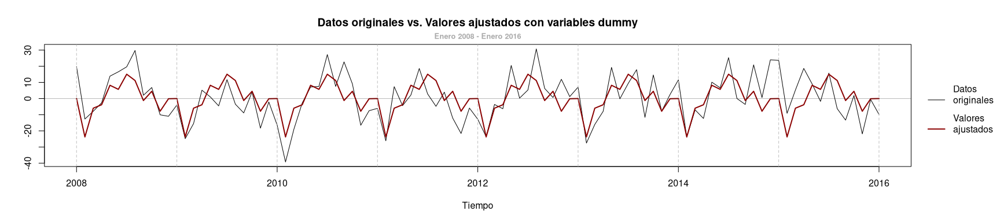

``` r
par(mar = c(5,4,4,8))
plot(time(NoTendLeche)[97:192],NoTendLeche[97:192], type = 'l', lwd = 1, main = 'Datos originales vs. Valores ajustados con variables dummy',
     ylab = '', xlab = 'Tiempo')
mtext(bquote(bold('Enero 2016 - Diciembre 2023')),
      side = 3, line = 0.3, adj = 0.5, cex = 0.8, col = 'darkgray')
lines(time(NoTendLeche)[97:192], ModelosAjustadosEstacionalidadLeche$Dummy[97:192], col = 'darkred', lwd = 2)
abline(v = 2008:2023, col = 'gray', lty = 'dashed')
abline(h = 0, col = 'black', lwd = 0.3)
legend('right',legend = c('Datos\noriginales\n', 'Valores\najustados\n'), col = c('black', 'darkred'), lty = 1,
       xpd = T, inset = c(-0.1, 0), bty = 'n', lwd= c(1,2))
```

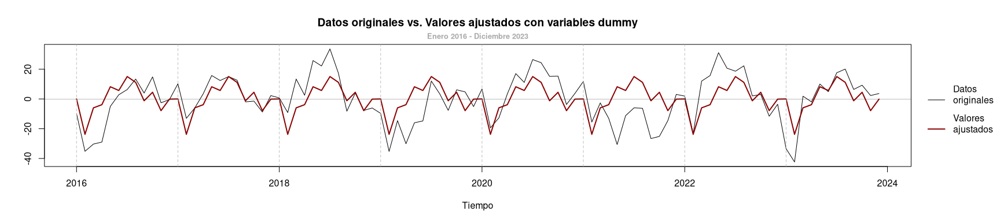

Habiendo hecho todo lo anterior, la serie con varianza estabilizada, sin
tendencia y desestacionalizada resulta de la siguiente forma:

``` r
plot.ts(NoTendLeche - ModelosAjustadosEstacionalidadLeche$Dummy, col = 'black',
        main = 'Serie volumen de leche captado por la industria colombiana',
        # sub = 'En millones de litros',
        ylab = '', xaxt = 'n',
        xlab = 'Tiempo')
axis(labels = 2008:2024, at = 2008:2024, side = 1, las = 2)
abline(v = 2008:2024, col = 'gray', lty = 'dashed', lwd = 1.5)

mtext(bquote(bold('Sin tendencia y desestacionalizada')), side = 1, line = -12.3, adj = 0.5, cex = 0.8, col = 'darkgray')
```

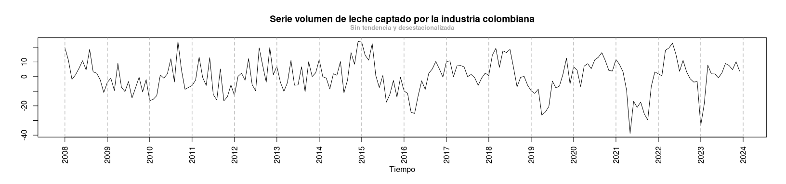

### Precio diario de venta de oro en Colombia
