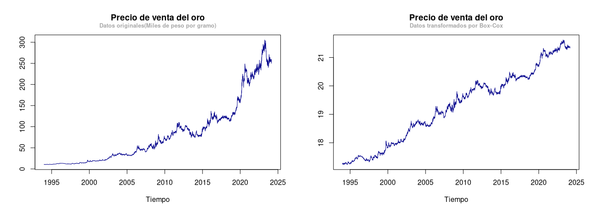
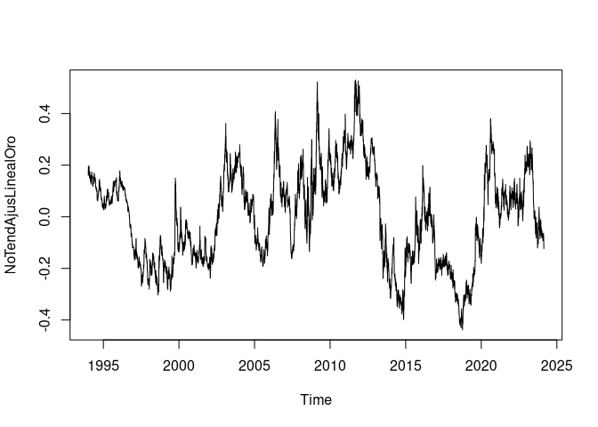

# Avance 1. Series de Tiempo Univariadas
## Departamento de Estadística. Facultad de Ciencias
### Universidad Nacional de Colombia
2024-03-15

---
### Autores:

- [Michel Mendivenson Barragán Zabala](mbarraganz@unal.edu.co)
- [Sharon Juliana Zambrano Ortiz](shzambranoo@unal.edu.co)
- [Nicolás Alejandro Quenguan Parra](naquenguanp@unal.edu.co)
- [Aryin Jair Torres Quiñones](artorresq@unal.edu.co)

---

``` r
# setwd(dirname(rstudioapi::getActiveDocumentContext()$path)); install.packages('readxl')
oro = read.csv('../Datos/Serie histórica diaria por año (1994 - 2024).csv')
leche = readxl::read_xlsx('../Datos/Volumen de Acopio Total  (2008 - 2023).xlsx', 
                          sheet = 'VOLUMEN REGIONAL Y DEPTAL. ', 
                          range = 'B29:AF221')

oro = oro[(oro$Metal == 'Oro'),]
oro_compra = oro[(oro$Métrica == 'Precio de Compra'),]
oro_venta = oro[(oro$Métrica == 'Precio de Venta'),]
rm(oro)

# Para los datos de compra
oro_compra = oro_compra[order(oro_compra$Fecha..DD.MM.AAAA.),]
oro_compra$Valor = as.numeric(sub(',','.',oro_compra$Valor))

# Para los datos de venta
oro_venta = oro_venta[order(oro_venta$Fecha..DD.MM.AAAA.),]
oro_venta$Valor = as.numeric(sub(',','.', oro_venta$Valor))
```

------------------------------------------------------------------------

## **Los datos**

Las dos series escogidas corresponden a:

- [La producción de leche mensual en Colombia (En el período 2008 a
  2023)](http://uspleche.minagricultura.gov.co/documentos.html)
- [El precio de compra o venta diario del oro por gramo (En el período
  2010 a Febrero de
  2024)](https://www.banrep.gov.co/es/estadisticas/precios-del-dia-para-el-gramo-oro-plata-y-platino)

``` r
# Con frecuencia mensual
ts_leche = ts(leche$NACIONAL, start = c(2008,1), frequency = 12)/1000000

# COn frecuencia diaria
ts_compraOro = ts(oro_compra$Valor,start = c(1994,1), frequency = 365)/1000
ts_ventaOro = ts(oro_venta$Valor,start = c(1994,1), frequency = 365)/1000
```

------------------------------------------------------------------------

<!-- ========================================== Sección 1 ==========================================  -->

## **Visualización de los datos**

### Volumen mensual de leche producido

``` r
plot.ts(ts_leche, col = 'darkblue',
        main = 'Volumen de leche producido en Colombia',
        # sub = 'En millones de litros',
        ylab = 'Volumen',
        xlab = 'Tiempo')

mtext(bquote(bold('En millones de litros')), side = 2, line = 2, adj = 0.5, cex = 0.8, col = 'darkgray')
```


No se observan cambios significativos en la varianza, pero sí se observa
cierto grado de tendencia aunque no del todo lineal. Aunque la varianza
no parece necesitar de una estabilización de todas formas se intenta
estabilizar para ver si la serie cambia en algún aspecto importante
luego de la transformación.

### Precio diario del oro en Colombia

``` r
plot.ts(ts_compraOro, xlab = 'Tiempo', ylab = 'Precio', main = 'Serie histórica precio del oro',
        col = 'darkblue', cex = 0.5)
lines(ts_ventaOro, col = 'darkred')
legend('topleft',legend = c('Venta', 'Compra'), col = c('darkred', 'darkblue'),
       lty = c(1,1), bty = 'n', cex = 1.1)
mtext(bquote(bold('En miles de peso por gramo')), side = 2, line = 2, adj = 0.5, cex = 0.8, col = 'darkgray')
```


En la gráfica es posible observar que la serie cuenta con componentes de
tendencia y también es posible concluir que la serie cuenta con
heterocedasticidad marginal debido a que el rango de la variable va
aumentando con el tiempo. Sin embargo, a simple vista (Y tal vez debido
a la frecuencia) no es posible observar alguna señal de estacionalidad.

### 

<!-- ========================================== Sección 2 ==========================================  -->

## **Estabilización de la varianza**

### Volumen mensual de leche producido en Colombia

Para estabilizar la varianza, usamos la transformación Box-Cox con el
$\lambda$ calculado en el siguiente código:

``` r
lambda_leche = MASS::boxcox(object = lm(ts_leche ~ 1), seq(0,8, length = 50))
```


    ## El valor de lambda calculado es:  3.151515

Note que no hay evidencia que nos diga que $\lambda$ pudiese ser 1 por
lo que intentamos aplicar la transformación a la serie obteniendo ahora
sí un $\lambda$ con posible valor de 1:

``` r
# lambda_leche = 2.25
EstTS_leche = 1/(lambda_leche) * ts_leche^(lambda_leche) - 1

MASS::boxcox(lm(EstTS_leche~1), seq(0,2, length = 50))
```


Sin embargo, si se revisan las gráficas de la serie y su transformación:

``` r
default_par = par()
par(mfrow = c(1,2))
plot.ts(ts_leche, xlab = 'Tiempo', ylab = NULL, main = 'Volumen de leche producido en Colombia', col = 'darkblue', cex = 0.5)
mtext(bquote(bold('Datos originales(En millones de litros)')), side = 3, line = 0.5, adj = 0.5, cex = 0.8, col = 'darkgray')
plot.ts(EstTS_leche, xlab = 'Tiempo', ylab = NULL, main = 'Volumen de leche producido en Colombia',
        col = 'darkblue', cex = 0.5)
mtext(bquote(bold('Datos tranformados por Box-Cox')), side = 3, line = 0.5, adj = 0.5, cex = 0.8, col = 'darkgray')
```


``` r
par(default_par)
```

Es fácil notar de que la serie con la transformación, en esencia, la
misma serie pero con un aumento importante en la escala por lo que se
decide seguir utilizando los datos sin transformaciones para los
procesos subsiguientes a este.

### Precio diario de venta del oro en Colombia

Como la serie del precio del oro mostró evidencia de una varianza
inestable y que tiende a crecer con el tiempo es necesario
obligatoriamente aplicar la transformación de Box-Cox para estabilizar
la varianza. Además, se decide dejar solamente los datos del precio de
venta del oro.

``` r
ts_oro = ts_ventaOro

# install.packages('MASS')
library(MASS)

lambda_oro = MASS::boxcox(object = lm(ts_oro ~ 1), seq(-0.3,0.3, length = 50))
```


    ## El valor de lambda calculado es:  0.06363636

Efectivamente, no hay evidencia para creer que el valor de $\lambda$ sea
1 por lo que usamos la transformación de BoxCox con $\lambda = 0.06$
(i.e. $f(u_t) = \lambda^{-1} (u_t^{\lambda} - 1)$).

``` r
EstTS_oro = 1/(lambda_oro) * ts_oro^(lambda_oro) - 1

MASS::boxcox(lm(EstTS_oro~1), seq(0,2, length = 50))
```


Note que ahora el intervalo contiene a 1 por lo que la transformación
fue efectiva para estabilizar la varianza. Además, si revisamos la serie
nuevamente podremos darnos cuenta de que efectivamente la varianza se
estabilizó:

``` r
default_par = par()

par(mfrow = c(1,2))
plot.ts(ts_ventaOro, xlab = 'Tiempo', ylab = NULL, main = 'Precio de venta del oro',
        col = 'darkblue', cex = 0.5)
mtext(bquote(bold('Datos originales(Miles de peso por gramo)')), side = 3, line = 0.5, adj = 0.5, cex = 0.8, col = 'darkgray')

plot.ts(EstTS_oro, xlab = 'Tiempo', ylab = NULL, main = 'Precio de venta del oro',
        col = 'darkblue', cex = 0.5)
mtext(bquote(bold('Datos transformados por Box-Cox')), side = 3, line = 0.5, adj = 0.5, cex = 0.8, col = 'darkgray')
```



``` r
par(default_par)
```

``` r
EstTS_leche = ts_leche
```

### 

------------------------------------------------------------------------

<!-- ========================================== Sección 3 ==========================================  -->

## **Eliminación de la tendencia**

### Volumen mensual de leche producida en Colombia

Usando el filtro de promedios móviles:

``` r
plot(decompose(EstTS_leche))
```


Es posible notar que los datos de esta serie presentan una tendencia no
del todo lineal y que además la estacionalidad estimada por medio de
este filtro parece ser la idonéa puesto que la componente residual no
parece mostrar comportamiento estacional. Ahora bien, busquemos otra
forma de ajustar la tendencia.

Aún si la tendencia del filtro de promedios móviles no es totalmente
lineal, podemos intentar estimar la tendencia de la serie por medio de
una regresión lineal:

``` r
par(mfrow = c(1,2))
ModeloLinealLeche = lm(EstTS_leche ~ time(EstTS_leche))

plot.ts(EstTS_leche, xlab = 'Tiempo', ylab = NULL, main = 'Volumen de leche producido en Colombia',
        col = 'darkblue', cex = 0.5)
mtext(bquote(bold('Ajuste con regresión lineal')), side = 3, line = 0.5, adj = 0.5, cex = 0.8, col = 'darkgray')
abline(ModeloLinealLeche, col = 'red')

# Los residuales
NoTendAjusLinealLeche = EstTS_leche - predict(ModeloLinealLeche)
plot.ts(NoTendAjusLinealLeche,xlab = 'Tiempo', ylab = NULL, main = 'Volumen de leche producido en Colombia',
        col = 'darkblue', cex = 0.5)
mtext(bquote(bold('Datos sin tendencia')), side = 3, line = 0.5, adj = 0.5, cex = 0.8, col = 'darkgray')
```


``` r
par(default_par)
```

Si bien por medio de la regresión lineal la serie parece sufrir un
cambio en su “tendencia” general también podría argumentarse que aún
presenta algo de tendencia. Probemos ahora con el método *lowess*
(Regresión del vecino más cercano):

``` r
par(mfrow = c(1,2))
ModeloLowessLeche = lowess(EstTS_leche, f = 0.25)
plot.ts(EstTS_leche, xlab = 'Tiempo', ylab = NULL, main = 'Volumen de leche producido en Colombia',
        col = 'darkblue', cex = 0.5)
mtext(bquote(bold('Ajuste con regresión local o lowess')), side = 3, line = 0.5, 
      adj = 0.5, cex = 0.8, col = 'darkgray')
lines(ModeloLowessLeche, col = 'red')

# Datos sin tendencia
NoTendAjusLowessLeche = EstTS_leche - ModeloLowessLeche$y
plot.ts(NoTendAjusLowessLeche,xlab = 'Tiempo', ylab = NULL, main = 'Volumen de leche producido en Colombia',
        col = 'darkblue', cex = 0.5)
mtext(bquote(bold('Datos sin tendencia')), side = 3, line = 0.5, adj = 0.5, cex = 0.8, col = 'darkgray')
```


``` r
par(default_par)
```

Claramente este método estima mucho mejor al tendencia de nuestros
datos. Sin embargo, probemos con el método de *suavizamiento Kernel*:

``` r
par(mfrow = c(1,2))
ModeloKernelLeche = ksmooth(y = as.numeric(EstTS_leche), x = time(EstTS_leche),kernel = 'normal', bandwidth = 2.5)
plot.ts(EstTS_leche, xlab = 'Tiempo', ylab = NULL, main = 'Volumen de leche producido en Colombia',
        col = 'darkblue', cex = 0.5)
mtext(bquote(bold('Suavizado Kernel')), side = 3, line = 0.5, 
      adj = 0.5, cex = 0.8, col = 'darkgray')
lines(ModeloKernelLeche, col = 'red')

# Datos sin tendencia
NoTendAjusKernelLeche = EstTS_leche - ModeloKernelLeche$y
plot(NoTendAjusKernelLeche,xlab = 'Tiempo', ylab = NULL, main = 'Volumen de leche producido en Colombia',
     col = 'darkblue', cex = 0.5)
mtext(bquote(bold('Datos sin tendencia')), side = 3, line = 0.5, adj = 0.5, cex = 0.8, col = 'darkgray')
```


``` r
par(default_par)
```

Donde obtenemos un comportamiento muy similar al presentado con el
método *lowess*. Finalmente, podemos aplicar el método *splines*
solamente para estar seguros de que la tendencia demostrada antes sea la
adecuada:

``` r
par(mfrow = c(1,2))

ModeloSplinesLeche = smooth.spline(time(EstTS_leche), EstTS_leche, spar = 0.8)
plot.ts(EstTS_leche, xlab = 'Tiempo', ylab = NULL, main = 'Volumen de leche producido en Colombia',
        col = 'darkblue', cex = 0.5)
mtext(bquote(bold('Suavizado Splines')), side = 3, line = 0.5, 
      adj = 0.5, cex = 0.8, col = 'darkgray')
lines(ModeloSplinesLeche, col = 'red')

# plot(ModeloSplinesLeche, type = 'l')


# Datos sin tendencia
NoTendAjusSplinesLeche = EstTS_leche - ModeloSplinesLeche$y
plot(NoTendAjusSplinesLeche,xlab = 'Tiempo', ylab = NULL, main = 'Volumen de leche producido en Colombia',
     col = 'darkblue', cex = 0.5)
mtext(bquote(bold('Datos sin tendencia')), side = 3, line = 0.5, adj = 0.5, cex = 0.8, col = 'darkgray')
```


``` r
# for (i in 2008:2023){
#   abline(v = i, col = '#8B8970', lty = 'dashed', pch = 2)
# }


par(default_par)
```

Como todos los tres métodos (*Lowess, Kernel y splines*) nos dan
resultados similares, podemos usar cualquiera de los tres resultados
para continuar con la estimación de la estacionalidad. En el caso
particular de este documento, se estará utilizando la serie residual
asociada al método de suavizamiento *Kernel*.

### Precio diario de venta de oro en Colombia

Primero ajustaremos una regresión lineal simple para verificar si es una
buena forma de eliminar la tendencia de la serie pues presenta un
comportamiento altamente lineal.

``` r
ModeloLinealOro = lm(EstTS_oro ~ time(EstTS_oro))

plot.ts(EstTS_oro, xlab = 'Tiempo', ylab = NULL, main = 'Precio de venta del oro',
        col = 'darkblue', cex = 0.5)
mtext(bquote(bold('Datos transformados por Box-Cox')), side = 3, line = 0.5, adj = 0.5, cex = 0.8, col = 'darkgray')
abline(ModeloLinealOro, col = 'red')
```


``` r
NoTendAjusLinealOro = EstTS_oro - predict(ModeloLinealOro)

plot(NoTendAjusLinealOro)
```



### 

------------------------------------------------------------------------

<!-- ========================================== Sección 4 ==========================================  -->

## **Detección de la estacionalidad**

### Volumen mensual de leche producida en Colombia

Note que la serie demuestra cierto comportamiento cíclico con periodo
anual, es decir, todos los mismos meses tiene el mismo comportamiento,
siendo un comportamiento más obvio en el mes de Febrero:

``` r
# par(mfrow = c(2,1))
# Datos sin tendencia

NoTendLeche = NoTendAjusKernelLeche
par(cex.axis = 1, lwd = 1.5, mar = c(4,4,0.5,0.5))
plot.ts(NoTendLeche,xlab = 'Tiempo', ylab = NULL, main = NULL,
        col = 'darkblue', las = 2)#, xlim = c(2008,2016))
#mtext(bquote(bold('Datos sin tendencia')), side = 3, line = 0.5, adj = 0.5, cex = 0.8, col = 'darkgray')
for (i in 2008:2024){
  abline(v = i, col = '#8B8970', lty = 'dashed', pch = 2)
}

axis(1, at = 2008:2024, labels = 2008:2024,las = 2)
# plot(NoTendAjusSplinesLeche,xlab = 'Tiempo', ylab = NULL, main = NULL,
#      col = 'darkblue', cex = 0.5, xlim = c(2016,2023))
# for (i in 2008:2023){
#   abline(v = i, col = '#8B8970', lty = 'dashed', pch = 2)
par(lwd = 1)
for (i in time(NoTendLeche)){
  abline(v = i, col = '#CDC9A5', lty = 4)
}
```


``` r
par(default_par)
```

Si bien no es del todo perceptible a simple vista, podemos notar que,
por ejemplo en los meses de Febrero siempre se registran los picos más
bajos de la serie en ese año mientras que en los meses de Junio o Julio
se presenta los valores más altos de la serie. Es decir, podemos más o
menos intuir que habrá un período anual. Ahora bien, revisemos el acf de
la serie:

``` r
acf(NoTendLeche, lag.max = 56, main = 'Serie volumen de leche mensual')
mtext(bquote(bold('Datos sin tendencia ajustados con kernel')), side = 3, line = 0.5, adj = 0.5, cex = 0.8, col = 'darkgray')
```


Nuevamente, el acf nos sugiere un componente estacional. Indaguemos más
sobre la estacionalidad anual de la serie:

``` r
df = as.data.frame(NoTendLeche)
colnames(df) = c('Volume')
month = as.numeric(rownames(df)) %% 12
month[month == 0] = 12
df$'Month' = month.name[month]

SerieDataframe = data.frame(row.names = month.name[1:12])
for (i in month.name[1:12]){
  SerieDataframe[i,1:16] = df$Volume[df$Month == i]
}

rm(df)
SerieDataframe = t(SerieDataframe)
rownames(SerieDataframe) = 2008:2023
boxplot(SerieDataframe,las = 2, cex.axis = 0.8, main = 'Boxplot mensual (Volumen de leche)')
mtext(bquote(bold('Diágnostico de estacionalidad')),
      side = 3, line = 0.3, adj = 0.5, cex = 0.8, col = 'darkgray')
```


El gráfico *boxplot* mensual nos muestra precisamente que uno de los
meses para los que pudieramos argumentar un cambio importante en la
media es febrero siendo el mes con la media más baja de todos. Además,
vemos que como se mencionó anteriormente el ciclo que se parece cumplir
año a año es una disminución importante en el mes de Febrero y una
recuperación en los meses sucesivos a este hasta llegar a Noviembre que
representa una caída de menor impacto que la del mes de febrero. Si
revisamos el gráfico de coordenadas paralelas para los meses nos
encontraremos con algo muy similar:

``` r
library(forecast)
ggseasonplot(NoTendLeche, main = 'Coordenadas paralelas: Volumen de leche mensual')
```


``` r
monthplot(NoTendLeche, ylab = '', main = 'Volumen de leche captada por la industria')
mtext(bquote(bold('Sub series mensuales')),
      side = 3, line = 0.3, adj = 0.5, cex = 0.8, col = 'darkgray')
```


``` r
par(default_par)
```

Sin embargo, no sobra revisar el periodograma para determinar si la
serie cuenta con ciclos de otros períodos:

``` r
library(latex2exp)
SpectrumLeche = spectrum(NoTendLeche, log = 'no', main = 'Periodogram')
mtext(TeX('Frequency $\\times$ 12', bold = T),
      side = 3, line = 0.5, adj = 0.5, cex = 0.8, col = 'darkgray')

frecuencias = SpectrumLeche$freq
Periodograma = SpectrumLeche$spec

for (i in 1:3){
  ind = which.max(Periodograma)
  cat('El valor máximo no.', i, ' en el que se máximiza el periodograma es', Periodograma[ind], '\nen la frecuencia ', frecuencias[ind],'\n')
  abline(v = frecuencias[ind], col = 'darkred', lty = 2)
  Periodograma = Periodograma[-ind]
  frecuencias = frecuencias[-ind]
}
```


    ## El valor máximo no. 1  en el que se máximiza el periodograma es 374.0577 
    ## en la frecuencia  1 
    ## El valor máximo no. 2  en el que se máximiza el periodograma es 149.8748 
    ## en la frecuencia  0.5 
    ## El valor máximo no. 3  en el que se máximiza el periodograma es 118.3689 
    ## en la frecuencia  5

Note que la frecuencia en que se maximiza el espectograma es aquella que
ya habíamos señalado como probable: la equivalente a un período de un
año ($\omega = 1 \times \frac{1}{12}$). Además de esta, el segundo valor
mayor representa un ciclo de período 24 meses
($\omega = 0.5 \times \frac{1}{12} = \frac{1}{24}$) que es un armónico
del primero por lo que el ciclo principal de la serie se da en períodos
de una año.

``` r
library(TSstudio)
ts_heatmap(NoTendLeche,title = 'Heatmap Volumen de leche captado serie mensual')
```

<div class="plotly html-widget html-fill-item" id="htmlwidget-ec6c57f2d25102b7e20f" style="width:768px;height:576px;"></div>
<script type="application/json" data-for="htmlwidget-ec6c57f2d25102b7e20f">{"x":{"visdat":{"7f8724965e3a":["function () ","plotlyVisDat"]},"cur_data":"7f8724965e3a","attrs":{"7f8724965e3a":{"z":[[19.79586413318313,-4.0307772796429617,-16.449248337443379,-6.0765504231941918,-12.827711563812187,7.0757656663493265,11.577598028240345,23.661779999645262,-9.8409071837692181,10.205588762146533,0.71540880723665623,-9.6771233325500816,6.6965525262173173,11.787519800696373,1.926387989281352,-33.413477071893141],[-12.682065558264554,-24.838029901301468,-39.27226475267301,-26.161210006593507,-23.614255499575961,-27.557020268422747,-23.820772482468271,-9.1428410457886571,-35.180988499899797,-13.039426090592315,-9.1384523894652716,-35.266951496074739,-19.393493653116053,-15.505334966753225,-23.220806818141654,-42.349878490885374],[-7.8724124156403263,-15.479301959768975,-19.018104503448228,7.3633436970218611,-3.6471339148940842,-16.030605946618834,-7.0149644656597161,5.2612341491540064,-30.313623663993639,-6.0244064803478636,13.388589950166761,-14.55058914119985,-12.705624110445058,-2.6699244596539984,12.010336184600646,1.8718237342886255],[-2.623688470923895,5.1723162293974383,-2.7101187728856644,-4.4010408419568421,-6.3192480524637915,-7.9112940326058379,-12.315628595843805,18.670733529872109,-28.971759206703268,3.5263252699975851,2.4916035163238917,-30.07633569020885,3.3662100958040924,-13.011045481990777,15.725299342376104,-1.9425729876995206],[13.881874489532265,1.0388582430366569,7.1562189664380185,2.1948918974215132,20.495201262530287,19.295610747066917,10.144668886058071,9.020526691240434,-4.9673899833196629,15.770271376058986,25.816623720807286,-16.007748723034695,17.040473347007946,-30.608105389775318,31.115087683459876,10.025542214463712],[16.55511014029625,-4.5482882326878382,7.5419971663586693,18.615726436760724,0.27273045255753914,-0.16355708746885966,6.6319570628310203,-1.7543379182627632,2.8177708356034259,12.397462369980133,22.165841688863452,-14.767920824206612,11.125758393123192,-11.2234660006946,20.696159902155784,4.868121387862459],[19.64775370259585,11.706950671063595,27.218362786874394,2.8601921710262843,5.3031572403925793,9.3862621918217997,25.328813264366715,15.768579605428499,6.3348301230014386,15.026089197198814,33.633770726140312,12.050630890639297,26.47654080996233,-5.9671527782294334,18.647392412708541,17.619143275120678],[29.772215942617777,-3.4891478390737234,7.4896609549113577,-4.8161540661649269,30.729617516223186,17.881098252799802,0.042441967163995287,-6.2749125249566191,13.384677789720456,12.634075309615696,17.344235596366673,3.4116500448543547,24.376394510647742,-6.2628773225790724,22.273917997018998,20.100389214810491],[2.0250852316509338,-8.9006903704265028,22.701570500437896,3.9600683888735659,6.2589993357356661,-11.642055939558645,-3.6471619987633517,-13.347900062508415,3.9700902406531213,-1.9456163304490701,-8.2187836201734967,-7.6679787305957916,15.175782727057367,-26.605490720449097,2.0361309435741646,6.4089107115788693],[6.8309522490933432,4.0630254772121646,9.1005272550824543,-12.078348724833546,0.65883365728751642,14.613493503059658,20.875231255833796,1.8705577681477621,14.843662117256713,-1.4407519827235546,3.9937500314343879,6.1527727336153362,15.337402390789748,-25.148598678080646,3.0402285265753335,9.2595642475118325],[-10.07239384725213,-18.332683795419968,-16.537386500052406,-21.625523896814457,11.942435588828516,-7.7980483086994923,0.59920230769029104,-21.887569281016368,-2.562004183211684,-8.7614971903414585,-7.712944223623083,4.754850036154096,-3.7308661598073058,-14.588545798838425,-11.597112931139918,2.3033144039879971],[-10.98871434912823,-2.096198244489301,-7.5168047970493888,-5.8752151162426856,1.1972456087211754,2.4954891995952266,23.939373154472889,-0.59162917150229077,-0.42958838182227055,2.2645336043488555,-6.0637746270402317,-5.0929829434264775,3.7174696453727165,3.0701701556050125,-3.549743596435178,3.6674896369258931]],"x":["2008","2009","2010","2011","2012","2013","2014","2015","2016","2017","2018","2019","2020","2021","2022","2023"],"y":["Jan","Feb","Mar","Apr","May","Jun","Jul","Aug","Sep","Oct","Nov","Dec"],"colorscale":[[0,"#F7FBFF"],[0.040503631635564585,"#EFF6FC"],[0.093216462591580299,"#E4EFF9"],[0.094347798044151318,"#E4EFF9"],[0.1176095319332182,"#DFECF7"],[0.15453026041922546,"#D8E7F5"],[0.1584058537714291,"#D8E7F5"],[0.16152873581552576,"#D7E6F5"],[0.1760657644379689,"#D4E4F4"],[0.19468475619288875,"#D1E2F3"],[0.20720757600713424,"#CEE0F2"],[0.21305463282045772,"#CDE0F1"],[0.22638133322175885,"#CBDEF1"],[0.23046864384686619,"#CADDF0"],[0.24385649017058894,"#C7DCEF"],[0.24657440362987085,"#C7DBEF"],[0.25175247398433004,"#C5DBEF"],[0.26929884811697102,"#C0D8ED"],[0.2727475556600038,"#BFD8EC"],[0.30212269447866258,"#B6D4E9"],[0.30706308828096118,"#B4D3E9"],[0.31608372252386985,"#B1D2E8"],[0.33971113860439794,"#AACFE5"],[0.34087110082676092,"#A9CFE5"],[0.34638073869146535,"#A7CEE4"],[0.34668155635183928,"#A7CEE4"],[0.3532936862173906,"#A5CDE3"],[0.35363629949343756,"#A5CDE3"],[0.36299859181412492,"#A2CCE2"],[0.3653592974029794,"#A1CBE2"],[0.36585883458011814,"#A1CBE2"],[0.38168709620067148,"#9BC8E0"],[0.38574683767261675,"#9AC8E0"],[0.38612034709068216,"#9AC7E0"],[0.38853315458371196,"#99C7E0"],[0.3901399141250762,"#98C7E0"],[0.39044996177905522,"#98C6E0"],[0.39527253829646003,"#96C5DF"],[0.39839531370215991,"#95C5DF"],[0.40413724357484548,"#93C3DE"],[0.40472872620146111,"#93C3DE"],[0.40964619113366124,"#91C2DE"],[0.41273569333558718,"#8FC1DE"],[0.42479513653578005,"#8BBFDD"],[0.4278416691236232,"#89BEDC"],[0.42999718353898558,"#89BEDC"],[0.43702872640731238,"#86BCDC"],[0.43708648431139585,"#86BCDC"],[0.4402156051352677,"#85BBDB"],[0.44204748846173808,"#84BBDB"],[0.44918999314215763,"#81B9DB"],[0.45323677940125662,"#7FB8DA"],[0.45374848971480652,"#7FB8DA"],[0.45472717536240465,"#7FB8DA"],[0.45584720692121194,"#7EB8DA"],[0.45643898546160372,"#7EB8DA"],[0.45842854420357221,"#7DB7DA"],[0.4650331273811491,"#7AB6D9"],[0.47418926058039584,"#76B4D8"],[0.47477274831708693,"#76B4D8"],[0.47493114031986072,"#76B4D8"],[0.47738333761894924,"#75B3D8"],[0.4775514763736104,"#75B3D8"],[0.47806958977166431,"#75B3D8"],[0.47882309006690416,"#74B3D8"],[0.48003305646012323,"#74B2D8"],[0.49032779988027647,"#6FB0D7"],[0.49198069443589454,"#6FB0D7"],[0.49397106892715875,"#6EAFD7"],[0.49749637780923162,"#6CAFD6"],[0.49943426039645017,"#6BAED6"],[0.50430719774717314,"#6AADD5"],[0.50825424586773715,"#69ACD5"],[0.50935585340970813,"#68ACD5"],[0.50935622301382111,"#68ACD5"],[0.51063795032571602,"#68ACD5"],[0.51143543449482165,"#68ABD5"],[0.52168802270577985,"#65A9D3"],[0.52221700905542023,"#64A9D3"],[0.52282550824184437,"#64A9D3"],[0.5236373182608135,"#64A9D3"],[0.5297676626641461,"#62A7D2"],[0.53174942999951236,"#61A7D2"],[0.53178948260005088,"#61A7D2"],[0.53426679280265932,"#61A6D2"],[0.53839381142798937,"#5FA5D1"],[0.54956888422287431,"#5CA3D0"],[0.55170145868263998,"#5BA2CF"],[0.55520262369767581,"#5AA2CF"],[0.55791372084496438,"#59A1CF"],[0.56094448453908219,"#58A0CE"],[0.56524109122350563,"#579FCE"],[0.56602588308611945,"#579FCE"],[0.56677045314207386,"#569FCD"],[0.57102728259331748,"#559ECD"],[0.57311177534033109,"#549DCD"],[0.58197305229089535,"#519CCC"],[0.58198971332460336,"#519CCC"],[0.58270781854269937,"#519BCB"],[0.58400674592229496,"#519BCB"],[0.5841521155121614,"#519BCB"],[0.58624152495068271,"#509BCB"],[0.58715806038488427,"#509ACB"],[0.58766844386920958,"#4F9ACB"],[0.59014646531561443,"#4F9ACA"],[0.59019760372909391,"#4F9ACA"],[0.5944390640870677,"#4D99CA"],[0.59499735966591905,"#4D99CA"],[0.59736676884018525,"#4C98CA"],[0.597760822420636,"#4C98C9"],[0.60165692300608598,"#4B97C9"],[0.60225494573227112,"#4A97C9"],[0.60376415496774349,"#4A97C9"],[0.6056219805444687,"#4996C8"],[0.60627975374912324,"#4996C8"],[0.60947252937915297,"#4895C8"],[0.60960442422604211,"#4895C8"],[0.60991580425352254,"#4895C8"],[0.61082751942503155,"#4795C8"],[0.61993243299618594,"#4493C7"],[0.62142316623781835,"#4393C6"],[0.62542659124661382,"#4292C6"],[0.62659681563926706,"#4292C6"],[0.62714855396284808,"#4291C6"],[0.63833011081063873,"#3F8EC4"],[0.63972813003207574,"#3F8EC4"],[0.64072611825779502,"#3F8EC4"],[0.64170107259785103,"#3E8EC4"],[0.64463652454771825,"#3E8DC3"],[0.64548664775253828,"#3D8CC3"],[0.64725544570131999,"#3D8CC3"],[0.6504773680461754,"#3C8BC3"],[0.65153619189732914,"#3C8BC2"],[0.65426210375755389,"#3B8AC2"],[0.6559245305979482,"#3B8AC2"],[0.65661331314506999,"#3B8AC2"],[0.676071835341849,"#3684BF"],[0.67712470085523757,"#3684BF"],[0.67921774316194672,"#3683BF"],[0.68088518011207388,"#3583BE"],[0.68929856942976764,"#3381BD"],[0.69086636293300019,"#3380BD"],[0.69166811273991535,"#3280BD"],[0.70377821327415613,"#2F7DBB"],[0.70972475098026966,"#2E7BBA"],[0.7114271256905681,"#2D7BBA"],[0.7124874739426329,"#2D7BBA"],[0.71452627820813575,"#2C7ABA"],[0.715419899355209,"#2C7ABA"],[0.71595020694709055,"#2C7ABA"],[0.72051476107044155,"#2A79B9"],[0.72362875917495151,"#2A78B9"],[0.73350723287079722,"#2775B7"],[0.73355871974312592,"#2775B7"],[0.74005070248478888,"#2474B6"],[0.74967933997543812,"#2171B5"],[0.75270852607756444,"#2170B4"],[0.75510939892089224,"#2070B4"],[0.75707947447531831,"#206FB4"],[0.75920650661180811,"#206FB3"],[0.76431151217002291,"#1F6DB2"],[0.76488111186019803,"#1F6DB2"],[0.76490337679019182,"#1F6DB2"],[0.7752324248462491,"#1D6AB0"],[0.78162015709803134,"#1C69AF"],[0.785617888879656,"#1C68AE"],[0.78923587355908109,"#1B67AD"],[0.79268339128662435,"#1A66AC"],[0.80235163164531864,"#1963AA"],[0.80276837888336416,"#1963AA"],[0.80307556493462773,"#1963AA"],[0.81129940287389302,"#1761A9"],[0.8159338598808622,"#1660A8"],[0.81788310069929471,"#165FA7"],[0.82189087190751309,"#155EA7"],[0.82708688515231166,"#145DA6"],[0.82973164677795452,"#145CA5"],[0.83208835582685192,"#135CA5"],[0.84907372631548683,"#0F58A1"],[0.85049608901153029,"#0F57A1"],[0.85612430650076177,"#0D56A0"],[0.86876136077627841,"#0A539D"],[0.87241468827091817,"#09529D"],[0.87816620666570633,"#08509B"],[0.89070072907326614,"#084D96"],[0.89712066890857567,"#084B93"],[0.90580565700739912,"#094990"],[0.9155685729051769,"#09468C"],[0.94917913494134631,"#093D7F"],[0.96177923487693728,"#093A7A"],[0.96685230219087615,"#093878"],[1,"#08306B"]],"hoverinfo":"text","text":[["Value:  19.7958641331831 <br> Year :  2008 <br> Month  : 1","Value:  -4.03077727964296 <br> Year :  2009 <br> Month  : 1","Value:  -16.4492483374434 <br> Year :  2010 <br> Month  : 1","Value:  -6.07655042319419 <br> Year :  2011 <br> Month  : 1","Value:  -12.8277115638122 <br> Year :  2012 <br> Month  : 1","Value:  7.07576566634933 <br> Year :  2013 <br> Month  : 1","Value:  11.5775980282403 <br> Year :  2014 <br> Month  : 1","Value:  23.6617799996453 <br> Year :  2015 <br> Month  : 1","Value:  -9.84090718376922 <br> Year :  2016 <br> Month  : 1","Value:  10.2055887621465 <br> Year :  2017 <br> Month  : 1","Value:  0.715408807236656 <br> Year :  2018 <br> Month  : 1","Value:  -9.67712333255008 <br> Year :  2019 <br> Month  : 1","Value:  6.69655252621732 <br> Year :  2020 <br> Month  : 1","Value:  11.7875198006964 <br> Year :  2021 <br> Month  : 1","Value:  1.92638798928135 <br> Year :  2022 <br> Month  : 1","Value:  -33.4134770718931 <br> Year :  2023 <br> Month  : 1"],["Value:  -12.6820655582646 <br> Year :  2008 <br> Month  : 2","Value:  -24.8380299013015 <br> Year :  2009 <br> Month  : 2","Value:  -39.272264752673 <br> Year :  2010 <br> Month  : 2","Value:  -26.1612100065935 <br> Year :  2011 <br> Month  : 2","Value:  -23.614255499576 <br> Year :  2012 <br> Month  : 2","Value:  -27.5570202684227 <br> Year :  2013 <br> Month  : 2","Value:  -23.8207724824683 <br> Year :  2014 <br> Month  : 2","Value:  -9.14284104578866 <br> Year :  2015 <br> Month  : 2","Value:  -35.1809884998998 <br> Year :  2016 <br> Month  : 2","Value:  -13.0394260905923 <br> Year :  2017 <br> Month  : 2","Value:  -9.13845238946527 <br> Year :  2018 <br> Month  : 2","Value:  -35.2669514960747 <br> Year :  2019 <br> Month  : 2","Value:  -19.3934936531161 <br> Year :  2020 <br> Month  : 2","Value:  -15.5053349667532 <br> Year :  2021 <br> Month  : 2","Value:  -23.2208068181417 <br> Year :  2022 <br> Month  : 2","Value:  -42.3498784908854 <br> Year :  2023 <br> Month  : 2"],["Value:  -7.87241241564033 <br> Year :  2008 <br> Month  : 3","Value:  -15.479301959769 <br> Year :  2009 <br> Month  : 3","Value:  -19.0181045034482 <br> Year :  2010 <br> Month  : 3","Value:  7.36334369702186 <br> Year :  2011 <br> Month  : 3","Value:  -3.64713391489408 <br> Year :  2012 <br> Month  : 3","Value:  -16.0306059466188 <br> Year :  2013 <br> Month  : 3","Value:  -7.01496446565972 <br> Year :  2014 <br> Month  : 3","Value:  5.26123414915401 <br> Year :  2015 <br> Month  : 3","Value:  -30.3136236639936 <br> Year :  2016 <br> Month  : 3","Value:  -6.02440648034786 <br> Year :  2017 <br> Month  : 3","Value:  13.3885899501668 <br> Year :  2018 <br> Month  : 3","Value:  -14.5505891411999 <br> Year :  2019 <br> Month  : 3","Value:  -12.7056241104451 <br> Year :  2020 <br> Month  : 3","Value:  -2.669924459654 <br> Year :  2021 <br> Month  : 3","Value:  12.0103361846006 <br> Year :  2022 <br> Month  : 3","Value:  1.87182373428863 <br> Year :  2023 <br> Month  : 3"],["Value:  -2.6236884709239 <br> Year :  2008 <br> Month  : 4","Value:  5.17231622939744 <br> Year :  2009 <br> Month  : 4","Value:  -2.71011877288566 <br> Year :  2010 <br> Month  : 4","Value:  -4.40104084195684 <br> Year :  2011 <br> Month  : 4","Value:  -6.31924805246379 <br> Year :  2012 <br> Month  : 4","Value:  -7.91129403260584 <br> Year :  2013 <br> Month  : 4","Value:  -12.3156285958438 <br> Year :  2014 <br> Month  : 4","Value:  18.6707335298721 <br> Year :  2015 <br> Month  : 4","Value:  -28.9717592067033 <br> Year :  2016 <br> Month  : 4","Value:  3.52632526999759 <br> Year :  2017 <br> Month  : 4","Value:  2.49160351632389 <br> Year :  2018 <br> Month  : 4","Value:  -30.0763356902089 <br> Year :  2019 <br> Month  : 4","Value:  3.36621009580409 <br> Year :  2020 <br> Month  : 4","Value:  -13.0110454819908 <br> Year :  2021 <br> Month  : 4","Value:  15.7252993423761 <br> Year :  2022 <br> Month  : 4","Value:  -1.94257298769952 <br> Year :  2023 <br> Month  : 4"],["Value:  13.8818744895323 <br> Year :  2008 <br> Month  : 5","Value:  1.03885824303666 <br> Year :  2009 <br> Month  : 5","Value:  7.15621896643802 <br> Year :  2010 <br> Month  : 5","Value:  2.19489189742151 <br> Year :  2011 <br> Month  : 5","Value:  20.4952012625303 <br> Year :  2012 <br> Month  : 5","Value:  19.2956107470669 <br> Year :  2013 <br> Month  : 5","Value:  10.1446688860581 <br> Year :  2014 <br> Month  : 5","Value:  9.02052669124043 <br> Year :  2015 <br> Month  : 5","Value:  -4.96738998331966 <br> Year :  2016 <br> Month  : 5","Value:  15.770271376059 <br> Year :  2017 <br> Month  : 5","Value:  25.8166237208073 <br> Year :  2018 <br> Month  : 5","Value:  -16.0077487230347 <br> Year :  2019 <br> Month  : 5","Value:  17.0404733470079 <br> Year :  2020 <br> Month  : 5","Value:  -30.6081053897753 <br> Year :  2021 <br> Month  : 5","Value:  31.1150876834599 <br> Year :  2022 <br> Month  : 5","Value:  10.0255422144637 <br> Year :  2023 <br> Month  : 5"],["Value:  16.5551101402963 <br> Year :  2008 <br> Month  : 6","Value:  -4.54828823268784 <br> Year :  2009 <br> Month  : 6","Value:  7.54199716635867 <br> Year :  2010 <br> Month  : 6","Value:  18.6157264367607 <br> Year :  2011 <br> Month  : 6","Value:  0.272730452557539 <br> Year :  2012 <br> Month  : 6","Value:  -0.16355708746886 <br> Year :  2013 <br> Month  : 6","Value:  6.63195706283102 <br> Year :  2014 <br> Month  : 6","Value:  -1.75433791826276 <br> Year :  2015 <br> Month  : 6","Value:  2.81777083560343 <br> Year :  2016 <br> Month  : 6","Value:  12.3974623699801 <br> Year :  2017 <br> Month  : 6","Value:  22.1658416888635 <br> Year :  2018 <br> Month  : 6","Value:  -14.7679208242066 <br> Year :  2019 <br> Month  : 6","Value:  11.1257583931232 <br> Year :  2020 <br> Month  : 6","Value:  -11.2234660006946 <br> Year :  2021 <br> Month  : 6","Value:  20.6961599021558 <br> Year :  2022 <br> Month  : 6","Value:  4.86812138786246 <br> Year :  2023 <br> Month  : 6"],["Value:  19.6477537025958 <br> Year :  2008 <br> Month  : 7","Value:  11.7069506710636 <br> Year :  2009 <br> Month  : 7","Value:  27.2183627868744 <br> Year :  2010 <br> Month  : 7","Value:  2.86019217102628 <br> Year :  2011 <br> Month  : 7","Value:  5.30315724039258 <br> Year :  2012 <br> Month  : 7","Value:  9.3862621918218 <br> Year :  2013 <br> Month  : 7","Value:  25.3288132643667 <br> Year :  2014 <br> Month  : 7","Value:  15.7685796054285 <br> Year :  2015 <br> Month  : 7","Value:  6.33483012300144 <br> Year :  2016 <br> Month  : 7","Value:  15.0260891971988 <br> Year :  2017 <br> Month  : 7","Value:  33.6337707261403 <br> Year :  2018 <br> Month  : 7","Value:  12.0506308906393 <br> Year :  2019 <br> Month  : 7","Value:  26.4765408099623 <br> Year :  2020 <br> Month  : 7","Value:  -5.96715277822943 <br> Year :  2021 <br> Month  : 7","Value:  18.6473924127085 <br> Year :  2022 <br> Month  : 7","Value:  17.6191432751207 <br> Year :  2023 <br> Month  : 7"],["Value:  29.7722159426178 <br> Year :  2008 <br> Month  : 8","Value:  -3.48914783907372 <br> Year :  2009 <br> Month  : 8","Value:  7.48966095491136 <br> Year :  2010 <br> Month  : 8","Value:  -4.81615406616493 <br> Year :  2011 <br> Month  : 8","Value:  30.7296175162232 <br> Year :  2012 <br> Month  : 8","Value:  17.8810982527998 <br> Year :  2013 <br> Month  : 8","Value:  0.0424419671639953 <br> Year :  2014 <br> Month  : 8","Value:  -6.27491252495662 <br> Year :  2015 <br> Month  : 8","Value:  13.3846777897205 <br> Year :  2016 <br> Month  : 8","Value:  12.6340753096157 <br> Year :  2017 <br> Month  : 8","Value:  17.3442355963667 <br> Year :  2018 <br> Month  : 8","Value:  3.41165004485435 <br> Year :  2019 <br> Month  : 8","Value:  24.3763945106477 <br> Year :  2020 <br> Month  : 8","Value:  -6.26287732257907 <br> Year :  2021 <br> Month  : 8","Value:  22.273917997019 <br> Year :  2022 <br> Month  : 8","Value:  20.1003892148105 <br> Year :  2023 <br> Month  : 8"],["Value:  2.02508523165093 <br> Year :  2008 <br> Month  : 9","Value:  -8.9006903704265 <br> Year :  2009 <br> Month  : 9","Value:  22.7015705004379 <br> Year :  2010 <br> Month  : 9","Value:  3.96006838887357 <br> Year :  2011 <br> Month  : 9","Value:  6.25899933573567 <br> Year :  2012 <br> Month  : 9","Value:  -11.6420559395586 <br> Year :  2013 <br> Month  : 9","Value:  -3.64716199876335 <br> Year :  2014 <br> Month  : 9","Value:  -13.3479000625084 <br> Year :  2015 <br> Month  : 9","Value:  3.97009024065312 <br> Year :  2016 <br> Month  : 9","Value:  -1.94561633044907 <br> Year :  2017 <br> Month  : 9","Value:  -8.2187836201735 <br> Year :  2018 <br> Month  : 9","Value:  -7.66797873059579 <br> Year :  2019 <br> Month  : 9","Value:  15.1757827270574 <br> Year :  2020 <br> Month  : 9","Value:  -26.6054907204491 <br> Year :  2021 <br> Month  : 9","Value:  2.03613094357416 <br> Year :  2022 <br> Month  : 9","Value:  6.40891071157887 <br> Year :  2023 <br> Month  : 9"],["Value:  6.83095224909334 <br> Year :  2008 <br> Month  : 10","Value:  4.06302547721216 <br> Year :  2009 <br> Month  : 10","Value:  9.10052725508245 <br> Year :  2010 <br> Month  : 10","Value:  -12.0783487248335 <br> Year :  2011 <br> Month  : 10","Value:  0.658833657287516 <br> Year :  2012 <br> Month  : 10","Value:  14.6134935030597 <br> Year :  2013 <br> Month  : 10","Value:  20.8752312558338 <br> Year :  2014 <br> Month  : 10","Value:  1.87055776814776 <br> Year :  2015 <br> Month  : 10","Value:  14.8436621172567 <br> Year :  2016 <br> Month  : 10","Value:  -1.44075198272355 <br> Year :  2017 <br> Month  : 10","Value:  3.99375003143439 <br> Year :  2018 <br> Month  : 10","Value:  6.15277273361534 <br> Year :  2019 <br> Month  : 10","Value:  15.3374023907897 <br> Year :  2020 <br> Month  : 10","Value:  -25.1485986780806 <br> Year :  2021 <br> Month  : 10","Value:  3.04022852657533 <br> Year :  2022 <br> Month  : 10","Value:  9.25956424751183 <br> Year :  2023 <br> Month  : 10"],["Value:  -10.0723938472521 <br> Year :  2008 <br> Month  : 11","Value:  -18.33268379542 <br> Year :  2009 <br> Month  : 11","Value:  -16.5373865000524 <br> Year :  2010 <br> Month  : 11","Value:  -21.6255238968145 <br> Year :  2011 <br> Month  : 11","Value:  11.9424355888285 <br> Year :  2012 <br> Month  : 11","Value:  -7.79804830869949 <br> Year :  2013 <br> Month  : 11","Value:  0.599202307690291 <br> Year :  2014 <br> Month  : 11","Value:  -21.8875692810164 <br> Year :  2015 <br> Month  : 11","Value:  -2.56200418321168 <br> Year :  2016 <br> Month  : 11","Value:  -8.76149719034146 <br> Year :  2017 <br> Month  : 11","Value:  -7.71294422362308 <br> Year :  2018 <br> Month  : 11","Value:  4.7548500361541 <br> Year :  2019 <br> Month  : 11","Value:  -3.73086615980731 <br> Year :  2020 <br> Month  : 11","Value:  -14.5885457988384 <br> Year :  2021 <br> Month  : 11","Value:  -11.5971129311399 <br> Year :  2022 <br> Month  : 11","Value:  2.303314403988 <br> Year :  2023 <br> Month  : 11"],["Value:  -10.9887143491282 <br> Year :  2008 <br> Month  : 12","Value:  -2.0961982444893 <br> Year :  2009 <br> Month  : 12","Value:  -7.51680479704939 <br> Year :  2010 <br> Month  : 12","Value:  -5.87521511624269 <br> Year :  2011 <br> Month  : 12","Value:  1.19724560872118 <br> Year :  2012 <br> Month  : 12","Value:  2.49548919959523 <br> Year :  2013 <br> Month  : 12","Value:  23.9393731544729 <br> Year :  2014 <br> Month  : 12","Value:  -0.591629171502291 <br> Year :  2015 <br> Month  : 12","Value:  -0.429588381822271 <br> Year :  2016 <br> Month  : 12","Value:  2.26453360434886 <br> Year :  2017 <br> Month  : 12","Value:  -6.06377462704023 <br> Year :  2018 <br> Month  : 12","Value:  -5.09298294342648 <br> Year :  2019 <br> Month  : 12","Value:  3.71746964537272 <br> Year :  2020 <br> Month  : 12","Value:  3.07017015560501 <br> Year :  2021 <br> Month  : 12","Value:  -3.54974359643518 <br> Year :  2022 <br> Month  : 12","Value:  3.66748963692589 <br> Year :  2023 <br> Month  : 12"]],"xgap":3,"ygap":3,"alpha_stroke":1,"sizes":[10,100],"spans":[1,20],"type":"heatmap"}},"layout":{"margin":{"b":40,"l":60,"t":25,"r":10},"title":"Heatmap Volumen de leche captado serie mensual","xaxis":{"domain":[0,1],"automargin":true,"title":"Year"},"yaxis":{"domain":[0,1],"automargin":true,"title":"Month"},"scene":{"zaxis":{"title":[]}},"hovermode":"closest","showlegend":false,"legend":{"yanchor":"top","y":0.5}},"source":"A","config":{"modeBarButtonsToAdd":["hoverclosest","hovercompare"],"showSendToCloud":false},"data":[{"colorbar":{"title":"","ticklen":2,"len":0.5,"lenmode":"fraction","y":1,"yanchor":"top"},"colorscale":[[0,"#F7FBFF"],[0.040503631635564585,"#EFF6FC"],[0.093216462591580299,"#E4EFF9"],[0.094347798044151318,"#E4EFF9"],[0.1176095319332182,"#DFECF7"],[0.15453026041922546,"#D8E7F5"],[0.1584058537714291,"#D8E7F5"],[0.16152873581552576,"#D7E6F5"],[0.1760657644379689,"#D4E4F4"],[0.19468475619288875,"#D1E2F3"],[0.20720757600713424,"#CEE0F2"],[0.21305463282045772,"#CDE0F1"],[0.22638133322175885,"#CBDEF1"],[0.23046864384686619,"#CADDF0"],[0.24385649017058894,"#C7DCEF"],[0.24657440362987085,"#C7DBEF"],[0.25175247398433004,"#C5DBEF"],[0.26929884811697102,"#C0D8ED"],[0.2727475556600038,"#BFD8EC"],[0.30212269447866258,"#B6D4E9"],[0.30706308828096118,"#B4D3E9"],[0.31608372252386985,"#B1D2E8"],[0.33971113860439794,"#AACFE5"],[0.34087110082676092,"#A9CFE5"],[0.34638073869146535,"#A7CEE4"],[0.34668155635183928,"#A7CEE4"],[0.3532936862173906,"#A5CDE3"],[0.35363629949343756,"#A5CDE3"],[0.36299859181412492,"#A2CCE2"],[0.3653592974029794,"#A1CBE2"],[0.36585883458011814,"#A1CBE2"],[0.38168709620067148,"#9BC8E0"],[0.38574683767261675,"#9AC8E0"],[0.38612034709068216,"#9AC7E0"],[0.38853315458371196,"#99C7E0"],[0.3901399141250762,"#98C7E0"],[0.39044996177905522,"#98C6E0"],[0.39527253829646003,"#96C5DF"],[0.39839531370215991,"#95C5DF"],[0.40413724357484548,"#93C3DE"],[0.40472872620146111,"#93C3DE"],[0.40964619113366124,"#91C2DE"],[0.41273569333558718,"#8FC1DE"],[0.42479513653578005,"#8BBFDD"],[0.4278416691236232,"#89BEDC"],[0.42999718353898558,"#89BEDC"],[0.43702872640731238,"#86BCDC"],[0.43708648431139585,"#86BCDC"],[0.4402156051352677,"#85BBDB"],[0.44204748846173808,"#84BBDB"],[0.44918999314215763,"#81B9DB"],[0.45323677940125662,"#7FB8DA"],[0.45374848971480652,"#7FB8DA"],[0.45472717536240465,"#7FB8DA"],[0.45584720692121194,"#7EB8DA"],[0.45643898546160372,"#7EB8DA"],[0.45842854420357221,"#7DB7DA"],[0.4650331273811491,"#7AB6D9"],[0.47418926058039584,"#76B4D8"],[0.47477274831708693,"#76B4D8"],[0.47493114031986072,"#76B4D8"],[0.47738333761894924,"#75B3D8"],[0.4775514763736104,"#75B3D8"],[0.47806958977166431,"#75B3D8"],[0.47882309006690416,"#74B3D8"],[0.48003305646012323,"#74B2D8"],[0.49032779988027647,"#6FB0D7"],[0.49198069443589454,"#6FB0D7"],[0.49397106892715875,"#6EAFD7"],[0.49749637780923162,"#6CAFD6"],[0.49943426039645017,"#6BAED6"],[0.50430719774717314,"#6AADD5"],[0.50825424586773715,"#69ACD5"],[0.50935585340970813,"#68ACD5"],[0.50935622301382111,"#68ACD5"],[0.51063795032571602,"#68ACD5"],[0.51143543449482165,"#68ABD5"],[0.52168802270577985,"#65A9D3"],[0.52221700905542023,"#64A9D3"],[0.52282550824184437,"#64A9D3"],[0.5236373182608135,"#64A9D3"],[0.5297676626641461,"#62A7D2"],[0.53174942999951236,"#61A7D2"],[0.53178948260005088,"#61A7D2"],[0.53426679280265932,"#61A6D2"],[0.53839381142798937,"#5FA5D1"],[0.54956888422287431,"#5CA3D0"],[0.55170145868263998,"#5BA2CF"],[0.55520262369767581,"#5AA2CF"],[0.55791372084496438,"#59A1CF"],[0.56094448453908219,"#58A0CE"],[0.56524109122350563,"#579FCE"],[0.56602588308611945,"#579FCE"],[0.56677045314207386,"#569FCD"],[0.57102728259331748,"#559ECD"],[0.57311177534033109,"#549DCD"],[0.58197305229089535,"#519CCC"],[0.58198971332460336,"#519CCC"],[0.58270781854269937,"#519BCB"],[0.58400674592229496,"#519BCB"],[0.5841521155121614,"#519BCB"],[0.58624152495068271,"#509BCB"],[0.58715806038488427,"#509ACB"],[0.58766844386920958,"#4F9ACB"],[0.59014646531561443,"#4F9ACA"],[0.59019760372909391,"#4F9ACA"],[0.5944390640870677,"#4D99CA"],[0.59499735966591905,"#4D99CA"],[0.59736676884018525,"#4C98CA"],[0.597760822420636,"#4C98C9"],[0.60165692300608598,"#4B97C9"],[0.60225494573227112,"#4A97C9"],[0.60376415496774349,"#4A97C9"],[0.6056219805444687,"#4996C8"],[0.60627975374912324,"#4996C8"],[0.60947252937915297,"#4895C8"],[0.60960442422604211,"#4895C8"],[0.60991580425352254,"#4895C8"],[0.61082751942503155,"#4795C8"],[0.61993243299618594,"#4493C7"],[0.62142316623781835,"#4393C6"],[0.62542659124661382,"#4292C6"],[0.62659681563926706,"#4292C6"],[0.62714855396284808,"#4291C6"],[0.63833011081063873,"#3F8EC4"],[0.63972813003207574,"#3F8EC4"],[0.64072611825779502,"#3F8EC4"],[0.64170107259785103,"#3E8EC4"],[0.64463652454771825,"#3E8DC3"],[0.64548664775253828,"#3D8CC3"],[0.64725544570131999,"#3D8CC3"],[0.6504773680461754,"#3C8BC3"],[0.65153619189732914,"#3C8BC2"],[0.65426210375755389,"#3B8AC2"],[0.6559245305979482,"#3B8AC2"],[0.65661331314506999,"#3B8AC2"],[0.676071835341849,"#3684BF"],[0.67712470085523757,"#3684BF"],[0.67921774316194672,"#3683BF"],[0.68088518011207388,"#3583BE"],[0.68929856942976764,"#3381BD"],[0.69086636293300019,"#3380BD"],[0.69166811273991535,"#3280BD"],[0.70377821327415613,"#2F7DBB"],[0.70972475098026966,"#2E7BBA"],[0.7114271256905681,"#2D7BBA"],[0.7124874739426329,"#2D7BBA"],[0.71452627820813575,"#2C7ABA"],[0.715419899355209,"#2C7ABA"],[0.71595020694709055,"#2C7ABA"],[0.72051476107044155,"#2A79B9"],[0.72362875917495151,"#2A78B9"],[0.73350723287079722,"#2775B7"],[0.73355871974312592,"#2775B7"],[0.74005070248478888,"#2474B6"],[0.74967933997543812,"#2171B5"],[0.75270852607756444,"#2170B4"],[0.75510939892089224,"#2070B4"],[0.75707947447531831,"#206FB4"],[0.75920650661180811,"#206FB3"],[0.76431151217002291,"#1F6DB2"],[0.76488111186019803,"#1F6DB2"],[0.76490337679019182,"#1F6DB2"],[0.7752324248462491,"#1D6AB0"],[0.78162015709803134,"#1C69AF"],[0.785617888879656,"#1C68AE"],[0.78923587355908109,"#1B67AD"],[0.79268339128662435,"#1A66AC"],[0.80235163164531864,"#1963AA"],[0.80276837888336416,"#1963AA"],[0.80307556493462773,"#1963AA"],[0.81129940287389302,"#1761A9"],[0.8159338598808622,"#1660A8"],[0.81788310069929471,"#165FA7"],[0.82189087190751309,"#155EA7"],[0.82708688515231166,"#145DA6"],[0.82973164677795452,"#145CA5"],[0.83208835582685192,"#135CA5"],[0.84907372631548683,"#0F58A1"],[0.85049608901153029,"#0F57A1"],[0.85612430650076177,"#0D56A0"],[0.86876136077627841,"#0A539D"],[0.87241468827091817,"#09529D"],[0.87816620666570633,"#08509B"],[0.89070072907326614,"#084D96"],[0.89712066890857567,"#084B93"],[0.90580565700739912,"#094990"],[0.9155685729051769,"#09468C"],[0.94917913494134631,"#093D7F"],[0.96177923487693728,"#093A7A"],[0.96685230219087615,"#093878"],[1,"#08306B"]],"showscale":true,"z":[[19.79586413318313,-4.0307772796429617,-16.449248337443379,-6.0765504231941918,-12.827711563812187,7.0757656663493265,11.577598028240345,23.661779999645262,-9.8409071837692181,10.205588762146533,0.71540880723665623,-9.6771233325500816,6.6965525262173173,11.787519800696373,1.926387989281352,-33.413477071893141],[-12.682065558264554,-24.838029901301468,-39.27226475267301,-26.161210006593507,-23.614255499575961,-27.557020268422747,-23.820772482468271,-9.1428410457886571,-35.180988499899797,-13.039426090592315,-9.1384523894652716,-35.266951496074739,-19.393493653116053,-15.505334966753225,-23.220806818141654,-42.349878490885374],[-7.8724124156403263,-15.479301959768975,-19.018104503448228,7.3633436970218611,-3.6471339148940842,-16.030605946618834,-7.0149644656597161,5.2612341491540064,-30.313623663993639,-6.0244064803478636,13.388589950166761,-14.55058914119985,-12.705624110445058,-2.6699244596539984,12.010336184600646,1.8718237342886255],[-2.623688470923895,5.1723162293974383,-2.7101187728856644,-4.4010408419568421,-6.3192480524637915,-7.9112940326058379,-12.315628595843805,18.670733529872109,-28.971759206703268,3.5263252699975851,2.4916035163238917,-30.07633569020885,3.3662100958040924,-13.011045481990777,15.725299342376104,-1.9425729876995206],[13.881874489532265,1.0388582430366569,7.1562189664380185,2.1948918974215132,20.495201262530287,19.295610747066917,10.144668886058071,9.020526691240434,-4.9673899833196629,15.770271376058986,25.816623720807286,-16.007748723034695,17.040473347007946,-30.608105389775318,31.115087683459876,10.025542214463712],[16.55511014029625,-4.5482882326878382,7.5419971663586693,18.615726436760724,0.27273045255753914,-0.16355708746885966,6.6319570628310203,-1.7543379182627632,2.8177708356034259,12.397462369980133,22.165841688863452,-14.767920824206612,11.125758393123192,-11.2234660006946,20.696159902155784,4.868121387862459],[19.64775370259585,11.706950671063595,27.218362786874394,2.8601921710262843,5.3031572403925793,9.3862621918217997,25.328813264366715,15.768579605428499,6.3348301230014386,15.026089197198814,33.633770726140312,12.050630890639297,26.47654080996233,-5.9671527782294334,18.647392412708541,17.619143275120678],[29.772215942617777,-3.4891478390737234,7.4896609549113577,-4.8161540661649269,30.729617516223186,17.881098252799802,0.042441967163995287,-6.2749125249566191,13.384677789720456,12.634075309615696,17.344235596366673,3.4116500448543547,24.376394510647742,-6.2628773225790724,22.273917997018998,20.100389214810491],[2.0250852316509338,-8.9006903704265028,22.701570500437896,3.9600683888735659,6.2589993357356661,-11.642055939558645,-3.6471619987633517,-13.347900062508415,3.9700902406531213,-1.9456163304490701,-8.2187836201734967,-7.6679787305957916,15.175782727057367,-26.605490720449097,2.0361309435741646,6.4089107115788693],[6.8309522490933432,4.0630254772121646,9.1005272550824543,-12.078348724833546,0.65883365728751642,14.613493503059658,20.875231255833796,1.8705577681477621,14.843662117256713,-1.4407519827235546,3.9937500314343879,6.1527727336153362,15.337402390789748,-25.148598678080646,3.0402285265753335,9.2595642475118325],[-10.07239384725213,-18.332683795419968,-16.537386500052406,-21.625523896814457,11.942435588828516,-7.7980483086994923,0.59920230769029104,-21.887569281016368,-2.562004183211684,-8.7614971903414585,-7.712944223623083,4.754850036154096,-3.7308661598073058,-14.588545798838425,-11.597112931139918,2.3033144039879971],[-10.98871434912823,-2.096198244489301,-7.5168047970493888,-5.8752151162426856,1.1972456087211754,2.4954891995952266,23.939373154472889,-0.59162917150229077,-0.42958838182227055,2.2645336043488555,-6.0637746270402317,-5.0929829434264775,3.7174696453727165,3.0701701556050125,-3.549743596435178,3.6674896369258931]],"x":["2008","2009","2010","2011","2012","2013","2014","2015","2016","2017","2018","2019","2020","2021","2022","2023"],"y":["Jan","Feb","Mar","Apr","May","Jun","Jul","Aug","Sep","Oct","Nov","Dec"],"hoverinfo":"text","text":[["Value:  19.7958641331831 <br> Year :  2008 <br> Month  : 1","Value:  -4.03077727964296 <br> Year :  2009 <br> Month  : 1","Value:  -16.4492483374434 <br> Year :  2010 <br> Month  : 1","Value:  -6.07655042319419 <br> Year :  2011 <br> Month  : 1","Value:  -12.8277115638122 <br> Year :  2012 <br> Month  : 1","Value:  7.07576566634933 <br> Year :  2013 <br> Month  : 1","Value:  11.5775980282403 <br> Year :  2014 <br> Month  : 1","Value:  23.6617799996453 <br> Year :  2015 <br> Month  : 1","Value:  -9.84090718376922 <br> Year :  2016 <br> Month  : 1","Value:  10.2055887621465 <br> Year :  2017 <br> Month  : 1","Value:  0.715408807236656 <br> Year :  2018 <br> Month  : 1","Value:  -9.67712333255008 <br> Year :  2019 <br> Month  : 1","Value:  6.69655252621732 <br> Year :  2020 <br> Month  : 1","Value:  11.7875198006964 <br> Year :  2021 <br> Month  : 1","Value:  1.92638798928135 <br> Year :  2022 <br> Month  : 1","Value:  -33.4134770718931 <br> Year :  2023 <br> Month  : 1"],["Value:  -12.6820655582646 <br> Year :  2008 <br> Month  : 2","Value:  -24.8380299013015 <br> Year :  2009 <br> Month  : 2","Value:  -39.272264752673 <br> Year :  2010 <br> Month  : 2","Value:  -26.1612100065935 <br> Year :  2011 <br> Month  : 2","Value:  -23.614255499576 <br> Year :  2012 <br> Month  : 2","Value:  -27.5570202684227 <br> Year :  2013 <br> Month  : 2","Value:  -23.8207724824683 <br> Year :  2014 <br> Month  : 2","Value:  -9.14284104578866 <br> Year :  2015 <br> Month  : 2","Value:  -35.1809884998998 <br> Year :  2016 <br> Month  : 2","Value:  -13.0394260905923 <br> Year :  2017 <br> Month  : 2","Value:  -9.13845238946527 <br> Year :  2018 <br> Month  : 2","Value:  -35.2669514960747 <br> Year :  2019 <br> Month  : 2","Value:  -19.3934936531161 <br> Year :  2020 <br> Month  : 2","Value:  -15.5053349667532 <br> Year :  2021 <br> Month  : 2","Value:  -23.2208068181417 <br> Year :  2022 <br> Month  : 2","Value:  -42.3498784908854 <br> Year :  2023 <br> Month  : 2"],["Value:  -7.87241241564033 <br> Year :  2008 <br> Month  : 3","Value:  -15.479301959769 <br> Year :  2009 <br> Month  : 3","Value:  -19.0181045034482 <br> Year :  2010 <br> Month  : 3","Value:  7.36334369702186 <br> Year :  2011 <br> Month  : 3","Value:  -3.64713391489408 <br> Year :  2012 <br> Month  : 3","Value:  -16.0306059466188 <br> Year :  2013 <br> Month  : 3","Value:  -7.01496446565972 <br> Year :  2014 <br> Month  : 3","Value:  5.26123414915401 <br> Year :  2015 <br> Month  : 3","Value:  -30.3136236639936 <br> Year :  2016 <br> Month  : 3","Value:  -6.02440648034786 <br> Year :  2017 <br> Month  : 3","Value:  13.3885899501668 <br> Year :  2018 <br> Month  : 3","Value:  -14.5505891411999 <br> Year :  2019 <br> Month  : 3","Value:  -12.7056241104451 <br> Year :  2020 <br> Month  : 3","Value:  -2.669924459654 <br> Year :  2021 <br> Month  : 3","Value:  12.0103361846006 <br> Year :  2022 <br> Month  : 3","Value:  1.87182373428863 <br> Year :  2023 <br> Month  : 3"],["Value:  -2.6236884709239 <br> Year :  2008 <br> Month  : 4","Value:  5.17231622939744 <br> Year :  2009 <br> Month  : 4","Value:  -2.71011877288566 <br> Year :  2010 <br> Month  : 4","Value:  -4.40104084195684 <br> Year :  2011 <br> Month  : 4","Value:  -6.31924805246379 <br> Year :  2012 <br> Month  : 4","Value:  -7.91129403260584 <br> Year :  2013 <br> Month  : 4","Value:  -12.3156285958438 <br> Year :  2014 <br> Month  : 4","Value:  18.6707335298721 <br> Year :  2015 <br> Month  : 4","Value:  -28.9717592067033 <br> Year :  2016 <br> Month  : 4","Value:  3.52632526999759 <br> Year :  2017 <br> Month  : 4","Value:  2.49160351632389 <br> Year :  2018 <br> Month  : 4","Value:  -30.0763356902089 <br> Year :  2019 <br> Month  : 4","Value:  3.36621009580409 <br> Year :  2020 <br> Month  : 4","Value:  -13.0110454819908 <br> Year :  2021 <br> Month  : 4","Value:  15.7252993423761 <br> Year :  2022 <br> Month  : 4","Value:  -1.94257298769952 <br> Year :  2023 <br> Month  : 4"],["Value:  13.8818744895323 <br> Year :  2008 <br> Month  : 5","Value:  1.03885824303666 <br> Year :  2009 <br> Month  : 5","Value:  7.15621896643802 <br> Year :  2010 <br> Month  : 5","Value:  2.19489189742151 <br> Year :  2011 <br> Month  : 5","Value:  20.4952012625303 <br> Year :  2012 <br> Month  : 5","Value:  19.2956107470669 <br> Year :  2013 <br> Month  : 5","Value:  10.1446688860581 <br> Year :  2014 <br> Month  : 5","Value:  9.02052669124043 <br> Year :  2015 <br> Month  : 5","Value:  -4.96738998331966 <br> Year :  2016 <br> Month  : 5","Value:  15.770271376059 <br> Year :  2017 <br> Month  : 5","Value:  25.8166237208073 <br> Year :  2018 <br> Month  : 5","Value:  -16.0077487230347 <br> Year :  2019 <br> Month  : 5","Value:  17.0404733470079 <br> Year :  2020 <br> Month  : 5","Value:  -30.6081053897753 <br> Year :  2021 <br> Month  : 5","Value:  31.1150876834599 <br> Year :  2022 <br> Month  : 5","Value:  10.0255422144637 <br> Year :  2023 <br> Month  : 5"],["Value:  16.5551101402963 <br> Year :  2008 <br> Month  : 6","Value:  -4.54828823268784 <br> Year :  2009 <br> Month  : 6","Value:  7.54199716635867 <br> Year :  2010 <br> Month  : 6","Value:  18.6157264367607 <br> Year :  2011 <br> Month  : 6","Value:  0.272730452557539 <br> Year :  2012 <br> Month  : 6","Value:  -0.16355708746886 <br> Year :  2013 <br> Month  : 6","Value:  6.63195706283102 <br> Year :  2014 <br> Month  : 6","Value:  -1.75433791826276 <br> Year :  2015 <br> Month  : 6","Value:  2.81777083560343 <br> Year :  2016 <br> Month  : 6","Value:  12.3974623699801 <br> Year :  2017 <br> Month  : 6","Value:  22.1658416888635 <br> Year :  2018 <br> Month  : 6","Value:  -14.7679208242066 <br> Year :  2019 <br> Month  : 6","Value:  11.1257583931232 <br> Year :  2020 <br> Month  : 6","Value:  -11.2234660006946 <br> Year :  2021 <br> Month  : 6","Value:  20.6961599021558 <br> Year :  2022 <br> Month  : 6","Value:  4.86812138786246 <br> Year :  2023 <br> Month  : 6"],["Value:  19.6477537025958 <br> Year :  2008 <br> Month  : 7","Value:  11.7069506710636 <br> Year :  2009 <br> Month  : 7","Value:  27.2183627868744 <br> Year :  2010 <br> Month  : 7","Value:  2.86019217102628 <br> Year :  2011 <br> Month  : 7","Value:  5.30315724039258 <br> Year :  2012 <br> Month  : 7","Value:  9.3862621918218 <br> Year :  2013 <br> Month  : 7","Value:  25.3288132643667 <br> Year :  2014 <br> Month  : 7","Value:  15.7685796054285 <br> Year :  2015 <br> Month  : 7","Value:  6.33483012300144 <br> Year :  2016 <br> Month  : 7","Value:  15.0260891971988 <br> Year :  2017 <br> Month  : 7","Value:  33.6337707261403 <br> Year :  2018 <br> Month  : 7","Value:  12.0506308906393 <br> Year :  2019 <br> Month  : 7","Value:  26.4765408099623 <br> Year :  2020 <br> Month  : 7","Value:  -5.96715277822943 <br> Year :  2021 <br> Month  : 7","Value:  18.6473924127085 <br> Year :  2022 <br> Month  : 7","Value:  17.6191432751207 <br> Year :  2023 <br> Month  : 7"],["Value:  29.7722159426178 <br> Year :  2008 <br> Month  : 8","Value:  -3.48914783907372 <br> Year :  2009 <br> Month  : 8","Value:  7.48966095491136 <br> Year :  2010 <br> Month  : 8","Value:  -4.81615406616493 <br> Year :  2011 <br> Month  : 8","Value:  30.7296175162232 <br> Year :  2012 <br> Month  : 8","Value:  17.8810982527998 <br> Year :  2013 <br> Month  : 8","Value:  0.0424419671639953 <br> Year :  2014 <br> Month  : 8","Value:  -6.27491252495662 <br> Year :  2015 <br> Month  : 8","Value:  13.3846777897205 <br> Year :  2016 <br> Month  : 8","Value:  12.6340753096157 <br> Year :  2017 <br> Month  : 8","Value:  17.3442355963667 <br> Year :  2018 <br> Month  : 8","Value:  3.41165004485435 <br> Year :  2019 <br> Month  : 8","Value:  24.3763945106477 <br> Year :  2020 <br> Month  : 8","Value:  -6.26287732257907 <br> Year :  2021 <br> Month  : 8","Value:  22.273917997019 <br> Year :  2022 <br> Month  : 8","Value:  20.1003892148105 <br> Year :  2023 <br> Month  : 8"],["Value:  2.02508523165093 <br> Year :  2008 <br> Month  : 9","Value:  -8.9006903704265 <br> Year :  2009 <br> Month  : 9","Value:  22.7015705004379 <br> Year :  2010 <br> Month  : 9","Value:  3.96006838887357 <br> Year :  2011 <br> Month  : 9","Value:  6.25899933573567 <br> Year :  2012 <br> Month  : 9","Value:  -11.6420559395586 <br> Year :  2013 <br> Month  : 9","Value:  -3.64716199876335 <br> Year :  2014 <br> Month  : 9","Value:  -13.3479000625084 <br> Year :  2015 <br> Month  : 9","Value:  3.97009024065312 <br> Year :  2016 <br> Month  : 9","Value:  -1.94561633044907 <br> Year :  2017 <br> Month  : 9","Value:  -8.2187836201735 <br> Year :  2018 <br> Month  : 9","Value:  -7.66797873059579 <br> Year :  2019 <br> Month  : 9","Value:  15.1757827270574 <br> Year :  2020 <br> Month  : 9","Value:  -26.6054907204491 <br> Year :  2021 <br> Month  : 9","Value:  2.03613094357416 <br> Year :  2022 <br> Month  : 9","Value:  6.40891071157887 <br> Year :  2023 <br> Month  : 9"],["Value:  6.83095224909334 <br> Year :  2008 <br> Month  : 10","Value:  4.06302547721216 <br> Year :  2009 <br> Month  : 10","Value:  9.10052725508245 <br> Year :  2010 <br> Month  : 10","Value:  -12.0783487248335 <br> Year :  2011 <br> Month  : 10","Value:  0.658833657287516 <br> Year :  2012 <br> Month  : 10","Value:  14.6134935030597 <br> Year :  2013 <br> Month  : 10","Value:  20.8752312558338 <br> Year :  2014 <br> Month  : 10","Value:  1.87055776814776 <br> Year :  2015 <br> Month  : 10","Value:  14.8436621172567 <br> Year :  2016 <br> Month  : 10","Value:  -1.44075198272355 <br> Year :  2017 <br> Month  : 10","Value:  3.99375003143439 <br> Year :  2018 <br> Month  : 10","Value:  6.15277273361534 <br> Year :  2019 <br> Month  : 10","Value:  15.3374023907897 <br> Year :  2020 <br> Month  : 10","Value:  -25.1485986780806 <br> Year :  2021 <br> Month  : 10","Value:  3.04022852657533 <br> Year :  2022 <br> Month  : 10","Value:  9.25956424751183 <br> Year :  2023 <br> Month  : 10"],["Value:  -10.0723938472521 <br> Year :  2008 <br> Month  : 11","Value:  -18.33268379542 <br> Year :  2009 <br> Month  : 11","Value:  -16.5373865000524 <br> Year :  2010 <br> Month  : 11","Value:  -21.6255238968145 <br> Year :  2011 <br> Month  : 11","Value:  11.9424355888285 <br> Year :  2012 <br> Month  : 11","Value:  -7.79804830869949 <br> Year :  2013 <br> Month  : 11","Value:  0.599202307690291 <br> Year :  2014 <br> Month  : 11","Value:  -21.8875692810164 <br> Year :  2015 <br> Month  : 11","Value:  -2.56200418321168 <br> Year :  2016 <br> Month  : 11","Value:  -8.76149719034146 <br> Year :  2017 <br> Month  : 11","Value:  -7.71294422362308 <br> Year :  2018 <br> Month  : 11","Value:  4.7548500361541 <br> Year :  2019 <br> Month  : 11","Value:  -3.73086615980731 <br> Year :  2020 <br> Month  : 11","Value:  -14.5885457988384 <br> Year :  2021 <br> Month  : 11","Value:  -11.5971129311399 <br> Year :  2022 <br> Month  : 11","Value:  2.303314403988 <br> Year :  2023 <br> Month  : 11"],["Value:  -10.9887143491282 <br> Year :  2008 <br> Month  : 12","Value:  -2.0961982444893 <br> Year :  2009 <br> Month  : 12","Value:  -7.51680479704939 <br> Year :  2010 <br> Month  : 12","Value:  -5.87521511624269 <br> Year :  2011 <br> Month  : 12","Value:  1.19724560872118 <br> Year :  2012 <br> Month  : 12","Value:  2.49548919959523 <br> Year :  2013 <br> Month  : 12","Value:  23.9393731544729 <br> Year :  2014 <br> Month  : 12","Value:  -0.591629171502291 <br> Year :  2015 <br> Month  : 12","Value:  -0.429588381822271 <br> Year :  2016 <br> Month  : 12","Value:  2.26453360434886 <br> Year :  2017 <br> Month  : 12","Value:  -6.06377462704023 <br> Year :  2018 <br> Month  : 12","Value:  -5.09298294342648 <br> Year :  2019 <br> Month  : 12","Value:  3.71746964537272 <br> Year :  2020 <br> Month  : 12","Value:  3.07017015560501 <br> Year :  2021 <br> Month  : 12","Value:  -3.54974359643518 <br> Year :  2022 <br> Month  : 12","Value:  3.66748963692589 <br> Year :  2023 <br> Month  : 12"]],"xgap":3,"ygap":3,"type":"heatmap","xaxis":"x","yaxis":"y","frame":null}],"highlight":{"on":"plotly_click","persistent":false,"dynamic":false,"selectize":false,"opacityDim":0.20000000000000001,"selected":{"opacity":1},"debounce":0},"shinyEvents":["plotly_hover","plotly_click","plotly_selected","plotly_relayout","plotly_brushed","plotly_brushing","plotly_clickannotation","plotly_doubleclick","plotly_deselect","plotly_afterplot","plotly_sunburstclick"],"base_url":"https://plot.ly"},"evals":[],"jsHooks":[]}</script>

### Precio diario de venta de oro en Colombia

### 

<!-- ========================================== Sección 4 ==========================================  -->

## **Eliminación de la componente estacional**

### Volumen mensual de leche producida en Colombia

Ahora sólo nos resta eliminar la componente estacional de la serie. Para
esto utilizaremos dos modelos de componentes de Fourier y un modelo de
variables dummy:

``` r
library(tsibble)
library(tibble)
library(tidyverse)
library(tsibble)
library(fable)
library(fabletools)
library(TSA)
library(dplyr)

TsibbleLeche = as_tsibble(NoTendLeche)


ModelosEstacionalidadLeche<-TsibbleLeche%>%model(
  'Fourier (2 Componentes)'=ARIMA(value ~ fourier(K=2)+pdq(0, 0, 0) + PDQ(0, 0, 0)),
  'Fourier (3 Componentes)'=ARIMA(value ~ fourier(K=3)+pdq(0, 0, 0) + PDQ(0, 0, 0)),
  'Fourier (4 Componentes)'=ARIMA(value ~ fourier(K=4)+pdq(0, 0, 0) + PDQ(0, 0, 0)),
  'Dummy'=ARIMA(value ~ season()+pdq(0, 0, 0) + PDQ(0, 0, 0))
)


ModelosAjustadosEstacionalidadLeche<-TsibbleLeche%>%
  left_join(fitted(ModelosEstacionalidadLeche)|>group_by(.model)%>%
                                                     pivot_wider(names_from = .model, values_from = .fitted))

par(mfrow = c(4,1), mar = c(2,2.5,3,0.5))
ModelosAjustadosEstacionalidadLeche = as.data.frame(ModelosAjustadosEstacionalidadLeche)

for (i in  colnames(ModelosAjustadosEstacionalidadLeche[,3:6])){
  # cat("###", paste('Modelo', i), "\n")
  plot(x = as.numeric(time(NoTendLeche)), 
        y = ModelosAjustadosEstacionalidadLeche[,i] , col = 'darkred',
       type = 'l', main = paste('Datos originales vs. Valores ajustados: ', i), ylim = c(-45,45), xlab = '', ylab = '', lwd = 2)
  lines(x = as.numeric(time(NoTendLeche)), y = as.numeric(NoTendLeche), col = 'black', lwd = 0.7)
}
```


A simple vista, parece ser que el modelo dummy ajusta mejor la
estacionalidad anual de nuestros datos. Sin embargo, la mejor opción es
siempre valerse de criterios de información para decidir cuál de
nuestros modelos es mejor:

``` r
# install.packages('DT')
knitr::kable(glance(ModelosEstacionalidadLeche), col.names = c('Modelo', '$\\sigma ^2$', 'Log-verosimilitud', 'AIC', 'AICc', 'BIC', '',''))
```

| Modelo                  | $\sigma ^2$ | Log-verosimilitud |      AIC |     AICc |      BIC |     |     |
|:------------------------|------------:|------------------:|---------:|---------:|---------:|:----|:----|
| Fourier (2 Componentes) |    168.2627 |         -762.4656 | 1534.931 | 1535.254 | 1551.219 |     |     |
| Fourier (3 Componentes) |    163.3990 |         -758.6231 | 1531.246 | 1531.855 | 1554.049 |     |     |
| Fourier (4 Componentes) |    156.4657 |         -753.4228 | 1524.846 | 1525.835 | 1554.163 |     |     |
| Dummy                   |    140.2703 |         -741.3552 | 1506.710 | 1508.453 | 1545.800 |     |     |

Observamos que, de todos los aspectos medidos, la regresión dummy parece
ser aquella que lo hace mejor por lo cual revisaremos qué coeficientes
esta regresión ha estimado:

``` r
knitr::kable(ModelosEstacionalidadLeche %>% select(Dummy) %>%  coef())
```

| .model | term           |   estimate | std.error |  statistic |   p.value |
|:-------|:---------------|-----------:|----------:|-----------:|----------:|
| Dummy  | season()year2  | -23.761487 |  2.874826 | -8.2653640 | 0.0000000 |
| Dummy  | season()year3  |  -5.964460 |  2.874827 | -2.0747201 | 0.0393459 |
| Dummy  | season()year4  |  -3.833140 |  2.874827 | -1.3333467 | 0.1839978 |
| Dummy  | season()year5  |   8.213288 |  2.874827 |  2.8569682 | 0.0047485 |
| Dummy  | season()year6  |   5.701942 |  2.874827 |  1.9834038 | 0.0487477 |
| Dummy  | season()year7  |  15.065082 |  2.874827 |  5.2403449 | 0.0000004 |
| Dummy  | season()year8  |  11.162330 |  2.874826 |  3.8827840 | 0.0001420 |
| Dummy  | season()year9  |  -1.214940 |  2.874827 | -0.4226133 | 0.6730503 |
| Dummy  | season()year10 |   4.498269 |  2.874827 |  1.5647097 | 0.1192977 |
| Dummy  | season()year11 |  -7.850423 |  2.874827 | -2.7307469 | 0.0069076 |
| Dummy  | season()year12 |  -0.115805 |  2.874827 | -0.0402824 | 0.9679098 |

Note que la variable de base o de comparación es la variable de Enero.

<div style="height: 15px;">

</div>

<details>
<summary>
Ajuste con variables dummy usando la función `lm`
</summary>
<hr>

```` r
  df_dummy = as.data.frame(cbind(value = as.numeric(NoTendLeche), month = rep(1:12, 16)))
  RegresionDummy = lm(value ~ factor(month) - 1, data = df_dummy)
  summary(RegresionDummy)
  ```
  
  ```
  ## 
  ## Call:
  ## lm(formula = value ~ factor(month) - 1, data = df_dummy)
  ## 
  ## Residuals:
  ##     Min      1Q  Median      3Q     Max 
  ## -38.821  -7.046   0.344   7.574  24.055 
  ## 
  ## Coefficients:
  ##                  Estimate Std. Error t value Pr(>|t|)    
  ## factor(month)1    0.07042    2.96910   0.024  0.98110    
  ## factor(month)2  -23.76149    2.96910  -8.003 1.44e-13 ***
  ## factor(month)3   -5.96446    2.96910  -2.009  0.04605 *  
  ## factor(month)4   -3.83314    2.96910  -1.291  0.19836    
  ## factor(month)5    8.21329    2.96910   2.766  0.00626 ** 
  ## factor(month)6    5.70194    2.96910   1.920  0.05638 .  
  ## factor(month)7   15.06508    2.96910   5.074 9.65e-07 ***
  ## factor(month)8   11.16233    2.96910   3.759  0.00023 ***
  ## factor(month)9   -1.21494    2.96910  -0.409  0.68288    
  ## factor(month)10   4.49827    2.96910   1.515  0.13152    
  ## factor(month)11  -7.85042    2.96910  -2.644  0.00892 ** 
  ## factor(month)12  -0.11581    2.96910  -0.039  0.96893    
  ## ---
  ## Signif. codes:  0 '***' 0.001 '**' 0.01 '*' 0.05 '.' 0.1 ' ' 1
  ## 
  ## Residual standard error: 11.88 on 180 degrees of freedom
  ## Multiple R-squared:  0.4201, Adjusted R-squared:  0.3815 
  ## F-statistic: 10.87 on 12 and 180 DF,  p-value: 4.095e-16
  ```
  

```r
plot.ts(NoTendLeche, col = 'darkblue', xlab = 'Tiempo', ylab = '', main = 'Serie de tiempo volumen de leche captado por la industria colombiana')
lines(x = as.numeric(time(NoTendLeche)), y = fitted(RegresionDummy), col = 'darkred', lwd = 2)
legend('topright', legend = c('Valores reales', 'Valores ajustados'),col = c('darkblue', 'darkred'), lty = 1,lwd = c(1,2), bty = 'n',cex = 0.8)
````


Note que los resultados son exactamente los mismos obtenidos en
comparación con los obtenido del método usado anteriormentem con la
diferencia de que en este caso podríamos eliminar variables para
verificar si la inclusión de estas en el modelo lo afecta de forma
significativa respecto a sus medidas de calidad (AIC, AICc,BIC, etc.).
Aunque por el momento no revisaremos esto.

<hr>
</details>

<div style="height: 15px;">

</div>

Veamos más de cerca el ajuste por variables dummy alcanzado respecto a
la estacionalidad de nuestra serie:

``` r
par(mar = c(5,4,4,8))
plot(time(NoTendLeche)[1:97],NoTendLeche[1:97], type = 'l', lwd = 1, main = 'Datos originales vs. Valores ajustados con variables dummy',
     ylab = '', xlab = 'Tiempo')
mtext(bquote(bold('Enero 2008 - Enero 2016')),
      side = 3, line = 0.3, adj = 0.5, cex = 0.8, col = 'darkgray')
lines(time(NoTendLeche)[1:97], ModelosAjustadosEstacionalidadLeche$Dummy[1:97], col = 'darkred', lwd = 2)
legend('right',legend = c('Datos\noriginales\n', 'Valores\najustados\n'), col = c('black', 'darkred'), lty = 1,
       xpd = T, inset = c(-0.1, 0), bty = 'n', lwd= c(1,2))
abline(v = 2008:2023, col = 'gray', lty = 'dashed')
abline(h = 0, col = 'black', lwd = 0.3)
```


``` r
par(mar = c(5,4,4,8))
plot(time(NoTendLeche)[97:192],NoTendLeche[97:192], type = 'l', lwd = 1, main = 'Datos originales vs. Valores ajustados con variables dummy',
     ylab = '', xlab = 'Tiempo')
mtext(bquote(bold('Enero 2016 - Diciembre 2023')),
      side = 3, line = 0.3, adj = 0.5, cex = 0.8, col = 'darkgray')
lines(time(NoTendLeche)[97:192], ModelosAjustadosEstacionalidadLeche$Dummy[97:192], col = 'darkred', lwd = 2)
abline(v = 2008:2023, col = 'gray', lty = 'dashed')
abline(h = 0, col = 'black', lwd = 0.3)
legend('right',legend = c('Datos\noriginales\n', 'Valores\najustados\n'), col = c('black', 'darkred'), lty = 1,
       xpd = T, inset = c(-0.1, 0), bty = 'n', lwd= c(1,2))
```


Habiendo hecho todo lo anterior, la serie con varianza estabilizada, sin
tendencia y desestacionalizada resulta de la siguiente forma:

``` r
plot.ts(NoTendLeche - ModelosAjustadosEstacionalidadLeche$Dummy, col = 'black',
        main = 'Serie volumen de leche captado por la industria colombiana',
        # sub = 'En millones de litros',
        ylab = '', xaxt = 'n',
        xlab = 'Tiempo')
axis(labels = 2008:2024, at = 2008:2024, side = 1, las = 2)
abline(v = 2008:2024, col = 'gray', lty = 'dashed', lwd = 1.5)

mtext(bquote(bold('Sin tendencia y desestacionalizada')), side = 1, line = -12.3, adj = 0.5, cex = 0.8, col = 'darkgray')
```


### Precio diario de venta de oro en Colombia
